# sagemaker-dg-1000.pdf

## Page 1

Developer Guide
Amazon SageMaker AI

Copyright © 2026 Amazon Web Services, Inc. and/or its affiliates. All rights reserved.

## Page 2

Amazon SageMaker AI
Developer Guide

Amazon SageMaker AI: Developer Guide

Copyright © 2026 Amazon Web Services, Inc. and/or its affiliates. All rights reserved.

Amazon's trademarks and trade dress may not be used in connection with any product or service
that is not Amazon's, in any manner that is likely to cause confusion among customers, or in any
manner that disparages or discredits Amazon. All other trademarks not owned by Amazon are
the property of their respective owners, who may or may not be affiliated with, connected to, or
sponsored by Amazon.

## Page 3

Amazon SageMaker AI
Developer Guide

Table of Contents

What is Amazon SageMaker AI? ..................................................................................................... 1

Amazon SageMaker AI rename .................................................................................................................. 1

Legacy namespaces remain the same ................................................................................................ 1
Amazon SageMaker and Amazon SageMaker AI ................................................................................... 2
Pricing for Amazon SageMaker AI ............................................................................................................ 2
Recommendations for a first-time user of Amazon SageMaker AI .................................................... 3
Overview of machine learning with Amazon SageMaker AI ................................................................ 3
SageMaker AI Features ................................................................................................................................ 6

New features ............................................................................................................................................ 6
Machine learning environments ........................................................................................................... 7
Major features .......................................................................................................................................... 9
Setting up SageMaker AI .............................................................................................................. 13

Complete Amazon SageMaker AI prerequisites ................................................................................... 14

Sign up for an AWS account .............................................................................................................. 14
Create a user with administrative access ......................................................................................... 15
(Optional) Configure the AWS CLI .................................................................................................... 17
Use quick setup .......................................................................................................................................... 18

Quick setup ............................................................................................................................................ 18
After quick setup .................................................................................................................................. 20
Use custom setup ....................................................................................................................................... 20

Authentication methods ...................................................................................................................... 21
Custom setup ......................................................................................................................................... 22
Access the domain after onboarding ................................................................................................ 29
Domain overview ........................................................................................................................................ 30

SageMaker AI domain entities ........................................................................................................... 31
Choose an Amazon VPC ...................................................................................................................... 93
Supported Regions and Quotas .............................................................................................................. 95

Quotas ..................................................................................................................................................... 95
Automated ML, no-code, or low-code ......................................................................................... 96

SageMaker Autopilot ................................................................................................................................. 97

Create Regression or Classification Jobs Using the AutoML API ............................................... 101
Create an Image Classification Job using the AutoML API ........................................................ 186
Create a Text Classification job using the AutoML API ............................................................... 197
Create a time-series forecasting job using the AutoML API ...................................................... 208

iii

## Page 4

Amazon SageMaker AI
Developer Guide

Create an LLM fine-tuning job using the AutoML API ................................................................ 253
Create a Regression or Classification Job Using the Studio Classic UI ..................................... 278
Example Notebooks ........................................................................................................................... 290
Videos .................................................................................................................................................... 295
Quotas ................................................................................................................................................... 296
API reference ....................................................................................................................................... 298
SageMaker JumpStart ............................................................................................................................. 300

Open JumpStart in Studio ............................................................................................................... 301
Use JumpStart in Studio ................................................................................................................... 302
Open and use JumpStart in Studio Classic ................................................................................... 303
Foundation models ............................................................................................................................ 307
Access control ...................................................................................................................................... 352
Studio Classic ....................................................................................................................................... 371
Machine learning environments ................................................................................................. 415

Studio ......................................................................................................................................................... 417

Launch Amazon SageMaker Studio ................................................................................................ 419
Amazon SageMaker Studio UI overview ........................................................................................ 421
Amazon EFS auto-mounting in Studio .......................................................................................... 425
Idle shutdown ...................................................................................................................................... 429
Applications supported in Amazon SageMaker Studio ............................................................... 437
Remote access ..................................................................................................................................... 438
Bring your own image (BYOI) .......................................................................................................... 468
Lifecycle configurations ..................................................................................................................... 493
Amazon SageMaker Studio spaces ................................................................................................. 500
Trusted identity propagation ........................................................................................................... 515
Perform common UI tasks ................................................................................................................ 535
NVMe stores with Amazon SageMaker Studio ............................................................................. 536
Local mode support in Amazon SageMaker Studio .................................................................... 538
View your instances, applications, and spaces ............................................................................. 548
Stop and delete your Studio running applications and spaces ................................................. 550
SageMaker Studio image support policy ....................................................................................... 558
Amazon SageMaker Studio pricing ................................................................................................. 566
Troubleshooting .................................................................................................................................. 566
Migration from Amazon SageMaker Studio Classic ..................................................................... 573
Studio Classic ....................................................................................................................................... 621
JupyterLab ................................................................................................................................................. 818

iv

## Page 5

Amazon SageMaker AI
Developer Guide

JupyterLab user guide ....................................................................................................................... 820
JupyterLab administrator guide ...................................................................................................... 830
Notebook instances ................................................................................................................................. 852

Maintenance ......................................................................................................................................... 853
Machine Learning with the SageMaker Python SDK ................................................................... 853
Tutorial for building models with Notebook Instances .............................................................. 854
AL2023 instances ................................................................................................................................ 880
AL2 instances ....................................................................................................................................... 882
JupyterLab versioning ....................................................................................................................... 886
Create an Amazon SageMaker notebook instance ...................................................................... 891
Access Notebook Instances ............................................................................................................... 896
Update a Notebook Instance ........................................................................................................... 898
Customize a Notebook Instance using an LCC ............................................................................. 898
Set the Notebook Kernel .................................................................................................................. 911
Git Repos .............................................................................................................................................. 911
Notebook Instance Metadata ........................................................................................................... 923
Monitor Jupyter Logs in Amazon CloudWatch Logs ................................................................... 924
Studio Lab ................................................................................................................................................. 925

Studio Lab components overview ................................................................................................... 926
Onboard to Studio Lab ..................................................................................................................... 931
Manage your account ........................................................................................................................ 933
Launch Studio Lab ............................................................................................................................. 934
Use Studio Lab starter assets .......................................................................................................... 936
Studio Lab pre-installed environments .......................................................................................... 939
Use the Studio Lab project runtime ............................................................................................... 940
Troubleshooting .................................................................................................................................. 964
Canvas ........................................................................................................................................................ 967

Are you a first-time SageMaker Canvas user? .............................................................................. 969
Getting started .................................................................................................................................... 970
Tutorial: Build a machine learning workflow in Canvas ............................................................. 977
Amazon SageMaker Canvas setup and permissions management (for IT administrators) ... 987
Generative AI assistance using Q Developer .............................................................................. 1047
Data import ....................................................................................................................................... 1059
Data preparation .............................................................................................................................. 1098
Generative AI foundation models ................................................................................................. 1200
Ready-to-use models ....................................................................................................................... 1227

v

## Page 6

Amazon SageMaker AI
Developer Guide

Custom models ................................................................................................................................. 1237
Logging out ....................................................................................................................................... 1365
Limitations and troubleshooting .................................................................................................. 1366
Billing and cost in SageMaker Canvas ......................................................................................... 1369
Geospatial capabilities .......................................................................................................................... 1371

How can I use SageMaker geospatial capabilities? ................................................................... 1372
First-time user? ................................................................................................................................. 1373
Getting started ................................................................................................................................. 1374
Geospatial processing job ............................................................................................................... 1391
Earth Observation Jobs .................................................................................................................. 1407
Vector Enrichment Jobs .................................................................................................................. 1415
Visualization Using SageMaker geospatial capabilities ............................................................ 1416
Amazon SageMaker geospatial Map SDK ................................................................................... 1420
SageMaker geospatial capabilities FAQ ....................................................................................... 1428
Security and Permissions ................................................................................................................ 1429
Types of compute instances .......................................................................................................... 1442
Data collections ................................................................................................................................ 1446
RStudio ..................................................................................................................................................... 1450

Region availability ............................................................................................................................ 1450
RStudio components ....................................................................................................................... 1451
Differences from Posit Workbench ............................................................................................... 1452
RStudio on SageMaker AI management ..................................................................................... 1452
RStudio on Amazon SageMaker AI user guide ........................................................................... 1506
Code Editor ............................................................................................................................................. 1511

Using the Code Editor ..................................................................................................................... 1513
Code Editor administrator guide .................................................................................................. 1525
HyperPod ................................................................................................................................................. 1538

AWS Regions supported by SageMaker HyperPod .................................................................... 1540
Quickstart ........................................................................................................................................... 1541
Prerequisites ...................................................................................................................................... 1545
IAM for HyperPod ............................................................................................................................ 1553
Customer managed key encryption ............................................................................................. 1576
HyperPod recipes ............................................................................................................................. 1581
Slurm orchestration ......................................................................................................................... 1630
Amazon EKS orchestration ............................................................................................................. 1754
Topology-aware scheduling ........................................................................................................... 2175

vi

## Page 7

Amazon SageMaker AI
Developer Guide

Deploy models on HyperPod ......................................................................................................... 2180
HyperPod in Studio ......................................................................................................................... 2300
References .......................................................................................................................................... 2313
HyperPod release notes .................................................................................................................. 2328
HyperPod AMI ................................................................................................................................... 2343
Jupyter AI ................................................................................................................................................ 2480

Installation ......................................................................................................................................... 2481
Access features ................................................................................................................................. 2482
Model configuration ........................................................................................................................ 2484
Use Jupyter AI ................................................................................................................................... 2490
Amazon Q Developer ............................................................................................................................ 2496

Set up ................................................................................................................................................. 2496
Use ....................................................................................................................................................... 2501
Customize ........................................................................................................................................... 2501
Partner AI Apps ...................................................................................................................................... 2504

How it works ..................................................................................................................................... 2504
Integration with AWS services ....................................................................................................... 2505
Supported types ............................................................................................................................... 2506
Set up Partner AI Apps ................................................................................................................... 2508
Partner AI App provisioning .......................................................................................................... 2520
Set up the Amazon SageMaker Partner AI Apps SDKs ............................................................. 2521
Partner AI Apps in Studio .............................................................................................................. 2526
Use AWS KMS Permissions ............................................................................................................. 2527
Cross-account sharing ..................................................................................................................... 2530
Data labeling with a human-in-the-loop ................................................................................. 2535

Ground Truth .......................................................................................................................................... 2535

Are You a First-time User of Ground Truth? ............................................................................... 2536
Getting started: Create a labeling job ......................................................................................... 2537
Label Images ..................................................................................................................................... 2544
Label Text ......................................................................................................................................... 2569
Videos and video frame labeling .................................................................................................. 2583
Label 3D Point Clouds .................................................................................................................... 2621
Label verification and adjustment ................................................................................................ 2684
Custom workflows ........................................................................................................................... 2695
Create a Labeling Job ..................................................................................................................... 2747
Use input and output data ............................................................................................................ 2798

vii

## Page 8

Amazon SageMaker AI
Developer Guide

Enhanced data labeling .................................................................................................................. 2906
Security and Permissions ................................................................................................................ 2922
Monitor Labeling Job Status ......................................................................................................... 2963
Ground Truth Plus ................................................................................................................................. 2966

Getting Started with Amazon SageMaker Ground Truth Plus. ............................................... 2968
Request a Project ............................................................................................................................. 2970
Create a Project Team ..................................................................................................................... 2973
Project Portal .................................................................................................................................... 2976
Create a Batch .................................................................................................................................. 2977
Batch Metrics ..................................................................................................................................... 2979
Batch Details ..................................................................................................................................... 2981
Accept or Reject Batches ................................................................................................................ 2984
Workforces .............................................................................................................................................. 2984

Using the Amazon Mechanical Turk Workforce ......................................................................... 2985
Subscribe to vendor workforces ................................................................................................... 2990
Private workforce ............................................................................................................................. 2992
Crowd HTML Elements Reference ...................................................................................................... 3026

SageMaker AI Crowd HTML Elements .......................................................................................... 3027
Augmented AI Crowd HTML Elements ........................................................................................ 3133
Augmented AI ........................................................................................................................................ 3143

Get Started with Amazon Augmented AI ................................................................................... 3145
Use Cases and Examples ................................................................................................................ 3176
Create a Human Review Workflow ............................................................................................... 3187
Delete a Human Review Workflow ............................................................................................... 3214
Create and Start a Human Loop ................................................................................................... 3217
Delete a Human Loop ..................................................................................................................... 3224
Create and Manage Worker Task Templates .............................................................................. 3228
Monitor and Manage Your Human Loop ..................................................................................... 3243
Output Data ...................................................................................................................................... 3245
Permissions and Security ................................................................................................................ 3259
CloudWatch Events .......................................................................................................................... 3267
API References .................................................................................................................................. 3271
Prepare data .............................................................................................................................. 3273

Choose a feature ................................................................................................................................... 3273

Use cases ............................................................................................................................................ 3273
Recommended features .................................................................................................................. 3273

viii

## Page 9

Amazon SageMaker AI
Developer Guide

Additional options ............................................................................................................................ 3277
Data preparation with SQL in Studio ................................................................................................ 3278

Quickstart: Query data in Amazon S3 ......................................................................................... 3282
Features overview and usage ........................................................................................................ 3289
Configure network access (for administrators) .......................................................................... 3298
Data source connections ................................................................................................................. 3301
FAQs .................................................................................................................................................... 3326
Connection parameters ................................................................................................................... 3327
Data preparation at scale using Amazon EMR ................................................................................ 3342

Configure network access ............................................................................................................... 3344
Prepare data using EMR Serverless .............................................................................................. 3349
Data preparation using Amazon EMR .......................................................................................... 3375
Data preparation using AWS Glue interactive sessions ................................................................. 3432

Get started with AWS Glue interactive sessions ........................................................................ 3433
AWS Glue interactive session pricing ........................................................................................... 3440
Prepare Data with Data Wrangler ...................................................................................................... 3441

Get Started with Data Wrangler ................................................................................................... 3444
Import ................................................................................................................................................. 3457
Create and Use a Data Wrangler Flow ........................................................................................ 3532
Get Insights On Data and Data Quality ...................................................................................... 3542
Automatically Train Models on Your Data Flow ........................................................................ 3555
Transform Data ................................................................................................................................. 3556
Analyze and Visualize ...................................................................................................................... 3617
Reusing Data Flows for Different Datasets ................................................................................. 3629
Export ................................................................................................................................................. 3640
Use Data Preparation in a Studio Classic Notebook to Get Data Insights ............................ 3675
Security and Permissions ................................................................................................................ 3681
Release Notes .................................................................................................................................... 3698
Troubleshoot ..................................................................................................................................... 3704
Increase Amazon EC2 Instance Limit ........................................................................................... 3714
Update Data Wrangler .................................................................................................................... 3715
Shut Down Data Wrangler ............................................................................................................. 3717
Processing jobs .......................................................................................................................... 3719

Sample Notebooks ................................................................................................................................ 3720
CloudWatch Logs and Metrics ............................................................................................................ 3721
Run a Processing Job with Apache Spark ........................................................................................ 3721

ix

## Page 10

Amazon SageMaker AI
Developer Guide

Run a Processing Job with scikit-learn ............................................................................................. 3722
Data Processing with Framework Processors ................................................................................... 3723

Hugging Face Framework Processor ............................................................................................ 3724
MXNet Framework Processor ......................................................................................................... 3726
PyTorch Framework Processor ....................................................................................................... 3727
TensorFlow Framework Processor ................................................................................................ 3728
XGBoost Framework Processor ...................................................................................................... 3730
Use Your Own Processing Code ......................................................................................................... 3731

Run Scripts with a Processing Container .................................................................................... 3731
How to Build Your Own Processing Container ........................................................................... 3734
Create, store, and share features ............................................................................................. 3741

How Feature Store works .................................................................................................................... 3742
Create feature groups ........................................................................................................................... 3743
Find, discover, and share features ...................................................................................................... 3743
Real-time inference for features stored in the online store  ........................................................ 3743
Offline store for model training and batch inference ................................................................... 3743
Feature data ingestion ......................................................................................................................... 3744
Resilience in Feature Store .................................................................................................................. 3744
Get started with Amazon SageMaker Feature Store ...................................................................... 3744

Feature Store concepts ................................................................................................................... 3745
Adding policies to your IAM role .................................................................................................. 3752
Use Feature Store with SDK for Python (Boto3) ....................................................................... 3752
Using Amazon SageMaker Feature Store in the console ......................................................... 3770
Delete a feature group ................................................................................................................... 3770
Add features and records to a feature group .................................................................................. 3785

API ....................................................................................................................................................... 3785
Example code .................................................................................................................................... 3786
Delete records from your feature groups ......................................................................................... 3788

Delete records from the online store .......................................................................................... 3788
Delete records from the offline store .......................................................................................... 3790
Collection types ..................................................................................................................................... 3793
Time to live (TTL) duration for records ............................................................................................ 3794
Feature Store storage configurations ................................................................................................ 3796

Online store ....................................................................................................................................... 3796
Offline store ...................................................................................................................................... 3798
Throughput modes .......................................................................................................................... 3799

x

## Page 11

Amazon SageMaker AI
Developer Guide

Data sources and ingestion ................................................................................................................. 3802

Stream ingestion .............................................................................................................................. 3803
Data Wrangler with Feature Store ................................................................................................ 3803
Feature Store Spark ......................................................................................................................... 3805
Feature Processing ................................................................................................................................ 3815

Feature Store Feature Processor SDK .......................................................................................... 3816
Running Feature Store Feature Processor remotely ................................................................. 3819
Creating and running Feature Store Feature Processor pipelines .......................................... 3820
Scheduled and event based executions for Feature Processor pipelines .............................. 3821
Monitor Amazon SageMaker Feature Store Feature Processor pipelines .............................. 3824
IAM permissions and execution roles ........................................................................................... 3825
Feature Processor restrictions, limits, and quotas ..................................................................... 3825
Data sources ...................................................................................................................................... 3826
Example Feature Processing code for common use cases ....................................................... 3841
Find features in your feature groups ................................................................................................ 3845

How to search for your features ................................................................................................... 3846
Find feature groups in your Feature Store ....................................................................................... 3851

How to find feature groups ........................................................................................................... 3852
Adding searchable metadata to your features ................................................................................ 3859

How to add searchable metadata to your features .................................................................. 3860
Create a dataset from your feature groups ..................................................................................... 3867

Using the Amazon SageMaker Python SDK to get your data from your feature groups .... 3868
Sample Amazon Athena queries ................................................................................................... 3873
Cross account feature group discoverability and access ............................................................... 3874

Enabling cross account discoverability ........................................................................................ 3876
Enabling cross account access ....................................................................................................... 3881
Security and access control ................................................................................................................. 3893

Using AWS KMS permissions for Amazon SageMaker Feature Store ..................................... 3894
Authorizing use of a customer managed Key for your online store ...................................... 3895
Using grants to authorize Feature Store ..................................................................................... 3897
Monitoring Feature Store interaction with AWS KMS .............................................................. 3898
Accessing data in your online store ............................................................................................. 3898
Authorizing use of a customer managed key for your offline store ...................................... 3898
Logging Feature Store operations by using AWS CloudTrail ........................................................ 3899

Management events ........................................................................................................................ 3899
Data events ........................................................................................................................................ 3899

xi

## Page 12

Amazon SageMaker AI
Developer Guide

Quotas, naming rules and data types ............................................................................................... 3901

Quota terminologies ........................................................................................................................ 3901
Limits and quotas ............................................................................................................................ 3901
Naming rules ..................................................................................................................................... 3902
Data types .......................................................................................................................................... 3902
Amazon SageMaker Feature Store offline store data format ....................................................... 3903

Amazon SageMaker Feature Store offline store URI structures .............................................. 3903
Amazon SageMaker Feature Store resources ................................................................................... 3905

Feature Store example notebooks and workshops ................................................................... 3905
Feature Store Python SDK and API .............................................................................................. 3906
Reserve capacity with SageMaker training plans .................................................................... 3907

What are SageMaker training plans .................................................................................................. 3907
Benefits .................................................................................................................................................... 3908
Reservation ............................................................................................................................................. 3908
User workflow ........................................................................................................................................ 3909
Supported instance types, AWS Regions, and pricing ................................................................... 3911
UltraServers in SageMaker AI ............................................................................................................. 3913

Considerations ................................................................................................................................... 3913
Search behavior ..................................................................................................................................... 3914
Considerations ........................................................................................................................................ 3915
IAM for SageMaker training plans ..................................................................................................... 3915

Managed policies .............................................................................................................................. 3916
Individual permissions ..................................................................................................................... 3917
Training plans creation ......................................................................................................................... 3920

Create a training plan using the console UI ............................................................................... 3922
Create a training plan programmatically .................................................................................... 3929
Training plans utilization for SageMaker training jobs .................................................................. 3940

Checkpoint your training job ......................................................................................................... 3940
Create a training job using the console UI ................................................................................. 3942
Create a training job programmatically ...................................................................................... 3945
Training plans utilization for SageMaker HyperPod clusters ........................................................ 3948

Create an HyperPod cluster on a training plan using the console UI .................................... 3949
Update an HyperPod cluster on a training plan using the console UI ................................... 3950
Create an HyperPod cluster on a training plan programmatically ......................................... 3951
Update an HyperPod cluster on a training plan programmatically ....................................... 3952
Quotas and pricing ................................................................................................................................ 3953

xii

## Page 13

Amazon SageMaker AI
Developer Guide

Release notes .......................................................................................................................................... 3956

December 04, 2024 ......................................................................................................................... 3956
Model training ........................................................................................................................... 3957

The basic architecture of SageMaker Training ................................................................................ 3957
Full view of the SageMaker Training workflow and features ....................................................... 3958

Before training .................................................................................................................................. 3960
During training .................................................................................................................................. 3962
After training ..................................................................................................................................... 3964
Model Training ....................................................................................................................................... 3966

Choosing a feature within Amazon SageMaker Training ......................................................... 3966
Additional options ............................................................................................................................ 3968
Types of Algorithms .............................................................................................................................. 3969

Choose an algorithm implementation ......................................................................................... 3970
Problem types for the basic machine learning paradigms ...................................................... 3973
Built-in algorithms and pretrained models ................................................................................ 3976
Use Reinforcement Learning .......................................................................................................... 4420
Run local code as a remote job .......................................................................................................... 4429

Set up your environment ............................................................................................................... 4430
Invoke a remote function ............................................................................................................... 4438
Configuration file ............................................................................................................................. 4449
Customize your runtime environment ......................................................................................... 4451
Container image compatibility ...................................................................................................... 4452
Logging parameters and metrics with Amazon SageMaker Experiments ............................. 4458
Using modular code with the @remote decorator ................................................................... 4462
Private repository for runtime dependencies ............................................................................. 4465
Example notebooks ......................................................................................................................... 4467
Accelerate generative AI development with MLflow ...................................................................... 4468

MLflow integrations ......................................................................................................................... 4469
Supported AWS Regions ................................................................................................................. 4470
How it works ..................................................................................................................................... 4470
MLflow App Setup ........................................................................................................................... 4477
Tracking servers ................................................................................................................................ 4486
Launch MLflow UI ............................................................................................................................ 4500
Integrate MLflow with your environment ................................................................................... 4503
Tutorials .............................................................................................................................................. 4515
Troubleshooting ................................................................................................................................ 4516

xiii

## Page 14

Amazon SageMaker AI
Developer Guide

Cleanup ............................................................................................................................................... 4517
Studio Classic .................................................................................................................................... 4520
Automatic Model Tuning ..................................................................................................................... 4524

Hyperparameter tuning strategies ............................................................................................... 4526
Define metrics and environment variables ................................................................................. 4529
Define Hyperparameter Ranges .................................................................................................... 4532
Track and set completion criteria ................................................................................................. 4538
Tune Multiple Algorithms ............................................................................................................... 4542
Example: Hyperparameter Tuning Job ........................................................................................ 4554
Stop Training Jobs Early ................................................................................................................. 4571
Run a Warm Start Hyperparameter Tuning Job ........................................................................ 4573
Resource Limits for Automatic Model Tuning ............................................................................ 4578
Best Practices for Hyperparameter Tuning ................................................................................. 4582
Data refining during training .............................................................................................................. 4585

How SageMaker smart sifting works ........................................................................................... 4586
Supported frameworks and AWS Regions .................................................................................. 4588
SageMaker smart sifting within your training script ................................................................ 4589
Troubleshooting ................................................................................................................................ 4600
Security in SageMaker smart sifting ............................................................................................ 4600
SageMaker smart sifting Python SDK reference ....................................................................... 4601
Release notes .................................................................................................................................... 4604
Debugging and improving model performance .............................................................................. 4605

TensorBoard in SageMaker AI ........................................................................................................ 4606
SageMaker Debugger ...................................................................................................................... 4624
Access a training container through SSM for remote debugging ........................................... 4796
Release notes .................................................................................................................................... 4805
Profile and optimize computational performance ......................................................................... 4808

SageMaker Profiler ........................................................................................................................... 4809
Monitor AWS compute resource utilization in SageMaker Studio Classic ............................. 4833
Release notes .................................................................................................................................... 4915
Distributed training ............................................................................................................................... 4916

Distributed training concepts ........................................................................................................ 4917
Get started with distributed training in Amazon SageMaker AI ............................................. 4920
Strategies for distributed training ................................................................................................ 4926
Distributed training optimization ................................................................................................. 4928
Scaling training ................................................................................................................................. 4929

xiv

## Page 15

Amazon SageMaker AI
Developer Guide

SageMaker AI distributed data parallelism library .................................................................... 4932
SageMaker model parallelism library v2 ..................................................................................... 4998
Distributed computing with SageMaker AI best practices ....................................................... 5206
Training Compiler .................................................................................................................................. 5211

What Is SageMaker Training Compiler? ....................................................................................... 5211
How It Works .................................................................................................................................... 5212
Supported Frameworks, AWS Regions, Instance Types, and Tested Models ........................ 5214
Bring Your Own Deep Learning Model ........................................................................................ 5248
Enable Training Compiler ............................................................................................................... 5260
Example Notebooks and Blogs ..................................................................................................... 5281
Best Practices and Considerations ................................................................................................ 5282
Training Compiler FAQ .................................................................................................................... 5286
Troubleshooting ................................................................................................................................ 5288
Release Notes .................................................................................................................................... 5295
Setting up training jobs to access datasets ..................................................................................... 5301

SageMaker AI input modes and AWS cloud storage options .................................................. 5302
Configure data input mode using the SageMaker Python SDK .............................................. 5305
Configure data input channel to use Amazon FSx for Lustre ................................................. 5307
Choosing an input mode and a storage unit ............................................................................. 5310
Use attribute-based access control (ABAC) for multi-tenancy training ................................. 5313
Mapping of training storage paths .................................................................................................... 5318

Overview of how SageMaker AI maps storage paths ............................................................... 5318
Uncompressed model output ........................................................................................................ 5319
Managing storage paths for different types of instance local storage .................................. 5320
SageMaker AI environment variables and the default paths for training storage
locations ............................................................................................................................................. 5321
Heterogeneous clusters ........................................................................................................................ 5324

Configure a training job with a heterogeneous cluster in Amazon SageMaker AI ............... 5325
Run distributed training on a heterogeneous cluster in Amazon SageMaker AI .................. 5330
Modify your training script to assign instance groups ............................................................. 5333
Use Incremental Training ..................................................................................................................... 5336

Perform Incremental Training (Console) ..................................................................................... 5336
Perform Incremental Training (API) ............................................................................................. 5339
Managed Spot Training ........................................................................................................................ 5342

Managed Spot Training Lifecycle .................................................................................................. 5344
Managed Warm Pools ........................................................................................................................... 5344

xv

## Page 16

Amazon SageMaker AI
Developer Guide

How it works ..................................................................................................................................... 5345
Considerations ................................................................................................................................... 5350
Request a warm pool quota increase .......................................................................................... 5350
Use SageMaker AI managed warm pools .................................................................................... 5352
CloudWatch Metrics for Training Jobs .............................................................................................. 5357

Define Training Metrics ................................................................................................................... 5358
View training job metrics ............................................................................................................... 5362
Example: Viewing a Training and Validation Curve .................................................................. 5365
Augmented Manifest Files ................................................................................................................... 5366

Augmented Manifest File format .................................................................................................. 5367
Augmented Manifest File Format for Pipe Mode Training ...................................................... 5368
Use an Augmented Manifest File .................................................................................................. 5369
Checkpoints in SageMaker AI ............................................................................................................. 5372

Frameworks and algorithms .......................................................................................................... 5373
Considerations for checkpointing ................................................................................................. 5374
Enable checkpointing ...................................................................................................................... 5375
Browse checkpoint files .................................................................................................................. 5377
Resume training from a checkpoint ............................................................................................. 5378
Cluster repairs for GPU errors ....................................................................................................... 5378
Nova Forge ................................................................................................................................. 5380

Prerequisites ........................................................................................................................................... 5380

Subscribe to Nova Forge ................................................................................................................ 5380
Other prerequisites .......................................................................................................................... 5381
Initial HyperPod setup .......................................................................................................................... 5381
Setting up permissions for Nova Forge ............................................................................................ 5381
Nova Forge access and setup .............................................................................................................. 5382

Subscribe to Nova Forge ................................................................................................................ 5382
Content moderation settings ........................................................................................................ 5383
Continued Pre-Training and Mid-Training ........................................................................................ 5383

What are intermediate checkpoints and why are they needed? ............................................. 5384
What checkpoints are available? ................................................................................................... 5384
Which checkpoint to use? .............................................................................................................. 5386
How to use data mixing for 1.0 or 2.0 models? ........................................................................ 5386
Supervised Fine-Tuning ........................................................................................................................ 5388
Reinforcement Learning ....................................................................................................................... 5389

Bring your own orchestrator for agentic multi-turn evaluations ........................................... 5389

xvi

## Page 17

Amazon SageMaker AI
Developer Guide

Responsible AI toolkit ........................................................................................................................... 5390

Responsible AI toolkit ..................................................................................................................... 5390
Customizable content moderation ............................................................................................... 5391
Customizing models .................................................................................................................. 5393

Key concepts ........................................................................................................................................... 5393
Amazon Nova model customization .................................................................................................. 5395

General prerequisites ....................................................................................................................... 5396
Amazon Nova recipes ...................................................................................................................... 5397
On SageMaker training jobs .......................................................................................................... 5426
On SageMaker HyperPod ............................................................................................................... 5589
Iterative Training .............................................................................................................................. 5747
Amazon Bedrock inference ............................................................................................................ 5759
Limitations ......................................................................................................................................... 5759
FAQs .................................................................................................................................................... 5760
Open weight model customization ................................................................................................... 5760

Prerequisites ...................................................................................................................................... 5760
Creating assets for model customization in the UI ................................................................... 5775
AI model customization job submission ...................................................................................... 5778
Model evaluation job submission ................................................................................................. 5785
Model deployment ........................................................................................................................... 5830
Sample datasets and evaluators ................................................................................................... 5830
Release note ........................................................................................................................................... 5856
Deploy models for inference .................................................................................................... 5858

Choosing a feature ................................................................................................................................ 5858

Use cases ............................................................................................................................................ 5858
Recommended features .................................................................................................................. 5859
Additional options ............................................................................................................................ 5860
Model Deployment ................................................................................................................................ 5861
Options for deploying models and getting inferences .................................................................. 5861

Before you begin .............................................................................................................................. 5862
Steps for model deployment ......................................................................................................... 5862
Inference options ............................................................................................................................. 5863
Advanced endpoint options ........................................................................................................... 5864
Next steps .......................................................................................................................................... 5864
Model creation with ModelBuilder ..................................................................................................... 5866

Build your model with ModelBuilder ........................................................................................... 5867

xvii

## Page 18

Amazon SageMaker AI
Developer Guide

Define serialization and deserialization methods ...................................................................... 5869
Customize model loading and handling of requests ................................................................ 5872
Build your model and deploy ........................................................................................................ 5873
Bring your own container (BYOC) ................................................................................................. 5874
Using ModelBuilder in local mode ............................................................................................... 5874
ModelBuilder examples ................................................................................................................... 5877
Inference optimization ......................................................................................................................... 5877

Optimization techniques ................................................................................................................ 5877
Deploy a pre-optimized model ..................................................................................................... 5879
Create an optimization job ............................................................................................................ 5885
View the optimization job results ................................................................................................ 5903
Evaluate performance ..................................................................................................................... 5904
Supported models reference ......................................................................................................... 5907
Options for evaluating your model ................................................................................................... 5916
Inference Recommender ...................................................................................................................... 5917

How it Works .................................................................................................................................... 5918
How to Get Started ......................................................................................................................... 5918
Example notebooks ......................................................................................................................... 5918
Prerequisites ...................................................................................................................................... 5919
Recommendation jobs ..................................................................................................................... 5931
Real-time inference ............................................................................................................................... 5992

Deploy models .................................................................................................................................. 5993
Invoke models ................................................................................................................................... 6020
Endpoints ........................................................................................................................................... 6032
Hosting options ................................................................................................................................ 6040
Automatic scaling ............................................................................................................................. 6121
Instance storage volumes ............................................................................................................... 6150
Validation of models in production ............................................................................................. 6151
Online explainability ........................................................................................................................ 6165
Fine-tune with adapters ................................................................................................................. 6191
Serverless Inference .............................................................................................................................. 6194

How it works ..................................................................................................................................... 6195
Getting started ................................................................................................................................. 6198
Serverless endpoint operations ..................................................................................................... 6199
Alarms and logs ................................................................................................................................ 6216
Automatically scale Provisioned Concurrency for a serverless endpoint .............................. 6218

xviii

## Page 19

Amazon SageMaker AI
Developer Guide

Troubleshooting ................................................................................................................................ 6232
Asynchronous inference ....................................................................................................................... 6233

How It Works .................................................................................................................................... 6233
How Do I Get Started? .................................................................................................................... 6234
Asynchronous endpoint operations .............................................................................................. 6234
Alarms and logs ................................................................................................................................ 6248
Check prediction results ................................................................................................................. 6252
Autoscale an asynchronous endpoint .......................................................................................... 6256
Troubleshooting ................................................................................................................................ 6260
Batch transform ..................................................................................................................................... 6267

Use batch transform to get inferences from large datasets ................................................... 6268
Speed up a batch transform job ................................................................................................... 6270
Use batch transform to test production variants ...................................................................... 6270
Sample Notebooks ........................................................................................................................... 6271
Associate Prediction Results with Input ...................................................................................... 6271
Storage in Batch Transform ........................................................................................................... 6279
Troubleshooting ................................................................................................................................ 6280
Model parallelism and large model inference ................................................................................. 6281

The LMI container documentation ............................................................................................... 6281
SageMaker AI endpoint parameters for LMI .............................................................................. 6282
Deploying uncompressed models ................................................................................................. 6283
Deploy large models for inference with TorchServe ................................................................. 6285
Deployment guardrails ......................................................................................................................... 6295

How to get started .......................................................................................................................... 6296
Auto-Rollback Configuration and Monitoring ............................................................................ 6297
Blue/Green Deployments ............................................................................................................... 6301
Use rolling deployments ................................................................................................................. 6316
Exclusions ........................................................................................................................................... 6321
Shadow tests .......................................................................................................................................... 6322

Create a shadow test ...................................................................................................................... 6323
How to view, monitor, and edit shadow tests ............................................................................ 6328
Complete a shadow test ................................................................................................................. 6335
Best practices .................................................................................................................................... 6338
Access containers through SSM .......................................................................................................... 6338

Allowlist .............................................................................................................................................. 6339
Enable SSM access ........................................................................................................................... 6339

xix

## Page 20

Amazon SageMaker AI
Developer Guide

IAM configuration ............................................................................................................................. 6340
SSM access with AWS PrivateLink ................................................................................................ 6341
Logging with Amazon CloudWatch Logs .................................................................................... 6341
Accessing model containers ........................................................................................................... 6342
Model servers ......................................................................................................................................... 6343

Deploy models with TorchServe ................................................................................................... 6343
Deploy models with DJL Serving .................................................................................................. 6350
Model deployment with Triton Inference Server ....................................................................... 6356
Model deployment at the edge .......................................................................................................... 6365

Why Use Edge Manager? ................................................................................................................ 6365
How Does it Work? .......................................................................................................................... 6366
How Do I Use SageMaker Edge Manager? .................................................................................. 6367
First Steps .......................................................................................................................................... 6367
Setup for Devices and Fleets ......................................................................................................... 6390
How to Package Model ................................................................................................................... 6398
The Edge Manager Agent ............................................................................................................... 6405
Manage Model .................................................................................................................................. 6426
SageMaker Edge Manager end of life .......................................................................................... 6438
Model optimization with Neo ............................................................................................................. 6440

What is SageMaker Neo? ................................................................................................................ 6440
How it Works .................................................................................................................................... 6441
Compile Models ................................................................................................................................ 6441
Cloud Instances ................................................................................................................................. 6463
Edge Devices ..................................................................................................................................... 6502
Troubleshoot Errors ......................................................................................................................... 6535
Stateful sessions .................................................................................................................................... 6545

How stateful sessions work ........................................................................................................... 6546
Example implementation ............................................................................................................... 6549
Best practices ......................................................................................................................................... 6549

Best practices for deploying models on SageMaker AI Hosting Services .............................. 6549
Monitor Security Best Practices .................................................................................................... 6551
Low latency real-time inference with AWS PrivateLink ........................................................... 6551
Migrate inference workload from x86 to AWS Graviton .......................................................... 6553
Troubleshoot deployments ............................................................................................................ 6557
Inference cost optimization best practices ................................................................................. 6559
Best practices to minimize interruptions during GPU driver upgrades ................................. 6562

xx

## Page 21

Amazon SageMaker AI
Developer Guide

Best practices for endpoint security ............................................................................................ 6566
Updating containers for the NVIDIA Container Toolkit ............................................................ 6568
Supported features ............................................................................................................................... 6572
Resources ................................................................................................................................................. 6578

Blogs, example notebooks, and additional resources ............................................................... 6579
Troubleshooting and reference ..................................................................................................... 6582
Model Hosting FAQs ........................................................................................................................ 6583
Implement MLOps ..................................................................................................................... 6592

Why MLOps? ........................................................................................................................................... 6592

Challenges with MLOps .................................................................................................................. 6593
Benefits of MLOps ........................................................................................................................... 6594
Experiments ............................................................................................................................................ 6595
Workflows ................................................................................................................................................ 6595

ML Pipelines ...................................................................................................................................... 6596
Kubernetes Orchestration ............................................................................................................... 6761
Notebook Jobs .................................................................................................................................. 6858
Schedule your ML workflows ......................................................................................................... 6924
AWS Batch support for training jobs ........................................................................................... 6927
ML Lineage Tracking ............................................................................................................................. 6928

Tracking Entities ............................................................................................................................... 6930
SageMaker AI-Created Entities ...................................................................................................... 6933
Manually Create Entities ................................................................................................................. 6935
Querying Lineage Entities .............................................................................................................. 6940
Tracking Cross-Account Lineage ................................................................................................... 6949
Model Registry ....................................................................................................................................... 6953

Models, Model Versions, and Model Groups .............................................................................. 6954
Collections ......................................................................................................................................... 7036
Model Deployment ................................................................................................................................ 7049
Model Monitor ........................................................................................................................................ 7050
Projects .................................................................................................................................................... 7050

SageMaker Projects .......................................................................................................................... 7051
Granting SageMaker Studio Permissions Required to Use Projects ....................................... 7054
Create a MLOps Project .................................................................................................................. 7057
Templates ........................................................................................................................................... 7059
View Resources ................................................................................................................................. 7073
Update a MLOps Project ................................................................................................................ 7075

xxi

## Page 22

Amazon SageMaker AI
Developer Guide

Delete a MLOps Project .................................................................................................................. 7078
Walk Through a Project Using Third-party Git Repos .............................................................. 7079
MLOps troubleshooting ........................................................................................................................ 7085
Data and model quality monitoring ........................................................................................ 7086

Model Monitoring .................................................................................................................................. 7087
How It Works .......................................................................................................................................... 7087

Sample Notebooks ........................................................................................................................... 7090
Data capture ........................................................................................................................................... 7091

Capture data from real-time endpoint ........................................................................................ 7091
Capture data from batch transform job ...................................................................................... 7099
Data quality ............................................................................................................................................ 7103

Create a Baseline .............................................................................................................................. 7104
Schedule data quality monitoring jobs ....................................................................................... 7107
Statistics ............................................................................................................................................. 7108
CloudWatch Metrics ......................................................................................................................... 7110
Violations ........................................................................................................................................... 7111
Model quality ......................................................................................................................................... 7113

Create a model quality baseline ................................................................................................... 7114
Schedule model quality monitoring jobs .................................................................................... 7117
Ingest Ground Truth labels and merge them with predictions ............................................... 7119
Model quality metrics and Amazon CloudWatch monitoring ................................................. 7121
Bias drift .................................................................................................................................................. 7126

Model Monitor Sample Notebook ................................................................................................ 7127
Create a Bias Drift Baseline ........................................................................................................... 7128
Bias Drift Violations ......................................................................................................................... 7130
Parameters to Monitor Bias Drift ................................................................................................. 7131
Schedule Bias Drift Monitoring Jobs ............................................................................................ 7136
Inspect Reports for Data Bias Drift .............................................................................................. 7138
CloudWatch Metrics for Bias Drift Analysis ................................................................................ 7139
Feature attribution drift ....................................................................................................................... 7140

Model Monitor Example Notebook .............................................................................................. 7142
Create a SHAP Baseline .................................................................................................................. 7142
Feature Attribution Drift Violations ............................................................................................. 7144
Parameters to Monitor Attribution Drift ..................................................................................... 7146
Schedule Feature Attribute Drift Monitoring Jobs .................................................................... 7150
Inspect Reports for Feature Attribute Drift ................................................................................ 7152

xxii

## Page 23

Amazon SageMaker AI
Developer Guide

CloudWatch Metrics for Feature Drift Analysis .......................................................................... 7153
Schedule monitoring jobs .................................................................................................................... 7154

cron scheduling ............................................................................................................................... 7157
Configuring SCPs for monitoring schedules ............................................................................... 7158
Prebuilt container .................................................................................................................................. 7160
Interpret results ..................................................................................................................................... 7161

List Executions .................................................................................................................................. 7161
Inspect a Specific Execution ........................................................................................................... 7162
List Generated Reports ................................................................................................................... 7162
Violations Report .............................................................................................................................. 7163
Visualize results for real-time endpoints .......................................................................................... 7164
Advanced topics ..................................................................................................................................... 7171

Custom monitoring schedules ....................................................................................................... 7171
CloudFormation Custom Resource for Real-time Endpoints ................................................... 7191
Model Monitor FAQs ............................................................................................................................. 7195
Evaluate, explain, and detect bias in models .......................................................................... 7208

Evaluate foundation models ............................................................................................................... 7208

Model evaluations ............................................................................................................................ 7210
Get started ......................................................................................................................................... 7214
Prompt datasets and evaluation dimensions ............................................................................. 7215
Create a model evaluation job that uses human workers ....................................................... 7244
Automatic model evaluation ......................................................................................................... 7261
Job results .......................................................................................................................................... 7291
Using the fmeval library ................................................................................................................. 7314
Model evaluation notebook tutorials ........................................................................................... 7320
Troubleshooting ................................................................................................................................ 7337
Evaluate JumpStart text models ........................................................................................................ 7342

Prerequisites ...................................................................................................................................... 7342
Set up your evaluation environment ........................................................................................... 7343
Select and deploy text classification models ............................................................................. 7344
Evaluate and compare model performance ............................................................................... 7347
Interpret your results ...................................................................................................................... 7348
Deploy your model at scale ........................................................................................................... 7351
Fairness and explainability .................................................................................................................. 7353

What is fairness and model explainability? ................................................................................ 7353
SageMaker Clarify Processing Jobs .............................................................................................. 7357

xxiii

## Page 24

Amazon SageMaker AI
Developer Guide

Configure a SageMaker Clarify Processing Job .......................................................................... 7359
Run SageMaker Clarify Processing Jobs ...................................................................................... 7446
Analysis Results ................................................................................................................................ 7466
Troubleshoot Jobs ............................................................................................................................ 7481
Sample notebooks ........................................................................................................................... 7485
Pre-training Data Bias ..................................................................................................................... 7486
Post-training Data and Model Bias .............................................................................................. 7507
Model Explainability ........................................................................................................................ 7541
Explainability with Autopilot .............................................................................................................. 7547
Model governance ..................................................................................................................... 7549

Amazon SageMaker Role Manager .................................................................................................... 7549
Amazon SageMaker Model Cards ....................................................................................................... 7549
Amazon SageMaker Model Dashboard ............................................................................................. 7549
Amazon SageMaker Assets .................................................................................................................. 7550
Model Cards ............................................................................................................................................ 7550

Prerequisites ...................................................................................................................................... 7551
Intended uses of a model .............................................................................................................. 7551
Risk ratings ........................................................................................................................................ 7552
Model card JSON schema ............................................................................................................... 7552
Create a model card ........................................................................................................................ 7567
Model cards actions ......................................................................................................................... 7575
Set up cross-account support ........................................................................................................ 7577
Model card APIs ................................................................................................................................ 7582
Model card FAQs .............................................................................................................................. 7583
Controlled access to assets ................................................................................................................. 7586

Set up SageMaker Assets (administrator guide) ........................................................................ 7587
Work with assets (user guide) ....................................................................................................... 7591
Model Dashboard .................................................................................................................................. 7602

Model Dashboard elements ........................................................................................................... 7603
Model Monitor schedules and alerts ............................................................................................ 7604
View a model lineage graph .......................................................................................................... 7608
View Endpoint Status ...................................................................................................................... 7610
Model Dashboard FAQ .................................................................................................................... 7612
Docker containers for training and deploying models ............................................................ 7616

Scenarios and Guidance ....................................................................................................................... 7616

Use cases for using pre-built Docker containers with SageMaker AI ..................................... 7617

xxiv

## Page 25

Amazon SageMaker AI
Developer Guide

Use cases for extending a pre-built Docker container .............................................................. 7618
Use case for building your own container .................................................................................. 7618
Docker container basics ........................................................................................................................ 7620
Pre-built SageMaker AI Docker images ............................................................................................. 7620

Support Policy .................................................................................................................................. 7621
Prebuilt Deep Learning Images ..................................................................................................... 7627
Prebuilt Scikit-learn and Spark ML Images ................................................................................. 7628
Deep Graph Networks ..................................................................................................................... 7629
Extend a Pre-built Container ......................................................................................................... 7632
Custom Docker containers with SageMaker AI ................................................................................ 7645

Individual Framework Libraries ..................................................................................................... 7646
SageMaker Training and Inference Toolkits ................................................................................ 7646
Adapting your own training container ........................................................................................ 7648
Adapt your own inference container for Amazon SageMaker AI ............................................ 7666
Container creation with your own algorithms and models .......................................................... 7681

Containers with custom training algorithms .............................................................................. 7681
Containers with custom inference code ...................................................................................... 7699
Examples and more info ...................................................................................................................... 7724

Setup ................................................................................................................................................... 7724
Host models trained in Scikit-learn .............................................................................................. 7724
Package TensorFlow and Scikit-learn models for use in SageMaker AI ................................ 7724
Train and deploy a neural network on SageMaker AI .............................................................. 7725
Training using pipe mode ............................................................................................................... 7725
Bring your own R model ................................................................................................................ 7725
Extend a pre-built PyTorch container Image .............................................................................. 7725
Train and debug training jobs on a custom container ............................................................. 7726
Troubleshooting ..................................................................................................................................... 7726
Configure security in Amazon SageMaker AI ........................................................................... 7728

Data Privacy ............................................................................................................................................ 7729

Types of information collected ..................................................................................................... 7729
How to opt out of metadata collection ...................................................................................... 7729
Additional information .................................................................................................................... 7731
Data Protection ...................................................................................................................................... 7732

Protect Data at Rest Using Encryption ........................................................................................ 7733
Protecting Data in Transit with Encryption ................................................................................ 7737
Key Management .............................................................................................................................. 7740

xxv

## Page 26

Amazon SageMaker AI
Developer Guide

Internetwork Traffic Privacy ........................................................................................................... 7741
Identity and Access Management ...................................................................................................... 7742

Audience ............................................................................................................................................. 7742
Authenticating with identities ....................................................................................................... 7743
Managing access using policies ..................................................................................................... 7744
How Amazon SageMaker AI works with IAM ............................................................................. 7746
Identity-based policy examples ..................................................................................................... 7751
Cross-service confused deputy prevention ................................................................................. 7792
How to use SageMaker AI execution roles .................................................................................. 7802
Role Manager .................................................................................................................................... 7843
Access Control ................................................................................................................................... 7863
Amazon SageMaker AI API Permissions Reference ................................................................... 7866
AWS managed policies for SageMaker AI ................................................................................... 7904
Troubleshooting ................................................................................................................................ 8052
Logging and Monitoring ...................................................................................................................... 8054
Compliance validation .......................................................................................................................... 8055
Resilience ................................................................................................................................................. 8056
Infrastructure Security .......................................................................................................................... 8056

SageMaker AI Scans AWS Marketplace Training and Inference Containers for Security
Vulnerabilities .................................................................................................................................... 8057
Connect to Amazon SageMaker AI resources from within a VPC ........................................... 8057
Run Training and Inference Containers in Internet-Free Mode ............................................... 8067
Connect to SageMaker AI Within your VPC ................................................................................ 8068
Give SageMaker AI Access to Resources in your Amazon VPC ................................................ 8094
Algorithms and packages in the AWS Marketplace ................................................................. 8126

Topics ....................................................................................................................................................... 8126
SageMaker AI Algorithms .................................................................................................................... 8126
SageMaker AI Model Packages ........................................................................................................... 8127
Custom algorithms and models with the AWS Marketplace ........................................................ 8127

Creation of Algorithm and Model Package Resources .............................................................. 8127
Usage of Algorithm and Model Package Resources .................................................................. 8137
Listings for your own algorithms and models with the AWS Marketplace ................................ 8148

Topics .................................................................................................................................................. 8148
Develop Algorithms and Models in Amazon SageMaker AI .................................................... 8149
List Your Algorithm or Model Package on AWS Marketplace .................................................. 8151
Find and Subscribe to Algorithms and Model Packages on AWS Marketplace ......................... 8151

xxvi

## Page 27

Amazon SageMaker AI
Developer Guide

Use Algorithms and Model Packages ........................................................................................... 8152
Monitoring ................................................................................................................................. 8154

Metrics in CloudWatch ......................................................................................................................... 8155

Endpoint metrics .............................................................................................................................. 8155
Endpoint invocation metrics .......................................................................................................... 8159
Inference component metrics ........................................................................................................ 8164
Multi-model endpoint metrics ....................................................................................................... 8166
Job metrics ........................................................................................................................................ 8168
Inference Recommender metrics .................................................................................................. 8173
Ground Truth metrics ...................................................................................................................... 8174
Feature Store metrics ...................................................................................................................... 8177
Pipelines metrics .............................................................................................................................. 8180
CloudWatch logs .................................................................................................................................... 8183
CloudTrail logs ....................................................................................................................................... 8185

Amazon SageMaker AI data events in CloudTrail ...................................................................... 8187
Amazon SageMaker AI management events in CloudTrail ...................................................... 8189
Operations Performed by Automatic Model Tuning ................................................................. 8189
Amazon SageMaker AI event examples ....................................................................................... 8189
Monitoring individual user access ...................................................................................................... 8191

Considerations when using sourceIdentity ................................................................................. 8192
Turn on sourceIdentity for Studio Classic ................................................................................... 8192
SageMaker AI events with EventBridge ............................................................................................ 8196

Endpoint deployment state change ............................................................................................. 8197
Endpoint state change .................................................................................................................... 8200
Feature group state change ........................................................................................................... 8201
Hyperparameter tuning job state change ................................................................................... 8202
HyperPod cluster event .................................................................................................................. 8204
HyperPod cluster node health ...................................................................................................... 8205
HyperPod cluster state change ..................................................................................................... 8206
Image state change ......................................................................................................................... 8207
Image version state change ........................................................................................................... 8208
Model card state change ................................................................................................................ 8209
Model package state change ......................................................................................................... 8210
Model state change ......................................................................................................................... 8211
Pipeline execution state change ................................................................................................... 8212
Pipeline step state change ............................................................................................................. 8213

xxvii

## Page 28

Amazon SageMaker AI
Developer Guide

Processing job state change .......................................................................................................... 8214
Training job state change ............................................................................................................... 8216
Transform job state change ........................................................................................................... 8217
Reference .................................................................................................................................... 8220

ML Frameworks and Languages ......................................................................................................... 8220

Apache MXNet .................................................................................................................................. 8221
Apache Spark .................................................................................................................................... 8222
Chainer ................................................................................................................................................ 8236
Hugging Face .................................................................................................................................... 8236
PyTorch ............................................................................................................................................... 8240
R ........................................................................................................................................................... 8241
Scikit-learn ......................................................................................................................................... 8245
SparkML Serving .............................................................................................................................. 8247
TensorFlow ......................................................................................................................................... 8247
Triton Inference Server ................................................................................................................... 8249
API Reference ......................................................................................................................................... 8250

Programming Model for Amazon SageMaker AI ....................................................................... 8250
APIs, CLI, and SDKs .......................................................................................................................... 8252
SageMaker AI Document History ....................................................................................................... 8253
Python SDK Troubleshooting .............................................................................................................. 8279

Create a Training Job ...................................................................................................................... 8280
Update a Training Job ..................................................................................................................... 8282
Create a Processing Job .................................................................................................................. 8283
Create an Endpoint .......................................................................................................................... 8286
Update an Endpoint ........................................................................................................................ 8287
Guidance on exception handling .................................................................................................. 8288

xxviii

## Page 29

Amazon SageMaker AI
Developer Guide

What is Amazon SageMaker AI?

Amazon SageMaker AI is a fully managed machine learning (ML) service. With SageMaker AI, data
scientists and developers can quickly and confidently build, train, and deploy ML models into a

production-ready hosted environment. It provides a UI experience for running ML workflows that
makes SageMaker AI ML tools available across multiple integrated development environments
(IDEs).

With SageMaker AI, you can store and share your data without having to build and manage
your own servers. This gives you or your organizations more time to collaboratively build and
develop your ML workflow, and do it sooner. SageMaker AI provides managed ML algorithms to
run efficiently against extremely large data in a distributed environment. With built-in support
for bring-your-own-algorithms and frameworks, SageMaker AI offers flexible distributed training
options that adjust to your specific workflows. Within a few steps, you can deploy a model into a
secure and scalable environment from the SageMaker AI console.

Topics

• Amazon SageMaker AI rename

• Amazon SageMaker and Amazon SageMaker AI

• Pricing for Amazon SageMaker AI

• Recommendations for a first-time user of Amazon SageMaker AI

• Overview of machine learning with Amazon SageMaker AI

• Amazon SageMaker AI Features

Amazon SageMaker AI rename

On December 03, 2024, Amazon SageMaker was renamed to Amazon SageMaker AI. This name
change does not apply to any of the existing Amazon SageMaker features.

Legacy namespaces remain the same

The sagemaker API namespaces, along with the following related namespaces, remain unchanged
for backward compatibility purposes.

• AWS CLI commands

• Managed policies containing AmazonSageMaker prefixes

Amazon SageMaker AI rename
1

## Page 30

Amazon SageMaker AI
Developer Guide

• Service endpoints containing sagemaker

• AWS CloudFormation resources containing AWS::SageMaker prefixes

• Service-linked role containing AWSServiceRoleForSageMaker

• Console URLs containing sagemaker

• Documentation URLs containing sagemaker

Amazon SageMaker and Amazon SageMaker AI

On December 03, 2024, Amazon released the next generation of Amazon SageMaker.

Amazon SageMaker is a unified platform for data, analytics, and AI. Bringing together AWS
machine learning and analytics capabilities, the next generation of SageMaker delivers an
integrated experience for analytics and AI with unified access to all your data.

Amazon SageMaker includes the following capabilities:

• Amazon SageMaker AI (formerly Amazon SageMaker) - Build, train, and deploy ML and
foundation models, with fully managed infrastructure, tools, and workflows

• Amazon SageMaker Lakehouse – Unify data access across Amazon S3 data lakes, Amazon
Redshift, and other data sources

• Amazon SageMaker Data and AI Governance – Discover, govern, and collaborate on data and AI
securely with Amazon SageMaker Catalog, built on Amazon DataZone

• SQL Analytics - Gain insights with the most price-performant SQL engine with Amazon Redshift

• Amazon SageMaker Data Processing - Analyze, prepare, and integrate data for analytics and AI
using open-source frameworks on Amazon Athena, Amazon EMR, and AWS Glue

• Amazon SageMaker Unified Studio – Build with all your data and tools for analytics and AI in a
single development environment

• Amazon Bedrock - Build and scale generative AI applications

For more information, refer to Amazon SageMaker.

Pricing for Amazon SageMaker AI

For information about AWS Free Tier limits and the cost of using SageMaker AI, see Amazon
SageMaker AI Pricing.

Amazon SageMaker and Amazon SageMaker AI
2

## Page 31

Amazon SageMaker AI
Developer Guide

Recommendations for a first-time user of Amazon SageMaker
AI

If you're a first-time user of SageMaker AI, we recommend that you complete the following:

1. Overview of machine learning with Amazon SageMaker AI – Get an overview of the machine

learning (ML) lifecycle and learn about solutions that are offered. This page explains key
concepts and describes the core components involved in building AI solutions with SageMaker
AI.

2. Guide to getting set up with Amazon SageMaker AI – Learn how to set up and use SageMaker

AI based on your needs.

3. Automated ML, no-code, or low-code – Learn about low-code and no-code ML options that

simplify a ML workflow by automating machine learning tasks. These options are helpful ML
learning tools because they provide visibility into the code by generating notebooks for each of
the automated ML tasks.

4. Machine learning environments offered by Amazon SageMaker AI – Familiarize yourself with

the ML environments that you can use to develop your ML workflow, such as information and
examples about ready-to-use and custom models.

5. Explore other topics – Use the SageMaker AI Developer Guide's table of contents to explore

more topics. For example, you can find information about ML lifecycle stages, in Overview of
machine learning with Amazon SageMaker AI, and various solutions that SageMaker AI offers.

6. Amazon SageMaker AI resources – Refer to the various developer resources that SageMaker AI

offers.

Overview of machine learning with Amazon SageMaker AI

This section describes a typical machine learning (ML) workflow and describes how to accomplish
those tasks with Amazon SageMaker AI.

In machine learning, you teach a computer to make predictions or inferences. First, you use an
algorithm and example data to train a model. Then, you integrate your model into your application
to generate inferences in real time and at scale.

The following diagram shows the typical workflow for creating an ML model. It includes three
stages in a circular flow that we cover in more detail proceeding the diagram:

Recommendations for a first-time user of Amazon SageMaker AI
3

## Page 32

Amazon SageMaker AI
Developer Guide

• Generate example data

• Train a model

• Deploy the model

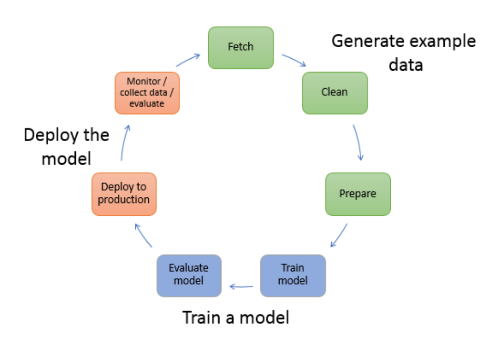

The diagram shows how to perform the following tasks in most typical scenarios:

1. Generate example data – To train a model, you need example data. The type of data that you

need depends on the business problem that you want the model to solve. This relates to the
inferences that you want the model to generate. For example, if you want to create a model that
predicts a number from an input image of a handwritten digit. To train this model, you need
example images of handwritten numbers.

Data scientists often devote time exploring and preprocessing example data before using it for
model training. To preprocess data, you typically do the following:

a. Fetch the data – You might have in-house example data repositories, or you might use

datasets that are publicly available. Typically, you pull the dataset or datasets into a single
repository.

Overview of machine learning with Amazon SageMaker AI
4

## Page 33

Amazon SageMaker AI
Developer Guide

b. Clean the data – To improve model training, inspect the data and clean it, as needed. For

example, if your data has a country name attribute with values United States and US,
you can edit the data to be consistent.

c. Prepare or transform the data – To improve performance, you might perform additional

data transformations. For example, you might choose to combine attributes for a model that
predicts the conditions that require de-icing an aircraft. Instead of using temperature and
humidity attributes separately, you can combine those attributes into a new attribute to get a
better model.

In SageMaker AI, you can preprocess example data using SageMaker APIs with the SageMaker
Python SDK in an integrated development environment (IDE). With SDK for Python (Boto3)
you can fetch, explore, and prepare your data for model training. For information about data
preparation, processing, and transforming your data, see Recommendations for choosing the
right data preparation tool in SageMaker AI, Data transformation workloads with SageMaker
Processing, and Create, store, and share features with Feature Store.

2. Train a model – Model training includes both training and evaluating the model, as follows:

• Training the model – To train a model, you need an algorithm or a pre-trained base model.
The algorithm you choose depends on a number of factors. For a built-in solution, you can
use one of the algorithms that SageMaker provides. For a list of algorithms provided by
SageMaker and related considerations, see Built-in algorithms and pretrained models in
Amazon SageMaker. For a UI-based training solution that provides algorithms and models, see
SageMaker JumpStart pretrained models.

You also need compute resources for training. Your resource use depends on the size of
your training dataset and how quickly you need the results. You can use resources ranging
from a single general-purpose instance to a distributed cluster of GPU instances. For more
information, see Train a Model with Amazon SageMaker.

• Evaluating the model – After you train your model, you evaluate it to determine whether the
accuracy of the inferences is acceptable. To train and evaluate your model, use the SageMaker
Python SDK to send requests to the model for inferences through one of the available IDEs.
For more information about evaluating your model, see Data and model quality monitoring
with Amazon SageMaker Model Monitor.

3. Deploy the model – You traditionally re-engineer a model before you integrate it with your

application and deploy it. With SageMaker AI hosting services, you can deploy your model

Overview of machine learning with Amazon SageMaker AI
5

## Page 34

Amazon SageMaker AI
Developer Guide

independently, which decouples it from your application code. For more information, see Deploy
models for inference.

Machine learning is a continuous cycle. After deploying a model, you monitor the inferences,
collect more high-quality data, and evaluate the model to identify drift. You then increase the
accuracy of your inferences by updating your training data to include the newly collected high-
quality data. As more example data becomes available, you continue retraining your model to
increase accuracy.

Amazon SageMaker AI Features

Amazon SageMaker AI includes the following features.

Topics

• New features for re:Invent 2024

• Machine learning environments

• Major features

New features for re:Invent 2024

SageMaker AI includes the following new features for re:Invent 2024.

HyperPod recipes

You can run recipes within Amazon SageMaker HyperPod or as SageMaker training jobs. You
use the HyperPod training adapter as the framework to help you run end-to-end training
workflows. The training adapter is built on the NVIDIA NeMo framework and Neuronx
Distributed Training package.

HyperPod in Studio

In Amazon SageMaker Studio, you can launch machine learning workloads on HyperPod
clusters and view HyperPod cluster information. The increased visibility into cluster details and
hardware metrics can help your team identify the right candidate for your pre-training or fine-
tuning workloads.

SageMaker AI Features
6

## Page 35

Amazon SageMaker AI
Developer Guide

HyperPod task governance

Amazon SageMaker HyperPod task governance is a robust management system designed to
streamline resource allocation and ensure efficient utilization of compute resources across
teams and projects for your Amazon EKS clusters. HyperPod task governance also provides
Amazon EKS cluster Observability, offering real-time visibility into cluster capacity, compute
availability and usage, team allocation and utilization, and task run and wait time information.

Amazon SageMaker Partner AI Apps

With Amazon SageMaker Partner AI Apps, users get access to generative artificial intelligence
(AI) and machine learning (ML) development applications built, published, and distributed by
industry-leading application providers. Partner AI Apps are certified to run on SageMaker AI.
With Partner AI Apps, users can accelerate and improve how they build solutions based on
foundation models (FM) and classic ML models without compromising the security of their

sensitive data, which stays completely within their trusted security configuration and is never
shared with a third party.

Q Developer is available in Canvas

You can chat with Amazon Q Developer in Amazon SageMaker Canvas using natural language
for generative AI assistance with solving your machine learning problems. You can converse
with Q Developer to discuss the steps of a machine learning workflow and leverage Canvas
functionality such as data transforms, model building, and deployment.

SageMaker training plans

Amazon SageMaker training plans are a compute reservation capability designed for large-
scale AI model training workloads running on SageMaker training jobs and HyperPod clusters.
They provide predictable access to high-demand GPU-accelerated computing resources within
specified timelines. You can specify a desired timeline, duration, and maximum compute
resources, and SageMaker training plans automatically manages infrastructure setup, workload
execution, and fault recovery. This allows for efficiently planning and executing mission-critical
AI projects with a predictable cost model.

Machine learning environments

SageMaker AI includes the following machine learning environments.

Machine learning environments
7

## Page 36

Amazon SageMaker AI
Developer Guide

SageMaker Canvas

An auto ML service that gives people with no coding experience the ability to build models and
make predictions with them.

Code Editor

Code Editor extends Studio so that you can write, test, debug and run your analytics and
machine learning code in an environment based on Visual Studio Code - Open Source ("Code-
OSS").

SageMaker geospatial capabilities

Build, train, and deploy ML models using geospatial data.

SageMaker HyperPod

Amazon SageMaker HyperPod is a capability of SageMaker AI that provides an always-on

machine learning environment on resilient clusters that you can run any machine learning
workloads for developing large machine learning models such as large language models (LLMs)
and diffusion models.

JupyterLab in Studio

JupyterLab in Studio improves latency and reliability for Studio Notebooks

Studio

Studio is the latest web-based experience for running ML workflows. Studio offers a suite of
IDEs, including Code Editor, a new Jupyterlab application, RStudio, and Studio Classic.

Amazon SageMaker Studio Classic

An integrated machine learning environment where you can build, train, deploy, and analyze
your models all in the same application.

SageMaker Studio Lab

A free service that gives customers access to AWS compute resources in an environment based
on open-source JupyterLab.

RStudio on Amazon SageMaker AI

An integrated development environment for R, with a console, syntax-highlighting editor
that supports direct code execution, and tools for plotting, history, debugging and workspace
management.

Machine learning environments
8

## Page 37

Amazon SageMaker AI
Developer Guide

Major features

SageMaker AI includes the following major features in alphabetical order excluding any SageMaker
AI prefix.

Amazon Augmented AI

Build the workflows required for human review of ML predictions. Amazon A2I brings human
review to all developers, removing the undifferentiated heavy lifting associated with building
human review systems or managing large numbers of human reviewers.

AutoML step

Create an AutoML job to automatically train a model in Pipelines.

SageMaker Autopilot

Users without machine learning knowledge can quickly build classification and regression
models.

Batch Transform

Preprocess datasets, run inference when you don't need a persistent endpoint, and associate
input records with inferences to assist the interpretation of results.

SageMaker Clarify

Improve your machine learning models by detecting potential bias and help explain the
predictions that models make.

Collaboration with shared spaces

A shared space consists of a shared JupyterServer application and a shared directory. All user
profiles in a Amazon SageMaker AI domain have access to all shared spaces in the domain.

SageMaker Data Wrangler

Import, analyze, prepare, and featurize data in SageMaker Studio. You can integrate Data
Wrangler into your machine learning workflows to simplify and streamline data pre-processing
and feature engineering using little to no coding. You can also add your own Python scripts and
transformations to customize your data prep workflow.

Data Wrangler data preparation widget

Interact with your data, get visualizations, explore actionable insights, and fix data quality
issues.

Major features
9

## Page 38

Amazon SageMaker AI
Developer Guide

SageMaker Debugger

Inspect training parameters and data throughout the training process. Automatically detect and
alert users to commonly occurring errors such as parameter values getting too large or small.

SageMaker Edge Manager

Optimize custom models for edge devices, create and manage fleets and run models with an
efficient runtime.

SageMaker Experiments

Experiment management and tracking. You can use the tracked data to reconstruct an
experiment, incrementally build on experiments conducted by peers, and trace model lineage
for compliance and audit verifications.

SageMaker Feature Store

A centralized store for features and associated metadata so features can be easily discovered
and reused. You can create two types of stores, an Online or Offline store. The Online Store
can be used for low latency, real-time inference use cases and the Offline Store can be used for
training and batch inference.

SageMaker Ground Truth

High-quality training datasets by using workers along with machine learning to create labeled
datasets.

SageMaker Ground Truth Plus

A turnkey data labeling feature to create high-quality training datasets without having to build
labeling applications and manage the labeling workforce on your own.

SageMaker Inference Recommender

Get recommendations on inference instance types and configurations (e.g. instance count,
container parameters and model optimizations) to use your ML models and workloads.

Inference shadow tests

Evaluate any changes to your model-serving infrastructure by comparing its performance
against the currently deployed infrastructure.

Major features
10

## Page 39

Amazon SageMaker AI
Developer Guide

SageMaker JumpStart

Learn about SageMaker AI features and capabilities through curated 1-click solutions, example
notebooks, and pretrained models that you can deploy. You can also fine-tune the models and
deploy them.

SageMaker ML Lineage Tracking

Track the lineage of machine learning workflows.

SageMaker Model Building Pipelines

Create and manage machine learning pipelines integrated directly with SageMaker AI jobs.

SageMaker Model Cards

Document information about your ML models in a single place for streamlined governance and
reporting throughout the ML lifecycle.

SageMaker Model Dashboard

A pre-built, visual overview of all the models in your account. Model Dashboard integrates
information from SageMaker Model Monitor, transform jobs, endpoints, lineage tracking, and
CloudWatch so you can access high-level model information and track model performance in
one unified view.

SageMaker Model Monitor

Monitor and analyze models in production (endpoints) to detect data drift and deviations in
model quality.

SageMaker Model Registry

Versioning, artifact and lineage tracking, approval workflow, and cross account support for
deployment of your machine learning models.

SageMaker Neo

Train machine learning models once, then run anywhere in the cloud and at the edge.

Notebook-based Workflows

Run your SageMaker Studio notebook as a non-interactive, scheduled job.

Preprocessing

Analyze and preprocess data, tackle feature engineering, and evaluate models.

Major features
11

## Page 40

Amazon SageMaker AI
Developer Guide

SageMaker Projects

Create end-to-end ML solutions with CI/CD by using SageMaker Projects.

Reinforcement Learning

Maximize the long-term reward that an agent receives as a result of its actions.

SageMaker Role Manager

Administrators can define least-privilege permissions for common ML activities using custom
and preconfigured persona-based IAM roles.

SageMaker Serverless Endpoints

A serverless endpoint option for hosting your ML model. Automatically scales in capacity to
serve your endpoint traffic. Removes the need to select instance types or manage scaling
policies on an endpoint.

Studio Classic Git extension

A Git extension to enter the URL of a Git repository, clone it into your environment, push
changes, and view commit history.

SageMaker Studio Notebooks

The next generation of SageMaker notebooks that include AWS IAM Identity Center (IAM
Identity Center) integration, fast start-up times, and single-click sharing.

SageMaker Studio Notebooks and Amazon EMR

Easily discover, connect to, create, terminate and manage Amazon EMR clusters in single
account and cross account configurations directly from SageMaker Studio.

SageMaker Training Compiler

Train deep learning models faster on scalable GPU instances managed by SageMaker AI.

Major features
12

## Page 41

Amazon SageMaker AI
Developer Guide

Guide to getting set up with Amazon SageMaker AI

To use the features in Amazon SageMaker AI, you must have access to Amazon SageMaker AI. To
set up Amazon SageMaker AI and its features, use one of the following options.

• Use quick setup: Fastest setup for individual users with default settings.

• Use custom setup: Advanced setup for enterprise Machine Learning (ML) administrators. Ideal
option for ML administrators setting up SageMaker AI for many users or an organization.

Note

You do not need to set up SageMaker AI if:

• An email is sent to you inviting you to create a password to use the IAM Identity Center
authentication. The email also contains the AWS access portal URL you use to sign in.
For more information about signing in to the AWS access portal, see Sign in to the AWS
access portal.

• You intend to use the Amazon SageMaker Studio Lab ML environment. Studio Lab does
not require you to have an AWS account. For information about Studio Lab, see Amazon
SageMaker Studio Lab.

• If you are using the AWS CLI, SageMaker APIs, or SageMaker SDKs

You do not need to set up SageMaker AI if any of the prior situations apply. You can skip
the rest of this Guide to getting set up with Amazon SageMaker AI chapter and navigate to
the following:

• Automated ML, no-code, or low-code

• Machine learning environments offered by Amazon SageMaker AI

• APIs, CLI, and SDKs

Topics

• Complete Amazon SageMaker AI prerequisites

• Use quick setup for Amazon SageMaker AI

• Use custom setup for Amazon SageMaker AI

13

## Page 42

Amazon SageMaker AI
Developer Guide

• Amazon SageMaker AI domain overview

• Supported Regions and Quotas

Complete Amazon SageMaker AI prerequisites

Before you can set up Amazon SageMaker AI, you must complete the following prerequisites.

• Required: You will need to create an Amazon Web Services (AWS) account to get access to all of
the AWS services and resources for the account.

• Highly recommended: We highly recommend that you create an administrative user to manage
AWS resources for the account, to adhere to the Security best practices in IAM. It is assumed that
you have an administrative user for many of the administrative tasks throughout the SageMaker
AI developer guide.

• Optional: Configure the AWS Command Line Interface (AWS CLI) if you intend to manage your
AWS services and resources for the account using the AWS CLI.

Topics

• Sign up for an AWS account

• Create a user with administrative access

• (Optional) Configure the AWS CLI

Sign up for an AWS account

If you do not have an AWS account, complete the following steps to create one.

To sign up for an AWS account

1.
Open https://portal.aws.amazon.com/billing/signup.

2.
Follow the online instructions.

Part of the sign-up procedure involves receiving a phone call or text message and entering a
verification code on the phone keypad.

When you sign up for an AWS account, an AWS account root user is created. The root user
has access to all AWS services and resources in the account. As a security best practice, assign

Complete Amazon SageMaker AI prerequisites
14

## Page 43

Amazon SageMaker AI
Developer Guide

administrative access to a user, and use only the root user to perform tasks that require root
user access.

AWS sends you a confirmation email after the sign-up process is complete. At any time, you can
view your current account activity and manage your account by going to https://aws.amazon.com/
and choosing My Account.

Create a user with administrative access

After you sign up for an AWS account, secure your AWS account root user, enable AWS IAM Identity
Center, and create an administrative user so that you don't use the root user for everyday tasks.

Secure your AWS account root user

1.
Sign in to the AWS Management Console as the account owner by choosing Root user and
entering your AWS account email address. On the next page, enter your password.

For help signing in by using root user, see Signing in as the root user in the AWS Sign-In User
Guide.

2.
Turn on multi-factor authentication (MFA) for your root user.

For instructions, see Enable a virtual MFA device for your AWS account root user (console) in
the IAM User Guide.

Create a user with administrative access

1.
Enable IAM Identity Center.

For instructions, see Enabling AWS IAM Identity Center in the AWS IAM Identity Center User
Guide.

2.
In IAM Identity Center, grant administrative access to a user.

For a tutorial about using the IAM Identity Center directory as your identity source, see
Configure user access with the default IAM Identity Center directory in the AWS IAM Identity
Center User Guide.

Create a user with administrative access
15

## Page 44

Amazon SageMaker AI
Developer Guide

Sign in as the user with administrative access

•
To sign in with your IAM Identity Center user, use the sign-in URL that was sent to your email
address when you created the IAM Identity Center user.

For help signing in using an IAM Identity Center user, see Signing in to the AWS access portal in
the AWS Sign-In User Guide.

Assign access to additional users

1.
In IAM Identity Center, create a permission set that follows the best practice of applying least-
privilege permissions.

For instructions, see  Create a permission set in the AWS IAM Identity Center User Guide.

2.
Assign users to a group, and then assign single sign-on access to the group.

For instructions, see  Add groups in the AWS IAM Identity Center User Guide.

When you create an administrative user to set up SageMaker AI, the administrative user should
include specific permissions to create SageMaker AI resources. To view the permissions, expand the
following administrator permissions section.

Administrator permissions

When you create your administrative user using the preceding instructions, your administrative
user should already include the permissions contained in the AmazonSageMakerFullAccess policy,
as well as the following permissions. These policies are needed to create a SageMaker AI domain
among other tasks.

If you intend to create your own custom policy, these permissions are required to create a domain
and get set up with SageMaker AI. For information about adding policies, see Adding and removing
IAM identity permissions in the AWS Identity and Access Management User Guide.

JSON

{
"Version":"2012-10-17",
"Statement": [
{

Create a user with administrative access
16

## Page 45

Amazon SageMaker AI
Developer Guide

"Effect": "Allow",
"Action": [
"sagemaker:*"
],
"Resource": [
"arn:aws:sagemaker:*:*:domain/*",
"arn:aws:sagemaker:*:*:user-profile/*",
"arn:aws:sagemaker:*:*:app/*",
"arn:aws:sagemaker:*:*:flow-definition/*"
]
},
{
"Effect": "Allow",
"Action": [
"iam:GetRole",
"servicecatalog:*"
],

"Resource": [
"*"
]
}
]
}

Optional: If you intend to manage your AWS services and resources for the account using the AWS
CLI, proceed to the following instructions ((Optional) Configure the AWS CLI).

After you have completed your prerequisites, continue on to the setup instructions. You can
continue on to your setup instructions by choosing one of the following options.

• Use quick setup: Fastest setup for individual users with default settings.

• Use custom setup: Advanced setup for enterprise Machine Learning (ML) administrators. Ideal
option for ML administrators setting up SageMaker AI for many users or an organization.

(Optional) Configure the AWS CLI

To manage your domain and other AWS services and resources using the AWS CLI, complete the
setup in Set up the AWS CLI in the AWS Command Line Interface User Guide for Version 2.

(Optional) Configure the AWS CLI
17

## Page 46

Amazon SageMaker AI
Developer Guide

After you have completed your prerequisites, continue on to the setup instructions. You can
continue on to your setup instructions by choosing one of the following options.

• Use quick setup: Fastest setup for individual users with default settings.

• Use custom setup: Advanced setup for enterprise Machine Learning (ML) administrators. Ideal
option for ML administrators setting up SageMaker AI for many users or an organization.

Use quick setup for Amazon SageMaker AI

The Set up for single users (quick setup) procedure gets you set up with default settings. Use this
option if you want to get started with SageMaker AI quickly and you do not intend to customize
your settings at this time. The default settings include granting access to the common SageMaker
AI services for individual users to get started. For example, Amazon SageMaker Studio and Amazon
SageMaker Canvas.

Setup for single users (Quick setup)

After satisfying the prerequisites in Complete Amazon SageMaker AI prerequisites, use the
following instructions.

1.
Open the SageMaker AI console.

2.
Open the left navigation pane.

3.
Under Admin configurations, choose Domains.

4.
Choose Create domain.

5.
Choose Set up for single user (Quick setup). Your domain and user profile are created
automatically.

The Set up for single user process creates a domain and user profile for you automatically. If you
want to learn about how the domain is set up for you when using the quick setup option, expand
the following section.

Default settings

When you onboard to Amazon SageMaker AI domain using the Set up for single user procedure,
your domain is automatically set up with the following default settings. For information about
domains, see Amazon SageMaker AI domain overview.

Use quick setup
18

## Page 47

Amazon SageMaker AI
Developer Guide

• Domain name: SageMaker AI automatically assigns the name of the domain with a timestamp in
the following format.

QuickSetupDomain-YYYYMMDDTHHMMSS

• User profile name: SageMaker AI automatically assigns the name of the user profile with a
timestamp in the following format.

default-YYYYMMDDTHHMMSS

• Domain execution role: SageMaker AI creates a new IAM role and attaches the

AmazonSageMakerFullAccess policy. When using the quick setup and the updated
Amazon SageMaker Studio is your default experience, your IAM role also includes the

AmazonSageMakerCanvasFullAccess, AmazonSageMakerCanvasAIServicesAccess,

AmazonS3FullAccess policies.

• User profile execution role: SageMaker AI sets the user profile execution role to the same IAM
role used for the domain execution role.

• Shared space execution role: SageMaker AI sets the shared space execution role to the same IAM
role used for the domain execution role.

• SageMaker Canvas time series forecasting role: SageMaker AI creates a new IAM role with the
permissions required to use the SageMaker Canvas time series forecasting feature.

• Amazon S3 bucket: SageMaker AI creates an Amazon S3 bucket named with the following
format.

sagemaker-studio-XXXXXXXXXXXXXXX

• Amazon VPC: SageMaker AI selects a public VPC with the following logic.

1.
If there is a default VPC with associated subnets in the Region, SageMaker AI uses it.

2.
If there is no default VPC or the default VPC has no associated subnets, then SageMaker
AI uses any existing VPC with associated subnets. If there are multiple existing VPCs,
SageMaker AI can select any of them.

• Studio experience: Amazon SageMaker Studio is set as the UI default experience and Studio

Classic is made hidden. That is, in UserSettings:

• DefaultLandingUri is set to studio::.

• StudioWebPortalSettings HiddenAppTypes is set to ["JupyterServer"]

Quick setup
19

## Page 48

Amazon SageMaker AI
Developer Guide

For information about hidden applications, see Hide machine learning tools and applications in
the Amazon SageMaker Studio UI.

After the domain is set up, the administrative user can Edit domain settings.

After quick setup

Do you want to start SageMaker AI features right away, and do not intend to learn about domains
or customize your domain? If so, skip the rest of this Guide to getting set up with Amazon
SageMaker AI chapter and do the following:

• Open the SageMaker AI console and choose an environment from the left navigation pane.

For example, choose Studio from the left navigation pane and choose Open Studio.

• Begin learning how to:

• Automated ML, no-code, or low-code

• Machine learning environments offered by Amazon SageMaker AI

RStudio support is not currently available when onboarding using the Set up for single users (Use
quick setup for Amazon SageMaker AI) option. To use RStudio, you must onboard using the Set up
for organizations (Use custom setup for Amazon SageMaker AI) option. For more information, see
Use custom setup for Amazon SageMaker AI.

Use custom setup for Amazon SageMaker AI

The Set up for organizations (custom setup) guides you through an advanced setup for your
Amazon SageMaker AI domain. This option provides information and recommendations to help
you understand and control all aspects of the account configuration, including permissions,
integrations, and encryption. Use this option if you want to set up a custom domain. For
information about domains, see Amazon SageMaker AI domain overview.

Topics

• Authentication methods

• Setup for organizations (custom setup)

• Access the domain after onboarding

After quick setup
20

## Page 49

Amazon SageMaker AI
Developer Guide

Authentication methods

Before you set up the domain consider the authentication methods for your users to access the
domain.

AWS Identity Center:

• Helps simplify administration of access permissions to groups of users. You can grant or
deny permissions to groups of users, instead of applying those permissions to each individual
user. If a user moves to a different organization, you can move that user to a different AWS
Identity and Access Management Identity center (AWS IAM Identity Center) group. The user then
automatically receives the permissions that are needed for the new organization.

Note that the IAM Identity Center needs to be in the same AWS Region as the domain.

To set up with IAM Identity Center, use the following instructions from the AWS IAM Identity
Center User Guide:

• Begin with Enabling AWS IAM Identity Center.

• Create a permission set that follows the best practice of applying least-privilege permissions.

• Add groups to your IAM Identity Center directory.

• Assign single sign-on access to users and groups.

• View the basic workflows to get started with common tasks in IAM Identity Center.

• The users in IAM Identity Center can access the domain using an AWS access portal URL that is
emailed to them. The email provides instructions to create an account to access the domain. For
more information, see Sign in to the AWS access portal.

As an administrator you can find the AWS access portal URL by navigating to the IAM Identity
Center and finding the AWS access portal URL under Settings summary.

• Your domain must use AWS Identity and Access Management (IAM) authentication if you wish
to restrict access to your domains exclusively to particular Amazon Virtual Private Clouds
(VPCs), interface endpoints, or a predefined set of IP addresses. This feature is not supported
for domains that use IAM Identity Center authentication. You can still use IAM Identity Center
to enable centralized workforce identity control. For instructions on how to implement these
restrictions while keeping IAM Identity Center to provide a consistent user sign-in experience,
see Secure access to Amazon SageMaker Studio Classic with IAM Identity Center and a SAML
application in the AWS machine learning blog. Note that AWS SSO is IAM Identity Center in this
blog.

Authentication methods
21

## Page 50

Amazon SageMaker AI
Developer Guide

Login through IAM:

• The user profiles can access the domain through the SageMaker AI console after logging into the
account.

• You can restrict access to your domains exclusively to particular Amazon Virtual Private Clouds
(VPCs), interface endpoints, or a predefined set of IP addresses when using AWS Identity and
Access Management (IAM) authentication. For more information, see Allow Access Only from
Within Your VPC.

Setup for organizations (custom setup)

Custom setup using the console

After satisfying the prerequisites in Complete Amazon SageMaker AI prerequisites, open the Set up
SageMaker AI Domain (custom setup) page and expand the following sections for information on
the setup.

Open the Set up SageMaker AI Domain from the SageMaker AI console

1.
Open the SageMaker AI console.

2.
On the left navigation pane, choose Admin configurations to expand the options.

3.
Under Admin configurations, choose Domains.

4.
From the Domains page, choose Create domain.

5.
On the Set up SageMaker AI domain page, choose Set up for organizations.

6.
Choose Set up.

Once you opened the Set up SageMaker AI Domain page, use the following instructions:

Step 1: Domain details

1.
For Domain name, enter a unique name for your domain. For example, this can be your project
or team name.

2.
Choose Next.

Step 2: Users and ML Activities

In this step you set up the authentication method, users, and permissions for your domain.

Custom setup
22

## Page 51

Amazon SageMaker AI
Developer Guide

1.
Under How do you want to access Studio?, you can choose one of two options. For
information on the authentication methods, see Authentication methods. Details on the
options are provided in the following:

• AWS Identity Center:

Under Who will use Studio? choose an AWS IAM Identity Center group that will access the
domain.

If you choose No Identity Center user group you create a domain with no users. You
can add IAM Identity Center groups to the domain after the domain's creation. For more
information, see Edit domain settings.

• Login through IAM:

Under Who will use Studio? choose + Add user, enter a new user profile name, and choose
Add to create and add a user profile name.

You can repeat this process to create multiple user profiles.

2.
Under Who will use Studio? select the IAM Identity Center users or groups, then choose
Select. You need to set up Amazon SageMaker Studio within the same Region in which your
IAM Identity Center is configured. You can change the Region of your domain by choosing the
Region from the dropdown list on the top right of the console or you can change your IAM
Identity Center Region by navigating to the AWS access portal.

3.
Under What ML activities do they perform? you can use an existing role by choosing Use an
existing role or you can create a new role by choosing Create a new role and checking the ML
activities you want the role to have access.

4.
While selecting ML activities, you may need to satisfy requirements. To satisfy a requirement,
choose Add and complete the requirement.

5.
After all requirements are satisfied, choose Next.

Step 3: Applications

In this step, you can configure the applications you have enabled in the previous step. For more
information on the ML activities, see ML activity reference.

If the application has not been enabled, you receive a warning for that application. To enable an
application that has not been enabled, return to the previous step by choosing Back and follow the
previous instructions.

Custom setup
23

## Page 52

Amazon SageMaker AI
Developer Guide

• Studio configuration:

Under Studio, you have the option to choose between the newer and classic version of Studio as
your default experience. This means choosing which ML environment you interact with when you
open Studio.

• Studio includes multiple integrated development environments (IDEs) and applications,
including Amazon SageMaker Studio Classic. If chosen, the Studio Classic IDE has default
settings. For information on the default settings, see Default settings.

For information on Studio, see Amazon SageMaker Studio.

• Studio Classic includes the Jupyter IDE. If chosen, you may configure your Studio Classic
configuration.

For information on Studio Classic, see Amazon SageMaker Studio Classic.

• SageMaker Canvas configuration:

If you have Amazon SageMaker Canvas enabled, see Getting started with using Amazon
SageMaker Canvas for the instructions and configuration details for onboarding.

• Studio Classic configuration:

If you chose Studio (recommended) as your default experience, the Studio Classic IDE has default
settings. For information on the default settings, see Default settings.

If you chose Studio Classic as your default experience, you can choose to enable or disable
notebook resource sharing. Notebook resources include artifacts such as cell output and Git
repositories. For more information on Notebook resources, see Share and Use an Amazon
SageMaker Studio Classic Notebook.

If you enabled notebook resource sharing:

1.
Under S3 location for shareable notebook resources, input your Amazon S3 location.

2.
Under Encryption key - optional, leave as No Custom Encryption or choose an existing AWS
KMS key or choose Enter a KMS key ARN and enter your AWS KMS key's ARN.

3.
Under Notebook cell output sharing preference, choose Allow users to share cell output
or Disable cell output sharing.

• RStudio configuration:

To enable RStudio, you need an RStudio license. To set that up, see Get an RStudio license.
Custom setup
24

## Page 53

Amazon SageMaker AI
Developer Guide

1.
Under RStudio Workbench, verify that your RStudio license is automatically detected. For
more information about getting an RStudio license and activating it with SageMaker AI, see
Get an RStudio license.

2.
Select an instance type to launch your RStudio Server on. For more information, see
RStudioServerPro instance type.

3.
Under Permission, create your role or select an existing role. The role must have the
following permissions policy. This policy allows the RStudioServerPro application to access
necessary resources. It also allows Amazon SageMaker AI to automatically launch an
RStudioServerPro application when the existing RStudioServerPro application is in a

Deleted or Failed status. For information about adding permissions to a role, see
Modifying a role permissions policy (console).

JSON

{
"Version":"2012-10-17",
"Statement": [
{
"Sid": "VisualEditor0",
"Effect": "Allow",
"Action": [
"license-manager:ExtendLicenseConsumption",
"license-manager:ListReceivedLicenses",
"license-manager:GetLicense",
"license-manager:CheckoutLicense",
"license-manager:CheckInLicense",
"logs:CreateLogDelivery",
"logs:CreateLogGroup",
"logs:CreateLogStream",
"logs:DeleteLogDelivery",
"logs:Describe*",
"logs:GetLogDelivery",
"logs:GetLogEvents",
"logs:ListLogDeliveries",
"logs:PutLogEvents",
"logs:PutResourcePolicy",
"logs:UpdateLogDelivery",
"sagemaker:CreateApp"
],
"Resource": "*"

Custom setup
25

## Page 54

Amazon SageMaker AI
Developer Guide

}
]
}

4.
Under RStudio Connect, add the URL for your RStudio Connect server. RStudio Connect is
a publishing platform for Shiny applications, R Markdown reports, dashboards, plots, and
more. When you onboard to RStudio on SageMaker AI, an RStudio Connect server is not
created. For more information, see Add an RStudio Connect URL.

5.
Under RStudio Package Manager, add the URL for your RStudio Package Manager.
SageMaker AI creates a default package repository for the Package Manager when you
onboard RStudio. For more information about RStudio Package Manager, see Update the
RStudio Package Manager URL.

6.
Select Next.

• Code Editor configuration:

If you have Code Editor enabled, see Code Editor in Amazon SageMaker Studio for an overview
and the configuration details.

Step 4: Customize Studio UI

In this section you can customize the viewable applications and machine learning (ML) tools
displayed in Studio. This customization only hides the applications and ML tools in the left
navigation pane in Studio. For information on the Studio UI, see Amazon SageMaker Studio UI
overview.

For information about the applications, see Applications supported in Amazon SageMaker Studio.

The customize Studio UI feature is not available in Studio Classic. If you wish to set Studio as your
default experience, choose Previous and to return to the previous step.

1.
On the Customize Studio UI page you can hide applications and ML tools displayed in Studio
by toggling them off.

2.
Once you have reviewed your changes, choose Next.

Step 5: Set up network settings

Choose how you want Studio to connect to other AWS services.

Custom setup
26

## Page 55

Amazon SageMaker AI
Developer Guide

You can choose to disable internet access to your Studio by specifying using Virtual Private Cloud
(VPC) Only network access type. If you choose this option, you cannot run a Studio notebook
unless your VPC has an interface endpoint to the SageMaker API and runtime, or a Network
Address Translation (NAT) gateway with internet access, and your security groups allow outbound
connections. For more information on Amazon VPCs, see Choose an Amazon VPC.

If you choose Virtual Private Cloud (VPC) Only the following steps are required. If you choose
Public internet access, the first two of the following steps are required.

1.
Under VPC, choose the Amazon VPC ID.

2.
Under Subnet, choose one or more subnets. If you don't choose any subnets, SageMaker AI
uses all the subnets in the Amazon VPC. We recommend that you use multiple subnets that are
not created in constrained Availability Zones. Using subnets in these constrained Availability
Zones can result in insufficient capacity errors and longer application creation times. For more
information about constrained Availability Zones, see Availability Zones.

3.
Under Security group(s), choose one or more subnets.

If VPC only is selected, SageMaker AI automatically applies the security group settings defined
for the domain to all shared spaces created in the domain. If Public internet only is selected,
SageMaker AI does not apply the security group settings to shared spaces created in the domain.

Step 6: Configure storage

You have the option to encrypt your data. The Amazon Elastic File System (Amazon EFS) and
Amazon Elastic Block Store (Amazon EBS) file systems that are created for you when you create a
domain. Amazon EBS sizes are used by both Code Editor and JupyterLab spaces.

You cannot change the encryption key after you encrypt your Amazon EFS and Amazon EBS file
systems. To encrypt your Amazon EFS and Amazon EBS file systems, you can use the following
configurations.

• Under Encryption key - optional, leave as No Custom Encryption or choose an existing KMS key
or choose Enter a KMS key ARN and enter the ARN of your KMS key.

• Under Default space size - optional, enter the default space size.

• Under Maximum space size - optional, enter the maximum space size.

Custom setup
27

## Page 56

Amazon SageMaker AI
Developer Guide

Step 7: Review and create

Review your domain settings. If you need to change the settings, choose Edit next to the relevant
step. Once you confirm that your domain settings are accurate, choose Submit and the domain is
created for you. This process may take a few minutes.

Custom setup using the AWS CLI

The following sections provide AWS CLI instructions for the custom setup your domain using the
IAM Identity Center or IAM authentication methods.

After satisfying the prerequisites, including setting up your AWS CLI credentials, in Complete
Amazon SageMaker AI prerequisites, use the following the steps.

1.
Create an execution role that is used to create a domain and attach the
AmazonSageMakerFullAccess policy. You can also use an existing role that has, at a minimum,
an attached trust policy that grants SageMaker AI permission to assume the role. For more
information, see How to use SageMaker AI execution roles.

aws iam create-role --role-name execution-role-name --assume-role-policy-
document file://execution-role-trust-policy.json
aws iam attach-role-policy --role-name execution-role-name --policy-arn
arn:aws:iam::aws:policy/AmazonSageMakerFullAccess

2.
Get the default Amazon Virtual Private Cloud (Amazon VPC) of your account.

aws --region region ec2 describe-vpcs --filters Name=isDefault,Values=true --query
"Vpcs[0].VpcId" --output text

3.
Get the list of subnets in the default Amazon VPC.

aws --region region ec2 describe-subnets --filters Name=vpc-id,Values=default-vpc-
id --query "Subnets[*].SubnetId" --output json

4.
Create a domain by passing the default Amazon VPC ID, subnets, and execution role ARN. You
must also pass a SageMaker image ARN. For information on the available JupyterLab version
ARNs, see Setting a default JupyterLab version.

For authentication-mode, use SSO for IAM Identity Center authentication or IAM for IAM
authentication.

Custom setup
28

## Page 57

Amazon SageMaker AI
Developer Guide

aws --region region sagemaker create-domain --domain-
name domain-name --vpc-id default-vpc-id --subnet-ids subnet-
ids --auth-mode authentication-mode --default-user-settings
"ExecutionRole=arn:aws:iam::account-number:role/execution-role-
name,JupyterServerAppSettings={DefaultResourceSpec={InstanceType=system,SageMakerImageArn=i
arn}}" \ --query DomainArn --output text

You can use the AWS CLI to customize the applications and ML tools displayed in Studio for

the domain, using StudioWebPortalSettings. Use HiddenAppTypes to hide applications and

HiddenMlTools to hide ML tools. For more information on customizing the left navigation
of the Studio UI, see Hide machine learning tools and applications in the Amazon SageMaker
Studio UI. This feature is not available for Studio Classic.

5.
Verify that the domain has been created.

aws --region region sagemaker list-domains

Custom setup using AWS CloudFormation

For information about creating a domain using AWS CloudFormation, see AWS::SageMaker::Domain
in the CloudFormation User Guide.

For an example of an CloudFormation template that you can use to set up your domain, see

Creating Amazon SageMaker AI domains using CloudFormation in the aws-samples GitHub
repository.

After the domain is set up, the administrative user can view and edit the domain. For information,
see View domains and Edit domain settings.

Access the domain after onboarding

The users can access SageMaker AI using:

• The sign-in URL if the domain was set up using the IAM Identity Center authentication. For
information, see How to sign in to the user portal.

• The SageMaker AI console.

Access the domain after onboarding
29

## Page 58

Amazon SageMaker AI
Developer Guide

Amazon SageMaker AI domain overview

Amazon SageMaker AI uses domains to organize user profiles, applications, and their associated
resources. An Amazon SageMaker AI domain consists of the following:

• An associated Amazon Elastic File System (Amazon EFS) volume

• A list of authorized users

• A variety of security, application, policy, and Amazon Virtual Private Cloud (Amazon VPC)
configurations

The following diagram provides an overview of private apps and shared spaces within each domain.

To have access to most Amazon SageMaker AI environments and resources, you must complete the
Amazon SageMaker AI domain onboarding process using the SageMaker AI console or the AWS CLI.
For a guide describing how to get started using SageMaker AI based on how you want to access
SageMaker AI, and if necessary how to set up a domain, see Guide to getting set up with Amazon
SageMaker AI.

Topics

• Amazon SageMaker AI domain entities and statuses

• Choose an Amazon VPC

Domain overview
30

## Page 59

Amazon SageMaker AI
Developer Guide

Amazon SageMaker AI domain entities and statuses

Amazon SageMaker AI domain supports SageMaker AI machine learning (ML) environments. A
SageMaker AI domain is composed of the following entities and their associated status values. For
onboarding steps to create a domain, see Amazon SageMaker AI domain overview.

• Domain: A domain consists of the following.

• An associated Amazon Elastic File System (Amazon EFS) volume.

• A list of authorized users.

• A variety of security, application, policy, and Amazon Virtual Private Cloud (Amazon VPC)
configurations.

Users within a domain can share notebook files and other artifacts with each other. An account

can have multiple domains. For more information about multiple domains, see Multiple domains
overview.

• User profile: A user profile represents a single user within a domain. It is the main way to
reference a user for the purposes of sharing, reporting, and other user-oriented features.
This entity is created when a user onboards to the Amazon SageMaker AI domain. For more
information about user profiles, see Domain user profiles.

• Shared space: A shared space consists of a shared JupyterServer application and shared
directory. All users within the domain have access to the shared space. All user profiles in a
domain have access to all shared spaces in the domain. For more information about shared
spaces, see Collaboration with shared spaces.

• App: An app represents an application that supports the reading and execution experience of the
user’s notebooks, terminals, and consoles. The type of app can be JupyterServer, KernelGateway,
RStudioServerPro, or RSession. A user may have multiple apps active simultaneously.

The following tables describe the status values for the domain, UserProfile, shared space,

and App entities. Where applicable, they also give troubleshooting steps.

domain status values

Value
Description

Pending
Ongoing creation of domain.

SageMaker AI domain entities
31

## Page 60

Amazon SageMaker AI
Developer Guide

Value
Description

InService
Successful creation of domain.

Updating
Ongoing update of domain.

Deleting
Ongoing deletion of domain.

Failed
Unsuccessful creation of domain. Call the

DescribeDomain  API to see the failure
reason for domain creation. Delete the failed
domain and recreate the domain after fixing

the error mentioned in FailureReason .

Update_Failed
Unsuccessful update of domain. Call

the DescribeDomain  API to see the
failure reason for domain update. Call the

UpdateDomain  API after fixing the error

mentioned in FailureReason .

Delete_Failed
Unsuccessful deletion of domain. Call the

DescribeDomain  API to see the failure
reason for domain deletion. Because deletion
failed, you might have some resources that are
still running, but you cannot use or update the

domain. Call the DeleteDomain  API again

after fixing the error mentioned in FailureRe

ason .

UserProfile status values

Value
Description

Pending
Ongoing creation of UserProfile .

InService
Successful creation of UserProfile .

Updating
Ongoing update of UserProfile .

SageMaker AI domain entities
32

## Page 61

Amazon SageMaker AI
Developer Guide

Value
Description

Deleting
Ongoing deletion of UserProfile .

Failed
Unsuccessful creation of UserProfile .

Call the DescribeUserProfile
API to

see the failure reason for UserProfile

creation. Delete the failed UserProfile  and
recreate it after fixing the error mentioned in

FailureReason .

Update_Failed
Unsuccessful update of UserProfile . Call

the DescribeUserProfile
API to see

the failure reason for UserProfile  update.

Call the UpdateUserProfile  API again

after fixing the error mentioned in FailureRe

ason .

Delete_Failed
Unsuccessful deletion of UserProfile . Call

the DescribeUserProfile
API to see the

failure reason for UserProfile  deletion.
Because deletion failed, you might have some
resources that are still running, but you cannot

use or update the UserProfile . Call the

DeleteUserProfile  API again after fixing

the error mentioned in FailureReason .

shared space status values

Value
Description

Pending
Ongoing creation of shared space.

InService
Successful creation of shared space.

Deleting
Ongoing deletion of shared space.

SageMaker AI domain entities
33

## Page 62

Amazon SageMaker AI
Developer Guide

Value
Description

Failed
Unsuccessful creation of shared space. Call

the DescribeSpace  API to see the failure
reason for shared space creation. Delete the
failed shared space and recreate it after fixing

the error mentioned in FailureReason .

Update_Failed
Unsuccessful update of shared space. Call

the DescribeSpace  API to see the failure
reason for shared space update. Call the

UpdateSpace  API again after fixing the

error mentioned in FailureReason .

Delete_Failed
Unsuccessful deletion of shared space.

Call the DescribeSpace  API to see the
failure reason for shared space deletion.
Because deletion failed, you might have
some resources that are still running, but you
cannot use or update the shared space. Call

the DeleteSpace  API again after fixing the

error mentioned in FailureReason .

Deleted
Successful deletion of shared space.

App status values

Value
Description

Pending
Ongoing creation of App.

InService
Successful creation of App.

Deleting
Ongoing deletion of App.

Failed
Unsuccessful creation of App. Call the

DescribeApp  API to see the failure reason

for App creation. Call the CreateApp  API

SageMaker AI domain entities
34

## Page 63

Amazon SageMaker AI
Developer Guide

Value
Description

again after fixing the error mentioned in

FailureReason .

Deleted
Successful deletion of App.

Maintenance of applications

At least once every 90 days, SageMaker AI performs security and performance updates to the
underlying software for Amazon SageMaker Studio Classic JupyterServer and KernelGateway,
SageMaker Canvas, and Amazon SageMaker Data Wrangler applications. Some maintenance items,
such as operating system upgrades, require that SageMaker AI takes your application offline for
a short time during the maintenance window. Because this maintenance takes the application
offline, you cannot perform any operations while the underlying software is being updated. When
the maintenance activity is in progress, the state of the application transitions from InService
to Pending. When maintenance is complete, the status of the application transitions back to
InService. If patching fails, then the status of the application becomes Failed. If an application is
in the Failed state, we recommend creating a new application of the same type. For information
about creating Studio Classic applications, see Shut Down and Update Amazon SageMaker Studio
Classic and Apps. For information about creating SageMaker Canvas applications, see Applications
management.

For more information, contact https://aws.amazon.com/premiumsupport/.

Topics

• Complete prerequisites

• Hide machine learning tools and applications in the Amazon SageMaker Studio UI

• Hide instance types and images in the Amazon SageMaker Studio UI

• Multiple domains overview

• Isolate domain resources

• Default settings for Amazon SageMaker AI domains

• Custom tag propagation

• Adding a custom file system to a domain

• View domain environment details

SageMaker AI domain entities
35

## Page 64

Amazon SageMaker AI
Developer Guide

• View domains

• Edit domain settings

• Delete an Amazon SageMaker AI domain

• Domain user profiles

• IAM Identity Center groups in a domain

• Understanding domain space permissions and execution roles

• View SageMaker AI resources in your domain

• Shut down SageMaker AI resources in your domain

• Where to shut down resources per SageMaker AI features

Complete prerequisites

To use the features available in an Amazon SageMaker AI domain, you must complete the following
prerequisites.

• Onboard to a domain. For more information, see Onboard to Amazon SageMaker AI domain.

• (Optional) If you are interacting with your domain using the AWS CLI, you must also complete
the following prerequisites.

• Update the AWS CLI by following the steps in Installing the current AWS CLI Version.

• From your local machine, run aws configure and provide your AWS credentials. For
information about AWS credentials, see Understanding and getting your AWS credentials.

Hide machine learning tools and applications in the Amazon SageMaker Studio UI

Important

As of November 30, 2023, the previous Amazon SageMaker Studio experience is now
named Amazon SageMaker Studio Classic. The following section is specific to using the
updated Studio experience. For information about using the Studio Classic application, see
Amazon SageMaker Studio Classic.

This topic shows how to hide applications and machine learning (ML) tools displayed in the
Amazon SageMaker Studio user interface (UI). For information on the Studio UI, see Amazon
SageMaker Studio UI overview.

SageMaker AI domain entities
36

## Page 65

Amazon SageMaker AI
Developer Guide

This customization does not block access to these resources. If, instead, you want to block access to
an application, see Amazon SageMaker Role Manager.

For information about the applications, see Applications supported in Amazon SageMaker Studio.

The customize Studio UI feature is not available in Amazon SageMaker Studio Classic.

You can customize the Studio UI on a domain level and a user level:

• Customization on a domain level sets the default for all users in the domain.

These default settings apply for all users in the domain who have not had these changes made to
their individual user settings.

• Customization on a user level will take priority over the domain level settings.

Use the following topics to learn more on the different customization levels and how to apply
them.

Topics

• Hide machine learning tools and applications on a domain level

• Hide machine learning tools and applications on a user level

Hide machine learning tools and applications on a domain level

The following shows how to use the console to customize the applications and ML tools
displayed in Studio on a domain level. For more information, see Hide machine learning tools and
applications in the Amazon SageMaker Studio UI.

This feature is not available if Amazon SageMaker Studio Classic is set as your default experience.

Hide machine learning tools and applications on a domain level instructions (console)

To hide machine learning tools and applications Studio UI on a domain level (console)

1.
Open the Amazon SageMaker AI console at https://console.aws.amazon.com/sagemaker/.

2.
On the left navigation pane, choose Admin configurations.

3.
Under Admin configurations, choose domains.

4.
From the list of domains, choose the link to the domain you wish to edit.

SageMaker AI domain entities
37

## Page 66

Amazon SageMaker AI
Developer Guide

5.
On the Domain details page, choose the App Configurations tab.

6.
In the SageMaker Studio section, choose Customize Studio UI.

7.
On the Customize Studio UI page you can hide applications and ML tools displayed in Studio

by toggling them off.

Note that not all ML features are available in all regions.

8.
Once you have reviewed your changes, choose Save.

Once completed, you will see a green banner containing a success message at the top of the page.

Hide machine learning tools and applications on a domain level instructions (AWS CLI)

Note

To use this feature you may need to update to the latest AWS CLI version. For more
information, see Installing or updating to the latest version of the AWS CLI.

You can use the AWS CLI to customize the applications and ML tools displayed in Studio on a

domain level, using StudioWebPortalSettings. Use HiddenAppTypes to hide applications and

HiddenMlTools to hide ML tools.

In the following example, SageMaker Canvas and Code Editor are being hidden for users in the

domain domainId.

aws sagemaker update-domain \
--domain-id domainId \
--default-user-settings '{"StudioWebPortalSettings": {"HiddenAppTypes": ["Canvas",
"CodeEditor"]}}'

Note that not all ML features are available in all AWS Regions.

Hide machine learning tools and applications on a user level

The following shows how to customize the applications and ML tools displayed in Studio on a
user level. For more information, see Hide machine learning tools and applications in the Amazon
SageMaker Studio UI.

This feature is not available if Studio Classic is set as your default experience.

SageMaker AI domain entities
38

## Page 67

Amazon SageMaker AI
Developer Guide

Hide machine learning tools and applications on a user level instructions (console)

To hide machine learning tools and applications Studio UI on a user level (console)

1.
Open the Amazon SageMaker AI console at https://console.aws.amazon.com/sagemaker/.

2.
On the left navigation pane, choose Admin configurations.

3.
Under Admin configurations, choose domains.

4.
From the list of domains, choose the link to the domain you wish to edit.

5.
On the Domain details page, choose the User profiles tab.

6.
In the User profiles section, choose the link to the user profile you wish to edit.

7.
Choose the App Configurations tab.

8.
In the SageMaker Studio section, choose Customize Studio UI.

9.
On the Customize Studio UI page you can hide applications and ML tools displayed in Studio
by toggling them off.

Note that not all ML features are available in all regions.

10. Once you have reviewed your changes, choose Save. This will take you back to the user profile

edit flow.

11. Choose Save changes.

Once completed, you will see a green banner containing a success message at the top of the page.

Hide machine learning tools and applications on a user level instructions (AWS CLI)

Note

To use this feature you may need to update to the latest AWS CLI version. For more
information, see Installing or updating to the latest version of the AWS CLI.

You can use the AWS CLI to customize the applications and ML tools displayed in Studio on

a user level, using StudioWebPortalSettings. Use HiddenAppTypes to hide applications and

HiddenMlTools to hide ML tools.

In the following example, SageMaker Canvas and Code Editor are being hidden for user

userProfileName in the domain domainId.

SageMaker AI domain entities
39

## Page 68

Amazon SageMaker AI
Developer Guide

aws sagemaker update-user-profile \
--domain-id domainId \
--user-profile-name userProfileName \
--user-settings '{"StudioWebPortalSettings": {"HiddenAppTypes": ["Canvas",
"CodeEditor"]}}'

Note that not all ML features are available in all AWS Regions.

Hide instance types and images in the Amazon SageMaker Studio UI

Important

As of November 30, 2023, the previous Amazon SageMaker Studio experience is now
named Amazon SageMaker Studio Classic. The following section is specific to using the
updated Studio experience. For information about using the Studio Classic application, see
Amazon SageMaker Studio Classic.

This topic shows how to hide Amazon SageMaker AI instance types and images displayed in the
Amazon SageMaker Studio user interface (UI). For information on the Studio UI, see Amazon
SageMaker Studio UI overview.

When you hide SageMaker AI instance types and images:

• The impacted users will not be able to view the hidden resources in the Studio UI.

• The impacted users will not be able to run or create a new space with the hidden configurations.

• Any currently running spaces for the impacted users will not be effected.

• When an impacted user attempts to run a space with the hidden resources, they will be notified
that the relevant resources have been disabled by the administrator.

Note

If, instead of hiding, you would like to restrict the instance types available to users through
an AWS Identity and Access Management policy, see:

• Can I limit the type of instances that data scientists can launch for training jobs in
SageMaker AI? in AWS re:Post.

SageMaker AI domain entities
40

## Page 69

Amazon SageMaker AI
Developer Guide

• Limiting instances types on Amazon SageMaker AI via IAM policy in StackOverflow.

The customize Studio UI feature is not available in Amazon SageMaker Studio Classic.

You can customize the Studio UI on a domain level and a user level:

• Customization on a domain level sets the default for all users in the domain.

• Customization on a user level will take priority over the domain level settings.

Use the following topics to learn more on the different customization levels and how to apply
them.

Topics

• Hide instance types and images on a domain level

• Hide instance types and images on a user level

Hide instance types and images on a domain level

The following shows how to use the console to set rules to hide Amazon SageMaker AI instance
types and images from being displayed in the Amazon SageMaker Studio Classic UI on a domain
level. For more information, see Hide instance types and images in the Amazon SageMaker Studio
UI.

Once these changes are made on a domain level:

• These changes will not effect any currently open spaces.

• These changes will impact the domain’s users’ default visibility from that point onward.

These default settings apply for all users in the domain who have not had these changes made to
their individual user settings.

• User level settings take priority over the domain level settings.

The customize Studio UI feature is not available in Amazon SageMaker Studio Classic.

SageMaker AI domain entities
41

## Page 70

Amazon SageMaker AI
Developer Guide

Hide instance types and images on a domain level instructions (console)

To hide instance types and images Studio UI on a domain level (console)

1.
Open the Amazon SageMaker AI console at https://console.aws.amazon.com/sagemaker/.

2.
On the left navigation pane, choose Admin configurations.

3.
Under Admin configurations, choose domains.

4.
From the list of domains, choose the link to the domain you wish to edit.

5.
On the Domain details page, choose Domain settings.

6.
In the Domain settings tab, you can view the domain rules in the Domain rules section.

7.
In the Domain rules section choose Manage rules.

8.
On the Manage domain rules page choose a Rule type.

Note that not all instance types and images are available in all AWS Regions.

a.
If you choose Instance type, you can use the Hide action to hide SageMaker AI instance
types you choose in the dropdown list under Instance types.

b.
If you choose Image, you can use the Hide action to hide SageMaker images you choose
under the dropdown list under Image.

9.
(Optional) Choose + Add new rule to add more rules.

10. Once you have reviewed your changes, choose Submit.

Once completed, you will see a green banner containing a success message at the top of the page.

Hide instance types and images on a domain level instructions (AWS CLI)

Note

To use this feature you may need to update to the latest AWS CLI version. For more
information, see Installing or updating to the latest version of the AWS CLI.

You can use the AWS CLI to customize the SageMaker AI instances and images displayed in the

Studio UI on a domain level, using StudioWebPortalSettings. Use HiddenInstanceTypes to hide

instance types and use HiddenSageMakerImageVersionAliases to hide SageMaker images.

Note that when you use HiddenSageMakerImageVersionAliases:

SageMaker AI domain entities
42

## Page 71

Amazon SageMaker AI
Developer Guide

• The API only accepts minor VersionAliases (for example, 1.9), rather than patch versions (For

example, 1.9.1).

• You may enter unpublished versions through the CLI or SDK. However, these versions will not be
displayed in the console and will be overwritten after the rules are edited through the console.

In the following example, for Code Editor, based on Code-OSS, Visual Studio Code - Open Source

and JupyterLab, the following are being hidden for users by default in the domain domainId:

• The instance types ml.r6id.24xlarge and ml.r6id.32xlarge.

• The image sagemaker_distribution versions 1.9 and 1.8.

aws sagemaker update-domain \
--domain-id domainId \
--default-user-settings '{
"StudioWebPortalSettings": {
"HiddenInstanceTypes": [ "ml.r6id.24xlarge", "ml.r6id.32xlarge" ],
"HiddenSageMakerImageVersionAliases": [
{
"SageMakerImageName": "sagemaker_distribution",
"VersionAliases": [ "1.9", "1.8" ]
}
]
}
}'

Note that not all instance types and images are available in all AWS Regions.

Hide instance types and images on a user level

Warning

Customizing a user profile is a permanent action. If custom settings are saved, this user
profile will overwrite the domain settings, and no longer dynamically update with the
domain in the future.

SageMaker AI domain entities
43

## Page 72

Amazon SageMaker AI
Developer Guide

The following shows how to use the console to set rules to hide Amazon SageMaker AI instance
types and images from being displayed in the Amazon SageMaker Studio Classic UI on a user level.
For more information, see Hide instance types and images in the Amazon SageMaker Studio UI.

This setting will take priority over the domain level settings.

The customize Studio UI feature is not available in Studio Classic.

Hide instance types and images on a user level instructions (console)

To hide instance types and images Studio UI on a user level (console)

1.
Open the Amazon SageMaker AI console at https://console.aws.amazon.com/sagemaker/.

2.
On the left navigation pane, choose Admin configurations.

3.
Under Admin configurations, choose domains.

4.
From the list of domains, choose the link to the domain you wish to edit.

5.
On the Domain details page, choose the User profiles tab.

6.
In the User profiles section, choose the link to the user profile you wish to edit.

7.
On the User details tab, you can view the rules applied to the user in the User profile rules
section.

8.
In the User profile rules section choose Manage rules.

9.
On the Manage user profile rules page choose a Rule type.

Note that not all instance types and images are available in all AWS Regions.

a.
If you choose Instance type, you can use the Hide action to hide SageMaker AI instance
types you choose in the dropdown list under Instance types.

b.
If you choose Image, you can use the Hide action to hide SageMaker images you choose
under the dropdown list under Image.

10. (Optional) Choose + Add new rule to add more rules.

11. Once you have reviewed your changes, choose Submit.

Once completed, you will see a green banner containing a success message at the top of the page.

SageMaker AI domain entities
44

## Page 73

Amazon SageMaker AI
Developer Guide

Hide instance types and images on a user level instructions (AWS CLI)

Note

To use this feature you may need to update to the latest AWS CLI version. For more
information, see Installing or updating to the latest version of the AWS CLI.

You can use the AWS CLI to customize the applications and ML tools displayed in Studio on a user

level, using StudioWebPortalSettings. Use HiddenInstanceTypes to hide instance types and use

HiddenSageMakerImageVersionAliases to hide SageMaker images.

Note that when you use HiddenSageMakerImageVersionAliases:

• The API only accepts minor VersionAliases (for example, 1.9), rather than patch versions (For

example, 1.9.1).

• You may enter unpublished versions through the CLI or SDK. However, these versions will not be
displayed in the console and will be overwritten after the rules are edited through the console.

In the following example, for Code Editor, based on Code-OSS, Visual Studio Code - Open Source

and JupyterLab, the following are being hidden for user userProfileName in the domain

domainId:

• The instance types ml.r6id.24xlarge and ml.r6id.32xlarge.

• The image sagemaker_distribution versions 1.9 and 1.8.

aws sagemaker update-user-profile \
--domain-id domainId \
--user-profile-name userProfileName \
--user-settings '{
"StudioWebPortalSettings": {
"HiddenInstanceTypes": [ "ml.r6id.24xlarge", "ml.r6id.32xlarge" ],
"HiddenSageMakerImageVersionAliases": [
{
"SageMakerImageName": "sagemaker_distribution",
"VersionAliases": [ "1.9", "1.8" ]
}
]
}

SageMaker AI domain entities
45

## Page 74

Amazon SageMaker AI
Developer Guide

}'

Note that not all instance types and images are available in all AWS Regions.

Multiple domains overview

Important

Custom IAM policies that allow Amazon SageMaker Studio or Amazon SageMaker Studio
Classic to create Amazon SageMaker resources must also grant permissions to add tags to
those resources. The permission to add tags to resources is required because Studio and
Studio Classic automatically tag any resources they create. If an IAM policy allows Studio
and Studio Classic to create resources but does not allow tagging, "AccessDenied" errors can
occur when trying to create resources. For more information, see Provide permissions for
tagging SageMaker AI resources.
AWS managed policies for Amazon SageMaker AI that give permissions to create
SageMaker resources already include permissions to add tags while creating those
resources.

Having multiple Amazon SageMaker AI domain simplifies managing machine learning workflows
for administrators of enterprises with diverse business units, teams, or projects. Each domain
acts as a logically separate environment with its own configurations, settings, and user access
controls. This compartmentalization enables organizations to enforce clear boundaries between
different groups, teams, or use cases, enhancing the ability to securely allocate AWS resources and
permissions on a broad and granular level.

The following provides information about creating multiple domains.

• Amazon SageMaker AI supports the creation of multiple Amazon SageMaker AI domains in a
single AWS Region for each account.

• Additional domains in an AWS Region have the same features and capabilities as the first domain
in a Region.

• Each domain can have distinct domain settings.

• The same user profile cannot be added to multiple domains in a single Region within the same
account.

SageMaker AI domain entities
46

## Page 75

Amazon SageMaker AI
Developer Guide

For information about domain limits, see Amazon SageMaker AI endpoints and quotas.

The following topics provides information on how to use tags for your domain.

Topics

• Automatic tag propagation

• How domain resource display filtering works

• Backfill domain tags

Automatic tag propagation

Tags allow you to categorize and label your resources based on various criteria, such as project,
team, environment (For example, dev, staging, prod), or any other custom metadata. You can tag

resources by your domain automatically when they are created within your domain. This makes it
easier to identify and manage your resources across your domains. You can also use these tags for
cost allocation using AWS Billing and Cost Management. For more information, see Using AWS cost
allocation tags.

By default, any SageMaker AI resources that support tagging and are created from within the
Amazon SageMaker Studio or Amazon SageMaker Studio Classic UI after 11/30/2022 are
automatically tagged with a domain ARN tag. The domain ARN tag is based on the domain ID of
the domain that the resource is created in.

To backfill your SageMaker AI resources, you can add the sagemaker:domain-arn tag to
untagged resources by following the steps in Backfill domain tags.

The following list describes the only SageMaker AI resources that do not support automatic tag
propagation, as well as the impacted API calls where the tag is not returned because it was not
automatically set.

Note

All SageMaker List APIs do not support tag-based resource isolation.

The default app, which manages the Studio UI, is not automatically tagged.

SageMaker AI domain entities
47

## Page 76

Amazon SageMaker AI
Developer Guide

SageMaker AI resource
Affected API calls

ImageVersionArn
• describe-image-version

• update-image-version

• delete-image-version

ModelCardExportJobArn
describe-model-card-export-job

ModelPackageArn
describe-model-package

How domain resource display filtering works

Amazon SageMaker AI automatically filters the resources displayed in Studio or Studio
Classic based on the Amazon SageMaker AI domain. This filtering is done by using the

sagemaker:domain-arn tag attached to SageMaker AI resources. Resources created in other
domains are automatically hidden.

Note

This only applies to the Studio or Studio Classic UI. SageMaker AI does not support resource
filtering using the AWS CLI by default.

In Amazon SageMaker Studio or Amazon SageMaker Studio Classic, you'll only see resources that:

• Were created within the current domain.

• Don't have the sagemaker:domain-arn tag associated with them. These untagged resources
are either created outside the context of a domain or were created before 11/30/2022.

To improve resource filtering, you can add the sagemaker:domain-arn tag to untagged
resources by following the steps in Backfill domain tags.

Additionally, all resources created in shared spaces are automatically filtered to that particular
shared space.

SageMaker AI domain entities
48

## Page 77

Amazon SageMaker AI
Developer Guide

Backfill domain tags

You can improve resource filtering by adding domain tags to untagged resources. If you have
resources that are not tagged, you can backfill them.

If you have created resources in a domain before 11/30/2022, those resources are not
automatically tagged with the domain Amazon Resource Name (ARN) tag.

To accurately attribute resources to their respective domain, you must add the domain tag to
existing resources using the AWS CLI, as follows.

1.
Map all existing SageMaker AI resources and their respective ARNs to the domains that exist in
your account.

2.
Run the following command from your local machine to tag the resource with the ARN of the
resource's respective domain. This must be repeated for every SageMaker AI resource in your
account.

aws resourcegroupstaggingapi tag-resources \
--resource-arn-list arn:aws:sagemaker:region:account-id:space/domain-id/space-
name \
--tags sagemaker:domain-arn=arn:aws:sagemaker:region:account-id:domain/domain-
id

Isolate domain resources

Important

Custom IAM policies that allow Amazon SageMaker Studio or Amazon SageMaker Studio
Classic to create Amazon SageMaker resources must also grant permissions to add tags to
those resources. The permission to add tags to resources is required because Studio and
Studio Classic automatically tag any resources they create. If an IAM policy allows Studio
and Studio Classic to create resources but does not allow tagging, "AccessDenied" errors can
occur when trying to create resources. For more information, see Provide permissions for
tagging SageMaker AI resources.
AWS managed policies for Amazon SageMaker AI that give permissions to create
SageMaker resources already include permissions to add tags while creating those
resources.

SageMaker AI domain entities
49

## Page 78

Amazon SageMaker AI
Developer Guide

You can isolate resources between each of the domains in your account and AWS Region using
an AWS Identity and Access Management (IAM) policy. The isolated resources will no longer be
accessed from other domains. In this topic we will discuss the conditions required for the IAM
policy and how to apply them.

The resources that can be isolated by this policy are the resource types that have condition keys

containing aws:ResourceTag/${TagKey} or sagemaker:ResourceTag/${TagKey}. For a
reference on the SageMaker AI resources and associated condition keys, see Actions, resources, and
condition keys for Amazon SageMaker AI.

Warning

The resource types that do not contain the above condition keys (and therefore the Actions
that use the resource types) are not impacted by this resource isolation policy. For example,

the pipeline-execution resource type does not contain the above condition keys and is
not impacted by this policy. Therefore, the following are a few actions, with the pipeline-
execution resource type, are not supported for resource isolation:

• DescribePipelineExecution

• StopPipelineExecution

• UpdatePipelineExecution

• RetryPipelineExecution

• DescribePipelineDefinitionForExecution

• ListPipelineExecutionSteps

• SendPipelineExecutionStepSuccess

• SendPipelineExecutionStepFailure

The following topic shows how to create a new IAM policy that limits access to resources in the
domain to user profiles with the domain tag, as well as how to attach this policy to the IAM
execution role of the domain. You must repeat this process for each domain in your account. For
more information about domain tags and backfilling these tags, see Multiple domains overview

SageMaker AI domain entities
50

## Page 79

Amazon SageMaker AI
Developer Guide

Console

The following section shows how to create a new IAM policy that limits access to resources in
the domain to user profiles with the domain tag, as well as how to attach this policy to the IAM

execution role of the domain, from the Amazon SageMaker AI console.

Note

This policy only works in domains that use Amazon SageMaker Studio Classic as the default
experience.

1.
Create an IAM policy named StudioDomainResourceIsolationPolicy-domain-id
with the following JSON policy document by completing the steps in Creating IAM policies
(console).

JSON

{
"Version":"2012-10-17",
"Statement": [
{
"Sid": "CreateAPIs",
"Effect": "Allow",
"Action": "sagemaker:Create*",
"NotResource": [
"arn:aws:sagemaker:*:*:domain/*",
"arn:aws:sagemaker:*:*:user-profile/*",
"arn:aws:sagemaker:*:*:space/*"
]
},
{
"Sid": "ResourceAccessRequireDomainTag",
"Effect": "Allow",
"Action": [
"sagemaker:Update*",
"sagemaker:Delete*",
"sagemaker:Describe*"
],
"Resource": "*",
"Condition": {

SageMaker AI domain entities
51

## Page 80

Amazon SageMaker AI
Developer Guide

"StringEquals": {
"aws:ResourceTag/sagemaker:domain-arn": "domain-arn"
}
}
},
{
"Sid": "AllowActionsThatDontSupportTagging",
"Effect": "Allow",
"Action": [
"sagemaker:DescribeImageVersion",
"sagemaker:UpdateImageVersion",
"sagemaker:DeleteImageVersion",
"sagemaker:DescribeModelCardExportJob",
"sagemaker:DescribeAction"
],
"Resource": "*"
},

{
"Sid": "DeleteDefaultApp",
"Effect": "Allow",
"Action": "sagemaker:DeleteApp",
"Resource": "arn:aws:sagemaker:*:*:app/domain-id/*/jupyterserver/
default"
}
]
}

2.
Attach the StudioDomainResourceIsolationPolicy-domain-id policy to the domain's
execution role by completing the steps in Modifying a role (console).

AWS CLI

The following section shows how to create a new IAM policy that limits access to resources in the
domain to user profiles with the domain tag, as well as how to attach this policy to the execution
role of the domain, from the AWS CLI.

Note

This policy only works in domains that use Amazon SageMaker Studio Classic as the default
experience.

SageMaker AI domain entities
52

## Page 81

Amazon SageMaker AI
Developer Guide

1.
Create a file named StudioDomainResourceIsolationPolicy-domain-id with the
following content from your local machine.

JSON

{
"Version":"2012-10-17",
"Statement": [
{
"Sid": "CreateAPIs",
"Effect": "Allow",
"Action": "sagemaker:Create*",
"NotResource": [
"arn:aws:sagemaker:*:*:domain/*",
"arn:aws:sagemaker:*:*:user-profile/*",
"arn:aws:sagemaker:*:*:space/*"
]
},
{
"Sid": "ResourceAccessRequireDomainTag",
"Effect": "Allow",
"Action": [
"sagemaker:Update*",
"sagemaker:Delete*",
"sagemaker:Describe*"
],
"Resource": "*",
"Condition": {
"StringEquals": {
"aws:ResourceTag/sagemaker:domain-arn": "domain-arn"
}
}
},
{
"Sid": "AllowActionsThatDontSupportTagging",
"Effect": "Allow",
"Action": [
"sagemaker:DescribeImageVersion",
"sagemaker:UpdateImageVersion",
"sagemaker:DeleteImageVersion",
"sagemaker:DescribeModelCardExportJob",
"sagemaker:DescribeAction"

SageMaker AI domain entities
53

## Page 82

Amazon SageMaker AI
Developer Guide

],
"Resource": "*"
},
{
"Sid": "DeleteDefaultApp",
"Effect": "Allow",
"Action": "sagemaker:DeleteApp",
"Resource": "arn:aws:sagemaker:*:*:app/domain-id/*/jupyterserver/
default"
}
]
}

2.
Create a new IAM policy using the StudioDomainResourceIsolationPolicy-domain-id
file.

aws iam create-policy --policy-name StudioDomainResourceIsolationPolicy-domain-id
--policy-document file://StudioDomainResourceIsolationPolicy-domain-id

3.
Attach the newly created policy to a new or existing role that is used as the domain's execution
role.

aws iam attach-role-policy --policy-arn arn:aws:iam:account-
id:policy/StudioDomainResourceIsolationPolicy-domain-id --role-name domain-
execution-role

Default settings for Amazon SageMaker AI domains

With SageMaker AI, you can set default settings for your resources at the Amazon SageMaker AI
domain level. These default settings are used in the creation of resources within the domain. The
following sections list default settings for domain and give information on using context keys when
setting defaults.

Topics

• Domain default settings

• Context keys

SageMaker AI domain entities
54

## Page 83

Amazon SageMaker AI
Developer Guide

Domain default settings

You can set the following defaults when creating or updating a domain. Values passed at the user
profile and shared space level override defaults set at the domain level.

• DefaultUserSettings

• DefaultSpaceSettings

Note

DefaultSpaceSettings only supports the use of JupyterLab 3 image ARNs for

SageMakerImageArn. For more information, see JupyterLab Versioning in Amazon
SageMaker Studio Classic.

"DefaultSpaceSettings": {
"ExecutionRole": "string",
"JupyterServerAppSettings": {
"DefaultResourceSpec": {
"InstanceType": "string",
"LifecycleConfigArn": "string",
"SageMakerImageArn": "string",
"SageMakerImageVersionArn": "string"
},
"LifecycleConfigArns": [ "string" ]
},
"KernelGatewayAppSettings": {
"CustomImages": [
{
"AppImageConfigName": "string",
"ImageName": "string",
"ImageVersionNumber": number
}
],
"DefaultResourceSpec": {
"InstanceType": "string",
"LifecycleConfigArn": "string",
"SageMakerImageArn": "string",
"SageMakerImageVersionArn": "string"
},
"LifecycleConfigArns": [ "string" ]

SageMaker AI domain entities
55

## Page 84

Amazon SageMaker AI
Developer Guide

},
"SecurityGroups": [ "string" ]
}

Context keys

You can add context keys to the IAM policy that creates a domain. This restricts the values that
users can pass for those fields. The following list shows the context keys that domain supports and
where they're implemented.

• sagemaker:ImageArns

• Implemented as part of DefaultUserSettings:SagemakerImageArn

in DefaultUserSettings.JupyterServerAppSettings and

DefaultUserSettings.KernelGatewayAppSettings. CustomImages in

DefaultUserSettings.KernelGatewayAppSettings.

• Implemented as part of DefaultSpaceSettings:SagemakerImageArn

in DefaultSpaceSettings.JupyterServerAppSettings and

DefaultSpaceSettings.KernelGatewayAppSettings. CustomImages in

DefaultSpaceSettings.KernelGatewayAppSettings.

• sagemaker:VpcSecurityGroupIds

• Implemented as part of DefaultUserSettings:SecurityGroups in

DefaultUserSettings.

• Implemented as part of DefaultSpaceSettings:SecurityGroups in

DefaultSpaceSettings.

• sagemaker:DomainSharingOutputKmsKey

Implemented as part of DefaultUserSettings:S3KmsKeyId in

DefaultSpaceSettings.SharingSettings.

You cannot restrict users to passing incompatible values when using context keys for the defaults.

For example, the values for SageMakerImageArn set as part of DefaultUserSettings and

DefaultSpaceSettings must be compatible. You cannot set incompatible default values.

SageMaker AI domain entities
56

## Page 85

Amazon SageMaker AI
Developer Guide

Custom tag propagation

Amazon SageMaker AI supports the ability to propagate custom tags set at the domain, user
profile, and space level to all of the SageMaker AI resources created in the context of Amazon
SageMaker Studio, JupyterLab, Code Editor, based on Code-OSS, Visual Studio Code - Open Source,
and Amazon SageMaker Canvas. With custom tag propagation, users can propagate their own
custom tags to resources to improve cost tracking and tie resources to specific projects and teams.

To activate this feature, use the TagPropagation attribute in the CreateDomain and
UpdateDomain APIs. Custom tag propagation can only be set at the domain level, which means
that all users and spaces in a domain use the feature when it is activated. It is not possible to
modify custom tag propagation settings at the user profile or space level. For more information
about using custom tag propagation, see Add custom tags to resources.

Note

System tags added by AWS services on a domain, user profile, and space are not
propagated.

Example use cases

Custom tag propagation is particularly useful for the following use cases.

• Track cost across all of the SageMaker AI resources created in Amazon SageMaker Studio.

• Track cost for SageMaker AI resources that are created in Amazon SageMaker Canvas. This
includes models deployed on a SageMaker AI endpoint.

• Track cost incurred for an Amazon DataZone project by propagating the Amazon DataZone
project ID to all the resources created by Amazon SageMaker Studio.

Tag merging

With custom tag propagation activated, resources created at the user profile and space level take
on the tags specified at the domain level, as well as those specified during user profile or space
creation.

SageMaker AI resources have a 50 tag limit. If the number of tags added to a resource exceeds
50, SageMaker AI returns an error during resource creation. We recommend limiting the number

SageMaker AI domain entities
57

## Page 86

Amazon SageMaker AI
Developer Guide

of tags to avoid this. For example, assume a user has 25 tags for their domain and 30 tags for
their user profile. When the user creates a resource, a total of 55 tags propagate to the resource.
Because the aggregate tag total exceeds 50, resource creation fails until the user removes at least 5
tags.

Note

By default, SageMaker AI automatically adds the sagemaker:user-profile-arn,

sagemaker:domain-arn, or sagemaker:space-arn tag to SageMaker AI resources.
SageMaker AI adds the ARN tag regardless of whether or not the domain is using custom
tag propagation. These ARN tags also contribute toward the 50 tag limit.

Add custom tags to resources

The following page demonstrates the steps needed to use custom tag propagation. Custom tag
propagation requires the following steps:

• Opt-in to custom tag propagation

• Add custom tags to resources

When you activate custom tag propagation in an existing domain, tag propagation does not work
for existing applications until the application is restarted. Similarly, tags are not updated on an
existing resource when new custom tags are added. For example, assume a domain has two tags
and a user creates a resource in that domain. The resource then has two tags. If a new tag is added
to the domain, then that new tag is not added to the existing resource. However, any new resource
created will have the new tag attached to the resource.

Prerequisites

• Users must have the sagemaker:AddTags permission for any resource creation.

• For new domains created with the SageMakerFullAccess managed policy or using the

SageMaker Role Manager, the sagemaker:AddTags permission is pre-populated.

• For existing domains using custom AWS Identity and Access Management policies, you must

update the policies to include the sagemaker:AddTags permission to allow users to create
resources.

SageMaker AI domain entities
58

## Page 87

Amazon SageMaker AI
Developer Guide

Opt-in to custom tag propagation

The process to opt-in to custom tag propagation differs based on if you are opting-in from the
console or from the AWS CLI. From the console, you can only opt-in to custom tag propagation by
updating an existing domain. From the AWS CLI, you can opt-in to custom tag propagation when
creating a domain or updating an existing domain.

Opt-in from the console

The following steps outline how to opt-in to custom tag propagation from the console. You can
only opt-in to custom tag propagation from the console by updating an existing domain.

1.
Open the Amazon SageMaker AI console at https://console.aws.amazon.com/sagemaker/.

2.
On the left navigation, select Admin configurations. Under Admin configurations, select
Domains.

3.
On the Domains page, select the domain that you want to activate custom tag propagation
for.

4.
From the Domain details page, select the Domain settings tab.

5.
On the Domain settings tab, navigate to Custom Tag Propagation.

6.
Select Edit.

7.
From the Edit custom tag propagation page, select Automatically propagate custom tags

8.
Select Submit.

Opt-in using the AWS CLI

To opt-in to custom tag propagation using the AWS CLI, use the TagPropagation attribute in

the CreateDomain and UpdateDomain APIs. By default, the value of this field is DISABLED. An

empty value also defaults to DISABLED. The following example shows how to activate custom tag
propagation.

aws sagemaker update-domain \
--domain-id domain-id \
--region region \
--tag-propagation ENABLED

SageMaker AI domain entities
59

## Page 88

Amazon SageMaker AI
Developer Guide

Add custom tags

The process to add custom tags propagation differs based on if you are adding them from the
console or from the AWS CLI.

Add from the console

The following steps outline how to add custom tags to a domain from the console.

1.
Open the Amazon SageMaker AI console at https://console.aws.amazon.com/sagemaker/.

2.
On the left navigation, select Admin configurations. Under Admin configurations, select
Domains.

3.
On the Domains page, select the domain that you want to add custom tags to.

4.
From the Domain details page, select the Domain settings tab.

5.
On the Domain settings tab, navigate to Tags.

6.
Select Edit.

7.
From the Tags page, select Add tag. Add a key and value pair for the custom tag.

8.
Select Save. This custom tag is now propagated to the SageMaker AI resources created in the
domain.

The following steps outline how to add custom tags to a user profile from the console.

1.
Open the Amazon SageMaker AI console at https://console.aws.amazon.com/sagemaker/.

2.
On the left navigation, select Admin configurations. Under Admin configurations, select
Domains.

3.
On the Domains page, select the domain containing the user profile that you want to add
custom tags to.

4.
From the Domain details page, select the User profiles tab.

5.
On the User profiles tab, select the user profile you want to add custom tags to.

6.
On the User Details tab, navigate to the Details section.

7.
Select Edit.

8.
From the Tags section, select Add tag. Add a key and value pair for the custom tag.

9.
Select Submit. This custom tag is now propagated to the SageMaker AI resources created in
the domain.

SageMaker AI domain entities
60

## Page 89

Amazon SageMaker AI
Developer Guide

Add using the AWS CLI

After you have activated custom tag propagation, you can add custom tags using the AWS CLI at
the domain, user profile, or space level during creation or update. The method to add custom tags
differs depending on you are creating a new resource or adding tags to an existing resource.

The following example shows how to add custom tags at the domain level during creation.

aws sagemaker create-domain \
--domain-name domain-id \
--auth-mode IAM \
--default-user-settings '{"ExecutionRole": "execution-role"}' \
--subnet-ids subnet-id \
--vpc-id vpc-id \
--tags Key=key,Value=value \
--tag-propagation ENABLED

You must use the AddTags API to add custom tags for existing domain, user profile, and spaces as
follows.

aws sagemaker add-tags \
--resource-arn resource-arn-to-attach-tags \
--tags Key=key, Value=value

Opt-out of custom tag propagation

The process to opt-out of custom tag propagation differs based on if you are opting-out from the
console or from the AWS CLI.

Opt-out from the console

The following steps outline how to opt-out of custom tag propagation from the console. You can
only opt-out of custom tag propagation from the console by updating an existing domain.

1.
Open the Amazon SageMaker AI console at https://console.aws.amazon.com/sagemaker/.

2.
On the left navigation, select Admin configurations. Under Admin configurations, select
Domains.

3.
On the Domains page, select the domain that you want to opt-out of custom tag propagation
for.

4.
From the Domain details page, select the Domain settings tab.

SageMaker AI domain entities
61

## Page 90

Amazon SageMaker AI
Developer Guide

5.
On the Domain settings tab, navigate to Custom Tag Propagation.

6.
Select Edit.

7.
From the Edit custom tag propagation page, select Automatically propagate custom tags

8.
Select Submit.

Opt-out using the AWS CLI

To opt-out of custom tag propagation, set the TagPropagation attribute in the CreateDomain

and UpdateDomain APIs to DISABLED as shown in the following example. By default, the value of

this field is DISABLED. An empty value also defaults to DISABLED.

Note

Tag propagation is not automatically turned off for existing applications when

TagPropagation is set to DISABLED. Applications must be restarted for opt-out to take
effect for existing apps.

aws sagemaker update-domain \
--domain-id domain-id \
--region region \
--tag-propagation DISABLED

Adding a custom file system to a domain

When you create a domain, Amazon SageMaker AI adds a default Amazon Elastic File System
(Amazon EFS) volume to the domain. SageMaker AI creates this volume for you. You also have the
option to add a custom Amazon EFS or a custom Amazon FSx for Lustre file system that you've
created. After you add it, your file system is available to users who belong to your domain. Your
users can access the file system when they use Amazon SageMaker Studio. They can attach the file
system to spaces that they create for the following supported applications:

• JupyterLab

• Code Editor

After running a space and starting the application, your users can access any data, code, or other
artifacts that your file system contains.

SageMaker AI domain entities
62

## Page 91

Amazon SageMaker AI
Developer Guide

You can enable your users to access your file system in the following ways:

• Through shared spaces – A shared space can be created by any user who belongs to your domain.
Then, it can used by any user who belongs to your domain.

• Through private spaces – A private space can be created by any user who belongs to your domain.
Then, it can be used by only that user.

• Exclusively as an individual user – If you don't want to enable all of your users to access the file
system, you can enable only a specific user to access it. If you do that, the file system is available
only in private spaces that the specific user creates.

You can add a custom file system by using the Amazon SageMaker API, the AWS SDKs, or the AWS
CLI. You can't add a custom file system by using the SageMaker AI console.

Prerequisites

Before you can add a custom file system to a domain, you must meet the following requirements:

• You have a domain in SageMaker AI. Before you can add a file system, you need the domain ID.

You can look up the ID by using the SageMaker AI console. You can also run the list-domains
command with the AWS CLI.

• You have an Amazon EFS or FSx for Lustre file system in your AWS account.

For Amazon EFS

• For the steps to create an Amazon EFS, see Create your Amazon EFS file system in the
Amazon Elastic File System User Guide.

• Before Studio can access your file system, it must have a mount target in each of the
subnets that you associate with the domain. For more information about assigning mount
targets to subnets, see Creating and managing mount targets and security groups in the
Amazon Elastic File System User Guide.

• For each mount target, you must add the security group that Amazon SageMaker AI created
in your AWS account when you created the domain. The security group name has the

format security-group-for-inbound-nfs-domain-id. For instructions on how to
obtain your domain ID, see View domains.

• Your IAM permissions must allow you to use the

elasticfilesystem:DescribeMountTargets action. For more information about this
action, see Actions, resources, and condition keys for Amazon Elastic File System in the
Service Authorization Reference.

SageMaker AI domain entities
63

## Page 92

Amazon SageMaker AI
Developer Guide

For FSx for Lustre

• For the steps to create a FSx for Lustre file system, see Getting started with Amazon FSx for
Lustre in the Amazon FSx for Lustre User Guide. Ensure that the FSx for Lustre file system
exists in:

• The same Amazon VPC as your domain.

• One of the subnets present in your domain.

• Before Studio can access the FSx for Lustre file system, you must add your domain's
security group to all of the elastic network interfaces (ENIs) in your FSx for Lustre
file system. Without this step, the app creation fails with an error. Use the following
instructions to add the domain security group to your FSx for Lustre file system ENIs.

Add your domain security group to FSx for Lustre file system ENIs (console)

1.
Navigate to the Amazon FSx console.

2.
Choose File systems.

3.
Choose your FSx for Lustre file system by using the corresponding link under File
system ID.

4.
If not selected already, choose the Network & security tab.

5.
Under Subnet choose To see all the ENIs, see the Amazon EC2 console. This will take
you to the Amazon EC2 console and shows all of the ENIs linked to your FSx for Lustre
file system.

6.
For each ENI:

a.
Choose the ENI by choosing the corresponding link under Network interface ID.

b.
Choose Actions at the top right of the summary page to expand a drop-down
menu.

c.
In the drop-down menu, choose Choose security group.

d.
Search for your domain security group.

The security group name has the format security-group-for-inbound-

nfs-domain-id. For instructions on how to obtain your domain ID, see View
domains.

e.
Choose Add security group.

SageMaker AI domain entities
64

## Page 93

Amazon SageMaker AI
Developer Guide

Adding a custom file system to a domain with the AWS CLI

To add a custom file system to a domain or user profile with the AWS CLI, you pass a

CustomFileSystemConfigs definition when you use any of the following commands:

• create-domain

• update-domain

• create-user-profile

• update-user-profile

The following examples show how to add a file system to an existing domain or user profile.

To add a file system that is accessible in shared spaces

•
Update the default space settings for your domain. The following example adds the file system
settings to the default space settings:

aws sagemaker update-domain --domain-id domain-id \
--default-space-settings file://file-system-settings.json

This example passes the file system configuration as a JSON file, which is shown in a later
example.

To add a file system that is accessible in private spaces

•
Update the default user settings for your domain. The following example adds the file system
settings to the default user settings:

aws sagemaker update-domain --domain-id domain-id \
--default-user-settings file://file-system-settings.json

This example passes the file system configuration as a JSON file, which is shown in a later
example.

SageMaker AI domain entities
65

## Page 94

Amazon SageMaker AI
Developer Guide

To add a file system that is accessible only to an individual user

•
Update the user profile for the user. The following example adds the file system settings to a
user profile:

aws sagemaker update-user-profile --domain-id domain-id \
--user-profile-name user-profile-name \
--user-settings file://file-system-settings.json

This example passes the file system configuration as a JSON file, which is shown in the
following example.

Example file system settings file

The file in the preceding examples, file-system-settings.json, has the following settings:

For your FSx for Lustre file systems

{
"CustomFileSystemConfigs":
[
{
"FSxLustreFileSystemConfig":
{
"FileSystemId": "file-system-id",
"FileSystemPath": "/"
}
}
]
}

This example configuration has the following keys:

CustomFileSystemConfigs

Settings for custom file systems (only Amazon EFS file systems are supported).

FSxLustreFileSystemConfig

Settings for custom FSx for Lustre file systems.

SageMaker AI domain entities
66

## Page 95

Amazon SageMaker AI
Developer Guide

FileSystemId

The ID of your Amazon EFS file system.

FileSystemPath

The path to the file system directory that is accessible to the domain users in their spaces in
Studio. Permitted users can access only this directory and below. The default path is the file

system root: /.

For your Amazon EFS file systems

{
"CustomFileSystemConfigs":
[
{

"EFSFileSystemConfig":
{
"FileSystemId": "file-system-id",
"FileSystemPath": "/"
}
}
]
}

This example configuration has the following keys:

CustomFileSystemConfigs

Settings for custom file systems (only Amazon EFS file systems are supported).

EFSFileSystemConfig

Settings for custom Amazon EFS file systems.

FileSystemId

The ID of your Amazon EFS file system.

FileSystemPath

The path to the file system directory that is accessible to the domain users in their spaces in
Studio. Permitted users can access only this directory and below. The default path is the file

system root: /.

SageMaker AI domain entities
67

## Page 96

Amazon SageMaker AI
Developer Guide

When you assign a file system to the default space settings for a domain, you must also include the
execution role in the settings:

{
"ExecutionRole": "execution-role-arn"
}

This example configuration has the following key:

ExecutionRole

The default execution role for the users of the domain.

If you want to apply POSIX permissions for your file system, you can also pass the following

settings to the create-domain or create-user-profile commands:

{
"CustomPosixUserConfig":
{
"Uid": UID,
"Gid": GID
}
}

This example configuration has the following keys:

CustomPosixUserConfig

The default POSIX identities that are used for file system operations. You can use these settings
to apply your existing POSIX permission structure to the user profiles that access the custom file
system. At a POSIX permissions level, you can control which users can access the file system and
which files or data they can access.

You can also apply CustomPosixUserConfig settings when you create a user profile by using

the create-user-profile command. The settings that you apply to a user profile override
those that you apply to the associated domain.

SageMaker AI domain entities
68

## Page 97

Amazon SageMaker AI
Developer Guide

Note

You can apply CustomPosixUserConfig settings when you use the create-domain

and create-user-profile commands. However, you can't apply these settings when

you do the following:

• Use the update-domain command for a domain that is already associated with any
user profiles. You can apply these settings only to domains that have no user profiles.

• Use the update-user-profile command. To apply these settings to profile that
you've already created, delete the profile, and create a new one that has the updated
settings.

Uid

The POSIX user ID. The default is 200001.

Gid

The POSIX group ID. The default is 1001.

Attaching a custom file system to a space with the AWS CLI

After you add a custom file system to a domain, the domain users can attach the file system to
spaces that they create. For instance, they can attach the file system when they use Studio or the
create-space command with the AWS CLI.

To attach a custom file system to a space

•
Add the file system configuration to the space settings. The following example command
attaches a file system to a new space.

aws sagemaker create-space \
--space-name space-name \
--domain-id domain-id \
--ownership-settings "OwnerUserProfileName=user-profile-name" \
--space-sharing-settings "SharingType=Private" \
--space-settings file://space-settings.json

SageMaker AI domain entities
69

## Page 98

Amazon SageMaker AI
Developer Guide

In this example, the file space-settings.json has the following settings, which include the

CustomFileSystems configuration with the FileSystemId key.

For your FSx for Lustre file systems

{
"AppType": "JupyterLab",
"JupyterLabAppSettings":
{
"DefaultResourceSpec":
{
"InstanceType": "instance-type"
}
},
"CustomFileSystems":
[
{
"FSxLustreFileSystem":
{
"FileSystemId": "file-system-id"
}
}
]
}

For your Amazon EFS file systems

{
"AppType": "JupyterLab",
"JupyterLabAppSettings":
{
"DefaultResourceSpec":
{
"InstanceType": "instance-type"
}
},
"CustomFileSystems":
[
{
"EFSFileSystem":
{
"FileSystemId": "file-system-id"

SageMaker AI domain entities
70

## Page 99

Amazon SageMaker AI
Developer Guide

}
}
]
}

SageMaker AI creates a symbolic link at the following path: /home/sagemaker-user/

custom-file-systems/file-system-type/file-system-id. With this, the domain

users can navigate to the custom file system from within their home directory, /home/

sagemaker-user.

View domain environment details

This page gives information about modifications to the Amazon SageMaker AI domain
environment. Complete the following procedure to view the custom images, lifecycle

configurations, and git repositories attached to a domain environment.

Open the Environment page

1.
Open the Amazon SageMaker AI console at https://console.aws.amazon.com/sagemaker/.

2.
On the left navigation pane, choose Admin configurations.

3.
Under Admin configurations, choose domains.

4.
From the list of domains, select a domain to open the Environment page.

5.
On the domain details page, choose the Environment tab.

For more information about bringing a custom Amazon SageMaker Studio Classic image, see Bring
your own SageMaker image.

For more information about bringing a custom RStudio image, see Bring your own image to
RStudio on SageMaker.

For instructions on using a lifecycle configuration with Studio Classic, see Use Lifecycle
Configurations with Amazon SageMaker Studio.

For information about attaching a git repository to a domain, see Attach Suggested Git Repos to
SageMaker AI.

These can also be attached to a shared space using the AWS CLI by passing values to the create-

space command using the space-settings parameter.

SageMaker AI domain entities
71

## Page 100

Amazon SageMaker AI
Developer Guide

View domains

The following section shows how to view a list of your domains, and details of an individual
domain from the SageMaker AI console or the AWS CLI.

Console

The console's domain overview page gives information about the structure of a domain, and
it provides a list of your domains. The page's domain structure diagram describes domain
components and how they interact with each other.

The following procedure shows how to view a list of your domains from the SageMaker AI console.

1.
Open the Amazon SageMaker AI console at https://console.aws.amazon.com/sagemaker/.

2.
On the left navigation pane, choose Admin configurations.

3.
Under Admin configurations, choose domains.

To view the details of the domain, complete the following procedure. This page gives information
about the general settings for the domain, including the name, domain ID, execution role used to
create the domain, and the authentication method of the domain.

1.
From the list of domains, select the domain for which you want to open the domain settings
page.

2.
On the domain details page, choose the domain settings tab.

AWS CLI

Run the following command from the terminal of your local machine to view a list of domains from
the AWS CLI.

aws sagemaker list-domains --region region

Edit domain settings

You can edit the settings of a domain from the SageMaker AI console or the AWS CLI. The following
considerations apply when updating the settings of a domain.

• If DefaultUserSettings and DefaultSpaceSettings are set, they cannot be unset.

SageMaker AI domain entities
72

## Page 101

Amazon SageMaker AI
Developer Guide

• DefaultUserSettings.ExecutionRole can only be updated if there are no applications
running in any user profile within the domain. This value cannot be unset.

• DefaultSpaceSettings.ExecutionRole can only be updated if there are no applications
running in any of shared spaces within the domain. This value cannot be unset.

• If the domain was created in VPC only mode, SageMaker AI automatically applies updates to the
security group settings defined for the domain to all shared spaces created in the domain.

• DomainId and DomainName cannot be edited.

The following section shows how to edit domain settings from the SageMaker AI console or the
AWS CLI.

Console

You can edit the domain from the SageMaker AI console using the following procedure.

1.
Open the Amazon SageMaker AI console at https://console.aws.amazon.com/sagemaker/.

2.
On the left navigation pane, choose Admin configurations.

3.
Under Admin configurations, choose domains.

4.
From the list of domains, select the domain for which you want to open the domain settings
page.

5.
On the domain details page, you can configure and manage your domain details by choosing
the appropriate tab.

6.
To configure the general settings, on the domain details page choose the domain settings tab
then choose Edit.

AWS CLI

Run the following command from the terminal of your local machine to update a domain from

the AWS CLI. For more information about the structure of default-user-settings, see
CreateDomain.

aws sagemaker update-domain \
--domain-id domain-id \
--default-user-settings default-user-settings \
--default-space-settings default-space-settings \
--domain-settings-for-update settings-for-update \
--region region

SageMaker AI domain entities
73

## Page 102

Amazon SageMaker AI
Developer Guide

Delete an Amazon SageMaker AI domain

This page explains how to delete a domain and the requirements needed. A domain consists of a
list of authorized users, configuration settings, and an Amazon Elastic File System (Amazon EFS)
volume. The Amazon EFS volume contains data for the users, including notebooks, resources, and
artifacts. A user can have multiple applications (apps) which support the reading and execution
experience of the user’s notebooks, terminals, and consoles. You can delete your domain using one
of the following:

• AWS console

• AWS Command Line Interface (AWS CLI)

• SageMaker SDK

Requirements

You must satisfy the following requirements to delete a domain.

• You must have admin permission to delete a domain.

• You can only delete an app with the status InService displayed as Ready in the domain. To

delete the containing domain, you don't need to delete an app whose status is Failed. In the
domain, an attempt to delete an app in the failed state results in an error.

• To delete a domain, the domain cannot contain any user profiles or shared spaces. To delete a
user profile or shared space, the user profile or space cannot contain any non-failed apps.

When you delete these resources, the following occurs:

• App – The data (files and notebooks) in a user's home directory is saved. Unsaved notebook
data is lost.

• User profile – The user can no longer sign in to the domain. The user loses access to their home
directory, but the data is not deleted. An admin can retrieve the data from the Amazon EFS
volume where it is stored under the user's AWS account.

• To switch authentication modes from IAM to IAM Identity Center, you must delete the domain.

EFS files

Your files are kept in an Amazon EFS volume as a backup. This backup includes the files in the

mounted directory, which is /home/sagemaker-user for Amazon SageMaker Studio Classic and /

root for kernels.

SageMaker AI domain entities
74

## Page 103

Amazon SageMaker AI
Developer Guide

When you delete files from these mounted directories, the kernel or app may move the deleted
files into a hidden trash folder. If the trash folder is inside the mounted directory, those files are
copied into the Amazon EFS volume and will incur charges. To avoid these Amazon EFS charges,
you must identify and clean the trash folder location. The trash folder location for default apps and

kernels is ~/.local/. This may vary depending on the Linux distribution used for custom apps
or kernels. For more information about the Amazon EFS volume, see Manage Your Amazon EFS
Storage Volume in Amazon SageMaker Studio Classic.

When you use the SageMaker AI console to delete the domain, the Amazon EFS volume is detached
but not deleted. The same behavior occurs by default when you use the AWS CLI or the SageMaker
Python SDK to delete the domain. However, when you use the AWS CLI or the SageMaker Python

SDK, you can set the RetentionPolicy to HomeEfsFileSystem=Delete. This deletes the
Amazon EFS volume along with the domain.

Delete an Amazon SageMaker AI domain (console)

Important

When a user, space, or domain is deleted, the Amazon EFS volume that contains the
corresponding data will be lost. This includes notebooks and other artifacts.

To delete a domain

1.
Open the SageMaker AI console.

2.
On the left navigation pane, choose Admin configurations to expand the options, if not
already expanded.

3.
Under Admin configurations, choose Domains.

4.
Select the domain name link that you want to delete.

5.
Choose the User profiles tab.

6.
Repeat the following steps for each user in the User profiles list.

a.
Choose the user name link.

b.
If not already selected, choose the User Details tab

c.
Find any apps and spaces and choose Delete under the corresponding Action column.

d.
Follow the delete instructions.

SageMaker AI domain entities
75

## Page 104

Amazon SageMaker AI
Developer Guide

e.
Once all of the app and spaces have Status as Deleted, choose Delete at the top right of
the page.

f.
Follow the delete instructions.

7.
When all users are deleted, choose the Space management tab.

8.
Repeat the following steps for each space in the Spaces list.

a.
Select the bubble corresponding to the space.

b.
Choose Delete.

c.
Follow the delete instructions.

9.
When all users and spaces are deleted, choose the Domain settings tab.

10. Find the Delete domain section.

11. Choose Delete domain. If this button is not available, you must repeat the previous steps to

delete all spaces and users.

12. Follow the delete instructions.

Delete an Amazon SageMaker AI domain (AWS CLI)

To delete a domain

1.
Retrieve the list of domains in your account.

aws --region Region sagemaker list-domains

2.
Retrieve the list of applications for the domain to be deleted.

aws --region Region sagemaker list-apps \
--domain-id-equals DomainId

3.
Delete each application in the list.

aws --region Region sagemaker delete-app \
--domain-id DomainId \
--app-name AppName \
--app-type AppType \
--user-profile-name UserProfileName

4.
Retrieve the list of user profiles in the domain.

SageMaker AI domain entities
76

## Page 105

Amazon SageMaker AI
Developer Guide

aws --region Region sagemaker list-user-profiles \
--domain-id-equals DomainId

5.
Delete each user profile in the list.

aws --region Region sagemaker delete-user-profile \
--domain-id DomainId \
--user-profile-name UserProfileName

6.
Retrieve the list of shared spaces in the domain.

aws --region Region sagemaker list-spaces \
--domain-id DomainId

7.
Delete each shared space in the list.

aws --region Region sagemaker delete-space \
--domain-id DomainId \
--space-name SpaceName

8.
Delete the domain. To also delete the Amazon EFS volume, specify

HomeEfsFileSystem=Delete.

aws --region Region sagemaker delete-domain \
--domain-id DomainId \
--retention-policy HomeEfsFileSystem=Retain

Domain user profiles

A user profile represents a single user within an Amazon SageMaker AI domain. The user profile is
the main way to reference a user for the purposes of sharing, reporting, and other user-oriented
features. This entity is created when a user onboards to the Amazon SageMaker AI domain. A user
profile can have (at most) a single JupyterServer application outside the context of a shared space.
The user profile's Studio Classic application is directly associated with the user profile and has
an isolated Amazon EFS directory, an execution role associated with the user profile, and Kernel
Gateway applications. A user profile can also create other applications from the console or from
Amazon SageMaker Studio.

Topics

SageMaker AI domain entities
77

## Page 106

Amazon SageMaker AI
Developer Guide

• Add user profiles

• Remove user profiles

• View user profiles in a domain

• View user profile details

Add user profiles

The following section shows how to add user profiles to a domain using the SageMaker AI console
or the AWS CLI.

After you add a user profile to the domain, users can login using a URL. If the domain uses AWS
IAM Identity Center for authentication, users receive an email that contains the URL to sign in to
the domain. If the domain uses AWS Identity and Access Management, you can create a URL for a
user profile using CreatePresignedDomainUrl

Add user profiles from the console

You can add user profiles to a domain from the SageMaker AI console by following this procedure.

1.
Open the Amazon SageMaker AI console at https://console.aws.amazon.com/sagemaker/.

2.
On the left navigation pane, choose Admin configurations.

3.
Under Admin configurations, choose domains.

4.
From the list of domains, select the domain that you want to add a user profile to.

5.
On the domain details page, choose the User profiles tab.

6.
Choose Add user. This opens a new page.

7.
Use the default name for your user profile or add a custom name.

8.
For Execution role, choose an option from the role selector. If you choose Enter a custom IAM
role ARN, the role must have, at a minimum, an attached trust policy that grants SageMaker AI
permission to assume the role. For more information, see SageMaker AI Roles.

If you choose Create a new role, the Create an IAM role dialog box opens:

a.
For S3 buckets you specify, specify additional Amazon S3 buckets that users of your
notebooks can access. If you don't want to add access to more buckets, choose None.

b.
Choose Create role. SageMaker AI creates a new IAM role, AmazonSageMaker-

ExecutionPolicy, with the AmazonSageMakerFullAccess policy attached.

SageMaker AI domain entities
78

## Page 107

Amazon SageMaker AI
Developer Guide

9.
(Optional) Add tags to the user profile. All resources that the user profile creates will have a
domain ARN tag and a user profile ARN tag. The domain ARN tag is based on domain ID, while
the user profile ARN tag is based on the user profile name.

10. Choose Next.

11. In the SageMaker Studio section, you have the option to choose between the newer and

classic version of Studio as your default experience.

• If you choose SageMaker Studio (recommended) as your default experience, the Studio
Classic IDE has default settings. For information on the default settings, see Default settings.

For information on Studio, see Amazon SageMaker Studio.

• If you choose Studio Classic as your default experience, you can choose to enable or disable
notebook resource sharing. Notebook resources include artifacts such as cell output and Git
repositories. For more information on Notebook resources, see Share and Use an Amazon
SageMaker Studio Classic Notebook.

12. Under SageMaker Canvas , you can configure your SageMaker Canvas settings. For the

instructions and configuration details for onboarding, see Getting started with using Amazon
SageMaker Canvas.

•
For the Canvas base permissions configuration, select whether to establish the minimum
required permissions to use the SageMaker Canvas application.

13. Under RStudio, if RStudio license, select whether you want to create the user with one of the

following authorizations:

• Unauthorized

• RStudio Admin

• RStudio User

14. Choose Next.

15. In the Customize Studio UI page you can customize the viewable applications and machine

learning (ML) tools displayed in Studio. This customization only hides the applications and
ML tools in the left navigation pane in Studio. For information on the Studio UI, see Amazon
SageMaker Studio UI overview.

For information about the applications, see Applications supported in Amazon SageMaker
Studio.

SageMaker AI domain entities
79

## Page 108

Amazon SageMaker AI
Developer Guide

The customize Studio UI feature is not available in Studio Classic. If you wish to set Studio as
your default experience, choose Previous and to return to the previous step.

16. Choose Next.

17. After you have reviewed your changes, choose Create user profile.

Create user profiles from the AWS CLI

To create a user profile in a domain from the AWS CLI, run the following command from the
terminal of your local machine. For information about the available JupyterLab version ARNs, see
Setting a default JupyterLab version.

aws --region region \
sagemaker create-user-profile \
--domain-id domain-id \
--user-profile-name user-name \
--user-settings '{
"JupyterServerAppSettings": {
"DefaultResourceSpec": {
"SageMakerImageArn": "sagemaker-image-arn",
"InstanceType": "system"
}
}
}'

You can use the AWS CLI to customize the applications and ML tools displayed in Studio for

the user, using StudioWebPortalSettings. Use HiddenAppTypes to hide applications and

HiddenMlTools to hide ML tools. For more information on customizing the left navigation of the
Studio UI, see Hide machine learning tools and applications in the Amazon SageMaker Studio UI.
This feature is not available for Studio Classic.

Remove user profiles

All apps launched by a user profile and all spaces owned by the user profile must be deleted to
delete the user profile. The following section shows how to remove user profiles from a domain
using the SageMaker AI console or AWS CLI.

Remove user profiles from the console

1.
Open the Amazon SageMaker AI console at https://console.aws.amazon.com/sagemaker/.

SageMaker AI domain entities
80

## Page 109

Amazon SageMaker AI
Developer Guide

2.
On the left navigation pane, choose Admin configurations.

3.
Under Admin configurations, choose domains.

4.
From the list of domains, select the domain that you want to remove a user profile from.

5.
On the domain details page, choose the User profiles tab.

6.
Select the user profile that you want to delete.

7.
On the User Details page, for each non-failed app in the Apps list, choose Action.

8.
From the dropdown list, choose Delete.

9.
On the Delete app dialog box, choose Yes, delete app. Then enter delete in the confirmation
field, and choose Delete.

10. When Status shows as Deleted for all apps, navigate back to the domain details page and

choose the Space management tab.

11. Delete any spaces owned by the user profile. For each space where the user profile is the

owner, select the space and choose Delete. For detailed steps, see Delete a Studio space.

12. Return to the User profiles tab and choose Edit.

13. On the Edit User page, choose Delete user.

14. On the Delete user pop-up, choose Yes, delete user.

15. Enter delete in the field to confirm deletion.

16. Choose Delete.

Remove user profiles from the AWS CLI

To delete a user profile from the AWS CLI, first delete any spaces owned by the user profile, then
delete the user profile. Run the following commands from the terminal of your local machine.

# Delete spaces owned by the user profile
aws sagemaker delete-space \
--region region \
--domain-id domain-id \
--space-name space-name

# Delete the user profile
aws sagemaker delete-user-profile \
--region region \
--domain-id domain-id \

SageMaker AI domain entities
81

## Page 110

Amazon SageMaker AI
Developer Guide

--user-profile-name user-name

View user profiles in a domain

The following section describes how to view a list of user profiles in a domain from the SageMaker
AI console or the AWS CLI.

View user profiles from the console

Complete the following procedure to view a list of user profiles in the domain from the SageMaker
AI console.

1.
Open the Amazon SageMaker AI console at https://console.aws.amazon.com/sagemaker/.

2.
On the left navigation pane, choose Admin configurations.

3.
Under Admin configurations, choose domains.

4.
From the list of domains, select the domain that you want to view a list of user profiles for.

5.
On the domain details page, choose the User profiles tab.

View user profiles from the AWS CLI

To view the user profiles in a domain from the AWS CLI, run the following command from the
terminal of your local machine.

aws sagemaker list-user-profiles \
--region region \
--domain-id domain-id

View user profile details

The following section describes how to view the details of a user profile from the SageMaker AI
console or the AWS CLI.

View user profile details from the console

Complete the following procedure to view the details of a user profile from the SageMaker AI
console.

1.
Open the Amazon SageMaker AI console at https://console.aws.amazon.com/sagemaker/.

SageMaker AI domain entities
82

## Page 111

Amazon SageMaker AI
Developer Guide

2.
On the left navigation pane, choose Admin configurations.

3.
Under Admin configurations, choose domains.

4.
From the list of domains, select the domain that you want to view a list of user profiles for.

5.
On the domain details page, choose the User profiles tab.

6.
Select the user profile that you want to view details for.

View user profile details from the AWS CLI

To describe a user profile from the AWS CLI, run the following command from the terminal of your
local machine.

aws sagemaker describe-user-profile \
--region region \
--domain-id domain-id \
--user-profile-name user-name

IAM Identity Center groups in a domain

AWS IAM Identity Center is the recommended AWS service for managing human user access to
AWS resources. It is a single place where you can assign your users consistent access to multiple
AWS accounts and applications. For more information about IAM Identity Center authentication,
see What is IAM Identity Center?.

If you use AWS IAM Identity Center authentication for your Amazon SageMaker AI domain, you
can use the following topics to learn how to view, add, and remove IAM Identity Center groups and
users to a domain.

Topics

• View groups and users

• Add groups and users

• Remove groups

View groups and users

Complete the following procedure to view a list of IAM Identity Center groups and users from the
Amazon SageMaker AI console.

SageMaker AI domain entities
83

## Page 112

Amazon SageMaker AI
Developer Guide

1.
Open the Amazon SageMaker AI console at https://console.aws.amazon.com/sagemaker/.

2.
On the left navigation pane, choose Admin configurations.

3.
Under Admin configurations, choose domains.

4.
From the list of domains, select the domain that you want to open the domain settings page
for.

5.
On the domain details page, choose the Groups tab.

Add groups and users

The following sections show how to add groups and users to a domain from the SageMaker AI
console or AWS CLI.

Note

If the domain was created before October 1st, 2023, you can only add groups and users to
the domain from the SageMaker AI console.

SageMaker AI console

Complete the following procedure to add groups and users to your domain from the SageMaker AI
console.

1.
On the Groups tab, choose Assign users and groups.

2.
On the Assign users and groups page, select the users and groups that you want to add.

3.
Choose Assign users and groups.

AWS CLI

Complete the following procedure to add groups and users to your domain from the AWS CLI.

1.
Fetch the SingleSignOnApplicationArn of the domain with a call to describe-domain.

SingleSignOnApplicationArn is the ARN of the application managed in IAM Identity
Center.

aws sagemaker describe-domain \

SageMaker AI domain entities
84

## Page 113

Amazon SageMaker AI
Developer Guide

--region region \
--domain-id domain-id

2.
Associate the user or group with the domain. To accomplish this, pass the

SingleSignOnApplicationArn value returned from the describe-domain command as the

application-arn parameter in a call to create-application-assignment.You must also pass
the type and ID of the entity to associate.

aws sso-admin create-application-assignment \
--application-arn application-arn \
--principal-id principal-id \
--principal-type principal-type

Remove groups

Complete the following procedure to remove groups from your domain from the SageMaker AI
console. For information about deleting a user, see Remove user profiles.

1.
On the Groups tab, choose the group that you want to remove.

2.
Choose Unassign groups.

3.
On the pop-up window, choose Yes, unassign groups.

4.
Enter unassign in the field.

5.
Choose Unassign groups.

Understanding domain space permissions and execution roles

For many SageMaker AI applications, when you start up a SageMaker AI application within a
domain, a space is created for the application. When a user profile creates a space, that space
assumes an AWS Identity and Access Management (IAM) role that defines the permissions granted
to that space. The following page gives information about space types and the execution roles that
define permissions for the space.

An IAM role is an IAM identity that you can create in your account that has specific permissions.
An IAM role is similar to an IAM user in that it is an AWS identity with permissions policies that
determine what the identity can and cannot do in AWS. However, instead of being uniquely
associated with one person, a role is intended to be assumable by anyone who needs it. Also, a role
does not have standard long-term credentials such as a password or access keys associated with it.

SageMaker AI domain entities
85

## Page 114

Amazon SageMaker AI
Developer Guide

Instead, when you assume a role, it provides you with temporary security credentials for your role
session.

Note

When you start up Amazon SageMaker Canvas or RStudio, it does not create a space that
assumes an IAM role. Instead, you change the role associated with the user profile to
manage their permissions for the application. For information on obtaining a SageMaker AI
user profile’s role, see Get user execution role.
For SageMaker Canvas, see Amazon SageMaker Canvas setup and permissions management
(for IT administrators).
For RStudio, see Create Amazon SageMaker AI domain with RStudio App.

Users can access their SageMaker AI applications within a shared or private space.

Shared spaces

• There can only be one space associated with an application. A shared space can be accessed by
all of the user profiles within the domain. This grants all user profiles in the domain access to the
same underlying file storage system for the application.

• The shared space will be granted the permissions defined by the space default execution role.
If you wish to modify the shared space's execution role, you must modify the space default
execution role.

For information on obtaining the space default execution role, see Get space execution role.

For information on modifying your execution role, see Modify permissions to execution role.

• For information about shared spaces, see Collaboration with shared spaces.

• To create a shared space, see Create a shared space.

Private spaces

• There can only be one space associated with an application. A private space can only be accessed
by the user profile who created it. This space cannot be shared with other users.

• The private space will assume the user profile execution role of the user profile that created
it. If you wish to modify the private space's execution role, you must modify the user profile's
execution role.

SageMaker AI domain entities
86

## Page 115

Amazon SageMaker AI
Developer Guide

For information on obtaining the user profile's execution role, see Get user execution role.

For information on modifying your execution role, see Modify permissions to execution role.

• All applications that support spaces also support private spaces.

• A private space for Studio Classic is already created for each user profile by default.

Topics

• SageMaker AI execution roles

• Example of flexible permissions with execution roles

SageMaker AI execution roles

A SageMaker AI execution role is an AWS Identity and Access Management (IAM) role that is
assigned to an IAM identity that is performing executions in SageMaker AI. An IAM identity
provides access to an AWS account and represents a human user or programmatic workload that
can be authenticated and then authorized to perform actions in AWS, that grants permissions
to SageMaker AI to access other AWS resources on your behalf. This role allows SageMaker AI to
perform actions like launching compute instances, accessing data and model artifacts stored in
Amazon S3, or writing logs to CloudWatch. SageMaker AI assumes the execution role at runtime
and is temporarily granted the permissions defined in the role's policy. The role should contain the
necessary permissions that define the actions the identity can perform and resources the identity
has access to. You can assign roles to various identities to provide a flexible and granular approach
to managing permissions and access within your domain. For more information on domains, see
Amazon SageMaker AI domain overview. For example, you can assign IAM roles to the:

• Domain execution role to grant broad permissions to all of the user profiles within the domain.

• Space execution role to grant broad permissions for a shared spaces within the domain. All user
profiles in the domain can access shared spaces and will use the space's execution role while
within the shared space.

• User profile execution role to grant fine-grained permissions for specific user profiles. A private
space created by a user profile will assume that user profile's execution role.

This enables you to grant the necessary permissions to the domain while still maintaining the
principle of least-privilege permissions for user profiles, to adhere to the security best practices in
IAM in the AWS IAM Identity Center User Guide.

SageMaker AI domain entities
87

## Page 116

Amazon SageMaker AI
Developer Guide

Any changes or modifications to the execution roles may take a few minutes to propagate. For
more information, see Change your execution role or Modify permissions to execution role,
respectively.

Example of flexible permissions with execution roles

With IAM roles you can manage and grant permissions on broad and granular levels. The following
example includes granting permissions on a space-level and a user-level.

Suppose you are an administrator setting up a domain for a team of data scientists. You can allow
the user profiles within the domain to have full access to Amazon Simple Storage Service (Amazon
S3) buckets, run SageMaker training jobs, and deploy models using an application in a shared space.
In this example, you can create an IAM role called "DataScienceTeamRole" with broad permissions.
Then you can assign "DataScienceTeamRole" as the space default execution role, granting broad
permissions for your team. When a user profile creates a shared space, that space will assume the
space default execution role. For information on assigning an execution role to an existing domain,
see Get space execution role.

Instead of allowing any individual user profile working in their own private space to have full access
to Amazon S3 buckets, you can restrict a user profile’s permissions and not allow them to alter
the Amazon S3 buckets. In this example, you can give them read access to Amazon S3 buckets to
retrieve data, run SageMaker training jobs, and deploy models in their private space. You can create
a user-level execution role called "DataScientistRole" with the relatively more limited permissions.
Then you can assign "DataScientistRole" to the user profile execution role, granting the necessary
permissions to perform their specific data science tasks within the defined scope. When a user
profile creates a private space, that space will assume the user execution role. For information on
assigning an execution role to an existing user profile, see Get user execution role.

For information on SageMaker AI execution roles and adding additional permissions to them, see
How to use SageMaker AI execution roles.

View SageMaker AI resources in your domain

Use the SageMaker AI console to view your domain resources

You can view Amazon SageMaker AI resources in your Amazon SageMaker AI domain using the
SageMaker AI console. Use the following instructions to learn how to view the resources tagged by
the domain ARN.

SageMaker AI domain entities
88

## Page 117

Amazon SageMaker AI
Developer Guide

The displayed SageMaker resources following this procedure are those that have the relevant

sagemaker:domain-arn tag associated to them. Untagged resources may have been created
outside the context of a domain or were created before 11/30/2022, when resources were not
automatically tagged with the domain ARN. You can add a tag to untagged resources for better
filtration by following the steps in Backfill domain tags. Resources created in other domains are
automatically filtered out.

Note

This is not a complete list of active resources on your domain. For all active SageMaker
resources, see AWS Cost Explorer.

To view SageMaker AI resources in your domain using the console

1.
Open the Amazon SageMaker AI console at https://console.aws.amazon.com/sagemaker/.

2.
Expand the left navigation pane, if not already expanded.

3.
Under Admin configurations, choose Domains.

4.
From the list of domains, select the domain that you want to open the Domain settings page
for.

5.
On the Domain details page, choose the Resources tab.

6.
On the Domain resources page, you can view the details of the resources tagged with the
relative domain ARN. The running resources are displayed by default.

7.
(Optional) You can filter the displayed resources for each resource type by using the search
icon or Filter status at the top of each resource type.

Use the AWS CLI to view the SageMaker AI spaces in your domain

The following section provides instructions on how to view the spaces in your domain using the
AWS CLI.

You will need to know your domain-id. To obtain your domain details, see View domains.

aws sagemaker list-spaces \
--region region
--domain-id domain-id

SageMaker AI domain entities
89

## Page 118

Amazon SageMaker AI
Developer Guide

Use the AWS CLI to view the SageMaker AI applications in your domain

The following section provides instructions on how to view the applications in your domain using
the AWS CLI.

You will need to know your domain-id. To obtain your domain details, see View domains.

aws sagemaker list-apps \
--domain-id-equals domain-id

If you do not see the applications or your domain, you may need to change your AWS Region. To do

so, use aws configure to update your AWS credentials. For more information, see configure.

Shut down SageMaker AI resources in your domain

You can shut down Amazon SageMaker AI resources in your Amazon SageMaker AI domain using
the SageMaker AI console. Use the following instructions to learn how to shut down the resources
tagged by the domain ARN.

The displayed SageMaker resources following this procedure are those that have the relevant

sagemaker:domain-arn tag associated to them. Untagged resources may have been created
outside the context of a domain or were created before 11/30/2022, when resources were not
automatically tagged with the domain ARN. You can add a tag to untagged resources for better
filtration by following the steps in Backfill domain tags. Resources created in other domains are
automatically filtered out.

Note

This is not a complete list of active resources on your domain. For all active SageMaker
resources, see AWS Cost Explorer.

To shut down SageMaker AI resources in your domain using the console

1.
View SageMaker AI resources in your domain

2.
Under a resource type section, check the boxes for the resources you wish to shut down.

3.
Once the resources are selected, a shutdown option will become available at the top of the
resource type section. Choose the option and follow the instructions to shut down the selected
resources.

SageMaker AI domain entities
90

## Page 119

Amazon SageMaker AI
Developer Guide

For instructions on how to delete your resources per SageMaker AI feature, see Where to shut down
resources per SageMaker AI features.

Where to shut down resources per SageMaker AI features

You can shut down your Amazon SageMaker AI resources to avoid incurring unwanted charges.
In the following table we list the SageMaker AI features or resources and provide links to the
documentation on how to shut down SageMaker AI resources.

You can also use the APIs, CLI, and SDKs provided by SageMaker AI. For example, you can search

the Amazon SageMaker API Reference for Delete* commands to delete some of the resources you
have created. More specifically, you can search for the DeleteDomain API to learn how to delete a
Amazon SageMaker AI domain.

Note

This is not a complete list of active resources on your domain. For all active SageMaker AI
resources, see AWS Cost Explorer.

SageMaker AI feature, infrastructure,
resources

Instructions to shutting down

Canvas
Logging out of Amazon SageMaker Canvas

Code Editor
Shut down Code Editor resources

Domain
• Delete an Amazon SageMaker AI domain

• Remove user profiles

EMR in Studio Classic
Terminate an Amazon EMR cluster from Studio
or Studio Classic

Experiments
Clean up MLflow resources

HyperPod
• Delete a SageMaker HyperPod cluster

• Delete a cluster

Inference endpoints
Delete Endpoints and Resources

SageMaker AI domain entities
91

## Page 120

Amazon SageMaker AI
Developer Guide

SageMaker AI feature, infrastructure,
resources

Instructions to shutting down

JupyterLab
Delete unused resources

MLOps
Delete a MLOps Project using Amazon
SageMaker Studio or Studio Classic

Notebook instances
Clean up Amazon SageMaker notebook
instance resources

Pipelines
Stop a pipeline

Projects
Delete a MLOps Project using Amazon
SageMaker Studio or Studio Classic

RStudio on Amazon SageMaker AI
• Clean up image resources

• Shut down RStudio

• Launch RSessions from the RStudio
Launcher

Studio
View your Studio running instances, applicati
ons, and spaces

Studio Classic
• Stacks with CloudFormation

• Clean Up Resources for Custom Images in
Amazon SageMaker Studio Classic: images

• Stop a Training Job in Amazon SageMaker
Studio Classic

• Delete a shared space

Stacks in AWS CloudFormation
Deleting a stack on the AWS CloudFormation
console

TensorBoard in SageMaker AI
Delete unused TensorBoard applications

SageMaker AI domain entities
92

## Page 121

Amazon SageMaker AI
Developer Guide

Choose an Amazon VPC

This topic provides detailed information about choosing an Amazon Virtual Private Cloud (Amazon
VPC) when you onboard to Amazon SageMaker AI domain. For more information about onboarding
to SageMaker AI domain, see Amazon SageMaker AI domain overview.

By default, SageMaker AI domain uses two Amazon VPCs. One Amazon VPC is managed by Amazon
SageMaker AI and provides direct internet access. You specify the other Amazon VPC, which
provides encrypted traffic between the domain and your Amazon Elastic File System (Amazon EFS)
volume.

You can change this behavior so that SageMaker AI sends all traffic over your specified Amazon
VPC. When you choose this option, you must provide the subnets, security groups, and interface
endpoints that are necessary to communicate with the SageMaker API and SageMaker AI runtime,
and various AWS services, such as Amazon Simple Storage Service (Amazon S3) and Amazon
CloudWatch, that are used by Studio.

When you onboard to SageMaker AI domain, you tell SageMaker AI to send all traffic over your
Amazon VPC by setting the network access type to VPC only.

To specify the Amazon VPC information

When you specify the Amazon VPC entities (that is, the Amazon VPC, subnet, or security group) in
the following procedure, one of three options is presented based on the number of entities you
have in the current AWS Region. The behavior is as follows:

• One entity – SageMaker AI uses that entity. This can't be changed.

• Multiple entities – You must choose the entities from the dropdown list.

• No entities – You must create one or more entities in order to use domain. Choose Create
<entity> to open the VPC console in a new browser tab. After you create the entities, return to
the domain Get started page to continue the onboarding process.

This procedure is part of the Amazon SageMaker AI domain onboarding process when you choose
Set up for organizations. Your Amazon VPC information is specified under the Network section.

1.
Select the network access type.

Choose an Amazon VPC
93

## Page 122

Amazon SageMaker AI
Developer Guide

Note

If VPC only is selected, SageMaker AI automatically applies the security group settings
defined for the domain to all shared spaces created in the domain. If Public internet
only is selected, SageMaker AI does not apply the security group settings to shared
spaces created in the domain.

• Public internet only – Non-Amazon EFS traffic goes through a SageMaker AI managed
Amazon VPC, which allows internet access. Traffic between the domain and your Amazon
EFS volume is through the specified Amazon VPC.

• VPC only – All SageMaker AI traffic is through the specified Amazon VPC and subnets. You
must use a subnet that does not have direct internet access in VPC only mode. Internet
access is disabled by default.

2.
Choose the Amazon VPC.

3.
Choose one or more subnets. If you don't choose any subnets, SageMaker AI uses all the
subnets in the Amazon VPC. We recommend that you use multiple subnets that are not
created in constrained Availability Zones. Using subnets in these constrained Availability
Zones can result in insufficient capacity errors and longer application creation times. For more
information about constrained Availability Zones, see Constrained Availability Zones in the
AWS Regions and Availability Zones User Guide.

4.
Choose the security groups. If you chose Public internet only, this step is optional. If you
chose VPC only, this step is required.

Note

For the maximum number of allowed security groups, see UserSettings.

For Amazon VPC requirements in VPC only mode, see Connect Studio notebooks in a VPC to
external resources.

Choose an Amazon VPC
94

## Page 123

Amazon SageMaker AI
Developer Guide

Supported Regions and Quotas

This page gives information about the AWS Regions supported by Amazon SageMaker AI and
the Amazon Elastic Compute Cloud (Amazon EC2) instance types, as well as quotas for Amazon
SageMaker AI resources.

For information about the instance types that are available in each Region, see Amazon SageMaker
Pricing.

For a list of the SageMaker AI service endpoints for each Region, see Amazon SageMaker AI
endpoints and quotas in the AWS General Reference.

Quotas

For a list of SageMaker AI quotas, see Amazon SageMaker AI endpoints and quotas in the AWS
General Reference.

The  Service Quotas console provides information about your service quotas. You can use the
Service Quotas console to view your default service quotas or to request quota increases. To
request a quota increase for adjustable quotas, see Requesting a quota increase.

You can set up a quota request template for your AWS Organization that automatically requests
quota increases during account creation. For more information, see Using Service Quotas request
templates.

Supported Regions and Quotas
95

## Page 124

Amazon SageMaker AI
Developer Guide

Automated ML, no-code, or low-code

Amazon SageMaker AI offers the following features to automate key machine learning tasks and
use no-code or low-code solutions.

• Amazon SageMaker Canvas: For a UI-based, no-code AutoML experience, new users should use
the Amazon SageMaker Canvas application in Amazon SageMaker Studio.

Amazon SageMaker Canvas provides analysts and citizen data scientists no-code capabilities
for tasks such as data preparation, feature engineering, algorithm selection, training and
tuning, inference, and more. Users can leverage built-in visualizations and what-if analysis
to explore their data and different scenarios, with automated predictions enabling them to
easily productionize their models. SageMaker Canvas supports a variety of use cases, including

computer vision, demand forecasting, intelligent search, and generative AI.

• Amazon SageMaker Autopilot: Amazon SageMaker Autopilot is an automated machine learning
(AutoML) feature-set that automates the end-to-end process of building, training, tuning, and
deploying machine learning models. Amazon SageMaker Autopilot analyzes your data, selects
algorithms suitable for your problem type, preprocesses the data to prepare it for training,
handles automatic model training, and performs hyperparameter optimization to find the best
performing model for your dataset.

• As of November 30, 2023, the user interface (UI) for Autopilot is integrated into the Amazon
SageMaker Canvas application in Studio.

• Users of Amazon SageMaker Studio Classic, the previous experience of Studio, can continue
using the Autopilot UI in Studio Classic. Users with coding experience can continue using the
AutoML API references in any supported SDK for technical implementation.

Note

If you have been using Autopilot in Studio Classic until now and want to migrate to
SageMaker Canvas, you might have to grant additional permissions to your user profile
or IAM role so that you can create and use the SageMaker Canvas application. For more
information, see the section called “(Optional) Migrate from Autopilot in Studio Classic to
SageMaker Canvas”.

• Amazon SageMaker JumpStart: SageMaker JumpStart provides pretrained, open-source models
for a wide range of problem types to help you get started with machine learning. You can

96

## Page 125

Amazon SageMaker AI
Developer Guide

incrementally train and tune these models before deployment. JumpStart also provides solution
templates that set up infrastructure for common use cases, and executable example notebooks
for machine learning with SageMaker AI.

Topics

• SageMaker Autopilot

• SageMaker JumpStart pretrained models

SageMaker Autopilot

Important

As of November 30, 2023, Autopilot's UI is migrating to Amazon SageMaker Canvas as
part of the updated Amazon SageMaker Studio experience. SageMaker Canvas provides
analysts and citizen data scientists no-code capabilities for tasks such as data preparation,
feature engineering, algorithm selection, training and tuning, inference, and more. Users
can leverage built-in visualizations and what-if analysis to explore their data and different
scenarios, with automated predictions enabling them to easily productionize their models.
Canvas supports a variety of use cases, including computer vision, demand forecasting,
intelligent search, and generative AI.
Users of Amazon SageMaker Studio Classic, the previous experience of Studio, can continue
using the Autopilot UI in Studio Classic. Users with coding experience can continue using all
API references in any supported SDK for technical implementation.
If you have been using Autopilot in Studio Classic until now and want to migrate to
SageMaker Canvas, you might have to grant additional permissions to your user profile
or IAM role so that you can create and use the SageMaker Canvas application. For more
information, see the section called “(Optional) Migrate from Autopilot in Studio Classic to
SageMaker Canvas”.
All UI-related instructions in this guide pertain to Autopilot's standalone features before
migrating to Amazon SageMaker Canvas. Users following these instructions should use
Studio Classic.

Amazon SageMaker Autopilot is a feature set that simplifies and accelerates various stages of
the machine learning workflow by automating the process of building and deploying machine

SageMaker Autopilot
97

## Page 126

Amazon SageMaker AI
Developer Guide

learning models (AutoML). The following page explains key information about Amazon SageMaker
Autopilot.

Autopilot performs the following key tasks that you can use on autopilot or with various degrees of
human guidance:

• Data analysis and preprocessing: Autopilot identifies your specific problem type, handles
missing values, normalizes your data, selects features, and overall prepares the data for model
training.

• Model selection: Autopilot explores a variety of algorithms and uses a cross-validation
resampling technique to generate metrics that evaluate the predictive quality of the algorithms
based on predefined objective metrics.

• Hyperparameter optimization: Autopilot automates the search for optimal hyperparameter
configurations.

• Model training and evaluation: Autopilot automates the process of training and evaluating
various model candidates. It splits the data into training and validation sets, trains the selected
model candidates using the training data, and evaluates their performance on the unseen data
of the validation set. Lastly, it ranks the optimized model candidates based on their performance
and identifies the best performing model.

• Model deployment: Once Autopilot has identified the best performing model, it provides
the option to deploy the model automatically by generating the model artifacts and the
endpoint exposing an API. External applications can send data to the endpoint and receive the
corresponding predictions or inferences.

Autopilot supports building machine learning models on large datasets up to hundreds of GBs.

The following diagram outlines the tasks of this AutoML process managed by Autopilot.

SageMaker Autopilot
98

## Page 127

Amazon SageMaker AI
Developer Guide

Depending on your comfort level with the machine learning process and coding experience, you
can use Autopilot in different ways:

• Using the Studio Classic UI, users can choose between a no-code experience or have some level
of human input.

Note

Only experiments created from tabular data for problem types such as regression or
classification are available via the Studio Classic UI.

• Using the AutoML API, users with coding experience can use available SDKs to create AutoML
jobs. This approach provides greater flexibility and customization options and is available for all
problem types.

Autopilot currently supports the following problem types:

Note

For regression or classification problems involving tabular data, users can choose between
two options: using the Studio Classic user interface or the API Reference.
Tasks such as text and image classification, time-series forecasting, and fine-tuning of large
language models are exclusively available through the version 2 of the AutoML REST API.
If your language of choice is Python, you can refer to AWS SDK for Python (Boto3) or the
AutoMLV2 object of the Amazon SageMaker Python SDK directly.
Users who prefer the convenience of a user interface can use Amazon SageMaker Canvas to
access pre-trained models and generative AI foundation models, or create custom models
tailored for specific text, image classification, forecasting needs, or generative AI.

• Regression, binary, and multiclass classification with tabular data formatted as CSV or Parquet
files in which each column contains a feature with a specific data type and each row contains an
observation. The column data types accepted include numerical, categorical, text, and time series
that consists of strings of comma-separated numbers.

• To create an Autopilot job as a pilot experiment using the SageMaker API reference, see Create
Regression or Classification Jobs for Tabular Data Using the AutoML API.

SageMaker Autopilot
99

## Page 128

Amazon SageMaker AI
Developer Guide

• To create an Autopilot job as a pilot experiment using the Studio Classic UI, see Create a
Regression or Classification Autopilot experiment for tabular data using the Studio Classic UI.

• If you are an administrator looking to pre-configure default infrastructure, networking, or
security parameters of Autopilot experiments in Studio Classic UI, see Configure the default
parameters of an Autopilot experiment (for administrators).

• Text classification with data formatted as CSV or Parquet files in which a column provides the
sentences to be classified, while another column should provide the corresponding class label.
See Create an AutoML job for text classification using the API.

• Image classification with image formats such as PNG, JPEG, or a combination of both.See Create
an Image Classification Job using the AutoML API.

• Time-series forecasting with time-series data formatted as CSV or Parquet files.See Create an
AutoML job for time-series forecasting using the API.

• Fine-tuning of large language models (LLMs) for text generation with data formatted as CSV or
Parquet files.See Create an AutoML job to fine-tune text generation models using the API.

Additionally, Autopilot helps users understand how models make predictions by automatically
generating reports that show the importance of each individual feature. This provides transparency
and insights into the factors influencing the predictions, which can be used by risk and compliance
teams and external regulators. Autopilot also provides a model performance report, which
encompasses a summary of evaluation metrics, a confusion matrix, various visualizations such as
receiver operating characteristic curves and precision-recall curves, and more. The specific content
of each report vary depending on the problem type of the Autopilot experiment.

The explainability and performance reports for the best model candidate in an Autopilot
experiment are available for text, image, and tabular data classification problem types.

For tabular data use cases such as regression or classification, Autopilot offers additional visibility
into how the data was wrangled and how the model candidates were selected, trained, and
tuned by generating notebooks that contain the code used to explore the data and find the best
performing model. These notebooks provide an interactive and exploratory environment to help
you learn about the impact of various inputs or the trade-offs made in the experiments. You can
experiment further with the higher performing model candidate by making your own modifications
to the data exploration and candidate definition notebooks provided by Autopilot.

SageMaker Autopilot
100

## Page 129

Amazon SageMaker AI
Developer Guide

With Amazon SageMaker AI, you pay only for what you use. You pay for the underlying compute
and storage resources within SageMaker AI or other AWS services, based on your usage. For more
information about the cost of using SageMaker AI, see Amazon SageMaker Pricing.

Topics

• Create Regression or Classification Jobs for Tabular Data Using the AutoML API

• Create an Image Classification Job using the AutoML API

• Create an AutoML job for text classification using the API

• Create an AutoML job for time-series forecasting using the API

• Create an AutoML job to fine-tune text generation models using the API

• Create a Regression or Classification Autopilot experiment for tabular data using the Studio
Classic UI

• Amazon SageMaker Autopilot example notebooks

• Videos: Use Autopilot to automate and explore the machine learning process

• Autopilot quotas

• API Reference guide for Autopilot

Create Regression or Classification Jobs for Tabular Data Using the
AutoML API

You can create an Autopilot regression or classification job for tabular data programmatically by

calling the CreateAutoMLJobV2 API action in any language supported by Autopilot or the AWS
CLI. The following is a collection of mandatory and optional input request parameters for the

CreateAutoMLJobV2 API action. You can find the alternative information for the previous version

of this action, CreateAutoMLJob. However, we recommend using CreateAutoMLJobV2.

For information on how this API action translates into a function in the language of your choice,

see the  See Also section of CreateAutoMLJobV2 and choose an SDK. As an example, for Python

users, see the full request syntax of create_auto_ml_job_v2 in AWS SDK for Python (Boto3).

Note

CreateAutoMLJobV2 and DescribeAutoMLJobV2 are new versions of CreateAutoMLJob and
DescribeAutoMLJob which offer backward compatibility.

Create Regression or Classification Jobs Using the AutoML API
101

## Page 130

Amazon SageMaker AI
Developer Guide

We recommend using the CreateAutoMLJobV2. CreateAutoMLJobV2 can manage

tabular problem types identical to those of its previous version CreateAutoMLJob, as

well as non-tabular problem types such as image or text classification, or time-series
forecasting.

At a minimum, all experiments on tabular data require the specification of the experiment

name, providing locations for the input and output data, and specifying which target data to
predict. Optionally, you can also specify the type of problem that you want to solve (regression,
classification, multiclass classification), choose your modeling strategy (stacked ensembles or
hyperparameters optimization), select the list of algorithms used by the Autopilot job to train the
data, and more.

After the experiment runs, you can compare trials and delve into the details of the pre-processing

steps, algorithms, and hyperparameter ranges of each model. You also have the option to
download their explainability and performance reports. Use the provided  notebooks to see the
results of the automated data exploration or the candidate model definitions.

Find guidelines on how to migrate a CreateAutoMLJob to CreateAutoMLJobV2 in Migrate a
CreateAutoMLJob to CreateAutoMLJobV2.

Required parameters

CreateAutoMLJobV2

When calling CreateAutoMLJobV2 to create an Autopilot experiment for tabular data, you
must provide the following values:

• An AutoMLJobName to specify the name of your job.

• At least one AutoMLJobChannel in AutoMLJobInputDataConfig to specify your data
source.

• Both an AutoMLJobObjective metric and your chosen type of supervised learning problem

(binary classification, multiclass classification, regression) in AutoMLProblemTypeConfig,

or none at all. For tabular data, you must choose TabularJobConfig as the type of

AutoMLProblemTypeConfig. You set the supervised learning problem in the ProblemType

attribute of TabularJobConfig.

• An OutputDataConfig to specify the Amazon S3 output path to store the artifacts of your
AutoML job.

Create Regression or Classification Jobs Using the AutoML API
102

## Page 131

Amazon SageMaker AI
Developer Guide

• A RoleArn to specify the ARN of the role used to access your data.

CreateAutoMLJob

When calling CreateAutoMLJob to create an AutoML experiment, you must provide the
following four values:

• An AutoMLJobName to specify the name of your job.

• At least one AutoMLChannel in InputDataConfig to specify your data source.

• An OutputDataConfig to specify the Amazon S3 output path to store the artifacts of your
AutoML job.

• A RoleArn to specify the ARN of the role used to access your data.

All other parameters are optional.

Optional parameters

The following sections provide details of some optional parameters that you can pass to your

CreateAutoMLJobV2 API action when using tabular data. You can find the alternative information

for the previous version of this action, CreateAutoMLJob. However, we recommend using

CreateAutoMLJobV2.

How to set the training mode of an AutoML job

For tabular data, the set of algorithms run on your data to train your model candidates is

dependent on your modeling strategy (ENSEMBLING or HYPERPARAMETER_TUNING). The following
details how to set this training mode.

If you keep blank (or null), the Mode is inferred based on the size of your dataset.

For information on Autopilot's stacked ensembles and hyperparameters optimization training
methods, see Training modes and algorithm support

CreateAutoMLJobV2

For tabular data, you must choose TabularJobConfig as the type of

AutoMLProblemTypeConfig.

You can set the training method of an AutoML job V2 with the TabularJobConfig.Mode
parameter.

Create Regression or Classification Jobs Using the AutoML API
103

## Page 132

Amazon SageMaker AI
Developer Guide

CreateAutoMLJob

You can set the training method of an AutoML job with the AutoMLJobConfig.Mode
parameter.

How to select features and algorithms for training an AutoML job

Features selection

Autopilot provides automatic data-preprocessing steps including feature selection and feature
extraction. However, you can manually provide the features to be used in training with the

FeatureSpecificatioS3Uri attribute.

Selected features should be contained within a JSON file in the following format:

{ "FeatureAttributeNames":["col1", "col2", ...] }

The values listed in ["col1", "col2", ...] are case sensitive. They should be a list of strings
containing unique values that are subsets of the column names in the input data.

Note

The list of columns provided as features cannot include the target column.

CreateAutoMLJobV2

For tabular data, you must choose TabularJobConfig as the type of

AutoMLProblemTypeConfig.

You can set the URL to your selected features with the

TabularJobConfig.FeatureSpecificationS3Uri parameter.

CreateAutoMLJob

You can set the FeatureSpecificatioS3Uri attribute of AutoMLCandidateGenerationConfig
within the CreateAutoMLJob API with the following format:

{
"AutoMLJobConfig": {
"CandidateGenerationConfig": {
"FeatureSpecificationS3Uri":"string"

Create Regression or Classification Jobs Using the AutoML API
104

## Page 133

Amazon SageMaker AI
Developer Guide

},
}
}

Algorithms selection

By default, your Autopilot job runs a pre-defined list of algorithms on your dataset to train

model candidates. The list of algorithms depends on the training mode (ENSEMBLING or

HYPERPARAMETER_TUNING) used by the job.

You can provide a subset of the default selection of algorithms.

CreateAutoMLJobV2

For tabular data, you must choose TabularJobConfig as the type of

AutoMLProblemTypeConfig.

You can specify an array of selected AutoMLAlgorithms in the AlgorithmsConfig attribute
of CandidateGenerationConfig.

The following is an example of an AlgorithmsConfig attribute listing exactly three

algorithms ("xgboost", "fastai", "catboost") in its AutoMLAlgorithms field for the ensembling
training mode.

{
"AutoMLProblemTypeConfig": {
"TabularJobConfig": {
"Mode": "ENSEMBLING",
"CandidateGenerationConfig": {
"AlgorithmsConfig":[
{"AutoMLAlgorithms":["xgboost", "fastai", "catboost"]}
]
},
},
},
}

CreateAutoMLJob

You can specify an array of selected AutoMLAlgorithms in the AlgorithmsConfig attribute
of AutoMLCandidateGenerationConfig.

Create Regression or Classification Jobs Using the AutoML API
105

## Page 134

Amazon SageMaker AI
Developer Guide

The following is an example of an AlgorithmsConfig attribute listing exactly three

algorithms ("xgboost", "fastai", "catboost") in its AutoMLAlgorithms field for the ensembling

training mode.

{
"AutoMLJobConfig": {
"CandidateGenerationConfig": {
"AlgorithmsConfig":[
{"AutoMLAlgorithms":["xgboost", "fastai", "catboost"]}
]
},
"Mode": "ENSEMBLING"
}

For the list of available algorithms per training Mode, see AutoMLAlgorithms. For details on each
algorithm, see Training modes and algorithm support.

How to specify the training and validation datasets of an AutoML job

You can provide your own validation dataset and custom data split ratio, or let Autopilot split the
dataset automatically.

CreateAutoMLJobV2

Each AutoMLJobChannel object (see the required parameter AutoMLJobInputDataConfig) has

a ChannelType, which can be set to either training or validation values that specify how
the data is to be used when building a machine learning model. At least one data source must
be provided and a maximum of two data sources is allowed: one for training data and one for
validation data.

How you split the data into training and validation datasets depends on whether you have one
or two data sources.

• If you only have one data source, the ChannelType is set to training by default and must
have this value.

• If the ValidationFraction value in AutoMLDataSplitConfig is not set, 0.2 (20%) of
the data from this source is used for validation by default.

Create Regression or Classification Jobs Using the AutoML API
106

## Page 135

Amazon SageMaker AI
Developer Guide

• If the ValidationFraction is set to a value between 0 and 1, the dataset is split based
on the value specified, where the value specifies the fraction of the dataset used for
validation.

• If you have two data sources, the ChannelType of one of the AutoMLJobChannel objects

must be set to training, the default value. The ChannelType of the other data source

must be set to validation. The two data sources must have the same format, either CSV or

Parquet, and the same schema. You must not set the value for the ValidationFraction
in this case because all of the data from each source is used for either training or validation.
Setting this value causes an error.

CreateAutoMLJob

Each AutoMLChannel object (see the required parameter InputDataConfig) has a

ChannelType, which can be set to either training or validation values that specify how

the data is to be used when building a machine learning model. At least one data source must
be provided and a maximum of two data sources is allowed: one for training data and one for
validation data.

How you split the data into training and validation datasets depends on whether you have one
or two data sources.

• If you only have one data source, the ChannelType is set to training by default and must
have this value.

• If the ValidationFraction value in AutoMLDataSplitConfig is not set, 0.2 (20%) of
the data from this source is used for validation by default.

• If the ValidationFraction is set to a value between 0 and 1, the dataset is split based
on the value specified, where the value specifies the fraction of the dataset used for
validation.

• If you have two data sources, the ChannelType of one of the AutoMLChannel objects must

be set to training, the default value. The ChannelType of the other data source must be

set to validation. The two data sources must have the same format, either CSV or Parquet,

and the same schema. You must not set the value for the ValidationFraction in this case
because all of the data from each source is used for either training or validation. Setting this
value causes an error.

For information on split and cross-validation in Autopilot see Cross-validation in Autopilot.

Create Regression or Classification Jobs Using the AutoML API
107

## Page 136

Amazon SageMaker AI
Developer Guide

How to set the problem type of an AutoML job

CreateAutoMLJobV2

For tabular data, you must choose TabularJobConfig as the type of

AutoMLProblemTypeConfig.

You can further specify the type of supervised learning problem (binary classification, multiclass
classification, regression) available for the model candidates of your AutoML job V2 with the

TabularJobConfig.ProblemType parameter.

CreateAutoMLJob

You can set the type of problem on an AutoML job with the CreateAutoPilot.ProblemType
parameter. This limits the kind of preprocessing and algorithms that Autopilot tries.

After the job is finished, if you had set the CreateAutoPilot.ProblemType, then the

ResolvedAttribute.ProblemType matches the ProblemType you set. If you keep it blank

(or null), the ProblemType is inferred on your behalf.

Note

In some cases, Autopilot is unable to infer the ProblemType with high enough confidence,
in which case you must provide the value for the job to succeed.

How to add sample weights to an AutoML job

You can add a sample weights column to your tabular dataset and then pass it to your AutoML job
to request dataset rows to be weighted during training and evaluation.

Support for sample weights is available in ensembling mode only. Your weights should be numeric
and non-negative. Data points with invalid or no weight value are excluded. For more information
on the available objective metrics, see Autopilot weighted metrics.

CreateAutoMLJobV2

For tabular data, you must choose TabularJobConfig as the type of

AutoMLProblemTypeConfig.

To set sample weights when creating an experiment (see CreateAutoMLJobV2), you can pass the

name of your sample weights column in the SampleWeightAttributeName attribute of the

Create Regression or Classification Jobs Using the AutoML API
108

## Page 137

Amazon SageMaker AI
Developer Guide

TabularJobConfig object. This ensures that your objective metric uses the weights for the
training, evaluation, and selection of model candidates.

CreateAutoMLJob

To set sample weights when creating an experiment (see CreateAutoMLJob), you can pass the

name of your sample weights column in the SampleWeightAttributeName attribute of
the AutoMLChannel object. This ensures that your objective metric uses the weights for the
training, evaluation, and selection of model candidates.

How to configure AutoML to initiate a remote job on EMR Serverless for large datasets

You can configure your AutoML job V2 to automatically initiate a remote job on Amazon EMR
Serverless when additional compute resources are needed to process large datasets. By seamlessly
transitioning to EMR Serverless when required, the AutoML job can handle datasets that would
otherwise exceed the initially provisioned resources, without any manual intervention from you.
EMR Serverless is available for the tabular and time series problem types. We recommend setting
up this option for tabular datasets larger than 5 GB.

To allow your AutoML job V2 to automatically transition to EMR Serverless for large dataset,

you need to provide an EmrServerlessComputeConfig object, which includes an

ExecutionRoleARN field, to the AutoMLComputeConfig of the AutoML job V2 input request.

The ExecutionRoleARN is the ARN of the IAM role granting the AutoML job V2 the necessary
permissions to run EMR Serverless jobs.

This role should have the following trust relationship:

JSON

{
"Version":"2012-10-17",
"Statement": [
{
"Effect": "Allow",
"Principal": {
"Service": "emr-serverless.amazonaws.com"
},
"Action": "sts:AssumeRole"
}

Create Regression or Classification Jobs Using the AutoML API
109

## Page 138

Amazon SageMaker AI
Developer Guide

]
}

And grant the permissions to:

• Create, list, and update EMR Serverless applications.

• Start, list, get, or cancel job runs on an EMR Serverless application.

• Tag EMR Serverless resources.

• Pass an IAM role to the EMR Serverless service for execution.

By granting the iam:PassRole permission, the AutoML job V2 can temporarily assume the

EMRServerlessRuntimeRole-* role and pass it to the EMR Serverless service. These are
the IAM roles used by the EMR Serverless job execution environments to access other AWS
services and resources needed during runtime, such as Amazon S3 for data access, CloudWatch
for logging, access to the AWS Glue Data Catalog or other services based on your workload
requirements.

See Job runtime roles for Amazon EMR Serverless for details on this role permissions.

The IAM policy defined in the provided JSON document grants those permissions:

JSON

{
"Version":"2012-10-17",
"Statement": [{
"Sid": "EMRServerlessCreateApplicationOperation",
"Effect": "Allow",
"Action": "emr-serverless:CreateApplication",
"Resource": "arn:aws:emr-serverless:*:*:/*",
"Condition": {
"StringEquals": {
"aws:RequestTag/sagemaker:is-canvas-resource": "True",
"aws:ResourceAccount": "${aws:PrincipalAccount}"
}
}
},
{

Create Regression or Classification Jobs Using the AutoML API
110

## Page 139

Amazon SageMaker AI
Developer Guide

"Sid": "EMRServerlessListApplicationOperation",
"Effect": "Allow",
"Action": "emr-serverless:ListApplications",
"Resource": "arn:aws:emr-serverless:*:*:/*",
"Condition": {
"StringEquals": {
"aws:ResourceAccount": "${aws:PrincipalAccount}"
}
}
},
{
"Sid": "EMRServerlessApplicationOperations",
"Effect": "Allow",
"Action": [
"emr-serverless:UpdateApplication",
"emr-serverless:GetApplication"
],

"Resource": "arn:aws:emr-serverless:*:*:/applications/*",
"Condition": {
"StringEquals": {
"aws:ResourceTag/sagemaker:is-canvas-resource": "True",
"aws:ResourceAccount": "${aws:PrincipalAccount}"
}
}
},
{
"Sid": "EMRServerlessStartJobRunOperation",
"Effect": "Allow",
"Action": "emr-serverless:StartJobRun",
"Resource": "arn:aws:emr-serverless:*:*:/applications/*",
"Condition": {
"StringEquals": {
"aws:RequestTag/sagemaker:is-canvas-resource": "True",
"aws:ResourceAccount": "${aws:PrincipalAccount}"
}
}
},
{
"Sid": "EMRServerlessListJobRunOperation",
"Effect": "Allow",
"Action": "emr-serverless:ListJobRuns",
"Resource": "arn:aws:emr-serverless:*:*:/applications/*",
"Condition": {
"StringEquals": {

Create Regression or Classification Jobs Using the AutoML API
111

## Page 140

Amazon SageMaker AI
Developer Guide

"aws:ResourceTag/sagemaker:is-canvas-resource": "True",
"aws:ResourceAccount": "${aws:PrincipalAccount}"
}
}
},
{
"Sid": "EMRServerlessJobRunOperations",
"Effect": "Allow",
"Action": [
"emr-serverless:GetJobRun",
"emr-serverless:CancelJobRun"
],
"Resource": "arn:aws:emr-serverless:*:*:/applications/*/jobruns/*",
"Condition": {
"StringEquals": {
"aws:ResourceTag/sagemaker:is-canvas-resource": "True",
"aws:ResourceAccount": "${aws:PrincipalAccount}"

}
}
},
{
"Sid": "EMRServerlessTagResourceOperation",
"Effect": "Allow",
"Action": "emr-serverless:TagResource",
"Resource": "arn:aws:emr-serverless:*:*:/*",
"Condition": {
"StringEquals": {
"aws:RequestTag/sagemaker:is-canvas-resource": "True",
"aws:ResourceAccount": "${aws:PrincipalAccount}"
}
}
},
{
"Sid": "IAMPassOperationForEMRServerless",
"Effect": "Allow",
"Action": "iam:PassRole",
"Resource": "arn:aws:iam::*:role/EMRServerlessRuntimeRole-*",
"Condition": {
"StringEquals": {
"iam:PassedToService": "emr-serverless.amazonaws.com",
"aws:ResourceAccount": "${aws:PrincipalAccount}"
}
}
}

Create Regression or Classification Jobs Using the AutoML API
112

## Page 141

Amazon SageMaker AI
Developer Guide

]
}

Migrate a CreateAutoMLJob to CreateAutoMLJobV2

We recommend users of CreateAutoMLJob to migrate to CreateAutoMLJobV2.

This section explains the differences in the input parameters between CreateAutoMLJob and
CreateAutoMLJobV2 by highlighting the changes in the position, name, or structure of the objects
and attributes of the input request between the two versions.

• Request attributes that did not change between versions.

{
"AutoMLJobName": "string",
"AutoMLJobObjective": {
"MetricName": "string"
},
"ModelDeployConfig": {
"AutoGenerateEndpointName": boolean,
"EndpointName": "string"
},
"OutputDataConfig": {
"KmsKeyId": "string",
"S3OutputPath": "string"
},
"RoleArn": "string",
"Tags": [
{
"Key": "string",
"Value": "string"
}
]
}

• Request attributes that changed position and structure between versions.

The following attributes changed position: DataSplitConfig, Security

Config, CompletionCriteria, Mode, FeatureSpecificationS3Uri,

SampleWeightAttributeName, TargetAttributeName.

Create Regression or Classification Jobs Using the AutoML API
113

## Page 142

Amazon SageMaker AI
Developer Guide

CreateAutoMLJob

{
"AutoMLJobConfig": {
"Mode": "string",
"CompletionCriteria": {
"MaxAutoMLJobRuntimeInSeconds": number,
"MaxCandidates": number,
"MaxRuntimePerTrainingJobInSeconds": number
},
"DataSplitConfig": {
"ValidationFraction": number
},
"SecurityConfig": {
"EnableInterContainerTrafficEncryption": boolean,
"VolumeKmsKeyId": "string",

"VpcConfig": {
"SecurityGroupIds": [ "string" ],
"Subnets": [ "string" ]
}
},
"CandidateGenerationConfig": {
"FeatureSpecificationS3Uri": "string"
}
},
"GenerateCandidateDefinitionsOnly": boolean,
"ProblemType": "string"
}

CreateAutoMLJobV2

{
"AutoMLProblemTypeConfig": {
"TabularJobConfig": {
"Mode": "string",
"ProblemType": "string",
"GenerateCandidateDefinitionsOnly": boolean,
"CompletionCriteria": {
"MaxAutoMLJobRuntimeInSeconds": number,
"MaxCandidates": number,
"MaxRuntimePerTrainingJobInSeconds": number
},
"FeatureSpecificationS3Uri": "string",

Create Regression or Classification Jobs Using the AutoML API
114

## Page 143

Amazon SageMaker AI
Developer Guide

"SampleWeightAttributeName": "string",
"TargetAttributeName": "string"
}
},
"DataSplitConfig": {
"ValidationFraction": number
},
"SecurityConfig": {
"EnableInterContainerTrafficEncryption": boolean,
"VolumeKmsKeyId": "string",
"VpcConfig": {
"SecurityGroupIds": [ "string" ],
"Subnets": [ "string" ]
}
}
}

• The following attributes changed position and structure between versions.

The following JSON illustrates how AutoMLJobConfig.CandidateGenerationConfig of type
AutoMLCandidateGenerationConfig moved to
AutoMLProblemTypeConfig.TabularJobConfig.CandidateGenerationConfig of type
CandidateGenerationConfig in V2.

CreateAutoMLJob

{
"AutoMLJobConfig": {
"CandidateGenerationConfig": {
"AlgorithmsConfig": [
{
"AutoMLAlgorithms": [ "string" ]
}
],
"FeatureSpecificationS3Uri": "string"
}
}

CreateAutoMLJobV2

{
"AutoMLProblemTypeConfig": {
"TabularJobConfig": {

Create Regression or Classification Jobs Using the AutoML API
115

## Page 144

Amazon SageMaker AI
Developer Guide

"CandidateGenerationConfig": {
"AlgorithmsConfig": [
{
"AutoMLAlgorithms": [ "string" ]
}
],
},
}
},
}

• Request attributes that changed name and structure.

The following JSON illustrates how InputDataConfig (An array of AutoMLChannel) changed to
AutoMLJobInputDataConfig (An array of AutoMLJobChannel) in V2. Note that the attributes

SampleWeightAttributeName and TargetAttributeName move out of InputDataConfig

and into AutoMLProblemTypeConfig.

CreateAutoMLJob

{
"InputDataConfig": [
{
"ChannelType": "string",
"CompressionType": "string",
"ContentType": "string",
"DataSource": {
"S3DataSource": {
"S3DataType": "string",
"S3Uri": "string"
}
},
"SampleWeightAttributeName": "string",
"TargetAttributeName": "string"
}
]
}

CreateAutoMLJobV2

{
"AutoMLJobInputDataConfig": [
{

Create Regression or Classification Jobs Using the AutoML API
116

## Page 145

Amazon SageMaker AI
Developer Guide

"ChannelType": "string",
"CompressionType": "string",
"ContentType": "string",
"DataSource": {
"S3DataSource": {
"S3DataType": "string",
"S3Uri": "string"
}
}
}
]
}

Autopilot datasets and problem types

For tabular data (that is data in which each column contains a feature with a specific data type
and each row contains an observation), Autopilot gives you the option of specifying the type
of supervised learning problem available for the model candidates of the AutoML job, such as
binary classification or regression, or of detecting it on your behalf based on the data you provide.
Autopilot also supports multiple data formats and data types.

Topics

• Autopilot datasets, data types, and formats

• Autopilot problem types

Autopilot datasets, data types, and formats

Autopilot supports tabular data formatted as CSV files or as Parquet files: each column contains a
feature with a specific data type and each row contains an observation. The properties of these two
file formats differ considerably.

• CSV (comma-separated-values) is a row-based file format that stores data in human readable
plaintext which a popular choice for data exchange as they are supported by a wide range of
applications.

• Parquet is a column-based file format where the data is stored and processed more efficiently
than row-based file formats. This makes them a better option for big data problems.

Create Regression or Classification Jobs Using the AutoML API
117

## Page 146

Amazon SageMaker AI
Developer Guide

The data types accepted for columns include numerical, categorical, text, and time series that
consists of strings of comma-separated numbers. If Autopilot detects it is dealing with time series
sequences, it processes them through specialized feature transformers provided by the tsfresh
library. This library takes the time series as an input and outputs a feature such as the highest
absolute value of the time series or descriptive statistics on autocorrelation. These outputted
features are then used as inputs to one of the three problem types.

Autopilot supports building machine learning models on large datasets up to hundreds of GBs. For
details on the default resource limits for input datasets and how to increase them, see Autopilot
quotas.

Autopilot problem types

For the tabular data, you further specify the type of supervised learning problems available for the
model candidates as follows:

Regression

Regression estimates the values of a dependent target variable based on one or more other
variables or attributes that are correlated with it. An example is the prediction of house prices using
features like the number of bathrooms and bedrooms, square footage of the house and garden.
Regression analysis can create a model that takes one or more of these features as an input and
predicts the price of a house.

Binary classification

Binary classification is a type of supervised learning that assigns an individual to one of two
predefined and mutually exclusive classes based on their attributes. It is supervised because
the models are trained using examples where the attributes are provided with correctly labeled
objects. A medical diagnosis for whether an individual has a disease or not based on the results of
diagnostic tests is an example of binary classification.

Multiclass classification

Multiclass classification is a type of supervised learning that assigns an individual to one of several
classes based on their attributes. It is supervised because the models are trained using examples
where the attributes are provided with correctly labelled objects. An example is the prediction of
the topic most relevant to a text document. A document may be classified as being about, say,
religion or politics or finance, or about one of several other predefined topic classes.

Create Regression or Classification Jobs Using the AutoML API
118

## Page 147

Amazon SageMaker AI
Developer Guide

Training modes and algorithm support

Autopilot supports different training modes and algorithms to address machine learning problems,
report on quality and objective metrics, and to use cross-validation automatically, when needed.

Training modes

SageMaker Autopilot can automatically select the training method based on the dataset size, or

you can select it manually. The choices are as follows:

• Ensembling – Autopilot uses the AutoGluon library to train several base models. To find the
best combination for your dataset, ensemble mode runs 10 trials with different model and
meta parameter settings. Then Autopilot combines these models using a stacking ensemble
method to create an optimal predictive model. For a list of algorithms that Autopilot supports in
ensembling mode for tabular data, see the following Algorithms support section.

• Hyperparameter optimization (HPO) – Autopilot finds the best version of a model by tuning
hyperparameters using Bayesian optimization or multi-fidelity optimization while running
training jobs on your dataset. HPO mode selects the algorithms that are most relevant to your
dataset and selects the best range of hyperparameters to tune your models. To tune your
models, HPO mode runs up to 100 trials (default) to find the optimal hyperparameters settings
within the selected range. If your dataset size is less than 100 MB, Autopilot uses Bayesian
optimization. Autopilot chooses multi-fidelity optimization if your dataset is larger than 100 MB.

In multi-fidelity optimization, metrics are continuously emitted from the training containers. A
trial that is performing poorly against a selected objective metric is stopped early. A trial that is
performing well is allocated more resources.

For a list of algorithms that Autopilot supports in HPO mode, see the following Algorithm
support section.

• Auto – Autopilot automatically chooses either ensembling mode or HPO mode based on your
dataset size. If your dataset is larger than 100 MB, Autopilot chooses HPO. Otherwise, it chooses
ensembling mode. Autopilot can fail to read the size of your dataset in the following cases.

• If you enable Virtual Private Cloud (VPC) mode, for an AutoML job but the S3 bucket
containing the dataset only allows access from the VPC.

• The input S3DataType of your dataset is a ManifestFile.

• The input S3Uri contains more than 1000 items.

If Autopilot is unable to read your dataset size, it defaults to choosing HPO mode.

Create Regression or Classification Jobs Using the AutoML API
119

## Page 148

Amazon SageMaker AI
Developer Guide

Note

For optimal runtime and performance, use ensemble training mode for datasets that are
smaller than 100 MB.

Algorithms support

In HPO mode, Autopilot supports the following types of machine learning algorithms:

• Linear learner – A supervised learning algorithm that can solve either classification or regression
problems.

• XGBoost – A supervised learning algorithm that attempts to accurately predict a target variable
by combining an ensemble of estimates from a set of simpler and weaker models.

• Deep learning algorithm – A multilayer perceptron (MLP) and feedforward artificial neural
network. This algorithm can handle data that is not linearly separable.

Note

You don't need to specify an algorithm to use for your machine learning problem. Autopilot
automatically selects the appropriate algorithm to train.

In ensembling mode, Autopilot supports the following types of machine learning algorithms:

• LightGBM – An optimized framework that uses tree-based algorithms with gradient boosting.
This algorithm uses trees that grow in breadth, rather than depth, and is highly optimized for
speed.

• CatBoost – A framework that uses tree-based algorithms with gradient boosting. Optimized for
handling categorical variables.

• XGBoost – A framework that uses tree-based algorithms with gradient boosting that grows in
depth, rather than breadth.

• Random Forest – A tree-based algorithm that uses several decision trees on random sub-samples
of the data with replacement. The trees are split into optimal nodes at each level. The decisions
of each tree are averaged together to prevent overfitting and improve predictions.

Create Regression or Classification Jobs Using the AutoML API
120

## Page 149

Amazon SageMaker AI
Developer Guide

• Extra Trees – A tree-based algorithm that uses several decision trees on the entire dataset.
The trees are split randomly at each level. The decisions of each tree are averaged to prevent
overfitting and to improve predictions. Extra trees add a degree of randomization in comparison
to the random forest algorithm.

• Linear Models – A framework that uses a linear equation to model the relationship between two
variables in observed data.

• Neural network torch – A neural network model that's implemented using Pytorch.

• Neural network fast.ai – A neural network model that's implemented using fast.ai.

Metrics and validation

This guide shows metrics and validation techniques that you can use to measure machine learning
model performance. Amazon SageMaker Autopilot produces metrics that measure the predictive
quality of machine learning model candidates. The metrics calculated for candidates are specified
using an array of MetricDatum types.

Autopilot metrics

The following list contains the names of the metrics that are currently available to measure model
performance within Autopilot.

Note

Autopilot supports sample weights. To learn more about sample weights and the available
objective metrics, see Autopilot weighted metrics.

The following are the available metrics.

Accuracy

The ratio of the number of correctly classified items to the total number of (correctly and
incorrectly) classified items. It is used for both binary and multiclass classification. Accuracy
measures how close the predicted class values are to the actual values. Values for accuracy
metrics vary between zero (0) and one (1). A value of 1 indicates perfect accuracy, and 0
indicates perfect inaccuracy.

Create Regression or Classification Jobs Using the AutoML API
121

## Page 150

Amazon SageMaker AI
Developer Guide

AUC

The area under the curve (AUC) metric is used to compare and evaluate binary classification by
algorithms that return probabilities, such as logistic regression. To map the probabilities into
classifications, these are compared against a threshold value.

The relevant curve is the receiver operating characteristic curve. The curve plots the true
positive rate (TPR) of predictions (or recall) against the false positive rate (FPR) as a function of

the threshold value, above which a prediction is considered positive. Increasing the threshold
results in fewer false positives, but more false negatives.

AUC is the area under this receiver operating characteristic curve. Therefore, AUC provides an
aggregated measure of the model performance across all possible classification thresholds. AUC
scores vary between 0 and 1. A score of 1 indicates perfect accuracy, and a score of one half
(0.5) indicates that the prediction is not better than a random classifier.

BalancedAccuracy

BalancedAccuracy is a metric that measures the ratio of accurate predictions to all
predictions. This ratio is calculated after normalizing true positives (TP) and true negatives
(TN) by the total number of positive (P) and negative (N) values. It is used in both binary and
multiclass classification and is defined as follows: 0.5*((TP/P)+(TN/N)), with values ranging from

0 to 1. BalancedAccuracy gives a better measure of accuracy when the number of positives
or negatives differ greatly from each other in an imbalanced dataset, such as when only 1% of
email is spam.

F1

The F1 score is the harmonic mean of the precision and recall, defined as follows: F1 =
2 * (precision * recall) / (precision + recall). It is used for binary classification into classes
traditionally referred to as positive and negative. Predictions are said to be true when they
match their actual (correct) class, and false when they do not.

Precision is the ratio of the true positive predictions to all positive predictions, and it includes
the false positives in a dataset. Precision measures the quality of the prediction when it predicts
the positive class.

Recall (or sensitivity) is the ratio of the true positive predictions to all actual positive instances.
Recall measures how completely a model predicts the actual class members in a dataset.

F1 scores vary between 0 and 1. A score of 1 indicates the best possible performance, and 0
indicates the worst.

Create Regression or Classification Jobs Using the AutoML API
122

## Page 151

Amazon SageMaker AI
Developer Guide

F1macro

The F1macro score applies F1 scoring to multiclass classification problems. It does this by
calculating the precision and recall, and then taking their harmonic mean to calculate the

F1 score for each class. Lastly, the F1macro averages the individual scores to obtain the

F1macro score. F1macro scores vary between 0 and 1. A score of 1 indicates the best possible
performance, and 0 indicates the worst.

InferenceLatency

Inference latency is the approximate amount of time between making a request for a model
prediction to receiving it from a real time endpoint to which the model is deployed. This metric
is measured in seconds and only available in ensembling mode.

LogLoss

Log loss, also known as cross-entropy loss, is a metric used to evaluate the quality of the
probability outputs, rather than the outputs themselves. It is used in both binary and multiclass
classification and in neural nets. It is also the cost function for logistic regression. Log loss is an
important metric to indicate when a model makes incorrect predictions with high probabilities.
Values range from 0 to infinity. A value of 0 represents a model that perfectly predicts the data.

MAE

The mean absolute error (MAE) is a measure of how different the predicted and actual values
are, when they're averaged over all values. MAE is commonly used in regression analysis to
understand model prediction error. If there is linear regression, MAE represents the average
distance from a predicted line to the actual value. MAE is defined as the sum of absolute errors
divided by the number of observations. Values range from 0 to infinity, with smaller numbers
indicating a better model fit to the data.

MSE

The mean squared error (MSE) is the average of the squared differences between the predicted
and actual values. It is used for regression. MSE values are always positive. The better a model is
at predicting the actual values, the smaller the MSE value is.

Precision

Precision measures how well an algorithm predicts the true positives (TP) out of all of the
positives that it identifies. It is defined as follows: Precision = TP/(TP+FP), with values ranging
from zero (0) to one (1), and is used in binary classification. Precision is an important metric
when the cost of a false positive is high. For example, the cost of a false positive is very high if

Create Regression or Classification Jobs Using the AutoML API
123

## Page 152

Amazon SageMaker AI
Developer Guide

an airplane safety system is falsely deemed safe to fly. A false positive (FP) reflects a positive
prediction that is actually negative in the data.

PrecisionMacro

The precision macro computes precision for multiclass classification problems. It does this by
calculating precision for each class and averaging scores to obtain precision for several classes.

PrecisionMacro scores range from zero (0) to one (1). Higher scores reflect the model's
ability to predict true positives (TP) out of all of the positives that it identifies, averaged across
multiple classes.

R2

R2, also known as the coefficient of determination, is used in regression to quantify how much a
model can explain the variance of a dependent variable. Values range from one (1) to negative

one (-1). Higher numbers indicate a higher fraction of explained variability. R2 values close

to zero (0) indicate that very little of the dependent variable can be explained by the model.
Negative values indicate a poor fit and that the model is outperformed by a constant function.
For linear regression, this is a horizontal line.

Recall

Recall measures how well an algorithm correctly predicts all of the true positives (TP) in a
dataset. A true positive is a positive prediction that is also an actual positive value in the data.
Recall is defined as follows: Recall = TP/(TP+FN), with values ranging from 0 to 1. Higher scores
reflect a better ability of the model to predict true positives (TP) in the data. It is used in binary
classification.

Recall is important when testing for cancer because it's used to find all of the true positives. A
false negative (FN) reflects a negative prediction that is actually positive in the data. It is often
insufficient to measure only recall, because predicting every output as a true positive yields a
perfect recall score.

RecallMacro

The RecallMacro computes recall for multiclass classification problems by calculating recall

for each class and averaging scores to obtain recall for several classes. RecallMacro scores
range from 0 to 1. Higher scores reflect the model's ability to predict true positives (TP) in a
dataset, whereas a true positive reflects a positive prediction that is also an actual positive value
in the data. It is often insufficient to measure only recall, because predicting every output as a
true positive will yield a perfect recall score.

Create Regression or Classification Jobs Using the AutoML API
124

## Page 153

Amazon SageMaker AI
Developer Guide

RMSE

Root mean squared error (RMSE) measures the square root of the squared difference between
predicted and actual values, and is averaged over all values. It is used in regression analysis

to understand model prediction error. It's an important metric to indicate the presence of
large model errors and outliers. Values range from zero (0) to infinity, with smaller numbers
indicating a better model fit to the data. RMSE is dependent on scale, and should not be used to
compare datasets of different sizes.

Metrics that are automatically calculated for a model candidate are determined by the type of
problem being addressed.

Refer to the  Amazon SageMaker API reference documentation for the list of available metrics
supported by Autopilot.

Autopilot weighted metrics

Note

Autopilot supports sample weights in ensembling mode only for all available metrics with

the exception of Balanced Accuracy and InferenceLatency. BalanceAccuracy
comes with its own weighting scheme for imbalanced datasets that does not require

sample weights. InferenceLatency does not support sample weights. Both objective

Balanced Accuracy and InferenceLatency metrics ignore any existing sample
weights when training and evaluating a model.

Users can add a sample weights column to their data to ensure that each observation used to
train a machine learning model is given a weight corresponding to its perceived importance to the
model. This is especially useful in scenarios in which the observations in the dataset have varying
degrees of importance, or in which a dataset contains a disproportionate number of samples from
one class compared to others. Assigning a weight to each observation based on its importance or
greater importance to a minority class can help a model’s overall performance, or ensure that a
model is not biased toward the majority class.

For information about how to pass sample weights when creating an experiment in the Studio
Classic UI, see Step 7 in Create an Autopilot experiment using Studio Classic.

Create Regression or Classification Jobs Using the AutoML API
125

## Page 154

Amazon SageMaker AI
Developer Guide

For information about how to pass sample weights programmatically when creating an Autopilot
experiment using the API, see How to add sample weights to an AutoML job in Create an Autopilot
experiment programmatically.

Cross-validation in Autopilot

Cross-validation is used in to reduce overfitting and bias in model selection. It is also used to assess
how well a model can predict the values of an unseen validation dataset, if the validation dataset
is drawn from the same population. This method is especially important when training on datasets
that have a limited number of training instances.

Autopilot uses cross-validation to build models in hyperparameter optimization (HPO) and
ensemble training mode. The first step in the Autopilot cross-validation process is to split the data
into k-folds.

K-fold splitting

K-fold splitting is a method that separates an input training dataset into multiple training and

validation datasets. The dataset is split into k equally-sized sub-samples called folds. Models are

then trained on k-1 folds and tested against the remaining kth fold, which is the validation dataset.

The process is repeated k times using a different data set for validation.

The following image depicts k-fold splitting with k = 4 folds. Each fold is represented as a row. The
dark-toned boxes represent the parts of the data used in training. The remaining light-toned boxes
indicate the validation datasets.

Create Regression or Classification Jobs Using the AutoML API
126

## Page 155

Amazon SageMaker AI
Developer Guide

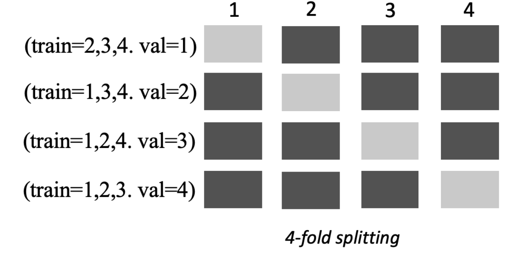

Autopilot uses k-fold cross-validation for both hyperparameter optimization (HPO) mode and
ensembling mode.

You can deploy Autopilot models that are built using cross-validation like you would with any other
Autopilot or SageMaker AI model.

HPO mode

K-fold cross-validation uses the k-fold splitting method for cross-validation. In HPO mode,
Autopilot automatically implements k-fold cross-validation for small datasets with 50,000 or fewer
training instances. Performing cross-validation is especially important when training on small
datasets because it protects against overfitting and selection bias.

HPO mode uses a k value of 5 on each of the candidate algorithms that are used to model the
dataset. Multiple models are trained on different splits, and the models are stored separately.
When training is complete, validation metrics for each of the models are averaged to produce
a single estimation metric. Lastly, Autopilot combines the models from the trial with the
best validation metric into an ensemble model. Autopilot uses this ensemble model to make
predictions.

The validation metric for the models trained by Autopilot is presented as the objective metric in
the model leaderboard. Autopilot uses the default validation metric for each problem type that it

Create Regression or Classification Jobs Using the AutoML API
127

## Page 156

Amazon SageMaker AI
Developer Guide

handles, unless you specify otherwise. For the list of all metrics that Autopilot uses, see Autopilot
metrics.

For example, the Boston Housing dataset contains only 861 samples. If you build a model to
predict house sale prices using this dataset without cross-validation, you risk training on a dataset
that is not representative of the Boston housing stock. If you split the data only once into training
and validation subsets, the training fold may only contain data mainly from the suburbs. As a
result, you would train on data that isn't representative of the rest of the city. In this example, your
model would likely overfit on this biased selection. K-fold cross-validation can reduce the risk of
this kind of error by making full and randomized use of the available data for both training and
validation.

Cross-validation can increase training times by an average of 20%. Training times may also increase
significantly for complex datasets.

Note

In HPO mode, you can see the training and validation metrics from each fold in your /aws/

sagemaker/TrainingJobs CloudWatch Logs. For more information about CloudWatch
Logs, see CloudWatch Logs for Amazon SageMaker AI.

Ensembling mode

Note

Autopilot supports sample weights in ensembling mode. For the list of available metrics
supporting sample weights, see Autopilot metrics.

In ensembling mode, cross-validation is performed regardless of dataset size. Customers can either
provide their own validation dataset and custom data split ratio, or let Autopilot split the dataset

automatically into an 80-20% split ratio. The training data is then split into k-folds for cross-

validation, where the value of k is determined by the AutoGluon engine. An ensemble consists
of multiple machine learning models, where each model is known as the base model. A single

base model is trained on (k-1) folds and makes out-of-fold predictions on the remaining fold. This

process is repeated for all k folds, and the out-of-fold (OOF) predictions are concatenated to form
a single set of predictions. All base models in the ensemble follow this same process of generating
OOF predictions.

Create Regression or Classification Jobs Using the AutoML API
128

## Page 157

Amazon SageMaker AI
Developer Guide

The following image depicts k-fold validation with k = 4 folds. Each fold is represented as a row.
The dark-toned boxes represent the parts of the data used in training. The remaining light-toned
boxes indicate the validation datasets.

In the upper part of the image, in each fold, the first base model makes predictions on the
validation dataset after training on the training datasets. At each subsequent fold, the datasets
change roles. A dataset that was previously used for training is now used for validation, and this

also applies in reverse. At the end of k folds, all of the predictions are concatenated to form a

single set of predictions called an out-of-fold (OOF) prediction. This process is repeated for each n
base models.

The OOF predictions for each base model are then used as features to train a stacking model. The
stacking model learns the importance weights for each base model. These weights are used to
combine the OOF predictions to form the final prediction. Performance on the validation dataset
determines which base or stacking model is the best, and this model is returned as the final model.

In ensemble mode, you can either provide your own validation dataset or let Autopilot split the
input dataset automatically into 80% train and 20% validation datasets. The training data is then

split into k-folds for cross-validation and produces an OOF prediction and a base model for each
fold.

These OOF predictions are used as features to train a stacking model, which simultaneously learns
weights for each base model. These weights are used to combine the OOF predictions to form the
final prediction. The validation datasets for each fold are used for hyperparameter tuning of all

Create Regression or Classification Jobs Using the AutoML API
129

## Page 158

Amazon SageMaker AI
Developer Guide

base models and the stacking model. Performance on the validation datasets determines which
base or stacking model is the best model, and this model is returned as the final model.

Autopilot model deployment and prediction

This Amazon SageMaker Autopilot guide includes steps for model deployment, setting up real-time
inference, and running inference with batch jobs.

After you train your Autopilot models, you can deploy them to get predictions in one of two ways:

1. Use Deploy models for real-time inference to set up an endpoint and obtain predictions

interactively. Real-time inference is ideal for inference workloads where you have real-time,
interactive, low latency requirements.

2. Use Run batch inference jobs to make predictions in parallel on batches of observations on

an entire dataset. Batch inference is a good option for large datasets or if you don't need an

immediate response to a model prediction request.

Note

To avoid incurring unnecessary charges: After the endpoints and resources that were
created from model deployment are no longer needed, you can delete them. For
information about pricing of instances by Region, see Amazon SageMaker Pricing.

Deploy models for real-time inference

Real-time inference is ideal for inference workloads where you have real-time, interactive,
low latency requirements. This section shows how you can use real-time inferencing to obtain
predictions interactively from your model.

To deploy the model that produced the best validation metric in an Autopilot experiment, you have
several options. For example, when using Autopilot in SageMaker Studio Classic, you can deploy
the model automatically or manually. You can also use SageMaker APIs to manually deploy an
Autopilot model.

The following tabs show three options for deploying your model. These instructions assume that
you have already created a model in Autopilot. If you don't have a model, see Create Regression or
Classification Jobs for Tabular Data Using the AutoML API. To see examples for each option, open
each tab.

Create Regression or Classification Jobs Using the AutoML API
130

## Page 159

Amazon SageMaker AI
Developer Guide

Deploy using the Autopilot User Interface (UI)

The Autopilot UI contains helpful dropdown menus, toggles, tooltips, and more to help you
navigate through model deployment. You can deploy using either one of the following procedures:
Automatic or Manual.

• Automatic Deployment: To automatically deploy the best model from an Autopilot experiment
to an endpoint

1. Create an experiment in SageMaker Studio Classic.

2. Toggle the Auto deploy value to Yes.

Note

Automatic deployment will fail if either the default resource quota or your

customer quota for endpoint instances in a Region is too limited. In hyperparameter
optimization (HPO) mode, you are required to have at least two ml.m5.2xlarge
instances. In ensembling mode, you are required to have at least one ml.m5.12xlarge
instance. If you encounter a failure related to quotas, you can request a service limit
increase for SageMaker AI endpoint instances.

• Manual Deployment: To manually deploy the best model from an Autopilot experiment to an
endpoint

1. Create an experiment in SageMaker Studio Classic.

2. Toggle the Auto deploy value to No.

3. Select the model that you want to deploy under Model name.

4. Select the orange Deployment and advanced settings button located on the right of the

leaderboard. This opens a new tab.

5. Configure the endpoint name, instance type, and other optional information.

6. Select the orange Deploy model to deploy to an endpoint.

7. Check the progress of the endpoint creation process in the https://console.aws.amazon.com/

sagemaker/ by navigating to the Endpoints section. That section is located in the Inference
dropdown menu in the navigation panel.

8. After the endpoint status changes from Creating to InService, as shown below, return to

Studio Classic and invoke the endpoint.

Create Regression or Classification Jobs Using the AutoML API
131

## Page 160

Amazon SageMaker AI
Developer Guide

Deploy using SageMaker APIs

You can also obtain real-time inference by deploying your model using API calls. This section
shows the five steps of this process using AWS Command Line Interface (AWS CLI) code snippets.

For complete code examples for both AWS CLI commands and AWS SDK for Python (boto3), open
the tabs directly following these steps.

1. Obtain candidate definitions

Obtain the candidate container definitions from InferenceContainers. These candidate
definitions are used to create a SageMaker AI model.

The following example uses the DescribeAutoMLJob API to obtain candidate definitions for the
best model candidate. See the following AWS CLI command as an example.

aws sagemaker describe-auto-ml-job --auto-ml-job-name <job-name> --region <region>

2. List candidates

The following example uses the ListCandidatesForAutoMLJob API to list all candidates. See the
following AWS CLI command as an example.

aws sagemaker list-candidates-for-auto-ml-job --auto-ml-job-name <job-name> --
region <region>

3. Create a SageMaker AI model

Use the container definitions from the previous steps to create a SageMaker AI model by using
the CreateModel API. See the following AWS CLI command as an example.

Create Regression or Classification Jobs Using the AutoML API
132

## Page 161

Amazon SageMaker AI
Developer Guide

aws sagemaker create-model --model-name '<your-custom-model-name>' \
--containers ['<container-definition1>, <container-
definition2>, <container-definition3>]' \
--execution-role-arn '<execution-role-arn>' --region '<region>

4. Create an endpoint configuration

The following example uses the CreateEndpointConfig API to create an endpoint configuration.
See the following AWS CLI command as an example.

aws sagemaker create-endpoint-config --endpoint-config-name '<your-custom-endpoint-
config-name>' \
--production-variants '<list-of-production-variants>' \
--region '<region>'

5. Create the endpoint

The following AWS CLI example uses the CreateEndpoint API to create the endpoint.

aws sagemaker create-endpoint --endpoint-name '<your-custom-endpoint-name>' \
--endpoint-config-name '<endpoint-config-name-you-just-created>'
\
--region '<region>'

Check the progress of your endpoint deployment by using the DescribeEndpoint API. See the
following AWS CLI command as an example.

aws sagemaker describe-endpoint —endpoint-name '<endpoint-name>' —region <region>

After the EndpointStatus changes to InService, the endpoint is ready to use for real-time
inference.

6. Invoke the endpoint

The following command structure invokes the endpoint for real-time inferencing.

aws sagemaker invoke-endpoint --endpoint-name '<endpoint-name>' \
--region '<region>' --body '<your-data>' [--content-type]
'<content-type>' <outfile>

Create Regression or Classification Jobs Using the AutoML API
133

## Page 162

Amazon SageMaker AI
Developer Guide

The following tabs contain complete code examples for deploying a model with AWS SDK for
Python (boto3) or the AWS CLI.

AWS SDK for Python (boto3)

1. Obtain the candidate definitions by using the following code example.

import sagemaker
import boto3

session = sagemaker.session.Session()

sagemaker_client = boto3.client('sagemaker', region_name='us-west-2')
job_name = 'test-auto-ml-job'

describe_response = sm_client.describe_auto_ml_job(AutoMLJobName=job_name)

# extract the best candidate definition from DescribeAutoMLJob response
best_candidate = describe_response['BestCandidate']
# extract the InferenceContainers definition from the caandidate definition
inference_containers = best_candidate['InferenceContainers']

2. Create the model by using the following the code example.

# Create Model
model_name = 'test-model'
sagemaker_role = 'arn:aws:iam:444455556666:role/sagemaker-execution-role'
create_model_response = sagemaker_client.create_model(
ModelName = model_name,
ExecutionRoleArn = sagemaker_role,
Containers = inference_containers
)

3. Create the endpoint configuration by using the following the code example.

endpoint_config_name = 'test-endpoint-config'
instance_type = 'ml.m5.2xlarge'
# for all supported instance types, see
# https://docs.aws.amazon.com/sagemaker/latest/APIReference/
API_ProductionVariant.html#sagemaker-Type-ProductionVariant-InstanceType    #
Create endpoint config

endpoint_config_response = sagemaker_client.create_endpoint_config(

Create Regression or Classification Jobs Using the AutoML API
134

## Page 163

Amazon SageMaker AI
Developer Guide

EndpointConfigName=endpoint_config_name,
ProductionVariants=[
{
"VariantName": "variant1",
"ModelName": model_name,
"InstanceType": instance_type,
"InitialInstanceCount": 1
}
]
)

print(f"Created EndpointConfig: {endpoint_config_response['EndpointConfigArn']}")

4. Create the endpoint and deploy the model with the following code example.

# create endpoint and deploy the model
endpoint_name = 'test-endpoint'
create_endpoint_response = sagemaker_client.create_endpoint(
EndpointName=endpoint_name,
EndpointConfigName=endpoint_config_name)
print(create_endpoint_response)

Check the status of creating the endpoint by using the following the code example.

# describe endpoint creation status
status = sagemaker_client.describe_endpoint(EndpointName=endpoint_name)
["EndpointStatus"]

5. Invoke the endpoint for real-time inferencing by using the following command structure.

# once endpoint status is InService, you can invoke the endpoint for inferencing
if status == "InService":
sm_runtime = boto3.Session().client('sagemaker-runtime')
inference_result = sm_runtime.invoke_endpoint(EndpointName='test-endpoint',
ContentType='text/csv', Body='1,2,3,4,class')

AWS Command Line Interface (AWS CLI)

1. Obtain the candidate definitions by using the following code example.

Create Regression or Classification Jobs Using the AutoML API
135

## Page 164

Amazon SageMaker AI
Developer Guide

aws sagemaker describe-auto-ml-job --auto-ml-job-name 'test-automl-job' --
region us-west-2

2. Create the model by using the following code example.

aws sagemaker create-model --model-name 'test-sagemaker-model'
--containers '[{
"Image": "348316444620.dkr.ecr.us-west-2.amazonaws.com/sagemaker-sklearn-
automl:2.5-1-cpu-py3", amzn-s3-demo-bucket1
"ModelDataUrl": "s3://amzn-s3-demo-bucket/output/model.tar.gz",
"Environment": {
"AUTOML_SPARSE_ENCODE_RECORDIO_PROTOBUF": "1",
"AUTOML_TRANSFORM_MODE": "feature-transform",
"SAGEMAKER_DEFAULT_INVOCATIONS_ACCEPT": "application/x-recordio-protobuf",
"SAGEMAKER_PROGRAM": "sagemaker_serve",
"SAGEMAKER_SUBMIT_DIRECTORY": "/opt/ml/model/code"

}
}, {
"Image": "348316444620.dkr.ecr.us-west-2.amazonaws.com/sagemaker-
xgboost:1.3-1-cpu-py3",
"ModelDataUrl": "s3://amzn-s3-demo-bucket/output/model.tar.gz",
"Environment": {
"MAX_CONTENT_LENGTH": "20971520",
"SAGEMAKER_DEFAULT_INVOCATIONS_ACCEPT": "text/csv",
"SAGEMAKER_INFERENCE_OUTPUT": "predicted_label",
"SAGEMAKER_INFERENCE_SUPPORTED":
"predicted_label,probability,probabilities"
}
}, {
"Image": "348316444620.dkr.ecr.us-west-2.amazonaws.com/sagemaker-sklearn-
automl:2.5-1-cpu-py3", aws-region
"ModelDataUrl": "s3://amzn-s3-demo-bucket/output/model.tar.gz",
"Environment": {
"AUTOML_TRANSFORM_MODE": "inverse-label-transform",
"SAGEMAKER_DEFAULT_INVOCATIONS_ACCEPT": "text/csv",
"SAGEMAKER_INFERENCE_INPUT": "predicted_label",
"SAGEMAKER_INFERENCE_OUTPUT": "predicted_label",
"SAGEMAKER_INFERENCE_SUPPORTED":
"predicted_label,probability,labels,probabilities",
"SAGEMAKER_PROGRAM": "sagemaker_serve",
"SAGEMAKER_SUBMIT_DIRECTORY": "/opt/ml/model/code"
}

Create Regression or Classification Jobs Using the AutoML API
136

## Page 165

Amazon SageMaker AI
Developer Guide

}]' \
--execution-role-arn 'arn:aws:iam::1234567890:role/sagemaker-execution-role' \
--region 'us-west-2'

For additional details, see creating a model.

The create model command will return a response in the following format.

{
"ModelArn": "arn:aws:sagemaker:us-west-2:1234567890:model/test-sagemaker-
model"
}

3. Create an endpoint configuration by using the following code example.

aws sagemaker create-endpoint-config --endpoint-config-name 'test-endpoint-config'
\
--production-variants '[{"VariantName": "variant1",
"ModelName": "test-sagemaker-model",
"InitialInstanceCount": 1,
"InstanceType": "ml.m5.2xlarge"
}]' \
--region us-west-2

The create endpoint configuration command will return a response in the following
format.

{
"EndpointConfigArn": "arn:aws:sagemaker:us-west-2:1234567890:endpoint-config/
test-endpoint-config"
}

4. Create an endpoint by using the following code example.

aws sagemaker create-endpoint --endpoint-name 'test-endpoint' \
--endpoint-config-name 'test-endpoint-config' \
--region us-west-2

The create endpoint command will return a response in the following format.

{

Create Regression or Classification Jobs Using the AutoML API
137

## Page 166

Amazon SageMaker AI
Developer Guide

"EndpointArn": "arn:aws:sagemaker:us-west-2:1234567890:endpoint/test-endpoint"
}

Check the progress of the endpoint deployment by using the following describe-endpoint CLI
code example.

aws sagemaker describe-endpoint --endpoint-name 'test-endpoint' --region us-west-2

The previous progress check will return a response in the following format.

{
"EndpointName": "test-endpoint",
"EndpointArn": "arn:aws:sagemaker:us-west-2:1234567890:endpoint/test-
endpoint",
"EndpointConfigName": "test-endpoint-config",
"EndpointStatus": "Creating",
"CreationTime": 1660251167.595,
"LastModifiedTime": 1660251167.595
}

After the EndpointStatus changes to InService, the endpoint is ready for use in real-
time inference.

5. Invoke the endpoint for real-time inferencing by using the following command structure.

aws sagemaker-runtime invoke-endpoint --endpoint-name 'test-endpoint' \
--region 'us-west-2' \
--body '1,51,3.5,1.4,0.2' \
--content-type 'text/csv' \
'/tmp/inference_output'

For more options, see invoking an endpoint.

Deploy models from different accounts

You can deploy an Autopilot model from a different account than the original account that a model
was generated in. To implement cross-account model deployment, this section shows how to do
the following:

1. Grant permission to the deploying account

Create Regression or Classification Jobs Using the AutoML API
138

## Page 167

Amazon SageMaker AI
Developer Guide

To assume the role in the generating account, you must grant permission to the deploying
account. This allows the deploying account to describe Autopilot jobs in the generating account.

The following example uses a generating account with a trusted sagemaker-role entity. The

example shows how to give a deploying account with the ID 111122223333 permission to
assume the role of the generating account.

"Statement": [
{
"Effect": "Allow",
"Principal": {
"Service": [
"sagemaker.amazonaws.com"
],
"AWS": [ "111122223333"]
},

"Action": "sts:AssumeRole"
}

The new account with the ID 111122223333 can now assume the role for the generating
account.

Next, call the DescribeAutoMLJob API from the deploying account to obtain a description of
the job created by the generating account.

The following code example describes the model from the deploying account.

import sagemaker
import boto3
session = sagemaker.session.Session()

sts_client = boto3.client('sts')
sts_client.assume_role

role = 'arn:aws:iam::111122223333:role/sagemaker-role'
role_session_name = "role-session-name"
_assumed_role = sts_client.assume_role(RoleArn=role,
RoleSessionName=role_session_name)

credentials = _assumed_role["Credentials"]
access_key = credentials["AccessKeyId"]

Create Regression or Classification Jobs Using the AutoML API
139

## Page 168

Amazon SageMaker AI
Developer Guide

secret_key = credentials["SecretAccessKey"]
session_token = credentials["SessionToken"]

session = boto3.session.Session()
sm_client = session.client('sagemaker', region_name='us-west-2',
aws_access_key_id=access_key,
aws_secret_access_key=secret_key,
aws_session_token=session_token)

# now you can call describe automl job created in account A

job_name = "test-job"
response= sm_client.describe_auto_ml_job(AutoMLJobName=job_name)

2. Grant access to the deploying account to the model artifacts in the generating account.

The deploying account only needs access to the model artifacts in the generating account
to deploy it. These are located in the S3OutputPath that was specified in the original

CreateAutoMLJob API call during model generation.

To give the deploying account access to the model artifacts, choose one of the following
options:

a. Give access to the ModelDataUrl from the generating account to the deploying account.

Next, you need to give the deploying account permission to assume the role. follow the real-
time inferencing steps to deploy.

b. Copy model artifacts from the generating account's original S3OutputPath to the generating

account.

To grant access to the model artifacts, you must define a best_candidate model and
reassign model containers to the new account.

The following example shows how to define a best_candidate model and reassign the

ModelDataUrl.

best_candidate = automl.describe_auto_ml_job()['BestCandidate']

# reassigning ModelDataUrl for best_candidate containers below
new_model_locations = ['new-container-1-ModelDataUrl', 'new-container-2-
ModelDataUrl', 'new-container-3-ModelDataUrl']

Create Regression or Classification Jobs Using the AutoML API
140

## Page 169

Amazon SageMaker AI
Developer Guide

new_model_locations_index = 0
for container in best_candidate['InferenceContainers']:
container['ModelDataUrl'] = new_model_locations[new_model_locations_index++]

After this assignment of containers, follow the steps in Deploy using SageMaker APIs to
deploy.

To build a payload in real-time inferencing, see the notebook example to  define a test payload.
To create the payload from a CSV file and invoke an endpoint, see the Predict with your model
section in Create a machine learning model automatically.

Run batch inference jobs

Batch inferencing, also known as offline inferencing, generates model predictions on a batch of
observations. Batch inference is a good option for large datasets or if you don't need an immediate
response to a model prediction request. By contrast, online inference (real-time inferencing)
generates predictions in real time. You can make batch inferences from an Autopilot model using
the SageMaker Python SDK, the Autopilot user interface (UI), the AWS SDK for Python (boto3), or
the AWS Command Line Interface (AWS CLI).

The following tabs show three options for deploying your model: Using APIs, Autopilot UI, or using
APIs to deploy from different accounts. These instructions assume that you have already created
a model in Autopilot. If you don't have a model, see Create Regression or Classification Jobs for
Tabular Data Using the AutoML API. To see examples for each option, open each tab.

Deploy a model using Autopilot UI

The Autopilot UI contains helpful dropdown menus, toggles, tooltips, and more to help you
navigate through model deployment.

The following steps show how to deploy a model from an Autopilot experiment for batch
predictions.

1. Sign in at https://console.aws.amazon.com/sagemaker/ and select Studio from the navigation

pane.

2. On the left navigation pane, choose Studio.

3. Under Get started, select the Domain that you want to launch the Studio application in. If your

user profile only belongs to one Domain, you do not see the option for selecting a Domain.

Create Regression or Classification Jobs Using the AutoML API
141

## Page 170

Amazon SageMaker AI
Developer Guide

4. Select the user profile that you want to launch the Studio Classic application for. If there is

no user profile in the domain, choose Create user profile. For more information, see Add user
profiles.

5. Choose Launch Studio. If the user profile belongs to a shared space, choose Open Spaces.

6. When the SageMaker Studio Classic console opens, choose the Launch SageMaker Studio

button.

7. Select AutoML from the left navigation pane.

8. Under Name, select the Autopilot experiment corresponding to the model that you want to

deploy. This opens a new AUTOPILOT JOB tab.

9. In the Model name section, select the model that you want to deploy.

10.Choose Deploy model. This opens a new tab.

11.Choose Make batch predictions at the top of the page.

12.For Batch transform job configuration, input the Instance type, Instance count and other

optional information.

13.In the Input data configuration section, open the dropdown menu.

a. For S3 data type, choose ManifestFile or S3Prefix.

b. For Split type, choose Line, RecordIO, TFRecord or None.

c. For Compression, choose Gzip or None.

14.For S3 location, enter the Amazon S3 bucket location of the input data and other optional

information.

15.Under Output data configuration, enter the S3 bucket for the output data, and choose how to

assemble the output of your job.

a. For Additional configuration (optional), you can enter a MIME type and an S3 Encryption

key.

16.For Input/output filtering and data joins (optional), you enter a JSONpath expression to

filter your input data, join the input source data with your output data, and enter a JSONpath
expression to filter your output data.

a. For examples for each type of filter, see the DataProcessing API.

17.To perform batch predictions on your input dataset, select Create batch transform job. A new

Batch Transform Jobs tab appears.

18.In the Batch Transform Jobs tab: Locate the name of your job in Status section. Then check the

progress of the job.

Create Regression or Classification Jobs Using the AutoML API
142

## Page 171

Amazon SageMaker AI
Developer Guide

Deploy using SageMaker APIs

To use the SageMaker APIs for batch inferencing, there are three steps:

1. Obtain candidate definitions

Candidate definitions from InferenceContainers are used to create a SageMaker AI model.

The following example shows how to use the DescribeAutoMLJob API to obtain candidate
definitions for the best model candidate. See the following AWS CLI command as an example.

aws sagemaker describe-auto-ml-job --auto-ml-job-name <job-name> --region <region>

Use the ListCandidatesForAutoMLJob API to list all candidates. See the following AWS CLI
command as an example.

aws sagemaker list-candidates-for-auto-ml-job --auto-ml-job-name <job-name> --
region <region>

2. Create a SageMaker AI model

To create a SageMaker AI model using the CreateModel API, use the container definitions from
the previous steps. See the following AWS CLI command as an example.

aws sagemaker create-model --model-name '<your-custom-model-name>' \
--containers ['<container-definition1>, <container-
definition2>, <container-definition3>]' \
--execution-role-arn '<execution-role-arn>' --region '<region>

3. Create a SageMaker AI transform job

The following example creates a SageMaker AI transform job with the CreateTransformJob API.
See the following AWS CLI command as an example.

aws sagemaker create-transform-job --transform-job-name '<your-custom-transform-job-
name>' --model-name '<your-custom-model-name-from-last-step>'\
--transform-input '{
"DataSource": {
"S3DataSource": {
"S3DataType": "S3Prefix",
"S3Uri": "<your-input-data>"
}

Create Regression or Classification Jobs Using the AutoML API
143

## Page 172

Amazon SageMaker AI
Developer Guide

},
"ContentType": "text/csv",
"SplitType": "Line"
}'\
--transform-output '{
"S3OutputPath": "<your-output-path>",
"AssembleWith": "Line"
}'\
--transform-resources '{
"InstanceType": "<instance-type>",
"InstanceCount": 1
}' --region '<region>'

Check the progress of your transform job using the DescribeTransformJob API. See the following
AWS CLI command as an example.

aws sagemaker describe-transform-job --transform-job-name '<your-custom-transform-job-
name>' --region <region>

After the job is finished, the predicted result will be available in <your-output-path>.

The output file name has the following format: <input_data_file_name>.out. As an example,

if your input file is text_x.csv, the output name will be text_x.csv.out.

The following tabs show code examples for SageMaker Python SDK, AWS SDK for Python (boto3),
and the AWS CLI.

SageMaker Python SDK

The following example uses the SageMaker Python SDK  to make predictions in batches.

from sagemaker import AutoML

sagemaker_session= sagemaker.session.Session()

job_name = 'test-auto-ml-job' # your autopilot job name
automl = AutoML.attach(auto_ml_job_name=job_name)
output_path = 's3://test-auto-ml-job/output'
input_data = 's3://test-auto-ml-job/test_X.csv'

# call DescribeAutoMLJob API to get the best candidate definition
best_candidate = automl.describe_auto_ml_job()['BestCandidate']

Create Regression or Classification Jobs Using the AutoML API
144

## Page 173

Amazon SageMaker AI
Developer Guide

best_candidate_name = best_candidate['CandidateName']

# create model
model = automl.create_model(name=best_candidate_name,
candidate=best_candidate)

# create transformer
transformer = model.transformer(instance_count=1,
instance_type='ml.m5.2xlarge',
assemble_with='Line',
output_path=output_path)

# do batch transform
transformer.transform(data=input_data,
split_type='Line',
content_type='text/csv',
wait=True)

AWS SDK for Python (boto3)

The following example uses AWS SDK for Python (boto3) to make predictions in batches.

import sagemaker
import boto3

session = sagemaker.session.Session()

sm_client = boto3.client('sagemaker', region_name='us-west-2')
role = 'arn:aws:iam::1234567890:role/sagemaker-execution-role'
output_path = 's3://test-auto-ml-job/output'
input_data = 's3://test-auto-ml-job/test_X.csv'

best_candidate = sm_client.describe_auto_ml_job(AutoMLJobName=job_name)
['BestCandidate']
best_candidate_containers = best_candidate['InferenceContainers']
best_candidate_name = best_candidate['CandidateName']

# create model
reponse = sm_client.create_model(
ModelName = best_candidate_name,
ExecutionRoleArn = role,
Containers = best_candidate_containers
)

Create Regression or Classification Jobs Using the AutoML API
145

## Page 174

Amazon SageMaker AI
Developer Guide

# Lauch Transform Job
response = sm_client.create_transform_job(
TransformJobName=f'{best_candidate_name}-transform-job',
ModelName=model_name,
TransformInput={
'DataSource': {
'S3DataSource': {
'S3DataType': 'S3Prefix',
'S3Uri': input_data
}
},
'ContentType': "text/csv",
'SplitType': 'Line'
},
TransformOutput={
'S3OutputPath': output_path,
'AssembleWith': 'Line',

},
TransformResources={
'InstanceType': 'ml.m5.2xlarge',
'InstanceCount': 1,
},
)

The batch inference job returns a response in the following format.

{'TransformJobArn': 'arn:aws:sagemaker:us-west-2:1234567890:transform-job/test-
transform-job',
'ResponseMetadata': {'RequestId': '659f97fc-28c4-440b-b957-a49733f7c2f2',
'HTTPStatusCode': 200,
'HTTPHeaders': {'x-amzn-requestid': '659f97fc-28c4-440b-b957-a49733f7c2f2',
'content-type': 'application/x-amz-json-1.1',
'content-length': '96',
'date': 'Thu, 11 Aug 2022 22:23:49 GMT'},
'RetryAttempts': 0}}

AWS Command Line Interface (AWS CLI)

1. Obtain the candidate definitions by using the following the code example.

aws sagemaker describe-auto-ml-job --auto-ml-job-name 'test-automl-job' --
region us-west-2

Create Regression or Classification Jobs Using the AutoML API
146

## Page 175

Amazon SageMaker AI
Developer Guide

2. Create the model by using the following the code example.

aws sagemaker create-model --model-name 'test-sagemaker-model'
--containers '[{
"Image": "348316444620.dkr.ecr.us-west-2.amazonaws.com/sagemaker-sklearn-
automl:2.5-1-cpu-py3",
"ModelDataUrl": "s3://amzn-s3-demo-bucket/out/test-job1/data-processor-models/
test-job1-dpp0-1-e569ff7ad77f4e55a7e549a/output/model.tar.gz",
"Environment": {
"AUTOML_SPARSE_ENCODE_RECORDIO_PROTOBUF": "1",
"AUTOML_TRANSFORM_MODE": "feature-transform",
"SAGEMAKER_DEFAULT_INVOCATIONS_ACCEPT": "application/x-recordio-protobuf",
"SAGEMAKER_PROGRAM": "sagemaker_serve",
"SAGEMAKER_SUBMIT_DIRECTORY": "/opt/ml/model/code"
}
}, {

"Image": "348316444620.dkr.ecr.us-west-2.amazonaws.com/sagemaker-
xgboost:1.3-1-cpu-py3",
"ModelDataUrl": "s3://amzn-s3-demo-bucket/out/test-job1/tuning/flicdf10v2-
dpp0-xgb/test-job1E9-244-7490a1c0/output/model.tar.gz",
"Environment": {
"MAX_CONTENT_LENGTH": "20971520",
"SAGEMAKER_DEFAULT_INVOCATIONS_ACCEPT": "text/csv",
"SAGEMAKER_INFERENCE_OUTPUT": "predicted_label",
"SAGEMAKER_INFERENCE_SUPPORTED":
"predicted_label,probability,probabilities"
}
}, {
"Image": "348316444620.dkr.ecr.us-west-2.amazonaws.com/sagemaker-sklearn-
automl:2.5-1-cpu-py3",
"ModelDataUrl": "s3://amzn-s3-demo-bucket/out/test-job1/data-processor-models/
test-job1-dpp0-1-e569ff7ad77f4e55a7e549a/output/model.tar.gz",
"Environment": {
"AUTOML_TRANSFORM_MODE": "inverse-label-transform",
"SAGEMAKER_DEFAULT_INVOCATIONS_ACCEPT": "text/csv",
"SAGEMAKER_INFERENCE_INPUT": "predicted_label",
"SAGEMAKER_INFERENCE_OUTPUT": "predicted_label",
"SAGEMAKER_INFERENCE_SUPPORTED":
"predicted_label,probability,labels,probabilities",
"SAGEMAKER_PROGRAM": "sagemaker_serve",
"SAGEMAKER_SUBMIT_DIRECTORY": "/opt/ml/model/code"
}
}]' \

Create Regression or Classification Jobs Using the AutoML API
147

## Page 176

Amazon SageMaker AI
Developer Guide

--execution-role-arn 'arn:aws:iam::1234567890:role/sagemaker-execution-role' \
--region 'us-west-2'

3. Create the transform job by using the following the code example.

aws sagemaker create-transform-job --transform-job-name 'test-tranform-job'\
--model-name 'test-sagemaker-model'\
--transform-input '{
"DataSource": {
"S3DataSource": {
"S3DataType": "S3Prefix",
"S3Uri": "s3://amzn-s3-demo-bucket/data.csv"
}
},
"ContentType": "text/csv",
"SplitType": "Line"
}'\
--transform-output '{
"S3OutputPath": "s3://amzn-s3-demo-bucket/output/",
"AssembleWith": "Line"
}'\
--transform-resources '{
"InstanceType": "ml.m5.2xlarge",
"InstanceCount": 1
}'\
--region 'us-west-2'

4. Check the progress of the transform job by using the following the code example.

aws sagemaker describe-transform-job --transform-job-name  'test-tranform-job' --
region us-west-2

The following is the response from the transform job.

{
"TransformJobName": "test-tranform-job",
"TransformJobArn": "arn:aws:sagemaker:us-west-2:1234567890:transform-job/test-
tranform-job",
"TransformJobStatus": "InProgress",
"ModelName": "test-model",
"TransformInput": {
"DataSource": {
"S3DataSource": {

Create Regression or Classification Jobs Using the AutoML API
148

## Page 177

Amazon SageMaker AI
Developer Guide

"S3DataType": "S3Prefix",
"S3Uri": "s3://amzn-s3-demo-bucket/data.csv"
}
},
"ContentType": "text/csv",
"CompressionType": "None",
"SplitType": "Line"
},
"TransformOutput": {
"S3OutputPath": "s3://amzn-s3-demo-bucket/output/",
"AssembleWith": "Line",
"KmsKeyId": ""
},
"TransformResources": {
"InstanceType": "ml.m5.2xlarge",
"InstanceCount": 1
},

"CreationTime": 1662495635.679,
"TransformStartTime": 1662495847.496,
"DataProcessing": {
"InputFilter": "$",
"OutputFilter": "$",
"JoinSource": "None"
}
}

After the TransformJobStatus changes to Completed, you can check the inference result

in the S3OutputPath.

Deploy models from different accounts

To create a batch inferencing job in a different account than the one that the model was generated
in, follow the instructions in Deploy models from different accounts. Then you can create models
and transform jobs by following the Deploy using SageMaker APIs.

View model details

Autopilot generates details about the candidate models that you can obtain. These details include
the following:

• A plot of the aggregated SHAP values that indicate the importance of each feature. This helps
explain your models predictions.

Create Regression or Classification Jobs Using the AutoML API
149

## Page 178

Amazon SageMaker AI
Developer Guide

• The summary statistics for various training and validation metrics, including the objective metric.

• A list of the hyperparameters used to train and tune the model.

To view model details after running an Autopilot job, follow these steps:

1.
Choose the Home icon

(

)
from the left navigation pane to view the top-level Amazon SageMaker Studio Classic
navigation menu.

2.
Select the AutoML card from the main working area. This opens a new Autopilot tab.

3.
In the Name section, select the Autopilot job that has the details that you want to examine.
This opens a new Autopilot job tab.

4.
The Autopilot job panel lists the metric values including the Objective metric for each model
under Model name. The Best model is listed at the top of the list under Model name and is
also highlighted in the Models tab.

•
To review model details, select the model that you are interested in and select View
model details. This opens a new Model Details tab.

5.
The Model Details tab is divided into four subsections.

1. The top of the Explainability tab contains a plot of aggregated SHAP values that indicate

the importance of each feature. Following that are the metrics and hyperparameter values
for this model.

2. The Performance tab contains metrics statistics a confusion matrix.

3. The Artifacts tab contains information about model inputs, outputs, and intermediate

results.

4. The Network tab summarizes your network isolation and encryption choices.

Note

Feature importance and information in the Performance tab is only generated for the
Best model.

Create Regression or Classification Jobs Using the AutoML API
150

## Page 179

Amazon SageMaker AI
Developer Guide

For more information about how the SHAP values help explain predictions based on
feature importance, see the whitepaper Understanding the model explainability. Additional
information is also available in the Model Explainability topic in the SageMaker AI Developer
Guide.

View an Autopilot model performance report

An Amazon SageMaker AI model quality report (also referred to as performance report) provides
insights and quality information for the best model candidate generated by an AutoML job. This
includes information about the job details, model problem type, objective function, and other
information related to the problem type. This guide shows how to view Amazon SageMaker
Autopilot performance metrics graphically, or view metrics as raw data in a JSON file.

For example, in classification problems, the model quality report includes the following:

• Confusion matrix

• Area under the receiver operating characteristic curve (AUC)

• Information to understand false positives and false negatives

• Tradeoffs between true positives and false positives

• Tradeoffs between precision and recall

Autopilot also provides performance metrics for all of your candidate models. These metrics are
calculated using all of the training data and are used to estimate model performance. The main
working area includes these metrics by default. The type of metric is determined by the type of
problem being addressed.

Refer to the  Amazon SageMaker API reference documentation for the list of available metrics
supported by Autopilot.

You can sort your model candidates with the relevant metric to help you select and deploy the
model that addresses your business needs. For definitions of these metrics, see the Autopilot
candidate metrics topic.

To view a performance report from an Autopilot job, follow these steps:

Create Regression or Classification Jobs Using the AutoML API
151

## Page 180

Amazon SageMaker AI
Developer Guide

1.
Choose the Home icon

(

)
from the left navigation pane to view the top-level Amazon SageMaker Studio Classic
navigation menu.

2.
Select the AutoML card from the main working area. This opens a new Autopilot tab.

3.
In the Name section, select the Autopilot job that has the details that you want to examine.
This opens a new Autopilot job tab.

4.
The Autopilot job panel lists the metric values including the Objective metric for each model
under Model name. The Best model is listed at the top of the list under Model name and it is
highlighted in the Models tab.

•
To review model details, select the model that you are interested in and select View in
model details. This opens a new Model Details tab.

5.
Choose the Performance tab between the Explainability and Artifacts tab.

a.
On the top right section of the tab, select the down arrow on the Download Performance
Reports button.

b.
The down arrow provides two options to view Autopilot performance metrics:

i.
You can download a PDF of the performance report to view the metrics graphically.

ii.
You can view metrics as raw data and download it as a JSON file.

For instructions on how to create and run an AutoML job in SageMaker Studio Classic, see Create
Regression or Classification Jobs for Tabular Data Using the AutoML API.

The performance report contains two sections. The first contains details about the Autopilot job
that produced the model. The second section contains a model quality report.

Autopilot Job details

This first section of the report gives some general information about the Autopilot job that
produced the model. These job details include the following information:

• Autopilot candidate name

• Autopilot job name

• Problem type

Create Regression or Classification Jobs Using the AutoML API
152

## Page 181

Amazon SageMaker AI
Developer Guide

• Objective metric

• Optimization direction

Model quality report

Model quality information is generated by Autopilot model insights. The report's content that is
generated depends on the problem type it addressed: regression, binary classification, or multiclass
classification. The report specifies the number of rows that were included in the evaluation dataset
and the time at which the evaluation occurred.

Metrics tables

The first part of the model quality report contains metrics tables. These are appropriate for the
type of problem that the model addressed.

The following image is an example of a metrics table that Autopilot generates for a regression
problem. It shows the metric name, value, and standard deviation.

The following image is an example of a metrics table generated by Autopilot for a multiclass
classification problem. It shows the metric name, value, and standard deviation.

Create Regression or Classification Jobs Using the AutoML API
153

## Page 182

Amazon SageMaker AI
Developer Guide

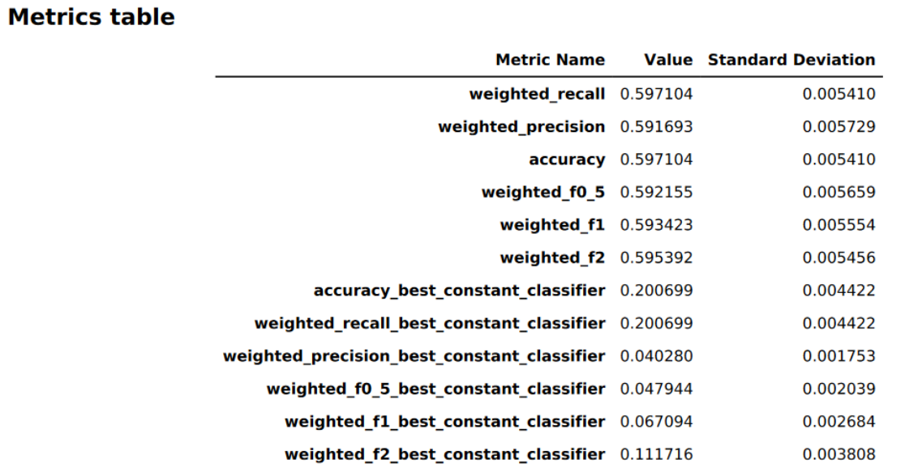

Graphical model performance information

The second part of the model quality report contains graphical information to help you evaluate
model performance. The contents of this section depend on the problem type used in modeling.

The area under the receiver operating characteristic curve

The area under the receiver operating characteristic curve represents the trade-off between
true positive and false positive rates. It is an industry-standard accuracy metric used for binary
classification models. AUC (area under the curve) measures the ability the model to predict a
higher score for positive examples, as compared to negative examples. The AUC metric provides an
aggregated measure of the model performance across all possible classification thresholds.

The AUC metric returns a decimal value from 0 to 1. AUC values near 1 indicate that the machine
learning model is highly accurate. Values near 0.5 indicate that the model is performing no better
than guessing at random. AUC values close to 0 indicate that the model has learned the correct
patterns, but is making predictions that are as inaccurate as possible. Values near zero can indicate
a problem with the data. For more information about the AUC metric, see the Receiver operating
characteristic article on Wikipedia.

The following is an example of an area under the receiver operating characteristic curve graph to
evaluate predictions made by a binary classification model. The dashed thin line represents the
area under the receiver operating characteristic curve that a model which classifies no-better-than-

Create Regression or Classification Jobs Using the AutoML API
154

## Page 183

Amazon SageMaker AI
Developer Guide

random guessing would score, with an AUC score of 0.5. The curves of more accurate classification
models lie above this random baseline, where the rate of true positives exceeds the rate of false
positives. The area under the receiver operating characteristic curve representing the performance
of the binary classification model is the thicker solid line.

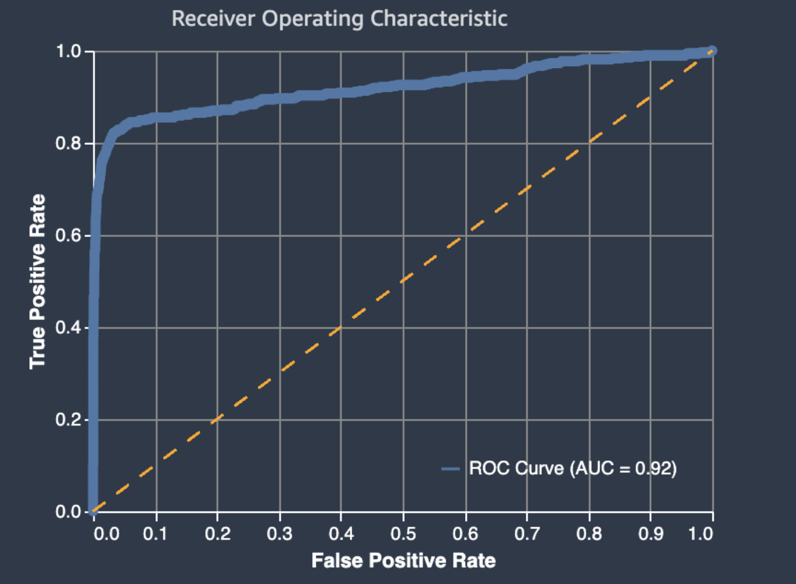

A summary of the graph's components of false positive rate (FPR) and true positive rate (TPR) are
defined as follows.

• Correct predictions

• True positive (TP): The predicted value is 1, and the true value is 1.

• True negative (TN): The predicted value is 0, and the true value is 0.

• Erroneous predictions

• False positive (FP): The predicted value is 1, but the true value is 0.

• False negative (FN): The predicted value is 0, but the true value is 1.

Create Regression or Classification Jobs Using the AutoML API
155

## Page 184

Amazon SageMaker AI
Developer Guide

The false positive rate (FPR) measures the fraction of true negatives (TN) that were falsely
predicted as positives (FP), over the sum of FP and TN. The range is 0 to 1. A smaller value indicates
better predictive accuracy.

• FPR = FP/(FP+TN)

The true positive rate (TPR) measures the fraction true positives that were correctly predicted
as positives (TP) over the sum of TP and false negatives (FN). The range is 0 to 1. A larger value
indicates better predictive accuracy.

• TPR = TP/(TP+FN)

Confusion matrix

A confusion matrix provides a way to visualize the accuracy of the predictions made by a model
for binary and multiclass classification for different problems. The confusion matrix in the model
quality report contains the following.

• The number and percentage of correct and incorrect predictions for the actual labels

• The number and percentage of accurate predictions on the diagonal from the upper-left to the
lower-right corner

• The number and percentage of inaccurate predictions on the diagonal from the upper-right to
the lower-left corner

The incorrect predictions on a confusion matrix are the confusion values.

The following diagram is an example of a confusion matrix for a binary classification problem. It
contains the following information:

• The vertical axis is divided into two rows containing true and false actual labels.

• The horizontal axis is divided into two columns containing true and false labels that were
predicted by the model.

• The color bar assigns a darker tone to a larger number of samples to visually indicate the number
of values that were classified in each category.

In this example, the model predicted actual 2817 false values correctly, and 353 actual true values
correctly. The model incorrectly predicted 130 actual true values to be false and 33 actual false

Create Regression or Classification Jobs Using the AutoML API
156

## Page 185

Amazon SageMaker AI
Developer Guide

values to be true. The difference in tone indicates that the dataset is not balanced. The imbalance
is because there are many more actual false labels than actual true labels.

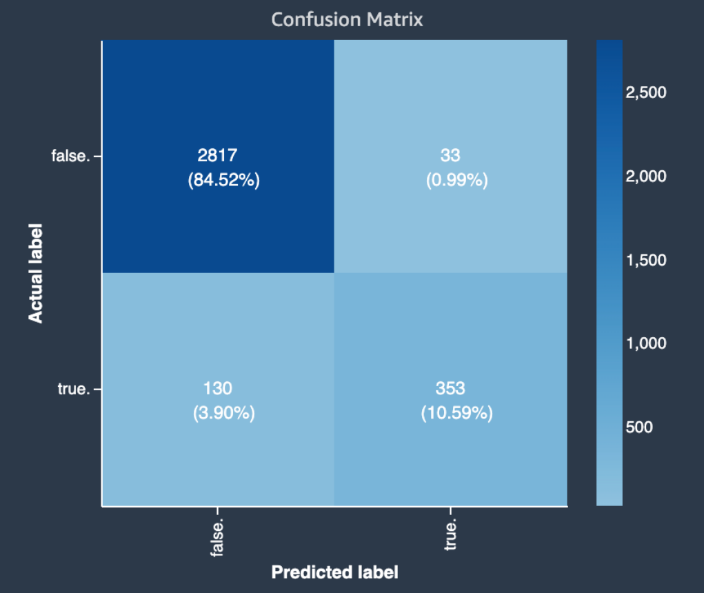

The following diagram is an example of a confusion matrix for a multi-class classification problem.
The confusion matrix in the model quality report contains the following.

• The vertical axis is divided into three rows containing three different actual labels.

• The horizontal axis is divided into three columns containing labels that were predicted by the
model.

• The color bar assigns a darker tone to a larger number of samples to visually indicate the number
of values that were classified in each category.

In the example below, the model correctly predicted actual 354 values for label f, 1094 values for
label i and 852 values for label m. The difference in tone indicates that the dataset is not balanced
because there are many more labels for the value i than for f or m.

Create Regression or Classification Jobs Using the AutoML API
157

## Page 186

Amazon SageMaker AI
Developer Guide

The confusion matrix in the model quality report provided can accommodate a maximum of 15

labels for multiclass classification problem types. If a row corresponding to a label shows a Nan
value, it means that the validation dataset used to check model predictions does not contain data
with that label.

Gain curve

In binary classification, a gain curve predicts the cumulative benefit of using a percentage of
the dataset to find a positive label. The gain value is calculated during training by dividing the
cumulative number of positive observations by the total number of positive observations in the
data, at each decile. If the classification model created during training is representative of the
unseen data, you can use the gain curve to predict the percentage of data that you must target to
obtain a percentage of positive labels. The greater the percentage of the dataset used, the higher
the percentage of positive labels found.

In the following example graph, the gain curve is the line with changing slope. The straight line
is the percentage of positive labels found by selecting a percentage of data from the dataset at

Create Regression or Classification Jobs Using the AutoML API
158

## Page 187

Amazon SageMaker AI
Developer Guide

random. Upon targeting 20% of the dataset, you would expect to find larger than 40% of the
positive labels. As an example, you might consider using a gain curve to determine your efforts
in a marketing campaign. Using our gain curve example, for 83% of people in a neighborhood to
purchase cookies, you'd send an advertisement to about 60% of the neighborhood.

Lift curve

In binary classification, the lift curve illustrates the uplift of using a trained model to predict the
likelihood of finding a positive label compared to a random guess. The lift value is calculated
during training using the ratio of percentage gain to the ratio of positive labels at each decile. If
the model created during training is representative of the unseen data, use the lift curve to predict
the benefit of using the model over randomly guessing.

In the following example graph, the lift curve is the line with changing slope. The straight line is
the lift curve associated with selecting the corresponding percentage randomly from the dataset.

Create Regression or Classification Jobs Using the AutoML API
159

## Page 188

Amazon SageMaker AI
Developer Guide

Upon targeting 40% of the dataset with your model's classification labels, you would expect to
find about 1.7 times the number of the positive labels that you would have found by randomly
selecting 40% of the unseen data.

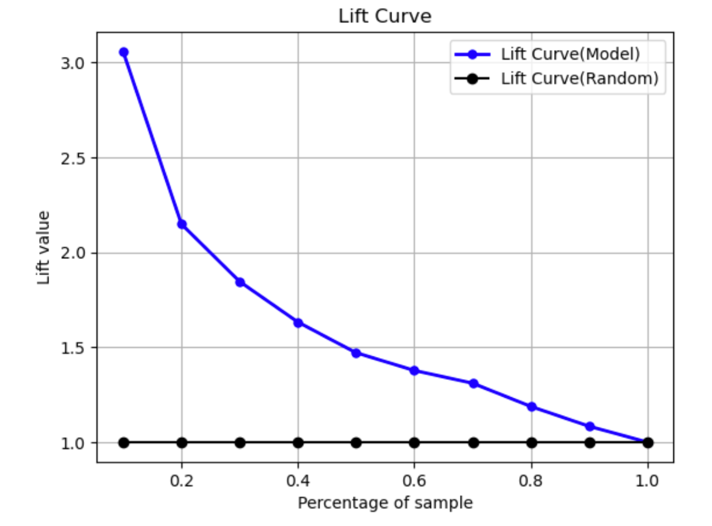

Precision-recall curve

The precision-recall curve represents the tradeoff between precision and recall for binary
classification problems.

Precision measures the fraction of actual positives that are predicted as positive (TP) out of all
positive predictions (TP and false positive). The range is 0 to 1. A larger value indicates better
accuracy in the predicted values.

• Precision = TP/(TP+FP)

Create Regression or Classification Jobs Using the AutoML API
160

## Page 189

Amazon SageMaker AI
Developer Guide

Recall measures the fraction of actual positives that are predicted as positive (TP) out of all actual
positive predictions (TP and false negative). This is also known as the sensitivity or as the true
positive rate. The range is 0 to 1. A larger value indicates better detection of positive values from
the sample.

• Recall = TP/(TP+FN)

The objective of a classification problem is to correctly label as many elements as possible. A
system with high recall but low precision returns a high percentage of false positives.

The following graphic depicts a spam filter that marks every email as spam. It has high recall, but
low precision, because recall doesn't measure false positives.

Give more weight to recall over precision if your problem has a low penalty for false positive
values, but a high penalty for missing a true positive result. For example, detecting an impending
collision in a self-driving vehicle.

By contrast, a system with high precision, but low recall, returns a high percentage of false
negatives. A spam filter that marks every email as desirable (not spam) has high precision but low
recall because precision doesn't measure false negatives.

If your problem has a low penalty for false negative values, but a high penalty for missing a true
negative results, give more weight to precision over recall. For example, flagging a suspicious filter
for a tax audit.

Create Regression or Classification Jobs Using the AutoML API
161

## Page 190

Amazon SageMaker AI
Developer Guide

The following graphic depicts a spam filter that has high precision but low recall, because precision
doesn't measure false negatives.

A model that makes predictions with both high precision and high recall produces a high number
of correctly labeled results. For more information, see Precision and recall article in Wikipedia.

Area under precision-recall curve (AUPRC)

For binary classification problems, Amazon SageMaker Autopilot includes a graph of the area
under the precision-recall curve (AUPRC). The AUPRC metric provides an aggregated measure of
the model performance across all possible classification thresholds and uses both precision and
recall. AUPRC does not take the number of true negatives into account. Therefore, it can be useful
to evaluate model performance in cases where there's a large number of true negatives in the data.
For example, to model a gene containing a rare mutation.

The following graphic is an example of an AUPRC graph. Precision at its highest value is 1, and
recall is at 0. In the lower right corner of the graph, recall is its highest value (1) and precision is 0.
In between these two points , the AUPRC curve illustrates the tradeoff between precision and recall
at different thresholds.

Create Regression or Classification Jobs Using the AutoML API
162

## Page 191

Amazon SageMaker AI
Developer Guide

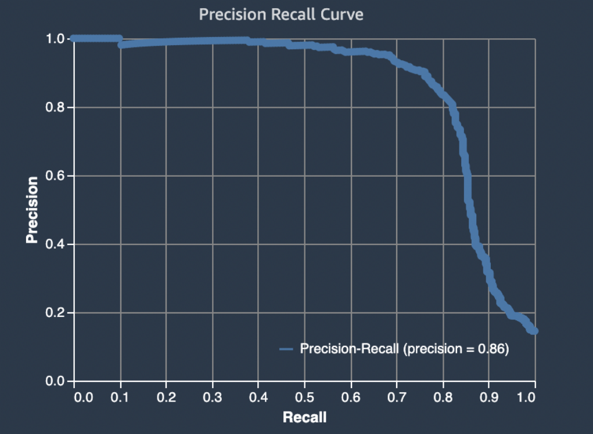

Actual against predicted plot

The actual against predicted plot shows the difference between actual and predicted model values.
In the following example graph, the solid line is a linear line of best fit. If the model were 100%
accurate, each predicted point would equal its corresponding actual point and lie on this line of
best fit. The distance away from the line of best fit is a visual indication of model error. The larger
the distance away from the line of best fit, the higher the model error.

Create Regression or Classification Jobs Using the AutoML API
163

## Page 192

Amazon SageMaker AI
Developer Guide

Standardized residual plot

A standardized residual plot incorporates the following statistical terms:

residual

A (raw) residual shows the difference between actual and values predicted by your model. The
larger the difference, the larger the residual value.

standard deviation

The standard deviation is a measure of how values vary from an average value. A high standard
deviation indicates that many values are very different from their average value. A low standard
deviation indicates that many values are close to their average value.

Create Regression or Classification Jobs Using the AutoML API
164

## Page 193

Amazon SageMaker AI
Developer Guide

standardized residual

A standardized residual divides the raw residuals by their standard deviation. Standardized
residuals have units of standard deviation and are useful in identifying outliers in data

regardless of the difference in scale of the raw residuals. If a standardized residual is much
smaller or larger than the other standardized residuals, it indicates that the model is not fitting
these observations well.

The standardized residual plot measures the strength of the difference between observed and
expected values. The actual predicted value is displayed on the x axis. A point with a value larger
than an absolute value of 3 is commonly regarded as an outlier.

The following example graph shows that a large number of standardized residuals are clustered
around 0 on the horizontal axis. The values close to zero indicate that the model is fitting these

points well. The points towards the top and bottom of the plot are not predicted well by the
model.

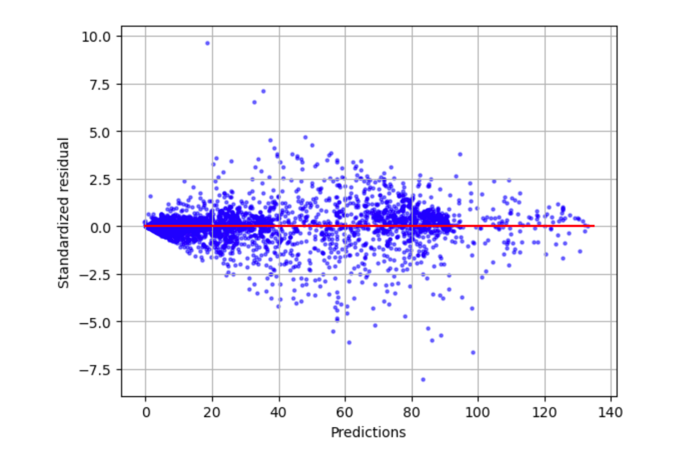

Create Regression or Classification Jobs Using the AutoML API
165

## Page 194

Amazon SageMaker AI
Developer Guide

Residual histogram

A residual histogram incorporates the following statistical terms:

residual

A (raw) residual shows the difference between actual and values predicted by your model. The
larger the difference, the larger the residual value.

standard deviation

The standard deviation is a measure of how much values vary from an average value. A high
standard deviation indicates that many values are very different from their average value. A low
standard deviation indicates that many values are close to their average value.

standardized residual

A standardized residual divides the raw residuals by their standard deviation. Standardized
residuals have units of standard deviation. These are useful in identifying outliers in data
regardless of the difference in scale of the raw residuals. If a standardized residual is much
smaller or larger than the other standardized residuals, it would indicate that the model is not
fitting these observations well.

histogram

A histogram is a graph that shows how often a value occurred.

The residual histogram shows the distribution of standardized residual values. A histogram
distributed in a bell shape and centered at zero indicates that the model does not systematically
overpredict or underpredict any particular range of target values.

In the following graphic, the standardized residual values indicate that the model is fitting the data
well. If the graph showed values far away from the center value, it would indicate that those values
don't fit the model well.

Create Regression or Classification Jobs Using the AutoML API
166

## Page 195

Amazon SageMaker AI
Developer Guide

Autopilot notebooks generated to manage AutoML tasks

Amazon SageMaker Autopilot manages the key tasks in an automatic machine learning (AutoML)
process using an AutoML job. The AutoML job creates three notebook-based reports that describe
the plan that Autopilot follows to generate candidate models.

A candidate model consists of a (pipeline, algorithm) pair. First, there’s a data exploration
notebook that describes what Autopilot learned about the data that you provided. Second,
there’s a candidate definition notebook, which uses the information about the data to generate
candidates. Third, a model insights report that can help detail the performance characteristics of
the best model in the leaderboard of an Autopilot experiment.

Topics

• Autopilot data exploration report

• Find and run the candidate definition notebook

Create Regression or Classification Jobs Using the AutoML API
167

## Page 196

Amazon SageMaker AI
Developer Guide

You can run these notebooks in Amazon SageMaker AI, or locally, if you have installed the Amazon
SageMaker Python SDK. You can share the notebooks just like any other SageMaker Studio Classic
notebook. The notebooks are created for you to conduct experiments. For example, you could edit
the following items in the notebooks:

• Preprocessors used on the data

• Amount of hyperparameter optimization (HPO) runs and their parallelism

• Algorithms to try

• Instance types used for the HPO jobs

• Hyperparameter ranges

Modifications to the candidate definition notebook are encouraged as a learning tool. With this
capability, you learn how decisions made during the machine learning process impact your results.

Note

When you run the notebooks in your default instance, you incur baseline costs. However,
when you run HPO jobs from the candidate notebook, these jobs use additional compute
resources that incur additional costs.

Autopilot data exploration report

Amazon SageMaker Autopilot cleans and pre-processes your dataset automatically. High-quality
data improves machine learning efficiency and produces models that make more accurate
predictions.

There are issues with customer-provided datasets that cannot be fixed automatically without
the benefit of some domain knowledge. Large outlier values in the target column for regression
problems, for example, may cause suboptimal predictions for the non-outlier values. Outliers
may need to be removed depending on the modeling objective. If a target column is included by
accident as one of the input features, the final model will validate well, but be of little value for
future predictions.

To help customers discover these sorts of issues, Autopilot provides a data exploration report that
contains insights into potential issues with their data. The report also suggests how to handle the
issues.

Create Regression or Classification Jobs Using the AutoML API
168

## Page 197

Amazon SageMaker AI
Developer Guide

A data exploration notebook containing the report is generated for every Autopilot job. The report
is stored in an Amazon S3 bucket and can be accessed from your output path. The path of the data
exploration report usually adheres to the following pattern.

[s3 output path]/[name of the automl job]/sagemaker-automl-candidates/
[name of processing job used for data analysis]/notebooks/SageMaker
AIAutopilotDataExplorationNotebook.ipynb

The location of the data exploration notebook can be obtained from the Autopilot API using the

DescribeAutoMLJob operation response, which is stored in DataExplorationNotebookLocation.

When running Autopilot from SageMaker Studio Classic, you can open the data exploration report
using the following steps:

1.
Choose the Home icon

from the left navigation pane to view the top-level Amazon SageMaker Studio Classic
navigation menu.

2.
Select the AutoML card from the main working area. This opens a new Autopilot tab.

3.
In the Name section, select the Autopilot job that has the data exploration notebook that you
want to examine. This opens a new Autopilot job tab.

4.
Select Open data exploration notebook from the top right section of the Autopilot job tab.

The data exploration report is generated from your data before the training process begins. This
allows you to stop Autopilot jobs that might lead to meaningless results. Likewise, you can address
any issues or improvements with your dataset before rerunning Autopilot. This way, you can use
your domain expertise to improve the data quality manually, before you train a model on a better-
curated dataset.

The data report contains only static markdown and can be opened in any Jupyter environment. The
notebook that contains the report can be converted to other formats, such as PDF or HTML. For
more information about conversions, see Using the nbconvert script to convert Jupyter notebooks
to other formats..

Topics

• Dataset Summary

• Target Analysis

Create Regression or Classification Jobs Using the AutoML API
169

## Page 198

Amazon SageMaker AI
Developer Guide

• Data Sample

• Duplicate rows

• Cross column correlations

• Anomalous Rows

• Missing values, cardinality, and descriptive statistics

Dataset Summary

This Dataset Summary provides key statistics characterizing your dataset including the number
of rows, columns, percent duplicate rows and missing target values. It is intended to provide you
with a quick alert when there are issue with your dataset that Amazon SageMaker Autopilot has
detected and that are likely to require your intervention. The insights are surfaced as warnings that
are classified as being of either “high” or “low” severity. The classification depends on the level of
confidence that the issue will adversely impact the performance of the model.

The high and low severity insights appear in the summary as pop-ups. For most of the insights,
recommendations are offered for how to confirm that there is an issue with the dataset that
requires your attention. Proposals are also provided for how to resolve the issues.

Autopilot provides additional statistics about missing or not valid target values in our dataset to
help you detect other issues that may not be captured by high severity insights. An unexpected
number of columns of a particular type might indicate that some columns that you want to use
may be missing from the dataset. It could also indicate that there was an issue with how the data
was prepared or stored. Fixing these data problems brought to your attention by Autopilot can
improve the performance of the machine learning models trained on your data.

High severity insights are shown in the summary section and in other relevant sections in the
report. Examples of high and low-severity insights are usually given depending on the section of
the data report.

Target Analysis

Various high and low-severity insights are shown in this section related to the distribution of
values in the target column. Check that target column contains the correct values. Incorrect values
in target column will likely result in a machine learning model that doesn't serve the intended
business purpose. Several data insights of high and low severity are present in this section. Here are
several examples.

Create Regression or Classification Jobs Using the AutoML API
170

## Page 199

Amazon SageMaker AI
Developer Guide

• Outlier target values - Skewed or unusual target distribution for regression, such as heavy tailed
targets.

• High or low target cardinality - Infrequent number of class labels or a large number of unique
classes for classification.

For both regression and classification problem types, not valid values such as numeric infinity, NaN
or empty space in target column are surfaced. Depending on the problem type, different dataset
statistics are presented. A distribution of target column values for a regression problem allows you
to verify if the distribution is what you expected.

The following screenshot shows an Autopilot data report, which includes statistics such as the
mean, median, minimum, maximum, percentage of outliers in your dataset. The screenshot also
includes a histogram showing the distribution of labels in the target column. The histogram shows
Target Column Values on the horizontal axis and Count on the vertical axis. A box highlights the
Outliers Percentage section of the screenshot to indicate where this statistic appears.

Multiple statistics are shown regarding target values and their distribution. If any of the outliers,
not valid values, or missing percentages are greater than zero, these values are surfaced so you
can investigate why your data contains unusable target values. Some unusable target values are
highlighted as a low severity insight warning.

In the following screenshot, a ` symbol was added accidentally to the target column, which
prevented the numeric value of the target from being parsed. A Low severity insight: "Invalid

Create Regression or Classification Jobs Using the AutoML API
171

## Page 200

Amazon SageMaker AI
Developer Guide

target values" warning appears. The warning in this example states "0.14% of the labels in the
target column could not be converted to numeric values. The most common non-numeric values
are: ["-3.8e-05","-9-05","-4.7e-05","-1.4999999999999999e-05","-4.3e-05"]. That usually indicates
that there are problems with data collection or processing. Amazon SageMaker Autopilot ignores
all observations with invalid target label."

Autopilot also provides a histogram showing the distribution of labels for classification.

The following screenshot shows an example of statistics given for your target column including the
number of classes, missing or not valid values. A histogram with Target Label on the horizontal
axis and Frequency on the vertical axis shows the distribution of each label category.

Create Regression or Classification Jobs Using the AutoML API
172

## Page 201

Amazon SageMaker AI
Developer Guide

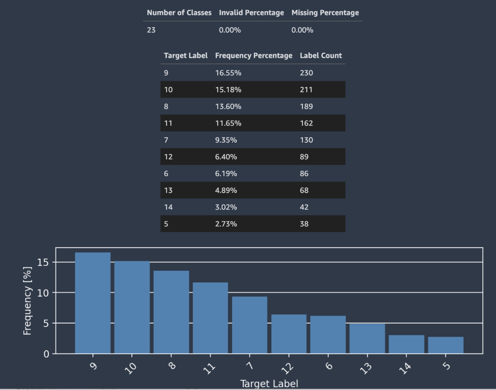

Note

You can find definitions of all the terms presented in this and other sections in Definitions
section at the bottom of the report notebook.

Data Sample

Autopilot presents an actual sample of your data to help you spot issues with your dataset. The
sample table scrolls horizontally. Inspect the sample data to verify that all the necessary columns
are present in the dataset.

Create Regression or Classification Jobs Using the AutoML API
173

## Page 202

Amazon SageMaker AI
Developer Guide

Autopilot also calculates a measure of prediction power, that can be used to identify a linear

or nonlinear relationship between a feature and the target variable. A value of 0 indicates that

the feature has no predictive value in predicting the target variable. A value of 1 indicates the
highest predictive power for the target variable. For more information on predictive power, see the

Definitions section.

Note

It is not recommended that you use prediction power as a substitute for feature
importance. Only use it if you're certain that prediction power is an appropriate measure
for your use case.

The following screenshot shows example data sample. The top row contains the prediction power
of each column in your dataset. The second row contains the column data type. Subsequent rows
contain the labels. The columns contain the target column followed by each feature column. Each
feature column has an associated prediction power, highlighted in this screenshot, with a box. In

this example, the column containing the feature x51 has a predictive power of 0.68 for the target

variable y. The feature x55 is slightly less predictive with a prediction power of 0.59.

Create Regression or Classification Jobs Using the AutoML API
174

## Page 203

Amazon SageMaker AI
Developer Guide

Duplicate rows

If duplicate rows are present in the dataset, Amazon SageMaker Autopilot displays a sample of
them.

Note

It is not recommended to balance a dataset by up-sampling before providing it to
Autopilot. This may result in inaccurate validation scores for the models trained by
Autopilot, and the models that are produced may be unusable.

Cross column correlations

Autopilot uses the Pearson's correlation coefficient, a measure of linear correlation between two
features, to populate a correlation matrix. In the correlation matrix, numeric features are plotted
on both the horizontal and vertical axes, with the Pearson's correlation coefficient plotted at their
intersections. The higher the correlation between two features, the higher the coefficient, with a

maximum value of |1|.

• A value of -1 indicates that the features are perfectly negatively correlated.

• A value of 1, which occurs when a feature is correlated with itself, indicates perfect positive
correlation.

You can use the information in the correlation matrix to remove highly correlated features. A
smaller number of features reduces chances of overfitting a model and can reduce the costs of
production in two ways. It lessens the Autopilot runtime needed and, for some applications, can
make data collection procedures cheaper.

The following screenshot shows an example of a correlation matrix between 7 features. Each
feature is displayed in a matrix on both the horizontal and vertical axes. The Pearson's correlation
coefficient is displayed at the intersection between two features. Each feature intersection has a
color tone associated with it. The higher the correlation, the darker the tone. The darkest tones
occupy the diagonal of the matrix, where each feature is correlated with itself, representing perfect
correlation.

Create Regression or Classification Jobs Using the AutoML API
175

## Page 204

Amazon SageMaker AI
Developer Guide

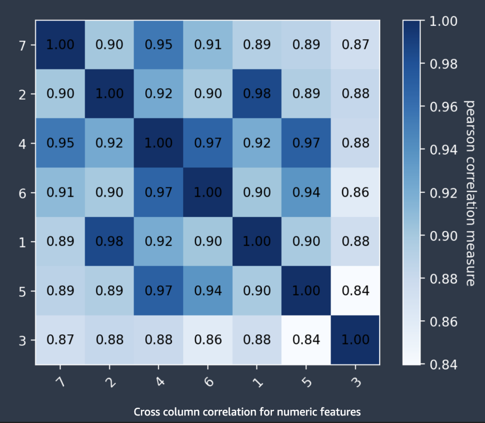

Anomalous Rows

Amazon SageMaker Autopilot detects which rows in your dataset might be anomalous. It then
assigns an anomaly score to each row. Rows with negative anomaly scores are considered
anomalous.

The following screenshot shows the output from an Autopilot analysis for rows containing
anomalies. A column containing an anomalous score appears next to the dataset columns for each
row.

Create Regression or Classification Jobs Using the AutoML API
176

## Page 205

Amazon SageMaker AI
Developer Guide

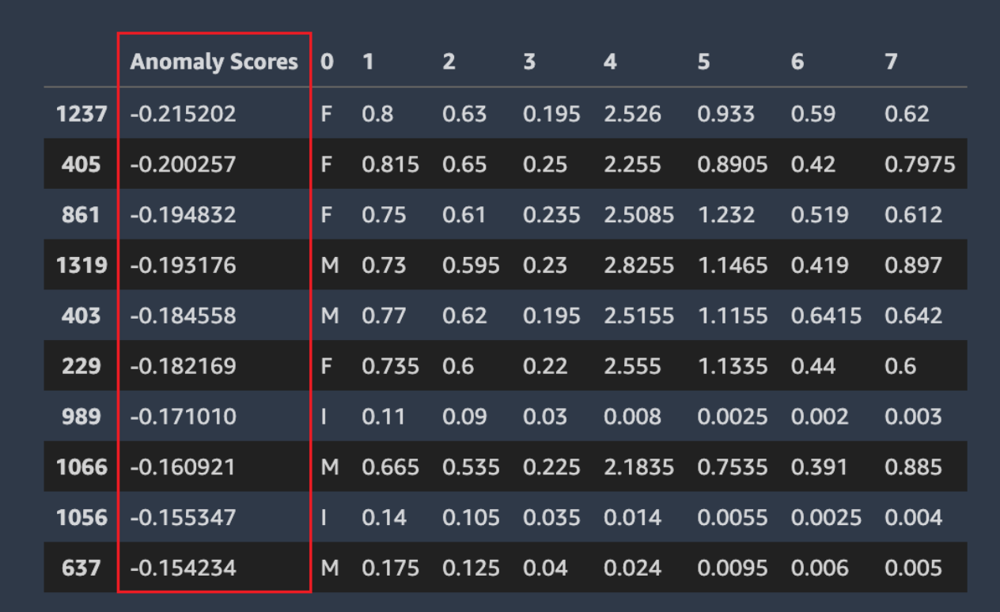

Missing values, cardinality, and descriptive statistics

Amazon SageMaker Autopilot examines and reports on properties of the individual columns of
your dataset. In each section of the data report that presents this analysis, the content is arranged
in order. This is so you can check the most “suspicious” values first. Using these statistics you
can improve contents of individual columns, and improve the quality of the model produced by
Autopilot.

Autopilot calculates several statistics on the categorical values in columns that contain them. These
include the number of unique entries and, for text, the number of unique words.

Autopilot calculates several standard statistics on the numerical values in columns that contain
them. The following image depicts these statistics, including the mean, median, minimum and
maximum values, and the percentages of numerical types and of outlier values.

Create Regression or Classification Jobs Using the AutoML API
177

## Page 206

Amazon SageMaker AI
Developer Guide

Find and run the candidate definition notebook

The candidate definition notebook contains each suggested preprocessing step, algorithm, and
hyperparameter ranges.

You can choose which candidate to train and tune in two ways. The first, by running sections of
the notebook. The second, by running the entire notebook to optimize all candidates to identify
a best candidate. If you run the entire notebook, only the best candidate is displayed after job
completion.

To run Autopilot from SageMaker Studio Classic, open the candidate definition notebook by
following these steps:

1.
Choose the Home icon

from the left navigation pane to view the top-level Amazon SageMaker Studio Classic
navigation menu.

2.
Select the AutoML card from the main working area. This opens a new Autopilot tab.

3.
In the Name section, select the Autopilot job that has the candidate definition notebook that
you want to examine. This opens a new Autopilot job tab.

Create Regression or Classification Jobs Using the AutoML API
178

## Page 207

Amazon SageMaker AI
Developer Guide

4.
Choose Open candidate generation notebook from the top right section of the Autopilot
job tab. This opens a new read-only preview of the Amazon SageMaker Autopilot Candidate
Definition Notebook.

To run the candidate definition notebook, follow these steps:

1.
Choose Import notebook at the top right of the Amazon SageMaker Autopilot Candidate
Definition Notebook tab. This opens a tab to set up a new notebook environment to run the
notebook.

2.
Select an existing SageMaker Image or use a Custom Image.

3.
Select a Kernel, an Instance type, and an optional Start-up script.

You can now run the notebook in this new environment.

Configure inference output in generated containers

Autopilot generates an ordered ContainerDefinition list. This can be used to build a model to
deploy in a machine learning pipeline. This model can be used for online hosting and inference.

Customers can list inference container definitions with the ListCandidateForAutoMLJob API.
The list of inference container definitions that represent the best candidate is also available in the

DescribeAutoMLJob response.

Inference container definitions for regression and classification problem types

Autopilot generates inference containers specific to the training mode and the problem type of the
job.

Container definitions for hyperparameter optimization (HPO) mode

• Regression: HPO generates two containers:

1. A feature engineering container that transforms the original features into features that the

regression algorithms can train on.

2. An algorithm container that transforms features and generates a regression score for the

dataset.

• Classification: HPO generates three containers:

1. A feature engineering container that transforms the original features into features that the

classification algorithms can train on.

Create Regression or Classification Jobs Using the AutoML API
179

## Page 208

Amazon SageMaker AI
Developer Guide

2. An algorithm container that generates the predicted_label with the highest probability.

This container can also produce the various probabilities associated with the classification
outcomes in the inference response.

3. A feature engineering container that performs post-processing of the algorithm prediction.

For example, it can perform an inverse transform on the predicted label and change it to the
original label.

Container definitions for ensembling mode

In ensembling mode, both regression and classification problem types have only one inference
container. This inference container transforms the features and generates the predictions based on
problem type.

Inference responses per problem type

Inference responses for classification models

For classification inference containers, you can select the content of the inference response by
using four predefined keys:

• predicted_label: The label with the highest probability of predicting the correct label, as
determined by Autopilot.

• probability:

• HPO models: The probability of the True class for binary classification. The probability of the

predicted_label for multiclass classification.

• Ensemble models: The probability of the predicted_label for binary and multiclass
classification.

• probabilities: The list of probabilities for all corresponding classes.

• labels: The list of all labels.

For example, for a binary classification problem, if you pass the inference response keys

['predicted_label', 'probability', 'probabilities', 'labels'] and the output

response appears as [1, 0.1, "[0.9, 0.1]", "['1', '0']"], you should interpret it as
follows:

1. predicted_label equals 1 because label "1" has a higher probability (0.9 in this case).

Create Regression or Classification Jobs Using the AutoML API
180

## Page 209

Amazon SageMaker AI
Developer Guide

2. For HPO models, probability equals 0.1 which is the probability of the positive_class (0

in this case) selected by Autopilot.

For Ensemble models, probability equals 0.9 which is the probability of the

predicted_label.

3. probabilities lists the probability of each label in labels.

4. labels are the unique labels in the dataset, where the second label ("0" in this case) is the

positive_class selected by Autopilot.

By default, inference containers are configured to generate only the predicted_label. To select

additional inference content, you can update the inference_response_keys parameter to
include up to these three environment variables:

• SAGEMAKER_INFERENCE_SUPPORTED: This is set to provide hints to you about what content
each container supports.

• SAGEMAKER_INFERENCE_INPUT: This should be set to the keys that the container expects in
input payload.

• SAGEMAKER_INFERENCE_OUTPUT: This should be populated with the set of keys that the
container outputs.

Inference responses for classification models in HPO mode

This section shows how to configure the inference response from classification models using
hyperparameter optimization (HPO) mode.

To choose the inference response content in HPO mode: Add the SAGEMAKER_INFERENCE_INPUT

and SAGEMAKER_INFERENCE_OUTPUT variables to the second and third containers that are
generated in HPO mode for classification problems.

The keys supported by the second container (algorithm) are predicted_label, probability, and

probabilities. Note that labels is deliberately not added to SAGEMAKER_INFERENCE_SUPPORTED.

The keys supported by the third classification model container are predicted_label, labels,

probability, and probabilities. Therefore, the SAGEMAKER_INFERENCE_SUPPORTED
environment includes the names of these keys.

To update the definition of the inference containers to receive predicted_label and

probability, use the following code example.

Create Regression or Classification Jobs Using the AutoML API
181

## Page 210

Amazon SageMaker AI
Developer Guide

containers[1]['Environment'].update({'SAGEMAKER_INFERENCE_OUTPUT': 'predicted_label,
probability'})
containers[2]['Environment'].update({'SAGEMAKER_INFERENCE_INPUT': 'predicted_label,
probability'})
containers[2]['Environment'].update({'SAGEMAKER_INFERENCE_OUTPUT': 'predicted_label,
probability'})

The following code example updates the definition of the inference containers to receive

predicted_label, probabilities, and labels. Do not pass the labels to the second
container (the algorithm container), because it is generated by the third container independently.

containers[1]['Environment'].update({'SAGEMAKER_INFERENCE_OUTPUT':
'predicted_label,probabilities'})
containers[2]['Environment'].update({'SAGEMAKER_INFERENCE_INPUT':
'predicted_label,probabilities'})

containers[2]['Environment'].update({'SAGEMAKER_INFERENCE_OUTPUT': 'predicted_label,
probabilities,labels'})

The following collapsible sections provide code examples for AWS SDK for Python (Boto3) and
for SageMaker SDK for Python. Each section shows how to select the content of the inference
responses in HPO mode for the respective code example.

AWS SDK for Python (Boto3)

import boto3

sm_client = boto3.client('sagemaker', region_name='<Region>')

role = '<IAM role>'
input_data = '<S3 input uri>'
output_path = '<S3 output uri>'

best_candidate = sm_client.describe_auto_ml_job(AutoMLJobName='<AutoML Job Name>')
['BestCandidate']
best_candidate_containers = best_candidate['InferenceContainers']
best_candidate_name = best_candidate['CandidateName']

best_candidate_containers[1]['Environment'].update({'SAGEMAKER_INFERENCE_OUTPUT':
'predicted_label, probability'})
best_candidate_containers[2]['Environment'].update({'SAGEMAKER_INFERENCE_INPUT':
'predicted_label, probability'})

Create Regression or Classification Jobs Using the AutoML API
182

## Page 211

Amazon SageMaker AI
Developer Guide

best_candidate_containers[2]['Environment'].update({'SAGEMAKER_INFERENCE_OUTPUT':
'predicted_label, probability'})

# create model
reponse = sm_client.create_model(
ModelName = '<Model Name>',
ExecutionRoleArn = role,
Containers = best_candidate_containers
)

# Lauch Transform Job
response = sm_client.create_transform_job(
TransformJobName='<Transform Job Name>',
ModelName='<Model Name>',
TransformInput={
'DataSource': {
'S3DataSource': {

'S3DataType': 'S3Prefix',
'S3Uri': input_data
}
},
'ContentType': "text/CSV",
'SplitType': 'Line'
},
TransformOutput={
'S3OutputPath': output_path,
'AssembleWith': 'Line',
},
TransformResources={
'InstanceType': 'ml.m4.xlarge',
'InstanceCount': 1,
},
)

SageMaker SDK for Python

from sagemaker import AutoML

aml = AutoML.attach(auto_ml_job_name='<AutoML Job Name>')
aml_best_model = aml.create_model(name='<Model Name>',
candidate=None,
inference_response_keys**=['probabilities',
'labels'])

Create Regression or Classification Jobs Using the AutoML API
183

## Page 212

Amazon SageMaker AI
Developer Guide

aml_transformer = aml_best_model.transformer(accept='text/csv',
assemble_with='Line',
instance_type='ml.m5.xlarge',
instance_count=1,)

aml_transformer.transform('<S3 input uri>',
content_type='text/csv',
split_type='Line',
job_name='<Transform Job Name>',
wait=True)

Inference responses for classification models in ensembling mode

This section shows how to configure the inference response from classification models using
ensembling mode.

In ensembling mode, to choose the content of the inference response, update the

SAGEMAKER_INFERENCE_OUTPUT environment variable.

The keys supported by the classification model container are predicted_label,

labels, probability, and probabilities. These keys are included in the

SAGEMAKER_INFERENCE_SUPPORTED environment.

To update the inference container definition to receive predicted_label and probability,
refer to the following code example.

containers[0]['Environment'].update({'SAGEMAKER_INFERENCE_OUTPUT': 'predicted_label,
probability'})

The following collapsible section provides a code example for selecting the content of the
inference responses in ensembling mode. The example uses AWS SDK for Python (Boto3).

AWS SDK for Python (Boto3)

import boto3
sm_client = boto3.client('sagemaker', region_name='<Region>')

role = '<IAM role>'
input_data = '<S3 input uri>'
output_path = '<S3 output uri>'

Create Regression or Classification Jobs Using the AutoML API
184

## Page 213

Amazon SageMaker AI
Developer Guide

best_candidate = sm_client.describe_auto_ml_job(AutoMLJobName='<AutoML Job Name>')
['BestCandidate']
best_candidate_containers = best_candidate['InferenceContainers']
best_candidate_name = best_candidate['CandidateName']

*best_candidate_containers[0]['Environment'].update({'SAGEMAKER_INFERENCE_OUTPUT':
'predicted_label, probability'})
*
# create model
reponse = sm_client.create_model(
ModelName = '<Model Name>',
ExecutionRoleArn = role,
Containers = best_candidate_containers
)

# Lauch Transform Job

response = sm_client.create_transform_job(
TransformJobName='<Transform Job Name>',
ModelName='<Model Name>',
TransformInput={
'DataSource': {
'S3DataSource': {
'S3DataType': 'S3Prefix',
'S3Uri': input_data
}
},
'ContentType': "text/CSV",
'SplitType': 'Line'
},
TransformOutput={
'S3OutputPath': output_path,
'AssembleWith': 'Line',
},
TransformResources={
'InstanceType': 'ml.m4.xlarge',
'InstanceCount': 1,
},
)

The following collapsible section provides a code example that is identical to the SageMaker SDK
for Python example for HPO. It is included for your convenience.

Create Regression or Classification Jobs Using the AutoML API
185

## Page 214

Amazon SageMaker AI
Developer Guide

SageMaker SDK for Python

The following HPO code example uses SageMaker SDK for Python.

from sagemaker import AutoML

aml = AutoML.attach(auto_ml_job_name='<AutoML Job Name>')
aml_best_model = aml.create_model(name='<Model Name>',

candidate=None,
*inference_response_keys**=['probabilities',
'labels'])*

aml_transformer = aml_best_model.transformer(accept='text/csv',
assemble_with='Line',
instance_type='ml.m5.xlarge',
instance_count=1,)

aml_transformer.transform('<S3 input uri>',
content_type='text/csv',
split_type='Line',
job_name='<Transform Job Name>',
wait=True)

Create an Image Classification Job using the AutoML API

The following instructions show how to create an Amazon SageMaker Autopilot job as a pilot
experiment for image classification problem types using SageMaker API Reference.

Note

Tasks such as text and image classification, time-series forecasting, and fine-tuning of large
language models are exclusively available through the version 2 of the AutoML REST API.
If your language of choice is Python, you can refer to AWS SDK for Python (Boto3) or the
AutoMLV2 object of the Amazon SageMaker Python SDK directly.
Users who prefer the convenience of a user interface can use Amazon SageMaker Canvas to
access pre-trained models and generative AI foundation models, or create custom models
tailored for specific text, image classification, forecasting needs, or generative AI.

Create an Image Classification Job using the AutoML API
186

## Page 215

Amazon SageMaker AI
Developer Guide

You can create an Autopilot image classification experiment programmatically by calling the

CreateAutoMLJobV2 API action in any language supported by Amazon SageMaker Autopilot or
the AWS CLI.

For information on how this API action translates into a function in the language of your choice,

see the  See Also section of CreateAutoMLJobV2 and choose an SDK. As an example, for Python

users, see the full request syntax of create_auto_ml_job_v2 in AWS SDK for Python (Boto3).

The following is a collection of mandatory and optional input request parameters for the

CreateAutoMLJobV2 API action used in image classification.

Required parameters

When calling CreateAutoMLJobV2 to create an Autopilot experiment for image classification, you
must provide the following values:

• An AutoMLJobName to specify the name of your job.

• At least one AutoMLJobChannel in AutoMLJobInputDataConfig to specify your data source.

• An AutoMLProblemTypeConfig of type ImageClassificationJobConfig.

• An OutputDataConfig to specify the Amazon S3 output path to store the artifacts of your
AutoML job.

• A RoleArn to specify the ARN of the role used to access your data.

All other parameters are optional.

Optional parameters

The following sections provide details of some optional parameters that you can pass to your
image classification AutoML job.

How to specify the training and validation datasets of an AutoML job

You can provide your own validation dataset and custom data split ratio, or let Autopilot split the
dataset automatically.

Each AutoMLJobChannel object (see the required parameter AutoMLJobInputDataConfig) has a

ChannelType, which can be set to either training or validation values that specify how the
data is to be used when building a machine learning model.

Create an Image Classification Job using the AutoML API
187

## Page 216

Amazon SageMaker AI
Developer Guide

At least one data source must be provided and a maximum of two data sources is allowed: one
for training data and one for validation data. How you split the data into training and validation
datasets depends on whether you have one or two data sources.

How you split the data into training and validation datasets depends on whether you have one or
two data sources.

• If you only have one data source, the ChannelType is set to training by default and must
have this value.

• If the ValidationFraction value in AutoMLDataSplitConfig is not set, 0.2 (20%) of the
data from this source is used for validation by default.

• If the ValidationFraction is set to a value between 0 and 1, the dataset is split based on
the value specified, where the value specifies the fraction of the dataset used for validation.

• If you have two data sources, the ChannelType of one of the AutoMLJobChannel objects

must be set to training, the default value. The ChannelType of the other data source must

be set to validation. The two data sources must have the same format, either CSV or Parquet,

and the same schema. You must not set the value for the ValidationFraction in this case
because all of the data from each source is used for either training or validation. Setting this
value causes an error.

How to specify the automatic model deployment configuration for an AutoML job

To enable automatic deployment for the best model candidate of an AutoML job, include a

ModelDeployConfig in the AutoML job request. This will allow the deployment of the best model
to a SageMaker AI endpoint. Below are the available configurations for customization.

• To let Autopilot generate the endpoint name, set AutoGenerateEndpointName to True.

• To provide your own name for the endpoint, set AutoGenerateEndpointName to False

and provide a name of your choice in EndpointName.

Datasets format and objective metric for image classification

In this section we learn about the available formats for datasets used in image classification as
well as the objective metric used to evaluate the predictive quality of machine learning model
candidates. The metrics calculated for candidates are specified using an array of MetricDatum
types.

Create an Image Classification Job using the AutoML API
188

## Page 217

Amazon SageMaker AI
Developer Guide

Datasets formats

Autopilot supports .png, .jpg, and .jpeg image formats. If your dataset contains all .png images use

image/png, if it contains all .jpg or .jpeg images use image/jpeg, and if your dataset contains a

mix of image formats use image/*.

Objective metric

The following list contains the names of the metrics that are currently available to measure the
performance of models for image classification.

Accuracy

The ratio of the number of correctly classified items to the total number of (correctly and
incorrectly) classified items. Accuracy measures how close the predicted class values are to
the actual values. Values for accuracy metrics vary between zero (0) and one (1). A value of 1
indicates perfect accuracy, and 0 indicates perfect inaccuracy.

Deploy Autopilot models for real-time inference

After you train your Amazon SageMaker Autopilot models, you can set up an endpoint and obtain
predictions interactively. The following section describes the steps for deploying your model to a
SageMaker AI real-time inference endpoint to get predictions from your model.

Real-time inferencing

Real-time inference is ideal for inference workloads where you have real-time, interactive,
low latency requirements. This section shows how you can use real-time inferencing to obtain
predictions interactively from your model.

You can use SageMaker APIs to manually deploy the model that produced the best validation
metric in an Autopilot experiment as follows.

Alternatively, you can chose the automatic deployment option when creating your Autopilot
experiment. For information on setting up the automatic deployment of models, see

ModelDeployConfig in the request parameters of CreateAutoMLJobV2. This creates an
endpoint automatically.

Create an Image Classification Job using the AutoML API
189

## Page 218

Amazon SageMaker AI
Developer Guide

Note

To avoid incurring unnecessary charges, you can delete unneeded endpoint and resources
created from model deployment. For information about pricing of instances by Region, see
Amazon SageMaker Pricing.

1. Obtain the candidate container definitions

Obtain the candidate container definitions from InferenceContainers. A container definition
for inference refers to the containerized environment designed for deploying and running your
trained SageMaker AI model to make predictions.

The following AWS CLI command example uses the DescribeAutoMLJobV2 API to obtain
candidate definitions for the best model candidate.

aws sagemaker describe-auto-ml-job-v2 --auto-ml-job-name job-name --region region

2. List candidates

The following AWS CLI command example uses the ListCandidatesForAutoMLJob API to list all
model candidates.

aws sagemaker list-candidates-for-auto-ml-job --auto-ml-job-name <job-name> --
region <region>

3. Create a SageMaker AI model

Use the container definitions from the previous steps and a candidate of your choice to create a
SageMaker AI model by using the CreateModel API. See the following AWS CLI command as an
example.

aws sagemaker create-model --model-name '<your-candidate-name>' \
--containers ['<container-definition1>, <container-
definition2>, <container-definition3>]' \
--execution-role-arn '<execution-role-arn>' --region '<region>

4. Create an endpoint configuration

Create an Image Classification Job using the AutoML API
190

## Page 219

Amazon SageMaker AI
Developer Guide

The following AWS CLI command example uses the CreateEndpointConfig API to create an
endpoint configuration.

aws sagemaker create-endpoint-config --endpoint-config-name '<your-endpoint-config-
name>' \
--production-variants '<list-of-production-variants>' \
--region '<region>'

5. Create the endpoint

The following AWS CLI example uses the CreateEndpoint API to create the endpoint.

aws sagemaker create-endpoint --endpoint-name '<your-endpoint-name>' \
--endpoint-config-name '<endpoint-config-name-you-just-created>'
\
--region '<region>'

Check the progress of your endpoint deployment by using the DescribeEndpoint API. See the
following AWS CLI command as an example.

aws sagemaker describe-endpoint —endpoint-name '<endpoint-name>' —region <region>

After the EndpointStatus changes to InService, the endpoint is ready to use for real-time
inference.

6. Invoke the endpoint

The following command structure invokes the endpoint for real-time inferencing.

aws sagemaker invoke-endpoint --endpoint-name '<endpoint-name>' \
--region '<region>' --body '<your-data>' [--content-type]
'<content-type>' <outfile>

Explainability report

Amazon SageMaker Autopilot provides an explainability report to help explain how a best model
candidate makes predictions for image classification problems. This report can assist ML engineers,
product managers, and other internal stakeholders in understanding the characteristics of the
model. Both consumers and regulators rely on transparency in machine learning to trust and

Create an Image Classification Job using the AutoML API
191

## Page 220

Amazon SageMaker AI
Developer Guide

interpret decisions made on model predictions. You can use these explanations for auditing and
meeting regulatory requirements, establishing trust in the model, supporting human decision-
making, and debugging and improving model performance.

The Autopilot explanatory functionality for image classification uses a visual class activation
map (CAM) approach that produces a heatmap where the distribution and intensity of each color
highlights the areas of an image that contribute the most to a specific prediction. This approach
relies on principal components derived from an implementation of Eigen-CAM.

Autopilot generates the explainability report as a JSON file. The report includes analysis details
that are based on the validation dataset. Each image used to generate the report contains the
following information:

• input_image_uri: The Amazon S3 URI to the input image taken as input for the heatmap.

• heatmap_image_uri: The Amazon S3 URI to the heatmap image generated by Autopilot.

• predicted_label: The label class predicted by best model trained by Autopilot.

• probability: The confidence with which the predicted_label is predicted.

You can find the Amazon S3 prefix to the explainability artifacts generated

for the best candidate in the response to DescribeAutoMLJobV2 at

BestCandidate.CandidateProperties.CandidateArtifactLocations.Explainability.

The following examples illustrates what the heatmaps look like on few samples from Oxford-IIIT
Pet Dataset. The heatmap image displays color gradients that indicate the relative importance of
different features within the image. The red color represents regions with greater importance in
predicting the "predicted_label" of the input image compared to the features represented by the
blue color.

Create an Image Classification Job using the AutoML API
192

## Page 221

Amazon SageMaker AI
Developer Guide

Input Image
Heatmap Image

Create an Image Classification Job using the AutoML API
193

## Page 222

Amazon SageMaker AI
Developer Guide

Model performance report

An Amazon SageMaker AI model quality report (also referred to as performance report) provides
insights and quality information for the best model candidate generated by an AutoML job. This
includes information about the job details, model problem type, objective function, and various
metrics. This section details the content of a performance report for image classification problems
and explains how to access the metrics as raw data in a JSON file.

You can find the Amazon S3 prefix to the model quality report artifacts

generated for the best candidate in the response to DescribeAutoMLJobV2 at

BestCandidate.CandidateProperties.CandidateArtifactLocations.ModelInsights.

The performance report contains two sections:

• The first section contains details about the Autopilot job that produced the model.

• The second section contains a model quality report with various performance metrics.

Autopilot job details

This first section of the report gives some general information about the Autopilot job that
produced the model. These details include the following information:

• Autopilot candidate name: The name of the best model candidate.

• Autopilot job name: The name of the job.

• Problem type: The problem type. In our case, image classification.

• Objective metric: The objective metric used to optimize the performance of the model. In our
case, Accuracy.

• Optimization direction: Indicates whether to minimize or maximize the objective metric.

Model quality report

Model quality information is generated by Autopilot model insights. The report's content that is
generated depends on the problem type it addressed. The report specifies the number of rows that
were included in the evaluation dataset and the time at which the evaluation occurred.

Metrics tables

The first part of the model quality report contains metrics tables. These are appropriate for the
type of problem that the model addressed.

Create an Image Classification Job using the AutoML API
194

## Page 223

Amazon SageMaker AI
Developer Guide

The following image is an example of a metrics table generates by Autopilot for an image or text
classification problem. It shows the metric name, value, and standard deviation.

Graphical model performance information

The second part of the model quality report contains graphical information to help you evaluate
model performance. The contents of this section depend on the selected problem type.

Confusion matrix

A confusion matrix provides a way to visualize the accuracy of the predictions made by a model for
binary and multiclass classification for different problems.

A summary of the graph's components of false positive rate (FPR) and true positive rate (TPR) are
defined as follows.

• Correct predictions

• True positive (TP): The predicted the value is 1, and the true value is 1.

• True negative (TN): The predicted the value is 0, and the true value is 0.

• Erroneous predictions

• False positive (FP): The predicted the value is 1, but the true value is 0.

• False negative (FN): The predicted the value is 0, but the true value is 1.

The confusion matrix in the model quality report contains the following.

Create an Image Classification Job using the AutoML API
195

## Page 224

Amazon SageMaker AI
Developer Guide

• The number and percentage of correct and incorrect predictions for the actual labels

• The number and percentage of accurate predictions on the diagonal from the upper-left to the
lower-right corner

• The number and percentage of inaccurate predictions on the diagonal from the upper-right to
the lower-left corner

The incorrect predictions on a confusion matrix are the confusion values.

The following diagram is an example of a confusion matrix for a multi-class classification problem.
The confusion matrix in the model quality report contains the following.

• The vertical axis is divided into three rows containing three different actual labels.

• The horizontal axis is divided into three columns containing labels that were predicted by the
model.

• The color bar assigns a darker tone to a larger number of samples to visually indicate the number
of values that were classified in each category.

In the example below, the model correctly predicted actual 354 values for label f, 1094 values for
label i and 852 values for label m. The difference in tone indicates that the dataset is not balanced
because there are many more labels for the value i than for f or m.

Create an Image Classification Job using the AutoML API
196

## Page 225

Amazon SageMaker AI
Developer Guide

The confusion matrix in the model quality report provided can accommodate a maximum of 15

labels for multiclass classification problem types. If a row corresponding to a label shows a Nan
value, it means that the validation dataset used to check model predictions does not contain data
with that label.

Create an AutoML job for text classification using the API

The following instructions show how to create an Amazon SageMaker Autopilot job as a pilot
experiment for text classification problem types using SageMaker API Reference.

Note

Tasks such as text and image classification, time-series forecasting, and fine-tuning of large
language models are exclusively available through the version 2 of the AutoML REST API.
If your language of choice is Python, you can refer to AWS SDK for Python (Boto3) or the
AutoMLV2 object of the Amazon SageMaker Python SDK directly.

Create a Text Classification job using the AutoML API
197

## Page 226

Amazon SageMaker AI
Developer Guide

Users who prefer the convenience of a user interface can use Amazon SageMaker Canvas to
access pre-trained models and generative AI foundation models, or create custom models
tailored for specific text, image classification, forecasting needs, or generative AI.

You can create an Autopilot text classification experiment programmatically by calling the

CreateAutoMLJobV2 API action in any language supported by Amazon SageMaker Autopilot or
the AWS CLI.

For information on how this API action translates into a function in the language of your choice,

see the  See Also section of CreateAutoMLJobV2 and choose an SDK. As an example, for Python

users, see the full request syntax of create_auto_ml_job_v2 in AWS SDK for Python (Boto3).

The following is a collection of mandatory and optional input request parameters for the

CreateAutoMLJobV2 API action used in text classification.

Required parameters

When calling CreateAutoMLJobV2 to create an Autopilot experiment for text classification, you
must provide the following values:

• An AutoMLJobName to specify the name of your job.

• At least one AutoMLJobChannel in AutoMLJobInputDataConfig to specify your data source.

• An AutoMLProblemTypeConfig of type TextClassificationJobConfig.

• An OutputDataConfig to specify the Amazon S3 output path to store the artifacts of your
AutoML job.

• A RoleArn to specify the ARN of the role used to access your data.

All other parameters are optional.

Optional parameters

The following sections provide details of some optional parameters that you can pass to your text
classification AutoML job.

How to specify the training and validation datasets of an AutoML job

You can provide your own validation dataset and custom data split ratio, or let Autopilot split the
dataset automatically.

Create a Text Classification job using the AutoML API
198

## Page 227

Amazon SageMaker AI
Developer Guide

Each AutoMLJobChannel object (see the required parameter AutoMLJobInputDataConfig) has a

ChannelType, which can be set to either training or validation values that specify how the

data is to be used when building a machine learning model.

At least one data source must be provided and a maximum of two data sources is allowed: one
for training data and one for validation data. How you split the data into training and validation
datasets depends on whether you have one or two data sources.

How you split the data into training and validation datasets depends on whether you have one or
two data sources.

• If you only have one data source, the ChannelType is set to training by default and must
have this value.

• If the ValidationFraction value in AutoMLDataSplitConfig is not set, 0.2 (20%) of the
data from this source is used for validation by default.

• If the ValidationFraction is set to a value between 0 and 1, the dataset is split based on
the value specified, where the value specifies the fraction of the dataset used for validation.

• If you have two data sources, the ChannelType of one of the AutoMLJobChannel objects

must be set to training, the default value. The ChannelType of the other data source must

be set to validation. The two data sources must have the same format, either CSV or Parquet,

and the same schema. You must not set the value for the ValidationFraction in this case
because all of the data from each source is used for either training or validation. Setting this
value causes an error.

How to specify the automatic model deployment configuration for an AutoML job

To enable automatic deployment for the best model candidate of an AutoML job, include a

ModelDeployConfig in the AutoML job request. This will allow the deployment of the best model
to a SageMaker AI endpoint. Below are the available configurations for customization.

• To let Autopilotgenerate the endpoint name, set AutoGenerateEndpointName to True.

• To provide your own name for the endpoint, set AutoGenerateEndpointName to False

and provide a name of your choice in EndpointName.

Create a Text Classification job using the AutoML API
199

## Page 228

Amazon SageMaker AI
Developer Guide

Datasets format and objective metric for text classification

In this section we learn about the available formats for datasets used in text classification as well
as the metric used to evaluate the predictive quality of machine learning model candidates. The
metrics calculated for candidates are specified using an array of MetricDatum types.

Datasets formats

Autopilot supports tabular data formatted as CSV files or as Parquet files. For tabular data, each
column contains a feature with a specific data type and each row contains an observation. The
properties of these two file formats differ considerably.

• CSV (comma-separated-values) is a row-based file format that stores data in human readable
plaintext which a popular choice for data exchange as they are supported by a wide range of
applications.

• Parquet is a column-based file format where the data is stored and processed more efficiently
than row-based file formats. This makes them a better option for big data problems.

The data types accepted for columns include numerical, categorical, text.

Autopilot supports building machine learning models on large datasets up to hundreds of GBs.
For details on the default resource limits for input datasets and how to increase them, see Amazon
SageMaker Autopilot quotas.

Objective metric

The following list contains the names of the metrics that are currently available to measure the
performance of models for text classification.

Accuracy

The ratio of the number of correctly classified items to the total number of (correctly and
incorrectly) classified items. Accuracy measures how close the predicted class values are to
the actual values. Values for accuracy metrics vary between zero (0) and one (1). A value of 1
indicates perfect accuracy, and 0 indicates perfect inaccuracy.

Create a Text Classification job using the AutoML API
200

## Page 229

Amazon SageMaker AI
Developer Guide

Deploy Autopilot models for real-time inference

After you train your Amazon SageMaker Autopilot models, you can set up an endpoint and obtain
predictions interactively. The following section describes the steps for deploying your model to a

SageMaker AI real-time inference endpoint to get predictions from your model.

Real-time inferencing

Real-time inference is ideal for inference workloads where you have real-time, interactive,
low latency requirements. This section shows how you can use real-time inferencing to obtain
predictions interactively from your model.

You can use SageMaker APIs to manually deploy the model that produced the best validation
metric in an Autopilot experiment as follows.

Alternatively, you can chose the automatic deployment option when creating your Autopilot
experiment. For information on setting up the automatic deployment of models, see

ModelDeployConfig in the request parameters of CreateAutoMLJobV2. This creates an
endpoint automatically.

Note

To avoid incurring unnecessary charges, you can delete unneeded endpoint and resources
created from model deployment. For information about pricing of instances by Region, see
Amazon SageMaker Pricing.

1. Obtain the candidate container definitions

Obtain the candidate container definitions from InferenceContainers. A container definition
for inference refers to the containerized environment designed for deploying and running your
trained SageMaker AI model to make predictions.

The following AWS CLI command example uses the DescribeAutoMLJobV2 API to obtain
candidate definitions for the best model candidate.

aws sagemaker describe-auto-ml-job-v2 --auto-ml-job-name job-name --region region

2. List candidates

Create a Text Classification job using the AutoML API
201

## Page 230

Amazon SageMaker AI
Developer Guide

The following AWS CLI command example uses the ListCandidatesForAutoMLJob API to list all
model candidates.

aws sagemaker list-candidates-for-auto-ml-job --auto-ml-job-name <job-name> --
region <region>

3. Create a SageMaker AI model

Use the container definitions from the previous steps and a candidate of your choice to create a
SageMaker AI model by using the CreateModel API. See the following AWS CLI command as an
example.

aws sagemaker create-model --model-name '<your-candidate-name>' \
--containers ['<container-definition1>, <container-
definition2>, <container-definition3>]' \

--execution-role-arn '<execution-role-arn>' --region '<region>

4. Create an endpoint configuration

The following AWS CLI command example uses the CreateEndpointConfig API to create an
endpoint configuration.

aws sagemaker create-endpoint-config --endpoint-config-name '<your-endpoint-config-
name>' \
--production-variants '<list-of-production-variants>' \
--region '<region>'

5. Create the endpoint

The following AWS CLI example uses the CreateEndpoint API to create the endpoint.

aws sagemaker create-endpoint --endpoint-name '<your-endpoint-name>' \
--endpoint-config-name '<endpoint-config-name-you-just-created>'
\
--region '<region>'

Check the progress of your endpoint deployment by using the DescribeEndpoint API. See the
following AWS CLI command as an example.

aws sagemaker describe-endpoint —endpoint-name '<endpoint-name>' —region <region>

Create a Text Classification job using the AutoML API
202

## Page 231

Amazon SageMaker AI
Developer Guide

After the EndpointStatus changes to InService, the endpoint is ready to use for real-time
inference.

6. Invoke the endpoint

The following command structure invokes the endpoint for real-time inferencing.

aws sagemaker invoke-endpoint --endpoint-name '<endpoint-name>' \
--region '<region>' --body '<your-data>' [--content-type]
'<content-type>' <outfile>

Explainability report

Amazon SageMaker Autopilot provides an explainability report to help explain how a best model
candidate makes predictions for text classification problems. This report can assist ML engineers,

product managers, and other internal stakeholders in understanding the characteristics of the
model. Both consumers and regulators rely on transparency in machine learning to trust and
interpret decisions made on model predictions. You can use these explanations for auditing and
meeting regulatory requirements, establishing trust in the model, supporting human decision-
making, and debugging and improving model performance.

The Autopilot explanatory functionality for text classification uses the axiomatic attribution
method Integrated Gradients. This approach relies on an implementation of Axiomatic Attribution
for Deep Network.

Autopilot generates the explainability report as a JSON file. The report includes analysis details
that are based on the validation dataset. Each sample used to generate the report contains the
following information:

• text: The input text content explained.

• token_scores: The list of scores for every token in the text.

• • attribution: The score depicting the importance of the token.

• description.partial_text: The partial substring that represents the token.

• predicted_label: The label class predicted by the best model candidate.

• probability: The confidence with which the predicted_label was predicted.

Create a Text Classification job using the AutoML API
203

## Page 232

Amazon SageMaker AI
Developer Guide

You can find the Amazon S3 prefix to the explainability artifacts generated

for the best candidate in the response to DescribeAutoMLJobV2 at

BestCandidate.CandidateProperties.CandidateArtifactLocations.Explainability.

The following is an example of analysis content that you could find in the explainability artifacts.

{
"text": "It was a fantastic movie!",
"predicted_label": 2,
"probability": 0.9984835,
"token_scores": [
{
"attribution": 0,
"description": {
"partial_text": "It"
}

},
{
"attribution": -0.022447118861679088,
"description": {
"partial_text": "was"
}
},
{
"attribution": -0.2164326456817965,
"description": {
"partial_text": "a"
}
},
{
"attribution": 0.675,
"description": {
"partial_text": "fantastic"
}
},
{
"attribution": 0.416,
"description": {
"partial_text": "movie!"
}
}
]
}

Create a Text Classification job using the AutoML API
204

## Page 233

Amazon SageMaker AI
Developer Guide

In this sample of the JSON report, the explanatory functionality evaluates the text It was a

fantastic movie! and scores the contribution of each of its token to the overall predicted

label. The predicted label is 2, which is a strong positive sentiment, with a probability of 99.85%.
The JSON sample then details the contribution of each individual token to this prediction. For

example, the token fantastic has a stronger attribution than the token was. It is the token that
contributed the most to the final prediction.

Model performance report

An Amazon SageMaker AI model quality report (also referred to as performance report) provides
insights and quality information for the best model candidate generated by an AutoML job. This
includes information about the job details, model problem type, objective function, and various
metrics. This section details the content of a performance report for text classification problems
and explains how to access the metrics as raw data in a JSON file.

You can find the Amazon S3 prefix to the model quality report artifacts

generated for the best candidate in the response to DescribeAutoMLJobV2 at

BestCandidate.CandidateProperties.CandidateArtifactLocations.ModelInsights.

The performance report contains two sections:

• The first section contains details about the Autopilot job that produced the model.

• The second section contains a model quality report with various performance metrics.

Autopilot job details

This first section of the report gives some general information about the Autopilot job that
produced the model. These details include the following information:

• Autopilot candidate name: The name of the best model candidate.

• Autopilot job name: The name of the job.

• Problem type: The problem type. In our case, text classification.

• Objective metric: The objective metric used to optimize the performance of the model. In our
case, Accuracy.

• Optimization direction: Indicates whether to minimize or maximize the objective metric.

Create a Text Classification job using the AutoML API
205

## Page 234

Amazon SageMaker AI
Developer Guide

Model quality report

Model quality information is generated by Autopilot model insights. The report's content that is
generated depends on the problem type it addressed. The report specifies the number of rows that

were included in the evaluation dataset and the time at which the evaluation occurred.

Metrics tables

The first part of the model quality report contains metrics tables. These are appropriate for the
type of problem that the model addressed.

The following image is an example of a metrics table generated by Autopilot for an image or text
classification problem. It shows the metric name, value, and standard deviation.

Graphical model performance information

The second part of the model quality report contains graphical information to help you evaluate
model performance. The contents of this section depend on the selected problem type.

Confusion matrix

A confusion matrix provides a way to visualize the accuracy of the predictions made by a model for
binary and multiclass classification for different problems.

A summary of the graph's components of false positive rate (FPR) and true positive rate (TPR) are
defined as follows.

Create a Text Classification job using the AutoML API
206

## Page 235

Amazon SageMaker AI
Developer Guide

• Correct predictions

• True positive (TP): The predicted the value is 1, and the true value is 1.

• True negative (TN): The predicted the value is 0, and the true value is 0.

• Erroneous predictions

• False positive (FP): The predicted the value is 1, but the true value is 0.

• False negative (FN): The predicted the value is 0, but the true value is 1.

The confusion matrix in the model quality report contains the following.

• The number and percentage of correct and incorrect predictions for the actual labels

• The number and percentage of accurate predictions on the diagonal from the upper-left to the
lower-right corner

• The number and percentage of inaccurate predictions on the diagonal from the upper-right to
the lower-left corner

The incorrect predictions on a confusion matrix are the confusion values.

The following diagram is an example of a confusion matrix for a multi-class classification problem.
The confusion matrix in the model quality report contains the following.

• The vertical axis is divided into three rows containing three different actual labels.

• The horizontal axis is divided into three columns containing labels that were predicted by the
model.

• The color bar assigns a darker tone to a larger number of samples to visually indicate the number
of values that were classified in each category.

In the example below, the model correctly predicted actual 354 values for label f, 1094 values for
label i and 852 values for label m. The difference in tone indicates that the dataset is not balanced
because there are many more labels for the value i than for f or m.

Create a Text Classification job using the AutoML API
207

## Page 236

Amazon SageMaker AI
Developer Guide

The confusion matrix in the model quality report provided can accommodate a maximum of 15

labels for multiclass classification problem types. If a row corresponding to a label shows a Nan
value, it means that the validation dataset used to check model predictions does not contain data
with that label.

Create an AutoML job for time-series forecasting using the API

Forecasting in machine learning refers to the process of predicting future outcomes or trends
based on historical data and patterns. By analyzing past time-series data and identifying
underlying patterns, machine learning algorithms can make predictions and provide valuable
insights into future behavior. In forecasting, the goal is to develop models that can accurately
capture the relationship between input variables and the target variable over time. This involves
examining various factors such as trends, seasonality, and other relevant patterns within the data.
The collected information is then used to train a machine learning model. The trained model is
capable of generating predictions by taking new input data and applying the learned patterns and

Create a time-series forecasting job using the AutoML API
208

## Page 237

Amazon SageMaker AI
Developer Guide

relationships. It can provide forecasts for a wide range of use cases, such as sales projections, stock
market trends, weather forecasts, demand forecasting, and many more.

The following instructions show how to create an Amazon SageMaker Autopilot job as a pilot
experiment for time-series forecasting problem types using SageMaker API Reference.

Note

Tasks such as text and image classification, time-series forecasting, and fine-tuning of large
language models are exclusively available through the version 2 of the AutoML REST API.
If your language of choice is Python, you can refer to AWS SDK for Python (Boto3) or the
AutoMLV2 object of the Amazon SageMaker Python SDK directly.
Users who prefer the convenience of a user interface can use Amazon SageMaker Canvas to
access pre-trained models and generative AI foundation models, or create custom models
tailored for specific text, image classification, forecasting needs, or generative AI.

You can create an Autopilot time-series forecasting experiment programmatically by calling the

CreateAutoMLJobV2 API in any language supported by Amazon SageMaker Autopilot or the AWS
CLI.

For information on how this API action translates into a function in the language of your choice,

see the  See Also section of CreateAutoMLJobV2 and choose an SDK. As an example, for Python

users, see the full request syntax of create_auto_ml_job_v2 in AWS SDK for Python (Boto3).

Autopilot trains several model candidates with your target time-series, then selects an optimal
forecasting model for a given objective metric. When your model candidates have been

trained, you can find the best candidate metrics in the response to DescribeAutoMLJobV2 at

BestCandidate.

The following sections define the mandatory and optional input request parameters for the

CreateAutoMLJobV2 API used in time-series forecasting.

Note

Refer to the notebook Time-Series Forecasting with Amazon SageMaker Autopilot for a
practical, hands-on time-series forecasting example. In this notebook, you use Amazon
SageMaker Autopilot to train a time-series model and produce predictions using the trained

Create a time-series forecasting job using the AutoML API
209

## Page 238

Amazon SageMaker AI
Developer Guide

model. The notebook provides instructions for retrieving a ready-made dataset of tabular
historical data on Amazon S3.

Prerequisites

Before using Autopilot to create a time-series forecasting experiment in SageMaker AI, make sure
to:

• Prepare your time-series dataset. Dataset preparation involves collecting relevant data from
various sources, cleaning and filtering it to remove noise and inconsistencies, and organizing it
into a structured format. See Time-series datasets format and missing values filling methods to
learn more about time-series formats requirements in Autopilot. Optionally, you can supplement
your dataset with the public holiday calendar of the country of your choice to capture associated

patterns. For more information on holiday calendars, see National holiday calendars.

Note

We recommend providing at least 3-5 historical data points for each 1 future data point
you want to predict. For example, to forecast 7 days ahead (horizon of 1 week) based on
daily data, train your model on a minimum of 21-35 days of historical data. Make sure to
provide enough data to capture seasonal and recurrent patterns.

• Place your time-series data in an Amazon S3 bucket.

• Grant full access to the Amazon S3 bucket containing your input data for the SageMaker AI
execution role used to run your experiment. Once this is done, you can use the ARN of this
execution role in Autopilot API requests.

• For information on retrieving your SageMaker AI execution role, see Get your execution role.

• For information on granting your SageMaker AI execution role permissions to access one
or more specific buckets in Amazon S3, see  Add Additional Amazon S3 Permissions to a
SageMaker AI Execution Role in Create execution role.

Required parameters

When calling CreateAutoMLJobV2 to create an Autopilot experiment for time-series forecasting,
you must provide the following values:

Create a time-series forecasting job using the AutoML API
210

## Page 239

Amazon SageMaker AI
Developer Guide

• An AutoMLJobName to specify the name of your job. The name should be of type string, and
should have a minimum length of 1 character and a maximum length of 32.

• At least one AutoMLJobChannel in AutoMLJobInputDataConfig in which you specify the
name of the Amazon S3 bucket that contains your data. Optionally, you can specify the content

(CSV or Parquet files) and compression (GZip) types.

• An AutoMLProblemTypeConfig of type TimeSeriesForecastingJobConfig to configure
the settings of your time-series forecasting job. In particular, you must specify:

• The frequency of predictions, which refers to the desired granularity (hourly, daily, monthly,
etc) of your forecast.

Valid intervals are an integer followed by Y (Year), M (Month), W (Week), D (Day), H (Hour), and

min (Minute). For example, 1D indicates every day and 15min indicates every 15 minutes. The
value of a frequency must not overlap with the next larger frequency. For example, you must

use a frequency of 1H instead of 60min.

The valid values for each frequency are the following:

• Minute - 1-59

• Hour - 1-23

• Day - 1-6

• Week - 1-4

• Month - 1-11

• Year - 1

• The horizon of predictions in your forecast, which refers to the number of time-steps that
the model predicts. The forecast horizon is also called the prediction length. The maximum
forecast horizon is the lesser of 500 time-steps or 1/4 of the time-steps in the dataset.

• A TimeSeriesConfig in which you define the schema of your dataset to map the column
headers to your forecast by specifying:

• A TargetAttributeName: The column that contains historical data of the target field to
forecast.

• A TimestampAttributeName: The column that contains a point in time at which the target
value of a given item is recorded.

• A ItemIdentifierAttributeName: The column that contains the item identifiers for
which you want to predict the target value.

Create a time-series forecasting job using the AutoML API
211

## Page 240

Amazon SageMaker AI
Developer Guide

The following is an example of those request parameters. In this example, you are setting up a
daily forecast for the expected quantity or level of demand of specific items over a period of 20
days.

"AutoMLProblemTypeConfig": {
"ForecastFrequency": "D",
"ForecastHorizon": 20,
"TimeSeriesConfig": {
"TargetAttributeName": "demand",
"TimestampAttributeName": "timestamp",
"ItemIdentifierAttributeName": "item_id"
},

• An OutputDataConfig to specify the Amazon S3 output path to store the artifacts of your
AutoML job.

• A RoleArn to specify the ARN of the role used to access your data. You can use the ARN of the
execution role to which you have granted access to your data.

All other parameters are optional. For example, you can set specific forecast quantiles, choose
a filling method for missing values in the dataset, or define how to aggregate data that does
not align with forecast frequency. To learn how to set those additional parameters, see Optional
parameters.

Optional parameters

The following sections provide details of some optional parameters that you can pass to your time-
series forecasting AutoML job.

How to specify algorithms

By default, your Autopilot job trains a pre-defined list of algorithms on your dataset. However, you
can provide a subset of the default selection of algorithms.

For time-series forecasting, you must choose TimeSeriesForecastingJobConfig as the type of

AutoMLProblemTypeConfig.

Then, you can specify an array of selected AutoMLAlgorithms in the AlgorithmsConfig
attribute of CandidateGenerationConfig.

Create a time-series forecasting job using the AutoML API
212

## Page 241

Amazon SageMaker AI
Developer Guide

The following is an example of an AlgorithmsConfig attribute listing exactly three algorithms

("cnn-qr", "prophet", "arima") in its AutoMLAlgorithms field.

{
"AutoMLProblemTypeConfig": {
"TimeSeriesForecastingJobConfig": {
"CandidateGenerationConfig": {
"AlgorithmsConfig":[
{"AutoMLAlgorithms":["cnn-qr", "prophet", "arima"]}
]
},
},
},
}

For the list of available algorithms for time-series forecasting, see AutoMLAlgorithms. For details

on each algorithm, see Algorithms support for time-series forecasting.

How to specify custom quantiles

Autopilot trains 6 models candidates with your target time-series, then combines these models
using a stacking ensemble method to create an optimal forecasting model for a given objective
metric. Each Autopilot forecasting model generates a probabilistic forecast by producing forecasts
at quantiles between P1 and P99. These quantiles are used to account for forecast uncertainty. By

default, forecasts will be generated for the 0.1 (p10), 0.5 (p50), and 0.9 (p90). You can choose to
specify your own quantiles.

In Autopilot, you can specify up to five forecast quantiles from 0.01 (p1) to 0.99

(p99), by increments of 0.01 or higher in the ForecastQuantiles attribute of
TimeSeriesForecastingJobConfig.

In the following example, you are setting up a daily 10th, 25th, 50th, 75th, and 90th percentile
forecast for the expected quantity or level of demand of specific items over a period of 20 days.

"AutoMLProblemTypeConfig": {
"ForecastFrequency": "D",
"ForecastHorizon": 20,
"ForecastQuantiles": ["p10", "p25", "p50", "p75", "p90"],
"TimeSeriesConfig": {
"TargetAttributeName": "demand",
"TimestampAttributeName": "timestamp",

Create a time-series forecasting job using the AutoML API
213

## Page 242

Amazon SageMaker AI
Developer Guide

"ItemIdentifierAttributeName": "item_id"
},

How to aggregate data for different forecast frequencies

To create a forecast model (also referred to as the best model candidate from your experiment),
you must specify a forecast frequency. The forecast frequency determines the frequency of
predictions in your forecasts. For example, monthly sales forecasts. Autopilot best model can
generate forecasts for data frequencies that are higher than the frequency at which your data is
recorded.

During training, Autopilot aggregates any data that does not align with the forecast frequency
you specify. For example, you might have some daily data but specify a weekly forecast frequency.
Autopilot aligns the daily data based on the week that it belongs in. Autopilot then combines it
into single record for each week.

During aggregation, the default transformation method is to sum the data. You can configure

the aggregation when you create your AutoML job in the Transformations attribute of

TimeSeriesForecastingJobConfig. The supported aggregation methods are sum (default), avg,

first, min, max. Aggregation is only supported for the target column.

In the following example, you configure the aggregation to calculate the average of the individual
promo forecasts to provide the final aggregated forecast values.

"Transformations": {
"Aggregation": {
"promo": "avg"
}
}

How to handle missing values in your input datasets

Autopilot provides a number of filling methods to handle missing values in the target and other
numeric columns of your time-series datasets. For information on the list of supported filling
methods and their available filling logic, see Handle missing values.

You configure your filling strategy in the Transformations attribute of
TimeSeriesForecastingJobConfig when creating your AutoML job.

To set a filling method, you need to provide a key-value pair:

Create a time-series forecasting job using the AutoML API
214

## Page 243

Amazon SageMaker AI
Developer Guide

• The key is the name of the column for which you want to specify the filling method.

• The value associated with the key is an object that defines the filling strategy for that column.

You can specify multiple filling methods for a single column.

To set a specific value for the filling method, you should set the fill parameter to the desired filling

method value (for example "backfill" : "value"), and define the actual filling value in an

additional parameter suffixed with "_value". For example, to set backfill to a value of 2, you

must include two parameters: "backfill": "value" and "backfill_value":"2".

In the following example, you specify the filling strategy for the incomplete data column, "price"

as follows: All missing values between the first data point of an item and the last are set to 0 after

which all missing values are filled with the value 2 until the end date of the dataset.

"Transformations": {
"Filling": {
"price": {
"middlefill" : "zero",
"backfill" : "value",
"backfill_value": "2"
}
}
}

How to specify an objective metric

Autopilot produces accuracy metrics to evaluate the model candidates and help you choose which
to use to generate forecasts. When you run a time-series forecasting experiment, you can either
choose AutoML to let Autopilot optimize the predictor for you, or you can manually choose an
algorithm for your predictor.

By default, Autopilot uses the Average Weighted Quantile Loss. However, you can configure

the objective metric when you create your AutoML job in the MetricName attribute of
AutoMLJobObjective.

For the list of available algorithms, see Algorithms support for time-series forecasting.

How to incorporate national holiday information to your dataset

In Autopilot, you can incorporate a feature-engineered dataset of national holiday information to
your time-series. Autopilot provide native support for the holiday calendars of over 250 countries.

Create a time-series forecasting job using the AutoML API
215

## Page 244

Amazon SageMaker AI
Developer Guide

After you choose a country, Autopilot applies that country’s holiday calendar to every item in your
dataset during training. This allows the model to identify patterns associated with specific holidays.

You can enable the holiday featurization when you create your AutoML job by

passing an HolidayConfigAttributes object to the HolidayConfig attribute of

TimeSeriesForecastingJobConfig. The HolidayConfigAttributes object contains the two

letters CountryCode attribute that determines the country of the public national holiday calendar
used to augment your time-series dataset.

Refer to Country Codes for the list of supported calendars and their corresponding country code.

How to enable automatic deployment

Autopilot allows you to automatically deploy your forecast model to an endpoint. To
enable automatic deployment for the best model candidate of an AutoML job, include a

ModelDeployConfig in the AutoML job request. This allows the deployment of the best model to
a SageMaker AI endpoint. Below are the available configurations for customization.

• To let Autopilotgenerate the endpoint name, set AutoGenerateEndpointName to True.

• To provide your own name for the endpoint, set AutoGenerateEndpointName to False

and provide a name of your choice in EndpointName.

How to configure AutoML to initiate a remote job on EMR Serverless for large datasets

You can configure your AutoML job V2 to automatically initiate a remote job on Amazon EMR
Serverless when additional compute resources are needed to process large datasets. By seamlessly
transitioning to EMR Serverless when required, the AutoML job can handle datasets that would
otherwise exceed the initially provisioned resources, without any manual intervention from you.
EMR Serverless is available for the tabular and time series problem types. We recommend setting
up this option for time-series datasets larger than 30 GB.

To allow your AutoML job V2 to automatically transition to EMR Serverless for large dataset,

you need to provide an EmrServerlessComputeConfig object, which includes an

ExecutionRoleARN field, to the AutoMLComputeConfig of the AutoML job V2 input request.

The ExecutionRoleARN is the ARN of the IAM role granting the AutoML job V2 the necessary
permissions to run EMR Serverless jobs.

This role should have the following trust relationship:

Create a time-series forecasting job using the AutoML API
216

## Page 245

Amazon SageMaker AI
Developer Guide

JSON

{
"Version":"2012-10-17",
"Statement": [
{
"Effect": "Allow",
"Principal": {
"Service": "emr-serverless.amazonaws.com"
},
"Action": "sts:AssumeRole"
}
]
}

And grant the permissions to:

• Create, list, and update EMR Serverless applications.

• Start, list, get, or cancel job runs on an EMR Serverless application.

• Tag EMR Serverless resources.

• Pass an IAM role to the EMR Serverless service for execution.

By granting the iam:PassRole permission, the AutoML job V2 can temporarily assume the

EMRServerlessRuntimeRole-* role and pass it to the EMR Serverless service. These are
the IAM roles used by the EMR Serverless job execution environments to access other AWS
services and resources needed during runtime, such as Amazon S3 for data access, CloudWatch
for logging, access to the AWS Glue Data Catalog or other services based on your workload
requirements.

See Job runtime roles for Amazon EMR Serverless for details on this role permissions.

The IAM policy defined in the provided JSON document grants those permissions:

JSON

{
"Version":"2012-10-17",

Create a time-series forecasting job using the AutoML API
217

## Page 246

Amazon SageMaker AI
Developer Guide

"Statement": [{
"Sid": "EMRServerlessCreateApplicationOperation",
"Effect": "Allow",
"Action": "emr-serverless:CreateApplication",
"Resource": "arn:aws:emr-serverless:*:*:/*",
"Condition": {
"StringEquals": {
"aws:RequestTag/sagemaker:is-canvas-resource": "True",
"aws:ResourceAccount": "${aws:PrincipalAccount}"
}
}
},
{
"Sid": "EMRServerlessListApplicationOperation",
"Effect": "Allow",
"Action": "emr-serverless:ListApplications",
"Resource": "arn:aws:emr-serverless:*:*:/*",

"Condition": {
"StringEquals": {
"aws:ResourceAccount": "${aws:PrincipalAccount}"
}
}
},
{
"Sid": "EMRServerlessApplicationOperations",
"Effect": "Allow",
"Action": [
"emr-serverless:UpdateApplication",
"emr-serverless:GetApplication"
],
"Resource": "arn:aws:emr-serverless:*:*:/applications/*",
"Condition": {
"StringEquals": {
"aws:ResourceTag/sagemaker:is-canvas-resource": "True",
"aws:ResourceAccount": "${aws:PrincipalAccount}"
}
}
},
{
"Sid": "EMRServerlessStartJobRunOperation",
"Effect": "Allow",
"Action": "emr-serverless:StartJobRun",
"Resource": "arn:aws:emr-serverless:*:*:/applications/*",
"Condition": {

Create a time-series forecasting job using the AutoML API
218

## Page 247

Amazon SageMaker AI
Developer Guide

"StringEquals": {
"aws:RequestTag/sagemaker:is-canvas-resource": "True",
"aws:ResourceAccount": "${aws:PrincipalAccount}"
}
}
},
{
"Sid": "EMRServerlessListJobRunOperation",
"Effect": "Allow",
"Action": "emr-serverless:ListJobRuns",
"Resource": "arn:aws:emr-serverless:*:*:/applications/*",
"Condition": {
"StringEquals": {
"aws:ResourceTag/sagemaker:is-canvas-resource": "True",
"aws:ResourceAccount": "${aws:PrincipalAccount}"
}
}

},
{
"Sid": "EMRServerlessJobRunOperations",
"Effect": "Allow",
"Action": [
"emr-serverless:GetJobRun",
"emr-serverless:CancelJobRun"
],
"Resource": "arn:aws:emr-serverless:*:*:/applications/*/jobruns/*",
"Condition": {
"StringEquals": {
"aws:ResourceTag/sagemaker:is-canvas-resource": "True",
"aws:ResourceAccount": "${aws:PrincipalAccount}"
}
}
},
{
"Sid": "EMRServerlessTagResourceOperation",
"Effect": "Allow",
"Action": "emr-serverless:TagResource",
"Resource": "arn:aws:emr-serverless:*:*:/*",
"Condition": {
"StringEquals": {
"aws:RequestTag/sagemaker:is-canvas-resource": "True",
"aws:ResourceAccount": "${aws:PrincipalAccount}"
}
}

Create a time-series forecasting job using the AutoML API
219

## Page 248

Amazon SageMaker AI
Developer Guide

},
{
"Sid": "IAMPassOperationForEMRServerless",
"Effect": "Allow",
"Action": "iam:PassRole",
"Resource": "arn:aws:iam::*:role/EMRServerlessRuntimeRole-*",
"Condition": {
"StringEquals": {
"iam:PassedToService": "emr-serverless.amazonaws.com",
"aws:ResourceAccount": "${aws:PrincipalAccount}"
}
}
}
]
}

Time-series datasets format and missing values filling methods

Time-series data refers to a collection of observations or measurements recorded over regular
intervals of time. In this type of data, each observation is associated with a specific timestamp or
time period, creating a sequence of data points ordered chronologically.

The specific columns you include in your time-series dataset depend on the goals of your analysis
and the data available to you. At a minimum, the time-series data is composed of a 3-column table
where:

• One column contains unique identifiers assigned to individual items to refer to their value at a
specific moment.

• Another column represents the point-in-time value or target to log the value of a given item at
a specific moment. After the model is trained on those target values, this target column contains
the values that the model predicts at a specified frequency within a defined horizon.

• And a timestamp column is included to record the date and time when the value was measured.

• Additional columns can contain other factors that may influence the forecast performance. For
example, in a time-series dataset for retail where the target is the sales or revenue, you might
include features that provide information about units sold, product ID, store location, customer
count, inventory levels, as well as covariate indicators such as weather data or demographic
information.

Create a time-series forecasting job using the AutoML API
220

## Page 249

Amazon SageMaker AI
Developer Guide

Note

You can add a feature-engineered dataset of national holiday information to your time-
series. By including holidays in your time series model, you can capture the periodic
patterns that holidays create. This helps your forecasts better reflect the underlying
seasonality of your data. For information on the available calendars per country, see
National holiday calendars

Datasets format for time-series forecasting

Autopilot supports numeric, categorical, text, and datetime data types. The data type of the target
column must be numeric.

Autopilot supports time-series data formatted as CSV (default) files or as Parquet files.

• CSV (comma-separated-values) is a row-based file format that stores data in human readable
plaintext which a popular choice for data exchange as they are supported by a wide range of
applications.

• Parquet is a column-based file format where the data is stored and processed more efficiently
than row-based file formats. This makes them a better option for big data problems.

For more information about the resource limits on time-series datasets for forecasting in Autopilot,
see Time-series forecasting resource limits for Autopilot.

Handle missing values

A common issue in time-series forecasting data is the presence of missing values. Your data might
contain missing values for a number of reasons, including measurement failures, formatting
problems, human errors, or a lack of information to record. For instance, if you are forecasting
product demand for a retail store and an item is sold out or unavailable, there would be no sales
data to record while that item is out of stock. If prevalent enough, missing values can significantly
impact a model's accuracy.

Autopilot provides a number of filling methods to handle missing values, with distinct approaches
for the target column and other additional columns. Filling is the process of adding standardized
values to missing entries in your dataset.

Create a time-series forecasting job using the AutoML API
221

## Page 250

Amazon SageMaker AI
Developer Guide

Refer to How to handle missing values in your input datasets to learn how to set the method for
filling missing values in your time-series dataset.

Autopilot supports the following filling methods:

• Front filling: Fills any missing values between the earliest recorded data point among all items
and the starting point of each item (each item can start at a different time). This ensures that the
data for each item is complete and spans from the earliest recorded data point to its respective

starting point.

• Middle filling: Fills any missing values between the start and end dates of the items in the
dataset.

• Back filling: Fills any missing values between the last data point of each item (each item can
stop at a different time) and the last recorded data point among all items.

• Future filling: Fills any missing values between the last recorded data point among all items and
the end of the forecast horizon.

The following image provides a visual representation of the different filling methods.

Choose a filling logic

When choosing a filling logic, you should consider how the logic will be interpreted by your model.
For instance, in a retail scenario, recording 0 sales of an available item is different from recording
0 sales of an unavailable item, as the latter does not imply a lack of customer interest in the item.

Because of this, 0 filling in the target column of the time-series might cause the predictor to be

under-biased in its predictions, while NaN filling might ignore actual occurrences of 0 available
items being sold and cause the predictor to be over-biased.

Filling logic

You can perform filling on the target column and other numeric columns in your datasets. Target
columns have different filling guidelines and restrictions than the rest of the numeric columns.

Filling Guidelines

Create a time-series forecasting job using the AutoML API
222

## Page 251

Amazon SageMaker AI
Developer Guide

Column type
Filling by
default?

Supported
filling methods

Default filling
logic

Accepted filling
logic

0
• zero - 0
filling.

Target column
Yes
Middle and back

filling

• value - an
integer or
float number.

• nan - not a
number.

• mean - the
mean value
from the data
series.

• median - the
median value
from the data
series.

• min - the
minimum
value from the
data series.

• max - the
maximum
value from the
data series.

No default
• zero - 0
filling.

Other numeric
columns

No
Middle, back,
and future filling

• value - an
integer or
float value.

• mean - the
mean value

Create a time-series forecasting job using the AutoML API
223

## Page 252

Amazon SageMaker AI
Developer Guide

Column type
Filling by
default?

Supported
filling methods

Default filling
logic

Accepted filling
logic

from the data
series.

• median - the
median value
from the data
series.

• min - the
minimum
value from the
data series.

• max - the
maximum
value from the
data series.

Note

For both the target and other numeric columns, mean, median, min, and max are
calculated based on a rolling window of the 64 most recent data entries before the missing
values.

National holiday calendars

Autopilot supports a feature-engineered dataset of national holiday information that provides
access to the holiday calendars of over 250 countries. Holiday calendar features are especially
useful in the retail domain, where public holidays can significantly affect demand. The following
section lists the country codes that you can use to access the holiday calendars of each supported
country.

Refer to How to incorporate national holiday information to your dataset to learn how to add a
calendar to your dataset.

Create a time-series forecasting job using the AutoML API
224

## Page 253

Amazon SageMaker AI
Developer Guide

Country Codes

Autopilot provides native support for the public holiday calendars of the following countries. Use
the Country Code when specifying a country with the API.

Country
Country Code

Afghanistan
AF

Åland Islands
AX

Albania
AL

Algeria
DZ

American Samoa
AS

Andorra
AD

Angola
AO

Anguilla
AI

Antartica
AQ

Antigua and Barbuda
AG

Argentina
AR

Armenia
AM

Aruba
AW

Australia
AU

Austria
AT

Azerbaijan
AZ

Bahamas
BS

Bahrain
BH

Create a time-series forecasting job using the AutoML API
225

## Page 254

Amazon SageMaker AI
Developer Guide

Country
Country Code

Bangladesh
BD

Barbados
BB

Belarus
BY

Belgium
BE

Belize
BZ

Benin
BJ

Bermuda
BM

Bhutan
BT

Bolivia
BO

Bosnia and Herzegovina
BA

Botswana
BW

Bouvet Island
BV

Brazil
BR

British Indian Ocean Territory
IO

British Virgin Islands
VG

Brunei Darussalam
BN

Bulgaria
BG

Burkina Faso
BF

Burundi
BI

Cambodia
KH

Create a time-series forecasting job using the AutoML API
226

## Page 255

Amazon SageMaker AI
Developer Guide

Country
Country Code

Cameroon
CM

Canada
CA

Cape Verde
CV

Caribbean Netherlands
BQ

Cayman Islands
KY

Central African Republic
CF

Chad
TD

Chile
CL

China
CN

Christmas Island
CX

Cocos (Keeling) Islands
CC

Colombia
CO

Comoros
KM

Cook Islands
CK

Costa Rica
CR

Croatia
HR

Cuba
CU

Curaçao
CW

Cyprus
CY

Czechia
CZ

Create a time-series forecasting job using the AutoML API
227

## Page 256

Amazon SageMaker AI
Developer Guide

Country
Country Code

Democratic Republic of the Congo
CD

Denmark
DK

Djibouti
DJ

Dominica
DM

Dominican Republic
DO

Ecuador
EC

Egypt
EG

El Salvador
SV

Equatorial Guinea
GQ

Eritrea
ER

Estonia
EE

Eswatini
SZ

Ethiopia
ET

Falkland Islands
FK

Faroe Islands
FO

Fiji
FJ

Finland
FI

France
FR

French Guiana
GF

French Polynesia
PF

Create a time-series forecasting job using the AutoML API
228

## Page 257

Amazon SageMaker AI
Developer Guide

Country
Country Code

French Southern Territories
TF

Gabon
GA

Gambia
GM

Georgia
GE

Germany
DE

Ghana
GH

Gibraltar
GI

Greece
GR

Greenland
GL

Grenada
GD

Guadeloupe
GP

Guam
GU

Guatemala
GT

Guernsey
GG

Guinea
GN

Guinea-Bissau
GW

Guyana
GY

Haiti
HT

Heard Island and McDonald Islands
HM

Honduras
HN

Create a time-series forecasting job using the AutoML API
229

## Page 258

Amazon SageMaker AI
Developer Guide

Country
Country Code

Hong Kong
HK

Hungary
HU

Iceland
IS

India
IN

Indonesia
ID

Iran
IR

Iraq
IQ

Ireland
IE

Isle of Man
IM

Israel
IL

Italy
IT

Ivory Coast
CI

Jamaica
JM

Japan
JP

Jersey
JE

Jordan
JO

Kazakhstan
KZ

Kenya
KE

Kiribati
KI

Kosovo
XK

Create a time-series forecasting job using the AutoML API
230

## Page 259

Amazon SageMaker AI
Developer Guide

Country
Country Code

Kuwait
KW

Kyrgyzstan
KG

Laos
LA

Latvia
LV

Lebanon
LB

Lesotho
LS

Liberia
LR

Libya
LY

Liechtenstein
LI

Lithuania
LT

Luxembourg
LU

Macao
MO

Madagascar
MG

Malawi
MW

Malaysia
MY

Maldives
MV

Mali
ML

Malta
MT

Marshall Islands
MH

Martinique
MQ

Create a time-series forecasting job using the AutoML API
231

## Page 260

Amazon SageMaker AI
Developer Guide

Country
Country Code

Mauritania
MR

Mauritius
MU

Mayotte
YT

Mexico
MX

Micronesia
FM

Moldova
MD

Monaco
MC

Mongolia
MN

Montenegro
ME

Montserrat
MS

Morocco
MA

Mozambique
MZ

Myanmar
MM

Namibia
NA

Nauru
NR

Nepal
NP

Netherlands
NL

New Caledonia
NC

New Zealand
NZ

Nicaragua
NI

Create a time-series forecasting job using the AutoML API
232

## Page 261

Amazon SageMaker AI
Developer Guide

Country
Country Code

Niger
NE

Nigeria
NG

Niue
NU

Norfolk Island
NF

North Korea
KP

North Macedonia
MK

Northern Mariana Islands
MP

Norway
NO

Oman
OM

Pakistan
PK

Palau
PW

Palestine
PS

Panama
PA

Papua New Guinea
PG

Paraguay
PY

Peru
PE

Philippines
PH

Pitcairn Islands
PN

Poland
PL

Portugal
PT

Create a time-series forecasting job using the AutoML API
233

## Page 262

Amazon SageMaker AI
Developer Guide

Country
Country Code

Puerto Rico
PR

Qatar
QA

Republic of the Congo
CG

Réunion
RE

Romania
RO

Russian Federation
RU

Rwanda
RW

Saint Barthélemy
BL

"Saint Helena, Ascension and Tristan da Cunha "
SH

Saint Kitts and Nevis
KN

Saint Lucia
LC

Saint Martin
MF

Saint Pierre and Miquelon
PM

Saint Vincent and the Grenadines
VC

Samoa
WS

San Marino
SM

Sao Tome and Principe
ST

Saudi Arabia
SA

Senegal
SN

Serbia
RS

Create a time-series forecasting job using the AutoML API
234

## Page 263

Amazon SageMaker AI
Developer Guide

Country
Country Code

Seychelles
SC

Sierra Leone
SL

Singapore
SG

Sint Maarten
SX

Slovakia
SK

Slovenia
SI

Solomon Islands
SB

Somalia
SO

South Africa
ZA

South Georgia and the South Sandwich Islands
GS

South Korea
KR

South Sudan
SS

Spain
ES

Sri Lanka
LK

Sudan
SD

Suriname
SR

Svalbard and Jan Mayen
SJ

Sweden
SE

Switzerland
CH

Syrian Arab Republic
SY

Create a time-series forecasting job using the AutoML API
235

## Page 264

Amazon SageMaker AI
Developer Guide

Country
Country Code

Taiwan
TW

Tajikistan
TJ

Tanzania
TZ

Thailand
TH

Timor-Leste
TL

Togo
TG

Tokelau
TK

Tonga
TO

Trinidad and Tobago
TT

Tunisia
TN

Turkey
TR

Turkmenistan
TM

Turks and Caicos Islands
TC

Tuvalu
TV

Uganda
UG

Ukraine
UA

United Arab Emirates
AE

United Kingdom
UK

United Nations
UN

United States
US

Create a time-series forecasting job using the AutoML API
236

## Page 265

Amazon SageMaker AI
Developer Guide

Country
Country Code

United States Minor Outlying Islands
UM

United States Virgin Islands
VI

Uruguay
UY

Uzbekistan
UZ

Vanuatu
VU

Vatican City
VA

Venezuela
VE

Vietnam
VN

Wallis and Futuna
WF

Western Sahara
EH

Yemen
YE

Zambia
ZM

Zimbabwe
ZW

Objective metrics

Autopilot produces accuracy metrics to evaluate the model candidates and help you choose which
to use to generate forecasts. You can either let Autopilot optimize the predictor for you, or you can
manually choose an algorithm for your predictor. By default, Autopilot uses the Average Weighted
Quantile Loss.

The following list contains the names of the metrics that are currently available to measure the
performance of models for time-series forecasting.

Create a time-series forecasting job using the AutoML API
237

## Page 266

Amazon SageMaker AI
Developer Guide

RMSE

Root mean squared error (RMSE) – Measures the square root of the squared difference between
predicted and actual values, and is averaged over all values. It's an important metric to indicate
the presence of large model errors and outliers. Values range from zero (0) to infinity, with
smaller numbers indicating a better model fit to the data. RMSE is dependent on scale, and
should not be used to compare datasets of different sizes.

wQL

Weighted Quantile Loss (wQL) – Assess the accuracy of the forecast by measuring the weighted
absolute differences between predicted and actual P10, P50, and P90 quantiles with lower
values indicating better performance.

Average wQL (default)

Average Weighted Quantile Loss (Average wQL) – Evaluates the forecast by averaging the
accuracy at the P10, P50, and P90 quantiles. A lower value indicates a more accurate model.

MASE

Mean Absolute Scaled Error (MASE) – The mean absolute error of the forecast normalized by
the mean absolute error of a simple baseline forecasting method. A lower value indicates a
more accurate model, where MASE < 1 is estimated to be better than the baseline and MASE > 1
is estimated to be worse than the baseline.

MAPE

Mean Absolute Percent Error (MAPE) – The percentage error (percent difference of the mean
forecasted value versus the actual value) averaged over all time points. A lower value indicates a
more accurate model, where MAPE = 0 is a model with no errors.

WAPE

Weighted Absolute Percent Error (WAPE) – The sum of the absolute error normalized by the
sum of the absolute target, which measure the overall deviation of forecasted values from
observed values. A lower value indicates a more accurate model.

Algorithms support for time-series forecasting

Autopilot trains the following six built-in algorithms with your target time-series. Then, using a
stacking ensemble method, it combines these model candidates to create an optimal forecasting
model for a given objective metric.

Create a time-series forecasting job using the AutoML API
238

## Page 267

Amazon SageMaker AI
Developer Guide

• Convolutional Neural Network - Quantile Regression (CNN-QR) – CNN-QR is a proprietary
machine learning algorithm for forecasting time-series using causal convolutional neural
networks (CNNs). CNN-QR works best with large datasets containing hundreds of time-series.

• DeepAR+ – DeepAR+ is a proprietary machine learning algorithm for forecasting time-series
using recurrent neural networks (RNNs). DeepAR+ works best with large datasets containing
hundreds of feature time-series.

• Prophet – Prophet is a popular local Bayesian structural time series model based on an additive
model where non-linear trends are fit with yearly, weekly, and daily seasonality. The Autopilot
Prophet algorithm uses the Prophet class of the Python implementation of Prophet. It works
best with time-series with strong seasonal effects and several seasons of historical data.

• Non-Parametric Time Series (NPTS) – The NPTS proprietary algorithm is a scalable, probabilistic
baseline forecaster. It predicts the future value distribution of a given time-series by sampling
from past observations. NPTS is especially useful when working with sparse or intermittent time
series.

• Autoregressive Integrated Moving Average (ARIMA) – ARIMA is a commonly used statistical
algorithm for time-series forecasting. The algorithm captures standard temporal structures
(patterned organizations of time) in the input dataset. It is especially useful for simple datasets
with under 100 time series.

• Exponential Smoothing (ETS) – ETS is a commonly used statistical algorithm for time-series
forecasting. The algorithm is especially useful for simple datasets with under 100 time series,
and datasets with seasonality patterns. ETS computes a weighted average over all observations
in the time series dataset as its prediction, with exponentially decreasing weights over time.

Forecast a deployed Autopilot model

After training your models using the AutoML API, you can deploy them for real-time or batch-
based forecasting.

The AutoML API trains several model candidates for your time-series data and selects an optimal
forecasting model based on your target objective metric. Once your model candidates have been
trained, you can find the best candidate in the response DescribeAutoMLJobV2 at BestCandidate.

To get predictions using this best performing model, you can either set up an endpoint to obtain
forecasts interactively or use batch forecasting to make predictions on a batch of observations.

Create a time-series forecasting job using the AutoML API
239

## Page 268

Amazon SageMaker AI
Developer Guide

Considerations

• When providing input data for forecasting, the schema of your data should remain the same
as the one used to train your model, including the number of columns, column headers, and
data types. You can forecast for existing or new item IDs within the same or different timestamp
range to predict for a different time period.

• Forecasting models predict for the forecast horizon points in the future specified in the input

request at training, which is from the target end date to the target end date + forecast horizon.
To use the model for predicting specific dates, you should provide the data in the same format
as the original input data, extending up to a specified target end date. In this scenario, the model
will start predicting from the new target end date.

For example, if your dataset had monthly data from January to June with a Forecast horizon of
2, then the model would predict the target value for the next 2 months, which would be July

and August. If in August, you want to predict for the next 2 months, this time your input data
should be from January to August and the model will predict for the next 2 months (September,
October).

• When forecasting future data points, there is no set minimum for the amount of historical data
to provide. Include enough data to capture seasonal and recurrent patterns in your time-series.

Topics

• Real-time forecasting

• Batch forecasting

Real-time forecasting

Real-time forecasting is useful when you need to generate predictions on-the-fly, such as for
applications that require immediate responses or when forecasting for individual data points.

By deploying your AutoML model as a real-time endpoint, you can generate forecasts on-demand
and minimize the latency between receiving new data and obtaining predictions. This makes real-
time forecasting well-suited for applications that require immediate, personalized, or event-driven
forecasting capabilities.

For real time forecasting, the dataset should be a subset of the input dataset. The real time
endpoint has an input data size of approximately 6MB and a response timeout limitation of 60
seconds. We recommend bringing in one or few items at a time.

Create a time-series forecasting job using the AutoML API
240

## Page 269

Amazon SageMaker AI
Developer Guide

You can use SageMaker APIs to retrieve the best candidate of an AutoML job and then create a
SageMaker AI endpoint using that candidate.

Alternatively, you can chose the automatic deployment option when creating your Autopilot
experiment. For information on setting up the automatic deployment of models, see How to
enable automatic deployment.

To create a SageMaker AI endpoint using your best model candidate:

1.
Retrieve the details of the AutoML job.

The following AWS CLI command example uses the DescribeAutoMLJobV2 API to obtain
details of the AutoML job, including the information about the best model candidate.

aws sagemaker describe-auto-ml-job-v2 --auto-ml-job-name job-name --region region

2.
Extract the container definition from InferenceContainers for the best model candidate.

A container definition is the containerized environment used to host the trained SageMaker AI
model for making predictions.

BEST_CANDIDATE=$(aws sagemaker describe-auto-ml-job-v2 \
--auto-ml-job-name job-name
--region region \
--query 'BestCandidate.InferenceContainers[0]' \
--output json

This command extracts the container definition for the best model candidate and stores it in

the BEST_CANDIDATE variable.

3.
Create a SageMaker AI model using the best candidate container definition.

Use the container definitions from the previous steps to create a SageMaker AI model by using
the CreateModel API.

aws sagemaker create-model \
--model-name 'your-candidate-name>' \
--primary-container "$BEST_CANDIDATE"
--execution-role-arn 'execution-role-arn>' \
--region 'region>

Create a time-series forecasting job using the AutoML API
241

## Page 270

Amazon SageMaker AI
Developer Guide

The --execution-role-arn parameter specifies the IAM role that SageMaker AI assumes
when using the model for inference. For details on the permissions required for this role, see
CreateModel API: Execution Role Permissions.

4.
Create a SageMaker AI endpoint configuration using the model.

The following AWS CLI command uses the CreateEndpointConfig API to create an endpoint
configuration.

aws sagemaker create-endpoint-config \
--production-variants file://production-variants.json \
--region 'region'

Where the production-variants.json file contains the model configuration, including the
model name and instance type.

Note

We recommend using m5.12xlarge instances for real-time forecasting.

[
{
"VariantName": "variant-name",
"ModelName": "model-name",
"InitialInstanceCount": 1,
"InstanceType": "m5.12xlarge"
}
]
}

5.
Create the SageMaker AI endpoint using the endpoint configuration.

The following AWS CLI example uses the CreateEndpoint API to create the endpoint.

aws sagemaker create-endpoint \
--endpoint-name 'endpoint-name>' \
--endpoint-config-name 'endpoint-config-name' \
--region 'region'

Create a time-series forecasting job using the AutoML API
242

## Page 271

Amazon SageMaker AI
Developer Guide

Check the progress of your real-time inference endpoint deployment by using the
DescribeEndpoint API. See the following AWS CLI command as an example.

aws sagemaker describe-endpoint \
--endpoint-name 'endpoint-name' \
--region 'region'

After the EndpointStatus changes to InService, the endpoint is ready to use for real-time
inference.

6.
Invoke the SageMaker AI endpoint to make predictions.

aws sagemaker invoke-endpoint \
--endpoint-name 'endpoint-name' \
--region 'region' \

--body file://input-data-in-bytes.json \
--content-type 'application/json' outfile

Where the input-data-in-bytes.json file contains the input data for the prediction.

Batch forecasting

Batch forecasting, also known as offline inferencing, generates model predictions on a batch of
observations. Batch inference is a good option for large datasets or if you don't need an immediate
response to a model prediction request.

By contrast, online inference (real-time inferencing) generates predictions in real time.

You can use SageMaker APIs to retrieve the best candidate of an AutoML job and then submit a
batch of input data for inference using that candidate.

1.
Retrieve the details of the AutoML job.

The following AWS CLI command example uses the DescribeAutoMLJobV2 API to obtain
details of the AutoML job, including the information about the best model candidate.

aws sagemaker describe-auto-ml-job-v2 --auto-ml-job-name job-name --region region

Create a time-series forecasting job using the AutoML API
243

## Page 272

Amazon SageMaker AI
Developer Guide

2.
Extract the container definition from InferenceContainers for the best model candidate.

A container definition is the containerized environment used to host the trained SageMaker AI
model for making predictions.

BEST_CANDIDATE=$(aws sagemaker describe-auto-ml-job-v2 \
--auto-ml-job-name job-name

--region region \
--query 'BestCandidate.InferenceContainers[0]' \
--output json

This command extracts the container definition for the best model candidate and stores it in

the BEST_CANDIDATE variable.

3.
Create a SageMaker AI model using the best candidate container definition.

Use the container definitions from the previous steps to create a SageMaker AI model by using
the CreateModel API.

aws sagemaker create-model \
--model-name 'model-name' \
--primary-container "$BEST_CANDIDATE"
--execution-role-arn 'execution-role-arn>' \
--region 'region>

The --execution-role-arn parameter specifies the IAM role that SageMaker AI assumes
when using the model for inference. For details on the permissions required for this role, see
CreateModel API: Execution Role Permissions.

4.
Create a batch transform job.

The following example creates a transform job using the CreateTransformJob API.

aws sagemaker create-transform-job \
--transform-job-name 'transform-job-name' \
--model-name 'model-name'\
--transform-input file://transform-input.json \
--transform-output file://transform-output.json \
--transform-resources file://transform-resources.json \
--region 'region'

Create a time-series forecasting job using the AutoML API
244

## Page 273

Amazon SageMaker AI
Developer Guide

The input, output, and resource details are defined in separate JSON files:

• transform-input.json:

{
"DataSource": {
"S3DataSource": {
"S3DataType": "S3Prefix",
"S3Uri": "s3://my-input-data-bucket/path/to/input/data"
}
},
"ContentType": "text/csv",
"SplitType": "None"
}

• transform-output.json:

{
"S3OutputPath": "s3://my-output-bucket/path/to/output",
"AssembleWith": "Line"
}

• transform-resources.json:

Note

We recommend using m5.12xlarge instances for general-purpose workloads and

m5.24xlarge instances for big data forecasting tasks.

{
"InstanceType": "instance-type",
"InstanceCount": 1
}

5.
Monitor the progress of your transform job using the DescribeTransformJob API.

See the following AWS CLI command as an example.

aws sagemaker describe-transform-job \
--transform-job-name 'transform-job-name' \

Create a time-series forecasting job using the AutoML API
245

## Page 274

Amazon SageMaker AI
Developer Guide

--region region

6.
Retrieve the batch transform output.

After the job is finished, the predicted result is available in the S3OutputPath.

The output file name has the following format: input_data_file_name.out. As an

example, if your input file is text_x.csv, the output name will be text_x.csv.out.

aws s3 ls s3://my-output-bucket/path/to/output/

The following code examples illustrate the use of the AWS SDK for Python (boto3) and the AWS CLI
for batch forecasting.

AWS SDK for Python (boto3)

The following example uses AWS SDK for Python (boto3) to make predictions in batches.

import sagemaker
import boto3

session = sagemaker.session.Session()

sm_client = boto3.client('sagemaker', region_name='us-west-2')
role = 'arn:aws:iam::1234567890:role/sagemaker-execution-role'
output_path = 's3://test-auto-ml-job/output'
input_data = 's3://test-auto-ml-job/test_X.csv'

best_candidate = sm_client.describe_auto_ml_job_v2(AutoMLJobName=job_name)
['BestCandidate']
best_candidate_containers = best_candidate['InferenceContainers']
best_candidate_name = best_candidate['CandidateName']

# create model
reponse = sm_client.create_model(
ModelName = best_candidate_name,
ExecutionRoleArn = role,
Containers = best_candidate_containers
)

# Lauch Transform Job
response = sm_client.create_transform_job(

Create a time-series forecasting job using the AutoML API
246

## Page 275

Amazon SageMaker AI
Developer Guide

TransformJobName=f'{best_candidate_name}-transform-job',
ModelName=model_name,
TransformInput={
'DataSource': {
'S3DataSource': {
'S3DataType': 'S3Prefix',
'S3Uri': input_data
}
},
'ContentType': "text/csv",
'SplitType': 'None'
},
TransformOutput={
'S3OutputPath': output_path,
'AssembleWith': 'Line',
},
TransformResources={

'InstanceType': 'ml.m5.2xlarge',
'InstanceCount': 1,
},
)

The batch inference job returns a response in the following format.

{'TransformJobArn': 'arn:aws:sagemaker:us-west-2:1234567890:transform-job/test-
transform-job',
'ResponseMetadata': {'RequestId': '659f97fc-28c4-440b-b957-a49733f7c2f2',
'HTTPStatusCode': 200,
'HTTPHeaders': {'x-amzn-requestid': '659f97fc-28c4-440b-b957-a49733f7c2f2',
'content-type': 'application/x-amz-json-1.1',
'content-length': '96',
'date': 'Thu, 11 Aug 2022 22:23:49 GMT'},
'RetryAttempts': 0}}

AWS Command Line Interface (AWS CLI)

1. Obtain the best candidate container definitions.

aws sagemaker describe-auto-ml-job-v2 --auto-ml-job-name 'test-automl-job' --
region us-west-2

2. Create the model.

Create a time-series forecasting job using the AutoML API
247

## Page 276

Amazon SageMaker AI
Developer Guide

aws sagemaker create-model --model-name 'test-sagemaker-model'
--containers '[{
"Image": "348316444620.dkr.ecr.us-west-2.amazonaws.com/sagemaker-sklearn-
automl:2.5-1-cpu-py3",
"ModelDataUrl": "s3://amzn-s3-demo-bucket/out/test-job1/data-processor-models/
test-job1-dpp0-1-e569ff7ad77f4e55a7e549a/output/model.tar.gz",
"Environment": {
"AUTOML_SPARSE_ENCODE_RECORDIO_PROTOBUF": "1",
"AUTOML_TRANSFORM_MODE": "feature-transform",
"SAGEMAKER_DEFAULT_INVOCATIONS_ACCEPT": "application/x-recordio-protobuf",
"SAGEMAKER_PROGRAM": "sagemaker_serve",
"SAGEMAKER_SUBMIT_DIRECTORY": "/opt/ml/model/code"
}
}, {
"Image": "348316444620.dkr.ecr.us-west-2.amazonaws.com/sagemaker-
xgboost:1.3-1-cpu-py3",

"ModelDataUrl": "s3://amzn-s3-demo-bucket/out/test-job1/tuning/flicdf10v2-
dpp0-xgb/test-job1E9-244-7490a1c0/output/model.tar.gz",
"Environment": {
"MAX_CONTENT_LENGTH": "20971520",
"SAGEMAKER_DEFAULT_INVOCATIONS_ACCEPT": "text/csv",
"SAGEMAKER_INFERENCE_OUTPUT": "predicted_label",
"SAGEMAKER_INFERENCE_SUPPORTED":
"predicted_label,probability,probabilities"
}
}, {
"Image": "348316444620.dkr.ecr.us-west-2.amazonaws.com/sagemaker-sklearn-
automl:2.5-1-cpu-py3",
"ModelDataUrl": "s3://amzn-s3-demo-bucket/out/test-job1/data-processor-models/
test-job1-dpp0-1-e569ff7ad77f4e55a7e549a/output/model.tar.gz",
"Environment": {
"AUTOML_TRANSFORM_MODE": "inverse-label-transform",
"SAGEMAKER_DEFAULT_INVOCATIONS_ACCEPT": "text/csv",
"SAGEMAKER_INFERENCE_INPUT": "predicted_label",
"SAGEMAKER_INFERENCE_OUTPUT": "predicted_label",
"SAGEMAKER_INFERENCE_SUPPORTED":
"predicted_label,probability,labels,probabilities",
"SAGEMAKER_PROGRAM": "sagemaker_serve",
"SAGEMAKER_SUBMIT_DIRECTORY": "/opt/ml/model/code"
}
}]' \
--execution-role-arn 'arn:aws:iam::1234567890:role/sagemaker-execution-role' \

Create a time-series forecasting job using the AutoML API
248

## Page 277

Amazon SageMaker AI
Developer Guide

--region 'us-west-2'

3. Create a transform job.

aws sagemaker create-transform-job --transform-job-name 'test-tranform-job'\
--model-name 'test-sagemaker-model'\
--transform-input '{
"DataSource": {
"S3DataSource": {
"S3DataType": "S3Prefix",
"S3Uri": "s3://amzn-s3-demo-bucket/data.csv"
}
},
"ContentType": "text/csv",
"SplitType": "None"
}'\
--transform-output '{
"S3OutputPath": "s3://amzn-s3-demo-bucket/output/",
"AssembleWith": "Line"
}'\
--transform-resources '{
"InstanceType": "ml.m5.2xlarge",
"InstanceCount": 1
}'\
--region 'us-west-2'

4. Check the progress of the transform job.

aws sagemaker describe-transform-job --transform-job-name  'test-tranform-job' --
region us-west-2

The following is the response from the transform job.

{
"TransformJobName": "test-tranform-job",
"TransformJobArn": "arn:aws:sagemaker:us-west-2:1234567890:transform-job/test-
tranform-job",
"TransformJobStatus": "InProgress",
"ModelName": "test-model",
"TransformInput": {
"DataSource": {
"S3DataSource": {
"S3DataType": "S3Prefix",

Create a time-series forecasting job using the AutoML API
249

## Page 278

Amazon SageMaker AI
Developer Guide

"S3Uri": "s3://amzn-s3-demo-bucket/data.csv"
}
},
"ContentType": "text/csv",
"CompressionType": "None",
"SplitType": "None"
},
"TransformOutput": {
"S3OutputPath": "s3://amzn-s3-demo-bucket/output/",
"AssembleWith": "Line",
"KmsKeyId": ""
},
"TransformResources": {
"InstanceType": "ml.m5.2xlarge",
"InstanceCount": 1
},
"CreationTime": 1662495635.679,

"TransformStartTime": 1662495847.496,
"DataProcessing": {
"InputFilter": "$",
"OutputFilter": "$",
"JoinSource": "None"
}
}

After the TransformJobStatus changes to Completed, you can check the inference result

in the S3OutputPath.

Amazon SageMaker Autopilot data exploration notebook

Amazon SageMaker Autopilot cleans and pre-processes your dataset automatically. To help users
understand their data, uncover patterns, relationships, and anomalies about the time-series,
Amazon SageMaker Autopilot generates a data exploration static report in the form of a notebook
for users to reference.

The data exploration notebook is generated for every Autopilot job. The report is stored in an
Amazon S3 bucket and can be accessed from the job output path.

You can find the Amazon S3 prefix to the data exploration notebook in the response to

DescribeAutoMLJobV2 at AutoMLJobArtifacts.DataExplorationNotebookLocation.

Create a time-series forecasting job using the AutoML API
250

## Page 279

Amazon SageMaker AI
Developer Guide

Reports generated by Amazon SageMaker Autopilot

In addition to the data exploration notebook, Autopilot generates various reports for the best
model candidate of each experiment.

• An explainability report provides insights into how the model makes forecasts.

• A performance report provides a quantitative assessment of the model's forecasting capabilities.

• A backtest results report is generated after testing the model's performance on historical data.

Explainability report

Autopilot explainability report helps you better understand how the attributes in your datasets
impact forecasts for specific time-series (item and dimension combinations) and time points.
Autopilot uses a metric called Impact scores to quantify the relative impact of each attribute and
determine whether they increase or decrease forecast values.

For example, consider a forecasting scenario where the target is sales and there are two related

attributes: price and color. Autopilot may find that the item’s color has a high impact on sales
for certain items, but a negligible effect for other items. It may also find that a promotion in the
summer has a high impact on sales, but a promotion in the winter has little effect.

The explainability report is generated only when:

• The time series dataset includes additional feature columns or is associated with a holiday
calendar.

• The base models CNN-QR and DeepAR+ are included in the final ensemble.

Interpret Impact scores

Impact scores measure the relative impact attributes have on forecast values. For example, if the

price attribute has an impact score that is twice as large as the store location attribute,
you can conclude that the price of an item has twice the impact on forecast values than the store
location.

Impact scores also provide information on whether attributes increase or decrease forecast values.

The Impact scores range from -1 to 1, where the sign denotes the direction of the impact. A score
of 0 indicates no impact, while scores close to 1 or -1 indicate a significant impact.

Create a time-series forecasting job using the AutoML API
251

## Page 280

Amazon SageMaker AI
Developer Guide

It is important to note that Impact scores measure the relative impact of attributes, not the
absolute impact. Therefore, Impact scores cannot be used to determine whether particular
attributes improve model accuracy. If an attribute has a low Impact score, that does not necessarily
mean that it has a low impact on forecast values; it means that it has a lower impact on forecast
values than other attributes used by the predictor.

Find the explainability report

You can find the Amazon S3 prefix to the explainability artifacts generated

for the best candidate in the response to DescribeAutoMLJobV2 at

BestCandidate.CandidateProperties.CandidateArtifactLocations.Explainability.

Model performance report

Autopilot model quality report (also referred to as performance report) provides insights and
quality information for the best model candidate (best predictor) generated by an AutoML job. This

includes information about the job details, objective function, and accuracy metrics (wQL, MAPE,

WAPE, RMSE, MASE).

You can find the Amazon S3 prefix to the model quality report artifacts

generated for the best candidate in the response to DescribeAutoMLJobV2 at

BestCandidate.CandidateProperties.CandidateArtifactLocations.ModelInsights.

Backtests results report

Backtests results provide insights into the performance of a time-series forecasting model by
evaluating its predictive accuracy and reliability. It helps analysts and data scientists assess its
performance on historical data and assists in understanding its potential performance on future,
unseen data.

Autopilot uses backtesting to tune parameters and produce accuracy metrics. During backtesting,
Autopilot automatically splits your time-series data into two sets, a training set and a testing set.
The training set is used to train a model which is then used to generate forecasts for data points in
the testing set. Autopilot uses this testing dataset to evaluate the model's accuracy by comparing
forecasted values with observed values in the testing set.

You can find the Amazon S3 prefix to the model quality report artifacts

generated for the best candidate in the response to DescribeAutoMLJobV2 at

BestCandidate.CandidateProperties.CandidateArtifactLocations.BacktestResults.

Create a time-series forecasting job using the AutoML API
252

## Page 281

Amazon SageMaker AI
Developer Guide

Time-series forecasting resource limits for Autopilot

The following table lists the resource limits for time-series forecasting jobs in Amazon SageMaker
Autopilot and whether or not you can adjust each limit.

Resource limits
Default limit
Adjustable

Size of input dataset
30 GB
Yes

Size of a single Parquet file
2 GB
No

Maximum number of rows in
a dataset

3 billion
Yes

Maximum number of
grouping columns

5
No

Maximum number of
numerical features

13
No

Maximum number of
categorical features

10
No

Maximum number of time-
series (unique combinati
ons of item and grouping
columns) per dataset

5,000,000
Yes

Maximum Forecast horizon
500
Yes

Create an AutoML job to fine-tune text generation models using the API

Large language models (LLMs) excel in multiple generative tasks, including text generation,
summarization, completion, question answering, and more. Their performance can be attributed to
their significant size and extensive training on diverse datasets and various tasks. However, specific
domains, such as healthcare and financial services, may require customized fine-tuning to adapt to
unique data and use cases. By tailoring their training to their particular domain, LLMs can improve
their performance and provide more accurate outputs for targeted applications.

Create an LLM fine-tuning job using the AutoML API
253

## Page 282

Amazon SageMaker AI
Developer Guide

Autopilot offers the capability to fine-tune a selection of pre-trained generative text models. In
particular, Autopilot supports the instruction-based fine tuning of a selection of general-purpose
large language models (LLMs) powered by JumpStart.

Note

The text generation models that support fine-tuning in Autopilot are currently accessible
exclusively in Regions supported by SageMaker Canvas. See the documentation of
SageMaker Canvas for the full list of its supported Regions.

Fine-tuning a pre-trained model requires a specific dataset of clear instructions that guide the
model on how to generate output or behave for that task. The model learns from the dataset,
adjusting its parameters to conform to the provided instructions. Instruction-based fine-tuning
involves using labeled examples formatted as prompt-response pairs and phrased as instructions.
For more information about fine-tuning, see Fine-tune a foundation model.

The following guidelines outline the process of creating an Amazon SageMaker Autopilot job as a
pilot experiment to fine-tune text generation LLMs using the SageMaker API Reference.

Note

Tasks such as text and image classification, time-series forecasting, and fine-tuning of large
language models are exclusively available through the version 2 of the AutoML REST API.
If your language of choice is Python, you can refer to AWS SDK for Python (Boto3) or the
AutoMLV2 object of the Amazon SageMaker Python SDK directly.
Users who prefer the convenience of a user interface can use Amazon SageMaker Canvas to
access pre-trained models and generative AI foundation models, or create custom models
tailored for specific text, image classification, forecasting needs, or generative AI.

To create an Autopilot experiment programmatically for fine-tuning an LLM, you can call the

CreateAutoMLJobV2 API in any language supported by Amazon SageMaker Autopilot or the AWS
CLI.

For information about how this API action translates into a function in the language of your choice,

see the  See Also section of CreateAutoMLJobV2 and choose an SDK. As an example, for Python

users, see the full request syntax of create_auto_ml_job_v2 in AWS SDK for Python (Boto3).

Create an LLM fine-tuning job using the AutoML API
254

## Page 283

Amazon SageMaker AI
Developer Guide

Note

Autopilot fine-tunes large language models without requiring multiple candidates to be
trained and evaluated. Instead, using your dataset, Autopilot directly fine-tunes your target
model to enhance a default objective metric, the cross-entropy loss. Fine-tuning language

models in Autopilot does not require setting the AutoMLJobObjective field.

Once your LLM is fine-tuned, you can evaluate its performance by accessing various ROUGE

scores through the BestCandidate when making a DescribeAutoMLJobV2 API call. The
model also provides information about its training and validation loss as well as perplexity. For a
comprehensive list of metrics for evaluating the quality of the text generated by the fine-tuned
models, see Metrics for fine-tuning large language models in Autopilot.

Prerequisites

Before using Autopilot to create a fine-tuning experiment in SageMaker AI, make sure to take the
following steps:

• (Optional) Choose the pre-trained model you want to fine-tune.

For the list of pre-trained models available for fine-tuning in Amazon SageMaker Autopilot, see
Supported large language models for fine-tuning. The selection of a model is not mandatory; if
no model is specified, Autopilot automatically defaults to the model Falcon7BInstruct.

• Create a dataset of instructions. See Dataset file types and input data format to learn about the
format requirements for your instruction-based dataset.

• Place your dataset in an Amazon S3 bucket.

• Grant full access to the Amazon S3 bucket containing your input data for the SageMaker AI
execution role used to run your experiment.

• For information on retrieving your SageMaker AI execution role, see Get your execution role.

• For information on granting your SageMaker AI execution role permissions to access one
or more specific buckets in Amazon S3, see  Add Additional Amazon S3 Permissions to a
SageMaker AI Execution Role in Create execution role.

• Additionally, you should provide your execution role with the necessary permissions to access
the default storage Amazon S3 bucket used by JumpStart. This access is required for storing and
retrieving pre-trained model artifacts in JumpStart. To grant access to this Amazon S3 bucket,
you must create a new inline custom policy on your execution role.

Create an LLM fine-tuning job using the AutoML API
255

## Page 284

Amazon SageMaker AI
Developer Guide

Here's an example policy that you can use in your JSON editor when configuring AutoML fine-

tuning jobs in us-west-2:

JumpStart's bucket names follow a predetermined pattern that depends on the AWS Regions. You
must adjust the name of the bucket accordingly.

{
"Sid": "Statement1",
"Effect": "Allow",
"Action": [
"s3:GetObject",
"s3:PutObject",
"s3:ListBucket"
],
"Resource": [
"arn:aws:s3:::jumpstart-cache-prod-us-west-2",
"arn:aws:s3:::jumpstart-cache-prod-us-west-2/*"
]
}

Once this is done, you can use the ARN of this execution role in Autopilot API requests.

Required parameters

When calling CreateAutoMLJobV2 to create an Autopilot experiment for LLM fine-tuning, you
must provide the following values:

• An AutoMLJobName to specify the name of your job. The name should be of type string, and
should have a minimum length of 1 character and a maximum length of 32.

• At least one AutoMLJobChannel of the training type within the

AutoMLJobInputDataConfig. This channel specifies the name of the Amazon S3 bucket

where your fine-tuning dataset is located. You have the option to define a validation

channel. If no validation channel is provided, and a ValidationFraction is configured in the

AutoMLDataSplitConfig, this fraction is utilized to randomly divide the training dataset into
training and validation sets. Additionally, you can specify the type of content (CSV or Parquet
files) for the dataset.

• An AutoMLProblemTypeConfig of type TextGenerationJobConfig to configure the
settings of your training job.

Create an LLM fine-tuning job using the AutoML API
256

## Page 285

Amazon SageMaker AI
Developer Guide

In particular, you can specify the name of the base model to fine-tune in the BaseModelName
field. For the list of pre-trained models available for fine-tuning in Amazon SageMaker Autopilot,
see Supported large language models for fine-tuning.

• An OutputDataConfig to specify the Amazon S3 output path to store the artifacts of your

AutoML job.

• A RoleArn to specify the ARN of the role used to access your data.

The following is an example of the full request format used when making an API call to

CreateAutoMLJobV2 for fine-tuning a (Falcon7BInstruct) model.

{
"AutoMLJobName": "<job_name>",
"AutoMLJobInputDataConfig": [
{
"ChannelType": "training",
"CompressionType": "None",
"ContentType": "text/csv",
"DataSource": {
"S3DataSource": {
"S3DataType": "S3Prefix",
"S3Uri": "s3://<bucket_name>/<input_data>.csv"
}
}
}
],
"OutputDataConfig": {
"S3OutputPath": "s3://<bucket_name>/output",
"KmsKeyId": "arn:aws:kms:<region>:<account_id>:key/<key_value>"
},
"RoleArn":"arn:aws:iam::<account_id>:role/<sagemaker_execution_role_name>",
"AutoMLProblemTypeConfig": {
"TextGenerationJobConfig": {
"BaseModelName": "Falcon7BInstruct"
}
}
}

All other parameters are optional.

Create an LLM fine-tuning job using the AutoML API
257

## Page 286

Amazon SageMaker AI
Developer Guide

Optional parameters

The following sections provide details of some optional parameters that you can pass to your fine-
tuning AutoML job.

How to specify the training and validation datasets of an AutoML job

You can provide your own validation dataset and custom data split ratio, or let Autopilot split the
dataset automatically.

Each AutoMLJobChannel object (see the required parameter AutoMLJobInputDataConfig) has a

ChannelType, which can be set to either training or validation values that specify how the
data is to be used when building a machine learning model.

At least one data source must be provided and a maximum of two data sources is allowed: one
for training data and one for validation data. How you split the data into training and validation
datasets depends on whether you have one or two data sources.

• If you only have one data source, the ChannelType is set to training by default and must
have this value.

• If the ValidationFraction value in AutoMLDataSplitConfig is not set, 0.2 (20%) of the
data from this source is used for validation by default.

• If the ValidationFraction is set to a value between 0 and 1, the dataset is split based on
the value specified, where the value specifies the fraction of the dataset used for validation.

• If you have two data sources, the ChannelType of one of the AutoMLJobChannel objects

must be set to training, the default value. The ChannelType of the other data source must

be set to validation. The two data sources must have the same format, either CSV or Parquet,

and the same schema. You must not set the value for the ValidationFraction in this case
because all of the data from each source is used for either training or validation. Setting this
value causes an error.

How to enable automatic deployment

With Autopilot, you can automatically deploy your fine-tuned model to an endpoint. To enable

automatic deployment for your fine-tuned model, include a ModelDeployConfig in the AutoML
job request. This allows the deployment of your fine-tuned model to a SageMaker AI endpoint.
Below are the available configurations for customization.

• To let Autopilot generate the endpoint name, set AutoGenerateEndpointName to True.

Create an LLM fine-tuning job using the AutoML API
258

## Page 287

Amazon SageMaker AI
Developer Guide

• To provide your own name for the endpoint, set AutoGenerateEndpointName to False

and provide a name of your choice in EndpointName.

How to set the EULA acceptance when fine-tuning a model using the AutoML API

For models requiring the acceptance of an end-user license agreement before fine-tuning, you can

accept the EULA by setting the AcceptEula attribute of the ModelAccessConfig to True in

TextGenerationJobConfig when configuring your AutoMLProblemTypeConfig.

How to set hyperparameters to optimize the learning process of a model

You can optimize the learning process of your text generation model by setting hyperparameter

values in the TextGenerationHyperParameters attribute of TextGenerationJobConfig

when configuring your AutoMLProblemTypeConfig.

Autopilot allows for the setting of four common hyperparameters across all models.

• epochCount: Its value should be a string containing an integer value within the range of 1 to 10.

• batchSize: Its value should be a string containing an integer value within the range of 1 to 64.

• learningRate: Its value should be a string containing a floating-point value within the range of

0 to 1.

• learningRateWarmupSteps: Its value should be a string containing an integer value within the

range of 0 to 250.

For more details on each hyperparameter, see Hyperparameters for optimizing the learning process
of your text generation models.

The following JSON example shows a TextGenerationHyperParameters field passed to the
TextGenerationJobConfig where all four hyperparameters are configured.

"AutoMLProblemTypeConfig": {
"TextGenerationJobConfig": {
"BaseModelName": "Falcon7B",
"TextGenerationHyperParameters": {"epochCount":"5", "learningRate":"0.000001",
"batchSize": "32", "learningRateWarmupSteps": "10"}
}
}

Create an LLM fine-tuning job using the AutoML API
259

## Page 288

Amazon SageMaker AI
Developer Guide

Supported large language models for fine-tuning

Using Autopilot API, users can fine-tune large language models (LLMs) that are powered by
Amazon SageMaker JumpStart.

Note

For fine-tuning models that require the acceptance of an end-user license agreement, you
must explicitly declare EULA acceptance when creating your AutoML job. Note that after
fine-tuning a pretrained model, the weights of the original model are changed, so you do
not need to later accept a EULA when deploying the fine-tuned model.
For information on how to accept the EULA when creating a fine-tuning job using the
AutoML API, see the section called “Set EULA”.

You can find the full details of each model by searching for your JumpStart Model ID in the
following model table, and then following the link in the Source column. These details might
include the languages supported by the model, biases it may exhibit, the datasets employed for
fine-tuning, and more.

The following table lists the supported JumpStart models that you can fine-tune with an AutoML
job.

JumpStart Model ID
BaseModelName  in API
request

Description

huggingface-textgeneration-
dolly-v2-3b-bf16

Dolly3B
Dolly 3B is a 2.8 billion
parameter instruction-follow
ing large language model
based on pythia-2.8b. It is
trained on the instruction/
response fine tuning dataset
databricks-dolly-15k and
can perform tasks including
brainstorming, classification,
questions and answers, text
generation, information

Create an LLM fine-tuning job using the AutoML API
260

## Page 289

Amazon SageMaker AI
Developer Guide

JumpStart Model ID
BaseModelName  in API
request

Description

extraction, and summariza
tion.

huggingface-textgeneration-
dolly-v2-7b-bf16

Dolly7B
Dolly 7B is a 6.9 billion
parameter instruction-follow
ing large language model
based on pythia-6.9b. It is
trained on the instruction/
response fine tuning dataset
databricks-dolly-15k and
can perform tasks including
brainstorming, classification,
questions and answers, text
generation, information
extraction, and summariza
tion.

huggingface-textgeneration-
dolly-v2-12b-bf16

Dolly12B
Dolly 12B is a 12 billion
parameter instruction-follow
ing large language model
based on pythia-12b. It is
trained on the instruction/
response fine tuning dataset
databricks-dolly-15k and
can perform tasks including
brainstorming, classification,
questions and answers, text
generation, information
extraction, and summariza
tion.

Create an LLM fine-tuning job using the AutoML API
261

## Page 290

Amazon SageMaker AI
Developer Guide

JumpStart Model ID
BaseModelName  in API
request

Description

huggingface-llm-falcon-7b-b

Falcon7B
Falcon 7B is a 7 billion

f16

parameter causal large
language model trained
on 1,500 billion tokens
enhanced with curated
corpora. Falcon-7B is trained
on English and French data
only, and does not generaliz
e appropriately to other
languages. Because the model
was trained on large amounts
of web data, it carries the
stereotypes and biases
commonly found online.

huggingface-llm-falcon-7b-i
nstruct-bf16

Falcon7BInstruct
Falcon 7B Instruct is a 7
billion parameter causal large
language model built on
Falcon 7B and fine-tuned on
a 250 million tokens mixture
of chat/instruct datasets.
Falcon 7B Instruct is mostly
trained on English data, and
does not generalize appropria
tely to other languages.
Furthermore, as it is trained
on a large-scale corpora
representative of the web, it
carries the stereotypes and
biases commonly encounter
ed online.

Create an LLM fine-tuning job using the AutoML API
262

## Page 291

Amazon SageMaker AI
Developer Guide

JumpStart Model ID
BaseModelName  in API
request

Description

huggingface-llm-falcon-40b-

Falcon40B
Falcon 40B is a 40 billion

bf16

parameter causal large
language model trained on
1,000 billion tokens enhanced
with curated corpora. It is
trained mostly on English,
German, Spanish, and French,
with limited capabilities in
Italian, Portuguese, Polish,
Dutch, Romanian, Czech, and
Swedish. It does not generaliz
e appropriately to other
languages. Furthermore, as
it is trained on a large-scale
corpora representative of the
web, it carries the stereotyp
es and biases commonly
encountered online.

huggingface-llm-falcon-40b-
instruct-bf16

Falcon40BInstruct
Falcon 40B Instruct is a 40
billion parameter causal large
language model built on
Falcon40B and fine-tuned on
a mixture of Baize. It is mostly
trained on English and French
data, and does not generaliz
e appropriately to other
languages. Furthermore, as
it is trained on a large-scale
corpora representative of the
web, it carries the stereotyp
es and biases commonly
encountered online.

Create an LLM fine-tuning job using the AutoML API
263

## Page 292

Amazon SageMaker AI
Developer Guide

JumpStart Model ID
BaseModelName  in API
request

Description

huggingface-text2text-flan-

FlanT5L
The Flan-T5 model family

t5-large

is a set of large language
models that are fine-tuned
on multiple tasks and can be
further trained. These models
are well-suited for tasks
such as language translati
on, text generation, sentence
completion, word sense
disambiguation, summariza
tion, or question answering
. Flan T5 L is a 780 million
parameter large language
model trained on numerous
languages. You can find
the list of the languages
supported by Flan T5 L in the
details of the model retrieved
from your search by model ID
in JumpStart's model table.

Create an LLM fine-tuning job using the AutoML API
264

## Page 293

Amazon SageMaker AI
Developer Guide

JumpStart Model ID
BaseModelName  in API
request

Description

huggingface-text2text-flan-

FlanT5XL
The Flan-T5 model family

t5-xl

is a set of large language
models that are fine-tune
d on multiple tasks and can
be further trained. These
models are well-suited for
tasks such as language
translation, text generatio
n, sentence completion,
word sense disambiguation,
summarization, or question
answering. Flan T5 XL is a
3 billion parameter large
language model trained on
numerous languages. You can
find the list of the languages
supported by Flan T5 XL
in the details of the model
retrieved from your search
by model ID in JumpStart's
model table.

Create an LLM fine-tuning job using the AutoML API
265

## Page 294

Amazon SageMaker AI
Developer Guide

JumpStart Model ID
BaseModelName  in API
request

Description

huggingface-text2text-flan-

FlanT5XXL
The Flan-T5 model family

t5-xxll

is a set of large language
models that are fine-tuned
on multiple tasks and can be
further trained. These models
are well-suited for tasks
such as language translati
on, text generation, sentence
completion, word sense
disambiguation, summariza
tion, or question answering
. Flan T5 XXL is a 11 billion
parameter model. You can
find the list of the languages
supported by Flan T5 XXL
in the details of the model
retrieved from your search
by model ID in JumpStart's
model table.

meta-textgeneration-llama-2
-7b

Llama2-7B
Llama 2 is a collection of
pretrained and fine-tune
d generative text models,
ranging in scale from 7 billion
to 70 billion parameters.
Llama2-7B is the 7 billion
parameter model that is
intended for English use and
can be adapted for a variety
of natural language generatio
n tasks.

Create an LLM fine-tuning job using the AutoML API
266

## Page 295

Amazon SageMaker AI
Developer Guide

JumpStart Model ID
BaseModelName  in API
request

Description

meta-textgeneration-llama-2

Llama2-7BChat
Llama 2 is a collection of

-7b-f

pretrained and fine-tune
d generative text models,
ranging in scale from 7 billion
to 70 billion parameters.
Llama2-7B is the 7 billion
parameter chat model that
is optimized for dialogue use
cases.

meta-textgeneration-llama-2
-13b

Llama2-13B
Llama 2 is a collection of
pretrained and fine-tune
d generative text models,
ranging in scale from 7 billion
to 70 billion parameters.
Llama2-13B is the 13 billion
parameter model that is
intended for English use and
can be adapted for a variety
of natural language generatio
n tasks.

meta-textgeneration-llama-2
-13b-f

Llama2-13BChat
Llama 2 is a collection of
pretrained and fine-tune
d generative text models,
ranging in scale from 7 billion
to 70 billion parameters.
Llama2-13B is the 13 billion
parameter chat model that
is optimized for dialogue use
cases.

Create an LLM fine-tuning job using the AutoML API
267

## Page 296

Amazon SageMaker AI
Developer Guide

JumpStart Model ID
BaseModelName  in API
request

Description

huggingface-llm-mistral-7b
Mistral7B
Mistral 7B is a seven billion

parameters code and
general purpose English text
generation model. It can be
used in a variety of use cases
including text summarization,
classification, text completio
n, or code completion.

huggingface-llm-mistral-7b-
instruct

Mistral7BInstruct
Mistral 7B Instruct is the fine-
tuned version of Mistral 7B
for conversational use cases.
It was specialized using a
variety of publicly available
conversation datasets in
English.

huggingface-textgeneration1-
mpt-7b-bf16

MPT7B
MPT 7B is a decoder-style
transformer large language
model with 6.7 billion
parameters, pre-trained from
scratch on 1 trillion tokens
of English text and code. It
is prepared to handle long
context lengths.

huggingface-textgeneration1-
mpt-7b-instruct-bf16

MPT7BInstruct
MPT 7B Instruct is a model
for short-form instruction
following tasks. It is built
by fine-tuning MPT 7B on
a dataset derived from
databricks-dolly-15k and
the Anthropic Helpful and
Harmless (HH-RLHF) datasets.

Create an LLM fine-tuning job using the AutoML API
268

## Page 297

Amazon SageMaker AI
Developer Guide

Dataset file types and input data format

Instruction-based fine-tuning uses labeled datasets to improve the performance of pre-trained
LLMs on specific natural language processing (NLP) tasks. The labeled examples are formatted as

prompt-response pairs and phrased as instructions.

To learn about the supported dataset file types, see Supported dataset file types.

To learn about input data format, see Input data format for instruction-based fine-tuning.

Supported dataset file types

Autopilot supports instruction-based fine-tuning datasets formatted as CSV files (default) or as
Parquet files.

• CSV (comma separated values) is a row-based file format that stores data in human readable
plaintext, which is a popular choice for data exchange as it is supported by a wide range of
applications.

• Parquet is a binary, column-based file format where the data is stored and processed more
efficiently than in human readable file formats such as CSV. This makes it a better option for big
data problems.

Note

The dataset may consist of multiple files, each of which must adhere to a specific template.
For information on how to format your input data, see Input data format for instruction-
based fine-tuning.

Input data format for instruction-based fine-tuning

Each file in the dataset must adhere to the following format:

• The dataset must contain exactly two comma-separated and named columns, input and

output. Autopilot does not allow any additional columns.

• The input columns contain the prompts, and their corresponding output contains the expected

answer. Both the input and output are in string format.

Create an LLM fine-tuning job using the AutoML API
269

## Page 298

Amazon SageMaker AI
Developer Guide

The following example illustrates the input data format for instruction-based fine-tuning in
Autopilot.

input,output
"<prompt text>","<expected generated text>"

Note

We recommend using datasets with a minimum of 1000 rows to ensure optimal learning
and performance of the model.

Additionally, Autopilot sets a maximum limit on the number of rows in the dataset and the context
length based on the type of model being used.

• The limits on the number of rows in a dataset apply to the cumulative count of rows across all
files within the dataset, including multiple files. If there are two channel types defined (one for
training and one for validation), the limit applies to the total number of rows across all datasets
within both channels. When the number of rows exceeds the threshold, the job fails with a
validation error.

• When the length of the input or output of a row in the dataset exceeds the limit set on the
context of the language model, it is automatically truncated. If more than 60% of the rows in the
dataset are truncated, whether in their input or output, Autopilot fails the job with a validation
error.

The following table presents those limits for each model.

JumpStart Model ID
BaseModelName  in
API request

Row Limit
Context Length Limit

huggingface-textge
neration-dolly-v2-3b-
bf16

Dolly3B
10,000 rows
1024 tokens

huggingface-textge
neration-dolly-v2-7b-
bf16

Dolly7B
10,000 rows
1024 tokens

Create an LLM fine-tuning job using the AutoML API
270

## Page 299

Amazon SageMaker AI
Developer Guide

JumpStart Model ID
BaseModelName  in
API request

Row Limit
Context Length Limit

huggingface-textge

Dolly12B
10,000 rows
1024 tokens

neration-dolly-v2-
12b-bf16

huggingface-llm-fa
lcon-7b-bf16

Falcon7B
1,000 rows
1024 tokens

huggingface-llm-fa
lcon-7b-instruct-bf16

1,000 rows
1024 tokens

Falcon7BI

nstruct

huggingface-llm-fa
lcon-40b-bf16

Falcon40B
10,000 rows
1024 tokens

huggingface-llm-fa
lcon-40b-instruct-
bf16

10,000 rows
1024 tokens

Falcon40B

Instruct

huggingface-text2t
ext-flan-t5-large

FlanT5L
10,000 rows
1024 tokens

huggingface-text2t
ext-flan-t5-xl

FlanT5XL
10,000 rows
1024 tokens

huggingface-text2t
ext-flan-t5-xxll

FlanT5XXL
10,000 rows
1024 tokens

meta-textgeneration-
llama-2-7b

Llama2-7B
10,000 rows
2048 tokens

meta-textgeneration-
llama-2-7b-f

Llama2-7BChat
10,000 rows
2048 tokens

meta-textgeneration-
llama-2-13b

Llama2-13B
7,000 rows
2048 tokens

Create an LLM fine-tuning job using the AutoML API
271

## Page 300

Amazon SageMaker AI
Developer Guide

JumpStart Model ID
BaseModelName  in
API request

Row Limit
Context Length Limit

meta-textgeneration-

Llama2-13BChat
7,000 rows
2048 tokens

llama-2-13b-f

huggingface-llm-mi
stral-7b

Mistral7B
10,000 rows
2048 tokens

huggingface-llm-mi
stral-7b-instruct

10,000 rows
2048 tokens

Mistral7B

Instruct

huggingface-textge
neration1-mpt-7b-b
f16

MPT7B
10,000 rows
1024 tokens

huggingface-textge
neration1-mpt-7b-i
nstruct-bf16

MPT7BInstruct
10,000 rows
1024 tokens

Hyperparameters for optimizing the learning process of your text generation
models

You can optimize the learning process of your base model by adjusting any combination of the
following hyperparameters. These parameters are available for all models.

• Epoch Count: The epochCount hyperparameter determines how many times the model
goes through the entire training dataset. It influences the training duration and can prevent
overfitting when set appropriately. Large number of epochs may increase the overall runtime

of fine-tuning jobs. We recommend setting a large MaxAutoMLJobRuntimeInSeconds within

the CompletionCriteria of the TextGenerationJobConfig to avoid fine-tuning jobs from
stopping prematurely.

• Batch Size: The batchSize hyperparameter defines the number of data samples used in
each iteration of training. It can affect the convergence speed and memory usage. With large
batch size, the risk of out of memory (OOM) errors increases, which may surface as an internal

server error in Autopilot. To check for such error, check the /aws/sagemaker/TrainingJobs
log group for the training jobs launched by your Autopilot job. You can access those logs in

Create an LLM fine-tuning job using the AutoML API
272

## Page 301

Amazon SageMaker AI
Developer Guide

CloudWatch from in the AWS management console. Choose Logs, and then choose the /aws/

sagemaker/TrainingJobs log group. To remedy OOM errors, reduce the batch size.

We recommend starting with a batch size of 1, then incrementally increase it until an out of
memory error occurs. As a reference, 10 epochs typically takes up to 72h to complete.

• Learning Rate: The learningRate hyperparameter controls the step size at which a model's
parameters are updated during training. It determines how quickly or slowly the model's

parameters are updated during training. A high learning rate means that the parameters are
updated by a large step size, which can lead to faster convergence but may also cause the
optimization process to overshoot the optimal solution and become unstable. A low learning
rate means that the parameters are updated by a small step size, which can lead to more stable
convergence but at the cost of slower learning.

• Learning Rate Warmup Steps: The learningRateWarmupSteps hyperparameter specifies the
number of training steps during which the learning rate gradually increases before reaching its
target or maximum value. This helps the model converge more effectively and avoid issues like
divergence or slow convergence that can occur with an initially high learning rate.

To learn about how to adjust hyperparameters for your fine-tuning experiment in Autopilot and
discover their possible values, see How to set hyperparameters to optimize the learning process of
a model.

Metrics for fine-tuning large language models in Autopilot

The following section describes the metrics that you can use to understand your fine-tuned large
language models (LLMs). Using your dataset, Autopilot directly fine-tunes a target LLM to enhance
a default objective metric, the cross-entropy loss.

Cross-entropy loss is a widely used metric to assess the dissimilarity between the predicted
probability distribution and the actual distribution of words in the training data. By minimizing
cross-entropy loss, the model learns to make more accurate and contextually relevant predictions,
particularly in tasks related to text generation.

After fine-tuning an LLM you can evaluate the quality of its generated text using a range of ROUGE
scores. Additionally, you can analyze the perplexity and cross-entropy training and validation losses
as part of the evaluation process.

• Perplexity loss measures how well the model can predict the next word in a sequence of text,
with lower values indicating a better understanding of the language and context.

Create an LLM fine-tuning job using the AutoML API
273

## Page 302

Amazon SageMaker AI
Developer Guide

• Recall-Oriented Understudy for Gisting Evaluation (ROUGE) is a set of metrics used in the
field of natural language processing (NLP) and machine learning to evaluate the quality of
machine-generated text, such as text summarization or text generation. It primarily assesses the
similarities between the generated text and the ground truth reference (human-written) text of
a validation dataset. ROUGE measures are designed to assess various aspects of text similarity,
including the precision and recall of n-grams (contiguous sequences of words) in the system-
generated and reference texts. The goal is to assess how well a model captures the information
present in the reference text.

There are several variants of ROUGE metrics, depending on the type of n-grams used and the
specific aspects of text quality being evaluated.

The following list contains the name and description of the ROUGE metrics available after the
fine-tuning of large language models in Autopilot.

ROUGE-1, ROUGE-2

ROUGE-N, the primary ROUGE metric, measures the overlap of n-grams between the system-

generated and reference texts. ROUGE-N can be adjusted to different values of n (here 1 or

2) to evaluate how well the system-generated text captures the n-grams from the reference
text.

ROUGE-L

ROUGE-L (ROUGE-Longest Common Subsequence) calculates the longest common
subsequence between the system-generated text and the reference text. This variant
considers word order in addition to content overlap.

ROUGE-L-Sum

ROUGE-L-SUM (Longest Common Subsequence for Summarization) is designed for the
evaluation of text summarization systems. It focuses on measuring the longest common
subsequence between the machine-generated summary and the reference summary.
ROUGE-L-SUM takes into account the order of words in the text, which is important in text
summarization tasks.

Autopilot model deployment and predictions

After fine-tuning a large language model (LLM), you can deploy the model for real-time text
generation by setting up an endpoint to obtain interactive predictions.

Create an LLM fine-tuning job using the AutoML API
274

## Page 303

Amazon SageMaker AI
Developer Guide

Note

We recommend running real-time inference jobs on ml.g5.12xlarge for better

performances. Alternatively, ml.g5.8xlarge instances are suitable for Falcon-7B-Instruct

and MPT-7B-Instruct text generation tasks.
You can find the specifics of these instances within the Accelerated Computing category in
the selection of instance types provided by Amazon EC2.

Real-time text generation

You can use SageMaker APIs to manually deploy your fine-tuned model to a SageMaker AI Hosting
real-time inference endpoint, then begin making predictions by invoking the endpoint as follows.

Note

Alternatively, you can chose the automatic deployment option when creating your fine-
tuning experiment in Autopilot. For information on setting up the automatic deployment of
models, see How to enable automatic deployment.

You can also use the SageMaker Python SDK and the JumpStartModel class to perform
inferences with models fine-tuned by Autopilot. This can be done by specifying a custom
location for the model's artifact in Amazon S3. For information on defining your model as a
JumpStart model and deploying your model for inference, see Low-code deployment with
the JumpStartModel class.

1. Obtain the candidate inference container definitions

You can find the InferenceContainerDefinitions within the BestCandidate object
retrieved from the response to the DescribeAutoMLJobV2 API call. A container definition for
inference refers to the containerized environment designed for deploying and running your
trained model to make predictions.

The following AWS CLI command example uses the DescribeAutoMLJobV2 API to obtain
recommended container definitions for your job name.

aws sagemaker describe-auto-ml-job-v2 --auto-ml-job-name job-name --region region

2. Create a SageMaker AI model

Create an LLM fine-tuning job using the AutoML API
275

## Page 304

Amazon SageMaker AI
Developer Guide

Use the container definitions from the previous step to create a SageMaker AI model by
using the CreateModel API. See the following AWS CLI command as an example. Use the

CandidateName for your model name.

aws sagemaker create-model --model-name '<your-candidate-name>' \
--primary-container '<container-definition' \
--execution-role-arn '<execution-role-arn>' --region '<region>

3. Create an endpoint configuration

The following AWS CLI command example uses the CreateEndpointConfig API to create an
endpoint configuration.

Note

To prevent the endpoint creation from timing out due to a lengthy model download,

we recommend setting ModelDataDownloadTimeoutInSeconds = 3600 and

ContainerStartupHealthCheckTimeoutInSeconds = 3600.

aws sagemaker create-endpoint-config --endpoint-config-name '<your-endpoint-config-
name>' \
--production-variants '<list-of-
production-variants>' ModelDataDownloadTimeoutInSeconds=3600
ContainerStartupHealthCheckTimeoutInSeconds=3600 \
--region '<region>'

4. Create the endpoint

The following AWS CLI example uses the CreateEndpoint API to create the endpoint.

aws sagemaker create-endpoint --endpoint-name '<your-endpoint-name>' \
--endpoint-config-name '<endpoint-config-name-you-just-created>'
\
--region '<region>'

Check the progress of your endpoint deployment by using the DescribeEndpoint API. See the
following AWS CLI command as an example.

Create an LLM fine-tuning job using the AutoML API
276

## Page 305

Amazon SageMaker AI
Developer Guide

aws sagemaker describe-endpoint —endpoint-name '<endpoint-name>' —region <region>

After the EndpointStatus changes to InService, the endpoint is ready to use for real-time

inference.

5. Invoke the endpoint

The following command invokes the endpoint for real-time inferencing. Your prompt needs to
be encoded in bytes.

Note

The format of your input prompt depends on the language model. For more information
on the format of text generation prompts, see Request format for text generation
models real-time inference.

aws sagemaker invoke-endpoint --endpoint-name '<endpoint-name>' \
--region '<region>' --body '<your-promt-in-bytes>' [--content-type]
'application/json' <outfile>

Request format for text generation models real-time inference

Different large language models (LLMs) may have specific software dependencies, runtime
environments, and hardware requirements influencing Autopilot's recommended container to host
the model for inference. Additionally, each model dictates the required input data format and the
expected format for predictions and outputs.

Here are example inputs for some models and recommended containers.

• For Falcon models with the recommended container huggingface-pytorch-tgi-

inference:2.0.1-tgi1.0.3-gpu-py39-cu118-ubuntu20.04:

payload = {
"inputs": "Large language model fine-tuning is defined as",
"parameters": {
"do_sample": false,
"top_p": 0.9,

Create an LLM fine-tuning job using the AutoML API
277

## Page 306

Amazon SageMaker AI
Developer Guide

"temperature": 0.1,
"max_new_tokens": 128,
"stop": ["<|endoftext|>", "</s>"]
}
}

• For all other models with the recommended container djl-inference:0.22.1-

fastertransformer5.3.0-cu118:

payload= {
"text_inputs": "Large language model fine-tuning is defined as"
}

Create a Regression or Classification Autopilot experiment for tabular

data using the Studio Classic UI

Important

As of November 30, 2023, Autopilot's UI is migrating to Amazon SageMaker Canvas as
part of the updated Amazon SageMaker Studio experience. SageMaker Canvas provides
analysts and citizen data scientists no-code capabilities for tasks such as data preparation,
feature engineering, algorithm selection, training and tuning, inference, and more. Users
can leverage built-in visualizations and what-if analysis to explore their data and different
scenarios, with automated predictions enabling them to easily productionize their models.
Canvas supports a variety of use cases, including computer vision, demand forecasting,
intelligent search, and generative AI.
Users of Amazon SageMaker Studio Classic, the previous experience of Studio, can continue
using the Autopilot UI in Studio Classic. Users with coding experience can continue using all
API references in any supported SDK for technical implementation.
If you have been using Autopilot in Studio Classic until now and want to migrate to
SageMaker Canvas, you might have to grant additional permissions to your user profile
or IAM role so that you can create and use the SageMaker Canvas application. For more
information, see the section called “(Optional) Migrate from Autopilot in Studio Classic to
SageMaker Canvas”.

Create a Regression or Classification Job Using the Studio Classic UI
278

## Page 307

Amazon SageMaker AI
Developer Guide

All UI-related instructions in this guide pertain to Autopilot's standalone features before
migrating to Amazon SageMaker Canvas. Users following these instructions should use
Studio Classic.

You can use the Amazon SageMaker Studio Classic UI to create Autopilot experiments for
classification or regression problems on tabular data. The UI helps you specify the name of your
experiment, provide locations for the input and output data, and specify which target data to
predict. Optionally, you can also specify the type of problem that you want to solve (regression,
classification, multiclass classification), choose your modeling strategy (stacked ensembles or
hyperparameters optimization), select the list of algorithms used by the Autopilot job to train the
data, and more.

The UI has descriptions, toggle switches, dropdown menus, radio buttons, and more to help you
navigate creating your model candidates. After the experiment runs, you can compare trials and
delve into the details of the pre-processing steps, algorithms, and hyperparameter ranges of
each model. Optionally, you can download their explainability and performance reports. Use the
provided  notebooks to see the results of the automated data exploration or the candidate model
definitions.

Alternatively, you can use Autopilot AutoML API in Create Regression or Classification Jobs for
Tabular Data Using the AutoML API.

Configure the default parameters of an Autopilot experiment (for administrators)

Autopilot supports setting default values to simplify the configuration of Amazon SageMaker
Autopilot when you create an Autopilot experiment using the Studio Classic UI. Administrators
can use Studio Classic lifecycle configurations (LCC) to set infrastructure, networking, and security

values in configuration files and pre-populate the advanced settings of AutoML jobs.

By doing so, they can fully control network connectivity and access permissions for the resources
associated with Amazon SageMaker Studio Classic, including SageMaker AI instances, data sources,
output data, and other related services. Specifically, administrators can configure a desired network
architecture, such as Amazon VPC, subnets, and security groups, for a Studio Classic domain or
individual user profiles. Data scientists can focus on data science specific parameters when creating
their Autopilot experiments using the Studio Classic UI. Furthermore, administrators can manage
the encryption of data on the instance in which Autopilot experiments run by setting default
encryption keys.

Create a Regression or Classification Job Using the Studio Classic UI
279

## Page 308

Amazon SageMaker AI
Developer Guide

Note

This feature is currently not available in the Asia Pacific (Hong Kong) and Middle East
(Bahrain) opt-in Regions.

In the following sections, you can find the full list of parameters supporting the setting of defaults
when creating an Autopilot experiment using the Studio Classic UI, and learn how to set those
default values.

Topics

• List of default parameters supported

• Set default Autopilot experiment parameters

List of default parameters supported

The following parameters support setting default values with a configuration file for creating an
Autopilot experiment using the Studio Classic UI. Once set, the values automatically fill in their
corresponding field in the Autopilot' Create Experiment tab in the Studio Classic UI. See Advanced
settings (optional) for a full description of each field.

• Security: Amazon VPC, subnets, and security groups.

• Access: AWS IAM role ARNs.

• Encryption: AWS KMS key IDs.

• Tags: Key-value pairs used to label and organize SageMaker AI resources.

Set default Autopilot experiment parameters

Administrators can set default values in a configuration file, then manually place the file in a
recommended location within the Studio Classic environment of specific users, or they can pass
the file to a lifecycle configuration script (LCC) to automate the customization of the Studio Classic
environment for a given domain or user profile.

• To set up the configuration file, start by filling in its default parameters.

To configure any or all default values listed in List of default parameters supported,

administrators can create a configuration file named config.yaml, the structure of which

Create a Regression or Classification Job Using the Studio Classic UI
280

## Page 309

Amazon SageMaker AI
Developer Guide

should adhere to this sample configuration file. The following snippet shows a sample

configuration file with all the supported AutoML parameters. For more information on the
format of this file, refer to the full schema.

SchemaVersion: '1.0'
SageMaker:
AutoMLJob:
# https://docs.aws.amazon.com/sagemaker/latest/APIReference/
API_CreateAutoMLJob.html
AutoMLJobConfig:
SecurityConfig:
EnableInterContainerTrafficEncryption: true
VolumeKmsKeyId: 'kms-key-id'
VpcConfig:
SecurityGroupIds:
- 'security-group-id-1'
- 'security-group-id-2'
Subnets:
- 'subnet-1'
- 'subnet-2'
OutputDataConfig:
KmsKeyId: 'kms-key-id'
RoleArn: 'arn:aws:iam::111222333444:role/Admin'
Tags:
- Key: 'tag_key'
Value: 'tag_value'

• Then, place the configuration file in the recommended location by either manually copying the
file to its recommended paths or using a lifecycle configuration (LCC).

The configuration file needs to be present in at least one of the following locations in the user's
Studio Classic environment. By default, SageMaker AI searches for a configuration file in two
locations:

• First, in /etc/xdg/sagemaker/config.yaml. We refer to this file as the administrator
configuration file.

• Then, in /root/.config/sagemaker/config.yaml. We refer to this file as the user
configuration file.

Using the administrator configuration file, administrators can define a set of default values.
Optionally, they can use the user configuration file to override values set in the administrator
configuration file, or set additional default parameter values.

Create a Regression or Classification Job Using the Studio Classic UI
281

## Page 310

Amazon SageMaker AI
Developer Guide

The following snippet shows a sample script which writes the default parameters configuration

file to the administrator location in the user's Studio Classic environment. You can replace /etc/

xdg/sagemaker with /root/.config/sagemaker to write the file to the user location.

## Sample script with AutoML intelligent defaults
#!/bin/bash

sudo mkdir -p /etc/xdg/sagemaker

echo "SchemaVersion: '1.0'
CustomParameters:
AnyStringKey: 'AnyStringValue'
SageMaker:
AutoMLJob:
# https://docs.aws.amazon.com/sagemaker/latest/APIReference/
API_CreateAutoMLJob.html
AutoMLJobConfig:
SecurityConfig:
EnableInterContainerTrafficEncryption: true
VolumeKmsKeyId: 'kms-key-id'
VpcConfig:
SecurityGroupIds:
- 'security-group-id-1'
- 'security-group-id-2'
Subnets:
- 'subnet-1'
- 'subnet-2'
OutputDataConfig:
KmsKeyId: 'kms-key-id'
RoleArn: 'arn:aws:iam::111222333444:role/Admin'
Tags:
- Key: 'tag_key'
Value: 'tag_value'
" | sudo tee /etc/xdg/sagemaker/config.yaml

• Copy the files manually – To copy the configuration files manually, run the script created in
the previous step from a Studio Classic terminal. In this case, the user profile that executed the
script can create Autopilot experiments with the default values applicable only to them.

•  Create a SageMaker AI lifecycle configuration – Alternatively, you can use a lifecycle
configuration (LCC) to automate the customization of your Studio Classic environment. LCC are
shell scripts triggered by Amazon SageMaker Studio Classic lifecycle events such as starting a

Create a Regression or Classification Job Using the Studio Classic UI
282

## Page 311

Amazon SageMaker AI
Developer Guide

Studio Classic application. This customization includes installing custom packages, configuring
notebook extensions, pre-loading datasets, setting up source code repositories, or, in our case,
pre-populating default parameters. Administrators can attach the LCC to a Studio Classic
domain to automate the configuration of default values for each user profile within that
domain.

The following sections detail how to create a lifecycle configuration so users can load
Autopilot default parameters automatically when launching Studio Classic. You can choose to
create an LCC using the SageMaker AI Console or the AWS CLI.

Create a LCC from the SageMaker AI Console

Use the following steps to create an LCC containing your default parameters, attach the
LCC to a domain or a user profile, then launch a Studio Classic application pre-populated
with the default parameters set by the LCC using the SageMaker AI Console.

• To create a lifecycle configuration that runs the script containing your default values
using the SageMaker AI Console

• Open the SageMaker AI console at https://console.aws.amazon.com/sagemaker/.

• On the left side, navigate to Admin configurations, then Lifecycle configurations.

• From the Lifecycle configurations page, navigate to the Studio Classic tab, then
choose Create configuration.

• For Name, type a name using alphanumeric characters and "-", but no spaces. The
name can have a maximum of 63 characters.

• Paste your script in the Scripts section.

• Choose Create configuration to create the lifecycle configuration. This creates an LCC

of type Kernel gateway app.

• To attach the lifecycle configuration to a Studio Classic domain, a space, or a user
profile

Follow the steps in Attach the lifecycle configuration to Studio Classic domain or user
profile  to attach your LCC to a Studio Classic domain or a specific user profile.

• To launch your Studio Classic application with the lifecycle configuration

Once the LCC is attached to a domain or a user profile, impacted users can start a Studio
Classic application from the landing page of Studio Classic in Studio to pick up the
defaults set by the LCC automatically. This auto-populates the Studio Classic UI when
creating an Autopilot experiment.
Create a Regression or Classification Job Using the Studio Classic UI
283

## Page 312

Amazon SageMaker AI
Developer Guide

Create a LCC from the AWS CLI

Use the following snippets to launch a Studio Classic application that runs your script using

the AWS CLI. Note that lifecycle_config.sh is the name given to your script in this

example.

Before getting started:

• Ensure that you have updated and configured AWS CLI by completing the prerequisites
described in Create a lifecycle configuration from the AWS CLI.

• Install OpenSSL documentation. The AWS CLI command uses the open-source library
OpenSSL to encode your script in Base64 format. This requirement prevents errors that
occur from spacing and line break encoding.

You can now follow these three steps:

• Create a new lifecycle configuration referencing the configuration script

lifecycle_config.sh

LCC_CONTENT=`openssl base64 -A -in lifecycle_config.sh`

## Create a new lifecycle config
aws sagemaker create-studio-lifecycle-config --region region \
--studio-lifecycle-config-name lcc-name \
--studio-lifecycle-config-content $LCC_CONTENT \
--studio-lifecycle-config-app-type default

Note the ARN of the newly created lifecycle configuration that is returned. This ARN is
required to attach the lifecycle configuration to your application.

• Attach the lifecycle configuration to your JupyterServerApp

The following example shows how to create a new user profile with a lifecycle
configuration attached. To update an existing user profile, use the AWS CLI update-
user-profile command. To create or update a domain, see create-domain and update-
domain. Add the lifecycle configuration ARN from the previous step to the settings of

the JupyterServerAppSettings application type. You can add multiple lifecycle
configurations at the same time by using a list of lifecycle configurations.

# Create a new UserProfile
aws sagemaker create-user-profile --domain-id domain-id \

Create a Regression or Classification Job Using the Studio Classic UI
284

## Page 313

Amazon SageMaker AI
Developer Guide

--user-profile-name user-profile-name \
--region region \
--user-settings '{
"JupyterServerAppSettings": {
"LifecycleConfigArns":
["lifecycle-configuration-arn"]
}
}'

Once the LCC is attached to a domain or a user profile, impacted users can shut down
and update their existing Studio Classic application by following the steps in Shut down
and Update Amazon SageMaker Studio Classic, or start a new Studio Classic application
from the AWS Console to pick up the defaults set by the LCC automatically. This auto-
populates the Studio Classic UI when creating an Autopilot experiment. Alternatively,
they can launch a new Studio Classic application using the AWS CLI as follows.

• Launch your Studio Classic application with the lifecycle configuration using the AWS
CLI

# Create a Jupyter Server application
aws sagemaker create-app --domain-id domain-id \
--user-profile-name user-profile-name \
--region region \
--app-type JupyterServer \
--resource-spec LifecycleConfigArn=lifecycle-configuration-arn \
--app-name default

For more information on creating a lifecycle configuration using the AWS CLI, see Create
a Lifecycle Configuration from the AWS CLI.

To create an Autopilot experiment using Studio Classic UI

1.
Sign in at https://console.aws.amazon.com/sagemaker/, choose Studio from the left
navigation pane, select your Domain and user profile, then Open Studio.

2.
In Studio, choose the Studio Classic icon in the top left navigation pane. This opens a Studio
Classic app.

3.
Run or open a Studio Classic application from the space of your choice, or Create Studio
Classic space. . On the Home tab, choose the AutoML card. This opens a new AutoML tab.

4.
Choose Create an AutoML experiment. This opens a new Create experiment tab.

Create a Regression or Classification Job Using the Studio Classic UI
285

## Page 314

Amazon SageMaker AI
Developer Guide

5.
In the Experiment and data details section, enter the following information:

a.
Experiment name – Must be unique to your account in the current AWS Region and
contain a maximum of 63 alphanumeric characters. Can include hyphens (-) but not
spaces.

b.
Input data – Provide the Amazon Simple Storage Service (Amazon S3) bucket location of
your input data. This S3 bucket must be in your current AWS Region. The URL must be in

an s3:// format where Amazon SageMaker AI has write permissions. The file must be
in CSV or Parquet format and contain at least 500 rows. Select Browse to scroll through
available paths and Preview to see a sample of your input data.

c.
Is your S3 input a manifest file? – A manifest file includes metadata with your input data.
The metadata specifies the location of your data in Amazon S3. It also specifies how the
data is formatted and which attributes from the dataset to use when training your model.
You can use a manifest file as an alternative to preprocessing when your labeled data is

being streamed in Pipe mode.

d.
Auto split data? – Autopilot can split your data into an 80-20% split for training and
validation data. If you prefer a custom split, you can choose the Specify split ratio. To use
a custom dataset for validation, choose Provide a validation set.

e.
Output data location (S3 bucket) – The name of the S3 bucket location where you want
to store the output data. The URL for this bucket must be in an Amazon S3 format where
Amazon SageMaker AI has write permissions. The S3 bucket must be in the current AWS
Region. Autopilot can also create this for you in the same location as your input data.

6.
Choose Next: Target and features. The Target and features tab opens.

7.
In the Target and features section:

• Select a column to set as a target for model predictions.

• Optionally, you can pass the name of a sample weights column in the Sample weight
section to request your dataset rows to be weighted during training and evaluation. For
more information on the available objective metrics, see Autopilot weighted metrics.

Note

Support for sample weights is available in ensembling mode only.

Create a Regression or Classification Job Using the Studio Classic UI
286

## Page 315

Amazon SageMaker AI
Developer Guide

• You can also select features for training and change their data type. The following data

types are available: Text, Numerical, Categorical, Datetime, Sequence, and Auto. All
features are selected by default.

8.
Choose Next: Training method. The Training method tab opens.

9.
In the Training method section, select your training option: Ensembling, Hyperparameter
optimization (HPO), or Auto to let Autopilot choose the training method automatically based
on the dataset size. Each training mode runs a pre-defined set of algorithms on your dataset
to train model candidates. By default, Autopilot pre-selects all the available algorithms for the
given training mode. You can run an Autopilot training experiment with all the algorithms or
choose your own subset.

For more information on the training modes and the available algorithms, see the Autopilot
training modes section in the Training modes and algorithms page.

10. Choose Next: Deployment and advanced settings to open the Deployment and advanced

settings tab. Settings include the auto-display endpoint name, machine learning problem
type, and additional choices for running your experiment.

a.
Deployment settings – Autopilot can automatically create an endpoint and deploy your
model for you.

To auto-deploy to an automatically generated endpoint, or to provide an endpoint name
for custom deployment, set the toggle to Yes under Auto deploy? If you are importing
data from Amazon SageMaker Data Wrangler, you have additional options to auto-deploy
the best model with or without the transforms from Data Wrangler.

Note

If your Data Wrangler flow contains multi-row operations such as groupby,

join, or concatenate, you can't auto-deploy with these transforms. For more
information, see Automatically Train Models on Your Data Flow.

b.
Advanced settings (optional) – Autopilot provides additional controls to manually set
experimental parameters such as defining your problem type, time constraints on your
Autopilot job and trials, security, and encryption settings.

Create a Regression or Classification Job Using the Studio Classic UI
287

## Page 316

Amazon SageMaker AI
Developer Guide

Note

Autopilot supports the setting of default values to simplify the configuration
of Autopilot experiments using Studio Classic UI. Administrators can use Studio
Classic lifecycle configurations (LCC) to set infrastructure, networking, and security

values in configuration files and pre-populate the advanced settings of AutoML
jobs.
To learn about how administrators can automate the customization of an
Autopilot experiment, see Configure the default parameters of an Autopilot
experiment (for administrators).

i.
Machine learning problem type – Autopilot can automatically infer the type of
supervised learning problem from your dataset. If you prefer to choose it manually,
you can use the Select the machine learning problem type dropdown menu. Note
that it defaults to Auto. In some cases, SageMaker AI is unable to infer accurately.
When that happens, you must provide the value for the job to succeed. In particular,
you can choose from the following types:

• Binary classification– Binary classification assigns input data to one of two
predefined and mutually exclusive classes, based on their attributes, such as
medical diagnosis based on results of diagnostic tests that determine if someone
has a disease.

• Regression – Regression establishes a relationship between the input variables (also
known as independent variables or features) and the target variable (also known
as the dependent variable). This relationship is captured through a mathematical
function or model that maps the input variables to a continuous output. It is
commonly used for tasks such as predicting house prices based on features like
square footage and the number of bathrooms, stock market trends, or estimating
sales figures.

• Multiclass classification – Multiclass classification assigns input data to one of
several classes based on their attributes, like the prediction of the topic most
relevant to a text document, such as politics, finance, or philosophy.

ii.
Runtime – You can define a maximum time limit. Upon reaching the time limit, trials
and jobs that exceed the time constraint automatically stop.

Create a Regression or Classification Job Using the Studio Classic UI
288

## Page 317

Amazon SageMaker AI
Developer Guide

iii.
Access – You can choose the role that Amazon SageMaker Studio Classic assumes to
gain temporary access to AWS services (in particular, SageMaker AI and Amazon S3)
on your behalf. If no role is explicitly defined, Studio Classic automatically uses the
default SageMaker AI execution role attached to your user profile.

iv.
Encryption – To enhance the security of your data at rest and protect it against
unauthorized access, you can specify encryption keys to encrypt data in your Amazon
S3 buckets and in the Amazon Elastic Block Store (Amazon EBS) volume attached to
your Studio Classic domain.

v.
Security – You can choose the virtual private cloud (Amazon VPC) in which your
SageMaker AI job runs. Ensure that the Amazon VPC has access to your input and
output Amazon S3 buckets.

vi.
Project – Specify the name of the SageMaker AI project to associate with this
Autopilot experiment and model outputs. When you specify a project, Autopilot tags
the project to an experiment. This lets you know which model outputs are associated
with this project.

vii. Tags – Tags are an array of key-value pairs. Use tags to categorize your resources from

AWS services, such as their purpose, owner, or environment.

c.
Choose Next: Review and create to get a summary of your Autopilot experiment before
you create it.

11. Select Create experiment.The creation of the experiment starts an Autopilot job in SageMaker

AI. Autopilot provides the status of the experiment, information on the data exploration
process and model candidates in notebooks, a list of generated models and their reports, and
the job profile used to create them.

For information on the notebooks generated by an Autopilot job, see Autopilot notebooks
generated to manage AutoML tasks. For information on the details of each model candidate
and their reports, see View model details and View an Autopilot model performance report.

Note

To avoid incurring unnecessary charges: If you deploy a model that is no longer needed,
delete the endpoints and resources that were created during that deployment. Information
about pricing instances by Region is available at Amazon SageMaker Pricing.

Create a Regression or Classification Job Using the Studio Classic UI
289

## Page 318

Amazon SageMaker AI
Developer Guide

Amazon SageMaker Autopilot example notebooks

The following notebooks serve as practical, hands-on examples that address various use cases of

Autopilot.

You can find all of Autopilot's notebooks in the autopilot directory of SageMaker AI GitHub
examples repository.

We recommend cloning the full Git repository within Studio Classic to access and run the
notebooks directly. For information on how to clone a Git repository in Studio Classic, see Clone a
Git Repository in Amazon SageMaker Studio Classic.

Use case
Description

Serverless inference
By default, Autopilot allows deploying
generated models to real-time inference
endpoints. In this repository, the notebook
illustrates how to deploy Autopilot models

trained with ENSEMBLING  and HYPERPARA

METER OPTIMIZATION (HPO)
modes to
serverless endpoints. Serverless endpoints
automatically launch compute resources and
scale them in and out depending on traffic,
eliminating the need to choose instance types
or manage scaling policies.

Custom feature selection
Autopilot inspects your data set, and runs
a number of candidates to figure out the
optimal combination of data preprocessing
steps, machine learning algorithms, and
hyperparameters. You can easily deploy either
on a real-time endpoint or for batch processin
g.

In some cases, you might want to have the
flexibility to bring custom data processin
g code to Autopilot. For example, your
datasets might contain a large number of

Example Notebooks
290

## Page 319

Amazon SageMaker AI
Developer Guide

Use case
Description

independent variables, and you may wish to
incorporate a custom feature selection step to
remove irrelevant variables first. The resulting
smaller dataset can then be used to launch an
Autopilot job. Ultimately, you would also want
to include both the custom processing code
and models from Autopilot for real-time or
batch processing.

Example Notebooks
291

## Page 320

Amazon SageMaker AI
Developer Guide

Use case
Description

Pipeline example
While Autopilot streamlines the process of
building ML models, MLOps engineers are
still responsible for creating, automating,
and managing end-to-end ML workflows in
production. SageMaker Pipelines can assist in
automating various steps of the ML lifecycle
, such as data preprocessing, model training,
hyperparameter tuning, model evaluatio
n, and deployment. This notebook serves
as a demonstration of how to incorporate
Autopilot into a SageMaker Pipelines end-
to-end AutoML training workflow. To launch
an Autopilot experiment within Pipelines,
you must create a model-building workflow
by writing custom integration code using
Pipelines Lambda or Processing steps. For
more information, refer to Move Amazon
SageMaker Autopilot ML models from
experimentation to production using Amazon
SageMaker Pipelines.

Alternatively, when using Autopilot in
Ensembling mode, you can refer to the
notebook example that demonstrates how
to use native AutoML step in SageMaker
Pipeline's native AutoML step. With Autopilot
supported as a native step within Pipelines,
you can now add an automated training step
(AutoMLStep) to your Pipelines and invoke an
Autopilot experiment in Ensembling mode.

Example Notebooks
292

## Page 321

Amazon SageMaker AI
Developer Guide

Use case
Description

Direct marketing with Amazon SageMaker
Autopilot

This notebook demonstrates how uses the
Bank Marketing Data Set to predict whether
a customer will enroll for a term deposit
at a bank. You can use Autopilot on this
dataset to get the most accurate ML pipeline
by exploring options contained in various
candidate pipelines. Autopilot generates each
candidate in a two-step procedure. The first
step performs automated feature engineeri
ng on the dataset. The second step trains and
tunes an algorithm to produce a model. The
notebook contains instructions on how to
train the model and how to deploy the model
to perform batch inference using the best
candidate.

Customer Churn Prediction with Amazon
SageMaker Autopilot

This notebook describes using machine
learning for the automated identification of
unhappy customers, also known as customer
churn prediction. The example shows how
to analyze a publicly available dataset and
perform feature engineering on it. Next it
shows how to tune a model by selecting
the best performing pipeline along with the
optimal hyperparameters for the training
algorithm. Finally, it shows how to deploy
the model to a hosted endpoint and how
to evaluate its predictions against ground
truth. However, ML models rarely give perfect
predictions. That's why this notebook also
shows how to incorporate the relative costs
of prediction mistakes when determining the
financial outcome of using ML.

Example Notebooks
293

## Page 322

Amazon SageMaker AI
Developer Guide

Use case
Description

Top Candidates Customer Churn Prediction
with Amazon SageMaker Autopilot and Batch
Transform (Python SDK)

This notebook also describes using machine
learning for the automated identification of
unhappy customers, also known as customer
churn prediction. This notebook demonstra
tes how to configure the model to obtain the
inference probability, select the top N models,
and make Batch Transform on a hold-out test
set for evaluation.

Note

This notebook works with SageMaker
Python SDK >= 1.65.1 released on
6/19/2020.

Bringing your own data processing code to
Amazon SageMaker Autopilot

This notebook demonstrates how to incorpora
te and deploy custom data processing code
when using Amazon SageMaker Autopilot
. It adds a custom feature selection step to
remove irrelevant variables to an Autopilot
job. It then shows how to deploy both
the custom processing code and models
generated by Autopilot on a real-time
endpoint and, alternatively, for batch
processing.

More notebooks
You can find more notebooks illustrating other
use cases such as batch transform, time-series
forecasting and more in the root directory.

Example Notebooks
294

## Page 323

Amazon SageMaker AI
Developer Guide

Videos: Use Autopilot to automate and explore the machine learning
process

Here is a video series that provides a tour of Amazon SageMaker Autopilot capabilities using Studio

Classic. They show how to start an AutoML job, analyze and preprocess data, how to do feature
engineering and hyperparameter optimization on candidate models, and how to visualize and
compare the resulting model metrics.

Topics

• Start an AutoML job with Amazon SageMaker Autopilot

• Review data exploration and feature engineering automated in Autopilot.

• Tune models to optimize performance

• Choose and deploy the best model

• Amazon SageMaker Autopilot tutorial

Start an AutoML job with Amazon SageMaker Autopilot

This video shows you to how to start an AutoML job with Autopilot. (Length: 8:41)

Amazon SageMaker Studio - AutoML with Amazon SageMaker Autopilot (part 1)

Review data exploration and feature engineering automated in Autopilot.

This video shows you how to review the data exploration and candidate definition notebooks
generated by Amazon SageMaker Autopilot. (Length: 10:04)

Amazon SageMaker Studio - AutoML with Amazon SageMaker Autopilot (part 2)

Tune models to optimize performance

This video shows you how to optimize model performance during training using hyperparameter
tuning. (Length: 4:59)

SageMaker Studio - AutoML with Amazon SageMaker Autopilot (part 3)

Choose and deploy the best model

This video shows you how to use job metrics to choose the best model and then how to deploy it.
(Length: 5:20)

Videos
295

## Page 324

Amazon SageMaker AI
Developer Guide

SageMaker Studio - AutoML with Amazon SageMaker Autopilot (part 4)

Amazon SageMaker Autopilot tutorial

This video walks you through an end to end demo where we first build a binary classification model

automatically with Amazon SageMaker Autopilot. We see how candidate models have been built
and optimized using auto-generated notebooks. We also look at the top candidates with Amazon
SageMaker Experiments. Finally, we deploy the top candidate (based on XGBoost), and configure
data capture with SageMaker Model Monitor.

End to end demo with AutoML on SageMaker AI

Autopilot quotas

There are quotas that limit the resources available to you when using Amazon SageMaker
Autopilot. Some of these limits are increasable and some are not.

Note

The resource quotas documented in the following sections are valid for versions of Amazon
SageMaker Studio Classic 3.22.2 and higher. For information on updating your version of
SageMaker Studio Classic, see Shut Down and Update Amazon SageMaker Studio Classic
and Apps.

Topics

• Quotas that you can increase

• Resource quotas

Quotas that you can increase

The following table contains the resource limits for quotas you can increase:

Resource
Regions
Default limits
Can be increased up
to

Size of input dataset
All
100 GB
Hundreds of GBs

Quotas
296

## Page 325

Amazon SageMaker AI
Developer Guide

Resource
Regions
Default limits
Can be increased up
to

Size of a single
Parquet file*

All
2 GB
N/A

Target dataset size
for subsampling**

All
5 GB
Hundreds of GBs

Number of concurren
t Autopilot jobs

us-east-1, us-east-2
,us-west-2, ap-northe
ast-1, eu-west-1, eu-
central-1

4
Hundreds

Number of concurren
t Autopilot jobs

ap-northeast-2, ap-
southeast-2, eu-
west-2, ap-southe
ast-1

2
Hundreds

Number of concurren
t Autopilot jobs

All other Regions
1
Tens

Note

*This 2 GB size limit is for a single compressed Parquet file. You can provide a Parquet
dataset that includes multiple compressed Parquet files up to the input dataset maximum
size. After the files are decompressed, they may each expand to a larger size.
**Autopilot automatically subsamples input datasets that are larger than the target dataset
size while accounting for class imbalance and preserving rare class labels.

To request a quota increase:

1.
Open the  Service Quotas console.

2.
Select your quota increase, then choose Request increase at account level.

3.
In the Increase quota value, enter the new limit value that you are requesting.

4.
Choose Request.

Quotas
297

## Page 326

Amazon SageMaker AI
Developer Guide

Resource quotas

The following table contains the runtime resource limits for an Amazon SageMaker Autopilot job in
an AWS Region.

Resource
Limit per Autopilot job

Maximum runtime for an Autopilot job
30 days

API Reference guide for Autopilot

This section provides a subset of the HTTP service REST APIs for creating and managing Amazon
SageMaker Autopilot resources (AutoML jobs) programmatically.

If your language of choice is Python, you can refer to AWS SDK for Python (Boto3) or the
AutoMLV2 object of the Amazon SageMaker Python SDK directly.

AutoML API Actions

This list details the operations available in the Reference API to manage AutoML jobs
programmatically.

• CreateAutoMLJob

• CreateAutoMLJobV2

• DescribeAutoMLJob

• DescribeAutoMLJobV2

• ListAutoMLJobs

• ListCandidatesForAutoMLJob

• StopAutoMLJob

Note

CreateAutoMLJobV2 and DescribeAutoMLJobV2 are new versions of CreateAutoMLJob and
DescribeAutoMLJob which offer backward compatibility.

We recommend using the CreateAutoMLJobV2. CreateAutoMLJobV2 can manage

tabular problem types identical to those of its previous version CreateAutoMLJob, as

API reference
298

## Page 327

Amazon SageMaker AI
Developer Guide

well as non-tabular problem types such as image or text classification, or time-series
forecasting.

Find guidelines about how to migrate a CreateAutoMLJob to CreateAutoMLJobV2 in
Migrate a CreateAutoMLJob to CreateAutoMLJobV2.

AutoML API Data Types

This list details the API AutoML objects used by the actions above as inbound requests or outbound
responses.

• AutoMLAlgorithmConfig

• AutoMLCandidate

• AutoMLCandidateGenerationConfig

• AutoMLCandidateStep

• AutoMLChannel

• AutoMLContainerDefinition

• AutoMLDataSource

• AutoMLDataSplitConfig

• AutoMLInferenceContainerDefinitions

• AutoMLJobArtifacts

• AutoMLJobChannel

• AutoMLJobCompletionCriteria

• AutoMLJobInputDataConfig

• AutoMLJobConfig

• AutoMLJobObjective

• AutoMLJobStepMetadata

• AutoMLJobSummary

• AutoMLOutputDataConfig

• AutoMLProblemTypeConfig

• AutoMLJobCompletionCriteria

• AutoMLJobSummary

API reference
299

## Page 328

Amazon SageMaker AI
Developer Guide

• AutoMLOutputDataConfig

• AutoMLPartialFailureReason

• AutoMLProblemTypeConfig

• AutoMLProblemTypeResolvedAttributes

• AutoMLResolvedAttributes

• AutoMLSecurityConfig

• AutoMLS3DataSource

• CandidateArtifactLocations

• CandidateGenerationConfig

• CandidateProperties

• FinalAutoMLJobObjectiveMetric

• HolidayConfigAttributes

• ImageClassificationJobConfig

• MetricDatum

• ModelDeployConfig

• ModelDeployResult

• ResolvedAttributes

• TabularJobConfig

• TabularResolvedAttributes

• TextGenerationJobConfig

• TextGenerationResolvedAttribute

• TimeSeriesConfig

• TimeSeriesForecastingJobConfig

• TimeSeriesTransformations

• TuningJobCompletionCriteria

SageMaker JumpStart pretrained models

Amazon SageMaker JumpStart provides pretrained, open-source models for a wide range of
problem types to help you get started with machine learning. You can incrementally train and
tune these models before deployment. JumpStart also provides solution templates that set up

SageMaker JumpStart
300

## Page 329

Amazon SageMaker AI
Developer Guide

infrastructure for common use cases, and executable example notebooks for machine learning with
SageMaker AI.

You can deploy, fine-tune, and evaluate pretrained models from popular models hubs through the
Models landing page in the updated Studio experience.

You can also access pretrained models, solution templates, and examples through the Models
landing page in Amazon SageMaker Studio Classic.

The following steps show how to access JumpStart models using Amazon SageMaker Studio and
Amazon SageMaker Studio Classic.

You can also access JumpStart models using the SageMaker Python SDK. For information about
how to use JumpStart models programmatically, see Use SageMaker JumpStart Algorithms with
Pretrained Models.

Open JumpStart in Studio

In Amazon SageMaker Studio, open the Models landing page either through the Home page or
the Models item in the left-side panel. This opens the SageMaker Models landing page where
you can explore models in the SageMakerPublicHub, models in Private Hubs or Curated Hubs, and
customized models.

• From the Home page, choose Explore models in the Start your model customization workflow
pane.

• From the menu in the left panel, navigate to the Models node.

For more information on getting started with Amazon SageMaker Studio, see Amazon SageMaker
Studio.

Open JumpStart in Studio
301

## Page 330

Amazon SageMaker AI
Developer Guide

Use JumpStart in Studio

Important

Before downloading or using third-party content: You are responsible for reviewing and
complying with any applicable license terms and making sure that they are acceptable for
your use case.

From the SageMaker Models landing page in Studio, you can explore JumpStart base models from
both proprietary and publicly available model providers. You can search directly for models, filter
by specific model provider, or filter based on a list of provided use cases and actions.

Use JumpStart in Studio
302

## Page 331

Amazon SageMaker AI
Developer Guide

Choose a model to see its model detail card. In the upper right-hand corner of the model detail
card, choose Fine-tune, Customize, Deploy, or Evaluate to start working through the fine-tuning,
deployment, or evaluation workflows, respectively. Note that not all models are available for
customization, fine-tuning or evaluation. For more information on each of these options, see Use
foundation models in Studio.

You can also access Private or Curated Hub models through a dedicated tab. These work exactly
like JumpStart base models, and clicking on a model card will take you to the details page, where
actions are available.

Additionally, select My models to access your fine-tuned and registered models. Outputs from
customization jobs can be found here, under the Logged models tab. Deployable models can also
be found here.

Open and use JumpStart in Studio Classic

The following sections give information on how to open, use, and manage JumpStart from the
Amazon SageMaker Studio Classic UI.

Open and use JumpStart in Studio Classic
303

## Page 332

Amazon SageMaker AI
Developer Guide

Important

As of November 30, 2023, the previous Amazon SageMaker Studio experience is now
named Amazon SageMaker Studio Classic. The following section is specific to using the
Studio Classic application. For information about using the updated Studio experience, see
Amazon SageMaker Studio.
Studio Classic is still maintained for existing workloads but is no longer available for
onboarding. You can only stop or delete existing Studio Classic applications and cannot
create new ones. We recommend that you migrate your workload to the new Studio
experience.

Open JumpStart in Studio Classic

In Amazon SageMaker Studio Classic, open the JumpStart landing page either through the Home
page or the Home menu on the left-side panel.

• From the Home page you can either:

• Choose JumpStart in the Prebuilt and automated solutions pane. This opens the SageMaker
JumpStart landing page.

• Choose a model directly in the SageMaker JumpStart landing page, or choose the Explore All
option to see available solutions or models of a specific type.

• From the Home menu in the left panel you can either:

• Navigate to the SageMaker JumpStart node, then choose Models, notebooks, solutions. This
opens the SageMaker JumpStart landing page.

• Navigate to the JumpStart node, then choose Launched JumpStart assets.

The Launched JumpStart assets page lists your currently launched solutions, deployed model
endpoints, and training jobs created with JumpStart. You can access the JumpStart landing
page from this tab by clicking on the Browse JumpStart button at the top right of the tab.

The JumpStart landing page lists available end-to-end machine learning
solutions, pretrained models, and example notebooks. From any individual
solution or model page, you can choose the Browse JumpStart button

Open and use JumpStart in Studio Classic
304

## Page 333

Amazon SageMaker AI
Developer Guide

(

)
at the top right of the tab to return to the SageMaker JumpStart page.

Important

Before downloading or using third-party content: You are responsible for reviewing and
complying with any applicable license terms and making sure that they are acceptable for
your use case.

Use JumpStart in Studio Classic

From the SageMaker JumpStart landing page, you can browse for solutions, models, notebooks,
and other resources.

Open and use JumpStart in Studio Classic
305

## Page 334

Amazon SageMaker AI
Developer Guide

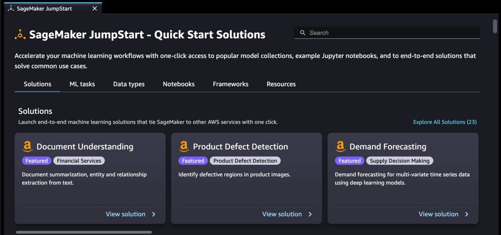

You can find JumpStart resources by using the search bar, or by browsing each category. Use the
tabs to filter the available solutions by categories:

• Solutions – In one step, launch comprehensive machine learning solutions that tie SageMaker AI
to other AWS services. Select Explore All Solutions to view all available solutions.

• Resources – Use example notebooks, blogs, and video tutorials to learn and head start your
problem types.

• Blogs – Read details and solutions from machine learning experts.

• Video tutorials – Watch video tutorials for SageMaker AI features and machine learning use
cases from machine learning experts.

• Example notebooks – Run example notebooks that use SageMaker AI features like Spot
Instance training and experiments over a large variety of model types and use cases.

• Data types – Find a model by data type (e.g., Vision, Text, Tabular, Audio, Text Generation).
Select Explore All Models to view all available models.

• ML tasks – Find a model by problem type (e.g., Image Classification, Image Embedding, Object
Detection, Text Generation). Select Explore All Models to view all available models.

• Notebooks – Find example notebooks that use SageMaker AI features across multiple model
types and use cases. Select Explore All Notebooks to view all available example notebooks.

• Frameworks – Find a model by framework (e.g., PyTorch, TensorFlow, Hugging Face).

Open and use JumpStart in Studio Classic
306

## Page 335

Amazon SageMaker AI
Developer Guide

Manage JumpStart in Studio Classic

From the Home menu in the left panel, navigate to SageMaker JumpStart, then choose Launched
JumpStart assets to list your currently launched solutions, deployed model endpoints, and training
jobs created with JumpStart.

Topics

• Amazon SageMaker JumpStart Foundation Models

• Private curated hubs for foundation model access control in JumpStart

• Amazon SageMaker JumpStart in Studio Classic

Amazon SageMaker JumpStart Foundation Models

Amazon SageMaker JumpStart offers state-of-the-art foundation models for use cases such as
content writing, code generation, question answering, copywriting, summarization, classification,
information retrieval, and more. Use JumpStart foundation models to build your own generative
AI solutions and integrate custom solutions with additional SageMaker AI features. For more
information, see Getting started with Amazon SageMaker JumpStart.

A foundation model is a large pre-trained model that is adaptable to many downstream tasks and
often serves as the starting point for developing more specialized models. Examples of foundation
models include LLaMa-3-70b, BLOOM 176B, FLAN-T5 XL, or GPT-J 6B, which are pre-trained on
massive amounts of text data and can be fine-tuned for specific language tasks.

Amazon SageMaker JumpStart onboards and maintains publicly available foundation models for
you to access, customize, and integrate into your machine learning lifecycles. For more information,
see Publicly available foundation models. Amazon SageMaker JumpStart also includes proprietary
foundation models from third-party providers. For more information, see Proprietary foundation
models.

To get started exploring and experimenting with available models, see JumpStart foundation
model usage. All foundation models are available to use programmatically with the SageMaker
Python SDK. For more information, see Use foundation models with the SageMaker Python SDK.

For more information on considerations to make when choosing a model, see Model sources and
license agreements.

For specifics about customization and fine-tuning foundation models, see Foundation model
customization.

Foundation models
307

## Page 336

Amazon SageMaker AI
Developer Guide

For more general information on foundation models, see the paper On the Opportunities and Risks
of Foundation Models.

Topics

• Available foundation models

• JumpStart foundation model usage

• Model sources and license agreements

• Foundation model customization

• Evaluate a text generation foundation model in Studio

• Example notebooks

Available foundation models

Amazon SageMaker JumpStart offers state-of-the-art, built-in publicly available and proprietary
foundation models to customize and integrate into your generative AI workflows.

Publicly available foundation models

Amazon SageMaker JumpStart onboards and maintains open source foundation models from
third-party sources. To get started with one of these publicly available models, see JumpStart
foundation model usage or explore one of the available Example notebooks. In a given example
notebook for a publicly available model, try switching out the model ID to experiment with
different models within the same model family.

For more information on model IDs and resources on deploying publicly available JumpStart
foundation models with the SageMaker Python SDK, see Use foundation models with the
SageMaker Python SDK.

By definition, foundation models are adaptable to many downstream tasks. Foundation models are
trained on massive amounts of general domain data and the same model can be implemented or
customized for multiple use cases. When choosing your foundation model, start with defining a
specific task, such as text generation or image generation.

Publicly available time series forecasting models

Time series forecasting models are designed to analyze and make predictions on sequential data
over time. These models can be applied to various domains such as finance, weather forecasting,

Foundation models
308

## Page 337

Amazon SageMaker AI
Developer Guide

or energy demand forecasting. The Chronos models are tailored for time series forecasting tasks,
enabling accurate predictions based on historical data patterns.

Model Name
Model ID
Model
Source

Fine-tuna
ble

Chronos T5 Small
autogluon-forecasting-chron

Amazon
No

os-t5-small

Chronos T5 Base
autogluon-forecasting-chron

Amazon
No

os-t5-base

Chronos T5 Large
autogluon-forecasting-chron

Amazon
No

os-t5-large

Chronos-Bolt Small
autogluon-forecasting-chron

Amazon
No

os-bolt-small

Chronos-Bolt Base
autogluon-forecasting-chron

Amazon
No

os-bolt-base

Publicly available text generation models

Text generation foundation models can be used for a variety of downstream tasks, including text
summarization, text classification, question answering, long-form content generation, short-form
copywriting, information extraction, and more.

To explore the latest text generation JumpStart foundation models, use the Text Generation
filter on the Getting started with Amazon SageMaker JumpStart product description page. You
can also explore foundation models based on tasks directly in the Amazon SageMaker Studio
UI or SageMaker Studio Classic UI. Only a subset of publicly available text generation models
are available for fine-tuning in JumpStart. For more information, see Use foundation models in
Amazon SageMaker Studio Classic.

Publicly available image generation models

JumpStart provides a wide variety of Stable Diffusion image generation foundation models
including base models from Stability AI as well as pre-trained models for specific text-to-image

Foundation models
309

## Page 338

Amazon SageMaker AI
Developer Guide

tasks from Hugging Face. If you need to fine-tune your text-to-image foundation model, you can
use Stable Diffusion 2.1 base from Stability AI. If you want to explore models that are already
trained on specific art styles, you can explore one of the many third-party models from Hugging
Face directly in the Amazon SageMaker Studio UI or SageMaker Studio Classic UI.

To explore the latest image generation JumpStart foundation models, use the Text to Image
filter on the Getting started with Amazon SageMaker JumpStart product description page. To get
started with your chosen text-to-image foundation model, see JumpStart foundation model usage.

Proprietary foundation models

Amazon SageMaker JumpStart provides access to proprietary foundation models from third-party
providers such as AI21 Labs, Cohere, and LightOn.

To get started with one of these proprietary models, see JumpStart foundation model usage. To
use a proprietary foundation model, you must first subscribe to the model in AWS Marketplace.
After subscribing to the model, locate the foundation model in Studio or SageMaker Studio Classic.
For more information, see SageMaker JumpStart pretrained models.

To explore the latest proprietary foundation models for a variety of use cases, see Getting started
with Amazon SageMaker JumpStart.

JumpStart foundation model usage

Choose, train, or deploy foundation models through Amazon SageMaker Studio or Amazon
SageMaker Studio Classic, use JumpStart foundation models programmatically with the SageMaker
Python SDK, or discover JumpStart foundation models directly through the SageMaker AI console.

Topics

• Use foundation models in Studio

• Use foundation models in Amazon SageMaker Studio Classic

• Use foundation models with the SageMaker Python SDK

• Discover foundation models in the SageMaker AI Console

Use foundation models in Studio

Amazon SageMaker Studio allows you to fine-tune, deploy, and evaluate both publicly available
and proprietary JumpStart foundation models directly through the Studio UI.

Foundation models
310

## Page 339

Amazon SageMaker AI
Developer Guide

Important

As of November 30, 2023, the previous Amazon SageMaker Studio experience is now
named Amazon SageMaker Studio Classic. The following section is specific to using the
updated Studio experience. For information about using the Studio Classic application, see
Amazon SageMaker Studio Classic.

To get started, navigate to the JumpStart landing page in Amazon SageMaker Studio. You can
access it from the Home page or the left-side panel menu. On the JumpStart landing page, you
can explore model hubs from providers of both publicly available and proprietary models, and
search for models.

Within each model hub, you can sort models by Most likes, Most downloads, Recently updated,

or filter them by task. Choose a model to view its detail card. On the model detail card, you can
choose to Fine-tune, Deploy, or Evaluate the model, depending on the available option. Note that
not all models are available for fine-tuning or evaluation.

For more information on getting started with Amazon SageMaker Studio, see Amazon SageMaker
Studio.

Topics

• Fine-tune a model in Studio

• Deploy a model in Studio

• Evaluate a model in Studio

• Use your SageMaker JumpStart Models in Amazon Bedrock

Fine-tune a model in Studio

Fine-tuning trains a pre-trained model on a new dataset without training from scratch. This
process, also known as transfer learning, can produce accurate models with smaller datasets and
less training time. To fine-tune JumpStart foundation models, navigate to a model detail card in
the Studio UI. For more information on how to open JumpStart in Studio, see Open JumpStart in
Studio. After navigating to the model detail card of your choice, choose Train in the upper right
corner. Note that not all models have fine-tuning available.

Foundation models
311

## Page 340

Amazon SageMaker AI
Developer Guide

Important

Some foundation models require explicit acceptance of an end-user license agreement
(EULA) before fine-tuning. For more information, see EULA acceptance in Amazon
SageMaker Studio.

Model settings

When using a pre-trained JumpStart foundation model in Amazon SageMaker Studio, the Model
artifact location (Amazon S3 URI) is populated by default. To edit the default Amazon S3 URI,
choose Enter model artifact location. Not all models support changing the model artifact
location.

Data settings

In the Data field, provide an Amazon S3 URI point to your training dataset location. The default
Amazon S3 URI points to an example training dataset. To edit the default Amazon S3 URI, choose
Enter training dataset and change the URI. Be sure to review the model detail card in Amazon
SageMaker Studio for information on formatting training data.

Hyperparameters

You can customize the hyperparameters of the training job that are used to fine-tune the model.
The hyperparameters available for each fine-tunable model differ depending on the model.

The following hyperparameters are common among models:

• Epochs – One epoch is one cycle through the entire dataset. Multiple intervals complete a batch,
and multiple batches eventually complete an epoch. Multiple epochs are run until the accuracy
of the model reaches an acceptable level, or when the error rate drops below an acceptable level.
• Learning rate – The amount that values should be changed between epochs. As the model is
refined, its internal weights are being nudged and error rates are checked to see if the model
improves. A typical learning rate is 0.1 or 0.01, where 0.01 is a much smaller adjustment and
could cause the training to take a long time to converge, whereas 0.1 is much larger and can
cause the training to overshoot. It is one of the primary hyperparameters that you might adjust
for training your model. Note that for text models, a much smaller learning rate (5e-5 for BERT)
can result in a more accurate model.
• Batch size – The number of records from the dataset that is to be selected for each interval to
send to the GPUs for training.

Foundation models
312

## Page 341

Amazon SageMaker AI
Developer Guide

Review the tool tip prompts and additional information in the model detail card in the Studio UI to
learn more about hyperparameters specific to the model of your choice.

For more information on available hyperparameters, see Commonly supported fine-tuning
hyperparameters.

Deployment

Specify the training instance type and output artifact location for your training job. You can only
choose from instances that are compatible with the model of your choice within the fine-tuning
the Studio UI. The default output artifact location is the SageMaker AI default bucket. To change
the output artifact location, choose Enter output artifact location and change the Amazon S3 URI.

Security

Specify the security settings to use for your training job, including the IAM role that SageMaker AI
uses to train your model, whether your training job should connect to a virtual private cloud (VPC),
and any encryption keys to secure your data.

Additional information

In the Additional Information field you can edit the training job name. You can also add and
remove tags in the form of key-value pairs to help organize and categorize your fine-tuning
training jobs.

After providing information for your fine-tuning configuration, choose Submit. If the pre-trained
foundation model that you chose to fine-tune requires explicit agreement of an end-user license
agreement (EULA) before training, the EULA is provided in a pop-up window. To accept the terms
of the EULA, choose Accept. You are responsible for reviewing and complying with any applicable
license terms and making sure they are acceptable for your use case before downloading or using a
model.

Deploy a model in Studio

To deploy JumpStart foundation models, navigate to a model detail card in the Studio UI. For more
information on how to open JumpStart in Studio, see Open JumpStart in Studio. After navigating
to the model detail page of your choice, choose Deploy in the upper right corner of the Studio UI.
Then, follow the steps in Deploy models with SageMaker Studio.

Foundation models
313

## Page 342

Amazon SageMaker AI
Developer Guide

Important

Some foundation models require explicit acceptance of an end-user license agreement
(EULA) before deployment. For more information, see EULA acceptance in Amazon
SageMaker Studio.

Evaluate a model in Studio

Amazon SageMaker JumpStart has integrations with SageMaker Clarify foundation model
evaluations (FME) in Studio. If a JumpStart model has built-in evaluation capabilities available, you
can choose Evaluate in the upper right corner of the model detail page in the JumpStart Studio UI.
For more information, see Evaluate a foundation model.

Use your SageMaker JumpStart Models in Amazon Bedrock

You can register the models that you've deployed from Amazon SageMaker JumpStart to Amazon
Bedrock. With Amazon Bedrock, you can host your model behind multiple endpoints. You can also
use Amazon Bedrock features, such as Agents and Knowledge Bases. For more information about
using Amazon Bedrock's models, see https://docs.aws.amazon.com/bedrock/latest/userguide/
amazon-bedrock-marketplace.html.

Important

To migrate your models to Amazon Bedrock, we recommend attaching
AmazonBedrockFullAccess policy to your IAM role. If you can't attach the managed policy,
make sure your IAM role has the following permissions:

JSON

{
"Version":"2012-10-17",
"Statement": [
{
"Sid": "BedrockAll",
"Effect": "Allow",
"Action": [
"bedrock:*"
],
"Resource": "*"

Foundation models
314

## Page 343

Amazon SageMaker AI
Developer Guide

},
{
"Sid": "DescribeKey",
"Effect": "Allow",
"Action": [
"kms:DescribeKey"
],
"Resource": "arn:*:kms:*:::*"
},
{
"Sid": "APIsWithAllResourceAccess",
"Effect": "Allow",
"Action": [
"iam:ListRoles",
"ec2:DescribeVpcs",
"ec2:DescribeSubnets",
"ec2:DescribeSecurityGroups"

],
"Resource": "*"
},
{
"Sid": "MarketplaceModelEndpointMutatingAPIs",
"Effect": "Allow",
"Action": [
"sagemaker:CreateEndpoint",
"sagemaker:CreateEndpointConfig",
"sagemaker:CreateModel",
"sagemaker:CreateInferenceComponent",
"sagemaker:DeleteInferenceComponent",
"sagemaker:DeleteEndpoint",
"sagemaker:UpdateEndpoint"
],
"Resource": [
"arn:aws:sagemaker:*:*:endpoint/*",
"arn:aws:sagemaker:*:*:endpoint-config/*",
"arn:aws:sagemaker:*:*:model/*"
],
"Condition": {
"StringEquals": {
"aws:CalledViaLast": "bedrock.amazonaws.com"
}
}
},
{

Foundation models
315

## Page 344

Amazon SageMaker AI
Developer Guide

"Sid": "BedrockEndpointTaggingOperations",
"Effect": "Allow",
"Action": [
"sagemaker:AddTags",
"sagemaker:DeleteTags"
],
"Resource": [
"arn:aws:sagemaker:*:*:endpoint/*",
"arn:aws:sagemaker:*:*:endpoint-config/*",
"arn:aws:sagemaker:*:*:model/*"
]
},
{
"Sid": "MarketplaceModelEndpointNonMutatingAPIs",
"Effect": "Allow",
"Action": [
"sagemaker:DescribeEndpoint",

"sagemaker:DescribeEndpointConfig",
"sagemaker:DescribeModel",
"sagemaker:DescribeInferenceComponent",
"sagemaker:ListEndpoints",
"sagemaker:ListTags"
],
"Resource": [
"arn:aws:sagemaker:*:*:endpoint/*",
"arn:aws:sagemaker:*:*:endpoint-config/*",
"arn:aws:sagemaker:*:*:model/*"
],
"Condition": {
"StringEquals": {
"aws:CalledViaLast": "bedrock.amazonaws.com"
}
}
},
{
"Sid": "BedrockEndpointInvokingOperations",
"Effect": "Allow",
"Action": [
"sagemaker:InvokeEndpoint",
"sagemaker:InvokeEndpointWithResponseStream"
],
"Resource": [
"arn:aws:sagemaker:*:*:endpoint/*"
],

Foundation models
316

## Page 345

Amazon SageMaker AI
Developer Guide

"Condition": {
"StringEquals": {
"aws:CalledViaLast": "bedrock.amazonaws.com"
}
}
},
{
"Sid": "DiscoveringMarketplaceModel",
"Effect": "Allow",
"Action": [
"sagemaker:DescribeHubContent"
],
"Resource": [
"arn:aws:sagemaker:*:aws:hub-content/SageMakerPublicHub/Model/*",
"arn:aws:sagemaker:*:aws:hub/SageMakerPublicHub"
]
},

{
"Sid": "AllowMarketplaceModelsListing",
"Effect": "Allow",
"Action": [
"sagemaker:ListHubContents"
],
"Resource": "arn:aws:sagemaker:*:aws:hub/SageMakerPublicHub"
},
{
"Sid": "RetrieveSubscribedMarketplaceLicenses",
"Effect": "Allow",
"Action": [
"license-manager:ListReceivedLicenses"
],
"Resource": [
"*"
]
},
{
"Sid": "PassRoleToSageMaker",
"Effect": "Allow",
"Action": [
"iam:PassRole"
],
"Resource": [
"arn:aws:iam::*:role/*Sagemaker*ForBedrock*"
],

Foundation models
317

## Page 346

Amazon SageMaker AI
Developer Guide

"Condition": {
"StringEquals": {
"iam:PassedToService": [
"sagemaker.amazonaws.com",
"bedrock.amazonaws.com"
]
}
}
},
{
"Sid": "PassRoleToBedrock",
"Effect": "Allow",
"Action": [
"iam:PassRole"
],
"Resource": "arn:aws:iam::*:role/*AmazonBedrock*",
"Condition": {

"StringEquals": {
"iam:PassedToService": [
"bedrock.amazonaws.com"
]
}
}
}
]
}

Important

The Amazon Bedrock Full Access policy only provides permissions to the Amazon
Bedrock API. To use Amazon Bedrock in the AWS Management Console, your IAM
role must also have the following permissions:

{
"Sid": "AllowConsoleS3AccessForBedrockMarketplace",
"Effect": "Allow",
"Action": [
"s3:GetObject",
"s3:GetBucketCORS",
"s3:ListBucket",
"s3:ListBucketVersions",
"s3:GetBucketLocation"

Foundation models
318

## Page 347

Amazon SageMaker AI
Developer Guide

],
"Resource": "*"
}

If you’re writing your own policy, you must include the policy statement that allows the
Amazon Bedrock Marketplace action for the resource. For example, the following policy

allows Amazon Bedrock to use the InvokeModel operation for a model that you’ve
deployed to an endpoint.

JSON

{

"Version":"2012-10-17",
"Statement": [
{
"Sid": "BedrockAll",
"Effect": "Allow",
"Action": [
"bedrock:InvokeModel"
],
"Resource": [
"arn:aws:bedrock:us-east-1:111122223333:marketplace/model-
endpoint/all-access"
]
},
{
"Sid": "VisualEditor1",
"Effect": "Allow",
"Action": ["sagemaker:InvokeEndpoint"],
"Resource": "arn:aws:sagemaker:us-
east-1:111122223333:endpoint/*",
"Condition": {
"StringEquals": {
"aws:ResourceTag/project": "example-project-id",
"aws:CalledViaLast": "bedrock.amazonaws.com"
}
}
}

Foundation models
319

## Page 348

Amazon SageMaker AI
Developer Guide

]
}

After you've deployed a model, you might be able to use it in Amazon Bedrock. To see if you can
use it in Amazon Bedrock, navigate to the model detail card in the Studio UI. If the model card says
that it's Bedrock Ready, you can register the model with Amazon Bedrock.

Important

By default Amazon SageMaker JumpStart disables network access for the models that you
deploy. If you've enabled network access, you won't be able to use the model with Amazon
Bedrock. If you want to use the model with Amazon Bedrock, you must redeploy it with
network access disabled.

To use it with Amazon Bedrock, navigate to the Endpoint details page and choose Use with
Bedrock in the upper right corner of the Studio UI. After you see the pop-up, choose Register to
Bedrock.

Use foundation models in Amazon SageMaker Studio Classic

You can fine-tune and deploy both publicly available and proprietary JumpStart foundation
models through the Studio Classic UI.

Important

As of November 30, 2023, the previous Amazon SageMaker Studio experience is now
named Amazon SageMaker Studio Classic. The following section is specific to using the
Studio Classic application. For information about using the updated Studio experience, see
Amazon SageMaker Studio.
Studio Classic is still maintained for existing workloads but is no longer available for
onboarding. You can only stop or delete existing Studio Classic applications and cannot
create new ones. We recommend that you migrate your workload to the new Studio
experience.

To get started with Studio Classic, see Launch Amazon SageMaker Studio Classic.

Foundation models
320

## Page 349

Amazon SageMaker AI
Developer Guide

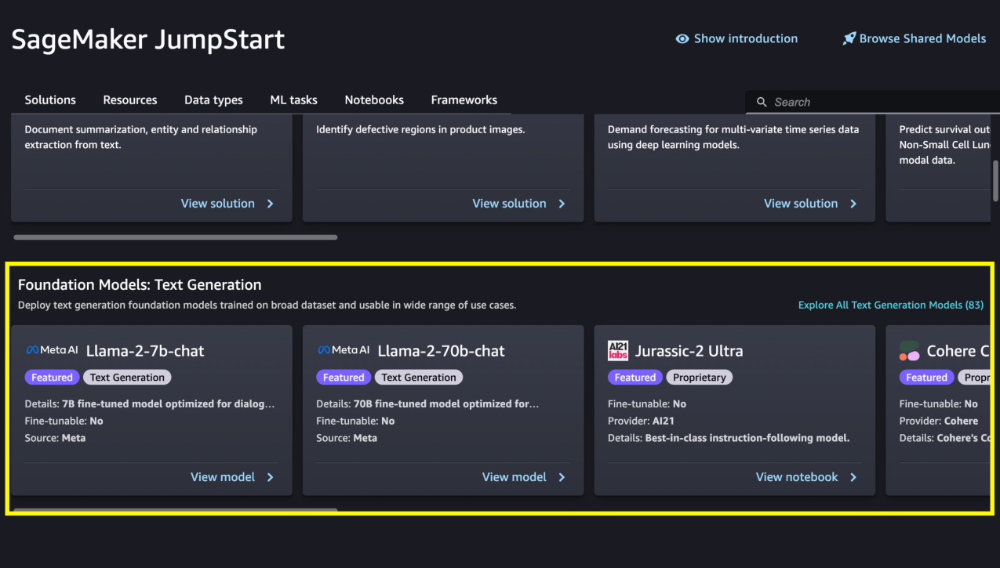

After opening Amazon SageMaker Studio Classic, choose Models, notebooks, solutions in
the SageMaker JumpStart section of the navigation pane. Then, scroll down to find either
the Foundation Models: Text Generation or Foundation Models: Image Generation section
depending on your use case.

You can choose View model on a suggested foundation model card, or choose Explore All Models
to see all available foundation models for either text generation or image generation. If you choose
to see all available models, you can further filter available models by task, data type, content
type, or framework. You can also search for a model name directly in the Search bar. If you need
guidance on selecting a model, see Available foundation models.

Important

Some foundation models require explicit acceptance of an end-user license agreement
(EULA). For more information, see EULA acceptance in Amazon SageMaker Studio.

After you choose View model for the foundation model of your choice in Studio Classic, you can
deploy the model. For more information, see Deploy a Model.

Foundation models
321

## Page 350

Amazon SageMaker AI
Developer Guide

You can also choose Open notebook in the Run in notebook section to run an example notebook
for the foundation model directly in Studio Classic.

Note

To deploy a proprietary foundation model in Studio Classic, you must first subscribe to
the model in AWS Marketplace. The AWS Marketplace link is provided in the associated
example notebook within Studio Classic.

If the model is fine-tunable, you can also fine-tune the model. For more information, see Fine-Tune
a Model. For a list of which JumpStart foundation models are fine-tunable, see Foundation models
and hyperparameters for fine-tuning.

Use foundation models with the SageMaker Python SDK

All JumpStart foundation models are available for programmatic deployment using the SageMaker
Python SDK.

To deploy publicly available foundation models, you can use their model ID. You can find the
model IDs for all publicly available foundation models in the Built-in Algorithms with pre-trained
Model Table. Search for the name of a foundation model in the Search bar. Use the Show entries
dropdown or the pagination controls to navigate the available models.

Proprietary models must be deployed using the model package information after subscribing to
the model in AWS Marketplace.

You can find the list of JumpStart available models in the section called “Available models”.

Important

Some foundation models require explicit acceptance of an end-user license agreement
(EULA). For more information, see EULA acceptance with the SageMaker Python SDK.

The following sections show how to fine-tune publicly available foundation models using

the JumpStartEstimator class, deploy publicly available foundation models using the

JumpStartModel class, and deploy proprietary foundation models using theModelPackage class.

Topics

Foundation models
322

## Page 351

Amazon SageMaker AI
Developer Guide

• Fine-tune publicly available foundation models with the JumpStartEstimator class

• Deploy publicly available foundation models with the JumpStartModel class

• Deploy proprietary foundation models with the ModelPackage class

Fine-tune publicly available foundation models with the JumpStartEstimator class

Note

For instructions on fine-tuning foundation models in a private curated hub, see Fine-tune
curated hub models.

You can fine-tune a built-in algorithm or pre-trained model in just a few lines of code using the
SageMaker Python SDK.

1.
First, find the model ID for the model of your choice in the Built-in Algorithms with pre-trained
Model Table.

2.
Using the model ID, define your training job as a JumpStart estimator.

from sagemaker.jumpstart.estimator import JumpStartEstimator

model_id = "huggingface-textgeneration1-gpt-j-6b"
estimator = JumpStartEstimator(model_id=model_id)

3.
Run estimator.fit() on your model, pointing to the training data to use for fine-tuning.

estimator.fit(
{"train": training_dataset_s3_path, "validation": validation_dataset_s3_path}
)

4.
Then, use the deploy method to automatically deploy your model for inference. In this
example, we use the GPT-J 6B model from Hugging Face.

predictor = estimator.deploy()

5.
You can then run inference with the deployed model using the predict method.

question = "What is Southern California often abbreviated as?"
response = predictor.predict(question)

Foundation models
323

## Page 352

Amazon SageMaker AI
Developer Guide

print(response)

Note

This example uses the foundation model GPT-J 6B, which is suitable for a wide range
of text generation use cases including question answering, named entity recognition,
summarization, and more. For more information about model use cases, see Available
foundation models.

You can optionally specify model versions or instance types when creating your

JumpStartEstimator. For more information about the JumpStartEstimator class and its
parameters, see JumpStartEstimator.

Check default instance types

You can optionally include specific model versions or instance types when fine-tuning a pre-trained

model using the JumpStartEstimator class. All JumpStart models have a default instance type.
Retrieve the default training instance type using the following code:

from sagemaker import instance_types

instance_type = instance_types.retrieve_default(
model_id=model_id,
model_version=model_version,
scope="training")
print(instance_type)

You can see all supported instance types for a given JumpStart model with the

instance_types.retrieve() method.

Check default hyperparameters

To check the default hyperparameters used for training, you can use the retrieve_default()

method from the hyperparameters class.

from sagemaker import hyperparameters

Foundation models
324

## Page 353

Amazon SageMaker AI
Developer Guide

my_hyperparameters = hyperparameters.retrieve_default(model_id=model_id,
model_version=model_version)
print(my_hyperparameters)

# Optionally override default hyperparameters for fine-tuning
my_hyperparameters["epoch"] = "3"
my_hyperparameters["per_device_train_batch_size"] = "4"

# Optionally validate hyperparameters for the model
hyperparameters.validate(model_id=model_id, model_version=model_version,
hyperparameters=my_hyperparameters)

For more information on available hyperparameters, see Commonly supported fine-tuning
hyperparameters.

Check default metric definitions

You can also check the default metric definitions:

print(metric_definitions.retrieve_default(model_id=model_id,
model_version=model_version))

Deploy publicly available foundation models with the JumpStartModel class

You can deploy a built-in algorithm or pre-trained model to a SageMaker AI endpoint in just a few
lines of code using the SageMaker Python SDK.

1.
First, find the model ID for the model of your choice in the Built-in Algorithms with pre-trained
Model Table.

2.
Using the model ID, define your model as a JumpStart model.

from sagemaker.jumpstart.model import JumpStartModel

model_id = "huggingface-text2text-flan-t5-xl"
my_model = JumpStartModel(model_id=model_id)

3.
Use the deploy method to automatically deploy your model for inference. In this example, we
use the FLAN-T5 XL model from Hugging Face.

predictor = my_model.deploy()

4.
You can then run inference with the deployed model using the predict method.

Foundation models
325

## Page 354

Amazon SageMaker AI
Developer Guide

question = "What is Southern California often abbreviated as?"
response = predictor.predict(question)
print(response)

Note

This example uses the foundation model FLAN-T5 XL, which is suitable for a wide range of
text generation use cases including question answering, summarization, chatbot creation,
and more. For more information about model use cases, see Available foundation models.

For more information about the JumpStartModel class and its parameters, see JumpStartModel.

Check default instance types

You can optionally include specific model versions or instance types when deploying a pre-trained

model using the JumpStartModel class. All JumpStart models have a default instance type.
Retrieve the default deployment instance type using the following code:

from sagemaker import instance_types

instance_type = instance_types.retrieve_default(
model_id=model_id,
model_version=model_version,
scope="inference")
print(instance_type)

See all supported instance types for a given JumpStart model with the

instance_types.retrieve() method.

Use inference components to deploy multiple models to a shared endpoint

An inference component is a SageMaker AI hosting object that you can use to deploy one or
more models to an endpoint for increased flexibility and scalability. You must change the

endpoint_type for your JumpStart model to be inference-component-based rather than the
default model-based endpoint.

predictor = my_model.deploy(

Foundation models
326

## Page 355

Amazon SageMaker AI
Developer Guide

endpoint_name = 'jumpstart-model-id-123456789012',
endpoint_type = EndpointType.INFERENCE_COMPONENT_BASED
)

For more information on creating endpoints with inference components and deploying SageMaker
AI models, see Shared resource utilization with multiple models.

Check valid input and output inference formats

To check valid data input and output formats for inference, you can use the

retrieve_options() method from the Serializers and Deserializers classes.

print(sagemaker.serializers.retrieve_options(model_id=model_id,
model_version=model_version))
print(sagemaker.deserializers.retrieve_options(model_id=model_id,
model_version=model_version))

Check supported content and accept types

Similarly, you can use the retrieve_options() method to check the supported content and
accept types for a model.

print(sagemaker.content_types.retrieve_options(model_id=model_id,
model_version=model_version))
print(sagemaker.accept_types.retrieve_options(model_id=model_id,
model_version=model_version))

For more information about utilities, see Utility APIs.

Deploy proprietary foundation models with the ModelPackage class

Proprietary models must be deployed using the model package information after subscribing to
the model in AWS Marketplace. For more information about SageMaker AI and AWS Marketplace,
see Buy and Sell Amazon SageMaker AI Algorithms and Models in AWS Marketplace. To find AWS
Marketplace links for the latest proprietary models, see Getting started with Amazon SageMaker
JumpStart.

After subscribing to the model of your choice in AWS Marketplace, you can deploy the foundation
model using the SageMaker Python SDK and the SDK associated with the model provider. For

example, AI21 Labs, Cohere, and LightOn use the "ai21[SM]", cohere-sagemaker, and

lightonsage packages, respectively.

Foundation models
327

## Page 356

Amazon SageMaker AI
Developer Guide

For example, to define a JumpStart model using Jurassic-2 Jumbo Instruct from AI21 Labs, use the
following code:

import sagemaker
import ai21

role = get_execution_role()
sagemaker_session = sagemaker.Session()
model_package_arn = "arn:aws:sagemaker:us-east-1:865070037744:model-package/j2-jumbo-
instruct-v1-1-43-4e47c49e61743066b9d95efed6882f35"

my_model = ModelPackage(
role=role, model_package_arn=model_package_arn, sagemaker_session=sagemaker_session
)

For step-by-step examples, find and run the notebook associated with the proprietary foundation
model of your choice in SageMaker Studio Classic. See Use foundation models in Amazon
SageMaker Studio Classic for more information. For more information on the SageMaker Python

SDK, see ModelPackage.

Discover foundation models in the SageMaker AI Console

You can explore JumpStart foundation models directly through the Amazon SageMaker AI Console.

1.
Open the Amazon SageMaker AI console at https://console.aws.amazon.com/sagemaker/.

2.
Find JumpStart on the left navigation panel and choose Foundation models.

3.
Browse models or search for a specific model. If you need guidance for model selection, see
Available foundation models. Choose View model to view the model detail page for the
foundation model of your choice.

4.
If the model is a proprietary model, choose Subscribe in the upper right corner of the model
detail page to subscribe to the model in AWS Marketplace. You should receive an email
confirming your subscription to the model of your choice. For more information about
SageMaker AI and AWS Marketplace, see Buy and Sell Amazon SageMaker AI Algorithms
and Models in AWS Marketplace. Publicly available foundation models do not require a
subscription.

5.
To view an example notebook in GitHub, choose View code in the upper right corner of the
model detail page.

6.
To view and run an example notebook directly in Amazon SageMaker Studio Classic, choose
Open notebook in Studio in the upper right corner of the model detail page.

Foundation models
328

## Page 357

Amazon SageMaker AI
Developer Guide

Model sources and license agreements

Amazon SageMaker JumpStart provides access to hundreds of publicly available and proprietary
foundation models from third-party sources and partners. You can explore the JumpStart
foundation model selection directly in the SageMaker AI console, Studio, or Studio Classic.

Licenses and model sources

Amazon SageMaker JumpStart provides access to both publicly available and proprietary
foundation models. Foundation models are onboarded and maintained from third-party open
source and proprietary providers. As such, they are released under different licenses as designated
by the model source. Be sure to review the license for any foundation model that you use. You
are responsible for reviewing and complying with any applicable license terms and making sure
they are acceptable for your use case before downloading or using the content. Some examples of
common foundation model licenses include:

• Alexa Teacher Model

• Apache 2.0

• BigScience Responsible AI License v1.0

• CreativeML Open RAIL++-M license

Similarly, for any proprietary foundation models, be sure to review and comply with any terms of
use and usage guidelines from the model provider. If you have questions about license information
for a specific proprietary model, reach out to model provider directly. You can find model provider
contact information in the Support tab of each model page in AWS Marketplace.

End-user license agreements

Some JumpStart foundation models require explicit acceptance of an end-user license agreement
(EULA) before use.

EULA acceptance in Amazon SageMaker Studio

You may be prompted to accept an end-user license agreement before fine-tuning, deploying, or
evaluating a JumpStart foundation model in Studio. To get started with JumpStart foundation
models in Studio, see Use foundation models in Studio.

Foundation models
329

## Page 358

Amazon SageMaker AI
Developer Guide

Important

As of November 30, 2023, the previous Amazon SageMaker Studio experience is now
named Amazon SageMaker Studio Classic. The following section is specific to using the
updated Studio experience. For information about using the Studio Classic application, see
Amazon SageMaker Studio Classic.

Some JumpStart foundation models require acceptance of an end-user license agreement before
deployment. If this applies to the foundation model that you choose to use, Studio prompts you
with a window containing the EULA content. You are responsible for reviewing and complying
with any applicable license terms and making sure they are acceptable for your use case before
downloading or using a model.

EULA acceptance in Amazon SageMaker Studio Classic

You may be prompted to accept an end-user license agreement before deploying a JumpStart
foundation model or opening a JumpStart foundation model notebook in Studio Classic. To get
started with JumpStart foundation models in Studio Classic, see Use foundation models in Amazon
SageMaker Studio Classic.

Important

As of November 30, 2023, the previous Amazon SageMaker Studio experience is now
named Amazon SageMaker Studio Classic. The following section is specific to using the
Studio Classic application. For information about using the updated Studio experience, see
Amazon SageMaker Studio.
Studio Classic is still maintained for existing workloads but is no longer available for
onboarding. You can only stop or delete existing Studio Classic applications and cannot
create new ones. We recommend that you migrate your workload to the new Studio
experience.

Some JumpStart foundation models require acceptance of an end-user license agreement before
deployment. If this applies to the foundation model that you choose to use, Studio Classic prompts
you with a window titled Review the End User License Agreement (EULA) and Acceptable Use
Policy (AUP) below after you choose either Deploy or Open notebook. You are responsible for

Foundation models
330

## Page 359

Amazon SageMaker AI
Developer Guide

reviewing and complying with any applicable license terms and making sure they are acceptable for
your use case before downloading or using a model.

EULA acceptance with the SageMaker Python SDK

The following sections show you how to explicitly declare EULA acceptance when deploying or
fine-tuning a JumpStart model with the SageMaker Python SDK. For more information on getting
started with JumpStart foundation models using the SageMaker Python SDK, see Use foundation
models with the SageMaker Python SDK.

Before you begin, make sure that you do the following:

• Upgrade to the latest version of the model that you use.

• Install the latest version of the SageMaker Python SDK.

Important

To use the following workflow you must have v2.198.0 or later of the SageMaker Python
SDK installed.

EULA acceptance when deploying a JumpStart model

For models that require the acceptance of an end-user license agreement, you must explicitly
declare EULA acceptance when deploying your JumpStart model.

from sagemaker.jumpstart.model import JumpStartModel
model_id = "meta-textgeneration-llama-2-13b"
my_model = JumpStartModel(model_id=model_id)

# Declare EULA acceptance when deploying your JumpStart model
predictor = my_model.deploy(accept_eula=True)

The accept_eula value is None by default and must be explicitly redefined as True in order to
accept the end-user license agreement. For more information, see JumpStartModel.

EULA acceptance when fine-tuning a JumpStart model

For fine-tuning models that require the acceptance of an end-user license agreement, you must

explicitly declare EULA acceptance when running the fit() method for your JumpStart estimator.

Foundation models
331

## Page 360

Amazon SageMaker AI
Developer Guide

After fine-tuning a pre-trained model, the weights of the original model are changed. Therefore,
when you deploy the fine-tuned model later, you do not need to accept a EULA.

Note

The following example sets accept_eula=False. You should manually change the value

to True in order to accept the EULA.

from sagemaker.jumpstart.estimator import JumpStartEstimator
model_id = "meta-textgeneration-llama-2-13b"

# Declare EULA acceptance when defining your JumpStart estimator
estimator = JumpStartEstimator(model_id=model_id)
estimator.fit(accept_eula=False,
{"train": training_dataset_s3_path, "validation": validation_dataset_s3_path}
)

The accept_eula value is None by default and must be explicitly redefined as "true" within

the fit() method in order to accept the end-user license agreement. For more information, see
JumpStartEstimator.

EULA acceptance SageMaker Python SDK versions earlier than 2.198.0

Important

When using versions earlier than 2.198.0 of the SageMaker Python SDK, you must use the

SageMaker Predictor class to accept a model EULA.

After deploying a JumpStart foundation model programmatically using the SageMaker Python

SDK, you can run inference against your deployed endpoint with the SageMaker Predictor class.
For models that require the acceptance of an end-user license agreement, you must explicitly

declare EULA acceptance in your call to the Predictor class:

predictor.predict(payload, custom_attributes="accept_eula=true")

The accept_eula value is false by default and must be explicitly redefined as true in order to
accept the end-user license agreement. The predictor returns an error if you try to run inference

Foundation models
332

## Page 361

Amazon SageMaker AI
Developer Guide

while accept_eula is set to false. For more information on getting started with JumpStart
foundation models using the SageMaker Python SDK, see Use foundation models with the
SageMaker Python SDK.

Important

The custom_attributes parameter accepts key-value pairs in the format

"key1=value1;key2=value2". If you use the same key multiple times, the
inference server uses the last value associated with the key. For example, if you pass

"accept_eula=false;accept_eula=true" to the custom_attributes parameter,

then the inference server associates the value true with the accept_eula key.

Foundation model customization

Foundation models are extremely powerful models able to solve a wide array of tasks. To solve
most tasks effectively, these models require some form of customization.

The recommended way to first customize a foundation model to a specific use case is through
prompt engineering. Providing your foundation model with well-engineered, context-rich prompts
can help achieve desired results without any fine-tuning or changing of model weights. For more
information, see Prompt engineering for foundation models.

If prompt engineering alone is not enough to customize your foundation model to a specific task,
you can fine-tune a foundation model on additional domain-specific data. For more information,
see Foundation models and hyperparameters for fine-tuning. The fine-tuning process involves
changing model weights.

If you want to customize your model with information from a knowledge library without any
retraining, see Retrieval Augmented Generation.

Prompt engineering for foundation models

Prompt engineering is the process of designing and refining the prompts or input stimuli for
a language model to generate specific types of output. Prompt engineering involves selecting
appropriate keywords, providing context, and shaping the input in a way that encourages the
model to produce the desired response and is a vital technique to actively shape the behavior and
output of foundation models.

Foundation models
333

## Page 362

Amazon SageMaker AI
Developer Guide

Effective prompt engineering is crucial for directing model behavior and achieving desired
responses. Through prompt engineering, you can control a model’s tone, style, and domain
expertise without more involved customization measures like fine-tuning. We recommend
dedicating time to prompt engineering before you consider fine-tuning a model on additional data.
The goal is to provide sufficient context and guidance to the model so that it can generalize and
perform well on unseen or limited data scenarios.

Zero-shot learning

Zero-shot learning involves training a model to generalize and make predictions on unseen classes
or tasks. To perform prompt engineering in zero-shot learning environments, we recommend
constructing prompts that explicitly provide information about the target task and the desired
output format. For example, if you want to use a foundation model for zero-shot text classification
on a set of classes that the model did not see during training, a well-engineered prompt could be:

"Classify the following text as either sports, politics, or entertainment:

[input text]." By explicitly specifying the target classes and the expected output format, you
can guide the model to make accurate predictions even on unseen classes.

Few-shot learning

Few-shot learning involves training a model with a limited amount of data for new classes or
tasks. Prompt engineering in few-shot learning environments focuses on designing prompts that
effectively use the limited available training data. For example, if you use a foundation model for
an image classification task and only have a few examples of a new image class, you can engineer
a prompt that includes the available labeled examples with a placeholder for the target class. For

example, the prompt could be: "[image 1], [image 2], and [image 3] are examples

of [target class]. Classify the following image as [target class]". By
incorporating the limited labeled examples and explicitly specifying the target class, you can guide
the model to generalize and make accurate predictions even with minimal training data.

Supported inference parameters

Changing inference parameters might also affect the responses to your prompts. While you can
try to add as much specificity and context as possible to your prompts, you can also experiment
with supported inference parameters. The following are examples of some commonly supported
inference parameters:

Foundation models
334

## Page 363

Amazon SageMaker AI
Developer Guide

Inference Parameter
Description

max_new_tokens
The maximum output length of a foundation model response.
Valid values: integer, range: Positive integer.

temperature
Controls the randomness in the output. Higher temperature
results in an output sequence with low-probability words and
lower temperature results in output sequence with high-prob

ability words. If temperature=0 , the response is made up
of only the highest probability words (greedy decoding). Valid
values: float, range: Positive float.

top_p
In each step of text generation, the model samples from the
smallest possible set of words with a cumulative probability of

top_p. Valid values: float, range: 0.0, 1.0.

return_full_text
If True, then the input text is part of the generated output
text. Valid values: boolean, default: False.

For more information on foundation model inference, see Deploy publicly available foundation

models with the JumpStartModel class.

If prompt engineering is not sufficient to adapt your foundation model to specific business needs,
domain-specific language, target tasks, or other requirements, you can consider fine-tuning your
model on additional data or using Retrieval Augmented Generation (RAG) to augment your model
architecture with enhanced context from archived knowledge sources. For more information, see
Foundation models and hyperparameters for fine-tuning or Retrieval Augmented Generation.

Foundation models and hyperparameters for fine-tuning

Foundation models are computationally expensive and trained on a large, unlabeled corpus. Fine-
tuning a pre-trained foundation model is an affordable way to take advantage of their broad
capabilities while customizing a model on your own small, corpus. Fine-tuning is a customization
method that involved further training and does change the weights of your model.

Fine-tuning might be useful to you if you need:

• to customize your model to specific business needs

Foundation models
335

## Page 364

Amazon SageMaker AI
Developer Guide

• your model to successfully work with domain-specific language, such as industry jargon,
technical terms, or other specialized vocabulary

• enhanced performance for specific tasks

• accurate, relative, and context-aware responses in applications

• responses that are more factual, less toxic, and better-aligned to specific requirements

There are two main approaches that you can take for fine-tuning depending on your use case and
chosen foundation model.

1. If you're interested in fine-tuning your model on domain-specific data, see Fine-tune a large

language model (LLM) using domain adaptation.

2. If you're interested in instruction-based fine-tuning using prompt and response examples, see

Fine-tune a large language model (LLM) using prompt instructions.

Foundation models available for fine-tuning

You can fine-tune any of the following JumpStart foundation models:

• Bloom 3B

• Bloom 7B1

• BloomZ 3B FP16

• BloomZ 7B1 FP16

• Code Llama 13B

• Code Llama 13B Python

• Code Llama 34B

• Code Llama 34B Python

• Code Llama 70B

• Code Llama 70B Python

• Code Llama 7B

• Code Llama 7B Python

• CyberAgentLM2-7B-Chat (CALM2-7B-Chat)

• Falcon 40B BF16

• Falcon 40B Instruct BF16

Foundation models
336

## Page 365

Amazon SageMaker AI
Developer Guide

• Falcon 7B BF16

• Falcon 7B Instruct BF16

• Flan-T5 Base

• Flan-T5 Large

• Flan-T5 Small

• Flan-T5 XL

• Flan-T5 XXL

• Gemma 2B

• Gemma 2B Instruct

• Gemma 7B

• Gemma 7B Instruct

• GPT-2 XL

• GPT-J 6B

• GPT-Neo 1.3B

• GPT-Neo 125M

• GPT-NEO 2.7B

• LightGPT Instruct 6B

• Llama 2 13B

• Llama 2 13B Chat

• Llama 2 13B Neuron

• Llama 2 70B

• Llama 2 70B Chat

• Llama 2 7B

• Llama 2 7B Chat

• Llama 2 7B Neuron

• Mistral 7B

• Mixtral 8x7B

• Mixtral 8x7B Instruct

• RedPajama INCITE Base 3B V1

• RedPajama INCITE Base 7B V1

Foundation models
337

## Page 366

Amazon SageMaker AI
Developer Guide

• RedPajama INCITE Chat 3B V1

• RedPajama INCITE Chat 7B V1

• RedPajama INCITE Instruct 3B V1

• RedPajama INCITE Instruct 7B V1

• Stable Diffusion 2.1

Commonly supported fine-tuning hyperparameters

Different foundation models support different hyperparameters when fine-tuning. The following
are commonly-supported hyperparameters that can further customize your model during training:

Inference Parameter
Description

epoch
The number of passes that the model takes through the fine-
tuning dataset during training. Must be an integer greater than
1.

learning_rate
The rate at which the model weights are updated after working
through each batch of fine-tuning training examples. Must be a
positive float greater than 0.

instruction_tuned
Whether to instruction-train the model or not. Must be

'True' or 'False'.

The batch size per GPU core or CPU for training. Must be a
positive integer.

per_device_train_b

atch_size

The batch size per GPU core or CPU for evaluation. Must be a
positive integer.

per_device_eval_ba

tch_size

max_train_samples
For debugging purposes or quicker training, truncate the
number of training examples to this value. Value -1 means that
the model uses all of the training samples. Must be a positive
integer or -1.

max_val_samples
For debugging purposes or quicker training, truncate the
number of validation examples to this value. Value -1 means

Foundation models
338

## Page 367

Amazon SageMaker AI
Developer Guide

Inference Parameter
Description

that the model uses all of the validation samples. Must be a
positive integer or -1.

max_input_length
Maximum total input sequence length after tokenization.

Sequences longer than this will be truncated. If -1, max_input

_length  is set to the minimum of 1024 and the model_max

_length  defined by the tokenizer. If set to a positive value,

max_input_length  is set to the minimum of the provided

value and the model_max_length  defined by the tokenizer.
Must be a positive integer or -1.

If there is no validation channel, ratio of train-validation split
from the training data. Must be between 0 and 1.

validation_split_r

atio

If validation data is not present, this fixes the random splitting
of the input training data to training and validation data used
by the model. Must be an integer.

train_data_split_s

eed

preprocessing_num_

The number of processes to use for the pre-processing. If None,
main process is used for pre-processing.

workers

lora_r
Low-rank adaptation (LoRA) r value, which acts as the scaling
factor for weight updates. Must be a positive integer.

lora_alpha
Low-rank adaptation (LoRA) alpha value, which acts as the
scaling factor for weight updates. Generally 2 to 4 times the

size of lora_r. Must be a positive integer.

lora_dropout
Dropout value for low-rank adaptation (LoRA) layers Must be a
positive float between 0 and 1.

int8_quantization
If True, model is loaded with 8 bit precision for training.

enable_fsdp
If True, training uses Fully Sharded Data Parallelism.

You can specify hyperparameter values when you fine-tune your model in Studio. For more
information, see Fine-tune a model in Studio.

Foundation models
339

## Page 368

Amazon SageMaker AI
Developer Guide

You can also override default hyperparameter values when fine-tuning your model using the
SageMaker Python SDK. For more information, see Fine-tune publicly available foundation models

with the JumpStartEstimator class.

Fine-tune a large language model (LLM) using domain adaptation

Domain adaptation fine-tuning allows you to leverage pre-trained foundation models and
adapt them to specific tasks using limited domain-specific data. If prompt engineering efforts
do not provide enough customization, you can use domain adaption fine-tuning to get your
model working with domain-specific language, such as industry jargon, technical terms, or other
specialized data. This fine-tuning process modifies the weights of the model.

To fine-tune your model on a domain-specific dataset:

1. Prepare your training data. For instructions, see the section called “Prepare and upload training

data for domain adaptation fine-tuning”.

2. Create your fine-tuning training job. For instructions, see the section called “Create a training job

for instruction-based fine-tuning”.

You can find end-to-end examples in the section called “Example notebooks”.

Domain adaptation fine-tuning is available with the following foundation models:

Note

Some JumpStart foundation models, such as Llama 2 7B, require acceptance of an end-user
license agreement before fine-tuning and performing inference. For more information, see
End-user license agreements.

• Bloom 3B

• Bloom 7B1

• BloomZ 3B FP16

• BloomZ 7B1 FP16

• GPT-2 XL

• GPT-J 6B

Foundation models
340

## Page 369

Amazon SageMaker AI
Developer Guide

• GPT-Neo 1.3B

• GPT-Neo 125M

• GPT-NEO 2.7B

• Llama 2 13B

• Llama 2 13B Chat

• Llama 2 13B Neuron

• Llama 2 70B

• Llama 2 70B Chat

• Llama 2 7B

• Llama 2 7B Chat

• Llama 2 7B Neuron

Prepare and upload training data for domain adaptation fine-tuning

Training data for domain adaptation fine-tuning can be provided in CSV, JSON, or TXT file format.
All training data must be in a single file within a single folder.

The training data is taken from the Text column for CSV or JSON training data files. If no column
is labeled Text, then the training data is taken from the first column for CSV or JSON training data
files.

The following is an example body of a TXT file to be used for fine-tuning:

This report includes estimates, projections, statements relating to our
business plans, objectives, and expected operating results that are “forward-
looking statements” within the meaning of the Private Securities Litigation
Reform Act of 1995, Section 27A of the Securities Act of 1933, and Section 21E
of ....

Split data for training and testing

You can optionally provide another folder containing validation data. This folder should also
include one CSV, JSON, or TXT file. If no validation dataset is provided, then a set amount of the
training data is set aside for validation purposes. You can adjust the percentage of training data
used for validation when you choose the hyperparameters for fine-tuning your model.

Foundation models
341

## Page 370

Amazon SageMaker AI
Developer Guide

Upload fine-tuning data to Amazon S3

Upload your prepared data to Amazon Simple Storage Service (Amazon S3) to use when fine-
tuning a JumpStart foundation model. You can use the following commands to upload your data:

from sagemaker.s3 import S3Uploader
import sagemaker
import random

output_bucket = sagemaker.Session().default_bucket()
local_data_file = "train.txt"
train_data_location = f"s3://{output_bucket}/training_folder"
S3Uploader.upload(local_data_file, train_data_location)
S3Uploader.upload("template.json", train_data_location)
print(f"Training data: {train_data_location}")

Create a training job for instruction-based fine-tuning

After your data is uploaded to Amazon S3, you can fine-tune and deploy your JumpStart
foundation model. To fine-tune your model in Studio, see Fine-tune a model in Studio. To fine-tune
your model using the SageMaker Python SDK, see Fine-tune publicly available foundation models

with the JumpStartEstimator class.

Example notebooks

For more information on domain adaptation fine-tuning, see the following example notebooks:

• SageMaker JumpStart Foundation Models - Fine-tuning text generation GPT-J 6B model on
domain specific dataset

• Fine-tune LLaMA 2 models on JumpStart

Fine-tune a large language model (LLM) using prompt instructions

Instruction-based fine-tuning uses labeled examples to improve the performance of a pre-trained
foundation model on a specific task. The labeled examples are formatted as prompt, response
pairs and phrased as instructions. This fine-tuning process modifies the weights of the model.
For more information on instruction-based fine-tuning, see the papers Introducing FLAN: More
generalizable Language Models with Instruction Fine-Tuning and Scaling Instruction-Finetuned
Language Models.

Foundation models
342

## Page 371

Amazon SageMaker AI
Developer Guide

Fine-tuned LAnguage Net (FLAN) models use instruction tuning to make models more amenable
to solving general downstream NLP tasks. Amazon SageMaker JumpStart provides a number of
foundation models in the FLAN model family. For example, FLAN-T5 models are instruction fine-
tuned on a wide range of tasks to increase zero-shot performance for a variety of common use
cases. With additional data and fine-tuning, instruction-based models can be further adapted to
more specific tasks that weren’t considered during pre-training.

To fine-tune a LLM on a specific task using prompt-response pairs task instructions:

1. Prepare your instructions in JSON files. For more information about the required format for the

prompt-response pair files and the structure of the data folder, see the section called “Prepare
and upload training data for instruction-based fine-tuning”.

2. Create your fine-tuning training job. For instructions, see the section called “Create a training job

for instruction-based fine-tuning”.

You can find end-to-end examples in the section called “Example notebooks”.

Only a subset of JumpStart foundation models are compatible with instruction-based fine-tuning.
Instruction-based fine-tuning is available with the following foundation models:

Note

Some JumpStart foundation models, such as Llama 2 7B, require acceptance of an end-user
license agreement before fine-tuning and performing inference. For more information, see
End-user license agreements.

• Flan-T5 Base

• Flan-T5 Large

• Flan-T5 Small

• Flan-T5 XL

• Flan-T5 XXL

• Llama 2 13B

• Llama 2 13B Chat

• Llama 2 13B Neuron

• Llama 2 70B

Foundation models
343

## Page 372

Amazon SageMaker AI
Developer Guide

• Llama 2 70B Chat

• Llama 2 7B

• Llama 2 7B Chat

• Llama 2 7B Neuron

• Mistral 7B

• RedPajama INCITE Base 3B V1

• RedPajama INCITE Base 7B V1

• RedPajama INCITE Chat 3B V1

• RedPajama INCITE Chat 7B V1

• RedPajama INCITE Instruct 3B V1

• RedPajama INCITE Instruct 7B V1

Prepare and upload training data for instruction-based fine-tuning

Training data for instruction-based fine-tuning must be provided in JSON Lines text file format,
where each line is a dictionary. All training data must be in a single folder. The folder can include
multiple .jsonl files.

The training folder can also include a template JSON file (template.json) that describes the
input and output formats of your data. If no template file is provided, the following template file is
used:

{
"prompt": "Below is an instruction that describes a task, paired with an input that
provides further context. Write a response that appropriately completes the request.\n
\n### Instruction:\n{instruction}\n\n### Input:\n{context}",
"completion": "{response}"
}

According to the template.json file, each .jsonl entry of the training data must include

{instruction}, {context}, and {response} fields.

If you provide a custom template JSON file, use the "prompt" and "completion" keys to define
your own required fields. According to the following custom template JSON file, each .jsonl entry

of the training data must include {question}, {context}, and {answer} fields:

Foundation models
344

## Page 373

Amazon SageMaker AI
Developer Guide

{
"prompt": "question: {question} context: {context}",
"completion": "{answer}"
}

Split data for training and testing

You can optionally provide another folder containing validation data. This folder should also
include one or more .jsonl files. If no validation dataset is provided, then a set amount of the
training data is set aside for validation purposes. You can adjust the percentage of training data
used for validation when you choose the hyperparameters for fine-tuning your model.

Upload fine-tuning data to Amazon S3

Upload your prepared data to Amazon Simple Storage Service (Amazon S3) to use when fine-
tuning a JumpStart foundation model. You can use the following commands to upload your data:

from sagemaker.s3 import S3Uploader
import sagemaker
import random

output_bucket = sagemaker.Session().default_bucket()
local_data_file = "train.jsonl"
train_data_location = f"s3://{output_bucket}/dolly_dataset"
S3Uploader.upload(local_data_file, train_data_location)
S3Uploader.upload("template.json", train_data_location)
print(f"Training data: {train_data_location}")

Create a training job for instruction-based fine-tuning

After your data is uploaded to Amazon S3, you can fine-tune and deploy your JumpStart
foundation model. To fine-tune your model in Studio, see Fine-tune a model in Studio. To fine-tune
your model using the SageMaker Python SDK, see Fine-tune publicly available foundation models

with the JumpStartEstimator class.

Example notebooks

For more information on instruction-based fine-tuning, see the following example notebooks:

• Fine-tune LLaMA 2 models on JumpStart

Foundation models
345

## Page 374

Amazon SageMaker AI
Developer Guide

• Introduction to SageMaker JumpStart - Text Generation with Mistral models

• Introduction to SageMaker JumpStart - Text Generation with Falcon models

• SageMaker JumpStart Foundation Models - HuggingFace Text2Text Instruction Fine-Tuning

Retrieval Augmented Generation

Foundation models are usually trained offline, making the model agnostic to any data that is
created after the model was trained. Additionally, foundation models are trained on very general
domain corpora, making them less effective for domain-specific tasks. You can use Retrieval
Augmented Generation (RAG) to retrieve data from outside a foundation model and augment your
prompts by adding the relevant retrieved data in context. For more information about RAG model
architectures, see Retrieval-Augmented Generation for Knowledge-Intensive NLP Tasks.

With RAG, the external data used to augment your prompts can come from multiple data sources,
such as a document repositories, databases, or APIs. The first step is to convert your documents
and any user queries into a compatible format to perform relevancy search. To make the formats
compatible, a document collection, or knowledge library, and user-submitted queries are converted
to numerical representations using embedding language models. Embedding is the process by
which text is given numerical representation in a vector space. RAG model architectures compare
the embeddings of user queries within the vector of the knowledge library. The original user
prompt is then appended with relevant context from similar documents within the knowledge
library. This augmented prompt is then sent to the foundation model. You can update knowledge
libraries and their relevant embeddings asynchronously.

Foundation models
346

## Page 375

Amazon SageMaker AI
Developer Guide

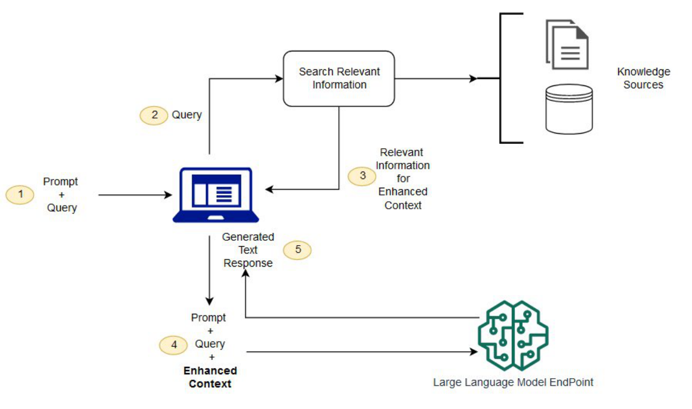

The retrieved document should be large enough to contain useful context to help augment the
prompt, but small enough to fit into the maximum sequence length of the prompt. You can
use task-specific JumpStart models, such as the General Text Embeddings (GTE) model from
Hugging Face, to provide the embeddings for your prompts and knowledge library documents.
After comparing the prompt and document embeddings to find the most relevant documents,
construct a new prompt with the supplemental context. Then, pass the augmented prompt to a
text generation model of your choosing.

Example notebooks

For more information on RAG foundation model solutions, see the following example notebooks:

• Retrieval-Augmented Generation: Question Answering using LangChain and Cohere’s Generate
and Embedding Models from SageMaker JumpStart

• Retrieval-Augmented Generation: Question Answering using LLama-2, Pinecone and Custom
Dataset

• Retrieval-Augmented Generation: Question Answering based on Custom Dataset with Open-
sourced LangChain Library

Foundation models
347

## Page 376

Amazon SageMaker AI
Developer Guide

• Retrieval-Augmented Generation: Question Answering based on Custom Dataset

• Retrieval-Augmented Generation: Question Answering using Llama-2 and Text Embedding
Models

• Amazon SageMaker JumpStart - Text Embedding and Sentence Similarity

You can clone the Amazon SageMaker AI examples repository to run the available JumpStart
foundation model examples in the Jupyter environment of your choice within Studio. For more
information on applications that you can use to create and access Jupyter in SageMaker AI, see
Applications supported in Amazon SageMaker Studio.

Evaluate a text generation foundation model in Studio

Note

Foundation Model Evaluations (FMEval) is in preview release for Amazon SageMaker Clarify
and is subject to change.

Important

In order to use SageMaker Clarify Foundation Model Evaluations, you must upgrade to the
new Studio experience. As of November 30, 2023, the previous Amazon SageMaker Studio
experience is now named Amazon SageMaker Studio Classic. The foundation evaluation
feature can only be used in the updated experience. For information about how to update
Studio, see Migration from Amazon SageMaker Studio Classic. For information about using
the Studio Classic application, see Amazon SageMaker Studio Classic.

Amazon SageMaker JumpStart has integrations with SageMaker Clarify Foundation Model
Evaluations (FMEval) in Studio. If a JumpStart model has built-in evaluation capabilities available,
you can choose Evaluate in the upper right corner of the model detail page in the JumpStart
Studio UI. For more information on navigating the JumpStart Studio UI, see Open JumpStart in
Studio,

Use Amazon SageMaker JumpStart to evaluate text-based foundation models with FMEval.
You can use these model evaluations to compare model quality and responsibility metrics for

Foundation models
348

## Page 377

Amazon SageMaker AI
Developer Guide

one model, between two models, or between different versions of the same model, to help you
quantify model risks. FMEval can evaluate text-based models that perform the following tasks:

• Open-ended generation – The production of natural human responses to text that does not
have a pre-defined structure.

• Text summarization – The generation of a concise and condensed summary while retaining the
meaning and key information contained in larger text.

• Question Answering – The generation of an answer in natural language to a question.

• Classification  – The assignment of a class, such as positive versus negative to a text
passage based on its content.

You can use FMEval to automatically evaluate model responses based on specific benchmarks. You
can also evaluate model responses against your own criteria by bringing your own prompt datasets.

FMEval provides a user interface (UI) that guides you through the setup and configuration of an
evaluation job. You can also use the FMEval library inside your own code.

Every evaluation requires quota for two instances:

• Hosting instance – An instance that hosts and deploys an LLM.

• Evaluation instance – An instance that is used to prompt and perform an evaluation of an LLM on
the hosting instance.

If your LLM is already deployed, provide the endpoint, and SageMaker AI will use your hosting
instance to host and deploy the LLM.

If you are evaluating a JumpStart model that is not yet deployed to your account, FMEval creates a
temporary hosting instance for you in your account, and keeps it deployed only for the length of
your evaluation. FMEval uses the default instance that JumpStart recommends for the chosen LLM
as your hosting instance. You must have sufficient quota for this recommended instance.

Every evaluation also uses an evaluation instance to provide prompts to and score the responses
from the LLM. You must also have sufficient quota and memory to run the evaluation algorithms.
The quota and memory requirements of the evaluation instance are generally smaller than those

required for a hosting instance. We recommend selecting the ml.m5.2xlarge instance. For more
information about quota and memory, see Resolve errors when creating a model evaluation job in
Amazon SageMaker AI.

Automatic evaluations can be used to score LLMs across the following dimensions:

Foundation models
349

## Page 378

Amazon SageMaker AI
Developer Guide

• Accuracy – For text summarization, question answering, and text classification

• Semantic robustness – For open-ended generation, text summarization and text classification
tasks

• Factual knowledge – For open-ended generation

• Prompt stereotyping – For open-ended generation

• Toxicity – For open-ended generation, text summarization, and question answering

You can also use human evaluations to manually evaluate model responses. The FMEval UI guides
you through a workflow of selecting one or more models, provisioning resources, and writing
instructions for and contacting your human workforce. After the human evaluation is complete, the
results are displayed in FMEval.

You can access model evaluation through the JumpStart landing page in Studio by selecting
a model to evaluate and then choosing Evaluate. Note that not all JumpStart models have
evaluation capabilities available. For more information about how to configure, provision and run
FMEval, see What are Foundation Model Evaluations?

Example notebooks

For step-by-step examples on how to use publicly available JumpStart foundation models with the
SageMaker Python SDK, refer to the following notebooks on text generation, image generation,
and model customization.

Note

Proprietary and publicly available JumpStart foundation models have different SageMaker
AI Python SDK deployment workflows. Discover proprietary foundation model example
notebooks through Amazon SageMaker Studio Classic or the SageMaker AI console. For
more information, see JumpStart foundation model usage.

You can clone the Amazon SageMaker AI examples repository to run the available JumpStart
foundation model examples in the Jupyter environment of your choice within Studio. For more
information on applications that you can use to create and access Jupyter in SageMaker AI, see
Applications supported in Amazon SageMaker Studio.

Foundation models
350

## Page 379

Amazon SageMaker AI
Developer Guide

Time series forecasting

You can use the Chronos models to forecast time series data. They're based on the language model
architecture. Use the Introduction to SageMaker JumpStart - Time Series Forecasting with Chronos
notebook to get started.

For information about the available Chronos models, see Available foundation models.

Text generation

Explore text generation example notebooks, including guidance on general text generation
workflows, multilingual text classification, real-time batch inference, few-shot learning, chatbot
interactions, and more.

• SageMaker JumpStart Foundation Models - HuggingFace Text2Text Generation with FLAN-T5 XL
as an example

• SageMaker JumpStart Foundation Models - BloomZ: Multilingual Text Classification, Question
and Answering, Code Generation, Paragraph rephrase, and More

• SageMaker JumpStart Foundation Models - HuggingFace Text2Text Generation Batch Transform
and Real-Time Batch Inference

• SageMaker JumpStart Foundation Models - GPT-J, GPT-Neo Few-shot learning

• SageMaker JumpStart Foundation Models - Chatbots

• Introduction to SageMaker JumpStart - Text Generation with Mistral models

• Introduction to SageMaker JumpStart - Text Generation with Falcon models

Image generation

Get started with text-to-image Stable Diffusion models, learn how to deploy an inpainting model,
and experiment with a simple workflow to generate images of your dog.

• Introduction to JumpStart - Text to Image

• Introduction to JumpStart Image editing - Stable Diffusion Inpainting

• Generate fun images of your dog

Foundation models
351

## Page 380

Amazon SageMaker AI
Developer Guide

Model customization

Sometimes your use case requires greater foundation model customization for specific tasks. For
more information on model customization approaches, see Foundation model customization or
explore one of the following example notebooks.

• SageMaker JumpStart Foundation Models - Fine-tuning text generation GPT-J 6B model on
domain specific dataset

• SageMaker JumpStart Foundation Models - HuggingFace Text2Text Instruction Fine-Tuning

• Retrieval-Augmented Generation: Question Answering using LangChain and Cohere’s Generate
and Embedding Models from SageMaker JumpStart

• Retrieval-Augmented Generation: Question Answering using LLama-2, Pinecone and Custom
Dataset

• Retrieval-Augmented Generation: Question Answering based on Custom Dataset with Open-
sourced LangChain Library

• Retrieval-Augmented Generation: Question Answering based on Custom Dataset

• Retrieval-Augmented Generation: Question Answering using Llama-2 and Text Embedding
Models

• Amazon SageMaker JumpStart - Text Embedding and Sentence Similarity

Private curated hubs for foundation model access control in JumpStart

Curate pretrained JumpStart foundation models for your organization with private hubs. Use the
latest publicly available and proprietary foundation models while enforcing governance guardrails
and ensuring that your organization can only access approved models.

Use private model hubs to share models and notebooks, centralize model artifacts, improve model
discoverability, and streamline model use within your organization. Administrators can create
private hubs that include subsets of models tailored to different teams, use cases, or security
requirements. Administrators can create a JumpStart private model hub using the SageMaker
Python SDK. Users can then browse, train, and deploy the curated set of models using Amazon
SageMaker Studio or the SageMaker Python SDK.

For more information on creating a private model hub, see Admin guide for private model hubs in
Amazon SageMaker JumpStart.

Access control
352

## Page 381

Amazon SageMaker AI
Developer Guide

For more information on sharing private model hubs across accounts, see Cross-account sharing for
private model hubs with AWS Resource Access Manager.

For more information on accessing a private model hub, see User guide.

Admin guide for private model hubs in Amazon SageMaker JumpStart

There are actions that administrators can take related to curated model hubs that users within your
organization can access. This includes creating, adding, deleting, and managing access of private
hubs. This page also includes information about the supported AWS Regions for curated private
hubs, as well as the prerequisites needed to use curated private model hubs.

Supported AWS Regions

Curated private hubs are currently generally available in the following AWS commercial Regions:

• us-east-1

• us-east-2

• us-west-2

• eu-west-1

• eu-central-1

• ap-northeast-1

• ap-northeast-2

• ap-south-1

• ap-southeast-1

• ap-southeast-2

• il-central-1 (SDK only)

The default maximum number of hubs allowed in a single Region is 50.

Prerequisites

To use a curated private hub in Studio, you must have the following prerequisites:

• An AWS account with administrator access

• An AWS Identity and Access Management (IAM) role with access to Amazon SageMaker Studio

• An Amazon SageMaker AI domain with JumpStart enabled

Access control
353

## Page 382

Amazon SageMaker AI
Developer Guide

• If your users try to use proprietary models, they must have subscriptions to those models in AWS
Marketplace.

• AWS accounts that are deploying proprietary models must have subscriptions to those models in
AWS Marketplace.

For more information on getting started with Studio, see Amazon SageMaker Studio.

Create a private model hub

Use the following steps to create a private hub to manage access control for pretrained JumpStart
foundation models for your organization. You must intstall the SageMaker Python SDK and
configure the necessary IAM permissions before creating a model hub.

Create a private hub

1.
Install the SageMaker Python SDK and import the necessary Python packages.

# Install the SageMaker Python SDK
!pip3 install sagemaker --force-reinstall --quiet

# Import the necessary Python packages
import boto3
from sagemaker import Session
from sagemaker.jumpstart.hub.hub import Hub

2.
Initialize a SageMaker AI Session.

sm_client = boto3.client('sagemaker')
session = Session(sagemaker_client=sm_client)
session.get_caller_identity_arn()

3.
Configure the details of your private hub such as the internal hub name, UI display name, and
UI hub description.

Note

If you do not specify an Amazon S3 bucket name when creating your hub, the
SageMaker hub service creates a new bucket on your behalf. The new bucket has the

following naming structure: sagemaker-hubs-REGION-ACCOUNT_ID.

Access control
354

## Page 383

Amazon SageMaker AI
Developer Guide

HUB_NAME="Example-Hub"
HUB_DISPLAY_NAME="Example Hub UI Name"
HUB_DESCRIPTION="A description of the example private curated hub."
REGION="us-west-2"

4.
Check that your Admin IAM role has the necessary Amazon S3 permissions to create a private
hub. If your role does not have the necessary permissions, navigate to the Roles page in the
IAM console. Choose the Admin role and then choose Add permissions in the Permissions
policies pane to create an inline policy with the following permissions using the JSON editor:

JSON

{
"Version":"2012-10-17",

"Statement": [
{
"Action": [
"s3:ListBucket",
"s3:GetObject",
"s3:GetObjectTagging"
],
"Resource": [
"arn:aws:s3:::jumpstart-cache-prod-REGION",
"arn:aws:s3:::jumpstart-cache-prod-REGION/*"
],
"Effect": "Allow"
}
]
}

5.
Create a private model hub using your configurations from Step 3 using hub.create().

hub = Hub(hub_name=HUB_NAME, sagemaker_session=session)

try:
# Create the private hub
hub.create(
description=HUB_DESCRIPTION,
display_name=HUB_DISPLAY_NAME
)

Access control
355

## Page 384

Amazon SageMaker AI
Developer Guide

print(f"Successfully created Hub with name {HUB_NAME} in {REGION}")
# Check that no other hubs with this internal name exist
except Exception as e:
if "ResourceInUse" in str(e):
print(f"A hub with the name {HUB_NAME} already exists in your account.")
else:
raise e

6.
Verify the configuration of your new private hub with the following describe command:

hub.describe()

Add models to a private hub

After creating a private hub, you can then add allow-listed models. For the full list of available
JumpStart models, see the Built-in Algorithms with pre-trained Model Table in the SageMaker
Python SDK reference.

1.
You can filter through the available models programmatically using the

hub.list_sagemaker_public_hub_models() method. You can optionally filter by

categories such as framework ("framework == pytorch"), tasks such as image classification

("task == ic"), and more. For more information about filters, see notebook_utils.py.

The filter parameter in the hub.list_sagemaker_public_hub_models() method is
optional.

filter_value = "framework == meta"
response = hub.list_sagemaker_public_hub_models(filter=filter_value)
models = response["hub_content_summaries"]
while response["next_token"]:
response = hub.list_sagemaker_public_hub_models(filter=filter_value,
next_token=response["next_token"])
models.extend(response["hub_content_summaries"])

print(models)

2.
You can then add the filtered models by specifying the model ARN in the

hub.create_model_reference() method.

for model in models:
print(f"Adding {model.get('hub_content_name')} to Hub")

Access control
356

## Page 385

Amazon SageMaker AI
Developer Guide

hub.create_model_reference(model_arn=model.get("hub_content_arn"),
model_name=model.get("hub_content_name"))

Update resources in a private hub

You can update resources in your private hub to make changes to their metadata. The resources
that you can update include model references to Amazon SageMaker JumpStart models, custom

models, notebooks, datasets, and JsonDoc.

When updating model, notebook, datasets, or JsonDoc resources, you can update the content
description, display name, keywords, and support status. When updating model references to
JumpStart models, you can only update the field specifying the minimum model version that you'd
like to use.

• “Update model or notebook resources” to include DataSet/JsonDoc. In CLI command, DataSets/
JsonDocs should added to the hub-content-type argument.

Follow the section specific to the resource that you want to update.

Update model or notebook resources

To update a model or a notebook resource, use the UpdateHubContent API.

The valid metadata fields that you can update with this API are the following:

• HubContentDescription – The description of the resource.

• HubContentDisplayName – The display name of the resource.

• HubContentMarkdown – The description of the resource, in Markdown formatting.

• HubContentSearchKeywords – The searchable keywords of the resource.

• SupportStatus – The current status of the resource.

In your request, include a change for one or more of the preceding fields. If you attempt to update
any other fields, such as the hub content type, you receive an error.

AWS SDK for Python (Boto3)

The following example shows how you can use the AWS SDK for Python (Boto3) to submit an
UpdateHubContent request.

Access control
357

## Page 386

Amazon SageMaker AI
Developer Guide

Note

The HubContentVersion you specify in the request means that the specific version's
metadata is updated. To find all of the available versions of your hub content, you can
use the  ListHubContentVersions API.

import boto3
sagemaker_client = boto3.Session(region_name=<AWS-region>).client("sagemaker")

sagemaker_client.update_hub_contents(
HubName=<hub-name>,
HubContentName=<resource-content-name>,
HubContentType=<"Model"|"Notebook">,
HubContentVersion='1.0.0', # specify the correct version that you want to update
HubContentDescription=<updated-description-string>
)

AWS CLI

The following example shows how you can use the AWS CLI to submit an  update-hub-content
request.

aws sagemaker update-hub-content \
--hub-name <hub-name> \
--hub-content-name <resource-content-name> \
--hub-content-type <"Model"|"Notebook"> \
--hub-content-version "1.0.0" \
--hub-content-description <updated-description-string>

Update model references

To update a model reference to a JumpStart model, use the  UpdateHubContentReference API.

You can only update the MinVersion field for model references.

AWS SDK for Python (Boto3)

The following example shows how you can use the AWS SDK for Python (Boto3) to submit an
UpdateHubContentReference request.

Access control
358

## Page 387

Amazon SageMaker AI
Developer Guide

import boto3
sagemaker_client = boto3.Session(region_name=<AWS-region>).client("sagemaker")

update_response = sagemaker_client.update_hub_content_reference(
HubName=<hub-name>,
HubContentName=<model-reference-content-name>,
HubContentType='ModelReference',
MinVersion='1.0.0'
)

AWS CLI

The following example shows how you can use the AWS CLI to submit an  update-hub-content-
reference request.

aws sagemaker update-hub-content-reference \
--hub-name <hub-name> \
--hub-content-name <model-reference-content-name> \
--hub-content-type "ModelReference" \
--min-version "1.0.0"

Cross-account sharing for private model hubs with AWS Resource Access Manager

After creating a private model hub, you can share the hub to the necessary accounts using AWS
Resource Access Manager (AWS RAM). For more information on creating a private hub, see Create
a private model hub. The following page gives in-depth information about managed permissions
related to private hubs within AWS RAM. For information about how to create a resource share
within AWS RAM, see Set up cross-account hub sharing.

Managed permissions for curated private hubs

The available access permissions are read, read and use, and full access permissions. The permission
name, description, and list of specific APIs available for each permission are listed in the following:

• Read permission (AWSRAMPermissionSageMaker AIHubRead): The read privilege allows
resource consumer accounts to read contents in the shared hubs and view details and metadata.

• DescribeHub: Retrieves details about a hub and its configuration

• DescribeHubContent: Retrieves details about a model available in a specific hub

• ListHubContent: Lists all models available in a hub

Access control
359

## Page 388

Amazon SageMaker AI
Developer Guide

• ListHubContentVersions: Lists the version of all models available in a hub

• Read and use permission (AWSRAMPermissionSageMaker AIHubReadAndUse): The read and
use privilege allows resource consumer accounts to read contents in the shared hubs and deploy
available models for inference.

• DescribeHub: Retrieves details about a hub and its configuration

• DescribeHubContent: Retrieves details about a model available in a specific hub

• ListHubContent: Lists all models available in a hub

• ListHubContentVersions: Lists the version of all models available in a hub

• DeployHubModel: Allows access to deploy available open-weight hub models for inference

• Full access permission (AWSRAMPermissionSageMaker AIHubFullAccessPolicy): The full
access privilege allows resource consumer accounts to read contents in the shared hubs, add and
remove hub content, and deploy available models for inference.

• DescribeHub: Retrieves details about a hub and its configuration

• DescribeHubContent: Retrieves details about a model available in a specific hub

• ListHubContent: Lists all models available in a hub

• ListHubContentVersions: Lists the version of all models available in a hub

• ImportHubContent: Imports hub content

• DeleteHubContent: Deletes hub content

• CreateHubContentReference: Creates a hub content reference that shares a model from
the SageMaker AI Public models hub to a private hub

• DeleteHubContentReference: Delete a hub content reference that shares a model from the
SageMaker AI Public models hub to a private hub

• DeployHubModel: Allows access to deploy available open-weight hub models for inference

DeployHubModel permissions are not required for proprietary models.

Set up cross-account hub sharing

SageMaker uses AWS Resource Access Manager (AWS RAM) to help you securely share your private
hubs across accounts. Set up cross-account hub sharing using the following instructions along with
the Sharing your AWS resources instructions in the AWS RAM User Guide.

Access control
360

## Page 389

Amazon SageMaker AI
Developer Guide

Create a resource share

1.
Select Create resource share through the AWS RAM console.

2.
When specifying resource share details, choose the SageMaker Hubs resource type and select

one more more private hubs that you want to share. When you share a hub with any other
account, all of its contents are also shared implicitly.

3.
Associate permissions with your resources share. For more information about managed
permissions, see Managed permissions for curated private hubs

4.
Use AWS account IDs to specify the accounts to which you want to grant access to your shared
resources.

5.
Review your resource share configuration and select Create resource share. It may take a few
minutes for the resource share and principal associations to complete.

For more information, see Sharing your AWS resources in the AWS Resource Access Manager User
Guide.

After the resource share and principal associations are set, the specified AWS accounts receive an
invitation to join the resource share. The AWS accounts must accept the invite to gain access to any
shared resources.

For more information on accepting a resource share invite through AWS RAM, see Using shared
AWS resources in the AWS Resource Access Manager User Guide.

Delete models from a private hub

You can delete models from a private hub used by your organization by specifying the model ARN

in the hub.delete_model_reference() method. This removes access to the model from the
private hub.

hub.delete_model_reference(model-name)

Restrict access to JumpStart gated models

Amazon SageMaker JumpStart provides access to both publicly available and proprietary
foundation models. There are certain gated models in private Amazon S3 buckets that require you
to have accepted the model's EULA (end user license agreement) in order to access them. For more
information, see EULA acceptance with the SageMaker Python SDK.

Access control
361

## Page 390

Amazon SageMaker AI
Developer Guide

The current default behavior is that if a user accepts a model's EULA, then the user can access the
model and create  fine-tuning training jobs. However, if you're an administrator and would like to
restrict fine-tuning access to these gated models, you can set a policy that denies permissions to

use the CreateTrainingJob action whenever the request is to a gated model.

The following is an example AWS Identity and Access Management (IAM) policy that an
administrator can add to a user's IAM role:

{
"Effect": "Deny",
"Action": "sagemaker:CreateTrainingJob",
"Resource": "*",
"Condition": {
"Bool": {
"sagemaker:DirectGatedModelAccess": "true"
}
}
}

If you want to grant users access to specific models without providing unrestricted access to the
gated models, set up a curated hub and add the specific models to the hub. For more information,
see Private curated hubs for foundation model access control in JumpStart.

Remove access to the SageMaker Public models hub

In addition to adding a private curated hub to JumpStart in Studio, you can also remove access to
the SageMaker Public models hub for your users. The SageMaker Public models hub has access to
all available JumpStart foundation models.

If you remove access to the SageMaker Public models hub and a user has access to only one
private hub, then the user is taken directly into that private hub when they choose JumpStart in
the left navigation pane in Studio. If a user has access to multiple private hubs, then the user is
taken to a Hubs menu page when they choose JumpStart in the left navigation pane in Studio.

Remove access to the SageMaker Public models hub for your users with the following inline policy:

Note

You can specify any additional Amazon S3 buckets that you want your hub to access in the

policy below. Be sure to replace REGION with the Region of your hub.

Access control
362

## Page 391

Amazon SageMaker AI
Developer Guide

JSON

{
"Version":"2012-10-17",

"Statement": [
{
"Action": "s3:*",
"Effect": "Deny",
"NotResource": [
"arn:aws:s3:::jumpstart-cache-prod-us-east-1/*.ipynb",
"arn:aws:s3:::jumpstart-cache-prod-us-east-1/*eula*",
"arn:aws:s3:::amzn-s3-demo-bucket/*"
]
},
{
"Action": "sagemaker:*",
"Effect": "Deny",
"Resource": [
"arn:aws:sagemaker:us-east-1:aws:hub/SageMakerPublicHub",
"arn:aws:sagemaker:us-east-1:aws:hub-content/SageMakerPublicHub/
*/*"
]
}
]
}

Delete a private hub

You can delete a private hub from your admin account. Before deleting a private hub, you must
first remove any content in that hub. Delete hub contents and hubs with the following commands:

# List the model references in the private hub
response = hub.list_models()
models = response["hub_content_summaries"]
while response["next_token"]:
response = hub.list_models(next_token=response["next_token"])
models.extend(response["hub_content_summaries"])

# Delete all model references in the hub
for model in models:
hub.delete_model_reference(model_name=model.get('HubContentName'))

Access control
363

## Page 392

Amazon SageMaker AI
Developer Guide

# Delete the private hub
hub.delete()

Troubleshooting

The following sections give information about IAM permissions issues that might arise when
creating a private model hub, as well as informationa bout how to resolve those issues.

ValidationException when calling the CreateModel operation: Could not access model
data

This exception arises when you do not have the appropriate Amazon S3 permissions configured for
your Admin role. For more information on the Amazon S3 permissions needed to create a private
hub, see Step 3 in Create a private model hub.

Access Denied or Forbidden when calling create()

You are denied access when creating a private hub if you do not have the appropriate permissions
to access the Amazon S3 bucket associated with the SageMaker Public models hub. For more
information on the Amazon S3 permissions needed to create a private hub, see Step 3 in Create a
private model hub.

User guide

The following topics cover accessing and using models in your Amazon SageMaker JumpStart
curated model hubs. Learn how to access your curated hub models through the Amazon
SageMaker Studio interface or programmatically with the SageMaker Python SDK. Additionally,
learn how to fine-tune curated hub models to adapt them for your specific use cases and business
needs.

Topics

• Access curated model hubs in Amazon SageMaker JumpStart

• Fine-tune curated hub models

Access curated model hubs in Amazon SageMaker JumpStart

You can access a private model hub either through Studio or through the SageMaker Python SDK.

Access control
364

## Page 393

Amazon SageMaker AI
Developer Guide

Access your private model hub in Studio

Important

As of November 30, 2023, the previous Amazon SageMaker Studio experience is now
named Amazon SageMaker Studio Classic. The following section is specific to using the
updated Studio experience. For information about using the Studio Classic application, see
Amazon SageMaker Studio Classic.

In Amazon SageMaker Studio, open the JumpStart landing page either through the Home page or
the Home menu on the left-side panel. This opens the SageMaker JumpStart landing page where
you can explore model hubs and search for models.

• From the Home page, choose JumpStart in the Prebuilt and automated solutions pane.

• From the Home menu in the left panel, navigate to the JumpStart node.

For more information on getting started with Amazon SageMaker Studio, see Amazon SageMaker
Studio.

From the SageMaker JumpStart landing page in Studio, you can explore any private model hubs
that include allow-listed models for your organization. If you only have access to one model hub,
then the SageMaker JumpStart landing page takes you directly into that hub. If you have access to
multiple hubs, you are taken to the Hubs page.

For more information on fine-tuning, deploying, and evaluating models that you have access to in
Studio, see Use foundation models in Studio.

Access your private model hub using the SageMaker Python SDK

You can access your private model hub using the SageMaker Python SDK. Your access to read, use,
or edit your curated hub is provided by your administrator.

Note

If a hub is shared across accounts, then the HUB_NAME must be the hub ARN. If a hub is not

shared across accounts, then the HUB_NAME can be the hub name.

Access control
365

## Page 394

Amazon SageMaker AI
Developer Guide

1.
Install the SageMaker Python SDK and import the necessary Python packages.

# Install the SageMaker Python SDK
!pip3 install sagemaker --force-reinstall --quiet
# Import the necessary Python packages
import boto3
from sagemaker import Session
from sagemaker.jumpstart.hub.hub import Hub
from sagemaker.jumpstart.model import JumpStartModel
from sagemaker.jumpstart.estimator import JumpStartEstimator

2.
Initalize a SageMaker AI session and connect to your private hub using the hub name and
Region.

# If a hub is shared across accounts, then the HUB_NAME must be the hub ARN

HUB_NAME="Example-Hub-ARN"
REGION="us-west-2"
# Initialize a SageMaker session
sm_client = boto3.client('sagemaker')
sm_runtime_client = boto3.client('sagemaker-runtime')
session = Session(sagemaker_client=sm_client,
sagemaker_runtime_client=sm_runtime_client)
# Initialize the private hub
hub = Hub(hub_name=HUB_NAME, sagemaker_session=session)

3.
After connecting to a private hub, you can list all available models in that hub using the
following commands:

response = hub.list_models()
models = response["hub_content_summaries"]
while response["next_token"]:
response = hub.list_models(next_token=response["next_token"])
models.extend(response["hub_content_summaries"])
print(models)

4.
You can get more information about a specific model using the model name with the following
command:

Access control
366

## Page 395

Amazon SageMaker AI
Developer Guide

response = hub.describe_model(model_name="example-model")
print(response)

For more information on fine-tuning and deploying models that you have access to using the
SageMaker Python SDK, see Use foundation models with the SageMaker Python SDK.

Fine-tune curated hub models

In your private curated model hub, you can run fine-tuning training jobs using your model
references. Model references point to a publicly available JumpStart model in the SageMaker AI
public hub, but you can fine-tune the model on your own data for your specific use case. After
the fine-tuning job, you have access to the model weights that you can then use or deploy to an
endpoint.

You can fine-tune curated hub models in just a few lines of code using the SageMaker Python SDK.
For more general information on fine-tuning publicly available JumpStart models, see Foundation
models and hyperparameters for fine-tuning.

Prerequisites

In order to fine-tune a JumpStart model reference in your curated hub, do the following:

1.
Make sure that your user's IAM role has the SageMaker AI TrainHubModel permission
attached. For more information, see  Adding and removing IAM identity permissions in the
AWS IAM User Guide.

You should attach a policy like the following example to your user's IAM role:

JSON

{
"Version":"2012-10-17",
"Statement": [
{
"Sid": "VisualEditor0",
"Effect": "Allow",
"Action": "sagemaker:TrainHubModel",
"Resource": "arn:aws:sagemaker:*:111122223333:hub/*"
}

Access control
367

## Page 396

Amazon SageMaker AI
Developer Guide

]
}

Note

If your curated hub is shared across accounts and the hub content is owned by another

account, make sure that your HubContent (the model reference resource) has a

resource-based IAM policy that also grants the TrainHubModel permission to the
requesting account, as shown in the following example.

JSON

{
"Version":"2012-10-17",
"Statement": [
{
"Sid": "AllowCrossAccountSageMakerAccess",
"Effect": "Allow",
"Principal": {
"AWS": "arn:aws:iam::111122223333:root"
},
"Action": [
"sagemaker:TrainHubModel"
],
"Resource": [
"arn:aws:sagemaker:*:111122223333:hub/*"
]
}
]
}

2.
Have a private curated hub with a model reference to a JumpStart model that you want to
fine-tune. For more information about creating a private hub, see Create a private model hub.
To learn how to add publicly available JumpStart models to your private hub, see Add models
to a private hub.

Access control
368

## Page 397

Amazon SageMaker AI
Developer Guide

Note

The JumpStart model you choose should be fine-tunable. You can verify whether a
model is fine-tunable by checking the  Built-in Algorithms with Pre-trained Models
Table.

3.
Have a training dataset that you want to use for fine-tuning the model. The dataset should be
in the appropriate training format for the model that you want to fine-tune.

Fine-tune a curated hub model reference

The following procedure shows you how to fine-tune a model reference in your private curated hub
using the SageMaker Python SDK.

1.
Make sure that you have the latest version (at least 2.242.0) of the SageMaker Python SDK
installed. For more information, see  Use Version 2.x of the SageMaker Python SDK.

!pip install --upgrade sagemaker

2.
Import the AWS SDK for Python (Boto3) and the modules you'll need from the SageMaker
Python SDK.

import boto3
from sagemaker.jumpstart.estimator import JumpStartEstimator
from sagemaker.session import Session

3.
Initialize a Boto3 session, a SageMaker AI client, and a SageMaker Python SDK session.

sagemaker_client = boto3.Session(region_name=<AWS-region>).client("sagemaker")
sm_session = Session(sagemaker_client=sagemaker_client)

4.
Create a JumpStartEstimator and provide the JumpStart model ID, the name of your hub
that contains the model reference, and your SageMaker Python SDK session. For a list of
model IDs, see the  Built-in Algorithms with Pre-trained Models Table.

Optionally, you can specify the instance_type and instance_count fields when creating
the estimator. If you don't, the training job uses the default instance type and count for the
model you're using.

Access control
369

## Page 398

Amazon SageMaker AI
Developer Guide

You can also optionally specify the output_path to the Amazon S3 location where you want

to store the fine-tuned model weights. If you don't specify the output_path, then uses

a default SageMaker AI Amazon S3 bucket for the region in your account, named with the

following format: sagemaker-<region>-<account-id>.

estimator = JumpStartEstimator(
model_id="meta-textgeneration-llama-3-2-1b",
hub_name=<your-hub-name>,
sagemaker_session=sm_session, # If you don't specify an existing session, a
default one is created for you
# Optional: specify your desired instance type and count for the training job
# instance_type = "ml.g5.2xlarge"
# instance_count = 1
# Optional: specify a custom S3 location to store the fine-tuned model
artifacts
# output_path: "s3://<output-path-for-model-artifacts>"
)

5.
Create a dictionary with the training key where you specify the location of your fine-tuning
dataset. This example points to an Amazon S3 URI. If you have additional considerations, such
as using local mode or multiple training data channels, see  JumpStartEstimator.fit() in the
SageMaker Python SDK documentation for more information.

training_input = {
"training": "s3://<your-fine-tuning-dataset>"
}

6.
Call the estimator's fit() method and pass in your training data and your EULA acceptance (if
applicable).

Note

The following example sets accept_eula=False. You should manually change the

value to True in order to accept the EULA.

estimator.fit(inputs=training_input, accept_eula=False)

Access control
370

## Page 399

Amazon SageMaker AI
Developer Guide

Your fine-tuning job should now begin.

You can check on your fine-tuning job by viewing your training jobs, either in the SageMaker AI
console or by using the ListTrainingJobs API.

You can access your fine-tuned model artifacts at the Amazon S3 output_path that was specified

in the JumpStartEstimator object (either the default SageMaker AI Amazon S3 bucket for the
region, or a custom Amazon S3 path you specified, if applicable).

Amazon SageMaker JumpStart in Studio Classic

Important

As of November 30, 2023, the previous Amazon SageMaker Studio experience is now
named Amazon SageMaker Studio Classic. The following section is specific to using the
Studio Classic application. For information about using the updated Studio experience, see
Amazon SageMaker Studio.
Studio Classic is still maintained for existing workloads but is no longer available for
onboarding. You can only stop or delete existing Studio Classic applications and cannot
create new ones. We recommend that you migrate your workload to the new Studio
experience.

The following JumpStart features are only available in Amazon SageMaker Studio Classic.

• Task-Specific Models

• Shared Models and Notebooks

• End-to-end JumpStart solution templates

• Amazon SageMaker JumpStart Industry: Financial

Task-Specific Models

JumpStart supports task-specific models across fifteen of the most popular problem types. Of the
supported problem types, Vision and NLP-related types total thirteen. There are eight problem
types that support incremental training and fine-tuning. For more information about incremental
training and hyper-parameter tuning, see SageMaker AI Automatic Model Tuning. JumpStart also
supports four popular algorithms for tabular data modeling.

Studio Classic
371

## Page 400

Amazon SageMaker AI
Developer Guide

You can search and browse models from the JumpStart landing page in Studio or Studio Classic.
When you select a model, the model detail page provides information about the model, and you
can train and deploy your model in a few steps. The description section describes what you can
do with the model, the expected types of inputs and outputs, and the data type needed for fine-
tuning your model.

You can also programmatically utilize models with the SageMaker Python SDK. For a list of all
available models, see the JumpStart Available Model Table.

The list of problem types and links to their example Jupyter notebooks are summarized in the
following table.

Problem types
Supports
inference with
pre-trained
models

Trainable on a
custom dataset

Supported
frameworks

Example
Notebooks

Image classific
ation

Yes
Yes
PyTorch,
TensorFlow

Introduction
to JumpStart -
Image Classific
ation

Object detection
Yes
Yes
PyTorch,
TensorFlow,
MXNet

Introduction
to JumpStart -
Object Detection

Semantic
segmentation

Yes
Yes
MXNet
Introduction
to JumpStart
- Semantic
Segmentation

Instance
segmentation

Yes
Yes
MXNet
Introduction
to JumpStart
- Instance
Segmentation

Image
embedding

Yes
No
TensorFlow,
MXNet

Introduction
to JumpStart

Studio Classic
372

## Page 401

Amazon SageMaker AI
Developer Guide

Problem types
Supports
inference with
pre-trained
models

Trainable on a
custom dataset

Supported
frameworks

Example
Notebooks

- Image
Embedding

Text classific
ation

Yes
Yes
TensorFlow
Introduction to
JumpStart - Text
Classification

Sentence pair
classification

Yes
Yes
TensorFlow,
Hugging Face

Introduction
to JumpStart -
Sentence Pair
Classification

Question
answering

Yes
Yes
PyTorch,
Hugging Face

Introduction
to JumpStart
– Question
Answering

Named entity
recognition

Yes
No
Hugging Face
Introduction
to JumpStart -
Named Entity
Recognition

Text summariza
tion

Yes
No
Hugging Face
Introduction to
JumpStart - Text
Summarization

Text generation
Yes
No
Hugging Face
Introduction to
JumpStart - Text
Generation

Machine
translation

Yes
No
Hugging Face
Introduction
to JumpStart
- Machine
Translation

Studio Classic
373

## Page 402

Amazon SageMaker AI
Developer Guide

Problem types
Supports
inference with
pre-trained
models

Trainable on a
custom dataset

Supported
frameworks

Example
Notebooks

Text embedding
Yes
No
TensorFlow,
MXNet

Introduction to
JumpStart - Text
Embedding

Tabular classific
ation

Yes
Yes
LightGBM,
CatBoost,
XGBoost,
AutoGluon
-Tabular,
TabTransformer,
Linear Learner

Introduction
to JumpStart
- Tabular
Classification
- LightGBM,
CatBoost

Introduction
to JumpStart -
Tabular Classific
ation - XGBoost,
Linear Learner

Introduction
to JumpStart
- Tabular
Classification
- AutoGluon
Learner

Introduction
to JumpStart -
Tabular Classific
ation - TabTransf
ormer Learner

Studio Classic
374

## Page 403

Amazon SageMaker AI
Developer Guide

Problem types
Supports
inference with
pre-trained
models

Trainable on a
custom dataset

Supported
frameworks

Example
Notebooks

Tabular
regression

Yes
Yes
LightGBM,
CatBoost,
XGBoost,
AutoGluon
-Tabular,
TabTransformer,
Linear Learner

Introduction
to JumpStart
- Tabular
Regression
- LightGBM,
CatBoost

Introduction
to JumpStart
– Tabular
Regression -
XGBoost, Linear
Learner

Introduction
to JumpStart
– Tabular
Regression -
AutoGluon
Learner

Introduction
to JumpStart
– Tabular
Regression -
TabTransformer
Learner

Studio Classic
375

## Page 404

Amazon SageMaker AI
Developer Guide

Deploy a Model

When you deploy a model from JumpStart, SageMaker AI hosts the model and deploys an
endpoint that you can use for inference. JumpStart also provides an example notebook that you
can use to access the model after it's deployed.

Important

As of November 30, 2023, the previous Amazon SageMaker Studio experience is now
named Amazon SageMaker Studio Classic. The following section is specific to using the
Studio Classic application. For information about using the updated Studio experience, see
Amazon SageMaker Studio.
Studio Classic is still maintained for existing workloads but is no longer available for
onboarding. You can only stop or delete existing Studio Classic applications and cannot
create new ones. We recommend that you migrate your workload to the new Studio
experience.

Note

Fore more information on JumpStart model deployment in Studio, see Deploy a model in
Studio

Model deployment configuration

After you choose a model, the model's tab opens. In the Deploy Model pane, choose Deployment
Configuration to configure your model deployment.

Studio Classic
376

## Page 405

Amazon SageMaker AI
Developer Guide

The default instance type for deploying a model depends on the model. The instance type is the

hardware that the training job runs on. In the following example, the ml.p2.xlarge instance is
the default for this particular BERT model.

You can also change the endpoint name, add key;value resource tags, activate or deactive the

jumpstart- prefix for any JumpStart resources related to the model, and specify an Amazon S3
bucket for storing model artifacts used by your SageMaker AI endpoint.

Choose Security Settings to specify the AWS Identity and Access Management (IAM ) role, Amazon
Virtual Private Cloud (Amazon VPC), and encryption keys for the model.

Studio Classic
377

## Page 406

Amazon SageMaker AI
Developer Guide

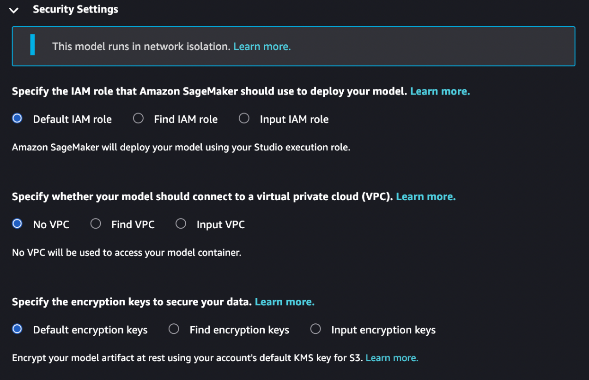

Model deployment security

When you deploy a model with JumpStart, you can specify an IAM role, Amazon VPC, and
encryption keys for the model. If you don't specify any values for these entries: The default IAM
role is your Studio Classic runtime role; default encryption is used; no Amazon VPC is used.

IAM role

You can select an IAM role that is passed as part of training jobs and hosting jobs. SageMaker AI
uses this role to access training data and model artifacts. If you don't select an IAM role, SageMaker
AI deploys the model using your Studio Classic runtime role. For more information about IAM roles,
see AWS Identity and Access Management for Amazon SageMaker AI.

The role that you pass must have access to the resources that the model needs, and must include
all of the following.

• For training jobs: CreateTrainingJob API: Execution Role Permissions.

• For hosting jobs: CreateModel API: Execution Role Permissions.

Studio Classic
378

## Page 407

Amazon SageMaker AI
Developer Guide

Note

You can scope down the Amazon S3 permissions granted in each of the following roles. Do
this by using the ARN of your Amazon Simple Storage Service (Amazon S3) bucket and the
JumpStart Amazon S3 bucket.

[
{
"Effect": "Allow",
"Action": [
"s3:GetObject",
"s3:ListBucket"
],
"Resource": [
"arn:aws:s3:::jumpstart-cache-prod-<region>/*",
"arn:aws:s3:::jumpstart-cache-prod-<region>",

"arn:aws:s3:::<bucket>/*"
]
},
{
"Effect": "Allow",
"Action": [
"cloudwatch:PutMetricData",
"logs:CreateLogStream",
"logs:PutLogEvents",
"logs:CreateLogGroup",
"logs:DescribeLogStreams",
"ecr:GetAuthorizationToken"
],
"Resource": [
"*"
]
},
{
"Effect": "Allow",
"Action": [
"ecr:BatchGetImage",
"ecr:BatchCheckLayerAvailability",
"ecr:GetDownloadUrlForLayer"
],
"Resource": [
"*"
]

Studio Classic
379

## Page 408

Amazon SageMaker AI
Developer Guide

},
]
}

Find IAM role

If you select this option, you must select an existing IAM role from the dropdown list.

Input IAM role

If you select this option, you must manually enter the ARN for an existing IAM role. If your Studio

Classic runtime role or Amazon VPC block the iam:list* call, you must use this option to use an
existing IAM role.

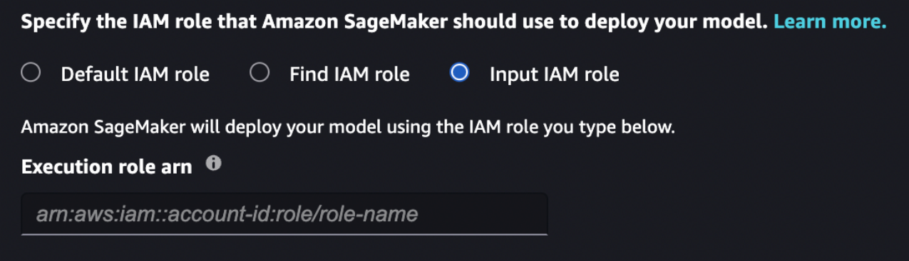

Amazon VPC

All JumpStart models run in network isolation mode. After the model container is created, no
more calls can be made. You can select an Amazon VPC that is passed as part of training jobs and

Studio Classic
380

## Page 409

Amazon SageMaker AI
Developer Guide

hosting jobs. SageMaker AI uses this Amazon VPC to push and pull resources from your Amazon S3
bucket. This Amazon VPC is different from the Amazon VPC that limits access to the public internet
from your Studio Classic instance. For more information about the Studio Classic Amazon VPC, see
Connect Studio notebooks in a VPC to external resources.

The Amazon VPC that you pass does not need access to the public internet, but it does need
access to Amazon S3. The Amazon VPC endpoint for Amazon S3 must allow access to at least the
following resources that the model needs.

{
"Effect": "Allow",
"Action": [
"s3:GetObject",
"s3:PutObject",
"s3:ListMultipartUploadParts",
"s3:ListBucket"
],
"Resources": [
"arn:aws:s3:::jumpstart-cache-prod-<region>/*",
"arn:aws:s3:::jumpstart-cache-prod-<region>",
"arn:aws:s3:::bucket/*"
]
}

If you do not select an Amazon VPC, no Amazon VPC is used.

Find VPC

If you select this option, you must select an existing Amazon VPC from the dropdown list. After
you select an Amazon VPC, you must select a subnet and security group for your Amazon VPC. For
more information about subnets and security groups, see Overview of VPCs and subnets.

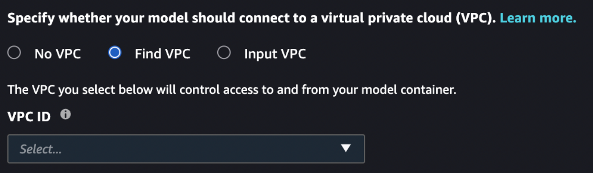

Studio Classic
381

## Page 410

Amazon SageMaker AI
Developer Guide

Input VPC

If you select this option, you must manually select the subnet and security group that compose

your Amazon VPC. If your Studio Classic runtime role or Amazon VPC blocks the ec2:list* call,

you must use this option to select the subnet and security group.

Encryption keys

You can select an AWS KMS key that is passed as part of training jobs and hosting jobs. SageMaker
AI uses this key to encrypt the Amazon EBS volume for the container, and the repackaged model in
Amazon S3 for hosting jobs and the output for training jobs. For more information about AWS KMS
keys, see AWS KMS keys.

The key that you pass must trust the IAM role that you pass. If you do not specify an IAM role, the
AWS KMS key must trust your Studio Classic runtime role.

If you do not select an AWS KMS key, SageMaker AI provides default encryption for the data in the
Amazon EBS volume and the Amazon S3 artifacts.

Find encryption keys

If you select this option, you must select existing AWS KMS keys from the dropdown list.

Studio Classic
382

## Page 411

Amazon SageMaker AI
Developer Guide

Input encryption keys

If you select this option, you must manually enter the AWS KMS keys. If your Studio Classic

execution role or Amazon VPC block the kms:list* call, you must use this option to select
existing AWS KMS keys.

Configure default values for JumpStart models

You can configure default values for parameters such as IAM roles, VPCs, and KMS keys to pre-
populate for JumpStart model deployment and training. After configuring default values, the
Studio Classic UI automatically provides your specified security settings and tags to JumpStart

Studio Classic
383

## Page 412

Amazon SageMaker AI
Developer Guide

models to simplify deployment and training workflows. Administrators and end-users can initialize
default values specified in a configuration file in YAML format.

By default, the SageMaker Python SDK uses two configuration files: one for the administrator and

one for the user. Using the admininistrator configuration file, administrators can define a set of
default values. End-users can override values set in the administrator configuration file and set
additional default values using the end-user configuration file. For more information, see Default
configuration file location.

The following code sample lists the default locations of the configuration files when using the
SageMaker Python SDK in Amazon SageMaker Studio Classic.

# Location of the admin config file
/etc/xdg/sagemaker/config.yaml

# Location of the user config file
/root/.config/sagemaker/config.yaml

Values specified in the user configuration file override values set in the administrator configuration
file. The configuration file is unique to each user profile within an Amazon SageMaker AI domain.
The user profile's Studio Classic application is directly associated with the user profile. For more
information, see Domain user profiles.

Administrators can optionally set configuration defaults for JumpStart model training and

deployment through JupyterServer lifecycle configurations. For more information, see Create
and Associate a Lifecycle Configuration with Amazon SageMaker Studio Classic.

Default value configuration YAML file

Your configuration file should adhere to the SageMaker Python SDK configuration file structure.

Note that specific fields in the TrainingJob, Model, and EndpointConfig configurations apply
to JumpStart model training and deployment default values.

SchemaVersion: '1.0'
SageMaker:
TrainingJob:
OutputDataConfig:
KmsKeyId: example-key-id
ResourceConfig:
# Training configuration - Volume encryption key
VolumeKmsKeyId: example-key-id

Studio Classic
384

## Page 413

Amazon SageMaker AI
Developer Guide

# Training configuration form - IAM role
RoleArn: arn:aws:iam::123456789012:role/SageMakerExecutionRole
VpcConfig:
# Training configuration - Security groups
SecurityGroupIds:
- sg-1
- sg-2
# Training configuration - Subnets
Subnets:
- subnet-1
- subnet-2
# Training configuration - Custom resource tags
Tags:
- Key: Example-key
Value: Example-value
Model:
EnableNetworkIsolation: true

# Deployment configuration - IAM role
ExecutionRoleArn: arn:aws:iam::123456789012:role/SageMakerExecutionRole
VpcConfig:
# Deployment configuration - Security groups
SecurityGroupIds:
- sg-1
- sg-2
# Deployment configuration - Subnets
Subnets:
- subnet-1
- subnet-2
EndpointConfig:
AsyncInferenceConfig:
OutputConfig:
KmsKeyId: example-key-id
DataCaptureConfig:
# Deployment configuration - Volume encryption key
KmsKeyId: example-key-id
KmsKeyId: example-key-id
# Deployment configuration - Custom resource tags
Tags:
- Key: Example-key
Value: Example-value

Studio Classic
385

## Page 414

Amazon SageMaker AI
Developer Guide

Fine-Tune a Model

Fine-tuning trains a pretrained model on a new dataset without training from scratch. This process,
also known as transfer learning, can produce accurate models with smaller datasets and less
training time. You can fine-tune a model if its card shows a fine-tunable attribute set to Yes.

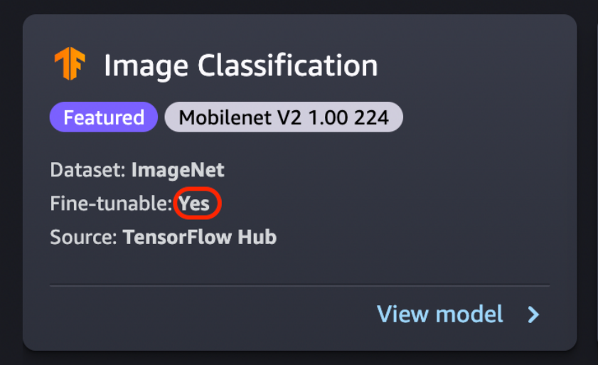

Important

As of November 30, 2023, the previous Amazon SageMaker Studio experience is now
named Amazon SageMaker Studio Classic. The following section is specific to using the
Studio Classic application. For information about using the updated Studio experience, see
Amazon SageMaker Studio.
Studio Classic is still maintained for existing workloads but is no longer available for
onboarding. You can only stop or delete existing Studio Classic applications and cannot
create new ones. We recommend that you migrate your workload to the new Studio
experience.

Note

For more information on JumpStart model fine-tuning in Studio, see Fine-tune a model in
Studio

Studio Classic
386

## Page 415

Amazon SageMaker AI
Developer Guide

Fine-Tuning data source

When you fine-tune a model, you can use the default dataset or choose your own data, which is
located in an Amazon S3 bucket.

To browse the buckets available to you, choose Find S3 bucket. These buckets are limited by the
permissions used to set up your Studio Classic account. You can also specify an Amazon S3 URI by
choosing Enter Amazon S3 bucket location.

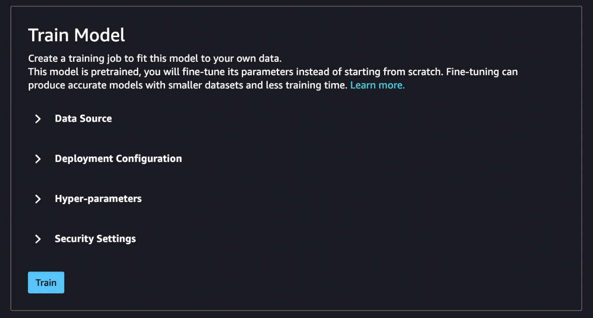

Tip

To find out how to format the data in your bucket, choose Learn more. The description
section for the model has detailed information about inputs and outputs.

For text models:

• The bucket must have a data.csv file.

• The first column must be a unique integer for the class label. For example: 1, 2, 3, 4, n

• The second column must be a string.

Studio Classic
387

## Page 416

Amazon SageMaker AI
Developer Guide

• The second column should have the corresponding text that matches the type and language for
the model.

For vision models:

• The bucket must have as many subdirectories as the number of classes.
• Each subdirectory should contain images that belong to that class in .jpg format.

Note

The Amazon S3 bucket must be in the same AWS Region where you're running SageMaker
Studio Classic because SageMaker AI doesn't allow cross-Region requests.

Fine-Tuning deployment configuration

The p3 family is recommended as the fastest for deep learning training, and this is recommended
for fine-tuning a model. The following chart shows the number of GPUs in each instance type.
There are other available options that you can choose from, including p2 and g4 instance types.

Instance type
GPUs

p3.2xlarge
1

p3.8xlarge
4

p3.16xlarge
8

p3dn.24xlarge
8

Hyperparameters

You can customize the hyperparameters of the training job that are used to fine-tune the model.
The hyperparameters available for each fine-tunable model differ depending on the model. For
information on each available hyperparameter, reference the hyperparameters documentation for
the model of your choosing in Built-in algorithms and pretrained models in Amazon SageMaker.
For example, see Image Classification - TensorFlow Hyperparameters for details on the fine-tunable
Image Classification - TensorFlow hyperparameters.

Studio Classic
388

## Page 417

Amazon SageMaker AI
Developer Guide

If you use the default dataset for text models without changing the hyperparameters, you get
a nearly identical model as a result. For vision models, the default dataset is different from the
dataset used to train the pretrained models, so your model is different as a result.

The following hyperparameters are common among models:

• Epochs – One epoch is one cycle through the entire dataset. Multiple intervals complete a batch,
and multiple batches eventually complete an epoch. Multiple epochs are run until the accuracy
of the model reaches an acceptable level, or when the error rate drops below an acceptable level.

• Learning rate – The amount that values should be changed between epochs. As the model is
refined, its internal weights are being nudged and error rates are checked to see if the model
improves. A typical learning rate is 0.1 or 0.01, where 0.01 is a much smaller adjustment and
could cause the training to take a long time to converge, whereas 0.1 is much larger and can
cause the training to overshoot. It is one of the primary hyperparameters that you might adjust

for training your model. Note that for text models, a much smaller learning rate (5e-5 for BERT)
can result in a more accurate model.

• Batch size – The number of records from the dataset that is to be selected for each interval to
send to the GPUs for training.

In an image example, you might send out 32 images per GPU, so 32 would be your batch size.
If you choose an instance type with more than one GPU, the batch is divided by the number of
GPUs. Suggested batch size varies depending on the data and the model that you are using. For
example, how you optimize for image data differs from how you handle language data.

In the instance type chart in the deployment configuration section, you can see the number of
GPUs per instance type. Start with a standard recommended batch size (for example, 32 for a
vision model). Then, multiply this by the number of GPUs in the instance type that you selected.

For example, if you're using a p3.8xlarge, this would be 32(batch size) multiplied by 4 (GPUs),
for a total of 128, as your batch size adjusts for the number of GPUs. For a text model like BERT,
try starting with a batch size of 64, and then reduce as needed.

Training output

When the fine-tuning process is complete, JumpStart provides information about the model:
parent model, training job name, training job ARN, training time, and output path. The output
path is where you can find your new model in an Amazon S3 bucket. The folder structure uses

Studio Classic
389

## Page 418

Amazon SageMaker AI
Developer Guide

the model name that you provided and the model file is in an /output subfolder and it's always

named model.tar.gz.

Example: s3://bucket/model-name/output/model.tar.gz

Configure default values for model training

You can configure default values for parameters such as IAM roles, VPCs, and KMS keys to pre-
populate for JumpStart model deployment and training. For more information, see, Configure
default values for JumpStart models.

Share Models

Important

As of November 30, 2023, the previous Amazon SageMaker Studio experience is now
named Amazon SageMaker Studio Classic. The following section is specific to using the
Studio Classic application. For information about using the updated Studio experience, see
Amazon SageMaker Studio.
Studio Classic is still maintained for existing workloads but is no longer available for
onboarding. You can only stop or delete existing Studio Classic applications and cannot
create new ones. We recommend that you migrate your workload to the new Studio
experience.

You can share JumpStart models through the Studio Classic UI directly from the Launched
JumpStart assets page using the following procedure:

1. Open Amazon SageMaker Studio Classic and choose Launched JumpStart assets in the

JumpStart section of the lefthand navigation pane.

2. Select the Training jobs tab to view the list of your model training jobs.

3. Under the Training jobs list, select the training job that you want to share. This opens the

training job details page. You cannot share more than one training job at a time.

4. In the header for the training job, choose Share, and select Share with my organization.

For more information about sharing models with your organization, see Shared Models and
Notebooks.

Studio Classic
390

## Page 419

Amazon SageMaker AI
Developer Guide

Shared Models and Notebooks

Important

As of November 30, 2023, the previous Amazon SageMaker Studio experience is now
named Amazon SageMaker Studio Classic. The following section is specific to using the
Studio Classic application. For information about using the updated Studio experience, see
Amazon SageMaker Studio.
Studio Classic is still maintained for existing workloads but is no longer available for
onboarding. You can only stop or delete existing Studio Classic applications and cannot
create new ones. We recommend that you migrate your workload to the new Studio
experience.

Share your models and notebooks to centralize model artifacts, facilitate discoverability, and
increase the reuse of models within your organization. When sharing your models, you can provide
training and inference environment information and allow collaborators to use these environments
for their own training and inference jobs.

All models that you share and models that are shared with you are searchable in a centralized
location directly in Amazon SageMaker Studio Classic. For information on the onboarding steps to
sign into Amazon SageMaker Studio Classic, see Onboard to Amazon SageMaker AI Domain.

Topics

• Model and notebook sharing

• Access shared content

• Add a model

Model and notebook sharing

To share models and notebooks, navigate to the Shared models section in Amazon SageMaker
Studio Classic, choose Shared by my organization, and then select the Add dropdown list. Choose
to either add a model or add a notebook.

Studio Classic
391

## Page 420

Amazon SageMaker AI
Developer Guide

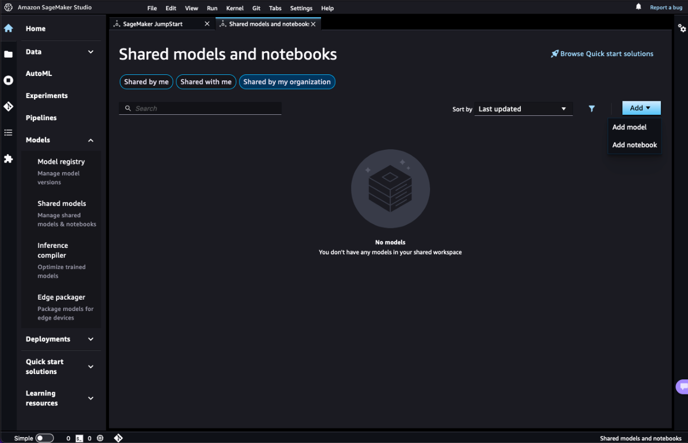

Access shared content

From the Amazon SageMaker Studio Classic UI, you can access shared content and filter what you
see.

There are three main options for filtering shared models and notebooks:

1. Shared by me – Models and notebooks that you shared to JumpStart.

2. Shared with me – Models and notebooks shared with you

3. Shared by my organization – All models and notebooks that are shared to anyone in your

organization

You can also sort your models and notebooks based on the time they were last
updated or by ascending or descending alphabetical order. Choose the filter icon

(

)
to further sort your selections.

Studio Classic
392

## Page 421

Amazon SageMaker AI
Developer Guide

Add a model

To add a model, choose Shared by my organization, and then select Add model from the Add
dropdown list. Enter the basic information for your model, and add any training or inference
information you want to share with collaborators to train or deploy your model. After you enter all
the necessary information, choose Add model in the lower right corner of the screen.

Topics

• Add basic information

• Enable training

• Enable deployment

• Add a notebook

Add basic information

Adding a model in JumpStart involves providing some basic information about the model you want
to train. This information helps define the characteristics and capabilities of your model, as well as
improving its discoverability and searchability. To create a new model, follow these steps:

1.
Add a title for this model. Adding a title automatically populates a unique identifier in the ID
field based on the model title.

2.
Add a description of the model.

3.
Select a data type from the options: text, vision, tabular, or audio.

4.
Select a machine learning task from the list of available tasks, such as image classification or
text generation.

5.
Select a machine learning framework.

6.
Add metadata information with keywords or phrases to use when searching for a model. Use
commas to separate keywords. Any spaces are automatically replaced with commas.

Enable training

When adding a model to share, you can optionally provide a training environment and allow
collaborators in your organization to train the shared model.

Studio Classic
393

## Page 422

Amazon SageMaker AI
Developer Guide

Note

If you are adding a tabular model, you also need to specify a column format and target
column to enable training.

After providing the basic details about your model, you'll need to configure the settings for
the training job that will be used to train your model. This involves specifying the container
environment, code scripts, datasets, output locations, and various other parameters to control how
the training job is executed. To configure the training job settings, follow these steps:

1.
Add a container to use for model training. You can select a container used for an existing
training job, bring your own container in Amazon ECR, or use an Amazon SageMaker Deep
Learning Container.

2.
Add environment variables.

3.
Provide a training script location.

4.
Provide a script mode entry point.

5.
Provide an Amazon S3 URI for model artifacts generated during training.

6.
Provide the Amazon S3 URI to the default training dataset.

7.
Provide a model output path. The model output path should be the Amazon S3 URI path for
any model artifacts generated from training. SageMaker AI saves the model artifacts as a
single compressed TAR file in Amazon S3.

8.
Provide a validation dataset to use for evaluating your model during training. Validation
datasets must contain the same number of columns and the same feature headers as the
training dataset.

9.
Turn on network isolation. Network isolation isolates the model container so that no inbound
or outbound network calls can be made to or from the model container.

10. Provide training channels through which SageMaker AI can access your data. For example, you

might specify input channels named train or test. For each channel, specify a channel name
and a URI to the location of your data. Choose Browse to search for Amazon S3 locations.

11. Provide hyperparameters. Add any hyperparameters with which collaborators should

experiment during training. Provide a range of valid values for these hyperparameters. This
range is used for training job hyperparameter validation. You can define ranges based on the
datatype of the hyperparameter.

Studio Classic
394

## Page 423

Amazon SageMaker AI
Developer Guide

12. Select an instance type. We recommend a GPU instance with more memory for training

with large batch sizes. For a comprehensive list of SageMaker training instances across AWS
Regions, see the On-Demand Pricing table in Amazon SageMaker Pricing.

13. Provide metrics. Define metrics for a training job by specifying a name and a regular

expression for each metric that your training monitors. Design the regular expressions to

capture the values of metrics that your algorithm emits. For example, the metric loss might

have the regular expression "Loss =(.*?);".

Enable deployment

When adding a model to share, you can optionally provide an inference environment in which
collaborators in your organization can deploy the shared model for inference.

After training your machine learning model, you'll need to deploy it to an Amazon SageMaker AI
endpoint for inference. This involves providing a container environment, an inference script, the
model artifacts generated during training, and selecting an appropriate compute instance type.
Configuring these settings properly is crucial for ensuring your deployed model can make accurate
predictions and handle inference requests efficiently. To set up your model for inference, follow
these steps:

1.
Add a container to use for inference. You can bring your own container in Amazon ECR or use
an Amazon SageMaker Deep Learning Container.

2.
Provide the Amazon S3 URI to an inference script. Custom inference scripts run inside your
chosen container. Your inference script should include a function for model loading, and
optionally functions generating predictions, and input and output processing. For more
information on creating inference scripts for the framework of your choice, see Frameworks
in the SageMaker Python SDK documentation. For example, for TensorFlow, see How to
implement the pre- and/or post-processing handler(s).

3.
Provide an Amazon S3 URI for model artifacts. Model artifacts are the output that results from
training a model, and typically consist of trained parameters, a model definition that describes
how to compute inferences, and other metadata. If you trained your model in SageMaker AI,
the model artifacts are saved as a single compressed TAR file in Amazon S3. If you trained your
model outside SageMaker AI, you need to create this single compressed TAR file and save it in
an Amazon S3 location.

4.
Select an instance type. We recommend a GPU instance with more memory for training
with large batch sizes. For a comprehensive list of SageMaker training instances across AWS
Regions, see the On-Demand Pricing table in Amazon SageMaker Pricing.

Studio Classic
395

## Page 424

Amazon SageMaker AI
Developer Guide

Add a notebook

To add a notebook, choose Shared by my organization, and then select Add notebook from the
Add dropdown list. Enter the basic information for your notebook and provide an Amazon S3 URI
for the location of that notebook.

First, add the basic descriptive information about your notebook. This information is used to
improve the searchability of your notebook.

1.
Add a title for this notebook. Adding a title automatically populates a unique identifier in the
ID field based on the notebook title.

2.
Add a description of the notebook.

3.
Select a data type from the options: text, vision, tabular, or audio.

4.
Select an ML task from the list of available tasks, such as image classification or text

generation.

5.
Select an ML framework.

6.
Add metadata information with keywords or phrases to use when searching for a notebook.
Use commas to separate keywords. Any spaces are automatically replaced with commas.

After you've specified the basic information, you can provide an Amazon S3 URI for the location
of that notebook. You can choose Browse to search through your Amazon S3 buckets for your
notebook file location. After you find your notebook, copy the Amazon S3 URI, choose Cancel, and
then add the Amazon S3 URI to the Notebook Location field.

After you enter all the necessary information, choose Add notebook in the lower right corner.

End-to-end JumpStart solution templates

Important

As of November 30, 2023, the previous Amazon SageMaker Studio experience is now
named Amazon SageMaker Studio Classic. The following section is specific to using the
Studio Classic application. For information about using the updated Studio experience, see
Amazon SageMaker Studio.
Studio Classic is still maintained for existing workloads but is no longer available for
onboarding. You can only stop or delete existing Studio Classic applications and cannot

Studio Classic
396

## Page 425

Amazon SageMaker AI
Developer Guide

create new ones. We recommend that you migrate your workload to the new Studio
experience.

Note

JumpStart Solutions are only available in Studio Classic.

SageMaker JumpStart provides one-click, end-to-end solutions that are designed to address
common machine learning use cases. They use proven algorithms for their domains and provide
a complete workflow which typically includes data processing, model training, deployment,
inference, and monitoring. Explore the following use cases for more information on available
solution templates.

• Demand forecasting

• Credit rating prediction

• Fraud detection

• Computer vision

• Extract and analyze data from documents

• Predictive maintenance

• Churn prediction

• Personalized recommendations

• Reinforcement learning

• Healthcare and life sciences

• Financial pricing

• Causal inference

Choose the solution template that best fits your use case from the JumpStart landing page. When
you choose a solution template, JumpStart opens a new tab showing a description of the solution
and a Launch button. When you select Launch, JumpStart creates all of the resources that you
need to run the solution, including training and model hosting instances. For more information on
launching a JumpStart solution, see the section called “Launch a Solution”.

Studio Classic
397

## Page 426

Amazon SageMaker AI
Developer Guide

After launching the solution, you can explore solution features and any generated artifacts in
JumpStart. Use the Launched JumpStart assets menu to find your solution. In your solution's
tab, select Open Notebook to use provided notebooks and explore the solution’s features.
When artifacts are generated during launch or after running the provided notebooks, they're
listed in the Generated Artifacts table. You can delete individual artifacts with the trash icon

(

).
You can delete all of the solution’s resources by choosing Delete solution resources.

Demand forecasting

Demand forecasting uses historical time series data in order to make future estimations in relation
to customer demand over a specific period and streamline the supply-demand decision-making
process across businesses.

Demand forecasting use cases include predicting ticket sales in the transportation industry, stock
prices, number of hospital visits, number of customer representatives to hire for multiple locations
in the next month, product sales across multiple regions in the next quarter, cloud server usage for
the next day for a video streaming service, electricity consumption for multiple regions over the
next week, number of IoT devices and sensors such as energy consumption, and more.

Time series data is categorized as univariate and multi-variate. For example, the total electricity
consumption for a single household is a univariate time series over a period of time. When
multiple univariate time series are stacked on each other, it’s called a multi-variate time series. For
example, the total electricity consumption of 10 different (but correlated) households in a single
neighborhood make up a multi-variate time series dataset.

Solution name
Description
Get started

Demand forecasting
Demand forecasting for
multivariate time series data
using three state-of-the-
art time series forecasting
algorithms: LSTNet, Prophet,
and SageMaker AI DeepAR.

GitHub »

Studio Classic
398

## Page 427

Amazon SageMaker AI
Developer Guide

Credit rating prediction

Use JumpStart's credit rating prediction solutions to predict corporate credit ratings or to explain
credit prediction decisions made by machine learning models. Compared to traditional credit rating
modeling methods, machine learning models can automate and improve the accuracy of credit
prediction.

Solution name
Description
Get started

Corporate credit rating
prediction

Multimodal (long text and
tabular) machine learning
for quality credit predictio
ns using AWS AutoGluon
Tabular.

GitHub »

Graph-based credit scoring
Predict corporate credit
ratings using tabular data
and a corporate network
by training a Graph Neural
Network GraphSAGE and AWS
AutoGluon Tabular model.

Find in Amazon SageMaker
Studio Classic.

Explain credit decisions
Predict credit default in credit
applications and provide
explanations using LightGBM
and SHAP (SHapley Additive
exPlanations).

GitHub »

Fraud detection

Many businesses lose billions annually to fraud. Machine learning based fraud detection models
can help systematically identify likely fraudulent activities from a tremendous amount of data. The
following solutions use transaction and user identity datasets to identify fraudulent transactions.

Solution name
Description
Get started

Detect malicious users and
transactions

Automatically detect
potentially fraudulent

GitHub »

Studio Classic
399

## Page 428

Amazon SageMaker AI
Developer Guide

Solution name
Description
Get started

activity in transactions using
SageMaker AI XGBoost with
the over-sampling technique
Synthetic Minority Over-samp
ling (SMOTE).

Fraud detection in financial
transactions using deep graph
library

Detect fraud in financial
transactions by training a
graph convolutional network
with the deep graph library
and a SageMaker AI XGBoost
model.

GitHub »

Financial payment classific
ation

Classify financial payments
based on transaction
information using SageMaker
AI XGBoost. Use this solution
template as an intermedi
ate step in fraud detection,
personalization, or anomaly
detection.

Find in Amazon SageMaker
Studio Classic.

Computer vision

With the rise of business use cases such as autonomous vehicles, smart video surveillance,
healthcare monitoring and various object counting tasks, fast and accurate object detection
systems are rising in demand. These systems involve not only recognizing and classifying every
object in an image, but localizing each one by drawing the appropriate bounding box around
it. In the last decade, the rapid advances of deep learning techniques greatly accelerated the
momentum of object detection.

Solution name
Description
Get started

Visual product defect
detection

Identify defective regions
in product images either by

GitHub »

Studio Classic
400

## Page 429

Amazon SageMaker AI
Developer Guide

Solution name
Description
Get started

training an object detection
model from scratch or fine-
tuning pretrained SageMaker
AI models.

Handwriting recognition
Recognize handwritten text
in images by training an
object detection model and
handwriting recognition
model. Label your own data
using SageMaker Ground
Truth.

GitHub »

Object detection for bird
species

Identify birds species in a
scene using a SageMaker AI
object detection model.

Find in Amazon SageMaker
Studio Classic.

Extract and analyze data from documents

JumpStart provides solutions for you to uncover valuable insights and connections in business-
critical documents. Use cases include text classification, document summarization, handwriting
recognition, relationship extraction, question and answering, and filling in missing values in tabular
records.

Solution name
Description
Get started

Privacy for sentiment classific
ation

Anonymize text  to better
preserve user privacy in
sentiment classification.

GitHub »

Document understanding
Document summariza
tion, entity, and relations
hip extraction using the
transformers library in
PyTorch.

GitHub »

Studio Classic
401

## Page 430

Amazon SageMaker AI
Developer Guide

Solution name
Description
Get started

Handwriting recognition
Recognize handwritten text
in images by training an
object detection model and
handwriting recognition
model. Label your own data
using SageMaker Ground
Truth.

GitHub »

Filling in missing values in
tabular records

Fill missing values in
tabular records by training a
SageMaker Autopilot model.

GitHub »

Predictive maintenance

Predictive maintenance aims to optimize the balance between corrective and preventative
maintenance by facilitating the timely replacement of components. The following solutions use
sensor data from industrial assets to predict machine failures, unplanned downtime, and repair
costs.

Solution name
Description
Get started

Predictive maintenance for
vehicle fleets

Predict vehicle fleet failures
using vehicle sensor and
maintenance information
with a convolutional neural
network model.

GitHub »

Predictive maintenance for
manufacturing

Predict the remaining useful
life for each sensor by
training a stacked Bidirecti
onal LSTM neural network
model using historical sensor
readings.

GitHub »

Studio Classic
402

## Page 431

Amazon SageMaker AI
Developer Guide

Churn prediction

Customer churn, or rate of attrition, is a costly problem faced by a wide range of companies. In an
effort to reduce churn, companies can identify customers that are likely to leave their service in

order to focus their efforts on customer retention. Use a JumpStart churn prediction solution to

analyze data sources such as user behavior and customer support chat logs to identify customers
that are at a high risk of cancelling a subscription or service.

Solution name
Description
Get started

Churn prediction with text
Predict churn using numerical
, categorical, and textual
features with BERT encoder
and RandomForestClassifier.

GitHub »

Churn prediction for mobile
phone customers

Identify unhappy mobile
phone customers using
SageMaker AI XGBoost.

Find in Amazon SageMaker
Studio Classic.

Personalized recommendations

You can use JumpStart solutions to analyze customer identity graphs or user sessions to
better understand and predict customer behavior. Use the following solutions for personalized
recommendations to model customer identity across multiple devices, to determine the likelihood
of a customer making a purchase, or to create a custom movie recommender based on past
customer behavior.

Solution name
Description
Get started

Entity resolution in identity
graphs with deep graph
library

Perform cross-device entity
linking for online advertising
by training a graph convoluti
onal network with deep graph
library.

GitHub »

Purchase modeling
Predict whether a customer
will make a purchase by

GitHub »

Studio Classic
403

## Page 432

Amazon SageMaker AI
Developer Guide

Solution name
Description
Get started

training a SageMaker AI
XGBoost model.

Customized recommender
system

Train and deploy a custom
recommender system that
generates movie suggestio
ns for a customer based on
past behavior using Neural
Collaborative Filtering in
SageMaker AI.

Find in Amazon SageMaker
Studio Classic.

Reinforcement learning

Reinforcement learning (RL) is a type of learning that is based on interaction with the environment.
This type of learning is used by an agent that must learn behavior through trial-and-error
interactions with a dynamic environment in which the goal is to maximize the long-term rewards
that the agent receives as a result of its actions. Rewards are maximized by trading off exploring
actions that have uncertain rewards with exploiting actions that have known rewards.

RL is well-suited for solving large, complex problems, such as supply chain management, HVAC
systems, industrial robotics, game artificial intelligence, dialog systems, and autonomous vehicles.

Solution name
Description
Get started

Reinforcement learning for
Battlesnake AI competitions

Provide a reinforcement
learning workflow for training
and inference with the
BattleSnake AI competitions.

GitHub »

Distributed reinforce
ment learning for Procgen
challenge

Distributed reinforcement
learning starter kit for
NeurIPS 2020 Procgen
Reinforcement learning
challenge.

GitHub »

Studio Classic
404

## Page 433

Amazon SageMaker AI
Developer Guide

Healthcare and life sciences

Clinicians and researchers can use JumpStart solutions to analyze medical imagery, genomic
information, and clinical health records.

Solution name
Description
Get started

Lung cancer survival predictio
n

Predict non-small cell lung
cancer patient survival status
with 3-dimensional lung
computerized tomography
(CT) scans, genomic data, and
clinical health records using
SageMaker AI XGBoost.

GitHub »

Financial pricing

Many businesses dynamically adjust pricing on a regular basis in order to maximize their returns.
Use the following JumpStart solutions for price optimization, dynamic pricing, option pricing, or
portfolio optimization use cases.

Solution name
Description
Get started

Price optimization
Estimate price elasticity using
Double Machine Learning
(ML) for causal inference
and the Prophet forecasti
ng procedure. Use these
estimates to optimize daily
prices.

Find in Amazon SageMaker
Studio Classic.

Causal inference

Researchers can use machine learning models such as Bayesian networks to represent causal
dependencies and draw causal conclusions based on data. Use the following JumpStart solution
to understand the causal relationship between Nitrogen-based fertilizer application and corn crop
yields.

Studio Classic
405

## Page 434

Amazon SageMaker AI
Developer Guide

Solution name
Description
Get started

Crop yield counterfactuals
Generate a counterfactual
analysis of corn response to

Find in Amazon SageMaker
Studio Classic.

nitrogen. This solution learns
the crop phenology cycle in
its entirety using multi-spe
ctral satellite imagery and
ground-level observations.

Launch a Solution

Important

As of November 30, 2023, the previous Amazon SageMaker Studio experience is now
named Amazon SageMaker Studio Classic. The following section is specific to using the
Studio Classic application. For information about using the updated Studio experience, see
Amazon SageMaker Studio.
Studio Classic is still maintained for existing workloads but is no longer available for
onboarding. You can only stop or delete existing Studio Classic applications and cannot
create new ones. We recommend that you migrate your workload to the new Studio
experience.

Note

JumpStart Solutions are only available in Studio Classic.

First, choose a solution through the SageMaker JumpStart landing page in the Amazon SageMaker
Studio Classic UI. For information on the onboarding steps to sign in to Amazon SageMaker Studio
Classic, see Onboard to Amazon SageMaker AI domain. For details on getting to the SageMaker
JumpStart landing page, see Open and use JumpStart in Studio Classic.

After you choose a solution, a solution's tab opens showing a description of the solution and a

Launch button. To launch a solution, select Launch in the Launch Solution section. JumpStart

Studio Classic
406

## Page 435

Amazon SageMaker AI
Developer Guide

then creates all of the resources needed to run the solution. This includes training and model
hosting instances.

Advanced parameters

The solution that you choose may have advanced parameters that you can select. Choose
Advanced Parameters to specify the AWS Identity and Access Management role for the solution.

Solutions are able to launch resources across 9 AWS services that interact with each other. For the
solution to work as expected, newly created components from one service must be able to act on
newly created components from another service. We recommend that you use the default IAM role
to ensure that all needed permissions are added. For more information about IAM roles, see AWS
Identity and Access Management for Amazon SageMaker AI.

Default IAM role

If you select this option, the default IAM roles that are required by this solution are used. Each
solution requires different resources. The following list describes the default roles that are used for
the solutions based on the service needed. For a description of the permissions required for each
service, see AWS Managed Policies for SageMaker Projects and JumpStart.

• API Gateway – AmazonSageMakerServiceCatalogProductsApiGatewayRole

• CloudFormation – AmazonSageMakerServiceCatalogProductsCloudformationRole

• CodeBuild – AmazonSageMakerServiceCatalogProductsCodeBuildRole

• CodePipeline – AmazonSageMakerServiceCatalogProductsCodePipelineRole

• Events – AmazonSageMakerServiceCatalogProductsEventsRole

• Firehose – AmazonSageMakerServiceCatalogProductsFirehoseRole

• Glue – AmazonSageMakerServiceCatalogProductsGlueRole

• Lambda – AmazonSageMakerServiceCatalogProductsLambdaRole

• SageMaker AI – AmazonSageMakerServiceCatalogProductsExecutionRole

If you are using a new SageMaker AI domain with JumpStart project templates enabled, these roles
are automatically created in your account.

If you are using an existing SageMaker AI domain, these roles may not exist in your account. If this
is the case, you will receive the following error when launching the solution.

Studio Classic
407

## Page 436

Amazon SageMaker AI
Developer Guide

Unable to locate the updated roles required to launch this solution, a general role '/
service-role/AmazonSageMakerServiceCatalogProductsUseRole' will be used. Please update
your studio domain to generate these roles.

You can still launch a solution without the needed role, but the legacy default role

AmazonSageMakerServiceCatalogProductsUseRole is used in place of the needed role. The
legacy default role has trust relationships with all of the services that JumpStart solutions need to
interact with. For the best security, we recommend that you update your domain to have the newly
created default roles for each AWS service.

If you have already onboarded to a SageMaker AI domain, you can update your domain to generate
the default roles using the following procedure.

1.
Open the Amazon SageMaker AI console at https://console.aws.amazon.com/sagemaker/.

2.
Choose  Control Panel  at the top left of the page.

3.
From the domain page, choose the Settings icon

(

)
to edit the domain settings.

4.
On General Settings choose Next.

5.
Under SageMaker Projects and JumpStart, select Enable Amazon SageMaker project
templates and Amazon SageMaker JumpStart for this account  and Enable Amazon
SageMaker project templates and Amazon SageMaker JumpStart for Studio Classic users,
choose Next.

6.
Select Submit.

You should be able to see the default roles listed in Projects - Amazon SageMaker project
templates enabled for this account under the Apps - Studio tab.

Find IAM role

If you select this option, you must select an existing IAM role from the dropdown list for each of
the required services. The selected role must have at least the minimum permissions required for
the corresponding service. For a description of the permissions required for each service, see AWS
Managed Policies for SageMaker Projects and JumpStart.

Input IAM role

Studio Classic
408

## Page 437

Amazon SageMaker AI
Developer Guide

If you select this option, you must manually enter the ARN for an existing IAM role. The selected
role must have at least the minimum permissions required for the corresponding service. For a
description of the permissions required for each service, see AWS Managed Policies for SageMaker
Projects and JumpStart.

Amazon SageMaker JumpStart Industry: Financial

Use SageMaker JumpStart Industry: Financial solutions, models, and example notebooks to learn
about SageMaker AI features and capabilities through curated one-step solutions and example
notebooks of industry-focused machine learning (ML) problems. The notebooks also walk through
how to use the SageMaker JumpStart Industry Python SDK to enhance industry text data and fine-
tune pretrained models.

Topics

• Amazon SageMaker JumpStart Industry Python SDK

• Amazon SageMaker JumpStart Industry: Financial Solution

• Amazon SageMaker JumpStart Industry: Financial Models

• Amazon SageMaker JumpStart Industry: Financial Example Notebooks

• Amazon SageMaker JumpStart Industry: Financial Blog Posts

• Amazon SageMaker JumpStart Industry: Financial Related Research

• Amazon SageMaker JumpStart Industry: Financial Additional Resources

Amazon SageMaker JumpStart Industry Python SDK

SageMaker Runtime JumpStart provides processing tools for curating industry datasets and
fine-tuning pretrained models through its client library called SageMaker JumpStart Industry
Python SDK. For detailed API documentation of the SDK, and to learn more about processing
and enhancing industry text datasets for improving the performance of state-of-the-art models
on SageMaker JumpStart, see the SageMaker JumpStart Industry Python SDK open source
documentation.

Amazon SageMaker JumpStart Industry: Financial Solution

SageMaker JumpStart Industry: Financial provides the following solution notebooks:

• Corporate Credit Rating Prediction

Studio Classic
409

## Page 438

Amazon SageMaker AI
Developer Guide

This SageMaker JumpStart Industry: Financial solution provides a template for a text-enhanced
corporate credit rating model. It shows how to take a model based on numeric features (in this
case, Altman's famous 5 financial ratios) combined with texts from SEC filings to achieve an
improvement in the prediction of credit ratings. In addition to the 5 Altman ratios, you can add
more variables as needed or set custom variables. This solution notebook shows how SageMaker
JumpStart Industry Python SDK helps process Natural Language Processing (NLP) scoring of
texts from SEC filings. Furthermore, the solution demonstrates how to train a model using the
enhanced dataset to achieve a best-in-class model, deploy the model to a SageMaker AI endpoint
for production, and receive improved predictions in real time.

• Graph-Based Credit Scoring

Credit ratings are traditionally generated using models that use financial statement data and
market data, which is tabular only (numeric and categorical). This solution constructs a network of
firms using SEC filingsand shows how to use the network of firm relationships with tabular data
to generate accurate rating predictions. This solution demonstrates a methodology to use data on
firm linkages to extend the traditionally tabular-based credit scoring models, which have been used
by the ratings industry for decades, to the class of machine learning models on networks.

Note

The solution notebooks are for demonstration purposes only. They should not be relied on
as financial or investment advice.

You can find these financial services solutions through the SageMaker JumpStart page in Studio
Classic.

Important

As of November 30, 2023, the previous Amazon SageMaker Studio experience is now
named Amazon SageMaker Studio Classic. The following section is specific to using the
Studio Classic application. For information about using the updated Studio experience, see
Amazon SageMaker Studio.
Studio Classic is still maintained for existing workloads but is no longer available for
onboarding. You can only stop or delete existing Studio Classic applications and cannot

Studio Classic
410

## Page 439

Amazon SageMaker AI
Developer Guide

create new ones. We recommend that you migrate your workload to the new Studio
experience.

Note

The SageMaker JumpStart Industry: Financial solutions, model cards, and example
notebooks are hosted and runnable only through SageMaker Studio Classic. Log in to the
SageMaker AI console, and launch SageMaker Studio Classic. For more information about
how to find the solution card, see the previous topic at SageMaker JumpStart.

Amazon SageMaker JumpStart Industry: Financial Models

SageMaker JumpStart Industry: Financial provides the following pretrained Robustly Optimized
BERT approach (RoBERTa) models:

• Financial Text Embedding (RoBERTa-SEC-Base)

• RoBERTa-SEC-WIKI-Base

• RoBERTa-SEC-Large

• RoBERTa-SEC-WIKI-Large

The RoBERTa-SEC-Base and RoBERTa-SEC-Large models are the text embedding models based on
GluonNLP's RoBERTa model and pretrained on S&P 500 SEC 10-K/10-Q reports of the decade of
the 2010's (from 2010 to 2019). In addition to these, SageMaker AI JumpStart Industry: Financial
provides two more RoBERTa variations, RoBERTa-SEC-WIKI-Base and RoBERTa-SEC-WIKI-Large,
which are pretrained on the SEC filings and common texts of Wikipedia.

You can find these models in SageMaker JumpStart by navigating to the Text Models node,
choosing Explore All Text Models, and then filtering for the ML Task Text Embedding. You
can access any corresponding notebooks after selecting the model of your choice. The paired
notebooks will walk you through how the pretrained models can be fine-tuned for specific
classification tasks on multimodal datasets, which are enhanced by the SageMaker JumpStart
Industry Python SDK.

Studio Classic
411

## Page 440

Amazon SageMaker AI
Developer Guide

Note

The model notebooks are for demonstration purposes only. They should not be relied on as
financial or investment advice.

The following screenshot shows the pretrained model cards provided through the SageMaker AI
JumpStart page on Studio Classic.

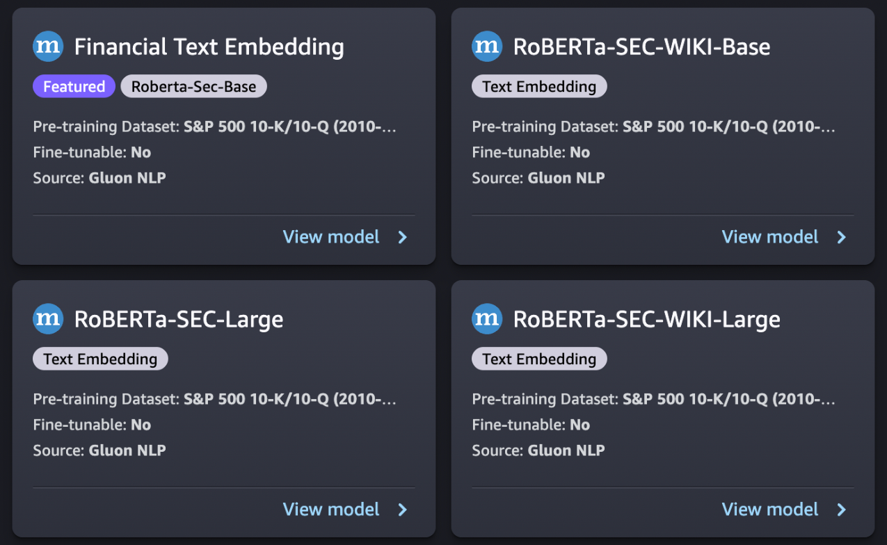

Note

The SageMaker JumpStart Industry: Financial solutions, model cards, and example
notebooks are hosted and runnable only through SageMaker Studio Classic. Log in to the
SageMaker AI console, and launch SageMaker Studio Classic. For more information about
how to find the model cards, see the previous topic at SageMaker JumpStart.

Studio Classic
412

## Page 441

Amazon SageMaker AI
Developer Guide

Amazon SageMaker JumpStart Industry: Financial Example Notebooks

SageMaker JumpStart Industry: Financial provides the following example notebooks to
demonstrate solutions to industry-focused ML problems:

• Financial TabText Data Construction – This example introduces how to use the SageMaker
JumpStart Industry Python SDK for processing the SEC filings, such as text summarization
and scoring texts based on NLP score types and their corresponding word lists. To preview the
content of this notebook, see Simple Construction of a Multimodal Dataset from SEC Filings and
NLP Scores.

• Multimodal ML on TabText Data – This example shows how to merge different types of datasets
into a single dataframe called TabText and perform multimodal ML. To preview the content
of this notebook, see Machine Learning on a TabText Dataframe – An Example Based on the
Paycheck Protection Program.

• Multi-category ML on SEC filings data – This example shows how to train an AutoGluon
NLP model over the multimodal (TabText) datasets curated from SEC filings for a multiclass
classification task. Classify SEC 10K/Q Filings to Industry Codes Based on the MDNA Text
Column.

Note

The example notebooks are for demonstrative purposes only. They should not be relied on
as financial or investment advice.

Note

The SageMaker JumpStart Industry: Financial solutions, model cards, and example
notebooks are hosted and runnable only through SageMaker Studio Classic. Log in to the
SageMaker AI console, and launch SageMaker Studio Classic. For more information about
how to find the example notebooks, see the previous topic at SageMaker JumpStart.

To preview the content of the example notebooks, see Tutorials – Finance in the SageMaker
JumpStart Industry Python SDK documentation.

Studio Classic
413

## Page 442

Amazon SageMaker AI
Developer Guide

Amazon SageMaker JumpStart Industry: Financial Blog Posts

For thorough applications of using SageMaker JumpStart Industry: Financial solutions, models,
examples, and the SDK, see the following blog posts:

• Use pre-trained financial language models for transfer learning in Amazon SageMaker JumpStart

• Use SEC text for ratings classification using multimodal ML in Amazon SageMaker JumpStart

• Create a dashboard with SEC text for financial NLP in Amazon SageMaker JumpStart

• Build a corporate credit ratings classifier using graph machine learning in Amazon SageMaker
JumpStart

• Domain-adaptation Fine-tuning of Foundation Models in Amazon SageMaker JumpStart on
Financial data

Amazon SageMaker JumpStart Industry: Financial Related Research

For research related to SageMaker JumpStart Industry: Financial solutions, see the following
papers:

• Context, Language Modeling, and Multimodal Data in Finance

• Multimodal Machine Learning for Credit Modeling

• On the Lack of Robust Interpretability of Neural Text Classifiers

• FinLex: An Effective Use of Word Embeddings for Financial Lexicon Generation

Amazon SageMaker JumpStart Industry: Financial Additional Resources

For additional documentation and tutorials, see the following resources:

• The SageMaker JumpStart Industry: Financial Python SDK

• SageMaker JumpStart Industry: Financial Python SDK Tutorials

• The SageMaker JumpStart Industry: Financial GitHub repository

• Getting started with Amazon SageMaker AI - Machine Learning Tutorials

Studio Classic
414

## Page 443

Amazon SageMaker AI
Developer Guide

Machine learning environments offered by Amazon
SageMaker AI

Important

Amazon SageMaker Studio and Amazon SageMaker Studio Classic are two of the machine
learning environments that you can use to interact with SageMaker AI.
If your domain was created after November 30, 2023, Studio is your default experience.
If your domain was created before November 30, 2023, Amazon SageMaker Studio Classic
is your default experience. To use Studio if Amazon SageMaker Studio Classic is your
default experience, see Migration from Amazon SageMaker Studio Classic.
When you migrate from Amazon SageMaker Studio Classic to Amazon SageMaker Studio,
there is no loss in feature availability. Studio Classic also exists as an IDE within Amazon
SageMaker Studio to help you run your legacy machine learning workflows.

SageMaker AI supports the following machine learning environments:

• Amazon SageMaker Studio (Recommended): The latest web-based experience for running ML
workflows with a suite of IDEs. Studio supports the following applications:

• Amazon SageMaker Studio Classic

• Code Editor, based on Code-OSS, Visual Studio Code - Open Source

• JupyterLab

• Amazon SageMaker Canvas

• RStudio

• Amazon SageMaker Studio Classic: Lets you build, train, debug, deploy, and monitor your machine
learning models.

• Amazon SageMaker Notebook Instances: Lets you prepare and process data, and train and deploy
machine learning models from a compute instance running the Jupyter Notebook application.

• Amazon SageMaker Studio Lab: Studio Lab is a free service that gives you access to AWS compute
resources, in an environment based on open-source JupyterLab, without requiring an AWS
account.

• Amazon SageMaker Canvas: Gives you the ability to use machine learning to generate predictions
without needing to code.

415

## Page 444

Amazon SageMaker AI
Developer Guide

• Amazon SageMaker geospatial: Gives you the ability to build, train, and deploy geospatial models.

• RStudio on Amazon SageMaker AI: RStudio is an IDE for R, with a console, syntax-highlighting
editor that supports direct code execution, and tools for plotting, history, debugging and
workspace management.

• SageMaker HyperPod: SageMaker HyperPod lets you provision resilient clusters for running
machine learning (ML) workloads and developing state-of-the-art models such as large language
models (LLMs), diffusion models, and foundation models (FMs).

To use these machine learning environments, you or your organization's administrator must create
an Amazon SageMaker AI domain. The exceptions are Studio Lab, SageMaker Notebook Instances,
and SageMaker HyperPod.

Instead of manually provisioning resources and managing permissions for yourself and your
users, you can create a Amazon DataZone domain. The process of creating a Amazon DataZone
domain creates a corresponding Amazon SageMaker AI domain with AWS Glue or Amazon Redshift
databases for your ETL workflows. Setting up a domain through Amazon DataZone reduces the
amount of time it takes to set up SageMaker AI environments for your users. For more information
about setting up a Amazon SageMaker AI domain within Amazon DataZone, see Set up SageMaker
Assets (administrator guide).

Users within the Amazon DataZone domain have permissions to all Amazon SageMaker AI actions,
but their permissions are scoped down to resources within the Amazon DataZone domain.

Creating a Amazon DataZone domain streamlines creating a domain that allows your users to share
data and models with each other. For information about how they can share data and models, see
Controlled access to assets with Amazon SageMaker Assets.

Topics

• Amazon SageMaker Studio

• SageMaker JupyterLab

• Amazon SageMaker notebook instances

• Amazon SageMaker Studio Lab

• Amazon SageMaker Canvas

• Amazon SageMaker geospatial capabilities

• RStudio on Amazon SageMaker AI

• Code Editor in Amazon SageMaker Studio

416

## Page 445

Amazon SageMaker AI
Developer Guide

• Amazon SageMaker HyperPod

• Generative AI in SageMaker notebook environments

• Amazon Q Developer

• Amazon SageMaker Partner AI Apps overview

Amazon SageMaker Studio

Important

As of November 30, 2023, the previous Amazon SageMaker Studio experience is now
named Amazon SageMaker Studio Classic. The following section is specific to using the
updated Studio experience. For information about using the Studio Classic application, see
Amazon SageMaker Studio Classic.

Amazon SageMaker Studio is the latest web-based experience for running ML workflows. Studio
offers a suite of integrated development environments (IDEs). These include Code Editor, based on
Code-OSS, Visual Studio Code - Open Source, a new JupyterLab application, RStudio, and Amazon
SageMaker Studio Classic. For more information, see Applications supported in Amazon SageMaker
Studio.

The new web-based UI in Studio is faster and provides access to all SageMaker AI resources,
including jobs and endpoints, in one interface. ML practitioners can also choose their preferred
IDE to accelerate ML development. A data scientist can use JupyterLab to explore data and tune
models. In addition, a machine learning operations (MLOps) engineer can use Code Editor with the
pipelines tool in Studio to deploy and monitor models in production.

The previous Studio experience is still being supported as Amazon SageMaker Studio Classic.
Studio Classic is the default experience for existing customers, and is available as an application
in Studio. For more information about Studio Classic, see Amazon SageMaker Studio Classic. For
information about how to migrate from Studio Classic to Studio, see Migration from Amazon
SageMaker Studio Classic.

Studio offers the following benefits:

• A new JupyterLab application that has a faster start-up time and is more reliable than the
existing Studio Classic application. For more information, see SageMaker JupyterLab.

Studio
417

## Page 446

Amazon SageMaker AI
Developer Guide

• A suite of IDEs that open in a separate tab, including the new Code Editor, based on Code-OSS,
Visual Studio Code - Open Source application. Users can interact with supported IDEs in a full
screen experience. For more information, see Applications supported in Amazon SageMaker
Studio.

• Access to all of your SageMaker AI resources in one place. Studio displays running instances
across all of your applications.

• Access to all training jobs in a single view, regardless of whether they were scheduled from
notebooks or initiated from Amazon SageMaker JumpStart.

• Simplified model deployment workflows and endpoint management and monitoring directly
from Studio. You don't need to access the SageMaker AI console.

• Automatic creation of all configured applications when you onboard to a domain. For
information about onboarding to a domain, see Amazon SageMaker AI domain overview.

• An improved JumpStart experience where you can discover, import, register, fine tune, and
deploy a foundation model. For more information, see SageMaker JumpStart pretrained models.

Topics

• Launch Amazon SageMaker Studio

• Amazon SageMaker Studio UI overview

• Amazon EFS auto-mounting in Studio

• Idle shutdown

• Applications supported in Amazon SageMaker Studio

• Connect your local Visual Studio Code to SageMaker spaces with remote access

• Bring your own image (BYOI)

• Lifecycle configurations within Amazon SageMaker Studio

• Amazon SageMaker Studio spaces

• Trusted identity propagation with Studio

• Perform common UI tasks

• NVMe stores with Amazon SageMaker Studio

• Local mode support in Amazon SageMaker Studio

• View your Studio running instances, applications, and spaces

• Stop and delete your Studio running applications and spaces

Studio
418

## Page 447

Amazon SageMaker AI
Developer Guide

• SageMaker Studio image support policy

• Amazon SageMaker Studio pricing

• Troubleshooting

• Migration from Amazon SageMaker Studio Classic

• Amazon SageMaker Studio Classic

Launch Amazon SageMaker Studio

Important

Custom IAM policies that allow Amazon SageMaker Studio or Amazon SageMaker Studio
Classic to create Amazon SageMaker resources must also grant permissions to add tags to
those resources. The permission to add tags to resources is required because Studio and
Studio Classic automatically tag any resources they create. If an IAM policy allows Studio
and Studio Classic to create resources but does not allow tagging, "AccessDenied" errors can
occur when trying to create resources. For more information, see Provide permissions for
tagging SageMaker AI resources.
AWS managed policies for Amazon SageMaker AI that give permissions to create
SageMaker resources already include permissions to add tags while creating those
resources.

Important

As of November 30, 2023, the previous Amazon SageMaker Studio experience is now
named Amazon SageMaker Studio Classic. The following section is specific to using the
updated Studio experience. For information about using the Studio Classic application, see
Amazon SageMaker Studio Classic.

This page's topics demonstrate how to launch Amazon SageMaker Studio from the Amazon
SageMaker AI console and the AWS Command Line Interface (AWS CLI).

Topics

• Prerequisites

• Launch from the Amazon SageMaker AI console

Launch Amazon SageMaker Studio
419

## Page 448

Amazon SageMaker AI
Developer Guide

• Launch using the AWS CLI

Prerequisites

Before you begin, complete the following prerequisites:

• Onboard to a SageMaker AI domain with Studio access. If you don't have permissions to
set Studio as the default experience for your domain, contact your administrator. For more
information, see Amazon SageMaker AI domain overview.

• Update the AWS CLI by following the steps in Installing the current AWS CLI Version.

• From your local machine, run aws configure and provide your AWS credentials. For
information about AWS credentials, see Understanding and getting your AWS credentials.

Launch from the Amazon SageMaker AI console

Complete the following procedure to launch Studio from the Amazon SageMaker AI console.

1.
Open the Amazon SageMaker AI console at https://console.aws.amazon.com/sagemaker/.

2.
From the left navigation pane, choose Studio.

3.
From the Studio landing page, select the domain and user profile for launching Studio.

4.
Choose Open Studio.

5.
To launch Studio, choose Launch personal Studio.

Launch using the AWS CLI

This section demonstrates how to launch Studio using the AWS CLI. The procedure to access
Studio using the AWS CLI depends if the domain uses AWS Identity and Access Management (IAM)
authentication or AWS IAM Identity Center authentication. You can use the AWS CLI to launch
Studio by creating a presigned domain URL when your domain uses IAM authentication. For
information about launching Studio with IAM Identity Center authentication, see Use custom setup
for Amazon SageMaker AI.

Launch if Studio is the default experience

The following code snippet demonstrates how to launch Studio from the AWS CLI using a
presigned domain URL if Studio is the default experience. For more information, see create-
presigned-domain-url.

Launch Amazon SageMaker Studio
420

## Page 449

Amazon SageMaker AI
Developer Guide

aws sagemaker create-presigned-domain-url \
--region region \
--domain-id domain-id \
--user-profile-name user-profile-name \
--session-expiration-duration-in-seconds 43200

Launch if Amazon SageMaker Studio Classic is your default experience

The following code snippet demonstrates how to launch Studio from the AWS CLI using a
presigned domain URL if Studio Classic is the default experience. For more information, see create-
presigned-domain-url.

aws sagemaker create-presigned-domain-url \
--region region \
--domain-id domain-id \

--user-profile-name user-profile-name \
--session-expiration-duration-in-seconds 43200 \
--landing-uri studio::

Amazon SageMaker Studio UI overview

Important

As of November 30, 2023, the previous Amazon SageMaker Studio experience is now
named Amazon SageMaker Studio Classic. The following section is specific to using the
updated Studio experience. For information about using the Studio Classic application, see
Amazon SageMaker Studio Classic.

The Amazon SageMaker Studio user interface is split into three distinct parts. This page gives
information about the distinct parts and their components.

• Navigation bar– This section of the UI includes the URL, breadcrumbs, notifications, and user
options.

• Navigation pane– This section of the UI includes a list of the applications that are supported in
Studio and options for the main workflows in Studio.

• Content pane– The main working area that displays the current page of the Studio UI that you
have open.

Amazon SageMaker Studio UI overview
421

## Page 450

Amazon SageMaker AI
Developer Guide

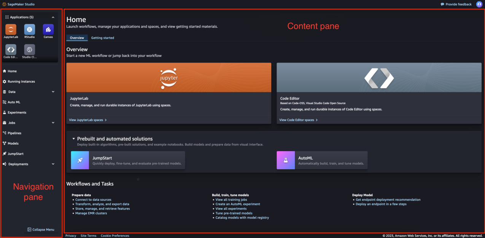

Topics

• Amazon SageMaker Studio navigation bar

• Amazon SageMaker Studio navigation pane

• Studio content pane

Amazon SageMaker Studio navigation bar

The navigation bar of the Studio UI includes the URL, breadcrumbs, notifications, and user options.

URL Structure

The URL of Studio changes as you navigate the UI. When you navigate to a different page in the UI,
the URL changes to reflect that page. With the updated URL, you open any page in the Studio UI
directly without navigating to the landing page first.

Breadcrumbs

As you navigate through the Studio UI, the breadcrumbs keep track of the parent pages of the
current page. By choosing one of these breadcrumbs, you can navigate to parent pages in the UI.

Notifications

Amazon SageMaker Studio UI overview
422

## Page 451

Amazon SageMaker AI
Developer Guide

The notifications section of the UI gives information about important changes to Studio, updates
to applications, and issues to resolve.

User options

Choose the user options icon

(

)
to get information about the user profile that is currently using Studio, and gives the option to sign
out of Studio.

Amazon SageMaker Studio navigation pane

Navigation pane

The navigation pane of the UI includes a list of the applications that are supported in Studio. It also
provides options for the main workflows in Studio.

This section of the UI can be used in an expanded or collapsed state. To
change whether the section is expanded or collapsed, select the Collapse icon

(

).

Applications

The applications section lists the applications that are available in Studio. If you choose one of the
application types, you are directed to the landing page for that application.

Workflows

The list of workflows includes all of the available actions that you can take in Studio. Choose one
of the options to navigate to the landing page for that workflow. If there are multiple workflows
available for that option, choosing the option opens a dropdown menu where you can select the
desired landing page.

The following list describes the options and provides a link for more information.

• Home– The main landing page with an overview, getting started, and what’s new.

• Running instances– All of the instances that are currently running in Studio. For more
information, see View your Studio running instances, applications, and spaces.

Amazon SageMaker Studio UI overview
423

## Page 452

Amazon SageMaker AI
Developer Guide

• Data– Data preparation options where you can collaborate to store, explore, prepare, transform,
and share your data.

• For more information about Amazon SageMaker Data Wrangler, see Data preparation.

• For more information about Amazon SageMaker Feature Store, see Create, store, and share

features with Feature Store.

• For more information about Amazon EMR clusters, see Data preparation using Amazon EMR.

• Auto ML– Automatically build, train, tune, and deploy machine learning (ML) models. For more
information, see Amazon SageMaker Canvas.

• Experiments– Create, manage, analyze, and compare your machine learning experiments using
Amazon SageMaker Experiments. For more information, see Amazon SageMaker Experiments in
Studio Classic.

• Jobs– View jobs created in Studio.

• For more information about training, see Model training.

• For more information about model evaluation, see Understand options for evaluating large
language models with SageMaker Clarify.

• Pipelines– Automate your ML workflow with Amazon SageMaker Pipelines, which provides
resources to help you build, track, and manage your pipeline resources. For more information,
see Pipelines.

• Models– Organize your models into groups and collections in the model registry, where you
can manage model versions, view metadata, and deploy models to production. For more
information, see Model Registration Deployment with Model Registry.

• JumpStart– Amazon SageMaker JumpStart provides pretrained, open-source models for a wide
range of problem types to help you get started with machine learning. For more information, see
SageMaker JumpStart pretrained models.

• Deployments– Deploy your machine learning (ML) models for inference.

• For more information about Amazon SageMaker Inference Recommender, see Amazon
SageMaker Inference Recommender.

• For more information about endpoints, see Deploy models for inference.

Studio content pane

The main working area is also called the content pane. It displays the current page of the Studio UI
that you have open.

Amazon SageMaker Studio UI overview
424

## Page 453

Amazon SageMaker AI
Developer Guide

Studio home page

The Studio home page is the primary landing page in the main working area. The home page
includes two distinct tabs. There is an Overview tab and a Getting started tab.

Overview

The Overview tab includes options to start spaces for popular application types, get started with
pre-built and automated solutions for ML workflows, and links to common tasks in the Studio UI.

Getting started

The Getting started tab includes information, guidance, and resources on how to begin with
Studio. This includes a guided tour of the Studio UI, a link to documentation about Studio, and a
selection of quick tips.

Amazon EFS auto-mounting in Studio

Amazon SageMaker AI supports automatically mounting a folder in an Amazon EFS volume for
each user in a domain. Using this folder, users can share data between their own private spaces.
However, users cannot share data with other users in the domain. Users only have access to their
own folder.

The user’s folder can be accessed through a folder named user-default-efs . This folder is

present in the $HOME directory of the Studio application.

For information about opting out of Amazon EFS auto-mounting, see Opt out of Amazon EFS auto-
mounting.

Amazon EFS auto-mounting also facilitates the migration of data from Studio Classic to Studio. For
more information, see (Optional) Migrate data from Studio Classic to Studio.

Access point information

When auto-mounting is activated, SageMaker AI uses an Amazon EFS access point to facilitate
access to the data in the Amazon EFS volume. For more information about access points, see
Working with Amazon EFS access points SageMaker AI creates a unique access point for each user
profile in the domain during user profile creation or during application creation for an existing user

profile. The POSIX user value of the access point matches the HomeEfsFileSystemUid value
of the user profile that SageMaker AI creates the access point for. To get the value of the user,

Amazon EFS auto-mounting in Studio
425

## Page 454

Amazon SageMaker AI
Developer Guide

see DescribeUserProfile. The root directory path is also set to the same value as the POSIX user
value.

SageMaker AI sets the permissions of the new directory to the following values:

• Owner user ID: POSIX user value
• Owner group ID: 0
• Permissions 700

The access point is required to access the Amazon EFS volume. As a result, you cannot delete or
update the access point without losing access to the Amazon EFS volume.

Error resolution

If SageMaker AI encounters an issue when auto-mounting the Amazon EFS user folder during
application creation, the application is still created. However, in this case, SageMaker AI creates a

file named error.txt instead of mounting the Amazon EFS folder. This file describes the error

encountered, as well as steps to resolve it. SageMaker AI creates the error.txt file in the user-

default-efs folder located in the $HOME directory of the application.

Opt out of Amazon EFS auto-mounting

You can opt-out of Amazon SageMaker AI auto-mounting Amazon EFS user folders during domain
and user profile creation or for an existing domain or user profile.

Opt out during domain creation

You can opt out of Amazon EFS auto-mounting when creating a domain using either the console or
the AWS Command Line Interface.

Console

Complete the following steps to opt out of Amazon EFS auto-mounting when creating a domain
from the console.

1.
Open the Amazon SageMaker AI console at https://console.aws.amazon.com/sagemaker/.

2.
Complete the steps in Use custom setup for Amazon SageMaker AI with the following
modification to set up a domain.

• On the Configure storage step, turn off Automatically mount EFS storage and data.

Amazon EFS auto-mounting in Studio
426

## Page 455

Amazon SageMaker AI
Developer Guide

AWS CLI

Use the following command to opt out of Amazon EFS auto-mounting during domain creation
using the AWS CLI. For more information about creating a domain using the AWS CLI, see Use
custom setup for Amazon SageMaker AI.

aws --region region sagemaker create-domain \
--domain-name "my-domain-$(date +%s)" \
--vpc-id default-vpc-id \
--subnet-ids subnet-ids \
--auth-mode IAM \
--default-user-settings "ExecutionRole=execution-role-arn,AutoMountHomeEFS=Disabled" \
--default-space-settings "ExecutionRole=execution-role-arn"

Opt out for an existing domain

You can opt out of Amazon EFS auto-mounting for an existing domain using either the console or
the AWS CLI.

Console

Complete the following steps to opt out of Amazon EFS auto-mounting when updating a domain
from the console.

1.
Open the Amazon SageMaker AI console at https://console.aws.amazon.com/sagemaker/.

2.
On the left navigation under Admin configurations, choose Domains.

3.
On the Domains page, select the domain that you want to opt out of Amazon EFS auto-
mounting for.

4.
On the Domain details page, select the Domain settings tab.

5.
Navigate to the Storage configurations section.

6.
Select Edit.

7.
From the Edit storage settings page, turn off Automatically mount EFS storage and data.

8.
Select Submit.

AWS CLI

Use the following command to opt out of Amazon EFS auto-mounting while updating an existing
domain using the AWS CLI.

Amazon EFS auto-mounting in Studio
427

## Page 456

Amazon SageMaker AI
Developer Guide

aws --region region sagemaker update-domain \
--domain-id domain-id \
--default-user-settings "AutoMountHomeEFS=Disabled"

Opt out during user profile creation

You can opt out of Amazon EFS auto-mounting when creating a user profile using either the
console or the AWS CLI.

Console

Complete the following steps to opt out of Amazon EFS auto-mounting when creating a user
profile from the console.

1.
Open the Amazon SageMaker AI console at https://console.aws.amazon.com/sagemaker/.

2.
Complete the steps in Add user profiles with the following modification to create a user
profile.

• On the Data and Storage step, turn off Inherit settings from domain. This allows the user
to have a different value than the defaults that are set for the domain.

• Turn off Automatically mount EFS storage and data.

AWS CLI

Use the following command to opt out of Amazon EFS auto-mounting during user profile creation
using the AWS CLI. For more information about creating a user profile using the AWS CLI, see Add
user profiles.

aws --region region sagemaker create-user-profile \
--domain-id domain-id \
--user-profile-name "user-profile-$(date +%s)" \
--user-settings "ExecutionRole=arn:aws:iam::account-id:role/execution-role-
name,AutoMountHomeEFS=Enabled/Disabled/DefaultAsDomain"

Opt out for an existing user profile

You can opt out of Amazon EFS auto-mounting for an existing user profile using either the console
or the AWS CLI.

Amazon EFS auto-mounting in Studio
428

## Page 457

Amazon SageMaker AI
Developer Guide

Console

Complete the following steps to opt out of Amazon EFS auto-mounting when updating a user
profile from the console.

1.
Open the Amazon SageMaker AI console at https://console.aws.amazon.com/sagemaker/.

2.
On the left navigation under Admin configurations, choose Domains.

3.
On the Domains page, select the domain containing the user profile that you want to opt out
of Amazon EFS auto-mounting for.

4.
On the Domains details page, select the User profiles tab.

5.
Select the user profile to update.

6.
From the User Details tab, navigate to the AutoMountHomeEFS section.

7.
Select Edit.

8.
From the Edit storage settings page, turn off Inherit settings from domain. This allows the
user to have a different value than the defaults that are set for the domain.

9.
Turn off Automatically mount EFS storage and data.

10. Select Submit.

AWS CLI

Use the following command to opt out of Amazon EFS auto-mounting while updating an existing
user profile using the AWS CLI.

aws --region region sagemaker update-user-profile \
--domain-id domain-id \
--user-profile-name user-profile-name \
--user-settings "AutoMountHomeEFS=DefaultAsDomain"

Idle shutdown

Amazon SageMaker AI supports shutting down idle resources to manage costs and prevent cost
overruns due to cost accrued by idle, billable resources. It accomplishes this by detecting an app’s
idle state and performing an app shutdown when idle criteria are met.

SageMaker AI supports idle shutdown for the following applications. Idle shutdown must be set for
each application type independently.

Idle shutdown
429

## Page 458

Amazon SageMaker AI
Developer Guide

• JupyterLab

• Code Editor, based on Code-OSS, Visual Studio Code - Open Source

Idle shutdown can be set at either the domain or user profile level. When idle shutdown is set at
the domain level, the idle shutdown settings apply to all applications created in the domain. When
set at the user profile level, the idle shutdown settings apply only to the specific users that they are
set for. User profile settings override domain settings.

Note

Idle shutdown requires the usage of the SageMaker-distribution (SMD) image with
v2.0 or newer. Domains using an older SMD version can’t use the feature. These users must
use an LCC to manage auto-shutdown instead.

Definition of idle

Idle shutdown settings only apply when the application becomes idle with no jobs running.
SageMaker AI doesn’t start the idle shutdown timing until the instance becomes idle. The definition
on idle differs based on whether the application type is JupyterLab or Code Editor.

For JupyterLab applications, the instance is considered idle when the following conditions are met:

• No active Jupyter kernel sessions

• No active Jupyter terminal sessions

For Code Editor applications, the instance is considered idle when the following conditions are met:

• No text file or notebook changes

• No files being viewed

• No interaction with the terminal

Set up idle shutdown

The following sections show how to set up idle shutdown from either the console or using the AWS
CLI. Idle shutdown can be set at either the domain or user profile level.

Idle shutdown
430

## Page 459

Amazon SageMaker AI
Developer Guide

Prerequisites

To use idle shutdown with your application, you must complete the following prerequisites.

• Ensure that your application is using the SageMaker Distribution (SMD) version 2.0. You can
select this version during application creation or update the image version of the application
after creation. For more information, see Update the SageMaker Distribution Image .

• For applications built with custom images, idle shutdown is supported if your custom image is
created with SageMaker Distribution (SMD) version 2.0 or later as the base image. If the custom
image is created with a different base image, then you must install the jupyter-activity-monitor-
extension >= 0.3.1 extension on the image and attach the image to your Amazon SageMaker AI
domain for JupyterLab applications. For more information about custom images, see Bring your
own image (BYOI).

From the Console

The following sections show how to enable idle shutdown from the console.

Add when creating a new domain

1.
Create a domain by following the steps in Use custom setup for Amazon SageMaker AI

2.
When configuring the application settings in the domain, navigate to either the Code Editor or
JupyterLab section.

3.
Select Enable idle shutdown.

4.
Enter a default idle shutdown time in minutes. This values defaults to 10,080 if no value is
entered.

5.
(Optional) Select Allow users to set custom idle shutdown time to allow users to modify the
idle shutdown time.

• Enter a maximum value that users can set the default idle shutdown time to. You must enter

a maximum value. The minimum value is set by Amazon SageMaker AI and must be 60.

Idle shutdown
431

## Page 460

Amazon SageMaker AI
Developer Guide

Add to an existing domain

Note

If idle shutdown is set when applications are running, they must be restarted for idle
shutdown settings to take effect.

1.
Navigate to the domain.

2.
Choose the App Configurations tab.

3.
From the App Configurations tab, navigate to either the Code Editor or JupyterLab section.

4.
Select Edit.

5.
Select Enable idle shutdown.

6.
Enter a default idle shutdown time in minutes. This values defaults to 10,080 if no value is
entered.

7.
(Optional) Select Allow users to set custom idle shutdown time to allow users to modify the
idle shutdown time.

• Enter a maximum value that users can set the default idle shutdown time to. You must enter

a maximum value. The minimum value is set by Amazon SageMaker AI and must be 60.

8.
Select Submit.

Add when creating a new user profile

1.
Add a user profile by following the steps at Add user profiles

2.
When configuring the application settings for the user profile, navigate to either the Code
Editor or JupyterLab section.

3.
Select Enable idle shutdown.

4.
Enter a default idle shutdown time in minutes. This values defaults to 10,080 if no value is
entered.

5.
(Optional) Select Allow users to set custom idle shutdown time to allow users to modify the
idle shutdown time.

• Enter a maximum value that users can set the default idle shutdown time to. You must enter

a maximum value. The minimum value is set by Amazon SageMaker AI and must be 60.

Idle shutdown
432

## Page 461

Amazon SageMaker AI
Developer Guide

6.
Select “Save Changes”.

Add to an existing user profile

Note: If idle shutdown is set when applications are running, they must be restarted for idle
shutdown settings to take effect.

1.
Navigate to the user profile.

2.
Choose the App Configurations tab.

3.
From the App Configurations tab, navigate to either the Code Editor or JupyterLab section.

4.
Select Edit.

5.
Idle shutdown settings will show domain settings by default if configured for the domain.

6.
Select Enable idle shutdown.

7.
Enter a default idle shutdown time in minutes. This values defaults to 10,080 if no value is
entered.

8.
(Optional) Select Allow users to set custom idle shutdown time to allow users to modify the
idle shutdown time.

• Enter a maximum value that users can set the default idle shutdown time to. You must enter

a maximum value. The minimum value is set by Amazon SageMaker AI and must be 60.

9.
Select Save Changes.

From the AWS CLI

The following sections show how to enable idle shutdown using the AWS CLI.

Note

To enforce a specific timeout value from the AWS CLI, you must

set IdleTimeoutInMinutes, MaxIdleTimeoutInMinutes, and

MinIdleTimeoutInMinutes to the same value.

Domain

The following command shows how to enable idle shutdown when updating an existing domain.

To add idle shutdown for a new domain, use the create-domain command instead.

Idle shutdown
433

## Page 462

Amazon SageMaker AI
Developer Guide

Note

If idle shutdown is set when applications are running, they must be restarted for idle
shutdown settings to take effect.

aws sagemaker update-domain --region region --domain-id domain-id \
--default-user-settings file://default-user-settings.json

## default-user-settings.json example for enforcing the default timeout
{
"JupyterLabAppSettings": {
"AppLifecycleManagement": {
"IdleSettings": {
"LifecycleManagement": "ENABLED",
"IdleTimeoutInMinutes": 120,
"MaxIdleTimeoutInMinutes": 120,
"MinIdleTimeoutInMinutes": 120
}
}
}

## default-user-settings.json example for letting users customize the default timeout,
between 2-5 hours
{
"JupyterLabAppSettings": {
"AppLifecycleManagement": {
"IdleSettings": {
"LifecycleManagement": "ENABLED",
"IdleTimeoutInMinutes": 120,
"MinIdleTimeoutInMinutes": 120,
"MaxIdleTimeoutInMinutes": 300
}
}
}

User profile

The following command shows how to enable idle shutdown when updating an existing user

profile. To add idle shutdown for a new user profile, use the create-user-profile command
instead.

Idle shutdown
434

## Page 463

Amazon SageMaker AI
Developer Guide

Note

If idle shutdown is set when applications are running, they must be restarted for idle
shutdown settings to take effect.

aws sagemaker update-user-profile --region region --domain-id domain-id \
--user-profile-name user-profile-name --user-settings file://user-settings.json

## user-settings.json example for enforcing the default timeout
{
"JupyterLabAppSettings": {
"AppLifecycleManagement": {
"IdleSettings": {
"LifecycleManagement": "ENABLED",
"IdleTimeoutInMinutes": 120,
"MaxIdleTimeoutInMinutes": 120,
"MinIdleTimeoutInMinutes": 120
}
}
}

## user-settings.json example for letting users customize the default timeout, between
2-5 hours
{
"JupyterLabAppSettings": {
"AppLifecycleManagement": {
"IdleSettings": {
"LifecycleManagement": "ENABLED",
"IdleTimeoutInMinutes": 120,
"MinIdleTimeoutInMinutes": 120,
"MaxIdleTimeoutInMinutes": 300
}
}
}

Update default idle shutdown settings

You can update the default idle shutdown settings at either the domain or user profile level.

Idle shutdown
435

## Page 464

Amazon SageMaker AI
Developer Guide

Note

If idle shutdown is set when applications are running, they must be restarted for idle
shutdown settings to take effect.

Update domain settings

1.
Navigate to the domain.

2.
Choose the App Configurations tab.

3.
From the App Configurations tab, navigate to either the Code Editor or JupyterLab section.

4.
In the section for the application that you want to modify the idle shutdown time limit for,
select Edit.

5.
Update the idle shutdown settings for the domain.

6.
Select Save Changes.

Update user profile settings

1.
Navigate to the domain.

2.
Choose the User profiles tab.

3.
From the User profiles tab, select the user profile to edit.

4.
From the User profile page, choose the Applications tab.

5.
On the Applications tab, navigate to either the Code Editor or JupyterLab section.

6.
In the section for the application that you want to modify the idle shutdown time limit for,
select Edit.

7.
Update the idle shutdown settings for the user profile.

8.
Select Save Changes.

Modify your idle shutdown time limit

Users may be able to modify the idle shutdown time limit if the admin gives access when adding
support for idle shutdown. If support for idle shutdown is added, there may be a limit applied to
the maximum time for idle shutdown. A user can set the value anywhere between the lower limit
and upper limit.

Idle shutdown
436

## Page 465

Amazon SageMaker AI
Developer Guide

1.
Launch Amazon SageMaker Studio by following the steps in Launch Amazon SageMaker
Studio.

2.
From the Applications section, select the application type to update the idle shutdown time
for.

3.
Select the space to update.

4.
Update Idle shutdown (mins) with your desired value.

Note

If idle shutdown is set when applications are running, they must be restarted for idle
shutdown settings to take effect.

Applications supported in Amazon SageMaker Studio

Important

As of November 30, 2023, the previous Amazon SageMaker Studio experience is now
named Amazon SageMaker Studio Classic. The following section is specific to using the
updated Studio experience. For information about using the Studio Classic application, see
Amazon SageMaker Studio Classic.

Amazon SageMaker Studio supports the following applications:

• Code Editor, based on Code-OSS, Visual Studio Code - Open Source– Code Editor offers a
lightweight and powerful integrated development environment (IDE) with familiar shortcuts,
terminal, and advanced debugging capabilities and refactoring tools. It is a fully managed,
browser-based application in Studio. For more information, see Code Editor in Amazon
SageMaker Studio.

• Amazon SageMaker Studio Classic– Amazon SageMaker Studio Classic is a web-based IDE for
machine learning. With Studio Classic, you can build, train, debug, deploy, and monitor your
machine learning models. For more information, see Amazon SageMaker Studio Classic.

• JupyterLab–JupyterLab offers a set of capabilities that augment the fully managed notebook
offering. It includes kernels that start in seconds, a pre-configured runtime with popular

Applications supported in Amazon SageMaker Studio
437

## Page 466

Amazon SageMaker AI
Developer Guide

data science, machine learning frameworks, and high performance block storage. For more
information, see SageMaker JupyterLab.

• Amazon SageMaker Canvas– With SageMaker Canvas, you can use machine learning to generate
predictions without writing code. With Canvas, you can chat with popular large language models
(LLMs), access ready-to-use models, or build a custom model that's trained on your data. For
more information, see Amazon SageMaker Canvas.

• RStudio– RStudio is an integrated development environment for R. It includes a console and
syntax-highlighting editor that supports running code directly. It also includes tools for plotting,
history, debugging, and workspace management. For more information, see RStudio on Amazon
SageMaker AI.

Connect your local Visual Studio Code to SageMaker spaces with

remote access

You can remotely connect from Visual Studio Code to Amazon SageMaker Studio spaces. You can
use your customized local VS Code setup, including AI-assisted development tools and custom
extensions, with the scalable compute resources in Amazon SageMaker AI. This guide provides
concepts and setup instructions for administrators and users.

A remote VS Code connection establishes a secure connection between your local VS Code and
SageMaker spaces. This connection lets you:

• Access SageMaker AI compute resources — Run code on scalable SageMaker AI infrastructure
from your local environment

• Maintain security boundaries — Work within the same security framework as SageMaker AI

• Keep your familiar Visual Studio Code experience — Use compatible local extensions, themes,
and configurations that support Microsoft Remote Development

Note

Not all VS Code extensions are compatible with remote development. Extensions that
require local GUI components, have architecture dependencies, or need specific client-
server interactions may not work properly in the remote environment. Verify that your
required extensions support Microsoft Remote Development before use.

Remote access
438

## Page 467

Amazon SageMaker AI
Developer Guide

Topics

• Key concepts

• Connection methods

• Supported IDEs

• VS Code version requirement

• Operating system requirements

• Local machine prerequisites

• Image requirements

• Instance requirements

• Set up remote access

• Set up local Visual Studio Code

Key concepts

• Remote connection — A secure tunnel between your local VS Code and a SageMaker space. This
connection enables interactive development and code execution in VS Code using SageMaker AI
compute resources.

• Amazon SageMaker Studio space — A dedicated environment within Amazon SageMaker Studio
where you can manage your storage and resources for your Studio applications.

• Deep link — A button (direct URL) from the SageMaker UI that initiates a remote connection to
your local IDE.

Connection methods

There are three main ways to connect your local VS Code to SageMaker spaces:

• Deep link access — You can connect directly to a specific space by using the Open in VS Code
button available in SageMaker AI. This uses URL patterns to establish a remote connection and
open your SageMaker space in VS Code.

• AWS Toolkit for Visual Studio Code — You can authenticate with AWS Toolkit for Visual Studio
Code. This allows you to connect to spaces and open a remotely connected window from VS
Code.

• SSH terminal connection — You can connect via command line using SSH configuration.

Remote access
439

## Page 468

Amazon SageMaker AI
Developer Guide

Supported IDEs

Remote connection to Studio spaces supports:

• Visual Studio Code

VS Code version requirement

VS Code version v1.90 or greater is required. We recommend using the latest stable version of VS
Code.

Operating system requirements

You need one of the following operating systems to remotely connect to Studio spaces:

• macOS 13+

• Windows 10

• Windows 10 support ends on October 14, 2025

• Windows 11

• Linux

• Install the official Microsoft VS Code for Linux, not an open-source version

Local machine prerequisites

Before connecting your local Visual Studio Code to Studio spaces, ensure your local machine has
the required dependencies and network access.

Important

Environments with software installation restrictions may prevent users from installing
required dependencies. The AWS Toolkit for Visual Studio Code automatically searches for
these dependencies when initiating remote connections and will prompt for installation
if any are missing. Coordinate with your IT department to ensure these components are
available.

Required local dependencies

Remote access
440

## Page 469

Amazon SageMaker AI
Developer Guide

Your local machine must have the following components installed:

• Remote-SSH Extension — Standard VS Code Marketplace extension for remote development

• Session Manager plugin — Required for secure session management

• SSH Client — Standard component on most machines (OpenSSH recommended for Windows)

• VS Code CLI Command — Typically included with VS Code installation

Platform-specific requirements

• Windows users — PowerShell 5.1 or later is required for SSH terminal connections

Network connectivity requirements

Your local machine must have network access to Session Manager endpoints. For example, in US
East (N. Virginia) (us-east-1) these can be:

• ssm.us-east-1.amazonaws.com

• ssm.us-east-1.api.aws

• ssmmessages.us-east-1.amazonaws.com

• ec2messages.us-east-1.amazonaws.com

Image requirements

SageMaker Distribution images

When using SageMaker Distribution with remote access, use SageMaker Distribution version 2.7 or
later.

Custom images

When you Bring your own image (BYOI) with remote access, ensure that you follow the custom
image specifications and ensure the following dependencies are installed:

• curl or wget — Required for downloading AWS CLI components

• unzip — Required for extracting AWS CLI installation files

• tar — Required for archive extraction

Remote access
441

## Page 470

Amazon SageMaker AI
Developer Guide

• gzip — Required for compressed file handling

Instance requirements

• Memory — 8GB or more

• Instance types — Use instances with at least 8GB of memory. The following instance types are

not supported due to insufficient memory (less than 8GB): ml.t3.medium, ml.c7i.large,

ml.c6i.large, ml.c6id.large, and ml.c5.large. For a more complete list of instance
types, see the Amazon EC2 On-Demand Pricing page.

Topics

• Set up remote access

• Set up local Visual Studio Code

Set up remote access

Before users can connect their local Visual Studio Code to Studio spaces, the administrator must
configure permissions. This section provides instructions for administrators on how to set up their
Amazon SageMaker AI domain with remote access.

Different connection methods require different IAM permissions. Configure the appropriate
permissions based on how your users will connect. Use the following workflow along with the
permissions aligned with the connection method.

Important

Currently remote IDE connections are authenticated using IAM credentials, not IAM
Identity Center. This applies for domains that use the IAM Identity Center authentication
method for your users to access the domain. If you prefer not to use IAM authentication for

remote connections, you can opt-out by disabling this feature using the RemoteAccess
conditional key in your IAM policies. For more information, see Remote access enforcement.
When using IAM credentials, Local IDE (Visual Studio Code) connection may maintain active
sessions even after you log out of your IAM Identity Center session. Sometimes, these Local
IDE (Visual Studio Code) connection can persist for up to 12 hours. To ensure the security of
your environment, administrators must review session duration settings where possible and
be cautious when using shared workstations or public networks.

Remote access
442

## Page 471

Amazon SageMaker AI
Developer Guide

1.
Choose one of the following connection method permissions that align with your users’
Connection methods.

2.
Create a custom IAM policy based on the connection method permission.

Topics

• Step 1: Configure security and permissions

• Step 2: Enable remote access for your space

• Advanced access control

• Set up Studio to run with subnets without internet access within a VPC

• Set up automated Studio space filtering when using the AWS Toolkit

Step 1: Configure security and permissions

Topics

• Method 1: Deep link permissions

• Method 2: AWS Toolkit permissions

• Method 3: SSH terminal permissions

Important

Using broad permissions for sagemaker:StartSession, especially with a wildcard

resource * creates the risk that any user with this permission can initiate a session against
any SageMaker Space app in the account. This can lead to the impact of data scientists
unintentionally accessing other users’ SageMaker Spaces. For production environments,
you should scope down these permissions to specific space ARNs to enforce the principle
of least privilege. See Advanced access control for examples of more granular permission
policies using resource ARNs, tags, and network-based constraints.

Method 1: Deep link permissions

For users connecting via deep links from the SageMaker UI, use the following permission and
attach it to your SageMaker AI space execution role or domain execution role. If the space
execution role is not configured, the domain execution role is used by default.

Remote access
443

## Page 472

Amazon SageMaker AI
Developer Guide

JSON

{
"Version":"2012-10-17",
"Statement": [
{
"Sid": "RestrictStartSessionOnSpacesToUserProfile",
"Effect": "Allow",
"Action": [
"sagemaker:StartSession"
],
"Resource": "arn:*:sagemaker:*:*:space/${sagemaker:DomainId}/*",
"Condition": {
"ArnLike": {
"sagemaker:ResourceTag/sagemaker:user-profile-
arn": "arn:aws:sagemaker:*:*:user-profile/${sagemaker:DomainId}/

${sagemaker:UserProfileName}"
}
}
}
]
}

Method 2: AWS Toolkit permissions

For users connecting through the AWS Toolkit for Visual Studio Code extension, attach the
following policy to one of the following:

• For IAM authentication, attach this policy to the IAM user or role

• For IdC authentication, attach this policy to the Permission sets managed by the IdC

To show only spaces relevant to the authenticated user, see Filtering overview.

Important

The following policy using * as the resource constraint is only recommended for quick
testing purposes. For production environments, you should scope down these permissions
to specific space ARNs to enforce the principle of least privilege. See Advanced access

Remote access
444

## Page 473

Amazon SageMaker AI
Developer Guide

control for examples of more granular permission policies using resource ARNs, tags, and
network-based constraints.

JSON

{
"Version":"2012-10-17",
"Statement": [
{
"Effect": "Allow",
"Action": [
"sagemaker:ListSpaces",
"sagemaker:DescribeSpace",
"sagemaker:ListApps",
"sagemaker:DescribeApp",
"sagemaker:DescribeDomain",
"sagemaker:UpdateSpace",
"sagemaker:CreateApp",
"sagemaker:DeleteApp",
"sagemaker:AddTags"
],
"Resource": "*"
},
{
"Sid": "AllowStartSessionOnSpaces",
"Effect": "Allow",
"Action": "sagemaker:StartSession",
"Resource": [
"arn:aws:sagemaker:us-east-1:111122223333:space/domain-id/space-
name-1",
"arn:aws:sagemaker:us-east-1:111122223333:space/domain-id/space-
name-2"
]
}
]
}

Remote access
445

## Page 474

Amazon SageMaker AI
Developer Guide

Method 3: SSH terminal permissions

For SSH terminal connections, the StartSession API is called by the SSH proxy command script
below, using the local AWS credentials. See Configure the AWS CLI for information and instructions

on setting up the user's local AWS credentials. To use these permissions:

1.
Attach this policy to the IAM user or role associated with the local AWS credentials.

2.
If using a named credential profile, modify the proxy command in your SSH config:

ProxyCommand '/home/user/sagemaker_connect.sh' '%h' YOUR_CREDENTIAL_PROFILE_NAME

Note

The policy needs to be attached to the IAM identity (user/role) used in your local AWS

credentials configuration, not to the Amazon SageMaker AI domain execution role.

JSON

{
"Version":"2012-10-17",
"Statement": [
{
"Sid": "AllowStartSessionOnSpecificSpaces",
"Effect": "Allow",
"Action": "sagemaker:StartSession",
"Resource": [
"arn:aws:sagemaker:us-east-1:111122223333:space/domain-
id/space-name-1",
"arn:aws:sagemaker:us-east-1:111122223333:space/domain-
id/space-name-2"
]
}
]
}

After setup, users can run ssh my_studio_space_abc to start up the space. For more
information, see Method 3: Connect from the terminal via SSH CLI.

Remote access
446

## Page 475

Amazon SageMaker AI
Developer Guide

Step 2: Enable remote access for your space

After you set up the permissions, you must toggle on Remote Access and start your space in Studio
before the user can connect using their local VS Code. This setup only needs to be done once.

Note

If your users are connecting using Method 2: AWS Toolkit permissions, you do not
necessarily need this step. AWS Toolkit for Visual Studio users can enable remote access
from the Toolkit.

Activate remote access for your Studio space

1.
Launch Amazon SageMaker Studio.

2.
Open the Studio UI.

3.
Navigate to your space.

4.
In the space details, toggle on Remote Access.

5.
Choose Run space.

Advanced access control

Amazon SageMaker AI supports attribute-based access control (ABAC) to achieve fine-grained
access control for remote Visual Studio Code connections using ABAC policies. The following are
example ABAC policies for remote VS Code connections.

Topics

• Remote access enforcement

• Tag-based access control

Remote access enforcement

Control access to resources using the sagemaker:RemoteAccess condition key. This is supported

by both CreateSpace and UpdateSpace APIs. The following example uses CreateSpace.

You can ensure that users cannot create spaces with remote access enabled. This helps maintain
security by defaulting to more restricted access settings. The following policy ensures users can:

Remote access
447

## Page 476

Amazon SageMaker AI
Developer Guide

• Create new Studio spaces where remote access is explicitly disabled

• Create new Studio spaces without specifying any remote access settings

JSON

{
"Version":"2012-10-17",
"Statement": [
{
"Sid": "DenyCreateSpaceRemoteAccessEnabled",
"Effect": "Deny",
"Action": [
"sagemaker:CreateSpace",
"sagemaker:UpdateSpace"

],
"Resource": "arn:aws:sagemaker:*:*:space/*",
"Condition": {
"StringEquals": {
"sagemaker:RemoteAccess": [
"ENABLED"
]
}
}
},
{
"Sid": "AllowCreateSpace",
"Effect": "Allow",
"Action": [
"sagemaker:CreateSpace",
"sagemaker:UpdateSpace"
],
"Resource": "arn:aws:sagemaker:*:*:space/*"
}
]
}

Tag-based access control

Implement tag-based access control to restrict connections based on resource and principal tags.

Remote access
448

## Page 477

Amazon SageMaker AI
Developer Guide

You can ensure users can only access resources appropriate for their role and project assignments.
You can use the following policy to:

• Allow users to connect only to spaces that match their assigned team, environment, and cost
center

• Implement fine-grained access control based on organizational structure

In the following example, the space is tagged with the following:

{ "Team": "ML", "Environment": "Production", "CostCenter": "12345" }

You can have a role that contains the following policy to match resource and principal tags:

JSON

{
"Version":"2012-10-17",
"Statement": [
{
"Sid": "RestrictStartSessionOnTaggedSpacesInDomain",
"Effect": "Allow",
"Action": [
"sagemaker:StartSession"
],
"Resource": [
"arn:aws:sagemaker:us-east-1:111122223333:space/domain-id/*"
],
"Condition": {
"StringEquals": {
"aws:ResourceTag/Team": "${aws:PrincipalTag/Team}",
"aws:ResourceTag/Environment": "${aws:PrincipalTag/
Environment}",
"aws:ResourceTag/CostCenter": "${aws:PrincipalTag/
CostCenter}",
"aws:ResourceTag/IDC_UserName": "${aws:PrincipalTag/
IDC_UserName}"
}
}
}
]

Remote access
449

## Page 478

Amazon SageMaker AI
Developer Guide

}

When the role’s tags match, the user has permission to start the session and remotely connect to
their space. See Control access to AWS resources using tags for more information.

Set up Studio to run with subnets without internet access within a VPC

This guide shows you how to connect to Amazon SageMaker Studio spaces from Visual Studio Code
when your Amazon SageMaker AI domain runs in private subnets without internet access. You’ll
learn about connectivity requirements and setup options to establish secure remote connections in
isolated network environments.

You can configure Amazon SageMaker Studio to run in VPC only mode with subnets without
internet access. This setup enhances security for your machine learning workloads by operating
in an isolated network environment where all traffic flows through the VPC. To enable external
communications while maintaining security, use VPC endpoints for AWS services and configure VPC
PrivateLink for required AWS dependencies.

Topics

• Studio remote access network requirements

• Setup Studio remote access network

Studio remote access network requirements

VPC mode limitations Studio in VPC mode only supports private subnets. Studio cannot work with
subnets directly attached with an Internet Gateway (IGW). Remote VS Code connections share the
same limitations as SageMaker AI. For more information, see Connect Studio notebooks in a VPC to
external resources.

VPC PrivateLink requirements

When SageMaker AI runs in private subnets, configure these SSM VPC endpoints in addition
to standard VPC endpoints required for SageMaker. For more information, see Connect Studio
Through a VPC Endpoint.

• com.amazonaws.REGION.ssm

• com.amazonaws.REGION.ssmmessages

Remote access
450

## Page 479

Amazon SageMaker AI
Developer Guide

VPC endpoint policy recommendations

The following are the recommended VPC endpoint policies that allow the necessary actions

for remote access while using the aws:PrincipalIsAWSService condition to ensure only
AWS services like Amazon SageMaker AI can make the calls. For more information about the

aws:PrincipalIsAWSService condition key, see the documentation.

SSM endpoint policy

Use the following policy for the com.amazonaws.REGION.ssm endpoint:

{
"Version": "2012-10-17",
"Statement": [
{
"Effect": "Allow",
"Principal": "*",
"Action": [
"ssm:CreateActivation",
"ssm:RegisterManagedInstance",
"ssm:DeleteActivation",
"ssm:DeregisterManagedInstance",
"ssm:AddTagsToResource",
"ssm:UpdateInstanceInformation",
"ssm:UpdateInstanceAssociationStatus",
"ssm:DescribeInstanceInformation",
"ssm:ListInstanceAssociations",
"ssm:ListAssociations",
"ssm:GetDocument",
"ssm:PutInventory"
],
"Resource": "*",
"Condition": {
"BoolIfExists": {
"aws:PrincipalIsAWSService": "true"
}
}
}
]
}

SSM Messages endpoint policy

Remote access
451

## Page 480

Amazon SageMaker AI
Developer Guide

Use the following policy for the com.amazonaws.REGION.ssmmessages endpoint:

{
"Version": "2012-10-17",
"Statement": [
{
"Effect": "Allow",
"Principal": "*",
"Action": [
"ssmmessages:CreateControlChannel",
"ssmmessages:CreateDataChannel",
"ssmmessages:OpenControlChannel",
"ssmmessages:OpenDataChannel"
],
"Resource": "*",
"Condition": {
"BoolIfExists": {
"aws:PrincipalIsAWSService": "true"
}
}
}
]
}

VS Code specific network requirements

Remote VS Code connection requires VS Code remote development, which needs specific network
access to install the remote server and extensions. See the remote development FAQ in the Visual
Studio Code documentation for full network requirements. The following is a summary of the
requirements:

• Access to Microsoft’s VS Code server endpoints is needed to install and update the VS Code
remote server.

• Access to Visual Studio Marketplace and related CDN endpoints is required for installing VS Code
extensions through the extension panel (alternatively, extensions can be installed manually using
VSIX files without internet connection).

• Some extensions may require access to additional endpoints for downloading their specific
dependencies. See the extension’s documentation for their specific connectivity requirements.

Remote access
452

## Page 481

Amazon SageMaker AI
Developer Guide

Setup Studio remote access network

Your have two options to connect your local Visual Studio Code to Studio spaces in private subnets:

• HTTP Proxy

• Pre-packaged VS Code remote server and extensions

Set up HTTP Proxy with controlled allow-listing

When your Studio space is behind a firewall or proxy, allow access to VS Code server and extension-
related CDNs and endpoints.

1.
Set up a public subnet to run the HTTP proxy (such as Squid), where you can configure which
websites to allow. Ensure that the HTTP proxy is accessible by SageMaker spaces.

2.
The public subnet can be in the same VPC used by the Studio or in separate VPC peered with
all the VPCs used by Amazon SageMaker AI domains.

Set up Pre-packaged Visual Studio Code remote server and extensions

When your Studio spaces can’t access external endpoints to download VS Code remote server
and extensions, you can pre-package them. With this approach, you export a tarball containing

the .VS Code-server directory for a specific version of VS Code. Then, you use a SageMaker
AI Lifecycle Configuration (LCC) script to copy and extract the tarball into the home directory

(/home/sagemaker-user) of the Studio spaces. This LCC-based solution works with both
AWS-provided and custom images. Even when you’re not using private subnets, this approach
accelerates the setup of the VS Code remote server and pre-installed extensions.

Instructions for pre-packaging your VS Code remote server and extensions

1.
Install VS Code on your local machine.

2.
Launch a Linux-based (x64) Docker container with SSH enabled, either locally or via a Studio
space with internet access. We recommend using a temporary Studio space with remote access
and internet enabled for simplicity.

3.
Connect your installed VS Code to the local Docker container via Remote SSH or connect to
the Studio space via the Studio remote VS Code feature. VS Code installs the remote server

into .VS Code-server in the home directory in the remote container during connection. See
Example Dockerfile usage for pre-packaging your VS Code remote server and extensions for
more information.

Remote access
453

## Page 482

Amazon SageMaker AI
Developer Guide

4.
After connecting remotely, ensure you use the VS Code Default profile.

5.
Install the required VS Code extensions and validate their functionality. For example, create
and run a notebook to install Jupyter notebook-related extensions in the VS Code remote
server.

Ensure you install the AWS Toolkit for Visual Studio Code extension after connecting to the
remote container.

6.
Archive the $HOME/.VS Code-server directory (for example, VS Code-server-with-

extensions-for-1.100.2.tar.gz) in either the local Docker container or in the terminal
of the remotely connected Studio space.

7.
Upload the tarball to Amazon S3.

8.
Create an LCC script (Example LCC script (LCC-install-VS Code-server-v1.100.2)) that:

• Downloads the specific archive from Amazon S3.

• Extracts it into the home directory when a Studio space in a private subnet launches.

9.
(Optional) Extend the LCC script to support per-user VS Code server tarballs stored in user-
specific Amazon S3 folders.

10. (Optional) Maintain version-specific LCC scripts (Example LCC script (LCC-install-VS Code-

server-v1.100.2)) that you can attach to your spaces, ensuring compatibility between your
local VS Code client and the remote server.

Set up automated Studio space filtering when using the AWS Toolkit

Users can filter spaces in the AWS Toolkit for Visual Studio Code explorer to display only relevant
spaces. This section provides information on filtering and how to set up automated filtering.

This setup only applies when using the Method 2: AWS Toolkit for Visual Studio Code method to
connect from local Visual Studio Codes to Amazon SageMaker Studio spaces. See Set up remote
access for more information.

Topics

• Filtering overview

• Set up when connecting with IAM credentials

Remote access
454

## Page 483

Amazon SageMaker AI
Developer Guide

Filtering overview

Manual filtering allows users to manually select which user profiles to display spaces for through
the AWS Toolkit interface. This method works for all authentication types and takes precedence

over automated filtering. To manually filter, see Manual filtering.

Automated filtering automatically shows only spaces relevant to the authenticated user. This
filtering behavior depends on the authentication method during sign-in. See connecting to AWS
from the Toolkit in the Toolkit for VS Code User Guide for more information. The following lists the
sign-in options.

• Authenticate and connect with SSO: Automated filtering works by default.

• Authenticate and connect with IAM credentials: Automated filtering requires administrator
setup for the following IAM credentials. Without this setup, AWS Toolkit cannot identify which
spaces belong to the user, so all spaces are shown by default.

• Using IAM user credentials

• Using assumed IAM role session credentials

Set up when connecting with IAM credentials

When using IAM user credentials

Toolkit for VS Code can match spaces belonging to user profiles that start with the authenticated
IAM user name or assumed role session name. To set this up:

Note

Administrators must configure Studio user profile names to follow this naming convention
for automated filtering to work correctly.

• Administrators must ensure Studio user profile names follow the naming convention:

• For IAM users: prefix with IAM-user-name-

• For assumed roles: prefix with assumed-role-session-name-

• aws sts get-caller-identity returns the identity information used for matching

• Spaces belonging to the matched user profiles will be automatically filtered in the Toolkit for VS
Code

Remote access
455

## Page 484

Amazon SageMaker AI
Developer Guide

When using assumed IAM role session credentials In addition to the setup when using IAM user
credentials above, you will need to ensure session ARNs include user identifiers as prefixes that
match. You can configure trust policies that ensure session ARNs include user identifiers as prefixes.
Create a trust policy and attach it to the assumed role used for authentication.

This setup is not required for direct IAM user credentials or IdC authentication.

Set up trust policy for IAM role session credentials example Create a trust policy that enforces

role sessions to include the IAM user name. The following is an example policy:

{
"Statement": [
{
"Sid": "RoleTrustPolicyRequireUsernameForSessionName",
"Effect": "Allow",
"Action": "sts:AssumeRole",
"Principal": {"AWS": "arn:aws:iam::ACCOUNT:root"},
"Condition": {
"StringLike": {"sts:RoleSessionName": "${aws:username}"}
}
}
]
}

Set up local Visual Studio Code

After administrators complete the instructions in Connect your local Visual Studio Code to
SageMaker spaces with remote access, you can connect your local Visual Studio Code to your
remote SageMaker spaces.

Topics

• Set up your local environment

• Connect to your local VS Code

• Connect to VPC with subnets without internet access

• Filter your Studio spaces

Set up your local environment

Install Visual Studio Code on your local machine. For information on the requirements, see Connect
your local Visual Studio Code to SageMaker spaces with remote access.

Remote access
456

## Page 485

Amazon SageMaker AI
Developer Guide

Connect to your local VS Code

Before you can establish a connection from your local Visual Studio Code to your remote
SageMaker spaces, your administrator must Set up remote access. Your administrator sets up a
specific method for you to establish a connection. Choose the method that was set up for you.

Topics

• Method 1: Deep link from Studio UI

• Method 2: AWS Toolkit for Visual Studio Code

• Method 3: Connect from the terminal via SSH CLI

Method 1: Deep link from Studio UI

Use the following procedure to establish a connection using deep link.

1.
Launch Amazon SageMaker Studio.

2.
In the Studio UI, navigate to your space.

3.
Choose Open space with.

4.
Choose VS Code. When you do so you may be prompted to Open Visual Studio Code.
When you choose to do so, your local VS Code opens with another pop-up to confirm. Once
completed, the remote connection established.

Method 2: AWS Toolkit for Visual Studio Code

Use the following procedure to establish a connection using the AWS Toolkit for Visual Studio
Code.

1.
Open VS Code.

2.
Open the AWS Toolkit extension.

3.
Connect to AWS.

4.
In the AWS Explorer, expand SageMaker AI.

5.
Find your Studio space.

6.
Choose the Connect icon next to your space to start it.

Remote access
457

## Page 486

Amazon SageMaker AI
Developer Guide

Note

• Stop and restart the space in the Toolkit for Visual Studio to enable remote access, if
not already connected.

• If the space is not using a supported instance size, you will be asked to change the
instance.

Method 3: Connect from the terminal via SSH CLI

Choose one of the following platform options to view the procedure to establish a connection
using the SSH CLI.

Note

• Ensure that you have the latest versions of the Local machine prerequisites installed
before following the instructions below.

• If you Bring your own image (BYOI), ensure you have installed the required dependencies
listed in Image requirements before proceeding

Linux/macOS

Create a shell script (for example, /home/user/sagemaker_connect.sh):

#!/bin/bash
# Disable the -x option if printing each command is not needed.
set -exuo pipefail

SPACE_ARN="$1"
AWS_PROFILE="${2:-}"

# Validate ARN and extract region
if [[ "$SPACE_ARN" =~ ^arn:aws[-a-z]*:sagemaker:([a-z0-9-]+):[0-9]{12}:space\/[^\/]+
\/[^\/]+$ ]]; then
AWS_REGION="${BASH_REMATCH[1]}"
else
echo "Error: Invalid SageMaker Studio Space ARN format."

Remote access
458

## Page 487

Amazon SageMaker AI
Developer Guide

exit 1
fi

# Optional profile flag
PROFILE_ARG=()
if [[ -n "$AWS_PROFILE" ]]; then
PROFILE_ARG=(--profile "$AWS_PROFILE")
fi

# Start session
START_SESSION_JSON=$(aws sagemaker start-session \
--resource-identifier "$SPACE_ARN" \
--region "${AWS_REGION}" \
"${PROFILE_ARG[@]}")

# Extract fields using grep and sed
SESSION_ID=$(echo "$START_SESSION_JSON" | grep -o '"SessionId": "[^"]*"' | sed

's/.*: "//;s/"$//')
STREAM_URL=$(echo "$START_SESSION_JSON" | grep -o '"StreamUrl": "[^"]*"' | sed
's/.*: "//;s/"$//')
TOKEN=$(echo "$START_SESSION_JSON" | grep -o '"TokenValue": "[^"]*"' | sed 's/.*:
"//;s/"$//')

# Validate extracted values
if [[ -z "$SESSION_ID" || -z "$STREAM_URL" || -z "$TOKEN" ]]; then
echo "Error: Failed to extract session information from sagemaker start session
response."
exit 1
fi

# Call session-manager-plugin
session-manager-plugin \
"{\"streamUrl\":\"$STREAM_URL\",\"tokenValue\":\"$TOKEN\",\"sessionId\":
\"$SESSION_ID\"}" \
"$AWS_REGION" "StartSession"

1.
Make the script executable:

chmod +x /home/user/sagemaker_connect.sh

2.
Configure $HOME/.ssh/config to add the following entry:

Remote access
459

## Page 488

Amazon SageMaker AI
Developer Guide

Host space-name
HostName 'arn:PARTITION:sagemaker:us-east-1:111122223333:space/domain-id/space-
name'
ProxyCommand '/home/user/sagemaker_connect.sh' '%h'
ForwardAgent yes
AddKeysToAgent yes
StrictHostKeyChecking accept-new

For example, the PARTITION can be aws.

If you need to use a named AWS credential profile, change the proxy command as follows:

ProxyCommand '/home/user/sagemaker_connect.sh' '%h' YOUR_CREDENTIAL_PROFILE_NAME

• Connect via SSH or run SCP command:

ssh space-name
scp file_abc space-name:/tmp/

Windows

Prerequisites for Windows:

• PowerShell 5.1 or later

• SSH client (OpenSSH recommended)

Create a PowerShell script (for example, C:\Users\user-name\sagemaker_connect.ps1):

# sagemaker_connect.ps1
param(
[Parameter(Mandatory=$true)]
[string]$SpaceArn,

[Parameter(Mandatory=$false)]
[string]$AwsProfile = ""
)

# Enable error handling
$ErrorActionPreference = "Stop"

Remote access
460

## Page 489

Amazon SageMaker AI
Developer Guide

# Validate ARN and extract region
if ($SpaceArn -match "^arn:aws[-a-z]*:sagemaker:([a-z0-9-]+):[0-9]{12}:space\/[^\/]+
\/[^\/]+$") {
$AwsRegion = $Matches[1]
} else {
Write-Error "Error: Invalid SageMaker Studio Space ARN format."
exit 1
}

# Build AWS CLI command
$awsCommand = @("sagemaker", "start-session", "--resource-identifier", $SpaceArn,
"--region", $AwsRegion)

if ($AwsProfile) {
$awsCommand += @("--profile", $AwsProfile)
}

try {
# Start session and capture output
Write-Host "Starting SageMaker session..." -ForegroundColor Green
$startSessionOutput = & aws @awsCommand

# Try to parse JSON response
try {
$sessionData = $startSessionOutput | ConvertFrom-Json
} catch {
Write-Error "Failed to parse JSON response: $_"
Write-Host "Raw response was:" -ForegroundColor Yellow
Write-Host $startSessionOutput
exit 1
}

$sessionId = $sessionData.SessionId
$streamUrl = $sessionData.StreamUrl
$token = $sessionData.TokenValue

# Validate extracted values
if (-not $sessionId -or -not $streamUrl -or -not $token) {
Write-Error "Error: Failed to extract session information from sagemaker
start session response."
Write-Host "Parsed response was:" -ForegroundColor Yellow
Write-Host ($sessionData | ConvertTo-Json)
exit 1
}

Remote access
461

## Page 490

Amazon SageMaker AI
Developer Guide

Write-Host "Session started successfully. Connecting..." -ForegroundColor Green

# Create session manager plugin command
$sessionJson = @{
streamUrl = $streamUrl
tokenValue = $token
sessionId = $sessionId
} | ConvertTo-Json -Compress

# Escape the JSON string
$escapedJson = $sessionJson -replace '"', '\"'

# Call session-manager-plugin
& session-manager-plugin "$escapedJson" $AwsRegion "StartSession"

} catch {

Write-Error "Failed to start session: $_"
exit 1
}

•
Configure C:\Users\user-name\.ssh\config to add the following entry:

Host space-name
HostName "arn:aws:sagemaker:us-east-1:111122223333:space/domain-id/space-name"
ProxyCommand "C:\WINDOWS\System32\WindowsPowerShell\v1.0\powershell.exe" -
ExecutionPolicy RemoteSigned -File "C:\\Users\\user-name\\sagemaker_connect.ps1"
"%h"
ForwardAgent yes
AddKeysToAgent yes
User sagemaker-user
StrictHostKeyChecking accept-new

Connect to VPC with subnets without internet access

Before connecting Visual Studio Code to Studio spaces in private subnets without internet access,
ensure your administrator has Set up Studio to run with subnets without internet access within a
VPC.

You have two options to connect your local Visual Studio Code to Studio spaces in private subnets:

Remote access
462

## Page 491

Amazon SageMaker AI
Developer Guide

• Set up HTTP Proxy

• Pre-packaged VS Code remote server and extensions

Topics

• HTTP Proxy with controlled allow-listing

• Pre-packaged VS Code remote server and extensions

HTTP Proxy with controlled allow-listing

When your Studio space is behind a firewall or proxy, ask your administrator to allow access to VS
Code server and extension-related CDNs and endpoints. For more information, see Set up HTTP
Proxy with controlled allow-listing.

Once set up, you can configure the HTTP proxy for VS Code remote development by providing the

proxy URL with the remote.SSH.httpProxy or remote.SSH.httpsProxy setting.

Note

Consider enabling “Remote.SSH: Use Curl And Wget Configuration Files” to use the

configuration from the remote environment’s curlrc and wgetrc files. This is so that the

curlrc and wgetrc files, placed in their respective default locations in the SageMaker
space, can be used for enabling certain cases.

This option works when you are allowed to set up HTTP proxy and lets you install additional
extensions flexibly, as some extensions require a public endpoint.

Pre-packaged VS Code remote server and extensions

When your Studio spaces can’t access external endpoints to download VS Code remote server
and extensions, you can pre-package them. With this approach, your administrator can export a

tarball containing the .VS Code-server directory for a specific version of VS Code. Then, the
administrator uses a SageMaker AI Lifecycle Configuration (LCC) script to copy and extract the

tarball into your home directory (/home/sagemaker-user). For more information, see Set up Pre-
packaged Visual Studio Code remote server and extensions.

Instructions for using pre-packaging for your VS Code remote server and extensions

Remote access
463

## Page 492

Amazon SageMaker AI
Developer Guide

1.
Install VS Code on your local machine

2.
When you connect to the SageMaker space:

• Use the Default profile to ensure compatibility with pre-packaged extensions. Otherwise,

you’ll need to install extensions using downloaded VSIX files after connecting to the Studio
space.

• Choose a VS Code version specific LCC script to attach to the space when you launch the
space.

Example Dockerfile usage for pre-packaging your VS Code remote server and extensions

The following is a sample Dockerfile to launch a local container with SSH server pre-installed, if it is
not possible to create a space with remote access and internet enabled.

Note

• In this example the SSH server does not require authentication and is only used for
exporting the VS Code remote server.

• The container should be built and run on an x64 architecture.

FROM amazonlinux:2023

# Install OpenSSH server and required tools
RUN dnf install -y \
openssh-server \
shadow-utils \
passwd \
sudo \
tar \
gzip \
&& dnf clean all

# Create a user with no password
RUN useradd -m -s /bin/bash sagemaker-user && \
passwd -d sagemaker-user

# Add sagemaker-user to sudoers via wheel group
RUN usermod -aG wheel sagemaker-user && \

Remote access
464

## Page 493

Amazon SageMaker AI
Developer Guide

echo 'sagemaker-user ALL=(ALL) NOPASSWD:ALL' > /etc/sudoers.d/sagemaker-user && \
chmod 440 /etc/sudoers.d/sagemaker-user

# Configure SSH to allow empty passwords and password auth
RUN sed -i 's/^#\?PermitEmptyPasswords .*/PermitEmptyPasswords yes/' /etc/ssh/
sshd_config && \
sed -i 's/^#\?PasswordAuthentication .*/PasswordAuthentication yes/' /etc/ssh/
sshd_config

# Generate SSH host keys
RUN ssh-keygen -A

# Expose SSH port
EXPOSE 22

WORKDIR /home/sagemaker-user
USER sagemaker-user

# Start SSH server
CMD ["bash"]

Use the following commands to build and run the container:

# Build the image
docker build . -t remote_server_export

# Run the container
docker run --rm -it -d \
-v /tmp/remote_access/.VS Code-server:/home/sagemaker-user/.VS Code-server \
-p 2222:22 \
--name remote_server_export \
remote_server_export
# change the permisson for the mounted folder
docker exec -i remote_server_export \
bash -c 'sudo chown sagemaker-user:sagemaker-user ~/.VS Code-server'

# start the ssh server in the container
docker exec -i remote_server_export bash -c 'sudo /usr/sbin/sshd -D &'

Connect using the following command:

Remote access
465

## Page 494

Amazon SageMaker AI
Developer Guide

ssh sagemaker-user@localhost -p 2222

Before this container can be connected, configure the following in the .ssh/config file.

Afterwards you will be able to see the remote_access_export as a host name in the remote SSH
side panel when connecting. For example:

Host remote_access_export
HostName localhost
User=sagemaker-user
Port 2222
ForwardAgent yes

Archive /tmp/remote_access/.VS Code-server and follow the steps in Pre-packaged VS
Code remote server and extensions to connect and install the extension. After unzipping, ensure

that the .VS Code-server folder shows as the parent folder.

cd /tmp/remote_access/
sudo tar -czvf VS Code-server-with-extensions-for-1.100.2.tar.gz .VS Code-server

Example LCC script (LCC-install-VS Code-server-v1.100.2)

The following is an example of how to install a specific version of VS Code remote server.

#!/bin/bash

set -x

remote_server_file=VS Code-server-with-extensions-for-1.100.2.tar.gz

if [ ! -d "${HOME}/.VS Code-server" ]; then
cd /tmp
aws s3 cp s3://S3_BUCKET/remote_access/${remote_server_file} .
tar -xzvf ${remote_server_file}
mv .VS Code-server "${HOME}"
rm ${remote_server_file}
else
echo "${HOME}/.VS Code-server already exists, skipping download and install."
fi

Remote access
466

## Page 495

Amazon SageMaker AI
Developer Guide

Filter your Studio spaces

You can use filtering to display only the relevant Amazon SageMaker AI spaces in the AWS Toolkit
for Visual Studio Code explorer. The following provides information on manual filtering and

automated filtering. For more information on the definitions of manual and automatic filtering, see

Filtering overview.

This setup only applies when using the Method 2: AWS Toolkit for Visual Studio Code method to
connect from local Visual Studio Code to Amazon SageMaker Studio spaces. See Set up remote
access for more information.

Topics

• Manual filtering

• Automatic filtering setup when using IAM credentials to sign-in

Manual filtering

To manually filter displayed spaces:

• Open VS Code and navigate to the Toolkit for VS Code side panel explorer

• Find the SageMaker AI section

• Choose the filter icon on the right of the SageMaker AI section header. This will open a dropdown
menu.

• In the dropdown menu, select the user profiles for which you want to display spaces

Automatic filtering setup when using IAM credentials to sign-in

Automated filtering depends on the authentication method during sign-in. See Connecting to AWS
from the Toolkit in the Toolkit for VS Code User Guide for more information.

When you authenticate and connect with IAM Credentials, automated filtering requires Set up
when connecting with IAM credentials. Without this setup, if users opt-in for identity filtering, no
spaces will be shown.

Once the above is set up, AWS Toolkit matches spaces belonging to user profiles that start with the
authenticated IAM user name or assumed role session name.

Automatic filtering is opt-in for users:

Remote access
467

## Page 496

Amazon SageMaker AI
Developer Guide

• Open VS Code settings

• Navigate to the AWS Toolkit extension

• Find Enable Identity Filtering

• Choose to enable automatic filtration of spaces based on your AWS identity

Bring your own image (BYOI)

An image is a file that identifies the kernels, language packages, and other dependencies required
to run your applications. It includes:

• Programming languages (like Python or R)

• Kernels

• Libraries and packages

• Other necessary software

Amazon SageMaker Distribution (sagemaker-distribution) is a set of Docker images that
include popular frameworks and packages for machine learning, data science, and visualization. For
more information, see SageMaker Studio image support policy.

If you need different functionality, you can bring your own image (BYOI). You may want to create a
custom image if:

• You need a specific version of a programming language or library

• You want to include custom tools or packages

• You're working with specialized software not available in the standard images

Key terminology

The following section defines key terms for bringing your own image to use with SageMaker AI.

• Dockerfile: A text-based document with instructions for building a Docker image. This identifies
the language packages and other dependencies for your Docker image.

• Docker image: A packaged set of software and dependencies built from a Dockerfile.

• SageMaker AI image store: A storage of your custom images in SageMaker AI.

Bring your own image (BYOI)
468

## Page 497

Amazon SageMaker AI
Developer Guide

Topics

• Custom image specifications

• How to bring your own image

• Launch a custom image in Studio

• View your custom image details

• Speed up container startup with SOCI

• Detach and clean up custom image resources

Custom image specifications

The image that you specify in your Dockerfile must match the specifications in the following
sections to create the image successfully.

Topics

• Running the image

• Specifications for the user and file system

• Health check and URL for applications

• Dockerfile samples

Running the image

The following configurations can be made by updating your ContainerConfig. For an example,
see Update container configuration.

• Entrypoint – You can configure ContainerEntrypoint and ContainerArguments that
are passed to the container at runtime. We recommend configuring your entry point using

ContainerConfig. See the above link for an example.

• EnvVariables – When using Studio, you can define custom ContainerEnvironment
variables for your container. You can optionally update your environmental variables using

ContainerConfig. See the above link for an example.

SageMaker AI-specific environment variables take precedence and will override any variables
with the same names. For example, SageMaker AI automatically provides environment variables

prefixed with AWS_ and SAGEMAKER_ to ensure proper integration with AWS services and

Bring your own image (BYOI)
469

## Page 498

Amazon SageMaker AI
Developer Guide

SageMaker AI functionality. The following are a few example SageMaker AI-specific environment
variables:

• AWS_ACCOUNT_ID

• AWS_REGION

• AWS_DEFAULT_REGION

• AWS_CONTAINER_CREDENTIALS_RELATIVE_URI

• SAGEMAKER_SPACE_NAME

• SAGEMAKER_APP_TYPE

Specifications for the user and file system

• WorkingDirectory – The Amazon EBS volume for your space is mounted on the path /home/

sagemaker-user. You can't change the mount path. Use the WORKDIR instruction to set the

working directory of your image to a folder within /home/sagemaker-user.

• UID – The user ID of the Docker container. UID=1000 is a supported value. You can add sudo
access to your users. The IDs are remapped to prevent a process running in the container from
having more privileges than necessary.

• GID – The group ID of the Docker container. GID=100 is a supported value. You can add sudo
access to your users. The IDs are remapped to prevent a process running in the container from
having more privileges than necessary.

• Metadata directories – The /opt/.sagemakerinternal and /opt/ml directories that are used

by AWS. The metadata file in /opt/ml contains metadata about resources such as DomainId.

Use the following command to show the file system contents:

cat /opt/ml/metadata/resource-metadata.json

• Logging directories – /var/log/studio are reserved for the logging directories of your
applications and the extensions associated with it. We recommend that you don't use these
folders in creating your image.

Health check and URL for applications

The health check and URL depend on the applications. Choose the following link associated with
the application you are building the image for.

Bring your own image (BYOI)
470

## Page 499

Amazon SageMaker AI
Developer Guide

• the section called “Health check and URL for applications” for Code Editor

• Health check and URL for applications for JupyterLab

Dockerfile samples

For Dockerfile samples that meet both the requirements on this page and your specific application
needs, navigate to the sample Dockerfiles in the respective application's section. The following
options include Amazon SageMaker Studio applications.

• Dockerfile examples for Code Editor

• Dockerfile examples for JupyterLab

Note

If you are bringing your own image to SageMaker Unified Studio, you will need to follow
the Dockerfile specifications in the Amazon SageMaker Unified Studio User Guide.

Dockerfile examples for SageMaker Unified Studio can be found in Dockerfile example in
the Amazon SageMaker Unified Studio User Guide.

How to bring your own image

The following pages will provide instructions on how to bring your own custom image. Ensure that
the following prerequisites are satisfied before continuing.

Prerequisites

You will need to complete the following prerequisites to bring your own image to Amazon
SageMaker AI.

• Set up the Docker application. For more information, see Get started in the Docker
documentation.

• Install the latest AWS CLI by following the steps in Getting started with the AWS CLI in the AWS
Command Line Interface User Guide for Version 2.

• Permissions to access the Amazon Elastic Container Registry (Amazon ECR) service. For more
information, see Amazon ECR Managed Policies in the Amazon ECR User Guide.

Bring your own image (BYOI)
471

## Page 500

Amazon SageMaker AI
Developer Guide

• An AWS Identity and Access Management role that has the AmazonSageMakerFullAccess policy
attached.

Topics

• Create a custom image and push to Amazon ECR

• Attach your custom image to your domain

• Update container configuration

Create a custom image and push to Amazon ECR

This page provides instructions on how to create a local Dockerfile, build the container image, and
add it to Amazon Elastic Container Registry (Amazon ECR).

Note

In the following examples, the tags are not specified, and the tag latest is applied by

default. If you would like to specify a tag, you will need to append :tag to end of the
image names. For more information, see docker image tag in the Docker documentation.

Topics

• Create a local Dockerfile and build the container image

• Add a Docker image to Amazon ECR

Create a local Dockerfile and build the container image

Use the following instructions to create a Dockerfile with your desired software and dependencies.

To create your Dockerfile

1.
First set your variables for the AWS CLI commands that follow.

LOCAL_IMAGE_NAME=local-image-name

local-image-name is the name of the container image on your local device, that you define
here.

Bring your own image (BYOI)
472

## Page 501

Amazon SageMaker AI
Developer Guide

2.
Create a text-based document, named Dockerfile, that meet the specifications in Custom
image specifications.

Dockerfile examples for supported applications can be found in Dockerfile samples.

Note

If you are bringing your own image to SageMaker Unified Studio, you will need to
follow the Dockerfile specifications in the Amazon SageMaker Unified Studio User
Guide.

Dockerfile examples for SageMaker Unified Studio can be found in Dockerfile
example in the Amazon SageMaker Unified Studio User Guide.

3.
In the directory containing your Dockerfile, build the Docker image using the following

command. The period (.) specifies that the Dockerfile should be in the context of the build
command.

docker build -t ${LOCAL_IMAGE_NAME} .

After the build completes, you can list your container image information with the following
command.

docker images

4.
(Optional) You can test your image by using the following command.

docker run -it ${LOCAL_IMAGE_NAME}

In the output you will find that your server is running at a URL, like

http://127.0.0.1:8888/.... You can test the image by copying the URL into the browser.

If this does not work, you may need to include -p port:port in the docker run command.
This option maps the exposed port on the container to a port on the host system. For more
information about docker run, see the Running containers in the Docker documentation.

Once you have verified that the server is working, you can stop the server and shut down all
kernels before continuing. The instructions are viewable the output.

Bring your own image (BYOI)
473

## Page 502

Amazon SageMaker AI
Developer Guide

Add a Docker image to Amazon ECR

To add a container image to Amazon ECR, you will need to do the following.

• Create an Amazon ECR repository.

• Log in to your default registry.

• Push the image to the Amazon ECR repository.

Note

The Amazon ECR repository must be in the same AWS Region as the domain you are
attaching the image to.

To build and push the container image to Amazon ECR

1.
First set your variables for the AWS CLI commands that follow.

ACCOUNT_ID=account-id
REGION=aws-region
ECR_REPO_NAME=ecr-repository-name

• account-id is your account ID. You can find this at the top right of any AWS console page.
For example, the SageMaker AI console.

• aws-region is the AWS Region of your Amazon SageMaker AI domain. You can find this at
the top right of any AWS console page.

• ecr-repository-name is the name of your Amazon Elastic Container Registry repository,
that you define here. To view your Amazon ECR repositories, see the Amazon ECR console.

2.
Log in to Amazon ECR and sign in to Docker.

aws ecr get-login-password \
--region ${REGION} | \
docker login \
--username AWS \
--password-stdin ${ACCOUNT_ID}.dkr.ecr.${REGION}.amazonaws.com

On a successful authentication, you will receive a succeeded log in message.

Bring your own image (BYOI)
474

## Page 503

Amazon SageMaker AI
Developer Guide

Important

If you receive an error, you may need to install or upgrade to the latest version of the
AWS CLI. For more information, see Installing the AWS Command Line Interface in the
AWS Command Line Interface User Guide.

3.
Tag the image in a format compatible with Amazon ECR, to push to your repository.

docker tag \
${LOCAL_IMAGE_NAME} \
${ACCOUNT_ID}.dkr.ecr.${REGION}.amazonaws.com/${ECR_REPO_NAME}

4.
Create an Amazon ECR repository using the AWS CLI. To create the repository using the
Amazon ECR console, see Creating an Amazon ECR private repository to store images.

aws ecr create-repository \
--region ${REGION} \
--repository-name ${ECR_REPO_NAME}

5.
Push the image to your Amazon ECR repository. You can also tag the Docker image.

docker push ${ACCOUNT_ID}.dkr.ecr.${REGION}.amazonaws.com/${ECR_REPO_NAME}

Once the image has been successfully added to your Amazon ECR repository, you can view it in the
Amazon ECR console.

Attach your custom image to your domain

This page provides instructions on how to attach your custom image to your domain. Use the
following procedure to use the Amazon SageMaker AI console to navigate to your domain and start
the Attach image process.

The following instructions assume that you have pushed an image to a Amazon ECR repository in
the same AWS Region as your domain. If you have not already done so, see Create a custom image
and push to Amazon ECR.

When you choose to attach an image, you will have two options:

Bring your own image (BYOI)
475

## Page 504

Amazon SageMaker AI
Developer Guide

• Attach a New image: This option will create an image and image version in your SageMaker AI
image store and then attach it to your domain.

Note

If you are continuing the BYOI process, from Create a custom image and push to Amazon
ECR, use the New image option.

• Attach an Existing image: If you have already created your intended custom image in the
SageMaker AI image store, use this option. This option attaches an existing custom image to your
domain. To view your custom images in the SageMaker AI image store, see View custom image
details (console).

New image

To attach a new image to your domain

1.
Open the SageMaker AI console.

2.
Expand the Admin configurations section, if not already done so.

3.
Under Admin configurations, choose Domains.

4.
From the list of Domains, select the domain you want to attach the image to.

Note

If you are attaching the image to a SageMaker Unified Studio project and you need
clarification on which domain to use, see View the SageMaker AI domain details
associated with your project.

5.
Open the Environment tab.

6.
In the Custom images for personal Studio apps section, choose Attach image.

7.
For the Image source, choose New image.

8.
Include your Amazon ECR image URI. The format is as follows.

account-id.dkr.ecr.aws-region.amazonaws.com/repository-name:tag

a.
To obtain your Amazon ECR image URI, navigate to your Amazon ECR private
repositories page.

Bring your own image (BYOI)
476

## Page 505

Amazon SageMaker AI
Developer Guide

b.
Choose your repository name link.

c.
Choose the Copy URI icon that corresponds to your image version (Image tag).

9.
Follow the rest of the instructions to attach your custom image.

Note

Ensure that you are using the application type consistent with your Dockerfile.
For more information, see Dockerfile samples.

Once the image has been successfully attached to your domain, you will be able to view it in the
Environment tab.

Existing image

To attach an existing image to your domain

1.
Open the SageMaker AI console.

2.
Expand the Admin configurations section, if not already done so.

3.
Under Admin configurations, choose Domains.

4.
From the list of Domains, select the domain you want to attach the image to.

Note

If you are attaching the image to a SageMaker Unified Studio project and you need
clarification on which domain to use, see View the SageMaker AI domain details
associated with your project.

5.
Open the Environment tab.

6.
In the Custom images for personal Studio apps section, choose Attach image.

7.
For the Image source, choose Existing image.

8.
Choose an existing image and image version from the SageMaker AI image store.

If you are unable to view your image version, you may need to create an image version. For
more information, see View custom image details (console).

9.
Follow the rest of the instructions to attach your custom image.

Bring your own image (BYOI)
477

## Page 506

Amazon SageMaker AI
Developer Guide

Note

Ensure that you are using the application type consistent with your Dockerfile.
For more information, see Dockerfile samples.

Once the image has been successfully attached to your domain, you will be able to view it in the
Environment tab.

Once your image has been successfully attached to your domain, the domain users can choose the
image for their application. For more information, see Launch a custom image in Studio.

Note

If you have attached a custom image to your SageMaker Unified Studio project, you
will need to launch the application from within SageMaker Unified Studio. For more
information, see Launch your custom image in the Amazon SageMaker Unified Studio User
Guide.

Update container configuration

You can bring custom Docker images into your machine learning workflows. A key aspect of

customizing these images is configuring the container configurations, or ContainerConfig. The

following page provides an example on how to configure your ContainerConfig.

An entrypoint is the command or script that runs when the container starts. Custom entrypoints
enable you to set up your environment, initialize services, or perform any necessary setup before
your application launches.

This example provides instructions on how to configure a custom entrypoint, for your JupyterLab
application, using the AWS CLI. This example assumes that you have already created a custom
image and domain. For instructions, see Attach your custom image to your domain.

1.
First set your variables for the AWS CLI commands that follow.

APP_IMAGE_CONFIG_NAME=app-image-config-name
ENTRYPOINT_FILE=entrypoint-file-name

Bring your own image (BYOI)
478

## Page 507

Amazon SageMaker AI
Developer Guide

ENV_KEY=environment-key
ENV_VALUE=environment-value
REGION=aws-region
DOMAIN_ID=domain-id
IMAGE_NAME=custom-image-name
IMAGE_VERSION=custom-image-version

• app-image-config-name is the name of your application image configuration.

• entrypoint-file-name is the name of your container's entrypoint script. For example,

entrypoint.sh.

• environment-key is the name of your environment variable.

• environment-value is the value assigned to your environment variable.

• aws-region is the AWS Region of your Amazon SageMaker AI domain. You can find this at
the top right of any AWS console page.

• domain-id is your domain ID. To view your domains, see View domains.

• custom-image-name is the name of your custom image. To view your custom image
details, see View custom image details (console).

If you followed the instructions in Attach your custom image to your domain, you may want
to use the same image name you used in that process.

• custom-image-version is the version number of your custom image. This should be an
integer, representing the version of your image. To view your custom image details, see View
custom image details (console).

2.
Use the CreateAppImageConfig API to create an image configuration.

aws sagemaker create-app-image-config \
--region ${REGION} \
--app-image-config-name "${APP_IMAGE_CONFIG_NAME}" \
--jupyter-lab-app-image-config "ContainerConfig = {
ContainerEntrypoint = "${ENTRYPOINT_FILE}",
ContainerEnvironmentVariables = {
"${ENV_KEY}"="${ENV_VALUE}"
}
}"

3.
Use the UpdateDomain API to update the default settings for your domain. This will attach
the custom image as well as the application image configuration.

Bring your own image (BYOI)
479

## Page 508

Amazon SageMaker AI
Developer Guide

aws sagemaker update-domain \
--region ${REGION} \
--domain-id "${DOMAIN_ID}" \
--default-user-settings "{
\"JupyterLabAppSettings\": {
\"CustomImages\": [
{
\"ImageName\": \"${IMAGE_NAME}\",
\"ImageVersionNumber\": ${IMAGE_VERSION},
\"AppImageConfigName\": \"${APP_IMAGE_CONFIG_NAME}\"
}
]
}
}"

Launch a custom image in Studio

After you have attached a custom image to your Amazon SageMaker AI domain, the image
becomes available to the users in the domain. Use the following instructions to launch an
application with the custom image.

Note

If you have attached a custom image to your SageMaker Unified Studio project, you
will need to launch the application from within SageMaker Unified Studio. For more
information, see Launch your custom image in the Amazon SageMaker Unified Studio User
Guide.

1.
Launch Amazon SageMaker Studio. For instructions, see Launch Amazon SageMaker Studio.

2.
If not done so already, expand the Applications section.

3.
Choose the application from the Applications section. If you do not see the application
available, the application may be hidden from you. In this case, contact your administrator.

4.
To create a space, choose + Create application space and follow the instructions to create
the space.

To choose an existing space, choose the link name of the space you want to open.

Bring your own image (BYOI)
480

## Page 509

Amazon SageMaker AI
Developer Guide

5.
Under Image, choose the image you want to use.

If the Image dropdown is unavailable, you may need to stop your space. Choose Stop space to
do so.

6.
Confirm the settings for the space and choose Run space.

View your custom image details

The following page provides instructions on how to view your custom image details in the
SageMaker AI image store.

View custom image details (console)

The following provides instructions on how to view your custom images using the SageMaker AI
console. In this section, you can view and edit your image details.

View your custom images (console)

1.
Open the SageMaker AI console.

2.
Expand the Admin configurations section.

3.
Under Admin configurations, choose Images.

4.
From the list of Custom images, select the hyperlink of your image name.

View custom image details (AWS CLI)

The following section shows an example on how to view your custom images using the AWS CLI.

aws sagemaker list-images \
--region aws-region

Speed up container startup with SOCI

SOCI (Seekable Open Container Initiative) indexing enables lazy loading of custom container
images in Amazon SageMaker Studio or Amazon SageMaker Unified Studio. SOCI significantly
reduces startup times by roughly 30-70% for your custom Bring your own image (BYOI) containers.
Latency improvement varies depending on the size of the image, hosting instance availability, and
other application dependencies. SOCI creates an index that allows containers to launch with only
necessary components, fetching additional files on-demand as needed.

Bring your own image (BYOI)
481

## Page 510

Amazon SageMaker AI
Developer Guide

SOCI addresses slow container startup times, that interrupt iterative machine learning (ML)
development workflows, for custom images. As ML workloads become more complex, container
images have grown larger, creating startup delays that hamper development cycles.

Topics

• Key benefits

• How SOCI indexing works

• Architecture components

• Supported tools

• Permissions for SOCI indexing

• Create SOCI indexes with nerdctl and SOCI CLI example

• Integrate SOCI-indexed images with Studio example

Key benefits

• Faster iteration cycles: Reduce container startup, depending on image and instance types

• Universal optimization: Extend performance benefits to all custom BYOI containers in Studio

How SOCI indexing works

SOCI creates a specialized metadata index that maps your container image's internal file structure.
This index enables access to individual files without downloading the entire image. The SOCI index
is stored as an OCI (Open Container Initiative) compliant artifact in Amazon ECR and linked to your
original container image, preserving image digests and signature validity.

When you launch a container in Studio, the system uses the SOCI index to identify and download
only essential files needed for startup. Additional components are fetched in parallel as your
application requires them.

Architecture components

• Original container image: Your base container stored in Amazon ECR

• SOCI index artifact: Metadata mapping your image's file structure

• OCI Image Index manifest: Links your original image and SOCI index

• Finch container runtime: Enables lazy loading integration with Studio

Bring your own image (BYOI)
482

## Page 511

Amazon SageMaker AI
Developer Guide

Supported tools

Tool
Integration

nerdctl
Requires containerd setup

Finch CLI
Native SOCI support

Docker + SOCI CLI
Additional tooling required

Topics

• Permissions for SOCI indexing

• Create SOCI indexes with nerdctl and SOCI CLI example

• Integrate SOCI-indexed images with Studio example

Permissions for SOCI indexing

Create SOCI indexes for your container images and store them in Amazon ECR before using SOCI
indexing with Amazon SageMaker Studio or Amazon SageMaker Unified Studio.

Topics

• Prerequisites

• Required IAM permissions

Prerequisites

• AWS account with an AWS Identity and Access Management (IAM) role with permissions to
manage

• Amazon ECR

• Amazon SageMaker AI

• Amazon ECR private repositories for storing your container images

• AWS CLI v2.0+ configured with appropriate credentials

• The following container tools:

• Required: soci-snapshotter

• Options:

Bring your own image (BYOI)
483

## Page 512

Amazon SageMaker AI
Developer Guide

• nerdctl

• finch

Required IAM permissions

Your IAM role needs permissions to:

• Create and manage SageMaker AI resources (domains, images, app configs).

• You may use the SageMakerFullAccess AWS managed policy. For more permission details, see
AWS managed policy: AmazonSageMakerFullAccess.

• IAM permissions for pushing an image to an Amazon ECR private repository.

Create SOCI indexes with nerdctl and SOCI CLI example

The following page provides an example on how to create SOCI indexes with nerdctl and SOCI CLI.

Create SOCI indexes example

1.
First set your variables for the AWS CLI commands that follow. The following is an example of
setting up your variables.

ACCOUNT_ID="111122223333"
REGION="us-east-1"
REPOSITORY_NAME="repository-name"
ORIGINAL_IMAGE_TAG="original-image-tag"
SOCI_IMAGE_TAG="soci-indexed-image-tag"

Variable definitions:

• ACCOUNT_ID is your AWS account ID

• REGION is the AWS Region of your Amazon ECR private registry

• REPOSITORY_NAME is the name of your Amazon ECR private registry

• ORIGINAL_IMAGE_TAG is the tag of your original image

• SOCI_IMAGE_TAG is the tag of your SOCI-indexed image

2.
Install required tools:

# Install SOCI CLI, containerd, and nerdctl

Bring your own image (BYOI)
484

## Page 513

Amazon SageMaker AI
Developer Guide

sudo yum install soci-snapshotter
sudo yum install containerd jq
sudo systemctl start soci-snapshotter
sudo systemctl restart containerd
sudo yum install nerdctl

3.
Set your registry variables:

REGISTRY_USER=AWS
REGISTRY="$ACCOUNT_ID.dkr.ecr.$REGION.amazonaws.com"

4.
Export your region and authenticate to Amazon ECR:

export AWS_REGION=$REGION
REGISTRY_PASSWORD=$(/usr/local/bin/aws ecr get-login-password --region $AWS_REGION)
echo $REGISTRY_PASSWORD | sudo nerdctl login -u $REGISTRY_USER --password-stdin

$REGISTRY

5.
Pull your original container image:

sudo nerdctl pull $REGISTRY/$REPOSITORY_NAME:$ORIGINAL_IMAGE_TAG

6.
Create the SOCI index:

sudo nerdctl image convert --soci $REGISTRY/$REPOSITORY_NAME:$ORIGINAL_IMAGE_TAG
$REGISTRY/$REPOSITORY_NAME:$SOCI_IMAGE_TAG

7.
Push the SOCI-indexed image:

sudo nerdctl push --platform linux/amd64 $REGISTRY/$REPOSITORY_NAME:$SOCI_IMAGE_TAG

This process creates two artifacts for the original container image in your ECR repository:

• SOCI index - Metadata enabling lazy loading

• Image Index manifest - OCI-compliant manifest

Bring your own image (BYOI)
485

## Page 514

Amazon SageMaker AI
Developer Guide

Integrate SOCI-indexed images with Studio example

You must reference the SOCI-indexed image tag to use SOCI-indexed images in Studio, rather than
the original container image tag. Use the tag you specified during the SOCI conversion process

(e.g., SOCI_IMAGE_TAG in the Create SOCI indexes with nerdctl and SOCI CLI example).

Integrate SOCI-indexed images example

1.
First set your variables for the AWS CLI commands that follow. The following is an example of
setting up your variables.

ACCOUNT_ID="111122223333"
REGION="us-east-1"
IMAGE_NAME="sagemaker-image-name"
IMAGE_CONFIG_NAME="sagemaker-image-config-name"
ROLE_ARN="your-role-arn"

DOMAIN_ID="domain-id"
SOCI_IMAGE_TAG="soci-indexed-image-tag"

Variable definitions:

• ACCOUNT_ID is your AWS account ID

• REGION is the AWS Region of your Amazon ECR private registry

• IMAGE_NAME is the name of your SageMaker image

• IMAGE_CONFIG_NAME is the name of your SageMaker image configuration

• ROLE_ARN is the ARN of your execution role with the permissions listed in Required IAM
permissions

• DOMAIN_ID is the domain ID

Note

If you are attaching the image to a SageMaker Unified Studio project and you need
clarification on which domain to use, see View the SageMaker AI domain details
associated with your project.

• SOCI_IMAGE_TAG is the tag of your SOCI-indexed image

2.
Export your region:

Bring your own image (BYOI)
486

## Page 515

Amazon SageMaker AI
Developer Guide

export AWS_REGION=$REGION

3.
Create a SageMaker image:

aws sagemaker create-image \
--image-name "$IMAGE_NAME" \
--role-arn "$ROLE_ARN"

4.
Create a SageMaker Image Version using your SOCI index URI:

IMAGE_INDEX_URI="$ACCOUNT_ID.dkr.ecr.$REGION.amazonaws.com/$IMAGE_NAME:
$SOCI_IMAGE_TAG"

aws sagemaker create-image-version \
--image-name "$IMAGE_NAME" \
--base-image "$IMAGE_INDEX_URI"

5.
Create an application image configuration and update your Amazon SageMaker AI domain
to include the custom image for your app. You can do this for Code Editor, based on Code-
OSS, Visual Studio Code - Open Source (Code Editor) and JupyterLab applications. Choose the
application option below to view the steps.

Code Editor

Create an application image configuration for Code Editor:

aws sagemaker create-app-image-config \
--app-image-config-name "$IMAGE_CONFIG_NAME" \
--code-editor-app-image-config '{ "FileSystemConfig": { "MountPath": "/home/
sagemaker-user", "DefaultUid": 1000, "DefaultGid": 100 } }'

Update your Amazon SageMaker AI domain to include the custom image for Code Editor:

aws sagemaker update-domain \
--domain-id "$DOMAIN_ID" \
--default-user-settings '{
"CodeEditorAppSettings": {
"CustomImages": [{
"ImageName": "$IMAGE_NAME",
"AppImageConfigName": "$IMAGE_CONFIG_NAME"
}]

Bring your own image (BYOI)
487

## Page 516

Amazon SageMaker AI
Developer Guide

}
}'

JupyterLab

Create an application image configuration for JupyterLab:

aws sagemaker create-app-image-config \
--app-image-config-name "$IMAGE_CONFIG_NAME" \
--jupyter-lab-app-image-config '{ "FileSystemConfig": { "MountPath": "/home/
sagemaker-user", "DefaultUid": 1000, "DefaultGid": 100 } }'

Update your Amazon SageMaker AI domain to include the custom image for JupyterLab:

aws sagemaker update-domain \

--domain-id "$DOMAIN_ID" \
--default-user-settings '{
"JupyterLabAppSettings": {
"CustomImages": [{
"ImageName": "$IMAGE_NAME",
"AppImageConfigName": "$IMAGE_CONFIG_NAME"
}]
}
}'

6.
After you update your domain to include your custom image, you can create an application in
Studio using your custom image. When you Launch a custom image in Studio ensure that you
are using your custom image.

Detach and clean up custom image resources

The following page provides instructions on how to detach your custom images and clean up the
related resources using the Amazon SageMaker AI console or the AWS Command Line Interface
(AWS CLI).

Important

You must first detach your custom image from your domain before deleting the image
from the SageMaker AI image store. If not, you may experience errors while viewing your
domain information or attaching new custom images to your domain.

Bring your own image (BYOI)
488

## Page 517

Amazon SageMaker AI
Developer Guide

If you are experiencing an error loading a custom image, see Failure to load custom image.

Detach and delete custom images (console)

The following provides instructions on how to detach your custom images from SageMaker AI and
clean up your custom image resources using the console.

Detach your custom image from your domain

1.
Open the SageMaker AI console.

2.
Expand the Admin configurations section.

3.
Under Admin configurations, choose Domains.

4.
From the list of domains, select a domain.

5.
Open the Environment tab.

6.
For Custom images for personal Studio apps, select the checkboxes for the images you want
to detach.

7.
Choose Detach.

8.
Follow the instructions to detach.

Delete your custom image

1.
Open the SageMaker AI console.

2.
Expand the Admin configurations section, if not already done so.

3.
Under Admin configurations, choose Images.

4.
From the list of Images, select an image you would like to delete.

5.
Choose Delete.

6.
Follow the instructions to delete your image and all its versions from SageMaker AI.

Delete your custom images and repository from Amazon ECR

Important

This will also delete any container images and artifacts in this repository.

Bring your own image (BYOI)
489

## Page 518

Amazon SageMaker AI
Developer Guide

1.
Open the Amazon ECR console.

2.
If not already done so, expand the left navigation pane.

3.
Under Private registry, choose Repositories.

4.
Select the repositories you wish to delete.

5.
Choose Delete.

6.
Follow the instructions to delete.

Detach and delete custom images (AWS CLI)

The following section shows an example on how to detach your custom images using the AWS CLI.

1.
First set your variables for the AWS CLI commands that follow.

ACCOUNT_ID=account-id
REGION=aws-region
APP_IMAGE_CONFIG=app-image-config
SAGEMAKER_IMAGE_NAME=custom-image-name

• aws-region is the AWS Region of your Amazon SageMaker AI domain. You can find this at
the top right of any AWS console page.

• app-image-config is the name of your application image configuration. Use the following
AWS CLI command to list the application image configurations in your AWS Region.

aws sagemaker list-app-image-configs \
--region ${REGION}

• custom-image-name is the custom image name. Use the following AWS CLI command to
list the images in your AWS Region.

aws sagemaker list-images \
--region ${REGION}

2.
To detach the image and image versions from your domain using these instructions, you will
need to create or update a domain configuration json file.

Bring your own image (BYOI)
490

## Page 519

Amazon SageMaker AI
Developer Guide

Note

If you followed the instructions in Attach your custom image to your domain, you may

have updated your domain using the file named update-domain.json.
If you do not have that file, you can create a new json file instead.

Create a file named update-domain.json that you will use to update your domain.

3.
To delete the custom images, you will need to leave CustomImages blank, such that

"CustomImages": []. Choose one of the following to view example configuration files for
Code Editor or JupyterLab.

Code Editor: update domain configuration file example

A configuration file example for Code Editor, using CodeEditorAppSettings.

{
"DomainId": "domain-id",
"DefaultUserSettings": {
"CodeEditorAppSettings": {
"CustomImages": [
]
}
}
}

JupyterLab: update domain configuration file example

A configuration file example for JupyterLab, using JupyterLabAppSettings.

{
"DomainId": "domain-id",
"DefaultUserSettings": {
"JupyterLabAppSettings": {
"CustomImages": [
]
}
}
}

Bring your own image (BYOI)
491

## Page 520

Amazon SageMaker AI
Developer Guide

domain-id is the domain ID that your image is attached to. Use the following command to
list your domains.

aws sagemaker list-domains \
--region ${REGION}

4.
Save the file.

5.
Call the update-domain AWS CLI using the update domain configuration file, update-

domain.json.

Note

Before you can update the custom images, you must delete all of the applications in
your domain. You do not need to delete user profiles or shared spaces. For instructions
on deleting applications, choose one of the following options.

• If you want to use the SageMaker AI console, see Shut down SageMaker AI resources
in your domain.

• If you want to use the AWS CLI, use steps 1 through 3 of Delete an Amazon
SageMaker AI domain (AWS CLI).

aws sagemaker update-domain \
--cli-input-json file://update-domain.json \
--region ${REGION}

6.
Delete the app image config.

aws sagemaker delete-app-image-config \
--app-image-config-name ${APP_IMAGE_CONFIG}

7.
Delete the custom image. This also deletes all of the image versions. This does not delete the
Amazon ECR container image and image versions. To do so, use the optional steps below.

aws sagemaker delete-image \
--image-name ${SAGEMAKER_IMAGE_NAME}

Bring your own image (BYOI)
492

## Page 521

Amazon SageMaker AI
Developer Guide

8.
(Optional) Delete your Amazon ECR resources. The following list provides AWS CLI commands
to obtain your Amazon ECR resource information for the steps below.

a.
Set your variables for the AWS CLI commands that follow.

ECR_REPO_NAME=ecr-repository-name

ecr-repository-name is the name of your Amazon Elastic Container Registry
repository.

To list the details of your repositories, use the following command.

aws ecr describe-repositories \
--region ${REGION}

b.
Delete your repository from Amazon ECR.

Important

This will also delete any container images and artifacts in this repository.

aws ecr delete-repository \
--repository-name ${ECR_REPO_NAME} \
--force \
--region ${REGION}

Lifecycle configurations within Amazon SageMaker Studio

Lifecycle configurations (LCCs) are scripts that administrators and users can use to automate the
customization of the following applications within your Amazon SageMaker Studio environment:

• Amazon SageMaker AI JupyterLab

• Code Editor, based on Code-OSS, Visual Studio Code - Open Source

• Studio Classic

• Notebook instance

Lifecycle configurations
493

## Page 522

Amazon SageMaker AI
Developer Guide

Customizing your application includes:

• Installing custom packages

• Configuring extensions

• Preloading datasets

• Setting up source code repositories

Users create and attach built-in lifecycle configurations to their own user profiles. Administrators
create and attach default or built-in lifecycle configurations at the domain, space, or user profile
level.

Important

Amazon SageMaker Studio first runs the built-in lifecycle configuration and then runs the
default LCC. Amazon SageMaker AI won't resolve package conflicts between the user and

administrator LCCs. For example, if the built-in LCC installs python3.11 and the default

LCC installs python3.12, Studio installs python3.12.

Create and attach lifecycle configurations

You can create and attach lifecycle configurations using either the AWS Management Console or
the AWS Command Line Interface.

Topics

• Create and attach lifecycle configurations (AWS CLI)

• Create and attach lifecycle configurations (console)

Create and attach lifecycle configurations (AWS CLI)

Important

Before you begin, complete the following prerequisites:

• Update the AWS CLI by following the steps in Installing the current AWS CLI Version.

Lifecycle configurations
494

## Page 523

Amazon SageMaker AI
Developer Guide

• From your local machine, run aws configure and provide your AWS credentials.
For information about AWS credentials, see Understanding and getting your AWS
credentials.

• Onboard to Amazon SageMaker AI domain. For conceptual information, see Amazon
SageMaker AI domain overview. For a quickstart guide, see Use quick setup for Amazon
SageMaker AI.

The following procedure shows how to create a lifecycle configuration script that prints Hello

World within Code Editor or JupyterLab.

Note

Each script can have up to 16,384 characters.

1.
From your local machine, create a file named my-script.sh with the following content:

#!/bin/bash
set -eux
echo 'Hello World!'

2.
Use the following to convert your my-script.sh file into base64 format. This requirement
prevents errors that occur from spacing and line break encoding.

LCC_CONTENT=`openssl base64 -A -in my-script.sh`

3.
Create a lifecycle configuration for use with Studio. The following command creates a lifecycle

configuration that runs when you launch an associated JupyterLab application:

aws sagemaker create-studio-lifecycle-config \
--region region \
--studio-lifecycle-config-name my-lcc \
--studio-lifecycle-config-content $LCC_CONTENT \
--studio-lifecycle-config-app-type application-type

For studio-lifecycle-config-app-type, specify either CodeEditor or JupyterLab.

Lifecycle configurations
495

## Page 524

Amazon SageMaker AI
Developer Guide

Note

The ARN of the newly created lifecycle configuration that is returned. This ARN is
required to attach the lifecycle configuration to your application.

To ensure that the environments are customized properly, users and administrators use different
commands to attach lifecycle configurations.

Attach default lifecycle configurations (administrator)

To attach the lifecycle configuration, you must update the UserSettings for your domain or user
profile. Lifecycle configuration scripts that are associated at the domain level are inherited by all
users. However, scripts that are associated at the user profile level are scoped to a specific user.

You can create a new user profile, domain, or space with a lifecycle configuration attached by using
the following commands:

• create-user-profile

• create-domain

• create-space

The following command creates a user profile with a lifecycle configuration for a
JupyterLab application. Add the lifecycle configuration ARN from the preceding step to the

JupyterLabAppSettings of the user. You can add multiple lifecycle configurations at the
same time by passing a list of them. When a user launches a JupyterLab application with
the AWS CLI, they can specify a lifecycle configuration instead of using the default one. The
lifecycle configuration that the user passes must belong to the list of lifecycle configurations in

JupyterLabAppSettings.

# Create a new UserProfile
aws sagemaker create-user-profile --domain-id domain-id \
--user-profile-name user-profile-name \
--region region \
--user-settings '{
"JupyterLabAppSettings": {
"LifecycleConfigArns":
[lifecycle-configuration-arn-list]

Lifecycle configurations
496

## Page 525

Amazon SageMaker AI
Developer Guide

}
}'

The following command creates a user profile with a lifecycle configuration for a Code
Editor application. Add the lifecycle configuration ARN from the preceding step to the

CodeEditorAppSettings of the user. You can add multiple lifecycle configurations at the
same time by passing a list of them. When a user launches a Code Editor application with
the AWS CLI, they can specify a lifecycle configuration instead of using the default one. The
lifecycle configuration that the user passes must belong to the list of lifecycle configurations in

CodeEditorAppSettings.

# Create a new UserProfile
aws sagemaker create-user-profile --domain-id domain-id \
--user-profile-name user-profile-name \
--region region \

--user-settings '{
"CodeEditorAppSettings": {
"LifecycleConfigArns":
[lifecycle-configuration-arn-list]
}
}'

Attach built-in lifecycle configurations (user)

To attach the lifecycle configuration, you must update the UserSettings for your user profile.

The following command creates a user profile with a lifecycle configuration for a
JupyterLab application. Add the lifecycle configuration ARN from the preceding step to the

JupyterLabAppSettings of your user profile.

# Update a UserProfile
aws sagemaker update-user-profile --domain-id domain-id \
--user-profile-name user-profile-name \
--region region \
--user-settings '{
"JupyterLabAppSettings": {
"BuiltInLifecycleConfigArn":"lifecycle-configuration-arn"
}
}'

Lifecycle configurations
497

## Page 526

Amazon SageMaker AI
Developer Guide

The following command creates a user profile with a lifecycle configuration for a Code
Editor application. Add the lifecycle configuration ARN from the preceding step to the

CodeEditorAppSettings of your user profile. The lifecycle configuration that the user passes

must belong to the list of lifecycle configurations in CodeEditorAppSettings.

# Update a UserProfile
aws sagemaker update-user-profile --domain-id domain-id \
--user-profile-name user-profile-name \
--region region \
--user-settings '{
"CodeEditorAppSettings": {
"BuiltInLifecycleConfigArn":"lifecycle-configuration-arn"
}
}'

Create and attach lifecycle configurations (console)

To create and attach lifecycle configurations in the AWS Management Console, navigate to the
Amazon SageMaker AI console and choose Lifecycle configurations in the left-hand navigation.
The console will guide you through the process of creating the lifecycle configuration.

Debug lifecycle configurations

The following topics show how to get information about and debug your lifecycle configurations.

Topics

• Verify lifecycle configuration process from CloudWatch Logs

• Lifecycle configuration timeout

Verify lifecycle configuration process from CloudWatch Logs

Lifecycle configurations only log STDOUT and STDERR.

STDOUT is the default output for bash scripts. You can write to STDERR by appending >&2 to the

end of a bash command. For example, echo 'hello'>&2.

Logs for your lifecycle configurations are published to your AWS account using Amazon

CloudWatch. These logs can be found in the /aws/sagemaker/studio log stream in the
CloudWatch console.

Lifecycle configurations
498

## Page 527

Amazon SageMaker AI
Developer Guide

1.
Open the CloudWatch console at https://console.aws.amazon.com/cloudwatch/.

2.
Choose Logs from the left navigation pane. From the dropdown menu, select Log groups.

3.
On the Log groups page, search for aws/sagemaker/studio.

4.
Select the log group.

5.
On the Log group details page, choose the Log streams tab.

6.
To find the logs for a specific space and app, search the log streams using the following
format:

domain-id/space-name/app-type/default/LifecycleConfigOnStart

For example, to find the lifecycle configuration logs for domain ID d-m85lcu8vbqmz, space

name i-sonic-js, and application type JupyterLab, use the following search string:

d-m85lcu8vbqmz/i-sonic-js/JupyterLab/default/LifecycleConfigOnStart

7.
To view the script execution logs, select the log stream appended with

LifecycleConfigOnStart.

Lifecycle configuration timeout

There is a lifecycle configuration timeout limitation of 5 minutes. If a lifecycle configuration script
takes longer than 5 minutes to run, you get an error.

To resolve this error, make sure that your lifecycle configuration script completes in less than 5
minutes.

To help decrease the runtime of scripts, try the following:

• Reduce unnecessary steps. For example, limit which conda environments to install large
packages in.

• Run tasks in parallel processes.

• Use the nohup command in your script to make sure that hangup signals are ignored so that the
script runs without stopping.

Lifecycle configurations
499

## Page 528

Amazon SageMaker AI
Developer Guide

Amazon SageMaker Studio spaces

Important

Custom IAM policies that allow Amazon SageMaker Studio or Amazon SageMaker Studio
Classic to create Amazon SageMaker resources must also grant permissions to add tags to
those resources. The permission to add tags to resources is required because Studio and
Studio Classic automatically tag any resources they create. If an IAM policy allows Studio
and Studio Classic to create resources but does not allow tagging, "AccessDenied" errors can
occur when trying to create resources. For more information, see Provide permissions for
tagging SageMaker AI resources.
AWS managed policies for Amazon SageMaker AI that give permissions to create
SageMaker resources already include permissions to add tags while creating those
resources.

Important

As of November 30, 2023, the previous Amazon SageMaker Studio experience is now
named Amazon SageMaker Studio Classic. The following section is specific to using the
updated Studio experience. For information about using the Studio Classic application, see
Amazon SageMaker Studio Classic.

Spaces are used to manage the storage and resource needs of some Amazon SageMaker Studio
applications. Each space is composed of multiple resources and can be either private or shared.
Each space has a 1:1 relationship with an instance of an application. Every supported application
that is created gets its own space. The following applications in Studio run on spaces:

• Code Editor in Amazon SageMaker Studio

• SageMaker JupyterLab

• Amazon SageMaker Studio Classic

A space is composed of the following resources:

• A storage volume.

Amazon SageMaker Studio spaces
500

## Page 529

Amazon SageMaker AI
Developer Guide

• For Studio Classic, the space is connected to the shared Amazon Elastic File System (Amazon
EFS) volume for the domain.

• For other applications, a distinct Amazon Elastic Block Store (Amazon EBS) volume is attached
to the space. All applications are given their own Amazon EBS volume. Applications do not
have access to the Amazon EBS volume of other applications. For more information about
Amazon EBS volumes, see Amazon Elastic Block Store (Amazon EBS).

• The application type of the space.

• The image that the application is based on.

Spaces can be either private or shared:

• Private: Private spaces are scoped to a single user in a domain. Private spaces cannot be shared
with other users. All applications that support spaces also support private spaces.

• Shared: Shared spaces are accessible by all users in the domain. For more information about
shared spaces, see Collaboration with shared spaces.

Spaces can be created in domains that use either AWS IAM Identity Center or AWS Identity and
Access Management (IAM) authentication. The following sections give general information about
how to access spaces. For specific information about creating and accessing a space, see the
documentation for the respective application type of the space that you're creating.

For information about viewing, stopping, or deleting your applications, instances, or spaces, see
Stop and delete your Studio running applications and spaces.

Topics

• Launch spaces

• Collaboration with shared spaces

Launch spaces

The following sections give information about accessing spaces in a domain. Spaces can be
accessed in one of the following ways:

• from the Amazon SageMaker AI console

• from Studio

Amazon SageMaker Studio spaces
501

## Page 530

Amazon SageMaker AI
Developer Guide

• using the AWS CLI

Accessing spaces from the Amazon SageMaker AI console

To access spaces from the Amazon SageMaker AI console

1.
Open the Amazon SageMaker AI console at https://console.aws.amazon.com/sagemaker/.

2.
Under Admin configurations, choose Domains.

3.
From the list of domains, select the domain that contains the spaces.

4.
On the Domain details page, select the Space management tab. For more information about
managing spaces, see Collaboration with shared spaces.

5.
From the list of spaces for that domain, select the space to launch.

6.
Choose Launch Studio for the space that you want to launch.

Accessing spaces from Studio

Follow these steps to access spaces from Studio for a specific application type.

To access spaces from Studio

1.
Open Studio by following the steps in Launch Amazon SageMaker Studio.

2.
Select the application type with spaces that you want to access.

Accessing spaces using the AWS CLI

The following sections show how to access a space from the AWS Command Line Interface (AWS
CLI). The procedures are for domains that use AWS Identity and Access Management (IAM) or AWS
IAM Identity Center authentication.

IAM authentication

The following procedure outlines generally how to access a space using IAM authentication from
the AWS CLI.

1.
Create a presigned domain URL specifying the name of the space that you want to access.

aws \

Amazon SageMaker Studio spaces
502

## Page 531

Amazon SageMaker AI
Developer Guide

--region region \
sagemaker \
create-presigned-domain-url \
--domain-id domain-id \
--user-profile-name user-profile-name \
--space-name space-name

2.
Navigate to the URL.

Accessing a space in IAM Identity Center authentication

The following procedure outlines how to access a space using IAM Identity Center authentication
from the AWS CLI.

1.
Use the following command to return the URL associated with the space.

aws \
--region region \
sagemaker \
describe-space \
--domain-id domain-id \
--space-name space-name

2.
Append the respective redirect parameter for the application type to the URL to be federated
through IAM Identity Center. For more information about the redirect parameters, see
describe-space.

3.
Navigate to the URL to be federated through IAM Identity Center.

Collaboration with shared spaces

An Amazon SageMaker Studio Classic shared space consists of a shared JupyterServer application
and a shared directory. A JupyterLab shared space consists of a shared JupyterLab application
and a shared directory within Amazon SageMaker Studio. All user profiles in a domain have access
to all shared spaces in the domain. Amazon SageMaker AI automatically scopes resources in a
shared space within the context of the Amazon SageMaker Studio Classic application that you
launch in that shared space. Resources in a shared space include notebooks, files, experiments,
and models. Use shared spaces to collaborate with other users in real-time using features like
automatic tagging, real time co-editing of notebooks, and customization.

Shared spaces are available in:

Amazon SageMaker Studio spaces
503

## Page 532

Amazon SageMaker AI
Developer Guide

• Amazon SageMaker Studio Classic

• JupyterLab

A Studio Classic shared space only supports Studio Classic and KernelGateway applications. A

shared space only supports the use of a JupyterLab 3 image Amazon Resource Name (ARN). For
more information, see JupyterLab Versioning in Amazon SageMaker Studio Classic.

Amazon SageMaker AI automatically tags all SageMaker AI resources that you create within the
scope of a shared space. You can use these tags to monitor costs and plan budgets using tools,
such as AWS Budgets.

A shared space uses the same VPC settings as the domain that it's created in.

Note

Shared spaces do not support the use of Amazon SageMaker Data Wrangler or Amazon
EMR cross-account clusters.

Automatic tagging

All resources created in a shared space are automatically tagged with a domain ARN tag and shared
space ARN tag. The domain ARN tag is based on the domain ID, while the shared space ARN tag is
based on the shared space name.

You can use these tags to monitor AWS CloudTrail usage. For more information, see Log Amazon
SageMaker API Calls with AWS CloudTrail.

You can also use these tags to monitor costs with AWS Billing and Cost Management. For more
information, see Using AWS cost allocation tags.

Real time co-editing of notebooks

A key benefit of a shared space is that it facilitates collaboration between members of the
shared space in real time. Users collaborating in a workspace get access to a shared Studio
Classic application where they can access, read, and edit their notebooks in real time. Real time
collaboration is only supported for JupyterServer applications within a shared space.

Users with access to a shared space can simultaneously open, view, edit, and execute Jupyter
notebooks in the shared Studio Classic or JupyterLab application in that space.

Amazon SageMaker Studio spaces
504

## Page 533

Amazon SageMaker AI
Developer Guide

The notebook indicates each co-editing user with a different cursor that shows the user profile
name. While multiple users can view the same notebook, co-editing is best suited for small groups
of two to five users.

To track changes being made by multiple users, we strongly recommended using Studio Classic's
built-in Git-based version control.

JupyterServer 2

To use shared spaces in Studio Classic, Jupyter Server version 2 is required. Certain JupyterLab
extensions and packages can forcefully downgrade Jupyter Server to version 1. This prevents the
use of shared space. Run the following from the command prompt to change the version number
and continue using shared spaces.

conda activate studio
pip install jupyter-server==2.0.0rc3

Customize a shared space

To attach a lifecycle configuration or custom image to a shared space, you must use the AWS
CLI. For more information about creating and attaching lifecycle configurations, see Create and
Associate a Lifecycle Configuration with Amazon SageMaker Studio Classic. For more information
about creating and attaching custom images, see Custom Images in Amazon SageMaker Studio
Classic.

Create a shared space

Important

Custom IAM policies that allow Amazon SageMaker Studio or Amazon SageMaker Studio
Classic to create Amazon SageMaker resources must also grant permissions to add tags to
those resources. The permission to add tags to resources is required because Studio and
Studio Classic automatically tag any resources they create. If an IAM policy allows Studio
and Studio Classic to create resources but does not allow tagging, "AccessDenied" errors can
occur when trying to create resources. For more information, see Provide permissions for
tagging SageMaker AI resources.
AWS managed policies for Amazon SageMaker AI that give permissions to create
SageMaker resources already include permissions to add tags while creating those
resources.

Amazon SageMaker Studio spaces
505

## Page 534

Amazon SageMaker AI
Developer Guide

The following topic demonstrates how to create a shared space in an existing Amazon SageMaker
AI domain. If you created your domain without support for shared spaces, you must add support
for shared spaces to your existing domain before you can create a shared space.

Topics

• Add shared space support to an existing domain

• Create a shared space

Add shared space support to an existing domain

You can use the SageMaker AI console or the AWS CLI to add support for shared spaces to an

existing domain. If the domain is using VPC only network access, then you can only add shared
space support using the AWS CLI.

Console

Complete the following procedure to add support for Studio Classic shared spaces to an existing
domain from the SageMaker AI console.

1.
Open the Amazon SageMaker AI console at https://console.aws.amazon.com/sagemaker/.

2.
On the left navigation pane, choose Admin configurations.

3.
Under Admin configurations, choose domains.

4.
From the list of domains, select the domain that you want to open the domain settings page
for.

5.
On the domain details page, choose the domain settings tab.

6.
Choose Edit.

7.
For Space default execution role, set an IAM role that is used by default for all shared spaces
created in the domain.

8.
Choose Next.

9.
Choose Next.

10. Choose Next.

11. Choose Submit.

Amazon SageMaker Studio spaces
506

## Page 535

Amazon SageMaker AI
Developer Guide

AWS CLI

Studio Classic

Run the following command from the terminal of your local machine to add default shared
space settings to a domain from the AWS CLI. If you are adding default shared space settings to
a domain within an Amazon VPC, you must also include a list of security groups. Studio Classic
shared spaces only support the use of JupyterLab 3 image ARNs. For more information, see
JupyterLab Versioning in Amazon SageMaker Studio Classic.

# Public Internet domain
aws --region region \
sagemaker update-domain \
--domain-id domain-id \
--default-space-settings "ExecutionRole=execution-role-
arn,JupyterServerAppSettings={DefaultResourceSpec={InstanceType=example-instance-
type,SageMakerImageArn=sagemaker-image-arn}}"

# VPCOnly domain
aws --region region \
sagemaker update-domain \
--domain-id domain-id \
--default-space-settings "ExecutionRole=execution-role-
arn,JupyterServerAppSettings={DefaultResourceSpec={InstanceType=system,SageMakerImageArn=sag
image-arn}},SecurityGroups=[security-groups]"

Use the following command to verify that the default shared space settings have been updated.

aws --region region \
sagemaker describe-domain \
--domain-id domain-id

JupyterLab

Run the following command from the terminal of your local machine to add default shared
space settings to a domain from the AWS CLI. If you are adding default shared space settings to
a domain within an Amazon VPC, you must also include a list of security groups. Studio Classic
shared spaces only support the use of JupyterLab 4 image ARNs. For more information, see
JupyterLab Versioning in Amazon SageMaker Studio Classic.

Amazon SageMaker Studio spaces
507

## Page 536

Amazon SageMaker AI
Developer Guide

# Public Internet domain
aws --region region \
sagemaker update-domain \
--domain-id domain-id \
--default-space-settings "ExecutionRole=execution-role-arn",
JupyterLabAppSettings={DefaultResourceSpec={InstanceType=example-instance-
type,SageMakerImageArn=sagemaker-image-arn}}"

# VPCOnly domain
aws --region region \
sagemaker update-domain \
--domain-id domain-id \
--default-space-settings "ExecutionRole=execution-role-arn,
SecurityGroups=[security-groups]"

Use the following command to verify that the default shared space settings have been updated.

aws --region region \
sagemaker describe-domain \
--domain-id domain-id

Create a shared space

The following sections demonstrate how to create a shared space from the Amazon SageMaker AI
console, Amazon SageMaker Studio, or the AWS CLI.

Create from Studio

Use the following procedures to create a shared space in a domain from Studio.

Studio Classic

1.
Navigate to Studio following the steps in Launch Amazon SageMaker Studio.

2.
From the Studio UI, find the applications pane on the left side.

3.
From the applications pane, select Studio Classic.

4.
Choose Create Studio Classic space

5.
In the pop up window, enter a name for the space.

6.
Choose Create space.

Amazon SageMaker Studio spaces
508

## Page 537

Amazon SageMaker AI
Developer Guide

JupyterLab

1.
Navigate to Studio following the steps in Launch Amazon SageMaker Studio.

2.
From the Studio UI, find the applications pane on the left side.

3.
From the applications pane, select JupyterLab.

4.
Choose Create JupyterLab space

5.
In the pop up window, enter a name for the space.

6.
Choose Create space.

Create from the console

Complete the following procedure to create a shared space in a domain from the SageMaker AI
console.

1.
Open the Amazon SageMaker AI console at https://console.aws.amazon.com/sagemaker/.

2.
On the left navigation pane, choose Admin configurations.

3.
Under Admin configurations, choose domains.

4.
From the list of domains, select the domain that you want to create a shared space for.

5.
On the domain details page, choose the Space management tab.

6.
Choose Create.

7.
Enter a name for your shared space. shared space names within a domain must be unique. The
execution role for the shared space is set to the domain IAM execution role.

Create from AWS CLI

This section shows how to create a shared space from the AWS CLI.

You cannot set the execution role of a shared space when creating or updating it. The

DefaultDomainExecRole can only be set when creating or updating the domain. shared
spaces only support the use of JupyterLab 3 image ARNs. For more information, see JupyterLab
Versioning in Amazon SageMaker Studio Classic.

To create a shared space from the AWS CLI, run one of the following commands from the terminal
of your local machine.

Amazon SageMaker Studio spaces
509

## Page 538

Amazon SageMaker AI
Developer Guide

Studio Classic

aws --region region \
sagemaker create-space \
--domain-id domain-id \
--space-name space-name \
--space-settings '{
"JupyterServerAppSettings": {
"DefaultResourceSpec": {
"SageMakerImageArn": "sagemaker-image-arn",
"InstanceType": "system"
}
}
}'

JupyterLab

aws --region region \
sagemaker create-space \
--domain-id domain-id \
--space-name space-name \
--ownership-settings "{\"OwnerUserProfileName\": \"user-profile-name\"}" \
--space-sharing-settings "{\"SharingType\": \"Shared\"}" \
--space-settings "{\"AppType\": \"JupyterLab\"}"

Get information about shared spaces

Important

As of November 30, 2023, the previous Amazon SageMaker Studio experience is now
named Amazon SageMaker Studio Classic. The following section is specific to using the
Studio Classic application. For information about using the updated Studio experience, see
Amazon SageMaker Studio.
Studio Classic is still maintained for existing workloads but is no longer available for
onboarding. You can only stop or delete existing Studio Classic applications and cannot

Amazon SageMaker Studio spaces
510

## Page 539

Amazon SageMaker AI
Developer Guide

create new ones. We recommend that you migrate your workload to the new Studio
experience.

This guide shows how to access a list of shared spaces in an Amazon SageMaker AI domain with the
Amazon SageMaker AI console, Amazon SageMaker Studio, or the AWS CLI. It also shows how to
view details of a shared space from the AWS CLI.

Topics

• List shared spaces

• View shared space details

List shared spaces

The following topic describes how to view a list of shared spaces within a domain from the
SageMaker AI console or the AWS CLI.

List shared spaces from Studio

Complete the following procedure to view a list of the shared spaces in a domain from Studio.

1.
Navigate to Studio following the steps in Launch Amazon SageMaker Studio.

2.
From the Studio UI, find the applications pane on the left side.

3.
From the applications pane, select Studio Classic or JupyterLab. You can view the spaces that
are being used to run the application type.

List shared spaces from the console

Complete the following procedure to view a list of the shared spaces in a domain from the
SageMaker AI console.

1.
Open the Amazon SageMaker AI console at https://console.aws.amazon.com/sagemaker/.

2.
On the left navigation pane, choose Admin configurations.

3.
Under Admin configurations, choose domains.

4.
From the list of domains, select the domain that you want to view the list of shared spaces for.

5.
On the domain details page, choose the Space management tab.

Amazon SageMaker Studio spaces
511

## Page 540

Amazon SageMaker AI
Developer Guide

List shared spaces from the AWS CLI

To list the shared spaces in a domain from the AWS CLI, run the following command from the
terminal of your local machine.

aws --region region \
sagemaker list-spaces \
--domain-id domain-id

View shared space details

The following section describes how to view shared space details from the SageMaker AI console,
Studio, or the AWS CLI.

View shared spaces details from Studio

Complete the following procedure to view the details of a shared spaces in a domain from Studio.

1.
Navigate to Studio following the steps in Launch Amazon SageMaker Studio.

2.
From the Studio UI, find the applications pane on the left side.

3.
From the applications pane, select Studio Classic or JupyterLab. You can view the spaces that
are running the application.

4.
Select the name of the space that you want to view more details for.

View shared space details from the console

You can view the details of a shared space from the SageMaker AI console using the following
procedure.

1.
Open the Amazon SageMaker AI console at https://console.aws.amazon.com/sagemaker/.

2.
On the left navigation pane, choose Admin configurations.

3.
Under Admin configurations, choose domains.

4.
From the list of domains, select the domain that you want to view the list of shared spaces for.

5.
On the domain details page, choose the Space management tab.

6.
Select the name of the space to open a new page that lists details about the shared space.

Amazon SageMaker Studio spaces
512

## Page 541

Amazon SageMaker AI
Developer Guide

View shared space details from the AWS CLI

To view the details of a shared space from the AWS CLI, run the following command from the
terminal of your local machine.

aws --region region \

sagemaker describe-space \
--domain-id domain-id \
--space-name space-name

Edit a shared space

You can only edit the details for an Amazon SageMaker Studio Classic or JupyterLab shared space
using the AWS CLI. You can't edit the details of a shared space from the Amazon SageMaker AI
console. You can only update workspace attributes when there are no running applications in the
shared space.

Studio Classic

To edit the details of a Studio Classic shared space from the AWS CLI, run the following one of
the following commands from the terminal of your local machine. shared spaces only support
the use of JupyterLab 3 image ARNs. For more information, see JupyterLab Versioning in
Amazon SageMaker Studio Classic.

aws --region region \
sagemaker update-space \
--domain-id domain-id \
--space-name space-name \
--query SpaceArn --output text \
--space-settings '{
"JupyterServerAppSettings": {
"DefaultResourceSpec": {
"SageMakerImageArn": "sagemaker-image-arn",
"InstanceType": "system"
}
}
}'

Amazon SageMaker Studio spaces
513

## Page 542

Amazon SageMaker AI
Developer Guide

JupyterLab

To edit the details of a JupyterLab shared space from the AWS CLI, run the following one of the
following commands from the terminal of your local machine. shared spaces only support the
use of JupyterLab 4 image ARNs. For more information, see SageMaker JupyterLab.

aws --region region \
sagemaker update-space \
--domain-id domain-id \
--space-name space-name \
--space-settings "{
"SpaceStorageSettings": {
"EbsStorageSettings": {
"EbsVolumeSizeInGb":100
}
}
}
}"

Delete a shared space

Important

As of November 30, 2023, the previous Amazon SageMaker Studio experience is now
named Amazon SageMaker Studio Classic. The following section is specific to using the
Studio Classic application. For information about using the updated Studio experience, see
Amazon SageMaker Studio.
Studio Classic is still maintained for existing workloads but is no longer available for
onboarding. You can only stop or delete existing Studio Classic applications and cannot
create new ones. We recommend that you migrate your workload to the new Studio
experience.

The following topic shows how to delete an Amazon SageMaker Studio Classic shared space from
the Amazon SageMaker AI console or AWS CLI. A shared space can only be deleted if it has no
running applications.

Topics

Amazon SageMaker Studio spaces
514

## Page 543

Amazon SageMaker AI
Developer Guide

• Console

• AWS CLI

Console

Complete the following procedure to delete a shared space in the Amazon SageMaker AI domain
from the SageMaker AI console.

1.
Open the Amazon SageMaker AI console at https://console.aws.amazon.com/sagemaker/.

2.
On the left navigation pane, choose Admin configurations.

3.
Under Admin configurations, choose domains.

4.
From the list of domains, select the domain that you want to create a shared space for.

5.
On the domain details page, choose the Space management tab.

6.
Select the shared space that you want to delete. The shared space must not contain any non-
failed apps.

7.
Choose Delete. This opens a new window.

8.
Choose Yes, delete space.

9.
Enter delete in the field.

10. Choose Delete space.

AWS CLI

To delete a shared space from the AWS CLI, run the following command from the terminal of your
local machine.

aws --region region \
sagemaker delete-space \
--domain-id domain-id \
--space-name space-name

Trusted identity propagation with Studio

Trusted identity propagation is an AWS IAM Identity Center feature that administrators of
connected AWS services can use to grant and audit access to service data. Access to this data
is based on user attributes such as group associations. Setting up trusted identity propagation

Trusted identity propagation
515

## Page 544

Amazon SageMaker AI
Developer Guide

requires collaboration between the administrators of connected AWS services and the IAM Identity
Center administrator. For more information, see Prerequisites and considerations.

The Amazon SageMaker Studio and IAM Identity Center administrators can collaborate to connect
the services for trusted identity propagation. Trusted identity propagation addresses enterprise
authentication needs across AWS services by simplifying:

• Enhanced auditing that tracks actions to specific users

• Access management for data science and machine learning workloads through integration with
compatible AWS services

• Compliance requirements in regulated industries

Studio supports trusted identity propagation for audit purposes and access control with connected
AWS services. Trusted identity propagation in Studio does not directly handle authentication or
authorization decisions within Studio itself. Instead, it propagates identity context information to
compatible services that can use this information for access control.

When you use trusted identity propagation with Studio, your IAM Identity Center identity
propagates to connected AWS services, creating more granular permissions and security
governance.

Topics

• Trusted identity propagation architecture and compatibility

• Setting up trusted identity propagation for Studio

• Monitoring and auditing with CloudTrail

• User background sessions

• How to connect with other AWS services with trusted identity propagation enabled

Trusted identity propagation architecture and compatibility

Trusted identity propagation integrates AWS IAM Identity Center with Amazon SageMaker Studio
and other connected AWS services to propagate users' identity context across services. The
following page summarizes the trusted identity propagation architecture and compatibility with
SageMaker AI. For a comprehensive overview of how trusted identity propagation works across
AWS, see Trusted identity propagation overview.

The key components of the trusted identity propagation architecture include:

Trusted identity propagation
516

## Page 545

Amazon SageMaker AI
Developer Guide

• Trusted identity propagation: A methodology of propagating user's identity context between
applications and services

• Identity context: Information about a user

• Identity-enhanced IAM role session: Identity-enhanced role sessions have an added identity
context that carries a user identifier to the AWS service that it calls

• Connected AWS services: Other AWS services that can recognize the identity context that is
propagated through trusted identity propagation

Trusted identity propagation allows connected AWS services to make access decisions based on a
user's identity. Within Studio itself, IAM roles are used as carriers of the identity context rather than
for making access control decisions. The identity context is propagated to connected AWS services
where it can be used for both access control and audit purposes. See trusted identity propagation
considerations for more information.

When you enable trusted identity propagation with Studio and authenticate through IAM Identity
Center, SageMaker AI:

• Captures the user's identity context from the IAM Identity Center

• Creates an identity-enhanced IAM role session that include the user's identity context

• Passes identity-enhanced IAM role session to compatible AWS services when the user accesses
resources

• Enables downstream AWS services to make access decisions and log activities based on the user
identity

Compatible SageMaker AI features

Trusted identity propagation works with the following Studio features:

• Amazon SageMaker Studio private spaces (JupyterLab and Code Editor, based on Code-OSS,
Visual Studio Code - Open Source)

Note

• When Studio launches with trusted identity propagation enabled, it uses your identity
context in addition to your execution role permissions. However, the following processes

Trusted identity propagation
517

## Page 546

Amazon SageMaker AI
Developer Guide

during instance setup will only use the execution role permissions, without the identity
context: Lifecycle Configuration, Bring-Your-Own-Image, CloudWatch agent for user log
forwarding.

• Remote access is not currently supported with trusted identity propagation.

• When you use assume role operations within Studio notebooks, the assumed roles
don't propagate trusted identity propagation context. Only the original execution role
maintains the identity context.

• SageMaker Training

• SageMaker Processing

• SageMaker AI realtime hosting

• SageMaker Pipelines

• SageMaker real-time inference

• SageMaker Asynchronous Inference

• Managed MLflow

Compatible AWS services

Trusted identity propagation for Amazon SageMaker Studio integrates with compatible AWS
services, where trusted identity propagation is enabled. See use cases for a comprehensive list
with examples on how to enable trusted identity propagation. The trusted identity propagation
compatible services include the following.

• Amazon Athena

• Amazon EMR on EC2

• EMR Serverless

• AWS Lake Formation

• Amazon Redshift Data API

• Amazon S3 (via Amazon S3 Access Grants)

• AWS Glue Connections

Trusted identity propagation
518

## Page 547

Amazon SageMaker AI
Developer Guide

When trusted identity propagation is enabled with SageMaker AI, each other AWS service with
trusted identity propagation is enabled is connected. Once they are connected they recognize and
use the user's identity context for access control and auditing.

Supported AWS Regions

Studio supports trusted identity propagation where IAM Identity Center is supported and Studio
with IAM Identity Center authentication is supported. Studio supports trusted identity propagation
in the following AWS Regions:

• af-south-1

• ap-east-1

• ap-northeast-1

• ap-northeast-2

• ap-northeast-3

• ap-south-1

• ap-southeast-1

• ap-southeast-2

• ap-southeast-3

• ca-central-1

• eu-central-1

• eu-central-2

• eu-north-1

• eu-south-1

• eu-west-1

• eu-west-2

• eu-west-3

• il-central-1

• me-south-1

• sa-east-1

• us-east-1

• us-east-2

Trusted identity propagation
519

## Page 548

Amazon SageMaker AI
Developer Guide

• us-west-1

• us-west-2

Setting up trusted identity propagation for Studio

Setting up trusted identity propagation for Amazon SageMaker Studio requires your Amazon

SageMaker AI domain to have IAM Identity Center authentication method configured. This section
guides you through the prerequisites and steps needed to enable and configure trusted identity
propagation for your Studio users.

Topics

• Prerequisites

• Enable trusted identity propagation for your Amazon SageMaker AI domain

• Configure your SageMaker AI execution role

Prerequisites

Before setting up trusted identity propagation for SageMaker AI, set up your IAM Identity Center
using the following instructions.

Note

Ensure that your IAM Identity Center and domain are in the same region.

• IAM Identity Center trusted identity propagation prerequisites

• Set up IAM Identity Center

• Add users to your IAM Identity Center directory

Enable trusted identity propagation for your Amazon SageMaker AI domain

Important

• You can only enable trusted identity propagation for domains with AWS IAM Identity
Center authentication method configured.

Trusted identity propagation
520

## Page 549

Amazon SageMaker AI
Developer Guide

• Your IAM Identity Center and Amazon SageMaker AI domain must be in the same AWS
Region.

Use one of the following options to learn how to enable trusted identity propagation for a new or
existing domain.

New domain - console

Enable trusted identity propagation for a new domain using the SageMaker AI console

1.
Open the Amazon SageMaker AI console.

2.
Navigate to Domains.

3.
Create a custom domain. The domain must have the AWS IAM Identity Center
authentication method configured.

4.
In the Trusted identity propagation section, choose to Enable the trusted identity
propagation for all users on this domain.

5.
Complete the custom creation process.

Existing domain - console

Enable trusted identity propagation for an existing domain using the SageMaker AI console

Note

For trusted identity propagation to work properly after it is enabled for an existing
domain, users will need to restart their existing IAM Identity Center sessions. To do so,
either:

• Users will need to log out and log back in to their existing IAM Identity Center
sessions

• Administrators can end active sessions for their workforce users.

1.
Open the Amazon SageMaker AI console.

2.
Navigate to Domains.

Trusted identity propagation
521

## Page 550

Amazon SageMaker AI
Developer Guide

3.
Select your existing domain. The domain must have the AWS IAM Identity Center
authentication method configured.

4.
In the Domain settings tab, choose Edit in the Authentication and permissions section.

5.
Choose to Enable the trusted identity propagation for all users on this domain.

6.
Complete the domain configuration.

Existing domain - AWS CLI

Enable trusted identity propagation for an existing domain using the AWS CLI

Note

For trusted identity propagation to work properly after it is enabled for an existing

domain, users will need to restart their existing IAM Identity Center sessions. To do so,
either:

• Users will need to log out and log back in to their existing IAM Identity Center
sessions

• Administrators can end active sessions for their workforce users.

aws sagemaker update-domain \
--region $REGION \
--domain-id $DOMAIN_ID \
--domain-settings "TrustedIdentityPropagationSettings={Status=ENABLED}"

• DOMAIN_ID is the Amazon SageMaker AI domain ID. See View domains for more information.

• REGION is the AWS Region of your Amazon SageMaker AI domain. You can find this at the top
right of any AWS console page.

Configure your SageMaker AI execution role

To enable trusted identity propagation for your Studio users, all trusted identity propagation roles
need the set the following context permissions. Update the trust policy for all roles to include the

sts:AssumeRole and sts:SetContext actions. Use the following policy when you update your
role trust policy.

Trusted identity propagation
522

## Page 551

Amazon SageMaker AI
Developer Guide

JSON

{
"Version":"2012-10-17",
"Statement": [
{
"Effect": "Allow",
"Principal": {
"Service": [
"sagemaker.amazonaws.com"
]
},
"Action": [
"sts:AssumeRole",
"sts:SetContext"
]

}
]
}

Monitoring and auditing with CloudTrail

With trusted identity propagation enabled, AWS CloudTrail logs include the identity information
of the specific user who performed an action, rather than just the IAM role. This provides enhanced
auditing capabilities for compliance and security.

To view identity information in CloudTrail logs:

• Open the CloudTrail console.

• Choose Event history from the left navigation pane.

• Choose events from SageMaker AI and related services.

• Under the Event record find onBehalfOf key. This contains the userId key and other user
identification information that can be mapped to a specific IAM Identity Center user.

See CloudTrail use cases for IAM Identity Center for more information.

Trusted identity propagation
523

## Page 552

Amazon SageMaker AI
Developer Guide

User background sessions

User background sessions continue even when the user is no longer active. These allow for long-
running jobs that can continue even after the user has logged off. This can be enabled through
SageMaker AI's trusted identity propagation. The following page explains the configuration options
and behaviors for user background sessions.

Note

• Existing active user sessions are not impacted when trusted identity propagation is
enabled. The default duration applies only to new user sessions or restarted sessions.

• User background sessions apply to any long-running SageMaker AI workflows or jobs
with persistent states. This includes, but is not limited to, any SageMaker AI resources
that maintain execution status or require ongoing monitoring. For example, SageMaker

Training, Processing, and Pipelines execution jobs.

Topics

• Configure user background session

• Default user background session duration

• Impact of disabling trusted identity propagation in Studio

• Impact of disabling user background sessions in the IAM Identity Center console

• Runtime considerations

Configure user background session

Once trusted identity propagation for Amazon SageMaker Studio is enabled, default duration limits
can be configured through the user background sessions in the IAM Identity Center.

Default user background session duration

By default, all user background sessions have a duration limit of 7 days. Administrators can modify
this duration in the IAM Identity Center console. This setting applies at the IAM Identity Center
instance level, affecting all supported IAM Identity Center applications and Studio domains within
that instance.

Trusted identity propagation
524

## Page 553

Amazon SageMaker AI
Developer Guide

When trusted identity propagation is enabled, administrators in the SageMaker AI console will find
a banner with the following information:

• The duration limit for user background sessions

• A link to the IAM Identity Center console where administrators can change this configuration

• The duration can be set to any value from 15 minutes up to 90 days

An error message will occur when a user background session has expired. You can use the link to
the IAM Identity Center console to update the duration.

Impact of disabling trusted identity propagation in Studio

If an administrator disables trusted identity propagation, after initially enabling it, in the
SageMaker AI console:

• Existing jobs continue to run without interruption when user background sessions are enabled.

• When user background sessions are disabled, any long-running SageMaker AI workflows or jobs
with persistent states will switch to using interactive sessions. This includes, but is not limited to,
any SageMaker AI resources that maintain execution status or require ongoing monitoring. For
example, Amazon SageMaker Training and Processing jobs.

• Users can restart expired jobs from checkpoints.

• New jobs run with IAM role credentials and do not propagate the identity context.

Impact of disabling user background sessions in the IAM Identity Center console

When the user background session is disabled for the IAM Identity Center instance, the SageMaker
AI job uses user interactive sessions. When using interactive sessions, a SageMaker AI job will fail
within 15 minutes when:

• The user logs out

• The interactive session is revoked by the administrator

When the user background session is enabled for the IAM Identity Center instance, the SageMaker
AI job uses user background sessions. When using interactive sessions, a SageMaker AI job will fail
within 15 minutes when:

• The user background session expires

Trusted identity propagation
525

## Page 554

Amazon SageMaker AI
Developer Guide

• The user background session is manually revoked by an administrator

The following provides example behavior with SageMaker Training jobs. When an administrator
enables trusted identity propagation but disables user background sessions in the IAM Identity
Center console:

• If a user stays logged in, their Training jobs created while background sessions are disabled
fallback to the interactive session.

• If the user logs off, the session expires and Training jobs depending on the interactive session will
fail.

• Users can restart their Training job from the last checkpoint. The session duration is determined
by what is set for the interactive session duration in the IAM Identity Center console.

• If a user disables background sessions after starting a job, the job will continue to use its existing

background sessions. In other words, SageMaker AI will not create any new background sessions.

The same behavior applies if background sessions are enabled at the IAM Identity Center instance
level but disabled specifically for the Studio application using IAM Identity Center APIs.

Runtime considerations

When an administrator sets MaxRuntimeInSeconds for long-running Training or Processing
jobs that is lower than the user background session duration, SageMaker AI runs the job for the

minimum of either MaxRuntimeInSeconds or user background session duration. For more

information about MaxRuntimeInSeconds, see CreateTrainingJob. See user background sessions
in the IAM Identity Center for information on how to set the runtime.

How to connect with other AWS services with trusted identity propagation
enabled

When trusted identity propagation is enabled for your Amazon SageMaker AI domain, the
domain users can connect to other trusted identity propagation enabled AWS services. When
trusted identity propagation is enabled, your identity context is automatically propagated to
compatible services, allowing for fine-grained access control and improved auditing across your
machine learning workflows. This integration eliminates the need for complex IAM role switching
and provides a unified identity experience across AWS services. The following pages provide
information on how to connect Amazon SageMaker Studio to other AWS services when trusted
identity propagation is enabled.

Trusted identity propagation
526

## Page 555

Amazon SageMaker AI
Developer Guide

Topics

• Connect Studio JupyterLab notebooks to Amazon S3 Access Grants with trusted identity
propagation enabled

• Connect Studio JupyterLab notebooks to Amazon EMR with trusted identity propagation

enabled

• Connect your Studio JupyterLab notebooks to EMR Serverless with trusted identity propagation
enabled

• Connect Studio JupyterLab notebooks to Redshift Data API with trusted identity propagation
enabled

• Connect Studio JupyterLab notebooks to Lake Formation and Athena with trusted identity
propagation enabled

Connect Studio JupyterLab notebooks to Amazon S3 Access Grants with trusted identity
propagation enabled

You can use Amazon S3 Access Grants to flexibly grant identity-based fine-grain access control
to Amazon S3 locations. These grant Amazon S3 buckets access directly to your corporate users
and groups. The following pages provides information and instructions on how to use Amazon S3
Access Grants with trusted identity propagation for SageMaker AI.

Prerequisites

To connect Studio to Lake Formation and Athena with trusted identity propagation enabled, ensure
you have completed the following prerequisites:

• Setting up trusted identity propagation for Studio

• Follow the getting started with Amazon S3 Access Grants to set up Amazon S3 Access Grants for
your bucket. See scaling data access with Amazon S3 Access Grants for more information.

Note

Standard Amazon S3 APIs do not automatically work with Amazon S3 Access Grants. You
must explicitly use Amazon S3 Access Grants APIs. See Managing access with Amazon S3
Access Grants for more information.

Topics

Trusted identity propagation
527

## Page 556

Amazon SageMaker AI
Developer Guide

• Connect Amazon S3 Access Grants with Studio JupyterLab notebooks

• Connect Studio JupyterLab notebooks to Amazon S3 Access Grants with Training and Processing
jobs

Connect Amazon S3 Access Grants with Studio JupyterLab notebooks

Use the following information to grant Amazon S3 Access Grants in Studio JupyterLab notebooks.

After Amazon S3 Access Grants is set up, add the following permissions to your domain or user
execution role.

• us-east-1 is your AWS Region

• 111122223333 is your AWS account ID

• S3-ACCESS-GRANT-ROLE is your Amazon S3 Access Grant role

JSON

{
"Version":"2012-10-17",
"Statement": [
{
"Sid": "AllowDataAccessAPI",
"Effect": "Allow",
"Action": [
"s3:GetDataAccess"
],
"Resource": [
"arn:aws:s3:us-east-1:111122223333:access-grants/default"
]
},
{
"Sid": "RequiredForTIP",
"Effect": "Allow",
"Action": "sts:SetContext",
"Resource": "arn:aws:iam::111122223333:role/S3-ACCESS-GRANT-ROLE"
}
]
}

Trusted identity propagation
528

## Page 557

Amazon SageMaker AI
Developer Guide

Ensure that your Amazon S3 Access Grants role's trust policy allows the sts:SetContext and

sts:AssumeRole actions. The following is an example policy for when you update your role trust

policy.

JSON

{
"Version":"2012-10-17",
"Statement": [
{
"Effect": "Allow",
"Principal": {
"Service": [
"access-grants.s3.amazonaws.com"
]
},
"Action": [
"sts:AssumeRole",
"sts:SetContext"
],
"Condition": {
"StringEquals": {
"aws:SourceAccount": "111122223333",
"aws:SourceArn": "arn:aws:s3:us-east-1:111122223333:access-
grants/default"
}
}
}
]
}

Use Amazon S3 Access Grants to call Amazon S3

The following is an example Python script showing how Amazon S3 Access Grants can be used to
call Amazon S3. This assumes you have already successfully set up trusted identity propagation
with SageMaker AI.

import boto3
from botocore.config import Config

def get_access_grant_credentials(account_id: str, target: str,

Trusted identity propagation
529

## Page 558

Amazon SageMaker AI
Developer Guide

permission: str = 'READ'):
s3control = boto3.client('s3control')
response = s3control.get_data_access(
AccountId=account_id,
Target=target,
Permission=permission
)
return response['Credentials']

def create_s3_client_from_credentials(credentials) -> boto3.client:
return boto3.client(
's3',
aws_access_key_id=credentials['AccessKeyId'],
aws_secret_access_key=credentials['SecretAccessKey'],
aws_session_token=credentials['SessionToken']
)

# Create client
credentials = get_access_grant_credentials('111122223333',
"s3://tip-enabled-bucket/tip-enabled-path/")
s3 = create_s3_client_from_credentials(credentials)

s3.list_objects(Bucket="tip-enabled-bucket", Prefix="tip-enabled-path/")

If you use a path to an Amazon S3 bucket where Amazon S3 access grant is not enabled, the call
will fail.

For other programming languages, see Managing access with Amazon S3 Access Grants for more
information.

Connect Studio JupyterLab notebooks to Amazon S3 Access Grants with Training and
Processing jobs

Use the following information to grant Amazon S3 Access Grants to access data in Amazon
SageMaker Training and Processing jobs.

When a user with trusted identity propagation enabled launches a SageMaker Training or
Processing job that needs to access Amazon S3 data:

• SageMaker AI calls Amazon S3 Access Grants to get temporary credentials based on the user's
identity

• If successful, these temporary credentials access the Amazon S3 data

Trusted identity propagation
530

## Page 559

Amazon SageMaker AI
Developer Guide

• If unsuccessful, SageMaker AI falls back to using the IAM role credentials

Note

To enforce that all of the permission are granted through Amazon S3 Access Grants, you
will need to remove related Amazon S3 access permission your execution role and attach
them to your corresponding Amazon S3 Access Grant.

Topics

• Considerations

• Set up Amazon S3 Access Grants with Training and Processing jobs

Considerations

Amazon S3 Access Grants cannot be used with Pipe mode for both SageMaker Training and
Processing for Amazon S3 input.

When trusted identity propagation is enabled, you cannot launch a SageMaker Training Job with
the following feature

• Remote Debug

• Debugger

• Profiler

When trusted identity propagation is enabled, you cannot launch a Processing job with the
following feature

• DatasetDefinition

Set up Amazon S3 Access Grants with Training and Processing jobs

After Amazon S3 Access Grants is set up, add the following permissions to your domain or user
execution role.

• us-east-1 is your AWS Region

Trusted identity propagation
531

## Page 560

Amazon SageMaker AI
Developer Guide

• 111122223333 is your AWS account ID

• S3-ACCESS-GRANT-ROLE is your Amazon S3 Access Grant role

JSON

{
"Version":"2012-10-17",
"Statement": [
{
"Sid": "AllowDataAccessAPI",
"Effect": "Allow",
"Action": [
"s3:GetDataAccess",
"s3:GetAccessGrantsInstanceForPrefix"
],
"Resource": [
"arn:aws:s3:us-east-1:111122223333:access-grants/default"
]
},
{
"Sid": "RequiredForIdentificationPropagation",
"Effect": "Allow",
"Action": "sts:SetContext",
"Resource": "arn:aws:iam::111122223333:role/S3-ACCESS-GRANT-ROLE"
}
]
}

Connect Studio JupyterLab notebooks to Amazon EMR with trusted identity propagation
enabled

Connecting Amazon SageMaker Studio JupyterLab notebooks to Amazon EMR clusters enables
you to leverage the distributed computing power of Amazon EMR for large-scale data processing
and analytics workloads. With trusted identity propagation enabled, your identity context is
propagated to Amazon EMR, allowing for fine-grained access control and comprehensive audit
trails. The following page provides instructions on how to connect your Studio notebook to

Amazon EMR clusters. Once set up, you can use the Connect to Cluster option in your Studio
notebook.

Trusted identity propagation
532

## Page 561

Amazon SageMaker AI
Developer Guide

To connect Studio to Amazon EMR with trusted identity propagation enabled, ensure you have
completed the following setups:

• Setting up trusted identity propagation for Studio

• Getting started with AWS IAM Identity Center integration for Amazon EMR

• Enable communications between Studio and Amazon EMR clusters

Connect to the Amazon EMR cluster

For a full list of options on how to connect your JupyterLab notebook to Amazon EMR, see Connect
to an Amazon EMR cluster.

Connect your Studio JupyterLab notebooks to EMR Serverless with trusted identity
propagation enabled

Amazon EMR Serverless provides a serverless option for running Apache Spark and Apache Hive
applications without managing clusters. When integrated with trusted identity propagation,
EMR Serverless automatically scales compute resources while maintaining your identity context
for access control and auditing. This approach eliminates the operational overhead of cluster
management while preserving the security benefits of identity-based access control. The following
section provides information on how to connect your trusted identity propagation enabled Studio
with the EMR Serverless.

To connect Studio to Amazon EMR Serverless with trusted identity propagation enabled, ensure
you have completed the following setups:

• Setting up trusted identity propagation for Studio

• Trusted identity propagation with EMR Serverless

• Enable communications between Studio and EMR Serverless

Connect to the EMR Serverless application

For a full list of options on how to connect your JupyterLab notebook to EMR Serverless, see
Connect to an EMR Serverless application.

Trusted identity propagation
533

## Page 562

Amazon SageMaker AI
Developer Guide

Connect Studio JupyterLab notebooks to Redshift Data API with trusted identity propagation
enabled

Amazon Redshift Data API enables you to interact with your Amazon Redshift clusters
programmatically without managing persistent connections. When combined with trusted identity
propagation, the Redshift Data API provides secure, identity-based access to your data warehouse,
allowing you to run SQL queries and retrieve results while maintaining full audit trails of user
activities. This integration is particularly valuable for data science workflows that require access
to structured data stored in Redshift. The following page includes information and instructions on
how to connect trusted identity propagation with Amazon SageMaker Studio to Redshift Data API.

To connect Studio to Redshift Data API with trusted identity propagation enabled, ensure you have
completed the following setups:

• Setting up trusted identity propagation for Studio

• Using Redshift Data API with trusted identity propagation

• Ensure your execution role has relevant permissions for Redshift Data API. See authorizing
access for more information.

• Simplify access management with Amazon Redshift and AWS Lake Formation for users in an
External Identity Provider

Connect Studio JupyterLab notebooks to Lake Formation and Athena with trusted identity
propagation enabled

AWS Lake Formation and Amazon Athena work together to provide a comprehensive data lake
solution with fine-grained access control and serverless query capabilities. Lake Formation
centralizes permissions management for your data lake, while Athena provides interactive query
services. When integrated with trusted identity propagation, this combination enables data
scientists to access only the data they're authorized to see, with all queries and data access
automatically logged for compliance and auditing purposes. The following page provides
information and instructions on how to connect trusted identity propagation with Amazon
SageMaker Studio to Lake Formation and Athena

To connect Studio to Lake Formation and Athena with trusted identity propagation enabled, ensure
you have completed the following setups:

• Setting up trusted identity propagation for Studio

• Create a Lake Formation role

Trusted identity propagation
534

## Page 563

Amazon SageMaker AI
Developer Guide

• Connect Lake Formation with IAM Identity Center

• Create Lake Formation resources:

• Database

• Tables

• Create Athena workgroup

• Choose AthenaSQL for the engine

• Choose IAM Identity Center for authentication method

• Create a new service role

• Ensure that the IAM Identity Center users have access to the query result location using
Amazon S3 Access Grants

• Granting database permissions using the named resource method

Perform common UI tasks

Important

As of November 30, 2023, the previous Amazon SageMaker Studio experience is now
named Amazon SageMaker Studio Classic. The following section is specific to using the
updated Studio experience. For information about using the Studio Classic application, see
Amazon SageMaker Studio Classic.

The following sections describe how to perform common tasks in the Amazon SageMaker Studio
UI. For an overview of the Studio user interface, see Amazon SageMaker Studio UI overview.

Set cookie preferences

1.
Launch Studio following the steps in Launch Amazon SageMaker Studio.

2.
At the bottom of the Studio user interface, choose Cookie Preferences.

3.
Select the check box for each type of cookie that you want Amazon SageMaker AI to use.

4.
Choose Save preferences.

Manage notifications

Perform common UI tasks
535

## Page 564

Amazon SageMaker AI
Developer Guide

Notifications give information about important changes to Studio, updates to applications, and
issues to resolve.

1.
Launch Studio following the steps in Launch Amazon SageMaker Studio.

2.
On the top navigation bar, choose the Notifications

icon (

).

3.
From the list of notifications, select the notification to get information about it.

Leave feedback

We take your feedback seriously. We encourage you to provide feedback.

At the top navigation of Studio, choose Provide feedback.

Sign out

Signing out of the Studio UI is different than closing the browser window. Signing out clears
session data from the browser and deletes unsaved changes.

This same behavior also happens when the Studio session times out. This happens after 5 minutes.

1.
Launch Studio following the steps in Launch Amazon SageMaker Studio.

2.
Choose the User options icon

(

).

3.
Choose Sign out.

4.
In the pop-up window, choose Sign out.

NVMe stores with Amazon SageMaker Studio

Amazon SageMaker Studio applications and their associated notebooks run on Amazon Elastic
Compute Cloud (Amazon EC2) instances. Some of the Amazon EC2 instance types, such as the

ml.m5d instance family, offer non-volatile memory express (NVMe) solid state drives (SSD) instance
stores. NVMe instance stores are local ephemeral disk stores that are physically connected to
an instance for fast temporary storage. Studio applications support NVMe instance stores for
supported instance types. For more information about instance types and their associated NVMe

NVMe stores with Amazon SageMaker Studio
536

## Page 565

Amazon SageMaker AI
Developer Guide

store volumes, see the Amazon Elastic Compute Cloud Instance Type Details. This topic provides
information about accessing and using NVMe instance stores, as well as considerations when using
NVMe instance stores with Studio.

Considerations

The following considerations apply when using NVMe instance stores with Studio.

• An NVMe instance store is temporary storage. The data stored on the NVMe store is deleted
when the instance is terminated, stopped, or hibernated. When using NVMe stores with Studio
applications, the data on the NVMe instance store is lost whenever the application is deleted,
restarted, or patched. We recommend that you back up valuable data to persistent storage
solutions, such as Amazon Elastic Block Store, Amazon Elastic File System, or Amazon Simple
Storage Service.

• Studio patches instances periodically to install new security updates. When an instance is
patched, the instance is restarted. This restart results in the deletion of data stored in the NVMe
instance store. We recommend that you frequently back up necessary data from the NVMe
instance store to persistent storage solutions, such as Amazon Elastic Block Store, Amazon
Elastic File System, or Amazon Simple Storage Service.

• The following Studio applications support using NVMe storage:

• JupyterLab

• Code Editor, based on Code-OSS, Visual Studio Code - Open Source

• KernelGateway

Access NVMe instance stores

When you select an instance type with attached NVMe instance stores to host a Studio application,
the NVMe instance store directory is mounted to the application container at the following
location:

/mnt/sagemaker-nvme

If an instance has more than 1 NVMe instance store attached to it, Studio creates a striped logical
volume that spans all of the local disks attached. Studio then mounts this striped logical volume

to the /mnt/sagemaker-nvme directory. As a result, the directory storage size is the sum of all
NVMe instance store volume sizes attached to the instance.

NVMe stores with Amazon SageMaker Studio
537

## Page 566

Amazon SageMaker AI
Developer Guide

If the /mnt/sagemaker-nvme directory does not exist, verify that the instance type hosting your
application has an attached NVMe instance store volume.

Local mode support in Amazon SageMaker Studio

Important

Custom IAM policies that allow Amazon SageMaker Studio or Amazon SageMaker Studio
Classic to create Amazon SageMaker resources must also grant permissions to add tags to
those resources. The permission to add tags to resources is required because Studio and
Studio Classic automatically tag any resources they create. If an IAM policy allows Studio
and Studio Classic to create resources but does not allow tagging, "AccessDenied" errors can
occur when trying to create resources. For more information, see Provide permissions for
tagging SageMaker AI resources.

AWS managed policies for Amazon SageMaker AI that give permissions to create
SageMaker resources already include permissions to add tags while creating those
resources.

Amazon SageMaker Studio applications support the use of local mode to create estimators,
processors, and pipelines, then deploy them to a local environment. With local mode, you can
test machine learning scripts before running them in Amazon SageMaker AI managed training or
hosting environments. Studio supports local mode in the following applications:

• Amazon SageMaker Studio Classic

• JupyterLab

• Code Editor, based on Code-OSS, Visual Studio Code - Open Source

Local mode in Studio applications is invoked using the SageMaker Python SDK. In Studio
applications, local mode functions similarly to how it functions in Amazon SageMaker notebook
instances, with some differences. With the Rootless Docker configuration enabled, you can
also access additional Docker registries through your VPC configuration, including on-premises
repositories, and public registries. For more information about using local mode with the
SageMaker Python SDK, see Local Mode.

Local mode support in Amazon SageMaker Studio
538

## Page 567

Amazon SageMaker AI
Developer Guide

Note

Studio applications do not support multi-container jobs in local mode. Local mode jobs are
limited to a single instance for training, inference, and processing jobs. When creating a

local mode job, the instance count configuration must be 1.

Docker support

As part of local mode support, Studio applications support limited Docker access capabilities. With
this support, users can interact with the Docker API from Jupyter notebooks or the image terminal
of the application. Customers can interact with Docker using one of the following:

• Docker CLI

• Docker Compose CLI

• Language specific Docker SDK clients

Studio also supports limited Docker access capabilities with the following restrictions:

• Usage of Docker networks is not supported.

• Docker volume usage is not supported during container run. Only volume bind mount inputs are
allowed during container orchestration. The volume bind mount inputs must be located on the
Amazon Elastic File System (Amazon EFS) volume for Studio Classic. For JupyterLab and Code
Editor applications, it must be located on the Amazon Elastic Block Store (Amazon EBS) volume.

• Container inspect operations are allowed.

• Container port to host mapping is not allowed. However, you can specify a port for hosting. The
endpoint is then accessible from Studio using the following URL:

http://localhost:port

Docker operations supported

The following table lists all of the Docker API endpoints that are supported in Studio, including any
support limitations. If an API endpoint is missing from the table, Studio doesn't support it.

Local mode support in Amazon SageMaker Studio
539

## Page 568

Amazon SageMaker AI
Developer Guide

API Documentation
Limitations

SystemAuth

SystemEvents

SystemVersion

SystemPing

SystemPingHead

ContainerCreate
• Containers cannot be run in Docker
default bridge or custom Docker networks.
Containers are run in the same network as
the Studio application container.

• Users can only use the following value

for the network name: sagemaker . For
example:

docker run --net sagemaker parameter
-values

• Only bind mounts are allowed for volume
usage. The host directory should exist on
Amazon EFS for KernelGateway applications
or Amazon EBS for other applications.

• Containers cannot run in privileged mode or
with elevated secure computing permissio
ns.

ContainerStart

ContainerStop

ContainerKill

ContainerDelete

Local mode support in Amazon SageMaker Studio
540

## Page 569

Amazon SageMaker AI
Developer Guide

API Documentation
Limitations

ContainerList

ContainerLogs

ContainerInspect

ContainerWait

ContainerAttach

ContainerPrune

ContainerResize

ImageCreate
VPC-only mode support is limited to Amazon
ECR images in allowlisted accounts. With the
Rootless Docker configuration enabled, you
can also access additional Docker registries
through your VPC configuration, including on-
premises repositories, and public registries.

ImagePrune

ImagePush
VPC-only mode support is limited to Amazon
ECR images in allowlisted accounts. With the
Rootless Docker configuration enabled, you
can also access additional Docker registries
through your VPC configuration, including on-
premises repositories, and public registries.

ImageList

ImageInspect

ImageGet

ImageDelete

Local mode support in Amazon SageMaker Studio
541

## Page 570

Amazon SageMaker AI
Developer Guide

API Documentation
Limitations

ImageBuild
• VPC-only mode support is limited to
Amazon ECR images in allowlisted accounts.
With the Rootless Docker configuration
enabled, you can also access additiona
l Docker registries through your VPC
configuration, including on-premises
repositories, and public registries.

• Users can only use the following value

for the network name: sagemaker . For
example:

docker build --network
sagemaker parameter-values

Topics

• Getting started with local mode

Getting started with local mode

The following sections outline the steps needed to get started with local mode in Amazon
SageMaker Studio, including:

• Completing prerequisites

• Setting EnableDockerAccess

• Docker installation

Prerequisites

Complete the following prerequisites to use local mode in Studio applications:

• To pull images from an Amazon Elastic Container Registry repository, the account hosting
the Amazon ECR image must provide access permission for the user’s execution role.
The domain’s execution role must also allow Amazon ECR access.

Local mode support in Amazon SageMaker Studio
542

## Page 571

Amazon SageMaker AI
Developer Guide

• Verify that you are using the latest version of the Studio Python SDK by using the following
command:

pip install -U sagemaker

• To use local mode and Docker capabilities, set the following parameter of the domain’s

DockerSettings using the AWS Command Line Interface (AWS CLI):

EnableDockerAccess : ENABLED

• Using EnableDockerAccess, you can also control whether users in the domain can use local
mode. By default, local mode and Docker capabilities aren't allowed in Studio applications. For

more information, see Setting EnableDockerAccess.

• Install the Docker CLI in the Studio application by following the steps in Docker installation.

• For the Rootless Docker configuration, ensure your VPC has appropriate endpoints and routing
configured for your desired Docker registries.

Setting EnableDockerAccess

The following sections show how to set EnableDockerAccess when the domain has public

internet access or is in VPC-only mode.

Note

Changes to EnableDockerAccess only apply to applications created after the domain is
updated. You must create a new application after updating the domain.

Public internet access

The following example commands show how to set EnableDockerAccess when creating a new
domain or updating an existing domain with public internet access:

# create new domain
aws --region region \
sagemaker create-domain --domain-name domain-name \
--vpc-id vpc-id \
--subnet-ids subnet-ids \
--auth-mode IAM \

Local mode support in Amazon SageMaker Studio
543

## Page 572

Amazon SageMaker AI
Developer Guide

--default-user-settings "ExecutionRole=execution-role" \
--domain-settings '{"DockerSettings": {"EnableDockerAccess": "ENABLED"}}' \
--query DomainArn \
--output text

# update domain
aws --region region \
sagemaker update-domain --domain-id domain-id \
--domain-settings-for-update '{"DockerSettings": {"EnableDockerAccess":
"ENABLED"}}'

VPC-only mode

When using a domain in VPC-only mode, Docker image push and pull requests are routed through
the service VPC instead of the VPC configured by the customer. Because of this functionality,
administrators can configure a list of trusted AWS accounts that users can make Amazon ECR
Docker pull and push operations requests to.

If a Docker image push or pull request is made to an AWS account that is not in the list of trusted
AWS accounts, the request fails. Docker pull and push operations outside of Amazon Elastic

Container Registry (Amazon ECR) aren't supported in VPC-only mode.

The following AWS accounts are trusted by default:

• The account hosting the SageMaker AI domain.

• SageMaker AI accounts that host the following SageMaker images:

• DLC framework images

• Sklearn, Spark, XGBoost processing images

To configure a list of additional trusted AWS accounts, specify the VpcOnlyTrustedAccounts
value as follows:

aws --region region \
sagemaker update-domain --domain-id domain-id \
--domain-settings-for-update '{"DockerSettings": {"EnableDockerAccess": "ENABLED",
"VpcOnlyTrustedAccounts": ["account-list"]}}'

Local mode support in Amazon SageMaker Studio
544

## Page 573

Amazon SageMaker AI
Developer Guide

Note

When the Rootless Docker configuration is enabled, VpcOnlyTrustedAccounts is ignored
and Docker traffic routes through your VPC configuration, allowing access to any registry
your VPC can reach.

Rootless Docker configuration

When RootlessDocker is enabled, Studio uses a rootless Docker daemon that routes traffic
through your VPC. This provides enhanced security and allows access to additional Docker

registries. The key differences with RootlessDocker are:

• Container ports are accessible using the Docker gateway IP (172.17.0.1) instead of localhost.

• Your VPC configuration determines which registries are accessible for Docker operations.

VpcOnlyTrustedAccounts is ignored and Docker traffic routes through your VPC
configuration.

To use rootless Docker, you will need to set both EnableDockerAccess and RootlessDocker

to ENABLED for your DockerSettings. For example, in the Setting EnableDockerAccess
examples above, you can modify your domain settings to include:

'{"DockerSettings": {"EnableDockerAccess": "ENABLED", "RootlessDocker": "ENABLED"}}'

Docker installation

To use Docker, you must manually install Docker from the terminal of your Studio application. The
steps to install Docker are different if the domain has access to the internet or not.

Internet access

If the domain is created with public internet access or in VPC-only mode with limited internet
access, use the following steps to install Docker.

1.
(Optional) If your domain is created in VPC-only mode with limited internet access, create a
public NAT gateway with access to the Docker website. For instructions, see NAT gateways.

2.
Navigate to the terminal of the Studio application that you want to install Docker in.

Local mode support in Amazon SageMaker Studio
545

## Page 574

Amazon SageMaker AI
Developer Guide

3.
To return the operating system of the application, run the following command from the
terminal:

cat /etc/os-release

4.
Install Docker following the instructions for the operating system of the application in the
Amazon SageMaker AI Local Mode Examples repository.

For example, install Docker on Ubuntu following the script at https://github.com/aws-
samples/amazon-sagemaker-local-mode/blob/main/sagemaker_studio_docker_cli_install/
sagemaker-ubuntu-focal-docker-cli-install.sh with the following considerations:

• If chained commands fail, run commands one at a time.

• Studio only supports Docker version 20.10.X. and Docker Engine API version 1.41.

• The following packages aren't required to use the Docker CLI in Studio and their installation
can be skipped:

• containerd.io

• docker-ce

• docker-buildx-plugin

Note

You do not need to start the Docker service in your applications. The instance that
hosts the Studio application runs Docker service by default. All Docker API calls are
routed through the Docker service automatically.

5.
Use the exposed Docker socket for Docker interactions within Studio applications. By default,
the following socket is exposed:

unix:///docker/proxy.sock

The following Studio application environmental variable for the default USER uses this
exposed socket:

DOCKER_HOST

Local mode support in Amazon SageMaker Studio
546

## Page 575

Amazon SageMaker AI
Developer Guide

No internet access

If the domain is created in VPC-only mode with no internet access, use the following steps to
install Docker.

1.
Navigate to the terminal of the Studio application that you want to install Docker in.

2.
Run the following command from the terminal to return the operating system of the
application:

cat /etc/os-release

3.
Download the required Docker .deb files to your local machine. For instructions about
downloading the required files for the operating system of the Studio application, see Install
Docker Engine.

For example, install Docker from a package on Ubuntu following the steps 1–4 in Install from a
package with the following considerations:

• Install Docker from a package. Using other methods to install Docker will fail.

• Install the latest packages corresponding to Docker version 20.10.X.

• The following packages aren't required to use the Docker CLI in Studio. You don't need to
install the following:

• containerd.io

• docker-ce

• docker-buildx-plugin

Note

You do not need to start the Docker service in your applications. The instance that
hosts the Studio application runs Docker service by default. All Docker API calls are
routed through the Docker service automatically.

4.
Upload the .deb files to the Amazon EFS file system or to the Amazon EBS file system of the
application.

5.
Manually install the docker-ce-cli and docker-compose-plugin .deb packages from
the Studio application terminal. For more information and instructions, see step 5 in Install
from a package on the Docker docs website.

Local mode support in Amazon SageMaker Studio
547

## Page 576

Amazon SageMaker AI
Developer Guide

6.
Use the exposed Docker socket for Docker interactions within Studio applications. By default,
the following socket is exposed:

unix:///docker/proxy.sock

The following Studio application environmental variable for the default USER uses this
exposed socket:

DOCKER_HOST

View your Studio running instances, applications, and spaces

Important

As of November 30, 2023, the previous Amazon SageMaker Studio experience is now
named Amazon SageMaker Studio Classic. The following section is specific to using the
updated Studio experience. For information about using the Studio Classic application, see
Amazon SageMaker Studio Classic.

The following topics include information and instructions about how to view your Studio running
instances, applications, and spaces. For more information about Studio spaces, see Amazon
SageMaker Studio spaces.

View your Studio running instances and applications

The Running instances page gives information about all running application instances that were
created in Amazon SageMaker Studio by the user, or were shared with the user.

You can view and stop running instances for all of your applications and spaces. If an instance is
stopped, it does not appear on this page. Stopped instances can be viewed from the landing page
for their respective application types.

You can view a list of running applications and their details in Studio.

To view running instances

1.
Launch Studio following the steps in Launch Amazon SageMaker Studio.

View your instances, applications, and spaces
548

## Page 577

Amazon SageMaker AI
Developer Guide

2.
On the left navigation pane, choose Running instances.

3.
From the Running instances page, you can view a list of running applications and details
about those applications.

To view non-running instances, from the left navigation pane choose, the relevant application
under Applications. The non-running applications will have the Stopped status under the
Status column.

View your Studio spaces

The Spaces section within your Domain details page gives information about Studio spaces within
your domain. You can view, create, and delete spaces on this page.

The spaces that you can view in the Spaces section are running spaces for the following:

• JupyterLab private space. For information about JupyterLab, see SageMaker JupyterLab.

• Code Editor private space. For information about Code Editor, based on Code-OSS, Visual Studio
Code - Open Source, see Code Editor in Amazon SageMaker Studio.

• Studio Classic shared space. For information about Studio Classic shared space, see Collaboration
with shared spaces.

There are no spaces for SageMaker Canvas, Studio Classic (private), or RStudio.

View your Studio spaces in a domain

1.
Open the Amazon SageMaker AI console at https://console.aws.amazon.com/sagemaker/.

2.
From the left navigation pane, expand Admin configurations and choose Domains.

3.
Choose the domain where you want to view the spaces.

4.
On the Domain details page, choose the Space management tab to open the Spaces section.

View your Studio spaces using the AWS CLI

Use the following command to list all spaces in your domain:

aws sagemaker list-spaces --region us-east-1 --domain-id domain-id

• us-east-1 is your AWS Region.

View your instances, applications, and spaces
549

## Page 578

Amazon SageMaker AI
Developer Guide

• domain-id is your domain ID. See View domains for more information.

Stop and delete your Studio running applications and spaces

The following page includes information and instructions on how to stop and delete unused
Amazon SageMaker Studio resources to avoid unwanted additional costs. For the Studio resources
you no longer you wish to use, you will need to both:

• Stop the application: This stops both the application and deletes the instance that the
application is running on. Once you stop an application you can start it back up again.

• Delete the space: This deletes the Amazon EBS volume that was created for the application and
instance.

Important

If you delete the space, you will lose access to the data within that space. Do not delete
the space unless you're sure that you want to.

For more information about the differences between Studio spaces and applications, see View your
Studio running instances, applications, and spaces.

Topics

• Stop your Amazon SageMaker Studio application

• Delete a Studio space

Stop your Amazon SageMaker Studio application

To avoid additional charges from unused running applications, you must stop them. The following
includes information on what stopping an application does and how to do it.

• The following instructions uses the DeleteApp API to stop the application. This also stops the
instance that the application is running on.

• After you stop an application, you can start up the application again later.

• When you stop an application, the files in the space will persist. You can run the application
again and expect to have access to the same files that are stored in the space, as you did
before deleting the application.

Stop and delete your Studio running applications and spaces
550

## Page 579

Amazon SageMaker AI
Developer Guide

• When you stop an application, the metadata for the application will be deleted within 24

hours. For more information, see the note in the CreationTime response element for the
DescribeApp API.

Note

If the service detects that an application is unhealthy, it assumes the
AmazonSageMakerNotebooksServiceRolePolicy service linked role and deletes the

application using the DeleteApp API.

The following tabs provide instructions to stop an application from your domain using the Studio
UI, the SageMaker AI console, or the AWS CLI.

Note

To view and stop all of your Studio running instances in one location, we recommend the
Stop applications using the Studio UI workflow from the following options.

Stop applications using the Studio UI

To stop your Studio applications using the Studio UI, use the following instructions.

To delete your applications (Studio UI)

1.
Launch Studio. This process may differ depending on your setup. For information about
launching Studio, see Launch Amazon SageMaker Studio.

2.
From the left navigation pane, choose Running instances.

If the table on the page is empty, you don't have any running instances or applications in your
spaces.

3.
In the table under the Name and Application columns, find the space name and the
application that you want to stop.

4.
Choose the corresponding Stop button to stop the application.

Stop and delete your Studio running applications and spaces
551

## Page 580

Amazon SageMaker AI
Developer Guide

Stop applications using the SageMaker AI console

To view or stop Studio running instances from a centralized location, see Stop applications using
the Studio UI. Otherwise, use the following instructions.

In the SageMaker AI console, you can only stop the running Studio applications for the spaces that
you are able to view in the Spaces section of the console. For a list of the viewable spaces, see View
your Studio spaces.

These steps show how to stop your Studio applications by using the SageMaker AI console.

To stop your applications (SageMaker AI console)

1.
Open the Amazon SageMaker AI console at https://console.aws.amazon.com/sagemaker/.

2.
From the left navigation pane, expand Admin configurations and choose Domains.

3.
Choose the domain that you want to revert.

4.
On the Domain details page, choose the Space management tab.

5.

Important

In the Space management tab, you have the option to delete the space. There is a
difference between deleting the space and deleting an application. If you delete the
space, you will lose access to the data within that space. Do not delete the space unless
you're sure that you want to.

To stop the application, in the Space management tab and under the Name column, choose
the space for the application.

6.
In the Apps section and under the App type column, search for the app to stop.

7.
Under the Action column, choose the corresponding Delete app button.

8.
In the pop-up box, choose Yes, delete app. After you do so the delete input field becomes
available.

9.
Enter delete in the delete input field to confirm deletion.

10. Choose Delete.

Stop and delete your Studio running applications and spaces
552

## Page 581

Amazon SageMaker AI
Developer Guide

Stop your domain applications using the AWS CLI

To view or stop any of your Studio running instances from a centralized location, see Stop
applications using the Studio UI. Otherwise, use the following instructions.

The following code examples use the DeleteApp API to stop an application in an example domain.

To stop your running JupyterLab or Code Editor instances, use the following code example:

aws sagemaker delete-app \
--domain-id example-domain-id \
--region AWS Region \
--app-name default \
--app-type example-app-type \
--space-name example-space-name

• To obtain your example-domain-id, use the following instructions:

To get example-domain-id

1.
Open the Amazon SageMaker AI console at https://console.aws.amazon.com/sagemaker/.

2.
From the left navigation pane, expand Admin configurations and choose Domains.

3.
Choose the relevant domain.

4.
On the Domain details page, choose the Domain settings tab.

5.
Copy the Domain ID.

• To obtain your AWS Region, use the following instructions to ensure you are using the correct
AWS Region for your domain:

To get AWS Region

1.
Open the Amazon SageMaker AI console at https://console.aws.amazon.com/sagemaker/.

2.
From the left navigation pane, expand Admin configurations and choose Domains.

3.
Choose the relevant domain.

4.
On the Domain details page, verify that this is the relevant domain.

5.
Expand the region dropdown list from the top right of the SageMaker AI console, and use

the corresponding AWS Region ID to the right of your AWS Region name. For example, us-

west-1.

Stop and delete your Studio running applications and spaces
553

## Page 582

Amazon SageMaker AI
Developer Guide

• For example-app-type, use the application type that's relevant to the application that you

want to stop. For example, replace example-app-type with one of the following application

types:

• JupyterLab application type: JupyterLab. For information about JupyterLab, see SageMaker

JupyterLab.

• Code Editor application type: CodeEditor. For information about Code Editor, based on

Code-OSS, Visual Studio Code - Open Source, see Code Editor in Amazon SageMaker Studio.

• To obtain your example-space-name, use the following steps:

To get example-space-name

1.
Open the Amazon SageMaker AI console at https://console.aws.amazon.com/sagemaker/.

2.
From the left navigation pane, expand Admin configurations and choose Domains.

3.
Choose the relevant domain.

4.
On the Domain details page, choose the Space management tab.

5.
Copy the relevant space name.

To stop running instances for SageMaker Canvas, Studio Classic, or RStudio, use the following
code example:

aws sagemaker delete-app \
--domain-id example-domain-id \
--region AWS Region \
--app-name default \
--app-type example-app-type \
--user-profile example-user-name

• For example-app-type, use the application type relevant to the application that you want to

stop. For example, replace example-app-type with one of the following application types:

• SageMaker Canvas application type: Canvas. For information about SageMaker Canvas, see
Amazon SageMaker Canvas.

• Studio Classic application type: JupyterServer. For information about Studio Classic, see
Amazon SageMaker Studio Classic.

• RStudio application type: RStudioServerPro. For information about RStudio, see RStudio on
Amazon SageMaker AI.

Stop and delete your Studio running applications and spaces
554

## Page 583

Amazon SageMaker AI
Developer Guide

• To obtain your example-user-name, navigate to the Domain details page.

• Next, choose the User profiles tab, and copy the relevant space name.

For alternative instructions to stop your running Studio applications, see:

• JupyterLab: Delete unused resources.

• Code Editor: Shut down Code Editor resources.

• SageMaker Canvas: Logging out of Amazon SageMaker Canvas.

• Studio Classic: Shut Down and Update Amazon SageMaker Studio Classic and Apps.

• RStudio: Shut down RStudio.

Delete a Studio space

Important

After you delete your space, you will lose all of the data stored in the space. We
recommend that you back up your data before deleting your space.

You will need to have administrator permissions, or at least have permissions to update domain,
IAM, and Amazon S3, to delete a Studio space.

• Spaces are used to manage the storage and resource needs of the relevant application. When
you delete a space, the storage volume also deletes. Therefore, you lose access to the files stored
on that space. For more information about Studio spaces, see Amazon SageMaker Studio spaces.

We recommend that you back up your data if you choose to delete a space.

• After you delete a space, you can't access that space again.

You can delete the Studio spaces that are viewable in the Spaces section of the console. For a list
of the viewable spaces, see View your Studio spaces.

There are no spaces for SageMaker Canvas, Studio Classic (private), and RStudio. To stop and delete
your SageMaker Canvas, Studio Classic (private), or RStudio applications, see Stop your Amazon
SageMaker Studio application.

Stop and delete your Studio running applications and spaces
555

## Page 584

Amazon SageMaker AI
Developer Guide

Delete a space using the SageMaker AI console

The Spaces section within your Domain details page gives information about Studio spaces within
your domain. You can view, create, and delete spaces on this page.

To view Studio spaces in a domain

1.
Open the Amazon SageMaker AI console at https://console.aws.amazon.com/sagemaker/.

2.
From the left navigation pane, expand Admin configurations and choose Domains.

3.
Choose the domain where you want to view the spaces.

4.
On the Domain details, choose Space management to open the Spaces section.

5.
Select the space to delete.

6.
Choose Delete.

7.
In the pop-up box titled Delete space, you have two options:

• If you already shut down all applications in the space, choose Yes, delete space.

• If you still have applications running in the space, choose Yes, shut down all apps and
delete space.

8.
Enter delete in the delete input field to confirm deletion.

9.
To delete the space, you have two options:

• If you already shut down all applications in the space, choose Delete space.

• If you still have applications running in the space, choose Shut down all apps and delete
space.

Delete a space using the AWS CLI

Before you can delete a space using the AWS CLI, you must delete the application associated with
it. For information about stopping your Studio applications, see Stop your Amazon SageMaker
Studio application.

Use the following AWS CLI command to delete a space within a domain:

aws sagemaker delete-space \
--domain-id example-domain-id \
--region AWS Region \
--space-name example-space-name

Stop and delete your Studio running applications and spaces
556

## Page 585

Amazon SageMaker AI
Developer Guide

• To obtain your example-domain-id, use the following instructions:

To get example-domain-id

1.
Open the Amazon SageMaker AI console at https://console.aws.amazon.com/sagemaker/.

2.
From the left navigation pane, expand Admin configurations and choose Domains.

3.
Choose the relevant domain.

4.
On the Domain details page, choose the Domain settings tab.

5.
Copy the Domain ID.

• To obtain your AWS Region, use the following instructions to ensure you are using the correct
AWS Region for your domain:

To get AWS Region

1.
Open the Amazon SageMaker AI console at https://console.aws.amazon.com/sagemaker/.

2.
From the left navigation pane, expand Admin configurations and choose Domains.

3.
Choose the relevant domain.

4.
On the Domain details page, verify that this is the relevant domain.

5.
Expand the region dropdown list from the top right of the SageMaker AI console, and use

the corresponding AWS Region ID to the right of your AWS Region name. For example, us-

west-1.

• To obtain your example-space-name, use the following steps:

To get example-space-name

1.
Open the Amazon SageMaker AI console at https://console.aws.amazon.com/sagemaker/.

2.
From the left navigation pane, expand Admin configurations and choose Domains.

3.
Choose the relevant domain.

4.
On the Domain details page, choose the Space management tab.

5.
Copy the relevant space name.

Stop and delete your Studio running applications and spaces
557

## Page 586

Amazon SageMaker AI
Developer Guide

SageMaker Studio image support policy

Important

Currently, all packages in SageMaker Distribution images are licensed for use with Amazon

SageMaker AI and do not require additional commercial licenses. However, this might be
subject to change in the future, and we recommend reviewing the licensing terms regularly
for any updates.

Amazon SageMaker Distribution is a set of Docker images available on SageMaker Studio that
include popular frameworks for machine learning, data science, and visualization.

The images include deep learning frameworks like PyTorch, TensorFlow and Keras; popular Python
packages like numpy, scikit-learn and pandas; and IDEs like JupyterLab and Code Editor, based on

Code-OSS, Visual Studio Code - Open Source. The distribution contains the latest versions of all
these packages such that they are mutually compatible.

This page details the support policy and availability for SageMaker Distribution Images on
SageMaker Studio.

Versioning, release cadence, and support policy

The table below outlines the release schedule for SageMaker Distribution Image versions and their
planned support. AWS provides ongoing functionality and security updates for supported image
versions. New minor versions are released for major versions for 12 months, and supported minor
versions receive ongoing functionality and security patches. In some cases, an image version may
need to be designated end of support earlier than originally planned if (a) security issues cannot be
addressed while maintaining semantic versioning guidelines or (b) any of our major dependencies,
like Python, reach end-of-life. AWS releases ad-hoc major or minor versions on an as-needed basis.

Version
Description
Release
cadence

Planned
support

Major
Amazon SageMaker Distribution's major
version releases involve upgrading all of its
core dependencies to the latest compatible
versions. These major releases may also add or
remove packages as part of the update. Major

6 months
18 months

SageMaker Studio image support policy
558

## Page 587

Amazon SageMaker AI
Developer Guide

Version
Description
Release
cadence

Planned
support

versions are denoted by the first number in
the version string, such as 1.0, 2.0, or 3.0.

Minor
Amazon SageMaker Distribution's minor
version releases include upgrading all of its
core dependencies to the latest compatible
minor versions within the same major version.
SageMaker Distribution can add new packages
during a minor version release. Minor versions
are denoted by the second number in the
version string, for example, 1.1, 1.2, or 2.1.

1 month
6 months

Patch
Amazon SageMaker Distribution's patch
version releases include updating all of its
core dependencies to the latest compatibl
e patch versions within the same minor
version. SageMaker Distribution does not
add or remove any packages during a patch
version release. Patch versions are denoted
by the third number in the version string, for
example, 1.1.1, 1.2.1, or 2.1.3. Since patch
versions are generally released for fixing
security vulnerabilities, we recommend always
upgrading to the newest patch version when
they become available.

As necessary
for fixing
security
vulnerabi
lities

Until new
patch version
is released

Each major version of the Amazon SageMaker Distribution is available for 18 months. During the
first 12 months, new minor versions are released monthly. For the remaining 6 months, the existing
minor versions continue to be supported.

Supported image versions

The tables below list the supported SageMaker Distribution image versions, their planned end of
support dates, and their availability on SageMaker Studio. For image versions where support ends

SageMaker Studio image support policy
559

## Page 588

Amazon SageMaker AI
Developer Guide

sooner than the planned end of support date, the versions continue to be available on Studio until
the designated availability date. You can continue using the image to launch applications for up to
90 days or until the availability date on Studio, whichever comes first. For more information about
such cases, reach out to Support.

You can migrate to a newer supported version as soon as possible to ensure that you receive
ongoing functionality and security updates. When choosing an image version in SageMaker Studio,
we recommend that you choose a supported image version from the tables below.

Supported major versions

The following table lists the supported SageMaker Distribution major image versions.

Image
version

Last minor
version release

Supported until
Description

1.x.x
Apr 30th, 2025
Oct 30th, 2025
SageMaker Distribution major
version 1 is built with Python 3.10.

2.x.x
Aug 25th, 2025
Feb 25th, 2026
SageMaker Distribution major
version 2 is built with Python 3.11.

3.x.x
Mar 29th, 2026
Sep 29th, 2026
SageMaker Distribution major
version 3 is built with Python 3.12.

CPU image minor versions

The following table lists the supported SageMaker Distribution minor image versions for CPUs.

Image
version

Amazon ECR image URI
Planned
end of
support
date

Availabil
ity on
Studio
until

Release
notes

3.1.x
public.ecr.aws/sagemaker/sagemaker-d
istribution:3.1-cpu

Nov 19th,
2025

Nov 19th,
2025

Release
notes

3.0.x
public.ecr.aws/sagemaker/sagemaker-d
istribution:3.0-cpu

Jun 30th,
2025

Sep 29th,
2025

Release
notes

SageMaker Studio image support policy
560

## Page 589

Amazon SageMaker AI
Developer Guide

Image
version

Amazon ECR image URI
Planned
end of
support
date

Availabil
ity on
Studio
until

Release
notes

2.6.x
public.ecr.aws/sagemaker/sagemaker-d
istribution:2.6-cpu

Jun 30th,
2025

Oct 28th,
2025

Release
notes

GPU image minor versions

The following table lists the supported SageMaker Distribution minor image versions for GPUs.

Image
version

Amazon ECR image URI
Planned
end of
support
date

Availabil
ity on
Studio
until

Release
notes for
newest
patch

3.1.x
public.ecr.aws/sagemaker/sagemaker-d
istribution:3.1-gpu

Nov 19th,
2025

Nov 19th,
2025

Release
notes

3.0.x
public.ecr.aws/sagemaker/sagemaker-d
istribution:3.0-gpu

Jun 30th,
2025

Sep 29th,
2025

Release
notes

2.6.x
public.ecr.aws/sagemaker/sagemaker-d
istribution:2.6-gpu

Jun 30th,
2025

Oct 28th,
2025

Release
notes

Unsupported images

The following table lists unsupported SageMaker Distribution image versions.

Image
version

Amazon ECR image URI
End of
support date

Availability
on Studio
until

2.4.x
public.ecr.aws/sagemaker/sagemaker-d
istribution:2.4-cpu

Sep 7th,
2025

Sep 7th,
2025

SageMaker Studio image support policy
561

## Page 590

Amazon SageMaker AI
Developer Guide

Image
version

Amazon ECR image URI
End of
support date

Availability
on Studio
until

public.ecr.aws/sagemaker/sagemaker-d
istribution:2.4-cpu

2.3.x
public.ecr.aws/sagemaker/sagemaker-d
istribution:2.3-cpu

July 27th,
2025

July 27th,
2025

public.ecr.aws/sagemaker/sagemaker-d
istribution:2.3-cpu

2.2.x
public.ecr.aws/sagemaker/sagemaker-d
istribution:2.2-cpu

May 15th,
2025

May 15th,
2025

public.ecr.aws/sagemaker/sagemaker-d
istribution:2.2-gpu

2.1.x
public.ecr.aws/sagemaker/sagemaker-d
istribution:2.1-cpu

Apr 25th,
2025

May 12th,
2025

public.ecr.aws/sagemaker/sagemaker-d
istribution:2.1-gpu

2.0.x
public.ecr.aws/sagemaker/sagemaker-d
istribution:2.0-cpu

Feb 25th,
2025

Apr 21st,
2025

public.ecr.aws/sagemaker/sagemaker-d
istribution:2.0-gpu

1.13.x
public.ecr.aws/sagemaker/sagemaker-d
istribution:1.13-cpu

May 15th,
2025

Sep 20th,
2025

public.ecr.aws/sagemaker/sagemaker-d
istribution:1.13-gpu

SageMaker Studio image support policy
562

## Page 591

Amazon SageMaker AI
Developer Guide

Image
version

Amazon ECR image URI
End of
support date

Availability
on Studio
until

1.12.x
public.ecr.aws/sagemaker/sagemaker-d
istribution:1.12-cpu

July 23rd,
2025

July 23rd,
2025

public.ecr.aws/sagemaker/sagemaker-d
istribution:1.12-gpu

1.11.x
public.ecr.aws/sagemaker/sagemaker-d
istribution:1.11-cpu

Apr 1st, 2025
May 12th,
2025

public.ecr.aws/sagemaker/sagemaker-d
istribution:1.11-gpu

1.10.x
public.ecr.aws/sagemaker/sagemaker-d
istribution:1.10-cpu

Feb 5th,
2025

Apr 10th,
2025

public.ecr.aws/sagemaker/sagemaker-d
istribution:1.10-gpu

1.9.x
public.ecr.aws/sagemaker/sagemaker-d
istribution:1.9-cpu

Jan 15th,
2025

Apr 10th,
2025

public.ecr.aws/sagemaker/sagemaker-d
istribution:1.9-gpu

1.8.x
public.ecr.aws/sagemaker/sagemaker-d
istribution:1.8-cpu

Dec 31st,
2024

Apr 10th,
2025

public.ecr.aws/sagemaker/sagemaker-d
istribution:1.8-gpu

1.7.x
public.ecr.aws/sagemaker/sagemaker-d
istribution:1.7-cpu

Dec 15th,
2024

Apr 10th,
2025

public.ecr.aws/sagemaker/sagemaker-d
istribution:1.7-gpu

SageMaker Studio image support policy
563

## Page 592

Amazon SageMaker AI
Developer Guide

Image
version

Amazon ECR image URI
End of
support date

Availability
on Studio
until

1.6.x
public.ecr.aws/sagemaker/sagemaker-d
istribution:1.6-cpu

Dec 15th,
2024

Apr 10th,
2025

public.ecr.aws/sagemaker/sagemaker-d
istribution:1.6-gpu

1.5.x
public.ecr.aws/sagemaker/sagemaker-d
istribution:1.5-cpu

Oct 31st,
2024

Nov 1st,
2024

public.ecr.aws/sagemaker/sagemaker-d
istribution:1.5-gpu

1.4.x
public.ecr.aws/sagemaker/sagemaker-d
istribution:1.4-cpu

Oct 31st,
2024

Nov 1st,
2024

public.ecr.aws/sagemaker/sagemaker-d
istribution:1.4-gpu

1.3.x
public.ecr.aws/sagemaker/sagemaker-d
istribution:1.3-cpu

June 28th,
2024

Oct 18th,
2024

1.2.x
public.ecr.aws/sagemaker/sagemaker-d
istribution:1.2-cpu

June 28th,
2024

Oct 18th,
2024

Frequently asked questions

What constitutes a major image version release?

Major image versions are released every 6 months. A major image version release for Amazon
SageMaker Distribution involves upgrading all core dependencies to the latest compatible versions
and may include adding or removing packages. Python framework is only upgraded with new
major version releases. For example, with major version 2 release, Python framework was upgraded
from 3.10 to 3.11, PyTorch was upgraded from 2.0 to 2.3, TensorFlow was upgraded from 2.14 to
2.17, Autogluon was upgraded from 0.8 to 1.1, and 4 packages were added to the image.

SageMaker Studio image support policy
564

## Page 593

Amazon SageMaker AI
Developer Guide

What constitutes a minor image version release?

Minor image versions are released for all supported major versions monthly. A minor image version
release for Amazon SageMaker Distribution involves upgrading all core dependencies except
Python and CUDA to the latest compatible minor versions within the same major version and
may include adding new packages. For example, with a minor version release, langchain might be
upgraded from 0.1 to 0.2 and jupyter-ai from 2.18 to 2.20.

What constitutes a patch image version release?

Patch image versions are released as necessary to fix security vulnerabilities. A patch image version
release for Amazon SageMaker Distribution involves updating all of its core dependencies to the
latest compatible patch versions within the same minor version. SageMaker Distribution does not
add or remove any packages during a patch version release. For example, with a patch version
release, matplotlib might be upgraded from 3.9.1 to 3.9.2 and boto3 from 1.34.131 to 1.34.162.

Where can I find the packages available in a specific image version?

Each image version has a release.md file in the GitHub repository's build_artifacts folder,
showing all packages and package versions for CPU and GPU images. Separate changelog files
for CPU and GPU versions detail package upgrades. Changelogs compare the new image version
to the previous. For example, version 1.9.0 compares to the latest patch version of 1.8, version
1.9.1 compares to 1.9.0, and version 2.0.0 compares to the latest patch version of the latest minor
version available at the time.

How are images scanned for Common Vulnerabilities and Exposures (CVEs)?

Amazon SageMaker AI leverages Amazon Elastic Container Registry (Amazon ECR) enhanced
scanning to automatically detect vulnerabilities and fixes for SageMaker Distribution Images. AWS
continuously runs ECR enhanced scanning for the latest patch version of all supported image
versions. When vulnerabilities are detected and a fix is available, AWS releases an updated image
version to remediate the issue.

Can I still use older images after an image is no longer supported?

Images are available on SageMaker Studio until the designated availability date. Older images
remain available in ECR after they reach end of support and are removed from Studio. You can
download older image versions from ECR and create a custom SageMaker image. However, we
highly recommend upgrading to a supported image version that continuously receives security
updates and bug fixes. Customers who build their own custom images are responsible for scanning
and patching their images. For more information, see the AWS Shared Responsibility model.

SageMaker Studio image support policy
565

## Page 594

Amazon SageMaker AI
Developer Guide

Important

SageMaker Distribution v0.x.y is only used in Studio Classic. SageMaker Distribution v1.x.y is
only used in JupyterLab.

Amazon SageMaker Studio pricing

Important

As of November 30, 2023, the previous Amazon SageMaker Studio experience is now
named Amazon SageMaker Studio Classic. The following section is specific to using the
updated Studio experience. For information about using the Studio Classic application, see
Amazon SageMaker Studio Classic.

There is no additional charge for using the Amazon SageMaker Studio UI.

The following do incur costs:

• Amazon Elastic Block Store or Amazon Elastic File System volumes that are mounted with your
applications.

• Any jobs and resources that users launch from Studio applications.

• Launching a JupyterLab application, even if no resources or jobs launched in the application.

For information about how Amazon SageMaker Studio Classic is billed, see Amazon SageMaker
Studio Classic Pricing.

For more information about billing along with pricing examples, see Amazon SageMaker Pricing.

Troubleshooting

Important

As of November 30, 2023, the previous Amazon SageMaker Studio experience is now
named Amazon SageMaker Studio Classic. The following section is specific to using the

Amazon SageMaker Studio pricing
566

## Page 595

Amazon SageMaker AI
Developer Guide

updated Studio experience. For information about using the Studio Classic application, see
Amazon SageMaker Studio Classic.

Important

Custom IAM policies that allow Amazon SageMaker Studio or Amazon SageMaker Studio
Classic to create Amazon SageMaker resources must also grant permissions to add tags to
those resources. The permission to add tags to resources is required because Studio and
Studio Classic automatically tag any resources they create. If an IAM policy allows Studio
and Studio Classic to create resources but does not allow tagging, "AccessDenied" errors can
occur when trying to create resources. For more information, see Provide permissions for
tagging SageMaker AI resources.
AWS managed policies for Amazon SageMaker AI that give permissions to create
SageMaker resources already include permissions to add tags while creating those
resources.

This section shows how to troubleshoot common problems in Amazon SageMaker Studio.

Recovery mode

Recovery mode allows you to access your Studio application when a configuration issue prevents
your normal start up. It provides a simplified environment with essential functionality to help you
diagnose and fix the issue.

When an application fails to launch, you may see an error message about accessing recovery mode
to address one of the following configuration issues.

• Corrupted .condarc file.

For information on troubleshooting your .condarc file, see the troubleshooting page in the
Conda user guide.

• Insufficient storage volume available.

You can increase the Amazon EBS space storage available for the application or enter recovery
mode to remove unnecessary data.

Troubleshooting
567

## Page 596

Amazon SageMaker AI
Developer Guide

For information on increasing the Amazon EBS volume size, see request a quota size in the
Service Quotas Developer Guide.

In recovery mode:

• Your home directory will differ from your normal start up. This directory is temporary and
ensures that any corrupted configurations in your standard home directory does not impact
your recovery mode operations. You can navigate to your standard home directory by using the

command cd /home/sagemaker-user.

• Standard mode: /home/sagemaker-user

• Recovery mode: /tmp/sagemaker-recovery-mode-home

• The conda environment uses a minimal base conda environment with essential packages
only. The simplified conda setup helps isolate environment-related issues and provides basic

functionality for troubleshooting.

You can use the Studio UI or the AWS CLI to access the application in recovery mode.

Use the Studio UI to access the application in recovery mode

The following provides instructions on accessing your application in recovery mode.

1.
If you have not already done so, launch the Studio UI by following the instructions in Launch
from the Amazon SageMaker AI console.

2.
In the left navigation menu, under Applications, choose the application.

3.
Choose the space you are having configuration issues with.

The following steps become available to you when you have one one or more of the
configuration issues mentioned previously. In this case, you will see a warning banner and
Recovery mode message.

Note

The warning banner should have a recommended solution for the issue. Take note of it
before proceeding.

4.
Choose Run space (Recovery mode).

Troubleshooting
568

## Page 597

Amazon SageMaker AI
Developer Guide

5.
To access your application in recovery mode, choose Open application (Recovery mode).

Use the AWS CLI to access the application in recovery mode

To access your application in recovery mode, you must append --recovery-mode to your create-
app AWS CLI command. The following provides an example on how to access your application in
recovery mode.

For the following example, you will need your:

• domain-id

To obtain your domain details, see View domains.

• space-name

To obtain the space names associated with your domain, see Use the AWS CLI to view the
SageMaker AI spaces in your domain.

• app-name

The name of your application. To view your applications, see Use the AWS CLI to view the
SageMaker AI applications in your domain.

Access Code Editor application in recovery mode

aws sagemaker create-app \
--app-name app-name \
--app-type CodeEditor \
--domain-id domain-id \
--space-name space-name \
--recovery-mode

Access JupyterLab application in recovery mode

aws sagemaker create-app \
--app-name app-name \
--app-type JupyterLab \
--domain-id domain-id \
--space-name space-name \
--recovery-mode

Troubleshooting
569

## Page 598

Amazon SageMaker AI
Developer Guide

Cannot delete the Code Editor or JupyterLab application

This issue occurs when a user creates an application from Amazon SageMaker Studio, that is only
available in Studio, then reverts their default experience to Studio Classic. As a result, the user
cannot delete an application for Code Editor, based on Code-OSS, Visual Studio Code - Open
Source or JupyterLab, because they can't access the Studio UI.

To resolve this issue, notify your administrator so that they can delete the application manually
using the AWS Command Line Interface (AWS CLI).

EC2InsufficientCapacityError

This issue occurs when you try to run a space and AWS does not currently have enough available
on-demand capacity to fulfill your request.

To resolve this issue, complete the following.

• Wait a few minutes, then resubmit your request. Capacity can shift frequently.

• Run the space with an alternate instance size or type.

Note

Capacity is available in different Availability Zones. To maximize capacity availability for
users, we recommend setting up subnets in all Availability Zones. Studio retries all available
Availability Zones for the domain.
Instance type availability differs between regions. For a list of supported instances types
per Region, see Amazon SageMaker AI pricing)

The following table lists instance families and their recommended alternatives.

Instance
family

CPU
Type

vCPUs
Memory
(GiB)

GPU
type

GPUs
GPU
Memory
(GiB)

Recommend
ed
alternati
ve

G4dn
2nd
Generatio

4 to 96
16 to
384

NVIDIA
T4

1 to 8
16 per
GPU

G6

Troubleshooting
570

## Page 599

Amazon SageMaker AI
Developer Guide

Instance
family

CPU
Type

vCPUs
Memory
(GiB)

GPU
type

GPUs
GPU
Memory
(GiB)

Recommend
ed
alternati
ve

n Intel
Xeon
Scalable
Processor
s

Tensor
Core

G5
2nd
generatio
n AMD
EPYC
processor
s

4 to 192
16 to
768

NVIDIA
A10G
Tensor
core

1 to 8
24 per
GPU

G6e

G6
3rd
generatio
n AMD
EPYC
processor
s

4 to 192
16 to
768

NVIDIA
L4
Tensor
Core

1 to 8
24 per
GPU

G4dn

G6e
3rd
generatio
n AMD
EPYC
processor
s

4 to 192
32 to
1536

NVIDIA
L40S
Tensor
Core

1 to 8
48 per
GPU

G5, P4

P3
Intel
Xeon
Scalable
Processor
s

8 to 96
61 to
768

NVIDIA
Tesla
V100

1 to 8
16 per
GPU (32
per GPU
for P3dn)

G6e, P4

Troubleshooting
571

## Page 600

Amazon SageMaker AI
Developer Guide

Instance
family

CPU
Type

vCPUs
Memory
(GiB)

GPU
type

GPUs
GPU
Memory
(GiB)

Recommend
ed
alternati
ve

P4
2nd
Generatio
n Intel
Xeon
Scalable
processor
s

96
1152
NVIDIA
A100
Tensor
Core

8
320 (640
for P4de)

G6e

P5
3rd Gen
AMD
EPYC
processor
s

192
2000
NVIDIA
H100
Tensor
Core

8
640
P4de

Insufficient limit (quota increase required)

This issue occurs when you get the following error message while attempting to run a space.

Error when creating application for space: ... : The account-level service limit is
X Apps, with current utilization Y Apps and a request delta of 1 Apps. Please use
Service Quotas to request an increase for this quota.

There is a default limit on the number of instances, for each instance type, that you can run in each
AWS Region. This error means that you have reached that limit.

To resolve this issue, request an instance limit increase for the AWS Region that you are launching
the space in. For more information, see Requesting a quota increase.

Failure to load custom image

This issue occurs when a SageMaker AI image is deleted before detaching the image from your
domain. This can be seen when you view the Environment tab for your domain.

Troubleshooting
572

## Page 601

Amazon SageMaker AI
Developer Guide

To resolve this issue, you will need to create a temporary new image with the same name as the
deleted one, detach the image, then delete the temporary image. Use the following instructions
for a walk through.

1.
If you have not already done so, launch the SageMaker AI console.

2.
In the left navigation menu, under Admin configurations, choose Domains.

3.
Choose your domain.

4.
Choose the Environment tab. You will see the error message on this page.

5.
Copy your image name from the image ARN.

6.
In the left navigation menu, under Admin configurations, choose Images.

7.
Choose Create image.

8.
Follow the steps in the procedure, but ensure that your image name is the same as the image
name from above.

If you do not have an image in a Amazon ECR directory, see the instructions in Create a custom
image and push to Amazon ECR.

9.
Once you have created your SageMaker AI image, navigate back to your domain Environment
tab. You will see the image attached to your domain.

10. Select the image and choose Detach.

11. Follow the instructions to detach and delete the temporary SageMaker AI image.

Migration from Amazon SageMaker Studio Classic

Important

Custom IAM policies that allow Amazon SageMaker Studio or Amazon SageMaker Studio
Classic to create Amazon SageMaker resources must also grant permissions to add tags to
those resources. The permission to add tags to resources is required because Studio and
Studio Classic automatically tag any resources they create. If an IAM policy allows Studio
and Studio Classic to create resources but does not allow tagging, "AccessDenied" errors can
occur when trying to create resources. For more information, see Provide permissions for
tagging SageMaker AI resources.

Migration from Amazon SageMaker Studio Classic
573

## Page 602

Amazon SageMaker AI
Developer Guide

AWS managed policies for Amazon SageMaker AI that give permissions to create
SageMaker resources already include permissions to add tags while creating those
resources.

When you open Amazon SageMaker Studio, the web-based UI is based on the chosen default
experience. Amazon SageMaker AI currently supports two different default experiences: the
Amazon SageMaker Studio experience and the Amazon SageMaker Studio Classic experience. To
access the latest Amazon SageMaker Studio features, you must migrate existing domains from the
Amazon SageMaker Studio Classic experience. When you migrate your default experience from
Studio Classic to Studio, you don't lose any features, and can still access the Studio Classic IDE
within Studio. For information about the added benefits of the Studio experience, see Amazon
SageMaker Studio.

Note

• For existing customers that created their accounts before November 30, 2023, Studio
Classic may be the default experience. You can enable Studio as your default experience
using the AWS Command Line Interface (AWS CLI) or the Amazon SageMaker AI console.
For more information about Studio Classic, see Amazon SageMaker Studio Classic.

• For customers that created their accounts after November 30, 2023, we recommend
using Studio as the default experience because it contains various integrated
development environments (IDEs), including the Studio Classic IDE, and other new
features.

JupyterLab 3 reached its end of maintenance date on May 15, 2024. After December 31,
2024, you can only create new Studio Classic notebooks on JupyterLab 3 for a limited
period. However after December 31, 2024, SageMaker AI will no longer provide fixes for
critical issues on Studio Classic notebooks on JupyterLab 3. We recommend that you
migrate your workloads to the new Studio experience, which supports JupyterLab 4.

• If Studio is your default experience, the UI is similar to the images found in Amazon SageMaker
Studio UI overview.

• If Studio Classic is your default experience, the UI is similar to the images found in Amazon
SageMaker Studio Classic UI Overview.

Migration from Amazon SageMaker Studio Classic
574

## Page 603

Amazon SageMaker AI
Developer Guide

To migrate, you must update an existing domain. Migrating an existing domain from Studio Classic
to Studio requires three distinct phases:

1.
Migrate the UI from Studio Classic to Studio: One time, low lift task that requires creating
a test domain to ensure Studio is compliant with your organization's network configurations
before migrating the existing domain's UI from Studio Classic to Studio.

2.
(Optional) Migrate custom images and lifecycle configuration scripts: Medium lift task for
migrating your custom images and LCC scripts from Studio Classic to Studio.

3.
(Optional) Migrate data from Studio Classic to Studio: Heavy lift task that requires using
AWS DataSync to migrate data from the Studio Classic Amazon Elastic File System volume to
either a target Amazon EFS or Amazon Elastic Block Store volume.

•
(Optional) Migrate data flows from Data Wrangler in Studio Classic: One time, low lift
task for migrating your data flows from Data Wrangler in Studio Classic to Studio, which
you can then access in the latest version of Studio through SageMaker Canvas. For more
information, see Migrate data flows from Data Wrangler.

The following topics show how to complete these phases to migrate an existing domain from
Studio Classic to Studio.

Automatic migration

Between July 2024 and August 2024, we are automatically upgrading the default landing
experience for users to the new Studio experience. This only changes the default landing UI to the
updated Studio UI. The Studio Classic application is still accessible from the new Studio UI.

To ensure that migration works successfully for your users, see Migrate the UI from Studio Classic
to Studio. In particular, ensure the following:

• the domain's execution role has the right permissions

• the default landing experience is set to Studio

• the domain's Amazon VPC, if applicable, is configured to Studio using the Studio VPC endpoint

However, if you need to continue having Studio Classic as your default UI for a limited time, set the
landing experience to Studio Classic explicitly. For more information, see Set Studio Classic as the
default experience.

Topics

Migration from Amazon SageMaker Studio Classic
575

## Page 604

Amazon SageMaker AI
Developer Guide

• Complete prerequisites to migrate the Studio experience

• Migrate the UI from Studio Classic to Studio

• (Optional) Migrate custom images and lifecycle configurations

• (Optional) Migrate data from Studio Classic to Studio

Complete prerequisites to migrate the Studio experience

Migration of the default experience from Studio Classic to Studio is managed by the administrator
of the existing domain. If you do not have permissions to set Studio as the default experience for
the existing domain, contact your administrator. To migrate your default experience, you must have
administrator permissions or at least have permissions to update the existing domain, AWS Identity
and Access Management (IAM), and Amazon Simple Storage Service (Amazon S3). Complete the
following prerequisites before migrating an existing domain from Studio Classic to Studio.

• The AWS Identity and Access Management role used to complete migration must have a policy
attached with at least the following permissions. For information about creating an IAM policy,
see Creating IAM policies.

Note

The release of Studio includes updates to the AWS managed policies. For more
information, see SageMaker AI Updates to AWS Managed Policies.

• Phase 1 required permissions:

• iam:CreateServiceLinkedRole

• iam:PassRole

• sagemaker:DescribeDomain

• sagemaker:UpdateDomain

• sagemaker:CreateDomain

• sagemaker:CreateUserProfile

• sagemaker:ListApps

• sagemaker:AddTags

• sagemaker:DeleteApp

Migration from Amazon SageMaker Studio Classic
576

## Page 605

Amazon SageMaker AI
Developer Guide

• sagemaker:DeleteSpace

• sagemaker:UpdateSpace

• sagemaker:DeleteUserProfile

• sagemaker:DeleteDomain

• s3:PutBucketCORS

• Phase 2 required permissions (Optional, only if using lifecycle configuration scripts):

No additional permissions needed. If the existing domain has lifecycle configurations and
custom images, the admin will already have the required permissions.

• Phase 3 using custom Amazon Elastic File System required permissions (Optional, only if
transfering data):

• efs:CreateFileSystem

• efs:CreateMountTarget

• efs:DescribeFileSystems

• efs:DescribeMountTargets

• efs:DescribeMountTargetSecurityGroups

• efs:ModifyMountTargetSecurityGroups

• ec2:DescribeSubnets

• ec2:DescribeSecurityGroups

• ec2:DescribeNetworkInterfaceAttribute

• ec2:DescribeNetworkInterfaces

• ec2:AuthorizeSecurityGroupEgress

• ec2:AuthorizeSecurityGroupIngress

• ec2:CreateNetworkInterface

• ec2:CreateNetworkInterfacePermission

• ec2:RevokeSecurityGroupIngress

• ec2:RevokeSecurityGroupEgress

• ec2:DeleteSecurityGroup

• datasync:CreateLocationEfs

• datasync:CreateTask

Migration from Amazon SageMaker Studio Classic
577

• datasync:StartTaskExecution

## Page 606

Amazon SageMaker AI
Developer Guide

• datasync:DeleteTask

• datasync:DeleteLocation

• sagemaker:ListUserProfiles

• sagemaker:DescribeUserProfile

• sagemaker:UpdateDomain

• sagemaker:UpdateUserProfile

• Phase 3 using Amazon Simple Storage Service required permissions (Optional, only if
transfering data):

• iam:CreateRole

• iam:GetRole

• iam:AttachRolePolicy

• iam:DetachRolePolicy

• iam:DeleteRole

• efs:DescribeFileSystems

• efs:DescribeMountTargets

• efs:DescribeMountTargetSecurityGroups

• ec2:DescribeSubnets

• ec2:CreateSecurityGroup

• ec2:DescribeSecurityGroups

• ec2:DescribeNetworkInterfaces

• ec2:CreateNetworkInterface

• ec2:CreateNetworkInterfacePermission

• ec2:DetachNetworkInterfaces

• ec2:DeleteNetworkInterface

• ec2:DeleteNetworkInterfacePermission

• ec2:CreateTags

• ec2:AuthorizeSecurityGroupEgress

• ec2:AuthorizeSecurityGroupIngress

• ec2:RevokeSecurityGroupIngress

Migration from Amazon SageMaker Studio Classic
578

• ec2:RevokeSecurityGroupEgress

## Page 607

Amazon SageMaker AI
Developer Guide

• ec2:DeleteSecurityGroup

• datasync:CreateLocationEfs

• datasync:CreateLocationS3

• datasync:CreateTask

• datasync:StartTaskExecution

• datasync:DescribeTaskExecution

• datasync:DeleteTask

• datasync:DeleteLocation

• sagemaker:CreateStudioLifecycleConfig

• sagemaker:UpdateDomain

• s3:ListBucket

• s3:GetObject

• Access to AWS services from a terminal environment on either:

• Your local machine using the AWS CLI version 2.13+. Use the following command to verify the
AWS CLI version.

aws --version

• AWS CloudShell. For more information, see What is AWS CloudShell?

• From your local machine or AWS CloudShell, run the following command and provide your AWS
credentials. For information about AWS credentials, see Understanding and getting your AWS
credentials.

aws configure

• Verify that the lightweight JSON processor, jq, is installed in the terminal environment. jq is
required to parse AWS CLI responses.

jq --version

If jq is not installed, install it using one of the following commands:

•
sudo apt-get install -y jq

Migration from Amazon SageMaker Studio Classic
579

## Page 608

Amazon SageMaker AI
Developer Guide

•
sudo yum install -y jq

Migrate the UI from Studio Classic to Studio

The first phase for migrating an existing domain involves migrating the UI from Amazon
SageMaker Studio Classic to Amazon SageMaker Studio. This phase does not include the migration
of data. Users can continue working with their data the same way as they were before migration.
For information about migrating data, see (Optional) Migrate data from Studio Classic to Studio.

Phase 1 consists of the following steps:

1.
Update application creation permissions for new applications available in Studio.

2.
Update the VPC configuration for the domain.

3.
Upgrade the domain to use the Studio UI.

Prerequisites

Before running these steps, complete the prerequisites in Complete prerequisites to migrate the
Studio experience.

Step 1: Update application creation permissions

Before migrating the domain, update the domain's execution role to grant users permissions to
create applications.

1.
Create an AWS Identity and Access Management policy with one of the following contents by
following the steps in Creating IAM policies:

• Use the following policy to grant permissions for all application types and spaces.

Note

If the domain uses the SageMakerFullAccess policy, you do not need to perform

this action. SageMakerFullAccess grants permissions to create all applications.

Migration from Amazon SageMaker Studio Classic
580

## Page 609

Amazon SageMaker AI
Developer Guide

JSON

{
"Version":"2012-10-17",
"Statement": [
{
"Sid": "SMStudioUserProfileAppPermissionsCreateAndDelete",
"Effect": "Allow",
"Action": [
"sagemaker:CreateApp",
"sagemaker:DeleteApp"
],
"Resource": "arn:aws:sagemaker:us-east-1:111122223333:app/*",
"Condition": {
"Null": {
"sagemaker:OwnerUserProfileArn": "true"

}
}
},
{
"Sid": "SMStudioCreatePresignedDomainUrlForUserProfile",
"Effect": "Allow",
"Action": [
"sagemaker:CreatePresignedDomainUrl"
],
"Resource": "arn:aws:sagemaker:us-east-1:111122223333:user-
profile/${sagemaker:DomainId}/${sagemaker:UserProfileName}"
},
{
"Sid": "SMStudioAppPermissionsListAndDescribe",
"Effect": "Allow",
"Action": [
"sagemaker:ListApps",
"sagemaker:ListDomains",
"sagemaker:ListUserProfiles",
"sagemaker:ListSpaces",
"sagemaker:DescribeApp",
"sagemaker:DescribeDomain",
"sagemaker:DescribeUserProfile",
"sagemaker:DescribeSpace"
],
"Resource": "*"

Migration from Amazon SageMaker Studio Classic
581

## Page 610

Amazon SageMaker AI
Developer Guide

},
{
"Sid": "SMStudioAppPermissionsTagOnCreate",
"Effect": "Allow",
"Action": [
"sagemaker:AddTags"
],
"Resource": "arn:aws:sagemaker:us-east-1:111122223333:*/*",
"Condition": {
"Null": {
"sagemaker:TaggingAction": "false"
}
}
},
{
"Sid": "SMStudioRestrictSharedSpacesWithoutOwners",
"Effect": "Allow",

"Action": [
"sagemaker:CreateSpace",
"sagemaker:UpdateSpace",
"sagemaker:DeleteSpace"
],
"Resource": "arn:aws:sagemaker:us-east-1:111122223333:space/
${sagemaker:DomainId}/*",
"Condition": {
"Null": {
"sagemaker:OwnerUserProfileArn": "true"
}
}
},
{
"Sid": "SMStudioRestrictSpacesToOwnerUserProfile",
"Effect": "Allow",
"Action": [
"sagemaker:CreateSpace",
"sagemaker:UpdateSpace",
"sagemaker:DeleteSpace"
],
"Resource": "arn:aws:sagemaker:us-east-1:111122223333:space/
${sagemaker:DomainId}/*",
"Condition": {
"ArnLike": {

Migration from Amazon SageMaker Studio Classic
582

## Page 611

Amazon SageMaker AI
Developer Guide

"sagemaker:OwnerUserProfileArn": "arn:aws:sagemaker:us-
east-1:111122223333:user-profile/${sagemaker:DomainId}/
${sagemaker:UserProfileName}"
},
"StringEquals": {
"sagemaker:SpaceSharingType": [
"Private",
"Shared"
]
}
}
},
{
"Sid":
"SMStudioRestrictCreatePrivateSpaceAppsToOwnerUserProfile",
"Effect": "Allow",
"Action": [

"sagemaker:CreateApp",
"sagemaker:DeleteApp"
],
"Resource": "arn:aws:sagemaker:us-east-1:111122223333:app/
${sagemaker:DomainId}/*",
"Condition": {
"ArnLike": {
"sagemaker:OwnerUserProfileArn": "arn:aws:sagemaker:us-
east-1:111122223333:user-profile/${sagemaker:DomainId}/
${sagemaker:UserProfileName}"
},
"StringEquals": {
"sagemaker:SpaceSharingType": [
"Private"
]
}
}
},
{
"Sid": "AllowAppActionsForSharedSpaces",
"Effect": "Allow",
"Action": [
"sagemaker:CreateApp",
"sagemaker:DeleteApp"
],
"Resource": "arn:aws:sagemaker:*:*:app/${sagemaker:DomainId}/*/
*/*",

Migration from Amazon SageMaker Studio Classic
583

## Page 612

Amazon SageMaker AI
Developer Guide

"Condition": {
"StringEquals": {
"sagemaker:SpaceSharingType": [
"Shared"
]
}
}
}
]
}

• Because Studio shows an expanded set of applications, users may have access to
applications that weren't displayed before. Administrators can limit access to these default
applications by creating an AWS Identity and Access Management (IAM) policy that grants
denies permissions for some applications to specific users.

Note

Application type can be either jupyterlab or codeeditor.

JSON

{
"Version":"2012-10-17",
"Statement": [
{
"Sid": "DenySageMakerCreateAppForSpecificAppTypes",
"Effect": "Deny",
"Action": "sagemaker:CreateApp",
"Resource": "arn:aws:sagemaker:us-
east-1:111122223333:app/domain-id/*/app-type/*"
}
]
}

2.
Attach the policy to the execution role of the domain. For instructions, follow the steps
in Adding IAM identity permissions (console).

Migration from Amazon SageMaker Studio Classic
584

## Page 613

Amazon SageMaker AI
Developer Guide

Step 2: Update VPC configuration

If you use your domain in VPC-Only mode, ensure your VPC configuration meets the requirements

for using Studio in VPC-Only mode. For more information, see Connect Amazon SageMaker Studio
in a VPC to External Resources.

Step 3: Upgrade to the Studio UI

Before you migrate your existing domain from Studio Classic to Studio, we recommend creating a
test domain using Studio with the same configurations as your existing domain.

(Optional) Create a test domain

Use this test domain to interact with Studio, test out networking configurations, and launch
applications, before migrating the existing domain.

1.
Get the domain ID of your existing domain.

a.
Open the Amazon SageMaker AI console at https://console.aws.amazon.com/sagemaker/.

b.
From the left navigation pane, expand Admin configurations and choose Domains.

c.
Choose the existing domain.

d.
On the Domain details page, choose the Domain settings tab.

e.
Copy the Domain ID.

2.
Add the domain ID of your existing domain.

export REF_DOMAIN_ID="domain-id"
export SM_REGION="region"

3.
Use describe-domain to get important information about the existing domain.

export REF_EXECROLE=$(aws sagemaker describe-domain --region=$SM_REGION --domain-
id=$REF_DOMAIN_ID | jq -r '.DefaultUserSettings.ExecutionRole')
export REF_VPC=$(aws sagemaker describe-domain --region=$SM_REGION --domain-id=
$REF_DOMAIN_ID | jq -r '.VpcId')
export REF_SIDS=$(aws sagemaker describe-domain --region=$SM_REGION --domain-id=
$REF_DOMAIN_ID | jq -r '.SubnetIds | join(",")')
export REF_SGS=$(aws sagemaker describe-domain --region=$SM_REGION --domain-id=
$REF_DOMAIN_ID | jq -r '.DefaultUserSettings.SecurityGroups | join(",")')
export AUTHMODE=$(aws sagemaker describe-domain --region=$SM_REGION --domain-id=
$REF_DOMAIN_ID | jq -r '.AuthMode')

Migration from Amazon SageMaker Studio Classic
585

## Page 614

Amazon SageMaker AI
Developer Guide

4.
Validate the parameters.

echo "Execution Role: $REF_EXECROLE || VPCID: $REF_VPC || SubnetIDs: $REF_SIDS ||
Security GroupIDs: $REF_SGS || AuthMode: $AUTHMODE"

5.
Create a test domain using the configurations from the existing domain.

IFS=',' read -r -a subnet_ids <<< "$REF_SIDS"
IFS=',' read -r -a security_groups <<< "$REF_SGS"
security_groups_json=$(printf '%s\n' "${security_groups[@]}" | jq -R . | jq -s .)

aws sagemaker create-domain \
--domain-name "TestV2Config" \
--vpc-id $REF_VPC \
--auth-mode $AUTHMODE \
--subnet-ids "${subnet_ids[@]}" \

--app-network-access-type VpcOnly \
--default-user-settings "
{
\"ExecutionRole\": \"$REF_EXECROLE\",
\"StudioWebPortal\": \"ENABLED\",
\"DefaultLandingUri\": \"studio::\",
\"SecurityGroups\": $security_groups_json
}
"

6.
After the test domain is In Service, use the test domain's ID to create a user profile. This
user profile is used to launch and test applications.

aws sagemaker create-user-profile \
--region="$SM_REGION" --domain-id=test-domain-id \
--user-profile-name test-network-user

Test Studio functionality

Launch the test domain using the test-network-user user profile. We suggest that you

thoroughly test the Studio UI and create applications to test Studio functionality in VPCOnly
mode. Test the following workflows:

• Create a new JupyterLab Space, test environment and connectivity.

Migration from Amazon SageMaker Studio Classic
586

## Page 615

Amazon SageMaker AI
Developer Guide

• Create a new Code Editor, based on Code-OSS, Visual Studio Code - Open Source Space, test
environment and connectivity.

• Launch a new Studio Classic App, test environment and connectivity.

• Test Amazon Simple Storage Service connectivity with test read and write actions.

If these tests are successful, then upgrade the existing domain. If you encounter any failures,
we recommended fixing your environment and connectivity issues before updating the existing
domain.

Clean up test domain resources

After you have migrated the existing domain, clean up test domain resources.

1.
Add the test domain's ID.

export TEST_DOMAIN="test-domain-id"
export SM_REGION="region"

2.
List all applications in the domain that are in a running state.

active_apps_json=$(aws sagemaker list-apps --region=$SM_REGION --domain-id=
$TEST_DOMAIN)
echo $active_apps_json

3.
Parse the JSON list of running applications and delete them. If users attempted to create an
application that they do not have permissions for, there may be spaces that are not captured in
the following script. You must manually delete these spaces.

echo "$active_apps_json" | jq -c '.Apps[]' | while read -r app;
do
if echo "$app" | jq -e '. | has("SpaceName")' > /dev/null;
then
app_type=$(echo "$app" | jq -r '.AppType')
app_name=$(echo "$app" | jq -r '.AppName')
domain_id=$(echo "$app" | jq -r '.DomainId')
space_name=$(echo "$app" | jq -r '.SpaceName')

echo "Deleting App - AppType: $app_type || AppName: $app_name || DomainId:
$domain_id || SpaceName: $space_name"
aws sagemaker delete-app --region=$SM_REGION --domain-id=$domain_id \
--app-type $app_type --app-name $app_name --space-name $space_name

Migration from Amazon SageMaker Studio Classic
587

## Page 616

Amazon SageMaker AI
Developer Guide

echo "Deleting Space - AppType: $app_type || AppName: $app_name ||
DomainId: $domain_id || SpaceName: $space_name"
aws sagemaker delete-space --region=$SM_REGION --domain-id=$domain_id \
--space-name $space_name
else

app_type=$(echo "$app" | jq -r '.AppType')
app_name=$(echo "$app" | jq -r '.AppName')
domain_id=$(echo "$app" | jq -r '.DomainId')
user_profile_name=$(echo "$app" | jq -r '.UserProfileName')

echo "Deleting Studio Classic - AppType: $app_type || AppName: $app_name ||
DomainId: $domain_id || UserProfileName: $user_profile_name"
aws sagemaker delete-app --region=$SM_REGION --domain-id=$domain_id \
--app-type $app_type --app-name $app_name --user-profile-name
$user_profile_name

fi

done

4.
Delete the test user profile.

aws sagemaker delete-user-profile \
--region=$SM_REGION --domain-id=$TEST_DOMAIN \
--user-profile-name "test-network-user"

5.
Delete the test domain.

aws sagemaker delete-domain \
--region=$SM_REGION --domain-id=$TEST_DOMAIN

After you have tested Studio functionality with the configurations in your test domain, migrate
the existing domain. When Studio is the default experience for a domain, Studio is the default
experience for all users in the domain. However, the user settings takes precedence over the
domain settings. Therefore, if a user has their default experience set to Studio Classic in their user
settings, then that user will have Studio Classic as their default experience.

You can migrate the existing domain by updating it from the SageMaker AI console, the AWS CLI,
or AWS CloudFormation. Choose one of the following tabs to view the relevant instructions.

Migration from Amazon SageMaker Studio Classic
588

## Page 617

Amazon SageMaker AI
Developer Guide

Set Studio as the default experience for the existing domain using the SageMaker AI console

You can set Studio as the default experience for the existing domain by using the SageMaker AI
console.

1.
Open the Amazon SageMaker AI console at https://console.aws.amazon.com/sagemaker/.

2.
From the left navigation pane expand Admin configurations and choose Domains.

3.
Choose the existing domain that you want to enable Studio as the default experience for.

4.
On the Domain details page expand Enable the new Studio.

5.
(Optional) To view the details about the steps involved in enabling Studio as your default
experience, choose View details. The page shows the following.

• In the SageMaker Studio Overview section you can view the applications that are included
or available in the Studio web-based interface.

• In the Enablement process section you can view descriptions of the workflow tasks to
enable Studio.

Note

You will need to migrate your data manually. For instructions about migrating your
data, see (Optional) Migrate data from Studio Classic to Studio.

• In the Revert to Studio Classic experience section you can view how to revert back to
Studio Classic after enabling Studio as your default experience.

6.
To begin the process to enable Studio as your default experience, choose Enable the new
Studio.

7.
In the Specify and configure role section, you can view the default applications that are
automatically included in Studio.

To prevent users from running these applications, choose the AWS Identity and Access
Management (IAM) Role that has an IAM policy that denies access. For information about how
to create a policy to limit access, see Step 1: Update application creation permissions.

8.
In the Choose default S3 bucket to attach CORS policy section, you can give Studio access
to Amazon S3 buckets. The default Amazon S3 bucket, in this case, is the default Amazon S3
bucket for your Studio Classic. In this step you can do the following:

Migration from Amazon SageMaker Studio Classic
589

## Page 618

Amazon SageMaker AI
Developer Guide

• Verify the domain’s default Amazon S3 bucket to attach the CORS policy to. If your domain
does not have a default Amazon S3 bucket, SageMaker AI creates an Amazon S3 bucket with
the correct CORS policy attached.

• You can include 10 additional Amazon S3 buckets to attach the CORS policy to.

If you wish to include more than 10 buckets, you can add them manually. For more
information about manually attaching the CORS policy to your Amazon S3 buckets, see
(Optional) Update your CORS policy to access Amazon S3 buckets.

To proceed, select the check box next to Do you agree to overriding any existing CORS policy
on the chosen Amazon S3 buckets?.

9.
The Migrate data section contains information about the different data storage volumes
for Studio Classic and Studio. Your data will not be migrated automatically through this

process. For instructions about migrating your data, lifecycle configurations, and JupyterLab
extensions, see (Optional) Migrate data from Studio Classic to Studio.

10. Once you have completed the tasks on the page and verified your configuration, choose

Enable the new Studio.

Set Studio as the default experience for the existing domain using the AWS CLI

To set Studio as the default experience for the existing domain using the AWS CLI, use the update-

domain call. You must set ENABLED as the value for StudioWebPortal, and set studio:: as the

value for DefaultLandingUri as part of the default-user-settings parameter.

StudioWebPortal indicates if the Studio experience is the default experience and

DefaultLandingUri indicates the default experience that the user is directed to when accessing

the domain. In this example, setting these values on a domain level (in default-user-settings)
makes Studio the default experience for users within the domain.

If a user within the domain has their StudioWebPortal set to DISABLED and

DefaultLandingUri set to app:JupyterServer: on a user level (in UserSettings), this takes
precedence over the domain settings. In other words, that user will have Studio Classic as their
default experience, regardless of the domain settings.

The following code example shows how to set Studio as the default experience for users within the
domain:

Migration from Amazon SageMaker Studio Classic
590

## Page 619

Amazon SageMaker AI
Developer Guide

aws sagemaker update-domain \
--domain-id existing-domain-id \
--region AWS Region \
--default-user-settings '
{
"StudioWebPortal": "ENABLED",
"DefaultLandingUri": "studio::"
}
'

• To obtain your existing-domain-id, use the following instructions:

To get existing-domain-id

1.
Open the Amazon SageMaker AI console at https://console.aws.amazon.com/sagemaker/.

2.
From the left navigation pane, expand Admin configurations and choose Domains.

3.
Choose the existing domain.

4.
On the Domain details page, choose the Domain settings tab.

5.
Copy the Domain ID.

• To ensure you are using the correct AWS Region for your domain, use the following instructions:

To get AWS Region

1.
Open the Amazon SageMaker AI console at https://console.aws.amazon.com/sagemaker/.

2.
From the left navigation pane, expand Admin configurations and choose Domains.

3.
Choose the existing domain.

4.
On the Domain details page, verify that this is the existing domain.

5.
Expand the AWS Region dropdown list from the top right of the SageMaker AI console, and
use the corresponding AWS Region ID to the right of your AWS Region name. For example,

us-west-1.

After you migrate your default experience to Studio, you can give Studio access to Amazon S3
buckets. For example, you can include access to your Studio Classic default Amazon S3 bucket
and additional Amazon S3 buckets. To do so, you must manually attach a Cross-Origin Resource
Sharing (CORS) configuration to the Amazon S3 buckets. For more information about how to
manually attach the CORS policy to your Amazon S3 buckets, see (Optional) Update your CORS
policy to access Amazon S3 buckets.

Migration from Amazon SageMaker Studio Classic
591

## Page 620

Amazon SageMaker AI
Developer Guide

Similarly, you can set Studio as the default experience when you create a domain from the AWS CLI
using the create-domain call.

Set Studio as the default experience for the existing domain using the AWS CloudFormation

You can set the default experience when creating a domain using the AWS CloudFormation. For an
CloudFormation migration template, see SageMaker Studio Administrator IaC Templates. For more
information about creating a domain using CloudFormation, see Creating Amazon SageMaker AI
domain using CloudFormation.

For information about the domain resource supported by AWS CloudFormation, see
AWS::SageMaker AI::Domain.

After you migrate your default experience to Studio, you can give Studio access to Amazon S3
buckets. For example, you can include access to your Studio Classic default Amazon S3 bucket
and additional Amazon S3 buckets. To do so, you must manually attach a Cross-Origin Resource
Sharing (CORS) configuration to the Amazon S3 buckets. For information about how to manually
attach the CORS policy to your Amazon S3 buckets, see (Optional) Update your CORS policy to
access Amazon S3 buckets.

(Optional) Update your CORS policy to access Amazon S3 buckets

In Studio Classic, users can create, list, and upload files to Amazon Simple Storage Service (Amazon
S3) buckets. To support the same experience in Studio, administrators must attach a Cross-Origin
Resource Sharing (CORS) configuration to the Amazon S3 buckets. This is required because Studio
makes Amazon S3 calls from the internet browser. The browser invokes CORS on behalf of users.
As a result, all of the requests to Amazon S3 buckets fail unless the CORS policy is attached to the
Amazon S3 buckets.

You may need to manually attach the CORS policy to Amazon S3 buckets for the following reasons.

• If there is already an existing Amazon S3 default bucket that doesn’t have the correct CORS
policy attached when you migrate the existing domain's default experience to Studio.

• If you are using the AWS CLI to migrate the existing domain's default experience to Studio. For
information about using the AWS CLI to migrate, see Set Studio as the default experience for the
existing domain using the AWS CLI.

• If you want to attach the CORS policy to additional Amazon S3 buckets.

Migration from Amazon SageMaker Studio Classic
592

## Page 621

Amazon SageMaker AI
Developer Guide

Note

If you plan to use the SageMaker AI console to enable Studio as your default experience,
the Amazon S3 buckets that you attach the CORS policy to will have their existing CORS
policies overridden during the migration. For this reason, you can ignore the following
manual instructions.
However, if you have already used the SageMaker AI console to migrate and want to
include more Amazon S3 buckets to attach the CORS policy to, then continue with the
following manual instructions.

The following procedure shows how to manually add a CORS configuration to an Amazon S3
bucket.

To add a CORS configuration to an Amazon S3 bucket

1.
Verify that there is an Amazon S3 bucket in the same AWS Region as the existing domain with
the following name. For instructions, see Viewing the properties for an Amazon S3 bucket.

sagemaker-region-account-id

2.
Add a CORS configuration with the following content to the default Amazon S3 bucket. For
instructions, see Configuring cross-origin resource sharing (CORS).

[
{
"AllowedHeaders": [
"*"
],
"AllowedMethods": [
"POST",
"PUT",
"GET",
"HEAD",
"DELETE"
],
"AllowedOrigins": [
"https://*.sagemaker.aws"
],
"ExposeHeaders": [
"ETag",

Migration from Amazon SageMaker Studio Classic
593

## Page 622

Amazon SageMaker AI
Developer Guide

"x-amz-delete-marker",
"x-amz-id-2",
"x-amz-request-id",
"x-amz-server-side-encryption",
"x-amz-version-id"
]
}
]

(Optional) Migrate from Data Wrangler in Studio Classic to SageMaker Canvas

Amazon SageMaker Data Wrangler exists as its own feature in the Studio Classic experience. When
you enable Studio as your default experience, use the Amazon SageMaker Canvas application to
access Data Wrangler functionality. SageMaker Canvas is an application in which you can train and
deploy machine learning models without writing any code, and Canvas provides data preparation
features powered by Data Wrangler.

The new Studio experience doesn’t support the classic Data Wrangler UI, and you must create
a Canvas application if you want to continue using Data Wrangler. However, you must have the
necessary permissions to create and use Canvas applications.

Complete the following steps to attach the necessary permissions policies to your SageMaker AI
domain's or user’s AWS IAM role.

To grant permissions for Data Wrangler functionality inside Canvas

1.
Attach the AWS managed policy AmazonSageMakerFullAccess to your user’s IAM role. For
a procedure that shows you how to attach IAM policies to a role, see Adding IAM identity
permissions (console) in the AWS IAM User Guide.

If this permissions policy is too permissive for your use case, you can create scoped-down
policies that include at least the following permissions:

{
"Sid": "AllowStudioActions",
"Effect": "Allow",
"Action": [
"sagemaker:CreatePresignedDomainUrl",
"sagemaker:DescribeDomain",
"sagemaker:ListDomains",
"sagemaker:DescribeUserProfile",

Migration from Amazon SageMaker Studio Classic
594

## Page 623

Amazon SageMaker AI
Developer Guide

"sagemaker:ListUserProfiles",
"sagemaker:DescribeSpace",
"sagemaker:ListSpaces",
"sagemaker:DescribeApp",
"sagemaker:ListApps"
],
"Resource": "*"
},
{
"Sid": "AllowAppActionsForUserProfile",
"Effect": "Allow",
"Action": [
"sagemaker:CreateApp",
"sagemaker:DeleteApp"
],
"Resource": "arn:aws:sagemaker:region:account-id:app/domain-id/user-profile-
name/canvas/*",

"Condition": {
"Null": {
"sagemaker:OwnerUserProfileArn": "true"
}
}
}

2.
Attach the AWS managed policy AmazonSageMakerCanvasDataPrepFullAccess to your user’s
IAM role.

After attaching the necessary permissions, you can create a Canvas application and log in. For more
information, see Getting started with using Amazon SageMaker Canvas.

When you’ve logged into Canvas, you can directly access Data Wrangler and begin creating data
flows. For more information, see Data preparation in the Canvas documentation.

(Optional) Migrate from Autopilot in Studio Classic to SageMaker Canvas

Amazon SageMaker Autopilot exists as its own feature in the Studio Classic experience. When you
migrate to using the updated Studio experience, use the Amazon SageMaker Canvas application
to continue using the same automated machine learning (AutoML) capabilities via a user interface
(UI). SageMaker Canvas is an application in which you can train and deploy machine learning
models without writing any code, and Canvas provides a UI to run your AutoML tasks.

Migration from Amazon SageMaker Studio Classic
595

## Page 624

Amazon SageMaker AI
Developer Guide

The new Studio experience doesn’t support the classic Autopilot UI. You must create a Canvas
application if you want to continue using Autopilot's AutoML features via a UI.

However, you must have the necessary permissions to create and use Canvas applications.

• If you are accessing SageMaker Canvas from Studio, add those permissions to the execution role
of your SageMaker AI domain or user profile.

• If you are accessing SageMaker Canvas from the Console, add those permissions to your user’s
AWS IAM role.

• If you are accessing SageMaker Canvas via a presigned URL, add those permissions to the IAM
role that you're using for Okta SSO access.

To enable AutoML capabilities in Canvas, add the following policies to your execution role or IAM
user role.

• AWS managed policy: CanvasFullAccess.

• Inline policy:

{
"Sid": "AllowAppActionsForUserProfile",
"Effect": "Allow",
"Action": [
"sagemaker:CreateApp",
"sagemaker:DeleteApp"
],
"Resource": "arn:aws:sagemaker:region:account-id:app/domain-id/user-profile-name/
canvas/*",
"Condition": {
"Null": {
"sagemaker:OwnerUserProfileArn": "true"
}
}
}

Migration from Amazon SageMaker Studio Classic
596

## Page 625

Amazon SageMaker AI
Developer Guide

To attach IAM policies to an execution role

1.
Find the execution role attached to your SageMaker AI user profile

a.
In the SageMaker AI console https://console.aws.amazon.com/sagemaker/, navigate to
Domains, then choose your SageMaker AI domain.

b.
The execution role ARN is listed under Execution role on the User Details page of your user
profile. Make note of the execution role name in the ARN.

c.
In the IAM console https://console.aws.amazon.com/iam/, choose Roles.

d.
Search for your role by name in the search field.

e.
Select the role.

2.
Add policies to the role

a.
In the IAM console https://console.aws.amazon.com/iam/, choose Roles.

b.
Search for your role by name in the search field.

c.
Select the role.

d.
In the Permissions tab, navigate to the dropdown menu Add permissions.

e.
• For managed policies: Select Attach policies, search for the name of the manage policy
you want to attach.

Select the policy then choose Add permissions.

• For inline policies: Select Create inline policy, paste your policy in the JSON tab, choose
next, name your policy, and choose Create.

For a procedure that shows you how to attach IAM policies to a role, see Adding IAM identity
permissions (console) in the AWS IAM User Guide.

After attaching the necessary permissions, you can create a Canvas application and log in. For more
information, see Getting started with using Amazon SageMaker Canvas.

Set Studio Classic as the default experience

Administrators can revert to Studio Classic as the default experience for an existing domain. This
can be done through the AWS CLI.

Migration from Amazon SageMaker Studio Classic
597

## Page 626

Amazon SageMaker AI
Developer Guide

Note

When Studio Classic is set as the default experience on a domain level, Studio Classic is
the default experience for all users in the domain. However, settings on a user level takes
precedence over the domain level settings. So if a user has their default experience set to
Studio, then that user will have Studio as their default experience.

To revert to Studio Classic as the default experience for the existing domain using the AWS CLI, use

the update-domain call. As part of the default-user-settings field, you must set:

• StudioWebPortal value to DISABLED.

• DefaultLandingUri value to app:JupyterServer:

StudioWebPortal indicates if the Studio experience is the default experience and

DefaultLandingUri indicates the default experience that the user is directed to when accessing

the domain. In this example, setting these values on a domain level (in default-user-settings)
makes Studio Classic the default experience for users within the domain.

If a user within the domain has their StudioWebPortal set to ENABLED and

DefaultLandingUri set to studio:: on a user level (in UserSettings), this takes precedence
over the domain level settings. In other words, that user will have Studio as their default
experience, regardless of the domain level settings.

The following code example shows how to set Studio Classic as the default experience for users
within the domain:

aws sagemaker update-domain \
--domain-id existing-domain-id \
--region AWS Region \
--default-user-settings '
{
"StudioWebPortal": "DISABLED",
"DefaultLandingUri": "app:JupyterServer:"
}
'

Use the following instructions to obtain your existing-domain-id.

Migration from Amazon SageMaker Studio Classic
598

## Page 627

Amazon SageMaker AI
Developer Guide

1.
Open the Amazon SageMaker AI console at https://console.aws.amazon.com/sagemaker/.

2.
From the left navigation pane, expand Admin configurations and choose Domains.

3.
Choose the existing domain.

4.
On the Domain details page, choose the Domain settings tab.

5.
Copy the Domain ID.

To obtain your AWS Region, use the following instructions to ensure you are using the correct
AWS Region for your domain.

1.
Open the Amazon SageMaker AI console at https://console.aws.amazon.com/sagemaker/.

2.
From the left navigation pane, expand Admin configurations and choose Domains.

3.
Choose the existing domain.

4.
On the Domain details page, verify that this is the existing domain.

5.
Expand the AWS Region dropdown list from the top right of the SageMaker AI console, and

use the corresponding AWS Region ID to the right of your AWS Region name. For example, us-

west-1.

(Optional) Migrate custom images and lifecycle configurations

You must update your custom images and lifecycle configuration (LCC) scripts to work with the
simplified local run model in Amazon SageMaker Studio. If you have not created custom images or
lifecycle configurations in your domain, skip this phase.

Amazon SageMaker Studio Classic operates in a split environment with:

• A JupyterServer application running the Jupyter Server.

• Studio Classic notebooks running on one or more KernelGateway applications.

Studio has shifted away from a split environment. Studio runs the JupyterLab and Code Editor,
based on Code-OSS, Visual Studio Code - Open Source applications in a local runtime model. For
more information about the change in architecture, see Boost productivity on Amazon SageMaker
Studio.

Migration from Amazon SageMaker Studio Classic
599

## Page 628

Amazon SageMaker AI
Developer Guide

Migrate custom images

Your existing Studio Classic custom images may not work in Studio. We recommend creating a new
custom image that satisfies the requirements for use in Studio. The release of Studio simplifies the
process to build custom images by providing SageMaker Studio image support policy. SageMaker
AI Distribution images include popular libraries and packages for machine learning, data science,
and data analytics visualization. For a list of base SageMaker Distribution images and Amazon

Elastic Container Registry account information, see Amazon SageMaker Images Available for Use
With Studio Classic Notebooks.

To build a custom image, complete one of the following.

• Extend a SageMaker Distribution image with custom packages and modules. These images are
pre-configured with JupyterLab and Code Editor, based on Code-OSS, Visual Studio Code - Open
Source.

• Build a custom Dockerfile file by following the instructions in Bring your own image (BYOI). You
must install JupyterLab and the open source CodeServer on the image to make it compatible
with Studio.

Migrate lifecycle configurations

Because of the simplified local runtime model in Studio, we recommend migrating the structure
of your existing Studio Classic LCCs. In Studio Classic, you often have to create separate lifecycle
configurations for both KernelGateway and JupyterServer applications. Because the JupyterServer
and KernelGateway applications run on separate compute resources within Studio Classic, Studio
Classic LCCs can be one of either type:

• JupyterServer LCC: These LCCs mostly govern a user’s home actions, including setting proxy,
creating environment variables, and auto-shutdown of resources.

• KernelGateway LCC: These LCCs govern Studio Classic notebook environment optimizations. This

includes updating numpy package versions in the Data Science 3.0 kernel and installing the

snowflake package in Pytorch 2.0 GPU kernel.

In the simplified Studio architecture, you only need one LCC script that runs at application start
up. While migration of your LCC scripts varies based on development environment, we recommend
combining JupyterServer and KernelGateway LCCs to build a combined LCC.

LCCs in Studio can be associated with one of the following applications:

Migration from Amazon SageMaker Studio Classic
600

## Page 629

Amazon SageMaker AI
Developer Guide

• JupyterLab

• Code Editor

Users can select the LCC for the respective application type when creating a space or use the

default LCC set by the admin.

Note

Existing Studio Classic auto-shutdown scripts do not work with Studio. For an example
Studio auto-shutdown script, see SageMaker Studio Lifecycle Configuration examples.

Considerations when refactoring LCCs

Consider the following differences between Studio Classic and Studio when refactoring your LCCs.

• JupyterLab and Code Editor applications, when created, are run as sagemaker-user with

UID:1001 and GID:101. By default, sagemaker-user has permissions to assume sudo/root

permissions. KernelGateway applications are run as root by default.

• SageMaker Distribution images that run inside JupyterLab and Code Editor apps use the Debian-

based package manager, apt-get.

• Studio JupyterLab and Code Editor applications use the Conda package manager. SageMaker AI
creates a single base Python3 Conda environment when a Studio application is launched. For
information about updating packages in the base Conda environment and creating new Conda
environments, see JupyterLab user guide. In contrast, not all KernelGateway applications use
Conda as a package manager.

• The Studio JupyterLab application uses JupyterLab 4.0, while Studio Classic uses

JupyterLab 3.0. Validate that all JupyterLab extensions you use are compatible with

JupyterLab 4.0. For more information about extensions, see Extension Compatibility with
JupyterLab 4.0.

(Optional) Migrate data from Studio Classic to Studio

Studio Classic and Studio use two different types of storage volumes. Studio Classic uses a single
Amazon Elastic File System (Amazon EFS) volume to store data across all users and shared spaces
in the domain. In Studio, each space gets its own Amazon Elastic Block Store (Amazon EBS) volume.

Migration from Amazon SageMaker Studio Classic
601

## Page 630

Amazon SageMaker AI
Developer Guide

When you update the default experience of an existing domain, SageMaker AI automatically
mounts a folder in an Amazon EFS volume for each user in a domain. As a result, users are able to
access files from Studio Classic in their Studio applications. For more information, see Amazon EFS
auto-mounting in Studio.

You can also opt out of Amazon EFS auto-mounting and manually migrate the data to give users
access to files from Studio Classic in Studio applications. To accomplish this, you must transfer the
files from the user home directories to the Amazon EBS volumes associated with those spaces. The
following section gives information about this workflow. For more information about opting out of
Amazon EFS auto-mounting, see Opt out of Amazon EFS auto-mounting.

Manually migrate all of your data from Studio Classic

The following section describes how to migrate all of the data from your Studio Classic storage
volume to the new Studio experience.

When manually migrating a user's data, code, and artifacts from Studio Classic to Studio, we
recommend one of the following approaches:

1. Using a custom Amazon EFS volume

2. Using Amazon Simple Storage Service (Amazon S3)

If you used Amazon SageMaker Data Wrangler in Studio Classic and want to migrate your data flow
files, then choose one of the following options for migration:

• If you want to migrate all of the data from your Studio Classic storage volume, including your
data flow files, go to Manually migrate all of your data from Studio Classic and complete the
section Use Amazon S3 to migrate data. Then, skip to the Import the flow files into Canvas
section.

• If you only want to migrate your data flow files and no other data from your Studio Classic
storage volume, skip to the Migrate data flows from Data Wrangler section.

Prerequisites

Before running these steps, complete the prerequisites in Complete prerequisites to migrate the
Studio experience. You must also complete the steps in Migrate the UI from Studio Classic to
Studio.

Migration from Amazon SageMaker Studio Classic
602

## Page 631

Amazon SageMaker AI
Developer Guide

Choosing an approach

Consider the following when choosing an approach to migrate your Studio Classic data.

Pros and cons of using a custom Amazon EFS volume

In this approach, you use an Amazon EFS-to-Amazon EFS AWS DataSync task (one time or cadence)
to copy data, then mount the target Amazon EFS volume to a user’s spaces. This gives users access
to data from Studio Classic in their Studio compute environments.

Pros:

• Only the user’s home directory data is visible in the user's spaces. There is no data cross-
pollination.

• Syncing from the source Amazon EFS volume to a target Amazon EFS volume is safer than
directly mounting the source Amazon EFS volume managed by SageMaker AI into spaces. This
avoids the potential to impact home directory user files.

• Users have the flexibility to continue working in Studio Classic and Studio applications, while
having their data available in both applications if AWS DataSync is set up on a regular cadence.

• No need for repeated push and pull with Amazon S3.

Cons:

• No write access to the target Amazon EFS volume mounted to user's spaces. To get write access
to the target Amazon EFS volume, customers would need to mount the target Amazon EFS
volume to an Amazon Elastic Compute Cloud instance and provide appropriate permissions for
users to write to the Amazon EFS prefix.

• Requires modification to the security groups managed by SageMaker AI to allow network file
system (NFS) inbound and outbound flow.

• Costs more than using Amazon S3.

• If migrating data flows from Data Wrangler in Studio Classic, you must follow the steps for
manually exporting flow files.

Pros and cons of using Amazon S3

In this approach, you use an Amazon EFS-to-Amazon S3 AWS DataSync task (one time or cadence)
to copy data, then create a lifecycle configuration to copy the user’s data from Amazon S3 to their
private space’s Amazon EBS volume.

Migration from Amazon SageMaker Studio Classic
603

## Page 632

Amazon SageMaker AI
Developer Guide

Pros:

• If the LCC is attached to the domain, users can choose to use the LCC to copy data to their space
or to run the space with no LCC script. This gives users the choice to copy their files only to the
spaces they need.

• If an AWS DataSync task is set up on a cadence, users can restart their Studio application to get
the latest files.

• Because the data is copied over to Amazon EBS, users have write permissions on the files.

• Amazon S3 storage is cheaper than Amazon EFS.

• If migrating data flows from Data Wrangler in Studio Classic, you can skip the manual export
steps and directly import the data flows into SageMaker Canvas from Amazon S3.

Cons:

• If administrators need to prevent cross-pollination, they must create AWS Identity and Access
Management policies at the user level to ensure users can only access the Amazon S3 prefix that
contains their files.

Use a custom Amazon EFS volume to migrate data

In this approach, you use an Amazon EFS-to-Amazon EFS AWS DataSync to copy the contents of
a Studio Classic Amazon EFS volume to a target Amazon EFS volume once or in a regular cadence,
then mount the target Amazon EFS volume to a user’s spaces. This gives users access to data from
Studio Classic in their Studio compute environments.

1.
Create a target Amazon EFS volume. You will transfer data into this Amazon EFS volume and
mount it to a corresponding user's space using prefix-level mounting.

export SOURCE_DOMAIN_ID="domain-id"
export AWS_REGION="region"

export TARGET_EFS=$(aws efs create-file-system --performance-mode generalPurpose --
throughput-mode bursting --encrypted --region $REGION | jq -r '.FileSystemId')

echo "Target EFS volume Created: $TARGET_EFS"

2.
Add variables for the source Amazon EFS volume currently attached to the domain and used
by all users. The domain's Amazon Virtual Private Cloud information is required to ensure the

Migration from Amazon SageMaker Studio Classic
604

## Page 633

Amazon SageMaker AI
Developer Guide

target Amazon EFS is created in the same Amazon VPC and subnet, with the same security
group configuration.

export SOURCE_EFS=$(aws sagemaker describe-domain --domain-id $SOURCE_DOMAIN_ID |
jq -r '.HomeEfsFileSystemId')
export VPC_ID=$(aws sagemaker describe-domain --domain-id $SOURCE_DOMAIN_ID | jq -r
'.VpcId')

echo "EFS managed by SageMaker: $SOURCE_EFS | VPC: $VPC_ID"

3.
Create an Amazon EFS mount target in the same Amazon VPC and subnet as the source
Amazon EFS volume, with the same security group configuration. The mount target takes a
few minutes to be available.

export EFS_VPC_ID=$(aws efs describe-mount-targets --file-system-id $SOURCE_EFS |

jq -r ".MountTargets[0].VpcId")
export EFS_AZ_NAME=$(aws efs describe-mount-targets --file-system-id $SOURCE_EFS |
jq -r ".MountTargets[0].AvailabilityZoneName")
export EFS_AZ_ID=$(aws efs describe-mount-targets --file-system-id $SOURCE_EFS | jq
-r ".MountTargets[0].AvailabilityZoneId")
export EFS_SUBNET_ID=$(aws efs describe-mount-targets --file-system-id $SOURCE_EFS
| jq -r ".MountTargets[0].SubnetId")
export EFS_MOUNT_TARG_ID=$(aws efs describe-mount-targets --file-system-id
$SOURCE_EFS | jq -r ".MountTargets[0].MountTargetId")
export EFS_SG_IDS=$(aws efs describe-mount-target-security-groups --mount-target-id
$EFS_MOUNT_TARG_ID | jq -r '.SecurityGroups[]')

aws efs create-mount-target \
--file-system-id $TARGET_EFS \
--subnet-id $EFS_SUBNET_ID \
--security-groups $EFS_SG_IDS

4.
Create Amazon EFS source and destination locations for the AWS DataSync task.

export SOURCE_EFS_ARN=$(aws efs describe-file-systems --file-system-id $SOURCE_EFS
| jq -r ".FileSystems[0].FileSystemArn")
export TARGET_EFS_ARN=$(aws efs describe-file-systems --file-system-id $TARGET_EFS
| jq -r ".FileSystems[0].FileSystemArn")
export EFS_SUBNET_ID_ARN=$(aws ec2 describe-subnets --subnet-ids $EFS_SUBNET_ID |
jq -r ".Subnets[0].SubnetArn")
export ACCOUNT_ID=$(aws ec2 describe-security-groups --group-id $EFS_SG_IDS | jq -r
".SecurityGroups[0].OwnerId")

Migration from Amazon SageMaker Studio Classic
605

## Page 634

Amazon SageMaker AI
Developer Guide

export EFS_SG_ID_ARN=arn:aws:ec2:$REGION:$ACCOUNT_ID:security-group/$EFS_SG_IDS

export SOURCE_LOCATION_ARN=$(aws datasync create-location-efs --subdirectory
"/" --efs-filesystem-arn $SOURCE_EFS_ARN --ec2-config SubnetArn=
$EFS_SUBNET_ID_ARN,SecurityGroupArns=$EFS_SG_ID_ARN --region $REGION | jq -r
".LocationArn")
export DESTINATION_LOCATION_ARN=$(aws datasync create-location-efs --
subdirectory "/" --efs-filesystem-arn $TARGET_EFS_ARN --ec2-config SubnetArn=
$EFS_SUBNET_ID_ARN,SecurityGroupArns=$EFS_SG_ID_ARN --region $REGION | jq -r
".LocationArn")

5.
Allow traffic between the source and target network file system (NFS) mounts. When a new
domain is created, SageMaker AI creates 2 security groups.

• NFS inbound security group with only inbound traffic.

• NFS outbound security group with only outbound traffic.

The source and target NFS are placed inside the same security groups. You can allow traffic
between these mounts from the AWS Management Console or AWS CLI.

• Allow traffic from the AWS Management Console

1.
Sign in to the AWS Management Console and open the Amazon VPC console at https://
console.aws.amazon.com/vpc/.

2.
Choose Security Groups.

3.
Search for the existing domain's ID on the Security Groups page.

d-xxxxxxx

The results should return two security groups that include the domain ID in the name.

• security-group-for-inbound-nfs-domain-id

• security-group-for-outbound-nfs-domain-id

4.
Select the inbound security group ID. This opens a new page with details about the
security group.

5.
Select the Outbound Rules tab.

6.
Select Edit outbound rules.

Migration from Amazon SageMaker Studio Classic
606

## Page 635

Amazon SageMaker AI
Developer Guide

7.
Update the existing outbound rules or add a new outbound rule with the following
values:

• Type: NFS

• Protocol: TCP

• Port range: 2049

• Destination: security-group-for-outbound-nfs-domain-id | security-group-id

8.
Choose Save rules.

9.
Select the Inbound Rules tab.

10. Select Edit inbound rules.

11. Update the existing inbound rules or add a new outbound rule with the following

values:

• Type: NFS

• Protocol: TCP

• Port range: 2049

• Destination: security-group-for-outbound-nfs-domain-id | security-group-id

12. Choose Save rules.

• Allow traffic from the AWS CLI

1.
Update the security group inbound and outbound rules with the following values:

• Protocol: TCP

• Port range: 2049

• Group ID: Inbound security group ID or outbound security group ID

export INBOUND_SG_ID=$(aws ec2 describe-security-groups --filters
"Name=group-name,Values=security-group-for-inbound-nfs-$SOURCE_DOMAIN_ID" |
jq -r ".SecurityGroups[0].GroupId")
export OUTBOUND_SG_ID=$(aws ec2 describe-security-groups --filters
"Name=group-name,Values=security-group-for-outbound-nfs-$SOURCE_DOMAIN_ID" |
jq -r ".SecurityGroups[0].GroupId")

echo "Outbound SG ID: $OUTBOUND_SG_ID | Inbound SG ID: $INBOUND_SG_ID"
aws ec2 authorize-security-group-egress \
--group-id $INBOUND_SG_ID \
--protocol tcp --port 2049 \
--source-group $OUTBOUND_SG_ID
Migration from Amazon SageMaker Studio Classic
607

## Page 636

Amazon SageMaker AI
Developer Guide

aws ec2 authorize-security-group-ingress \
--group-id $OUTBOUND_SG_ID \
--protocol tcp --port 2049 \
--source-group $INBOUND_SG_ID

2.
Add both the inbound and outbound security groups to the source and target Amazon
EFS mount targets. This allows traffic between the 2 Amazon EFS mounts.

export SOURCE_EFS_MOUNT_TARGET=$(aws efs describe-mount-targets --file-
system-id $SOURCE_EFS | jq -r ".MountTargets[0].MountTargetId")
export TARGET_EFS_MOUNT_TARGET=$(aws efs describe-mount-targets --file-
system-id $TARGET_EFS | jq -r ".MountTargets[0].MountTargetId")

aws efs modify-mount-target-security-groups \
--mount-target-id $SOURCE_EFS_MOUNT_TARGET \

--security-groups $INBOUND_SG_ID $OUTBOUND_SG_ID

aws efs modify-mount-target-security-groups \
--mount-target-id $TARGET_EFS_MOUNT_TARGET \
--security-groups $INBOUND_SG_ID $OUTBOUND_SG_ID

6.
Create a AWS DataSync task. This returns a task ARN that can be used to run the task on-
demand or as part of a regular cadence.

export
EXTRA_XFER_OPTIONS='VerifyMode=ONLY_FILES_TRANSFERRED,OverwriteMode=ALWAYS,Atime=NONE,Mtim
export DATASYNC_TASK_ARN=$(aws datasync create-task --source-location-arn
$SOURCE_LOCATION_ARN --destination-location-arn $DESTINATION_LOCATION_ARN --name
"SMEFS_to_CustomEFS_Sync" --region $REGION --options $EXTRA_XFER_OPTIONS | jq -r
".TaskArn")

7.
Start a AWS DataSync task to automatically copy data from the source Amazon EFS to the
target Amazon EFS mount. This does not retain the file's POSIX permissions, which allows
users to read from the target Amazon EFS mount, but not write to it.

aws datasync start-task-execution --task-arn $DATASYNC_TASK_ARN

8.
Mount the target Amazon EFS volume on the domain at the root level.

aws sagemaker update-domain --domain-id $SOURCE_DOMAIN_ID \

Migration from Amazon SageMaker Studio Classic
608

## Page 637

Amazon SageMaker AI
Developer Guide

--default-user-settings '{"CustomFileSystemConfigs": [{"EFSFileSystemConfig":
{"FileSystemId": "'"$TARGET_EFS"'", "FileSystemPath": "/"}}]}'

9.
Overwrite every user profile with a FileSystemPath prefix. The prefix includes the user’s

UID, which is created by SageMaker AI. This ensure user’s only have access to their data and

prevents cross-pollination. When a space is created in the domain and the target Amazon EFS
volume is mounted to the application, the user’s prefix overwrites the domain prefix. As a

result, SageMaker AI only mounts the /user-id directory on the user's application.

aws sagemaker list-user-profiles --domain-id $SOURCE_DOMAIN_ID | jq -r
'.UserProfiles[] | "\(.UserProfileName)"' | while read user; do
export uid=$(aws sagemaker describe-user-profile --domain-id $SOURCE_DOMAIN_ID --
user-profile-name $user | jq -r ".HomeEfsFileSystemUid")
echo "$user $uid"
aws sagemaker update-user-profile --domain-id $SOURCE_DOMAIN_ID --user-profile-
name $user --user-settings '{"CustomFileSystemConfigs": [{"EFSFileSystemConfig":
{"FileSystemId": "'"$TARGET_EFS"'", "FileSystemPath": "'"/$uid/"'"}}]}'
done

10. Users can then select the custom Amazon EFS filesystem when launching an application. For

more information, see JupyterLab user guide or Launch a Code Editor application in Studio.

Use Amazon S3 to migrate data

In this approach, you use an Amazon EFS-to-Amazon S3 AWS DataSync task to copy the contents
of a Studio Classic Amazon EFS volume to an Amazon S3 bucket once or in a regular cadence, then
create a lifecycle configuration to copy the user’s data from Amazon S3 to their private space’s
Amazon EBS volume.

Note

This approach only works for domains that have internet access.

1.
Set the source Amazon EFS volume ID from the domain containing the data that you are
migrating.

timestamp=$(date +%Y%m%d%H%M%S)
export SOURCE_DOMAIN_ID="domain-id"
export AWS_REGION="region"

Migration from Amazon SageMaker Studio Classic
609

## Page 638

Amazon SageMaker AI
Developer Guide

export ACCOUNT_ID=$(aws sts get-caller-identity --query Account --output text)
export EFS_ID=$(aws sagemaker describe-domain --domain-id $SOURCE_DOMAIN_ID | jq -r
'.HomeEfsFileSystemId')

2.
Set the target Amazon S3 bucket name. For information about creating an Amazon S3 bucket,

see Creating a bucket. The bucket used must have a CORS policy as described in (Optional)
Update your CORS policy to access Amazon S3 buckets. Users in the domain must also have
permissions to access the Amazon S3 bucket.

In this example, we are copying files to a prefix named studio-new. If you are using a single

Amazon S3 bucket to migrate multiple domains, use the studio-new/<domain-id> prefix to
restrict permissions to the files using IAM.

export BUCKET_NAME=s3-bucket-name
export S3_DESTINATION_PATH=studio-new

3.
Create a trust policy that gives AWS DataSync permissions to assume the execution role of
your account.

export TRUST_POLICY=$(cat <<EOF
{
"Version": "2012-10-17",
"Statement": [
{
"Effect": "Allow",
"Principal": {
"Service": "datasync.amazonaws.com"
},
"Action": "sts:AssumeRole",
"Condition": {
"StringEquals": {
"aws:SourceAccount": "$ACCOUNT_ID"
},
"ArnLike": {
"aws:SourceArn": "arn:aws:datasync:$REGION:$ACCOUNT_ID:*"
}
}
}
]
}
EOF
)

Migration from Amazon SageMaker Studio Classic
610

## Page 639

Amazon SageMaker AI
Developer Guide

4.
Create an IAM role and attach the trust policy.

export timestamp=$(date +%Y%m%d%H%M%S)
export ROLE_NAME="DataSyncS3Role-$timestamp"

aws iam create-role --role-name $ROLE_NAME --assume-role-policy-document
"$TRUST_POLICY"
aws iam attach-role-policy --role-name $ROLE_NAME --policy-arn
arn:aws:iam::aws:policy/AmazonS3FullAccess
echo "Attached IAM Policy AmazonS3FullAccess"
aws iam attach-role-policy --role-name $ROLE_NAME --policy-arn
arn:aws:iam::aws:policy/AmazonSageMakerFullAccess
echo "Attached IAM Policy AmazonSageMakerFullAccess"
export ROLE_ARN=$(aws iam get-role --role-name $ROLE_NAME --query 'Role.Arn' --
output text)
echo "Created IAM Role $ROLE_ARN"

5.
Create a security group to give access to the Amazon EFS location.

export EFS_ARN=$(aws efs describe-file-systems --file-system-id $EFS_ID | jq -r
'.FileSystems[0].FileSystemArn' )
export EFS_SUBNET_ID=$(aws efs describe-mount-targets --file-system-id $EFS_ID | jq
-r '.MountTargets[0].SubnetId')
export EFS_VPC_ID=$(aws efs describe-mount-targets --file-system-id $EFS_ID | jq -r
'.MountTargets[0].VpcId')
export MOUNT_TARGET_ID=$(aws efs describe-mount-targets --file-system-id $EFS_ID |
jq -r '.MountTargets[0].MountTargetId ')
export EFS_SECURITY_GROUP_ID=$(aws efs describe-mount-target-security-groups --
mount-target-id $MOUNT_TARGET_ID | jq -r '.SecurityGroups[0]')
export EFS_SUBNET_ARN=$(aws ec2 describe-subnets --subnet-ids $EFS_SUBNET_ID | jq -
r '.Subnets[0].SubnetArn')
echo "Subnet ID: $EFS_SUBNET_ID"
echo "Security Group ID: $EFS_SECURITY_GROUP_ID"
echo "Subnet ARN: $EFS_SUBNET_ARN"

timestamp=$(date +%Y%m%d%H%M%S)
sg_name="datasync-sg-$timestamp"
export DATASYNC_SG_ID=$(aws ec2 create-security-group --vpc-id $EFS_VPC_ID --group-
name $sg_name --description "DataSync SG" --output text --query 'GroupId')
aws ec2 authorize-security-group-egress --group-id $DATASYNC_SG_ID --protocol tcp
--port 2049 --source-group $EFS_SECURITY_GROUP_ID
aws ec2 authorize-security-group-ingress --group-id $EFS_SECURITY_GROUP_ID --
protocol tcp --port 2049 --source-group $DATASYNC_SG_ID

Migration from Amazon SageMaker Studio Classic
611

## Page 640

Amazon SageMaker AI
Developer Guide

export DATASYNC_SG_ARN="arn:aws:ec2:$REGION:$ACCOUNT_ID:security-group/
$DATASYNC_SG_ID"
echo "Security Group ARN: $DATASYNC_SG_ARN"

6.
Create a source Amazon EFS location for the AWS DataSync task.

export SOURCE_ARN=$(aws datasync create-location-efs --efs-filesystem-arn $EFS_ARN
--ec2-config "{\"SubnetArn\": \"$EFS_SUBNET_ARN\", \"SecurityGroupArns\":
[\"$DATASYNC_SG_ARN\"]}" | jq -r '.LocationArn')
echo "Source Location ARN: $SOURCE_ARN"

7.
Create a target Amazon S3 location for the AWS DataSync task.

export BUCKET_ARN="arn:aws:s3:::$BUCKET_NAME"
export DESTINATION_ARN=$(aws datasync create-location-s3 --s3-bucket-arn
$BUCKET_ARN --s3-config "{\"BucketAccessRoleArn\": \"$ROLE_ARN\"}" --subdirectory

$S3_DESTINATION_PATH | jq -r '.LocationArn')
echo "Destination Location ARN: $DESTINATION_ARN"

8.
Create a AWS DataSync task.

export TASK_ARN=$(aws datasync create-task --source-location-arn $SOURCE_ARN --
destination-location-arn $DESTINATION_ARN | jq -r '.TaskArn')
echo "DataSync Task: $TASK_ARN"

9.
Start the AWS DataSync task. This task automatically copies data from the source Amazon EFS
volume to the target Amazon S3 bucket. Wait for the task to be complete.

aws datasync start-task-execution --task-arn $TASK_ARN

10. Check the status of the AWS DataSync task to verify that it is complete. Pass the ARN returned

in the previous step.

export TASK_EXEC_ARN=datasync-task-arn
echo "Task execution ARN: $TASK_EXEC_ARN"
export STATUS=$(aws datasync describe-task-execution --task-execution-arn
$TASK_EXEC_ARN | jq -r '.Status')
echo "Execution status: $STATUS"
while [ "$STATUS" = "QUEUED" ] || [ "$STATUS" = "LAUNCHING" ] || [ "$STATUS" =
"PREPARING" ] || [ "$STATUS" = "TRANSFERRING" ] || [ "$STATUS" = "VERIFYING" ]; do
STATUS=$(aws datasync describe-task-execution --task-execution-arn
$TASK_EXEC_ARN | jq -r '.Status')

Migration from Amazon SageMaker Studio Classic
612

## Page 641

Amazon SageMaker AI
Developer Guide

if [ $? -ne 0 ]; then
echo "Error Running DataSync Task"
exit 1
fi
echo "Execution status: $STATUS"
sleep 30
done

11. After the AWS DataSync task is complete, clean up the previously created resources.

aws datasync delete-task --task-arn $TASK_ARN
echo "Deleted task $TASK_ARN"
aws datasync delete-location --location-arn $SOURCE_ARN
echo "Deleted location source $SOURCE_ARN"
aws datasync delete-location --location-arn $DESTINATION_ARN
echo "Deleted location source $DESTINATION_ARN"

aws iam detach-role-policy --role-name $ROLE_NAME --policy-arn
arn:aws:iam::aws:policy/AmazonS3FullAccess
aws iam detach-role-policy --role-name $ROLE_NAME --policy-arn
arn:aws:iam::aws:policy/AmazonSageMakerFullAccess
aws iam delete-role --role-name $ROLE_NAME
echo "Deleted IAM Role $ROLE_NAME"
echo "Wait 5 minutes for the elastic network interface to detach..."
start_time=$(date +%s)
while [[ $(($(date +%s) - start_time)) -lt 300 ]]; do
sleep 1
done
aws ec2 revoke-security-group-ingress --group-id $EFS_SECURITY_GROUP_ID --protocol
tcp --port 2049 --source-group $DATASYNC_SG_ID
echo "Revoked Ingress from $EFS_SECURITY_GROUP_ID"
aws ec2 revoke-security-group-egress --group-id $DATASYNC_SG_ID --protocol tcp --
port 2049 --source-group $EFS_SECURITY_GROUP_ID
echo "Revoked Egress from $DATASYNC_SG_ID"
aws ec2 delete-security-group --group-id $DATASYNC_SG_ID
echo "Deleted DataSync SG $DATASYNC_SG_ID"

12. From your local machine, create a file named on-start.sh with the following content. This

script copies the user’s Amazon EFS home directory in Amazon S3 to the user’s Amazon EBS
volume in Studio and creates a prefix for each user profile.

#!/bin/bash
set -eo pipefail

Migration from Amazon SageMaker Studio Classic
613

## Page 642

Amazon SageMaker AI
Developer Guide

sudo apt-get install -y jq

# Studio Variables
DOMAIN_ID=$(cat /opt/ml/metadata/resource-metadata.json | jq -r '.DomainId')
SPACE_NAME=$(cat /opt/ml/metadata/resource-metadata.json | jq -r '.SpaceName')
USER_PROFILE_NAME=$(aws sagemaker describe-space --domain-id=$DOMAIN_ID --space-
name=$SPACE_NAME | jq -r '.OwnershipSettings.OwnerUserProfileName')

# S3 bucket to copy from
BUCKET=s3-bucket-name
# Subfolder in bucket to copy
PREFIX=studio-new

# Getting HomeEfsFileSystemUid for the current user-profile
EFS_FOLDER_ID=$(aws sagemaker describe-user-profile --domain-id $DOMAIN_ID --user-
profile-name $USER_PROFILE_NAME | jq -r '.HomeEfsFileSystemUid')

# Local destination directory
DEST=./studio-classic-efs-backup
mkdir -p $DEST

echo "Bucket: s3://$BUCKET/$PREFIX/$EFS_FOLDER_ID/"
echo "Destination $DEST/"
echo "Excluding .*"
echo "Excluding .*/*"

aws s3 cp s3://$BUCKET/$PREFIX/$EFS_FOLDER_ID/ $DEST/ \
--exclude ".*" \
--exclude "**/.*" \
--recursive

13. Convert your script into base64 format. This requirement prevents errors that occur from

spacing and line break encoding. The script type can be either JupyterLab or CodeEditor.

export LCC_SCRIPT_NAME='studio-classic-sync'
export SCRIPT_FILE_NAME='on-start.sh'
export SCRIPT_TYPE='JupyterLab-or-CodeEditor'
LCC_CONTENT=`openssl base64 -A -in ${SCRIPT_FILE_NAME}`

14. Verify the following before you use the script:

• The Amazon EBS volume is large enough to store the objects that you're exporting.

Migration from Amazon SageMaker Studio Classic
614

## Page 643

Amazon SageMaker AI
Developer Guide

• You aren't migrating hidden files and folders, such as .bashrc and .condarc if you aren't
intending to do so.

• The AWS Identity and Access Management (IAM) execution role that's associated with Studio
user profiles has the policies configured to access only the respective home directory in
Amazon S3.

15. Create a lifecycle configuration using your script.

aws sagemaker create-studio-lifecycle-config \
--studio-lifecycle-config-name $LCC_SCRIPT_NAME \
--studio-lifecycle-config-content $LCC_CONTENT \
--studio-lifecycle-config-app-type $SCRIPT_TYPE

16. Attach the LCC to your domain.

aws sagemaker update-domain \
--domain-id $SOURCE_DOMAIN_ID \
--default-user-settings '
{"JupyterLabAppSettings":
{"LifecycleConfigArns":
[
"lifecycle-config-arn"
]
}
}'

17. Users can then select the LCC script when launching an application. For more information, see

JupyterLab user guide or Launch a Code Editor application in Studio. This automatically syncs
the files from Amazon S3 to the Amazon EBS storage for the user's space.

Migrate data flows from Data Wrangler

If you have previously used Amazon SageMaker Data Wrangler in Amazon SageMaker Studio
Classic for data preparation tasks, you can migrate to the new Amazon SageMaker Studio and
access the latest version of Data Wrangler in Amazon SageMaker Canvas. Data Wrangler in
SageMaker Canvas provides you with an enhanced user experience and access to the latest
features, such as a natural language interface and faster performance.

You can onboard to SageMaker Canvas at any time to begin using the new Data Wrangler
experience. For more information, see Getting started with using Amazon SageMaker Canvas.

Migration from Amazon SageMaker Studio Classic
615

## Page 644

Amazon SageMaker AI
Developer Guide

If you have data flow files saved in Studio Classic that you were previously working on, you can
onboard to Studio and then import the flow files into Canvas. You have the following options for
migration:

• One-click migration: When you sign in to Canvas, you can use a one-time import option that
migrates all of your flow files on your behalf.

• Manual migration: You can manually import your flow files into Canvas. From Studio Classic,
either export the files to Amazon S3 or download them to your local machine. Then, you sign in
to the SageMaker Canvas application, import the flow files, and continue your data preparation
tasks.

The following guide describes the prerequisites to migration and how to migrate your data flow
files using either the one-click or manual option.

Prerequisites

Review the following prerequisites before you begin migrating your flow files.

Step 1. Migrate the domain and grant permissions

Before migrating data flow files, you need to follow specific steps of the Migration from Amazon
SageMaker Studio Classic guide to ensure that your user profile's AWS IAM execution role has the
required permissions. Follow the Prerequisites and Migrate the UI from Studio Classic to Studio
before proceeding, which describe how to grant the required permissions, configure Studio as the
new experience, and migrate your existing domain.

Specifically, you must have permissions to create a SageMaker Canvas application and use the
SageMaker Canvas data preparation features. To obtain these permissions, you can either:

• Add the  AmazonSageMakerCanvasDataPrepFullAccess policy to your IAM role, or

• Attach a least-permissions policy, as shown in the (Optional) Migrate from Data Wrangler in
Studio Classic to SageMaker Canvas section of the page Migrate the UI from Studio Classic to
Studio.

Make sure to use the same user profile for both Studio and SageMaker Canvas.

After completing the prerequisites outlined in the migration guide, you should have a new domain
with the required permissions to access SageMaker Canvas through Studio.

Migration from Amazon SageMaker Studio Classic
616

## Page 645

Amazon SageMaker AI
Developer Guide

Step 2. (Optional) Prepare an Amazon S3 location

If you are doing a manual migration and plan to use Amazon S3 to transfer your flow files instead
of using the local download option, you should have an Amazon S3 bucket in your account that
you'd like to use for storing the flow files.

One-click migration method

SageMaker Canvas offers a one-time import option for migrating your data flows from Data
Wrangler in Studio Classic to Data Wrangler in SageMaker Canvas. As long as your Studio Classic
and Canvas applications share the same Amazon EFS storage volume, you can migrate in one click
from Canvas. This streamlined process eliminates the need for manual export and import steps,
and you can import all of your flows at once.

Use the following procedure to migrate all of your flow files:

1.
Open your latest version of Studio.

2.
In Studio, in the left navigation pane, choose the Data dropdown menu.

3.
From the navigation options, choose Data Wrangler.

4.
On the Data Wrangler page, choose Run in Canvas. If you have successfully set up the
permissions, this creates a Canvas application for you. The Canvas application may take a few
minutes before it's ready.

5.
When Canvas is ready, choose Open in Canvas.

6.
Canvas opens to the Data Wrangler page, and a banner at the top of the page appears that
says Import your data flows from Data Wrangler in Studio Classic to Canvas. This is a one time
import. Learn more. In the banner, choose Import All.

Warning

If you close the banner notification, you won't be able to re-open it or use the one-click
migration method anymore.

A pop-up notification appears, indicating that Canvas is importing your flow files from Studio

Classic. If the import is fully successful, you receive another notification that X number of flow
files were imported, and you can see your flow files on the Data Wrangler page of the Canvas
application. Any imported flow files that have the same name as existing data flows in your Canvas
application are renamed with a postfix. You can open a data flow to verify that it looks as expected.

Migration from Amazon SageMaker Studio Classic
617

## Page 646

Amazon SageMaker AI
Developer Guide

In case any of your flow files don't import successfully, you receive a notification that the import
was either partially successful or failed. Choose View errors on the notification message to check
the individual error messages for guidance on how to reformat any incorrectly formatted flow files.

After importing your flow files, you should now be able to continue using Data Wrangler to prepare
data in SageMaker Canvas.

Manual migration method

The following sections describe how to manually import your flow files into Canvas in case the
one-click migration method didn't work.

Export the flow files from Studio Classic

Note

If you've already migrated your Studio Classic data to Amazon S3 by following the
instructions in (Optional) Migrate data from Studio Classic to Studio, you can skip this step
and go straight to the Import the flow files into Canvas section in which you import your
flow files from the Amazon S3 location where your Studio Classic data is stored.

You can export your flow files by either saving them to Amazon S3 or downloading them to your
local machine. When you import your flow files into SageMaker Canvas in the next step, if you
choose the local upload option, then you can only upload 20 flow files at a time. If you have a large
number of flow files to import, we recommend that you use Amazon S3 instead.

Follow the instructions in either Method 1: Use Amazon S3 to transfer flow files or Method 2: Use
your local machine to transfer flow files to proceed.

Method 1: Use Amazon S3 to transfer flow files

With this method, you use Amazon S3 as the intermediary between Data Wrangler in Studio Classic
and Data Wrangler in SageMaker Canvas (accessed through the latest version of Studio). You export
the flow files from Studio Classic to Amazon S3, and then in the next step, you access Canvas
through Studio and import the flow files from Amazon S3.

Make sure that you have an Amazon S3 bucket prepared as the storage location for the flow files.

Use the following procedure to export your flow files from Studio Classic to Amazon S3:

Migration from Amazon SageMaker Studio Classic
618

## Page 647

Amazon SageMaker AI
Developer Guide

1.
Open Studio Classic.

2.
Open a new terminal by doing the following:

a.
On the top navigation bar, choose File.

b.
In the context menu, hover over New, and then select Terminal.

3.
By default, the terminal should open in your home directory. Navigate to the folder that
contains all of the flow files that you want to migrate.

4.
Use the following command to synchronize all of the flow files to the specified Amazon S3

location. Replace {bucket-name} and {folder} with the path to your desired Amazon S3
location. For more information about the command and parameters, see the sync command in
the AWS AWS CLI Command Reference.

aws s3 sync . s3://{bucket-name}/{folder}/ --exclude "*.*" --include "*.flow"

If you are using your own AWS KMS key, then use the following command instead to
synchronize the files, and specify your KMS key ID. Make sure that the user's IAM execution role
(which should be the same role used in Step 1. Migrate the domain and grant permissions of
the preceding Prerequisites) has been granted access to use the KMS key.

aws s3 sync . s3://{bucket-name}/{folder}/ --exclude "*.*" --include "*.flow" --
sse-kms-key-id {your-key-id}

Your flow files should now be exported. You can check your Amazon S3 bucket to make sure that
the flow files synchronized successfully.

To import these files in the latest version of Data Wrangler, follow the steps in Import the flow files
into Canvas.

Method 2: Use your local machine to transfer flow files

With this method, you download the flow files from Studio Classic to your local machine. You can
download the files directly, or you can compress them as a zip archive. Then, you unpack the zip
file locally (if applicable), sign in to Canvas, and import the flow files by uploading them from your
local machine.

Use the following procedure to download your flow files from Studio Classic:

1.
Open Studio Classic.

Migration from Amazon SageMaker Studio Classic
619

## Page 648

Amazon SageMaker AI
Developer Guide

2.
(Optional) If you want to compress multiple flow files into a zip archive and download them all
at once, then do the following:

a.
On the top navigation bar of Studio Classic, choose File.

b.
In the context menu, hover over New, and then select Terminal.

c.
By default, the terminal opens in your home directory. Navigate to the folder that contains
all of the flow files that you want to migrate.

d.
Use the following command to pack the flow files in the current directory as a zip. The
command excludes any hidden files:

find . -not -path "*/.*" -name "*.flow" -print0 | xargs -0 zip my_archive.zip

3.
Download the zip archive or individual flow files to your local machine by doing the following:

a.
In the left navigation pane of Studio Classic, choose File Browser.

b.
Find the file you want to download in the file browser.

c.
Right click the file, and in the context menu, select Download.

The file should download to your local machine. If you packed them as a zip archive, extract
the files locally. After the files are extracted, to import these files in the latest version of Data
Wrangler, follow the steps in Import the flow files into Canvas.

Import the flow files into Canvas

After exporting your flow files, access Canvas through Studio and import the files.

Use the following procedure to import flow files into Canvas:

1.
Open your latest version of Studio.

2.
In Studio, in the left navigation pane, choose the Data dropdown menu.

3.
From the navigation options, choose Data Wrangler.

4.
On the Data Wrangler page, choose Run in Canvas. If you have successfully set up the
permissions, this creates a Canvas application for you. The Canvas application may take a few
minutes before it's ready.

5.
When Canvas is ready, choose Open in Canvas.

6.
Canvas opens to the Data Wrangler page. In the top pane, choose Import data flows.

7.
For Data source, choose either Amazon S3 or Local upload.

Migration from Amazon SageMaker Studio Classic
620

## Page 649

Amazon SageMaker AI
Developer Guide

8.
Select your flow files from your Amazon S3 bucket, or upload the files from your local
machine.

Note

For local upload, you can upload a maximum of 20 flow files at a time. For larger
imports, use Amazon S3. If you select a folder to import, any flow files in sub-folders
are also imported.

9.
Choose Import data.

If the import was successful, you receive a notification that X number of flow files were successfully
imported.

In case your flow files don't import successfully, you receive a notification in the SageMaker Canvas
application. Choose View errors on the notification message to check the individual error messages
for guidance on how to reformat any incorrectly formatted flow files.

After your flow files are done importing, go to the Data Wrangler page of the SageMaker Canvas
application to view your data flows. You can try opening a data flow to verify that it looks as
expected.

Amazon SageMaker Studio Classic

Important

As of November 30, 2023, the previous Amazon SageMaker Studio experience is now
named Amazon SageMaker Studio Classic. The following section is specific to using the
Studio Classic application. For information about using the updated Studio experience, see
Amazon SageMaker Studio.
Studio Classic is still maintained for existing workloads but is no longer available for
onboarding. You can only stop or delete existing Studio Classic applications and cannot
create new ones. We recommend that you migrate your workload to the new Studio
experience.

Amazon SageMaker Studio Classic is a web-based integrated development environment (IDE) for
machine learning (ML). Studio Classic lets you build, train, debug, deploy, and monitor your ML

Studio Classic
621

## Page 650

Amazon SageMaker AI
Developer Guide

models. Studio Classic includes all of the tools you need to take your models from data preparation
to experimentation to production with increased productivity. In a single visual interface, you can
do the following tasks:

• Write and run code in Jupyter notebooks

• Prepare data for machine learning

• Build and train ML models

• Deploy the models and monitor the performance of their predictions

• Track and debug ML experiments

• Collaborate with other users in real time

For information on the onboarding steps for Studio Classic, see Amazon SageMaker AI domain
overview.

For information about collaborating with other users in real time, see Collaboration with shared
spaces.

For the AWS Regions supported by Studio Classic, see Supported Regions and Quotas.

Amazon SageMaker Studio Classic maintenance phase plan

The following table gives information about the timeline for when Amazon SageMaker Studio
Classic entered its extended maintenance phase.

Date
Description

12/31/2024
Starting December 31st, Studio Classic reaches end of maintenance.
At this point, Studio Classic will no longer receive updates and security
fixes. All new domains will be created with Amazon SageMaker Studio
as the default.

1/31/2025
Starting January 31st, users will no longer be able to create new
JupyterLab 3 notebooks in Studio Classic. Users will also not be able
to restart or update existing notebooks. Users will be able to access
existing Studio Classic applications from Studio only to delete or stop
existing notebooks.

Studio Classic
622

## Page 651

Amazon SageMaker AI
Developer Guide

Note

Your existing Studio Classic domain is not automatically migrated to Studio. For
information about migrating, see Migration from Amazon SageMaker Studio Classic.

Topics

• Amazon SageMaker Studio Classic Features

• Amazon SageMaker Studio Classic UI Overview

• Launch Amazon SageMaker Studio Classic

• JupyterLab Versioning in Amazon SageMaker Studio Classic

• Use the Amazon SageMaker Studio Classic Launcher

• Use Amazon SageMaker Studio Classic Notebooks

• Customize Amazon SageMaker Studio Classic

• Perform Common Tasks in Amazon SageMaker Studio Classic

• Amazon SageMaker Studio Classic Pricing

• Troubleshooting Amazon SageMaker Studio Classic

Amazon SageMaker Studio Classic Features

Studio Classic includes the following features:

• SageMaker Autopilot

• SageMaker Clarify

• SageMaker Data Wrangler

• SageMaker Debugger

• SageMaker Experiments

• SageMaker Feature Store

• SageMaker JumpStart

• Amazon SageMaker Pipelines

• SageMaker Model Registry

• SageMaker Projects

• SageMaker Studio Classic Notebooks

Studio Classic
623

## Page 652

Amazon SageMaker AI
Developer Guide

• SageMaker Studio Universal Notebook

Amazon SageMaker Studio Classic UI Overview

Important

As of November 30, 2023, the previous Amazon SageMaker Studio experience is now
named Amazon SageMaker Studio Classic. The following section is specific to using the
Studio Classic application. For information about using the updated Studio experience, see
Amazon SageMaker Studio.
Studio Classic is still maintained for existing workloads but is no longer available for
onboarding. You can only stop or delete existing Studio Classic applications and cannot
create new ones. We recommend that you migrate your workload to the new Studio
experience.

Amazon SageMaker Studio Classic extends the capabilities of JupyterLab with custom resources
that can speed up your Machine Learning (ML) process by harnessing the power of AWS compute.
Previous users of JupyterLab will notice the similarity of the user interface. The most prominent
additions are detailed in the following sections. For an overview of the original JupyterLab
interface, see The JupyterLab Interface.

The following image shows the default view upon launching Amazon SageMaker
Studio Classic. The left navigation panel displays all top-level categories of features,
and a Amazon SageMaker Studio Classic home page is open in the main working
area. Come back to this central point of orientation by choosing the Home icon

(

)
at any time, then selecting the Home node in the navigation menu.

Try the Getting started notebook for an in-product hands-on guide on how to set up and get
familiar with Amazon SageMaker Studio Classic features. On the Quick actions section of the
Studio Classic Home page, choose Open the Getting started notebook.

Studio Classic
624

## Page 653

Amazon SageMaker AI
Developer Guide

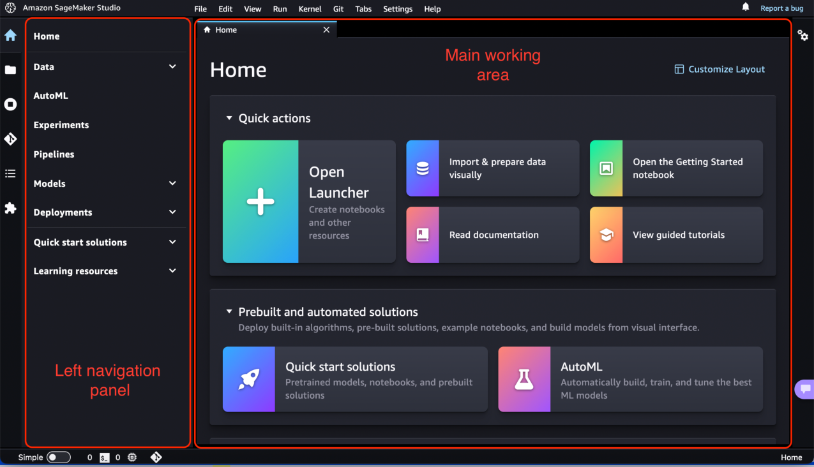

Note

This chapter is based on Studio Classic's updated user interface (UI) available on version

v5.38.x and above on JupyterLab3.

• To retrieve your version of Studio Classic UI, from the Studio Classic Launcher, open a
System Terminal, then

1.
Run conda activate studio

2.
Run jupyter labextension list

3.
Search for the version displayed after @amzn/sagemaker-ui version in the
output.

• For information about updating Amazon SageMaker Studio Classic, see Shut Down and
Update Amazon SageMaker Studio Classic.

Topics

• Amazon SageMaker Studio Classic home page

Studio Classic
625

## Page 654

Amazon SageMaker AI
Developer Guide

• Amazon SageMaker Studio Classic layout

Amazon SageMaker Studio Classic home page

The Home page provides access to common tasks and workflows. In particular, it includes a list of
Quick actions for common tasks such as Open Launcher to create notebooks and other resources
and Import & prepare data visually to create a new flow in Data Wrangler.The Home page also
offers tooltips on key controls in the UI.

The Prebuilt and automated solutions help you get started quickly with SageMaker AI's low-code
solutions such as Amazon SageMaker JumpStart and Autopilot.

In Workflows and tasks, you can find a list of relevant tasks for each step of your ML workflow
that takes you to the right tool for the job. For example, Transform, analyse, and export data
takes you to Amazon SageMaker Data Wrangler and opens the workflow to create a new data flow,
or View all experiments takes you to SageMaker Experiments and opens the experiments list view.

Upon Studio Classic launch, the Home page is open in the main working area. You
can customize your SageMaker AI Home page by choosing the Customize Layout icon

(

)
at the top right of the Home tab.

Amazon SageMaker Studio Classic layout

The Amazon SageMaker Studio Classic interface consists of a menu bar at the top, a collapsible left
sidebar displaying a variety of icons such as the Home icon and the File Browser, a status bar at
the bottom of the screen, and a central area divided horizontally into two panes. The left pane is
a collapsible navigation panel. The right pane, or main working area, contains one or more tabs for
resources such as launchers, notebooks, terminals, metrics, and graphs, and can be further divided.

Report a bug in Studio Classic or choose the notification icon

(

)
to view notifications from Studio Classic, such as new Studio Classic versions and new SageMaker
AI features, on the right corner of the menu bar. To update to a new version of Studio Classic, see
Shut Down and Update Amazon SageMaker Studio Classic and Apps.

The following sections describe the Studio Classic main user interface areas.

Studio Classic
626

## Page 655

Amazon SageMaker AI
Developer Guide

Left sidebar

The left sidebar includes the following icons. When hovering over an icon, a tooltip displays
the icon name. A single click on an icon opens up the left navigation panel with the described
functionality. A double click minimizes the left navigation panel.

Icon
Description

Home

Choose the Home icon to open a top-level navigation menu in the left
navigation panel.

Using the Home navigation menu, you can discover and navigate
to the right tools for each step of your ML workflow. The menu also
provides shortcuts to quick-start solutions and learning resources such
as documentation and guided tutorials.

The menu categories group relevant features together. Choosing Data,
for example, expands the relevant SageMaker AI capabilities for your
data preparations tasks. From here, you can prepare your data with
Data Wrangler, create and store ML features with Amazon SageMaker
Feature Store, and manage Amazon EMR clusters for large-scale data
processing. The categories are ordered following a typical ML workflow
from preparing data, to building, training, and deploying ML models
(data, pipelines, models, and deployments).

When you choose a specific node (such as Data Wrangler), a correspon
ding page opens in the main working area.

Choose Home in the navigation menu to open the Amazon SageMaker
Studio Classic home page

File Browser

The File Browser displays lists of your notebooks, experiments, trials,
trial components, endpoints, and low-code solutions.

Whether you are in a personal or shared space determines who has
access to your files. You can identify which type of space you are in by

Studio Classic
627

## Page 656

Amazon SageMaker AI
Developer Guide

Icon
Description

looking at the top right corner. If you are in a personal app, you see a

user icon followed by [user_name]  / Personal Studio and if you are

in a collaborative space, you see a globe icon followed by "[user_nam

e] / [space_name]. "

• Personal Studio Classic app: A private Amazon EFS directory that
only you can access.

• Collaborative space: A shared Amazon EFS directory with other
members of your team for group access to notebooks and resources.
Working in a shared space allows for real-time team collaboration on
notebooks.

• Studio Classic launcher: Choose the plus (+) sign on the menu at the
top of the file browser to open the Amazon SageMaker Studio Classic
Launcher.

• Upload files: Choose the Upload Files icon

(

)
to add files to Studio Classic or drag and drop them from your
desktop.

• Open files: Double-click a file to open the file in a new tab or right-
click and select Open.

• Panel management: To work in adjacent files, choose a tab that
contains a notebook, Python, or text file, then choose New View for
File.

For hierarchical entries, a selectable breadcrumb at the top of the
browser shows your location in the hierarchy.

Studio Classic
628

## Page 657

Amazon SageMaker AI
Developer Guide

Icon
Description

Property Inspector

The Property Inspector is a notebook cell tools inspector which displays
contextual property settings when open.

Running Terminals and Kernels

You can check the list of all the kernels and terminals currently running
across all notebooks, code consoles, and directories. You can shut down
individual resources, including notebooks, terminals, kernels, apps,
and instances. You can also shut down all resources in one of these
categories at the same time.

For more information, see Shut Down Resources from Amazon
SageMaker Studio Classic.

Git

You can connect to a Git repository and then access a full range of Git
tools and operations.

For more information, see Clone a Git Repository in Amazon SageMaker
Studio Classic.

Table of Contents

You can navigate the structure of a document when a notebook or
Python files are open.
A table of contents is auto-generated in the left navigation panel
when you have a notebook, Markdown files, or Python files opened.
The entries are clickable and scroll the document to the heading in
question.

Studio Classic
629

## Page 658

Amazon SageMaker AI
Developer Guide

Icon
Description

Extensions

You can turn on and manage third-party JupyterLab extensions. You
can check the already installed extensions and search for extensions by
typing the name in the search bar. When you have found the extension
you want to install, choose Install. After installing your new extensions,
be sure to restart JupyterLab by refreshing your browser.

For more information, see JupyterLab Extensions documentation.

Left navigation panel

The left navigation panel content varies with the Icon selected in the left sidebar.

For example, choosing the Home icon displays the navigation menu. Choosing File browser lists
all the files and directories available in your workspace (notebooks, experiments, data flows, trials,
trial components, endpoints, or low-code solutions).

In the navigation menu, choosing a node brings up the corresponding feature page in the main
working area. For example, choosing Data Wrangler in the Data menu opens up the Data
Wrangler tab listing all existing flows.

Main working area

The main working area consists of multiple tabs that contain your open notebooks, terminals, and
detailed information about your experiments and endpoints. In the main working area, you can
arrange documents (such as notebooks and text files) and other activities (such as terminals and
code consoles) into panels of tabs that you can resize or subdivide. Drag a tab to the center of a tab
panel to move the tab to the panel. Subdivide a tab panel by dragging a tab to the left, right, top,
or bottom of the panel. The tab for the current activity is marked with a colored top border (blue
by default).

Note

All feature pages provide in-product contextual help. To access help, choose Show
information. The help interface provides a brief introduction to the tool and links to
additional resources, such as videos, tutorials, or blogs.

Studio Classic
630

## Page 659

Amazon SageMaker AI
Developer Guide

Launch Amazon SageMaker Studio Classic

Important

Custom IAM policies that allow Amazon SageMaker Studio or Amazon SageMaker Studio
Classic to create Amazon SageMaker resources must also grant permissions to add tags to
those resources. The permission to add tags to resources is required because Studio and
Studio Classic automatically tag any resources they create. If an IAM policy allows Studio
and Studio Classic to create resources but does not allow tagging, "AccessDenied" errors can
occur when trying to create resources. For more information, see Provide permissions for
tagging SageMaker AI resources.
AWS managed policies for Amazon SageMaker AI that give permissions to create
SageMaker resources already include permissions to add tags while creating those
resources.

Important

As of November 30, 2023, the previous Amazon SageMaker Studio experience is now
named Amazon SageMaker Studio Classic. The following section is specific to using the
Studio Classic application. For information about using the updated Studio experience, see
Amazon SageMaker Studio.
Studio Classic is still maintained for existing workloads but is no longer available for
onboarding. You can only stop or delete existing Studio Classic applications and cannot
create new ones. We recommend that you migrate your workload to the new Studio
experience.

After you have onboarded to an Amazon SageMaker AI domain, you can launch an Amazon
SageMaker Studio Classic application from either the SageMaker AI console or the AWS CLI. For
more information about onboarding to a domain, see Amazon SageMaker AI domain overview.

Topics

• Launch Amazon SageMaker Studio Classic Using the Amazon SageMaker AI Console

• Launch Amazon SageMaker Studio Classic Using the AWS CLI

Studio Classic
631

## Page 660

Amazon SageMaker AI
Developer Guide

Launch Amazon SageMaker Studio Classic Using the Amazon SageMaker AI Console

The process to navigate to Studio Classic from the Amazon SageMaker AI Console differs
depending on if Studio Classic or Amazon SageMaker Studio are set as the default experience for
your domain. For more information about setting the default experience for your domain, see
Migration from Amazon SageMaker Studio Classic.

Topics

• Prerequisite

Prerequisite

To complete this procedure, you must onboard to a domain by following the steps in Onboard to
Amazon SageMaker AI domain.

Launch Studio Classic if Studio is your default experience

1.
Navigate to Studio following the steps in Launch Amazon SageMaker Studio.

2.
From the Studio UI, find the applications pane on the left side.

3.
From the applications pane, select Studio Classic.

4.
From the Studio Classic landing page, select the Studio Classic instance to open.

5.
Choose “Open”.

Launch Studio Classic if Studio Classic is your default experience

When Studio Classic is your default experience, you can launch a Amazon SageMaker Studio Classic
application from the SageMaker AI console using the Studio Classic landing page or the Amazon
SageMaker AI domain details page. The following sections demonstrate how to launch the Studio
Classic application from the SageMaker AI console.

Launch Studio Classic from the domain details page

The following sections describe how to launch a Studio Classic application from the domain details
page. The steps to launch the Studio Classic application after you have navigated to the domain
details page differ depending on if you’re launching a personal application or a shared space.

Navigate to the domain details page

The following procedure shows how to navigate to the domain details page.

Studio Classic
632

## Page 661

Amazon SageMaker AI
Developer Guide

1.
Open the Amazon SageMaker AI console at https://console.aws.amazon.com/sagemaker/.

2.
On the left navigation pane, choose Admin configurations.

3.
Under Admin configurations, choose domains.

4.
From the list of domain, select the domain that you want to launch the Studio Classic

application in.

Launch a user profile app

The following procedure shows how to launch a Studio Classic application that is scoped to a user
profile.

1.
On the domain details page, choose the User profiles tab.

2.
Identify the user profile that you want to launch the Studio Classic application for.

3.
Choose Launch for your selected user profile, then choose Studio Classic.

Launch a shared space app

The following procedure shows how to launch a Studio Classic application that is scoped to a
shared space.

1.
On the domain details page, choose the Space management tab.

2.
Identify the shared space that you want to launch the Studio Classic application for.

3.
Choose Launch Studio Classic for your selected shared space.

Launch Studio Classic from the Studio Classic landing page

The following procedure describes how to launch a Studio Classic application from the Studio
Classic landing page.

Launch Studio Classic

1.
Open the Amazon SageMaker AI console at https://console.aws.amazon.com/sagemaker/.

2.
On the left navigation pane, choose Studio Classic.

3.
Under Get started, select the domain that you want to launch the Studio Classic application
in. If your user profile only belongs to one domain, you do not see the option for selecting a
domain.

Studio Classic
633

## Page 662

Amazon SageMaker AI
Developer Guide

4.
Select the user profile that you want to launch the Studio Classic application for. If there is
no user profile in the domain, choose Create user profile. For more information, see Add user
profiles.

5.
Choose Launch Studio Classic. If the user profile belongs to a shared space, choose Open
Spaces.

6.
To launch a Studio Classic application scoped to a user profile, choose Launch personal Studio
Classic.

7.
To launch a shared Studio Classic application, choose the Launch shared Studio Classic button
next to the shared space that you want to launch into.

Launch Amazon SageMaker Studio Classic Using the AWS CLI

You can use the AWS Command Line Interface (AWS CLI) to launch Amazon SageMaker Studio
Classic by creating a presigned domain URL.

Prerequisites

Before you begin, complete the following prerequisites:

• Onboard to Amazon SageMaker AI domain. For more information, see Onboard to Amazon
SageMaker AI domain.

• Update the AWS CLI by following the steps in Installing the current AWS CLI Version.

• From your local machine, run aws configure and provide your AWS credentials. For
information about AWS credentials, see Understanding and getting your AWS credentials.

The following code snippet demonstrates how to launch Amazon SageMaker Studio Classic from
the AWS CLI using a presigned domain URL. For more information, see create-presigned-domain-
url.

aws sagemaker create-presigned-domain-url \
--region region \
--domain-id domain-id \
--space-name space-name \
--user-profile-name user-profile-name \
--session-expiration-duration-in-seconds 43200

Studio Classic
634

## Page 663

Amazon SageMaker AI
Developer Guide

JupyterLab Versioning in Amazon SageMaker Studio Classic

Important

Custom IAM policies that allow Amazon SageMaker Studio or Amazon SageMaker Studio
Classic to create Amazon SageMaker resources must also grant permissions to add tags to
those resources. The permission to add tags to resources is required because Studio and
Studio Classic automatically tag any resources they create. If an IAM policy allows Studio
and Studio Classic to create resources but does not allow tagging, "AccessDenied" errors can
occur when trying to create resources. For more information, see Provide permissions for
tagging SageMaker AI resources.
AWS managed policies for Amazon SageMaker AI that give permissions to create
SageMaker resources already include permissions to add tags while creating those
resources.

Important

As of November 30, 2023, the previous Amazon SageMaker Studio experience is now
named Amazon SageMaker Studio Classic. The following section is specific to using the
Studio Classic application. For information about using the updated Studio experience, see
Amazon SageMaker Studio.
Studio Classic is still maintained for existing workloads but is no longer available for
onboarding. You can only stop or delete existing Studio Classic applications and cannot
create new ones. We recommend that you migrate your workload to the new Studio
experience.

The Amazon SageMaker Studio Classic interface is based on JupyterLab, which is a web-based
interactive development environment for notebooks, code, and data. Studio Classic only supports
using JupyterLab 3.

If you created your domain and user profile using the AWS Management Console before
08/31/2022 or using the AWS Command Line Interface before 02/22/23, then your Studio Classic
instance defaulted to JupyterLab 1. After 07/01/2024, you cannot create any Studio Classic
applications that run JupyterLab 1.

Studio Classic
635

## Page 664

Amazon SageMaker AI
Developer Guide

JupyterLab 3

JupyterLab 3 includes the following features that are not available in previous versions. For more
information about these features, see JupyterLab 3.0 is released!.

• Visual debugger when using the Base Python 2.0 and Data Science 2.0 kernels.

• File browser filter

• Table of Contents (TOC)

• Multi-language support

• Simple mode

• Single interface mode

Important changes to JupyterLab 3

Consider the following when using JupyterLab 3:

• When setting the JupyterLab version using the AWS CLI, select the corresponding image for your
Region and JupyterLab version from the image list in From the AWS CLI.

• In JupyterLab 3, you must activate the studio conda environment before installing extensions.
For more information, see Installing JupyterLab and Jupyter Server extensions.

• Debugger is only supported when using the following images:

• Base Python 2.0

• Data Science 2.0

• Base Python 3.0

• Data Science 3.0

Restricting default JupyterLab version using an IAM policy condition key

You can use IAM policy condition keys to restrict the version of JupyterLab that your users can
launch.

The following policy shows how to limit the JupyterLab version at the domain level.

JSON

{

Studio Classic
636

## Page 665

Amazon SageMaker AI
Developer Guide

"Version":"2012-10-17",
"Statement": [
{
"Sid": "BlockJupyterLab3DomainLevelAppCreation",
"Effect": "Deny",
"Action": [
"sagemaker:CreateDomain",
"sagemaker:UpdateDomain"
],
"Resource": "*",
"Condition": {
"ForAnyValue:ArnLike": {
"sagemaker:ImageArns": "arn:aws:sagemaker:us-
east-1:111122223333:image/jupyter-server-3"
}
}
}

]
}

The following policy shows how to limit the JupyterLab version at the user profile level.

JSON

{
"Version":"2012-10-17",
"Statement": [
{
"Sid": "BlockUsersFromCreatingJupyterLab3Apps",
"Effect": "Deny",
"Action": [
"sagemaker:CreateUserProfile",
"sagemaker:UpdateUserProfile"
],
"Resource": "*",
"Condition": {
"ForAnyValue:ArnLike": {
"sagemaker:ImageArns": "arn:aws:sagemaker:us-
east-1:111122223333:image/jupyter-server-3"
}
}
}

Studio Classic
637

## Page 666

Amazon SageMaker AI
Developer Guide

]
}

The following policy shows how to limit the JupyterLab version at the application level. The

CreateApp request must include the image ARN for this policy to apply.

JSON

{
"Version":"2012-10-17",
"Statement": [
{
"Sid": "BlockJupyterLab3AppLevelAppCreation",
"Effect": "Deny",
"Action": "sagemaker:CreateApp",
"Resource": "*",
"Condition": {
"ForAnyValue:ArnLike": {
"sagemaker:ImageArns": "arn:aws:sagemaker:us-
east-1:111122223333:image/jupyter-server-3"
}
}
}
]
}

Setting a default JupyterLab version

The following sections show how to set a default JupyterLab version for Studio Classic using either
the console or the AWS CLI.

From the console

You can select the default JupyterLab version to use on either the domain or user profile level
during resource creation. To set the default JupyterLab version using the console, see Amazon
SageMaker AI domain overview.

Studio Classic
638

## Page 667

Amazon SageMaker AI
Developer Guide

From the AWS CLI

You can select the default JupyterLab version to use on either the domain or user profile level
using the AWS CLI.

To set the default JupyterLab version using the AWS CLI, you must include the ARN of the desired
default JupyterLab version as part of an AWS CLI command. This ARN differs based on the version
and the Region of the SageMaker AI domain.

The following table lists the ARNs of the available JupyterLab versions for each Region:

Region
JL3

us-east-1
arn:aws:sagemaker:us-east-1:08132539
0199:image/jupyter-server-3

us-east-2
arn:aws:sagemaker:us-east-2:42970468
7514:image/jupyter-server-3

us-west-1
arn:aws:sagemaker:us-west-1:74209132
7244:image/jupyter-server-3

us-west-2
arn:aws:sagemaker:us-west-2:23651454
2706:image/jupyter-server-3

af-south-1
arn:aws:sagemaker:af-south-1:5593120
83959:image/jupyter-server-3

ap-east-1
arn:aws:sagemaker:ap-east-1:49364249
6378:image/jupyter-server-3

ap-south-1
arn:aws:sagemaker:ap-south-1:3941030
62818:image/jupyter-server-3

ap-northeast-2
arn:aws:sagemaker:ap-northeast-2:806
072073708:image/jupyter-server-3

ap-southeast-1
arn:aws:sagemaker:ap-southeast-1:492
261229750:image/jupyter-server-3

Studio Classic
639

## Page 668

Amazon SageMaker AI
Developer Guide

Region
JL3

ap-southeast-2
arn:aws:sagemaker:ap-southeast-2:452
832661640:image/jupyter-server-3

ap-northeast-1
arn:aws:sagemaker:ap-northeast-1:102
112518831:image/jupyter-server-3

ca-central-1
arn:aws:sagemaker:ca-central-1:31090
6938811:image/jupyter-server-3

eu-central-1
arn:aws:sagemaker:eu-central-1:93669
7816551:image/jupyter-server-3

eu-west-1
arn:aws:sagemaker:eu-west-1:47031725
9841:image/jupyter-server-3

eu-west-2
arn:aws:sagemaker:eu-west-2:71277966
5605:image/jupyter-server-3

eu-west-3
arn:aws:sagemaker:eu-west-3:61554785
6133:image/jupyter-server-3

eu-north-1
arn:aws:sagemaker:eu-north-1:2436375
12696:image/jupyter-server-3

eu-south-1
arn:aws:sagemaker:eu-south-1:5927512
61982:image/jupyter-server-3

eu-south-2
arn:aws:sagemaker:eu-south-2:1273631
02723:image/jupyter-server-3

sa-east-1
arn:aws:sagemaker:sa-east-1:78248440
2741:image/jupyter-server-3

cn-north-1
arn:aws-cn:sagemaker:cn-north-1:3900
48526115:image/jupyter-server-3

cn-northwest-1
arn:aws-cn:sagemaker:cn-northwest-1:
390780980154:image/jupyter-server-3

Studio Classic
640

## Page 669

Amazon SageMaker AI
Developer Guide

Create or update domain

You can set a default JupyterServer version at the domain level by invoking CreateDomain or
UpdateDomain and passing the

UserSettings.JupyterServerAppSettings.DefaultResourceSpec.SageMakerImageArn field.

The following shows how to create a domain with JupyterLab 3 as the default, using the AWS CLI:

aws --region <REGION> \
sagemaker create-domain \
--domain-name <NEW_DOMAIN_NAME> \
--auth-mode <AUTHENTICATION_MODE> \
--subnet-ids <SUBNET-IDS> \
--vpc-id <VPC-ID> \
--default-user-settings '{
"JupyterServerAppSettings": {
"DefaultResourceSpec": {
"SageMakerImageArn": "arn:aws:sagemaker:<REGION>:<ACCOUNT_ID>:image/jupyter-
server-3",
"InstanceType": "system"
}
}
}'

The following shows how to update a domain to use JupyterLab 3 as the default, using the AWS
CLI:

aws --region <REGION> \
sagemaker update-domain \
--domain-id <YOUR_DOMAIN_ID> \
--default-user-settings '{
"JupyterServerAppSettings": {
"DefaultResourceSpec": {
"SageMakerImageArn": "arn:aws:sagemaker:<REGION>:<ACCOUNT_ID>:image/jupyter-
server-3",
"InstanceType": "system"
}
}
}'

Studio Classic
641

## Page 670

Amazon SageMaker AI
Developer Guide

Create or update user profile

You can set a default JupyterServer version at the user profile level
by invoking CreateUserProfile or UpdateUserProfile and passing

the UserSettings.JupyterServerAppSettings.DefaultResourceSpec.SageMakerImageArn
field.

The following shows how to create a user profile with JupyterLab 3 as the default on an existing
domain, using the AWS CLI:

aws --region <REGION> \
sagemaker create-user-profile \
--domain-id <YOUR_DOMAIN_ID> \
--user-profile-name <NEW_USERPROFILE_NAME> \
--query UserProfileArn --output text \
--user-settings '{
"JupyterServerAppSettings": {
"DefaultResourceSpec": {
"SageMakerImageArn": "arn:aws:sagemaker:<REGION>:<ACCOUNT_ID>:image/jupyter-
server-3",
"InstanceType": "system"
}
}
}'

The following shows how to update a user profile to use JupyterLab 3 as the default, using the
AWS CLI:

aws --region <REGION> \
sagemaker update-user-profile \
--domain-id <YOUR_DOMAIN_ID> \
--user-profile-name <EXISTING_USERPROFILE_NAME> \
--user-settings '{
"JupyterServerAppSettings": {
"DefaultResourceSpec": {
"SageMakerImageArn": "arn:aws:sagemaker:<REGION>:<ACCOUNT_ID>:image/jupyter-
server-3",
"InstanceType": "system"
}
}
}'

Studio Classic
642

## Page 671

Amazon SageMaker AI
Developer Guide

View and update the JupyterLab version of an application from the console

The following shows how to view and update the JupyterLab version of an application.

1.
Navigate to the SageMaker AI domains page.

2.
Select a domain to view its user profiles.

3.
Select a user to view their applications.

4.
To view the JupyterLab version of an application, select the application's name.

5.
To update the JupyterLab version, select Action.

6.
From the dropdown menu, select Change JupyterLab version.

7.
From the Studio Classic settings page, select the JupyterLab version from the dropdown
menu.

8.
After the JupyterLab version for the user profile has been successfully updated, restart the
JupyterServer application to make the version changes effective. For more information about
restarting a JupyterServer application, see Shut Down and Update Amazon SageMaker Studio
Classic.

Installing JupyterLab and Jupyter Server extensions

In JupyterLab 3, you must activate the studio conda environment before installing extensions.
The method for this differs if you're installing the extensions from within Studio Classic or using a
lifecycle configuration script.

Installing Extension from within Studio Classic

To install extensions from within Studio Classic, you must activate the studio environment before
you install extensions.

# Before installing extensions
conda activate studio

# Install your extensions
pip install <JUPYTER_EXTENSION>

# After installing extensions
conda deactivate

Studio Classic
643

## Page 672

Amazon SageMaker AI
Developer Guide

Installing Extensions using a lifecycle configuration script

If you're installing JupyterLab and Jupyter Server extensions in your lifecycle configuration script,
you must modify your script so that it works with JupyterLab 3. The following sections show the
code needed for existing and new lifecycle configuration scripts.

Existing lifecycle configuration script

If you're reusing an existing lifecycle configuration script that must work with both versions of
JupyterLab, use the following code in your script:

# Before installing extension
export
AWS_SAGEMAKER_JUPYTERSERVER_IMAGE="${AWS_SAGEMAKER_JUPYTERSERVER_IMAGE:-'jupyter-
server'}"
if [ "$AWS_SAGEMAKER_JUPYTERSERVER_IMAGE" = "jupyter-server-3" ] ; then
eval "$(conda shell.bash hook)"
conda activate studio
fi;

# Install your extensions
pip install <JUPYTER_EXTENSION>

# After installing extension
if [ "$AWS_SAGEMAKER_JUPYTERSERVER_IMAGE" = "jupyter-server-3" ]; then
conda deactivate
fi;

New lifecycle configuration script

If you're writing a new lifecycle configuration script that only uses JupyterLab 3, you can use the
following code in your script:

# Before installing extension
eval "$(conda shell.bash hook)"
conda activate studio

# Install your extensions
pip install <JUPYTER_EXTENSION>

Studio Classic
644

## Page 673

Amazon SageMaker AI
Developer Guide

conda deactivate

Use the Amazon SageMaker Studio Classic Launcher

Important

As of November 30, 2023, the previous Amazon SageMaker Studio experience is now
named Amazon SageMaker Studio Classic. The following section is specific to using the
Studio Classic application. For information about using the updated Studio experience, see
Amazon SageMaker Studio.
Studio Classic is still maintained for existing workloads but is no longer available for
onboarding. You can only stop or delete existing Studio Classic applications and cannot
create new ones. We recommend that you migrate your workload to the new Studio

experience.

You can use the Amazon SageMaker Studio Classic Launcher to create notebooks and text files, and
to launch terminals and interactive Python shells.

You can open Studio Classic Launcher in any of the following ways:

• Choose Amazon SageMaker Studio Classic at the top left of the Studio Classic interface.

• Use the keyboard shortcut Ctrl + Shift + L.

• From the Studio Classic menu, choose File and then choose New Launcher.

• If the SageMaker AI file browser is open, choose the plus (+) sign in the Studio Classic file
browser menu.

• In the Quick actions section of the Home tab, choose Open Launcher. The Launcher opens
in a new tab. The Quick actions section is visible by default but can be toggled off. Choose
Customize Layout to turn this section back on.

Studio Classic
645

## Page 674

Amazon SageMaker AI
Developer Guide

The Launcher consists of the following two sections:

Topics

• Notebooks and compute resources

• Utilities and files

Notebooks and compute resources

In this section, you can create a notebook, open an image terminal, or open a Python console.

To create or launch one of those items:

1. Choose Change environment to select a SageMaker image, a kernel, an instance type, and,

optionally, add a lifecycle configuration script that runs on image start-up. For more information
on lifecycle configuration scripts, see Use Lifecycle Configurations to Customize Amazon
SageMaker Studio Classic. For more information about kernel updates, see Change the Image or
a Kernel for an Amazon SageMaker Studio Classic Notebook.

2. Select an item.

Studio Classic
646

## Page 675

Amazon SageMaker AI
Developer Guide

Note

When you choose an item from this section, you might incur additional usage charges. For
more information, see Usage Metering for Amazon SageMaker Studio Classic Notebooks.

The following items are available:

• Notebook

Launches the notebook in a kernel session on the chosen SageMaker image.

Creates the notebook in the folder that you have currently selected in the file browser. To view
the file browser, in the left sidebar of Studio Classic, choose the File Browser icon.

• Console

Launches the shell in a kernel session on the chosen SageMaker image.

Opens the shell in the folder that you have currently selected in the file browser.

• Image terminal

Launches the terminal in a terminal session on the chosen SageMaker image.

Opens the terminal in the root folder for the user (as shown by the Home folder in the file
browser).

Note

By default, CPU instances launch on a ml.t3.medium instance, while GPU instances launch

on a ml.g4dn.xlarge instance.

Utilities and files

In this section, you can add contextual help in a notebook; create Python, Markdown and text files;
and open a system terminal.

Studio Classic
647

## Page 676

Amazon SageMaker AI
Developer Guide

Note

Items in this section run in the context of Amazon SageMaker Studio Classic and don't incur
usage charges.

The following items are available:

• Show Contextual Help

Opens a new tab that displays contextual help for functions in a Studio Classic notebook. To
display the help, choose a function in an active notebook. To make it easier to see the help in
context, drag the help tab so that it's adjacent to the notebook tab. To open the help tab from

within a notebook, press Ctrl + I.

The following screenshot shows the contextual help for the Experiment.create method.

Studio Classic
648

## Page 677

Amazon SageMaker AI
Developer Guide

• System terminal

Opens a bash shell in the root folder for the user (as shown by the Home folder in the file
browser).

• Text File and Markdown File

Creates a file of the associated type in the folder that you have currently selected in the
file browser. To view the file browser, in the left sidebar, choose the File Browser icon

(

).

Use Amazon SageMaker Studio Classic Notebooks

Important

As of November 30, 2023, the previous Amazon SageMaker Studio experience is now
named Amazon SageMaker Studio Classic. The following section is specific to using the
Studio Classic application. For information about using the updated Studio experience, see
Amazon SageMaker Studio.
Studio Classic is still maintained for existing workloads but is no longer available for
onboarding. You can only stop or delete existing Studio Classic applications and cannot
create new ones. We recommend that you migrate your workload to the new Studio
experience.

Amazon SageMaker Studio Classic notebooks are collaborative notebooks that you can launch
quickly because you don't need to set up compute instances and file storage beforehand. Studio
Classic notebooks provide persistent storage, which enables you to view and share notebooks even
if the instances that the notebooks run on are shut down.

You can share your notebooks with others, so that they can easily reproduce your results and
collaborate while building models and exploring your data. You provide access to a read-only
copy of the notebook through a secure URL. Dependencies for your notebook are included in the
notebook's metadata. When your colleagues copy the notebook, it opens in the same environment
as the original notebook.

A Studio Classic notebook runs in an environment defined by the following:

Studio Classic
649

## Page 678

Amazon SageMaker AI
Developer Guide

• Amazon EC2 instance type – The hardware configuration the notebook runs on. The
configuration includes the number and type of processors (vCPU and GPU), and the amount and
type of memory. The instance type determines the pricing rate.

• SageMaker image – A container image that is compatible with SageMaker Studio Classic. The
image consists of the kernels, language packages, and other files required to run a notebook in
Studio Classic. There can be multiple images in an instance. For more information, see Custom
Images in Amazon SageMaker Studio Classic.

• KernelGateway app – A SageMaker image runs as a KernelGateway app. The app provides access
to the kernels in the image. There is a one-to-one correspondence between a SageMaker AI
image and a KernelGateway app.

• Kernel – The process that inspects and runs the code contained in the notebook. A kernel is
defined by a kernel spec in the image. There can be multiple kernels in an image.

You can change any of these resources from within the notebook.

The following diagram outlines how a notebook kernel runs in relation to the KernelGateway App,
User, and domain.

Studio Classic
650

## Page 679

Amazon SageMaker AI
Developer Guide

Sample SageMaker Studio Classic notebooks are available in the aws_sagemaker_studio folder
of the Amazon SageMaker example GitHub repository. Each notebook comes with the necessary
SageMaker image that opens the notebook with the appropriate kernel.

We recommend that you familiarize yourself with the SageMaker Studio Classic interface and
the Studio Classic notebook toolbar before creating or using a Studio Classic notebook. For
more information, see Amazon SageMaker Studio Classic UI Overview and Use the Studio Classic
Notebook Toolbar.

Topics

• How Are Amazon SageMaker Studio Classic Notebooks Different from Notebook Instances?

• Get Started with Amazon SageMaker Studio Classic Notebooks

• Amazon SageMaker Studio Classic Tour

• Create or Open an Amazon SageMaker Studio Classic Notebook

Studio Classic
651

## Page 680

Amazon SageMaker AI
Developer Guide

• Use the Studio Classic Notebook Toolbar

• Install External Libraries and Kernels in Amazon SageMaker Studio Classic

• Share and Use an Amazon SageMaker Studio Classic Notebook

• Get Amazon SageMaker Studio Classic Notebook and App Metadata

• Get Notebook Differences in Amazon SageMaker Studio Classic

• Manage Resources for Amazon SageMaker Studio Classic Notebooks

• Usage Metering for Amazon SageMaker Studio Classic Notebooks

• Available Resources for Amazon SageMaker Studio Classic Notebooks

How Are Amazon SageMaker Studio Classic Notebooks Different from Notebook Instances?

Important

As of November 30, 2023, the previous Amazon SageMaker Studio experience is now
named Amazon SageMaker Studio Classic. The following section is specific to using the
Studio Classic application. For information about using the updated Studio experience, see
Amazon SageMaker Studio.
Studio Classic is still maintained for existing workloads but is no longer available for
onboarding. You can only stop or delete existing Studio Classic applications and cannot
create new ones. We recommend that you migrate your workload to the new Studio
experience.

When you're starting a new notebook, we recommend that you create the notebook in Amazon
SageMaker Studio Classic instead of launching a notebook instance from the Amazon SageMaker AI
console. There are many benefits to using a Studio Classic notebook, including the following:

• Faster: Starting a Studio Classic notebook is faster than launching an instance-based notebook.
Typically, it is 5-10 times faster than instance-based notebooks.

• Easy notebook sharing: Notebook sharing is an integrated feature in Studio Classic. Users can
generate a shareable link that reproduces the notebook code and also the SageMaker image
required to execute it, in just a few clicks.

• Latest Python SDK: Studio Classic notebooks come pre-installed with the latest Amazon
SageMaker Python SDK.

Studio Classic
652

## Page 681

Amazon SageMaker AI
Developer Guide

• Access all Studio Classic features: Studio Classic notebooks are accessed from within Studio
Classic. This enables you to build, train, debug, track, and monitor your models without leaving
Studio Classic.

• Persistent user directories: Each member of a Studio team gets their own home directory to
store their notebooks and other files. The directory is automatically mounted onto all instances
and kernels as they're started, so their notebooks and other files are always available. The home
directories are stored in Amazon Elastic File System (Amazon EFS) so that you can access them
from other services.

• Direct access: When using IAM Identity Center, you use your IAM Identity Center credentials
through a unique URL to directly access Studio Classic. You don't have to interact with the AWS
Management Console to run your notebooks.

• Optimized images: Studio Classic notebooks are equipped with a set of predefined SageMaker
image settings to get you started faster.

Note

Studio Classic notebooks don't support local mode. However, you can use a notebook
instance to train a sample of your dataset locally, and then use the same code in a Studio
Classic notebook to train on the full dataset.

When you open a notebook in SageMaker Studio Classic, the view is an extension of the JupyterLab
interface. The primary features are the same, so you'll find the typical features of a Jupyter
notebook and JupyterLab. For more information about the Studio Classic interface, see Amazon
SageMaker Studio Classic UI Overview.

Get Started with Amazon SageMaker Studio Classic Notebooks

Important

As of November 30, 2023, the previous Amazon SageMaker Studio experience is now
named Amazon SageMaker Studio Classic. The following section is specific to using the
Studio Classic application. For information about using the updated Studio experience, see
Amazon SageMaker Studio.
Studio Classic is still maintained for existing workloads but is no longer available for
onboarding. You can only stop or delete existing Studio Classic applications and cannot

Studio Classic
653

## Page 682

Amazon SageMaker AI
Developer Guide

create new ones. We recommend that you migrate your workload to the new Studio
experience.

To get started, you or your organization's administrator need to complete the SageMaker AI
domain onboarding process. For more information, see Amazon SageMaker AI domain overview.

You can access a Studio Classic notebook in any of the following ways:

• You receive an email invitation to access Studio Classic through your organization's IAM Identity
Center, which includes a direct link to login to Studio Classic without having to use the Amazon
SageMaker AI console. You can proceed to the the section called “Next Steps”.

• You receive a link to a shared Studio Classic notebook, which includes a direct link to log in
to Studio Classic without having to use the SageMaker AI console. You can proceed to the the
section called “Next Steps”.

• You onboard to a domain and then log in to the SageMaker AI console. For more information, see
Amazon SageMaker AI domain overview.

Launch Amazon SageMaker AI

Complete the steps in Launch Amazon SageMaker Studio Classic to launch Studio Classic.

Next Steps

Now that you're in Studio Classic, you can try any of the following options:

• To create a Studio Classic notebook or explore Studio Classic end-to-end tutorial notebooks –
See Amazon SageMaker Studio Classic Tour in the next section.

• To familiarize yourself with the Studio Classic interface – See Amazon SageMaker Studio Classic
UI Overview or try the Getting started notebook by selecting Open the Getting started
notebook in the Quick actions section of the Studio Classic Home page.

Amazon SageMaker Studio Classic Tour

Important

As of November 30, 2023, the previous Amazon SageMaker Studio experience is now
named Amazon SageMaker Studio Classic. The following section is specific to using the

Studio Classic
654

## Page 683

Amazon SageMaker AI
Developer Guide

Studio Classic application. For information about using the updated Studio experience, see
Amazon SageMaker Studio.
Studio Classic is still maintained for existing workloads but is no longer available for
onboarding. You can only stop or delete existing Studio Classic applications and cannot
create new ones. We recommend that you migrate your workload to the new Studio
experience.

For a walkthrough that takes you on a tour of the main features of Amazon SageMaker Studio
Classic, see the xgboost_customer_churn_studio.ipynb sample notebook from the aws/amazon-
sagemaker-examples GitHub repository. The code in the notebook trains multiple models and
sets up the SageMaker Debugger and SageMaker Model Monitor. The walkthrough shows you
how to view the trials, compare the resulting models, show the debugger results, and deploy
the best model using the Studio Classic UI. You don't need to understand the code to follow this
walkthrough.

Prerequisites

To run the notebook for this tour, you need:

• An IAM account to sign in to Studio. For information, see Amazon SageMaker AI domain
overview.

• Basic familiarity with the Studio user interface and Jupyter notebooks. For information, see
Amazon SageMaker Studio Classic UI Overview.

• A copy of the aws/amazon-sagemaker-examples repository in your Studio environment.

To clone the repository

1.
Launch Studio Classic following the steps in Launch Amazon SageMaker Studio Classic For
users in IAM Identity Center, sign in using the URL from your invitation email.

2.
On the top menu, choose File, then New, then Terminal.

3.
At the command prompt, run the following command to clone the aws/amazon-sagemaker-
examples GitHub repository.

$ git clone https://github.com/aws/amazon-sagemaker-examples.git

Studio Classic
655

## Page 684

Amazon SageMaker AI
Developer Guide

To navigate to the sample notebook

1.
From the File Browser on the left menu, select amazon-sagemaker-examples.

2.
Navigate to the example notebook with the following path.

~/amazon-sagemaker-examples/aws_sagemaker_studio/getting_started/

xgboost_customer_churn_studio.ipynb

3.
Follow the notebook to learn about Studio Classic's main features.

Note

If you encounter an error when you run the sample notebook, and some time has passed
from when you cloned the repository, review the notebook on the remote repository for
updates.

Create or Open an Amazon SageMaker Studio Classic Notebook

Important

Custom IAM policies that allow Amazon SageMaker Studio or Amazon SageMaker Studio
Classic to create Amazon SageMaker resources must also grant permissions to add tags to
those resources. The permission to add tags to resources is required because Studio and
Studio Classic automatically tag any resources they create. If an IAM policy allows Studio
and Studio Classic to create resources but does not allow tagging, "AccessDenied" errors can
occur when trying to create resources. For more information, see Provide permissions for
tagging SageMaker AI resources.
AWS managed policies for Amazon SageMaker AI that give permissions to create
SageMaker resources already include permissions to add tags while creating those
resources.

Important

As of November 30, 2023, the previous Amazon SageMaker Studio experience is now
named Amazon SageMaker Studio Classic. The following section is specific to using the

Studio Classic
656

## Page 685

Amazon SageMaker AI
Developer Guide

Studio Classic application. For information about using the updated Studio experience, see
Amazon SageMaker Studio.
Studio Classic is still maintained for existing workloads but is no longer available for
onboarding. You can only stop or delete existing Studio Classic applications and cannot
create new ones. We recommend that you migrate your workload to the new Studio
experience.

When you Create a Notebook from the File Menu in Amazon SageMaker Studio Classic or Open
a notebook in Studio Classic for the first time, you are prompted to set up your environment by
choosing a SageMaker image, a kernel, an instance type, and, optionally, a lifecycle configuration
script that runs on image start-up. SageMaker AI launches the notebook on an instance of

the chosen type. By default, the instance type is set to ml.t3.medium (available as part of
the AWS Free Tier) for CPU-based images. For GPU-based images, the default instance type is

ml.g4dn.xlarge.

If you create or open additional notebooks that use the same instance type, whether or not the
notebooks use the same kernel, the notebooks run on the same instance of that instance type.

After you launch a notebook, you can change its instance type, SageMaker image, and kernel
from within the notebook. For more information, see Change the Instance Type for an Amazon
SageMaker Studio Classic Notebook and Change the Image or a Kernel for an Amazon SageMaker
Studio Classic Notebook.

Note

You can have only one instance of each instance type. Each instance can have multiple
SageMaker images running on it. Each SageMaker image can run multiple kernels or
terminal instances.

Billing occurs per instance and starts when the first instance of a given instance type is launched.
If you want to create or open a notebook without the risk of incurring charges, open the notebook
from the File menu and choose No Kernel from the Select Kernel dialog box. You can read and
edit a notebook without a running kernel but you can't run cells.

Billing ends when the SageMaker image for the instance is shut down. For more information, see
Usage Metering for Amazon SageMaker Studio Classic Notebooks.

Studio Classic
657

## Page 686

Amazon SageMaker AI
Developer Guide

For information about shutting down the notebook, see Shut down resources.

Topics

• Open a notebook in Studio Classic

• Create a Notebook from the File Menu

• Create a Notebook from the Launcher

• List of the available instance types, images, and kernels

Open a notebook in Studio Classic

Amazon SageMaker Studio Classic can only open notebooks listed in the Studio Classic file
browser. For instructions on uploading a notebook to the file browser, see Upload Files to Amazon
SageMaker Studio Classic or Clone a Git Repository in Amazon SageMaker Studio Classic.

To open a notebook

1.
In the left sidebar, choose the File Browser icon (

)
to display the file browser.

2.
Browse to a notebook file and double-click it to open the notebook in a new tab.

Create a Notebook from the File Menu

To create a notebook from the File menu

1.
From the Studio Classic menu, choose File, choose New, and then choose Notebook.

2.
In the Change environment dialog box, use the dropdown menus to select your Image,
Kernel, Instance type, and Start-up script, then choose Select. Your notebook launches and
opens in a new Studio Classic tab.

Studio Classic
658

## Page 687

Amazon SageMaker AI
Developer Guide

Create a Notebook from the Launcher

To create a notebook from the Launcher

1.
To open the Launcher, choose Amazon SageMaker Studio Classic at the top left of the Studio

Classic interface or use the keyboard shortcut Ctrl + Shift + L.

To learn about all the available ways to open the Launcher, see Use the Amazon SageMaker
Studio Classic Launcher

2.
In the Launcher, in the Notebooks and compute resources section, choose Change
environment.

Studio Classic
659

## Page 688

Amazon SageMaker AI
Developer Guide

3.
In the Change environment dialog box, use the dropdown menus to select your Image,
Kernel, Instance type, and Start-up script, then choose Select.

4.
In the Launcher, choose Create notebook. Your notebook launches and opens in a new Studio
Classic tab.

To view the notebook's kernel session, in the left sidebar, choose the Running Terminals and
Kernels icon

(

).
You can stop the notebook's kernel session from this view.

List of the available instance types, images, and kernels

For a list of all available resources, see:

• Instance Types Available for Use With Amazon SageMaker Studio Classic Notebooks

• Amazon SageMaker Images Available for Use With Studio Classic Notebooks

Use the Studio Classic Notebook Toolbar

Important

As of November 30, 2023, the previous Amazon SageMaker Studio experience is now
named Amazon SageMaker Studio Classic. The following section is specific to using the

Studio Classic
660

## Page 689

Amazon SageMaker AI
Developer Guide

Studio Classic application. For information about using the updated Studio experience, see
Amazon SageMaker Studio.
Studio Classic is still maintained for existing workloads but is no longer available for
onboarding. You can only stop or delete existing Studio Classic applications and cannot
create new ones. We recommend that you migrate your workload to the new Studio
experience.

Amazon SageMaker Studio Classic notebooks extend the JupyterLab interface. For an overview of
the original JupyterLab interface, see The JupyterLab Interface.

The following image shows the toolbar and an empty cell from a Studio Classic notebook.

When you pause on a toolbar icon, a tooltip displays the icon function. Additional notebook
commands are found in the Studio Classic main menu. The toolbar includes the following icons:

Icon
Description

Save and checkpoint

Saves the notebook and updates the checkpoint file. For more
information, see Get the Difference Between the Last Checkpoint.

Insert cell

Inserts a code cell below the current cell. The current cell is noted by
the blue vertical marker in the left margin.

Cut, copy, and paste cells

Cuts, copies, and pastes the selected cells.

Run cells

Studio Classic
661

## Page 690

Amazon SageMaker AI
Developer Guide

Icon
Description

Runs the selected cells and then makes the cell that follows the last
selected cell the new selected cell.

Interrupt kernel

Interrupts the kernel, which cancels the currently running operation.
The kernel remains active.

Restart kernel

Restarts the kernel. Variables are reset. Unsaved information is not
affected.

Restart kernel and run all cells

Restarts the kernel, then run all the cells of the notebook.

Cell type

Displays or changes the current cell type. The cell types are:

• Code – Code that the kernel runs.

• Markdown – Text rendered as markdown.

• Raw – Content, including Markdown markup, that's displayed as text.

Launch terminal

Launches a terminal in the SageMaker image hosting the notebook. For
an example, see Get App Metadata.

Checkpoint diff

Opens a new tab that displays the difference between the notebook
and the checkpoint file. For more information, see Get the Difference
Between the Last Checkpoint.

Studio Classic
662

## Page 691

Amazon SageMaker AI
Developer Guide

Icon
Description

Git diff

Only enabled if the notebook is opened from a Git repository. Opens a
new tab that displays the difference between the notebook and the last
Git commit. For more information, see Get the Difference Between the
Last Commit.

2 vCPU + 4 GiB
Instance type

Displays or changes the instance type the notebook runs in. The format
is as follows:

number of vCPUs + amount of memory + number of GPUs

Unknown indicates the notebook was opened without specifying a
kernel. The notebook runs on the SageMaker Studio instance and
doesn't accrue runtime charges. You can't assign the notebook to an
instance type. You must specify a kernel and then Studio assigns the
notebook to a default type.

For more information, see Create or Open an Amazon SageMaker
Studio Classic Notebook and Change the Instance Type for an Amazon
SageMaker Studio Classic Notebook.

Cluster

Connect your notebook to an Amazon EMR cluster and scale your ETL
jobs or run large-scale model training using Apache Spark, Hive, or
Presto.

For more information, see Data preparation using Amazon EMR.

Studio Classic
663

## Page 692

Amazon SageMaker AI
Developer Guide

Icon
Description

Python 3 (Data
Science)

Kernel and SageMaker Image

Displays or changes the kernel that processes the cells in the notebook.
The format is as follows:

Kernel (SageMaker Image)

No Kernel indicates the notebook was opened without specifying a
kernel. You can edit the notebook but you can't run any cells.

For more information, see Change the Image or a Kernel for an Amazon
SageMaker Studio Classic Notebook.

Kernel busy status

Displays the busy status of the kernel. When the edge of the circle and
its interior are the same color, the kernel is busy. The kernel is busy
when it is starting and when it is processing cells. Additional kernel
states are displayed in the status bar at the bottom-left corner of
SageMaker Studio.

Share notebook

Shares the notebook. For more information, see Share and Use an
Amazon SageMaker Studio Classic Notebook.

To select multiple cells, click in the left margin outside of a cell. Hold down the Shift key and use

K or the Up key to select previous cells, or use J or the Down key to select following cells.

Install External Libraries and Kernels in Amazon SageMaker Studio Classic

Important

As of November 30, 2023, the previous Amazon SageMaker Studio experience is now
named Amazon SageMaker Studio Classic. The following section is specific to using the
Studio Classic application. For information about using the updated Studio experience, see
Amazon SageMaker Studio.

Studio Classic
664

## Page 693

Amazon SageMaker AI
Developer Guide

Studio Classic is still maintained for existing workloads but is no longer available for
onboarding. You can only stop or delete existing Studio Classic applications and cannot
create new ones. We recommend that you migrate your workload to the new Studio
experience.

Amazon SageMaker Studio Classic notebooks come with multiple images already installed. These
images contain kernels and Python packages including scikit-learn, Pandas, NumPy, TensorFlow,
PyTorch, and MXNet. You can also install your own images that contain your choice of packages
and kernels. For more information on installing your own image, see Custom Images in Amazon
SageMaker Studio Classic.

The different Jupyter kernels in Amazon SageMaker Studio Classic notebooks are separate conda
environments. For information about conda environments, see Managing environments.

Package installation tools

Important

Currently, all packages in Amazon SageMaker notebooks are licensed for use with Amazon
SageMaker AI and do not require additional commercial licenses. However, this might be
subject to change in the future, and we recommend reviewing the licensing terms regularly
for any updates.

The method that you use to install Python packages from the terminal differs depending on the
image. Studio Classic supports the following package installation tools:

• Notebooks – The following commands are supported. If one of the following does not work on
your image, try the other one.

• %conda install

• %pip install

• The Jupyter terminal – You can install packages using pip and conda directly. You can also use

apt-get install to install system packages from the terminal.

Studio Classic
665

## Page 694

Amazon SageMaker AI
Developer Guide

Note

We do not recommend using pip install -u or pip install --user, because those
commands install packages on the user's Amazon EFS volume and can potentially block
JupyterServer app restarts. Instead, use a lifecycle configuration to reinstall the required
packages on app restarts as shown in Install packages using lifecycle configurations.

We recommend using %pip and %conda to install packages from within a notebook because they
correctly take into account the active environment or interpreter being used. For more information,
see Add %pip and %conda magic functions. You can also use the system command syntax (lines

starting with !) to install packages. For example, !pip install and !conda install.

Conda

Conda is an open source package management system and environment management system that
can install packages and their dependencies. SageMaker AI supports using conda with the conda-
forge channel. For more information, see Conda channels. The conda-forge channel is a community
channel where contributors can upload packages.

Note

Installing packages from conda-forge can take up to 10 minutes. Timing relates to how
conda resolves the dependency graph.

All of the SageMaker AI provided environments are functional. User installed packages may not
function correctly.

Conda has two methods for activating environments: conda activate, and source activate.
For more information, see Managing environment.

Supported conda operations

• conda install of a package in a single environment

• conda install of a package in all environments

• Installing a package from the main conda repository

• Installing a package from conda-forge

Studio Classic
666

## Page 695

Amazon SageMaker AI
Developer Guide

• Changing the conda install location to use Amazon EBS

• Supporting both conda activate and source activate

Pip

Pip is the tool for installing and managing Python packages. Pip searches for packages on the
Python Package Index (PyPI) by default. Unlike conda, pip doesn't have built in environment
support. Therfore, pip isn't as thorough as conda when it comes to packages with native or system
library dependencies. Pip can be used to install packages in conda environments. You can use
alternative package repositories with pip instead of the PyPI.

Supported pip operations

• Using pip to install a package without an active conda environment

• Using pip to install a package in a conda environment

• Using pip to install a package in all conda environments

• Changing the pip install location to use Amazon EBS

• Using an alternative repository to install packages with pip

Unsupported

SageMaker AI aims to support as many package installation operations as possible. However, if the
packages were installed by SageMaker AI and you use the following operations on these packages,
it might make your environment unstable:

• Uninstalling

• Downgrading

• Upgrading

Due to potential issues with network conditions or configurations, or the availability of conda or
PyPi, packages may not install in a fixed or deterministic amount of time.

Note

Attempting to install a package in an environment with incompatible dependencies can
result in a failure. If issues occur, you can contact the library maintainer about updating the

Studio Classic
667

## Page 696

Amazon SageMaker AI
Developer Guide

package dependencies. When you modify the environment, such as removing or updating
existing packages, this may result in instability of that environment.

Install packages using lifecycle configurations

Install custom images and kernels on the Studio Classic instance's Amazon EBS volume so that
they persist when you stop and restart the notebook, and that any external libraries you install
are not updated by SageMaker AI. To do that, use a lifecycle configuration that includes both a

script that runs when you create the notebook (on-create) and a script that runs each time you

restart the notebook (on-start). For more information about using lifecycle configurations with
Studio Classic, see Use Lifecycle Configurations to Customize Amazon SageMaker Studio Classic.
For sample lifecycle configuration scripts, see SageMaker AI Studio Classic Lifecycle Configuration
Samples.

Share and Use an Amazon SageMaker Studio Classic Notebook

Important

Custom IAM policies that allow Amazon SageMaker Studio or Amazon SageMaker Studio
Classic to create Amazon SageMaker resources must also grant permissions to add tags to
those resources. The permission to add tags to resources is required because Studio and
Studio Classic automatically tag any resources they create. If an IAM policy allows Studio
and Studio Classic to create resources but does not allow tagging, "AccessDenied" errors can
occur when trying to create resources. For more information, see Provide permissions for
tagging SageMaker AI resources.
AWS managed policies for Amazon SageMaker AI that give permissions to create
SageMaker resources already include permissions to add tags while creating those
resources.

Important

As of November 30, 2023, the previous Amazon SageMaker Studio experience is now
named Amazon SageMaker Studio Classic. The following section is specific to using the
Studio Classic application. For information about using the updated Studio experience, see
Amazon SageMaker Studio.

Studio Classic
668

## Page 697

Amazon SageMaker AI
Developer Guide

Studio Classic is still maintained for existing workloads but is no longer available for
onboarding. You can only stop or delete existing Studio Classic applications and cannot
create new ones. We recommend that you migrate your workload to the new Studio
experience.

You can share your Amazon SageMaker Studio Classic notebooks with your colleagues. The
shared notebook is a copy. After you share your notebook, any changes you make to your original
notebook aren't reflected in the shared notebook and any changes your colleague's make in their
shared copies of the notebook aren't reflected in your original notebook. If you want to share your
latest version, you must create a new snapshot and then share it.

Topics

• Share a Notebook

• Use a Shared Notebook

• Shared spaces and realtime collaboration

Share a Notebook

The following screenshot shows the menu from a Studio Classic notebook.

To share a notebook

1.
In the upper-right corner of the notebook, choose Share.

2.
(Optional) In Create shareable snapshot, choose any of the following items:

• Include Git repo information – Includes a link to the Git repository that contains the
notebook. This enables you and your colleague to collaborate and contribute to the same Git
repository.

• Include output – Includes all notebook output that has been saved.

Studio Classic
669

## Page 698

Amazon SageMaker AI
Developer Guide

Note

If you're an user in IAM Identity Center and you don't see these options, your
IAM Identity Center administrator probably disabled the feature. Contact your
administrator.

3.
Choose Create.

4.
After the snapshot is created, choose Copy link and then choose Close.

5.
Share the link with your colleague.

After selecting your sharing options, you are provided with a URL. You can share this link with
users that have access to Amazon SageMaker Studio Classic. When the user opens the URL, they're
prompted to log in using IAM Identity Center or IAM authentication. This shared notebook becomes
a copy, so changes made by the recipient will not be reproduced in your original notebook.

Use a Shared Notebook

You use a shared notebook in the same way you would with a notebook that you created yourself.
You must first login to your account, then open the shared link. If you don't have an active session,
you receive an error.

When you choose a link to a shared notebook for the first time, a read-only version of the
notebook opens. To edit the shared notebook, choose Create a Copy. This copies the shared
notebook to your personal storage.

The copied notebook launches on an instance of the instance type and SageMaker image that the
notebook was using when the sender shared it. If you aren't currently running an instance of the
instance type, a new instance is started. Customization to the SageMaker image isn't shared. You
can also inspect the notebook snapshot by choosing Snapshot Details.

The following are some important considerations about sharing and authentication:

• If you have an active session, you see a read-only view of the notebook until you choose Create a
Copy.

• If you don't have an active session, you need to log in.

• If you use IAM to login, after you login, select your user profile then choose Open Studio Classic.
Then you need to choose the link you were sent.

Studio Classic
670

## Page 699

Amazon SageMaker AI
Developer Guide

• If you use IAM Identity Center to login, after you login the shared notebook is opened
automatically in Studio.

Shared spaces and realtime collaboration

A shared space consists of a shared JupyterServer application and a shared directory. A key benefit
of a shared space is that it facilitates collaboration between members of the shared space in
real time. Users collaborating in a workspace get access to a shared Studio Classic application
where they can access, read, and edit their notebooks in real time. Real time collaboration is only
supported for JupyterServer applications within a shared space. Users with access to a shared space
can simultaneously open, view, edit, and execute Jupyter notebooks in the shared Studio Classic
application in that space. For more information about shared spaced and real time collaboration,
see Collaboration with shared spaces.

Get Amazon SageMaker Studio Classic Notebook and App Metadata

Important

As of November 30, 2023, the previous Amazon SageMaker Studio experience is now
named Amazon SageMaker Studio Classic. The following section is specific to using the
Studio Classic application. For information about using the updated Studio experience, see
Amazon SageMaker Studio.
Studio Classic is still maintained for existing workloads but is no longer available for
onboarding. You can only stop or delete existing Studio Classic applications and cannot
create new ones. We recommend that you migrate your workload to the new Studio
experience.

You can access notebook metadata and App metadata using the Amazon SageMaker Studio Classic
UI.

Topics

• Get Studio Classic Notebook Metadata

• Get App Metadata

Studio Classic
671

## Page 700

Amazon SageMaker AI
Developer Guide

Get Studio Classic Notebook Metadata

Jupyter notebooks contain optional metadata that you can access through the Amazon SageMaker
Studio Classic UI.

To view the notebook metadata:

1.
In the right sidebar, choose the Property Inspector icon

(

).

2.
Open the Advanced Tools section.

The metadata should look similar to the following.

{
"instance_type": "ml.t3.medium",
"kernelspec": {
"display_name": "Python 3 (Data Science)",
"language": "python",
"name": "python3__SAGEMAKER_INTERNAL__arn:aws:sagemaker:us-west-2:<acct-
id>:image/datascience-1.0"
},
"language_info": {
"codemirror_mode": {
"name": "ipython",
"version": 3
},
"file_extension": ".py",
"mimetype": "text/x-python",
"name": "python",
"nbconvert_exporter": "python",
"pygments_lexer": "ipython3",
"version": "3.7.10"
}
}

Get App Metadata

When you create a notebook in Amazon SageMaker Studio Classic, the App metadata is written

to a file named resource-metadata.json in the folder /opt/ml/metadata/. You can get the
App metadata by opening an Image terminal from within the notebook. The metadata gives you

Studio Classic
672

## Page 701

Amazon SageMaker AI
Developer Guide

the following information, which includes the SageMaker image and instance type the notebook
runs in:

• AppType – KernelGateway

• DomainId – Same as the Studio ClassicID

• UserProfileName – The profile name of the current user

• ResourceArn – The Amazon Resource Name (ARN) of the App, which includes the instance type

• ResourceName – The name of the SageMaker image

Additional metadata might be included for internal use by Studio Classic and is subject to change.

To get the App metadata

1.
In the center of the notebook menu, choose the Launch Terminal icon

(

).
This opens a terminal in the SageMaker image that the notebook runs in.

2.
Run the following commands to display the contents of the resource-metadata.json file.

$ cd /opt/ml/metadata/
cat resource-metadata.json

The file should look similar to the following.

{
"AppType": "KernelGateway",
"DomainId": "d-xxxxxxxxxxxx",
"UserProfileName": "profile-name",
"ResourceArn": "arn:aws:sagemaker:us-east-2:account-id:app/d-xxxxxxxxxxxx/
profile-name/KernelGateway/datascience--1-0-ml-t3-medium",
"ResourceName": "datascience--1-0-ml",
"AppImageVersion":""
}

Studio Classic
673

## Page 702

Amazon SageMaker AI
Developer Guide

Get Notebook Differences in Amazon SageMaker Studio Classic

Important

Custom IAM policies that allow Amazon SageMaker Studio or Amazon SageMaker Studio
Classic to create Amazon SageMaker resources must also grant permissions to add tags to
those resources. The permission to add tags to resources is required because Studio and
Studio Classic automatically tag any resources they create. If an IAM policy allows Studio
and Studio Classic to create resources but does not allow tagging, "AccessDenied" errors can
occur when trying to create resources. For more information, see Provide permissions for
tagging SageMaker AI resources.
AWS managed policies for Amazon SageMaker AI that give permissions to create
SageMaker resources already include permissions to add tags while creating those
resources.

Important

As of November 30, 2023, the previous Amazon SageMaker Studio experience is now
named Amazon SageMaker Studio Classic. The following section is specific to using the
Studio Classic application. For information about using the updated Studio experience, see
Amazon SageMaker Studio.
Studio Classic is still maintained for existing workloads but is no longer available for
onboarding. You can only stop or delete existing Studio Classic applications and cannot
create new ones. We recommend that you migrate your workload to the new Studio
experience.

You can display the difference between the current notebook and the last checkpoint or the last Git
commit using the Amazon SageMaker AI UI.

The following screenshot shows the menu from a Studio Classic notebook.

Topics

Studio Classic
674

## Page 703

Amazon SageMaker AI
Developer Guide

• Get the Difference Between the Last Checkpoint

• Get the Difference Between the Last Commit

Get the Difference Between the Last Checkpoint

When you create a notebook, a hidden checkpoint file that matches the notebook is created. You
can view changes between the notebook and the checkpoint file or revert the notebook to match
the checkpoint file.

By default, a notebook is auto-saved every 120 seconds and also when you
close the notebook. However, the checkpoint file isn't updated to match
the notebook. To save the notebook and update the checkpoint file to
match, you must choose the Save notebook and create checkpoint icon (

)

on the left of the notebook menu or use the Ctrl + S keyboard shortcut.

To view the changes between the notebook and the checkpoint file, choose the Checkpoint diff
icon

(

)
in the center of the notebook menu.

To revert the notebook to the checkpoint file, from the main Studio Classic menu, choose File then
Revert Notebook to Checkpoint.

Get the Difference Between the Last Commit

If a notebook is opened from a Git repository, you can view the difference between the notebook
and the last Git commit.

To view the changes in the notebook from the last Git commit, choose the Git diff icon

(

)
in the center of the notebook menu.

Studio Classic
675

## Page 704

Amazon SageMaker AI
Developer Guide

Manage Resources for Amazon SageMaker Studio Classic Notebooks

Important

As of November 30, 2023, the previous Amazon SageMaker Studio experience is now
named Amazon SageMaker Studio Classic. The following section is specific to using the
Studio Classic application. For information about using the updated Studio experience, see
Amazon SageMaker Studio.
Studio Classic is still maintained for existing workloads but is no longer available for
onboarding. You can only stop or delete existing Studio Classic applications and cannot
create new ones. We recommend that you migrate your workload to the new Studio
experience.

You can change the instance type, and SageMaker image and kernel from within an Amazon
SageMaker Studio Classic notebook. To create a custom kernel to use with your notebooks, see
Custom Images in Amazon SageMaker Studio Classic.

Topics

• Change the Instance Type for an Amazon SageMaker Studio Classic Notebook

• Change the Image or a Kernel for an Amazon SageMaker Studio Classic Notebook

• Shut Down Resources from Amazon SageMaker Studio Classic

Change the Instance Type for an Amazon SageMaker Studio Classic Notebook

When you open a new Studio Classic notebook for the first time, you are assigned a default
Amazon Elastic Compute Cloud (Amazon EC2) instance type to run the notebook. When you open
additional notebooks on the same instance type, the notebooks run on the same instance as the
first notebook, even if the notebooks use different kernels.

You can change the instance type that your Studio Classic notebook runs on from within the
notebook.

The following information only applies to Studio Classic notebooks. For information about how
to change the instance type of a Amazon SageMaker notebook instance, see Update a Notebook
Instance.

Studio Classic
676

## Page 705

Amazon SageMaker AI
Developer Guide

Important

If you change the instance type, unsaved information and existing settings for the
notebook are lost, and installed packages must be re-installed.
The previous instance type continues to run even if no kernel sessions or apps are active.
You must explicitly stop the instance to stop accruing charges. To stop the instance, see
Shut down resources.

The following screenshot shows the menu from a Studio Classic notebook. The processor and
memory of the instance type powering the notebook are displayed as 2 vCPU + 4 GiB.

To change the instance type

1.
Choose the processor and memory of the instance type powering the notebook. This opens a
pop up window.

2.
From the Set up notebook environment pop up window, select the Instance type dropdown
menu.

3.
From the Instance type dropdown, choose one of the instance types that are listed.

4.
After choosing a type, choose Select.

5.
Wait for the new instance to become enabled, and then the new instance type information is
displayed.

For a list of the available instance types, see Instance Types Available for Use With Amazon
SageMaker Studio Classic Notebooks.

Change the Image or a Kernel for an Amazon SageMaker Studio Classic Notebook

Important

As of November 30, 2023, the previous Amazon SageMaker Studio experience is now
named Amazon SageMaker Studio Classic. The following section is specific to using the

Studio Classic
677

## Page 706

Amazon SageMaker AI
Developer Guide

Studio Classic application. For information about using the updated Studio experience, see
Amazon SageMaker Studio.
Studio Classic is still maintained for existing workloads but is no longer available for
onboarding. You can only stop or delete existing Studio Classic applications and cannot
create new ones. We recommend that you migrate your workload to the new Studio
experience.

With Amazon SageMaker Studio Classic notebooks, you can change the notebook's image or kernel
from within the notebook.

The following screenshot shows the menu from a Studio Classic notebook. The current SageMaker

AI kernel and image are displayed as Python 3 (Data Science), where Python 3 denotes the kernel

and Data Science denotes the SageMaker AI image that contains the kernel. The color of the
circle to the right indicates the kernel is idle or busy. The kernel is busy when the center and the
edge of the circle are the same color.

To change a notebook's image or kernel

1.
Choose the image/kernel name in the notebook menu.

2.
From the Set up notebook environment pop up window, select the Image or Kernel
dropdown menu.

3.
From the dropdown menu, choose one of the images or kernels that are listed.

4.
After choosing an image or kernel, choose Select.

5.
Wait for the kernel's status to show as idle, which indicates the kernel has started.

For a list of available SageMaker images and kernels, see Amazon SageMaker Images Available for
Use With Studio Classic Notebooks.

Studio Classic
678

## Page 707

Amazon SageMaker AI
Developer Guide

Shut Down Resources from Amazon SageMaker Studio Classic

Important

As of November 30, 2023, the previous Amazon SageMaker Studio experience is now
named Amazon SageMaker Studio Classic. The following section is specific to using the
Studio Classic application. For information about using the updated Studio experience, see
Amazon SageMaker Studio.
Studio Classic is still maintained for existing workloads but is no longer available for
onboarding. You can only stop or delete existing Studio Classic applications and cannot
create new ones. We recommend that you migrate your workload to the new Studio
experience.

You can shut down individual Amazon SageMaker AI resources, including notebooks, terminals,
kernels, apps, and instances from Studio Classic. You can also shut down all of the resources in one
of these categories at the same time. Amazon SageMaker Studio Classic does not support shutting
down resources from within a notebook.

Note

When you shut down a Studio Classic notebook instance, additional resources that you
created in Studio Classic are not deleted. For example, additional resources can include
SageMaker AI endpoints, Amazon EMR clusters, and Amazon S3 buckets. To stop the
accrual of charges, you must manually delete these resources. For information about
finding resources that are accruing charges, see Analyzing your costs with AWS Cost
Explorer.

The following topics demonstrate how to delete these SageMaker AI resources.

Topics

• Shut down an open notebook

• Shut down resources

Studio Classic
679

## Page 708

Amazon SageMaker AI
Developer Guide

Shut down an open notebook

When you shut down a Studio Classic notebook, the notebook is not deleted. The kernel that the
notebook is running on is shut down and any unsaved information in the notebook is lost. You can
shut down an open notebook from the Studio Classic File menu or from the Running Terminal and
Kernels pane. The following procedure shows how to shut down an open notebook from the Studio
Classic File menu.

To shut down an open notebook from the File menu

1.
Launch Studio Classic by following the steps in Launch Amazon SageMaker Studio Classic.

2.
(Optional) Save the notebook contents by choosing File, then Save Notebook.

3.
Choose File.

4.
Choose Close and Shutdown Notebook. This opens a pop-up window.

5.
From the pop-up window, choose OK.

Shut down resources

You can reach the Running Terminals and Kernels pane of Amazon SageMaker
Studio Classic by selecting the Running Terminals and Kernels icon

(

).
The Running Terminals and Kernels pane consists of four sections. Each section lists all the
resources of that type. You can shut down each resource individually or shut down all the resources
in a section at the same time.

When you choose to shut down all resources in a section, the following occurs:

• RUNNING INSTANCES/RUNNING APPS – All instances, apps, notebooks, kernel sessions,
consoles/shells, and image terminals are shut down. System terminals aren't shut down.

• KERNEL SESSIONS – All kernels, notebooks and consoles/shells are shut down.

• TERMINAL SESSIONS – All image terminals and system terminals are shut down.

To shut down resources

1.
Launch Studio Classic by following the steps in Launch Amazon SageMaker Studio Classic.

2.
Choose the Running Terminals and Kernels icon.

Studio Classic
680

## Page 709

Amazon SageMaker AI
Developer Guide

3.
Do either of the following:

• To shut down a specific resource, choose the Shut Down icon on the same row as the
resource.

For running instances, a confirmation dialog box lists all of the resources that SageMaker AI
will shut down. A confirmation dialog box displays all running apps. To proceed, choose Shut
down all.

Note

A confirmation dialog box isn't displayed for kernel sessions or terminal sessions.

• To shut down all resources in a section, choose the X to the right of the section label. A
confirmation dialog box is displayed. Choose Shut down all to proceed.

Note

When you shut down these Studio Classic resources, any additional resources created
from Studio Classic, such as SageMaker AI endpoints, Amazon EMR clusters, and
Amazon S3 buckets are not deleted. You must manually delete these resources
to stop the accrual of charges. For information about finding resources that are
accruing charges, see Analyzing your costs with AWS Cost Explorer.

Usage Metering for Amazon SageMaker Studio Classic Notebooks

Important

As of November 30, 2023, the previous Amazon SageMaker Studio experience is now
named Amazon SageMaker Studio Classic. The following section is specific to using the
Studio Classic application. For information about using the updated Studio experience, see
Amazon SageMaker Studio.
Studio Classic is still maintained for existing workloads but is no longer available for
onboarding. You can only stop or delete existing Studio Classic applications and cannot
create new ones. We recommend that you migrate your workload to the new Studio
experience.

Studio Classic
681

## Page 710

Amazon SageMaker AI
Developer Guide

There is no additional charge for using Amazon SageMaker Studio Classic. The costs incurred for
running Amazon SageMaker Studio Classic notebooks, interactive shells, consoles, and terminals
are based on Amazon Elastic Compute Cloud (Amazon EC2) instance usage.

When you run the following resources, you must choose a SageMaker image and kernel:

From the Studio Classic Launcher

• Notebook

• Interactive Shell

• Image Terminal

From the File menu

• Notebook

• Console

When launched, the resource is run on an Amazon EC2 instance of the chosen instance type. If an
instance of that type was previously launched and is available, the resource is run on that instance.

For CPU based images, the default suggested instance type is ml.t3.medium. For GPU based

images, the default suggested instance type is ml.g4dn.xlarge.

The costs incurred are based on the instance type. You are billed separately for each instance.

Metering starts when an instance is created. Metering ends when all the apps on the instance are
shut down, or the instance is shut down. For information about how to shut down an instance, see
Shut Down Resources from Amazon SageMaker Studio Classic.

Important

You must shut down the instance to stop incurring charges. If you shut down the notebook
running on the instance but don't shut down the instance, you will still incur charges. When
you shut down the Studio Classic notebook instances, any additional resources, such as
SageMaker AI endpoints, Amazon EMR clusters, and Amazon S3 buckets created from
Studio Classic are not deleted. Delete those resources to stop accrual of charges.

Studio Classic
682

## Page 711

Amazon SageMaker AI
Developer Guide

When you open multiple notebooks on the same instance type, the notebooks run on the same
instance even if they are using different kernels. You are billed only for the time that one instance
is running.

You can change the instance type from within the notebook after you open it. For more
information, see Change the Instance Type for an Amazon SageMaker Studio Classic Notebook.

For information about billing along with pricing examples, see Amazon SageMaker Pricing.

Available Resources for Amazon SageMaker Studio Classic Notebooks

Important

As of November 30, 2023, the previous Amazon SageMaker Studio experience is now
named Amazon SageMaker Studio Classic. The following section is specific to using the
Studio Classic application. For information about using the updated Studio experience, see

Amazon SageMaker Studio.
Studio Classic is still maintained for existing workloads but is no longer available for
onboarding. You can only stop or delete existing Studio Classic applications and cannot
create new ones. We recommend that you migrate your workload to the new Studio
experience.

The following sections list the available resources for Amazon SageMaker Studio Classic notebooks.

Topics

• Instance Types Available for Use With Amazon SageMaker Studio Classic Notebooks

• Amazon SageMaker Images Available for Use With Studio Classic Notebooks

Instance Types Available for Use With Amazon SageMaker Studio Classic Notebooks

Important

As of November 30, 2023, the previous Amazon SageMaker Studio experience is now
named Amazon SageMaker Studio Classic. The following section is specific to using the
Studio Classic application. For information about using the updated Studio experience, see
Amazon SageMaker Studio.
Studio Classic is still maintained for existing workloads but is no longer available for
onboarding. You can only stop or delete existing Studio Classic applications and cannot

Studio Classic
683

## Page 712

Amazon SageMaker AI
Developer Guide

create new ones. We recommend that you migrate your workload to the new Studio
experience.

Amazon SageMaker Studio Classic notebooks run on Amazon Elastic Compute Cloud (Amazon
EC2) instances. The following Amazon EC2 instance types are available for use with Studio
Classic notebooks. For detailed information on which instance types fit your use case, and their
performance capabilities, see Amazon Elastic Compute Cloud Instance types. For information about
pricing for these instance types, see Amazon EC2 Pricing.

For information about available Amazon SageMaker Notebook Instance types, see
CreateNotebookInstance.

Note

For most use cases, you should use a ml.t3.medium. This is the default instance type for
CPU-based SageMaker images, and is available as part of the AWS Free Tier.

Topics

• CPU instances

• Instances with 1 or more GPUs

CPU instances

The following table lists the Amazon EC2 CPU instance types with no GPU attached that are
available for use with Studio Classic notebooks. It also lists information about the specifications of

each instance type. The default instance type for CPU-based images is ml.t3.medium.

For detailed information on which instance types fit your use case, and their performance
capabilities, see Amazon Elastic Compute Cloud Instance types. For information about pricing for
these instance types, see Amazon EC2 Pricing.

CPU instances

Studio Classic
684

## Page 713

Amazon SageMaker AI
Developer Guide

Instance
Use case
Fast launch
vCPU
Memory
(GiB)

Instance
Storage
(GB)

ml.t3.medium
General purpose
Yes
2
4
Amazon
EBS
Only

ml.t3.large
General purpose
No
2
8
Amazon
EBS
Only

ml.t3.xlarge
General purpose
No
4
16
Amazon
EBS
Only

ml.t3.2xlarge
General purpose
No
8
32
Amazon
EBS
Only

ml.m5.large
General purpose
Yes
2
8
Amazon
EBS
Only

ml.m5.xlarge
General purpose
No
4
16
Amazon
EBS
Only

ml.m5.2xlarge
General purpose
No
8
32
Amazon
EBS
Only

ml.m5.4xlarge
General purpose
No
16
64
Amazon
EBS
Only

Studio Classic
685

## Page 714

Amazon SageMaker AI
Developer Guide

Instance
Use case
Fast launch
vCPU
Memory
(GiB)

Instance
Storage
(GB)

ml.m5.8xlarge
General purpose
No
32
128
Amazon
EBS
Only

ml.m5.12xlarge
General purpose
No
48
192
Amazon
EBS
Only

ml.m5.16xlarge
General purpose
No
64
256
Amazon
EBS
Only

ml.m5.24xlarge
General purpose
No
96
384
Amazon
EBS
Only

ml.m5d.large
General purpose
No
2
8
1 x 75
NVMe
SSD

ml.m5d.xlarge
General purpose
No
4
16
1 x 150
NVMe
SSD

ml.m5d.2xlarge
General purpose
No
8
32
1 x 300
NVMe
SSD

ml.m5d.4xlarge
General purpose
No
16
64
2 x 300
NVMe
SSD

ml.m5d.8xlarge
General purpose
No
32
128
2 x 600
NVMe
SSD

Studio Classic
686

## Page 715

Amazon SageMaker AI
Developer Guide

Instance
Use case
Fast launch
vCPU
Memory
(GiB)

Instance
Storage
(GB)

ml.m5d.12
xlarge

General purpose
No
48
192
2 x 900
NVMe
SSD

ml.m5d.16
xlarge

General purpose
No
64
256
4 x 600
NVMe
SSD

ml.m5d.24
xlarge

General purpose
No
96
384
4 x 900
NVMe
SSD

ml.c5.large
Compute
optimized

Yes
2
4
Amazon
EBS
Only

ml.c5.xlarge
Compute
optimized

No
4
8
Amazon
EBS
Only

ml.c5.2xlarge
Compute
optimized

No
8
16
Amazon
EBS
Only

ml.c5.4xlarge
Compute
optimized

No
16
32
Amazon
EBS
Only

ml.c5.9xlarge
Compute
optimized

No
36
72
Amazon
EBS
Only

ml.c5.12xlarge
Compute
optimized

No
48
96
Amazon
EBS
Only

Studio Classic
687

## Page 716

Amazon SageMaker AI
Developer Guide

Instance
Use case
Fast launch
vCPU
Memory
(GiB)

Instance
Storage
(GB)

ml.c5.18xlarge
Compute
optimized

No
72
144
Amazon
EBS
Only

ml.c5.24xlarge
Compute
optimized

No
96
192
Amazon
EBS
Only

ml.r5.large
Memory
optimized

No
2
16
Amazon
EBS
Only

ml.r5.xlarge
Memory
optimized

No
4
32
Amazon
EBS
Only

ml.r5.2xlarge
Memory
optimized

No
8
64
Amazon
EBS
Only

ml.r5.4xlarge
Memory
optimized

No
16
128
Amazon
EBS
Only

ml.r5.8xlarge
Memory
optimized

No
32
256
Amazon
EBS
Only

ml.r5.12xlarge
Memory
optimized

No
48
384
Amazon
EBS
Only

ml.r5.16xlarge
Memory
optimized

No
64
512
Amazon
EBS
Only

Studio Classic
688

## Page 717

Amazon SageMaker AI
Developer Guide

Instance
Use case
Fast launch
vCPU
Memory
(GiB)

Instance
Storage
(GB)

ml.r5.24xlarge
Memory
optimized

No
96
768
Amazon
EBS
Only

Instances with 1 or more GPUs

The following table lists the Amazon EC2 instance types with 1 or more GPUs attached that are
available for use with Studio Classic notebooks. It also lists information about the specifications of

each instance type. The default instance type for GPU-based images is ml.g4dn.xlarge.

For detailed information on which instance types fit your use case, and their performance
capabilities, see Amazon Elastic Compute Cloud Instance types. For information about pricing for
these instance types, see Amazon EC2 Pricing.

Instances with 1 or more GPUs

Instance
Use case
Fast launch
GPUs
vCPU
Memory
(GiB)

GPU
Memory
(GiB)

Instance
Storage
(GB)

ml.p3.2xl
arge

Accelerated
computing

No
1
8
61
16
Amazon
EBS
Only

ml.p3.8xl
arge

Accelerated
computing

No
4
32
244
64
Amazon
EBS
Only

ml.p3.16x
large

Accelerated
computing

No
8
64
488
128
Amazon
EBS
Only

ml.p3dn.2
4xlarge

Accelerated
computing

No
8
96
768
256
2 x
900

Studio Classic
689

## Page 718

Amazon SageMaker AI
Developer Guide

Instance
Use case
Fast launch
GPUs
vCPU
Memory
(GiB)

GPU
Memory
(GiB)

Instance
Storage
(GB)

NVMe
SSD

ml.p4d.24
xlarge

Accelerated
computing

No
8
96
1152
320
GB
HBM2

8 x
1000
NVMe
SSD

ml.p4de.2
4xlarge

Accelerated
computing

No
8
96
1152
640
GB
HBM2e

8 x
1000
NVMe
SSD

ml.g4dn.x
large

Accelerated
computing

Yes
1
4
16
16
1 x
125
NVMe
SSD

ml.g4dn.2
xlarge

Accelerated
computing

No
1
8
32
16
1 x
225
NVMe
SSD

ml.g4dn.4
xlarge

Accelerated
computing

No
1
16
64
16
1 x
225
NVMe
SSD

ml.g4dn.8
xlarge

Accelerated
computing

No
1
32
128
16
1 x
900
NVMe
SSD

Studio Classic
690

## Page 719

Amazon SageMaker AI
Developer Guide

Instance
Use case
Fast launch
GPUs
vCPU
Memory
(GiB)

GPU
Memory
(GiB)

Instance
Storage
(GB)

ml.g4dn.1
2xlarge

Accelerated
computing

No
4
48
192
64
1 x
900
NVMe
SSD

ml.g4dn.1
6xlarge

Accelerated
computing

No
1
64
256
16
1 x
900
NVMe
SSD

ml.g5.xlarge
Accelerated
computing

No
1
4
16
24
1 x
250
NVMe
SSD

ml.g5.2xl
arge

Accelerated
computing

No
1
8
32
24
1 x
450
NVMe
SSD

ml.g5.4xl
arge

Accelerated
computing

No
1
16
64
24
1 x
600
NVMe
SSD

ml.g5.8xl
arge

Accelerated
computing

No
1
32
128
24
1 x
900
NVMe
SSD

ml.g5.12x
large

Accelerated
computing

No
4
48
192
96
1 x
3800
NVMe
SSD

Studio Classic
691

## Page 720

Amazon SageMaker AI
Developer Guide

Instance
Use case
Fast launch
GPUs
vCPU
Memory
(GiB)

GPU
Memory
(GiB)

Instance
Storage
(GB)

ml.g5.16x
large

Accelerated
computing

No
1
64
256
24
1 x
1900
NVMe
SSD

ml.g5.24x
large

Accelerated
computing

No
4
96
384
96
1 x
3800
NVMe
SSD

ml.g5.48x
large

Accelerated
computing

No
8
192
768
192
2 x
3800
NVMe
SSD

Amazon SageMaker Images Available for Use With Studio Classic Notebooks

Important

As of November 30, 2023, the previous Amazon SageMaker Studio experience is now
named Amazon SageMaker Studio Classic. The following section is specific to using the
Studio Classic application. For information about using the updated Studio experience, see
Amazon SageMaker Studio.
Studio Classic is still maintained for existing workloads but is no longer available for
onboarding. You can only stop or delete existing Studio Classic applications and cannot
create new ones. We recommend that you migrate your workload to the new Studio
experience.

This page lists the SageMaker images and associated kernels that are available in Amazon
SageMaker Studio Classic. This page also gives information about the format needed to create the
ARN for each image. SageMaker images contain the latest Amazon SageMaker Python SDK and the
latest version of the kernel. For more information, see Deep Learning Containers Images.

Studio Classic
692

## Page 721

Amazon SageMaker AI
Developer Guide

Topics

• Image ARN format

• Supported URI tags

• Supported images

• Images slated for deprecation

• Deprecated images

Image ARN format

The following table lists the image ARN and URI format for each Region. To create the full ARN

for an image, replace the resource-identifier placeholder with the corresponding resource
identifier for the image. The resource identifier is found in the SageMaker images and kernels table.

To create the full URI for an image, replace the tag placeholder with the corresponding cpu or gpu

tag. For the list of tags you can use, see Supported URI tags.

Note

SageMaker Distribution images use a distinct set of image ARNs, which are listed in the
following table.

Region
Image ARN Format
SageMaker Distribut
ion Image ARN
Format

SageMaker Distribut
ion Image URI
Format

us-east-1
arn:aws:sagemaker:
us-east-1:08132539
0199:imag

arn:aws:sagemaker:
us-east-1:88585479
1233:imag

885854791233.dkr.e
cr.us-east-1.amazo
naws.com/sagemaker
-distribution-prod

e/resource-

e/resource-

:tag

identifier

identifier

us-east-2
arn:aws:sagemaker:
us-east-2:42970468
7514:imag

arn:aws:sagemaker:
us-east-2:13791489
6644:imag

137914896644.dkr.e
cr.us-east-2.amazo
naws.com/sagemaker
-distribution-prod

e/resource-

e/resource-

:tag

identifier

identifier

Studio Classic
693

## Page 722

Amazon SageMaker AI
Developer Guide

Region
Image ARN Format
SageMaker Distribut
ion Image ARN
Format

SageMaker Distribut
ion Image URI
Format

us-west-1
arn:aws:sagemaker:
us-west-1:74209132
7244:imag

arn:aws:sagemaker:
us-west-1:05363484
1547:imag

053634841547.dkr.e
cr.us-west-1.amazo
naws.com/sagemaker
-distribution-prod

e/resource-

e/resource-

:tag

identifier

identifier

us-west-2
arn:aws:sagemaker:
us-west-2:23651454
2706:imag

arn:aws:sagemaker:
us-west-2:54291844
6943:imag

542918446943.dkr.e
cr.us-west-2.amazo
naws.com/sagemaker
-distribution-prod

e/resource-

e/resource-

:tag

identifier

identifier

af-south-1
arn:aws:sagemaker:
af-south-1:5593120
83959:ima

arn:aws:sagemaker:
af-south-1:2383842
57742:ima

238384257742.dkr.e
cr.af-south-1.amaz
onaws.com/
sagemaker-distrib

ge/resource-

ge/resource-

ution-prod:tag

identifier

identifier

ap-east-1
arn:aws:sagemaker:
ap-east-1:49364249
6378:imag

arn:aws:sagemaker:
ap-east-1:52375126
9255:imag

523751269255.dkr.e
cr.ap-east-1.amazo
naws.com/sagemaker
-distribution-prod

e/resource-

e/resource-

:tag

identifier

identifier

ap-south-1
arn:aws:sagemaker:
ap-south-1:3941030
62818:ima

arn:aws:sagemaker:
ap-south-1:2450905
15133:ima

245090515133.dkr.e
cr.ap-south-1.amaz
onaws.com/
sagemaker-distrib

ge/resource-

ge/resource-

ution-prod:tag

identifier

identifier

Studio Classic
694

## Page 723

Amazon SageMaker AI
Developer Guide

Region
Image ARN Format
SageMaker Distribut
ion Image ARN
Format

SageMaker Distribut
ion Image URI
Format

ap-northeast-2
arn:aws:sagemaker:
ap-northeast-2:806
072073708

arn:aws:sagemaker:
ap-northeast-2:064
688005998

064688005998.dkr.e
cr.ap-northeast-2.
amazonaws.com/
sagemaker-dis

:image/resource-

:image/resource-

tribution-prod:tag

identifier

identifier

ap-southeast-1
arn:aws:sagemaker:
ap-southeast-1:492
261229750

arn:aws:sagemaker:
ap-southeast-1:022
667117163

022667117163.dkr.e
cr.ap-southeast-1.
amazonaws.com/
sagemaker-dis

:image/resource-

:image/resource-

tribution-prod:tag

identifier

identifier

ap-southeast-2
arn:aws:sagemaker:
ap-southeast-2:452
832661640

arn:aws:sagemaker:
ap-southeast-2:648
430277019

648430277019.dkr.e
cr.ap-southeast-2.
amazonaws.com/
sagemaker-dis

:image/resource-

:image/resource-

tribution-prod:tag

identifier

identifier

ap-northeast-1
arn:aws:sagemaker:
ap-northeast-1:102
112518831

arn:aws:sagemaker:
ap-northeast-1:010
972774902

010972774902.dkr.e
cr.ap-northeast-1.
amazonaws.com/
sagemaker-dis

:image/resource-

:image/resource-

tribution-prod:tag

identifier

identifier

ca-central-1
arn:aws:sagemaker:
ca-central-1:31090
6938811:i

arn:aws:sagemaker:
ca-central-1:48156
1238223:i

481561238223.dkr.e
cr.ca-central-1.am
azonaws.com/
sagemaker-distr

mage/resource-

mage/resource-

ibution-prod:tag

identifier

identifier

Studio Classic
695

## Page 724

Amazon SageMaker AI
Developer Guide

Region
Image ARN Format
SageMaker Distribut
ion Image ARN
Format

SageMaker Distribut
ion Image URI
Format

eu-central-1
arn:aws:sagemaker:
eu-central-1:93669
7816551:i

arn:aws:sagemaker:
eu-central-1:54542
3591354:i

545423591354.dkr.e
cr.eu-central-1.am
azonaws.com/
sagemaker-distr

mage/resource-

mage/resource-

ibution-prod:tag

identifier

identifier

eu-west-1
arn:aws:sagemaker:
eu-west-1:47031725
9841:imag

arn:aws:sagemaker:
eu-west-1:81979252
4951:imag

819792524951.dkr.e
cr.eu-west-1.amazo
naws.com/sagemaker
-distribution-prod

e/resource-

e/resource-

:tag

identifier

identifier

eu-west-2
arn:aws:sagemaker:
eu-west-2:71277966
5605:imag

arn:aws:sagemaker:
eu-west-2:02108140
2939:imag

021081402939.dkr.e
cr.eu-west-2.amazo
naws.com/sagemaker
-distribution-prod

e/resource-

e/resource-

:tag

identifier

identifier

eu-west-3
arn:aws:sagemaker:
eu-west-3:61554785
6133:imag

arn:aws:sagemaker:
eu-west-3:85641620
4555:imag

856416204555.dkr.e
cr.eu-west-3.amazo
naws.com/sagemaker
-distribution-prod

e/resource-

e/resource-

:tag

identifier

identifier

eu-north-1
arn:aws:sagemaker:
eu-north-1:2436375
12696:ima

arn:aws:sagemaker:
eu-north-1:1756201
55138:ima

175620155138.dkr.e
cr.eu-north-1.amaz
onaws.com/
sagemaker-distrib

ge/resource-

ge/resource-

ution-prod:tag

identifier

identifier

Studio Classic
696

## Page 725

Amazon SageMaker AI
Developer Guide

Region
Image ARN Format
SageMaker Distribut
ion Image ARN
Format

SageMaker Distribut
ion Image URI
Format

eu-south-1
arn:aws:sagemaker:
eu-south-1:5927512
61982:ima

arn:aws:sagemaker:
eu-south-1:8106717
68855:ima

810671768855.dkr.e
cr.eu-south-1.amaz
onaws.com/
sagemaker-distrib

ge/resource-

ge/resource-

ution-prod:tag

identifier

identifier

sa-east-1
arn:aws:sagemaker:
sa-east-1:78248440
2741:imag

arn:aws:sagemaker:
sa-east-1:56755664
1782:imag

567556641782.dkr.e
cr.sa-east-1.amazo
naws.com/sagemaker
-distribution-prod

e/resource-

e/resource-

:tag

identifier

identifier

ap-northeast-3
arn:aws:sagemaker:
ap-northeast-3:792
733760839

arn:aws:sagemaker:
ap-northeast-3:564
864627153

564864627153.dkr.e
cr.ap-northeast-3.
amazonaws.com/
sagemaker-dis

:image/resource-

:image/resource-

tribution-prod:tag

identifier

identifier

ap-southeast-3
arn:aws:sagemaker:
ap-southeast-3:276
181064229

arn:aws:sagemaker:
ap-southeast-3:370
607712162

370607712162.dkr.e
cr.ap-southeast-3.
amazonaws.com/
sagemaker-dis

:image/resource-

:image/resource-

tribution-prod:tag

identifier

identifier

me-south-1
arn:aws:sagemaker:
me-south-1:1175169
05037:ima

arn:aws:sagemaker:
me-south-1:5237743
47010:ima

523774347010.dkr.e
cr.me-south-1.amaz
onaws.com/
sagemaker-distrib

ge/resource-

ge/resource-

ution-prod:tag

identifier

identifier

Studio Classic
697

## Page 726

Amazon SageMaker AI
Developer Guide

Region
Image ARN Format
SageMaker Distribut
ion Image ARN
Format

SageMaker Distribut
ion Image URI
Format

me-central-1
arn:aws:sagemaker:
me-centra
l-1:103105715889:i

arn:aws:sagemaker:
me-centra
l-1:358593528301:i

358593528301.dkr.e
cr.me-central-1.am
azonaws.com/
sagemaker-distr

mage/resource-

mage/resource-

ibution-prod:tag

identifier

identifier

Supported URI tags

The following list shows the tags you can include in your image URI.

• 1-cpu

• 1-gpu

• 0-cpu

• 0-gpu

The following examples show URIs with various tag formats:

• 542918446943.dkr.ecr.us-west-2.amazonaws.com/sagemaker-distribution-prod:1-cpu

• 542918446943.dkr.ecr.us-west-2.amazonaws.com/sagemaker-distribution-prod:0-gpu

Supported images

The following table gives information about the SageMaker images and associated kernels that
are available in Amazon SageMaker Studio Classic. It also gives information about the resource
identifier and Python version included in the image.

SageMaker images and kernels

Studio Classic
698

## Page 727

Amazon SageMaker AI
Developer Guide

SageMaker Image
Description
Resource Identifie
r

Kernels (and
Identifier)

Python
Version

Base Python 4.3
Official Python
3.11 image from
DockerHub with
boto3 and AWS
CLI included.

sagemaker-base-
python-v4

Python 3
(python3)

Python
3.11

Base Python 4.2
Official Python
3.11 image from
DockerHub with
boto3 and AWS
CLI included.

sagemaker-base-
python-v4

Python 3
(python3)

Python
3.11

Base Python 4.1
Official Python
3.11 image from
DockerHub with
boto3 and AWS
CLI included.

sagemaker-base-
python-v4

Python 3
(python3)

Python
3.11

Base Python 4.0
Official Python
3.11 image from
DockerHub with
boto3 and AWS
CLI included.

sagemaker-base-
python-v4

Python 3
(python3)

Python
3.11

Base Python 3.0
Official Python
3.10 image from
DockerHub with
boto3 and AWS
CLI included.

sagemaker-base-
python-310-v1

Python 3
(python3)

Python
3.10

Data Science 5.3
Data Science
5.3 is a Python
3.11 conda
image based on
Ubuntu version

sagemaker-data-
science-v5

Python 3
(python3)

Python
3.11

Studio Classic
699

## Page 728

Amazon SageMaker AI
Developer Guide

SageMaker Image
Description
Resource Identifie
r

Kernels (and
Identifier)

Python
Version

jammy-20240212.
It includes the
most commonly
used Python
packages and
libraries, such as
NumPy and SciKit
Learn.

Data Science 5.2
Data Science
5.2 is a Python
3.11 conda
image based on
Ubuntu version
jammy-20240212.
It includes the
most commonly
used Python
packages and
libraries, such as
NumPy and SciKit
Learn.

sagemaker-data-
science-v5

Python 3
(python3)

Python
3.11

Studio Classic
700

## Page 729

Amazon SageMaker AI
Developer Guide

SageMaker Image
Description
Resource Identifie
r

Kernels (and
Identifier)

Python
Version

Data Science 5.1
Data Science
5.1 is a Python
3.11 conda
image based on
Ubuntu version
jammy-20240212.
It includes the
most commonly
used Python
packages and
libraries, such as
NumPy and SciKit
Learn.

sagemaker-data-
science-v5

Python 3
(python3)

Python
3.11

Data Science 5.0
Data Science
5.0 is a Python
3.11 conda
image based on
Ubuntu version
jammy-20240212.
It includes the
most commonly
used Python
packages and
libraries, such as
NumPy and SciKit
Learn.

sagemaker-data-
science-v5

Python 3
(python3)

Python
3.11

Studio Classic
701

## Page 730

Amazon SageMaker AI
Developer Guide

SageMaker Image
Description
Resource Identifie
r

Kernels (and
Identifier)

Python
Version

Data Science 4.0
Data Science 4.0
is a Python 3.11
conda image
based on Ubuntu
version 22.04. It
includes the most
commonly used
Python packages
and libraries, such
as NumPy and
SciKit Learn.

sagemaker-data-
science-311-v1

Python 3
(python3)

Python
3.11

Data Science 3.0
Data Science 3.0
is a Python 3.10
conda image
based on Ubuntu
version 22.04. It
includes the most
commonly used
Python packages
and libraries, such
as NumPy and
SciKit Learn.

sagemaker-data-
science-310-v1

Python 3
(python3)

Python
3.10

Studio Classic
702

## Page 731

Amazon SageMaker AI
Developer Guide

SageMaker Image
Description
Resource Identifie
r

Kernels (and
Identifier)

Python
Version

Geospatial 1.0
Amazon
SageMaker
geospatial is a
Python image
consisting of
commonly used
geospatial libraries
such as GDAL,
Fiona, GeoPandas
, Shapley, and
Rasterio. It allows
you to visualize
geospatial data
within SageMaker
AI. For more
information,
see Amazon
SageMaker
geospatial
Notebook SDK

sagemaker-
geospatial-1.0

Python 3
(python3)

Python
3.10

Studio Classic
703

## Page 732

Amazon SageMaker AI
Developer Guide

SageMaker Image
Description
Resource Identifie
r

Kernels (and
Identifier)

Python
Version

SparkAnalytics 4.3
The SparkAnalytics
4.3 image provides
Spark and PySpark
kernel options
on Amazon
SageMaker Studio
Classic, including
SparkMagic
Spark, SparkMagi
c PySpark, Glue
Spark, and Glue
PySpark, enabling
flexible distributed
data processing.

sagemaker-spark-
analytics-v4

• SparkMagic
Spark (sparkker
nel)

Python
3.11

• SparkMagi
c PySpark
(pysparkkernel)

• Glue Spark
(glue_spark)

• Glue PySpark
(glue_pyspark)

SparkAnalytics 4.2
The SparkAnalytics
4.2 image provides
Spark and PySpark
kernel options
on Amazon
SageMaker Studio
Classic, including
SparkMagic
Spark, SparkMagi
c PySpark, Glue
Spark, and Glue
PySpark, enabling
flexible distributed
data processing.

sagemaker-spark-
analytics-v4

• SparkMagic
Spark (sparkker
nel)

Python
3.11

• SparkMagi
c PySpark
(pysparkkernel)

• Glue Spark
(glue_spark)

• Glue PySpark
(glue_pyspark)

Studio Classic
704

## Page 733

Amazon SageMaker AI
Developer Guide

SageMaker Image
Description
Resource Identifie
r

Kernels (and
Identifier)

Python
Version

SparkAnalytics 4.1
The SparkAnalytics
4.1 image provides
Spark and PySpark
kernel options
on Amazon
SageMaker Studio
Classic, including
SparkMagic
Spark, SparkMagi
c PySpark, Glue
Spark, and Glue
PySpark, enabling
flexible distributed
data processing.

sagemaker-spark-
analytics-v4

• SparkMagic
Spark (sparkker
nel)

Python
3.11

• SparkMagi
c PySpark
(pysparkkernel)

• Glue Spark
(glue_spark)

• Glue PySpark
(glue_pyspark)

SparkAnalytics 4.0
The SparkAnalytics
4.0 image provides
Spark and PySpark
kernel options
on Amazon
SageMaker Studio
Classic, including
SparkMagic
Spark, SparkMagi
c PySpark, Glue
Spark, and Glue
PySpark, enabling
flexible distributed
data processing.

sagemaker-spark-
analytics-v4

• SparkMagic
Spark (sparkker
nel)

Python
3.11

• SparkMagi
c PySpark
(pysparkkernel)

• Glue Spark
(glue_spark)

• Glue PySpark
(glue_pyspark)

Studio Classic
705

## Page 734

Amazon SageMaker AI
Developer Guide

SageMaker Image
Description
Resource Identifie
r

Kernels (and
Identifier)

Python
Version

SparkAnalytics 3.0
The SparkAnalytics
3.0 image provides
Spark and PySpark
kernel options
on Amazon
SageMaker Studio
Classic, including
SparkMagic
Spark, SparkMagi
c PySpark, Glue
Spark, and Glue
PySpark, enabling
flexible distributed
data processing.

sagemaker-
sparkanalytics-31
1-v1

• SparkMagic
Spark (sparkker
nel)

Python
3.11

• SparkMagi
c PySpark
(pysparkkernel)

• Glue Spark
(glue_spark)

• Glue PySpark
(glue_pyspark)

Studio Classic
706

## Page 735

Amazon SageMaker AI
Developer Guide

SageMaker Image
Description
Resource Identifie
r

Kernels (and
Identifier)

Python
Version

SparkAnalytics 2.0
Anaconda
Individual Edition
with PySpark and
Spark kernels. For
more information,
see sparkmagic.

sagemaker-
sparkanalytics-31
0-v1

• SparkMagic
Spark (conda-
env-sm_spar
kmagic-sp
arkkernel)

Python
3.10

• SparkMagic
PySpark (conda-
env-sm_spar
kmagic-py
sparkkernel)

• Glue Spark
(conda-env-
sm_glue_is-
glue_spark)

• Glue Python
[PySpark and
Ray] (conda-en
v-sm_glue_is-
glue_pyspark)

PyTorch 2.4.0
Python 3.11 CPU
Optimized

The AWS Deep
Learning Container
s for PyTorch 2.4.0
with CUDA 12.4
include container
s for training on
CPU, optimized for
performance and
scale on AWS. For
more information,
see Release Notes
for Deep Learning
Containers.

pytorch-2.4.0-cpu-
py311

Python 3
(python3)

Python
3.11

Studio Classic
707

## Page 736

Amazon SageMaker AI
Developer Guide

SageMaker Image
Description
Resource Identifie
r

Kernels (and
Identifier)

Python
Version

PyTorch 2.4.0
Python 3.11 GPU
Optimized

The AWS Deep
Learning Container
s for PyTorch 2.4.0
with CUDA 12.4
include container
s for training on
GPU, optimized for
performance and
scale on AWS. For
more information,
see Release Notes
for Deep Learning
Containers.

pytorch-2.4.0-gpu-
py311

Python 3
(python3)

Python
3.11

PyTorch 2.3.0
Python 3.11 CPU
Optimized

The AWS Deep
Learning Container
s for PyTorch 2.3.0
with CUDA 12.1
include container
s for training on
CPU, optimized for
performance and
scale on AWS. For
more information,
see Release Notes
for Deep Learning
Containers.

pytorch-2.3.0-cpu-
py311

Python 3
(python3)

Python
3.11

Studio Classic
708

## Page 737

Amazon SageMaker AI
Developer Guide

SageMaker Image
Description
Resource Identifie
r

Kernels (and
Identifier)

Python
Version

PyTorch 2.3.0
Python 3.11 GPU
Optimized

The AWS Deep
Learning Container
s for PyTorch 2.3.0
with CUDA 12.1
include container
s for training on
GPU, optimized for
performance and
scale on AWS. For
more information,
see Release Notes
for Deep Learning
Containers.

pytorch-2.3.0-gpu-
py311

Python 3
(python3)

Python
3.11

PyTorch 2.2.0
Python 3.10 CPU
Optimized

The AWS Deep
Learning Container
s for PyTorch 2.2
with CUDA 12.1
include container
s for training on
CPU, optimized for
performance and
scale on AWS. For
more information,
see Release Notes
for Deep Learning
Containers.

pytorch-2.2.0-cpu-
py310

Python 3
(python3)

Python
3.10

Studio Classic
709

## Page 738

Amazon SageMaker AI
Developer Guide

SageMaker Image
Description
Resource Identifie
r

Kernels (and
Identifier)

Python
Version

PyTorch 2.2.0
Python 3.10 GPU
Optimized

The AWS Deep
Learning Container
s for PyTorch 2.2
with CUDA 12.1
include container
s for training on
GPU, optimized for
performance and
scale on AWS. For
more information,
see Release Notes
for Deep Learning
Containers.

pytorch-2.2.0-gpu-
py310

Python 3
(python3)

Python
3.10

PyTorch 2.1.0
Python 3.10 CPU
Optimized

The AWS Deep
Learning Container
s for PyTorch 2.1
with CUDA 12.1
include container
s for training on
CPU, optimized for
performance and
scale on AWS. For
more information,
see Release Notes
for Deep Learning
Containers.

pytorch-2.1.0-cpu-
py310

Python 3
(python3)

Python
3.10

Studio Classic
710

## Page 739

Amazon SageMaker AI
Developer Guide

SageMaker Image
Description
Resource Identifie
r

Kernels (and
Identifier)

Python
Version

PyTorch 2.1.0
Python 3.10 GPU
Optimized

The AWS Deep
Learning Container
s for PyTorch 2.1
with CUDA 12.1
include container
s for training on
GPU, optimized for
performance and
scale on AWS. For
more information,
see Release Notes
for Deep Learning
Containers.

pytorch-2.1.0-gpu-
py310

Python 3
(python3)

Python
3.10

PyTorch 1.13
HuggingFace
Python 3.10
Neuron Optimized

PyTorch 1.13
image with
HuggingFace
and Neuron
packages installed
for training on
Trainium instances
optimized for
performance and
scale on AWS.

pytorch-1.13-hf-
neuron-py310

Python 3
(python3)

Python
3.10

PyTorch 1.13
Python 3.10
Neuron Optimized

PyTorch 1.13
image with Neuron
packages installed
for training on
Trainium instances
optimized for
performance and
scale on AWS.

pytorch-1.13-
neuron-py310

Python 3
(python3)

Python
3.10

Studio Classic
711

## Page 740

Amazon SageMaker AI
Developer Guide

SageMaker Image
Description
Resource Identifie
r

Kernels (and
Identifier)

Python
Version

TensorFlow 2.14.0
Python 3.10 CPU
Optimized

The AWS Deep
Learning Container
s for TensorFlow
2.14 with CUDA
11.8 include
containers for
training on CPU,
optimized for
performance and
scale on AWS. For
more information,
see Release Notes
for Deep Learning
Containers.

tensorflow-2.14.1-
cpu-py310-
ubuntu20.04-
sagemaker-v1.0

Python 3
(python3)

Python
3.10

TensorFlow 2.14.0
Python 3.10 GPU
Optimized

The AWS Deep
Learning Container
s for TensorFlow
2.14 with CUDA
11.8 include
containers for
training on GPU,
optimized for
performance and
scale on AWS. For
more information,
see Release Notes
for Deep Learning
Containers.

tensorflow-2.14.1-
gpu-py310-cu118-
ubuntu20.04-
sagemaker-v1.0

Python 3
(python3)

Python
3.10

Images slated for deprecation

SageMaker AI ends support for images the day after any of the packages in the image reach end-of
life by their publisher. The following SageMaker images are slated for deprecation.

Studio Classic
712

## Page 741

Amazon SageMaker AI
Developer Guide

Images based on Python 3.8 reached end-of-life on October 31st, 2024. Starting on November
1, 2024, SageMaker AI will discontinue support for these images and they will not be selectable
from the Studio Classic UI. To avoid non-compliance issues, if you're using any of these images, we
recommend that you move to an image with a later version.

SageMaker images slated for deprecation

SageMaker
Image

Deprecation
date

Description
Resource
Identifier

Kernels
Python
Version

SageMaker
Distribution
v0.12 CPU

November 1,
2024

sagemaker-
distribution-
cpu-v0

Python
3
(python3)

Python
3.8

SageMaker

Distribut

ion v0 CPU
is a Python
3.8 image that
includes popular
frameworks
for machine
learning,
data science
and visualiza
tion on CPU.
This includes
deep learning
frameworks
like PyTorch,

TensorFlow
and Keras;
popular Python
packages like
numpy, scikit-
learn and
pandas; and
IDEs like Jupyter
Lab. For more
information,
see the Amazon

Studio Classic
713

## Page 742

Amazon SageMaker AI
Developer Guide

SageMaker
Image

Deprecation
date

Description
Resource
Identifier

Kernels
Python
Version

SageMaker AI
Distribution
repo.

SageMaker
Distribution
v0.12 GPU

November 1,
2024

sagemaker-
distribution-
gpu-v0

Python
3
(python3)

Python
3.8

SageMaker

Distribut

ion v0 GPU
is a Python
3.8 image that
includes popular
frameworks
for machine
learning,
data science
and visualiza
tion on GPU.
This includes
deep learning
frameworks
like PyTorch,
TensorFlow
and Keras;
popular Python
packages like
numpy, scikit-
learn and
pandas; and
IDEs like Jupyter
Lab. For more
information,
see the Amazon
SageMaker AI
Distribution
repo.

Studio Classic
714

## Page 743

Amazon SageMaker AI
Developer Guide

SageMaker
Image

Deprecation
date

Description
Resource
Identifier

Kernels
Python
Version

Base Python 2.0
November 1,
2024

Official Python
3.8 image from
DockerHub with
boto3 and AWS
CLI included.

sagemaker-
base-python-38

Python
3
(python3)

Python
3.8

Data Science 2.0
November 1,
2024

sagemaker-
data-science-38

Python
3
(python3)

Python
3.8

Data Science

2.0 is a Python
3.8 conda
image based
on Ubuntu
version 22.04.
It includes the
most commonly
used Python
packages and
libraries, such
as NumPy and
SciKit Learn.

Studio Classic
715

## Page 744

Amazon SageMaker AI
Developer Guide

SageMaker
Image

Deprecation
date

Description
Resource
Identifier

Kernels
Python
Version

PyTorch 1.13
Python 3.9 CPU
Optimized

November 1,
2024

The AWS
Deep Learning
Containers for
PyTorch 1.13
with CUDA
11.3 include
containers for
training on CPU,
optimized for
performance
and scale on
AWS. For more
information,
see Release
Notes for
Deep Learning
Containers.

pytorch-1.13-
cpu-py39

Python
3
(python3)

Python
3.9

Studio Classic
716

## Page 745

Amazon SageMaker AI
Developer Guide

SageMaker
Image

Deprecation
date

Description
Resource
Identifier

Kernels
Python
Version

PyTorch 1.13
Python 3.9 GPU
Optimized

November 1,
2024

The AWS
Deep Learning
Containers for
PyTorch 1.13
with CUDA
11.7 include
containers for
training on GPU,
optimized for
performance
and scale on
AWS. For more
information,
see Release
Notes for
Deep Learning
Containers.

pytorch-1.13-
gpu-py39

Python
3
(python3)

Python
3.9

Studio Classic
717

## Page 746

Amazon SageMaker AI
Developer Guide

SageMaker
Image

Deprecation
date

Description
Resource
Identifier

Kernels
Python
Version

PyTorch 1.12
Python 3.8 CPU
Optimized

November 1,
2024

The AWS
Deep Learning
Containers for
PyTorch 1.12
with CUDA
11.3 include
containers for
training on
CPU, optimized
for performan
ce and scale
on AWS. For
more informati
on, see AWS
Deep Learning
Containers for
PyTorch 1.12.0.

pytorch-1.12-
cpu-py38

Python
3
(python3)

Python
3.8

Studio Classic
718

## Page 747

Amazon SageMaker AI
Developer Guide

SageMaker
Image

Deprecation
date

Description
Resource
Identifier

Kernels
Python
Version

PyTorch 1.12
Python 3.8 GPU
Optimized

November 1,
2024

The AWS
Deep Learning
Containers for
PyTorch 1.12
with CUDA
11.3 include
containers for
training on
GPU, optimized
for performan
ce and scale
on AWS. For
more informati
on, see AWS
Deep Learning
Containers for
PyTorch 1.12.0.

pytorch-1.12-
gpu-py38

Python
3
(python3)

Python
3.8

Studio Classic
719

## Page 748

Amazon SageMaker AI
Developer Guide

SageMaker
Image

Deprecation
date

Description
Resource
Identifier

Kernels
Python
Version

PyTorch 1.10
Python 3.8 CPU
Optimized

November 1,
2024

The AWS
Deep Learning
Containers
for PyTorch
1.10 include
containers for
training on
CPU, optimized
for performan
ce and scale
on AWS. For
more informati
on, see AWS
Deep Learning
Containers for
PyTorch 1.10.2
on SageMaker
AI.

pytorch-1.10-
cpu-py38

Python
3
(python3)

Python
3.8

Studio Classic
720

## Page 749

Amazon SageMaker AI
Developer Guide

SageMaker
Image

Deprecation
date

Description
Resource
Identifier

Kernels
Python
Version

PyTorch 1.10
Python 3.8 GPU
Optimized

November 1,
2024

The AWS
Deep Learning
Containers for
PyTorch 1.10
with CUDA
11.3 include
containers for
training on
GPU, optimized
for performan
ce and scale
on AWS. For
more informati
on, see AWS
Deep Learning
Containers for
PyTorch 1.10.2
on SageMaker
AI.

pytorch-1.10-
gpu-py38

Python
3
(python3)

Python
3.8

Studio Classic
721

## Page 750

Amazon SageMaker AI
Developer Guide

SageMaker
Image

Deprecation
date

Description
Resource
Identifier

Kernels
Python
Version

SparkAnalytics
1.0

November 1,
2024

Anaconda
Individual
Edition with
PySpark and
Spark kernels.
For more
information, see
sparkmagic.

sagemaker-
sparkanalytics-
v1

• SparkMagi
c
Spark
(conda-
env-
sm_spar
kmagic-
sp
arkkernel
)

Python
3.8

• SparkMagi
c
PySpark
(conda-
env-
sm_spar
kmagic-
py
sparkkern
el)

• Glue
Spark
(conda-
env-
sm_glue
_is-
glue_
spark)

• Glue
Python
[PySpark
and
Ray]

Studio Classic
722

## Page 751

Amazon SageMaker AI
Developer Guide

SageMaker
Image

Deprecation
date

Description
Resource
Identifier

Kernels
Python
Version

(conda-
env-
sm_glue
_is-
glue_
pyspark)

TensorFlow
2.13.0 Python
3.10 CPU
Optimized

November 1,
2024

The AWS
Deep Learning
Containers for
TensorFlow
2.13 with CUDA
11.8 include
containers for
training on CPU,
optimized for
performance
and scale on
AWS. For more
information,
see Release
Notes for
Deep Learning
Containers..

tensorflo
w-2.13.0-
cpu-py310-
ubuntu20.04-
sagemaker-v1.0

Python
3
(python3)

Python
3.10

Studio Classic
723

## Page 752

Amazon SageMaker AI
Developer Guide

SageMaker
Image

Deprecation
date

Description
Resource
Identifier

Kernels
Python
Version

TensorFlow
2.13.0 Python
3.10 GPU
Optimized

November 1,
2024

The AWS
Deep Learning
Containers for
TensorFlow
2.13 with CUDA
11.8 include
containers for
training on GPU,
optimized for
performance
and scale on
AWS. For more
information,
see Release
Notes for
Deep Learning
Containers.

tensorflo
w-2.13.0-gpu-
py310-cu118-
ubuntu20.04-
sagemaker-v1.0

Python
3
(python3)

Python
3.10

Studio Classic
724

## Page 753

Amazon SageMaker AI
Developer Guide

SageMaker
Image

Deprecation
date

Description
Resource
Identifier

Kernels
Python
Version

TensorFlow 2.6
Python 3.8 CPU
Optimized

November 1,
2024

The AWS
Deep Learning
Containers
for TensorFlo
w 2.6 include
containers for
training on
CPU, optimized
for performan
ce and scale
on AWS. For
more informati
on, see AWS
Deep Learning
Containers for
TensorFlow 2.6.

tensorflow-2.6-
cpu-py38-ubu
ntu20.04-v1

Python
3
(python3)

Python
3.8

Studio Classic
725

## Page 754

Amazon SageMaker AI
Developer Guide

SageMaker
Image

Deprecation
date

Description
Resource
Identifier

Kernels
Python
Version

TensorFlow 2.6
Python 3.8 GPU
Optimized

November 1,
2024

The AWS
Deep Learning
Containers for
TensorFlow
2.6 with CUDA
11.2 include
containers for
training on
GPU, optimized
for performan
ce and scale
on AWS. For
more informati
on, see AWS
Deep Learning
Containers for
TensorFlow 2.6.

tensorflow-2.6-
gpu-py38-cu1
12-ubuntu
20.04-v1

Python
3
(python3)

Python
3.8

Studio Classic
726

## Page 755

Amazon SageMaker AI
Developer Guide

SageMaker
Image

Deprecation
date

Description
Resource
Identifier

Kernels
Python
Version

PyTorch 2.0.1
Python 3.10
CPU Optimized

November 1,
2024

The AWS
Deep Learning
Containers for
PyTorch 2.0.1
with CUDA
12.1 include
containers for
training on CPU,
optimized for
performance
and scale on
AWS. For more
information,
see Release
Notes for
Deep Learning
Containers.

pytorch-2.0.1-
cpu-py310

Python
3
(python3)

Python
3.10

Studio Classic
727

## Page 756

Amazon SageMaker AI
Developer Guide

SageMaker
Image

Deprecation
date

Description
Resource
Identifier

Kernels
Python
Version

PyTorch 2.0.1
Python 3.10
GPU Optimized

November 1,
2024

The AWS
Deep Learning
Containers for
PyTorch 2.0.1
with CUDA
12.1 include
containers for
training on GPU,
optimized for
performance
and scale on
AWS. For more
information,
see Release
Notes for
Deep Learning
Containers.

pytorch-2.0.1-
gpu-py310

Python
3
(python3)

Python
3.10

Studio Classic
728

## Page 757

Amazon SageMaker AI
Developer Guide

SageMaker
Image

Deprecation
date

Description
Resource
Identifier

Kernels
Python
Version

PyTorch 2.0.0
Python 3.10
CPU Optimized

November 1,
2024

The AWS
Deep Learning
Containers
for PyTorch
2.0.0 include
containers for
training on CPU,
optimized for
performance
and scale on
AWS. For more
information,
see Release
Notes for
Deep Learning
Containers.

pytorch-2.0.0-
cpu-py310

Python
3
(python3)

Python
3.10

Studio Classic
729

## Page 758

Amazon SageMaker AI
Developer Guide

SageMaker
Image

Deprecation
date

Description
Resource
Identifier

Kernels
Python
Version

PyTorch 2.0.0
Python 3.10
GPU Optimized

November 1,
2024

The AWS
Deep Learning
Containers for
PyTorch 2.0.0
with CUDA
11.8 include
containers for
training on GPU,
optimized for
performance
and scale on
AWS. For more
information,
see Release
Notes for
Deep Learning
Containers.

pytorch-2.0.0-
gpu-py310

Python
3
(python3)

Python
3.10

Studio Classic
730

## Page 759

Amazon SageMaker AI
Developer Guide

SageMaker
Image

Deprecation
date

Description
Resource
Identifier

Kernels
Python
Version

TensorFlow
2.12.0 Python
3.10 CPU
Optimized

November 1,
2024

The AWS
Deep Learning
Containers
for TensorFlo
w 2.12.0
with CUDA
11.2 include
containers for
training on CPU,
optimized for
performance
and scale on
AWS. For more
information,
see Release
Notes for
Deep Learning
Containers.

tensorflo
w-2.12.0-
cpu-py310-
ubuntu20.04-
sagemaker-v1.0

Python
3
(python3)

Python
3.10

Studio Classic
731

## Page 760

Amazon SageMaker AI
Developer Guide

SageMaker
Image

Deprecation
date

Description
Resource
Identifier

Kernels
Python
Version

TensorFlow
2.12.0 Python
3.10 GPU
Optimized

November 1,
2024

The AWS
Deep Learning
Containers
for TensorFlo
w 2.12.0
with CUDA
11.8 include
containers for
training on GPU,
optimized for
performance
and scale on
AWS. For more
information,
see Release
Notes for
Deep Learning
Containers.

tensorflo
w-2.12.0-gpu-
py310-cu118-
ubuntu20.04-
sagemaker-v1

Python
3
(python3)

Python
3.10

Studio Classic
732

## Page 761

Amazon SageMaker AI
Developer Guide

SageMaker
Image

Deprecation
date

Description
Resource
Identifier

Kernels
Python
Version

TensorFlo
w 2.11.0
Python 3.9 CPU
Optimized

November 1,
2024

The AWS
Deep Learning
Containers
for TensorFlo
w 2.11.0
with CUDA
11.2 include
containers for
training on CPU,
optimized for
performance
and scale on
AWS. For more
information,
see Release
Notes for
Deep Learning
Containers.

tensorflo
w-2.11.0-cpu-
py39-ubuntu20.
04-sagemaker-
v1.1

Python
3
(python3)

Python
3.9

Studio Classic
733

## Page 762

Amazon SageMaker AI
Developer Guide

SageMaker
Image

Deprecation
date

Description
Resource
Identifier

Kernels
Python
Version

TensorFlo
w 2.11.0
Python 3.9 GPU
Optimized

November 1,
2024

The AWS
Deep Learning
Containers
for TensorFlo
w 2.11.0
with CUDA
11.2 include
containers for
training on GPU,
optimized for
performance
and scale on
AWS. For more
information,
see Release
Notes for
Deep Learning
Containers.

tensorflo
w-2.11.0-gpu-
py39-cu112-
ubuntu20.04-
sagemaker-v1.1

Python
3
(python3)

Python
3.9

Studio Classic
734

## Page 763

Amazon SageMaker AI
Developer Guide

SageMaker
Image

Deprecation
date

Description
Resource
Identifier

Kernels
Python
Version

TensorFlow 2.10
Python 3.9 CPU
Optimized

November 1,
2024

The AWS
Deep Learning
Containers for
TensorFlow
2.10 with CUDA
11.2 include
containers for
training on CPU,
optimized for
performance
and scale on
AWS. For more
information,
see Release
Notes for
Deep Learning
Containers.

tensorflo
w-2.10.1-cpu-
py39-ubuntu20.
04-sagemaker-
v1.2

Python
3
(python3)

Python
3.9

Studio Classic
735

## Page 764

Amazon SageMaker AI
Developer Guide

SageMaker
Image

Deprecation
date

Description
Resource
Identifier

Kernels
Python
Version

TensorFlow 2.10
Python 3.9 GPU
Optimized

November 1,
2024

The AWS
Deep Learning
Containers for
TensorFlow
2.10 with CUDA
11.2 include
containers for
training on GPU,
optimized for
performance
and scale on
AWS. For more
information,
see Release
Notes for
Deep Learning
Containers.

tensorflo
w-2.10.1-gpu-
py39-ubuntu20.
04-sagemaker-
v1.2

Python
3
(python3)

Python
3.9

Deprecated images

SageMaker AI has ended support for the following images. Deprecation occurs the day after any of
the packages in the image reach end-of life by their publisher.

SageMaker images slated for deprecation

SageMaker
Image

Deprecation
date

Description
Resource
Identifier

Kernels
Python
Version

Data Science
October 30,
2023

Data Science
is a Python 3.7
conda image
with the most
commonly
used Python

datascience-1.0
Python
3

Python
3.7

Studio Classic
736

## Page 765

Amazon SageMaker AI
Developer Guide

SageMaker
Image

Deprecation
date

Description
Resource
Identifier

Kernels
Python
Version

packages and
libraries, such
as NumPy and
SciKit Learn.

SageMaker
JumpStart Data
Science 1.0

October 30,
2023

SageMaker
JumpStart Data
Science 1.0 is
a JumpStart
image that
includes
commonly used
packages and
libraries.

sagemaker-
jumpstart-data-
science-1.0

Python
3

Python
3.7

SageMaker
JumpStart
MXNet 1.0

October 30,
2023

SageMaker
JumpStart
MXNet 1.0 is
a JumpStart
image that
includes MXNet.

sagemaker
-jumpstart-
mxnet-1.0

Python
3

Python
3.7

SageMaker
JumpStart
PyTorch 1.0

October 30,
2023

SageMaker
JumpStart
PyTorch 1.0 is
a JumpStart
image that
includes
PyTorch.

sagemaker
-jumpstart-
pytorch-1.0

Python
3

Python
3.7

Studio Classic
737

## Page 766

Amazon SageMaker AI
Developer Guide

SageMaker
Image

Deprecation
date

Description
Resource
Identifier

Kernels
Python
Version

SageMaker
JumpStart
TensorFlow 1.0

October 30,
2023

SageMaker
JumpStart
TensorFlow 1.0
is a JumpStart
image that
includes
TensorFlow.

sagemaker
-jumpstart-
tensorflow-1.0

Python
3

Python
3.7

SparkMagic
October 30,
2023

Anaconda
Individual
Edition with
PySpark and
Spark kernels.
For more
information, see
sparkmagic.

sagemaker-
sparkmagic

• PySpark

Python
3.7

• Spark

TensorFlow 2.3
Python 3.7 CPU
Optimized

October 30,
2023

The AWS
Deep Learning
Containers
for TensorFlo
w 2.3 include
containers for
training on
CPU, optimized
for performan
ce and scale
on AWS. For
more informati
on, see AWS
Deep Learning
Containers with
TensorFlow
2.3.0.

tensorflow-2.3-
cpu-py37-ubu
ntu18.04-v1

Python
3

Python
3.7

Studio Classic
738

## Page 767

Amazon SageMaker AI
Developer Guide

SageMaker
Image

Deprecation
date

Description
Resource
Identifier

Kernels
Python
Version

TensorFlow 2.3
Python 3.7 GPU
Optimized

October 30,
2023

The AWS
Deep Learning
Containers for
TensorFlow
2.3 with CUDA
11.0 include
containers for
training on
GPU, optimized
for performan
ce and scale
on AWS. For
more informati
on, see AWS
Deep Learning
Containers for
TensorFlow
2.3.1 with CUDA
11.0.

tensorflow-2.3-
gpu-py37-cu1
10-ubuntu
18.04-v3

Python
3

Python
3.7

Studio Classic
739

## Page 768

Amazon SageMaker AI
Developer Guide

SageMaker
Image

Deprecation
date

Description
Resource
Identifier

Kernels
Python
Version

TensorFlow 1.15
Python 3.7 CPU
Optimized

October 30,
2023

The AWS
Deep Learning
Containers for
TensorFlow
1.15 include
containers for
training on
CPU, optimized
for performan
ce and scale
on AWS. For
more informati
on, see AWS
Deep Learning
Containers v7.0
for TensorFlow.

tensorflo
w-1.15-cp
u-py37-ub
untu18.04-v7

Python
3

Python
3.7

Studio Classic
740

## Page 769

Amazon SageMaker AI
Developer Guide

SageMaker
Image

Deprecation
date

Description
Resource
Identifier

Kernels
Python
Version

TensorFlow 1.15
Python 3.7 GPU
Optimized

October 30,
2023

The AWS
Deep Learning
Containers for
TensorFlow
1.15 with CUDA
11.0 include
containers for
training on
GPU, optimized
for performan
ce and scale
on AWS. For
more informati
on, see AWS
Deep Learning
Containers v7.0
for TensorFlow.

tensorflo
w-1.15-gpu-
py37-cu110-
ubuntu18.04-v8

Python
3

Python
3.7

Customize Amazon SageMaker Studio Classic

Important

As of November 30, 2023, the previous Amazon SageMaker Studio experience is now
named Amazon SageMaker Studio Classic. The following section is specific to using the
Studio Classic application. For information about using the updated Studio experience, see
Amazon SageMaker Studio.
Studio Classic is still maintained for existing workloads but is no longer available for
onboarding. You can only stop or delete existing Studio Classic applications and cannot
create new ones. We recommend that you migrate your workload to the new Studio
experience.

Studio Classic
741

## Page 770

Amazon SageMaker AI
Developer Guide

There are four options for customizing your Amazon SageMaker Studio Classic environment. You
bring your own SageMaker image, use a lifecycle configuration script, attach suggested Git repos
to Studio Classic, or create kernels using persistent Conda environments in Amazon EFS. Use each
option individually, or together.

• Bring your own SageMaker image: A SageMaker image is a file that identifies the kernels,
language packages, and other dependencies required to run a Jupyter notebook in Amazon
SageMaker Studio Classic. Amazon SageMaker AI provides many built-in images for you to use. If
you need different functionality, you can bring your own custom images to Studio Classic.

• Use lifecycle configurations with Amazon SageMaker Studio Classic: Lifecycle configurations
are shell scripts triggered by Amazon SageMaker Studio Classic lifecycle events, such as starting
a new Studio Classic notebook. You can use lifecycle configurations to automate customization
for your Studio Classic environment. For example, you can install custom packages, configure
notebook extensions, preload datasets, and set up source code repositories.

• Attach suggested Git repos to Studio Classic: You can attach suggested Git repository URLs at
the Amazon SageMaker AI domain or user profile level. Then, you can select the repo URL from
the list of suggestions and clone that into your environment using the Git extension in Studio
Classic.

• Persist Conda environments to the Studio Classic Amazon EFS volume: Studio Classic uses
an Amazon EFS volume as a persistent storage layer. You can save your Conda environment
on this Amazon EFS volume, then use the saved environment to create kernels. Studio
Classic automatically picks up all valid environments saved in Amazon EFS as KernelGateway
kernels. These kernels persist through restart of the kernel, app, and Studio Classic. For more
information, see the Persist Conda environments to the Studio Classic EFS volume section in
Four approaches to manage Python packages in Amazon SageMaker Studio Classic notebooks.

The following topics show how to use these three options to customize your Amazon SageMaker
Studio Classic environment.

Topics

• Custom Images in Amazon SageMaker Studio Classic

• Use Lifecycle Configurations to Customize Amazon SageMaker Studio Classic

• Attach Suggested Git Repos to Amazon SageMaker Studio Classic

Studio Classic
742

## Page 771

Amazon SageMaker AI
Developer Guide

Custom Images in Amazon SageMaker Studio Classic

Important

As of November 30, 2023, the previous Amazon SageMaker Studio experience is now
named Amazon SageMaker Studio Classic. The following section is specific to using the
Studio Classic application. For information about using the updated Studio experience, see
Amazon SageMaker Studio.
Studio Classic is still maintained for existing workloads but is no longer available for
onboarding. You can only stop or delete existing Studio Classic applications and cannot
create new ones. We recommend that you migrate your workload to the new Studio
experience.

A SageMaker image is a file that identifies the kernels, language packages, and other dependencies
required to run a Jupyter notebook in Amazon SageMaker Studio Classic. These images are used to
create an environment that you then run Jupyter notebooks from. Amazon SageMaker AI provides
many built-in images for you to use. For the list of built-in images, see Amazon SageMaker Images
Available for Use With Studio Classic Notebooks.

If you need different functionality, you can bring your own custom images to Studio Classic. You
can create images and image versions, and attach image versions to your domain or shared space,
using the SageMaker AI control panel, the AWS SDK for Python (Boto3), and the AWS Command
Line Interface (AWS CLI). You can also create images and image versions using the SageMaker AI
console, even if you haven't onboarded to a SageMaker AI domain. SageMaker AI provides sample
Dockerfiles to use as a starting point for your custom SageMaker images in the SageMaker Studio
Classic Custom Image Samples repository.

The following topics explain how to bring your own image using the SageMaker AI console or AWS
CLI, then launch the image in Studio Classic. For a similar blog article, see Bringing your own R
environment to Amazon SageMaker Studio Classic. For notebooks that show how to bring your
own image for use in training and inference, see Amazon SageMaker Studio Classic Container Build
CLI.

Key terminology

The following section defines key terms for bringing your own image to use with Studio Classic.

Studio Classic
743

## Page 772

Amazon SageMaker AI
Developer Guide

• Dockerfile: A Dockerfile is a file that identifies the language packages and other dependencies
for your Docker image.

• Docker image: The Docker image is a built Dockerfile. This image is checked into Amazon ECR
and serves as the basis of the SageMaker AI image.

• SageMaker image: A SageMaker image is a holder for a set of SageMaker AI image versions
based on Docker images. Each image version is immutable.

• Image version: An image version of a SageMaker image represents a Docker image and is stored
in an Amazon ECR repository. Each image version is immutable. These image versions can be
attached to a domain or shared space and used with Studio Classic.

Topics

• Custom SageMaker Image Specifications for Amazon SageMaker Studio Classic

• Prerequisites for Custom Images in Amazon SageMaker Studio Classic

• Add a Docker Image Compatible with Amazon SageMaker Studio Classic to Amazon ECR

• Create a Custom SageMaker Image for Amazon SageMaker Studio Classic

• Attach a Custom SageMaker Image in Amazon SageMaker Studio Classic

• Launch a Custom SageMaker Image in Amazon SageMaker Studio Classic

• Clean Up Resources for Custom Images in Amazon SageMaker Studio Classic

Custom SageMaker Image Specifications for Amazon SageMaker Studio Classic

Important

As of November 30, 2023, the previous Amazon SageMaker Studio experience is now
named Amazon SageMaker Studio Classic. The following section is specific to using the
Studio Classic application. For information about using the updated Studio experience, see
Amazon SageMaker Studio.
Studio Classic is still maintained for existing workloads but is no longer available for
onboarding. You can only stop or delete existing Studio Classic applications and cannot
create new ones. We recommend that you migrate your workload to the new Studio
experience.

Studio Classic
744

## Page 773

Amazon SageMaker AI
Developer Guide

The following specifications apply to the container image that is represented by a SageMaker AI
image version.

Running the image

ENTRYPOINT and CMD instructions are overridden to enable the image to run as a
KernelGateway app.

Port 8888 in the image is reserved for running the KernelGateway web server.

Stopping the image

The DeleteApp API issues the equivalent of a docker stop command. Other processes in the
container won’t get the SIGKILL/SIGTERM signals.

Kernel discovery

SageMaker AI recognizes kernels as defined by Jupyter kernel specs.

You can specify a list of kernels to display before running the image. If not specified, python3 is
displayed. Use the DescribeAppImageConfig API to view the list of kernels.

Conda environments are recognized as kernel specs by default.

File system

The /opt/.sagemakerinternal and /opt/ml directories are reserved. Any data in these
directories might not be visible at runtime.

User data

Each user in a domain gets a user directory on a shared Amazon Elastic File System volume
in the image. The location of the current user's directory on the Amazon EFS volume is

configurable. By default, the location of the directory is /home/sagemaker-user.

SageMaker AI configures POSIX UID/GID mappings between the image and the host. This
defaults to mapping the root user's UID/GID (0/0) to the UID/GID on the host.

You can specify these values using the CreateAppImageConfig API.

GID/UID limits

Amazon SageMaker Studio Classic only supports the following DefaultUID and DefaultGID
combinations:

• DefaultUID: 1000 and DefaultGID: 100, which corresponds to a non-priveleged user.

Studio Classic
745

## Page 774

Amazon SageMaker AI
Developer Guide

• DefaultUID: 0 and DefaultGID: 0, which corresponds to root access.

Metadata

A metadata file is located at /opt/ml/metadata/resource-metadata.json. No additional
environment variables are added to the variables defined in the image. For more information,
see Get App Metadata.

GPU

On a GPU instance, the image is run with the --gpus option. Only the CUDA toolkit should be
included in the image not the NVIDIA drivers. For more information, see NVIDIA User Guide.

Metrics and logging

Logs from the KernelGateway process are sent to Amazon CloudWatch in the customer’s

account. The name of the log group is /aws/sagemaker/studio. The name of the log stream

is $domainID/$userProfileName/KernelGateway/$appName.

Image size

Limited to 35 GB. To view the size of your image, run docker image ls.

Sample Dockerfile

The following sample Dockerfile creates an image based Amazon Linux 2, installs third party

packages and the python3 kernel, and sets the scope to the non-privileged user.

FROM public.ecr.aws/amazonlinux/amazonlinux:2

ARG NB_USER="sagemaker-user"
ARG NB_UID="1000"
ARG NB_GID="100"

RUN \
yum install --assumeyes python3 shadow-utils && \
useradd --create-home --shell /bin/bash --gid "${NB_GID}" --uid ${NB_UID}
${NB_USER} && \
yum clean all && \
jupyter-activity-monitor-extension \
python3 -m pip install ipykernel && \
python3 -m ipykernel install

Studio Classic
746

## Page 775

Amazon SageMaker AI
Developer Guide

USER ${NB_UID}

Prerequisites for Custom Images in Amazon SageMaker Studio Classic

Important

As of November 30, 2023, the previous Amazon SageMaker Studio experience is now
named Amazon SageMaker Studio Classic. The following section is specific to using the
Studio Classic application. For information about using the updated Studio experience, see
Amazon SageMaker Studio.
Studio Classic is still maintained for existing workloads but is no longer available for
onboarding. You can only stop or delete existing Studio Classic applications and cannot
create new ones. We recommend that you migrate your workload to the new Studio
experience.

You must satisfy the following prerequisites to bring your own container for use with Amazon
SageMaker Studio Classic.

• The Docker application. For information about setting up Docker, see Orientation and setup.

• Install the AWS CLI by following the steps in Getting started with the AWS CLI.

• A local copy of any Dockerfile for creating a Studio Classic compatible image. For sample custom
images, see the SageMaker AI Studio Classic custom image samples repository.

• Permissions to access the Amazon Elastic Container Registry (Amazon ECR) service. For more
information, see Amazon ECR Managed Policies.

• An AWS Identity and Access Management execution role that has the
AmazonSageMakerFullAccess policy attached. If you have onboarded to Amazon SageMaker AI
domain, you can get the role from the Domain Summary section of the SageMaker AI control
panel.

• Install the Studio Classic image build CLI by following the steps in SageMaker Docker Build. This
CLI enables you to build a Dockerfile using AWS CodeBuild.

Studio Classic
747

## Page 776

Amazon SageMaker AI
Developer Guide

Add a Docker Image Compatible with Amazon SageMaker Studio Classic to Amazon ECR

Important

As of November 30, 2023, the previous Amazon SageMaker Studio experience is now
named Amazon SageMaker Studio Classic. The following section is specific to using the
Studio Classic application. For information about using the updated Studio experience, see
Amazon SageMaker Studio.
Studio Classic is still maintained for existing workloads but is no longer available for
onboarding. You can only stop or delete existing Studio Classic applications and cannot
create new ones. We recommend that you migrate your workload to the new Studio
experience.

You perform the following steps to add a container image to Amazon ECR:

• Create an Amazon ECR repository.

• Authenticate to Amazon ECR.

• Build a Docker image compatible with Studio Classic.

• Push the image to the Amazon ECR repository.

Note

The Amazon ECR repository must be in the same AWS Region as Studio Classic.

To build and add a container image to Amazon ECR

1.
Create an Amazon ECR repository using the AWS CLI. To create the repository using the
Amazon ECR console, see Creating a repository.

aws ecr create-repository \
--repository-name smstudio-custom \
--image-scanning-configuration scanOnPush=true

The response should look similar to the following.

Studio Classic
748

## Page 777

Amazon SageMaker AI
Developer Guide

{
"repository": {
"repositoryArn": "arn:aws:ecr:us-east-2:acct-id:repository/smstudio-
custom",
"registryId": "acct-id",
"repositoryName": "smstudio-custom",
"repositoryUri": "acct-id.dkr.ecr.us-east-2.amazonaws.com/smstudio-custom",
...
}
}

2.
Build the Dockerfile using the Studio Classic image build CLI. The period (.) specifies that
the Dockerfile should be in the context of the build command. This command builds the image
and uploads the built image to the ECR repo. It then outputs the image URI.

sm-docker build . --repository smstudio-custom:custom

The response should look similar to the following.

Image URI: <acct-id>.dkr.ecr.<region>.amazonaws.com/<image_name>

Create a Custom SageMaker Image for Amazon SageMaker Studio Classic

Important

Custom IAM policies that allow Amazon SageMaker Studio or Amazon SageMaker Studio
Classic to create Amazon SageMaker resources must also grant permissions to add tags to
those resources. The permission to add tags to resources is required because Studio and
Studio Classic automatically tag any resources they create. If an IAM policy allows Studio
and Studio Classic to create resources but does not allow tagging, "AccessDenied" errors can
occur when trying to create resources. For more information, see Provide permissions for
tagging SageMaker AI resources.
AWS managed policies for Amazon SageMaker AI that give permissions to create
SageMaker resources already include permissions to add tags while creating those
resources.

Studio Classic
749

## Page 778

Amazon SageMaker AI
Developer Guide

Important

As of November 30, 2023, the previous Amazon SageMaker Studio experience is now
named Amazon SageMaker Studio Classic. The following section is specific to using the
Studio Classic application. For information about using the updated Studio experience, see
Amazon SageMaker Studio.
Studio Classic is still maintained for existing workloads but is no longer available for
onboarding. You can only stop or delete existing Studio Classic applications and cannot
create new ones. We recommend that you migrate your workload to the new Studio
experience.

This topic describes how you can create a custom SageMaker image using the SageMaker AI
console or AWS CLI.

When you create an image from the console, SageMaker AI also creates an initial image version.
The image version represents a container image in Amazon Elastic Container Registry (ECR). The
container image must satisfy the requirements to be used in Amazon SageMaker Studio Classic.
For more information, see Custom SageMaker Image Specifications for Amazon SageMaker Studio
Classic. For information on testing your image locally and resolving common issues, see the
SageMaker Studio Classic Custom Image Samples repo.

After you have created your custom SageMaker image, you must attach it to your domain or shared
space to use it with Studio Classic. For more information, see Attach a Custom SageMaker Image in
Amazon SageMaker Studio Classic.

Create a SageMaker image from the console

The following section demonstrates how to create a custom SageMaker image from the SageMaker
AI console.

To create an image

1.
Open the Amazon SageMaker AI console at https://console.aws.amazon.com/sagemaker/.

2.
On the left navigation pane, choose Admin configurations.

3.
Under Admin configurations, choose Images.

4.
On the Custom images page, choose Create image.

Studio Classic
750

## Page 779

Amazon SageMaker AI
Developer Guide

5.
For Image source, enter the registry path to the container image in Amazon ECR. The path is in
the following format:

acct-id.dkr.ecr.region.amazonaws.com/repo-name[:tag] or [@digest]

6.
Choose Next.

7.
Under Image properties, enter the following:

• Image name – The name must be unique to your account in the current AWS Region.

• (Optional) Display name – The name displayed in the Studio Classic user interface. When not

provided, Image name is displayed.

• (Optional) Description – A description of the image.

• IAM role – The role must have the AmazonSageMakerFullAccess policy attached. Use the
dropdown menu to choose one of the following options:

• Create a new role – Specify any additional Amazon Simple Storage Service (Amazon S3)
buckets that you want users of your notebooks to have access to. If you don't want to
allow access to additional buckets, choose None.

SageMaker AI attaches the AmazonSageMakerFullAccess policy to the role. The role
allows users of your notebooks access to the S3 buckets listed next to the checkmarks.

• Enter a custom IAM role ARN – Enter the Amazon Resource Name (ARN) of your IAM role.

• Use existing role – Choose one of your existing roles from the list.

• (Optional) Image tags – Choose Add new tag. You can add up to 50 tags. Tags are searchable
using the Studio Classic user interface, the SageMaker AI console, or the SageMaker AI

Search API.

8.
Choose Submit.

The new image is displayed in the Custom images list and briefly highlighted. After the image has
been successfully created, you can choose the image name to view its properties or choose Create
version to create another version.

To create another image version

1.
Choose Create version on the same row as the image.

2.
For Image source, enter the registry path to the Amazon ECR container image. The container
image shouldn't be the same image as used in a previous version of the SageMaker image.

Studio Classic
751

## Page 780

Amazon SageMaker AI
Developer Guide

Create a SageMaker image from the AWS CLI

You perform the following steps to create a SageMaker image from the container image using the
AWS CLI.

• Create an Image.

• Create an ImageVersion.

• Create a configuration file.

• Create an AppImageConfig.

To create the SageMaker image entities

1.
Create a SageMaker image.

aws sagemaker create-image \
--image-name custom-image \
--role-arn arn:aws:iam::<acct-id>:role/service-role/<execution-role>

The response should look similar to the following.

{
"ImageArn": "arn:aws:sagemaker:us-east-2:acct-id:image/custom-image"
}

2.
Create a SageMaker image version from the container image.

aws sagemaker create-image-version \
--image-name custom-image \
--base-image <acct-id>.dkr.ecr.<region>.amazonaws.com/smstudio-custom:custom-
image

The response should look similar to the following.

{
"ImageVersionArn": "arn:aws:sagemaker:us-east-2:acct-id:image-version/custom-
image/1"
}

3.
Check that the image version was successfully created.

Studio Classic
752

## Page 781

Amazon SageMaker AI
Developer Guide

aws sagemaker describe-image-version \
--image-name custom-image \
--version-number 1

The response should look similar to the following.

{

"ImageVersionArn": "arn:aws:sagemaker:us-east-2:acct-id:image-version/custom-
image/1",
"ImageVersionStatus": "CREATED"
}

Note

If the response is "ImageVersionStatus": "CREATED_FAILED", the response
also includes the failure reason. A permissions issue is a common cause of failure.
You also can check your Amazon CloudWatch logs if you experience a failure when
starting or running the KernelGateway app for a custom image. The name of the log

group is /aws/sagemaker/studio. The name of the log stream is $domainID/

$userProfileName/KernelGateway/$appName.

4.
Create a configuration file, named app-image-config-input.json. The Name value of

KernelSpecs must match the name of the kernelSpec available in the Image associated with

this AppImageConfig. This value is case sensitive. You can find the available kernelSpecs in an

image by running jupyter-kernelspec list from a shell inside the container. MountPath
is the path within the image to mount your Amazon Elastic File System (Amazon EFS) home
directory. It needs to be different from the path you use inside the container because that path
will be overridden when your Amazon EFS home directory is mounted.

Note

The following DefaultUID and DefaultGID combinations are the only accepted
values:

• DefaultUID: 1000 and DefaultGID: 100

• DefaultUID: 0 and DefaultGID: 0

Studio Classic
753

## Page 782

Amazon SageMaker AI
Developer Guide

{
"AppImageConfigName": "custom-image-config",
"KernelGatewayImageConfig": {
"KernelSpecs": [
{
"Name": "python3",
"DisplayName": "Python 3 (ipykernel)"
}
],
"FileSystemConfig": {
"MountPath": "/home/sagemaker-user",
"DefaultUid": 1000,
"DefaultGid": 100
}
}
}

5.
Create the AppImageConfig using the file created in the previous step.

aws sagemaker create-app-image-config \
--cli-input-json file://app-image-config-input.json

The response should look similar to the following.

{
"AppImageConfigArn": "arn:aws:sagemaker:us-east-2:acct-id:app-image-config/
custom-image-config"
}

Attach a Custom SageMaker Image in Amazon SageMaker Studio Classic

Important

Custom IAM policies that allow Amazon SageMaker Studio or Amazon SageMaker Studio
Classic to create Amazon SageMaker resources must also grant permissions to add tags to
those resources. The permission to add tags to resources is required because Studio and
Studio Classic automatically tag any resources they create. If an IAM policy allows Studio
and Studio Classic to create resources but does not allow tagging, "AccessDenied" errors can

Studio Classic
754

## Page 783

Amazon SageMaker AI
Developer Guide

occur when trying to create resources. For more information, see Provide permissions for
tagging SageMaker AI resources.
AWS managed policies for Amazon SageMaker AI that give permissions to create
SageMaker resources already include permissions to add tags while creating those
resources.

Important

As of November 30, 2023, the previous Amazon SageMaker Studio experience is now
named Amazon SageMaker Studio Classic. The following section is specific to using the
Studio Classic application. For information about using the updated Studio experience, see
Amazon SageMaker Studio.
Studio Classic is still maintained for existing workloads but is no longer available for
onboarding. You can only stop or delete existing Studio Classic applications and cannot
create new ones. We recommend that you migrate your workload to the new Studio
experience.

To use a custom SageMaker image, you must attach a version of the image to your domain or
shared space. When you attach an image version, it appears in the SageMaker Studio Classic
Launcher and is available in the Select image dropdown list, which users use to launch an activity
or change the image used by a notebook.

To make a custom SageMaker image available to all users within a domain, you attach the image
to the domain. To make an image available to all users within a shared space, you can attach the
image to the shared space. To make an image available to a single user, you attach the image
to the user's profile. When you attach an image, SageMaker AI uses the latest image version by
default. You can also attach a specific image version. After you attach the version, you can choose
the version from the SageMaker AI Launcher or the image selector when you launch a notebook.

There is a limit to the number of image versions that can be attached at any given time. After you
reach the limit, you must detach a version in order to attach another version of the image.

The following sections demonstrate how to attach a custom SageMaker image to your domain
using either the SageMaker AI console or the AWS CLI. You can only attach a custom image to a
share space using the AWS CLI.

Studio Classic
755

## Page 784

Amazon SageMaker AI
Developer Guide

Attach the SageMaker image to a domain

Attach the SageMaker image using the Console

This topic describes how you can attach an existing custom SageMaker image version to your
domain using the SageMaker AI control panel. You can also create a custom SageMaker image and
image version, and then attach that version to your domain. For the procedure to create an image

and image version, see Create a Custom SageMaker Image for Amazon SageMaker Studio Classic.

To attach an existing image

1.
Open the Amazon SageMaker AI console at https://console.aws.amazon.com/sagemaker/.

2.
On the left navigation pane, choose Admin configurations.

3.
Under Admin configurations, choose domains.

4.
From the Domains page, select the domain to attach the image to.

5.
From the Domain details page, select the Environment tab.

6.
On the Environment tab, under Custom SageMaker Studio Classic images attached to
domain, choose Attach image.

7.
For Image source, choose Existing image.

8.
Choose an existing image from the list.

9.
Choose a version of the image from the list.

10. Choose Next.

11. Verify the values for Image name, Image display name, and Description.

12. Choose the IAM role. For more information, see Create a Custom SageMaker Image for Amazon

SageMaker Studio Classic.

13. (Optional) Add tags for the image.

14. Specify the EFS mount path. This is the path within the image to mount the user's Amazon

Elastic File System (EFS) home directory.

15. For Image type, select SageMaker Studio image

16. For Kernel name, enter the name of an existing kernel in the image. For information on how

to get the kernel information from the image, see DEVELOPMENT in the SageMaker Studio
Classic Custom Image Samples repository. For more information, see the Kernel discovery and
User data sections of Custom SageMaker Image Specifications for Amazon SageMaker Studio
Classic.

Studio Classic
756

## Page 785

Amazon SageMaker AI
Developer Guide

17. (Optional) For Kernel display name, enter the display name for the kernel.

18. Choose Add kernel.

19. Choose Submit.

•
Wait for the image version to be attached to the domain. When attached, the version is
displayed in the Custom images list and briefly highlighted.

Attach the SageMaker image using the AWS CLI

The following sections demonstrate how to attach a custom SageMaker image when creating a
new domain or updating your existing domain using the AWS CLI.

Attach the SageMaker image to a new domain

The following section demonstrates how to create a new domain with the version attached. These
steps require that you specify the Amazon Virtual Private Cloud (VPC) information and execution
role required to create the domain. You perform the following steps to create the domain and
attach the custom SageMaker image:

• Get your default VPC ID and subnet IDs.

• Create the configuration file for the domain, which specifies the image.

• Create the domain with the configuration file.

To add the custom SageMaker image to your domain

1.
Get your default VPC ID.

aws ec2 describe-vpcs \
--filters Name=isDefault,Values=true \
--query "Vpcs[0].VpcId" --output text

The response should look similar to the following.

vpc-xxxxxxxx

2.
Get your default subnet IDs using the VPC ID from the previous step.

aws ec2 describe-subnets \
--filters Name=vpc-id,Values=<vpc-id> \

Studio Classic
757

## Page 786

Amazon SageMaker AI
Developer Guide

--query "Subnets[*].SubnetId" --output json

The response should look similar to the following.

[
"subnet-b55171dd",
"subnet-8a5f99c6",

"subnet-e88d1392"
]

3.
Create a configuration file named create-domain-input.json. Insert the VPC ID,

subnet IDs, ImageName, and AppImageConfigName from the previous steps. Because

ImageVersionNumber isn't specified, the latest version of the image is used, which is the only
version in this case.

{
"DomainName": "domain-with-custom-image",
"VpcId": "<vpc-id>",
"SubnetIds": [
"<subnet-ids>"
],
"DefaultUserSettings": {
"ExecutionRole": "<execution-role>",
"KernelGatewayAppSettings": {
"CustomImages": [
{
"ImageName": "custom-image",
"AppImageConfigName": "custom-image-config"
}
]
}
},
"AuthMode": "IAM"
}

4.
Create the domain with the attached custom SageMaker image.

aws sagemaker create-domain \
--cli-input-json file://create-domain-input.json

The response should look similar to the following.

Studio Classic
758

## Page 787

Amazon SageMaker AI
Developer Guide

{
"DomainArn": "arn:aws:sagemaker:us-east-2:acct-id:domain/d-xxxxxxxxxxxx",
"Url": "https://d-xxxxxxxxxxxx.studio.us-east-2.sagemaker.aws/..."
}

Attach the SageMaker image to your current domain

If you have onboarded to a SageMaker AI domain, you can attach the custom image to your
current domain. For more information about onboarding to a SageMaker AI domain, see Amazon
SageMaker AI domain overview. You don't need to specify the VPC information and execution role
when attaching a custom image to your current domain. After you attach the version, you must
delete all the apps in your domain and reopen Studio Classic. For information about deleting the
apps, see Delete an Amazon SageMaker AI domain.

You perform the following steps to add the SageMaker image to your current domain.

• Get your DomainID from SageMaker AI control panel.

• Use the DomainID to get the DefaultUserSettings for the domain.

• Add the ImageName and AppImageConfig as a CustomImage to the DefaultUserSettings.

• Update your domain to include the custom image.

To add the custom SageMaker image to your domain

1.
Open the Amazon SageMaker AI console at https://console.aws.amazon.com/sagemaker/.

2.
On the left navigation pane, choose Admin configurations.

3.
Under Admin configurations, choose domains.

4.
From the Domains page, select the domain to attach the image to.

5.
From the Domain details page, select the Domain settings tab.

6.
From the Domain settings tab, under General settings, find the DomainId. The ID is in the

following format: d-xxxxxxxxxxxx.

7.
Use the domain ID to get the description of the domain.

aws sagemaker describe-domain \
--domain-id <d-xxxxxxxxxxxx>

Studio Classic
759

## Page 788

Amazon SageMaker AI
Developer Guide

The response should look similar to the following.

{
"DomainId": "d-xxxxxxxxxxxx",
"DefaultUserSettings": {
"KernelGatewayAppSettings": {
"CustomImages": [
],
...
}
}
}

8.
Save the default user settings section of the response to a file named default-user-

settings.json.

9.
Insert the ImageName and AppImageConfigName from the previous steps as a custom image.

Because ImageVersionNumber isn't specified, the latest version of the image is used, which is
the only version in this case.

{
"DefaultUserSettings": {
"KernelGatewayAppSettings": {
"CustomImages": [
{
"ImageName": "string",
"AppImageConfigName": "string"
}
],
...
}
}
}

10. Use the domain ID and default user settings file to update your domain.

aws sagemaker update-domain \
--domain-id <d-xxxxxxxxxxxx> \
--cli-input-json file://default-user-settings.json

The response should look similar to the following.

Studio Classic
760

## Page 789

Amazon SageMaker AI
Developer Guide

{
"DomainArn": "arn:aws:sagemaker:us-east-2:acct-id:domain/d-xxxxxxxxxxxx"
}

Attach the SageMaker image to a shared space

You can only attach the SageMaker image to a shared space using the AWS CLI. After you attach
the version, you must delete all of the applications in your shared space and reopen Studio Classic.
For information about deleting the apps, see Delete an Amazon SageMaker AI domain.

You perform the following steps to add the SageMaker image to a shared space.

• Get your DomainID from SageMaker AI control panel.

• Use the DomainID to get the DefaultSpaceSettings for the domain.

• Add the ImageName and AppImageConfig as a CustomImage to the

DefaultSpaceSettings.

• Update your domain to include the custom image for the shared space.

To add the custom SageMaker image to your shared space

1.
Open the Amazon SageMaker AI console at https://console.aws.amazon.com/sagemaker/.

2.
On the left navigation pane, choose Admin configurations.

3.
Under Admin configurations, choose domains.

4.
From the Domains page, select the domain to attach the image to.

5.
From the Domain details page, select the Domain settings tab.

6.
From the Domain settings tab, under General settings, find the DomainId. The ID is in the

following format: d-xxxxxxxxxxxx.

7.
Use the domain ID to get the description of the domain.

aws sagemaker describe-domain \
--domain-id <d-xxxxxxxxxxxx>

The response should look similar to the following.

{

Studio Classic
761

## Page 790

Amazon SageMaker AI
Developer Guide

"DomainId": "d-xxxxxxxxxxxx",
...
"DefaultSpaceSettings": {
"KernelGatewayAppSettings": {
"CustomImages": [
],
...
}
}
}

8.
Save the default space settings section of the response to a file named default-space-

settings.json.

9.
Insert the ImageName and AppImageConfigName from the previous steps as a custom image.

Because ImageVersionNumber isn't specified, the latest version of the image is used, which is
the only version in this case.

{
"DefaultSpaceSettings": {
"KernelGatewayAppSettings": {
"CustomImages": [
{
"ImageName": "string",
"AppImageConfigName": "string"
}
],
...
}
}
}

10. Use the domain ID and default space settings file to update your domain.

aws sagemaker update-domain \
--domain-id <d-xxxxxxxxxxxx> \
--cli-input-json file://default-space-settings.json

The response should look similar to the following.

{
"DomainArn": "arn:aws:sagemaker:us-east-2:acct-id:domain/d-xxxxxxxxxxxx"

Studio Classic
762

## Page 791

Amazon SageMaker AI
Developer Guide

}

View the attached image in SageMaker AI

After you create the custom SageMaker image and attach it to your domain, the image appears
in the Environment tab of the domain. You can only view the attached images for shared spaces
using the AWS CLI by using the following command.

aws sagemaker describe-domain \
--domain-id <d-xxxxxxxxxxxx>

Launch a Custom SageMaker Image in Amazon SageMaker Studio Classic

Important

As of November 30, 2023, the previous Amazon SageMaker Studio experience is now
named Amazon SageMaker Studio Classic. The following section is specific to using the
Studio Classic application. For information about using the updated Studio experience, see
Amazon SageMaker Studio.
Studio Classic is still maintained for existing workloads but is no longer available for
onboarding. You can only stop or delete existing Studio Classic applications and cannot
create new ones. We recommend that you migrate your workload to the new Studio
experience.

After you create your custom SageMaker image and attach it to your domain or shared space, the
custom image and kernel appear in selectors in the Change environment dialog box of the Studio
Classic Launcher.

To launch and select your custom image and kernel

1.
In Amazon SageMaker Studio Classic, open the Launcher. To open the Launcher, choose
Amazon SageMaker Studio Classic at the top left of the Studio Classic interface or use the

keyboard shortcut Ctrl + Shift + L.

To learn about all the available ways to open the Launcher, see Use the Amazon SageMaker
Studio Classic Launcher

Studio Classic
763

## Page 792

Amazon SageMaker AI
Developer Guide

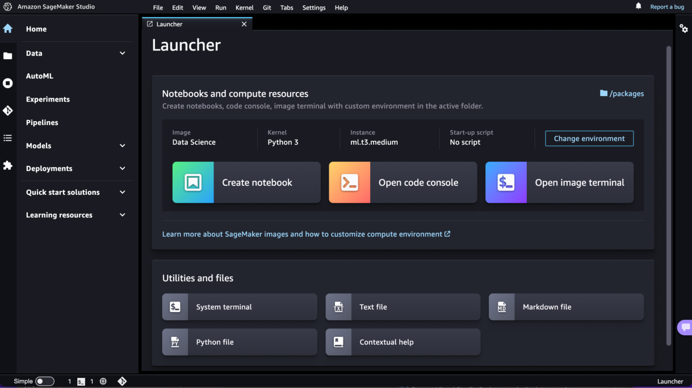

2.
In the Launcher, in the Notebooks and compute resources section, choose Change
environment.

3.
In the Change environment dialog, use the dropdown menus to select your Image from the
Custom Image section, and your Kernel, then choose Select.

4.
In the Launcher, choose Create notebook or Open image terminal. Your notebook or terminal
launches in the selected custom image and kernel.

To change your image or kernel in an open notebook, see Change the Image or a Kernel for an
Amazon SageMaker Studio Classic Notebook.

Note

If you encounter an error when launching the image, check your Amazon CloudWatch logs.

The name of the log group is /aws/sagemaker/studio. The name of the log stream is

$domainID/$userProfileName/KernelGateway/$appName.

Studio Classic
764

## Page 793

Amazon SageMaker AI
Developer Guide

Clean Up Resources for Custom Images in Amazon SageMaker Studio Classic

Important

As of November 30, 2023, the previous Amazon SageMaker Studio experience is now
named Amazon SageMaker Studio Classic. The following section is specific to using the
Studio Classic application. For information about using the updated Studio experience, see
Amazon SageMaker Studio.
Studio Classic is still maintained for existing workloads but is no longer available for
onboarding. You can only stop or delete existing Studio Classic applications and cannot
create new ones. We recommend that you migrate your workload to the new Studio
experience.

The following sections show how to clean up the resources you created in the previous sections
from the SageMaker AI console or AWS CLI. You perform the following steps to clean up the
resources:

• Detach the image and image versions from your domain.

• Delete the image, image version, and app image config.

• Delete the container image and repository from Amazon ECR. For more information, see Deleting
a repository.

Clean up resources from the SageMaker AI console

The following section shows how to clean up resources from the SageMaker AI console.

When you detach an image from a domain, all versions of the image are detached. When an image
is detached, all users of the domain lose access to the image versions. A running notebook that
has a kernel session on an image version when the version is detached, continues to run. When the
notebook is stopped or the kernel is shut down, the image version becomes unavailable.

To detach an image

1.
Open the Amazon SageMaker AI console at https://console.aws.amazon.com/sagemaker/.

2.
On the left navigation pane, choose Admin configurations.

3.
Under Admin configurations, choose Images.

Studio Classic
765

## Page 794

Amazon SageMaker AI
Developer Guide

4.
Under Custom SageMaker Studio Classic images attached to domain, choose the image and
then choose Detach.

5.
(Optional) To delete the image and all versions from SageMaker AI, select Also delete the
selected images .... This does not delete the associated container images from Amazon ECR.

6.
Choose Detach.

Clean up resources from the AWS CLI

The following section shows how to clean up resources from the AWS CLI.

To clean up resources

1.
Detach the image and image versions from your domain by passing an empty custom image

list to the domain. Open the default-user-settings.json file you created in Attach the

SageMaker image to your current domain. To detach the image and image version from a

shared space, open the default-space-settings.json file.

2.
Delete the custom images and then save the file.

"DefaultUserSettings": {
"KernelGatewayAppSettings": {
"CustomImages": [
],
...
},
...
}

3.
Use the domain ID and default user settings file to update your domain. To update your shared
space, use the default space settings file.

aws sagemaker update-domain \
--domain-id <d-xxxxxxxxxxxx> \
--cli-input-json file://default-user-settings.json

The response should look similar to the following.

{
"DomainArn": "arn:aws:sagemaker:us-east-2:acct-id:domain/d-xxxxxxxxxxxx"
}

Studio Classic
766

## Page 795

Amazon SageMaker AI
Developer Guide

4.
Delete the app image config.

aws sagemaker delete-app-image-config \
--app-image-config-name custom-image-config

5.
Delete the SageMaker image, which also deletes all image versions. The container images in
ECR that are represented by the image versions are not deleted.

aws sagemaker delete-image \
--image-name custom-image

Use Lifecycle Configurations to Customize Amazon SageMaker Studio Classic

Important

As of November 30, 2023, the previous Amazon SageMaker Studio experience is now
named Amazon SageMaker Studio Classic. The following section is specific to using the
Studio Classic application. For information about using the updated Studio experience, see
Amazon SageMaker Studio.
Studio Classic is still maintained for existing workloads but is no longer available for
onboarding. You can only stop or delete existing Studio Classic applications and cannot
create new ones. We recommend that you migrate your workload to the new Studio
experience.

Amazon SageMaker Studio Classic triggers lifecycle configurations shell scripts during
important lifecycle events, such as starting a new Studio Classic notebook. You can use lifecycle
configurations to automate customization for your Studio Classic environment. This customization
includes installing custom packages, configuring notebook extensions, preloading datasets, and
setting up source code repositories.

Using lifecycle configurations gives you flexibility and control to configure Studio Classic to
meet your specific needs. For example, you can use customized container images with lifecycle
configuration scripts to modify your environment. First, create a minimal set of base container
images, then install the most commonly used packages and libraries in those images. After you
have completed your images, use lifecycle configurations to install additional packages for specific
use cases. This gives you the flexibility to modify your environment across your data science and
machine learning teams based on need.

Studio Classic
767

## Page 796

Amazon SageMaker AI
Developer Guide

Users can only select lifecycle configuration scripts that they are given access to. While you
can give access to multiple lifecycle configuration scripts, you can also set default lifecycle
configuration scripts for resources. Based on the resource that the default lifecycle configuration is
set for, the default either runs automatically or is the first option shown.

For example lifecycle configuration scripts, see the Studio Classic Lifecycle Configuration examples
GitHub repository. For a blog on implementing lifecycle configuration, see Customize Amazon
SageMaker Studio Classic using Lifecycle Configurations.

Note

Each script has a limit of 16384 characters.

Topics

• Create and Associate a Lifecycle Configuration with Amazon SageMaker Studio Classic

• Set Default Lifecycle Configurations for Amazon SageMaker Studio Classic

• Debug Lifecycle Configurations in Amazon SageMaker Studio Classic

• Update and Detach Lifecycle Configurations in Amazon SageMaker Studio Classic

Create and Associate a Lifecycle Configuration with Amazon SageMaker Studio Classic

Important

As of November 30, 2023, the previous Amazon SageMaker Studio experience is now
named Amazon SageMaker Studio Classic. The following section is specific to using the
Studio Classic application. For information about using the updated Studio experience, see
Amazon SageMaker Studio.
Studio Classic is still maintained for existing workloads but is no longer available for
onboarding. You can only stop or delete existing Studio Classic applications and cannot
create new ones. We recommend that you migrate your workload to the new Studio
experience.

Amazon SageMaker AI provides interactive applications that enable Studio Classic's visual interface,
code authoring, and run experience. This series shows how to create a lifecycle configuration and
associate it with a SageMaker AI domain.

Studio Classic
768

## Page 797

Amazon SageMaker AI
Developer Guide

Application types can be either JupyterServer or KernelGateway.

• JupyterServer applications: This application type enables access to the visual interface
for Studio Classic. Every user and shared space in Studio Classic gets its own JupyterServer
application.

• KernelGateway applications: This application type enables access to the code run environment
and kernels for your Studio Classic notebooks and terminals. For more information, see Jupyter
Kernel Gateway.

For more information about Studio Classic's architecture and Studio Classic applications, see Use
Amazon SageMaker Studio Classic Notebooks.

Topics

• Create a Lifecycle Configuration from the AWS CLI for Amazon SageMaker Studio Classic

• Create a Lifecycle Configuration from the SageMaker AI Console for Amazon SageMaker Studio
Classic

Create a Lifecycle Configuration from the AWS CLI for Amazon SageMaker Studio Classic

Important

Custom IAM policies that allow Amazon SageMaker Studio or Amazon SageMaker Studio
Classic to create Amazon SageMaker resources must also grant permissions to add tags to
those resources. The permission to add tags to resources is required because Studio and
Studio Classic automatically tag any resources they create. If an IAM policy allows Studio
and Studio Classic to create resources but does not allow tagging, "AccessDenied" errors can
occur when trying to create resources. For more information, see Provide permissions for
tagging SageMaker AI resources.
AWS managed policies for Amazon SageMaker AI that give permissions to create
SageMaker resources already include permissions to add tags while creating those
resources.

Studio Classic
769

## Page 798

Amazon SageMaker AI
Developer Guide

Important

As of November 30, 2023, the previous Amazon SageMaker Studio experience is now
named Amazon SageMaker Studio Classic. The following section is specific to using the
Studio Classic application. For information about using the updated Studio experience, see
Amazon SageMaker Studio.
Studio Classic is still maintained for existing workloads but is no longer available for
onboarding. You can only stop or delete existing Studio Classic applications and cannot
create new ones. We recommend that you migrate your workload to the new Studio
experience.

The following topic shows how to create a lifecycle configuration using the AWS CLI to automate
customization for your Studio Classic environment.

Prerequisites

Before you begin, complete the following prerequisites:

• Update the AWS CLI by following the steps in Installing the current AWS CLI Version.

• From your local machine, run aws configure and provide your AWS credentials. For
information about AWS credentials, see Understanding and getting your AWS credentials.

• Onboard to SageMaker AI domain by following the steps in Amazon SageMaker AI domain
overview.

Step 1: Create a lifecycle configuration

The following procedure shows how to create a lifecycle configuration script that prints Hello

World.

Note

Each script can have up to 16,384 characters.

1.
From your local machine, create a file named my-script.sh with the following content.

#!/bin/bash

Studio Classic
770

## Page 799

Amazon SageMaker AI
Developer Guide

set -eux
echo 'Hello World!'

2.
Convert your my-script.sh file into base64 format. This requirement prevents errors that
occur from spacing and line break encoding.

LCC_CONTENT=`openssl base64 -A -in my-script.sh`

3.
Create a lifecycle configuration for use with Studio Classic. The following command creates a

lifecycle configuration that runs when you launch an associated KernelGateway application.

aws sagemaker create-studio-lifecycle-config \
--region region \
--studio-lifecycle-config-name my-studio-lcc \
--studio-lifecycle-config-content $LCC_CONTENT \
--studio-lifecycle-config-app-type KernelGateway

Note the ARN of the newly created lifecycle configuration that is returned. This ARN is required
to attach the lifecycle configuration to your application.

Step 2: Attach the lifecycle configuration to your domain, user profile, or shared space

To attach the lifecycle configuration, you must update the UserSettings for your domain or

user profile, or the SpaceSettings for a shared space. Lifecycle configuration scripts that are
associated at the domain level are inherited by all users. However, scripts that are associated at the
user profile level are scoped to a specific user, while scripts that are associated at the shared space
level are scoped to the shared space.

The following example shows how to create a new user profile with the lifecycle configuration
attached. You can also create a new domain or space with a lifecycle configuration attached by
using the create-domain and create-space commands, respectively.

Add the lifecycle configuration ARN from the previous step to the settings for the appropriate app

type. For example, place it in the JupyterServerAppSettings of the user. You can add multiple
lifecycle configurations at the same time by passing a list of lifecycle configurations. When a user
launches a JupyterServer application with the AWS CLI, they can pass a lifecycle configuration to
use instead of the default. The lifecycle configuration that the user passes must belong to the list

of lifecycle configurations in JupyterServerAppSettings.

# Create a new UserProfile

Studio Classic
771

## Page 800

Amazon SageMaker AI
Developer Guide

aws sagemaker create-user-profile --domain-id domain-id \
--user-profile-name user-profile-name \
--region region \
--user-settings '{
"JupyterServerAppSettings": {
"LifecycleConfigArns":
[lifecycle-configuration-arn-list]
}
}'

The following example shows how to update an existing shared space to attach the lifecycle
configuration. You can also update an existing domain or user profile with a lifecycle configuration
attached by using the update-domain or update-user-profile command. When you update the list
of lifecycle configurations attached, you must pass all lifecycle configurations as part of the list. If a
lifecycle configuration is not part of this list, it will not be attached to the application.

aws sagemaker update-space --domain-id domain-id \
--space-name space-name \
--region region \
--space-settings '{
"JupyterServerAppSettings": {
"LifecycleConfigArns":
[lifecycle-configuration-arn-list]
}
}'

For information about setting a default lifecycle configuration for a resource, see Set Default
Lifecycle Configurations for Amazon SageMaker Studio Classic.

Step 3: Launch application with lifecycle configuration

After you attach a lifecycle configuration to a domain, user profile, or space, the user can select
it when launching an application with the AWS CLI. This section describes how to launch an
application with an attached lifecycle configuration. For information about changing the default
lifecycle configuration after launching a JupyterServer application, see Set Default Lifecycle
Configurations for Amazon SageMaker Studio Classic.

Launch the desired application type using the create-app command and specify the lifecycle

configuration ARN in the resource-spec argument.

Studio Classic
772

## Page 801

Amazon SageMaker AI
Developer Guide

• The following example shows how to create a JupyterServer application with an associated

lifecycle configuration. When creating the JupyterServer, the app-name must be default.

The lifecycle configuration ARN passed as part of the resource-spec parameter must be part

of the list of lifecycle configuration ARNs specified in UserSettings for your domain or user

profile, or SpaceSettings for a shared space.

aws sagemaker create-app --domain-id domain-id \
--region region \
--user-profile-name user-profile-name \
--app-type JupyterServer \
--resource-spec LifecycleConfigArn=lifecycle-configuration-arn \
--app-name default

• The following example shows how to create a KernelGateway application with an associated
lifecycle configuration.

aws sagemaker create-app --domain-id domain-id \
--region region \
--user-profile-name user-profile-name \
--app-type KernelGateway \
--resource-spec LifecycleConfigArn=lifecycle-configuration-
arn,SageMakerImageArn=sagemaker-image-arn,InstanceType=instance-type \
--app-name app-name

Create a Lifecycle Configuration from the SageMaker AI Console for Amazon SageMaker Studio
Classic

Important

Custom IAM policies that allow Amazon SageMaker Studio or Amazon SageMaker Studio
Classic to create Amazon SageMaker resources must also grant permissions to add tags to
those resources. The permission to add tags to resources is required because Studio and
Studio Classic automatically tag any resources they create. If an IAM policy allows Studio
and Studio Classic to create resources but does not allow tagging, "AccessDenied" errors can
occur when trying to create resources. For more information, see Provide permissions for
tagging SageMaker AI resources.

Studio Classic
773

## Page 802

Amazon SageMaker AI
Developer Guide

AWS managed policies for Amazon SageMaker AI that give permissions to create
SageMaker resources already include permissions to add tags while creating those
resources.

Important

As of November 30, 2023, the previous Amazon SageMaker Studio experience is now
named Amazon SageMaker Studio Classic. The following section is specific to using the
Studio Classic application. For information about using the updated Studio experience, see
Amazon SageMaker Studio.
Studio Classic is still maintained for existing workloads but is no longer available for
onboarding. You can only stop or delete existing Studio Classic applications and cannot
create new ones. We recommend that you migrate your workload to the new Studio
experience.

The following topic shows how to create a lifecycle configuration from the Amazon SageMaker AI
console to automate customization for your Studio Classic environment.

Prerequisites

Before you can begin this tutorial, complete the following prerequisite:

• Onboard to Amazon SageMaker Studio Classic. For more information, see Onboard to Amazon
SageMaker Studio Classic.

Step 1: Create a new lifecycle configuration

You can create a lifecycle configuration by entering a script from the Amazon SageMaker AI
console.

Note

Each script can have up to 16,384 characters.

The following procedure shows how to create a lifecycle configuration script that prints Hello

World.

Studio Classic
774

## Page 803

Amazon SageMaker AI
Developer Guide

1.
Open the Amazon SageMaker AI console at https://console.aws.amazon.com/sagemaker/.

2.
On the left navigation pane, choose Admin configurations.

3.
Under Admin configurations, choose Lifecycle configurations.

4.
Choose the Studio tab.

5.
Choose Create configuration.

6.
Under Select configuration type, select the type of application that the lifecycle configuration
should be attached to. For more information about selecting which application to attach the
lifecycle configuration to, see Set Default Lifecycle Configurations for Amazon SageMaker
Studio Classic.

7.
Choose Next.

8.
In the section called Configuration settings, enter a name for your lifecycle configuration.

9.
In the Scripts section, enter the following content.

#!/bin/bash
set -eux
echo 'Hello World!'

10. (Optional) Create a tag for your lifecycle configuration.

11. Choose Submit.

Step 2: Attach the lifecycle configuration to a domain or user profile

Lifecycle configuration scripts associated at the domain level are inherited by all users. However,
scripts that are associated at the user profile level are scoped to a specific user.

You can attach multiple lifecycle configurations to a domain or user profile for both JupyterServer
and KernelGateway applications.

Note

To attach a lifecycle configuration to a shared space, you must use the AWS CLI. For more
information, see Create a Lifecycle Configuration from the AWS CLI for Amazon SageMaker
Studio Classic.

The following sections show how to attach a lifecycle configuration to your domain or user profile.

Studio Classic
775

## Page 804

Amazon SageMaker AI
Developer Guide

Attach to a domain

The following shows how to attach a lifecycle configuration to your existing domain from the
SageMaker AI console.

1.
Open the Amazon SageMaker AI console at https://console.aws.amazon.com/sagemaker/.

2.
On the left navigation pane, choose Admin configurations.

3.
Under Admin configurations, choose domains.

4.
From the list of domains, select the domain to attach the lifecycle configuration to.

5.
From the Domain details, choose the Environment tab.

6.
Under Lifecycle configurations for personal Studio apps, choose Attach.

7.
Under Source, choose Existing configuration.

8.
Under Studio lifecycle configurations, select the lifecycle configuration that you created in
the previous step.

9.
Select Attach to domain.

Attach to your user profile

The following shows how to attach a lifecycle configuration to your existing user profile.

1.
Open the Amazon SageMaker AI console at https://console.aws.amazon.com/sagemaker/.

2.
On the left navigation pane, choose Admin configurations.

3.
Under Admin configurations, choose domains.

4.
From the list of domains, select the domain that contains the user profile to attach the
lifecycle configuration to.

5.
Under User profiles, select the user profile.

6.
From the User Details page, choose Edit.

7.
On the left navigation, choose Studio settings.

8.
Under Lifecycle configurations attached to user, choose Attach.

9.
Under Source, choose Existing configuration.

10. Under Studio lifecycle configurations, select the lifecycle configuration that you created in

the previous step.

11. Choose Attach to user profile.

Studio Classic
776

## Page 805

Amazon SageMaker AI
Developer Guide

Step 3: Launch an application with the lifecycle configuration

After you attach a lifecycle configuration to a domain or user profile, you can launch an application
with that attached lifecycle configuration. Choosing which lifecycle configuration to launch with
depends on the application type.

• JupyterServer: When launching a JupyterServer application from the console, SageMaker
AI always uses the default lifecycle configuration. You can't use a different lifecycle
configuration when launching from the console. For information about changing the default
lifecycle configuration after launching a JupyterServer application, see Set Default Lifecycle
Configurations for Amazon SageMaker Studio Classic.

To select a different attached lifecycle configuration, you must launch with the AWS CLI. For
more information about launching a JupyterServer application with an attached lifecycle
configuration from the AWS CLI, see Create a Lifecycle Configuration from the AWS CLI for

Amazon SageMaker Studio Classic.

• KernelGateway: You can select any of the attached lifecycle configurations when launching a
KernelGateway application using the Studio Classic Launcher.

The following procedure describes how to launch a KernelGateway application with an attached
lifecycle configuration from the SageMaker AI console.

1.
Open the Amazon SageMaker AI console at https://console.aws.amazon.com/sagemaker/.

2.
Launch Studio Classic. For more information, see Launch Amazon SageMaker Studio Classic.

3.
In the Studio Classic UI, open the Studio Classic Launcher. For more information, see Use the
Amazon SageMaker Studio Classic Launcher.

4.
In the Studio Classic Launcher, navigate to the Notebooks and compute resources section.

5.
Click the Change environment button.

6.
On the Change environment dialog, use the dropdown menus to select your Image, Kernel,
Instance type, and a Start-up script. If there is no default lifecycle configuration, the Start-

up script value defaults to No script. Otherwise, the Start-up script value is your default
lifecycle configuration. After you select a lifecycle configuration, you can view the entire script.

7.
Click Select.

8.
Back to the Launcher, click the Create notebook to launch a new notebook kernel with your
selected image and lifecycle configuration.

Studio Classic
777

## Page 806

Amazon SageMaker AI
Developer Guide

Step 4: View logs for a lifecycle configuration

You can view the logs for your lifecycle configuration after it has been attached to a domain or user
profile.

1.
First, provide access to CloudWatch for your AWS Identity and Access Management (IAM) role.
Add read permissions for the following log group and log stream.

• Log group:/aws/sagemaker/studio

• Log stream:domain/user-profile/app-type/app-name/LifecycleConfigOnStart

For information about adding permissions, see Enabling logging from certain AWS services.

2.
From within Studio Classic, navigate to the Running Terminals and Kernels icon

(

)
to monitor your lifecycle configuration.

3.
Select an application from the list of running applications. Applications
with attached lifecycle configurations have an attached indicator icon

.

4.
Select the indicator icon for your application. This opens a new panel that lists the lifecycle
configuration.

5.
From the new panel, select View logs. This opens a new tab that displays the logs.

Set Default Lifecycle Configurations for Amazon SageMaker Studio Classic

Important

As of November 30, 2023, the previous Amazon SageMaker Studio experience is now
named Amazon SageMaker Studio Classic. The following section is specific to using the
Studio Classic application. For information about using the updated Studio experience, see
Amazon SageMaker Studio.
Studio Classic is still maintained for existing workloads but is no longer available for
onboarding. You can only stop or delete existing Studio Classic applications and cannot
create new ones. We recommend that you migrate your workload to the new Studio
experience.

Studio Classic
778

## Page 807

Amazon SageMaker AI
Developer Guide

Although you can attach multiple lifecycle configuration scripts to a single resource, you can only
set one default lifecycle configuration for each JupyterServer or KernelGateway application. The
behavior of the default lifecycle configuration depends on whether it is set for JupyterServer or
KernelGateway apps.

• JupyterServer apps: When set as the default lifecycle configuration script for JupyterServer
apps, the lifecycle configuration script runs automatically when the user signs in to Studio
Classic for the first time or restarts Studio Classic. Use this default lifecycle configuration to
automate one-time setup actions for the Studio Classic developer environment, such as installing
notebook extensions or setting up a GitHub repo. For an example of this, see Customize Amazon
SageMaker Studio using Lifecycle Configurations.

• KernelGateway apps: When set as the default lifecycle configuration script for KernelGateway
apps, the lifecycle configuration is selected by default in the Studio Classic launcher. Users can
launch a notebook or terminal with the default script selected, or they can select a different one
from the list of lifecycle configurations.

SageMaker AI supports setting a default lifecycle configuration for the following resources:

• Domains

• User profiles

• Shared spaces

While domains and user profiles support setting a default lifecycle configuration from both the
Amazon SageMaker AI console and AWS Command Line Interface, shared spaces only support
setting a default lifecycle configuration from the AWS CLI.

You can set a lifecycle configuration as the default when creating a new resource or updating an
existing resource. The following topics demonstrate how to set a default lifecycle configuration
using the SageMaker AI console and AWS CLI.

Default lifecycle configuration inheritance

Default lifecycle configurations set at the domain level are inherited by all users and shared spaces.
Default lifecycle configurations set at the user and shared space level are scoped to only that user
or shared space. User and space defaults override defaults set at the domain level.

A default KernelGateway lifecycle configuration set for a domain applies to all KernelGateway
applications launched in the domain. Unless the user selects a different lifecycle configuration from

Studio Classic
779

## Page 808

Amazon SageMaker AI
Developer Guide

the list presented in the Studio Classic launcher, the default lifecycle configuration is used. The

default script also runs if No Script is selected by the user. For more information about selecting
a script, see Step 3: Launch an application with the lifecycle configuration.

Topics

• Set Defaults from the AWS CLI for Amazon SageMaker Studio Classic

• Set Defaults from the SageMaker AI Console for Amazon SageMaker Studio Classic

Set Defaults from the AWS CLI for Amazon SageMaker Studio Classic

Important

Custom IAM policies that allow Amazon SageMaker Studio or Amazon SageMaker Studio
Classic to create Amazon SageMaker resources must also grant permissions to add tags to

those resources. The permission to add tags to resources is required because Studio and
Studio Classic automatically tag any resources they create. If an IAM policy allows Studio
and Studio Classic to create resources but does not allow tagging, "AccessDenied" errors can
occur when trying to create resources. For more information, see Provide permissions for
tagging SageMaker AI resources.
AWS managed policies for Amazon SageMaker AI that give permissions to create
SageMaker resources already include permissions to add tags while creating those
resources.

Important

As of November 30, 2023, the previous Amazon SageMaker Studio experience is now
named Amazon SageMaker Studio Classic. The following section is specific to using the
Studio Classic application. For information about using the updated Studio experience, see
Amazon SageMaker Studio.
Studio Classic is still maintained for existing workloads but is no longer available for
onboarding. You can only stop or delete existing Studio Classic applications and cannot
create new ones. We recommend that you migrate your workload to the new Studio
experience.

You can set default lifecycle configuration scripts from the AWS CLI for the following resources:

Studio Classic
780

## Page 809

Amazon SageMaker AI
Developer Guide

• Domains

• User profiles

• Shared spaces

The following sections outline how to set default lifecycle configuration scripts from the AWS CLI.

Topics

• Prerequisites

• Set a default lifecycle configuration when creating a new resource

• Set a default lifecycle configuration for an existing resource

Prerequisites

Before you begin, complete the following prerequisites:

• Update the AWS CLI by following the steps in Installing the current AWS CLI version.

• From your local machine, run aws configure and provide your AWS credentials. For
information about AWS credentials, see Understanding and getting your AWS credentials.

• Onboard to SageMaker AI domain by following the steps in Amazon SageMaker AI domain
overview.

• Create a lifecycle configuration following the steps in Create and Associate a Lifecycle
Configuration with Amazon SageMaker Studio Classic.

Set a default lifecycle configuration when creating a new resource

To set a default lifecycle configuration when creating a new domain, user profile, or space, pass
the ARN of your previously created lifecycle configuration as part of one of the following AWS CLI
commands:

• create-user-profile

• create-domain

• create-space

You must pass the lifecycle configuration ARN for the following values in the KernelGateway or
JupyterServer default settings:

Studio Classic
781

## Page 810

Amazon SageMaker AI
Developer Guide

• DefaultResourceSpec:LifecycleConfigArn - This specifies the default lifecycle
configuration for the application type.

• LifecycleConfigArns - This is the list of all lifecycle configurations attached to the

application type. The default lifecycle configuration must also be part of this list.

For example, the following API call creates a new user profile with a default lifecycle configuration.

aws sagemaker create-user-profile --domain-id domain-id \
--user-profile-name user-profile-name \
--region region \
--user-settings '{
"KernelGatewayAppSettings": {
"DefaultResourceSpec": {
"InstanceType": "ml.t3.medium",
"LifecycleConfigArn": "lifecycle-configuration-arn"
},
"LifecycleConfigArns": [lifecycle-configuration-arn-list]
}
}'

Set a default lifecycle configuration for an existing resource

To set or update the default lifecycle configuration for an existing resource, pass the ARN of your
previously created lifecycle configuration as part of one of the following AWS CLI commands:

• update-user-profile

• update-domain

• update-space

You must pass the lifecycle configuration ARN for the following values in the KernelGateway or
JupyterServer default settings:

• DefaultResourceSpec:LifecycleConfigArn - This specifies the default lifecycle
configuration for the application type.

• LifecycleConfigArns - This is the list of all lifecycle configurations attached to the
application type. The default lifecycle configuration must also be part of this list.

Studio Classic
782

## Page 811

Amazon SageMaker AI
Developer Guide

For example, the following API call updates a user profile with a default lifecycle configuration.

aws sagemaker update-user-profile --domain-id domain-id \
--user-profile-name user-profile-name \
--region region \
--user-settings '{
"KernelGatewayAppSettings": {
"DefaultResourceSpec": {
"InstanceType": "ml.t3.medium",
"LifecycleConfigArn": "lifecycle-configuration-arn"
},
"LifecycleConfigArns": [lifecycle-configuration-arn-list]
}
}'

The following API call updates a domain to set a new default lifecycle configuration.

aws sagemaker update-domain --domain-id domain-id \
--region region \
--default-user-settings '{
"JupyterServerAppSettings": {
"DefaultResourceSpec": {
"InstanceType": "system",
"LifecycleConfigArn": "lifecycle-configuration-arn"
},
"LifecycleConfigArns": [lifecycle-configuration-arn-list]
}
}'

Set Defaults from the SageMaker AI Console for Amazon SageMaker Studio Classic

Important

Custom IAM policies that allow Amazon SageMaker Studio or Amazon SageMaker Studio
Classic to create Amazon SageMaker resources must also grant permissions to add tags to
those resources. The permission to add tags to resources is required because Studio and
Studio Classic automatically tag any resources they create. If an IAM policy allows Studio
and Studio Classic to create resources but does not allow tagging, "AccessDenied" errors can
occur when trying to create resources. For more information, see Provide permissions for
tagging SageMaker AI resources.

Studio Classic
783

## Page 812

Amazon SageMaker AI
Developer Guide

AWS managed policies for Amazon SageMaker AI that give permissions to create
SageMaker resources already include permissions to add tags while creating those
resources.

Important

As of November 30, 2023, the previous Amazon SageMaker Studio experience is now
named Amazon SageMaker Studio Classic. The following section is specific to using the
Studio Classic application. For information about using the updated Studio experience, see
Amazon SageMaker Studio.
Studio Classic is still maintained for existing workloads but is no longer available for
onboarding. You can only stop or delete existing Studio Classic applications and cannot
create new ones. We recommend that you migrate your workload to the new Studio
experience.

You can set default lifecycle configuration scripts from the SageMaker AI console for the following
resources.

• Domains

• User profiles

You cannot set default lifecycle configuration scripts for shared spaces from the SageMaker AI
console. For information about setting defaults for shared spaces, see Set Defaults from the AWS
CLI for Amazon SageMaker Studio Classic.

The following sections outline how to set default lifecycle configuration scripts from the
SageMaker AI console.

Topics

• Prerequisites

• Set a default lifecycle configuration for a domain

• Set a default lifecycle configuration for a user profile

Studio Classic
784

## Page 813

Amazon SageMaker AI
Developer Guide

Prerequisites

Before you begin, complete the following prerequisites:

• Onboard to SageMaker AI domain by following the steps in Amazon SageMaker AI domain
overview.

• Create a lifecycle configuration following the steps in Create and Associate a Lifecycle
Configuration with Amazon SageMaker Studio Classic.

Set a default lifecycle configuration for a domain

The following procedure shows how to set a default lifecycle configuration for a domain from the
SageMaker AI console.

1.
Open the Amazon SageMaker AI console at https://console.aws.amazon.com/sagemaker/.

2.
From the list of domains, select the name of the domain to set the default lifecycle
configuration for.

3.
From the Domain details page, choose the Environment tab.

4.
Under Lifecycle configurations for personal Studio apps, select the lifecycle configuration
that you want to set as the default for the domain. You can set distinct defaults for
JupyterServer and KernelGateway applications.

5.
Choose Set as default. This opens a pop up window that lists the current defaults for
JupyterServer and KernelGateway applications.

6.
Choose Set as default to set the lifecycle configuration as the default for its respective
application type.

Set a default lifecycle configuration for a user profile

The following procedure shows how to set a default lifecycle configuration for a user profile from
the SageMaker AI console.

1.
Open the Amazon SageMaker AI console at https://console.aws.amazon.com/sagemaker/.

2.
From the list of domains, select the name of the domain that contains the user profile that you
want to set the default lifecycle configuration for.

3.
From the Domain details page, choose the User profiles tab.

Studio Classic
785

## Page 814

Amazon SageMaker AI
Developer Guide

4.
Select the name of the user profile to set the default lifecycle configuration for. This opens a
User Details page.

5.
From the User Details page, choose Edit. This opens an Edit user profile page.

6.
From the Edit user profile page, choose Step 2 Studio settings.

7.
Under Lifecycle configurations attached to user, select the lifecycle configuration that you
want to set as the default for the user profile. You can set distinct defaults for JupyterServer
and KernelGateway applications.

8.
Choose Set as default. This opens a pop up window that lists the current defaults for
JupyterServer and KernelGateway applications.

9.
Choose Set as default to set the lifecycle configuration as the default for its respective
application type.

Debug Lifecycle Configurations in Amazon SageMaker Studio Classic

Important

As of November 30, 2023, the previous Amazon SageMaker Studio experience is now
named Amazon SageMaker Studio Classic. The following section is specific to using the
Studio Classic application. For information about using the updated Studio experience, see
Amazon SageMaker Studio.
Studio Classic is still maintained for existing workloads but is no longer available for
onboarding. You can only stop or delete existing Studio Classic applications and cannot
create new ones. We recommend that you migrate your workload to the new Studio
experience.

The following topics show how to get information about and debug your lifecycle configurations.

Topics

• Verify lifecycle configuration process from CloudWatch Logs

• JupyterServer app failure

• KernelGateway app failure

• Lifecycle configuration timeout

Studio Classic
786

## Page 815

Amazon SageMaker AI
Developer Guide

Verify lifecycle configuration process from CloudWatch Logs

Lifecycle configurations only log STDOUT and STDERR.

STDOUT is the default output for bash scripts. You can write to STDERR by appending >&2 to the

end of a bash command. For example, echo 'hello'>&2.

Logs for your lifecycle configurations are published to your AWS account using Amazon

CloudWatch. These logs can be found in the /aws/sagemaker/studio log stream in the
CloudWatch console.

1.
Open the CloudWatch console at https://console.aws.amazon.com/cloudwatch/.

2.
Choose Logs from the left side. From the dropdown menu, select Log groups.

3.
On the Log groups page, search for aws/sagemaker/studio.

4.
Select the log group.

5.
On the Log group details page, choose the Log streams tab.

6.
To find the logs for a specific app, search the log streams using the following format:

domain-id/space-name/app-type/default/LifecycleConfigOnStart

For example, to find the lifecycle configuration logs for domain d-m85lcu8vbqmz, space

name i-sonic-js, and application type JupyterLab, use the following search string:

d-m85lcu8vbqmz/i-sonic-js/JupyterLab/default/LifecycleConfigOnStart

JupyterServer app failure

If your JupyterServer app crashes because of an issue with the attached lifecycle configuration,
Studio Classic displays the following error message on the Studio Classic startup screen.

Failed to create SageMaker Studio due to start-up script failure

Select the View script logs link to view the CloudWatch logs for your JupyterServer app.

In the case where the faulty lifecycle configuration is specified in the DefaultResourceSpec
of your domain, user profile, or shared space, Studio Classic continues to use the lifecycle
configuration even after restarting Studio Classic.

Studio Classic
787

## Page 816

Amazon SageMaker AI
Developer Guide

To resolve this error, follow the steps in Set Default Lifecycle Configurations for
Amazon SageMaker Studio Classic to remove the lifecycle configuration script from the

DefaultResourceSpec or select another script as the default. Then launch a new JupyterServer
app.

KernelGateway app failure

If your KernelGateway app crashes because of an issue with the attached lifecycle configuration,
Studio Classic displays the error message in your Studio Classic Notebook.

Choose View script logs to view the CloudWatch logs for your KernelGateway app.

In this case, your lifecycle configuration is specified in the Studio Classic Launcher when launching
a new Studio Classic Notebook.

To resolve this error, use the Studio Classic launcher to select a different lifecycle configuration or

select No script.

Note

A default KernelGateway lifecycle configuration specified in DefaultResourceSpec
applies to all KernelGateway images in the domain, user profile, or shared space unless
the user selects a different script from the list presented in the Studio Classic launcher.

The default script also runs if No Script is selected by the user. For more information on
selecting a script, see Step 3: Launch an application with the lifecycle configuration.

Lifecycle configuration timeout

There is a lifecycle configuration timeout limitation of 5 minutes. If a lifecycle configuration script
takes longer than 5 minutes to run, Studio Classic throws an error.

To resolve this error, ensure that your lifecycle configuration script completes in less than 5
minutes.

To help decrease the run time of scripts, try the following:

• Cut down on necessary steps. For example, limit which conda environments to install large
packages in.

Studio Classic
788

## Page 817

Amazon SageMaker AI
Developer Guide

• Run tasks in parallel processes.

• Use the nohup command in your script to ensure that hangup signals are ignored and do not
stop the execution of the script.

Update and Detach Lifecycle Configurations in Amazon SageMaker Studio Classic

Important

As of November 30, 2023, the previous Amazon SageMaker Studio experience is now
named Amazon SageMaker Studio Classic. The following section is specific to using the
Studio Classic application. For information about using the updated Studio experience, see
Amazon SageMaker Studio.
Studio Classic is still maintained for existing workloads but is no longer available for
onboarding. You can only stop or delete existing Studio Classic applications and cannot
create new ones. We recommend that you migrate your workload to the new Studio
experience.

A lifecycle configuration script can't be changed after it's created. To update your script, you must
create a new lifecycle configuration script and attach it to the respective domain, user profile, or
shared space. For more information about creating and attaching the lifecycle configuration, see
Create and Associate a Lifecycle Configuration with Amazon SageMaker Studio Classic.

The following topic shows how to detach a lifecycle configuration using the AWS CLI and
SageMaker AI console.

Topics

• Prerequisites

• Detach using the AWS CLI

Prerequisites

Before detaching a lifecycle configuration, you must complete the following prerequisite.

• To successfully detach a lifecycle configuration, no running application can be using the lifecycle
configuration. You must first shut down the running applications as shown in Shut Down and
Update Amazon SageMaker Studio Classic and Apps.

Studio Classic
789

## Page 818

Amazon SageMaker AI
Developer Guide

Detach using the AWS CLI

To detach a lifecycle configuration using the AWS CLI, remove the desired lifecycle configuration
from the list of lifecycle configurations attached to the resource and pass the list as part of the
respective command:

• update-user-profile

• update-domain

• update-space

For example, the following command removes all lifecycle configurations for KernelGateways
attached to the domain.

aws sagemaker update-domain --domain-id domain-id \

--region region \
--default-user-settings '{
"KernelGatewayAppSettings": {
"LifecycleConfigArns":
[]
}
}'

Attach Suggested Git Repos to Amazon SageMaker Studio Classic

Important

As of November 30, 2023, the previous Amazon SageMaker Studio experience is now
named Amazon SageMaker Studio Classic. The following section is specific to using the
Studio Classic application. For information about using the updated Studio experience, see
Amazon SageMaker Studio.
Studio Classic is still maintained for existing workloads but is no longer available for
onboarding. You can only stop or delete existing Studio Classic applications and cannot
create new ones. We recommend that you migrate your workload to the new Studio
experience.

Amazon SageMaker Studio Classic offers a Git extension for you to enter the URL of a Git
repository (repo), clone it into your environment, push changes, and view commit history. In

Studio Classic
790

## Page 819

Amazon SageMaker AI
Developer Guide

addition to this Git extension, you can also attach suggested Git repository URLs at the Amazon
SageMaker AI domain or user profile level. Then, you can select the repo URL from the list of
suggestions and clone that into your environment using the Git extension in Studio Classic.

The following topics show how to attach Git repo URLs to a domain or user profile from the AWS
CLI and SageMaker AI console. You'll also learn how to detach these repository URLs.

Topics

• Attach a Git Repository from the AWS CLI for Amazon SageMaker Studio Classic

• Attach a Git Repository from the SageMaker AI Console for Amazon SageMaker Studio Classic

• Detach Git Repos from Amazon SageMaker Studio Classic

Attach a Git Repository from the AWS CLI for Amazon SageMaker Studio Classic

Important

As of November 30, 2023, the previous Amazon SageMaker Studio experience is now
named Amazon SageMaker Studio Classic. The following section is specific to using the
Studio Classic application. For information about using the updated Studio experience, see
Amazon SageMaker Studio.
Studio Classic is still maintained for existing workloads but is no longer available for
onboarding. You can only stop or delete existing Studio Classic applications and cannot
create new ones. We recommend that you migrate your workload to the new Studio
experience.

The following topic shows how to attach a Git repository URL using the AWS CLI, so that Amazon
SageMaker Studio Classic automatically suggests it for cloning. After you attach the Git repository
URL, you can clone it by following the steps in Clone a Git Repository in Amazon SageMaker Studio
Classic.

Prerequisites

Before you begin, complete the following prerequisites:

• Update the AWS CLI by following the steps in Installing the current AWS CLI Version.

• From your local machine, run aws configure and provide your AWS credentials. For
information about AWS credentials, see Understanding and getting your AWS credentials.

Studio Classic
791

## Page 820

Amazon SageMaker AI
Developer Guide

• Onboard to Amazon SageMaker AI domain. For more information, see Amazon SageMaker AI
domain overview.

Attach the Git repo to a domain or user profile

Git repo URLs associated at the domain level are inherited by all users. However, Git repo URLs that
are associated at the user profile level are scoped to a specific user. You can attach multiple Git
repo URLs to a domain or user profile by passing a list of repository URLs.

The following sections show how to attach a Git repo URL to your domain and user profile.

Attach to a domain

The following command attaches a Git repo URL to an existing domain.

aws sagemaker update-domain --region region --domain-id domain-id \
--default-user-settings
JupyterServerAppSettings={CodeRepositories=[{RepositoryUrl="repository"}]}

Attach to a user profile

The following shows how to attach a Git repo URL to an existing user profile.

aws sagemaker update-user-profile --domain-id domain-id --user-profile-name user-name\
--user-settings
JupyterServerAppSettings={CodeRepositories=[{RepositoryUrl="repository"}]}

Attach a Git Repository from the SageMaker AI Console for Amazon SageMaker Studio Classic

Important

As of November 30, 2023, the previous Amazon SageMaker Studio experience is now
named Amazon SageMaker Studio Classic. The following section is specific to using the
Studio Classic application. For information about using the updated Studio experience, see
Amazon SageMaker Studio.
Studio Classic is still maintained for existing workloads but is no longer available for
onboarding. You can only stop or delete existing Studio Classic applications and cannot
create new ones. We recommend that you migrate your workload to the new Studio
experience.

Studio Classic
792

## Page 821

Amazon SageMaker AI
Developer Guide

The following topic shows how to associate a Git repository URL from the Amazon SageMaker AI
console to clone it in your Studio Classic environment. After you associate the Git repository URL,
you can clone it by following the steps in Clone a Git Repository in Amazon SageMaker Studio
Classic.

Prerequisites

Before you can begin this tutorial, you must onboard to Amazon SageMaker AI domain. For more
information, see Amazon SageMaker AI domain overview.

Attach the Git repo to a domain or user profile

Git repo URLs associated at the domain level are inherited by all users. However, Git repo URL that
are associated at the user profile level are scoped to a specific user.

The following sections show how to attach a Git repo URL to a domain and user profile.

Attach to a domain

To attach a Git repo URL to an existing domain

1.
Open the Amazon SageMaker AI console at https://console.aws.amazon.com/sagemaker/.

2.
On the left navigation pane, choose Admin configurations.

3.
Under Admin configurations, choose domains.

4.
Select the domain to attach the Git repo to.

5.
On the domain details page, choose the Environment tab.

6.
On the Suggested code repositories for the domain tab, choose Attach.

7.
Under Source, enter the Git repository URL.

8.
Select Attach to domain.

Attach to a user profile

The following shows how to attach a Git repository URL to an existing user profile.

To attach a Git repository URL to a user profile

1.
Open the Amazon SageMaker AI console at https://console.aws.amazon.com/sagemaker/.

2.
On the left navigation pane, choose Admin configurations.

Studio Classic
793

## Page 822

Amazon SageMaker AI
Developer Guide

3.
Under Admin configurations, choose domains.

4.
Select the domain that includes the user profile to attach the Git repo to.

5.
On the domain details page, choose the User profiles tab.

6.
Select the user profile to attach the Git repo URL to.

7.
On the User details page, choose Edit.

8.
On the Studio settings page, choose Attach from the Suggested code repositories for the
user section.

9.
Under Source, enter the Git repository URL.

10. Choose Attach to user.

Detach Git Repos from Amazon SageMaker Studio Classic

Important

As of November 30, 2023, the previous Amazon SageMaker Studio experience is now
named Amazon SageMaker Studio Classic. The following section is specific to using the
Studio Classic application. For information about using the updated Studio experience, see
Amazon SageMaker Studio.
Studio Classic is still maintained for existing workloads but is no longer available for
onboarding. You can only stop or delete existing Studio Classic applications and cannot
create new ones. We recommend that you migrate your workload to the new Studio
experience.

This guide shows how to detach Git repository URLs from an Amazon SageMaker AI domain or user
profile using the AWS CLI or Amazon SageMaker AI console.

Topics

• Detach a Git repo using the AWS CLI

• Detach the Git repo using the SageMaker AI console

Detach a Git repo using the AWS CLI

To detach all Git repo URLs from a domain or user profile, you must pass an empty list of code

repositories. This list is passed as part of the JupyterServerAppSettings parameter in an

Studio Classic
794

## Page 823

Amazon SageMaker AI
Developer Guide

update-domain or update-user-profile command. To detach only one Git repo URL, pass
the code repositories list without the desired Git repo URL. This section shows how to detach all Git
repo URLs from your domain or user profile using the AWS Command Line Interface (AWS CLI).

Detach from a domain

The following command detaches all Git repo URLs from a domain.

aws sagemaker update-domain --region region --domain-name domain-name \
--domain-settings JupyterServerAppSettings={CodeRepositories=[]}

Detach from a user profile

The following command detaches all Git repo URLs from a user profile.

aws sagemaker update-user-profile --domain-name domain-name --user-profile-name user-
name\
--user-settings JupyterServerAppSettings={CodeRepositories=[]}

Detach the Git repo using the SageMaker AI console

The following sections show how to detach a Git repo URL from a domain or user profile using the
SageMaker AI console.

Detach from a domain

Use the following steps to detach a Git repo URL from an existing domain.

To detach a Git repo URL from an existing domain

1.
Open the Amazon SageMaker AI console at https://console.aws.amazon.com/sagemaker/.

2.
On the left navigation pane, choose Admin configurations.

3.
Under Admin configurations, choose domains.

4.
Select the domain with the Git repo URL that you want to detach.

5.
On the domain details page, choose the Environment tab.

6.
On the Suggested code repositories for the domain tab, select the Git repository URL to
detach.

7.
Choose Detach.

8.
From the new window, choose Detach.

Studio Classic
795

## Page 824

Amazon SageMaker AI
Developer Guide

Detach from a user profile

Use the following steps to detach a Git repo URL from a user profile.

To detach a Git repo URL from a user profile

1.
Open the Amazon SageMaker AI console at https://console.aws.amazon.com/sagemaker/.

2.
On the left navigation pane, choose Admin configurations.

3.
Under Admin configurations, choose domains.

4.
Select the domain that includes the user profile with the Git repo URL that you want to detach.

5.
On the domain details page, choose the User profiles tab.

6.
Select the user profile with the Git repo URL that you want to detach.

7.
On the User details page, choose Edit.

8.
On the Studio settings page, select the Git repo URL to detach from the Suggested code
repositories for the user tab.

9.
Choose Detach.

10. From the new window, choose Detach.

Perform Common Tasks in Amazon SageMaker Studio Classic

Important

As of November 30, 2023, the previous Amazon SageMaker Studio experience is now
named Amazon SageMaker Studio Classic. The following section is specific to using the
Studio Classic application. For information about using the updated Studio experience, see
Amazon SageMaker Studio.
Studio Classic is still maintained for existing workloads but is no longer available for
onboarding. You can only stop or delete existing Studio Classic applications and cannot
create new ones. We recommend that you migrate your workload to the new Studio
experience.

The following sections describe how to perform common tasks in Amazon SageMaker Studio
Classic. For an overview of the Studio Classic interface, see Amazon SageMaker Studio Classic UI
Overview.

Studio Classic
796

## Page 825

Amazon SageMaker AI
Developer Guide

Topics

• Upload Files to Amazon SageMaker Studio Classic

• Clone a Git Repository in Amazon SageMaker Studio Classic

• Stop a Training Job in Amazon SageMaker Studio Classic

• Use TensorBoard in Amazon SageMaker Studio Classic

• Use Amazon Q Developer with Amazon SageMaker Studio Classic

• Manage Your Amazon EFS Storage Volume in Amazon SageMaker Studio Classic

• Provide Feedback on Amazon SageMaker Studio Classic

• Shut Down and Update Amazon SageMaker Studio Classic and Apps

Upload Files to Amazon SageMaker Studio Classic

Important

As of November 30, 2023, the previous Amazon SageMaker Studio experience is now
named Amazon SageMaker Studio Classic. The following section is specific to using the
Studio Classic application. For information about using the updated Studio experience, see
Amazon SageMaker Studio.
Studio Classic is still maintained for existing workloads but is no longer available for
onboarding. You can only stop or delete existing Studio Classic applications and cannot
create new ones. We recommend that you migrate your workload to the new Studio
experience.

When you onboard to Amazon SageMaker Studio Classic, a home directory is created for you in the
Amazon Elastic File System (Amazon EFS) volume that was created for your team. Studio Classic
can only open files that have been uploaded to your directory. The Studio Classic file browser maps
to your home directory.

Note

Studio Classic does not support uploading folders. While you can only upload individual
files, you can upload multiple files at the same time.

Studio Classic
797

## Page 826

Amazon SageMaker AI
Developer Guide

To upload files to your home directory

1.
In the left sidebar, choose the File Browser icon (

).

2.
In the file browser, choose the Upload Files icon

(

).

3.
Select the files you want to upload and then choose Open.

4.
Double-click a file to open the file in a new tab in Studio Classic.

Clone a Git Repository in Amazon SageMaker Studio Classic

Important

As of November 30, 2023, the previous Amazon SageMaker Studio experience is now
named Amazon SageMaker Studio Classic. The following section is specific to using the
Studio Classic application. For information about using the updated Studio experience, see
Amazon SageMaker Studio.
Studio Classic is still maintained for existing workloads but is no longer available for
onboarding. You can only stop or delete existing Studio Classic applications and cannot
create new ones. We recommend that you migrate your workload to the new Studio
experience.

Amazon SageMaker Studio Classic can only connect only to a local Git repository (repo). This means
that you must clone the Git repo from within Studio Classic to access the files in the repo. Studio
Classic offers a Git extension for you to enter the URL of a Git repo, clone it into your environment,
push changes, and view commit history. If the repo is private and requires credentials to access,
then you are prompted to enter your user credentials. This includes your username and personal
access token. For more information about personal access tokens, see Managing your personal
access tokens.

Admins can also attach suggested Git repository URLs at the Amazon SageMaker AI domain or user
profile level. Users can then select the repo URL from the list of suggestions and clone that into
Studio Classic. For more information about attaching suggested repos, see Attach Suggested Git
Repos to Amazon SageMaker Studio Classic.

The following procedure shows how to clone a GitHub repo from Studio Classic.

Studio Classic
798

## Page 827

Amazon SageMaker AI
Developer Guide

To clone the repo

1.
In the left sidebar, choose the Git icon (

).

2.
Choose Clone a Repository. This opens a new window.

3.
In the Clone Git Repository window, enter the URL in the following format for the Git repo
that you want to clone or select a repository from the list of Suggested repositories.

https://github.com/path-to-git-repo/repo.git

4.
If you entered the URL of the Git repo manually, select Clone "git-url" from the dropdown
menu.

5.
Under Project directory to clone into, enter the path to the local directory that you want
to clone the Git repo into. If this value is left empty, Studio Classic clones the repo into

JupyterLab's root directory.

6.
Choose Clone. This opens a new terminal window.

7.
If the repo requires credentials, you are prompted to enter your username and personal access
token. This prompt does not accept passwords, you must use a personal access token. For more
information about personal access tokens, see Managing your personal access tokens.

8.
Wait for the download to finish. After the repo has been cloned, the File Browser opens to
display the cloned repo.

9.
Double click the repo to open it.

10. Choose the Git icon to view the Git user interface which now tracks the repo.

11. To track a different repo, open the repo in the file browser and then choose the Git icon.

Stop a Training Job in Amazon SageMaker Studio Classic

Important

As of November 30, 2023, the previous Amazon SageMaker Studio experience is now
named Amazon SageMaker Studio Classic. The following section is specific to using the
Studio Classic application. For information about using the updated Studio experience, see
Amazon SageMaker Studio.
Studio Classic is still maintained for existing workloads but is no longer available for
onboarding. You can only stop or delete existing Studio Classic applications and cannot

Studio Classic
799

## Page 828

Amazon SageMaker AI
Developer Guide

create new ones. We recommend that you migrate your workload to the new Studio
experience.

You can stop a training job with the Amazon SageMaker Studio Classic UI. When you stop a

training job, its status changes to Stopping at which time billing ceases. An algorithm can delay

termination in order to save model artifacts after which the job status changes to Stopped. For
more information, see the stop_training_job method in the AWS SDK for Python (Boto3).

To stop a training job

1.
Follow the View experiments and runs procedure on this page until you open the Describe
Trial Component tab.

2.
At the upper-right side of the tab, choose Stop training job. The Status at the top left of the
tab changes to Stopped.

3.
To view the training time and billing time, choose AWS Settings.

Use TensorBoard in Amazon SageMaker Studio Classic

Important

As of November 30, 2023, the previous Amazon SageMaker Studio experience is now
named Amazon SageMaker Studio Classic. The following section is specific to using the
Studio Classic application. For information about using the updated Studio experience, see
Amazon SageMaker Studio.
Studio Classic is still maintained for existing workloads but is no longer available for
onboarding. You can only stop or delete existing Studio Classic applications and cannot
create new ones. We recommend that you migrate your workload to the new Studio
experience.

The following doc outlines how to install and run TensorBoard in Amazon SageMaker Studio
Classic.

Note

This guide shows how to open the TensorBoard application through a SageMaker Studio
Classic notebook server of an individual SageMaker AI domain user profile. For a more

Studio Classic
800

## Page 829

Amazon SageMaker AI
Developer Guide

comprehensive TensorBoard experience integrated with SageMaker Training and the access
control functionalities of SageMaker AI domain, see TensorBoard in Amazon SageMaker AI.

Prerequisites

This tutorial requires a SageMaker AI domain. For more information, see Amazon SageMaker AI
domain overview

Set Up TensorBoardCallback

1.
Launch Studio Classic, and open the Launcher. For more information, see Use the Amazon
SageMaker Studio Classic Launcher

2.
In the Amazon SageMaker Studio Classic Launcher, under Notebooks and compute

resources, choose the Change environment button.

3.
On the Change environment dialog, use the dropdown menus to select the TensorFlow 2.6

Python 3.8 CPU Optimized Studio Classic Image.

4.
Back to the Launcher, click the Create notebook tile. Your notebook launches and opens in a
new Studio Classic tab.

5.
Run this code from within your notebook cells.

6.
Import the required packages.

import os
import datetime
import tensorflow as tf

7.
Create a Keras model.

mnist = tf.keras.datasets.mnist

(x_train, y_train),(x_test, y_test) = mnist.load_data()
x_train, x_test = x_train / 255.0, x_test / 255.0

def create_model():
return tf.keras.models.Sequential([
tf.keras.layers.Flatten(input_shape=(28, 28)),
tf.keras.layers.Dense(512, activation='relu'),
tf.keras.layers.Dropout(0.2),
tf.keras.layers.Dense(10, activation='softmax')

Studio Classic
801

## Page 830

Amazon SageMaker AI
Developer Guide

])

8.
Create a directory for your TensorBoard logs

LOG_DIR = os.path.join(os.getcwd(), "logs/fit/" +
datetime.datetime.now().strftime("%Y%m%d-%H%M%S"))

9.
Run training with TensorBoard.

model = create_model()
model.compile(optimizer='adam',
loss='sparse_categorical_crossentropy',
metrics=['accuracy'])
tensorboard_callback = tf.keras.callbacks.TensorBoard(log_dir=LOG_DIR,

histogram_freq=1)

model.fit(x=x_train,
y=y_train,
epochs=5,
validation_data=(x_test, y_test),
callbacks=[tensorboard_callback])

10. Generate the EFS path for the TensorBoard logs. You use this path to set up your logs from the

terminal.

EFS_PATH_LOG_DIR = "/".join(LOG_DIR.strip("/").split('/')[1:-1])
print (EFS_PATH_LOG_DIR)

Retrieve the EFS_PATH_LOG_DIR. You will need it in the TensorBoard installation section.

Install TensorBoard

1.
Click on the   Amazon SageMaker Studio Classic button on the top left corner of Studio
Classic to open the Amazon SageMaker Studio Classic Launcher. This launcher must be opened
from your root directory. For more information, see Use the Amazon SageMaker Studio Classic
Launcher

2.
In the Launcher, under Utilities and files, click System terminal.

Studio Classic
802

## Page 831

Amazon SageMaker AI
Developer Guide

3.
From the terminal, run the following commands. Copy EFS_PATH_LOG_DIR from the Jupyter

notebook. You must run this from the /home/sagemaker-user root directory.

pip install tensorboard
tensorboard --logdir <EFS_PATH_LOG_DIR>

Launch TensorBoard

1.
To launch TensorBoard, copy your Studio Classic URL and replace lab? with proxy/6006/ as

follows. You must include the trailing / character.

https://<YOUR_URL>.studio.region.sagemaker.aws/jupyter/default/proxy/6006/

2.
Navigate to the URL to examine your results.

Use Amazon Q Developer with Amazon SageMaker Studio Classic

Important

As of November 30, 2023, the previous Amazon SageMaker Studio experience is now
named Amazon SageMaker Studio Classic. The following section is specific to using the
Studio Classic application. For information about using the updated Studio experience, see
Amazon SageMaker Studio.
Studio Classic is still maintained for existing workloads but is no longer available for
onboarding. You can only stop or delete existing Studio Classic applications and cannot
create new ones. We recommend that you migrate your workload to the new Studio
experience.

Amazon SageMaker Studio Classic is an integrated machine learning environment where you can
build, train, deploy, and analyze your models all in the same application. You can generate code
recommendations and suggest improvements related to code issues by using Amazon Q Developer
with Amazon SageMaker AI.

Amazon Q Developer is a generative artificial intelligence (AI) powered conversational assistant
that can help you understand, build, extend, and operate AWS applications. In the context of an
integrated AWS coding environment, Amazon Q can generate code recommendations based on
developers' code, as well as their comments in natural language.

Studio Classic
803

## Page 832

Amazon SageMaker AI
Developer Guide

Amazon Q has the most support for Java, Python, JavaScript, TypeScript, C#, Go, PHP, Rust,
Kotlin, and SQL, as well as the Infrastructure as Code (IaC) languages JSON (CloudFormation),
YAML (CloudFormation), HCL (Terraform), and CDK (Typescript, Python). It also supports code
generation for Ruby, C++, C, Shell, and Scala. For examples of how Amazon Q integrates with
Amazon SageMaker AI and displays code suggestions in the Amazon SageMaker Studio Classic IDE,
see Code Examples in the Amazon Q Developer User Guide.

For more information on using Amazon Q with Amazon SageMaker Studio Classic, see the Amazon
Q Developer User Guide.

Manage Your Amazon EFS Storage Volume in Amazon SageMaker Studio Classic

Important

As of November 30, 2023, the previous Amazon SageMaker Studio experience is now
named Amazon SageMaker Studio Classic. The following section is specific to using the
Studio Classic application. For information about using the updated Studio experience, see
Amazon SageMaker Studio.
Studio Classic is still maintained for existing workloads but is no longer available for
onboarding. You can only stop or delete existing Studio Classic applications and cannot
create new ones. We recommend that you migrate your workload to the new Studio
experience.

The first time a user on your team onboards to Amazon SageMaker Studio Classic, Amazon
SageMaker AI creates an Amazon Elastic File System (Amazon EFS) volume for the team. A home
directory is created in the volume for each user who onboards to Studio Classic as part of your
team. Notebook files and data files are stored in these directories. Users don't have access to other
team member's home directories. Amazon SageMaker AI domain does not support mounting
custom or additional Amazon EFS volumes.

Important

Don't delete the Amazon EFS volume. If you delete it, the domain will no longer function
and all of your users will lose their work.

Studio Classic
804

## Page 833

Amazon SageMaker AI
Developer Guide

To find your Amazon EFS volume

1.
Open the SageMaker AI console.

2.
On the left navigation pane, choose Admin configurations.

3.
Under Admin configurations, choose domains.

4.
From the Domains page, select the domain to find the ID for.

5.
From the Domain details page, select the Domain settings tab.

6.
Under General settings, find the Domain ID. The ID will be in the following format: d-

xxxxxxxxxxxx.

7.
Pass the Domain ID, as DomainId, to the describe_domain method.

8.
In the response from describe_domain, note the value for the HomeEfsFileSystemId key.
This is the Amazon EFS file system ID.

9.
Open the Amazon EFS console. Make sure the AWS Region is the same Region that's used by

Studio Classic.

10. Under File systems, choose the file system ID from the previous step.

11. To verify that you've chosen the correct file system, select the Tags heading. The value

corresponding to the ManagedByAmazonSageMakerResource key should match the Studio

Classic ID.

For information on how to access the Amazon EFS volume, see Using file systems in Amazon EFS.

To delete the Amazon EFS volume, see Deleting an Amazon EFS file system.

Provide Feedback on Amazon SageMaker Studio Classic

Important

As of November 30, 2023, the previous Amazon SageMaker Studio experience is now
named Amazon SageMaker Studio Classic. The following section is specific to using the
Studio Classic application. For information about using the updated Studio experience, see
Amazon SageMaker Studio.
Studio Classic is still maintained for existing workloads but is no longer available for
onboarding. You can only stop or delete existing Studio Classic applications and cannot
create new ones. We recommend that you migrate your workload to the new Studio
experience.

Studio Classic
805

## Page 834

Amazon SageMaker AI
Developer Guide

Amazon SageMaker AI takes your feedback seriously. We encourage you to provide feedback.

To provide feedback

1.
At the right of SageMaker Studio Classic, find the Feedback icon

(

).

2.
Choose a smiley emoji to let us know how satisfied you are with SageMaker Studio Classic and
add any feedback you'd care to share with us.

3.
Decide whether to share your identity with us, then choose Submit.

Shut Down and Update Amazon SageMaker Studio Classic and Apps

Important

As of November 30, 2023, the previous Amazon SageMaker Studio experience is now
named Amazon SageMaker Studio Classic. The following section is specific to using the
Studio Classic application. For information about using the updated Studio experience, see
Amazon SageMaker Studio.
Studio Classic is still maintained for existing workloads but is no longer available for
onboarding. You can only stop or delete existing Studio Classic applications and cannot
create new ones. We recommend that you migrate your workload to the new Studio
experience.

The following topics show how to shut down and update SageMaker Studio Classic and Studio
Classic Apps.

Studio Classic provides a notification icon

(

)
in the upper-right corner of the Studio Classic UI. This notification icon displays the number of
unread notices. To read the notices, select the icon.

Studio Classic provides two types of notifications:

• Upgrade – Displayed when Studio Classic or one of the Studio Classic apps have released a new
version. To update Studio Classic, see Shut Down and Update Amazon SageMaker Studio Classic.

Studio Classic
806

## Page 835

Amazon SageMaker AI
Developer Guide

To update Studio Classic apps, see Shut Down and Update Amazon SageMaker Studio Classic
Apps.

• Information – Displayed for new features and other information.

To reset the notification icon, you must select the link in each notice. Read notifications may still
display in the icon. This does not indicate that updates are still needed after you have updated
Studio Classic and Studio Classic Apps.

To learn how to update Amazon SageMaker Data Wrangler, see Shut Down and Update Amazon
SageMaker Studio Classic Apps.

To ensure that you have the most recent software updates, update Amazon SageMaker Studio
Classic and your Studio Classic apps using the methods outlined in the following topics.

Topics

• Shut Down and Update Amazon SageMaker Studio Classic

• Shut Down and Update Amazon SageMaker Studio Classic Apps

Shut Down and Update Amazon SageMaker Studio Classic

Important

Custom IAM policies that allow Amazon SageMaker Studio or Amazon SageMaker Studio
Classic to create Amazon SageMaker resources must also grant permissions to add tags to
those resources. The permission to add tags to resources is required because Studio and
Studio Classic automatically tag any resources they create. If an IAM policy allows Studio
and Studio Classic to create resources but does not allow tagging, "AccessDenied" errors can
occur when trying to create resources. For more information, see Provide permissions for
tagging SageMaker AI resources.
AWS managed policies for Amazon SageMaker AI that give permissions to create
SageMaker resources already include permissions to add tags while creating those
resources.

Studio Classic
807

## Page 836

Amazon SageMaker AI
Developer Guide

Important

As of November 30, 2023, the previous Amazon SageMaker Studio experience is now
named Amazon SageMaker Studio Classic. The following section is specific to using the
Studio Classic application. For information about using the updated Studio experience, see
Amazon SageMaker Studio.
Studio Classic is still maintained for existing workloads but is no longer available for
onboarding. You can only stop or delete existing Studio Classic applications and cannot
create new ones. We recommend that you migrate your workload to the new Studio
experience.

To update Amazon SageMaker Studio Classic to the latest release, you must shut down the
JupyterServer app. You can shut down the JupyterServer app from the SageMaker AI console, from
Amazon SageMaker Studio or from within Studio Classic. After the JupyterServer app is shut down,
you must reopen Studio Classic through the SageMaker AI console or from Studio which creates a
new version of the JupyterServer app.

You cannot delete the JupyterServer application while the Studio Classic UI is still open in the
browser. If you delete the JupyterServer application while the Studio Classic UI is still open in the
browser, SageMaker AI automatically re-creates the JupyterServer application.

Any unsaved notebook information is lost in the process. The user data in the Amazon EFS volume
isn't impacted.

Some of the services within Studio Classic, like Data Wrangler, run on their own app. To update
these services you must delete the app for that service. To learn more, see Shut Down and Update
Amazon SageMaker Studio Classic Apps.

Note

A JupyterServer app is associated with a single Studio Classic user. When you update the
app for one user it doesn't affect other users.

The following page shows how to update the JupyterServer App from the SageMaker AI console,
from Studio, or from inside Studio Classic.

Studio Classic
808

## Page 837

Amazon SageMaker AI
Developer Guide

Shut down and update from the SageMaker AI console

1.
Navigate to https://console.aws.amazon.com/sagemaker/.

2.
On the left navigation pane, choose Admin configurations.

3.
Under Admin configurations, choose domains.

4.
Select the domain that includes the Studio Classic application that you want to update.

5.
Under User profiles, select your user name.

6.
Under Apps, in the row displaying JupyterServer, choose Action, then choose Delete.

7.
Choose Yes, delete app.

8.
Type delete in the confirmation box.

9.
Choose Delete.

10. After the app has been deleted, launch a new Studio Classic app to get the latest version.

Shut down and update from Studio

1.
Navigate to Studio following the steps in Launch Amazon SageMaker Studio.

2.
From the Studio UI, find the applications pane on the left side.

3.
From the applications pane, select Studio Classic.

4.
From the Studio Classic landing page, select the Studio Classic instance to stop.

5.
Choose Stop.

6.
After the app has been stopped, select Run to use the latest version.

Shut down and update from inside Studio Classic

1.
Launch Studio Classic.

2.
On the top menu, choose File then Shut Down.

3.
Choose one of the following options:

• Shutdown Server – Shuts down the JupyterServer app. Terminal sessions, kernel sessions,
SageMaker images, and instances aren't shut down. These resources continue to accrue
charges.

• Shutdown All – Shuts down all apps, terminal sessions, kernel sessions, SageMaker images,
and instances. These resources no longer accrue charges.

4.
Close the window.

Studio Classic
809

## Page 838

Amazon SageMaker AI
Developer Guide

5.
After the app has been deleted, launch a new Studio Classic app to use the latest version.

Shut Down and Update Amazon SageMaker Studio Classic Apps

Important

Custom IAM policies that allow Amazon SageMaker Studio or Amazon SageMaker Studio
Classic to create Amazon SageMaker resources must also grant permissions to add tags to
those resources. The permission to add tags to resources is required because Studio and
Studio Classic automatically tag any resources they create. If an IAM policy allows Studio
and Studio Classic to create resources but does not allow tagging, "AccessDenied" errors can
occur when trying to create resources. For more information, see Provide permissions for
tagging SageMaker AI resources.
AWS managed policies for Amazon SageMaker AI that give permissions to create
SageMaker resources already include permissions to add tags while creating those
resources.

Important

As of November 30, 2023, the previous Amazon SageMaker Studio experience is now
named Amazon SageMaker Studio Classic. The following section is specific to using the
Studio Classic application. For information about using the updated Studio experience, see
Amazon SageMaker Studio.
Studio Classic is still maintained for existing workloads but is no longer available for
onboarding. You can only stop or delete existing Studio Classic applications and cannot
create new ones. We recommend that you migrate your workload to the new Studio
experience.

To update an Amazon SageMaker Studio Classic app to the latest release, you must first shut down
the corresponding KernelGateway app from the SageMaker AI console. After the KernelGateway
app is shut down, you must reopen it through SageMaker Studio Classic by running a new kernel.
The kernel automatically updates. Any unsaved notebook information is lost in the process. The
user data in the Amazon EFS volume isn't impacted.

Studio Classic
810

## Page 839

Amazon SageMaker AI
Developer Guide

After an application has been shut down for 24 hours, SageMaker AI deletes all metadata for
the application. To be considered an update and retain application metadata, applications must
be restarted within 24 hours after the previous application has been shut down. After this time
window, creation of an application is considered a new application rather than an update of the
previous application.

Note

A KernelGateway app is associated with a single Studio Classic user. When you update the
app for one user it doesn't effect other users.

To update the KernelGateway app

1.
Navigate to https://console.aws.amazon.com/sagemaker/.

2.
On the left navigation pane, choose Admin configurations.

3.
Under Admin configurations, choose domains.

4.
Select the domain that includes the application that you want to update.

5.
Under User profiles, select your user name.

6.
Under Apps, in the row displaying the App name, choose Action, then choose Delete

To update Data Wrangler, delete the app that starts with sagemaker-data-wrang.

7.
Choose Yes, delete app.

8.
Type delete in the confirmation box.

9.
Choose Delete.

10. After the app has been deleted, launch a new kernel from within Studio Classic to use the

latest version.

Amazon SageMaker Studio Classic Pricing

Important

As of November 30, 2023, the previous Amazon SageMaker Studio experience is now
named Amazon SageMaker Studio Classic. The following section is specific to using the
Studio Classic application. For information about using the updated Studio experience, see
Amazon SageMaker Studio.

Studio Classic
811

## Page 840

Amazon SageMaker AI
Developer Guide

Studio Classic is still maintained for existing workloads but is no longer available for
onboarding. You can only stop or delete existing Studio Classic applications and cannot
create new ones. We recommend that you migrate your workload to the new Studio
experience.

When the first member of your team onboards to Amazon SageMaker Studio Classic, Amazon
SageMaker AI creates an Amazon Elastic File System (Amazon EFS) volume for the team. When
this member, or any member of the team, opens Studio Classic, a home directory is created in the
volume for the member. A storage charge is incurred for this directory. Subsequently, additional
storage charges are incurred for the notebooks and data files stored in the member's home
directory. For pricing information on Amazon EFS, see Amazon EFS Pricing.

Additional costs are incurred when other operations are run inside Studio Classic, for example,

running a notebook, running training jobs, and hosting a model.

For information on the costs associated with using Studio Classic notebooks, see Usage Metering
for Amazon SageMaker Studio Classic Notebooks.

For information about billing along with pricing examples, see Amazon SageMaker Pricing.

If Amazon SageMaker Studio is your default experience, see Amazon SageMaker Studio pricing for
more pricing information.

Troubleshooting Amazon SageMaker Studio Classic

Important

As of November 30, 2023, the previous Amazon SageMaker Studio experience is now
named Amazon SageMaker Studio Classic. The following section is specific to using the
Studio Classic application. For information about using the updated Studio experience, see
Amazon SageMaker Studio.
Studio Classic is still maintained for existing workloads but is no longer available for
onboarding. You can only stop or delete existing Studio Classic applications and cannot
create new ones. We recommend that you migrate your workload to the new Studio
experience.

Studio Classic
812

## Page 841

Amazon SageMaker AI
Developer Guide

Important

Custom IAM policies that allow Amazon SageMaker Studio or Amazon SageMaker Studio
Classic to create Amazon SageMaker resources must also grant permissions to add tags to
those resources. The permission to add tags to resources is required because Studio and
Studio Classic automatically tag any resources they create. If an IAM policy allows Studio
and Studio Classic to create resources but does not allow tagging, "AccessDenied" errors can
occur when trying to create resources. For more information, see Provide permissions for
tagging SageMaker AI resources.
AWS managed policies for Amazon SageMaker AI that give permissions to create
SageMaker resources already include permissions to add tags while creating those
resources.

This topic describes how to troubleshoot common Amazon SageMaker Studio Classic issues during
setup and use. The following are common errors that might occur while using Amazon SageMaker
Studio Classic. Each error is followed by its solution.

Studio Classic application issues

The following issues occur when launching and using the Studio Classic application.

• Screen not loading: Clearing workspace and waiting doesn't help

When launching the Studio Classic application, a pop-up displays the following message. No
matter which option is selected, Studio Classic does not load.

Loading...
The loading screen is taking a long time. Would you like to clear the workspace or
keep waiting?

The Studio Classic application can have a launch delay if multiple tabs are open in the Studio
Classic workspace or several files are on Amazon EFS. This pop-up should disappear in a few
seconds after the Studio Classic workspace is ready.

If you continue to see a loading screen with a spinner after selecting either of the options, there
could be connectivity issues with the Amazon Virtual Private Cloud used by Studio Classic.

Studio Classic
813

## Page 842

Amazon SageMaker AI
Developer Guide

To resolve connectivity issues with the Amazon Virtual Private Cloud (Amazon VPC) used by
Studio Classic, verify the following networking configurations:

• If your domain is set up in VpcOnly mode: Verify that there is an Amazon VPC endpoint for
AWS STS, or a NAT Gateway for outbound traffic, including traffic over the internet. To do this,
follow the steps in Connect Studio notebooks in a VPC to external resources.

• If your Amazon VPC is set up with a custom DNS instead of the DNS provided by Amazon:
Verify that the routes are configured using Dynamic Host Configuration Protocol (DHCP)
for each Amazon VPC endpoint added to the Amazon VPC used by Studio Classic. For more
information about setting default and custom DHCP option sets, see DHCP option sets in
Amazon VPC.

• Internal Failure when launching Studio Classic

When launching Studio Classic, you are unable to view the Studio Classic UI. You also see an error
similar to the following, with Internal Failure as the error detail.

Amazon SageMaker Studio
The JupyterServer app default encountered a problem and was stopped.

This error can be caused by multiple factors. If completion of these steps does not resolve your
issue, create an issue with https://aws.amazon.com/premiumsupport/.

• Missing Amazon EFS mount target: Studio Classic uses Amazon EFS for storage. The Amazon
EFS volume needs a mount target for each subnet that the Amazon SageMaker AI domain
is created in. If this Amazon EFS mount target is deleted accidentally, the Studio Classic
application cannot load because it cannot mount the user’s file directory. To resolve this issue,
complete the following steps.

To verify or create mount targets.

1.
Find the Amazon EFS volume that is associated with the domain by using
the DescribeDomain API call.

2.
Sign in to the AWS Management Console and open the Amazon EFS console at  https://
console.aws.amazon.com/efs/.

3.
From the list of Amazon EFS volumes, select the Amazon EFS volume that is associated
with the domain.

4.
On the Amazon EFS details page, select the Network tab. Verify that there are mount
targets for all of the subnets that the domain is set up in.

Studio Classic
814

## Page 843

Amazon SageMaker AI
Developer Guide

5.
If mount targets are missing, add the missing Amazon EFS mount targets. For instructions,
see Creating and managing mount targets and security groups.

6.
After the missing mount targets are created, launch the Studio Classic application.

• Conflicting files in the user’s .local folder: If you're using JupyterLab version 1 on Studio

Classic, conflicting libraries in your .local folder can cause issues when launching the Studio
Classic application. To resolve this, update your user profile's default JupyterLab version to
JupyterLab 3.0. For more information about viewing and updating the JupyterLab version, see
JupyterLab Versioning in Amazon SageMaker Studio Classic.

• ConfigurationError: LifecycleConfig when launching Studio Classic

You can't view the Studio Classic UI when launching Studio Classic. This is caused by issues with
the default lifecycle configuration script attached to the domain.

To resolve lifecycle configuration issues

1.
View the Amazon CloudWatch Logs for the lifecycle configuration to trace the command
that caused the failure. To view the log, follow the steps in Verify lifecycle configuration
process from CloudWatch Logs.

2.
Detach the default script from the user profile or domain. For more information, see Update
and Detach Lifecycle Configurations in Amazon SageMaker Studio Classic.

3.
Launch the Studio Classic application.

4.
Debug your lifecycle configuration script. You can run the lifecycle configuration script from
the system terminal to troubleshoot. When the script runs successfully from the terminal,
you can attach the script to the user profile or the domain.

• SageMaker Studio Classic core functionalities are not available.

If you get this error message when opening Studio Classic, it may be due to Python package
version conflicts. This occurs if you used the following commands in a notebook or terminal to
install Python packages that have version conflicts with SageMaker AI package dependencies.

!pip install

pip install --user

To resolve this issue, complete the following steps:

Studio Classic
815

## Page 844

Amazon SageMaker AI
Developer Guide

1. Uninstall recently installed Python packages. If you’re not sure which package to uninstall,

create an issue with https://aws.amazon.com/premiumsupport/.

2. Restart Studio Classic:

a. Shut down Studio Classic from the File menu.

b. Wait for one minute.

c. Reopen Studio Classic by refreshing the page or opening it from the AWS Management

Console.

The problem should be resolved if you have uninstalled the package which caused the conflict.

To install packages without causing this issue again, use %pip install without the --user
flag.

If the issue persists, create a new user profile and set up your environment with that user profile.

If these solutions don't fix the issue, create an issue with https://aws.amazon.com/
premiumsupport/.

• Unable to open Studio Classic from the AWS Management Console.

If you are unable to open Studio Classic and cannot make a new running instance with all default
settings, create an issue with https://aws.amazon.com/premiumsupport/.

KernelGateway application issues

The following issues are specific to KernelGateway applications that are launched in Studio Classic.

• Cannot access the Kernel session

When the user launches a new notebook, they are unable to connect to the notebook session. If

the KernelGateway application's status is In Service, you can verify the following to resolve
the issue.

• Check Security Group configurations

If the domain is set up in VPCOnly mode, the security group associated with the domain

must allow traffic between the ports in the range 8192-65535 for connectivity between the
JupyterServer and KernelGateway apps.

Studio Classic
816

## Page 845

Amazon SageMaker AI
Developer Guide

To verify the security group rules

1.
Get the security groups associated with the domain using the DescribeDomain API call.

2.
Sign in to the AWS Management Console and open the Amazon VPC console at https://
console.aws.amazon.com/vpc/.

3.
From the left navigation, under Security, choose Security Groups.

4.
Filter by the IDs of the security groups that are associated with the domain.

5.
For each security group:

a.
Select the security group.

b.
From the security group details page, view the Inbound rules. Verify that traffic is

allowed between ports in the range 8192-65535.

For more information about security group rules, see Control traffic to resources using security

groups. For more information about requirements to use Studio Classic in VPCOnly mode,
see Connect Studio notebooks in a VPC to external resources.

• Verify firewall and WebSocket connections

If the KernelGateway apps have an InService status and the user is unable to connect to the
Studio Classic notebook session, verify the firewall and WebSocket settings.

1.
Launch the Studio Classic application. For more information, see Launch Amazon
SageMaker Studio Classic.

2.
Open your web browser’s developer tools.

3.
Choose the Network tab.

4.
Search for an entry that matches the following format.

wss://<domain-id>.studio.<region>.sagemaker.aws/jupyter/default/api/kernels/
<unique-code>/channels?session_id=<unique-code>

If the status or response code for the entry is anything other than 101, then your network
settings are preventing the connection between the Studio Classic application and the
KernelGateway apps.

Studio Classic
817

## Page 846

Amazon SageMaker AI
Developer Guide

To resolve this issue, contact the team that manages your networking settings to allow list
the Studio Classic URL and enable WebSocket connections.

• Unable to launch an app caused by exceeded resource quotas

When a user tries to launch a new notebook, the notebook creation fails with either of the
following errors. This is caused by exceeding resource quotas.

•
Unable to start more Apps of AppType [KernelGateway] and
ResourceSpec(instanceType=[]) for UserProfile []. Please delete an App with a
matching AppType and ResourceSpec, then try again

Studio Classic supports up to four running KernelGateway apps on the same instance. To
resolve this issue, you can do either of the following:

• Delete an existing KernelGateway application running on the instance, then restart the new

notebook.

• Start the new notebook on a different instance type

For more information, see Change the Instance Type for an Amazon SageMaker Studio Classic
Notebook.

•
An error occurred (ResourceLimitExceeded) when calling the CreateApp operation

In this case, the account does not have sufficient limits to create a Studio Classic application
on the specified instance type. To resolve this, navigate to the Service Quotas console at
https://console.aws.amazon.com/servicequotas/. In that console, request to increase the

Studio KernelGateway Apps running on instance-type instance limit. For more
information, see AWS service quotas.

SageMaker JupyterLab

Create a JupyterLab space within Amazon SageMaker Studio to launch the JupyterLab application.
A JupyterLab space is a private or shared space within Studio that manages the storage and
compute resources needed to run the JupyterLab application. The JupyterLab application is a
web-based interactive development environment (IDE) for notebooks, code, and data. Use the
JupyterLab application's flexible and extensive interface to configure and arrange machine learning
(ML) workflows.

JupyterLab
818

## Page 847

Amazon SageMaker AI
Developer Guide

By default, the JupyterLab application comes with the SageMaker Distribution image. The
distribution image has popular packages, such as the following:

• PyTorch

• TensorFlow

• Keras

• NumPy

• Pandas

• Scikit-learn

You can use shared spaces to collaborate on your Jupyter notebooks with other users in real time.
For more information about shared spaces, see Collaboration with shared spaces.

Within the JupyterLab application, you can use Amazon Q Developer, a generative AI powered code
companion to generate, debug, and explain your code. For information about using Amazon Q
Developer, see JupyterLab user guide. For information about setting up Amazon Q Developer, see
JupyterLab administrator guide.

Build unified analytics and ML workflows in same Jupyter notebook. Run interactive Spark jobs
on Amazon EMR and AWS Glue serverless infrastructure, right from your notebook. Monitor and
debug jobs faster using the inline Spark UI. In a few steps, you can automate your data prep by
scheduling the notebook as a job.

The JupyterLab application helps you work collaboratively with your peers. Use the built-in Git
integration within the JupyterLab IDE to share and version code. Bring your own file storage
system if you have an Amazon EFS volume.

The JupyterLab application runs on a single Amazon Elastic Compute Cloud (Amazon EC2) instance
and uses a single Amazon Elastic Block Store (Amazon EBS) volume for storage. You can switch
faster instances or increase the Amazon EBS volume size for your needs.

The JupyterLab 4 application runs in a JupyterLab space within Studio. Studio Classic uses the
JupyterLab 3 application. JupyterLab 4 provides the following benefits:

• A faster IDE than Amazon SageMaker Studio Classic, especially with large notebooks

• Improved document search

• A more performant and accessible text editor

JupyterLab
819

## Page 848

Amazon SageMaker AI
Developer Guide

For more information about JupyterLab, see JupyterLab Documentation.

Topics

• JupyterLab user guide

• JupyterLab administrator guide

JupyterLab user guide

This guide shows JupyterLab users how to run analytics and machine learning workflows within
SageMaker Studio. You can get fast storage and scale your compute up or down, depending on
your needs.

JupyterLab supports both private and shared spaces. Private spaces are scoped to a single user

in a domain. Shared spaces let other users in your domain collaborate with you in real time. For
information about Studio spaces, see Amazon SageMaker Studio spaces.

To get started using JupyterLab, create a space and launch your JupyterLab application. The
space running your JupyterLab application is a JupyterLab space. The JupyterLab space uses a
single Amazon EC2 instance for your compute and a single Amazon EBS volume for your storage.
Everything in your space such as your code, git profile, and environment variables are stored on the
same Amazon EBS volume. The volume has 3000 IOPS and a throughput of 125 megabytes per
second (MBps). You can use the fast storage to open and run multiple Jupyter notebooks on the
same instance. You can also switch kernels in a notebook very quickly.

Your administrator has configured the default Amazon EBS storage settings for your space. The
default storage size is 5 GB, but you can increase the amount of space that you get. You can talk to
your administrator to provide you with guidelines.

You can switch the Amazon EC2 instance type that you’re using to run JupyterLab, scaling your
compute up or down depending on your needs. The Fast launch instances start up much faster
than the other instances.

Your administrator might provide you with a lifecycle configuration that customizes your
environment. You can specify the lifecycle configuration when you create the space.

If your administrator gives you access to an Amazon EFS, you can configure your JupyterLab space
to access it.

JupyterLab user guide
820

## Page 849

Amazon SageMaker AI
Developer Guide

By default, the JupyterLab application uses the SageMaker distribution image. This includes
support for many machine learning, analytics, and deep learning packages. However, if you need a
custom image, your administrator can help provide access to the custom images.

The Amazon EBS volume persists independently from the life of an instance. You won’t lose your
data when you change instances. Use the conda and pip package management libraries to create
reproducible custom environments that persist even when you switch instance types.

After you open JupyterLab, you can configure your environment using the terminal. To open the
terminal, navigate to the Launcher and choose Terminal.

The following are examples of different ways that you can configure an environment in JupyterLab.

Note

Within Studio, you can use lifecycle configurations to customize your environment, but
we recommend using a package manager instead. Using lifecycle configurations is a
more error-prone method. It’s easier to add or remove dependencies than it is to debug a
lifecycle configuration script. It can also increase the JupyterLab startup time.
For information about lifecycle configurations, see Lifecycle configurations with
JupyterLab.

Topics

• Create a space

• Configure a space

• Customize your environment using a package manager

• Clean up a conda environment

• Share conda environments between instance types

• Use Amazon Q to Expedite Your Machine Learning Workflows

Create a space

To get started using JupyterLab, create a space or choose the space that your administrator created
for you and open JupyterLab.

Use the following procedure to create a space and open JupyterLab.

JupyterLab user guide
821

## Page 850

Amazon SageMaker AI
Developer Guide

To create a space and open JupyterLab

1.
Open Studio. For information about opening Studio, see Launch Amazon SageMaker Studio.

2.
Choose JupyterLab.

3.
Choose Create JupyterLab space.

4.
For Name, specify the name of the space.

5.
(Optional) Select Share with my domain to create a shared space.

6.
Choose Create space.

7.
(Optional) For Instance, specify the Amazon EC2 instance that runs the space.

8.
(Optional) For Image, specify an image that your administrator provided to customize your
environment.

Important

Custom IAM policies that allow Studio users to create spaces must also grant

permissions to list images (sagemaker: ListImage) to view custom images. To add
the permission, see  Add or remove identity permissions in the AWS Identity and Access
Management User Guide.
AWS managed policies for Amazon SageMaker AI that give permissions to create
SageMaker AI resources already include permissions to list images while creating those
resources.

9.
(Optional) For Space Settings, specify the following:

• Storage (GB) – Up to 100 GB or the amount that your administrator specifies.

• Lifecycle Configuration – A lifecycle configuration that your administrator specifies.

• Attach custom EFS filesystem – An Amazon EFS to which your administrator provides
access.

10. Choose Run space.

11. Choose Open JupyterLab.

Configure a space

After you create a JupyterLab space, you can configure it to do the following:

• Change the instance type.

JupyterLab user guide
822

## Page 851

Amazon SageMaker AI
Developer Guide

• Change the storage volume.

• (Admin set up required) Use a custom image.

• (Admin set up required) Use a lifecycle configuration.

• (Admin set up required) Attach a custom Amazon EFS.

Important

You must stop the JupyterLab space every time you configure it. Use the following
procedure to configure the space.

To configure a space

1.
Within Studio, navigate to the JupyterLab application page.

2.
Choose the name of the space.

3.
(Optional) For Image, specify an image that your administrator provided to customize your
environment.

Important

Custom IAM policies that allow Studio users to create spaces must also grant

permissions to list images (sagemaker: ListImage) to view custom images. To add
the permission, see  Add or remove identity permissions in the AWS Identity and Access
Management User Guide.
AWS managed policies for Amazon SageMaker AI that give permissions to create
SageMaker AI resources already include permissions to list images while creating those
resources.

4.
(Optional) For Space Settings, specify the following:

• Storage (GB) – Up to 100 GB or the amount that your administrator configured for the
space.

• Lifecycle Configuration – A lifecycle configuration that your administrator provides.

• Attach custom EFS filesystem – An Amazon EFS to which your administrator provides
access.

5.
Choose Run space.

JupyterLab user guide
823

## Page 852

Amazon SageMaker AI
Developer Guide

When you open the JupyterLab application, your space has the updated configuration.

Customize your environment using a package manager

Use pip or conda to customize your environment. We recommend using package managers instead
of lifecycle configuration scripts.

Create and activate your custom environment

This section provides examples of different ways that you can configure an environment in
JupyterLab.

A basic conda environment has the minimum number of packages that are required for your
workflows in SageMaker AI. Use the following template to a create a basic conda environment:

# initialize conda for shell interaction
conda init

# create a new fresh environment
conda create --name test-env

# check if your new environment is created successfully
conda info --envs

# activate the new environment
conda activate test-env

# install packages in your new conda environment
conda install pip boto3 pandas ipykernel

# list all packages install in your new environment
conda list

# parse env name information from your new environment
export CURRENT_ENV_NAME=$(conda info | grep "active environment" | cut -d : -f 2 | tr -
d ' ')

# register your new environment as Jupyter Kernel for execution
python3 -m ipykernel install --user --name $CURRENT_ENV_NAME --display-name "user-env:
($CURRENT_ENV_NAME)"

# to exit your new environment

JupyterLab user guide
824

## Page 853

Amazon SageMaker AI
Developer Guide

conda deactivate

The following image shows the location of the environment that you've created.

To change your environment, choose it and select an option from the dropdown menu.

JupyterLab user guide
825

## Page 854

Amazon SageMaker AI
Developer Guide

Choose Select to select a kernel for the environment.

Create a conda environment with a specific Python version

Cleaning up conda environments that you’re not using can help free up disk space and improve
performance. Use the following template to clean up a conda environment:

# create a conda environment with a specific python version
conda create --name py38-test-env python=3.8.10

# activate and test your new python version
conda activate py38-test-env & python3 --version

# Install ipykernel to facilicate env registration
conda install ipykernel

# parse env name information from your new environment
export CURRENT_ENV_NAME=$(conda info | grep "active environment" | cut -d : -f 2 | tr -
d ' ')

# register your new environment as Jupyter Kernel for execution
python3 -m ipykernel install --user --name $CURRENT_ENV_NAME --display-name "user-env:
($CURRENT_ENV_NAME)"

# deactivate your py38 test environment
conda deactivate

Create a conda environment with a specific set of packages

Use the following template to create a conda environment with a specific version of Python and set
of packages:

# prefill your conda environment with a set of packages,
conda create --name py38-test-env python=3.8.10 pandas matplotlib=3.7 scipy ipykernel

# activate your conda environment and ensure these packages exist
conda activate py38-test-env

# check if these packages exist

JupyterLab user guide
826

## Page 855

Amazon SageMaker AI
Developer Guide

conda list | grep -E 'pandas|matplotlib|scipy'

# parse env name information from your new environment
export CURRENT_ENV_NAME=$(conda info | grep "active environment" | cut -d : -f 2 | tr -
d ' ')

# register your new environment as Jupyter Kernel for execution
python3 -m ipykernel install --user --name $CURRENT_ENV_NAME --display-name "user-env:
($CURRENT_ENV_NAME)"

# deactivate your conda environment
conda deactivate

Clone conda from an existing environment

Clone your conda environment to preserve its working state. You experiment in the cloned

environment without having to worry about introducing breaking changes in your test
environment.

Use the following command to clone an environment.

# create a fresh env from a base environment
conda create --name py310-base-ext --clone base # replace 'base' with another env

# activate your conda environment and ensure these packages exist
conda activate py310-base-ext

# install ipykernel to register your env
conda install ipykernel

# parse env name information from your new environment
export CURRENT_ENV_NAME=$(conda info | grep "active environment" | cut -d : -f 2 | tr -
d ' ')

# register your new environment as Jupyter Kernel for execution
python3 -m ipykernel install --user --name $CURRENT_ENV_NAME --display-name "user-env:
($CURRENT_ENV_NAME)"

# deactivate your conda environment
conda deactivate

JupyterLab user guide
827

## Page 856

Amazon SageMaker AI
Developer Guide

Clone conda from a reference YAML file

Create a conda environment from a reference YAML file. The following is an example of a YAML file
that you can use.

# anatomy of a reference environment.yml
name: py311-new-env
channels:
- conda-forge
dependencies:
- python=3.11
- numpy
- pandas
- scipy
- matplotlib
- pip
- ipykernel
- pip:
- git+https://github.com/huggingface/transformers

Under pip, we recommend specifying only the dependencies that aren't available with conda.

Use the following commands to create a conda environment from a YAML file.

# create your conda environment
conda env create -f environment.yml

# activate your env
conda activate py311-new-env

Clean up a conda environment

Cleaning up conda environments that you’re not using can help free up disk space and improve
performance. Use the following template to clean up a conda environment:

# list your environments to select an environment to clean
conda info --envs # or conda info -e

JupyterLab user guide
828

## Page 857

Amazon SageMaker AI
Developer Guide

# once you've selected your environment to purge
conda remove --name test-env --all

# run conda environment list to ensure the target environment is purged
conda info --envs # or conda info -e

Share conda environments between instance types

You can share conda environments by saving them to an Amazon EFS directory outside of your
Amazon EBS volume. Another user can access the environment in the directory where you saved it.

Important

There are limitations with sharing your environments. For example, we don't recommend

an environment meant to run on a GPU Amazon EC2 instance over an environment running
on a CPU instance.

Use the following commands as a template to specify the target directory where you’re creating
a custom environment. You’re creating a conda within a particular path. You create it within the
Amazon EFS directory. You can spin up a new instance and do conda activate path and do it within
the Amazon EFS.

# if you know your environment path for your conda environment
conda create --prefix /home/sagemaker-user/my-project/py39-test python=3.9

# activate the env with full path from prefix
conda activate home/sagemaker-user/my-project/py39-test

# parse env name information from your new environment
export CURRENT_ENV_NAME=$(conda info | grep "active environment" | awk -F' : ' '{print
$2}' | awk -F'/' '{print $NF}')

# register your new environment as Jupyter Kernel for execution
python3 -m ipykernel install --user --name $CURRENT_ENV_NAME --display-name "user-env-
prefix:($CURRENT_ENV_NAME)"

# deactivate your conda environment

JupyterLab user guide
829

## Page 858

Amazon SageMaker AI
Developer Guide

conda deactivate

Use Amazon Q to Expedite Your Machine Learning Workflows

Amazon Q Developer is your AI-powered companion for machine learning development. With
Amazon Q Developer, you can:

• Receive step-by-step guidance on using SageMaker AI features independently or in combination
with other AWS services.

• Get sample code to get started on your ML tasks such as data preparation, training, inference,
and MLOps.

• Receive troubleshooting assistance to debug and resolve errors encountered while running code.

Amazon Q Developer seamlessly integrates into your JupyterLab environment. To use Amazon Q
Developer, choose the Q from the left-hand navigation of your JupyterLab environment or Code
Editor environment.

If you don't see the Q icon, your administrator needs to set it up for you. For more information
about setting up Amazon Q Developer, see Set up Amazon Q Developer for your users.

Amazon Q automatically provides suggestions to help you write your code. You can also ask for
suggestions through the chat interface.

JupyterLab administrator guide

Important

Custom IAM policies that allow Amazon SageMaker Studio or Amazon SageMaker Studio
Classic to create Amazon SageMaker resources must also grant permissions to add tags to
those resources. The permission to add tags to resources is required because Studio and
Studio Classic automatically tag any resources they create. If an IAM policy allows Studio
and Studio Classic to create resources but does not allow tagging, "AccessDenied" errors can
occur when trying to create resources. For more information, see Provide permissions for
tagging SageMaker AI resources.
AWS managed policies for Amazon SageMaker AI that give permissions to create
SageMaker resources already include permissions to add tags while creating those
resources.

JupyterLab administrator guide
830

## Page 859

Amazon SageMaker AI
Developer Guide

This guide for administrators describes SageMaker AI JupyterLab resources, such as those from
Amazon Elastic Block Store (Amazon EBS) and Amazon Elastic Compute Cloud (Amazon EC2). The
topics also show how to provide user access and change storage size.

A SageMaker AI JupyterLab space is composed of the following resources:

• A distinct Amazon EBS volume that stores all of the data, such as the code and the environment
variables.

• The Amazon EC2 instance used to run the space.

• The image used to run JupyterLab.

Note

Applications do not have access to the EBS volume of other applications. For example, Code
Editor, based on Code-OSS, Visual Studio Code - Open Source doesn't have access to the
EBS volume for JupyterLab. For more information about EBS volumes, see Amazon Elastic
Block Store (Amazon EBS).

You can use the Amazon SageMaker API to do the following:

• Change the default storage size of the EBS volume for your users.

• Change the maximum size of the EBS storage

• Specify the user settings for the application. For example, you can specify whether the user is
using a custom image or a code repository.

• Specify the support application type.

The default size of the Amazon EBS volume is 5 GB. You can increase the volume size to a
maximum of 16,384 GB. If you don't do anything, your users can increase their volume size to 100
GB. The volume size can be changed only once within a six hour period.

The kernels associated with the JupyterLab application run on the same Amazon EC2 instance that
runs JupyterLab. When you create a space, the latest version of the SageMaker Distribution Image
is used by default. For more information about SageMaker Distribution Images, see SageMaker
Studio image support policy.

JupyterLab administrator guide
831

## Page 860

Amazon SageMaker AI
Developer Guide

Important

For information about updating the space to use the latest version of the SageMaker AI
Distribution Image, see Update the SageMaker Distribution Image.

The working directory of your users within the storage volume is /home/sagemaker-user. If
you specify your own AWS KMS key to encrypt the volume, everything in the working directory is
encrypted using your customer managed key. If you don't specify an AWS KMS key, the data inside

/home/sagemaker-user is encrypted with an AWS managed key. Regardless of whether you
specify an AWS KMS key, all of the data outside of the working directory is encrypted with an AWS
Managed Key.

The following sections walk you through the configurations that you need to perform as an

administrator.

Topics

• Give your users access to spaces

• Change the default storage size for your JupyterLab users

• Lifecycle configurations with JupyterLab

• Git repos in JupyterLab

• Custom images

• Update the SageMaker Distribution Image

• Delete unused resources

• Quotas

Give your users access to spaces

To give users access to private or shared spaces, you must attach a permissions policy to their
IAM roles. You can also use the permissions policy to restrict private spaces and their associated
applications to a specific user profile.

The following permissions policy grants access to private and shared spaces. This allows users to
create their own space and list other spaces within their domain. A user with this policy can't access
the private space of a different user. For information about Studio spaces, see Amazon SageMaker
Studio spaces.

JupyterLab administrator guide
832

## Page 861

Amazon SageMaker AI
Developer Guide

The policy provides users with permissions to the following:

• Private spaces or shared spaces.

• A user profile for accessing those spaces.

To provide permissions, you can scope down the permissions of the following policy and add it to
the IAM roles of your users. You can also use this policy to restrict your spaces, and their associated
applications, to a specific user profile.

JSON

{
"Version":"2012-10-17",

"Statement": [
{

"Effect": "Allow",
"Action": [
"sagemaker:CreateApp",
"sagemaker:DeleteApp"
],
"Resource": "arn:aws:sagemaker:us-east-2:111122223333:app/*",
"Condition": {
"Null": {
"sagemaker:OwnerUserProfileArn": "true"
}
}
},
{
"Sid": "SMStudioCreatePresignedDomainUrlForUserProfile",
"Effect": "Allow",
"Action": [
"sagemaker:CreatePresignedDomainUrl"
],
"Resource": "arn:aws:sagemaker:us-east-2:111122223333:user-
profile/sagemaker:DomainId/sagemaker:UserProfileName"
},
{
"Sid": "SMStudioAppPermissionsListAndDescribe",
"Effect": "Allow",

JupyterLab administrator guide
833

## Page 862

Amazon SageMaker AI
Developer Guide

"Action": [
"sagemaker:ListApps",
"sagemaker:ListDomains",
"sagemaker:ListUserProfiles",
"sagemaker:ListSpaces",
"sagemaker:DescribeApp",
"sagemaker:DescribeDomain",
"sagemaker:DescribeUserProfile",
"sagemaker:DescribeSpace"
],
"Resource": "*"
},
{
"Sid": "SMStudioAppPermissionsTagOnCreate",
"Effect": "Allow",
"Action": [
"sagemaker:AddTags"

],
"Resource": "arn:aws:sagemaker:us-east-2:111122223333:*/*",
"Condition": {
"Null": {
"sagemaker:TaggingAction": "false"
}
}
},
{
"Sid": "SMStudioRestrictSharedSpacesWithoutOwners",
"Effect": "Allow",
"Action": [
"sagemaker:CreateSpace",
"sagemaker:UpdateSpace",
"sagemaker:DeleteSpace"
],
"Resource": "arn:aws:sagemaker:us-
east-2:111122223333:space/sagemaker:DomainId/*",
"Condition": {
"Null": {
"sagemaker:OwnerUserProfileArn": "true"
}
}
},
{
"Sid": "SMStudioRestrictSpacesToOwnerUserProfile",
"Effect": "Allow",

JupyterLab administrator guide
834

## Page 863

Amazon SageMaker AI
Developer Guide

"Action": [
"sagemaker:CreateSpace",
"sagemaker:UpdateSpace",
"sagemaker:DeleteSpace"
],
"Resource": "arn:aws:sagemaker:us-
east-2:111122223333:space/sagemaker:DomainId/*",
"Condition": {
"ArnLike": {
"sagemaker:OwnerUserProfileArn": "arn:aws:sagemaker:us-
east-2:111122223333:user-profile/sagemaker:DomainId/sagemaker:UserProfileName"
},
"StringEquals": {
"sagemaker:SpaceSharingType": [
"Private",
"Shared"
]

}
}
},
{
"Sid": "SMStudioRestrictCreatePrivateSpaceAppsToOwnerUserProfile",
"Effect": "Allow",
"Action": [
"sagemaker:CreateApp",
"sagemaker:DeleteApp"
],
"Resource": "arn:aws:sagemaker:us-
east-2:111122223333:app/sagemaker:DomainId/*",
"Condition": {
"ArnLike": {
"sagemaker:OwnerUserProfileArn": "arn:aws:sagemaker:us-
east-2:111122223333:user-profile/sagemaker:DomainId/sagemaker:UserProfileName"
},
"StringEquals": {
"sagemaker:SpaceSharingType": [
"Private"
]
}
}
}
]
}

JupyterLab administrator guide
835

## Page 864

Amazon SageMaker AI
Developer Guide

Change the default storage size for your JupyterLab users

You can change the default storage settings for your users. You can also change the default storage
settings based on your organizational requirements and the needs of your users.

To change the storage size, this section provides commands to do the following:

1. Update the Amazon EBS storage settings in the Amazon SageMaker AI domain (domain).

2. Create a user profile and specify the storage settings within it.

Use the following AWS Command Line Interface (AWS CLI) commands to change the default
storage size.

Use the following AWS CLI command to update the domain:

aws --region AWS Region sagemaker update-domain \
--domain-id domain-id \
--default-user-settings '{
"SpaceStorageSettings": {
"DefaultEbsStorageSettings":{
"DefaultEbsVolumeSizeInGb":5,
"MaximumEbsVolumeSizeInGb":100
}
}
}'

Use the following AWS CLI command to create the user profile and specify the default storage
settings:

aws --region AWS Region sagemaker create-user-profile \
--domain-id domain-id \
--user-profile-name user-profile-name \
--user-settings '{
"SpaceStorageSettings": {
"DefaultEbsStorageSettings":{
"DefaultEbsVolumeSizeInGb":5,
"MaximumEbsVolumeSizeInGb":100
}

JupyterLab administrator guide
836

## Page 865

Amazon SageMaker AI
Developer Guide

}
}'

Use the following AWS CLI commands to update the default storage settings in the user profile:

aws --region AWS Region sagemaker update-user-profile \
--domain-id domain-id \
--user-profile-name user-profile-name \

--user-settings '{
"SpaceStorageSettings": {
"DefaultEbsStorageSettings":{
"DefaultEbsVolumeSizeInGb":25,
"MaximumEbsVolumeSizeInGb":200
}
}
}'

Lifecycle configurations with JupyterLab

Lifecycle configurations are shell scripts that are triggered by JupyterLab lifecycle events,
such as starting a new JupyterLab notebook. You can use lifecycle configurations to automate
customization for your JupyterLab environment. This customization includes installing custom
packages, configuring notebook extensions, preloading datasets, and setting up source code
repositories.

Using lifecycle configurations gives you flexibility and control to configure JupyterLab to meet
your specific needs. For example, you can create a minimal set of base container images with the
most commonly used packages and libraries. Then you can use lifecycle configurations to install
additional packages for specific use cases across your data science and machine learning teams.

Note

Each script has a limit of 16,384 characters.

Topics

• Lifecycle configuration creation

• Debug lifecycle configurations

• Detach lifecycle configurations

JupyterLab administrator guide
837

## Page 866

Amazon SageMaker AI
Developer Guide

Lifecycle configuration creation

This topic includes instructions for creating and associating a lifecycle configuration with
JupyterLab. You use the AWS Command Line Interface (AWS CLI) or the AWS Management Console
to automate customization for your JupyterLab environment.

Lifecycle configurations are shell scripts triggered by JupyterLab lifecycle events, such as starting
a new JupyterLab notebook. For more information about lifecycle configurations, see Lifecycle
configurations with JupyterLab.

Create a lifecycle configuration (AWS CLI)

Learn how to create a lifecycle configuration using the AWS Command Line Interface (AWS CLI) to
automate customization for your Studio environment.

Prerequisites

Before you begin, complete the following prerequisites:

• Update the AWS CLI by following the steps in Installing the current AWS CLI Version.

• From your local machine, run aws configure and provide your AWS credentials. For
information about AWS credentials, see Understanding and getting your AWS credentials.

• Onboard to Amazon SageMaker AI domain. For conceptual information, see Amazon SageMaker
AI domain overview. For a quickstart guide, see Use quick setup for Amazon SageMaker AI.

Step 1: Create a lifecycle configuration

The following procedure shows how to create a lifecycle configuration script that prints Hello

World.

Note

Each script can have up to 16,384 characters.

1.
From your local machine, create a file named my-script.sh with the following content:

#!/bin/bash

JupyterLab administrator guide
838

## Page 867

Amazon SageMaker AI
Developer Guide

set -eux
echo 'Hello World!'

2.
Use the following to convert your my-script.sh file into base64 format. This requirement

prevents errors that occur from spacing and line break encoding.

LCC_CONTENT=`openssl base64 -A -in my-script.sh`

3.
Create a lifecycle configuration for use with Studio. The following command creates a lifecycle

configuration that runs when you launch an associated JupyterLab application:

aws sagemaker create-studio-lifecycle-config \
--region region \
--studio-lifecycle-config-name my-jl-lcc \
--studio-lifecycle-config-content $LCC_CONTENT \
--studio-lifecycle-config-app-type JupyterLab

Note the ARN of the newly created lifecycle configuration that is returned. This ARN is required
to attach the lifecycle configuration to your application.

Step 2: Attach the lifecycle configuration to your Amazon SageMaker AI domain (domain) and
user profile

To attach the lifecycle configuration, you must update the UserSettings for your domain or user
profile. Lifecycle configuration scripts that are associated at the domain level are inherited by all
users. However, scripts that are associated at the user profile level are scoped to a specific user.

You can create a new user profile, domain, or space with a lifecycle configuration attached by using
the following commands:

• create-user-profile

• create-domain

• create-space

The following command creates a user profile with a lifecycle configuration. Add the lifecycle

configuration ARN from the preceding step to the JupyterLabAppSettings of the user. You
can add multiple lifecycle configurations at the same time by passing a list of them. When a user
launches a JupyterLab application with the AWS CLI, they can specify a lifecycle configuration

JupyterLab administrator guide
839

## Page 868

Amazon SageMaker AI
Developer Guide

instead of using the default one. The lifecycle configuration that the user passes must belong to

the list of lifecycle configurations in JupyterLabAppSettings.

# Create a new UserProfile
aws sagemaker create-user-profile --domain-id domain-id \
--user-profile-name user-profile-name \
--region region \
--user-settings '{
"JupyterLabAppSettings": {
"LifecycleConfigArns":
[lifecycle-configuration-arn-list]
}
}'

Create a lifecycle configuration (Console)

Learn how to create a lifecycle configuration using the AWS Management Console to automate
customization for your Studio environment.

Step 1: Create a lifecycle configuration

Use the following procedure to create a lifecycle configuration script that prints Hello World.

To create a lifecycle configuration

1.
Open the Amazon SageMaker AI console at https://console.aws.amazon.com/sagemaker/.

2.
On the left navigation pane, choose Admin configurations.

3.
Under Admin configurations, choose Lifecycle configurations.

4.
Choose the JupyterLab tab.

5.
Choose Create configuration.

6.
For Name, specify the name of the lifecycle configuration.

7.
For the text box under Scripts, specify the following lifecycle configuration:

#!/bin/bash
set -eux
echo 'Hello World!'

8.
Choose Create configuration.

JupyterLab administrator guide
840

## Page 869

Amazon SageMaker AI
Developer Guide

Step 2: Attach the lifecycle configuration to your Amazon SageMaker AI domain (domain) and
user profile

Lifecycle configuration scripts associated at the domain level are inherited by all users. However,
scripts that are associated at the user profile level are scoped to a specific user.

You can attach multiple lifecycle configurations to a domain or user profile for JupyterLab.

Use the following procedure to attach a lifecycle configuration to a domain.

To attach a lifecycle configuration to a domain

1.
Open the Amazon SageMaker AI console at https://console.aws.amazon.com/sagemaker/.

2.
On the left navigation pane, choose Admin configurations.

3.
Under Admin configurations, choose domains.

4.
From the list of domains, select the domain to attach the lifecycle configuration to.

5.
From the Domain details, choose the Environment tab.

6.
Under Lifecycle configurations for personal Studio apps, choose Attach.

7.
Under Source, choose Existing configuration.

8.
Under Studio lifecycle configurations, select the lifecycle configuration that you created in
the previous step.

9.
Select Attach to domain.

Use the following procedure to attach a lifecycle configuration to a user profile.

To attach a lifecycle configuration to a user profile

1.
Open the Amazon SageMaker AI console at https://console.aws.amazon.com/sagemaker/.

2.
On the left navigation pane, choose Admin configurations.

3.
Under Admin configurations, choose domains.

4.
From the list of domains, select the domain that contains the user profile to attach the
lifecycle configuration to.

5.
Under User profiles, select the user profile.

6.
From the User Details page, choose Edit.

7.
On the left navigation, choose Studio settings.

JupyterLab administrator guide
841

## Page 870

Amazon SageMaker AI
Developer Guide

8.
Under Lifecycle configurations attached to user, choose Attach.

9.
Under Source, choose Existing configuration.

10. Under Studio lifecycle configurations, select the lifecycle configuration that you created in

the previous step.

11. Choose Attach to user profile.

Debug lifecycle configurations

The following topics show how to get information about and debug your lifecycle configurations.

Topics

• Verify lifecycle configuration process from CloudWatch Logs

• Lifecycle configuration timeout

Verify lifecycle configuration process from CloudWatch Logs

Lifecycle configurations only log STDOUT and STDERR.

STDOUT is the default output for bash scripts. You can write to STDERR by appending >&2 to the

end of a bash command. For example, echo 'hello'>&2.

Logs for your lifecycle configurations are published to your AWS account using Amazon

CloudWatch. These logs can be found in the /aws/sagemaker/studio log stream in the
CloudWatch console.

1.
Open the CloudWatch console at https://console.aws.amazon.com/cloudwatch/.

2.
Choose Logs from the left navigation pane. From the dropdown menu, select Log groups.

3.
On the Log groups page, search for aws/sagemaker/studio.

4.
Select the log group.

5.
On the Log group details page, choose the Log streams tab.

6.
To find the logs for a specific space, search the log streams using the following format:

domain-id/space-name/app-type/default/LifecycleConfigOnStart

For example, to find the lifecycle configuration logs for domain ID d-m85lcu8vbqmz, space

name i-sonic-js, and application type JupyterLab, use the following search string:

JupyterLab administrator guide
842

## Page 871

Amazon SageMaker AI
Developer Guide

d-m85lcu8vbqmz/i-sonic-js/JupyterLab/default/LifecycleConfigOnStart

Lifecycle configuration timeout

There is a lifecycle configuration timeout limitation of 5 minutes. If a lifecycle configuration script
takes longer than 5 minutes to run, you get an error.

To resolve this error, make sure that your lifecycle configuration script completes in less than 5
minutes.

To help decrease the runtime of scripts, try the following:

• Reduce unnecessary steps. For example, limit which conda environments to install large
packages in.

• Run tasks in parallel processes.

• Use the nohup command in your script to make sure that hangup signals are ignored so that the
script runs without stopping.

Detach lifecycle configurations

To update your script, you must create a new lifecycle configuration script and attach it to the
respective Amazon SageMaker AI domain (domain), user profile, or shared space. A lifecycle
configuration script can't be changed after it's created. For more information about creating and
attaching the lifecycle configuration, see Lifecycle configuration creation.

The following section shows how to detach a lifecycle configuration using the AWS Command Line
Interface (AWS CLI).

Detach using the AWS CLI

To detach a lifecycle configuration using the (AWS CLI), remove the desired lifecycle configuration
from the list of lifecycle configurations attached to the resource. You then pass the list as part of
the respective command:

• update-user-profile

• update-domain

• update-space

JupyterLab administrator guide
843

## Page 872

Amazon SageMaker AI
Developer Guide

For example, the following command removes all lifecycle configurations for the JupyterLab
application that's attached to the domain.

aws sagemaker update-domain --domain-id domain-id \
--region region \
--default-user-settings '{
"JupyterLabAppSettings": {
"LifecycleConfigArns":

[]
}
}'

Git repos in JupyterLab

JupyterLab offers a Git extension to enter the URL of a Git repository (repo), clone it into an
environment, push changes, and view the commit history. You can also attach suggested Git repo
URLs to a Amazon SageMaker AI domain (domain) or user profile.

The following sections show how to attach or detach Git repo URLs.

Topics

• Attach a Git repository (AWS CLI)

• Detach Git repo URLs

Attach a Git repository (AWS CLI)

This section shows how to attach a Git repository (repo) URL using the AWS CLI. After you attach
the Git repo URL, you can clone it by following the steps in Clone a Git repo in Amazon SageMaker
Studio.

Prerequisites

Before you begin, complete the following prerequisites:

• Update the AWS CLI by following the steps in Installing the current AWS Command Line
Interface Version.

• From your local machine, run aws configure and provide your AWS credentials. For
information about AWS credentials, see Understanding and getting your AWS credentials.

• Onboard to Amazon SageMaker AI domain. For more information, see Amazon SageMaker AI
domain overview.

JupyterLab administrator guide
844

## Page 873

Amazon SageMaker AI
Developer Guide

Attach the Git repo to a Amazon SageMaker AI domain (domain) or user profile

Git repo URLs that are associated at the domain level are inherited by all users. However, Git repo
URLs that are associated at the user profile level are scoped to a specific user. You can attach
multiple Git repo URLs to a Amazon SageMaker AI domain or to a user profile by passing a list of
repository URLs.

The following sections show how to attach a Git repo URL to your domain and your user profile.

Attach to a Amazon SageMaker AI domain

The following command attaches a Git repo URL to an existing domain:

aws sagemaker update-domain --region region --domain-id domain-id \
--default-user-settings
JupyterLabAppSettings={CodeRepositories=[{RepositoryUrl="repository"}]}

Attach to a user profile

The following command attaches a Git repo URL to an existing user profile:

aws sagemaker update-user-profile --domain-id domain-id --user-profile-name user-name\
--user-settings
JupyterLabAppSettings={CodeRepositories=[{RepositoryUrl="repository"}]}

Clone a Git repo in Amazon SageMaker Studio

Amazon SageMaker Studio connects to a local Git repo only. To access the files in the repo, clone
the Git repo from within Studio. To do so, Studio offers a Git extension for you to enter the URL of
a Git repo, clone it into your environment, push changes, and view commit history.

If the repo is private and requires credentials to access, you receive a prompt to enter your
user credentials. Your credentials include your username and personal access token. For more
information about personal access tokens, see Managing your personal access tokens.

Admins can also attach suggested Git repository URLs at the Amazon SageMaker AI domain or user
profile level. Users can then select the repo URL from the list of suggestions and clone that into
Studio. For more information about attaching suggested repos, see Attach Suggested Git Repos to
Amazon SageMaker Studio Classic.

JupyterLab administrator guide
845

## Page 874

Amazon SageMaker AI
Developer Guide

Detach Git repo URLs

This section shows how to detach Git repository URLs from an Amazon SageMaker AI domain
(domain) or a user profile. You can detach repo URLs by using the AWS Command Line Interface
(AWS CLI) or the Amazon SageMaker AI console.

Detach a Git repo using the AWS CLI

To detach all Git repo URLs from a domain or user profile, you must pass an empty list of code

repositories. This list is passed as part of the JupyterLabAppSettings parameter in an update-

domain or update-user-profile command. To detach only one Git repo URL, pass the code
repositories list without the desired Git repo URL.

Detach from an Amazon SageMaker AI domain

The following command detaches all Git repo URLs from a domain:

aws sagemaker update-domain --region region --domain-name domain-name \
--domain-settings JupyterLabAppSettings={CodeRepositories=[]}

Detach from a user profile

The following command detaches all Git repo URLs from a user profile:

aws sagemaker update-user-profile --domain-name domain-name --user-profile-name user-
name\
--user-settings JupyterLabAppSettings={CodeRepositories=[]}

Custom images

If you need functionality that is different than what's provided by SageMaker distribution, you can
bring your own image with your custom extensions and packages. You can also use it to personalize
the JupyterLab UI for your own branding or compliance needs.

The following page will provide JupyterLab-specific information and templates to create your
own custom SageMaker AI images. This is meant to supplement the Amazon SageMaker Studio
information and instructions on creating your own SageMaker AI image and bringing your own
image to Studio. To learn about custom Amazon SageMaker AI images and how to bring your own
image to Studio, see Bring your own image (BYOI).

Topics

JupyterLab administrator guide
846

## Page 875

Amazon SageMaker AI
Developer Guide

• Health check and URL for applications

• Dockerfile examples

Health check and URL for applications

• Base URL – The base URL for the BYOI application must be jupyterlab/default. You can

only have one application and it must always be named default.

• HealthCheck API – SageMaker AI uses the health check endpoint at port 8888 to check the

health of the JupyterLab application. jupyterlab/default/api/status is the endpoint for
the health check.

• Home/Default URL – The /opt/.sagemakerinternal and /opt/ml directories that

are used by AWS. The metadata file in /opt/ml contains metadata about resources such as

DomainId.

• Authentication – To enable authentication for your users, turn off the Jupyter notebooks token
or password based authentication and allow all origins.

Dockerfile examples

The following examples are Dockerfiles that meets the above information and Custom image
specifications.

Note

If you are bringing your own image to SageMaker Unified Studio, you will need to follow
the Dockerfile specifications in the Amazon SageMaker Unified Studio User Guide.

Dockerfile examples for SageMaker Unified Studio can be found in Dockerfile example in
the Amazon SageMaker Unified Studio User Guide.

Example AL2023 Dockerfile

The following is an example AL2023 Dockerfile that meets the above information and Custom
image specifications.

FROM public.ecr.aws/amazonlinux/amazonlinux:2023

ARG NB_USER="sagemaker-user"

JupyterLab administrator guide
847

## Page 876

Amazon SageMaker AI
Developer Guide

ARG NB_UID=1000
ARG NB_GID=100

# Install Python3, pip, and other dependencies
RUN yum install -y \
python3 \
python3-pip \
python3-devel \
gcc \
shadow-utils && \
useradd --create-home --shell /bin/bash --gid "${NB_GID}" --uid ${NB_UID}
${NB_USER} && \
yum clean all

RUN python3 -m pip install --no-cache-dir \
'jupyterlab>=4.0.0,<5.0.0' \
urllib3 \

jupyter-activity-monitor-extension \
--ignore-installed

# Verify versions
RUN python3 --version && \
jupyter lab --version

USER ${NB_UID}
CMD jupyter lab --ip 0.0.0.0 --port 8888 \
--ServerApp.base_url="/jupyterlab/default" \
--ServerApp.token='' \
--ServerApp.allow_origin='*'

Example Amazon SageMaker Distribution Dockerfile

The following is a example Amazon SageMaker Distribution Dockerfile that meets the above
information and Custom image specifications.

FROM public.ecr.aws/sagemaker/sagemaker-distribution:latest-cpu
ARG NB_USER="sagemaker-user"
ARG NB_UID=1000
ARG NB_GID=100

ENV MAMBA_USER=$NB_USER

USER root

JupyterLab administrator guide
848

## Page 877

Amazon SageMaker AI
Developer Guide

RUN apt-get update
RUN micromamba install sagemaker-inference --freeze-installed --yes --channel conda-
forge --name base

USER $MAMBA_USER

ENTRYPOINT ["entrypoint-jupyter-server"]

Update the SageMaker Distribution Image

Important

This topic assumes that you've created a space and given the user access to it. For more
information, see Give your users access to spaces.

Update the JupyterLab spaces that you've already created to use the latest version of the
SageMaker Distribution Image to access the latest features. You can use either the Studio UI or the
AWS Command Line Interface (AWS CLI) to update the image.

The following sections provide information about updating an image.

Update the image (UI)

Updating the image involves restarting the JupyterLab space of your user. Use the following
procedure to update your user's JupyterLab space with the latest image.

To update the image (UI)

1.
Open Studio. For information about opening Studio, see Launch Amazon SageMaker Studio.

2.
Choose JupyterLab.

3.
Select the JupyterLab space of your user.

4.
Choose Stop space.

5.
For Image, select an updated version of the SageMaker AI Distribution Image. For the latest
image, choose Latest.

6.
Choose Run space.

JupyterLab administrator guide
849

## Page 878

Amazon SageMaker AI
Developer Guide

Update the image (AWS CLI)

This section assumes that you have the AWS Command Line Interface (AWS CLI) installed. For
information about installing the AWS CLI, see Install or update to the latest version of the AWS CLI.

To update the image, you must the do the following for your user's space:

1. Delete the JupyterLab application

2. Update the space

3. Create the application

Important

You must have the following information ready before you start updating the image:

• domain ID – The ID of your user's Amazon SageMaker AI domain.

• Application type – JupyterLab.

• Application name – default.

• Space name – The name specified for the space.

• Instance type – The Amazon EC2 instance type that you're using to run the application.

For example, ml.t3.medium.

• SageMaker Image ARN – The Amazon Resource Name (ARN) of the SageMaker AI
Distribution Image. You can provide the latest version of the SageMaker AI Distribution

Image by specifying either sagemaker-distribution-cpu or sagemaker-

distribution-gpu as the resource identifier.

To delete the JupyterLab application, run the following command:

aws sagemaker delete-app \
--domain-id your-user's-domain-id
--app-type JupyterLab \
--app-name default \
--space-name name-of-your-user's-space

To update your user's space, run the following command:

aws sagemaker update-space \

JupyterLab administrator guide
850

## Page 879

Amazon SageMaker AI
Developer Guide

--space-name name-of-your-user's-space \
--domain-id your-user's-domain-id

If you've updated the space successfully, you'll see the space ARN in the response:

{
"SpaceArn": "arn:aws:sagemaker:AWS Region:111122223333:space/your-user's-domain-id/

name-of-your-user's-space"
}

To create the application, run the following command:

aws sagemaker create-app \
--domain-id your-user's-domain-id  \
--app-type JupyterLab \
--app-name default \
--space-name name-of-your-user's-space \
--resource-spec "InstanceType=instance-type,SageMakerImageArn=arn:aws:sagemaker:AWS
Region:555555555555:image/sagemaker-distribution-resource-identifier"

Delete unused resources

To avoid incurring additional costs running JupyterLab, we recommend deleting unused resources
in the following order:

1. JupyterLab applications

2. Spaces

3. User profiles

4. domains

Use the following AWS Command Line Interface (AWS CLI) commands to delete resources within a
domain:

Delete a JupyterLab application

aws --region AWS Region sagemaker delete-app --domain-id example-domain-id --app-
name default --app-type JupyterLab --space-name example-space-name

JupyterLab administrator guide
851

## Page 880

Amazon SageMaker AI
Developer Guide

Delete a space

Important

If you delete a space, you delete the Amazon EBS volume associated with it. We
recommend backing up any valuable data before you delete your space.

aws --region AWS Region sagemaker delete-space --domain-id example-domain-id  --
space-name example-space-name

Delete a user profile

aws --region AWS Region sagemaker delete-user-profile --domain-id example-domain-id
--user-profile example-user-profile

Quotas

JupyterLab, has quotas for the following:

• The sum of all Amazon EBS volumes within an AWS account.

• The instance types that are available for your users.

• The number of instances for a particular that your users can launch.

To get more storage and compute for your users, request an increase to your AWS quotas. For more
information about requesting a quota increase, see Amazon SageMaker AI endpoints and quotas.

Amazon SageMaker notebook instances

An Amazon SageMaker notebook instance is a machine learning (ML) compute instance running
the Jupyter Notebook application. One of the best ways for machine learning (ML) practitioners to
use Amazon SageMaker AI is to train and deploy ML models using SageMaker notebook instances.
The SageMaker notebook instances help create the environment by initiating Jupyter servers
on Amazon Elastic Compute Cloud (Amazon EC2) and providing preconfigured kernels with the
following packages: the Amazon SageMaker Python SDK, AWS SDK for Python (Boto3), AWS
Command Line Interface (AWS CLI), Conda, Pandas, deep learning framework libraries, and other
libraries for data science and machine learning.

Notebook instances
852

## Page 881

Amazon SageMaker AI
Developer Guide

Use Jupyter notebooks in your notebook instance to:

• prepare and process data

• write code to train models

• deploy models to SageMaker hosting

• test or validate your models

For information about pricing with Amazon SageMaker notebook instance, see Amazon SageMaker
Pricing.

Maintenance

SageMaker AI updates the underlying software for Amazon SageMaker Notebook Instances at least

once every 90 days. Some maintenance updates, such as operating system upgrades, may require
your application to be taken offline for a short period of time. It is not possible to perform any
operations during this period while the underlying software is being updated. We recommend that
you restart your notebooks at least once every 30 days to automatically consume patches.

If the notebook instance isn't updated and is running unsecure software, SageMaker AI might
periodically update the instance as part of regular maintenance. During these updates, data

outside of the folder /home/ec2-user/SageMaker is not persisted.

For more information, contact AWS Support.

Machine Learning with the SageMaker Python SDK

To train, validate, deploy, and evaluate an ML model in a SageMaker notebook instance, use the
SageMaker Python SDK. The SageMaker Python SDK abstracts AWS SDK for Python (Boto3) and
SageMaker API operations. It enables you to integrate with and orchestrate other AWS services,
such as Amazon Simple Storage Service (Amazon S3) for saving data and model artifacts, Amazon
Elastic Container Registry (ECR) for importing and servicing the ML models, Amazon Elastic
Compute Cloud (Amazon EC2) for training and inference.

You can also take advantage of SageMaker AI features that help you deal with every stage of
a complete ML cycle: data labeling, data preprocessing, model training, model deployment,
evaluation on prediction performance, and monitoring the quality of model in production.

Maintenance
853

## Page 882

Amazon SageMaker AI
Developer Guide

If you're a first-time SageMaker AI user, we recommend you to use the SageMaker Python SDK,
following the end-to-end ML tutorial. To find the open source documentation, see the Amazon
SageMaker Python SDK.

Topics

• Tutorial for building models with Notebook Instances

• AL2023 notebook instances

• Amazon Linux 2 notebook instances

• JupyterLab versioning

• Create an Amazon SageMaker notebook instance

• Access Notebook Instances

• Update a Notebook Instance

• Customization of a SageMaker notebook instance using an LCC script

• Set the Notebook Kernel

• Git repositories with SageMaker AI Notebook Instances

• Notebook Instance Metadata

• Monitor Jupyter Logs in Amazon CloudWatch Logs

Tutorial for building models with Notebook Instances

This Get Started tutorial walks you through how to create a SageMaker notebook instance, open a
Jupyter notebook with a preconfigured kernel with the Conda environment for machine learning,
and start a SageMaker AI session to run an end-to-end ML cycle. You'll learn how to save a dataset
to a default Amazon S3 bucket automatically paired with the SageMaker AI session, submit a
training job of an ML model to Amazon EC2, and deploy the trained model for prediction by
hosting or batch inferencing through Amazon EC2.

This tutorial explicitly shows a complete ML flow of training the XGBoost model from the
SageMaker AI built-in model pool. You use the US Adult Census dataset, and you evaluate the
performance of the trained SageMaker AI XGBoost model on predicting individuals' income.

• SageMaker AI XGBoost – The XGBoost model is adapted to the SageMaker AI environment and
preconfigured as Docker containers. SageMaker AI provides a suite of built-in algorithms that are
prepared for using SageMaker AI features. To learn more about what ML algorithms are adapted
to SageMaker AI, see Choose an Algorithm and Use Amazon SageMaker Built-in Algorithms. For

Tutorial for building models with Notebook Instances
854

## Page 883

Amazon SageMaker AI
Developer Guide

the SageMaker AI built-in algorithm API operations, see First-Party Algorithms in the Amazon
SageMaker Python SDK.

• Adult Census dataset – The dataset from the 1994 Census bureau database by Ronny Kohavi and
Barry Becker (Data Mining and Visualization, Silicon Graphics). The SageMaker AI XGBoost model

is trained using this dataset to predict if an individual makes over $50,000 a year or less.

Topics

• Create an Amazon SageMaker Notebook Instance for the tutorial

• Create a Jupyter notebook in the SageMaker notebook instance

• Prepare a dataset

• Train a Model

• Deploy the model to Amazon EC2

• Evaluate the model

• Clean up Amazon SageMaker notebook instance resources

Create an Amazon SageMaker Notebook Instance for the tutorial

Important

Custom IAM policies that allow Amazon SageMaker Studio or Amazon SageMaker Studio
Classic to create Amazon SageMaker resources must also grant permissions to add tags to
those resources. The permission to add tags to resources is required because Studio and
Studio Classic automatically tag any resources they create. If an IAM policy allows Studio
and Studio Classic to create resources but does not allow tagging, "AccessDenied" errors can
occur when trying to create resources. For more information, see Provide permissions for
tagging SageMaker AI resources.
AWS managed policies for Amazon SageMaker AI that give permissions to create
SageMaker resources already include permissions to add tags while creating those
resources.

An Amazon SageMaker notebook instance is a fully-managed machine learning (ML) Amazon
Elastic Compute Cloud (Amazon EC2) compute instance. An Amazon SageMaker notebook instance
runs the Jupyter Notebook application. Use the notebook instance to create and manage Jupyter
notebooks for preprocessing data, train ML models, and deploy ML models.

Tutorial for building models with Notebook Instances
855

## Page 884

Amazon SageMaker AI
Developer Guide

To create a SageMaker notebook instance

1.
Open the Amazon SageMaker AI console at https://console.aws.amazon.com/sagemaker/.

2.
Choose Notebook instances, and then choose Create notebook instance.

3.
On the Create notebook instance page, provide the following information (if a field is not
mentioned, leave the default values):

a.
For Notebook instance name, type a name for your notebook instance.

b.
For Notebook Instance type, choose ml.t2.medium. This is the least expensive instance

type that notebook instances support, and is enough for this exercise. If a ml.t2.medium

instance type isn't available in your current AWS Region, choose ml.t3.medium.

c.
For Platform Identifier, choose a platform type to create the notebook instance on.
This platform type defines the Operating System and the JupyterLab version that your

notebook instance is created with. The latest and recommended version is notebook-

al2023-v1, for an Amazon Linux 2023 notebook instance. For information about
platform identifier types, see AL2023 notebook instances and Amazon Linux 2 notebook
instances. For information about JupyterLab versions, see JupyterLab versioning.

d.
For IAM role, choose Create a new role, and then choose Create role. This IAM role

automatically gets permissions to access any S3 bucket that has sagemaker in the name.

It gets these permissions through the AmazonSageMakerFullAccess policy, which
SageMaker AI attaches to the role.

Note

If you want to grant the IAM role permission to access S3 buckets without

sagemaker in the name, you need to attach the S3FullAccess policy. You
can also limit the permissions to specific S3 buckets to the IAM role. For more
information and examples of adding bucket policies to the IAM role, see Bucket
Policy Examples.

e.
Choose Create notebook instance.

In a few minutes, SageMaker AI launches a notebook instance and attaches a 5 GB of
Amazon EBS storage volume to it. The notebook instance has a preconfigured Jupyter
notebook server, SageMaker AI and AWS SDK libraries, and a set of Anaconda libraries.

Tutorial for building models with Notebook Instances
856

## Page 885

Amazon SageMaker AI
Developer Guide

For more information about creating a SageMaker notebook instance, see Create a
Notebook Instance.

(Optional) Change SageMaker Notebook Instance Settings

To change the ML compute instance type or the size of the Amazon EBS storage of a SageMaker AI
notebook instance, edit the notebook instance settings.

To change and update the SageMaker Notebook instance type and the EBS volume

1.
On the Notebook instances page in the SageMaker AI console, choose your notebook instance.

2.
Choose Actions, choose Stop, and then wait until the notebook instance fully stops.

3.
After the notebook instance status changes to Stopped, choose Actions, and then choose
Update settings.

a.
For Notebook instance type, choose a different ML instance type.

b.
For Volume size in GB, type a different integer to specify a new EBS volume size.

Note

EBS storage volumes are encrypted, so SageMaker AI can't determine the amount
of available free space on the volume. Because of this, you can increase the
volume size when you update a notebook instance, but you can't decrease the
volume size. If you want to decrease the size of the ML storage volume in use,
create a new notebook instance with the desired size.

4.
At the bottom of the page, choose Update notebook instance.

5.
When the update is complete, Start the notebook instance with the new settings.

For more information about updating SageMaker notebook instance settings, see Update a
Notebook Instance.

(Optional) Advanced Settings for SageMaker Notebook Instances

The following tutorial video shows how to set up and use SageMaker notebook instances
through the SageMaker AI console. It includes advanced options, such as SageMaker AI lifecycle
configuration and importing GitHub repositories. (Length: 26:04)

Tutorial for building models with Notebook Instances
857

## Page 886

Amazon SageMaker AI
Developer Guide

For complete documentation about SageMaker notebook instance, see Use Amazon SageMaker
notebook Instances.

Create a Jupyter notebook in the SageMaker notebook instance

Important

Custom IAM policies that allow Amazon SageMaker Studio or Amazon SageMaker Studio
Classic to create Amazon SageMaker resources must also grant permissions to add tags to
those resources. The permission to add tags to resources is required because Studio and
Studio Classic automatically tag any resources they create. If an IAM policy allows Studio
and Studio Classic to create resources but does not allow tagging, "AccessDenied" errors can
occur when trying to create resources. For more information, see Provide permissions for
tagging SageMaker AI resources.

AWS managed policies for Amazon SageMaker AI that give permissions to create
SageMaker resources already include permissions to add tags while creating those
resources.

To start scripting for training and deploying your model, create a Jupyter notebook in the
SageMaker notebook instance. Using the Jupyter notebook, you can run machine learning
(ML) experiments for training and inference while using SageMaker AI features and the AWS
infrastructure.

To create a Jupyter notebook

1.
Open the notebook instance as follows:

a.
Sign in to the SageMaker AI console at https://console.aws.amazon.com/sagemaker/.

b.
On the Notebook instances page, open your notebook instance by choosing either:

• Open JupyterLab for the JupyterLab interface

• Open Jupyter for the classic Jupyter view

Tutorial for building models with Notebook Instances
858

## Page 887

Amazon SageMaker AI
Developer Guide

Note

If the notebook instance status shows Pending in the Status column, your
notebook instance is still being created. The status will change to InService when
the notebook instance is ready to use.

2.
Create a notebook as follows:

• If you opened the notebook in the JupyterLab view, on the File menu, choose New, and then
choose Notebook. For Select Kernel, choose conda_python3. This preinstalled environment
includes the default Anaconda installation and Python 3.

• If you opened the notebook in the classic Jupyter view, on the Files tab, choose New, and
then choose conda_python3. This preinstalled environment includes the default Anaconda
installation and Python 3.

3.
Save the notebooks as follows:

• In the JupyterLab view, choose File, choose Save Notebook As..., and then rename the
notebook.

• In the Jupyter classic view, choose File, choose Save as..., and then rename the notebook.

Prepare a dataset

In this step, you load the Adult Census dataset to your notebook instance using the SHAP (SHapley
Additive exPlanations) Library, review the dataset, transform it, and upload it to Amazon S3. SHAP
is a game theoretic approach to explain the output of any machine learning model. For more
information about SHAP, see Welcome to the SHAP documentation.

To run the following example, paste the sample code into a cell in your notebook instance.

Load Adult Census Dataset Using SHAP

Using the SHAP library, import the Adult Census dataset as shown following:

import shap
X, y = shap.datasets.adult()
X_display, y_display = shap.datasets.adult(display=True)
feature_names = list(X.columns)

Tutorial for building models with Notebook Instances
859

## Page 888

Amazon SageMaker AI
Developer Guide

feature_names

Note

If the current Jupyter kernel does not have the SHAP library, install it by running the

following conda command:

%conda install -c conda-forge shap

If you're using JupyterLab, you must manually refresh the kernel after the installation and
updates have completed. Run the following IPython script to shut down the kernel (the
kernel will restart automatically):

import IPython

IPython.Application.instance().kernel.do_shutdown(True)

The feature_names list object should return the following list of features:

['Age',
'Workclass',
'Education-Num',
'Marital Status',
'Occupation',
'Relationship',
'Race',
'Sex',
'Capital Gain',
'Capital Loss',
'Hours per week',
'Country']

Tip

If you're starting with unlabeled data, you can use Amazon SageMaker Ground Truth to
create a data labeling workflow in minutes. To learn more, see Label Data.

Tutorial for building models with Notebook Instances
860

## Page 889

Amazon SageMaker AI
Developer Guide

Overview the Dataset

Run the following script to display the statistical overview of the dataset and histograms of the
numeric features.

display(X.describe())
hist = X.hist(bins=30, sharey=True, figsize=(20, 10))

Tip

If you want to use a dataset that needs to be cleaned and transformed, you can simplify
and streamline data preprocessing and feature engineering using Amazon SageMaker Data
Wrangler. To learn more, see Prepare ML Data with Amazon SageMaker Data Wrangler.

Tutorial for building models with Notebook Instances
861

## Page 890

Amazon SageMaker AI
Developer Guide

Split the Dataset into Train, Validation, and Test Datasets

Using Sklearn, split the dataset into a training set and a test set. The training set is used to train
the model, while the test set is used to evaluate the performance of the final trained model. The
dataset is randomly sorted with the fixed random seed: 80 percent of the dataset for training set
and 20 percent of it for a test set.

from sklearn.model_selection import train_test_split
X_train, X_test, y_train, y_test = train_test_split(X, y, test_size=0.2,
random_state=1)
X_train_display = X_display.loc[X_train.index]

Split the training set to separate out a validation set. The validation set is used to evaluate the
performance of the trained model while tuning the model's hyperparameters. 75 percent of the
training set becomes the final training set, and the rest is the validation set.

X_train, X_val, y_train, y_val = train_test_split(X_train, y_train, test_size=0.25,
random_state=1)
X_train_display = X_display.loc[X_train.index]
X_val_display = X_display.loc[X_val.index]

Using the pandas package, explicitly align each dataset by concatenating the numeric features with
the true labels.

import pandas as pd
train = pd.concat([pd.Series(y_train, index=X_train.index,
name='Income>50K', dtype=int), X_train], axis=1)
validation = pd.concat([pd.Series(y_val, index=X_val.index,
name='Income>50K', dtype=int), X_val], axis=1)
test = pd.concat([pd.Series(y_test, index=X_test.index,
name='Income>50K', dtype=int), X_test], axis=1)

Check if the dataset is split and structured as expected:

train

Tutorial for building models with Notebook Instances
862

## Page 891

Amazon SageMaker AI
Developer Guide

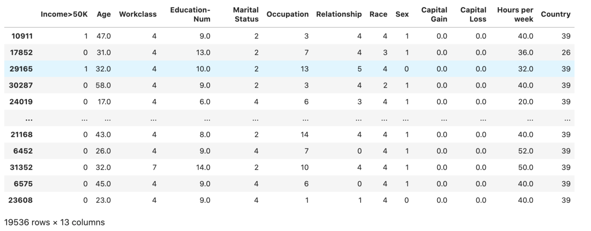

validation

test

Tutorial for building models with Notebook Instances
863

## Page 892

Amazon SageMaker AI
Developer Guide

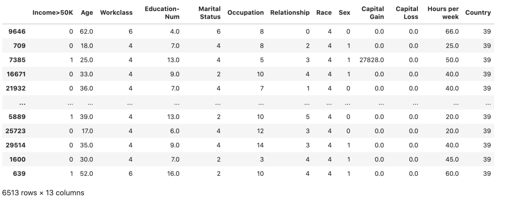

Convert the Train and Validation Datasets to CSV Files

Convert the train and validation dataframe objects to CSV files to match the input file format
for the XGBoost algorithm.

# Use 'csv' format to store the data
# The first column is expected to be the output column
train.to_csv('train.csv', index=False, header=False)
validation.to_csv('validation.csv', index=False, header=False)

Upload the Datasets to Amazon S3

Using the SageMaker AI and Boto3, upload the training and validation datasets to the default
Amazon S3 bucket. The datasets in the S3 bucket will be used by a compute-optimized SageMaker
instance on Amazon EC2 for training.

The following code sets up the default S3 bucket URI for your current SageMaker AI session,

creates a new demo-sagemaker-xgboost-adult-income-prediction folder, and uploads the

training and validation datasets to the data subfolder.

import sagemaker, boto3, os
bucket = sagemaker.Session().default_bucket()
prefix = "demo-sagemaker-xgboost-adult-income-prediction"

boto3.Session().resource('s3').Bucket(bucket).Object(
os.path.join(prefix, 'data/train.csv')).upload_file('train.csv')
boto3.Session().resource('s3').Bucket(bucket).Object(

Tutorial for building models with Notebook Instances
864

## Page 893

Amazon SageMaker AI
Developer Guide

os.path.join(prefix, 'data/validation.csv')).upload_file('validation.csv')

Run the following AWS CLI to check if the CSV files are successfully uploaded to the S3 bucket.

! aws s3 ls {bucket}/{prefix}/data --recursive

This should return the following output:

Train a Model

In this step, you choose a training algorithm and run a training job for the model. The Amazon
SageMaker Python SDK provides framework estimators and generic estimators to train your model
while orchestrating the machine learning (ML) lifecycle accessing the SageMaker AI features for
training and the AWS infrastructures, such as Amazon Elastic Container Registry (Amazon ECR),
Amazon Elastic Compute Cloud (Amazon EC2), Amazon Simple Storage Service (Amazon S3).
For more information about SageMaker AI built-in framework estimators, see Frameworksin the
Amazon SageMaker Python SDK documentation. For more information about built-in algorithms,
see Built-in algorithms and pretrained models in Amazon SageMaker.

Topics

• Choose the Training Algorithm

• Create and Run a Training Job

Choose the Training Algorithm

To choose the right algorithm for your dataset, you typically need to evaluate different models to
find the most suitable models to your data. For simplicity, the SageMaker AI XGBoost algorithm
with Amazon SageMaker AI built-in algorithm is used throughout this tutorial without the pre-
evaluation of models.

Tip

If you want SageMaker AI to find an appropriate model for your tabular dataset, use
Amazon SageMaker Autopilot that automates a machine learning solution. For more
information, see SageMaker Autopilot.

Tutorial for building models with Notebook Instances
865

## Page 894

Amazon SageMaker AI
Developer Guide

Create and Run a Training Job

After you figured out which model to use, start constructing a SageMaker AI estimator for training.
This tutorial uses the XGBoost built-in algorithm for the SageMaker AI generic estimator.

To run a model training job

1.
Import the Amazon SageMaker Python SDK and start by retrieving the basic information from
your current SageMaker AI session.

import sagemaker

region = sagemaker.Session().boto_region_name
print("AWS Region: {}".format(region))

role = sagemaker.get_execution_role()
print("RoleArn: {}".format(role))

This returns the following information:

• region – The current AWS Region where the SageMaker AI notebook instance is running.

• role – The IAM role used by the notebook instance.

Note

Check the SageMaker Python SDK version by running sagemaker.__version__.

This tutorial is based on sagemaker>=2.20. If the SDK is outdated, install the latest
version by running the following command:

! pip install -qU sagemaker

If you run this installation in your exiting SageMaker Studio or notebook instances, you
need to manually refresh the kernel to finish applying the version update.

2.
Create an XGBoost estimator using the sagemaker.estimator.Estimator class. In the

following example code, the XGBoost estimator is named xgb_model.

from sagemaker.debugger import Rule, ProfilerRule, rule_configs
from sagemaker.session import TrainingInput

Tutorial for building models with Notebook Instances
866

## Page 895

Amazon SageMaker AI
Developer Guide

s3_output_location='s3://{}/{}/{}'.format(bucket, prefix, 'xgboost_model')

container=sagemaker.image_uris.retrieve("xgboost", region, "1.2-1")
print(container)

xgb_model=sagemaker.estimator.Estimator(
image_uri=container,
role=role,
instance_count=1,
instance_type='ml.m4.xlarge',
volume_size=5,
output_path=s3_output_location,
sagemaker_session=sagemaker.Session(),
rules=[
Rule.sagemaker(rule_configs.create_xgboost_report()),
ProfilerRule.sagemaker(rule_configs.ProfilerReport())

]
)

To construct the SageMaker AI estimator, specify the following parameters:

• image_uri – Specify the training container image URI. In this example, the SageMaker AI

XGBoost training container URI is specified using sagemaker.image_uris.retrieve.

• role – The AWS Identity and Access Management (IAM) role that SageMaker AI uses to
perform tasks on your behalf (for example, reading training results, call model artifacts from
Amazon S3, and writing training results to Amazon S3).

• instance_count and instance_type – The type and number of Amazon EC2 ML
compute instances to use for model training. For this training exercise, you use a single

ml.m4.xlarge instance, which has 4 CPUs, 16 GB of memory, an Amazon Elastic Block
Store (Amazon EBS) storage, and a high network performance. For more information about
EC2 compute instance types, see Amazon EC2 Instance Types. For more information about
billing, see Amazon SageMaker pricing.

• volume_size – The size, in GB, of the EBS storage volume to attach to the training

instance. This must be large enough to store training data if you use File mode (File
mode is on by default). If you don't specify this parameter, its value defaults to 30.

• output_path – The path to the S3 bucket where SageMaker AI stores the model artifact
and training results.

Tutorial for building models with Notebook Instances
867

## Page 896

Amazon SageMaker AI
Developer Guide

• sagemaker_session – The session object that manages interactions with SageMaker API
operations and other AWS service that the training job uses.

• rules – Specify a list of SageMaker Debugger built-in rules. In this example, the

create_xgboost_report() rule creates an XGBoost report that provides insights into the

training progress and results, and the ProfilerReport() rule creates a report regarding
the EC2 compute resource utilization. For more information, see SageMaker Debugger
interactive report for XGBoost.

Tip

If you want to run distributed training of large sized deep learning models, such as
convolutional neural networks (CNN) and natural language processing (NLP) models,
use SageMaker AI Distributed for data parallelism or model parallelism. For more
information, see Distributed training in Amazon SageMaker AI.

3.
Set the hyperparameters for the XGBoost algorithm by calling the set_hyperparameters
method of the estimator. For a complete list of XGBoost hyperparameters, see XGBoost
hyperparameters.

xgb_model.set_hyperparameters(
max_depth = 5,
eta = 0.2,
gamma = 4,
min_child_weight = 6,
subsample = 0.7,
objective = "binary:logistic",
num_round = 1000
)

Tip

You can also tune the hyperparameters using the SageMaker AI hyperparameter
optimization feature. For more information, see Automatic model tuning with
SageMaker AI.

4.
Use the TrainingInput class to configure a data input flow for training. The following

example code shows how to configure TrainingInput objects to use the training and

Tutorial for building models with Notebook Instances
868

## Page 897

Amazon SageMaker AI
Developer Guide

validation datasets you uploaded to Amazon S3 in the Split the Dataset into Train, Validation,
and Test Datasets section.

from sagemaker.session import TrainingInput

train_input = TrainingInput(
"s3://{}/{}/{}".format(bucket, prefix, "data/train.csv"), content_type="csv"
)
validation_input = TrainingInput(
"s3://{}/{}/{}".format(bucket, prefix, "data/validation.csv"),
content_type="csv"
)

5.
To start model training, call the estimator's fit method with the training and validation

datasets. By setting wait=True, the fit method displays progress logs and waits until
training is complete.

xgb_model.fit({"train": train_input, "validation": validation_input}, wait=True)

For more information about model training, see Train a Model with Amazon SageMaker. This
tutorial training job might take up to 10 minutes.

After the training job has done, you can download an XGBoost training report and a profiling
report generated by SageMaker Debugger. The XGBoost training report offers you insights into
the training progress and results, such as the loss function with respect to iteration, feature
importance, confusion matrix, accuracy curves, and other statistical results of training. For
example, you can find the following loss curve from the XGBoost training report which clearly
indicates that there is an overfitting problem.

Tutorial for building models with Notebook Instances
869

## Page 898

Amazon SageMaker AI
Developer Guide

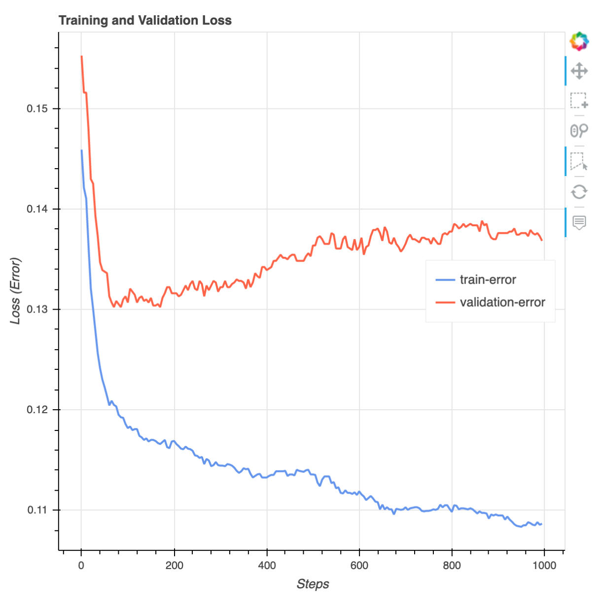

Run the following code to specify the S3 bucket URI where the Debugger training reports are
generated and check if the reports exist.

rule_output_path = xgb_model.output_path + "/" +
xgb_model.latest_training_job.job_name + "/rule-output"
! aws s3 ls {rule_output_path} --recursive

Tutorial for building models with Notebook Instances
870

## Page 899

Amazon SageMaker AI
Developer Guide

Download the Debugger XGBoost training and profiling reports to the current workspace:

! aws s3 cp {rule_output_path} ./ --recursive

Run the following IPython script to get the file link of the XGBoost training report:

from IPython.display import FileLink, FileLinks

display("Click link below to view the XGBoost Training report",
FileLink("CreateXgboostReport/xgboost_report.html"))

The following IPython script returns the file link of the Debugger profiling report that shows
summaries and details of the EC2 instance resource utilization, system bottleneck detection
results, and python operation profiling results:

profiler_report_name = [rule["RuleConfigurationName"]
for rule in
xgb_model.latest_training_job.rule_job_summary()
if "Profiler" in rule["RuleConfigurationName"]][0]
profiler_report_name
display("Click link below to view the profiler report",
FileLink(profiler_report_name+"/profiler-output/profiler-report.html"))

Tip

If the HTML reports do not render plots in the JupyterLab view, you must choose Trust
HTML at the top of the reports.
To identify training issues, such as overfitting, vanishing gradients, and other
problems that prevents your model from converging, use SageMaker Debugger
and take automated actions while prototyping and training your ML models. For
more information, see Amazon SageMaker Debugger. To find a complete analysis of
model parameters, see the Explainability with Amazon SageMaker Debugger example
notebook.

You now have a trained XGBoost model. SageMaker AI stores the model artifact in your S3 bucket.
To find the location of the model artifact, run the following code to print the model_data attribute

of the xgb_model estimator:

Tutorial for building models with Notebook Instances
871

## Page 900

Amazon SageMaker AI
Developer Guide

xgb_model.model_data

Tip

To measure biases that can occur during each stage of the ML lifecycle (data collection,
model training and tuning, and monitoring of ML models deployed for prediction), use
SageMaker Clarify. For more information, see Model Explainability. For an end-to-end
example, see the Fairness and Explainability with SageMaker Clarify example notebook.

Deploy the model to Amazon EC2

To get predictions, deploy your model to Amazon EC2 using Amazon SageMaker AI.

Topics

• Deploy the Model to SageMaker AI Hosting Services

• (Optional) Use SageMaker AI Predictor to Reuse the Hosted Endpoint

• (Optional) Make Prediction with Batch Transform

Deploy the Model to SageMaker AI Hosting Services

To host a model through Amazon EC2 using Amazon SageMaker AI, deploy the model that

you trained in Create and Run a Training Job by calling the deploy method of the xgb_model

estimator. When you call the deploy method, you must specify the number and type of EC2 ML
instances that you want to use for hosting an endpoint.

import sagemaker
from sagemaker.serializers import CSVSerializer
xgb_predictor=xgb_model.deploy(
initial_instance_count=1,
instance_type='ml.t2.medium',
serializer=CSVSerializer()
)

• initial_instance_count (int) – The number of instances to deploy the model.

• instance_type (str) – The type of instances that you want to operate your deployed model.

Tutorial for building models with Notebook Instances
872

## Page 901

Amazon SageMaker AI
Developer Guide

• serializer (int) – Serialize input data of various formats (a NumPy array, list, file, or buffer) to
a CSV-formatted string. We use this because the XGBoost algorithm accepts input files in CSV
format.

The deploy method creates a deployable model, configures the SageMaker AI hosting services
endpoint, and launches the endpoint to host the model. For more information, see the SageMaker
AI generic Estimator's deploy class method in the Amazon SageMaker Python SDK. To retrieve the

name of endpoint that's generated by the deploy method, run the following code:

xgb_predictor.endpoint_name

This should return the endpoint name of the xgb_predictor. The format of the endpoint name

is "sagemaker-xgboost-YYYY-MM-DD-HH-MM-SS-SSS". This endpoint stays active in the
ML instance, and you can make instantaneous predictions at any time unless you shut it down
later. Copy this endpoint name and save it to reuse and make real-time predictions elsewhere in
SageMaker Studio or SageMaker AI notebook instances.

Tip

To learn more about compiling and optimizing your model for deployment to Amazon EC2
instances or edge devices, see Compile and Deploy Models with Neo.

(Optional) Use SageMaker AI Predictor to Reuse the Hosted Endpoint

After you deploy the model to an endpoint, you can set up a new SageMaker AI predictor by
pairing the endpoint and continuously make real-time predictions in any other notebooks. The
following example code shows how to use the SageMaker AI Predictor class to set up a new
predictor object using the same endpoint. Re-use the endpoint name that you used for the

xgb_predictor.

import sagemaker
xgb_predictor_reuse=sagemaker.predictor.Predictor(
endpoint_name="sagemaker-xgboost-YYYY-MM-DD-HH-MM-SS-SSS",
sagemaker_session=sagemaker.Session(),
serializer=sagemaker.serializers.CSVSerializer()
)

Tutorial for building models with Notebook Instances
873

## Page 902

Amazon SageMaker AI
Developer Guide

The xgb_predictor_reuse Predictor behaves exactly the same as the original xgb_predictor.
For more information, see the SageMaker AI Predictor class in the Amazon SageMaker Python SDK.

(Optional) Make Prediction with Batch Transform

Instead of hosting an endpoint in production, you can run a one-time batch inference job to make
predictions on a test dataset using the SageMaker AI batch transform. After your model training

has completed, you can extend the estimator to a transformer object, which is based on the
SageMaker AI Transformer class. The batch transformer reads in input data from a specified S3
bucket and makes predictions.

To run a batch transform job

1.
Run the following code to convert the feature columns of the test dataset to a CSV file and
uploads to the S3 bucket:

X_test.to_csv('test.csv', index=False, header=False)

boto3.Session().resource('s3').Bucket(bucket).Object(
os.path.join(prefix, 'test/test.csv')).upload_file('test.csv')

2.
Specify S3 bucket URIs of input and output for the batch transform job as shown following:

# The location of the test dataset
batch_input = 's3://{}/{}/test'.format(bucket, prefix)

# The location to store the results of the batch transform job
batch_output = 's3://{}/{}/batch-prediction'.format(bucket, prefix)

3.
Create a transformer object specifying the minimal number of parameters: the

instance_count and instance_type parameters to run the batch transform job, and the

output_path to save prediction data as shown following:

transformer = xgb_model.transformer(
instance_count=1,
instance_type='ml.m4.xlarge',
output_path=batch_output
)

4.
Initiate the batch transform job by executing the transform() method of the transformer
object as shown following:

Tutorial for building models with Notebook Instances
874

## Page 903

Amazon SageMaker AI
Developer Guide

transformer.transform(
data=batch_input,
data_type='S3Prefix',
content_type='text/csv',
split_type='Line'
)
transformer.wait()

5.
When the batch transform job is complete, SageMaker AI creates the test.csv.out

prediction data saved in the batch_output path, which should be in the following format:

s3://sagemaker-<region>-111122223333/demo-sagemaker-xgboost-adult-

income-prediction/batch-prediction. Run the following AWS CLI to download the
output data of the batch transform job:

! aws s3 cp {batch_output} ./ --recursive

This should create the test.csv.out file under the current working directory. You'll be able
to see the float values that are predicted based on the logistic regression of the XGBoost
training job.

Evaluate the model

Now that you have trained and deployed a model using Amazon SageMaker AI, evaluate the model
to ensure that it generates accurate predictions on new data. For model evaluation, use the test
dataset that you created in Prepare a dataset.

Evaluate the Model Deployed to SageMaker AI Hosting Services

To evaluate the model and use it in production, invoke the endpoint with the test dataset and
check whether the inferences you get returns a target accuracy you want to achieve.

To evaluate the model

1.
Set up the following function to predict each line of the test set. In the following example

code, the rows argument is to specify the number of lines to predict at a time. You can change
the value of it to perform a batch inference that fully utilizes the instance's hardware resource.

import numpy as np
def predict(data, rows=1000):

Tutorial for building models with Notebook Instances
875

## Page 904

Amazon SageMaker AI
Developer Guide

split_array = np.array_split(data, int(data.shape[0] / float(rows) + 1))
predictions = ''
for array in split_array:
predictions = ','.join([predictions,
xgb_predictor.predict(array).decode('utf-8')])
return np.fromstring(predictions[1:], sep=',')

2.
Run the following code to make predictions of the test dataset and plot a histogram. You need
to take only the feature columns of the test dataset, excluding the 0th column for the actual
values.

import matplotlib.pyplot as plt

predictions=predict(test.to_numpy()[:,1:])
plt.hist(predictions)
plt.show()

3.
The predicted values are float type. To determine True or False based on the float values,
you need to set a cutoff value. As shown in the following example code, use the Scikit-learn
library to return the output confusion metrics and classification report with a cutoff of 0.5.

import sklearn

cutoff=0.5

Tutorial for building models with Notebook Instances
876

## Page 905

Amazon SageMaker AI
Developer Guide

print(sklearn.metrics.confusion_matrix(test.iloc[:, 0], np.where(predictions >
cutoff, 1, 0)))
print(sklearn.metrics.classification_report(test.iloc[:, 0], np.where(predictions >
cutoff, 1, 0)))

This should return the following confusion matrix:

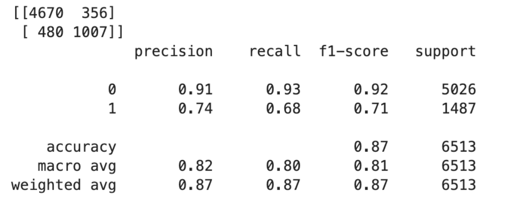

4.
To find the best cutoff with the given test set, compute the log loss function of the logistic
regression. The log loss function is defined as the negative log-likelihood of a logistic model
that returns prediction probabilities for its ground truth labels. The following example code

numerically and iteratively calculates the log loss values (-(y*log(p)+(1-y)log(1-p)),

where y is the true label and p is a probability estimate of the corresponding test sample. It
returns a log loss versus cutoff graph.

import matplotlib.pyplot as plt

cutoffs = np.arange(0.01, 1, 0.01)
log_loss = []
for c in cutoffs:
log_loss.append(
sklearn.metrics.log_loss(test.iloc[:, 0], np.where(predictions > c, 1, 0))
)

plt.figure(figsize=(15,10))
plt.plot(cutoffs, log_loss)
plt.xlabel("Cutoff")
plt.ylabel("Log loss")
plt.show()

Tutorial for building models with Notebook Instances
877

## Page 906

Amazon SageMaker AI
Developer Guide

This should return the following log loss curve.

5.
Find the minimum points of the error curve using the NumPy argmin and min functions:

print(
'Log loss is minimized at a cutoff of ', cutoffs[np.argmin(log_loss)],
', and the log loss value at the minimum is ', np.min(log_loss)
)

This should return: Log loss is minimized at a cutoff of 0.53, and the log

loss value at the minimum is 4.348539186773897.

Instead of computing and minimizing the log loss function, you can estimate a cost function as
an alternative. For example, if you want to train a model to perform a binary classification for
a business problem such as a customer churn prediction problem, you can set weights to the
elements of confusion matrix and calculate the cost function accordingly.

You have now trained, deployed, and evaluated your first model in SageMaker AI.

Tutorial for building models with Notebook Instances
878

## Page 907

Amazon SageMaker AI
Developer Guide

Tip

To monitor model quality, data quality, and bias drift, use Amazon SageMaker Model
Monitor and SageMaker AI Clarify. To learn more, see Amazon SageMaker Model Monitor,
Monitor Data Quality, Monitor Model Quality, Monitor Bias Drift, and Monitor Feature
Attribution Drift.

Tip

To get human review of low confidence ML predictions or a random sample of predictions,
use Amazon Augmented AI human review workflows. For more information, see Using
Amazon Augmented AI for Human Review.

Clean up Amazon SageMaker notebook instance resources

To avoid incurring unnecessary charges, use the AWS Management Console to delete the endpoints
and resources that you created while running the exercises.

Note

Training jobs and logs cannot be deleted and are retained indefinitely.

Note

If you plan to explore other exercises in this guide, you might want to keep some of these
resources, such as your notebook instance, S3 bucket, and IAM role.

1. Open the Amazon SageMaker AI console at https://console.aws.amazon.com/sagemaker/ and

delete the following resources:

• The endpoint. Deleting the endpoint also deletes the ML compute instance or instances that
support it.

1.
Under Inference, choose Endpoints.

Tutorial for building models with Notebook Instances
879

## Page 908

Amazon SageMaker AI
Developer Guide

2.
Choose the endpoint that you created in the example, choose Actions, and then choose
Delete.

• The endpoint configuration.

1.
Under Inference, choose Endpoint configurations.

2.
Choose the endpoint configuration that you created in the example, choose Actions, and
then choose Delete.

• The model.

1.
Under Inference, choose Models.

2.
Choose the model that you created in the example, choose Actions, and then choose
Delete.

• The notebook instance. Before deleting the notebook instance, stop it.

1.
Under Notebook, choose Notebook instances.

2.
Choose the notebook instance that you created in the example, choose Actions, and then
choose Stop. The notebook instance takes several minutes to stop. When the Status
changes to Stopped, move on to the next step.

3.
Choose Actions, and then choose Delete.

2. Open the Amazon S3 console at https://console.aws.amazon.com/s3/, and then delete the

bucket that you created for storing model artifacts and the training dataset.

3. Open the Amazon CloudWatch console at https://console.aws.amazon.com/cloudwatch/, and

then delete all of the log groups that have names starting with /aws/sagemaker/.

AL2023 notebook instances

Amazon SageMaker notebook instances currently support AL2023 operating systems. AL2023 is
now the latest and recommended operating system for notebook instances. You can select the
operating system that your notebook instance is based on when you create the notebook instance.

SageMaker AI supports notebook instances based on the following AL2023 operating systems.

• notebook-al2023-v1: These notebook instances support JupyterLab version 4. For information
about JupyterLab versions, see JupyterLab versioning.

Topics

AL2023 instances
880

## Page 909

Amazon SageMaker AI
Developer Guide

• Supported instance types

• Available kernels

Supported instance types

AL2023 supports instance types listed under Notebook Instances in SageMaker AI Pricing, with the

exception that AL2023 does not support ml.p2, ml.p3, ml.g3 instances.

Available kernels

The following table gives information about the available kernels for SageMaker notebook

instances. All of these images are supported on notebook instances based on the notebook-

al2023-v1 operating system.

Kernel name
Description

R
A kernel used to perform data analysis and
visualization using R code from a Jupyter
notebook.

Sparkmagic (PySpark)
A kernel used to do data science with remote
Spark clusters from Jupyter notebooks using
the Python programming language. This
kernel comes with Python 3.10.

Sparkmagic (Spark)
A kernel used to do data science with remote
Spark clusters from Jupyter notebooks using
the Scala programming language. This kernel
comes with Python 3.10.

Sparkmagic (SparkR)
A kernel used to do data science with remote
Spark clusters from Jupyter notebooks using
the R programming language. This kernel
comes with Python 3.10.

conda_python3
A conda environment that comes pre-insta
lled with popular packages for data science

AL2023 instances
881

## Page 910

Amazon SageMaker AI
Developer Guide

Kernel name
Description

and machine learning. This kernel comes with
Python 3.10.

conda_pytorch
A conda environment that comes pre-installed
with PyTorch version 2.7.0, as well as popular
data science and machine learning packages.
This kernel comes with Python 3.10.

Amazon Linux 2 notebook instances

Important

JupyterLab 1 and JupyterLab 3 are no longer supported as of June 30, 2025. You can no
longer create new or restart stopped notebook instances using these versions. Existing
in-service instances may continue to function but will not receive security updates or
bug fixes. Migrate to JupyterLab 4 notebook instances for continued support. For more
information, see JupyterLab version maintenance.

Note

AL2023 is the latest and recommended operating system available for notebook instances.
To learn more, see AL2023 notebook instances.

Amazon SageMaker notebook instances currently support Amazon Linux 2 (AL2) operating
systems. You can select the operating system that your notebook instance is based on when you
create the notebook instance.

SageMaker AI supports notebook instances based on the following Amazon Linux 2 operating
systems.

• notebook-al2-v1 (deprecated): These notebook instances supported JupyterLab version 1.
As of June 30, 2025, you can no longer create new instances with this platform identifier. For
information about JupyterLab versions, see JupyterLab versioning.

AL2 instances
882

## Page 911

Amazon SageMaker AI
Developer Guide

• notebook-al2-v2 (deprecated): These notebook instances supported JupyterLab version 3.
As of June 30, 2025, you can no longer create new instances with this platform identifier. For
information about JupyterLab versions, see JupyterLab versioning.

• notebook-al2-v3: These notebook instances support JupyterLab version 4. For information
about JupyterLab versions, see JupyterLab versioning.

Notebook instances created before 08/18/2021 automatically run on Amazon Linux (AL1).
Notebook instances based on AL1 entered a maintenance phase as of 12/01/2022 and are no
longer available for new notebook instance creation as of 02/01/2023. To replace AL1, you now
have the option to create Amazon SageMaker notebook instances with AL2. For more information,
see AL1 Maintenance Phase Plan.

Topics

• Supported instance types

• Available Kernels

• AL1 Maintenance Phase Plan

Supported instance types

Amazon Linux 2 supports instance types listed under Notebook Instances in Amazon SageMaker

Pricing with the exception that Amazon Linux 2 does not support ml.p2 instances.

Available Kernels

The following table gives information about the available kernels for SageMaker notebook

instances. All of these images are supported on notebook instances based on the notebook-al2-

v1, notebook-al2-v2, and notebook-al2-v3 operating systems.

SageMaker notebook instance kernels

Kernel name
Description

R
A kernel used to perform data analysis and
visualization using R code from a Jupyter
notebook.

AL2 instances
883

## Page 912

Amazon SageMaker AI
Developer Guide

Kernel name
Description

Sparkmagic (PySpark)
A kernel used to do data science with remote
Spark clusters from Jupyter notebooks using
the Python programming language. This
kernel comes with Python 3.10.

Sparkmagic (Spark)
A kernel used to do data science with remote
Spark clusters from Jupyter notebooks using
the Scala programming language. This kernel
comes with Python 3.10.

Sparkmagic (SparkR)
A kernel used to do data science with remote
Spark clusters from Jupyter notebooks using
the R programming language. This kernel
comes with Python 3.10.

conda_python3
A conda environment that comes pre-insta
lled with popular packages for data science
and machine learning. This kernel comes with
Python 3.10.

conda_pytorch_p310
A conda environment that comes pre-installed
with PyTorch version 2.2.0, as well as popular
data science and machine learning packages.
This kernel comes with Python 3.10.

conda_tensorflow2_p310
A conda environment that comes pre-insta
lled with TensorFlow version 2.16.0, as well
as popular data science and machine learning
packages. This kernel comes with Python 3.10.

AL1 Maintenance Phase Plan

The following table is a timeline for when AL1 entered its extended maintenance phase. The AL1
maintenance phase also coincides with the deprecation of Python 2 and Chainer. Notebooks based
on AL2 do not have managed Python 2 and Chainer kernels.

AL2 instances
884

## Page 913

Amazon SageMaker AI
Developer Guide

Date
Description

08/18/2021
Notebook instances based on AL2 are
launched. Newly launched notebook instances

still default to AL1. AL1 is supported with
security patches and updates, but no new
features. You can choose between the two
operating systems when launching a new
notebook instance.

10/31/2022
The default platform identifier for SageMaker
notebook instances changes from Amazon
Linux (al1-v1) to Amazon Linux 2 (al2-v2).
You can choose between the two operating
systems when launching a new notebook
instance.

12/01/2022
AL1 is no longer supported with non-criti
cal security patches and updates. AL1 still
receives fixes for critical security-related
issues. You can still launch instances on AL1,
but assume the risks associated with using an
unsupported operating system.

02/01/2023
AL1 is no longer an available option for new
notebook instance creation. After this date,

customers can create notebook instances
with the AL2 platform identifiers. Existing

notebooks with an INSERVICE  status should
be migrated to the latest platform since
continuous availability of AL1 notebook
instances cannot be guaranteed.

03/31/2024
AL1 reaches its end of life on notebook
instances on March 31, 2024. After this
date, AL1 will no longer receive any security

AL2 instances
885

## Page 914

Amazon SageMaker AI
Developer Guide

Date
Description

updates, bug fixes, or be available for new
notebook instance creation.

• Existing AL1 notebook instances with a

STOPPED status cannot be restarted.

• Existing notebooks with an INSERVICE
status should be migrated to the latest

platform since continuous availability
of AL1 notebook instances cannot be
guaranteed.

Migrating to Amazon Linux 2

Your existing AL1 notebook instance is not automatically migrated to Amazon Linux 2. To
upgrade your AL1 notebook instance to Amazon Linux 2, you must create a new notebook
instance, replicate your code and environment, and delete your old notebook instance. For more
information, see the Amazon Linux 2 migration blog.

JupyterLab versioning

Important

JupyterLab 1 and JupyterLab 3 are no longer supported as of June 30, 2025. You can no
longer create new or restart stopped notebook instances using these versions. Existing
in-service instances may continue to function but will not receive security updates or
bug fixes. Migrate to JupyterLab 4 notebook instances for continued support. For more
information, see JupyterLab version maintenance.

The Amazon SageMaker notebook instance interface is based on JupyterLab, which is a web-based
interactive development environment for notebooks, code, and data. Notebooks now support
using either JupyterLab 1, JupyterLab 3, or JupyterLab 4. A single notebook instance can run a
single instance of JupyterLab (at most). You can have multiple notebook instances with different
JupyterLab versions.

JupyterLab versioning
886

## Page 915

Amazon SageMaker AI
Developer Guide

You can configure your notebook to run your preferred JupyterLab version by selecting the
appropriate platform identifier. Use either the AWS CLI or the SageMaker AI console when creating
your notebook instance. For more information about platform identifiers, see AL2023 notebook
instances and Amazon Linux 2 notebook instances. If you don’t explicitly configure a platform
identifier, your notebook instance defaults to running JupyterLab 1.

Topics

• JupyterLab version maintenance

• JupyterLab 4

• JupyterLab 3

• Create a notebook with your JupyterLab version

• View the JupyterLab version of a notebook from the console

JupyterLab version maintenance

JupyterLab 1 and JupyterLab 3 platforms reached end of standard support on June 30, 2025. As of
this date:

• You can no longer create new or restart stopped JupyterLab 1 and JupyterLab 3 notebook
instances.

• Existing in-service JupyterLab 1 and JupyterLab 3 notebook instances may continue to function,
but no longer receive SageMaker AI security updates or critical bug fixes.

• You are responsible for managing the security of these deprecated instances.

• If issues arise with existing JupyterLab 1 or JupyterLab 3 notebook instances, SageMaker AI
cannot guarantee their continued availability. You must migrate your workload to a JupyterLab 4
notebook instance.

Migrate your work to JupyterLab 4 notebook instances (the latest version's platform identifier
is notebook-al2023-v1) to ensure you have a secure and supported environment. This allows
you to leverage the latest versions of Jupyter notebooks, JupyterLab, and other ML libraries. For
instructions, see  migrate your work to an SageMaker AI notebook instance with Amazon Linux 2.

JupyterLab 4

JupyterLab 4 support is available only on the Amazon Linux 2 operating system platform.
JupyterLab 4 includes the following features that are not available in JupyterLab 3:

JupyterLab versioning
887

## Page 916

Amazon SageMaker AI
Developer Guide

• Optimized rendering for a faster experience

• Opt-in settings for faster tab switching and better performance with long notebooks. For more
information, see the blog post  JupyterLab 4.0 is Here.

• Upgraded text editor

• New extension manager installing from pypi

• Added improvements to the UI, including document search and accessibility improvements

You can run JupyterLab 4 by specifying notebook-al2023-v1 (the latest and recommended version)
or notebook-al2-v3 as the platform identifier when creating your notebook instance.

Note

If you attempt to migrate to a JupyterLab 4 Notebook Instance from another JupyterLab
version, the package version changes between JupyterLab 3 and JupyterLab 4 might break
any existing lifecycle configurations or Jupyter/JupyterLab extensions.

Package version changes

JupyterLab 4 has the following package version changes from JupyterLab 3:

• JupyterLab has been upgraded from 3.x to 4.x.

• Jupyter notebook has been upgraded from 6.x to 7.x.

• jupyterlab-git has been updated to version 0.50.0.

JupyterLab 3

Important

JupyterLab 1 and JupyterLab 3 are no longer supported as of June 30, 2025. You can no
longer create new or restart stopped notebook instances using these versions. Existing
in-service instances may continue to function but will not receive security updates or
bug fixes. Migrate to JupyterLab 4 notebook instances for continued support. For more
information, see JupyterLab version maintenance.

JupyterLab versioning
888

## Page 917

Amazon SageMaker AI
Developer Guide

JupyterLab 3 support is available only on the Amazon Linux 2 operating system platform.
JupyterLab 3 includes the following features that are not available in JupyterLab 1. For more
information about these features, see JupyterLab 3.0 is released!.

• Visual debugger when using the following kernels:

• conda_pytorch_p38

• conda_tensorflow2_p38

• conda_amazonei_pytorch_latest_p37

• File browser filter

• Table of Contents (TOC)

• Multi-language support

• Simple mode

• Single interface mode

• Live editing SVG files with updated rendering

• User interface for notebook cell tags

Important changes to JupyterLab 3

For information about important changes when using JupyterLab 3, see the following JupyterLab
change logs:

• v2.0.0

• v3.0.0

Package version changes

JupyterLab 3 has the following package version changes from JupyterLab 1:

• JupyterLab has been upgraded from 1.x to 3.x.

• Jupyter notebook has been upgraded from 5.x to 6.x.

• jupyterlab-git has been updated to version 0.37.1.

• nbserverproxy 0.x (0.3.2) has been replaced with jupyter-server-proxy 3.x (3.2.1).

JupyterLab versioning
889

## Page 918

Amazon SageMaker AI
Developer Guide

Create a notebook with your JupyterLab version

Important

JupyterLab 1 and JupyterLab 3 are no longer supported as of June 30, 2025. You can no
longer create new or restart stopped notebook instances using these versions. Existing
in-service instances may continue to function but will not receive security updates or
bug fixes. Migrate to JupyterLab 4 notebook instances for continued support. For more
information, see JupyterLab version maintenance.

You can select the JupyterLab version when creating your notebook instance from the console
following the steps in Create an Amazon SageMaker notebook instance.

You can also select the JupyterLab version by passing the platform-identifier parameter
when creating your notebook instance using the AWS CLI as follows:

create-notebook-instance --notebook-instance-name <NEW_NOTEBOOK_NAME> \
--instance-type <INSTANCE_TYPE> \
--role-arn <YOUR_ROLE_ARN> \
--platform-identifier notebook-al2-v3

View the JupyterLab version of a notebook from the console

Important

JupyterLab 1 and JupyterLab 3 are no longer supported as of June 30, 2025. You can no
longer create new or restart stopped notebook instances using these versions. Existing
in-service instances may continue to function but will not receive security updates or
bug fixes. Migrate to JupyterLab 4 notebook instances for continued support. For more
information, see JupyterLab version maintenance.

You can view the JupyterLab version of a notebook using the following procedure:

1.
Open the Amazon SageMaker AI console at https://console.aws.amazon.com/sagemaker/.

2.
From the left navigation, select Notebook.

JupyterLab versioning
890

## Page 919

Amazon SageMaker AI
Developer Guide

3.
From the dropdown menu, select Notebook instances to navigate to the Notebook instances
page.

4.
From the list of notebook instances, select your notebook instance name.

5.
On the Notebook instance settings page, view the Platform Identifier to see the JupyterLab

version of the notebook.

Create an Amazon SageMaker notebook instance

Important

Custom IAM policies that allow Amazon SageMaker Studio or Amazon SageMaker Studio
Classic to create Amazon SageMaker resources must also grant permissions to add tags to
those resources. The permission to add tags to resources is required because Studio and
Studio Classic automatically tag any resources they create. If an IAM policy allows Studio
and Studio Classic to create resources but does not allow tagging, "AccessDenied" errors can
occur when trying to create resources. For more information, see Provide permissions for
tagging SageMaker AI resources.
AWS managed policies for Amazon SageMaker AI that give permissions to create
SageMaker resources already include permissions to add tags while creating those
resources.

An Amazon SageMaker notebook instance is a ML compute instance running the Jupyter Notebook
application. SageMaker AI manages creating the instance and related resources. Use Jupyter
notebooks in your notebook instance to:

• prepare and process data

• write code to train models

• deploy models to SageMaker AI hosting

• test or validate your models

To create a notebook instance, use either the SageMaker AI console or the

CreateNotebookInstance API.

The notebook instance type you choose depends on how you use your notebook instance. Ensure
that your notebook instance is not bound by memory, CPU, or IO. To load a dataset into memory

Create an Amazon SageMaker notebook instance
891

## Page 920

Amazon SageMaker AI
Developer Guide

on the notebook instance for exploration or preprocessing, choose an instance type with enough
RAM memory for your dataset. This requires an instance with at least 16 GB of memory (.xlarge or
larger). If you plan to use the notebook for compute intensive preprocessing, we recommend you
choose a compute-optimized instance such as a c4 or c5.

A best practice when using a SageMaker notebook is to use the notebook instance to orchestrate
other AWS services. For example, you can use the notebook instance to manage large dataset
processing. To do this, make calls to AWS Glue for ETL (extract, transform, and load) services
or Amazon EMR for mapping and data reduction using Hadoop. You can use AWS services as
temporary forms of computation or storage for your data.

You can store and retrieve your training and test data using an Amazon Simple Storage Service
bucket. You can then use SageMaker AI to train and build your model. As a result, the instance type
of your notebook would have no bearing on the speed of your model training and testing.

After receiving the request, SageMaker AI does the following:

• Creates a network interface—If you choose the optional VPC configuration, SageMaker AI
creates the network interface in your VPC. It uses the subnet ID that you provide in the request
to determine which Availability Zone to create the subnet in. SageMaker AI associates the
security group that you provide in the request with the subnet. For more information, see
Connect a Notebook Instance in a VPC to External Resources.

• Launches an ML compute instance—SageMaker AI launches an ML compute instance in a
SageMaker AI VPC. SageMaker AI performs the configuration tasks that allow it to manage your
notebook instance. If you specified your VPC, SageMaker AI enables traffic between your VPC
and the notebook instance.

• Installs Anaconda packages and libraries for common deep learning platforms—SageMaker
AI installs all of the Anaconda packages that are included in the installer. For more information,
see Anaconda package list. SageMaker AI also installs the TensorFlow and Apache MXNet deep
learning libraries.

• Attaches an ML storage volume—SageMaker AI attaches an ML storage volume to the ML
compute instance. You can use the volume as a working area to clean up the training dataset or
to temporarily store validation, test, or other data. Choose any size between 5 GB and 16384 GB,
in 1 GB increments, for the volume. The default is 5 GB. ML storage volumes are encrypted, so
SageMaker AI can't determine the amount of available free space on the volume. Because of this,
you can increase the volume size when you update a notebook instance, but you can't decrease
the volume size. If you want to decrease the size of the ML storage volume in use, create a new
notebook instance with the desired size.

Create an Amazon SageMaker notebook instance
892

## Page 921

Amazon SageMaker AI
Developer Guide

Only files and data saved within the /home/ec2-user/SageMaker folder persist between
notebook instance sessions. Files and data that are saved outside this directory are overwritten

when the notebook instance stops and restarts. Each notebook instance's /tmp directory
provides a minimum of 10 GB of storage in an instance store. An instance store is temporary,

block-level storage that isn't persistent. When the instance is stopped or restarted, SageMaker
AI deletes the directory's contents and any operating system customizations. This temporary
storage is part of the root volume of the notebook instance.

If the notebook instance isn't updated and is running unsecure software, SageMaker AI might
periodically update the instance as part of regular maintenance. During these updates, data

outside of the folder /home/ec2-user/SageMaker is not persisted. For more information
about maintenance and security patches, see Maintenance.

If the instance type used by the notebook instance has NVMe support, customers can use the
NVMe instance store volumes available for that instance type. For instances with NVMe store
volumes, all instance store volumes are automatically attached to the instance at launch. For
more information about instance types and their associated NVMe store volumes, see the
Amazon Elastic Compute Cloud Instance Type Details.

To make the attached NVMe store volume available for your notebook instance, complete the
steps in Make instance store volumes available on your instance . Complete the steps with root
access or by using a lifecycle configuration script.

Note

NVMe instance store volumes are not persistent storage. This storage is short-lived
with the instance and must be reconfigured every time an instance with this storage is
launched.

To create a SageMaker AI notebook instance:

1.
Open the SageMaker AI console at https://console.aws.amazon.com/sagemaker/.

2.
Choose Notebook instances, then choose Create notebook instance.

3.
On the Create notebook instance page, provide the following information:

a.
For Notebook instance name, type a name for your notebook instance.

Create an Amazon SageMaker notebook instance
893

## Page 922

Amazon SageMaker AI
Developer Guide

b.
For Notebook instance type, choose an instance size suitable for your use case. For a list
of supported instance types and quotas, see Amazon SageMaker AI Service Quotas.

c.
For Platform Identifier, choose a platform type to create the notebook instance on.
This platform type dictates the Operating System and the JupyterLab version that your

notebook instance is created with. The latest and recommended version is notebook-

al2023-v1, for an Amazon Linux 2023 notebook instance. As of June 30, 2025, only
JupyterLab 4 is supported for new instances. For information about platform identifier
types, see AL2023 notebook instances and Amazon Linux 2 notebook instances. For
information about JupyterLab versions, see JupyterLab versioning.

Important

JupyterLab 1 and JupyterLab 3 are no longer supported as of June 30, 2025.
You can no longer create new or restart stopped notebook instances using these
versions. Existing in-service instances may continue to function but will not receive
security updates or bug fixes. Migrate to JupyterLab 4 notebook instances for
continued support. For more information, see JupyterLab version maintenance.

d.
(Optional) Additional configuration lets advanced users create a shell script that can run
when you create or start the instance. This script, called a lifecycle configuration script,
can be used to set the environment for the notebook or to perform other functions. For
information, see Customization of a SageMaker notebook instance using an LCC script.

e.
(Optional) Additional configuration also lets you specify the size, in GB, of the ML storage
volume that is attached to the notebook instance. You can choose a size between 5 GB
and 16,384 GB, in 1 GB increments. You can use the volume to clean up the training
dataset or to temporarily store validation or other data.

f.
(Optional) For Minimum IMDS Version, select a version from the dropdown list. If this
value is set to v1, both versions can be used with the notebook instance. If v2 is selected,
then only IMDSv2 can be used with the notebook instance. For information about IMDSv2,
see Use IMDSv2.

Note

Starting October 31, 2022, the default minimum IMDS Version for SageMaker
notebook instances changes from IMDSv1 to IMDSv2.

Create an Amazon SageMaker notebook instance
894

## Page 923

Amazon SageMaker AI
Developer Guide

Starting February 1, 2023, IMDSv1 is no longer be available for new notebook
instance creation. After this date, you can create notebook instances with a
minimum IMDS version of 2.

g.
For IAM role, choose either an existing IAM role in your account with the
necessary permissions to access SageMaker AI resources or Create a new role.
If you choose Create a new role, SageMaker AI creates an IAM role named

AmazonSageMaker-ExecutionRole-YYYYMMDDTHHmmSS. The AWS managed policy

AmazonSageMakerFullAccess is attached to the role. The role provides permissions
that allow the notebook instance to call SageMaker AI and Amazon S3.

h.
For Root access, to give root access for all notebook instance users, choose Enable. To
remove root access for users, choose Disable.If you give root access, all notebook instance
users have administrator privileges and can access and edit all files on it.

i.
(Optional) Encryption key lets you encrypt data on the ML storage volume attached to
the notebook instance using an AWS Key Management Service (AWS KMS) key. If you
plan to store sensitive information on the ML storage volume, consider encrypting the
information.

j.
(Optional) Network lets you put your notebook instance inside a Virtual Private Cloud
(VPC). A VPC provides additional security and limits access to resources in the VPC from
sources outside the VPC. For more information on VPCs, see Amazon VPC User Guide.

To add your notebook instance to a VPC:

i.
Choose the VPC and a SubnetId.

ii.
For Security Group, choose your VPC's default security group.

iii.
If you need your notebook instance to have internet access, enable direct internet
access. For Direct internet access, choose Enable. Internet access can make your
notebook instance less secure. For more information, see Connect a Notebook
Instance in a VPC to External Resources.

k.
(Optional) To associate Git repositories with the notebook instance, choose a default
repository and up to three additional repositories. For more information, see Git
repositories with SageMaker AI Notebook Instances.

l.
Choose Create notebook instance.

In a few minutes, Amazon SageMaker AI launches an ML compute instance—in this case,
a notebook instance—and attaches an ML storage volume to it. The notebook instance

Create an Amazon SageMaker notebook instance
895

## Page 924

Amazon SageMaker AI
Developer Guide

has a preconfigured Jupyter notebook server and a set of Anaconda libraries. For more
information, see the

CreateNotebookInstance API.

4.
When the status of the notebook instance is InService, in the console, the notebook

instance is ready to use. Choose Open Jupyter next to the notebook name to open the classic
Jupyter dashboard.

Note

To augment the security of your Amazon SageMaker notebook instance, all regional

notebook.region.sagemaker.aws domains are registered in the internet Public
Suffix List (PSL). For further security, we recommend that you use cookies with a

__Host- prefix to set sensitive cookies for the domains of your SageMaker notebook
instances. This helps to defend your domain against cross-site request forgery
attempts (CSRF). For more information, see the Set-Cookie page in the mozilla.org
developer documentation website.

You can choose Open JupyterLab to open the JupyterLab dashboard. The dashboard provides
access to your notebook instance.

For more information about Jupyter notebooks, see The Jupyter notebook.

Access Notebook Instances

Important

Custom IAM policies that allow Amazon SageMaker Studio or Amazon SageMaker Studio
Classic to create Amazon SageMaker resources must also grant permissions to add tags to
those resources. The permission to add tags to resources is required because Studio and
Studio Classic automatically tag any resources they create. If an IAM policy allows Studio
and Studio Classic to create resources but does not allow tagging, "AccessDenied" errors can
occur when trying to create resources. For more information, see Provide permissions for
tagging SageMaker AI resources.

Access Notebook Instances
896

## Page 925

Amazon SageMaker AI
Developer Guide

AWS managed policies for Amazon SageMaker AI that give permissions to create
SageMaker resources already include permissions to add tags while creating those
resources.

To access your Amazon SageMaker notebook instances, choose one of the following options:

• Use the console.

Choose Notebook instances. The console displays a list of notebook instances in your account.
To open a notebook instance with a standard Jupyter interface, choose Open Jupyter for that
instance. To open a notebook instance with a JupyterLab interface, choose Open JupyterLab for
that instance.

The console uses your sign-in credentials to send a

CreatePresignedNotebookInstanceUrl API request to SageMaker AI. SageMaker AI returns
the URL for your notebook instance, and the console opens the URL in another browser tab and
displays the Jupyter notebook dashboard.

Note

The URL that you get from a call to

CreatePresignedNotebookInstanceUrl is valid only for 5 minutes. If you try to
use the URL after the 5-minute limit expires, you are directed to the AWS Management
Console sign-in page.

• Use the API.

To get the URL for the notebook instance, call the

CreatePresignedNotebookInstanceUrl API and use the URL that the API returns to open
the notebook instance.

Access Notebook Instances
897

## Page 926

Amazon SageMaker AI
Developer Guide

Use the Jupyter notebook dashboard to create and manage notebooks and to write code. For more
information about Jupyter notebooks, see http://jupyter.org/documentation.html.

Update a Notebook Instance

After you create a notebook instance, you can update it using the SageMaker AI console and

UpdateNotebookInstance API operation.

You can update the tags of a notebook instance that is InService. To update any other attribute

of a notebook instance, its status must be Stopped.

To update a notebook instance in the SageMaker AI console:

1.
Open the SageMaker AI console at https://console.aws.amazon.com/sagemaker/.

2.
Choose Notebook instances.

3.
Choose the notebook instance that you want to update by selecting the notebook instance
Name from the list.

4.
If your notebook Status is not Stopped, select the Stop button to stop the notebook instance.

When you do this, the notebook instance status changes to Stopping. Wait until the status

changes to Stopped to complete the following steps.

5.
Select the Edit button to open the Edit notebook instance page. For information about the
notebook properties you can update, see Create an Amazon SageMaker notebook instance.

6.
Update your notebook instance and select the Update notebook instance button at the
bottom of the page when you are done to return to the notebook instances page. Your
notebook instance status changes to Updating.

When the notebook instance update is complete, the status changes to Stopped.

Customization of a SageMaker notebook instance using an LCC script

Important

Custom IAM policies that allow Amazon SageMaker Studio or Amazon SageMaker Studio
Classic to create Amazon SageMaker resources must also grant permissions to add tags to
those resources. The permission to add tags to resources is required because Studio and
Studio Classic automatically tag any resources they create. If an IAM policy allows Studio

Update a Notebook Instance
898

## Page 927

Amazon SageMaker AI
Developer Guide

and Studio Classic to create resources but does not allow tagging, "AccessDenied" errors can
occur when trying to create resources. For more information, see Provide permissions for
tagging SageMaker AI resources.
AWS managed policies for Amazon SageMaker AI that give permissions to create
SageMaker resources already include permissions to add tags while creating those
resources.

A lifecycle configuration (LCC) provides shell scripts that run only when you create the notebook
instance or whenever you start one. When you create a notebook instance, you can create a new
LCC or attach an LCC that you already have. Lifecycle configuration scripts are useful for the
following use cases:

• Installing packages or sample notebooks on a notebook instance

• Configuring networking and security for a notebook instance

• Using a shell script to customize a notebook instance

You can also use a lifecycle configuration script to access AWS services from your notebook. For
example, you can create a script that lets you use your notebook to control other AWS resources,
such as an Amazon EMR instance.

We maintain a public repository of notebook lifecycle configuration scripts that address common
use cases for customizing notebook instances at https://github.com/aws-samples/amazon-
sagemaker-notebook-instance-lifecycle-config-samples.

Note

Each script has a limit of 16384 characters.

The value of the $PATH environment variable that is available to both scripts is /usr/

local/sbin:/usr/local/bin:/usr/bin:/usr/sbin:/sbin:/bin. The working

directory, which is the value of the $PWD environment variable, is /.

View CloudWatch Logs for notebook instance lifecycle configurations in log group /

aws/sagemaker/NotebookInstances in log stream [notebook-instance-name]/

[LifecycleConfigHook].
Scripts cannot run for longer than 5 minutes. If a script runs for longer than 5 minutes, it
fails and the notebook instance is not created or started. To help decrease the run time of
scripts, try the following:

Customize a Notebook Instance using an LCC
899

## Page 928

Amazon SageMaker AI
Developer Guide

• Cut down on necessary steps. For example, limit which conda environments in which to
install large packages.

• Run tasks in parallel processes.

• Use the nohup command in your script.

You can see a list of notebook instance lifecycle configurations you previously created by choosing
Lifecycle configuration in the SageMaker AI console. You can attach a notebook instance LCC
when you create a new notebook instance. For more information about creating a notebook
instance, see Create an Amazon SageMaker notebook instance.

Create a lifecycle configuration script

The following procedure shows how to create a lifecycle configuration script for use with an
Amazon SageMaker notebook instance. For more information about creating a notebook instance,
see Create an Amazon SageMaker notebook instance.

To create a lifecycle configuration

1.
Open the SageMaker AI console at https://console.aws.amazon.com/sagemaker/.

2.
On the left navigation pane, choose Admin configurations.

3.
Under Admin configurations, choose Lifecycle configurations.

4.
From the Lifecycle configurations page, choose the Notebook Instance tab.

5.
Choose Create configuration.

6.
For Name, type a name using alphanumeric characters and "-", but no spaces. The name can
have a maximum of 63 characters.

7.
(Optional) To create a script that runs when you create the notebook and every time you start
it, choose Start notebook.

8.
In the Start notebook editor, type the script.

9.
(Optional) To create a script that runs only once, when you create the notebook, choose Create
notebook.

10. In the Create notebook editor, type the script configure networking.

11. Choose Create configuration.

Customize a Notebook Instance using an LCC
900

## Page 929

Amazon SageMaker AI
Developer Guide

Lifecycle Configuration Best Practices

The following are best practices for using lifecycle configurations:

Important

We do not recommend storing sensitive information in your lifecycle configuration script.

Important

Lifecycle configuration scripts run with root access and the notebook instance's IAM
execution role privileges, regardless of the root access setting for notebook users. Principals
with permissions to create or modify lifecycle configurations and update notebook
instances can execute code with the execution role's credentials. See Control root access to
a SageMaker notebook instance for more information.

• Lifecycle configurations run as the root user. If your script makes any changes within the /

home/ec2-user/SageMaker directory, (for example, installing a package with pip), use the

command sudo -u ec2-user to run as the ec2-user user. This is the same user that Amazon
SageMaker AI runs as.

• SageMaker AI notebook instances use conda environments to implement different kernels for
Jupyter notebooks. If you want to install packages that are available to one or more notebook

kernels, enclose the commands to install the packages with conda environment commands that
activate the conda environment that contains the kernel where you want to install the packages.

For example, if you want to install a package only for the python3 environment, use the
following code:

#!/bin/bash
sudo -u ec2-user -i <<EOF

# This will affect only the Jupyter kernel called "conda_python3".
source activate python3

# Replace myPackage with the name of the package you want to install.
pip install myPackage
# You can also perform "conda install" here as well.

Customize a Notebook Instance using an LCC
901

## Page 930

Amazon SageMaker AI
Developer Guide

source deactivate

EOF

If you want to install a package in all conda environments in the notebook instance, use the
following code:

#!/bin/bash
sudo -u ec2-user -i <<EOF

# Note that "base" is special environment name, include it there as well.
for env in base /home/ec2-user/anaconda3/envs/*; do
source /home/ec2-user/anaconda3/bin/activate $(basename "$env")

# Installing packages in the Jupyter system environment can affect stability of
your SageMaker
# Notebook Instance.  You can remove this check if you'd like to install Jupyter
extensions, etc.
if [ $env = 'JupyterSystemEnv' ]; then
continue
fi

# Replace myPackage with the name of the package you want to install.
pip install --upgrade --quiet myPackage
# You can also perform "conda install" here as well.

source /home/ec2-user/anaconda3/bin/deactivate
done

EOF

• You must store all conda environments in the default environments folder (/home/user/
anaconda3/envs).

Important

When you create or change a script, we recommend that you use a text editor that provides
Unix-style line breaks, such as the text editor available in the console when you create a

Customize a Notebook Instance using an LCC
902

## Page 931

Amazon SageMaker AI
Developer Guide

notebook. Copying text from a non-Linux operating system might introduce incompatible
line breaks and result in an unexpected error.

External library and kernel installation

Important

Currently, all packages in notebook instance environments are licensed for use with
Amazon SageMaker AI and do not require additional commercial licenses. However, this
might be subject to change in the future, and we recommend reviewing the licensing terms
regularly for any updates.

Amazon SageMaker notebook instances come with multiple environments already installed. These
environments contain Jupyter kernels and Python packages including: scikit, Pandas, NumPy,

TensorFlow, and MXNet. These environments, along with all files in the sample-notebooks
folder, are refreshed when you stop and start a notebook instance. You can also install your own
environments that contain your choice of packages and kernels.

The different Jupyter kernels in Amazon SageMaker notebook instances are separate conda
environments. For information about conda environments, see Managing environments in the
Conda documentation.

Install custom environments and kernels on the notebook instance's Amazon EBS volume. This
ensures that they persist when you stop and restart the notebook instance, and that any external
libraries you install are not updated by SageMaker AI. To do that, use a lifecycle configuration

that includes both a script that runs when you create the notebook instance (on-create) and a

script that runs each time you restart the notebook instance (on-start). For more information
about using notebook instance lifecycle configurations, see Customization of a SageMaker
notebook instance using an LCC script. There is a GitHub repository that contains sample lifecycle
configuration scripts at SageMaker AI Notebook Instance Lifecycle Config Samples.

The examples at https://github.com/aws-samples/amazon-sagemaker-notebook-instance-
lifecycle-config-samples/blob/master/scripts/persistent-conda-ebs/on-create.sh and https://
github.com/aws-samples/amazon-sagemaker-notebook-instance-lifecycle-config-samples/blob/
master/scripts/persistent-conda-ebs/on-start.sh show the best practice for installing environments

and kernels on a notebook instance. The on-create script installs the ipykernel library to

Customize a Notebook Instance using an LCC
903

## Page 932

Amazon SageMaker AI
Developer Guide

create custom environments as Jupyter kernels, then uses pip install and conda install to
install libraries. You can adapt the script to create custom environments and install libraries that
you want. SageMaker AI does not update these libraries when you stop and restart the notebook
instance, so you can ensure that your custom environment has specific versions of libraries that you

want. The on-start script installs any custom environments that you create as Jupyter kernels, so
that they appear in the dropdown list in the Jupyter New menu.

Package installation tools

SageMaker notebooks support the following package installation tools:

• conda install

• pip install

You can install packages using the following methods:

• Lifecycle configuration scripts.

For example scripts, see SageMaker AI Notebook Instance Lifecycle Config Samples. For more
information on lifecycle configuration, see Customize a Notebook Instance Using a Lifecycle
Configuration Script.

• Notebooks – The following commands are supported.

• %conda install

• %pip install

• The Jupyter terminal – You can install packages using pip and conda directly.

From within a notebook you can use the system command syntax (lines starting with !) to install

packages, for example, !pip install and !conda install. More recently, new commands

have been added to IPython: %pip and %conda. These commands are the recommended way to
install packages from a notebook as they correctly take into account the active environment or
interpreter being used. For more information, see Add %pip and %conda magic functions.

Conda

Conda is an open source package management system and environment management system,
which can install packages and their dependencies. SageMaker AI supports using Conda with either
of the two main channels, the default channel, and the conda-forge channel. For more information,

Customize a Notebook Instance using an LCC
904

## Page 933

Amazon SageMaker AI
Developer Guide

see Conda channels. The conda-forge channel is a community channel where contributors can
upload packages.

Note

Due to how Conda resolves the dependency graph, installing packages from conda-forge
can take significantly longer (in the worst cases, upwards of 10 minutes).

The Deep Learning AMI comes with many conda environments and many packages preinstalled.
Due to the number of packages preinstalled, finding a set of packages that are guaranteed to
be compatible is difficult. You may see a warning "The environment is inconsistent, please check
the package plan carefully". Despite this warning, SageMaker AI ensures that all the SageMaker
AI provided environments are correct. SageMaker AI cannot guarantee that any user installed
packages will function correctly.

Note

Users of SageMaker AI, AWS Deep Learning AMIs and Amazon EMR can access the
commercial Anaconda repository without taking a commercial license through February 1,
2024 when using Anaconda in those services. For any usage of the commercial Anaconda
repository after February 1, 2024, customers are responsible for determining their own
Anaconda license requirements.

Conda has two methods for activating environments: conda activate/deactivate, and source
activate/deactivate. For more information, see Should I use 'conda activate' or 'source activate' in
Linux.

SageMaker AI supports moving Conda environments onto the Amazon EBS volume, which is
persisted when the instance is stopped. The environments aren't persisted when the environments
are installed to the root volume, which is the default behavior. For an example lifecycle script, see
persistent-conda-ebs.

Supported conda operations (see note at the bottom of this topic)

• conda install of a package in a single environment

• conda install of a package in all environments

• conda install of a R package in the R environment

Customize a Notebook Instance using an LCC
905

## Page 934

Amazon SageMaker AI
Developer Guide

• Installing a package from the main conda repository

• Installing a package from conda-forge

• Changing the Conda install location to use EBS

• Supporting both conda activate and source activate

Pip

Pip is the de facto tool for installing and managing Python packages. Pip searches for packages on
the Python Package Index (PyPI) by default. Unlike Conda, pip doesn't have built in environment
support, and is not as thorough as Conda when it comes to packages with native/system library
dependencies. Pip can be used to install packages in Conda environments.

You can use alternative package repositories with pip instead of the PyPI. For an example lifecycle
script, see on-start.sh.

Supported pip operations (see note at the bottom of this topic)

• Using pip to install a package without an active conda environment (install packages system
wide)

• Using pip to install a package in a conda environment

• Using pip to install a package in all conda environments

• Changing the pip install location to use EBS

• Using an alternative repository to install packages with pip

Unsupported

SageMaker AI aims to support as many package installation operations as possible. However, if the
packages were installed by SageMaker AI or DLAMI, and you use the following operations on these
packages, it might make your notebook instance unstable:

• Uninstalling

• Downgrading

• Upgrading

We do not provide support for installing packages via yum install or installing R packages from
CRAN.

Customize a Notebook Instance using an LCC
906

## Page 935

Amazon SageMaker AI
Developer Guide

Due to potential issues with network conditions or configurations, or the availability of Conda or
PyPi, we cannot guarantee that packages will install in a fixed or deterministic amount of time.

Note

We cannot guarantee that a package installation will be successful. Attempting to install a
package in an environment with incompatible dependencies can result in a failure. In such a
case you should contact the library maintainer to see if it is possible to update the package
dependencies. Alternatively you can attempt to modify the environment in such a way as
to allow the installation. This modification however will likely mean removing or updating
existing packages, which means we can no longer guarantee stability of this environment.

Notebook Instance Software Updates

Amazon SageMaker AI periodically tests and releases software that is installed on notebook
instances. This includes:

• Kernel updates

• Security patches

• AWS SDK updates

• Amazon SageMaker Python SDK updates

• Open source software updates

To ensure that you have the most recent software updates, stop and restart your notebook
instance, either in the SageMaker AI console or by calling

StopNotebookInstance.

You can also manually update software installed on your notebook instance while it is running by
using update commands in a terminal or in a notebook.

Note

Updating kernels and some packages might depend on whether root access is enabled
for the notebook instance. For more information, see Control root access to a SageMaker
notebook instance.

Customize a Notebook Instance using an LCC
907

## Page 936

Amazon SageMaker AI
Developer Guide

You can check the Personal Health Dashboard or the security bulletin at Security Bulletins for
updates.

Control an Amazon EMR Spark Instance Using a Notebook

Important

Custom IAM policies that allow Amazon SageMaker Studio or Amazon SageMaker Studio
Classic to create Amazon SageMaker resources must also grant permissions to add tags to
those resources. The permission to add tags to resources is required because Studio and
Studio Classic automatically tag any resources they create. If an IAM policy allows Studio
and Studio Classic to create resources but does not allow tagging, "AccessDenied" errors can
occur when trying to create resources. For more information, see Provide permissions for
tagging SageMaker AI resources.
AWS managed policies for Amazon SageMaker AI that give permissions to create
SageMaker resources already include permissions to add tags while creating those
resources.

You can use a notebook instance created with a custom lifecycle configuration script to access
AWS services from your notebook. For example, you can create a script that lets you use your
notebook with Sparkmagic to control other AWS resources, such as an Amazon EMR instance. You
can then use the Amazon EMR instance to process your data instead of running the data analysis
on your notebook. This allows you to create a smaller notebook instance because you won't use the
instance to process data. This is helpful when you have large datasets that would require a large
notebook instance to process the data.

The process requires three procedures using the Amazon SageMaker AI console:

• Create the Amazon EMR Spark instance

• Create the Jupyter Notebook

• Test the notebook-to-Amazon EMR connection

To create an Amazon EMR Spark instance that can be controlled from a notebook using
Sparkmagic

1.
Open the Amazon EMR console at https://console.aws.amazon.com/elasticmapreduce/.

Customize a Notebook Instance using an LCC
908

## Page 937

Amazon SageMaker AI
Developer Guide

2.
In the navigation pane, choose Create cluster.

3.
On the Create Cluster - Quick Options page, under Software configuration, choose Spark:
Spark 2.4.4 on Hadoop 2.8.5 YARN with Ganglia 3.7.2 and Zeppelin 0.8.2.

4.
Set additional parameters on the page and then choose Create cluster.

5.
On the Cluster page, choose the cluster name that you created. Note the Master Public DNS,
the EMR master's security group, and the VPC name and subnet ID where the EMR cluster was
created. You will use these values when you create a notebook.

To create a notebook that uses Sparkmagic to control an Amazon EMR Spark instance

1.
Open the Amazon SageMaker AI console at https://console.aws.amazon.com/sagemaker/.

2.
In the navigation pane, under Notebook instances, choose Create notebook.

3.
Enter the notebook instance name and choose the instance type.

4.
Choose Additional configuration, then, under Lifecycle configuration, choose Create a new
lifecycle configuration.

5.
Add the following code to the lifecycle configuration script:

# OVERVIEW
# This script connects an Amazon EMR cluster to an Amazon SageMaker notebook
instance that uses Sparkmagic.
#
# Note that this script will fail if the Amazon EMR cluster's master node IP
address is not reachable.
#   1. Ensure that the EMR master node IP is resolvable from the notebook instance.
#      One way to accomplish this is to have the notebook instance and the Amazon
EMR cluster in the same subnet.
#   2. Ensure the EMR master node security group provides inbound access from the
notebook instance security group.
#       Type        - Protocol - Port - Source
#       Custom TCP  - TCP      - 8998 - $NOTEBOOK_SECURITY_GROUP
#   3. Ensure the notebook instance has internet connectivity to fetch the
SparkMagic example config.
#
# https://aws.amazon.com/blogs/machine-learning/build-amazon-sagemaker-notebooks-
backed-by-spark-in-amazon-emr/

# PARAMETERS
EMR_MASTER_IP=your.emr.master.ip

Customize a Notebook Instance using an LCC
909

## Page 938

Amazon SageMaker AI
Developer Guide

cd /home/ec2-user/.sparkmagic

echo "Fetching Sparkmagic example config from GitHub..."
wget https://raw.githubusercontent.com/jupyter-incubator/sparkmagic/master/
sparkmagic/example_config.json

echo "Replacing EMR master node IP in Sparkmagic config..."
sed -i -- "s/localhost/$EMR_MASTER_IP/g" example_config.json
mv example_config.json config.json

echo "Sending a sample request to Livy.."
curl "$EMR_MASTER_IP:8998/sessions"

6.
In the PARAMETERS section of the script, replace your.emr.master.ip with the Master
Public DNS name for the Amazon EMR instance.

7.
Choose Create configuration.

8.
On the Create notebook page, choose Network - optional.

9.
Choose the VPC and subnet where the Amazon EMR instance is located.

10. Choose the security group used by the Amazon EMR master node.

11. Choose Create notebook instance.

While the notebook instance is being created, the status is Pending. After the instance has been
created and the lifecycle configuration script has successfully run, the status is InService.

Note

If the notebook instance can't connect to the Amazon EMR instance, SageMaker AI can't
create the notebook instance. The connection can fail if the Amazon EMR instance and
notebook are not in the same VPC and subnet, if the Amazon EMR master security group is
not used by the notebook, or if the Master Public DNS name in the script is incorrect.

To test the connection between the Amazon EMR instance and the notebook

1.
When the status of the notebook is InService, choose Open Jupyter to open the notebook.

2.
Choose New, then choose Sparkmagic (PySpark).

Customize a Notebook Instance using an LCC
910

## Page 939

Amazon SageMaker AI
Developer Guide

3.
In the code cell, enter %%info and then run the cell.

The output should be similar to the following

Current session configs: {'driverMemory': '1000M', 'executorCores': 2, 'kind':
'pyspark'}
No active sessions.

Set the Notebook Kernel

Amazon SageMaker AI provides several kernels for Jupyter that provide support for Python 2 and
3, Apache MXNet, TensorFlow, and PySpark. To set a kernel for a new notebook in the Jupyter
notebook dashboard, choose New, and then choose the kernel from the list. For more information
about the available kernels, see Available Kernels.

You can also create a custom kernel that you can use in your notebook instance. For information,
see External library and kernel installation.

Git repositories with SageMaker AI Notebook Instances

Associate Git repositories with your notebook instance to save your notebooks in a source control
environment that persists even if you stop or delete your notebook instance. You can associate
one default repository and up to three additional repositories with a notebook instance. The
repositories can be hosted in AWS CodeCommit, GitHub, or on any other Git server. Associating Git
repositories with your notebook instance can be useful for:

• Persistence - Notebooks in a notebook instance are stored on durable Amazon EBS volumes,
but they do not persist beyond the life of your notebook instance. Storing notebooks in a Git
repository enables you to store and use notebooks even if you stop or delete your notebook
instance.

Set the Notebook Kernel
911

## Page 940

Amazon SageMaker AI
Developer Guide

• Collaboration - Peers on a team often work on machine learning projects together. Storing your
notebooks in Git repositories allows peers working in different notebook instances to share
notebooks and collaborate on them in a source-control environment.

• Learning - Many Jupyter notebooks that demonstrate machine learning techniques are available
in publicly hosted Git repositories, such as on GitHub. You can associate your notebook instance
with a repository to easily load Jupyter notebooks contained in that repository.

There are two ways to associate a Git repository with a notebook instance:

• Add a Git repository as a resource in your Amazon SageMaker AI account. Then, to access the
repository, you can specify an AWS Secrets Manager secret that contains credentials. That way,
you can access repositories that require authentication.

• Associate a public Git repository that is not a resource in your account. If you do this, you cannot
specify credentials to access the repository.

Topics

• Add a Git repository to your Amazon SageMaker AI account

• Create a Notebook Instance with an Associated Git Repository

• Associate a CodeCommit Repository in a Different AWS Account with a Notebook Instance

• Use Git Repositories in a Notebook Instance

Add a Git repository to your Amazon SageMaker AI account

Important

Custom IAM policies that allow Amazon SageMaker Studio or Amazon SageMaker Studio
Classic to create Amazon SageMaker resources must also grant permissions to add tags to
those resources. The permission to add tags to resources is required because Studio and
Studio Classic automatically tag any resources they create. If an IAM policy allows Studio
and Studio Classic to create resources but does not allow tagging, "AccessDenied" errors can
occur when trying to create resources. For more information, see Provide permissions for
tagging SageMaker AI resources.

Git Repos
912

## Page 941

Amazon SageMaker AI
Developer Guide

AWS managed policies for Amazon SageMaker AI that give permissions to create
SageMaker resources already include permissions to add tags while creating those
resources.

To manage your GitHub repositories, easily associate them with your notebook instances, and
associate credentials for repositories that require authentication, add the repositories as resources
in your Amazon SageMaker AI account. You can view a list of repositories that are stored in your
account and details about each repository in the SageMaker AI console and by using the API.

You can add Git repositories to your SageMaker AI account in the SageMaker AI console or by using
the AWS CLI.

Note

You can use the SageMaker AI API

CreateCodeRepository to add Git repositories to your SageMaker AI account, but step-
by-step instructions are not provided here.

Add a Git repository to your SageMaker AI account (Console)

To add a Git repository as a resource in your SageMaker AI account

1.
Open the SageMaker AI console at https://console.aws.amazon.com/sagemaker/.

2.
Under Notebook, choose Git repositories, then choose Add repository.

3.
To add an CodeCommit repository, choose AWS CodeCommit. To add a GitHub or other Git-
based repository, choose GitHub/Other Git-based repo.

To add an existing CodeCommit repository

1.
Choose Use existing repository.

2.
For Repository, choose a repository from the list.

3.
Enter a name to use for the repository in SageMaker AI. The name must be 1 to 63 characters.
Valid characters are a-z, A-Z, 0-9, and - (hyphen).

4.
Choose Add repository.

Git Repos
913

## Page 942

Amazon SageMaker AI
Developer Guide

To create a new CodeCommit repository

1.
Choose Create new repository.

2.
Enter a name for the repository that you can use in both CodeCommit and SageMaker AI. The
name must be 1 to 63 characters. Valid characters are a-z, A-Z, 0-9, and - (hyphen).

3.
Choose Create repository.

To add a Git repository hosted somewhere other than CodeCommit

1.
Choose GitHub/Other Git-based repo.

2.
Enter a name of up to 63 characters. Valid characters include alpha-numeric characters, a
hyphen (-), and 0-9.

3.
Enter the URL for the repository. Do not provide a username in the URL. Add the sign-in

credentials in AWS Secrets Manager as described in the next step.

4.
For Git credentials, choose the credentials to use to authenticate to the repository. This is
necessary only if the Git repository is private.

Note

If you have two-factor authentication enabled for your Git repository, enter a personal

access token generated by your Git service provider in the password field.

a.
To use an existing AWS Secrets Manager secret, choose Use existing secret, and then
choose a secret from the list. For information about creating and storing a secret, see
Creating a Basic Secret in the AWS Secrets Manager User Guide. The name of the secret you

use must contain the string sagemaker.

Note

The secret must have a staging label of AWSCURRENT and must be in the following
format:

{"username": UserName, "password": Password}
For GitHub repositories, we recommend using a personal access token in the

password field. For information, see https://help.github.com/articles/creating-a-
personal-access-token-for-the-command-line/.

Git Repos
914

## Page 943

Amazon SageMaker AI
Developer Guide

b.
To create a new AWS Secrets Manager secret, choose Create secret, enter a name for the
secret, and then enter the sign-in credentials to use to authenticate to the repository. The

name for the secret must contain the string sagemaker.

Note

The IAM role you use to create the secret must have the

secretsmanager:GetSecretValue permission in its IAM policy.

The secret must have a staging label of AWSCURRENT and must be in the following
format:

{"username": UserName, "password": Password}
For GitHub repositories, we recommend using a personal access token.

c.
To not use any credentials, choose No secret.

5.
Choose Create secret.

Add a Git repository to your Amazon SageMaker AI account (CLI)

Important

Custom IAM policies that allow Amazon SageMaker Studio or Amazon SageMaker Studio
Classic to create Amazon SageMaker resources must also grant permissions to add tags to
those resources. The permission to add tags to resources is required because Studio and
Studio Classic automatically tag any resources they create. If an IAM policy allows Studio
and Studio Classic to create resources but does not allow tagging, "AccessDenied" errors can
occur when trying to create resources. For more information, see Provide permissions for
tagging SageMaker AI resources.
AWS managed policies for Amazon SageMaker AI that give permissions to create
SageMaker resources already include permissions to add tags while creating those
resources.

Use the create-code-repository AWS CLI command to add a Git repository to Amazon
SageMaker AI to give users access to external resources. Specify a name for the repository as the

value of the code-repository-name argument. The name must be 1 to 63 characters. Valid
characters are a-z, A-Z, 0-9, and - (hyphen). Also specify the following:

Git Repos
915

## Page 944

Amazon SageMaker AI
Developer Guide

• The default branch

• The URL of the Git repository

Note

Do not provide a username in the URL. Add the sign-in credentials in AWS Secrets
Manager as described in the next step.

• The Amazon Resource Name (ARN) of an AWS Secrets Manager secret that contains the

credentials to use to authenticate the repository as the value of the git-config argument

For information about creating and storing a secret, see Creating a Basic Secret in the AWS Secrets

Manager User Guide. The following command creates a new repository named MyRespository

in your Amazon SageMaker AI account that points to a Git repository hosted at https://

github.com/myprofile/my-repo".

For Linux, OS X, or Unix:

aws sagemaker create-code-repository \
--code-repository-name "MyRepository" \
--git-config Branch=branch,RepositoryUrl=https://github.com/
myprofile/my-repo,SecretArn=arn:aws:secretsmanager:us-east-2:012345678901:secret:my-
secret-ABc0DE

For Windows:

aws sagemaker create-code-repository ^
--code-repository-name "MyRepository" ^
--git-config "{\"Branch\":\"master\", \"RepositoryUrl\" :
\"https://github.com/myprofile/my-repo\", \"SecretArn\" :
\"arn:aws:secretsmanager:us-east-2:012345678901:secret:my-secret-ABc0DE\"}"

Note

The secret must have a staging label of AWSCURRENT and must be in the following format:

{"username": UserName, "password": Password}
For GitHub repositories, we recommend using a personal access token.

Git Repos
916

## Page 945

Amazon SageMaker AI
Developer Guide

Create a Notebook Instance with an Associated Git Repository

Important

Custom IAM policies that allow Amazon SageMaker Studio or Amazon SageMaker Studio
Classic to create Amazon SageMaker resources must also grant permissions to add tags to
those resources. The permission to add tags to resources is required because Studio and
Studio Classic automatically tag any resources they create. If an IAM policy allows Studio
and Studio Classic to create resources but does not allow tagging, "AccessDenied" errors can
occur when trying to create resources. For more information, see Provide permissions for
tagging SageMaker AI resources.
AWS managed policies for Amazon SageMaker AI that give permissions to create
SageMaker resources already include permissions to add tags while creating those
resources.

You can associate Git repositories with a notebook instance when you create the notebook instance
by using the AWS Management Console, or the AWS CLI. If you want to use a CodeCommit
repository that is in a different AWS account than the notebook instance, set up cross-account
access for the repository. For information, see Associate a CodeCommit Repository in a Different
AWS Account with a Notebook Instance.

Topics

• Create a Notebook Instance with an Associated Git Repository (Console)

• Create a Notebook Instance with an Associated Git Repository (CLI)

Create a Notebook Instance with an Associated Git Repository (Console)

To create a notebook instance and associate Git repositories in the Amazon SageMaker AI
console

1.
Follow the instructions at Create an Amazon SageMaker Notebook Instance for the tutorial.

2.
For Git repositories, choose Git repositories to associate with the notebook instance.

a.
For Default repository, choose a repository that you want to use as your default
repository. SageMaker AI clones this repository as a subdirectory in the Jupyter startup

directory at /home/ec2-user/SageMaker. When you open your notebook instance,

Git Repos
917

## Page 946

Amazon SageMaker AI
Developer Guide

it opens in this repository. To choose a repository that is stored as a resource in your
account, choose its name from the list. To add a new repository as a resource in your
account, choose Add a repository to SageMaker AI (opens the Add repository flow in
a new window) and then follow the instructions at Create a Notebook Instance with an
Associated Git Repository (Console). To clone a public repository that is not stored in your
account, choose Clone a public Git repository to this notebook instance only, and then
specify the URL for that repository.

b.
For Additional repository 1, choose a repository that you want to add as an additional
directory. SageMaker AI clones this repository as a subdirectory in the Jupyter startup

directory at /home/ec2-user/SageMaker. To choose a repository that is stored as
a resource in your account, choose its name from the list. To add a new repository as
a resource in your account, choose Add a repository to SageMaker AI (opens the Add
repository flow in a new window) and then follow the instructions at Create a Notebook
Instance with an Associated Git Repository (Console). To clone a repository that is not
stored in your account, choose Clone a public Git repository to this notebook instance
only, and then specify the URL for that repository.

Repeat this step up to three times to add up to three additional repositories to your
notebook instance.

Create a Notebook Instance with an Associated Git Repository (CLI)

Important

Custom IAM policies that allow Amazon SageMaker Studio or Amazon SageMaker Studio
Classic to create Amazon SageMaker resources must also grant permissions to add tags to
those resources. The permission to add tags to resources is required because Studio and
Studio Classic automatically tag any resources they create. If an IAM policy allows Studio
and Studio Classic to create resources but does not allow tagging, "AccessDenied" errors can
occur when trying to create resources. For more information, see Provide permissions for
tagging SageMaker AI resources.
AWS managed policies for Amazon SageMaker AI that give permissions to create
SageMaker resources already include permissions to add tags while creating those
resources.

Git Repos
918

## Page 947

Amazon SageMaker AI
Developer Guide

To create a notebook instance and associate Git repositories by using the AWS CLI, use the

create-notebook-instance command as follows:

• Specify the repository that you want to use as your default repository as the value of the

default-code-repository argument. Amazon SageMaker AI clones this repository as a

subdirectory in the Jupyter startup directory at /home/ec2-user/SageMaker. When you
open your notebook instance, it opens in this repository. To use a repository that is stored as a
resource in your SageMaker AI account, specify the name of the repository as the value of the

default-code-repository argument. To use a repository that is not stored in your account,

specify the URL of the repository as the value of the default-code-repository argument.

• Specify up to three additional repositories as the value of the additional-code-

repositories argument. SageMaker AI clones this repository as a subdirectory in the Jupyter

startup directory at /home/ec2-user/SageMaker, and the repository is excluded from the

default repository by adding it to the .git/info/exclude directory of the default repository.
To use repositories that are stored as resources in your SageMaker AI account, specify the names

of the repositories as the value of the additional-code-repositories argument. To use
repositories that are not stored in your account, specify the URLs of the repositories as the value

of the additional-code-repositories argument.

For example, the following command creates a notebook instance that has a repository named

MyGitRepo, that is stored as a resource in your SageMaker AI account, as a default repository, and
an additional repository that is hosted on GitHub:

aws sagemaker create-notebook-instance \
--notebook-instance-name "MyNotebookInstance" \
--instance-type "ml.t2.medium" \
--role-arn "arn:aws:iam::012345678901:role/service-role/
AmazonSageMaker-ExecutionRole-20181129T121390" \
--default-code-repository "MyGitRepo" \
--additional-code-repositories "https://github.com/myprofile/my-
other-repo"

Note

If you use an AWS CodeCommit repository that does not contain "SageMaker" in its name,

add the codecommit:GitPull and codecommit:GitPush permissions to the role that

you pass as the role-arn argument to the create-notebook-instance command. For

Git Repos
919

## Page 948

Amazon SageMaker AI
Developer Guide

information about how to add permissions to a role, see Adding and Removing IAM Policies
in the AWS Identity and Access Management User Guide.

Associate a CodeCommit Repository in a Different AWS Account with a Notebook
Instance

To associate a CodeCommit repository in a different AWS account with your notebook instance, set
up cross-account access for the CodeCommit repository.

To set up cross-account access for a CodeCommit repository and associate it with a notebook
instance:

1.
In the AWS account that contains the CodeCommit repository, create an IAM policy that allows

access to the repository from users in the account that contains your notebook instance. For
information, see Step 1: Create a Policy for Repository Access in AccountA in the CodeCommit
User Guide.

2.
In the AWS account that contains the CodeCommit repository, create an IAM role, and attach
the policy that you created in the previous step to that role. For information, see Step 2: Create
a Role for Repository Access in AccountA in the CodeCommit User Guide.

3.
Create a profile in the notebook instance that uses the role that you created in the previous
step:

a.
Open the notebook instance.

b.
Open a terminal in the notebook instance.

c.
Edit a new profile by typing the following in the terminal:

vi /home/ec2-user/.aws/config

d.
Edit the file with the following profile information:

[profile CrossAccountAccessProfile]
region = us-west-2
role_arn =
arn:aws:iam::CodeCommitAccount:role/CrossAccountRepositoryContributorRole
credential_source=Ec2InstanceMetadata
output = json

Git Repos
920

## Page 949

Amazon SageMaker AI
Developer Guide

Where CodeCommitAccount is the account that contains the CodeCommit

repository, CrossAccountAccessProfile is the name of the new profile, and

CrossAccountRepositoryContributorRole is the name of the role you created in
the previous step.

4.
On the notebook instance, configure git to use the profile you created in the previous step:

a.
Open the notebook instance.

b.
Open a terminal in the notebook instance.

c.
Edit the Git configuration file typing the following in the terminal:

vi /home/ec2-user/.gitconfig

d.
Edit the file with the following profile information:

[credential]
helper = !aws codecommit credential-helper --
profile CrossAccountAccessProfile $@
UseHttpPath = true

Where CrossAccountAccessProfile is the name of the profile that you created in the
previous step.

Use Git Repositories in a Notebook Instance

When you open a notebook instance that has Git repositories associated with it, it opens in the

default repository, which is installed in your notebook instance directly under /home/ec2-user/

SageMaker. You can open and create notebooks, and you can manually run Git commands in a
notebook cell. For example:

!git pull origin master

To open any of the additional repositories, navigate up one folder. The additional repositories are

also installed as directories under /home/ec2-user/SageMaker.

If you open the notebook instance with a JupyterLab interface, the jupyter-git extension is
installed and available to use. For information about the jupyter-git extension for JupyterLab, see
https://github.com/jupyterlab/jupyterlab-git.

Git Repos
921

## Page 950

Amazon SageMaker AI
Developer Guide

When you open a notebook instance in JupyterLab, you see the git repositories associated with it
on the left menu:

You can use the jupyter-git extension to manage git visually, instead of using the command line:

Git Repos
922

## Page 951

Amazon SageMaker AI
Developer Guide

Notebook Instance Metadata

When you create a notebook instance, Amazon SageMaker AI creates a JSON file on the instance at

the location /opt/ml/metadata/resource-metadata.json that contains the ResourceName

and ResourceArn of the notebook instance. You can access this metadata from anywhere within
the notebook instance, including in lifecycle configurations. For information about notebook
instance lifecycle configurations, see Customization of a SageMaker notebook instance using an
LCC script.

Note

The resource-metadata.json file can be modified with root access.

The resource-metadata.json file has the following structure:

{
"ResourceArn": "NotebookInstanceArn",
"ResourceName": "NotebookInstanceName"

Notebook Instance Metadata
923

## Page 952

Amazon SageMaker AI
Developer Guide

}

You can use this metadata from within the notebook instance to get other information about
the notebook instance. For example, the following commands get the tags associated with the

notebook instance:

NOTEBOOK_ARN=$(jq '.ResourceArn'
/opt/ml/metadata/resource-metadata.json --raw-output)
aws sagemaker list-tags --resource-arn $NOTEBOOK_ARN

The output looks like the following:

{
"Tags": [
{
"Key": "test",
"Value": "true"
}
]
}

Monitor Jupyter Logs in Amazon CloudWatch Logs

Jupyter logs include important information such as events, metrics, and health information that
provide actionable insights when running Amazon SageMaker notebooks. By importing Jupyter
logs into CloudWatch Logs, customers can use CloudWatch Logs to detect anomalous behaviors,
set alarms, and discover insights to keep the SageMaker AI notebooks running more smoothly. You
can access the logs even when the Amazon EC2 instance that hosts the notebook is unresponsive,
and use the logs to troubleshoot the unresponsive notebook. Sensitive information such as
AWS account IDs, secret keys, and authentication tokens in presigned URLs are removed so that
customers can share logs without leaking private information.

To view Jupyter logs for a notebook instance:

1.
Sign in to the AWS Management Console and open the SageMaker AI console at https://
console.aws.amazon.com/sagemaker/.

2.
Choose Notebook instances.

3.
In the list of notebook instances, choose the notebook instance for which you want to view
Jupyter logs by selecting the Notebook instance Name.

Monitor Jupyter Logs in Amazon CloudWatch Logs
924

## Page 953

Amazon SageMaker AI
Developer Guide

This will bring you to the details page for that notebook instance.

4.
Under Monitor on the notebook instance details page, choose View logs.

5.
In the CloudWatch console, choose the log stream for your notebook instance. Its name is in

the form NotebookInstanceName/jupyter.log.

For more information about monitoring CloudWatch logs for SageMaker AI, see CloudWatch Logs

for Amazon SageMaker AI.

Amazon SageMaker Studio Lab

Note

As of August 8, 2025, Amazon SageMaker Studio Lab uses JupyterLab 4 instead of
JupyterLab 3. If you experience dependency issues, reinstall any extensions that you added
to your environments.

Amazon SageMaker Studio Lab is a free service that gives customers access to AWS compute
resources, in an environment based on open-source JupyterLab 4. It is based on the same
architecture and user interface as Amazon SageMaker Studio Classic, but with a subset of Studio
Classic capabilities.

With Studio Lab, you can use AWS compute resources to create and run your Jupyter notebooks
without signing up for an AWS account. Because Studio Lab is based on open-source JupyterLab,
you can take advantage of open-source Jupyter extensions to run your Jupyter notebooks.

Studio Lab compared to Amazon SageMaker Studio Classic

While Studio Lab provides free access to AWS compute resources, Amazon SageMaker Studio
Classic provides the following advanced machine learning capabilities that Studio Lab does not
support.

• Continuous integration and continuous delivery (Pipelines)

• Real-time predictions

• Large-scale distributed training

Studio Lab
925

## Page 954

Amazon SageMaker AI
Developer Guide

• Data preparation (Amazon SageMaker Data Wrangler)

• Data labeling (Amazon SageMaker Ground Truth)

• Feature Store

• Bias analysis (Clarify)

• Model deployment

• Model monitoring

Studio Classic also supports fine-grained access control and security by using AWS Identity
and Access Management (IAM), Amazon Virtual Private Cloud (Amazon VPC), and AWS Key
Management Service (AWS KMS). Studio Lab does not support these Studio Classic features, nor
does it support the use of estimators and built-in SageMaker AI algorithms.

To export your Studio Lab projects for use with Studio Classic, see Export an Amazon SageMaker

Studio Lab environment to Amazon SageMaker Studio Classic.

The following topics give information about Studio Lab and how to use it

Topics

• Amazon SageMaker Studio Lab components overview

• Onboard to Amazon SageMaker Studio Lab

• Manage your account

• Launch your Amazon SageMaker Studio Lab project runtime

• Use Amazon SageMaker Studio Lab starter assets

• Studio Lab pre-installed environments

• Use the Amazon SageMaker Studio Lab project runtime

• Troubleshooting

Amazon SageMaker Studio Lab components overview

Amazon SageMaker Studio Lab consists of the following components. The following topics give
more details about these components.

Topics

• Landing page

Studio Lab components overview
926

## Page 955

Amazon SageMaker AI
Developer Guide

• Studio Lab account

• Project overview page

• Preview page

• Project

• Compute instance type

• Project runtime

• Session

Landing page

You can request an account and sign in to an existing account on your landing page. To navigate
to the landing page, see the Amazon SageMaker Studio Lab website. For more information about
creating a Studio Lab account, see Onboard to Amazon SageMaker Studio Lab.

The following screenshot shows the Studio Lab landing page interface for requesting a user
account and signing in.

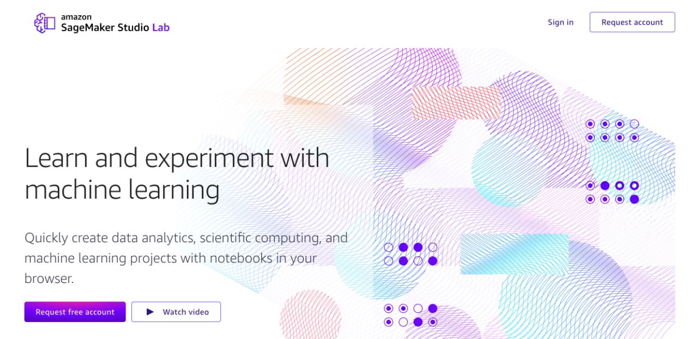

Studio Lab account

Your Studio Lab account gives you access to Studio Lab. For more information about creating a user
account, see Onboard to Amazon SageMaker Studio Lab.

Studio Lab components overview
927

## Page 956

Amazon SageMaker AI
Developer Guide

Project overview page

You can launch a compute instance and view information about your project on this page. To
navigate to this page, you must sign in from the Amazon SageMaker Studio Lab website. The URL
takes the following format.

https://studiolab.sagemaker.aws/users/<YOUR_USER_NAME>

The following screenshot shows a project overview in the Studio Lab user interface.

Preview page

On this page, you can access a read-only preview of a Jupyter notebook. You can not execute the
notebook from preview, but you can copy that notebook into your project. For many customers,
this may be the first Studio Lab page that customers see, as they may be opening a notebook from
GitHub notebook. For more information on how to use GitHub resources, see Use GitHub resources.

To copy the notebook preview to your Studio Lab project:

1.
Sign in to your Studio Lab account. For more information about creating a Studio Lab account,
see Onboard to Amazon SageMaker Studio Lab.

2.
Under Notebook compute instance, choose a compute instance type. For more information
about compute instance types, see Compute instance type.

3.
Choose Start runtime. You might be asked to solve a CAPTCHA puzzle. For more information
on CAPTCHA, see  What is a CAPTCHA puzzle?

4.
One time setup, for first time starting runtime using your Studio Lab account:

Studio Lab components overview
928

## Page 957

Amazon SageMaker AI
Developer Guide

a.
Enter a mobile phone number to associate with your Amazon SageMaker Studio Lab
account and choose Continue.

For information on supported countries and regions, see  Supported countries and regions
(SMS channel).

b.
Enter the 6-digit code sent to the associated mobile phone number and choose Verify.

5.
Choose Copy to project.

Project

Your project contains all of your files and folders, including your Jupyter notebooks. You have
full control over the files in your project. Your project also includes the JupyterLab-based user
interface. From this interface, you can interact with your Jupyter notebooks, edit your source code

files, integrate with GitHub, and connect to Amazon S3. For more information, see Use the Amazon
SageMaker Studio Lab project runtime.

The following screenshot shows a Studio Lab project with the file browser open and the Studio Lab
Launcher displayed.

Studio Lab components overview
929

## Page 958

Amazon SageMaker AI
Developer Guide

Compute instance type

Your Amazon SageMaker Studio Lab project runtime is based on an EC2 instance. You are allotted
15 GB of storage and 16 GB of RAM. Availability of compute instances is not guaranteed and is

subject to demand. If you require additional storage or compute resources, consider switching to

Studio.

Amazon SageMaker Studio Lab offers the choice of a CPU (Central Processing Unit) and a GPU
(Graphical Processing Unit). The following sections give information about these two options,
including selection guidance.

CPU

A central processing unit (CPU) is designed to handle a wide range of tasks efficiently, but is limited
in how many tasks it can run concurrently. For machine learning, a CPU is recommended for

compute intensive algorithms, such as time series, forecasting, and tabular data.

The CPU compute type has up to 4 hours at a time with a limit of 8 hours in a 24-hour period.

GPU

A graphics processing unit (GPU) is designed to render high-resolution images and video
concurrently. A GPU is recommended for deep learning tasks, especially for transformers and
computer vision.

The GPU compute type has up to 4 hours at a time with a limit of 4 hours in a 24-hour period.

Compute time

When compute time for Studio Lab reaches its time limit, the instance stops all running
computations. Studio Lab does not support time limit increases.

Studio Lab automatically saves your environment when you update your environment and every
time you create a new file. Custom-installed extensions and packages persist even after your
runtime has ended.

File edits are periodically saved, but are not saved when your runtime ends. To ensure that you do
not lose your progress, save your work manually. If you have content in your Studio Lab project
that you don’t want to lose, we recommend that you back up your content elsewhere. For more
information about exporting your environment and files, see Export an Amazon SageMaker Studio
Lab environment to Amazon SageMaker Studio Classic.

Studio Lab components overview
930

## Page 959

Amazon SageMaker AI
Developer Guide

During long computation, you do not need to keep your project open. For example, you can start
training a model, then close your browser. The instance keeps running for up to the compute type
limit in a 24-hour period. You can then sign in later to continue your work.

We recommend that you use checkpointing in your deep learning jobs. You can use saved
checkpoints to restart a job from the previously saved checkpoint. For more information, see File I/
O.

Project runtime

The project runtime is the period of time when your compute instance is running.

Session

A user session begins every time you launch your project.

Onboard to Amazon SageMaker Studio Lab

To onboard to Amazon SageMaker Studio Lab, follow the steps in this guide. In the following
sections, you learn how to request a Studio Lab account, create your account, and sign in.

Topics

• Request a Studio Lab account

• Create a Studio Lab account

• Sign in to Studio Lab

Request a Studio Lab account

To use Studio Lab, you must first request approval to create a Studio Lab account. An AWS account
cannot be used for onboarding to Studio Lab.

The following steps show how to request a Studio Lab account.

1.
Navigate to the Studio Lab landing page.

2.
Select Request account.

3.
Enter the required information into the form.

4.
Select Submit request.

Onboard to Studio Lab
931

## Page 960

Amazon SageMaker AI
Developer Guide

5.
If you receive an email to verify your email address, follow the instructions in the email to
complete this step.

Your account request must be approved before you can register for a Studio Lab account. Your
request will be reviewed within five business days. When your account request is approved, you
receive an email with a link to the Studio Lab account registration page. This link expires seven
days after your request is approved. If the link expires, you must submit a new account request.

Note: Your account request is denied if your email has been associated with activity that violates
our Terms of Service or other agreements.

Referral codes

Studio Lab referral codes enable new account requests to be automatically approved to support
machine learning events like workshops, hackathons, and classes. With a referral code, a trusted

host can get their participants immediate access to Studio Lab. After an account has been created
using a referral code, the account continues to exist after the expiration of the code.

To get a referral code, contact Sales Support. To use a referral code, enter the code as part of the
account request form.

Create a Studio Lab account

After your request is approved, complete the following steps to create your Studio Lab account.

1.
Select Create account in the account request approval email to open a new page.

2.
From the new page, enter your Email, a Password, and a Username.

3.
Select Create account.

You might be asked to solve a CAPTCHA puzzle. For more information on CAPTCHA, see  What
is a CAPTCHA puzzle?

Sign in to Studio Lab

After you register for your account, you can sign in to Studio Lab.

1.
Navigate to the Studio Lab landing page.

2.
Select Sign in to open a new page.

3.
Enter your Email or Username and Password.

Onboard to Studio Lab
932

## Page 961

Amazon SageMaker AI
Developer Guide

4.
Select Sign in to open a new page to your project.

You might be asked to solve a CAPTCHA puzzle. For more information on CAPTCHA, see  What
is a CAPTCHA puzzle?

Manage your account

The following topic gives information about managing your account, including changing your
password, deleting your account, and getting information that we have collected. These topics
require that you sign in to your Amazon SageMaker Studio Lab account. For more information, see
Sign in to Studio Lab.

Change your password

Follow these steps to change your Amazon SageMaker Studio Lab password.

1.
Navigate to the Studio Lab project overview page. The URL takes the following format.

https://studiolab.sagemaker.aws/users/<YOUR_USER_NAME>

2.
From the top-right corner, select your user name to open a dropdown menu.

3.
From the dropdown menu, select Change password to open a new page.

4.
Enter your current password into the Enter your current password field.

5.
Enter your new password into the Create a new password and Confirm your new password
fields.

6.
Select Submit.

Delete your account

Follow these steps to delete your Studio Lab account.

1.
Navigate to the Studio Lab project overview page. The URL takes the following format.

https://studiolab.sagemaker.aws/users/<YOUR_USER_NAME>

2.
From the top-right corner, select your user name to open a dropdown menu.

3.
From the dropdown menu, select Delete account to open a new page.

4.
Enter your password to confirm the deletion of your Studio Lab account.

Manage your account
933

## Page 962

Amazon SageMaker AI
Developer Guide

5.
Select Delete.

Customer information

Studio Lab collects your email address, user name, encrypted password, project files,
and metadata. When requesting an account, you can optionally choose to provide your first and
last name, country, organization name, occupation, and the reason for your interest in this product.
We protect all customer personal data with encryption. For more information about how your
personal information is handled, see the Privacy Notice.

When you delete your account, all of your information is deleted immediately. If you have an
inquiry about this, submit the Amazon SageMaker Studio Lab Form. For information and support
related to AWS compliance, see Compliance support.

Launch your Amazon SageMaker Studio Lab project runtime

The Amazon SageMaker Studio Lab project runtime lets you write and run code directly from
your browser. It is based on JupyterLab and has an integrated terminal and console. For more
information about JupyterLab, see the JupyterLab Documentation.

The following topic gives information about how to manage your project runtime. These topics
require that you sign in to your Amazon SageMaker Studio Lab account. For more information
about signing in, see Sign in to Studio Lab. For more information about your project, see Amazon
SageMaker Studio Lab components overview.

Topics

• Start your project runtime

• Stop your project runtime

• View remaining compute time

• Change your compute type

Start your project runtime

To use Studio Lab, you must start your project runtime. This runtime gives you access to the
JupyterLab environment.

1.
Navigate to the Studio Lab project overview page. The URL takes the following format.

Launch Studio Lab
934

## Page 963

Amazon SageMaker AI
Developer Guide

https://studiolab.sagemaker.aws/users/<YOUR_USER_NAME>

2.
Under My Project, select a compute type. For more information about compute types, see
Compute instance type.

3.
Select Start runtime.

You might be asked to solve a CAPTCHA puzzle. For more information on CAPTCHA, see  What
is a CAPTCHA puzzle?

4.
One time setup, for first time starting runtime using your Studio Lab account:

a.
Enter a mobile phone number to associate with your Amazon SageMaker Studio Lab
account and choose Continue.

For information on supported countries and regions, see  Supported countries and regions
(SMS channel).

b.
Enter the 6-digit code sent to the associated mobile phone number and choose Verify.

5.
After the runtime is running, select Open project to open the project runtime environment in
a new browser tab.

Stop your project runtime

When you stop your project runtime, your files are not automatically saved. To ensure that you
don't lose your work, save all of your changes before stopping your project runtime.

•
Under My Project, select Stop runtime.

View remaining compute time

Your project runtime has limited compute time based on the compute type that you select. For
more information about compute time in Studio Lab, see Compute instance type.

•
Under My Project, view Time remaining.

Change your compute type

You can switch your compute type based on your workflow. For more information about compute
types, see Compute instance type.

Launch Studio Lab
935

## Page 964

Amazon SageMaker AI
Developer Guide

1.
Save any project files before changing the compute type.

2.
Navigate to the Studio Lab project overview page. The URL takes the following format.

https://studiolab.sagemaker.aws/users/<YOUR_USER_NAME>

3.
Under My Project, select the desired compute type (CPU or GPU).

4.
Confirm your choice by selecting Restart in the Restart project runtime? dialog box. Studio
Lab stops your current project runtime, then starts a new project runtime with your updated
compute type.

5.
After your project runtime has started, select Open project. This opens your project runtime
environment in a new browser tab. For information about using your project runtime
environment, see Use the Amazon SageMaker Studio Lab project runtime.

Use Amazon SageMaker Studio Lab starter assets

Amazon SageMaker Studio Lab supports the following assets to help machine learning (ML)
practitioners get started. This guide shows you how to clone notebooks for your project.

Getting started notebook

Studio Lab comes with a starter notebook that gives general information and guides you
through key workflows. When you launch your project runtime for the first time, this notebook
automatically opens.

Dive into Deep Learning

Dive into Deep Learning (D2L) is an interactive, open-source book that teaches the ideas,
mathematical theory, and code that power machine learning. With over 150 Jupyter notebooks,
D2L provides a comprehensive overview of deep learning principles. For more information about
D2L, see the D2L website.

The following procedure shows how to clone the D2L Jupyter notebooks to your instance.

1.
Start and open the Studio Lab project runtime environment by following Start your project
runtime.

2.
Once Studio Lab is open, choose the Git tab

(

)
on the left sidebar.

Use Studio Lab starter assets
936

## Page 965

Amazon SageMaker AI
Developer Guide

3.
Choose Clone a Repository.

If you do not see the Clone a Repository option, this may be because you are currently in a Git
repository. Instead, use the following substeps.

a.
Choose the Folder tab

(

)
on the left sidebar.

b.
Beneath the file search bar, choose the folder icon to the left of the currently selected

repository. When you hover over the folder icon, you will see the user directory (/home/

studio-lab-user).

c.
Once you are in the user directory, choose the Git tab on the left sidebar.

d.
Choose Clone a Repository.

4.
Under Git repository URL (.git) you will be asked to provide a URL.

5.
On a new browser tab, navigate to your Studio Lab project overview page. The URL takes the
following format.

https://studiolab.sagemaker.aws/users/<YOUR_USER_NAME>

6.
Under New to machine learning?, choose Dive into Deep Learning.

7.
From the new Dive into Deep Learning browser tab, choose GitHub to open a new page with
the example notebooks.

8.
Choose Code and copy the GitHub repository's URL in the HTTPS tab.

9.
Return to the Studio Lab open project browser tab, paste the D2L repository URL, and clone
the repository.

AWS Machine Learning University

The AWS Machine Learning University (MLU) provides access to the machine learning courses used
to train Amazon’s own developers. With AWS MLU, any developer can learn how to use machine
learning with the learn-at-your-own-pace MLU Accelerator learning series. The MLU Accelerator
series is designed to help developers begin their ML journey. It offers three-day foundational
courses on these three subjects: Natural Language Processing, Tabular Data, and Computer Vision.
For more information, see Machine Learning University.

The following procedure shows how to clone the AWS MLU Jupyter notebooks to your instance.

Use Studio Lab starter assets
937

## Page 966

Amazon SageMaker AI
Developer Guide

1.
Start and open the Studio Lab project runtime environment by following Start your project
runtime.

2.
Once Studio Lab is open, choose the Git tab

(

)
on the left sidebar.

3.
Choose Clone a Repository.

If you do not see the Clone a Repository option, this may be because you are currently in a Git
repository. Instead, use the following substeps.

a.
Choose the Folder tab

(

)
on the left sidebar.

b.
Beneath the file search bar, choose the folder icon to the left of the currently selected

repository. When you hover over the folder icon, you will see the user directory (/home/

studio-lab-user).

c.
Once you are in the user directory, choose the Git tab on the left sidebar.

d.
Choose Clone a Repository.

4.
Under Git repository URL (.git) you will be asked to provide a URL.

5.
On a new browser tab, navigate to your Studio Lab project overview page. The URL takes the
following format.

https://studiolab.sagemaker.aws/users/<YOUR_USER_NAME>

6.
Under New to machine learning?, choose AWS Machine Learning University.

7.
From the new AWS Machine Learning University browser tab, find a course that interests you
by reading the Course Summary for each course.

8.
Choose the corresponding GitHub repository of interest under Course Content, to open a new
page with the example notebooks.

9.
Choose Code and copy the GitHub repository's URL in the HTTPS tab.

10. Return to the Studio Lab open project browser tab, paste the MLU repository URL, and choose

Clone to clone the repository.

Roboflow

Use Studio Lab starter assets
938

## Page 967

Amazon SageMaker AI
Developer Guide

Roboflow gives you the tools to train, fine-tune, and label objects for computer vision applications.
For more information, see https://roboflow.com/.

The following procedure shows how to clone the Roboflow Jupyter notebooks to your instance.

1.
Navigate to the Studio Lab project overview page. The URL takes the following format.

https://studiolab.sagemaker.aws/users/<YOUR_USER_NAME>

2.
Under Resources and community, find Make AI Generated Images.

3.
Under Make AI Generated Images choose Open notebook.

4.
Follow the tutorial under the Notebook preview.

Studio Lab pre-installed environments

Amazon SageMaker Studio Lab uses conda environments to manage packages (or libraries) for your
projects. This guide explains what conda environments are, how to interact with them, and the
different pre-installed environments available in Studio Lab.

A conda environment is a directory that contains a collection of packages you have installed. It
allows you to create isolated environments with specific package versions, preventing conflicts
between projects with different dependencies.

You can interact with conda environments in Studio Lab in two ways:

• Terminal: Use the terminal to create, activate, and manage environments.

• JupyterLab Notebook: When opening a JupyterLab notebook, select the kernel with the
environment name you wish to use, to use the packages installed in that environment.

For a walkthrough on managing environments, see Manage your environment

Studio Lab comes with several pre-installed environments that are either persistent or non-
persistent memory environments. Any changes made to persistent memory environments will
remain for your next session. Any changes to non-persistent memory environments will not remain
for your next sessions, but the packages within will be updated and tested for compatability by
Amazon SageMaker AI. Here's an overview of each environment and its use case:

• sagemaker-distribution: A non-persistent environment managed by Amazon SageMaker
AI. It contains popular packages for machine learning, data science, and visualization. This

Studio Lab pre-installed environments
939

## Page 968

Amazon SageMaker AI
Developer Guide

environment is regularly updated and tested for compatibility. Use this environment if you want
a fully-managed setup with common packages pre-installed.

The sagemaker-distribution environment is closely related to the environment used in
Amazon SageMaker Studio Classic, so after graduating from Studio Lab to Studio Classic the
notebooks should run similarly. For information on exporting your environment from Studio
Lab to Studio Classic, see Export an Amazon SageMaker Studio Lab environment to Amazon
SageMaker Studio Classic.

• default: A persistent environment with minimal packages pre-installed. Use this environment if
you want to customize it significantly by installing additional packages.

• studiolab: A persistent environment where JupyterLab and related packages installed. Use
this environment for configuring the JupyterLab user interface and installing Jupyter server
extensions.

• studiolab-safemode: A non-persistent environment activated automatically when there's

an issue with your project runtime. Use this environment for troubleshooting purposes. For
information on troubleshooting, see Troubleshooting.

• base: A non-persistent environment used for system tooling. This environment is not intended
for customer use.

To view the packages in an environment, run the command conda list.

For more information on installing packages within your environment, see Customize your
environment.

If you plan to graduate from Studio Lab to Amazon SageMaker Studio Classic, see Export an
Amazon SageMaker Studio Lab environment to Amazon SageMaker Studio Classic.

For information on SageMaker images and their versions, see Amazon SageMaker Images Available
for Use With Studio Classic Notebooks.

Use the Amazon SageMaker Studio Lab project runtime

The following topics give information about using the Amazon SageMaker Studio Lab project
runtime. Before you can use the Studio Lab project runtime, you must onboard to Studio Lab by
following the steps in Onboard to Amazon SageMaker Studio Lab.

Topics

• Amazon SageMaker Studio Lab UI overview

Use the Studio Lab project runtime
940

## Page 969

Amazon SageMaker AI
Developer Guide

• Create or open an Amazon SageMaker Studio Lab notebook

• Use the Amazon SageMaker Studio Lab notebook toolbar

• Manage your environment

• Use external resources in Amazon SageMaker Studio Lab

• Get notebook differences

• Export an Amazon SageMaker Studio Lab environment to Amazon SageMaker Studio Classic

• Shut down Studio Lab resources

Amazon SageMaker Studio Lab UI overview

Amazon SageMaker Studio Lab extends the JupyterLab interface. Previous users of JupyterLab
will notice similarities between the JupyterLab and Studio Lab UI, including the workspace. For an

overview of the basic JupyterLab interface, see The JupyterLab Interface.

The following image shows Studio Lab with the file browser open and the Studio Lab Launcher
displayed.

You will find the menu bar at the top of the screen. The left sidebar contains icons to open file
browsers, resource browsers, and tools. The status bar is located at the bottom-left corner of
Studio Lab.

Use the Studio Lab project runtime
941

## Page 970

Amazon SageMaker AI
Developer Guide

The main work area is divided horizontally into two panes. The left pane is the file and resource
browser. The right pane contains one or more tabs for resources, such as notebooks and terminals.

Topics

• Left sidebar

• File and resource browser

• Main work area

Left sidebar

The left sidebar includes the following icons. When you hover over an icon, a tooltip displays
the icon name. When you choose an icon, the file and resource browser displays the described
functionality. For hierarchical entries, a selectable breadcrumb at the top of the browser shows
your location in the hierarchy.

Icon
Description

File Browser

Choose the Upload Files icon

(

)
to add files to Studio Lab.

Double-click a file to open the file in a new tab.

To have adjacent files open, choose a tab that contains a notebook,
Python, or text file, and then choose New View for File.

Choose the plus (+) sign on the menu at the top of the file browser to
open the Studio Lab Launcher.

Running Terminals and Kernels

You can see a list of all of the running terminals and kernels in your
project. For more information, see Shut down Studio Lab resources.

Git

Use the Studio Lab project runtime
942

## Page 971

Amazon SageMaker AI
Developer Guide

Icon
Description

You can connect to a Git repository and then access a full range of Git
tools and operations. For more information, see Use external resources
in Amazon SageMaker Studio Lab.

Table of Contents

You can access the Table of Contents for your current Jupyter
notebook.

Extension Manager

You can enable and manage third-party JupyterLab extensions.

File and resource browser

The file and resource browser shows lists of your notebooks and files. On the menu at the top of
the file browser, choose the plus (+) sign to open the Studio Lab Launcher. The Launcher allows you
to create a notebook or open a terminal.

Main work area

The main work area has multiple tabs that contain your open notebooks and terminals.

Create or open an Amazon SageMaker Studio Lab notebook

When you create a notebook in Amazon SageMaker Studio Lab or open a notebook in Studio Lab,
you must select a kernel for the notebook. The following topics describe how to create and open
notebooks in Studio Lab.

For information about shutting down the notebook, see Shut down Studio Lab resources.

Topics

• Open a Studio Lab notebook

• Create a notebook from the file menu

• Create a notebook from the Launcher

Use the Studio Lab project runtime
943

## Page 972

Amazon SageMaker AI
Developer Guide

Open a Studio Lab notebook

Studio Lab can only open notebooks listed in the Studio Lab file browser. To clone a notebook into
your file browser from an external repository, see Use external resources in Amazon SageMaker
Studio Lab.

To open a notebook

1.
In the left sidebar, choose the File Browser icon

(

)
to display the file browser.

2.
Browse to a notebook file and double-click it to open the notebook in a new tab.

Create a notebook from the file menu

To create a notebook from the File menu

1.
From the Studio Lab menu, choose File, choose New, and then choose Notebook.

2.
To use the default kernel, in the Select Kernel dialog box, choose Select. Otherwise, to select a
different kernel, use the dropdown menu.

Create a notebook from the Launcher

To create a notebook from the Launcher

1.
Open the Launcher by using the keyboard shortcut Ctrl + Shift + L.

Alternatively, you can open Launcher from the left sidebar: Choose the File Browser icon, and
then choose the plus (+) icon.

2.
To use the default kernel from the Launcher, under Notebook, choose default:Python.
Otherwise, select a different kernel.

After you choose the kernel, your notebook launches and opens in a new Studio Lab tab.

To view the notebook's kernel session, in the left sidebar, choose the Running Terminals and
Kernels icon

(

).
You can stop the notebook's kernel session from this view.

Use the Studio Lab project runtime
944

## Page 973

Amazon SageMaker AI
Developer Guide

Use the Amazon SageMaker Studio Lab notebook toolbar

Amazon SageMaker Studio Lab notebooks extend the JupyterLab interface. For an overview of the
basic JupyterLab interface, see The JupyterLab Interface.

The following image shows the toolbar and an empty cell from a Studio Lab notebook.

When you hover over a toolbar icon, a tooltip displays the icon function. You can find additional
notebook commands in the Studio Lab main menu. The toolbar includes the following icons:

Icon
Description

Save and checkpoint

Saves the notebook and updates the checkpoint file.

Insert cell

Inserts a code cell below the current cell. The current cell is noted by
the blue vertical marker in the left margin.

Cut, copy, and paste cells

Cuts, copies, and pastes the selected cells.

Run cells

Runs the selected cells. The cell that follows the last-selected cell
becomes the new-selected cell.

Interrupt kernel

Interrupts the kernel, which cancels the currently-running operation.
The kernel remains active.

Restart kernel

Use the Studio Lab project runtime
945

## Page 974

Amazon SageMaker AI
Developer Guide

Icon
Description

Restarts the kernel. Variables are reset. Unsaved information is not
affected.

Restart kernel and re-run notebook

Restarts the kernel. Variables are reset. Unsaved information is not
affected. Then re-runs the entire notebook.

Cell type

Displays or changes the current cell type. The cell types are:

• Code – Code that the kernel runs.

• Markdown – Text rendered as markdown.

• Raw – Content, including Markdown markup, that's displayed as text.

Checkpoint diff

Opens a new tab that displays the difference between the notebook
and the checkpoint file. For more information, see Get notebook
differences.

Git diff

Only enabled if the notebook is opened from a Git repository. Opens a
new tab that displays the difference between the notebook and the last
Git commit. For more information, see Get notebook differences.

default
Kernel

Displays or changes the kernel that processes the cells in the notebook.

No Kernel indicates that the notebook was opened without specifyin
g a kernel. You can edit the notebook, but you can't run any cells.

Use the Studio Lab project runtime
946

## Page 975

Amazon SageMaker AI
Developer Guide

Icon
Description

Kernel busy status

Displays a kernel's busy status by showing the circle's edge and its
interior as the same color. The kernel is busy when it is starting and
when it is processing cells. Additional kernel states are displayed in the
status bar at the bottom-left corner of Studio Lab.

Manage your environment

Amazon SageMaker Studio Lab provides pre-installed environments for your Studio Lab notebook
instances. Environments allow you to start up a Studio Lab notebook instance with the packages
you want to use. This is done by installing packages in the environment and then selecting the
environment as a Kernel.

Studio Lab has various environments pre-installed for you. You will typically want to use the

sagemaker-distribution environment if you want to use a fully managed environment
that already contains many popular packages used for machine learning (ML) engineers and

data scientists. Otherwise you can use the default environment if you want persistent
customization for your environment. For more information on the available pre-installed Studio
Lab environments, see Studio Lab pre-installed environments.

You can customize your environment by adding new packages (or libraries) to it. You can
also create new environments from Studio Lab, import compatible environments, reset your
environment to create space, and more.

The following commands are for running in a Studio Lab terminal. However, while installing
packages it is highly recommended to install them within your Studio Lab Jupyter notebook. This
ensures that the packages are installed in the intended environment. To run the commands in a

Jupyter notebook, prefix the command with a % before running the cell. For example, the code

snippet pip list in a terminal is the same as %pip list in a Jupyter notebook.

The following sections give information about your default conda environment, how to
customize it, and how to add and remove conda environments. For a list of sample environments
that you can install into Studio Lab, see Creating Custom conda Environments. To use these sample
environment YAML files with Studio Lab, see Step 4: Install your Studio Lab conda environments in
Studio Classic.

Use the Studio Lab project runtime
947

## Page 976

Amazon SageMaker AI
Developer Guide

Topics

• Your default environment

• View environments

• Create, activate, and use new conda environments

• Using sample Studio Lab environments

• Customize your environment

• Refresh Studio Lab

Your default environment

Studio Lab uses conda environments to encapsulate the software packages that are needed to run

notebooks. Your project contains a default conda environment, named default, with the IPython
kernel. This environment serves as the default kernel for your Jupyter notebooks.

View environments

To view the environments in Studio Lab you can use a terminal or Jupyter notebook. The following
command will be for a Studio Lab terminal. If you wish to run the corresponding commands in a
Jupyter notebook, see Manage your environment.

Open the Studio Lab terminal by opening the File Browser panel

(

),
choose the plus (+) sign on the menu at the top of the file browser to open the Launcher, then
choose Terminal. From the Studio Lab terminal, list the conda environments by running the
following.

conda env list

This command outputs a list of the conda environments and their locations in the file system.

When you onboard to Studio Lab, you automatically activate the studiolab  conda environment.
The following is an example of listed environments after you onboard.

# conda environments:
#
default                  /home/studio-lab-user/.conda/envs/default
studiolab             *  /home/studio-lab-user/.conda/envs/studiolab

Use the Studio Lab project runtime
948

## Page 977

Amazon SageMaker AI
Developer Guide

studiolab-safemode       /opt/amazon/sagemaker/safemode-home/.conda/envs/studiolab-
safemode
base                     /opt/conda
sagemaker-distribution     /opt/conda/envs/sagemaker-distribution

The * marks the activated environment.

Create, activate, and use new conda environments

If you would like to maintain multiple environments for different use cases, you can create new
conda environments in your project. The following sections show how to create and activate new
conda environments. For a Jupyter notebook that shows how to create a custom environment, see
Setting up a Custom Environment in SageMaker Studio Lab.

Note

Maintaining multiple environments counts against your available Studio Lab memory.

Create conda environment

To create a conda environment, run the following conda command from your terminal. This
example creates a new environment with Python 3.9.

conda create --name <ENVIRONMENT_NAME> python=3.9

Once the conda environment is created, you can view the environment in your environment list. For
more information on how to view your environment list, see View environments.

Activate a conda environment

To activate any conda environment, run the following command in the terminal.

conda activate <ENVIRONMENT_NAME>

When you run this command, any packages installed using conda or pip are installed in the
environment. For more information on installing packages, see Customize your environment.

Use a conda environment

Use the Studio Lab project runtime
949

## Page 978

Amazon SageMaker AI
Developer Guide

1.
To use your new conda environments with notebooks, make sure the ipykernel package is
installed in the environment.

conda install ipykernel

2.
Once the ipykernel package is installed in the environment, you can select the environment
as the kernel for your notebook.

You may need to restart JupyterLab to see the environment available as a kernel. This can be
done by choosing Amazon SageMaker Studio Lab in the top menu of your Studio Lab open
project, and choosing Restart JupyterLab....

3.
You can choose the kernel for an existing notebook or when you create a new one.

• For an existing notebook: open the notebook and choose the current kernel from the right
side of the top menu. You can choose the kernel you wish to use from the drop-down menu.

• For a new notebook: open the Studio Lab launcher and choose the kernel under Notebook.
This will open the notebook with the kernel you choose.

For an overview of the Studio Lab UI, see Amazon SageMaker Studio Lab UI overview.

Using sample Studio Lab environments

Studio Lab provides sample custom environments through the SageMaker Studio Lab Examples
repository. The following shows how to clone and build these environments.

1.
Clone the SageMaker Studio Lab Examples GitHub repository by following the instructions in
Use GitHub resources.

2.
In Studio Lab choose the File Browser icon

(

)
on the left menu, so that the File Browser panel shows on the left.

3.
Navigate to the studio-lab-examples/custom-environments directory in the File
Browser.

4.
Open the directory for the environment that you want to build.

5.
Right click the .yml file in the folder, then select Build conda Environment.

6.
You can now use the environment as a kernel after your conda environment has finished
building. For instructions on how to use an existing environment as a kernel, see Create,
activate, and use new conda environments

Use the Studio Lab project runtime
950

## Page 979

Amazon SageMaker AI
Developer Guide

Customize your environment

You can customize your environment by installing and removing extensions and packages as
needed. Studio Lab comes with environments with packages pre-installed and using an existing
environment may save you time and memory, as pre-installed packages do not count against your

available Studio Lab memory. For more information on the available pre-installed Studio Lab
environments, see Studio Lab pre-installed environments.

Any installed extensions and packages installed on your default environment will persist in
your project. That is, you do not need to install your packages for every project runtime session.

However, extensions and packages installed on your sagemaker-distribution environment
will not persist, so you will need to install new packages during your next session. Thus, it is highly
recommended to install packages within your notebook to ensure that the packages are installed in
the intended environment.

To view your environments, run the command conda env list.

To activate your environment, run the command conda activate <ENVIRONMENT_NAME>.

To view the packages in an environment, run the command conda list.

Install packages

It is highly recommended to install your packages within your Jupyter notebook to ensure that
your packages are installed in the intended environment. To install additional packages to your
environment from a Jupyter notebook, run one of the following commands in a cell within your
Jupyter notebook. These commands install packages in the currently activated environment.

• %conda install <PACKAGE>

• %pip install <PACKAGE>

We don't recommend using the !pip or !conda commands because they can behave in
unexpected ways when you have multiple environments.

After you install new packages to your environment, you may need to restart the kernel to ensure
that the packages work in your notebook. This can be done by choosing Amazon SageMaker
Studio Lab in the top menu of your Studio Lab open project and choosing Restart JupyterLab....

Remove packages

To remove a package, run the command

Use the Studio Lab project runtime
951

## Page 980

Amazon SageMaker AI
Developer Guide

%conda remove <PACKAGE_NAME>

This command will also remove any package that depends on <PACKAGE_NAME>, unless a
replacement can be found without that dependency.

To remove all of the packages in an environment, run the command

conda deactivate
&& conda env remove --name
<ENVIRONMENT_NAME>

Refresh Studio Lab

To refresh Studio Lab, remove all of your environments and files.

1.
List all conda environments.

conda env list

2.
Activate the base environment.

conda activate base

3.
Remove each environment in the list of conda environments, besides base.

conda remove --name <ENVIRONMENT_NAME> --all

4.
Delete all of the files on your Studio Lab.

rm -rf *.*

Use external resources in Amazon SageMaker Studio Lab

With Amazon SageMaker Studio Lab, you can integrate external resources, such as Jupyter
notebooks and data, from Git repositories and Amazon S3. You can also add an Open in Studio
Lab button to your GitHub repo and notebooks. This button lets you clone your notebooks directly
from Studio Lab.

The following topics show how to integrate external resources.

Use the Studio Lab project runtime
952

## Page 981

Amazon SageMaker AI
Developer Guide

Topics

• Use GitHub resources

• Add an Open in Studio Lab button to your notebook

• Import files from your computer

• Connect to Amazon S3

Use GitHub resources

Studio Lab offers integration with GitHub. With this integration, you can clone notebooks and
repositories directly to your Studio Lab project.

The following topics give information about how to use GitHub resources with Studio Lab.

Studio Lab sample notebooks

To get started with a repository of sample notebooks tailored for Studio Lab, see Studio Lab
Sample Notebooks.

This repository provides notebooks for the following use cases and others.

• Computer vision

• Connecting to AWS

• Creating custom environments

• Geospatial data analysis

• Natural language processing

• Using R

Clone a GitHub repo

To clone a GitHub repo to your Studio Lab project, follow these steps.

1.
Start your Studio Lab project runtime. For more information on launching Studio Lab project
runtime, see Start your project runtime.

2.
In Studio Lab, choose the File Browser icon

(

)
on the left menu, so that the File Browser panel shows on the left.

Use the Studio Lab project runtime
953

## Page 982

Amazon SageMaker AI
Developer Guide

3.
Navigate to your user directory by choosing the file icon beneath the file search bar.

4.
Select the Git icon

(

)
from the left menu to open a new dropdown menu.

5.
Choose Clone a Repository.

6.
Paste the repository's URL under Git repository URL (.git).

7.
Select Clone.

Clone individual notebooks from GitHub

To open a notebook in Studio Lab, you must have access to the repo that the notebook is in. The
following examples describe Studio Lab permission-related behavior in various situations.

• If a repo is public, you can automatically clone the notebook into your project from the Studio
Lab preview page.

• If a repo is private, you are prompted to sign in to GitHub from the Studio Lab preview page. If
you have access to a private repo, you can clone the notebook into your project.

• If you don't have access to a private repo, you cannot clone the notebook from the Studio Lab
preview page.

The following sections show two options for you to copy a GitHub notebook in your Studio Lab
project. These options depend on whether the notebook has an Open in Studio Lab button.

Option 1: Copy notebook with an Open in Studio Lab button

The following procedure shows how to copy a notebook that has an Open in Studio Lab button.
If you want to add this button to your notebook, see Add an Open in Studio Lab button to your
notebook.

1.
Sign in to Studio Lab following the steps in Sign in to Studio Lab.

2.
In a new browser tab, navigate to the GitHub notebook that you want to clone.

3.
In the notebook, select the Open in Studio Lab button to open a new page in Studio Lab with
a preview of the notebook.

4.
If your project runtime is not already running, start it by choosing the Start runtime button at
the top of the preview page. Wait for the runtime to start before proceeding to the next step.

Use the Studio Lab project runtime
954

## Page 983

Amazon SageMaker AI
Developer Guide

5.
After your project runtime has started, select Copy to project to open your project runtime in
a new browser tab.

6.
In the Copy from GitHub? dialog box, select Copy notebook only. This copies the notebook
file to your project.

Option 2: Clone any GitHub notebook

The following procedure shows how to copy any notebook from GitHub.

1.
Navigate to the notebook in GitHub.

2.
In the browser’s address bar, modify the notebook URL, as follows.

# Original URL
https://github.com/<PATH_TO_NOTEBOOK>

# Modified URL
https://studiolab.sagemaker.aws/import/github/<PATH_TO_NOTEBOOK>

3.
Navigate to the modified URL. This opens a preview of the notebook in Studio Lab.

4.
If your project runtime is not already running, start it by choosing the Start runtime button at
the top of the preview page. Wait for the runtime to start before proceeding to the next step.

5.
After your project runtime has started, select Copy to project to open your project runtime in
a new browser tab.

6.
In the Copy from GitHub? dialog box, select Copy notebook only to copy the notebook file to
your project.

Add an Open in Studio Lab button to your notebook

When you add the Open in Studio Lab button to your notebooks, others can clone your notebooks
or repositories directly to their Studio Lab projects. If you are sharing your notebook within a public
GitHub repository, your content will be publicly readable. Do not share private content, such as
AWS access keys or AWS Identity and Access Management credentials, in your notebook.

To add the functional Open in Studio Lab button to your Jupyter notebook or repository, add the
following markdown to the top of your notebook or repository.

[]
(https://studiolab.sagemaker.aws/import/github/<PATH_TO_YOUR_NOTEBOOK_ON_GITHUB>)

Use the Studio Lab project runtime
955

## Page 984

Amazon SageMaker AI
Developer Guide

Import files from your computer

The following steps show how to import files from your computer to your Studio Lab project.

1.
Open the Studio Lab project runtime.

2.
Open the File Browser panel.

3.
In the actions bar of the File Browser panel, select the Upload Files button.

4.
Select the files that you want to upload from your local machine.

5.
Select Open.

Alternatively, you can drag and drop files from your computer into the File Browser panel.

Connect to Amazon S3

The AWS CLI enables AWS integration in your Studio Lab project. With this integration, you can pull
resources from Amazon S3 to use with your Jupyter notebooks.

To use AWS CLI with Studio Lab, complete the following steps. For a notebook that outlines this
integration, see Using Studio Lab with AWS Resources.

1.
Install the AWS CLI following the steps in   Installing or updating the latest version of the AWS
CLI.

2.
Configure your AWS credentials by following the steps in   Quick setup. The role for your AWS
account must have permissions to access the Amazon S3 bucket that you are copying data
from.

3.
From your Jupyter notebook, clone resources from the Amazon S3 bucket, as needed. The
following command shows how to clone all resources from an Amazon S3 path to your project.
For more information, see the AWS CLI Command Reference.

!aws s3 cp s3://<BUCKET_NAME>/<PATH_TO_RESOURCES>/ <PROJECT_DESTINATION_PATH>/ --
recursive

Get notebook differences

You can display the difference between the current notebook and the last checkpoint, or the last
Git commit, using the Amazon SageMaker Studio Lab project UI.

Use the Studio Lab project runtime
956

## Page 985

Amazon SageMaker AI
Developer Guide

Topics

• Get the difference between the last checkpoint

• Get the difference between the last commit

Get the difference between the last checkpoint

When you create a notebook, a hidden checkpoint file that matches the notebook is created. You
can view changes between the notebook and the checkpoint file, or revert the notebook to match
the checkpoint file.

To save the Studio Lab notebook and update the checkpoint file
to match: Choose the Save notebook and create checkpoint icon

(

).
This is located on the Studio Lab menu's left side. The keyboard shortcut for Save notebook and

create checkpoint is Ctrl + s.

To view changes between the Studio Lab notebook and the checkpoint file: Choose the Checkpoint
diff icon

(

),
located in the center of the Studio Lab menu.

To revert the Studio Lab notebook to the checkpoint file: On the main Studio Lab menu, choose
File, and then Revert Notebook to Checkpoint.

Get the difference between the last commit

If a notebook is opened from a Git repository, you can view the difference between the notebook
and the last Git commit.

To view the changes in the notebook from the last Git commit: Choose the Git diff icon

(

)
in the center of the notebook menu.

Export an Amazon SageMaker Studio Lab environment to Amazon SageMaker
Studio Classic

Amazon SageMaker Studio Classic offers many features for machine learning and deep learning
work flows that are unavailable in Amazon SageMaker Studio Lab. This page shows how to

Use the Studio Lab project runtime
957

## Page 986

Amazon SageMaker AI
Developer Guide

migrate a Studio Lab environment to Studio Classic to take advantage of more compute capacity,
storage, and features. However, you may want to familiarize yourself with Studio Classic's prebuilt
containers, which are optimized for the full MLOP pipeline. For more information, see Amazon
SageMaker Studio Lab

To migrate your Studio Lab environment to Studio Classic, you must first onboard to Studio Classic
following the steps in Amazon SageMaker AI domain overview.

Topics

• Step 1: Export your Studio Lab conda environment

• Step 2: Save your Studio Lab artifacts

• Step 3: Import your Studio Lab artifacts to Studio Classic

• Step 4: Install your Studio Lab conda environments in Studio Classic

Step 1: Export your Studio Lab conda environment

You can export a conda environment and add libraries or packages to the environment by
following the steps in Manage your environment. The following example demonstrates using the

default environment to be exported to Studio Classic.

1.
Open the Studio Lab terminal by opening the File Browser panel

(

),
choose the plus (+) sign on the menu at the top of the file browser to open the Launcher, then
choose Terminal. From the Studio Lab terminal, list the conda environments by running the
following.

conda env list

This command outputs a list of the conda environments and their locations in the file

system. When you onboard to Studio Lab, you automatically activate the studiolab  conda
environment.

# conda environments: #
default                  /home/studio-lab-user/.conda/envs/default
studiolab             *  /home/studio-lab-user/.conda/envs/studiolab
studiolab-safemode       /opt/amazon/sagemaker/safemode-home/.conda/
envs/studiolab-safemode

Use the Studio Lab project runtime
958

## Page 987

Amazon SageMaker AI
Developer Guide

base                     /opt/conda

We recommend that you do not export the studiolab, studiolab-safemode, and base
environments. These environments are not usable in Studio Classic for the following reasons:

• studiolab: This sets up the JupyterLab environment for Studio Lab. Studio Lab runs a
different major version of JupyterLab than Studio Classic, so it is not usable in Studio Classic.

• studiolab-safemode: This also sets up the JupyterLab environment for Studio Lab.
Studio Lab runs a different major version of JupyterLab than Studio Classic, so it is not
usable in Studio Classic.

• base: This environment comes with conda by default. The base environment in Studio Lab

and the base environment in Studio Classic have incompatible versions of many packages.

2.
For the conda environment that you want to migrate to Studio Classic, first activate the conda

environment. The default environment is then changed when new libraries are installed or
removed from it. To get the exact state of the environment, export it into a YAML file using the
command line. The following command lines export the default environment into a YAML file,

creating a file called myenv.yml.

conda activate default
conda env export > ~/myenv.yml

Step 2: Save your Studio Lab artifacts

Now that you have saved your environment to a YAML file, you can move the environment file to
any platform.

Save to a local machine using Studio Lab GUI

Note

Downloading a directory from the Studio Lab GUI by right-clicking on the directory is
currently unavailable. If you wish to export a directory, please follow the steps using the
Save to Git repository tab.

One option is to save the environment onto your local machine. To do this, use the following
procedure.

Use the Studio Lab project runtime
959

## Page 988

Amazon SageMaker AI
Developer Guide

1.
In Studio Lab, choose the File Browser icon

(

)
on the left menu, so that the File Browser panel shows on the left.

2.
Navigate to your user directory by choosing the file icon beneath the file search bar.

3.
Choose (right-click) the myenv.yml file and then choose Download. You can repeat this
process for other files you want to import to Studio Classic.

Save to a Git repository

Another option is to save your environment to a Git repository. This option uses GitHub as
an example. These steps require a GitHub account and repository. For more information, visit
GitHub. The following procedure shows how to synchronize your content with GitHub using the
Studio Lab terminal.

1.
From the Studio Lab terminal, navigate to your user directory and make a new directory to
contain the files you want to export.

cd ~
mkdir <NEW_DIRECTORY_NAME>

2.
After you create a new directory, copy any file or directory you want to export to

<NEW_DIRECTORY_NAME>.

Copy a file using the following code format:

cp <FILE_NAME> <NEW_DIRECTORY_NAME>

For example, replace <FILE_NAME> with myenv.yml.

Copy any directory using the following code format:

cp -r <DIRECTORY_NAME> <NEW_DIRECTORY_NAME>

For example, replace <DIRECTORY_NAME> with any directory name in your user directory.

3.
Navigate to the new directory and initialize the directory as a Git repository using the
following command. For more information, see the git-init documentation.

Use the Studio Lab project runtime
960

## Page 989

Amazon SageMaker AI
Developer Guide

cd <NEW_DIRECTORY_NAME>
git init

4.
Using Git, add all relevant files and then commit your changes.

git add .
git commit -m "<COMMIT_MESSAGE>"

For example, replace <COMMIT_MESSAGE> with Add Amazon SageMaker Studio Lab

artifacts to GitHub repository to migrate to Amazon SageMaker Studio

Classic .

5.
Push the commit to your remote repository. This repository has the format https://

github.com/<GITHUB_USERNAME>/ <REPOSITORY_NAME>.git where

<GITHUB_USERNAME> is your GitHub user name and the <REPOSITORY_NAME> is your

remote repository name. Create a branch <BRANCH_NAME> to push the content to the
GitHub repository.

git branch -M <BRANCH_NAME>
git remote add origin https://github.com/<GITHUB_USERNAME>/<REPOSITORY_NAME>.git
git push -u origin <BRANCH_NAME>

Step 3: Import your Studio Lab artifacts to Studio Classic

The following procedure shows how to import artifacts to Studio Classic. The instructions on using
Feature Store through the console depends on if you have enabled Studio or Studio Classic as your
default experience. For information on accessing Studio Classic through the console, see Launch
Studio Classic if Studio is your default experience.

From Studio Classic, you can import files from your local machine or from a Git repository. You can
do this using the Studio Classic GUI or terminal. The following procedure uses the examples from
Step 2: Save your Studio Lab artifacts.

Import using the Studio Classic GUI

If you saved the files to your local machine, you can import the files to Studio Classic using the
following steps.

Use the Studio Lab project runtime
961

## Page 990

Amazon SageMaker AI
Developer Guide

1.
Open the File Browser panel

(

)
at the top left of Studio Classic.

2.
Choose the Upload Files icon

(

)
on the menu at the top of the File Browser panel.

3.
Navigate to the file that you want to import, then choose Open.

Note

To import a directory into Studio Classic, first compress the directory on your
local machine to a file. On a Mac, right-click the directory and choose Compress

"<DIRECTORY_NAME>". In Windows, right-click the directory and choose Send to, and
then choose Compressed (zipped) folder. After the directory is compressed, import the
compressed file using the preceding steps. Unzip the compressed file by navigating to

the Studio Classic terminal and running the command <DIRECTORY_NAME>.zip.

Import using a Git repository

This example provides two options for how to clone a GitHub repository
into Studio Classic. You can use the Studio Classic GUI by choosing the Git

(

)
tab on the left side of Studio Classic. Choose Clone a Repository, then paste your GitHub
repository URL from Step 2: Save your Studio Lab artifacts. Another option is to use the Studio
Classic terminal by using the following procedure.

1.
Open the Studio Classic Launcher. For more information on opening the Launcher, see
Amazon SageMaker Studio Classic Launcher.

2.
In the Launcher, in the Notebooks and compute resources section, choose Change
environment.

3.
In Studio Classic, open the Launcher. To open the Launcher, choose Amazon SageMaker
Studio Classic at the top-left corner of Studio Classic.

To learn about all the available ways to open the Launcher, see Use the Amazon SageMaker
Studio Classic Launcher.

Use the Studio Lab project runtime
962

## Page 991

Amazon SageMaker AI
Developer Guide

4.
In the Change environment dialog, use the Image dropdown list to select the Data Science
image and choose Select. This image comes with conda pre-installed.

5.
In the Studio Classic Launcher, choose Open image terminal.

6.
From the image terminal, run the following command to clone your repository. This

command creates a directory named after <REPOSITORY_NAME> in your Studio Classic
instance and clones your artifacts in that repository.

git clone https://github.com/<GITHUB_USERNAME>/<REPOSITORY_NAME>.git

Step 4: Install your Studio Lab conda environments in Studio Classic

You can now recreate your conda environment by using your YAML file in your Studio Classic
instance. Open the Studio Classic Launcher. For more information on opening the Launcher, see
Amazon SageMaker Studio Classic Launcher. From the Launcher, choose Open image terminal.
In the terminal navigate to the directory that contains the YAML file, then run the following
commands.

conda env create --file <ENVIRONMENT_NAME>.yml
conda activate <ENVIRONMENT_NAME>

After these commands are complete, you can select your environment as the kernel for your Studio

Classic notebook instances. To view the available environment, run conda env list. To activate

your environment, run conda activate <ENVIRONMENT_NAME>.

Shut down Studio Lab resources

You can view and shut down your running Amazon SageMaker Studio Lab resources from one
location in your Studio Lab environment. The running resource types include terminals, and
kernels. You can also shut down all resources of one resource type at the same time.

When you shut down all resources belonging to a resource type, the following occurs:

• KERNELS – All kernels, notebooks, and consoles are shut down.

• TERMINALS – All terminals are shut down.

Use the Studio Lab project runtime
963

## Page 992

Amazon SageMaker AI
Developer Guide

Shut down Studio Lab resources

1.
Start your Studio Lab project runtime. For more information on launching Studio Lab project
runtime, see Start your project runtime.

2.
Choose the Running Terminals and Kernels icon

(

)
on the left navigation pane.

3.
Choose the X symbol to the right of the resource you wish to shut down. You can view the X
symbol by hovering your cursor over a resource.

4.
(Optional) You can shut down all the resources of a given resource type by choosing Shut
Down All to the right of the resource type name.

Troubleshooting

The guide shows common errors that might occur when using Amazon SageMaker Studio Lab
(Studio Lab). Each error contains a description, as well as a solution to the error.

Note

You cannot share your password with multiple users or use Studio Lab to mine
cryptocurrency. We don’t recommend using Studio Lab for production tasks because of
runtime limits.

Dependency issues

On August 8, 2025, Studio Lab migrated from JupyterLab 3 to JupyterLab 4. For information about
JupyterLab 4, see the 4.0.0 - Highlights in the JupyterLab Changelog. If you installed JupyterLab
extensions in your Studio Lab environment before August 8, 2025, you might need to reinstall
them in the JupyterLab 4 environment.

Can’t access account

If you can’t access your account, verify that you are using the correct email and password. If you
have forgotten your password, use the following steps to reset your password. If you still cannot
access your account, you must request and register for a new account using the instructions in
Onboard to Amazon SageMaker Studio Lab.

Troubleshooting
964

## Page 993

Amazon SageMaker AI
Developer Guide

Forgot password

If you forget your password, you must reset it using the following steps.

1.
Navigate to the Studio Lab landing page.

2.
Select Sign in.

3.
Select Forgot password? to open a new page.

4.
Enter the email address that you used to sign up for an account.

5.
Select Send reset link to send an email with a password reset link.

6.
From the password reset email, select Reset your password.

7.
Enter your new password.

8.
Select Submit.

Can't launch project runtime

If the Studio Lab project runtime does not launch, try launching it again. If this doesn't work,
switch the instance type from CPU to GPU (or in reverse). For more information, see Change your
compute type.

Runtime stopped running unexpectedly

If there is an issue with the environment used to run JupyterLab, then Studio Lab will automatically
recreate the environment. Studio Lab does not support manual activation of this process.

Conflicting versions

Because you can add packages and modify your environment as needed, you may run into
conflicts between packages in your environment. If there are conflicts between packages in your
environment, you must remove the conflicting package.

Environment build fails

When you build an environment from a YAML file, a package-version conflict or file issue might
cause a build to fail. To resolve this, remove the environment by running the following command.
Do this before attempting to build it again.

conda remove --name <YOUR_ENVIRONMENT> --all

Error message about allowing to download script from domain *.awswaf.com

Troubleshooting
965

## Page 994

Amazon SageMaker AI
Developer Guide

Studio Classic uses the web application firewall service AWS WAF to protect your resources,
which uses JavaScript. If you are using a browser security plugin that prevents JavaScript from
downloading, this error may pop up. To use Studio Classic, allow the JavaScript download from
*.awswaf.com as a trusted domain. For more information on AWS WAF, see AWS WAF from the AWS
WAF, AWS Firewall Manager, and AWS Shield Advanced. Developer Guide.

Disk space is full

If you run into a notification saying mentioning that your disk space is full or File Load Error

for <FILE_NAME> while attempting to open a file, you can remove files, directories, libraries,
or environments to increase space. For more information on managing your libraries and
environments, see Manage your environment.

Project runtime is in safe mode notification

If you run into a notification that Project runtime is in safe mode, you must free up some disk
space to resume using the Studio Lab project runtime. Follow the instructions in the preceding
troubleshoot item, Disk space is full. Once up to at least 500 MB of space has been cleared,
you may restart the project runtime to use Studio Lab. This can be done by choosing Amazon
SageMaker Studio Lab in the top menu of Studio Lab and choosing Restart JupyterLab....

git Cannot import cv2

If you run into an error when importing cv2 after installing opencv-python, you must uninstall

opencv-python and install opencv-python-headless as follows.

%pip uninstall opencv-python --yes
%pip install opencv-python-headless

You can then import cv2 as expected.

Studio Lab becomes unresponsive when opening large files

The Studio Lab IDE may fail to render when large files are opened, resulting in blocked access
to Studio Lab resources. To resolve this, reset the Studio Lab workspace using the following
procedure.

1.
After you open the IDE, copy the URL in your browser's address bar. This URL should be in

the https://xxxxxx.studio.us-east-2.sagemaker.aws/studiolab/default/

jupyter/lab format. Close the tab.

Troubleshooting
966

## Page 995

Amazon SageMaker AI
Developer Guide

2.
In a new tab, paste the URL and remove anything after https://xxxxxx.studio.us-

east-2.sagemaker.aws/studiolab/default/jupyter/lab.

3.
Add ?reset to the end of the URL, so it is in the https://xxxxxx.studio.us-

east-2.sagemaker.aws/studiolab/default/jupyter/lab?reset format.

4.
Navigate to the updated URL. This resets the saved UI state and makes the Studio Lab IDE
responsive.

Amazon SageMaker Canvas

Amazon SageMaker Canvas gives you the ability to use machine learning to generate predictions
without needing to write any code. The following are some use cases where you can use SageMaker
Canvas:

• Predict customer churn

• Plan inventory efficiently

• Optimize price and revenue

• Improve on-time deliveries

• Classify text or images based on custom categories

• Identify objects and text in images

• Extract information from documents

With Canvas, you can chat with popular large language models (LLMs), access Ready-to-use
models, or build a custom model trained on your data.

Canvas chat is a functionality that leverages open-source and Amazon LLMs to help you boost your
productivity. You can prompt the models to get assistance with tasks such as generating content,
summarizing or categorizing documents, and answering questions. To learn more, see Generative
AI foundation models in SageMaker Canvas.

The Ready-to-use models in Canvas can extract insights from your data for a variety of use cases.
You don’t have to build a model to use Ready-to-use models because they are powered by Amazon
AI services, including Amazon Rekognition, Amazon Textract, and Amazon Comprehend. You only
have to import your data and start using a solution to generate predictions.

If you want a model that is customized to your use case and trained with your data, you can build a
model. You can get predictions customized to your data by doing the following:

Canvas
967

## Page 996

Amazon SageMaker AI
Developer Guide

1. Import your data from one or more data sources.

2. Build a predictive model.

3. Evaluate the model's performance.

4. Generate predictions with the model.

Canvas supports the following types of custom models:

• Numeric prediction (also known as regression)

• Categorical prediction for 2 and 3+ categories (also known as binary and multi-class
classification)

• Time series forecasting

• Single-label image prediction (also known as image classification)

• Multi-category text prediction (also known as multi-class text classification)

To learn more about pricing, see the SageMaker Canvas pricing page. You can also see Billing and
cost in SageMaker Canvas for more information.

SageMaker Canvas is currently available in the following Regions:

• US East (Ohio)

• US East (N. Virginia)

• US West (N. California)

• US West (Oregon)

• Asia Pacific (Mumbai)

• Asia Pacific (Seoul)

• Asia Pacific (Singapore)

• Asia Pacific (Sydney)

• Asia Pacific (Tokyo)

• Canada (Central)

• Europe (Frankfurt)

• Europe (Ireland)

• Europe (London)

• Europe (Paris)

Canvas
968

## Page 997

Amazon SageMaker AI
Developer Guide

• Europe (Stockholm)

• South America (São Paulo)

Topics

• Are you a first-time SageMaker Canvas user?

• Getting started with using Amazon SageMaker Canvas

• Tutorial: Build an end-to-end machine learning workflow in SageMaker Canvas

• Amazon SageMaker Canvas setup and permissions management (for IT administrators)

• Generative AI assistance for solving ML problems in Canvas using Amazon Q Developer

• Data import

• Data preparation

• Generative AI foundation models in SageMaker Canvas

• Ready-to-use models

• Custom models

• Logging out of Amazon SageMaker Canvas

• Limitations and troubleshooting

• Billing and cost in SageMaker Canvas

Are you a first-time SageMaker Canvas user?

If you are a first-time user of SageMaker Canvas, we recommend that you begin by reading the
following sections:

• For IT administrators – Amazon SageMaker Canvas setup and permissions management (for IT
administrators)

• For analysts and individual users – Getting started with using Amazon SageMaker Canvas

• For an example of an end to end workflow – Tutorial: Build an end-to-end machine learning
workflow in SageMaker Canvas

Are you a first-time SageMaker Canvas user?
969

## Page 998

Amazon SageMaker AI
Developer Guide

Getting started with using Amazon SageMaker Canvas

This guide tells you how to get started with using SageMaker Canvas. If you're an IT administrator
and would like more in-depth details, see Amazon SageMaker Canvas setup and permissions
management (for IT administrators) to set up SageMaker Canvas for your users.

Topics

• Prerequisites for setting up Amazon SageMaker Canvas

• Step 1: Log in to SageMaker Canvas

• Step 2: Use SageMaker Canvas to get predictions

Prerequisites for setting up Amazon SageMaker Canvas

To set up a SageMaker Canvas application, onboard using one of the following setup methods:

1. Onboard with the AWS console. To onboard through the AWS console, you first create an

Amazon SageMaker AI domain. SageMaker AI domains support the various machine learning
(ML) environments such as Canvas and SageMaker Studio. For more information about domains,
see Amazon SageMaker AI domain overview.

a. (Quick) Use quick setup for Amazon SageMaker AI – Choose this option if you’d like to

quickly set up a domain. This grants your user all of the default Canvas permissions and basic
functionality. Any additional features such as document querying can be enabled later by an
admin. If you want to configure more granular permissions, we recommend that you choose
the Advanced option instead.

b. (Standard) Use custom setup for Amazon SageMaker AI – Choose this option if you’d like

to complete a more advanced setup of your domain. Maintain granular control over user
permissions such as access to data preparation features, generative AI functionality, and
model deployments.

2. Onboard with CloudFormation. CloudFormation automates the provisioning of resources and

configurations so that you can set up Canvas for one or more user profiles at the same time. Use
this option if you want to automate the onboarding process at scale and make sure that your
applications are configured the same way every time. The following CloudFormation template
provides a streamlined way to onboard to Canvas, ensuring that all required components are
properly set up and allowing you to focus on building and deploying your machine learning
models.

Getting started
970

## Page 999

Amazon SageMaker AI
Developer Guide

The following section describes how to onboard to Canvas by using the AWS console to create a
domain.

Important

For you to set up Amazon SageMaker Canvas, your version of Amazon SageMaker Studio
must be 3.19.0 or later. For information about updating Amazon SageMaker Studio, see
Shut Down and Update Amazon SageMaker Studio Classic.

Onboard with the AWS console

If you’re doing the quick domain setup, then you can follow the instructions in Use quick setup for
Amazon SageMaker AI, skip the rest of this section, and move on to Step 1: Log in to SageMaker
Canvas.

If you’re doing the standard domain setup, then you can specify the Canvas features to which you’d
like to grant your users access. Use the rest of this section as you complete the standard domain
setup to help you configure the permissions that are specific to Canvas.

In the Use custom setup for Amazon SageMaker AI setup instructions, for Step 2: Users and ML
Activities, you must select the Canvas permissions that you want to grant. In the ML activities
section, you can select the following permissions policies to grant access to Canvas features. You
can only select up to 8 ML activities total when setting up your domain. The first two permissions
in the following list are required to use Canvas, while the rest are for additional features.

• Run Studio Applications – These permissions are necessary to start up the Canvas application.

• Canvas Core Access – These permissions grant you access to the Canvas application and the basic
functionality of Canvas, such as creating datasets, using basic data transforms, and building and
analyzing models.

• (Optional) Canvas Data Preparation (powered by Data Wrangler) – These permissions grant
you access to create data flows and use advanced transforms to prepare your data in Canvas.
These permissions are also necessary for creating data processing jobs and data preparation job
schedules.

• (Optional) Canvas AI Services – These permissions grant you access to the Ready-to-use models,
foundation models, and Chat with Data features in Canvas.

Getting started
971

## Page 1000

Amazon SageMaker AI
Developer Guide

• (Optional) Kendra access – This permission grants you access to the document querying  feature,
where you can query documents stored in an Amazon Kendra index using foundation models in
Canvas.

If you select this option, then in the Canvas Kendra Access section, enter the IDs for your
Amazon Kendra indexes to which you want to grant access.

• (Optional) Canvas MLOps – This permission grants you access to the model deployment feature
in Canvas, where you can deploy models for use in production.

In the domain setup’s Step 3: Applications section, choose Configure Canvas and then do the
following:

1.
For the Canvas storage configuration, specify where you want Canvas to store the application
data, such as model artifacts, batch predictions, datasets, and logs. SageMaker AI creates a

Canvas/ folder inside this bucket to store the data. For more information, see Configure your
Amazon S3 storage. For this section, do the following:

a.
Select System managed if you want to set the location to the default SageMaker AI-

created bucket that follows the pattern s3://sagemaker-{Region}-{your-account-

id}.

b.
Select Custom S3 to specify your own Amazon S3 bucket as the storage location. Then,
enter the Amazon S3 URI.

c.
(Optional) For Encryption key, specify a KMS key for encrypting Canvas artifacts stored at
the specified location.

2.
(Optional) For Amazon Q Developer, do the following:

a.
Turn on Enable Amazon Q Developer in SageMaker Canvas for natural language ML to
give your users permissions to leverage generative AI assistance during their ML workflow
in Canvas. This option only grants permissions to query Amazon Q Developer for help with
predetermined tasks that can be completed in the Canvas application.

b.
Turn on Enable Amazon Q Developer chat for general AWS questions to give your users
permissions to make generative AI queries related to AWS services.

3.
(Optional) Configure the Large data processing section if your users plan to process datasets
larger than 5 GB in Canvas. For more detailed information about how to configure these
options, see Grant Users Permissions to Use Large Data across the ML Lifecycle.

4.
(Optional) For the ML Ops permissions configuration section, do the following:

Getting started
972

