# sagemaker-dg-3000.pdf

## Page 1

Amazon SageMaker AI
Developer Guide

• MIG utilization - Per GPU partition usage

• Memory consumption - Per GPU partition

• Inference latency - Request processing time

• Throughput - Requests per second

4.
Set up Amazon CloudWatch alarms for automated monitoring

5.
Configure auto-scaling policies based on MIG utilization

Using HyperPod CLI

JumpStart Deployment

The HyperPod CLI JumpStart command includes two new fields for MIG support:

• --accelerator-partition-type - Specifies the MIG configuration (e.g., mig-4g.20gb)

• --accelerator-partition-validation - Validates compatibility between models and MIG
profile (default: true)

hyp create hyp-jumpstart-endpoint \
--version 1.1 \
--model-id deepseek-llm-r1-distill-qwen-1-5b \
--instance-type ml.p4d.24xlarge \
--endpoint-name js-test \
--accelerator-partition-type "mig-4g.20gb" \
--accelerator-partition-validation true \
--tls-certificate-output-s3-uri s3://my-bucket/certs/

Custom Endpoint Deployment

For deploying via custom endpoint, use the existing fields --resources-requests and --

resources-limits to enable MIG profile functionality:

hyp create hyp-custom-endpoint \
--namespace default \
--metadata-name deepseek15b-mig-10-14-v2 \
--endpoint-name deepseek15b-mig-endpoint \
--instance-type ml.p4d.24xlarge \
--model-name deepseek15b-mig \

Amazon EKS orchestration
1972

## Page 2

Amazon SageMaker AI
Developer Guide

--model-source-type s3 \
--model-location deep-seek-15b \
--prefetch-enabled true \
--tls-certificate-output-s3-uri s3://sagemaker-bucket \
--image-uri lmcache/vllm-openai:v0.3.7 \
--container-port 8080 \
--model-volume-mount-path /opt/ml/model \
--model-volume-mount-name model-weights \
--s3-bucket-name model-storage-123456789 \
--s3-region us-east-2 \
--invocation-endpoint invocations \
--resources-requests '{"cpu":"5600m","memory":"10Gi","nvidia.com/mig-3g.20gb":"1"}' \
--resources-limits '{"nvidia.com/mig-3g.20gb":"1"}' \
--env '{
"OPTION_ROLLING_BATCH":"vllm",
"SERVING_CHUNKED_READ_TIMEOUT":"480",
"DJL_OFFLINE":"true",

"NUM_SHARD":"1",
"SAGEMAKER_PROGRAM":"inference.py",
"SAGEMAKER_SUBMIT_DIRECTORY":"/opt/ml/model/code",
"MODEL_CACHE_ROOT":"/opt/ml/model",
"SAGEMAKER_MODEL_SERVER_WORKERS":"1",
"SAGEMAKER_MODEL_SERVER_TIMEOUT":"3600",
"OPTION_TRUST_REMOTE_CODE":"true",
"OPTION_ENABLE_REASONING":"true",
"OPTION_REASONING_PARSER":"deepseek_r1",
"SAGEMAKER_CONTAINER_LOG_LEVEL":"20",
"SAGEMAKER_ENV":"1"
}'

Cluster resiliency features for SageMaker HyperPod cluster orchestration with
Amazon EKS

SageMaker HyperPod provides the following cluster resiliency features.

Topics

• Health Monitoring System

• Basic health checks

• Deep health checks

• Automatic node recovery

• Resilience-related Kubernetes labels by SageMaker HyperPod

Amazon EKS orchestration
1973

## Page 3

Amazon SageMaker AI
Developer Guide

• Manually quarantine, replace, or reboot a node

• Suggested resilience configurations

Health Monitoring System

SageMaker HyperPod health monitoring system includes two components

1. Monitoring agents installed in your nodes, which include the Health Monitoring Agent (HMA)

that serves as an on-host health monitor and a set of out-of-node health monitors.

2. Node Recovery System managed by SageMaker HyperPod. The health monitoring system will

monitor the node health status continuously via monitoring agents and then take actions
automatically when fault is detected using the Node Recovery System.

Amazon EKS orchestration
1974

## Page 4

Amazon SageMaker AI
Developer Guide

Health checks done by the SageMaker HyperPod health-monitoring agent

The SageMaker HyperPod health-monitoring agent checks the following.

NVIDIA GPUs

• DCGM policy violation notifications

• Errors in the nvidia-smi output

• Various errors in the logs generated by the Amazon Elastic Compute Cloud (EC2) platform

Amazon EKS orchestration
1975

## Page 5

Amazon SageMaker AI
Developer Guide

• GPU Count validation — if there’s a mismatch between the expected number of GPUs in a
particular instance type (for example: 8 GPUs in ml.p5.48xlarge instance type) and the count

returned by nvidia-smi, then HMA reboots the node

AWS Trainium

• Errors in the output from the AWS Neuron monitor

• Outputs generated by the Neuron node problem detector (For more information about the
AWS Neuron node problem detector, see Node problem detection and recovery for AWS Neuron
nodes within Amazon EKS clusters.)

• Various errors in the logs generated by the Amazon EC2 platform

• Neuron Device Count validation — if there’s a mismatch between the actual number of neuron

device count in a particular instance type and the count returned by neuron-ls, then HMA
reboots the node

The above checks are passive, background health checks HyperPod runs continuously on your
nodes. In addition to these checks, HyperPod also runs deep (or active) health checks during the
creation and update of HyperPod clusters. Learn more about Deep health checks.

Fault Detection

When SageMaker HyperPod detects a fault, it implements a four-part response:

1. Node Labels

a. Health Status: sagemaker.amazonaws.com/node-health-status

b. Fault Type: sagemaker.amazonaws.com/fault-types label for high-level categorization

c. Fault Reason: sagemaker.amazonaws.com/fault-reasons label for detailed fault

information

2. Node Taint

a. sagemaker.amazonaws.com/node-health-status=Unschedulable:NoSchedule

3. Node Annotation

a. Fault details: sagemaker.amazonaws.com/fault-details

b. Records up to 20 faults with timestamps that occurred on the node

4. Node Conditions(Kubernetes Node Condition)

a. Reflects current health status in node conditions:

Amazon EKS orchestration
1976

## Page 6

Amazon SageMaker AI
Developer Guide

• Type: Same as fault type

• Status: True

• Reason: Same as fault reason

• LastTransitionTime: Fault occurrence time

Logs generated by the SageMaker HyperPod health-monitoring agent

The SageMaker HyperPod health-monitoring agent is an out-of-the-box health check feature and
continuously runs on all HyperPod clusters. The health monitoring agent publishes detected health

events on GPU or Trn instances to CloudWatch under the Cluster log group /aws/sagemaker/

Clusters/.

The detection logs from the HyperPod health monitoring agent are created as separate log streams

named SagemakerHealthMonitoringAgent for each node. You can query the detection logs
using CloudWatch log insights as follows.

fields @timestamp, @message

Amazon EKS orchestration
1977

## Page 7

Amazon SageMaker AI
Developer Guide

| filter @message like /HealthMonitoringAgentDetectionEvent/

This should return an output similar to the following.

2024-08-21T11:35:35.532-07:00
{"level":"info","ts":"2024-08-21T18:35:35Z","msg":"NPD caught event: %v","details:
":

{"severity":"warn","timestamp":"2024-08-22T20:59:29Z","reason":"XidHardwareFailure","message":"
condition NvidiaErrorReboot is now: True, reason: XidHardwareFailure,
message: \"NVRM: Xid (PCI:0000:b9:00): 71, pid=<unknown>, name=<unknown>,
NVLink: fatal error detected on link 6(0x10000, 0x0, 0x0, 0x0, 0x0, 0x0,
0x0)\""},"HealthMonitoringAgentDetectionEvent":"HealthEvent"}
2024-08-21T11:35:35.532-07:00
{"level":"info","ts":"2024-08-21T18:35:35Z","msg":"NPD caught event: %v","details:
":
{"severity":"warn","timestamp":"2024-08-22T20:59:29Z","reason":"XidHardwareFailure","message":"
condition NvidiaErrorReboot is now: True, reason: XidHardwareFailure,
message: \"NVRM: Xid (PCI:0000:b9:00): 71, pid=<unknown>, name=<unknown>,
NVLink: fatal error detected on link 6(0x10000, 0x0, 0x0, 0x0, 0x0, 0x0,
0x0)\""},"HealthMonitoringAgentDetectionEvent":"HealthEvent"}

Basic health checks

SageMaker HyperPod performs a set of basic health checks on cluster instances during the
creation and update of HyperPod clusters. These basic health checks are orchestrator-agnostic,
so these checks are applicable regardless of the underlying orchestration platforms supported by
SageMaker HyperPod (Amazon EKS or Slurm).

The basic health checks monitor cluster instances for issues related to devices such as accelerators
(GPU and Trainium cores) and network devices (Elastic Fabric Adapter, or EFA). To find the list of
basic cluster health checks, see Cluster health checks.

Deep health checks

SageMaker HyperPod performs deep health checks on cluster instances during the creation and
update of HyperPod clusters. The deep health checks ensure the reliability and stability of the
SageMaker HyperPod clusters by thoroughly testing the underlying hardware and infrastructure
components before allowing the clusters to be used for training machine learning models. This
proactive approach helps identify and mitigate potential issues early in the cluster lifecycle.

Amazon EKS orchestration
1978

## Page 8

Amazon SageMaker AI
Developer Guide

List of deep health checks done by SageMaker HyperPod

SageMaker HyperPod runs the following deep health checks.

Instance-level deep health checks

Category
Utility name
Instance type
compatibility

Description

Accelerator
GPU/NVLink count
GPU
Verifies GPU/NVLink
counts.

Accelerator
DCGM diagnostics
level 4

GPU
Assesses the health
and functionality
of NVIDIA GPUs
by running DCGM
(NVIDIA Data Center
GPU Manager)
diagnostics at level 4,
including additional
memory tests.

Accelerator
Neuron sysfs
Trainium
For Trainium-
powered instances
, the health of the
Neuron devices
is determined by

reading counters
from Neuron sysfs
propagated directly
by the Neuron driver.

Accelerator
Neuron hardware
check

Trainium
Runs a training
workload and verifies
the results to test the
hardware.

Accelerator
NCCOM local test
Trainium
Evaluates the
performance of

Amazon EKS orchestration
1979

## Page 9

Amazon SageMaker AI
Developer Guide

Category
Utility name
Instance type
compatibility

Description

collective communica
tion operations on
single Trainium nodes

Network
EFA
GPU and Trainium
Runs latency
and bandwidth
benchmarking on the
attached EFA device.

Cluster-level deep health checks

Category
Utility name
Instance type
compatibility

Description

Accelerator
NCCL test
GPU
Verifies the
performance of
collective communica
tion operations on
multiple NVIDIA
GPUs

Accelerator
NCCOM cluster test
Trainium
Verifies the
performance of

collective communica
tion operations on
multiple Trainium
nodes

Logs from the deep health checks

The following are example logs from the SageMaker HyperPod deep health checks.

Cluster-level logs

Amazon EKS orchestration
1980

## Page 10

Amazon SageMaker AI
Developer Guide

The cluster-level deep health check logs are stored in your CloudWatch log group at /aws/

sagemaker/Clusters/<cluster_name>/<cluster_id>

The log streams are logged at DeepHealthCheckResults/<log_stream_id>.

As an example shown below, the deep health check output logs show the instance ID that failed
the checks with the cause of the failure.

{
"level": "error",
"ts": "2024-06-18T21:15:22Z",
"msg": "Encountered FaultyInstance. Replace the Instance. Region: us-west-2,
InstanceType: p4d.24xlarge. ERROR:Bandwidth has less than threshold: Expected minimum
threshold :80,NCCL Test output Bw: 30"
}

Instance-level logs

The instance-level deep health check logs are stored at /var/log/aws/clusters/sagemaker-

deep-health-check.log on each node. SSH into the node and open the log file by running the
following command.

cat /var/log/aws/clusters/sagemaker-deep-health-check.log

The following is an example output of the hardware stress, NVIDIA DCGM stress, and EFA
connectivity test.

# Hardware Stress Test output

2024-08-20T21:53:58Z info Executing Hardware stress check with command: stress-ng, and
args: [--cpu 32 --vm 2 --hdd 1 --fork 8 --switch 4 --timeout 60 --metrics]

2024-08-20T21:54:58Z info stress-ng success

2024-08-20T21:54:58Z    info    GpuPci Count check success

# DCGM Stress Test

2024-08-20T22:25:02Z    info    DCGM diagnostic health summary: dcgmCheckLevel:
0 dcgmVersion: 3.3.7 gpuDriverVersion: 535.183.01, gpuDeviceIds: [2237]
replacementRequired: false rebootRequired:false

Amazon EKS orchestration
1981

## Page 11

Amazon SageMaker AI
Developer Guide

# EFA Loopback Test

2024-08-20T22:26:28Z    info    EFA Loopback check passed for device: rdmap0s29 .
Output summary is MaxBw: 58.590000, AvgBw: 32.420000, MaxTypicalLat: 30.870000,
MinTypicalLat: 20.080000, AvgLat: 21.630000

The following is an example output of the NCCL connectivity test.

#       size         count      type   redop    root     time   algbw   busbw #wrong
time   algbw   busbw #wrong

#        (B)    (elements)                               (us)  (GB/s)  (GB/s)
(us)  (GB/s)  (GB/s)

8             2     float     sum      -1    353.9    0.00    0.00      0
304.2    0.00    0.00      0
16             4     float     sum      -1    352.8    0.00    0.00      0
422.9    0.00    0.00      0
32             8     float     sum      -1    520.0    0.00    0.00      0
480.3    0.00    0.00      0
64            16     float     sum      -1    563.0    0.00    0.00      0
416.1    0.00    0.00      0
128            32     float     sum      -1    245.1    0.00    0.00      0
308.4    0.00    0.00      0
256            64     float     sum      -1    310.8    0.00    0.00      0
304.9    0.00    0.00      0
512           128     float     sum      -1    304.9    0.00    0.00      0
300.8    0.00    0.00      0
1024           256     float     sum      -1    509.3    0.00    0.00      0
495.4    0.00    0.00      0
2048           512     float     sum      -1    530.3    0.00    0.00      0
420.0    0.00    0.00      0
4096          1024     float     sum      -1    391.2    0.01    0.01      0
384.5    0.01    0.01      0
8192          2048     float     sum      -1    328.5    0.02    0.02      0
253.2    0.03    0.03      0
16384          4096     float     sum      -1    497.6    0.03    0.03      0
490.9    0.03    0.03      0
32768          8192     float     sum      -1    496.7    0.07    0.07      0
425.0    0.08    0.08      0
65536         16384     float     sum      -1    448.0    0.15    0.15      0
501.0    0.13    0.13      0

Amazon EKS orchestration
1982

## Page 12

Amazon SageMaker AI
Developer Guide

131072         32768     float     sum      -1    577.4    0.23    0.23      0
593.4    0.22    0.22      0
262144         65536     float     sum      -1    757.8    0.35    0.35      0
721.6    0.36    0.36      0
524288        131072     float     sum      -1   1057.1    0.50    0.50      0
1019.1    0.51    0.51      0
1048576        262144     float     sum      -1   1460.5    0.72    0.72      0
1435.6    0.73    0.73      0
2097152        524288     float     sum      -1   2450.6    0.86    0.86      0
2583.1    0.81    0.81      0
4194304       1048576     float     sum      -1   4344.5    0.97    0.97      0
4419.3    0.95    0.95      0
8388608       2097152     float     sum      -1   8176.5    1.03    1.03      0
8197.8    1.02    1.02      0
16777216       4194304     float     sum      -1    15312    1.10    1.10      0
15426    1.09    1.09      0
33554432       8388608     float     sum      -1    30149    1.11    1.11      0

29941    1.12    1.12      0
67108864      16777216     float     sum      -1    57819    1.16    1.16      0
58635    1.14    1.14      0
134217728      33554432     float     sum      -1   115699    1.16    1.16      0
115331    1.16    1.16      0
268435456      67108864     float     sum      -1   227507    1.18    1.18      0
228047    1.18    1.18      0
536870912     134217728     float     sum      -1   453751    1.18    1.18      0
456595    1.18    1.18      0
1073741824     268435456     float     sum      -1   911719    1.18    1.18      0
911808    1.18    1.18      0
2147483648     536870912     float     sum      -1  1804971    1.19    1.19      0
1806895    1.19    1.19      0

2024-08-20T16:22:43.831-07:00

# Out of bounds values : 0 OK

2024-08-20T16:22:43.831-07:00

# Avg bus bandwidth    : 0.488398

2024-08-20T23:22:43Z    info    Nccl test successful. Summary: NcclMaxAlgoBw: 1.190000,
NcclAvgAlgoBw: 0.488398, NcclThresholdAlgoBw: 1.180000, NcclOutOfBoundError:
OK, NcclOperations: all_reduce_perf, NcclTotalDevices: 2, NcclNodes: 2,
NcclClusterMessage:

Amazon EKS orchestration
1983

## Page 13

Amazon SageMaker AI
Developer Guide

Automatic node recovery

During cluster creation or update, cluster admin users can select the node (instance) recovery

option between Automatic (Recommended) and None at the cluster level. If set to Automatic,
SageMaker HyperPod reboots or replaces faulty nodes automatically.

Important

We recommend setting the Automatic option.

Automatic node recovery runs when issues are found from health-monitoring agent, basic health

checks, and deep health checks. If set to None, the health monitoring agent will label the instances
when a fault is detected, but it will not automatically initiate any repair or recovery actions on the
affected nodes. This option is not recommended.

Resilience-related Kubernetes labels by SageMaker HyperPod

Labels are key-value pairs that are attached to Kubernetes objects. SageMaker HyperPod
introduces the following labels for the health checks it provides.

Node health status labels

The node-health-status labels represent the status of the node health and to be used as part
of node selector filter in healthy nodes.

Label
Description

The node has passed basic health checks and
is available for running workloads. This health
check is the same as the currently available
SageMaker HyperPod resiliency features for
Slurm clusters.

sagemaker.amazonaws.com/node-

health-status: Schedulable

The node is running deep health checks and is
not available for running workloads.

sagemaker.amazonaws.com/node-

health-status: Unschedulable

The node has failed deep health checks or
health-monitoring agent checks and requires
a replacement. If automatic node recovery

sagemaker.amazonaws.com/node-

health-status: UnschedulablePendi

ngReplacement

Amazon EKS orchestration
1984

## Page 14

Amazon SageMaker AI
Developer Guide

Label
Description

is enabled, the node will be automatically
replaced by SageMaker HyperPod.

The node has failed deep health checks or
health-monitoring agent checks and requires a
reboot. If automatic node recovery is enabled,
the node will be automatically rebooted by
SageMaker HyperPod.

sagemaker.amazonaws.com/node-

health-status: UnschedulablePendi

ngReboot

Deep health check labels

The deep-health-check-status labels represent the progress of deep health check on a
specific node. Helpful for Kubernetes users to quickly filter for progress of overall deep health
checks.

Label
Description

The node is running deep health checks and is
not available for running workloads.

sagemaker.amazonaws.com/deep-

health-check-status: InProgress

The node has successfully completed deep
health checks and health-monitoring agent
checks, and is available for running workloads.

sagemaker.amazonaws.com/deep-

health-check-status: Passed

The node has failed deep health checks
or health-monitoring agent checks and
requires a reboot or replacement. If automatic
node recovery is enabled, the node will
be automatically rebooted or replaced by
SageMaker HyperPod.

sagemaker.amazonaws.com/deep-

health-check-status: Failed

Fault type and reason labels

The following describes the fault-type and fault-reason labels.

Amazon EKS orchestration
1985

## Page 15

Amazon SageMaker AI
Developer Guide

• fault-type labels represent high-level fault categories when health checks fail. These are
populated for failures identified during both deep health and health-monitoring agent checks.

• fault-reason labels represent the detailed fault reason associated with a fault-type.

How SageMaker HyperPod labels

The following topics cover how labeling is done depending on various cases.

Topics

• When a node is added to a SageMaker HyperPod cluster with deep health check config disabled

• When a node is added to a SageMaker HyperPod cluster with deep health check config enabled

• When there are any compute failures on nodes

When a node is added to a SageMaker HyperPod cluster with deep health check config disabled

When a new node is added into a cluster, and if deep health check is not enabled for the instance
group, SageMaker HyperPod runs the same health checks as the currently available SageMaker
HyperPod health checks for Slurm clusters.

If the health check passes, the nodes will be marked with the following label.

sagemaker.amazonaws.com/node-health-status: Schedulable

If the health check doesn't pass, the nodes will be terminated and replaced. This behavior is the
same as the way SageMaker HyperPod health check works for Slurm clusters.

When a node is added to a SageMaker HyperPod cluster with deep health check config enabled

When a new node is added into a SageMaker HyperPod cluster, and if the deep health check test
is enabled for the instance group, HyperPod first taints the node and starts the ~2-hour deep
health check/stress test on the node. There are 3 possible outputs of the node labels after the
deep health check.

1. When the deep health check test passes

sagemaker.amazonaws.com/node-health-status: Schedulable

2. When the deep health check test fails, and the instance needs to be replaced

Amazon EKS orchestration
1986

## Page 16

Amazon SageMaker AI
Developer Guide

sagemaker.amazonaws.com/node-health-status: UnschedulablePendingReplacement

3. When the deep health check test fails, and the instance needs to be rebooted to rerun the deep

health check

sagemaker.amazonaws.com/node-health-status: UnschedulablePendingReboot

If an instance fails the deep health check test, the instance will always be replaced. If the deep
health check tests succeeds, the taint on the node will be removed.

When there are any compute failures on nodes

The SageMaker HyperPod health monitor agent also continuously monitors the health status of
each node. When it detects any failures (such as GPU failure and driver crash), the agent marks the

node with one of the following labels.

1. When the node is unhealthy and needs to be replaced

sagemaker.amazonaws.com/node-health-status: UnschedulablePendingReplacement

2. When the node is unhealthy and needs to be rebooted

sagemaker.amazonaws.com/node-health-status: UnschedulablePendingReboot

The health monitor agent also taints the node when it detects any node health issues.

Manually quarantine, replace, or reboot a node

Learn how to manually quarantine, replace, and reboot a faulty node in SageMaker HyperPod
clusters orchestrated with Amazon EKS.

To quarantine a node and force delete a training pod

kubectl cordon <node-name>

After quarantine, force ejecting the Pod. This is useful when you see a pod is stuck in termination

for more than 30min or kubectl describe pod shows ‘Node is not ready’ in Events

Amazon EKS orchestration
1987

## Page 17

Amazon SageMaker AI
Developer Guide

kubectl delete pods <pod-name> --grace-period=0 --force

SageMaker HyperPod offers two methods for manual node recovery. The preferred approach
is using the SageMaker HyperPod Reboot and Replace APIs, which provides a faster and more
transparent recovery process that works across all orchestrators. Alternatively, you can use kubectl
commands to label nodes for reboot and replace operations. Both methods activate the same
SageMaker HyperPod recovery processes.

To reboot a node using the Reboot API

To reboot a node you can use the BatchRebootClusterNodes API.

Here is an example of running the reboot operation on two Instances of a cluster using the AWS
Command Line Interface:

aws sagemaker batch-reboot-cluster-nodes \
--cluster-name arn:aws:sagemaker:ap-northeast-1:123456789:cluster/test-cluster
\
--node-ids i-0123456789abcdef0 i-0fedcba9876543210

To replace a node using the Replace API

To replace a node you can use the BatchReplaceClusterNodes API as follows

Here is an example of running the replace operation on two Instances of a cluster using the AWS
Command Line Interface:

aws sagemaker batch-replace-cluster-nodes \
--cluster-name arn:aws:sagemaker:ap-northeast-1:123456789:cluster/test-cluster
\
--node-ids i-0123456789abcdef0 i-0fedcba9876543210

Karpenter-managed clusters

For SageMaker HyperPod clusters using Karpenter for node provisioning, the

BatchReplaceClusterNodes API does not guarantee that a replacement node will be
created. The specified node will be terminated, but replacement depends on Karpenter's
pod-demand-based provisioning model. Karpenter only creates new nodes when there are

pods in a Pending state that cannot be scheduled on existing nodes.

Amazon EKS orchestration
1988

## Page 18

Amazon SageMaker AI
Developer Guide

If the workload from the deleted node can be rescheduled onto remaining nodes in the
cluster (for example, if those nodes have sufficient capacity), Karpenter does not provision
a replacement. To ensure a replacement node is created, verify that your workload
configuration (such as pod anti-affinity rules or resource requests) requires a new node for
the displaced pods.
We are aware of this limitation and are actively working on a solution to enforce node
replacement when requested through the API.

To replace a node using kubectl

Label the node to replace with sagemaker.amazonaws.com/node-health-

status=UnschedulablePendingReplacement, which triggers the SageMaker HyperPod the
section called “Automatic node recovery”. Note that you also need to activate automatic node
recovery during cluster creation or update.

kubectl label nodes <node-name> \
sagemaker.amazonaws.com/node-health-status=UnschedulablePendingReplacement

To reboot a node using kubectl

Label the node to reboot with sagemaker.amazonaws.com/node-health-

status=UnschedulablePendingReboot, which triggers the SageMaker HyperPod the section
called “Automatic node recovery”. Note that you also need to activate automatic node recovery
during cluster creation or update.

kubectl label nodes <node-name> \
sagemaker.amazonaws.com/node-health-status=UnschedulablePendingReboot

After the labels UnschedulablePendingReplacement or UnschedulablePendingReboot are
applied, you should be able to see the node is terminated or rebooted in a few minutes.

Suggested resilience configurations

When the deep health checks are enabled, whenever a new instance is added to the HyperPod
cluster (either during create-cluster or through automatic node replacement), the new instance
goes through the deep health check process (instance level stress tests) for about a couple of
hours. The following are suggested resilience config combinations depending on possible cases.

Amazon EKS orchestration
1989

## Page 19

Amazon SageMaker AI
Developer Guide

1. Case: When you have additional spare nodes within a cluster as back-up resources (not using the

full capacity), or if you can wait for about 2 hours for the deep health check process to get the
less error-prone instances.

Recommendation: Enable the deep health check config throughout the cluster lifecycle. Node
auto-recovery config is enabled by default.

2. Case: When you don't have additional backup nodes (capacity is fully used for some training

load). You want to get the replacement nodes as soon as possible to resume the training job.

Recommendation: Enable the deep health check during cluster creation, then turn-off the deep
health check config after the cluster is created. Node auto recovery config is enabled by default.

3. Case: When you don't have additional backup nodes, and you don't want to wait for the ~2 hour

deep health check process (small clusters).

Recommendation: disable the deep health check config throughout the cluster life cycle. Node
auto recovery config is enabled by default.

If you want to resume the training job from a failure immediately, make sure that you have
additional spare nodes as backup resources in the cluster.

Spot instances in Amazon SageMaker HyperPod

Amazon SageMaker HyperPod supports Amazon EC2 Spot Instances, enabling significant cost
savings for fault-tolerant and stateless AI/ML workloads. Use cases include batch inference and
training jobs, hyperparameter tuning, and experimental workloads. You can also use Spot Instances
to automatically scale your compute capacity when this low-cost capacity is available and scale
back to On-Demand capacity when the added Spot capacity is reclaimed.

By default, Spot Instances on HyperPod work with HyperPod’s continuous provisioning feature,
which enables SageMaker HyperPod to automatically provision remaining capacity in the
background while workloads start immediately on available instances. When node provisioning
encounters failures due to capacity constraints or other issues, SageMaker HyperPod automatically
retries in the background until clusters reach their desired scale, so your autoscaling operations
remain resilient and non-blocking. You can also use Spot Instances with Karpenter-based
autoscaling.

Key Capabilities & Concepts to consider

• Capture up to 90% cost savings compared to On-Demand instances

Amazon EKS orchestration
1990

## Page 20

Amazon SageMaker AI
Developer Guide

• Use Spot Instances for jobs that can handle interruptions and where job start and completion
times are flexible

• When using Karpenter for automatic scaling, you can configure HyperPod to automatically
fallback to On-Demand when Spot capacity is interrupted or unavailable

• Access a wide range of CPU, GPU, and accelerator instance types supported by HyperPod

• Capacity availability depends on supply from EC2 and varies by region and instance type

• You can perform various actions such as identifying the likelihood of obtaining desired instances
or getting interrupted, using various tools such as Spot Instance Advisor provided by EC2

Getting started

Prerequisites

Before you begin, ensure you have:

AWS CLI installed and configured

Set up your AWS credentials and region:

aws configure

Refer to the AWS credentials documentation for detailed instructions.

IAM Role for SageMaker HyperPod execution

To update the cluster, you must first create AWS Identity and Access Management (IAM)
permissions for Karpenter. For instructions, see Create an IAM role for HyperPod autoscaling with
Karpenter.

VPC and EKS Cluster Setup

2.1 Create VPC and EKS Cluster

Follow the HyperPod EKS setup guide to:

1. Create a VPC with subnets in multiple Availability Zones

2. Create an EKS cluster

3. Install required dependencies using Helm charts

Amazon EKS orchestration
1991

## Page 21

Amazon SageMaker AI
Developer Guide

2.2 Set Environment Variables

export EKS_CLUSTER_ARN="arn:aws:eks:REGION:ACCOUNT_ID:cluster/CLUSTER_NAME"
export EXECUTION_ROLE="arn:aws:iam::ACCOUNT_ID:role/SageMakerExecutionRole"
export BUCKET_NAME="your-s3-bucket-name"
export SECURITY_GROUP="sg-xxxxx"
export SUBNET="subnet-xxxxx"
export SUBNET1="subnet-xxxxx"
export SUBNET2="subnet-xxxxx"
export SUBNET3="subnet-xxxxx"

Service quotas for the Spot instances

Verify you have the required quotas for the instances you will create in the SageMaker HyperPod
cluster. To review your quotas, on the Service Quotas console, choose AWS services in the
navigation pane, then choose SageMaker. For example, the following screenshot shows the

available quota for c5 instances.

Check Spot Availability

Before creating Spot instance groups, check availability in different Availability Zones:

aws ec2 get-spot-placement-scores \
--region us-west-2 \
--instance-types c5.2xlarge \
--target-capacity 10 \
--single-availability-zone \
--region-names us-west-2

Tip: Target Availability Zones with higher placement scores for better availability. You can also
check Spot Instance Advisor and EC2 Spot pricing for availability. Select required Availability
Zone with better availability score and configure Instance group with associated subnet to launch
instance in that AZ.

Amazon EKS orchestration
1992

## Page 22

Amazon SageMaker AI
Developer Guide

Creating a Instance Group (No Autoscaling)

CreateCluster (Spot)

aws sagemaker create-cluster \
--cluster-name clusterNameHere \
--orchestrator 'Eks={ClusterArn='$EKS_CLUSTER_ARN'}' \
--node-provisioning-mode "Continuous" \
--cluster-role 'arn:aws:iam::YOUR-ACCOUNT-ID:role/SageMakerHyperPodRole' \
--instance-groups '[{
"InstanceGroupName": "auto-spot-c5-2x-az1",
"InstanceType": "ml.c5.2xlarge",
"InstanceCount": 2,
"CapacityRequirements: { "Spot": {} }
"LifeCycleConfig": {
"SourceS3Uri": "s3://'$BUCKET_NAME'",
"OnCreate": "on_create_noop.sh"
},
"ExecutionRole": "'$EXECUTION_ROLE'",
"ThreadsPerCore": 1,
"OverrideVpcConfig": {
"SecurityGroupIds": ["'$SECURITY_GROUP'"],
"Subnets": ["'$SUBNET1'"]
}
}]'
--vpc-config '{
"SecurityGroupIds": ["'$SECURITY_GROUP'"],
"Subnets": ["'$SUBNET'"]
}'

Update Cluster (Spot + On-Demand)

aws sagemaker update-cluster \
--cluster-name "my-cluster" \
--instance-groups '[{
"InstanceGroupName": "auto-spot-c5-x-az3",
"InstanceType": "ml.c5.xlarge",
"InstanceCount": 2,
"CapacityRequirements: { "Spot": {} },
"LifeCycleConfig": {
"SourceS3Uri": "s3://'$BUCKET_NAME'",
"OnCreate": "on_create_noop.sh"
},

Amazon EKS orchestration
1993

## Page 23

Amazon SageMaker AI
Developer Guide

"ExecutionRole": "'$EXECUTION_ROLE'",
"ThreadsPerCore": 1,
"OverrideVpcConfig": {
"SecurityGroupIds": ["'$SECURITY_GROUP'"],
"Subnets": ["'$SUBNET3'"]
}
},
{
"InstanceGroupName": "auto-spot-c5-2x-az2",
"InstanceType": "ml.c5.2xlarge",
"InstanceCount": 2,
"CapacityRequirements: { "Spot": {} }
"LifeCycleConfig": {
"SourceS3Uri": "s3://'$BUCKET_NAME'",
"OnCreate": "on_create_noop.sh"
},
"ExecutionRole": "'$EXECUTION_ROLE'",

"ThreadsPerCore": 1,
"OverrideVpcConfig": {
"SecurityGroupIds": ["'$SECURITY_GROUP'"],
"Subnets": ["'$SUBNET2'"]
}
},
{
"InstanceGroupName": "auto-ondemand-c5-2x-az1",
"InstanceType": "ml.c5.2xlarge",
"InstanceCount": 2,
"LifeCycleConfig": {
"SourceS3Uri": "s3://'$BUCKET_NAME'",
"OnCreate": "on_create_noop.sh"
},
"ExecutionRole": "'$EXECUTION_ROLE'",
"ThreadsPerCore": 1,
"OverrideVpcConfig": {
"SecurityGroupIds": ["'$SECURITY_GROUP'"],
"Subnets": ["'$SUBNET1'"]
}
}]'

CapacityRequirements cannot be modified once an Instance Group is created.

Describe Cluster

Amazon EKS orchestration
1994

## Page 24

Amazon SageMaker AI
Developer Guide

aws sagemaker describe-cluster --cluster-name $HP_CLUSTER_NAME --region us-west-2

## Sample Response
{
"ClusterName": "my-cluster",
"InstanceGroups": [
{
"InstanceGroupName": "ml.c5.2xlarge",
"InstanceType": "ml.c5.xlarge",
"InstanceCount": 5,
"CurrentCount": 3,
"CapacityRequirements: { "Spot": {} },
"ExecutionRole": "arn:aws:iam::account:role/SageMakerExecutionRole",
"InstanceStorageConfigs": [...],
"OverrideVpcConfig": {...}

}
// Other IGs
]
}

DescribeClusterNode

aws sagemaker describe-cluster-node --cluster-name $HP_CLUSTER_NAME --region us-west-2

## Sample Response
{
"NodeDetails": {
"InstanceId": "i-1234567890abcdef1",
"InstanceGroupName": "ml.c5.2xlarge",
"CapacityType": "Spot",
"InstanceStatus": {...}
}
}

Using Console

Create and configure a SageMaker HyperPod cluster

To begin, launch and configure your SageMaker HyperPod EKS cluster and verify that continuous
provisioning mode is enabled on cluster creation. Complete the following steps:

Amazon EKS orchestration
1995

## Page 25

Amazon SageMaker AI
Developer Guide

1. On the SageMaker AI console, choose HyperPod clusters in the navigation pane.

2. Choose Create HyperPod cluster and Orchestrated on Amazon EKS.

3. For Setup options, select Custom setup.

4. For Name, enter a name.

5. For Instance recovery, select Automatic.

6. For Instance provisioning mode, select Use continuous provisioning.

7. CapacityType : Select Spot

8. Choose Submit.

Screen shot of Console :

This setup creates the necessary configuration such as virtual private cloud (VPC), subnets,
security groups, and EKS cluster, and installs operators in the cluster. You can also provide existing
resources such as an EKS cluster if you want to use an existing cluster instead of creating a new
one. This setup will take around 20 minutes.

Adding new Spot Instance Group to the same cluster

To add an Spot IG to your existing HyperPod EKS cluster. Complete the following steps:

1. On the SageMaker AI console, choose HyperPod clusters in the navigation pane.

Amazon EKS orchestration
1996

## Page 26

Amazon SageMaker AI
Developer Guide

2. Select an existing HyperPod cluster with Amazon EKS Orchestration (Ensure continuous

provisioning is enabled).

3. Click Edit.

4. On the Edit Cluster page, click Create instance group.

5. Select capacity type: Spot instance in the instance group configuration.

6. Click Create instance group.

7. Click Submit.

Screen shot of Console :

Amazon EKS orchestration
1997

## Page 27

Amazon SageMaker AI
Developer Guide

Amazon EKS orchestration
1998

## Page 28

Amazon SageMaker AI
Developer Guide

Using CloudFormation

Resources:
TestCluster:
Type: AWS::SageMaker::Cluster
Properties:
ClusterName: "SampleCluster"
InstanceGroups:
- InstanceGroupName: group1
InstanceType: ml.c5.2xlarge
InstanceCount: 1
LifeCycleConfig:
SourceS3Uri: "s3://'$BUCKET_NAME'"
OnCreate: "on_create_noop.sh"
ExecutionRole: "'$EXECUTION_ROLE'",
ThreadsPerCore: 1

CapacityRequirements:
Spot: {}
VpcConfig:
Subnets:
- "'$SUBNET1'"
SecurityGroupIds:
- "'$SECURITY_GROUP'"
Orchestrator:
Eks:
ClusterArn:
'$EKS_CLUSTER_ARN'
NodeProvisioningMode: "Continuous"
NodeRecovery: "Automatic"

Please see https://docs.aws.amazon.com/sagemaker/latest/dg/smcluster-getting-started-eks-
console-create-cluster-cfn.html for details.

Karpenter based Autoscaling

Create cluster role

Step 1: Navigate to IAM Console

1. Go to the AWS Management Console → IAM service

2. Click Roles in the left sidebar

3. Click Create role

Amazon EKS orchestration
1999

## Page 29

Amazon SageMaker AI
Developer Guide

Step 2: Set up Trust Policy

1. Select Custom trust policy (instead of AWS service)

2. Replace the default JSON with this trust policy:

{
"Version": "2012-10-17",
"Statement": [
{
"Effect": "Allow",
"Principal": {
"Service": [
"hyperpod.sagemaker.amazonaws.com"
]
},
"Action": "sts:AssumeRole"
}
]
}

click Next

Step 3: Create Custom Permissions Policy

Since these are specific SageMaker permissions, you'll need to create a custom policy:

1. Click Create policy (opens new tab)

2. Click the JSON tab

3. Enter this policy:

{
"Version": "2012-10-17",
"Statement": [
{
"Effect": "Allow",
"Action": [
"sagemaker:BatchAddClusterNodes",
"sagemaker:BatchDeleteClusterNodes"
],
"Resource": "*"

Amazon EKS orchestration
2000

## Page 30

Amazon SageMaker AI
Developer Guide

}
]
}

4. Click Next

5. Give it a name like SageMakerHyperPodRolePolicy

6. Click Create policy

Step 4: Attach the Policy to Role

1. Go back to your role creation tab

2. Refresh the policies list

3. Search for and select your newly created policy

4. Click Next

Step 5: Name and Create Role

1. Enter a role name (e.g., SageMakerHyperPodRole)

2. Add a description if desired

3. Review the trust policy and permissions

4. Click Create role

Verification

After creation, you can verify by:

• Checking the Trust relationships tab shows the hyperpod service

• Checking the Permissions tab shows your custom policy

• The role ARN will be available for use with HyperPod

The role ARN format will be:

arn:aws:iam::YOUR-ACCOUNT-ID:role/SageMakerHyperPodRole

Amazon EKS orchestration
2001

## Page 31

Amazon SageMaker AI
Developer Guide

Create Cluster with AutoScaling:

For better availability, create IGs in multiple AZs by configuring Subnets. You can also include
onDemand IGs for fallback.

aws sagemaker create-cluster \
--cluster-name clusterNameHere \
--orchestrator 'Eks={ClusterArn='$EKS_CLUSTER_ARN'}' \
--node-provisioning-mode "Continuous" \
--cluster-role 'arn:aws:iam::YOUR-ACCOUNT-ID:role/SageMakerHyperPodRole' \
--instance-groups '[{
"InstanceGroupName": "auto-spot-c5-2x-az1",
"InstanceType": "ml.c5.2xlarge",
"InstanceCount": 0, // For Auto scaling keep instance count as 0
"CapacityRequirements: { "Spot": {} }
"LifeCycleConfig": {
"SourceS3Uri": "s3://'$BUCKET_NAME'",
"OnCreate": "on_create_noop.sh"
},
"ExecutionRole": "'$EXECUTION_ROLE'",
"ThreadsPerCore": 1,
"OverrideVpcConfig": {
"SecurityGroupIds": ["'$SECURITY_GROUP'"],
"Subnets": ["'$SUBNET1'"]
}
}]'
--vpc-config '{
"SecurityGroupIds": ["'$SECURITY_GROUP'"],
"Subnets": ["'$SUBNET'"]
}'
--auto-scaling ' {
"Mode": "Enable",
"AutoScalerType": "Karpenter"
}'

Update Cluster (Spot + On-Demand)

aws sagemaker update-cluster \
--cluster-name "my-cluster" \
--instance-groups '[{
"InstanceGroupName": "auto-spot-c5-x-az3",
"InstanceType": "ml.c5.xlarge",
"InstanceCount": 2,

Amazon EKS orchestration
2002

## Page 32

Amazon SageMaker AI
Developer Guide

"CapacityRequirements: { "Spot": {} },
"LifeCycleConfig": {
"SourceS3Uri": "s3://'$BUCKET_NAME'",
"OnCreate": "on_create_noop.sh"
},
"ExecutionRole": "'$EXECUTION_ROLE'",
"ThreadsPerCore": 1,
"OverrideVpcConfig": {
"SecurityGroupIds": ["'$SECURITY_GROUP'"],
"Subnets": ["'$SUBNET3'"]
}
},
{
"InstanceGroupName": "auto-spot-c5-2x-az2",
"InstanceType": "ml.c5.2xlarge",
"InstanceCount": 2,
"CapacityRequirements: { "Spot": {} }

"LifeCycleConfig": {
"SourceS3Uri": "s3://'$BUCKET_NAME'",
"OnCreate": "on_create_noop.sh"
},
"ExecutionRole": "'$EXECUTION_ROLE'",
"ThreadsPerCore": 1,
"OverrideVpcConfig": {
"SecurityGroupIds": ["'$SECURITY_GROUP'"],
"Subnets": ["'$SUBNET2'"]
}
},
{
"InstanceGroupName": "auto-ondemand-c5-2x-az1",
"InstanceType": "ml.c5.2xlarge",
"InstanceCount": 2,
"LifeCycleConfig": {
"SourceS3Uri": "s3://'$BUCKET_NAME'",
"OnCreate": "on_create_noop.sh"
},
"ExecutionRole": "'$EXECUTION_ROLE'",
"ThreadsPerCore": 1,
"OverrideVpcConfig": {
"SecurityGroupIds": ["'$SECURITY_GROUP'"],
"Subnets": ["'$SUBNET1'"]
}
}]'

Amazon EKS orchestration
2003

## Page 33

Amazon SageMaker AI
Developer Guide

Create HyperpodNodeClass

HyperpodNodeClass is a custom resource that maps to pre-created instance groups in SageMaker
HyperPod, defining constraints around which instance types and Availability Zones are supported

for Karpenter’s auto scaling decisions. To use HyperpodNodeClass, simply specify the names

of the InstanceGroups of your SageMaker HyperPod cluster that you want to use as the
source for the AWS compute resources to use to scale up your pods in your NodePools. The

HyperpodNodeClass name that you use here is carried over to the NodePool in the next section

where you reference it. This tells the NodePool which HyperpodNodeClass to draw resources

from. To create a HyperpodNodeClass, complete the following steps:

1. Create a YAML file (for example, nodeclass.yaml) similar to the following code. Add

InstanceGroup names that you used at the time of the SageMaker HyperPod cluster creation.

You can also add new instance groups to an existing SageMaker HyperPod EKS cluster.

2. Reference the HyperPodNodeClass name in your NodePool configuration.

The following is a sample HyperpodNodeClass :

apiVersion: karpenter.sagemaker.amazonaws.com/v1
kind: HyperpodNodeClass
metadata:
name: multiazg6
spec:
instanceGroups:
# name of InstanceGroup in HyperPod cluster. InstanceGroup needs to pre-created
# before this step can be completed.
# MaxItems: 10
- auto-spot-c5-2x-az1
- auto-spot-c5-2x-az2
- auto-spot-c5-x-az3
- auto-ondemand-c5-2x-az1

Karpenter prioritizes Spot instance groups over On-Demand instances, using On-Demand as a
fallback when specified in the configuration. Instance selection is sorted by EC2 Spot Placement
Scores associated with each subnet's availability zone.

Apply the configuration to your EKS cluster using kubectl:

Amazon EKS orchestration
2004

## Page 34

Amazon SageMaker AI
Developer Guide

kubectl apply -f nodeclass.yaml

The HyperPod cluster must have AutoScaling enabled and the AutoScaling status must change

to InService before the HyperpodNodeClass can be applied. It also shows Instance Groups
capacities as Spot or OnDemand. For more information and key considerations, see Autoscaling on
SageMaker HyperPod EKS.

For example

apiVersion: karpenter.sagemaker.amazonaws.com/v1
kind: HyperpodNodeClass
metadata:
creationTimestamp: "2025-11-30T03:25:04Z"
name: multiazc6
uid: ef5609be-15dd-4700-89ea-a3370e023690
spec:
instanceGroups:
-spot1
status:
conditions:
// true when all IGs in the spec are present in SageMaker cluster, false otherwise
- lastTransitionTime: "2025-11-20T03:25:04Z"
message: ""
observedGeneration: 3
reason: InstanceGroupReady
status: "True"
type: InstanceGroupReady
// true if subnets of IGs are discoverable, false otherwise
- lastTransitionTime: "2025-11-20T03:25:04Z"
message: ""
observedGeneration: 3
reason: SubnetsReady
status: "True"
type: SubnetsReady
// true when all dependent resources are Ready [InstanceGroup, Subnets]
- lastTransitionTime: "2025-11-30T05:47:55Z"
message: ""
observedGeneration: 3
reason: Ready
status: "True"
type: Ready

Amazon EKS orchestration
2005

## Page 35

Amazon SageMaker AI
Developer Guide

instanceGroups:
- instanceTypes:
- ml.c5.2xlarge
name:auto-spot-c5-2x-az2
subnets:
- id: subnet-03ecc649db2ff20d2
zone: us-west-2a
zoneId: usw2-az2
- capacities: {"Spot": {}}

Create NodePool

The NodePool sets constraints on the nodes that can be created by Karpenter and the pods that
can run on those nodes. The NodePool can be set to perform various actions, such as:

• Define labels and taints to limit the pods that can run on nodes Karpenter creates

• Limit node creation to certain zones, instance types, and computer architectures, and so on

For more information about NodePool, refer to NodePools. SageMaker HyperPod managed
Karpenter supports a limited set of well-known Kubernetes and Karpenter requirements, which we
explain in this post.

To create a NodePool, complete the following steps:

Create a YAML file named nodepool.yaml with your desired NodePool configuration. The
following code is a sample configuration to create a sample NodePool. We specify the NodePool
to include our ml.g6.xlarge SageMaker instance type, and we additionally specify it for one zone.
Refer to NodePools for more customizations.

apiVersion: karpenter.sh/v1
kind: NodePool
metadata:
name: gpunodepool
spec:
template:
spec:
nodeClassRef:
group: karpenter.sagemaker.amazonaws.com
kind: HyperpodNodeClass
name: multiazg6
expireAfter: Never

Amazon EKS orchestration
2006

## Page 36

Amazon SageMaker AI
Developer Guide

requirements:
- key: node.kubernetes.io/instance-type
operator: Exists
- key: "node.kubernetes.io/instance-type" // Optional otherwise Karpenter will
decide based on Job config resource requirements
operator: In
values: ["ml.c5.2xlarge"]
- key: "topology.kubernetes.io/zone"
operator: In
values: ["us-west-2a"]

Tip: On EC2 Spot interruption, Hyperpod taints node to trigger pod eviction. Karpenter’s
consolidation process respects pod disruption budgets and performs normal Kubernetes eviction,
but if you set consolidateAfter: 0, then consolidation can happen immediately, giving very little
time for graceful pod eviction. Set it to non zero upto 2 min to allow graceful pod eviction for any
checkpointing needs.

Apply the NodePool to your cluster:

kubectl apply -f nodepool.yaml

Monitor the NodePool status to ensure the Ready condition in the status is set to True:

kubectl get nodepool gpunodepool -oyaml

This example shows how a NodePool can be used to specify the hardware (instance type) and
placement (Availability Zone) for pods.

Launch a simple workload

The following workload runs a Kubernetes deployment where the pods in deployment are
requesting for 1 CPU and 256 MB memory per replica, per pod. The pods have not been spun up
yet.

kubectl apply -f https://raw.githubusercontent.com/aws/karpenter-provider-aws/refs/
heads/main/examples/workloads/inflate.yaml

When we apply this, we can see a deployment and a single node launch in our cluster, as shown in
the following screenshot.

Amazon EKS orchestration
2007

## Page 37

Amazon SageMaker AI
Developer Guide

To scale this component, use the following command:

kubectl scale deployment inflate --replicas 10

See https://docs.aws.amazon.com/sagemaker/latest/dg/sagemaker-hyperpod-eks-
autoscaling.html for more details.

Managing Node Interruption

Spot Instances can be reclaimed at any time. EC2 provides a best-effort 2-minute interruption
notice in most cases, but this notice is not guaranteed. In some situations, EC2 may terminate
Spot Instances immediately without any advance warning.HyperPod automatically handles both
scenarios:

• With 2-minute notice: Automatically reattempts graceful pod eviction and controlled capacity
replacement when Spot capacity becomes available.

• Without notice (immediate termination): Automatically reattempts node replacement (when
Spot capacity becomes available) without graceful eviction

How it works

When EC2 sends a Spot interruption notice, HyperPod automatically:

1. Detects interruption signal

2. Taints the node: Prevents new pods from being scheduled on the interrupted instance

3. Gracefully evicts pods: Gives running pods time to complete or checkpoint their work (respecting

Kubernetes terminationGracePeriodSeconds)

4. Replaces capacity: Automatically attempts to provision the replacement instances (Spot or On-

Demand based on availability).

Capacity replacement works by automatically provisioning replacement instances. When
capacity is not immediately available, the system continues checking until resources become
accessible. In the case of non-autoscaling instance groups, HyperPod attempts to scale up
within the same instance group until the required capacity becomes available. For Karpenter-
based instance groups, Karpenter implements a fallback mechanism to other instance groups
configured in the Node class when the primary group cannot accommodate the demand.
Additionally, you can configure On-Demand as a fallback option, allowing Karpenter to

Amazon EKS orchestration
2008

## Page 38

Amazon SageMaker AI
Developer Guide

automatically switch to On-Demand instances if it cannot successfully scale up Spot instance
groups.

5. Reschedules workloads: Kubernetes automatically reschedules evicted pods on healthy nodes

Finding your Usage and Bill

To check your usage and billing for Spot Instances on HyperPod you can use the AWS Cost Explorer
Console. Go to Billing and Cost Management > Bill

To explore usage and billing on Console, go to Billing and Cost Management > Cost Explorer

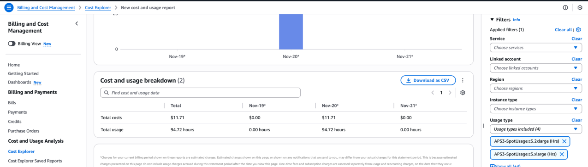

Using UltraServers in Amazon SageMaker HyperPod

SageMaker HyperPod support for Ultraservers provides high-performance GPU computing
capabilities for AI and machine learning workloads. Built on NVIDIA GB200 and NVL72
architecture, these Ultraservers provide NVLink connectivity across 18 GB200 instances in a
dual-rack configuration, totaling 72 B200 GPUs. This NVLink fabric allows workloads to use GPU
communications that increase usable GPU capacity and addressable memory beyond what's
possible with discrete instances, supporting more complex and resource-intensive AI models.
The NVLink connectivity is enabled by NVIDIA IMEX technology, which handles the low-level
configuration for secure GPU fabric connections across instances within the same rack.

Amazon EKS orchestration
2009

## Page 39

Amazon SageMaker AI
Developer Guide

HyperPod simplifies the deployment and management of these GPU clusters through intelligent
topology awareness and automated configuration. The platform automatically discovers and
labels nodes with their physical location and capacity block information, which supports topology-
aware scheduling for distributed workloads. HyperPod abstracts the complex IMEX configuration
requirements, allowing you to focus on workload deployment rather than low-level GPU fabric
setup. You can choose flexible deployment options including both self-managed nodes and EKS
managed node groups. Amazon EKS provides optimized AMIs that include pre-configured NVIDIA
drivers, Fabric Manager, IMEX drivers, and all necessary system software for seamless operation.

The integration includes pod placement capabilities that ensure distributed workloads are
scheduled optimally across NVL72 domains using standard Kubernetes topology labels. Built-in
monitoring and automated recovery features provide operational support, where the AMI health
agent detects GPU errors from kernel logs and can automatically remediate issues or replace faulty
nodes in managed node groups. This combination of GPU scale, intelligent workload placement,
and automated operations helps you focus on your AI/ML innovations rather than infrastructure
complexity, while achieving maximum performance from your GPU investments.

To get set up using UltraServers with your HyperPod cluster, see the following steps:

1.
Create an  EKS-based HyperPod cluster. When you choose an instance group, make sure you
choose an UltraServer.

2.
After your cluster is created, use the following commands install operational plugins:

NVIDIA device plugin v0.17.2

kubectl apply -f https://raw.githubusercontent.com/NVIDIA/k8s-device-plugin/
v0.17.2/deployments/static/nvidia-device-plugin.yml

FD DaemonSet v0.17.3

kubectl apply -k "https://github.com/kubernetes-sigs/node-feature-discovery/
deployment/overlays/default?ref=v0.17.3"

GPU feature discovery

kubectl apply -f https://raw.githubusercontent.com/NVIDIA/k8s-device-plugin/
v0.17.2/deployments/static/gpu-feature-discovery-daemonset.yaml

Amazon EKS orchestration
2010

## Page 40

Amazon SageMaker AI
Developer Guide

You can now run jobs. The following example demonstrates how to create a domain, configure an
IMEX domain, and enable channel allocation. These steps also let you create a pod to provision a
channel for NCCL communication.

1.
Create a resource specification file to use with Kubectl.

cat <<EOF > imex-channel-injection.yaml
---
apiVersion: resource.nvidia.com/v1beta1
kind: ComputeDomain
metadata:
name: imex-channel-injection
spec:
numNodes: 1
channel:
resourceClaimTemplate:

name: imex-channel-0
---
apiVersion: v1
kind: Pod
metadata:
name: imex-channel-injection
spec:
affinity:
nodeAffinity:
requiredDuringSchedulingIgnoredDuringExecution:
nodeSelectorTerms:
- matchExpressions:
- key: nvidia.com/gpu.clique
operator: Exists
- key: topology.k8s.aws/ultraserver-id
operator: In
values:
- <UltraServer-ID>
containers:
- name: ctr
image: ubuntu:22.04
command: ["bash", "-c"]
args: ["ls -la /dev/nvidia-caps-imex-channels; trap 'exit 0' TERM; sleep 9999 &
wait"]
resources:
claims:
- name: imex-channel-0

Amazon EKS orchestration
2011

## Page 41

Amazon SageMaker AI
Developer Guide

resourceClaims:
- name: imex-channel-0
resourceClaimTemplateName: imex-channel-0
EOF

2.
Apply the configuration that you created.

kubectl apply -f imex-channel-injection.yaml

3.
To verify that your pod is created, run the get pods commands.

kubectl get pods
kubectl get pods -n nvidia-dra-driver-gpu -l resource.nvidia.com/computeDomain

4.
You can also check the logs from the pod to see if it allocated a communication channel.

kubectl logs imex-channel-injection

total 0
drwxr-xr-x 2 root root     60 Feb 19 10:43 .
drwxr-xr-x 6 root root    380 Feb 19 10:43 ..
crw-rw-rw- 1 root root 507, 0 Feb 19 10:43 channel0

5.
You can also check the logs to verify that the automated IMEX configuration is running with an
allocated channel.

kubectl logs -n nvidia-dra-driver-gpu -l resource.nvidia.com/computeDomain --
tail=-1
/etc/nvidia-imex/nodes_config.cfg:

IMEX Log initializing at: 8/8/2025 14:23:12.081
[Aug 8 2025 14:23:12] [INFO] [tid 39] IMEX version 570.124.06 is running with the
following configuration options

[Aug 8 2025 14:23:12] [INFO] [tid 39] Logging level = 4

[Aug 8 2025 14:23:12] [INFO] [tid 39] Logging file name/path = /var/log/nvidia-
imex.log

[Aug 8 2025 14:23:12] [INFO] [tid 39] Append to log file = 0

Amazon EKS orchestration
2012

## Page 42

Amazon SageMaker AI
Developer Guide

[Aug 8 2025 14:23:12] [INFO] [tid 39] Max Log file size = 1024 (MBs)

[Aug 8 2025 14:23:12] [INFO] [tid 39] Use Syslog file = 0

[Aug 8 2025 14:23:12] [INFO] [tid 39] IMEX Library communication bind interface =

[JAug 8 2025 14:23:12] [INFO] [tid 39] IMEX library communication bind port = 50000

[Aug 8 2025 14:23:12] [INFO] [tid 39] Identified this node as ID 0, using bind IP
of '10.115.131.8', and network interface of enP5p9s0
[Aug 8 2025 14:23:120] [INFO] [tid 39] nvidia-imex persistence file /var/run/
nvidia-imex/persist.dat does not exist.  Assuming no previous importers.
[Aug 8 2025 14:23:12] [INFO] [tid 39] NvGpu Library version matched with GPU Driver
version
[Aug 8 2025 14:23:12] [INFO] [tid 63] Started processing of incoming messages.
[Aug 8 2025 14:23:12] [INFO] [tid 64] Started processing of incoming messages.
[Aug 8 2025 14:23:12] [INFO] [tid 65] Started processing of incoming messages.

[Aug 8 2025 14:23:12] [INFO] [tid 39] Creating gRPC channels to all peers (nPeers =
1).
[Aug 8 2025 14:23:12] [INFO] [tid 66] Started processing of incoming messages.
[Aug 8 2025 14:23:12] [INFO] [tid 39] IMEX_WAIT_FOR_QUORUM != FULL, continuing
initialization without waiting for connections to all nodes.
[Aug 8 2025 14:23:12] [INFO] [tid 67] Connection established to node 0 with ip
address 10.115.131.8. Number of times connected: 1
[Aug 8 2025 14:23:12] [INFO] [tid 39] GPU event successfully subscribed

6.
After you've verified everything, delete the workload and remove the configuration.

kubectl delete -f imex-channel-injection.yaml

IDEs and Notebooks

Amazon SageMaker is introducing a new capability for SageMaker HyperPod EKS clusters, which
allows AI developers to run their interactive machine learning workloads directly on the HyperPod
EKS cluster. This feature introduces a new add-on called Amazon SageMaker Spaces, that enables
AI developers to create and manage self-contained environments for running notebooks.

Administrators can use SageMaker HyperPod Console to install the add-on on their cluster, and
define default space configurations such as images, compute resources, local storage for notebook
settings (additional storage to be attached to their dev spaces), file systems, and initialization
scripts. A one-click installation option will be available with default settings to simplify the admin

Amazon EKS orchestration
2013

## Page 43

Amazon SageMaker AI
Developer Guide

experience. Admins can use the SageMaker HyperPod Console, kubectl, or HyperPod CLI to install
the operator, create default settings, and manage all spaces in a centralized location.

AI developers can use HyperPod CLI to create, update, and delete dev spaces. They have the
flexibility to use default configurations provided by admins or customize settings. AI developers
can access their spaces on HyperPod using their local VS Code IDEs, and/or their web browser that
hosts their JupyterLab or CodeEditor IDE on custom DNS domain configured by their admins. They
can also use kubernetes’ port forwarding feature to access spaces in their web browsers.

Admin

• the section called “Set up permissions”

• the section called “Install SageMaker AI Spaces Add-on”

• the section called “Customize add-on”

• the section called “Add users and set up service accounts”

• the section called “Limits”

• the section called “Task governance for Interactive Spaces on HyperPod”

• the section called “Observability”

Data scientist

• the section called “Create and manage spaces”

• the section called “Web browser access”

• the section called “Remote access to SageMaker Spaces”

SageMaker Spaces Managed Instance Pricing

The SageMaker Spaces Add-on/Operator does not incur any additional charge to the customer.
However, to support the SSH-over-SSM tunneling required for the Remote IDE Connection feature,
SageMaker Spaces uses an AWS-managed instance. This instance is registered as an Advanced On-
Premises Instance under SSM, and therefore is billed per compute hour.

Please refer to the “On-Premises Instance Management” rate on the AWS Systems Manager pricing
page: AWS Systems Manager Pricing: https://aws.amazon.com/systems-manager/pricing/

Amazon EKS orchestration
2014

## Page 44

Amazon SageMaker AI
Developer Guide

Set up permissions

Roles required for Add-on and its dependencies

IAM Roles Required for SageMaker Spaces on SageMaker HyperPod

When enabling SageMaker Spaces (a.k.aSageMaker IDE / Notebooks) features on a SageMaker
HyperPod (EKS) cluster, several IAM roles must be created and assigned. These roles support secure

access, routing, remote IDE sessions, and EBS storage provisioning. The following table summarizes
the four roles and when they are required.

Role Summary Table

IAM Role
Required?
Purpose
Who Uses It?
Customiza
tion allowed
by SageMaker
Console?

✔ Yes

Spaces Add-on
Execution Role

Always required
Allows the
Spaces controlle
r to manage
Spaces, generate
presigned URLs,
manage SSM
sessions

Add-on controlle
r pod (privileg
ed)

✔ Yes

In-Cluster

Required for

Allows router

In-cluster router

Router Role

WebUI access

pod to perform
KMS operation
s for JWT
signing (WebUI
authentication)

pod (privileged)

✔ Yes

SSM Managed
Instance Role

Required for
Remote IDE
access

Used by SSM
agent sidecar
for SSH-over-
SSM remote IDE
sessions

SSM Agent in
Space IDE Pods
(not an add-on
pod)

Amazon EKS orchestration
2015

## Page 45

Amazon SageMaker AI
Developer Guide

IAM Role
Required?
Purpose
Who Uses It?
Customiza
tion allowed
by SageMaker
Console?

IAM Role for EBS
CSI Driver Add-
on

Always required
Allows EBS
CSI Driver to
create/attach/
modify volumes
for Spaces
workloads

EBS CSI Driver
Add-on

Auto created

IAM Role for
External DNS
Add-on

Required for
WebUI access

It ensures that
Space endpoints
and in-cluster
components can
be automatic
ally assigned
DNS names in
the customer’s
Route 53 hosted
zones.

External DNS
Add-on

Auto created

1. Spaces Add-on Execution Role (Required)

The Spaces Add-on Execution Role is always required because it is used by the SageMaker Spaces
addon-on controller pod, an administrative component installed through the EKS add-on. This
role allows the controller to manage Spaces, provision resources, interact with SSM, and generate
presigned URLs for both Remote IDE and WebUI access. It also supports KMS access used for
request signing for authenticating the WebUI https requests. This role can be automatically created
when SageMaker Spaces add-on is installed through the SageMaker Console. For manual creation,

AWS provides the AmazonSageMakerSpacesControllerPolicy managed policy.

Reference Trust Policy

{
"Version": "2012-10-17",
"Statement": [

Amazon EKS orchestration
2016

## Page 46

Amazon SageMaker AI
Developer Guide

{
"Effect": "Allow",
"Principal": {
"Service": "pods.eks.amazonaws.com"
},
"Action": [
"sts:AssumeRole",
"sts:TagSession"
],
"Condition": {
"StringEquals": {
"aws:SourceAccount": "{{accountId}}",
"aws:SourceArn": "arn:aws:eks:{{region}}:{{accountId}}:cluster/
{{eksClusterName}}"
}
}
}

]
}

2. In-Cluster Router Role (Required for WebUI Authentication)

The In-Cluster Router Role is used by the router pod, a privileged component that authenticates
Spaces WebUI sessions. The router uses a KMS key to create and sign JWT tokens that authorize
user access to specific Spaces. This role allows the router pod to generate data keys, and decrypt
them. Similar to the controller role, it enforces security using tag- and cluster-based scope
restrictions. This role can be automatically generated when Spaces add-on is installed via the AWS
SageMaker Console, but customers may manually create it.

Reference Trust Policy

{
"Version": "2012-10-17",
"Statement": [
{
"Effect": "Allow",
"Principal": {
"Service": "pods.eks.amazonaws.com"
},
"Action": [
"sts:AssumeRole",
"sts:TagSession"
],

Amazon EKS orchestration
2017

## Page 47

Amazon SageMaker AI
Developer Guide

"Condition": {
"StringEquals": {
"aws:SourceAccount": "{{accountId}}",
"aws:SourceArn": "arn:aws:eks:{{region}}:{{accountId}}:cluster/
{{eksClusterName}}"
}
}
}
]
}

Reference Permission Policy

{
"Version": "2012-10-17",
"Statement": [
{
"Sid": "KMSDescribeKey",
"Effect": "Allow",
"Action": [
"kms:DescribeKey"
],
"Resource": "arn:aws:kms:{{region}}:{{accountId}}:key/{{kmsKeyId}}"
},
{
"Sid": "KMSKeyOperations",
"Effect": "Allow",
"Action": [
"kms:GenerateDataKey",
"kms:Decrypt"
],
"Resource": "arn:aws:kms:{{region}}:{{accountId}}:key/{{kmsKeyId}}",
"Condition": {
"StringEquals": {
"kms:EncryptionContext:sagemaker:component": "amazon-sagemaker-
spaces",
"kms:EncryptionContext:sagemaker:eks-cluster-arn":
"${aws:PrincipalTag/eks-cluster-arn}"
}
}
}
]
}

Amazon EKS orchestration
2018

## Page 48

Amazon SageMaker AI
Developer Guide

3. SSM Managed Instance Role (Required for Remote IDE Access)

The SSM Managed Instance Role is passed when registering the SSM managed instance for
enabling the remote IDE access. This role allows the SSM agent to register the pod as an SSM

Managed Instance and use the SSM Session Manager channels for Remote IDE (SSH-over-SSM)
connectivity. It can be created automatically when using the AWS SageMaker Console. For manual
deployments, customers must create this role and provide it to the Spaces add-on. The controller

pod itself does not assume this role; it only provides it when calling ssm:CreateActivation.

Reference Trust Policy

{
"Version": "2012-10-17",
"Statement": [
{
"Effect": "Allow",
"Principal": {
"Service": "ssm.amazonaws.com"
},
"Action": "sts:AssumeRole",
"Condition": {
"StringEquals": {
"aws:SourceAccount": "{{account}}"
},
"ArnEquals": {
"aws:SourceArn": "arn:aws:ssm:{{region}}:{{account}}:*"
}
}
}
]
}

Reference Permissions Policy

{
"Version": "2012-10-17",
"Statement": [
{
"Effect": "Allow",
"Action": [
"ssm:DescribeAssociation"
],

Amazon EKS orchestration
2019

## Page 49

Amazon SageMaker AI
Developer Guide

"Resource": [
"arn:aws:ssm:{{region}}:{{account}}:association/*",
"arn:aws:ssm:{{region}}:{{account}}:document/*",
"arn:aws:ec2:{{region}}:{{account}}:instance/*",
"arn:aws:ssm:{{region}}:{{account}}:managed-instance/*"
]
},
{
"Effect": "Allow",
"Action": [
"ssm:GetDocument",
"ssm:DescribeDocument"
],
"Resource": "arn:aws:ssm:{{region}}:{{account}}:document/*"
},
{
"Effect": "Allow",

"Action": [
"ssm:GetParameter",
"ssm:GetParameters"
],
"Resource": "arn:aws:ssm:{{region}}:{{account}}:parameter/*"
},
{
"Effect": "Allow",
"Action": [
"ssm:ListInstanceAssociations"
],
"Resource": [
"arn:aws:ec2:{{region}}:{{account}}:instance/*",
"arn:aws:ssm:{{region}}:{{account}}:managed-instance/*"
]
},
{
"Effect": "Allow",
"Action": [
"ssm:PutComplianceItems"
],
"Resource": [
"arn:aws:ec2:{{region}}:{{account}}:instance/*",
"arn:aws:ssm:{{region}}:{{account}}:managed-instance/*"
]
},
{

Amazon EKS orchestration
2020

## Page 50

Amazon SageMaker AI
Developer Guide

"Effect": "Allow",
"Action": [
"ssm:UpdateAssociationStatus"
],
"Resource": [
"arn:aws:ssm:{{region}}:{{account}}:document/*",
"arn:aws:ec2:{{region}}:{{account}}:instance/*",
"arn:aws:ssm:{{region}}:{{account}}:managed-instance/*"
]
},
{
"Effect": "Allow",
"Action": [
"ssm:UpdateInstanceAssociationStatus"
],
"Resource": [
"arn:aws:ssm:{{region}}:{{account}}:association/*",

"arn:aws:ec2:{{region}}:{{account}}:instance/*",
"arn:aws:ssm:{{region}}:{{account}}:managed-instance/*"
]
},
{
"Effect": "Allow",
"Action": [
"ssm:UpdateInstanceInformation"
],
"Resource": [
"arn:aws:ec2:{{region}}:{{account}}:instance/*",
"arn:aws:ssm:{{region}}:{{account}}:managed-instance/*"
]
},
{
"Effect": "Allow",
"Action": [
"ssm:GetDeployablePatchSnapshotForInstance",
"ssm:GetManifest",
"ssm:ListAssociations",
"ssm:PutInventory",
"ssm:PutConfigurePackageResult"
],
"Resource": "*"
},
{
"Effect": "Allow",

Amazon EKS orchestration
2021

## Page 51

Amazon SageMaker AI
Developer Guide

"Action": [
"ssmmessages:CreateControlChannel",
"ssmmessages:CreateDataChannel",
"ssmmessages:OpenControlChannel",
"ssmmessages:OpenDataChannel"
],
"Resource": "*"
},
{
"Effect": "Allow",
"Action": [
"ec2messages:AcknowledgeMessage",
"ec2messages:DeleteMessage",
"ec2messages:FailMessage",
"ec2messages:GetEndpoint"
],
"Resource": "*"

},
{
"Effect": "Allow",
"Action": [
"ec2messages:GetMessages",
"ec2messages:SendReply"
],
"Resource": "*",
"Condition": {
"ArnLike": {
"ssm:SourceInstanceARN": "arn:aws:ssm:{{region}}:{{account}}:managed-
instance/*"
}
}
}
]
}

4. IAM Role for EBS CSI Driver Add-on

The IAM role for the EBS CSI Driver is required because the EBS CSI Driver provisions persistent
volumes for Spaces workloads. While the AWS-managed AmazonEBSCSIDriverPolicy provides
baseline permissions, SageMaker HyperPod clusters require additional capabilities such as creating
fast snapshot restores, tagging cluster-owned volumes, and attaching/detaching volumes for
HyperPod-managed nodes. These permissions also include SageMaker-specific APIs such as

sagemaker:AttachClusterNodeVolume. If EBS CSI Driver is not installed, this role will now be

Amazon EKS orchestration
2022

## Page 52

Amazon SageMaker AI
Developer Guide

automatically created by the SageMaker Console during Spaces add-on installation, requiring no
customer action.

5. IAM Role for External DNS Add-on

The External DNS add-on manages DNS records for Services and Ingress resources on the HyperPod
cluster. It ensures that Space endpoints and in-cluster components can be automatically assigned
DNS names in the customer’s Route 53 hosted zones. Today, customers often install External
DNS manually via a 1-click option in the EKS console. As part of improving the SageMaker Spaces
experience, this role will now be automatically created by the SageMaker Console during Spaces
add-on installation, requiring no customer action.

Permission setup for AWS Toolkit to Access SageMaker Spaces

To allow the AWS VS Code Toolkit resource explorer side panel to discover and connect to
SageMaker Spaces, the following IAM permissions are required. These permissions allow the Toolkit
to list available SageMaker HyperPod clusters, retrieve cluster details, and obtain a connection
token for the associated Amazon EKS cluster.

Required IAM Policy

{
"Version": "2012-10-17",
"Statement": [
{
"Sid": "SageMakerListClusters",
"Effect": "Allow",
"Action": "sagemaker:ListClusters",
"Resource": "*"
},
{
"Sid": "SageMakerDescribeCluster",
"Effect": "Allow",
"Action": "sagemaker:DescribeCluster",
"Resource": "arn:aws:sagemaker:{{region}}:{{account}}:cluster/cluster-name"
},
{
"Sid": "EksDescribeCluster",
"Effect": "Allow",
"Action": "eks:DescribeCluster",
"Resource": "arn:aws:eks:{{region}}:{{account}}:cluster/cluster-name"
},
{

Amazon EKS orchestration
2023

## Page 53

Amazon SageMaker AI
Developer Guide

"Sid": "EksGetToken",
"Effect": "Allow",
"Action": "eks:GetToken",
"Resource": "*"
}
]
}

Scoping Recommendations

• Replace cluster-name with the specific SageMaker HyperPod cluster(s) your users need to access.

• The eks:GetToken action currently does not support resource-level restrictions and must use
Resource: "*". This is an AWS service limitation. The client side Authentication is performed
through EKS access entries.

Install SageMaker AI Spaces Add-on

Dependencies

Amazon EKS Pod Identity Agent add-on

• Required for the operator to obtain AWS credentials

• Typically pre-installed on most EKS clusters

• Installation: Via EKS add-ons

Cert-manager

• Required for TLS certificate management

• Pre-installed if using HyperPod quick cluster create

• Installation: Via EKS add-ons

EBS CSI Driver

• Required for Space persistent storage (EBS volumes)

• Automatically installed when using SageMaker console to install

• Requires IAM role with AmazonEBSCSIDriverPolicy + HyperPod-specific permissions

Amazon EKS orchestration
2024

## Page 54

Amazon SageMaker AI
Developer Guide

• Installation: Via EKS add-ons. However, make sure follow the guide to install additional
permissions needed for HyperPod.

• Reference: Using the Amazon EBS CSI driver on HyperPod

Additional dependencies for WebUI Access

AWS Load Balancer Controller

• Pre-installed if using HyperPod quick cluster create

• Installation: Via Helm

• Manual installation guide: Installing the AWS Load Balancer Controller

External DNS

• Required when using custom domain for WebUI access

• Manages Route53 DNS records automatically

• Requires IAM role with Route53 permissions

• Installation: Via EKS add-ons

Installation

Before you begin, ensure that you have:

• An active SageMaker HyperPod cluster with at least one worker node running Kubernetes version
1.30 or later

• At least one worker node with minimum instance type (XX vCPU, YY GiB memory)

Installing the Amazon SageMaker Spaces add-on

You can install the SageMaker Spaces add-on using either quick install for default settings or
custom install for advanced configuration.

Quick install

1. Open the Amazon SageMaker console at https://console.aws.amazon.com/sagemaker/.

2. Choose your cluster from the clusters list.

Amazon EKS orchestration
2025

## Page 55

Amazon SageMaker AI
Developer Guide

3. On the IDE and Notebooks tab, locate Amazon SageMaker Spaces, then choose Quick install.

Quick install automatically:

• Creates the required IAM roles for the add-on

• Enables remote access mode with required IAM roles for Systems Manager

• Installs the add-on and configures pod identity association

Custom install

1. Open the Amazon SageMaker console at https://console.aws.amazon.com/sagemaker/.

2. Choose your cluster from the clusters list.

3. On the IDE and Notebooks tab, locate Amazon SageMaker Spaces, then choose Custom install.

4. Configure the following options:

IAM roles needed by add-on

• Choose whether to create new IAM roles with recommended permissions or use existing ones
with the required permissions (Refer to Admin Permission Set up section above)

Remote access configuration

• Enable to allow users to connect to spaces from local Visual Studio Code using AWS Systems
Manager

• For SSM managed instance role:

• Create new role – The add-on creates and manages the role with required Systems Manager
permissions

• Use existing role – Select a pre-configured role with necessary Systems Manager
permissions

• Ensure the Spaces Add-on Execution Role has PassRole permissions for the SSM managed
instance role

Note

Enabling remote access activates AWS Systems Manager advanced-instances tier for
additional per-instance charges. For pricing information, see Systems Manager pricing.

Amazon EKS orchestration
2026

## Page 56

Amazon SageMaker AI
Developer Guide

Web browser access configuration

• Enable to allow users to access spaces through a web browser using Route 53 DNS and SSL
certificates

• Prerequisites: Install AWS Load Balancer Controller before enabling browser access

• Route 53 hosted zone: Select an existing hosted zone for a domain or subdomain that you
own. The domain or subdomain must be registered and under your control to enable DNS
management and SSL certificate validation.

For more details on domain registration, see Registering a new domain in the Route 53
Developer Guide.

• Subdomain: Enter subdomain prefix (alphanumeric and hyphens only, maximum 63
characters)

• SSL certificate: Select an existing SSL certificate from AWS Certificate Manager. The
certificate must be valid and cover both your subdomain (e.g., subdomain.domain.com) and
wildcard subdomains (e.g., *.subdomain.domain.com) to support individual space access URLs.

• Token signing key: Select an AWS KMS asymmetric key for JWT token signing. The key is used
to encrypt authentication tokens for secure WebUI access. You can create a new asymmetric
key in KMS or select an existing one that your account has access to.

Note

Standard Route 53 charges apply for hosted zones and DNS queries. For pricing
information, see Route 53 pricing.

EKS Addon Installation - Jupyter K8s with WebUI

Configuration File

Create addon-config.yaml:

jupyter-k8s:
workspacePodWatching:
enable: true

jupyter-k8s-aws-hyperpod:
clusterWebUI:

Amazon EKS orchestration
2027

## Page 57

Amazon SageMaker AI
Developer Guide

enabled: true
domain: "<DOMAIN_NAME>"
awsCertificateArn: "<ACM_CERTIFICATE_ARN>"
kmsEncryptionContext:
enabled: true
traefik:
shouldInstall: true
auth:
kmsKeyId: "<KMS_KEY_ARN>"

Replace the following placeholders:

• <DOMAIN_NAME>: Your domain name (e.g., jupyter.example.com)

• <ACM_CERTIFICATE_ARN>: Your ACM certificate ARN (e.g. arn:aws:acm:us-

west-2:111122223333:certificate/12345678-1234-1234-1234-123456789012,

• <KMS_KEY_ARN>: Your KMS key ARN (e.g., arn:aws:kms:us-

west-2:111122223333:key/12345678-1234-1234-1234-123456789012

Installation via AWS CLI

aws eks create-addon \
--cluster-name <CLUSTER_NAME> \
--addon-name amazon-sagemaker-spaces \
--configuration-values file://addon-config.yaml \
--resolve-conflicts OVERWRITE \
--region <AWS_REGION>

To update existing addon:

aws eks update-addon \
--cluster-name <CLUSTER_NAME> \
--addon-name amazon-sagemaker-spaces \
--configuration-values file://addon-config.yaml \
--resolve-conflicts OVERWRITE \
--region <AWS_REGION>

Installation via AWS Management Console

1. Go to EKS Console → Select your cluster

2. Click Add-ons tab  → Add new

Amazon EKS orchestration
2028

## Page 58

Amazon SageMaker AI
Developer Guide

3. Select SageMaker Spaces addon

4. Paste the YAML config above in Optional configuration settings

5. Click Next, then review the addon settings

6. Click Create

Verify Installation

# Check addon status
aws eks describe-addon \
--cluster-name <CLUSTER_NAME> \
--addon-name amazon-sagemaker-spaces \
--region <AWS_REGION>

Customizing ALB Attributes

By default, the addon creates a public load balancer for use with the web UI. You can customize the
load balancer attributes using the EKS addon properties.

To create an internal ALB, set the scheme to internal:

jupyter-k8s-aws-hyperpod:
clusterWebUI:
enabled: true
domain: "<DOMAIN_NAME>"
awsCertificateArn: "<ACM_CERTIFICATE_ARN>"
alb:
scheme: "internal"  # Default is "internet-facing"

You can also use the alb.annotations field to customize ALB settings:

jupyter-k8s-aws-hyperpod:
clusterWebUI:
enabled: true
domain: "<DOMAIN_NAME>"
awsCertificateArn: "<ACM_CERTIFICATE_ARN>"
alb:
scheme: "internal"
annotations:
alb.ingress.kubernetes.io/security-groups: "<SECURITY_GROUP_ID>"
alb.ingress.kubernetes.io/subnets: "<SUBNET_ID_1>,<SUBNET_ID_2>"

Amazon EKS orchestration
2029

## Page 59

Amazon SageMaker AI
Developer Guide

alb.ingress.kubernetes.io/load-balancer-attributes:
"idle_timeout.timeout_seconds=60"

Common ALB annotations:

• alb.ingress.kubernetes.io/security-groups: Specify security groups for the ALB

• alb.ingress.kubernetes.io/subnets: Specify subnets for the ALB

• alb.ingress.kubernetes.io/load-balancer-attributes: Set ALB attributes (idle
timeout, access logs, etc.)

See AWS Load Balancer Controller documentation for all available annotations.

Upgrade / versioning of add-on

aws eks update-addon \
--cluster-name <CLUSTER_NAME> \
--addon-name amazon-sagemaker-spaces \
--configuration-values file://addon-config.yaml \
--resolve-conflicts OVERWRITE \
--region <AWS_REGION>

Customize add-on

Template

Templates are reusable workspace configurations that serve as admin-controlled blueprints for
workspace creation. They provide defaults for workspace configuration values, and guardrails to
control what data scientists can do. Templates exist at a cluster level, and can be re-used across
namespaces.

SageMaker Spaces creates two system templates as a starting point for data scientists, one for
Code Editor and one for JupyterLab. These system templates are managed by the addon and
cannot be editied directly. Instead, admins can create new templates and set them as default.

Task Governance

apiVersion: workspace.jupyter.org/v1alpha1
kind: WorkspaceTemplate
metadata:

Amazon EKS orchestration
2030

## Page 60

Amazon SageMaker AI
Developer Guide

name: my-jupyter-template
namespace: my-namespace
labels:
kueue.x-k8s.io/priority-class: <user-input>-priority
spec:
displayName: "My Custom Jupyter Lab"
description: "Custom Jupyter Lab with specific configurations"
defaultImage: "public.ecr.aws/sagemaker/sagemaker-distribution:latest-cpu"
allowedImages:
- "public.ecr.aws/sagemaker/sagemaker-distribution:latest-cpu"
- "public.ecr.aws/sagemaker/sagemaker-distribution:latest-gpu"
defaultResources:
requests:
cpu: "1"
memory: "4Gi"
limits:
cpu: "4"

memory: "16Gi"
primaryStorage:
defaultSize: "10Gi"
minSize: "5Gi"
maxSize: "50Gi"
defaultStorageClassName: "sagemaker-spaces-default-storage-class"
defaultMountPath: "/home/sagemaker-user"
defaultContainerConfig:
command: ["/opt/amazon/sagemaker/workspace/bin/entrypoint-workspace-jupyterlab"]
defaultPodSecurityContext:
fsGroup: 1000
defaultOwnershipType: "Public"
defaultAccessStrategy:
name: "hyperpod-access-strategy"
allowSecondaryStorages: true
appType: "jupyterlab"

SMD / Custom images

Customers can configure image policies through templates by providing a default image and a
list of allowed images. Additionally, administrators can choose whether to allow data scientists to
bring their own custom images. The system defaults to using the latest SageMaker Distribution,
but if you wish to pin to a particular version, you can specify the exact SMD version to use in a
template.

Custom image requirements:

Amazon EKS orchestration
2031

## Page 61

Amazon SageMaker AI
Developer Guide

• curl if you want to use idle shutdown

• port 8888

• remote access

Remote IDE Requirement

VS Code version requirement

VS Code version v1.90 or greater is required. We recommend using the latest stable version of VS
Code.

Operating system requirements

You need one of the following operating systems to remotely connect to Studio spaces:

• macOS 13+

• Windows 10

• Windows 10 support ends on October 14, 2025

• Windows 11

• Linux

• Install the official Microsoft VS Code for Linux

• not an open-source version

Local machine prerequisites

Before connecting your local Visual Studio Code to Studio spaces, ensure your local machine has
the required dependencies and network access.

Note

Environments with software installation restrictions may prevent users from installing
required dependencies. The AWS Toolkit for Visual Studio Code automatically searches for
these dependencies when initiating remote connections and will prompt for installation
if any are missing. Coordinate with your IT department to ensure these components are
available.

Amazon EKS orchestration
2032

## Page 62

Amazon SageMaker AI
Developer Guide

Required local dependencies

Your local machine must have the following components installed:

• Remote-SSH Extension

• — Standard VS Code Marketplace extension for remote development

• Session Manager plugin — Required for secure session management

• SSH Client — Standard component on most machines (OpenSSH recommended for Windows)

• VS Code CLI Command

• Typically included with VS Code installation

Platform-specific requirements

• Windows users — PowerShell 5.1 or later is required for SSH terminal connections

Network connectivity requirements

Your local machine must have network access to Session Manager endpoints. For example, in US
East (N. Virginia) (us-east-1) these can be:

• ssm.us-east-1.amazonaws.com

• ssm.us-east-1.api.aws

• ssmmessages.us-east-1.amazonaws.com

• ec2messages.us-east-1.amazonaws.com

Image requirements

SageMaker Distribution images

When using SageMaker Distribution with remote access, use SageMaker Distribution version 2.7 or
later.

Custom images

When you Bring your own image (BYOI) with remote access, ensure that you follow the custom
image specifications and ensure the following dependencies are installed:

• curl or wget — Required for downloading AWS CLI components

Amazon EKS orchestration
2033

## Page 63

Amazon SageMaker AI
Developer Guide

• unzip — Required for extracting AWS CLI installation files

• tar — Required for archive extraction

• gzip — Required for compressed file handling

Instance requirements

• Memory — 8GB or more

• Use instances with at least 8GB of memory. The following instance types are not supported

due to insufficient memory (less than 8GB): ml.t3.medium, ml.c7i.large, ml.c6i.large,

ml.c6id.large, and ml.c5.large. For a more complete list of instance types, see the
Amazon EC2 On-Demand Pricing page

Optimizing Kubernetes Startup Time by Pre-Warming Container Images

Container image pulling performance has become a significant bottleneck for many EKS
customers, especially as AI/ML workloads rely on increasingly large container images. Pulling and
unpacking these large images typically takes several minutes the first time they are used on each
EKS node. This delay adds substantial latency when launching SageMaker Spaces and directly
impacts user experience—particularly in environments where fast startup is essential, such as
notebooks, interactive development jobs.

Image pre-warming is a technique used to preload specific container images onto every node in
the EKS/HyperPod cluster before they are needed. Instead of waiting for a pod to trigger the first
pull of a large image, the cluster proactively downloads and caches images across all nodes. This
ensures that when workloads launch, the required images are already available locally, eliminating
long cold-start delays. Image pre-warming improves SageMaker Spaces startup speed and provides
a more predictable and responsive experience for end users.

Pre-Warming via DaemonSet

We recommend using a DaemonSet to preload images. A DaemonSet ensures that one pod runs on
every node in the cluster. Each container inside the DaemonSet pod references an image you want
to cache. When Kubernetes starts the pod, it automatically pulls the images, warming the cache on
each node.

The following example shows how to create a DaemonSet that preloads two GPU images. Each

container runs a lightweight sleep infinity command to keep the pod active with minimal
overhead.

Amazon EKS orchestration
2034

## Page 64

Amazon SageMaker AI
Developer Guide

cat <<EOF | kubectl apply -n "namespace_1" -f -
apiVersion: apps/v1
kind: DaemonSet
metadata:
name: image-preload-ds
spec:
selector:
matchLabels:
app: image-preloader
template:
metadata:
labels:
app: image-preloader
spec:
containers:
- name: preloader-3-4-2

image: public.ecr.aws/sagemaker/sagemaker-distribution:3.4.2-gpu
command: ["sleep"]
args: ["infinity"]
resources:
requests:
cpu: 1m
memory: 16Mi
limits:
cpu: 5m
memory: 32Mi
- name: preloader-3-3-2
image: public.ecr.aws/sagemaker/sagemaker-distribution:3.3.2-gpu
command: ["sleep"]
args: ["infinity"]
resources:
requests:
cpu: 1m
memory: 16Mi
limits:
cpu: 5m
memory: 32Mi
EOF

How It Works

• Each container references one image.

Amazon EKS orchestration
2035

## Page 65

Amazon SageMaker AI
Developer Guide

• Kubernetes must download each image before starting the container.

• Once the pod is running on every node, the images are cached locally.

• Any workload using these images now starts much faster.

Space default storage (EBS)

The system uses the EBS CSI driver by default to provision EBS storage volumes for each
workspace. SageMaker creates an EBS storage class for use with workspaces, and administrators
can customize the default and maximum size of these volumes using template settings. For
advanced users working with CLI tools, you can also customize the storage class of the workspace,
which allows users to leverage other storage classes including configuring customer-managed KMS
keys for their EBS volumes.

Note that EBS volumes are bound to a particular AZ, which means workspaces can only be
scheduled on nodes in the same AZ as their storage volume. This can lead to scheduling failures if
cluster capacity exists but not in the correct AZ.

Additional storage

SageMaker Spaces supports attaching additional storage volumes such as Amazon EFS, FSx for
Lustre, or S3 Mountpoint to your development spaces. This allows you to access shared datasets,
collaborate on projects, or use high-performance storage for your workloads.

Prerequisites

Before attaching additional storage to spaces, you must:

1. Install the appropriate CSI driver add-on via EKS add-ons (Amazon EFS CSI Driver, Amazon FSx

for Lustre CSI Driver, or Mountpoint for Amazon S3 CSI Driver)

2. Set up storage resources and PersistentVolumeClaims following the CSI driver documentation

for your specific storage type

3. Ensure the PVC is available in the same namespace where you plan to create your space

Attaching storage to spaces

Once you have a PersistentVolumeClaim configured, you can attach it to a space using either the
HyperPod CLI or kubectl.

HyperPod CLI

Amazon EKS orchestration
2036

## Page 66

Amazon SageMaker AI
Developer Guide

hyp create hyp-space \
--name my-space \
--display-name "My Space with FSx" \
--memory 8Gi \
--volume name=shared-fsx,mountPath=/shared,persistentVolumeClaimName=my-fsx-pvc

kubectl

apiVersion: workspace.jupyter.org/v1alpha1
kind: Workspace
metadata:
name: my-space
spec:
displayName: "My Space with FSx"
desiredStatus: Running
volumes:

- name: shared-fsx
mountPath: /shared
persistentVolumeClaimName: my-fsx-pvc

Multiple volumes

You can attach multiple additional storage volumes to a single space by specifying multiple --

volume flags with the CLI or multiple entries in the volumes array with kubectl.

HyperPod CLI

hyp create hyp-space \
--name my-space \
--display-name "My Space with Multiple Storage" \
--memory 8Gi \
--volume name=shared-efs,mountPath=/shared,persistentVolumeClaimName=my-efs-pvc \
--volume name=datasets,mountPath=/datasets,persistentVolumeClaimName=my-s3-pvc

kubectl

apiVersion: workspace.jupyter.org/v1alpha1
kind: Workspace
metadata:
name: my-space
spec:

Amazon EKS orchestration
2037

## Page 67

Amazon SageMaker AI
Developer Guide

displayName: "My Space with Multiple Storage"
desiredStatus: Running
volumes:
- name: shared-efs
mountPath: /shared
persistentVolumeClaimName: my-efs-pvc
- name: datasets
mountPath: /datasets
persistentVolumeClaimName: my-s3-pvc

Resource configuration

SageMaker Spaces allows you to configure compute resources for your development environments,
including CPU, memory, and GPU resources to match your workload requirements.

GPU configuration

SageMaker Spaces supports both whole GPU allocation and GPU partitioning using NVIDIA Multi-
Instance GPU (MIG) technology. This allows you to optimize GPU utilization for different types of
machine learning workloads.

Whole GPU allocation

HyperPod CLI

hyp create hyp-space \
--name gpu-space \
--display-name "GPU Development Space" \
--image public.ecr.aws/sagemaker/sagemaker-distribution:latest-gpu \
--memory 16Gi \
--gpu 1 \
--gpu-limit 1

kubectl

apiVersion: workspace.jupyter.org/v1alpha1
kind: Workspace
metadata:
name: gpu-space
spec:
displayName: "GPU Development Space"
image: "public.ecr.aws/sagemaker/sagemaker-distribution:latest-gpu"
desiredStatus: Running

Amazon EKS orchestration
2038

## Page 68

Amazon SageMaker AI
Developer Guide

resources:
requests:
memory: "16Gi"
nvidia.com/gpu: "1"
limits:
memory: "16Gi"
nvidia.com/gpu: "1"

GPU partitioning (MIG)

GPU partitioning using NVIDIA Multi-Instance GPU (MIG) technology allows you to partition a
single GPU into smaller, isolated instances. Your HyperPod cluster must have GPU nodes that
support MIG and have MIG profiles configured. For more information on setting up MIG on your
HyperPod cluster, see GPU partitioning using NVIDIA MIG.

HyperPod CLI

hyp create hyp-space \
--name mig-space \
--display-name "MIG GPU Space" \
--image public.ecr.aws/sagemaker/sagemaker-distribution:latest-gpu \
--memory 8Gi \
--accelerator-partition-type mig-3g.20gb \
--accelerator-partition-count 1

kubectl

apiVersion: workspace.jupyter.org/v1alpha1
kind: Workspace
metadata:
name: mig-space
spec:
displayName: "MIG GPU Space"
image: "public.ecr.aws/sagemaker/sagemaker-distribution:latest-gpu"
desiredStatus: Running
resources:
requests:
memory: "8Gi"
nvidia.com/mig-3g.20gb: "1"
limits:
memory: "8Gi"
nvidia.com/mig-3g.20gb: "1"

Amazon EKS orchestration
2039

## Page 69

Amazon SageMaker AI
Developer Guide

Lifecycle

Lifecycle configuration provides startup scripts that run when a workspace is created or started.
These scripts allow administrators to customize the workspace environment during startup.
These are bash scripts with a maximum size of 1 KB. If you need larger setup configuration, we
recommend adding a script to the container image and triggering the script from the lifecycle
configuration.

We leverage Kubernetes container lifecycle hooks to provide this functionality https://
kubernetes.io/docs/concepts/containers/container-lifecycle-hooks/. Note that Kubernetes does
not provide guarantees of when the startup script will be run in relation to the entrypoint of the
container.

Idle shutdown

Configure automatic shutdown of idle workspaces to optimize resource usage.

Idle shutdown

idleShutdown:
enabled: true
idleShutdownTimeoutMinutes: 30
detection:
httpGet:
path: /api/idle
port: 8888
scheme: HTTP

Parameters

enabled (boolean, required) - Enables or disables idle shutdown for the workspace.

idleShutdownTimeoutMinutes (integer, required) - Number of minutes of inactivity before the
workspace shuts down. Minimum value is 1.

detection (object, required) - Defines how to detect workspace idle state.

detection.httpGet (object, optional) - HTTP endpoint configuration for idle detection. Uses
Kubernetes HTTPGetAction specification.

• path - HTTP path to request

• port - Port number or name

Amazon EKS orchestration
2040

## Page 70

Amazon SageMaker AI
Developer Guide

• scheme - HTTP or HTTPS (default: HTTP)

Configuration Locations

Workspace Configuration

Define idle shutdown directly in the workspace specification:

apiVersion: workspace.jupyter.org/v1alpha1
kind: Workspace
metadata:

name: my-workspace
spec:
displayName: "Development Workspace"
image:
jupyter/scipy-notebook:latest
idleShutdown:
enabled: true

idleShutdownTimeoutMinutes: 30
detection:
httpGet:
path:
/api/idle
port: 8888

Template Configuration

Define default idle shutdown behavior in a WorkspaceTemplate:

apiVersion: workspace.jupyter.org/v1alpha1
kind: WorkspaceTemplate
metadata:
name: jupyter-template
spec:
displayName: "Jupyter Template"
defaultImage: jupyter/scipy-notebook:latest
defaultIdleShutdown:
enabled: true
idleShutdownTimeoutMinutes: 30
detection:

Amazon EKS orchestration
2041

## Page 71

Amazon SageMaker AI
Developer Guide

httpGet:
path: /api/idle
port: 8888
idleShutdownOverrides:
allow: true
minTimeoutMinutes: 60
maxTimeoutMinutes: 240

Template Inheritance and Overrides

Workspaces using a template automatically inherit the template's defaultIdleShutdown
configuration. Workspaces can override this configuration if the template allows it.

Override Policy

Templates control override behavior through idleShutdownOverrides:

allow (boolean, default: true)- Whether workspaces can override the default idle shutdown
configuration.

minTimeoutMinutes (integer, optional)- Minimum allowed timeout value for workspace overrides.

maxTimeoutMinutes (integer, optional)- Maximum allowed timeout value for workspace overrides.

Inheritance Example

Workspace inherits template defaults:

apiVersion: workspace.jupyter.org/v1alpha1
kind: Workspace
metadata:
name: my-workspace
spec:
displayName: "My Workspace"
templateRef:
name: jupyter-template
# Inherits defaultIdleShutdown from template

Override Example

Workspace overrides template defaults:

apiVersion: workspace.jupyter.org/v1alpha1

Amazon EKS orchestration
2042

## Page 72

Amazon SageMaker AI
Developer Guide

kind: Workspace
metadata:
name: my-workspace
spec:
displayName: "My Workspace"
templateRef:
name: jupyter-template
idleShutdown:
enabled: true
idleShutdownTimeoutMinutes: 60  # Must be within template bounds
detection:
httpGet:
path: /api/idle
port: 8888

Locked Configuration

Prevent workspace overrides:

apiVersion: workspace.jupyter.org/v1alpha1
kind: WorkspaceTemplate
metadata:
name: locked-template
spec:
displayName: "Locked Template"
defaultImage: jupyter/scipy-notebook:latest
defaultIdleShutdown:
enabled: true
idleShutdownTimeoutMinutes: 30
detection:
httpGet:
path: /api/idle
port: 8888
idleShutdownOverrides:
allow: false  # Workspaces cannot override

Behavior

When idle shutdown is enabled, the system periodically checks the workspace for activity using
the configured HTTP endpoint. If the endpoint indicates the workspace is idle for the specified
timeout duration, the workspace automatically stops. You can manually restart the workspace
when needed.

Amazon EKS orchestration
2043

## Page 73

Amazon SageMaker AI
Developer Guide

Template updates

The client tools such as Kubectl or Hyperpod CLI and SDK can be used for managing Spaces within
the EKS cluster. Administrators can provision Space Templates for default Space configurations,
while Data Scientists can customize their integrated development environments without needing
to understand the underlying Kubernetes complexity. For detailed usage instructions, please refer
to the CLI and SDK documentation at https://sagemaker-hyperpod-cli.readthedocs.io/en/latest/

index.html.

Administrators can perform CRUD operations on Space Templates, which serve as the base
configurations when creating a Space. Data Scientists can perform CRUD operations on Spaces and
override various parameters, including the Multi-Instance GPU profiles for specific compute nodes.
They can start, stop, and connect to the Spaces via remote VSCode access and the Web UI. When a
Space Template is updated, any subsequently created Space will be configured with the settings in
the updated template. Compliance checks will be performed when existing Spaces are updated or
started. If any settings are out of bounds or mismatched, the Spaces will fail to update or start.

Using hyp cli and kubectl

User can perform CRUD on the templates with the Hyperpod CLI

### 1. Create a Space Template
hyp create hyp-space-template --file template.yaml

### 2. List Space Templates
hyp list hyp-space-template
hyp list hyp-space-template --output json

### 3. Describe a Space Template
hyp describe hyp-space-template --name my-template
hyp describe hyp-space-template --name my-template --output json

### 4. Update a Space Template
hyp update hyp-space-template --name my-template --file updated-template.yaml

### 5. Delete a Space Template
hyp delete hyp-space-template --name my-template

To create custom templates, you can use our system templates as a starting point. This template
will work for SMD-like images, however it can be customized based on the images used by admins.

Example custom JupyterLab template:

Amazon EKS orchestration
2044

## Page 74

Amazon SageMaker AI
Developer Guide

apiVersion: workspace.jupyter.org/v1alpha1
kind: WorkspaceTemplate
metadata:
name: my-jupyter-template
namespace: my-namespace
spec:
displayName: "My Custom Jupyter Lab"
description: "Custom Jupyter Lab with specific configurations"
defaultImage: "public.ecr.aws/sagemaker/sagemaker-distribution:latest-cpu"
allowedImages:
- "public.ecr.aws/sagemaker/sagemaker-distribution:latest-cpu"
- "public.ecr.aws/sagemaker/sagemaker-distribution:latest-gpu"
defaultResources:
requests:
cpu: "1"
memory: "4Gi"

limits:
cpu: "4"
memory: "16Gi"
primaryStorage:
defaultSize: "10Gi"
minSize: "5Gi"
maxSize: "50Gi"
defaultStorageClassName: "sagemaker-spaces-default-storage-class"
defaultMountPath: "/home/sagemaker-user"
defaultContainerConfig:
command: ["/opt/amazon/sagemaker/workspace/bin/entrypoint-workspace-jupyterlab"]
defaultPodSecurityContext:
fsGroup: 1000
defaultOwnershipType: "Public"
defaultAccessStrategy:
name: "hyperpod-access-strategy"
allowSecondaryStorages: true
appType: "jupyterlab"

Example custom Code Editor template:

apiVersion: workspace.jupyter.org/v1alpha1
kind: WorkspaceTemplate
metadata:
name: my-code-editor-template
namespace: my-namespace
spec:

Amazon EKS orchestration
2045

## Page 75

Amazon SageMaker AI
Developer Guide

displayName: "My Custom Code Editor"
description: "Custom Code Editor with specific configurations"
defaultImage: "public.ecr.aws/sagemaker/sagemaker-distribution:latest-cpu"
allowedImages:
- "public.ecr.aws/sagemaker/sagemaker-distribution:latest-cpu"
- "public.ecr.aws/sagemaker/sagemaker-distribution:latest-gpu"
defaultResources:
requests:
cpu: "1"
memory: "4Gi"
limits:
cpu: "4"
memory: "16Gi"
primaryStorage:
defaultSize: "10Gi"
minSize: "5Gi"
maxSize: "50Gi"

defaultStorageClassName: "sagemaker-spaces-default-storage-class"
defaultMountPath: "/home/sagemaker-user"
defaultContainerConfig:
command: ["/opt/amazon/sagemaker/workspace/bin/entrypoint-workspace-code-editor"]
defaultPodSecurityContext:
fsGroup: 1000
defaultOwnershipType: "Public"
defaultAccessStrategy:
name: "hyperpod-access-strategy"
allowSecondaryStorages: true
appType: "code-editor"

Add users and set up service accounts

Fine grained access control - our recommendation

Users are differentiated based on their Kubernetes username. The user’s Kubernetes username is
defined in their Access Entry. To ensure two human users have distinct usernames, there are two
options:

1. Recommended - Multiple human users can use the same role as long as each one has their own

distinct session name that will persist between sessions. By default, Kubernetes usernames for

IAM roles are in the format arn:aws:sts::{ACCOUNT_ID}:assumed-role/{ROLE_NAME}/

{SESSION_NAME}. With this default, users will already be differentiated by session name. An
Admin has a few ways to enforce unique session names per user.

Amazon EKS orchestration
2046

## Page 76

Amazon SageMaker AI
Developer Guide

• SSO login - Users using SSO login will by default have a session name tied to their AWS
username

• Central credentials vending service - For enterprise customers, they may have some internal
credential vending service that users can call to get credentials with their identity.

• Role based enforcement - Require IAM users to set their aws:username as their role session
name when they assume an IAM role in your AWS account. Documentation on how to do this
is here: https://aws.amazon.com/blogs/security/easily-control-naming-individual-iam-role-
sessions/

2. If 2 Data Scientists are using different access entries (different IAM role or user), they will always

be counted as different users.

Creating access entry

Required IAM policy for data scientist role:

• eks:DescribeCluster

Required access entry policies

• AmazonSagemakerHyperpodSpacePolicy - scoped to namespace DS should create spaces in

• AmazonSagemakerHyperpodSpaceTemplatePolicy - scoped to “jupyter-k8s-shared”
namespace

Private and Public spaces

We support 2 types of sharing patterns: “Public” and “OwnerOnly”. Both the “AccessType” and
“OwnershipType” fields use these 2 values.

• AccessType: Public spaces can be accessed by anyone with permissions in the namespace,
while OwnerOnly can only be accessed by the space creator as well as administrator users.
Administrator users are defined with the following criteria:

• OwnershipType: Public spaces can be modified/deleted by anyone with permissions in the
namespace, OwnerOnly can be modified/deleted by the creator or the Admin.

Admin users are defined by:

Amazon EKS orchestration
2047

## Page 77

Amazon SageMaker AI
Developer Guide

1. Part of the system:masters Kubernetes group

2. Part of the Kubernetes group defined in the CLUSTER_ADMIN_GROUP environment variable in

the helm chart.

A user’s groups can be configured using EKS access entries. A space can be defined as “Public” or
“OwnerOnly” by configuring the spec in the object:

apiVersion: workspace.jupyter.org/v1alpha1
kind: Workspace
metadata:
labels:
app.kubernetes.io/name: jupyter-k8s
name: example-workspace
spec:
displayName: "Example Workspace"
image: "public.ecr.aws/sagemaker/sagemaker-distribution:3.4.2-cpu"
desiredStatus: "Running"
ownershipType: "Public"/"OwnerOnly"
accessType: "Public"/"OwnerOnly"
# more fields here

Limits

Spaces run as pods on HyperPod EKS nodes with attached EBS volumes. The number of Spaces
that can be deployed per node is constrained by AWS infrastructure limits.

EBS Volume Limits per Node

Reference: https://docs.aws.amazon.com/AWSEC2/latest/UserGuide/volume_limits.html

EC2 nodes have a maximum number of EBS volumes that can be attached. Since each Space
typically uses one EBS volume, this limits how many Spaces with dedicated EBS storage can run on
a single node.

Maximum Pods per HyperPod Node

Reference: https://docs.aws.amazon.com/sagemaker/latest/dg/sagemaker-hyperpod-eks-
prerequisites.html

Amazon EKS orchestration
2048

## Page 78

Amazon SageMaker AI
Developer Guide

Each HyperPod instance type supports a maximum number of pods based on available IP addresses
from the VPC CNI plugin. Since each Space runs as a pod, this directly caps the number of Spaces
per node.

Impact

The effective limit for Spaces per node is whichever constraint is reached first.

Task governance for Interactive Spaces on HyperPod

This section covers how to optimize your shared Amazon SageMaker HyperPod EKS clusters
for Interactive Spaces workloads. You'll learn to configure Kueue's task governance features—
including quota management, priority scheduling, and resource sharing policies—to ensure your
development workloads run without interruption while maintaining fair allocation across your
teams' training, evaluation, and batch processing activities.

How Interactive Space management works

To effectively manage Interactive Spaces in shared HyperPod EKS clusters, implement the
following task governance strategies using Kueue's existing capabilities.

Priority class configuration

Define dedicated priority classes for Interactive Spaces with high weights (such as 100) to ensure
development pods are admitted and scheduled before other task types. This configuration
enables Interactive Spaces to preempt lower-priority jobs during cluster load, which is critical for
maintaining uninterrupted development workflows.

Quota sizing and allocation

Reserve sufficient compute resources in your team's ClusterQueue to handle expected development
workloads. During periods when development resources are idle, unused quota resources can be
temporarily allocated to other teams' tasks. When development demand increases, these borrowed
resources can be reclaimed to prioritize pending Interactive Space pods.

Resource Sharing Strategies

Choose between two quota sharing approaches based on your requirements:

Strict Resource Control: Disable quota lending and borrowing to guarantee reserved compute
capacity is always available for your Interactive Spaces. This approach requires sizing quotas large

Amazon EKS orchestration
2049

## Page 79

Amazon SageMaker AI
Developer Guide

enough to independently handle peak development demand and may result in idle nodes during
low-usage periods.

Flexible Resource Sharing: Enable quota lending to allow other teams to utilize idle development

resources when needed. However, disable borrowing to ensure Interactive Spaces never run on

borrowed, reclaimable resources that could lead to unexpected evictions.

Intra-Team Preemption

Enable intra-team preemption when running mixed workloads (training, evaluation, and Interactive
Spaces) under the same quota. This allows Kueue to preempt lower-priority jobs within your team
to accommodate high-priority Interactive Space pods, ensuring development work can proceed
without depending on external quota borrowing.

Sample Interactive Space setup

The following example shows how Kueue manages compute resources for Interactive Spaces in a
shared Amazon SageMaker HyperPod cluster.

Cluster configuration and policy setup

Your cluster has the following configuration:

• Team Alpha (Dev Team): 8 CPU quota for Interactive Spaces

• Team Beta (ML Team): 16 CPU quota for training and evaluation

• Team Gamma (Research): 6 CPU quota for experimentation

• Static provisioning: No autoscaling

• Total capacity: 30 CPUs

The shared CPU pool uses this priority policy:

• Interactive Spaces: Priority 100

• Training: Priority 75

• Evaluation: Priority 50

• Batch Processing: Priority 25

Kueue enforces team quotas and priority classes, with preemption enabled and borrowing disabled
for the dev team.

Amazon EKS orchestration
2050

## Page 80

Amazon SageMaker AI
Developer Guide

Initial state: Normal cluster utilization

In normal operations:

• Team Alpha: Runs 6 Interactive Spaces using 6 CPUs, 2 CPUs idle

• Team Beta: Runs training jobs (12 CPUs) and evaluation (4 CPUs) within its 16 CPU quota

• Team Gamma: Runs research workloads on all 6 CPUs

• Resource sharing: Team Beta borrows Team Alpha's 2 idle CPUs for additional training

Development spike: Team Alpha requires additional resources

When Team Alpha's developers need to scale up development work, additional Interactive Space
pods require 4 more CPUs. Kueue detects that the new pods are:

• Within Team Alpha's namespace

• Priority 100 (Interactive Spaces)

• Pending admission due to quota constraints

Kueue's response process

Kueue follows a three-step process to allocate resources:

1. Quota check

Question: Does Team Alpha have unused quota?

• Current usage: 6 CPUs used, 2 CPUs available

• New requirement: 4 CPUs needed

• Result: Insufficient quota  → Proceed to Step 2

2. Self-preemption within Team Alpha

Question: Can lower-priority Team Alpha jobs be preempted?

• Available targets: No lower-priority jobs in Team Alpha

• Result: No preemption possible  → Proceed to Step 3

3. Reclaim borrowed resources

Question: Are Team Alpha resources being borrowed by other teams?

Amazon EKS orchestration
2051

## Page 81

Amazon SageMaker AI
Developer Guide

• Borrowed resources: Team Beta using 2 CPUs from Team Alpha

• Action: Kueue evicts Team Beta's borrowed training pods, freeing 2 CPUs

• Remaining need: Still need 2 more CPUs  → Interactive Spaces remain in NotAdmitted state
until resources become available

This approach prioritizes Interactive Spaces while maintaining team quota boundaries and
preventing development work from running on unstable borrowed resources.

Observability

Standard Kubernetes Monitoring

You can monitor Spaces using standard Kubernetes tools like kubectl describe and kubectl logs.

Monitoring Space Status

# List all Spaces with status
kubectl get workspace -A

# Get detailed information about a specific Space
kubectl describe workspace <workspace-name>

Viewing Space Logs

# View workspace container logs
kubectl logs -l workspace.jupyter.org/workspace-name=<workspace-name> -c workspace

# View SSM agent sidecar logs (for remote IDE connectivity)
kubectl logs -l workspace.jupyter.org/workspace-name=<workspace-name> -c ssm-agent-
sidecar

# Follow logs in real-time
kubectl logs -l workspace.jupyter.org/workspace-name=<workspace-name> -c workspace -f

Understanding Space Conditions

Spaces report four condition types in their status:

• Available: True when the Space is ready for use. All required resources (pods, services, storage)
are running and healthy.

Amazon EKS orchestration
2052

## Page 82

Amazon SageMaker AI
Developer Guide

• Progressing: True when the Space is being created, updated, or reconciled. Transitions to False
once stable.

• Degraded: True when errors are detected with the Space resources. Check the condition
message for details.

• Stopped: True when the Space desired status is set to Stopped. The pods are terminated but
storage and configuration are preserved.

CloudWatch Logs Integration

You can install the CloudWatch logging add-on to send Space logs to Amazon CloudWatch Logs for
centralized log management and retention. This enables log aggregation across multiple clusters
and integration with CloudWatch Insights for querying and analysis. All of the above available

kubectl logs are queryable in CloudWatch with this plugin.

Reference: https://docs.aws.amazon.com/sagemaker/latest/dg/sagemaker-hyperpod-eks-cluster-
observability-cluster-cloudwatch-ci.html.

HyperPod Observability Add-on

The SageMaker HyperPod observability add-on provides comprehensive dashboards for monitoring
Space resource utilization. After installing the add-on, you can view Space memory and CPU usage
in the Tasks tab of the HyperPod console, which displays metrics in Amazon Managed Grafana
dashboards.

Reference: https://docs.aws.amazon.com/sagemaker/latest/dg/sagemaker-hyperpod-
observability-addon.html

Key metrics available:

• CPU and memory utilization per Space

• GPU metrics (if applicable)

Create and manage spaces

Data scientists can list to view all the spaces they have access to, create a space using one of
the templates, update space to update the image, file system, and other attributes of space
configuration, and delete a space. As a prerequisite, customers must install HyperPod CLI or use
kubectl to create and manage spaces. For more details on HyperPod CLI, please see this. To use
kubectl commands, please refer to this guide to install kubectl.

Amazon EKS orchestration
2053

## Page 83

Amazon SageMaker AI
Developer Guide

Create space

HyperPod CLI

Create a Jupyter space

hyp create hyp-space \
--name myspace \
--display-name "My Space" \
--memory 8Gi \
--template-ref name=sagemaker-jupyter-template,namespace=jupyter-k8s-system

Create a Code Editor space

hyp create hyp-space \
--name myspace \
--display-name "My Space" \
--memory 8Gi \
--template-ref name=sagemaker-code-editor-template,namespace=jupyter-k8s-system

kubectl

kubectl apply -f - <<EOF
apiVersion: workspace.jupyter.org/v1alpha1
kind: Workspace
metadata:
name: my-space
spec:
displayName: my-space
desiredStatus: Running
EOF

or you can simply apply the yaml file

kubectl apply -f my-workspace.yaml

List spaces

HyperPod CLI

hyp list hyp-space

Amazon EKS orchestration
2054

## Page 84

Amazon SageMaker AI
Developer Guide

kubectl

kubectl get workspaces -n <workspace-namespace>

Describe a space

HyperPod CLI

hyp describe hyp-space --name myspace

kubectl

# Basic Status reporting
kubectl get workspace my-workspace -n <workspace-namespace>

# Enhanced Workspace Information Retrieval
kubectl get workspace my-workspace -n <workspace-namespace> -o wide

# Complete Workspace Information Retrieval
kubectl get workspace my-workspace -n <workspace-namespace> -o json
kubectl get workspace my-workspace -n <workspace-namespace> -o yaml

Update a space

HyperPod CLI

hyp update hyp-space \
--name myspace \
--display-name "Updated My Space"

kubectl

Update the original workspace YAML file as needed, then re-apply it. Be sure that the metadata
name is not modified. You can also use these kubectl command to modify fields without reapplying
the entire workspace yaml:

# Open a Terminal IDE and modify the Workspace
kubectl edit workspace -n <workspace-namespace>

# Patch a Workspace
kubectl patch workspace <workspace-name> --type='merge' -p \

Amazon EKS orchestration
2055

## Page 85

Amazon SageMaker AI
Developer Guide

'{"spec":{"<field name>":"<desired value>"}}' -n <workspace-namespace>

Start/Stop a space

HyperPod CLI

hyp start hyp-space --name myspace
hyp stop hyp-space --name myspace

kubectl

You can update the desired status field in the Workspace to start/stop a space.

# Start a Workspace
kubectl patch workspace <workspace-name> --type='merge' -p \

'{"spec":{"desiredStatus":"Running"}}' -n <workspace-namespace>
# Stop a Workspace
kubectl patch workspace <workspace-name> --type='merge' -p \
'{"spec":{"desiredStatus":"Stopped"}}' -n <workspace-namespace>

Get Logs

HyperPod CLI

hyp get-logs hyp-space --name myspace

kubectl

# Check Pod Logs
kubectl logs -l workspace.jupyter.org/workspace-name=<workspace-metadata-name>

# Check Pod Events
kubectl describe pod -l workspace.jupyter.org/workspace-name=<workspace-metadata-name>

# Check Operator Logs
kubectl logs -n jupyter-k8s-system deployment/jupyter-k8s-controller-manager

Delete a space

HyperPod CLI

Amazon EKS orchestration
2056

## Page 86

Amazon SageMaker AI
Developer Guide

hyp delete hyp-space --name myspace

kubectl

# Delete a Workspace
kubectl delete workspace <workspace-name> -n <namespace>

Web browser access

Web UI access allows you to connect directly to development spaces running on your SageMaker
HyperPod cluster through a secure web browser interface. This provides immediate access to
Jupyter Lab and other web-based development environments without requiring local software
installation.

Prerequisites

Before setting up web UI access, ensure you have completed the following:

• SageMaker Spaces add-on installation: Follow the SageMaker Spaces add-on installation  and
enable web UI access during installation

• User access to EKS cluster: Users need EKS Access Entry configured with appropriate permissions.
See Add users and set up service accounts for EKS Access Entry setup details

• Development spaces: Create and start development spaces on your HyperPod cluster

• kubectl access: Ensure kubectl is configured to access your EKS cluster

Generate Web UI Access URL

Using HyperPod CLI

If you have the HyperPod CLI installed, you can use this simplified command:

hyp create hyp-space-access --name <space-name> --connection-type web-ui

Using kubectl

You can also use the kubectl command line to create a connection request.

kubectl create -f - -o yaml <<EOF
apiVersion: connection.workspace.jupyter.org/v1alpha1

Amazon EKS orchestration
2057

## Page 87

Amazon SageMaker AI
Developer Guide

kind: WorkspaceConnection
metadata:
namespace: <space-namespace>
spec:
workspaceName: <space-name>
workspaceConnectionType: web-ui
EOF

The URL is present in the status.workspaceConnectionUrl of the output of this command.

Accessing Your Development Space

1. Generate the web UI URL using one of the methods above

2. Copy the URL from the response

3. Open the URL in your web browser

4. Access your development environment through the web interface

Supported Development Environments

The web UI provides access to:

• Jupyter Lab

• Code Editor

Troubleshooting

Cannot generate access URLs

Check the following:

• SageMaker Spaces add-on is running: kubectl get pods -n sagemaker-spaces-system

• Development space is running and healthy

• User has appropriate EKS Access Entry permissions

Remote access to SageMaker Spaces

Remote access allows you to connect your local Visual Studio Code directly to development spaces
running on your SageMaker HyperPod cluster. Remote connections use SSM to establish secure,
encrypted tunnels between your local machine and the development spaces.

Amazon EKS orchestration
2058

## Page 88

Amazon SageMaker AI
Developer Guide

Prerequisites

Before setting up remote access, ensure you have completed the following:

• SageMaker Spaces add-on installation: Follow SageMaker Spaces add-on installation and enable
remote access during installation (either Quick install or Custom install with remote access
configuration enabled).

• User access to EKS cluster: Users need EKS Access Entry configured with appropriate permissions.
See Add users and set up service accounts for EKS Access Entry setup details

• Development spaces: Create and start development spaces on your HyperPod cluster

• kubectl access: Ensure kubectl is configured to access your EKS cluster

Generate VS Code remote connection

Using HyperPod CLI

If you have the HyperPod CLI installed, you can use this simplified command:

hyp create hyp-space-access --name <space-name> --connection-type vscode-remote

Using kubectl

You can also use the kubectl command line to create a connection request.

kubectl create -f - -o yaml <<EOF
apiVersion: connection.workspace.jupyter.org/v1alpha1
kind: WorkspaceConnection
metadata:
namespace: <space-namespace>
spec:
workspaceName: <space-name>
workspaceConnectionType: vscode-remote
EOF

The URL is present in the status.workspaceConnectionUrl of the output of this command.

Connecting with VS Code

1. Generate the VS Code connection URL using one of the methods above

2. Copy the VS Code URL from the response

Amazon EKS orchestration
2059

## Page 89

Amazon SageMaker AI
Developer Guide

3. Click the URL or paste it into your browser

4. VS Code will prompt to open the remote connection

5. Confirm the connection to establish the remote development environment

Supported Development Environments

The web UI provides access to:

• Jupyter Lab

• Code Editor

Troubleshooting

Cannot generate connection URLs

Check the following:

• SageMaker Spaces add-on is running: kubectl get pods -n sagemaker-spaces-system

• Development space is running and healthy

• Remote access was enabled during add-on installation

• User has appropriate EKS Access Entry permissions

Train and deploy models with HyperPod CLI and SDK

Amazon SageMaker HyperPod helps you train and deploy machine learning models at scale. The
AWS HyperPod CLI is a unified command-line interface that simplifies machine learning (ML)
workflows on AWS. It abstracts infrastructure complexities and provides a streamlined experience
for submitting, monitoring, and managing ML training jobs. The CLI is designed specifically
for data scientists and ML engineers who want to focus on model development rather than
infrastructure management. This topic walks you through three key scenarios: training a PyTorch
model, deploying a custom model using trained artifacts, and deploying a JumpStart model.
Designed for first-time users, this concise tutorial ensures you can set up, train, and deploy models
effortlessly using either the HyperPod CLI or the SDK. The handshake process between training and
inference helps you manage model artifacts effectively.

Prerequisites

Before you begin using Amazon SageMaker HyperPod, make sure you have:

Amazon EKS orchestration
2060

## Page 90

Amazon SageMaker AI
Developer Guide

• An AWS account with access to Amazon SageMaker HyperPod

• Python 3.9, 3.10, or 3.11 installed

• AWS CLI configured with appropriate credentials.

Install the HyperPod CLI and SDK

Install the required package to access the CLI and SDK:

pip install sagemaker-hyperpod

This command sets up the tools needed to interact with HyperPod clusters.

Configure your cluster context

HyperPod operates on clusters optimized for machine learning. Start by listing available clusters to
select one for your tasks.

1.
List all available clusters:

hyp list-cluster

2.
Choose and set your active cluster:

hyp set-cluster-context your-eks-cluster-name

3.
Verify the configuration:

hyp get-cluster-context

Note

All subsequent commands target the cluster you've set as your context.

Choose your scenario

For detailed instructions on each scenario, click on the topics below:

Amazon EKS orchestration
2061

## Page 91

Amazon SageMaker AI
Developer Guide

Topics

• Train a PyTorch model

• Deploy a custom model

• Deploy a JumpStart model

Train a PyTorch model

This topic walks you through the process of training a PyTorch model using HyperPod.

In this scenario, let's train a PyTorch model using the hyp-pytorch-job template, which
simplifies job creation by exposing commonly used parameters. The model artifacts will be stored
in an S3 bucket for later use in inference. However, this is optional, and you can choose your
preferred storage location.

Create a training job

You can train the model using either the CLI or Python SDK.

Using the CLI

Create a training job with the following command:

hyp create hyp-pytorch-job \
--version 1.0 \
--job-name test-pytorch-job \
--image pytorch/pytorch:latest \
--command '["python", "train.py"]' \
--args '["--epochs", "10", "--batch-size", "32"]' \
--environment '{"PYTORCH_CUDA_ALLOC_CONF": "max_split_size_mb:32"}' \
--pull-policy "IfNotPresent" \
--instance-type ml.p4d.24xlarge \
--tasks-per-node 8 \
--label-selector '{"accelerator": "nvidia", "network": "efa"}' \
--deep-health-check-passed-nodes-only true \
--scheduler-type "kueue" \
--queue-name "training-queue" \
--priority "high" \
--max-retry 3 \
--volumes '["data-vol", "model-vol", "checkpoint-vol"]' \
--persistent-volume-claims '["shared-data-pvc", "model-registry-pvc"]' \
--output-s3-uri s3://my-bucket/model-artifacts

Amazon EKS orchestration
2062

## Page 92

Amazon SageMaker AI
Developer Guide

Key required parameters explained:

• --job-name: Unique identifier for your training job

• --image: Docker image containing your training environment

This command starts a training job named test-pytorch-job. The --output-s3-uri specifies

where the trained model artifacts will be stored, for example, s3://my-bucket/model-

artifacts. Note this location, as you’ll need it for deploying the custom model.

Using the Python SDK

For programmatic control, use the SDK. Create a Python script to launch the same training job.

from sagemaker.hyperpod import HyperPodPytorchJob
from sagemaker.hyperpod.job
import ReplicaSpec, Template, Spec, Container, Resources, RunPolicy, Metadata

# Define job specifications
nproc_per_node = "1"  # Number of processes per node
replica_specs =
[
ReplicaSpec
(
name = "pod",  # Replica name
template = Template
(
spec = Spec
(
containers =
[
Container
(
# Container name
name="container-name",
# Training image
image="448049793756.dkr.ecr.us-west-2.amazonaws.com/
ptjob:mnist",
# Always pull image
image_pull_policy="Always",

Amazon EKS orchestration
2063

## Page 93

Amazon SageMaker AI
Developer Guide

resources=Resources\
(
# No GPUs requested
requests={"nvidia.com/gpu": "0"},
# No GPU limit
limits={"nvidia.com/gpu": "0"},
),
# Command to run
command=["python", "train.py"],
# Script arguments
args=["--epochs", "10", "--batch-size", "32"],
)
]
)
),
)
]

# Keep pods after completion
run_policy = RunPolicy(clean_pod_policy="None")

# Create and start the PyTorch job
pytorch_job = HyperPodPytorchJob
(
# Job name
metadata = Metadata(name="demo"),
# Processes per node
nproc_per_node = nproc_per_node,
# Replica specifications
replica_specs = replica_specs,
# Run policy
run_policy = run_policy,
# S3 location for artifacts
output_s3_uri="s3://my-bucket/model-artifacts"
)
# Launch the job
pytorch_job.create()

Monitor your training job

Monitor your job's progress with these commands:

Amazon EKS orchestration
2064

## Page 94

Amazon SageMaker AI
Developer Guide

Using the CLI

# Check job status
hyp list hyp-pytorch-job

# Get detailed information
hyp describe hyp-pytorch-job --job-name test-pytorch-job

# View logs
hyp get-logs hyp-pytorch-job \
--pod-name test-pytorch-job-pod-0 \
--job-name test-pytorch-job

Note: Training time varies based on model complexity and instance type. Monitor the logs to track
progress.

These commands help you verify the job’s status and troubleshoot issues. Once the job completes

successfully, the model artifacts are saved to s3://my-bucket/model-artifacts.

Using the Python SDK

Add the following code to your Python script:

print("List all pods created for this job:")
print(pytorch_job.list_pods())

print("Check the logs from pod0:")
print(pytorch_job.get_logs_from_pod(pod_name="demo-pod-0"))

print("List all HyperPodPytorchJobs:")
print(HyperPodPytorchJob.list())

print("Describe job:")
print(HyperPodPytorchJob.get(name="demo").model_dump())

pytorch_job.refresh()
print(pytorch_job.status.model_dump())

Next steps

After training, the model artifacts are stored in the S3 bucket you specified (s3://my-bucket/

model-artifacts). You can use these artifacts to deploy a model. Currently, you must manually
manage the transition from training to inference. This involves:

Amazon EKS orchestration
2065

## Page 95

Amazon SageMaker AI
Developer Guide

• Locating artifacts: Check the S3 bucket (s3://my-bucket/model-artifacts) to confirm the
trained model files are present.

• Recording the path: Note the exact S3 path (e.g., s3://my-bucket/model-artifacts/

test-pytorch-job/model.tar.gz) for use in the inference setup.

• Referencing in deployment: Provide this S3 path when configuring the custom endpoint to
ensure the correct model is loaded.

Deploy a custom model

After training completes, deploy your model for inference. You can deploy a custom model using
either the CLI or the SDK.

Locate your model artifacts

• Check your S3 bucket: Verify that model artifacts are saved at s3://my-bucket/model-

artifacts/

• Note the exact path: You'll need the full path (for example, s3://my-bucket/model-

artifacts/test-pytorch-job/model.tar.gz)

Deploy using the CLI

Run the following command to deploy your custom model:

hyp create hyp-custom-endpoint \
--version 1.0 \
--env '{"HF_MODEL_ID":"/opt/ml/model", "SAGEMAKER_PROGRAM":"inference.py", }' \
--model-source-type s3 \
--model-location test-pytorch-job \
--s3-bucket-name my-bucket \
--s3-region us-east-2 \
--prefetch-enabled true \
--image-uri 763104351884.dkr.ecr.us-east-1.amazonaws.com/pytorch-inference:latest \
--model-volume-mount-name model-weights \
--container-port 8080 \
--resources-requests '{"cpu": "30000m", "nvidia.com/gpu": 1, "memory": "100Gi"}' \
--resources-limits '{"nvidia.com/gpu": 1}' \
--tls-output-s3-uri s3://<bucket_name> \
--instance-type ml.g5.8xlarge \
--endpoint-name endpoint-custom-pytorch \

Amazon EKS orchestration
2066

## Page 96

Amazon SageMaker AI
Developer Guide

--model-name pytorch-custom-model

This command deploys the trained model as an endpoint named endpoint-custom-pytorch.

The --model-location references the artifact path from the training job.

Deploy using the Python SDK

Create a Python script with the following content:

from sagemaker.hyperpod.inference.config.hp_custom_endpoint_config import Model,
Server, SageMakerEndpoint, TlsConfig, EnvironmentVariables
from sagemaker.hyperpod.inference.hp_custom_endpoint import HPCustomEndpoint

model = Model(
model_source_type="s3",
model_location="test-pytorch-job",
s3_bucket_name="my-bucket",
s3_region="us-east-2",
prefetch_enabled=True
)

server = Server(
instance_type="ml.g5.8xlarge",
image_uri="763104351884.dkr.ecr.us-east-2.amazonaws.com/huggingface-pytorch-tgi-
inference:2.4.0-tgi2.3.1-gpu-py311-cu124-ubuntu22.04-v2.0",
container_port=8080,
model_volume_mount_name="model-weights"
)

resources = {
"requests": {"cpu": "30000m", "nvidia.com/gpu": 1, "memory": "100Gi"},
"limits": {"nvidia.com/gpu": 1}
}

env = EnvironmentVariables(
HF_MODEL_ID="/opt/ml/model",
SAGEMAKER_PROGRAM="inference.py",
SAGEMAKER_SUBMIT_DIRECTORY="/opt/ml/model/code",
MODEL_CACHE_ROOT="/opt/ml/model",
SAGEMAKER_ENV="1"
)

endpoint_name = SageMakerEndpoint(name="endpoint-custom-pytorch")

Amazon EKS orchestration
2067

## Page 97

Amazon SageMaker AI
Developer Guide

tls_config = TlsConfig(tls_certificate_output_s3_uri="s3://<bucket_name>")

custom_endpoint = HPCustomEndpoint(
model=model,
server=server,
resources=resources,
environment=env,
sage_maker_endpoint=endpoint_name,
tls_config=tls_config
)

custom_endpoint.create()

Invoke the endpoint

Using the CLI

Test the endpoint with a sample input:

hyp invoke hyp-custom-endpoint \
--endpoint-name endpoint-custom-pytorch \
--body '{"inputs":"What is the capital of USA?"}'

This returns the model’s response, such as “The capital of the USA is Washington, D.C.”

Using the SDK

Add the following code to your Python script:

data = '{"inputs":"What is the capital of USA?"}'
response = custom_endpoint.invoke(body=data).body.read()
print(response)

Manage the endpoint

Using the CLI

List and inspect the endpoint:

hyp list hyp-custom-endpoint

Amazon EKS orchestration
2068

## Page 98

Amazon SageMaker AI
Developer Guide

hyp get hyp-custom-endpoint --name endpoint-custom-pytorch

Using the SDK

Add the following code to your Python script:

logs = custom_endpoint.get_logs()
print(logs)

Clean up resources

When you're done, delete the endpoint to avoid unnecessary costs.

Using the CLI

hyp delete hyp-custom-endpoint --name endpoint-custom-pytorch

Using the SDK

custom_endpoint.delete()

Next steps

You've successfully deployed and tested a custom model using SageMaker HyperPod. You can now
use this endpoint for inference in your applications.

Deploy a JumpStart model

You can deploy a pre-trained JumpStart model for inference using either the CLI or the SDK.

Using the CLI

Run the following command to deploy a JumpStart model:

hyp create hyp-jumpstart-endpoint \
--version 1.0 \
--model-id deepseek-llm-r1-distill-qwen-1-5b \
--instance-type ml.g5.8xlarge \
--endpoint-name endpoint-test-jscli

Amazon EKS orchestration
2069

## Page 99

Amazon SageMaker AI
Developer Guide

Using the SDK

Create a Python script with the following content:

from sagemaker.hyperpod.inference.config.hp_jumpstart_endpoint_config import Model,
Server, SageMakerEndpoint, TlsConfig
from sagemaker.hyperpod.inference.hp_jumpstart_endpoint import HPJumpStartEndpoint

model=Model(
model_id='deepseek-llm-r1-distill-qwen-1-5b'
)

server=Server(
instance_type='ml.g5.8xlarge',
)

endpoint_name=SageMakerEndpoint(name='<endpoint-name>')

# create spec
js_endpoint=HPJumpStartEndpoint(
model=model,
server=server,
sage_maker_endpoint=endpoint_name
)

Invoke the endpoint

Using the CLI

Test the endpoint with a sample input:

hyp invoke hyp-jumpstart-endpoint \
--endpoint-name endpoint-jumpstart \
--body '{"inputs":"What is the capital of USA?"}'

Using the SDK

Add the following code to your Python script:

data = '{"inputs":"What is the capital of USA?"}'
response = js_endpoint.invoke(body=data).body.read()
print(response)

Amazon EKS orchestration
2070

## Page 100

Amazon SageMaker AI
Developer Guide

Manage the endpoint

Using the CLI

List and inspect the endpoint:

hyp list hyp-jumpstart-endpoint
hyp get hyp-jumpstart-endpoint --name endpoint-jumpstart

Using the SDK

Add the following code to your Python script:

endpoint_iterator = HPJumpStartEndpoint.list()
for endpoint in endpoint_iterator:
print(endpoint.name, endpoint.status)

logs = js_endpoint.get_logs()
print(logs)

Clean up resources

When you're done, delete the endpoint to avoid unnecessary costs.

Using the CLI

hyp delete hyp-jumpstart-endpoint --name endpoint-jumpstart

Using the SDK

js_endpoint.delete()

Next steps

Now that you've trained a PyTorch model, deployed it as a custom endpoint, and deployed a
JumpStart model using HyperPod's CLI and SDK, explore advanced features:

• Multi-node training: Scale training across multiple instances

• Custom containers: Build specialized training environments

• Integration with SageMaker Pipelines: Automate your ML workflows

Amazon EKS orchestration
2071

## Page 101

Amazon SageMaker AI
Developer Guide

• Advanced monitoring: Set up custom metrics and alerts

For more examples and advanced configurations, visit the SageMaker HyperPod GitHub repository.

Running jobs on SageMaker HyperPod clusters orchestrated by Amazon EKS

The following topics provide procedures and examples of accessing compute nodes and running ML
workloads on provisioned SageMaker HyperPod clusters orchestrated with Amazon EKS. Depending
on how you have set up the environment on your HyperPod cluster, there are many ways to run ML
workloads on HyperPod clusters.

Note

When running jobs via the SageMaker HyperPod CLI or kubectl, HyperPod can track
compute utilization (GPU/CPU hours) across namespaces (teams). These metrics power
usage reports, which provide:

• Visibility into allocated vs. borrowed resource consumption

• Teams resource utilization for auditing (up to 180 days)

• Cost attribution aligned with Task Governance policies

To use usage reports, you must install the usage report infrastructure. We strongly
recommend configuring Task Governance to enforce compute quotas and enable granular
cost attribution.
For more information about setting up and generating usage reports, see Reporting
Compute Usage in HyperPod.

Tip

For a hands-on experience and guidance on how to set up and use a SageMaker HyperPod
cluster orchestrated with Amazon EKS, we recommend taking this Amazon EKS Support in
SageMaker HyperPod workshop.

Data scientist users can train foundational models using the EKS cluster set as the orchestrator
for the SageMaker HyperPod cluster. Scientists leverage the SageMaker HyperPod CLI and the

Amazon EKS orchestration
2072

## Page 102

Amazon SageMaker AI
Developer Guide

native kubectl commands to find available SageMaker HyperPod clusters, submit training jobs
(Pods), and manage their workloads. The SageMaker HyperPod CLI enables job submission using
a training job schema file, and provides capabilities for job listing, description, cancellation, and
execution. Scientists can use Kubeflow Training Operator according to compute quotas managed
by HyperPod, and SageMaker AI-managed MLflow to manage ML experiments and training runs.

Topics

• Installing the SageMaker HyperPod CLI

• SageMaker HyperPod CLI commands

• Running jobs using the SageMaker HyperPod CLI

• Running jobs using kubectl

Installing the SageMaker HyperPod CLI

SageMaker HyperPod provides the SageMaker HyperPod command line interface (CLI) package.

1. Check if the version of Python on your local machine is between 3.8 and 3.11.

2. Check the prerequisites in the README markdown file in the SageMaker HyperPod CLI package.

3. Clone the SageMaker HyperPod CLI package from GitHub.

git clone https://github.com/aws/sagemaker-hyperpod-cli.git

4. Install the SageMaker HyperPod CLI.

cd sagemaker-hyperpod-cli && pip install .

5. Test if the SageMaker HyperPod CLI is successfully installed by running the following command.

hyperpod --help

Note

If you are a data scientist and want to use the SageMaker HyperPod CLI, make sure that
your IAM role is set up properly by your cluster admins following the instructions at the
section called “IAM users for scientists” and the section called “Setting up role-based access
control”.

Amazon EKS orchestration
2073

## Page 103

Amazon SageMaker AI
Developer Guide

SageMaker HyperPod CLI commands

The following table summarizes the SageMaker HyperPod CLI commands.

Note

For a complete CLI reference, see README in the SageMaker HyperPod CLI GitHub
repository.

SageMaker HyperPod CLI
command

Entity
Description

hyperpod get-clusters
cluster/access
Lists all clusters to which the
user has been enabled with
IAM permissions to submit
training workloadsGives the
current snapshot of whole
available instances which are
not running any workloads
or jobs along with maximum
capacity, grouping by health
check statuses (ex: BurnInPas
sed)

cluster/access
Configures kubectl to
operate on the specified
HyperPod cluster and
namespace

hyperpod connect-c

luster

hyperpod start-job
job
Submits the job to targeted
cluster-Job name will be
unique at namespace level-
Users will be able to override
yaml spec by passing them as
CLI arguments

Amazon EKS orchestration
2074

## Page 104

Amazon SageMaker AI
Developer Guide

SageMaker HyperPod CLI
command

Entity
Description

hyperpod get-job
job
Display metadata of the
submitted job

hyperpod list-jobs
job
Lists all jobs in the connected
cluster/namespace to which
the user has been added with
IAM permissions to submit
training workloads

hyperpod cancel-job
job
Stops and deletes the job and
gives up underlying compute
resources. This job cannot
be resumed again. A new
job needs to be started, if
needed.

hyperpod list-pods
pod
Lists all the pods in the given
job in a namespace

hyperpod get-log
pod
Retrieves the logs of a
particulat pod in a specified
job

hyperpod exec
pod
Run the bash command in the
shell of the specified pod(s)
and publishes the output

hyperpod --help
utility
lists all supported commands

Running jobs using the SageMaker HyperPod CLI

To run jobs, make sure that you installed Kubeflow Training Operator in the EKS clusters. For more
information, see the section called “Installing packages”.

Run the hyperpod get-cluster command to get the list of available HyperPod clusters.

Amazon EKS orchestration
2075

## Page 105

Amazon SageMaker AI
Developer Guide

hyperpod get-clusters

Run the hyperpod connect-cluster to configure the SageMaker HyperPod CLI with the EKS
cluster orchestrating the HyperPod cluster.

hyperpod connect-cluster --cluster-name <hyperpod-cluster-name>

Use the hyperpod start-job command to run a job. The following command shows the
command with required options.

hyperpod start-job \
--job-name <job-name>
--image <docker-image-uri>
--entry-script <entrypoint-script>
--instance-type <ml.instance.type>
--node-count <integer>

The hyperpod start-job command also comes with various options such as job auto-resume
and job scheduling.

Enabling job auto-resume

The hyperpod start-job command also has the following options to specify job auto-resume.
For enabling job auto-resume to work with the SageMaker HyperPod node resiliency features,

you must set the value for the restart-policy option to OnFailure. The job must be running

under the kubeflow namespace or a namespace prefixed with hyperpod.

• [--auto-resume <bool>] #Optional, enable job auto resume after fails, default is false

• [--max-retry <int>] #Optional, if auto-resume is true, max-retry default value is 1 if not specified

• [--restart-policy <enum>] #Optional, PyTorchJob restart policy. Available values are Always,

OnFailure, Never or ExitCode. The default value is OnFailure.

hyperpod start-job \
... // required options \
--auto-resume true \
--max-retry 3 \
--restart-policy OnFailure

Amazon EKS orchestration
2076

## Page 106

Amazon SageMaker AI
Developer Guide

Running jobs with scheduling options

The hyperpod start-job command has the following options to set up the job with queuing
mechanisms.

Note

You need Kueue installed in the EKS cluster. If you haven't installed, follow the instructions
in Setup for SageMaker HyperPod task governance.

• [--scheduler-type <enum>] #Optional, Specify the scheduler type. The default is Kueue.

• [--queue-name <string>] #Optional, Specify the name of the Local Queue or Cluster Queue
you want to submit with the job. The queue should be created by cluster admins using

CreateComputeQuota.

• [--priority <string>] #Optional, Specify the name of the Workload Priority Class, which should be
created by cluster admins.

hyperpod start-job \
... // required options
--scheduler-type Kueue \
--queue-name high-priority-queue \
--priority high

Running jobs from a configuration file

As an alternative, you can create a job configuration file containing all the parameters required by

the job and then pass this config file to the hyperpod start-job command using the --config-
file option. In this case:

1. Create your job configuration file with the required parameters. Refer to the job configuration

file in the SageMaker HyperPod CLI GitHub repository for a baseline configuration file.

2. Start the job using the configuration file as follows.

hyperpod start-job --config-file /path/to/test_job.yaml

Amazon EKS orchestration
2077

## Page 107

Amazon SageMaker AI
Developer Guide

Tip

For a complete list of parameters of the hyperpod start-job command, see the

Submitting a Job section in the README.md of the SageMaker HyperPod CLI GitHub

repository.

Running jobs using kubectl

Note

Training job auto resume requires Kubeflow Training Operator release version 1.7.0,

1.8.0, or 1.8.1.

Note that you should install Kubeflow Training Operator in the clusters using a Helm chart. For
more information, see the section called “Installing packages”. Verify if the Kubeflow Training
Operator control plane is properly set up by running the following command.

kubectl get pods -n kubeflow

This should return an output similar to the following.

NAME                                             READY   STATUS    RESTARTS   AGE
training-operator-658c68d697-46zmn               1/1     Running   0          90s

To submit a training job

To run a training jobs, prepare the job configuration file and run the kubectl apply command as
follows.

kubectl apply -f /path/to/training_job.yaml

To describe a training job

To retrieve the details of the job submitted to the EKS cluster, use the following command. It
returns job information such as the job submission time, completion time, job status, configuration
details.

Amazon EKS orchestration
2078

## Page 108

Amazon SageMaker AI
Developer Guide

kubectl get -o yaml training-job -n kubeflow

To stop a training job and delete EKS resources

To stop a training job, use kubectl delete. The following is an example of stopping the training job

created from the configuration file pytorch_job_simple.yaml.

kubectl delete -f /path/to/training_job.yaml

This should return the following output.

pytorchjob.kubeflow.org "training-job" deleted

To enable job auto-resume

SageMaker HyperPod supports job auto-resume functionality for Kubernetes jobs, integrating with
the Kubeflow Training Operator control plane.

Ensure that there are sufficient nodes in the cluster that have passed the SageMaker HyperPod

health check. The nodes should have the taint sagemaker.amazonaws.com/node-health-

status set to Schedulable. It is recommended to include a node selector in the job YAML file to
select nodes with the appropriate configuration as follows.

sagemaker.amazonaws.com/node-health-status: Schedulable

The following code snippet is an example of how to modify a Kubeflow PyTorch job YAML
configuration to enable the job auto-resume functionality. You need to add two annotations and

set restartPolicy to OnFailure as follows.

apiVersion: "kubeflow.org/v1"
kind: PyTorchJob
metadata:
name: pytorch-simple
namespace: kubeflow
annotations: { // config for job auto resume
sagemaker.amazonaws.com/enable-job-auto-resume: "true"
sagemaker.amazonaws.com/job-max-retry-count: "2"
}

Amazon EKS orchestration
2079

## Page 109

Amazon SageMaker AI
Developer Guide

spec:
pytorchReplicaSpecs:
......
Worker:
replicas: 10
restartPolicy: OnFailure
template:
spec:
nodeSelector:
sagemaker.amazonaws.com/node-health-status: Schedulable

To check the job auto-resume status

Run the following command to check the status of job auto-resume.

kubectl describe pytorchjob -n kubeflow <job-name>

Depending on the failure patterns, you might see two patterns of Kubeflow training job restart as
follows.

Pattern 1:

Start Time:    2024-07-11T05:53:10Z
Events:
Type     Reason                   Age                    From
Message
----     ------                   ----                   ----
-------
Normal   SuccessfulCreateService  9m45s                  pytorchjob-controller
Created service: pt-job-1-worker-0
Normal   SuccessfulCreateService  9m45s                  pytorchjob-controller
Created service: pt-job-1-worker-1
Normal   SuccessfulCreateService  9m45s                  pytorchjob-controller
Created service: pt-job-1-master-0
Warning  PyTorchJobRestarting     7m59s                  pytorchjob-controller
PyTorchJob pt-job-1 is restarting because 1 Master replica(s) failed.
Normal   SuccessfulCreatePod      7m58s (x2 over 9m45s)  pytorchjob-controller
Created pod: pt-job-1-worker-0
Normal   SuccessfulCreatePod      7m58s (x2 over 9m45s)  pytorchjob-controller
Created pod: pt-job-1-worker-1
Normal   SuccessfulCreatePod      7m58s (x2 over 9m45s)  pytorchjob-controller
Created pod: pt-job-1-master-0

Amazon EKS orchestration
2080

## Page 110

Amazon SageMaker AI
Developer Guide

Warning  PyTorchJobRestarting     7m58s                  pytorchjob-controller
PyTorchJob pt-job-1 is restarting because 1 Worker replica(s) failed.

Pattern 2:

Events:
Type    Reason                   Age    From                   Message
----    ------                   ----   ----                   -------
Normal  SuccessfulCreatePod      19m    pytorchjob-controller  Created pod: pt-job-2-
worker-0
Normal  SuccessfulCreateService  19m    pytorchjob-controller  Created service: pt-
job-2-worker-0
Normal  SuccessfulCreatePod      19m    pytorchjob-controller  Created pod: pt-job-2-
master-0
Normal  SuccessfulCreateService  19m    pytorchjob-controller  Created service: pt-
job-2-master-0

Normal  SuccessfulCreatePod      4m48s  pytorchjob-controller  Created pod: pt-job-2-
worker-0
Normal  SuccessfulCreatePod      4m48s  pytorchjob-controller  Created pod: pt-job-2-
master-0

Using the HyperPod training operator

The Amazon SageMaker HyperPod training operator helps you accelerate generative AI model
development by efficiently managing distributed training across large GPU clusters. It introduces
intelligent fault recovery, hang job detection, and process-level management capabilities that
minimize training disruptions and reduce costs. Unlike traditional training infrastructure that
requires complete job restarts when failures occur, this operator implements surgical process
recovery to keep your training jobs running smoothly.

The operator also works with HyperPod's health monitoring and observability functions, providing
real-time visibility into training execution and automatic monitoring of critical metrics like loss
spikes and throughput degradation. You can define recovery policies through simple YAML
configurations without code changes, allowing you to quickly respond to and recover from
unrecoverable training states. These monitoring and recovery capabilities work together to
maintain optimal training performance while minimizing operational overhead.

While Kueue is not required for this training operator, your cluster administrator can install
and configure it for enhanced job scheduling capabilities. For more information, see the official
documentation for Kueue.

Amazon EKS orchestration
2081

## Page 111

Amazon SageMaker AI
Developer Guide

Note

To use the training operator, you must use the latest  HyperPod AMI release. To upgrade,
use the  UpdateClusterSoftware API operation. If you use  HyperPod task governance, it
must also be the latest version.

Supported versions

The HyperPod training operator works only work with specific versions of Kubernetes, Kueue, and
HyperPod. See the list below for the complete list of compatible versions.

• Supported Kubernetes versions – 1.28, 1.29, 1.30, 1.31, 1.32, and 1.33

• Suggested Kueue versions –  v.0.12.2 and v.0.12.3

• The latest HyperPod AMI release. To upgrade to the latest AMI release, use the
UpdateClusterSoftware API.

• PyTorch 2.4.0 – 2.7.1

Note

We collect certain routine aggregated and anonymized operational metrics to provide
essential service availability. The creation of these metrics is fully automated and does not
involve human review of the underlying model training workload. These metrics relate to a
job operations, resource management, and essential service functionality.

Installing the training operator

See the following sections to learn about how to install the training operator.

Prerequisites

Before you use the HyperPod training operator, you must have completed the following
prerequisites:

• Created a HyperPod cluster with Amazon EKS orchestration.

• Installed the latest AMI on your HyperPod cluster. For more information, see SageMaker
HyperPod AMI releases for Amazon EKS.

Amazon EKS orchestration
2082

## Page 112

Amazon SageMaker AI
Developer Guide

• Installed cert-manager.

• Set up the EKS Pod Identity Agent using the console. If you want to use the AWS CLI, use the
following command:

aws eks create-addon \
--cluster-name my-eks-cluster \
--addon-name eks-pod-identity-agent \
--region AWS Region

• (Optional) If you run your HyperPod cluster nodes in a private VPC, you must set up

PrivateLinks VPC endpoints for the Amazon SageMaker AI API (com.amazonaws.aws-

region.sagemaker.api) and Amazon EKS Auth services (com.amazonaws.aws-region.eks-
auth). You must also make sure that your cluster nodes are running with subnets that are in a
security group that allows the traffic to route through the VPC endpoints to communicate with
SageMaker AI and Amazon EKS. If these aren't properly set up, the add-on installation can fail. To
learn more about setting up VPC endpoints, see Create a VPC endpoint.

Installing the training operator

You can now install the HyperPod training operator through the SageMaker AI console, the
Amazon EKS console, or with the AWS CLI The console methods offer simplified experiences that
help you install the operator. The AWS CLI offers a programmatic approach that lets you customize
more of your installation.

Between the two console experiences, SageMaker AI provides a one-click installation creates the
IAM execution role, creates the pod identity association, and installs the operator. The Amazon EKS
console installation is similar, but this method doesn't automatically create the IAM execution role.
During this process, you can choose to create a new IAM execution role with information that the
console pre-populates. By default, these created roles only have access to the current cluster that
you're installing the operator in. Unless you edit the role's permissions to include other clusters, if
you remove and reinstall the operator, you must create a new role.

SageMaker AI console (recommended)

1.
Open the Amazon SageMaker AI console at https://console.aws.amazon.com/sagemaker/.

2.
Go to your cluster's details page.

3.
On the Dashboard tab, locate the add-on named Amazon SageMaker
HyperPod training operator, and choose install. During the installation process,

Amazon EKS orchestration
2083

## Page 113

Amazon SageMaker AI
Developer Guide

SageMaker AI creates an IAM execution role with permissions similar to the
AmazonSageMakerHyperPodTrainingOperatorAccess managed policy and creates a pod
identity association between your Amazon EKS cluster and your new execution role.

Amazon EKS console

Note

If you install the add-on through the Amazon EKS cluster, first make sure that you've

tagged your HyperPod cluster with the key-value pair SageMaker:true. Otherwise,
the installation will fail.

1.
Open the Amazon EKS console at https://console.aws.amazon.com/eks/home#/clusters.

2.
Go to your EKS cluster, choose Add-ons, then choose  Get more Add-ons.

3.
Choose Amazon SageMaker HyperPod training operator, then choose Next.

4.
Under Version, the console defaults to the latest version, which we recommend that you
use.

5.
Under Add-on access, choose a pod identity IAM role to use with the training operator add-
on. If you don't already have a role, choose Create recommended role to create one.

6.
During this role creation process, the IAM console pre-populates all of the necessary
information, such as the use case, the  AmazonSageMakerHyperPodTrainingOperatorAccess
managed policy and other required permissions, the role name, and the description. As you
go through the steps, review the information, and choose Create role.

7.
In the EKS console, review your add-on's settings, and then choose Create.

CLI

1.
Make sure that the IAM execution role for your HyperPod cluster has a trust relationship
that allows EKS Pod Identity to assume the role or or create a new IAM role with the
following trust policy. Alternatively, you could use the Amazon EKS console to install the
add-on, which creates a recommended role.

Amazon EKS orchestration
2084

## Page 114

Amazon SageMaker AI
Developer Guide

JSON

{
"Version":"2012-10-17",
"Statement": [
{
"Sid": "AllowEksAuthToAssumeRoleForPodIdentity",
"Effect": "Allow",
"Principal": {
"Service": "pods.eks.amazonaws.com"
},
"Action": [
"sts:AssumeRole",
"sts:TagSession",
"eks-auth:AssumeRoleForPodIdentity"
]

}
]
}

2.
Attach the  AmazonSageMakerHyperPodTrainingOperatorAccess managed policy to your
created role.

3.
Then create a pod identity association between your EKS cluster, your IAM role, and your
new IAM role.

aws eks create-pod-identity-association \
--cluster-name my-eks-cluster \
--role-arn ARN of your execution role \
--namespace aws-hyperpod \
--service-account hp-training-operator-controller-manager \
--region AWS Region

4.
After you finish the process, you can use the ListPodIdentityAssociations operation to see
the association you created. The following is a sample response of what it might look like.

aws eks list-pod-identity-associations --cluster-name my-eks-cluster
{
"associations": [{
"clusterName": "my-eks-cluster",
"namespace": "aws-hyperpod",

Amazon EKS orchestration
2085

## Page 115

Amazon SageMaker AI
Developer Guide

"serviceAccount": "hp-training-operator-controller-manager",
"associationArn": "arn:aws:eks:us-
east-2:123456789012:podidentityassociation/my-hyperpod-cluster/
a-1a2b3c4d5e6f7g8h9",
"associationId": "a-1a2b3c4d5e6f7g8h9"
}]
}

5.
To install the training operator, use the create-addon operation. The --addon-version
parameter is optional. If you don’t provide one, the default is the latest version. To get the
possible versions, use the  DescribeAddonVersions operation.

aws eks create-addon \
--cluster-name my-eks-cluster \
--addon-name amazon-sagemaker-hyperpod-training-operator \
--resolve-conflicts OVERWRITE

If you already have the training operator installed on your HyperPod cluster, you can update the
EKS add-on to the version that you want. If you want to use  checkpointless training or  elastic
training, consider the following:

• Both checkpointless training and elastic training require the EKS add-on to be on version 1.2.0 or
above.

• The Amazon SageMaker HyperPod training operator maintains backwards compatibility for any
EKS add-on version, so you can upgrade from any add-on version to 1.2.0 or above.

• If you downgrade from versions 1.2.0 or above to a lower version, you must first delete the
existing jobs before the downgrade and resubmit the jobs after the downgrade is complete.

Amazon EKS Console

1.
Open the Amazon EKS console at https://console.aws.amazon.com/eks/home#/clusters.

2.
Go to your EKS cluster, and choose Add-ons. Then, choose the Amazon SageMaker
HyperPod training operator add-on and choose Edit.

3.
In the Version menu, choose the version of the add-on that you want, then choose Save
changes.

Amazon EKS orchestration
2086

## Page 116

Amazon SageMaker AI
Developer Guide

CLI

1.
First get the list of the supported versions of the add-on for your cluster.

aws eks describe-addon-versions \
--kubernetes-version $(aws eks describe-cluster --name my-eks-cluster --query
'cluster.version' --output text) \
--addon-name amazon-sagemaker-hyperpod-training-operator \
--query 'addons[0].addonVersions[].addonVersion' \
--output table

2.
Then update the add-on to the version that you want.

aws eks update-addon \
--cluster-name my-eks-cluster \
--addon-name amazon-sagemaker-hyperpod-training-operator \

--addon-version target-version
--resolve-conflicts OVERWRITE

The training operator comes with a number of options with default values that might fit your
use case. We recommend that you try out the training operator with default values before
changing them. The table below describes all parameters and examples of when you might want to
configure each parameter.

Parameter
Description
Default

hpTrainingControllerManager

How many processors to

1

.manager.resources.requests
.cpu

allocate for the controller

hpTrainingControllerManager
.manager.resources.requests
.memory

How much memory to
allocate to the controller

2Gi

hpTrainingControllerManager
.manager.resources.limits.cpu

The CPU limit for the
controller

2

Amazon EKS orchestration
2087

## Page 117

Amazon SageMaker AI
Developer Guide

Parameter
Description
Default

hpTrainingControllerManager
.manager.resources.limits.m
emory

The memory limit for the
controller

4Gi

hpTrainingControllerManager
.nodeSelector

Node selector for the
controller pods

Default behavior is to
select nodes with the label

sagemaker.amazonaw

s.com/compute-type:

"HyperPod"

HyperPod elastic agent

The HyperPod elastic agent is an extension of PyTorch’s ElasticAgent. It orchestrates lifecycles of
training workers on each container and communicates with the HyperPod training operator. To use
the HyperPod training operator, you must first install the HyperPod elastic agent into your training
image before you can submit and run jobs using the operator. The following is a docker file that

installs elastic agent and uses hyperpodrun to create the job launcher.

Note

Both  checkpointless training and  elastic training require that you use HyperPod elastic
agent version 1.1.0 or above.

RUN pip install hyperpod-elastic-agent

ENTRYPOINT ["entrypoint.sh"]
# entrypoint.sh
...
hyperpodrun --nnodes=node_count --nproc-per-node=proc_count \
--rdzv-backend hyperpod \ # Optional
--inprocess-restart \ # Optional (in-process fault recovery with
checkpointless training)
... # Other torchrun args
# pre-traing arg_group
--pre-train-script pre.sh --pre-train-args "pre_1 pre_2 pre_3" \
# post-train arg_group

Amazon EKS orchestration
2088

## Page 118

Amazon SageMaker AI
Developer Guide

--post-train-script post.sh --post-train-args "post_1 post_2 post_3" \
training.py --script-args

You can now submit jobs with kubectl.

HyperPod elastic agent arguments

The HyperPod elastic agent supports all of the original arguments and adds some additional
arguments. The following is all of the arguments available in the HyperPod elastic agent. For more
information about PyTorch's Elastic Agent, see their official documentation.

Argument
Description
Default Value

--shutdown-signal
Signal to send to
workers for shutdown
(SIGTERM or SIGKILL)

"SIGKILL"

--shutdown-timeout
Timeout in seconds
between shutdown-
signal and SIGKILL
signals

15

--server-host
Agent server address
"0.0.0.0"

--server-port
Agent server port
8080

--server-log-level
Agent server log level
"info"

--server-shutdown-
timeout

Server shutdown
timeout in seconds

300

--pre-train-script
Path to pre-training
script

None

--pre-train-args
Arguments for pre-
training script

None

--post-train-script
Path to post-training
script

None

Amazon EKS orchestration
2089

## Page 119

Amazon SageMaker AI
Developer Guide

Argument
Description
Default Value

--post-train-args
Arguments for post-
training script

None

--inprocess-restart
Flag specifying
whether to use the
inprocess_restart
feature

FALSE

--inprocess-timeout
Time in seconds
that the agent
waits for workers to
reach a synchroni
zation barrier before
triggering a process-l
evel restart.

None

Task governance (optional)

The training operator is integrated with  HyperPod task governance, a robust management system
designed to streamline resource allocation and ensure efficient utilization of compute resources
across teams and projects for your Amazon EKS clusters. To set up HyperPod task governance, see
Setup for SageMaker HyperPod task governance.

Note

When installing the HyperPod task governance add-on, you must use version v1.3.0-
eksbuild.1 or higher.

When submitting a job, make sure you include your queue name and priority class labels of

hyperpod-ns-team-name-localqueue and priority-class-name-priority. For example,
if you're using Kueue, your labels become the following:

• kueue.x-k8s.io/queue-name: hyperpod-ns-team-name-localqueue

• kueue.x-k8s.io/priority-class: priority-class-name-priority

Amazon EKS orchestration
2090

## Page 120

Amazon SageMaker AI
Developer Guide

The following is an example of what your configuration file might look like:

apiVersion: sagemaker.amazonaws.com/v1
kind: HyperPodPytorchJob
metadata:
name: hp-task-governance-sample
namespace: hyperpod-ns-team-name
labels:
kueue.x-k8s.io/queue-name: hyperpod-ns-team-name-localqueue
kueue.x-k8s.io/priority-class: priority-class-priority
spec:
nprocPerNode: "1"
runPolicy:
cleanPodPolicy: "None"
replicaSpecs:
- name: pods
replicas: 4
spares: 2
template:
spec:
containers:
- name: ptjob
image: XXXX
imagePullPolicy: Always
ports:
- containerPort: 8080
resources:
requests:
cpu: "2"

Then use the following kubectl command to apply the YAML file.

kubectl apply -f task-governance-job.yaml

Kueue (optional)

While you can run jobs directly, your organization can also integrate the training operator with
Kueue to allocate resources and schedule jobs. Follow the steps below to install Kueue into your
HyperPod cluster.

1.
Follow the installation guide in the  official Kueue documentation. When you reach the step of

configuring controller_manager_config.yaml, add the following configuration:

Amazon EKS orchestration
2091

## Page 121

Amazon SageMaker AI
Developer Guide

externalFrameworks:
- "HyperPodPytorchJob.v1.sagemaker.amazonaws.com"

2.
Follow the rest of the steps in the official installation guide. After you finish installing Kueue,

you can create some sample queues with the kubectl apply -f sample-queues.yaml
command. Use the following YAML file.

apiVersion: kueue.x-k8s.io/v1beta1
kind: ClusterQueue
metadata:
name: cluster-queue
spec:
namespaceSelector: {}
preemption:
withinClusterQueue: LowerPriority
resourceGroups:
- coveredResources:
- cpu
- nvidia.com/gpu
- pods
flavors:
- name: default-flavor
resources:
- name: cpu
nominalQuota: 16
- name: nvidia.com/gpu
nominalQuota: 16
- name: pods
nominalQuota: 16
---
apiVersion: kueue.x-k8s.io/v1beta1
kind: LocalQueue
metadata:
name: user-queue
namespace: default
spec:
clusterQueue: cluster-queue
---
apiVersion: kueue.x-k8s.io/v1beta1
kind: ResourceFlavor
metadata:
name: default-flavor

Amazon EKS orchestration
2092

## Page 122

Amazon SageMaker AI
Developer Guide

---
apiVersion: kueue.x-k8s.io/v1beta1
description: High priority
kind: WorkloadPriorityClass
metadata:
name: high-priority-class
value: 1000
---
apiVersion: kueue.x-k8s.io/v1beta1
description: Low Priority
kind: WorkloadPriorityClass
metadata:
name: low-priority-class
value: 500

Using the training operator to run jobs

To use kubectl to run the job, you must create a job.yaml to specify the job specifications and

run kubectl apply -f job.yaml to submit the job. In this YAML file, you can specify custom

configurations in the logMonitoringConfiguration argument to define automated monitoring
rules that analyze log outputs from the distributed training job to detect problems and recover.

apiVersion: sagemaker.amazonaws.com/v1
kind: HyperPodPyTorchJob
metadata:
labels:
app.kubernetes.io/name: HyperPod
app.kubernetes.io/managed-by: kustomize
name: &jobname xxx
annotations:
XXX: XXX
......
spec:
nprocPerNode: "X"
replicaSpecs:
- name: 'XXX'
replicas: 16
template:
spec:
nodeSelector:
beta.kubernetes.io/instance-type: ml.p5.48xlarge
containers:

Amazon EKS orchestration
2093

## Page 123

Amazon SageMaker AI
Developer Guide

- name: XXX
image: XXX
imagePullPolicy: Always
ports:
- containerPort: 8080 # This is the port that HyperPodElasticAgent
listens to
resources:
limits:
nvidia.com/gpu: 8
hugepages-2Mi: 5120Mi
requests:
nvidia.com/gpu: 8
hugepages-2Mi: 5120Mi
memory: 32000Mi
......
runPolicy:
jobMaxRetryCount: 50

restartPolicy:
numRestartBeforeFullJobRestart: 3
evalPeriodSeconds: 21600
maxFullJobRestarts: 1
cleanPodPolicy: "All"
logMonitoringConfiguration:
- name: "JobStart"
logPattern: ".*Experiment configuration.*" # This is the start of the training
script
expectedStartCutOffInSeconds: 120 # Expected match in the first 2 minutes
- name: "JobHangingDetection"
logPattern: ".*\\[Epoch 0 Batch \\d+.*'training_loss_step': (\\d+(\\.\\d+)?).*"
expectedRecurringFrequencyInSeconds: 300 # If next batch is not printed within
5 minute, consider it hangs. Or if loss is not decimal (e.g. nan) for 2 minutes, mark
it hang as well.
expectedStartCutOffInSeconds: 600 # Allow 10 minutes of job startup time
- name: "NoS3CheckpointingDetection"
logPattern: ".*The checkpoint is finalized. All shards is written.*"
expectedRecurringFrequencyInSeconds: 600 # If next checkpoint s3 upload doesn't
happen within 10 mins, mark it hang.
expectedStartCutOffInSeconds: 1800 # Allow 30 minutes for first checkpoint
upload
- name: "LowThroughputDetection"
logPattern: ".*\\[Epoch 0 Batch \\d+.*'samples\\/sec': (\\d+(\\.\\d+)?).*"
metricThreshold: 80 # 80 samples/sec
operator: "lteq"

Amazon EKS orchestration
2094

## Page 124

Amazon SageMaker AI
Developer Guide

metricEvaluationDataPoints: 25 # if throughput lower than threshold for 25
datapoints, kill the job

If you want to use the log monitoring options, make sure that you’re emitting the training log to

sys.stdout. HyperPod elastic agent monitors training logs in sys.stdout, which is saved at /tmp/

hyperpod/. You can use the following command to emit training logs.

logging.basicConfig(format="%(asctime)s [%(levelname)s] %(name)s: %(message)s",
level=logging.INFO, stream=sys.stdout)

The following table describes all of the possible log monitoring configurations:

Parameter
Usage

jobMaxRetryCount
Maximum number of restarts at the process
level.

restartPolicy: numRestartBeforeFullJobRestart
Maximum number of restarts at the process
level before the operator restarts at the job
level.

restartPolicy: evalPeriodSeconds
The period of evaluating the restart limit in
seconds

restartPolicy: maxFullJobRestarts
Maximum number of full job restarts before

the job fails.

cleanPodPolicy
Specifies the pods that the operator should

clean. Accepted values are All, OnlyCompl

ete , and None.

logMonitoringConfiguration
The log monitoring rules for slow and hanging
job detection

expectedRecurringFrequencyInSeconds
Time interval between two consecutive
LogPattern matches after which the rule
evaluates to HANGING. If not specified, no

Amazon EKS orchestration
2095

## Page 125

Amazon SageMaker AI
Developer Guide

Parameter
Usage

time constraint exists between consecutive
LogPattern matches.

expectedStartCutOffInSeconds
Time to first LogPattern match after which the
rule evaluates to HANGING. If not specified, no
time constraint exists for the first LogPattern
match.

logPattern
Regular expression that identifies log lines
that the rule applies to when the rule is active

metricEvaluationDataPoints
Number of consecutive times a rule must
evaluate to SLOW before marking a job as
SLOW. If not specified, the default is 1.

metricThreshold
Threshold for value extracted by LogPattern
with a capturing group. If not specified, metric
evaluation is not performed.

operator
The inequality to apply to the monitoring

configuration. Accepted values are gt, gteq,

lt, lteq, and eq.

stopPattern
Regular expresion to identify the log line at
which to deactivate the rule. If not specified,
the rule will always be active.

faultOnMatch
Indicates whether a match of LogPattern
should immediately trigger a job fault. When
true, the job will be marked as faulted as soon
as the LogPattern is matched, regardless of
other rule parameters. When false or not
specified, the rule will evaluate to SLOW or
HANGING based on other parameters.

Amazon EKS orchestration
2096

## Page 126

Amazon SageMaker AI
Developer Guide

For more training resiliency, specify spare node configuration details. If your job fails, the operator
works with Kueue to use nodes reserved in advance to continue running the job. Spare node
configurations require Kueue, so if you try to submit a job with spare nodes but don’t have Kueue

installed, the job will fail. The following example is a sample job.yaml file that contains spare
node configurations.

apiVersion: sagemaker.amazonaws.com/v1
kind: HyperPodPyTorchJob
metadata:
labels:
kueue.x-k8s.io/queue-name: user-queue # Specify the queue to run the job.
name: hyperpodpytorchjob-sample
spec:
nprocPerNode: "1"
runPolicy:
cleanPodPolicy: "None"
replicaSpecs:
- name: pods
replicas: 1
spares: 1 # Specify how many spare nodes to reserve.
template:
spec:
containers:
- name: XXX
image: XXX
imagePullPolicy: Always
ports:
- containerPort: 8080
resources:
requests:
nvidia.com/gpu: "0"
limits:
nvidia.com/gpu: "0"

Monitoring

The Amazon SageMaker HyperPod is integrated with  observability with Amazon Managed Grafana
and Amazon Managed Service for Prometheus, so you can set up monitoring to collect and feed
metrics into these observability tools.

Amazon EKS orchestration
2097

## Page 127

Amazon SageMaker AI
Developer Guide

Alternatively, you can scrape metrics through Amazon Managed Service for Prometheus without

managed observability. To do so, include the metrics that you want to monitor into your job.yaml

file when you run jobs with kubectl.

apiVersion: monitoring.coreos.com/v1
kind: ServiceMonitor
metadata:
name: hyperpod-training-operator
namespace: aws-hyperpod
spec:
......
endpoints:
- port: 8081
path: /metrics
interval: 15s

The following are events that the training operator emits that you can feed into Amazon Managed
Service for Prometheus to monitor your training jobs.

Event
Description

hyperpod_training_operator_jobs_crea
ted_total

Total number of jobs that the training
operator has run

hyperpod_training_operator_jobs_rest
art_latency

Current job restart latency

hyperpod_training_operator_jobs_faul
t_detection_latency

Fault detection latency

hyperpod_training_operator_jobs_dele
ted_total

Total number of deleted jobs

hyperpod_training_operator_jobs_succ
essful_total

Total number of completed jobs

hyperpod_training_operator_jobs_failed_total
Total number of failed jobs

hyperpod_training_operator_jobs_rest
arted_total

Total number of auto-restarted jobs

Amazon EKS orchestration
2098

## Page 128

Amazon SageMaker AI
Developer Guide

Sample docker configuration

The following is a sample docker file that you can run with the hyperpod run command.

export AGENT_CMD="--backend=nccl"
exec hyperpodrun --server-host=${AGENT_HOST} --server-port=${AGENT_PORT} \
--tee=3 --log_dir=/tmp/hyperpod \
--nnodes=${NNODES} --nproc-per-node=${NPROC_PER_NODE} \
--pre-train-script=/workspace/echo.sh --pre-train-args='Pre-training script' \
--post-train-script=/workspace/echo.sh --post-train-args='Post-training script' \
/workspace/mnist.py --epochs=1000 ${AGENT_CMD}

Sample log monitoring configurations

Job hang detection

To detect hang jobs, use the following configurations. It uses the following parameters:

• expectedStartCutOffInSeconds – how long the monitor should wait before expecting the first
logs

• expectedRecurringFrequencyInSeconds – the time interval to wait for the next batch of logs

With these settings, the log monitor expects to see a log line matching the regex pattern .*Train

Epoch.* within 60 seconds after the training job starts. After the first appearance, the monitor
expects to see matching log lines every 10 seconds. If the first logs don't appear within 60 seconds
or subsequent logs don't appear every 10 seconds, the HyperPod elastic agent treats the container
as stuck and coordinates with the training operator to restart the job.

runPolicy:
jobMaxRetryCount: 10
cleanPodPolicy: "None"
logMonitoringConfiguration:
- name: "JobStartGracePeriod"
# Sample log line: [default0]:2025-06-17 05:51:29,300 [INFO] __main__: Train
Epoch: 5 [0/60000 (0%)]       loss=0.8470
logPattern: ".*Train Epoch.*"
expectedStartCutOffInSeconds: 60
- name: "JobHangingDetection"
logPattern: ".*Train Epoch.*"
expectedRecurringFrequencyInSeconds: 10 # if the next batch is not printed
within 10 seconds

Amazon EKS orchestration
2099

## Page 129

Amazon SageMaker AI
Developer Guide

Training loss spike

The following monitoring configuration emits training logs with the pattern xxx

training_loss_step xx. It uses the parameter metricEvaluationDataPoints, which lets
you specify a threshold of data points before the operator restarts the job. If the training loss value
is more than 2.0, the operator restarts the job.

runPolicy:
jobMaxRetryCount: 10
cleanPodPolicy: "None"
logMonitoringConfiguration:
- name: "LossSpikeDetection"
logPattern: ".*training_loss_step (\\d+(?:\\.\\d+)?).*"   # training_loss_step
5.0
metricThreshold: 2.0
operator: "gt"
metricEvaluationDataPoints: 5 # if loss higher than threshold for 5 data points,
restart the job

Low TFLOPs detection

The following monitoring configuration emits training logs with the pattern xx TFLOPs xx every
five seconds. If TFLOPs is less than 100 for 5 data points, the operator restarts the training job.

runPolicy:
jobMaxRetryCount: 10
cleanPodPolicy: "None"
logMonitoringConfiguration:
- name: "TFLOPs"
logPattern: ".* (.+)TFLOPs.*"    # Training model, speed: X TFLOPs...
expectedRecurringFrequencyInSeconds: 5
metricThreshold: 100       # if Tflops is less than 100 for 5 data points,
restart the job
operator: "lt"
metricEvaluationDataPoints: 5

Training script error log detection

The following monitoring configuration detects if the pattern specified in logPattern is present
in the training logs. As soon as the training operator encounters the error pattern, the training
operator treats it as a fault and restarts the job.

Amazon EKS orchestration
2100

## Page 130

Amazon SageMaker AI
Developer Guide

runPolicy:
jobMaxRetryCount: 10
cleanPodPolicy: "None"
logMonitoringConfiguration:
- name: "GPU Error"
logPattern: ".*RuntimeError.*out of memory.*"
faultOnMatch: true

Troubleshooting

See the following sections to learn how to troubleshoot error when using the training operator.

I can't install the training operator

If you can't install the training operator, make sure that you're using the  supported versions of
components. For example, if you get an error that your HyperPod AMI release is incompatible with
the training operator,  update to the latest version.

Incompatible HyperPod task governance version

During installation, you might get an error message that the version of HyperPod task governance
is incompatible. The training operator works only with version v1.3.0-eksbuild.1 or higher. Update
your HyperPod task governance add-on and try again.

Missing permissions

While you're setting up the training operator or running jobs, you might receive errors that you're

not authorized to run certain operations, such as DescribeClusterNode. To resolve these errors,
make sure you correctly set up IAM permissions while you're setting up the Amazon EKS Pod
Identity Agent.

Using elastic training in Amazon SageMaker HyperPod

Elastic training is a new Amazon SageMaker HyperPod capability that automatically scales training
jobs based on compute resource availability and workload priority. Elastic training jobs can start
with minimum compute resources required for model training and dynamically scale up or down
through automatic checkpointing and resumption across different node configurations (world size).
Scaling is achieved by automatically adjusting the number of data-parallel replicas. During high
cluster utilization periods, elastic training jobs can be configured to automatically scale down in
response to resource requests from higher-priority jobs, freeing up compute for critical workloads.

Amazon EKS orchestration
2101

## Page 131

Amazon SageMaker AI
Developer Guide

When resources free up during off-peak periods, elastic training jobs automatically scale back up to
accelerate training, then scale back down when higher-priority workloads need resources again.

Elastic training is built on top of the HyperPod training operator and integrates the following

components:

• Amazon EKS for Kubernetes orchestration

• Amazon SageMaker HyperPod Task Governance for job queuing, prioritization, and scheduling

• PyTorch Distributed Checkpoint (DCP) for scalable state and checkpoint management, such as
DCP

Supported frameworks

• PyTorch with Distributed Data Parallel(DDP) and Fully Sharded Data Parallel(FSDP)

• PyTorch Distributed Checkpoint (DCP)

Prerequisites

SageMaker HyperPod EKS Cluster

You must have a running SageMaker HyperPod cluster with Amazon EKS orchestration. For
information on creating a HyperPod EKS cluster, see:

• Getting started with Amazon EKS in SageMaker HyperPod

• Creating a SageMaker HyperPod cluster with Amazon EKS orchestration

SageMaker HyperPod Training Operator

Elastic Training is supported in training operator v. 1.2 and above.

To install the training operator as EKS add-on, see: https://docs.aws.amazon.com/sagemaker/
latest/dg/sagemaker-eks-operator-install.html

(Recommended) Install and configure Task Governance and Kueue

We recommend installing and configuring Kueue via HyperPod Task Governance to specify
workload priorities with elastic training. Kueue provides stronger workload management with
queuing, prioritization, gang scheduling, resource tracking and graceful preemption which are
essential for operating in multi-tenant training environments.

Amazon EKS orchestration
2102

## Page 132

Amazon SageMaker AI
Developer Guide

• Gang scheduling ensures that all required pods of a training job start together. This prevents
situations where some pods start while others remain pending, which could cause wasted
resources.

• Gentle preemption allows lower-priority elastic jobs to yield resources to higher-priority
workloads. Elastic jobs can scale down gracefully without being forcibly evicted, improving
overall cluster stability.

We recommend configuring the following Kueue components:

• PriorityClasses to define relative job importance

• ClusterQueues to manage global resource sharing and quotas across teams or workloads

• LocalQueues to route jobs from individual namespaces into the appropriate ClusterQueue

For more advanced setups, you can also incorporate:

• Fair-share policies to balance resource usage across multiple teams

• Custom preemption rules to enforce organizational SLAs or cost controls

Please refer to:

• https://docs.aws.amazon.com/sagemaker/latest/dg/sagemaker-hyperpod-eks-operate-console-
ui-governance.html

• Kueue Documentation

(Recommended) Setup user namespaces and resource quotas

When deploying this feature on Amazon EKS, we recommend applying a set of foundational
cluster-level configurations to ensure isolation, resource fairness, and operational consistency
across teams.

Namespace and Access Configuration

Organize your workloads using separate namespaces for each team or project. This allows you
to apply fine-grained isolation and governance. We also recommend configuring AWS IAM to
Kubernetes RBAC mapping to associate individual IAM users or roles with their corresponding
namespaces.

Amazon EKS orchestration
2103

## Page 133

Amazon SageMaker AI
Developer Guide

Key practices include:

• Map IAM roles to Kubernetes service accounts using IAM Roles for Service Accounts (IRSA) when
workloads need AWS permissions. https://docs.aws.amazon.com/eks/latest/userguide/access-
entries.html

• Apply RBAC policies to restrict users to only their designated namespaces (e.g.,

Role/RoleBinding rather than cluster-wide permissions).

Resource and Compute Constraints

To prevent resource contention and ensure fair scheduling across teams, apply quotas and limits at
the namespace level:

• ResourceQuotas to cap aggregate CPU, memory, storage, and object counts (pods, PVCs, services,
etc.).

• LimitRanges to enforce default and maximum per-pod or per-container CPU and memory limits.

• PodDisruptionBudgets (PDBs) as needed to define resiliency expectations.

• Optional: Namespace-level queueing constraints (e.g., via Task Governance or Kueue) to prevent
users from over-submitting jobs.

These constraints help maintain cluster stability and support predictable scheduling for distributed
training workloads.

Auto-scaling

SageMaker HyperPod on EKS supports cluster autoscaling through Karpenter. When Karpenter
or similar resource provisioner is used together with elastic training, the cluster as well as the
elastic training job may scale up automatically after an elastic training job is once submitted. This
is because elastic training operator takes greedy approach, always asks more than the available
compute resources until it reaches maximum limit set by the job. This occurs because the elastic
training operator continuously requests additional resources as part of elastic job execution, which
can trigger node provisioning. Continuous resource provisioners like Karpenter will serve the
requests by scaling up the compute cluster.

To keep these scale-ups predictable and under control, we recommend configuring namespace-
level ResourceQuotas in the namespaces where elastic training jobs are created. ResourceQuotas
help limit the maximum resources that jobs can request, preventing unbounded cluster growth
while still allowing elastic behavior within defined limits.

Amazon EKS orchestration
2104

## Page 134

Amazon SageMaker AI
Developer Guide

For example, a ResourceQuota for 8 ml.p5.48xlarge instances will have the following form:

apiVersion: v1
kind: ResourceQuota
metadata:
name: <quota-name>
namespace: <namespace-name>
spec:
hard:
nvidia.com/gpu: "64"
vpc.amazonaws.com/efa: "256"
requests.cpu: "1536"
requests.memory: "5120Gi"
limits.cpu: "1536"
limits.memory: "5120Gi"

Build Training Container

HyperPod training operator works with a custom PyTorch launcher provided via HyperPod Elastic
Agent python package (https://www.piwheels.org/project/hyperpod-elastic-agent/). Customers

must install the elastic agent and replace the torchrun command with hyperpodrun to launch
training. For more details, please see:

https://docs.aws.amazon.com/sagemaker/latest/dg/sagemaker-eks-operator-
install.html#sagemaker-eks-operator-elastic-agent

An example training container:

FROM ...

...

RUN pip install hyperpod-elastic-agent
ENTRYPOINT ["entrypoint.sh"]

# entrypoint.sh ...
hyperpodrun --nnodes=node_count --nproc-per-node=proc_count \
--rdzv-backend hyperpod \
# Optional ...

Amazon EKS orchestration
2105

## Page 135

Amazon SageMaker AI
Developer Guide

# Other torchrun args
# pre-traing arg_group
--pre-train-script pre.sh --pre-train-args "pre_1 pre_2 pre_3" \
# post-train arg_group
--post-train-script post.sh --post-train-args "post_1 post_2 post_3" \
training.py --script-args

Training code modification

SageMaker HyperPod provides a set of recipes that already configured to run with Elastic Policy.

To enable elastic training for custom PyTorch training scripts, you will need to make minor
modifications to your training loop. This guide walks you through the necessary modifications
needed to ensure your training job responds to elastic scaling events that occur when compute
resource availability changes. During all elastic events (e.g., nodes are available, or nodes get

preempted), the training job receives an elastic event signal that is used to coordinate a graceful
shutdown by saving a checkpoint, and resuming training by restarting from that saved checkpoint
with a new world configuration. To enable elastic training with custom training scripts, you need to:

Detect Elastic Scaling Events

In your training loop, check for elastic events during each iteration:

from hyperpod_elastic_agent.elastic_event_handler import elastic_event_detected

def train_epoch(model, dataloader, optimizer, args):
for batch_idx, batch_data in enumerate(dataloader):
# Forward and backward pass
loss = model(batch_data).loss
loss.backward()
optimizer.step()
optimizer.zero_grad()

# Handle checkpointing and elastic scaling
should_checkpoint = (batch_idx + 1) % args.checkpoint_freq == 0
elastic_event = elastic_event_detected()
# Save checkpoint if scaling-up or scaling down job
if should_checkpoint or elastic_event:
save_checkpoint(model, optimizer, scheduler,

Amazon EKS orchestration
2106

## Page 136

Amazon SageMaker AI
Developer Guide

checkpoint_dir=args.checkpoint_dir,
step=global_step)
if elastic_event:
print("Elastic scaling event detected. Checkpoint saved.")
return

Implement Checkpoint Saving and Checkpoint Loading

Note: We recommend using PyTorch Distributed Checkpoint (DCP) for saving model and
optimizer states, as DCP supports resuming from a checkpoint with different world sizes. Other
checkpointing formats may not support checkpoint loading on different world sizes, in which case
you'll need to implement custom logic to handle dynamic world size changes.

import torch.distributed.checkpoint as dcp
from torch.distributed.checkpoint.state_dict import get_state_dict, set_state_dict

def save_checkpoint(model, optimizer, lr_scheduler, user_content, checkpoint_path):
"""Save checkpoint using DCP for elastic training."""
state_dict = {
"model": model,
"optimizer": optimizer,
"lr_scheduler": lr_scheduler,
**user_content
}
dcp.save(
state_dict=state_dict,
storage_writer=dcp.FileSystemWriter(checkpoint_path)
)

def load_checkpoint(model, optimizer, lr_scheduler, checkpoint_path):
"""Load checkpoint using DCP with automatic resharding."""
state_dict = {
"model": model,
"optimizer": optimizer,
"lr_scheduler": lr_scheduler
}
dcp.load(
state_dict=state_dict,

Amazon EKS orchestration
2107

## Page 137

Amazon SageMaker AI
Developer Guide

storage_reader=dcp.FileSystemReader(checkpoint_path)
)
return model, optimizer, lr_scheduler

(Optional) Use stateful dataloaders

If you're only training for a single-epoch (i.e., one single pass through the entire dataset), the
model must see each data sample exactly once. If the training job stops mid-epoch and resumes
with a different world size, previously processed data samples will be repeated if the dataloader
state is not persisted. A stateful dataloader prevents this by saving and restoring the dataloader's
position, ensuring that resumed runs continue from the elastic scaling event without reprocessing
any samples. We recommend using StatefulDataLoader, which is a  drop‑in replacement for

torch.utils.data.DataLoader that adds state_dict() and load_state_dict()
methods, enabling  mid‑epoch checkpointing of the data loading process.

Submitting elastic training jobs

HyperPod training operator defines a new resource type - hyperpodpytorchjob. Elastic training
extends this resource type and add the highlighted fields below:

apiVersion: sagemaker.amazonaws.com/v1
kind: HyperPodPyTorchJob
metadata:
name: elastic-training-job
spec:
elasticPolicy:
minReplicas: 1
maxReplicas: 4
# Increment amount of pods in fixed-size groups
# Amount of pods will be equal to minReplicas + N * replicaIncrementStep
replicaIncrementStep: 1
# ... or Provide an exact amount of pods that required for training
replicaDiscreteValues: [2,4,8]

# How long traing operator wait job to save checkpoint and exit during
# scaling events. Job will be force-stopped after this period of time
gracefulShutdownTimeoutInSeconds: 600

# When scaling event is detected:

Amazon EKS orchestration
2108

## Page 138

Amazon SageMaker AI
Developer Guide

# how long job controller waits before initiate scale-up.
# Some delay can prevent from frequent scale-ups and scale-downs
scalingTimeoutInSeconds: 60

# In case of faults, specify how long elastic training should wait for
# recovery, before triggering a scale-down
faultyScaleDownTimeoutInSeconds: 30
...
replicaSpecs:
- name: pods
replicas: 4           # Initial replica count
maxReplicas: 8        # Max for this replica spec (should match
elasticPolicy.maxReplicas)
...

Using kubectl

You can subsequently launch elastic training with the following command.

kubectl apply -f elastic-training-job.yaml

Using SageMaker Recipes

Elastic training jobs can be launched through SageMaker HyperPod recipes.

Note

We have included 46 elastic recipes for SFO and DPO jobs on Hyperpod Recipe. Users can
launch those jobs with one line change on top of existing static launcher script:

++recipes.elastic_policy.is_elastic=true

In addition to static recipes, elastic recipes add the following fields to define the elastic behaviors:

Elastic Policy

The elastic_policy field defines the job level configuration for the elastic training job, it has
the following configurations:

• is_elastic : bool - if this job is an elastic job

Amazon EKS orchestration
2109

## Page 139

Amazon SageMaker AI
Developer Guide

• min_nodes : int - the minimum number of nodes used for elastic training

• max_nodes: int - the maximum number of nodes used for elastic training

• replica_increment_step : int - increment amount of pods in fixed-size groups, this field is

mutually exclusive to the scale_config we define later.

• use_graceful_shutdown : bool - if use graceful shutdown during scaling events, default to

true.

• scaling_timeout: int - the waiting time in second during scaling event before timeout

• graceful_shutdown_timeout: int - the waiting time for graceful shutdown

The following is a sample definition of this field, you can also find in on Hyperpod

Recipe repo in recipe: recipes_collection/recipes/fine-tuning/llama/

llmft_llama3_1_8b_instruct_seq4k_gpu_sft_lora.yaml

<static recipe>
...
elastic_policy:
is_elastic: true
min_nodes: 1
max_nodes: 16
use_graceful_shutdown: true
scaling_timeout: 600
graceful_shutdown_timeout: 600

Scale Config

The scale_config field defines overriding configurations at each specific scale. It's a key-value
dictionary, where key is an integer representing the target scale and value is a subset of base

recipe. At <key> scale, we use the <value> to update the specific configurations in the base/static
recipe. The following show an example of this field:

scale_config:
...
2:
trainer:
num_nodes: 2

Amazon EKS orchestration
2110

## Page 140

Amazon SageMaker AI
Developer Guide

training_config:
training_args:
train_batch_size: 128
micro_train_batch_size: 8
learning_rate: 0.0004
3:
trainer:
num_nodes: 3
training_config:
training_args:
train_batch_size: 128
learning_rate: 0.0004
uneven_batch:
use_uneven_batch: true
num_dp_groups_with_small_batch_size: 16
small_local_batch_size: 5
large_local_batch_size: 6

...

The above configuration defines the training configuration at scale 2 and 3. In both cases, we use

learning rate 4e-4, batch size of 128. But at scale 2, we use a micro_train_batch_size of 8,
while scale 3, we use an uneven batch size as the train batch size cannot be evenly divided across 3
nodes.

Uneven Batch Size

This is a field to define the batch distributing behavior when the global batch size cannot be evenly
divided by number of ranks. It's not specific to elastic training, but it's an enabler for finer scaling
granularity.

• use_uneven_batch : bool - if use uneven batch distribution

• num_dp_groups_with_small_batch_size : int - in uneven batch distribution, some ranks
use smaller local batch size, where the others use larger batch size. The global batch size should

equal to small_local_batch_size * num_dp_groups_with_small_batch_size +

(world_size-num_dp_groups_with_small_batch_size) * large_local_batch_size

• small_local_batch_size : int - this value is the smaller local batch size

• large_local_batch_size : int - this value is the larger local batch size

Monitor training on MLFlow

Amazon EKS orchestration
2111

## Page 141

Amazon SageMaker AI
Developer Guide

Hyperpod recipe jobs support observability through MLFlow. Users can specify MLFlow
configurations in recipe:

training_config:
mlflow:
tracking_uri: "<local_file_path or MLflow server URL>"
run_id: "<MLflow run ID>"
experiment_name: "<MLflow experiment name, e.g. llama_exps>"
run_name: "<run name, e.g. llama3.1_8b>"

These configurations are mapped to corresponding MLFlow setup. The following is a sample
MLflow dashboard for an elastic training job.

After defining the elastic recipes, we can use the launcher scripts, such as launcher_scripts/

llama/run_llmft_llama3_1_8b_instruct_seq4k_gpu_sft_lora.sh to launch an elastic
training job. This is similar to launching a static job using Hyperpod recipe.

Note

Elastic training job from recipe support automatically resume from latest checkpoints,
however, by default, every restart creates a new training directory. To enable resuming
from last checkpoint correctly, we need to make sure the same training directory is reused.
This can be done by setting

recipes.training_config.training_args.override_training_dir=true

Amazon EKS orchestration
2112

## Page 142

Amazon SageMaker AI
Developer Guide

Use-case examples and limitations

Scale-up when more resources are available

When more resources become available on the cluster (e.g., other workloads complete). During this
event, the training controller will automatically scale up the training job. This behavior is explained
below.

To simulate a situation when more resources become available we can submit a high-priority job,
and then release resources back by deleting the high-priority job.

# Submit a high-priority job on your cluster. As a result of this command
# resources will not be available for elastic training
kubectl apply -f high_prioriy_job.yaml

# Submit an elastic job with normal priority
kubectl apply -f hyperpod_job_with_elasticity.yaml

# Wait for training to start....

# Delete high priority job. This command will make additional resources available for
# elastic training
kubectl delete -f high_prioriy_job.yaml

# Observe the scale-up of elastic job

Expected behavior:

• The training operator creates a Kueue Workload When an elastic training job requests a change
in world size, the training operator generates an additional Kueue Workload object representing
the new resource requirements.

• Kueue admits the Workload Kueue evaluates the request based on available resources, priorities,
and queue policies. Once approved, the Workload is admitted.

• The training operator creates the additional Pods Upon admission, the operator launches the
additional pods required to reach the new world size.

• When the new pods become ready, the training operator sends a special elastic event signal to
training script.

Amazon EKS orchestration
2113

## Page 143

Amazon SageMaker AI
Developer Guide

• The training job performs checkpointing, to prepare for a graceful shutdown The training process
periodically checks for the elastic event signal by calling elastic_event_detected() function. Once
detected, it initiates a checkpoint. After the checkpoint is successfully completed, the training
process exits cleanly.

• The training operator restarts the job with the new world size The operator waits for all
processes to exit, then restarts the training job using the updated world size and the latest
checkpoint.

Note: When Kueue is not used, the training operator skips the first two steps. It immediately
attempts to create the additional pods required for the new world size. If sufficient resources
are not available in the cluster, these pods will remain in a Pending state until capacity becomes
available.

Preemption by high priority job

Elastic jobs can be scaled down automatically when a high-priority job needs resources. To simulate
this behavior you can submit an elastic training job, which uses the maximum number of available
resources from the start of training, than submit a high priority job, and observe preemption
behavior.

# Submit an elastic job with normal priority
kubectl apply -f hyperpod_job_with_elasticity.yaml

# Submit a high-priority job on your cluster. As a result of this command
# some amount of resources will be
kubectl apply -f high_prioriy_job.yaml

# Observe scale-down behaviour

Amazon EKS orchestration
2114

## Page 144

Amazon SageMaker AI
Developer Guide

When a high-priority job needs resources, Kueue can preempt lower-priority Elastic Training
workloads (there could be more than 1 Workload object associated with Elastic Training job). The
preemption process follows this sequence:

1.
A high-priority job is submitted The job creates a new Kueue Workload, but the Workload
cannot be admitted due to insufficient cluster resources.

2.
Kueue preempts one of the Elastic Training job's Workloads Elastic jobs may have multiple
active Workloads (one per world-size configuration). Kueue selects one to preempt based on
priority and queue policies.

3.
The training operator sends an elastic event signal. Once preemption is triggered, the training
operator notifies the running training process to stop gracefully.

4.
The training process performs checkpointing. The training job periodically checks for elastic
event signals. When detected, it begins a coordinated checkpoint to preserve progress before
shutting down.

5.
training operator cleans up pods and workloads. The operator waits for checkpoint
completion, then deletes the training pods that were part of the preempted Workload. It also
removes the corresponding Workload object from Kueue.

6.
The high-priority workload is admitted. With resources freed, Kueue admits the high-priority
job, allowing it to start execution.

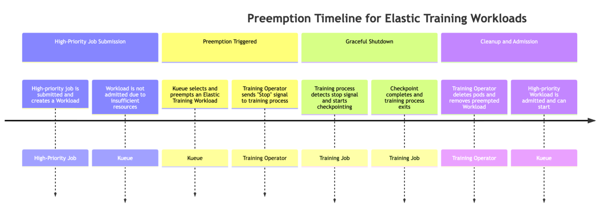

Amazon EKS orchestration
2115

## Page 145

Amazon SageMaker AI
Developer Guide

Preemption can cause the entire training job to pause, which may not be desirable for all
workflows. To avoid full-job suspension while still allowing elastic scaling, customers can configure

two different priority levels within the same training job by defining two replicaSpec sections:

• A primary (fixed) replicaSpec with normal or high priority

• Contains the minimum required number of replicas needed to keep the training job running.

• Uses a higher PriorityClass, ensuring these replicas are never preempted.

• Maintains baseline progress even when the cluster is under resource pressure.

• An elastic (scalable) replicaSpec with lower priority

• Contains the additional optional replicas that provide extra compute during elastic scaling.

• Uses a lower PriorityClass, allowing Kueue to preempt these replicas when higher-priority jobs
need resources.

• Ensures only the elastic portion is reclaimed, while the core training continues uninterrupted.

This configuration enables partial preemption, where only the elastic capacity is reclaimed
—maintaining training continuity while still supporting fair resource sharing in multi-tenant
environments. Example:

apiVersion: sagemaker.amazonaws.com/v1
kind: HyperPodPyTorchJob
metadata:
name: elastic-training-job
spec:
elasticPolicy:
minReplicas: 2
maxReplicas: 8
replicaIncrementStep: 2
...
replicaSpecs:
- name: base
replicas: 2
template:
spec:
priorityClassName: high-priority # set high-priority to avoid evictions
...
- name: elastic
replicas: 0
maxReplicas: 6

Amazon EKS orchestration
2116

## Page 146

Amazon SageMaker AI
Developer Guide

template:
spec:
priorityClassName: low-priority. # Set low-priority for elastic part
...

Handing pod eviction, pod crashes, and hardware degradation:

The HyperPod training operator includes built-in mechanisms to recover the training process when
it is unexpectedly interrupted. Interruptions can occur for various reasons, such as training code
failures, pod evictions, node failures, hardware degradation, and other runtime issues.

When this happens, the operator automatically attempts to recreate the affected pods and resume
training from the latest checkpoint. If recovery is not immediately possible, for example, due to
insufficient spare capacity, the operator can continue progress by temporarily reducing the world
size and scale down the elastic training job.

When an elastic training job crashes or loses replicas, the system behaves as follows:

• Recovery Phase (using spare nodes) The Training Controller waits up to

faultyScaleDownTimeoutInSeconds for resources to become available and attempts to
recover the failed replicas by redeploying pods on spare capacity.

• Elastic scale-down If recovery is not possible within the timeout window, the training operator
scales the job down to a smaller world size (if the job's elastic policy permits it). Training then
resumes with fewer replicas.

• Elastic scale-up When additional resources become available again, the operator automatically
scales the training job back up to the preferred world size.

This mechanism ensures that training can continue with minimal downtime, even under resource
pressure or partial infrastructure failures, while still taking advantage of elastic scaling.

Use elastic training with other HyperPod features

Elastic training does not currently support checkpointless training capabilities, HyperPod managed
tiered checkpointing, or Spot instances.

Note

We collect certain routine aggregated and anonymized operational metrics to provide
essential service availability. The creation of these metrics is fully automated and does not

Amazon EKS orchestration
2117

## Page 147

Amazon SageMaker AI
Developer Guide

involve human review of the underlying model training workload. These metrics relate to a
job and scaling operations, resource management, and essential service functionality.

Observability for Amazon SageMaker HyperPod cluster orchestrated by Amazon
EKS

To achieve comprehensive observability into your Amazon SageMaker HyperPod (SageMaker
HyperPod) cluster resources and software components, integrate the cluster with Amazon
CloudWatch Container Insights, Amazon Managed Service for Prometheus, and Amazon Managed
Grafana. These tools provide visibility into cluster health, performance metrics, and resource
utilization.

The integration with Amazon Managed Service for Prometheus enables the export of metrics
related to your HyperPod cluster resources, providing insights into their performance, utilization,
and health. The integration with Amazon Managed Grafana enables the visualization of these
metrics through various Grafana dashboards that offer intuitive interface for monitoring and
analyzing the cluster's behavior. By leveraging these services, you gain a centralized and unified
view of your HyperPod cluster, facilitating proactive monitoring, troubleshooting, and optimization
of your distributed training workloads.

Note

While CloudWatch, Amazon Managed Service for Prometheus, and Amazon Managed
Grafana focus on operational metrics (for example, system health, training job
performance), SageMaker HyperPod Usage Reports complement Task Governance to
provide financial and resource accountability insights. These reports track:

• Compute utilization (GPU/CPU/Neuron Core hours) across namespaces/teams

• Cost attribution for allocated vs. borrowed resources

• Historical trends (up to 180 days) for auditing and optimization

For more information about setting up and generating usage reports, see Reporting
Compute Usage in HyperPod.

Amazon EKS orchestration
2118

## Page 148

Amazon SageMaker AI
Developer Guide

Tip

To find practical examples and solutions, see also the Observability section in the Amazon
EKS Support in SageMaker HyperPod workshop.

Proceed to the following topics to set up for SageMaker HyperPod cluster observability.

Topics

• Model observability for training jobs on SageMaker HyperPod clusters orchestrated by Amazon
EKS

• Cluster and task observability

Model observability for training jobs on SageMaker HyperPod clusters orchestrated by Amazon

EKS

SageMaker HyperPod clusters orchestrated with Amazon EKS can integrate with the MLflow
application on Amazon SageMaker Studio. Cluster admins set up the MLflow server and connect it
with the SageMaker HyperPod clusters. Data scientists can gain insights into the model.

To set up an MLflow server using AWS CLI

A cluster admin must create an MLflow tracking server.

1. Create a SageMaker AI MLflow tracking server, following the instructions at Create a tracking

server using the AWS CLI.

2. Make sure that the eks-auth:AssumeRoleForPodIdentity permission exists in the IAM

execution role for SageMaker HyperPod.

3. If the eks-pod-identity-agent add-on is not already installed on your EKS cluster, install

the add-on on the EKS cluster.

aws eks create-addon \
--cluster-name <eks_cluster_name> \
--addon-name eks-pod-identity-agent \
--addon-version vx.y.z-eksbuild.1

4. Create a trust-relationship.json file for a new role for Pod to call MLflow APIs.

cat >trust-relationship.json <<EOF

Amazon EKS orchestration
2119

## Page 149

Amazon SageMaker AI
Developer Guide

{
"Version": "2012-10-17",
"Statement": [
{
"Sid": "AllowEksAuthToAssumeRoleForPodIdentity",
"Effect": "Allow",
"Principal": {
"Service": "pods.eks.amazonaws.com"

},
"Action": [
"sts:AssumeRole",
"sts:TagSession"
]
}
]
}

EOF

Run the following code to create the role and attach the trust relationship.

aws iam create-role --role-name hyperpod-mlflow-role \
--assume-role-policy-document file://trust-relationship.json \
--description "allow pods to emit mlflow metrics and put data in s3"

5. Create the following policy that grants Pod access to call all sagemaker-mlflow operations

and to put model artifacts in S3. S3 permission already exists within the tracking server but
if the model artifacts is too big direct call to s3 is made from the MLflow code to upload the
artifacts.

cat >hyperpod-mlflow-policy.json <<EOF
{
"Version": "2012-10-17",
"Statement": [
{
"Effect": "Allow",
"Action": [
"sagemaker-mlflow:AccessUI",
"sagemaker-mlflow:CreateExperiment",
"sagemaker-mlflow:SearchExperiments",
"sagemaker-mlflow:GetExperiment",
"sagemaker-mlflow:GetExperimentByName",

Amazon EKS orchestration
2120

## Page 150

Amazon SageMaker AI
Developer Guide

"sagemaker-mlflow:DeleteExperiment",
"sagemaker-mlflow:RestoreExperiment",
"sagemaker-mlflow:UpdateExperiment",
"sagemaker-mlflow:CreateRun",
"sagemaker-mlflow:DeleteRun",
"sagemaker-mlflow:RestoreRun",
"sagemaker-mlflow:GetRun",
"sagemaker-mlflow:LogMetric",
"sagemaker-mlflow:LogBatch",
"sagemaker-mlflow:LogModel",
"sagemaker-mlflow:LogInputs",
"sagemaker-mlflow:SetExperimentTag",
"sagemaker-mlflow:SetTag",
"sagemaker-mlflow:DeleteTag",
"sagemaker-mlflow:LogParam",
"sagemaker-mlflow:GetMetricHistory",
"sagemaker-mlflow:SearchRuns",

"sagemaker-mlflow:ListArtifacts",
"sagemaker-mlflow:UpdateRun",
"sagemaker-mlflow:CreateRegisteredModel",
"sagemaker-mlflow:GetRegisteredModel",
"sagemaker-mlflow:RenameRegisteredModel",
"sagemaker-mlflow:UpdateRegisteredModel",
"sagemaker-mlflow:DeleteRegisteredModel",
"sagemaker-mlflow:GetLatestModelVersions",
"sagemaker-mlflow:CreateModelVersion",
"sagemaker-mlflow:GetModelVersion",
"sagemaker-mlflow:UpdateModelVersion",
"sagemaker-mlflow:DeleteModelVersion",
"sagemaker-mlflow:SearchModelVersions",
"sagemaker-mlflow:GetDownloadURIForModelVersionArtifacts",
"sagemaker-mlflow:TransitionModelVersionStage",
"sagemaker-mlflow:SearchRegisteredModels",
"sagemaker-mlflow:SetRegisteredModelTag",
"sagemaker-mlflow:DeleteRegisteredModelTag",
"sagemaker-mlflow:DeleteModelVersionTag",
"sagemaker-mlflow:DeleteRegisteredModelAlias",
"sagemaker-mlflow:SetRegisteredModelAlias",
"sagemaker-mlflow:GetModelVersionByAlias"
],
"Resource": "arn:aws:sagemaker:us-west-2:111122223333:mlflow-tracking-
server/<ml tracking server name>"
},
{

Amazon EKS orchestration
2121

## Page 151

Amazon SageMaker AI
Developer Guide

"Effect": "Allow",
"Action": [
"s3:PutObject"
],
"Resource": "arn:aws:s3:::<mlflow-s3-bucket_name>"
}
]
}
EOF

Note

The ARNs are the one from the MLflow server and the S3 bucket set up with the
MLflow server during the server you created following the instructions Set up MLflow
infrastructure.

6. Attach the mlflow-metrics-emit-policy policy to the hyperpod-mlflow-role using the

policy document saved in the previous step.

aws iam put-role-policy \
--role-name hyperpod-mlflow-role \
--policy-name mlflow-metrics-emit-policy \
--policy-document file://hyperpod-mlflow-policy.json

7. Create a Kubernetes service account for Pod to access the MLflow server.

cat >mlflow-service-account.yaml <<EOF
apiVersion: v1
kind: ServiceAccount
metadata:
name: mlflow-service-account
namespace: kubeflow
EOF

Run the following command to apply to the EKS cluster.

kubectl apply -f mlflow-service-account.yaml

8. Create a Pod identity association.

aws eks create-pod-identity-association \

Amazon EKS orchestration
2122

## Page 152

Amazon SageMaker AI
Developer Guide

--cluster-name EKS_CLUSTER_NAME \
--role-arn arn:aws:iam::111122223333:role/hyperpod-mlflow-role \
--namespace kubeflow \
--service-account mlflow-service-account

To collect metrics from training jobs to the MLflow server

Data scientists need to set up the training script and docker image to emit metrics to the MLflow
server.

1. Add the following lines at the beginning of your training script.

import mlflow

# Set the Tracking Server URI using the ARN of the Tracking Server you created

mlflow.set_tracking_uri(os.environ['MLFLOW_TRACKING_ARN'])
# Enable autologging in MLflow
mlflow.autolog()

2. Build a Docker image with the training script and push to Amazon ECR. Get the ARN of the ECR

container. For more information about building and pushing a Docker image, see Pushing a
Docker image in the ECR User Guide.

Tip

Make sure that you add installation of mlflow and sagemaker-mlflow packages in the
Docker file. To learn more about the installation of the packages, requirements, and
compatible versions of the packages, see Install MLflow and the SageMaker AI MLflow
plugin.

3. Add a service account in the training job Pods to give them access to hyperpod-mlflow-role.

This allows Pods to call MLflow APIs. Run the following SageMaker HyperPod CLI job submission

template. Create this with file name mlflow-test.yaml.

defaults:
- override hydra/job_logging: stdout

hydra:
run:
dir: .

Amazon EKS orchestration
2123

## Page 153

Amazon SageMaker AI
Developer Guide

output_subdir: null

training_cfg:
entry_script: ./train.py
script_args: []
run:
name: test-job-with-mlflow # Current run name
nodes: 2 # Number of nodes to use for current training
# ntasks_per_node: 1 # Number of devices to use per node
cluster:
cluster_type: k8s # currently k8s only
instance_type: ml.c5.2xlarge
cluster_config:
# name of service account associated with the namespace
service_account_name: mlflow-service-account
# persistent volume, usually used to mount FSx
persistent_volume_claims: null

namespace: kubeflow
# required node affinity to select nodes with SageMaker HyperPod
# labels and passed health check if burn-in enabled
label_selector:
required:
sagemaker.amazonaws.com/node-health-status:
- Schedulable
preferred:
sagemaker.amazonaws.com/deep-health-check-status:
- Passed
weights:
- 100
pullPolicy: IfNotPresent # policy to pull container, can be Always, IfNotPresent
and Never
restartPolicy: OnFailure # restart policy

base_results_dir: ./result # Location to store the results, checkpoints and logs.
container: 111122223333.dkr.ecr.us-west-2.amazonaws.com/tag # container to use

env_vars:
NCCL_DEBUG: INFO # Logging level for NCCL. Set to "INFO" for debug information
MLFLOW_TRACKING_ARN: arn:aws:sagemaker:us-west-2:11112223333:mlflow-tracking-server/
tracking-server-name

4. Start the job using the YAML file as follows.

Amazon EKS orchestration
2124

## Page 154

Amazon SageMaker AI
Developer Guide

hyperpod start-job --config-file /path/to/mlflow-test.yaml

5. Generate a pre-signed URL for the MLflow tracking server. You can open the link on your

browser and start tracking your training job.

aws sagemaker create-presigned-mlflow-tracking-server-url \
--tracking-server-name "tracking-server-name" \
--session-expiration-duration-in-seconds 1800 \
--expires-in-seconds 300 \
--region region

Cluster and task observability

There are two options for monitoring SageMaker HyperPod clusters:

The SageMaker HyperPod observability add-on—SageMaker HyperPod provides a
comprehensive, out-of-the-box dashboard that gives you insights into foundation model (FM)
development tasks and cluster resources. This unified observability solution automatically
publishes key metrics to Amazon Managed Service for Prometheus and displays them in Amazon
Managed Grafana dashboards. The dashboards are optimized specifically for FM development
with deep coverage of hardware health, resource utilization, and task-level performance. With
this add-on, you can consolidate health and performance data from NVIDIA DCGM, instance-level
Kubernetes node exporters, Elastic Fabric Adapter, integrated file systems, Kubernetes APIs, Kueue,
and SageMaker HyperPod task operators.

Amazon CloudWatch Insights—Amazon CloudWatch Insights collects metrics for compute
resources, such as CPU, memory, disk, and network. Container Insights also provides diagnostic
information, such as container restart failures, to help you isolate issues and resolve them quickly.
You can also set CloudWatch alarms on metrics that Container Insights collects.

Topics

• Amazon SageMaker HyperPod observability with Amazon Managed Grafana and Amazon
Managed Service for Prometheus

• Observability with Amazon CloudWatch

Amazon EKS orchestration
2125

## Page 155

Amazon SageMaker AI
Developer Guide

Amazon SageMaker HyperPod observability with Amazon Managed Grafana and Amazon
Managed Service for Prometheus

Amazon SageMaker HyperPod (SageMaker HyperPod) provides a comprehensive, out-of-the-box
dashboard that gives you insights into foundation model (FM) development tasks and cluster
resources. This unified observability solution automatically publishes key metrics to Amazon
Managed Service for Prometheus and displays them in Amazon Managed Grafana dashboards. The
dashboards are optimized specifically for FM development with deep coverage of hardware health,
resource utilization, and task-level performance. With this add-on, you can consolidate health and
performance data from NVIDIA DCGM, instance-level Kubernetes node exporters, Elastic Fabric
Adapter, integrated file systems, Kubernetes APIs, Kueue, and SageMaker HyperPod task operators.

Topics

• Setting up the SageMaker HyperPod observability add-on

• Amazon SageMaker HyperPod observability dashboards

• Exploring SageMaker HyperPod cluster metrics in Amazon Managed Grafana

• Customizing SageMaker HyperPod cluster metrics dashboards and alerts

• Creating custom SageMaker HyperPod cluster metrics

• SageMaker HyperPod cluster metrics

• Preconfigured alerts

• Troubleshooting the Amazon SageMaker HyperPod observability add-on

Setting up the SageMaker HyperPod observability add-on

The following list describes the prerequisites for setting up the observability add-on.

To have metrics for your Amazon SageMaker HyperPod (SageMaker HyperPod) cluster sent to
a Amazon Managed Service for Prometheus workspace and to optionally view them in Amazon
Managed Grafana, first attach the following managed policies and permissions to your console
role.

• To use Amazon Managed Grafana, enable AWS IAM Identity Center (IAM Identity Center) in an
AWS Region where Amazon Managed Grafana is available. For instructions, see Getting started
with IAM Identity Center in the AWS IAM Identity Center User Guide. For a list of AWS Regions
where Amazon Managed Grafana is available, see Supported Regions in the Amazon Managed
Grafana User Guide.

Amazon EKS orchestration
2126

## Page 156

Amazon SageMaker AI
Developer Guide

• Create at least one user in IAM Identity Center.

• Ensure that the Amazon EKS Pod Identity Agent add-on is installed in your Amazon EKS cluster.
The Amazon EKS Pod Identity Agent add-on makes it possible for the SageMaker HyperPod
observability add-on to get the credentials to interact with Amazon Managed Service for
Prometheus and CloudWatch Logs. To check whether your Amazon EKS cluster has the add-on,
go to the Amazon EKS console, and check your cluster's Add-ons tab. For information about how
to install the add-on if it's not installed, see Create add-on (AWS Management Console) in the
Amazon EKS User Guide.

• Ensure that you have at least one node in your SageMaker HyperPod cluster before installing
SageMaker HyperPod observability add-on. The smallest Amazon EC2 instance type that

works in this case is 4xlarge. This minimum node size requirement ensures that the node can
accommodate all the pods that the SageMaker HyperPod observability add-on creates alongside
any other already running pods on the cluster.

• Add the following policies and permissions to your role.

• the section called “AmazonSageMakerHyperPodObservabilityAdminAccess”

• AWS managed policy: AWSGrafanaWorkspacePermissionManagementV2

• AWS managed policy: AmazonSageMakerFullAccess

• Additional permissions to set up required IAM roles for Amazon Managed Grafana and Amazon
Elastic Kubernetes Service add-on access:

JSON

{
"Version":"2012-10-17",
"Statement": [
{
"Sid": "CreateRoleAccess",
"Effect": "Allow",
"Action": [
"iam:CreateRole",
"iam:CreatePolicy",
"iam:AttachRolePolicy",
"iam:ListRoles"
],
"Resource": [
"arn:aws:iam::*:role/service-role/
AmazonSageMakerHyperPodObservabilityGrafanaAccess*",

Amazon EKS orchestration
2127

## Page 157

Amazon SageMaker AI
Developer Guide

"arn:aws:iam::*:role/service-role/
AmazonSageMakerHyperPodObservabilityAddonAccess*",
"arn:aws:iam::*:policy/service-role/
HyperPodObservabilityAddonPolicy*",
"arn:aws:iam::*:policy/service-role/
HyperPodObservabilityGrafanaPolicy*"
]
}
]
}

• Additional permissions needed to manage IAM Identity Center users for Amazon Managed
Grafana:

JSON

{
"Version":"2012-10-17",
"Statement": [
{
"Sid": "SSOAccess",
"Effect": "Allow",
"Action": [
"sso:ListProfileAssociations",
"sso-directory:SearchUsers",
"sso-directory:SearchGroups",
"sso:AssociateProfile",
"sso:DisassociateProfile"
],
"Resource": [
"*"
]
}
]
}

After you ensure that you have met the above prerequisites, you can install the observability add-
on.

To quickly install the observability add-on

1.
Open the Amazon SageMaker AI console at https://console.aws.amazon.com/sagemaker/.

Amazon EKS orchestration
2128

## Page 158

Amazon SageMaker AI
Developer Guide

2.
Go to your cluster's details page.

3.
On the Dashboard tab, locate the add-on named HyperPod Monitoring & Observability, and
choose Quick install.

To do a custom-install of the observability add-on

1.
Go to your cluster's details page.

2.
On the Dashboard tab, locate the add-on named HyperPod Monitoring & Observability, and
choose Custom install.

3.
Specify the metrics categories that you want to see. For more information about these metrics
categories, see the section called “Cluster metrics”.

4.
Specify whether you want to enable Amazon CloudWatch Logs.

5.
Specify whether you want the service to create a new Amazon Managed Service for
Prometheus workspace.

6.
To be able to view the metrics in Amazon Managed Grafana dashboards, check the box labeled
Use an Amazon Managed Grafana workspace. You can specify your own workspace or let the
service create a new one for you.

Note

Amazon Managed Grafana isn't available in all AWS Regions in which Amazon
Managed Service for Prometheus is available. However, you can set up a Grafana
workspace in any AWS Region and configure it to get metrics data from a Prometheus
workspace that resides in a different AWS Region. For information, see Use AWS
data source configuration to add Amazon Managed Service for Prometheus as a data
source and Connect to Amazon Managed Service for Prometheus and open-source
Prometheus data sources.

Amazon SageMaker HyperPod observability dashboards

This topic describes how to view metrics dashboards for your Amazon SageMaker HyperPod
(SageMaker HyperPod) clusters and how to add new users to a dashboard. The topic also describes
the different types of dashboards.

Amazon EKS orchestration
2129

## Page 159

Amazon SageMaker AI
Developer Guide

Accessing dashboards

To view your SageMaker HyperPod cluster's metrics in Amazon Managed Grafana, perform the
following steps:

1.
Open the Amazon SageMaker AI console at https://console.aws.amazon.com/sagemaker/.

2.
Go to your cluster's details page.

3.
On the Dashboard tab, locate the HyperPod Observability section, and choose Open
dashboard in Grafana.

Adding new users to a Amazon Managed Grafana workspace

For information about how to add users to a Amazon Managed Grafana workspace, see Use AWS
IAM Identity Center with your Amazon Managed Grafana workspace in the Amazon Managed
Grafana User Guide.

Observability dashboards

The SageMaker HyperPod observability add-on provides five interconnected dashboards in your
default Amazon Managed Grafana workspace. Each dashboard provides in-depth insights about
different resources and tasks in the clusters for various users such as data scientists, machine
learning engineers, and administrators.

Task dashboard

The Task dashboard provides comprehensive monitoring and visualization of resource utilization
metrics for SageMaker HyperPod tasks. The main panel displays a detailed table grouping resource
usage by parent tasks, showing CPU, GPU, and memory utilization across pods. Interactive time-
series graphs track CPU usage, system memory consumption, GPU utilization percentages, and
GPU memory usage for selected pods, allowing you to monitor performance trends over time. The
dashboard features powerful filtering capabilities through variables like cluster name, namespace,
task type, and specific pods, making it easy to drill down into specific workloads. This monitoring
solution is essential for optimizing resource allocation and maintaining performance of machine
learning workloads on SageMaker HyperPod.

Training dashboard

The training dashboard provides comprehensive monitoring of training task health, reliability,
and fault management metrics. The dashboard features key performance indicators including

Amazon EKS orchestration
2130

## Page 160

Amazon SageMaker AI
Developer Guide

task creation counts, success rates, and uptime percentages, along with detailed tracking of both
automatic and manual restart events. It offers detailed visualizations of fault patterns through pie
charts and heatmaps that break down incidents by type and remediation latency, enabling you to
identify recurring issues and optimize task reliability. The interface includes real-time monitoring
of critical metrics like system recovery times and fault detection latencies, making it an essential
tool for maintaining high availability of training workloads. Additionally, the dashboard's 24-
hour trailing window provides historical context for analyzing trends and patterns in training task
performance, helping teams proactively address potential issues before they impact production
workloads.

Inference dashboard

The inference dashboard provides comprehensive monitoring of model deployment performance
and health metrics across multiple dimensions. It features a detailed overview of active
deployments, real-time monitoring of request rates, success percentages, and latency metrics,

enabling you to track model serving performance and identify potential bottlenecks. The
dashboard includes specialized panels for both general inference metrics and token-specific
metrics for language models, such as time to first token (TTFT) and token throughput, making it
particularly valuable for monitoring large language model deployments. Additionally, it provides
infrastructure insights through pod and node allocation tracking, while offering detailed error
analysis capabilities to help maintain high availability and performance of inference workloads.

Cluster dashboard

The cluster dashboard provides a comprehensive view of cluster health and performance, offering
real-time visibility into compute, memory, network, and storage resources across your Amazon
SageMaker HyperPod (SageMaker HyperPod) environment. At a glance, you can view critical
metrics including total instances, GPU utilization, memory usage, and network performance
through an intuitive interface that automatically updates data every few seconds. The dashboard is
organized into logical sections, starting with a high-level cluster overview that displays key metrics
such as healthy instance percentage and total resource counts, followed by detailed sections
for GPU performance, memory utilization, network statistics, and storage metrics. Each section
features interactive graphs and panels that allow you to drill down into specific metrics, with
customizable time ranges and filtering options by cluster name, instance, or GPU ID.

File system dashboard

The file-system dashboard provides comprehensive visibility into file system (Amazon FSx
for Lustre) performance and health metrics. The dashboard displays critical storage metrics

Amazon EKS orchestration
2131

## Page 161

Amazon SageMaker AI
Developer Guide

including free capacity, deduplication savings, CPU/memory utilization, disk IOPS, throughput,
and client connections across multiple visualizations. It makes it possible for you to monitor
both system-level performance indicators like CPU and memory usage, as well as storage-
specific metrics such as read/write operations and disk utilization patterns. The interface includes
alert monitoring capabilities and detailed time-series graphs for tracking performance trends
over time, making it valuable for proactive maintenance and capacity planning. Additionally,
through its comprehensive metrics coverage, the dashboard helps identify potential bottlenecks,
optimize storage performance, and ensure reliable file system operations for SageMaker HyperPod
workloads.

GPU partition dashboard

To monitor GPU partition-specific metrics when using Multi-Instance GPU (MIG) configurations, you
need to install or upgrade to the latest version of the SageMaker HyperPod Observability addon.
This addon provides comprehensive monitoring capabilities, including MIG-specific metrics such as
partition count, memory usage, and compute utilization per GPU partition.

If you already have SageMaker HyperPod Observability installed but need MIG metrics support,
simply update the addon to the latest version. This process is non-disruptive and maintains your
existing monitoring configuration.

SageMaker HyperPod automatically exposes MIG-specific metrics, including:

• nvidia_mig_instance_count: Number of MIG instances per profile

• nvidia_mig_memory_usage: Memory utilization per MIG instance

• nvidia_mig_compute_utilization: Compute utilization per MIG instance

Exploring SageMaker HyperPod cluster metrics in Amazon Managed Grafana

After you connect Amazon Managed Grafana to your Amazon Managed Service for Prometheus
workspace, you can use Grafana's query editor and visualization tools to explore your metrics data.
Amazon Managed Grafana provides multiple ways to interact with Prometheus data, including a
comprehensive query editor for building PromQL expressions, a metrics browser for discovering
available metrics and labels, and templating capabilities for creating dynamic dashboards. You
can perform range queries to visualize time series data over periods and instant queries to retrieve
the latest values, with options to format results as time series graphs, tables, or heatmaps. For
detailed information about configuring query settings, using the metrics browser, and leveraging
templating features, see Using the Prometheus data source.

Amazon EKS orchestration
2132

## Page 162

Amazon SageMaker AI
Developer Guide

Customizing SageMaker HyperPod cluster metrics dashboards and alerts

Amazon Managed Grafana makes it possible for you to create comprehensive dashboards that
visualize your data through panels containing queries connected to your data sources. You can
build dashboards from scratch, import existing ones, or export your creations for sharing and
backup purposes. Grafana dashboards support dynamic functionality through variables that
replace hard-coded values in queries, making your visualizations more flexible and interactive. You
can also enhance your dashboards with features like annotations, library panels for reusability,
version history management, and custom links to create a complete monitoring and observability
solution. For step-by-step guidance on creating, importing, configuring, and managing dashboards,
see Building dashboards.

Creating custom SageMaker HyperPod cluster metrics

The Amazon SageMaker HyperPod (SageMaker HyperPod) observability add-on provides hundreds
of health, performance, and efficiency metrics out-of-the-box. In addition to those metrics, you
might need to monitor custom metrics specific to your applications or business needs that aren't
captured by default metrics, such as model-specific performance indicators, data processing
statistics, or application-specific measurements. To address this need, you can implement custom
metrics collection using OpenTelemetry by integrating a Python code snippet into your application.

To create custom metrics, first run the following shell command to install the core OpenTelemetry
components needed to instrument Python applications for observability. This installation makes
it possible for Python applications that run on SageMaker HyperPod clusters to emit custom
telemetry data. That data gets collected by the OpenTelemetry collector and forwarded to the
observability infrastructure.

pip install opentelemetry-api opentelemetry-sdk opentelemetry-exporter-otlp-proto-grpc

The following example script configures an OpenTelemetry metrics pipeline that automatically
tags metrics with pod and node information, ensuring proper attribution within your cluster, and
sends these metrics to the SageMaker HyperPod built-in observability stack every second. The
script establishes a connection to the SageMaker HyperPod metrics collector, sets up appropriate
resource attributes for identification, and provides a meter interface through which you can create
various types of metrics (counters, gauges, or histograms) to track any aspect of your application's
performance. Custom metrics integrate with the SageMaker HyperPod monitoring dashboards
alongside system metrics. This integration allows for comprehensive observability through a
single interface where you can create custom alerts, visualizations, and reports to monitor your
workload's complete performance profile.

Amazon EKS orchestration
2133

## Page 163

Amazon SageMaker AI
Developer Guide

import os
from opentelemetry import metrics
from opentelemetry.exporter.otlp.proto.grpc.metric_exporter import OTLPMetricExporter
from opentelemetry.sdk.metrics import MeterProvider
from opentelemetry.sdk.metrics.export import PeriodicExportingMetricReader
from opentelemetry.sdk.resources import Resource

# Get hostname/pod name
hostname = os.uname()[1]
node_name = os.getenv('NODE_NAME', 'unknown')

collector_endpoint = "hyperpod-otel-collector.hyperpod-observability:4317"

# Configure the OTLP exporter
exporter = OTLPMetricExporter(
endpoint=collector_endpoint,

insecure=True,
timeout=5000  # 5 seconds timeout
)

reader = PeriodicExportingMetricReader(
exporter,
export_interval_millis=1000
)

resource = Resource.create({
"service.name": "metric-test",
"pod.name": hostname,
"node.name": node_name
})

meter_provider = MeterProvider(
metric_readers=[reader],
resource=resource
)
metrics.set_meter_provider(meter_provider)

# Create a meter
meter = metrics.get_meter("test-meter")

# Create a counter
counter = meter.create_counter(
name="test.counter",

Amazon EKS orchestration
2134

## Page 164

Amazon SageMaker AI
Developer Guide

description="A test counter"
)

counter.add(1, {"pod": hostname, "node": node_name})

SageMaker HyperPod cluster metrics

Amazon SageMaker HyperPod (SageMaker HyperPod) publishes various metrics across 9 distinct
categories to your Amazon Managed Service for Prometheus workspace. Not all metrics are
enabled by default or displayed in your Amazon Managed Grafana workspace. The following table
shows which metrics are enabled by default when you install the observability add-on, which
categories have additional metrics that can be enabled for more granular cluster information, and
where they appear in the Amazon Managed Grafana workspace.

Metric
category

Enabled by default?
Additional advanced
metrics available?

Available under which Grafana
dashboards?

Training
metrics

Yes
Yes
Training

Inference
metrics

Yes
No
Inference

Task
governanc
e metrics

No
Yes
None. Query your Amazon
Managed Service for Prometheu
s workspace to build your own
dashboard.

Scaling
metrics

No
Yes
None. Query your Amazon
Managed Service for Prometheu
s workspace to build your own
dashboard.

Cluster
metrics

Yes
Yes
Cluster

Instance
metrics

Yes
Yes
Cluster

Amazon EKS orchestration
2135

## Page 165

Amazon SageMaker AI
Developer Guide

Metric
category

Enabled by default?
Additional advanced
metrics available?

Available under which Grafana
dashboards?

Accelerat
ed
compute
metrics

Yes
Yes
Task, Cluster

Network
metrics

No
Yes
Cluster

File
system

Yes
No
File system

The following tables describe the metrics available for monitoring your SageMaker HyperPod
cluster, organized by category.

Training metrics

Use these metrics to track the performance of training tasks executed on the SageMaker HyperPod
cluster.

Metric name or type
Description
Enabled
by
default?

Metric
source

Kubeflow metrics
https://github.com/kubeflow/trainer
Yes
Kubeflow

Kubernetes pod metrics
https://github.com/kubernetes/kube-
state-metrics

Yes
Kubernete
s

Percentage of training time out of the
total window size

No
SageMaker
HyperPod
training
operator

training_uptime_pe

rcentage

Total number of manual restarts
performed on the job

No
SageMaker
HyperPod

training_manual_re

covery_count

Amazon EKS orchestration
2136

## Page 166

Amazon SageMaker AI
Developer Guide

Metric name or type
Description
Enabled
by
default?

Metric
source

training
operator

Total time in milliseconds the job was
down due to manual interventions

No
SageMaker
HyperPod
training
operator

training_manual_do

wntime_ms

Total number of automatic recoveries
No
SageMaker
HyperPod
training
operator

training_auto_reco

very_count

Total infrastructure overhead time in
milliseconds during fault recovery

No
SageMaker
HyperPod
training
operator

training_auto_reco

very_downtime

Total number of faults encountered
during training

No
SageMaker
HyperPod
training
operator

training_fault_cou

nt

Distribution of faults by type
No
SageMaker
HyperPod
training
operator

training_fault_typ

e_count

Recovery time in milliseconds for each
type of fault

No
SageMaker
HyperPod
training
operator

training_fault_rec

overy_time_ms

Amazon EKS orchestration
2137

## Page 167

Amazon SageMaker AI
Developer Guide

Metric name or type
Description
Enabled
by
default?

Metric
source

training_time_ms
Total time in milliseconds spent in
actual training

No
SageMaker
HyperPod
training
operator

Inference metrics

Use these metrics to track the performance of inference tasks on the SageMaker HyperPod cluster.

Metric name or type
Description
Enabled
by
default?

Metric
source

Total number of invocation requests to
the model

Yes
SageMaker
HyperPod
inference
operator

model_invocations_

total

model_errors_total
Total number of errors during model
invocation

Yes
SageMaker
HyperPod
inference
operator

Active concurrent model requests
Yes
SageMaker
HyperPod
inference
operator

model_concurrent_r

equests

Model invocation latency in milliseco
nds

Yes
SageMaker
HyperPod
inference
operator

model_latency_mill

iseconds

Amazon EKS orchestration
2138

## Page 168

Amazon SageMaker AI
Developer Guide

Metric name or type
Description
Enabled
by
default?

Metric
source

Model time to first byte latency in
milliseconds

Yes
SageMaker
HyperPod
inference
operator

model_ttfb_millise

conds

TGI
These metrics can be used to monitor
the performance of TGI, auto-scal
e deployment and to help identify
bottlenecks. For a detailed list of
metrics, see https://github.com/deepja
valibrary/djl-serving/blob/master/
prometheus/README.md.

Yes
Model
container

LMI
These metrics can be used to monitor
the performance of LMI, and to help
identify bottlenecks. For a detailed
list of metrics, see https://github.co
m/deepjavalibrary/djl-serving/blob/
master/prometheus/README.md.

Yes
Model
container

Task governance metrics

Use these metrics to monitor task governance and resource allocation on the SageMaker HyperPod
cluster.

Metric name or type
Description
Enabled
by
default?

Metric
source

Kueue
See https://kueue.sigs.k8s.io/docs/re
ference/metrics/.

No
Kueue

Amazon EKS orchestration
2139

## Page 169

Amazon SageMaker AI
Developer Guide

Scaling metrics

Use these metrics to monitor auto-scaling behavior and performance on the SageMaker HyperPod
cluster.

Metric name or type
Description
Enabled
by
default?

Metric
source

KEDA Operator Metrics
See https://keda.sh/docs/2.17/integr
ations/prometheus/#operator.

No
Kubernete
s Event-
driven
Autoscaler
(KEDA)

KEDA Webhook Metrics
See https://keda.sh/docs/2.17/integr
ations/prometheus/#admission-webho
oks.

No
Kubernete
s Event-
driven
Autoscaler
(KEDA)

KEDA Metrics server
Metrics

See https://keda.sh/docs/2.17/integr
ations/prometheus/#metrics-server.

No
Kubernete
s Event-
driven
Autoscaler
(KEDA)

Cluster metrics

Use these metrics to monitor overall cluster health and resource allocation.

Amazon EKS orchestration
2140

## Page 170

Amazon SageMaker AI
Developer Guide

Metric name or type
Description
Enabled
by
default?

Metric
source

Cluster health
Kubernetes API server metrics. See
https://kubernetes.io/docs/reference/
instrumentation/metrics/.

Yes
Kubernete
s

Kubestate
See https://github.com/kubernetes/
kube-state-metrics/tree/main/docs#de
fault-resources.

Limited
Kubernete
s

KubeState Advanced
See https://github.com/kubernetes/
kube-state-metrics/tree/main/docs#op
tional-resources.

No
Kubernete
s

Instance metrics

Use these metrics to monitor individual instance performance and health.

Metric name or type
Description
Enabled
by
default?

Metric
source

Node Metrics
See https://github.com/prometheus/

Yes
Kubernete

node_exporter?tab=readme-ov-fi
le#enabled-by-default.

s

Container Metrics
Container metrics exposed by Cadvisor.
See https://github.com/google/
cadvisor.

Yes
Kubernete
s

Accelerated compute metrics

Use these metrics to monitor the performance, health, and utilization of individual accelerated
compute devices in your cluster.

Amazon EKS orchestration
2141

## Page 171

Amazon SageMaker AI
Developer Guide

Note

When GPU partitioning with MIG (Multi-Instance GPU) is enabled on your cluster, DCGM
metrics automatically provide partition-level granularity for monitoring individual MIG
instances. Each MIG partition is exposed as a separate GPU device with its own metrics
for temperature, power, memory utilization, and compute activity. This allows you to
track resource usage and health for each GPU partition independently, enabling precise
monitoring of workloads running on fractional GPU resources. For more information about
configuring GPU partitioning, see the section called “GPU partitioning”.

Metric name or type
Description
Enabled
by
default?

Metric
source

NVIDIA GPU
DCGM metrics. See https://github.co
m/NVIDIA/dcgm-exporter/blob/main/
etc/dcp-metrics-included.csv.

Limited
NVIDIA
Data
Center
GPU
Manager
(DCGM)

NVIDIA GPU (advanced)
DCGM metrics that are commented out
in the following CSV file:

No
NVIDIA
Data
Center
GPU
Manager
(DCGM)

https://github.com/NVIDIA/dcgm-ex
porter/blob/main/etc/dcp-metrics-
included.csv

AWS Trainium
Neuron metrics. See https://awsdocs-
neuron.readthedocs-hosted.com/en/
latest/tools/neuron-sys-tools/neuron-
monitor-user-guide.html#neuron-mon
itor-nc-counters.

No
AWS
Neuron
Monitor

Amazon EKS orchestration
2142

## Page 172

Amazon SageMaker AI
Developer Guide

Network metrics

Use these metrics to monitor the performance and health of the Elastic Fabric Adapters (EFA) in
your cluster.

Metric name or type
Description
Enabled
by
default?

Metric
source

EFA
See https://github.com/aws-samples/
awsome-distributed-training/blob/
main/4.validation_and_observability/3
.efa-node-exporter/README.md.

No
Elastic
Fabric
Adapter

File system metrics

Metric name or type
Description
Enabled
by
default?

Metric
source

File system
Amazon FSx for Lustre metrics from
Amazon CloudWatch:

Yes
Amazon
FSx for
Lustre

Monitoring with Amazon CloudWatch.

Preconfigured alerts

The Amazon SageMaker HyperPod (SageMaker HyperPod) observability add-on enables default
alerts for your cluster and workloads to notify you when the system detects common early
indicators of cluster under-performance. These alerts are defined within the Amazon Managed
Grafana built-in alerting system. For information about how to modify these pre-configured alerts
or create new ones, see Alerts in Grafana version 10 in the Amazon Managed Grafana User Guide.
The following YAML shows the default alerts.

groups:
- name: sagemaker_hyperpod_alerts
rules:

Amazon EKS orchestration
2143

## Page 173

Amazon SageMaker AI
Developer Guide

# GPU_TEMP_ABOVE_80C
- alert: GPUHighTemperature
expr: DCGM_FI_DEV_GPU_TEMP > 80
for: 5m
labels:
severity: warning
annotations:
summary: "GPU Temperature Above 80C"
description: "GPU {{ $labels.gpu }} temperature is {{ $value }}°C."

# GPU_TEMP_ABOVE_85C
- alert: GPUCriticalTemperature
expr: DCGM_FI_DEV_GPU_TEMP > 85
for: 1m
labels:
severity: critical
annotations:

summary: "GPU Temperature Above 85C"
description: "GPU {{ $labels.gpu }} temperature is {{ $value }}°C."

# GPU_MEMORY_ERROR
# Any ECC double-bit errors indicate serious memory issues requiring immediate
attention
- alert: GPUMemoryErrorDetected
expr: DCGM_FI_DEV_ECC_DBE_VOL_TOTAL > 0 or DCGM_FI_DEV_ECC_DBE_AGG_TOTAL >
DCGM_FI_DEV_ECC_DBE_AGG_TOTAL offset 5m
labels:
severity: critical
annotations:
summary: "GPU ECC Double-Bit Error Detected"
description: "GPU {{ $labels.gpu }} has detected ECC double-bit errors."

# GPU_POWER_WARNING
# Sustained power limit violations can impact performance and stability
- alert: GPUPowerViolation
expr: DCGM_FI_DEV_POWER_VIOLATION > 100
for: 5m
labels:
severity: warning
annotations:
summary: "GPU Power Violation"
description: "GPU {{ $labels.gpu }} has been operating at power limit for
extended period."

Amazon EKS orchestration
2144

## Page 174

Amazon SageMaker AI
Developer Guide

# GPU_NVLINK_ERROR
# NVLink errors above threshold indicate interconnect stability issues
- alert: NVLinkErrorsDetected
expr: DCGM_FI_DEV_NVLINK_RECOVERY_ERROR_COUNT_TOTAL > 0 or
DCGM_FI_DEV_NVLINK_REPLAY_ERROR_COUNT_TOTAL > 10
labels:
severity: warning
annotations:
summary: "NVLink Errors Detected"
description: "GPU {{ $labels.gpu }} has detected NVLink errors."

# GPU_THERMAL_VIOLATION
# Immediate alert on thermal violations to prevent hardware damage
- alert: GPUThermalViolation
expr: increase(DCGM_FI_DEV_THERMAL_VIOLATION[5m]) > 0
for: 1m
labels:

severity: critical
annotations:
summary: "GPU Thermal Violation Detected"
description: "GPU {{ $labels.gpu }} has thermal violations on node
{{ $labels.Hostname }}"

# GPU_XID_ERROR
# XID errors indicate driver or hardware level GPU issues requiring investigation
- alert: GPUXidError
expr: DCGM_FI_DEV_XID_ERRORS > 0
for: 0m
labels:
severity: critical
annotations:
summary: "GPU XID Error Detected"
description: "GPU {{ $labels.gpu }} experienced XID error {{ $value }} on node
{{ $labels.Hostname }}"

# MIG_CONFIG_FAILURE
# MIG configuration failures indicate issues with GPU partitioning setup
- alert: MIGConfigFailure
expr: kubelet_node_name{nvidia_com_mig_config_state="failed"} > 0
for: 1m
labels:
severity: critical
annotations:
summary: "MIG Configuration Failed"

Amazon EKS orchestration
2145

## Page 175

Amazon SageMaker AI
Developer Guide

description: "MIG configuration failed on node {{ $labels.instance }}"

# DISK_SPACE_WARNING
# 90% threshold ensures time to respond before complete disk exhaustion
- alert: NodeDiskSpaceWarning
expr: (node_filesystem_size_bytes - node_filesystem_free_bytes) /
node_filesystem_size_bytes * 100 > 90
for: 5m
labels:
severity: warning
annotations:
summary: "High Disk Usage"
description: "Node {{ $labels.instance }} disk usage is above 90%"

# FSX_STORAGE_WARNING
# 80% FSx utilization allows buffer for burst workloads
- alert: FsxLustreStorageWarning

expr: fsx_lustre_storage_used_bytes / fsx_lustre_storage_capacity_bytes * 100 > 80
for: 5m
labels:
severity: warning
annotations:
summary: "High FSx Lustre Usage"
description: "FSx Lustre storage usage is above 80% on file system
{{ $labels.filesystem_id }}"

Troubleshooting the Amazon SageMaker HyperPod observability add-on

Use the following guidance to resolve common issues with the Amazon SageMaker HyperPod
(SageMaker HyperPod) observability add-on.

Troubleshooting missing metrics in Amazon Managed Grafana

If metrics don't appear in your Amazon Managed Grafana dashboards, perform the following steps
to identify and resolve the issue.

Verify the Amazon Managed Service for Prometheus-Amazon Managed Grafana connection

1.
Sign in to the Amazon Managed Grafana console.

2.
In the left pane, choose All workspaces.

3.
In the Workspaces table, choose your workspace.

4.
In the details page of the workspace, choose the Data sources tab.

Amazon EKS orchestration
2146

## Page 176

Amazon SageMaker AI
Developer Guide

5.
Verify that the Amazon Managed Service for Prometheus data source exists.

6.
Check the connection settings:

• Confirm that the endpoint URL is correct.

• Verify that IAM authentication is properly configured.

• Choose Test connection. Verify that the status is Data source is working.

Verify the Amazon EKS add-on status

1.
Open the Amazon EKS console at https://console.aws.amazon.com/eks/home#/clusters.

2.
Select your cluster.

3.
Choose the Add-ons tab.

4.
Verify that the SageMaker HyperPod observability add-on is listed and that its status is
ACTIVE.

5.
If the status isn't ACTIVE, see the section called “Add-on installation failures”.

Verify Pod Identity association

1.
Open the Amazon EKS console at https://console.aws.amazon.com/eks/home#/clusters.

2.
Select your cluster.

3.
On the cluster details page, choose the Access tab.

4.
In the Pod Identity associations table, choose the association that has the following property
values:

• Namespace: hyperpod-observability

• Service account: hyperpod-observability-operator-otel-collector

• Add-on: amazon-sagemaker-hyperpod-observability

5.
Ensure that the IAM role that is attached to this association has the following permissions.

JSON

{
"Version":"2012-10-17",
"Statement": [
{

Amazon EKS orchestration
2147

## Page 177

Amazon SageMaker AI
Developer Guide

"Sid": "PrometheusAccess",
"Effect": "Allow",
"Action": "aps:RemoteWrite",
"Resource": "arn:aws:aps:us-
east-1:111122223333:workspace/workspace-ID"
},
{
"Sid": "CloudwatchLogsAccess",
"Effect": "Allow",
"Action": [
"logs:CreateLogGroup",
"logs:CreateLogStream",
"logs:DescribeLogGroups",
"logs:DescribeLogStreams",
"logs:PutLogEvents",
"logs:GetLogEvents",
"logs:FilterLogEvents",

"logs:GetLogRecord",
"logs:StartQuery",
"logs:StopQuery",
"logs:GetQueryResults"
],
"Resource": [
"arn:aws:logs:us-east-1:111122223333:log-group:/aws/
sagemaker/Clusters/*",
"arn:aws:logs:us-east-1:111122223333:log-group:/aws/
sagemaker/Clusters/*:log-stream:*"
]
}
]
}

6.
Ensure that the IAM role that is attached to this association has the following trust policy.
Verify that the source ARN and source account are correct.

JSON

{
"Version":"2012-10-17",
"Statement": [
{
"Sid": "AllowEksAuthToAssumeRoleForPodIdentity",
"Effect": "Allow",

Amazon EKS orchestration
2148

## Page 178

Amazon SageMaker AI
Developer Guide

"Principal": {
"Service": "pods.eks.amazonaws.com"
},
"Action": [
"sts:AssumeRole",
"sts:TagSession"
],
"Condition": {
"StringEquals": {
"aws:SourceArn": "arn:aws:eks:us-
east-1:111122223333:cluster/cluster-name",
"aws:SourceAccount": "111122223333"
}
}
}
]
}

Check Amazon Managed Service for Prometheus throttling

1.
Sign in to the AWS Management Console and open the Service Quotas console at https://
console.aws.amazon.com/servicequotas/.

2.
In the Managed quotas box, search for and select Amazon Managed Service for Prometheus.

3.
Choose the Active series per workspace quota.

4.
In the Resource-level quotas tab, select your Amazon Managed Service for Prometheus
workspace.

5.
Ensure that the utilization is less than your current quota.

6.
If you've reached the quota limit, select your workspace by choosing the radio button to its
left, and then choose Request increase at resource level .

Verify KV caching and intelligent routing are enabled

If the KVCache Metrics dashboard is missing, feature is either not enabled or the port isn't

mentioned in the modelMetrics. For more information on how to enable this, see steps 1 and 3 in
Configure KV caching and intelligent routing for improved performance.

Amazon EKS orchestration
2149

## Page 179

Amazon SageMaker AI
Developer Guide

If the Intelligent Router Metrics dashboard is missing, enable the feature to have them
show up. For more information on how to enable this, see Configure KV caching and intelligent
routing for improved performance.

Troubleshooting add-on installation failures

If the observability add-on fails to install, use the following steps to diagnose and resolve the issue.

Check health probe status

1.
Open the Amazon EKS console at https://console.aws.amazon.com/eks/home#/clusters.

2.
Select your cluster.

3.
Choose the Add-ons tab.

4.
Choose the failed add-on.

5.
Review the Health issues section.

6.
If the health issue is related to credentials or pod identity, see the section called “Verify Pod
Identity association”. Also ensure that the pod identity agent add-on is running in the cluster.

7.
Check for errors in the manager logs. For instructions, see the section called “Review manager
logs”.

8.
Contact AWS Support with the issue details.

Review manager logs

1.
Get the add-on manager pod:

kubectl logs -n hyperpod-observability -l control-plane=hyperpod-observability-
controller-manager

2.
For urgent issues, contact Support.

Review all observability pods

All the pods that the SageMaker HyperPod observability add-on creates are in the hyperpod-

observability namespace. To get the status of these pods, run the following command.

kubectl get pods -n hyperpod-observability

Amazon EKS orchestration
2150

## Page 180

Amazon SageMaker AI
Developer Guide

Look for the pods whose status is either pending or crashloopbackoff. Run the following
command to get the logs of these pending or failing pods.

kubectl logs -n hyperpod-observability pod-name

If you don't find errors in the logs, run the following command to describe the pods and look for
errors.

kubectl describe -n hyperpod-observability pod pod-name

To get more context, run the two following commands to describe the deployments and
daemonsets for these pods.

kubectl describe -n hyperpod-observability deployment deployment-name

kubectl describe -n hyperpod-observability daemonset daemonset-name

Troubleshooting pods that are stuck in the pending status

If you see that there are pods that are stuck in the pending status, make sure that the node is
large enough to fit in all the pods. To verify that it is, perform the following steps.

1.
Open the Amazon EKS console at https://console.aws.amazon.com/eks/home#/clusters.

2.
Choose your cluster.

3.
Choose the cluster's Compute tab.

4.
Choose the node with the smallest instance type.

5.
In the capacity allocation section, look for available pods.

6.
If there are no available pods, then you need a larger instance type.

For urgent issues, contact AWS Support.

Observability with Amazon CloudWatch

Use Amazon CloudWatch Container Insights to collect, aggregate, and summarize metrics and
logs from the containerized applications and micro-services on the EKS cluster associated with a
HyperPod cluster.

Amazon EKS orchestration
2151

## Page 181

Amazon SageMaker AI
Developer Guide

Amazon CloudWatch Insights collects metrics for compute resources, such as CPU, memory, disk,
and network. Container Insights also provides diagnostic information, such as container restart
failures, to help you isolate issues and resolve them quickly. You can also set CloudWatch alarms on
metrics that Container Insights collects.

To find a complete list of metrics, see Amazon EKS and Kubernetes Container Insights metrics in
the Amazon EKS User Guide.

Install CloudWatch Container Insights

Cluster admin users must set up CloudWatch Container Insights following the instructions at Install
the CloudWatch agent by using the Amazon CloudWatch Observability EKS add-on or the Helm
chart in the CloudWatch User Guide. For more information about Amazon EKS add-on, see also
Install the Amazon CloudWatch Observability EKS add-on in the Amazon EKS User Guide.

After the installation has completed, verify that the CloudWatch Observability add-on is visible in
the EKS cluster add-on tab. It might take about a couple of minutes until the dashboard loads.

Note

SageMaker HyperPod requires the CloudWatch Insight v2.0.1-eksbuild.1 or later.

Access CloudWatch container insights dashboard

1. Open the CloudWatch console at https://console.aws.amazon.com/cloudwatch/.

2. Choose Insights, and then choose Container Insights.

3. Select the EKS cluster set up with the HyperPod cluster you're using.

4. View the Pod/Cluster level metrics.

Amazon EKS orchestration
2152

## Page 182

Amazon SageMaker AI
Developer Guide

Access CloudWatch container insights logs

1. Open the CloudWatch console at https://console.aws.amazon.com/cloudwatch/.

2. Choose Logs, and then choose Log groups.

When you have the HyperPod clusters integrated with Amazon CloudWatch Container Insights, you

can access the relevant log groups in the following format: /aws/containerinsights /<eks-

cluster-name>/*. Within this log group, you can find and explore various types of logs such as
Performance logs, Host logs, Application logs, and Data plane logs.

Continuous provisioning for enhanced cluster operations on Amazon EKS

Amazon SageMaker HyperPod clusters created with Amazon EKS orchestration now supports
continuous provisioning, a new capability that enables greater flexibility and efficiency running
large-scale AI/ML workloads. Continuous provisioning lets you start training quickly, scale
seamlessly, perform maintenance without disrupting operations, and have granular visibility into
cluster operations.

Amazon EKS orchestration
2153

## Page 183

Amazon SageMaker AI
Developer Guide

Note

Continuous provisioning is available as an optional configuration for HyperPod clusters
created with EKS orchestration. Clusters created with Slurm orchestration use a different
scaling model.

How it works

The continuous provisioning system introduces a desired-state architecture that replaces the
traditional request-based model. This new architecture enables parallel, non-blocking operations
across different resource levels while maintaining system stability and performance. The
continuous provisioning system:

• Accepts the request: Records the target instance count for each instance group

• Initiates provisioning: Begins launching instances to meet the target count

Tracks progress: Monitors each instance launch attempt and records the status

• Handles failures: Automatically retries failed launches

Continuous provisioning is disabled by default. To use this feature, set --node-provisioning-

mode to Continuous.

With continuous provisioning enabled, you can initiate multiple scaling operations simultaneously
without waiting for previous operations to complete. This lets you scale different instance groups
in the same cluster concurrently and submit multiple scaling requests to the same instance group.

Continuous provisioning also gives you access to DescribeClusterEvent and ListClusterEvent for
detailed event monitoring and operational visibility.

Usage metering

HyperPod clusters with continuous provisioning use instance-level metering to provide accurate
billing that reflects actual resource usage. This metering approach differs from traditional cluster-
level billing by tracking each instance independently.

Instance-level billing

With continuous provisioning, billing starts and stops at the individual instance level rather than
waiting for cluster-level state changes. This approach provides the following benefits:

Amazon EKS orchestration
2154

## Page 184

Amazon SageMaker AI
Developer Guide

• Precise billing accuracy: Billing starts when the lifecycle script execution begins. If the lifecycle
script fails, the instance provision will be retried and you will be charged for the duration of the
lifecycle script runtime.

• Independent metering: Each instance's billing lifecycle is managed separately, preventing
cascading billing errors

• Real-time billing updates: Billing starts when an instance begins executing its lifecycle script
and stops when the instance enters a terminating state

Billing lifecycle

Each instance in your HyperPod cluster follows this billing lifecycle:

• Billing starts: When the instance successfully launches and begins executing its lifecycle
configuration script

• Billing continues: Throughout the instance's operational lifetime

• Billing stops: When the instance enters a terminating state, regardless of the reason for
termination

Note

Billing does not start for instances that fail to launch. If an instance launch fails due to
insufficient capacity or other issues, you are not charged for that failed attempt. Billing is
calculated at the instance level and costs are aggregated and reported under your cluster's
Amazon Resource Name (ARN).

Create a cluster with continuous provisioning enabled

Note

You must have an existing Amazon EKS cluster configured with VPC networking and
the required Helm chart installed. Additionally, prepare a lifecycle configuration script
and upload it to an Amazon S3 bucket that your execution role can access. For more
information, see Managing SageMaker HyperPod clusters orchestrated by Amazon EKS.

Amazon EKS orchestration
2155

## Page 185

Amazon SageMaker AI
Developer Guide

The following AWS CLI operation creates a HyperPod cluster with one instance group and
continuous provisioning enabled.

aws sagemaker create-cluster \
--cluster-name $HP_CLUSTER_NAME \
--orchestrator 'Eks={ClusterArn='$EKS_CLUSTER_ARN'}' \
--vpc-config '{
"SecurityGroupIds": ["'$SECURITY_GROUP'"],
"Subnets": ["'$SUBNET'"]
}' \
--instance-groups '{
"InstanceGroupName": "ig-1",
"InstanceType": "ml.c5.2xlarge",
"InstanceCount": 2,
"LifeCycleConfig": {
"SourceS3Uri": "s3://'$BUCKET_NAME'",

"OnCreate": "on_create_noop.sh"
},
"ExecutionRole": "'$EXECUTION_ROLE'",
"ThreadsPerCore": 1,
"TrainingPlanArn": ""
}' \
--node-provisioning-mode Continuous

// Expected Output:
{
"ClusterArn": "arn:aws:sagemaker:us-west-2:<account-id>:cluster/<cluster-id>"
}

After you’ve created your cluster, you can use ListClusterNodes or DescribeClusterNode to find out
more information about the nodes in the cluster.

Calling these operations will return a ClusterInstanceStatusDetails object with one of the following
values:

• Running: The node is healthy and registered with the cluster orchestrator (EKS).

• Failure: The node provisioning failed but the system will automatically retry provisioning with a
new EC2 instance.

• Pending: The node is being provisioned or rebooted.

Amazon EKS orchestration
2156

## Page 186

Amazon SageMaker AI
Developer Guide

• ShuttingDown: The node termination is in progress. The node will either transition to Failure
status if termination encounters issues, or will be successfully removed from the cluster.

• SystemUpdating: The node is undergoing AMI patching, either triggered manually or as part of
patching cronjobs.

• DeepHealthCheckInProgress: Deep health checks (DHCs) are being conducted. This could take
anywhere between a few mins to several hours depending on the nature of tests. Bad nodes are
replaced and healthy nodes switch to Running.

• NotFound : Used in BatchAddClusterNodes response to indicate a node has been deleted during
idempotent replay.

Minimum capacity requirements (MinCount)

The MinCount feature allows you to specify the minimum number of instances that must be

successfully provisioned before an instance group transitions to the InService status. This
feature provides better control over scaling operations and helps prevent scenarios where partially
provisioned instance groups cannot be used effectively for training workloads.

Important

MinCount is not a permanent guarantee of minimum capacity. It only ensures that the
specified minimum number of instances are available when the instance group first

becomes InService. Brief dips below MinCount may occur during normal operations such
as unhealthy instance replacements or maintenance activities.

How MinCount works

When you create or update an instance group with MinCount enabled, the following behavior
occurs:

• New instance groups: The instance group remains in Creating status until at least MinCount
instances are successfully provisioned and ready. Once this threshold is met, the instance group

transitions to InService.

• Existing instance groups: When updating MinCount on an existing instance group, the status

changes to Updating until the new MinCount requirement is satisfied.

• Continuous scaling: If TargetCount is greater than MinCount, the continuous scaling system
continues attempting to launch additional instances until TargetCount is reached.

Amazon EKS orchestration
2157

## Page 187

Amazon SageMaker AI
Developer Guide

• Timeout and rollback: If MinCount cannot be satisfied within 3 hours, the system automatically
rolls back the instance group to its last known good state. For more information about rollback
behavior, see Automatic rollback behavior.

Instance group status during MinCount operations

Instance groups with MinCount configured exhibit the following status behavior:

Creating

For new instance groups when CurrentCount < MinCount. The instance group remains in this
status until the minimum capacity requirement is met.

Updating

For existing instance groups when MinCount is modified and CurrentCount < MinCount. The

instance group remains in this status until the new minimum capacity requirement is satisfied.

InService

When MinCount ≤ CurrentCount ≤ TargetCount. The instance group is ready for use and all
mutating operations are unblocked.

During Creating or Updating status, the following restrictions apply:

• Mutating operations such as BatchAddClusterNodes, BatchDeleteClusterNodes, or

UpdateClusterSoftware are blocked

• You can still modify MinCount and TargetCount values to correct configuration errors

• Cluster and Instance group deletion is always permitted

Automatic rollback behavior

If an instance group cannot reach its MinCount within 3 hours, the system automatically initiates a
rollback to prevent indefinite waiting:

• New instance groups: MinCount and TargetCount are reset to (0, 0)

• Existing instance groups: MinCount and TargetCount are restored to their values from the last

InService state

• Instance selection for termination: If instances need to be terminated during rollback, the
system selects the unhealthy instances first, then those that were most recently provisioned.

Amazon EKS orchestration
2158

## Page 188

Amazon SageMaker AI
Developer Guide

• Status transition: The instance group immediately transitions to InService status after
rollback initiation, allowing the continuous scaling system to manage capacity according to the
rollback settings

The 3-hour timeout resets each time MinCount is updated. For example, if you update MinCount
multiple times, the timeout period starts fresh from the most recent update.

MinCount events

The system emits specific events to help you track MinCount operations:

• Minimum capacity reached: Emitted when an instance group successfully reaches its MinCount

and transitions to InService

• Rollback initiated: Emitted when the 3-hour timeout expires and automatic rollback begins

You can monitor these events using ListClusterEvents to track the progress of your MinCount
operations.

API usage

MinCount is specified using the MinInstanceCount parameter in instance group configurations:

aws sagemaker create-cluster \
--cluster-name $HP_CLUSTER_NAME \
--orchestrator 'Eks={ClusterArn='$EKS_CLUSTER_ARN'}' \
--vpc-config '{
"SecurityGroupIds": ["'$SECURITY_GROUP'"],
"Subnets": ["'$SUBNET'"]
}' \
--instance-groups '{
"InstanceGroupName": "worker-group",
"InstanceType": "ml.p4d.24xlarge",
"InstanceCount": 64,
"MinInstanceCount": 50,
"LifeCycleConfig": {
"SourceS3Uri": "s3://'$BUCKET_NAME'",
"OnCreate": "on_create.sh"
},
"ExecutionRole": "'$EXECUTION_ROLE'"
}' \
--node-provisioning-mode Continuous

Amazon EKS orchestration
2159

## Page 189

Amazon SageMaker AI
Developer Guide

Key considerations for MinCount usage:

• MinInstanceCount must be between 0 and InstanceCount (inclusive) value of the instance
group specified in CreateCluster or UpdateCluster request

• Setting MinInstanceCount to 0 (default) preserves standard continuous scaling behavior

• Setting MinInstanceCount equal to InstanceCount provides all-or-nothing scaling behavior

• MinCount is only available for clusters with NodeProvisioningMode set to Continuous

Autoscaling on SageMaker HyperPod EKS

Amazon SageMaker HyperPod provides a managed Karpenter based node autoscaling solution
for clusters created with EKS orchestration. Karpenter is an open-source, Kubernetes node
lifecycle manager built by AWS that optimizes cluster scaling and cost efficiency. Unlike self-
managed Karpenter deployments, SageMaker HyperPod's managed implementation eliminates
the operational overhead of installing, configuring, and maintaining Karpenter controllers while
providing integrated resilience and fault tolerance. This managed autoscaling solution is built
on HyperPod's continuous provisioning capabilities and enables you to efficiently scale compute
resources for training and inference workloads with automatic failure handling and recovery.

You pay only for what you use. You're responsible for paying for all compute instances that are
automatically provisioned through autoscaling according to standard SageMaker HyperPod pricing.
For detailed pricing information, see Amazon SageMaker AI.

By enabling Karpenter-based autoscaling with HyperPod, you have access to:

• Service managed lifecycle - HyperPod handles Karpenter installation, updates, and
maintenance, eliminating operational overhead.

• Just in time provisioning - Karpenter will observe your pending pods and provision the required
compute for your workloads from on-demand pool.

• Scale to zero - Scale down to zero nodes without maintaining dedicated controller
infrastructure.

• Workload aware node selection - Karpenter chooses optimal instance types based on pod
requirements, availability zones, and pricing to minimize costs.

• Automatic node consolidation - Karpenter regularly evaluates cluster for optimization
opportunities, shifting workloads to eliminate underutilized nodes.

Amazon EKS orchestration
2160

## Page 190

Amazon SageMaker AI
Developer Guide

• Integrated resilience - Leverages HyperPod's built-in fault tolerance and node recovery
mechanisms.

The following topics explain how to enable HyperPod autoscaling with Karpenter.

Topics

• Prerequisites

• Create an IAM role for HyperPod autoscaling with Karpenter

• Create and configure a HyperPod cluster with Karpenter autoscaling

• Create a NodeClass

• Create a NodePool

• Deploy a workload

Prerequisites

• Continuous provisioning enabled on your HyperPod cluster. Enable continuous provisioning

by setting --node-provisioning-mode to Continuous when creating your SageMaker
HyperPod cluster. For more information, see Continuous provisioning for enhanced cluster
operations on Amazon EKS.

• Health Monitoring Agent version 1.0.742.0_1.0.241.0 or above installed. Required for HyperPod
cluster operations and monitoring. The agent must be configured before enabling Karpenter
autoscaling to ensure proper cluster health reporting and node lifecycle management. For more
information, see Health Monitoring System.

• Only if your Amazon EKS cluster has Karpenter running on it, the Karpenter NodePool and

NodeClaim versions need to be v1.

• NodeRecovery set to automatic. For more information, see Automatic node recovery.

Create an IAM role for HyperPod autoscaling with Karpenter

In the following steps, you'll create an IAM role that allows SageMaker HyperPod to manage
Kubernetes nodes in your cluster through Karpenter-based autoscaling. This role provides the
necessary permissions for HyperPod to add and remove cluster nodes automatically based on
workload demand.

Amazon EKS orchestration
2161

## Page 191

Amazon SageMaker AI
Developer Guide

Open the IAM console

1.
Sign in to the AWS Management Console and open the IAM console at
console.aws.amazon.com.

2.
In the navigation pane, choose Roles.

3.
Choose Create role.

Configure the trust policy

1.
For Trusted entity type, choose Custom trust policy.

2.
In the Custom trust policy editor, replace the default policy with the following:

JSON

{
"Version":"2012-10-17",
"Statement": [
{
"Effect": "Allow",
"Principal": {
"Service": [
"hyperpod.sagemaker.amazonaws.com"
]
},
"Action": "sts:AssumeRole"
}
]
}

3.
Choose Next.

Create and attach the permissions policy

Because SageMaker HyperPod requires specific permissions that aren't available in AWS managed
policies, you must create a custom policy.

1.
Choose Create policy. This opens a new browser tab.

2.
Choose the JSON tab.

3.
Replace the default policy with the following:

Amazon EKS orchestration
2162

## Page 192

Amazon SageMaker AI
Developer Guide

JSON

{
"Version":"2012-10-17",
"Statement": [
{
"Effect": "Allow",
"Action": [
"sagemaker:BatchAddClusterNodes",
"sagemaker:BatchDeleteClusterNodes"
],
"Resource": "arn:aws:sagemaker:*:*:cluster/*",
"Condition": {
"StringEquals": {
"aws:ResourceAccount": "${aws:PrincipalAccount}"
}

}
},
{
"Effect": "Allow",
"Action": [
"kms:CreateGrant",
"kms:DescribeKey"
],
"Resource": "arn:aws:kms:*:*:key/*",
"Condition": {
"StringLike": {
"kms:ViaService": "sagemaker.*.amazonaws.com"
},
"Bool": {
"kms:GrantIsForAWSResource": "true"
},
"ForAllValues:StringEquals": {
"kms:GrantOperations": [
"CreateGrant",
"Decrypt",
"DescribeKey",
"GenerateDataKeyWithoutPlaintext",
"ReEncryptTo",
"ReEncryptFrom",
"RetireGrant"
]

Amazon EKS orchestration
2163

## Page 193

Amazon SageMaker AI
Developer Guide

}
}
}
]
}

4.
Choose Next.

5.
For Policy name, enter SageMakerHyperPodKarpenterPolicy.

6.
(Optional) For Description, enter a description for the policy.

7.
Choose Create policy.

8.
Return to the role creation tab and refresh the policy list.

9.
Search for and select the SageMakerHyperPodKarpenterPolicy that you just created.

10. Choose Next.

Name and create the role

1.
For Role name, enter SageMakerHyperPodKarpenterRole.

2.
(Optional) For Description, enter a description for the role.

3.
In the Step 1: Select trusted entities section, verify that the trust policy shows the correct
service principals.

4.
In the Step 2: Add permissions section, verify that SageMakerHyperPodKarpenterPolicy
is attached.

5.
Choose Create role.

Record the role ARN

After the role is created successfully:

1.
In the Roles list, choose the role name SageMakerHyperPodKarpenterRole.

2.
Copy the Role ARN from the Summary section. You'll need this ARN when creating your
HyperPod cluster.

The role ARN follows this format: arn:aws:iam::ACCOUNT-ID:role/

SageMakerHyperPodKarpenterRole.

Amazon EKS orchestration
2164

## Page 194

Amazon SageMaker AI
Developer Guide

Create and configure a HyperPod cluster with Karpenter autoscaling

In the following steps, you'll create a SageMaker HyperPod cluster with continuous provisioning
enabled and configure it to use Karpenter-based autoscaling.

Create a HyperPod cluster

1.
Load your environment configuration and extract values from CloudFormation stacks.

source .env
SUBNET1=$(cfn-output $VPC_STACK_NAME PrivateSubnet1)
SUBNET2=$(cfn-output $VPC_STACK_NAME PrivateSubnet2)
SUBNET3=$(cfn-output $VPC_STACK_NAME PrivateSubnet3)
SECURITY_GROUP=$(cfn-output $VPC_STACK_NAME NoIngressSecurityGroup)
EKS_CLUSTER_ARN=$(cfn-output $EKS_STACK_NAME ClusterArn)
EXECUTION_ROLE=$(cfn-output $SAGEMAKER_STACK_NAME ExecutionRole)
SERVICE_ROLE=$(cfn-output $SAGEMAKER_STACK_NAME ServiceRole)
BUCKET_NAME=$(cfn-output $SAGEMAKER_STACK_NAME Bucket)
HP_CLUSTER_NAME="hyperpod-eks-test-$(date +%s)"
EKS_CLUSTER_NAME=$(cfn-output $EKS_STACK_NAME ClusterName)
HP_CLUSTER_ROLE=$(cfn-output $SAGEMAKER_STACK_NAME ClusterRole)

2.
Upload the node initialization script to your Amazon S3 bucket.

aws s3 cp lifecyclescripts/on_create_noop.sh s3://$BUCKET_NAME

3.
Create a cluster configuration file with your environment variables.

cat > cluster_config.json << EOF
{
"ClusterName": "$HP_CLUSTER_NAME",
"InstanceGroups": [
{
"InstanceCount": 1,
"InstanceGroupName": "system",
"InstanceType": "ml.c5.xlarge",
"LifeCycleConfig": {
"SourceS3Uri": "s3://$BUCKET_NAME",
"OnCreate": "on_create_noop.sh"
},
"ExecutionRole": "$EXECUTION_ROLE"
},
{

Amazon EKS orchestration
2165

## Page 195

Amazon SageMaker AI
Developer Guide

"InstanceCount": 0,
"InstanceGroupName": "auto-c5-az1",
"InstanceType": "ml.c5.xlarge",
"LifeCycleConfig": {
"SourceS3Uri": "s3://$BUCKET_NAME",
"OnCreate": "on_create_noop.sh"
},
"ExecutionRole": "$EXECUTION_ROLE"
},
{
"InstanceCount": 0,
"InstanceGroupName": "auto-c5-4xaz2",
"InstanceType": "ml.c5.4xlarge",
"LifeCycleConfig": {
"SourceS3Uri": "s3://$BUCKET_NAME",
"OnCreate": "on_create_noop.sh"
},

"ExecutionRole": "$EXECUTION_ROLE",
"OverrideVpcConfig": {
"SecurityGroupIds": [
"$SECURITY_GROUP"
],
"Subnets": [
"$SUBNET2"
]
}
},
{
"InstanceCount": 0,
"InstanceGroupName": "auto-g5-az3",
"InstanceType": "ml.g5.xlarge",
"LifeCycleConfig": {
"SourceS3Uri": "s3://$BUCKET_NAME",
"OnCreate": "on_create_noop.sh"
},
"ExecutionRole": "$EXECUTION_ROLE",
"OverrideVpcConfig": {
"SecurityGroupIds": [
"$SECURITY_GROUP"
],
"Subnets": [
"$SUBNET3"
]
}

Amazon EKS orchestration
2166

## Page 196

Amazon SageMaker AI
Developer Guide

}
],
"VpcConfig": {
"SecurityGroupIds": [
"$SECURITY_GROUP"
],
"Subnets": [
"$SUBNET1"
]
},
"Orchestrator": {
"Eks": {
"ClusterArn": "$EKS_CLUSTER_ARN"
}
},
"ClusterRole": "$HP_CLUSTER_ROLE",
"AutoScaling": {

"Mode": "Enable",
"AutoScalerType": "Karpenter"
},
"NodeProvisioningMode": "Continuous"
}
EOF

4.
Run the following command to create your HyperPod cluster.

aws sagemaker create-cluster --cli-input-json file://./cluster_config.json

5.
The cluster creation process takes approximately 20 minutes. Monitor the cluster status until
both ClusterStatus and AutoScaling.Status show InService.

6.
Save the cluster ARN for subsequent operations.

HP_CLUSTER_ARN=$(aws sagemaker describe-cluster --cluster-name $HP_CLUSTER_NAME \
--output text --query ClusterArn)

Enable Karpenter autoscaling

1.
Run the following command to enable Karpenter-based autoscaling on any pre-existing cluster
that has continuous node provisioning mode.

aws sagemaker update-cluster \

Amazon EKS orchestration
2167

## Page 197

Amazon SageMaker AI
Developer Guide

--cluster-name $HP_CLUSTER_NAME \
--auto-scaling Mode=Enable,AutoScalerType=Karpenter \
--cluster-role $HP_CLUSTER_ROLE

2.
Verify that Karpenter has been successfully enabled:

aws sagemaker describe-cluster --cluster-name $HP_CLUSTER_NAME --query
'AutoScaling'

3.
Expected output:

{
"Mode": "Enable",
"AutoScalerType": "Karpenter",
"Status": "InService"
}

Wait for the Status to show InService before proceeding to configure NodeClass and NodePool.

Create a NodeClass

Important

You must start with 0 nodes in your instance group and let Karpenter handle the
autoscaling. If you start with more than 0 nodes, Karpenter will scale them down to 0.

A node class (NodeClass) defines infrastructure-level settings that apply to groups of nodes in
your Amazon EKS cluster, including network configuration, storage settings, and resource tagging.

A HyperPodNodeClass is a custom NodeClass that maps to pre-created instance groups in
SageMaker HyperPod, defining constraints around which instance types and Availability Zones are
supported for Karpenter's autoscaling decisions.

Considerations for creating a node class

• You can specify up to 10 instance groups in a NodeClass.

• When using GPU partitioning with MIG (Multi-Instance GPU), Karpenter can automatically
provision nodes with MIG-enabled instance groups. Ensure your instance groups include MIG-
supported instance types (ml.p4d.24xlarge, ml.p5.48xlarge, or ml.p5e/p5en.48xlarge) and

Amazon EKS orchestration
2168

## Page 198

Amazon SageMaker AI
Developer Guide

configure the appropriate MIG labels during cluster creation. For more information about
configuring GPU partitioning, see the section called “GPU partitioning”.

• If custom labels are applied to instance groups, you can view them in the desiredLabels

field when querying the HyperpodNodeClass status. This includes MIG configuration labels

such as nvidia.com/mig.config. When incoming jobs request MIG resources, Karpenter will
automatically scale instances with the appropriate MIG labels applied.

• If you choose to delete an instance group, we recommend removing it from your NodeClass
before deleting it from your HyperPod cluster. If an instance group is deleted while it is used in a

NodeClass, the NodeClass will be marked as not Ready for provisioning and won't be used for

subsequent scaling operations until the instance group is removed from NodeClass.

• When you remove instance groups from a NodeClass, Karpenter will detect a drift on the nodes
that were managed by Karpenter in the instance group(s) and disrupt the nodes based on your
disruption budget controls.

• Subnets used by the instance group should belong to the same AZ. Subnets are specified either

using OverrideVpcConfig at the instance group level or the cluster level. VpcConfig is used
by default.

• Only on-demand capacity is supported at this time. Instance groups with Training plan or
reserved capacity are not supported.

• Instance groups with DeepHealthChecks (DHC) are not supported. This is because a DHC
takes around 60-90 minutes to complete and pods will remain in pending state during that time
which can cause over-provisioning.

The following steps cover how to create a NodeClass.

1. Create a YAML file (for example, nodeclass.yaml) with your NodeClass configuration.

2. Apply the configuration to your cluster using kubectl.

3. Reference the NodeClass in your NodePool configuration.

4. Here's a sample NodeClass that uses a ml.c5.xlarge and ml.c5.4xlarge instance types:

apiVersion: karpenter.sagemaker.amazonaws.com/v1
kind: HyperpodNodeClass
metadata:
name: sample-nc
spec:
instanceGroups:
# name of InstanceGroup in HyperPod cluster. InstanceGroup needs to pre-created

Amazon EKS orchestration
2169

## Page 199

Amazon SageMaker AI
Developer Guide

# MaxItems: 10
- auto-c5-xaz1
- auto-c5-4xaz2

5. Apply the configuration:

kubectl apply -f nodeclass.yaml

6. Monitor the NodeClass status to ensure the Ready condition in status is set to True:

kubectl get hyperpodnodeclass sample-nc -o yaml

apiVersion: karpenter.sagemaker.amazonaws.com/v1
kind: HyperpodNodeClass
metadata:
creationTimestamp: "<timestamp>"
name: sample-nc
uid: <resource-uid>
spec:
instanceGroups:
- auto-c5-az1
- auto-c5-4xaz2
status:
conditions:
// true when all IGs in the spec are present in SageMaker cluster, false otherwise
- lastTransitionTime: "<timestamp>"
message: ""
observedGeneration: 3
reason: InstanceGroupReady
status: "True"
type: InstanceGroupReady
// true if subnets of IGs are discoverable, false otherwise
- lastTransitionTime: "<timestamp>"
message: ""
observedGeneration: 3
reason: SubnetsReady
status: "True"
type: SubnetsReady
// true when all dependent resources are Ready [InstanceGroup, Subnets]
- lastTransitionTime: "<timestamp>"
message: ""
observedGeneration: 3
reason: Ready

Amazon EKS orchestration
2170

## Page 200

Amazon SageMaker AI
Developer Guide

status: "True"
type: Ready
instanceGroups:
- desiredLabels:
- key: <custom_label_key>
value: <custom_label_value>
- key: nvidia.com/mig.config
value: all-1g.5gb
instanceTypes:
- ml.c5.xlarge
name: auto-c5-az1
subnets:
- id: <subnet-id>
zone: <availability-zone-a>
zoneId: <zone-id-a>
- instanceTypes:
- ml.c5.4xlarge

name: auto-c5-4xaz2
subnets:
- id: <subnet-id>
zone: <availability-zone-b>
zoneId: <zone-id-b>

Create a NodePool

The NodePool sets constraints on the nodes that can be created by Karpenter and the pods that

can run on those nodes. The NodePool can be configured to do things like:

• Limit node creation to certain zones, instance types, and computer architectures.

• Define labels or taints to limit the pods that can run on nodes Karpenter creates.

Note

HyperPod provider supports a limited set of well-known Kubernetes and Karpenter
requirements explained below.

The following steps cover how to create a NodePool.

1. Create a YAML file named nodepool.yaml with your desired NodePool configuration.

Amazon EKS orchestration
2171

## Page 201

Amazon SageMaker AI
Developer Guide

2. You can use the sample configuration below.

Look for Ready under Conditions to indicate all dependent resources are functioning
properly.

apiVersion: karpenter.sh/v1
kind: NodePool
metadata:
name: sample-np
spec:
template:
spec:
nodeClassRef:
group: karpenter.sagemaker.amazonaws.com
kind: HyperpodNodeClass
name: multiazc5

expireAfter: Never
requirements:
- key: node.kubernetes.io/instance-type
operator: Exists

3. Apply the NodePool to your cluster:

kubectl apply -f nodepool.yaml

4. Monitor the NodePool status to ensure the Ready condition in status is set to True:

kubectl get nodepool sample-np -oyaml

apiVersion: karpenter.sh/v1
kind: NodePool
metadata:
name: <nodepool-name>
uid: <resource-uid>
...
spec:
disruption:
budgets:
- nodes: 90%
consolidateAfter: 0s
consolidationPolicy: WhenEmptyOrUnderutilized
template:

Amazon EKS orchestration
2172

## Page 202

Amazon SageMaker AI
Developer Guide

spec:
expireAfter: 720h
nodeClassRef:
group: karpenter.sagemaker.amazonaws.com
kind: HyperpodNodeClass
name: <nodeclass-name>
requirements:
- key: node.kubernetes.io/instance-type
operator: Exists
status:
conditions:
- lastTransitionTime: "<timestamp>"
message: ""
observedGeneration: 2
reason: ValidationSucceeded
status: "True"
type: ValidationSucceeded

- lastTransitionTime: "<timestamp>"
message: ""
observedGeneration: 2
reason: NodeClassReady
status: "True"
type: NodeClassReady
- lastTransitionTime: "<timestamp>"
message: ""
observedGeneration: 2
reason: Ready
status: "True"
type: Ready

Supported Labels for Karpenter HyperPod Provider

These are the optional constraints and requirements you can specify in your NodePool
configuration.

Requirement Type
Purpose
Use Case/Supported
Values

Recommendation

Instance Types

Controls which
SageMaker instance

Instead of restricti
ng to only ml.c5.xla
rge, let Karpenter

Leave this undefined
or use Exists operator
to give Karpenter

(node.kube

Amazon EKS orchestration
2173

## Page 203

Amazon SageMaker AI
Developer Guide

Requirement Type
Purpose
Use Case/Supported
Values

Recommendation

types Karpenter can
choose from

pick from all available
types in your instance
groups

maximum flexibility
in choosing cost-effe
ctive instance types

rnetes.io/

instance-type )

Availability Zones

Controls which AWS
availability zones
nodes can be created
in

Specific zone names
like us-east-1c. Use
when you need pods
to run in specific
zones for latency or
compliance reasons

n/a

(topology.

kubernetes.io/

zone )

Architecture

Specifies CPU
architecture

Only amd64 (no ARM
support currently)

n/a

(kubernetes.io/

arch )

Deploy a workload

The following examples demonstrate how HyperPod autoscaling with Karpenter automatically
provisions nodes in response to workload demands. These examples show basic scaling behavior
and multi-availability zone distribution patterns.

Deploy a simple workload

1.
The following Kubernetes deployment includes pods that request for 1 CPU and 256M
memory per replica or pod. In this scenario, the pods aren’t spun up yet.

kubectl apply -f https://raw.githubusercontent.com/aws/karpenter-provider-aws/refs/
heads/main/examples/workloads/inflate.yaml

2.
To test the scale up process, run the following command. Karpenter will add new nodes to the
cluster.

kubectl scale deployment inflate --replicas 10

3.
To test the scale down process, run the following command. Karpenter will remove nodes from
the cluster.

Amazon EKS orchestration
2174

## Page 204

Amazon SageMaker AI
Developer Guide

kubectl scale deployment inflate --replicas 0

Deploy a workload across multiple AZs

1.
Run the following command to deploy a workload that runs a Kubernetes deployment where
the pods in deployment need to spread evenly across different availability zones with a max
Skew of 1.

kubectl apply -f https://raw.githubusercontent.com/aws/karpenter-provider-aws/refs/
heads/main/examples/workloads/spread-zone.yaml

2.
Run the following command to adjust number of pods:

kubectl scale deployment zone-spread --replicas 15

Karpenter will add new nodes to the cluster with at least one node it a different availability
zone.

For more examples, see Karpenter example workloads on GitHub.

Using topology-aware scheduling in Amazon SageMaker HyperPod

Data transfer efficiency is a critical factor in high-performance computing (HPC) and machine
learning workloads. When using UltraServers with Amazon SageMaker HyperPod, SageMaker
HyperPod automatically applies topology labels to your resources. Topology-aware scheduling
helps allocate resources to minimize data transfer overheads by considering both instance
topology (how resources are connected within an instance) and network topology (how instances
are connected with each other). For more information about instance topology, see  Amazon EC2
instance topology.

Topology-aware scheduling works with both clusters on Slurm and Amazon EKS. For general
information about how topology works with Slurm, see the Topology guide in the Slurm
documentation.

In Amazon SageMaker HyperPod, data transfer overheads typically come from three main sources:

Topology-aware scheduling
2175

## Page 205

Amazon SageMaker AI
Developer Guide

• GPU-to-GPU data transfer: Modern technologies like NVLink and NVLink switches allow high-
throughput data transfer between GPUs without involving other compute resources. This is
extremely efficient but usually limited to a single instance.

• GPU-to-CPU data transfer: Non-uniform memory access (NUMA) systems have multiple system
buses on a single motherboard. In a typical EC2 instance architecture like p5.48xlarge, there are
two different system buses, each with a CPU and 4 GPUs. For optimal performance, processes
that load or read data to/from GPUs should execute on a CPU connected to the same system bus
as the GPU.

• Network communications between instances: Instances transfer data through a chain of
network switches. The shortest path typically corresponds to the lowest latency.

UltraServer architecture

SageMaker HyperPod supports UltraServer architecture with p6e-gb200.36xlarge instances. An
UltraServer contains up to 18 p6e-gb200.36xlarge instances, with 4 GPUs on each instance. All
GPUs across all nodes are interconnected through NVLink switches, enabling data transfer between
any two GPUs without using network interfaces.

This architecture provides a significant performance boost compared to individual instances. To
leverage this architecture effectively, jobs should be submitted to compute nodes from a single
UltraServer.

EKS topology label

In accordance with EC2 instance topology, HyperPod automatically labels your nodes with the
following labels:

• topology.kubernetes.io/region - the AWS Region that the node resides in.

• topology.kubernetes.io/zone - the Availability Zone that the node resides in.

• topology.k8s.aws/network-node-layer - NetworkNodes describes the network node set of an
instance. In each network node set, the network nodes are listed in a hierarchical order from top
to bottom. The network node that is connected to the instance is the last network node in the
list. There are up to four network node layers, and each node is tagged with a label. Available

layers are topology.k8s.aws/network-node-layer-1, topology.k8s.aws/network-

node-layer-2, topology.k8s.aws/network-node-layer-3.

Topology-aware scheduling
2176

## Page 206

Amazon SageMaker AI
Developer Guide

• topology.k8s.aws/ultraserver-id - An identifier used to label each of the instances belonging
to the same NVLink domain in an Ultraserver. To learn more about using UltraServers with
SageMaker HyperPod, see the section called “UltraServers”.

Using these labels, you can use topology-aware scheduling in HyperPod task governance to
apply topology labels and annotations to optimize training efficiency of your workloads. For
more information, see Using topology-aware scheduling in Amazon SageMaker HyperPod task
governance.

Slurm network topology plugins

Slurm provides built-in plugins for network topology awareness. UltraServer architecture in
SageMaker HyperPod supports the block plugin.

Using the topology/block Plugin

NVIDIA developed a topology/block plugin that provides hierarchical scheduling across blocks of
nodes with the following characteristics:

• A block is a consecutive range of nodes

• Blocks cannot overlap with each other

• All nodes in a block are allocated to a job before the next block is used

• The planning block size is the smallest block size configured

• Every higher block level size is a power of two than the previous one

This plugin allocates nodes based on the defined network topology.

Configuration

To configure topology-aware scheduling with the topology/block plugin,

• SageMaker HyperPod automatically configures the topology/block plugin. If you want to
configure the plugin, specify the following in the topology.conf file in your Slurm configuration
directory:

BlockName=us1 Nodes=ultraserver1-[0-17]

Topology-aware scheduling
2177

## Page 207

Amazon SageMaker AI
Developer Guide

BlockName=us2 Nodes=ultraserver2-[0-17]
BlockSizes=18

• Ensure your slurm.conf includes:

TopologyPlugin=topology/block

Usage

When submitting jobs, you can use the following additional arguments with sbatch and srun
commands:

• --segment=N: Specify the number of nodes to group together. The size of the segment must be
less than or equal to the planning block size.

• --exclusive=topo: Request that no other jobs be placed on the same block. This is useful for
benchmarking and performance-sensitive applications.

The following are sample scenarios you might consider when thinking about allocating blocks.

Allocate a whole block of nodes on an empty system

sbatch -N18

Allocate two blocks of nodes on an empty system

sbatch -N36

Allocate 18 nodes on one block + 6 nodes on another block

sbatch -N24

Allocate 12 nodes on one block and 12 nodes on another block

sbatch -N24 —segment=12

With —exclusive=topo, job must be placed on block with no other jobs

Topology-aware scheduling
2178

## Page 208

Amazon SageMaker AI
Developer Guide

sbatch -N12 —exclusive=topo

Best practices for UltraServer topology

For optimal performance with UltraServer architecture in SageMaker HyperPod:

• Set appropriate block sizes: Configure BlockSizes=18 (or 17 if one node is spare) to match
the UltraServer architecture.

• Use segments for better availability: Use --segment=16, --segment=8, or --segment=9

with srun and sbatch commands to improve job scheduling flexibility.

• Consider job size and segment size:

• If BlockSizes=18, jobs with up to 18 instances will always run on a single UltraServer.

• If BlockSizes=16, jobs with fewer than 16 instances will always run on a single UltraServer,

while jobs with 18 instances may run on one or two UltraServers.

When thinking about segmenting, consider the following

• With --segment=1, each instance can run on a separate UltraServer.

• With -N 18 --segment 9, 9 nodes will be placed on one UltraServer, and another 9 nodes can
be placed on the same or another UltraServer.

• With -N 24 --segment 8, the job can run on 2 or 3 UltraServers, with every 8 nodes placed
together on the same server.

Limitations in SageMaker HyperPod topology aware scheduling

The topology/block plugin has limitations with heterogeneous clusters (clusters with different
instance types):

• Only nodes listed in blocks are schedulable by Slurm

• Every block must have at least BlockSizes[0] nodes

For heterogeneous clusters, consider these alternatives:

• Do not use the block plugin with heterogeneous clusters. Instead, isolate UltraServer nodes in a
different partition.

Topology-aware scheduling
2179

## Page 209

Amazon SageMaker AI
Developer Guide

• Create a separate cluster with UltraServers only in the same VPC and use Slurm's multicluster
setup.

Deploying models on Amazon SageMaker HyperPod

Amazon SageMaker HyperPod now extends beyond training to deliver a comprehensive inference
platform that combines the flexibility of Kubernetes with the operational excellence of AWS
managed services. Deploy, scale, and optimize your machine learning models with enterprise-grade
reliability using the same HyperPod compute throughout the entire model lifecycle.

Amazon SageMaker HyperPod offers flexible deployment interfaces that allow you to deploy
models through multiple methods including kubectl, Python SDK, Amazon SageMaker Studio UI,
or HyperPod CLI. The service provides advanced autoscaling capabilities with dynamic resource
allocation that automatically adjusts based on demand. Additionally, it includes comprehensive
observability and monitoring features that track critical metrics such as time-to-first-token,
latency, and GPU utilization to help you optimize performance.

Note

When deploying on GPU-enabled instances, you can use GPU partitioning with Multi-
Instance GPU (MIG) technology to run multiple inference workloads on a single GPU.
This allows for better GPU utilization and cost optimization. For more information about
configuring GPU partitioning, see Using GPU partitions in Amazon SageMaker HyperPod.

Unified infrastructure for training and inference

Maximize your GPU utilization by seamlessly transitioning compute resources between training
and inference workloads. This reduces the total cost of ownership while maintaining operational
continuity.

Enterprise-ready deployment options

Deploy models from multiple sources including open-weights and gated models from Amazon
SageMaker JumpStart and custom models from Amazon S3 and Amazon FSx with support for both
single-node and multi-node inference architectures.

Managed tiered Key-value (KV) caching and intelligent routing

Deploy models on HyperPod
2180

## Page 210

Amazon SageMaker AI
Developer Guide

KV caching saves the precomputed key-value vectors after processing previous tokens. When the
next token is processed, the vectors don't need to be recalculated. Through a two-tier caching
architecture, you can configure an L1 cache that uses CPU memory for low-latency local reuse, and
an L2 cache that leverages Redis to enable scalable, node-level cache sharing.

Intelligent routing analyzes incoming requests and directs them to the inference instance most
likely to have relevant cached key-value pairs. The system examines the request and then routes it
based on one of the following routing strategies:

1. prefixaware — Subsequent requests with the same prompt prefix are routed to the same

instance

2. kvaware — Incoming requests are routed to the instance with the highest KV cache hit rate.

3. session — Requests from the same user session are routed to the same instance.

4. roundrobin — Even distribution of requests without considering the state of the KV cache.

For more information on how to enable this feature, see Configure KV caching and intelligent
routing for improved performance.

Inbuilt L2 cache Tiered Storage Support for KV Caching

Building upon the existing KV cache infrastructure, HyperPod now integrates tiered storage as an
additional L2 backend option alongside Redis. With the inbuilt SageMaker managed tiered storage,
this offers improved performance. This enhancement provides customers with a more scalable and
efficient option for cache offloading, particularly beneficial for high-throughput LLM inference
workloads. The integration maintains compatibility with existing vLLM model servers and routing
capabilities while offering better performance.

Note

Data encryption: KV cache data (attention keys and values) is stored unencrypted at rest to
optimize inference latency and improve performance. For workloads with strict encryption-
at-rest requirements, consider application-layer encryption of prompts and responses, or
disable caching.
Data isolation: When using managed tiered storage as the L2 cache backend, multiple
inference deployments within a cluster share cache storage with no isolation. L2 KV
cache data (attention keys and values) from different deployments is not separated. For

Deploy models on HyperPod
2181

## Page 211

Amazon SageMaker AI
Developer Guide

workloads requiring data isolation (multi-tenant scenarios, different data classification
levels), deploy to separate clusters or use dedicated Redis instances.

Note

We collect certain routine operational metrics to provide essential service availability. The
creation of these metrics is fully automated and does not involve human review of the
underlying model inference workload. These metrics relate to deployment operations,
resource management, and endpoint registration.

Topics

• Setting up your HyperPod clusters for model deployment

• Deploy foundation models and custom fine-tuned models

• Autoscaling policies for your HyperPod inference model deployment

• Implementing inference observability on HyperPod clusters

• Task governance for model deployment on HyperPod

• HyperPod inference troubleshooting

• Amazon SageMaker HyperPod Inference release notes

Setting up your HyperPod clusters for model deployment

This guide shows you how to enable inference capabilities on Amazon SageMaker HyperPod
clusters. You'll set up the infrastructure, permissions, and operators that machine learning
engineers need to deploy and manage inference endpoints.

Note

To create a cluster with the inference operator pre-installed, see Create an EKS-
orchestrated SageMaker HyperPod cluster. To install the inference operator on an existing
cluster, continue with the following procedures.

You can install the inference operator using the SageMaker AI console for a streamlined experience,
or use the AWS CLI for more control. This guide covers both installation methods.

Deploy models on HyperPod
2182

## Page 212

Amazon SageMaker AI
Developer Guide

Method 1: Install HyperPod Inference Add-on through SageMaker AI console (Recommended)

The SageMaker AI console provides the most streamlined experience with two installation options:

• Quick Install: Automatically creates all required resources with optimized defaults, including IAM
roles, Amazon S3 buckets, and dependency add-ons. A new Studio domain will be created with
required permissions to deploy a JumpStart model to the relevant cluster. This option is ideal for
getting started quickly with minimal configuration decisions.

• Custom Install: Provides flexibility to specify existing resources or customize configurations
while maintaining the one-click experience. Customers can choose to reuse existing IAM roles,
Amazon S3 buckets, or dependency add-ons based on their organizational requirements.

Prerequisites

• An existing HyperPod cluster with Amazon EKS orchestration

• IAM permissions for Amazon EKS cluster administration

• kubectl configured for cluster access

Installation steps

1.
Navigate to the SageMaker AI console and go to HyperPod Clusters → Cluster Management.

2.
Select your cluster where you want to install the Inference Operator.

3.
Navigate to the Inference tab. Select Quick Install for automated setup or Custom Install for
configuration flexibility.

4.
If choosing Custom Install, specify existing resources or customize settings as needed.

5.
Click Install to begin the automated installation process.

6.
Verify the installation status through the console, or by running the following commands:

kubectl get pods -n hyperpod-inference-system

aws eks describe-addon --cluster-name CLUSTER-NAME --addon-name amazon-sagemaker-
hyperpod-inference --region REGION

After the add-on is successfully installed, you can deploy models using the model deployment
documentation or navigate to Verify the inference operator is working.

Deploy models on HyperPod
2183

## Page 213

Amazon SageMaker AI
Developer Guide

Method 2: Installing the Inference Operator using the AWS CLI

The AWS CLI installation method provides more control over the installation process and is suitable
for automation and advanced configurations.

Prerequisites

The inference operator enables deployment and management of machine learning inference
endpoints on your Amazon EKS cluster. Before installation, ensure your cluster has the required
security configurations and supporting infrastructure. Complete these steps to configure IAM
roles, install the AWS Load Balancer Controller, set up Amazon S3 and Amazon FSx CSI drivers, and
deploy KEDA and cert-manager:

1. Connect to your cluster and set up environment variables

2. Configure IAM roles for inference operator

3. Create the ALB Controller role

4. Create the KEDA operator role

5. Install the dependency EKS Add-Ons

Note

Alternatively, you can use CloudFormation templates to automate the prerequisite setup.
For more information, see Using CloudFormation templates to create the prerequisite
stack.

Connect to your cluster and set up environment variables

Before proceeding, verify that your AWS credentials are properly configured and have the
necessary permissions. Run the following steps using an IAM principal with Administrator privileges
and Cluster Admin access to an Amazon EKS cluster. Ensure you've created a HyperPod cluster with
Creating a SageMaker HyperPod cluster with Amazon EKS orchestration. Install helm, eksctl, and
kubectl command line utilities.

For Kubernetes administrative access to the Amazon EKS cluster, open the Amazon EKS console
and select your cluster. In the Access tab, select IAM Access Entries. If no entry exists for your
IAM principal, select Create Access Entry. Select the desired IAM principal and associate the

AmazonEKSClusterAdminPolicy with it.

Deploy models on HyperPod
2184

## Page 214

Amazon SageMaker AI
Developer Guide

1. Configure kubectl to connect to the newly created HyperPod cluster orchestrated by Amazon

EKS cluster. Specify the Region and HyperPod cluster name.

export HYPERPOD_CLUSTER_NAME=<hyperpod-cluster-name>
export REGION=<region>

# S3 bucket where tls certificates will be uploaded
export BUCKET_NAME="hyperpod-tls-<your-bucket-suffix>" # Bucket should have prefix:
hyperpod-tls-*

export EKS_CLUSTER_NAME=$(aws --region $REGION sagemaker describe-cluster --cluster-
name $HYPERPOD_CLUSTER_NAME \
--query 'Orchestrator.Eks.ClusterArn' --output text | \
cut -d'/' -f2)
aws eks update-kubeconfig --name $EKS_CLUSTER_NAME --region $REGION

Note

If using a custom bucket name that doesn't start with hyperpod-tls-, attach the
following policy to your execution role:

{
"Version": "2012-10-17",
"Statement": [
{
"Sid": "TLSBucketDeleteObjectsPermission",
"Effect": "Allow",
"Action": ["s3:DeleteObject"],
"Resource": ["arn:aws:s3:::${BUCKET_NAME}/*"],
"Condition": {
"StringEquals": {
"aws:ResourceAccount": "${aws:PrincipalAccount}"
}
}
},
{
"Sid": "TLSBucketGetObjectAccess",
"Effect": "Allow",
"Action": ["s3:GetObject"],
"Resource": ["arn:aws:s3:::${BUCKET_NAME}/*"]
},
{

Deploy models on HyperPod
2185

## Page 215

Amazon SageMaker AI
Developer Guide

"Sid": "TLSBucketPutObjectAccess",
"Effect": "Allow",
"Action": ["s3:PutObject", "s3:PutObjectTagging"],
"Resource": ["arn:aws:s3:::${BUCKET_NAME}/*"],
"Condition": {
"StringEquals": {
"aws:ResourceAccount": "${aws:PrincipalAccount}"
}
}
}
]
}

2. Set default env variables.

HYPERPOD_INFERENCE_ROLE_NAME="SageMakerHyperPodInference-$HYPERPOD_CLUSTER_NAME"

HYPERPOD_INFERENCE_NAMESPACE="hyperpod-inference-system"

3. Extract the Amazon EKS cluster name from the cluster ARN, update the local kubeconfig, and

verify connectivity by listing all pods across namespaces.

kubectl get pods --all-namespaces

4. (Optional) Install the NVIDIA device plugin to enable GPU support on the cluster.

# Install nvidia device plugin
kubectl create -f https://raw.githubusercontent.com/NVIDIA/k8s-device-plugin/v0.14.5/
nvidia-device-plugin.yml
# Verify that GPUs are visible to k8s
kubectl get nodes -o=custom-
columns=NAME:.metadata.name,GPU:.status.allocatable.nvidia.com/gpu

Configure IAM roles for inference operator

1. Gather essential AWS resource identifiers and ARNs required for configuring service integrations

between Amazon EKS, SageMaker AI, and IAM components.

%%bash -x

Deploy models on HyperPod
2186

## Page 216

Amazon SageMaker AI
Developer Guide

export ACCOUNT_ID=$(aws --region $REGION sts get-caller-identity --query 'Account' --
output text)
export OIDC_ID=$(aws --region $REGION eks describe-cluster --name $EKS_CLUSTER_NAME
--query "cluster.identity.oidc.issuer" --output text | cut -d '/' -f 5)
export EKS_CLUSTER_ROLE=$(aws eks --region $REGION describe-cluster --name
$EKS_CLUSTER_NAME --query 'cluster.roleArn' --output text)

2. Associate an IAM OIDCidentity provider with your EKS cluster.

eksctl utils associate-iam-oidc-provider --region=$REGION --cluster=$EKS_CLUSTER_NAME
--approve

3. Create the trust policy required for the HyperPod inference operator IAM role. These policies

enable secure cross-service communication between Amazon EKS, SageMaker AI, and other AWS
services.

%%bash -x

# Create trust policy JSON
cat << EOF > trust-policy.json
{
"Version": "2012-10-17",
"Statement": [
{
"Effect": "Allow",
"Principal": {
"Service": [
"sagemaker.amazonaws.com"
]
},
"Action": "sts:AssumeRole"
},
{
"Effect": "Allow",
"Principal": {
"Federated": "arn:aws:iam::${ACCOUNT_ID}:oidc-provider/oidc.eks.
${REGION}.amazonaws.com/id/${OIDC_ID}"
},
"Action": "sts:AssumeRoleWithWebIdentity",
"Condition": {
"StringLike": {
"oidc.eks.${REGION}.amazonaws.com/id/${OIDC_ID}:aud":
"sts.amazonaws.com",

Deploy models on HyperPod
2187

## Page 217

Amazon SageMaker AI
Developer Guide

"oidc.eks.${REGION}.amazonaws.com/id/${OIDC_ID}:sub":
"system:serviceaccount:hyperpod-inference-system:hyperpod-inference-controller-
manager"
}
}
}
]
}
EOF

4. Create execution Role for the inference operator.

aws iam create-role --role-name $HYPERPOD_INFERENCE_ROLE_NAME --assume-role-policy-
document file://trust-policy.json
aws iam attach-role-policy --role-name $HYPERPOD_INFERENCE_ROLE_NAME --policy-arn
arn:aws:iam::aws:policy/AmazonSageMakerHyperPodInferenceAccess

5. Create a namespace for inference operator resources

kubectl create namespace $HYPERPOD_INFERENCE_NAMESPACE

Create the ALB Controller role

1. Create the trust policy and permissions policy.

# Create trust policy
cat <<EOF > /tmp/alb-trust-policy.json
{
"Version": "2012-10-17",
"Statement": [
{
"Effect": "Allow",
"Principal": {
"Federated": "arn:aws:iam::$ACCOUNT_ID:oidc-provider/oidc.eks.
$REGION.amazonaws.com/id/$OIDC_ID"
},
"Action": "sts:AssumeRoleWithWebIdentity",
"Condition": {
"StringLike": {
"oidc.eks.$REGION.amazonaws.com/id/$OIDC_ID:sub":
"system:serviceaccount:hyperpod-inference-system:aws-load-balancer-controller",
"oidc.eks.$REGION.amazonaws.com/id/$OIDC_ID:aud": "sts.amazonaws.com"

Deploy models on HyperPod
2188

## Page 218

Amazon SageMaker AI
Developer Guide

}
}
}
]
}
EOF

# Create permissions policy
export ALBController_IAM_POLICY_NAME=HyperPodInferenceALBControllerIAMPolicy
curl -o AWSLoadBalancerControllerIAMPolicy.json https://raw.githubusercontent.com/
kubernetes-sigs/aws-load-balancer-controller/v2.13.0/docs/install/iam_policy.json

# Create the role
aws iam create-role \
--role-name alb-role \
--assume-role-policy-document file:///tmp/alb-trust-policy.json

# Create the policy
ALB_POLICY_ARN=$(aws iam create-policy \
--policy-name $ALBController_IAM_POLICY_NAME \
--policy-document file://AWSLoadBalancerControllerIAMPolicy.json \
--query 'Policy.Arn' \
--output text)

# Attach the policy to the role
aws iam attach-role-policy \
--role-name alb-role \
--policy-arn $ALB_POLICY_ARN

2. Apply Tags (kubernetes.io.role/elb) to all subnets in the Amazon EKS cluster (both public

and private).

export VPC_ID=$(aws --region $REGION eks describe-cluster --name $EKS_CLUSTER_NAME --
query 'cluster.resourcesVpcConfig.vpcId' --output text)

# Add Tags
aws ec2 describe-subnets \
--filters "Name=vpc-id,Values=${VPC_ID}" "Name=map-public-ip-on-launch,Values=true" \
--query 'Subnets[*].SubnetId' --output text | \
tr '\t' '\n' | \
xargs -I{} aws ec2 create-tags --resources {} --tags Key=kubernetes.io/role/
elb,Value=1

Deploy models on HyperPod
2189

## Page 219

Amazon SageMaker AI
Developer Guide

# Verify Tags are added
aws ec2 describe-subnets \
--filters "Name=vpc-id,Values=${VPC_ID}" "Name=map-public-ip-on-launch,Values=true" \
--query 'Subnets[*].SubnetId' --output text | \
tr '\t' '\n' |
xargs -n1 -I{} aws ec2 describe-tags --filters "Name=resource-id,Values={}"
"Name=key,Values=kubernetes.io/role/elb" --query "Tags[0].Value" --output text

3. Create an Amazon S3 VPC endpoint.

aws ec2 create-vpc-endpoint \
--region ${REGION} \
--vpc-id ${VPC_ID} \
--vpc-endpoint-type Gateway \
--service-name "com.amazonaws.${REGION}.s3" \
--route-table-ids $(aws ec2 describe-route-tables --region $REGION --filters

"Name=vpc-id,Values=${VPC_ID}" --query 'RouteTables[].Associations[].RouteTableId'
--output text | tr ' ' '\n' | sort -u | tr '\n' ' ')

Create the KEDA operator role

1. Create the trust policy and permissions policy.

# Create trust policy
cat <<EOF > /tmp/keda-trust-policy.json
{
"Version": "2012-10-17",
"Statement": [
{
"Effect": "Allow",
"Principal": {
"Federated": "arn:aws:iam::$ACCOUNT_ID:oidc-provider/oidc.eks.
$REGION.amazonaws.com/id/$OIDC_ID"
},
"Action": "sts:AssumeRoleWithWebIdentity",
"Condition": {
"StringLike": {
"oidc.eks.$REGION.amazonaws.com/id/$OIDC_ID:sub":
"system:serviceaccount:hyperpod-inference-system:keda-operator",
"oidc.eks.$REGION.amazonaws.com/id/$OIDC_ID:aud": "sts.amazonaws.com"
}
}

Deploy models on HyperPod
2190

## Page 220

Amazon SageMaker AI
Developer Guide

}
]
}
EOF

# Create permissions policy
cat <<EOF > /tmp/keda-policy.json
{
"Version": "2012-10-17",
"Statement": [
{
"Effect": "Allow",
"Action": [
"cloudwatch:GetMetricData",
"cloudwatch:GetMetricStatistics",
"cloudwatch:ListMetrics"
],

"Resource": "*"
},
{
"Effect": "Allow",
"Action": [
"aps:QueryMetrics",
"aps:GetLabels",
"aps:GetSeries",
"aps:GetMetricMetadata"
],
"Resource": "*"
}
]
}
EOF

# Create the role
aws iam create-role \
--role-name keda-operator-role \
--assume-role-policy-document file:///tmp/keda-trust-policy.json

# Create the policy
KEDA_POLICY_ARN=$(aws iam create-policy \
--policy-name KedaOperatorPolicy \
--policy-document file:///tmp/keda-policy.json \
--query 'Policy.Arn' \
--output text)

Deploy models on HyperPod
2191

## Page 221

Amazon SageMaker AI
Developer Guide

# Attach the policy to the role
aws iam attach-role-policy \
--role-name keda-operator-role \
--policy-arn $KEDA_POLICY_ARN

2. If you're using gated models, create an IAM role to access the gated models.

a. Create an IAM policy.

%%bash -s $REGION

JUMPSTART_GATED_ROLE_NAME="JumpstartGatedRole-${REGION}-${HYPERPOD_CLUSTER_NAME}"

cat <<EOF > /tmp/trust-policy.json
{
"Version": "2012-10-17",

"Statement": [
{
"Effect": "Allow",
"Principal": {
"Federated": "arn:aws:iam::$ACCOUNT_ID:oidc-provider/oidc.eks.
$REGION.amazonaws.com/id/$OIDC_ID"
},
"Action": "sts:AssumeRoleWithWebIdentity",
"Condition": {
"StringLike": {
"oidc.eks.$REGION.amazonaws.com/id/$OIDC_ID:sub":
"system:serviceaccount:*:hyperpod-inference-service-account*",
"oidc.eks.$REGION.amazonaws.com/id/$OIDC_ID:aud":
"sts.amazonaws.com"
}
}
},
{
"Effect": "Allow",
"Principal": {
"Service": "sagemaker.amazonaws.com"
},
"Action": "sts:AssumeRole"
}
]
}
EOF

Deploy models on HyperPod
2192

## Page 222

Amazon SageMaker AI
Developer Guide

b. Create an IAM role.

# Create the role using existing trust policy
aws iam create-role \
--role-name $JUMPSTART_GATED_ROLE_NAME \

--assume-role-policy-document file:///tmp/trust-policy.json

aws iam attach-role-policy \
--role-name $JUMPSTART_GATED_ROLE_NAME \
--policy-arn arn:aws:iam::aws:policy/AmazonSageMakerHyperPodGatedModelAccess

JUMPSTART_GATED_ROLE_ARN_LIST= !aws iam get-role --role-name=
$JUMPSTART_GATED_ROLE_NAME --query "Role.Arn" --output text
JUMPSTART_GATED_ROLE_ARN = JUMPSTART_GATED_ROLE_ARN_LIST[0]
!echo $JUMPSTART_GATED_ROLE_ARN

Install the dependency EKS Add-Ons

Before installing the inference operator, you must install the following required EKS add-ons on
your cluster. The inference operator will fail to install if any of these dependencies are missing.
Each add-on has a minimum version requirement for compatibility with the Inference add-on.

Important

Install all dependency add-ons before attempting to install the inference operator. Missing
dependencies will cause installation failures with specific error messages.

Required Add-ons

1. Amazon S3 Mountpoint CSI Driver (minimum version: v1.14.1-eksbuild.1)

Required for mounting S3 buckets as persistent volumes in inference workloads.

aws eks create-addon \
--cluster-name $EKS_CLUSTER_NAME \
--addon-name aws-mountpoint-s3-csi-driver \
--region $REGION \
--service-account-role-arn $S3_CSI_ROLE_ARN

Deploy models on HyperPod
2193

## Page 223

Amazon SageMaker AI
Developer Guide

For detailed installation instructions including required IAM permissions, see Mountpoint for
Amazon S3 CSI driver.

2. Amazon FSx CSI Driver (minimum version: v1.6.0-eksbuild.1)

Required for mounting FSx file systems for high-performance model storage.

aws eks create-addon \
--cluster-name $EKS_CLUSTER_NAME \
--addon-name aws-fsx-csi-driver \
--region $REGION \
--service-account-role-arn $FSX_CSI_ROLE_ARN

For detailed installation instructions including required IAM permissions, see Amazon FSx for
Lustre CSI driver.

3. Metrics Server (minimum version: v0.7.2-eksbuild.4)

Required for autoscaling functionality and resource metrics collection.

aws eks create-addon \
--cluster-name $EKS_CLUSTER_NAME \
--addon-name metrics-server \
--region $REGION

For detailed installation instructions, see Metrics Server.

4. Cert Manager (minimum version: v1.18.2-eksbuild.2)

Required for TLS certificate management for secure inference endpoints.

aws eks create-addon \
--cluster-name $EKS_CLUSTER_NAME \
--addon-name cert-manager \
--region $REGION

For detailed installation instructions, see cert-manager.

Verify Add-on Installation

After installing the required add-ons, verify they are running correctly:

Deploy models on HyperPod
2194

## Page 224

Amazon SageMaker AI
Developer Guide

# Check add-on status
aws eks describe-addon --cluster-name $EKS_CLUSTER_NAME --addon-name aws-mountpoint-s3-
csi-driver --region $REGION
aws eks describe-addon --cluster-name $EKS_CLUSTER_NAME --addon-name aws-fsx-csi-driver
--region $REGION
aws eks describe-addon --cluster-name $EKS_CLUSTER_NAME --addon-name metrics-server --
region $REGION
aws eks describe-addon --cluster-name $EKS_CLUSTER_NAME --addon-name cert-manager --
region $REGION

# Verify pods are running
kubectl get pods -n kube-system | grep -E "(mountpoint|fsx|metrics-server)"
kubectl get pods -n cert-manager

All add-ons should show status "ACTIVE" and all pods should be in "Running" state before
proceeding with inference operator installation.

Note

If you created your HyperPod cluster using the quick setup or custom setup options, the
FSx CSI Driver and Cert Manager may already be installed. Verify their presence using the
commands above.

Installing the Inference Operator with EKS add-on

The EKS add-on installation method provides a managed experience with automatic updates and
integrated dependency validation. This is the recommended approach for installing the inference
operator.

Install the inference operator add-on

1.
Prepare the add-on configuration by gathering all required ARNs and creating the
configuration file:

# Gather required ARNs
export EXECUTION_ROLE_ARN=$(aws iam get-role --role-name
$HYPERPOD_INFERENCE_ROLE_NAME --query "Role.Arn" --output text)
export HYPERPOD_CLUSTER_ARN=$(aws sagemaker describe-cluster --cluster-name
$HYPERPOD_CLUSTER_NAME --region $REGION --query "ClusterArn" --output text)

Deploy models on HyperPod
2195

## Page 225

Amazon SageMaker AI
Developer Guide

export KEDA_ROLE_ARN=$(aws iam get-role --role-name keda-operator-role --query
'Role.Arn' --output text)
export ALB_ROLE_ARN=$(aws iam get-role --role-name alb-role --query 'Role.Arn' --
output text)

# Verify all ARNs are set correctly
echo "Execution Role ARN: $EXECUTION_ROLE_ARN"
echo "HyperPod Cluster ARN: $HYPERPOD_CLUSTER_ARN"
echo "KEDA Role ARN: $KEDA_ROLE_ARN"
echo "ALB Role ARN: $ALB_ROLE_ARN"
echo "TLS S3 Bucket: $BUCKET_NAME"

2.
Create the add-on configuration file with all required settings:

cat > addon-config.json << EOF
{

"executionRoleArn": "$EXECUTION_ROLE_ARN",
"tlsCertificateS3Bucket": "$BUCKET_NAME",
"hyperpodClusterArn": "$HYPERPOD_CLUSTER_ARN",
"jumpstartGatedModelDownloadRoleArn": "$JUMPSTART_GATED_ROLE_ARN",
"alb": {
"serviceAccount": {
"create": true,
"roleArn": "$ALB_ROLE_ARN"
}
},
"keda": {
"auth": {
"aws": {
"irsa": {
"roleArn": "$KEDA_ROLE_ARN"
}
}
}
}
}
EOF

# Verify the configuration file
cat addon-config.json

3.
Install the inference operator add-on (minimum version: v1.0.0-eksbuild.1):

Deploy models on HyperPod
2196

## Page 226

Amazon SageMaker AI
Developer Guide

aws eks create-addon \
--cluster-name $EKS_CLUSTER_NAME \
--addon-name amazon-sagemaker-hyperpod-inference \
--configuration-values file://addon-config.json \
--region $REGION

4.
Monitor the installation progress and verify successful completion:

# Check installation status (repeat until status shows "ACTIVE")
aws eks describe-addon \
--cluster-name $EKS_CLUSTER_NAME \
--addon-name amazon-sagemaker-hyperpod-inference \
--region $REGION \
--query "addon.{Status:status,Health:health}" \
--output table

# Verify pods are running
kubectl get pods -n hyperpod-inference-system

# Check operator logs for any issues
kubectl logs -n hyperpod-inference-system deployment/hyperpod-inference-controller-
manager --tail=50

For detailed troubleshooting of installation issues, see HyperPod inference troubleshooting.

To verify the inference operator is working correctly, continue to Verify the inference operator is
working.

Using CloudFormation templates to create the prerequisite stack

As an alternative to manually configuring the prerequisites, you can use CloudFormation templates
to automate the creation of required IAM roles and policies for the inference operator.

1.
Set up input variables. Replace the placeholder values with your own:

#!/bin/bash
set -e

# ===== INPUT VARIABLES =====
HP_CLUSTER_NAME="my-hyperpod-cluster"  # Replace with your HyperPod cluster name
REGION="us-east-1"  # Replace with your AWS region

Deploy models on HyperPod
2197

## Page 227

Amazon SageMaker AI
Developer Guide

PREFIX="my-prefix"  # Replace with your resource prefix
SHORT_PREFIX="12a34d56"  # Replace with your short prefix (maximum 8 characters)
CREATE_DOMAIN="true"  # Set to "false" if you don't need a SageMaker Studio domain
STACK_NAME="hyperpod-inference-prerequisites"  # Replace with your stack name
TEMPLATE_URL="https://aws-sagemaker-hyperpod-cluster-setup-${REGION}-prod.s3.
${REGION}.amazonaws.com/templates/main-stack-inference-operator-addon-
template.yaml"

2.
Derive cluster and network information:

# ===== DERIVE EKS CLUSTER NAME =====
EKS_CLUSTER_NAME=$(aws sagemaker describe-cluster --cluster-name $HP_CLUSTER_NAME
--region $REGION --query 'Orchestrator.Eks.ClusterArn' --output text | awk -F'/'
'{print $NF}')
echo "EKS_CLUSTER_NAME=$EKS_CLUSTER_NAME"

# ===== GET VPC AND OIDC =====
VPC_ID=$(aws eks describe-cluster --name $EKS_CLUSTER_NAME --region $REGION --query
'cluster.resourcesVpcConfig.vpcId' --output text)
echo "VPC_ID=$VPC_ID"

OIDC_PROVIDER=$(aws eks describe-cluster --name $EKS_CLUSTER_NAME --region $REGION
--query 'cluster.identity.oidc.issuer' --output text | sed 's|https://||')
echo "OIDC_PROVIDER=$OIDC_PROVIDER"

# ===== GET PRIVATE ROUTE TABLES =====
ALL_ROUTE_TABLES=$(aws ec2 describe-route-tables --region $REGION --filters
"Name=vpc-id,Values=$VPC_ID" --query 'RouteTables[].RouteTableId' --output text)
EKS_PRIVATE_ROUTE_TABLES=""
for rtb in $ALL_ROUTE_TABLES; do
HAS_IGW=$(aws ec2 describe-route-tables --region $REGION --route-table-ids $rtb
--query 'RouteTables[0].Routes[?GatewayId && starts_with(GatewayId, `igw-`)]' --
output text 2>/dev/null)
if [ -z "$HAS_IGW" ]; then
EKS_PRIVATE_ROUTE_TABLES="${EKS_PRIVATE_ROUTE_TABLES:+
$EKS_PRIVATE_ROUTE_TABLES,}$rtb"
fi
done
echo "EKS_PRIVATE_ROUTE_TABLES=$EKS_PRIVATE_ROUTE_TABLES"

# ===== CHECK S3 VPC ENDPOINT =====
S3_ENDPOINT_EXISTS=$(aws ec2 describe-vpc-endpoints --region $REGION --filters
"Name=vpc-id,Values=$VPC_ID" "Name=service-name,Values=com.amazonaws.$REGION.s3"
--query 'VpcEndpoints[0].VpcEndpointId' --output text)

Deploy models on HyperPod
2198

## Page 228

Amazon SageMaker AI
Developer Guide

CREATE_S3_ENDPOINT_STACK=$([ "$S3_ENDPOINT_EXISTS" == "None" ] && echo "true" ||
echo "false")
echo "CREATE_S3_ENDPOINT_STACK=$CREATE_S3_ENDPOINT_STACK"

# ===== GET HYPERPOD DETAILS =====
HYPERPOD_CLUSTER_ARN=$(aws sagemaker describe-cluster --cluster-name
$HP_CLUSTER_NAME --region $REGION --query 'ClusterArn' --output text)
echo "HYPERPOD_CLUSTER_ARN=$HYPERPOD_CLUSTER_ARN"

# ===== GET DEFAULT VPC FOR DOMAIN =====
DOMAIN_VPC_ID=$(aws ec2 describe-vpcs --region $REGION --filters
"Name=isDefault,Values=true" --query 'Vpcs[0].VpcId' --output text)
echo "DOMAIN_VPC_ID=$DOMAIN_VPC_ID"

DOMAIN_SUBNET_IDS=$(aws ec2 describe-subnets --region $REGION --filters "Name=vpc-
id,Values=$DOMAIN_VPC_ID" --query 'Subnets[0].SubnetId' --output text)
echo "DOMAIN_SUBNET_IDS=$DOMAIN_SUBNET_IDS"

# ===== GET INSTANCE GROUPS =====
INSTANCE_GROUPS=$(aws sagemaker describe-cluster --cluster-name $HP_CLUSTER_NAME --
region $REGION --query 'InstanceGroups[].InstanceGroupName' --output json | python3
-c "import sys, json; groups = json.load(sys.stdin); print('[' + ','.join([f'\\\\\
\\"' + g + '\\\\\\\"' for g in groups]) + ']')")
echo "INSTANCE_GROUPS=$INSTANCE_GROUPS"

3.
Create parameters file and deploy stack:

# ===== CREATE PARAMETERS JSON =====
cat > /tmp/cfn-params.json << EOF
[
{"ParameterKey":"ResourceNamePrefix","ParameterValue":"$PREFIX"},
{"ParameterKey":"ResourceNameShortPrefix","ParameterValue":"$SHORT_PREFIX"},
{"ParameterKey":"VpcId","ParameterValue":"$VPC_ID"},
{"ParameterKey":"EksPrivateRouteTableIds","ParameterValue":"$EKS_PRIVATE_ROUTE_TABLES"},
{"ParameterKey":"EKSClusterName","ParameterValue":"$EKS_CLUSTER_NAME"},
{"ParameterKey":"OIDCProviderURLWithoutProtocol","ParameterValue":"$OIDC_PROVIDER"},
{"ParameterKey":"HyperPodClusterArn","ParameterValue":"$HYPERPOD_CLUSTER_ARN"},
{"ParameterKey":"HyperPodClusterName","ParameterValue":"$HP_CLUSTER_NAME"},
{"ParameterKey":"CreateDomain","ParameterValue":"$CREATE_DOMAIN"},
{"ParameterKey":"DomainVpcId","ParameterValue":"$DOMAIN_VPC_ID"},
{"ParameterKey":"DomainSubnetIds","ParameterValue":"$DOMAIN_SUBNET_IDS"},

Deploy models on HyperPod
2199

## Page 229

Amazon SageMaker AI
Developer Guide

{"ParameterKey":"CreateS3EndpointStack","ParameterValue":"$CREATE_S3_ENDPOINT_STACK"},
{"ParameterKey":"TieredStorageConfig","ParameterValue":"{\"Mode\":\"Enable\",
\"InstanceMemoryAllocationPercentage\":20}"},
{"ParameterKey":"TieredKVCacheConfig","ParameterValue":"{\"KVCacheMode\":\"Enable
\",\"InstanceGroup\":$INSTANCE_GROUPS,\"NVMeMode\":\"Enable\"}"}
]
EOF

echo -e "\n===== CREATING CLOUDFORMATION STACK ====="
aws cloudformation create-stack \
--region $REGION \
--stack-name $STACK_NAME \
--template-url $TEMPLATE_URL \
--parameters file:///tmp/cfn-params.json \
--capabilities CAPABILITY_NAMED_IAM

4.
Monitor the stack creation status:

aws cloudformation describe-stacks \
--stack-name $STACK_NAME \
--region $REGION \
--query 'Stacks[0].StackStatus'

5.
Once the stack is created successfully, retrieve the output values for use in the inference
operator installation:

aws cloudformation describe-stacks \
--stack-name $STACK_NAME \
--region $REGION \
--query 'Stacks[0].Outputs'

After the CloudFormation stack is created, continue with Installing the Inference Operator with EKS
add-on to install the inference operator.

Method 3: Helm chart installation

Use this method if you need more control over the installation configuration or if the EKS Add-on is
not available in your region.

Deploy models on HyperPod
2200

## Page 230

Amazon SageMaker AI
Developer Guide

Prerequisites

Before proceeding, verify that your AWS credentials are properly configured and have the
necessary permissions. The following steps need to be run by an IAM principal with Administrator
privileges and Cluster Admin access to an Amazon EKS cluster. Verify that you've created a
HyperPod cluster with Creating a SageMaker HyperPod cluster with Amazon EKS orchestration .
Verify you have installed helm, eksctl, and kubectl command line utilities.

For Kubernetes administrative access to the Amazon EKS cluster, go to the Amazon EKS console
and select the cluster you are using. Look in the Access tab and select IAM Access Entries. If there
isn't an entry for your IAM principal, select Create Access Entry. Then select the desired IAM

principal and associate the AmazonEKSClusterAdminPolicy with it.

1. Configure kubectl to connect to the newly created HyperPod cluster orchestrated by Amazon

EKS cluster. Specify the Region and HyperPod cluster name.

export HYPERPOD_CLUSTER_NAME=<hyperpod-cluster-name>
export REGION=<region>

# S3 bucket where tls certificates will be uploaded
BUCKET_NAME="<Enter name of your s3 bucket>" # This should be bucket name, not URI

export EKS_CLUSTER_NAME=$(aws --region $REGION sagemaker describe-cluster --cluster-
name $HYPERPOD_CLUSTER_NAME \
--query 'Orchestrator.Eks.ClusterArn' --output text | \
cut -d'/' -f2)
aws eks update-kubeconfig --name $EKS_CLUSTER_NAME --region $REGION

2. Set default env variables.

LB_CONTROLLER_POLICY_NAME="AWSLoadBalancerControllerIAMPolicy-$HYPERPOD_CLUSTER_NAME"
LB_CONTROLLER_ROLE_NAME="aws-load-balancer-controller-$HYPERPOD_CLUSTER_NAME"
S3_MOUNT_ACCESS_POLICY_NAME="S3MountpointAccessPolicy-$HYPERPOD_CLUSTER_NAME"
S3_CSI_ROLE_NAME="SM_HP_S3_CSI_ROLE-$HYPERPOD_CLUSTER_NAME"
KEDA_OPERATOR_POLICY_NAME="KedaOperatorPolicy-$HYPERPOD_CLUSTER_NAME"
KEDA_OPERATOR_ROLE_NAME="keda-operator-role-$HYPERPOD_CLUSTER_NAME"
PRESIGNED_URL_ACCESS_POLICY_NAME="PresignedUrlAccessPolicy-$HYPERPOD_CLUSTER_NAME"
HYPERPOD_INFERENCE_ACCESS_POLICY_NAME="HyperpodInferenceAccessPolicy-
$HYPERPOD_CLUSTER_NAME"
HYPERPOD_INFERENCE_ROLE_NAME="HyperpodInferenceRole-$HYPERPOD_CLUSTER_NAME"
HYPERPOD_INFERENCE_SA_NAME="hyperpod-inference-operator-controller"
HYPERPOD_INFERENCE_SA_NAMESPACE="hyperpod-inference-system"

Deploy models on HyperPod
2201

## Page 231

Amazon SageMaker AI
Developer Guide

JUMPSTART_GATED_ROLE_NAME="JumpstartGatedRole-$HYPERPOD_CLUSTER_NAME"
FSX_CSI_ROLE_NAME="AmazonEKSFSxLustreCSIDriverFullAccess-$HYPERPOD_CLUSTER_NAME"

3. Extract the Amazon EKS cluster name from the cluster ARN, update the local kubeconfig, and

verify connectivity by listing all pods across namespaces.

kubectl get pods --all-namespaces

4. (Optional) Install the NVIDIA device plugin to enable GPU support on the cluster.

#Install nvidia device plugin
kubectl create -f https://raw.githubusercontent.com/NVIDIA/k8s-device-plugin/v0.14.5/
nvidia-device-plugin.yml
# Verify that GPUs are visible to k8s
kubectl get nodes -o=custom-
columns=NAME:.metadata.name,GPU:.status.allocatable.nvidia.com/gpu

Prepare your environment for inference operator installation

1. Gather essential AWS resource identifiers and ARNs required for configuring service integrations

between Amazon EKS, SageMaker AI, and IAM components.

%%bash -x

export ACCOUNT_ID=$(aws --region $REGION sts get-caller-identity --query 'Account' --
output text)
export OIDC_ID=$(aws --region $REGION eks describe-cluster --name $EKS_CLUSTER_NAME
--query "cluster.identity.oidc.issuer" --output text | cut -d '/' -f 5)
export EKS_CLUSTER_ROLE=$(aws eks --region $REGION describe-cluster --name
$EKS_CLUSTER_NAME --query 'cluster.roleArn' --output text)

2. Associate an IAM OIDCidentity provider with your EKS cluster.

eksctl utils associate-iam-oidc-provider --region=$REGION --cluster=$EKS_CLUSTER_NAME
--approve

3. Create the trust policy and permission policy JSON documents required for the HyperPod

inference operator IAM role. These policies enable secure cross-service communication between
Amazon EKS, SageMaker AI, and other AWS services.

bash

Deploy models on HyperPod
2202

## Page 232

Amazon SageMaker AI
Developer Guide

# Create trust policy JSON
cat << EOF > trust-policy.json
{
"Version": "2012-10-17",
"Statement": [
{
"Effect": "Allow",
"Principal": {
"Service": [
"sagemaker.amazonaws.com"
]
},
"Action": "sts:AssumeRole"
},
{
"Effect": "Allow",
"Principal": {

"Federated": "arn:aws:iam::${ACCOUNT_ID}:oidc-provider/oidc.eks.
${REGION}.amazonaws.com/id/${OIDC_ID}"
},
"Action": "sts:AssumeRoleWithWebIdentity",
"Condition": {
"StringLike": {
"oidc.eks.${REGION}.amazonaws.com/id/${OIDC_ID}:aud":
"sts.amazonaws.com",
"oidc.eks.${REGION}.amazonaws.com/id/${OIDC_ID}:sub":
"system:serviceaccount:hyperpod-inference-system:hyperpod-inference-controller-
manager"
}
}
}
]
}
EOF

# Create permission policy JSON
cat << EOF > permission-policy.json
{
"Version": "2012-10-17",
"Statement": [
{
"Sid": "S3Access",
"Effect": "Allow",
"Action": [

Deploy models on HyperPod
2203

## Page 233

Amazon SageMaker AI
Developer Guide

"s3:Get*",
"s3:List*",
"s3:Describe*",
"s3:PutObject"
],
"Resource": [
"*"
]
},
{
"Sid": "ECRAccess",
"Effect": "Allow",
"Action": [
"ecr:GetAuthorizationToken",
"ecr:BatchCheckLayerAvailability",
"ecr:GetDownloadUrlForLayer",
"ecr:GetRepositoryPolicy",

"ecr:DescribeRepositories",
"ecr:ListImages",
"ecr:DescribeImages",
"ecr:BatchGetImage",
"ecr:GetLifecyclePolicy",
"ecr:GetLifecyclePolicyPreview",
"ecr:ListTagsForResource",
"ecr:DescribeImageScanFindings"
],
"Resource": [
"*"
]
},
{
"Sid": "EC2Access",
"Effect": "Allow",
"Action": [
"ec2:AssignPrivateIpAddresses",
"ec2:AttachNetworkInterface",
"ec2:CreateNetworkInterface",
"ec2:DeleteNetworkInterface",
"ec2:DescribeInstances",
"ec2:DescribeTags",
"ec2:DescribeNetworkInterfaces",
"ec2:DescribeInstanceTypes",
"ec2:DescribeSubnets",
"ec2:DetachNetworkInterface",

Deploy models on HyperPod
2204

## Page 234

Amazon SageMaker AI
Developer Guide

"ec2:ModifyNetworkInterfaceAttribute",
"ec2:UnassignPrivateIpAddresses",
"ec2:CreateTags",
"ec2:DescribeInstances",
"ec2:DescribeInstanceTypes",
"ec2:DescribeRouteTables",
"ec2:DescribeSecurityGroups",
"ec2:DescribeSubnets",
"ec2:DescribeVolumes",
"ec2:DescribeVolumesModifications",
"ec2:DescribeVpcs",
"ec2:CreateVpcEndpointServiceConfiguration",
"ec2:DeleteVpcEndpointServiceConfigurations",
"ec2:DescribeVpcEndpointServiceConfigurations",
"ec2:ModifyVpcEndpointServicePermissions"
],
"Resource": [

"*"
]
},
{
"Sid": "EKSAuthAccess",
"Effect": "Allow",
"Action": [
"eks-auth:AssumeRoleForPodIdentity"
],
"Resource": [
"*"
]
},
{
"Sid": "EKSAccess",
"Effect": "Allow",
"Action": [
"eks:AssociateAccessPolicy",
"eks:Describe*",
"eks:List*",
"eks:AccessKubernetesApi"
],
"Resource": [
"*"
]
},
{

Deploy models on HyperPod
2205

## Page 235

Amazon SageMaker AI
Developer Guide

"Sid": "ApiGatewayAccess",
"Effect": "Allow",
"Action": [
"apigateway:POST",
"apigateway:GET",
"apigateway:PUT",
"apigateway:PATCH",
"apigateway:DELETE",
"apigateway:UpdateRestApiPolicy"
],
"Resource": [
"arn:aws:apigateway:*::/vpclinks",
"arn:aws:apigateway:*::/vpclinks/*",
"arn:aws:apigateway:*::/restapis",
"arn:aws:apigateway:*::/restapis/*"
]
},

{
"Sid": "ElasticLoadBalancingAccess",
"Effect": "Allow",
"Action": [
"elasticloadbalancing:CreateLoadBalancer",
"elasticloadbalancing:DescribeLoadBalancers",
"elasticloadbalancing:DescribeLoadBalancerAttributes",
"elasticloadbalancing:DescribeListeners",
"elasticloadbalancing:DescribeListenerCertificates",
"elasticloadbalancing:DescribeSSLPolicies",
"elasticloadbalancing:DescribeRules",
"elasticloadbalancing:DescribeTargetGroups",
"elasticloadbalancing:DescribeTargetGroupAttributes",
"elasticloadbalancing:DescribeTargetHealth",
"elasticloadbalancing:DescribeTags",
"elasticloadbalancing:DescribeTrustStores",
"elasticloadbalancing:DescribeListenerAttributes"
],
"Resource": [
"*"
]
},
{
"Sid": "SageMakerAccess",
"Effect": "Allow",
"Action": [
"sagemaker:*"

Deploy models on HyperPod
2206

## Page 236

Amazon SageMaker AI
Developer Guide

],
"Resource": [
"*"
]
},
{
"Sid": "AllowPassRoleToSageMaker",
"Effect": "Allow",
"Action": [
"iam:PassRole"
],
"Resource": "arn:aws:iam::*:role/*",
"Condition": {
"StringEquals": {
"iam:PassedToService": "sagemaker.amazonaws.com"
}
}

},
{
"Sid": "AcmAccess",
"Effect": "Allow",
"Action": [
"acm:ImportCertificate",
"acm:DeleteCertificate"
],
"Resource": [
"*"
]
}
]
}
EOF

4. Create execution Role for the inference operator.

aws iam create-policy --policy-name $HYPERPOD_INFERENCE_ACCESS_POLICY_NAME --policy-
document file://permission-policy.json
export policy_arn="arn:aws:iam::${ACCOUNT_ID}:policy/
$HYPERPOD_INFERENCE_ACCESS_POLICY_NAME"

aws iam create-role --role-name $HYPERPOD_INFERENCE_ROLE_NAME --assume-role-policy-
document file://trust-policy.json

Deploy models on HyperPod
2207

## Page 237

Amazon SageMaker AI
Developer Guide

aws iam put-role-policy --role-name $HYPERPOD_INFERENCE_ROLE_NAME --policy-name
InferenceOperatorInlinePolicy --policy-document file://permission-policy.json

5. Download and create the IAM policy required for the AWS Load Balancer Controller to manage

Application Load Balancers and Network Load Balancers in your EKS cluster.

%%bash -x

export ALBController_IAM_POLICY_NAME=HyperPodInferenceALBControllerIAMPolicy

curl -o AWSLoadBalancerControllerIAMPolicy.json https://raw.githubusercontent.com/
kubernetes-sigs/aws-load-balancer-controller/v2.13.0/docs/install/iam_policy.json
aws iam create-policy --policy-name $ALBController_IAM_POLICY_NAME --policy-document
file://AWSLoadBalancerControllerIAMPolicy.json

6. Create an IAM service account that links the Kubernetes service account with the IAM policy,

enabling the AWS Load Balancer Controller to assume the necessary AWS permissions through
IRSA (IAM Roles for Service Accounts).

%%bash -x

export ALB_POLICY_ARN="arn:aws:iam::$ACCOUNT_ID:policy/
$ALBController_IAM_POLICY_NAME"

# Create IAM service account with gathered values
eksctl create iamserviceaccount \
--approve \
--override-existing-serviceaccounts \
--name=aws-load-balancer-controller \
--namespace=kube-system \
--cluster=$EKS_CLUSTER_NAME \
--attach-policy-arn=$ALB_POLICY_ARN \
--region=$REGION

# Print the values for verification
echo "Cluster Name: $EKS_CLUSTER_NAME"
echo "Region: $REGION"
echo "Policy ARN: $ALB_POLICY_ARN"

7. Apply Tags (kubernetes.io.role/elb) to all subnets in the Amazon EKS cluster (both public

and private).

Deploy models on HyperPod
2208

## Page 238

Amazon SageMaker AI
Developer Guide

export VPC_ID=$(aws --region $REGION eks describe-cluster --name $EKS_CLUSTER_NAME --
query 'cluster.resourcesVpcConfig.vpcId' --output text)

# Add Tags
aws ec2 describe-subnets \
--filters "Name=vpc-id,Values=${VPC_ID}" "Name=map-public-ip-on-launch,Values=true" \
--query 'Subnets[*].SubnetId' --output text | \
tr '\t' '\n' | \
xargs -I{} aws ec2 create-tags --resources {} --tags Key=kubernetes.io/role/
elb,Value=1

# Verify Tags are added
aws ec2 describe-subnets \
--filters "Name=vpc-id,Values=${VPC_ID}" "Name=map-public-ip-on-launch,Values=true" \
--query 'Subnets[*].SubnetId' --output text | \
tr '\t' '\n' |

xargs -n1 -I{} aws ec2 describe-tags --filters "Name=resource-id,Values={}"
"Name=key,Values=kubernetes.io/role/elb" --query "Tags[0].Value" --output text

8. Create a Namespace for KEDA and the Cert Manager.

kubectl create namespace keda
kubectl create namespace cert-manager

9. Create an Amazon S3 VPC endpoint.

aws ec2 create-vpc-endpoint \
--vpc-id ${VPC_ID} \
--vpc-endpoint-type Gateway \
--service-name "com.amazonaws.${REGION}.s3" \
--route-table-ids $(aws ec2 describe-route-tables --filters "Name=vpc-id,Values=
${VPC_ID}" --query 'RouteTables[].Associations[].RouteTableId' --output text | tr ' '
'\n' | sort -u | tr '\n' ' ')

10.Configure S3 storage access:

a. Create an IAM policy that grants the necessary S3 permissions for using Mountpoint for

Amazon S3, which enables file system access to S3 buckets from within the cluster.

%%bash -x

export S3_CSI_BUCKET_NAME=“<bucketname_for_mounting_through_filesystem>”

Deploy models on HyperPod
2209

## Page 239

Amazon SageMaker AI
Developer Guide

cat <<EOF> s3accesspolicy.json
{
"Version": "2012-10-17",
"Statement": [
{
"Sid": "MountpointAccess",
"Effect": "Allow",
"Action": [
"s3:ListBucket",
"s3:GetObject",
"s3:PutObject",
"s3:AbortMultipartUpload",
"s3:DeleteObject"
],
"Resource": [

"arn:aws:s3:::${S3_CSI_BUCKET_NAME}",
"arn:aws:s3:::${S3_CSI_BUCKET_NAME}/*"
]
}
]
}
EOF

aws iam create-policy \
--policy-name S3MountpointAccessPolicy \
--policy-document file://s3accesspolicy.json

cat <<EOF> s3accesstrustpolicy.json
{
"Version": "2012-10-17",
"Statement": [
{
"Effect": "Allow",
"Principal": {
"Federated": "arn:aws:iam::$ACCOUNT_ID:oidc-provider/oidc.eks.
$REGION.amazonaws.com/id/${OIDC_ID}"
},
"Action": "sts:AssumeRoleWithWebIdentity",
"Condition": {
"StringEquals": {
"oidc.eks.$REGION.amazonaws.com/id/${OIDC_ID}:aud":
"sts.amazonaws.com",

Deploy models on HyperPod
2210

## Page 240

Amazon SageMaker AI
Developer Guide

"oidc.eks.$REGION.amazonaws.com/id/${OIDC_ID}:sub":
"system:serviceaccount:kube-system:${s3-csi-driver-sa}"
}
}
}
]
}
EOF

aws iam create-role --role-name $S3_CSI_ROLE_NAME --assume-role-policy-document
file://s3accesstrustpolicy.json

aws iam attach-role-policy --role-name $S3_CSI_ROLE_NAME --policy-arn
"arn:aws:iam::$ACCOUNT_ID:policy/S3MountpointAccessPolicy"

b. (Optional) Create an IAM service account for the Amazon S3 CSI driver. The Amazon S3 CSI

driver requires an IAM service account with appropriate permissions to mount S3 buckets as
persistent volumes in your Amazon EKS cluster. This step creates the necessary IAM role and
Kubernetes service account with the required S3 access policy.

%%bash -x

export S3_CSI_ROLE_NAME="SM_HP_S3_CSI_ROLE-$REGION"
export S3_CSI_POLICY_ARN=$(aws iam list-policies --query 'Policies[?
PolicyName==`S3MountpointAccessPolicy`]' | jq '.[0].Arn' |  tr -d '"')

eksctl create iamserviceaccount \
--name s3-csi-driver-sa \
--namespace kube-system \
--cluster $EKS_CLUSTER_NAME \
--attach-policy-arn $S3_CSI_POLICY_ARN \
--approve \
--role-name $S3_CSI_ROLE_NAME \
--region $REGION

kubectl label serviceaccount s3-csi-driver-sa app.kubernetes.io/component=csi-
driver app.kubernetes.io/instance=aws-mountpoint-s3-csi-driver app.kubernetes.io/
managed-by=EKS app.kubernetes.io/name=aws-mountpoint-s3-csi-driver -n kube-system
--overwrite

c. (Optional) Install the Amazon S3 CSI driver add-on. This driver enables your pods to mount

S3 buckets as persistent volumes, providing direct access to S3 storage from within your
Kubernetes workloads.

Deploy models on HyperPod
2211

## Page 241

Amazon SageMaker AI
Developer Guide

%%bash -x

export S3_CSI_ROLE_ARN=$(aws iam get-role --role-name $S3_CSI_ROLE_NAME  --query
'Role.Arn' --output text)
eksctl create addon --name aws-mountpoint-s3-csi-driver --cluster
$EKS_CLUSTER_NAME --service-account-role-arn $S3_CSI_ROLE_ARN --force

d. (Optional) Create a Persistent Volume Claim (PVC) for S3 storage. This PVC enables your pods

to request and use S3 storage as if it were a traditional file system.

%%bash -x

cat <<EOF> pvc_s3.yaml
apiVersion: v1
kind: PersistentVolumeClaim
metadata:
name: s3-claim
spec:
accessModes:
- ReadWriteMany # supported options: ReadWriteMany / ReadOnlyMany
storageClassName: "" # required for static provisioning
resources:
requests:
storage: 1200Gi # ignored, required
volumeName: s3-pv
EOF

kubectl apply -f pvc_s3.yaml

11.(Optional) Configure FSx storage access. Create an IAM service account for the Amazon FSx CSI

driver. This service account will be used by the FSx CSI driver to interact with the Amazon FSx
service on behalf of your cluster.

%%bash -x

eksctl create iamserviceaccount \
--name fsx-csi-controller-sa \
--namespace kube-system \
--cluster $EKS_CLUSTER_NAME \
--attach-policy-arn arn:aws:iam::aws:policy/AmazonFSxFullAccess \
--approve \

Deploy models on HyperPod
2212

## Page 242

Amazon SageMaker AI
Developer Guide

--role-name FSXLCSI-${EKS_CLUSTER_NAME}-${REGION} \
--region $REGION

Create the KEDA operator role

1. Create the trust policy and permissions policy.

# Create trust policy
cat <<EOF > /tmp/keda-trust-policy.json
{
"Version": "2012-10-17",
"Statement": [
{
"Effect": "Allow",
"Principal": {

"Federated": "arn:aws:iam::$ACCOUNT_ID:oidc-provider/oidc.eks.
$REGION.amazonaws.com/id/$OIDC_ID"
},
"Action": "sts:AssumeRoleWithWebIdentity",
"Condition": {
"StringLike": {
"oidc.eks.$REGION.amazonaws.com/id/$OIDC_ID:sub":
"system:serviceaccount:kube-system:keda-operator",
"oidc.eks.$REGION.amazonaws.com/id/$OIDC_ID:aud": "sts.amazonaws.com"
}
}
}
]
}
EOF
# Create permissions policy
cat <<EOF > /tmp/keda-policy.json
{
"Version": "2012-10-17",
"Statement": [
{
"Effect": "Allow",
"Action": [
"cloudwatch:GetMetricData",
"cloudwatch:GetMetricStatistics",
"cloudwatch:ListMetrics"
],

Deploy models on HyperPod
2213

## Page 243

Amazon SageMaker AI
Developer Guide

"Resource": "*"
},
{
"Effect": "Allow",
"Action": [
"aps:QueryMetrics",
"aps:GetLabels",
"aps:GetSeries",
"aps:GetMetricMetadata"
],
"Resource": "*"
}
]
}
EOF
# Create the role
aws iam create-role \

--role-name keda-operator-role \
--assume-role-policy-document file:///tmp/keda-trust-policy.json
# Create the policy
KEDA_POLICY_ARN=$(aws iam create-policy \
--policy-name KedaOperatorPolicy \
--policy-document file:///tmp/keda-policy.json \
--query 'Policy.Arn' \
--output text)
# Attach the policy to the role
aws iam attach-role-policy \
--role-name keda-operator-role \
--policy-arn $KEDA_POLICY_ARN

2. If you're using gated models, create an IAM role to access the gated models.

a. Create an IAM policy.

%%bash -s $REGION

cat <<EOF> /tmp/presignedurl-policy.json
{
"Version": "2012-10-17",
"Statement": [
{
"Sid": "CreatePresignedUrlAccess",
"Effect": "Allow",
"Action": [

Deploy models on HyperPod
2214

## Page 244

Amazon SageMaker AI
Developer Guide

"sagemaker:CreateHubContentPresignedUrls"
],
"Resource": [
"arn:aws:sagemaker:$1:aws:hub/SageMakerPublicHub",
"arn:aws:sagemaker:$1:aws:hub-content/SageMakerPublicHub/*/*"
]
}
]
}
EOF

aws iam create-policy --policy-name PresignedUrlAccessPolicy --policy-document
file:///tmp/presignedurl-policy.json

JUMPSTART_GATED_ROLE_NAME="JumpstartGatedRole-${REGION}-${HYPERPOD_CLUSTER_NAME}"

cat <<EOF > /tmp/trust-policy.json

{
"Version": "2012-10-17",
"Statement": [
{
"Effect": "Allow",
"Principal": {
"Federated": "arn:aws:iam::$ACCOUNT_ID:oidc-provider/oidc.eks.
$REGION.amazonaws.com/id/$OIDC_ID"
},
"Action": "sts:AssumeRoleWithWebIdentity",
"Condition": {
"StringLike": {
"oidc.eks.$REGION.amazonaws.com/id/$OIDC_ID:sub":
"system:serviceaccount:*:hyperpod-inference-controller-manager",
"oidc.eks.$REGION.amazonaws.com/id/$OIDC_ID:aud":
"sts.amazonaws.com"
}
}
},
{
"Effect": "Allow",
"Principal": {
"Service": "sagemaker.amazonaws.com"
},
"Action": "sts:AssumeRole"
}
]

Deploy models on HyperPod
2215

## Page 245

Amazon SageMaker AI
Developer Guide

}
EOF

b. Create an IAM role.

# Create the role using existing trust policy
aws iam create-role \
--role-name $JUMPSTART_GATED_ROLE_NAME \
--assume-role-policy-document file:///tmp/trust-policy.json
# Attach the existing PresignedUrlAccessPolicy to the role
aws iam attach-role-policy \
--role-name $JUMPSTART_GATED_ROLE_NAME \
--policy-arn arn:aws:iam::${ACCOUNT_ID}:policy/PresignedUrlAccessPolicy

JUMPSTART_GATED_ROLE_ARN_LIST= !aws iam get-role --role-name=

$JUMPSTART_GATED_ROLE_NAME --query "Role.Arn" --output text
JUMPSTART_GATED_ROLE_ARN = JUMPSTART_GATED_ROLE_ARN_LIST[0]
!echo $JUMPSTART_GATED_ROLE_ARN

c. Add SageMakerFullAccess policy to the execution role.

aws iam attach-role-policy --role-name=$HYPERPOD_INFERENCE_ROLE_NAME --policy-
arn=arn:aws:iam::aws:policy/AmazonSageMakerFullAccess

Install the inference operator

1. Install the HyperPod inference operator. This step gathers the required AWS resource identifiers

and generates the Helm installation command with the appropriate configuration parameters.

Access the helm chart from https://github.com/aws/sagemaker-hyperpod-cli/tree/main/
helm_chart .

git clone https://github.com/aws/sagemaker-hyperpod-cli
cd sagemaker-hyperpod-cli
cd helm_chart/HyperPodHelmChart
helm dependencies update charts/inference-operator

%%bash -x

Deploy models on HyperPod
2216

## Page 246

Amazon SageMaker AI
Developer Guide

HYPERPOD_INFERENCE_ROLE_ARN=$(aws iam get-role --role-name=
$HYPERPOD_INFERENCE_ROLE_NAME --query "Role.Arn" --output text)
echo $HYPERPOD_INFERENCE_ROLE_ARN

S3_CSI_ROLE_ARN=$(aws iam get-role --role-name=$S3_CSI_ROLE_NAME --query "Role.Arn"
--output text)
echo $S3_CSI_ROLE_ARN

HYPERPOD_CLUSTER_ARN=$(aws sagemaker describe-cluster --cluster-name
$HYPERPOD_CLUSTER_NAME --query "ClusterArn")

# Verify values
echo "Cluster Name: $EKS_CLUSTER_NAME"
echo "Execution Role: $HYPERPOD_INFERENCE_ROLE_ARN"
echo "Hyperpod ARN: $HYPERPOD_CLUSTER_ARN"
# Run the the HyperPod inference operator installation.

helm install hyperpod-inference-operator charts/inference-operator \
-n kube-system \
--set region=$REGION \
--set eksClusterName=$EKS_CLUSTER_NAME \
--set hyperpodClusterArn=$HYPERPOD_CLUSTER_ARN \
--set executionRoleArn=$HYPERPOD_INFERENCE_ROLE_ARN \
--set s3.serviceAccountRoleArn=$S3_CSI_ROLE_ARN \
--set s3.node.serviceAccount.create=false \
--set keda.podIdentity.aws.irsa.roleArn="arn:aws:iam::$ACCOUNT_ID:role/keda-operator-
role" \
--set tlsCertificateS3Bucket="s3://$BUCKET_NAME" \
--set alb.region=$REGION \
--set alb.clusterName=$EKS_CLUSTER_NAME \
--set alb.vpcId=$VPC_ID

# For JumpStart Gated Model usage, Add
# --set jumpstartGatedModelDownloadRoleArn=$UMPSTART_GATED_ROLE_ARN

2. Configure the service account annotations for IAM integration. This annotation enables the

operator's service account to assume the necessary IAM permissions for managing inference
endpoints and interacting with AWS services.

%%bash -x

EKS_CLUSTER_ROLE_NAME=$(echo $EKS_CLUSTER_ROLE | sed 's/.*\///')

Deploy models on HyperPod
2217

## Page 247

Amazon SageMaker AI
Developer Guide

# Annotate service account
kubectl annotate serviceaccount hyperpod-inference-operator-controller-manager \
-n hyperpod-inference-system \
eks.amazonaws.com/role-arn=arn:aws:iam::${ACCOUNT_ID}:role/${EKS_CLUSTER_ROLE_NAME} \
--overwrite

Verify the inference operator is working

Follow these steps to verify that your inference operator installation is working correctly by
deploying and testing a simple model.

Deploy a test model to verify the operator

1.
Create a model deployment configuration file. This creates a Kubernetes manifest file that
defines a JumpStart model deployment for the HyperPod inference operator.

cat <<EOF>> simple_model_install.yaml
---
apiVersion: inference.sagemaker.aws.amazon.com/v1
kind: JumpStartModel
metadata:
name: testing-deployment-bert
namespace: default
spec:
model:
modelId: "huggingface-eqa-bert-base-cased"
sageMakerEndpoint:
name: "hp-inf-ep-for-testing"
server:
instanceType: "ml.c5.2xlarge"
environmentVariables:
- name: SAMPLE_ENV_VAR
value: "sample_value"
maxDeployTimeInSeconds: 1800
EOF

2.
Deploy the model and clean up the configuration file.

kubectl create -f simple_model_install.yaml
rm -f simple_model_install.yaml

3.
Verify the service account configuration to ensure the operator can assume AWS permissions.

Deploy models on HyperPod
2218

## Page 248

Amazon SageMaker AI
Developer Guide

# Get the service account details
kubectl get serviceaccount -n hyperpod-inference-system

# Check if the service account has the AWS annotations
kubectl describe serviceaccount hyperpod-inference-operator-controller-manager -n
hyperpod-inference-system

Configure deployment settings (if using Studio UI)

1.
Review the recommended instance type under Deployment settings.

2.
If modifying the Instance type, ensure compatibility with your HyperPod cluster. Contact your
admin if compatible instances aren't available.

3.
For GPU-partitioned instances with MIG enabled, select an appropriate GPU partition from
available MIG profiles to optimize GPU utilization. For more information, see Using GPU
partitions in Amazon SageMaker HyperPod.

4.
If using task governance, configure priority settings for model deployment preemption
capabilities.

5.
Enter the namespace provided by your admin. Contact your admin for the correct namespace if
needed.

(Optional) Set up user access through the JumpStart UI in SageMaker AI Studio Classic

For more background on setting up SageMaker HyperPod access for Studio Classic users and
configuring fine-grained Kubernetes RBAC permissions for data scientist users, read Setting up an
Amazon EKS cluster in Studio and Setting up Kubernetes role-based access control.

1.
Identify the IAM role that Data Scientist users will use to manage and deploy models to
SageMaker HyperPod from SageMaker AI Studio Classic. This is typically the User Profile
Execution Role or Domain Execution Role for the Studio Classic user.

%%bash -x

export DATASCIENTIST_ROLE_NAME="<Execution Role Name used in SageMaker Studio
Classic>"

export DATASCIENTIST_POLICY_NAME="HyperPodUIAccessPolicy"

Deploy models on HyperPod
2219

## Page 249

Amazon SageMaker AI
Developer Guide

export EKS_CLUSTER_ARN=$(aws --region $REGION sagemaker describe-cluster --cluster-
name $HYPERPOD_CLUSTER_NAME \
--query 'Orchestrator.Eks.ClusterArn' --output text)

export DATASCIENTIST_HYPERPOD_NAMESPACE="team-namespace"

2.
Attach an Identity Policy enabling Model Deployment access.

%%bash -x

# Create access policy
cat << EOF > hyperpod-deployment-ui-access-policy.json
{
"Version": "2012-10-17",
"Statement": [
{
"Sid": "DescribeHyerpodClusterPermissions",
"Effect": "Allow",
"Action": [
"sagemaker:DescribeCluster"
],
"Resource": "$HYPERPOD_CLUSTER_ARN"
},
{
"Sid": "UseEksClusterPermissions",
"Effect": "Allow",
"Action": [
"eks:DescribeCluster",
"eks:AccessKubernetesApi",
"eks:MutateViaKubernetesApi",
"eks:DescribeAddon"
],
"Resource": "$EKS_CLUSTER_ARN"
},
{
"Sid": "ListPermission",
"Effect": "Allow",
"Action": [
"sagemaker:ListClusters",
"sagemaker:ListEndpoints"
],
"Resource": "*"
},
{

Deploy models on HyperPod
2220

## Page 250

Amazon SageMaker AI
Developer Guide

"Sid": "SageMakerEndpointAccess",
"Effect": "Allow",
"Action": [
"sagemaker:DescribeEndpoint",
"sagemaker:InvokeEndpoint"
],
"Resource": "arn:aws:sagemaker:$REGION:$ACCOUNT_ID:endpoint/*"
}
]
}
EOF

aws iam put-role-policy --role-name DATASCIENTIST_ROLE_NAME --policy-name
HyperPodDeploymentUIAccessInlinePolicy --policy-document file://hyperpod-
deployment-ui-access-policy.json

3.
Create an EKS Access Entry for the user mapping them to a kubernetes group.

%%bash -x

aws eks create-access-entry --cluster-name $EKS_CLUSTER_NAME \
--principal-arn "arn:aws:iam::$ACCOUNT_ID:role/$DATASCIENTIST_ROLE_NAME" \
--kubernetes-groups '["hyperpod-scientist-user-namespace-level","hyperpod-
scientist-user-cluster-level"]'

4.
Create Kubernetes RBAC policies for the user.

%%bash -x

cat << EOF > cluster_level_config.yaml
kind: ClusterRole
apiVersion: rbac.authorization.k8s.io/v1
metadata:
name: hyperpod-scientist-user-cluster-role
rules:
- apiGroups: [""]
resources: ["pods"]
verbs: ["list"]
- apiGroups: [""]
resources: ["nodes"]
verbs: ["list"]
- apiGroups: [""]
resources: ["namespaces"]

Deploy models on HyperPod
2221

## Page 251

Amazon SageMaker AI
Developer Guide

verbs: ["list"]
---
apiVersion: rbac.authorization.k8s.io/v1
kind: ClusterRoleBinding
metadata:
name: hyperpod-scientist-user-cluster-role-binding
subjects:
- kind: Group
name: hyperpod-scientist-user-cluster-level
apiGroup: rbac.authorization.k8s.io
roleRef:
kind: ClusterRole
name: hyperpod-scientist-user-cluster-role
apiGroup: rbac.authorization.k8s.io
EOF

kubectl apply -f cluster_level_config.yaml

cat << EOF > namespace_level_role.yaml
kind: Role
apiVersion: rbac.authorization.k8s.io/v1
metadata:
namespace: $DATASCIENTIST_HYPERPOD_NAMESPACE
name: hyperpod-scientist-user-namespace-level-role
rules:
- apiGroups: [""]
resources: ["pods"]
verbs: ["create", "get"]
- apiGroups: [""]
resources: ["nodes"]
verbs: ["get", "list"]
- apiGroups: [""]
resources: ["pods/log"]
verbs: ["get", "list"]
- apiGroups: [""]
resources: ["pods/exec"]
verbs: ["get", "create"]
- apiGroups: ["kubeflow.org"]
resources: ["pytorchjobs", "pytorchjobs/status"]
verbs: ["get", "list", "create", "delete", "update", "describe"]
- apiGroups: [""]
resources: ["configmaps"]

Deploy models on HyperPod
2222

## Page 252

Amazon SageMaker AI
Developer Guide

verbs: ["create", "update", "get", "list", "delete"]
- apiGroups: [""]
resources: ["secrets"]
verbs: ["create", "get", "list", "delete"]
- apiGroups: [ "inference.sagemaker.aws.amazon.com" ]
resources: [ "inferenceendpointconfig", "inferenceendpoint", "jumpstartmodel" ]
verbs: [ "get", "list", "create", "delete", "update", "describe" ]
- apiGroups: [ "autoscaling" ]
resources: [ "horizontalpodautoscalers" ]
verbs: [ "get", "list", "watch", "create", "update", "patch", "delete" ]
---
apiVersion: rbac.authorization.k8s.io/v1
kind: RoleBinding
metadata:
namespace: $DATASCIENTIST_HYPERPOD_NAMESPACE
name: hyperpod-scientist-user-namespace-level-role-binding
subjects:

- kind: Group
name: hyperpod-scientist-user-namespace-level
apiGroup: rbac.authorization.k8s.io
roleRef:
kind: Role
name: hyperpod-scientist-user-namespace-level-role
apiGroup: rbac.authorization.k8s.io
EOF

kubectl apply -f namespace_level_role.yaml

Deploy foundation models and custom fine-tuned models

Whether you're deploying pre-trained foundation open-weights or gated models from Amazon
SageMaker JumpStart or your own custom or fine-tuned models stored in Amazon S3 or Amazon
FSx, SageMaker HyperPod provides the flexible, scalable infrastructure you need for production
inference workloads.

Deploy models on HyperPod
2223

## Page 253

Amazon SageMaker AI
Developer Guide

Deploy open-weights and
gated foundation models
from JumpStart

Deploy custom and fine-tune
d models from Amazon S3
and Amazon FSx

Description
Deploy from a comprehen
sive catalog of pre-trained
foundation models with
automatic optimization and
scaling policies tailored to
each model family.

Bring your own custom
and fine-tuned models
and leverage SageMaker
HyperPod's enterprise
infrastructure for productio
n-scale inference. Choose
between cost-effective
storage with Amazon S3 or a
high-performance file system
with Amazon FSx.

Key benefits
• One-click deploymen
t through Amazon
SageMaker Studio UI

• Support for multiple
storage backends: Amazon
S3, Amazon FSx

• Auto-scaling based
on incoming requests
automatically enabled

• Flexible container and
framework support

• Custom scaling policies
based on your model's
characteristics

• Pre-optimized containers
and configurations for each
model family

• EULA handling for gated
models

Deployment options
• Amazon SageMaker Studio
for visual deployment

• kubectl for Kubernetes-
native operations

• kubectl for Kubernetes-
native operations

• Python SDK for programma
tic integration

• Python SDK for programma
tic integration

• HyperPod CLI for
command-line automation

• HyperPod CLI for
command-line automation

Deploy models on HyperPod
2224

## Page 254

Amazon SageMaker AI
Developer Guide

The following sections step you through deploying models from Amazon SageMaker JumpStart
and from Amazon S3 and Amazon FSx.

Topics

• Deploy models from JumpStart using Amazon SageMaker Studio

• Deploy models from JumpStart using kubectl

• Deploy custom fine-tuned models from Amazon S3 and Amazon FSx using kubectl

• Deploy custom fine-tuned models using the Python SDK and HPCLI

• Deploy models from Amazon SageMaker JumpStart using the Python SDK and HPCLI

Deploy models from JumpStart using Amazon SageMaker Studio

The following steps show you through how to deploy models from JumpStart using Amazon
SageMaker Studio.

Prerequisites

Verify that you've set up inference capabilities on your Amazon SageMaker HyperPod clusters. For
more information, see Setting up your HyperPod clusters for model deployment.

Create a HyperPod deployment

1. In Amazon SageMaker Studio, open the JumpStart landing page from the left navigation pane.

2. Under All public models, choose a model you want to deploy.

Note

If you’ve selected a gated model, you’ll have to accept the End User License Agreement
(EULA).

3. Choose SageMaker HyperPod.

4. Under Deployment settings, JumpStart will recommend an instance for deployment. You can

modify these settings if necessary.

a. If you modify Instance type, ensure it’s compatible with the chosen HyperPod cluster.

If there aren’t any compatible instances, you’ll need to select a new HyperPod cluster or
contact your admin to add compatible instances to the cluster.

Deploy models on HyperPod
2225

## Page 255

Amazon SageMaker AI
Developer Guide

b. To prioritize the model deployment, install the task governance addon, create compute

allocations, and set up task rankings for the cluster policy. Once this is done, you should see
an option to select a priority for the model deployment which can be used for preemption of
other deployments and tasks on the cluster.

c. Enter the namespace to which your admin has provided you access. You may have to directly

reach out to your admin to get the exact namespace. Once a valid namespace is provided, the
Deploy button should be enabled to deploy the model.

d. If your instance type is partitioned (MIG enabled), select a GPU partition type.

e. If you want to enable L2 KVCache or Intelligent routing for speeding up LLM inference, enable

them. By default, only L1 KV Cache is enabled. For more details on KVCache and Intelligent
routing, see SageMaker HyperPod model deployment.

5. Choose Deploy and wait for the Endpoint to be created.

6. After the Endpoint has been created, select Test inference.

Edit a HyperPod deployment

1. In Amazon SageMaker Studio, select Compute and then HyperPod clusters from the left

navigation pane.

2. Under Deployments, choose the HyperPod cluster deployment you want to modify.

3. From the vertical ellipsis icon  (⋮), choose Edit.

4. Under Deployment settings, you can enable or disable Auto-scaling, and change the number of

Max replicas.

5. Select Save.

6. The Status will change to Updating. Once it changes back to In service, your changes are

complete and you’ll see a message confirming it.

Delete a HyperPod deployment

1. In Amazon SageMaker Studio, select Compute and then HyperPod clusters from the left

navigation pane.

2. Under Deployments, choose the HyperPod cluster deployment you want to modify.

3. From the vertical ellipsis icon  (⋮), choose Delete.

4. In the Delete HyperPod deployment window, select the checkbox.

Deploy models on HyperPod
2226

## Page 256

Amazon SageMaker AI
Developer Guide

5. Choose Delete.

6. The Status will change to Deleting. Once the HyperPod deployment has been deleted, you’ll see

a message confirming it.

Deploy models from JumpStart using kubectl

The following steps show you how to deploy a JumpStart model to a HyperPod cluster using
kubectl.

The following instructions contain code cells and commands designed to run in a terminal. Ensure
you have configured your environment with AWS credentials before executing these commands.

Prerequisites

Before you begin, verify that you've:

• Set up inference capabilities on your Amazon SageMaker HyperPod clusters. For more
information, see Setting up your HyperPod clusters for model deployment.

• Installed kubectl utility and configured jq in your terminal.

Setup and configuration

1.
Select your Region.

export REGION=<region>

2.
View all SageMaker public hub models and HyperPod clusters.

3.
Select a JumpstartModel from JumpstartPublic Hub. JumpstartPublic hub has a large

number of models available so you can use NextToken to iteratively list all available models
in the public hub.

aws sagemaker list-hub-contents --hub-name SageMakerPublicHub --
hub-content-type Model --query '{Models: HubContentSummaries[].
{ModelId:HubContentName,Version:HubContentVersion}, NextToken: NextToken}' --output
json

export MODEL_ID="deepseek-llm-r1-distill-qwen-1-5b"
export MODEL_VERSION="2.0.4"

Deploy models on HyperPod
2227

## Page 257

Amazon SageMaker AI
Developer Guide

4.
Configure the model ID and cluster name you’ve selected into the variables below.

Note

Check with your cluster admin to ensure permissions are granted for this role or user.

You can run !aws sts get-caller-identity --query "Arn" to check which
role or user you are using in your terminal.

aws sagemaker list-clusters --output table

# Select the cluster name where you want to deploy the model.
export HYPERPOD_CLUSTER_NAME="<insert cluster name here>"

# Select the instance that is relevant for your model deployment and exists within
the selected cluster.
# List availble instances in your HyperPod cluster
aws sagemaker describe-cluster --cluster-name=$HYPERPOD_CLUSTER_NAME --query
"InstanceGroups[].{InstanceType:InstanceType,Count:CurrentCount}" --output table

# List supported instance types for the selected model
aws sagemaker describe-hub-content --hub-name SageMakerPublicHub --hub-
content-type Model --hub-content-name "$MODEL_ID" --output json | jq -r
'.HubContentDocument | fromjson | {Default: .DefaultInferenceInstanceType,
Supported: .SupportedInferenceInstanceTypes}'

# Select and instance type from the cluster that is compatible with the model.
# Make sure that the selected instance is either default or supported instance type
for the jumpstart model
export INSTANCE_TYPE="<Instance_type_In_cluster"

5.
Confirm with the cluster admin which namespace you are permitted to use. The admin should

have created a hyperpod-inference service account in your namespace.

export CLUSTER_NAMESPACE="default"

6.
Set a name for endpoint and custom object to be create.

export SAGEMAKER_ENDPOINT_NAME="deepsek-qwen-1-5b-test"

Deploy models on HyperPod
2228

## Page 258

Amazon SageMaker AI
Developer Guide

7.
The following is an example for a deepseek-llm-r1-distill-qwen-1-5b model
deployment from Jumpstart. Create a similar deployment yaml file based on the model
selected iin the above step.

Note

If your cluster uses GPU partitioning with MIG, you can request specific MIG profiles by

adding the acceleratorPartitionType field to the server specification. For more
information, see Task Submission with MIG.

cat << EOF > jumpstart_model.yaml
---
apiVersion: inference.sagemaker.aws.amazon.com/v1

kind: JumpStartModel
metadata:
name: $SAGEMAKER_ENDPOINT_NAME
namespace: $CLUSTER_NAMESPACE
spec:
sageMakerEndpoint:
name: $SAGEMAKER_ENDPOINT_NAME
model:
modelHubName: SageMakerPublicHub
modelId: $MODEL_ID
modelVersion: $MODEL_VERSION
server:
instanceType: $INSTANCE_TYPE
# Optional: Specify GPU partition profile for MIG-enabled instances
# acceleratorPartitionType: "1g.10gb"
metrics:
enabled: true
environmentVariables:
- name: SAMPLE_ENV_VAR
value: "sample_value"
maxDeployTimeInSeconds: 1800
autoScalingSpec:
cloudWatchTrigger:
name: "SageMaker-Invocations"
namespace: "AWS/SageMaker"
useCachedMetrics: false
metricName: "Invocations"

Deploy models on HyperPod
2229

## Page 259

Amazon SageMaker AI
Developer Guide

targetValue: 10
minValue: 0.0
metricCollectionPeriod: 30
metricStat: "Sum"
metricType: "Average"
dimensions:
- name: "EndpointName"
value: "$SAGEMAKER_ENDPOINT_NAME"
- name: "VariantName"
value: "AllTraffic"
EOF

Deploy your model

Update your kubernetes configuration and deploy your model

1.
Configure kubectl to connect to the HyperPod cluster orchestrated by Amazon EKS.

export EKS_CLUSTER_NAME=$(aws --region $REGION sagemaker describe-cluster --
cluster-name $HYPERPOD_CLUSTER_NAME \
--query 'Orchestrator.Eks.ClusterArn' --output text | \
cut -d'/' -f2)
aws eks update-kubeconfig --name $EKS_CLUSTER_NAME --region $REGION

2.
Deploy your JumpStart model.

kubectl apply -f jumpstart_model.yaml

Monitor the status of your model deployment

1.
Verify that the model is successfully deployed.

kubectl describe JumpStartModel $SAGEMAKER_ENDPOINT_NAME -n $CLUSTER_NAMESPACE

2.
Verify that the endpoint is successfully created.

aws sagemaker describe-endpoint --endpoint-name=$SAGEMAKER_ENDPOINT_NAME --output
table

Deploy models on HyperPod
2230

## Page 260

Amazon SageMaker AI
Developer Guide

3.
Invoke your model endpoint. You can programmatically retrieve example payloads from the

JumpStartModel object.

aws sagemaker-runtime invoke-endpoint \
--endpoint-name $SAGEMAKER_ENDPOINT_NAME \
--content-type "application/json" \
--body '{"inputs": "What is AWS SageMaker?"}' \
--region $REGION \
--cli-binary-format raw-in-base64-out \
/dev/stdout

Manage your deployment

Delete your JumpStart model deployment once you no longer need it.

kubectl delete JumpStartModel $SAGEMAKER_ENDPOINT_NAME -n $CLUSTER_NAMESPACE

Troubleshooting

Use these debugging commands if your deployment isn't working as expected.

1.
Check the status of Kubernetes deployment. This command inspects the underlying
Kubernetes deployment object that manages the pods running your model. Use this to
troubleshoot pod scheduling, resource allocation, and container startup issues.

kubectl describe deployment $SAGEMAKER_ENDPOINT_NAME -n $CLUSTER_NAMESPACE

2.
Check the status of your JumpStart model resource. This command examines the custom

JumpStartModel resource that manages the high-level model configuration and deployment
lifecycle. Use this to troubleshoot model-specific issues like configuration errors or SageMaker
AI endpoint creation problems.

kubectl describe JumpStartModel $SAGEMAKER_ENDPOINT_NAME -n $CLUSTER_NAMESPACE

3.
Check the status of all Kubernetes objects. This command provides a comprehensive overview
of all related Kubernetes resources in your namespace. Use this for a quick health check to see
the overall state of pods, services, deployments, and custom resources associated with your
model deployment.

Deploy models on HyperPod
2231

## Page 261

Amazon SageMaker AI
Developer Guide

kubectl get pods,svc,deployment,JumpStartModel,sagemakerendpointregistration -n
$CLUSTER_NAMESPACE

Deploy custom fine-tuned models from Amazon S3 and Amazon FSx using kubectl

The following steps show you how to deploy models stored on Amazon S3 or Amazon FSx to a

Amazon SageMaker HyperPod cluster using kubectl.

The following instructions contain code cells and commands designed to run in a terminal. Ensure
you have configured your environment with AWS credentials before executing these commands.

Prerequisites

Before you begin, verify that you've:

• Set up inference capabilities on your Amazon SageMaker HyperPod clusters. For more
information, see Setting up your HyperPod clusters for model deployment.

• Installed kubectl utility and configured jq in your terminal.

Setup and configuration

Replace all placeholder values with your actual resource identifiers.

1.
Select your Region in your environment.

export REGION=<region>

2.
Initialize your cluster name. This identifies the HyperPod cluster where your model will be
deployed.

Note

Check with your cluster admin to ensure permissions are granted for this role or user.

You can run !aws sts get-caller-identity --query "Arn" to check which
role or user you are using in your terminal.

# Specify your hyperpod cluster name here

Deploy models on HyperPod
2232

## Page 262

Amazon SageMaker AI
Developer Guide

HYPERPOD_CLUSTER_NAME="<Hyperpod_cluster_name>"

# NOTE: For sample deployment, we use g5.8xlarge for deepseek-r1 1.5b model which
has sufficient memory and GPU
instance_type="ml.g5.8xlarge"

3.
Initialize your cluster namespace. Your cluster admin should've already created a hyperpod-
inference service account in your namespace.

cluster_namespace="<namespace>"

4.
Create a CRD using one of the following options:

Using Amazon FSx as the model source

1. Set up a SageMaker endpoint name.

export SAGEMAKER_ENDPOINT_NAME="deepseek15b-fsx"

2. Configure the Amazon FSx file system ID to be used.

export FSX_FILE_SYSTEM_ID="fs-1234abcd"

3. The following is an example yaml file for creating an endpoint with Amazon FSx and a

DeepSeek model.

Note

For clusters with GPU partitioning enabled, replace nvidia.com/gpu with the

appropriate MIG resource name such as nvidia.com/mig-1g.10gb. For more
information, see Task Submission with MIG.

cat <<EOF> deploy_fsx_cluster_inference.yaml
---
apiVersion: inference.sagemaker.aws.amazon.com/v1
kind: InferenceEndpointConfig
metadata:
name: lmcache-test
namespace: inf-update
spec:

Deploy models on HyperPod
2233

## Page 263

Amazon SageMaker AI
Developer Guide

modelName: Llama-3.1-8B-Instruct
instanceType: ml.g5.24xlarge
invocationEndpoint: v1/chat/completions
replicas: 2
modelSourceConfig:
fsxStorage:
fileSystemId: $FSX_FILE_SYSTEM_ID
modelLocation: deepseek-1-5b
modelSourceType: fsx
worker:
environmentVariables:
- name: HF_MODEL_ID
value: /opt/ml/model
- name: SAGEMAKER_PROGRAM
value: inference.py
- name: SAGEMAKER_SUBMIT_DIRECTORY
value: /opt/ml/model/code

- name: MODEL_CACHE_ROOT
value: /opt/ml/model
- name: SAGEMAKER_ENV
value: '1'
image: 763104351884.dkr.ecr.us-east-2.amazonaws.com/huggingface-pytorch-
tgi-inference:2.4.0-tgi2.3.1-gpu-py311-cu124-ubuntu22.04-v2.0
modelInvocationPort:
containerPort: 8080
name: http
modelVolumeMount:
mountPath: /opt/ml/model
name: model-weights
resources:
limits:
nvidia.com/gpu: 1
# For MIG-enabled instances, use: nvidia.com/mig-1g.10gb: 1
requests:
cpu: 30000m
memory: 100Gi
nvidia.com/gpu: 1
# For MIG-enabled instances, use: nvidia.com/mig-1g.10gb: 1
EOF

Using Amazon S3 as the model source

1. Set up a SageMaker endpoint name.

Deploy models on HyperPod
2234

## Page 264

Amazon SageMaker AI
Developer Guide

export SAGEMAKER_ENDPOINT_NAME="deepseek15b-s3"

2. Configure the Amazon S3 bucket location where the model is located.

export S3_MODEL_LOCATION="deepseek-qwen-1-5b"

3. The following is an example yaml file for creating an endpoint with Amazon S3 and a

DeepSeek model.

Note

For clusters with GPU partitioning enabled, replace nvidia.com/gpu with the

appropriate MIG resource name such as nvidia.com/mig-1g.10gb. For more
information, see Task Submission with MIG.

cat <<EOF> deploy_s3_inference.yaml
---
apiVersion: inference.sagemaker.aws.amazon.com/v1alpha1
kind: InferenceEndpointConfig
metadata:
name: $SAGEMAKER_ENDPOINT_NAME
namespace: $CLUSTER_NAMESPACE
spec:
modelName: deepseek15b
endpointName: $SAGEMAKER_ENDPOINT_NAME
instanceType: ml.g5.8xlarge
invocationEndpoint: invocations
modelSourceConfig:
modelSourceType: s3
s3Storage:
bucketName: $S3_MODEL_LOCATION
region: $REGION
modelLocation: deepseek15b
prefetchEnabled: true
worker:
resources:
limits:
nvidia.com/gpu: 1
# For MIG-enabled instances, use: nvidia.com/mig-1g.10gb: 1

Deploy models on HyperPod
2235

## Page 265

Amazon SageMaker AI
Developer Guide

requests:
nvidia.com/gpu: 1
# For MIG-enabled instances, use: nvidia.com/mig-1g.10gb: 1
cpu: 25600m
memory: 102Gi
image: 763104351884.dkr.ecr.us-east-2.amazonaws.com/djl-inference:0.32.0-
lmi14.0.0-cu124
modelInvocationPort:
containerPort: 8000
name: http
modelVolumeMount:
name: model-weights
mountPath: /opt/ml/model
environmentVariables:
- name: PYTHONHASHSEED
value: "123"
- name: OPTION_ROLLING_BATCH

value: "vllm"
- name: SERVING_CHUNKED_READ_TIMEOUT
value: "480"
- name: DJL_OFFLINE
value: "true"
- name: NUM_SHARD
value: "1"
- name: SAGEMAKER_PROGRAM
value: "inference.py"
- name: SAGEMAKER_SUBMIT_DIRECTORY
value: "/opt/ml/model/code"
- name: MODEL_CACHE_ROOT
value: "/opt/ml/model"
- name: SAGEMAKER_MODEL_SERVER_WORKERS
value: "1"
- name: SAGEMAKER_MODEL_SERVER_TIMEOUT
value: "3600"
- name: OPTION_TRUST_REMOTE_CODE
value: "true"
- name: OPTION_ENABLE_REASONING
value: "true"
- name: OPTION_REASONING_PARSER
value: "deepseek_r1"
- name: SAGEMAKER_CONTAINER_LOG_LEVEL
value: "20"
- name: SAGEMAKER_ENV
value: "1"

Deploy models on HyperPod
2236

## Page 266

Amazon SageMaker AI
Developer Guide

- name: MODEL_SERVER_TYPE
value: "vllm"
- name: SESSION_KEY
value: "x-user-id"
EOF

Using Amazon S3 as the model source

1. Set up a SageMaker endpoint name.

export SAGEMAKER_ENDPOINT_NAME="deepseek15b-s3"

2. Configure the Amazon S3 bucket location where the model is located.

export S3_MODEL_LOCATION="deepseek-qwen-1-5b"

3. The following is an example yaml file for creating an endpoint with Amazon S3 and a

DeepSeek model.

cat <<EOF> deploy_s3_inference.yaml
---
apiVersion: inference.sagemaker.aws.amazon.com/v1
kind: InferenceEndpointConfig
metadata:
name: lmcache-test
namespace: inf-update
spec:
modelName: Llama-3.1-8B-Instruct
instanceType: ml.g5.24xlarge
invocationEndpoint: v1/chat/completions
replicas: 2
modelSourceConfig:
modelSourceType: s3
s3Storage:
bucketName: bugbash-ada-resources
region: us-west-2
modelLocation: models/Llama-3.1-8B-Instruct
prefetchEnabled: false
kvCacheSpec:
enableL1Cache: true
#    enableL2Cache: true
#    l2CacheSpec:

Deploy models on HyperPod
2237

## Page 267

Amazon SageMaker AI
Developer Guide

#      l2CacheBackend: redis/sagemaker
#      l2CacheLocalUrl: redis://redis.redis-system.svc.cluster.local:6379
intelligentRoutingSpec:
enabled: true
tlsConfig:
tlsCertificateOutputS3Uri: s3://sagemaker-lmcache-fceb9062-tls-6f6ee470
metrics:
enabled: true
modelMetrics:
port: 8000
loadBalancer:
healthCheckPath: /health
worker:
resources:
limits:
nvidia.com/gpu: "4"
requests:

cpu: "6"
memory: 30Gi
nvidia.com/gpu: "4"
image: lmcache/vllm-openai:latest
args:
- "/opt/ml/model"
- "--max-model-len"
- "20000"
- "--tensor-parallel-size"
- "4"
modelInvocationPort:
containerPort: 8000
name: http
modelVolumeMount:
name: model-weights
mountPath: /opt/ml/model
environmentVariables:
- name: PYTHONHASHSEED
value: "123"
- name: OPTION_ROLLING_BATCH
value: "vllm"
- name: SERVING_CHUNKED_READ_TIMEOUT
value: "480"
- name: DJL_OFFLINE
value: "true"
- name: NUM_SHARD
value: "1"

Deploy models on HyperPod
2238

## Page 268

Amazon SageMaker AI
Developer Guide

- name: SAGEMAKER_PROGRAM
value: "inference.py"
- name: SAGEMAKER_SUBMIT_DIRECTORY
value: "/opt/ml/model/code"
- name: MODEL_CACHE_ROOT
value: "/opt/ml/model"
- name: SAGEMAKER_MODEL_SERVER_WORKERS
value: "1"
- name: SAGEMAKER_MODEL_SERVER_TIMEOUT
value: "3600"
- name: OPTION_TRUST_REMOTE_CODE
value: "true"
- name: OPTION_ENABLE_REASONING
value: "true"
- name: OPTION_REASONING_PARSER
value: "deepseek_r1"
- name: SAGEMAKER_CONTAINER_LOG_LEVEL

value: "20"
- name: SAGEMAKER_ENV
value: "1"
- name: MODEL_SERVER_TYPE
value: "vllm"
- name: SESSION_KEY
value: "x-user-id"
EOF

Configure KV caching and intelligent routing for improved performance

1.
Enable KV caching by setting enableL1Cache and enableL2Cache to true.Then, set

l2CacheSpec to redis and update l2CacheLocalUrl with the Redis cluster URL.

kvCacheSpec:
enableL1Cache: true
enableL2Cache: true
l2CacheSpec:
l2CacheBackend: <redis | tieredstorage>
l2CacheLocalUrl: <redis cluster URL if l2CacheBackend is redis >

Deploy models on HyperPod
2239

## Page 269

Amazon SageMaker AI
Developer Guide

Note

If the redis cluster is not within the same Amazon VPC as the HyperPod cluster,
encryption for the data in transit is not guaranteed.

Note

Do not need l2CacheLocalUrl if tieredstorage is selected.

2.
Enable intelligent routing by setting enabled to true under intelligentRoutingSpec.

You can specify which routing strategy to use under routingStrategy. If no routing strategy

is specified, it defaults to prefixaware.

intelligentRoutingSpec:
enabled: true
routingStrategy: <routing strategy to use>

3.
Enable router metrics and caching metrics by setting enabled to true under

metrics. The port value needs to be the same as the containerPort value under

modelInvocationPort.

metrics:
enabled: true
modelMetrics:
port: <port value>
...
modelInvocationPort:
containerPort: <port value>

Deploy your model from Amazon S3 or Amazon FSx

1.
Get the Amazon EKS cluster name from the HyperPod cluster ARN for kubectl authentication.

export EKS_CLUSTER_NAME=$(aws --region $REGION sagemaker describe-cluster --
cluster-name $HYPERPOD_CLUSTER_NAME \
--query 'Orchestrator.Eks.ClusterArn' --output text | \
cut -d'/' -f2)

Deploy models on HyperPod
2240

## Page 270

Amazon SageMaker AI
Developer Guide

aws eks update-kubeconfig --name $EKS_CLUSTER_NAME --region $REGION

2.
Deploy your InferenceEndpointConfig model with one of the following options:

Deploy with Amazon FSx as a source

kubectl apply -f deploy_fsx_luster_inference.yaml

Deploy with Amazon S3 as a source

kubectl apply -f deploy_s3_inference.yaml

Verify the status of your deployment

1.
Check if the model successfully deployed.

kubectl describe InferenceEndpointConfig $SAGEMAKER_ENDPOINT_NAME -n
$CLUSTER_NAMESPACE

2.
Check that the endpoint is successfully created.

kubectl describe SageMakerEndpointRegistration $SAGEMAKER_ENDPOINT_NAME -n
$CLUSTER_NAMESPACE

3.
Test the deployed endpoint to verify it's working correctly. This step confirms that your model
is successfully deployed and can process inference requests.

aws sagemaker-runtime invoke-endpoint \
--endpoint-name $SAGEMAKER_ENDPOINT_NAME \
--content-type "application/json" \
--body '{"inputs": "What is AWS SageMaker?"}' \
--region $REGION \
--cli-binary-format raw-in-base64-out \
/dev/stdout

Manage your deployment

When you're finished testing your deployment, use the following commands to clean up your
resources.

Deploy models on HyperPod
2241

## Page 271

Amazon SageMaker AI
Developer Guide

Note

Verify that you no longer need the deployed model or stored data before proceeding.

Clean up your resources

1.
Delete the inference deployment and associated Kubernetes resources. This stops the running
model containers and removes the SageMaker endpoint.

kubectl delete inferenceendpointconfig $SAGEMAKER_ENDPOINT_NAME -n
$CLUSTER_NAMESPACE

2.
Verify the cleanup was done successfully.

# # Check that Kubernetes resources are removed
kubectl get
pods,svc,deployment,InferenceEndpointConfig,sagemakerendpointregistration -n
$CLUSTER_NAMESPACE

# Verify SageMaker endpoint is deleted (should return error or empty)
aws sagemaker describe-endpoint --endpoint-name $SAGEMAKER_ENDPOINT_NAME --region
$REGION

Troubleshooting

Use these debugging commands if your deployment isn't working as expected.

1.
Check the Kubernetes deployment status.

kubectl describe deployment $SAGEMAKER_ENDPOINT_NAME -n $CLUSTER_NAMESPACE

2.
Check the InferenceEndpointConfig status to see the high-level deployment state and any
configuration issues.

kubectl describe InferenceEndpointConfig $SAGEMAKER_ENDPOINT_NAME -n
$CLUSTER_NAMESPACE

Deploy models on HyperPod
2242

## Page 272

Amazon SageMaker AI
Developer Guide

3.
Check status of all Kubernetes objects. Get a comprehensive view of all related Kubernetes
resources in your namespace. This gives you a quick overview of what's running and what
might be missing.

kubectl get
pods,svc,deployment,InferenceEndpointConfig,sagemakerendpointregistration -n
$CLUSTER_NAMESPACE

Autoscaling policies for your HyperPod inference model deployment

This following information provides practical examples and configurations for implementing
autoscaling policies on Amazon SageMaker HyperPod inference model deployments.

You'll learn how to configure automatic scaling using the built-in autoScalingSpec in your

deployment YAML files, as well as how to create standalone KEDA ScaledObject configurations
for advanced scaling scenarios. The examples cover scaling triggers based on CloudWatch metrics,
Amazon SQS queue lengths, Prometheus queries, and resource utilization metrics like CPU and
memory.

Using autoScalingSpec in deployment YAML

Amazon SageMaker HyperPod inference operator provides built-in autoscaling capabilities for
model deployments using metrics from CloudWatch and Amazon Managed Prometheus (AMP).

The following deployment YAML example includes an autoScalingSpec section that defines the
configuration values for scaling your model deployment.

apiVersion: inference.sagemaker.aws.amazon.com/v1
kind: JumpStartModel
metadata:
name: deepseek-sample624
namespace: ns-team-a
spec:
sageMakerEndpoint:
name: deepsek7bsme624
model:
modelHubName: SageMakerPublicHub
modelId: deepseek-llm-r1-distill-qwen-1-5b
modelVersion: 2.0.4
server:
instanceType: ml.g5.8xlarge

Deploy models on HyperPod
2243

## Page 273

Amazon SageMaker AI
Developer Guide

metrics:
enabled: true
environmentVariables:
- name: SAMPLE_ENV_VAR
value: "sample_value"
maxDeployTimeInSeconds: 1800
tlsConfig:
tlsCertificateOutputS3Uri: "s3://{USER}-tls-bucket-{REGION}/certificates"
autoScalingSpec:
minReplicaCount: 0
maxReplicaCount: 5
pollingInterval: 15
initialCooldownPeriod: 60
cooldownPeriod: 120
scaleDownStabilizationTime: 60
scaleUpStabilizationTime: 0
cloudWatchTrigger:

name: "SageMaker-Invocations"
namespace: "AWS/SageMaker"
useCachedMetrics: false
metricName: "Invocations"
targetValue: 10.5
activationTargetValue: 5.0
minValue: 0.0
metricCollectionStartTime: 300
metricCollectionPeriod: 30
metricStat: "Sum"
metricType: "Average"
dimensions:
- name: "EndpointName"
value: "deepsek7bsme624"
- name: "VariantName"
value: "AllTraffic"
prometheusTrigger:
name: "Prometheus-Trigger"
useCachedMetrics: false
serverAddress: http://<prometheus-host>:9090
query: sum(rate(http_requests_total{deployment="my-deployment"}[2m]))
targetValue: 10.0
activationTargetValue: 5.0
namespace: "namespace"
customHeaders: "X-Client-Id=cid"
metricType: "Value"

Deploy models on HyperPod
2244

## Page 274

Amazon SageMaker AI
Developer Guide

Explanation of fields used in deployment YAML

minReplicaCount (Optional, Integer)

Specifies the minimum number of model deployment replicas to maintain in the cluster. During
scale-down events, the deployment scales down to this minimum number of pods. Must be
greater than or equal to 0. Default: 1.

maxReplicaCount (Optional, Integer)

Specifies the maximum number of model deployment replicas to maintain in the cluster. Must

be greater than or equal to minReplicaCount. During scale-up events, the deployment scales
up to this maximum number of pods. Default: 5.

pollingInterval (Optional, Integer)

The time interval in seconds for querying metrics. Minimum: 0. Default: 30 seconds.

cooldownPeriod (Optional, Integer)

The time interval in seconds to wait before scaling down from 1 to 0 pods during a scale-down

event. Only applies when minReplicaCount is set to 0. Minimum: 0. Default: 300 seconds.

initialCooldownPeriod (Optional, Integer)

The time interval in seconds to wait before scaling down from 1 to 0 pods during initial

deployment. Only applies when minReplicaCount is set to 0. Minimum: 0. Default: 300
seconds.

scaleDownStabilizationTime (Optional, Integer)

The stabilization time window in seconds after a scale-down trigger activates before scaling
down occurs. Minimum: 0. Default: 300 seconds.

scaleUpStabilizationTime (Optional, Integer)

The stabilization time window in seconds after a scale-up trigger activates before scaling up
occurs. Minimum: 0. Default: 0 seconds.

cloudWatchTrigger

The trigger configuration for CloudWatch metrics used in autoscaling decisions. The following

fields are available in cloudWatchTrigger:

• name (Optional, String) - Name for the CloudWatch trigger. If not provided, uses the default
format: <model-deployment-name>-scaled-object-cloudwatch-trigger.

Deploy models on HyperPod
2245

## Page 275

Amazon SageMaker AI
Developer Guide

• useCachedMetrics (Optional, Boolean) - Determines whether to cache metrics queried by
KEDA. KEDA queries metrics using the pollingInterval, while the Horizontal Pod Autoscaler
(HPA) requests metrics from KEDA every 15 seconds. When set to true, queried metrics are
cached and used to serve HPA requests. Default: true.

• namespace (Required, String) - The CloudWatch namespace for the metric to query.

• metricName (Required, String) - The name of the CloudWatch metric.

• dimensions (Optional, List) - The list of dimensions for the metric. Each dimension includes
a name (dimension name - String) and value (dimension value - String).

• targetValue (Required, Float) - The target value for the CloudWatch metric used in
autoscaling decisions.

• activationTargetValue (Optional, Float) - The target value for the CloudWatch metric

used when scaling from 0 to 1 pod. Only applies when minReplicaCount is set to 0.
Default: 0.

• minValue (Optional, Float) - The value to use when the CloudWatch query returns no data.
Default: 0.

• metricCollectionStartTime (Optional, Integer) - The start time for the metric
query, calculated as T-metricCollectionStartTime. Must be greater than or equal to
metricCollectionPeriod. Default: 300 seconds.

• metricCollectionPeriod (Optional, Integer) - The duration for the metric query in
seconds. Must be a CloudWatch-supported value (1, 5, 10, 30, or a multiple of 60). Default:
300 seconds.

• metricStat (Optional, String) - The statistic type for the CloudWatch query. Default:

Average.

• metricType (Optional, String) - Defines how the metric is used for scaling calculations.

Default: Average. Allowed values: Average, Value.

• Average: Desired replicas = ceil (Metric Value) / (targetValue)

• Value: Desired replicas = (current replicas) × ceil (Metric Value) / (targetValue)

prometheusTrigger

The trigger configuration for Amazon Managed Prometheus (AMP) metrics used in autoscaling

decisions. The following fields are available in prometheusTrigger:

• name (Optional, String) - Name for the CloudWatch trigger. If not provided, uses the default
format: <model-deployment-name>-scaled-object-cloudwatch-trigger.

Deploy models on HyperPod
2246

## Page 276

Amazon SageMaker AI
Developer Guide

• useCachedMetrics (Optional, Boolean) - Determines whether to cache metrics queried by
KEDA. KEDA queries metrics using the pollingInterval, while the Horizontal Pod Autoscaler
(HPA) requests metrics from KEDA every 15 seconds. When set to true, queried metrics are
cached and used to serve HPA requests. Default: true.

• serverAddress (Required, String) - The address of the AMP server. Must use the format:
<https://aps-workspaces.<region>.amazonaws.com/workspaces/<workspace_id>

• query (Required, String) - The PromQL query used for the metric. Must return a scalar value.

• targetValue (Required, Float) - The target value for the CloudWatch metric used in
autoscaling decisions.

• activationTargetValue (Optional, Float) - The target value for the CloudWatch metric

used when scaling from 0 to 1 pod. Only applies when minReplicaCount is set to 0.
Default: 0.

• namespace (Optional, String) - The namespace to use for namespaced queries. Default:

empty string ("").

• customHeaders (Optional, String) - Custom headers to include when querying the
Prometheus endpoint. Default: empty string ("").

• metricType (Optional, String) - Defines how the metric is used for scaling calculations.

Default: Average. Allowed values: Average, Value.

• Average: Desired replicas = ceil (Metric Value) / (targetValue)

• Value: Desired replicas = (current replicas) × ceil (Metric Value) / (targetValue)

Using KEDA ScaledObject yaml definitions through kubectl

In addition to configuring autoscaling through the autoScalingSpec section in your deployment

YAML, you can create and apply standalone KEDA ScaledObject YAML definitions using kubectl.

This approach provides greater flexibility for complex scaling scenarios and allows you to

manage autoscaling policies independently from your model deployments. KEDA ScaledObject
configurations support a wide range of scaling triggers including CloudWatch metrics, Amazon SQS
queue lengths, Prometheus queries, and resource-based metrics like CPU and memory utilization.
You can apply these configurations to existing model deployments by referencing the deployment
name in the scaleTargetRef section of the ScaledObject specification.

Deploy models on HyperPod
2247

## Page 277

Amazon SageMaker AI
Developer Guide

Note

Ensure the keda operator role provided during the HyperPod Inference operator installation
has adequate permissions to query the metrics defined in the scaled object triggers.

CloudWatch metrics

The following KEDA yaml policy uses CloudWatch metrics as a trigger to perform autoscaling on a
kubernetes deployment. The policy queries the number of invocations for a Sagemaker endpoint
and scales the number of deployment pods. The complete list of parameters supported by KEDA

for aws-cloudwatch trigger can be found at https://keda.sh/docs/2.17/scalers/aws-cloudwatch/.

apiVersion: keda.sh/v1alpha1
kind: ScaledObject
metadata:
name: invocations-scaledobject # name of the scaled object that will be created by
this
namespace: ns-team-a # namespace that this scaled object targets
spec:
scaleTargetRef:
apiVersion: apps/v1
kind: Deployment
name: $DEPLOYMENT_NAME # name of the model deployment
minReplicaCount: 1 # minimum number of pods to be maintained
maxReplicaCount: 4 # maximum number of pods to scale to
pollingInterval: 10
triggers:
- type: aws-cloudwatch
metadata:
namespace: AWS/SageMaker
metricName: Invocations
targetMetricValue: "1"
minMetricValue: "1"
awsRegion: "us-west-2"
dimensionName: EndpointName;VariantName
dimensionValue: $ENDPOINT_NAME;$VARIANT_NAME
metricStatPeriod: "30" # seconds
metricStat: "Sum"
identityOwner: operator

Deploy models on HyperPod
2248

## Page 278

Amazon SageMaker AI
Developer Guide

Amazon SQS metrics

The following KEDA yaml policy uses Amazon SQS metrics as a trigger to perform autoscaling on
a kubernetes deployment. The policy queries the number of invocations for a Sagemaker endpoint
and scales the number of deployment pods. The complete list of parameters supported by KEDA

for aws-cloudwatch trigger can be found at https://keda.sh/docs/2.17/scalers/aws-sqs/.

apiVersion: keda.sh/v1alpha1
kind: ScaledObject
metadata:
name: invocations-scaledobject # name of the scaled object that will be created by
this
namespace: ns-team-a # namespace that this scaled object targets
spec:
scaleTargetRef:
apiVersion: apps/v1
kind: Deployment
name: $DEPLOYMENT_NAME # name of the model deployment
minReplicaCount: 1 # minimum number of pods to be maintained
maxReplicaCount: 4 # maximum number of pods to scale to
pollingInterval: 10
triggers:
- type: aws-sqs-queue
metadata:
queueURL: https://sqs.eu-west-1.amazonaws.com/account_id/QueueName
queueLength: "5"  # Default: "5"
awsRegion: "us-west-1"
scaleOnInFlight: true
identityOwner: operator

Prometheus metrics

The following KEDA yaml policy uses Prometheus metrics as a trigger to perform autoscaling on a
kubernetes deployment. The policy queries the number of invocations for a Sagemaker endpoint
and scales the number of deployment pods. The complete list of parameters supported by KEDA

for aws-cloudwatch trigger can be found at https://keda.sh/docs/2.17/scalers/prometheus/.

apiVersion: keda.sh/v1alpha1
kind: ScaledObject
metadata:
name: invocations-scaledobject # name of the scaled object that will be created by
this

Deploy models on HyperPod
2249

## Page 279

Amazon SageMaker AI
Developer Guide

namespace: ns-team-a # namespace that this scaled object targets
spec:
scaleTargetRef:
apiVersion: apps/v1
kind: Deployment
name: $DEPLOYMENT_NAME # name of the model deployment
minReplicaCount: 1 # minimum number of pods to be maintained
maxReplicaCount: 4 # maximum number of pods to scale to
pollingInterval: 10
triggers:
- type: prometheus
metadata:
serverAddress: http://<prometheus-host>:9090
query: avg(rate(http_requests_total{deployment="$DEPLOYMENT_NAME"}[2m])) # Note:
query must return a vector/scalar single element response
threshold: '100.50'
namespace: example-namespace  # for namespaced queries, eg. Thanos

customHeaders: X-Client-Id=cid,X-Tenant-Id=tid,X-Organization-Id=oid #
Optional. Custom headers to include in query. In case of auth header, use the custom
authentication or relevant authModes.
unsafeSsl: "false" #  Default is `false`, Used for skipping certificate check
when having self-signed certs for Prometheus endpoint
timeout: 1000 # Custom timeout for the HTTP client used in this scaler
identityOwner: operator

CPU metrics

The following KEDA yaml policy uses cpu metric as a trigger to perform autoscaling on a
kubernetes deployment. The policy queries the number of invocations for a Sagemaker endpoint
and scales the number of deployment pods. The complete list of parameters supported by KEDA

for aws-cloudwatch trigger can be found at https://keda.sh/docs/2.17/scalers/prometheus/.

apiVersion: keda.sh/v1alpha1
kind: ScaledObject
metadata:
name: invocations-scaledobject # name of the scaled object that will be created by
this
namespace: ns-team-a # namespace that this scaled object targets
spec:
scaleTargetRef:
apiVersion: apps/v1
kind: Deployment
name: $DEPLOYMENT_NAME # name of the model deployment

Deploy models on HyperPod
2250

## Page 280

Amazon SageMaker AI
Developer Guide

minReplicaCount: 1 # minimum number of pods to be maintained
maxReplicaCount: 4 # maximum number of pods to scale to
pollingInterval: 10
triggers:
- type: cpu
metricType: Utilization # Allowed types are 'Utilization' or 'AverageValue'
metadata:
value: "60"
containerName: "" # Optional. You can use this to target a specific container

Memory metrics

The following KEDA yaml policy uses Prometheus metrics query as a trigger to perform autoscaling
on a kubernetes deployment. The policy queries the number of invocations for a Sagemaker
endpoint and scales the number of deployment pods. The complete list of parameters supported

by KEDA for aws-cloudwatch trigger can be found at https://keda.sh/docs/2.17/scalers/
prometheus/.

apiVersion: keda.sh/v1alpha1
kind: ScaledObject
metadata:
name: invocations-scaledobject # name of the scaled object that will be created by
this
namespace: ns-team-a # namespace that this scaled object targets
spec:
scaleTargetRef:
apiVersion: apps/v1
kind: Deployment
name: $DEPLOYMENT_NAME # name of the model deployment
minReplicaCount: 1 # minimum number of pods to be maintained
maxReplicaCount: 4 # maximum number of pods to scale to
pollingInterval: 10
triggers:
- type: memory
metricType: Utilization # Allowed types are 'Utilization' or 'AverageValue'
metadata:
value: "60"
containerName: "" # Optional. You can use this to target a specific container
in a pod

Deploy models on HyperPod
2251

## Page 281

Amazon SageMaker AI
Developer Guide

Sample Prometheus policy for scaling down to 0 pods

The following KEDA yaml policy uses prometheus metrics query as a trigger to perform autoscaling

on a kubernetes deployment. This policy uses a minReplicaCount of 0 which enables KEDA to

scale the deployment down to 0 pods. When minReplicaCount is set to 0, you need to provide

an activation criteria in order to bring up the first pod, after the pods scale down to 0. For the

Prometheus trigger, this value is provided by activationThreshold. For the SQS queue, it

comes from activationQueueLength.

Note

While using minReplicaCount of 0, make sure the activation does not depend on a metric
that is being generated by the pods. When the pods scale down to 0, that metric will never
be generated and the pods will not scale up again.

apiVersion: keda.sh/v1alpha1
kind: ScaledObject
metadata:
name: invocations-scaledobject # name of the scaled object that will be created by
this
namespace: ns-team-a # namespace that this scaled object targets
spec:
scaleTargetRef:
apiVersion: apps/v1
kind: Deployment
name: $DEPLOYMENT_NAME # name of the model deployment
minReplicaCount: 0 # minimum number of pods to be maintained
maxReplicaCount: 4 # maximum number of pods to scale to
pollingInterval: 10
cooldownPeriod:  30
initialCooldownPeriod:  180 # time before scaling down the pods after initial
deployment
triggers:
- type: prometheus
metadata:
serverAddress: http://<prometheus-host>:9090
query: sum(rate(http_requests_total{deployment="my-deployment"}[2m])) # Note:
query must return a vector/scalar single element response
threshold: '100.50'
activationThreshold: '5.5' # Required if minReplicaCount is 0 for initial scaling

Deploy models on HyperPod
2252

## Page 282

Amazon SageMaker AI
Developer Guide

namespace: example-namespace
timeout: 1000
identityOwner: operator

Note

The CPU and Memory triggers can scale to 0 only when you define at least one additional
scaler which is not CPU or Memory (eg. SQS + CPU, or Prometheus + CPU).

Implementing inference observability on HyperPod clusters

Amazon SageMaker HyperPod provides comprehensive inference observability capabilities that
enable data scientists and machine learning engineers to monitor and optimize their deployed
models. This solution is enabled through SageMaker HyperPod Observability and automatically
collects performance metrics for inference workloads, delivering production-ready monitoring
through integrated Prometheus and Grafana dashboards.

With metrics enabled by default, the platform captures essential model performance data
including invocation latency, concurrent requests, error rates, and token-level metrics, while
providing standard Prometheus endpoints for customers who prefer to implement custom
observability solutions.

Note

This topic contains a deep dive in to implementing inference observability on HyperPod
clusters. For a more general reference, see Cluster and task observability.

This guide provides step-by-step instructions for implementing and using inference observability
on your HyperPod clusters. You'll learn how to configure metrics in your deployment YAML files,
access monitoring dashboards based on your role (administrator, data scientist, or machine
learning engineer), integrate with custom observability solutions using Prometheus endpoints, and
troubleshoot common monitoring issues.

Supported inference metrics

Invocation metrics

Deploy models on HyperPod
2253

## Page 283

Amazon SageMaker AI
Developer Guide

These metrics capture model inference request and response data, providing universal visibility
regardless of your model type or serving framework. When inference metrics are enabled, these
metrics are calculated at invocation time and exported to your monitoring infrastructure.

• model_invocations_total - Total number of invocation requests to the model

• model_errors_total - Total number of errors during model invocation

• model_concurrent_requests - Active concurrent model requests

• model_latency_milliseconds - Model invocation latency in milliseconds

• model_ttfb_milliseconds - Model time to first byte latency in milliseconds

Model container metrics

These metrics provide insights into the internal operations of your model containers, including
token processing, queue management, and framework-specific performance indicators. The metrics
available depend on your model serving framework:

• TGI container metrics

• LMI container metrics

Metric dimensions

All inference metrics include comprehensive labels that enable detailed filtering and analysis across
your deployments:

• Cluster Identity:

• cluster_id - The unique ID of the HyperPod cluster

• cluster_name - The name of the HyperPod cluster

• Resource Identity:

• resource_name - Deployment name (For example, "jumpstart-model-deployment")

• resource_type - Type of deployment (jumpstart, inference-endpoint)

• namespace - Kubernetes namespace for multi-tenancy

• Model Characteristics:

• model_name - Specific model identifier (For example, "llama-2-7b-chat")

• model_version - Model version for A/B testing and rollbacks

• model_container_type - Serving framework (TGI, LMI, -)

Deploy models on HyperPod
2254

## Page 284

Amazon SageMaker AI
Developer Guide

• Infrastructure Context:

• pod_name - Individual pod identifier for debugging

• node_name - Kubernetes node for resource correlation

• instance_type - EC2 instance type for cost analysis

• Operational Context:

• metric_source - Collection point (reverse-proxy, model-container)

• task_type - Workload classification (inference)

Configure metrics in deployment YAML

Amazon SageMaker HyperPod enables inference metrics by default for all model deployments,
providing immediate observability without additional configuration. You can customize metrics
behavior by modifying the deployment YAML configuration to enable or disable metrics collection
based on your specific requirements.

Deploy a model from JumpStart

Use the following YAML configuration to deploy a JuJumpStartmpStart model with metrics
enabled:

apiVersion: inference.sagemaker.aws.amazon.com/v1
kind: JumpStartModel
metadata:
name:mistral-model
namespace: ns-team-a
spec:
model:
modelId: "huggingface-llm-mistral-7b-instruct"
modelVersion: "3.19.0"
metrics:
enabled:true # Default: true (can be set to false to disable)
replicas: 2
sageMakerEndpoint:
name: "mistral-model-sm-endpoint"
server:
instanceType: "ml.g5.12xlarge"
executionRole: "arn:aws:iam::123456789:role/SagemakerRole"
tlsConfig:
tlsCertificateOutputS3Uri: s3://hyperpod/mistral-model/certs/

Deploy models on HyperPod
2255

## Page 285

Amazon SageMaker AI
Developer Guide

Deploy custom and fine-tuned models from Amazon S3 or Amazon FSx

Configure custom inference endpoints with detailed metrics settings using the following YAML:

apiVersion: inference.sagemaker.aws.amazon.com/v1
kind: JumpStartModel
metadata:
name:mistral-model
namespace: ns-team-a
spec:
model:
modelId: "huggingface-llm-mistral-7b-instruct"
modelVersion: "3.19.0"
metrics:
enabled:true # Default: true (can be set to false to disable)
replicas: 2
sageMakerEndpoint:

name: "mistral-model-sm-endpoint"
server:
instanceType: "ml.g5.12xlarge"
executionRole: "arn:aws:iam::123456789:role/SagemakerRole"
tlsConfig:
tlsCertificateOutputS3Uri: s3://hyperpod/mistral-model/certs/

Deploy a custom inference endpoint

Configure custom inference endpoints with detailed metrics settings using the following
YAML:

apiVersion: inference.sagemaker.aws.amazon.com/v1
kind: InferenceEndpointConfig
metadata:
name: inferenceendpoint-deepseeks
namespace: ns-team-a
spec:
modelName: deepseeks
modelVersion: 1.0.1
metrics:
enabled: true # Default: true (can be set to false to disable)
metricsScrapeIntervalSeconds: 30 # Optional: if overriding the default 15s
modelMetricsConfig:
port: 8000 # Optional: if overriding, it defaults to the
WorkerConfig.ModelInvocationPort.ContainerPort within the InferenceEndpointConfig spec
8080

Deploy models on HyperPod
2256

## Page 286

Amazon SageMaker AI
Developer Guide

path: "/custom-metrics" # Optional: if overriding the default "/metrics"
endpointName: deepseek-sm-endpoint
instanceType: ml.g5.12xlarge
modelSourceConfig:
modelSourceType: s3
s3Storage:
bucketName: model-weights
region: us-west-2
modelLocation: deepseek
prefetchEnabled: true
invocationEndpoint: invocations
worker:
resources:
limits:
nvidia.com/gpu: 1
requests:
nvidia.com/gpu: 1

cpu: 25600m
memory: 102Gi
image: 763104351884.dkr.ecr.us-west-2.amazonaws.com/djl-inference:0.32.0-lmi14.0.0-
cu124
modelInvocationPort:
containerPort: 8080
name: http
modelVolumeMount:
name: model-weights
mountPath: /opt/ml/model
environmentVariables: ...
tlsConfig:
tlsCertificateOutputS3Uri: s3://hyperpod/inferenceendpoint-deepseeks4/certs/

Note

To disable metrics for specific deployments, set metrics.enabled: false in your YAML
configuration.

Deploy models on HyperPod
2257

## Page 287

Amazon SageMaker AI
Developer Guide

Monitor and troubleshoot inference workloads by role

Amazon SageMaker HyperPod provides comprehensive observability capabilities that support
different user workflows, from initial cluster setup to advanced performance troubleshooting. Use
the following guidance based on your role and monitoring requirements.

HyperPod admin

Your responsibility: Enable observability infrastructure and ensure system health across the entire
cluster.

What you need to know:

• Cluster-wide observability provides infrastructure metrics for all workloads

• One-click setup deploys monitoring stack with pre-configured dashboards

• Infrastructure metrics are separate from model-specific inference metrics

What you need to do:

1. Navigate to the HyperPod console.

2. Select your cluster.

3. Go to the HyperPod cluster details page you just created. You will see a new option to install the

HyperPod observability add-on.

4. Click on the Quick install option. After 1-2 minutes all the steps will be completed and you will

see the Grafana dashboard and Prometheus workspace details.

This single action automatically deploys the EKS Add-on, configures observability operators, and
provisions pre-built dashboards in Grafana.

Data scientist

Your responsibility: Deploy models efficiently and monitor their basic performance.

What you need to know:

• Metrics are automatically enabled when you deploy models

• Grafana dashboards provide immediate visibility into model performance

• You can filter dashboards to focus on your specific deployments

Deploy models on HyperPod
2258

## Page 288

Amazon SageMaker AI
Developer Guide

What you need to do:

1. Deploy your model using your preferred method:

a. Amazon SageMaker Studio UI

b. HyperPod CLI commands

c. Python SDK in notebooks

d. kubectl with YAML configurations

2. Access your model metrics:

a. Open Amazon SageMaker Studio

b. Navigate to HyperPod Cluster and open Grafana Dashboard

c. Select Inference Dashboard

d. Apply filters to view your specific model deployment

3. Monitor key performance indicators:

a. Track model latency and throughput

b. Monitor error rates and availability

c. Review resource utilization trends

After this is complete, you'll have immediate visibility into your model's performance without
additional configuration, enabling quick identification of deployment issues or performance
changes.

Machine learning engineer (MLE)

Your responsibility: Maintain production model performance and resolve complex performance
issues.

What you need to know:

• Advanced metrics include model container details like queue depths and token metrics

• Correlation analysis across multiple metric types reveals root causes

• Auto-scaling configurations directly impact performance during traffic spikes

Hypothetical scenario: A customer's chat model experiences intermittent slow responses. Users
are complaining about 5-10 second delays. The MLE can leverage inference observability for
systematic performance investigation.

Deploy models on HyperPod
2259

## Page 289

Amazon SageMaker AI
Developer Guide

What you need to do:

1. Examine the Grafana dashboard to understand the scope and severity of the performance issue:

a. High latency alert active since 09:30

b. P99 latency: 8.2s (normal: 2.1s)

c. Affected time window: 09:30-10:15 (45 minutes)

2. Correlate multiple metrics to understand the system behavior during the incident:

a. Concurrent requests: Spiked to 45 (normal: 15-20)

b. Pod scaling: KEDA scaled  2→5 pods during incident

c. GPU utilization: Remained normal (85-90%)

d. Memory usage: Normal (24GB/32GB)

3. Examine the distributed system behavior since the infrastructure metrics appear normal:

a. Node-level view: All pods concentrated on same node (poor distribution)

b. Model container metrics: TGI queue depth shows 127 requests (normal: 5-10)

Available in Grafana dashboard under "Model Container Metrics" panel
Metric: tgi_queue_size{resource_name="customer-chat-llama"}
Current value: 127 requests queued (indicates backlog)

4. Identify interconnected configuration issues:

a. KEDA scaling policy: Too slow (30s polling interval)

b. Scaling timeline: Scaling response lagged behind traffic spike by 45+ seconds

5. Implement targeted fixes based on the analysis:

a. Updated KEDA polling interval: 30s  → 15s

b. Increased maxReplicas in scaling configuration

c. Adjusted scaling thresholds to scale earlier (15 vs 20 concurrent requests)

You can systematically diagnose complex performance issues using comprehensive metrics,
implement targeted fixes, and establish preventive measures to maintain consistent production
model performance.

Implement your own observability integration

Amazon SageMaker HyperPod exposes inference metrics through industry-standard Prometheus
endpoints, enabling integration with your existing observability infrastructure. Use this approach

Deploy models on HyperPod
2260

## Page 290

Amazon SageMaker AI
Developer Guide

when you prefer to implement custom monitoring solutions or integrate with third-party
observability platforms instead of using the built-in Grafana and Prometheus stack.

Access inference metrics endpoints

What you need to know:

• Inference metrics are automatically exposed on standardized Prometheus endpoints

• Metrics are available regardless of your model type or serving framework

• Standard Prometheus scraping practices apply for data collection

Inference metrics endpoint configuration:

• Port: 9113

• Path: /metrics

• Full endpoint: http://pod-ip:9113/metrics

Available inference metrics:

• model_invocations_total - Total number of invocation requests to the model

• model_errors_total - Total number of errors during model invocation

• model_concurrent_requests - Active concurrent requests per model

• model_latency_milliseconds - Model invocation latency in milliseconds

• model_ttfb_milliseconds - Model time to first byte latency in milliseconds

Access model container metrics

What you need to know:

• Model containers expose additional metrics specific to their serving framework

• These metrics provide internal container insights like token processing and queue depths

• Endpoint configuration varies by model container type

For JumpStart model deployments using Text Generation Inference (TGI) containers:

• Port: 8080 (model container port)

Deploy models on HyperPod
2261

## Page 291

Amazon SageMaker AI
Developer Guide

• Path: /metrics

• Documentation: https://huggingface.co/docs/text-generation-inference/en/reference/metrics

For JumpStart model deployments using Large Model Inference (LMI) containers:

• Port: 8080 (model container port)

• Path: /server/metrics

• Documentation: https://github.com/deepjavalibrary/djl-serving/blob/master/prometheus/
README.md

For custom inference endpoints (BYOD):

• Port: Customer-configured (default 8080 Defaults to the
WorkerConfig.ModelInvocationPort.ContainerPort within the InferenceEndpointConfig spec.)

• Path: Customer-configured (default /metrics)

Implement custom observability integration

With a custom observability integration, you're responsible for:

1. Metrics Scraping: Implement Prometheus-compatible scraping from the endpoints above

2. Data Export: Configure export to your chosen observability platform

3. Alerting: Set up alerting rules based on your operational requirements

4. Dashboards: Create visualization dashboards for your monitoring needs

Troubleshoot inference observability issues

The dashboard shows no data

If the Grafana dashboard is empty and all panels show "No data," perform the following steps to
investigate:

1. Verify Administrator has inference observability installed:

a. Navigate to HyperPod Console > Select cluster > Check if "Observability" status shows

"Enabled"

b. Verify Grafana workspace link is accessible from cluster overview

Deploy models on HyperPod
2262

## Page 292

Amazon SageMaker AI
Developer Guide

c. Confirm Amazon Managed Prometheus workspace is configured and receiving data

2. Verify HyperPod Observabilty is enabled:

hyp observability view

3. Verify model metrics are enabled:

kubectl get jumpstartmodel -n <namespace> customer-chat-llama -o
jsonpath='{.status.metricsStatus}' # Expected: enabled: true, state:Enabled

kubectl get jumpstartmodel -n <namespace> customer-chat-llama -o
jsonpath='{.status.metricsStatus}' # Expected: enabled: true, state:Enabled

4. Check the metrics endpoint:

kubectl port-forward pod/customer-chat-llama-xxx 9113:9113
curl localhost:9113/metrics | grep model_invocations_total# Expected:
model_invocations_total{...} metrics

5. Check the logs:

# Model Container
kubectl logs customer-chat-llama-xxx -c customer-chat-llama# Look for: OOM errors,
CUDA errors, model loading failures

# Proxy/SideCar
kubectl logs customer-chat-llama-xxx -c sidecar-reverse-proxy# Look for: DNS
resolution issues, upstream connection failures

# Metrics Exporter Sidecar
kubectl logs customer-chat-llama-xxx -c otel-collector# Look for: Metrics collection
issues, export failures

Other common issues

Issue
Solution
Action

Inference observability is not
installed

Install inference observability
through the console

"Enable Observability" in
HyperPod console

Deploy models on HyperPod
2263

## Page 293

Amazon SageMaker AI
Developer Guide

Issue
Solution
Action

Metrics disabled in model
Update model configuration
Add metrics: {enabled:

true} to model spec

AMP workspace not configure
d

Fix data source connection
Verify AMP workspace ID in
Grafana data sources

Network connectivity
Check security groups/NACLs
Ensure pods can reach AMP
endpoints

Task governance for model deployment on HyperPod

This section covers how to optimize your shared Amazon SageMaker HyperPod EKS clusters
for real-time inference workloads. You'll learn to configure Kueue's task governance features—
including quota management, priority scheduling, and resource sharing policies—to ensure your
inference workloads get the GPU resources they need during traffic spikes while maintaining
fair allocation across your teams' training, evaluation, and testing activities. For more general
information on task governance, see SageMaker HyperPod task governance .

How inference workload management works

To effectively manage real-time inference traffic spikes in shared HyperPod EKS clusters,
implement the following task governance strategies using Kueue's existing capabilities.

Priority class configuration

Define dedicated priority classes for inference workloads with high weights (such as 100) to
ensure inference pods are admitted and scheduled before other task types. This configuration
enables inference workloads to preempt lower-priority jobs during cluster load, which is critical for
maintaining low-latency requirements during traffic surges.

Quota sizing and allocation

Reserve sufficient GPU resources in your team's ClusterQueue to handle expected inference
spikes. During periods of low inference traffic, unused quota resources can be temporarily allocated
to other teams' tasks. When inference demand increases, these borrowed resources can be
reclaimed to prioritize pending inference pods. For more information, see Cluster Queue.

Resource Sharing Strategies

Deploy models on HyperPod
2264

## Page 294

Amazon SageMaker AI
Developer Guide

Choose between two quota sharing approaches based on your requirements:

1. Strict Resource Control: Disable quota lending and borrowing to guarantee reserved GPU

capacity is always available for your workloads. This approach requires sizing quotas large
enough to independently handle peak demand and may result in idle nodes during low-traffic
periods.

2. Flexible Resource Sharing: Enable quota borrowing to utilize idle resources from other teams

when needed. Borrowed pods are marked as preemptible and may be evicted if the lending team
reclaims capacity.

Intra-Team Preemption

Enable intra-team preemption when running mixed workloads (evaluation, training, and inference)
under the same quota. This allows Kueue to preempt lower-priority jobs within your team
to accommodate high-priority inference pods, ensuring real-time inference can run without
depending on external quota borrowing. For more information, see Preemption.

Sample inference workload setup

The following example shows how Kueue manages GPU resources in a shared Amazon SageMaker
HyperPod cluster.

Cluster configuration and policy setup

Your cluster has the following configuration:

• Team A: 10 P4 GPU quota

• Team B: 20 P4 GPU quota

• Static provisioning: No autoscaling

• Total capacity: 30 P4 GPUs

The shared GPU pool uses this priority policy:

1. Real-time inference: Priority 100

2. Training: Priority 75

3. Evaluation: Priority 50

Kueue enforces team quotas and priority classes, with preemption and quota borrowing enabled.

Deploy models on HyperPod
2265

## Page 295

Amazon SageMaker AI
Developer Guide

Initial state: Normal cluster utilization

In normal operations:

• Team A runs training and evaluation jobs on all 10 P4 GPUs

• Team B runs real-time inference (10 P4s) and evaluation (10 P4s) within its 20 GPU quota

• The cluster is fully utilized with all jobs admitted and running

Inference spike: Team B requires additional GPUs

When Team B experiences a traffic spike, additional inference pods require 5 more P4 GPUs. Kueue
detects that the new pods are:

• Within Team B's namespace

• Priority 100 (real-time inference)

• Pending admission due to quota constraints

Kueue's response process chooses between two options:

Option 1: Quota borrowing - If Team A uses only 6 of its 10 P4s, Kueue can admit Team B's pods
using the idle 4 P4s. However, these borrowed resources are preemptible—if Team A submits jobs
to reach its full quota, Kueue evicts Team B's borrowed inference pods.

Option 2: Self-preemption (Recommended) - Team B runs low-priority evaluation jobs (priority
50). When high-priority inference pods are waiting, Kueue preempts the evaluation jobs within
Team B's quota and admits the inference pods. This approach provides safe resource allocation
with no external eviction risk.

Kueue follows a three-step process to allocate resources:

1. Quota check

Question: Does Team B have unused quota?

• Yes  → Admit the pods

• No  → Proceed to Step 2

2. Self-preemption within Team B

Question: Can lower-priority Team B jobs be preempted?

Deploy models on HyperPod
2266

## Page 296

Amazon SageMaker AI
Developer Guide

• Yes  → Preempt evaluation jobs (priority 50), free 5 P4s, and admit inference pods

• No  → Proceed to Step 3

This approach keeps workloads within Team B's guaranteed quota, avoiding external eviction
risks.

3. Borrowing from other teams

Question: Is there idle, borrowable quota from other teams?

• Yes  → Admit using borrowed quota (marked as preemptible)

• No  → Pod remains in NotAdmitted state

HyperPod inference troubleshooting

This troubleshooting guide addresses common issues that can occur during Amazon SageMaker
HyperPod inference deployment and operation. These problems typically involve VPC networking
configuration, IAM permissions, Kubernetes resource management, and operator connectivity
issues that can prevent successful model deployment or cause deployments to fail or remain in
pending states.

This troubleshooting guide uses the following terminology: Troubleshooting steps are diagnostic
procedures to identify and investigate problems, Resolution provides the specific actions to fix
identified issues, and Verification confirms that the solution worked correctly.

Quick reference: Find your issue

Use the following categories to quickly locate the troubleshooting section relevant to your
problem:

• Add-on installation issues - See Inference add-on installation failed due to missing CSI drivers,
Inference Custom Resource Definitions are missing during model deployment, Inference add-
on installation failed due to missing cert-manager, Inference add-on installation failed due to
missing ALB Controller, Inference add-on installation failed due to missing KEDA operator

• Permission and IAM issues - See VPC ENI permission issue, IAM trust relationship issue,
Inference operator fails to start

• Deployment and resource issues - See Model deployment stuck in pending state, Model
deployment failed state troubleshooting, Missing NVIDIA GPU plugin error

Deploy models on HyperPod
2267

## Page 297

Amazon SageMaker AI
Developer Guide

• Certificate and networking issues - See Certificate download timeout, Inference add-on
installation failed due to missing cert-manager

Inference add-on installation failed due to missing CSI drivers

Problem: The inference operator add-on creation fails because required CSI driver dependencies
are not installed on the EKS cluster.

Symptoms and diagnosis

Error messages:

The following errors appear in the add-on creation logs or inference operator logs:

S3 CSI driver not installed (missing CSIDriver s3.csi.aws.com).
Please install the required CSI driver and see the troubleshooting guide for more
information.

FSx CSI driver not installed (missing CSIDriver fsx.csi.aws.com).
Please install the required CSI driver and see the troubleshooting guide for more
information.

Diagnostic steps:

1. Check if CSI drivers are installed:

# Check for S3 CSI driver
kubectl get csidriver s3.csi.aws.com
kubectl get pods -n kube-system | grep mountpoint

# Check for FSx CSI driver
kubectl get csidriver fsx.csi.aws.com
kubectl get pods -n kube-system | grep fsx

2. Check EKS add-on status:

# List all add-ons
aws eks list-addons --cluster-name $EKS_CLUSTER_NAME --region $REGION

# Check specific CSI driver add-ons
aws eks describe-addon --cluster-name $EKS_CLUSTER_NAME --addon-name aws-mountpoint-
s3-csi-driver --region $REGION 2>/dev/null || echo "S3 CSI driver not installed"

Deploy models on HyperPod
2268

## Page 298

Amazon SageMaker AI
Developer Guide

aws eks describe-addon --cluster-name $EKS_CLUSTER_NAME --addon-name aws-fsx-csi-
driver --region $REGION 2>/dev/null || echo "FSx CSI driver not installed"

3. Check inference operator add-on status:

aws eks describe-addon \
--cluster-name $EKS_CLUSTER_NAME \
--addon-name amazon-sagemaker-hyperpod-inference \
--region $REGION \
--query "addon.{Status:status,Health:health,Issues:issues}" \
--output json

Resolution

Step 1: Install missing S3 CSI driver

1.
Create IAM role for S3 CSI driver (if not already created):

# Set up service account role ARN (from installation steps)
export S3_CSI_ROLE_ARN=$(aws iam get-role --role-name $S3_CSI_ROLE_NAME --query
'Role.Arn' --output text 2>/dev/null || echo "Role not found")
echo "S3 CSI Role ARN: $S3_CSI_ROLE_ARN"

2.
Install S3 CSI driver add-on:

aws eks create-addon \
--cluster-name $EKS_CLUSTER_NAME \
--addon-name aws-mountpoint-s3-csi-driver \
--addon-version v1.14.1-eksbuild.1 \
--service-account-role-arn $S3_CSI_ROLE_ARN \
--region $REGION

3.
Verify S3 CSI driver installation:

# Wait for add-on to be active
aws eks wait addon-active --cluster-name $EKS_CLUSTER_NAME --addon-name aws-
mountpoint-s3-csi-driver --region $REGION

# Verify CSI driver is available
kubectl get csidriver s3.csi.aws.com
kubectl get pods -n kube-system | grep mountpoint

Deploy models on HyperPod
2269

## Page 299

Amazon SageMaker AI
Developer Guide

Step 2: Install missing FSx CSI driver

1.
Create IAM role for FSx CSI driver (if not already created):

# Set up service account role ARN (from installation steps)

export FSX_CSI_ROLE_ARN=$(aws iam get-role --role-name $FSX_CSI_ROLE_NAME --query
'Role.Arn' --output text 2>/dev/null || echo "Role not found")
echo "FSx CSI Role ARN: $FSX_CSI_ROLE_ARN"

2.
Install FSx CSI driver add-on:

aws eks create-addon \
--cluster-name $EKS_CLUSTER_NAME \
--addon-name aws-fsx-csi-driver \
--addon-version v1.6.0-eksbuild.1 \
--service-account-role-arn $FSX_CSI_ROLE_ARN \
--region $REGION

# Wait for add-on to be active
aws eks wait addon-active --cluster-name $EKS_CLUSTER_NAME --addon-name aws-fsx-
csi-driver --region $REGION

# Verify FSx CSI driver is running
kubectl get pods -n kube-system | grep fsx

Verify All Dependencies

After installing the missing dependencies, verify they are running correctly before retrying the
inference operator installation:

# Check all required add-ons are active
aws eks describe-addon --cluster-name $EKS_CLUSTER_NAME --addon-name aws-mountpoint-s3-
csi-driver --region $REGION
aws eks describe-addon --cluster-name $EKS_CLUSTER_NAME --addon-name aws-fsx-csi-driver
--region $REGION
aws eks describe-addon --cluster-name $EKS_CLUSTER_NAME --addon-name metrics-server --
region $REGION
aws eks describe-addon --cluster-name $EKS_CLUSTER_NAME --addon-name cert-manager --
region $REGION

# Verify all pods are running
kubectl get pods -n kube-system | grep -E "(mountpoint|fsx|metrics-server)"

Deploy models on HyperPod
2270

## Page 300

Amazon SageMaker AI
Developer Guide

kubectl get pods -n cert-manager

Inference Custom Resource Definitions are missing during model deployment

Problem: Custom Resource Definitions (CRDs) are missing when you attempt to create model
deployments. This issue occurs when you previously installed and deleted the inference add-on
without cleaning up model deployments that have finalizers.

Symptoms and diagnosis

Root cause:

If you delete the inference add-on without first removing all model deployments, custom resources
with finalizers remain in the cluster. These finalizers must complete before you can delete the
CRDs. The add-on deletion process doesn't wait for CRD deletion to complete, which causes the
CRDs to remain in a terminating state and prevents new installations.

To diagnose this issue

1. Check whether CRDs exist.

kubectl get crd | grep inference.sagemaker.aws.amazon.com

2. Check for stuck custom resources.

# Check for JumpStartModel resources
kubectl get jumpstartmodels -A

# Check for InferenceEndpointConfig resources
kubectl get inferenceendpointconfigs -A

3. Inspect finalizers on stuck resources.

# Example for a specific JumpStartModel
kubectl get jumpstartmodels <model-name> -n <namespace> -o
jsonpath='{.metadata.finalizers}'

# Example for a specific InferenceEndpointConfig
kubectl get inferenceendpointconfigs <config-name> -n <namespace> -o
jsonpath='{.metadata.finalizers}'

Deploy models on HyperPod
2271

## Page 301

Amazon SageMaker AI
Developer Guide

Resolution

Manually remove the finalizers from all model deployments that weren't deleted when you
removed the inference add-on. Complete the following steps for each stuck custom resource.

To remove finalizers from JumpStartModel resources

1.
List all JumpStartModel resources across all namespaces.

kubectl get jumpstartmodels -A

2.
For each JumpStartModel resource, remove the finalizers by patching the resource to set
metadata.finalizers to an empty array.

kubectl patch jumpstartmodels <model-name> -n <namespace> -p '{"metadata":
{"finalizers":[]}}' --type=merge

The following example shows how to patch a resource named kv-l1-only.

kubectl patch jumpstartmodels kv-l1-only -n default -p '{"metadata":{"finalizers":
[]}}' --type=merge

3.
Verify that the model instance is deleted.

kubectl get jumpstartmodels -A

When all resources are cleaned up, you should see the following output.

Error from server (NotFound): Unable to list "inference.sagemaker.aws.amazon.com/
v1, Resource=jumpstartmodels": the server could not find the requested resource
(get jumpstartmodels.inference.sagemaker.aws.amazon.com)

4.
Verify that the JumpStartModel CRD is removed.

kubectl get crd | grep jumpstartmodels.inference.sagemaker.aws.amazon.com

If the CRD is successfully removed, this command returns no output.

To remove finalizers from InferenceEndpointConfig resources

Deploy models on HyperPod
2272

## Page 302

Amazon SageMaker AI
Developer Guide

1.
List all InferenceEndpointConfig resources across all namespaces.

kubectl get inferenceendpointconfigs -A

2.
For each InferenceEndpointConfig resource, remove the finalizers.

kubectl patch inferenceendpointconfigs <config-name> -n <namespace> -p
'{"metadata":{"finalizers":[]}}' --type=merge

The following example shows how to patch a resource named my-inference-config.

kubectl patch inferenceendpointconfigs my-inference-config -n default -p
'{"metadata":{"finalizers":[]}}' --type=merge

3.
Verify that the config instance is deleted.

kubectl get inferenceendpointconfigs -A

When all resources are cleaned up, you should see the following output.

Error from server (NotFound): Unable to list "inference.sagemaker.aws.amazon.com/
v1, Resource=inferenceendpointconfigs": the server could not find the requested
resource (get inferenceendpointconfigs.inference.sagemaker.aws.amazon.com)

4.
Verify that the InferenceEndpointConfig CRD is removed.

kubectl get crd | grep inferenceendpointconfigs.inference.sagemaker.aws.amazon.com

If the CRD is successfully removed, this command returns no output.

To reinstall the inference add-on

After you clean up all stuck resources and verify that the CRDs are removed, reinstall the inference
add-on. For more information, see Installing the Inference Operator with EKS add-on.

Verification

1. Verify that the inference add-on is successfully installed.

aws eks describe-addon \

Deploy models on HyperPod
2273

## Page 303

Amazon SageMaker AI
Developer Guide

--cluster-name $EKS_CLUSTER_NAME \
--addon-name amazon-sagemaker-hyperpod-inference \
--region $REGION \
--query "addon.{Status:status,Health:health}" \
--output table

The Status should be ACTIVE and the Health should be HEALTHY.

2. Verify that CRDs are properly installed.

kubectl get crd | grep inference.sagemaker.aws.amazon.com

You should see the inference-related CRDs listed in the output.

3. Test creating a new model deployment to confirm that the issue is resolved.

# Create a test deployment using your preferred method
kubectl apply -f <your-model-deployment.yaml>

Prevention

To prevent this issue, complete the following steps before you uninstall the inference add-on.

1. Delete all model deployments.

# Delete all JumpStartModel resources
kubectl delete jumpstartmodels --all -A

# Delete all InferenceEndpointConfig resources
kubectl delete inferenceendpointconfigs --all -A

# Wait for all resources to be fully deleted
kubectl get jumpstartmodels -A
kubectl get inferenceendpointconfigs -A

2. Verify that all custom resources are deleted.

3. After you confirm that all resources are cleaned up, delete the inference add-on.

Deploy models on HyperPod
2274

## Page 304

Amazon SageMaker AI
Developer Guide

Inference add-on installation failed due to missing cert-manager

Problem: The inference operator add-on creation fails because the cert-manager EKS Add-On is
not installed, resulting in missing Custom Resource Definitions (CRDs).

Symptoms and diagnosis

Error messages:

The following errors appear in the add-on creation logs or inference operator logs:

Missing required CRD: certificaterequests.cert-manager.io.
The cert-manager add-on is not installed. Please install cert-manager and see the
troubleshooting guide for more information.

Diagnostic steps:

1. Check if cert-manager is installed:

# Check for cert-manager CRDs
kubectl get crd | grep cert-manager
kubectl get pods -n cert-manager

# Check EKS add-on status
aws eks describe-addon --cluster-name $EKS_CLUSTER_NAME --addon-name cert-manager --
region $REGION 2>/dev/null || echo "Cert-manager not installed"

2. Check inference operator add-on status:

aws eks describe-addon \
--cluster-name $EKS_CLUSTER_NAME \
--addon-name amazon-sagemaker-hyperpod-inference \
--region $REGION \
--query "addon.{Status:status,Health:health,Issues:issues}" \
--output json

Resolution

Step 1: Install cert-manager add-on

1.
Install the cert-manager EKS add-on:

Deploy models on HyperPod
2275

## Page 305

Amazon SageMaker AI
Developer Guide

aws eks create-addon \
--cluster-name $EKS_CLUSTER_NAME \
--addon-name cert-manager \
--addon-version v1.18.2-eksbuild.2 \
--region $REGION

2.
Verify cert-manager installation:

# Wait for add-on to be active
aws eks wait addon-active --cluster-name $EKS_CLUSTER_NAME --addon-name cert-
manager --region $REGION

# Verify cert-manager pods are running
kubectl get pods -n cert-manager

# Verify CRDs are installed

kubectl get crd | grep cert-manager | wc -l
# Expected: Should show multiple cert-manager CRDs

Step 2: Retry inference operator installation

1.
After cert-manager is installed, retry the inference operator installation:

# Delete the failed add-on if it exists
aws eks delete-addon \
--cluster-name $EKS_CLUSTER_NAME \
--addon-name amazon-sagemaker-hyperpod-inference \
--region $REGION 2>/dev/null || echo "Add-on not found, proceeding with
installation"

# Wait for deletion to complete
sleep 30

# Reinstall the inference operator add-on
aws eks create-addon \
--cluster-name $EKS_CLUSTER_NAME \
--addon-name amazon-sagemaker-hyperpod-inference \
--addon-version v1.0.0-eksbuild.1 \
--configuration-values file://addon-config.json \
--region $REGION

Deploy models on HyperPod
2276

## Page 306

Amazon SageMaker AI
Developer Guide

2.
Monitor the installation:

# Check installation status
aws eks describe-addon \
--cluster-name $EKS_CLUSTER_NAME \
--addon-name amazon-sagemaker-hyperpod-inference \
--region $REGION \
--query "addon.{Status:status,Health:health}" \
--output table

# Verify inference operator pods are running
kubectl get pods -n hyperpod-inference-system

Inference add-on installation failed due to missing ALB Controller

Problem: The inference operator add-on creation fails because the AWS Load Balancer Controller is
not installed or not properly configured for the inference add-on.

Symptoms and diagnosis

Error messages:

The following errors appear in the add-on creation logs or inference operator logs:

ALB Controller not installed (missing aws-load-balancer-controller pods).
Please install the Application Load Balancer Controller and see the troubleshooting
guide for more information.

Diagnostic steps:

1. Check if ALB Controller is installed:

# Check for ALB Controller pods
kubectl get pods -n kube-system | grep aws-load-balancer-controller
kubectl get pods -n hyperpod-inference-system | grep aws-load-balancer-controller

# Check ALB Controller service account
kubectl get serviceaccount aws-load-balancer-controller -n kube-system 2>/dev/null ||
echo "ALB Controller service account not found"

Deploy models on HyperPod
2277

## Page 307

Amazon SageMaker AI
Developer Guide

kubectl get serviceaccount aws-load-balancer-controller -n hyperpod-inference-
system 2>/dev/null || echo "ALB Controller service account not found in inference
namespace"

2. Check inference operator add-on configuration:

aws eks describe-addon \
--cluster-name $EKS_CLUSTER_NAME \
--addon-name amazon-sagemaker-hyperpod-inference \
--region $REGION \
--query "addon.
{Status:status,Health:health,ConfigurationValues:configurationValues}" \
--output json

Resolution

Choose one of the following options based on your setup:

Option 1: Let the inference add-on install ALB Controller (Recommended)

•
Ensure the ALB role is created and properly configured in your add-on configuration:

# Verify ALB role exists
export ALB_ROLE_ARN=$(aws iam get-role --role-name alb-role --query 'Role.Arn' --
output text 2>/dev/null || echo "Role not found")
echo "ALB Role ARN: $ALB_ROLE_ARN"

# Update your addon-config.json to enable ALB
cat > addon-config.json << EOF
{
"executionRoleArn": "$EXECUTION_ROLE_ARN",
"tlsCertificateS3Bucket": "$BUCKET_NAME",
"hyperpodClusterArn": "$HYPERPOD_CLUSTER_ARN",
"alb": {
"enabled": true,
"serviceAccount": {
"create": true,
"roleArn": "$ALB_ROLE_ARN"
}
},
"keda": {
"auth": {

Deploy models on HyperPod
2278

## Page 308

Amazon SageMaker AI
Developer Guide

"aws": {
"irsa": {
"roleArn": "$KEDA_ROLE_ARN"
}
}
}
}
}
EOF

Option 2: Use existing ALB Controller installation

•
If you already have ALB Controller installed, configure the add-on to use the existing
installation:

# Update your addon-config.json to disable ALB installation
cat > addon-config.json << EOF
{
"executionRoleArn": "$EXECUTION_ROLE_ARN",
"tlsCertificateS3Bucket": "$BUCKET_NAME",
"hyperpodClusterArn": "$HYPERPOD_CLUSTER_ARN",
"alb": {
"enabled": false
},
"keda": {
"auth": {
"aws": {
"irsa": {
"roleArn": "$KEDA_ROLE_ARN"
}
}
}
}
}
EOF

Step 3: Retry inference operator installation

1.
Reinstall the inference operator add-on with the updated configuration:

# Delete the failed add-on if it exists

Deploy models on HyperPod
2279

## Page 309

Amazon SageMaker AI
Developer Guide

aws eks delete-addon \
--cluster-name $EKS_CLUSTER_NAME \
--addon-name amazon-sagemaker-hyperpod-inference \
--region $REGION 2>/dev/null || echo "Add-on not found, proceeding with
installation"

# Wait for deletion to complete
sleep 30

# Reinstall with updated configuration
aws eks create-addon \
--cluster-name $EKS_CLUSTER_NAME \
--addon-name amazon-sagemaker-hyperpod-inference \
--addon-version v1.0.0-eksbuild.1 \
--configuration-values file://addon-config.json \
--region $REGION

2.
Verify ALB Controller is working:

# Check ALB Controller pods
kubectl get pods -n hyperpod-inference-system | grep aws-load-balancer-controller
kubectl get pods -n kube-system | grep aws-load-balancer-controller

# Check service account annotations
kubectl describe serviceaccount aws-load-balancer-controller -n hyperpod-inference-
system 2>/dev/null
kubectl describe serviceaccount aws-load-balancer-controller -n kube-system 2>/dev/
null

Inference add-on installation failed due to missing KEDA operator

Problem: The inference operator add-on creation fails because the KEDA (Kubernetes Event Driven
Autoscaler) operator is not installed or not properly configured for the inference add-on.

Symptoms and diagnosis

Error messages:

The following errors appear in the add-on creation logs or inference operator logs:

KEDA operator not installed (missing keda-operator pods).
KEDA can be installed separately in any namespace or via the Inference addon.

Deploy models on HyperPod
2280

## Page 310

Amazon SageMaker AI
Developer Guide

Diagnostic steps:

1. Check if KEDA operator is installed:

# Check for KEDA operator pods in common namespaces
kubectl get pods -n keda-system | grep keda-operator 2>/dev/null || echo "KEDA not
found in keda-system namespace"
kubectl get pods -n kube-system | grep keda-operator 2>/dev/null || echo "KEDA not
found in kube-system namespace"
kubectl get pods -n hyperpod-inference-system | grep keda-operator 2>/dev/null ||
echo "KEDA not found in inference namespace"

# Check for KEDA CRDs
kubectl get crd | grep keda 2>/dev/null || echo "KEDA CRDs not found"

# Check KEDA service account
kubectl get serviceaccount keda-operator -A 2>/dev/null || echo "KEDA service account
not found"

2. Check inference operator add-on configuration:

aws eks describe-addon \
--cluster-name $EKS_CLUSTER_NAME \
--addon-name amazon-sagemaker-hyperpod-inference \
--region $REGION \
--query "addon.
{Status:status,Health:health,ConfigurationValues:configurationValues}" \
--output json

Resolution

Choose one of the following options based on your setup:

Option 1: Let the inference add-on install KEDA (Recommended)

•
Ensure the KEDA role is created and properly configured in your add-on configuration:

# Verify KEDA role exists
export KEDA_ROLE_ARN=$(aws iam get-role --role-name keda-operator-role --query
'Role.Arn' --output text 2>/dev/null || echo "Role not found")
echo "KEDA Role ARN: $KEDA_ROLE_ARN"

Deploy models on HyperPod
2281

## Page 311

Amazon SageMaker AI
Developer Guide

# Update your addon-config.json to enable KEDA
cat > addon-config.json << EOF
{
"executionRoleArn": "$EXECUTION_ROLE_ARN",
"tlsCertificateS3Bucket": "$BUCKET_NAME",
"hyperpodClusterArn": "$HYPERPOD_CLUSTER_ARN",
"alb": {
"serviceAccount": {
"create": true,
"roleArn": "$ALB_ROLE_ARN"
}
},
"keda": {
"enabled": true,
"auth": {
"aws": {
"irsa": {

"roleArn": "$KEDA_ROLE_ARN"
}
}
}
}
}
EOF

Option 2: Use existing KEDA installation

•
If you already have KEDA installed, configure the add-on to use the existing installation:

# Update your addon-config.json to disable KEDA installation
cat > addon-config.json << EOF
{
"executionRoleArn": "$EXECUTION_ROLE_ARN",
"tlsCertificateS3Bucket": "$BUCKET_NAME",
"hyperpodClusterArn": "$HYPERPOD_CLUSTER_ARN",
"alb": {
"serviceAccount": {
"create": true,
"roleArn": "$ALB_ROLE_ARN"
}
},
"keda": {

Deploy models on HyperPod
2282

## Page 312

Amazon SageMaker AI
Developer Guide

"enabled": false
}
}
EOF

Step 3: Retry inference operator installation

1.
Reinstall the inference operator add-on with the updated configuration:

# Delete the failed add-on if it exists
aws eks delete-addon \
--cluster-name $EKS_CLUSTER_NAME \
--addon-name amazon-sagemaker-hyperpod-inference \
--region $REGION 2>/dev/null || echo "Add-on not found, proceeding with
installation"

# Wait for deletion to complete
sleep 30

# Reinstall with updated configuration
aws eks create-addon \
--cluster-name $EKS_CLUSTER_NAME \
--addon-name amazon-sagemaker-hyperpod-inference \
--addon-version v1.0.0-eksbuild.1 \
--configuration-values file://addon-config.json \
--region $REGION

2.
Verify KEDA is working:

# Check KEDA pods
kubectl get pods -n hyperpod-inference-system | grep keda
kubectl get pods -n kube-system | grep keda
kubectl get pods -n keda-system | grep keda 2>/dev/null

# Check KEDA CRDs
kubectl get crd | grep scaledobjects
kubectl get crd | grep scaledjobs

# Check KEDA service account annotations
kubectl describe serviceaccount keda-operator -n hyperpod-inference-system 2>/dev/
null
kubectl describe serviceaccount keda-operator -n kube-system 2>/dev/null

Deploy models on HyperPod
2283

## Page 313

Amazon SageMaker AI
Developer Guide

kubectl describe serviceaccount keda-operator -n keda-system 2>/dev/null

Certificate download timeout

When deploying a SageMaker AI endpoint, the creation process fails due to the inability to
download the certificate authority (CA) certificate in a VPC environment. For detailed configuration
steps, refer to the Admin guide.

Error message:

The following error appears in the SageMaker AI endpoint CloudWatch logs:

Error downloading CA certificate: Connect timeout on endpoint URL: "https://
****.s3.<REGION>.amazonaws.com/****/***.pem"

Root cause:

• This issue occurs when the inference operator cannot access the self-signed certificate in Amazon
S3 within your VPC

• Proper configuration of the Amazon S3 VPC endpoint is essential for certificate access

Resolution:

1. If you don't have an Amazon S3 VPC endpoint:

• Create an Amazon S3 VPC endpoint following the configuration in section 5.3 of the Admin
guide.

2. If you already have an Amazon S3 VPC endpoint:

• Ensure that the subnet route table is configured to point to the VPC endpoint (if using
gateway endpoint) or that private DNS is enabled for interface endpoint.

• Amazon S3 VPC endpoint should be similar to the configuration mentioned in section 5.3
Endpoint creation step

Model deployment stuck in pending state

When deploying a model, the deployment remains in a "Pending" state for an extended period.
This indicates that the inference operator is unable to initiate the model deployment in your
HyperPod cluster.

Deploy models on HyperPod
2284

## Page 314

Amazon SageMaker AI
Developer Guide

Components affected:

During normal deployment, the inference operator should:

• Deploy model pod

• Create load balancer

• Create SageMaker AI endpoint

Troubleshooting steps:

1. Check the inference operator pod status:

kubectl get pods -n hyperpod-inference-system

Expected output example:

NAME                                                           READY   STATUS
RESTARTS   AGE
hyperpod-inference-operator-controller-manager-65c49967f5-894fg   1/1     Running   0
6d13h

2. Review the inference operator logs and examine the operator logs for error messages:

kubectl logs hyperpod-inference-operator-controller-manager-5b5cdd7757-txq8f -n
hyperpod-inference-operator-system

What to look for:

• Error messages in the operator logs

• Status of the operator pod

• Any deployment-related warnings or failures

Deploy models on HyperPod
2285

## Page 315

Amazon SageMaker AI
Developer Guide

Note

A healthy deployment should progress beyond the "Pending" state within a reasonable
time. If issues persist, review the inference operator logs for specific error messages to
determine the root cause.

Model deployment failed state troubleshooting

When a model deployment enters a "Failed" state, the failure could occur in one of three
components:

• Model pod deployment

• Load balancer creation

• SageMaker AI endpoint creation

Troubleshooting steps:

1.
Check the inference operator status:

kubectl get pods -n hyperpod-inference-system

Expected output:

NAME                                                           READY   STATUS
RESTARTS   AGE
hyperpod-inference-operator-controller-manager-65c49967f5-894fg   1/1     Running
0         6d13h

2.
Review the operator logs:

kubectl logs hyperpod-inference-operator-controller-manager-5b5cdd7757-txq8f -n
hyperpod-inference-operator-system

What to look for:

The operator logs will indicate which component failed:

Deploy models on HyperPod
2286

## Page 316

Amazon SageMaker AI
Developer Guide

• Model pod deployment failures

• Load balancer creation issues

• SageMaker AI endpoint errors

Checking model deployment progress

To monitor the progress of your model deployment and identify potential issues, you can use
kubectl commands to check the status of various components. This helps determine whether the
deployment is progressing normally or has encountered problems during the model pod creation,
load balancer setup, or SageMaker AI endpoint configuration phases.

Method 1: Check the JumpStart model status

kubectl describe jumpstartmodel.inference.sagemaker.aws.amazon.com/<model-name> -n

<namespace>

Key status indicators to monitor:

1. Deployment Status

• Look for Status.State: Should show DeploymentComplete

• Check Status.Deployment Status.Available Replicas

• Monitor Status.Conditions for deployment progress

2. SageMaker AI Endpoint Status

• Check Status.Endpoints.Sagemaker.State: Should show CreationCompleted

• Verify Status.Endpoints.Sagemaker.Endpoint Arn

3. TLS Certificate Status

• View Status.Tls Certificate details

• Check certificate expiration in Last Cert Expiry Time

Method 2: Check the inference endpoint configuration

kubectl describe inferenceendpointconfig.inference.sagemaker.aws.amazon.com/
<deployment_name> -n <namespace>

Common status states:

Deploy models on HyperPod
2287

## Page 317

Amazon SageMaker AI
Developer Guide

• DeploymentInProgress: Initial deployment phase

• DeploymentComplete: Successful deployment

• Failed: Deployment failed

Note

Monitor the Events section for any warnings or errors. Check replica count matches

expected configuration. Verify all conditions show Status: True for a healthy
deployment.

VPC ENI permission issue

SageMaker AI endpoint creation fails due to insufficient permissions for creating network interfaces
in VPC.

Error message:

Please ensure that the execution role for variant AllTraffic has sufficient permissions
for creating an endpoint variant within a VPC

Root cause:

The inference operator's execution role lacks the required Amazon EC2 permission to create
network interfaces (ENI) in VPC.

Resolution:

Add the following IAM permission to the inference operator's execution role:

{
"Effect": "Allow",
"Action": [
"ec2:CreateNetworkInterfacePermission",
"ec2:DeleteNetworkInterfacePermission"
],
"Resource": "*"
}

Deploy models on HyperPod
2288

## Page 318

Amazon SageMaker AI
Developer Guide

Verification:

After adding the permission:

1. Delete the failed endpoint (if exists)

2. Retry the endpoint creation

3. Monitor the deployment status for successful completion

Note

This permission is essential for SageMaker AI endpoints running in VPC mode. Ensure the
execution role has all other necessary VPC-related permissions as well.

IAM trust relationship issue

HyperPod inference operator fails to start with an STS AssumeRoleWithWebIdentity error,
indicating an IAM trust relationship configuration problem.

Error message:

failed to enable inference watcher for HyperPod cluster *****: operation error
SageMaker: UpdateClusterInference,
get identity: get credentials: failed to refresh cached credentials, failed to retrieve
credentials,
operation error STS: AssumeRoleWithWebIdentity, https response error StatusCode: 403,
RequestID: ****,
api error AccessDenied: Not authorized to perform sts:AssumeRoleWithWebIdentity

Resolution:

Update the trust relationship of the inference operator's IAM execution role with the following
configuration.

Replace the following placeholders:

• <ACCOUNT_ID>: Your AWS account ID

• <REGION>: Your AWS region

• <OIDC_ID>: Your Amazon EKS cluster's OIDC provider ID

Deploy models on HyperPod
2289

## Page 319

Amazon SageMaker AI
Developer Guide

JSON

{
"Version":"2012-10-17",
"Statement": [
{
"Effect": "Allow",
"Principal": {
"Federated": "arn:aws:iam::111122223333:oidc-provider/oidc.eks.us-
east-2.amazonaws.com/id/<OIDC_ID>"
},
"Action": "sts:AssumeRoleWithWebIdentity",
"Condition": {
"StringLike": {
"oidc.eks.us-east-2.amazonaws.com/id/<OIDC_ID>:sub":
"system:serviceaccount:<namespace>:<service-account-name>",

"oidc.eks.us-east-2.amazonaws.com/id/<OIDC_ID>:aud":
"sts.amazonaws.com"
}
}
},
{
"Effect": "Allow",
"Principal": {
"Service": [
"sagemaker.amazonaws.com"
]
},
"Action": "sts:AssumeRole"
}
]
}

Verification:

After updating the trust relationship:

1. Verify the role configuration in IAM console

2. Restart the inference operator if necessary

3. Monitor operator logs for successful startup

Deploy models on HyperPod
2290

## Page 320

Amazon SageMaker AI
Developer Guide

Missing NVIDIA GPU plugin error

Model deployment fails with GPU insufficiency error despite having available GPU nodes. This
occurs when the NVIDIA device plugin is not installed in the HyperPod cluster.

Error message:

0/15 nodes are available: 10 node(s) didn't match Pod's node affinity/selector,
5 Insufficient nvidia.com/gpu. preemption: 0/15 nodes are available:
10 Preemption is not helpful for scheduling, 5 No preemption victims found for incoming
pod.

Root cause:

• Kubernetes cannot detect GPU resources without the NVIDIA device plugin

• Results in scheduling failures for GPU workloads

Resolution:

Install the NVIDIA GPU plugin by running:

kubectl create -f https://raw.githubusercontent.com/NVIDIA/k8s-device-plugin/refs/tags/
v0.17.1/deployments/static/nvidia-device-plugin.yml

Verification steps:

1. Check the plugin deployment status:

kubectl get pods -n kube-system | grep nvidia-device-plugin

2. Verify GPU resources are now visible:

kubectl get nodes -o=custom-
columns=NAME:.metadata.name,GPU:.status.allocatable.nvidia\\.com/gpu

3. Retry model deployment

Deploy models on HyperPod
2291

## Page 321

Amazon SageMaker AI
Developer Guide

Note

Ensure NVIDIA drivers are installed on GPU nodes. Plugin installation is a one-time setup
per cluster. May require cluster admin privileges to install.

Inference operator fails to start

Inference operator pod failed to start and is causing the following error message. This error
is due to permission policy on the operator execution role not being authorized to perform

sts:AssumeRoleWithWebIdentity. Due to this, the operator part running on the control plane
is not started.

Error message:

Warning Unhealthy 5m46s (x22 over 49m) kubelet Startup probe failed: Get
"http://10.1.100.59:8081/healthz": context deadline exceeded (Client.Timeout exceeded
while awaiting headers)

Root cause:

• Permission policy of the inference operator execution role is not set to access authorization
token for resources.

Resolution:

Set the following policy of the execution role of EXECUTION_ROLE_ARN for the HyperPod
inference operator:

HyperpodInferenceAccessPolicy-ml-cluster to include all resources

JSON

{
"Version":"2012-10-17",
"Statement": [
{
"Effect": "Allow",

Deploy models on HyperPod
2292

## Page 322

Amazon SageMaker AI
Developer Guide

"Action": [
"s3:ListBucket",
"s3:PutObject",
"s3:GetObject",
"s3:DeleteObject"
],
"Resource": "*"
},
{
"Effect": "Allow",
"Action": [
"ecr:GetAuthorizationToken"
],
"Resource": "*"
}
]
}

Verification steps:

1. Change the policy.

2. Terminate the HyperPod inference operator pod.

3. The pod will be restarted without throwing any exceptions.

Amazon SageMaker HyperPod Inference release notes

This topic covers release notes that track updates, fixes, and new features for Amazon SageMaker
HyperPod Inference. SageMaker HyperPod Inference enables you to deploy and scale machine
learning models on your HyperPod clusters with enterprise-grade reliability. For general Amazon
SageMaker HyperPod platform releases, updates, and improvements, see the section called
“HyperPod release notes”.

For information about SageMaker HyperPod Inference capabilities and deployment options, see the
section called “Deploy models on HyperPod”.

SageMaker HyperPod Inference release notes: v3.0

Release Date: February 23, 2026

Summary

Deploy models on HyperPod
2293

## Page 323

Amazon SageMaker AI
Developer Guide

Inference Operator 3.0 introduces EKS Add-on integration for simplified lifecycle management,
Node Affinity support for granular scheduling control, and improved resource tagging. Existing
Helm-based installations can be migrated to the EKS Add-on using the provided migration script.
Update your Inference Operator execution role with new tagging permissions before upgrading.

Key Features

• EKS Add-on Integration – Enterprise-grade lifecycle management with simplified installation
experience

• Node Affinity – Granular scheduling control for excluding spot instances, preferring availability
zones, or targeting nodes with custom labels

For detailed information including prerequisites, upgrade instructions, and migration guidance, see
the sections below.

Prerequisites

Before upgrading the Helm version to 3.0, customers should add additional tagging permissions
to their Inference operator execution role. As part of improving resource tagging and security, the
Inference Operator now tags ALB, S3, and ACM resources. This enhancement requires additional
permissions in the Inference Operator execution role. Add the following permissions to your
Inference Operator execution role:

{
"Sid": "CertificateTagginPermission",
"Effect": "Allow",
"Action": [
"acm:AddTagsToCertificate"
],
"Resource": "arn:aws:acm:*:*:certificate/*",
},
{
"Sid": "S3PutObjectTaggingAccess",
"Effect": "Allow",
"Action": [
"s3:PutObjectTagging"
],
"Resource": [
"arn:aws:s3:::<TLS_BUCKET>/*" # Replace * with your TLS bucket
]

Deploy models on HyperPod
2294

## Page 324

Amazon SageMaker AI
Developer Guide

}

Upgrade to v3.0

If you already have the Inference Operator installed via Helm, use the following commands to

upgrade:

helm get values -n kube-system hyperpod-inference-operator \
> current-values.yaml

cd sagemaker-hyperpod-cli/helm_chart/HyperPodHelmChart/\
charts/inference-operator

helm upgrade hyperpod-inference-operator . -n kube-system \
-f current-values.yaml --set image.tag=v3.0
# Verification
kubectl get deployment hyperpod-inference-operator-controller-manager \
-n hyperpod-inference-system \
-o jsonpath='{.spec.template.spec.containers[0].image}'

Helm to EKS Add-on Migration

If Inference operator is installed through Helm before 3.0 version, we recommend migrating to EKS
Add-on to get timely updates on the new features that will be released for Inference Operator. This
script migrates the SageMaker HyperPod Inference Operator from Helm-based installation to EKS
Add-on installation.

Overview: The script takes a cluster name and region as parameters, retrieves the existing Helm
installation configuration, and migrates to EKS Add-on deployment. It creates new IAM roles for
the Inference Operator, ALB Controller, and KEDA Operator.

Before migrating the Inference Operator, the script ensures required dependencies (S3 CSI driver,
FSx CSI driver, cert-manager, and metrics-server) exist. If they don't exist, it deploys them as Add-
on.

After the Inference Operator Add-on migration completes, the script also migrates S3, FSx, and
other dependencies (ALB, KEDA, cert-manager, metrics-server) if they were originally installed via

the Inference Operator Helm chart. Use --skip-dependencies-migration to skip this step
for S3 CSI driver, FSx CSI driver, cert-manager, and metrics-server. Note that ALB and KEDA are

Deploy models on HyperPod
2295

## Page 325

Amazon SageMaker AI
Developer Guide

installed as part of the Add-on in the same namespace as Inference Operator, and will be migrated
as part of the Inference Operator Add-on.

Important

During the migration, do not deploy new models as they will not be deployed until the
migration is completed. Once the Inference Operator Add-on is in ACTIVE state, new
models can be deployed. Migration time typically takes 15 to 20 minutes, and it can
complete within 30 minutes if only a few models are currently deployed.

Migration Prerequisites:

• AWS CLI configured with appropriate credentials

• kubectl configured with access to your EKS cluster

• Helm installed

• Existing Helm installation of hyperpod-inference-operator

Note

Endpoints that are already running will not be interrupted during the migration process.
Existing endpoints will continue to serve traffic without disruption throughout the
migration.

Getting the Migration Script:

git clone https://github.com/aws/sagemaker-hyperpod-cli.git
cd sagemaker-hyperpod-cli/helm_chart/HyperPodHelmChart/\
charts/inference-operator/migration

Usage:

./helm_to_addon.sh [OPTIONS] \
--cluster-name <cluster-name> (Required) \
--region <region> (Required) \
--helm-namespace kube-system (Optional) \
--auto-approve (Optional) \

Deploy models on HyperPod
2296

## Page 326

Amazon SageMaker AI
Developer Guide

--skip-dependencies-migration (Optional) \
--s3-mountpoint-role-arn <s3-mountpoint-role-arn> (Optional) \
--fsx-role-arn <fsx-role-arn> (Optional)

Options:

• --cluster-name NAME – EKS cluster name (required)

• --region REGION – AWS region (required)

• --helm-namespace NAMESPACE – Namespace where Helm chart is installed (default: kube-
system) (optional)

• --s3-mountpoint-role-arn ARN – S3 Mountpoint CSI driver IAM role ARN (optional)

• --fsx-role-arn ARN – FSx CSI driver IAM role ARN (optional)

• --auto-approve – Skip confirmation prompts if this flag is enabled. step-by-step and

auto-approve are mutually exclusive, if --auto-approve is given, do not specify --step-

by-step (optional)

• --step-by-step – Pause after each major step for review. This should not be mentioned if --

auto-approve is already added (optional)

• --skip-dependencies-migration – Skip migration of Helm-installed dependencies to Add-
on. For dependencies were NOT installed via the Inference Operator Helm chart, or if you want
to manage them separately. (optional)

Examples:

Basic migration (migrates dependencies):

./helm_to_addon.sh \
--cluster-name my-cluster \
--region us-east-1

Auto-approve without prompts:

./helm_to_addon.sh \
--cluster-name my-cluster \
--region us-east-1 \
--auto-approve

Skip dependency migration for FSx, S3 mountpoint, cert manager and Metrics server:

Deploy models on HyperPod
2297

## Page 327

Amazon SageMaker AI
Developer Guide

./helm_to_addon.sh \
--cluster-name my-cluster \
--region us-east-1 \
--skip-dependencies-migration

Provide existing S3 and FSx IAM roles:

./helm_to_addon.sh \
--cluster-name my-cluster \
--region us-east-1 \
--s3-mountpoint-role-arn arn:aws:iam::123456789012:role/s3-csi-role \
--fsx-role-arn arn:aws:iam::123456789012:role/fsx-csi-role

Backup Location:

Backups are stored in /tmp/hyperpod-migration-backup-<timestamp>/

Backups enable safe migration and recovery:

• Rollback on Failure – If migration fails, the script can automatically restore your cluster to its
pre-migration state using the backed up configurations

• Audit Trail – Provides a complete record of what existed before migration for troubleshooting
and compliance

• Configuration Reference – Allows you to compare pre-migration and post-migration
configurations

• Manual Recovery – If needed, you can manually inspect and restore specific resources from the
backup directory

Rollback:

If migration fails, the script prompts for user confirmation before initiating rollback to restore the
previous state.

SageMaker HyperPod Inference release notes: v2.3

What's new

This release introduces new optional fields in the Custom Resource Definitions (CRDs) to enhance
deployment configuration flexibility.

Deploy models on HyperPod
2298

## Page 328

Amazon SageMaker AI
Developer Guide

Features

• Multi Instance Types

• Enhanced deployment reliability – Supports multi-instance type configurations with
automatic failover to alternative instance types when preferred options lack capacity

• Intelligent resource scheduling – Uses Kubernetes node affinity to prioritize instance types
while guaranteeing deployment even when preferred resources are unavailable

• Optimized cost and performance – Maintains your instance type preferences and prevents
capacity-related failures during cluster fluctuations

Bug Fixes

Changes to the field invocationEndpoint in the spec of the InferenceEndpointConfig will
now take effect:

• If the invocationEndpoint field is patched or updated, dependent resources, such as the

Ingress, the Load Balancer, SageMakerEndpointRegistration, and SageMaker Endpoint,
will be updated with normalisation.

• The value for invocationEndpoint provided will be stored as-is in the

InferenceEndpointConfig spec itself. When this value is used to create a Load Balancer and
— if enabled— a SageMaker Endpoint, it will be normalised to have one leading forward slash.

• v1/chat/completions will be normalised to /v1/chat/completions for the Ingress,

AWS Load Balancer, and SageMaker Endpoint. For the SageMakerEndpointRegistration,

it will be displayed in its spec as v1/chat/completions.

• ///invoke will be normalised to /invoke for the Ingress, AWS Load Balancer, and

SageMaker Endpoint. For the SageMakerEndpointRegistration, it will be displayed in its

spec as invoke.

Installing Helm:

Follow: https://github.com/aws/sagemaker-hyperpod-cli/tree/main/helm_chart

If you are focused on only installing the inference operator, after step 1 i.e. Set Up Your Helm

Environment, do cd HyperPodHelmChart/charts/inference-operator. Since you are in

the inference operator chart directory itself, in the commands, wherever you see helm_chart/

HyperPodHelmChart, replace with . .

Deploy models on HyperPod
2299

## Page 329

Amazon SageMaker AI
Developer Guide

Upgrade Operator to v2.3 in case already installed:

cd sagemaker-hyperpod-cli/helm_chart/HyperPodHelmChart/\
charts/inference-operator

helm get values -n kube-system hyperpod-inference-operator \
> current-values.yaml

helm upgrade hyperpod-inference-operator . \
-n kube-system \
-f current-values.yaml \
--set image.tag=v2.3

HyperPod in Studio

You can launch machine learning workloads on Amazon SageMaker HyperPod clusters and view
HyperPod cluster information in Amazon SageMaker Studio. The increased visibility into cluster
details and hardware metrics can help your team identify the right candidate for your pre-training
or fine-tuning workloads.

A set of commands are available to help you get started when you launch Studio IDEs on a
HyperPod cluster. You can work on your training scripts, use Docker containers for the training
scripts, and submit jobs to the cluster, all from within the Studio IDEs. The following sections
provide information on how to set this up, how to discover clusters and monitor their tasks, how to
view cluster information, and how to connect to HyperPod clusters in IDEs within Studio.

Topics

• Setting up HyperPod in Studio

• HyperPod tabs in Studio

• Connecting to HyperPod clusters and submitting tasks to clusters

• Troubleshooting

Setting up HyperPod in Studio

You need to set up the clusters depending on your choice of the cluster orchestrator to access
your clusters through Amazon SageMaker Studio. In the following sections, choose the setup that
matches with your orchestrator.

HyperPod in Studio
2300

## Page 330

Amazon SageMaker AI
Developer Guide

The instructions assume that you already have your cluster set up. For information on the cluster
orchestrators and how to set up, start with the HyperPod orchestrator pages:

• Orchestrating SageMaker HyperPod clusters with Slurm

• Orchestrating SageMaker HyperPod clusters with Amazon EKS

Topics

• Setting up a Slurm cluster in Studio

• Setting up an Amazon EKS cluster in Studio

Setting up a Slurm cluster in Studio

The following instructions describe how to set up a HyperPod Slurm cluster in Studio.

1.
Create a domain or have one ready. For information on creating a domain, see Guide to getting
set up with Amazon SageMaker AI.

2.
(Optional) Create and attach a custom FSx for Lustre volume to your domain.

a.
Ensure that your FSx Lustre file system exists in the same VPC as your intended domain,
and is in one of the subnets present in the domain.

b.
You can follow the instructions in Adding a custom file system to a domain.

3.
(Optional) We recommend that you add tags to your clusters to ensure a more smooth
workflow. For information on how to add tags, see Edit a SageMaker HyperPod cluster to
update your cluster using the SageMaker AI console.

a.
Tag your FSx for Lustre file system to your Studio domain. This will help you identify the
file system while launching your Studio spaces. To do so, add the following tag to your

cluster to identify it with the FSx filesystem ID, fs-id.

Tag Key = “hyperpod-cluster-filesystem”, Tag Value = “fs-id”.

b.
Tag your Amazon Managed Grafana workspace to your Studio domain. This will be used to
quickly link to your Grafana workspace directly from your cluster in Studio. To do so, add

the following tag to your cluster to identify it with your Grafana workspace ID, ws-id.

Tag Key = “grafana-workspace”, Tag Value = “ws-id”.

4.
Add the following permission to your execution role.

HyperPod in Studio
2301

## Page 331

Amazon SageMaker AI
Developer Guide

For information on SageMaker AI execution roles and how to edit them, see Understanding
domain space permissions and execution roles.

To learn how to attach policies to an IAM user or group, see Adding and removing IAM identity
permissions.

JSON

{
"Version":"2012-10-17",
"Statement": [
{
"Effect": "Allow",
"Action": [
"ssm:StartSession",
"ssm:TerminateSession"
],
"Resource": "*"
},
{
"Effect": "Allow",
"Action": [
"sagemaker:CreateCluster",
"sagemaker:ListClusters"
],
"Resource": "*"
},
{
"Effect": "Allow",
"Action": [
"cloudwatch:PutMetricData",
"cloudwatch:GetMetricData"
],
"Resource": "*"
},
{
"Effect": "Allow",
"Action": [
"sagemaker:DescribeCluster",
"sagemaker:DescribeClusterNode",
"sagemaker:ListClusterNodes",

HyperPod in Studio
2302

## Page 332

Amazon SageMaker AI
Developer Guide

"sagemaker:UpdateCluster",
"sagemaker:UpdateClusterSoftware"
],
"Resource": "arn:aws:sagemaker:us-east-1:111122223333:cluster/*"
}
]
}

5.
Add a tag to this IAM role, with Tag Key = “SSMSessionRunAs” and Tag Value = “os user”.

The os user here is the same user that you setup for the Slurm cluster. Manage access to
SageMaker HyperPod clusters at an IAM role or user level by using the Run As feature in AWS
Systems Manager Agent (SSM Agent). With this feature, you can start each SSM session using
the operating system (OS) user associated to the IAM role or user.

For information on how to add tags to your execution role, see Tag IAM roles.

6.
Turn on Run As support for Linux and macOS managed nodes. The Run As settings are account
wide and is required for all SSM sessions to start successfully.

7.
(Optional) Restrict task view in Studio for Slurm clusters. For information on viewable tasks in
Studio, see Tasks.

In Amazon SageMaker Studio you can navigate to view your clusters in HyperPod clusters (under
Compute).

Restrict task view in Studio for Slurm clusters

You can restrict users to view Slurm tasks that are authorized to view, without requiring manual
input of namespaces or additional permissions checks. The restriction is applied based on the
users’ IAM role, providing a streamlined and secure user experience. The following section provides
information on how to restrict task view in Studio for Slurm clusters. For information on viewable
tasks in Studio, see Tasks.

All Studio users can view, manage, and interact with all Slurm cluster tasks by default. To restrict
this, you can manage access to SageMaker HyperPod clusters at an IAM role or user level by using
the Run As feature in AWS Systems Manager Agent (SSM Agent).

You can do this by tagging IAM roles with specific identifiers, such as their username or group.
When a user accesses Studio, the Session Manager uses the Run As feature to execute commands
as a specific Slurm user account that matches their IAM role tags. The Slurm configuration can be
set up to limit task visibility based on the user account. The Studio UI will automatically filter tasks

HyperPod in Studio
2303

## Page 333

Amazon SageMaker AI
Developer Guide

visible to that specific user account when commands are executed through the Run As feature.
Once set up, each user assuming the role with the specified identifiers will have those Slurm tasks
filtered based on the Slurm configuration. For information on how to add tags to your execution
role, see Tag IAM roles.

Setting up an Amazon EKS cluster in Studio

The following instructions describe how to set up an Amazon EKS cluster in Studio.

1.
Create a domain or have one ready. For information on creating a domain, see Guide to getting
set up with Amazon SageMaker AI.

2.
Add the following permission to your execution role.

For information on SageMaker AI execution roles and how to edit them, see Understanding
domain space permissions and execution roles.

To learn how to attach policies to an IAM user or group, see Adding and removing IAM identity
permissions.

JSON

{
"Version":"2012-10-17",
"Statement": [
{
"Sid": "DescribeHyerpodClusterPermissions",
"Effect": "Allow",
"Action": [
"sagemaker:DescribeCluster"
],
"Resource": "arn:aws:sagemaker:us-
east-1:111122223333:cluster/cluster-name"
},
{
"Effect": "Allow",
"Action": "ec2:Describe*",
"Resource": "*"
},
{
"Effect": "Allow",
"Action": [

HyperPod in Studio
2304

## Page 334

Amazon SageMaker AI
Developer Guide

"ecr:CompleteLayerUpload",
"ecr:GetAuthorizationToken",
"ecr:UploadLayerPart",
"ecr:InitiateLayerUpload",
"ecr:BatchCheckLayerAvailability",
"ecr:PutImage"
],
"Resource": "*"
},
{
"Effect": "Allow",
"Action": [
"cloudwatch:PutMetricData",
"cloudwatch:GetMetricData"
],
"Resource": "*"
},

{
"Sid": "UseEksClusterPermissions",
"Effect": "Allow",
"Action": [
"eks:DescribeCluster",
"eks:AccessKubernetesApi",
"eks:DescribeAddon"
],
"Resource": "arn:aws:eks:us-east-1:111122223333:cluster/cluster-
name"
},
{
"Sid": "ListClustersPermission",
"Effect": "Allow",
"Action": [
"sagemaker:ListClusters"
],
"Resource": "*"
},
{
"Effect": "Allow",
"Action": [
"ssm:StartSession",
"ssm:TerminateSession"
],
"Resource": "*"
}

HyperPod in Studio
2305

## Page 335

Amazon SageMaker AI
Developer Guide

]
}

3.
Grant IAM users access to Kubernetes with EKS access entries.

a.
Navigate to the Amazon EKS cluster associated with your HyperPod cluster.

b.
Choose the Access tab and create an access entry for the execution role you created.

i.
In step 1, Select the execution role you created above in the IAM principal dropdown.

ii.
In step 2, select a policy name and select an access scope that you want the users to
have access to.

4.
(Optional) To ensure a more smooth experience, we recommend that you add tags to your
clusters. For information on how to add tags, see Edit a SageMaker HyperPod cluster to update
your cluster using the SageMaker AI console.

•
Tag your Amazon Managed Grafana workspace to your Studio domain. This will be used to
quickly link to your Grafana workspace directly from your cluster in Studio. To do so, add

the following tag to your cluster to identify it with your Grafana workspace ID, ws-id.

Tag Key = “grafana-workspace”, Tag Value = “ws-id”.

5.
(Optional) Restrict task view in Studio for EKS clusters. For information on viewable tasks in
Studio, see Tasks.

Restrict task view in Studio for EKS clusters

You can restrict Kubernetes namespace permissions for users, so that they will only have access
to view tasks belonging to a specified namespace. The following provides information on how to
restrict the task view in Studio for EKS clusters. For information on viewable tasks in Studio, see
Tasks.

Users will have visibility to all EKS cluster tasks by default. You can restrict users’ visibility for EKS
cluster tasks to specified namespaces, ensuring that users can access the resources they need while
maintaining strict access controls. You will need to provide the namespace for the user to display
jobs of that namespace once the following is set up.

Once the restriction is applied, you will need to provide the namespace to the users assuming the
role. Studio will only display the jobs of the namespace once the user provides inputs namespace
they have permissions to view in the Tasks tab.

HyperPod in Studio
2306

## Page 336

Amazon SageMaker AI
Developer Guide

The following configuration allows administrators to grant specific, limited access to data scientists
for viewing tasks within the cluster. This configuration grants the following permissions:

• List and get pods

• List and get events

• Get Custom Resource Definitions (CRDs)

YAML Configuration

apiVersion: rbac.authorization.k8s.io/v1
kind: ClusterRole
metadata:
name: pods-events-crd-cluster-role
rules:

- apiGroups: [""]
resources: ["pods"]
verbs: ["get", "list"]
- apiGroups: [""]
resources: ["events"]
verbs: ["get", "list"]
- apiGroups: ["apiextensions.k8s.io"]
resources: ["customresourcedefinitions"]
verbs: ["get"]
---
apiVersion: rbac.authorization.k8s.io/v1
kind: ClusterRoleBinding
metadata:
name: pods-events-crd-cluster-role-binding
subjects:
- kind: Group
name: pods-events-crd-cluster-level
apiGroup: rbac.authorization.k8s.io
roleRef:
kind: ClusterRole
name: pods-events-crd-cluster-role
apiGroup: rbac.authorization.k8s.io

1.
Save the YAML configuration to a file named cluster-role.yaml.

2.
Apply the configuration using kubectl:

HyperPod in Studio
2307

## Page 337

Amazon SageMaker AI
Developer Guide

kubectl apply -f cluster-role.yaml

3.
Verify the configuration:

kubectl get clusterrole pods-events-crd-cluster-role
kubectl get clusterrolebinding pods-events-crd-cluster-role-binding

4.
Assign users to the pods-events-crd-cluster-level group through your identity

provider or IAM.

HyperPod tabs in Studio

In Amazon SageMaker Studio you can navigate to one of your clusters in HyperPod clusters (under
Compute) and view your list of clusters. The displayed clusters contain information like tasks,

hardware metrics, settings, and metadata details. This visibility can help your team identify the
right candidate for your pre-training or finetuning workloads. The following sections provide
information on each type of information.

Tasks

Amazon SageMaker HyperPod provides a view of your cluster tasks. Tasks are operations or jobs
that are sent to the cluster. These can be machine learning operations, like training, running
experiments, or inference. The following section provides information on your HyperPod cluster
tasks.

In Amazon SageMaker Studio, you can navigate to one of your clusters in HyperPod clusters (under
Compute) and view the Tasks information on your cluster. If you are having any issues with viewing
tasks, see Troubleshooting.

The task table includes:

For Slurm clusters

For Slurm clusters, the tasks currently in the Slurm job scheduler queue are shown in the table.
The information shown for each task includes the task name, status, job ID, partition, run time,
nodes, created by, and actions.

For a list and details about past jobs, use the sacct command in JupyterLab or a Code Editor

terminal. The sacct command is used to view historical information about jobs that have

HyperPod in Studio
2308

## Page 338

Amazon SageMaker AI
Developer Guide

finished or are complete in the system. It provides accounting information, including job
resources usage like memory and exit status.

By default, all Studio users can view, manage, and interact with all available Slurm tasks. To

restrict the viewable tasks to Studio users, see Restrict task view in Studio for Slurm clusters.

For Amazon EKS clusters

For Amazon EKS clusters, kubeflow (PyTorch, MPI, TensorFlow) tasks are shown in the table.
PyTorch tasks are shown by default. You can sort for PyTorch, MPI, and TensorFlow under Task
type. The information that is shown for each task includes the task name, status, namespace,
priority class, and creation time.

By default, all users can view jobs across all namespaces. To restrict the viewable Kubernetes
namespaces available to Studio users, see Restrict task view in Studio for EKS clusters. If a user
cannot view the tasks and is asked to provide a namespace, they need to get that information
from the administrator.

Metrics

Amazon SageMaker HyperPod provides a view of your Slurm or Amazon EKS cluster utilization
metrics. The following provides information on your HyperPod cluster metrics.

You will need to install the Amazon EKS add-on to view the following metrics. For more
information, see Install the Amazon CloudWatch Observability EKS add-on.

In Amazon SageMaker Studio, you can navigate to one of your clusters in HyperPod clusters (under
Compute) and view the Metrics details on your cluster. Metrics provides a comprehensive view
of cluster utilization metrics, including hardware, team, and task metrics. This includes compute
availability and usage, team allocation and utilization, and task run and wait time information.

Settings

Amazon SageMaker HyperPod provides a view of your cluster settings. The following provides
information on your HyperPod cluster settings.

In Amazon SageMaker Studio you can navigate to one of your clusters in HyperPod clusters
(under Compute) and view the Settings information on your cluster. The information includes the
following:

• Instances details, including instance ID, status, instance type, and instance group

HyperPod in Studio
2309

## Page 339

Amazon SageMaker AI
Developer Guide

• Instance groups details, including instance group name, type, counts, and compute information

• Orchestration details, including the orchestrator, version, and certification authority

• Cluster resiliency details

• Security details, including subnets and security groups

Details

Amazon SageMaker HyperPod provides a view of your cluster metadata details. The following
paragraph provides information on how to get your HyperPod cluster details.

In Amazon SageMaker Studio, you can navigate to one of your clusters in HyperPod clusters (under
Compute) and view the Details on your cluster. This includes the tags, logs, and metadata.

Connecting to HyperPod clusters and submitting tasks to clusters

You can launch machine learning workloads on HyperPod clusters within Amazon SageMaker
Studio IDEs. When you launch Studio IDEs on a HyperPod cluster, a set of commands are available
to help you get started. You can work on your training scripts, use Docker containers for the
training scripts, and submit jobs to the cluster, all from within the Studio IDEs. The following
section provides information on how to connect your cluster to Studio IDEs.

In Amazon SageMaker Studio you can navigate to one of your clusters in HyperPod clusters
(under Compute) and view your list of clusters. You can connect your cluster to an IDE listed under
Actions.

You can also choose your custom file system from the list of options. For information on how to
get this set up, see Setting up HyperPod in Studio.

Alternatively, you can create a space and launch an IDE using the AWS CLI. Use the following

commands to do so. The following example creates a Private JupyterLab space for user-

profile-name with the fs-id FSx for Lustre file system attached.

1.
Create a space using the create-space AWS CLI.

aws sagemaker create-space \
--region your-region \
--ownership-settings "OwnerUserProfileName=user-profile-name" \
--space-sharing-settings "SharingType=Private" \

HyperPod in Studio
2310

## Page 340

Amazon SageMaker AI
Developer Guide

--space-settings
"AppType=JupyterLab,CustomFileSystems=[{FSxLustreFileSystem={FileSystemId=fs-
id}}]"

2.
Create the app using the create-app AWS CLI.

aws sagemaker create-app \
--region your-region \
--space-name space-name \
--resource-spec '{"ec2InstanceType":"'"instance-
type"'","appEnvironmentArn":"'"image-arn"'"}'

Once you have your applications open, you can submit tasks directly to the clusters you are
connected to.

Troubleshooting

The following section lists troubleshooting solutions for HyperPod in Studio.

Topics

• Tasks tab

• Metrics tab

Tasks tab

If you get Custom Resource Definition (CRD) is not configured on the cluster while in the Tasks tab.

• Grant EKSAdminViewPolicy and ClusterAccessRole policies to your domain execution role.

For information on how to add tags to your execution role, see Tag IAM roles.

To learn how to attach policies to an IAM user or group, see Adding and removing IAM identity
permissions.

If the tasks grid for Slurm metrics doesn’t stop loading in the Tasks tab.

• Ensure that RunAs enabled in your AWS Session Manager preferences and the role you are using

has the SSMSessionRunAs tag attached.

• To enable RunAs, navigate to the Preference tab in the Systems Manager console.

HyperPod in Studio
2311

## Page 341

Amazon SageMaker AI
Developer Guide

• Turn on Run As support for Linux and macOS managed nodes

For restricted task view in Studio for EKS clusters:

• If your execution role doesn’t have permissions to list namespaces for EKS clusters.

• See Restrict task view in Studio for EKS clusters.

• If users are experiencing issues with access for EKS clusters.

1.
Verify RBAC is enabled by running the following AWS CLI command.

kubectl api-versions | grep rbac

This should return rbac.authorization.k8s.io/v1.

2.
Check if the ClusterRole and ClusterRoleBinding exist by running the following
commands.

kubectl get clusterrole pods-events-crd-cluster-role
kubectl get clusterrolebinding pods-events-crd-cluster-role-binding

3.
Verify user group membership. Ensure the user is correctly assigned to the pods-events-

crd-cluster-level group in your identity provider or IAM.

• If user can't see any resources.

•
Verify group membership and ensure the ClusterRoleBinding is correctly applied.

• If users can see resources in all namespaces.

•
If namespace restriction is required, consider using Role and RoleBinding instead of

ClusterRole and ClusterRoleBinding.

• If configuration appears correct, but permissions aren't applied.

•
Check if there are any NetworkPolicies or PodSecurityPolicies interfering with
access.

Metrics tab

If there are no Amazon CloudWatch metrics are displayed in the Metrics tab.

HyperPod in Studio
2312

## Page 342

Amazon SageMaker AI
Developer Guide

• The Metrics section of HyperPod cluster details uses CloudWatch to fetch the data. In order to
see the metrics in this section, you need to have enabled Cluster and task observability. Contact
your administrator to configure metrics.

SageMaker HyperPod references

Find more information and references about using SageMaker HyperPod in the following topics.

Topics

• SageMaker HyperPod pricing

• SageMaker HyperPod APIs

• SageMaker HyperPod Slurm configuration

• SageMaker HyperPod DLAMI

• SageMaker HyperPod API permissions reference

• SageMaker HyperPod commands in AWS CLI

• SageMaker HyperPod Python modules in AWS SDK for Python (Boto3)

SageMaker HyperPod pricing

The following topics provide information about SageMaker HyperPod pricing. To find more details
on price per hour for using SageMaker HyperPod instances, see also Amazon SageMaker Pricing.

Capacity requests

You can allocate on-demand or reserved compute capacity with SageMaker AI for use on
SageMaker HyperPod. On-demand cluster creation allocates available capacity from the SageMaker
AI on-demand capacity pool. Alternatively, you can request reserved capacity to ensure access by
submitting a ticket for a quota increase. Inbound capacity requests are prioritized by SageMaker AI
and you receive an estimated time for capacity allocation.

Service billing

When you provision a compute capacity on SageMaker HyperPod, you are billed for the duration
of the capacity allocation. SageMaker HyperPod billing appears in your anniversary bills with a line
item for the type of capacity allocation (on-demand, reserved), the instance type, and the time
spent on using the instance.

References
2313

## Page 343

Amazon SageMaker AI
Developer Guide

To submit a ticket for a quota increase, see the section called “SageMaker HyperPod quotas”.

SageMaker HyperPod APIs

The following list is a full set of SageMaker HyperPod APIs for submitting action requests in JSON
format to SageMaker AI through AWS CLI or AWS SDK for Python (Boto3).

• BatchDeleteClusterNodes

• CreateCluster

• DeleteCluster

• DescribeCluster

• DescribeClusterNode

• ListClusterNodes

• ListClusters

• UpdateCluster

• UpdateClusterSoftware

SageMaker HyperPod Slurm configuration

HyperPod supports two approaches for configuring Slurm on your cluster. Choose the approach
that best fits your needs.

Approach
Description
Recommended For

API-driven
configuration

Define Slurm configuration directly in
the CreateCluster and UpdateCluster API
requests

New clusters; simplified
management

Legacy configura
tion

Existing clusters; backward
compatibility

Use a separate provisioning_param

eters.json
file stored in Amazon S3

API-driven Slurm configuration (Recommended)

With API-driven configuration, you define Slurm node types, partition assignments, and filesystem
mounts directly in the CreateCluster and UpdateCluster API requests. This approach provides:

References
2314

## Page 344

Amazon SageMaker AI
Developer Guide

• Single source of truth – All configuration in the API request

• No S3 file management – No need to create or maintain provisioning_parameters.json

• Built-in validation – API validates Slurm topology before cluster creation

• Drift detection – Detects unauthorized changes to slurm.conf

• Per-instance-group storage – Configure different FSx filesystems for different instance groups

• FSx for OpenZFS support – Mount OpenZFS filesystems in addition to FSx for Lustre

SlurmConfig (per instance group)

Add SlurmConfig to each instance group to define the Slurm node type and partition
assignment.

"SlurmConfig": {
"NodeType": "Controller | Login | Compute",
"PartitionNames": ["string"]
}

Parameters:

• NodeType – Required. The Slurm node type for this instance group. Valid values:

• Controller – Slurm controller (head) node. Runs the slurmctld daemon. Exactly one
instance group must have this node type.

• Login – Login node for user access. Optional. At most one instance group can have this node
type.

• Compute – Worker nodes that execute jobs. Can have multiple instance groups with this node
type.

Important

NodeType is immutable. Once set during cluster creation, it cannot be changed. To use a
different node type, create a new instance group.

• PartitionNames – Conditional. An array of Slurm partition names. Required for Compute node

types; not allowed for Controller or Login node types. Currently supports a single partition
name per instance group.

References
2315

## Page 345

Amazon SageMaker AI
Developer Guide

Note

All nodes are automatically added to the universal dev partition in addition to their
specified partition.

Example:

{
"InstanceGroupName": "gpu-compute",
"InstanceType": "ml.p4d.24xlarge",
"InstanceCount": 8,
"SlurmConfig": {
"NodeType": "Compute",
"PartitionNames": ["gpu-training"]
},
"LifeCycleConfig": {
"SourceS3Uri": "s3://sagemaker-bucket/lifecycle/src/",
"OnCreate": "on_create.sh"
},
"ExecutionRole": "arn:aws:iam::111122223333:role/HyperPodRole"
}

Orchestrator.Slurm (cluster level)

Add Orchestrator.Slurm to the cluster configuration to specify how HyperPod manages the

slurm.conf file.

"Orchestrator": {
"Slurm": {
"SlurmConfigStrategy": "Managed | Overwrite | Merge"
}
}

Parameters:

• SlurmConfigStrategy – Required when Orchestrator.Slurm is provided. Controls how

HyperPod manages the slurm.conf file on the controller node. Valid values:

• Managed (default) – HyperPod fully controls the partition-node mappings in slurm.conf.

Drift detection is enabled: if the current slurm.conf differs from the expected configuration,

References
2316

## Page 346

Amazon SageMaker AI
Developer Guide

UpdateCluster fails with an error. Use this strategy when you want HyperPod to be the single
source of truth for Slurm configuration.

• Overwrite – HyperPod forces the API configuration to be applied, overwriting any manual

changes to slurm.conf. Drift detection is disabled. Use this strategy to recover from drift or
reset the cluster to a known state.

• Merge – HyperPod preserves manual slurm.conf changes and merges them with the API
configuration. Drift detection is disabled. Use this strategy if you need to make manual Slurm
configuration changes that should persist across updates.

Note

If Orchestrator.Slurm is omitted from the request, the default behavior is Managed
strategy.

Tip

You can change SlurmConfigStrategy at any time using UpdateCluster. There is no lock-
in to a specific strategy.

Example:

{
"ClusterName": "my-hyperpod-cluster",
"InstanceGroups": [...],
"Orchestrator": {
"Slurm": {
"SlurmConfigStrategy": "Managed"
}
}
}

SlurmConfigStrategy comparison

Strategy
Drift Detection
Manual
Changes

Use Case

References
2317

## Page 347

Amazon SageMaker AI
Developer Guide

Managed
Enabled – blocks updates
if drift detected

Blocked
HyperPod managed

Overwrite
Disabled
Overwritten
Recovery from drift; reset
to known state

Merge
Disabled
Preserved
Advanced users with

custom slurm.conf
needs

FSx configuration via InstanceStorageConfigs

With API-driven configuration, you can configure FSx filesystems per instance group using

InstanceStorageConfigs. This allows different instance groups to mount different filesystems.

Prerequisites:

• Your cluster must use a custom VPC (via VpcConfig). FSx filesystems reside in your VPC, and the
platform-managed VPC cannot reach them.

• At least one instance group must have SlurmConfig with NodeType: Controller.

FsxLustreConfig

Configure FSx for Lustre filesystem mounting for an instance group.

"InstanceStorageConfigs": [
{
"FsxLustreConfig": {
"DnsName": "string",
"MountPath": "string",
"MountName": "string"
}
}
]

Parameters:

• DnsName – Required. The DNS name of the FSx for Lustre filesystem. Example:

fs-0abc123def456789.fsx.us-west-2.amazonaws.com

References
2318

## Page 348

Amazon SageMaker AI
Developer Guide

• MountPath – Optional. The local mount path on the instance. Default: /fsx

• MountName – Required. The mount name of the FSx for Lustre filesystem. You can find this in the

Amazon FSx console or by running aws fsx describe-file-systems.

FsxOpenZfsConfig

Configure FSx for OpenZFS filesystem mounting for an instance group.

"InstanceStorageConfigs": [
{
"FsxOpenZfsConfig": {
"DnsName": "string",
"MountPath": "string"
}
}
]

Parameters:

• DnsName – Required. The DNS name of the FSx for OpenZFS filesystem. Example:

fs-0xyz987654321.fsx.us-west-2.amazonaws.com

• MountPath – Optional. The local mount path on the instance. Default: /home

Note

Each instance group can have at most one FsxLustreConfig and one

FsxOpenZfsConfig.

Example with multiple filesystems:

{
"InstanceGroupName": "gpu-compute",
"InstanceType": "ml.p4d.24xlarge",
"InstanceCount": 4,
"SlurmConfig": {
"NodeType": "Compute",
"PartitionNames": ["gpu-training"]
},

References
2319

## Page 349

Amazon SageMaker AI
Developer Guide

"InstanceStorageConfigs": [
{
"FsxLustreConfig": {
"DnsName": "fs-0abc123def456789.fsx.us-west-2.amazonaws.com",
"MountPath": "/fsx",
"MountName": "abcdefgh"
}
},
{
"FsxOpenZfsConfig": {
"DnsName": "fs-0xyz987654321.fsx.us-west-2.amazonaws.com",
"MountPath": "/shared"
}
},
{
"EbsVolumeConfig": {
"VolumeSizeInGB": 500

}
}
],
"LifeCycleConfig": {
"SourceS3Uri": "s3://sagemaker-bucket/lifecycle/src/",
"OnCreate": "on_create.sh"
},
"ExecutionRole": "arn:aws:iam::111122223333:role/HyperPodRole"
}

Important

FSx configuration changes only apply during node provisioning. Existing nodes retain their
original FSx configuration. To apply new FSx configuration to all nodes, scale down the
instance group to 0, then scale back up.

Complete API-driven configuration example

The following example shows a complete CreateCluster request using API-driven Slurm
configuration:

{
"ClusterName": "ml-training-cluster",
"InstanceGroups": [

References
2320

## Page 350

Amazon SageMaker AI
Developer Guide

{
"InstanceGroupName": "controller",
"InstanceType": "ml.c5.xlarge",
"InstanceCount": 1,
"SlurmConfig": {
"NodeType": "Controller"
},
"LifeCycleConfig": {
"SourceS3Uri": "s3://sagemaker-us-west-2-111122223333/lifecycle/src/",
"OnCreate": "on_create.sh"
},
"ExecutionRole": "arn:aws:iam::111122223333:role/HyperPodRole",
"ThreadsPerCore": 2
},
{
"InstanceGroupName": "login",
"InstanceType": "ml.m5.xlarge",

"InstanceCount": 1,
"SlurmConfig": {
"NodeType": "Login"
},
"LifeCycleConfig": {
"SourceS3Uri": "s3://sagemaker-us-west-2-111122223333/lifecycle/src/",
"OnCreate": "on_create.sh"
},
"ExecutionRole": "arn:aws:iam::111122223333:role/HyperPodRole",
"ThreadsPerCore": 2
},
{
"InstanceGroupName": "gpu-compute",
"InstanceType": "ml.p4d.24xlarge",
"InstanceCount": 8,
"SlurmConfig": {
"NodeType": "Compute",
"PartitionNames": ["gpu-training"]
},
"InstanceStorageConfigs": [
{
"FsxLustreConfig": {
"DnsName": "fs-0abc123def456789.fsx.us-west-2.amazonaws.com",
"MountPath": "/fsx",
"MountName": "abcdefgh"
}
}

References
2321

## Page 351

Amazon SageMaker AI
Developer Guide

],
"LifeCycleConfig": {
"SourceS3Uri": "s3://sagemaker-us-west-2-111122223333/lifecycle/src/",
"OnCreate": "on_create.sh"
},
"ExecutionRole": "arn:aws:iam::111122223333:role/HyperPodRole",
"ThreadsPerCore": 2,
"OnStartDeepHealthChecks": ["InstanceStress", "InstanceConnectivity"]
},
{
"InstanceGroupName": "cpu-compute",
"InstanceType": "ml.c5.18xlarge",
"InstanceCount": 4,
"SlurmConfig": {
"NodeType": "Compute",
"PartitionNames": ["cpu-preprocessing"]
},

"InstanceStorageConfigs": [
{
"FsxLustreConfig": {
"DnsName": "fs-0abc123def456789.fsx.us-west-2.amazonaws.com",
"MountPath": "/fsx",
"MountName": "abcdefgh"
}
}
],
"LifeCycleConfig": {
"SourceS3Uri": "s3://sagemaker-us-west-2-111122223333/lifecycle/src/",
"OnCreate": "on_create.sh"
},
"ExecutionRole": "arn:aws:iam::111122223333:role/HyperPodRole",
"ThreadsPerCore": 2
}
],
"Orchestrator": {
"Slurm": {
"SlurmConfigStrategy": "Managed"
}
},
"VpcConfig": {
"SecurityGroupIds": ["sg-0abc123def456789a"],
"Subnets": ["subnet-0abc123def456789a", "subnet-0abc123def456789b"]
},
"Tags": [

References
2322

## Page 352

Amazon SageMaker AI
Developer Guide

{
"Key": "Project",
"Value": "ML-Training"
}
]
}

To learn more about using API-driven configuration, see the section called “Lifecycle scripts”.

Legacy configuration: provisioning_parameters.json

Note

The provisioning_parameters.json approach is the legacy method for configuring
Slurm on HyperPod. For new clusters, we recommend using the API-driven configuration
approach described above. The legacy approach remains fully supported for backward
compatibility.

With the legacy approach, you create a Slurm configuration file named

provisioning_parameters.json and upload it to Amazon S3 as part of your lifecycle scripts.
HyperPod reads this file during cluster creation to configure Slurm nodes.

Configuration form for provisioning_parameters.json

The following code is the Slurm configuration form you should prepare to properly set up Slurm
nodes on your HyperPod cluster. You should complete this form and upload it as part of a set of
lifecycle scripts during cluster creation. To learn how this form should be prepared throughout
HyperPod cluster creation processes, see the section called “Lifecycle scripts”.

// Save as provisioning_parameters.json.
{
"version": "1.0.0",
"workload_manager": "slurm",
"controller_group": "string",
"login_group": "string",
"worker_groups": [
{
"instance_group_name": "string",
"partition_name": "string"
}
],

References
2323

## Page 353

Amazon SageMaker AI
Developer Guide

"fsx_dns_name": "string",
"fsx_mountname": "string"
}

Parameters:

• version – Required. This is the version of the HyperPod provisioning parameter form. Keep it to

1.0.0.

• workload_manager – Required. This is for specifying which workload manager to be configured

on the HyperPod cluster. Keep it to slurm.

• controller_group – Required. This is for specifying the name of the HyperPod cluster
instance group you want to assign to Slurm controller (head) node.

• login_group – Optional. This is for specifying the name of the HyperPod cluster instance group
you want to assign to Slurm login node.

• worker_groups – Required. This is for setting up Slurm worker (compute) nodes on the
HyperPod cluster.

• instance_group_name – Required. This is for specifying the name of the HyperPod instance
group you want to assign to Slurm worker (compute) node.

• partition_name – Required. This is for specifying the partition name to the node.

• fsx_dns_name – Optional. If you want to set up your Slurm nodes on the HyperPod cluster to
communicate with Amazon FSx, specify the FSx DNS name.

• fsx_mountname – Optional. If you want to set up your Slurm nodes on the HyperPod cluster to
communicate with Amazon FSx, specify the FSx mount name.

Comparison: API-driven vs. legacy configuration

Feature
API-driven (Recommended)
Legacy (provisioning_para
meters.json)

Configuration location
CreateCluster API request
S3 file

FSx for Lustre
Yes – Per instance group
Yes – Cluster-wide only

FSx for OpenZFS
Yes – Per instance group
No – Not supported

Built-in validation
Yes
No

References
2324

## Page 354

Amazon SageMaker AI
Developer Guide

Drift detection
Yes – (Managed strategy)
No

S3 file management
Not required
Required

Lifecycle script complexity
Simplified
Full SLURM setup required

SageMaker HyperPod DLAMI

SageMaker HyperPod runs a DLAMI based on:

• AWS Deep Learning Base GPU AMI (Ubuntu 20.04) for orchestration with Slurm.

• Amazon Linux 2 based AMI for orchestration with Amazon EKS.

The SageMaker HyperPod DLAMI is bundled with additional packages to support open source tools
such as Slurm, Kubernetes, dependencies, and SageMaker HyperPod cluster software packages
to support resiliency features such as cluster health check and auto-resume. To follow up with
HyperPod software updates that the HyperPod service team distributes through DLAMIs, see the
section called “HyperPod release notes”.

SageMaker HyperPod API permissions reference

Important

Custom IAM policies that allow Amazon SageMaker Studio or Amazon SageMaker Studio
Classic to create Amazon SageMaker resources must also grant permissions to add tags to
those resources. The permission to add tags to resources is required because Studio and
Studio Classic automatically tag any resources they create. If an IAM policy allows Studio
and Studio Classic to create resources but does not allow tagging, "AccessDenied" errors can
occur when trying to create resources. For more information, see Provide permissions for
tagging SageMaker AI resources.
AWS managed policies for Amazon SageMaker AI that give permissions to create
SageMaker resources already include permissions to add tags while creating those
resources.

References
2325

## Page 355

Amazon SageMaker AI
Developer Guide

When you are setting up access control for allowing to run SageMaker HyperPod API operations
and writing a permissions policy that you can attach to IAM users for cloud administrators, use the
following table as a reference.

Amazon SageMaker API
Operations

Required Permissions (API
Actions)

Resources

CreateCluster
sagemaker:CreateCl

arn:aws:sagemaker:

uster

region:account-i

d :cluster/ cluster-i

d

DeleteCluster
sagemaker:DeleteCl

arn:aws:sagemaker:

uster

region:account-i

d :cluster/ cluster-i

d

DescribeCluster
sagemaker:Describe

arn:aws:sagemaker:

Cluster

region:account-i

d :cluster/ cluster-i

d

DescribeClusterNode
sagemaker:Describe

arn:aws:sagemaker:

ClusterNode

region:account-i

d :cluster/ cluster-i

d

ListClusterNodes
sagemaker:ListClus

arn:aws:sagemaker:

terNodes

region:account-i

d :cluster/ cluster-i

d

ListClusters
sagemaker:ListClus

arn:aws:sagemaker:

ters

region:account-i

d :cluster/ cluster-i

d

References
2326

## Page 356

Amazon SageMaker AI
Developer Guide

UpdateCluster
sagemaker:UpdateCl

arn:aws:sagemaker:

uster

region:account-i

d :cluster/ cluster-i

d

UpdateClusterSoftware
sagemaker:UpdateCl

arn:aws:sagemaker:

usterSoftware

region:account-i

d :cluster/ cluster-i

d

For a complete list of permissions and resource types for SageMaker APIs, see Actions, resources,
and condition keys for Amazon SageMaker AI in the AWS Service Authorization Reference.

SageMaker HyperPod commands in AWS CLI

The following are the AWS CLI commands for SageMaker HyperPod to run the core HyperPod API
operations.

• batch-delete-cluster-nodes

• create-cluster

• delete-cluster

• describe-cluster

• describe-cluster-node

• list-cluster-nodes

• list-clusters

• update-cluster

• update-cluster-software

SageMaker HyperPod Python modules in AWS SDK for Python (Boto3)

The following are the methods of the AWS SDK for Python (Boto3) client for SageMaker AI to run
the core HyperPod API operations.

• batch_delete_cluster_nodes

• create_cluster

References
2327

## Page 357

Amazon SageMaker AI
Developer Guide

• delete_cluster

• describe_cluster

• describe_cluster_node

• list_cluster_nodes

• list_clusters

• update_cluster

• update_cluster_software

Amazon SageMaker HyperPod release notes

This topic covers release notes that track update, fixes, and new features for Amazon SageMaker
HyperPod. If you are looking for general feature releases, updates, and improvements for Amazon

SageMaker HyperPod, you might find this page helpful.

The HyperPod AMI releases are documented separately to include information of the key
components including general AMI releases, versions, and dependencies. If you are looking for
these information related to HyperPod AMI releases, see the section called “HyperPod AMI”.

SageMaker HyperPod release notes: January 25, 2026

SageMaker HyperPod releases the following for Orchestrating SageMaker HyperPod clusters with
Amazon EKS.

New features

• Released the new SageMaker HyperPod AMI for Amazon EKS 1.34. For more information, see the
section called “January 25, 2026”.

For more information, see Kubernetes v1.34.

SageMaker HyperPod release notes: November 07, 2025

SageMaker HyperPod releases the following for Orchestrating SageMaker HyperPod clusters with
Amazon EKS.

New features

HyperPod release notes
2328

## Page 358

Amazon SageMaker AI
Developer Guide

• Upgraded security patches the section called “November 07, 2025”.

SageMaker HyperPod release notes: September 29, 2025

SageMaker HyperPod releases the following for Orchestrating SageMaker HyperPod clusters with
Amazon EKS.

New features

• Released the new SageMaker HyperPod AMI for Amazon EKS 1.33. For more information, the
section called “September 29, 2025”.

Important

• The Dynamic Resource Allocation beta Kubernetes API is enabled by default in this

release.

• This API improves scheduling and monitoring workloads that require resources such
as GPUs.

• This API was developed by the open source Kubernetes community and might
change in future versions of Kubernetes. Before you use the API, review the
Kubernetes documentation and understand how it affects your workloads.

• HyperPod is not releasing a HyperPod Amazon Linux 2 AMI for Kubernetes 1.33. AWS
recommends that you migrate to AL2023. For more information, see Upgrade from
Amazon Linux 2 to AL2023.

For more information, see Kubernetes v1.33.

SageMaker HyperPod release notes: August 4, 2025

SageMaker HyperPod releases new public AMIs for EKS orchestration. Public AMIs can be used by
themselves, or they can be used to create custom AMIs. For more information about the public
AMIs, see Public AMI releases. For more information about creating a custom AMI, see Custom
Amazon Machine Images (AMIs) for SageMaker HyperPod clusters.

SageMaker HyperPod release notes: July 31, 2025

SageMaker HyperPod releases the following for Orchestrating SageMaker HyperPod clusters with
Amazon EKS.

HyperPod release notes
2329

## Page 359

Amazon SageMaker AI
Developer Guide

New features and improvements

• Released a new AMI that updates the operating system from Amazon Linux 2 to Amazon Linux
2023 for EKS clusters. Key upgrades include Linux Kernel 6.1, Python 3.10, NVIDIA Driver
560.35.03, and DNF package manager replacing YUM.

Important

The update from Amazon Linux 2 to AL2023 introduces significant changes that might
affect compatibility with software and configurations designed for AL2. We strongly
recommend testing your applications with AL2023 before fully upgrading your clusters.

For more information about the new AMI and how to upgrade your clusters, see SageMaker

HyperPod AMI releases for Amazon EKS: July 31, 2025.

SageMaker HyperPod release notes: May 13, 2025

SageMaker HyperPod releases the following for Orchestrating SageMaker HyperPod clusters with
Slurm.

New features and improvements

• Released an updated AMI that supports Ubuntu 22.04 LTS for Slurm clusters. This release
includes several system and software component upgrades to provide improved performance,
updated features, and enhanced security.

Important

The update from Ubuntu 20.04 LTS to Ubuntu 22.04 LTS introduces changes that might
affect compatibility with software and configurations designed for Ubuntu 20.04.

For more information, see:

• the section called “Key updates in the Ubuntu 22.04 AMI”

• the section called “Upgrading to the Ubuntu 22.04 AMI”

• the section called “Troubleshooting upgrade failures”

HyperPod release notes
2330

## Page 360

Amazon SageMaker AI
Developer Guide

SageMaker HyperPod release notes: May 1, 2025

SageMaker HyperPod releases the following for Orchestrating SageMaker HyperPod clusters with
Amazon EKS.

New features

• Added usage reporting for EKS-orchestrated clusters, allowing organizations to implement
transparent, usage-based cost allocation across teams, projects, or departments. This feature
complements HyperPod’s Task Governance functionality to ensure fair cost distribution in shared
multi-tenant AI/ML environments. For more information, see Reporting Compute Usage in
HyperPod.

SageMaker HyperPod release notes: April 28, 2025

SageMaker HyperPod releases the following for Orchestrating SageMaker HyperPod clusters with
Slurm and Orchestrating SageMaker HyperPod clusters with Amazon EKS.

New features and improvements

• Upgraded NVIDIA driver from version 550.144.03 to 550.163.01. This upgrade is to address
Common Vulnerabilities and Exposures (CVEs) present in the NVIDIA GPU Display Security
Bulletin for April 2025.

For information about related AMI releases, see the section called “April 28, 2025” and the section
called “April 28, 2025”.

SageMaker HyperPod release notes: April 18, 2025

SageMaker HyperPod releases the following for Orchestrating SageMaker HyperPod clusters with
Amazon EKS.

New features

• Released new SageMaker HyperPod AMI for Amazon EKS 1.32.1. For more information, see the
section called “April 18, 2025”.

HyperPod release notes
2331

## Page 361

Amazon SageMaker AI
Developer Guide

SageMaker HyperPod release notes: April 10, 2025

SageMaker HyperPod releases the following for Orchestrating SageMaker HyperPod clusters with
Slurm.

New features and improvements

• Added a Direct Preference Optimization (DPO) recipe tutorial for SageMaker HyperPod with
Slurm orchestration. This fine-tuning tutorial provides step-by-step guidance for optimizing
model alignment using the DPO method on GPU-powered SageMaker HyperPod Slurm clusters.
For more information, see HyperPod Slurm cluster DPO tutorial (GPU).

SageMaker HyperPod release notes: April 03, 2025

SageMaker HyperPod releases the following for Orchestrating SageMaker HyperPod clusters with
Slurm and Orchestrating SageMaker HyperPod clusters with Amazon EKS.

New features and improvements

• Added a Quickstart page for deploying SageMaker HyperPod clusters. The page leverages
streamlined setup workflows from SageMaker HyperPod’s specialized workshops and automates
deployment using prebuilt AWS CloudFormation templates. It supports infrastructure
preferences like Slurm or Amazon EKS, for easy configuration and deployment of baseline
clusters.

• SageMaker HyperPod now supports the following instance types for both Slurm and Amazon
EKS clusters.

• New instance types: I3en, M7i, R7i instances. For the full list of supported instances, see the

InstanceType field in the ClusterInstanceGroupDetails.

SageMaker HyperPod release notes: March 16, 2025

SageMaker HyperPod releases the following for Orchestrating SageMaker HyperPod clusters with
Slurm and Orchestrating SageMaker HyperPod clusters with Amazon EKS.

New features and improvements

• Added the following IAM condition keys for more granular access control in the CreateCluster

and UpdateCluster API operations.

HyperPod release notes
2332

## Page 362

Amazon SageMaker AI
Developer Guide

Condition
key

Description

Control access based on the

sagemaker

specified instance types.

:Instance

Types

Restrict cluster creation or updates
to specific Amazon VPC subnets.

sagemaker

:VpcSubne

ts

Manage access based on Amazon
VPC security group IDs.

sagemaker

:VpcSecur

ityGroupI

ds

SageMaker HyperPod release notes: February 20, 2025

SageMaker HyperPod releases the following for Orchestrating SageMaker HyperPod clusters with
Slurm and Orchestrating SageMaker HyperPod clusters with Amazon EKS.

New features and improvements

• Added support for deleting instance groups from your SageMaker HyperPod cluster. For more
information, see the section called “Delete instance groups” from EKS-orchestrated clusters and
the section called “Scale down a cluster” for Slurm-orchestrated clusters.

SageMaker HyperPod release notes: February 18, 2025

SageMaker HyperPod releases the following for Orchestrating SageMaker HyperPod clusters with
Slurm and Orchestrating SageMaker HyperPod clusters with Amazon EKS.

New features

• This release of SageMaker HyperPod incorporates a security update from the Nvidia container
toolkit (from version 1.17.3 to version 1.17.4). For more information, see v1.17.4 release note.

HyperPod release notes
2333

## Page 363

Amazon SageMaker AI
Developer Guide

Note

For all container workloads in the Nvidia container toolkit version 1.17.4, the mounting
of CUDA compatibility libraries is now disabled. To ensure compatibility with multiple

CUDA versions on container workflows, update your LD_LIBRARY_PATH to include your
CUDA compatibility libraries. You can find the specific steps in ???.

For information about related AMI releases, see the section called “February 18, 2025” and the
section called “February 18, 2025”.

SageMaker HyperPod release notes: February 06, 2025

SageMaker HyperPod releases the following for Orchestrating SageMaker HyperPod clusters with

Slurm and Orchestrating SageMaker HyperPod clusters with Amazon EKS.

New features and improvements

• Enhanced SageMaker HyperPod multi-AZ support: You can specify different subnets and security
groups, cutting across different Availability Zones, for individual instance groups within your
cluster. For more information about SageMaker HyperPod multi-AZ support, see the section
called “Setting up SageMaker HyperPod clusters across multiple AZs”.

SageMaker HyperPod release notes: January 22, 2025

AMI releases

• ???

SageMaker HyperPod release notes: January 09, 2025

SageMaker HyperPod releases the following for Orchestrating SageMaker HyperPod clusters with
Amazon EKS and Orchestrating SageMaker HyperPod clusters with Slurm.

New features and improvements

HyperPod release notes
2334

## Page 364

Amazon SageMaker AI
Developer Guide

• Added IPv6 support: Clusters can use IPv6 addressing when configured with IPv6-enabled VPC
and subnets. For more information, see the section called “Setting up SageMaker HyperPod with
a custom Amazon VPC”.

SageMaker HyperPod release notes: December 21, 2024

SageMaker HyperPod releases the following for Orchestrating SageMaker HyperPod clusters with
Amazon EKS and Orchestrating SageMaker HyperPod clusters with Slurm.

New features

• SageMaker HyperPod now supports the following instance types for both Slurm and Amazon
EKS clusters.

• New instance types: C6gn, C6i, M6i, R6i.

• New Trainium instance types: Trn1 and Trn1n.

Improvements

• Enhanced error logging visibility when Slurm interrupts jobs, and prevented unnecessary job step
termination during Slurm-initiated job cancellations.

• Updated base DLAMI for p5en for both Slurm and Amazon EKS clusters.

AMI releases

• ???

• ???

SageMaker HyperPod release notes: December 13, 2024

SageMaker HyperPod releases the following for Orchestrating SageMaker HyperPod clusters with
Amazon EKS and Orchestrating SageMaker HyperPod clusters with Slurm.

New feature

• SageMaker HyperPod releases a set of Amazon CloudWatch metrics to monitor the health and
performance of SageMaker HyperPod Slurm clusters. These metrics are related to CPU, GPU,
memory utilization, and cluster instance information such as node counts and failed nodes. This

HyperPod release notes
2335

## Page 365

Amazon SageMaker AI
Developer Guide

monitoring feature is enabled by default, and the metrics can be accessed under the /aws/

sagemaker/Clusters CloudWatch namespace. You can also set up CloudWatch alarms based

on these metrics to proactively detect and address potential issues within their Slurm-based
HyperPod clusters. For more information, see the section called “Slurm metrics”.

AMI releases

• the section called “December 13, 2024”

SageMaker HyperPod release notes: November 24, 2024

SageMaker HyperPod releases the following for Orchestrating SageMaker HyperPod clusters with
Amazon EKS and Orchestrating SageMaker HyperPod clusters with Slurm.

New features

• Added support for configuring SageMaker HyperPod clusters across multiple Availability Zones.
For more information about SageMaker HyperPod multi-AZ support, see Setting up SageMaker
HyperPod clusters across multiple AZs.

AMI releases

• the section called “November 24, 2024”

• the section called “November 24, 2024”

SageMaker HyperPod release notes: November 15, 2024

SageMaker HyperPod releases the following for Orchestrating SageMaker HyperPod clusters with
Amazon EKS and Orchestrating SageMaker HyperPod clusters with Slurm. For more information,
see and the section called “November 15, 2024”.

New features and improvements

• Added support for trn1 and trn1n instance types for both Amazon EKS and Slurm orchestrated
clusters.

• Improved log management for Slurm clusters:

• Implemented log rotation: weekly or daily based on size.

HyperPod release notes
2336

## Page 366

Amazon SageMaker AI
Developer Guide

• Set log retention to 3 weeks.

• Compressed logs to reduce storage impact.

• Continued uploading logs to CloudWatch for long-term retention.

Note

Some logs are still stored in syslogs.

• Adjusted Fluent Bit settings to prevent tracking issues with files containing long lines.

Bug fixes

• Prevented unintended truncation with Slurm controller node updates in configuration file

slurm.config.

AMI releases

• the section called “November 15, 2024”

• the section called “November 15, 2024”

SageMaker HyperPod release notes: November 11, 2024

SageMaker HyperPod releases the following for Orchestrating SageMaker HyperPod clusters with
Amazon EKS and Orchestrating SageMaker HyperPod clusters with Slurm.

New feature

• SageMaker HyperPod AMI now supports G6e instance types.

AMI releases

• the section called “November 11, 2024”

• the section called “November 11, 2024”

HyperPod release notes
2337

## Page 367

Amazon SageMaker AI
Developer Guide

SageMaker HyperPod release notes: October 31, 2024

SageMaker HyperPod releases the following for Orchestrating SageMaker HyperPod clusters with
Amazon EKS and Orchestrating SageMaker HyperPod clusters with Slurm.

New features

• Added scaling down SageMaker HyperPod clusters at the instance group level and instance level
for both Amazon EKS and Slurm orchestrated clusters. For more information about scaling down
Amazon EKS clusters, see Scaling down a SageMaker HyperPod cluster. For more information
about scaling down Slurm clusters, see Scale down a cluster in Managing SageMaker HyperPod
Slurm clusters using the AWS CLI.

• SageMaker HyperPod now supports the P5e instance type for both Amazon EKS and Slurm
orchestrated clusters.

SageMaker HyperPod release notes: October 21, 2024

SageMaker HyperPod releases the following for Orchestrating SageMaker HyperPod clusters with
Amazon EKS and Orchestrating SageMaker HyperPod clusters with Slurm.

New feature

• SageMaker HyperPod now supports the P5e[n], G6, Gr6, and Trn2[n] instance types for both
Slurm and Amazon EKS clusters.

AMI releases

• the section called “October 21, 2024”

• the section called “October 21, 2024”

SageMaker HyperPod release notes: September 10, 2024

SageMaker HyperPod releases the following for Orchestrating SageMaker HyperPod clusters with
Amazon EKS and Orchestrating SageMaker HyperPod clusters with Slurm.

New features

• Added Amazon EKS support in SageMaker HyperPod. To learn more, see the section called
“Amazon EKS orchestration”.

HyperPod release notes
2338

## Page 368

Amazon SageMaker AI
Developer Guide

• Added support for managing SageMaker HyperPod clusters through CloudFormation and
Terraform. For more information about managing HyperPod clusters through CloudFormation,

see CloudFormation documentation for AWS::SageMaker::Cluster. To learn about
managing HyperPod clusters through Terraform, see Terraform documentation for

awscc_sagemaker_cluster.

AMI releases

• the section called “September 10, 2024”

• the section called “September 10, 2024”

SageMaker HyperPod release notes: August 20, 2024

SageMaker HyperPod releases the following for the section called “Slurm orchestration”.

New features

• Enhanced the SageMaker HyperPod auto-resume functionality, extending the resiliency
capability for Slurm nodes attached with Generic RESources (GRES).

When Generic Resources (GRES) are attached to a Slurm node, Slurm typically doesn't permit
changes in the node allocation, such as replacing nodes, and thus doesn’t allow to resume a
failed job. Unless explicitly forbidden, the HyperPod auto-resume functionality automatically re-
queues any faulty job associated with the GRES-enabled nodes. This process involves stopping
the job, placing it back into the job queue, and then restarting the job from the beginning.

Other changes

• Pre-packaged slurmrestd in the SageMaker HyperPod AMI.

• Changed the default values for ResumeTimeout and UnkillableStepTimeout from 60

seconds to 300 seconds in slurm.conf to improve system responsiveness and job handling.

• Made minor improvements on health checks for NVIDIA Data Center GPU Manager (DCGM) and
The NVIDIA System Management Interface (nvidia-smi).

Bug fixes

• The HyperPod auto-resume plug-in can use idle nodes to resume a job.

HyperPod release notes
2339

## Page 369

Amazon SageMaker AI
Developer Guide

SageMaker HyperPod release notes: June 20, 2024

SageMaker HyperPod releases the following for the section called “Slurm orchestration”.

New features

• Added a new capability of attaching additional storage to SageMaker HyperPod cluster
instances. With this capability, you can configure supplementary storage at the instance
group configuration level during the cluster creation or update processes, either through the

SageMaker HyperPod console or the CreateCluster and UpdateCluster APIs. The additional

EBS volume is attached to each instance within a SageMaker HyperPod cluster and mounted to /

opt/sagemaker. To learn more about implementing it in your SageMaker HyperPod cluster, see
the updated documentation on the following pages.

• the section called “Getting started”

• the section called “Managing Slurm clusters”

Note that you need to update the HyperPod cluster software to use this capability. After
patching the HyperPod cluster software, you can utilize this capability for existing SageMaker
HyperPod clusters created before June 20, 2024 by adding new instance groups. This capability
is fully effective for any SageMaker HyperPod clusters created after June 20, 2024.

Upgrade steps

• Run the following command to call the UpdateClusterSoftware API to update your existing
HyperPod clusters with the latest HyperPod DLAMI. To find more instructions, see the section
called “Update the SageMaker HyperPod platform software of a cluster”.

Important

Back up your work before running this API. The patching process replaces the root
volume with the updated AMI, which means that your previous data stored in the
instance root volume will be lost. Make sure that you back up your data from the instance
root volume to Amazon S3 or Amazon FSx for Lustre. For more information, see the
section called “Use the backup script provided by SageMaker HyperPod”.

aws sagemaker update-cluster-software --cluster-name your-cluster-name

HyperPod release notes
2340

## Page 370

Amazon SageMaker AI
Developer Guide

Note

Note that you should run the AWS CLI command to update your HyperPod cluster.
Updating the HyperPod software through SageMaker HyperPod console UI is currently
not available.

SageMaker HyperPod release notes: April 24, 2024

SageMaker HyperPod releases the following for the section called “Slurm orchestration”.

Bug fixes

• Fixed a bug with the ThreadsPerCore parameter in the

ClusterInstanceGroupSpecification API. With the fix, the CreateCluster and

UpdateCluster APIs properly take and apply the user input through ThreadsPerCore. This fix
is effective on HyperPod clusters created after April 24, 2024. If you had issues with this bug and
want to get this fix applied to your cluster, you need to create a new cluster. Make sure that you
back up and restore your work while moving to a new cluster following the instructions at the
section called “Use the backup script provided by SageMaker HyperPod”.

SageMaker HyperPod release notes: March 27, 2024

SageMaker HyperPod releases the following for the section called “Slurm orchestration”.

HyperPod software patch

The HyperPod service team distributes software patches through the section called “SageMaker
HyperPod DLAMI”. See the following details about the latest HyperPod DLAMI.

• In this release of the HyperPod DLAMI, Slurm is built with REST service (slurmestd) with JSON,
YAML, and JWT support.

• Upgraded Slurm to v23.11.3.

Improvements

• Increased auto-resume service timeout to 60 minutes.

• Improved instance replacement process to not restart the Slurm controller.

HyperPod release notes
2341

## Page 371

Amazon SageMaker AI
Developer Guide

• Improved error messages from running lifecycle scripts, such as download errors and instance
health check errors on instance start-up.

Bug fixes

• Fixed a bug with chrony service that caused an issue with time synchronization.

• Fixed a bug with parsing slurm.conf.

• Fixed an issue with NVIDIA go-dcgm library.

SageMaker HyperPod release notes: March 14, 2024

SageMaker HyperPod releases the following for the section called “Slurm orchestration”.

Improvements

• HyperPod now properly supports passing partition names provided through

provisioning_parameters.json and creates partitions appropriately based on provided

inputs. For more information about provisioning_parameters.json, see the section called
“Legacy configuration: provisioning_parameters.json” and the section called “Lifecycle scripts”.

AMI releases

• the section called “March 14, 2024”

SageMaker HyperPod release notes: February 15, 2024

SageMaker HyperPod releases the following for the section called “Slurm orchestration”.

New features

• Added a new UpdateClusterSoftware API for SageMaker HyperPod security patching.
When security patches become available, we recommend you to update existing SageMaker

HyperPod clusters in your account by running aws sagemaker update-cluster-

software --cluster-name your-cluster-name. To follow up with future security
patches, keep tracking this Amazon SageMaker HyperPod release notes page. To learn how the

UpdateClusterSoftware API works, see the section called “Update the SageMaker HyperPod
platform software of a cluster”.

HyperPod release notes
2342

## Page 372

Amazon SageMaker AI
Developer Guide

SageMaker HyperPod release notes: November 29, 2023

SageMaker HyperPod releases the following for the section called “Slurm orchestration”.

New features

• Launched Amazon SageMaker HyperPod at AWS re:Invent 2023.

AMI releases

• the section called “November 29, 2023”

Amazon SageMaker HyperPod AMI

Amazon SageMaker HyperPod Amazon Machine Images (AMIs) are specialized machine images for
distributed machine learning workloads and high-performance computing. These AMIs enhance
base images with essential components including GPU drivers and AWS Neuron accelerator
support.

Key components added to HyperPod AMIs include:

• Public AMIs with support for building custom AMIs

• Advanced orchestration tools:

• Orchestrating SageMaker HyperPod clusters with Slurm

• Orchestrating SageMaker HyperPod clusters with Amazon EKS

• Cluster management dependencies

• Built-in resiliency features:

• cluster health check

• auto-resume capabilities

• Support for HyperPod cluster management and configuration

These enhancements are built upon the following base Deep Learning AMIs (DLAMIs):

• AWS Deep Learning Base GPU AMI (Ubuntu 20.04) for orchestration with Slurm.

• Amazon Linux 2 or Amazon Linux 2023 based AMI for orchestration with Amazon EKS.

HyperPod AMI
2343

## Page 373

Amazon SageMaker AI
Developer Guide

Choose your HyperPod AMIs based on your orchestration preference:

• For Slurm orchestration, see the section called “AMI releases for Slurm”.

• For Amazon EKS orchestration, see the section called “AMI releases for Amazon EKS”.

For information about Amazon SageMaker HyperPod feature releases, see the section called
“HyperPod release notes”.

Update your AMI version in your SageMaker HyperPod cluster

Amazon SageMaker HyperPod Amazon Machine Images (AMIs) are specialized machine images
for distributed machine learning workloads and high-performance computing. Each AMI comes
pre-loaded with drivers, machine learning frameworks, training libraries, and performance
monitoring tools. By updating the AMI version in your cluster, you can use the latest versions of
these components and packages for your training jobs and workflows.

When updating the AMI version within your cluster, you have the option to process the update
immediately, schedule a one-time only update, or use a cron expression to create a recurring
schedule. You can also choose to update all of the instances in an instance group or just batches
of instances. If you choose to update batches, you set the percentage or amount of instances that
SageMaker AI should upgrade at a time. If you use this method of updating, you set an interval of
how long SageMaker AI should wait in between batches.

If you choose to update in batches, you can also include a list of alarms and metrics. During
the wait interval, SageMaker AI observes these metrics and if any exceed their threshold,
the corresponding alarm goes into the ALARM state, and SageMaker AI rolls back the AMI
update. To utilize automatic rollbacks, your IAM execution role must have the permission

cloudwatch:DescribeAlarms.

Note

Updating your cluster in batches is available only for HyperPod clusters integrated with
Amazon EKS. Also, if you’re creating multiple schedules, we recommend that you have a
time buffer in between schedules. If schedules overlap, updates might fail.

For more information about each AMI release for your HyperPod cluster, see Amazon SageMaker
HyperPod AMI. For more information about general HyperPod releases, see Amazon SageMaker
HyperPod release notes.

HyperPod AMI
2344

## Page 374

Amazon SageMaker AI
Developer Guide

You can use the SageMaker AI API or CLI operations to update your cluster or see scheduled
updates for a specific cluster. If you're using the AWS console, follow these steps:

Note

Updating your AMI with the AWS console is available only for clusters integrated with
Amazon EKS. If you have a Slurm cluster, you must use the SageMaker AI API or CLI

operations.

1.
Open the Amazon SageMaker AI console at https://console.aws.amazon.com/sagemaker/.

2.
On the left, expand HyperPod Clusters, and choose Cluster Management.

3.
Choose the cluster that you want to update, then choose Details, and Update AMI.

To create and manage update schedules programmatically, use the following API operations:

• CreateCluster – create a cluster while specifying an update schedule

• UpdateCluster – update a cluster to add an update schedule

• UpdateClusterSoftware – to update the platform software of a cluster

• DescribeCluster – see an update schedule you created for a cluster

• DescribeClusterNode and ListClusterNodes – see when the cluster was last updated.

Required permissions

Depending to how you configured your Pod Disruption Budget in your Amazon EKS cluster,
HyperPod evicts pods, releases nodes, and prevents any update scheduling during the AMI update
process. If any constraints within the budget are violated, HyperPod skips that node during the AMI
update. For SageMaker HyperPod to correctly evict pods, you must add the necessary permissions
to the HyperPod service-linked role. The following yaml file has the necessary permissions.

apiVersion: rbac.authorization.k8s.io/v1
kind: ClusterRole
metadata:
name: hyperpod-patching
rules:
- apiGroups: [""]
resources: ["pods"]

HyperPod AMI
2345

## Page 375

Amazon SageMaker AI
Developer Guide

verbs: ["list"]
- apiGroups: [""]
resources: ["pods/eviction"]
verbs: ["create"]
---
apiVersion: rbac.authorization.k8s.io/v1
kind: ClusterRoleBinding
metadata:
name: hyperpod-patching
subjects:
- kind: User
name: hyperpod-service-linked-role
roleRef:
kind: ClusterRole
name: hyperpod-patching
apiGroup: rbac.authorization.k8s.io

Use the following commands to apply the permissions.

git clone https://github.com/aws/sagemaker-hyperpod-cli.git

cd sagemaker-hyperpod-cli/helm_chart

helm upgrade hyperpod-dependencies HyperPodHelmChart --namespace kube-system --install

Cron expressions

To configure a one-time update at a certain time or a recurring schedule, use cron expressions.
Cron expressions support six fields and are separated by white space. All six fields are required.

cron(Minutes Hours Day-of-month Month Day-of-week Year)

Fields
Values
Wildcards

Minutes
00 – 59
N/A

Hours
00 – 23
N/A

Day-of-month
01 – 31
?

Month
01 – 12
* /

HyperPod AMI
2346

## Page 376

Amazon SageMaker AI
Developer Guide

Fields
Values
Wildcards

Day-of-week
1 – 7 or MON-SUN
? # L

Year
Current year – 2099
*

Wildcards

• The * (asterisk) wildcard includes all values in the field. In the Hours field, * would include every
hour.

• The / (forward slash) wildcard specifies increments. In the Months field, you could enter */3 to
specify every 3rd month.

• The ? (question mark) wildcard specifies one or another. In the Day-of-month field you could
enter 7, and if you didn't care what day of the week the seventh was, you could enter ? in the
Day-of-week field.

• The L wildcard in the day-of-week or field specifies the last day of the month or week. For

example, 5L means the last Friday of the month.

• The # wildcard in the ay-of-week field specifies a certain instance of the specified day of the
week within a month. For example, 3#2 would be the second Tuesday of the month: the 3 refers
to Tuesday because it is the third day of each week, and the 2 refers to the second day of that
type within the month.

You can use cron expressions for the following scenarios:

• One-time schedule that runs at a certain time and day. You can use the ? wildcard to denote that
day-of-month or day-of-week don't matter.

cron(30 14 ? 12 MON 2024)

cron(30 14 15 12 ? 2024)

• A weekly schedule that runs at a certain time and day. The following example creates a schedule
that runs at 12:00pm on every Monday regardless of day-of-month.

cron(00 12 ? * 1 *)

HyperPod AMI
2347

## Page 377

Amazon SageMaker AI
Developer Guide

• Monthly schedule that runs every month regardless of the day-of-week. The following schedule
runs at 12:30pm on the 15th of every month.

cron(30 12 15 * ? *)

• A monthly schedule that uses day-of-week.

cron(30 12 ? * MON *)

• To create a schedule that runs every Nth month, use the / wildcard. The following example
creates a monthly schedule that runs every 3 months. The following two examples demonstrate
how it works with day-of-week and day-of-month.

cron(30 12 15 */3 ? *)

cron(30 12 ? */3 MON *)

• A schedule that runs on a certain instance of the specified day of the week. The following
example creates a schedule that runs at 12:30pm on the second Monday of every month.

cron(30 12 ? * 1#2 *)

• A schedule that runs on the last instance of the specified day of the week. The following
schedule runs at 12:30pm on the last Monday of every month.

cron(30 12 ? * 1L *)

SageMaker HyperPod AMI releases for Slurm

The following release notes track the latest updates for Amazon SageMaker HyperPod AMI releases
for Slurm orchestration. These HyperPod AMIs are built upon AWS Deep Learning Base GPU AMI
(Ubuntu 22.04). The HyperPod service team distributes software patches through the section
called “SageMaker HyperPod DLAMI”. For HyperPod AMI releases for Amazon EKS orchestration,
see the section called “AMI releases for Amazon EKS”. For information about Amazon SageMaker
HyperPod feature releases, see the section called “HyperPod release notes”.

HyperPod AMI
2348

## Page 378

Amazon SageMaker AI
Developer Guide

Note

To update existing HyperPod clusters with the latest DLAMI, see the section called “Update
the SageMaker HyperPod platform software of a cluster”.

SageMaker HyperPod AMI releases for Slurm: January 25, 2026

AMI general updates

• Released updates for SageMaker HyperPod AMI for Slurm versions 24.11.

• Base DLAMI release note is available here.

SageMaker HyperPod DLAMI for Slurm support

This release includes the following updates:

Slurm v24.11

• Slurm 24.11 (ARM64):

• Linux Kernel version: 6.8

• Glibc version: 2.35

• OpenSSL version: 3.0.2

• FSx Lustre Client version: 2.15.6-1fsx25

• Runc version: 1.3.4

• Containerd version: containerd containerd.io v2.2.1

• NVIDIA Driver version: 580.126.09

• CUDA version: 12.6, 12.8, 12.9, 13.0

• EFA Installer version: 2.3.1amzn3.0

• Python version: 3.10.12

• Slurm version: 24.11.0

• nvme-cli version: 1.16

• collectd version: 5.12.0.

• lustre-client version: 2.15.6-1fsx25

• nvidia-imex version: 580.126.09-1

HyperPod AMI
2349

## Page 379

Amazon SageMaker AI
Developer Guide

• systemd version: 249

• openssh version: 8.9

• sudo version: 1.9.9

• ufw version: 0.36.1

• gcc version: 11.4.0

• cmake version: 3.22.1

• git version: 2.34.1

• make version: 4.3

• cloudwatch-agent version: 1.300063.0b1323-1

• nfs-utils version: 1:2.6.1-1ubuntu1.2

• iscsi-initiator-utils version: 2.1.5-1ubuntu1.1

• lvm2 version: 2.03.11

• ec2-instance-connect version: 1.1.14-0ubuntu1.1

• rdma-core version: 60.0-1

• Slurm 24.11 (x86_64):

• Linux Kernel version: 6.8

• Glibc version: 2.35

• OpenSSL version: 3.0.2

• FSx Lustre Client version: 2.15.6-1fsx25

• Runc version: 1.3.4

• Containerd version: containerd containerd.io v2.2.1

• aws Neuronx DKMS version: 2.25.4.0

• NVIDIA Driver version: 580.126.09

• CUDA version: 12.6, 12.8, 12.9, 13.0

• EFA Installer version: 2.3.1amzn2.0

• Python version: 3.10.12

• Slurm version: 24.11.0

• nvme-cli version: 1.16

• stress version: 1.0.5

HyperPod AMI
2350

• collectd version: 5.12.0.

## Page 380

Amazon SageMaker AI
Developer Guide

• lustre-client version: 2.15.6-1fsx25

• systemd version: 249

• openssh version: 8.9

• sudo version: 1.9.9

• ufw version: 0.36.1

• gcc version: 11.4.0

• cmake version: 3.22.1

• make version: 4.3

• cloudwatch-agent version: 1.300063.0b1323-1

• nfs-utils version: 1:2.6.1-1ubuntu1.2

• iscsi-initiator-utils version: 2.1.5-1ubuntu1.1

• lvm2 version: 2.03.11

• ec2-instance-connect version: 1.1.14-0ubuntu1.1

• rdma-core version: 60.0-1

SageMaker HyperPod AMI releases for Slurm: December 29, 2025

AMI general updates

• Released updates for SageMaker HyperPod AMI for Slurm versions 24.11.

• Base DLAMI release note is available here.

SageMaker HyperPod DLAMI for Slurm support

This release includes the following updates:

Slurm v24.11

• Slurm 24.11 (ARM64):

• Linux Kernel version: 6.8

• Glibc version: 2.35

• OpenSSL version: 3.0.2

• FSx Lustre Client version: 2.15.6-1fsx25

• Runc version: 1.3.4

HyperPod AMI
2351

## Page 381

Amazon SageMaker AI
Developer Guide

• Containerd version: containerd containerd.io v2.2.1

• NVIDIA Driver version: 580.105.08

• CUDA version: 12.6, 12.8, 12.9, 13.0

• EFA Installer version: 2.3.1amzn3.0

• Python version: 3.10.12

• Slurm version: 24.11.0

• nvme-cli version: 1.16

• collectd version: 5.12.0.

• lustre-client version: 2.15.6-1fsx25

• nvidia-imex version: 580.105.08-1

• systemd version: 249

• openssh version: 8.9

• sudo version: 1.9.9

• ufw version: 0.36.1

• gcc version: 11.4.0

• cmake version: 3.22.1

• git version: 2.34.1

• make version: 4.3

• cloudwatch-agent version: 1.300062.0b1304-1

• nfs-utils version: 1:2.6.1-1ubuntu1.2

• iscsi-initiator-utils version: 2.1.5-1ubuntu1.1

• lvm2 version: 2.03.11

• ec2-instance-connect version: 1.1.14-0ubuntu1.1

• rdma-core version: 60.0-1

• Slurm 24.11 (x86_64):

• Linux Kernel version: 6.8

• Glibc version: 2.35

• OpenSSL version: 3.0.2

• FSx Lustre Client version: 2.15.6-1fsx25

HyperPod AMI
2352

• Runc version: 1.3.4

## Page 382

Amazon SageMaker AI
Developer Guide

• Containerd version: containerd containerd.io v2.2.1

• aws Neuronx DKMS version: 2.25.4.0

• NVIDIA Driver version: 580.105.08

• CUDA version: 12.6, 12.8, 12.9, 13.0

• EFA Installer version: 2.3.1amzn2.0

• Python version: 3.10.12

• Slurm version: 24.11.0

• nvme-cli version: 1.16

• stress version: 1.0.5

• collectd version: 5.12.0.

• lustre-client version: 2.15.6-1fsx25

• systemd version: 249

• openssh version: 8.9

• sudo version: 1.9.9

• ufw version: 0.36.1

• gcc version: 11.4.0

• cmake version: 3.22.1

• make version: 4.3

• cloudwatch-agent version: 1.300062.0b1304-1

• nfs-utils version: 1:2.6.1-1ubuntu1.2

• iscsi-initiator-utils version: 2.1.5-1ubuntu1.1

• lvm2 version: 2.03.11

• ec2-instance-connect version: 1.1.14-0ubuntu1.1

• rdma-core version: 60.0-1

SageMaker HyperPod AMI releases for Slurm: November 22, 2025

AMI general updates

• Released updates for SageMaker HyperPod AMI for Slurm versions 24.11.

• Base DLAMI release note is available here.
HyperPod AMI
2353

## Page 383

Amazon SageMaker AI
Developer Guide

SageMaker HyperPod DLAMI for Slurm support

This release includes the following updates:

Slurm (arm64)

• Linux Kernel version: 6.8

• Glibc version: 2.35

• OpenSSL version: 3.0.2

• FSx Lustre Client version: 2.15.6-1fsx21

• Runc version: 1.3.3

• Containerd version: containerd containerd.io v2.1.5

• NVIDIA Driver version: 580.95.05

• CUDA version: 12.6, 12.8, 12.9, 13.0

• EFA Installer version: 2.1.0amzn5.0

• Python version: 3.10.12

• Slurm version: 24.11.0

• nvme-cli version: 1.16

• collectd version: 5.12.0.

• lustre-client version: 2.15.6-1fsx21

• nvidia-imex version: 580.95.05-1

• systemd version: 249

• openssh version: 8.9

• sudo version: 1.9.9

• ufw version: 0.36.1

• gcc version: 11.4.0

• cmake version: 3.22.1

• git version: 2.34.1

• make version: 4.3

• cloudwatch-agent version: 1.300062.0b1304-1

• nfs-utils version: 1:2.6.1-1ubuntu1.2

• iscsi-initiator-utils version: 2.1.5-1ubuntu1.1

HyperPod AMI
2354

## Page 384

Amazon SageMaker AI
Developer Guide

• lvm2 version: 2.03.11

• ec2-instance-connect version: 1.1.14-0ubuntu1.1

• rdma-core version: 58.amzn0-1

Slurm (x86_64)

• Linux Kernel version: 6.8

• Glibc version: 2.35

• OpenSSL version: 3.0.2

• FSx Lustre Client version: 2.15.6-1fsx21

• Runc version: 1.3.3

• Containerd version: containerd containerd.io v2.1.5

• aws Neuronx DKMS version: 2.24.7.0

• NVIDIA Driver version: 580.95.05

• CUDA version: 12.6, 12.8, 12.9, 13.0

• EFA Installer version: 2.3.1amzn1.0

• Python version: 3.10.12

• Slurm version: 24.11.0

• nvme-cli version: 1.16

• stress version: 1.0.5

• collectd version: 5.12.0.

• lustre-client version: 2.15.6-1fsx21

• systemd version: 249

• openssh version: 8.9

• sudo version: 1.9.9

• ufw version: 0.36.1

• gcc version: 11.4.0

• cmake version: 3.22.1

• make version: 4.3

• cloudwatch-agent version: 1.300062.0b1304-1

HyperPod AMI
2355

## Page 385

Amazon SageMaker AI
Developer Guide

• nfs-utils version: 1:2.6.1-1ubuntu1.2

• iscsi-initiator-utils version: 2.1.5-1ubuntu1.1

• lvm2 version: 2.03.11

• ec2-instance-connect version: 1.1.14-0ubuntu1.1

• rdma-core version: 59.amzn0-1

SageMaker HyperPod release notes: November 07, 2025

The AMI includes the following:

• Supported AWS service: Amazon EC2

• Operating System: Ubuntu 22.04

• Compute Architecture: ARM64

• Updated packages: NVIDIA Driver: 580.95.05

• CUDA Versions: cuda-12.6, cuda-12.8, cuda-12.9, cuda-13.0

• Security fixes:  Runc Security patch

SageMaker HyperPod release notes: September 29, 2025

The AMI includes the following:

• Supported AWS service: Amazon EC2

• Operating System: Ubuntu 22.04

• Compute Architecture: ARM64

• Updated packages: NVIDIA Driver: 570.172.08

• Security fixes

SageMaker HyperPod release notes: August 12, 2025

The AMI includes the following:

• Supported AWS service: Amazon EC2

• Operating System: Ubuntu 22.04

• Compute Architecture: ARM64

HyperPod AMI
2356

## Page 386

Amazon SageMaker AI
Developer Guide

• Latest available version is installed for the following packages:

• Linux Kernel: 6.8

• FSx Lustre

• Docker

• AWS CLI v2 at /usr/bin/aws

• NVIDIA DCGM

• Nvidia container toolkit:

• Version command: nvidia-container-cli -V

• Nvidia-docker2:

• Version command: nvidia-docker version

• Nvidia-IMEX: v570.172.08-1

• NVIDIA Driver: 570.158.01

• NVIDIA CUDA 12.4, 12.5, 12.6, 12.8 stack:

• CUDA, NCCL and cuDDN installation directories: /usr/local/cuda-xx.x/

• Example: /usr/local/cuda-12.8/, /usr/local/cuda-12.8/

• Compiled NCCL Version:

• For CUDA directory of 12.4, compiled NCCL Version 2.22.3+CUDA12.4

• For CUDA directory of 12.5, compiled NCCL Version 2.22.3+CUDA12.5

• For CUDA directory of 12.6, compiled NCCL Version 2.24.3+CUDA12.6

• For CUDA directory of 12.8, compiled NCCL Version 2.27.5+CUDA12.8

• Default CUDA: 12.8

• PATH /usr/local/cuda points to CUDA 12.8

• Updated below env vars:

• LD_LIBRARY_PATH to have /usr/local/cuda-12.8/lib:/usr/local/cuda-12.8/

lib64:/usr/local/cuda-12.8:/usr/local/cuda-12.8/targets/sbsa-linux/

lib:/usr/local/cuda-12.8/nvvm/lib64:/usr/local/cuda-12.8/extras/

CUPTI/lib64

• PATH to have /usr/local/cuda-12.8/bin/:/usr/local/cuda-12.8/include/

• For any different CUDA version, please update LD_LIBRARY_PATH accordingly.

• EFA installer: 1.42.0

• Nvidia GDRCopy: 2.5.1
HyperPod AMI
2357

## Page 387

Amazon SageMaker AI
Developer Guide

• AWS OFI NCCL plugin comes with EFA installer

• Paths /opt/amazon/ofi-nccl/lib/aarch64-linux-gnu and /opt/amazon/ofi-nccl/

efa are added to LD_LIBRARY_PATH.

• AWS CLI v2 at /usr/local/bin/aws2 and AWS CLI v1 at /usr/bin/aws

• EBS volume type: gp3

• Python: /usr/bin/python3.10

SageMaker HyperPod release notes: May 27, 2025

SageMaker HyperPod releases the following for Orchestrating SageMaker HyperPod clusters with
Slurm.

New features and improvements

• Updated base AMI to Deep Learning Base OSS Nvidia Driver GPU AMI (Ubuntu

22.04) 20250523 with the following key components:

• NVIDIA Driver: 570.133.20

• CUDA: 12.8 (default), with support for CUDA 12.4-12.6

• NCCL Version: 2.26.5

• EFA Installer: 1.40.0

• AWS OFI NCCL: 1.14.2-aws

• Updated Neuron SDK packages:

• aws-neuronx-collectives: 2.25.65.0-9858ac9a1 (from 2.24.59.0-838c7fc8b)

• aws-neuronx-dkms: 2.21.37.0 (from 2.20.28.0)

• aws-neuronx-runtime-lib: 2.25.57.0-166c7a468 (from 2.24.53.0-f239092cc)

• aws-neuronx-tools: 2.23.9.0 (from 2.22.61.0)

Important notes

• NVIDIA Container Toolkit 1.17.4 now has disabled mounting of CUDA compatible libraries.

• Updated EFA configuration from 1.37 to 1.38, and EFA now includes the AWS OFI NCCL plugin,

which is located in the /opt/amazon/ofi-nccl directory instead of the original /opt/aws-

ofi-nccl/ path. (Released on February 18, 2025)

• Kernel version is pinned for stability and driver compatibility.

HyperPod AMI
2358

## Page 388

Amazon SageMaker AI
Developer Guide

SageMaker HyperPod AMI releases for Slurm: May 13, 2025

Amazon SageMaker HyperPod released an updated AMI that supports Ubuntu 22.04 LTS for Slurm
clusters. AWS regularly updates AMIs to ensure you have access to the most current software stack.
Upgrading to the latest AMI provides enhanced security through comprehensive package updates,

improved performance and stability for your workloads, and compatibility with new instance types
and latest kernel features.

Important

The update from Ubuntu 20.04 LTS to Ubuntu 22.04 LTS introduces changes that might
affect compatibility with software and configurations designed for Ubuntu 20.04.

In this release note, you will see:

• Key updates in the Ubuntu 22.04 AMI

• Upgrading to the Ubuntu 22.04 AMI

• Troubleshooting upgrade failures

Key updates in the Ubuntu 22.04 AMI

The following table lists the component versions of the Ubuntu 22.04 AMI compared to the
previous AMI.

Component versions of the Ubuntu 22.04 AMI compared to the previous AMI

Component
Previous
version

Updated
version

Ubuntu OS
20.04 LTS
22.04 LTS

Slurm
24.11
24.11 (unchange
d)

Python
3.8 (default)
3.10 (default)

Elastic Fabric
Adapter (EFA)
on Amazon FSx

Not supported
Supported

HyperPod AMI
2359

## Page 389

Amazon SageMaker AI
Developer Guide

Component
Previous
version

Updated
version

Linux kernel
5.15
6.8

GNU C Library
(glibc)

2.31
2.35

GNU Compiler
Collection (GCC)

9.4.0
11.4.0

libc6
≤ 2.31
≥ 2.35
supported

Network File
System (NFS)

1:1.3.4
1:2.6.1

Note

Although the Slurm version (24.11) remains unchanged, the underlying OS and library
updates in this AMI may affect your system behavior and workload compatibility. You must
test your workloads before upgrading production clusters.

Upgrading to the Ubuntu 22.04 AMI

Before upgrading your cluster to the Ubuntu 22.04 AMI, complete these preparation steps
and review the upgrade requirements. To troubleshoot upgrade failures, see the section called
“Troubleshooting upgrade failures”.

Review Python compatibility

The Ubuntu 22.04 AMI uses Python 3.10 as the default version, upgraded from Python 3.8.
Although Python 3.10 maintains compatibility with most Python 3.8 code, you should test your
existing workloads before upgrading. If your workloads require Python 3.8, you can install it using
the following command in your lifecycle script:

yum install python-3.8

HyperPod AMI
2360

## Page 390

Amazon SageMaker AI
Developer Guide

Before upgrading your cluster, make sure to do the following:

1. Test your code compatibility with Python 3.10.

2. Verify your lifecycle scripts work in the new environment.

3. Check that all dependencies are compatible with the new Python version.

4. If you created your HyperPod cluster by copying the default lifecycle script from GitHub, add the

following command to your setup_mariadb_accounting.sh file before upgrading to Ubuntu
22. For the complete script, see setup_mariadb_accounting.sh on GitHub.

apt-get -y -o DPkg::Lock::Timeout=120 update && apt-get -y -o DPkg::Lock::Timeout=120
install apg

Upgrade your Slurm cluster

You can upgrade your Slurm cluster to use the new AMI in two ways:

1. Create a new cluster using the CreateCluster API.

2. Update an existing cluster's software using the UpdateClusterSoftware API.

Validated configurations

AWS has tested a wide range of distributed training workloads and infrastructure features on G5,
G6, G6e, P4d, P5, and Trn1 instances, including:

• Distributed training with PyTorch (e.g., FSDP, NeMo, LLaMA, MNIST).

• Accelerator testing across instance types with Nvidia (P/G series) and AWS Neuron (Trn1).

• Resiliency features that include auto-resume and deep health checks.

Cluster downtime and availability

During the upgrade process, the cluster will be unavailable. To minimize disruption, do the
following:

• Test the upgrade process on smaller clusters.

• Create checkpoints before the upgrade, then restart training workloads from existing
checkpoints after the upgrade completes.

HyperPod AMI
2361

## Page 391

Amazon SageMaker AI
Developer Guide

Troubleshooting upgrade failures

When an upgrade fails, first determine if the failure is related to lifecycle scripts. These scripts
commonly fail due to syntax errors, missing dependencies, or incorrect configurations.

To investigate failures related to lifecycle scripts, check CloudWatch logs. All SageMaker HyperPod

events and logs are stored under the log group: /aws/sagemaker/Clusters/[ClusterName]/

[ClusterID]. Look specifically at the log stream LifecycleConfig/[instance-group-

name]/[instance-id], which provides detailed information about any errors during script
execution.

If the upgrade failure is unrelated to lifecycle scripts, collect relevant information including the
cluster ARN, error logs, and timestamps, then contact AWS support for further assistance.

SageMaker HyperPod AMI releases for Slurm: May 07, 2025

Amazon SageMaker HyperPod for Slurm released a major OS version upgrade to Ubuntu 22.04
(from the earlier Ubuntu 20.04). Check DLAMI Ubuntu 22.04 (release notes ) for more information:

Deep Learning Base OSS Nvidia Driver GPU AMI (Ubuntu 22.04) 20250503.

Key package upgrades:

• Ubuntu 22.04 LTS (from 20.04)

• Python Version:

• Python 3.10 is now the default Python version in the Slurm AMI Ubuntu 22.04

• This upgrade provide access to the latest features, performance improvements and bug fixes
introduced in Python 3.10

• Support for EFA on FSx

• New Linux Kernel version 6.8 (updated from 5.15)

• Glibc version: 2.35 (updated from 2.31)

• GCC version: 11.4.0 (updated from 9.4.0)

• Newer libc6 version support (from libc6 version <= 2.31)

• NFS version: 1:2.6.1 (updated from 1:1.3.4)

SageMaker HyperPod AMI releases for Slurm: April 28, 2025

Improvements for Slurm

HyperPod AMI
2362

## Page 392

Amazon SageMaker AI
Developer Guide

• Upgraded NVIDIA driver from version 550.144.03 to 550.163.01. This upgrade is to address
Common Vulnerabilities and Exposures (CVEs) present in the NVIDIA GPU Display Security
Bulletin for April 2025.

Amazon SageMaker HyperPod DLAMI for Slurm support

Installed the latest version of AWS Neuron SDK

• aws-neuronx-collectives: 2.24.59.0-838c7fc8b

• aws-neuronx-dkms: 2.20.28.0

• aws-neuronx-runtime-lib: 2.24.53.0-f239092cc

• aws-neuronx-tools/unknown: 2.22.61.0

SageMaker HyperPod AMI releases for Slurm: February 18, 2025

Improvements for Slurm

• Upgraded Slurm version to 24.11.

• Upgraded Elastic Fabric Adapter (EFA) version from 1.37.0 to 1.38.0.

• The EFA now includes the AWS OFI NCCL plugin. You can find this plugin in the /opt/amazon/

ofi-nccl directory, rather than the original /opt/aws-ofi-nccl/ location. If you need to

update your LD_LIBRARY_PATH environment variable, make sure to modify the path to point to

the new /opt/amazon/ofi-nccl location for the OFI NCCL plugin.

• Removed the emacs package from these DLAMIs. You can install emacs from GNU emac.

Amazon SageMaker HyperPod DLAMI for Slurm support

Installed the latest version of AWS Neuron SDK 2.19

• aws-neuronx-collectives/unknown: 2.23.135.0-3e70920f2 amd64

• aws-neuronx-dkms/unknown: 2.19.64.0 amd64

• aws-neuronx-runtime-lib/unknown: 2.23.112.0-9b5179492 amd64

• aws-neuronx-tools/unknown: 2.20.204.0 amd64

HyperPod AMI
2363

## Page 393

Amazon SageMaker AI
Developer Guide

SageMaker HyperPod AMI releases for Slurm: December 21, 2024

SageMaker HyperPod DLAMI for Slurm support

Deep Learning Slurm AMI

• NVIDIA driver: 550.127.05

• EFA driver: 2.13.0-1

• Installed the latest version of AWS Neuron SDK

• aws-neuronx-collectives: 2.22.33.0

• aws-neuronx-dkms: 2.18.20.0

• aws-neuronx-oci-hook: 2.5.8.0

• aws-neuronx-runtime-lib: 2.22.19.0

• aws-neuronx-tools: 2.19.0.0

SageMaker HyperPod AMI releases for Slurm: November 24, 2024

AMI general updates

• Released in MEL (Melbourne) Region.

• Updated SageMaker HyperPod base DLAMI to the following versions:

• Slurm: 2024-11-22.

SageMaker HyperPod AMI releases for Slurm: November 15, 2024

AMI general updates

• Installed latest libnvidia-nscq-xxx package.

SageMaker HyperPod DLAMI for Slurm support

Deep Learning Slurm AMI

• NVIDIA driver: 550.127.05

• EFA driver: 2.13.0-1

• Installed the latest version of AWS Neuron SDK

HyperPod AMI
2364

## Page 394

Amazon SageMaker AI
Developer Guide

• aws-neuronx-collectives: v2.22.33.0-d2128d1aa

• aws-neuronx-dkms: v2.17.17.0

• aws-neuronx-oci-hook: v2.4.4.0

• aws-neuronx-runtime-lib: v2.21.41.0

• aws-neuronx-tools: v2.18.3.0

SageMaker HyperPod AMI releases for Slurm: November 11, 2024

AMI general updates

• Updated SageMaker HyperPod base DLAMI to the following version:

• Slurm: 2024-10-23.

SageMaker HyperPod AMI releases for Slurm: October 21, 2024

AMI general updates

• Updated SageMaker HyperPod base DLAMI to the following versions:

• Slurm: 2024-09-27.

SageMaker HyperPod AMI releases for Slurm: September 10, 2024

SageMaker HyperPod DLAMI for Slurm support

Deep Learning Slurm AMI

• Installed the NVIDIA driver v550.90.07

• Installed the EFA driver v2.10

• Installed the latest version of AWS Neuron SDK

• aws-neuronx-collectives: v2.21.46.0

• aws-neuronx-dkms: v2.17.17.0

• aws-neuronx-oci-hook: v2.4.4.0

• aws-neuronx-runtime-lib: v2.21.41.0

• aws-neuronx-tools: v2.18.3.0

HyperPod AMI
2365

## Page 395

Amazon SageMaker AI
Developer Guide

SageMaker HyperPod AMI releases for Slurm: March 14, 2024

HyperPod DLAMI for Slurm software patch

• Upgraded Slurm to v23.11.1

• Added OpenPMIx v4.2.6 for enabling Slurm with PMIx.

• Built upon the AWS Deep Learning Base GPU AMI (Ubuntu 20.04) released on 2023-10-26

• A complete list of pre-installed packages in this HyperPod DLAMI in addition to the base AMI

• Slurm: v23.11.1

• OpenPMIx : v4.2.6

• Munge: v0.5.15

• aws-neuronx-dkms: v2.*

• aws-neuronx-collectives: v2.*

• aws-neuronx-runtime-lib: v2.*

• aws-neuronx-tools: v2.*

• SageMaker HyperPod software packages to support features such as cluster health check and
auto-resume

Upgrade steps

• Run the following command to call the UpdateClusterSoftware API to update your existing
HyperPod clusters with the latest HyperPod DLAMI. To find more instructions, see the section
called “Update the SageMaker HyperPod platform software of a cluster”.

Important

Back up your work before running this API. The patching process replaces the root
volume with the updated AMI, which means that your previous data stored in the
instance root volume will be lost. Make sure that you back up your data from the instance
root volume to Amazon S3 or Amazon FSx for Lustre. For more information, see the
section called “Use the backup script provided by SageMaker HyperPod”.

aws sagemaker update-cluster-software --cluster-name your-cluster-name

HyperPod AMI
2366

## Page 396

Amazon SageMaker AI
Developer Guide

Note

Note that you should run the AWS CLI command to update your HyperPod cluster.
Updating the HyperPod software through SageMaker HyperPod console UI is currently
not available.

SageMaker HyperPod AMI release for Slurm: November 29, 2023

HyperPod DLAMI for Slurm software patch

The HyperPod service team distributes software patches through the section called “SageMaker
HyperPod DLAMI”. See the following details about the latest HyperPod DLAMI.

• Built upon the AWS Deep Learning Base GPU AMI (Ubuntu 20.04) released on 2023-10-18

• A complete list of pre-installed packages in this HyperPod DLAMI in addition to the base AMI

• Slurm: v23.02.3

• Munge: v0.5.15

• aws-neuronx-dkms: v2.*

• aws-neuronx-collectives: v2.*

• aws-neuronx-runtime-lib: v2.*

• aws-neuronx-tools: v2.*

• SageMaker HyperPod software packages to support features such as cluster health check and
auto-resume

SageMaker HyperPod AMI releases for Amazon EKS

The following release notes track the latest updates for Amazon SageMaker HyperPod AMI releases
for Amazon EKS orchestration. Each release note includes a summarized list of packages pre-
installed or pre-configured in the SageMaker HyperPod DLAMIs for Amazon EKS support. Each
DLAMI is built on AL2023 and supports a specific Kubernetes version. For HyperPod DLAMI releases
for Slurm orchestration, see the section called “AMI releases for Slurm”. For information about
Amazon SageMaker HyperPod feature releases, see the section called “HyperPod release notes”.

HyperPod AMI
2367

## Page 397

Amazon SageMaker AI
Developer Guide

SageMaker Hyperpod AMI releases for Amazon EKS: January 25, 2026

AMI general updates

• Released updates for SageMaker Hyperpod AMI for Amazon EKS versions 1.28, 1.29, 1.30, 1.31,
1.32, 1.33, 1.34.

• Base DLAMI release note is available here.

SageMaker Hyperpod DLAMI for Amazon EKS support

This release includes the following updates:

Kubernetes v1.28

• AL2 is now deprecated. Kubernetes AMI is based on AL2023.

• AL2 (x86_64):

• Linux Kernel version: 5.10

• Glibc version: 2.26

• OpenSSL version: 1.0.2k-fips

• FSx Lustre Client version: 2.12.8

• Docker version: Docker version 25.0.14, build 0bab007

• Runc version: 1.3.4

• Containerd version: containerd github.com/containerd/containerd 1.7.29

• aws CLI v2 version: aws-cli/1.44.21 Python/3.10.17 Linux/5.10.247-246.989.amzn2.x86_64
botocore/1.42.31

• aws Neuronx DKMS version: 2.25.4.0

• NVIDIA Driver version: 570.211.01

• CUDA version: 12.2

• ENA Driver version: 2.15.0g

• Python version: 3.7.16

• Kubernetes version: v1.28.15-eks-ecaa3a6

• iptables-services version: 1.8.4

• nginx version: 1.20.1

• nvme-cli version: 1.11.1
HyperPod AMI
2368

## Page 398

Amazon SageMaker AI
Developer Guide

• epel-release version: 7

• stress version: 1.0.4

• collectd version: 5.8.1

• acl version: 2.2.51

• rsyslog version: 8.24.0

• lustre-client version: 2.12.8

• systemd version: 219

• openssh version: 7.4

• sudo version: 1.8.23

• gcc version: 7.3.1

• cmake version: 2.8.12.2

• git version: 2.47.3

• make version: 3.82

• cloudwatch-agent version: 1.300062.1

• nfs-utils version: 1.3.0

• lvm2 version: 2.02.187

• ec2-instance-connect version: 1.1

• aws-cfn-bootstrap version: 2.0

• rdma-core version: 60.0

• AL2023 (x86_64):

• Linux Kernel version: 6.1

• Glibc version: 2.34

• OpenSSL version: 3.2.2

• FSx Lustre Client version: 2.15.6

• Runc version: 1.3.4

• Containerd version: containerd github.com/containerd/containerd 1.7.27

• aws Neuronx DKMS version: 2.25.4.0

• NVIDIA Driver version: 580.126.09

• CUDA version: 12.8

HyperPod AMI
2369

• ENA Driver version: 2.15.0g

## Page 399

Amazon SageMaker AI
Developer Guide

• Python version: 3.9.25

• Kubernetes version: v1.28.15-eks-ecaa3a6

• iptables-services version: 1.8.8

• nginx version: 1.28.0

• nvme-cli version: 2.13 1.13

• stress version: 1.0.7

• collectd version: 5.12.0.

• acl version: 2.3.1

• lustre-client version: 2.15.6

• systemd version: 252

• openssh version: 8.7

• sudo version: 1.9.15

• gcc version: 11.5.0

• cmake version: 3.22.2

• git version: 2.50.1

• make version: 4.3

• cloudwatch-agent version: 1.300062.1

• nfs-utils version: 2.5.4

• lvm2 version: 2.03.16

• ec2-instance-connect version: 1.1

• aws-cfn-bootstrap version: 2.0

• rdma-core version: 60.0

Kubernetes v1.29

• AL2 is now deprecated. Kubernetes AMI is based on AL2023.

• AL2 (x86_64):

• Linux Kernel version: 5.10

• Glibc version: 2.26

• OpenSSL version: 1.0.2k-fips

HyperPod AMI
2370

• FSx Lustre Client version: 2.12.8

## Page 400

Amazon SageMaker AI
Developer Guide

• Docker version: Docker version 25.0.14, build 0bab007

• Runc version: 1.3.4

• Containerd version: containerd github.com/containerd/containerd 1.7.29

• aws CLI v2 version: aws-cli/1.44.21 Python/3.10.17 Linux/5.10.247-246.989.amzn2.x86_64
botocore/1.42.31

• aws Neuronx DKMS version: 2.25.4.0

• NVIDIA Driver version: 570.211.01

• CUDA version: 12.2

• ENA Driver version: 2.15.0g

• Python version: 3.7.16

• Kubernetes version: v1.29.15-eks-ecaa3a6

• iptables-services version: 1.8.4

• nginx version: 1.20.1

• nvme-cli version: 1.11.1

• epel-release version: 7

• stress version: 1.0.4

• collectd version: 5.8.1

• acl version: 2.2.51

• rsyslog version: 8.24.0

• lustre-client version: 2.12.8

• systemd version: 219

• openssh version: 7.4

• sudo version: 1.8.23

• gcc version: 7.3.1

• cmake version: 2.8.12.2

• git version: 2.47.3

• make version: 3.82

• cloudwatch-agent version: 1.300062.1

• nfs-utils version: 1.3.0

• lvm2 version: 2.02.187
HyperPod AMI
2371

## Page 401

Amazon SageMaker AI
Developer Guide

• ec2-instance-connect version: 1.1

• aws-cfn-bootstrap version: 2.0

• rdma-core version: 60.0

• AL2023 (x86_64):

• Linux Kernel version: 6.1

• Glibc version: 2.34

• OpenSSL version: 3.2.2

• FSx Lustre Client version: 2.15.6

• Runc version: 1.3.4

• Containerd version: containerd github.com/containerd/containerd 1.7.29

• aws Neuronx DKMS version: 2.25.4.0

• NVIDIA Driver version: 580.126.09

• CUDA version: 12.8

• ENA Driver version: 2.15.0g

• Python version: 3.9.25

• Kubernetes version: v1.29.15-eks-ecaa3a6

• iptables-services version: 1.8.8

• nginx version: 1.28.0

• nvme-cli version: 2.13 1.13

• stress version: 1.0.7

• collectd version: 5.12.0.

• acl version: 2.3.1

• lustre-client version: 2.15.6

• systemd version: 252

• openssh version: 8.7

• sudo version: 1.9.15

• gcc version: 11.5.0

• cmake version: 3.22.2

• git version: 2.50.1

HyperPod AMI
2372

• make version: 4.3

## Page 402

Amazon SageMaker AI
Developer Guide

• cloudwatch-agent version: 1.300062.1

• nfs-utils version: 2.5.4

• lvm2 version: 2.03.16

• ec2-instance-connect version: 1.1

• aws-cfn-bootstrap version: 2.0

• rdma-core version: 60.0

Kubernetes v1.30

• AL2 is now deprecated. Kubernetes AMI is based on AL2023.

• AL2 (x86_64):

• Linux Kernel version: 5.10

• Glibc version: 2.26

• OpenSSL version: 1.0.2k-fips

• FSx Lustre Client version: 2.12.8

• Docker version: Docker version 25.0.14, build 0bab007

• Runc version: 1.3.4

• Containerd version: containerd github.com/containerd/containerd 1.7.29

• aws CLI v2 version: aws-cli/1.44.21 Python/3.10.17 Linux/5.10.247-246.989.amzn2.x86_64
botocore/1.42.31

• aws Neuronx DKMS version: 2.25.4.0

• NVIDIA Driver version: 570.211.01

• CUDA version: 12.2

• ENA Driver version: 2.15.0g

• Python version: 3.7.16

• Kubernetes version: v1.30.14-eks-ecaa3a6

• iptables-services version: 1.8.4

• nginx version: 1.20.1

• nvme-cli version: 1.11.1

• epel-release version: 7

• stress version: 1.0.4
HyperPod AMI
2373

## Page 403

Amazon SageMaker AI
Developer Guide

• collectd version: 5.8.1

• acl version: 2.2.51

• rsyslog version: 8.24.0

• lustre-client version: 2.12.8

• systemd version: 219

• openssh version: 7.4

• sudo version: 1.8.23

• gcc version: 7.3.1

• cmake version: 2.8.12.2

• git version: 2.47.3

• make version: 3.82

• cloudwatch-agent version: 1.300062.1

• nfs-utils version: 1.3.0

• lvm2 version: 2.02.187

• ec2-instance-connect version: 1.1

• aws-cfn-bootstrap version: 2.0

• rdma-core version: 60.0

• AL2023 (x86_64):

• Linux Kernel version: 6.1

• Glibc version: 2.34

• OpenSSL version: 3.2.2

• FSx Lustre Client version: 2.15.6

• Runc version: 1.3.4

• Containerd version: containerd github.com/containerd/containerd 1.7.29

• aws Neuronx DKMS version: 2.25.4.0

• NVIDIA Driver version: 580.126.09

• CUDA version: 12.8

• ENA Driver version: 2.15.0g

• Python version: 3.9.25

HyperPod AMI
2374

• Kubernetes version: v1.30.14-eks-ecaa3a6

## Page 404

Amazon SageMaker AI
Developer Guide

• iptables-services version: 1.8.8

• nginx version: 1.28.0

• nvme-cli version: 2.13 1.13

• stress version: 1.0.7

• collectd version: 5.12.0.

• acl version: 2.3.1

• lustre-client version: 2.15.6

• systemd version: 252

• openssh version: 8.7

• sudo version: 1.9.15

• gcc version: 11.5.0

• cmake version: 3.22.2

• git version: 2.50.1

• make version: 4.3

• cloudwatch-agent version: 1.300062.1

• nfs-utils version: 2.5.4

• lvm2 version: 2.03.16

• ec2-instance-connect version: 1.1

• aws-cfn-bootstrap version: 2.0

• rdma-core version: 60.0

Kubernetes v1.31

• AL2 is now deprecated. Kubernetes AMI is based on AL2023.

• AL2 (x86_64):

• Linux Kernel version: 5.10

• Glibc version: 2.26

• OpenSSL version: 1.0.2k-fips

• FSx Lustre Client version: 2.12.8

• Docker version: Docker version 25.0.14, build 0bab007

HyperPod AMI
2375

• Runc version: 1.3.4

## Page 405

Amazon SageMaker AI
Developer Guide

• Containerd version: containerd github.com/containerd/containerd 1.7.29

• aws CLI v2 version: aws-cli/1.44.21 Python/3.10.17 Linux/5.10.247-246.989.amzn2.x86_64
botocore/1.42.31

• aws Neuronx DKMS version: 2.25.4.0

• NVIDIA Driver version: 570.211.01

• CUDA version: 12.2

• ENA Driver version: 2.15.0g

• Python version: 3.7.16

• Kubernetes version: v1.31.13-eks-ecaa3a6

• iptables-services version: 1.8.4

• nginx version: 1.20.1

• nvme-cli version: 1.11.1

• epel-release version: 7

• stress version: 1.0.4

• collectd version: 5.8.1

• acl version: 2.2.51

• rsyslog version: 8.24.0

• lustre-client version: 2.12.8

• systemd version: 219

• openssh version: 7.4

• sudo version: 1.8.23

• gcc version: 7.3.1

• cmake version: 2.8.12.2

• git version: 2.47.3

• make version: 3.82

• cloudwatch-agent version: 1.300062.1

• nfs-utils version: 1.3.0

• lvm2 version: 2.02.187

• ec2-instance-connect version: 1.1

• aws-cfn-bootstrap version: 2.0
HyperPod AMI
2376

## Page 406

Amazon SageMaker AI
Developer Guide

• rdma-core version: 60.0

• AL2023 (x86_64):

• Linux Kernel version: 6.1

• Glibc version: 2.34

• OpenSSL version: 3.2.2

• FSx Lustre Client version: 2.15.6

• Runc version: 1.3.4

• Containerd version: containerd github.com/containerd/containerd/v2 2.1.5

• aws Neuronx DKMS version: 2.25.4.0

• NVIDIA Driver version: 580.126.09

• CUDA version: 12.8

• ENA Driver version: 2.15.0g

• Python version: 3.9.25

• Kubernetes version: v1.31.13-eks-ecaa3a6

• iptables-services version: 1.8.8

• nginx version: 1.28.0

• nvme-cli version: 2.13 1.13

• stress version: 1.0.7

• collectd version: 5.12.0.

• acl version: 2.3.1

• lustre-client version: 2.15.6

• systemd version: 252

• openssh version: 8.7

• sudo version: 1.9.15

• gcc version: 11.5.0

• cmake version: 3.22.2

• git version: 2.50.1

• make version: 4.3

• cloudwatch-agent version: 1.300062.1

HyperPod AMI
2377

• nfs-utils version: 2.5.4

## Page 407

Amazon SageMaker AI
Developer Guide

• lvm2 version: 2.03.16

• ec2-instance-connect version: 1.1

• aws-cfn-bootstrap version: 2.0

• rdma-core version: 60.0

• AL2023 (ARM64):

• Linux Kernel version: 6.12

• Glibc version: 2.34

• OpenSSL version: 3.2.2

• FSx Lustre Client version: 2.15.6

• Runc version: 1.3.4

• Containerd version: containerd github.com/containerd/containerd/v2 2.1.5

• NVIDIA Driver version: 580.126.09

• CUDA version: 12.8

• ENA Driver version: 2.15.0g

• Python version: 3.9.25

• Kubernetes version: v1.31.13-eks-ecaa3a6

• iptables-services version: 1.8.8

• nginx version: 1.28.0

• nvme-cli version: 2.13 1.13

• stress version: 1.0.7

• collectd version: 5.12.0.

• acl version: 2.3.1

• lustre-client version: 2.15.6

• nvidia-imex version: 580.126.09

• systemd version: 252

• openssh version: 8.7

• sudo version: 1.9.15

• gcc version: 11.5.0

• cmake version: 3.22.2

HyperPod AMI
2378

• git version: 2.50.1

## Page 408

Amazon SageMaker AI
Developer Guide

• make version: 4.3

• cloudwatch-agent version: 1.300062.1

• nfs-utils version: 2.5.4

• lvm2 version: 2.03.16

• ec2-instance-connect version: 1.1

• aws-cfn-bootstrap version: 2.0

• rdma-core version: 58.

Kubernetes v1.32

• AL2 is now deprecated. Kubernetes AMI is based on AL2023.

• AL2 (x86_64):

• Linux Kernel version: 5.10

• Glibc version: 2.26

• OpenSSL version: 1.0.2k-fips

• FSx Lustre Client version: 2.12.8

• Docker version: Docker version 25.0.14, build 0bab007

• Runc version: 1.3.4

• Containerd version: containerd github.com/containerd/containerd 1.7.29

• aws CLI v2 version: aws-cli/1.44.21 Python/3.10.17 Linux/5.10.247-246.989.amzn2.x86_64
botocore/1.42.31

• aws Neuronx DKMS version: 2.25.4.0

• NVIDIA Driver version: 570.211.01

• CUDA version: 12.2

• ENA Driver version: 2.15.0g

• Python version: 3.7.16

• Kubernetes version: v1.32.9-eks-ecaa3a6

• iptables-services version: 1.8.4

• nginx version: 1.20.1

• nvme-cli version: 1.11.1

• epel-release version: 7
HyperPod AMI
2379

## Page 409

Amazon SageMaker AI
Developer Guide

• stress version: 1.0.4

• collectd version: 5.8.1

• acl version: 2.2.51

• rsyslog version: 8.24.0

• lustre-client version: 2.12.8

• systemd version: 219

• openssh version: 7.4

• sudo version: 1.8.23

• gcc version: 7.3.1

• cmake version: 2.8.12.2

• git version: 2.47.3

• make version: 3.82

• cloudwatch-agent version: 1.300062.1

• nfs-utils version: 1.3.0

• lvm2 version: 2.02.187

• ec2-instance-connect version: 1.1

• aws-cfn-bootstrap version: 2.0

• rdma-core version: 60.0

• AL2023 (x86_64):

• Linux Kernel version: 6.1

• Glibc version: 2.34

• OpenSSL version: 3.2.2

• FSx Lustre Client version: 2.15.6

• Runc version: 1.3.4

• Containerd version: containerd github.com/containerd/containerd/v2 2.1.5

• aws Neuronx DKMS version: 2.25.4.0

• NVIDIA Driver version: 580.126.09

• CUDA version: 12.8

• ENA Driver version: 2.15.0g

HyperPod AMI
2380

• Python version: 3.9.25

## Page 410

Amazon SageMaker AI
Developer Guide

• Kubernetes version: v1.32.9-eks-ecaa3a6

• iptables-services version: 1.8.8

• nginx version: 1.28.0

• nvme-cli version: 2.13 1.13

• stress version: 1.0.7

• collectd version: 5.12.0.

• acl version: 2.3.1

• lustre-client version: 2.15.6

• systemd version: 252

• openssh version: 8.7

• sudo version: 1.9.15

• gcc version: 11.5.0

• cmake version: 3.22.2

• git version: 2.50.1

• make version: 4.3

• cloudwatch-agent version: 1.300062.1

• nfs-utils version: 2.5.4

• lvm2 version: 2.03.16

• ec2-instance-connect version: 1.1

• aws-cfn-bootstrap version: 2.0

• rdma-core version: 60.0

• AL2023 (ARM64):

• Linux Kernel version: 6.12

• Glibc version: 2.34

• OpenSSL version: 3.2.2

• FSx Lustre Client version: 2.15.6

• Runc version: 1.3.4

• Containerd version: containerd github.com/containerd/containerd/v2 2.1.5

• NVIDIA Driver version: 580.126.09

HyperPod AMI
2381

• CUDA version: 12.8

## Page 411

Amazon SageMaker AI
Developer Guide

• ENA Driver version: 2.15.0g

• Python version: 3.9.25

• Kubernetes version: v1.32.9-eks-ecaa3a6

• iptables-services version: 1.8.8

• nginx version: 1.28.0

• nvme-cli version: 2.13 1.13

• stress version: 1.0.7

• collectd version: 5.12.0.

• acl version: 2.3.1

• lustre-client version: 2.15.6

• nvidia-imex version: 580.126.09

• systemd version: 252

• openssh version: 8.7

• sudo version: 1.9.15

• gcc version: 11.5.0

• cmake version: 3.22.2

• git version: 2.50.1

• make version: 4.3

• cloudwatch-agent version: 1.300062.1

• nfs-utils version: 2.5.4

• lvm2 version: 2.03.16

• ec2-instance-connect version: 1.1

• aws-cfn-bootstrap version: 2.0

• rdma-core version: 58.

Kubernetes v1.33

• AL2023 (x86_64):

• Linux Kernel version: 6.1

• Glibc version: 2.34

HyperPod AMI
2382

• OpenSSL version: 3.2.2

## Page 412

Amazon SageMaker AI
Developer Guide

• FSx Lustre Client version: 2.15.6

• Runc version: 1.3.4

• Containerd version: containerd github.com/containerd/containerd/v2 2.1.5

• aws Neuronx DKMS version: 2.25.4.0

• NVIDIA Driver version: 580.126.09

• CUDA version: 12.8

• ENA Driver version: 2.15.0g

• Python version: 3.9.25

• Kubernetes version: v1.33.5-eks-ecaa3a6

• iptables-services version: 1.8.8

• nginx version: 1.28.0

• nvme-cli version: 2.13 1.13

• stress version: 1.0.7

• collectd version: 5.12.0.

• acl version: 2.3.1

• lustre-client version: 2.15.6

• systemd version: 252

• openssh version: 8.7

• sudo version: 1.9.15

• gcc version: 11.5.0

• cmake version: 3.22.2

• git version: 2.50.1

• make version: 4.3

• cloudwatch-agent version: 1.300062.1

• nfs-utils version: 2.5.4

• lvm2 version: 2.03.16

• ec2-instance-connect version: 1.1

• aws-cfn-bootstrap version: 2.0

• rdma-core version: 60.0

HyperPod AMI
2383

• AL2023 (ARM64):

## Page 413

Amazon SageMaker AI
Developer Guide

• Linux Kernel version: 6.12

• Glibc version: 2.34

• OpenSSL version: 3.2.2

• FSx Lustre Client version: 2.15.6

• Runc version: 1.3.4

• Containerd version: containerd github.com/containerd/containerd/v2 2.1.5

• NVIDIA Driver version: 580.126.09

• CUDA version: 12.8

• ENA Driver version: 2.15.0g

• Python version: 3.9.25

• Kubernetes version: v1.33.5-eks-ecaa3a6

• iptables-services version: 1.8.8

• nginx version: 1.28.0

• nvme-cli version: 2.13 1.13

• stress version: 1.0.7

• collectd version: 5.12.0.

• acl version: 2.3.1

• lustre-client version: 2.15.6

• nvidia-imex version: 580.126.09

• systemd version: 252

• openssh version: 8.7

• sudo version: 1.9.15

• gcc version: 11.5.0

• cmake version: 3.22.2

• git version: 2.50.1

• make version: 4.3

• cloudwatch-agent version: 1.300062.1

• nfs-utils version: 2.5.4

• lvm2 version: 2.03.16

HyperPod AMI
2384

• ec2-instance-connect version: 1.1

## Page 414

Amazon SageMaker AI
Developer Guide

• aws-cfn-bootstrap version: 2.0

• rdma-core version: 58.

Kubernetes v1.34

• AL2023 (x86_64):

• Linux Kernel version: 6.1

• Glibc version: 2.34

• OpenSSL version: 3.2.2

• FSx Lustre Client version: 2.15.6

• Runc version: 1.3.4

• Containerd version: containerd github.com/containerd/containerd/v2 2.1.5

• aws Neuronx DKMS version: 2.25.4.0

• NVIDIA Driver version: 580.126.09

• CUDA version: 12.8

• ENA Driver version: 2.15.0g

• Python version: 3.9.25

• Kubernetes version: v1.34.2-eks-ecaa3a6

• iptables-services version: 1.8.8

• nginx version: 1.28.0

• nvme-cli version: 2.13 1.13

• stress version: 1.0.7

• collectd version: 5.12.0.

• acl version: 2.3.1

• lustre-client version: 2.15.6

• systemd version: 252

• openssh version: 8.7

• sudo version: 1.9.15

• gcc version: 11.5.0

• cmake version: 3.22.2

HyperPod AMI
2385

• git version: 2.50.1

## Page 415

Amazon SageMaker AI
Developer Guide

• make version: 4.3

• cloudwatch-agent version: 1.300062.1

• nfs-utils version: 2.5.4

• lvm2 version: 2.03.16

• ec2-instance-connect version: 1.1

• aws-cfn-bootstrap version: 2.0

• rdma-core version: 60.0

• AL2023 (ARM64):

• Linux Kernel version: 6.12

• Glibc version: 2.34

• OpenSSL version: 3.2.2

• FSx Lustre Client version: 2.15.6

• Runc version: 1.3.4

• Containerd version: containerd github.com/containerd/containerd/v2 2.1.5

• NVIDIA Driver version: 580.126.09

• CUDA version: 12.8

• ENA Driver version: 2.15.0g

• Python version: 3.9.25

• Kubernetes version: v1.34.2-eks-ecaa3a6

• iptables-services version: 1.8.8

• nginx version: 1.28.0

• nvme-cli version: 2.13 1.13

• stress version: 1.0.7

• collectd version: 5.12.0.

• acl version: 2.3.1

• lustre-client version: 2.15.6

• nvidia-imex version: 580.126.09

• systemd version: 252

• openssh version: 8.7

HyperPod AMI
2386

• sudo version: 1.9.15

## Page 416

Amazon SageMaker AI
Developer Guide

• gcc version: 11.5.0

• cmake version: 3.22.2

• git version: 2.50.1

• make version: 4.3

• cloudwatch-agent version: 1.300062.1

• nfs-utils version: 2.5.4

• lvm2 version: 2.03.16

• ec2-instance-connect version: 1.1

• aws-cfn-bootstrap version: 2.0

• rdma-core version: 58.

SageMaker Hyperpod AMI releases for Amazon EKS: December 29, 2025

AMI general updates

• Released updates for SageMaker Hyperpod AMI for Amazon EKS versions 1.28, 1.29, 1.30, 1.31,
1.32, 1.33.

• Base DLAMI release note is available here.

SageMaker Hyperpod DLAMI for Amazon EKS support

This release includes the following updates:

Kubernetes v1.28

• AL2 is now deprecated. Kubernetes AMI is based on AL2023.

• AL2 (x86_64):

• Linux Kernel version: 5.10

• Glibc version: 2.26

• OpenSSL version: 1.0.2k-fips

• FSx Lustre Client version: 2.12.8

• Docker version: Docker version 25.0.13, build 0bab007

• Runc version: 1.3.3

• Containerd version: containerd github.com/containerd/containerd 1.7.29

HyperPod AMI
2387

## Page 417

Amazon SageMaker AI
Developer Guide

• aws CLI v2 version: aws-cli/1.44.4 Python/3.10.17 Linux/5.10.245-245.983.amzn2.x86_64
botocore/1.42.14

• aws Neuronx DKMS version: 2.25.4.0

• NVIDIA Driver version: 570.195.03

• CUDA version: 12.2

• ENA Driver version: 2.15.0g

• Python version: 3.7.16

• Kubernetes version: v1.28.15-eks-ecaa3a6

• iptables-services version: 1.8.4

• nginx version: 1.20.1

• nvme-cli version: 1.11.1

• epel-release version: 7

• stress version: 1.0.4

• collectd version: 5.8.1

• acl version: 2.2.51

• rsyslog version: 8.24.0

• lustre-client version: 2.12.8

• systemd version: 219

• openssh version: 7.4

• sudo version: 1.8.23

• gcc version: 7.3.1

• cmake version: 2.8.12.2

• git version: 2.47.3

• make version: 3.82

• cloudwatch-agent version: 1.300060.1

• nfs-utils version: 1.3.0

• lvm2 version: 2.02.187

• ec2-instance-connect version: 1.1

• aws-cfn-bootstrap version: 2.0

• rdma-core version: 60.0
HyperPod AMI
2388

## Page 418

Amazon SageMaker AI
Developer Guide

• AL2023 (x86_64):

• Linux Kernel version: 6.1

• Glibc version: 2.34

• OpenSSL version: 3.2.2

• FSx Lustre Client version: 2.15.6

• Runc version: 1.3.3

• Containerd version: containerd github.com/containerd/containerd 1.7.27

• aws Neuronx DKMS version: 2.25.4.0

• NVIDIA Driver version: 580.105.08

• CUDA version: 12.8

• ENA Driver version: 2.15.0g

• Python version: 3.9.25

• Kubernetes version: v1.28.15-eks-ecaa3a6

• iptables-services version: 1.8.8

• nginx version: 1.28.0

• nvme-cli version: 2.13 1.13

• stress version: 1.0.7

• collectd version: 5.12.0.

• acl version: 2.3.1

• lustre-client version: 2.15.6

• systemd version: 252

• openssh version: 8.7

• sudo version: 1.9.15

• gcc version: 11.5.0

• cmake version: 3.22.2

• git version: 2.50.1

• make version: 4.3

• cloudwatch-agent version: 1.300060.1

• nfs-utils version: 2.5.4

HyperPod AMI
2389

• lvm2 version: 2.03.16

## Page 419

Amazon SageMaker AI
Developer Guide

• ec2-instance-connect version: 1.1

• aws-cfn-bootstrap version: 2.0

• rdma-core version: 60.0

Kubernetes v1.29

• AL2 is now deprecated. Kubernetes AMI is based on AL2023.

• AL2 (x86_64):

• Linux Kernel version: 5.10

• Glibc version: 2.26

• OpenSSL version: 1.0.2k-fips

• FSx Lustre Client version: 2.12.8

• Docker version: Docker version 25.0.13, build 0bab007

• Runc version: 1.3.3

• Containerd version: containerd github.com/containerd/containerd 1.7.29

• aws CLI v2 version: aws-cli/1.44.4 Python/3.10.17 Linux/5.10.245-245.983.amzn2.x86_64
botocore/1.42.14

• aws Neuronx DKMS version: 2.25.4.0

• NVIDIA Driver version: 570.195.03

• CUDA version: 12.2

• ENA Driver version: 2.15.0g

• Python version: 3.7.16

• Kubernetes version: v1.29.15-eks-ecaa3a6

• iptables-services version: 1.8.4

• nginx version: 1.20.1

• nvme-cli version: 1.11.1

• epel-release version: 7

• stress version: 1.0.4

• collectd version: 5.8.1

• acl version: 2.2.51

• rsyslog version: 8.24.0
HyperPod AMI
2390

## Page 420

Amazon SageMaker AI
Developer Guide

• lustre-client version: 2.12.8

• systemd version: 219

• openssh version: 7.4

• sudo version: 1.8.23

• gcc version: 7.3.1

• cmake version: 2.8.12.2

• git version: 2.47.3

• make version: 3.82

• cloudwatch-agent version: 1.300060.1

• nfs-utils version: 1.3.0

• lvm2 version: 2.02.187

• ec2-instance-connect version: 1.1

• aws-cfn-bootstrap version: 2.0

• rdma-core version: 60.0

• AL2023 (x86_64):

• Linux Kernel version: 6.1

• Glibc version: 2.34

• OpenSSL version: 3.2.2

• FSx Lustre Client version: 2.15.6

• Runc version: 1.3.3

• Containerd version: containerd github.com/containerd/containerd 1.7.29

• aws Neuronx DKMS version: 2.25.4.0

• NVIDIA Driver version: 580.105.08

• CUDA version: 12.8

• ENA Driver version: 2.15.0g

• Python version: 3.9.25

• Kubernetes version: v1.29.15-eks-ecaa3a6

• iptables-services version: 1.8.8

• nginx version: 1.28.0

HyperPod AMI
2391

• nvme-cli version: 2.13 1.13

## Page 421

Amazon SageMaker AI
Developer Guide

• stress version: 1.0.7

• collectd version: 5.12.0.

• acl version: 2.3.1

• lustre-client version: 2.15.6

• systemd version: 252

• openssh version: 8.7

• sudo version: 1.9.15

• gcc version: 11.5.0

• cmake version: 3.22.2

• git version: 2.50.1

• make version: 4.3

• cloudwatch-agent version: 1.300060.1

• nfs-utils version: 2.5.4

• lvm2 version: 2.03.16

• ec2-instance-connect version: 1.1

• aws-cfn-bootstrap version: 2.0

• rdma-core version: 60.0

Kubernetes v1.30

• AL2 is now deprecated. Kubernetes AMI is based on AL2023.

• AL2 (x86_64):

• Linux Kernel version: 5.10

• Glibc version: 2.26

• OpenSSL version: 1.0.2k-fips

• FSx Lustre Client version: 2.12.8

• Docker version: Docker version 25.0.13, build 0bab007

• Runc version: 1.3.3

• Containerd version: containerd github.com/containerd/containerd 1.7.29

• aws CLI v2 version: aws-cli/1.44.4 Python/3.10.17 Linux/5.10.245-245.983.amzn2.x86_64
botocore/1.42.14
HyperPod AMI
2392

## Page 422

Amazon SageMaker AI
Developer Guide

• aws Neuronx DKMS version: 2.25.4.0

• NVIDIA Driver version: 570.195.03

• CUDA version: 12.2

• ENA Driver version: 2.15.0g

• Python version: 3.7.16

• Kubernetes version: v1.30.14-eks-ecaa3a6

• iptables-services version: 1.8.4

• nginx version: 1.20.1

• nvme-cli version: 1.11.1

• epel-release version: 7

• stress version: 1.0.4

• collectd version: 5.8.1

• acl version: 2.2.51

• rsyslog version: 8.24.0

• lustre-client version: 2.12.8

• systemd version: 219

• openssh version: 7.4

• sudo version: 1.8.23

• gcc version: 7.3.1

• cmake version: 2.8.12.2

• git version: 2.47.3

• make version: 3.82

• cloudwatch-agent version: 1.300060.1

• nfs-utils version: 1.3.0

• lvm2 version: 2.02.187

• ec2-instance-connect version: 1.1

• aws-cfn-bootstrap version: 2.0

• rdma-core version: 60.0

• AL2023 (x86_64):

HyperPod AMI
2393

• Linux Kernel version: 6.1

## Page 423

Amazon SageMaker AI
Developer Guide

• Glibc version: 2.34

• OpenSSL version: 3.2.2

• FSx Lustre Client version: 2.15.6

• Runc version: 1.3.3

• Containerd version: containerd github.com/containerd/containerd 1.7.29

• aws Neuronx DKMS version: 2.25.4.0

• NVIDIA Driver version: 580.105.08

• CUDA version: 12.8

• ENA Driver version: 2.15.0g

• Python version: 3.9.25

• Kubernetes version: v1.30.14-eks-ecaa3a6

• iptables-services version: 1.8.8

• nginx version: 1.28.0

• nvme-cli version: 2.13 1.13

• stress version: 1.0.7

• collectd version: 5.12.0.

• acl version: 2.3.1

• lustre-client version: 2.15.6

• systemd version: 252

• openssh version: 8.7

• sudo version: 1.9.15

• gcc version: 11.5.0

• cmake version: 3.22.2

• git version: 2.50.1

• make version: 4.3

• cloudwatch-agent version: 1.300060.1

• nfs-utils version: 2.5.4

• lvm2 version: 2.03.16

• ec2-instance-connect version: 1.1

HyperPod AMI
2394

• aws-cfn-bootstrap version: 2.0

## Page 424

Amazon SageMaker AI
Developer Guide

• rdma-core version: 60.0

Kubernetes v1.31

• AL2 is now deprecated. Kubernetes AMI is based on AL2023.

• AL2 (x86_64):

• Linux Kernel version: 5.10

• Glibc version: 2.26

• OpenSSL version: 1.0.2k-fips

• FSx Lustre Client version: 2.12.8

• Docker version: Docker version 25.0.13, build 0bab007

• Runc version: 1.3.3

• Containerd version: containerd github.com/containerd/containerd 1.7.29

• aws CLI v2 version: aws-cli/1.44.4 Python/3.10.17 Linux/5.10.245-245.983.amzn2.x86_64
botocore/1.42.14

• aws Neuronx DKMS version: 2.25.4.0

• NVIDIA Driver version: 570.195.03

• CUDA version: 12.2

• ENA Driver version: 2.15.0g

• Python version: 3.7.16

• Kubernetes version: v1.31.13-eks-ecaa3a6

• iptables-services version: 1.8.4

• nginx version: 1.20.1

• nvme-cli version: 1.11.1

• epel-release version: 7

• stress version: 1.0.4

• collectd version: 5.8.1

• acl version: 2.2.51

• rsyslog version: 8.24.0

• lustre-client version: 2.12.8

• systemd version: 219
HyperPod AMI
2395

## Page 425

Amazon SageMaker AI
Developer Guide

• openssh version: 7.4

• sudo version: 1.8.23

• gcc version: 7.3.1

• cmake version: 2.8.12.2

• git version: 2.47.3

• make version: 3.82

• cloudwatch-agent version: 1.300060.1

• nfs-utils version: 1.3.0

• lvm2 version: 2.02.187

• ec2-instance-connect version: 1.1

• aws-cfn-bootstrap version: 2.0

• rdma-core version: 60.0

• AL2023 (x86_64):

• Linux Kernel version: 6.1

• Glibc version: 2.34

• OpenSSL version: 3.2.2

• FSx Lustre Client version: 2.15.6

• Runc version: 1.3.3

• Containerd version: containerd github.com/containerd/containerd/v2 2.1.4

• aws Neuronx DKMS version: 2.25.4.0

• NVIDIA Driver version: 580.105.08

• CUDA version: 12.8

• ENA Driver version: 2.15.0g

• Python version: 3.9.25

• Kubernetes version: v1.31.13-eks-ecaa3a6

• iptables-services version: 1.8.8

• nginx version: 1.28.0

• nvme-cli version: 2.13 1.13

• stress version: 1.0.7

HyperPod AMI
2396

• collectd version: 5.12.0.

## Page 426

Amazon SageMaker AI
Developer Guide

• acl version: 2.3.1

• lustre-client version: 2.15.6

• systemd version: 252

• openssh version: 8.7

• sudo version: 1.9.15

• gcc version: 11.5.0

• cmake version: 3.22.2

• git version: 2.50.1

• make version: 4.3

• cloudwatch-agent version: 1.300060.1

• nfs-utils version: 2.5.4

• lvm2 version: 2.03.16

• ec2-instance-connect version: 1.1

• aws-cfn-bootstrap version: 2.0

• rdma-core version: 60.0

• AL2023 (ARM64):

• Linux Kernel version: 6.12

• Glibc version: 2.34

• OpenSSL version: 3.2.2

• FSx Lustre Client version: 2.15.6

• Runc version: 1.3.3

• Containerd version: containerd github.com/containerd/containerd/v2 2.1.4

• NVIDIA Driver version: 580.105.08

• CUDA version: 12.8

• ENA Driver version: 2.15.0g

• Python version: 3.9.25

• Kubernetes version: v1.31.13-eks-ecaa3a6

• iptables-services version: 1.8.8

• nginx version: 1.28.0

HyperPod AMI
2397

• nvme-cli version: 2.13 1.13

## Page 427

Amazon SageMaker AI
Developer Guide

• stress version: 1.0.7

• collectd version: 5.12.0.

• acl version: 2.3.1

• lustre-client version: 2.15.6

• nvidia-imex version: 580.105.08

• systemd version: 252

• openssh version: 8.7

• sudo version: 1.9.15

• gcc version: 11.5.0

• cmake version: 3.22.2

• git version: 2.50.1

• make version: 4.3

• cloudwatch-agent version: 1.300060.1

• nfs-utils version: 2.5.4

• lvm2 version: 2.03.16

• ec2-instance-connect version: 1.1

• aws-cfn-bootstrap version: 2.0

• rdma-core version: 58.

Kubernetes v1.32

• AL2 is now deprecated. Kubernetes AMI is based on AL2023.

• AL2 (x86_64):

• Linux Kernel version: 5.10

• Glibc version: 2.26

• OpenSSL version: 1.0.2k-fips

• FSx Lustre Client version: 2.12.8

• Docker version: Docker version 25.0.13, build 0bab007

• Runc version: 1.3.3

• Containerd version: containerd github.com/containerd/containerd 1.7.29
HyperPod AMI
2398

## Page 428

Amazon SageMaker AI
Developer Guide

• aws CLI v2 version: aws-cli/1.44.4 Python/3.10.17 Linux/5.10.245-245.983.amzn2.x86_64
botocore/1.42.14

• aws Neuronx DKMS version: 2.25.4.0

• NVIDIA Driver version: 570.195.03

• CUDA version: 12.2

• ENA Driver version: 2.15.0g

• Python version: 3.7.16

• Kubernetes version: v1.32.9-eks-ecaa3a6

• iptables-services version: 1.8.4

• nginx version: 1.20.1

• nvme-cli version: 1.11.1

• epel-release version: 7

• stress version: 1.0.4

• collectd version: 5.8.1

• acl version: 2.2.51

• rsyslog version: 8.24.0

• lustre-client version: 2.12.8

• systemd version: 219

• openssh version: 7.4

• sudo version: 1.8.23

• gcc version: 7.3.1

• cmake version: 2.8.12.2

• git version: 2.47.3

• make version: 3.82

• cloudwatch-agent version: 1.300060.1

• nfs-utils version: 1.3.0

• lvm2 version: 2.02.187

• ec2-instance-connect version: 1.1

• aws-cfn-bootstrap version: 2.0

• rdma-core version: 60.0
HyperPod AMI
2399

## Page 429

Amazon SageMaker AI
Developer Guide

• AL2023 (x86_64):

• Linux Kernel version: 6.1

• Glibc version: 2.34

• OpenSSL version: 3.2.2

• FSx Lustre Client version: 2.15.6

• Runc version: 1.3.3

• Containerd version: containerd github.com/containerd/containerd/v2 2.1.4

• aws Neuronx DKMS version: 2.25.4.0

• NVIDIA Driver version: 580.105.08

• CUDA version: 12.8

• ENA Driver version: 2.15.0g

• Python version: 3.9.25

• Kubernetes version: v1.32.9-eks-ecaa3a6

• iptables-services version: 1.8.8

• nginx version: 1.28.0

• nvme-cli version: 2.13 1.13

• stress version: 1.0.7

• collectd version: 5.12.0.

• acl version: 2.3.1

• lustre-client version: 2.15.6

• systemd version: 252

• openssh version: 8.7

• sudo version: 1.9.15

• gcc version: 11.5.0

• cmake version: 3.22.2

• git version: 2.50.1

• make version: 4.3

• cloudwatch-agent version: 1.300060.1

• nfs-utils version: 2.5.4

HyperPod AMI
2400

• lvm2 version: 2.03.16

## Page 430

Amazon SageMaker AI
Developer Guide

• ec2-instance-connect version: 1.1

• aws-cfn-bootstrap version: 2.0

• rdma-core version: 60.0

• AL2023 (ARM64):

• Linux Kernel version: 6.12

• Glibc version: 2.34

• OpenSSL version: 3.2.2

• FSx Lustre Client version: 2.15.6

• Runc version: 1.3.3

• Containerd version: containerd github.com/containerd/containerd/v2 2.1.4

• NVIDIA Driver version: 580.105.08

• CUDA version: 12.8

• ENA Driver version: 2.15.0g

• Python version: 3.9.25

• Kubernetes version: v1.32.9-eks-ecaa3a6

• iptables-services version: 1.8.8

• nginx version: 1.28.0

• nvme-cli version: 2.13 1.13

• stress version: 1.0.7

• collectd version: 5.12.0.

• acl version: 2.3.1

• lustre-client version: 2.15.6

• nvidia-imex version: 580.105.08

• systemd version: 252

• openssh version: 8.7

• sudo version: 1.9.15

• gcc version: 11.5.0

• cmake version: 3.22.2

• git version: 2.50.1

HyperPod AMI
2401

• make version: 4.3

## Page 431

Amazon SageMaker AI
Developer Guide

• cloudwatch-agent version: 1.300060.1

• nfs-utils version: 2.5.4

• lvm2 version: 2.03.16

• ec2-instance-connect version: 1.1

• aws-cfn-bootstrap version: 2.0

• rdma-core version: 58.

Kubernetes v1.33

• AL2023 (x86_64):

• Linux Kernel version: 6.1

• Glibc version: 2.34

• OpenSSL version: 3.2.2

• FSx Lustre Client version: 2.15.6

• Runc version: 1.3.3

• Containerd version: containerd github.com/containerd/containerd/v2 2.1.4

• aws Neuronx DKMS version: 2.25.4.0

• NVIDIA Driver version: 580.105.08

• CUDA version: 12.8

• ENA Driver version: 2.15.0g

• Python version: 3.9.25

• Kubernetes version: v1.33.5-eks-ecaa3a6

• iptables-services version: 1.8.8

• nginx version: 1.28.0

• nvme-cli version: 2.13 1.13

• stress version: 1.0.7

• collectd version: 5.12.0.

• acl version: 2.3.1

• lustre-client version: 2.15.6

• systemd version: 252

HyperPod AMI
2402

• openssh version: 8.7

## Page 432

Amazon SageMaker AI
Developer Guide

• sudo version: 1.9.15

• gcc version: 11.5.0

• cmake version: 3.22.2

• git version: 2.50.1

• make version: 4.3

• cloudwatch-agent version: 1.300060.1

• nfs-utils version: 2.5.4

• lvm2 version: 2.03.16

• ec2-instance-connect version: 1.1

• aws-cfn-bootstrap version: 2.0

• rdma-core version: 60.0

• AL2023 (ARM64):

• Linux Kernel version: 6.12

• Glibc version: 2.34

• OpenSSL version: 3.2.2

• FSx Lustre Client version: 2.15.6

• Runc version: 1.3.3

• Containerd version: containerd github.com/containerd/containerd/v2 2.1.4

• NVIDIA Driver version: 580.105.08

• CUDA version: 12.8

• ENA Driver version: 2.15.0g

• Python version: 3.9.25

• Kubernetes version: v1.33.5-eks-ecaa3a6

• iptables-services version: 1.8.8

• nginx version: 1.28.0

• nvme-cli version: 2.13 1.13

• stress version: 1.0.7

• collectd version: 5.12.0.

• acl version: 2.3.1

HyperPod AMI
2403

• lustre-client version: 2.15.6

## Page 433

Amazon SageMaker AI
Developer Guide

• nvidia-imex version: 580.105.08

• systemd version: 252

• openssh version: 8.7

• sudo version: 1.9.15

• gcc version: 11.5.0

• cmake version: 3.22.2

• git version: 2.50.1

• make version: 4.3

• cloudwatch-agent version: 1.300060.1

• nfs-utils version: 2.5.4

• lvm2 version: 2.03.16

• ec2-instance-connect version: 1.1

• aws-cfn-bootstrap version: 2.0

• rdma-core version: 58.

SageMaker Hyperpod AMI releases for Amazon EKS: November 22, 2025

AMI general updates

• Released updates for SageMaker Hyperpod AMI for Amazon EKS versions 1.28, 1.29, 1.30, 1.31,
1.32, 1.33.

• Base DLAMI release note is available here.

SageMaker Hyperpod DLAMI for Amazon EKS support

This release includes the following updates:

Kubernetes v1.28

• AL2 is now deprecated. Kubernetes AMI is based on AL2023.

• AL2 (x86_64):

• Linux Kernel version: 5.10

• Glibc version: 2.26

• OpenSSL version: 1.0.2k-fips

HyperPod AMI
2404

## Page 434

Amazon SageMaker AI
Developer Guide

• FSx Lustre Client version: 2.12.8

• Docker version: Docker version 25.0.13, build 0bab007

• Runc version: 1.3.3

• Containerd version: containerd github.com/containerd/containerd 1.7.27

• aws CLI v2 version: aws-cli/1.42.71 Python/3.10.17 Linux/5.10.245-241.978.amzn2.x86_64
botocore/1.40.71

• aws Neuronx DKMS version: 2.24.7.0

• NVIDIA Driver version: 570.195.03

• CUDA version: 12.2

• ENA Driver version: 2.15.0g

• Python version: 3.7.16

• Kubernetes version: v1.28.15-eks-473151a

• iptables-services version: 1.8.4

• nginx version: 1.20.1

• nvme-cli version: 1.11.1

• epel-release version: 7

• stress version: 1.0.4

• collectd version: 5.8.1

• acl version: 2.2.51

• rsyslog version: 8.24.0

• lustre-client version: 2.12.8

• systemd version: 219

• openssh version: 7.4

• sudo version: 1.8.23

• gcc version: 7.3.1

• cmake version: 2.8.12.2

• git version: 2.47.3

• make version: 3.82

• cloudwatch-agent version: 1.300060.1

• nfs-utils version: 1.3.0
HyperPod AMI
2405

## Page 435

Amazon SageMaker AI
Developer Guide

• lvm2 version: 2.02.187

• ec2-instance-connect version: 1.1

• aws-cfn-bootstrap version: 2.0

• rdma-core version: 59.

• AL2023 (x86_64):

• Linux Kernel version: 6.1

• Glibc version: 2.34

• OpenSSL version: 3.2.2

• FSx Lustre Client version: 2.15.6

• Runc version: 1.3.3

• Containerd version: containerd github.com/containerd/containerd 1.7.27

• aws Neuronx DKMS version: 2.24.7.0

• NVIDIA Driver version: 580.95.05

• CUDA version: 12.8

• ENA Driver version: 2.15.0g

• Python version: 3.9.24

• Kubernetes version: v1.28.15-eks-473151a

• iptables-services version: 1.8.8

• nginx version: 1.28.0

• nvme-cli version: 2.13 1.13

• stress version: 1.0.7

• collectd version: 5.12.0.

• acl version: 2.3.1

• lustre-client version: 2.15.6

• systemd version: 252

• openssh version: 8.7

• sudo version: 1.9.15

• gcc version: 11.5.0

• cmake version: 3.22.2

HyperPod AMI
2406

• git version: 2.50.1

## Page 436

Amazon SageMaker AI
Developer Guide

• make version: 4.3

• cloudwatch-agent version: 1.300060.1

• nfs-utils version: 2.5.4

• lvm2 version: 2.03.16

• ec2-instance-connect version: 1.1

• aws-cfn-bootstrap version: 2.0

• rdma-core version: 59.

Kubernetes v1.29

• AL2 is now deprecated. Kubernetes AMI is based on AL2023.

• AL2 (x86_64):

• Linux Kernel version: 5.10

• Glibc version: 2.26

• OpenSSL version: 1.0.2k-fips

• FSx Lustre Client version: 2.12.8

• Docker version: Docker version 25.0.13, build 0bab007

• Runc version: 1.3.3

• Containerd version: containerd github.com/containerd/containerd 1.7.27

• aws CLI v2 version: aws-cli/1.42.71 Python/3.10.17 Linux/5.10.245-241.978.amzn2.x86_64
botocore/1.40.71

• aws Neuronx DKMS version: 2.24.7.0

• NVIDIA Driver version: 570.195.03

• CUDA version: 12.2

• ENA Driver version: 2.15.0g

• Python version: 3.7.16

• Kubernetes version: v1.29.15-eks-473151a

• iptables-services version: 1.8.4

• nginx version: 1.20.1

• nvme-cli version: 1.11.1

• epel-release version: 7
HyperPod AMI
2407

## Page 437

Amazon SageMaker AI
Developer Guide

• stress version: 1.0.4

• collectd version: 5.8.1

• acl version: 2.2.51

• rsyslog version: 8.24.0

• lustre-client version: 2.12.8

• systemd version: 219

• openssh version: 7.4

• sudo version: 1.8.23

• gcc version: 7.3.1

• cmake version: 2.8.12.2

• git version: 2.47.3

• make version: 3.82

• cloudwatch-agent version: 1.300060.1

• nfs-utils version: 1.3.0

• lvm2 version: 2.02.187

• ec2-instance-connect version: 1.1

• aws-cfn-bootstrap version: 2.0

• rdma-core version: 59.

• AL2023 (x86_64):

• Linux Kernel version: 6.1

• Glibc version: 2.34

• OpenSSL version: 3.2.2

• FSx Lustre Client version: 2.15.6

• Runc version: 1.3.3

• Containerd version: containerd github.com/containerd/containerd 1.7.27

• aws Neuronx DKMS version: 2.24.7.0

• NVIDIA Driver version: 580.95.05

• CUDA version: 12.8

• ENA Driver version: 2.15.0g

HyperPod AMI
2408

• Python version: 3.9.24

## Page 438

Amazon SageMaker AI
Developer Guide

• Kubernetes version: v1.29.15-eks-473151a

• iptables-services version: 1.8.8

• nginx version: 1.28.0

• nvme-cli version: 2.13 1.13

• stress version: 1.0.7

• collectd version: 5.12.0.

• acl version: 2.3.1

• lustre-client version: 2.15.6

• systemd version: 252

• openssh version: 8.7

• sudo version: 1.9.15

• gcc version: 11.5.0

• cmake version: 3.22.2

• git version: 2.50.1

• make version: 4.3

• cloudwatch-agent version: 1.300060.1

• nfs-utils version: 2.5.4

• lvm2 version: 2.03.16

• ec2-instance-connect version: 1.1

• aws-cfn-bootstrap version: 2.0

• rdma-core version: 59.

Kubernetes v1.30

• AL2 is now deprecated. Kubernetes AMI is based on AL2023.

• AL2 (x86_64):

• Linux Kernel version: 5.10

• Glibc version: 2.26

• OpenSSL version: 1.0.2k-fips

• FSx Lustre Client version: 2.12.8

HyperPod AMI
2409

• Docker version: Docker version 25.0.13, build 0bab007

## Page 439

Amazon SageMaker AI
Developer Guide

• Runc version: 1.3.2

• Containerd version: containerd github.com/containerd/containerd 1.7.27

• aws CLI v2 version: aws-cli/1.42.69 Python/3.10.17 Linux/5.10.245-241.976.amzn2.x86_64
botocore/1.40.69

• aws Neuronx DKMS version: 2.24.7.0

• NVIDIA Driver version: 570.195.03

• CUDA version: 12.2

• ENA Driver version: 2.15.0g

• Python version: 3.7.16

• Kubernetes version: v1.30.11-eks-473151a

• iptables-services version: 1.8.4

• nginx version: 1.20.1

• nvme-cli version: 1.11.1

• epel-release version: 7

• stress version: 1.0.4

• collectd version: 5.8.1

• acl version: 2.2.51

• rsyslog version: 8.24.0

• lustre-client version: 2.12.8

• systemd version: 219

• openssh version: 7.4

• sudo version: 1.8.23

• gcc version: 7.3.1

• cmake version: 2.8.12.2

• git version: 2.47.3

• make version: 3.82

• cloudwatch-agent version: 1.300060.1

• nfs-utils version: 1.3.0

• lvm2 version: 2.02.187

• ec2-instance-connect version: 1.1
HyperPod AMI
2410

## Page 440

Amazon SageMaker AI
Developer Guide

• aws-cfn-bootstrap version: 2.0

• rdma-core version: 58.

• AL2023 (x86_64):

• Linux Kernel version: 6.1

• Glibc version: 2.34

• OpenSSL version: 3.2.2

• FSx Lustre Client version: 2.15.6

• Runc version: 1.3.3

• Containerd version: containerd github.com/containerd/containerd 1.7.27

• aws Neuronx DKMS version: 2.24.7.0

• NVIDIA Driver version: 580.95.05

• CUDA version: 12.8

• ENA Driver version: 2.15.0g

• Python version: 3.9.24

• Kubernetes version: v1.30.11-eks-473151a

• iptables-services version: 1.8.8

• nginx version: 1.28.0

• nvme-cli version: 2.13 1.13

• stress version: 1.0.7

• collectd version: 5.12.0.

• acl version: 2.3.1

• lustre-client version: 2.15.6

• systemd version: 252

• openssh version: 8.7

• sudo version: 1.9.15

• gcc version: 11.5.0

• cmake version: 3.22.2

• git version: 2.50.1

• make version: 4.3

HyperPod AMI
2411

• cloudwatch-agent version: 1.300060.1

## Page 441

Amazon SageMaker AI
Developer Guide

• nfs-utils version: 2.5.4

• lvm2 version: 2.03.16

• ec2-instance-connect version: 1.1

• aws-cfn-bootstrap version: 2.0

• rdma-core version: 59.

Kubernetes v1.31

• AL2 is now deprecated. Kubernetes AMI is based on AL2023.

• AL2 (x86_64):

• Linux Kernel version: 5.10

• Glibc version: 2.26

• OpenSSL version: 1.0.2k-fips

• FSx Lustre Client version: 2.12.8

• Docker version: Docker version 25.0.13, build 0bab007

• Runc version: 1.3.3

• Containerd version: containerd github.com/containerd/containerd 1.7.27

• aws CLI v2 version: aws-cli/1.42.71 Python/3.10.17 Linux/5.10.245-241.978.amzn2.x86_64
botocore/1.40.71

• aws Neuronx DKMS version: 2.24.7.0

• NVIDIA Driver version: 570.195.03

• CUDA version: 12.2

• ENA Driver version: 2.15.0g

• Python version: 3.7.16

• Kubernetes version: v1.31.7-eks-473151a

• iptables-services version: 1.8.4

• nginx version: 1.20.1

• nvme-cli version: 1.11.1

• epel-release version: 7

• stress version: 1.0.4

• collectd version: 5.8.1
HyperPod AMI
2412

## Page 442

Amazon SageMaker AI
Developer Guide

• acl version: 2.2.51

• rsyslog version: 8.24.0

• lustre-client version: 2.12.8

• systemd version: 219

• openssh version: 7.4

• sudo version: 1.8.23

• gcc version: 7.3.1

• cmake version: 2.8.12.2

• git version: 2.47.3

• make version: 3.82

• cloudwatch-agent version: 1.300060.1

• nfs-utils version: 1.3.0

• lvm2 version: 2.02.187

• ec2-instance-connect version: 1.1

• aws-cfn-bootstrap version: 2.0

• rdma-core version: 59.

• AL2023 (x86_64):

• Linux Kernel version: 6.1

• Glibc version: 2.34

• OpenSSL version: 3.2.2

• FSx Lustre Client version: 2.15.6

• Runc version: 1.3.3

• Containerd version: containerd github.com/containerd/containerd 1.7.27

• aws Neuronx DKMS version: 2.24.7.0

• NVIDIA Driver version: 580.95.05

• CUDA version: 12.8

• ENA Driver version: 2.15.0g

• Python version: 3.9.24

• Kubernetes version: v1.31.13-eks-113cf36

HyperPod AMI
2413

• iptables-services version: 1.8.8

## Page 443

Amazon SageMaker AI
Developer Guide

• nginx version: 1.28.0

• nvme-cli version: 2.13 1.13

• stress version: 1.0.7

• collectd version: 5.12.0.

• acl version: 2.3.1

• lustre-client version: 2.15.6

• systemd version: 252

• openssh version: 8.7

• sudo version: 1.9.15

• gcc version: 11.5.0

• cmake version: 3.22.2

• git version: 2.50.1

• make version: 4.3

• cloudwatch-agent version: 1.300060.1

• nfs-utils version: 2.5.4

• lvm2 version: 2.03.16

• ec2-instance-connect version: 1.1

• aws-cfn-bootstrap version: 2.0

• rdma-core version: 59.

• AL2023 (ARM64):

• Linux Kernel version: 6.12

• Glibc version: 2.34

• OpenSSL version: 3.2.2

• FSx Lustre Client version: 2.15.6

• Runc version: 1.3.3

• Containerd version: containerd github.com/containerd/containerd 1.7.27

• NVIDIA Driver version: 580.95.05

• CUDA version: 12.8

• ENA Driver version: 2.15.0g

HyperPod AMI
2414

• Python version: 3.9.24

## Page 444

Amazon SageMaker AI
Developer Guide

• Kubernetes version: v1.31.13-eks-113cf36

• iptables-services version: 1.8.8

• nginx version: 1.28.0

• nvme-cli version: 2.13 1.13

• stress version: 1.0.7

• collectd version: 5.12.0.

• acl version: 2.3.1

• lustre-client version: 2.15.6

• nvidia-imex version: 580.95.05

• systemd version: 252

• openssh version: 8.7

• sudo version: 1.9.15

• gcc version: 11.5.0

• cmake version: 3.22.2

• git version: 2.50.1

• make version: 4.3

• cloudwatch-agent version: 1.300060.1

• nfs-utils version: 2.5.4

• lvm2 version: 2.03.16

• ec2-instance-connect version: 1.1

• aws-cfn-bootstrap version: 2.0

• rdma-core version: 58.

Kubernetes v1.32

• AL2 is now deprecated. Kubernetes AMI is based on AL2023.

• AL2 (x86_64):

• Linux Kernel version: 5.10

• Glibc version: 2.26

• OpenSSL version: 1.0.2k-fips

HyperPod AMI
2415

• FSx Lustre Client version: 2.12.8

## Page 445

Amazon SageMaker AI
Developer Guide

• Docker version: Docker version 25.0.13, build 0bab007

• Runc version: 1.3.3

• Containerd version: containerd github.com/containerd/containerd 1.7.27

• aws CLI v2 version: aws-cli/1.42.74 Python/3.10.17 Linux/5.10.245-241.978.amzn2.x86_64
botocore/1.40.74

• aws Neuronx DKMS version: 2.24.7.0

• NVIDIA Driver version: 570.195.03

• CUDA version: 12.2

• ENA Driver version: 2.15.0g

• Python version: 3.7.16

• Kubernetes version: v1.32.3-eks-473151a

• iptables-services version: 1.8.4

• nginx version: 1.20.1

• nvme-cli version: 1.11.1

• epel-release version: 7

• stress version: 1.0.4

• collectd version: 5.8.1

• acl version: 2.2.51

• rsyslog version: 8.24.0

• lustre-client version: 2.12.8

• systemd version: 219

• openssh version: 7.4

• sudo version: 1.8.23

• gcc version: 7.3.1

• cmake version: 2.8.12.2

• git version: 2.47.3

• make version: 3.82

• cloudwatch-agent version: 1.300060.1

• nfs-utils version: 1.3.0

• lvm2 version: 2.02.187
HyperPod AMI
2416

## Page 446

Amazon SageMaker AI
Developer Guide

• ec2-instance-connect version: 1.1

• aws-cfn-bootstrap version: 2.0

• rdma-core version: 59.

• AL2023 (x86_64):

• Linux Kernel version: 6.1

• Glibc version: 2.34

• OpenSSL version: 3.2.2

• FSx Lustre Client version: 2.15.6

• Runc version: 1.3.3

• Containerd version: containerd github.com/containerd/containerd 1.7.27

• aws Neuronx DKMS version: 2.24.7.0

• NVIDIA Driver version: 580.95.05

• CUDA version: 12.8

• ENA Driver version: 2.15.0g

• Python version: 3.9.24

• Kubernetes version: v1.32.9-eks-113cf36

• iptables-services version: 1.8.8

• nginx version: 1.28.0

• nvme-cli version: 2.13 1.13

• stress version: 1.0.7

• collectd version: 5.12.0.

• acl version: 2.3.1

• lustre-client version: 2.15.6

• systemd version: 252

• openssh version: 8.7

• sudo version: 1.9.15

• gcc version: 11.5.0

• cmake version: 3.22.2

• git version: 2.50.1

HyperPod AMI
2417

• make version: 4.3

## Page 447

Amazon SageMaker AI
Developer Guide

• cloudwatch-agent version: 1.300060.1

• nfs-utils version: 2.5.4

• lvm2 version: 2.03.16

• ec2-instance-connect version: 1.1

• aws-cfn-bootstrap version: 2.0

• rdma-core version: 59.

• AL2023 (ARM64):

• Linux Kernel version: 6.12

• Glibc version: 2.34

• OpenSSL version: 3.2.2

• FSx Lustre Client version: 2.15.6

• Runc version: 1.3.3

• Containerd version: containerd github.com/containerd/containerd 1.7.27

• NVIDIA Driver version: 580.95.05

• CUDA version: 12.8

• ENA Driver version: 2.15.0g

• Python version: 3.9.24

• Kubernetes version: v1.32.9-eks-113cf36

• iptables-services version: 1.8.8

• nginx version: 1.28.0

• nvme-cli version: 2.13 1.13

• stress version: 1.0.7

• collectd version: 5.12.0.

• acl version: 2.3.1

• lustre-client version: 2.15.6

• nvidia-imex version: 580.95.05

• systemd version: 252

• openssh version: 8.7

• sudo version: 1.9.15

HyperPod AMI
2418

• gcc version: 11.5.0

## Page 448

Amazon SageMaker AI
Developer Guide

• cmake version: 3.22.2

• git version: 2.50.1

• make version: 4.3

• cloudwatch-agent version: 1.300060.1

• nfs-utils version: 2.5.4

• lvm2 version: 2.03.16

• ec2-instance-connect version: 1.1

• aws-cfn-bootstrap version: 2.0

• rdma-core version: 58.

Kubernetes v1.33

• AL2023 (x86_64):

• Linux Kernel version: 6.1

• Glibc version: 2.34

• OpenSSL version: 3.2.2

• FSx Lustre Client version: 2.15.6

• Runc version: 1.3.3

• Containerd version: containerd github.com/containerd/containerd 1.7.27

• aws Neuronx DKMS version: 2.24.7.0

• NVIDIA Driver version: 580.95.05

• CUDA version: 12.8

• ENA Driver version: 2.15.0g

• Python version: 3.9.24

• Kubernetes version: v1.33.5-eks-113cf36

• iptables-services version: 1.8.8

• nginx version: 1.28.0

• nvme-cli version: 2.13 1.13

• stress version: 1.0.7

• collectd version: 5.12.0.

HyperPod AMI
2419

• acl version: 2.3.1

## Page 449

Amazon SageMaker AI
Developer Guide

• lustre-client version: 2.15.6

• systemd version: 252

• openssh version: 8.7

• sudo version: 1.9.15

• gcc version: 11.5.0

• cmake version: 3.22.2

• git version: 2.50.1

• make version: 4.3

• cloudwatch-agent version: 1.300060.1

• nfs-utils version: 2.5.4

• lvm2 version: 2.03.16

• ec2-instance-connect version: 1.1

• aws-cfn-bootstrap version: 2.0

• rdma-core version: 59.

• AL2023 (ARM64):

• Linux Kernel version: 6.12

• Glibc version: 2.34

• OpenSSL version: 3.2.2

• FSx Lustre Client version: 2.15.6

• Runc version: 1.3.3

• Containerd version: containerd github.com/containerd/containerd 1.7.27

• NVIDIA Driver version: 580.95.05

• CUDA version: 12.8

• ENA Driver version: 2.15.0g

• Python version: 3.9.24

• Kubernetes version: v1.33.5-eks-113cf36

• iptables-services version: 1.8.8

• nginx version: 1.28.0

• nvme-cli version: 2.13 1.13

HyperPod AMI
2420

• stress version: 1.0.7

## Page 450

Amazon SageMaker AI
Developer Guide

• collectd version: 5.12.0.

• acl version: 2.3.1

• lustre-client version: 2.15.6

• nvidia-imex version: 580.95.05

• systemd version: 252

• openssh version: 8.7

• sudo version: 1.9.15

• gcc version: 11.5.0

• cmake version: 3.22.2

• git version: 2.50.1

• make version: 4.3

• cloudwatch-agent version: 1.300060.1

• nfs-utils version: 2.5.4

• lvm2 version: 2.03.16

• ec2-instance-connect version: 1.1

• aws-cfn-bootstrap version: 2.0

• rdma-core version: 58.

SageMaker HyperPod AMI releases for Amazon EKS: November 07, 2025

AMI general updates

• Released updates for SageMaker HyperPod AMI for Amazon EKS versions 1.28, 1.29, 1.30, 1.31,
1.32, and 1.33.

• Base DLAMI release note is available here.

SageMaker HyperPod DLAMI for Amazon EKS support

This release includes the following updates:

Kubernetes v1.28

• Amazon Linux 2 is now deprecated. Kubernetes AMI is based on AL2023.

• AL2 (x86_64):

HyperPod AMI
2421

## Page 451

Amazon SageMaker AI
Developer Guide

• NVIDIA driver version: 570.195.03

• CUDA version: 12.8

• Kubernetes version: 1.28.15

• AL2023 (x86_64):

• NVIDIA driver version: 580.95.05

• CUDA version: 13.0

• Kubernetes version: 1.28.15

• Package updates include boto3, botocore, pip, regex, psutil, and nvidia container toolkit
components.

• Added package: annotated-doc 0.0.3

Kubernetes v1.29

• Amazon Linux 2 is now deprecated. Kubernetes AMI is based on AL2023.

• AL2 (x86_64):

• NVIDIA driver version: 570.195.03

• CUDA version: 12.8

• Kubernetes version: 1.29.15

• AL2023 (x86_64):

• NVIDIA driver version: 580.95.05

• CUDA version: 13.0

• Kubernetes version: 1.29.15

• Package updates include kernel updates, glibc updates, and various system libraries.

• Added package: annotated-doc 0.0.3

Kubernetes v1.30

• Amazon Linux 2 is now deprecated. Kubernetes AMI is based on AL2023.

• AL2 (x86_64):

• NVIDIA driver version: 570.195.03

• CUDA version: 12.8

• Kubernetes version: 1.30.11

HyperPod AMI
2422

## Page 452

Amazon SageMaker AI
Developer Guide

• AL2023 (x86_64):

• NVIDIA driver version: 580.95.05

• CUDA version: 13.0

• Kubernetes version: 1.30.11

• Package updates include kernel livepatch updates and system library updates.

• Added package: annotated-doc 0.0.3

Kubernetes v1.31

• Amazon Linux 2 is now deprecated. Kubernetes AMI is based on AL2023.

• AL2 (x86_64):

• NVIDIA driver version: 570.195.03

• CUDA version: 12.8

• Kubernetes version: 1.31.7

• AL2023 (x86_64):

• NVIDIA driver version: 580.95.05

• CUDA version: 13.0

• Kubernetes version: 1.31.13

• AL2023 (arm):

• NVIDIA driver version: 580.95.05

• CUDA version: 13.0

• Kubernetes version: 1.31.13

• Kernel version: 6.12.46-66.121.amzn2023.aarch64

• Package updates include extensive system library updates, kernel updates, and boost library
updates.

• Added packages: apr-util-lmdb, kernel-livepatch-6.1.156-177.286

Kubernetes v1.32

• Amazon Linux 2 is now deprecated. Kubernetes AMI is based on AL2023.

• AL2 (x86_64):

• NVIDIA driver version: 570.195.03

HyperPod AMI
2423

## Page 453

Amazon SageMaker AI
Developer Guide

• CUDA version: 12.8

• Kubernetes version: 1.32.3

• AWS IAM Authenticator version: v0.6.29

• AL2023 (x86_64):

• NVIDIA driver version: 580.95.05

• CUDA version: 13.0

• Kubernetes version: 1.32.9

• AL2023 (arm):

• NVIDIA driver version: 580.95.05

• CUDA version: 13.0

• Kubernetes version: 1.32.9

• Kernel version: 6.12.46-66.121.amzn2023.aarch64

• Package updates include kernel livepatch updates and system library updates.

• Added package: annotated-doc 0.0.3

Kubernetes v1.33

• AL2023 (x86_64):

• NVIDIA driver version: 580.95.05

• CUDA version: 13.0

• Kubernetes version: 1.33.5

• Kernel version: 6.1.155-176.282.amzn2023.x86_64

• AL2023 (arm):

• NVIDIA driver version: 580.95.05

• CUDA version: 13.0

• Kubernetes version: 1.33.5

• Kernel version: 6.12.46-66.121.amzn2023.aarch64

• Package updates include extensive system library updates, kernel updates, and boost library
updates.

• Added packages: apr-util-lmdb, kernel-livepatch updates

HyperPod AMI
2424

## Page 454

Amazon SageMaker AI
Developer Guide

Note

runc version has been upgraded to 1.3.2 Security bulletin

SageMaker HyperPod AMI releases for Amazon EKS: October 29, 2025

AMI general updates

• Released updates for SageMaker HyperPod AMI for Amazon EKS versions 1.28, 1.29, 1.30, 1.31,
1.32, and 1.33.

• Base DLAMI release note is available here.

SageMaker HyperPod DLAMI for Amazon EKS support

This release includes the following updates:

Kubernetes v1.28

• Amazon Linux 2 is now deprecated. Kubernetes AMI is based on AL2023.

• AL2 (x86_64):

• NVIDIA driver version: 570.195.03

• CUDA version: 12.8

• Kubernetes version: 1.28.15

• AL2023 (x86_64):

• NVIDIA driver version: 580.95.05

• CUDA version: 13.0

• Kubernetes version: 1.28.15

• Package updates include boto3, botocore, pip, regex, psutil, and nvidia container toolkit
components.

• Added package: annotated-doc 0.0.3

Kubernetes v1.29

• Amazon Linux 2 is now deprecated. Kubernetes AMI is based on AL2023.

• AL2 (x86_64):

HyperPod AMI
2425

## Page 455

Amazon SageMaker AI
Developer Guide

• NVIDIA driver version: 570.195.03

• CUDA version: 12.8

• Kubernetes version: 1.29.15

• AL2023 (x86_64):

• NVIDIA driver version: 580.95.05

• CUDA version: 13.0

• Kubernetes version: 1.29.15

• Package updates include kernel updates, glibc updates, and various system libraries.

• Added package: annotated-doc 0.0.3

Kubernetes v1.30

• Amazon Linux 2 is now deprecated. Kubernetes AMI is based on AL2023.

• AL2 (x86_64):

• NVIDIA driver version: 570.195.03

• CUDA version: 12.8

• Kubernetes version: 1.30.11

• AL2023 (x86_64):

• NVIDIA driver version: 580.95.05

• CUDA version: 13.0

• Kubernetes version: 1.30.11

• Package updates include kernel livepatch updates and system library updates.

• Added package: annotated-doc 0.0.3

Kubernetes v1.31

• Amazon Linux 2 is now deprecated. Kubernetes AMI is based on AL2023.

• AL2 (x86_64):

• NVIDIA driver version: 570.195.03

• CUDA version: 12.8

• Kubernetes version: 1.31.7

• AL2023 (x86_64):

HyperPod AMI
2426

## Page 456

Amazon SageMaker AI
Developer Guide

• NVIDIA driver version: 580.95.05

• CUDA version: 13.0

• Kubernetes version: 1.31.13

• AL2023 (arm):

• NVIDIA driver version: 580.95.05

• CUDA version: 13.0

• Kubernetes version: 1.31.13

• Kernel version: 6.12.46-66.121.amzn2023.aarch64

• Package updates include extensive system library updates, kernel updates, and boost library
updates.

• Added packages: apr-util-lmdb, kernel-livepatch-6.1.156-177.286

Kubernetes v1.32

• Amazon Linux 2 is now deprecated. Kubernetes AMI is based on AL2023.

• AL2 (x86_64):

• NVIDIA driver version: 570.195.03

• CUDA version: 12.8

• Kubernetes version: 1.32.3

• AL2023 (x86_64):

• NVIDIA driver version: 580.95.05

• CUDA version: 13.0

• Kubernetes version: 1.32.9

• AL2023 (arm):

• NVIDIA driver version: 580.95.05

• CUDA version: 13.0

• Kubernetes version: 1.32.9

• Kernel version: 6.12.46-66.121.amzn2023.aarch64

• Package updates include kernel livepatch updates and system library updates.

• Added package: annotated-doc 0.0.3

HyperPod AMI
2427

## Page 457

Amazon SageMaker AI
Developer Guide

Kubernetes v1.33

• AL2023 (x86_64):

• NVIDIA driver version: 580.95.05

• CUDA version: 13.0

• Kubernetes version: 1.33.5

• Kernel version: 6.1.155-176.282.amzn2023.x86_64

• AL2023 (arm):

• NVIDIA driver version: 580.95.05

• CUDA version: 13.0

• Kubernetes version: 1.33.5

• Kernel version: 6.12.46-66.121.amzn2023.aarch64

• Package updates include extensive system library updates, kernel updates, and boost library
updates.

• Added packages: apr-util-lmdb, kernel-livepatch updates

SageMaker HyperPod AMI releases for Amazon EKS: October 22, 2025

AL2x86

Note

Amazon Linux 2 is now deprecated. The Kubernetes AMI is based on AL2023.

Base DLAMI release note is available here.

• EKS versions 1.28 - 1.32

• This release contains CVE patches for affected NVIDIA Driver packages found in the Nvidia
October Security Bulletin.

• NVIDIA SMI

NVIDIA-SMI 570.195.03
Driver Version: 570.195.03
CUDA Version: 12.8

HyperPod AMI
2428

## Page 458

Amazon SageMaker AI
Developer Guide

• Major versions

package name
version

framework_version
70

gdr_copy
2.4.1

supported_ec2_instances
G4dn, G5, G6, Gr6, G6e, P4d, P4de, P5, P5e,
P5en

efa_version
1.43.3

ebs_volume_type
gp3

nvidia_driver
570.195.03

python_location
/usr/bin/python3.10

nvidia_cuda_stack
/usr/local/cuda-12.1,/usr/local/cuda-12.2,/
usr/local/cuda-12.3,/usr/local/cuda-12.4

ssm_agent_version
3.3.3050.0

kernel_version
5.10.244-240.965.amzn2.x86_64

nvidia_container_toolkit_version
1.17.8

ofi_nccl_version
1.16.3

operating_system
Amazon Linux 2

default_cuda
/usr/local/cuda-12.1/

compute_architecture
x86_64

• Added packages: No packages were added in this release.

• Updated packages

HyperPod AMI
2429

## Page 459

Amazon SageMaker AI
Developer Guide

package name
previous version
new version

boto3
1.40.46
1.40.49

botocore
1.40.46
1.40.49

fastapi
0.118.0
0.118.2

filelock
3.19.1
3.20.0

importlib_metadata
8.7.0
8.0.0

jaraco.context
6.0.1
5.3.0

jaraco.functools
4.3.0
4.0.1

matplotlib
3.10.6
3.10.7

packaging
25
24.2

platformdirs
4.4.0
4.5.0

propcache
0.4.0
0.4.1

rich
14.1.0
14.2.0

tomli
2.2.1
2.3.0

types-python-dateutil
2.9.0.20250822
2.9.0.20251008

virtualenv
20.34.0
20.35.1

websocket-client
1.8.0
1.9.0

• Removed packages: No packages were removed in this release.

AL2023x86

Base DLAMI release note is available here.

• EKS versions 1.28 - 1.32. No release for EKS version 1.33.

HyperPod AMI
2430

## Page 460

Amazon SageMaker AI
Developer Guide

• This release contains CVE patches for affected NVIDIA Driver packages found in the Nvidia
October Security Bulletin.

• NVIDIA SMI

NVIDIA-SMI 580.95.05
Driver Version: 580.95.05
CUDA Version: 13.0

• Major versions

package name
version

gdr_copy
2.5.1

supported_ec2_instances
G4dn, G5, G6, Gr6, G6e, P4d, P4de, P5, P5e,
P5en, P6-B200

efa_version
1.43.3

ebs_volume_type
gp3

nvidia_gds_version
1.15.0.42

nvidia_driver
580.95.05

python_location
/usr/bin/python3.9

nvidia_cuda_stack
/usr/local/cuda-12.6,/usr/local/cuda-12.8,/

usr/local/cuda-12.9,/usr/local/cuda-13.0

ssm_agent_version
3.3.3050.0

kernel_version
6.1.153-175.280.amzn2023.x86_64

nvidia_container_toolkit_version
1.17.8

dcgm_version
4.4.1

ofi_nccl_version
1.16.3

operating_system
Amazon Linux 2023.9.20250929

HyperPod AMI
2431

## Page 461

Amazon SageMaker AI
Developer Guide

package name
version

default_cuda
/usr/local/cuda-12.9/

compute_architecture
x86_64

• Added packages: No packages were added in this release.

• Updated packages

package name
previous version
new version

boto3
1.40.46
1.40.49

botocore
1.40.46
1.40.49

fastapi
0.118.0
0.118.2

gdrcopy
2.5-1
2.5.1-1

gdrcopy-devel
2.5-1
2.5.1-1

gdrcopy-kmod
2.5-1dkms
2.5.1-1dkms

jaraco.context
6.0.1
5.3.0

jaraco.functools
4.3.0
4.0.1

more-itertools
10.8.0
10.3.0

packaging
25
24.2

propcache
0.4.0
0.4.1

pydantic
2.11.10
2.12.0

pydantic_core
2.33.2
2.41.1

rich
14.1.0
14.2.0

types-python-dateutil
2.9.0.20250822
2.9.0.20251008

HyperPod AMI
2432

## Page 462

Amazon SageMaker AI
Developer Guide

package name
previous version
new version

typing_extensions
4.12.2
4.15.0

virtualenv
20.34.0
20.35.1

websocket-client
1.8.0
1.9.0

• Removed packages: No packages were removed in this release.

AL2023 ARM64

Base DLAMI release note is available here.

• EKS versions 1.31 - 1.33.

• This release contains CVE patches for affected NVIDIA Driver packages found in the Nvidia
October Security Bulletin.

• NVIDIA SMI

NVIDIA-SMI 580.95.05
Driver Version: 580.95.05
CUDA Version: 13.0

• Major versions

package name
version

gdr_copy
2.5

supported_ec2_instances
G5g, P6e-GB200

efa_version
1.43.3

ebs_volume_type
gp3

nvidia_driver
580.95.05

python_location
/usr/bin/python3.9

HyperPod AMI
2433

## Page 463

Amazon SageMaker AI
Developer Guide

package name
version

nvidia_cuda_stack
/usr/local/cuda-12.6,/usr/local/cuda-12.8,/
usr/local/cuda-12.9,/usr/local/cuda-13.0

ssm_agent_version
3.3.3050.0

kernel_version
6.12.46-66.121.amzn2023.aarch64

nvidia_container_toolkit_version
1.17.8

dcgm_version
4.4.1

ofi_nccl_version
1.16.3

operating_system
Amazon Linux 2023.9.20250929

default_cuda
/usr/local/cuda-12.9/

compute_architecture
aarch64

• Added packages: No packages were added in this release.

• Updated packages

package name
previous version
new version

aiohttp
3.12.15
3.13.0

attrs
25.3.0
25.4.0

boto3
1.40.45
1.40.49

botocore
1.40.45
1.40.49

cattrs
25.2.0
25.3.0

certifi
2025.8.3
2025.10.5

efa
2.17.2-1.amzn2023
2.17.3-1.amzn2023

fastapi
0.118.0
0.118.2

HyperPod AMI
2434

## Page 464

Amazon SageMaker AI
Developer Guide

package name
previous version
new version

frozenlist
1.7.0
1.8.0

importlib_metadata
8.7.0
8.0.0

jaraco.context
5.3.0
6.0.1

multidict
6.6.4
6.7.0

narwhals
2.6.0
2.7.0

nh3
0.3.0
0.3.1

propcache
0.3.2
0.4.1

pydantic
2.11.9
2.12.0

pydantic_core
2.33.2
2.41.1

pylint
3.3.8
3.3.9

python-json-logger
3.3.0
4.0.0

rich
14.1.0
14.2.0

tomli
2.2.1
2.0.1

types-python-dateutil
2.9.0.20250822
2.9.0.20251008

virtualenv
20.34.0
20.35.1

websocket-client
1.8.0
1.9.0

yarl
1.20.1
1.22.0

zipp
3.19.2
3.23.0

• Removed packages: No packages were removed in this release.

HyperPod AMI
2435

## Page 465

Amazon SageMaker AI
Developer Guide

SageMaker HyperPod AMI releases for Amazon EKS: September 29, 2025

AMI general updates

• Released the new SageMaker HyperPod AMI for Amazon EKS 1.33. For more information, see
SageMaker HyperPod AMI releases for Amazon EKS: September 29, 2025.

Important

• The Dynamic Resource Allocation beta Kubernetes API is enabled by default in this
release.

• This API improves scheduling and monitoring workloads that require resources such
as GPUs.

• This API was developed by the open source Kubernetes community and might

change in future versions of Kubernetes. Before you use the API, review the
Kubernetes documentation and understand how it affects your workloads.

• HyperPod is not releasing a HyperPod Amazon Linux 2 AMI for Kubernetes 1.33. AWS
recommends that you migrate to AL2023. For more information, see Upgrade from
Amazon Linux 2 to AL2023.

For more information, see Kubernetes v1.33.

SageMaker HyperPod DLAMI for Amazon EKS support

This release includes the following updates:

Kubernetes v1.28

• Amazon Linux 2 is now deprecated. Kubernetes AMI is based on AL2023.

• NVIDIA SMI:

• NVIDIA driver version: 570.172.08

• CUDA version: 12.8

• Packages:

• Languages and core libraries:

• GCC: 11.5.0-5.amzn2023.0.5

• GCC 14: 14.2.1-7.amzn2023.0.1

HyperPod AMI
2436

## Page 466

Amazon SageMaker AI
Developer Guide

• Java: 17.0.16+8-1.amzn2023.1

• Perl: 5.32.1-477.amzn2023.0.7

• Python: 3.9.23-1.amzn2023.0.3

• Go: 3.2.0-37.amzn2023

• Rust: 1.89.0-1.amzn2023.0.2

• Core Libraries:

• GlibC: 2.34-196.amzn2023.0.1

• OpenSSL: 3.2.2-1.amzn2023.0.1

• Zlib: 1.2.11-33.amzn2023.0.5

• XZ Utils: 5.2.5-9.amzn2023.0.2

• Util-linux: 2.37.4-1.amzn2023.0.4

• Neuron:

• aws-neuronx-dkms: 2.23.9.0-dkms

• aws-neuronx-tools: 2.25.145.0-1

• EFA:

• efa driver: 2.17.2-1.amzn2023

• efa config: 1.18-1.amzn2023

• efa nv peermem: 1.2.2-1.amzn2023

• efa profile: 1.7-1.amzn2023

• kernel:

• kernel: 6.1.148-173.267.amzn2023

• kernel development: 6.1.148-173.267.amzn2023

• kernel headers: 6.1.148-173.267.amzn2023

• kernel tools: 6.1.148-173.267.amzn2023

• kernel modules extra: 6.1.148-173.267.amzn2023

• kernel livepatch: 1.0-0.amzn2023

• Nvidia:

• nvidia container toolkit: 1.17.8-1

• nvidia container toolkit base: 1.17.8-1

HyperPod AMI
2437

• libnvidia-container: 1.17.8-1 (with tools)

## Page 467

Amazon SageMaker AI
Developer Guide

• nvidia fabric manager: 570.172.08-1

• libnvidia-nscq: 570.172.08-1

Kubernetes v1.29

• Amazon Linux 2 is now deprecated. Kubernetes AMI is based on AL2023.

• NVIDIA SMI:

• NVIDIA driver version: 570.172.08

• CUDA version: 12.8

• Packages:

• Languages and core libraries:

• GCC: 11.5.0-5.amzn2023.0.5

• GCC 14: 14.2.1-7.amzn2023.0.1

• Java: 17.0.16+8-1.amzn2023.1

• Perl: 5.32.1-477.amzn2023.0.7

• Python: 3.9.23-1.amzn2023.0.3

• Go: 3.2.0-37.amzn2023

• Rust: 1.89.0-1.amzn2023.0.2

• Core Libraries:

• GlibC: 2.34-196.amzn2023.0.1

• OpenSSL: 3.2.2-1.amzn2023.0.1

• Zlib: 1.2.11-33.amzn2023.0.5

• XZ Utils: 5.2.5-9.amzn2023.0.2

• Util-linux: 2.37.4-1.amzn2023.0.4

• Neuron:

• aws-neuronx-dkms: 2.23.9.0-dkms

• aws-neuronx-tools: 2.25.145.0-1

• EFA:

• efa driver: 2.17.2-1.amzn2023

• efa config: 1.18-1.amzn2023

HyperPod AMI
2438

• efa nv peermem: 1.2.2-1.amzn2023

## Page 468

Amazon SageMaker AI
Developer Guide

• efa profile: 1.7-1.amzn2023

• kernel:

• kernel: 6.1.148-173.267.amzn2023

• kernel development: 6.1.148-173.267.amzn2023

• kernel headers: 6.1.148-173.267.amzn2023

• kernel tools: 6.1.148-173.267.amzn2023

• kernel modules extra: 6.1.148-173.267.amzn2023

• kernel livepatch: 1.0-0.amzn2023

• Nvidia:

• nvidia container toolkit: 1.17.8-1

• nvidia container toolkit base: 1.17.8-1

• libnvidia-container: 1.17.8-1 (with tools)

• nvidia fabric manager: 570.172.08-1

• libnvidia-nscq: 570.172.08-1

Kubernetes v1.30

• Amazon Linux 2 is now deprecated. Kubernetes AMI is based on AL2023.

• NVIDIA SMI:

• NVIDIA driver version: 570.172.08

• CUDA version: 12.8

• Packages:

• Languages and core libraries:

• GCC: 11.5.0-5.amzn2023.0.5

• GCC 14: 14.2.1-7.amzn2023.0.1

• Java: 17.0.16+8-1.amzn2023.1

• Perl: 5.32.1-477.amzn2023.0.7

• Python: 3.9.23-1.amzn2023.0.3

• Go: 3.2.0-37.amzn2023

• Rust: 1.89.0-1.amzn2023.0.2

HyperPod AMI
2439

• Core Libraries:

## Page 469

Amazon SageMaker AI
Developer Guide

• GlibC: 2.34-196.amzn2023.0.1

• OpenSSL: 3.2.2-1.amzn2023.0.1

• Zlib: 1.2.11-33.amzn2023.0.5

• XZ Utils: 5.2.5-9.amzn2023.0.2

• Util-linux: 2.37.4-1.amzn2023.0.4

• Neuron:

• aws-neuronx-dkms: 2.23.9.0-dkms

• aws-neuronx-tools: 2.25.145.0-1

• EFA:

• efa driver: 2.17.2-1.amzn2023

• efa config: 1.18-1.amzn2023

• efa nv peermem: 1.2.2-1.amzn2023

• efa profile: 1.7-1.amzn2023

• kernel:

• kernel: 6.1.148-173.267.amzn2023

• kernel development: 6.1.148-173.267.amzn2023

• kernel headers: 6.1.148-173.267.amzn2023

• kernel tools: 6.1.148-173.267.amzn2023

• kernel modules extra: 6.1.148-173.267.amzn2023

• kernel livepatch: 1.0-0.amzn2023

• Nvidia:

• nvidia container toolkit: 1.17.8-1

• nvidia container toolkit base: 1.17.8-1

• libnvidia-container: 1.17.8-1 (with tools)

• nvidia fabric manager: 570.172.08-1

• libnvidia-nscq: 570.172.08-1

Kubernetes v1.31

• Amazon Linux 2 is now deprecated. Kubernetes AMI is based on AL2023.

HyperPod AMI
2440

• NVIDIA SMI:

## Page 470

Amazon SageMaker AI
Developer Guide

• NVIDIA driver version: 570.172.08

• CUDA version: 12.8

• Packages:

• Languages and core libraries:

• GCC: 11.5.0-5.amzn2023.0.5

• GCC 14: 14.2.1-7.amzn2023.0.1

• Java: 17.0.16+8-1.amzn2023.1

• Perl: 5.32.1-477.amzn2023.0.7

• Python: 3.9.23-1.amzn2023.0.3

• Go: 3.2.0-37.amzn2023

• Rust: 1.89.0-1.amzn2023.0.2

• Core Libraries:

• GlibC: 2.34-196.amzn2023.0.1

• OpenSSL: 3.2.2-1.amzn2023.0.1

• Zlib: 1.2.11-33.amzn2023.0.5

• XZ Utils: 5.2.5-9.amzn2023.0.2

• Util-linux: 2.37.4-1.amzn2023.0.4

• Neuron:

• aws-neuronx-dkms: 2.23.9.0-dkms

• aws-neuronx-tools: 2.25.145.0-1

• EFA:

• efa driver: 2.17.2-1.amzn2023

• efa config: 1.18-1.amzn2023

• efa nv peermem: 1.2.2-1.amzn2023

• efa profile: 1.7-1.amzn2023

• kernel:

• kernel: 6.1.148-173.267.amzn2023

• kernel development: 6.1.148-173.267.amzn2023

• kernel headers: 6.1.148-173.267.amzn2023

HyperPod AMI
2441

• kernel tools: 6.1.148-173.267.amzn2023

## Page 471

Amazon SageMaker AI
Developer Guide

• kernel modules extra: 6.1.148-173.267.amzn2023

• kernel livepatch: 1.0-0.amzn2023

• Nvidia:

• nvidia container toolkit: 1.17.8-1

• nvidia container toolkit base: 1.17.8-1

• libnvidia-container: 1.17.8-1 (with tools)

• nvidia fabric manager: 570.172.08-1

• libnvidia-nscq: 570.172.08-1

Kubernetes v1.32

• Amazon Linux 2 is now deprecated. Kubernetes AMI is based on AL2023.

• NVIDIA SMI:

• NVIDIA driver version: 570.172.08

• CUDA version: 12.8

• Packages:

• Languages and core libraries:

• GCC: 11.5.0-5.amzn2023.0.5

• GCC 14: 14.2.1-7.amzn2023.0.1

• Java: 17.0.16+8-1.amzn2023.1

• Perl: 5.32.1-477.amzn2023.0.7

• Python: 3.9.23-1.amzn2023.0.3

• Go: 3.2.0-37.amzn2023

• Rust: 1.89.0-1.amzn2023.0.2

• Core Libraries:

• GlibC: 2.34-196.amzn2023.0.1

• OpenSSL: 3.2.2-1.amzn2023.0.1

• Zlib: 1.2.11-33.amzn2023.0.5

• XZ Utils: 5.2.5-9.amzn2023.0.2

• Util-linux: 2.37.4-1.amzn2023.0.4

HyperPod AMI
2442

• Neuron:

## Page 472

Amazon SageMaker AI
Developer Guide

• aws-neuronx-dkms: 2.23.9.0-dkms

• aws-neuronx-tools: 2.25.145.0-1

• EFA:

• efa driver: 2.17.2-1.amzn2023

• efa config: 1.18-1.amzn2023

• efa nv peermem: 1.2.2-1.amzn2023

• efa profile: 1.7-1.amzn2023

• kernel:

• kernel: 6.1.148-173.267.amzn2023

• kernel development: 6.1.148-173.267.amzn2023

• kernel headers: 6.1.148-173.267.amzn2023

• kernel tools: 6.1.148-173.267.amzn2023

• kernel modules extra: 6.1.148-173.267.amzn2023

• kernel livepatch: 1.0-0.amzn2023

• Nvidia:

• nvidia container toolkit: 1.17.8-1

• nvidia container toolkit base: 1.17.8-1

• libnvidia-container: 1.17.8-1 (with tools)

• nvidia fabric manager: 570.172.08-1

• libnvidia-nscq: 570.172.08-1

Kubernetes v1.33

The following table contains information about components within this AMI release and the
corresponding versions.

component
AL2023_x86
AL2023_arm64

EKS
v1.33.4
v1.33.4

amazon-ssm-agent
3.3.2299.0-1.amzn2023
3.3.2299.0-1.amzn2023

aws-neuronx-dkms
2.23.9.0-dkms
N/A

HyperPod AMI
2443

## Page 473

Amazon SageMaker AI
Developer Guide

component
AL2023_x86
AL2023_arm64

containerd
1.7.27-1.eks.amzn2023.0.4
1.7.27-1.eks.amzn2023.0.4

efa
2.17.2-1.amzn2023
2.17.2-1.amzn2023

ena
2.14.1g
2.14.1g

kernel
6.12.40-64.114.amzn2023
N/A

kernel6.12
N/A
6.12.40-64.114.amzn2023

kmod-nvidia-latest-dkms
570.172.08-1.amzn2023
570.172.08-1.el9

nvidia-container-toolkit
1.17.8-1
1.17.8-1

runc
1.2.6-1.amzn2023.0.1
1.2.6-1.amzn2023.0.1

SageMaker HyperPod AMI releases for Amazon EKS: August 25, 2025

SageMaker HyperPod DLAMI for Amazon EKS support

This release includes the following updates:

Kubernetes v1.28

NVIDIA SMI:

• Nvidia Driver Version: 570.172.08

• CUDA Version: 12.8

Added Packages:

• kernel-livepatch-5.10.240-238.955.x86_64 1.0-0.amzn2 amzn2extra-kernel-5.10

Updated Packages:

• gdk-pixbuf2.x86_64: 2.36.12-3.amzn2  → 2.36.12-3.amzn2.0.2

• kernel.x86_64: 5.10.239-236.958.amzn2  → 5.10.240-238.955.amzn2

HyperPod AMI
2444

## Page 474

Amazon SageMaker AI
Developer Guide

• kernel-devel.x86_64: 5.10.239-236.958.amzn2  → 5.10.240-238.955.amzn2

• kernel-headers.x86_64: 5.10.239-236.958.amzn2  → 5.10.240-238.955.amzn2

• kernel-tools.x86_64: 5.10.239-236.958.amzn2  → 5.10.240-238.955.amzn2

• libgs.x86_64: 9.54.0-9.amzn2.0.11  → 9.54.0-9.amzn2.0.12

• microcode_ctl.x86_64: 2:2.1-47.amzn2.4.24  → 2:2.1-47.amzn2.4.25

• pam.x86_64: 1.1.8-23.amzn2.0.2  → 1.1.8-23.amzn2.0.4

Removed Packages:

• kernel-livepatch-5.10.239-236.958.x86_64 1.0-0.amzn2 amzn2extra-kernel-5.10

Repository Changed:

• libnvidia-container-tools.x86_64: cuda-rhel8-x86_64  → nvidia-container-toolkit

• libnvidia-container1.x86_64: cuda-rhel8-x86_64  → nvidia-container-toolkit

• nvidia-container-toolkit.x86_64: cuda-rhel8-x86_64  → nvidia-container-toolkit

• nvidia-container-toolkit-base.x86_64: cuda-rhel8-x86_64  → nvidia-container-toolkit

Kubernetes v1.29

NVIDIA SMI:

• Nvidia Driver Version: 570.172.08

• CUDA Version: 12.8

Added Packages:

• kernel-livepatch-5.10.240-238.955.x86_64 1.0-0.amzn2 amzn2extra-kernel-5.10

Updated Packages:

• gdk-pixbuf2.x86_64: 2.36.12-3.amzn2  → 2.36.12-3.amzn2.0.2

• kernel.x86_64: 5.10.239-236.958.amzn2  → 5.10.240-238.955.amzn2

• kernel-devel.x86_64: 5.10.239-236.958.amzn2  → 5.10.240-238.955.amzn2

• kernel-headers.x86_64: 5.10.239-236.958.amzn2  → 5.10.240-238.955.amzn2

HyperPod AMI
2445

## Page 475

Amazon SageMaker AI
Developer Guide

• kernel-tools.x86_64: 5.10.239-236.958.amzn2  → 5.10.240-238.955.amzn2

• libgs.x86_64: 9.54.0-9.amzn2.0.11  → 9.54.0-9.amzn2.0.12

• microcode_ctl.x86_64: 2:2.1-47.amzn2.4.24  → 2:2.1-47.amzn2.4.25

• pam.x86_64: 1.1.8-23.amzn2.0.2  → 1.1.8-23.amzn2.0.4

Removed Packages:

• kernel-livepatch-5.10.239-236.958.x86_64 1.0-0.amzn2 amzn2extra-kernel-5.10

Repository Changed:

• libnvidia-container-tools.x86_64: cuda-rhel8-x86_64  → nvidia-container-toolkit

• libnvidia-container1.x86_64: cuda-rhel8-x86_64  → nvidia-container-toolkit

• nvidia-container-toolkit.x86_64: cuda-rhel8-x86_64  → nvidia-container-toolkit

• nvidia-container-toolkit-base.x86_64: cuda-rhel8-x86_64  → nvidia-container-toolkit

Kubernetes v1.30

NVIDIA SMI:

• Nvidia Driver Version: 570.172.08

• CUDA Version: 12.8

Added Packages:

• kernel-livepatch-5.10.240-238.955.x86_64 1.0-0.amzn2 amzn2extra-kernel-5.10

Updated Packages:

• aws-neuronx-dkms.noarch: 2.22.2.0-dkms  → 2.23.9.0-dkms

• efa.x86_64: 2.15.3-1.amzn2  → 2.17.2-1.amzn2

• efa-nv-peermem.x86_64: 1.2.1-1.amzn2  → 1.2.2-1.amzn2

• gdk-pixbuf2.x86_64: 2.36.12-3.amzn2  → 2.36.12-3.amzn2.0.2

• ibacm.x86_64: 57.amzn1-1.amzn2.0.2  → 58.amzn0-1.amzn2.0.2

• infiniband-diags.x86_64: 57.amzn1-1.amzn2.0.2  → 58.amzn0-1.amzn2.0.2

HyperPod AMI
2446

## Page 476

Amazon SageMaker AI
Developer Guide

• kernel.x86_64: 5.10.239-236.958.amzn2  → 5.10.240-238.955.amzn2

• kernel-devel.x86_64: 5.10.239-236.958.amzn2  → 5.10.240-238.955.amzn2

• kernel-headers.x86_64: 5.10.239-236.958.amzn2  → 5.10.240-238.955.amzn2

• kernel-tools.x86_64: 5.10.239-236.958.amzn2  → 5.10.240-238.955.amzn2

• libfabric-aws.x86_64: 2.1.0amzn3.0-1.amzn2  → 2.1.0amzn5.0-1.amzn2

• libfabric-aws-devel.x86_64: 2.1.0amzn3.0-1.amzn2  → 2.1.0amzn5.0-1.amzn2

• libgs.x86_64: 9.54.0-9.amzn2.0.11  → 9.54.0-9.amzn2.0.12

• libibumad.x86_64: 57.amzn1-1.amzn2.0.2  → 58.amzn0-1.amzn2.0.2

• libibverbs.x86_64: 57.amzn1-1.amzn2.0.2  → 58.amzn0-1.amzn2.0.2

• libibverbs-core.x86_64: 57.amzn1-1.amzn2.0.2  → 58.amzn0-1.amzn2.0.2

• libibverbs-utils.x86_64: 57.amzn1-1.amzn2.0.2  → 58.amzn0-1.amzn2.0.2

• libnccl-ofi.x86_64: 1.15.0-1.amzn2  → 1.16.2-1.amzn2

• librdmacm.x86_64: 57.amzn1-1.amzn2.0.2  → 58.amzn0-1.amzn2.0.2

• librdmacm-utils.x86_64: 57.amzn1-1.amzn2.0.2  → 58.amzn0-1.amzn2.0.2

• microcode_ctl.x86_64: 2:2.1-47.amzn2.4.24  → 2:2.1-47.amzn2.4.25

• pam.x86_64: 1.1.8-23.amzn2.0.2  → 1.1.8-23.amzn2.0.4

• rdma-core.x86_64: 57.amzn1-1.amzn2.0.2  → 58.amzn0-1.amzn2.0.2

• rdma-core-devel.x86_64: 57.amzn1-1.amzn2.0.2  → 58.amzn0-1.amzn2.0.2

Removed Packages:

• kernel-livepatch-5.10.239-236.958.x86_64 1.0-0.amzn2 amzn2extra-kernel-5.10

Repository Changed:

• libnvidia-container-tools.x86_64: cuda-rhel8-x86_64  → nvidia-container-toolkit

• libnvidia-container1.x86_64: cuda-rhel8-x86_64  → nvidia-container-toolkit

• nvidia-container-toolkit.x86_64: cuda-rhel8-x86_64  → nvidia-container-toolkit

• nvidia-container-toolkit-base.x86_64: cuda-rhel8-x86_64  → nvidia-container-toolkit

Kubernetes v1.31

NVIDIA SMI:

HyperPod AMI
2447

## Page 477

Amazon SageMaker AI
Developer Guide

• Nvidia Driver Version: 570.172.08

• CUDA Version: 12.8

Added Packages:

• kernel-livepatch-5.10.240-238.955.x86_64 1.0-0.amzn2 amzn2extra-kernel-5.10

Updated Packages:

• gdk-pixbuf2.x86_64: 2.36.12-3.amzn2  → 2.36.12-3.amzn2.0.2

• kernel.x86_64: 5.10.239-236.958.amzn2  → 5.10.240-238.955.amzn2

• kernel-devel.x86_64: 5.10.239-236.958.amzn2  → 5.10.240-238.955.amzn2

• kernel-headers.x86_64: 5.10.239-236.958.amzn2  → 5.10.240-238.955.amzn2

• kernel-tools.x86_64: 5.10.239-236.958.amzn2  → 5.10.240-238.955.amzn2

• libgs.x86_64: 9.54.0-9.amzn2.0.11  → 9.54.0-9.amzn2.0.12

• microcode_ctl.x86_64: 2:2.1-47.amzn2.4.24  → 2:2.1-47.amzn2.4.25

• pam.x86_64: 1.1.8-23.amzn2.0.2  → 1.1.8-23.amzn2.0.4

Removed Packages:

• kernel-livepatch-5.10.239-236.958.x86_64 1.0-0.amzn2 amzn2extra-kernel-5.10

Repository Changed:

• libnvidia-container-tools.x86_64: cuda-rhel8-x86_64  → nvidia-container-toolkit

• libnvidia-container1.x86_64: cuda-rhel8-x86_64  → nvidia-container-toolkit

• nvidia-container-toolkit.x86_64: cuda-rhel8-x86_64  → nvidia-container-toolkit

• nvidia-container-toolkit-base.x86_64: cuda-rhel8-x86_64  → nvidia-container-toolkit

Kubernetes v1.32

NVIDIA SMI:

• Nvidia Driver Version: 570.172.08

• CUDA Version: 12.8

HyperPod AMI
2448

## Page 478

Amazon SageMaker AI
Developer Guide

Added Packages:

• kernel-livepatch-5.10.240-238.955.x86_64 1.0-0.amzn2 amzn2extra-kernel-5.10

Updated Packages:

• aws-neuronx-dkms.noarch: 2.22.2.0-dkms  → 2.23.9.0-dkms

• efa.x86_64: 2.15.3-1.amzn2  → 2.17.2-1.amzn2

• efa-nv-peermem.x86_64: 1.2.1-1.amzn2  → 1.2.2-1.amzn2

• gdk-pixbuf2.x86_64: 2.36.12-3.amzn2  → 2.36.12-3.amzn2.0.2

• ibacm.x86_64: 57.amzn1-1.amzn2.0.2  → 58.amzn0-1.amzn2.0.2

• infiniband-diags.x86_64: 57.amzn1-1.amzn2.0.2  → 58.amzn0-1.amzn2.0.2

• kernel.x86_64: 5.10.239-236.958.amzn2  → 5.10.240-238.955.amzn2

• kernel-devel.x86_64: 5.10.239-236.958.amzn2  → 5.10.240-238.955.amzn2

• kernel-headers.x86_64: 5.10.239-236.958.amzn2  → 5.10.240-238.955.amzn2

• kernel-tools.x86_64: 5.10.239-236.958.amzn2  → 5.10.240-238.955.amzn2

• libfabric-aws.x86_64: 2.1.0amzn3.0-1.amzn2  → 2.1.0amzn5.0-1.amzn2

• libfabric-aws-devel.x86_64: 2.1.0amzn3.0-1.amzn2  → 2.1.0amzn5.0-1.amzn2

• libgs.x86_64: 9.54.0-9.amzn2.0.11  → 9.54.0-9.amzn2.0.12

• libibumad.x86_64: 57.amzn1-1.amzn2.0.2  → 58.amzn0-1.amzn2.0.2

• libibverbs.x86_64: 57.amzn1-1.amzn2.0.2  → 58.amzn0-1.amzn2.0.2

• libibverbs-core.x86_64: 57.amzn1-1.amzn2.0.2  → 58.amzn0-1.amzn2.0.2

• libibverbs-utils.x86_64: 57.amzn1-1.amzn2.0.2  → 58.amzn0-1.amzn2.0.2

• libnccl-ofi.x86_64: 1.15.0-1.amzn2  → 1.16.2-1.amzn2

• librdmacm.x86_64: 57.amzn1-1.amzn2.0.2  → 58.amzn0-1.amzn2.0.2

• librdmacm-utils.x86_64: 57.amzn1-1.amzn2.0.2  → 58.amzn0-1.amzn2.0.2

• microcode_ctl.x86_64: 2:2.1-47.amzn2.4.24  → 2:2.1-47.amzn2.4.25

• pam.x86_64: 1.1.8-23.amzn2.0.2  → 1.1.8-23.amzn2.0.4

• rdma-core.x86_64: 57.amzn1-1.amzn2.0.2  → 58.amzn0-1.amzn2.0.2

• rdma-core-devel.x86_64: 57.amzn1-1.amzn2.0.2  → 58.amzn0-1.amzn2.0.2

Removed Packages:

HyperPod AMI
2449

## Page 479

Amazon SageMaker AI
Developer Guide

• kernel-livepatch-5.10.239-236.958.x86_64 1.0-0.amzn2 amzn2extra-kernel-5.10

Repository Changed:

• libnvidia-container-tools.x86_64: cuda-rhel8-x86_64  → nvidia-container-toolkit

• libnvidia-container1.x86_64: cuda-rhel8-x86_64  → nvidia-container-toolkit

• nvidia-container-toolkit.x86_64: cuda-rhel8-x86_64  → nvidia-container-toolkit

• nvidia-container-toolkit-base.x86_64: cuda-rhel8-x86_64  → nvidia-container-toolkit

SageMaker HyperPod AMI releases for Amazon EKS: August 12, 2025

The AMI includes the following:

• Supported AWS Service: Amazon EC2

• Operating System: Amazon Linux 2023

• Compute Architecture: ARM64

• Latest available version is installed for the following packages:

• Linux Kernel: 6.12

• FSx Lustre

• Docker

• AWS CLI v2 at /usr/bin/aws

• NVIDIA DCGM

• Nvidia container toolkit:

• Version command: nvidia-container-cli -V

• Nvidia-docker2:

• Version command: nvidia-docker version

• Nvidia-IMEX: v570.172.08-1

• NVIDIA Driver: 570.158.01

• NVIDIA CUDA 12.4, 12.5, 12.6, 12.8 stack:

• CUDA, NCCL and cuDDN installation directories: /usr/local/cuda-xx.x/

• Example: /usr/local/cuda-12.8/, /usr/local/cuda-12.8/

• Compiled NCCL Version:
HyperPod AMI
2450

## Page 480

Amazon SageMaker AI
Developer Guide

• For CUDA directory of 12.4, compiled NCCL Version 2.22.3+CUDA12.4

• For CUDA directory of 12.5, compiled NCCL Version 2.22.3+CUDA12.5

• For CUDA directory of 12.6, compiled NCCL Version 2.24.3+CUDA12.6

• For CUDA directory of 12.8, compiled NCCL Version 2.27.5+CUDA12.8

• Default CUDA: 12.8

• PATH /usr/local/cuda points to CUDA 12.8

• Updated below env vars:

• LD_LIBRARY_PATH to have /usr/local/cuda-12.8/lib:/usr/local/cuda-12.8/

lib64:/usr/local/cuda-12.8:/usr/local/cuda-12.8/targets/sbsa-linux/

lib:/usr/local/cuda-12.8/nvvm/lib64:/usr/local/cuda-12.8/extras/

CUPTI/lib64

• PATH to have /usr/local/cuda-12.8/bin/:/usr/local/cuda-12.8/include/

• For any different CUDA version, please update LD_LIBRARY_PATH accordingly.

• EFA installer: 1.42.0

• Nvidia GDRCopy: 2.5.1

• AWS OFI NCCL plugin comes with EFA installer

• Paths /opt/amazon/ofi-nccl/lib and /opt/amazon/ofi-nccl/efa are added to

LD_LIBRARY_PATH.

• AWS CLI v2 at /usr/local/bin/aws

• EBS volume type: gp3

• Python: /usr/bin/python3.9

SageMaker HyperPod AMI releases for Amazon EKS: August 6, 2025

SageMaker HyperPod DLAMI for Amazon EKS support

The AMIs include the following updates:

K8s v1.28

• Neuron packages:

• aws-neuronx-collectives: 2.27.34.0_ec8cd5e8b-1

• aws-neuronx-dkms: 2.23.9.0-dkms

• aws-neuronx-runtime-lib: 2.27.23.0_8deec4dbf-1

HyperPod AMI
2451

## Page 481

Amazon SageMaker AI
Developer Guide

• aws-neuronx-k8-plugin: 2.27.7.0-1

• aws-neuronx-k8-scheduler: 2.27.7.0-1

• aws-neuronx-tools: 2.25.145.0-1

K8s v1.29

• Neuron packages:

• aws-neuronx-collectives: 2.27.34.0_ec8cd5e8b-1

• aws-neuronx-dkms: 2.23.9.0-dkms

• aws-neuronx-runtime-lib: 2.27.23.0_8deec4dbf-1

• aws-neuronx-k8-plugin: 2.27.7.0-1

• aws-neuronx-k8-scheduler: 2.27.7.0-1

• aws-neuronx-tools: 2.25.145.0-1

K8s v1.30

• Neuron packages:

• aws-neuronx-collectives: 2.27.34.0_ec8cd5e8b-1

• aws-neuronx-dkms: 2.23.9.0-dkms

• aws-neuronx-runtime-lib: 2.27.23.0_8deec4dbf-1

• aws-neuronx-k8-plugin: 2.27.7.0-1

• aws-neuronx-k8-scheduler: 2.27.7.0-1

• aws-neuronx-tools: 2.25.145.0-1

K8s v1.31

• Neuron packages:

• aws-neuronx-collectives: 2.27.34.0_ec8cd5e8b-1

• aws-neuronx-dkms: 2.23.9.0-dkms

• aws-neuronx-runtime-lib: 2.27.23.0_8deec4dbf-1

• aws-neuronx-k8-plugin: 2.27.7.0-1

• aws-neuronx-k8-scheduler: 2.27.7.0-1
HyperPod AMI
2452

## Page 482

Amazon SageMaker AI
Developer Guide

• aws-neuronx-tools: 2.25.145.0-1

K8s v1.32

• Neuron packages:

• aws-neuronx-collectives: 2.27.34.0_ec8cd5e8b-1

• aws-neuronx-dkms: 2.23.9.0-dkms

• aws-neuronx-runtime-lib: 2.27.23.0_8deec4dbf-1

• aws-neuronx-k8-plugin: 2.27.7.0-1

• aws-neuronx-k8-scheduler: 2.27.7.0-1

• aws-neuronx-tools: 2.25.145.0-1

Important

• Deep Learning Base OSS Nvidia Driver AMI (Amazon Linux 2) Version 70.3

• Deep Learning Base Proprietary Nvidia Driver AMI (Amazon Linux 2) Version 68.4

• Latest CUDA 12.8 support

• Upgraded Nvidia Driver to from 570.158.01 to 570.172.08 to fix CVE's present in the
Nvidia Security Bulletin for July

SageMaker HyperPod AMI releases for Amazon EKS: July 31, 2025

Amazon SageMaker HyperPod now supports a new AMI for Amazon EKS clusters that updates the
base operating system to Amazon Linux 2023. This release provides several improvements from
Amazon Linux 2 (AL2). HyperPod releases new AMIs regularly, and we recommend that you run all
of your HyperPod clusters on the latest and most secure versions of AMIs to address vulnerabilities
and phase out outdated software and libraries.

Key upgrades

• Operating System: Amazon Linux 2023 (updated from Amazon Linux 2, or AL2)

• Package Manager: DNF is the default package management tool, replacing YUM used in AL2

• Networking Service: systemd-networkd manages network interfaces, replacing ISC dhclient
used in AL2

HyperPod AMI
2453

## Page 483

Amazon SageMaker AI
Developer Guide

• Linux Kernel: Version 6.1, updated from the kernel used in AL2

• Glibc: Version 2.34, updated from the version in AL2

• GCC: Version 11.5.0, updated from the version in AL2

• NFS: Version 1:2.6.1, updated from version 1:1.3.4 in AL2

• NVIDIA Driver: Version 570.172.08, a newer driver version

• Python: Version 3.9, replacing Python 2.7 used in AL2

• NVME: Version 1.11.1, a newer version of the NVMe driver

Before you upgrade

There are a few important things to know before upgrading. With AL2023, several packages have
been added, upgraded or removed compared to AL2. We strongly recommend that you test your
applications with AL2023 before upgrading your clusters. For a comprehensive list of all package
changes in AL2023, see Package changes in Amazon Linux 2023.

The following are some of the significant changes between AL2 and AL2023:

• Python 3.10: The most significant update, apart from the operating system, is the Python
version upgrade. After upgrading, clusters have Python 3.10 as default. While some Python 3.8
distributed training workloads might be compatible with Python 3.10, we strongly recommend
that you test your specific workloads separately. If migration to Python 3.10 proves challenging
but you still want to upgrade your cluster for other new features, you can install an older Python

version by using the command yum install python-xx.x with lifecycle scripts before
running any workloads. Ensure you test both your existing lifecycle scripts and application code
for compatibility.

• NVIDIA runtime enforcement: AL2023 strictly enforces the NVIDIA container runtime
requirements, causing containers with hard-coded NVIDIA environment variables (such as

NVIDIA_VISIBLE_DEVICES: "all") to fail on CPU-only nodes (whereas AL2 ignored
these settings when no GPU drivers are present). You can override the enforcement by setting

NVIDIA_VISIBLE_DEVICES: "void" in your pod specification or by using CPU-only images.

• cgroup v2: AL2023 features the next generation of unified control group hierarchy (cgroup

v2). cgroup v2 is used for container runtimes and is also used by systemd. While AL2023
still includes code that can make the system run using cgroup v1, this isn't a recommended
configuration.

• Amazon VPC CNI and eksctl versions: AL2023 also requires your Amazon VPC CNI version to

be 1.16.2 or greater and your eksctl version to be 0.176.0 or greater.

HyperPod AMI
2454

## Page 484

Amazon SageMaker AI
Developer Guide

• EFA on FSx for Lustre: You can now use EFA on FSx for Lustre, which enables you to achieve
application performance comparable to on-premises AI/ML or HPC (high performance
computing) clusters, while benefiting from the scalability, flexibility and elasticity of cloud
computing.

Additionally, upgrading to AL2023 requires at minimum version 1.0.643.0_1.0.192.0 of Health
Monitoring Agent. Complete the following procedure to update the Health Monitoring Agent:

1.
If you use HyperPod lifecycle scripts from the GitHub repository awsome-distributed-training,
make sure to pull the latest version. Earlier versions are not compatible with AL2023. The new

lifecycle script ensures that containerd uses the additional mounted storage for pulling in
container images in AL2023.

2.
Pull in the latest version of the HyperPod CLI git repository.

3.
Update dependencies with the following command: helm dependencies update

helm_chart/HyperPodHelmChart

4.
As mentioned on the step 4 in the README of HyperPodHelmChart, run the following

command to upgrade the version of dependencies running on the cluster: helm upgrade

dependencies helm_chart/HyperPodHelmChart -namespace kube-system

Workloads that have been tested on upgraded EKS clusters

The following are some use cases where the upgrade has been tested:

• Backwards compatibility: Popular distributed training jobs involving PyTorch should be
backwards compatible on the new AMI. However, since your workloads may depend on specific
Python or Linux libraries, we recommend first testing on a smaller scale or subset of nodes
before upgrading your larger clusters.

• Accelerator testing: Jobs across various instance types, utilizing both NVIDIA accelerators (for
the P and G instance families) and AWS Neuron accelerators (for Trn instances) have been tested.

How to upgrade your AMI and associated workloads

You can upgrade to the new AMI using one of the following methods:

• Use the create-cluster API to create a new cluster with the latest AMI.

HyperPod AMI
2455

## Page 485

Amazon SageMaker AI
Developer Guide

• Use the update-cluster-software API to upgrade your existing cluster. Note that this option re-
runs any lifecycle scripts.

The cluster is unavailable during the update process. We recommend planning for this downtime
and restarting the training workload from an existing checkpoint after the upgrade completes. As a
best practice, we recommend that you perform testing on a smaller cluster before upgrading your
larger clusters.

If the update command fails, first identify the cause of the failure. For lifecycle script failures, make
the necessary corrections to your scripts and retry. For any other issues that cannot be resolved,
contact AWS Support.

Troubleshooting

Use the following section to help with troubleshooting any issues you encounter when upgrading
to AL2023.

How do I fix errors such as "nvml error: driver not loaded: unknown" on CPU-only
cluster nodes?

If containers that worked on CPU AL2 Amazon EKS nodes now fail on AL2023, your container
image may have hard-coded NVIDIA environment variables. You can check for hard-coded
environment variables with the following command:

docker inspect image:tag | grep -i nvidia

AL2023 strictly enforces these requirements whereas AL2 was more lenient on CPU-only nodes.
One solution is to override the AL2023 enforcement by setting certain NVIDIA environment
variables in your Amazon EKS pod specification, as shown in the following example:

yaml
containers:
- name: your-container
image: your-image:tag
env:
- name: NVIDIA_VISIBLE_DEVICES
value: "void"
- name: NVIDIA_DRIVER_CAPABILITIES
value: ""

HyperPod AMI
2456

## Page 486

Amazon SageMaker AI
Developer Guide

Another alternative is to use CPU-only container images (such as pytorch/pytorch:latest-

cpu) or build custom images without NVIDIA dependencies.

SageMaker HyperPod AMI releases for Amazon EKS: July 15, 2025

SageMaker HyperPod DLAMI for Amazon EKS support

The AMIs include the following updates:

K8s v1.28

• Latest NVIDIA Driver: 550.163.01

• Default CUDA: 12.4

• EFA Installer: 1.38.0

• Neuron packages:

• aws-neuronx-dkms.noarch: 2.22.2.0-dkms

• aws-neuronx-oci-hook.x86_64: 2.4.4.0-1

• aws-neuronx-tools.x86_64: 2.18.3.0-1

• aws-neuron-dkms.noarch: 2.3.26.0-dkms

• aws-neuron-k8-plugin.x86_64: 1.9.3.0-1

• aws-neuron-k8-scheduler.x86_64: 1.9.3.0-1

• aws-neuron-runtime.x86_64: 1.6.24.0-1

• aws-neuron-runtime-base.x86_64: 1.6.21.0-1

• aws-neuron-tools.x86_64: 2.1.4.0-1

• aws-neuronx-collectives.x86_64: 2.26.43.0_47cc904ea-1

• aws-neuronx-gpsimd-customop.x86_64: 0.2.3.0-1

• aws-neuronx-gpsimd-customop-lib.x86_64: 0.16.2.0-1

• aws-neuronx-gpsimd-tools.x86_64: 0.16.1.0_0a6506a47-1

• aws-neuronx-k8-plugin.x86_64: 2.26.26.0-1

• aws-neuronx-k8-scheduler.x86_64: 2.26.26.0-1

• aws-neuronx-runtime-lib.x86_64: 2.26.42.0_2ff3b5c7d-1

• aws-neuronx-tools.x86_64: 2.24.54.0-1

• tensorflow-model-server-neuron.x86_64: 2.8.0.2.3.0.0-0

• tensorflow-model-server-neuronx.x86_64: 2.10.1.2.12.2.0-0

HyperPod AMI
2457

## Page 487

Amazon SageMaker AI
Developer Guide

K8s v1.29

• Nvidia Driver Version: 550.163.01

• CUDA Version: 12.4

• EFA Installer: 1.38.0

• Neuron packages:

• aws-neuronx-dkms.noarch: 2.22.2.0-dkms

• aws-neuronx-oci-hook.x86_64: 2.4.4.0-1

• aws-neuronx-tools.x86_64: 2.18.3.0-1

• aws-neuron-dkms.noarch: 2.3.26.0-dkms

• aws-neuron-k8-plugin.x86_64: 1.9.3.0-1

• aws-neuron-k8-scheduler.x86_64: 1.9.3.0-1

• aws-neuron-runtime.x86_64: 1.6.24.0-1

• aws-neuron-runtime-base.x86_64: 1.6.21.0-1

• aws-neuron-tools.x86_64: 2.1.4.0-1

• aws-neuronx-collectives.x86_64: 2.26.43.0_47cc904ea-1

• aws-neuronx-gpsimd-customop.x86_64: 0.2.3.0-1

• aws-neuronx-gpsimd-customop-lib.x86_64: 0.16.2.0-1

• aws-neuronx-gpsimd-tools.x86_64: 0.16.1.0_0a6506a47-1

• aws-neuronx-k8-plugin.x86_64: 2.26.26.0-1

• aws-neuronx-k8-scheduler.x86_64: 2.26.26.0-1

• aws-neuronx-runtime-lib.x86_64: 2.26.42.0_2ff3b5c7d-1

• aws-neuronx-tools.x86_64: 2.24.54.0-1

• tensorflow-model-server-neuron.x86_64: 2.8.0.2.3.0.0-0

• tensorflow-model-server-neuronx.x86_64: 2.10.1.2.12.2.0-0

K8s v1.30

• Nvidia Driver Version: 550.163.01

• CUDA Version: 12.4

• EFA installer version: 1.38.0

• Neuron packages:

HyperPod AMI
2458

## Page 488

Amazon SageMaker AI
Developer Guide

• aws-neuronx-dkms.noarch: 2.22.2.0-dkms

• aws-neuronx-oci-hook.x86_64: 2.4.4.0-1

• aws-neuronx-tools.x86_64: 2.18.3.0-1

• aws-neuron-dkms.noarch: 2.3.26.0-dkms

• aws-neuron-k8-plugin.x86_64: 1.9.3.0-1

• aws-neuron-k8-scheduler.x86_64: 1.9.3.0-1

• aws-neuron-runtime.x86_64: 1.6.24.0-1

• aws-neuron-runtime-base.x86_64: 1.6.21.0-1

• aws-neuron-tools.x86_64: 2.1.4.0-1

• aws-neuronx-collectives.x86_64: 2.26.43.0_47cc904ea-1

• aws-neuronx-gpsimd-customop.x86_64: 0.2.3.0-1

• aws-neuronx-gpsimd-customop-lib.x86_64: 0.16.2.0-1

• aws-neuronx-gpsimd-tools.x86_64: 0.16.1.0_0a6506a47-1

• aws-neuronx-k8-plugin.x86_64: 2.26.26.0-1

• aws-neuronx-k8-scheduler.x86_64: 2.26.26.0-1

• aws-neuronx-runtime-lib.x86_64: 2.26.42.0_2ff3b5c7d-1

• aws-neuronx-tools.x86_64: 2.24.54.0-1

• tensorflow-model-server-neuron.x86_64: 2.8.0.2.3.0.0-0

• tensorflow-model-server-neuronx.x86_64: 2.10.1.2.12.2.0-0

K8s v1.31

• Nvidia Driver Version: 550.163.01

• CUDA Version: 12.4

• EFA installer version: 1.38.0

• Neuron packages:

• aws-neuronx-dkms.noarch: 2.22.2.0-dkms

• aws-neuronx-oci-hook.x86_64: 2.4.4.0-1

• aws-neuronx-tools.x86_64: 2.18.3.0-1

• aws-neuron-dkms.noarch: 2.3.26.0-dkms

HyperPod AMI
2459

• aws-neuron-k8-plugin.x86_64: 1.9.3.0-1

## Page 489

Amazon SageMaker AI
Developer Guide

• aws-neuron-k8-scheduler.x86_64: 1.9.3.0-1

• aws-neuron-runtime.x86_64: 1.6.24.0-1

• aws-neuron-runtime-base.x86_64: 1.6.21.0-1

• aws-neuron-tools.x86_64: 2.1.4.0-1

• aws-neuronx-collectives.x86_64: 2.26.43.0_47cc904ea-1

• aws-neuronx-gpsimd-customop.x86_64: 0.2.3.0-1

• aws-neuronx-gpsimd-customop-lib.x86_64: 0.16.2.0-1

• aws-neuronx-gpsimd-tools.x86_64: 0.16.1.0_0a6506a47-1

• aws-neuronx-k8-plugin.x86_64: 2.26.26.0-1

• aws-neuronx-k8-scheduler.x86_64: 2.26.26.0-1

• aws-neuronx-runtime-lib.x86_64: 2.26.42.0_2ff3b5c7d-1

• aws-neuronx-tools.x86_64: 2.24.54.0-1

• tensorflow-model-server-neuron.x86_64: 2.8.0.2.3.0.0-0

• tensorflow-model-server-neuronx.x86_64: 2.10.1.2.12.2.0-0

K8s v1.32

• Nvidia Driver Version: 550.163.01

• CUDA Version: 12.4

• EFA installer version: 1.38.0

• Neuron packages:

• aws-neuronx-dkms.noarch: 2.22.2.0-dkms

• aws-neuronx-oci-hook.x86_64: 2.4.4.0-1

• aws-neuronx-tools.x86_64: 2.18.3.0-1

• aws-neuron-dkms.noarch: 2.3.26.0-dkms

• aws-neuron-k8-plugin.x86_64: 1.9.3.0-1

• aws-neuron-k8-scheduler.x86_64: 1.9.3.0-1

• aws-neuron-runtime.x86_64: 1.6.24.0-1

• aws-neuron-runtime-base.x86_64: 1.6.21.0-1

• aws-neuron-tools.x86_64: 2.1.4.0-1

HyperPod AMI
2460

• aws-neuronx-collectives.x86_64: 2.26.43.0_47cc904ea-1

## Page 490

Amazon SageMaker AI
Developer Guide

• aws-neuronx-gpsimd-customop.x86_64: 0.2.3.0-1

• aws-neuronx-gpsimd-customop-lib.x86_64: 0.16.2.0-1

• aws-neuronx-gpsimd-tools.x86_64: 0.16.1.0_0a6506a47-1

• aws-neuronx-k8-plugin.x86_64: 2.26.26.0-1

• aws-neuronx-k8-scheduler.x86_64: 2.26.26.0-1

• aws-neuronx-runtime-lib.x86_64: 2.26.42.0_2ff3b5c7d-1

• aws-neuronx-tools.x86_64: 2.24.54.0-1

• tensorflow-model-server-neuron.x86_64: 2.8.0.2.3.0.0-0

• tensorflow-model-server-neuronx.x86_64: 2.10.1.2.12.2.0-0

SageMaker HyperPod AMI releases for Amazon EKS: June 09, 2025

SageMaker HyperPod DLAMI for Amazon EKS support

Neuron SDK Updates

• aws-neuronx-dkms.noarch: 2.21.37.0 (from 2.20.74.0)

SageMaker HyperPod AMI releases for Amazon EKS: May 22, 2025

AMI general updates

SageMaker HyperPod DLAMI for Amazon EKS support

Deep Learning Base AMI AL2

• Latest NVIDIA Driver: 550.163.01

• CUDA Stack updates:

• Default CUDA: 12.1

• NCCL Version: 2.22.3

• EFA Installer: 1.38.0

• AWS OFI NCCL: 1.13.2

• Linux Kernel: 5.10

• GDRCopy: 2.4

HyperPod AMI
2461

## Page 491

Amazon SageMaker AI
Developer Guide

Important

• NVIDIA Container Toolkit 1.17.4 update: CUDA compat libraries mounting is now
disabled

• EFA Updates from 1.37 to 1.38:

• AWS OFI NCCL plugin now located in /opt/amazon/ofi-nccl

• Previous location /opt/aws-ofi-nccl/ is deprecated

Neuron SDK Updates

• aws-neuronx-dkms.noarch: 2.20.74.0 (from 2.20.28.0)

• aws-neuronx-collectives.x86_64: 2.25.65.0_9858ac9a1-1 (from 2.24.59.0_838c7fc8b-1)

• aws-neuronx-runtime-lib.x86_64: 2.25.57.0_166c7a468-1 (from 2.24.53.0_f239092cc-1)

• aws-neuronx-tools.x86_64: 2.23.9.0 (from 2.22.61.0)

• aws-neuronx-gpsimd-customop-lib.x86_64: 0.15.12.0 (from 0.14.12.0)

• aws-neuronx-gpsimd-tools.x86_64: 0.15.1.0_5d31b6a3f (from 0.14.6.0_241eb69f4)

• aws-neuronx-k8-plugin.x86_64: 2.25.24.0 (from 2.24.23.0)

• aws-neuronx-k8-scheduler.x86_64: 2.25.24.0 (from 2.24.23.0)

Support notes:

• AMI components including CUDA versions may be removed or changed based on framework
support policy

• Kernel version is pinned for compatibility. Users should avoid updates unless required for
security patches

• For EC2 instances with multiple network cards, please refer to EFA configuration guide for
proper setup

SageMaker HyperPod AMI releases for Amazon EKS: May 07, 2025

Installed the latest version of AWS Neuron SDK

• tensorflow-model-server-neuron.x86_64 2.8.0.2.3.0.0-0 neuron

HyperPod AMI
2462

## Page 492

Amazon SageMaker AI
Developer Guide

SageMaker HyperPod AMI releases for Amazon EKS: April 28, 2025

Improvements for K8s

• Upgraded NVIDIA driver from version 550.144.03 to 550.163.01. This upgrade is to address

Common Vulnerabilities and Exposures (CVEs) present in the NVIDIA GPU Display Security
Bulletin for April 2025.

SageMaker HyperPod DLAMI for Amazon EKS support

Installed the latest version of AWS Neuron SDK

• aws-neuronx-dkms.noarch: 2.20.28.0-dkms

• aws-neuronx-oci-hook.x86_64: 2.4.4.0-1

• aws-neuronx-tools.x86_64: 2.18.3.0-1

• aws-neuron-dkms.noarch: 2.3.26.0-dkms

• aws-neuron-k8-plugin.x86_64: 1.9.3.0-1

• aws-neuron-k8-scheduler.x86_64: 1.9.3.0-1

• aws-neuron-runtime.x86_64: 1.6.24.0-1

• aws-neuron-runtime-base.x86_64: 1.6.21.0-1

• aws-neuron-tools.x86_64: 2.1.4.0-1

• aws-neuronx-collectives.x86_64: 2.24.59.0_838c7fc8b-1

• aws-neuronx-gpsimd-customop.x86_64: 0.2.3.0-1

• aws-neuronx-gpsimd-customop-lib.x86_64: 0.14.12.0-1

• aws-neuronx-gpsimd-tools.x86_64: 0.14.6.0_241eb69f4-1

• aws-neuronx-k8-plugin.x86_64: 2.24.23.0-1

• aws-neuronx-k8-scheduler.x86_64: 2.24.23.0-1

• aws-neuronx-runtime-lib.x86_64: 2.24.53.0_f239092cc-1

• aws-neuronx-tools.x86_64: 2.22.61.0-1

• tensorflow-model-server-neuronx.x86_64: 2.10.1.2.12.2.0-0

SageMaker HyperPod AMI releases for Amazon EKS: April 18, 2025

AMI general updates

HyperPod AMI
2463

## Page 493

Amazon SageMaker AI
Developer Guide

• New SageMaker HyperPod AMI for Amazon EKS 1.32.1.

SageMaker HyperPod DLAMI for Amazon EKS support

The AMIs include the following:

Deep Learning EKS AMI 1.32.1

• Amazon EKS Components

• Kubernetes Version: 1.32.1

• Containerd Version: 1.7.27

• Runc Version: 1.1.14

• AWS IAM Authenticator: 0.6.29

• Amazon SSM Agent: 3.3.1611.0

• Linux Kernel: 5.10.235

• OSS Nvidia driver: 550.163.01

• NVIDIA CUDA: 12.4

• EFA Installer: 1.38.0

• GDRCopy: 2.4.1-1

• Nvidia container toolkit: 1.17.6

• AWS OFI NCCL: 1.13.2

• aws-neuronx-tools: 2.18.3.0

• aws-neuronx-runtime-lib: 2.24.53.0

• aws-neuronx-oci-hook: 2.4.4.0-1

• aws-neuronx-dkms: 2.20.28.0

• aws-neuronx-collectives: 2.24.59.0

SageMaker HyperPod AMI releases for Amazon EKS: February 18, 2025

Improvements for K8s

• Upgraded Nvidia container toolkit from version 1.17.3 to version 1.17.4.

• Fixed the issue where customers were unable to connect to nodes after a reboot.

• Upgraded Elastic Fabric Adapter (EFA) version from 1.37.0 to 1.38.0.

HyperPod AMI
2464

## Page 494

Amazon SageMaker AI
Developer Guide

• The EFA now includes the AWS OFI NCCL plugin, which is located in the /opt/amazon/ofi-

nccl directory instead of the original /opt/aws-ofi-nccl/ path. If you need to update your

LD_LIBRARY_PATH environment variable, make sure to modify the path to point to the new /

opt/amazon/ofi-nccl location for the OFI NCCL plugin.

• Removed the emacs package from these DLAMIs. You can install emacs from GNU emac.

SageMaker HyperPod DLAMI for Amazon EKS support

Installed the latest version of neuron SDK

• aws-neuronx-dkms.noarch: 2.19.64.0-dkms @neuron

• aws-neuronx-oci-hook.x86_64: 2.4.4.0-1 @neuron

• aws-neuronx-tools.x86_64: 2.18.3.0-1 @neuron

• aws-neuronx-collectives.x86_64: 2.23.135.0_3e70920f2-1 neuron

• aws-neuronx-gpsimd-customop.x86_64: 0.2.3.0-1 neuron

• aws-neuronx-gpsimd-customop-lib.x86_64

• aws-neuronx-gpsimd-tools.x86_64: 0.13.2.0_94ba34927-1 neuron

• aws-neuronx-k8-plugin.x86_64: 2.23.45.0-1 neuron

• aws-neuronx-k8-scheduler.x86_64: 2.23.45.0-1 neuron

• aws-neuronx-runtime-lib.x86_64: 2.23.112.0_9b5179492-1 neuron

• aws-neuronx-tools.x86_64: 2.20.204.0-1 neuron

• tensorflow-model-server-neuronx.x86_64

SageMaker HyperPod AMI releases for Amazon EKS: January 22, 2025

AMI general updates

• New SageMaker HyperPod AMI for Amazon EKS 1.31.2.

SageMaker HyperPod DLAMI for Amazon EKS support

The AMIs include the following:

Deep Learning EKS AMI 1.31

• Amazon EKS Components

HyperPod AMI
2465

## Page 495

Amazon SageMaker AI
Developer Guide

• Kubernetes Version: 1.31.2

• Containerd Version: 1.7.23

• Runc Version: 1.1.14

• AWS IAM Authenticator: 0.6.26

• Amazon SSM Agent: 3.3.987

• Linux Kernel: 5.10.230

• OSS Nvidia driver: 550.127.05

• NVIDIA CUDA: 12.4

• EFA Installer: 1.37.0

• GDRCopy: 2.4.1-1

• Nvidia container toolkit: 1.17.3

• AWS OFI NCCL: 1.13.0

• aws-neuronx-tools: 2.18.3

• aws-neuronx-runtime-lib: 2.23.112.0

• aws-neuronx-oci-hook: 2.4.4.0-1

• aws-neuronx-dkms: 2.18.20.0

• aws-neuronx-collectives: 2.23.133.0

SageMaker HyperPod AMI releases for Amazon EKS: December 21, 2024

SageMaker HyperPod DLAMI for Amazon EKS support

The AMIs include the following:

K8s v1.28

• Amazon EKS Components

• Kubernetes Version: 1.28.15

• Containerd Version: 1.7.23

• Runc Version: 1.1.14

• AWS IAM Authenticator: 0.6.26

• Amazon SSM Agent: 3.3.987

• Linux Kernel: 5.10.228

HyperPod AMI
2466

## Page 496

Amazon SageMaker AI
Developer Guide

• OSS NVIDIA driver: 550.127.05

• NVIDIA CUDA: 12.4

• EFA Installer: 1.37.0

• GDRCopy: 2.4

• NVIDIA container toolkit: 1.17.3

• AWS OFI NCCL: 1.13.0

• aws-neuronx-tools: 2.18.3.0-1

• aws-neuronx-runtime-lib: 2.23.112.0

• aws-neuronx-oci-hook: 2.4.4.0-1

• aws-neuronx-dkms: 2.18.20.0

• aws-neuronx-collectives: 2.23.135.0

K8s v1.29

• Amazon EKS Components

• Kubernetes Version: 1.29.10

• Containerd Version: 1.7.23

• Runc Version: 1.1.14

• AWS IAM Authenticator: 0.6.26

• Amazon SSM Agent: 3.3.987

• Linux Kernel: 5.15.0

• OSS Nvidia driver: 550.127.05

• NVIDIA CUDA: 12.4

• EFA Installer: 1.37.0

• GDRCopy: 2.4

• Nvidia container toolkit: 1.17.3

• AWS OFI NCCL: 1.13.0

• aws-neuronx-tools: 2.18.3.0-1

• aws-neuronx-runtime-lib: 2.23.112.0

• aws-neuronx-oci-hook: 2.4.4.0-1

• aws-neuronx-dkms: 2.18.20.0

HyperPod AMI
2467

## Page 497

Amazon SageMaker AI
Developer Guide

• aws-neuronx-collectives: 2.23.135.0

K8s v1.30

• Amazon EKS Components

• Kubernetes Version: 1.30.6

• Containerd Version: 1.7.23

• Runc Version: 1.1.14

• AWS IAM Authenticator: 0.6.26

• Amazon SSM Agent: 3.3.987.0

• Linux Kernel: 5.10.228

• OSS Nvidia driver: 550.127.05

• NVIDIA CUDA: 12.4

• EFA Installer: 1.37.0

• GDRCopy: 2.4

• Nvidia container toolkit: 1.17.3

• AWS OFI NCCL: 1.13.0

• aws-neuronx-tools: 2.18.3.0-1

• aws-neuronx-runtime-lib: 2.23.112.0

• aws-neuronx-oci-hook: 2.4.4.0-1

• aws-neuronx-dkms: 2.18.20.0

• aws-neuronx-collectives: 2.23.135.0

SageMaker HyperPod AMI releases for Amazon EKS: December 13, 2024

SageMaker HyperPod DLAMI for Amazon EKS upgrade

• Updated SSM Agent to version 3.3.1311.0.

SageMaker HyperPod AMI releases for Amazon EKS: November 24, 2024

AMI general updates

• Released in MEL (Melbourne) Region.

HyperPod AMI
2468

## Page 498

Amazon SageMaker AI
Developer Guide

• Updated SageMaker HyperPod base DLAMI to the following versions:

• Kubernetes: 2024-11-01.

SageMaker HyperPod AMI releases for Amazon EKS: November 15, 2024

SageMaker HyperPod DLAMI for Amazon EKS support

The AMIs include the following:

Deep Learning EKS AMI 1.28

• Amazon EKS Components

• Kubernetes Version: 1.28.15

• Containerd Version: 1.7.23

• Runc Version: 1.1.14

• AWS IAM Authenticator: 0.6.26

• Amazon SSM Agent: 3.3.987

• Linux Kernel: 5.10.228

• OSS NVIDIA driver: 550.127.05

• NVIDIA CUDA: 12.4

• EFA Installer: 1.34.0

• GDRCopy: 2.4

• NVIDIA container toolkit: 1.17.3

• AWS OFI NCCL: 1.11.0

• aws-neuronx-tools: 2.18.3.0-1

• aws-neuronx-runtime-lib: 2.22.19.0

• aws-neuronx-oci-hook: 2.4.4.0-1

• aws-neuronx-dkms: 2.18.20.0

• aws-neuronx-collectives: 2.22.33.0

Deep Learning EKS AMI 1.29

• Amazon EKS Components

• Kubernetes Version: 1.29.10

HyperPod AMI
2469

## Page 499

Amazon SageMaker AI
Developer Guide

• Containerd Version: 1.7.23

• Runc Version: 1.1.14

• AWS IAM Authenticator: 0.6.26

• Amazon SSM Agent: 3.3.987

• Linux Kernel: 5.10.228

• OSS Nvidia driver: 550.127.05

• NVIDIA CUDA: 12.4

• EFA Installer: 1.34.0

• GDRCopy: 2.4

• Nvidia container toolkit: 1.17.3

• AWS OFI NCCL: 1.11.0

• aws-neuronx-tools: 2.18.3.0-1

• aws-neuronx-runtime-lib: 2.22.19.0

• aws-neuronx-oci-hook: 2.4.4.0-1

• aws-neuronx-dkms: 2.18.20.0

• aws-neuronx-collectives: 2.22.33.0

Deep Learning EKS AMI 1.30

• Amazon EKS Components

• Kubernetes Version: 1.30.6

• Containerd Version: 1.7.23

• Runc Version: 1.1.14

• AWS IAM Authenticator: 0.6.26

• Amazon SSM Agent: 3.3.987

• Linux Kernel: 5.10.228

• OSS Nvidia driver: 550.127.05

• NVIDIA CUDA: 12.4

• EFA Installer: 1.34.0

• GDRCopy: 2.4

• Nvidia container toolkit: 1.17.3

HyperPod AMI
2470

## Page 500

Amazon SageMaker AI
Developer Guide

• AWS OFI NCCL: 1.11.0

• aws-neuronx-tools: 2.18.3.0-1

• aws-neuronx-runtime-lib: 2.22.19.0

• aws-neuronx-oci-hook: 2.4.4.0-1

• aws-neuronx-dkms: 2.18.20.0

• aws-neuronx-collectives: 2.22.33.0

SageMaker HyperPod AMI releases for Amazon EKS: November 11, 2024

AMI general updates

• Updated SageMaker HyperPod DLAMI with Amazon EKS versions 1.28.13, 1.29.8, 1.30.4.

SageMaker HyperPod AMI releases for Amazon EKS: October 21, 2024

AMI general updates

• Updated SageMaker HyperPod base DLAMI to the following versions:

• Amazon EKS: 1.28.11, 1.29.6, 1.30.2.

SageMaker HyperPod AMI releases for Amazon EKS: September 10, 2024

SageMaker HyperPod DLAMI for Amazon EKS support

The AMIs include the following:

Deep Learning EKS AMI 1.28

• Amazon EKS Components

• Kubernetes Version: 1.28.11

• Containerd Version: 1.7.20

• Runc Version: 1.1.11

• AWS IAM Authenticator: 0.6.21

• Amazon SSM Agent: 3.3.380

• Linux Kernel: 5.10.223

• OSS NVIDIA driver: 535.183.01

HyperPod AMI
2471

## Page 501

Amazon SageMaker AI
Developer Guide

• NVIDIA CUDA: 12.2

• EFA Installer: 1.32.0

• GDRCopy: 2.4

• NVIDIA container toolkit: 1.16.1

• AWS OFI NCCL: 1.9.1

• aws-neuronx-tools: 2.18.3.0-1

• aws-neuronx-runtime-lib: 2.21.41.0

• aws-neuronx-oci-hook: 2.4.4.0-1

• aws-neuronx-dkms: 2.17.17.0

• aws-neuronx-collectives: 2.21.46.0

Deep Learning EKS AMI 1.29

• Amazon EKS Components

• Kubernetes Version: 1.29.6

• Containerd Version: 1.7.20

• Runc Version: 1.1.11

• AWS IAM Authenticator: 0.6.21

• Amazon SSM Agent: 3.3.380

• Linux Kernel: 5.10.223

• OSS Nvidia driver: 535.183.01

• NVIDIA CUDA: 12.2

• EFA Installer: 1.32.0

• GDRCopy: 2.4

• Nvidia container toolkit: 1.16.1

• AWS OFI NCCL: 1.9.1

• aws-neuronx-tools: 2.18.3.0-1

• aws-neuronx-runtime-lib: 2.21.41.0

• aws-neuronx-oci-hook: 2.4.4.0-1

• aws-neuronx-dkms: 2.17.17.0

• aws-neuronx-collectives: 2.21.46.0

HyperPod AMI
2472

## Page 502

Amazon SageMaker AI
Developer Guide

Deep Learning EKS AMI 1.30

• Amazon EKS Components

• Kubernetes Version: 1.30.2

• Containerd Version: 1.7.20

• Runc Version: 1.1.11

• AWS IAM Authenticator: 0.6.21

• Amazon SSM Agent: 3.3.380

• Linux Kernel: 5.10.223

• OSS Nvidia driver: 535.183.01

• NVIDIA CUDA: 12.2

• EFA Installer: 1.32.0

• GDRCopy: 2.4

• Nvidia container toolkit: 1.16.1

• AWS OFI NCCL: 1.9.1

• aws-neuronx-tools: 2.18.3.0-1

• aws-neuronx-runtime-lib: 2.21.41.0

• aws-neuronx-oci-hook: 2.4.4.0-1

• aws-neuronx-dkms: 2.17.17.0

• aws-neuronx-collectives: 2.21.46.0

Public AMI releases

The following release notes track the latest updates for Amazon SageMaker HyperPod public AMI
releases for Amazon EKS orchestration. Each release note includes a summarized list of packages
pre-installed or pre-configured in the SageMaker HyperPod DLAMIs for Amazon EKS support.
Each DLAMI is built on AL2023 and supports a specific Kubernetes version. For information about
Amazon SageMaker HyperPod feature releases, see the section called “HyperPod release notes”.

This page is regularly updated to provide comprehensive AMI lifecycle management information
including security vulnerabilities, deprecation announcements, and patching recommendations.
As part of a commitment to maintaining secure and up-to-date infrastructure, SageMaker AI
continuously monitors all HyperPod public AMIs for critical vulnerabilities using automated
scanning workflows. When critical security issues are identified, AMIs are systematically deprecated

HyperPod AMI
2473

## Page 503

Amazon SageMaker AI
Developer Guide

with appropriate migration guidance. Regular updates include Common Vulnerabilites and
Exposures (CVE) remediation status, compliance findings, and recommended actions to ensure that
you can maintain secure HyperPod environments while minimizing operational disruption during
AMI transitions.

SageMaker HyperPod public AMI releases: August 04, 2025

Amazon SageMaker HyperPod now supports new public AMIs for Amazon EKS clusters. The AMIs
include the following:

K8s v1.32

AMI Name: HyperPod EKS 1.32 x86_64 AMI Amazon Linux 2 2025080407

• Amazon EKS Components

• Kubernetes Version: 1.32.3

• Containerd Version: 1.7.23

• Runc Version: 1.2.6

• AWS IAM Authenticator: 0.6.29

• Amazon SSM Agent: 3.3.2299.0

• Linux Kernel: 5.10.238-234.956.amzn2.x86_64

• OSS NVIDIA driver: 550.163.01

• NVIDIA CUDA: 12.2

• EFA Installer: 1.38.0

• GDRCopy: 2.4.1

• NVIDIA container toolkit: 1.17.8

• AWS OFI NCCL: 1.13.0-aws

• Neuron packages:

• aws-neuronx-dkms.noarch: 2.22.2.0-dkms

• aws-neuronx-oci-hook.x86_64: 2.4.4.0-1

• aws-neuronx-tools.x86_64: 2.18.3.0-1

• aws-neuron-dkms.noarch: 2.3.26.0-dkms

• aws-neuron-k8-plugin.x86_64: 1.9.3.0-1

• aws-neuron-k8-scheduler.x86_64: 1.9.3.0-1

HyperPod AMI
2474

## Page 504

Amazon SageMaker AI
Developer Guide

• aws-neuron-runtime.x86_64: 1.6.24.0-1

• aws-neuron-runtime-base.x86_64: 1.6.21.0-1

• aws-neuron-tools.x86_64: 2.1.4.0-1

• aws-neuronx-collectives.x86_64: 2.27.34.0_ec8cd5e8b-1

• aws-neuronx-gpsimd-customop.x86_64: 0.2.3.0-1

• aws-neuronx-gpsimd-customop-lib.x86_64: 0.17.1.0-1

• aws-neuronx-gpsimd-tools.x86_64: 0.17.0.0_aacc27699-1

• aws-neuronx-k8-plugin.x86_64: 2.27.7.0-1

• aws-neuronx-k8-scheduler.x86_64: 2.27.7.0-1

• aws-neuronx-runtime-lib.x86_64: 2.27.23.0_8deec4dbf-1

• aws-neuronx-tools.x86_64: 2.25.145.0-1

• tensorflow-model-server-neuron.x86_64: 2.8.0.2.3.0.0-0

• tensorflow-model-server-neuronx.x86_64: 2.10.1.2.12.2.0-0

K8s v1.30

AMI Name: HyperPod EKS 1.30 x86_64 AMI Amazon Linux 2 2025080407

• Amazon EKS Components

• Kubernetes Version: 1.30.11

• Containerd Version: 1.7.*

• Runc Version: 1.2.6

• AWS IAM Authenticator: 0.6.28

• Amazon SSM Agent: 3.3.2299.0

• Linux Kernel: 5.10.238-234.956.amzn2.x86_64

• OSS NVIDIA driver: 550.163.01

• NVIDIA CUDA: 12.2

• EFA Installer: 1.38.0

• GDRCopy: 2.4.1

• NVIDIA container toolkit: 1.17.8

• AWS OFI NCCL: 1.13.0-aws

• Neuron packages:

HyperPod AMI
2475

## Page 505

Amazon SageMaker AI
Developer Guide

• aws-neuronx-dkms.noarch: 2.22.2.0-dkms

• aws-neuronx-oci-hook.x86_64: 2.4.4.0-1

• aws-neuronx-tools.x86_64: 2.18.3.0-1

• aws-neuron-dkms.noarch: 2.3.26.0-dkms

• aws-neuron-k8-plugin.x86_64: 1.9.3.0-1

• aws-neuron-k8-scheduler.x86_64: 1.9.3.0-1

• aws-neuron-runtime.x86_64: 1.6.24.0-1

• aws-neuron-runtime-base.x86_64: 1.6.21.0-1

• aws-neuron-tools.x86_64: 2.1.4.0-1

• aws-neuronx-collectives.x86_64: 2.27.34.0_ec8cd5e8b-1

• aws-neuronx-gpsimd-customop.x86_64: 0.2.3.0-1

• aws-neuronx-gpsimd-customop-lib.x86_64: 0.17.1.0-1

• aws-neuronx-gpsimd-tools.x86_64: 0.17.0.0_aacc27699-1

• aws-neuronx-k8-plugin.x86_64: 2.27.7.0-1

• aws-neuronx-k8-scheduler.x86_64: 2.27.7.0-1

• aws-neuronx-runtime-lib.x86_64: 2.27.23.0_8deec4dbf-1

• aws-neuronx-tools.x86_64: 2.25.145.0-1

• tensorflow-model-server-neuron.x86_64: 2.8.0.2.3.0.0-0

• tensorflow-model-server-neuronx.x86_64: 2.10.1.2.12.2.0-0

K8s v1.31

AMI Name: HyperPod EKS 1.31 x86_64 AMI Amazon Linux 2 2025080407

• Amazon EKS Components

• Kubernetes Version: 1.31.7

• Containerd Version: 1.7.*

• Runc Version: 1.2.6

• AWS IAM Authenticator: 0.6.28

• Amazon SSM Agent: 3.3.2299.0

• Linux Kernel: 5.10.238-234.956.amzn2.x86_64

• OSS NVIDIA driver: 550.163.01

HyperPod AMI
2476

## Page 506

Amazon SageMaker AI
Developer Guide

• NVIDIA CUDA: 12.2

• EFA Installer: 1.38.0

• GDRCopy: 2.4.1

• NVIDIA container toolkit: 1.17.8

• AWS OFI NCCL: 1.13.0-aws

• Neuron packages:

• aws-neuronx-dkms.noarch: 2.22.2.0-dkms

• aws-neuronx-oci-hook.x86_64: 2.4.4.0-1

• aws-neuronx-tools.x86_64: 2.18.3.0-1

• aws-neuron-dkms.noarch: 2.3.26.0-dkms

• aws-neuron-k8-plugin.x86_64: 1.9.3.0-1

• aws-neuron-k8-scheduler.x86_64: 1.9.3.0-1

• aws-neuron-runtime.x86_64: 1.6.24.0-1

• aws-neuron-runtime-base.x86_64: 1.6.21.0-1

• aws-neuron-tools.x86_64: 2.1.4.0-1

• aws-neuronx-collectives.x86_64: 2.27.34.0_ec8cd5e8b-1

• aws-neuronx-gpsimd-customop.x86_64: 0.2.3.0-1

• aws-neuronx-gpsimd-customop-lib.x86_64: 0.17.1.0-1

• aws-neuronx-gpsimd-tools.x86_64: 0.17.0.0_aacc27699-1

• aws-neuronx-k8-plugin.x86_64: 2.27.7.0-1

• aws-neuronx-k8-scheduler.x86_64: 2.27.7.0-1

• aws-neuronx-runtime-lib.x86_64: 2.27.23.0_8deec4dbf-1

• aws-neuronx-tools.x86_64: 2.25.145.0-1

• tensorflow-model-server-neuron.x86_64: 2.8.0.2.3.0.0-0

• tensorflow-model-server-neuronx.x86_64: 2.10.1.2.12.2.0-0

K8s v1.29

AMI Name: HyperPod EKS 1.29 x86_64 AMI Amazon Linux 2 2025080407

• Amazon EKS Components

• Kubernetes Version: 1.29.15

HyperPod AMI
2477

## Page 507

Amazon SageMaker AI
Developer Guide

• Containerd Version: 1.7.*

• Runc Version: 1.2.6

• AWS IAM Authenticator: 0.6.28

• Amazon SSM Agent: 3.3.2299.0

• Linux Kernel: 5.10.238-234.956.amzn2.x86_64

• OSS NVIDIA driver: 550.163.01

• NVIDIA CUDA: 12.2

• EFA Installer: 1.38.0

• GDRCopy: 2.4.1

• NVIDIA container toolkit: 1.17.8

• AWS OFI NCCL: 1.13.0-aws

• Neuron packages:

• aws-neuronx-dkms.noarch: 2.22.2.0-dkms

• aws-neuronx-oci-hook.x86_64: 2.4.4.0-1

• aws-neuronx-tools.x86_64: 2.18.3.0-1

• aws-neuron-dkms.noarch: 2.3.26.0-dkms

• aws-neuron-k8-plugin.x86_64: 1.9.3.0-1

• aws-neuron-k8-scheduler.x86_64: 1.9.3.0-1

• aws-neuron-runtime.x86_64: 1.6.24.0-1

• aws-neuron-runtime-base.x86_64: 1.6.21.0-1

• aws-neuron-tools.x86_64: 2.1.4.0-1

• aws-neuronx-collectives.x86_64: 2.27.34.0_ec8cd5e8b-1

• aws-neuronx-gpsimd-customop.x86_64: 0.2.3.0-1

• aws-neuronx-gpsimd-customop-lib.x86_64: 0.17.1.0-1

• aws-neuronx-gpsimd-tools.x86_64: 0.17.0.0_aacc27699-1

• aws-neuronx-k8-plugin.x86_64: 2.27.7.0-1

• aws-neuronx-k8-scheduler.x86_64: 2.27.7.0-1

• aws-neuronx-runtime-lib.x86_64: 2.27.23.0_8deec4dbf-1

• aws-neuronx-tools.x86_64: 2.25.145.0-1

• tensorflow-model-server-neuron.x86_64: 2.8.0.2.3.0.0-0
HyperPod AMI
2478

## Page 508

Amazon SageMaker AI
Developer Guide

• tensorflow-model-server-neuronx.x86_64: 2.10.1.2.12.2.0-0

K8s v1.28

AMI Name: HyperPod EKS 1.28 x86_64 AMI Amazon Linux 2 2025080407

• Amazon EKS Components

• Kubernetes Version: 1.28.15

• Containerd Version: 1.7.*

• Runc Version: 1.2.6

• AWS IAM Authenticator: 0.6.28

• Amazon SSM Agent: 3.3.2299.0

• Linux Kernel: 5.10.238-234.956.amzn2.x86_64

• OSS NVIDIA driver: 550.163.01

• NVIDIA CUDA: 12.2

• EFA Installer: 1.38.0

• GDRCopy: 2.4.1

• NVIDIA container toolkit: 1.17.8

• AWS OFI NCCL: 1.13.0-aws

• Neuron packages:

• aws-neuronx-dkms.noarch: 2.22.2.0-dkms

• aws-neuronx-oci-hook.x86_64: 2.4.4.0-1

• aws-neuronx-tools.x86_64: 2.18.3.0-1

• aws-neuron-dkms.noarch: 2.3.26.0-dkms

• aws-neuron-k8-plugin.x86_64: 1.9.3.0-1

• aws-neuron-k8-scheduler.x86_64: 1.9.3.0-1

• aws-neuron-runtime.x86_64: 1.6.24.0-1

• aws-neuron-runtime-base.x86_64: 1.6.21.0-1

• aws-neuron-tools.x86_64: 2.1.4.0-1

• aws-neuronx-collectives.x86_64: 2.27.34.0_ec8cd5e8b-1

• aws-neuronx-gpsimd-customop.x86_64: 0.2.3.0-1

• aws-neuronx-gpsimd-customop-lib.x86_64: 0.17.1.0-1

HyperPod AMI
2479

## Page 509

Amazon SageMaker AI
Developer Guide

• aws-neuronx-gpsimd-tools.x86_64: 0.17.0.0_aacc27699-1

• aws-neuronx-k8-plugin.x86_64: 2.27.7.0-1

• aws-neuronx-k8-scheduler.x86_64: 2.27.7.0-1

• aws-neuronx-runtime-lib.x86_64: 2.27.23.0_8deec4dbf-1

• aws-neuronx-tools.x86_64: 2.25.145.0-1

• tensorflow-model-server-neuron.x86_64: 2.8.0.2.3.0.0-0

• tensorflow-model-server-neuronx.x86_64: 2.10.1.2.12.2.0-0

Generative AI in SageMaker notebook environments

Jupyter AI is an open-source extension of JupyterLab integrating generative AI capabilities into
Jupyter notebooks. Through the Jupyter AI chat interface and magic commands, users experiment
with code generated from natural language instructions, explain existing code, ask questions about
their local files, generate entire notebooks, and more. The extension connects Jupyter notebooks
with large language models (LLMs) that users can use to generate text, code, or images, and to
ask questions about their own data. Jupyter AI supports generative model providers such as AI21,
Anthropic, AWS (JumpStart and Amazon Bedrock), Cohere, and OpenAI.

You can also use Amazon Q Developer as an out of the box solution. Instead of having to
manually set up a connection to a model, you can start using Amazon Q Developer with minimal
configuration. When you enable Amazon Q Developer, it becomes the default solution provider
within Jupyter AI. For more information about using Amazon Q Developer, see SageMaker
JupyterLab.

The extension's package is included in Amazon SageMaker Distribution version 1.2 and onwards.
Amazon SageMaker Distribution is a Docker environment for data science and scientific computing
used as the default image of JupyterLab notebook instances. Users of different IPython
environments can install Jupyter AI manually.

In this section, we provide an overview of Jupyter AI capabilities and demonstrate how to configure
models provided by JumpStart or Amazon Bedrock from JupyterLab or Studio Classic notebooks.
For more in-depth information on the Jupyter AI project, refer to its documentation. Alternatively,
you can refer to the blog post Generative AI in Jupyter for an overview and examples of key Jupyter
AI capabilities.

Before using Jupyter AI and interacting with your LLMs, make sure that you satisfy the following
prerequisites:

Jupyter AI
2480

## Page 510

Amazon SageMaker AI
Developer Guide

• For models hosted by AWS, you should have the ARN of your SageMaker AI endpoint or have
access to Amazon Bedrock. For other model providers, you should have the API key used to
authenticate and authorize requests to your model. Jupyter AI supports a wide range of model
providers and language models, refer to the list of its supported models to stay updated on the
latest available models. For information on how to deploy a model in JumpStart, see Deploy a
Model in the JumpStart documentation. You need to request access to Amazon Bedrock to use it
as your model provider.

• Ensure that Jupyter AI libraries are present in your environment. If not, install the required
package by following the instructions in Jupyter AI installation.

• Familiarize yourself with the capabilities of Jupyter AI in Access Jupyter AI Features.

• Configure the target models you wish to use by following the instructions in Configure your
model provider.

After completing the prerequisite steps, you can proceed to Use Jupyter AI in JupyterLab or Studio
Classic.

Topics

• Jupyter AI installation

• Access Jupyter AI Features

• Configure your model provider

• Use Jupyter AI in JupyterLab or Studio Classic

Jupyter AI installation

To use Jupyter AI, you must first install the Jupyter AI package. For Amazon SageMaker AI
Distribution users, we recommend selecting the SageMaker Distribution image version 1.2 or later.
No further installation is necessary. Users of JupyterLab in Studio can choose the version of their
Amazon SageMaker Distribution when creating a space.

For users of other IPython environments, the version of the recommended Jupyter AI package
depends on the version of JupyterLab they are using.

The Jupyter AI distribution consists of two packages.

• jupyter_ai: This package provides a JupyterLab extension and a native chat user interface (UI).
It acts as a conversational assistant using the large language model of your choice.

Installation
2481

## Page 511

Amazon SageMaker AI
Developer Guide

• jupyter_ai_magics: This package provides the IPython %%ai and %ai magic commands with
which you can invoke a large language model (LLM) from your notebook cells.

Note

Installing jupyter_ai also installs jupyter_ai_magics. However, you can install

jupyter_ai_magics independently without JupyterLab or jupyter_ai. The magic

commands %%ai and %ai work in any IPython kernel environment. If you only install

jupyter_ai_magics, you can't use the chat UI.

For users of JupyterLab 3, in particular Studio Classic users, we recommend installing jupyter-

ai version 1.5.x or any later 1.x version. However, we highly recommend using Jupyter AI with

JupyterLab 4. The jupyter-ai version compatible with JupyterLab 3 may not allow users to set

additional model parameters such as temperature, top-k and top-p sampling, max tokens or max
length, or user acceptance license agreements.

For users of JupyterLab 4 environments that do not use SageMaker Distribution, we recommend

installing jupyter-ai version 2.5.x or any later 2.x version.

See the installation instructions in the Installation section of Jupyter AI documentation.

Access Jupyter AI Features

You can access Jupyter AI capabilities through two distinct methods: using the chat UI or using
magic commands within notebooks.

From the chat user interface AI assistant

The chat interface connects you with Jupyternaut, a conversational agent that uses the language
model of your choice.

After launching a JupyterLab application installed with Jupyter AI, you can access the chat
interface by choosing the chat icon

(

)
in the left navigation panel. First-time users are prompted to configure their model. See Configure
your model provider in the chat UI for configuration instructions.

Access features
2482

## Page 512

Amazon SageMaker AI
Developer Guide

Using the chat UI, you can:

• Answer questions: For instance, you can ask Jupyternaut to create a Python function that adds
CSV files to an Amazon S3 bucket. Subsequently, you can refine your answer with a follow-up
question, such as adding a parameter to the function to choose the path where the files are
written.

• Interact with files in JupyterLab: You can include a portion of your notebook in your prompt by
selecting it. Then, you can either replace it with the model's suggested answer or manually copy
the answer to your clipboard.

• Generate entire notebooks from prompts: By starting your prompt with /generate, you trigger
a notebook generation process in the background without interrupting your use of Jupyternaut.
A message containing the link to the new file is displayed upon completion of the process.

• Learn from and ask questions about local files: Using the /learn command, you can teach
an embedding model of your choice about local files and then ask questions about those files

using the /ask command. Jupyter AI stores the embedded content in a local FAISS vector
database, then uses retrieval-augmented generation (RAG) to provide answers based on what

it has learned. To erase all previously learned information from your embedding model, use /

learn -d.

Note

Amazon Q developer doesn't have the capability to generate notebooks from scratch.

For a complete list of features and detailed instructions on their usage, see the Jupyter AI chat
interface documentation. To learn about how to configure access to a model in Jupyternaut, see
Configure your model provider in the chat UI.

From notebook cells

Using %%ai and %ai magic commands, you can interact with the language model of your choice

from your notebook cells or any IPython command line interface. The %%ai command applies your

instructions to the entire cell, whereas %ai apply them to the specific line.

The following example illustrates an %%ai magic command invoking an Anthropic Claude model to
output an HTML file containing the image of a white square with black borders.

Access features
2483

## Page 513

Amazon SageMaker AI
Developer Guide

%%ai anthropic:claude-v1.2 -f html
Create a square using SVG with a black border and white fill.

To learn about the syntax of each command, use %ai help. To list the providers and models

supported by the extension, run %ai list.

For a complete list of features and detailed instructions on their usage, see the Jupyter AI magic

commands documentation. In particular, you can customize the output format of your model using

the -f or --format parameter, allow variable interpolation in prompts, including special In and

Out variables, and more.

To learn about how to configure the access to a model, see Configure your model provider in a
notebook.

Configure your model provider

Note

In this section, we assume that the language and embedding models that you plan to use
are already deployed. For models provided by AWS, you should already have the ARN of
your SageMaker AI endpoint or access to Amazon Bedrock. For other model providers, you
should have the API key used to authenticate and authorize requests to your model.
Jupyter AI supports a wide range of model providers and language models, refer to the list
of its supported models to stay updated on the latest available models. For information
on how to deploy a model provided by JumpStart, see Deploy a Model in the JumpStart
documentation. You need to request access to Amazon Bedrock to use it as your model
provider.

The configuration of Jupyter AI varies depending on whether you are using the chat UI or magic
commands.

Configure your model provider in the chat UI

Note

You can configure several LLMs and embedding models following the same instructions.
However, you must configure at least one Language model.

Model configuration
2484

## Page 514

Amazon SageMaker AI
Developer Guide

To configure your chat UI

1.
In JupyterLab, access the chat interface by choosing the chat icon

(

)
in the left navigation panel.

2.
Choose the configuration icon

(

)
in the top right corner of the left pane. This opens the Jupyter AI configuration panel.

3.
Fill out the fields related to your service provider.

• For models provided by JumpStart or Amazon Bedrock

• In the language model dropdown list, select sagemaker-endpoint for models deployed

with JumpStart or bedrock for models managed by Amazon Bedrock.

• The parameters differ based on whether your model is deployed on SageMaker AI or
Amazon Bedrock.

• For models deployed with JumpStart:

• Enter the name of your endpoint in Endpoint name, and then the AWS Region in
which your model is deployed in Region name. To retrieve the ARN of the SageMaker
AI endpoints, navigate to https://console.aws.amazon.com/sagemaker/ and then
choose Inference and Endpoints in the left menu.

• Paste the JSON of the Request schema tailored to your model, and the corresponding
Response path for parsing the model's output.

Note

You can find the request and response format of various of JumpStart
foundation models in the following example notebooks. Each notebook is
named after the model it demonstrates.

• For models managed by Amazon Bedrock: Add the AWS profile storing your AWS
credentials on your system (optional), and then the AWS Region in which your model is
deployed in Region name.

• (Optional) Select an embedding model to which you have access. Embedding models
are used to capture additional information from local documents, enabling the text
generation model to respond to questions within the context of those documents.

Model configuration
2485

## Page 515

Amazon SageMaker AI
Developer Guide

• Choose Save Changes and navigate to the left arrow icon

(

)
in the top left corner of the left pane. This opens the Jupyter AI chat UI. You can start
interacting with your model.

• For models hosted by third-party providers

• In the language model dropdown list, select your provider ID. You can find the details of
each provider, including their ID, in Jupyter AI list of model providers.

• (Optional) Select an embedding model to which you have access. Embedding models
are used to capture additional information from local documents, enabling the text
generation model to respond to questions within the context of those documents.

• Insert your models' API keys.

• Choose Save Changes and navigate to the left arrow icon

(

)
in the top left corner of the left pane. This opens the Jupyter AI chat UI. You can start
interacting with your model.

The following snapshot is an illustration of the chat UI configuration panel set to invoke a Flan-t5-
small model provided by JumpStart and deployed in SageMaker AI.

Model configuration
2486

## Page 516

Amazon SageMaker AI
Developer Guide

Model configuration
2487

## Page 517

Amazon SageMaker AI
Developer Guide

Pass extra model parameters and custom parameters to your request

Your model may need extra parameters, like a customized attribute for user agreement approval or
adjustments to other model parameters such as temperature or response length. We recommend
configuring these settings as a start up option of your JupyterLab application using a Lifecycle
Configuration. For information on how to create a Lifecycle Configuration and attach it to
your domain, or to a user profile from the SageMaker AI console, see Create and associate a
lifecycle configuration. You can choose your LCC script when creating a space for your JupyterLab
application.

Use the following JSON schema to configure your extra parameters:

{
"AiExtension": {
"model_parameters": {
"<provider_id>:<model_id>": { Dictionary of model parameters which is unpacked
and passed as-is to the provider.}
}
}
}
}

The following script is an example of a JSON configuration file that you can use when creating a
JupyterLab application LCC to set the maximum length of an AI21 Labs Jurassic-2 model deployed
on Amazon Bedrock. Increasing the length of the model's generated response can prevent the
systematic truncation of your model's response.

#!/bin/bash
set -eux

mkdir -p /home/sagemaker-user/.jupyter

json='{"AiExtension": {"model_parameters": {"bedrock:ai21.j2-mid-v1": {"model_kwargs":
{"maxTokens": 200}}}}}'
# equivalent to %%ai bedrock:ai21.j2-mid-v1 -m {"model_kwargs":{"maxTokens":200}}

# File path
file_path="/home/sagemaker-user/.jupyter/jupyter_jupyter_ai_config.json"

#jupyter --paths

Model configuration
2488

## Page 518

Amazon SageMaker AI
Developer Guide

# Write JSON to file
echo "$json" > "$file_path"

# Confirmation message
echo "JSON written to $file_path"

restart-jupyter-server

# Waiting for 30 seconds to make sure the Jupyter Server is up and running
sleep 30

The following script is an example of a JSON configuration file for creating a JupyterLab
application LCC used to set additional model parameters for an Anthropic Claude model deployed
on Amazon Bedrock.

#!/bin/bash
set -eux

mkdir -p /home/sagemaker-user/.jupyter

json='{"AiExtension": {"model_parameters": {"bedrock:anthropic.claude-v2":
{"model_kwargs":{"temperature":0.1,"top_p":0.5,"top_k":25
0,"max_tokens_to_sample":2}}}}}'
# equivalent to %%ai bedrock:anthropic.claude-v2 -m {"model_kwargs":
{"temperature":0.1,"top_p":0.5,"top_k":250,"max_tokens_to_sample":2000}}

# File path
file_path="/home/sagemaker-user/.jupyter/jupyter_jupyter_ai_config.json"

#jupyter --paths

# Write JSON to file
echo "$json" > "$file_path"

# Confirmation message
echo "JSON written to $file_path"

restart-jupyter-server

# Waiting for 30 seconds to make sure the Jupyter Server is up and running
sleep 30

Model configuration
2489

## Page 519

Amazon SageMaker AI
Developer Guide

Once you have attached your LCC to your domain, or user profile, add your LCC to your space when
launching your JupyterLab application. To ensure that your configuration file is updated by the

LCC, run more ~/.jupyter/jupyter_jupyter_ai_config.json in a terminal. The content of
the file should correspond to the content of the JSON file passed to the LCC.

Configure your model provider in a notebook

To invoke a model via Jupyter AI within JupyterLab or Studio Classic notebooks using the %%ai

and %ai magic commands

1.
Install the client libraries specific to your model provider in your notebook environment. For

example, when using OpenAI models, you need to install the openai client library. You can
find the list of the client libraries required per provider in the Python package(s) column of the
Jupyter AI Model providers list.

Note

For models hosted by AWS, boto3 is already installed in the SageMaker AI Distribution
image used by JupyterLab, or any Data Science image used with Studio Classic.

2.
• For models hosted by AWS

Ensure that your execution role has the permission to invoke your SageMaker AI endpoint for
models provided by JumpStart or that you have access to Amazon Bedrock.

• For models hosted by third-party providers

Export your provider's API key in your notebook environment using environment variables.

You can use the following magic command. Replace the provider_API_key in the
command by the environment variable found in the Environment variable column of the
Jupyter AI Model providers list for your provider.

%env provider_API_key=your_API_key

Use Jupyter AI in JupyterLab or Studio Classic

You can use Jupyter AI in JupyterLab or Studio Classic by invoking language models from either the
chat UI or from notebook cells. The following sections give information about the steps needed to
complete this.

Use Jupyter AI
2490

## Page 520

Amazon SageMaker AI
Developer Guide

Use language models from the chat UI

Compose your message in the chat UI text box to start interacting with your model. To clear the

message history, use the /clear command.

Note

Clearing the message history does not erase the chat context with the model provider.

Use language models from notebook cells

Before using the %%ai and %ai commands to invoke a language model, load the IPython extension
by running the following command in a JupyterLab or Studio Classic notebook cell.

%load_ext jupyter_ai_magics

• For models hosted by AWS:

• To invoke a model deployed in SageMaker AI, pass the string sagemaker-

endpoint:endpoint-name to the %%ai magic command with the required parameters
below, then add your prompt in the following lines.

The following table lists the required and optional parameters when invoking models hosted
by SageMaker AI or Amazon Bedrock.

Parameter Name
Parameter
Short Version
Description

-q
Required: The
JSON object the
endpoint expects,
with the prompt
being substituted
into any value that
matches the string

Request schema
--request-

schema

literal <prompt>.

Use Jupyter AI
2491

## Page 521

Amazon SageMaker AI
Developer Guide

Parameter Name
Parameter
Short Version
Description

Region name
--region-name
-n
Required: The AWS
Region where the
model is deployed.

-p
Required: A
JSONPath string
used to extract the
language model's
output from the
JSON response of
the endpoint.

Response path
--response-

path

Use Jupyter AI
2492

## Page 522

Amazon SageMaker AI
Developer Guide

Parameter Name
Parameter
Short Version
Description

-m
Optional: A JSON
value specifyin
g additional
parameters to
be passed to the
model. The accepted
value is parsed
into a dictionar
y, unpacked, and
directly passed to
the provider class.
This is useful when
the endpoint or
the model requires
custom parameter
s. For example, in
Llama 2 models
when accepting the
End User License
Agreement (EULA)
is necessary, you
can pass the EULA
acceptance to the
endpoint using

Extra model
parameters

--model-p

arameters

-m {"endpoin

t_kwargs"

:{"Custom

Attribute

s":"accep

t_eula=tr

ue"}} . Alternati
vely, you can use

the -m parameter
to pass extra model

Use Jupyter AI
2493

## Page 523

Amazon SageMaker AI
Developer Guide

Parameter Name
Parameter
Short Version
Description

parameters, such
as setting the
maximum number
of tokens for a
model's generated
response. For
example, when
working with
an AI21 Labs
Jurassic model:

-m {"model_k

wargs":{"

maxTokens

":256}} .

Output format
--format
-f
Optional: The
IPython display
used to render the
output. It can be
any of the following

values [code|

html|image|

json|markd

own|math|md|

text], provided
that the invoked
model supports the
specified format.

The following command invokes a Llama2-7b model hosted by SageMaker AI.

%%ai sagemaker-endpoint:jumpstart-dft-meta-textgeneration-llama-2-7b -q
{"inputs":"<prompt>","parameters":
{"max_new_tokens":64,"top_p":0.9,"temperature":0.6,"return_full_text":false}}

Use Jupyter AI
2494

## Page 524

Amazon SageMaker AI
Developer Guide

-n us-east-2 -p [0].generation -m {"endpoint_kwargs":
{"CustomAttributes":"accept_eula=true"}} -f text
Translate English to French:
sea otter => loutre de mer
peppermint => menthe poivrée
plush girafe => girafe peluche
cheese =>

The following example invokes a Flan-t5-small model hosted by SageMaker AI.

%%ai sagemaker-endpoint:hf-text2text-flan-t5-small --request-
schema={"inputs":"<prompt>","parameters":{"num_return_sequences":4}} --region-
name=us-west-2 --response-path=[0]["generated_text"] -f text
What is the atomic number of Hydrogen?

• To invoke a model deployed in Amazon Bedrock, pass the string bedrock:model-name to

the %%ai magic command with any optional parameter defined in the list of parameters
for invoking models hosted by JumpStart or Amazon Bedrock, then add your prompt in the
following lines.

The following example invokes an AI21 Labs Jurassic-2 model hosted by Amazon Bedrock.

%%ai bedrock:ai21.j2-mid-v1 -m {"model_kwargs":{"maxTokens":256}} -f code
Write a function in python implementing a bubbble sort.

• For models hosted by third-party providers

To invoke a model hosted by third-party providers, pass the string provider-id:model-name

to the %%ai magic command with an optional Output format, then add your prompt in the
following lines. You can find the details of each provider, including their ID, in the Jupyter AI list
of model providers.

The following command asks an Anthropic Claude model to output an HTML file containing the
image of a white square with black borders.

%%ai anthropic:claude-v1.2 -f html
Create a square using SVG with a black border and white fill.

Use Jupyter AI
2495

## Page 525

Amazon SageMaker AI
Developer Guide

Amazon Q Developer

Amazon Q Developer is a generative AI conversational assistant that helps you write better code.
Amazon Q Developer is available in the following IDEs within Amazon SageMaker Studio:

• JupyterLab

• Code Editor, based on Code-OSS, Visual Studio Code - Open Source

Use the following sections to set up Amazon Q Developer and use it within your environment.

Topics

• Set up Amazon Q Developer for your users

• Use Amazon Q to Expedite Your Machine Learning Workflows

• Customize Amazon Q Developer in Amazon SageMaker Studio applications

Set up Amazon Q Developer for your users

Amazon Q Developer is a generative AI conversational assistant. You can set up Amazon Q
Developer within a new domain or an existing domain. Use the following information to set up
Amazon Q Developer.

With Amazon Q Developer, your users can:

• Receive step-by-step guidance on using SageMaker AI features independently or in combination
with other AWS services.

• Get sample code to get started on your ML tasks such as data preparation, training, inference,
and MLOps.

• Receive troubleshooting assistance to debug and resolve errors encountered while running code.

Note

Amazon Q Developer in Studio doesn't use user content to improve the service, regardless
of whether you use the Free-tier or Pro-tier subscription. For IDE-level telemetry sharing,
Amazon Q might track your users' usage, such as the number of questions asked and
whether recommendations were accepted or rejected. This telemetry data doesn't include

Amazon Q Developer
2496

## Page 526

Amazon SageMaker AI
Developer Guide

personally identifiable information such as the users' IP address. For more information on
data protection and instructions for opting out, see Opt out of data sharing in the IDE.

You can set up Amazon Q Developer with either a Pro or Free tier subscription. The Pro tier is a paid
subscription service with higher usage limits and other features. For more information about the
differences between the tiers, see Understanding tiers of service for Amazon Q Developer.

For information about subscribing to Amazon Q Developer Pro, see Subscribing to Amazon Q
Developer Pro.

Set up instructions for Amazon Q Developer Free Tier:

To set up Amazon Q Developer Free Tier, use the following procedure:

To set up Amazon Q Developer Free Tier

1.
Add the following policy to the IAM role that you've used to create your JupyterLab or Code
Editor space:

JSON

{
"Version":"2012-10-17",
"Statement": [
{
"Effect": "Allow",
"Action": [
"q:SendMessage"
],
"Resource": [
"*"
]
},
{
"Sid": "AmazonQDeveloperPermissions",
"Effect": "Allow",
"Action": [
"codewhisperer:GenerateRecommendations"
],
"Resource": "*"

Set up
2497

## Page 527

Amazon SageMaker AI
Developer Guide

}
]
}

2.
Navigate to Amazon SageMaker Studio.

3.
Open your JupyterLab or Code Editor space.

4.
Navigate to the Launcher and choose Terminal.

5.
In JupyterLab, do the following:

a.
Specify restart-jupyter-server.

b.
Restart your browser and navigate back to Amazon SageMaker Studio.

Set up instructions for Amazon Q Developer Pro tier:

Prerequisites

To set up Amazon Q Pro, you must have:

• An Amazon SageMaker AI domain set up for your organization with IAM Identity Center
configured as the means of access.

• An Amazon Q Developer Pro subscription.

If you're updating a domain that you've already set up for your organization, you need to update
it to use Amazon Q Developer. You can use either the AWS Management Console or the AWS
Command Line Interface to update a domain.

You must use the ARN of your Amazon Q Developer profile. You can find the Q Profile ARN on the
Q Developer Settings page.

You can use the following AWS Command Line Interface command to update your domain:

aws --region AWS Region sagemaker update-domain --domain-id domain-id --domain-
settings-for-update "AmazonQSettings={Status=ENABLED,QProfileArn=Q-Profile-ARN}"

Set up
2498

## Page 528

Amazon SageMaker AI
Developer Guide

You can also use the following procedure to update the domain within the AWS Management
Console.

1.
Navigate to the Amazon SageMaker AI console.

2.
Choose domains.

3.
Select App Configurations.

4.
For Amazon Q Developer for SageMaker AI Applications, choose Edit.

5.
Select Enable Amazon Q Developer on this domain.

6.
Provide the Q Profile ARN.

7.
Choose Submit.

You must use the ARN of your Amazon Q Developer profile. You can find the ARN of the Q Profile
on the Amazon Q account details page of the Amazon Q Developer console.

The Set up for organizations is an advanced setup for the Amazon SageMaker AI domain that
lets you use IAM Identity Center. For information about how you can set up the domain and
information about setting up IAM Identity Center, see Use custom setup for Amazon SageMaker AI.

When setting up Amazon Q Developer in a new domain, you can either use the AWS Management
Console or the following AWS Command Line Interface command from your local machine:

aws --region AWS Region sagemaker create-domain --domain-id domain-
id --domain-name "example-domain-name" --vpc-id example-vpc-id --
subnet-ids example-subnet-ids --auth-mode SSO --default-user-settings
"ExecutionRole=arn:aws:iam::111122223333:role/IAM-role",--domain-settings
"AmazonQSettings={status=ENABLED,qProfileArn=Q-profile-ARN" --query example-domain-
ARN--output text

You can use the following AWS CLI command to disable Amazon Q Developer:

aws --region AWS Region sagemaker update-domain --domain-id domain-id --domain-
settings-for-update "AmazonQSettings={Status=DISABLED,QProfileArn=Q-Profile-ARN}"

Set up
2499

## Page 529

Amazon SageMaker AI
Developer Guide

We recommend using the latest version of the AWS Command Line Interface. For information
about updating the AWS CLI, see Install or update to the latest version of the AWS Command Line

Interface.

If you need to establish a connection between Amazon Q Developer and your VPC, see Creating an
interface VPC endpoint for Amazon Q .

Note

Amazon Q Developer has the following limitations:

• It doesn't support shared spaces.

• Amazon Q Developer detects whether a code suggestion might be too similar to publicly
available code. The reference tracker can flag suggestions with repository URLs and
licenses, or filter them out. This allows you to review the referenced code and its usage
before you adopt it. All references are logged for you to review later to ensure that your
code flow is not disturbed and that you can keep coding without interruption.

For more information about code references, see Using code references - Amazon Q
Developer and AI Coding Assistant - Amazon Q Developer FAQs.

• Amazon Q processes all user interaction data within the US East (N. Virginia) AWS Region.
For more information about how Amazon Q processes data and the AWS Regions it
supports, see Supported Regions for Amazon Q Developer.

• Amazon Q only works within Amazon SageMaker Studio. It is not supported within
Amazon SageMaker Studio Classic.

• On JupyterLab, Amazon Q works within SageMaker AI Distribution Images version 2.0
and above. On Code Editor, Amazon Q works within SageMaker AI Distribution Images
version 2.2.1 and above.

• Amazon Q Developer in JupyterLab works within the Jupyter AI extension. You can't use
other 3P models within the extension while you're using Amazon Q.

Amazon Q customizations in Amazon SageMaker AI

If you use Amazon Q Developer Pro, you have the option to create customizations. With
customizations, Amazon Q Developer provides suggestions based on your company's codebase.

Set up
2500

## Page 530

Amazon SageMaker AI
Developer Guide

If you create customizations in Amazon Q Developer, they become available for you to use in
JupyterLab and Code Editor in Amazon SageMaker Studio. For more information about setting up
customizations, see Customizing suggestions in the Amazon Q Developer User Guide.

Use Amazon Q to Expedite Your Machine Learning Workflows

Amazon Q Developer is your AI-powered companion for machine learning development. With
Amazon Q Developer, you can:

• Receive step-by-step guidance on using SageMaker AI features independently or in combination
with other AWS services.

• Get sample code to get started on your ML tasks such as data preparation, training, inference,
and MLOps.

To use Amazon Q Developer, choose the Q from the left-hand navigation of your JupyterLab or
Code Editor environment.

If you don't see the Q icon, your administrator needs to set it up for you. For more information
about setting up Amazon Q Developer, see Set up Amazon Q Developer for your users.

Amazon Q automatically provides suggestions to help you write your code. You can also ask for
suggestions through the chat interface.

Customize Amazon Q Developer in Amazon SageMaker Studio
applications

You can customize Amazon Q Developer in the JupyterLab and Code Editor applications in
Amazon SageMaker Studio. When you customize Q Developer, it provides suggestions and answers
based on examples from your codebase. If you use Amazon Q Developer Pro, you can load any
customizations that you've created with that service.

Customize in JupyterLab

In JupyterLab, you can load any customizations that you've created with Amazon Q Developer Pro.
Or, in your JupyterLab space, you can customize Q Developer locally with files that you upload to
the space.

Use
2501

## Page 531

Amazon SageMaker AI
Developer Guide

To use customizations that you've created in Amazon Q Developer Pro

When you load a customization, Q Developer provides suggestions based on the codebase that you
used to create the customization. Also, when you use the chat in the Amazon Q panel, you interact

with your customization.

For more information about setting up customizations, see Customizing suggestions in the Amazon
Q Developer User Guide.

To load your customization

Open your JupyterLab space and complete the following steps.

1.
In the status bar at the bottom of JupyterLab, choose Amazon Q. A menu opens.

2.
In the menu, choose Other Features. The Amazon Q Features tab opens in the main work
area.

3.
In the Amazon Q Features tab, under Select Customization, choose your Q Developer
customization.

4.
Interact with your customization in either of the following ways:

•
Create a notebook, and write code in it. As you do, Q Developer automatically provides
tailored inline suggestions based on your customization.

•
Chat with Q Developer in the Amazon Q panel by following these steps:

a.
In the left sidebar in JupyterLab, choose the Jupyter AI Chat icon. The Amazon Q
panel opens.

b.
Use the Ask Amazon Q chat box to interact with your customization.

To customize Amazon Q Developer with files in your JupyterLab space

In JupyterLab, you can customize Q Developer with files that you upload to your space. Then, in the
chat in the Amazon Q panel, you can use a command to ask Q Developer about those files.

When you customize Q Developer with files in your space, the customization exists only in your
space. You can't load the customization elsewhere, such as in other spaces or in the Amazon Q
Developer console.

You can customize Q Developer with files in JupyterLab if you use either Amazon Q Developer Pro
or Amazon Q Developer at the Free tier.

Customize
2502

## Page 532

Amazon SageMaker AI
Developer Guide

To customize with your files

Open your JupyterLab space and complete the following steps.

1.
Check whether your space is configured with the required embedding model. You can
customize Q Developer in JupyterLab only if you use the default embedding model, which is
CodeSage :: codesage-small. To check, do the following:

a.
In the left sidebar in JupyterLab, choose the Jupyter AI Chat icon. The Amazon Q panel
opens.

b.
Choose the settings icon in the upper-right corner of the panel.

c.
For Embedding model, if necessary, choose CodeSage :: codesage-small, and choose
Save Changes.

d.
In the upper-right corner of the panel, choose the back icon.

2.
To upload files that you want to customize Q Developer with, in the File Browser panel,
choose the Upload Files icon.

3.
After you upload your files, in the Ask Amazon Q chat box, type /learn file path/.
Replace file path/ with the path to your files in your JupyterLab space. When Amazon Q
finishes processing your files, it confirms with a chat message in the Amazon Q panel.

4.
To ask Q Developer a question about your files, type /ask in the chat box, and follow the
command with your question. Amazon Q generates an answer based on your files, and it
responds in the chat.

For more information about the /learn and /ask commands, such as their options and supported
arguments, see Learning about local data in the Jupyter AI user documentation. That page explains
how to use the commands with the Jupyternaut AI chatbot. JupyterLab in Amazon SageMaker
Studio supports the same command syntax.

Customize in Code Editor

If you've created a customization in Amazon Q Developer Pro, you can load it in Code Editor. Then,
when Q Developer provides suggestions for your code, it bases them on the codebase that you
used to create the customization. Also, when you use the chat in the Amazon Q: Chat panel, you
interact with your customization.

To use customizations that you've created in Amazon Q Developer Pro

Open your Code Editor space and complete the following steps.

Customize
2503

## Page 533

Amazon SageMaker AI
Developer Guide

1.
In the Code Editor menu, choose View, and choose Command Pallette.

2.
In the command pallet, begin typing >Amazon Q: Select Customization, and choose
that option in the filtered list of commands when it appears. The command pallet shows your

Q Developer customizations.

3.
Choose your customization.

4.
Interact with your customization in either of the following ways:

•
Create a Python file or a Jupyter notebook, and write code in it. As you do, Q Developer
automatically provides tailored inline suggestions based on your customization.

•
Chat with Q Developer in the Amazon Q panel by following these steps:

a.
In the left sidebar in Code Editor, choose the Amazon Q icon. The Amazon Q: Chat
panel opens.

b.
Use the chat box to interact with your customization.

For more information about the capabilities of Q Developer, see Using Amazon Q Developer in the
IDE in the Amazon Q Developer User Guide.

Amazon SageMaker Partner AI Apps overview

With Amazon SageMaker Partner AI Apps, users get access to generative AI and machine learning
(ML) development applications built, published, and distributed by industry-leading application
providers. Partner AI Apps are certified to run on SageMaker AI. With Partner AI Apps, users can
accelerate and improve how they build solutions based on foundation models (FM) and classic ML
models without compromising the security of their sensitive data. The data stays completely within
their trusted security configuration and is never shared with a third party.

How it works

Partner AI Apps are full application stacks that include an Amazon Elastic Kubernetes Service
cluster and an array of accompanying services that can include Application Load Balancer, Amazon
Relational Database Service, Amazon Simple Storage Service buckets, Amazon Simple Queue
Service queues, and Redis caches.

These service applications can be shared across all users in a SageMaker AI domain and are
provisioned by an admin. After provisioning the application by purchasing a subscription through
the AWS Marketplace, the admin can give users in the SageMaker AI domain permissions to access

Partner AI Apps
2504

## Page 534

Amazon SageMaker AI
Developer Guide

the Partner AI App directly from Amazon SageMaker Studio, Amazon SageMaker Unified Studio
(preview), or using a pre-signed URL. For information about launching an application from Studio,
see Launch Amazon SageMaker Studio.

Partner AI Apps offers the following benefits for administrators and users.

• Administrators use the SageMaker AI console to browse, discover, select, and provision the
Partner AI Apps for use by their data science and ML teams. After the Partner AI Apps are
deployed, SageMaker AI runs them on service-managed AWS accounts. This significantly reduces
the operational overhead associated with building and operating these applications, and
contributes to the security and privacy of customer data.

• Data scientists and ML developers can access Partner AI Apps from within their ML development
environment in Amazon SageMaker Studio or Amazon SageMaker Unified Studio (preview).
They can use the Partner AI Apps to analyze their data, experiments, and models created on
SageMaker AI. This minimizes context switching and helps accelerate building foundation models
and bringing new generative AI capabilities to market.

Integration with AWS services

Partner AI Apps uses the existing AWS Identity and Access Management (IAM) configuration for
authorization and authentication. As a result, users don’t need to provide separate credentials
to access each Partner AI App from Amazon SageMaker Studio. For more information about
authorization and authentication with Partner AI Apps, see Set up Partner AI Apps.

Partner AI Apps also integrates with Amazon CloudWatch to provide operational monitoring and
management. Customers can also browse Partner AI Apps, and get details about them, such as
features, customer experience, and pricing, from the AWS Management Console. For information
about Amazon CloudWatch, see How Amazon CloudWatch works.

Partner AI applications such as Deepchecks support integration with Amazon Bedrock to enable
LLM-based evaluation features such as "LLM as a judge" evaluations and automated annotation
capabilities. When Amazon Bedrock integration is enabled, the Partner AI App uses your customer-
managed Amazon Bedrock account to access foundation models, ensuring that your data remains
within your trusted security configuration. For more information about configuring Amazon
Bedrock integration, see Configure Amazon Bedrock integration.

Integration with AWS services
2505

## Page 535

Amazon SageMaker AI
Developer Guide

Supported types

Partner AI Apps support the following types:

• Comet

• Deepchecks

• Fiddler

• Lakera Guard

When the admin launches a Partner AI App, they must select the configuration of the instance
cluster that the Partner AI App is launched with. This configuration is known as the Partner AI App's
tier. A Partner AI App's tier can be one of the following values:

• small

• medium

• large

The following sections give information about each of the Partner AI App types, and details about
the Partner AI App's tier values.

Comet overview

Comet provides an end-to-end model evaluation platform for AI developers, with LLM evaluations,
experiment tracking, and production monitoring.

We recommend the following Partner AI App tiers based on the workload:

• small – Recommended for up to 5 users and 20 running jobs.

• medium – Recommended for up to 50 users and 100 running jobs.

• large – Recommended for up to 500 users and more than 100 running jobs.

Note

SageMaker AI does not support viewing the Comet UI as part of the output of a Jupyter
notebook.

Supported types
2506

## Page 536

Amazon SageMaker AI
Developer Guide

Deepchecks overview

AI application developers and stakeholders can use Deepchecks to continuously validate LLM-
based applications including characteristics, performance metrics, and potential pitfalls throughout
the entire lifecycle from pre-deployment and internal experimentation to production.

We recommend the following Partner AI App tiers based on the speed desired for the workload:

• small – Processes 200 tokens per second.

• medium – Processes 500 tokens per second.

• large – Processes 1300 tokens per second.

Fiddler overview

The Fiddler AI Observability Platform facilitates validating, monitoring, and analyzing ML models
in production, including tabular, deep learning, computer vision, and natural language processing
models.

We recommend the following Partner AI App tiers based on the speed desired for the workload:

• small – Processing 10MM events across 5 models, 100 features, and 20 iterations takes about
53 minutes.

• medium – Processing 10MM events across 5 models, 100 features, and 20 iterations takes about
23 minutes.

• large – Processing 10MM events across 5 models, 100 features, and 100 iterations takes about
27 minutes.

Lakera Guard overview

Lakera Guard is a low-latency AI application firewall to secure generative AI applications from gen
AI-specific threats.

We recommend the following Partner AI App tiers based on the workload:

• small – Recommended for up to 20 Robotic Process Automations (RPAs).

• medium – Recommended for up to 100 RPAs.

• large – Recommended for up to 200 RPAs.

Supported types
2507

## Page 537

Amazon SageMaker AI
Developer Guide

Set up Partner AI Apps

The following topics describe the permissions needed to start using Amazon SageMaker Partner AI
Apps. The permissions required are split into two parts, depending on the user permissions level:

• Administrative permissions – Permissions for administrators setting up data scientist and
machine learning (ML) developer environments.

• AWS Marketplace

• Partner AI Apps management

• AWS License Manager

• User permissions – Permissions for data scientists and machine learning developers.

• User authorization

• Identity propagation

• SDK access

Prerequisites

Admins can complete the following prerequisites to set up Partner AI Apps.

• (Optional) Onboard to a SageMaker AI domain. Partner AI Apps can be accessed directly from a
SageMaker AI domain. For more information, see Amazon SageMaker AI domain overview.

• If using Partner AI Apps in a SageMaker AI domain in VPC-only mode, admins must create an
endpoint with the following format to connect to the Partner AI Apps. For more information
about using Studio in VPC-only mode, see Connect Amazon SageMaker Studio in a VPC to
External Resources.

aws.sagemaker.region.partner-app

• (Optional) If admins are interacting with the domain using the AWS CLI, they must also complete
the following prerequisites.

1.
Update the AWS CLI by following the steps in Installing the current AWS CLI Version.

2.
From the local machine, run aws configure and provide AWS credentials. For information
about AWS credentials, see Understanding and getting your AWS credentials.

Set up Partner AI Apps
2508

## Page 538

Amazon SageMaker AI
Developer Guide

Administrative permissions

The administrator must add the following permissions to enable Partner AI Apps in SageMaker AI.

• Permission to complete AWS Marketplace subscription for Partner AI Apps

• Set up Partner AI App execution role

AWS Marketplace subscription for Partner AI Apps

Admins must complete the following steps to add permissions for AWS Marketplace. For
information about using AWS Marketplace, see Getting started as a buyer using AWS Marketplace.

1.
Grant permissions for AWS Marketplace. Partner AI Apps administrators require these
permissions to purchase subscriptions to Partner AI Apps from AWS Marketplace. To get access

to AWS Marketplace, admins must attach the AWSMarketplaceManageSubscriptions
managed policy to the IAM role that they're using to access the SageMaker AI console and

purchase the app. For details about the AWSMarketplaceManageSubscriptions managed
policy, see AWS managed policies for AWS Marketplace buyers. For information about
attaching managed policies, see Adding and removing IAM identity permissions.

2.
Grant permissions for SageMaker AI to run operations on the admins behalf using other
AWS services. Admins must grant SageMaker AI permissions to use these services and the
resources that they act upon. The following policy definition demonstrates how to grant the
required Partner AI Apps permissions. These permissions are needed in addition to the existing
permissions for the admin role. For more information, see How to use SageMaker AI execution
roles.

JSON

{
"Version":"2012-10-17",
"Statement": [
{
"Effect": "Allow",
"Action": [
"sagemaker:CreatePartnerApp",
"sagemaker:DeletePartnerApp",
"sagemaker:UpdatePartnerApp",
"sagemaker:DescribePartnerApp",
"sagemaker:ListPartnerApps",

Set up Partner AI Apps
2509

## Page 539

Amazon SageMaker AI
Developer Guide

"sagemaker:CreatePartnerAppPresignedUrl",
"sagemaker:CreatePartnerApp",
"sagemaker:AddTags",
"sagemaker:ListTags",
"sagemaker:DeleteTags"
],
"Resource": "*"
},
{
"Effect": "Allow",
"Action": [
"iam:PassRole"
],
"Resource": "arn:aws:iam::*:role/*",
"Condition": {
"StringEquals": {
"iam:PassedToService": "sagemaker.amazonaws.com"

}
}
}
]
}

Set up Partner AI App execution role

1.
Partner AI Apps require an execution role to interact with resources in the AWS account.
Admins can create this execution role using the AWS CLI. The Partner AI App uses this role to
complete actions related to Partner AI App functionality.

aws iam create-role --role-name PartnerAiAppExecutionRole --assume-role-policy-
document '{
"Version": "2012-10-17",
"Statement": [
{
"Effect": "Allow",
"Principal": {
"Service": [
"sagemaker.amazonaws.com"
]
},
"Action": "sts:AssumeRole"
}

Set up Partner AI Apps
2510

## Page 540

Amazon SageMaker AI
Developer Guide

]
}'

2.
Create the AWS License Manager service-linked role by following the steps in Create a service-
linked role for License Manager.

3.
Grant permissions for the Partner AI App to access License Manager using the AWS CLI. These
permissions are required to access the licenses for Partner AI App. This allows the Partner AI
App to verify access to the Partner AI App license.

aws iam put-role-policy --role-name PartnerAiAppExecutionRole --policy-name
LicenseManagerPolicy --policy-document '{
"Version": "2012-10-17",
"Statement": {
"Effect": "Allow",
"Action": [

"license-manager:CheckoutLicense",
"license-manager:CheckInLicense",
"license-manager:ExtendLicenseConsumption",
"license-manager:GetLicense",
"license-manager:GetLicenseUsage"
],
"Resource": "*"
}
}'

4.
If the Partner AI App requires access to an Amazon S3 bucket, then add Amazon S3
permissions to the execution role. For more information, see Required permissions for Amazon
S3 API operations.

Configure Amazon Bedrock integration

Partner AI applications such as Deepchecks support integration with Amazon Bedrock to enable
LLM-based evaluation features. When configuring a Partner AI App with Amazon Bedrock support,
administrators can specify which foundation models and inference profiles are available for use
within the application. If you need to increase the quota limit for your Amazon Bedrock models, see
Request an increase for Amazon Bedrock quotas.

1.
Ensure the Partner AI App execution role has the required Amazon Bedrock permissions. Add
the following permissions to enable Amazon Bedrock model access:

Set up Partner AI Apps
2511

## Page 541

Amazon SageMaker AI
Developer Guide

aws iam put-role-policy --role-name PartnerAiAppExecutionRole --policy-name
BedrockInferencePolicy --policy-document '{
"Version": "2012-10-17",
"Statement": {
"Effect": "Allow",
"Action": [
"bedrock:InvokeModel",
"bedrock:GetFoundationModel",
"bedrock:GetInferenceProfile"
],
"Resource": "*"
}
}'

2.
Identify the Amazon Bedrock models that your organization wants to make available to the
Partner AI App. You can view available models in your region using the Amazon Bedrock
console. For information about model availability across regions, see Model support by AWS
Region.

3.
(Optional) Create customer-managed inference profiles for cost tracking and model
management. Inference profiles allow you to track Amazon Bedrock usage specifically for the
Partner AI App and can enable cross-region inference when models are not available in your
current region. For more information, see  Using inference profiles in Amazon Bedrock.

4.
When creating or updating the Partner AI App, specify the allowed models and inference

profiles using the CreatePartnerApp or UpdatePartnerApp API. The Partner AI App will
only be able to access the models and inference profiles that you explicitly configure.

Important

Amazon Bedrock usage through Partner AI Apps is billed directly to your AWS account
using your existing Amazon Bedrock pricing. The Partner AI App infrastructure costs are
separate from Amazon Bedrock model inference costs.

Deepchecks Amazon Bedrock integration

Deepchecks supports Amazon Bedrock integration for LLM-based evaluation capabilities, including:

Set up Partner AI Apps
2512

## Page 542

Amazon SageMaker AI
Developer Guide

• LLM as a judge evaluations - Use foundation models to automatically evaluate model outputs for
quality, relevance, and other criteria

• Automated annotation - Generate labels and annotations for datasets using foundation models

• Content analysis - Analyze text data for bias, toxicity, and other quality metrics using LLM
capabilities

For detailed information about Deepchecks Amazon Bedrock features and configuration, see the
Deepchecks documentation within the application.

User permissions

After admins have completed the administrative permissions settings, they must make sure that
users have the permissions needed to access the Partner AI Apps.

1.
Grant permissions for SageMaker AI to run operations on your behalf using other AWS
services. Admins must grant SageMaker AI permissions to use these services and the resources
that they act upon. Admins grant SageMaker AI these permissions using an IAM execution
role. For more information about IAM roles, see IAM roles. The following policy definition
demonstrates how to grant the required Partner AI Apps permissions. This policy can be added
to the execution role of the user profile.  For more information, see How to use SageMaker AI
execution roles.

JSON

{
"Version":"2012-10-17",
"Statement": [
{
"Effect": "Allow",
"Action": [
"sagemaker:DescribePartnerApp",
"sagemaker:ListPartnerApps",
"sagemaker:CreatePartnerAppPresignedUrl"
],
"Resource": "arn:aws:sagemaker:*:*:partner-app/app-*"
}
]
}

Set up Partner AI Apps
2513

## Page 543

Amazon SageMaker AI
Developer Guide

2.
(Optional) If launching Partner AI Apps from Studio, add the sts:TagSession trust policy to
the role used to launch Studio or the Partner AI Apps directly as follows. This makes sure that
the identity can be propagated properly.

{
"Effect": "Allow",
"Principal": {
"Service": "sagemaker.amazonaws.com"
},
"Action": [
"sts:AssumeRole",
"sts:TagSession"
]
}

3.
(Optional) If using the SDK of a Partner AI App to access functionality in SageMaker AI, add

the following CallPartnerAppApi permission to the role used to run the SDK code. If
running the SDK code from Studio, add the permission to the Studio execution role. If running
the code from anywhere other than Studio, add the permission to the IAM role used with the
notebook. This gives the user access the Partner AI App functionality from the Partner AI App’s
SDK.

JSON

{
"Version":"2012-10-17",
"Statement": [
{
"Sid": "Statement1",
"Effect": "Allow",
"Action": [
"sagemaker:CallPartnerAppApi"
],
"Resource": [
"arn:aws:sagemaker:us-east-1:111122223333:partner-app/app"
]
}
]
}

Set up Partner AI Apps
2514

## Page 544

Amazon SageMaker AI
Developer Guide

Manage user authorization and authentication

To provide access to Partner AI Apps to members of their team, admins must make sure that the
identity of their users is propagated to the Partner AI Apps. This propagation makes sure users can

properly access the Partner AI Apps' UI and perform authorized Partner AI App actions.

Partner AI Apps support the following identity sources:

• AWS IAM Identity Center

• External identity providers (IdPs)

• IAM Session-based identity

The following sections gives information about the identity sources that Partner AI Apps support,
as well as important details related to that identity source.

IAM Identity Center

If a user is authenticated into Studio using IAM Identity Center and launches an application from

Studio, the IAM Identity Center UserName is automatically propagated as the user identity for
a Partner AI App. This is not the case if the user launches the Partner AI App directly using the

CreatePartnerAppPresignedUrl API.

External identity providers (IdPs)

If using SAML for AWS account federation, admins have two options to carry over the IdP identity
as the user identity for a Partner AI App. For information about setting up AWS account federation,
see How to Configure SAML 2.0 for AWS account Federation.

• Principal Tag – Admins can configure the IdP-specific IAM Identity Center application to pass

identity information from the landing session using the AWS session PrincipalTag with the

following Name attribute. When using SAML, the landing role session uses an IAM role. To use the

PrincipalTag, admins must add the sts:TagSession permission to this landing role, as well

as the Studio execution role. For more information about PrincipalTag, see Configure SAML
assertions for the authentication response.

https://aws.amazon.com/SAML/Attributes/PrincipalTag:SageMakerPartnerAppUser

• Landing session name – Admins can propagate the landing session name as the identity for the

Partner AI App. To do this, they must set the EnableIamSessionBasedIdentity opt-in flag

for each Partner AI App. For more information, see EnableIamSessionBasedIdentity.

Set up Partner AI Apps
2515

## Page 545

Amazon SageMaker AI
Developer Guide

IAM session-based identity

Important

We do not recommend using this method for production accounts. For production

accounts, use an identity provider for increased security.

SageMaker AI supports the following options for identity propagation when using an IAM session-
based identity. All of the options, except using a session tag with AWS STS, require setting

the EnableIamSessionBasedIdentity opt-in flag for each application. For more information,

see EnableIamSessionBasedIdentity.

When propagating identities, SageMaker AI verifies whether an AWS STS Session tag is being used.
If one is not used, then SageMaker AI propagates the IAM username or AWS STS session name.

• AWS STS Session tag – Admins can set a SageMakerPartnerAppUser session tag for
the launcher IAM session. When admins launch a Partner AI App using the SageMaker AI

console or the AWS CLI, the SageMakerPartnerAppUser session tag is automatically passed
as the user identity for the Partner AI App. The following example shows how to set the

SageMakerPartnerAppUser session tag using the AWS CLI. The value of the key is added as a
principal tag.

aws sts assume-role \
--role-arn arn:aws:iam::account:role/iam-role-used-to-launch-partner-ai-app \
--role-session-name session_name \
--tags Key=SageMakerPartnerAppUser,Value=user-name

When giving users access to a Partner AI App using CreatePartnerAppPresignedUrl, we

recommend verifying the value for the SageMakerPartnerAppUser key. This helps to prevent
unintended access to Partner AI App resources. The following trust policy verifies that the session
tag exactly matches the associated IAM user. Admins can use any principal tag for this purpose. It
should be configured on the role that is launching Studio or the Partner AI App.

JSON

{
"Version":"2012-10-17",
"Statement": [
{

Set up Partner AI Apps
2516

## Page 546

Amazon SageMaker AI
Developer Guide

"Sid": "RoleTrustPolicyRequireUsernameForSessionName",
"Effect": "Allow",
"Action": [
"sts:AssumeRole",
"sts:TagSession"
],
"Principal": {
"AWS": "arn:aws:iam::111122223333:root"
},
"Condition": {
"StringLike": {
"aws:RequestTag/SageMakerPartnerAppUser": "prefix
${aws:username}"
}
}
}
]

}

• Authenticated IAM user – The username of the user is automatically propagated as the Partner
AI App user.

• AWS STS session name – If no SageMakerPartnerAppUser session tag is configured when
using AWS STS, SageMaker AI returns an error when users launch a Partner AI App. To avoid this

error, admins must set the EnableIamSessionBasedIdentity opt-in flag for each Partner AI

App. For more information, see EnableIamSessionBasedIdentity.

When the EnableIamSessionBasedIdentity opt-in flag is enabled, use the IAM role trust
policy to make sure that the IAM session name is or contains the IAM username. This makes sure
that users don't gain access by impersonating other users. The following trust policy verifies that
the session name exactly matches the associated IAM user. Admins can use any principal tag for
this purpose. It should be configured on the role that is launching Studio or the Partner AI App.

JSON

{
"Version":"2012-10-17",
"Statement": [
{
"Sid": "RoleTrustPolicyRequireUsernameForSessionName",
"Effect": "Allow",
"Action": "sts:AssumeRole",
"Principal": {

Set up Partner AI Apps
2517

## Page 547

Amazon SageMaker AI
Developer Guide

"AWS": "arn:aws:iam::111122223333:root"
},
"Condition": {
"StringEquals": {
"sts:RoleSessionName": "${aws:username}"
}
}
}
]
}

Admins must also add the sts:TagSession trust policy to the role that is launching Studio or
the Partner AI App. This makes sure that the identity can be propagated properly.

{
"Effect": "Allow",

"Principal": {
"Service": "sagemaker.amazonaws.com"
},
"Action": [
"sts:AssumeRole",
"sts:TagSession"
]
}

After setting the credentials, admins can give their users access to Studio or the

Partner AI App from the AWS CLI using either the CreatePresignedDomainUrl or

CreatePartnerAppPresignedUrl API calls, respectively.

Users can also then launch Studio from the SageMaker AI console, and launch Partner AI Apps from
Studio.

EnableIamSessionBasedIdentity

EnableIamSessionBasedIdentity is an opt-in flag. When

the EnableIamSessionBasedIdentity flag is set, SageMaker AI passes IAM session information
as the Partner AI App user identity. For more information about AWS STS sessions, see Use
temporary credentials with AWS resources.

Set up Partner AI Apps
2518

## Page 548

Amazon SageMaker AI
Developer Guide

Access control

To control access to Partner AI Apps, use an IAM policy attached to the user profile’s execution role.
To launch a Partner AI App directly from Studio or using the AWS CLI, the user profile’s execution

role must have a policy that gives permissions for the CreatePartnerAppPresignedUrl API.

Remove this permission from the user profile’s execution role to make sure they can't launch
Partner AI Apps.

Root admin users

The Comet and Fiddler Partner AI Apps require at least one root admin user. Root admin users have
permissions to add both normal and admin users and manage resources. The usernames provided
as root admin users must be consistent with the usernames from the identity source.

While root admin users are persisted in SageMaker AI, normal admin users are not and exist only

within the Partner AI App until the Partner AI App is terminated.

Admins can update root admin users using the UpdatePartnerApp API call. When root admin
users are updated, the updated list of root admin users is passed to the Partner AI App. The Partner
AI App makes sure that all usernames in the list are granted root admin privileges. If a root admin
user is removed from the list, the user still retains normal admin permissions until either:

• The user is removed from the application.

• Another admin user revokes admin permissions for the user.

Note

Fiddler doesn't support updating admin users. Only Comet supports updates to root admin
users.

To delete a root admin user, you must first update the list of root admin users using

the UpdatePartnerApp API. Then, remove or revoke the admin permissions through the Partner
AI App's UI.

If you remove a root admin user from the Partner AI App's UI without updating the list of root

admin users with the UpdatePartnerApp API, the change is temporary. When SageMaker AI
sends the next Partner AI App update request, SageMaker AI sends the root admin list that still

Set up Partner AI Apps
2519

## Page 549

Amazon SageMaker AI
Developer Guide

includes the user to the Partner AI App. This overrides the deletion completed from the Partner AI
App UI.

Partner AI App provisioning

After admins have set up the required permissions, they can explore and provision Amazon
SageMaker Partner AI Apps for users in the domain.

Admins can view all of the available Partner AI Apps, as well as the Partner AI Apps that they have
provisioned from the Amazon SageMaker AI console. From the Partner AI Apps page, admins
can view details about the pricing model for each Partner AI App and make them available to
users. Admins can make them available by navigating to the AWS Marketplace to subscribe to that
Partner AI App.

Admins can provision new apps from the Partner AI Apps page. They can also view the Partner AI
Apps that they have already provisioned from the My Apps tab.

Note

Applications that admins provision can be accessed by all users that admins give proper
permissions to in an AWS account. Partner AI Apps are not restricted to a specific domain or
user.

Status

When admins view a Partner AI App that they have provisioned, they can also see the status of
their application with one of the following values.

• Deployed – The application is ready for use. Admins can update the application configuration
and delete the application.

• Error – There was an issue with the application deployment. Admins can troubleshoot and
configure the application again to deploy it.

• Not deployed – The application has been subscribed to, but not deployed. Admins can configure
the application to deploy it.

Options

When admins configure an application, they can decide the following options:

Partner AI App provisioning
2520

## Page 550

Amazon SageMaker AI
Developer Guide

• App name – A unique name for the application.

• App maintenance schedule – Partner AI Apps undergo maintenance on a weekly basis. With this
option, admins choose both the day of the week and the time that this maintenance happens.

• STS identity propagation – Use this option to pass the AWS Security Token Service (AWS STS)
launcher IAM session name as the Partner AI App user identity. For more information, see Set up
Partner AI Apps.

• Admin management – Some Partner AI Apps support adding up to five admins that have full
rights to manage the Partner AI App functionality. This only applies to Comet and Fiddler. For
more information, see Set up Partner AI Apps.

• Execution role – The role that the Partner AI App uses to access resources and perform actions.
For more information, see Set up Partner AI Apps.

• App version – The version of the Partner AI App that admins want to use.

• Tier selection – The infrastructure deployment tier for the Partner AI App. The tier size impacts
the speed and capabilities of the application. For more information, see Set up Partner AI Apps.

• Lakera S3 bucket policy – This is only required by the Lakera-guard app to access an Amazon S3
bucket.

Set up the Amazon SageMaker Partner AI Apps SDKs

The following topic outlines the process needed to install and use the application-specific SDKs
with Amazon SageMaker Partner AI Apps. To install and use SDKs for applications, you must
specify environment variables specific to Partner AI Apps, so the application’s SDK can pick up
environment variables and trigger authorization. The following sections give information about the
steps needed to complete this for each of the supported application types.

Comet

Comet offers two products:

• Opik is an source LLM evaluation framework.

• Comet’s ML platform can be used to track, compare, explain, and optimize models across the
complete ML lifecycle.

Comet supports the use of two different SDKs based on the product that you are interacting
with. Complete the following procedure to install and use the Comet or Opik SDKs. For more

Set up the Amazon SageMaker Partner AI Apps SDKs
2521

## Page 551

Amazon SageMaker AI
Developer Guide

information about the Comet SDK, see Quickstart. For more information about the Opik SDK, see
Open source LLM evaluation framework.

1.
Launch the environment that you are using the Comet or Opik SDKs with Partner AI Apps in.
For information about launching a JupyterLab application, see Create a space. For information
about launching a Code Editor, based on Code-OSS, Visual Studio Code - Open Source
application, see Launch a Code Editor application in Studio.

2.
Launch a Jupyter notebook or Code Editor space.

3.
From the development environment, install the compatible Comet, Opik, and SageMaker
Python SDK versions. To be compatible:

• The SageMaker Python SDK version must be at least 2.237.0.

• The Comet SDK version must be the latest version.

• The Opik SDK version must match the version used by your Opik application. Verify the
Opik version used in the Opik web application UI. The exception to this is that the Opik SDK

version must be at least 1.2.0 when the Opik application version is 1.1.5.

Note

SageMaker JupyterLab comes with SageMaker Python SDK installed. However, you

may need to upgrade the SageMaker Python SDK if the version is lower than 2.237.0.

%pip install sagemaker>=2.237.0 comet_ml

##or

%pip install sagemaker>=2.237.0 opik=<compatible-version>

4.
Set the following environment variables for the application resource ARN. These environment
variables are used to communicate with the Comet and Opik SDKs. To retrieve these values,
navigate to the details page for the application in Amazon SageMaker Studio.

os.environ['AWS_PARTNER_APP_AUTH'] = 'true'
os.environ['AWS_PARTNER_APP_ARN'] = '<partner-app-ARN>'

Set up the Amazon SageMaker Partner AI Apps SDKs
2522

## Page 552

Amazon SageMaker AI
Developer Guide

5.
For the Comet application, the SDK URL is automatically included as part of the API key set in

the following step. You may instead set the COMET_URL_OVERRIDE environment variable to
manually override the SDK URL.

os.environ['COMET_URL_OVERRIDE'] = '<comet-url>'

6.
For the Opik application, the SDK URL is automatically included as part of the API key set in

the following step. You may instead set the OPIK_URL_OVERRIDE environment variable to
manually override the SDK URL. To get the Opik workspace name, see the Opik application
and navigate to the user's workspace.

os.environ['OPIK_URL_OVERRIDE'] = '<opik-url>'
os.environ['OPIK_WORKSPACE'] = '<workspace-name>'

7.
Set the environment variable that identifies the API key for Comet or Opik. This is used to
verify the connection from SageMaker to the application when the Comet and Opik SDKs are
used. This API key is application-specific and is not managed by SageMaker. To get this key,
you must log into the application and retrieve the API key. The Opik API key is the same as the
Comet API key.

os.environ['COMET_API_KEY'] = '<API-key>'
os.environ["OPIK_API_KEY"] = os.environ["COMET_API_KEY"]

Fiddler

Complete the following procedure to install and use the Fiddler Python Client. For information
about the Fiddler Python Client, see About Client 3.x.

1.
Launch the notebook environment that you are using the Fiddler Python Client with Partner
AI Apps in. For information about launching a JupyterLab application, see Create a space. For
information about launching a Code Editor, based on Code-OSS, Visual Studio Code - Open
Source application, see Launch a Code Editor application in Studio.

2.
Launch a Jupyter notebook or Code Editor space.

3.
From the development environnment, install the Fiddler Python Client and SageMaker Python
SDK versions. To be compatible:

• The SageMaker Python SDK version must be at least 2.237.0.

Set up the Amazon SageMaker Partner AI Apps SDKs
2523

## Page 553

Amazon SageMaker AI
Developer Guide

• The Fiddler Python Client version must be compatible with the version of Fiddler used in
the application. After verifying the Fiddler version from the UI, see the Fiddler Compatibility
Matrix for the compatible Fiddler Python Client version.

Note

SageMaker JupyterLab comes with SageMaker Python SDK installed. However, you

may need to upgrade the SageMaker Python SDK if the version is lower than 2.237.0.

%pip install sagemaker>=2.237.0 fiddler-client=<compatible-version>

4.
Set the following environment variables for the application resource ARN and the SDK URL.
These environment variables are used to communicate with the Fiddler Python Client. To
retrieve these values, navigate to the details page for the Fiddler application in Amazon
SageMaker Studio.

os.environ['AWS_PARTNER_APP_AUTH'] = 'true'
os.environ['AWS_PARTNER_APP_ARN'] = '<partner-app-ARN>'
os.environ['AWS_PARTNER_APP_URL'] = '<partner-app-URL>'

5.
Set the environment variable that identifies the API key for the Fiddler application. This is used
to verify the connection from SageMaker to the Fiddler application when the Fiddler Python
Client is used. This API key is application-specific and is not managed by SageMaker. To get this
key, you must log into the Fiddler application and retrieve the API key.

os.environ['FIDDLER_KEY'] = '<API-key>'

Deepchecks

Complete the following procedure to install and use Deepchecks Python SDK.

1.
Launch the notebook environment that you are using the Deepchecks Python SDK with
Partner AI Apps in. For information about launching a JupyterLab application, see Create a
space. For information about launching a Code Editor, based on Code-OSS, Visual Studio Code
- Open Source application, see Launch a Code Editor application in Studio.

2.
Launch a Jupyter notebook or Code Editor space.

Set up the Amazon SageMaker Partner AI Apps SDKs
2524

## Page 554

Amazon SageMaker AI
Developer Guide

3.
From the development environment, install the compatible Deepchecks Python SDK

and SageMaker Python SDK versions.  Partner AI Apps is running version 0.21.15 of
Deepchecks. To be compatible:

• The SageMaker Python SDK version must be at least 2.237.0.

• The Deepchecks Python SDK must use the minor version 0.21.

Note

SageMaker JupyterLab comes with SageMaker Python SDK installed. However, you

may need to upgrade the SageMaker Python SDK if the version is lower than 2.237.0.

%pip install sagemaker>=2.237.0 deepchecks-llm-client>=0.21,<0.22

4.
Set the following environment variables for the application resource ARN and the SDK URL.
These environment variables are used to communicate with the Deepchecks Python SDK. To
retrieve these values, navigate to the details page for the application in Amazon SageMaker
Studio.

os.environ['AWS_PARTNER_APP_AUTH'] = 'true'
os.environ['AWS_PARTNER_APP_ARN'] = '<partner-app-ARN>'
os.environ['AWS_PARTNER_APP_URL'] = '<partner-app-URL>'

5.
Set the environment variable that identifies the API key for the Deepchecks application. This
is used to verify the connection from SageMaker to the Deepchecks application when the
Deepchecks Python SDK is used. This API key is application-specific and is not managed by
SageMaker. To get this key, see Setup: Python SDK Installation & API Key Retrieval.

os.environ['DEEPCHECKS_API_KEY'] = '<API-key>'

Lakera

Lakera does not offer an SDK. Instead, you can interact with the Lakera Guard API through
HTTP requests to the available endpoints in any programming language. For more information,
see Lakera Guard API.

Set up the Amazon SageMaker Partner AI Apps SDKs
2525

## Page 555

Amazon SageMaker AI
Developer Guide

To use the SageMaker Python SDK with Lakera, complete the following steps:

1.
Launch the environment that you are using Partner AI Apps in. For information about
launching a JupyterLab application, see Create a space. For information about launching a
Code Editor, based on Code-OSS, Visual Studio Code - Open Source application, see Launch a
Code Editor application in Studio.

2.
Launch a Jupyter notebook or Code Editor space.

3.
From the development environment, install the compatible SageMaker Python SDK version.

The SageMaker Python SDK version must be at least 2.237.0

Note

SageMaker JupyterLab comes with SageMaker Python SDK installed. However, you

may need to upgrade the SageMaker Python SDK if the version is lower than 2.237.0.

%pip install sagemaker>=2.237.0

4.
Set the following environment variables for the application resource ARN and the SDK URL. To
retrieve these values, navigate to the details page for the application in Amazon SageMaker
Studio.

os.environ['AWS_PARTNER_APP_ARN'] = '<partner-app-ARN>'
os.environ['AWS_PARTNER_APP_URL'] = '<partner-app-URL>'

Partner AI Apps in Studio

After the admin has added the required permissions and authorized users, users can view the
Amazon SageMaker Partner AI App in Amazon SageMaker Studio. From Studio, users can launch
apps that have been approved for use by their administrator.

Browsing and selecting

To browse the available Partner AI Apps, users must navigate to Studio. For information about
launching Studio, see Launch Amazon SageMaker Studio.

After users have launched Studio, they can view all of the available Partner AI Apps by selecting
the Partner AI Apps section in the left navigation. The Partner AI Apps page lists all of the Partner

Partner AI Apps in Studio
2526

## Page 556

Amazon SageMaker AI
Developer Guide

AI Apps, and gives information about whether the Partner AI Apps have been deployed by the
admin. If the desired Partner AI Apps haven't been deployed, users can reach out to the admin to
request that they deploy the Partner AI Apps for use in the SageMaker AI domain.

If the application has been deployed, users can open the Partner AI App UI to start using it or view
details of the Partner AI App.

When users view the details of the application, they see the value of the following.

• ARN – This is the resource ARN of the Partner AI App.

• SDK URL – This is the URL of the Partner AI App that the Partner AI App SDK uses to support
app-specific tasks such as logging model experiment tracking data from a JupyterLab notebook
in Studio.

Users can use these values to write code that uses the Partner AI App SDK for app-specific tasks.

Each Partner AI App’s details page includes a sample notebook. To get started, users can launch the
sample notebook in a JupyterLab space in the Studio environment.

Use AWS KMS Permissions for Amazon SageMaker Partner AI Apps

You can protect your data at rest using encryption for Amazon SageMaker Partner AI Apps. By
default, it uses server-side encryption with a SageMaker owned key. SageMaker also supports an
option for server-side encryption with a customer managed KMS key.

Server-side encryption with SageMaker managed keys (Default)

Partner AI Apps encrypt all your data at rest using an AWS managed key by default.

Server-side encryption with customer managed KMS keys (Optional)

Partner AI Apps support the use of a symmetric customer managed key that you create, own, and
manage to replace the existing AWS owned encryption. Because you have full control of this layer
of encryption, you can perform such tasks as:

• Establishing and maintaining key policies

• Establishing and maintaining IAM policies and grants

• Enabling and disabling key policies

• Rotating key cryptographic material

Use AWS KMS Permissions
2527

## Page 557

Amazon SageMaker AI
Developer Guide

• Adding tags

• Creating key aliases

• Scheduling keys for deletion

For more information, see Customer managed keys in the AWS Key Management Service Developer
Guide.

How Partner AI Apps use grants in AWS KMS

Partner AI Apps require a grant to use your customer managed key. When you create an application
encrypted with a customer managed key, Partner AI Apps creates a grant on your behalf by
sending a CreateGrant request to AWS KMS. Grants in AWS KMS are used to give Partner AI Apps
access to a KMS key in a customer account.

You can revoke access to the grant, or remove the service's access to the customer managed key
at any time. If you do, Partner AI App won't be able to access any of the data encrypted by the
customer managed key, which affects operations that are dependent on that data. The application
will not operate properly and will become irrecoverable.

Create a customer managed key

You can create a symmetric customer managed key by using the AWS Management Console or the
AWS KMS APIs.

To create a symmetric customer managed key

Follow the steps for Creating symmetric encryption KMS keys in the AWS Key Management Service
Developer Guide.

Key policy

Key policies control access to your customer managed key. Every customer managed key must have
exactly one key policy, which contains statements that determine who can use the key and how
they can use it. When you create your customer managed key, you can specify a key policy. For
more information, see Determining access to AWS KMS keys in the AWS Key Management Service
Developer Guide.

To use your customer managed key with your Partner AI App resources, the following API
operations must be permitted in the key policy. The principal for these operations depends on
whether the role is used to create or use the application.

Use AWS KMS Permissions
2528

## Page 558

Amazon SageMaker AI
Developer Guide

• Creating the application:

• kms:CreateGrant

• kms:DescribeKey

• Using the application:

• kms:Decrypt

• kms:GenerateDataKey

The following are policy statement examples you can add for Partner AI Apps based on whether
the persona is an administrator or user. For more information about specifying permissions in a
policy, see AWS KMS permissions in the AWS Key Management Service Developer Guide. For more
information about troubleshooting, see Troubleshooting key access in the AWS Key Management
Service Developer Guide.

Administrator

The following policy statement is used for the administrator who is creating Partner AI Apps.

JSON

{
"Version":"2012-10-17",
"Id": "example-key-policy",
"Statement": [
{
"Sid": "Allow use of the key",
"Effect": "Allow",
"Principal": {
"AWS": "arn:aws:iam::111122223333:role/<admin-role>"
},
"Action": [
"kms:CreateGrant",
"kms:DescribeKey"
],
"Resource": "*",
"Condition": {
"StringEquals": {
"kms:ViaService": "sagemaker.us-east-1.amazonaws.com"
}
}

Use AWS KMS Permissions
2529

## Page 559

Amazon SageMaker AI
Developer Guide

}
]
}

User

The following policy statement is for the user of the Partner AI Apps.

JSON

{
"Version":"2012-10-17",
"Id":"example-key-policy",
"Statement":[
{
"Effect":"Allow",
"Principal":{
"AWS":"arn:aws:iam::111122223333:role/user-role"
},
"Action":[
"kms:Decrypt",
"kms:GenerateDataKey"
],
"Resource":"*",
"Condition":{
"StringEquals":{
"kms:ViaService":"sagemaker.us-east-1.amazonaws.com"
}
}
}
]
}

Setting up cross-account sharing for Amazon SageMaker AI partner AI
apps

Amazon SageMaker AI integrates with AWS Resource Access Manager (AWS RAM) to enable
resource sharing. AWS RAM is a service that enables you to share some Amazon SageMaker AI
resources with other AWS accounts or through AWS Organizations. With AWS RAM, you share

Cross-account sharing
2530

## Page 560

Amazon SageMaker AI
Developer Guide

resources that you own by creating a resource share. A resource share specifies the resources to
share, and the consumers with whom to share them. Consumers can be specific AWS accounts
inside or outside of its organization in AWS Organizations.

For more information about AWS RAM, see the AWS RAM User Guide.

This topic explains how to share resources that you own, and how to use resources that are shared
with you.

Contents

• Prerequisites for sharing an Amazon SageMaker Partner AI App

• Sharing an Amazon SageMaker Partner AI App

• Accepting resource share invitations

• Identifying a shared Amazon SageMaker Partner AI App

• Responsibilities and permissions for shared Amazon SageMaker Partner AI Apps

Prerequisites for sharing an Amazon SageMaker Partner AI App

• To share an Amazon SageMaker Partner AI App, you must own it in your AWS account. This
means that the resource must be allocated or provisioned in your account. You cannot share an
Amazon SageMaker Partner AI App that has been shared with you.

• To share an Amazon SageMaker Partner AI App with your organization or an organizational unit
in AWS Organizations, you must enable sharing with AWS Organizations. For more information,
see  Enable Sharing with AWS Organizations in the AWS RAM User Guide.

Sharing an Amazon SageMaker Partner AI App

To share an Amazon SageMaker Partner AI App, you must add it to a resource share. A resource
share is an AWS RAM resource that lets you share your resources across AWS accounts. A resource
share specifies the resources to share, and the consumers with whom they are shared. When you
share an Amazon SageMaker Partner AI App using the Amazon SageMaker AI console, you add it to
an existing resource share. To add the Amazon SageMaker Partner AI App to a new resource share,
you must first create the resource share by using the AWS RAM console.

You can share an Amazon SageMaker Partner AI App that you own using the Amazon SageMaker AI
console, AWS RAM console, or the AWS CLI.

Cross-account sharing
2531

## Page 561

Amazon SageMaker AI
Developer Guide

To share an Amazon SageMaker Partner AI App that you own using the Amazon SageMaker AI
console

1.
Sign in to the AWS Management Console and open the AWS RAM console at https://
console.aws.amazon.com/ram/home.

2.
In the main pane, choose Create a resource share.

3.
Enter a name for the resource share that you want to create.

4.
In the Resources section, for Resource type select SageMaker AI Partner Apps. The partner
apps that you can share appear in the table.

5.
Select the partner apps that you want to share.

6.
Optionally specify tags, and then choose Next.

7.
Specify the AWS accounts with which you want to share your partner apps.

8.
Review your resource share configuration and choose Create resource share. It might take the
service a few minutes to finish creating the resource share.

To share an Amazon SageMaker Partner AI App that you own using the AWS RAM console

See Creating a Resource Share in the AWS RAM User Guide.

To share an Amazon SageMaker Partner AI App that you own using the AWS CLI

Use the create-resource-share command.

Accepting resource share invitations

When a resource owner sets up a resource share, each consumer AWS account receives an invitation
to join the resource share. The consumer AWS accounts must accept the invitation to gain access to
any shared resources.

For more information on accepting a resource share invitation through AWS RAM, see Using shared
AWS resources in the AWS Resource Access Manager User Guide.

Identifying a shared Amazon SageMaker Partner AI App

Owners and consumers can identify shared Amazon SageMaker Partner AI Apps using the Amazon
SageMaker AI console and AWS CLI.

To identify a shared Amazon SageMaker Partner AI App by using the Amazon SageMaker AI
console

Cross-account sharing
2532

## Page 562

Amazon SageMaker AI
Developer Guide

See the section called “Partner AI Apps in Studio”.

To identify a shared Amazon SageMaker Partner AI App by using the AWS CLI

Use the list-partner-apps command. The command returns the Amazon SageMaker Partner AI Apps

that you own and Amazon SageMaker Partner AI Apps that are shared with you. OwnerId shows
the AWS account ID of the Amazon SageMaker Partner AI App owner.

Responsibilities and permissions for shared Amazon SageMaker Partner AI Apps

The account with which an Amazon SageMaker Partner AI App is shared needs to have the
following AWS Identity and Access Management policy.

JSON

{
"Version":"2012-10-17",
"Statement" : [
{
"Sid" : "AmazonSageMakerPartnerListAppsPermission",
"Effect" : "Allow",
"Action" : "sagemaker:ListPartnerApps",
"Resource" : "*"
},
{
"Sid" : "AmazonSageMakerPartnerAppsPermission",
"Effect" : "Allow",
"Action" : [
"sagemaker:CreatePartnerAppPresignedUrl",
"sagemaker:DescribePartnerApp",
"sagemaker:CallPartnerAppApi"
],
"Condition" : {
"StringEquals" : {
"aws:ResourceAccount" : [
"App-owner AWS account-1", "App-owner AWS account-2"]
}
},
"Resource" : "arn:aws:sagemaker:*:*:partner-app/*"
}
]

Cross-account sharing
2533

## Page 563

Amazon SageMaker AI
Developer Guide

}

Cross-account sharing
2534

## Page 564

Amazon SageMaker AI
Developer Guide

Data labeling with a human-in-the-loop

To train a machine learning model, you need a large, high-quality, labeled dataset. You can label
your data using Amazon SageMaker Ground Truth. Choose from one of the Ground Truth built-
in task types or create your own custom labeling workflow. To improve the accuracy of your data
labels and reduce the total cost of labeling your data, use Ground Truth enhanced data labeling

features like automated data labeling and annotation consolidation.

Topics

• Training data labeling using humans with Amazon SageMaker Ground Truth

• Use Amazon SageMaker Ground Truth Plus to Label Data

• Workforces

• Crowd HTML Elements Reference

• Using Amazon Augmented AI for Human Review

Training data labeling using humans with Amazon SageMaker
Ground Truth

To train a machine learning model, you need a large, high-quality, labeled dataset. Ground Truth
helps you build high-quality training datasets for your machine learning models. With Ground
Truth, you can use workers from either Amazon Mechanical Turk, a vendor company that you
choose, or an internal, private workforce along with machine learning to enable you to create
a labeled dataset. You can use the labeled dataset output from Ground Truth to train your own
models. You can also use the output as a training dataset for an Amazon SageMaker AI model.

Depending on your ML application, you can choose from one of the Ground Truth built-in task
types to have workers generate specific types of labels for your data. You can also build a custom
labeling workflow to provide your own UI and tools to workers labeling your data. To learn more
about the Ground Truth built in task types, see Built-in Task Types. To learn how to create a custom
labeling workflow, see Custom labeling workflows.

In order to automate labeling your training dataset, you can optionally use automated data
labeling, a Ground Truth process that uses machine learning to decide which data needs to be
labeled by humans. Automated data labeling may reduce the labeling time and manual effort

Ground Truth
2535

## Page 565

Amazon SageMaker AI
Developer Guide

required. For more information, see Automate data labeling. To create a custom labeling workflow,
see Custom labeling workflows.

Use either pre-built or custom tools to assign the labeling tasks for your training dataset. A
labeling UI template is a webpage that Ground Truth uses to present tasks and instructions to your
workers. The SageMaker AI console provides built-in templates for labeling data. You can use these
templates to get started , or you can build your own tasks and instructions by using our HTML 2.0
components. For more information, see Custom labeling workflows.

Use the workforce of your choice to label your dataset. You can choose your workforce from:

• The Amazon Mechanical Turk workforce of over 500,000 independent contractors worldwide.

• A private workforce that you create from your employees or contractors for handling data within
your organization.

• A vendor company that you can find in the AWS Marketplace that specializes in data labeling

services.

For more information, see Workforces.

You store your datasets in Amazon S3 buckets. The buckets contain three things: The data to
be labeled, an input manifest file that Ground Truth uses to read the data files, and an output
manifest file. The output file contains the results of the labeling job. For more information, see Use
input and output data.

Events from your labeling jobs appear in Amazon CloudWatch under the /aws/sagemaker/

LabelingJobs group. CloudWatch uses the labeling job name as the name for the log stream.

Are You a First-time User of Ground Truth?

If you are a first-time user of Ground Truth, we recommend that you do the following:

1. Read Getting started: Create a bounding box labeling job with Ground Truth—This section

walks you through setting up your first Ground Truth labeling job.

2. Explore other topics—Depending on your needs, do the following:

• Explore built-in task types— Use built-in task types to streamline the process of creating a
labeling job. See Built-in Task Types to learn more about Ground Truth built-in task types.

• Manage your labeling workforce—Create new work teams and manage your existing
workforce. For more information, see Workforces.

Are You a First-time User of Ground Truth?
2536

## Page 566

Amazon SageMaker AI
Developer Guide

• Learn about streaming labeling jobs— Create a streaming labeling job and send new dataset
objects to workers in real time using a perpetually running labeling job. Workers continuously
receive new data objects to label as long as the labeling job is active and new objects are
being sent to it. To learn more, see Ground Truth streaming labeling jobs.

3. To learn more about available operations to automate Ground Truth operations, see the

SageMaker AI service API reference.

Getting started: Create a bounding box labeling job with Ground Truth

To get started using Amazon SageMaker Ground Truth, follow the instructions in the following
sections. The sections here explain how to use the console to create a bounding box labeling job,
assign a public or private workforce, and send the labeling job to your workforce. You can also
learn how to monitor the progress of a labeling job.

This video shows you how to setup and use Amazon SageMaker Ground Truth. (Length: 9:37)

If you want to create a custom labeling workflow, see Custom labeling workflows for instructions.

Before you create a labeling job, you must upload your dataset to an Amazon S3 bucket. For more
information, see Use input and output data.

Topics

• Before You Begin

• Create a Labeling Job

• Select Workers

• Configure the Bounding Box Tool

• Monitoring Your Labeling Job

Before You Begin

Before you begin using the SageMaker AI console to create a labeling job, you must set up the
dataset for use. Do this:

1.
Save two images at publicly available HTTP URLs. The images are used when creating
instructions for completing a labeling task. The images should have an aspect ratio of around
2:1. For this exercise, the content of the images is not important.

Getting started: Create a labeling job
2537

## Page 567

Amazon SageMaker AI
Developer Guide

2.
Create an Amazon S3 bucket to hold the input and output files. The bucket must be in the
same Region where you are running Ground Truth. Make a note of the bucket name because
you use it during step 2.

Ground Truth requires all S3 buckets that contain labeling job input image data have a CORS
policy attached. To learn more about this change, see CORS Requirement for Input Image
Data.

3.
You can create an IAM role or let SageMaker AI create a role with the
AmazonSageMakerFullAccess IAM policy. Refer to Creating IAM roles and assign the following
permissions policy to the user that is creating the labeling job:

JSON

{
"Version":"2012-10-17",
"Statement": [
{
"Sid": "sagemakergroundtruth",
"Effect": "Allow",
"Action": [
"cognito-idp:CreateGroup",
"cognito-idp:CreateUserPool",
"cognito-idp:CreateUserPoolDomain",
"cognito-idp:AdminCreateUser",
"cognito-idp:CreateUserPoolClient",
"cognito-idp:AdminAddUserToGroup",
"cognito-idp:DescribeUserPoolClient",
"cognito-idp:DescribeUserPool",
"cognito-idp:UpdateUserPool"
],
"Resource": "*"
}
]
}

Getting started: Create a labeling job
2538

## Page 568

Amazon SageMaker AI
Developer Guide

Create a Labeling Job

In this step you use the console to create a labeling job. You tell Amazon SageMaker Ground Truth
the Amazon S3 bucket where the manifest file is stored and configure the parameters for the job.
For more information about storing data in an Amazon S3 bucket, see Use input and output data.

To create a labeling job

1.
Open the SageMaker AI console at https://console.aws.amazon.com/sagemaker/.

2.
From the left navigation, choose Labeling jobs.

3.
Choose Create labeling job to start the job creation process.

4.
In the Job overview section, provide the following information:

• Job name – Give the labeling job a name that describes the job. This name is shown in your
job list. The name must be unique in your account in an AWS Region.

• Label attribute name – Leave this unchecked as the default value is the best option for this
introductory job.

• Input data setup – Select Automated data setup. This option allows you to automatically
connect to your input data in S3.

• S3 location for input datasets – Enter the S3 location where you added the images in step
1.

• S3 location for output datasets – The location where your output data is written in S3.

• Data type – Use the drop down menu to select Image. Ground Truth will use all images
found in the S3 location for input datasets as input for your labeling job.

• IAM role – Create or choose an IAM role with the AmazonSageMakerFullAccess IAM policy
attached.

5.
In the Task type section, for the Task category field, choose Image.

6.
In the Task selection choose Bounding box.

7.
Choose Next to move on to configuring your labeling job.

Select Workers

In this step you choose a workforce for labeling your dataset. It is recommended that you create
a private workforce to test Amazon SageMaker Ground Truth. Use email addresses to invite the
members of your workforce. If you create a private workforce in this step you won't be able to

Getting started: Create a labeling job
2539

## Page 569

Amazon SageMaker AI
Developer Guide

import your Amazon Cognito user pool later. If you want to create a private workforce using
an Amazon Cognito user pool, see Manage a Private Workforce (Amazon Cognito) and use the
Mechanical Turk workforce instead in this tutorial.

Tip

To learn about the other workforce options you can use with Ground Truth, see Workforces.

To create a private workforce:

1.
In the Workers section, choose Private.

2.
If this is your first time using a private workforce, in the Email addresses field, enter up to 100
email addresses. The addresses must be separated by a comma. You should include your own

email address so that you are part of the workforce and can see data object labeling tasks.

3.
In the Organization name field, enter the name of your organization. This information is used
to customize the email sent to invite a person to your private workforce. You can change the
organization name after the user pool is created through the console.

4.
In the Contact email field enter an email address that members of the workforce use to report
problems with the task.

If you add yourself to the private workforce, you will receive an email that looks similar to the
following. Amazon, Inc. is replaced by the organization you enter in step 3 of the preceding
procedure. Select the link in the email to log in using the temporary password provided. If
prompted, change your password. When you successfully log in, you see the worker portal where
your labeling tasks appear.

Getting started: Create a labeling job
2540

## Page 570

Amazon SageMaker AI
Developer Guide

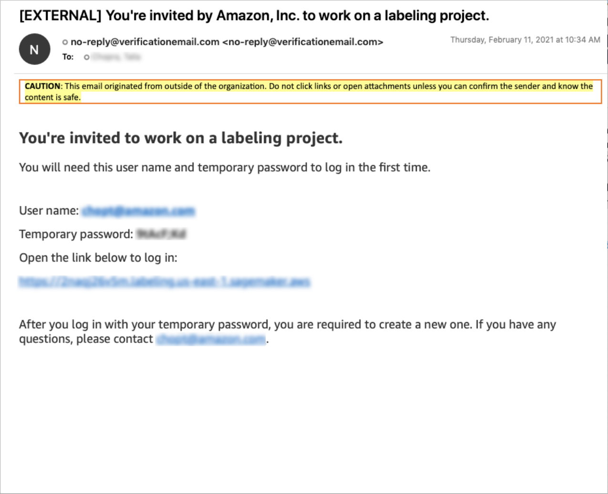

Tip

You can find the link to your private workforce's worker portal in the Labeling workforces
section of the Ground Truth area of the SageMaker AI console. To see the link, select the
Private tab. The link is under the Labeling portal sign-in URL header in Private workforce
summary.

If you choose to use the Amazon Mechanical Turk workforce to label the dataset, you are charged
for labeling tasks completed on the dataset.

Getting started: Create a labeling job
2541

## Page 571

Amazon SageMaker AI
Developer Guide

To use the Amazon Mechanical Turk workforce:

1.
In the Workers section, choose Public.

2.
Set a Price per task.

3.
If applicable, choose The dataset does not contain adult content to acknowledge that the
sample dataset has no adult content. This information enables Amazon SageMaker Ground
Truth to warn external workers on Mechanical Turk that they might encounter potentially
offensive content in your dataset.

4.
Choose the check box next to the following statement to acknowledge that the sample
dataset does not contain any personally identifiable information (PII). This is a requirement
to use Mechanical Turk with Ground Truth. If your input data does contain PII, use the private
workforce for this tutorial.

You understand and agree that the Amazon Mechanical Turk workforce consists of
independent contractors located worldwide and that you should not share confidential
information, personal information or protected health information with this workforce.

Configure the Bounding Box Tool

Finally you configure the bounding box tool to give instructions to your workers. You can configure
a task title that describes the task and provides high-level instructions for the workers. You can
provide both quick instructions and full instructions. Quick instructions are displayed next to the
image to be labeled. Full instructions contain detailed instructions for completing the task. In
this example, you only provide quick instructions. You can see an example of full instructions by
choosing Full instructions at the bottom of the section.

To configure the bounding box tool

1.
In the Task description field type in brief instructions for the task. For example:

Draw a box around any objects in the image.

Replace objects with the name of an object that appears in your images.

2.
In the Labels field, type a category name for the objects that the worker should draw a
bounding box around. For example, if you are asking the worker to draw boxes around football
players, you could use "Football Player" in this field.

Getting started: Create a labeling job
2542

## Page 572

Amazon SageMaker AI
Developer Guide

3.
The Short instructions section enables you to create instructions that are displayed on the
page with the image that your workers are labeling. We suggest that you include an example
of a correctly drawn bounding box and an example of an incorrectly drawn box. To create your
own instructions, use these steps:

a.
Select the text between GOOD EXAMPLE and the image placeholder. Replace it with the
following text:

Draw the box around the object with a small border.

b.
Select the first image placeholder and delete it.

c.
Choose the image button and then enter the HTTPS URL of one of the images that you
created in step 1. It is also possible to embed images directly in the short instructions
section, however this section has a quota of 100 kilobytes (including text). If your images
and text exceed 100 kilobytes, you receive an error.

d.
Select the text between BAD EXAMPLE and the image placeholder. Replace it with the
following text:

Don't make the bounding box too large or cut into the object.

e.
Select the second image placeholder and delete it.

f.
Choose the image button and then enter the HTTPS URL of the other image that you
created in step 1.

4.
Select Preview to preview the worker UI. The preview opens in a new tab, and so if your
browser blocks pop ups you may need to manually enable the tab to open. When you add
one or more annotations to the preview and then select Submit you can see a preview of the
output data your annotation would created.

5.
After you have configured and verified your instructions, select Create to create the labeling
job.

If you used a private workforce, you can navigate to the worker portal that you logged into in
Select Workers of this tutorial to see your labeling tasks. The tasks may take a few minutes to
appear.

Now that you've created a labeling job, you can monitor it, or stop it.

Getting started: Create a labeling job
2543

## Page 573

Amazon SageMaker AI
Developer Guide

Monitoring Your Labeling Job

After you create your labeling job, you see a list of all the jobs that you have created. You can use
this list to monitor that status of your labeling jobs. The list has the following fields:

• Name – The name that you assigned the job when you created it.

• Status – The completion status of the job. The status can be one of Complete, Failed, In progress,
or Stopped.

• Labeled objects/total – Shows the total number of objects in the labeling job and how many of
them have been labeled.

• Creation time – The date and time that you created the job.

You can also clone, chain, or stop a job. Select a job and then select one of the following from the
Actions menu:

• Clone – Creates a new labeling job with the configuration copied from the selected job. You can
clone a job when you want to change to the job and run it again. For example, you can clone a
job that was sent to a private workforce so that you can send it to the Amazon Mechanical Turk
workforce. Or you can clone a job to rerun it against a new dataset stored in the same location as
the original job.

• Chain – Creates a new labeling job that can build upon the data and models (if any) of a stopped,
failed, or completed job. For more information about the use cases and how to use it, see
Chaining labeling jobs.

• Stop – Stops a running job. You cannot restart a stopped job. You can clone a job to start over or
chain the job to continue from where it left off. Labels for any already labeled objects are written
to the output file location. For more information, see Labeling job output data.

Label Images

Use Ground Truth to label images. Select one of the following built in task types to learn more
about that task type. Each page includes instructions to help you create a labeling job using that
task type.

Tip

To learn more about supported file types and input data quotas, see Input data.

Label Images
2544

## Page 574

Amazon SageMaker AI
Developer Guide

Topics

• Classify image objects using a bounding box

• Identify image contents using semantic segmentation

• Auto-Segmentation Tool

• Create an image classification job (Single Label)

• Create an image classification job (Multi-label)

• Image Label Verification

Classify image objects using a bounding box

The images used to train a machine learning model often contain more than one object. To
classify and localize one or more objects within images, use the Amazon SageMaker Ground Truth
bounding box labeling job task type. In this context, localization means the pixel-location of the
bounding box. You create a bounding box labeling job using the Ground Truth section of the

Amazon SageMaker AI console or the CreateLabelingJob operation.

Important

For this task type, if you create your own manifest file, use "source-ref" to identify the
location of each image file in Amazon S3 that you want labeled. For more information, see
Input data.

Creating a Bounding Box Labeling Job (Console)

You can follow the instructions Create a Labeling Job (Console) to learn how to create a bounding
box labeling job in the SageMaker AI console. In Step 10, choose Image from the Task category
drop down menu, and choose Bounding box as the task type.

Ground Truth provides a worker UI similar to the following for labeling tasks. When you create the
labeling job with the console, you specify instructions to help workers complete the job and up to
50 labels that workers can choose from.

Label Images
2545

## Page 575

Amazon SageMaker AI
Developer Guide

Create a Bounding Box Labeling Job (API)

To create a bounding box labeling job, use the SageMaker API operation CreateLabelingJob.
This API defines this operation for all AWS SDKs. To see a list of language-specific SDKs supported

for this operation, review the See Also section of CreateLabelingJob.

Follow the instructions on Create a Labeling Job (API) and do the following while you configure
your request:

• Pre-annotation Lambda functions for this task type end with PRE-BoundingBox. To find the
pre-annotation Lambda ARN for your Region, see PreHumanTaskLambdaArn .

• Annotation-consolidation Lambda functions for this task type end with ACS-

BoundingBox. To find the annotation-consolidation Lambda ARN for your Region, see
AnnotationConsolidationLambdaArn.

The following is an example of an AWS Python SDK (Boto3) request to create a labeling job in the
US East (N. Virginia) Region. All parameters in red should be replaced with your specifications and
resources.

Label Images
2546

## Page 576

Amazon SageMaker AI
Developer Guide

response = client.create_labeling_job(
LabelingJobName='example-bounding-box-labeling-job,
LabelAttributeName='label',
InputConfig={
'DataSource': {
'S3DataSource': {
'ManifestS3Uri': 's3://bucket/path/manifest-with-input-data.json'
}
},
'DataAttributes': {
'ContentClassifiers': [
'FreeOfPersonallyIdentifiableInformation'|'FreeOfAdultContent',
]
}
},
OutputConfig={

'S3OutputPath': 's3://bucket/path/file-to-store-output-data',
'KmsKeyId': 'string'
},
RoleArn='arn:aws:iam::*:role/*,
LabelCategoryConfigS3Uri='s3://bucket/path/label-categories.json',
StoppingConditions={
'MaxHumanLabeledObjectCount': 123,
'MaxPercentageOfInputDatasetLabeled': 123
},
HumanTaskConfig={
'WorkteamArn': 'arn:aws:sagemaker:region:*:workteam/private-crowd/*',
'UiConfig': {
'UiTemplateS3Uri': 's3://bucket/path/worker-task-template.html'
},
'PreHumanTaskLambdaArn': 'arn:aws:lambda:us-east-1:432418664414:function:PRE-
BoundingBox',
'TaskKeywords': [
'Bounding Box',
],
'TaskTitle': 'Bounding Box task',
'TaskDescription': 'Draw bounding boxes around objects in an image',
'NumberOfHumanWorkersPerDataObject': 123,
'TaskTimeLimitInSeconds': 123,
'TaskAvailabilityLifetimeInSeconds': 123,
'MaxConcurrentTaskCount': 123,
'AnnotationConsolidationConfig': {

Label Images
2547

## Page 577

Amazon SageMaker AI
Developer Guide

'AnnotationConsolidationLambdaArn': 'arn:aws:lambda:us-
east-1:432418664414:function:ACS-BoundingBox'
}
},
Tags=[
{
'Key': 'string',
'Value': 'string'
},
]
)

Provide a Template for Bounding Box Labeling Jobs

If you create a labeling job using the API, you must supply a worker task template in

UiTemplateS3Uri. Copy and modify the following template. Only modify the short-

instructions, full-instructions, and header. Upload this template to S3, and provide the

S3 URI for this file in UiTemplateS3Uri.

<crowd-form>
<crowd-bounding-box
name="boundingBox"
src="{{ task.input.taskObject | grant_read_access }}"
header="please draw box"
labels="{{ task.input.labels | to_json | escape }}"
>

<full-instructions header="Bounding box instructions">
<ol><li><strong>Inspect</strong> the image</li><li><strong>Determine</strong>
if the specified label is/are visible in the picture.</li>
<li><strong>Outline</strong> each instance of the specified label in the image
using the provided “Box” tool.</li></ol>
<ul><li>Boxes should fit tight around each object</li>
<li>Do not include parts of the object are overlapping or that cannot be seen,
even though you think you can interpolate the whole shape.</li>
<li>Avoid including shadows.</li>
<li>If the target is off screen, draw the box up to the edge of the image.</li>
</full-instructions>
<short-instructions>
<h3>Good example</h3>

Label Images
2548

## Page 578

Amazon SageMaker AI
Developer Guide

Enter description of a correct bounding box label and add images

<h3>Bad example</h3>

Enter description of an incorrect bounding box label and add images

</short-instructions>
</crowd-bounding-box>
</crowd-form>

Bounding Box Output Data

Once you have created a bounding box labeling job, your output data will be located in the

Amazon S3 bucket specified in the S3OutputPath parameter when using the API or in the Output
dataset location field of the Job overview section of the console.

For example, the output manifest file of a successfully completed single-class bounding box task
will contain the following:

[
{
"boundingBox": {
"boundingBoxes": [
{
"height": 2832,
"label": "bird",
"left": 681,
"top": 599,
"width": 1364
}
],
"inputImageProperties": {
"height": 3726,
"width": 2662
}
}
}
]

The boundingBoxes parameter identifies the location of the bounding box drawn around
an object identified as a "bird" relative to the top-left corner of the image which is taken to

be the (0,0) pixel-coordinate. In the previous example, left and top identify the location
of the pixel in the top-left corner of the bounding box relative to the top-left corner of the

Label Images
2549

## Page 579

Amazon SageMaker AI
Developer Guide

image. The dimensions of the bounding box are identified with height and width. The

inputImageProperties parameter gives the pixel-dimensions of the original input image.

When you use the bounding box task type, you can create single- and multi-class bounding box
labeling jobs. The output manifest file of a successfully completed multi-class bounding box will
contain the following:

[
{
"boundingBox": {
"boundingBoxes": [
{
"height": 938,
"label": "squirrel",
"left": 316,
"top": 218,

"width": 785
},
{
"height": 825,
"label": "rabbit",
"left": 1930,
"top": 2265,
"width": 540
},
{
"height": 1174,
"label": "bird",
"left": 748,
"top": 2113,
"width": 927
},
{
"height": 893,
"label": "bird",
"left": 1333,
"top": 847,
"width": 736
}
],
"inputImageProperties": {
"height": 3726,
"width": 2662

Label Images
2550

## Page 580

Amazon SageMaker AI
Developer Guide

}
}
}
]

To learn more about the output manifest file that results from a bounding box labeling job, see
Bounding box job output.

To learn more about the output manifest file generated by Ground Truth and the file structure the
Ground Truth uses to store your output data, see Labeling job output data.

Identify image contents using semantic segmentation

To identify the contents of an image at the pixel level, use an Amazon SageMaker Ground Truth
semantic segmentation labeling task. When assigned a semantic segmentation labeling job,
workers classify pixels in the image into a set of predefined labels or classes. Ground Truth
supports single and multi-class semantic segmentation labeling jobs. You create a semantic
segmentation labeling job using the Ground Truth section of the Amazon SageMaker AI console or

the CreateLabelingJob operation.

Images that contain large numbers of objects that need to be segmented require more time. To
help workers (from a private or vendor workforce) label these objects in less time and with greater
accuracy, Ground Truth provides an AI-assisted auto-segmentation tool. For information, see Auto-
Segmentation Tool.

Important

For this task type, if you create your own manifest file, use "source-ref" to identify the
location of each image file in Amazon S3 that you want labeled. For more information, see
Input data.

Creating a Semantic Segmentation Labeling Job (Console)

You can follow the instructions Create a Labeling Job (Console) to learn how to create a semantic
segmentation labeling job in the SageMaker AI console. In Step 10, choose Image from the Task
category drop down menu, and choose Semantic segmentation as the task type.

Label Images
2551

## Page 581

Amazon SageMaker AI
Developer Guide

Ground Truth provides a worker UI similar to the following for labeling tasks. When you create the
labeling job with the console, you specify instructions to help workers complete the job and labels
that workers can choose from.

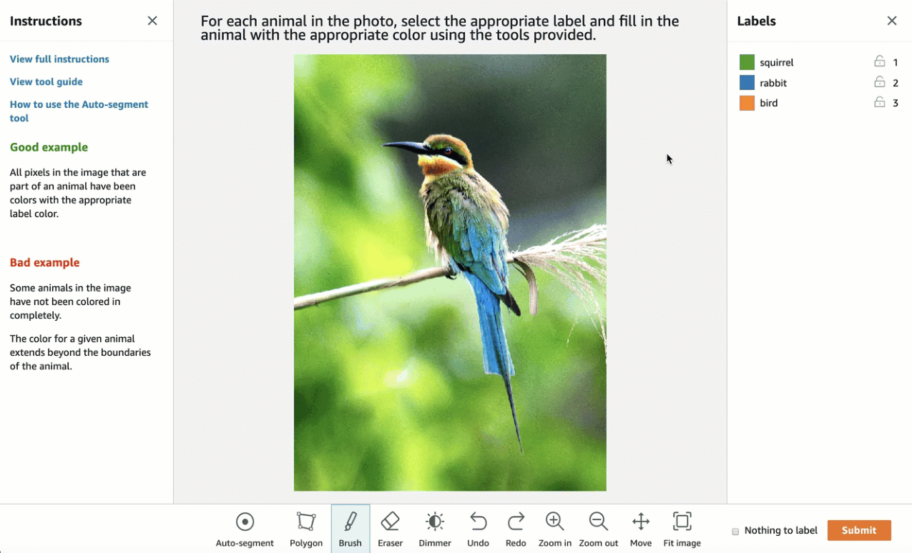

Create a Semantic Segmentation Labeling Job (API)

To create a semantic segmentation labeling job, use the SageMaker API operation

CreateLabelingJob. This API defines this operation for all AWS SDKs. To see a list of language-

specific SDKs supported for this operation, review the See Also section of CreateLabelingJob.

Follow the instructions on Create a Labeling Job (API) and do the following while you configure
your request:

• Pre-annotation Lambda functions for this task type end with PRE-SemanticSegmentation. To
find the pre-annotation Lambda ARN for your Region, see PreHumanTaskLambdaArn .

• Annotation-consolidation Lambda functions for this task type end with ACS-

SemanticSegmentation. To find the annotation-consolidation Lambda ARN for your Region,
see AnnotationConsolidationLambdaArn.

Label Images
2552

## Page 582

Amazon SageMaker AI
Developer Guide

The following is an example of an AWS Python SDK (Boto3) request to create a labeling job in the
US East (N. Virginia) Region. All parameters in red should be replaced with your specifications and
resources.

response = client.create_labeling_job(
LabelingJobName='example-semantic-segmentation-labeling-job,
LabelAttributeName='label',
InputConfig={
'DataSource': {
'S3DataSource': {
'ManifestS3Uri': 's3://bucket/path/manifest-with-input-data.json'
}
},
'DataAttributes': {
'ContentClassifiers': [
'FreeOfPersonallyIdentifiableInformation'|'FreeOfAdultContent',

]
}
},
OutputConfig={
'S3OutputPath': 's3://bucket/path/file-to-store-output-data',
'KmsKeyId': 'string'
},
RoleArn='arn:aws:iam::*:role/*,
LabelCategoryConfigS3Uri='s3://bucket/path/label-categories.json',
StoppingConditions={
'MaxHumanLabeledObjectCount': 123,
'MaxPercentageOfInputDatasetLabeled': 123
},
HumanTaskConfig={
'WorkteamArn': 'arn:aws:sagemaker:region:*:workteam/private-crowd/*',
'UiConfig': {
'UiTemplateS3Uri': 's3://bucket/path/worker-task-template.html'
},
'PreHumanTaskLambdaArn': 'arn:aws:lambda:us-east-1:432418664414:function:PRE-
SemanticSegmentation,
'TaskKeywords': [
'Semantic Segmentation',
],
'TaskTitle': 'Semantic segmentation task',
'TaskDescription': 'For each category provided, segment out each relevant
object using the color associated with that category',
'NumberOfHumanWorkersPerDataObject': 123,

Label Images
2553

## Page 583

Amazon SageMaker AI
Developer Guide

'TaskTimeLimitInSeconds': 123,
'TaskAvailabilityLifetimeInSeconds': 123,
'MaxConcurrentTaskCount': 123,
'AnnotationConsolidationConfig': {
'AnnotationConsolidationLambdaArn': 'arn:aws:lambda:us-
east-1:432418664414:function:ACS-SemanticSegmentation'
},
Tags=[
{
'Key': 'string',
'Value': 'string'
},
]
)

Provide a Template for Semantic Segmentation Labeling Jobs

If you create a labeling job using the API, you must supply a worker task template in

UiTemplateS3Uri. Copy and modify the following template. Only modify the short-

instructions, full-instructions, and header.

Upload this template to S3, and provide the S3 URI for this file in UiTemplateS3Uri.

<crowd-form>
<crowd-semantic-segmentation
name="crowd-semantic-segmentation"
src="{{ task.input.taskObject | grant_read_access }}"
header="Please segment out all pedestrians."
labels="{{ task.input.labels | to_json | escape }}"
>
<full-instructions header="Segmentation instructions">
<ol><li><strong>Read</strong> the task carefully and inspect the image.</li>
<li><strong>Read</strong> the options and review the examples provided to
understand more about the labels.</li>
<li><strong>Choose</strong> the appropriate label that best suits an object and
paint that object using the tools provided.</li></ol>
</full-instructions>
<short-instructions>
<h2>Good example</h2>

Enter description to explain a correctly done segmentation

 
<h2>Bad example</h2>

Enter description of an incorrectly done segmentation

Label Images
2554

## Page 584

Amazon SageMaker AI
Developer Guide

</short-instructions>
</crowd-semantic-segmentation>
</crowd-form>

Semantic Segmentation Output Data

Once you have created a semantic segmentation labeling job, your output data will be located in

the Amazon S3 bucket specified in the S3OutputPath parameter when using the API or in the
Output dataset location field of the Job overview section of the console.

To learn more about the output manifest file generated by Ground Truth and the file structure the
Ground Truth uses to store your output data, see Labeling job output data.

To see an example of an output manifest file for a semantic segmentation labeling job, see 3D
point cloud semantic segmentation output.

Auto-Segmentation Tool

Image segmentation is the process of dividing an image into multiple segments, or sets of labeled
pixels. In Amazon SageMaker Ground Truth, the process of identifying all pixels that fall under a
given label involves applying a colored filler, or "mask", over those pixels. Some labeling job tasks
contain images with a large numbers of objects that need to be segmented. To help workers label
these objects in less time and with greater accuracy, Ground Truth provides an auto-segmentation
tool for segmentation tasks assigned to private and vendor workforces. This tool uses a machine
learning model to automatically segment individual objects in the image with minimal worker
input. Workers can refine the mask generated by the auto-segmentation tool using other tools
found in the worker console. This helps workers complete image segmentation tasks faster
and more accurately, resulting in lower cost and higher label quality. The following page gives
information about the tool and its availability.

Note

The auto-segmentation tool is available for segmentation tasks that are sent to a private
workforce or vendor workforce. It isn't available for tasks sent to the public workforce
(Amazon Mechanical Turk).

Label Images
2555

## Page 585

Amazon SageMaker AI
Developer Guide

Tool Preview

When workers are assigned a labeling job that provides the auto-segmentation tool, they are
provided with detailed instructions on how to use the tool. For example, a worker might see the
following in the worker console:

Workers can use View full instructions to learn how to use the tool. Workers will need to place
a point on four extreme-points ( top-most, bottom-most, left-most, and right-most points ) of
the object of interest, and the tool will automatically generate a mask for the object. Workers
can further-refine the mask using the other tools provided, or by using the auto-segment tool on
smaller portions of the object that were missed.

Tool Availability

The auto-segmentation tool automatically appears in your workers' consoles if you create a
semantic segmentation labeling job using the Amazon SageMaker AI console. While creating a
semantic segmentation job in the SageMaker AI console, you will be able to preview the tool while

Label Images
2556

## Page 586

Amazon SageMaker AI
Developer Guide

creating worker instructions. To learn how to create a semantic segmentation labeling job in the
SageMaker AI console, see Getting started: Create a bounding box labeling job with Ground Truth.

If you are creating a custom instance segmentation labeling job in the SageMaker AI console or
creating an instance- or semantic-segmentation labeling job using the Ground Truth API, you need
to create a custom task template to design your worker console and instructions. To include the
auto-segmentation tool in your worker console, ensure that the following conditions are met in
your custom task template:

• For semantic segmentation labeling jobs created using the API, the <crowd-semantic-

segmentation> is present in the task template. For custom instance segmentation labeling

jobs, the <crowd-instance-segmentation> tag is present in the task template.

• The task is assigned to a private workforce or vendor workforce.

• The images to be labeled are Amazon Simple Storage Service Amazon S3) objects that have been
pre-signed for the Worker so that they can access it. This is true if the task template includes the

grant_read_access filter. For information about the grant_read_access filter, see Adding
automation with Liquid.

The following is an example of a custom task template for a custom instance segmentation

labeling job, which includes the <crowd-instance-segmentation/> tag and the

grant_read_access Liquid filter.

<crowd-form>
<crowd-instance-segmentation
name="crowd-instance-segmentation"
src="{{ task.input.taskObject | grant_read_access }}"
labels="['Car','Road']"
<full-instructions header="Segmentation instructions">
Segment each instance of each class of objects in the image.
</full-instructions>

<short-instructions>

Segment each instance of each class of objects in the image.

<h3 style="color: green">GOOD EXAMPLES</h3>

Good because A, B, C.

<h3 style="color: red">BAD EXAMPLES</h3>

Label Images
2557

## Page 587

Amazon SageMaker AI
Developer Guide

Bad because X, Y, Z.

</short-instructions>
</crowd-instance-segmentation>
</crowd-form>

Create an image classification job (Single Label)

Use an Amazon SageMaker Ground Truth image classification labeling task when you need workers
to classify images using predefined labels that you specify. Workers are shown images and are
asked to choose one label for each image. You can create an image classification labeling job

using the Ground Truth section of the Amazon SageMaker AI console or the CreateLabelingJob
operation.

Important

For this task type, if you create your own manifest file, use "source-ref" to identify the
location of each image file in Amazon S3 that you want labeled. For more information, see
Input data.

Create an Image Classification Labeling Job (Console)

You can follow the instructions Create a Labeling Job (Console) to learn how to create a image
classification labeling job in the SageMaker AI console. In Step 10, choose Image from the Task
category drop down menu, and choose Image Classification (Single Label) as the task type.

Ground Truth provides a worker UI similar to the following for labeling tasks. When you create the
labeling job with the console, you specify instructions to help workers complete the job and labels
that workers can choose from.

Label Images
2558

## Page 588

Amazon SageMaker AI
Developer Guide

Create an Image Classification Labeling Job (API)

To create an image classification labeling job, use the SageMaker API operation

CreateLabelingJob. This API defines this operation for all AWS SDKs. To see a list of language-

specific SDKs supported for this operation, review the See Also section of CreateLabelingJob.

Follow the instructions on Create a Labeling Job (API) and do the following while you configure
your request:

• Pre-annotation Lambda functions for this task type end with PRE-ImageMultiClass. To find
the pre-annotation Lambda ARN for your Region, see PreHumanTaskLambdaArn .

Label Images
2559

## Page 589

Amazon SageMaker AI
Developer Guide

• Annotation-consolidation Lambda functions for this task type end with ACS-

ImageMultiClass. To find the annotation-consolidation Lambda ARN for your Region, see

AnnotationConsolidationLambdaArn.

The following is an example of an AWS Python SDK (Boto3) request to create a labeling job in the
US East (N. Virginia) Region. All parameters in red should be replaced with your specifications and
resources.

response = client.create_labeling_job(
LabelingJobName='example-image-classification-labeling-job',
LabelAttributeName='label',
InputConfig={
'DataSource': {
'S3DataSource': {
'ManifestS3Uri': 's3://bucket/path/manifest-with-input-data.json'
}
},
'DataAttributes': {
'ContentClassifiers': [
'FreeOfPersonallyIdentifiableInformation'|'FreeOfAdultContent',
]
}
},
OutputConfig={
'S3OutputPath': 's3://bucket/path/file-to-store-output-data',
'KmsKeyId': 'string'
},
RoleArn='arn:aws:iam::*:role/*,
LabelCategoryConfigS3Uri='s3://bucket/path/label-categories.json',
StoppingConditions={
'MaxHumanLabeledObjectCount': 123,
'MaxPercentageOfInputDatasetLabeled': 123
},
HumanTaskConfig={
'WorkteamArn': 'arn:aws:sagemaker:region:*:workteam/private-crowd/*',
'UiConfig': {
'UiTemplateS3Uri': 's3://bucket/path/worker-task-template.html'
},
'PreHumanTaskLambdaArn': 'arn:aws:lambda:us-east-1:432418664414:function:PRE-
ImageMultiClass,
'TaskKeywords': [
Image classification',

Label Images
2560

## Page 590

Amazon SageMaker AI
Developer Guide

],
'TaskTitle': Image classification task',
'TaskDescription': 'Carefully inspect the image and classify it by selecting
one label from the categories provided.',
'NumberOfHumanWorkersPerDataObject': 123,
'TaskTimeLimitInSeconds': 123,
'TaskAvailabilityLifetimeInSeconds': 123,
'MaxConcurrentTaskCount': 123,
'AnnotationConsolidationConfig': {
'AnnotationConsolidationLambdaArn': 'arn:aws:lambda:us-
east-1:432418664414:function:ACS-ImageMultiClass'
},
Tags=[
{
'Key': 'string',
'Value': 'string'
},

]
)

Provide a Template for Image Classification Labeling Jobs

If you create a labeling job using the API, you must supply a worker task template in

UiTemplateS3Uri. Copy and modify the following template. Only modify the short-

instructions, full-instructions, and header.

Upload this template to S3, and provide the S3 URI for this file in UiTemplateS3Uri.

<crowd-form>
<crowd-image-classifier
name="crowd-image-classifier"
src="{{ task.input.taskObject | grant_read_access }}"
header="please classify"
categories="{{ task.input.labels | to_json | escape }}"
>
<full-instructions header="Image classification instructions">
<ol><li><strong>Read</strong> the task carefully and inspect the image.</li>
<li><strong>Read</strong> the options and review the examples provided to
understand more about the labels.</li>
<li><strong>Choose</strong> the appropriate label that best suits the image.</
li></ol>
</full-instructions>

Label Images
2561

## Page 591

Amazon SageMaker AI
Developer Guide

<short-instructions>
<h3>Good example</h3>

Enter description to explain the correct label to the workers

<h3>Bad example</h3>
Enter
description of an incorrect label

</short-instructions>
</crowd-image-classifier>
</crowd-form>

Image Classification Output Data

Once you have created an image classification labeling job, your output data will be located in the

Amazon S3 bucket specified in the S3OutputPath parameter when using the API or in the Output
dataset location field of the Job overview section of the console.

To learn more about the output manifest file generated by Ground Truth and the file structure the
Ground Truth uses to store your output data, see Labeling job output data.

To see an example of an output manifest file from an image classification labeling job, see
Classification job output.

Create an image classification job (Multi-label)

Use an Amazon SageMaker Ground Truth multi-label image classification labeling task when you
need workers to classify multiple objects in an image. For example, the following image features a
dog and a cat. You can use multi-label image classification to associate the labels "dog" and "cat"
with this image. The following page gives information about creating an image classification job.

Label Images
2562

## Page 592

Amazon SageMaker AI
Developer Guide

When working on a multi-label image classification task, workers should choose all applicable
labels, but must choose at least one. When creating a job using this task type, you can provide up
to 50 label-categories.

Label Images
2563

## Page 593

Amazon SageMaker AI
Developer Guide

When creating a labeling job in the console, Ground Truth doesn't provide a "none" category for
when none of the labels applies to an image. To provide this option to workers, include a label
similar to "none" or "other" when you create a multi-label image classification job.

To restrict workers to choosing a single label for each image, use the Create an image classification
job (Single Label) task type.

Important

For this task type, if you create your own manifest file, use "source-ref" to identify the
location of each image file in Amazon S3 that you want labeled. For more information, see
Input data.

Create a Multi-Label Image Classification Labeling Job (Console)

You can follow the instructions Create a Labeling Job (Console) to learn how to create a multi-label
image classification labeling job in the SageMaker AI console. In Step 10, choose Image from the
Task category drop down menu, and choose Image Classification (Multi-label) as the task type.

Ground Truth provides a worker UI similar to the following for labeling tasks. When you create a
labeling job in the console, you specify instructions to help workers complete the job and labels
that workers can choose from.

Label Images
2564

## Page 594

Amazon SageMaker AI
Developer Guide

Create a Multi-Label Image Classification Labeling Job (API)

To create a multi-label image classification labeling job, use the SageMaker API operation

CreateLabelingJob. This API defines this operation for all AWS SDKs. To see a list of language-

specific SDKs supported for this operation, review the See Also section of CreateLabelingJob.

Follow the instructions on Create a Labeling Job (API) and do the following while you configure
your request:

• Pre-annotation Lambda functions for this task type end with PRE-

ImageMultiClassMultiLabel. To find the pre-annotation Lambda ARN for your Region, see
PreHumanTaskLambdaArn .

• Annotation-consolidation Lambda functions for this task type end with ACS-

ImageMultiClassMultiLabel. To find the annotation-consolidation Lambda ARN for your
Region, see AnnotationConsolidationLambdaArn.

Label Images
2565

## Page 595

Amazon SageMaker AI
Developer Guide

The following is an example of an AWS Python SDK (Boto3) request to create a labeling job in the
US East (N. Virginia) Region. All parameters in red should be replaced with your specifications and
resources.

response = client.create_labeling_job(
LabelingJobName='example-multi-label-image-classification-labeling-job,
LabelAttributeName='label',
InputConfig={
'DataSource': {
'S3DataSource': {
'ManifestS3Uri': 's3://bucket/path/manifest-with-input-data.json'
}
},
'DataAttributes': {
'ContentClassifiers': [
'FreeOfPersonallyIdentifiableInformation'|'FreeOfAdultContent',

]
}
},
OutputConfig={
'S3OutputPath': 's3://bucket/path/file-to-store-output-data',
'KmsKeyId': 'string'
},
RoleArn='arn:aws:iam::*:role/*,
LabelCategoryConfigS3Uri='s3://bucket/path/label-categories.json',
StoppingConditions={
'MaxHumanLabeledObjectCount': 123,
'MaxPercentageOfInputDatasetLabeled': 123
},
HumanTaskConfig={
'WorkteamArn': 'arn:aws:sagemaker:region:*:workteam/private-crowd/*',
'UiConfig': {
'UiTemplateS3Uri': 's3://bucket/path/worker-task-template.html'
},
'PreHumanTaskLambdaArn': 'arn:aws:lambda:us-east-1:432418664414:function:PRE-
ImageMultiClassMultiLabel',
'TaskKeywords': [
'Image Classification',
],
'TaskTitle': 'Multi-label image classification task',
'TaskDescription': 'Select all labels that apply to the images shown',
'NumberOfHumanWorkersPerDataObject': 123,
'TaskTimeLimitInSeconds': 123,

Label Images
2566

## Page 596

Amazon SageMaker AI
Developer Guide

'TaskAvailabilityLifetimeInSeconds': 123,
'MaxConcurrentTaskCount': 123,
'AnnotationConsolidationConfig': {
'AnnotationConsolidationLambdaArn': 'arn:aws:lambda:us-
east-1:432418664414:function:ACS-ImageMultiClassMultiLabel'
},
Tags=[
{
'Key': 'string',
'Value': 'string'
},
]
)

Provide a Template for Multi-label Image Classification

If you create a labeling job using the API, you must supply a worker task template in

UiTemplateS3Uri. Copy and modify the following template. Only modify the short-

instructions, full-instructions, and header.

Upload this template to S3, and provide the S3 URI for this file in UiTemplateS3Uri.

<crowd-form>
<crowd-image-classifier-multi-select
name="crowd-image-classifier-multi-select"
src="{{ task.input.taskObject | grant_read_access }}"
header="Please identify all classes in image"
categories="{{ task.input.labels | to_json | escape }}"
>
<full-instructions header="Multi Label Image classification instructions">
<ol><li><strong>Read</strong> the task carefully and inspect the image.</li>
<li><strong>Read</strong> the options and review the examples provided to
understand more about the labels.</li>
<li><strong>Choose</strong> the appropriate labels that best suit the image.</
li></ol>
</full-instructions>
<short-instructions>
<h3>Good example</h3>

Enter description to explain the correct label to the workers

<h3>Bad example</h3>

Enter description of an incorrect label

</short-instructions>

Label Images
2567

## Page 597

Amazon SageMaker AI
Developer Guide

</crowd-image-classifier-multi-select>
</crowd-form>

Multi-label Image Classification Output Data

Once you have created a multi-label image classification labeling job, your output data will be

located in the Amazon S3 bucket specified in the S3OutputPath parameter when using the API or
in the Output dataset location field of the Job overview section of the console.

To learn more about the output manifest file generated by Ground Truth and the file structure the
Ground Truth uses to store your output data, see Labeling job output data.

To see an example of output manifest files for multi-label image classification labeling job, see
Multi-label classification job output.

Image Label Verification

Building a highly accurate training dataset for your machine learning (ML) algorithm is an iterative
process. Typically, you review and continuously adjust your labels until you are satisfied that
they accurately represent the ground truth, or what is directly observable in the real world. You
can use an Amazon SageMaker Ground Truth image label verification task to direct workers to
review a dataset's labels and improve label accuracy. Workers can indicate if the existing labels
are correct or rate label quality. They can also add comments to explain their reasoning. Amazon
SageMaker Ground Truth supports label verification for Classify image objects using a bounding
box and Identify image contents using semantic segmentation labels. You create an image label
verification labeling job using the Ground Truth section of the Amazon SageMaker AI console or
the CreateLabelingJob operation.

Ground Truth provides a worker console similar to the following for labeling tasks. When you
create the labeling job with the console, you can modify the images and content that are shown.
To learn how to create a labeling job using the Ground Truth console, see Create a Labeling Job
(Console).

Label Images
2568

## Page 598

Amazon SageMaker AI
Developer Guide

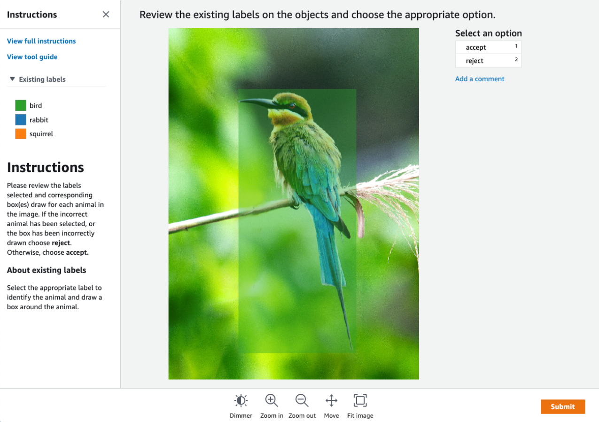

You can create a label verification labeling job using the SageMaker AI console or API. To learn how

to create a labeling job using the Ground Truth API operation CreateLabelingJob, see Create a
Labeling Job (API).

Text labeling with Ground Truth

Use Ground Truth to label text. Ground Truth supports labeling text for named entity recognition,
single label text classification, and multi-label text classification. The following topics give
information about these built-in task types, as well as instructions to help you create a labeling job
using that task type.

Tip

To learn more about supported file types and input data quotas, see Input data.

Label Text
2569

## Page 599

Amazon SageMaker AI
Developer Guide

Topics

• Extract text information using named entity recognition

• Categorize text with text classification (Single Label)

• Categorize text with text classification (Multi-label)

Extract text information using named entity recognition

To extract information from unstructured text and classify it into predefined categories, use an
Amazon SageMaker Ground Truth named entity recognition (NER) labeling task. Traditionally, NER
involves sifting through text data to locate noun phrases, called named entities, and categorizing
each with a label, such as "person," "organization," or "brand." You can broaden this task to label
longer spans of text and categorize those sequences with predefined labels that you specify. You
can create a named entity recognition labeling job using the Ground Truth section of the Amazon

SageMaker AI console or the CreateLabelingJob operation.

When tasked with a named entity recognition labeling job, workers apply your labels to specific
words or phrases within a larger text block. They choose a label, then apply it by using the cursor
to highlight the part of the text to which the label applies. The Ground Truth named entity
recognition tool supports overlapping annotations, in-context label selection, and multi-label
selection for a single highlight. Also, workers can use their keyboards to quickly select labels.

Important

If you manually create an input manifest file, use "source" to identify the text that you
want labeled. For more information, see Input data.

Create a Named Entity Recognition Labeling Job (Console)

You can follow the instructions Create a Labeling Job (Console) to learn how to create a named
entity recognition labeling job in the SageMaker AI console. In Step 10, choose Text from the Task
category drop down menu, and choose Named entity recognition  as the task type.

Ground Truth provides a worker UI similar to the following for labeling tasks. When you create the
labeling job with the console, you specify instructions to help workers complete the job and labels
that workers can choose from.

Label Text
2570

## Page 600

Amazon SageMaker AI
Developer Guide

Create a Named Entity Recognition Labeling Job (API)

To create a named entity recognition labeling job, using the SageMaker API operation

CreateLabelingJob. This API defines this operation for all AWS SDKs. To see a list of language-

specific SDKs supported for this operation, review the See Also section of CreateLabelingJob.

Follow the instructions on Create a Labeling Job (API) and do the following while you configure
your request:

• Pre-annotation Lambda functions for this task type end with PRE-NamedEntityRecognition.
To find the pre-annotation Lambda ARN for your Region, see PreHumanTaskLambdaArn .

• Annotation-consolidation Lambda functions for this task type end with ACS-

NamedEntityRecognition. To find the annotation-consolidation Lambda ARN for your
Region, see AnnotationConsolidationLambdaArn.

Label Text
2571

## Page 601

Amazon SageMaker AI
Developer Guide

• You must provide the following ARN for HumanTaskUiArn:

arn:aws:sagemaker:aws-region:394669845002:human-task-ui/NamedEntityRecognition

Replace aws-region with the AWS Region you use to create the labeling job. For example, use

us-west-1 if you create a labeling job in US West (N. California).

• Provide worker instructions in the label category configuration file using the instructions

parameter. You can use a string, or HTML markup language in the shortInstruction and

fullInstruction fields. For more details, see Provide Worker Instructions in a Label Category
Configuration File.

"instructions": {"shortInstruction":"<h1>Add header</h1>
Add Instructions
",
"fullInstruction":"
Add additional instructions.
"}

The following is an example of an AWS Python SDK (Boto3) request to create a labeling job in the
US East (N. Virginia) Region. All parameters in red should be replaced with your specifications and
resources.

response = client.create_labeling_job(
LabelingJobName='example-ner-labeling-job',
LabelAttributeName='label',
InputConfig={
'DataSource': {
'S3DataSource': {
'ManifestS3Uri': 's3://bucket/path/manifest-with-input-data.json'
}
},
'DataAttributes': {
'ContentClassifiers': [
'FreeOfPersonallyIdentifiableInformation'|'FreeOfAdultContent',
]
}
},
OutputConfig={
'S3OutputPath': 's3://bucket/path/file-to-store-output-data',
'KmsKeyId': 'string'
},
RoleArn='arn:aws:iam::*:role/*',
LabelCategoryConfigS3Uri='s3://bucket/path/label-categories.json',
StoppingConditions={

Label Text
2572

## Page 602

Amazon SageMaker AI
Developer Guide

'MaxHumanLabeledObjectCount': 123,
'MaxPercentageOfInputDatasetLabeled': 123
},
HumanTaskConfig={
'WorkteamArn': 'arn:aws:sagemaker:region:*:workteam/private-crowd/*',
'UiConfig': {
'HumanTaskUiArn': 'arn:aws:sagemaker:us-east-1:394669845002:human-task-ui/
NamedEntityRecognition'
},
'PreHumanTaskLambdaArn': 'arn:aws:lambda:us-east-1:432418664414:function:PRE-
NamedEntityRecognition',
'TaskKeywords': [
'Named entity Recognition',
],
'TaskTitle': 'Named entity Recognition task',
'TaskDescription': 'Apply the labels provided to specific words or phrases
within the larger text block.',

'NumberOfHumanWorkersPerDataObject': 1,
'TaskTimeLimitInSeconds': 28800,
'TaskAvailabilityLifetimeInSeconds': 864000,
'MaxConcurrentTaskCount': 1000,
'AnnotationConsolidationConfig': {
'AnnotationConsolidationLambdaArn': 'arn:aws:lambda:us-
east-1:432418664414:function:ACS-NamedEntityRecognition'
},
Tags=[
{
'Key': 'string',
'Value': 'string'
},
]
)

Provide Worker Instructions in a Label Category Configuration File

You must provide worker instructions in the label category configuration file you identify with

the LabelCategoryConfigS3Uri parameter in CreateLabelingJob. You can use these
instructions to provide details about the task you want workers to perform and help them use the
tool efficiently.

You provide short and long instructions using shortInstruction and fullInstruction in the

instructions parameter, respectively. To learn more about these instruction types, see Create
instruction pages.

Label Text
2573

## Page 603

Amazon SageMaker AI
Developer Guide

The following is an example of a label category configuration file with instructions that can be
used for a named entity recognition labeling job.

{
"document-version": "2018-11-28",
"labels": [
{
"label": "label1",
"shortDisplayName": "L1"
},
{
"label": "label2",
"shortDisplayName": "L2"
},
{
"label": "label3",

"shortDisplayName": "L3"
},
{
"label": "label4",
"shortDisplayName": "L4"
},
{
"label": "label5",
"shortDisplayName": "L5"
}
],
"instructions": {
"shortInstruction": "
Enter description of the labels that workers have
to choose from
 
Add examples to help workers
understand the label
",
"fullInstruction": "<ol>
<li><strong>Read</strong> the text carefully.</li>
<li><strong>Highlight</strong> words, phrases, or sections of
the text.</li>
<li><strong>Choose</strong> the label that best matches what
you have highlighted.</li>
<li>To <strong>change</strong> a label, choose highlighted text
and select a new label.</li>
<li>To <strong>remove</strong> a label from highlighted text,
choose the X next to the
abbreviated label name on the highlighted text.</li>

Label Text
2574

## Page 604

Amazon SageMaker AI
Developer Guide

<li>You can select all of a previously highlighted text, but
not a portion of it.</li>
</ol>"
}
}

Named Entity Recognition Output Data

Once you have created a named entity recognition labeling job, your output data will be located

in the Amazon S3 bucket specified in the S3OutputPath parameter when using the API or in the
Output dataset location field of the Job overview section of the console.

To learn more about the output manifest file generated by Ground Truth and the file structure the
Ground Truth uses to store your output data, see Labeling job output data.

Categorize text with text classification (Single Label)

To categorize articles and text into predefined categories, use text classification. For example, you
can use text classification to identify the sentiment conveyed in a review or the emotion underlying
a section of text. Use Amazon SageMaker Ground Truth text classification to have workers sort text
into categories that you define. You create a text classification labeling job using the Ground Truth

section of the Amazon SageMaker AI console or the CreateLabelingJob operation.

Important

If you manually create an input manifest file, use "source" to identify the text that you
want labeled. For more information, see Input data.

Create a Text Classification Labeling Job (Console)

You can follow the instructions Create a Labeling Job (Console) to learn how to create a text
classification labeling job in the SageMaker AI console. In Step 10, choose Text from the Task
category drop down menu, and choose Text Classification (Single Label) as the task type.

Ground Truth provides a worker UI similar to the following for labeling tasks. When you create the
labeling job with the console, you specify instructions to help workers complete the job and labels
that workers can choose from.

Label Text
2575

## Page 605

Amazon SageMaker AI
Developer Guide

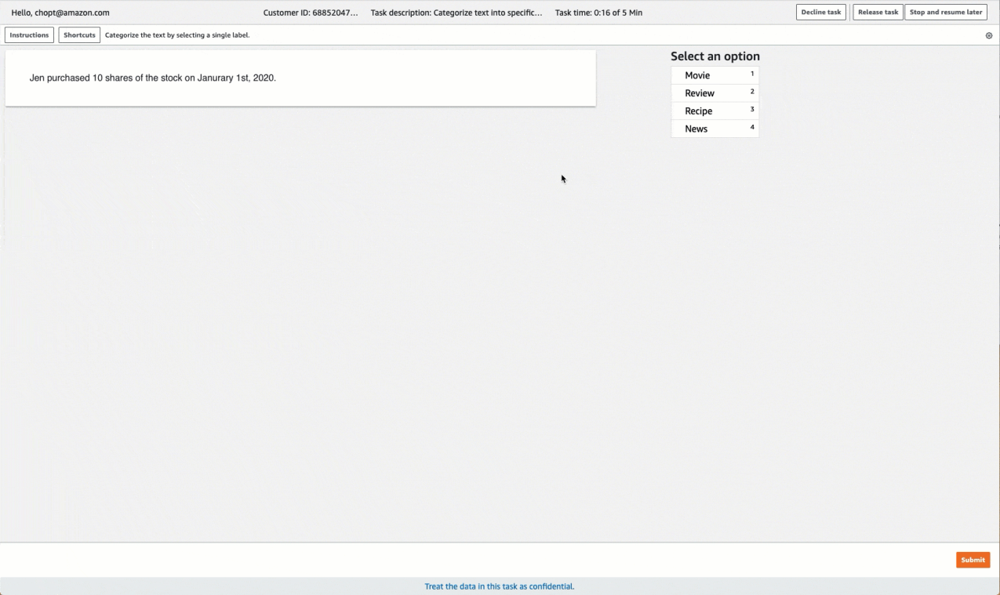

Create a Text Classification Labeling Job (API)

To create a text classification labeling job, use the SageMaker API operation CreateLabelingJob.
This API defines this operation for all AWS SDKs. To see a list of language-specific SDKs supported

for this operation, review the See Also section of CreateLabelingJob.

Follow the instructions on Create a Labeling Job (API) and do the following while you configure
your request:

• Pre-annotation Lambda functions for this task type end with PRE-TextMultiClass. To find the
pre-annotation Lambda ARN for your Region, see PreHumanTaskLambdaArn .

• Annotation-consolidation Lambda functions for this task type end with ACS-

TextMultiClass. To find the annotation-consolidation Lambda ARN for your Region, see
AnnotationConsolidationLambdaArn.

The following is an example of an AWS Python SDK (Boto3) request to create a labeling job in the
US East (N. Virginia) Region. All parameters in red should be replaced with your specifications and
resources.

Label Text
2576

## Page 606

Amazon SageMaker AI
Developer Guide

response = client.create_labeling_job(
LabelingJobName='example-text-classification-labeling-job,
LabelAttributeName='label',
InputConfig={
'DataSource': {
'S3DataSource': {
'ManifestS3Uri': 's3://bucket/path/manifest-with-input-data.json'
}
},
'DataAttributes': {
'ContentClassifiers': [
'FreeOfPersonallyIdentifiableInformation'|'FreeOfAdultContent',
]
}
},
OutputConfig={

'S3OutputPath': 's3://bucket/path/file-to-store-output-data',
'KmsKeyId': 'string'
},
RoleArn='arn:aws:iam::*:role/*,
LabelCategoryConfigS3Uri='s3://bucket/path/label-categories.json',
StoppingConditions={
'MaxHumanLabeledObjectCount': 123,
'MaxPercentageOfInputDatasetLabeled': 123
},
HumanTaskConfig={
'WorkteamArn': 'arn:aws:sagemaker:region:*:workteam/private-crowd/*',
'UiConfig': {
'UiTemplateS3Uri': 's3://bucket/path/worker-task-template.html'
},
'PreHumanTaskLambdaArn': 'arn:aws:lambda:us-east-1:432418664414:function:PRE-
TextMultiClass,
'TaskKeywords': [
Text classification',
],
'TaskTitle': Text classification task',
'TaskDescription': 'Carefully read and classify this text using the categories
provided.',
'NumberOfHumanWorkersPerDataObject': 123,
'TaskTimeLimitInSeconds': 123,
'TaskAvailabilityLifetimeInSeconds': 123,
'MaxConcurrentTaskCount': 123,
'AnnotationConsolidationConfig': {

Label Text
2577

## Page 607

Amazon SageMaker AI
Developer Guide

'AnnotationConsolidationLambdaArn': 'arn:aws:lambda:us-
east-1:432418664414:function:ACS-TextMultiClass'
},
Tags=[
{
'Key': 'string',
'Value': 'string'
},
]
)

Provide a Template for Text Classification Labeling Jobs

If you create a labeling job using the API, you must supply a worker task template in

UiTemplateS3Uri. Copy and modify the following template. Only modify the short-

instructions, full-instructions, and header.

Upload this template to S3, and provide the S3 URI for this file in UiTemplateS3Uri.

<crowd-form>
<crowd-classifier
name="crowd-classifier"
categories="{{ task.input.labels | to_json | escape }}"
header="classify text"
>
<classification-target style="white-space: pre-wrap">
{{ task.input.taskObject }}
</classification-target>
<full-instructions header="Classifier instructions">
<ol><li><strong>Read</strong> the text carefully.</li>
<li><strong>Read</strong> the examples to understand more about the options.</li>
<li><strong>Choose</strong> the appropriate labels that best suit the text.</
li></ol>
</full-instructions>
<short-instructions>

Enter description of the labels that workers have to choose from

 

 

Add examples to help workers understand the label

 

 

 

 

 

</short-instructions>
</crowd-classifier>
</crowd-form>

Label Text
2578

## Page 608

Amazon SageMaker AI
Developer Guide

Text Classification Output Data

Once you have created a text classification labeling job, your output data will be located in the

Amazon S3 bucket specified in the S3OutputPath parameter when using the API or in the Output
dataset location field of the Job overview section of the console.

To learn more about the output manifest file generated by Ground Truth and the file structure the
Ground Truth uses to store your output data, see Labeling job output data.

To see an example of an output manifest files from a text classification labeling job, see
Classification job output.

Categorize text with text classification (Multi-label)

To categorize articles and text into multiple predefined categories, use the multi-label text
classification task type. For example, you can use this task type to identify more than one emotion
conveyed in text. The following sections give information about how to create a multi-label text
classification task from the console and API.

When working on a multi-label text classification task, workers should choose all applicable labels,
but must choose at least one. When creating a job using this task type, you can provide up to 50
label categories.

Amazon SageMaker Ground Truth doesn't provide a "none" category for when none of the labels
applies. To provide this option to workers, include a label similar to "none" or "other" when you
create a multi-label text classification job.

To restrict workers to choosing a single label for each document or text selection, use the
Categorize text with text classification (Single Label) task type.

Important

If you manually create an input manifest file, use "source" to identify the text that you
want labeled. For more information, see Input data.

Create a Multi-Label Text Classification Labeling Job (Console)

You can follow the instructions Create a Labeling Job (Console) to learn how to create a multi-label
text classification labeling job in the Amazon SageMaker AI console. In Step 10, choose Text from
the Task category drop down menu, and choose Text Classification (Multi-label) as the task type.

Label Text
2579

## Page 609

Amazon SageMaker AI
Developer Guide

Ground Truth provides a worker UI similar to the following for labeling tasks. When you create the
labeling job with the console, you specify instructions to help workers complete the job and labels
that workers can choose from.

Create a Multi-Label Text Classification Labeling Job (API)

To create a multi-label text classification labeling job, use the SageMaker API operation

CreateLabelingJob. This API defines this operation for all AWS SDKs. To see a list of language-

specific SDKs supported for this operation, review the See Also section of CreateLabelingJob.

Follow the instructions on Create a Labeling Job (API) and do the following while you configure
your request:

• Pre-annotation Lambda functions for this task type end with PRE-

TextMultiClassMultiLabel. To find the pre-annotation Lambda ARN for your Region, see
PreHumanTaskLambdaArn .

• Annotation-consolidation Lambda functions for this task type end with ACS-

TextMultiClassMultiLabel. To find the annotation-consolidation Lambda ARN for your
Region, see AnnotationConsolidationLambdaArn.

Label Text
2580

## Page 610

Amazon SageMaker AI
Developer Guide

The following is an example of an AWS Python SDK (Boto3) request to create a labeling job in the
US East (N. Virginia) Region. All parameters in red should be replaced with your specifications and
resources.

response = client.create_labeling_job(
LabelingJobName='example-multi-label-text-classification-labeling-job,
LabelAttributeName='label',
InputConfig={
'DataSource': {
'S3DataSource': {
'ManifestS3Uri': 's3://bucket/path/manifest-with-input-data.json'
}
},
'DataAttributes': {
'ContentClassifiers': [
'FreeOfPersonallyIdentifiableInformation'|'FreeOfAdultContent',

]
}
},
OutputConfig={
'S3OutputPath': 's3://bucket/path/file-to-store-output-data',
'KmsKeyId': 'string'
},
RoleArn='arn:aws:iam::*:role/*,
LabelCategoryConfigS3Uri='s3://bucket/path/label-categories.json',
StoppingConditions={
'MaxHumanLabeledObjectCount': 123,
'MaxPercentageOfInputDatasetLabeled': 123
},
HumanTaskConfig={
'WorkteamArn': 'arn:aws:sagemaker:region:*:workteam/private-crowd/*',
'UiConfig': {
'UiTemplateS3Uri': 's3://bucket/path/custom-worker-task-template.html'
},
'PreHumanTaskLambdaArn': 'arn:aws:lambda::function:PRE-
TextMultiClassMultiLabel,
'TaskKeywords': [
'Text Classification',
],
'TaskTitle': 'Multi-label text classification task',
'TaskDescription': 'Select all labels that apply to the text shown',
'NumberOfHumanWorkersPerDataObject': 123,
'TaskTimeLimitInSeconds': 123,

Label Text
2581

## Page 611

Amazon SageMaker AI
Developer Guide

'TaskAvailabilityLifetimeInSeconds': 123,
'MaxConcurrentTaskCount': 123,
'AnnotationConsolidationConfig': {
'AnnotationConsolidationLambdaArn': 'arn:aws:lambda:us-
east-1:432418664414:function:ACS-TextMultiClassMultiLabel'
},
Tags=[
{
'Key': 'string',
'Value': 'string'
},
]
)

Create a Template for Multi-label Text Classification

If you create a labeling job using the API, you must supply a worker task template in

UiTemplateS3Uri. Copy and modify the following template. Only modify the short-

instructions, full-instructions, and header.

Upload this template to S3, and provide the S3 URI for this file in UiTemplateS3Uri.

<crowd-form>
<crowd-classifier-multi-select
name="crowd-classifier-multi-select"
categories="{{ task.input.labels | to_json | escape }}"
header="Please identify all classes in the below text"
>
<classification-target style="white-space: pre-wrap">
{{ task.input.taskObject }}
</classification-target>
<full-instructions header="Classifier instructions">
<ol><li><strong>Read</strong> the text carefully.</li>
<li><strong>Read</strong> the examples to understand more about the options.</li>
<li><strong>Choose</strong> the appropriate labels that best suit the text.</
li></ol>
</full-instructions>
<short-instructions>

Enter description of the labels that workers have to choose from

 

 

Add examples to help workers understand the label

 

 

 

 

 

Label Text
2582

## Page 612

Amazon SageMaker AI
Developer Guide

</short-instructions>
</crowd-classifier-multi-select>
</crowd-form>

To learn how to create a custom template, see Custom labeling workflows.

Multi-label Text Classification Output Data

Once you have created a multi-label text classification labeling job, your output data will be

located in the Amazon S3 bucket specified in the S3OutputPath parameter when using the API or
in the Output dataset location field of the Job overview section of the console.

To learn more about the output manifest file generated by Ground Truth and the file structure the
Ground Truth uses to store your output data, see Labeling job output data.

To see an example of output manifest files for multi-label text classification labeling job, see Multi-

label classification job output.

Videos and video frame labeling

You can use Ground Truth to classify videos and annotate video frames (still images extracted from
videos) using one of the three built-in video task types. These task types streamline the process
of creating video and video frame labeling jobs using the Amazon SageMaker AI console, API, and
language-specific SDKs.

• Video clip classification – Enable workers to classify videos into categories you specify. For
example, you can use this task type to have workers categorize videos into topics like sports,
comedy, music, and education. To learn more, see Classify videos.

• Video frame labeling jobs – Enable workers to annotate video frames extracted from a video
using bounding boxes, polylines, polygons or keypoint annotation tools. Ground Truth offers two
built-in task types to label video frames:

• Video frame object detection: Enable workers to identify and locate objects in video frames.

• Video frame object tracking: Enable workers to track the movement of objects across video
frames.

• Video frame adjustment jobs: Have workers adjust labels, label category attributes, and frame
attributes from a previous video frame object detection or object tracking labeling job.

• Video frame verification jobs: Have workers verify labels, label category attributes, and frame
attributes from a previous video frame object detection or object tracking labeling job.

Videos and video frame labeling
2583

## Page 613

Amazon SageMaker AI
Developer Guide

If you have video files, you can use the Ground Truth automatic frame extraction tool to extract
video frames from your videos. To learn more, see Video Frame Input Data.

Tip

To learn more about supported file types and input data quotas, see Input data.

Topics

• Classify videos

• Video frames

• Worker Instructions

Classify videos

Use an Amazon SageMaker Ground Truth video classification labeling task when you need workers
to classify videos using predefined labels that you specify. Workers are shown videos and are asked
to choose one label for each video. You create a video classification labeling job using the Ground
Truth section of the Amazon SageMaker AI console or the CreateLabelingJob operation.

Your video files must be encoded in a format that is supported by the browser used by the work
team that labels your data. It is recommended that you verify that all video file formats in your
input manifest file display correctly using the worker UI preview. You can communicate supported
browsers to your workers using worker instructions. To see supported file formats, see Supported
data formats.

Important

For this task type, if you create your own manifest file, use "source-ref" to identify the
location of each video file in Amazon S3 that you want labeled. For more information, see
Input data.

Videos and video frame labeling
2584

## Page 614

Amazon SageMaker AI
Developer Guide

Create a Video Classification Labeling Job (Console)

You can follow the instructions in Create a Labeling Job (Console) to learn how to create a video
classification labeling job in the SageMaker AI console. In step 10, choose Video from the Task
category dropdown list, and choose Video Classification as the task type.

Ground Truth provides a worker UI similar to the following for labeling tasks. When you create a
labeling job in the console, you specify instructions to help workers complete the job and labels
from which workers can choose.

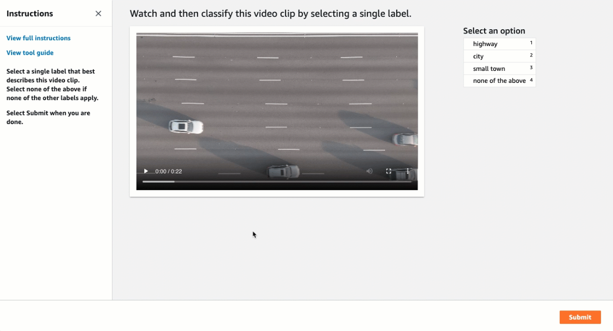

Create a Video Classification Labeling Job (API)

This section covers details you need to know when you create a labeling job using the SageMaker

API operation CreateLabelingJob. This API defines this operation for all AWS SDKs. To see
a list of language-specific SDKs supported for this operation, review the See Also section of

CreateLabelingJob.

Follow the instructions on Create a Labeling Job (API) and do the following while you configure
your request:

• Use a pre-annotation Lambda function that ends with PRE-VideoClassification. To find the
pre-annotation Lambda ARN for your Region, see PreHumanTaskLambdaArn .

Videos and video frame labeling
2585

## Page 615

Amazon SageMaker AI
Developer Guide

• Use an annotation-consolidation Lambda function that ends with ACS-

VideoClassification. To find the annotation-consolidation Lambda ARN for your Region, see

AnnotationConsolidationLambdaArn.

The following is an example of an AWS Python SDK (Boto3) request to create a labeling job in the
US East (N. Virginia) Region.

response = client.create_labeling_job(
LabelingJobName='example-video-classification-labeling-job,
LabelAttributeName='label',
InputConfig={
'DataSource': {
'S3DataSource': {
'ManifestS3Uri': 's3://bucket/path/manifest-with-input-data.json'
}
},
'DataAttributes': {
'ContentClassifiers': [
'FreeOfPersonallyIdentifiableInformation'|'FreeOfAdultContent',
]
}
},
OutputConfig={
'S3OutputPath': 's3://bucket/path/file-to-store-output-data',
'KmsKeyId': 'string'
},
RoleArn='arn:aws:iam::*:role/*,
LabelCategoryConfigS3Uri='s3://bucket/path/label-categories.json',
StoppingConditions={
'MaxHumanLabeledObjectCount': 123,
'MaxPercentageOfInputDatasetLabeled': 123
},
HumanTaskConfig={
'WorkteamArn': 'arn:aws:sagemaker:region:*:workteam/private-crowd/*',
'UiConfig': {
'UiTemplateS3Uri': 's3://bucket/path/worker-task-template.html'
},
'PreHumanTaskLambdaArn': 'arn:aws:lambda:us-east-1:432418664414:function:PRE-
VideoClassification',
'TaskKeywords': [
'Video Classification',
],

Videos and video frame labeling
2586

## Page 616

Amazon SageMaker AI
Developer Guide

'TaskTitle': 'Video classification task',
'TaskDescription': 'Select a label to classify this video',
'NumberOfHumanWorkersPerDataObject': 123,
'TaskTimeLimitInSeconds': 123,
'TaskAvailabilityLifetimeInSeconds': 123,
'MaxConcurrentTaskCount': 123,
'AnnotationConsolidationConfig': {
'AnnotationConsolidationLambdaArn': 'arn:aws:lambda:us-
east-1:432418664414:function:ACS-VideoClassification'
},
Tags=[
{
'Key': 'string',
'Value': 'string'
},
]
)

Provide a Template for Video Classification

If you create a labeling job using the API, you must supply a worker task template in

UiTemplateS3Uri. Copy and modify the following template by modifying the short-

instructions, full-instructions, and header. Upload this template to Amazon S3, and

provide the Amazon S3 URI to this file in UiTemplateS3Uri.

<crowd-form>
<crowd-classifier
name="crowd-classifier"
categories="{{ task.input.labels | to_json | escape }}"
header="Please classify video"
>
<classification-target>
<video width="100%" controls/>
<source src="{{ task.input.taskObject | grant_read_access }}"
type="video/mp4"/>
<source src="{{ task.input.taskObject | grant_read_access }}"
type="video/webm"/>
<source src="{{ task.input.taskObject | grant_read_access }}"
type="video/ogg"/>
Your browser does not support the video tag.
</video>

Videos and video frame labeling
2587

## Page 617

Amazon SageMaker AI
Developer Guide

</classification-target>
<full-instructions header="Video classification instructions">
<ol><li><strong>Read</strong> the task carefully and inspect the
video.</li>
<li><strong>Read</strong> the options and review the examples
provided to understand more about the labels.</li>
<li><strong>Choose</strong> the appropriate label that best
suits the video.</li></ol>
</full-instructions>
<short-instructions>
<h3>Good example</h3>

Enter description to explain the correct label to the
workers

<h3>Bad example</

h3>

Enter description of an incorrect label

</short-instructions>
</crowd-classifier>
</crowd-form>

Video Classification Output Data

Once you have created a video classification labeling job, your output data is located in the

Amazon S3 bucket specified in the S3OutputPath parameter when using the API or in the Output
dataset location field of the Job overview section of the console.

To learn more about the output manifest file generated by Ground Truth and the file structure the
Ground Truth uses to store your output data, see Labeling job output data.

To see an example of output manifest files for video classification labeling jobs, see Classification
job output.

Videos and video frame labeling
2588

## Page 618

Amazon SageMaker AI
Developer Guide

Video frames

You can use Ground Truth built-in video frame task types to have workers annotate video frames
using bounding boxes, polylines, polygons or keypoints. A video frame is a sequence of images that
have been extracted from a video.

If you do not have video frames, you can provide video files (MP4 files) and use the Ground Truth
automated frame extraction tool to extract video frames. To learn more, see Provide Video Files.

You can use the following built-in video task types to create video frame labeling jobs using the
Amazon SageMaker AI console, API, and language-specific SDKs.

• Video frame object detection – Use this task type when you want workers to identify and locate
objects in sequences of video frames. You provide a list of categories, and workers can select one
category at a time and annotate objects which the category applies to in all frames. For example,
you can use this task to ask workers to identify and localize various objects in a scene, such as
cars, bikes, and pedestrians.

• Video frame object tracking – Use this task type when you want workers to track the movement
of instances of objects across sequences of video frames. When a worker adds an annotation
to a single frame, that annotation is associated with a unique instance ID. The worker adds
annotations associated with the same ID in all other frames to identify the same object or
person. For example, a worker can track the movement of a vehicle across a sequences of video
frames by drawing bounding boxes associated with the same ID around the vehicle in each frame
that it appears.

Use the following topics to learn more about these built-in task types and to how to create a
labeling job using each task type. See Task types to learn more about the annotations tools
(bounding boxes, polylines, polygons and keypoints) available for these task types.

Before you create a labeling job, we recommend that you review Video frame labeling job
reference.

Topics

• Identify objects using video frame object detection

• Track objects in video frames using video frame object tracking

• Video frame labeling job reference

Videos and video frame labeling
2589

## Page 619

Amazon SageMaker AI
Developer Guide

Identify objects using video frame object detection

You can use the video frame object detection task type to have workers identify and locate objects
in a sequence of video frames (images extracted from a video) using bounding boxes, polylines,
polygons or keypoint annotation tools. The tool you choose defines the video frame task type you
create. For example, you can use a bounding box video frame object detection task type workers to
identify and localize various objects in a series of video frames, such as cars, bikes, and pedestrians.
You can create a video frame object detection labeling job using the Amazon SageMaker AI Ground
Truth console, the SageMaker API, and language-specific AWS SDKs. To learn more, see Create a
Video Frame Object Detection Labeling Job and select your preferred method. See Task types to
learn more about the annotations tools you can choose from when you create a labeling job.

Ground Truth provides a worker UI and tools to complete your labeling job tasks: Preview the
Worker UI.

You can create a job to adjust annotations created in a video object detection labeling job using
the video object detection adjustment task type. To learn more, see Create Video Frame Object
Detection Adjustment or Verification Labeling Job.

Preview the Worker UI

Ground Truth provides workers with a web user interface (UI) to complete your video frame object
detection annotation tasks. You can preview and interact with the worker UI when you create a
labeling job in the console. If you are a new user, we recommend that you create a labeling job
through the console using a small input dataset to preview the worker UI and ensure your video
frames, labels, and label attributes appear as expected.

The UI provides workers with the following assistive labeling tools to complete your object
detection tasks:

• For all tasks, workers can use the Copy to next and Copy to all features to copy an annotation to
the next frame or to all subsequent frames respectively.

• For tasks that include the bounding box tools, workers can use a Predict next feature to draw a
bounding box in a single frame, and then have Ground Truth predict the location of boxes with
the same label in all other frames. Workers can then make adjustments to correct predicted box
locations.

Videos and video frame labeling
2590

## Page 620

Amazon SageMaker AI
Developer Guide

Create a Video Frame Object Detection Labeling Job

You can create a video frame object detection labeling job using the SageMaker AI console or the

CreateLabelingJob API operation.

This section assumes that you have reviewed the Video frame labeling job reference and have
chosen the type of input data and the input dataset connection you are using.

Create a Labeling Job (Console)

You can follow the instructions in Create a Labeling Job (Console) to learn how to create a video
frame object tracking job in the SageMaker AI console. In step 10, choose Video - Object detection
from the Task category dropdown list. Select the task type you want by selecting one of the cards
in Task selection.

Videos and video frame labeling
2591

## Page 621

Amazon SageMaker AI
Developer Guide

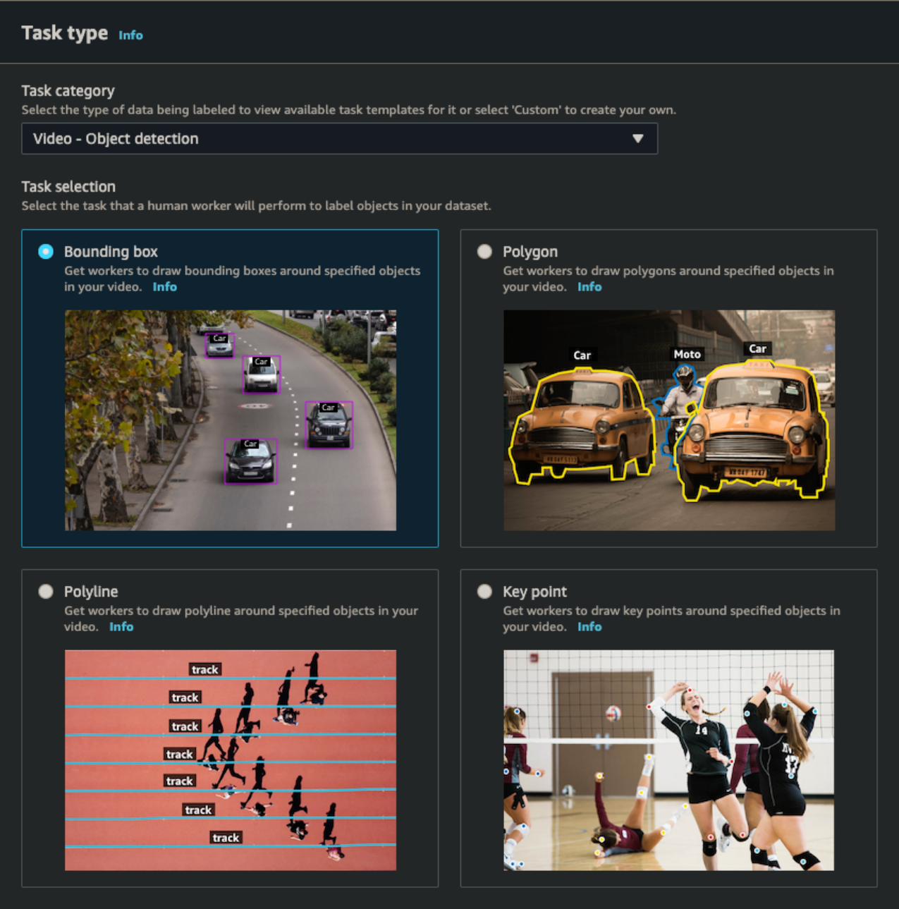

Create a Labeling Job (API)

You create an object detection labeling job using the SageMaker API operation

CreateLabelingJob. This API defines this operation for all AWS SDKs. To see a list of language-

specific SDKs supported for this operation, review the See Also section of CreateLabelingJob.

Videos and video frame labeling
2592

## Page 622

Amazon SageMaker AI
Developer Guide

Create a Labeling Job (API) provides an overview of the CreateLabelingJob operation. Follow
these instructions and do the following while you configure your request:

• You must enter an ARN for HumanTaskUiArn. Use

arn:aws:sagemaker:<region>:394669845002:human-task-ui/

VideoObjectDetection. Replace <region> with the AWS Region in which you are creating
the labeling job.

Do not include an entry for the UiTemplateS3Uri parameter.

• Your LabelAttributeName must end in -ref. For example, video-od-labels-ref.

• Your input manifest file must be a video frame sequence manifest file. You can create this
manifest file using the SageMaker AI console, or create it manually and upload it to Amazon S3.
For more information, see Input Data Setup.

• You can only use private or vendor work teams to create video frame object detection labeling
jobs.

• You specify your labels, label category and frame attributes, the task type, and worker
instructions in a label category configuration file. Specify the task type (bounding boxes,

polylines, polygons or keypoint) using annotationType in your label category configuration
file. For more information, see Labeling category configuration file with label category and
frame attributes reference to learn how to create this file.

• You need to provide pre-defined ARNs for the pre-annotation and post-annotation (ACS)
Lambda functions. These ARNs are specific to the AWS Region you use to create your labeling
job.

• To find the pre-annotation Lambda ARN, refer to PreHumanTaskLambdaArn. Use the Region

in which you are creating your labeling job to find the correct ARN that ends with PRE-

VideoObjectDetection.

• To find the post-annotation Lambda ARN, refer to AnnotationConsolidationLambdaArn.
Use the Region in which you are creating your labeling job to find the correct ARN that ends

with ACS-VideoObjectDetection.

• The number of workers specified in NumberOfHumanWorkersPerDataObject must be 1.

• Automated data labeling is not supported for video frame labeling jobs. Do not specify values

for parameters in LabelingJobAlgorithmsConfig.

• Video frame object tracking labeling jobs can take multiple hours to complete. You can specify

a longer time limit for these labeling jobs in TaskTimeLimitInSeconds (up to 7 days, or
604,800 seconds).

Videos and video frame labeling
2593

## Page 623

Amazon SageMaker AI
Developer Guide

The following is an example of an AWS Python SDK (Boto3) request to create a labeling job in the
US East (N. Virginia) Region.

response = client.create_labeling_job(
LabelingJobName='example-video-od-labeling-job,
LabelAttributeName='label',
InputConfig={
'DataSource': {
'S3DataSource': {
'ManifestS3Uri': 's3://amzn-s3-demo-bucket/path/video-frame-sequence-
input-manifest.json'
}
},
'DataAttributes': {
'ContentClassifiers': [
'FreeOfPersonallyIdentifiableInformation'|'FreeOfAdultContent',

]
}
},
OutputConfig={
'S3OutputPath': 's3://amzn-s3-demo-bucket/prefix/file-to-store-output-data',
'KmsKeyId': 'string'
},
RoleArn='arn:aws:iam::*:role/*,
LabelCategoryConfigS3Uri='s3://bucket/prefix/label-categories.json',
StoppingConditions={
'MaxHumanLabeledObjectCount': 123,
'MaxPercentageOfInputDatasetLabeled': 123
},
HumanTaskConfig={
'WorkteamArn': 'arn:aws:sagemaker:us-east-1:*:workteam/private-crowd/*',
'UiConfig': {
'HumanTaskUiArn: 'arn:aws:sagemaker:us-east-1:394669845002:human-task-ui/
VideoObjectDetection'
},
'PreHumanTaskLambdaArn': 'arn:aws:lambda:us-east-1:432418664414:function:PRE-
VideoObjectDetection',
'TaskKeywords': [
'Video Frame Object Detection',
],
'TaskTitle': 'Video frame object detection task',
'TaskDescription': 'Classify and identify the location of objects and people in
video frames',

Videos and video frame labeling
2594

## Page 624

Amazon SageMaker AI
Developer Guide

'NumberOfHumanWorkersPerDataObject': 123,
'TaskTimeLimitInSeconds': 123,
'TaskAvailabilityLifetimeInSeconds': 123,
'MaxConcurrentTaskCount': 123,
'AnnotationConsolidationConfig': {
'AnnotationConsolidationLambdaArn': 'arn:aws:lambda:us-
east-1:432418664414:function:ACS-VideoObjectDetection'
},
Tags=[
{
'Key': 'string',
'Value': 'string'
},
]
)

Create Video Frame Object Detection Adjustment or Verification Labeling Job

You can create an adjustment and verification labeling job using the Ground Truth console or

CreateLabelingJob API. To learn more about adjustment and verification labeling jobs, and to
learn how create one, see Label verification and adjustment.

Output Data Format

When you create a video frame object detection labeling job, tasks are sent to workers. When these
workers complete their tasks, labels are written to the Amazon S3 output location you specified
when you created the labeling job. To learn about the video frame object detection output data
format, see Video frame object detection output. If you are a new user of Ground Truth, see
Labeling job output data to learn more about the Ground Truth output data format.

Track objects in video frames using video frame object tracking

You can use the video frame object tracking task type to have workers track the movement of
objects in a sequence of video frames (images extracted from a video) using bounding boxes,
polylines, polygons or keypoint annotation tools. The tool you choose defines the video frame task
type you create. For example, you can use a bounding box video frame object tracking task type
to ask workers to track the movement of objects, such as cars, bikes, and pedestrians by drawing
boxes around them.

You provide a list of categories, and each annotation that a worker adds to a video frame is
identified as an instance of that category using an instance ID. For example, if you provide the label
category car, the first car that a worker annotates will have the instance ID car:1. The second car

Videos and video frame labeling
2595

## Page 625

Amazon SageMaker AI
Developer Guide

the worker annotates will have the instance ID car:2. To track an object's movement, the worker
adds annotations associated with the same instance ID around to object in all frames.

You can create a video frame object tracking labeling job using the Amazon SageMaker AI Ground
Truth console, the SageMaker API, and language-specific AWS SDKs. To learn more, see Create a
Video Frame Object Detection Labeling Job and select your preferred method. See Task types to
learn more about the annotations tools you can choose from when you create a labeling job.

Ground Truth provides a worker UI and tools to complete your labeling job tasks: Preview the
Worker UI.

You can create a job to adjust annotations created in a video object detection labeling job using
the video object detection adjustment task type. To learn more, see Create Video Frame Object
Detection Adjustment or Verification Labeling Job.

Preview the Worker UI

Ground Truth provides workers with a web user interface (UI) to complete your video frame object
tracking annotation tasks. You can preview and interact with the worker UI when you create a
labeling job in the console. If you are a new user, we recommend that you create a labeling job
through the console using a small input dataset to preview the worker UI and ensure your video
frames, labels, and label attributes appear as expected.

The UI provides workers with the following assistive labeling tools to complete your object tracking
tasks:

• For all tasks, workers can use the Copy to next and Copy to all features to copy an annotation
with the same unique ID to the next frame or to all subsequent frames respectively.

• For tasks that include the bounding box tools, workers can use a Predict next feature to draw a
bounding box in a single frame, and then have Ground Truth predict the location of boxes with
the same unique ID in all other frames. Workers can then make adjustments to correct predicted
box locations.

Create a Video Frame Object Tracking Labeling Job

You can create a video frame object tracking labeling job using the SageMaker AI console or the

CreateLabelingJob API operation.

This section assumes that you have reviewed the Video frame labeling job reference and have
chosen the type of input data and the input dataset connection you are using.

Videos and video frame labeling
2596

## Page 626

Amazon SageMaker AI
Developer Guide

Create a Labeling Job (Console)

You can follow the instructions in Create a Labeling Job (Console) to learn how to create a video
frame object tracking job in the SageMaker AI console. In step 10, choose Video - Object tracking
from the Task category dropdown list. Select the task type you want by selecting one of the cards
in Task selection.

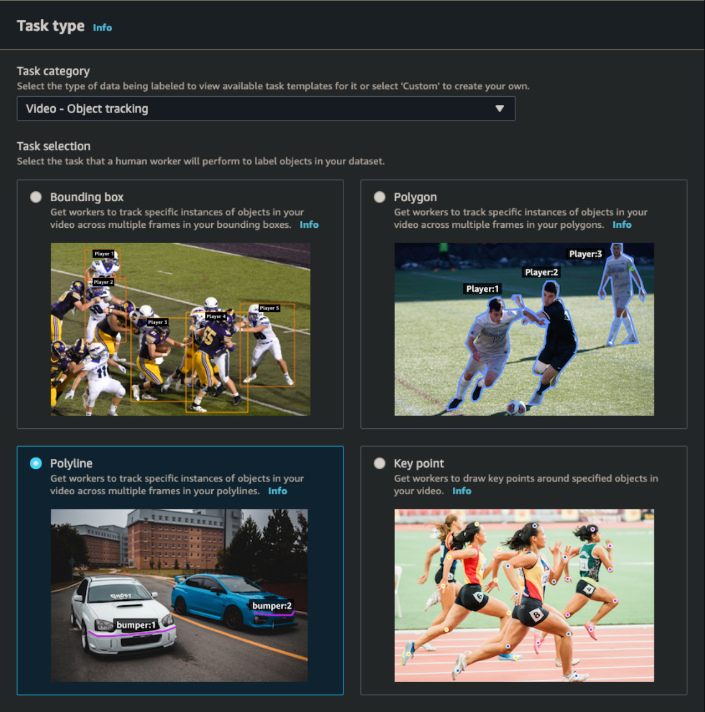

Videos and video frame labeling
2597

## Page 627

Amazon SageMaker AI
Developer Guide

Create a Labeling Job (API)

You create an object tracking labeling job using the SageMaker API operation

CreateLabelingJob. This API defines this operation for all AWS SDKs. To see a list of language-

specific SDKs supported for this operation, review the See Also section of CreateLabelingJob.

Create a Labeling Job (API) provides an overview of the CreateLabelingJob operation. Follow
these instructions and do the following while you configure your request:

• You must enter an ARN for HumanTaskUiArn. Use

arn:aws:sagemaker:<region>:394669845002:human-task-ui/

VideoObjectTracking. Replace <region> with the AWS Region in which you are creating the
labeling job.

Do not include an entry for the UiTemplateS3Uri parameter.

• Your LabelAttributeName must end in -ref. For example, ot-labels-ref.

• Your input manifest file must be a video frame sequence manifest file. You can create this
manifest file using the SageMaker AI console, or create it manually and upload it to Amazon S3.
For more information, see Input Data Setup. If you create a streaming labeling job, the input
manifest file is optional.

• You can only use private or vendor work teams to create video frame object detection labeling
jobs.

• You specify your labels, label category and frame attributes, the task type, and worker
instructions in a label category configuration file. Specify the task type (bounding boxes,

polylines, polygons or keypoint) using annotationType in your label category configuration
file. For more information, see Labeling category configuration file with label category and
frame attributes reference to learn how to create this file.

• You need to provide pre-defined ARNs for the pre-annotation and post-annotation (ACS)
Lambda functions. These ARNs are specific to the AWS Region you use to create your labeling
job.

• To find the pre-annotation Lambda ARN, refer to PreHumanTaskLambdaArn. Use the Region

in which you are creating your labeling job to find the correct ARN that ends with PRE-

VideoObjectTracking.

• To find the post-annotation Lambda ARN, refer to AnnotationConsolidationLambdaArn.
Use the Region in which you are creating your labeling job to find the correct ARN that ends

with ACS-VideoObjectTracking.

Videos and video frame labeling
2598

## Page 628

Amazon SageMaker AI
Developer Guide

• The number of workers specified in NumberOfHumanWorkersPerDataObject must be 1.

• Automated data labeling is not supported for video frame labeling jobs. Do not specify values

for parameters in LabelingJobAlgorithmsConfig.

• Video frame object tracking labeling jobs can take multiple hours to complete. You can specify

a longer time limit for these labeling jobs in TaskTimeLimitInSeconds (up to 7 days, or
604,800 seconds).

The following is an example of an AWS Python SDK (Boto3) request to create a labeling job in the
US East (N. Virginia) Region.

response = client.create_labeling_job(
LabelingJobName='example-video-ot-labeling-job,
LabelAttributeName='label',
InputConfig={
'DataSource': {
'S3DataSource': {
'ManifestS3Uri': 's3://amzn-s3-demo-bucket/path/video-frame-sequence-
input-manifest.json'
}
},
'DataAttributes': {
'ContentClassifiers': [
'FreeOfPersonallyIdentifiableInformation'|'FreeOfAdultContent',
]
}
},
OutputConfig={
'S3OutputPath': 's3://amzn-s3-demo-bucket/prefix/file-to-store-output-data',
'KmsKeyId': 'string'
},
RoleArn='arn:aws:iam::*:role/*,
LabelCategoryConfigS3Uri='s3://bucket/prefix/label-categories.json',
StoppingConditions={
'MaxHumanLabeledObjectCount': 123,
'MaxPercentageOfInputDatasetLabeled': 123
},
HumanTaskConfig={
'WorkteamArn': 'arn:aws:sagemaker:us-east-1:*:workteam/private-crowd/*',
'UiConfig': {
'HumanTaskUiArn: 'arn:aws:sagemaker:us-east-1:394669845002:human-task-ui/
VideoObjectTracking'

Videos and video frame labeling
2599

## Page 629

Amazon SageMaker AI
Developer Guide

},
'PreHumanTaskLambdaArn': 'arn:aws:lambda:us-east-1:432418664414:function:PRE-
VideoObjectTracking',
'TaskKeywords': [
'Video Frame Object Tracking,
],
'TaskTitle': 'Video frame object tracking task',
'TaskDescription': Tracking the location of objects and people across video
frames',
'NumberOfHumanWorkersPerDataObject': 123,
'TaskTimeLimitInSeconds': 123,
'TaskAvailabilityLifetimeInSeconds': 123,
'MaxConcurrentTaskCount': 123,
'AnnotationConsolidationConfig': {
'AnnotationConsolidationLambdaArn': 'arn:aws:lambda:us-
east-1:432418664414:function:ACS-VideoObjectTracking'
},

Tags=[
{
'Key': 'string',
'Value': 'string'
},
]
)

Create a Video Frame Object Tracking Adjustment or Verification Labeling Job

You can create an adjustment and verification labeling job using the Ground Truth console or

CreateLabelingJob API. To learn more about adjustment and verification labeling jobs, and to
learn how create one, see Label verification and adjustment.

Output Data Format

When you create a video frame object tracking labeling job, tasks are sent to workers. When these
workers complete their tasks, labels are written to the Amazon S3 output location you specified
when you created the labeling job. To learn about the video frame object tracking output data
format, see Video frame object tracking output. If you are a new user of Ground Truth, see Labeling
job output data to learn more about the Ground Truth output data format.

Video frame labeling job reference

Use this page to learn about the object detection and object tracking video frame labeling jobs.
The information on this page applies to both of these built-in task types.

Videos and video frame labeling
2600

## Page 630

Amazon SageMaker AI
Developer Guide

The video frame labeling job is unique because of the following:

• You can either provide data objects that are ready to be annotated (video frames), or you can
provide video files and have Ground Truth automatically extract video frames.

• Workers have the ability to save work as they go.

• You cannot use the Amazon Mechanical Turk workforce to complete your labeling tasks.

• Ground Truth provides a worker UI, as well as assistive and basic labeling tools, to help workers
complete your tasks. You do not need to provide a worker task template.

Use the following topics to learn more about video frame labeling jobs.

Topics

• Input data

• Job completion times

• Task types

• Workforces

• Worker user interface (UI)

• Video frame job permission requirements

Input data

The video frame labeling job uses sequences of video frames. A single sequence is a series of
images that have been extracted from a single video. You can either provide your own sequences of
video frames, or have Ground Truth automatically extract video frame sequences from your video
files. To learn more, see Provide Video Files.

Ground Truth uses sequence files to identify all images in a single sequence. All of the sequences
that you want to include in a single labeling job are identified in an input manifest file. Each
sequence is used to create a single worker task. You can automatically create sequence files and an
input manifest file using Ground Truth automatic data setup. To learn more, see Set up Automated
Video Frame Input Data.

To learn how to manually create sequence files and an input manifest file, see Create a Video
Frame Input Manifest File.

Videos and video frame labeling
2601

## Page 631

Amazon SageMaker AI
Developer Guide

Job completion times

Video and video frame labeling jobs can take workers hours to complete. You can set the total
amount of time that workers can work on each task when you create a labeling job. The maximum
time you can set for workers to work on tasks is 7 days. The default value is 3 days.

We strongly recommend that you create tasks that workers can complete within 12 hours. Workers
must keep the worker UI open while working on a task. They can save work as they go and Ground
Truth saves their work every 15 minutes.

When using the SageMaker AI CreateLabelingJob API operation, set the total time a task is

available to workers in the TaskTimeLimitInSeconds parameter of HumanTaskConfig.

When you create a labeling job in the console, you can specify this time limit when you select your
workforce type and your work team.

Task types

When you create a video object tracking or video object detection labeling job, you specify the type
of annotation that you want workers to create while working on your labeling task. The annotation
type determines the type of output data Ground Truth returns and defines the task type for your
labeling job.

If you are creating a labeling job using the API operation CreateLabelingJob, you specify the

task type using the label category configuration file parameter annotationType. To learn more,
see Labeling category configuration file with label category and frame attributes reference.

The following task types are available for both video object tracking or video object detection
labeling jobs:

• Bounding box  – Workers are provided with tools to create bounding box annotations. A
bounding box is a box that a worker draws around an objects to identify the pixel-location and
label of that object in the frame.

• Polyline – Workers are provided with tools to create polyline annotations. A polyline is defined
by the series of ordered x, y coordinates. Each point added to the polyline is connected to the
previous point by a line. The polyline does not have to be closed (the start point and end point
do not have to be the same) and there are no restrictions on the angles formed between lines.

• Polygon  – Workers are provided with tools to create polygon annotations. A polygon is a
closed shape defined by a series of ordered x, y coordinates. Each point added to the polygon

Videos and video frame labeling
2602

## Page 632

Amazon SageMaker AI
Developer Guide

is connected to the previous point by a line and there are no restrictions on the angles formed
between lines. Two lines (sides) of the polygon cannot cross. The start and end point of a
polygon must be the same.

• Keypoint – Workers are provided with tools to create keypoint annotations. A keypoint is a single

point associated with an x, y coordinate in the video frame.

Workforces

When you create a video frame labeling job, you need to specify a work team to complete your
annotation tasks. You can choose a work team from a private workforce of your own workers, or
from a vendor workforce that you select in the AWS Marketplace. You cannot use the Amazon
Mechanical Turk workforce for video frame labeling jobs.

To learn more about vendor workforces, see Subscribe to vendor workforces.

To learn how to create and manage a private workforce, see Private workforce.

Worker user interface (UI)

Ground Truth provides a worker user interface (UI), tools, and assistive labeling features to help
workers complete your video labeling tasks. You can preview the worker UI when you create a
labeling job in the console.

When you create a labeling job using the API operation CreateLabelingJob, you must provide

an ARN provided by Ground Truth in the parameter HumanTaskUiArn to specify the worker UI for

your task type. You can use HumanTaskUiArn with the SageMaker AI RenderUiTemplate API
operation to preview the worker UI.

You provide worker instructions, labels, and optionally, attributes that workers can use to provide
more information about labels and video frames. These attributes are referred to as label category
attributes and frame attributes respectively. They are all displayed in the worker UI.

Label category and frame attributes

When you create a video object tracking or video object detection labeling job, you can add one or
more label category attributes and frame attributes:

• Label category attribute – A list of options (strings), a free form text box, or a numeric field
associated with one or more labels. It is used by workers to provide metadata about a label.

Videos and video frame labeling
2603

## Page 633

Amazon SageMaker AI
Developer Guide

• Frame attribute – A list of options (strings), a free form text box, or a numeric field that appears
on each video frame a worker is sent to annotate. It is used by workers to provide metadata
about video frames.

Additionally, you can use label and frame attributes to have workers verify labels in a video frame
label verification job.

Use the following sections to learn more about these attributes. To learn how to add label category
and frame attributes to a labeling job, use the Create Labeling Job sections on the task type page
of your choice.

Label category attributes

Add label category attributes to labels to give workers the ability to provide more information
about the annotations they create. A label category attribute is added to an individual label, or to
all labels. When a label category attribute is applied to all labels it is referred to as a global label
category attribute.

For example, if you add the label category car, you might also want to capture additional data
about your labeled cars, such as if they are occluded or the size of the car. You can capture this
metadata using label category attributes. In this example, if you added the attribute occluded to
the car label category, you can assign partial, completely, no to the occluded attribute and enable
workers to select one of these options.

When you create a label verification job, you add labels category attributes to each label you want
workers to verify.

Frame level attributes

Add frame attributes to give workers the ability to provide more information about individual video
frames. Each frame attribute you add appears on all frames.

For example, you can add a number-frame attribute to have workers identify the number of objects
they see in a particular frame.

In another example, you may want to provide a free-form text box to give workers the ability to
provide an answer to a question.

When you create a label verification job, you can add one or more frame attributes to ask workers
to provide feedback on all labels in a video frame.

Videos and video frame labeling
2604

## Page 634

Amazon SageMaker AI
Developer Guide

Worker instructions

You can provide worker instructions to help your workers complete your video frame labeling tasks.
You might want to cover the following topics when writing your instructions:

• Best practices and things to avoid when annotating objects.

• The label category attributes provided (for object detection and object tracking tasks) and how
to use them.

• How to save time while labeling by using keyboard shortcuts.

You can add your worker instructions using the SageMaker AI console while creating a labeling

job. If you create a labeling job using the API operation CreateLabelingJob, you specify worker
instructions in your label category configuration file.

In addition to your instructions, Ground Truth provides a link to help workers navigate and use the
worker portal. View these instructions by selecting the task type on Worker Instructions.

Declining tasks

Workers are able to decline tasks.

Workers decline a task if the instructions are not clear, input data is not displaying correctly, or
if they encounter some other issue with the task. If the number of workers per dataset object

(NumberOfHumanWorkersPerDataObject) decline the task, the data object is marked as expired
and will not be sent to additional workers.

Video frame job permission requirements

When you create a video frame labeling job, in addition to the permission requirements found in
Assign IAM Permissions to Use Ground Truth, you must add a CORS policy to your S3 bucket that
contains your input manifest file.

CORS permission policy for your S3 bucket

When you create a video frame labeling job, you specify buckets in S3 where your input data and
manifest file are located and where your output data will be stored. These buckets may be the
same. You must attach the following Cross-origin resource sharing (CORS) policy to your input and
output buckets. If you use the Amazon S3 console to add the policy to your bucket, you must use
the JSON format.

Videos and video frame labeling
2605

## Page 635

Amazon SageMaker AI
Developer Guide

JSON

[
{
"AllowedHeaders": [
"*"
],
"AllowedMethods": [
"GET",
"HEAD",
"PUT"
],
"AllowedOrigins": [
"*"
],
"ExposeHeaders": [

"Access-Control-Allow-Origin"
],
"MaxAgeSeconds": 3000
}
]

XML

<?xml version="1.0" encoding="UTF-8"?>
<CORSConfiguration xmlns="http://s3.amazonaws.com/doc/2006-03-01/">
<CORSRule>
<AllowedOrigin>*</AllowedOrigin>
<AllowedMethod>GET</AllowedMethod>
<AllowedMethod>HEAD</AllowedMethod>
<AllowedMethod>PUT</AllowedMethod>
<MaxAgeSeconds>3000</MaxAgeSeconds>
<ExposeHeader>Access-Control-Allow-Origin</ExposeHeader>
<AllowedHeader>*</AllowedHeader>
</CORSRule>
</CORSConfiguration>

To learn how to add a CORS policy to an S3 bucket, see  How do I add cross-domain resource
sharing with CORS? in the Amazon Simple Storage Service User Guide.

Videos and video frame labeling
2606

## Page 636

Amazon SageMaker AI
Developer Guide

Worker Instructions

This topic provides an overview of the Ground Truth worker portal and the tools available to
complete your video frame labeling task. First, select the type of task you are working on from
Topics.

Important

It is recommended that you complete your task using a Google Chrome or Firefox web
browser.

For adjustment jobs, select the original labeling job task type that produced the labels you are
adjusting. Review and adjust the labels in your task as needed.

Topics

• Navigate the UI

• Bulk Edit Label and Frame Attributes

• Tool Guide

• Icons Guide

• Shortcuts

• Understand Release, Stop and Resume, and Decline Task Options

• Saving Your Work and Submitting

• Video Frame Object Tracking Tasks

• Video Frame Object Detection Tasks

Navigate the UI

You can navigate between video frames using the navigation bar in the bottom-left corner of your
UI.

Use the play button to automatically move through the entire sequence of frames.

Use the next frame and previous frame buttons to move forward or back one frame at a time. You
can also input a frame number to navigate to that frame.

Videos and video frame labeling
2607

## Page 637

Amazon SageMaker AI
Developer Guide

You can zoom in to and out of all video frames. Once you have zoomed into a video frame, you can
move around in that frame using the move icon. When you set a new view in a single video frame
by zooming and moving within that frame, all video frames are set to the same view. You can reset
all video frames to their original view using the fit screen icon. For additional view options, see
Icons Guide.

When you are in the worker UI, you see the following menus:

• Instructions – Review these instructions before starting your task. Additionally, select More
instructions and review these instructions.

• Shortcuts – Use this menu to view keyboard shortcuts that you can use to navigate video frames
and use the tools provided.

• Help – Use this option to refer back to this documentation.

Bulk Edit Label and Frame Attributes

You can bulk edit label attributes and frame attributes (attributes).

When you bulk edit an attribute, you specify one or more ranges of frames that you want to apply
the edit to. The attribute you select is edited in all frames in that range, including the start and end
frames you specify. When you bulk edit label attributes, the range you specify must contain the
label that the label attribute is attached to. If you specify frames that do not contain this label, you
will receive an error.

To bulk edit an attribute you must specify the desired value for the attribute first. For example, if
you want to change an attribute from Yes to No, you must select No, and then perform the bulk
edit.

You can also specify a new value for an attribute that has not been filled in and then use the bulk
edit feature to fill in that value in multiple frames. To do this, select the desired value for the
attribute and complete the following procedure.

To bulk edit a label or attribute:

1.
Use your mouse to right click the attribute you want to bulk edit.

2.
Specify the range of frames you want to apply the bulk edit to using a dash (-) in the text box.

For example, if you want to apply the edit to frames one through ten, enter 1-10. If you want

to apply the edit to frames two to five, eight to ten and twenty enter 2-5,8-10,20.

3.
Select Confirm.

Videos and video frame labeling
2608

## Page 638

Amazon SageMaker AI
Developer Guide

If you get an error message, verify that you entered a valid range and that the label associated with
the label attribute you are editing (if applicable) exists in all frames specified.

You can quickly add a label to all previous or subsequent frames using the Duplicate to previous
frames and Duplicate to next frames options in the Label menu at the top of your screen.

Tool Guide

Your task will include one or more tools. The tool provided dictates the type of annotations you
will create to identify and track objects. Use the following table to learn more about each tool
provided.

Tool
Icon
Action
Description

Bounding box
Add a bounding box
annotation.

Choose this icon to
add a bounding box.
Each bounding box
you add is associate
d with the category
you choose from the
Label category drop

down menu. Select
the bounding box or
its associated label to
adjust it.

Predict next

Predict bounding
boxes in the next
frame.

Select a bounding
box, and then choose
this icon to predict
the location of that
box in the next
frame. You can select
the icon multiple
times in a row to
automatically detect
the location of box
in multiple frames.
For example, select

Videos and video frame labeling
2609

## Page 639

Amazon SageMaker AI
Developer Guide

Tool
Icon
Action
Description

this icon 5 times to
predict the location
of a bounding box in
the next 5 frames.

Keypoint

Add a keypoint
annotation.

Choose this icon
to add a keypoint.
Click on an object
the image to place
the keypoint at that
location.

Each keypoint you
add is associated
with the category
you choose from
the Label category
drop down menu.
Select a keypoint or
its associated label to
adjust it.

Videos and video frame labeling
2610

## Page 640

Amazon SageMaker AI
Developer Guide

Tool
Icon
Action
Description

Polyline

Add a polyline
annotation.

Choose this icon
to add a polyline.
To add a polyline,
continuously click
around the object
of interest to add
new points. To stop
drawing a polyline,
select the last point
that you placed a
second time (this
point will be green),
or press Enter on
your keyboard.

Each point added
to the polyline is
connected to the
previous point by
a line. The polyline
does not have to
be closed (the start
point and end point
do not have to be
the same) and there
are no restrictions on
the angles formed
between lines.

Each polyline you
add is associated
with the category
you choose from the
Label category drop
down menu. Select

Videos and video frame labeling
2611

## Page 641

Amazon SageMaker AI
Developer Guide

Tool
Icon
Action
Description

the polyline or its
associated label to
adjust it.

Videos and video frame labeling
2612

## Page 642

Amazon SageMaker AI
Developer Guide

Tool
Icon
Action
Description

Polygon

Add a polygon
annotation.

Choose this icon
to add a polygon.
To add a polygon,
continuously click
around the object
of interest to add
new points. To stop
drawing the polygon,
select the start point
(this point will be
green).

A polygon is a closed
shape defined by a
series of points that
you place. Each point
added to the polygon
is connected to the
previous point by a
line and there are
no restrictions on
the angles formed
between lines. The
start and end point
must be the same.

Each polygon you
add is associated
with the category
you choose from the
Label category drop
down menu. Select
the polygon or its
associated label to
adjust it.

Videos and video frame labeling
2613

## Page 643

Amazon SageMaker AI
Developer Guide

Tool
Icon
Action
Description

Copy to Next

Copy annotations to
the next frame.

If one or more
annotations are
selected in the
current frame,
those annotatio
ns are copied to
the next frame.
If no annotations
are selected, all
annotations in the
current frame will be
copied to the next
frame.

Copy to All

Copy annotations
to all subsequent
frames.

If one or more
annotations are
selected in the
current frame,
those annotations
are copied to all
subsequent frames.
If no annotations
are selected, all
annotations in the
current frame will
be copied to all
subsequent frames.

Icons Guide

Use this table to learn about the icons you see in your UI. You can automatically select some of
these icons using the keyboard shortcuts found in the Shortcuts menu.

Videos and video frame labeling
2614

## Page 644

Amazon SageMaker AI
Developer Guide

Icon
Action
Description

brightness
Choose this icon to adjust the brightness of all video
frames.

contrast
Choose this icon to adjust the contrast of all video
frames.

zoom in
Choose this icon to zoom into all of the video frames.

zoom out
Choose this icon to zoom out of all of the video frames.

move screen
After you've zoomed into a video frame, choose this
icon to move around in that video frame. You can move
around the video frame using your mouse by clicking
and dragging the frame in the direction you want it to
move. This will change the view in all view frames.

fit screen
Reset all video frames to their original position.

undo
Undo an action. You can use this icon to remove a
bounding box that you just added, or to undo an
adjustment you made to a bounding box.

redo
Redo an action that was undone using the undo icon.

delete label
Delete a label. This will delete the bounding box
associated with the label in a single frame.

show or hide
label

Select this icon to show a label that has been hidden. If
this icon has a slash through it, select it to hide the label.

Videos and video frame labeling
2615

## Page 645

Amazon SageMaker AI
Developer Guide

Icon
Action
Description

edit label
Select this icon to open the Edit instance menu. Use
this menu to edit a label category, ID, and to add or edit
label attributes.

Shortcuts

The keyboard shortcuts listed in the Shortcuts menu can help you quickly select icons, undo
and redo annotations, and use tools to add and edit annotations. For example, once you add a
bounding box, you can use P to quickly predict the location of that box in subsequent frames.

Before you start your task, it is recommended that you review the Shortcuts menu and become
acquainted with these commands.

Understand Release, Stop and Resume, and Decline Task Options

When you open the labeling task, three buttons on the top right allow you to decline the task
(Decline task), release it (Release task), and stop and resume it at a later time (Stop and resume
later). The following list describes what happens when you select one of these options:

• Decline task: You should only decline a task if something is wrong with the task, such as unclear
video frame images or an issue with the UI. If you decline a task, you will not be able to return to
the task.

• Release Task: Use this option to release a task and allow others to work on it. When you
release a task, you loose all work done on that task and other workers on your team can pick
it up. If enough workers pick up the task, you may not be able to return to it. When you select
this button and then select Confirm, you are returned to the worker portal. If the task is still
available, its status will be Available. If other workers pick it up, it will disappear from your
portal.

• Stop and resume later: You can use the Stop and resume later button to stop working and
return to the task at a later time. You should use the Save button to save your work before you
select Stop and resume later. When you select this button and then select Confirm, you are
returned to the worker portal, and the task status is Stopped. You can select the same task to
resume work on it.

Be aware that the person that creates your labeling tasks specifies a time limit in which all
tasks much be completed by. If you do not return to and complete this task within that time

Videos and video frame labeling
2616

## Page 646

Amazon SageMaker AI
Developer Guide

limit, it will expire and your work will not be submitted. Contact your administrator for more
information.

Saving Your Work and Submitting

You should periodically save your work using the Save button. Ground Truth will automatically save
your work ever 15 minutes.

When you open a task, you must complete your work on it before pressing Submit.

Video Frame Object Tracking Tasks

Video frame object tracking tasks require you to track the movement of objects across video
frames. A video frame is a still image from a video scene. You can use the worker UI to navigate
between video frames and use the tools provided to identify unique objects and track their
movement from one from to the next. Use the following topics to learn how to navigate your
worker UI, use the tools provided, and complete your task.

It is recommended that you complete your task using a Google Chrome or Firefox web browser.

Important

If you see annotations have already been added to one or more video frames when you
open your task, adjust those annotations and add additional annotations as needed.

Topics

• Your Task

Your Task

When you work on a video frame object tracking task, you need to select a category from the
Label category menu on the right side of your worker portal to start annotating. After you've
chosen a category, use the tools provided to annotate the objects that the category applies to. This
annotation will be associated with a unique label ID that should only be used for that object. Use
this same label ID to create additional annotations for the same object in all of the video frames
that it appears in. Refer to Tool Guide to learn more about the tools provided.

Videos and video frame labeling
2617

## Page 647

Amazon SageMaker AI
Developer Guide

After you've added a label, you may see a downward pointing arrow next to the label in the Labels
menu. Select this arrow and then select one option for each label attribute you see to provide more
information about that label.

You may see frame attributes under the Labels menu. These attributes will appear on each frame
in your task. Use these attribute prompts to enter additional information about each frame.

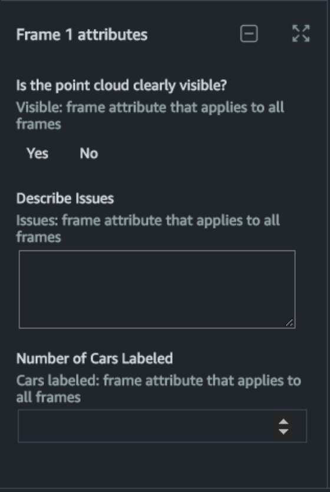

After you've added a label, you can quickly add and edit a label category attribute value by using
the downward pointing arrow next to the label in the Labels menu. If you select the pencil icon
next to the label in the Labels menu, the Edit instance menu will appear. You can edit the label ID,
label category, and label category attributes using this menu.

To edit an annotation, select the label of the annotation that you want to edit in the Labels menu
or select the annotation in the frame. When you edit or delete an annotation, the action will only
modify the annotation in a single frame.

If you are working on a task that includes a bounding box tool, use the predict next icon to predict
the location of all bounding boxes that you have drawn in a frame in the next frame. If you select a

Videos and video frame labeling
2618

## Page 648

Amazon SageMaker AI
Developer Guide

single box and then select the predict next icon, only that box will be predicted in the next frame. If
you have not added any boxes to the current frame, you will receive an error. You must add at least
one box to the frame before using this feature.

After you've used the predict next icon, review the location of each box in the next frame and make
adjustments to the box location and size if necessary.

For all other tools, you can use the Copy to next and Copy to all tools to copy your annotations to

the next or all frames respectively.

Video Frame Object Detection Tasks

Video frame object detection tasks required you to classify and identify the location of objects
in video frames using annotations. A video frame is a still image from a video scene. You can use
the worker UI to navigate between video frames and create annotations to identify objects of
interest. Use the following topics to learn how to navigate your worker UI, use the tools provided,
and complete your task.

It is recommended that you complete your task using a Google Chrome web browser.

Important

If you see annotations have already been added to one or more video frames when you
open your task, adjust those annotations and add additional annotations as needed.

Topics

• Your Task

Your Task

When you work on a video frame object detection task, you need to select a category from the
Label category menu on the right side of your worker portal to start annotating. After you've
chosen a category, draw annotations around objects that this category applies to. To learn more
about the tools you see in your worker UI, refer to the Tool Guide.

After you've added a label, you may see a downward pointing arrow next to the label in the Labels
menu. Select this arrow and then select one option for each label attribute you see to provide more
information about that label.

Videos and video frame labeling
2619

## Page 649

Amazon SageMaker AI
Developer Guide

You may see frame attributes under the Labels menu. These attributes will appear on each frame
in your task. Use these attribute prompts to enter additional information about each frame.

To edit an annotation, select the label of the annotation that you want to edit in the Labels menu
or select the annotation in the frame. When you edit or delete an annotation, the action will only
modify the annotation in a single frame.

If you are working on a task that includes a bounding box tool, use the predict next icon to predict
the location of all bounding boxes that you have drawn in a frame in the next frame. If you select a
single box and then select the predict next icon, only that box will be predicted in the next frame. If
you have not added any boxes to the current frame, you will receive an error. You must add at least
one box to the frame before using this feature.

Note

The predict next feature will not overwrite manually created annotations. It will only add
annotations. If you use predict next and as a result have more than one bounding box

Videos and video frame labeling
2620

## Page 650

Amazon SageMaker AI
Developer Guide

around a single object, delete all but one box. Each object should only be identified with a
single box.

After you've used the predict next icon, review the location of each box in the next frame and make
adjustments to the box location and size if necessary.

For all other tools, you can use the Copy to next and Copy to all tools to copy your annotations to
the next or all frames respectively.

Use Ground Truth to Label 3D Point Clouds

Create a 3D point cloud labeling job to have workers label objects in 3D point clouds generated
from 3D sensors like Light Detection and Ranging (LiDAR) sensors and depth cameras, or generated
from 3D reconstruction by stitching images captured by an agent like a drone.

3D Point Clouds

Point clouds are made up of three-dimensional (3D) visual data that consists of points. Each

point is described using three coordinates, typically x, y, and z. To add color or variations in point

intensity to the point cloud, points may be described with additional attributes, such as i for

intensity or values for the red (r), green (g), and blue (b) 8-bit color channels. When you create
a Ground Truth 3D point cloud labeling job, you can provide point cloud and, optionally, sensor
fusion data.

The following image shows a single, 3D point cloud scene rendered by Ground Truth and displayed
in the semantic segmentation worker UI.

Label 3D Point Clouds
2621

## Page 651

Amazon SageMaker AI
Developer Guide

LiDAR

A Light Detection and Ranging (LiDAR) sensor is a common type of sensor used to collect
measurements that are used to generate point cloud data. LiDAR is a remote sensing method that
uses light in the form of a pulsed laser to measure the distances of objects from the sensor. You
can provide 3D point cloud data generated from a LiDAR sensor for a Ground Truth 3D point cloud
labeling job using the raw data formats described in Accepted Raw 3D Data Formats.

Sensor Fusion

Ground Truth 3D point cloud labeling jobs include a sensor fusion feature that supports video
camera sensor fusion for all task types. Some sensors come with multiple LiDAR devices and video
cameras that capture images and associate them with a LiDAR frame. To help annotators visually
complete your tasks with high confidence, you can use the Ground Truth sensor fusion feature to
project annotations (labels) from a 3D point cloud to 2D camera images and vice versa using 3D
scanner (such as LiDAR) extrinsic matrix and camera extrinsic and intrinsic matrices. To learn more,
see Sensor Fusion.

Label 3D Point Clouds

Ground Truth provides a user interface (UI) and tools that workers use to label or annotate 3D
point clouds. When you use the object detection or semantic segmentation task types, workers can

Label 3D Point Clouds
2622

## Page 652

Amazon SageMaker AI
Developer Guide

annotate a single point cloud frame. When you use object tracking, workers annotate a sequence of
frames. You can use object tracking to track object movement across all frames in a sequence.

The following demonstrates how a worker would use the Ground Truth worker portal and tools to
annotate a 3D point cloud for an object detection task. For similar visual examples of other task
types, see 3D Point Cloud Task types.

Assistive Labeling Tools for Point Cloud Annotation

Ground Truth offers assistive labeling tools to help workers complete your point cloud annotation
tasks faster and with more accuracy. For details about assistive labeling tools that are included
in the worker UI for each task type, select a task type and refer to the View the Worker Task
Interface section of that page.

Next Steps

You can create six types of tasks when you use Ground Truth 3D point cloud labeling jobs. Use the
topics in 3D Point Cloud Task types to learn more about these task types and to learn how to create
a labeling job using the task type of your choice.

The 3D point cloud labeling job is different from other Ground Truth labeling modalities. Before
creating a labeling job, we recommend that you read 3D point cloud labeling jobs overview.
Additionally, review input data quotas in 3D Point Cloud and Video Frame Labeling Job Quotas.

Label 3D Point Clouds
2623

## Page 653

Amazon SageMaker AI
Developer Guide

Important

If you use a notebook instance created before June 5th, 2020 to run this notebook, you
must stop and restart that notebook instance for the notebook to work.

Topics

• 3D Point Cloud Task types

• 3D point cloud labeling jobs overview

• Worker instructions

3D Point Cloud Task types

You can use Ground Truth 3D point cloud labeling modality for a variety of use cases. The following
list briefly describes each 3D point cloud task type. For additional details and instructions on how
to create a labeling job using a specific task type, select the task type name to see its task type
page.

• 3D point cloud object detection – Use this task type when you want workers to locate and
classify objects in a 3D point cloud by adding and fitting 3D cuboids around objects.

• 3D point cloud object tracking – Use this task type when you want workers to add and fit 3D
cuboids around objects to track their movement across a sequence of 3D point cloud frames.
For example, you can use this task type to ask workers to track the movement of vehicles across
multiple point cloud frames.

• 3D point cloud semantic segmentation – Use this task type when you want workers to create a
point-level semantic segmentation mask by painting objects in a 3D point cloud using different
colors where each color is assigned to one of the classes you specify.

• 3D point cloud adjustment task types – Each of the task types above has an associated
adjustment task type that you can use to audit and adjust annotations generated from a 3D
point cloud labeling job. Refer to the task type page of the associated type to learn how to
create an adjustment labeling job for that task.

Classify objects in a 3D point cloud with object detection

Use this task type when you want workers to classify objects in a 3D point cloud by drawing 3D
cuboids around objects. For example, you can use this task type to ask workers to identify different

Label 3D Point Clouds
2624

## Page 654

Amazon SageMaker AI
Developer Guide

types of objects in a point cloud, such as cars, bikes, and pedestrians. The following page gives
important information about the labeling job, as well as steps to create one.

For this task type, the data object that workers label is a single point cloud frame. Ground Truth
renders a 3D point cloud using point cloud data you provide. You can also provide camera data
to give workers more visual information about scenes in the frame, and to help workers draw 3D
cuboids around objects.

Ground Truth providers workers with tools to annotate objects with 9 degrees of freedom
(x,y,z,rx,ry,rz,l,w,h) in three dimensions in both 3D scene and projected side views (top, side, and
back). If you provide sensor fusion information (like camera data), when a worker adds a cuboid
to identify an object in the 3D point cloud, the cuboid shows up and can be modified in the 2D
images. After a cuboid has been added, all edits made to that cuboid in the 2D or 3D scene are
projected into the other view.

You can create a job to adjust annotations created in a 3D point cloud object detection labeling job
using the 3D point cloud object detection adjustment task type.

If you are a new user of the Ground Truth 3D point cloud labeling modality, we recommend you
review 3D point cloud labeling jobs overview. This labeling modality is different from other Ground
Truth task types, and this page provides an overview of important details you should be aware of
when creating a 3D point cloud labeling job.

Topics

• View the Worker Task Interface

• Create a 3D Point Cloud Object Detection Labeling Job

• Create a 3D Point Cloud Object Detection Adjustment or Verification Labeling Job

• Output Data Format

View the Worker Task Interface

Ground Truth provides workers with a web portal and tools to complete your 3D point cloud object
detection annotation tasks. When you create the labeling job, you provide the Amazon Resource

Name (ARN) for a pre-built Ground Truth worker UI in the HumanTaskUiArn parameter. When you
create a labeling job using this task type in the console, this worker UI is automatically used. You
can preview and interact with the worker UI when you create a labeling job in the console. If you
are a new user, it is recommended that you create a labeling job using the console to ensure your
label attributes, point cloud frames, and if applicable, images, appear as expected.

Label 3D Point Clouds
2625

## Page 655

Amazon SageMaker AI
Developer Guide

The following is a GIF of the 3D point cloud object detection worker task interface. If you provide
camera data for sensor fusion in the world coordinate system, images are matched up with scenes
in the point cloud frame. These images appear in the worker portal as shown in the following GIF.

Worker can navigate in the 3D scene using their keyboard and mouse. They can:

• Double click on specific objects in the point cloud to zoom into them.

• Use a mouse-scroller or trackpad to zoom in and out of the point cloud.

• Use both keyboard arrow keys and Q, E, A, and D keys to move Up, Down, Left, Right. Use
keyboard keys W and S to zoom in and out.

Once a worker places a cuboid in the 3D scene, a side-view will appear with the three projected side
views: top, side, and back. These side-views show points in and around the placed cuboid and help
workers refine cuboid boundaries in that area. Workers can zoom in and out of each of those side-
views using their mouse.

The following video demonstrates movements around the 3D point cloud and in the side-view.

Label 3D Point Clouds
2626

## Page 656

Amazon SageMaker AI
Developer Guide

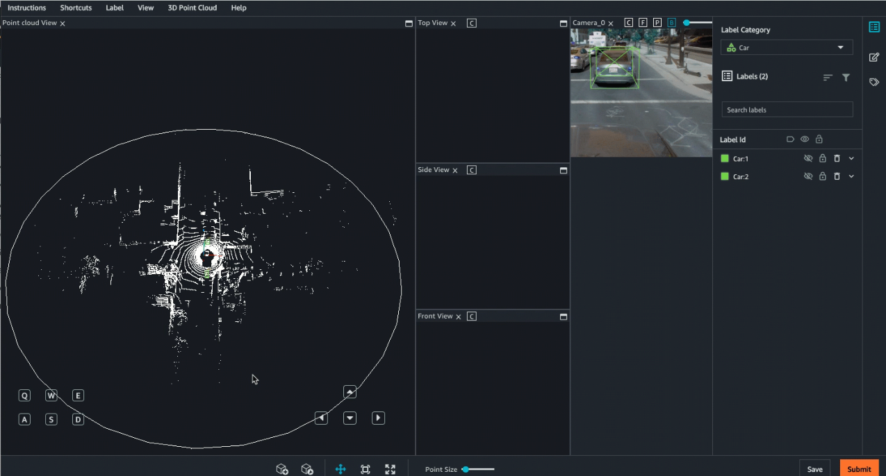

Additional view options and features are available in the View menu in the worker UI. See the
worker instruction page for a comprehensive overview of the Worker UI.

Assistive Labeling Tools

Ground Truth helps workers annotate 3D point clouds faster and more accurately using machine
learning and computer vision powered assistive labeling tools for 3D point cloud object tracking
tasks. The following assistive labeling tools are available for this task type:

• Snapping – Workers can add a cuboid around an object and use a keyboard shortcut or menu
option to have Ground Truth's autofit tool snap the cuboid tightly around the object.

• Set to ground – After a worker adds a cuboid to the 3D scene, the worker can automatically snap
the cuboid to the ground. For example, the worker can use this feature to snap a cuboid to the
road or sidewalk in the scene.

• Multi-view labeling – After a worker adds a 3D cuboid to the 3D scene, a side panel displays
front, side, and top perspectives to help the worker adjust the cuboid tightly around the object.
In all of these views, the cuboid includes an arrow that indicates the orientation, or heading of
the object. When the worker adjusts the cuboid, the adjustment will appear in real time on all of
the views (that is, 3D, top, side, and front).

Label 3D Point Clouds
2627

## Page 657

Amazon SageMaker AI
Developer Guide

• Sensor fusion – If you provide data for sensor fusion, workers can adjust annotations in the 3D
scenes and in 2D images, and the annotations will be projected into the other view in real time.
Additionally, workers will have the option to view the direction the camera is facing and the
camera frustum.

• View options – Enables workers to easily hide or view cuboids, label text, a ground mesh, and
additional point attributes like color or intensity. Workers can also choose between perspective
and orthogonal projections.

Create a 3D Point Cloud Object Detection Labeling Job

You can create a 3D point cloud labeling job using the SageMaker AI console or API operation,

CreateLabelingJob. To create a labeling job for this task type you need the following:

• A single-frame input manifest file. To learn how to create this type of manifest file, see Create

a Point Cloud Frame Input Manifest File. If you are a new user of Ground Truth 3D point cloud
labeling modalities, you may also want to review Accepted Raw 3D Data Formats.

• A work team from a private or vendor workforce. You cannot use Amazon Mechanical Turk for
video frame labeling jobs. To learn how to create workforces and work teams, see Workforces.

Additionally, make sure that you have reviewed and satisfied the Assign IAM Permissions to Use
Ground Truth.

Use one of the following sections to learn how to create a labeling job using the console or an API.

Create a Labeling Job (Console)

You can follow the instructions Create a Labeling Job (Console) in order to learn how to create a 3D
point cloud object detection labeling job in the SageMaker AI console. While you are creating your
labeling job, be aware of the following:

• Your input manifest file must be a single-frame manifest file. For more information, see Create a
Point Cloud Frame Input Manifest File.

• Optionally, you can provide label category and frame attributes. Workers can assign one or more
of these attributes to annotations to provide more information about that object. For example,
you might want to use the attribute occluded to have workers identify when an object is partially
obstructed.

• Automated data labeling and annotation consolidation are not supported for 3D point cloud
labeling tasks.

Label 3D Point Clouds
2628

## Page 658

Amazon SageMaker AI
Developer Guide

• 3D point cloud object detection labeling jobs can take multiple hours to complete. You can
specify a longer time limit for these labeling jobs when you select your work team (up to 7 days,
or 604800 seconds).

Create a Labeling Job (API)

This section covers details you need to know when you create a labeling job using the SageMaker

API operation CreateLabelingJob. This API defines this operation for all AWS SDKs. To see
a list of language-specific SDKs supported for this operation, review the See Also section of

CreateLabelingJob.

Create a Labeling Job (API), provides an overview of the CreateLabelingJob operation. Follow
these instructions and do the following while you configure your request:

• You must enter an ARN for HumanTaskUiArn. Use

arn:aws:sagemaker:<region>:394669845002:human-task-ui/

PointCloudObjectDetection. Replace <region> with the AWS Region you are creating the
labeling job in.

There should not be an entry for the UiTemplateS3Uri parameter.

• Your input manifest file must be a single-frame manifest file. For more information, see Create a
Point Cloud Frame Input Manifest File.

• You specify your labels, label category and frame attributes, and worker instructions in a label
category configuration file. To learn how to create this file, see Labeling category configuration
file with label category and frame attributes reference.

• You need to provide pre-defined ARNs for the pre-annotation and post-annotation (ACS)
Lambda functions. These ARNs are specific to the AWS Region you use to create your labeling
job.

• To find the pre-annotation Lambda ARN, refer to PreHumanTaskLambdaArn. Use the
Region you are creating your labeling job in to find the correct ARN. For example, if

you are creating your labeling job in us-east-1, the ARN will be arn:aws:lambda:us-

east-1:432418664414:function:PRE-3DPointCloudObjectDetection.

• To find the post-annotation Lambda ARN, refer to AnnotationConsolidationLambdaArn.
Use the Region you are creating your labeling job in to find the correct ARN. For example,

if you are creating your labeling job in us-east-1, the ARN will be arn:aws:lambda:us-

east-1:432418664414:function:ACS-3DPointCloudObjectDetection.

Label 3D Point Clouds
2629

## Page 659

Amazon SageMaker AI
Developer Guide

• The number of workers specified in NumberOfHumanWorkersPerDataObject must be 1.

• Automated data labeling is not supported for 3D point cloud labeling jobs. You should not

specify values for parameters in LabelingJobAlgorithmsConfig.

• 3D point cloud object detection labeling jobs can take multiple hours to complete. You can

specify a longer time limit for these labeling jobs in TaskTimeLimitInSeconds (up to 7 days,
or 604,800 seconds).

Create a 3D Point Cloud Object Detection Adjustment or Verification Labeling Job

You can create an adjustment or verification labeling job using the Ground Truth console or

CreateLabelingJob API. To learn more about adjustment and verification labeling jobs, and to
learn how create one, see Label verification and adjustment.

When you create an adjustment labeling job, your input data to the labeling job can include labels,
and yaw, pitch, and roll measurements from a previous labeling job or external source. In the
adjustment job, pitch, and roll will be visualized in the worker UI, but cannot be modified. Yaw is
adjustable.

Ground Truth uses Tait-Bryan angles with the following intrinsic rotations to visualize yaw, pitch
and roll in the worker UI. First, rotation is applied to the vehicle according to the z-axis (yaw). Next,
the rotated vehicle is rotated according to the intrinsic y'-axis (pitch). Finally, the vehicle is rotated
according to the intrinsic x''-axis (roll).

Output Data Format

When you create a 3D point cloud object detection labeling job, tasks are sent to workers. When
these workers complete their tasks, labels are written to the Amazon S3 bucket you specified when
you created the labeling job. The output data format determines what you see in your Amazon S3

bucket when your labeling job status (LabelingJobStatus) is Completed.

If you are a new user of Ground Truth, see Labeling job output data to learn more about the
Ground Truth output data format. To learn about the 3D point cloud object detection output data
format, see 3D point cloud object detection output.

Understand the 3D point cloud object tracking task type

Use this task type when you want workers to add and fit 3D cuboids around objects to track their
movement across 3D point cloud frames. For example, you can use this task type to ask workers to
track the movement of vehicles across multiple point cloud frames.

Label 3D Point Clouds
2630

## Page 660

Amazon SageMaker AI
Developer Guide

For this task type, the data object that workers label is a sequence of point cloud frames. A
sequence is defined as a temporal series of point cloud frames. Ground Truth renders a series of 3D
point cloud visualizations using a sequence you provide and workers can switch between these 3D
point cloud frames in the worker task interface.

Ground Truth provides workers with tools to annotate objects with 9 degrees of freedom
(x,y,z,rx,ry,rz,l,w,h) in three dimensions in both 3D scene and projected side views (top, side, and
back). When a worker draws a cuboid around an object, that cuboid is given a unique ID, for

example Car:1 for one car in the sequence and Car:2 for another. Workers use that ID to label
the same object in multiple frames.

You can also provide camera data to give workers more visual information about scenes in the
frame, and to help workers draw 3D cuboids around objects. When a worker adds a 3D cuboid to
identify an object in either the 2D image or the 3D point cloud, and the cuboid shows up in the

other view.

You can adjust annotations created in a 3D point cloud object detection labeling job using the 3D
point cloud object tracking adjustment task type.

If you are a new user of the Ground Truth 3D point cloud labeling modality, we recommend you
review 3D point cloud labeling jobs overview. This labeling modality is different from other Ground
Truth task types, and this page provides an overview of important details you should be aware of
when creating a 3D point cloud labeling job.

The following topics explain how to create a 3D point cloud object tracking job, show what the
worker task interface looks like (what workers see when they work on this task), and provide an
overview of the output data you get when workers complete their tasks. The final topic provides
useful information for creating object tracking adjustment or verification labeling jobs.

Topics

• Create a 3D point cloud object tracking labeling job

• View the worker task interface for a 3D point cloud object tracking task

• Output data for a 3D point cloud object tracking labeling job

• Information for creating a 3D point cloud object tracking adjustment or verification labeling job

Label 3D Point Clouds
2631

## Page 661

Amazon SageMaker AI
Developer Guide

Create a 3D point cloud object tracking labeling job

You can create a 3D point cloud labeling job using the SageMaker AI console or API operation,

CreateLabelingJob. To create a labeling job for this task type you need the following:

• A sequence input manifest file. To learn how to create this type of manifest file, see Create a
Point Cloud Sequence Input Manifest. If you are a new user of Ground Truth 3D point cloud
labeling modalities, we recommend that you review Accepted Raw 3D Data Formats.

• A work team from a private or vendor workforce. You cannot use Amazon Mechanical Turk for 3D
point cloud labeling jobs. To learn how to create workforces and work teams, see Workforces.

Additionally, make sure that you have reviewed and satisfied the Assign IAM Permissions to Use
Ground Truth.

To learn how to create a labeling job using the console or an API, see the following sections.

Create a labeling job (console)

You can follow the instructions Create a Labeling Job (Console) in order to learn how to create a 3D
point cloud object tracking labeling job in the SageMaker AI console. While you are creating your
labeling job, be aware of the following:

• Your input manifest file must be a sequence manifest file. For more information, see Create a
Point Cloud Sequence Input Manifest.

• Optionally, you can provide label category attributes. Workers can assign one or more of these
attributes to annotations to provide more information about that object. For example, you
might want to use the attribute occluded to have workers identify when an object is partially
obstructed.

• Automated data labeling and annotation consolidation are not supported for 3D point cloud
labeling tasks.

• 3D point cloud object tracking labeling jobs can take multiple hours to complete. You can specify
a longer time limit for these labeling jobs when you select your work team (up to 7 days, or
604800 seconds).

Create a labeling job (API)

This section covers details you need to know when you create a labeling job using the SageMaker

API operation CreateLabelingJob. This API defines this operation for all AWS SDKs. To see

Label 3D Point Clouds
2632

## Page 662

Amazon SageMaker AI
Developer Guide

a list of language-specific SDKs supported for this operation, review the See Also section of

CreateLabelingJob.

Create a Labeling Job (API) provides an overview of the CreateLabelingJob operation. Follow
these instructions and do the following while you configure your request:

• You must enter an ARN for HumanTaskUiArn. Use

arn:aws:sagemaker:<region>:394669845002:human-task-ui/

PointCloudObjectTracking. Replace <region> with the AWS Region you are creating the
labeling job in.

There should not be an entry for the UiTemplateS3Uri parameter.

• Your LabelAttributeName must end in -ref. For example, ot-labels-ref.

• Your input manifest file must be a point cloud frame sequence manifest file. For more
information, see Create a Point Cloud Sequence Input Manifest.

• You specify your labels, label category and frame attributes, and worker instructions in a label
category configuration file. For more information, see Labeling category configuration file with
label category and frame attributes reference to learn how to create this file.

• You need to provide pre-defined ARNs for the pre-annotation and post-annotation (ACS)
Lambda functions. These ARNs are specific to the AWS Region you use to create your labeling
job.

• To find the pre-annotation Lambda ARN, refer to PreHumanTaskLambdaArn. Use the
Region you are creating your labeling job in to find the correct ARN that ends with

PRE-3DPointCloudObjectTracking.

• To find the post-annotation Lambda ARN, refer to AnnotationConsolidationLambdaArn.
Use the Region you are creating your labeling job in to find the correct ARN that ends with

ACS-3DPointCloudObjectTracking.

• The number of workers specified in NumberOfHumanWorkersPerDataObject should be 1.

• Automated data labeling is not supported for 3D point cloud labeling jobs. You should not

specify values for parameters in LabelingJobAlgorithmsConfig.

• 3D point cloud object tracking labeling jobs can take multiple hours to complete. You can specify

a longer time limit for these labeling jobs in TaskTimeLimitInSeconds (up to 7 days, or
604,800 seconds).

Label 3D Point Clouds
2633

## Page 663

Amazon SageMaker AI
Developer Guide

View the worker task interface for a 3D point cloud object tracking task

Ground Truth provides workers with a web portal and tools to complete your 3D point cloud object
tracking annotation tasks. When you create the labeling job, you provide the Amazon Resource

Name (ARN) for a pre-built Ground Truth UI in the HumanTaskUiArn parameter. When you create
a labeling job using this task type in the console, this UI is automatically used. You can preview and
interact with the worker UI when you create a labeling job in the console. If you are a new use, it
is recommended that you create a labeling job using the console to ensure your label attributes,
point cloud frames, and if applicable, images, appear as expected.

The following is a GIF of the 3D point cloud object tracking worker task interface and demonstrates
how the worker can navigate the point cloud frames in the sequence. The annotating tools are a
part of the worker task interface. They are not available for the preview interface.

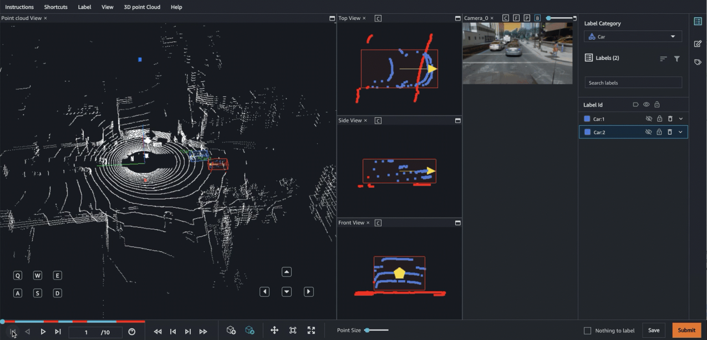

Once workers add a single cuboid, that cuboid is replicated in all frames of the sequence with
the same ID. Once workers adjust the cuboid in another frame, Ground Truth will interpolate
the movement of that object and adjust all cuboids between the manually adjusted frames. The
following GIF demonstrates this interpolation feature. In the navigation bar on the bottom-left,
red-areas indicate manually adjusted frames.

Label 3D Point Clouds
2634

## Page 664

Amazon SageMaker AI
Developer Guide

If you provide camera data for sensor fusion, images are matched up with scenes in point cloud
frames. These images appear in the worker portal as shown in the following GIF.

Worker can navigate in the 3D scene using their keyboard and mouse. They can:

• Double click on specific objects in the point cloud to zoom into them.

• Use a mouse-scroller or trackpad to zoom in and out of the point cloud.

• Use both keyboard arrow keys and Q, E, A, and D keys to move Up, Down, Left, Right. Use
keyboard keys W and S to zoom in and out.

Once a worker places a cuboids in the 3D scene, a side-view will appear with the three projected
side views: top, side, and back. These side-views show points in and around the placed cuboid and
help workers refine cuboid boundaries in that area. Workers can zoom in and out of each of those
side-views using their mouse.

The following video demonstrates movements around the 3D point cloud and in the side-view.

Label 3D Point Clouds
2635

## Page 665

Amazon SageMaker AI
Developer Guide

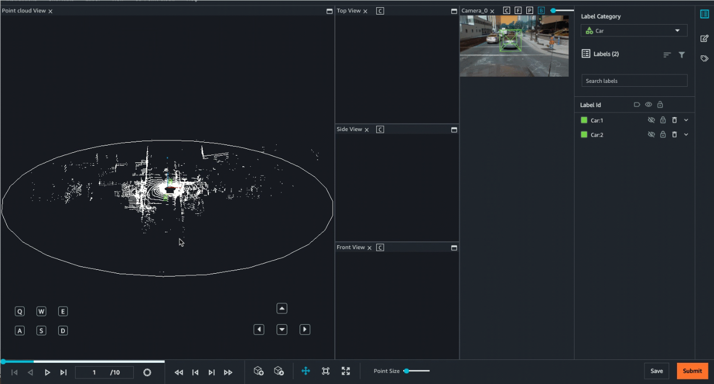

Additional view options and features are available. See the worker instruction page for a
comprehensive overview of the Worker UI.

Worker tools

Workers can navigate through the 3D point cloud by zooming in and out, and moving in all
directions around the cloud using the mouse and keyboard shortcuts. If workers click on a point
in the point cloud, the UI will automatically zoom into that area. Workers can use various tools to
draw 3D cuboid around objects. For more information, see Assistive Labeling Tools.

After workers have placed a 3D cuboid in the point cloud, they can adjust these cuboids to fit
tightly around cars using a variety of views: directly in the 3D cuboid, in a side-view featuring three
zoomed-in perspectives of the point cloud around the box, and if you include images for sensor
fusion, directly in the 2D image.

View options that enable workers to easily hide or view label text, a ground mesh, and additional
point attributes. Workers can also choose between perspective and orthogonal projections.

Assistive Labeling Tools

Label 3D Point Clouds
2636

## Page 666

Amazon SageMaker AI
Developer Guide

Ground Truth helps workers annotate 3D point clouds faster and more accurately using UX,
machine learning and computer vision powered assistive labeling tools for 3D point cloud object
tracking tasks. The following assistive labeling tools are available for this task type:

• Label autofill – When a worker adds a cuboid to a frame, a cuboid with the same dimensions and
orientation is automatically added to all frames in the sequence.

• Label interpolation – After a worker has labeled a single object in two frames, Ground Truth
uses those annotations to interpolate the movement of that object between those two frames.
Label interpolation can be turned on and off.

• Bulk label and attribute management – Workers can add, delete, and rename annotations, label
category attributes, and frame attributes in bulk.

• Workers can manually delete annotations for a given object before or after a frame. For
example, a worker can delete all labels for an object after frame 10 if that object is no longer
located in the scene after that frame.

• If a worker accidentally bulk deletes all annotations for a object, they can add them back. For
example, if a worker deletes all annotations for an object before frame 100, they can bulk add
them to those frames.

• Workers can rename a label in one frame and all 3D cuboids assigned that label are updated
with the new name across all frames.

• Workers can use bulk editing to add or edit label category attributes and frame attributes in
multiple frames.

• Snapping – Workers can add a cuboid around an object and use a keyboard shortcut or
menu option to have Ground Truth's autofit tool snap the cuboid tightly around the object's
boundaries.

• Fit to ground – After a worker adds a cuboid to the 3D scene, the worker can automatically snap
the cuboid to the ground. For example, the worker can use this feature to snap a cuboid to the
road or sidewalk in the scene.

• Multi-view labeling – After a worker adds a 3D cuboid to the 3D scene, a side -panel displays
front and two side perspectives to help the worker adjust the cuboid tightly around the object.
Workers can annotation the 3D point cloud, the side panel and the adjustments appear in the
other views in real time.

• Sensor fusion – If you provide data for sensor fusion, workers can adjust annotations in the 3D
scenes and in 2D images, and the annotations will be projected into the other view in real time.

• Auto-merge cuboids – Workers can automatically merge two cuboids across all frames if they
determine that cuboids with different labels actually represent a single object.

Label 3D Point Clouds
2637

## Page 667

Amazon SageMaker AI
Developer Guide

• View options – Enables workers to easily hide or view label text, a ground mesh, and additional
point attributes like color or intensity. Workers can also choose between perspective and
orthogonal projections.

Output data for a 3D point cloud object tracking labeling job

When you create a 3D point cloud object tracking labeling job, tasks are sent to workers. When

these workers complete their tasks, their annotations are written to the Amazon S3 bucket you
specified when you created the labeling job. The output data format determines what you see in

your Amazon S3 bucket when your labeling job status (LabelingJobStatus) is Completed.

If you are a new user of Ground Truth, see Labeling job output data to learn more about the
Ground Truth output data format. To learn about the 3D point cloud object tracking output data
format, see 3D point cloud object tracking output.

Information for creating a 3D point cloud object tracking adjustment or verification labeling
job

You can create an adjustment and verification labeling job using the Ground Truth console or

CreateLabelingJob API. To learn more about adjustment and verification labeling jobs, and to
learn how create one, see Label verification and adjustment.

When you create an adjustment labeling job, your input data to the labeling job can include labels,
and yaw, pitch, and roll measurements from a previous labeling job or external source. In the
adjustment job, pitch, and roll will be visualized in the worker UI, but cannot be modified. Yaw is
adjustable.

Ground Truth uses Tait-Bryan angles with the following intrinsic rotations to visualize yaw, pitch
and roll in the worker UI. First, rotation is applied to the vehicle according to the z-axis (yaw). Next,
the rotated vehicle is rotated according to the intrinsic y'-axis (pitch). Finally, the vehicle is rotated
according to the intrinsic x''-axis (roll).

Understand the 3D point cloud semantic segmentation task type

Semantic segmentation involves classifying individual points of a 3D point cloud into pre-
specified categories. Use this task type when you want workers to create a point-level semantic

segmentation mask for 3D point clouds. For example, if you specify the classes car, pedestrian,

and bike, workers select one class at a time, and color all of the points that this class applies to
the same color in the point cloud.

Label 3D Point Clouds
2638

## Page 668

Amazon SageMaker AI
Developer Guide

For this task type, the data object that workers label is a single point cloud frame. Ground Truth
generates a 3D point cloud visualization using point cloud data you provide. You can also provide
camera data to give workers more visual information about scenes in the frame, and to help
workers paint objects. When a worker paints an object in either the 2D image or the 3D point
cloud, the paint shows up in the other view.

You can also adjust or verify annotations created in a 3D point cloud object detection labeling job
using the 3D point cloud semantic segmentation adjustment or labeling task type. To learn more
about adjustment and verification labeling jobs, and to learn how create one, see Label verification
and adjustment.

If you are a new user of the Ground Truth 3D point cloud labeling modality, we recommend you
review 3D point cloud labeling jobs overview. This labeling modality is different from other Ground
Truth task types, and this topic provides an overview of important details you should be aware of
when creating a 3D point cloud labeling job.

The following topics explain how to create a 3D point cloud semantic segmentation job, show what
the worker task interface looks like (what workers see when they work on this task), and provide an
overview of the output data you get when workers complete their tasks.

Topics

• Create a 3D point cloud semantic segmentation labeling job

• View the worker task interface for a 3D point cloud semantic segmentation job

• Output data for a 3D point cloud semantic segmentation job

Create a 3D point cloud semantic segmentation labeling job

You can create a 3D point cloud labeling job using the SageMaker AI console or API operation,

CreateLabelingJob. To create a labeling job for this task type you need the following:

• A single-frame input manifest file. To learn how to create this type of manifest file, see Create
a Point Cloud Frame Input Manifest File. If you are a new user of Ground Truth 3D point cloud
labeling modalities, we recommend that you review Accepted Raw 3D Data Formats.

• A work team from a private or vendor workforce. You cannot use Amazon Mechanical Turk
workers for 3D point cloud labeling jobs. To learn how to create workforces and work teams, see
Workforces.

• A label category configuration file. For more information, see Labeling category configuration
file with label category and frame attributes reference.

Label 3D Point Clouds
2639

## Page 669

Amazon SageMaker AI
Developer Guide

Additionally, make sure that you have reviewed and satisfied the Assign IAM Permissions to Use
Ground Truth.

Use one of the following sections to learn how to create a labeling job using the console or an API.

Create a labeling job (console)

You can follow the instructions Create a Labeling Job (Console) in order to learn how to create a
3D point cloud semantic segmentation labeling job in the SageMaker AI console. While you are
creating your labeling job, be aware of the following:

• Your input manifest file must be a single-frame manifest file. For more information, see Create a
Point Cloud Frame Input Manifest File.

• Automated data labeling and annotation consolidation are not supported for 3D point cloud
labeling tasks.

• 3D point cloud semantic segmentation labeling jobs can take multiple hours to complete. You
can specify a longer time limit for these labeling jobs when you select your work team (up to 7
days, or 604800 seconds).

Create a labeling job (API)

This section covers details you need to know when you create a labeling job using the SageMaker

API operation CreateLabelingJob. This API defines this operation for all AWS SDKs. To see
a list of language-specific SDKs supported for this operation, review the See Also section of

CreateLabelingJob.

The page, Create a Labeling Job (API), provides an overview of the CreateLabelingJob
operation. Follow these instructions and do the following while you configure your request:

• You must enter an ARN for HumanTaskUiArn. Use

arn:aws:sagemaker:<region>:394669845002:human-task-ui/

PointCloudSemanticSegmentation. Replace <region> with the AWS Region you are
creating the labeling job in.

There should not be an entry for the UiTemplateS3Uri parameter.

• Your LabelAttributeName must end in -ref. For example, ss-labels-ref.

• Your input manifest file must be a single-frame manifest file. For more information, see Create a
Point Cloud Frame Input Manifest File.

Label 3D Point Clouds
2640

## Page 670

Amazon SageMaker AI
Developer Guide

• You specify your labels and worker instructions in a label category configuration file. See
Labeling category configuration file with label category and frame attributes reference to learn
how to create this file.

• You need to provide a pre-defined ARNs for the pre-annotation and post-annotation (ACS)

Lambda functions. These ARNs are specific to the AWS Region you use to create your labeling
job.

• To find the pre-annotation Lambda ARN, refer to PreHumanTaskLambdaArn. Use the

Region you are creating your labeling job in to find the correct ARN. For example, if

you are creating your labeling job in us-east-1, the ARN will be arn:aws:lambda:us-

east-1:432418664414:function:PRE-3DPointCloudSemanticSegmentation.

• To find the post-annotation Lambda ARN, refer to AnnotationConsolidationLambdaArn.
Use the Region you are creating your labeling job in to find the correct ARN. For example,

if you are creating your labeling job in us-east-1, the ARN will be arn:aws:lambda:us-

east-1:432418664414:function:ACS-3DPointCloudSemanticSegmentation.

• The number of workers specified in NumberOfHumanWorkersPerDataObject should be 1.

• Automated data labeling is not supported for 3D point cloud labeling jobs. You should not

specify values for parameters in LabelingJobAlgorithmsConfig.

• 3D point cloud semantic segmentation labeling jobs can take multiple hours to complete. You

can specify a longer time limit for these labeling jobs in TaskTimeLimitInSeconds (up to 7
days, or 604800 seconds).

View the worker task interface for a 3D point cloud semantic segmentation job

Ground Truth provides workers with a web portal and tools to complete your 3D point cloud
semantic segmentation annotation tasks. When you create the labeling job, you provide the

Amazon Resource Name (ARN) for a pre-built Ground Truth UI in the HumanTaskUiArn parameter.
When you create a labeling job using this task type in the console, this UI is automatically used.
You can preview and interact with the worker UI when you create a labeling job in the console. If
you are a new use, it is recommended that you create a labeling job using the console to ensure
your label attributes, point cloud frames, and if applicable, images, appear as expected.

The following is a GIF of the 3D point cloud semantic segmentation worker task interface. If you
provide camera data for sensor fusion, images are matched with scenes in the point cloud frame.
Workers can paint objects in either the 3D point cloud or the 2D image, and the paint appears
in the corresponding location in the other medium. These images appear in the worker portal as
shown in the following GIF.

Label 3D Point Clouds
2641

## Page 671

Amazon SageMaker AI
Developer Guide

Worker can navigate in the 3D scene using their keyboard and mouse. They can:

• Double click on specific objects in the point cloud to zoom into them.

• Use a mouse-scroller or trackpad to zoom in and out of the point cloud.

• Use both keyboard arrow keys and Q, E, A, and D keys to move Up, Down, Left, Right. Use
keyboard keys W and S to zoom in and out.

The following video demonstrates movements around the 3D point cloud. Workers can hide and
re-expand all side views and menus. In this GIF, the side-views and menus have been collapsed.

Label 3D Point Clouds
2642

## Page 672

Amazon SageMaker AI
Developer Guide

The following GIF demonstrates how a worker can label multiple objects quickly, refine painted
objects using the Unpaint option and then view only points that have been painted.

Label 3D Point Clouds
2643

## Page 673

Amazon SageMaker AI
Developer Guide

Additional view options and features are available. See the worker instruction page for a
comprehensive overview of the Worker UI.

Worker Tools

Workers can navigate through the 3D point cloud by zooming in and out, and moving in all
directions around the cloud using the mouse and keyboard shortcuts. When you create a semantic
segmentation job, workers have the following tools available to them:

• A paint brush to paint and unpaint objects. Workers paint objects by selecting a label category
and then painting in the 3D point cloud. Workers unpaint objects by selecting the Unpaint option
from the label category menu and using the paint brush to erase paint.

• A polygon tool that workers can use to select and paint an area in the point cloud.

• A background paint tool, which enables workers to paint behind objects they have already
annotated without altering the original annotations. For example, workers might use this tool to
paint the road after painting all of the cars on the road.

• View options that enable workers to easily hide or view label text, a ground mesh, and additional
point attributes like color or intensity. Workers can also choose between perspective and
orthogonal projections.

Output data for a 3D point cloud semantic segmentation job

When you create a 3D point cloud semantic segmentation labeling job, tasks are sent to workers.
When these workers complete their tasks, their annotations are written to the Amazon S3 bucket
you specified when you created the labeling job. The output data format determines what you see

in your Amazon S3 bucket when your labeling job status (LabelingJobStatus) is Completed.

If you are a new user of Ground Truth, see Labeling job output data to learn more about the
Ground Truth output data format. To learn about the 3D point cloud object detection output data
format, see 3D point cloud semantic segmentation output.

Understand the 3D-2D point cloud object tracking task type

Use this task type when you want workers to link 3D point cloud annotations with 2D images
annotations and also link 2D image annotations among various cameras. Currently, Ground Truth
supports cuboids for annotation in a 3D point cloud and bounding boxes for annotation in 2D
videos. For example, you can use this task type to ask workers to link the movement of a vehicle
in 3D point cloud with its 2D video. Using 3D-2D linking, you can easily correlate point cloud data
(like the distance of a cuboid) to video data (bounding box) for up to 8 cameras.

Label 3D Point Clouds
2644

## Page 674

Amazon SageMaker AI
Developer Guide

Ground Truth provides workers with tools to annotate cuboids in a 3D point cloud and bounding
boxes in up to 8 cameras using the same annotation UI. Workers can also link various bounding
boxes for the same object across different cameras. For example, a bounding box in camera1
can be linked to a bounding box in camera2. This lets you to correlate an object across multiple
cameras using a unique ID.

Note

Currently, SageMaker AI does not support creating a 3D-2D linking job using the console.
To create a 3D-2D linking job using the SageMaker API, see Create a labeling job (API).

The following topics explain how to create a 3D-2D point cloud object tracking labeling job, show
what the worker task interface looks like (what workers see when they work on this task), and

provide an overview of the output data you get when workers complete their tasks.

Topics

• Create a 3D-2D point cloud object tracking labeling job

• View the worker task interface for a 3D-2D object tracking labeling job

• Output data for a 3D-2D object tracking labeling job

Create a 3D-2D point cloud object tracking labeling job

You can create a 3D-2D point cloud labeling job using the SageMaker API operation,

CreateLabelingJob. To create a labeling job for this task type you need the following:

• A work team from a private or vendor workforce. You cannot use Amazon Mechanical Turk for 3D
point cloud labeling jobs. To learn how to create workforces and work teams, see Workforces.

• Add a CORS policy to an S3 bucket that contains input data in the Amazon S3 console. To set
the required CORS headers on the S3 bucket that contains your input images in the S3 console,
follow the directions detailed in CORS Permission Requirement.

• Additionally, make sure that you have reviewed and satisfied the Assign IAM Permissions to Use
Ground Truth.

To learn how to create a labeling job using the API, see the following sections.

Label 3D Point Clouds
2645

## Page 675

Amazon SageMaker AI
Developer Guide

Create a labeling job (API)

This section covers details you need to know when you create a 3D-2D object tracking labeling job

using the SageMaker API operation CreateLabelingJob. This API defines this operation for all

AWS SDKs. To see a list of language-specific SDKs supported for this operation, review the See Also

section of CreateLabelingJob.

Create a Labeling Job (API) provides an overview of the CreateLabelingJob operation. Follow
these instructions and do the following while you configure your request:

• You must enter an ARN for HumanTaskUiArn. Use

arn:aws:sagemaker:<region>:394669845002:human-task-ui/

PointCloudObjectTracking. Replace <region> with the AWS Region you are creating the
labeling job in.

There should not be an entry for the UiTemplateS3Uri parameter.

• Your LabelAttributeName must end in -ref. For example, ot-labels-ref.

• Your input manifest file must be a point cloud frame sequence manifest file. For more
information, see Create a Point Cloud Sequence Input Manifest. You also need to provide a label
category configuration file as mentioned above.

• You need to provide pre-defined ARNs for the pre-annotation and post-annotation (ACS)
Lambda functions. These ARNs are specific to the AWS Region you use to create your labeling
job.

• To find the pre-annotation Lambda ARN, refer to PreHumanTaskLambdaArn. Use the
Region you are creating your labeling job in to find the correct ARN that ends with

PRE-3DPointCloudObjectTracking.

• To find the post-annotation Lambda ARN, refer to AnnotationConsolidationLambdaArn.
Use the Region you are creating your labeling job in to find the correct ARN that ends with

ACS-3DPointCloudObjectTracking.

• The number of workers specified in NumberOfHumanWorkersPerDataObject should be 1.

• Automated data labeling is not supported for 3D point cloud labeling jobs. You should not

specify values for parameters in LabelingJobAlgorithmsConfig.

• 3D-2D object tracking labeling jobs can take multiple hours to complete. You can specify

a longer time limit for these labeling jobs in TaskTimeLimitInSeconds (up to 7 days, or
604,800 seconds).

Label 3D Point Clouds
2646

## Page 676

Amazon SageMaker AI
Developer Guide

Note

After you have successfully created a 3D-2D object tracking job, it shows up on the console
under labeling jobs. The task type for the job is displayed as Point Cloud Object Tracking.

Input data format

You can create a 3D-2D object tracking job using the SageMaker API operation,

CreateLabelingJob. To create a labeling job for this task type you need the following:

• A sequence input manifest file. To learn how to create this type of manifest file, see Create a
Point Cloud Sequence Input Manifest. If you are a new user of Ground Truth 3D point cloud
labeling modalities, we recommend that you review Accepted Raw 3D Data Formats.

• You specify your labels, label category and frame attributes, and worker instructions in a label
category configuration file. For more information, see Create a Labeling Category Configuration
File with Label Category and Frame Attributes to learn how to create this file. The following is an
example showing a label category configuration file for creating a 3D-2D object tracking job.

{
"document-version": "2020-03-01",
"categoryGlobalAttributes": [
{
"name": "Occlusion",
"description": "global attribute that applies to all label categories",
"type": "string",
"enum":[
"Partial",
"Full"
]
}
],
"labels":[
{
"label": "Car",
"attributes": [
{
"name": "Type",
"type": "string",
"enum": [
"SUV",

Label 3D Point Clouds
2647

## Page 677

Amazon SageMaker AI
Developer Guide

"Sedan"
]
}
]
},
{
"label": "Bus",
"attributes": [
{
"name": "Size",
"type": "string",
"enum": [
"Large",
"Medium",
"Small"
]
}

]
}
],
"instructions": {
"shortIntroduction": "Draw a tight cuboid around objects after you select a
category.",
"fullIntroduction": "
Use this area to add more detailed worker
instructions.
"
},
"annotationType": [
{
"type": "BoundingBox"
},
{
"type": "Cuboid"
}
]
}

Note

You need to provide BoundingBox and Cuboid as annotationType in the label category
configuration file to create a 3D-2D object tracking job.

Label 3D Point Clouds
2648

## Page 678

Amazon SageMaker AI
Developer Guide

View the worker task interface for a 3D-2D object tracking labeling job

Ground Truth provides workers with a web portal and tools to complete your 3D-2D object tracking
annotation tasks. When you create the labeling job, you provide the Amazon Resource Name (ARN)

for a pre-built Ground Truth UI in the HumanTaskUiArn parameter. To use the UI when you create

a labeling job for this task type using the API, you need to provide the HumanTaskUiArn. You
can preview and interact with the worker UI when you create a labeling job through the API. The
annotating tools are a part of the worker task interface. They are not available for the preview
interface. The following image demonstrates the worker task interface used for the 3D-2D point
cloud object tracking annotation task.

When interpolation is enabled by default. After a worker adds a single cuboid, that cuboid is
replicated in all frames of the sequence with the same ID. If the worker adjusts the cuboid in
another frame, Ground Truth interpolates the movement of that object and adjust all cuboids
between the manually adjusted frames. Additionally, using the camera view section, a cuboid
can be shown with a projection (using to B button for "toggle labels" in the camera view) that
provides the worker with a reference from the camera images. The accuracy of the cuboid to image
projection is based on accuracy of calibrations captured in the extrinsic and intrinsinc data.

Label 3D Point Clouds
2649

## Page 679

Amazon SageMaker AI
Developer Guide

If you provide camera data for sensor fusion, images are matched up with scenes in point cloud
frames. Note that the camera data should be time synchronized with the point cloud data to
ensure an accurate depiction of point cloud to imagery over each frame in the sequence as shown
in the following image.

The manifest file holds the extrinsic and intrinsic data and the pose to allow the cuboid projection
on the camera image to be shown by using the P button.

Worker can navigate in the 3D scene using their keyboard and mouse. They can:

• Double click on specific objects in the point cloud to zoom into them.

• Use a mouse-scroller or trackpad to zoom in and out of the point cloud.

• Use both keyboard arrow keys and Q, E, A, and D keys to move Up, Down, Left, Right. Use
keyboard keys W and S to zoom in and out.

Once a worker places a cuboids in the 3D scene, a side-view appears with the three projected side
views: top, side, and front. These side-views show points in and around the placed cuboid and help
workers refine cuboid boundaries in that area. Workers can zoom in and out of each of those side-
views using their mouse.

The worker should first select the cuboid to draw a corresponding bounding box on any of the
camera views. This links the cuboid and the bounding box with a common name and unique ID.

The worker can also first draw a bounding box, select it and draw the corresponding cuboid to link
them.

Label 3D Point Clouds
2650

## Page 680

Amazon SageMaker AI
Developer Guide

Additional view options and features are available. See the worker instruction page for a
comprehensive overview of the Worker UI.

Worker tools

Workers can navigate through the 3D point cloud by zooming in and out, and moving in all
directions around the cloud using the mouse and keyboard shortcuts. If workers click on a point in
the point cloud, the UI automatically zooms into that area. Workers can use various tools to draw
3D cuboid around objects. For more information, see Assistive Labeling Tools in the following
discussion.

After workers have placed a 3D cuboid in the point cloud, they can adjust these cuboids to fit
tightly around cars using a variety of views: directly in the 3D point cloud, in a side-view featuring
three zoomed-in perspectives of the point cloud around the box, and if you include images for
sensor fusion, directly in the 2D image.

Additional view options enable workers to easily hide or view label text, a ground mesh, and
additional point attributes. Workers can also choose between perspective and orthogonal
projections.

Assistive Labeling Tools

Ground Truth helps workers annotate 3D point clouds faster and more accurately using UX,
machine learning and computer vision powered assistive labeling tools for 3D point cloud object
tracking tasks. The following assistive labeling tools are available for this task type:

• Label autofill – When a worker adds a cuboid to a frame, a cuboid with the same dimensions,
orientation and xyz position is automatically added to all frames in the sequence.

• Label interpolation – After a worker has labeled a single object in two frames, Ground Truth
uses those annotations to interpolate the movement of that object between all the frames.
Label interpolation can be turned on and off. It is on by default. For example, if a worker working
with 5 frames adds a cuboid in frame 2, it is copied to all the 5 frames. If the worker then makes
adjustments in frame 4, frame 2 and 4 now act as two points, through which a line is fit. The
cuboid is then interpolated in frames 1,3 and 5.

• Bulk label and attribute management – Workers can add, delete, and rename annotations, label
category attributes, and frame attributes in bulk.

• Workers can manually delete annotations for a given object before and after a frame, or in all
frames. For example, a worker can delete all labels for an object after frame 10 if that object is
no longer located in the scene after that frame.

Label 3D Point Clouds
2651

## Page 681

Amazon SageMaker AI
Developer Guide

• If a worker accidentally bulk deletes all annotations for a object, they can add them back. For
example, if a worker deletes all annotations for an object before frame 100, they can bulk add
them to those frames.

• Workers can rename a label in one frame and all 3D cuboids assigned that label are updated
with the new name across all frames.

• Workers can use bulk editing to add or edit label category attributes and frame attributes in
multiple frames.

• Snapping – Workers can add a cuboid around an object and use a keyboard shortcut or
menu option to have Ground Truth's autofit tool snap the cuboid tightly around the object's
boundaries.

• Fit to ground – After a worker adds a cuboid to the 3D scene, the worker can automatically snap
the cuboid to the ground. For example, the worker can use this feature to snap a cuboid to the
road or sidewalk in the scene.

• Multi-view labeling – After a worker adds a 3D cuboid to the 3D scene, a side-panel displays
front and two side perspectives to help the worker adjust the cuboid tightly around the object.
Workers can annotation the 3D point cloud, the side panel and the adjustments appear in the
other views in real time.

• Sensor fusion – If you provide data for sensor fusion, workers can adjust annotations in the 3D
scenes and in 2D images, and the annotations are projected into the other view in real time. To
learn more about the data for sensor fusion, see Understand Coordinate Systems and Sensor
Fusion.

• Auto-merge cuboids – Workers can automatically merge two cuboids across all frames if they
determine that cuboids with different labels actually represent a single object.

• View options – Enables workers to easily hide or view label text, a ground mesh, and additional
point attributes like color or intensity. Workers can also choose between perspective and
orthogonal projections.

Output data for a 3D-2D object tracking labeling job

When you create a 3D-2D object tracking labeling job, tasks are sent to workers. When these
workers complete their tasks, their annotations are written to the Amazon S3 bucket you specified
when you created the labeling job. The output data format determines what you see in your

Amazon S3 bucket when your labeling job status (LabelingJobStatus) is Completed.

Label 3D Point Clouds
2652

## Page 682

Amazon SageMaker AI
Developer Guide

If you are a new user of Ground Truth, see Labeling job output data to learn more about the
Ground Truth output data format. To learn about the 3D-2D point cloud object tracking output
data format, see 3D-2D object tracking point cloud object tracking output.

3D point cloud labeling jobs overview

This topic provides an overview of the unique features of a Ground Truth 3D point cloud labeling
job. You can use the 3D point cloud labeling jobs to have workers label objects in a 3D point cloud
generated from a 3D sensors like LiDAR and depth cameras or generated from 3D reconstruction
by stitching images captured by an agent like a drone.

Job pre-processing time

When you create a 3D point cloud labeling job, you need to provide an input manifest file. The
input manifest file can be:

• A frame input manifest file that has a single point cloud frame on each line.

• A sequence input manifest file that has a single sequence on each line. A sequence is defined as a
temporal series of point cloud frames.

For both types of manifest files, job pre-processing time (that is, the time before Ground Truth
starts sending tasks to your workers) depends on the total number and size of point cloud frames
you provide in your input manifest file. For frame input manifest files, this is the number of lines
in your manifest file. For sequence manifest files, this is the number of frames in each sequence
multiplied by the total number of sequences, or lines, in your manifest file.

Additionally, the number of points per point cloud and the number of fused sensor data objects
(like images) factor into job pre-processing times. On average, Ground Truth can pre-process 200
point cloud frames in approximately 5 minutes. If you create a 3D point cloud labeling job with
a large number of point cloud frames, you might experience longer job pre-processing times.
For example, if you create a sequence input manifest file with 4 point cloud sequences, and each
sequence contains 200 point clouds, Ground Truth pre-processes 800 point clouds and so your
job pre-processing time might be around 20 minutes. During this time, your labeling job status is

InProgress.

While your 3D point cloud labeling job is pre-processing, you receive CloudWatch
messages notifying you of the status of your job. To identify these messages, search for

3D_POINT_CLOUD_PROCESSING_STATUS in your labeling job logs.

Label 3D Point Clouds
2653

## Page 683

Amazon SageMaker AI
Developer Guide

For frame input manifest files, your CloudWatch logs will have a message similar to the following:

{
"labeling-job-name": "example-point-cloud-labeling-job",
"event-name": "3D_POINT_CLOUD_PROCESSING_STATUS",
"event-log-message": "datasetObjectId from: 0 to 10, status: IN_PROGRESS"
}

The event log message, datasetObjectId from: 0 to 10, status: IN_PROGRESS
identifies the number of frames from your input manifest that have been processed. You receive
a new message every time a frame has been processed. For example, after a single frame has

processed, you receive another message that says datasetObjectId from: 1 to 10,

status: IN_PROGRESS.

For sequence input manifest files, your CloudWatch logs will have a message similar to the

following:

{
"labeling-job-name": "example-point-cloud-labeling-job",
"event-name": "3D_POINT_CLOUD_PROCESSING_STATUS",
"event-log-message": "datasetObjectId: 0, status: IN_PROGRESS"
}

The event log message, datasetObjectId from: 0, status: IN_PROGRESS identifies
the number of sequences from your input manifest that have been processed. You receive a
new message every time a sequence has been processed. For example, after a single sequence

has processed, you receive a message that says datasetObjectId from: 1, status:

IN_PROGRESS as the next sequence begins processing.

Job completion times

3D point cloud labeling jobs can take workers hours to complete. You can set the total amount of
time that workers can work on each task when you create a labeling job. The maximum time you
can set for workers to work on tasks is 7 days. The default value is 3 days.

It is strongly recommended that you create tasks that workers can complete within 12 hours.
Workers must keep the worker UI open while working on a task. They can save work as they go and
Ground Truth will save their work every 15 minutes.

When using the SageMaker AI CreateLabelingJob API operation, set the total time a task is

available to workers in the TaskTimeLimitInSeconds parameter of HumanTaskConfig.

Label 3D Point Clouds
2654

## Page 684

Amazon SageMaker AI
Developer Guide

When you create a labeling job in the console, you can specify this time limit when you select your
workforce type and your work team.

Workforces

When you create a 3D point cloud labeling job, you need to specify a work team that will complete
your point cloud annotation tasks. You can choose a work team from a private workforce of your
own workers, or from a vendor workforce that you select in the AWS Marketplace. You cannot use
the Amazon Mechanical Turk workforce for 3D point cloud labeling jobs.

To learn more about vendor workforce, see Subscribe to vendor workforces.

To learn how to create and manage a private workforce, see Private workforce.

Worker user interface (UI)

Ground Truth provides a worker user interface (UI), tools, and assistive labeling features to help
workers complete your 3D point cloud labeling tasks.

You can preview the worker UI when you create a labeling job in the console.

When you create a labeling job using the API operation CreateLabelingJob, you must provide

an ARN provided by Ground Truth in the parameter HumanTaskUiArn to specify the worker UI for

your task type. You can use HumanTaskUiArn with the SageMaker AI RenderUiTemplate API
operation to preview the worker UI.

You provide worker instructions, labels, and optionally, label category attributes that are displayed
in the worker UI.

Label category attributes

When you create a 3D point cloud object tracking or object detection labeling job, you can add one
or more label category attributes. You can add frame attributes to all 3D point cloud task types:

• Label category attribute – A list of options (strings), a free form text box, or a numeric field
associated with one or more labels. It is used by workers to to provide metadata about a label.

• Frame attribute – A list of options (strings), a free form text box, or a numeric field that appears
on each point cloud frame a worker is sent to annotate. It is used by workers to provide metadata
about frames.

Label 3D Point Clouds
2655

## Page 685

Amazon SageMaker AI
Developer Guide

Additionally, you can use label and frame attributes to have workers verify labels in a 3D point
cloud label verification job.

Use the following sections to learn more about these attributes. To learn how to add label category

and frame attributes to a labeling job, use the Create Labeling Job section on the task type page

of your choice.

Label category attributes

Add label category attributes to labels to give workers the ability to provide more information
about the annotations they create. A label category attribute is added to an individual label, or to
all labels. When a label category attribute is applied to all labels it is referred to as a global label
category attribute.

For example, if you add the label category car, you might also want to capture additional data
about your labeled cars, such as if they are occluded or the size of the car. You can capture this

metadata using label category attributes. In this example, if you added the attribute occluded to
the car label category, you can assign partial, completely, no to the occluded attribute and enable
workers to select one of these options.

When you create a label verification job, you add labels category attributes to each label you want
workers to verify.

Frame attributes

Add frame attributes to give workers the ability to provide more information about individual point
cloud frames. You can specify up to 10 frame attributes, and these attributes will appear on all
frames.

For example, you can add a frame attribute that allows workers to enter a number. You may want
to use this attribute to have workers identify the number of objects they see in a particular frame.

In another example, you may want to provide a free-form text box to give workers the ability to
provide a free form answer to a question.

When you create a label verification job, you can add one or more frame attributes to ask workers
to provide feedback on all labels in a point cloud frame.

Worker instructions

You can provide worker instructions to help your workers complete your point cloud labeling tasks.
You might want to use these instructions to do the following:

Label 3D Point Clouds
2656

## Page 686

Amazon SageMaker AI
Developer Guide

• Best practices and things to avoid when annotating objects.

• Explanation of the label category attributes provided (for object detection and object tracking
tasks), and how to use them.

• Advice on how to save time while labeling by using keyboard shortcuts.

You can add your worker instructions using the SageMaker AI console while creating a labeling

job. If you create a labeling job using the API operation CreateLabelingJob, you specify worker
instructions in your label category configuration file.

In addition to your instructions, Ground Truth provides a link to help workers navigate and use the
worker portal. View these instructions by selecting the task type on Worker instructions.

Declining tasks

Workers are able to decline tasks.

Workers decline a task if the instructions are not clear, input data is not displaying correctly, or
if they encounter some other issue with the task. If the number of workers per dataset object

(NumberOfHumanWorkersPerDataObject) decline the task, the data object is marked as expired
and will not be sent to additional workers.

3D point cloud labeling job permission requirements

When you create a 3D point cloud labeling job, in addition to the permission requirements found
in Assign IAM Permissions to Use Ground Truth, you must add a CORS policy to your S3 bucket that
contains your input manifest file.

Add a CORS permission policy to S3 bucket

When you create a 3D point cloud labeling job, you specify buckets in S3 where your input data
and manifest file are located and where your output data will be stored. These buckets may be the
same. You must attach the following Cross-origin resource sharing (CORS) policy to your input and
output buckets. If you use the Amazon S3 console to add the policy to your bucket, you must use
the JSON format.

JSON

[
{
"AllowedHeaders": [
"*"

Label 3D Point Clouds
2657

## Page 687

Amazon SageMaker AI
Developer Guide

],
"AllowedMethods": [
"GET",
"HEAD",
"PUT"
],
"AllowedOrigins": [
"*"
],
"ExposeHeaders": [
"Access-Control-Allow-Origin"
],
"MaxAgeSeconds": 3000
}
]

XML

<?xml version="1.0" encoding="UTF-8"?>
<CORSConfiguration xmlns="http://s3.amazonaws.com/doc/2006-03-01/">
<CORSRule>
<AllowedOrigin>*</AllowedOrigin>
<AllowedMethod>GET</AllowedMethod>
<AllowedMethod>HEAD</AllowedMethod>
<AllowedMethod>PUT</AllowedMethod>
<MaxAgeSeconds>3000</MaxAgeSeconds>
<ExposeHeader>Access-Control-Allow-Origin</ExposeHeader>
<AllowedHeader>*</AllowedHeader>
</CORSRule>
</CORSConfiguration>

To learn how to add a CORS policy to an S3 bucket, see How do I add cross-domain resource
sharing with CORS? in the Amazon Simple Storage Service User Guide.

Worker instructions

This topic provides an overview of the Ground Truth worker portal and the tools available to
complete your 3D Point Cloud labeling task. First, select the type of task you are working on from
Topics.

For adjustment jobs, select the original labeling job task type that produced the labels you are
adjusting. Review and adjust the labels in your task as needed.

Label 3D Point Clouds
2658

## Page 688

Amazon SageMaker AI
Developer Guide

Important

It is recommended that you complete your task using a Google Chrome or Firefox web
browser.

Topics

• 3D point cloud semantic segmentation

• 3D point cloud object detection

• 3D point cloud object tracking

3D point cloud semantic segmentation

Use this page to become familiarize with the user interface and tools available to complete your 3D
point cloud semantic segmentation task.

Topics

• Your Task

• Navigate the UI

• Icon Guide

• Shortcuts

• Release, Stop and Resume, and Decline Tasks

• Saving Your Work and Submitting

Your Task

When you work on a 3D point cloud semantic segmentation task, you need to select a category
from the Annotations menu on the right side of your worker portal using the drop down menu
Label Categories. After you've selected a category, use the paint brush and polygon tools to paint
each object in the 3D point cloud that this category applies to. For example, if you select the
category Car, you would use these tools to paint all of the cars in the point cloud. The following
video demonstrates how to use the paint brush tool to paint an object.

If you see one or more images in your worker portal, you can paint in the images or paint in the 3D
point cloud and the paint will show up in the other medium.

Label 3D Point Clouds
2659

## Page 689

Amazon SageMaker AI
Developer Guide

You may see frame attributes under the Labels menu. Use these attribute prompts to enter
additional information about the point cloud.

Important

If you see that objects have already been painted when you open the task, adjust those
annotations.

The following video includes an image that can be annotated. You may not see an image in your
task.

Label 3D Point Clouds
2660

## Page 690

Amazon SageMaker AI
Developer Guide

After you've painted one or more objects using a label category, you can select that category from
the Label Category menu on the right to only view points painted for that category.

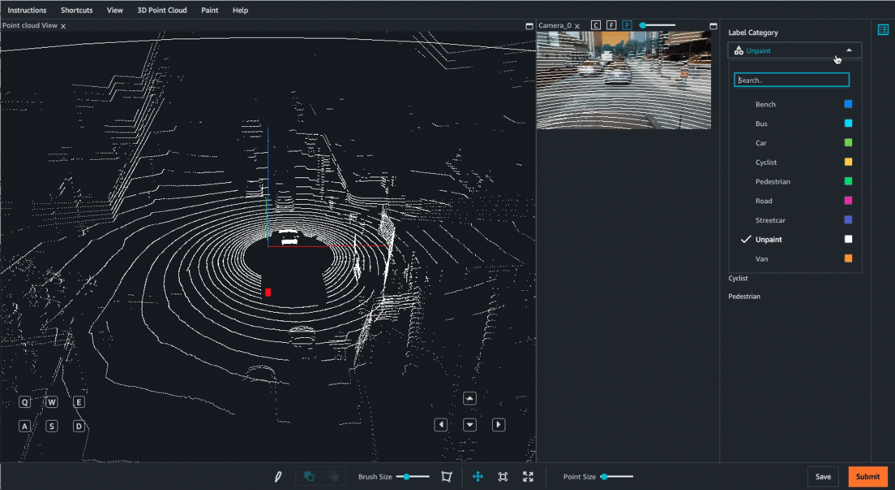

Label 3D Point Clouds
2661

## Page 691

Amazon SageMaker AI
Developer Guide

Navigate the UI

You can navigate in the 3D scene using their keyboard and mouse. You can:

• Double click on specific objects in the point cloud to zoom into them.

• Use a mouse-scroller or trackpad to zoom in and out of the point cloud.

• Use both keyboard arrow keys and Q, E, A, and D keys to move Up, Down, Left, Right. Use
keyboard keys W and S to zoom in and out.

The following video demonstrates movements around the 3D point cloud and in the side-view.
You can hide and re-expand all side views using the full screen icon. In this GIF, the side-views and
menus have been collapsed.

When you are in the worker UI, you see the following menus:

• Instructions – Review these instructions before starting your task.

• Shortcuts – Use this menu to view keyboard shortcuts that you can use to navigate the point
cloud and use the annotation tools provided.

• View – Use this menu to toggle different view options on and off. For example, you can use this
menu to add a ground mesh to the point cloud, and to choose the projection of the point cloud.

Label 3D Point Clouds
2662

## Page 692

Amazon SageMaker AI
Developer Guide

• 3D Point Cloud – Use this menu to add additional attributes to the points in the point cloud,
such as color, and pixel intensity. Note that some or all of these options may not be available.

• Paint – Use this menu to modify the functionality of the paint brush.

When you open a task, the move scene icon is on, and you can move around the point cloud using
your mouse and the navigation buttons in the point cloud area of the screen. To return to the
original view you see when you first opened the task, choose the reset scene icon.

After you select the paint icon, you can add paint to the point cloud and images (if included). You
must select the move scene icon again to move to another area in the 3D point cloud or image.

To collapse all panels on the right and make the 3D point cloud full screen, select the full screen
icon.

For the camera images and side-panels, you have the following view options:

• C – View the camera angle on point cloud view.

• F – View the frustum, or field of view, of the camera used to capture that image on point cloud
view.

• P – View the point cloud overlaid on the image.

Icon Guide

Use this table to learn about the icons available in your worker task portal.

Icon
Name
Description

brush
Choose this icon to turn on the brush tool. To use with
this tool, choose and move over the objects that you
want to paint with your mouse. After you choose it,
everything you paint be associated with the category
you chose.

polygon
Choose this icon to use the polygon paint tool. Use this
tool to draw polygons around objects that you want
to paint. After you choose it, everything you draw a
polygon around will be associated with the category you
have chosen.

Label 3D Point Clouds
2663

## Page 693

Amazon SageMaker AI
Developer Guide

Icon
Name
Description

reset scene
Choose this icon to reset the view of the point cloud,
side panels, and if applicable, all images to their original
position when the task was first opened.

move scene
Choose this icon to move the scene. By default, this icon
will be selected when you first start a task.

full screen
Choose this icon to make the 3D point cloud visualiza
tion full screen, and to collapse all side panels.

Label 3D Point Clouds
2664

## Page 694

Amazon SageMaker AI
Developer Guide

Icon
Name
Description

ruler
Use this icon to measure distances, in meters, in the
point cloud. You may want to use this tool if your
instructions ask you to annotate all objects in a given
distance from the center of the cuboid or the object
used to capture data.

When you select this icon, you can place the starting
point (first marker) anywhere in the point cloud by
selecting it with your mouse. The tool will automatically
use interpolation to place a marker on the closest point
within threshold distance to the location you select,
otherwise the marker will be placed on ground. If you
place a starting point by mistake, you can use the Escape
key to revert marker placement.

After you place the first marker, you see a dotted line
and a dynamic label that indicates the distance you have
moved away from the first marker. Click somewhere else
on the point cloud to place a second marker. When you
place the second marker, the dotted line becomes solid,
and the distance is set.

After you set a distance, you can edit it by selecting
either marker. You can delete a ruler by selecting
anywhere on the ruler and using the Delete key on your
keyboard.

Shortcuts

The shortcuts listed in the Shortcuts menu can help you navigate the 3D point cloud and use the
paint tool.

Before you start your task, it is recommended that you review the Shortcuts menu and become
acquainted with these commands.

Label 3D Point Clouds
2665

## Page 695

Amazon SageMaker AI
Developer Guide

Release, Stop and Resume, and Decline Tasks

When you open the labeling task, three buttons on the top right allow you to decline the task
(Decline task), release it (Release task), and stop and resume it at a later time (Stop and resume
later). The following list describes what happens when you select one of these options:

• Decline task: You should only decline a task if something is wrong with the task, such as an issue
with the 3D point cloud, images or the UI. If you decline a task, you will not be able to return to

the task.

• Release Task: If you release a task, you loose all work done on that task. When the task is
released, other workers on your team can pick it up. If enough workers pick up the task, you
may not be able to return to it. When you select this button and then select Confirm, you are
returned to the worker portal. If the task is still available, its status will be Available. If other
workers pick it up, it will disappear from your portal.

• Stop and resume later: You can use the Stop and resume later button to stop working and
return to the task at a later time. You should use the Save button to save your work before you
select Stop and resume later. When you select this button and then select Confirm, you are
returned to the worker portal, and the task status is Stopped. You can select the same task to
resume work on it.

Be aware that the person that creates your labeling tasks specifies a time limit in which all
tasks much be completed by. If you do not return to and complete this task within that time
limit, it will expire and your work will not be submitted. Contact your administrator for more
information.

Saving Your Work and Submitting

You should periodically save your work. Ground Truth will automatically save your work ever 15
minutes.

When you open a task, you must complete your work on it before pressing Submit.

3D point cloud object detection

Use this page to familiarize yourself with the user interface and tools available to complete your
3D point cloud object detection task.

Topics

• Your Task

Label 3D Point Clouds
2666

## Page 696

Amazon SageMaker AI
Developer Guide

• Navigate the UI

• Icon Guide

• Shortcuts

• Release, Stop and Resume, and Decline Tasks

• Saving Your Work and Submitting

Your Task

When you work on a 3D point cloud object detection task, you need to select a category from the
Annotations menu on the right side of your worker portal using the Label Categories menu. After
you've chosen a category, use the add cuboid and fit cuboid tools to fit a cuboid around objects
in the 3D point cloud that this category applies to. After you place a cuboid, you can modify its
dimensions, location, and orientation directly in the point cloud, and the three panels shown on
the right.

If you see one or more images in your worker portal, you can also modify cuboids in the images or
in the 3D point cloud and the edits will show up in the other medium.

If you see cuboids have already been added to the 3D point cloud when you open your task, adjust
those cuboids and add additional cuboids as needed.

To edit a cuboid, including moving, re-orienting, and changing cuboid dimensions, you must
use shortcut keys. You can see a full list of shortcut keys in the Shortcuts menu in your UI. The
following are important key-combinations that you should become familiar with before starting
your labeling task.

Mac Command
Windows Command
Action

Cmd + Drag
Ctrl + Drag
Modify the dimensions of the
cuboid.

Option + Drag
Alt + Drag
Move the cuboid.

Shift + Drag
Shift + Drag
Rotate the cuboid.

Option + O
Alt + O
Fit the cuboid tightly around
the points it has been drawn
around. Before using the

Label 3D Point Clouds
2667

## Page 697

Amazon SageMaker AI
Developer Guide

Mac Command
Windows Command
Action

option, make sure the cuboid
fully-surrounds the object of
interest.

Option + G
Alt + G
Set the cuboid to the ground.

Individual labels may have one or more label attributes. If a label has a label attribute associated
with it, it will appear when you select the downward pointing arrow next to the label from the
Label Id menu. Fill in required values for all label attributes.

You may see frame attributes under the Labels menu. Use these attribute prompts to enter
additional information about each frame.

Navigate the UI

You can navigate in the 3D scene using your keyboard and mouse. You can:

Label 3D Point Clouds
2668

## Page 698

Amazon SageMaker AI
Developer Guide

• Double click on specific objects in the point cloud to zoom into them.

• You can use the [ and ] keys on your keyboard to zoom into and move from one label to the next.
If no label is selected, when you select [ or ], the UI will zoom into the first label in the Lable Id
list.

• Use a mouse-scroller or trackpad to zoom in and out of the point cloud.

• Use both keyboard arrow keys and Q, E, A, and D keys to move Up, Down, Left, Right. Use
keyboard keys W and S to zoom in and out.

Once you place a cuboids in the 3D scene, a side-view will appear with three projected views: top,
side, and back. These side-views show points in and around the placed cuboid and help workers
refine cuboid boundaries in that area. Workers can zoom in and out of each of those side-views
using their mouse.

The following video demonstrates movements around the 3D point cloud and in the side-view.

When you are in the worker UI, you see the following menus:

• Instructions – Review these instructions before starting your task.

• Shortcuts – Use this menu to view keyboard shortcuts that you can use to navigate the point
cloud and use the annotation tools provided.

Label 3D Point Clouds
2669

## Page 699

Amazon SageMaker AI
Developer Guide

• Label – Use this menu to modify a cuboid. First, select a cuboid, and then choose an option from
this menu. This menu includes assistive labeling tools like setting a cuboid to the ground and
automatically fitting the cuboid to the object's boundaries.

• View – Use this menu to toggle different view options on and off. For example, you can use this

menu to add a ground mesh to the point cloud, and to choose the projection of the point cloud.

• 3D Point Cloud – Use this menu to add additional attributes to the points in the point cloud,
such as color, and pixel intensity. Note that these options may not be available.

When you open a task, the move scene icon is on, and you can move around the point cloud using
your mouse and the navigation buttons in the point cloud area of the screen. To return to the
original view you see when you first opened the task, choose the reset scene icon. Resetting the
view will not modify your annotations.

After you select the add cuboid icon, you can add cuboids to the 3D point cloud visualization. Once
you've added a cuboid, you can adjust it in the three views (top, side, and front) and in the images
(if included).

You must choose the move scene icon again to move to another area in the 3D point cloud or
image.

To collapse all panels on the right and make the 3D point cloud full-screen, choose the full screen
icon.

Label 3D Point Clouds
2670

## Page 700

Amazon SageMaker AI
Developer Guide

If camera images are included, you may have the following view options:

• C – View the camera angle on point cloud view.

• F – View the frustum, or field of view, of the camera used to capture that image on point cloud
view.

• P – View the point cloud overlaid on the image.

• B – View cuboids in the image.

The following video demonstrates how to use these view options. The F option is used to view the
field of view of the camera (the gray area), the C options shows the direction the camera is facing
and angle of the camera (blue lines), and the B option is used to view the cuboid.

Icon Guide

Use this table to learn about the icons you see in your worker task portal.

Icon
Name
Description

add cuboid
Choose this icon to add a cuboid. Each cuboid you add is
associated with the category you chose.

edit cuboid
Choose this icon to edit a cuboid. After you have added
a cuboid, you can edit its dimensions, location, and

Label 3D Point Clouds
2671

## Page 701

Amazon SageMaker AI
Developer Guide

Icon
Name
Description

orientation. After a cuboid is added, it automatically
switches to edit cuboid mode.

ruler
Use this icon to measure distances, in meters, in the
point cloud. You may want to use this tool if your
instructions ask you to annotate all objects in a given
distance from the center of the cuboid or the object
used to capture data.

When you select this icon, you can place the starting
point (first marker) anywhere in the point cloud by
selecting it with your mouse. The tool will automatically
use interpolation to place a marker on the closest point
within threshold distance to the location you select,
otherwise the marker will be placed on ground. If you
place a starting point by mistake, you can use the Escape
key to revert marker placement.

After you place the first marker, you see a dotted line
and a dynamic label that indicates the distance you have
moved away from the first marker. Click somewhere else
on the point cloud to place a second marker. When you
place the second marker, the dotted line becomes solid,
and the distance is set.

After you set a distance, you can edit it by selecting
either marker. You can delete a ruler by selecting
anywhere on the ruler and using the Delete key on your
keyboard.

reset scene
Choose this icon to reset the view of the point cloud,
side panels, and if applicable, all images to their original
position when the task was first opened.

move scene
Choose this icon to move the scene. By default, this icon
is chosen when you first start a task.

Label 3D Point Clouds
2672

## Page 702

Amazon SageMaker AI
Developer Guide

Icon
Name
Description

full screen
Choose this icon to make the 3D point cloud visualiza
tion full screen, and to collapse all side panels.

show labels
Show labels in the 3D point cloud visualization, and if
applicable, in images.

hide labels
Hide labels in the 3D point cloud visualization, and if
applicable, in images.

delete labels
Delete a label.

Shortcuts

The shortcuts listed in the Shortcuts menu can help you navigate the 3D point cloud and use tools
to add and edit cuboids.

Before you start your task, it is recommended that you review the Shortcuts menu and become
acquainted with these commands. You need to use some of the 3D cuboid controls to edit your
cuboid.

Release, Stop and Resume, and Decline Tasks

When you open the labeling task, three buttons on the top right allow you to decline the task
(Decline task), release it (Release task), and stop and resume it at a later time (Stop and resume
later). The following list describes what happens when you select one of these options:

• Decline task: You should only decline a task if something is wrong with the task, such as an issue
with the 3D point cloud, images or the UI. If you decline a task, you will not be able to return to
the task.

• Release Task: If you release a task, you loose all work done on that task. When the task is
released, other workers on your team can pick it up. If enough workers pick up the task, you
may not be able to return to it. When you select this button and then select Confirm, you are
returned to the worker portal. If the task is still available, its status will be Available. If other
workers pick it up, it will disappear from your portal.

Label 3D Point Clouds
2673

## Page 703

Amazon SageMaker AI
Developer Guide

• Stop and resume later: You can use the Stop and resume later button to stop working and
return to the task at a later time. You should use the Save button to save your work before you
select Stop and resume later. When you select this button and then select Confirm, you are
returned to the worker portal, and the task status is Stopped. You can select the same task to
resume work on it.

Be aware that the person that creates your labeling tasks specifies a time limit in which all
tasks much be completed by. If you do not return to and complete this task within that time
limit, it will expire and your work will not be submitted. Contact your administrator for more
information.

Saving Your Work and Submitting

You should periodically save your work. Ground Truth will automatically save your work ever 15
minutes.

When you open a task, you must complete your work on it before pressing Submit.

3D point cloud object tracking

Use this page to become familiarize with the user interface and tools available to complete your 3D
point cloud object detection task.

Topics

• Your Task

• Navigate the UI

• Bulk Edit Label Category and Frame Attributes

• Icon Guide

• Shortcuts

• Release, Stop and Resume, and Decline Tasks

• Saving Your Work and Submitting

Your Task

When you work on a 3D point cloud object tracking task, you need to select a category from the
Annotations menu on the right side of your worker portal using the Label Categories menu. After
you've selected a category, use the add cuboid and fit cuboid tools to fit a cuboid around objects

Label 3D Point Clouds
2674

## Page 704

Amazon SageMaker AI
Developer Guide

in the 3D point cloud that this category applies to. After you place a cuboid, you can modify its
location, dimensions, and orientation directly in the point cloud, and the three panels shown on
the right. If you see one or more images in your worker portal, you can also modify cuboids in the
images or in the 3D point cloud and the edits will show up in the other medium.

Important

If you see cuboids have already been added to the 3D point cloud frames when you open
your task, adjust those cuboids and add additional cuboids as needed.

To edit a cuboid, including moving, re-orienting, and changing cuboid dimensions, you must
use shortcut keys. You can see a full list of shortcut keys in the Shortcuts menu in your UI. The
following are important key-combinations that you should become familiar with before starting

your labeling task.

Mac Command
Windows Command
Action

Cmd + Drag
Ctrl + Drag
Modify the dimensions of the
cuboid.

Option + Drag
Alt + Drag
Move the cuboid.

Shift + Drag
Shift + Drag
Rotate the cuboid.

Option + O
Alt + O
Fit the cuboid tightly around

the points it has been drawn
around. Before using the
option, make sure the cuboid
fully-surrounds the object of
interest.

Option + G
Alt + G
Set the cuboid to the ground.

When you open your task, two frames will be loaded. If your task includes more than two frames,
you need to use the navigation bar in the lower-left corner, or the load frames icon to load
additional frames. You should annotate and adjust labels in all frames before submitting.

Label 3D Point Clouds
2675

## Page 705

Amazon SageMaker AI
Developer Guide

After you fit a cuboid tightly around the boundaries of an object, navigate to another frame using
the navigation bar in the lower-left corner of the UI. If that same object has moved to a new
location, add another cuboid and fit it tightly around the boundaries of the object. Each time you
manually add a cuboid, you see the frame sequence bar in the lower-left corner of the screen turn
red where that frame is located temporally in the sequence.

Your UI automatically infers the location of that object in all other frames after you've placed a
cuboid. This is called interpolation. You can see the movement of that object, and the inferred
and manually created cuboids using the arrows. Adjust inferred cuboids as needed. The following
video demonstrates how to navigate between frames. The following video shows how, if you add a
cuboid in one frame, and then adjust it in another, your UI will automatically infer the location of
the cuboid in all of the frames in-between.

Tip

You can turn off the automatic cuboid interpolation across frames using the 3D Point
Cloud menu item. Select 3D Point Cloud from the top-menu, and then select Interpolate
Cuboids Across Frames. This will uncheck this option and stop cuboid interpolation. You
can reselect this item to turn cuboid interpolation back on.
Turning cuboid interpolation off will not impact cuboids that have already been
interpolated across frames.

Label 3D Point Clouds
2676

## Page 706

Amazon SageMaker AI
Developer Guide

Individual labels may have one or more label attributes. If a label has a label attribute associated
with it, it will appear when you select the downward pointing arrow next to the label from the
Label Id menu. Fill in required values for all label attributes.

You may see frame attributes under the Label Id menu. These attributes will appear on each frame
in your task. Use these attribute prompts to enter additional information about each frame.

Navigate the UI

You can navigate in the 3D scene using your keyboard and mouse. You can:

• Double click on specific objects in the point cloud to zoom into them.

• You can use the [ and ] keys on your keyboard to zoom into and move from one label to the next.
If no label is selected, when you select [ or ], the UI will zoom into the first label in the Label Id
list.

• Use a mouse-scroller or trackpad to zoom in and out of the point cloud.

Label 3D Point Clouds
2677

## Page 707

Amazon SageMaker AI
Developer Guide

• Use both keyboard arrow keys and Q, E, A, and D keys to move Up, Down, Left, Right. Use
keyboard keys W and S to zoom in and out.

Once you place a cuboids in the 3D scene, a side-view will appear with three projected views: top,
side, and back. These side-views show points in and around the placed cuboid and help workers
refine cuboid boundaries in that area. Workers can zoom in and out of each of those side-views
using their mouse.

The following video demonstrates movements around the 3D point cloud and in the side-view.

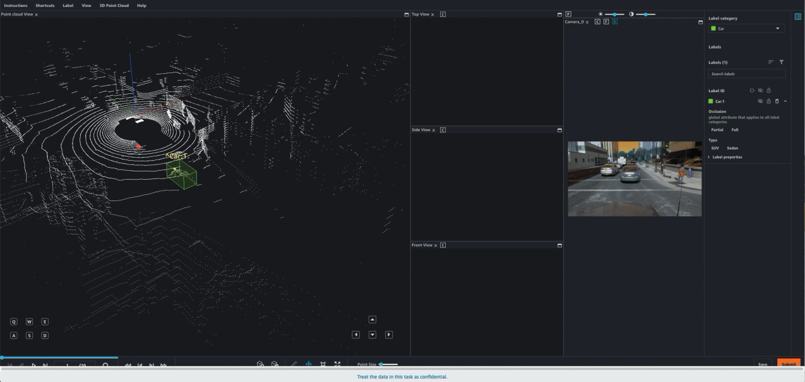

When you are in the worker UI, you see the following menus:

• Instructions – Review these instructions before starting your task.

• Shortcuts – Use this menu to view keyboard shortcuts that you can use to navigate the point
cloud and use the annotation tools provided.

• Label – Use this menu to modify a cuboid. First, select a cuboid, and then choose an option from
this menu. This menu includes assistive labeling tools like setting a cuboid to the ground and
automatically fitting the cuboid to the object's boundaries.

• View – Use this menu to toggle different view options on and off. For example, you can use this
menu to add a ground mesh to the point cloud, and to choose the projection of the point cloud.

• 3D Point Cloud – Use this menu to add additional attributes to the points in the point cloud,
such as color, and pixel intensity. Note that these options may not be available.

Label 3D Point Clouds
2678

## Page 708

Amazon SageMaker AI
Developer Guide

When you open a task, the move scene icon is on, and you can move around the point cloud using
your mouse and the navigation buttons in the point cloud area of the screen. To return to the
original view you see when you first opened the task, choose the reset scene icon.

After you select the add cuboid icon, you can add cuboids to the point cloud and images (if
included). You must select the move scene icon again to move to another area in the 3D point
cloud or image.

To collapse all panels on the right and make the 3D point cloud full-screen, choose the full screen
icon.

If camera images are included, you may have the following view options:

• C – View the camera angle on point cloud view.

• F – View the frustum, or field of view, of the camera used to capture that image on point cloud
view.

• P – View the point cloud overlaid on the image.

• B – View cuboids in the image.

The following video demonstrates how to use these view options. The F option is used to view the
field of view of the camera (the gray area), the C options shows the direction the camera is facing
and angle of the camera (blue lines), and the B option is used to view the cuboid.

Label 3D Point Clouds
2679

## Page 709

Amazon SageMaker AI
Developer Guide

Delete Cuboids

You can select a cuboid or label ID and:

• Delete an individual cuboid in the current frame you are viewing.

• Delete all cuboids with that label ID before or after the frame you are viewing.

• Delete all cuboids with that label ID in all frames.

A common use-case for cuboid deletion is if the object leaves the scene.

You can use one or more of these options to delete both manually placed and interpolated cuboids
with the same label ID.

• To delete all cuboids before or after the frame you are currently on, select the cuboid, select the

Label menu item at the top of the UI and then select one of Delete in previous frames or Delete
in next frames. Use the Shortcuts menu to see the shortcut keys you can use for these options.

• To delete a label in all frames, select Delete in all frames from the Labels menu, or use the
shortcut Shift + Delete on your keyboard.

• To delete an individual cuboid from a single frame, select the cuboid and either select the
trashcan icon

(

)
next to that label ID in the Label ID sidebar on the right or use the Delete key on your keyboard
to delete that cuboid.

If you have manually placed more than one cuboid with the same label in different frames, when
you delete one of the manually placed cuboids, all interpolated cuboids adjust. This adjustment
happens because the UI uses manually placed cuboids as anchor points when calculating the
location of interpolated cuboid. When you remove one of these anchor points, the UI must
recalculate the position of interpolated cuboids.

If you delete a cuboid from a frame, but later decide that you want to get it back, you can use the
Duplicate to previous frames or Duplicate to next frames options in the Label menu to copy the
cuboid into all the previous or all of the following frames, respectively.

Label 3D Point Clouds
2680

## Page 710

Amazon SageMaker AI
Developer Guide

Bulk Edit Label Category and Frame Attributes

You can bulk edit label attributes and frame attributes.

When you bulk edit an attribute, you specify one or more ranges of frames that you want to apply
the edit to. The attribute you select is edited in all frames in that range, including the start and end
frames you specify. When you bulk edit label attributes, the range you specify must contain the
label that the label attribute is attached to. If you specify frames that do not contain this label, you
will receive an error.

To bulk edit an attribute you must specify the desired value for the attribute first. For example, if
you want to change an attribute from Yes to No, you must select No, and then perform the bulk
edit.

You can also specify a new value for an attribute that has not been filled in and then use the bulk
edit feature to fill in that value in multiple frames. To do this, select the desired value for the
attribute and complete the following procedure.

To bulk edit a label or attribute:

1.
Use your mouse to right click the attribute you want to bulk edit.

2.
Specify the range of frames you want to apply the bulk edit to using a dash (-) in the text box.

For example, if you want to apply the edit to frames one through ten, enter 1-10. If you want

to apply the edit to frames two to five, eight to ten and twenty enter 2-5,8-10,20.

3.
Select Confirm.

If you get an error message, verify that you entered a valid range and that the label associated with
the label attribute you are editing (if applicable) exists in all frames specified.

You can quickly add a label to all previous or subsequent frames using the Duplicate to previous
frames and Duplicate to next frames options in the Label menu at the top of your screen.

Icon Guide

Use this table to learn about the icons you see in your worker task portal.

Label 3D Point Clouds
2681

## Page 711

Amazon SageMaker AI
Developer Guide

Icon
Name
Description

add cuboid
Choose this icon to add a cuboid. Each cuboid you add is
associated with the category you chose.

edit cuboid
Choose this icon to edit a cuboid. After you add a
cuboid, you can edit its dimensions, location, and
orientation. After a cuboid is added, it automatically
switches to edit cuboid mode.

ruler
Use this icon to measure distances, in meters, in the
point cloud. You may want to use this tool if your
instructions ask you to annotate all objects in a given
distance from the center of the cuboid or the object
used to capture data.

When you select this icon, you can place the starting

point (first marker) anywhere in the point cloud by
selecting it with your mouse. The tool will automatically
use interpolation to place a marker on the closest point
within threshold distance to the location you select,
otherwise the marker will be placed on ground. If you
place a starting point by mistake, you can use the Escape
key to revert marker placement.

After you place the first marker, you see a dotted line

and a dynamic label that indicates the distance you have
moved away from the first marker. Click somewhere else
on the point cloud to place a second marker. When you
place the second marker, the dotted line becomes solid,
and the distance is set.

After you set a distance, you can edit it by selecting
either marker. You can delete a ruler by selecting
anywhere on the ruler and using the Delete key on your
keyboard.

Label 3D Point Clouds
2682

## Page 712

Amazon SageMaker AI
Developer Guide

Icon
Name
Description

reset scene
Choose this icon to reset the view of the point cloud,
side panels, and if applicable, all images to their original
position when the task was first opened.

move scene
Choose this icon to move the scene. By default, this icon
is chosen when you first start a task.

full screen
Choose this icon to make the 3D point cloud visualiza
tion full screen and to collapse all side panels.

load frames
Choose this icon to load additional frames.

hide labels
Hide labels in the 3D point cloud visualization, and if
applicable, in images.

show labels
Show labels in the 3D point cloud visualization, and if
applicable, in images.

delete labels
Delete a label. This option can only be used to delete
labels you have manually created or adjusted.

Shortcuts

The shortcuts listed in the Shortcuts menu can help you navigate the 3D point cloud and use tools
to add and edit cuboids.

Before you start your task, it is recommended that you review the Shortcuts menu and become
acquainted with these commands. You need to use some of the 3D cuboid controls to edit your
cuboid.

Label 3D Point Clouds
2683

## Page 713

Amazon SageMaker AI
Developer Guide

Release, Stop and Resume, and Decline Tasks

When you open the labeling task, three buttons on the top right allow you to decline the task
(Decline task), release it (Release task), and stop and resume it at a later time (Stop and resume
later). The following list describes what happens when you select one of these options:

• Decline task: You should only decline a task if something is wrong with the task, such as an issue
with the 3D point clouds, images or the UI. If you decline a task, you will not be able to return to
the task.

• Release Task: Use this option to release a task and allow others to work on it. When you
release a task, you loose all work done on that task and other workers on your team can pick
it up. If enough workers pick up the task, you may not be able to return to it. When you select
this button and then select Confirm, you are returned to the worker portal. If the task is still
available, its status will be Available. If other workers pick it up, it will disappear from your

portal.

• Stop and resume later: You can use the Stop and resume later button to stop working and
return to the task at a later time. You should use the Save button to save your work before you
select Stop and resume later. When you select this button and then select Confirm, you are
returned to the worker portal, and the task status is Stopped. You can select the same task to
resume work on it.

Be aware that the person that creates your labeling tasks specifies a time limit in which all
tasks much be completed by. If you do not return to and complete this task within that time
limit, it will expire and your work will not be submitted. Contact your administrator for more
information.

Saving Your Work and Submitting

You should periodically save your work. Ground Truth will automatically save your work ever 15
minutes.

When you open a task, you must complete your work on it before pressing Submit.

Label verification and adjustment

When the labels on a dataset need to be validated, Amazon SageMaker Ground Truth provides
functionality to have workers verify that labels are correct or to adjust previous labels. These types
of jobs fall into two distinct categories:

Label verification and adjustment
2684

## Page 714

Amazon SageMaker AI
Developer Guide

• Label verification — Workers indicate if the existing labels are correct, or rate their quality, and
can add comments to explain their reasoning. Workers will not be able to modify or adjust labels.

If you create a 3D point cloud or video frame label adjustment or verification job, you can choose
to make label category attributes (not supported for 3D point cloud semantic segmentation) and
frame attributes editable by workers.

• Label adjustment — Workers adjust prior annotations and, if applicable, label category and frame
attributes to correct them.

The following Ground Truth built-in task types support adjustment and verification labeling jobs:

• Bounding box

• Semantic segmentation

• 3D point cloud object detection, 3D point cloud object tracking, and 3D point cloud semantic
segmentation

• All video frame object detection and video frame object tracking task types — bounding box,
polyline, polygon and keypoint

Tip

For 3D point cloud and video frame labeling verification jobs, it is recommended that you
add new label category attributes or frame attributes to the labeling job. Workers can use
these attribute to verify individual labels or the entire frame. To learn more about label
category and frame attributes, see Worker user interface (UI) for 3D point cloud and Worker
user interface (UI) for video frame.

You can start a label verification and adjustment jobs using the SageMaker AI console or the API.

Cautions and considerations

To get expected behavior when creating a label verification or adjustment job, carefully verify your
input data.

• If you are using image data, verify that your manifest file contains hexadecimal RGB color
information.

Label verification and adjustment
2685

## Page 715

Amazon SageMaker AI
Developer Guide

• To save money on processing costs, filter your data to ensure you are not including unwanted
objects in your labeling job input manifest.

• Add required Amazon S3 permissions to ensure your input data is processed correctly.

When you create an adjustment or verification labeling job using the Ground Truth API, you must

use a different LabelAttributeName than the original labeling job.

Color information requirements for semantic segmentation jobs

To properly reproduce color information in verification or adjustment tasks, the tool requires
hexadecimal RGB color information in the manifest (for example, #FFFFFF for white). When you
set up a Semantic Segmentation verification or adjustment job, the tool examines the manifest to
determine if this information is present. If it can't find it,Amazon SageMaker Ground Truth displays
an error message and the ends job setup.

In prior iterations of the Semantic Segmentation tool, category color information wasn't output
in hexadecimal RGB format to the output manifest. That feature was introduced to the output
manifest at the same time the verification and adjustment workflows were introduced. Therefore,
older output manifests aren't compatible with this new workflow.

Filter your data before starting the job

Amazon SageMaker Ground Truth processes all objects in your input manifest. If you have a
partially labeled data set, you might want to create a custom manifest using an Amazon S3 Select
query on your input manifest. Unlabeled objects individually fail, but they don't cause the job to
fail, and they might incur processing costs. Filtering out objects you don't want verified reduces
your costs.

If you create a verification job using the console, you can use the filtering tools provided there. If
you create jobs using the API, make filtering your data part of your workflow where needed.

Topics

• Requirements to create verification and adjustment labeling jobs

• Create a label verification job (console)

• Create a label adjustment job (console)

• Start a label verification or adjustment job (API)

• Label verification and adjustment data in the output manifest

Label verification and adjustment
2686

## Page 716

Amazon SageMaker AI
Developer Guide

Requirements to create verification and adjustment labeling jobs

To create a label verification or adjustment job, you must satisfy the following criteria.

• For non streaming labeling jobs: The input manifest file you use must contain the label attribute

name (LabelAttributeName) of the labels that you want adjusted. When you chain a
successfully completed labeling job, the output manifest file is used as the input manifest file for
the new, chained job. To learn more about the format of the output manifest file Ground Truth
produces for each task type, see Labeling job output data.

For streaming labeling jobs: The Amazon SNS message you sent to the Amazon SNS input topic
of the adjustment or verification labeling job must contain the label attribute name of the
labels you want adjusted or verified. To see an example of how you can create an adjustment
or verification labeling job with streaming labeling jobs, see this Jupyter Notebook example in
GitHub.

• The task type of the verification or adjustment labeling job must be the same as the task type
of the original job unless you are using the Image Label Verification task type to verify bounding
box or semantic segmentation image labels. See the next bullet point for more details about the
video frame task type requirements.

• For video frame annotation verification and adjustment jobs, you must use the same annotation
task type used to create the annotations from the previous labeling job. For example, if you
create a video frame object detection job to have workers draw bounding boxes around objects,
and then you create a video object detection adjustment job, you must specify bounding boxes as
the annotation task type. To learn more video frame annotation task types, see Task types.

• The task type you select for the adjustment or verification labeling job must support an audit
workflow. The following Ground Truth built-in task types support adjustment and verification
labeling jobs: bounding box, semantic segmentation, 3D point cloud object detection, 3D point
cloud object tracking, and 3D point cloud semantic segmentation, and all video frame object
detection and video frame object tracking task types — bounding box, polyline, polygon and
keypoint.

Create a label verification job (console)

Use one of the following sections to create a label verification job for your task type. Bounding box
and semantic segmentation labeling jobs are created by choosing the Label verification task type
in the console. To create a verification job for 3D point cloud and video frame task types, you must
choose the same task type as the original labeling job and choose to display existing labels.

Label verification and adjustment
2687

## Page 717

Amazon SageMaker AI
Developer Guide

Create an image label verification job (console)

Use the following procedure to create a bounding box or semantic segmentation verification
job using the console. This procedure assumes that you have already created a bounding box or
semantic segmentation labeling job and its status is Complete. This the labeling job that produces
the labels you want verified.

To create an image label verification job:

1.
Open the SageMaker AI console at https://console.aws.amazon.com/sagemaker/ and choose
Labeling jobs.

2.
Start a new labeling job by chaining a prior job or start from scratch, specifying an input
manifest that contains labeled data objects.

3.
In the Task type pane, select Label verification.

4.
Choose Next.

5.
In the Workers section, choose the type of workforce you would like to use. For more details
about your workforce options see Workforces.

6.
(Optional) After you've selected your workforce, specify the Task timeout and Task expiration
time.

7.
In the Existing-labels display options pane, the system shows the available label attribute
names in your manifest. Choose the label attribute name that identifies the labels that you
want workers to verify. Ground Truth tries to detect and populate these values by analyzing
the manifest, but you might need to set the correct value.

8.
Use the instructions areas of the tool designer to provide context about what the previous
labelers were asked to do and what the current verifiers need to check.

You can add new labels that workers choose from to verify labels. For example, you can ask
workers to verify the image quality, and provide the labels Clear and Blurry. Workers will also
have the option to add a comment to explain their selection.

9.
Choose See preview to check that the tool is displaying the prior labels correctly and presents
the label verification task clearly.

10. Select Create. This will create and start your labeling job.

Label verification and adjustment
2688

## Page 718

Amazon SageMaker AI
Developer Guide

Create a point cloud or video frame label verification job (console)

Use the following procedure to create a 3D point cloud or video frame verification job using the
console. This procedure assumes that you have already created a labeling job using the task type
that produces the types of labels you want to be verified and its status is Complete.

To create an image label verification job:

1.
Open the SageMaker AI console at https://console.aws.amazon.com/sagemaker/ and choose
Labeling jobs.

2.
Start a new labeling job by chaining a prior job or start from scratch, specifying an input
manifest that contains labeled data objects.

3.
In the Task type pane, select the same task type as the labeling job that you chained. For
example, if the original labeling job was a video frame object detection keypoint labeling job,
select that task type.

4.
Choose Next.

5.
In the Workers section, choose the type of workforce you would like to use. For more details
about your workforce options see Workforces.

6.
(Optional) After you've selected your workforce, specify the Task timeout and Task expiration
time.

7.
Toggle on the switch next to Display existing labels.

8.
Select Verification.

9.
For Label attribute name, choose the name from your manifest that corresponds to the labels
that you want to display for verification. You will only see label attribute names for labels that
match the task type you selected on the previous screen. Ground Truth tries to detect and
populate these values by analyzing the manifest, but you might need to set the correct value.

10. Use the instructions areas of the tool designer to provide context about what the previous

labelers were asked to do and what the current verifiers need to check.

You cannot modify or add new labels. You can remove, modify and add new label category
attributes or frame attributes. It is recommended that you add new label category attributes
or frame attributes to the labeling job. Workers can use these attribute to verify individual
labels or the entire frame.

Label verification and adjustment
2689

## Page 719

Amazon SageMaker AI
Developer Guide

By default, preexisting label category attributes and frame attributes will not be editable by
workers. If you want to make a label category or frame attribute editable, select the Allow
workers to edit this attribute check box for that attribute.

To learn more about label category and frame attributes, see Worker user interface (UI) for 3D
point cloud and Worker user interface (UI) for video frame.

11. Choose See preview to check that the tool is displaying the prior labels correctly and presents

the label verification task clearly.

12. Select Create. This will create and start your labeling job.

Create a label adjustment job (console)

Use one of the following sections to create a label verification job for your task type.

Topics

• Create an image label adjustment job (console)

• Create a point cloud or video frame label adjustment job (console)

Create an image label adjustment job (console)

Use the following procedure to create a bounding box or semantic segmentation adjustment
labeling job using the console. This procedure assumes that you have already created a bounding
box or semantic segmentation labeling job and its status is Complete. This the labeling job that
produces the labels you want adjusted.

To create an image label adjustment job (console)

1.
Open the SageMaker AI console at https://console.aws.amazon.com/sagemaker/ and choose
Labeling jobs.

2.
Start a new labeling job by chaining a prior job or start from scratch, specifying an input
manifest that contains labeled data objects.

3.
Choose the same task type as the original labeling job.

4.
Choose Next.

5.
In the Workers section, choose the type of workforce you would like to use. For more details
about your workforce options see Workforces.

Label verification and adjustment
2690

## Page 720

Amazon SageMaker AI
Developer Guide

6.
(Optional) After you've selected your workforce, specify the Task timeout and Task expiration
time.

7.
Expand Existing-labels display options by selecting the arrow next to the title.

8.
Check the box next to I want to display existing labels from the dataset for this job.

9.
For Label attribute name, choose the name from your manifest that corresponds to the labels
that you want to display for adjustment. You will only see label attribute names for labels that
match the task type you selected on the previous screen. Ground Truth tries to detect and
populate these values by analyzing the manifest, but you might need to set the correct value.

10. Use the instructions areas of the tool designer to provide context about what the previous

labelers were tasked with doing and what the current verifiers need to check and adjust.

11. Choose See preview to check that the tool shows the prior labels correctly and presents the

task clearly.

12. Select Create. This will create and start your labeling job.

Create a point cloud or video frame label adjustment job (console)

Use the following procedure to create a 3D point cloud or video frame adjustment job using the
console. This procedure assumes that you have already created a labeling job using the task type
that produces the types of labels you want to be verified and its status is Complete.

To create a 3D point cloud or video frame label adjustment job (console)

1.
Open the SageMaker AI console: https://console.aws.amazon.com/sagemaker/ and choose
Labeling jobs.

2.
Start a new labeling job by chaining a prior job or start from scratch, specifying an input
manifest that contains labeled data objects.

3.
Choose the same task type as the original labeling job.

4.
Toggle on the switch next to Display existing labels.

5.
Select Adjustment.

6.
For Label attribute name, choose the name from your manifest that corresponds to the labels
that you want to display for adjustment. You will only see label attribute names for labels that
match the task type you selected on the previous screen. Ground Truth tries to detect and
populate these values by analyzing the manifest, but you might need to set the correct value.

7.
Use the instructions areas of the tool designer to provide context about what the previous
labelers were asked to do and what the current adjusters need to check.

Label verification and adjustment
2691

## Page 721

Amazon SageMaker AI
Developer Guide

You cannot remove or modify existing labels but you can add new labels. You can remove,
modify and add new label category attributes or frame attributes.

Be default, preexisting label category attributes and frame attributes will be editable by
workers. If you want to make a label category or frame attribute uneditable, deselect the
Allow workers to edit this attribute check box for that attribute.

To learn more about label category and frame attributes, see Worker user interface (UI) for 3D

point cloud and Worker user interface (UI) for video frame.

8.
Choose See preview to check that the tool shows the prior labels correctly and presents the
task clearly.

9.
Select Create. This will create and start your labeling job.

Start a label verification or adjustment job (API)

Start a label verification or adjustment job by chaining a successfully completed job or starting

a new job from scratch using the CreateLabelingJob operation. The procedure is almost the

same as setting up a new labeling job with CreateLabelingJob, with a few modifications. Use
the following sections to learn what modifications are required to chain a labeling job to create an
adjustment or verification labeling job.

When you create an adjustment or verification labeling job using the Ground Truth API, you must

use a different LabelAttributeName than the original labeling job. The original labeling job is
the job used to create the labels you want adjusted or verified.

Important

The label category configuration file you identify for an adjustment or verification job in

LabelCategoryConfigS3Uri of CreateLabelingJob must contain the same labels
used in the original labeling job. You can add new labels. For 3D point cloud and video
frame jobs, you can add new label category and frame attributes to the label category
configuration file.

Bounding Box and Semantic Segmentation

To create a bounding box or semantic segmentation label verification or adjustment job, use the

following guidelines to specify API attributes for the CreateLabelingJob operation.

Label verification and adjustment
2692

## Page 722

Amazon SageMaker AI
Developer Guide

• Use the LabelAttributeName parameter to specify the output label name that you want to

use for verified or adjusted labels. You must use a different LabelAttributeName than the one

used for the original labeling job.

• If you are chaining the job, the labels from the previous labeling job to be adjusted or verified

will be specified in the custom UI template. To learn how to create a custom template, see Create
Custom Worker Task Templates.

Identify the location of the UI template in the UiTemplateS3Uri parameter. SageMaker
AI provides widgets that you can use in your custom template to display old labels. Use the

initial-value attribute in one of the following crowd elements to extract the labels that
need verification or adjustment and include them in your task template:

• crowd-semantic-segmentation—Use this crowd element in your custom UI task template to
specify semantic segmentation labels that need to be verified or adjusted.

• crowd-bounding-box—Use this crowd element in your custom UI task template to specify
bounding box labels that need to be verified or adjusted.

• The LabelCategoryConfigS3Uri parameter must contain the same label categories as the
previous labeling job.

• Use the bounding box or semantic segmentation adjustment or verification lambda ARNs for

PreHumanTaskLambdaArn and AnnotationConsolidationLambdaArn:

• For bounding box, the adjustment labeling job lambda function ARNs end with

AdjustmentBoundingBox and the verification lambda function ARNs end with

VerificationBoundingBox.

• For semantic segmentation, the adjustment labeling job lambda function ARNs end with

AdjustmentSemanticSegmentation and the verification lambda function ARNs end with

VerificationSemanticSegmentation.

3D point cloud and video frame

• Use the LabelAttributeName parameter to specify the output label name that you want to

use for verified or adjusted labels. You must use a different LabelAttributeName than the one
used for the original labeling job.

• You must use the human task UI Amazon Resource Name (ARN) (HumanTaskUiArn) used for the

original labeling job. To see supported ARNs, see HumanTaskUiArn.

Label verification and adjustment
2693

## Page 723

Amazon SageMaker AI
Developer Guide

• In the label category configuration file, you must specify the label attribute name

(LabelAttributeName) of the previous labeling job that you use to create the adjustment or

verification labeling job in the auditLabelAttributeName parameter.

• You specify whether your labeling job is a verification or adjustment labeling job using

the editsAllowed parameter in your label category configuration file identified by the

LabelCategoryConfigS3Uri parameter.

• For verification labeling jobs, you must use the editsAllowed parameter to specify that all

labels cannot be modified. editsAllowed must be set to "none" in each entry in labels.
Optionally, you can specify whether or not label categories attributes and frame attributes can
be adjusted by workers.

• Optionally, for adjustment labeling jobs, you can use the editsAllowed parameter to specify
labels, label category attributes, and frame attributes that can or cannot be modified by
workers. If you do not use this parameter, all labels, label category attributes, and frame

attributes will be adjustable.

To learn more about the editsAllowed parameter and configuring your label category
configuration file, see Label category configuration file schema.

• Use the 3D point cloud or video frame adjustment lambda ARNs for PreHumanTaskLambdaArn

and AnnotationConsolidationLambdaArn for both adjustment and verification labeling
jobs:

• For 3D point clouds, the adjustment and verification labeling job lambda

function ARNs end with Adjustment3DPointCloudSemanticSegmentation,

Adjustment3DPointCloudObjectTracking, and

Adjustment3DPointCloudObjectDetection for 3D point cloud semantic segmentation,
object detection, and object tracking respectively.

• For video frames, the adjustment and verification labeling job lambda function ARNs end with

AdjustmentVideoObjectDetection and AdjustmentVideoObjectTracking for video
frame object detection and object tracking respectively.

Ground Truth stores the output data from a label verification or adjustment job in the S3 bucket

that you specified in the S3OutputPath parameter of the CreateLabelingJob operation. For
more information about the output data from a label verification or adjustment labeling job, see
Label verification and adjustment data in the output manifest.

Label verification and adjustment
2694

## Page 724

Amazon SageMaker AI
Developer Guide

Label verification and adjustment data in the output manifest

Amazon SageMaker Ground Truth writes label verification data to the output manifest within the
metadata for the label. It adds two properties to the metadata:

• A type property, with a value of "groundtruth/label-verification.

• A worker-feedback property, with an array of comment values. This property is added when
the worker enters comments. If there are no comments, the field doesn't appear.

The following example output manifest shows how label verification data appears:

{
"source-ref":"S3 bucket location",
"verify-bounding-box":"1",
"verify-bounding-box-metadata":
{
"class-name": "bad",
"confidence": 0.93,
"type": "groundtruth/label-verification",
"job-name": "verify-bounding-boxes",
"human-annotated": "yes",
"creation-date": "2018-10-18T22:18:13.527256",
"worker-feedback": [
{"comment": "The bounding box on the bird is too wide on the right side."},
{"comment": "The bird on the upper right is not labeled."}
]
}
}

The worker output of adjustment tasks resembles the worker output of the original task, except

that it contains the adjusted values and an adjustment-status property with the value of

adjusted or unadjusted to indicate whether an adjustment was made.

For more examples of the output of different tasks, see Labeling job output data.

Custom labeling workflows

These topics help you set up a Ground Truth labeling job that uses a custom labeling template. A
custom labeling template allows you to create a custom worker portal UI that workers will use to
label data. Template can be created using HTML, CSS, JavaScript, Liquid template language, and
Crowd HTML Elements.

Custom workflows
2695

## Page 725

Amazon SageMaker AI
Developer Guide

Overview

If this is your first time creating a custom labeling workflow in Ground Truth, the following list is a
high-level summary of the steps required.

1. Set up your workforce – To create a custom labeling workflow you need a workforce. This topic

teaches you about configuring a workforce.

2. Creating a custom template – To create a custom template you must map the data from your

input manifest file correctly to the variables in your template.

3. Using optional processing Lambda functions – To control how data from your input manifest is

added to your worker template, and how worker annotations are logged in your job's output file.

This topic also has three end-to-end demos to help you better understand how to use custom
labeling templates.

Note

The examples in the links below all include pre-annotation and post-annotation Lambda
functions. These Lambda functions are optional.

• Demo template: Annotation of images with crowd-bounding-box

• Demo Template: Labeling Intents with crowd-classifier

• Build a custom data labeling workflow with Amazon SageMaker Ground Truth

Topics

• Set up your workforce

• Creating a custom worker task template

• Adding automation with Liquid

• Processing data in a custom labeling workflow with AWS Lambda

• Demo template: Annotation of images with crowd-bounding-box

• Demo Template: Labeling Intents with crowd-classifier

• Create a custom workflow using the API

Custom workflows
2696

## Page 726

Amazon SageMaker AI
Developer Guide

Set up your workforce

In this step you use the console to establish which worker type to use and make the necessary sub-
selections for the worker type. It assumes you have already completed the steps up to this point in
the Getting started: Create a bounding box labeling job with Ground Truth section and have chosen
the Custom labeling task as the Task type.

To configure your workforce.

1.
First choose an option from the Worker types. There are three types currently available:

• Public uses an on-demand workforce of independent contractors, powered by Amazon
Mechanical Turk. They are paid on a per-task basis.

• Private uses your employees or contractors for handling data that needs to stay within your
organization.

• Vendor uses third party vendors that specialize in providing data labeling services, available
via the AWS Marketplace.

2.
If you choose the Public option, you are asked to set the number of workers per dataset
object. Having more than one worker perform the same task on the same object can help
increase the accuracy of your results. The default is three. You can raise or lower that
depending on the accuracy you need.

You are also asked to set a price per task by using a drop-down menu. The menu recommends
price points based on how long it will take to complete the task.

The recommended method to determine this is to first run a short test of your task with
a private workforce. The test provides a realistic estimate of how long the task takes to
complete. You can then select the range your estimate falls within on the Price per task menu.
If your average time is more than 5 minutes, consider breaking your task into smaller units.

Next

Creating a custom worker task template

Creating a custom worker task template

To create a custom labeling job, you need to update the worker task template, map the input data
from your manifest file to the variables used in the template, and map the output data to Amazon

Custom workflows
2697

## Page 727

Amazon SageMaker AI
Developer Guide

S3. To learn more about advanced features that use Liquid automation, see Adding automation
with Liquid.

The following sections describe each of the required steps.

Worker task template

A worker task template is a file used by Ground Truth to customize the worker user interface (UI).
You can create a worker task template using HTML, CSS, JavaScript, Liquid template language, and
Crowd HTML Elements. Liquid is used to automate the template. Crowd HTML Elements are used
to include common annotation tools and provide the logic to submit to Ground Truth.

Use the following topics to learn how you can create a worker task template. You can see a
repository of example Ground Truth worker task templates on GitHub.

Using the base worker task template in the SageMaker AI console

You can use a template editor in the Ground Truth console to start creating a template. This editor
includes a number of pre-designed base templates. It supports autofill for HTML and Crowd HTML
Element code.

To access the Ground Truth custom template editor:

1.
Following the instructions in Create a Labeling Job (Console).

2.
Then select Custom for the labeling job Task type.

3.
Choose Next, and then you can access the template editor and base templates in the Custom
labeling task setup section.

4.
(Optional) Select a base template from the drop-down menu under Templates. If you prefer
to create a template from scratch, choose Custom from the drop down-menu for a minimal
template skeleton.

Use the following section to learn how to visualize a template developed in the console locally.

Visualizing your worker task templates locally

You must use the console to test how your template processes incoming data. To test the look and
feel of your template's HTML and custom elements you can use your browser.

Custom workflows
2698

## Page 728

Amazon SageMaker AI
Developer Guide

Note

Variables will not be parsed. You may need to replace them with sample content while
viewing your content locally.

The following example code snippet loads the necessary code to render the custom HTML
elements. Use this if you want to develop your template's look and feel in your preferred editor
rather than in the console.

Example

Creating a simple HTML task sample

Now that you have the base worker task template, you can use this topic to create a simple HTML-
based task template.

The following is an example entry from an input manifest file.

{
"source": "This train is really late.",
"labels": [ "angry" , "sad", "happy" , "inconclusive" ],
"header": "What emotion is the speaker feeling?"
}

In the HTML task template we need to map the variables from input manifest file to the template.
The variable from the example input manifest would be mapped using the following syntax

task.input.source, task.input.labels, and task.input.header.

The following is a simple example HTML worker task template for tweet-analysis. All tasks begin

and end with the <crowd-form> </crowd-form> elements. Like standard HTML <form>
elements, all of your form code should go between them. Ground Truth generates the workers'
tasks directly from the context specified in the template, unless you implement a pre-annotation

Lambda. The taskInput object returned by Ground Truth or Pre-annotation Lambda is the

task.input object in your templates.

For a simple tweet-analysis task, use the <crowd-classifier> element. It requires the following
attributes:

Custom workflows
2699

## Page 729

Amazon SageMaker AI
Developer Guide

• name - The name of your output variable. Worker annotations are saved to this variable name in
your output manifest.

• categories - a JSON formatted array of the possible answers.

• header - a title for the annotation tool

The <crowd-classifier> element requires at least the three following child elements.

• <classification-target> - The text the worker will classify based on the options specified in the

categories attribute above.

• <full-instructions> - Instructions that are available from the "View full instructions" link in the
tool. This can be left blank, but it is recommended that you give good instructions to get better
results.

• <short-instructions> - A more brief description of the task that appears in the tool's sidebar. This
can be left blank, but it is recommended that you give good instructions to get better results.

A simple version of this tool would look like the following. The variable

{{ task.input.source }} is what specifies the source data from your input manifest file. The

{{ task.input.labels | to_json }} is an example of a variable filter to turn the array into

a JSON representation. The categories attribute must be JSON.

Example of using crowd-classifier with the sample input manifest json

<crowd-form>
<crowd-classifier
name="tweetFeeling"
categories="='{{ task.input.labels | to_json }}'"
header="{{ task.input.header }}'"
>
<classification-target>
{{ task.input.source }}
</classification-target>

<full-instructions header="Sentiment Analysis Instructions">
Try to determine the sentiment the author
of the tweet is trying to express.
If none seem to match, choose "cannot determine."
</full-instructions>

Custom workflows
2700

## Page 730

Amazon SageMaker AI
Developer Guide

<short-instructions>
Pick the term that best describes the sentiment of the tweet.
</short-instructions>

</crowd-classifier>
</crowd-form>

You can copy and paste the code into the editor in the Ground Truth labeling job creation workflow
to preview the tool, or try out a demo of this code on CodePen.

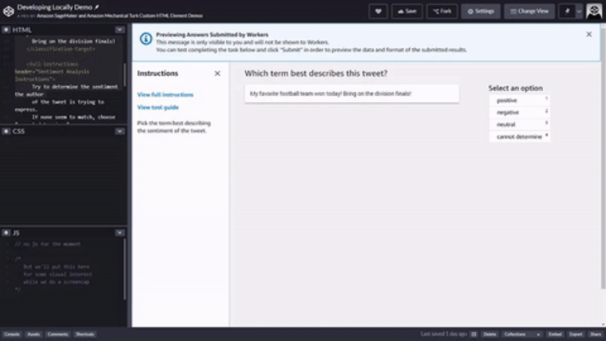

Input data, external assets and your task template

Following sections describe the use of external assets, input data format requirements, and when
to consider using pre-annotation Lambda functions.

Input data format requirements

When you create an input manifest file to use in your custom Ground Truth labeling job, you must
store the data in Amazon S3. The input manifest files must also be saved in the same AWS Region
in which your custom Ground Truth labeling job is to be run. Furthermore, it can be stored in
any Amazon S3 bucket that is accessible to the IAM service role that you use to run your custom
labeling job in Ground Truth.

Input manifest files must use the newline-delimited JSON or JSON lines format. Each line is

delimited by a standard line break, \n or \r\n. Each line must also be a valid JSON object.

Furthermore, each JSON object in the manifest file must contain one of the following keys:

source-ref or source. The value of the keys are interpreted as follows:

Custom workflows
2701

## Page 731

Amazon SageMaker AI
Developer Guide

• source-ref – The source of the object is the Amazon S3 object specified in the value. Use this
value when the object is a binary object, such as an image.

• source – The source of the object is the value. Use this value when the object is a text value.

To learn more about formatting your input manifest files, see Input manifest files.

Pre-annotation Lambda function

You can optionally specify a pre-annotation Lambda function to manage how data from your input

manifest file is handled prior to labeling. If you have specified the isHumanAnnotationRequired
key-value pair you must us a pre-annotation Lambda function. When Ground Truth sends the pre-
annotation Lambda function a JSON formatted request it uses the following schemas.

Example data object identified with the source-ref key-value pair

{
"version": "2018-10-16",
"labelingJobArn": arn:aws:lambda:us-west-2:555555555555:function:my-function
"dataObject" : {
"source-ref": s3://input-data-bucket/data-object-file-name
}
}

Example data object identified with the source key-value pair

{
"version": "2018-10-16",
"labelingJobArn" : arn:aws:lambda:us-west-2:555555555555:function:my-function
"dataObject" : {
"source": Sue purchased 10 shares of the stock on April 10th, 2020
}
}

The following is the expected response from the Lambda function when

isHumanAnnotationRequired is used.

{
"taskInput": {
"source": "This train is really late.",
"labels": [ "angry" , "sad" , "happy" , "inconclusive" ],

Custom workflows
2702

## Page 732

Amazon SageMaker AI
Developer Guide

"header": "What emotion is the speaker feeling?"
},
"isHumanAnnotationRequired": False
}

Using External Assets

Amazon SageMaker Ground Truth custom templates allow external scripts and style sheets to be
embedded. For example, the following code block demonstrates how you would add a style sheet

located at https://www.example.com/my-enhancement-styles.css to your template.

Example

<link rel="stylesheet" type="text/css" href="https://www.example.com/my-enhancement-
styles.css">

If you encounter errors, ensure that your originating server is sending the correct MIME type and
encoding headers with the assets.

For example, the MIME and encoding types for remote scripts are: application/

javascript;CHARSET=UTF-8.

The MIME and encoding type for remote stylesheets are: text/css;CHARSET=UTF-8.

Output data and your task template

The following sections describe the output data from a custom labeling job, and when to consider
using a post-annotation Lambda function.

Output data

When your custom labeling job is finished, the data is saved in the Amazon S3 bucket specified

when the labeling job was created. The data is saved in an output.manifest file.

Note

labelAttributeName is a placeholder variable. In your output it is either the name of
your labeling job, or the label attribute name you specify when you create the labeling job.

Custom workflows
2703

## Page 733

Amazon SageMaker AI
Developer Guide

• source or source-ref – Either the string or an S3 URI workers were asked to label.

• labelAttributeName – A dictionary containing consolidated label content from the post-
annotation Lambda function. If a post-annotation Lambda function is not specified, this
dictionary will be empty.

• labelAttributeName-metadata – Metadata from your custom labeling job added by Ground
Truth.

• worker-response-ref – The S3 URI of the bucket where the data is saved. If a post-
annotation Lambda function is specified this key-value pair will not present.

In this example the JSON object is formatted for readability, in the actual output file the JSON
object is on a single line.

{
"source" : "This train is really late.",
"labelAttributeName" : {},
"labelAttributeName-metadata": { # These key values pairs are added by Ground Truth
"job_name": "test-labeling-job",
"type": "groundTruth/custom",
"human-annotated": "yes",
"creation_date": "2021-03-08T23:06:49.111000",
"worker-response-ref": "s3://amzn-s3-demo-bucket/test-labeling-job/annotations/
worker-response/iteration-1/0/2021-03-08_23:06:49.json"
}
}

Using a post annotation Lambda to consolidate the results from your workers

By default Ground Truth saves worker responses unprocessed in Amazon S3. To have more fine-
grained control over how responses are handled, you can specify a post-annotation Lambda
function. For example, a post-annotation Lambda function could be used to consolidate annotation
if multiple workers have labeled the same data object. To learn more about creating post-
annotation Lambda functions, see Post-annotation Lambda.

If you want to use a post-annotation Lambda function, it must be specified as part of the

AnnotationConsolidationConfig in a CreateLabelingJob request.

To learn more about how annotation consolidation works, see Annotation consolidation.

Custom workflows
2704

## Page 734

Amazon SageMaker AI
Developer Guide

Adding automation with Liquid

Our custom template system uses Liquid for automation. It is an open source inline markup
language. In Liquid, the text between single curly braces and percent symbols is an instruction or
tag that performs an operation like control flow or iteration. Text between double curly braces is a
variable or object that outputs its value.

The most common use of Liquid will be to parse the data coming from your input manifest file, and
pull out the relevant variables to create the task. Ground Truth automatically generates the tasks

unless a pre-annotation Lambda is specified. The taskInput object returned by Ground Truth or

your Pre-annotation Lambda is the task.input object in your templates.

The properties in your input manifest are passed into your template as the event.dataObject.

Example manifest data object

{
"source": "This is a sample text for classification",
"labels": [ "angry" , "sad" , "happy" , "inconclusive" ],
"header": "What emotion is the speaker feeling?"
}

Example sample HTML using variables

<crowd-classifier
name='tweetFeeling'
categories='{{ task.input.labels | to_json }}'
header='{{ task.input.header }}' >
<classification-target>
{{ task.input.source }}
</classification-target>

Note the addition of  | to_json to the labels property above. That is a filter that turns the
input manifest array into a JSON representation of the array. Variable filters are explained in the
next section.

The following list includes two types of Liquid tags that you may find useful to automate template
input data processing. If you select one of the following tag-types, you will be redirected to the
Liquid documentation.

• Control flow: Includes programming logic operators like if/else, unless, and case/when.

Custom workflows
2705

## Page 735

Amazon SageMaker AI
Developer Guide

• Iteration: Enables you to run blocks of code repeatedly using statements like for loops.

For an example of an HTML template that uses Liquid elements to create a for loop, see
translation-review-and-correction.liquid.html in GitHub.

For more information and documentation, visit the Liquid homepage.

Variable filters

In addition to the standard Liquid filters and actions, Ground Truth offers a few additional filters.

Filters are applied by placing a pipe (|) character after the variable name, then specifying a filter
name. Filters can be chained in the form of:

Example

{{ <content> | <filter> | <filter> }}

Autoescape and explicit escape

By default, inputs will be HTML escaped to prevent confusion between your variable text and

HTML. You can explicitly add the escape filter to make it more obvious to someone reading the
source of your template that the escaping is being done.

escape_once

escape_once ensures that if you've already escaped your code, it doesn't get re-escaped on top of
that. For example, so that &amp; doesn't become &amp;amp;.

skip_autoescape

skip_autoescape is useful when your content is meant to be used as HTML. For example, you
might have a few paragraphs of text and some images in the full instructions for a bounding box.

Use skip_autoescape sparingly

The best practice in templates is to avoid passing in functional code or markup with

skip_autoescape unless you are absolutely sure you have strict control over what's being
passed. If you're passing user input, you could be opening your workers up to a Cross Site
Scripting attack.

Custom workflows
2706

## Page 736

Amazon SageMaker AI
Developer Guide

to_json

to_json will encode what you feed it to JSON (JavaScript Object Notation). If you feed it an
object, it will serialize it.

grant_read_access

grant_read_access takes an S3 URI and encodes it into an HTTPS URL with a short-lived access

token for that resource. This makes it possible to display to workers the photo, audio, or video
objects stored in S3 buckets that are not otherwise publicly accessible.

s3_presign

The s3_presign filter works the same way as the grant_read_access filter. s3_presign
takes an Amazon S3 URI and encodes it into an HTTPS URL with a short-lived access token for that
resource. This makes it possible to display photo, audio, or video objects stored in S3 buckets that
are not otherwise publicly accessible to workers.

Example of the variable filters

Input

auto-escape: {{ "Have you read 'James & the Giant Peach'?" }}
explicit escape: {{ "Have you read 'James & the Giant Peach'?" | escape }}
explicit escape_once: {{ "Have you read 'James &amp; the Giant Peach'?" |
escape_once }}
skip_autoescape: {{ "Have you read 'James & the Giant Peach'?" | skip_autoescape }}
to_json: {{ jsObject | to_json }}
grant_read_access: {{ "s3://amzn-s3-demo-bucket/myphoto.png" | grant_read_access }}
s3_presign: {{ "s3://amzn-s3-demo-bucket/myphoto.png" | s3_presign }}

Example

Output

auto-escape: Have you read &#39;James &amp; the Giant Peach&#39;?
explicit escape: Have you read &#39;James &amp; the Giant Peach&#39;?
explicit escape_once: Have you read &#39;James &amp; the Giant Peach&#39;?
skip_autoescape: Have you read 'James & the Giant Peach'?
to_json: { "point_number": 8, "coords": [ 59, 76 ] }
grant_read_access: https://s3.amazonaws.com/amzn-s3-demo-bucket/myphoto.png?<access
token and other params>

Custom workflows
2707

## Page 737

Amazon SageMaker AI
Developer Guide

s3_presign: https://s3.amazonaws.com/amzn-s3-demo-bucket/myphoto.png?<access token and
other params>

Example of an automated classification template.

To automate the simple text classification sample, replace the tweet text with a variable.

The text classification template is below with automation added. The changes/additions are
highlighted in bold.

<crowd-form>
<crowd-classifier
name="tweetFeeling"
categories="['positive', 'negative', 'neutral', 'cannot determine']"
header="Which term best describes this tweet?"
>
<classification-target>
{{ task.input.source }}
</classification-target>

<full-instructions header="Analyzing a sentiment">
Try to determine the feeling the author
of the tweet is trying to express.
If none seem to match, choose "other."
</full-instructions>

<short-instructions>
Pick the term best describing the sentiment
of the tweet.
</short-instructions>

</crowd-classifier>
</crowd-form>

The tweet text in the prior sample is now replaced with an object. The entry.taskInput object

uses source (or another name you specify in your pre-annotation Lambda) as the property name
for the text, and it is inserted directly in the HTML by virtue of being between double curly braces.

Custom workflows
2708

## Page 738

Amazon SageMaker AI
Developer Guide

Processing data in a custom labeling workflow with AWS Lambda

In this topic, you can learn how to deploy optional AWS Lambda functions when creating a custom
labeling workflow. You can specify two types of Lambda functions to use with your custom

labeling workflow.

• Pre-annotation Lambda: This function pre-processes each data object sent to your labeling job
prior to sending it to workers.

• Post-annotation Lambda: This function processes the results once workers submit a task. If
you specify multiple workers per data object, this function may include logic to consolidate
annotations.

If you are a new user of Lambda and Ground Truth, we recommend that you use the pages in this
section as follows:

1. First, review Using pre-annotation and post-annotation Lambda functions.

2. Then, use the page Add required permissions to use AWS Lambda with Ground Truth to learn

about security and permission requirements to use your pre-annotation and post-annotation
Lambda functions in a Ground Truth custom labeling job.

3. Next, you need to visit the Lambda console or use Lambda's APIs to create your functions. Use

the section Create Lambda functions using Ground Truth templates to learn how to create
Lambda functions.

4. To learn how to test your Lambda functions, see Test pre-annotation and post-annotation

Lambda functions.

5. After you create pre-processing and post-processing Lambda functions, select them from the

Lambda functions section that comes after the code editor for your custom HTML in the Ground

Truth console. To learn how to use these functions in a CreateLabelingJob API request, see
Create a Labeling Job (API).

For a custom labeling workflow tutorial that includes example pre-annotation and post-annotation

Lambda functions, see Demo template: Annotation of images with crowd-bounding-box.

Topics

• Using pre-annotation and post-annotation Lambda functions

• Add required permissions to use AWS Lambda with Ground Truth

Custom workflows
2709

## Page 739

Amazon SageMaker AI
Developer Guide

• Create Lambda functions using Ground Truth templates

• Test pre-annotation and post-annotation Lambda functions

Using pre-annotation and post-annotation Lambda functions

Use these topics to learn about the syntax of the requests sent to pre-annotation and post-
annotation Lambda functions, and the required response syntax that Ground Truth uses in custom
labeling workflows.

Topics

• Pre-annotation Lambda

• Post-annotation Lambda

Pre-annotation Lambda

Before a labeling task is sent to the worker, a optional pre-annotation Lambda function can be
invoked.

Ground Truth sends your Lambda function a JSON formatted request to provide details about the
labeling job and the data object.

The following are 2 example JSON formatted requests.

Data object identified with "source-ref"

{
"version": "2018-10-16",
"labelingJobArn": <labelingJobArn>
"dataObject" : {
"source-ref": <s3Uri>
}
}

Data object identified with "source"

{
"version": "2018-10-16",
"labelingJobArn": <labelingJobArn>
"dataObject" : {
"source": <string>

Custom workflows
2710

## Page 740

Amazon SageMaker AI
Developer Guide

}
}

The following list contains the pre-annotation request schemas. Each parameter is described
below.

• version (string): This is a version number used internally by Ground Truth.

• labelingJobArn (string): This is the Amazon Resource Name, or ARN, of your labeling job. This
ARN can be used to reference the labeling job when using Ground Truth API operations such as

DescribeLabelingJob.

• The dataObject (JSON object): The key contains a single JSON line, either from your input
manifest file or sent from Amazon SNS. The JSON line objects in your manifest can be up to
100 kilobytes in size and contain a variety of data. For a very basic image annotation job, the

dataObject JSON may just contain a source-ref key, identifying the image to be annotated.
If the data object (for example, a line of text) is included directly in the input manifest file, the

data object is identified with source. If you create a verification or adjustment job, this line may
contain label data and metadata from the previous labeling job.

The following tabbed examples show examples of a pre-annotation request. Each parameter in
these example requests is explained below the tabbed table.

Data object identified with "source-ref"

{
"version": "2018-10-16",
"labelingJobArn": "arn:aws:sagemaker:us-west-2:111122223333:labeling-job/
<labeling_job_name>"
"dataObject" : {
"source-ref": "s3://input-data-bucket/data-object-file-name"
}
}

Data object identified with "source"

{
"version": "2018-10-16",
"labelingJobArn": "arn:aws:sagemaker:<aws_region>:111122223333:labeling-job/
<labeling_job_name>"

Custom workflows
2711

## Page 741

Amazon SageMaker AI
Developer Guide

"dataObject" : {
"source": "Sue purchased 10 shares of the stock on April 10th, 2020"
}
}

In return, Ground Truth requires a response formatted like the following:

Example of expected return data

{
"taskInput": <json object>,
"isHumanAnnotationRequired": <boolean> # Optional
}

In the previous example, the <json object> needs to contain all the data your custom worker

task template needs. If you're doing a bounding box task where the instructions stay the same all
the time, it may just be the HTTP(S) or Amazon S3 resource for your image file. If it's a sentiment
analysis task and different objects may have different choices, it is the object reference as a string
and the choices as an array of strings.

Implications of isHumanAnnotationRequired

This value is optional because it defaults to true. The primary use case for explicitly
setting it is when you want to exclude this data object from being labeled by human
workers.

If you have a mix of objects in your manifest, with some requiring human annotation and some

not needing it, you can include a isHumanAnnotationRequired value in each data object.
You can add logic to your pre-annotation Lambda to dynamically determine if an object requires
annotation, and set this boolean value accordingly.

Examples of pre-annotation Lambda functions

The following basic pre-annotation Lambda function accesses the JSON object in dataObject

from the initial request, and returns it in the taskInput parameter.

import json

def lambda_handler(event, context):

Custom workflows
2712

## Page 742

Amazon SageMaker AI
Developer Guide

return {
"taskInput":  event['dataObject']
}

Assuming the input manifest file uses "source-ref" to identify data objects, the worker task
template used in the same labeling job as this pre-annotation Lambda must include a Liquid

element like the following to ingest dataObject:

{{ task.input.source-ref | grant_read_access }}

If the input manifest file used source to identify the data object, the work task template can

ingest dataObject with the following:

{{ task.input.source }}

The following pre-annotation Lambda example includes logic to identify the key used in

dataObject, and to point to that data object using taskObject in the Lambda's return
statement.

import json

def lambda_handler(event, context):

# Event received
print("Received event: " + json.dumps(event, indent=2))

# Get source if specified
source = event['dataObject']['source'] if "source" in event['dataObject'] else None

# Get source-ref if specified
source_ref = event['dataObject']['source-ref'] if "source-ref" in
event['dataObject'] else None

# if source field present, take that otherwise take source-ref
task_object = source if source is not None else source_ref

# Build response object
output = {
"taskInput": {
"taskObject": task_object
},

Custom workflows
2713

## Page 743

Amazon SageMaker AI
Developer Guide

"humanAnnotationRequired": "true"
}

print(output)
# If neither source nor source-ref specified, mark the annotation failed
if task_object is None:
print(" Failed to pre-process {} !".format(event["labelingJobArn"]))
output["humanAnnotationRequired"] = "false"

return output

Post-annotation Lambda

When all workers have annotated the data object or when

TaskAvailabilityLifetimeInSeconds has been reached, whichever comes first, Ground
Truth sends those annotations to your post-annotation Lambda. This Lambda is generally used for

Annotation consolidation.

Note

To see an example of a post-consolidation Lambda function, see
annotation_consolidation_lambda.py in the aws-sagemaker-ground-truth-recipe GitHub
repository.

The following code block contains the post-annotation request schema. Each parameter is
described in the following bulleted list.

{
"version": "2018-10-16",
"labelingJobArn": <string>,
"labelCategories": [<string>],
"labelAttributeName": <string>,
"roleArn" : <string>,
"payload": {
"s3Uri": <string>
}
}

• version (string): A version number used internally by Ground Truth.

Custom workflows
2714

## Page 744

Amazon SageMaker AI
Developer Guide

• labelingJobArn (string): The Amazon Resource Name, or ARN, of your labeling job. This
ARN can be used to reference the labeling job when using Ground Truth API operations such as

DescribeLabelingJob.

• labelCategories (list of strings): Includes the label categories and other attributes you either

specified in the console, or that you include in the label category configuration file.

• labelAttributeName (string): Either the name of your labeling job, or the label attribute name

you specify when you create the labeling job.

• roleArn (string): The Amazon Resource Name (ARN) of the IAM execution role you specify when
you create the labeling job.

• payload (JSON object): A JSON that includes an s3Uri key, which identifies the location of
the annotation data for that data object in Amazon S3. The second code block below shows an
example of this annotation file.

The following code block contains an example of a post-annotation request. Each parameter in this
example request is explained below the code block.

Example of an post-annotation Lambda request

{
"version": "2018-10-16",
"labelingJobArn": "arn:aws:sagemaker:us-west-2:111122223333:labeling-job/labeling-
job-name",
"labelCategories": ["Ex Category1","Ex Category2", "Ex Category3"],
"labelAttributeName": "labeling-job-attribute-name",
"roleArn" : "arn:aws:iam::111122223333:role/role-name",
"payload": {
"s3Uri": "s3://amzn-s3-demo-bucket/annotations.json"
}
}

Note

If no worker works on the data object and TaskAvailabilityLifetimeInSeconds
has been reached, the data object is marked as failed and not included as part of post-
annotation Lambda invocation.

Custom workflows
2715

## Page 745

Amazon SageMaker AI
Developer Guide

The following code block contains the payload schema. This is the file that is indicated by the

s3Uri parameter in the post-annotation Lambda request payload JSON object. For example, if
the previous code block is the post-annotation Lambda request, the following annotation file is

located at s3://amzn-s3-demo-bucket/annotations.json.

Each parameter is described in the following bulleted list.

Example of an annotation file

[
{
"datasetObjectId": <string>,
"dataObject": {
"s3Uri": <string>,
"content": <string>

},
"annotations": [{
"workerId": <string>,
"annotationData": {
"content": <string>,
"s3Uri": <string>
}
}]
}
]

• datasetObjectId (string): Identifies a unique ID that Ground Truth assigns to each data object
you send to the labeling job.

• dataObject (JSON object): The data object that was labeled. If the data object is included in

the input manifest file and identified using the source key (for example, a string), dataObject

includes a content key, which identifies the data object. Otherwise, the location of the data

object (for example, a link or S3 URI) is identified with s3Uri.

• annotations (list of JSON objects): This list contains a single JSON object for each annotation

submitted by workers for that dataObject. A single JSON object contains a unique workerId

that can be used to identify the worker that submitted that annotation. The annotationData
key contains one of the following:

• content (string): Contains the annotation data.

• s3Uri (string): Contains an S3 URI that identifies the location of the annotation data.

Custom workflows
2716

## Page 746

Amazon SageMaker AI
Developer Guide

The following table contains examples of the content that you may find in payload for different
types of annotation.

Named Entity Recognition Payload

[
{
"datasetObjectId": "1",
"dataObject": {
"content": "Sift 3 cups of flour into the bowl."
},
"annotations": [
{
"workerId": "private.us-west-2.ef7294f850a3d9d1",
"annotationData": {
"content": "{\"crowd-entity-annotation\":{\"entities\":[{\"endOffset
\":4,\"label\":\"verb\",\"startOffset\":0},{\"endOffset\":6,\"label\":\"number
\",\"startOffset\":5},{\"endOffset\":20,\"label\":\"object\",\"startOffset\":15},
{\"endOffset\":34,\"label\":\"object\",\"startOffset\":30}]}}"
}
}
]
}
]

Semantic Segmentation Payload

[
{
"datasetObjectId": "2",
"dataObject": {
"s3Uri": "s3://amzn-s3-demo-bucket/gt-input-data/images/bird3.jpg"
},
"annotations": [
{
"workerId": "private.us-west-2.ab1234c5678a919d0",
"annotationData": {
"content": "{\"crowd-semantic-segmentation\":{\"inputImageProperties\":
{\"height\":2000,\"width\":3020},\"labelMappings\":{\"Bird\":{\"color\":\"#2ca02c
\"}},\"labeledImage\":{\"pngImageData\":\"iVBOR...\"}}}"
}
}
]

Custom workflows
2717

## Page 747

Amazon SageMaker AI
Developer Guide

}
]

Bounding Box Payload

[
{
"datasetObjectId": "0",
"dataObject": {
"s3Uri": "s3://amzn-s3-demo-bucket/gt-input-data/images/bird1.jpg"
},
"annotations": [
{
"workerId": "private.us-west-2.ab1234c5678a919d0",
"annotationData": {
"content": "{\"boundingBox\":{\"boundingBoxes\":[{\"height\":2052,

\"label\":\"Bird\",\"left\":583,\"top\":302,\"width\":1375}],\"inputImageProperties
\":{\"height\":2497,\"width\":3745}}}"
}
}
]
}
]

Your post-annotation Lambda function may contain logic similar to the following to
loop through and access all annotations contained in the request. For a full example, see
annotation_consolidation_lambda.py in the aws-sagemaker-ground-truth-recipe GitHub
repository. In this GitHub example, you must add your own annotation consolidation logic.

for i in range(len(annotations)):
worker_id = annotations[i]["workerId"]
annotation_content = annotations[i]['annotationData'].get('content')
annotation_s3_uri = annotations[i]['annotationData'].get('s3uri')
annotation = annotation_content if annotation_s3_uri is None else
s3_client.get_object_from_s3(
annotation_s3_uri)
annotation_from_single_worker = json.loads(annotation)

print("{} Received Annotations from worker [{}] is [{}]"
.format(log_prefix, worker_id, annotation_from_single_worker))

Custom workflows
2718

## Page 748

Amazon SageMaker AI
Developer Guide

Tip

When you run consolidation algorithms on the data, you can use an AWS database service
to store results, or you can pass the processed results back to Ground Truth. The data you
return to Ground Truth is stored in consolidated annotation manifests in the S3 bucket
specified for output during the configuration of the labeling job.

In return, Ground Truth requires a response formatted like the following:

Example of expected return data

[
{
"datasetObjectId": <string>,
"consolidatedAnnotation": {
"content": {
"<labelattributename>": {
# ... label content
}
}
}
},
{
"datasetObjectId": <string>,
"consolidatedAnnotation": {
"content": {
"<labelattributename>": {
# ... label content
}
}
}
}
.
.
.
]

At this point, all the data you're sending to your S3 bucket, other than the datasetObjectId, is in

the content object.

Custom workflows
2719

## Page 749

Amazon SageMaker AI
Developer Guide

When you return annotations in content, this results in an entry in your job's output manifest like
the following:

Example of label format in output manifest

{  "source-ref"/"source" : "<s3uri or content>",
"<labelAttributeName>": {
# ... label content from you
},
"<labelAttributeName>-metadata": { # This will be added by Ground Truth
"job_name": <labelingJobName>,
"type": "groundTruth/custom",
"human-annotated": "yes",
"creation_date": <date> # Timestamp of when received from Post-labeling Lambda
}
}

Because of the potentially complex nature of a custom template and the data it collects, Ground
Truth does not offer further processing of the data.

Add required permissions to use AWS Lambda with Ground Truth

You may need to configure some or all the following to create and use AWS Lambda with Ground
Truth.

• You need to grant an IAM role or user (collectively, an IAM entity) permission to create the pre-
annotation and post-annotation Lambda functions using AWS Lambda, and to choose them
when creating the labeling job.

• The IAM execution role specified when the labeling job is configured needs permission to invoke
the pre-annotation and post-annotation Lambda functions.

• The post-annotation Lambda functions may need permission to access Amazon S3.

Use the following sections to learn how to create the IAM entities and grant permissions described
above.

Topics

• Grant Permission to Create and Select an AWS Lambda Function

• Grant IAM Execution Role Permission to Invoke AWS Lambda Functions

• Grant Post-Annotation Lambda Permissions to Access Annotation

Custom workflows
2720

## Page 750

Amazon SageMaker AI
Developer Guide

Grant Permission to Create and Select an AWS Lambda Function

If you do not require granular permissions to develop pre-annotation and post-annotation Lambda

functions, you can attach the AWS managed policy AWSLambda_FullAccess to a user or role.
This policy grants broad permissions to use all Lambda features, as well as permission to perform
actions in other AWS services with which Lambda interacts.

To create a more granular policy for security-sensitive use cases, refer to the documentation
Identity-based IAM policies for Lambda in the to AWS Lambda Developer Guide to learn how to
create an IAM policy that fits your use case.

Policies to Use the Lambda Console

If you want to grant an IAM entity permission to use the Lambda console, see Using the Lambda
console in the AWS Lambda Developer Guide.

Additionally, if you want the user to be able to access and deploy the Ground Truth starter pre-
annotation and post-annotation functions using the AWS Serverless Application Repository in the

Lambda console, you must specify the <aws-region> where you want to deploy the functions
(this should be the same AWS Region used to create the labeling job), and add the following policy
to the IAM role.

JSON

{
"Version":"2012-10-17",
"Statement": [
{
"Sid": "VisualEditor0",
"Effect": "Allow",
"Action": [
"serverlessrepo:ListApplicationVersions",
"serverlessrepo:GetApplication",
"serverlessrepo:CreateCloudFormationTemplate"
],
"Resource": "arn:aws:serverlessrepo:us-
east-1:838997950401:applications/aws-sagemaker-ground-truth-recipe"
},
{
"Sid": "VisualEditor1",
"Effect": "Allow",
"Action": "serverlessrepo:SearchApplications",

Custom workflows
2721

## Page 751

Amazon SageMaker AI
Developer Guide

"Resource": "*"
}
]
}

Policies to See Lambda Functions in the Ground Truth Console

To grant an IAM entity permission to view Lambda functions in the Ground Truth console when
the user is creating a custom labeling job, the entity must have the permissions described in Grant
IAM Permission to Use the Amazon SageMaker Ground Truth Console, including the permissions
described in the section Custom Labeling Workflow Permissions.

Grant IAM Execution Role Permission to Invoke AWS Lambda Functions

If you add the IAM managed policy AmazonSageMakerGroundTruthExecution to the IAM execution
role used to create the labeling job, this role has permission to list and invoke Lambda functions

with one of the following strings in the function name: GtRecipe, SageMaker, Sagemaker,

sagemaker, or LabelingFunction.

If the pre-annotation or post-annotation Lambda function names do not include one of the
terms in the preceding paragraph, or if you require more granular permission than those in the

AmazonSageMakerGroundTruthExecution managed policy, you can add a policy similar to
the following to give the execution role permission to invoke pre-annotation and post-annotation
functions.

JSON

{
"Version":"2012-10-17",
"Statement": [
{
"Effect": "Allow",
"Action": "lambda:InvokeFunction",
"Resource": [
"arn:aws:lambda:us-east-1:111122223333:function:<pre-annotation-
lambda-name>",
"arn:aws:lambda:us-east-1:111122223333:function:<post-annotation-
lambda-name>"
]
}

Custom workflows
2722

## Page 752

Amazon SageMaker AI
Developer Guide

]
}

Grant Post-Annotation Lambda Permissions to Access Annotation

As described in Post-annotation Lambda, the post-annotation Lambda request includes the

location of the annotation data in Amazon S3. This location is identified by the s3Uri string in

the payload object. To process the annotations as they come in, even for a simple pass through
function, you need to assign the necessary permissions to the post-annotation Lambda execution
role to read files from the Amazon S3.

There are many ways that you can configure your Lambda to access annotation data in Amazon S3.
Two common ways are:

• Allow the Lambda execution role to assume the SageMaker AI execution role identified in

roleArn in the post-annotation Lambda request. This SageMaker AI execution role is the one
used to create the labeling job, and has access to the Amazon S3 output bucket where the
annotation data is stored.

• Grant the Lambda execution role permission to access the Amazon S3 output bucket directly.

Use the following sections to learn how to configure these options.

Grant Lambda Permission to Assume SageMaker AI Execution Role

To allow a Lambda function to assume a SageMaker AI execution role, you must attach a policy
to the Lambda function's execution role, and modify the trust relationship of the SageMaker AI
execution role to allow Lambda to assume it.

1. Attach the following IAM policy to your Lambda function's execution role to assume the

SageMaker AI execution role identified in Resource. Replace 222222222222 with an AWS

account ID. Replace sm-execution-role with the name of the assumed role.

JSON

{
"Version":"2012-10-17",
"Statement": {
"Effect": "Allow",
"Action": "sts:AssumeRole",
"Resource": "arn:aws:iam::222222222222:role/sm-execution-role"

Custom workflows
2723

## Page 753

Amazon SageMaker AI
Developer Guide

}
}

2. Modify the trust policy of the SageMaker AI execution role to include the following Statement.

Replace 222222222222 with an AWS account ID. Replace my-lambda-execution-role with
the name of the assumed role.

JSON

{
"Version":"2012-10-17",
"Statement": [
{
"Effect": "Allow",
"Principal": {
"AWS": "arn:aws:iam::222222222222:role/my-lambda-execution-
role"
},
"Action": "sts:AssumeRole"
}
]
}

Grant Lambda Execution Role Permission to Access S3

You can add a policy similar to the following to the post-annotation Lambda function execution

role to give it S3 read permissions. Replace amzn-s3-demo-bucket with the name of the output
bucket you specify when you create a labeling job.

JSON

{
"Version":"2012-10-17",
"Statement": [
{
"Effect": "Allow",
"Action": [
"s3:GetObject"
],
"Resource": "arn:aws:s3:::amzn-s3-demo-bucket/*"
}

Custom workflows
2724

## Page 754

Amazon SageMaker AI
Developer Guide

]
}

To add S3 read permissions to a Lambda execution role in the Lambda console, use the following
procedure.

Add S3 read permissions to post-annotation Lambda:

1.
Open the Functions page in the Lambda console.

2.
Choose the name of the post-annotation function.

3.
Choose Configuration and then choose Permissions.

4.
Select the Role name and the summary page for that role opens in the IAM console in a new
tab.

5.
Select Attach policies.

6.
Do one of the following:

• Search for and select AmazonS3ReadOnlyAccess to give the function permission to read
all buckets and objects in the account.

• If you require more granular permissions, select Create policy and use the policy example in
the preceding section to create a policy. Note that you must navigate back to the execution
role summary page after you create the policy.

7.
If you used the AmazonS3ReadOnlyAccess managed policy, select Attach policy.

If you created a new policy, navigate back to the Lambda execution role summary page and
attach the policy you just created.

Create Lambda functions using Ground Truth templates

You can create a Lambda function using the Lambda console, the AWS CLI, or an AWS SDK in a
supported programming language of your choice. Use the AWS Lambda Developer Guide to learn
more about each of these options:

• To learn how to create a Lambda function using the console, see Create a Lambda function with
the console.

• To learn how to create a Lambda function using the AWS CLI, see Using AWS Lambda with the
AWS Command Line Interface.

Custom workflows
2725

## Page 755

Amazon SageMaker AI
Developer Guide

• Select the relevant section in the table of contents to learn more about working with Lambda in
the language of your choice. For example, select Working with Python to learn more about using
Lambda with the AWS SDK for Python (Boto3).

Ground Truth provides pre-annotation and post-annotation templates through an AWS Serverless
Application Repository (SAR) recipe. Use the following procedure to select the Ground Truth recipe
in the Lambda console.

Use the Ground Truth SAR recipe to create pre-annotation and post-annotation Lambda
functions:

1.
Open the Functions page on the Lambda console.

2.
Select Create function.

3.
Select Browse serverless app repository.

4.
In the search text box, enter aws-sagemaker-ground-truth-recipe and select that app.

5.
Select Deploy. The app may take a couple of minutes to deploy.

Once the app deploys, two functions appear in the Functions section of the Lambda

console: serverlessrepo-aws-sagema-GtRecipePreHumanTaskFunc-<id> and

serverlessrepo-aws-sagema-GtRecipeAnnotationConsol-<id>.

6.
Select one of these functions and add your custom logic in the Code section.

7.
When you are finished making changes, select Deploy to deploy them.

Test pre-annotation and post-annotation Lambda functions

You can test your pre-annotation and post annotation Lambda functions in the Lambda console.
If you are a new user of Lambda, you can learn how to test, or invoke, your Lambda functions in
the console using the Create a Lambda function tutorial with the console in the AWS Lambda
Developer Guide. You can use the sections on this page to learn how to test the Ground Truth
pre-annotation and post-annotation templates provided through an AWS Serverless Application
Repository (SAR).

Topics

• Prerequisites

• Test the Pre-annotation Lambda Function

• Test the Post-Annotation Lambda Function

Custom workflows
2726

## Page 756

Amazon SageMaker AI
Developer Guide

Prerequisites

You must do the following to use the tests described on this page.

• You need access to the Lambda console, and you need permission to create and invoke Lambda

functions. To learn how to set up these permissions, see Grant Permission to Create and Select
an AWS Lambda Function.

• If you have not deployed the Ground Truth SAR recipe, use the procedure in Create Lambda

functions using Ground Truth templates to do so.

• To test the post-annotation Lambda function, you must have a data file in Amazon S3 with
sample annotation data. For a simple test, you can copy and paste the following code into a file

and save it as sample-annotations.json and upload this file to Amazon S3. Note the S3 URI
of this file—you need this information to configure the post-annotation Lambda test.

[{"datasetObjectId":"0","dataObject":{"content":"To train a machine learning model,
you need a large, high-quality, labeled dataset. Ground Truth helps you build
high-quality training datasets for your machine learning models."},"annotations":
[{"workerId":"private.us-west-2.0123456789","annotationData":{"content":"{\"crowd-
entity-annotation\":{\"entities\":[{\"endOffset\":8,\"label\":\"verb\",\"startOffset
\":3},{\"endOffset\":27,\"label\":\"adjective\",\"startOffset\":11},{\"endOffset
\":33,\"label\":\"object\",\"startOffset\":28},{\"endOffset\":51,\"label\":
\"adjective\",\"startOffset\":46},{\"endOffset\":65,\"label\":\"adjective\",
\"startOffset\":53},{\"endOffset\":74,\"label\":\"adjective\",\"startOffset\":67},
{\"endOffset\":82,\"label\":\"adjective\",\"startOffset\":75},{\"endOffset\":102,
\"label\":\"verb\",\"startOffset\":97},{\"endOffset\":112,\"label\":\"verb\",
\"startOffset\":107},{\"endOffset\":125,\"label\":\"adjective\",\"startOffset
\":113},{\"endOffset\":134,\"label\":\"adjective\",\"startOffset\":126},{\"endOffset
\":143,\"label\":\"object\",\"startOffset\":135},{\"endOffset\":169,\"label
\":\"adjective\",\"startOffset\":153},{\"endOffset\":176,\"label\":\"object\",
\"startOffset\":170}]}}"}}]},{"datasetObjectId":"1","dataObject":{"content":"Sift
3 cups of flour into the bowl."},"annotations":[{"workerId":"private.us-
west-2.0123456789","annotationData":{"content":"{\"crowd-entity-annotation\":
{\"entities\":[{\"endOffset\":4,\"label\":\"verb\",\"startOffset\":0},{\"endOffset
\":6,\"label\":\"number\",\"startOffset\":5},{\"endOffset\":20,\"label\":\"object
\",\"startOffset\":15},{\"endOffset\":34,\"label\":\"object\",\"startOffset
\":30}]}}"}}]},{"datasetObjectId":"2","dataObject":{"content":"Jen purchased 10
shares of the stock on Janurary 1st, 2020."},"annotations":[{"workerId":"private.us-
west-2.0123456789","annotationData":{"content":"{\"crowd-entity-annotation
\":{\"entities\":[{\"endOffset\":3,\"label\":\"person\",\"startOffset\":0},
{\"endOffset\":13,\"label\":\"verb\",\"startOffset\":4},{\"endOffset\":16,\"label
\":\"number\",\"startOffset\":14},{\"endOffset\":58,\"label\":\"date\",\"startOffset
\":40}]}}"}}]},{"datasetObjectId":"3","dataObject":{"content":"The narrative

Custom workflows
2727

## Page 757

Amazon SageMaker AI
Developer Guide

was interesting, however the character development was weak."},"annotations":
[{"workerId":"private.us-west-2.0123456789","annotationData":{"content":"{\"crowd-
entity-annotation\":{\"entities\":[{\"endOffset\":29,\"label\":\"adjective\",
\"startOffset\":18},{\"endOffset\":73,\"label\":\"adjective\",\"startOffset
\":69}]}}"}}]}]

• You must use the directions in Grant Post-Annotation Lambda Permissions to Access Annotation
to give your post-annotation Lambda function's execution role permission to assume the
SageMaker AI execution role you use to create the labeling job. The post-annotation Lambda

function uses the SageMaker AI execution role to access the annotation data file, sample-

annotations.json, in S3.

Test the Pre-annotation Lambda Function

Use the following procedure to test the pre-annotation Lambda function created when you
deployed the Ground Truth AWS Serverless Application Repository (SAR) recipe.

Test the Ground Truth SAR recipe pre-annotation Lambda function

1.
Open the Functions page in the Lambda console.

2.
Select the pre-annotation function that was deployed from the Ground Truth SAR

recipe. The name of this function is similar to serverlessrepo-aws-sagema-

GtRecipePreHumanTaskFunc-<id>.

3.
In the Code source section, select the arrow next to Test.

4.
Select Configure test event.

5.
Keep the Create new test event option selected.

6.
Under Event template, select SageMaker Ground Truth PreHumanTask.

7.
Give your test an Event name.

8.
Select Create.

9.
Select the arrow next to Test again and you should see that the test you created is selected,
which is indicated with a dot by the event name. If it is not selected, select it.

10. Select Test to run the test.

After you run the test, you can see the Execution results. In the Function logs, you should see a
response similar to the following:

Custom workflows
2728

## Page 758

Amazon SageMaker AI
Developer Guide

START RequestId: cd117d38-8365-4e1a-bffb-0dcd631a878f Version: $LATEST
Received event: {
"version": "2018-10-16",
"labelingJobArn": "arn:aws:sagemaker:us-east-2:123456789012:labeling-job/example-
job",
"dataObject": {
"source-ref": "s3://sagemakerexample/object_to_annotate.jpg"
}
}
{'taskInput': {'taskObject': 's3://sagemakerexample/object_to_annotate.jpg'},
'isHumanAnnotationRequired': 'true'}
END RequestId: cd117d38-8365-4e1a-bffb-0dcd631a878f
REPORT RequestId: cd117d38-8365-4e1a-bffb-0dcd631a878f Duration: 0.42 ms Billed
Duration: 1 ms Memory Size: 128 MB Max Memory Used: 43 MB

In this response, we can see the Lambda function's output matches the required pre-annotation

response syntax:

{'taskInput': {'taskObject': 's3://sagemakerexample/object_to_annotate.jpg'},
'isHumanAnnotationRequired': 'true'}

Test the Post-Annotation Lambda Function

Use the following procedure to test the post-annotation Lambda function created when you
deployed the Ground Truth AWS Serverless Application Repository (SAR) recipe.

Test the Ground Truth SAR recipe post-annotation Lambda

1.
Open the Functions page in the Lambda console.

2.
Select the post-annotation function that was deployed from the Ground Truth SAR

recipe. The name of this function is similar to serverlessrepo-aws-sagema-

GtRecipeAnnotationConsol-<id>.

3.
In the Code source section, select the arrow next to Test.

4.
Select Configure test event.

5.
Keep the Create new test event option selected.

6.
Under Event template, select SageMaker Ground Truth AnnotationConsolidation.

7.
Give your test an Event name.

8.
Modify the template code provided as follows:

Custom workflows
2729

## Page 759

Amazon SageMaker AI
Developer Guide

• Replace the Amazon Resource Name (ARN) in roleArn with the ARN of the SageMaker AI
execution role you used to create the labeling job.

• Replace the S3 URI in s3Uri with the URI of the sample-annotations.json file you
added to Amazon S3.

After you make these modifications, your test should look similar to the following:

{
"version": "2018-10-16",
"labelingJobArn": "arn:aws:sagemaker:us-east-2:123456789012:labeling-job/example-
job",
"labelAttributeName": "example-attribute",
"roleArn": "arn:aws:iam::222222222222:role/sm-execution-role",
"payload": {
"s3Uri": "s3://your-bucket/sample-annotations.json"

}
}

9.
Select Create.

10. Select the arrow next to Test again and you should see that the test you created is selected,

which is indicated with a dot by the event name. If it is not selected, select it.

11. Select the Test to run the test.

After you run the test, you should see a -- Consolidated Output -- section in the Function

Logs, which contains a list of all annotations included in sample-annotations.json.

Demo template: Annotation of images with crowd-bounding-box

When you chose to use a custom template as your task type in the Amazon SageMaker Ground
Truth console, you reach the Custom labeling task panel. There you can choose from multiple
base templates. The templates represent some of the most common tasks and provide a sample
to work from as you create your customized labeling task's template. If you are not using the
console, or as an additional recourse, see Amazon SageMaker AI Ground Truth Sample Task UIs  for
a repository of demo templates for a variety of labeling job task types.

This demonstration works with the BoundingBox template. The demonstration also works with
the AWS Lambda functions needed for processing your data before and after the task. In the

Custom workflows
2730

## Page 760

Amazon SageMaker AI
Developer Guide

Github repository above, to find templates that work with AWS Lambda functions, look for

{{ task.input.<property name> }} in the template.

Topics

• Starter Bounding Box custom template

• Your own Bounding Box custom template

• Your manifest file

• Your pre-annotation Lambda function

• Your post-annotation Lambda function

• The output of your labeling job

Starter Bounding Box custom template

This is the starter bounding box template that is provided.

<crowd-form>
<crowd-bounding-box
name="boundingBox"
src="{{ task.input.taskObject | grant_read_access }}"
header="{{ task.input.header }}"
labels="{{ task.input.labels | to_json | escape }}"
>

<!-- The <full-instructions> tag is where you will define the full instructions of
your task. -->
<full-instructions header="Bounding Box Instructions" >

Use the bounding box tool to draw boxes around the requested target of
interest:

<ol>
<li>Draw a rectangle using your mouse over each instance of the target.</li>
<li>Make sure the box does not cut into the target, leave a 2 - 3 pixel
margin</li>
<li>
When targets are overlapping, draw a box around each object,
include all contiguous parts of the target in the box.
Do not include parts that are completely overlapped by another object.
</li>
<li>

Custom workflows
2731

## Page 761

Amazon SageMaker AI
Developer Guide

Do not include parts of the target that cannot be seen,
even though you think you can interpolate the whole shape of the target.
</li>
<li>Avoid shadows, they're not considered as a part of the target.</li>
<li>If the target goes off the screen, label up to the edge of the image.</li>
</ol>
</full-instructions>

<!-- The <short-instructions> tag allows you to specify instructions that are
displayed in the left hand side of the task interface.
It is a best practice to provide good and bad examples in this section for quick
reference. -->
<short-instructions>
Use the bounding box tool to draw boxes around the requested target of interest.
</short-instructions>
</crowd-bounding-box>
</crowd-form>

The custom templates use the Liquid template language, and each of the items between double
curly braces is a variable. The pre-annotation AWS Lambda function should provide an object

named taskInput and that object's properties can be accessed as {{ task.input.<property

name> }} in your template.

Your own Bounding Box custom template

As an example, assume you have a large collection of animal photos in which you know the kind
of animal in an image from a prior image-classification job. Now you want to have a bounding box
drawn around it.

In the starter sample, there are three variables: taskObject, header, and labels.

Each of these would be represented in different parts of the bounding box.

• taskObject is an HTTP(S) URL or S3 URI for the photo to be annotated. The added |

grant_read_access is a filter that will convert an S3 URI to an HTTPS URL with short-lived
access to that resource. If you're using an HTTP(S) URL, it's not needed.

• header is the text above the photo to be labeled, something like "Draw a box around the bird in
the photo."

• labels is an array, represented as ['item1', 'item2', ...]. These are labels that can be
assigned by the worker to the different boxes they draw. You can have one or many.

Custom workflows
2732

## Page 762

Amazon SageMaker AI
Developer Guide

Each of the variable names come from the JSON object in the response from your pre-annotation
Lambda, The names above are merely suggested, Use whatever variable names make sense to you
and will promote code readability among your team.

Only use variables when necessary

If a field will not change, you can remove that variable from the template and replace it
with that text, otherwise you have to repeat that text as a value in each object in your
manifest or code it into your pre-annotation Lambda function.

Example: Final Customized Bounding Box Template

To keep things simple, this template will have one variable, one label, and very basic instructions.
Assuming your manifest has an "animal" property in each data object, that value can be re-used in
two parts of the template.

<crowd-form>
<crowd-bounding-box
name="boundingBox"
labels="[ '{{ task.input.animal }}' ]"
src="{{ task.input.source-ref | grant_read_access }}"
header="Draw a box around the {{ task.input.animal }}."
>
<full-instructions header="Bounding Box Instructions" >

Draw a bounding box around the {{ task.input.animal }} in the image. If
there is more than one {{ task.input.animal }} per image, draw a bounding
box around the largest one.

The box should be tight around the {{ task.input.animal }} with
no more than a couple of pixels of buffer around the
edges.

If the image does not contain a {{ task.input.animal }}, check the <strong>
Nothing to label</strong> box.
</full-instructions>
<short-instructions>

Draw a bounding box around the {{ task.input.animal }} in each image. If
there is more than one {{ task.input.animal }} per image, draw a bounding
box around the largest one.

</short-instructions>
</crowd-bounding-box>

Custom workflows
2733

## Page 763

Amazon SageMaker AI
Developer Guide

</crowd-form>

Note the re-use of {{ task.input.animal }} throughout the template. If your manifest had

all of the animal names beginning with a capital letter, you could use {{ task.input.animal

| downcase }}, incorporating one of Liquid's built-in filters in sentences where it needed to be
presented lowercase.

Your manifest file

Your manifest file should provide the variable values you're using in your template. You can do
some transformation of your manifest data in your pre-annotation Lambda, but if you don't need
to, you maintain a lower risk of errors and your Lambda will run faster. Here's a sample manifest
file for the template.

{"source-ref": "<S3 image URI>", "animal": "horse"}

{"source-ref": "<S3 image URI>", "animal" : "bird"}
{"source-ref": "<S3 image URI>", "animal" : "dog"}
{"source-ref": "<S3 image URI>", "animal" : "cat"}

Your pre-annotation Lambda function

As part of the job set-up, provide the ARN of an AWS Lambda function that can be called to
process your manifest entries and pass them to the template engine.

Naming your Lambda function

The best practice in naming your function is to use one of the following four strings as part

of the function name: SageMaker, Sagemaker, sagemaker, or LabelingFunction. This
applies to both your pre-annotation and post-annotation functions.

When you're using the console, if you have AWS Lambda functions that are owned by your account,
a drop-down list of functions meeting the naming requirements will be provided to choose one.

In this very basic example, you're just passing through the information from the manifest without
doing any additional processing on it. This sample pre-annotation function is written for Python
3.7.

import json

Custom workflows
2734

## Page 764

Amazon SageMaker AI
Developer Guide

def lambda_handler(event, context):
return {
"taskInput": event['dataObject']
}

The JSON object from your manifest will be provided as a child of the event object. The properties

inside the taskInput object will be available as variables to your template, so simply setting the

value of taskInput to event['dataObject'] will pass all the values from your manifest object
to your template without having to copy them individually. If you wish to send more values to the

template, you can add them to the taskInput object.

Your post-annotation Lambda function

As part of the job set-up, provide the ARN of an AWS Lambda function that can be called to
process the form data when a worker completes a task. This can be as simple or complex as you
want. If you want to do answer consolidation and scoring as it comes in, you can apply the scoring
and/or consolidation algorithms of your choice. If you want to store the raw data for offline
processing, that is an option.

Provide permissions to your post-annotation Lambda

The annotation data will be in a file designated by the s3Uri string in the payload object.
To process the annotations as they come in, even for a simple pass through function, you

need to assign S3ReadOnly access to your Lambda so it can read the annotation files.
In the Console page for creating your Lambda, scroll to the Execution role panel. Select
Create a new role from one or more templates. Give the role a name. From the Policy
templates drop-down, choose Amazon S3 object read-only permissions. Save the Lambda
and the role will be saved and selected.

The following sample is in Python 2.7.

import json
import boto3
from urlparse import urlparse

def lambda_handler(event, context):
consolidated_labels = []

parsed_url = urlparse(event['payload']['s3Uri']);

Custom workflows
2735

## Page 765

Amazon SageMaker AI
Developer Guide

s3 = boto3.client('s3')
textFile = s3.get_object(Bucket = parsed_url.netloc, Key = parsed_url.path[1:])
filecont = textFile['Body'].read()
annotations = json.loads(filecont);
for dataset in annotations:
for annotation in dataset['annotations']:
new_annotation = json.loads(annotation['annotationData']['content'])
label = {
'datasetObjectId': dataset['datasetObjectId'],
'consolidatedAnnotation' : {
'content': {
event['labelAttributeName']: {
'workerId': annotation['workerId'],
'boxesInfo': new_annotation,
'imageSource': dataset['dataObject']
}

}
}
}
consolidated_labels.append(label)
return consolidated_labels

The post-annotation Lambda will often receive batches of task results in the event object. That

batch will be the payload object the Lambda should iterate through. What you send back will be
an object meeting the API contract.

The output of your labeling job

You'll find the output of the job in a folder named after your labeling job in the target S3 bucket

you specified. It will be in a sub folder named manifests.

For a bounding box task, the output you find in the output manifest will look a bit like the demo
below. The example has been cleaned up for printing. The actual output will be a single line per
record.

Example: JSON in your output manifest

{
"source-ref":"<URL>",
"<label attribute name>":
{

Custom workflows
2736

## Page 766

Amazon SageMaker AI
Developer Guide

"workerId":"<URL>",
"imageSource":"<image URL>",
"boxesInfo":"{\"boundingBox\":{\"boundingBoxes\":[{\"height\":878, \"label\":
\"bird\", \"left\":208, \"top\":6, \"width\":809}], \"inputImageProperties\":{\"height
\":924, \"width\":1280}}}"},
"<label attribute name>-metadata":
{
"type":"groundTruth/custom",
"job_name":"<Labeling job name>",
"human-annotated":"yes"
},
"animal" : "bird"
}

Note how the additional animal attribute from your original manifest is passed to the output

manifest on the same level as the source-ref and labeling data. Any properties from your input
manifest, whether they were used in your template or not, will be passed to the output manifest.

Demo Template: Labeling Intents with crowd-classifier

If you choose a custom template, you'll reach the Custom labeling task panel. There you can
select from multiple starter templates that represent some of the more common tasks. The
templates provide a starting point to work from in building your customized labeling task's
template.

In this demonstration, you work with the Intent Detection template, which uses the crowd-

classifier element, and the AWS Lambda functions needed for processing your data before and
after the task.

Topics

• Starter Intent Detection custom template

• Your Intent Detection custom template

• Your pre-annotation Lambda function

• Your post-annotation Lambda function

• Your labeling job output

Starter Intent Detection custom template

This is the intent detection template that is provided as a starting point.

Custom workflows
2737

## Page 767

Amazon SageMaker AI
Developer Guide

<crowd-form>
<crowd-classifier
name="intent"
categories="{{ task.input.labels | to_json | escape }}"
header="Pick the most relevant intention expressed by the below text"
>
<classification-target>
{{ task.input.utterance }}
</classification-target>
<full-instructions header="Intent Detection Instructions">

Select the most relevant intention expressed by the text.

<strong>Example: </strong>I would like to return a pair of shoes

<strong>Intent: </strong>Return

</full-instructions>

<short-instructions>
Pick the most relevant intention expressed by the text
</short-instructions>
</crowd-classifier>
</crowd-form>

The custom templates use the Liquid template language, and each of the items between double
curly braces is a variable. The pre-annotation AWS Lambda function should provide an object

named taskInput and that object's properties can be accessed as {{ task.input.<property

name> }} in your template.

Your Intent Detection custom template

In the starter template, there are two variables: the task.input.labels property in the crowd-

classifier element opening tag and the task.input.utterance in the classification-

target region's content.

Unless you need to offer different sets of labels with different utterances, avoiding a variable and
just using text will save processing time and creates less possibility of error. The template used in

this demonstration will remove that variable, but variables and filters like to_json are explained

in more detail in the crowd-bounding-box demonstration article.

Custom workflows
2738

## Page 768

Amazon SageMaker AI
Developer Guide

Styling Your Elements

Two parts of these custom elements that sometimes get overlooked are the <full-

instructions> and <short-instructions> regions. Good instructions generate good results.

In the elements that include these regions, the <short-instructions> appear automatically in

the "Instructions" pane on the left of the worker's screen. The <full-instructions> are linked
from the "View full instructions" link near the top of that pane. Clicking the link opens a modal
pane with more detailed instructions.

You can not only use HTML, CSS, and JavaScript in these sections, you are encouraged to if you
believe you can provide a strong set of instructions and examples that will help workers complete
your tasks with better speed and accuracy.

Example Try out a sample with JSFiddle

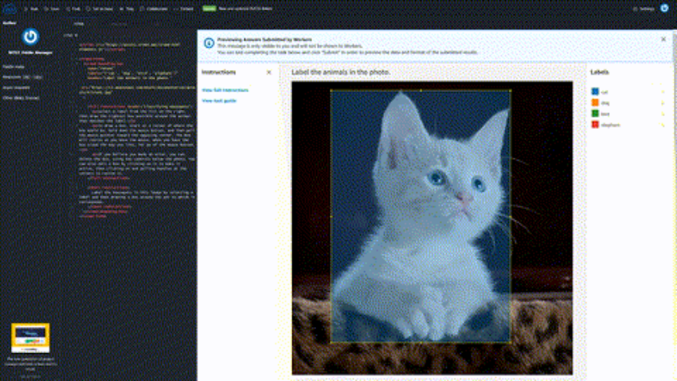

Try out an example <crowd-classifier> task. The example is rendered by JSFiddle, therefore all
the template variables are replaced with hard-coded values. Click the "View full instructions" link to
see a set of examples with extended CSS styling. You can fork the project to experiment with your
own changes to the CSS, adding sample images, or adding extended JavaScript functionality.

Example: Final Customized Intent Detection Template

This uses the example <crowd-classifier> task, but with a variable for the

<classification-target>. If you are trying to keep a consistent CSS design among a series of

different labeling jobs, you can include an external stylesheet using a <link rel...> element
the same way you'd do in any other HTML document.

Custom workflows
2739

## Page 769

Amazon SageMaker AI
Developer Guide

<crowd-form>
<crowd-classifier
name="intent"
categories="['buy', 'eat', 'watch', 'browse', 'leave']"
header="Pick the most relevant intent expressed by the text below"
>
<classification-target>
{{ task.input.source }}
</classification-target>
<full-instructions header="Emotion Classification Instructions">

In the statements and questions provided in this exercise, what category of
action is the speaker interested in doing?

<table>

<tr>
<th>Example Utterance</th>
<th>Good Choice</th>
</tr>
<tr>
<td>When is the Seahawks game on?</td>
<td>
eat 
<greenbg>watch</greenbg>
<botchoice>browse</botchoice>
</td>
</tr>
<tr>
<th>Example Utterance</th>
<th>Bad Choice</th>
</tr>
<tr>
<td>When is the Seahawks game on?</td>
<td>
buy 
<greenbg>eat</greenbg>
<botchoice>watch</botchoice>
</td>
</tr>
</table>
</full-instructions>

Custom workflows
2740

## Page 770

Amazon SageMaker AI
Developer Guide

<short-instructions>
What is the speaker expressing they would like to do next?
</short-instructions>
</crowd-classifier>
</crowd-form>

Example: Your manifest file

If you are preparing your manifest file manually for a text-classification task like this, have your
data formatted in the following manner.

{"source": "Roses are red"}
{"source": "Violets are Blue"}

Custom workflows
2742

## Page 772

Amazon SageMaker AI
Developer Guide

{"source": "Ground Truth is the best"}
{"source": "And so are you"}

This differs from the manifest file used for the "Demo template: Annotation of images with

crowd-bounding-box" demonstration in that source-ref was used as the property name

instead of source. The use of source-ref designates S3 URIs for images or other files that must

be converted to HTTP. Otherwise, source should be used like it is with the text strings above.

Your pre-annotation Lambda function

As part of the job set-up, provide the ARN of an AWS Lambda that can be called to process your
manifest entries and pass them to the template engine.

This Lambda function is required to have one of the following four strings as part of the function

name: SageMaker, Sagemaker, sagemaker, or LabelingFunction.

This applies to both your pre-annotation and post-annotation Lambdas.

When you're using the console, if you have Lambdas that are owned by your account, a drop-down
list of functions meeting the naming requirements will be provided to choose one.

In this very basic sample, where you have only one variable, it's primarily a pass-through function.
Here's a sample pre-labeling Lambda using Python 3.7.

import json

def lambda_handler(event, context):
return {
"taskInput":  event['dataObject']
}

The dataObject property of the event contains the properties from a data object in your
manifest.

In this demonstration, which is a simple pass through, you just pass that straight through as

the taskInput value. If you add properties with those values to the event['dataObject']
object, they will be available to your HTML template as Liquid variables with the format

{{ task.input.<property name> }}.

Custom workflows
2743

## Page 773

Amazon SageMaker AI
Developer Guide

Your post-annotation Lambda function

As part of the job set up, provide the ARN of an Lambda function that can be called to process
the form data when a worker completes a task. This can be as simple or complex as you want. If
you want to do answer-consolidation and scoring as data comes in, you can apply the scoring or
consolidation algorithms of your choice. If you want to store the raw data for offline processing,
that is an option.

Set permissions for your post-annotation Lambda function

The annotation data will be in a file designated by the s3Uri string in the payload object.
To process the annotations as they come in, even for a simple pass through function, you

need to assign S3ReadOnly access to your Lambda so it can read the annotation files.
In the Console page for creating your Lambda, scroll to the Execution role panel. Select
Create a new role from one or more templates. Give the role a name. From the Policy
templates drop-down, choose Amazon S3 object read-only permissions. Save the Lambda
and the role will be saved and selected.

The following sample is for Python 3.7.

import json
import boto3
from urllib.parse import urlparse

def lambda_handler(event, context):
consolidated_labels = []

parsed_url = urlparse(event['payload']['s3Uri']);
s3 = boto3.client('s3')
textFile = s3.get_object(Bucket = parsed_url.netloc, Key = parsed_url.path[1:])
filecont = textFile['Body'].read()
annotations = json.loads(filecont);
for dataset in annotations:
for annotation in dataset['annotations']:
new_annotation = json.loads(annotation['annotationData']['content'])
label = {
'datasetObjectId': dataset['datasetObjectId'],
'consolidatedAnnotation' : {
'content': {

Custom workflows
2744

## Page 774

Amazon SageMaker AI
Developer Guide

event['labelAttributeName']: {
'workerId': annotation['workerId'],
'result': new_annotation,
'labeledContent': dataset['dataObject']
}
}
}
}
consolidated_labels.append(label)

return consolidated_labels

Your labeling job output

The post-annotation Lambda will often receive batches of task results in the event object. That

batch will be the payload object the Lambda should iterate through.

You'll find the output of the job in a folder named after your labeling job in the target S3 bucket

you specified. It will be in a sub folder named manifests.

For an intent detection task, the output in the output manifest will look a bit like the demo below.
The example has been cleaned up and spaced out to be easier for humans to read. The actual
output will be more compressed for machine reading.

Example: JSON in your output manifest

[
{
"datasetObjectId":"<Number representing item's place in the manifest>",
"consolidatedAnnotation":
{
"content":
{
"<name of labeling job>":
{
"workerId":"private.us-east-1.XXXXXXXXXXXXXXXXXXXXXX",
"result":
{
"intent":
{
"label":"<label chosen by worker>"
}
},

Custom workflows
2745

## Page 775

Amazon SageMaker AI
Developer Guide

"labeledContent":
{
"content":"<text content that was labeled>"
}
}
}
}
},
"datasetObjectId":"<Number representing item's place in the manifest>",
"consolidatedAnnotation":
{
"content":
{
"<name of labeling job>":
{
"workerId":"private.us-east-1.6UDLPKQZHYWJQSCA4MBJBB7FWE",
"result":

{
"intent":
{
"label": "<label chosen by worker>"
}
},
"labeledContent":
{
"content": "<text content that was labeled>"
}
}
}
}
},
...
...
...
]

This should help you create and use your own custom template.

Create a custom workflow using the API

When you have created your custom UI template (Step 2) and processing Lambda functions
(Step 3), you should place the template in an Amazon S3 bucket with a file name format of:

<FileName>.liquid.html. Use the CreateLabelingJob action to configure your task.

Custom workflows
2746

## Page 776

Amazon SageMaker AI
Developer Guide

You'll use the location of a custom template (Creating a custom worker task template) stored

in a <filename>.liquid.html file on S3 as the value for the UiTemplateS3Uri field in the

UiConfig object within the HumanTaskConfig object.

For the AWS Lambda tasks described in Processing data in a custom labeling workflow
with AWS Lambda, the post-annotation task's ARN will be used as the value for the

AnnotationConsolidationLambdaArn field, and the pre-annotation task will be used as the

value for the PreHumanTaskLambdaArn.

Create a Labeling Job

You can create a labeling job in the Amazon SageMaker AI console and by using an AWS SDK in

your preferred language to run CreateLabelingJob. After a labeling job has been created, you
can track worker metrics (for private workforces) and your labeling job status using CloudWatch.

Before you create a labeling job it is recommended that you review the following pages, as
applicable:

• You can specify your input data using an automatic data setup in the console, or an input

manifest file in either the console or when using CreateLabelingJob API. For automated data
setup, see Automate data setup for labeling jobs. To learn how to create an input manifest file,
see Input manifest files.

• Review labeling job input data quotas: Input Data Quotas.

After you have chosen your task type, use the topics on this page to learn how to create a labeling
job.

If you are a new Ground Truth user, we recommend that you start by walking through the demo in
Getting started: Create a bounding box labeling job with Ground Truth.

Important

Ground Truth requires all S3 buckets that contain labeling job input image data to have a
CORS policy attached. To learn more, see CORS Requirement for Input Image Data.

Topics

• Built-in Task Types

Create a Labeling Job
2747

## Page 777

Amazon SageMaker AI
Developer Guide

• Create instruction pages

• Create a Labeling Job (Console)

• Create a Labeling Job (API)

• Create a streaming labeling job

• Labeling category configuration file with label category and frame attributes reference

Built-in Task Types

Amazon SageMaker Ground Truth has several built-in task types. Ground Truth provides a worker
task template for built-in task types. Additionally, some built in task types support Automate data
labeling. The following topics describe each built-in task type and demo the worker task templates
that are provided by Ground Truth in the console. To learn how to create a labeling job in the
console using one of these task types, select the task type page.

Label Images
Label Text
Label Videos and
Video Frames

Label 3D Point
Clouds

• Classify image
objects using a
bounding box

• Extract text
information using
named entity
recognition

• Classify videos

• Classify objects in a
3D point cloud with
object detection

• Identify objects
using video frame
object detection

• Create an image
classification job
(Single Label)

• Understand the 3D
point cloud object
tracking task type

• Categorize text
with text classific
ation (Single Label)

• Track objects in
video frames using
video frame object
tracking

• Create an image
classification job
(Multi-label)

• Understand
the 3D point
cloud semantic
segmentation task
type

• Categorize text
with text classific
ation (Multi-label)

• Identify image
contents using
semantic
segmentation

• Label verification
and adjustment

Create a Labeling Job
2748

## Page 778

Amazon SageMaker AI
Developer Guide

Note

Each of the video frame and 3D point cloud task types has an adjustment task type that
you use to verify and adjust labels from a previous labeling job. Select a video frame or 3D
point cloud task type page above to learn how to adjust labels created using that task type.

Create instruction pages

Create custom instructions for labeling jobs to improve your worker's accuracy in completing
their task. You can modify the default instructions that are provided in the console or you can
create your own. The instructions are shown to the worker on the page where they complete their
labeling task.

There are two kinds of instructions:

• Short instructions—instructions that are shown on the same webpage where the worker
completes their task. These instructions should provide an easy reference to show the worker the
correct way to label an object.

• Full instructions—instructions that are shown on a dialog box that overlays the page where
the worker completes their task. We recommend that you provide detailed instructions for
completing the task with multiple examples showing edge cases and other difficult situations for
labeling objects.

Create instructions in the console when you are creating your labeling job. Start with the existing
instructions for the task and use the editor to modify them to suit your labeling job.

Note

Once you create your labeling job, it will automatically start and you will not be able to
modify your worker instructions. If you need to change your worker instructions, stop the
labeling job that you created, clone it, and modify your worker instructions before creating
a new job.
You can clone a labeling job in the console by selecting the labeling job and then selecting
Clone in the Actions menu.

Create a Labeling Job
2749

## Page 779

Amazon SageMaker AI
Developer Guide

To clone a labeling job using the Amazon SageMaker API or your preferred Amazon

SageMaker SDK, make a new request to the CreateLabelingJob operation with the same
specifications as your original job after modifying your worker instructions.

For 3D point cloud and video frame labeling jobs, you can add worker instructions to your label
category configuration file. You can use a single string to create instructions or you can add HTML
mark up to customize the appearance of your instructions and add images. Make sure that any
images you include in your instructions are publicly available, or if your instructions are in Amazon
S3, that your workers have read access so that they can view them. For more information about
the label category configuration file, see the section called “Label category and frame attributes
reference”.

Short Instructions

Short instructions appear on the same web page that workers use to label your data object. For
example, the following is the editing page for a bounding box task. The short instructions panel is
on the left.

Create a Labeling Job
2750

## Page 780

Amazon SageMaker AI
Developer Guide

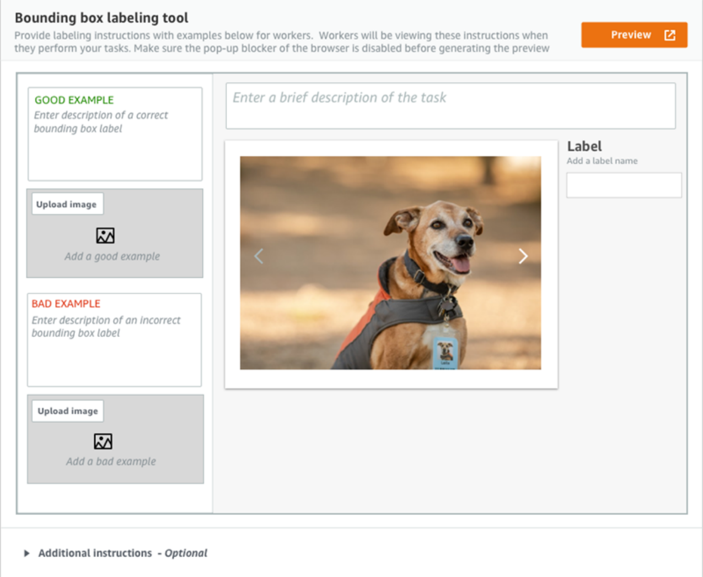

Keep in mind that a worker will only spend seconds looking at the short instructions. Workers must
be able to scan and understand your information quickly. In all cases it should take less time to
understand the instructions than it takes to complete the task. Keep these points in mind:

• Your instructions should be clear and simple.

• Pictures are better than words. Create a simple illustration of your task that your workers can
immediately understand.

• If you must use words, use short, concise examples.

• Your short instructions are more important than your full instructions.

Create a Labeling Job
2751

## Page 781

Amazon SageMaker AI
Developer Guide

The Amazon SageMaker Ground Truth console provides an editor so that you can create your short
instructions. Replace the placeholder text and images with instructions for your task. Preview the
worker's task page by choosing Preview. The preview will open in a new window, be sure to turn off
pop-up blocking so that the window will show.

Full Instructions

You can provide additional instructions for your workers in a dialog box that overlays the page
where workers label your data objects. Use full instructions to explain more complex tasks and to
show workers the proper way to label edge cases or other difficult objects.

You can create full instructions using an editor in the Ground Truth console. As with quick
instructions, keep the following in mind:

• Workers will want detailed instruction the first few times that the complete your task. Any
information that they must have should be in the quick instructions.

• Pictures are more important than words.

• Text should be concise.

• Full instructions should supplement the short instructions. Don't repeat information that appears
in the short instructions.

The Ground Truth console provides an editor so that you can create your full instructions. Replace
the placeholder text and images with instructions for your task. Preview the full instruction page
by choosing Preview. The preview will open in a new window, be sure to turn off pop-up blocking
so that the window will show.

Add example images to your instructions

Images provide useful examples for your workers. To add a publicly accessible image to your
instructions:

• Place the cursor where the image should go in the instructions editor.

• Click the image icon in the editor toolbar.

• Enter the URL of your image.

If your instruction image in Amazon S3 is not publicly accessible:

Create a Labeling Job
2752

## Page 782

Amazon SageMaker AI
Developer Guide

• As the image URL, enter: {{ 'https://s3.amazonaws.com/your-bucket-name/image-

file-name' | grant_read_access }}.

• This renders the image URL with a short-lived, one-time access code appended so the worker's
browser can display it. A broken image icon is displayed in the instructions editor, but previewing

the tool displays the image in the rendered preview.

Create a Labeling Job (Console)

You can use the Amazon SageMaker AI console to create a labeling job for all of the Ground Truth
built-in task types and custom labeling workflows. For built-in task types, we recommend that you
use this page alongside the page for your task type. Each task type page includes specific details on
creating a labeling job using that task type.

You need to provide the following to create a labeling job in the SageMaker AI console:

• An input manifest file in Amazon S3. You can place your input dataset in Amazon S3 and
automatically generate a manifest file using the Ground Truth console (not supported for 3D
point cloud labeling jobs).

Alternatively, you can manually create an input manifest file. To learn how, see Input data.

• An Amazon S3 bucket to store your output data.

• An IAM role with permission to access your resources in Amazon S3 and with a SageMaker
AI execution policy attached. For a general solution, you can attach the managed policy,

AmazonSageMakerFullAccess, to an IAM role and include sagemaker in your bucket name.

For more granular policies, see the section called “IAM Permissions”.

3D point cloud task types have additional security considerations. Learn more.

• A work team. You create a work team from a workforce made up of Amazon Mechanical Turk
workers, vendors, or your own private workers.To lean more, see Workforces.

You cannot use the Mechanical Turk workforce for 3D point cloud or video frame labeling jobs.

• If you are using a custom labeling workflow, you must save a worker task template in Amazon S3
and provide an Amazon S3 URI for that template. For more information, see Creating a custom
worker task template.

Create a Labeling Job
2753

## Page 783

Amazon SageMaker AI
Developer Guide

• (Optional) An AWS KMS key ARN if you want SageMaker AI to encrypt the output of your
labeling job using your own AWS KMS encryption key instead of the default Amazon S3 service
key.

• (Optional) Existing labels for the dataset you use for your labeling job. Use this option if you
want workers to adjust, or approve and reject labels.

• If you want to create an adjustment or verification labeling job, you must have an output
manifest file in Amazon S3 that contains the labels you want adjusted or verified. This option is
only supported for bounding box and semantic segmentation image labeling jobs and 3D point
cloud and video frame labeling jobs. It is recommended that you use the instructions on Label
verification and adjustment to create a verification or adjustment labeling job.

Important

Your work team, input manifest file, output bucket, and other resources in Amazon S3 must
be in the same AWS Region you use to create your labeling job.

When you create a labeling job using the SageMaker AI console, you add worker instructions and
labels to the worker UI that Ground Truth provides. You can preview and interact with the worker
UI while creating your labeling job in the console. You can also see a preview of the worker UI on
your built-in task type page.

To create a labeling job (console)

1.
Sign in to the SageMaker AI console at https://console.aws.amazon.com/sagemaker/.

2.
In the left navigation pane, choose Labeling jobs.

3.
On the Labeling jobs page, choose Create labeling job.

4.
For Job name, enter a name for your labeling job.

5.
(Optional) If you want to identify your labels with a key, select I want to specify a label
attribute name different from the labeling job name. If you do not select this option, the
labeling job name you specified in the previous step will be used to identify your labels in your
output manifest file.

6.
Choose a data setup to create a connection between your input dataset and Ground Truth.

• For Automated data setup:

Create a Labeling Job
2754

## Page 784

Amazon SageMaker AI
Developer Guide

• Follow the instructions in Automate data setup for labeling jobs for image, text, and video
clip labeling jobs.

• Follow the instructions in Set up Automated Video Frame Input Data for video frame
labeling jobs.

• For Manual data setup:

• For Input dataset location, provide the location in Amazon S3 in which your input
manifest file is located. For example, if your input manifest file, manifest.json, is located in
example-bucket, enter s3://example-bucket/manifest.json.

• For Output dataset location, provide the location in Amazon S3 where you want Ground
Truth to store the output data from your labeling job.

7.
For IAM Role, choose an existing IAM role or create an IAM role with permission to access your
resources in Amazon S3, to write to the output Amazon S3 bucket specified above, and with a
SageMaker AI execution policy attached.

8.
(Optional) For Additional configuration, you can specify how much of your dataset you
want workers to label, and if you want SageMaker AI to encrypt the output data for your
labeling job using an AWS KMS encryption key. To encrypt your output data, you must have
the required AWS KMS permissions attached to the IAM role you provided in the previous step.
For more details, see the section called “IAM Permissions”.

9.
In the Task type section, under Task category, use the dropdown list to select your task
category.

10. In Task selection, choose your task type.

11. (Optional) Provide tags for your labeling job to make it easier to find in the console later.

12. Choose Next.

13. In the Workers section, choose the type of workforce you would like to use. For more details

about your workforce options see Workforces.

14. (Optional) After you've selected your workforce, specify the Task timeout. This is the

maximum amount of time a worker has to work on a task.

For 3D point cloud annotation tasks, the default task timeout is 3 days. The default timeout
for text and image classification and label verification labeling jobs is 5 minutes. The default
timeout for all other labeling jobs is 60 minutes.

15. (Optional) For bounding box, semantic segmentation, video frame, and 3D point cloud task

types, you can select Display existing labels if you want to display labels for your input data
set for workers to verify or adjust.

Create a Labeling Job
2755

## Page 785

Amazon SageMaker AI
Developer Guide

For bounding box and semantic segmentation labeling jobs, this will create an adjustment
labeling job.

For 3D point cloud and video frame labeling jobs:

• Select Adjustment to create an adjustment labeling job. When you select this option, you
can add new labels but you cannot remove or edit existing labels from the previous job.
Optionally, you can choose label category attributes and frame attributes that you want
workers to edit. To make an attribute editable, select the check box Allow workers to edit
this attribute for that attribute.

Optionally, you can add new label category and frame attributes.

• Select Verification to create an adjustment labeling job. When you select this option, you
cannot add, modify, or remove existing labels from the previous job. Optionally, you can

choose label category attributes and frame attributes that you want workers to edit. To
make an attribute editable, select the check box Allow workers to edit this attribute for
that attribute.

We recommend that you can add new label category attributes to the labels that you want
workers to verify, or add one or more frame attributes to have workers provide information
about the entire frame.

For more information, see Label verification and adjustment.

16. Configure your workers' UI:

• If you are using a built-in task type, specify workers instructions and labels.

• For image classification and text classification (single and multi-label) you must specify at
least two label categories. For all other built-in task types, you must specify at least one
label category.

• (Optional) If you are creating a 3D point cloud or video frame labeling job, you can specify
label category attributes (not supported for 3D point cloud semantic segmentation) and
frame attributes. Label category attributes can be assigned to one or more labels. Frame
attributes will appear on each point cloud or video frame workers label. To learn more,
see Worker user interface (UI) for 3D point cloud and Worker user interface (UI) for video
frame.

• (Optional) Add Additional instructions to help your worker complete your task.

Create a Labeling Job
2756

## Page 786

Amazon SageMaker AI
Developer Guide

• If you are creating a custom labeling workflow you must :

• Enter a custom template in the code box. Custom templates can be created using a
combination of HTML, the Liquid templating language and our pre-built web components.
Optionally, you can choose a base-template from the drop-down menu to get started.

• Specify pre-annotation and post-annotation lambda functions. To learn how to create
these functions, see Processing data in a custom labeling workflow with AWS Lambda.

17. (Optional) You can select See preview to preview your worker instructions, labels, and interact

with the worker UI. Make sure the pop-up blocker of the browser is disabled before generating
the preview.

18. Choose Create.

After you've successfully created your labeling job, you are redirected to the Labeling jobs page.
The status of the labeling job you just created is In progress. This status progressively updates
as workers complete your tasks. When all tasks are successfully completed, the status changes to
Completed.

If an issue occurs while creating the labeling job, its status changes to Failed.

To view more details about the job, choose the labeling job name.

Next Steps

After your labeling job status changes to Completed, you can view your output data in the Amazon
S3 bucket that you specified while creating that labeling job. For details about the format of your
output data, see Labeling job output data.

Create a Labeling Job (API)

To create a labeling job using the Amazon SageMaker API, you use the CreateLabelingJob
operation. For specific instructions on creating a labeling job for a built-in task type, see that
task type page. To learn how to create a streaming labeling job, which is a labeling job that runs
perpetually, see Create a streaming labeling job.

To use the CreateLabelingJob operation, you need the following:

• A worker task template (UiTemplateS3Uri) or human task UI ARN (HumanTaskUiArn) in
Amazon S3.

Create a Labeling Job
2757

## Page 787

Amazon SageMaker AI
Developer Guide

• For 3D point cloud jobs, video object detection and tracking jobs, and NER jobs, use the ARN

listed in HumanTaskUiArn for your task type.

• If you are using a built-in task type other than 3D point cloud tasks, you can add your worker
instructions to one of the pre-built templates and save the template (using a .html or .liquid
extension) in your S3 bucket. Find the pre-build templates on your task type page.

• If you are using a custom labeling workflow, you can create a custom template and save the
template in your S3 bucket. To learn how to built a custom worker template, see Creating a
custom worker task template. For custom HTML elements that you can use to customize your
template, see Crowd HTML Elements Reference. For a repository of demo templates for a
variety of labeling tasks, see Amazon SageMaker Ground Truth Sample Task UIs .

• An input manifest file that specifies your input data in Amazon S3. Specify the location of your

input manifest file in ManifestS3Uri. For information about creating an input manifest, see
Input data. If you create a streaming labeling job, this is optional. To learn how to create a
streaming labeling job, see Create a streaming labeling job.

• An Amazon S3 bucket to store your output data. You specify this bucket, and optionally, a prefix

in S3OutputPath.

• A label category configuration file. Each label category name must be unique. Specify the

location of this file in Amazon S3 using the LabelCategoryConfigS3Uri parameter. The
format and label categories for this file depend on the task type you use:

• For image classification and text classification (single and multi-label) you must specify at
least two label categories. For all other task types, the minimum number of label categories
required is one.

• For named entity recognition tasks, you must provide worker instructions in this file. See
Provide Worker Instructions in a Label Category Configuration File for details and an example.

• For 3D point cloud and video frame task type, use the format in Labeling category
configuration file with label category and frame attributes reference.

• For all other built-in task types and custom tasks, your label category configuration file
must be a JSON file in the following format. Identify the labels you want to use by replacing

label_1, label_2,...,label_n with your label categories.

{
"document-version": "2018-11-28",
"labels": [
{"label": "label_1"},
{"label": "label_2"},

Create a Labeling Job
2758

## Page 788

Amazon SageMaker AI
Developer Guide

...
{"label": "label_n"}
]
}

• An AWS Identity and Access Management (IAM) role with the
AmazonSageMakerGroundTruthExecution managed IAM policy attached and with permissions

to access your S3 buckets. Specify this role in RoleArn. To learn more about this policy, see
Use IAM Managed Policies with Ground Truth. If you require more granular permissions, see the
section called “IAM Permissions”.

If your input or output bucket name does not contain sagemaker, you can attach a policy similar

to the following to the role that is passed to the CreateLabelingJob operation.

JSON

{
"Version":"2012-10-17",
"Statement": [
{
"Effect": "Allow",
"Action": [
"s3:GetObject"
],
"Resource": [
"arn:aws:s3:::my_input_bucket/*"
]
},
{
"Effect": "Allow",
"Action": [
"s3:PutObject"
],
"Resource": [
"arn:aws:s3:::my_output_bucket/*"
]
}
]
}

• A pre-annotation and post-annotation (or annotation-consolidation) AWS Lambda function
Amazon Resource Name (ARN) to process your input and output data.

Create a Labeling Job
2759

## Page 789

Amazon SageMaker AI
Developer Guide

• Lambda functions are predefined in each AWS Region for built-in task types. To find
the pre-annotation Lambda ARN for your Region, see PreHumanTaskLambdaArn.
To find the annotation-consolidation Lambda ARN for your Region, see
AnnotationConsolidationLambdaArn.

• For custom labeling workflows, you must provide a custom pre- and post-annotation Lambda
ARN. To learn how to create these Lambda functions, see Processing data in a custom labeling
workflow with AWS Lambda.

• A work team ARN that you specify in WorkteamArn. You receive a work team ARN when you
subscribe to a vendor workforce or create a private workteam. If you are creating a labeling
job for a video frame or point cloud task type, you cannot use the Amazon Mechanical Turk
workforce. For all other task types, to use the Mechanical Turk workforce, use the following ARN.

Replace region with the AWS Region you are using to create the labeling job.

arn:aws:sagemaker:region:394669845002:workteam/public-crowd/default

If you use the Amazon Mechanical Turk workforce, use the ContentClassifiers parameter

in DataAttributes of InputConfig to declare that your content is free of personally
identifiable information and adult content.

Ground Truth requires that your input data is free of personally identifiable information (PII) if
you use the Mechanical Turk workforce. If you use Mechanical Turk and do not specify that your

input data is free of PII using the FreeOfPersonallyIdentifiableInformation flag, your

labeling job will fail. Use the FreeOfAdultContent flag to declare that your input data is free
of adult content. SageMaker AI may restrict the Amazon Mechanical Turk workers that can view
your task if it contains adult content.

To learn more about work teams and workforces, see Workforces.

• If you use the Mechanical Turk workforce, you must specify the price you'll pay workers for

performing a single task in PublicWorkforceTaskPrice.

• To configure the task, you must provide a task description and title using TaskDescription

and TaskTitle respectively. Optionally, you can provide time limits that control how long the

workers have to work on an individual task (TaskTimeLimitInSeconds) and how long tasks

remain in the worker portal, available to workers (TaskAvailabilityLifetimeInSeconds).

• (Optional) For some task types, you can have multiple workers label a single data object by

inputting a number greater than one for the NumberOfHumanWorkersPerDataObject
parameter. For more information about annotation consolidation, see Annotation consolidation.

Create a Labeling Job
2760

## Page 790

Amazon SageMaker AI
Developer Guide

• (Optional) To create an automated data labeling job, specify one of the ARNs listed

in LabelingJobAlgorithmSpecificationArn in LabelingJobAlgorithmsConfig. This
ARN identifies the algorithm used in the automated data labeling job. The task type

associated with this ARN must match the task type of the PreHumanTaskLambdaArn and

AnnotationConsolidationLambdaArn you specify. Automated data labeling is supported for
the following task types: image classification, bounding box, semantic segmentation, and text
classification. The minimum number of objects allowed for automated data labeling is 1,250,
and we strongly suggest providing a minimum of 5,000 objects. To learn more about automated
data labeling jobs, see Automate data labeling.

• (Optional) You can provide StoppingConditions that cause the labeling job to stop if one the
conditions is met. You can use stopping conditions to control the cost of the labeling job.

Examples

The following code examples demonstrate how to create a labeling job using

CreateLabelingJob. You can also see these example notebooks on GitHub in the SageMaker AI
Examples repository.

AWS SDK for Python (Boto3)

The following is an example of an AWS Python SDK (Boto3) request to create a labeling job
for a built-in task type in the US East (N. Virginia) Region using a private workforce. Replace all

red-italized text with your labeling job resources and specifications.

response = client.create_labeling_job(
LabelingJobName="example-labeling-job",
LabelAttributeName="label",
InputConfig={
'DataSource': {
'S3DataSource': {
'ManifestS3Uri': "s3://bucket/path/manifest-with-input-data.json"
}
},
'DataAttributes': {
'ContentClassifiers': [
"FreeOfPersonallyIdentifiableInformation"|"FreeOfAdultContent",
]
}
},
OutputConfig={

Create a Labeling Job
2761

## Page 791

Amazon SageMaker AI
Developer Guide

'S3OutputPath': "s3://bucket/path/file-to-store-output-data",
'KmsKeyId': "string"
},
RoleArn="arn:aws:iam::*:role/*",
LabelCategoryConfigS3Uri="s3://bucket/path/label-categories.json",
StoppingConditions={
'MaxHumanLabeledObjectCount': 123,
'MaxPercentageOfInputDatasetLabeled': 123
},
HumanTaskConfig={
'WorkteamArn': "arn:aws:sagemaker:region:*:workteam/private-crowd/*",
'UiConfig': {
'UiTemplateS3Uri': "s3://bucket/path/custom-worker-task-template.html"
},
'PreHumanTaskLambdaArn': "arn:aws:lambda:us-
east-1:432418664414:function:PRE-tasktype",
'TaskKeywords': [

"Images",
"Classification",
"Multi-label"
],
'TaskTitle': "Multi-label image classification task",
'TaskDescription': "Select all labels that apply to the images shown",
'NumberOfHumanWorkersPerDataObject': 1,
'TaskTimeLimitInSeconds': 3600,
'TaskAvailabilityLifetimeInSeconds': 21600,
'MaxConcurrentTaskCount': 1000,
'AnnotationConsolidationConfig': {
'AnnotationConsolidationLambdaArn': "arn:aws:lambda:us-
east-1:432418664414:function:ACS-"
},
Tags=[
{
'Key': "string",
'Value': "string"
},
]
)

AWS CLI

The following is an example of an AWS CLI request to create a labeling job for a built-in task
type in the US East (N. Virginia) Region using the Amazon Mechanical Turk workforce. For

Create a Labeling Job
2762

## Page 792

Amazon SageMaker AI
Developer Guide

more information, see start-human-loop in the AWS CLI Command Reference. Replace all red-

italized text with your labeling job resources and specifications.

$ aws --region us-east-1 sagemaker create-labeling-job \
--labeling-job-name "example-labeling-job" \
--label-attribute-name "label" \
--role-arn "arn:aws:iam::account-id:role/role-name" \
--input-config '{
"DataAttributes": {
"ContentClassifiers": [
"FreeOfPersonallyIdentifiableInformation",
"FreeOfAdultContent"
]
},
"DataSource": {
"S3DataSource": {
"ManifestS3Uri": "s3://bucket/path/manifest-with-input-data.json"
}
}
}' \
--output-config '{
"KmsKeyId": "",
"S3OutputPath": "s3://bucket/path/file-to-store-output-data"
}' \
--human-task-config '{
"AnnotationConsolidationConfig": {
"AnnotationConsolidationLambdaArn": "arn:aws:lambda:us-
east-1:432418664414:function:ACS-"
},
"TaskAvailabilityLifetimeInSeconds": 21600,
"TaskTimeLimitInSeconds": 3600,
"NumberOfHumanWorkersPerDataObject": 1,
"PreHumanTaskLambdaArn":  "arn:aws:lambda:us-
east-1:432418664414:function:PRE-tasktype",
"WorkteamArn": "arn:aws:sagemaker:us-east-1:394669845002:workteam/public-
crowd/default",
"PublicWorkforceTaskPrice": {
"AmountInUsd": {
"Dollars": 0,
"TenthFractionsOfACent": 6,
"Cents": 3
}
},

Create a Labeling Job
2763

## Page 793

Amazon SageMaker AI
Developer Guide

"TaskDescription": "Select all labels that apply to the images shown",
"MaxConcurrentTaskCount": 1000,
"TaskTitle": "Multi-label image classification task",,
"TaskKeywords": [
"Images",
"Classification",
"Multi-label"
],
"UiConfig": {
"UiTemplateS3Uri": "s3://bucket/path/custom-worker-task-template.html"
}
}'

For more information about this operation, see CreateLabelingJob. For information about how to

use other language-specific SDKs, see See Also in the CreateLabelingJobs topic.

Create a streaming labeling job

Streaming labeling jobs enable you to send individual data objects in real time to a perpetually
running, streaming labeling job. To create a streaming labeling job, you can specify the

Amazon SNS input topic ARN, SnsTopicArn, in the InputConfig parameter when making a

CreateLabelingJob request. Optionally, you can also create an Amazon SNS output topic and

specify it in OutputConfigif you want to receive label data in real time.

Important

If you are a new user of Ground Truth streaming labeling jobs, it is recommended that
you review Ground Truth streaming labeling jobs before creating a streaming labeling job.
Ground Truth streaming labeling jobs are only supported through the SageMaker API.

Use the following sections to create the resources that you need and can use to create a streaming
labeling job:

• Learn how to create SNS topics with the permissions required for Ground Truth streaming
labeling jobs by following the steps in Use Amazon SNS Topics for Data Labeling. Your SNS
topics must be created in the same AWS Region as your labeling job.

Create a Labeling Job
2764

## Page 794

Amazon SageMaker AI
Developer Guide

• See Subscribe an Endpoint to Your Amazon SNS Output Topic to learn how to set up an
endpoint to receive labeling task output data at a specified endpoint each time a labeling task is
completed.

• To learn how to configure your Amazon S3 bucket to send notifications to your Amazon SNS
input topic, see Creating Amazon S3 based bucket event notifications based of the Amazon SNS
defined in your labeling job.

• Optionally, add data objects that you want to have labeled as soon as the labeling job starts to
your input manifest. For more information, see Create a Manifest File (Optional).

• There are other resources required to create a labeling job, such as an IAM role, Amazon S3
bucket, a worker task template and label categories. These are described in the Ground Truth
documentation on creating a labeling job. For more information, see Create a Labeling Job.

Important

When you create a labeling job you must provide an IAM execution role. Attach the AWS
managed policy AmazonSageMakerGroundTruthExecution to this role to ensure it has
required permissions to execute your labeling job.

When you submit a request to create a streaming labeling job, the state of your labeling job

is Initializing. Once the labeling job is active, the state changes to InProgress. Do not
send new data objects to your labeling job or attempt to stop your labeling job while it is in the

Initializing state. Once the state changes to InProgress, you can start sending new data
objects using Amazon SNS and the Amazon S3 configuration.

Topics

• Use Amazon SNS Topics for Data Labeling

• Creating Amazon S3 based bucket event notifications based of the Amazon SNS defined in your
labeling job

• Create a Manifest File (Optional)

• Create a Streaming Labeling Job with the SageMaker API

• Stop a Streaming Labeling Job

Create a Labeling Job
2765

## Page 795

Amazon SageMaker AI
Developer Guide

Use Amazon SNS Topics for Data Labeling

You need to create an Amazon SNS input to create a streaming labeling job. Optionally, you may
provide an Amazon SNS output topic.

When you create an Amazon SNS topic to use in your streaming labeling job, note down the topic

Amazon Resource Name (ARN). The ARN will be the input values for the parameter SnsTopicArn

in InputConfig and OutputConfig when you create a labeling job.

Create an Input Topic

Your input topic is used to send new data objects to Ground Truth. To create an input topic, follow
the instructions in Creating an Amazon SNS topic in the Amazon Simple Notification Service
Developer Guide.

Note down your input topic ARN and use it as input for the CreateLabelingJob parameter

SnsTopicArn in InputConfig.

Create an Output Topic

If you provide an output topic, it is used to send notifications when a data object is labeled. When
you create a topic, you have the option to add an encryption key. Use this option to add a AWS
Key Management Service customer managed key to your topic to encrypt the output data of your
labeling job before it is published to your output topic.

To create an output topic, follow the instructions in Creating an Amazon SNS topic in the Amazon
Simple Notification Service Developer Guide.

If you add encryption, you must attach additional permission to the topic. See Add Encryption to
Your Output Topic (Optional). for more information.

Important

To add a customer managed key to your output topic while creating a topic in the console,
do not use the (Default) alias/aws/sns option. Select a customer managed key that you
created.

Note down your input topic ARN and use it in your CreateLabelingJob request in the parameter

SnsTopicArn in OutputConfig.

Create a Labeling Job
2766

## Page 796

Amazon SageMaker AI
Developer Guide

Add Encryption to Your Output Topic (Optional)

To encrypt messages published to your output topic, you need to provide an AWS KMS customer
managed key to your topic. Modify the following policy and add it to your customer managed key
to give Ground Truth permission to encrypt output data before publishing it to your output topic.

Replace <account_id> with the ID of the account that you are using to create your topic. To learn
how to find your AWS account ID, see Finding Your AWS Account ID.

JSON

{
"Id": "key-console-policy",
"Version":"2012-10-17",
"Statement": [
{
"Sid": "Enable IAM User Permissions",
"Effect": "Allow",
"Principal": {
"AWS": "arn:aws:iam::111122223333:root"
},
"Action": "kms:*",
"Resource": "*"
},
{
"Sid": "Allow access for Key Administrators",
"Effect": "Allow",
"Principal": {
"AWS": "arn:aws:iam::111122223333:role/Admin"
},
"Action": [
"kms:Create*",
"kms:Describe*",
"kms:Enable*",
"kms:List*",
"kms:Put*",
"kms:Update*",
"kms:Revoke*",
"kms:Disable*",
"kms:Get*",
"kms:Delete*",
"kms:TagResource",

Create a Labeling Job
2767

## Page 797

Amazon SageMaker AI
Developer Guide

"kms:UntagResource",
"kms:ScheduleKeyDeletion",
"kms:CancelKeyDeletion"
],
"Resource": "*"
}
]
}

Additionally, you must modify and add the following policy to the execution role that you use to

create your labeling job (the input value for RoleArn).

Replace <account_id> with the ID of the account that you are using to create your topic. Replace

<region> with the AWS Region you are using to create your labeling job. Replace <key_id> with
your customer managed key ID.

JSON

{
"Version":"2012-10-17",
"Statement": [
{
"Sid": "sid1",
"Effect": "Allow",
"Action": [
"kms:Decrypt",
"kms:GenerateDataKey"
],
"Resource": "arn:aws:kms:us-east-1:111122223333:key/your_key_id"
}
]
}

For more information on creating and securing keys, see Creating Keys and Using Key Policies in
the AWS Key Management Service Developer Guide.

Subscribe an Endpoint to Your Amazon SNS Output Topic

When a worker completes a labeling job task from a Ground Truth streaming labeling job, Ground
Truth uses your output topic to publish output data to one or more endpoints that you specify. To

Create a Labeling Job
2768

## Page 798

Amazon SageMaker AI
Developer Guide

receive notifications when a worker finishes a labeling task, you must subscribe an endpoint to your
Amazon SNS output topic.

To learn how to add endpoints to your output topic, see  Subscribing to an Amazon SNS topic in
the Amazon Simple Notification Service Developer Guide.

To learn more about the output data format that is published to these endpoints, see Labeling job
output data.

Important

If you do not subscribe an endpoint to your Amazon SNS output topic, you will not receive
notifications when new data objects are labeled.

Creating Amazon S3 based bucket event notifications based of the Amazon SNS defined in your
labeling job

Changes to your Amazon S3 bucket, event notifications, are enabled either the Amazon S3 console,
API, language specific AWS SDKs, or the AWS Command Line Interface. Events must use the same

Amazon SNS input topic ARN, SnsTopicArn, specified in the InputConfig parameter as part of

your CreateLabelingJob request.

Amazon S3 bucket notifications and your input data should not be the same Amazon S3
bucket

When you create event notifications do not use the same Amazon S3 location that you

specified as your S3OutputPath in the OutputConfig parameters. Linking the two
buckets may result in unwanted data objects being processed by Ground Truth for labeling.

You control the types of events that you want to send to your Amazon SNS topic. Ground Truth
creates a labeling job when you send object creation events.

The event structure sent to your Amazon SNS input topic must be a JSON message formatted
using the same structure found in Event message structure.

To see examples of how you can set up an event notification for your Amazon S3 bucket
using the Amazon S3 console, AWS SDK for .NET, and AWS SDK for Java, follow this

Create a Labeling Job
2769

## Page 799

Amazon SageMaker AI
Developer Guide

walkthrough,Walkthrough: Configure a bucket for notifications (SNS topic or SQS queue) in the
Amazon Simple Storage Service User Guide.

Amazon EventBridge notifications are not natively supported. To use EventBridge based
notification you must update the output format to match the JSON format used in the Event
message structure.

Create a Manifest File (Optional)

When you create a streaming labeling job, you have the one time option to add objects

(such as images or text) to an input manifest file that you specify in ManifestS3Uri of

CreateLabelingJob. When the streaming labeling job starts, these objects are sent
to workers or added to the Amazon SQS queue if the total number of objects exceed

MaxConcurrentTaskCount. The results are added to the Amazon S3 path that you specify when
creating the labeling job periodically as workers complete labeling tasks. Output data is sent to any

endpoint that you subscribe to your output topic.

If you want to provide initial objects to be labeled, create a manifest file that identifies these

objects and place it in Amazon S3. Specify the S3 URI of this manifest file in ManifestS3Uri

within InputConfig.

To learn how to format your manifest file, see Input data. To use the SageMaker AI console to
automatically generate a manifest file (not supported for 3D point cloud task types), see Automate
data setup for labeling jobs.

Create a Streaming Labeling Job with the SageMaker API

The following is an example of an AWS Python SDK (Boto3) request that you can use to start a
streaming labeling job for a built-in task type in the US East (N. Virginia) Region. For more details

about each parameter below see CreateLabelingJob. To learn how you can create a labeling job
using this API and associated language specific SDKs, see Create a Labeling Job (API).

In this example, note the following parameters:

• SnsDataSource – This parameter appears in InputConfig and OutputConfig and is used to
identify your input and output Amazon SNS topics respectively. To create a streaming labeling
job, you are required to provide an Amazon SNS input topic. Optionally, you can also provide an
Amazon SNS output topic.

• S3DataSource – This parameter is optional. Use this parameter if you want to include an input
manifest file of data objects that you want labeled as soon as the labeling job starts.

Create a Labeling Job
2770

## Page 800

Amazon SageMaker AI
Developer Guide

• StoppingConditions – This parameter is ignored when you create a streaming labeling job. To
learn more about stopping a streaming labeling job, see Stop a Streaming Labeling Job.

• Streaming labeling jobs do not support automated data labeling. Do not include the

LabelingJobAlgorithmsConfig parameter.

response = client.create_labeling_job(

LabelingJobName= 'example-labeling-job',
LabelAttributeName='label',
InputConfig={
'DataSource': {
'S3DataSource': {
'ManifestS3Uri': 's3://bucket/path/manifest-with-input-data.json'
},
'SnsDataSource': {
'SnsTopicArn': 'arn:aws:sns:us-east-1:123456789012:your-sns-input-
topic'
}
},
'DataAttributes': {
'ContentClassifiers': [
'FreeOfPersonallyIdentifiableInformation'|'FreeOfAdultContent',
]
}
},
OutputConfig={
'S3OutputPath': 's3://bucket/path/file-to-store-output-data',
'KmsKeyId': 'string',
'SnsTopicArn': 'arn:aws:sns:us-east-1:123456789012:your-sns-output-topic'
},
RoleArn='arn:aws:iam::*:role/*',
LabelCategoryConfigS3Uri='s3://bucket/path/label-categories.json',
HumanTaskConfig={
'WorkteamArn': 'arn:aws:sagemaker:us-east-1:*:workteam/private-crowd/*',
'UiConfig': {
'UiTemplateS3Uri': 's3://bucket/path/custom-worker-task-template.html'
},
'PreHumanTaskLambdaArn': 'arn:aws:lambda:us-
east-1:432418664414:function:PRE-tasktype',
'TaskKeywords': [
'Example key word',
],
'TaskTitle': 'Multi-label image classification task',

Create a Labeling Job
2771

## Page 801

Amazon SageMaker AI
Developer Guide

'TaskDescription': 'Select all labels that apply to the images shown',
'NumberOfHumanWorkersPerDataObject': 123,
'TaskTimeLimitInSeconds': 123,
'TaskAvailabilityLifetimeInSeconds': 123,
'MaxConcurrentTaskCount': 123,
'AnnotationConsolidationConfig': {
'AnnotationConsolidationLambdaArn': 'arn:aws:lambda:us-
east-1:432418664414:function:ACS-tasktype'
}
},
Tags=[
{
'Key': 'string',
'Value': 'string'
},
]
)

Stop a Streaming Labeling Job

You can manually stop your streaming labeling job using the operation StopLabelingJob.

If your labeling job remains idle for over 10 days, it is automatically stopped by Ground Truth.
In this context, a labeling job is considered idle if no objects are sent to the Amazon SNS input
topic and no objects remain in your Amazon SQS queue, waiting to be labeled. For example, if no
data objects are fed to the Amazon SNS input topic and all the objects fed to the labeling job are
already labeled, Ground Truth starts a timer. After the timer starts, if no items are received within a
10 day period, the labeling job is stopped.

When a labeling job is stopped, its status is STOPPING while Ground Truth cleans up labeling job
resources and unsubscribes your Amazon SNS topic from your Amazon SQS queue. The Amazon
SQS is not deleted by Ground Truth because this queue may contain unprocessed data objects. You
should manually delete the queue if you want to avoid incurring additional charges from Amazon
SQS. To learn more, see Amazon SQS pricing .

Labeling category configuration file with label category and frame attributes
reference

When you create a 3D point cloud or video frame labeling job using the Amazon SageMaker API

operation CreateLabelingJob, you use a label category configuration file to specify your labels

Create a Labeling Job
2772

## Page 802

Amazon SageMaker AI
Developer Guide

and worker instructions. Optionally, you can also provide the following in your label category
attribute file:

• You can provide label category attributes for video frame and 3D point cloud object tracking and
object detection task types. Workers can use one or more attributes to give more information
about an object. For example, you may want to use the attribute occluded to have workers
identify when an object is partially obstructed. You can either specify a label category attribute

for a single label using the categoryAttributes parameter, or for all labels using the

categoryGlobalAttributes parameter.

• You can provide frame attributes for video frame and 3D point cloud object tracking and

object detection task types using frameAttributes. When you create a frame attribute, it
appears on each frame or point cloud in the worker task. In video frame labeling jobs, these are
attributes that workers assign to an entire video frame. For 3D point cloud labeling jobs, these
attributes are applied to a single point cloud. Use frame attributes to have workers provide more

information about the scene in a specific frame or point cloud.

• For video frame labeling jobs, you use the label category configuration file to specify the task
type (bounding box, polyline, polygon, or keypoint) sent to workers.

For workers, specifying values for label category attributes and frame attributes will be optional.

Important

You should only provide a label attribute name in auditLabelAttributeName if
you are running an audit job to verify or adjust labels. Use this parameter to input the
LabelAttributeName used in the labeling job that generated the annotations you want your
worker to adjust. When you create a labeling job in the console, if you did not specify a
label attribute name, the Name of your job is used as the LabelAttributeName.

The following topics show examples of a label category configuration file for different kinds of
labeling jobs. They also explain the schema and quotas of a category configuration file.

Topics

• Examples: label category configuration files for 3D point cloud labeling jobs

• Examples: label category configuration files for video frame labeling jobs

• Label category configuration file schema

Create a Labeling Job
2773

## Page 803

Amazon SageMaker AI
Developer Guide

• Label and label category attribute quotas

Examples: label category configuration files for 3D point cloud labeling jobs

The following topics show examples of 3D point cloud label category configuration files for object
detection, object tracking, semantic segmentation, adjustment, and verification labeling jobs.

Topics

• Example: 3D point cloud object tracking and object detection

• Example: 3D point cloud semantic segmentation

• Example: 3D point cloud adjustment

• Example: 3D point cloud verification

Example: 3D point cloud object tracking and object detection

The following is an example of a label category configuration file that includes label category
attributes for a 3D point cloud object detection or object tracking labeling job. This example
includes a two frame attributes, which will be added to all point clouds submitted to the labeling

job. The Car label will include four label category attributes—X, Y, Z, and the global attribute, W.

{
"documentVersion": "2020-03-01",
"frameAttributes": [
{
"name":"count players",
"description":"How many players to you see in the scene?",
"type":"number"
},
{
"name":"select one",
"description":"describe the scene",
"type":"string",
"enum":["clear","blurry"],
"isRequired":true
},
],
"categoryGlobalAttributes": [
{
"name":"W",
"description":"label-attributes-for-all-labels",

Create a Labeling Job
2774

## Page 804

Amazon SageMaker AI
Developer Guide

"type":"string",
"enum": ["foo", "buzz", "biz"]
}
],
"labels": [
{
"label": "Car",
"categoryAttributes": [
{
"name":"X",
"description":"enter a number",
"type":"number",
},
{
"name":"Y",
"description":"select an option",
"type":"string",

"enum":["y1", "y2"]
},
{
"name":"Z",
"description":"submit a free-form response",
"type":"string",
}
]
},
{
"label": "Pedestrian",
"categoryAttributes": [...]
}
],
"instructions": {"shortInstruction":"Draw a tight Cuboid", "fullInstruction":"<html
markup>"}
}

Example: 3D point cloud semantic segmentation

The following is an example of a label category configuration file for a 3D point cloud semantic
segmentation labeling job.

Label category attributes are not supported for 3D point cloud semantic segmentation task
types. Frame attributes are supported. If you provide label category attributes for a semantic
segmentation labeling job, they will be ignored.

Create a Labeling Job
2775

## Page 805

Amazon SageMaker AI
Developer Guide

{
"documentVersion": "2020-03-01",
"frameAttributes": [
{
"name":"count players",
"description":"How many players to you see in the scene?",
"type":"number"
},
{
"name":"select one",
"description":"describe the scene",
"type":"string",
"enum":["clear","blurry"]
},
],
"labels": [

{
"label": "Car",
},
{
"label": "Pedestrian",
},
{
"label": "Cyclist",
}
],
"instructions": {"shortInstruction":"Select the appropriate label and
paint all objects in the point cloud that it applies to the same color",
"fullInstruction":"<html markup>"}
}

Example: 3D point cloud adjustment

The following is an example of a label category configuration file for a 3D point cloud object
detection or object tracking adjustment labeling job. For 3D point cloud semantic segmentation

adjustment labeling jobs, categoryGlobalAttributes and categoryAttributes are not
supported.

You must include auditLabelAttributeName to specify the label attribute name of the previous
labeling job that you use to create the adjustment labeling job. Optionally, you can use the

editsAllowed parameter to specify whether or not a label or frame attribute can be edited.

Create a Labeling Job
2776

## Page 806

Amazon SageMaker AI
Developer Guide

{
"documentVersion": "2020-03-01",
"frameAttributes": [
{
"name":"count players",
"description":"How many players to you see in the scene?",
"type":"number"
},
{
"name":"select one",
"editsAllowed":"none",
"description":"describe the scene",
"type":"string",
"enum":["clear","blurry"]
},
],

"categoryGlobalAttributes": [
{
"name":"W",
"editsAllowed":"any",
"description":"label-attributes-for-all-labels",
"type":"string",
"enum": ["foo", "buzz", "biz"]
}
],
"labels": [
{
"label": "Car",
"editsAllowed":"any",
"categoryAttributes": [
{
"name":"X",
"description":"enter a number",
"type":"number"
},
{
"name":"Y",
"description":"select an option",
"type":"string",
"enum":["y1", "y2"],
"editsAllowed":"any"
},
{

Create a Labeling Job
2777

## Page 807

Amazon SageMaker AI
Developer Guide

"name":"Z",
"description":"submit a free-form response",
"type":"string",
"editsAllowed":"none"
}
]
},
{
"label": "Pedestrian",
"categoryAttributes": [...]
}
],
"instructions": {"shortInstruction":"Draw a tight Cuboid", "fullInstruction":"<html
markup>"},
// include auditLabelAttributeName for label adjustment jobs
"auditLabelAttributeName": "myPrevJobLabelAttributeName"
}

Example: 3D point cloud verification

The following is an example of a label category configuration file you may use for a 3D
point cloud object detection or object tracking verification labeling job. For a 3D point

cloud semantic segmentation verification labeling job, categoryGlobalAttributes and

categoryAttributes are not supported.

You must include auditLabelAttributeName to specify the label attribute name of the previous
labeling job that you use to create the verification labeling job. Additionally, you must use the

editsAllowed parameter to specify that no labels can be edited.

{
"documentVersion": "2020-03-01",
"frameAttributes": [
{
"name":"count players",
"editsAllowed":"any",
"description":"How many players to you see in the scene?",
"type":"number"
},
{
"name":"select one",
"editsAllowed":"any",
"description":"describe the scene",
"type":"string",

Create a Labeling Job
2778

## Page 808

Amazon SageMaker AI
Developer Guide

"enum":["clear","blurry"]
},
],
"categoryGlobalAttributes": [
{
"name":"W",
"editsAllowed":"none",
"description":"label-attributes-for-all-labels",
"type":"string",
"enum": ["foo", "buzz", "biz"]
}
],
"labels": [
{
"label": "Car",
"editsAllowed":"none",
"categoryAttributes": [

{
"name":"X",
"description":"enter a number",
"type":"number",
"editsAllowed":"none"
},
{
"name":"Y",
"description":"select an option",
"type":"string",
"enum":["y1", "y2"],
"editsAllowed":"any"
},
{
"name":"Z",
"description":"submit a free-form response",
"type":"string",
"editsAllowed":"none"
}
]
},
{
"label": "Pedestrian",
"editsAllowed":"none",
"categoryAttributes": [...]
}
],

Create a Labeling Job
2779

## Page 809

Amazon SageMaker AI
Developer Guide

"instructions": {"shortInstruction":"Draw a tight Cuboid", "fullInstruction":"<html
markup>"},
// include auditLabelAttributeName for label verification jobs
"auditLabelAttributeName": "myPrevJobLabelAttributeName"
}

Examples: label category configuration files for video frame labeling jobs

The annotation tools available to your worker and task type used depends on the value you

specify for annotationType. For example, if you want workers to use key points to track changes

in the pose of specific objects across multiple frames, you would specify Keypoint for the

annotationType. If you do not specify an annotation type, BoundingBox will be used by default.

The following topics show examples of video frame category configuration files.

Topics

• Example: video frame keypoint

• Example: video frame adjustment

• Example: video frame verification

Example: video frame keypoint

The following is an example of a video frame keypoint label category configuration file with label
category attributes. This example includes two frame attributes, which will be added to all frames

submitted to the labeling job. The Car label will include four label category attributes—X, Y, Z, and

the global attribute, W.

{
"documentVersion": "2020-03-01",
"frameAttributes": [
{
"name":"count players",
"description":"How many players to you see in the scene?",
"type":"number"
},
{
"name":"select one",
"description":"describe the scene",
"type":"string",
"enum":["clear","blurry"]

Create a Labeling Job
2780

## Page 810

Amazon SageMaker AI
Developer Guide

},
],
"categoryGlobalAttributes": [
{
"name":"W",
"description":"label-attributes-for-all-labels",
"type":"string",
"enum": ["foo", "buz", "buz2"]
}
],
"labels": [
{
"label": "Car",
"categoryAttributes": [
{
"name":"X",
"description":"enter a number",

"type":"number",
},
{
"name":"Y",
"description":"select an option",
"type":"string",
"enum": ["y1", "y2"]
},
{
"name":"Z",
"description":"submit a free-form response",
"type":"string",
}
]
},
{
"label": "Pedestrian",
"categoryAttributes": [...]
}
],
"annotationType":"Keypoint",
"instructions": {"shortInstruction":"add example short instructions here",
"fullInstruction":"<html markup>"}
}

Create a Labeling Job
2781

## Page 811

Amazon SageMaker AI
Developer Guide

Example: video frame adjustment

The following is an example of a label category configuration file you may use for a video frame
adjustment labeling job.

You must include auditLabelAttributeName to specify the label attribute name of the previous
labeling job that you use to create the verification labeling job. Optionally, you can use the

editsAllowed parameter to specify whether or not labels, label category attributes, or frame
attributes can be edited.

{
"documentVersion": "2020-03-01",
"frameAttributes": [
{
"name":"count players",
"editsAllowed":"none",
"description":"How many players to you see in the scene?",
"type":"number"
},
{
"name":"select one",
"description":"describe the scene",
"type":"string",
"enum":["clear","blurry"]
},
],
"categoryGlobalAttributes": [
{
"name":"W",
"editsAllowed":"any",
"description":"label-attributes-for-all-labels",
"type":"string",
"enum": ["foo", "buz", "buz2"]
}
],
"labels": [
{
"label": "Car",
"editsAllowed":"any",
"categoryAttributes": [
{
"name":"X",
"description":"enter a number",

Create a Labeling Job
2782

## Page 812

Amazon SageMaker AI
Developer Guide

"type":"number",
"editsAllowed":"any"
},
{
"name":"Y",
"description":"select an option",
"type":"string",
"enum": ["y1", "y2"],
"editsAllowed":"any"
},
{
"name":"Z",
"description":"submit a free-form response",
"type":"string",
"editsAllowed":"none"
}
]

},
{
"label": "Pedestrian",
"editsAllowed":"none",
"categoryAttributes": [...]
}
],
"annotationType":"Keypoint",
"instructions": {"shortInstruction":"add example short instructions here",
"fullInstruction":"<html markup>"},
// include auditLabelAttributeName for label adjustment jobs
"auditLabelAttributeName": "myPrevJobLabelAttributeName"
}

Example: video frame verification

The following is an example of a label category configuration file for a video frame labeling job.

You must include auditLabelAttributeName to specify the label attribute name of the previous
labeling job that you use to create the verification labeling job. Additionally, you must use the

editsAllowed parameter to specify that no labels can be edited.

{
"documentVersion": "2020-03-01",
"frameAttributes": [
{

Create a Labeling Job
2783

## Page 813

Amazon SageMaker AI
Developer Guide

"name":"count players",
"editsAllowed":"none",
"description":"How many players to you see in the scene?",
"type":"number"
},
{
"name":"select one",
"editsAllowed":"any",
"description":"describe the scene",
"type":"string",
"enum":["clear","blurry"]
},
],
"categoryGlobalAttributes": [
{
"name":"W",
"editsAllowed":"none",

"description":"label-attributes-for-all-labels",
"type":"string",
"enum": ["foo", "buz", "buz2"]
}
],
"labels": [
{
"label": "Car",
"editsAllowed":"none",
"categoryAttributes": [
{
"name":"X",
"description":"enter a number",
"type":"number",
"editsAllowed":"any"
},
{
"name":"Y",
"description":"select an option",
"type":"string",
"enum": ["y1", "y2"],
"editsAllowed":"any"
},
{
"name":"Z",
"description":"submit a free-form response",
"type":"string",

Create a Labeling Job
2784

## Page 814

Amazon SageMaker AI
Developer Guide

"editsAllowed":"none"
}
]
},
{
"label": "Pedestrian",
"editsAllowed":"none",
"categoryAttributes": [...]
}
],
"annotationType":"Keypoint",
"instructions": {"shortInstruction":"add example short instructions here",
"fullInstruction":"<html markup>"},
// include auditLabelAttributeName for label adjustment jobs
"auditLabelAttributeName": "myPrevJobLabelAttributeName"
}

Label category configuration file schema

The following table lists elements you can and must include in your label category configuration
file.

Note

The parameter annotationType is only supported for video frame labeling jobs.

Parameter
Required
Accepted Values
Description

frameAttributes
No
A list of JSON objects.

Use this parameter
to create a frame
attribute that is
applied to all frames
or 3D point clouds in
your labeling job.
See the third table in
this section for more
information.

Required Parameters in each
JSON Object:

name, type, description

minimum and maximum are

required if type is "number"

Optional Parameters in each
JSON Object:

Create a Labeling Job
2785

## Page 815

Amazon SageMaker AI
Developer Guide

Parameter
Required
Accepted Values
Description

enum, editsAllowed ,

isRequired

No
A list of JSON objects.

Use this parameter to
create label category
attributes that
are applied to all
labels you specify in

categoryG

lobalAttr

Required Parameters in each
JSON Object:

ibutes

name, type

labels.
See the third table in
this section for more
information.

minimum and maximum are

required if type is "number"

Optional Parameters in each
JSON Object:

description , enum,

editsAllowed , isRequired

Create a Labeling Job
2786

## Page 816

Amazon SageMaker AI
Developer Guide

Parameter
Required
Accepted Values
Description

labels
Yes
A list of up to 30 JSON objects

Use this parameter to
specify your labels,
or classes. Add one

Required Parameters in each
JSON Object:

label for each class.

label

To add a label
category attribute
to a label, add

Optional Parameters in each
JSON Object:

categoryA

categoryAttributes
,

ttributes
to
that label.

editsAllowed

Use editsAllowed
to specify whether
or not a label can
be edited in an
adjustment labeling

job. Set editsAllo

wed  to "none" for
verification labeling
jobs.

See the following
table for more
information.

Create a Labeling Job
2787

## Page 817

Amazon SageMaker AI
Developer Guide

Parameter
Required
Accepted Values
Description

No
String

Use this to specify
the task type for
your video frame
labeling jobs. For
example, for a
polygon video frame
object detection task,

annotationType
(only supported for
video frame labeling
jobs)

Accepted Parameters:

BoundingBox , Polyline,

Polygon, Keypoint

Default:

choose Polygon.

BoundingBox

If you do not specify

an annotatio

nType  when
you create a video
frame labeling job,
Ground Truth will use

BoundingBox  by
default.

Create a Labeling Job
2788

## Page 818

Amazon SageMaker AI
Developer Guide

Parameter
Required
Accepted Values
Description

instructions
No
A JSON object
Required Parameters in each
JSON Object:

Use this parameter to
add worker instructi
ons to help your
workers complete
their tasks. For more
information about
worker instructions,
see Worker instructi
ons.

"shortInstruction"
,

"fullInstruction"

Short instructions
must be under 255
characters and long
instruction must
be under 2,048
characters.

For more informati
on, see Create
instruction pages.

Create a Labeling Job
2789

## Page 819

Amazon SageMaker AI
Developer Guide

Parameter
Required
Accepted Values
Description

Required
for
adjustmen
t and
verificat
ion task
types

String
Enter the LabelAttr
ibuteName used
in the labeling job
you want to adjust
annotations of.

auditLabe

lAttributeName

Only use this
parameter if you
are creating an
adjustment job for
video frame and 3D
point cloud object
detection, object
tracking, or 3D point
cloud semantic
segmentation.

Labels object schema

The following table describes the parameters that you can and must use to create a list of Labels.
Each parameter should be included in a JSON object.

Parameter
Required
Accepted Values
Description

label
Yes
String
The name of the
label category that is
displayed to workers.
Each label category
name must be
unique.

No
A list of JSON
objects.

Use this parameter
to add label category
attributes to specific

categoryA

ttributes

Create a Labeling Job
2790

## Page 820

Amazon SageMaker AI
Developer Guide

Parameter
Required
Accepted Values
Description

Required Parameters
in each JSON Object:

labels you specify in

labels.

name, type

To add one or more
label category
attributes to a
label, include

minimum and

maximum required if

type is "number"

the categoryA

ttributes
JSON
object in the same

Optional Parameters
in each JSON Object:

labels JSON object

description ,

as that label.
See the following
table for more

enum, editsAllo

wed , isRequired

information.

Create a Labeling Job
2791

## Page 821

Amazon SageMaker AI
Developer Guide

Parameter
Required
Accepted Values
Description

editsAllowed
No
String

Specifies whether or
not a label can be
edited by workers.

Supported Values:

"none": no modificat
ions are not allowed.

For video frame
or 3D point cloud
adjustment labeling
jobs, add this
parameter to one or
more JSON objects

or

"any" (Default): all
modifications are
allowed.

in the labels list to
specify whether or
not a worker can edit
a label.

For 3D point cloud
and video frame
verification labeling
jobs, add this
parameter with the

value "none" to each
JSON object in the

labels list. This
will make all labels
uneditable.

frameAttributes and categoryGlobalAttributes schema

The following table describes the parameters that you can and must use to create

a frame attributes using frameAttributes and label category attribute using the

categoryGlobalAttributes and categoryAttributes parameters.

Create a Labeling Job
2792

## Page 822

Amazon SageMaker AI
Developer Guide

Parameter
Required
Accepted Values
Description

name
Yes
String
Use this parameter
to assign a name to

your label category
or frame attribute.
This is the attribute
name that workers
see.

Each label category
attribute name in
your label category
configuration file
must be unique.
Global label category
attributes and
label specific label
category attributes
cannot have the same
name.

type
Yes
String

Use this parameter
to define the label
category or frame
attribute type.

Required Values:

"string" or

"number"

If you specify

"string" for type
and provide an

enum value for this
attribute, workers
will be able to choose
from one of the
choices you provide.

Create a Labeling Job
2793

## Page 823

Amazon SageMaker AI
Developer Guide

Parameter
Required
Accepted Values
Description

If you specify

"string" for type
and do not provide

an enum value,
workers can enter
free form text.

If you specify

number for type,
worker can enter a
number between

the minimum and

maximum numbers
you specify.

enum
No
List of strings
Use this parameter to
define options that
workers can choose
from for this label
category or frame
attribute. Workers
can choose one value

specified in enum.
For example, if you

specify ["foo",

"buzz", "bar"] for

enum, workers can

choose one of foo,

buzz, or bar.

You must specify

"string" for type

to use an enum list.

Create a Labeling Job
2794

## Page 824

Amazon SageMaker AI
Developer Guide

Parameter
Required
Accepted Values
Description

String
Use this parameter
to add a description
of the label category
or frame attribute.
You can use this field
to give workers more
information about
the attribute.

description
frameAttributes :
Yes

categoryA

ttributes

or categoryG

lobalAttr

ibutes : No

This field is only
required for frame
attributes.

Required if attribute

Integers
Use these parameter
s to specify minimum
and maximum
(inclusive) values
workers can enter
for numeric label
category or frame
attributes.

minimum and

type is "number"

maximum

You must specify

"number" for type

to use minimum and

maximum.

Create a Labeling Job
2795

## Page 825

Amazon SageMaker AI
Developer Guide

Parameter
Required
Accepted Values
Description

editsAllowed
No
String

Specifies whether or
not a label category
or frame attribute
can be edited by
workers.

Required Values:

"none": no modificat
ions are not allowed.

For video frame
or 3D point cloud
adjustment and
verification labeling
jobs, add this
parameter to label
category and frame
attribute JSON
objects to specify
whether or not a
worker can edit an
attribute.

or

"any" (Default): all
modifications are
allowed.

isRequired
No
Boolean
Specifies whether
workers are required
to annotate an
attribute. Workers
cannot submit
the job until all
required attributes
are annotated.

Label and label category attribute quotas

You can specify up to 10 label category attributes per class. This 10-attribute quotas includes
global label category attributes. For example, if you create four global label category attributes,

and then assign three label category attributes to label X, that label will have 4+3=7 label category
attributes in total. For all label category and label category attribute limits, refer to the following
table.

Create a Labeling Job
2796

## Page 826

Amazon SageMaker AI
Developer Guide

Type
Min
Max

Labels (Labels)
1
30

Label name character quota
1
16

Label category attributes per

0
10

label (sum of categoryA

ttributes
and

categoryGlobalAttr

ibutes )

Free form text entry label
category attributes per

0
5

label (sum of categoryA

ttributes
and

categoryGlobalAttr

ibutes ).

Frame attributes
0
10

Free form text entry attribute

0
5

s in frameAttributes .

Attribute name character

1
16

quota (name)

Attribute description

0
128

character quota (descripti

on )

Attribute type characters

1
16

quota (type)

1
10

Allowed values in the enum

list for a string attribute

Character quota for a value in

1
16

enum list

Create a Labeling Job
2797

## Page 827

Amazon SageMaker AI
Developer Guide

Type
Min
Max

Maximum characters in
free form text response for

0
1000

free form text frameAttr

ibutes

Maximum characters in
free form text response for

0
80

free form text categoryA

ttributes
and

categoryGlobalAttr

ibutes

Use input and output data

The input data that you provide to Amazon SageMaker Ground Truth is sent to your workers for
labeling. You choose the data to send to your workers by creating a single manifest file that defines
all of the data that requires labeling or by sending input data objects to an ongoing, streaming
labeling job to be labeled in real time.

The output data is the result of your labeling job. The output data file, or augmented manifest
file, contains label data for each object you send to the labeling job and metadata about the label
assigned to data objects.

When you use image classification (single and multi-label), text classification (single and multi-
label), object detection, and semantic segmentation built in task types to create a labeling job,
you can use the resulting augmented manifest file to launch a SageMaker training job. For a
demonstration of how to use an augmented manifest to train an object detection machine learning
model with Amazon SageMaker AI, see object_detection_augmented_manifest_training.ipynb. For
more information, see Augmented Manifest Files for Training Jobs.

Topics

• Input data

• 3D Point Cloud Input Data

• Video Frame Input Data

• Labeling job output data

Use input and output data
2798

## Page 828

Amazon SageMaker AI
Developer Guide

Input data

The input data are the data objects that you send to your workforce to be labeled. There are two
ways to send data objects to Ground Truth for labeling:

• Send a list of data objects that require labeling using an input manifest file.

• Send individual data objects in real time to a perpetually running, streaming labeling job.

If you have a dataset that needs to be labeled one time, and you do not require an ongoing
labeling job, create a standard labeling job using an input manifest file.

If you want to regularly send new data objects to your labeling job after it has started, create a
streaming labeling job. When you create a streaming labeling job, you can optionally use an input
manifest file to specify a group of data that you want labeled immediately when the job starts. You

can continuously send new data objects to a streaming labeling job as long as it is active.

Note

Streaming labeling jobs are only supported through the SageMaker API. You cannot create
a streaming labeling job using the SageMaker AI console.

The following task types have special input data requirements and options:

• For 3D point cloud labeling job input data requirements, see 3D Point Cloud Input Data.

• For video frame labeling job input data requirements, see Video Frame Input Data.

Topics

• Input manifest files

• Automate data setup for labeling jobs

• Supported data formats

• Ground Truth streaming labeling jobs

• Input Data Quotas

• Select Data for Labeling

Use input and output data
2799

## Page 829

Amazon SageMaker AI
Developer Guide

Input manifest files

Each line in an input manifest file is an entry containing an object, or a reference to an object,
to label. An entry can also contain labels from previous jobs and for some task types, additional
information.

Input data and the manifest file must be stored in Amazon Simple Storage Service (Amazon S3).
Each has specific storage and access requirements, as follows:

• The Amazon S3 bucket that contains the input data must be in the same AWS Region in which
you are running Amazon SageMaker Ground Truth. You must give Amazon SageMaker AI access
to the data stored in the Amazon S3 bucket so that it can read it. For more information about
Amazon S3 buckets, see  Working with Amazon S3 buckets.

• The manifest file must be in the same AWS Region as the data files, but it doesn't need to be in
the same location as the data files. It can be stored in any Amazon S3 bucket that is accessible
to the AWS Identity and Access Management (IAM) role that you assigned to Ground Truth when
you created the labeling job.

Note

3D point cloud and video frame  task types have different input manifest requirements and
attributes.
For 3D point cloud task types, refer to Input Manifest Files for 3D Point Cloud Labeling
Jobs.
For video frame task types, refer to Create a Video Frame Input Manifest File.

The manifest is a UTF-8 encoded file in which each line is a complete and valid JSON object. Each
line is delimited by a standard line break, \n or \r\n. Because each line must be a valid JSON object,
you can't have unescaped line break characters. For more information about data format, see JSON
Lines.

Each JSON object in the manifest file can be no larger than 100,000 characters. No single attribute

within an object can be larger than 20,000 characters. Attribute names can't begin with $ (dollar
sign).

Each JSON object in the manifest file must contain one of the following keys: source-ref or

source. The value of the keys are interpreted as follows:

Use input and output data
2800

## Page 830

Amazon SageMaker AI
Developer Guide

• source-ref – The source of the object is the Amazon S3 object specified in the value. Use this
value when the object is a binary object, such as an image.

• source – The source of the object is the value. Use this value when the object is a text value.

The following is an example of a manifest file for files stored in an Amazon S3 bucket:

{"source-ref": "S3 bucket location 1"}
{"source-ref": "S3 bucket location 2"}
...
{"source-ref": "S3 bucket location n"}

Use the source-ref key for image files for bounding box, image classification (single and multi-
label), semantic segmentation, and video clips for video classification labeling jobs. 3D point

cloud and video frame labeling jobs also use the source-ref key but these labeling jobs require
additional information in the input manifest file. For more information see 3D Point Cloud Input
Data and Video Frame Input Data.

The following is an example of a manifest file with the input data stored in the manifest:

{"source": "Lorem ipsum dolor sit amet"}
{"source": "consectetur adipiscing elit"}
...
{"source": "mollit anim id est laborum"}

Use the source key for single and multi-label text classification and named entity recognition
labeling jobs.

You can include other key-value pairs in the manifest file. These pairs are passed to the output file
unchanged. This is useful when you want to pass information between your applications. For more
information, see Labeling job output data.

Automate data setup for labeling jobs

You can use the automated data setup to create manifest files for your labeling jobs in the Ground
Truth console using images, videos, video frames, text (.txt) files, and comma-separated value (.csv)
files stored in Amazon S3. When you use automated data setup, you specify an Amazon S3 location
where your input data is stored and the input data type, and Ground Truth looks for the files that
match that type in the location you specify.

Use input and output data
2801

## Page 831

Amazon SageMaker AI
Developer Guide

Note

Ground Truth does not use an AWS KMS key to access your input data or write the input
manifest file in the Amazon S3 location that you specify. The user or role that creates the
labeling job must have permissions to access your input data objects in Amazon S3.

Before using the following procedure, ensure that your input images or files are correctly
formatted:

• Image files – Image files must comply with the size and resolution limits listed in the tables
found in Input File Size Quota.

• Text files – Text data can be stored in one or more .txt files. Each item that you want labeled
must be separated by a standard line break.

• CSV files – Text data can be stored in one or more .csv files. Each item that you want labeled
must be in a separate row.

• Videos – Video files can be any of the following formats: .mp4, .ogg, and .webm. If you want to
extract video frames from your video files for object detection or object tracking, see Provide
Video Files.

• Video frames – Video frames are images extracted from a videos. All images extracted from a
single video are referred to as a sequence of video frames. Each sequence of video frames must
have unique prefix keys in Amazon S3. See Provide Video Frames. For this data type, see Set up
Automated Video Frame Input Data

Important

For video frame object detection and video frame object tracking labeling jobs, see Set up
Automated Video Frame Input Data to learn how to use the automated data setup.

Use these instructions to automatically set up your input dataset connection with Ground Truth.

Automatically connect your data in Amazon S3 with Ground Truth

1.
Navigate to the Create labeling job page in the Amazon SageMaker AI console at https://
console.aws.amazon.com/sagemaker/.

Use input and output data
2802

## Page 832

Amazon SageMaker AI
Developer Guide

This link puts you in the North Virginia (us-east-1) AWS Region. If your input data is in an
Amazon S3 bucket in another Region, switch to that Region. To change your AWS Region, on
the navigation bar, choose the name of the currently displayed Region.

2.
Select Create labeling job.

3.
Enter a Job name.

4.
In the section Input data setup, select Automated data setup.

5.
Enter an Amazon S3 URI for S3 location for input datasets.

6.
Specify your S3 location for output datasets. This is where your output data is stored.

7.
Choose your Data type using the dropdown list.

8.
Use the drop down menu under IAM Role to select an execution role. If you select Create a
new role, specify the Amazon S3 buckets that you want grant this role permission to access.
This role must have permission to access the S3 buckets you specified in Steps 5 and 6.

9.
Select Complete data setup.

The following GIF demonstrates how to use the automated data setup for image data. This

example will create a file, dataset-YYMMDDTHHMMSS.manifest in the Amazon S3 bucket

example-groundtruth-images where YYMMDDTHHmmSS indicates the year (YY), month (MM), day

(DD) and time in hours (HH), minutes (mm) and seconds (ss), that the input manifest file was created.

Supported data formats

When you create an input manifest file for a built-in task types manually, your input data must
be in one of the following support file formats for the respective input data type. To learn about
automated data setup, see Automate data setup for labeling jobs.

Tip

When you use the automated data setup, additional data formats can be used to generate
an input manifest file for video frame and text based task types.

Use input and output data
2803

## Page 833

Amazon SageMaker AI
Developer Guide

Task Types
Input Data Type
Support Formats
Example Input
Manifest Line

Bounding Box,

Image
.jpg, .jpeg, .png
{"source-ref":
"s3://amzn-s3-
demo-bucket1/
example-im
age.png "}

Semantic Segmentat
ion, Image Classific
ation (Single Label
and Multi-label),
Verify and Adjust
Labels

Named Entity
Recognition, Text
Classification (Single
and Multi-Label)

Text
Raw text
{"source":
"Lorem ipsum
dolor sit amet"}

Video Classification
Video clips
.mp4, .ogg,
and .webm

{"source-ref":
"s3:///example-
video.mp4 "}

Video
frames: .jpg, .jpeg, .png

Video Frame Object
Detection, Video
Frame Object
Tracking (bounding
boxes, polylines,
polygons or keypoint)

Video frames and
video frame sequence
files (for Object
Tracking)

Refer to Create a
Video Frame Input
Manifest File.

Sequence files: .json

Point clouds: Binary
pack format and
ASCII. For more
information see
Accepted Raw 3D
Data Formats.

3D Point Cloud
Semantic Segmentat
ion, 3D Point Cloud
Object Detection, 3D
Point Cloud Object
Tracking

Point clouds and
point cloud sequence
files (for Object
Tracking)

Refer to Input
Manifest Files for 3D
Point Cloud Labeling
Jobs.

Sequence files: .json

Use input and output data
2804

## Page 834

Amazon SageMaker AI
Developer Guide

Ground Truth streaming labeling jobs

If you want to perpetually send new data objects to Amazon SageMaker Ground Truth to be
labeled, use a streaming labeling job. Streaming labeling jobs allow you to:

• Send new dataset objects to workers in real time using a perpetually running labeling job.
Workers continuously receive new data objects to label as long as the labeling job is active and
new objects are being sent to it.

• Gain visibility into the number of objects that have been queued and are waiting to be labeled.
Use this information to control the flow of data objects sent to your labeling job.

• Receive label data for individual data objects in real time as workers finish labeling them.

Ground Truth streaming labeling jobs remain active until they are manually stopped or have been
idle for more than 10 days. You can intermittently send new data objects to workers while the
labeling job is active.

If you are a new user of Ground Truth streaming labeling jobs, it is recommended that you review
How it works.

Use Create a streaming labeling job to learn how to create a streaming labeling job.

Note

Ground Truth streaming labeling jobs are only supported through the SageMaker API.

How it works

When you create a Ground Truth streaming labeling job, the job remains active until it is manually
stopped, remains idle for more than 10 days, or is unable to access input data sources. You can
intermittently send new data objects to workers while it is active. A worker can continue to receive
new data objects in real time as long as the total number of tasks currently available to the worker

is less than the value in MaxConcurrentTaskCount. Otherwise, the data object is sent to a queue
that Ground Truth creates on your behalf in Amazon Simple Queue Service (Amazon SQS) for later
processing. These tasks are sent to workers as soon as the total number of tasks currently available

to a worker falls below MaxConcurrentTaskCount. If a data object is not sent to a worker after
14 days, it expires. You can view the number of tasks pending in the queue and adjust the number
of objects you send to the labeling job. For example, you may decrease the speed at which you
send objects to the labeling job if the backlog of pending objects moves above a threshold.

Use input and output data
2805

## Page 835

Amazon SageMaker AI
Developer Guide

Topics

• Send data to a streaming labeling job

• Manage labeling requests with an Amazon SQS queue

• Receive output data from a streaming labeling job

• Duplicate message handling

Send data to a streaming labeling job

You can optionally submit input data to a streaming labeling job one time when you create
the labeling job using an input manifest file. Once the labeling job has started and the state is

InProgress, you can submit new data objects to your labeling job in real time using your Amazon
SNS input topic and Amazon S3 event notifications.

Submit Data Objects When you Start the Labeling Job (One Time):

• Use an Input Manifest File – You can optionally specify an input manifest file Amazon S3 URI

in ManifestS3Uri when you create the streaming labeling job. Ground Truth sends each data
object in the manifest file to workers for labeling as soon as the labeling job starts. To learn
more, see Create a Manifest File (Optional).

After you submit a request to create the streaming labeling job, its status will be

Initializing. Once the labeling job is active, the state changes to InProgress and you can
start using the real-time options to submit additional data objects for labeling.

Submit Data Objects in Real Time:

• Send data objects using Amazon SNS messages – You can send Ground Truth new data objects
to label by sending an Amazon SNS message. You will send this message to an Amazon SNS
input topic that you create and specify when you create your streaming labeling job. For more
information, see Send data objects using Amazon SNS.

• Send data objects by placing them in an Amazon S3 bucket – Each time you add a new data
object to an Amazon S3 bucket, you can prompt Ground Truth to process that object for labeling.
To do this, you add an event notification to the bucket so that it notifies your Amazon SNS input
topic each time a new object is added to (or created in) that bucket. For more information, see
Send data objects using Amazon S3. This option is not available for text-based labeling jobs such
as text classification and named entity recognition.

Use input and output data
2806

## Page 836

Amazon SageMaker AI
Developer Guide

Important

If you use the Amazon S3 configuration, do not use the same Amazon S3 location for
your input data configuration and your output data. You specify the S3 prefix for your
output data when you create a labeling job.

Send data objects using Amazon SNS

You can send data objects to your streaming labeling job using Amazon Simple Notification
Service (Amazon SNS). Amazon SNS is a web service that coordinates and manages the
delivery of messages to and from endpoints (for example, an email address or AWS Lambda
function). An Amazon SNS topic acts as a communication channel between two or more
endpoints. You use Amazon SNS to send, or publish, new data objects to the topic specified in the

CreateLabelingJob parameter SnsTopicArn in InputConfig. The format of these messages
is the same as a single line from an input manifest file.

For example, you may send a piece of text to an active text classification labeling job by publishing
it to your input topic. The message that you publish may look similar to the following:

{"source": "Lorem ipsum dolor sit amet"}

To send a new image object to an image classification labeling job, your message may look similar
to the following:

{"source-ref": "s3://amzn-s3-demo-bucket/example-image.jpg"}

Note

You can also include custom deduplication IDs and deduplication keys in your Amazon SNS
messages. To learn more, see Duplicate message handling.

When Ground Truth creates your streaming labeling job, it subscribes to your Amazon SNS input
topic.

Use input and output data
2807

## Page 837

Amazon SageMaker AI
Developer Guide

Send data objects using Amazon S3

You can send one or more new data objects to a streaming labeling job by placing them in an
Amazon S3 bucket that is configured with an Amazon SNS event notification. You can set up an
event to notify your Amazon SNS input topic anytime a new object is created in your bucket.

You must specify this same Amazon SNS input topic in the CreateLabelingJob parameter

SnsTopicArn in InputConfig.

Anytime you configure an Amazon S3 bucket to send notifications to Amazon SNS, Ground Truth

will publish a test event, "s3:TestEvent", to ensure that the topic exists and that the owner of
the Amazon S3 bucket specified has permission to publish to the specified topic. It is recommended
that you set up your Amazon S3 connection with Amazon SNS before starting a streaming labeling
job. If you do not, this test event may register as a data object and be sent to Ground Truth for
labeling.

Important

If you use the Amazon S3 configuration, do not use the same Amazon S3 location for your
input data configuration and your output data. You specify the S3 prefix for your output
data when you create a labeling job.
For image-based labeling jobs, Ground Truth requires all S3 buckets to have a CORS policy
attached. To learn more, see CORS Requirement for Input Image Data.

Once you have configured your Amazon S3 bucket and created your labeling job, you can add
objects to your bucket and Ground Truth either sends that object to workers or places it on your
Amazon SQS queue.

To learn more, see Creating Amazon S3 based bucket event notifications based of the Amazon SNS
defined in your labeling job.

Important

This option is not available for text-based labeling jobs such as text classification and
named entity recognition.

Use input and output data
2808

## Page 838

Amazon SageMaker AI
Developer Guide

Manage labeling requests with an Amazon SQS queue

When Ground Truth creates your streaming labeling job, it creates an Amazon
SQS queue in the AWS account used to create the labeling job. The queue name is

GroundTruth-labeling_job_name where labeling_job_name is the name of your labeling
job, in lowercase letters. When you send data objects to your labeling job, Ground Truth either
sends the data objects directly to workers or places the task in your queue to be processed at a
later time. If a data object is not sent to a worker after 14 days, it expires and is removed from
the queue. You can setup an alarm in Amazon SQS to detect when objects expire and use this
mechanism to control the volume of objects you send to your labeling job.

Important

Modifying, deleting, or sending objects directly to the Amazon SQS queue associated with

your streaming labeling job may lead to job failures.

Receive output data from a streaming labeling job

Your Amazon S3 output bucket is periodically updated with new output data from your streaming
labeling job. Optionally, you can specify an Amazon SNS output topic. Each time a worker submits
a labeled object, a notification with the output data is sent to that topic. You can subscribe an
endpoint to your SNS output topic to receive notifications or trigger events when you receive
output data from a labeling task. Use an Amazon SNS output topic if you want to do real time
chaining to another streaming job and receive an Amazon SNS notifications each time a data object
is submitted by a worker.

To learn more, see Subscribe an Endpoint to Your Amazon SNS Output Topic.

Duplicate message handling

For data objects sent in real time, Ground Truth guarantees idempotency by ensuring each unique
object is only sent for labeling once, even if the input message referring to that object is received
multiple times (duplicate messages). To do this, each data object sent to a streaming labeling job is
assigned a deduplication ID, which is identified with a deduplication key. If you send your requests
to label data objects directly through your Amazon SNS input topic using Amazon SNS messages,
you can optionally choose a custom deduplication key and deduplication IDs for your objects. For
more information, see Specify a deduplication key and ID in an Amazon SNS message.

Use input and output data
2809

## Page 839

Amazon SageMaker AI
Developer Guide

If you do not provide your own deduplication key, or if you use the Amazon S3 configuration
to send data objects to your labeling job, Ground Truth uses one of the following for the
deduplication ID:

• For messages sent directly to your Amazon SNS input topic, Ground Truth uses the SNS message
ID.

• For messages that come from an Amazon S3 configuration, Ground Truth creates a deduplication
ID by combining the Amazon S3 URI of the object with the sequencer token in the message.

Specify a deduplication key and ID in an Amazon SNS message

When you send a data object to your streaming labeling job using an Amazon SNS message, you
have the option to specify your deduplication key and deduplication ID in one of the following

ways. In all of these scenarios, identify your deduplication key with dataset-objectid-

attribute-name.

Bring Your Own Deduplication Key and ID

Create your own deduplication key and deduplication ID by configuring your Amazon SNS message

as follows. Replace byo-key with your key and UniqueId with the deduplication ID for that data
object.

{
"source-ref":"s3://amzn-s3-demo-bucket/prefix/object1",
"dataset-objectid-attribute-name":"byo-key",
"byo-key":"UniqueId"
}

Your deduplication key can be up to 140 characters. Supported patterns include: "^[$a-zA-

Z0-9](-*[a-zA-Z0-9])*".

Your deduplication ID can be up to 1,024 characters. Supported patterns include: ^(https|

s3)://([^/]+)/?(.*)$.

Use an Existing Key for your Deduplication Key

You can use an existing key in your message as the deduplication key. When you do this, the value
associated with that key is used for the deduplication ID.

Use input and output data
2810

## Page 840

Amazon SageMaker AI
Developer Guide

For example, you can specify use the source-ref key as your deduplication key by formatting
your message as follows:

{
"source-ref":"s3://amzn-s3-demo-bucket/prefix/object1",
"dataset-objectid-attribute-name":"source-ref"
}

In this example, Ground Truth uses "s3://amzn-s3-demo-bucket/prefix/object1" for the
deduplication id.

Find deduplication key and ID in your output data

You can see the deduplication key and ID in your output data. The deduplication key is identified by

dataset-objectid-attribute-name. When you use your own custom deduplication key, your
output contains something similar to the following:

"dataset-objectid-attribute-name": "byo-key",
"byo-key": "UniqueId",

When you do not specify a key, you can find the deduplication ID that Ground Truth assigned to

your data object as follows. The $label-attribute-name-object-id parameter identifies your
deduplication ID.

{
"source-ref":"s3://bucket/prefix/object1",
"dataset-objectid-attribute-name":"$label-attribute-name-object-id"
"label-attribute-name" :0,
"label-attribute-name-metadata": {...},
"$label-attribute-name-object-id":"<service-generated-key>"
}

For <service-generated-key>, if the data object came through an Amazon S3 configuration,

Ground Truth adds a unique value used by the service and emits a new field keyed by $sequencer
which shows the Amazon S3 sequencer used. If object was fed to SNS directly, Ground Truth use
the SNS message ID.

Note

Do not use the $ character in your label attribute name.

Use input and output data
2811

## Page 841

Amazon SageMaker AI
Developer Guide

Input Data Quotas

Input datasets used in semantic segmentation labeling jobs have a quota of 20,000 items. For all
other labeling job types, the dataset size quota is 100,000 items. To request an increase to the
quota for labeling jobs other than semantic segmentation jobs, review the procedures in AWS
Service Quotas to request a quota increase.

Input image data for active and non-active learning labeling jobs must not exceed size and
resolution quotas. Active learning refers to labeling job that use automated data labeling. Non-
active learning refers to labeling jobs that don't use automated data labeling.

Additional quotas apply for label categories for all task types, and for input data and labeling
category attributes for 3D point cloud and video frame task types.

Input File Size Quota

Input files can't exceed the following size- quotas for both active and non-active learning labeling
jobs. There is no input file size quota for videos used in video classification labeling jobs.

Labeling Job Task Type
Input File Size Quota

Image classification
40 MB

Bounding box (Object detection)
40 MB

Semantic segmentation
40 MB

Bounding box (Object detection) label
adjustment

40 MB

Semantic segmentation label adjustment
40 MB

Bounding box (Object detection) label verificat
ion

40 MB

Semantic segmentation label verification
40 MB

Input Image Resolution Quotas

Image file resolution refers to the number of pixels in an image, and determines the amount of
detail an image holds. Image resolution quotas differ depending on the labeling job type and the

Use input and output data
2812

## Page 842

Amazon SageMaker AI
Developer Guide

SageMaker AI built-in algorithm used. The following table lists the resolution quotas for images
used in active and non-active learning labeling jobs.

Labeling Job Task Type
Resolution Quota - Non

Resolution Quota - Active

Active Learning

Learning

Image classification
100 million pixels
3840 x 2160 pixels (4 K)

Bounding box (Object
detection)

100 million pixels
3840 x 2160 pixels (4 K)

Semantic segmentation
100 million pixels
1920 x 1080 pixels (1080 p)

Object detection label
adjustment

100 million pixels
3840 x 2160 pixels (4 K)

Semantic segmentation label
adjustment

100 million pixels
1920 x 1080 pixels (1080 p)

Object detection label
verification

100 million pixels
Not available

Semantic segmentation label
verification

100 million pixels
Not available

Label Category Quotas

Each labeling job task type has a quota for the number of label categories you can specify. Workers
select label categories to create annotations. For example, you may specify label categories car,
pedestrian, and biker when creating a bounding box labeling job and workers will select the car
category before drawing bounding boxes around cars.

Important

Label category names cannot exceed 256 characters.
All label categories must be unique. You cannot specify duplicate label categories.

Use input and output data
2813

## Page 843

Amazon SageMaker AI
Developer Guide

The following label category limits apply to labeling jobs. Quotas for label categories depend on

whether you use the SageMaker API operation CreateLabelingJob or the console to create a
labeling job.

Labeling Job Task Type
Label Category Quota - API
Label Category Quota -
Console

Image classification (Multi-la
bel)

50
50

Image classification (Single
label)

Unlimited
30

Bounding box (Object
detection)

50
50

Label verification
Unlimited
30

Semantic segmentation (with
active learning)

20
10

Semantic segmentation
(without active learning)

Unlimited
10

Named entity recognition
Unlimited
30

Text classification (Multi-la
bel)

50
50

Text classification (Single
label)

Unlimited
30

Video classification
30
30

Video frame object detection
30
30

Video frame object tracking
30
30

3D point cloud object
detection

30
30

Use input and output data
2814

## Page 844

Amazon SageMaker AI
Developer Guide

Labeling Job Task Type
Label Category Quota - API
Label Category Quota -
Console

3D point cloud object
tracking

30
30

3D point cloud semantic
segmentation

30
30

Generative AI Labeling Job Quotas

The following quotas apply for question-answer pairs that you provide in the labeling application.

Quota Type
Data Quota

Question-answer pairs
Minimum is one pair. Maximum is 20 pairs.

Word count of a question
Minimum is one word. Maximum is 200 words.

Word count of an answer
Minimum is one word. Maximum is 200 words.

3D Point Cloud and Video Frame Labeling Job Quotas

The following quotas apply for 3D point cloud and video frame labeling job input data.

Labeling Job Task Type
Input Data Quota

Video frame object detection
2,000 video frames (images) per sequence

Video frame object detection
10 video frame sequences per manifest file

Video frame object tracking
2,000 video frames (images) per sequence

Video frame object tracking
10 video frame sequences per manifest file

3D point cloud object detection
100,000 point cloud frames per labeling job

Use input and output data
2815

## Page 845

Amazon SageMaker AI
Developer Guide

Labeling Job Task Type
Input Data Quota

3D point cloud object tracking
100,000 point cloud frame sequences per
labeling job

3D point cloud object tracking
500 point cloud frames in each sequence file

When you create a video frame or 3D point cloud labeling job, you can add one or more label
category attributes to each label category that you specify to have workers provide more
information about an annotation.

Each label category attribute has a single label category attribute name, and a list of one or more
options (values) to choose from. To learn more, see Worker user interface (UI) for 3D point cloud
labeling jobs and Worker user interface (UI) for video frame labeling jobs.

The following quotas apply to the number of label category attributes names and values you can
specify for labeling jobs.

Labeling Job Task Type
Label Category Attribute
(name) Quota

Label Category Attribute
Values Quota

Video frame object detection
10
10

Video frame object tracking
10
10

3D point cloud object

10
10

detection

3D point cloud object
tracking

10
10

3D point cloud semantic
segmentation

10
10

Select Data for Labeling

You can use the Amazon SageMaker AI console to select a portion of your dataset for labeling. The
data must be stored in an Amazon S3 bucket. You have three options:

Use input and output data
2816

## Page 846

Amazon SageMaker AI
Developer Guide

• Use the full dataset.

• Choose a randomly selected sample of the dataset.

• Specify a subset of the dataset using a query.

The following options are available in the Labeling jobs section of the SageMaker AI console after
selecting Create labeling job. To learn how to create a labeling job in the console, see Getting
started: Create a bounding box labeling job with Ground Truth. To configure the dataset that you
use for labeling, in the Job overview section, choose Additional configuration.

Use the Full Dataset

When you choose to use the Full dataset, you must provide a manifest file for your data objects.
You can provide the path of the Amazon S3 bucket that contains the manifest file or use the
SageMaker AI console to create the file. To learn how to create a manifest file using the console,
see Automate data setup for labeling jobs.

Choose a Random Sample

When you want to label a random subset of your data, select Random sample. The dataset is
stored in the Amazon S3 bucket specified in the  Input dataset location  field.

After you have specified the percentage of data objects that you want to include in the sample,
choose Create subset. SageMaker AI randomly picks the data objects for your labeling job. After
the objects are selected, choose Use this subset.

SageMaker AI creates a manifest file for the selected data objects. It also modifies the value in the
Input dataset location field to point to the new manifest file.

Specify a Subset

Amazon S3 Select

Amazon S3 Select is no longer available to new customers. Existing customers of Amazon
S3 Select can continue to use the feature as usual. To learn more see, How to optimize
querying your data in Amazon S3

You can specify a subset of your data objects using an Amazon S3 SELECT query on the object file
names.

Use input and output data
2817

## Page 847

Amazon SageMaker AI
Developer Guide

The SELECT statement of the SQL query is defined for you. You provide the WHERE clause to
specify which data objects should be returned.

For more information about the Amazon S3 SELECT statement, see  Selecting Content from
Objects.

Choose Create subset to start the selection, and then choose Use this subset to use the selected
data.

SageMaker AI creates a manifest file for the selected data objects. It also updates the value in the
Input dataset location field to point to the new manifest file.

3D Point Cloud Input Data

To create a 3D point cloud labeling job, you must create an input manifest file. Use this topic to
learn the formatting requirements of the input manifest file for each task type. To learn about
the raw input data formats Ground Truth accepts for 3D point cloud labeling jobs, see the section
Accepted Raw 3D Data Formats.

Use your labeling job task type to choose a topics on Input Manifest Files for 3D Point Cloud
Labeling Jobs to learn about the formatting requirements for each line of your input manifest file.

Topics

• Accepted Raw 3D Data Formats

• Input Manifest Files for 3D Point Cloud Labeling Jobs

• Understand Coordinate Systems and Sensor Fusion

Accepted Raw 3D Data Formats

Ground Truth uses your 3D point cloud data to render a 3D scenes that workers annotate. This
section describes the raw data formats that are accepted for point cloud data and sensor fusion
data for a point cloud frame. To learn how to create an input manifest file to connect your raw
input data files with Ground Truth, see Input Manifest Files for 3D Point Cloud Labeling Jobs.

For each frame, Ground Truth supports Compact Binary Pack Format (.bin) and ASCII (.txt) files.

These files contain information about the location (x, y, and z coordinates) of all points that make
up that frame, and, optionally, information about the pixel color of each point for colored point
clouds. When you create a 3D point cloud labeling job input manifest file, you can specify the

format of your raw data in the format parameter.

Use input and output data
2818

## Page 848

Amazon SageMaker AI
Developer Guide

The following table lists elements that Ground Truth supports in point cloud frame files to describe
individual points.

Symbol
Value

x
The x coordinate of the point.

y
The y coordinate of the point.

z
The z coordinate of the point.

i
The intensity of the point.

r
The red color channel component. An 8-bit
value (0-255).

g
The green color channel component. An 8-bit
value (0-255)

b
The blue color channel component. An 8-bit
value (0-255)

Ground Truth assumes the following about your input data:

• All of the positional coordinates (x, y, z) are in meters.

• All the pose headings (qx, qy, qz, qw) are measured in Spatial Quaternions .

Compact Binary Pack Format

The Compact Binary Pack Format represents a point cloud as an ordered set of a stream of points.
Each point in the stream is an ordered binary pack of 4-byte float values in some variant of the

form xyzirgb. The x, y, and z elements are required and additional information about that pixel

can be included in a variety of ways using i, r, g, and b.

To use a binary file to input point cloud frame data to a Ground Truth 3D point cloud labeling job,

enter binary/ in the format parameter for your input manifest file and replace  with the order

of elements in each binary pack. For example, you may enter one of the following for the format
parameter.

Use input and output data
2819

## Page 849

Amazon SageMaker AI
Developer Guide

• binary/xyzi – When you use this format, your point element stream would be in the following

order: x1y1z1i1x2y2z2i2...

• binary/xyzrgb – When you use this format, your point element stream would be in the

following order: x1y1z1r1g1b1x2y2z2r2g2b2...

• binary/xyzirgb – When you use this format, your point element stream would be in the

following order: x1y1z1i1r1g1b1x2y2z2i2r2g2b2...

When you use a binary file for your point cloud frame data, if you do not enter a value for format,

the default pack format binary/xyzi is used.

ASCII Format

The ASCII format uses a text file to represent a point cloud, where each line in the ASCII point cloud
file represents a single point. Each point is a line the text file and contains white space separated

values, each of which is a 4-byte float ASCII values. The x, y, and z elements are required for each

point and additional information about that point can be included in a variety of ways using i, r, g,

and b.

To use a text file to input point cloud frame data to a Ground Truth 3D point cloud labeling job,

enter text/ in the format parameter for your input manifest file and replace  with the order of
point elements on each line.

For example, if you enter text/xyzi for format, your text file for each point cloud frame should
look similar to the following:

x1 y1 z1 i1
x2 y2 z2 i2
...
...

If you enter text/xyzrgb, your text file should look similar to the following:

x1 y1 z1 r1 g1 b1
x2 y2 z2 r2 g2 b1
...
...

When you use a text file for your point cloud frame data, if you do not enter a value for format,

the default format text/xyzi will be used.

Use input and output data
2820

## Page 850

Amazon SageMaker AI
Developer Guide

Point Cloud Resolution Limits

Ground Truth does not have a resolution limit for 3D point cloud frames. However, we recommend
that you limit each point cloud frame to 500K points for optimal performance. When Ground Truth
renders the 3D point cloud visualization, it must be viewable on your workers' computers, which
depends on workers' computer hardware. Point cloud frames that are larger than 1 million points
may not render on standard machines, or may take too long to load.

Input Manifest Files for 3D Point Cloud Labeling Jobs

When you create a labeling job, you provide an input manifest file where each line of the manifest
describes a unit of task to be completed by annotators. The format of your input manifest file
depends on your task type.

• If you are creating a 3D point cloud object detection or semantic segmentation labeling job,
each line in your input manifest file contains information about a single 3D point cloud frame.
This is called a point cloud frame input manifest. To learn more, see Create a Point Cloud Frame
Input Manifest File.

• If you are creating a 3D point cloud object tracking labeling job, each line of your input manifest
file contains a sequence of 3D point cloud frames and associated data. This is called a point cloud
sequence input manifest. To learn more, see Create a Point Cloud Sequence Input Manifest.

Create a Point Cloud Frame Input Manifest File

The manifest is a UTF-8 encoded file in which each line is a complete and valid JSON object. Each
line is delimited by a standard line break, \n or \r\n. Because each line must be a valid JSON object,
you can't have unescaped line break characters. In the single-frame input manifest file, each line
in the manifest contains data for a single point cloud frame. The point cloud frame data can either
be stored in binary or ASCII format (see Accepted Raw 3D Data Formats). This is the manifest file
formatting required for 3D point cloud object detection and semantic segmentation. Optionally,
you can also provide camera sensor fusion data for each point cloud frame.

Ground Truth supports point cloud and video camera sensor fusion in the world coordinate system
for all modalities. If you can obtain your 3D sensor extrinsic (like a LiDAR extrinsic), we recommend
that you transform 3D point cloud frames into the world coordinate system using the extrinsic. For
more information, see Sensor Fusion.

However, if you cannot obtain a point cloud in world coordinate system, you can provide
coordinates in the original coordinate system that the data was captured in. If you are providing

Use input and output data
2821

## Page 851

Amazon SageMaker AI
Developer Guide

camera data for sensor fusion, it is recommended that you provide LiDAR sensor and camera pose
in the world coordinate system.

To create a single-frame input manifest file, you will identify the location of each point cloud

frame that you want workers to label using the source-ref key. Additionally, you must use the

source-ref-metadata key to identify the format of your dataset, a timestamp for that frame,
and, optionally, sensor fusion data and video camera images.

The following example demonstrates the syntax used for an input manifest file for a single-frame
point cloud labeling job. The example includes two point cloud frames. For details about each
parameter, see the table following this example.

Important

Each line in your input manifest file must be in JSON Lines format. The following code
block shows an input manifest file with two JSON objects. Each JSON object is used to
point to and provide details about a single point cloud frame. The JSON objects have been
expanded for readability, but you must minimize each JSON object to fit on a single line
when creating an input manifest file. An example is provided under this code block.

{
"source-ref": "s3://amzn-s3-demo-bucket/examplefolder/frame1.bin",
"source-ref-metadata":{
"format": "binary/xyzi",
"unix-timestamp": 1566861644.759115,
"ego-vehicle-pose":{
"position": {
"x": -2.7161461413869947,
"y": 116.25822288149078,
"z": 1.8348751887989483
},
"heading": {
"qx": -0.02111296123795955,
"qy": -0.006495469416730261,
"qz": -0.008024565904865688,
"qw": 0.9997181192298087
}
},
"prefix": "s3://amzn-s3-demo-bucket/lidar_singleframe_dataset/someprefix/",
"images": [

Use input and output data
2822

## Page 852

Amazon SageMaker AI
Developer Guide

{
"image-path": "images/frame300.bin_camera0.jpg",
"unix-timestamp": 1566861644.759115,
"fx": 847.7962624528487,
"fy": 850.0340893791985,
"cx": 576.2129134707038,
"cy": 317.2423573573745,
"k1": 0,
"k2": 0,
"k3": 0,
"k4": 0,
"p1": 0,
"p2": 0,
"skew": 0,
"position": {
"x": -2.2722515189268138,
"y": 116.86003310568965,

"z": 1.454614668542299
},
"heading": {
"qx": 0.7594754093069037,
"qy": 0.02181790885672969,
"qz": -0.02461725233103356,
"qw": -0.6496916273040025
},
"camera-model": "pinhole"
}]
}
}
{
"source-ref": "s3://amzn-s3-demo-bucket/examplefolder/frame2.bin",
"source-ref-metadata":{
"format": "binary/xyzi",
"unix-timestamp": 1566861632.759133,
"ego-vehicle-pose":{
"position": {
"x": -2.7161461413869947,
"y": 116.25822288149078,
"z": 1.8348751887989483
},
"heading": {
"qx": -0.02111296123795955,
"qy": -0.006495469416730261,
"qz": -0.008024565904865688,

Use input and output data
2823

## Page 853

Amazon SageMaker AI
Developer Guide

"qw": 0.9997181192298087
}
},
"prefix": "s3://amzn-s3-demo-bucket/lidar_singleframe_dataset/someprefix/",
"images": [
{
"image-path": "images/frame300.bin_camera0.jpg",
"unix-timestamp": 1566861644.759115,
"fx": 847.7962624528487,
"fy": 850.0340893791985,
"cx": 576.2129134707038,
"cy": 317.2423573573745,
"k1": 0,
"k2": 0,
"k3": 0,
"k4": 0,
"p1": 0,

"p2": 0,
"skew": 0,
"position": {
"x": -2.2722515189268138,
"y": 116.86003310568965,
"z": 1.454614668542299
},
"heading": {
"qx": 0.7594754093069037,
"qy": 0.02181790885672969,
"qz": -0.02461725233103356,
"qw": -0.6496916273040025
},
"camera-model": "pinhole"
}]
}
}

When you create an input manifest file, you must collapse your JSON objects to fit on a single line.
For example, the code block above would appear as follows in an input manifest file:

{"source-ref":"s3://amzn-s3-demo-bucket/examplefolder/frame1.bin","source-ref-
metadata":{"format":"binary/xyzi","unix-timestamp":1566861644.759115,"ego-vehicle-
pose":{"position":
{"x":-2.7161461413869947,"y":116.25822288149078,"z":1.8348751887989483},"heading":
{"qx":-0.02111296123795955,"qy":-0.006495469416730261,"qz":-0.008024565904865688,"qw":0.9997181

Use input and output data
2824

## Page 854

Amazon SageMaker AI
Developer Guide

amzn-s3-demo-bucket/lidar_singleframe_dataset/someprefix/","images":
[{"image-path":"images/frame300.bin_camera0.jpg","unix-
timestamp":1566861644.759115,"fx":847.7962624528487,"fy":850.0340893791985,"cx":576.21291347070
{"x":-2.2722515189268138,"y":116.86003310568965,"z":1.454614668542299},"heading":
{"qx":0.7594754093069037,"qy":0.02181790885672969,"qz":-0.02461725233103356,"qw":-0.64969162730
model":"pinhole"}]}}
{"source-ref":"s3://amzn-s3-demo-bucket/examplefolder/frame2.bin","source-ref-
metadata":{"format":"binary/xyzi","unix-timestamp":1566861632.759133,"ego-vehicle-
pose":{"position":
{"x":-2.7161461413869947,"y":116.25822288149078,"z":1.8348751887989483},"heading":
{"qx":-0.02111296123795955,"qy":-0.006495469416730261,"qz":-0.008024565904865688,"qw":0.9997181
amzn-s3-demo-bucket/lidar_singleframe_dataset/someprefix/","images":
[{"image-path":"images/frame300.bin_camera0.jpg","unix-
timestamp":1566861644.759115,"fx":847.7962624528487,"fy":850.0340893791985,"cx":576.21291347070
{"x":-2.2722515189268138,"y":116.86003310568965,"z":1.454614668542299},"heading":
{"qx":0.7594754093069037,"qy":0.02181790885672969,"qz":-0.02461725233103356,"qw":-0.64969162730
model":"pinhole"}]}}

The following table shows the parameters you can include in your input manifest file:

Parameter
Required
Accepted Values
Description

source-ref
Yes
String

The Amazon S3
location of a single
point cloud frame.

Accepted string
value format:

s3://<bucket-n

ame> /<folder-n

ame> /point-clo

ud-frame-file

Yes
JSON object

Use this parameter
to include additiona
l information about
the point cloud in

source-ref-

metadata

Accepted parameter
s:

source-ref , and
to provide camera
data for sensor
fusion.

format, unix-

timestamp , ego-

vehicle-pose ,

Use input and output data
2825

## Page 855

Amazon SageMaker AI
Developer Guide

Parameter
Required
Accepted Values
Description

position, prefix,

images

format
No
String

Use this parameter
to specify the format
of your point cloud
data. For more
information, see
Accepted Raw 3D
Data Formats.

Accepted string

values: "binary/x

yz" , "binary/x

yzi" , "binary/x

yzrgb" , "binary/

xyzirgb" , "text/

xyz" , "text/xyz

i" , "text/xyz

rgb" , "text/xyz

irgb"

Default Values:

When the file

identified in source-

ref  has a .bin

extension, binary/

xyzi

When the file

identified in source-

ref  has a .txt

extension, text/

xyzi

Use input and output data
2826

## Page 856

Amazon SageMaker AI
Developer Guide

Parameter
Required
Accepted Values
Description

unix-timestamp
Yes
Number

The unix timestamp
is the number of
seconds since January
1st, 1970 until the
UTC time that the
data was collected by
a sensor.

A unix timestamp.

No
JSON object
The pose of the
device used to collect
the point cloud data.
For more information
about this parameter
, see Include Vehicle
Pose Information in
Your Input Manifest.

ego-vehicle-

pose

prefix
No
String

The location in
Amazon S3 where
your metadata, such
as camera images, is
stored for this frame.

Accepted string
value format:

s3://<bucket-n

ame> /<folder-n

The prefix must end
with a forward slash:

ame>/

/.

Use input and output data
2827

## Page 857

Amazon SageMaker AI
Developer Guide

Parameter
Required
Accepted Values
Description

images
No
List
A list of parameter
s describing color
camera images used
for sensor fusion. You
can include up to 8
images in this list.
For more information
about the parameter
s required for each
image, see Include
Camera Data in Your
Input Manifest.

Include Vehicle Pose Information in Your Input Manifest

Use the ego-vehicle location to provide information about the location of the vehicle used to
capture point cloud data. Ground Truth use this information to compute LiDAR extrinsic matrix.

Ground Truth uses extrinsic matrices to project labels to and from the 3D scene and 2D images. For
more information, see Sensor Fusion.

The following table provides more information about the position and orientation (heading)
parameters that are required when you provide ego-vehicle information.

Parameter
Required
Accepted Values
Description

position
Yes
JSON object

The translation
vector of the ego
vehicle in the world
coordinate system.

Required Parameter
s:

x, y, and z. Enter
numbers for these
parameters.

Use input and output data
2828

## Page 858

Amazon SageMaker AI
Developer Guide

Parameter
Required
Accepted Values
Description

heading
Yes
JSON Object

The orientation
of the frame of
reference of the
device or sensor
mounted on the
vehicle sensing
the surroundi
ng, measured in

Required Parameter
s:

qx, qy, qz, and qw.
Enter numbers for
these parameters.

quaternions, (qx,

qy, qz, qw) in the a
coordinate system.

Include Camera Data in Your Input Manifest

If you want to include video camera data with a frame, use the following parameters to provide

information about each image. The Required column below applies when the images parameter is

included in the input manifest file under source-ref-metadata. You are not required to include
images in your input manifest file.

If you include camera images, you must include information about the camera position and

heading used the capture the images in the world coordinate system.

If your images are distorted, Ground Truth can automatically undistort them using information

you provide about the image in your input manifest file, including distortion coefficients (k1, k2,

k3, k4, p1, p1), the camera model and the camera intrinsic matrix. The intrinsic matrix is made up

of focal length (fx, fy), and the principal point (cx, cy). See Intrinsic Matrix to learn how Ground
Truth uses the camera intrinsic. If distortion coefficients are not included, Ground Truth will not
undistort an image.

Parameter
Required
Accepted Values
Description

image-path
Yes
String

The relative location,
in Amazon S3 of
your image file. This
relative path will

Example of format:

Use input and output data
2829

## Page 859

Amazon SageMaker AI
Developer Guide

Parameter
Required
Accepted Values
Description

be appended to the
path you specify in

<folder-n

ame> /<imagefil

prefix.

e.png>

unix-timestamp
Yes
Number
The unix timestamp
is the number of
seconds since January
1st, 1970 until the
UTC time that the
data was collected by
a camera.

camera-model
No
String:

The model of the
camera used to
capture the image.
This information is
used to undistort
camera images.

Accepted Values:

"pinhole" ,

"fisheye"

Default:

"pinhole"

fx, fy
Yes
Numbers
The focal length of
the camera, in the

x (fx) and y (fy)
directions.

cx, cy
Yes
Numbers
The x (cx) and y (cy)
coordinates of the
principal point.

k1, k2, k3, k4
No
Number
Radial distortio
n coefficients.
Supported for both
fisheye and pinhole
camera models.

Use input and output data
2830

## Page 860

Amazon SageMaker AI
Developer Guide

Parameter
Required
Accepted Values
Description

p1, p2
No
Number
Tangential distortio
n coefficients.
Supported for
pinhole camera
models.

skew
No
Number
A parameter to
measure the skew of
an image.

position
Yes
JSON object

The location or
origin of the frame
of reference of the
camera mounted on
the vehicle capturing
images.

Required Parameter
s:

x, y, and z. Enter
numbers for these
parameters.

heading
Yes
JSON Object

The orientation
of the frame of
reference of the
camera mounted on
the vehicle capturing
images, measured
using quaternions,

Required Parameter
s:

qx, qy, qz, and qw.
Enter numbers for
these parameters.

(qx, qy, qz, qw), in
the world coordinate
system.

Point Cloud Frame Limits

You can include up to 100,000 point cloud frames in your input manifest file. 3D point cloud
labeling job have longer pre-processing times than other Ground Truth task types. For more
information, see Job pre-processing time.

Use input and output data
2831

## Page 861

Amazon SageMaker AI
Developer Guide

Create a Point Cloud Sequence Input Manifest

The manifest is a UTF-8 encoded file in which each line is a complete and valid JSON object. Each
line is delimited by a standard line break, \n or \r\n. Because each line must be a valid JSON object,
you can't have unescaped line break characters. In the point cloud sequence input manifest file,
each line in the manifest contains a sequence of point cloud frames. The point cloud data for each
frame in the sequence can either be stored in binary or ASCII format. For more information, see
Accepted Raw 3D Data Formats. This is the manifest file formatting required for 3D point cloud
object tracking. Optionally, you can also provide point attribute and camera sensor fusion data for
each point cloud frame. When you create a sequence input manifest file, you must provide LiDAR
and video camera sensor fusion data in a world coordinate system.

The following example demonstrates the syntax used for an input manifest file when each line in
the manifest is a sequence file. Each line in your input manifest file must be in JSON Lines format.

{"source-ref": "s3://amzn-s3-demo-bucket/example-folder/seq1.json"}
{"source-ref": "s3://amzn-s3-demo-bucket/example-folder/seq2.json"}

The data for each sequence of point cloud frames needs to be stored in a JSON data object. The
following is an example of the format you use for a sequence file. Information about each frame

is included as a JSON object and is listed in the frames list. This is an example of a sequence file

with two point cloud frame files, frame300.bin and frame303.bin. The ... is used to indicated
where you should include information for additional frames. Add a JSON object for each frame in
the sequence.

The following code block includes a JSON object for a single sequence file. The JSON object has
been expanded for readability.

{
"seq-no": 1,
"prefix": "s3://amzn-s3-demo-bucket/example_lidar_sequence_dataset/seq1/",
"number-of-frames": 100,
"frames":[
{
"frame-no": 300,
"unix-timestamp": 1566861644.759115,
"frame": "example_lidar_frames/frame300.bin",
"format": "binary/xyzi",
"ego-vehicle-pose":{
"position": {
"x": -2.7161461413869947,

Use input and output data
2832

## Page 862

Amazon SageMaker AI
Developer Guide

"y": 116.25822288149078,
"z": 1.8348751887989483
},
"heading": {
"qx": -0.02111296123795955,
"qy": -0.006495469416730261,
"qz": -0.008024565904865688,
"qw": 0.9997181192298087
}
},
"images": [
{
"image-path": "example_images/frame300.bin_camera0.jpg",
"unix-timestamp": 1566861644.759115,
"fx": 847.7962624528487,
"fy": 850.0340893791985,
"cx": 576.2129134707038,

"cy": 317.2423573573745,
"k1": 0,
"k2": 0,
"k3": 0,
"k4": 0,
"p1": 0,
"p2": 0,
"skew": 0,
"position": {
"x": -2.2722515189268138,
"y": 116.86003310568965,
"z": 1.454614668542299
},
"heading": {
"qx": 0.7594754093069037,
"qy": 0.02181790885672969,
"qz": -0.02461725233103356,
"qw": -0.6496916273040025
},
"camera-model": "pinhole"
}]
},
{
"frame-no": 303,
"unix-timestamp": 1566861644.759115,
"frame": "example_lidar_frames/frame303.bin",
"format": "text/xyzi",

Use input and output data
2833

## Page 863

Amazon SageMaker AI
Developer Guide

"ego-vehicle-pose":{...},
"images":[{...}]
},
...
]
}

The following table provides details about the top-level parameters of a sequence file. For
detailed information about the parameters required for individual frames in the sequence file, see
Parameters for Individual Point Cloud Frames.

Parameter
Required
Accepted Values
Description

seq-no
Yes
Integer
The ordered number
of the sequence.

prefix
Yes
String

The Amazon S3
location where the
sequence files are
located.

Accepted Values:

s3://<bucket-n

ame> /<prefix>/

The prefix must end
with a forward slash:

/.

Yes
Integer
The total number
of frames included
in the sequence file.
This number must
match the total
number of frames

number-of-

frames

listed in the frames
parameter in the next
row.

frames
Yes
List of JSON objects
A list of frame data.
The length of the list

must equal number-

of-frames . In the

Use input and output data
2834

## Page 864

Amazon SageMaker AI
Developer Guide

Parameter
Required
Accepted Values
Description

worker UI, frames in a
sequence will be the
same as the order of
frames in this array.

For details about
the format of each
frame, see Parameter
s for Individual Point
Cloud Frames.

Parameters for Individual Point Cloud Frames

The following table shows the parameters you can include in your input manifest file.

Parameter
Required
Accepted Values
Description

frame-no
No
Integer
A frame number.
This is an optional
identifier specified
by the customer to
identify the frame
within a sequence. It
is not used by Ground

Truth.

unix-timestamp
Yes
Number
The unix timestamp
is the number of
seconds since January
1st, 1970 until the
UTC time that the
data was collected by
a sensor.

The timestamp for
each frame must

Use input and output data
2835

## Page 865

Amazon SageMaker AI
Developer Guide

Parameter
Required
Accepted Values
Description

be different and
timestamps must be
sequential because
they are used for
cuboid interpola
tion. Ideally, this
should be the real
timestamp when the
data was collected. If
this is not available
, you must use an
incremental sequence
of timestamps, where
the first frame in
your sequence file
corresponds to the
first timestamp in the
sequence.

frame
Yes
String

The relative location,
in Amazon S3 of your
sequence file. This
relative path will
be appended to the
path you specify in

Example of format

<folder-n

ame> /<sequence

-file.json>

prefix.

Use input and output data
2836

## Page 866

Amazon SageMaker AI
Developer Guide

Parameter
Required
Accepted Values
Description

format
No
String

Use this parameter
to specify the format
of your point cloud
data. For more
information, see
Accepted Raw 3D
Data Formats.

Accepted string

values: "binary/x

yz" , "binary/x

yzi" , "binary/x

yzrgb" , "binary/

xyzirgb" , "text/

xyz" , "text/xyz

i" , "text/xyz

rgb" , "text/xyz

irgb"

Default Values:

When the file

identified in source-

ref  has a .bin

extension, binary/

xyzi

When the file

identified in source-

ref  has a .txt

extension, text/

xyzi

No
JSON object
The pose of the
device used to collect
the point cloud data.
For more information
about this parameter
, see Include Vehicle
Pose Information in
Your Input Manifest.

ego-vehicle-

pose

Use input and output data
2837

## Page 867

Amazon SageMaker AI
Developer Guide

Parameter
Required
Accepted Values
Description

prefix
No
String

The location in
Amazon S3 where
your metadata, such
as camera images, is
stored for this frame.

Accepted string
value format:

s3://<bucket-n

ame> /<folder-n

The prefix must end
with a forward slash:

ame>/

/.

images
No
List
A list parameter
s describing color
camera images used
for sensor fusion. You
can include up to 8
images in this list.
For more information
about the parameter
s required for each
image, see Include
Camera Data in Your
Input Manifest.

Include Vehicle Pose Information in Your Input Manifest

Use the ego-vehicle location to provide information about the pose of the vehicle used to capture
point cloud data. Ground Truth use this information to compute LiDAR extrinsic matrices.

Ground Truth uses extrinsic matrices to project labels to and from the 3D scene and 2D images. For
more information, see Sensor Fusion.

The following table provides more information about the position and orientation (heading)
parameters that are required when you provide ego-vehicle information.

Use input and output data
2838

## Page 868

Amazon SageMaker AI
Developer Guide

Parameter
Required
Accepted Values
Description

position
Yes
JSON object

The translation
vector of the ego
vehicle in the world
coordinate system.

Required Parameter
s:

x, y, and z. Enter
numbers for these
parameters.

heading
Yes
JSON Object

The orientation
of the frame of
reference of the
device or sensor
mounted on the
vehicle sensing
the surroundi
ng, measured in

Required Parameter
s:

qx, qy, qz, and qw.
Enter numbers for
these parameters.

quaternions, (qx,

qy, qz, qw) in the a
coordinate system.

Include Camera Data in Your Input Manifest

If you want to include color camera data with a frame, use the following parameters to provide
information about each image. The Required column in the following table applies when the

images parameter is included in the input manifest file. You are not required to include images in
your input manifest file.

If you include camera images, you must include information about the position and orientation

(heading) of the camera used the capture the images.

If your images are distorted, Ground Truth can automatically undistort them using information

you provide about the image in your input manifest file, including distortion coefficients (k1, k2,

k3, k4, p1, p1), camera model and focal length (fx, fy), and the principal point (cx, cy). To learn
more about these coefficients and undistorting images, see Camera calibration With OpenCV. If
distortion coefficients are not included, Ground Truth will not undistort an image.

Use input and output data
2839

## Page 869

Amazon SageMaker AI
Developer Guide

Parameter
Required
Accepted Values
Description

image-path
Yes
String

The relative location,
in Amazon S3 of

Example of format:

your image file. This
relative path will
be appended to the
path you specify in

<folder-n

ame> /<imagefil

e.png>

prefix.

unix-timestamp
Yes
Number
The timestamp of the
image.

camera-model
No
String:

The model of the
camera used to
capture the image.
This information is
used to undistort
camera images.

Accepted Values:

"pinhole" ,

"fisheye"

Default:

"pinhole"

fx, fy
Yes
Numbers
The focal length of
the camera, in the

x (fx) and y (fy)
directions.

cx, cy
Yes
Numbers
The x (cx) and y (cy)
coordinates of the
principal point.

k1, k2, k3, k4
No
Number
Radial distortio
n coefficients.
Supported for both
fisheye and pinhole
camera models.

Use input and output data
2840

## Page 870

Amazon SageMaker AI
Developer Guide

Parameter
Required
Accepted Values
Description

p1, p2
No
Number
Tangential distortio
n coefficients.
Supported for
pinhole camera
models.

skew
No
Number
A parameter to
measure any known
skew in the image.

position
Yes
JSON object

The location or
origin of the frame
of reference of the
camera mounted on
the vehicle capturing
images.

Required Parameter
s:

x, y, and z. Enter
numbers for these
parameters.

heading
Yes
JSON Object

The orientation
of the frame of
reference of the
camera mounted on
the vehicle capturing
images, measured
using quaternions,

Required Parameter
s:

qx, qy, qz, and qw.
Enter numbers for
these parameters.

(qx, qy, qz, qw).

Sequence File and Point Cloud Frame Limits

You can include up to 100,000 point cloud frame sequences in your input manifest file. You can
include up to 500 point cloud frames in each sequence file.

Keep in mind that 3D point cloud labeling job have longer pre-processing times than other Ground
Truth task types. For more information, see Job pre-processing time.

Use input and output data
2841

## Page 871

Amazon SageMaker AI
Developer Guide

Understand Coordinate Systems and Sensor Fusion

Point cloud data is always located in a coordinate system. This coordinate system may be local to
the vehicle or the device sensing the surroundings, or it may be a world coordinate system. When
you use Ground Truth 3D point cloud labeling jobs, all the annotations are generated using the
coordinate system of your input data. For some labeling job task types and features, you must
provide data in a world coordinate system.

In this topic, you'll learn the following:

• When you are required to provide input data in a world coordinate system or global frame of
reference.

• What a world coordinate is and how you can convert point cloud data to a world coordinate
system.

• How you can use your sensor and camera extrinsic matrices to provide pose data when using
sensor fusion.

Coordinate System Requirements for Labeling Jobs

If your point cloud data was collected in a local coordinate system, you can use an extrinsic matrix
of the sensor used to collect the data to convert it to a world coordinate system or a global frame
of reference. If you cannot obtain an extrinsic for your point cloud data and, as a result, cannot
obtain point clouds in a world coordinate system, you can provide point cloud data in a local
coordinate system for 3D point cloud object detection and semantic segmentation task types.

For object tracking, you must provide point cloud data in a world coordinate system. This is
because when you are tracking objects across multiple frames, the ego vehicle itself is moving in
the world and so all of the frames need a point of reference.

If you include camera data for sensor fusion, it is recommended that you provide camera poses in
the same world coordinate system as the 3D sensor (such as a LiDAR sensor).

Using Point Cloud Data in a World Coordinate System

This section explains what a world coordinate system (WCS), also referred to as a global frame of
reference, is and explains how you can provide point cloud data in a world coordinate system.

Use input and output data
2842

## Page 872

Amazon SageMaker AI
Developer Guide

What is a World Coordinate System?

A WCS or global frame of reference is a fixed universal coordinate system in which vehicle and
sensor coordinate systems are placed. For example, if multiple point cloud frames are located in
different coordinate systems because they were collected from two sensors, a WCS can be used
to translate all of the coordinates in these point cloud frames into a single coordinate system,
where all frames have the same origin, (0,0,0). This transformation is done by translating the origin
of each frame to the origin of the WCS using a translation vector, and rotating the three axes
(typically x, y, and z) to the right orientation using a rotation matrix. This rigid body transformation
is called a homogeneous transformation.

A world coordinate system is important in global path planning, localization, mapping, and driving
scenario simulations. Ground Truth uses the right-handed Cartesian world coordinate system such
as the one defined in ISO 8855, where the x axis is forward toward the car’s movement, y axis is

left, and the z axis points up from the ground.

The global frame of reference depends on the data. Some datasets use the LiDAR position in the
first frame as the origin. In this scenario, all the frames use the first frame as a reference and device
heading and position will be near the origin in the first frame. For example, KITTI datasets have
the first frame as a reference for world coordinates. Other datasets use a device position that is
different from the origin.

Note that this is not the GPS/IMU coordinate system, which is typically rotated by 90 degrees
along the z-axis. If your point cloud data is in a GPS/IMU coordinate system (such as OxTS in
the open source AV KITTI dataset), then you need to transform the origin to a world coordinate
system (typically the vehicle's reference coordinate system). You apply this transformation by
multiplying your data with transformation metrics (the rotation matrix and translation vector). This
will transform the data from its original coordinate system to a global reference coordinate system.
Learn more about this transformation in the next section.

Convert 3D Point Cloud Data to a WCS

Ground Truth assumes that your point cloud data has already been transformed into a reference
coordinate system of your choice. For example, you can choose the reference coordinate system
of the sensor (such as LiDAR) as your global reference coordinate system. You can also take point
clouds from various sensors and transform them from the sensor's view to the vehicle's reference
coordinate system view. You use the a sensor's extrinsic matrix, made up of a rotation matrix and
translation vector, to convert your point cloud data to a WCS or global frame of reference.

Use input and output data
2843

## Page 873

Amazon SageMaker AI
Developer Guide

Collectively, the translation vector and rotation matrix can be used to make up an extrinsic matrix,
which can be used to convert data from a local coordinate system to a WCS. For example, your

LiDAR extrinsic matrix may be composed as follows, where R is the rotation matrix and T is the
translation vector:

LiDAR_extrinsic = [R T;0 0 0 1]

For example, the autonomous driving KITTI dataset includes a rotation matrix and translation
vector for the LiDAR extrinsic transformation matrix for each frame. The pykitti python module

can be used for loading the KITTI data, and in the dataset dataset.oxts[i].T_w_imu gives

the LiDAR extrinsic transform for the ith frame with can be multiplied with points in that frame

to convert them to a world frame - np.matmul(lidar_transform_matrix, points).
Multiplying a point in LiDAR frame with a LiDAR extrinsic matrix transforms it into world
coordinates. Multiplying a point in the world frame with the camera extrinsic matrix gives the point
coordinates in the camera's frame of reference.

The following code example demonstrates how you can convert point cloud frames from the KITTI
dataset into a WCS.

import pykitti
import numpy as np

basedir = '/Users/nameofuser/kitti-data'
date = '2011_09_26'
drive = '0079'

# The 'frames' argument is optional - default: None, which loads the whole dataset.
# Calibration, timestamps, and IMU data are read automatically.
# Camera and velodyne data are available via properties that create generators
# when accessed, or through getter methods that provide random access.
data = pykitti.raw(basedir, date, drive, frames=range(0, 50, 5))

# i is frame number
i = 0

# lidar extrinsic for the ith frame
lidar_extrinsic_matrix = data.oxts[i].T_w_imu

# velodyne raw point cloud in lidar scanners own coordinate system
points = data.get_velo(i)

Use input and output data
2844

## Page 874

Amazon SageMaker AI
Developer Guide

# transform points from lidar to global frame using lidar_extrinsic_matrix
def generate_transformed_pcd_from_point_cloud(points, lidar_extrinsic_matrix):
tps = []
for point in points:
transformed_points = np.matmul(lidar_extrinsic_matrix, np.array([point[0],
point[1], point[2], 1], dtype=np.float32).reshape(4,1)).tolist()
if len(point) > 3 and point[3] is not None:
tps.append([transformed_points[0][0], transformed_points[1][0],
transformed_points[2][0], point[3]])
return tps
# customer transforms points from lidar to global frame using lidar_extrinsic_matrix
transformed_pcl = generate_transformed_pcd_from_point_cloud(points,
lidar_extrinsic_matrix)

Sensor Fusion

Ground Truth supports sensor fusion of point cloud data with up to 8 video camera inputs.
This feature allows human labellers to view the 3D point cloud frame side-by-side with the
synchronized video frame. In addition to providing more visual context for labeling, sensor fusion
allows workers to adjust annotations in the 3D scene and in 2D images and the adjustment are
projected into the other view. The following video demonstrates a 3D point cloud labeling job with
LiDAR and camera sensor fusion.

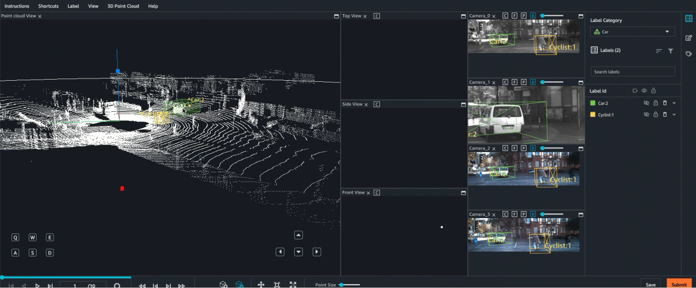

Use input and output data
2845

## Page 875

Amazon SageMaker AI
Developer Guide

For best results, when using sensor fusion, your point cloud should be in a WCS. Ground Truth uses
your sensor (such as LiDAR), camera, and ego vehicle pose information to compute extrinsic and
intrinsic matrices for sensor fusion.

Extrinsic Matrix

Ground Truth uses sensor (such as LiDAR) extrinsic and camera extrinsic and intrinsic matrices to
project objects to and from the point cloud data's frame of reference to the camera's frame of
reference.

For example, in order to project a label from the 3D point cloud to camera image plane, Ground
Truth transforms 3D points from LiDAR’s own coordinate system to the camera's coordinate
system. This is typically done by first transforming 3D points from LiDAR’s own coordinate system
to a world coordinate system (or a global reference frame) using the LiDAR extrinsic matrix.
Ground Truth then uses the camera inverse extrinsic (which converts points from a global frame
of reference to the camera's frame of reference) to transform the 3D points from world coordinate
system obtained in previous step into the camera image plane. The LiDAR extrinsic matrix can
also be used to transform 3D data into a world coordinate system. If your 3D data is already
transformed into world coordinate system then the first transformation doesn’t have any impact
on label translation, and label translation only depends on the camera inverse extrinsic. A view
matrix is used to visualize projected labels. To learn more about these transformations and the
view matrix, see Ground Truth Sensor Fusion Transformations.

Ground Truth computes these extrinsic matrices by using LiDAR and camera pose data that you

provide: heading ( in quaternions: qx, qy, qz, and qw) and position (x, y, z). For the vehicle,
typically the heading and position are described in vehicle's reference frame in a world coordinate
system and are called a ego vehicle pose. For each camera extrinsic, you can add pose information
for that camera. For more information, see Pose.

Intrinsic Matrix

Ground Truth use the camera extrinsic and intrinsic matrices to compute view metrics to transform
labels to and from the 3D scene to camera images. Ground Truth computes the camera intrinsic

matrix using camera focal length (fx, fy) and optical center coordinates (cx,cy) that you provide.
For more information, see Intrinsic and Distortion.

Image Distortion

Image distortion can occur for a variety of reasons. For example, images may be distorted due to
barrel or fish-eye effects. Ground Truth uses intrinsic parameters along with distortion co-efficient

Use input and output data
2846

## Page 876

Amazon SageMaker AI
Developer Guide

to undistort images you provide when creating 3D point cloud labeling jobs. If a camera image is
already been undistorted, all distortion coefficients should be set to 0.

For more information about the transformations Ground Truth performs to undistort images, see
Camera Calibrations: Extrinsic, Intrinsic and Distortion.

Ego Vehicle

To collect data for autonomous driving applications, the measurements used to generate point
cloud data and are taken from sensors mounted on a vehicle, or the ego vehicle. To project label
adjustments to and from the 3D scene and 2D images, Ground Truth needs your ego vehicle pose
in a world coordinate system. The ego vehicle pose is comprised of position coordinates and
orientation quaternion.

Ground Truth uses your ego vehicle pose to compute rotation and transformations matrices.
Rotations in 3 dimensions can be represented by a sequence of 3 rotations around a sequence of
axes. In theory, any three axes spanning the 3D Euclidean space are enough. In practice, the axes
of rotation are chosen to be the basis vectors. The three rotations are expected to be in a global
frame of reference (extrinsic). Ground Truth does not a support body centered frame of reference
(intrinsic) which is attached to, and moves with, the object under rotation. To track objects, Ground
Truth needs to measure from a global reference where all vehicles are moving. When using Ground
Truth 3D point cloud labeling jobs, z specifies the axis of rotation (extrinsic rotation) and yaw Euler
angles are in radians (rotation angle).

Pose

Ground Truth uses pose information for 3D visualizations and sensor fusion. Pose information
you input through your manifest file is used to compute extrinsic matrices. If you already have an
extrinsic matrix, you can use it to extract sensor and camera pose data.

For example in the autonomous driving KITTI dataset, the pykitti python module can be used for

loading the KITTI data. In the dataset dataset.oxts[i].T_w_imu gives the LiDAR extrinsic

transform for the ith frame and it can be multiplied with the points to get them in a world

frame - matmul(lidar_transform_matrix, points). This transform can be converted
into position (translation vector) and heading (in quaternion) of LiDAR for the input manifest

file JSON format. Camera extrinsic transform for cam0 in ith frame can be calculated by

inv(matmul(dataset.calib.T_cam0_velo, inv(dataset.oxts[i].T_w_imu))) and this

can be converted into heading and position for cam0.

import numpy

Use input and output data
2847

## Page 877

Amazon SageMaker AI
Developer Guide

rotation = [[ 9.96714314e-01, -8.09890350e-02,  1.16333982e-03],
[ 8.09967396e-02,  9.96661051e-01, -1.03090934e-02],
[-3.24531964e-04,  1.03694477e-02,  9.99946183e-01]]
origin= [1.71104606e+00,
5.80000039e-01,
9.43144935e-01]

from scipy.spatial.transform import Rotation as R

# position is the origin
position = origin
r = R.from_matrix(np.asarray(rotation))

# heading in WCS using scipy

heading = r.as_quat()
print(f"pose:{position}\nheading: {heading}")

Position

In the input manifest file, position refers to the position of the sensor with respect to a world
frame. If you are unable to put the device position in a world coordinate system, you can use LiDAR
data with local coordinates. Similarly, for mounted video cameras you can specify the position and
heading in a world coordinate system. For camera, if you do not have position information, please
use (0, 0, 0).

The following are the fields in the position object:

1. x (float) – x coordinate of ego vehicle, sensor, or camera position in meters.

2. y (float) – y coordinate of ego vehicle, sensor, or camera position in meters.

3. z (float) – z coordinate of ego vehicle, sensor, or camera position in meters.

The following is an example of a position JSON object:

{
"position": {
"y": -152.77584902657554,
"x": 311.21505956090624,
"z": -10.854137529636024

Use input and output data
2848

## Page 878

Amazon SageMaker AI
Developer Guide

}
}

Heading

In the input manifest file, heading is an object that represents the orientation of a device with
respect to world frame. Heading values should be in quaternion. A quaternion is a representation
of the orientation consistent with geodesic spherical properties. If you are unable to put the sensor

heading in world coordinates, please use the identity quaternion (qx = 0, qy = 0, qz = 0,

qw = 1). Similarly, for cameras, specify the heading in quaternions. If you are unable to obtain
extrinsic camera calibration parameters, please also use the identity quaternion.

Fields in heading object are as follows:

1. qx (float) - x component of ego vehicle, sensor, or camera orientation.

2. qy (float) - y component of ego vehicle, sensor, or camera orientation.

3. qz (float) - z component of ego vehicle, sensor, or camera orientation.

4. qw (float) - w component of ego vehicle, sensor, or camera orientation.

The following is an example of a heading JSON object:

{
"heading": {
"qy": -0.7046155108831117,
"qx": 0.034278837280808494,
"qz": 0.7070617895701465,
"qw": -0.04904659893885366
}
}

To learn more, see Compute Orientation Quaternions and Position.

Compute Orientation Quaternions and Position

Ground Truth requires that all orientation, or heading, data be given in quaternions. A quaternions
is a representation of the orientation consistent with geodesic spherical properties that can be used
to approximate of rotation. Compared to Euler angles they are simpler to compose and avoid the
problem of gimbal lock. Compared to rotation matrices they are more compact, more numerically
stable, and more efficient.

Use input and output data
2849

## Page 879

Amazon SageMaker AI
Developer Guide

You can compute quaternions from a rotation matrix or a transformation matrix.

If you have a rotation matrix (made up of the axis rotations) and translation vector (or origin)
in world coordinate system instead of a single 4x4 rigid transformation matrix, then you can
directly use the rotation matrix and translation vector to compute quaternions. Libraries like scipy
and pyqaternion  can help. The following code-block shows an example using these libraries to
compute quaternion from a rotation matrix.

import numpy

rotation = [[ 9.96714314e-01, -8.09890350e-02,  1.16333982e-03],
[ 8.09967396e-02,  9.96661051e-01, -1.03090934e-02],
[-3.24531964e-04,  1.03694477e-02,  9.99946183e-01]]
origin = [1.71104606e+00,
5.80000039e-01,
9.43144935e-01]

from scipy.spatial.transform import Rotation as R
# position is the origin
position = origin
r = R.from_matrix(np.asarray(rotation))
# heading in WCS using scipy
heading = r.as_quat()
print(f"position:{position}\nheading: {heading}")

A UI tool like 3D Rotation Converter can also be useful.

If you have a 4x4 extrinsic transformation matrix, note that the transformation matrix is in the

form [R T; 0 0 0 1] where R is the rotation matrix and T is the origin translation vector. That
means you can extract rotation matrix and translation vector from the transformation matrix as
follows.

import numpy as np

transformation
= [[ 9.96714314e-01, -8.09890350e-02,  1.16333982e-03, 1.71104606e+00],
[ 8.09967396e-02,  9.96661051e-01, -1.03090934e-02, 5.80000039e-01],
[-3.24531964e-04,  1.03694477e-02,  9.99946183e-01, 9.43144935e-01],
[              0,               0,               0,              1]]

Use input and output data
2850

## Page 880

Amazon SageMaker AI
Developer Guide

transformation  = np.array(transformation )
rotation = transformation[0:3,0:3]
translation= transformation[0:3,3]

from scipy.spatial.transform import Rotation as R
# position is the origin translation
position = translation
r = R.from_matrix(np.asarray(rotation))
# heading in WCS using scipy
heading = r.as_quat()
print(f"position:{position}\nheading: {heading}")

With your own setup, you can compute an extrinsic transformation matrix using the GPS/IMU
position and orientation (latitude, longitude, altitude and roll, pitch, yaw) with respect to the LiDAR

sensor on the ego vehicle. For example, you can compute pose from KITTI raw data using pose =

convertOxtsToPose(oxts) to transform the oxts data into a local euclidean poses, specified
by 4x4 rigid transformation matrices. You can then transform this pose transformation matrix to a
global reference frame using the reference frames transformation matrix in the world coordinate
system.

struct Quaternion
{
double w, x, y, z;
};

Quaternion ToQuaternion(double yaw, double pitch, double roll) // yaw (Z), pitch (Y),
roll (X)
{
// Abbreviations for the various angular functions
double cy = cos(yaw * 0.5);
double sy = sin(yaw * 0.5);
double cp = cos(pitch * 0.5);
double sp = sin(pitch * 0.5);
double cr = cos(roll * 0.5);
double sr = sin(roll * 0.5);

Quaternion q;
q.w = cr * cp * cy + sr * sp * sy;
q.x = sr * cp * cy - cr * sp * sy;
q.y = cr * sp * cy + sr * cp * sy;
q.z = cr * cp * sy - sr * sp * cy;

Use input and output data
2851

## Page 881

Amazon SageMaker AI
Developer Guide

return q;
}

Ground Truth Sensor Fusion Transformations

The following sections go into greater detail about the Ground Truth sensor fusion transformations
that are performed using the pose data you provide.

LiDAR Extrinsic

In order to project to and from a 3D LiDAR scene to a 2D camera image, Ground Truth computes
the rigid transformation projection metrics using the ego vehicle pose and heading. Ground Truth
computes rotation and translation of a world coordinates into the 3D plane by doing a simple
sequence of rotations and translation.

Ground Truth computes rotation metrics using the heading quaternions as follows:

Here, [x, y, z, w] corresponds to parameters in the heading JSON object, [qx, qy, qz,

qw]. Ground Truth computes the translation column vector as T = [poseX, poseY, poseZ].
Then the extrinsic metrics is simply as follows:

LiDAR_extrinsic = [R T;0 0 0 1]

Camera Calibrations: Extrinsic, Intrinsic and Distortion

Geometric camera calibration, also referred to as camera resectioning, estimates the parameters
of a lens and image sensor of an image or video camera. You can use these parameters to correct
for lens distortion, measure the size of an object in world units, or determine the location of the
camera in the scene. Camera parameters include intrinsics and distortion coefficients.

Camera Extrinsic

If the camera pose is given, then Ground Truth computes the camera extrinsic based on a rigid
transformation from the 3D plane into the camera plane. The calculation is the same as the one

Use input and output data
2852

## Page 882

Amazon SageMaker AI
Developer Guide

used for the LiDAR Extrinsic, except that Ground Truth uses camera pose (position and heading)
and computes the inverse extrinsic.

camera_inverse_extrinsic = inv([Rc Tc;0 0 0 1]) #where Rc and Tc are camera pose
components

Intrinsic and Distortion

Some cameras, such as pinhole or fisheye cameras, may introduce significant distortion in photos.
This distortion can be corrected using distortion coefficients and the camera focal length. To learn
more, see Camera calibration With OpenCV in the OpenCV documentation.

There are two types of distortion Ground Truth can correct for: radial distortion and tangential
distortion.

Radial distortion occurs when light rays bend more near the edges of a lens than they do at its
optical center. The smaller the lens, the greater the distortion. The presence of the radial distortion
manifests in form of the barrel or fish-eye effect and Ground Truth uses Formula 1 to undistort it.

Formula 1:

Tangential distortion occurs because the lenses used to take the images are not perfectly parallel to
the imaging plane. This can be corrected with Formula 2.

Formula 2:

In the input manifest file, you can provide distortion coefficients and Ground Truth will undistort
your images. All distortion coefficients are floats.

Use input and output data
2853

## Page 883

Amazon SageMaker AI
Developer Guide

• k1, k2, k3, k4 – Radial distortion coefficients. Supported for both fisheye and pinhole camera
models.

• p1 ,p2 – Tangential distortion coefficients. Supported for pinhole camera models.

If images are already undistorted, all distortion coefficients should be 0 in your input manifest.

In order to correctly reconstruct the corrected image, Ground Truth does a unit conversion of the
images based on focal lengths. If a common focal length is used with a given aspect ratio for both
axes, such as 1, in the upper formula we will have a single focal length. The matrix containing these
four parameters is referred to as the in camera intrinsic calibration matrix.

While the distortion coefficients are the same regardless of the camera resolutions used, these
should be scaled with the current resolution from the calibrated resolution.

The following are float values.

• fx - focal length in x direction.

• fy - focal length in y direction.

• cx - x coordinate of principal point.

• cy - y coordinate of principal point.

Ground Truth use the camera extrinsic and camera intrinsic to compute view metrics as shown in
the following code block to transform labels between the 3D scene and 2D images.

def generate_view_matrix(intrinsic_matrix, extrinsic_matrix):
intrinsic_matrix = np.c_[intrinsic_matrix, np.zeros(3)]

Use input and output data
2854

## Page 884

Amazon SageMaker AI
Developer Guide

view_matrix = np.matmul(intrinsic_matrix, extrinsic_matrix)
view_matrix = np.insert(view_matrix, 2, np.array((0, 0, 0, 1)), 0)
return view_matrix

Video Frame Input Data

When you create a video frame object detection or object tracking labeling job, you can choose
video files (MP4 files) or video frames for input data. All worker tasks are created using video
frames, so if you choose video files, use the Ground Truth frame extraction tool to extract video
frames (images) from your video files.

For both of these options, you can use the Automated data setup option in the Ground Truth
section of the Amazon SageMaker AI console to set up a connection between Ground Truth and
your input data in Amazon S3 so that Ground Truth knows where to look for your input data when
creating your labeling tasks. This creates and stores an input manifest file in your Amazon S3 input
dataset location. To learn more, see Set up Automated Video Frame Input Data.

Alternatively, you can manually create sequence files for each sequence of video frames that you
want labeled and provide the Amazon S3 location of an input manifest file that references each of

these sequences files using the source-ref key. To learn more, see Create a Video Frame Input
Manifest File.

Topics

• Choose Video Files or Video Frames for Input Data

• Input Data Setup

Choose Video Files or Video Frames for Input Data

When you create a video frame object detection or object tracking labeling job, you can provide
a sequence of video frames (images) or you can use the Amazon SageMaker AI console to have
Ground Truth automatically extract video frames from your video files. Use the following sections
to learn more about these options.

Provide Video Frames

Video frames are sequences of images extracted from a video file. You can create a Ground Truth
labeling job to have workers label multiple sequences of video frames. Each sequence is made up
of images extracted from a single video.

Use input and output data
2855

## Page 885

Amazon SageMaker AI
Developer Guide

To create a labeling job using video frame sequences, you must store each sequence using a unique
key name prefix in Amazon S3. In the Amazon S3 console, key name prefixes are folders. So in the
Amazon S3 console, each sequence of video frames must be located in its own folder in Amazon
S3.

For example, if you have two sequences of video frames, you might use the key name prefixes

sequence1/ and sequence2/ to identify your sequences. In this example, your sequences may be

located in s3://amzn-s3-demo-bucket/video-frames/sequence1/ and s3://amzn-s3-

demo-bucket/video-frames/sequence2/.

If you are using the Ground Truth console to create an input manifest file, all of the sequence
key name prefixes should be in the same location in Amazon S3. For example, in the Amazon S3

console, each sequence could be in a folder in s3://amzn-s3-demo-bucket/video-frames/.

In this example, your first sequence of video frames (images) may be located in s3://amzn-s3-

demo-bucket/video-frames/sequence1/ and your second sequence may be located in s3://

amzn-s3-demo-bucket/video-frames/sequence2/.

Important

Even if you only have a single sequence of video frames that you want workers to label,
that sequence must have a key name prefix in Amazon S3. If you are using the Amazon S3
console, this means that your sequence is located in a folder. It cannot be located in the
root of your S3 bucket.

When creating worker tasks using sequences of video frames, Ground Truth uses one sequence per
task. In each task, Ground Truth orders your video frames using UTF-8 binary order.

For example, video frames might be in the following order in Amazon S3:

[0001.jpg, 0002.jpg, 0003.jpg, ..., 0011.jpg]

They are arranged in the same order in the worker’s task: 0001.jpg, 0002.jpg,

0003.jpg, ..., 0011.jpg.

Frames might also be ordered using a naming convention like the following:

[frame1.jpg, frame2.jpg, ..., frame11.jpg]

Use input and output data
2856

## Page 886

Amazon SageMaker AI
Developer Guide

In this case, frame10.jpg and frame11.jpg come before frame2.jpg in the worker task.

Your worker sees your video frames in the following order: frame1.jpg, frame10.jpg,

frame11.jpg, frame2.jpg, ..., frame9.jpg.

Provide Video Files

You can use the Ground Truth frame splitting feature when creating a new labeling job in the
console to extract video frames from video files (MP4 files). A series of video frames extracted from
a single video file is referred to as a sequence of video frames.

You can either have Ground Truth automatically extract all frames, up to 2,000, from the video, or
you can specify a frequency for frame extraction. For example, you can have Ground Truth extract
every 10th frame from your videos.

You can provide up to 50 videos when you use automated data setup to extract frames, however
your input manifest file cannot reference more than 10 video frame sequence files when you
create a video frame object tracking and video frame object detection labeling job. If you use the
automated data setup console tool to extract video frames from more than 10 video files, you will
need to modify the manifest file the tool generates or create a new one to include 10 video frame
sequence files or less. To learn more about these quotas, see 3D Point Cloud and Video Frame
Labeling Job Quotas.

To use the video frame extraction tool, see Set up Automated Video Frame Input Data.

When all of your video frames have been successfully extracted from your videos, you will see the
following in your S3 input dataset location:

• A key name prefix (a folder in the Amazon S3 console) named after each video. Each of these
prefixes leads to:

• A sequence of video frames extracted from the video used to name that prefix.

• A sequence file used to identify all of the images that make up that sequence.

• An input manifest file with a .manifest extension. This identifies all of the sequence files that will
be used to create your labeling job.

All of the frames extracted from a single video file are used for a labeling task. If you extract video
frames from multiple video files, multiple tasks are created for your labeling job, one for each
sequence of video frames.

Use input and output data
2857

## Page 887

Amazon SageMaker AI
Developer Guide

Ground Truth stores each sequence of video frames that it extracts in your Amazon S3 location for
input datasets using a unique key name prefix. In the Amazon S3 console, key name prefixes are
folders.

Input Data Setup

When you create a video frame labeling job, you need to let Ground Truth know where to look for
your input data. You can do this in one of two ways:

• You can store your input data in Amazon S3 and have Ground Truth automatically detect the
input dataset used for your labeling job. See Set up Automated Video Frame Input Data to learn
more about this option.

• You can create an input manifest file and sequence files and upload them to Amazon S3. See Set
up Video Frame Input Data Manually to learn more about this option.

Topics

• Set up Automated Video Frame Input Data

• Set up Video Frame Input Data Manually

Set up Automated Video Frame Input Data

You can use the Ground Truth automated data setup to automatically detect video files in your
Amazon S3 bucket and extract video frames from those files. To learn how, see Provide Video Files.

If you already have video frames in Amazon S3, you can use the automated data setup to use these
video frames in your labeling job. For this option, all video frames from a single video must be
stored using a unique prefix. To learn about the requirements to use this option, see Provide Video
Frames.

Select one of the following sections to learn how to set up your automatic input dataset
connection with Ground Truth.

Provide Video Files and Extract Frames

Use the following procedure to connect your video files with Ground Truth and automatically
extract video frames from those files for video frame object detection and object tracking labeling
jobs.

Use input and output data
2858

## Page 888

Amazon SageMaker AI
Developer Guide

Note

If you use the automated data setup console tool to extract video frames from more than
10 video files, you will need to modify the manifest file the tool generates or create a new
one to include 10 video frame sequence files or less. To learn more, see Provide Video Files.

Make sure your video files are stored in an Amazon S3 bucket in the same AWS Region that you
perform the automated data setup in.

Automatically connect your video files in Amazon S3 with Ground Truth and extract video
frames:

1.
Navigate to the Create labeling job page in the Amazon SageMaker AI console: https://
console.aws.amazon.com/sagemaker/groundtruth.

Your input and output S3 buckets must be located in the same AWS Region that you create
your labeling job in. This link puts you in the North Virginia (us-east-1) AWS Region. If your
input data is in an Amazon S3 bucket in another Region, switch to that Region. To change your
AWS Region, on the navigation bar, choose the name of the currently displayed Region.

2.
Select Create labeling job.

3.
Enter a Job name.

4.
In the section Input data setup, select Automated data setup.

5.
Enter an Amazon S3 URI for S3 location for input datasets. An S3 URI looks like the following:

s3://amzn-s3-demo-bucket/path-to-files/. This URI should point to the Amazon S3
location where your video files are stored.

6.
Specify your S3 location for output datasets. This is where your output data is stored. You
can choose to store your output data in the Same location as input dataset or Specify a new
location and entering the S3 URI of the location that you want to store your output data.

7.
Choose Video Files for your Data type using the dropdown list.

8.
Choose Yes, extract frames for object tracking and detection tasks.

9.
Choose a method of Frame extraction.

• When you choose Use all frames extracted from the video to create a labeling task,
Ground Truth extracts all frames from each video in your S3 location for input datasets, up

Use input and output data
2859

## Page 889

Amazon SageMaker AI
Developer Guide

to 2,000 frames. If a video in your input dataset contains more than 2,000 frames, the first
2,000 are extracted and used for that labeling task.

• When you choose Use every x frame from a video to create a labeling task, Ground Truth

extracts every xth frame from each video in your S3 location for input datasets.

For example, if your video is 2 seconds long, and has a frame rate of 30 frames per second,
there are 60 frames in your video. If you specify 10 here, Ground Truth extracts every 10th

frame from your video. This means the 1st, 10th, 20th, 30th, 40th, 50th, and 60th frames are
extracted.

10. Choose or create an IAM execution role. Make sure that this role has permission to access your

Amazon S3 locations for input and output data specified in steps 5 and 6.

11. Select Complete data setup.

Provide Video Frames

Use the following procedure to connect your sequences of video frames with Ground Truth for
video frame object detection and object tracking labeling jobs.

Make sure your video frames are stored in an Amazon S3 bucket in the same AWS Region that
you perform the automated data setup in. Each sequence of video frames should have a unique

prefix. For example, if you have two sequences stored in s3://amzn-s3-demo-bucket/video-

frames/sequences/, each should have a unique prefix like sequence1 and sequence2

and should both be located directly under the /sequences/ prefix. In the example above,

the locations of these two sequences is: s3://amzn-s3-demo-bucket/video-frames/

sequences/sequence1/ and s3://amzn-s3-demo-bucket/video-frames/sequences/

sequence2/.

Automatically connect your video frame in Amazon S3 with Ground Truth:

1.
Navigate to the Create labeling job page in the Amazon SageMaker AI console: https://
console.aws.amazon.com/sagemaker/groundtruth.

Your input and output S3 buckets must be located in the same AWS Region that you create
your labeling job in. This link puts you in the North Virginia (us-east-1) AWS Region. If your
input data is in an Amazon S3 bucket in another Region, switch to that Region. To change your
AWS Region, on the navigation bar, choose the name of the currently displayed Region.

2.
Select Create labeling job.

Use input and output data
2860

## Page 890

Amazon SageMaker AI
Developer Guide

3.
Enter a Job name.

4.
In the section Input data setup, select Automated data setup.

5.
Enter an Amazon S3 URI for S3 location for input datasets.

This should be the Amazon S3 location where your sequences are stored. For example, if you

have two sequences stored in s3://amzn-s3-demo-bucket/video-frames/sequences/

sequence1/, s3://amzn-s3-demo-bucket/video-frames/sequences/sequence2/,

enter s3://amzn-s3-demo-bucket/video-frames/sequences/ here.

6.
Specify your S3 location for output datasets. This is where your output data is stored. You
can choose to store your output data in the Same location as input dataset or Specify a new
location and entering the S3 URI of the location that you want to store your output data.

7.
Choose Video frames for your Data type using the dropdown list.

8.
Choose or create an IAM execution role. Make sure that this role has permission to access your
Amazon S3 locations for input and output data specified in steps 5 and 6.

9.
Select Complete data setup.

These procedures will create an input manifest in the Amazon S3 location for input datasets that
you specified in step 5. If you are creating a labeling job using the SageMaker API or, AWS CLI,
or an AWS SDK, use the Amazon S3 URI for this input manifest file as input to the parameter

ManifestS3Uri.

Set up Video Frame Input Data Manually

Choose the manual data setup option if you have created sequence files for each of your video
frame sequences, and a manifest file listing references to those sequences files.

Create a Video Frame Input Manifest File

Ground Truth uses the input manifest file to identify the location of your input dataset when
creating labeling tasks. For video frame object detection and object tracking labeling jobs, each
line in the input manifest file identifies the location of a video frame sequence file. Each sequence
file identifies the images included in a single sequence of video frames.

Use this page to learn how to create a video frame sequence file and an input manifest file for
video frame object tracking and object detection labeling jobs.

If you want Ground Truth to automatically generate your sequence files and input manifest file, see
Set up Automated Video Frame Input Data.

Use input and output data
2861

## Page 891

Amazon SageMaker AI
Developer Guide

Create a Video Frame Sequence Input Manifest

In the video frame sequence input manifest file, each line in the manifest is a JSON object, with a

"source-ref" key that references a sequence file. Each sequence file identifies the location of a

sequence of video frames. This is the manifest file formatting required for all video frame labeling

jobs.

The following example demonstrates the syntax used for an input manifest file:

{"source-ref": "s3://amzn-s3-demo-bucket/example-folder/seq1.json"}
{"source-ref": "s3://amzn-s3-demo-bucket/example-folder/seq2.json"}

Create a Video Frame Sequence File

The data for each sequence of video frames needs to be stored in a JSON data object. The

following is an example of the format you use for a sequence file. Information about each frame is

included as a JSON object and is listed in the frames list. The following JSON has been expanded
for readability.

{
"seq-no": 1,
"prefix": "s3://amzn-s3-demo-bucket/prefix/video1/",
"number-of-frames": 3,
"frames":[
{"frame-no": 1, "unix-timestamp": 1566861644, "frame": "frame0001.jpg" },
{"frame-no": 2, "unix-timestamp": 1566861644, "frame": "frame0002.jpg" },
{"frame-no": 3, "unix-timestamp": 1566861644, "frame": "frame0003.jpg" }
]
}

The following table provides details about the parameters shown in the this code example.

Parameter
Required
Accepted Values
Description

seq-no
Yes
Integer
The ordered number
of the sequence.

prefix
Yes
String

The Amazon S3
location where the

Accepted Values:

Use input and output data
2862

## Page 892

Amazon SageMaker AI
Developer Guide

Parameter
Required
Accepted Values
Description

sequence files are
located.

s3://<bucket-n

ame> /<prefix>/

The prefix must end
with a forward slash:

/.

Yes
Integer
The total number
of frames included
in the sequence file.
This number must
match the total
number of frames

number-of-

frames

listed in the frames
parameter in the next
row.

frames
Yes
List of JSON objects

A list of frame data.
The length of the list

Required:

must equal number-

of-frames . In the
worker UI, frames in a
sequence are ordered
in UTF-8 binary
order. To learn more
about this ordering,
see Provide Video
Frames.

frame-no, frame

Optional:

unix-timestamp

frame-no
Yes
Integer
The frame order
number. This will
determine the order
of a frame in the
sequence.

Use input and output data
2863

## Page 893

Amazon SageMaker AI
Developer Guide

Parameter
Required
Accepted Values
Description

unix-timestamp
No
Integer
The unix timestamp
of a frame. The
number of seconds
since January 1st,
1970 until the UTC
time when the frame
was captured.

frame
Yes
String
The name of a video
frame image file.

Labeling job output data

The output from a labeling job is placed in the Amazon S3 location that you specified in the
console or in the call to the CreateLabelingJob operation. Output data appears in this location
when the workers have submitted one or more tasks, or when tasks expire. Note that it may take a
few minutes for output data to appear in Amazon S3 after the worker submits the task or the task
expires.

Each line in the output data file is identical to the manifest file with the addition of an attribute
and value for the label assigned to the input object. The attribute name for the value is defined in

the console or in the call to the CreateLabelingJob operation. You can't use -metadata in the
label attribute name. If you are running an image semantic segmentation, 3D point cloud semantic

segmentation, or 3D point cloud object tracking job, the label attribute must end with -ref. For

any other type of job, the attribute name can't end with -ref.

The output of the labeling job is the value of the key-value pair with the label. The label and the
value overwrites any existing JSON data in the input file with the new value.

For example, the following is the output from an image classification labeling job where the input

data files were stored in an Amazon S3 amzn-s3-demo-bucket and the label attribute name

was defined as sport. In this example the JSON object is formatted for readability, in the actual
output file the JSON object is on a single line. For more information about the data format, see
JSON Lines.

{

Use input and output data
2864

## Page 894

Amazon SageMaker AI
Developer Guide

"source-ref": "s3://amzn-s3-demo-bucket/image_example.png",
"sport":0,
"sport-metadata":
{
"class-name": "football",
"confidence": 0.00,
"type":"groundtruth/image-classification",
"job-name": "identify-sport",
"human-annotated": "yes",
"creation-date": "2018-10-18T22:18:13.527256"
}
}

The value of the label can be any valid JSON. In this case the label's value is the index of the class
in the classification list. Other job types, such as bounding box, have more complex values.

Any key-value pair in the input manifest file other than the label attribute is unchanged in the
output file. You can use this to pass data to your application.

The output from a labeling job can be used as the input to another labeling job. You can use this
when you are chaining together labeling jobs. For example, you can send one labeling job to
determine the sport that is being played. Then you send another using the same data to determine
if the sport is being played indoors or outdoors. By using the output data from the first job as the
manifest for the second job, you can consolidate the results of the two jobs into one output file for
easier processing by your applications.

The output data file is written to the output location periodically while the job is in progress. These
intermediate files contain one line for each line in the manifest file. If an object is labeled, the label
is included. If the object hasn't been labeled, it is written to the intermediate output file identically
to the manifest file.

Output directories

Ground Truth creates several directories in your Amazon S3 output path. These directories contain
the results of your labeling job and other artifacts of the job. The top-level directory for a labeling
job is given the same name as your labeling job; the output directories are placed beneath it. For

example, if you named your labeling job find-people, your output would be in the following
directories:

s3://amzn-s3-demo-bucket/find-people/activelearning

Use input and output data
2865

## Page 895

Amazon SageMaker AI
Developer Guide

s3://amzn-s3-demo-bucket/find-people/annotations
s3://amzn-s3-demo-bucket/find-people/inference
s3://amzn-s3-demo-bucket/find-people/manifests
s3://amzn-s3-demo-bucket/find-people/training

Each directory contains the following output:

Active learning directory

The activelearning directory is only present when you are using automated data labeling. It
contains the input and output validation set for automated data labeling, and the input and output
folder for automatically labeled data.

Annotations directory

The annotations directory contains all of the annotations made by the workforce. These are the
responses from individual workers that have not been consolidated into a single label for the data
object.

There are three subdirectories in the annotations directory.

• The first, worker-response, contains the responses from individual workers. This contains
a subdirectory for each iteration, which in turn contains a subdirectory for each data object in
that iteration. The worker response data for each data object is stored in a timestamped JSON
file that contains the answers submitted by each worker for that data object, and if you use
a private workforce, metadata about those workers. To learn more about this metadata, see
Worker metadata.

• The second, consolidated-annotation, contains information required to consolidate the
annotations in the current batch into labels for your data objects.

• The third, intermediate, contains the output manifest for the current batch with any
completed labels. This file is updated as the label for each data object is completed.

Note

We recommend that you do not use files that are not mentioned in the documentation.

Use input and output data
2866

## Page 896

Amazon SageMaker AI
Developer Guide

Inference directory

The inference directory is only present when you are using automated data labeling. This
directory contains the input and output files for the SageMaker AI batch transform used while
labeling data objects.

Manifest directory

The manifest directory contains the output manifest from your labeling job. There is one

subdirectory in the manifest directory, output. The output directory contains the output

manifest file for your labeling job. The file is named output.manifest.

Training directory

The training directory is only present when you are using automated data labeling. This

directory contains the input and output files used to train the automated data labeling model.

Confidence score

When you have more than one worker annotate a single task, your label results from annotation
consolidation. Ground Truth calculates a confidence score for each label. A confidence score is a
number between 0 and 1 that indicates how confident Ground Truth is in the label. You can use the
confidence score to compare labeled data objects to each other, and to identify the least or most
confident labels.

You should not interpret the value of a confidence score as an absolute value, or compare
confidence scores across labeling jobs. For example, if all of the confidence scores are between
0.98 and 0.998, you should only compare the data objects with each other and not rely on the high
confidence scores.

You should not compare the confidence scores of human-labeled data objects and auto-labeled
data objects. The confidence scores for humans are calculated using the annotation consolidation
function for the task, while the confidence scores for automated labeling are calculated using
a model that incorporates object features. The two models generally have different scales and
average confidence.

For a bounding box labeling job, Ground Truth calculates a confidence score per box. You can
compare confidence scores within one image or across images for the same labeling type (human
or auto). You can't compare confidence scores across labeling jobs.

Use input and output data
2867

## Page 897

Amazon SageMaker AI
Developer Guide

If a single worker annotates a task (NumberOfHumanWorkersPerDataObject is set to 1 or in
the console, you enter 1 for Number of workers per dataset object), the confidence score is set to

0.00.

Worker metadata

Ground Truth provides information that you can use to track individual workers in task output

data. The following data is located in the directories under the worker-response located in the
Annotations directory:

• The acceptanceTime is the time that the worker accepted the task. The format of this date and

time stamp is YYYY-MM-DDTHH:MM:SS.mmmZ for the year (YYYY), month (MM), day (DD), hour

(HH), minute (MM), second (SS) and millisecond (mmm). The date and time are separated by a T.

• The submissionTime is the time that the worker submitted their annotations using the Submit

button. The format of this date and time stamp is YYYY-MM-DDTHH:MM:SS.mmmZ for the year

(YYYY), month (MM), day (DD), hour (HH), minute (MM), second (SS) and millisecond (mmm). The date
and time are separated by a T.

• timeSpentInSeconds reports the total time, in seconds, that a worker actively worked on that
task. This metric does not include time when a worker paused or took a break.

• The workerId is unique to each worker.

• If you use a private workforce, in workerMetadata, you see the following.

• The identityProviderType is the service used to manage the private workforce.

• The issuer is the Cognito user pool or OIDC Identity Provider (IdP) issuer associated with the
work team assigned to this human review task.

• A unique sub identifier refers to the worker. If you create a workforce using Amazon Cognito,
you can retrieve details about this worker (such as the name or user name) using this ID using
Amazon Cognito. To learn how, see Managing and Searching for User Accounts in Amazon
Cognito Developer Guide.

The following is an example of the output you may see if you use Amazon Cognito to create a

private workforce. This is identified in the identityProviderType.

"submissionTime": "2020-12-28T18:59:58.321Z",
"acceptanceTime": "2020-12-28T18:59:15.191Z",
"timeSpentInSeconds": 40.543,
"workerId": "a12b3cdefg4h5i67",
"workerMetadata": {

Use input and output data
2868

## Page 898

Amazon SageMaker AI
Developer Guide

"identityData": {
"identityProviderType": "Cognito",
"issuer": "https://cognito-idp.aws-region.amazonaws.com/aws-region_123456789",
"sub": "aaaaaaaa-bbbb-cccc-dddd-eeeeeeeeeeee"
}
}

The following is an example of the workerMetadata you may see if you use your own OIDC IdP to
create a private workforce:

"workerMetadata": {
"identityData": {
"identityProviderType": "Oidc",
"issuer": "https://example-oidc-ipd.com/adfs",
"sub": "aaaaaaaa-bbbb-cccc-dddd-eeeeeeeeeeee"
}

}

To learn more about using private workforces, see Private workforce.

Output metadata

The output from each job contains metadata about the label assigned to data objects. These
elements are the same for all jobs with minor variations. The following example shows the
metadata elements:

"confidence": 0.00,
"type": "groundtruth/image-classification",
"job-name": "identify-animal-species",
"human-annotated": "yes",
"creation-date": "2020-10-18T22:18:13.527256"

The elements have the following meaning:

• confidence – The confidence that Ground Truth has that the label is correct. For more
information, see Confidence score.

• type – The type of classification job. For job types, see Built-in Task Types.

• job-name – The name assigned to the job when it was created.

• human-annotated – Whether the data object was labeled by a human or by automated data
labeling. For more information, see Automate data labeling.

Use input and output data
2869

## Page 899

Amazon SageMaker AI
Developer Guide

• creation-date – The date and time that the label was created.

Classification job output

The following are sample outputs (output manifest files) from an image classification job and a
text classification job. They include the label that Ground Truth assigned to the data object, the
value for the label, and metadata that describes the label.

In addition to the standard metadata elements, the metadata for a classification job includes the
text value of the label's class. For more information, see Image Classification - MXNet.

The red, italicized text in the examples below depends on labeling job specifications and output
data.

{
"source-ref":"s3://amzn-s3-demo-bucket/example_image.jpg",
"species":"0",
"species-metadata":
{
"class-name": "dog",
"confidence": 0.00,
"type": "groundtruth/image-classification",
"job-name": "identify-animal-species",
"human-annotated": "yes",
"creation-date": "2018-10-18T22:18:13.527256"
}
}

{
"source":"The food was delicious",
"mood":"1",
"mood-metadata":
{
"class-name": "positive",
"confidence": 0.8,
"type": "groundtruth/text-classification",
"job-name": "label-sentiment",
"human-annotated": "yes",
"creation-date": "2020-10-18T22:18:13.527256"
}
}

Use input and output data
2870

## Page 900

Amazon SageMaker AI
Developer Guide

Multi-label classification job output

The following are example output manifest files from a multi-label image classification job and a
multi-label text classification job. They include the labels that Ground Truth assigned to the data
object (for example, the image or piece of text) and metadata that describes the labels the worker
saw when completing the labeling task.

The label attribute name parameter (for example, image-label-attribute-name) contains
an array of all of the labels selected by at least one of the workers who completed this task.

This array contains integer keys (for example, [1,0,8]) that correspond to the labels found in

class-map. In the multi-label image classification example, bicycle, person, and clothing
were selected by at least one of the workers who completed the labeling task for the image,

exampleimage.jpg.

The confidence-map shows the confidence score that Ground Truth assigned to each label
selected by a worker. To learn more about Ground Truth confidence scores, see Confidence score.

The red, italicized text in the examples below depends on labeling job specifications and output
data.

The following is an example of a multi-label image classification output manifest file.

{
"source-ref": "s3://amzn-s3-demo-bucket/example_image.jpg",
"image-label-attribute-name":[1,0,8],
"image-label-attribute-name-metadata":
{
"job-name":"labeling-job/image-label-attribute-name",
"class-map":
{
"1":"bicycle","0":"person","8":"clothing"
},
"human-annotated":"yes",
"creation-date":"2020-02-27T21:36:25.000201",
"confidence-map":
{
"1":0.95,"0":0.77,"8":0.2
},
"type":"groundtruth/image-classification-multilabel"
}
}

Use input and output data
2871

## Page 901

Amazon SageMaker AI
Developer Guide

The following is an example of a multi-label text classification output manifest file. In this example,

approving, sad and critical were selected by at least one of the workers who completed the

labeling task for the object exampletext.txt found in amzn-s3-demo-bucket.

{
"source-ref": "s3://amzn-s3-demo-bucket/exampletext.txt",
"text-label-attribute-name":[1,0,4],
"text-label-attribute-name-metadata":
{
"job-name":"labeling-job/text-label-attribute-name",
"class-map":
{
"1":"approving","0":"sad","4":"critical"
},
"human-annotated":"yes",
"creation-date":"2020-02-20T21:36:25.000201",

"confidence-map":
{
"1":0.95,"0":0.77,"4":0.2
},
"type":"groundtruth/text-classification-multilabel"
}
}

Bounding box job output

The following is sample output (output manifest file) from a bounding box job. For this task, three
bounding boxes are returned. The label value contains information about the size of the image,
and the location of the bounding boxes.

The class_id element is the index of the box's class in the list of available classes for the task.

The class-map metadata element contains the text of the class.

The metadata has a separate confidence score for each bounding box. The metadata also includes

the class-map element that maps the class_id to the text value of the class. For more
information, see Object Detection - MXNet.

The red, italicized text in the examples below depends on labeling job specifications and output
data.

{
"source-ref": "s3://amzn-s3-demo-bucket/example_image.png",

Use input and output data
2872

## Page 902

Amazon SageMaker AI
Developer Guide

"bounding-box-attribute-name":
{
"image_size": [{ "width": 500, "height": 400, "depth":3}],
"annotations":
[
{"class_id": 0, "left": 111, "top": 134,
"width": 61, "height": 128},
{"class_id": 5, "left": 161, "top": 250,
"width": 30, "height": 30},
{"class_id": 5, "left": 20, "top": 20,
"width": 30, "height": 30}
]
},
"bounding-box-attribute-name-metadata":
{
"objects":
[

{"confidence": 0.8},
{"confidence": 0.9},
{"confidence": 0.9}
],
"class-map":
{
"0": "dog",
"5": "bone"
},
"type": "groundtruth/object-detection",
"human-annotated": "yes",
"creation-date": "2018-10-18T22:18:13.527256",
"job-name": "identify-dogs-and-toys"
}
}

The output of a bounding box adjustment job looks like the following JSON. Note that the original
JSON is kept intact and two new jobs are listed, each with “adjust-” prepended to the original
attribute’s name.

{
"source-ref": "S3 bucket location",
"bounding-box-attribute-name":
{
"image_size": [{ "width": 500, "height": 400, "depth":3}],
"annotations":

Use input and output data
2873

## Page 903

Amazon SageMaker AI
Developer Guide

[
{"class_id": 0, "left": 111, "top": 134,
"width": 61, "height": 128},
{"class_id": 5, "left": 161, "top": 250,
"width": 30, "height": 30},
{"class_id": 5, "left": 20, "top": 20,
"width": 30, "height": 30}
]
},
"bounding-box-attribute-name-metadata":
{
"objects":
[
{"confidence": 0.8},
{"confidence": 0.9},
{"confidence": 0.9}
],

"class-map":
{
"0": "dog",
"5": "bone"
},
"type": "groundtruth/object-detection",
"human-annotated": "yes",
"creation-date": "2018-10-18T22:18:13.527256",
"job-name": "identify-dogs-and-toys"
},
"adjusted-bounding-box":
{
"image_size": [{ "width": 500, "height": 400, "depth":3}],
"annotations":
[
{"class_id": 0, "left": 110, "top": 135,
"width": 61, "height": 128},
{"class_id": 5, "left": 161, "top": 250,
"width": 30, "height": 30},
{"class_id": 5, "left": 10, "top": 10,
"width": 30, "height": 30}
]
},
"adjusted-bounding-box-metadata":
{
"objects":
[

Use input and output data
2874

## Page 904

Amazon SageMaker AI
Developer Guide

{"confidence": 0.8},
{"confidence": 0.9},
{"confidence": 0.9}
],
"class-map":
{
"0": "dog",
"5": "bone"
},
"type": "groundtruth/object-detection",
"human-annotated": "yes",
"creation-date": "2018-11-20T22:18:13.527256",
"job-name": "adjust-bounding-boxes-on-dogs-and-toys",
"adjustment-status": "adjusted"
}
}

In this output, the job's type doesn't change, but an adjustment-status field is added. This

field has the value of adjusted or unadjusted. If multiple workers have reviewed the object and

at least one adjusted the label, the status is adjusted.

Named entity recognition

The following is an example output manifest file from a named entity recognition (NER) labeling

task. For this task, seven entities are returned.

In the output manifest, the JSON object, annotations, includes a list of the labels (label
categories) that you provided.

Worker responses are in a list named entities. Each entity in this list is a JSON object that

contains a label value that matches one in the labels list, an integer startOffset value for

labeled span's starting Unicode offset, and an integer endOffset value for the ending Unicode
offset.

The metadata has a separate confidence score for each entity. If a single worker labeled each data
object, the confidence value for each entity will be zero.

The red, italicized text in the examples below depends on labeling job inputs and worker responses.

{
"source": "Amazon SageMaker is a cloud machine-learning platform that was launched
in November 2017. SageMaker enables developers to create, train, and deploy machine-

Use input and output data
2875

## Page 905

Amazon SageMaker AI
Developer Guide

learning (ML) models in the cloud. SageMaker also enables developers to deploy ML
models on embedded systems and edge-devices",
"ner-labeling-job-attribute-name": {
"annotations": {
"labels": [
{
"label": "Date",
"shortDisplayName": "dt"
},
{
"label": "Verb",
"shortDisplayName": "vb"
},
{
"label": "Thing",
"shortDisplayName": "tng"
},

{
"label": "People",
"shortDisplayName": "ppl"
}
],
"entities": [
{
"label": "Thing",
"startOffset": 22,
"endOffset": 53
},
{
"label": "Thing",
"startOffset": 269,
"endOffset": 281
},
{
"label": "Verb",
"startOffset": 63,
"endOffset": 71
},
{
"label": "Verb",
"startOffset": 228,
"endOffset": 234
},
{

Use input and output data
2876

## Page 906

Amazon SageMaker AI
Developer Guide

"label": "Date",
"startOffset": 75,
"endOffset": 88
},
{
"label": "People",
"startOffset": 108,
"endOffset": 118
},
{
"label": "People",
"startOffset": 214,
"endOffset": 224
}
]
}
},

"ner-labeling-job-attribute-name-metadata": {
"job-name": "labeling-job/example-ner-labeling-job",
"type": "groundtruth/text-span",
"creation-date": "2020-10-29T00:40:39.398470",
"human-annotated": "yes",
"entities": [
{
"confidence": 0
},
{
"confidence": 0
},
{
"confidence": 0
},
{
"confidence": 0
},
{
"confidence": 0
},
{
"confidence": 0
},
{
"confidence": 0
}

Use input and output data
2877

## Page 907

Amazon SageMaker AI
Developer Guide

]
}
}

Label verification job output

The output (output manifest file) of a bounding box verification job looks different than the output
of a bounding box annotation job. That's because the workers have a different type of task. They're
not labeling objects, but evaluating the accuracy of prior labeling, making a judgment, and then
providing that judgment and perhaps some comments.

If human workers are verifying or adjusting prior bounding box labels, the output of a verification
job would look like the following JSON. The red, italicized text in the examples below depends on
labeling job specifications and output data.

{

"source-ref":"s3://amzn-s3-demo-bucket/image_example.png",
"bounding-box-attribute-name":
{
"image_size": [{ "width": 500, "height": 400, "depth":3}],
"annotations":
[
{"class_id": 0, "left": 111, "top": 134,
"width": 61, "height": 128},
{"class_id": 5, "left": 161, "top": 250,
"width": 30, "height": 30},
{"class_id": 5, "left": 20, "top": 20,
"width": 30, "height": 30}
]
},
"bounding-box-attribute-name-metadata":
{
"objects":
[
{"confidence": 0.8},
{"confidence": 0.9},
{"confidence": 0.9}
],
"class-map":
{
"0": "dog",
"5": "bone"
},

Use input and output data
2878

## Page 908

Amazon SageMaker AI
Developer Guide

"type": "groundtruth/object-detection",
"human-annotated": "yes",
"creation-date": "2018-10-18T22:18:13.527256",
"job-name": "identify-dogs-and-toys"
},
"verify-bounding-box-attribute-name":"1",
"verify-bounding-box-attribute-name-metadata":
{
"class-name": "bad",
"confidence": 0.93,
"type": "groundtruth/label-verification",
"job-name": "verify-bounding-boxes",
"human-annotated": "yes",
"creation-date": "2018-11-20T22:18:13.527256",
"worker-feedback": [
{"comment": "The bounding box on the bird is too wide on the right side."},
{"comment": "The bird on the upper right is not labeled."}

]
}
}

Although the type on the original bounding box output was groundtruth/object-detection,

the new type is groundtruth/label-verification. Also note that the worker-feedback
array provides worker comments. If the worker doesn't provide comments, the empty fields are
excluded during consolidation.

Semantic Segmentation Job Output

The following is the output manifest file from a semantic segmentation labeling job. The value of
the label for this job is a reference to a PNG file in an Amazon S3 bucket.

In addition to the standard elements, the metadata for the label includes a color map that defines
which color is used to label the image, the class name associated with the color, and the confidence
score for each color. For more information, see Semantic Segmentation Algorithm.

The red, italicized text in the examples below depends on labeling job specifications and output
data.

{
"source-ref": "s3://amzn-s3-demo-bucket/example_city_image.png",
"city-streets-ref": "S3 bucket location",
"city-streets-ref-metadata": {
"internal-color-map": {

Use input and output data
2879

## Page 909

Amazon SageMaker AI
Developer Guide

"0": {
"class-name": "BACKGROUND",
"confidence": 0.9,
"hex-color": "#ffffff"
},
"1": {
"class-name": "buildings",
"confidence": 0.9,
"hex-color": "#2acf59"
},
"2":  {
"class-name": "road",
"confidence": 0.9,
"hex-color": "#f28333"
}
},
"type": "groundtruth/semantic-segmentation",

"human-annotated": "yes",
"creation-date": "2018-10-18T22:18:13.527256",
"job-name": "label-city-streets",
},
"verify-city-streets-ref":"1",
"verify-city-streets-ref-metadata":
{
"class-name": "bad",
"confidence": 0.93,
"type": "groundtruth/label-verification",
"job-name": "verify-city-streets",
"human-annotated": "yes",
"creation-date": "2018-11-20T22:18:13.527256",
"worker-feedback": [
{"comment": "The mask on the leftmost building is assigned the wrong side
of the road."},
{"comment": "The curb of the road is not labeled but the instructions say
otherwise."}
]
}
}

Confidence is scored on a per-image basis. Confidence scores are the same across all classes within
an image.

The output of a semantic segmentation adjustment job looks similar to the following JSON.

Use input and output data
2880

## Page 910

Amazon SageMaker AI
Developer Guide

{
"source-ref": "s3://amzn-s3-demo-bucket/example_city_image.png",
"city-streets-ref": "S3 bucket location",
"city-streets-ref-metadata": {
"internal-color-map": {
"0": {
"class-name": "BACKGROUND",
"confidence": 0.9,
"hex-color": "#ffffff"
},
"1": {
"class-name": "buildings",
"confidence": 0.9,
"hex-color": "#2acf59"
},
"2":  {

"class-name": "road",
"confidence": 0.9,
"hex-color": "#f28333"
}
},
"type": "groundtruth/semantic-segmentation",
"human-annotated": "yes",
"creation-date": "2018-10-18T22:18:13.527256",
"job-name": "label-city-streets",
},
"adjusted-city-streets-ref": "s3://amzn-s3-demo-bucket/example_city_image.png",
"adjusted-city-streets-ref-metadata": {
"internal-color-map": {
"0": {
"class-name": "BACKGROUND",
"confidence": 0.9,
"hex-color": "#ffffff"
},
"1": {
"class-name": "buildings",
"confidence": 0.9,
"hex-color": "#2acf59"
},
"2":  {
"class-name": "road",
"confidence": 0.9,
"hex-color": "#f28333"

Use input and output data
2881

## Page 911

Amazon SageMaker AI
Developer Guide

}
},
"type": "groundtruth/semantic-segmentation",
"human-annotated": "yes",
"creation-date": "2018-11-20T22:18:13.527256",
"job-name": "adjust-label-city-streets",
}
}

Video frame object detection output

The following is the output manifest file from a video frame object detection labeling job. The

red, italicized text in the examples below depends on labeling job specifications and
output data.

In addition to the standard elements, the metadata includes a class map that lists each class

that has at least one label in the sequence. The metadata also includes job-name which is the
name you assigned to the labeling job. For adjustment tasks, If one or more bounding boxes were

modified, there is an adjustment-status parameter in the metadata for audit workflows that is

set to adjusted.

{
"source-ref": "s3://amzn-s3-demo-bucket/example-path/input-manifest.json",
"CarObjectDetection-ref": "s3://amzn-s3-demo-bucket/output/labeling-job-name/
annotations/consolidated-annotation/output/0/SeqLabel.json",
"CarObjectDetection-ref-metadata": {
"class-map": {
"0": "car",
"1": "bus"
},
"job-name": "labeling-job/labeling-job-name",
"human-annotated": "yes",
"creation-date": "2021-09-29T05:50:35.566000",
"type": "groundtruth/video-object-detection"
}
}

Ground Truth creates one output sequence file for each sequence of video frames that was labeled.
Each output sequence file contains the following:

Use input and output data
2882

## Page 912

Amazon SageMaker AI
Developer Guide

• All annotations for all frames in a sequence in the detection-annotations list of JSON
objects.

• For each frame that was annotated by a worker, the frame file name (frame), number (frame-

no), a list of JSON objects containing annotations (annotations), and if applicable, frame-

attributes. The name of this list is defined by the task type you use: polylines, polygons,

keypoints, and for bounding boxes, annotations.

Each JSON object contains information about a single annotation and associated label. The
following table outlines the parameters you'll see for each video frame task type.

Task Type
Parameters

Bounding Box
Box dimensions: height and width

Box top, left corner pixel location: top and

left

Keypoint
Keypoint vertices: { "x": int, "y":

int }

Polygon
A list of polygon vertices:  vertices

Polygon vertices: { "x": int, "y":

int }

A polygon is a closed shape and so the first
point will also represent the last point.

Polyline
A list of polyline vertices:  vertices

Polyline vertices: { "x": int, "y":

int }

In addition to task type specific values, you will see the following in each JSON object:

• Values of any label-category-attributes that were specified for that label.

• The class-id of the box. Use the class-map in the output manifest file to see which label
category this ID maps to.

Use input and output data
2883

## Page 913

Amazon SageMaker AI
Developer Guide

The following is an example of a SeqLabel.json file from a bounding box video frame object

detection labeling job. This file will be located under s3://amzn-s3-demo-bucket/output-

prefix/annotations/consolidated-annotation/output/annotation-number/

{
"detection-annotations": [
{
"annotations": [
{
"height": 41,
"width": 53,
"top": 152,
"left": 339,
"class-id": "1",
"label-category-attributes": {
"occluded": "no",
"size": "medium"
}
},
{
"height": 24,
"width": 37,
"top": 148,
"left": 183,
"class-id": "0",
"label-category-attributes": {
"occluded": "no",
}
}
],
"frame-no": 0,
"frame": "frame_0000.jpeg",
"frame-attributes": {name: value, name: value}
},
{
"annotations": [
{
"height": 41,
"width": 53,
"top": 152,
"left": 341,
"class-id": "0",
"label-category-attributes": {}

Use input and output data
2884

## Page 914

Amazon SageMaker AI
Developer Guide

},
{
"height": 24,
"width": 37,
"top": 141,
"left": 177,
"class-id": "0",
"label-category-attributes": {
"occluded": "no",
}
}
],
"frame-no": 1,
"frame": "frame_0001.jpeg",
"frame-attributes": {name: value, name: value}
}
]

}

Video frame object tracking output

The following is the output manifest file from a video frame object tracking labeling job. The red,

italicized text in the examples below depends on labeling job specifications and output data.

In addition to the standard elements, the metadata includes a class map that lists each class that

has at least one label in the sequence of frames. The metadata also includes job-name which is
the name you assigned to the labeling job. For adjustment tasks, If one or more bounding boxes

were modified, there is an adjustment-status parameter in the metadata for audit workflows

that is set to adjusted.

{
"source-ref": "s3://amzn-s3-demo-bucket/example-path/input-manifest.json",
"CarObjectTracking-ref": "s3://amzn-s3-demo-bucket/output/labeling-job-name/
annotations/consolidated-annotation/output/0/SeqLabel.json",
"CarObjectTracking-ref-metadata": {
"class-map": {
"0": "car",
"1": "bus"
},
"job-name": "labeling-job/labeling-job-name",
"human-annotated": "yes",
"creation-date": "2021-09-29T05:50:35.566000",
"type": "groundtruth/video-object-tracking"

Use input and output data
2885

## Page 915

Amazon SageMaker AI
Developer Guide

}
}

Ground Truth creates one output sequence file for each sequence of video frames that was labeled.
Each output sequence file contains the following:

• All annotations for all frames in a sequence in the tracking-annotations list of JSON
objects.

• For each frame that was annotated by a worker, the frame (frame), number (frame-no), a list

of JSON objects containing annotations (annotations), and if applicable, frame attributes

(frame-attributes). The name of this list is defined by the task type you use: polylines,

polygons, keypoints, and for bounding boxes, annotations.

Each JSON object contains information about a single annotation and associated label. The
following table outlines the parameters you'll see for each video frame task type.

Task Type
Parameters

Bounding Box
Box dimensions: height and width

Box top, left corner pixel location: top and

left

Keypoint
Keypoint vertices: { "x": int, "y":

int }

Polygon
A list of polygon vertices:  vertices

Polygon vertices: { "x": int, "y":

int }

A polygon is a closed shape and so the first
point will also represent the last point.

Polyline
A list of polyline vertices:  vertices

Polyline vertices: { "x": int, "y":

int }

In addition to task type specific values, you will see the following in each JSON object:

Use input and output data
2886

## Page 916

Amazon SageMaker AI
Developer Guide

• Values of any label-category-attributes that were specified for that label.

• The class-id of the box. Use the class-map in the output manifest file to see which label
category this ID maps to.

• An object-id which identifies an instance of a label. This ID will be the same across frames

if a worker identified the same instance of an object in multiple frames. For example, if a car
appeared in multiple frames, all bounding boxes uses to identify that car would have the same

object-id.

• The object-name which is the instance ID of that annotation.

The following is an example of a SeqLabel.json file from a bounding box video frame object

tracking labeling job. This file will be located under s3://amzn-s3-demo-bucket/output-

prefix/annotations/consolidated-annotation/output/annotation-number/

{
"tracking-annotations": [
{
"annotations": [
{
"height": 36,
"width": 46,
"top": 178,
"left": 315,
"class-id": "0",
"label-category-attributes": {
"occluded": "no"
},
"object-id": "480dc450-c0ca-11ea-961f-a9b1c5c97972",
"object-name": "car:1"
}
],
"frame-no": 0,
"frame": "frame_0001.jpeg",
"frame-attributes": {}
},
{
"annotations": [
{
"height": 30,
"width": 47,
"top": 163,

Use input and output data
2887

## Page 917

Amazon SageMaker AI
Developer Guide

"left": 344,
"class-id": "1",
"label-category-attributes": {
"occluded": "no",
"size": "medium"
},
"object-id": "98f2b0b0-c0ca-11ea-961f-a9b1c5c97972",
"object-name": "bus:1"
},
{
"height": 28,
"width": 33,
"top": 150,
"left": 192,
"class-id": "0",
"label-category-attributes": {
"occluded": "partially"

},
"object-id": "480dc450-c0ca-11ea-961f-a9b1c5c97972",
"object-name": "car:1"
}
],
"frame-no": 1,
"frame": "frame_0002.jpeg",
"frame-attributes": {name: value, name: value}
}
]
}

3D point cloud semantic segmentation output

The following is the output manifest file from a 3D point cloud semantic segmentation labeling
job.

In addition to the standard elements, the metadata for the label includes a color map that defines
which color is used to label the image, the class name associated with the color, and the confidence

score for each color. Additionally, there is an adjustment-status parameter in the metadata for

audit workflows that is set to adjusted if the color mask is modified. If you added one or more

frameAttributes to your label category configuration file, worker responses for frame attributes

are in the JSON object, dataset-object-attributes.

Use input and output data
2888

## Page 918

Amazon SageMaker AI
Developer Guide

The your-label-attribute-ref parameter contains the location of a compressed file with
a .zlib extension. When you uncompress this file, it contains an array. Each index in the array
corresponds to the index of an annotated point in the input point cloud. The value of the array at a
given index gives the class of the point at the same index in the point cloud, based on the semantic

color map found in the color-map parameter of the metadata.

You can use Python code similar to the following to decompress a .zlib file:

import zlib
from array import array

# read the label file
compressed_binary_file = open(zlib_file_path/file.zlib, 'rb').read()

# uncompress the label file
binary_content = zlib.decompress(compressed_binary_file)

# load labels to an array
my_int_array_data = array('B', binary_content);

print(my_int_array_data)

The code block above will produce an output similar to the following. Each element of the
printed array contains the class of a point at the that index in the point cloud. For example,

my_int_array_data[0] = 1 means point[0] in the input point cloud has a class 1. In the

following output manifest file example, class 0 corresponds with "Background", 1 with Car, and

2 with Pedestrian.

>> array('B', [1, 1, 1, 1, 1, 1, 1, 1, 1, 1, 1, 1, 1, 1, 1, 1, 1, 1, 1, 1, 1, 1, 1, 1,
1, 1, 1, 0, 0, 0, 0, 0, 0, 0, 0, 0, 0, 0, 0, 2, 2, 2, 2, 2, 2, 2, 2, 2, 2, 2])

The following is an example of a semantic segmentation 3D point cloud labeling job output
manifest file. The red, italicized text in the examples below depends on labeling job specifications
and output data.

{
"source-ref": "s3://amzn-s3-demo-bucket/examplefolder/frame1.bin",
"source-ref-metadata":{
"format": "binary/xyzi",
"unix-timestamp": 1566861644.759115,
"ego-vehicle-pose":{...},

Use input and output data
2889

## Page 919

Amazon SageMaker AI
Developer Guide

"prefix": "s3://amzn-s3-demo-bucket/lidar_singleframe_dataset/prefix",
"images": [{...}]
},
"lidar-ss-label-attribute-ref": "s3://amzn-s3-demo-bucket/labeling-job-name/
annotations/consolidated-annotation/output/dataset-object-id/filename.zlib",
"lidar-ss-label-attribute-ref-metadata": {
'color-map': {
"0": {
"class-name": "Background",
"hex-color": "#ffffff",
"confidence": 0.00
},
"1": {
"class-name": "Car",
"hex-color": "#2ca02c",
"confidence": 0.00
},

"2": {
"class-name": "Pedestrian",
"hex-color": "#1f77b4",
"confidence": 0.00
},
"3": {
"class-name": "Tree",
"hex-color": "#ff7f0e",
"confidence": 0.00
}
},
'type': 'groundtruth/point_cloud_single_frame_semantic_segmentation',
'human-annotated': 'yes',
'creation-date': '2019-11-12T01:18:14.271944',
'job-name': 'labeling-job-name',
//only present for adjustment audit workflow
"adjustment-status": "adjusted", // "adjusted" means the label was adjusted
"dataset-object-attributes": {name: value, name: value}
}
}

3D point cloud object detection output

The following is sample output from a 3D point cloud objected detection job. For this task type,

the data about 3D cuboids is returned in the 3d-bounding-box parameter, in a list named

annotations. In this list, each 3D cuboid is described using the following information.

Use input and output data
2890

## Page 920

Amazon SageMaker AI
Developer Guide

• Each class, or label category, that you specify in your input manifest is associated with a class-

id. Use the class-map to identify the class associated with each class ID.

• These classes are used to give each 3D cuboid an object-name in the format

<class>:<integer> where integer is a unique number to identify that cuboid in the frame.

• center-x, center-y, and center-z are the coordinates of the center of the cuboid, in the
same coordinate system as the 3D point cloud input data used in your labeling job.

• length, width, and height describe the dimensions of the cuboid.

• yaw is used to describe the orientation (heading) of the cuboid in radians.

Note

yaw is now in the right-handed Cartesian system. Since this feature was added on

September 02, 2022 19:02:17 UTC, you can convert the yaw measurement in the output

data prior to that using the following (all units are in radians):

old_yaw_in_output = pi - yaw

• In our definition, +x is to the right, +y is to the forward, and +z is up from the ground plane.

The rotation order is x - y - z. The roll, pitch and yaw are represented in the right-handed

Cartesian system. In 3D space, roll is along the x-axis, pitch is along the y-axis and yaw is
along the z-axis. All three are counterclockwise.

• If you included label attributes in your input manifest file for a given class, a label-category-

attributes parameter is included for all cuboids for which workers selected label attributes.

If one or more cuboids were modified, there is an adjustment-status parameter in

the metadata for audit workflows that is set to adjusted. If you added one or more

frameAttributes to your label category configuration file, worker responses for frame attributes

are in the JSON object, dataset-object-attributes.

The red, italicized text in the examples below depends on labeling job specifications and

output data. The ellipses (...) denote a continuation of that list, where additional objects with the
same format as the proceeding object can appear.

{
"source-ref": "s3://amzn-s3-demo-bucket/examplefolder/frame1.txt",
"source-ref-metadata":{

Use input and output data
2891

## Page 921

Amazon SageMaker AI
Developer Guide

"format": "text/xyzi",
"unix-timestamp": 1566861644.759115,
"prefix": "s3://amzn-s3-demo-bucket/lidar_singleframe_dataset/prefix",
"ego-vehicle-pose": {
"heading": {
"qx": -0.02111296123795955,
"qy": -0.006495469416730261,
"qz": -0.008024565904865688,
"qw": 0.9997181192298087
},
"position": {
"x": -2.7161461413869947,
"y": 116.25822288149078,
"z": 1.8348751887989483
}
},
"images": [

{
"fx": 847.7962624528487,
"fy": 850.0340893791985,
"cx": 576.2129134707038,
"cy": 317.2423573573745,
"k1": 0,
"k2": 0,
"k3": 0,
"k4": 0,
"p1": 0,
"p2": 0,
"skew": 0,
"unix-timestamp": 1566861644.759115,
"image-path": "images/frame_0_camera_0.jpg",
"position": {
"x": -2.2722515189268138,
"y": 116.86003310568965,
"z": 1.454614668542299
},
"heading": {
"qx": 0.7594754093069037,
"qy": 0.02181790885672969,
"qz": -0.02461725233103356,
"qw": -0.6496916273040025
},
"camera_model": "pinhole"
}

Use input and output data
2892

## Page 922

Amazon SageMaker AI
Developer Guide

]
},
"3d-bounding-box":
{
"annotations": [
{
"label-category-attributes": {
"Occlusion": "Partial",
"Type": "Sedan"
},
"object-name": "Car:1",
"class-id": 0,
"center-x": -2.616382013657516,
"center-y": 125.04149850484193,
"center-z": 0.311272296465834,
"length": 2.993000265181146,
"width": 1.8355260519692056,

"height": 1.3233490884304047,
"roll": 0,
"pitch": 0,
"yaw": 1.6479308313703527
},
{
"label-category-attributes": {
"Occlusion": "Partial",
"Type": "Sedan"
},
"object-name": "Car:2",
"class-id": 0,
"center-x": -5.188984560617168,
"center-y": 99.7954483288783,
"center-z": 0.2226435567445657,
"length": 4,
"width": 2,
"height": 2,
"roll": 0,
"pitch": 0,
"yaw": 1.6243170732068055
}
]
},
"3d-bounding-box-metadata":
{
"objects": [],

Use input and output data
2893

## Page 923

Amazon SageMaker AI
Developer Guide

"class_map":
{
"0": "Car",
},
"type": "groundtruth/point_cloud_object_detection",
"human-annotated": "yes",
"creation-date": "2018-10-18T22:18:13.527256",
"job-name": "identify-3d-objects",
"adjustment-status": "adjusted",
"dataset-object-attributes": {name: value, name: value}
}
}

3D point cloud object tracking output

The following is an example of an output manifest file from a 3D point cloud object tracking

labeling job. The red, italicized text in the examples below depends on labeling job

specifications and output data. The ellipses (...) denote a continuation of that list, where
additional objects with the same format as the proceeding object can appear.

In addition to the standard elements, the metadata includes a class map that lists each class
that has at least one label in the sequence. If one or more cuboids were modified, there is an

adjustment-status parameter in the metadata for audit workflows that is set to adjusted.

{
"source-ref": "s3://amzn-s3-demo-bucket/myfolder/seq1.json",
"lidar-label-attribute-ref": "s3://amzn-s3-demo-bucket/<labelingJobName>/
annotations/consolidated-annotation/output/<datasetObjectId>/SeqLabel.json",
"lidar-label-attribute-ref-metadata": {
"objects":
[
{
"frame-no": 300,
"confidence": []
},
{
"frame-no": 301,
"confidence": []
},
...
],
'class-map': {'0': 'Car', '1': 'Person'},
'type': 'groundtruth/point_cloud_object_tracking',

Use input and output data
2894

## Page 924

Amazon SageMaker AI
Developer Guide

'human-annotated': 'yes',
'creation-date': '2019-11-12T01:18:14.271944',
'job-name': 'identify-3d-objects',
"adjustment-status": "adjusted"
}
}

In the above example, the cuboid data for each frame in seq1.json is in SeqLabel.json in the

Amazon S3 location, s3://amzn-s3-demo-bucket/<labelingJobName>/annotations/

consolidated-annotation/output/<datasetObjectId>/SeqLabel.json. The following is
an example of this label sequence file.

For each frame in the sequence, you see the frame-number, frame-name, if applicable, frame-

attributes, and a list of annotations. This list contains 3D cubiods that were drawn for that
frame. Each annotation includes the following information:

• An object-name in the format <class>:<integer> where class identifies the label

category and integer is a unique ID across the dataset.

• When workers draw a cuboid, it is associated with a unique object-id which is associated with
all cuboids that identify the same object across multiple frames.

• Each class, or label category, that you specified in your input manifest is associated with a

class-id. Use the class-map to identify the class associated with each class ID.

• center-x, center-y, and center-z are the coordinates of the center of the cuboid, in the
same coordinate system as the 3D point cloud input data used in your labeling job.

• length, width, and height describe the dimensions of the cuboid.

• yaw is used to describe the orientation (heading) of the cuboid in radians.

Note

yaw is now in the right-handed Cartesian system. Since this feature was added on

September 02, 2022 19:02:17 UTC, you can convert the yaw measurement in the output
data prior to that using the following (all units are in radians):

old_yaw_in_output = pi - yaw

• In our definition, +x is to the right, +y is to the forward, and +z is up from the ground plane.

The rotation order is x - y - z. The roll, pitch and yaw are represented in the right-handed

Use input and output data
2895

## Page 925

Amazon SageMaker AI
Developer Guide

Cartesian system. In 3D space, roll is along the x-axis, pitch is along the y-axis and yaw is
along the z-axis. All three are counterclockwise.

• If you included label attributes in your input manifest file for a given class, a label-category-

attributes parameter is included for all cuboids for which workers selected label attributes.

{

"tracking-annotations": [
{
"frame-number": 0,
"frame-name": "0.txt.pcd",
"frame-attributes": {name: value, name: value},
"annotations": [
{
"label-category-attributes": {},
"object-name": "Car:4",
"class-id": 0,
"center-x": -2.2906369208300674,
"center-y": 103.73924823843463,
"center-z": 0.37634114027023313,
"length": 4,
"width": 2,
"height": 2,
"roll": 0,
"pitch": 0,
"yaw": 1.5827222214406014,
"object-id": "ae5dc770-a782-11ea-b57d-67c51a0561a1"
},
{
"label-category-attributes": {
"Occlusion": "Partial",
"Type": "Sedan"
},
"object-name": "Car:1",
"class-id": 0,
"center-x": -2.6451293634707413,
"center-y": 124.9534455706848,
"center-z": 0.5020834081743839,
"length": 4,
"width": 2,
"height": 2.080488827301309,
"roll": 0,
"pitch": 0,

Use input and output data
2896

## Page 926

Amazon SageMaker AI
Developer Guide

"yaw": -1.5963335581398077,
"object-id": "06efb020-a782-11ea-b57d-67c51a0561a1"
},
{
"label-category-attributes": {
"Occlusion": "Partial",
"Type": "Sedan"
},
"object-name": "Car:2",
"class-id": 0,
"center-x": -5.205611313118477,
"center-y": 99.91731932137061,
"center-z": 0.22917217081212138,
"length": 3.8747142207671956,
"width": 1.9999999999999918,
"height": 2,
"roll": 0,

"pitch": 0,
"yaw": 1.5672228760316775,
"object-id": "26fad020-a782-11ea-b57d-67c51a0561a1"
}
]
},
{
"frame-number": 1,
"frame-name": "1.txt.pcd",
"frame-attributes": {},
"annotations": [
{
"label-category-attributes": {},
"object-name": "Car:4",
"class-id": 0,
"center-x": -2.2906369208300674,
"center-y": 103.73924823843463,
"center-z": 0.37634114027023313,
"length": 4,
"width": 2,
"height": 2,
"roll": 0,
"pitch": 0,
"yaw": 1.5827222214406014,
"object-id": "ae5dc770-a782-11ea-b57d-67c51a0561a1"
},
{

Use input and output data
2897

## Page 927

Amazon SageMaker AI
Developer Guide

"label-category-attributes": {
"Occlusion": "Partial",
"Type": "Sedan"
},
"object-name": "Car:1",
"class-id": 0,
"center-x": -2.6451293634707413,
"center-y": 124.9534455706848,
"center-z": 0.5020834081743839,
"length": 4,
"width": 2,
"height": 2.080488827301309,
"roll": 0,
"pitch": 0,
"yaw": -1.5963335581398077,
"object-id": "06efb020-a782-11ea-b57d-67c51a0561a1"
},

{
"label-category-attributes": {
"Occlusion": "Partial",
"Type": "Sedan"
},
"object-name": "Car:2",
"class-id": 0,
"center-x": -5.221311072916759,
"center-y": 100.4639841045424,
"center-z": 0.22917217081212138,
"length": 3.8747142207671956,
"width": 1.9999999999999918,
"height": 2,
"roll": 0,
"pitch": 0,
"yaw": 1.5672228760316775,
"object-id": "26fad020-a782-11ea-b57d-67c51a0561a1"
}
]
}
]
}

Use input and output data
2898

## Page 928

Amazon SageMaker AI
Developer Guide

3D-2D object tracking point cloud object tracking output

The following is an example of an output manifest file from a 3D point cloud object tracking

labeling job. The red, italicized text in the examples below depends on labeling job

specifications and output data. The ellipses (...) denote a continuation of that list, where
additional objects with the same format as the proceeding object can appear.

In addition to the standard elements, the metadata includes a class map that lists each class
that has at least one label in the sequence. If one or more cuboids were modified, there is an

adjustment-status parameter in the metadata for audit workflows that is set to adjusted.

{
"source-ref": "s3://amzn-s3-demo-bucket/artifacts/gt-point-cloud-demos/sequences/
seq2.json",
"source-ref-metadata": {
"json-paths": [
"number-of-frames",
"prefix",
"frames{frame-no, frame}"
]
},
"3D2D-linking-ref": "s3://amzn-s3-demo-bucket/xyz/3D2D-linking/annotations/
consolidated-annotation/output/0/SeqLabel.json",
"3D2D-linking-ref-metadata": {
"objects": [
{
"frame-no": 0,
"confidence": []
},
{
"frame-no": 1,
"confidence": []
},
{
"frame-no": 2,
"confidence": []
},
{
"frame-no": 3,
"confidence": []
},
{
"frame-no": 4,

Use input and output data
2899

## Page 929

Amazon SageMaker AI
Developer Guide

"confidence": []
},
{
"frame-no": 5,
"confidence": []
},
{
"frame-no": 6,
"confidence": []
},
{
"frame-no": 7,
"confidence": []
},
{
"frame-no": 8,
"confidence": []

},
{
"frame-no": 9,
"confidence": []
}
],
"class-map": {
"0": "Car"
},
"type": "groundtruth/point_cloud_object_tracking",
"human-annotated": "yes",
"creation-date": "2023-01-19T02:55:10.206508",
"job-name": "mcm-linking"
},
"3D2D-linking-chain-ref": "s3://amzn-s3-demo-bucket/xyz/3D2D-linking-chain/
annotations/consolidated-annotation/output/0/SeqLabel.json",
"3D2D-linking-chain-ref-metadata": {
"objects": [
{
"frame-no": 0,
"confidence": []
},
{
"frame-no": 1,
"confidence": []
},
{

Use input and output data
2900

## Page 930

Amazon SageMaker AI
Developer Guide

"frame-no": 2,
"confidence": []
},
{
"frame-no": 3,
"confidence": []
},
{
"frame-no": 4,
"confidence": []
},
{
"frame-no": 5,
"confidence": []
},
{
"frame-no": 6,

"confidence": []
},
{
"frame-no": 7,
"confidence": []
},
{
"frame-no": 8,
"confidence": []
},
{
"frame-no": 9,
"confidence": []
}
],
"class-map": {
"0": "Car"
},
"type": "groundtruth/point_cloud_object_tracking",
"human-annotated": "yes",
"creation-date": "2023-01-19T03:29:49.149935",
"job-name": "3d2d-linking-chain"
}
}

Use input and output data
2901

## Page 931

Amazon SageMaker AI
Developer Guide

In the above example, the cuboid data for each frame in seq2.json is in SeqLabel.json in the

Amazon S3 location, s3://amzn-s3-demo-bucket/<labelingJobName>/annotations/

consolidated-annotation/output/<datasetObjectId>/SeqLabel.json. The following is
an example of this label sequence file.

For each frame in the sequence, you see the frame-number, frame-name, if applicable, frame-

attributes, and a list of annotations. This list contains 3D cubiods that were drawn for that
frame. Each annotation includes the following information:

• An object-name in the format <class>:<integer> where class identifies the label

category and integer is a unique ID across the dataset.

• When workers draw a cuboid, it is associated with a unique object-id which is associated with
all cuboids that identify the same object across multiple frames.

• Each class, or label category, that you specified in your input manifest is associated with a

class-id. Use the class-map to identify the class associated with each class ID.

• center-x, center-y, and center-z are the coordinates of the center of the cuboid, in the
same coordinate system as the 3D point cloud input data used in your labeling job.

• length, width, and height describe the dimensions of the cuboid.

• yaw is used to describe the orientation (heading) of the cuboid in radians.

Note

yaw is now in the right-handed Cartesian system. Since this feature was added on

September 02, 2022 19:02:17 UTC, you can convert the yaw measurement in the output
data prior to that using the following (all units are in radians):

old_yaw_in_output = pi - yaw

• In our definition, +x is to the right, +y is to the forward, and +z is up from the ground plane.

The rotation order is x - y - z. The roll, pitch and yaw are represented in the right-handed

Cartesian system. In 3D space, roll is along the x-axis, pitch is along the y-axis and yaw is
along the z-axis. All three are counterclockwise.

• If you included label attributes in your input manifest file for a given class, a label-category-

attributes parameter is included for all cuboids for which workers selected label attributes.

Use input and output data
2902

## Page 932

Amazon SageMaker AI
Developer Guide

{
"lidar": {
"tracking-annotations": [
{
"frame-number": 0,
"frame-name": "0.txt.pcd",
"annotations": [
{
"label-category-attributes": {
"Type": "Sedan"
},
"object-name": "Car:1",
"class-id": 0,
"center-x": 12.172361721602815,
"center-y": 120.23067521992364,
"center-z": 1.590525771183712,

"length": 4,
"width": 2,
"height": 2,
"roll": 0,
"pitch": 0,
"yaw": 0,
"object-id": "505b39e0-97a4-11ed-8903-dd5b8b903715"
},
{
"label-category-attributes": {},
"object-name": "Car:4",
"class-id": 0,
"center-x": 17.192725195301094,
"center-y": 114.55705365827872,
"center-z": 1.590525771183712,
"length": 4,
"width": 2,
"height": 2,
"roll": 0,
"pitch": 0,
"yaw": 0,
"object-id": "1afcb670-97a9-11ed-9a84-ff627d099e16"
}
],
"frame-attributes": {}
},
{

Use input and output data
2903

## Page 933

Amazon SageMaker AI
Developer Guide

"frame-number": 1,
"frame-name": "1.txt.pcd",
"annotations": [
{
"label-category-attributes": {
"Type": "Sedan"
},
"object-name": "Car:1",
"class-id": 0,
"center-x": -1.6841480600695489,
"center-y": 126.20198882749516,
"center-z": 1.590525771183712,
"length": 4,
"width": 2,
"height": 2,
"roll": 0,
"pitch": 0,

"yaw": 0,
"object-id": "505b39e0-97a4-11ed-8903-dd5b8b903715"
},
{
"label-category-attributes": {},
"object-name": "Car:4",
"class-id": 0,
"center-x": 17.192725195301094,
"center-y": 114.55705365827872,
"center-z": 1.590525771183712,
"length": 4,
"width": 2,
"height": 2,
"roll": 0,
"pitch": 0,
"yaw": 0,
"object-id": "1afcb670-97a9-11ed-9a84-ff627d099e16"
}
],
"frame-attributes": {}
},
{
"frame-number": 2,
"frame-name": "2.txt.pcd",
"annotations": [
{
"label-category-attributes": {

Use input and output data
2904

## Page 934

Amazon SageMaker AI
Developer Guide

"Type": "Sedan"
},
"object-name": "Car:1",
"class-id": 0,
"center-x": -1.6841480600695489,
"center-y": 126.20198882749516,
"center-z": 1.590525771183712,
"length": 4,
"width": 2,
"height": 2,
"roll": 0,
"pitch": 0,
"yaw": 0,
"object-id": "505b39e0-97a4-11ed-8903-dd5b8b903715"
},
{
"label-category-attributes": {},

"object-name": "Car:4",
"class-id": 0,
"center-x": 17.192725195301094,
"center-y": 114.55705365827872,
"center-z": 1.590525771183712,
"length": 4,
"width": 2,
"height": 2,
"roll": 0,
"pitch": 0,
"yaw": 0,
"object-id": "1afcb670-97a9-11ed-9a84-ff627d099e16"
}
],
"frame-attributes": {}
}
]
},
"camera-0": {
"tracking-annotations": [
{
"frame-no": 0,
"frame": "0.txt.pcd",
"annotations": [
{
"label-category-attributes": {
"Occlusion": "Partial"

Use input and output data
2905

## Page 935

Amazon SageMaker AI
Developer Guide

},
"object-name": "Car:2",
"class-id": 0,
"width": 223,
"height": 164,
"top": 225,
"left": 486,
"object-id": "5229df60-97a4-11ed-8903-dd5b8b903715"
}
],
"frame-attributes": {}
},
{
"frame-no": 1,
"frame": "1.txt.pcd",
"annotations": [
{

"label-category-attributes": {},
"object-name": "Car:4",
"class-id": 0,
"width": 252,
"height": 246,
"top": 237,
"left": 473,
"object-id": "1afcb670-97a9-11ed-9a84-ff627d099e16"
}
],
"frame-attributes": {}
}
]
}
}

The cuboid and bounding box for an object are linked through a common object-id.

Enhanced data labeling

Amazon SageMaker Ground Truth manages sending your data objects to workers to be labeled.
Labeling each data object is a task. Workers complete each task until the entire labeling job is
complete. Ground Truth divides the total number of tasks into smaller batches that are sent to
workers. A new batch is sent to workers when the previous one is finished.

Enhanced data labeling
2906

## Page 936

Amazon SageMaker AI
Developer Guide

Ground Truth provides two features that help improve the accuracy of your data labels and reduce
the total cost of labeling your data:

• Annotation consolidation helps to improve the accuracy of your data object labels. It combines
the results of multiple workers' annotation tasks into one high-fidelity label.

• Automated data labeling uses machine learning to label portions of your data automatically
without having to send them to human workers.

Topics

• Control the flow of data objects sent to workers

• Annotation consolidation

• Automate data labeling

• Chaining labeling jobs

Control the flow of data objects sent to workers

Depending on the type of labeling job you create, Amazon SageMaker Ground Truth sends data
objects to workers in batches or in a streaming fashion. You can control the flow of data objects to
workers in the following ways:

• For both types of labeling jobs, you can use MaxConcurrentTaskCount to control the total
number of data objects available to all workers at a given point in time when the labeling job is
running.

• For streaming labeling jobs, you can control the flow of data objects to workers by monitoring
and controlling the number of data objects sent to the Amazon SQS associated with your
labeling job.

Use the following sections to learn more about these options.

Topics

• Use MaxConcurrentTaskCount to control the flow of data objects

• Use Amazon SQS to control the flow of data objects to streaming labeling jobs

Enhanced data labeling
2907

## Page 937

Amazon SageMaker AI
Developer Guide

Use MaxConcurrentTaskCount to control the flow of data objects

MaxConcurrentTaskCount defines the maximum number of data objects available at one time
in the worker-portal task queue. If you use the console, this parameter is set to 1,000. If you use

CreateLabelingJob, you can set this parameter to any integer between 1 and 5,000, inclusive.

Use the following example to better understand how the number of entries in your manifest file,

the NumberOfHumanWorkersPerDataObject, and the MaxConcurrentTaskCount define what
tasks workers see in their task queue in the worker-portal UI.

1. You have an input manifest files with 600 entries.

2. For each entry in your input manifest file, you can use

NumberOfHumanWorkersPerDataObject to define the number of human workers
that will label an entry from your input manifest file. In this example, you set

NumberOfHumanWorkersPerDataObject equal to 3. This will create 3 different tasks for each
entry in your input manifest file. Also, to be marked as successfully labeled, at least 3 different
workers must label the object. This creates a total of 1,800 tasks (600 x 3) to be completed by
workers.

3. You want workers to only see 100 tasks at a time in their queue in the worker portal UI. To do

this, you set MaxConcurrentTaskCount equal to 100. Ground Truth will then fill the worker-
portal task queue with 100 tasks per worker.

4. What happens next depends on the type of labeling job you are creating, and if it is a streaming

labeling job.

• Streaming labeling job: As long as the total number of objects available to workers is equal

to MaxConcurrentTaskCount, all remaining dataset objects in your input manifest file and
that you send in real time using Amazon SNS are placed on an Amazon SQS queue. When

the total number of objects available to workers falls below MaxConcurrentTaskCount

minus NumberOfHumanWorkersPerDataObject, a new data object from the queue is used

to createNumberOfHumanWorkersPerDataObject-tasks, which are sent to workers in real
time.

• Non-streaming labeling job: As workers finish labeling one set of objects, up to

MaxConcurrentTaskCount times NumberOfHumanWorkersPerDataObject number of
new tasks will be sent to workers. This process is repeated until all data objects in the input
manifest file are labeled.

Enhanced data labeling
2908

## Page 938

Amazon SageMaker AI
Developer Guide

Use Amazon SQS to control the flow of data objects to streaming labeling jobs

When you create a streaming labeling job, an Amazon SQS queue is automatically created in your
account. Data objects are only added to the Amazon SQS queue when the total number of objects

sent to workers is above MaxConcurrentTaskCount. Otherwise, objects are sent directly to

workers.

You can use this queue to manage the flow of data objects to your labeling job. To learn more, see
Manage labeling requests with an Amazon SQS queue.

Annotation consolidation

An annotation is the result of a single worker's labeling task. Annotation consolidation combines
the annotations of two or more workers into a single label for your data objects. A label, which is
assigned to each object in the dataset, is a probabilistic estimate of what the true label should be.

Each object in the dataset typically has multiple annotations, but only one label or set of labels.

You decide how many workers annotate each object in your dataset. Using more workers can
increase the accuracy of your labels, but also increases the cost of labeling. To learn more about
Ground Truth pricing, see Amazon SageMaker Ground Truth pricing .

If you use the Amazon SageMaker AI console to create a labeling job, the following are the defaults
for the number of workers who can annotate objects:

• Text classification—3 workers

• Image classification—3 workers

• Bounding boxes—5 workers

• Semantic segmentation—3 workers

• Named entity recognition—3 workers

When you use the CreateLabelingJob operation, you set the number of workers to annotate

each data object with the NumberOfHumanWorkersPerDataObject parameter. You can
override the default number of workers that annotate a data object using the console or the

CreateLabelingJob operation.

Ground Truth provides an annotation consolidation function for each of its predefined labeling
tasks: bounding box, image classification, name entity recognition, semantic segmentation, and
text classification. These are the functions:

Enhanced data labeling
2909

## Page 939

Amazon SageMaker AI
Developer Guide

• Multi-class annotation consolidation for image and text classification uses a variant of the
Expectation Maximization approach to annotations. It estimates parameters for each worker and
uses Bayesian inference to estimate the true class based on the class annotations from individual
workers.

• Bounding box annotation consolidates bounding boxes from multiple workers. This function
finds the most similar boxes from different workers based on the Jaccard index, or intersection
over union, of the boxes and averages them.

• Semantic segmentation annotation consolidation treats each pixel in a single image as a multi-
class classification. This function treats the pixel annotations from workers as "votes," with more
information from surrounding pixels incorporated by applying a smoothing function to the
image.

• Named entity recognition clusters text selections by Jaccard similarity and calculates selection
boundaries based on the mode, or the median if the mode isn't clear. The label resolves to the
most assigned entity label in the cluster, breaking ties by random selection.

You can use other algorithms to consolidate annotations. For information, see Annotation
consolidation function creation.

Annotation consolidation function creation

You can choose to use your own annotation consolidation function to determine the final labels for
your labeled objects. There are many possible approaches for writing a function and the approach
that you take depends on the nature of the annotations to consolidate. Broadly, consolidation
functions look at the annotations from workers, measure the similarity between them, and then
use some form of probabilistic judgment to determine what the most probable label should be.

If you want to use other algorithms to create annotation consolidations functions, you can find

the worker responses in the [project-name]/annotations/worker-response folder of the
Amazon S3 bucket where you direct the job output.

Assess similarity

To assess the similarity between labels, you can use one of the following strategies, or you can use
one that meets your data labeling needs:

• For label spaces that consist of discrete, mutually exclusive categories, such as multi-class
classification, assessing similarity can be straightforward. Discrete labels either match or do not
match.

Enhanced data labeling
2910

## Page 940

Amazon SageMaker AI
Developer Guide

• For label spaces that don't have discrete values, such as bounding box annotations, find a broad
measure of similarity. For bounding boxes, one such measure is the Jaccard index. This measures
the ratio of the intersection of two boxes with the union of the boxes to assess how similar they
are. For example, if there are three annotations, then there can be a function that determines
which annotations represent the same object and should be consolidated.

Assess the most probable label

With one of the strategies detailed in the previous sections in mind, make some sort of
probabilistic judgment on what the consolidated label should be. In the case of discrete, mutually
exclusive categories, this can be straightforward. One of the most common ways to do this is to
take the results of a majority vote between the annotations. This weights the annotations equally.

Some approaches attempt to estimate the accuracy of different annotators and weight their
annotations in proportion to the probability of correctness. An example of this is the Expectation

Maximization method, which is used in the default Ground Truth consolidation function for multi-
class annotations.

For more information about creating an annotation consolidation function, see Processing data in a
custom labeling workflow with AWS Lambda.

Automate data labeling

If you choose, Amazon SageMaker Ground Truth can use active learning to automate the labeling
of your input data for certain built-in task types. Active learning is a machine learning technique
that identifies data that should be labeled by your workers. In Ground Truth, this functionality is
called automated data labeling. Automated data labeling helps to reduce the cost and time that it
takes to label your dataset compared to using only humans. When you use automated labeling, you
incur SageMaker training and inference costs.

We recommend using automated data labeling on large datasets because the neural networks
used with active learning require a significant amount of data for every new dataset. Typically,
as you provide more data, the potential for high accuracy predictions goes up. Data will only be
auto-labeled if the neural network used in the auto-labeling model can achieve an acceptably high
level of accuracy. Therefore, with larger datasets, there is more potential to automatically label the
data because the neural network can achieve high enough accuracy for auto-labeling. Automated
data labeling is most appropriate when you have thousands of data objects. The minimum number
of objects allowed for automated data labeling is 1,250, but we strongly suggest providing a
minimum of 5,000 objects.

Enhanced data labeling
2911

## Page 941

Amazon SageMaker AI
Developer Guide

Automated data labeling is available only for the following Ground Truth built-in task types:

• Create an image classification job (Single Label)

• Identify image contents using semantic segmentation

• Object detection (Classify image objects using a bounding box)

• Categorize text with text classification (Single Label)

Streaming labeling jobs do not support automated data labeling.

To learn how to create a custom active learning workflow using your own model, see Set up an
active learning workflow with your own model.

Input data quotas apply for automated data labeling jobs. See Input Data Quotas for information
about dataset size, input data size and resolution limits.

Note

Before you use an the automated-labeling model in production, you need to fine-tune
or test it, or both. You might fine-tune the model (or create and tune another supervised
model of your choice) on the dataset produced by your labeling job to optimize the model’s
architecture and hyperparameters. If you decide to use the model for inference without
fine-tuning it, we strongly recommend making sure that you evaluate its accuracy on a
representative (for example, randomly selected) subset of the dataset labeled with Ground
Truth and that it matches your expectations.

How it works

You enable automated data labeling when you create a labeling job. This is how it works:

1. When Ground Truth starts an automated data labeling job, it selects a random sample of input

data objects and sends them to human workers. If more than 10% of these data objects fail, the
labeling job will fail. If the labeling job fails, in addition to reviewing any error message Ground
Truth returns, check that your input data is displaying correctly in the worker UI, instructions are
clear, and that you have given workers enough time to complete tasks.

2. When the labeled data is returned, it is used to create a training set and a validation set. Ground

Truth uses these datasets to train and validate the model used for auto-labeling.

Enhanced data labeling
2912

## Page 942

Amazon SageMaker AI
Developer Guide

3. Ground Truth runs a batch transform job, using the validated model for inference on the

validation data. Batch inference produces a confidence score and quality metric for each object
in the validation data.

4. The auto labeling component will use these quality metrics and confidence scores to create a

confidence score threshold that ensures quality labels.

5. Ground Truth runs a batch transform job on the unlabeled data in the dataset, using the same

validated model for inference. This produces a confidence score for each object.

6. The Ground Truth auto labeling component determines if the confidence score produced in step

5 for each object meets the required threshold determined in step 4. If the confidence score
meets the threshold, the expected quality of automatically labeling exceeds the requested level
of accuracy and that object is considered auto-labeled.

7. Step 6 produces a dataset of unlabeled data with confidence scores. Ground Truth selects data

points with low confidence scores from this dataset and sends them to human workers.

8. Ground Truth uses the existing human-labeled data and this additional labeled data from

human workers to update the model.

9. The process is repeated until the dataset is fully labeled or until another stopping condition is

met. For example, auto-labeling stops if your human annotation budget is reached.

The preceding steps happen in iterations. Select each tab in the following table to see an example
of the processes that happen in each iteration for an object detection automated labeling job. The
number of data objects used in a given step in these images (for example, 200) is specific to this
example. If there are fewer than 5,000 objects to label, the validation set size is 20% of the whole
dataset. If there are more than 5,000 objects in your input dataset, the validation set size is 10%
of the whole dataset. You can control the number of human labels collected per active learning

iteration by changing the value for MaxConcurrentTaskCount when using the API operation

CreateLabelingJob. This value is set to 1,000 when you create a labeling job using the console.
In the active learning flow illustrated under the Active Learning tab, this value is set to 200.

Enhanced data labeling
2913

## Page 943

Amazon SageMaker AI
Developer Guide

Model Training

Enhanced data labeling
2914

## Page 944

Amazon SageMaker AI
Developer Guide

Automated Labeling

Active Learning

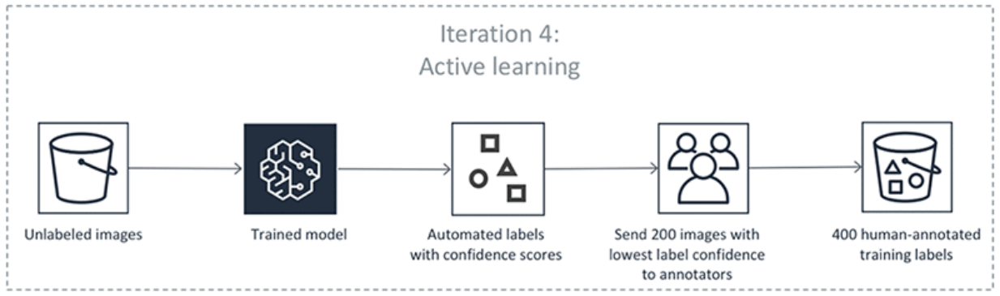

Enhanced data labeling
2915

## Page 945

Amazon SageMaker AI
Developer Guide

Accuracy of automated labels

The definition of accuracy depends on the built-in task type that you use with automated labeling.
For all task types, these accuracy requirements are pre-determined by Ground Truth and cannot be
manually configured.

• For image classification and text classification, Ground Truth uses logic to find a label-prediction
confidence level that corresponds to at least 95% label accuracy. This means Ground Truth
expects the accuracy of the automated labels to be at least 95% when compared to the labels
that human labelers would provide for those examples.

• For bounding boxes, the expected mean Intersection Over Union (IoU)  of the auto-labeled
images is 0.6. To find the mean IoU, Ground Truth calculates the mean IoU of all the predicted
and missed boxes on the image for every class, and then averages these values across classes.

• For semantic segmentation, the expected mean IoU of the auto-labeled images is 0.7. To find
the mean IoU, Ground Truth takes the mean of the IoU values of all the classes in the image
(excluding the background).

At every iteration of Active Learning (steps 3-6 in the list above), the confidence threshold is found
using the human-annotated validation set so that the expected accuracy of the auto-labeled
objects satisfies certain predefined accuracy requirements.

Create an automated data labeling job (console)

To create a labeling job that uses automated labeling in the SageMaker AI console, use the
following procedure.

To create an automated data labeling job (console)

1.
Open the Ground Truth Labeling jobs section of the SageMaker AI console: https://
console.aws.amazon.com/sagemaker/groundtruth.

2.
Using Create a Labeling Job (Console) as a guide, complete the Job overview and Task type
sections. Note that auto labeling is not supported for custom task types.

3.
Under Workers, choose your workforce type.

4.
In the same section, choose Enable automated data labeling.

5.
Using Configure the Bounding Box Tool as a guide, create worker instructions in the section

Task Type labeling tool. For example, if you chose Semantic segmentation as your labeling
job type, this section is called Semantic segmentation labeling tool.

Enhanced data labeling
2916

## Page 946

Amazon SageMaker AI
Developer Guide

6.
To preview your worker instructions and dashboard, choose Preview.

7.
Choose Create. This creates and starts your labeling job and the auto labeling process.

You can see your labeling job appear in the Labeling jobs section of the SageMaker AI console.

Your output data appears in the Amazon S3 bucket that you specified when creating the labeling
job. For more information about the format and file structure of your labeling job output data, see
Labeling job output data.

Create an automated data labeling job (API)

To create an automated data labeling job using the SageMaker API, use the

LabelingJobAlgorithmsConfig parameter of the CreateLabelingJob operation. To learn

how to start a labeling job using the CreateLabelingJob operation, see Create a Labeling Job
(API).

Specify the Amazon Resource Name (ARN) of the algorithm that you are using for automated data
labeling in the LabelingJobAlgorithmSpecificationArn parameter. Choose from one of the four
Ground Truth built-in algorithms that are supported with automated labeling:

• Create an image classification job (Single Label)

• Identify image contents using semantic segmentation

• Object detection (Classify image objects using a bounding box)

• Categorize text with text classification (Single Label)

When an automated data labeling job finishes, Ground Truth returns the ARN of the model it used
for the automated data labeling job. Use this model as the starting model for similar auto-labeling
job types by providing the ARN, in string format, in the InitialActiveLearningModelArn parameter.
To retrieve the model's ARN, use an AWS Command Line Interface (AWS CLI) command similar to
the following.

# Fetch the mARN of the model trained in the final iteration of the previous labeling
job.Ground Truth
pretrained_model_arn = sagemaker_client.describe_labeling_job(LabelingJobName=job_name)
['LabelingJobOutput']['FinalActiveLearningModelArn']

To encrypt data on the storage volume attached to the ML compute instance(s) that are
used in automated labeling, include an AWS Key Management Service (AWS KMS) key in the

Enhanced data labeling
2917

## Page 947

Amazon SageMaker AI
Developer Guide

VolumeKmsKeyId parameter. For information about AWS KMS keys, see What is AWS Key
Management Service? in the AWS Key Management Service Developer Guide.

For an example that uses the CreateLabelingJob operation to create an automated data
labeling job, see the object_detection_tutorial example in the SageMaker AI Examples, Ground

Truth Labeling Jobs section of a SageMaker AI notebook instance. To learn how to create and open
a notebook instance, see Create an Amazon SageMaker notebook instance.

Amazon EC2 instances required for automated data labeling

The following table lists the Amazon Elastic Compute Cloud (Amazon EC2) instances that you need
to run automated data labeling for training and batch inference jobs.

Automated Data Labeling
Job Type

Training Instance Type
Inference Instance Type

Image classification
ml.p3.2xlarge*
ml.c5.xlarge

Object detection (bounding
box)

ml.p3.2xlarge*
ml.c5.4xlarge

Text classification
ml.c5.2xlarge
ml.m4.xlarge

Semantic segmentation
ml.p3.2xlarge*
ml.p3.2xlarge*

* In the Asia Pacific (Mumbai) Region (ap-south-1) use ml.p2.8xlarge instead.

Ground Truth manages the instances that you use for automated data labeling jobs. It creates,
configures, and terminates the instances as needed to perform your job. These instances don't
appear in your Amazon EC2 instance dashboard.

Set up an active learning workflow with your own model

You can create an active learning workflow with your own algorithm to run
training and inferences in that workflow to auto-label your data. The notebook
bring_your_own_model_for_sagemaker_labeling_workflows_with_active_learning.ipynb
demonstrates this using the SageMaker AI built-in algorithm, BlazingText. This notebook provides
an CloudFormation stack that you can use to execute this workflow using AWS Step Functions. You
can find the notebook and supporting files in this GitHub repository.

Enhanced data labeling
2918

## Page 948

Amazon SageMaker AI
Developer Guide

Chaining labeling jobs

Amazon SageMaker Ground Truth can reuse datasets from prior jobs in two ways: cloning and
chaining.

Cloning copies the setup of a prior labeling job and allows you to make additional changes before
setting it to run.

Chaining uses not only the setup of the prior job, but also the results. This allows you to continue
an incomplete job and add labels or data objects to a completed job. Chaining is a more complex
operation.

For data processing:

• Cloning uses the prior job's input manifest, with optional modifications, as the new job's input
manifest.

• Chaining uses the prior job's output manifest as the new job's input manifest.

Chaining is useful when you need to:

• Continue a labeling job that was manually stopped.

• Continue a labeling job that failed mid-job, after fixing issues.

• Switch to automated data labeling after manually labeling part of a job (or the other way
around).

• Add more data objects to a completed job and start the job from there.

• Add another annotation to a completed job. For example, you have a collection of phrases
labeled for topic, then want to run the set again, categorizing them by the topic's implied
audience.

In Amazon SageMaker Ground Truth you can configure a chained labeling job with either the
console or the API.

Key term: label attribute name

The label attribute name (LabelAttributeName in the API) is a string used as the key for the key-
value pair formed with the label that a worker assigns to the data object.

The following rules apply for the label attribute name:

Enhanced data labeling
2919

## Page 949

Amazon SageMaker AI
Developer Guide

• It can't end with -metadata.

• The names source and source-ref are reserved and can't be used.

• For semantic segmentation labeling jobs, , it must end with -ref. For all other labeling jobs, it

can't end with -ref. If you use the console to create the job, Amazon SageMaker Ground Truth

automatically appends -ref to all label attribute names except for semantic segmentation jobs.

• For a chained labeling job, if you're using the same label attribute name from the originating job
and you configure the chained job to use auto-labeling, then if it had been in auto-labeling mode
at any point, Ground Truth uses the model from the originating job.

In an output manifest, the label attribute name appears similar to the following.

"source-ref": "<S3 URI>",
"<label attribute name>": {
"annotations": [{
"class_id": 0,
"width": 99,
"top": 87,
"height": 62,
"left": 175
}],
"image_size": [{
"width": 344,
"depth": 3,
"height": 234
}]
},
"<label attribute name>-metadata": {
"job-name": "<job name>",
"class-map": {
"0": "<label attribute name>"
},
"human-annotated": "yes",
"objects": [{
"confidence": 0.09
}],
"creation-date": "<timestamp>",
"type": "groundtruth/object-detection"
}

Enhanced data labeling
2920

## Page 950

Amazon SageMaker AI
Developer Guide

If you're creating a job in the console and don't explicitly set the label attribute name value,
Ground Truth uses the job name as the label attribute name for the job.

Start a chained job (console)

Choose a stopped, failed, or completed labeling job from the list of your existing jobs. This enables
the Actions menu.

From the Actions menu, choose Chain.

Job overview panel

In the Job overview panel, a new Job name is set based on the title of the job from which you are
chaining this one. You can change it.

You may also specify a label attribute name different from the labeling job name.

If you're chaining from a completed job, the label attribute name uses the name of the new job
you're configuring. To change the name, select the check box.

If you're chaining from a stopped or failed job, the label attribute name uses to the name of the
job from which you're chaining. It's easy to see and edit the value because the name check box is
checked.

Attribute label naming considerations

• The default uses the label attribute name Ground Truth has selected. All data objects
without data connected to that label attribute name are labeled.

• Using a label attribute name not present in the manifest causes the job to process all
the objects in the dataset.

The input dataset location in this case is automatically selected as the output manifest of the
chained job. The input field is not available, so you cannot change it.

Adding data objects to a labeling job

You cannot specify an alternate manifest file. Manually edit the output manifest from the
previous job to add new items before starting a chained job. The Amazon S3 URI helps
you locate where you are storing the manifest in your Amazon S3 bucket. Download the
manifest file from there, edit it locally on your computer, and then upload the new version

Enhanced data labeling
2921

## Page 951

Amazon SageMaker AI
Developer Guide

to replace it. Make sure you are not introducing errors during editing. We recommend you
use JSON linter to check your JSON. Many popular text editors and IDEs have linter plugins
available.

Start a chained job (API)

The procedure is almost the same as setting up a new labeling job with CreateLabelingJob,
except for two primary differences:

• Manifest location: Rather than use your original manifest from the prior job, the value for the

ManifestS3Uri in the DataSource should point to the Amazon S3 URI of the output manifest
from the prior labeling job.

• Label attribute name: Setting the correct LabelAttributeName value is important here. This
is the key portion of a key-value pair where labeling data is the value. Sample use cases include:

• Adding new or more specific labels to a completed job — Set a new label attribute name.

• Labeling the unlabeled items from a prior job — Use the label attribute name from the prior
job.

Use a partially labeled dataset

You can get some chaining benefits if you use an augmented manifest that has already been
partially labeled. Check the Label attribute name check box and set the name so that it matches
the name in your manifest.

If you're using the API, the instructions are the same as those for starting a chained job. However,
be sure to upload your manifest to an Amazon S3 bucket and use it instead of using the output
manifest from a prior job.

The Label attribute name value in the manifest has to conform to the naming considerations
discussed earlier.

Ground Truth Security and Permissions

Use the topics on this page to learn about Ground Truth security features and how to configure
AWS Identity and Access Management (IAM) permissions to allow a user or role to create a labeling
job. Additionally, learn how to create an execution role. An execution role is the role that you
specify when you create a labeling job. This role is used to start your labeling job.

Security and Permissions
2922

## Page 952

Amazon SageMaker AI
Developer Guide

If you are a new user and want to get started quickly, or if you do not require granular permissions,
see Use IAM Managed Policies with Ground Truth.

For more information about IAM users and roles, see Identities (Users, Groups, and Roles) in the
IAM User Guide.

To learn more about using IAM with SageMaker AI, see AWS Identity and Access Management for
Amazon SageMaker AI.

Topics

• CORS Requirement for Input Image Data

• Assign IAM Permissions to Use Ground Truth

• Using Amazon SageMaker Ground Truth in an Amazon Virtual Private Cloud

• Output Data and Storage Volume Encryption

• Workforce Authentication and Restrictions

CORS Requirement for Input Image Data

Earlier in 2020, widely used browsers like Chrome and Firefox changed their default behavior for
rotating images based on image metadata, referred to as EXIF data. Previously, browsers would
always display images in exactly the manner in which they are stored on disk, which is typically
unrotated. After the change, images now rotate according to a piece of image metadata called
orientation value. This has important implications for the entire machine learning (ML) community.
For example, if applications that annotate images do not consider the EXIF orientation, they may
display images in unexpected orientations, resulting in incorrect labels.

Starting with Chrome 89, AWS can no longer automatically prevent the rotation of images because
the web standards group W3C has decided that the ability to control rotation of images violates
the web’s Same-origin Policy. Therefore, to ensure human workers annotate your input images in
a predictable orientation when you submit requests to create a labeling job, you must add a CORS
header policy to the Amazon S3 buckets that contain your input images.

Important

If you do not add a CORS configuration to the Amazon S3 buckets that contain your input
data, labeling tasks for those input data objects will fail.

Security and Permissions
2923

## Page 953

Amazon SageMaker AI
Developer Guide

If you create a job through the Ground Truth console, CORS is enabled by default. If all of your
input data is not located in the same Amazon S3 bucket as your input manifest file, you must
add a CORS configuration to all Amazon S3 buckets that contain input data using the following
instructions.

If you are using the CreateLabelingJob API to create a Ground Truth labeling job, you can add a
CORS policy to an Amazon S3 bucket that contains input data in the S3 console. To set the required
CORS headers on the Amazon S3 bucket that contain your input images in the Amazon S3 console,
follow the directions detailed in How do I add cross-domain resource sharing with CORS?. Use the
following CORS configuration code for the buckets that host your images. If you use the Amazon
S3 console to add the policy to your bucket, you must use the JSON format.

Important

If you create a 3D point cloud or video frame labeling job, you must add additional rules
to your CORS configuration. To learn more, see 3D point cloud labeling job permission
requirements and Video frame job permission requirements respectively.

JSON

[{
"AllowedHeaders": [],
"AllowedMethods": ["GET"],
"AllowedOrigins": ["*"],
"ExposeHeaders": ["Access-Control-Allow-Origin"]
}]

XML

<CORSConfiguration>
<CORSRule>
<AllowedOrigin>*</AllowedOrigin>
<AllowedMethod>GET</AllowedMethod>
<ExposeHeader>Access-Control-Allow-Origin</ExposeHeader>
</CORSRule>
</CORSConfiguration>

Security and Permissions
2924

## Page 954

Amazon SageMaker AI
Developer Guide

Assign IAM Permissions to Use Ground Truth

Use the topics in this section to learn how to use AWS Identity and Access Management (IAM)
managed and custom policies to manage access to Ground Truth and associated resources.

You can use the sections on this page to learn the following:

• How to create IAM policies that grant a user or role permission to create a labeling job.
Administrators can use IAM policies to restrict access to Amazon SageMaker AI and other AWS
services that are specific to Ground Truth.

• How to create a SageMaker AI execution role. An execution role is the role that you specify when
you create a labeling job. The role is used to start and manage your labeling job.

The following is an overview of the topics you'll find on this page:

• If you are getting started using Ground Truth, or you do not require granular permissions for
your use case, it is recommended that you use the IAM managed policies described in Use IAM
Managed Policies with Ground Truth.

• Learn about the permissions required to use the Ground Truth console in Grant IAM Permission
to Use the Amazon SageMaker Ground Truth Console. This section includes policy examples that
grant an IAM entity permission to create and modify private work teams, subscribe to vendor
work teams, and create custom labeling workflows.

• When you create a labeling job, you must provide an execution role. Use Create a SageMaker AI
Execution Role for a Ground Truth Labeling Job to learn about the permissions required for this
role.

Use IAM Managed Policies with Ground Truth

SageMaker AI and Ground Truth provide AWS managed policies that you can use to create a
labeling job. If you are getting started using Ground Truth and you do not require granular
permissions for your use case, it is recommended that you use the following policies:

• AmazonSageMakerFullAccess – Use this policy to give a user or role permission to create a
labeling job. This is a broad policy that grants a entity permission to use SageMaker AI features,
as well as features of necessary AWS services through the console and API. This policy gives the
entity permission to create a labeling job and to create and manage workforces using Amazon
Cognito. To learn more, see AmazonSageMakerFullAccess Policy.

Security and Permissions
2925

## Page 955

Amazon SageMaker AI
Developer Guide

• AmazonSageMakerGroundTruthExecution – To create an execution role, you can attach the

policy AmazonSageMakerGroundTruthExecution to a role. An execution role is the role that

you specify when you create a labeling job and it is used to start your labeling job. This policy
allows you to create both streaming and non-streaming labeling jobs, and to create a labeling

job using any task type. Note the following limits of this managed policy.

• Amazon S3 permissions: This policy grants an execution role permission to access Amazon S3

buckets with the following strings in the name: GroundTruth, Groundtruth, groundtruth,

SageMaker, Sagemaker, and sagemaker or a bucket with an object tag that includes

SageMaker in the name (case insensitive). Make sure your input and output bucket names
include these strings, or add additional permissions to your execution role to grant it
permission to access your Amazon S3 buckets. You must give this role permission to perform

the following actions on your Amazon S3 buckets: AbortMultipartUpload, GetObject,

and PutObject.

• Custom Workflows: When you create a custom labeling workflow, this execution role is
restricted to invoking AWS Lambda functions with one of the following strings as part of the

function name: GtRecipe, SageMaker, Sagemaker, sagemaker, or LabelingFunction.
This applies to both your pre-annotation and post-annotation Lambda functions. If you choose

to use names without those strings, you must explicitly provide lambda:InvokeFunction
permission to the execution role used to create the labeling job.

To learn how to attach an AWS managed policy to a user or role, refer to Adding and removing IAM
identity permissions in the IAM User Guide.

Grant IAM Permission to Use the Amazon SageMaker Ground Truth Console

To use the Ground Truth area of the SageMaker AI console, you need to grant permission to an
entity to access SageMaker AI and other AWS services that Ground Truth interacts with. Required
permissions to access other AWS services depends on your use-case:

• Amazon S3 permissions are required for all use cases. These permissions must grant access to the
Amazon S3 buckets that contain input and output data.

• AWS Marketplace permissions are required to use a vendor workforce.

• Amazon Cognito permission are required for private work team setup.

• AWS KMS permissions are required to view available AWS KMS keys that can be used for output
data encryption.

Security and Permissions
2926

## Page 956

Amazon SageMaker AI
Developer Guide

• IAM permissions are required to either list pre-existing execution roles, or to create a new

one. Additionally, you must use add a PassRole permission to allow SageMaker AI to use the
execution role chosen to start the labeling job.

The following sections list policies you may want to grant to a role to use one or more functions of
Ground Truth.

Topics

• Ground Truth Console Permissions

• Custom Labeling Workflow Permissions

• Private Workforce Permissions

• Vendor Workforce Permissions

Ground Truth Console Permissions

To grant permission to a user or role to use the Ground Truth area of the SageMaker AI console to
create a labeling job, attach the following policy to the user or role. The following policy will give
an IAM role permission to create a labeling job using a built-in task type task type. If you want to
create a custom labeling workflow, add the policy in Custom Labeling Workflow Permissions to

the following policy. Each Statement included in the following policy is described below this code
block.

JSON

{
"Version":"2012-10-17",
"Statement": [
{
"Sid": "SageMakerApis",
"Effect": "Allow",
"Action": [
"sagemaker:*"
],
"Resource": "*"
},
{
"Sid": "KmsKeysForCreateForms",
"Effect": "Allow",

Security and Permissions
2927

## Page 957

Amazon SageMaker AI
Developer Guide

"Action": [
"kms:DescribeKey",
"kms:ListAliases"
],
"Resource": "*"
},
{
"Sid": "AccessAwsMarketplaceSubscriptions",
"Effect": "Allow",
"Action": [
"aws-marketplace:ViewSubscriptions"
],
"Resource": "*"
},
{
"Sid": "SecretsManager",
"Effect": "Allow",

"Action": [
"secretsmanager:CreateSecret",
"secretsmanager:DescribeSecret",
"secretsmanager:ListSecrets"
],
"Resource": "*"
},
{
"Sid": "ListAndCreateExecutionRoles",
"Effect": "Allow",
"Action": [
"iam:ListRoles",
"iam:CreateRole",
"iam:CreatePolicy",
"iam:AttachRolePolicy"
],
"Resource": "*"
},
{
"Sid": "PassRoleForExecutionRoles",
"Effect": "Allow",
"Action": [
"iam:PassRole"
],
"Resource": "*",
"Condition": {
"StringEquals": {

Security and Permissions
2928

## Page 958

Amazon SageMaker AI
Developer Guide

"iam:PassedToService": "sagemaker.amazonaws.com"
}
}
},
{
"Sid": "GroundTruthConsole",
"Effect": "Allow",
"Action": [
"groundtruthlabeling:*",
"lambda:InvokeFunction",
"lambda:ListFunctions",
"s3:GetObject",
"s3:PutObject",
"s3:ListBucket",
"s3:GetBucketCors",
"s3:PutBucketCors",
"s3:ListAllMyBuckets",

"cognito-idp:AdminAddUserToGroup",
"cognito-idp:AdminCreateUser",
"cognito-idp:AdminDeleteUser",
"cognito-idp:AdminDisableUser",
"cognito-idp:AdminEnableUser",
"cognito-idp:AdminRemoveUserFromGroup",
"cognito-idp:CreateGroup",
"cognito-idp:CreateUserPool",
"cognito-idp:CreateUserPoolClient",
"cognito-idp:CreateUserPoolDomain",
"cognito-idp:DescribeUserPool",
"cognito-idp:DescribeUserPoolClient",
"cognito-idp:ListGroups",
"cognito-idp:ListIdentityProviders",
"cognito-idp:ListUsers",
"cognito-idp:ListUsersInGroup",
"cognito-idp:ListUserPoolClients",
"cognito-idp:ListUserPools",
"cognito-idp:UpdateUserPool",
"cognito-idp:UpdateUserPoolClient"
],
"Resource": "*"
}
]
}

Security and Permissions
2929

## Page 959

Amazon SageMaker AI
Developer Guide

This policy includes the following statements. You can scope down any of these statements by

adding specific resourses to the Resource list for that statement.

SageMakerApis

This statement includes sagemaker:*, which allows the user to perform all SageMaker AI API
actions. You can reduce the scope of this policy by restricting users from performing actions that
are not used to create and monitoring a labeling job.

KmsKeysForCreateForms

You only need to include this statement if you want to grant a user permission to list and select
AWS KMS keys in the Ground Truth console to use for output data encryption. The policy above
grants a user permission to list and select any key in the account in AWS KMS. To restrict the keys

that a user can list and select, specify those key ARNs in Resource.

SecretsManager

This statement gives the user permission to describe, list, and create resources in AWS Secrets
Manager required to create the labeling job.

ListAndCreateExecutionRoles

This statement gives a user permission to list (ListRoles) and create (CreateRole) IAM roles

in your account. It also grants the user permission to create (CreatePolicy) policies and attach

(AttachRolePolicy) policies to entities. These are required to list, select, and if required, create
an execution role in the console.

If you have already created an execution role, and want to narrow the scope of this statement so
that users can only select that role in the console, specify the ARNs of the roles you want the user

to have permission to view in Resource and remove the actions CreateRole, CreatePolicy,

and AttachRolePolicy.

AccessAwsMarketplaceSubscriptions

These permissions are required to view and choose vendor work teams that you are already
subscribed to when creating a labeling job. To give the user permission to subscribe to vendor work
teams, add the statement in Vendor Workforce Permissions to the policy above

PassRoleForExecutionRoles

Security and Permissions
2930

## Page 960

Amazon SageMaker AI
Developer Guide

This is required to give the labeling job creator permission to preview the worker UI and verify that
input data, labels, and instructions display correctly. This statement gives an entity permissions to
pass the IAM execution role used to create the labeling job to SageMaker AI to render and preview
the worker UI. To narrow the scope of this policy, add the role ARN of the execution role used to

create the labeling job under Resource.

GroundTruthConsole

• groundtruthlabeling – This allows a user to perform actions required to use
certain features of the Ground Truth console. These include permissions to describe

the labeling job status (DescribeConsoleJob), list all dataset objects in the input

manifest file (ListDatasetObjects), filter the dataset if dataset sampling is selected

(RunFilterOrSampleDatasetJob), and to generate input manifest files if automated data

labeling is used (RunGenerateManifestByCrawlingJob). These actions are only available
when using the Ground Truth console and cannot be called directly using an API.

• lambda:InvokeFunction and lambda:ListFunctions – these actions give users permission
to list and invoke Lambda functions that are used to run a custom labeling workflow.

• s3:* – All Amazon S3 permissions included in this statement are used to view Amazon S3

buckets for automated data setup (ListAllMyBuckets), access input data in Amazon S3

(ListBucket, GetObject), check for and create a CORS policy in Amazon S3 if needed

(GetBucketCors and PutBucketCors), and write labeling job output files to S3 (PutObject).

• cognito-idp – These permissions are used to create, view and manage and private workforce
using Amazon Cognito. To learn more about these actions, refer to the Amazon Cognito API
References.

Custom Labeling Workflow Permissions

Add the following statement to a policy similar to the one in Ground Truth Console Permissions to
give a user permission to select pre-existing pre-annotation and post-annotation Lambda functions
while creating a custom labeling workflow.

{
"Sid": "GroundTruthConsoleCustomWorkflow",
"Effect": "Allow",
"Action": [
"lambda:InvokeFunction",
"lambda:ListFunctions"
],

Security and Permissions
2931

## Page 961

Amazon SageMaker AI
Developer Guide

"Resource": "*"
}

To learn how to give an entity permission to create and test pre-annotation and post-annotation
Lambda functions, see Required Permissions To Use Lambda With Ground Truth.

Private Workforce Permissions

When added to a permissions policy, the following permission grants access to create and manage
a private workforce and work team using Amazon Cognito. These permissions are not required to
use an OIDC IdP workforce.

{
"Effect": "Allow",
"Action": [
"cognito-idp:AdminAddUserToGroup",
"cognito-idp:AdminCreateUser",
"cognito-idp:AdminDeleteUser",
"cognito-idp:AdminDisableUser",
"cognito-idp:AdminEnableUser",
"cognito-idp:AdminRemoveUserFromGroup",
"cognito-idp:CreateGroup",
"cognito-idp:CreateUserPool",
"cognito-idp:CreateUserPoolClient",
"cognito-idp:CreateUserPoolDomain",
"cognito-idp:DescribeUserPool",
"cognito-idp:DescribeUserPoolClient",
"cognito-idp:ListGroups",
"cognito-idp:ListIdentityProviders",
"cognito-idp:ListUsers",
"cognito-idp:ListUsersInGroup",
"cognito-idp:ListUserPoolClients",
"cognito-idp:ListUserPools",
"cognito-idp:UpdateUserPool",
"cognito-idp:UpdateUserPoolClient"
],
"Resource": "*"
}

To learn more about creating private workforce using Amazon Cognito, see Amazon Cognito
Workforces.

Security and Permissions
2932

## Page 962

Amazon SageMaker AI
Developer Guide

Vendor Workforce Permissions

You can add the following statement to the policy in Grant IAM Permission to Use the Amazon
SageMaker Ground Truth Console to grant an entity permission to subscribe to a vendor workforce.

{
"Sid": "AccessAwsMarketplaceSubscriptions",
"Effect": "Allow",

"Action": [
"aws-marketplace:Subscribe",
"aws-marketplace:Unsubscribe",
"aws-marketplace:ViewSubscriptions"
],
"Resource": "*"
}

Create a SageMaker AI Execution Role for a Ground Truth Labeling Job

When you configure your labeling job, you need to provide an execution role, which is a role that
SageMaker AI has permission to assume to start and run your labeling job.

This role must give Ground Truth permission to access the following:

• Amazon S3 to retrieve your input data and write output data to an Amazon S3 bucket. You
can either grant permission for an IAM role to access an entire bucket by providing the bucket
ARN, or you can grant access to the role to access specific resources in a bucket. For example,

the ARN for a bucket may look similar to arn:aws:s3:::amzn-s3-demo-bucket1 and the

ARN of a resource in an Amazon S3 bucket may look similar to arn:aws:s3:::amzn-s3-

demo-bucket1/prefix/file-name.png. To apply an action to all resources in an Amazon S3

bucket, you can use the wild card: *. For example, arn:aws:s3:::amzn-s3-demo-bucket1/

prefix/*. For more information, see Amazon Amazon S3 Resources in the Amazon Simple
Storage Service User Guide.

• CloudWatch to log worker metrics and labeling job statuses.

• AWS KMS for data encryption. (Optional)

• AWS Lambda for processing input and output data when you create a custom workflow.

Additionally, if you create a streaming labeling job, this role must have permission to access:

• Amazon SQS to create an interact with an SQS queue used to manage labeling requests.

Security and Permissions
2933

## Page 963

Amazon SageMaker AI
Developer Guide

• Amazon SNS to subscribe to and retrieve messages from your Amazon SNS input topic and to
send messages to your Amazon SNS output topic.

All of these permissions can be granted with the AmazonSageMakerGroundTruthExecution
managed policy except:

• Data and storage volume encryption of your Amazon S3 buckets. To learn how to configure
these permissions, see Encrypt Output Data and Storage Volume with AWS KMS.

• Permission to select and invoke Lambda functions that do not include GtRecipe, SageMaker,

Sagemaker, sagemaker, or LabelingFunction in the function name.

• Amazon S3 buckets that do not include either GroundTruth, Groundtruth, groundtruth,

SageMaker, Sagemaker, and sagemaker in the prefix or bucket name or an object tag that

includes SageMaker in the name (case insensitive).

If you require more granular permissions than the ones provided in

AmazonSageMakerGroundTruthExecution, use the following policy examples to create an
execution role that fits your specific use case.

Topics

• Built-In Task Types (Non-streaming) Execution Role Requirements

• Built-In Task Types (Streaming) Execution Role Requirements

• Execution Role Requirements for Custom Task Types

• Automated Data Labeling Permission Requirements

Built-In Task Types (Non-streaming) Execution Role Requirements

The following policy grants permission to create a labeling job for a built-in task type. This
execution policy does not include permissions for AWS KMS data encryption or decryption. Replace
each red, italicized ARN with your own Amazon S3 ARNs.

JSON

{
"Version":"2012-10-17",
"Statement": [
{

Security and Permissions
2934

## Page 964

Amazon SageMaker AI
Developer Guide

"Sid": "S3ViewBuckets",
"Effect": "Allow",
"Action": [
"s3:ListBucket",
"s3:GetBucketLocation"
],
"Resource": [
"arn:aws:s3:::<input-bucket-name>",
"arn:aws:s3:::<output-bucket-name>"
]
},
{
"Sid": "S3GetPutObjects",
"Effect": "Allow",
"Action": [
"s3:AbortMultipartUpload",
"s3:GetObject",

"s3:PutObject"
],
"Resource": [
"arn:aws:s3:::<input-bucket-name>/*",
"arn:aws:s3:::<output-bucket-name>/*"
]
},
{
"Sid": "CloudWatch",
"Effect": "Allow",
"Action": [
"cloudwatch:PutMetricData",
"logs:CreateLogStream",
"logs:CreateLogGroup",
"logs:DescribeLogStreams",
"logs:PutLogEvents"
],
"Resource": "*"
}
]
}

Security and Permissions
2935

## Page 965

Amazon SageMaker AI
Developer Guide

Built-In Task Types (Streaming) Execution Role Requirements

If you create a streaming labeling job, you must add a policy similar to the following to the

execution role you use to create the labeling job. To narrow the scope of the policy, replace the *

in Resource with specific AWS resources that you want to grant the IAM role permission to access
and use.

JSON

{
"Version":"2012-10-17",
"Statement": [
{
"Effect": "Allow",
"Action": [

"s3:AbortMultipartUpload",
"s3:GetObject",
"s3:PutObject"
],
"Resource": [
"arn:aws:s3:::amzn-s3-demo-bucket/*",
"arn:aws:s3:::amzn-s3-demo-bucket2/*"
]
},
{
"Effect": "Allow",
"Action": [
"s3:GetObject"
],
"Resource": "*",
"Condition": {
"StringEqualsIgnoreCase": {
"s3:ExistingObjectTag/SageMaker": "true"
}
}
},
{
"Effect": "Allow",
"Action": [
"s3:GetBucketLocation",
"s3:ListBucket"
],

Security and Permissions
2936

## Page 966

Amazon SageMaker AI
Developer Guide

"Resource": [
"arn:aws:s3:::amzn-s3-demo-bucket",
"arn:aws:s3:::amzn-s3-demo-bucket2"
]
},
{
"Sid": "CloudWatch",
"Effect": "Allow",
"Action": [
"cloudwatch:PutMetricData",
"logs:CreateLogStream",
"logs:CreateLogGroup",
"logs:DescribeLogStreams",
"logs:PutLogEvents"
],
"Resource": "*"
},

{
"Sid": "StreamingQueue",
"Effect": "Allow",
"Action": [
"sqs:CreateQueue",
"sqs:DeleteMessage",
"sqs:GetQueueAttributes",
"sqs:GetQueueUrl",
"sqs:ReceiveMessage",
"sqs:SendMessage",
"sqs:SetQueueAttributes"
],
"Resource": "arn:aws:sqs:*:*:*GroundTruth*"
},
{
"Sid": "StreamingTopicSubscribe",
"Effect": "Allow",
"Action": "sns:Subscribe",
"Resource": [
"arn:aws:sns:us-east-1:111122223333:input-topic-name",
"arn:aws:sns:us-east-1:111122223333:output-topic-name"
],
"Condition": {
"StringEquals": {
"sns:Protocol": "sqs"
},
"StringLike": {

Security and Permissions
2937

## Page 967

Amazon SageMaker AI
Developer Guide

"sns:Endpoint": "arn:aws:sns:us-
east-1:111122223333:*GroundTruth*"
}
}
},
{
"Sid": "StreamingTopic",
"Effect": "Allow",
"Action": [
"sns:Publish"
],
"Resource": [
"arn:aws:sns:us-east-1:111122223333:input-topic-name",
"arn:aws:sns:us-east-1:111122223333:output-topic-name"
]
},
{

"Sid": "StreamingTopicUnsubscribe",
"Effect": "Allow",
"Action": [
"sns:Unsubscribe"
],
"Resource": [
"arn:aws:sns:us-east-1:111122223333:input-topic-name",
"arn:aws:sns:us-east-1:111122223333:output-topic-name"
]
}
]
}

Execution Role Requirements for Custom Task Types

If you want to create a custom labeling workflow, add the following statement to an execution role
policy like the ones found in Built-In Task Types (Non-streaming) Execution Role Requirements or
Built-In Task Types (Streaming) Execution Role Requirements.

This policy gives the execution role permission to Invoke your pre-annotation and post-
annotation Lambda functions.

{
"Sid": "LambdaFunctions",
"Effect": "Allow",

Security and Permissions
2938

## Page 968

Amazon SageMaker AI
Developer Guide

"Action": [
"lambda:InvokeFunction"
],
"Resource": [
"arn:aws:lambda:<region>:<account-id>:function:<pre-annotation-lambda-name>",
"arn:aws:lambda:<region>:<account-id>:function:<post-annotation-lambda-name>"
]
}

Automated Data Labeling Permission Requirements

If you want to create a labeling job with automated data labeling enabled, you must 1) add one
policy to the IAM policy attached to the execution role and 2) update the trust policy of the
execution role.

The following statement allows the IAM execution role to be passed to SageMaker AI so that it can
be used to run the training and inference jobs used for active learning and automated data labeling
respectively. Add this statement to an execution role policy like the ones found in Built-In Task
Types (Non-streaming) Execution Role Requirements or Built-In Task Types (Streaming) Execution

Role Requirements. Replace arn:aws:iam::<account-number>:role/<role-name> with the
execution role ARN. You can find your IAM role ARN in the IAM console under Roles.

{
"Effect": "Allow",
"Action": [
"iam:PassRole"
],
"Resource": "arn:aws:iam::<account-number>:role/<execution-role-name>",
"Condition": {
"StringEquals": {
"iam:PassedToService": [
"sagemaker.amazonaws.com"
]
}
}
}

The following statement allows SageMaker AI to assume the execution role to create and manage
the SageMaker training and inference jobs. This policy must be added to the trust relationship of
the execution role. To learn how to add or modify an IAM role trust policy, see Modifying a role in
the IAM User Guide.

Security and Permissions
2939

## Page 969

Amazon SageMaker AI
Developer Guide

JSON

{
"Version":"2012-10-17",
"Statement": {
"Effect": "Allow",
"Principal": {"Service": "sagemaker.amazonaws.com" },
"Action": "sts:AssumeRole"
}
}

Encrypt Output Data and Storage Volume with AWS KMS

You can use AWS Key Management Service (AWS KMS) to encrypt output data from a labeling
job by specifying a customer managed key when you create the labeling job. If you use the API

operation CreateLabelingJob to create a labeling job that uses automated data labeling, you
can also use a customer managed key to encrypt the storage volume attached to the ML compute
instances to run the training and inference jobs.

This section describes the IAM policies you must attach to your customer managed key to enable
output data encryption and the policies you must attach to your customer managed key and
execution role to use storage volume encryption. To learn more about these options, see Output
Data and Storage Volume Encryption.

Encrypt Output Data using KMS

If you specify an AWS KMS customer managed key to encrypt output data, you must add an IAM
policy similar to the following to that key. This policy gives the IAM execution role that you use to

create your labeling job permission to use this key to perform all of the actions listed in "Action".
To learn more about these actions, see AWS KMS permissions in the AWS Key Management Service
Developer Guide.

To use this policy, replace the IAM service-role ARN in "Principal" with the ARN of the execution
role you use to create the labeling job. When you create a labeling job in the console, this is the
role you specify for IAM Role under the Job overview section. When you create a labeling job using

CreateLabelingJob, this is ARN you specify for RoleArn.

{
"Sid": "AllowUseOfKmsKey",

Security and Permissions
2940

## Page 970

Amazon SageMaker AI
Developer Guide

"Effect": "Allow",
"Principal": {
"AWS": "arn:aws:iam::111122223333:role/service-role/example-role"
},
"Action": [
"kms:Encrypt",
"kms:Decrypt",
"kms:ReEncrypt*",
"kms:GenerateDataKey*",
"kms:DescribeKey"
],
"Resource": "*"
}

Encrypt Automated Data Labeling ML Compute Instance Storage Volume

If you specify a VolumeKmsKeyId to encrypt the storage volume attached to the ML compute
instance used for automated data labeling training and inference, you must do the following:

• Attach permissions described in Encrypt Output Data using KMS to the customer managed key.

• Attach a policy similar to the following to the IAM execution role you use to create your labeling

job. This is the IAM role you specify for RoleArn in CreateLabelingJob. To learn more about

the "kms:CreateGrant" action that this policy permits, see CreateGrant in the AWS Key
Management Service API Reference.

JSON

{
"Version":"2012-10-17",
"Statement":
[
{
"Effect": "Allow",
"Action": [
"kms:CreateGrant"
],
"Resource": "*"
}
]
}

Security and Permissions
2941

## Page 971

Amazon SageMaker AI
Developer Guide

To learn more about Ground Truth storage volume encryption, see Use Your KMS Key to Encrypt
Automated Data Labeling Storage Volume (API Only).

Using Amazon SageMaker Ground Truth in an Amazon Virtual Private Cloud

With Amazon Virtual Private Cloud (Amazon VPC) you can launch AWS resources in a logically
isolated virtual network that you define. Ground Truth supports running labeling jobs inside an
Amazon VPC instead of connecting over the internet. When you launch a labeling job in an Amazon
VPC, communication between your VPC and Ground Truth is conducted entirely and securely within
the AWS network.

This guide shows how you can use Ground Truth in an Amazon VPC in the following ways:

1. Run an Amazon SageMaker Ground Truth Labeling Job in an Amazon Virtual Private Cloud

2. Use Amazon VPC Mode from a Private Worker Portal

Run an Amazon SageMaker Ground Truth Labeling Job in an Amazon Virtual Private Cloud

Ground Truth supports the following functionalities in Amazon VPC.

• You can use Amazon S3 bucket policies to control access to buckets from specific Amazon VPC
endpoints, or specific VPCs. If you launch a labeling job and your input data is located in an
Amazon S3 bucket that is restricted to users in your VPC, you can add a bucket policy to also
grant a Ground Truth endpoint permission to access the bucket. To learn more, see Allow Ground
Truth to Access VPC Restricted Amazon S3 Buckets.

• You can launch an automated data labeling job in your VPC. You use a VPC configuration to
specify VPC subnets and security groups. SageMaker AI uses this configuration to launch the
training and inference jobs used for automated data labeling in your VPC. To learn more, see
Create an Automated Data Labeling Job in a VPC.

You may want to use these options in any of the following ways.

• You can use both of these methods to launch a labeling job using a VPC-protected Amazon S3
bucket with automated data labeling enabled.

• You can launch a labeling job using any built-in task type using a VPC-protected bucket.

• You can launch a custom labeling workflow using a VPC-protected bucket. Ground Truth
interacts with your pre-annotation and post-annotation Lambda functions using an AWS
PrivateLink endpoint.

Security and Permissions
2942

## Page 972

Amazon SageMaker AI
Developer Guide

We recommend that you review Prerequisites for running a Ground Truth labeling job in a VPC
before you create a labeling job in an Amazon VPC.

Prerequisites for running a Ground Truth labeling job in a VPC

Review the following prerequisites before you create a Ground Truth labeling job in an Amazon
VPC.

• If you are a new user of Ground Truth, review Getting started to learn how to create a labeling
job.

• If your input data is located in a VPC-protected Amazon S3 bucket, your workers must access the
worker portal from your VPC. VPC based labeling jobs require the use of a private work team. To
learn more about creating a private work team, see Use a Private Workforce.

• The following prerequisites are specific to launching a labeling job in your VPC.

• Use the instructions in Create an Amazon S3 VPC Endpoint. Training and inference containers
used in the automated data labeling workflow use this endpoint to communicate with your
buckets in Amazon S3.

• Review Automate Data Labeling to learn more about this feature. Note that automated data
labeling is supported for the following built-in task types: Image Classification (Single Label),
Image Semantic Segmentation, Bounding Box, and Text Classification (Single Label). Streaming
labeling jobs do not support automated data labeling.

• Review the Ground Truth Security and Permissions section and ensure that you have met the
following conditions.

• The user creating the labeling job has all necessary permissions

• You have created an IAM execution role with required permissions. If you do not require
fine-tuned permissions for your use case, we recommend you use the IAM managed policies
described in Grant General Permissions To Get Started Using Ground Truth.

• Allow your VPC to have access to the sagemaker-labeling-data-region and sm-

bxcb-region-saved-task-states S3 buckets. These are system owned regionalized S3
buckets that are accessed from worker portal when worker is working on a task. We use these
buckets to interact with system managed data.

Security and Permissions
2943

## Page 973

Amazon SageMaker AI
Developer Guide

Allow Ground Truth to Access VPC Restricted Amazon S3 Buckets

The following sections provide details about the permissions Ground Truth requires to launch
labeling jobs using Amazon S3 buckets that have access restricted to your VPC and VPC endpoints.

To learn how to restrict access to an Amazon S3 bucket to a VPC, see Controlling access from VPC

endpoints with bucket policies in the Amazon Simple Storage Service User Guide guide. To learn
how to add a policy to an S3 bucket, see Adding a bucket policy using the Amazon S3 console.

Note

Modifying policies on existing buckets can cause IN_PROGRESS Ground Truth jobs to fail.
We recommend you start new jobs using a new bucket. If you want to continue using the
same bucket, you can do one of the following.

• Wait for an IN_PROGRESS job to finish.

• Terminate the job using the console or the AWS CLI.

You can restrict Amazon S3 bucket access to users in your VPC using an AWS PrivateLink endpoint.

For example, the following S3 bucket policy allows access to a specific bucket, <bucket-name>,

from <vpc> and the endpoint <vpc-endpoint> only. When you modify this policy, you must

replace all red-italized text with your resources and specifications.

Note

The following policy denies all entities other than users within a VPC to perform the actions

listed in Action. If you do not include actions in this list, they are still accessible to any
entity that has access to this bucket and permission to perform those actions. For example,

if a user has permission to perform GetBucketLocation on your Amazon S3 bucket, the
policy below does not restrict the user from performing this action outside of your VPC.

JSON

{
"Version":"2012-10-17",
"Id": "Policy1415115909152",
"Statement": [

Security and Permissions
2944

## Page 974

Amazon SageMaker AI
Developer Guide

{
"Sid": "AccessToSpecificVPCEOnly",
"Action": [
"s3:GetObject",
"s3:PutObject"
],
"Effect": "Deny",
"Resource": [
"arn:aws:s3:::amzn-s3-demo-bucket",
"arn:aws:s3:::amzn-s3-demo-bucket/*"
],
"Condition": {
"StringNotEquals": {
"aws:sourceVpce": [
"vpce-12345678",
"vpce-12345678901234567"
]

}
}
}
]
}

Ground Truth must be able to perform the following Amazon S3 actions on the S3 buckets you use
to configure the labeling job.

"s3:AbortMultipartUpload",
"s3:GetObject",
"s3:PutObject",
"s3:ListBucket",
"s3:GetBucketLocation"

You can do this by adding a Ground Truth endpoint to the bucket policy like the one previously
mentioned. The following table includes Ground Truth service endpoints for each AWS Region. Add
an endpoint in the same AWS Region you use to run your labeling job to your bucket policy.

AWS Region
Ground Truth endpoint

us-east-2
vpce-02569ba1c40aad0bc

Security and Permissions
2945

## Page 975

Amazon SageMaker AI
Developer Guide

AWS Region
Ground Truth endpoint

us-east-1
vpce-08408e335ebf95b40

us-west-2
vpce-0ea07aa498eb78469

ca-central-1
vpce-0d46ea4c9ff55e1b7

eu-central-1
vpce-0865e7194a099183d

eu-west-2
vpce-0bccd56798f4c5df0

eu-west-1
vpce-0788e7ed8628e595d

ap-south-1
vpce-0d7fcda14e1783f11

ap-southeast-2
vpce-0b7609e6f305a77d4

ap-southeast-1
vpce-0e7e67b32e9efed27

ap-northeast-2
vpce-007893f89e05f2bbf

ap-northeast-1
vpce-0247996a1a1807dbd

For example, the following policy restricts GetObject and PutObject actions on:

• An Amazon S3 bucket to users in a VPC (<vpc>)

• A VPC endpoint (<vpc-endpoint>)

• A Ground Truth service endpoint (<ground-truth-endpoint>)

JSON

{
"Version":"2012-10-17",
"Id": "1",
"Statement": [
{
"Sid": "DenyAccessFromNonGTandCustomerVPC",
"Effect": "Deny",

Security and Permissions
2946

## Page 976

Amazon SageMaker AI
Developer Guide

"Principal": "*",
"Action": [
"s3:GetObject",
"s3:PutObject"
],
"Resource": [
"arn:aws:s3:::bucket-name",
"arn:aws:s3:::bucket-name/*"
],
"Condition": {
"StringNotEquals": {
"aws:SourceVpc": "vpc-12345678",
"aws:sourceVpce": [
"vpce-12345678",
"vpce-12345678"
]
}

}
}
]
}

If you want a user to have permission to launch a labeling job using the Ground Truth console, you

must also add the user's ARN to the bucket policy using the aws:PrincipalArn condition. This
user must also have permission to perform the following Amazon S3 actions on the bucket you use
to launch the labeling job.

"s3:GetObject",
"s3:PutObject",
"s3:ListBucket",
"s3:GetBucketCors",
"s3:PutBucketCors",
"s3:ListAllMyBuckets",

The following code is an example of a bucket policy that restricts permission to perform the

actions listed in Action on the S3 bucket <bucket-name> to the following.

• <role-name>

• The VPC endpoints listed in aws:sourceVpce

• Users within the VPC named <vpc>

Security and Permissions
2947

## Page 977

Amazon SageMaker AI
Developer Guide

JSON

{
"Version":"2012-10-17",
"Id": "1",
"Statement": [
{
"Sid": "DenyAccessFromNonGTandCustomerVPC",
"Effect": "Deny",
"Principal": "*",
"Action": [
"s3:GetObject",
"s3:PutObject"
],
"Resource": [
"arn:aws:s3:::bucket-name/*",

"arn:aws:s3:::bucket-name"
],
"Condition": {
"StringNotEquals": {
"aws:SourceVpc": "vpc-12345678",
"aws:PrincipalArn": "arn:aws:iam::111122223333:role/role-
name"
},
"StringNotEquals": {
"aws:sourceVpce": [
"vpce-12345678",
"vpce-12345678"
]
}
}
}
]
}

Note

The Amazon VPC interface endpoints and the protected Amazon S3 buckets you use for
input and output data must be located in the same AWS Region that you use to create the
labeling job.

Security and Permissions
2948

## Page 978

Amazon SageMaker AI
Developer Guide

After you have granted Ground Truth permission to access your Amazon S3 buckets, you can use
one of the topics in Create a Labeling Job to launch a labeling job. Specify the VPC-restricted
Amazon S3 buckets for your input and output data buckets.

Create an Automated Data Labeling Job in a VPC

To create an automated data labeling job using an Amazon VPC, you provide a VPC configuration

using the Ground Truth console or CreateLabelingJob API operation. SageMaker AI uses the
subnets and security groups you provide to launch the training and inferences jobs used for
automated labeling.

Important

Before you launch an automated data labeling job with a VPC configuration, make sure you
have created an Amazon S3 VPC endpoint using the VPC you want to use for the labeling
job. To learn how, see Create an Amazon S3 VPC Endpoint.
Additionally, if you create an automated data labeling job using a VPC-restricted Amazon
S3 bucket, you must follow the instructions in Allow Ground Truth to Access VPC Restricted
Amazon S3 Buckets to give Ground Truth permission to access the bucket.

Use the following procedures to learn how to add a VPC configuration to your labeling job request.

Add a VPC configuration to an automated data labeling job (console):

1.
Follow the instructions in Create a Labeling Job (Console) and complete each step in the
procedure, up to step 15.

2.
In the Workers section, select the checkbox next to Enable automated data labeling.

3.
Maximize the VPC configuration section of the console by selecting the arrow.

4.
Specify the Virtual private cloud (VPC) that you want to use for your automated data labeling
job.

5.
Choose the dropdown list under Subnets and select one or more subnets.

6.
Choose the dropdown list under Security groups and select one or more groups.

7.
Complete all remaining steps of the procedure in Create a Labeling Job (Console).

Add a VPC configuration to an automated data labeling job (API):

Security and Permissions
2949

## Page 979

Amazon SageMaker AI
Developer Guide

To configure a labeling job using the Ground Truth API operation, CreateLabelingJob, follow
the instructions in Create an Automated Data Labeling Job (API) to configure your request. In

addition to the parameters described in this documentation, you must include a VpcConfig

parameter in LabelingJobResourceConfig to specify one or more subnets and security groups

using the following schema.

"LabelingJobAlgorithmsConfig": {
"InitialActiveLearningModelArn": "string",
"LabelingJobAlgorithmSpecificationArn": "string",
"LabelingJobResourceConfig": {
"VolumeKmsKeyId": "string",
"VpcConfig": {
"SecurityGroupIds": [ "string" ],
"Subnets": [ "string" ]
}
}
}

The following is an example of an AWS Python SDK (Boto3) request to create an automated
data labeling job in the US East (N. Virginia) Region using a private workforce. Replace all

red-italicized text with your labeling job resources and specifications. To learn more

about the CreateLabelingJob operation, see the Create a Labeling Job (API) tutorial and
CreateLabelingJob API documentation.

import boto3
client = boto3.client(service_name='sagemaker')

response = client.create_labeling_job(
LabelingJobName="example-labeling-job",
LabelAttributeName="label",
InputConfig={
'DataSource': {
'S3DataSource': {
'ManifestS3Uri': "s3://bucket/path/manifest-with-input-data.json"
}
}
},
"LabelingJobAlgorithmsConfig": {
"LabelingJobAlgorithmSpecificationArn": "arn:aws:sagemaker:us-
east-1:027400017018:labeling-job-algorithm-specification/tasktype",
"LabelingJobResourceConfig": {

Security and Permissions
2950

## Page 980

Amazon SageMaker AI
Developer Guide

"VpcConfig": {
"SecurityGroupIds": [ "sg-01233456789", "sg-987654321" ],
"Subnets": [ "subnet-e0123456", "subnet-e7891011" ]
}
}
},
OutputConfig={
'S3OutputPath': "s3://bucket/path/file-to-store-output-data",
'KmsKeyId': "string"
},
RoleArn="arn:aws:iam::*:role/*,
LabelCategoryConfigS3Uri="s3://bucket/path/label-categories.json",
StoppingConditions={
'MaxHumanLabeledObjectCount': 123,
'MaxPercentageOfInputDatasetLabeled': 123
},
HumanTaskConfig={

'WorkteamArn': "arn:aws:sagemaker:region:*:workteam/private-crowd/*",
'UiConfig': {
'UiTemplateS3Uri': "s3://bucket/path/custom-worker-task-template.html"
},
'PreHumanTaskLambdaArn': "arn:aws:lambda:us-
east-1:432418664414:function:PRE-tasktype",
'TaskKeywords': [
"Images",
"Classification",
"Multi-label"
],
'TaskTitle': "Add task title here",
'TaskDescription': "Add description of task here for workers",
'NumberOfHumanWorkersPerDataObject': 1,
'TaskTimeLimitInSeconds': 3600,
'TaskAvailabilityLifetimeInSeconds': 21600,
'MaxConcurrentTaskCount': 1000,
'AnnotationConsolidationConfig': {
'AnnotationConsolidationLambdaArn': "arn:aws:lambda:us-
east-1:432418664414:function:ACS-tasktype"
},
Tags=[
{
'Key': "string",
'Value': "string"
},
]

Security and Permissions
2951

## Page 981

Amazon SageMaker AI
Developer Guide

)

Use Amazon VPC Mode from a Private Worker Portal

To restrict worker portal access to labelers working inside of your Amazon VPC, you can add a
VPC configuration when you create a Ground Truth private workforce. You can also add a VPC
configuration to an existing private workforce. Ground Truth automatically creates VPC interface
endpoints in your VPC and sets up AWS PrivateLink between your VPC endpoint and the Ground
Truth services. The worker portal URL associated with the workforce can be accessed from your
VPC. The worker portal URL can also be accessed from public internet until you set the restriction
on the public internet. When you delete the workforce or remove the VPC configuration from your
workforce, Ground Truth automatically deletes the VPC endpoints associated with the workforce.

Note

There can be only one VPC supported for a workforce.

Point Cloud and video tasks do not support loading through a VPC.

The guide demonstrates how to complete the necessary steps to add and delete an Amazon VPC
configuration to your workforce, and satisfy the prerequisites.

Prerequisites

To run a Ground Truth labeling job in Amazon VPC, review the following prerequisites.

• You have an Amazon VPC configured that you can use. If you have not configured a VPC, follow
these instructions for creating a VPC.

• Depending on how a Worker Task Template is written, labeling data stored in an Amazon S3
bucket may be accessed directly from Amazon S3 during labeling tasks. In these cases, the VPC
network must be configured to allow traffic from the device used by the human labeler to the S3
bucket containing labeling data.

• Follow View and update DNS attributes for your VPC to enable DNS hostnames and DNS
resolution for your VPC.

Security and Permissions
2952

## Page 982

Amazon SageMaker AI
Developer Guide

Note

There are two ways to configure your VPC for your workforce. You can do this through the
console or the AWS SageMaker AI CLI.

Using the SageMaker AI console to manage a VPC config

You can use the SageMaker AI console to add or remove a VPC configuration. You can also delete
an existing workforce.

Adding a VPC configuration to your workforce

Create a private workforce

• Create a private workforce using Amazon Cognito

• Create a private workforce using OpenID Connect (OIDC) Identity Provider(IdP).

After you have created your private workforce, add a VPC configuration to it.

1. Navigate to Amazon SageMaker Runtime in your console.

2. Select Labeling workforces in the left panel.

3. Select Private to access your private workforce. After your Workforce status is Active, select

Add next to VPC.

4. When you are prompted to configure your VPC, provide the following:

a. Your VPC

b. Subnets

i. Ensure that your VPC has an existing subnet

c. Security groups

i.

Note

You cannot select more than 5 security groups.

d. After filling in this information, choose Confirm.

5. After you choose Confirm, you are redirected back to the Private page under Labeling

workforces. You should see a green banner at the top that reads Your private workforce

Security and Permissions
2953

## Page 983

Amazon SageMaker AI
Developer Guide

update with VPC configuration was successfully initialized. The workforce status is Updating.
Next to the Delete workforce button is the Refresh button, which can be used to retrieve the
latest Workforce status. After the workforce status has changed to Active, the VPC endpoint ID
is updated as well.

Removing a VPC configuration from your workforce

Use the following information to remove a VPC configuration from your workforce using the
console.

1. Navigate to Amazon SageMaker Runtime in your console.

2. Select Labeling workforces in the left panel.

3. Find and select your workforce.

4. Under Private workforce summary, find VPC and choose Remove next to it.

5. Select Remove.

Deleting a workforce through the console

If you delete a workforce, you should not have any teams associated with it. You can delete a
workforce only if the workforce status is Active or Failed.

Use the following information to delete a workforce using the console.

1. Navigate to Amazon SageMaker Runtime in your console.

2. Select Labeling workforces in the left panel.

3. Find and select your workforce.

4. Choose Delete workforce.

5. Choose Delete.

Using the SageMaker AI AWS API to manage a VPC config

Use the following sections to learn more about managing a VPCs configuration, while maintaining
the right level of access to the work team.

Security and Permissions
2954

## Page 984

Amazon SageMaker AI
Developer Guide

Create a workforce with a VPC configuration

If the account already has a workforce, then you must delete it first. You can also update the
workforce with VPC configuration.

aws sagemaker create-workforce --cognito-config '{"ClientId": "app-client-
id","UserPool": "Pool_ID",}' --workforce-vpc-config \
" {\"VpcId\": \"vpc-id\", \"SecurityGroupIds\": [\"sg-0123456789abcdef0\"], \"Subnets
\": [\"subnet-0123456789abcdef0\"]}" --workforce-name workforce-name
{
"WorkforceArn": "arn:aws:sagemaker:us-west-2:xxxxxxxxx:workforce/workforce-name"
}

Describe the workforce and make sure the status is Initializing.

aws sagemaker describe-workforce --workforce-name workforce-name
{
"Workforce": {
"WorkforceName": "workforce-name",
"WorkforceArn": "arn:aws:sagemaker:us-west-2:xxxxxxxxx:workforce/workforce-
name",
"LastUpdatedDate": 1622151252.451,
"SourceIpConfig": {
"Cidrs": []
},
"SubDomain": "subdomain.us-west-2.sagamaker.aws.com",
"CognitoConfig": {
"UserPool": "Pool_ID",
"ClientId": "app-client-id"
},
"CreateDate": 1622151252.451,
"WorkforceVpcConfig": {
"VpcId": "vpc-id",
"SecurityGroupIds": [
"sg-0123456789abcdef0"
],
"Subnets": [
"subnet-0123456789abcdef0"
]
},

Security and Permissions
2955

## Page 985

Amazon SageMaker AI
Developer Guide

"Status": "Initializing"
}
}

Navigate to the Amazon VPC console. Select Endpoints from the left panel. There should be two
VPC endpoints created in your account.

Adding a VPC configuration your workforce

Update a non-VPC private workforce with a VPC configuration using the following command.

aws sagemaker update-workforce --workforce-name workforce-name\
--workforce-vpc-config "{\"VpcId\": \"vpc-id\", \"SecurityGroupIds\":
[\"sg-0123456789abcdef0\"], \"Subnets\": [\"subnet-0123456789abcdef0\"]}"

Describe the workforce and make sure the status is Updating.

aws sagemaker describe-workforce --workforce-name workforce-name
{
"Workforce": {
"WorkforceName": "workforce-name",
"WorkforceArn": "arn:aws:sagemaker:us-west-2:xxxxxxxxx:workforce/workforce-
name",
"LastUpdatedDate": 1622151252.451,
"SourceIpConfig": {
"Cidrs": []
},
"SubDomain": "subdomain.us-west-2.sagamaker.aws.com",
"CognitoConfig": {
"UserPool": "Pool_ID",
"ClientId": "app-client-id"
},
"CreateDate": 1622151252.451,
"WorkforceVpcConfig": {
"VpcId": "vpc-id",
"SecurityGroupIds": [
"sg-0123456789abcdef0"
],

Security and Permissions
2956

## Page 986

Amazon SageMaker AI
Developer Guide

"Subnets": [
"subnet-0123456789abcdef0"
]
},
"Status": "Updating"
}
}

Navigate to your Amazon VPC console. Select Endpoints from the left panel. There should be two
VPC endpoints created in your account.

Removing a VPC configuration from your workforce

Update a VPC private workforce with an empty VPC configuration to remove VPC resources.

aws sagemaker update-workforce --workforce-name workforce-name\
--workforce-vpc-config "{}"

Describe the workforce and make sure the status is Updating.

aws sagemaker describe-workforce --workforce-name workforce-name
{
"Workforce": {
"WorkforceName": "workforce-name",
"WorkforceArn": "arn:aws:sagemaker:us-west-2:xxxxxxxxx:workforce/workforce-
name",
"LastUpdatedDate": 1622151252.451,
"SourceIpConfig": {
"Cidrs": []
},
"SubDomain": "subdomain.us-west-2.sagamaker.aws.com",
"CognitoConfig": {
"UserPool": "Pool_ID",
"ClientId": "app-client-id"
},
"CreateDate": 1622151252.451,
"Status": "Updating"
}

Security and Permissions
2957

## Page 987

Amazon SageMaker AI
Developer Guide

}

Naviagate to your Amazon VPC console. Select Endpoints from the left panel. The two VPC
endpoints should be deleted.

Restrict public access to the worker portal while maintaining access through a VPC

The workers in a VPC or non-VPC worker portal are be able to see the labeling job tasks assigned
to them. The assignment comes from assigning workers in a work team through OIDC groups. It
is the customer’s responsibility to restrict the access to their public worker portal by setting the

sourceIpConfig in their workforce.

Note

You can restrict access to the worker portal only through the SageMaker API. This cannot
be done through the console.

Use the following command to restrict public access to the worker portal.

aws sagemaker update-workforce --region us-west-2 \
--workforce-name workforce-demo --source-ip-config '{"Cidrs":["10.0.0.0/16"]}'

After the sourceIpConfig is set on the workforce, the workers can access the worker portal in
VPC but not through public internet.

Note

You can not set the sourceIP restriction for worker portal in VPC.

Output Data and Storage Volume Encryption

With Amazon SageMaker Ground Truth, you can label highly sensitive data, stay in control of your
data, and employ security best practices. While your labeling job is running, Ground Truth encrypts

Security and Permissions
2958

## Page 988

Amazon SageMaker AI
Developer Guide

data in transit and at rest. Additionally, you can use AWS Key Management Service (AWS KMS) with
Ground Truth to do the following:

• Use a customer managed key to encrypt your output data.

• Use AWS KMS customer managed key with your automated data labeling job to encrypt the
storage volume attached to the compute instance used for model training and inference.

Use the topics on this page to learn more about these Ground Truth security features.

Use Your KMS Key to Encrypt Output Data

Optionally, you can provide an AWS KMS customer managed key when you create a labeling job,
which Ground Truth uses to encrypt your output data.

If you don't provide a customer managed key, Amazon SageMaker AI uses the default AWS
managed key for Amazon S3 for your role's account to encrypt your output data.

If you provide a customer managed key, you must add the required permissions to the key
described in Encrypt Output Data and Storage Volume with AWS KMS. When you use the API

operation CreateLabelingJob, you can specify your customer managed key ID using the

parameter KmsKeyId. See the following procedure to learn how to add a customer managed key
when you create a labeling job using the console.

To add an AWS KMS key to encrypt output data (console):

1.
Complete the first 7 steps in Create a Labeling Job (Console).

2.
In step 8, select the arrow next to Additional configuration to expand this section.

3.
For Encryption key, select the AWS KMS key that you want to use to encrypt output data.

4.
Complete the rest of steps in Create a Labeling Job (Console) to create a labeling job.

Use Your KMS Key to Encrypt Automated Data Labeling Storage Volume (API Only)

When you create a labeling job with automated data labeling using the CreateLabelingJob
API operation, you have the option to encrypt the storage volume attached to the ML compute
instances that run the training and inference jobs. To add encryption to your storage volume,

use the parameter VolumeKmsKeyId to input an AWS KMS customer managed key. For more

information about this parameter, see LabelingJobResourceConfig.

Security and Permissions
2959

## Page 989

Amazon SageMaker AI
Developer Guide

If you specify a key ID or ARN for VolumeKmsKeyId, your SageMaker AI execution role must

include permissions to call kms:CreateGrant. To learn how to add this permission to an

execution role, see Create a SageMaker AI Execution Role for a Ground Truth Labeling Job.

Note

If you specify an AWS KMS customer managed key when you create a labeling job in the
console, that key is only used to encrypt your output data. It is not used to encrypt the
storage volume attached to the ML compute instances used for automated data labeling.

Workforce Authentication and Restrictions

Ground Truth enables you to use your own private workforce to work on labeling jobs. A private
workforce is an abstract concept which refers to a set of people who work for you. Each labeling

job is created using a work team, composed of workers in your workforce. Ground Truth supports
private workforce creation using Amazon Cognito.

A Ground Truth workforce maps to a Amazon Cognito user pool. A Ground Truth work team maps
to a Amazon Cognito user group. Amazon Cognito manages the worker authentication. Amazon
Cognito supports Open ID connection (OIDC) and customers can set up Amazon Cognito federation
with their own identity provider (IdP).

Ground Truth only allows one workforce per account per AWS Region. Each workforce has a
dedicated Ground Truth work portal login URL.

You can also restrict workers to a Classless Inter-Domain Routing (CIDR) block/IP address range.
This means annotators must be on a specific network to access the annotation site. You can add up
to ten CIDR blocks for one workforce. To learn more, see Private workforce management using the
Amazon SageMaker API.

To learn how you can create a private workforce, see Create a Private Workforce (Amazon Cognito).

Restrict Access to Workforce Types

Amazon SageMaker Ground Truth work teams fall into one of three workforce types: public (with
Amazon Mechanical Turk), private, and vendor. To restrict user access to a specific work team

using one of these types or the work team ARN, use the sagemaker:WorkteamType and/or the

sagemaker:WorkteamArn condition keys. For the sagemaker:WorkteamType condition key, use

string condition operators. For the sagemaker:WorkteamArn condition key, use Amazon Resource

Security and Permissions
2960

## Page 990

Amazon SageMaker AI
Developer Guide

Name (ARN) condition operators. If the user attempts to create a labeling job with a restricted work
team, SageMaker AI returns an access denied error.

The policies below demonstrate different ways to use the sagemaker:WorkteamType and

sagemaker:WorkteamArn condition keys with appropriate condition operators and valid

condition values.

The following example uses the sagemaker:WorkteamType condition key with the

StringEquals condition operator to restrict access to a public work team. It accepts condition

values in the following format: workforcetype-crowd, where workforcetype can equal

public, private, or vendor.

JSON

{
"Version":"2012-10-17",
"Statement": [
{
"Sid": "RestrictWorkteamType",
"Effect": "Deny",
"Action": "sagemaker:CreateLabelingJob",
"Resource": "*",
"Condition": {
"StringEquals": {
"sagemaker:WorkteamType": "public-crowd"
}
}
}
]
}

The following policies show how to restrict access to a public work team using the

sagemaker:WorkteamArn condition key. The first shows how to use it with a valid IAM regex-

variant of the work team ARN and the ArnLike condition operator. The second shows how to use

it with the ArnEquals condition operator and the work team ARN.

JSON

{

Security and Permissions
2961

## Page 991

Amazon SageMaker AI
Developer Guide

"Version":"2012-10-17",
"Statement": [
{
"Sid": "RestrictWorkteamType",
"Effect": "Deny",
"Action": "sagemaker:CreateLabelingJob",
"Resource": "*",
"Condition": {
"ArnLike": {
"sagemaker:WorkteamArn": "arn:aws:sagemaker:*:*:workteam/
public-crowd/*"
}
}
}
]
}

JSON

{
"Version":"2012-10-17",
"Statement": [
{
"Sid": "RestrictWorkteamType",
"Effect": "Deny",
"Action": "sagemaker:CreateLabelingJob",
"Resource": "*",
"Condition": {
"ArnEquals": {
"sagemaker:WorkteamArn": "arn:aws:sagemaker:us-
west-2:394669845002:workteam/public-crowd/default"
}
}
}
]
}

Security and Permissions
2962

## Page 992

Amazon SageMaker AI
Developer Guide

Monitor Labeling Job Status

To monitor the status of your labeling jobs, you can set up an Amazon CloudWatch Events

(CloudWatch Events) rule for Amazon SageMaker Ground Truth (Ground Truth) to send an event

to CloudWatch Events when a labeling job status changes to Completed, Failed, or Stopped or
when a worker accepts, declines, submits, or returns a task.

Once you create a rule, you can add a target to it. CloudWatch Events uses this target to invoke
another AWS service to process the event. For example, you can create a target using a Amazon
Simple Notification Service (Amazon SNS) topic to send a notification to your email when a
labeling job status changes.

Prerequisites:

To create a CloudWatch Events rule, you will need an AWS Identity and Access Management (IAM)

role with an events.amazonaws.com trust policy attached. The following is an example of an
events.amazonaws.com trust policy.

JSON

{
"Version":"2012-10-17",
"Statement": [
{
"Sid": "",
"Effect": "Allow",
"Principal": {
"Service": [
"events.amazonaws.com"
]
},
"Action": "sts:AssumeRole"
}
]
}

Topics

• Send Events to CloudWatch Events

• Set Up a Target to Process Events

Monitor Labeling Job Status
2963

## Page 993

Amazon SageMaker AI
Developer Guide

• Labeling Job Expiration

• Declining Tasks

Send Events to CloudWatch Events

To configure a CloudWatch Events rule to get status updates, or events, for your Ground Truth

labeling jobs, use the AWS Command Line Interface (AWS CLI) put-rule command. You can filter
events that are sent to your rule by status change. For example, you can create a rule that notifies

you only if a labeling job status changes to Completed. When using the put-rule command,
specify the following to receive labeling job statuses:

• \"source\":[\"aws.sagemaker\"]

• \"detail-type\":[\"SageMaker Ground Truth Labeling Job State Change\"]

To configure a CloudWatch Events rule to watch for all status changes, use the following command

and replace the placeholder text. For example, replace "GTLabelingJobStateChanges"

with a unique CloudWatch Events rule name and "arn:aws:iam::111122223333:role/

MyRoleForThisRule" with the Amazon Resource Number (ARN) of an IAM role with an
events.amazonaws.com trust policy attached.

aws events put-rule --name "GTLabelingJobStateChanges"
--event-pattern "{\"source\":[\"aws.sagemaker\"],\"detail-type\":[\"SageMaker
Ground Truth Labeling Job State Change\"]}"
--role-arn "arn:aws:iam::111122223333:role/MyRoleForThisRule"
--region "region"

To filter by job status, use the \"detail\":{\"LabelingJobStatus\":[\"Status\"]}}"

syntax. Valid values for Status are Completed, Failed, and Stopped.

The following example creates a CloudWatch Events rule that notifies you when a labeling job in

us-west-2 (Oregon) changes to Completed.

aws events put-rule --name "LabelingJobCompleted"
--event-pattern "{\"source\":[\"aws.sagemaker\"],\"detail-type\":[\"SageMaker
Ground Truth Labeling Job State Change\"], \"detail\":{\"LabelingJobStatus\":
[\"Completed\"]}}"
--role-arn "arn:aws:iam::111122223333:role/MyRoleForThisRule"
--region us-west-2

Monitor Labeling Job Status
2964

## Page 994

Amazon SageMaker AI
Developer Guide

The following example creates a CloudWatch Events rule that notifies you when a labeling job in

us-east-1 (Virginia) changes to Completed or Failed.

aws events put-rule --name "LabelingJobCompletedOrFailed"
--event-pattern "{\"source\":[\"aws.sagemaker\"],\"detail-type\":[\"SageMaker
Ground Truth Labeling Job State Change\"], \"detail\":{\"LabelingJobStatus\":
[\"Completed\", \"Failed\"]}}"
--role-arn "arn:aws:iam::111122223333:role/MyRoleForThisRule"
--region us-east-1

To learn more about the put-rule request, see Event Patterns in CloudWatch Events in the
Amazon CloudWatch Events User Guide.

Set Up a Target to Process Events

After you have created a rule, events similar to the following are sent to CloudWatch Events. In this

example, the labeling job test-labeling-job's status changed to Completed.

{
"version": "0",
"id": "111e1111-11d1-111f-b111-1111b11dcb11",
"detail-type": "SageMaker Ground Truth Labeling Job State Change",
"source": "aws.sagemaker",
"account": "111122223333",
"time": "2018-10-06T12:26:13Z",
"region": "us-east-1",
"resources": [
"arn:aws:sagemaker:us-east-1:111122223333:labeling-job/test-labeling-job"
],
"detail": {
"LabelingJobStatus": "Completed"
}
}

To process events, you need to set up a target. For example, if you want to receive an email when
your labeling job status changes, use a procedure in Setting Up Amazon SNS Notifications in the
Amazon CloudWatch User Guide to set up an Amazon SNS topic and subscribe your email to it.
Once you have create a topic, you can use it to create a target.

To add a target to your CloudWatch Events rule

1.
Open the CloudWatch console: https://console.aws.amazon.com/cloudwatch/home

Monitor Labeling Job Status
2965

## Page 995

Amazon SageMaker AI
Developer Guide

2.
In the navigation pane, choose Rules.

3.
Choose the rule that you want to add a target to.

4.
Choose Actions, and then choose Edit.

5.
Under Targets, choose Add Target and choose the AWS service you want to act when a

labeling job status change event is detected.

6.
Configure your target. For instructions, see the topic for configuring a target in the AWS

documentation for that service.

7.
Choose Configure details.

8.
For Name, enter a name and, optionally, provide details about the purpose of the rule in
Description.

9.
Make sure that the check box next to State is selected so that your rule is listed as Enabled.

10. Choose Update rule.

Labeling Job Expiration

If your labeling job is not completed after 30 days, it will expire. If your labeling job expires, you
can chain the job to create a new labeling job that will only send unlabeled data to workers. For
more information, and to learn how to create a labeling job using chaining, see Chaining labeling
jobs.

Declining Tasks

Workers are able to decline tasks.

Workers decline a task if the instructions are not clear, input data is not displaying correctly, or
if they encounter some other issue with the task. If the number of workers per dataset object

(NumberOfHumanWorkersPerDataObject) decline the task, the data object is marked as expired
and will not be sent to additional workers.

Use Amazon SageMaker Ground Truth Plus to Label Data

Amazon SageMaker Ground Truth Plus is a turnkey data labeling service that uses an expert
workforce to deliver high-quality annotations quickly and reduces costs by up to 40%. Using
SageMaker Ground Truth Plus, data scientists and business managers, such as data operations
managers and program managers, can create high-quality training datasets without having to

Ground Truth Plus
2966

## Page 996

Amazon SageMaker AI
Developer Guide

build labeling applications and manage labeling workforces on their own. You can get started with
Amazon SageMaker Ground Truth Plus by uploading data along with the labeling requirements in
Amazon S3.

Why use SageMaker Ground Truth Plus?

To train a machine learning (ML) model, data scientists need large, high-quality, labeled datasets.

As ML adoption grows, labeling needs increase. This forces data scientists to spend weeks on
building data labeling workflows and managing a data labeling workforce. Unfortunately, this
slows down innovation and increases cost. To ensure data scientists can spend their time building,
training, and deploying ML models, data scientists typically task other in-house teams consisting
of data operations managers and program managers to produce high-quality training datasets.
However, these teams typically don't have access to skills required to deliver high-quality training
datasets, which affects ML results. As a result, you look for a data labeling partner that can help
them create high-quality training datasets at scale without consuming their in-house resources.

When you upload the data, SageMaker Ground Truth Plus sets up the data labeling workflows and
operates them on your behalf. From there, an expert workforce trained on a varierty of machine
learning (ML) tasks performs data labeling. SageMaker Ground Truth Plus currently offers two
types of expert workforce: an Amazon employed workforce and a curated list of third-party
vendors. SageMaker Ground Truth Plus provides you with the flexibility to choose the labeling
workforce. AWS experts select the best labeling workforce based on your project requirements.
For example, if you need people proficient in labeling audio files, specify that in the guidelines
provided to SageMaker Ground Truth Plus, and the service automatically selects labelers with those
skills.

Important

SageMaker Ground Truth Plus does not support PHI, PCI or FedRAMP certified data, and
you should not provide this data to SageMaker Ground Truth Plus.

How does SageMaker Ground Truth Plus work?

There are five main components to a workflow.

• Requesting a project

• Creating a project team

Ground Truth Plus
2967

## Page 997

Amazon SageMaker AI
Developer Guide

• Accessing the project portal to monitor progress of training datasets and review labeled data

• Creating a batch

• Receiving the labeled data

How do I use SageMaker Ground Truth Plus?

If you are a first-time user of SageMaker Ground Truth Plus, use Getting Started with Amazon
SageMaker Ground Truth Plus. get started. To access SageMaker Ground Truth Plus using the

SageMaker AI console, you must be in US East (N. Virginia) (us-east-1).

Getting Started with Amazon SageMaker Ground Truth Plus.

The guide demonstrates how to complete the necessary steps to start an Amazon SageMaker
Ground Truth Plus project, review labels, and satisfy SageMaker Ground Truth Plus prerequisites.

To get started using SageMaker Ground Truth Plus, review Set up Amazon SageMaker Ground Truth
Plus Prerequisites and Core Components of Amazon SageMaker Ground Truth Plus.

Set up Amazon SageMaker Ground Truth Plus Prerequisites

The following page describes how to sign up for an AWS account and configure an administrative
user in your account. If you already have an AWS account and user setup, you can skip this page.

Sign up for an AWS account

If you do not have an AWS account, complete the following steps to create one.

To sign up for an AWS account

1.
Open https://portal.aws.amazon.com/billing/signup.

2.
Follow the online instructions.

Part of the sign-up procedure involves receiving a phone call or text message and entering a
verification code on the phone keypad.

When you sign up for an AWS account, an AWS account root user is created. The root user
has access to all AWS services and resources in the account. As a security best practice, assign
administrative access to a user, and use only the root user to perform tasks that require root
user access.

Getting Started with Amazon SageMaker Ground Truth Plus.
2968

## Page 998

Amazon SageMaker AI
Developer Guide

AWS sends you a confirmation email after the sign-up process is complete. At any time, you can
view your current account activity and manage your account by going to https://aws.amazon.com/
and choosing My Account.

Create a user with administrative access

After you sign up for an AWS account, secure your AWS account root user, enable AWS IAM Identity
Center, and create an administrative user so that you don't use the root user for everyday tasks.

Secure your AWS account root user

1.
Sign in to the AWS Management Console as the account owner by choosing Root user and
entering your AWS account email address. On the next page, enter your password.

For help signing in by using root user, see Signing in as the root user in the AWS Sign-In User
Guide.

2.
Turn on multi-factor authentication (MFA) for your root user.

For instructions, see Enable a virtual MFA device for your AWS account root user (console) in
the IAM User Guide.

Create a user with administrative access

1.
Enable IAM Identity Center.

For instructions, see Enabling AWS IAM Identity Center in the AWS IAM Identity Center User
Guide.

2.
In IAM Identity Center, grant administrative access to a user.

For a tutorial about using the IAM Identity Center directory as your identity source, see
Configure user access with the default IAM Identity Center directory in the AWS IAM Identity
Center User Guide.

Sign in as the user with administrative access

•
To sign in with your IAM Identity Center user, use the sign-in URL that was sent to your email
address when you created the IAM Identity Center user.

Getting Started with Amazon SageMaker Ground Truth Plus.
2969

## Page 999

Amazon SageMaker AI
Developer Guide

For help signing in using an IAM Identity Center user, see Signing in to the AWS access portal in
the AWS Sign-In User Guide.

Assign access to additional users

1.
In IAM Identity Center, create a permission set that follows the best practice of applying least-
privilege permissions.

For instructions, see  Create a permission set in the AWS IAM Identity Center User Guide.

2.
Assign users to a group, and then assign single sign-on access to the group.

For instructions, see  Add groups in the AWS IAM Identity Center User Guide.

Core Components of Amazon SageMaker Ground Truth Plus

The following terms are key to understanding the capabilities of SageMaker Ground Truth Plus:

• Project: Each qualified engagement with an AWS expert results in a SageMaker Ground Truth
Plus project. A project can be in the pilot or production stage.

• Batch: A batch is a collection of similar recurring data objects such as images, video frames and
text to be labeled. A project can have multiple batches.

• Metrics: Metrics are data about your SageMaker Ground Truth Plus project for a specific date or
over a date range.

• Task type: SageMaker Ground Truth Plus supports five task types for data labeling. You can also
have a custom task type. These include text, image, video, audio, and 3D point cloud.

• Data objects: Individual items that are to be labeled.

Request a Project

Requesting a new Amazon SageMaker Ground Truth Plus project initiates the engagement with
the SageMaker Ground Truth Plus team who works to understand your requirements and deliver
a high-quality, labeled dataset that is tailored to your use case. In the project request, you can
provide details about your labeling task, such as the task type, dataset size, and any sensitive data.
You also need to specify an AWS IAM role with permissions for SageMaker Ground Truth Plus to
access your data and perform the labeling job. The following page shows you how to create a new
project request using the SageMaker AI console.

Request a Project
2970

## Page 1000

Amazon SageMaker AI
Developer Guide

To request a project, do the following:

1.
Under the Ground Truth tab of Amazon SageMaker AI, choose Plus.

2.
On the SageMaker Ground Truth Plus page, choose Request project.

3.
A page titled Request a project opens. The page includes fields for General information and
Project overview. Enter the following information

a.
Under General information, enter your First name, Last name and Business email
address. An AWS expert uses this information for contacting you to discuss the project
after you submit the request.

b.
Under Project overview, enter your Project name and Project description. Choose the
Task type based on your data and use case. You can also indicate if your data contains
personally identifiable information (PII).

c.
Create or select an IAM role that grants SageMaker Ground Truth Plus permissions to
perform a labeling job by choosing one of the options below.

i.
You can Create an IAM role that provides access to any S3 bucket you specify.

ii.
You can Enter a custom IAM role ARN.

iii.
You can choose an existing role.

iv.
If you use an existing role or a custom IAM role ARN, make sure you have the
following IAM role and trust policy.

IAM role

JSON

{
"Version":"2012-10-17",
"Statement": [
{
"Effect": "Allow",
"Action": [
"s3:GetObject",
"s3:GetBucketLocation",
"s3:ListBucket",
"s3:PutObject"
],
"Resource": [

Request a Project
2971

## Page 1001

Amazon SageMaker AI
Developer Guide

"arn:aws:s3:::your-bucket-name",
"arn:aws:s3:::your-bucket-name/*"
]
}
]
}

Trust policy

JSON

{
"Version":"2012-10-17",
"Statement": [

{
"Effect": "Allow",
"Principal": {
"Service": "sagemaker-ground-truth-
plus.amazonaws.com"
},
"Action": "sts:AssumeRole"
}
]
}

4.
Choose Request a project.

Once you create a project, you can find it on the SageMaker Ground Truth Plus page, under the
Projects section. The project status should be Review in-progress

Note

You cannot have more than 5 projects with the Review in progress status.

Request a Project
2972

