# sagemaker-dg-4000.pdf

## Page 1

Amazon SageMaker AI
Developer Guide

"arn:aws:s3:::your-bucket-name",
"arn:aws:s3:::your-bucket-name/*"
]
}
]
}

Trust policy

JSON

{
"Version":"2012-10-17",
"Statement": [

{
"Effect": "Allow",
"Principal": {
"Service": "sagemaker-ground-truth-
plus.amazonaws.com"
},
"Action": "sts:AssumeRole"
}
]
}

4.
Choose Request a project.

Once you create a project, you can find it on the SageMaker Ground Truth Plus page, under the
Projects section. The project status should be Review in-progress

Note

You cannot have more than 5 projects with the Review in progress status.

Request a Project
2972

## Page 2

Amazon SageMaker AI
Developer Guide

Create a Project Team

A project team provides access to the members from your organization or team to track projects,
view metrics, and review annotations. You can create a SageMaker Ground Truth Plus project team
once you have shared your data in an Amazon S3 bucket.

To add team members using Amazon Cognito, you have two options:

1.
Create a new Amazon Cognito user group

a.
Enter an Amazon Cognito user group name. This name cannot be changed.

b.
Enter the email addresses of up to 50 team members in the Email addresses field. The
addresses must be separated by a comma.

c.
Choose Create project team.

Create a Project Team
2973

## Page 3

Amazon SageMaker AI
Developer Guide

d.
Your team members receive an email inviting them to join the SageMaker Ground Truth
Plus project team as shown in the following image.

Create a Project Team
2974

## Page 4

Amazon SageMaker AI
Developer Guide

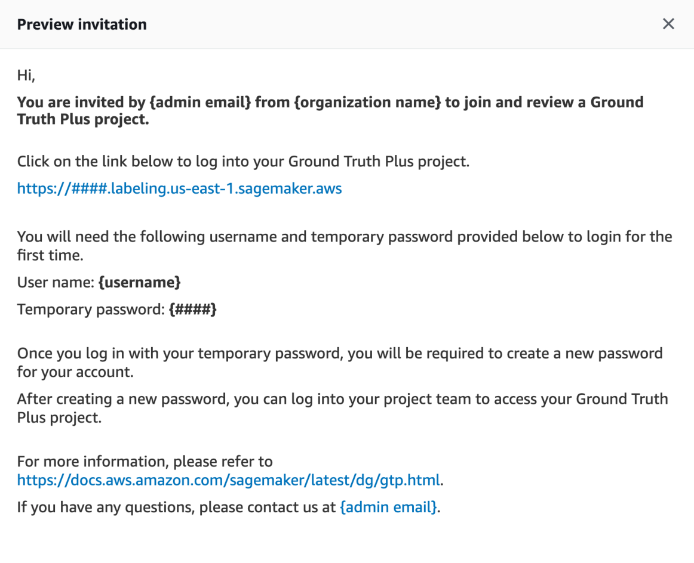

2.
Import team members from existing Amazon Cognito user groups.

a.
Choose a user pool that you have created. User pools require a domain and an existing
user group. If you get an error that the domain is missing, set it in the Domain name
options on the App integration page of the Amazon Cognito console for your group.

b.
Choose an app client. We recommend using a client generated by Amazon SageMaker AI.

c.
Choose a user group from your pool to import its members.

d.
Choose Create project team.

You can view and manage the list of team members through the AWS console.

To add team members after creating the project team:

1.
Choose Invite new members in the Members section.

Create a Project Team
2975

## Page 5

Amazon SageMaker AI
Developer Guide

2.
Enter the email addresses of up to 50 team members in the Email addresses field. The
addresses must be separated by a comma.

3.
Choose Invite new members

To delete existing team members:

1.
Choose the team member to be deleted in the Members section.

2.
Choose Delete.

Once you have added members to your project team, you can open the project portal to access
your projects.

Project Portal

Once you have successfully submitted the intake form and created a project team, you can access
the SageMaker Ground Truth Plus project by choosing the Open project portal on the AWS
console.

Each project consists of one or more batches. A batch is a collection of recurring similar data
objects (text, image, video frame, and point cloud) to be labeled. The project portal provides you
with transparency into the data labeling process. You can stay updated about a project, create
batches within a project, review the progress of the datasets across multiple projects, and analyze
project metrics. The project portal also allows you to review a subset of the labeled data and
provide feedback. You can configure the columns displayed in your project and batch table.

You can use the SageMaker Ground Truth Plus project portal to track the following details about
your project.

Project name: Each project is identified using a unique name.

Status: A SageMaker Ground Truth Plus project has one of the following status types:

Project Portal
2976

## Page 6

Amazon SageMaker AI
Developer Guide

1. Review in progress: You have successfully submitted the project request form. An AWS expert is

currently reviewing your request.

2. Request approved: Your project request is approved. You can now share your data by creating a

new batch from the project portal.

3. Workflow design and setup progress: An AWS expert is setting up your project.

4. Pilot in-progress: Object labeling for the project in the pilot stage is currently in progress.

5. Pilot complete: Object labeling is complete and the labeled data is stored in your Amazon S3

bucket.

6. Pricing complete: An AWS expert shares the pricing for the production project with you.

7. Contract executed: The contract is complete.

8. Production in-progress: Labeling for the project in the production stage is in progress.

9. Production complete: Object labeling is complete and the labeled data is stored in your Amazon

S3 bucket.

10.Paused: Project is currently paused at your request.

Task type: SageMaker Ground Truth Plus lets you label five types of tasks that include text, image,
video, audio, and point cloud.

Batches: Total number of batches within a project.

Project creation date: Starting date of a project.

Total objects: Total number of objects to be labeled across all batches.

Objects completed: Number of labeled objects.

Remaining objects: Number of objects left to be labeled.

Failed objects: Number of objects that cannot be labeled due to an issue with the input data.

Create a Batch

You can use the project portal to create batches for a project after the project status is changed to
Request approved.

Create a Batch
2977

## Page 7

Amazon SageMaker AI
Developer Guide

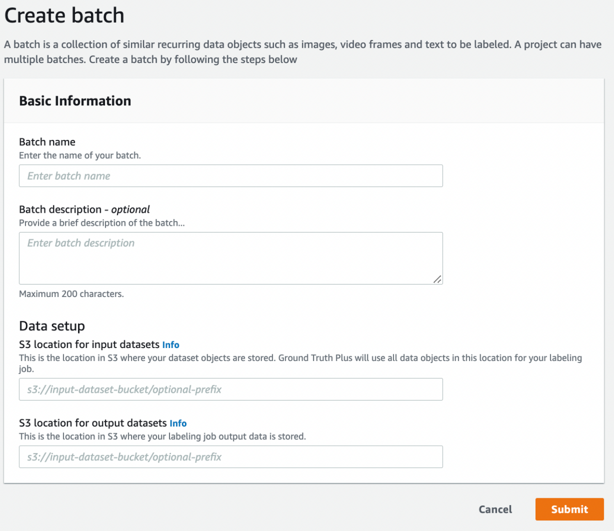

To create a batch, do the following.

1.
Select a project by choosing the project name.

2.
A page titled with the project name opens. Under the Batches section, choose Create batch.

3.
Enter the Batch name, Batch description, S3 location for input datasets, and S3 location for
output datasets.

4.
Choose Submit.

Create a Batch
2978

## Page 8

Amazon SageMaker AI
Developer Guide

To create a batch successfully, make sure you meet the following criteria:

• Your data is in the US East (N. Virginia) Region.

• The maximum size for each file is no more than 2 gigabytes.

• The maximum number of files in a batch is 10,000.

• The total size of a batch is less than 100 gigabytes.

• You have no more than 5 batches with the Data transfer in-progress status.

Note

You cannot create a batch before the project status changes to Request approved.

Batch Metrics

Metrics are data about your SageMaker Ground Truth Plus project for a specific date or over a date
range.

You can review metrics for all batches or choose a batch of your choice as shown in the following
image.

Batch Metrics
2979

## Page 9

Amazon SageMaker AI
Developer Guide

You can review the following metrics about the batch:

Total objects: Total number of objects in a batch or across all batches.

Objects completed by day: Total numbers of objects labeled on a specific date or over a date
range.

Labels completed by day: Total numbers of labels completed on a specific date or over a date
range. An object can have more than one label.

Batch Metrics
2980

## Page 10

Amazon SageMaker AI
Developer Guide

Batch Details

Every Amazon SageMaker Ground Truth Plus project consists of one or more batches. Each batch
is made up of data objects to be labeled. You can view all the batches for your project using the

project portal as shown in the following image.

You can use the SageMaker Ground Truth Plus project portal to track the following details about
every batch:

Batch name: Each batch is identified with a unique batch name.

Status: A SageMaker Ground Truth Plus batch has one of the following status types:

1. Request submitted: You have successfully submitted a new batch.

2. Data transfer failed: Data transfer failed with errors. Check the error reason and create a new

batch after fixing the error.

3. Data received: We have received your unlabeled input data.

4. In-progress: Data labeling is in progress.

5. Ready for review: Data labeling is completed. A subset of labeled objects from the batch are

ready for you to review. This is an optional step.

6. Review submission in-progress: Review feedback is currently being processed.

7. Review complete: You have successfully reviewed the batch. Next, you have to accept or reject

it. This action can not be undone.

Batch Details
2981

## Page 11

Amazon SageMaker AI
Developer Guide

8. Accepted: You have accepted the labeled data and will receive it in your Amazon S3 bucket

shortly.

9. Rejected: Labeled data needs to be reworked.

10.Sent for rework: Labeled data is sent for rework. You can review the batch after its status

changes to Ready for review.

11.Ready for delivery: Labeled data is ready to be transferred to your Amazon S3 bucket.

12.Data delivered: Object labeling is complete and the labeled data is stored in your Amazon S3

bucket.

13.Paused: Batch is paused at your request.

Task type: SageMaker Ground Truth Plus lets you label five types of tasks that include text, image,
video, audio, and point cloud.

Batch creation date: Date when the batch was created.

Total objects: Total number of objects to be labeled across a batch.

Completed objects: Number of labeled objects.

Remaining objects: Number of objects left to be labeled.

Failed objects: Number of objects that cannot be labeled due to an issue with the input data.

Objects to review: Number of objects that are ready for your review.

Objects with feedback: Number of objects that have gotten feedback from the team members.

SageMaker Ground Truth Plus lets you review a sample set of your labeled data (determined during
the initial consultation call) through the review UI shown in the following image.

Batch Details
2982

## Page 12

Amazon SageMaker AI
Developer Guide

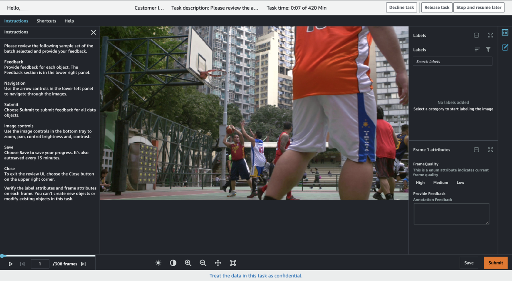

The portal allows your project team members and you to review a small sample set of the labeled
objects for each batch. You can provide feedback for each labeled object within that subset
through this UI. The review UI allows you to navigate across the subset of labeled objects and
provide feedback for those labeled objects.

You can perform the following actions using the review UI.

• Use the arrow controls on the bottom left to navigate through the data objects.

• You can provide feedback for each object. The Feedback section is in the right panel. Choose
Submit to submit feedback for all images.

• Use the image controls in the bottom tray to zoom, pan, and control contrast.

• If you plan on returning to finish up your review, choose Stop and resume later on the top right.

• Choose Save to save your progress. Your progress is also autosaved every 15 minutes.

• To exit the review UI, choose Close on the upper right corner of the review UI.

• You can verify the Label attributes and Frame attributes on each frame using the panel on the
right. You cannot create new objects or modify existing objects in this task.

Batch Details
2983

## Page 13

Amazon SageMaker AI
Developer Guide

Accept or Reject Batches

After you have reviewed a batch, you must choose to accept or reject it.

If you accept a batch, the output from that labeling job is placed in the Amazon S3 bucket that

you specify. Once the data is delivered to your S3 bucket, the status of your batch changes from
Accepted to Data delivered.

If you reject a batch, you can provide feedback and explain your reasons for rejecting the batch.

SageMaker Ground Truth Plus allows you to provide feedback at the data object level as well as
the batch level. You can provide feedback for data objects through the review UI. You can use the
project portal to provide feedback for each batch. When you reject a batch, an AWS expert contacts
you to determine the rework process and the next steps for the batch.

Note

Accepting or rejecting a batch is a one-time action and cannot be undone. It is necessary to
either accept or reject every batch of the project.

Workforces

A workforce is the group of workers that you have selected to label your dataset. You can choose
either the Amazon Mechanical Turk workforce, a vendor-managed workforce, or you can create
your own private workforce to label or review your dataset. Whichever workforce type you choose,
Amazon SageMaker AI takes care of sending tasks to workers.

When you use a private workforce, you also create work teams, a group of workers from your
workforce that are assigned to specific jobs— Amazon SageMaker Ground Truth labeling jobs or
Amazon Augmented AI human review tasks. You can have multiple work teams and can assign one
or more work teams to each job.

You can use Amazon Cognito or your own private OpenID Connect (OIDC) Identity Provider (IdP)
to manage your private workforce and work teams. For more information about the permissions
required to manage your workforce this way, see Permissions required to use the Amazon
SageMaker Ground Truth console.

Topics

• Using the Amazon Mechanical Turk Workforce

Accept or Reject Batches
2984

## Page 14

Amazon SageMaker AI
Developer Guide

• Subscribe to vendor workforces

• Private workforce

Using the Amazon Mechanical Turk Workforce

The Amazon Mechanical Turk (Mechanical Turk) workforce provides the most workers for your
Amazon SageMaker Ground Truth labeling job and Amazon Augmented AI human review task. The
Amazon Mechanical Turk workforce is a world-wide resource. Workers are available 24 hours a day,
7 days a week. You typically get the fastest turnaround for your human review tasks and labeling
jobs when you use the Amazon Mechanical Turk workforce.

Any Amazon Mechanical Turk workforce billing is handled as part of your Ground Truth or Amazon
Augmented AI billing. You do not need to create a separate Mechanical Turk account to use the
Amazon Mechanical Turk workforce.

Important

You should not share confidential information, personal information, or protected
health information with this workforce. You should not use the Amazon Mechanical Turk
workforce when you use Amazon A2I in conjunction with AWS HIPAA-eligible services, such
as Amazon Textract and Amazon Rekognition, for workloads containing protected health
information.

You can choose Mechanical Turk as your workforce when you create a Ground Truth labeling job or
Amazon A2I human review workflow (flow definition). You can create a labeling job and a human
review workflow using the SageMaker AI console and API.

When you use an API operation to create a labeling job or human review workflow, you use the

following ARN for the Amazon Mechanical Turk workforce for your WorkteamArn. Replace region
with the AWS Region you are using to create the labeling job or human loops. For example, if you

create a labeling job in US West (Oregon), replace region with us-west-2.

• arn:aws:sagemaker:region:394669845002:workteam/public-crowd/default

Ground Truth and Amazon A2I require that your input data is free of personally identifiable
information (PII) when you use Mechanical Turk. If you use the Mechanical Turk workforce and do

Using the Amazon Mechanical Turk Workforce
2985

## Page 15

Amazon SageMaker AI
Developer Guide

not specify that your input data is free of PII, your Ground Truth labeling jobs and Augmented
AI tasks will fail. You specify that your input data is free of PII when you create a Ground Truth
labeling job and when you create a Amazon A2I human loop using a built-in integration or the

StartHumanLoop operation.

Use the following sections to learn how to use Mechanical Turk with these services.

Topics

• Use Mechanical Turk with Ground Truth

• Use Mechanical Turk with Amazon A2I

• When is Mechanical Turk Not Supported?

Use Mechanical Turk with Ground Truth

You can use Mechanical Turk with Ground Truth when you create a labeling job using the console,

or the CreateLabelingJob operation.

When you create a labeling job, we recommend you adjust the number of workers that annotate
each data object based on the complexity of the job and the quality that you need. Amazon
SageMaker Ground Truth uses annotation consolidation to improve the quality of the labels. More
workers can make a difference in the quality of the labels for more complex labeling jobs, but
might not make a difference for simpler jobs. For more information, see Annotation consolidation.
Note that annotation consolidation is not supported for Amazon A2I human review workflows.

To use Mechanical Turk when you create a labeling job (console):

1.
Use the following to create a labeling job using the Ground Truth area of the SageMaker AI
console: Create a Labeling Job (Console).

2.
When you are selecting Worker types in the Workers section, select Amazon Mechanical Turk.

3.
Specify the total amount of time workers have to complete a task using Task timeout.

4.
Specify the total amount of time a task remains available to workers in Task expiration. This is
how long workers have to pick up a task before it fails.

5.
Select the Price per task using the dropdown list. This is the amount of money a worker
receives for completing a single task.

6.
(Optional) If applicable, select The dataset does not contain adult content. SageMaker AI may
restrict the Mechanical Turk workers that can view your task if it contains adult content.

Using the Amazon Mechanical Turk Workforce
2986

## Page 16

Amazon SageMaker AI
Developer Guide

7.
You must read and confirm the following statement by selecting the check box to use the
Mechanical Turk workforce. If your input data contains confidential information, personal
information, or protected health information, you must select another workforce.

You understand and agree that the Mechanical Turk workforce consists of independent

contractors located worldwide and that you should not share confidential information,
personal information, or protected health information with this workforce.

8.
(Optional) Select the check box next to Enable automated data labeling if you want to enable
automated data labeling. To learn more about this feature, see Automate data labeling.

9.
You can specify the Number of workers per dataset object under Additional configuration.
For example, if you enter 3 in this field, each data object will be labeled by 3 workers.

When you create your labeling job by selecting Create, your labeling tasks are sent to Mechanical
Turk workers.

To use Mechanical Turk when you create a labeling job (API):

1.
Use the following to create a labeling job using the CreateLabelingJob operation: Create a
Labeling Job (API).

2.
Use the following for the WorkteamArn. Replace region with the AWS Region you are using
to create the labeling job.

arn:aws:sagemaker:region:394669845002:workteam/public-crowd/default

3.
Use TaskTimeLimitInSeconds to specify the total amount of time workers have to
complete a task.

4.
Use TaskAvailabilityLifetimeInSeconds to specify the total amount of time a task
remains available to workers. This is how long workers have to pick up a task before it fails.

5.
Use NumberOfHumanWorkersPerDataObject to specify the number of workers per dataset
object.

6.
Use PublicWorkforceTaskPrice to set the price per task. This is the amount of money a
worker receives for completing a single task.

7.
Use DataAttributes to specify that your input data is free of confidential information,
personal information, or protected health information.

Ground Truth requires that your input data is free of personally identifiable information (PII)
if you use the Mechanical Turk workforce. If you use Mechanical Turk and do not specify that

Using the Amazon Mechanical Turk Workforce
2987

## Page 17

Amazon SageMaker AI
Developer Guide

your input data is free of PII using the FreeOfPersonallyIdentifiableInformation flag,
your labeling job will fail.

Use the FreeOfAdultContent flag to declare that your input data is free of adult
content. SageMaker AI may restrict the Mechanical Turk workers that can view your task if it
contains adult content.

You can see examples of how to use this API in the following notebooks, found on GitHub: Ground
Truth Jupyter Notebook Examples.

Use Mechanical Turk with Amazon A2I

You can specify that you want to use Mechanical Turk with Amazon A2I when you create
a human review workflow, also referred to as a flow definition, in the console, or with the

CreateFlowDefinition API operation. When you use this human review workflow to configure
human loops, you must specify that your input data is free of PII.

To use Mechanical Turk when you create a human review workflow (console):

1.
Use the following to create a human review workflow in the Augmented AI section of the
SageMaker AI console: Create a Human Review Workflow (Console).

2.
When you are selecting Worker types in the Workers section, select Amazon Mechanical Turk.

3.
Select the Price per task using the dropdown list. This is the amount of money a worker
receives for completing a single task.

4.
(Optional) You can specify the Number of workers per dataset object under Additional
configuration. For example, if you enter 3 in this field, each data object will be labeled by 3
workers.

5.
(Optional) Specify the total amount of time workers have to complete a task using Task
timeout.

6.
(Optional) Specify the total amount of time a task remains available to workers in Task
expiration. This is how long workers have to pick up a task before it fails.

7.
Once you have created your human review workflow, you can use it to configure a human loop

by providing its Amazon Resource Name (ARN) in the parameter FlowDefinitionArn. You
configure a human loop using one of the API operations of a built-in task type, or the Amazon

A2I runtime API operation, StartHumanLoop. To learn more, see Create and Start a Human
Loop.

Using the Amazon Mechanical Turk Workforce
2988

## Page 18

Amazon SageMaker AI
Developer Guide

When you configure your human loop, you must specify that your
input data is free of personally identifiable information (PII) using the

FreeOfPersonallyIdentifiableInformation content classifier in DataAttributes.
If you use Mechanical Turk and do not specify that your input data is free of PII, your human
review tasks will fail.

Use the FreeOfAdultContent flag to declare that your input data is free of adult
content. SageMaker AI may restrict the Mechanical Turk workers that can view your task if it
contains adult content.

To use Mechanical Turk when you create a human review workflow (API):

1.
Use the following to create a human review workflow using the CreateFlowDefinition
operation: Create a Human Review Workflow (API).

2.
Use the following for the WorkteamArn. Replace region with the AWS Region you are using
to create the labeling job.

arn:aws:sagemaker:region:394669845002:workteam/public-crowd/default

3.
Use TaskTimeLimitInSeconds to specify the total amount of time workers have to
complete a task.

4.
Use TaskAvailabilityLifetimeInSeconds to specify the total amount of time a task
remains available to workers. This is how long workers have to pick up a task before it fails.

5.
Use TaskCount to specify the number of workers per dataset object. For example, if you
specify 3 for this parameter, each data object will be labeled by 3 workers.

6.
Use PublicWorkforceTaskPrice to set the price per task. This is the amount of money a
worker receives for completing a single task.

7.
Once you have created your human review workflow, you can use it to configure a human loop

by providing its Amazon Resource Name (ARN) in the parameter FlowDefinitionArn. You
configure a human loop using one of the API operations of a built-in task type, or the Amazon

A2I runtime API operation, StartHumanLoop. To learn more, see Create and Start a Human
Loop.

When you configure your human loop, you must specify that your
input data is free of personally identifiable information (PII) using the

FreeOfPersonallyIdentifiableInformation content classifier in DataAttributes.

Using the Amazon Mechanical Turk Workforce
2989

## Page 19

Amazon SageMaker AI
Developer Guide

If you use Mechanical Turk and do not specify that your input data is free of PII, your human
review tasks will fail.

Use the FreeOfAdultContent flag to declare that your input data is free of adult

content. SageMaker AI may restrict the Mechanical Turk workers that can view your task if it
contains adult content.

You can see examples of how to use this API in the following notebooks, found on GitHub: Amazon
A2I Jupyter Notebook Examples.

When is Mechanical Turk Not Supported?

This workforce is not supported under the following scenarios. In each scenario, you must use a
private or vendor workforce.

• This workforce is not supported for Ground Truth video frame labeling jobs and 3D point cloud
labeling jobs.

• You cannot use this workforce if your input data contains personally identifiable information
(PII).

• Mechanical Turk is not available in some of the AWS special regions. If applicable, refer to the
documentation for your special region for more information.

Subscribe to vendor workforces

You can use a vendor-managed workforce to label your data using Amazon SageMaker Ground
Truth (Ground Truth) and Amazon Augmented AI (Amazon A2I). Vendors have extensive experience
in providing data labeling services for the purpose of machine learning. Vendor workforces for
these two services must be created and managed seperately through the Amazon SageMaker AI
console.

Vendors make their services available via the AWS Marketplace. You can find details of the vendor's
services on their detail page, such as the number of workers and the hours that they work. You can
use these details to make estimates of how much the labeling job will cost and the amount of time
that you can expect the job to take. Once you have chosen a vendor you subscribe to their services
using the AWS Marketplace.

Subscribe to vendor workforces
2990

## Page 20

Amazon SageMaker AI
Developer Guide

A subscription is an agreement between you and the vendor. The agreement spells out the details
of the agreement, such as price, schedule, or refund policy. You work directly with the vendor if
there are any issues with your labeling job.

You can subscribe to any number of vendors to meet your data annotation needs. When you create

a labeling job or human review worklow you can specify that the job be routed to a specific vendor.

Important

Before you send sensitive data to a vendor, check the vendor's security and compliance
practices on their detail page and review the end user license agreement (EULA) that is
part of your subscription agreement. You are responsible for ensuring that the vendor
meets your compliance requirements for personal or confidential information. Do not share
protected health information with this workforce.

You must use the console to subscribe to a vendor workforce. Once you have a subscription, you

can use the ListSubscribedWorkteams operation to list your subscribed vendors.

To subscribe to a vendor workforce

1.
Open the SageMaker AI console at https://console.aws.amazon.com/sagemaker/.

2.
Choose the appropriate page in the SageMaker AI console.

• For Ground Truth labeling jobs, choose Labeling workforces, choose Vendor, and then
choose Find data labeling services.

• For Amazon A2I human review workflows, choose Human review workforces, choose
Vendor, and then choose Find human review services.

3.
The console opens the AWS Marketplace with:

• data labeling services category selected for Ground Truth

• human review services category selected for Amazon A2I

Here you see a list of the vendor services available for this service.

4.
Choose a vendor. The AWS Marketplace shows detailed information about the data labeling
or human review service. Use this information to determine if the vendor meets your
requirements for your task.

Subscribe to vendor workforces
2991

## Page 21

Amazon SageMaker AI
Developer Guide

5.
If the vendor meets your requirements, choose Continue to subscribe.

6.
Review the details of the subscription. If you agree to the terms, choose Subscribe to complete
your subscription to the service.

Private workforce

A private workforce is a group of workers that you choose. These can be employees of your
company or a group of subject matter experts from your industry. For example, if the task is to
label medical images, you could create a private workforce of people knowledgeable about the
images in question.

Each AWS account has access to a single private workforce per region, and the owner has the ability
to create multiple private work teams within that workforce. A single private work team is used
to complete a labeling job or human review task, or a job. You can assign each work team to a
separate job or use a single team for multiple jobs. A single worker can be in more than one work
team.

Your private workforce can either be created and managed using Amazon Cognito or your own
private OpenID Connect (OIDC) Identity Provider (IdP).

If you are a new user of Amazon SageMaker Ground Truth or Amazon Augmented AI and do not
require your workers to be managed with your own IdP, it is recommended that you use Amazon
Cognito to create and manage your private workforce.

After you create a workforce, in addition to creating and managing work teams, you can do the
following:

• Track worker performance

• Create and manage Amazon SNS topics to notify workers when labeling tasks are available

• Manage Private Workforce Access to Tasks Using IP Addresses

Note

Your private workforce is shared between Ground Truth and Amazon A2I. To create and
manage private work teams used by Augmented AI, use the Ground Truth section of the
SageMaker AI console.

Private workforce
2992

## Page 22

Amazon SageMaker AI
Developer Guide

Topics

• Amazon Cognito Workforces

• OIDC IdP Workforces

• Private workforce management using the Amazon SageMaker API

• Track Worker Performance Metrics

• Create the Amazon SNS topic

Amazon Cognito Workforces

Create and manage your private workforce using Amazon Cognito when you want to create your
workforce using the Amazon SageMaker AI console or you don't want the overhead of managing
worker credentials and authentication. When you create a private workforce with Amazon Cognito,
it provides authentication, authorization, and user management for your private workers.

Topics

• Create a Private Workforce (Amazon Cognito)

• Manage a Private Workforce (Amazon Cognito)

Create a Private Workforce (Amazon Cognito)

When you use Amazon Cognito, you can create a private workforce in one of the following ways:

• Create a new workforce while you are creating your labeling job. To learn how, see Create an
Amazon Cognito Workforce When Creating a Labeling Job.

• Create a new workforce before you create your labeling job. To learn how, see Create an Amazon
Cognito Workforce Using the Labeling Workforces Page.

• Import an existing workforce after creating a user pool in the Amazon Cognito console. To learn
how, see Create a Private Workforce (Amazon Cognito Console).

Once you create a private workforce, that workforce and all work teams and workers associated
with it are available to use for all Ground Truth labeling job tasks and Amazon Augmented AI
human review workflows tasks.

If you are new to Amazon SageMaker AI and want to test Ground Truth or Amazon A2I, we suggest
that you create a private work team consisting of people from your organization using the console.

Private workforce
2993

## Page 23

Amazon SageMaker AI
Developer Guide

Use this work team when creating labeling or human review workflows (flow definitions) to test
your worker UI and job workflow.

Topics

• Create a Private Workforce (Amazon SageMaker AI Console)

• Create a Private Workforce (Amazon Cognito Console)

Create a Private Workforce (Amazon SageMaker AI Console)

You can create a private workforce in the Amazon SageMaker AI console in one of two ways:

• When creating a labeling job in the Labeling jobs page of the Amazon SageMaker Ground Truth
section.

• Using the Labeling workforces page of the Amazon SageMaker Ground Truth section. If you are
creating a private workforce for an Amazon A2I human review workflow, use this method.

Both of these methods also create a default work team containing all of the members of
the workforce. This private workforce is available to use for both Ground Truth and Amazon
Augmented AI jobs.

When you create a private workforce using the console, SageMaker AI uses Amazon Cognito as an
identity provider for your workforce. If you want to use your own OpenID Connect (OIDC) Identity
Provider (IdP) to create and manage your private workforce, you must create a workforce using the

SageMaker API operation CreateWorkforce. To learn more, see Create a Private Workforce (OIDC
IdP).

Create an Amazon Cognito Workforce When Creating a Labeling Job

If you haven't created a private workforce when you create your labeling job and you choose to use
private workers, you are prompted to create a work team. This will create a private workforce using
Amazon Cognito.

To create a workforce while creating a labeling job (console)

1.
Open the SageMaker AI console at https://console.aws.amazon.com/sagemaker/.

2.
In the navigation pane, choose Labeling jobs and fill in all required fields. For instructions
on how to start a labeling job, see Getting started: Create a bounding box labeling job with
Ground Truth. Choose Next.

Private workforce
2994

## Page 24

Amazon SageMaker AI
Developer Guide

3.
Choose Private for the workforce type.

4.
In the Workers section, enter:

a.
The Team name.

b.
Email addresses for up to 100 workforce members. Email addresses are case sensitive.
Your workers must log in using the same case used when the address was initially entered.
You can add additional workforce members after the job has been created.

c.
The name of your organization. SageMaker AI uses this to customize the email sent to the
workers.

d.
A contact email address for workers to report issues related to the task.

When you create the labeling job, an email is sent to each worker inviting them to join the
workforce. After creating the workforce, you can add, delete, and disable workers using the

SageMaker AI console or the Amazon Cognito console.

Create an Amazon Cognito Workforce Using the Labeling Workforces Page

To create and manage your private workforce using Amazon Cognito, you can use the Labeling
workforces page. When following the instructions below, you have the option to create a private
workforce by entering worker emails importing a pre-existing workforce from an Amazon Cognito
user pool. To import a workforce, see Create a Private Workforce (Amazon Cognito Console).

To create a private workforce using worker emails

1.
Open the Amazon SageMaker AI console at https://console.aws.amazon.com/sagemaker/.

2.
In the navigation pane, choose Labeling workforces.

3.
Choose Private, then choose Create private team.

4.
Choose Invite new workers by email.

5.
Paste or type a list of up to 50 email addresses, separated by commas, into the email
addresses box.

6.
Enter an organization name and contact email.

7.
Optionally, choose an SNS topic to which to subscribe the team so workers are notified by
email when new Ground Truth labeling jobs become available. Amazon SNS notifications are
supported by Ground Truth and are not supported by Augmented AI. If you subscribe workers
to receive SNS notifications, they only receive notifications about Ground Truth labeling jobs.
They do not receive notifications about Augmented AI tasks.

Private workforce
2995

## Page 25

Amazon SageMaker AI
Developer Guide

8.
Click the Create private team button.

After you import your private workforce, refresh the page. On the Private workforce summary
page, you can see information about the Amazon Cognito user pool for your workforce, a list of
work teams for your workforce, and a list of all of the members of your private workforce.

Note

If you delete all of your private work teams, you have to repeat this process to use a private
workforce in that region.

Create a Private Workforce (Amazon Cognito Console)

Amazon Cognito is used to define and manage your private workforce and your work teams. It is a
service that you can use to create identities for your workers and authenticate these identities with
identity providers.  A private workforce corresponds to a single Amazon Cognito user pool. Private
work teams correspond to Amazon Cognito user groups within that user pool.

Example identity providers supported by Amazon Cognito:

• Social sign-in providers such as Facebook and Google
• OpenID Connect (OIDC) providers
• Security Assertion Markup Language (SAML) providers such as Active Directory
• The Amazon Cognito built-in identity provider

For more information, see What Is Amazon Cognito?.

To create a private workforce using Amazon Cognito, you must have an existing Amazon Cognito
user pool containing at least one user group. See Tutorial: Creating a User Pool to learn how to
create a user pool. See Adding Groups to a User Pool to learn how to add a user group to a pool.

Once your user pool has been created, follow the steps below to create a private workforce by
importing that user pool into Amazon SageMaker AI.

To create a private workforce by importing a Amazon Cognito user pool

1.
Open the SageMaker AI console at https://console.aws.amazon.com/sagemaker/.

2.
In the navigation pane, choose Labeling workforces.

Private workforce
2996

## Page 26

Amazon SageMaker AI
Developer Guide

3.
Choose Private.

4.
Choose Create private team. This creates a private workforce and a work team.

5.
Choose Import workers from existing Amazon Cognito user groups.

6.
Choose a user pool that you have created. User pools require a domain and an existing user
group. If you get an error that the domain is missing, set it in the Domain name options on the
App integration page of the Amazon Cognito console for your group.

7.
Choose an app client. We recommend using a client generated by SageMaker AI.

8.
Choose a user group from your pool to import its members.

9.
Optionally choose an Amazon Simple Notification Service (Amazon SNS) topic to which to
subscribe the team so that workers are notified by email when new labeling jobs become
available. Amazon SNS notifications are supported by Ground Truth and are not supported
by Augmented AI. If you subscribe workers to receive SNS notifications, they only receive
notifications about Ground Truth labeling jobs. They do not receive notifications about
Augmented AI tasks.

10. Choose Create private team.

Important

After you create a workforce using an Amazon Cognito user pool, it should not be deleted
without first deleting all work teams associated with that pool in the SageMaker AI
console.

After you import your private workforce, refresh the page to see the Private workforce
summary page. On this page, you can see information about the Amazon Cognito user pool for
your workforce, a list of work teams for your workforce, and a list of all of the members of your
private workforce. This workforce is now available to use in both Amazon Augmented AI and
Amazon SageMaker Ground Truth for human review tasks and data labeling jobs respectively.

Manage a Private Workforce (Amazon Cognito)

After you have created a private workforce using Amazon Cognito, you can create and manage
work teams using the Amazon SageMaker AI console and API operations.

You can do the following using either the SageMaker AI console or Amazon Cognito console.

• Add and delete work teams.

Private workforce
2997

## Page 27

Amazon SageMaker AI
Developer Guide

• Add workers to your workforce and one or more work teams.

• Disable or remove workers from your workforce and one or more workteams. If you add workers
to a workforce using the Amazon Cognito console, you must use the same console to remove the
worker from the workforce.

You can restrict access to tasks to workers at specific IP addresses using the SageMaker API. For
more information, see Private workforce management using the Amazon SageMaker API.

Topics

• Manage a Workforce (Amazon SageMaker AI Console)

• Manage a Private Workforce (Amazon Cognito Console)

Manage a Workforce (Amazon SageMaker AI Console)

You can use the Amazon SageMaker AI console to create and manage the work teams and
individual workers that make up a private workforce.

Use a work team to assign members of your private workforce to a labeling or human review job.
When you create your workforce using the SageMaker AI console, there is a work team called
Everyone-in-private-workforce that enables you to assign your entire workforce to a job. Because
an imported Amazon Cognito user pool may contain members that you don't want to include in
your work teams, a similar work team is not created for Amazon Cognito user pools.

You have two choices to create a new work team:

• You can create a work team in the SageMaker AI console and add members from your workforce
to the team.

• You can create a user group by using the Amazon Cognito console and then create a work team
by importing the user group. You can import more than one user group into each work team.
You manage the members of the work team by updating the user group in the Amazon Cognito
console. See Manage a Private Workforce (Amazon Cognito Console) for more information.

Create a Work Team Using the SageMaker AI Console

You can create a new Amazon Cognito user group or import an existing user group using the
SageMaker AI console, on the Labeling workforces page. For more information on creating a user
group in the Amazon Cognito console, see Manage a Private Workforce (Amazon Cognito Console).

Private workforce
2998

## Page 28

Amazon SageMaker AI
Developer Guide

To create a work team using the SageMaker AI console

1.
Open the SageMaker AI console at https://console.aws.amazon.com/sagemaker/.

2.
Choose Labeling workforces from the left menu.

3.
Under Private, choose Create private team.

4.
Under Team details, enter a Team name. The name must be unique in your account in an AWS
Region.

5.
Under Add workers, choose a method to add workers to the team using a user group.

• If you chose Create a team by adding workers to a new Amazon Cognito user group, select
the workers to add to the team.

• If you chose Create a team by importing existing Amazon Cognito user groups, choose the
user groups that are part of the new team.

6.
If you select an SNS topic, all workers added to the team are subscribed to the Amazon SNS
topic and notified when new work items are available to the team. Select from a list of your
existing Ground Truth related Amazon SNS topics or select Create new topic to open a topic-
creation dialog.

Amazon SNS notifications are supported by Ground Truth and are not supported by
Augmented AI. If you subscribe workers to receive SNS notifications, they only receive
notifications about Ground Truth labeling jobs. They do not receive notifications about
Augmented AI tasks.

Workers in a workteam subscribed to a topic receive notifications when a new Ground Truth
labeling job for that team becomes available and when one is about to expire.

Read Create the Amazon SNS topic for more information about using Amazon SNS topic.

Subscriptions

After you have created a work team, you can see more information about the team and change
or set the Amazon SNS topic to which its members are subscribed by visiting the Amazon Cognito
console. If you added any team members before you subscribed the team to a topic, you need to
manually subscribe those members to that topic. Read Create and manage Amazon SNS topics for
your work teams for more information on creating and managing the Amazon SNS topic.

Private workforce
2999

## Page 29

Amazon SageMaker AI
Developer Guide

Add or Remove Workers

A work team is a group of workers within your workforce to whom you can assign jobs. A worker
can be added to more than one work team. Once a worker has been added to a work team, that
worker can be disabled or removed.

Add Workers to the Workforce

Adding a worker to the workforce enables you to add that worker to any work team within that
work force.

To add workers using the private workforce summary page

1.
Open the Amazon SageMaker AI console at https://console.aws.amazon.com/sagemaker/.

2.
Choose Labeling workforces to navigate to your private workforce summary page.

3.
Choose Private.

4.
Choose Invite new workers.

5.
Paste or type a list of email addresses, separated by commas, into the email addresses box.
You can have up to 50 email addresses in this list.

Add a Worker to a Work Team

A worker must be added to the workforce before being added to a work team. To add a worker to a
work team, first navigate to the Private workforce summary page using the steps above.

To add a worker to a work team from the private workforce summary page

1.
In the Private teams section, choose the team to which you want to add the workers.

2.
Choose the Workers tab.

3.
Choose Add workers to team and choose the boxes next to the workers that you want to add.

4.
Click Add workers to team.

Disable and Remove a Worker from the Workforce

Disabling a worker stops the worker from receiving a job. This action does not remove the worker
from the workforce, or from any work team with which the worker is associated. To disable or
remove a worker from a work team, first navigate to the private workforce summary page using
the steps above.

Private workforce
3000

## Page 30

Amazon SageMaker AI
Developer Guide

To deactivate a worker using the private workforce summary page

1.
In the Workers section, choose the worker that you would like to disable.

2.
Choose Disable.

If desired, you can subsequently Enable a worker after they have been disabled.

You can remove workers from your private workforce directly in the SageMaker AI console if that
worker was added in this console. If you added the worker (user) in the Amazon Cognito console,
see Manage a Private Workforce (Amazon Cognito Console) to learn how to remove the worker in
the Amazon Cognito console.

To remove a worker using the private workforce summary page

1.
In the Workers section, choose the worker that you would like to delete.

2.
If the worker has not been disabled, choose Disable.

3.
Select the worker and choose Delete.

Manage a Private Workforce (Amazon Cognito Console)

A private workforce corresponds to a single Amazon Cognito user pool. Private work teams
correspond to Amazon Cognito user groups within that user pool. Workers correspond to Amazon
Cognito users within those groups.

After your workforce has been created, you can add work teams and individual workers through
the Amazon Cognito console. You can also delete workers from your private workforce or remove
them from individual teams in the Amazon Cognito console.

Important

You can't delete work teams from the Amazon Cognito console. Deleting a Amazon Cognito
user group that is associated with an Amazon SageMaker AI work team will result in an
error. To remove work teams, use the SageMaker AI console.

Private workforce
3001

## Page 31

Amazon SageMaker AI
Developer Guide

Create Work Teams (Amazon Cognito Console)

You can create a new work team to complete a job by adding a Amazon Cognito user group to
the user pool associated with your private workforce. To add a Amazon Cognito user group to an
existing worker pool, see Adding groups to a User Pool.

To create a work team using an existing Amazon Cognito user group

1.
Open the SageMaker AI console at https://console.aws.amazon.com/sagemaker/.

2.
In the navigation pane, choose Workforces.

3.
For Private teams, choose Create private team.

4.
Under Team details, give the team a name. The name must be unique in your account in an
AWS Region.

5.
For Add workers, choose Import existing Amazon Cognito user groups, and choose one or
more user groups that are part of the new team.

6.
If you choose an SNS topic, all workers added to the team are subscribed to the Amazon
Simple Notification Service (Amazon SNS) topic and notified when new work items are
available to the team. Choose from a list of your existing SNS topics related to SageMaker
Ground Truth or Amazon Augmented AI or choose Create new topic to create one.

Note

Amazon SNS notifications are supported by Ground Truth and are not supported by
Augmented AI. If you subscribe workers to receive SNS notifications, they only receive
notifications about Ground Truth labeling jobs. They do not receive notifications about
Augmented AI tasks.

Subscriptions

After you have created a work team, you can see more information about the team and change
or set the SNS topic to which its members are subscribed using the Amazon Cognito console. If
you added any team members before you subscribed the team to a topic, you need to manually
subscribe those members to that topic. For more information, see Create the Amazon SNS topic.

Private workforce
3002

## Page 32

Amazon SageMaker AI
Developer Guide

Add and Remove Workers (Amazon Cognito Console)

When using the Amazon Cognito console to add workers to a work team, you must add a user to
the user pool associated with the workforce before adding that user to a user group. Users can be
added to a user pool in various ways. For more information, see Signing Up and Confirming User
Accounts.

Add a Worker to a Work Team

After a user has been added to a pool, the user can be associated with user groups inside of that
pool. After a user has been added to a user group, that user becomes a worker on any work team
created using that user group.

To add a user to a user group

1.
Open the Amazon Cognito console: https://console.aws.amazon.com/cognito/.

2.
Choose Manage User Pools.

3.
Choose the user pool associated with your SageMaker AI workforce.

4.
Under General Settings, choose Users and Groups and do one of the following:

•
Choose Groups, choose the group that you want to add the user to, and choose Add
users. Choose the users that you want to add by choosing the plus-icon to the right of the
user's name.

•
Choose Users, choose the user that you want to add to the user group, and choose Add to
group. From the dropdown menu, choose the group and choose Add to group.

Disable and Remove a Worker From a Work Team

Disabling a worker stops the worker from receiving jobs. This action doesn't remove the worker
from the workforce, or from any work team the worker is associated with. To remove a user from
a work team in Amazon Cognito, you remove the user from the user group associated with that
team.

To deactivate a worker  (Amazon Cognito console)

1.
Open the Amazon Cognito console:   https://console.aws.amazon.com/cognito/.

2.
Choose Manage User Pools.

3.
Choose the user pool associated with your SageMaker AI workforce.

Private workforce
3003

## Page 33

Amazon SageMaker AI
Developer Guide

4.
Under General Settings, choose Users and Groups.

5.
Choose the user that you want to disable.

6.
Choose Disable User.

You can enable a disabled user by choosing Enable User.

To remove a user from a user group (Amazon Cognito console)

1.
Open the Amazon Cognito console:   https://console.aws.amazon.com/cognito/.

2.
Choose Manage User Pools.

3.
Choose the user pool associated with your SageMaker AI workforce.

4.
Under General Settings, choose Users and Groups.

5.
For User tab, choose the X icon to the right of the group from which you want to remove the
user.

OIDC IdP Workforces

Create a private workforce using an OpenID Connect (OIDC) Identity Provider (IdP) when you want
to manage and authenticate your workers using your own OIDC IdP. Individual worker credentials
and other data will be kept private. Ground Truth and Amazon A2I will only have visibility into
worker information you provide through the claims that you send to these services. To create a
workforce using an OIDC IdP, your IdP must support groups because Ground Truth and Amazon
A2I map one or more groups in your IdP to a work team. To learn more, see Send Required and
Optional Claims to Ground Truth and Amazon A2I.

If you are a new user of Ground Truth or Amazon A2I, you can test your worker UI and job workflow
by creating a private work team and adding yourself as a worker. Use this work team when
you create a labeling job or human review workflow. First, create a private OIDC IdP workforce
using the instructions in Create a Private Workforce (OIDC IdP). Next, refer to Manage a Private
Workforce (OIDC IdP) to learn how to create a work team.

Topics

• Create a Private Workforce (OIDC IdP)

• Manage a Private Workforce (OIDC IdP)

Private workforce
3004

## Page 34

Amazon SageMaker AI
Developer Guide

Create a Private Workforce (OIDC IdP)

Create a private workforce using an OpenID Connect (OIDC) Identity Provider (IdP) when you want
to authenticate and manage workers using your own identity provider. Use this page to learn how
to configure your IdP to communicate with Amazon SageMaker Ground Truth (Ground Truth) or
Amazon Augmented AI (Amazon A2I) and to learn how to create a workforce using your own IdP.

To create a workforce using an OIDC IdP, your IdP must support groups because Ground Truth and

Amazon A2I use one or more groups that you specify to create work teams. You use work teams to
specify workers for your labeling jobs and human review tasks. Because groups are not a standard
claim, your IdP may have a different naming convention for a group of users (workers). Therefore,
you must identify one or more user groups to which a worker belongs using the custom claim

sagemaker:groups that is sent to Ground Truth or Amazon A2I from your IdP. To learn more, see
Send Required and Optional Claims to Ground Truth and Amazon A2I.

You create an OIDC IdP workforce using the SageMaker API operation CreateWorkforce. Once
you create a private workforce, that workforce and all work teams and workers associated with
it are available to use for all Ground Truth labeling job tasks and Amazon A2I human review
workflows tasks. To learn more, see Create an OIDC IdP Workforce.

Send Required and Optional Claims to Ground Truth and Amazon A2I

When you use your own IdP, Ground Truth and Amazon A2I use your Issuer, ClientId,

and ClientSecret to authenticate workers by obtaining an authentication CODE from your

AuthorizationEndpoint.

Ground Truth and Amazon A2I will use this CODE to obtain a custom claim from either your IdP's

TokenEndpoint or UserInfoEndpoint. You can either configure TokenEndpoint to return a

JSON web token (JWT) or UserInfoEndpoint to return a JSON object. The JWT or JSON object
must contain required and optional claims that you specify. A claim is a key-value pair that contains
information about a worker or metadata about the OIDC service. The following table lists the
claims that must be included, and that can optionally be included in the JWT or JSON object that
your IdP returns.

Note

Some of the parameters in the following table can be specified using a : or a -. For

example, you can specify the groups a worker belongs to using sagemaker:groups or

sagemaker-groups in your claim.

Private workforce
3005

## Page 35

Amazon SageMaker AI
Developer Guide

Name
Required Accepted Format

Description
Example

and Values

Yes
Data type:

Assigns a worker to

Example of worker

sagemaker

one or more groups.
Groups are used to
map the worker into
work teams.

that belongs to
a single group:

:groups  or

If a worker belongs
to a single group,
identify the group
using a string.

sagemaker-

"work_team1"

groups

Example of a
worker that
belongs to more
than one groups:

If a worker belongs
to multiple groups,
use a list of up to
10 strings.

["work_team1",

"work_team2"]

Allowable
characters:

Regex: [\p{L}\p{
M}\p{S}\p{N}\p{P}]
+

Quotas:

10 groups per
worker

63 characters per
group name

Yes
Data type:

This is mandatory
to track a worker
identity inside
the Ground Truth
platform for
auditing and to
identify tasks
worked on by that
worker.

sagemaker

"11101110

:sub  or

1-1234567

String

sagemaker-

89-368705

sub

6437-1111"

Private workforce
3006

## Page 36

Amazon SageMaker AI
Developer Guide

Name
Required Accepted Format

Description
Example

and Values

For ADFS: Customers
must use the
Primary Security
Identifier (SID).

Yes
Data type:

A client ID. All
tokens must be
issued for this client
ID.

sagemaker

"00b600bb

:client_id

-1f00-05d

String

or sagemaker

0-bd00-00

-client_id

be00fbd0e0"

Allowable
characters:

Regex: [\w+-]+

Quotes:

128 characters

Yes
Data type:

The worker name to
be displayed in the
worker portal.

sagemaker

"Jane Doe"

:name  or

String

sagemaker-

name

Private workforce
3007

## Page 37

Amazon SageMaker AI
Developer Guide

Name
Required Accepted Format

Description
Example

and Values

email
No
Data type:

The worker email.
Ground Truth uses
this email to notify
workers that they
have been invited
to work on labeling
tasks. Ground Truth
will also use this
email to notify
your workers when
labeling tasks
become available
if you set up an
Amazon SNS topic
for a work team that
this worker is on.

"example-

email@dom

String

ain.com"

No
Data type:

Indicates if the user
email was verified or
not.

email_ver

True

ified

Bool

Accepted Values:

True, False

The following an example of the JSON object syntax your UserInfoEndpoint can return.

{
"sub":"122",
"exp":"10000",
"sagemaker-groups":["group1","group2"]
"sagemaker-name":"name",
"sagemaker-sub":"122",
"sagemaker-client_id":"123456"
}

Private workforce
3008

## Page 38

Amazon SageMaker AI
Developer Guide

Ground Truth or Amazon A2I compares the groups listed in sagemaker:groups or sagemaker-

groups to verify that your worker belongs to the work team specified in the labeling job or human

review task. After the work team has been verified, labeling or human review tasks are sent to that
worker.

Create an OIDC IdP Workforce

You can create a workforce using the SageMaker API operation CreateWorkforce and associated

language-specific SDKs. Specify a WorkforceName and information about your OIDC IDP in the

parameter OidcConfig. It is recommended that you configure your OIDC with a place-holder
redirect URI, and then update the URI with the worker portal URL after you create the workforce.
To learn more, see Configure your OIDC IdP.

The following shows an example of the request. See CreateWorkforce to learn more about each
parameter in this request.

CreateWorkforceRequest: {
#required fields
WorkforceName: "example-oidc-workforce",
OidcConfig: {
ClientId: "clientId",
ClientSecret: "secret",
Issuer: "https://example-oidc-idp.com/adfs",
AuthorizationEndpoint: "https://example-oidc-idp.com/adfs/oauth2/authorize",
TokenEndpoint: "https://example-oidc-idp.com/adfs/oauth2/token",
UserInfoEndpoint: "https://example-oidc-idp.com/adfs/oauth2/userInfo",
LogoutEndpoint: "https://example-oidc-idp.com/adfs/oauth2/log-out",
JwksUri: "https://example-oidc-idp.com/adfs/discovery/keys"
},
SourceIpConfig: {
Cidrs: ["string", "string"]
}
}

Configure your OIDC IdP

How you configure your OIDC IdP depends on the IdP you use, and your business requirements.

When you configure your IdP, you must to specify a callback or redirect URI. After Ground Truth or
Amazon A2I authenticates a worker, this URI will redirect the worker to the worker portal where
the workers can access labeling or human review tasks. To create a worker portal URL, you need

Private workforce
3009

## Page 39

Amazon SageMaker AI
Developer Guide

to create a workforce with your OIDC IdP details using the CreateWorkforce API operation.
Specifically, you must configure your OIDC IdP with required custom sagemaker claims (see the
next section for more details). Therefore, it is recommended that you configure your OIDC with a
place-holder redirect URI, and then update the URI after you create the workforce. See Create an
OIDC IdP Workforce to learn how to create a workforce using this API.

You can view your worker portal URL in the SageMaker Ground Truth console, or using the

SageMaker API operation, DescribeWorkforce. The worker portal URL is in the SubDomain
parameter in the response.

Important

Make sure you add the workforce subdomain to your OIDC IdP allow list. When you add the

subdomain to your allow list, it must end with /oauth2/idpresponse.

To view your worker portal URL after creating a private workforce (Console):

1.
Open the SageMaker AI console at https://console.aws.amazon.com/sagemaker/.

2.
In the navigation pane, choose Labeling workforces.

3.
Select the Private tab.

4.
In Private workforce summary you will see Labeling portal sign-in URL. This is your worker
portal URL.

To view your worker portal URL after creating a private workforce (API):

When you create a private workforce using CreateWorkforce, you specify a WorkforceName.

Use this name to call DescribeWorkforce. The following table includes examples of requests
using the AWS CLI and AWS SDK for Python (Boto3).

SDK for Python (Boto3)

response = client.describe_workforce(WorkforceName='string')
print(f'The workforce subdomain is: {response['SubDomain']}')

AWS CLI

$ C:\>  describe-workforce --workforce-name 'string'

Private workforce
3010

## Page 40

Amazon SageMaker AI
Developer Guide

Validate Your OIDC IdP Workforce Authentication Response

After you have created your OIDC IdP workforce, you can use the following procedure to validate
its authentication workflow using cURL. This procedure assumes you have access to a terminal, and
that you have cURL installed.

To validate your OIDC IdP authorization response:

1.
Get an authorization code using a URI configured as follows:

{AUTHORIZE ENDPOINT}?client_id={CLIENT ID}&redirect_uri={REDIRECT
URI}&scope={SCOPE}&response_type=code

a.
Replace {AUTHORIZE ENDPOINT} with the authorize endpoint for your OIDC IdP.

b.
Replace {CLIENT ID} with the Client ID from your OAuth client.

c.
Replace {REDIRECT URI} with the worker portal URL. If it is not already present, you

must add /oauth2/idpresponse to the end of the URL.

d.
If you have a custom scope, use it to replace {SCOPE}. If you do not have a custom scope,

replace {SCOPE} with openid.

The following is an example of a URI after the modifications above are made:

https://example.com/authorize?
client_id=f490a907-9bf1-4471-97aa-6bfd159f81ac&redirect_uri=https%3A%2F%2F
%2Fexample.labeling.sagemaker.aws
%2Foauth2%2Fidpresponse&response_type=code&scope=openid

2.
Copy and paste the modified URI from step 1 into your browser and press Enter on your
keyboard.

3.
Authenticate using your IdP.

4.
Copy the authentication code query parameter in the URI. This parameter beings with code=.
The following is an example of what the response might look like. In this example, copy

code=MCNYDB... and everything thereafter.

https://example.labeling.sagemaker.aws/oauth2/idpresponse?code=MCNYDB....

5.
Open a terminal and enter the following command after making required modifications listed
below:

Private workforce
3011

## Page 41

Amazon SageMaker AI
Developer Guide

curl --request POST \
--url '{TOKEN ENDPOINT}' \
--header 'content-type: application/x-www-form-urlencoded' \
--data grant_type=authorization_code \
--data 'client_id={CLIENT ID}' \
--data client_secret={CLIENT SECRET} \
--data code={CODE} \
--data 'redirect_uri={REDIRECT URI}'

a.
Replace {TOKEN ENDPOINT} with the token endpoint for your OIDC IdP.

b.
Replace {CLIENT ID} with the Client ID from your OAuth client.

c.
Replace {CLIENT SECRET} with the Client Secret from your OAuth client.

d.
Replace {CODE} with the authentication code query parameter you copied in step 4.

e.
Replace {REDIRECT URI} with the worker portal URL.

The following is an example of the cURL request after making the modifications described
above:

curl --request POST \
--url 'https://example.com/token' \
--header 'content-type: application/x-www-form-urlencoded' \
--data grant_type=authorization_code \
--data 'client_id=f490a907-9bf1-4471-97aa-6bfd159f81ac' \
--data client_secret=client-secret \
--data code=MCNYDB... \
--data 'redirect_uri=https://example.labeling.sagemaker.aws/oauth2/idpresponse'

6.
This step depends on the type of access_token your IdP returns, a plain text access token or
a JWT access token.

• If your IdP does not support JWT access tokens, access_token may be plain text (for
example, a UUID). The response you see may look similar to the following. In this case, move
to step 7.

{
"access_token":"179c144b-fccb-4d96-a28f-eea060f39c13",
"token_type":"Bearer",
"expires_in":3600,

Private workforce
3012

## Page 42

Amazon SageMaker AI
Developer Guide

"refresh_token":"ef43e52e-9b4f-410c-8d4c-d5c5ee57631a",
"scope":"openid"
}

• If your IdP supports JWT access tokens, step 5 should generate an access token in JWT
format. For example, the response may look similar to the following:

{
"access_token":"eyJh...JV_adQssw5c",
"refresh_token":"i6mapTIAVSp2oJkgUnCACKKfZxt_H5MBLiqcybBBd04",
"refresh_token_expires_in":6327,
"scope":"openid",
"id_token":"eyJ0eXAiOiJK9...-rDaQzUHl6cQQWNiDpWOl_lxXjQEvQ"
}

Copy the JWT and decode it. You can use python script or a third party website to decode it.
For example, you can go to the website https://jwt.io/ and paste the JWT into the Encoded
box to decode it.

Make sure the decoded response contains the following:

• The Required SageMaker AI claims in the table found in Send Required and Optional
Claims to Ground Truth and Amazon A2I. If it does not, you must reconfigure your OIDC
IdP to contain these claims.

• The Issuer you specified when you set up the IdP workforce.

7.
In a terminal and enter the following command after making required modifications listed
below:

curl -X POST -H 'Authorization: Bearer {ACCESS TOKEN}' -d '' -k -v {USERINFO
ENDPOINT}

a.
Replace {USERINFO ENDPOINT} with the user info endpoint for your OIDC IdP.

b.
Replace {ACCESS TOKEN} with the access token in the response you received in step 7.

This is the entry for the "access_token" parameter.

The following is an example of the cURL request after making the modifications described
above:

Private workforce
3013

## Page 43

Amazon SageMaker AI
Developer Guide

curl -X POST -H 'Authorization: Bearer eyJ0eX...' -d '' -k -v https://example.com/
userinfo

8.
The response to the final step in the procedure above may look similar to the following code
block.

If the access_token returned in step 6 was plain text, you must verify that this response
contains required information. In this case, the response must contain the Required
SageMaker AI claims in the table found in Send Required and Optional Claims to Ground Truth

and Amazon A2I. For example, sagemaker-groups, sagamaker-name.

{
"sub":"122",
"exp":"10000",
"sagemaker-groups":["group1","group2"]
"sagemaker-name":"name",
"sagemaker-sub":"122",
"sagemaker-client_id":"123456"
}

Next Steps

Once you've created a private workforce using your IdP and verified your IdP authentication
response, you can create work teams using your IdP groups. To learn more, see Manage a Private
Workforce (OIDC IdP).

You can restrict worker access to tasks to specific IP addresses, and update or delete your workforce
using the SageMaker API. To learn more, see Private workforce management using the Amazon
SageMaker API.

Manage a Private Workforce (OIDC IdP)

Once you've created a private workforce using your OpenID Connect (OIDC) Identity Provider
(IdP), you can manage your workers using your IdP. For example, you can add, remove, and group
workers directly through your IdP.

To add workers to an Amazon SageMaker Ground Truth (Ground Truth) labeling job or Amazon
Augmented AI (Amazon A2I) human review task, you create work teams using 1-10 IdP groups and
assign that work team to the job or task. You assign a work team to a job or task by specifing that

Private workforce
3014

## Page 44

Amazon SageMaker AI
Developer Guide

work team when you create a labeling job (Ground Truth) or a human review workflow (Amazon
A2I).

You can only assign one team to each labeling job or human review workflow. You can use the
same team to create multiple labeling jobs or human review tasks. You can also create multiple
work teams to work on different labeling jobs or human review tasks.

Prerequisites

To create and manage private work teams using your OIDC IdP groups, first you must create a

workforce using the SageMaker API operation CreateWorkforce. To learn more, see Create a
Private Workforce (OIDC IdP).

Add work teams

You can use the SageMaker AI console to create a private work team using your OIDC IdP workforce
on the Labeling workforces page under Ground Truth. If you are creating a Ground Truth labeling
job, you can also create a private work team while creating a labeling job.

Note

You create and manage work teams for Amazon A2I in the Ground Truth area of the
SageMaker AI console.

You can also use the SageMaker API and associated language-specific SDKs to create a private work
team.

Use the following procedures to learn how to create a private work team using the SageMaker AI
console and API.

To create a private work team on the Labeling workforces page (console)

1.
Go to the Ground Truth area of the SageMaker AI console: https://console.aws.amazon.com/
sagemaker/groundtruth.

2.
Select Labeling workforces.

3.
Select Private.

4.
In the Private teams section, select Create private team.

Private workforce
3015

## Page 45

Amazon SageMaker AI
Developer Guide

5.
In the Team details section, enter a Team name.

6.
In the Add workers section, enter the name of a single user group. All workers associated with
this group in your IdP are added to this work team.

7.
To add more than one user group, select Add new user group and enter the names of the user
groups you want to add to this work team. Enter one user group per line.

8.
(Optional) For Ground Truth labeling jobs, if you provide an email for workers in your JWT,
Ground Truth notifies workers when a new labeling task is available if you select an SNS topic.

9.
Select Create private team.

To create a private work team while creating a Ground Truth labeling job (console)

1.
Go to the Ground Truth area of the SageMaker AI console: https://console.aws.amazon.com/
sagemaker/groundtruth.

2.
Select Labeling jobs.

3.
Use the instructions in Create a Labeling Job (Console) to create a labeling job. Stop when you
get to the Workers section on the second page.

4.
Select Private for your worker type.

5.
Enter a Team name.

6.
In the Add workers section, enter the name of a single user group under User groups. All
workers associated with this group in your IdP are added to this work team.

Important

The group names you specify for User groups must match the group names specified
in your OIDC IdP.

7.
To add more than one user group, select Add new user group and enter the names of the user
groups you want to add to this work team. Enter one user group per line.

8.
Complete all remaining steps to create your labeling job.

The private team that you create is used for this labeling job, and is listed in the Labeling
workforces section of the SageMaker AI console.

To create a private work team using the SageMaker API

Private workforce
3016

## Page 46

Amazon SageMaker AI
Developer Guide

You can create a private work team using the SageMaker API operation CreateWorkteam.

When you use this operation, list all user groups that you want included in the work team in the

OidcMemberDefinition parameter Groups.

Important

The group names you specify for Groups must match the group names specified in your
OIDC IdP.

For example, if your user group names are group1, group2, and group3 in your OIDC IdP,

configure OidcMemberDefinition as follows:

"OidcMemberDefinition": {
"Groups": ["group1", "group2", "group3"]
}

Additionally, you must give the work team a name using the WorkteamName parameter.

Add or remove IdP groups from work teams

After you've created a work team, you can use the SageMaker API to manage that work team. Use

the UpdateWorkteam operation to update the IdP user groups included in that work team.

• Use the WorkteamName parameter to identify the work team that you want to update.

• When you use this operation, list all user groups that you want included in the work team in the

OidcMemberDefinition parameter Groups. If a user group is associated with a work team and
you do not include it in this list, that user group is no longer associated with this work team.

Delete a work team

You can delete a work team using the SageMaker AI console and SageMaker API.

To delete a private work team in the SageMaker AI console

1.
Go to the Ground Truth area of the SageMaker AI console: https://console.aws.amazon.com/
sagemaker/groundtruth.

2.
Select Labeling workforces.

Private workforce
3017

## Page 47

Amazon SageMaker AI
Developer Guide

3.
Select Private.

4.
In the Private teams section, select the work team that you want to delete.

5.
Select Delete.

To delete a private work team (API)

You can delete a private work team using the SageMaker API operation DeleteWorkteam.

Manage Individual Workers

When you create a workforce using your own OIDC IdP, you cannot use Ground Truth or Amazon
A2I to manage individual workers.

• To add a worker to a work team, add that worker to a group associated with that work team.

• To remove a worker from a work team, remove that worker from all user groups associated with
that work team.

Update, Delete, and Describe Your Workforce

You can update, delete, and describe your OIDC IdP workforce using the SageMaker API. The
following is a list of API operations that you can use to manage your workforce. For additional
details, including how you can locate your workforce name, see Private workforce management
using the Amazon SageMaker API.

• UpdateWorkforce – You may want to update a workforce created using your own OIDC IdP
to specify a different authorization endpoint, token endpoint, or issuer. You can update any

parameter found in OidcConfig using this operation.

You can only update your OIDC IdP configuration when there are no work teams associated with
your workforce. To learn how to delete work teams, see Delete a work team.

• DeleteWorkforce – Use this operation to delete your private workforce. If you have any work
teams associated with your workforce, you must delete those work teams before you delete your
work force. For more information, see Delete a work team.

• DescribeWorkforce – Use this operation to list private workforce information, including
workforce name, Amazon Resource Name (ARN), and, if applicable, allowed IP address ranges
(CIDRs).

Private workforce
3018

## Page 48

Amazon SageMaker AI
Developer Guide

Private workforce management using the Amazon SageMaker API

You can use Amazon SageMaker API operations to manage, update, and delete your private
workforce. For each API operation listed on the following topics, you can find a list of supported
language-specific SDKs and their documentation in the See Also section of the API documentation.

Topics

• Find your workforce name

• Restrict worker access to tasks to allowable IP addresses

• Enable a dual-stack workforce

• Update OIDC Identity Provider workforce configuration

• Delete a private workforce

Find your workforce name

Some of the SageMaker AI workforce-related API operations require your workforce name as
input. You can see your Amazon Cognito or OIDC IdP private and vendor workforce names in an

AWS Region using the ListWorkforces API operation in that AWS Region. If you created your
workforce using your own OIDC IdP, you can find your workforce name in the Ground Truth area of
the SageMaker AI console.

To find your workforce name in the SageMaker AI console

1.
Go to the Ground Truth area of the SageMaker AI console: https://console.aws.amazon.com/
sagemaker/groundtruth.

2.
Select Labeling workforces.

3.
Select Private.

4.
In the Private workforce summary section, locate your workforce ARN. Your workforce name

is located at the end of this ARN. For example, if the ARN is arn:aws:sagemaker:us-

east-2:111122223333:workforce/example-workforce, the workforce name is

example-workforce.

Restrict worker access to tasks to allowable IP addresses

By default, a workforce isn't restricted to specific IP addresses. You can use the UpdateWorkforce
operation to require that workers use a specific range of IP addresses (CIDRs) to access tasks. If

Private workforce
3019

## Page 49

Amazon SageMaker AI
Developer Guide

you specify one or more CIDRs, workers who attempt to access tasks using any IP address outside
the specified ranges are denied and will get a HTTP 204 No Content error message on the worker

portal. You can specify up to 10 CIDR values using UpdateWorkforce.

After you have restricted your workforce to one or more CIDRs, the output of UpdateWorkforce

lists all allowable CIDRs. You can also use the DescribeWorkforce operation to view all
allowable CIDRs for a workforce.

Enable a dual-stack workforce

You can enable a dual-stack workforce by using the CreateWorkforce and UpdateWorkforce
API operations. Creating a dual-stack workforce, updating an existing workforce to dual-stack,
and changing a workforce from dual-stack back to IPv4 are not supported in AWS Management
Console.

Important

A workforce without a defined IpAddressType defaults to IPv4.

Create a dual-stack workforce

The process for creating a dual-stack workforce is similar to creating an IPv4-only workforce, with
the exceptions noted below. For more information, see CreateWorkforce.

• To attach a VPC to the private workforce, ensure the VPC is also dual-stack, with IPv6 CIDR
blocks associated with the VPC's subnets.

• To use the SourceIpConfig parameter to restrict traffic to a specific IP address range, ensure
that IPv6 CIDR blocks are also included in the list.

• To implement policies with SourceIp conditions on S3 buckets accessed by your tasks, ensure
those policies are updated to be dual-stack compatible.

• Your identity provider authentication endpoint supports dual-stack. For more information, see
Authentication flow.

Example CreateWorkforce SDK call using boto3

For more information, see create_workforce.

import boto3

Private workforce
3020

## Page 50

Amazon SageMaker AI
Developer Guide

client = boto3.resource('sagemaker')

# IpAddressType = 'dualstack'|'ipv4'
client.create_workforce(
WorkforceName='string',
IpAddressType='dualstack',
WorkforceConfig={
'CognitoConfig': {
'UserPool': 'string',
'Client': 'string'
}
}
)

Update a dual-stack workforce

When updating an existing workforce to be dual-stack, note the following. For more information,
see UpdateWorkforce and IPv6 support for your VPC.

• If a VPC is attached to the workforce, you must update the VPC to be dual-stack. Also ensure
that any security groups for the VPC allow IPv6 traffic.

• If you're using the SourceIpConfig parameter, update it to include IPv6 CIDR blocks.

• To implement policies with SourceIp conditions on S3 buckets accessed by your tasks, ensure
those policies are updated to be dual-stack compatible.

• Your identity provider authentication endpoint supports dual-stack. For more information, see
Authentication flow.

Example UpdateWorkforce SDK call using boto3

For more information, see update_workforce.

import boto3

client = boto3.resource('sagemaker')

# IpAddressType = 'dualstack'|'ipv4'
client.update_workforce(
WorkforceName='string',
IpAddressType='dualstack'

Private workforce
3021

## Page 51

Amazon SageMaker AI
Developer Guide

)

Update OIDC Identity Provider workforce configuration

You may want to update a workforce created using your own OIDC IdP to specify a different
authorization endpoint, token endpoint, or issuer. You can update any parameter found in

OidcConfig using the UpdateWorkforce operation.

Important

You can only update your OIDC IdP configuration when there are no work teams associated

with your workforce. You can delete a private work team using the DeleteWorkteam
operation.

Delete a private workforce

You can only have one private workforce in each AWS Region. You may want to delete your private
workforce in an AWS Region when:

• You want to create a workforce using a new Amazon Cognito user pool.

• You have already created a private workforce using Amazon Cognito and you want to create a
workforce using your own OpenID Connect (OIDC) Identity Provider (IdP).

To delete a private workforce, use the DeleteWorkforce API operation. If you have any work
teams associated with your workforce, you must delete those work teams before you delete your

workforce. You can delete a private work team using the DeleteWorkteam operation.

Track Worker Performance Metrics

Amazon SageMaker Ground Truth logs worker events to Amazon CloudWatch, such as when a
worker starts or submits a task. Use Amazon CloudWatch metrics to measure and track throughput
across a team or for individual workers.

Important

Worker event tracking is not available for Amazon Augmented AI human review workflows.

Private workforce
3022

## Page 52

Amazon SageMaker AI
Developer Guide

Enable Tracking

During the set-up process for a new work team, the permissions for Amazon CloudWatch logging
of worker events are created. Since this feature was added in August 2019, work teams created
prior to that may not have the correct permissions. If all of your work teams were created before
August 2019, create a new work team. It does not need any members and may be deleted after
creation, but by creating it, you establish the permissions and apply them to all of your work
teams, regardless of when they were created.

Track Metrics Using Logs

After tracking is enabled, the activity of your workers is logged. Open the Amazon CloudWatch
console and choose Logs in the navigation pane. You should see a log group named /aws/
sagemaker/groundtruth/WorkerActivity.

Each completed task is represented by a log entry, which contains information about the worker,
their team, the job, when the task was accepted, and when it was submitted.

Example Log entry

{
"worker_id": "cd449a289e129409",
"cognito_user_pool_id": "us-east-2_IpicJXXXX",
"cognito_sub_id": "d6947aeb-0650-447a-ab5d-894db61017fd",
"task_accepted_time": "Wed Aug 14 16:00:59 UTC 2019",
"task_submitted_time": "Wed Aug 14 16:01:04 UTC 2019",
"task_returned_time": "",
"task_declined_time": "",
"workteam_arn": "arn:aws:sagemaker:us-east-2:############:workteam/private-crowd/
Sample-labeling-team",
"labeling_job_arn": "arn:aws:sagemaker:us-east-2:############:labeling-job/metrics-
demo",
"work_requester_account_id": "############",
"job_reference_code": "############",
"job_type": "Private",
"event_type": "TasksSubmitted",
"event_timestamp": "1565798464"
}

A useful data point in each event is the cognito_sub_id. You can match that to an individual
worker.

Private workforce
3023

## Page 53

Amazon SageMaker AI
Developer Guide

1.
Open the Amazon SageMaker AI console at https://console.aws.amazon.com/sagemaker/.

2.
Under the Ground Truth section, choose Workforces.

3.
Choose Private.

4.
Choose the name of a team in the Private teams section.

5.
In the Team summary section, choose the user group identified under Amazon Cognito user
group. That will take you to the group in the Amazon Cognito console.

6.
The Group page lists the users in the group. Choose any user's link in the Username column to
see more information about the user, including a unique sub ID.

To get information about all of the team's members, use the ListUsers action (examples) in the
Amazon Cognito API.

Track Metrics Using the CloudWatch Console

If you don't want to write your own scripts to process and visualize the raw log information,
Amazon CloudWatch metrics provide insights into worker activity for you.

To view metrics

1.
Open the CloudWatch console at https://console.aws.amazon.com/cloudwatch/.

2.
In the navigation pane, choose Metrics.

3.
Choose the AWS/SageMaker/Workteam name space, then explore the available metrics. For
example, selecting the Workteam and Workforce metrics lets you calculate the average time
per submitted task for a specific labeling job.

For more information, see Using Amazon CloudWatch Metrics.

Create the Amazon SNS topic

The steps for creating Amazon SNS topics for work team notifications are similar to the steps in
Getting Started in the Amazon SNS Developer Guide, with one significant addition—you must add
an access policy so that Amazon SageMaker AI can publish messages to the topic on your behalf.

If you create a work team using the console, the console provides an option to create a new topic
for the team so that you don't have to perform these steps.

Private workforce
3024

## Page 54

Amazon SageMaker AI
Developer Guide

Important

The Amazon SNS feature is not supported by Amazon A2I. If you subscribe your work
team to an Amazon SNS topic, workers will only receive notifications about Ground Truth
labeling jobs. Workers will not receive notifications about new Amazon A2I human review
tasks.

To add the policy when you create the topic

1.
Open the Amazon SNS console at https://console.aws.amazon.com/sns/v3/home.

2.
In Create topic, enter the name of your topic and then choose Next steps.

3.
In Access policy, choose Advanced.

4.
In the JSON editor, find the Resource property, which displays the topic's ARN.

5.
Copy the Resource ARN value.

6.
Before the final closing brace (]), add the following policy.

, {
"Sid": "AwsSagemaker_SnsAccessPolicy",
"Effect": "Allow",
"Principal": {
"Service": "sagemaker.amazonaws.com"
},
"Action": "sns:Publish",
"Resource": "arn:partition:sns:region:111122223333:MyTopic", # ARN of the
topic you copied in the previous step
"Condition": {
"ArnLike": {
"aws:SourceArn":
"arn:partition:sagemaker:region:111122223333:workteam/*" # Workteam ARN
},
"StringEquals": {
"aws:SourceAccount": "111122223333" # SNS topic account
}
}
}

7.
Create the topic.

Private workforce
3025

## Page 55

Amazon SageMaker AI
Developer Guide

After you create the topic, it appears in your Topics summary screen. For more information about
creating topics, see Creating a Topic in the Amazon SNS Developer Guide.

Manage worker subscriptions

If you subscribe a work team to a topic after you've already created the work team, the individual
work team members who were added to the team when the work team was created are not
automatically subscribed to the topic. For information about subscribing workers' email addresses
to the topic, see Subscribing an Endpoint to an Amazon SNS Topic in the Amazon SNS Developer
Guide.

The only situation in which workers are automatically subscribed to your topic is when you create
or import an Amazon Cognito user group at the time that you create a work team and you set
up the topic subscription when you create that work team. For more information about creating
and managing your workteams with Amazon Cognito, see Create Work Teams (Amazon Cognito
Console).

Crowd HTML Elements Reference

Crowd HTML Elements are web components, a web standard that abstracts HTML markup, CSS,
and JavaScript functionality into an HTML tag or set of tags. Amazon SageMaker AI provides
customers with the ability to design their own custom task templates in HTML.

As a starting point, you can use a template built using Crowd HTML Elements from one of the
following GitHub repositories:

• Example task UIs for Amazon SageMaker Ground Truth

• Over 60 example task UIs for Amazon Augmented AI (A2I)

These repositories include templates designed for audio, image, text, video, and other types of
data labeling and annotation tasks.

For more information about how to implement custom templates in Amazon SageMaker Ground
Truth, see Custom labeling workflows. To learn more about custom templates in Amazon
Augmented AI, see Create Custom Worker Task Templates.

Crowd HTML Elements Reference
3026

## Page 56

Amazon SageMaker AI
Developer Guide

SageMaker AI Crowd HTML Elements

The following is a list of Crowd HTML Elements that make building a custom template easier and
provide a familiar UI for workers. These elements are supported in Ground Truth, Augmented AI,

and Mechanical Turk.

crowd-alert

A message that alerts the worker to a current situation.

See an interactive example of an HTML template that uses this Crowd HTML Element in CodePen.

The following is an example of a Liquid template that uses the <crowd-alert> element. Copy

the following code and save it in a file with the extension .html. Open the file in any browser to
preview and interact with this template.

<crowd-form>

<crowd-keypoint
src="{{ task.input.taskObject | grant_read_access }}"
labels="['Item A', 'Item B', 'Item C']"
header="Please locate the centers of each item."
name="annotatedResult">
<short-instructions>
Describe your task briefly here and give examples
</short-instructions>
<full-instructions>
Give additional instructions and good/bad examples here
</full-instructions>
</crowd-keypoint>
</crowd-form>

Attributes

The following attributes are supported by this element.

SageMaker AI Crowd HTML Elements
3028

## Page 58

Amazon SageMaker AI
Developer Guide

dismissible

A Boolean switch that, if present, allows the message to be closed by the worker.

type

A string that specifies the type of message to be displayed. The possible values are "info" (the
default), "success", "error", and "warning".

Element Hierarchy

This element has the following parent and child elements.

• Parent elements: crowd-form

• Child elements: none

See Also

For more information, see the following.

• Training data labeling using humans with Amazon SageMaker Ground Truth

• Crowd HTML Elements Reference

crowd-badge

An icon that floats over the top right corner of another element to which it is attached.

See an interactive example of an HTML template that uses this Crowd HTML Element in CodePen.

The following is an example of a template that uses the <crowd-badge> element. Copy the

following code and save it in a file with the extension .html. Open the file in any browser to
preview and interact with this template.

<crowd-form>
<crowd-image-classifier
name="crowd-image-classifier"
src="https://unsplash.com/photos/NLUkAA-nDdE"
header="Choose the correct category for this image."
categories="['Person', 'Umbrella', 'Chair', 'Dolphin']"

SageMaker AI Crowd HTML Elements
3029

## Page 59

Amazon SageMaker AI
Developer Guide

>
<full-instructions header="Classification Instructions">

Read the task carefully and inspect the image.

Choose the appropriate label that best suits the image.

</full-instructions>
<short-instructions id="short-instructions">

Read the task carefully and inspect the image.

Choose the appropriate label that best suits the image.

<crowd-badge icon="star" for="short-instructions"/>
</short-instructions>
</crowd-image-classifier>
</crowd-form>

Attributes

The following attributes are supported by this element.

for

A string that specifies the ID of the element to which the badge is attached.

icon

A string that specifies the icon to be displayed in the badge. The string must be either the name of
an icon from the open-source iron-icons set, which is pre-loaded, or the URL to a custom icon.

This attribute overrides the label attribute.

The following is an example of the syntax that you can use to add an iron-icon to a <crowd-

badge> HTML element. Replace icon-name with the name of the icon you'd like to use from this
Icons set.

<crowd-badge icon="icon-name" for="short-instructions"/>

label

The text to display in the badge. Three characters or less is recommended because text that is too
large will overflow the badge area. An icon can be displayed instead of text by setting the icon
attribute.

Element Hierarchy

This element has the following parent and child elements.

SageMaker AI Crowd HTML Elements
3030

## Page 60

Amazon SageMaker AI
Developer Guide

• Parent elements: crowd-form

• Child elements: none

See Also

For more information, see the following.

• Training data labeling using humans with Amazon SageMaker Ground Truth

• Crowd HTML Elements Reference

crowd-button

A styled button that represents some action.

See an interactive example of an HTML template that uses this Crowd HTML Element in CodePen.

The following is an example of a template that uses the <crowd-button> element. Copy the

following code and save it in a file with the extension .html. Open the file in any browser to
preview and interact with this template.

<crowd-form>
<crowd-image-classifier
name="crowd-image-classifier"
src="https://unsplash.com/photos/NLUkAA-nDdE"
header="Please select the correct category for this image"
categories="['Person', 'Umbrella', 'Chair', 'Dolphin']"
>
<full-instructions header="Classification Instructions">

Read the task carefully and inspect the image.

Choose the appropriate label that best suits the image.

</full-instructions>
<short-instructions>

Read the task carefully and inspect the image.

Choose the appropriate label that best suits the image.

<crowd-button>
<iron-icon icon="question-answer"/>
</crowd-button>
</short-instructions>

SageMaker AI Crowd HTML Elements
3031

## Page 61

Amazon SageMaker AI
Developer Guide

</crowd-image-classifier>
</crowd-form>

Attributes

The following attributes are supported by this element.

disabled

A Boolean switch that, if present, displays the button as disabled and prevents clicks.

form-action

A switch that either submits its parent crowd-form element, if set to "submit", or resets its parent
<crowd-form> element, if set to "reset".

href

The URL to an online resource. Use this property if you need a link styled as a button.

icon

A string that specifies the icon to be displayed next to the button's text. The string must be the
name of an icon from the open-source iron-icons set, which is pre-loaded. For example, to insert
the search iron-icon, use the following:

<crowd-button>
<iron-icon icon="search"/>
</crowd-button>

The icon is positioned to either the left or the right of the text, as specified by the icon-align
attribute.

To use a custom icon see icon-url.

icon-align

The left or right position of the icon relative to the button's text. The default is "left".

icon-url

A URL to a custom image for the icon. A custom image can be used in place of a standard icon that
is specified by the icon attribute.

SageMaker AI Crowd HTML Elements
3032

## Page 62

Amazon SageMaker AI
Developer Guide

loading

A Boolean switch that, if present, displays the button as being in a loading state. This attribute has
precedence over the disabled attribute if both attributes are present.

target

When you use the href attribute to make the button act as a hyperlink to a specific URL, the

target attribute optionally targets a frame or window where the linked URL should load.

variant

The general style of the button. Use "primary" for primary buttons, "normal" for secondary
buttons, "link" for tertiary buttons, or "icon" to display only the icon without text.

Element Hierarchy

This element has the following parent and child elements.

• Parent elements: crowd-form

• Child elements: none

See Also

For more information, see the following.

• Training data labeling using humans with Amazon SageMaker Ground Truth

• Crowd HTML Elements Reference

crowd-bounding-box

A widget for drawing rectangles on an image and assigning a label to the portion of the image that
is enclosed in each rectangle.

See an interactive example of an HTML template that uses this Crowd HTML Element in CodePen.

The following is an example of a Liquid template that uses the <crowd-bounding-box> element.

Copy the following code and save it in a file with the extension .html. Open the file in any browser
to preview and interact with this template. For more examples, see this GitHub repository.

SageMaker AI Crowd HTML Elements
3033

## Page 63

Amazon SageMaker AI
Developer Guide

<crowd-form>
<crowd-bounding-box
name="annotatedResult"
src="{{ task.input.taskObject | grant_read_access }}"
header="Draw bounding boxes around all the cats and dogs in this image"
labels="['Cat', 'Dog']"
>
<full-instructions header="Bounding Box Instructions" >

Use the bounding box tool to draw boxes around the requested target of
interest:

<ol>
<li>Draw a rectangle using your mouse over each instance of the target.</li>
<li>Make sure the box does not cut into the target, leave a 2 - 3 pixel
margin</li>
<li>
When targets are overlapping, draw a box around each object,

include all contiguous parts of the target in the box.
Do not include parts that are completely overlapped by another object.
</li>
<li>
Do not include parts of the target that cannot be seen,
even though you think you can interpolate the whole shape of the target.
</li>
<li>Avoid shadows, they're not considered as a part of the target.</li>
<li>If the target goes off the screen, label up to the edge of the image.</li>
</ol>
</full-instructions>

<short-instructions>
Draw boxes around the requested target of interest.
</short-instructions>
</crowd-bounding-box>
</crowd-form>

Attributes

The following attributes are supported by this element.

header

The text to display above the image. This is typically a question or simple instruction for the
worker.

SageMaker AI Crowd HTML Elements
3034

## Page 64

Amazon SageMaker AI
Developer Guide

initial-value

An array of JSON objects, each of which sets a bounding box when the component is loaded. Each

JSON object in the array contains the following properties. Bounding boxes set via the initial-

value property can be adjusted and whether or not a worker answer was adjusted is tracked via an

initialValueModified boolean in the worker answer output.

• height – The height of the box in pixels.

• label – The text assigned to the box as part of the labeling task. This text must match one of the
labels defined in the labels attribute of the <crowd-bounding-box> element.

• left – Distance of the top-left corner of the box from the left side of the image, measured in
pixels.

• top – Distance of the top-left corner of the box from the top of the image, measured in pixels.

• width – The width of the box in pixels.

You can extract the bounding box initial value from a manifest file of a previous job in a custom
template using the Liquid templating language:

initial-value="[

{{ box.class_id }}

{
label: {{label | to_json}},
left: {{box.left}},
top: {{box.top}},
width: {{box.width}},
height: {{box.height}},
},

]"

labels

A JSON formatted array of strings, each of which is a label that a worker can assign to the image
portion enclosed by a rectangle. Limit: 10 labels.

SageMaker AI Crowd HTML Elements
3035

## Page 65

Amazon SageMaker AI
Developer Guide

name

The name of this widget. It's used as a key for the widget's input in the form output.

src

The URL of the image on which to draw bounding boxes.

Element Hierarchy

This element has the following parent and child elements.

• Parent elements: crowd-form

• Child elements: full-instructions, short-instructions

Regions

The following regions are required by this element.

full-instructions

General instructions about how to draw bounding boxes.

short-instructions

Important task-specific instructions that are displayed in a prominent place.

Output

The following output is supported by this element.

boundingBoxes

An array of JSON objects, each of which specifies a bounding box that has been created by the
worker. Each JSON object in the array contains the following properties.

• height – The height of the box in pixels.

• label – The text assigned to the box as part of the labeling task. This text must match one of the
labels defined in the labels attribute of the <crowd-bounding-box> element.

• left – Distance of the top-left corner of the box from the left side of the image, measured in
pixels.

SageMaker AI Crowd HTML Elements
3036

## Page 66

Amazon SageMaker AI
Developer Guide

• top – Distance of the top-left corner of the box from the top of the image, measured in pixels.

• width – The width of the box in pixels.

inputImageProperties

A JSON object that specifies the dimensions of the image that is being annotated by the worker.
This object contains the following properties.

• height – The height, in pixels, of the image.

• width – The width, in pixels, of the image.

Example: Sample Element Outputs

The following are samples of outputs from common use scenarios for this element.

Single Label, Single Box / Multiple Label, Single Box

[
{
"annotatedResult": {
"boundingBoxes": [
{
"height": 401,
"label": "Dog",
"left": 243,
"top": 117,
"width": 187
}
],
"inputImageProperties": {
"height": 533,
"width": 800
}
}
}
]

Single Label, Multiple Box

[

SageMaker AI Crowd HTML Elements
3037

## Page 67

Amazon SageMaker AI
Developer Guide

{
"annotatedResult": {
"boundingBoxes": [
{
"height": 401,
"label": "Dog",
"left": 243,
"top": 117,
"width": 187
},
{
"height": 283,
"label": "Dog",
"left": 684,
"top": 120,
"width": 116
}

],
"inputImageProperties": {
"height": 533,
"width": 800
}
}
}
]

Multiple Label, Multiple Box

[
{
"annotatedResult": {
"boundingBoxes": [
{
"height": 395,
"label": "Dog",
"left": 241,
"top": 125,
"width": 158
},
{
"height": 298,
"label": "Cat",
"left": 699,

SageMaker AI Crowd HTML Elements
3038

## Page 68

Amazon SageMaker AI
Developer Guide

"top": 116,
"width": 101
}
],
"inputImageProperties": {
"height": 533,
"width": 800
}
}
}
]

You could have many labels available, but only the ones that are used appear in the output.

See Also

For more information, see the following.

• Training data labeling using humans with Amazon SageMaker Ground Truth

• Crowd HTML Elements Reference

crowd-card

A box with an elevated appearance for displaying information.

See an interactive example of an HTML template that uses this Crowd HTML Element in CodePen.

The following is an example of a template designed for sentiment analysis tasks that uses the

<crowd-card> element. Copy the following code and save it in a file with the extension .html.
Open the file in any browser to preview and interact with this template.

<crowd-form>
<short-instructions>
Your short instructions here.
</short-instructions>
<full-instructions>
Your full instructions here.
</full-instructions>

<h3>What sentiment does this text convey?</h3>
<crowd-card>

Nothing is great.

</crowd-card>

<h3>Select an option</h3>
<select name="sentiment1" style="font-size: large" required>
<option value="">(Please select)</option>
<option>Negative</option>
<option>Neutral</option>
<option>Positive</option>
<option>Text is empty</option>

SageMaker AI Crowd HTML Elements
3040

## Page 70

Amazon SageMaker AI
Developer Guide

</select>

<h3>What sentiment does this text convey?</h3>
<crowd-card>

Everything is great!

</crowd-card>

<h3>Select an option</h3>
<select name="sentiment2" style="font-size: large" required>
<option value="">(Please select)</option>

<option>Negative</option>
<option>Neutral</option>
<option>Positive</option>
<option>Text is empty</option>
</select>

</crowd-form>

Attributes

The following attributes are supported by this element.

heading

The text displayed at the top of the box.

image

A URL to an image to be displayed within the box.

Element Hierarchy

This element has the following parent and child elements.

• Parent elements: crowd-form

• Child elements: none

SageMaker AI Crowd HTML Elements
3041

## Page 71

Amazon SageMaker AI
Developer Guide

See Also

For more information, see the following.

• Training data labeling using humans with Amazon SageMaker Ground Truth

• Crowd HTML Elements Reference

crowd-checkbox

A UI component that can be checked or unchecked allowing a user to select multiple options from
a set.

See an interactive example of an HTML template that uses this Crowd HTML Element in CodePen.

The following is an example of a Liquid template that uses the <crowd-checkbox> element. Copy

the following code and save it in a file with the extension .html. Open the file in any browser to
preview and interact with this template.

<crowd-form>

Find the official website for: <strong>{{ task.input.company }}</strong>

Do not give Yelp pages, LinkedIn pages, etc.

Include the http:// prefix from the website

<crowd-input name="website" placeholder="http://example.com"></crowd-input>

<crowd-checkbox name="website-found">Website Found</crowd-checkbox>

</crowd-form>

Attributes

The following attributes are supported by this element.

checked

A Boolean switch that, if present, displays the check box as checked.

The following is an example of the syntx used to check a checkbox by default.

SageMaker AI Crowd HTML Elements
3042

## Page 72

Amazon SageMaker AI
Developer Guide

<crowd-checkbox name="checkedBox" value="checked" checked>This box is checked</crowd-
checkbox>

disabled

A Boolean switch that, if present, displays the check box as disabled and prevents it from being
checked.

The following is an example of the syntax used to disable a checkbox.

<crowd-checkbox name="disabledCheckBox" value="Disabled" disabled>Cannot be
selected</crowd-checkbox>

name

A string that is used to identify the answer submitted by the worker. This value will match a key in
the JSON object that specifies the answer.

required

A Boolean switch that, if present, requires the worker to provide input.

The following is an example of the syntax used to require a checkbox be selected.

<crowd-checkbox name="work_verified" required>Instructions were clear</crowd-
checkbox>

value

A string used as the name for the check box state in the output. Defaults to "on" if not specified.

Element Hierarchy

This element has the following parent and child elements.

• Parent elements: crowd-form

• Child elements: none

Output

Provides a JSON object. The name string is the object name and the valuestring is the property
name for a Boolean value based on the check box state; true if checked, false if not checked.

SageMaker AI Crowd HTML Elements
3043

## Page 73

Amazon SageMaker AI
Developer Guide

Example: Sample Element Outputs

Using the same name value for multiple boxes.

<!-- INPUT -->

<crowd-checkbox name="image_attributes" value="blurry"> Blurry </crowd-checkbox></
div>

<crowd-checkbox name="image_attributes" value="dim"> Too Dim </crowd-checkbox></
div>

<crowd-checkbox name="image_attributes" value="exposed"> Too Bright </crowd-
checkbox>

//Output with "blurry" and "dim" checked
[
{

"image_attributes": {
"blurry": true,
"dim": true,
"exposed": false
}
}
]

Note that all three color values are properties of a single object.

Using different name values for each box.

<!-- INPUT -->

<crowd-checkbox name="Stop" value="Red"> Red </crowd-checkbox>

<crowd-checkbox name="Slow" value="Yellow"> Yellow </crowd-checkbox>

<crowd-checkbox name="Go" value="Green"> Green </crowd-checkbox>

//Output with "Red" checked
[
{
"Go": {
"Green": false
},
"Slow": {
"Yellow": false
},

SageMaker AI Crowd HTML Elements
3044

## Page 74

Amazon SageMaker AI
Developer Guide

"Stop": {
"Red": true
}
}
]

See Also

For more information, see the following.

• Training data labeling using humans with Amazon SageMaker Ground Truth

• Crowd HTML Elements Reference

crowd-classifier

A widget for classifying non-image content, such as audio, video, or text.

See an interactive example of an HTML template that uses this Crowd HTML Element in CodePen.

The following is an example of an HTML worker task template built using crowd-classifier.
This example uses the Liquid template language to automate:

• Label categories in the categories parameter

• The objects that are being classified in the classification-target parameter.

Copy the following code and save it in a file with the extension .html. Open the file in any browser
to preview and interact with this template.

<crowd-form>
<crowd-classifier
name="category"
categories="{{ task.input.labels | to_json | escape }}"
header="What type of a document is this?"
>
<classification-target>
<iframe style="width: 100%; height: 600px;" src="{{ task.input.taskObject  |
grant_read_access }}" type="application/pdf"></iframe>
</classification-target>

SageMaker AI Crowd HTML Elements
3045

## Page 75

Amazon SageMaker AI
Developer Guide

<full-instructions header="Document Classification Instructions">

Read the task carefully and inspect the document.

Choose the appropriate label that best suits the document.

</full-instructions>

<short-instructions>
Please choose the correct category for the document
</short-instructions>
</crowd-classifier>
</crowd-form>

Attributes

The following attributes are supported by this element.

categories

A JSON formatted array of strings, each of which is a category that a worker can assign to the
text. You should include "other" as a category, otherwise the worker my not be able to provide an
answer.

header

The text to display above the image. This is typically a question or simple instruction for the
worker.

name

The name of this widget. It is used as a key for the widget's input in the form output.

Element Hierarchy

This element has the following parent and child elements.

• Parent elements: crowd-form

• Child elements: classification-target, full-instructions, short-instructions

Regions

The following regions are supported by this element.

SageMaker AI Crowd HTML Elements
3046

## Page 76

Amazon SageMaker AI
Developer Guide

classification-target

The content to be classified by the worker. This can be plain text or HTML. Examples of how the
HTML can be used include but are not limited to embedding a video or audio player, embedding a
PDF, or performing a comparison of two or more images.

full-instructions

General instructions about how to do text classification.

short-instructions

Important task-specific instructions that are displayed in a prominent place.

Output

The output of this element is an object using the specified name value as a property name, and a

string from the categories as the property's value.

Example: Sample Element Outputs

The following is a sample of output from this element.

[
{
"<name>": {
"label": "<value>"
}
}
]

See Also

For more information, see the following.

• Training data labeling using humans with Amazon SageMaker Ground Truth

• Crowd HTML Elements Reference

crowd-classifier-multi-select

A widget for classifying various forms of content—such as audio, video, or text—into one or more
categories. The content to classify is referred to as an object.

SageMaker AI Crowd HTML Elements
3047

## Page 77

Amazon SageMaker AI
Developer Guide

See an interactive example of an HTML template that uses this Crowd HTML Element in CodePen.

The following is an example of an HTML worker task template built using this element. Copy the

following code and save it in a file with the extension .html. Open the file in any browser to

preview and interact with this template.

<crowd-form>
<crowd-classifier-multi-select
name="category"
categories="['Positive', 'Negative', 'Neutral']"
header="Select the relevant categories"
exclusion-category="{ text: 'None of the above' }"
>
<classification-target>

{{ task.input.taskObject }}
</classification-target>
<full-instructions header="Text Categorization Instructions">

<strong>Positive</strong> sentiment include: joy, excitement, delight

<strong>Negative</strong> sentiment include: anger, sarcasm, anxiety

<strong>Neutral</strong>: neither positive or negative, such as stating a
fact

<strong>N/A</strong>: when the text cannot be understood

When the sentiment is mixed, such as both joy and sadness, choose both
labels.

</full-instructions>

<short-instructions>
Choose all categories that are expressed by the text.
</short-instructions>
</crowd-classifier-multi-select>
</crowd-form>

Attributes

The following attributes are supported by the crowd-classifier-multi-select element. Each
attribute accepts a string value or string values.

SageMaker AI Crowd HTML Elements
3048

## Page 78

Amazon SageMaker AI
Developer Guide

categories

Required. A JSON-formatted array of strings, each of which is a category that a worker can assign
to the object.

header

Required. The text to display above the image. This is typically a question or simple instruction for

workers.

name

Required. The name of this widget. In the form output, the name is used as a key for the widget's
input.

exclusion-category

Optional. A JSON-formatted string with the following format: "{ text: 'default-value' }".
This attribute sets a default value that workers can choose if none of the labels applies to the
object shown in the worker UI.

Element Hierarchy

This element has the following parent and child elements:

• Parent elements: crowd-form

• Child elements: classification-target, full-instructions, short-instructions

Regions

This element uses the following regions.

classification-target

The content to be classified by the worker. Content can be plain text or an object that you specify
in the template using HTML. For example, you can use HTML elements to include a video or audio
player, embedding a PDF file, or include a comparison of two or more images.

full-instructions

General instructions about how to classify text.

SageMaker AI Crowd HTML Elements
3049

## Page 79

Amazon SageMaker AI
Developer Guide

short-instructions

Important task-specific instructions. These instructions are displayed prominently.

Output

The output of this element is an object that uses the specified name value as a property name, and

a string from categories as the property's value.

Example: Sample Element Outputs

The following is a sample of output from this element.

[
{
"<name>": {
labels: ["label_a", "label_b"]
}
}
]

See Also

For more information, see the following:

• Categorize text with text classification (Multi-label)

• Training data labeling using humans with Amazon SageMaker Ground Truth

• Crowd HTML Elements Reference

crowd-entity-annotation

A widget for labeling words, phrases, or character strings within a longer text. Workers select a
label, and highlight the text that the label applies to.

Important: Self-contained Widget

Do not use <crowd-entity-annotation> element with the <crowd-form> element. It
contains its own form submission logic and Submit button.

See an interactive example of an HTML template that uses this Crowd HTML Element in CodePen.

SageMaker AI Crowd HTML Elements
3050

## Page 80

Amazon SageMaker AI
Developer Guide

The following is an example of a template that uses the <crowd-entity-annotation> element.

Copy the following code and save it in a file with the extension .html. Open the file in any browser

to preview and interact with this template.

<crowd-entity-annotation
name="crowd-entity-annotation"
header="Highlight parts of the text below"
labels="[{'label': 'person', 'shortDisplayName': 'per', 'fullDisplayName': 'Person'},
{'label': 'date', 'shortDisplayName': 'dat', 'fullDisplayName': 'Date'}, {'label':
'company', 'shortDisplayName': 'com', 'fullDisplayName': 'Company'}]"
text="Amazon SageMaker Ground Truth helps you build highly accurate training datasets
for machine learning quickly."
>
<full-instructions header="Named entity recognition instructions">
<ol>
<li><strong>Read</strong> the text carefully.</li>
<li><strong>Highlight</strong> words, phrases, or sections of the text.</li>
<li><strong>Choose</strong> the label that best matches what you have
highlighted.</li>
<li>To <strong>change</strong> a label, choose highlighted text and select a new
label.</li>
<li>To <strong>remove</strong> a label from highlighted text, choose the X next
to the abbreviated label name on the highlighted text.</li>
<li>You can select all of a previously highlighted text, but not a portion of
it.</li>
</ol>
</full-instructions>

<short-instructions>
Apply labels to words or phrases.
</short-instructions>

<h3>
What is the overall subject of this text?
</h3>
<crowd-radio-group>
<crowd-radio-button name="tech" value="tech">Technology</crowd-radio-button>
<crowd-radio-button name="politics" value="politics">Politics</crowd-radio-
button>
</crowd-radio-group>

SageMaker AI Crowd HTML Elements
3051

## Page 81

Amazon SageMaker AI
Developer Guide

</crowd-entity-annotation>

Attributes

The following attributes are supported by this element.

header

The text to display above the image. This is typically a question or simple instruction for the
worker.

initial-value

A JSON formatted array of objects, each of which defines an annotation to apply to the text at

initialization. Objects contain a label value that matches one in the labels attribute, an integer

startOffset value for labeled span's starting unicode offset, and an integer endOffset value
for the ending unicode offset.

Example

[
{
label: 'person',
startOffset: 0,
endOffset: 16
},
...
]

SageMaker AI Crowd HTML Elements
3052

## Page 82

Amazon SageMaker AI
Developer Guide

labels

A JSON formatted array of objects, each of which contains:

• label (required): The name used to identify entities.

• fullDisplayName (optional): Used for the label list in the task widget. Defaults to the label
value if not specified.

• shortDisplayName (optional): An abbreviation of 3-4 letters to display above selected entities.
Defaults to the label value if not specified.

shortDisplayName is highly recommended

Values displayed above the selections can overlap and create difficulty managing labeled

entities in the workspace. Providing a 3-4 character shortDisplayName for each label
is highly recommended to prevent overlap and keep the workspace manageable for your
workers.

Example

[
{
label: 'person',
shortDisplayName: 'per',
fullDisplayName: 'person'
}
]

name

Serves as the widget's name in the DOM. It is also used as the label attribute name in form output
and the output manifest.

text

The text to be annotated. The templating system escapes quotes and HTML strings by default.
If your code is already escaped or partially escaped, see Variable filters for more ways to control
escaping.

SageMaker AI Crowd HTML Elements
3053

## Page 83

Amazon SageMaker AI
Developer Guide

Element Hierarchy

This element has the following parent and child elements.

• Child elements: full-instructions, short-instructions

Regions

The following regions are supported by this element.

full-instructions

General instructions about how to work with the widget.

short-instructions

Important task-specific instructions that are displayed in a prominent place.

Output

The following output is supported by this element.

entities

A JSON object that specifies the start, end, and label of an annotation. This object contains the
following properties.

• label – The assigned label.

• startOffset – The Unicode offset of the beginning of the selected text.

• endOffset – The Unicode offset of the first character after the selection.

Example: Sample Element Outputs

The following is a sample of the output from this element.

{
"myAnnotatedResult": {
"entities": [
{
"endOffset": 54,
"label": "person",

SageMaker AI Crowd HTML Elements
3054

## Page 84

Amazon SageMaker AI
Developer Guide

"startOffset": 47
},
{
"endOffset": 97,
"label": "event",
"startOffset": 93
},
{
"endOffset": 219,
"label": "date",
"startOffset": 212
},
{
"endOffset": 271,
"label": "location",
"startOffset": 260
}

]
}
}

See Also

For more information, see the following.

• Training data labeling using humans with Amazon SageMaker Ground Truth

• Crowd HTML Elements Reference

crowd-fab

A floating button with an image in its center.

See an interactive example of an HTML template that uses this Crowd HTML Element in CodePen.

The following is an example of a Liquid template designed for image classification that uses the

<crowd-fab> element. This template uses JavaScript to enable workers to report issues with the

worker UI. Copy the following code and save it in a file with the extension .html. Open the file in
any browser to preview and interact with this template.

<crowd-form>
<crowd-image-classifier

SageMaker AI Crowd HTML Elements
3055

## Page 85

Amazon SageMaker AI
Developer Guide

src="${image_url}"
categories="['Cat', 'Dog', 'Bird', 'None of the Above']"
header="Choose the correct category for the image"
name="category">

<short-instructions>

Read the task carefully and inspect the image.

Choose the appropriate label that best suits the image.

If there is an issue with the image or tools, please select
<b>None of the Above</b>, describe the issue in the text box and click
the
button below.

<crowd-input label="Report an Issue" name="template-issues"></crowd-input>
<crowd-fab id="button1" icon="report-problem" title="Issue"/>
</short-instructions>

<full-instructions header="Classification Instructions">

Read the task carefully and inspect the image.

Choose the appropriate label that best suits the image.
Use the <b>None of the Above</b> option if none of the other labels suit
the image.

</full-instructions>

</crowd-image-classifier>
</crowd-form>

Attributes

The following attributes are supported by this element.

disabled

A Boolean switch that, if present, displays the floating button as disabled and prevents clicks.

SageMaker AI Crowd HTML Elements
3056

## Page 86

Amazon SageMaker AI
Developer Guide

icon

A string that specifies the icon to be displayed in the center of the button. The string must be
either the name of an icon from the open-source iron-icons set, which is pre-loaded, or the URL to a

custom icon.

The following is an example of the syntax that you can use to add an iron-icon to a <crowd-fab>

HTML element. Replace icon-name with the name of the icon you'd like to use from this Icons set.

<crowd-fab "id="button1" icon="icon-name" title="Issue"/>

label

A string consisting of a single character that can be used instead of an icon. Emojis or multiple
characters may result in the button displaying an ellipsis instead.

title

A string that will display as a tool tip when the mouse hovers over the button.

Element Hierarchy

This element has the following parent and child elements.

• Parent elements: crowd-form

• Child elements: none

See Also

For more information, see the following.

• Training data labeling using humans with Amazon SageMaker Ground Truth

• Crowd HTML Elements Reference

crowd-form

The form wrapper for all custom tasks. Sets and implements important actions for the proper
submission of your form data.

SageMaker AI Crowd HTML Elements
3057

## Page 87

Amazon SageMaker AI
Developer Guide

If a crowd-button of type "submit" is not included inside the <crowd-form> element, it will

automatically be appended within the <crowd-form> element.

See an interactive example of an HTML template that uses this Crowd HTML Element in CodePen.

The following is an example of an image classification template that uses the <crowd-form>

element. Copy the following code and save it in a file with the extension .html. Open the file in
any browser to preview and interact with this template.

<crowd-form>
<crowd-image-classifier
src="${image_url}"
categories="['Cat', 'Dog', 'Bird', 'None of the Above']"

header="Choose the correct category for the image"
name="category">

<short-instructions>

Read the task carefully and inspect the image.

Choose the appropriate label that best suits the image.

</short-instructions>

<full-instructions header="Classification Instructions">

Read the task carefully and inspect the image.

Choose the appropriate label that best suits the image.
Use the <b>None of the Above</b> option if none of the other labels suit
the image.

</full-instructions>

</crowd-image-classifier>
</crowd-form>

Element Hierarchy

This element has the following parent and child elements.

• Parent elements: none

• Child elements: Any of the UI Template elements

SageMaker AI Crowd HTML Elements
3058

## Page 88

Amazon SageMaker AI
Developer Guide

Element Events

The crowd-form element extends the standard HTML form element and inherits its events, such

as onclick and onsubmit.

See Also

For more information, see the following.

• Training data labeling using humans with Amazon SageMaker Ground Truth

• Crowd HTML Elements Reference

crowd-icon-button

A button with an image placed in the center. When the user touches the button, a ripple effect
emanates from the center of the button.

See an interactive example of an HTML template that uses this Crowd HTML Element in CodePen.

The following is an example of a Liquid template designed for image classification that uses the

<crowd-icon-button> element. This template uses JavaScript to enable workers to report issues

with the worker UI. Copy the following code and save it in a file with the extension .html. Open
the file in any browser to preview and interact with this template.

<crowd-form>
<crowd-image-classifier
src="${image_url}"
categories="['Cat', 'Dog', 'Bird', 'None of the Above']"
header="Choose the correct category for the image"
name="category">

<short-instructions>

Read the task carefully and inspect the image.

Choose the appropriate label that best suits the image.

If there is an issue with the image or tools, please select
<b>None of the Above</b>, describe the issue in the text box and click
the
button below.

<crowd-input label="Report an Issue" name="template-issues"/></crowd-input>

SageMaker AI Crowd HTML Elements
3059

## Page 89

Amazon SageMaker AI
Developer Guide

<crowd-icon-button id="button1" icon="report-problem" title="Issue"/>
</short-instructions>
<full-instructions header="Classification Instructions">

Read the task carefully and inspect the image.

Choose the appropriate label that best suits the image.
Use the <b>None of the Above</b> option if none of the other labels suit
the image.

</full-instructions>

</crowd-image-classifier>
</crowd-form>

Attributes

The following attributes are supported by this element.

disabled

A Boolean switch that, if present, displays the button as disabled and prevents clicks.

icon

A string that specifies the icon to be displayed in the center of the button. The string must be
either the name of an icon from the open-source iron-icons set, which is pre-loaded, or the URL to a
custom icon.

The following is an example of the syntax that you can use to add an iron-icon to a <crowd-icon-

button> HTML element. Replace icon-name with the name of the icon you'd like to use from this
Icons set.

<crowd-icon-button id="button1" icon="icon-name" title="Issue"/>

SageMaker AI Crowd HTML Elements
3060

## Page 90

Amazon SageMaker AI
Developer Guide

Element Hierarchy

This element has the following parent and child elements.

• Parent elements: crowd-form

• Child elements: none

See Also

For more information, see the following.

• Training data labeling using humans with Amazon SageMaker Ground Truth

• Crowd HTML Elements Reference

crowd-image-classifier

A widget for classifying an image. Use one of the following supported image formats: APNG, BMP,
GIF, ICO, JPEG, PNG, SVG. Images do not have a size limit.

See an interactive example of an HTML template that uses this Crowd HTML Element in CodePen.

The following is an example of an image classification template that uses the <crowd-image-

classifier> element. Copy the following code and save it in a file with the extension .html.
Open the file in any browser to preview and interact with this template.

<crowd-form>
<crowd-image-classifier
src="${image_url}"
categories="['Cat', 'Dog', 'Bird', 'None of the Above']"
header="Choose the correct category for the image"
name="category">

<short-instructions>

Read the task carefully and inspect the image.

Choose the appropriate label that best suits the image.

</short-instructions>

<full-instructions header="Classification Instructions">

SageMaker AI Crowd HTML Elements
3061

## Page 91

Amazon SageMaker AI
Developer Guide

Read the task carefully and inspect the image.

Choose the appropriate label that best suits the image.
Use the <b>None of the Above</b> option if none of the other labels suit
the image.

</full-instructions>

</crowd-image-classifier>
</crowd-form>

Attributes

The following attributes are required by this element.

categories

A JSON formatted array of strings, each of which is a category that a worker can assign to the
image. You should include "other" as a category, so that the worker can provide an answer. You can
specify up to 10 categories.

header

The text to display above the image. This is typically a question or simple instruction for the
worker.

name

The name of this widget. It is used as a key for the widget's input in the form output.

overlay

Information to be overlaid on the source image. This is for verification workflows of bounding-box,
semantic-segmentation, and instance-segmentation tasks.

It is a JSON object containing an object with the name of the task-type in camelCase as the key.
That key's value is an object that contains the labels and other necessary information from the
previous task.

An example of a crowd-image-classifier element with attributes for verifying a bounding-
box task follows:

<crowd-image-classifier
name="boundingBoxClassification"

SageMaker AI Crowd HTML Elements
3062

## Page 92

Amazon SageMaker AI
Developer Guide

header="Rate the quality of the annotations based on the background section
in the instructions on the left hand side."
src="https://i.imgur.com/CIPKVJo.jpg"
categories="['good', 'bad', 'okay']"
overlay='{
"boundingBox": {
labels: ["bird", "cat"],
value: [
{
height: 284,
label: "bird",
left: 230,
top: 974,
width: 223
},
{
height: 69,

label: "bird",
left: 79,
top: 889,
width: 247
}
]
},
}'
> ... </crowd-image-classifier>

A semantic segmentation verification task would use the overlay value as follows:

<crowd-image-classifier
name='crowd-image-classifier'
categories='["good", "bad"]'
src='URL of image to be classified'
header='Please classify'
overlay='{
"semanticSegmentation": {
"labels": ["Cat", "Dog", "Bird", "Cow"],
"labelMappings": {
"Bird": {
"color": "#ff7f0e"
},
"Cat": {
"color": "#2ca02c"

SageMaker AI Crowd HTML Elements
3063

## Page 93

Amazon SageMaker AI
Developer Guide

},
"Cow": {
"color": "#d62728"
},
"Dog": {
"color": "#2acf59"
}
},
"src": "URL of overlay image",
}
}'
> ... </crowd-image-classifier>

An instance-segmentation task would use the overlay value as follows:

<crowd-image-classifier

name='crowd-image-classifier'
categories='["good", "bad"]'
src='URL of image to be classified'
header='Please classify instances of each category'
overlay='{
"instanceSegmentation": {
"labels": ["Cat", "Dog", "Bird", "Cow"],
"instances": [
{
"color": "#2ca02c",
"label": "Cat"
},
{
"color": "#1f77b4",
"label": "Cat"
},
{
"color": "#d62728",
"label": "Dog"
}
],
"src": "URL of overlay image",
}
}'
> ... </crowd-image-classifier>

SageMaker AI Crowd HTML Elements
3064

## Page 94

Amazon SageMaker AI
Developer Guide

src

The URL of the image to be classified.

Element Hierarchy

This element has the following parent and child elements.

• Parent elements: crowd-form

• Child elements: full-instructions, short-instructions, worker-comment

Regions

The following regions are used by this element.

full-instructions

General instructions for the worker on how to classify an image.

short-instructions

Important task-specific instructions that are displayed in a prominent place.

worker-comment

Use this in verification workflows when you need workers to explain why they made the choice
they did. Use the text between the opening and closing tags to provide instructions for workers on
what information should be included in the comment.

It uses the following attributes:

header

A phrase with a call to action for leaving a comment. Used as the title text for a modal window
where the comment is added.

Optional. Defaults to "Add a comment."

link-text

This text appears below the categories in the widget. When clicked, it opens a modal window
where the worker may add a comment.

Optional. Defaults to "Add a comment."

SageMaker AI Crowd HTML Elements
3065

## Page 95

Amazon SageMaker AI
Developer Guide

placeholder

An example text in the comment text area that is overwritten when worker begins to type. This
does not appear in output if the worker leaves the field blank.

Optional. Defaults to blank.

Output

The output of this element is a string that specifies one of the values defined in the categories
attribute of the <crowd-image-classifier> element.

Example: Sample Element Outputs

The following is a sample of output from this element.

[
{
"<name>": {
"label": "<value>"
"workerComment": "Comment - if no comment is provided, this field will not be
present"
}
}
]

See Also

For more information, see the following.

• Training data labeling using humans with Amazon SageMaker Ground Truth

• Crowd HTML Elements Reference

crowd-image-classifier-multi-select

A widget for classifying an image into one or more categories. Use one of the following supported
image formats: APNG, BMP, GIF, ICO, JPEG, PNG, SVG. Images do not have a size limit.

See an interactive example of an HTML template that uses this Crowd HTML Element in CodePen.

The following is an example of an HTML worker task template built using this crowd element. Copy

the following code and save it in a file with the extension .html. Open the file in any browser to
preview and interact with this template.

SageMaker AI Crowd HTML Elements
3066

## Page 96

Amazon SageMaker AI
Developer Guide

<crowd-form>
<crowd-image-classifier-multi-select
name="animals"
categories="['Cat', 'Dog', 'Horse', 'Pig', 'Bird']"
src="https://images.unsplash.com/photo-1509205477838-a534e43a849f?
ixlib=rb-1.2.1&ixid=eyJhcHBfaWQiOjEyMDd9&auto=format&fit=crop&w=1998&q=80"
header="Please identify the animals in this image"
exclusion-category="{ text: 'None of the above' }"
>
<full-instructions header="Classification Instructions">

If more than one label applies to the image, select multiple labels.

If no labels apply, select <b>None of the above</b>

</full-instructions>

<short-instructions>

Read the task carefully and inspect the image.

Choose the appropriate label(s) that best suit the image.

</short-instructions>
</crowd-image-classifier-multi-select>
</crowd-form>

Attributes

The following attributes are supported by the crowd-image-classifier-multi-select
element. Each attribute accepts a string value or string values.

categories

Required. A JSON-formatted array of strings, each of which is a category that a worker can assign
to the image. A worker must choose at least one category and can choose all categories.

header

Required. The text to display above the image. This is typically a question or simple instruction for
workers.

name

Required. The name of this widget. In the form output, the name is used as a key for the widget's
input.

SageMaker AI Crowd HTML Elements
3067

## Page 97

Amazon SageMaker AI
Developer Guide

src

Required. The URL of the image to be classified.

exclusion-category

Optional. A JSON-formatted string with the following format: "{ text: 'default-value' }".
This attribute sets a default value that workers can choose if none of the labels applies to the
image shown in the worker UI.

Element Hierarchy

This element has the following parent and child elements:

• Parent elements: crowd-form

• Child elements: full-instructions, short-instructions, worker-comment

Regions

This element uses the following regions

full-instructions

General instructions for the worker on how to classify an image.

short-instructions

Important task-specific instructions. These instructions are displayed prominently.

Output

The output of this element is a string that specifies one or more of the values defined in the

categories attribute of the <crowd-image-classifier-multi-select> element.

Example: Sample Element Outputs

The following is a sample of output from this element.

[
{
"<name>": {

SageMaker AI Crowd HTML Elements
3068

## Page 98

Amazon SageMaker AI
Developer Guide

labels: ["label_a", "label_b"]
}
}
]

See Also

For more information, see the following:

• Create an image classification job (Multi-label)

• Training data labeling using humans with Amazon SageMaker Ground Truth

• Crowd HTML Elements Reference

crowd-input

A box that accepts input data.

Cannot be self-closing

Unlike the input element in the HTML standard, this element cannot be self-closed

by putting a slash before the ending bracket, e.g. <crowd-input ... />. It must be

followed with a </crowd-input> to close the element.

See an interactive example of an HTML template that uses this Crowd HTML Element in CodePen.

The following is an example of a Liquid template that uses the <crowd-input> element. Copy

the following code and save it in a file with the extension .html. Open the file in any browser to
preview and interact with this template.

<crowd-form>

<crowd-input name="tag1" label="Word/phrase 1" required></crowd-input>
<crowd-input name="tag2" label="Word/phrase 2" required></crowd-input>
<crowd-input name="tag3" label="Word/phrase 3" required></crowd-input>

SageMaker AI Crowd HTML Elements
3069

## Page 99

Amazon SageMaker AI
Developer Guide

<short-instructions>
Your custom quick instructions and examples
</short-instructions>

<full-instructions>
Your custom detailed instracutions and more examples
</full-instructions>
</crowd-form>

Attributes

The following attributes are supported by this element.

allowed-pattern

A regular expression that is used with the auto-validate attribute to ignore non-matching
characters as the worker types.

auto-focus

When the value is set to true, the browser places focus inside the input area after loading. This way,
the worker can start typing without having to select it first.

auto-validate

A Boolean switch that, if present, turns on input validation. The behavior of the validator can be
modified by the error-message and allowed-pattern attributes.

disabled

A Boolean switch that, if present, displays the input area as disabled.

error-message

The text to be displayed below the input field, on the left side, if validation fails.

label

A string that is displayed inside a text field.

This text shrinks and rises up above a text field when the worker starts typing in the field or when
the value attribute is set.

SageMaker AI Crowd HTML Elements
3070

## Page 100

Amazon SageMaker AI
Developer Guide

max-length

A maximum number of characters the input will accept. Input beyond this limit is ignored.

min-length

A minimum length for the input in the field

name

Sets the name of the input to be used in the DOM and the output of the form.

placeholder

A string value that is used as placeholder text, displayed until the worker starts entering data into
the input, It is not used as a default value.

required

A Boolean switch that, if present, requires the worker to provide input.

type

Takes a string to set the HTML5 input-type behavior for the input. Examples include file and

date.

value

A preset that becomes the default if the worker does not provide input. The preset appears in a
text field.

Element Hierarchy

This element has the following parent and child elements.

• Parent elements: crowd-form

• Child elements: none

Output

Provides a name string as the property name, and the text that was entered in the field as its value.

SageMaker AI Crowd HTML Elements
3071

## Page 101

Amazon SageMaker AI
Developer Guide

Example: Sample JSON Output

The values for multiple elements are output in the same object, with their name attribute value as
their property name. Elements with no input do not appear in the output. For example, let's use
three inputs:

<crowd-input name="tag1" label="Word/phrase 1"></crowd-input>
<crowd-input name="tag2" label="Word/phrase 2"></crowd-input>
<crowd-input name="tag3" label="Word/phrase 3"></crowd-input>

This is the output if only two have input:

[
{
"tag1": "blue",

"tag2": "red"
}
]

This means any code built to parse these results should be able to handle the presence or absence
of each input in the answers.

See Also

For more information, see the following.

• Training data labeling using humans with Amazon SageMaker Ground Truth

• Crowd HTML Elements Reference

crowd-instance-segmentation

A widget for identifying individual instances of specific objects within an image and creating a
colored overlay for each labeled instance.

See an interactive example of an HTML template that uses this Crowd HTML Element in CodePen.

The following is an example of a Liquid template that uses the <crowd-instance-

segmentation>. Copy the following code and save it in a file with the extension .html. Open the
file in any browser to preview and interact with this template.

SageMaker AI Crowd HTML Elements
3072

## Page 102

Amazon SageMaker AI
Developer Guide

<crowd-form>
<crowd-instance-segmentation
name="annotatedResult"
src="{{ task.input.taskObject | grant_read_access }}"
header="Please label each of the requested objects in this image"
labels="['Cat', 'Dog', 'Bird']"
>
<full-instructions header="Segmentation Instructions">
<ol>
<li><strong>Read</strong> the task carefully and inspect the image.</li>
<li><strong>Read</strong> the options and review the examples provided to
understand more about the labels.</li>
<li><strong>Choose</strong> the appropriate label that best suits the
image.</li>

</ol>
</full-instructions>

<short-instructions>

Use the tools to label all instances of the requested items in the image

</short-instructions>
</crowd-instance-segmentation>
</crowd-form>

Use a template similar to the following to allow workers to add their own categories (labels).

<crowd-form>
<crowd-instance-segmentation
id="annotator"
name="myTexts"
src="{{ task.input.taskObject | grant_read_access }}"
header="Click Instructions to add new labels."
labels="['placeholder']"
>
<short-instructions>
<h3>Add a label to describe each type of object in this image.</h3>
<h3>Cover each instance of each object with a segmentation mask.</h3>
 
<h3>
Add new label
</h3>

SageMaker AI Crowd HTML Elements
3073

## Page 103

Amazon SageMaker AI
Developer Guide

<crowd-input name="_customLabel" id="customLabel"></crowd-input>
<crowd-button id="addLabel">Add</crowd-button>
   
<h3>
Manage labels
</h3>

</short-instructions>
<full-instructions>
Describe your task in more detail here.
</full-instructions>
</crowd-instance-segmentation>
</crowd-form>

SageMaker AI Crowd HTML Elements
3074

## Page 104

Amazon SageMaker AI
Developer Guide

Attributes

The following attributes are supported by this element.

header

The text to display above the image. This is typically a question or simple instruction for the
worker.

labels

A JSON formatted array of strings, each of which is a label that a worker can assign to an instance
of an object in the image. Workers can generate different overlay colors for each relevant instance
by selecting "add instance" under the label in the tool.

name

The name of this widget. It is used as a key for the labeling data in the form output.

src

The URL of the image that is to be labeled.

initial-value

A JSON object containing the color mappings of a prior instance segmentation job and a link to the
overlay image output by the prior job. Include this when you want a human worker to verify the
results of a prior labeling job and adjust it if necessary.

The attribute will appear as follows:

initial-value="{
"instances": [
{
"color": "#2ca02c",
"label": "Cat"
},
{
"color": "#1f77b4",
"label": "Cat"
},
{

SageMaker AI Crowd HTML Elements
3075

## Page 105

Amazon SageMaker AI
Developer Guide

"color": "#d62728",
"label": "Dog"
}
],
"src": {{ "S3 file URL for image" | grant_read_access }}
}"

Element Hierarchy

This element has the following parent and child elements.

• Parent elements: crowd-form

• Child elements: full-instructions, short-instructions

Regions

The following regions are supported by this element.

full-instructions

General instructions about how to do image segmentation.

short-instructions

Important task-specific instructions that are displayed in a prominent place.

Output

The following output is supported by this element.

labeledImage

A JSON Object containing a Base64 encoded PNG of the labels.

instances

A JSON Array containing objects with the instance labels and colors.

• color – The hexadecimal value of the label's RGB color in the labeledImage PNG.

• label – The label given to overlay(s) using that color. This value may repeat, because the different
instances of the label are identified by their unique color.

SageMaker AI Crowd HTML Elements
3076

## Page 106

Amazon SageMaker AI
Developer Guide

inputImageProperties

A JSON object that specifies the dimensions of the image that is being annotated by the worker.
This object contains the following properties.

• height – The height, in pixels, of the image.

• width – The width, in pixels, of the image.

Example: Sample Element Outputs

The following is an example of output from this element.

[
{
"annotatedResult": {
"inputImageProperties": {
"height": 533,
"width": 800
},
"instances": [
{
"color": "#1f77b4",
"label": "<Label 1>":
},
{
"color": "#2ca02c",
"label": "<Label 1>":
},
{
"color": "#ff7f0e",
"label": "<Label 3>":
},
],
"labeledImage": {
"pngImageData": "<Base-64 Encoded Data>"
}
}
}
]

SageMaker AI Crowd HTML Elements
3077

## Page 107

Amazon SageMaker AI
Developer Guide

See Also

For more information, see the following.

• Training data labeling using humans with Amazon SageMaker Ground Truth

• Crowd HTML Elements Reference

crowd-instructions

An element that displays instructions on three tabbed pages, Summary, Detailed Instructions, and
Examples, when the worker clicks on a link or button.

See an interactive example of an HTML template that uses this Crowd HTML Element in CodePen.

The following is an example of a Liquid template that used the <crowd-instructions> element.

Copy the following code and save it in a file with the extension .html. Open the file in any browser
to preview and interact with this template.

<crowd-form>
<crowd-instructions link-text="View instructions" link-type="button">
<short-summary>

Given an image, write three words or short phrases that summarize its
contents.

</short-summary>
<detailed-instructions>

Imagine that you are describing an image to a friend or tagging it for a news
website. Provide three specific words or short phrases that describe it.

</detailed-instructions>
<positive-example>

<ul>
<li>Highway</li>
<li>Cars</li>
<li>Gas station</li>
</ul>

</positive-example>
<negative-example>

SageMaker AI Crowd HTML Elements
3078

## Page 108

Amazon SageMaker AI
Developer Guide

These are not specific enough:
<ol>
<li>Trees</li>
<li>Outside</li>
<li>Daytime</li>
</ol>

</negative-example>
</crowd-instructions>

<strong>Instructions: </strong>Given an image, write three words or short
phrases that summarize its contents.

If someone were to see these three words or phrases, they should understand the
subject and context of the image, as well as any important actions.

View the instructions for detailed instructions and examples.

<crowd-input name="tag1" label="Word/phrase 1" required></crowd-input>
<crowd-input name="tag2" label="Word/phrase 2" required></crowd-input>
<crowd-input name="tag3" label="Word/phrase 3" required></crowd-input>
</crowd-form>

Attributes

The following attributes are supported by this element.

link-text

The text to display for opening the instructions. The default is Click for instructions.

link-type

A string that specifies the type of trigger for the instructions. The possible values are
"link" (default) and "button".

Element Hierarchy

This element has the following parent and child elements.

• Parent elements: crowd-form

• Child elements: none

SageMaker AI Crowd HTML Elements
3079

## Page 109

Amazon SageMaker AI
Developer Guide

Regions

The following regions are supported by this element.

detailed-instructions

Content that provides specific instructions for a task. This appears on the page of the "Detailed
Instructions" tab.

negative-example

Content that provides examples of inadequate task completion. This appears on the page of the
"Examples" tab. More than one example may be provided within this element.

positive-example

Content that provides examples of proper task completion. This appears on the page of the

"Examples" tab.

short-summary

A brief statement that summarizes the task to be completed. This appears on the page of the
"Summary" tab. More than one example may be provided within this element.

See Also

For more information, see the following.

• Training data labeling using humans with Amazon SageMaker Ground Truth

• Crowd HTML Elements Reference

crowd-keypoint

Generates a tool to select and annotate key points on an image.

See an interactive example of an HTML template that uses this Crowd HTML Element in CodePen.

The following is an example of an Liquid template that uses the <crowd-keypoint> element.

Copy the following code and save it in a file with the extension .html. Open the file in any browser
to preview and interact with this template.

SageMaker AI Crowd HTML Elements
3080

## Page 110

Amazon SageMaker AI
Developer Guide

<crowd-form>

<crowd-keypoint
src="{{ task.input.taskObject | grant_read_access }}"
labels="['Item A', 'Item B', 'Item C']"
header="Please locate the centers of each item."
name="annotatedResult">
<short-instructions>
Describe your task briefly here and give examples
</short-instructions>
<full-instructions>
Give additional instructions and good/bad examples here
</full-instructions>
</crowd-keypoint>
</crowd-form>

Attributes

The following attributes are supported by this element.

header

The text to display above the image. This is typically a question or simple instruction for the
worker.

initial-value

An array, in JSON format, of keypoints to be applied to the image on start. For example:

initial-value="[
{
'label': 'Left Eye',
'x': 1022,
'y': 429
},
{
'label': 'Beak',
'x': 941,

SageMaker AI Crowd HTML Elements
3082

## Page 112

Amazon SageMaker AI
Developer Guide

'y': 403
}
]

Note

Please note that label values used in this attribute must have a matching value in the

labels attribute or the point will not be rendered.

labels

An array, in JSON format, of strings to be used as keypoint annotation labels.

name

A string used to identify the answer submitted by the worker. This value will match a key in the
JSON object that specifies the answer.

src

The source URI of the image to be annotated.

Element Hierarchy

This element has the following parent and child elements.

• Parent elements: crowd-form

• Child elements: full-instructions, short-instructions

Regions

The following regions are required by this element.

full-instructions

General instructions about how to annotate the image.

short-instructions

Important task-specific instructions that are displayed in a prominent place.

SageMaker AI Crowd HTML Elements
3083

## Page 113

Amazon SageMaker AI
Developer Guide

Output

The following output is supported by this element.

inputImageProperties

A JSON object that specifies the dimensions of the image that is being annotated by the worker.
This object contains the following properties.

• height – The height, in pixels, of the image.

• width – The width, in pixels, of the image.

keypoints

An array of JSON objects containing the coordinates and label of a keypoint. Each object contains
the following properties.

• label – The assigned label for the keypoint.

• x – The X coordinate, in pixels, of the keypoint on the image.

• y – The Y coordinate, in pixels, of the keypoint on the image.

Note

X and Y coordinates are based on 0,0 being the top left corner of the image.

Example: Sample Element Outputs

The following is a sample output from using this element.

[
{
"crowdKeypoint": {
"inputImageProperties": {
"height": 1314,
"width": 962
},
"keypoints": [
{

SageMaker AI Crowd HTML Elements
3084

## Page 114

Amazon SageMaker AI
Developer Guide

"label": "dog",
"x": 155,
"y": 275
},
{
"label": "cat",
"x": 341,
"y": 447
},
{
"label": "cat",
"x": 491,
"y": 513
},
{
"label": "dog",
"x": 714,

"y": 578
},
{
"label": "cat",
"x": 712,
"y": 763
},
{
"label": "cat",
"x": 397,
"y": 814
}
]
}
}
]

You may have many labels available, but only the ones that are used appear in the output.

See Also

For more information, see the following.

• Training data labeling using humans with Amazon SageMaker Ground Truth

• Crowd HTML Elements Reference

SageMaker AI Crowd HTML Elements
3085

## Page 115

Amazon SageMaker AI
Developer Guide

crowd-line

A widget for drawing lines on an image. Each line is associated with a label, and output data will
report the starting and ending points of each line.

See an interactive example of an HTML template that uses this Crowd HTML Element in CodePen.

The following is an example of a Liquid template that uses the <crowd-line> element. Copy

the following code and save it in a file with the extension .html. Open the file in any browser to
preview and interact with this template. For more examples, see this GitHub repository.

<crowd-form>
<crowd-line
name="crowdLine"
src="{{ task.input.taskObject | grant_read_access }}"
header="Add header here to describe the task"
labels="['car','pedestrian','street car']"
>
<short-instructions>

Read the task carefully and inspect the image.

Choose the appropriate label that best suits the image.

Draw a line on each objects that the label applies to.

</short-instructions>

<full-instructions>

Read the task carefully and inspect the image.

Choose the appropriate label that best suits the image.

Draw a line along each object that the image applies to.
Make sure that the line does not extend beyond the boundaries
of the object.

Each line is defined by a starting and ending point. Carefully
place the starting and ending points on the boundaries of the object.

</full-instructions>
</crowd-line>
</crowd-form>

Attributes

The following attributes are supported by this element.

SageMaker AI Crowd HTML Elements
3086

## Page 116

Amazon SageMaker AI
Developer Guide

header

Optional. The text to display above the image. This is typically a question or simple instruction for
the worker.

initial-value

Optional. An array of JSON objects, each of which sets a line when the component is loaded. Each
JSON object in the array contains the following properties:

• label – The text assigned to the line as part of the labeling task. This text must match one of the

labels defined in the labels attribute of the <crowd-line> element.

• vertices – the x and y pixel corrdinates of the start point and end point of the line, relative to the
top-left corner of the image.

initial-value="{
lines: [
{
label: 'sideline', // label of this line annotation
vertices:[         // an array of vertices which decide the position of the
line
{
x: 84,
y: 110
},
{
x: 60,
y: 100
}
]
},
{
label: 'yardline',
vertices:[
{
x: 651,
y: 498
},
{
x: 862,
y: 869
}

SageMaker AI Crowd HTML Elements
3087

## Page 117

Amazon SageMaker AI
Developer Guide

]
}
]
}"

Lines set via the initial-value property can be adjusted. Whether or not a worker answer was

adjusted is tracked via an initialValueModified boolean in the worker answer output.

labels

Required. A JSON formatted array of strings, each of which is a label that a worker can assign to
the line.

Limit: 10 labels

label-colors

Optional. An array of strings. Each string is a hexadecimal (hex) code for a label.

name

Required. The name of this widget. It's used as a key for the widget's input in the form output.

src

Required. The URL of the image on which to draw lines.

Regions

The following regions are required by this element.

full-instructions

General instructions about how to draw lines.

short-instructions

Important task-specific instructions that are displayed in a prominent place.

Element Hierarchy

This element has the following parent and child elements.

• Parent elements: crowd-form

• Child elements: short-instructions, full-instructions

SageMaker AI Crowd HTML Elements
3088

## Page 118

Amazon SageMaker AI
Developer Guide

Output

inputImageProperties

A JSON object that specifies the dimensions of the image that is being annotated by the worker.
This object contains the following properties.

• height – The height, in pixels, of the image.

• width – The width, in pixels, of the image.

lines

A JSON Array containing objects with the line labels and vertices.

• label – The label given to a line.

• vertices – the x and y pixel corrdinates of the start point and end point of the line, relative to the
top-left corner of the image.

Example: Sample Element Outputs

The following is an example of output from this element.

{
"crowdLine": { //This is the name you set for the crowd-line
"inputImageProperties": {
"height": 1254,
"width": 2048
},
"lines": [
{
"label": "yardline",
"vertices": [
{
"x": 58,
"y": 295
},
{
"x": 1342,
"y": 398
}
]

SageMaker AI Crowd HTML Elements
3089

## Page 119

Amazon SageMaker AI
Developer Guide

},
{
"label": "sideline",
"vertices": [
{
"x": 472,
"y": 910
},
{
"x": 1480,
"y": 600
}
]
}
]
}
}

See Also

For more information, see the following.

• Training data labeling using humans with Amazon SageMaker Ground Truth

• Crowd HTML Elements Reference

crowd-modal

A small window that pops up on the display when it is opened.

See an interactive example of an HTML template that uses this Crowd HTML Element in CodePen.

The following is an example of the syntax that you can use with the <crowd-modal> element.

Copy the following code and save it in a file with the extension .html. Open the file in any browser
to preview and interact with this template.

<crowd-modal
link-text = "See Examples"
link-type = "button">
Example Modal Text</crowd-modal>

SageMaker AI Crowd HTML Elements
3090

## Page 120

Amazon SageMaker AI
Developer Guide

Attributes

The following attributes are supported by this element.

link-text

The text to display for opening the modal. The default is "Click to open modal".

link-type

A string that specifies the type of trigger for the modal. The possible values are "link" (default) and
"button".

Element Hierarchy

This element has the following parent and child elements.

• Parent elements: crowd-form

• Child elements: none

See Also

For more information, see the following.

• Training data labeling using humans with Amazon SageMaker Ground Truth

• Crowd HTML Elements Reference

crowd-polygon

A widget for drawing polygons on an image and assigning a label to the portion of the image that
is enclosed in each polygon.

See an interactive example of an HTML template that uses this Crowd HTML Element in CodePen.

The following is an example of a Liquid template that uses the <crowd-polygon> element. Copy

the following code and save it in a file with the extension .html. Open the file in any browser to
preview and interact with this template.

<crowd-form>

SageMaker AI Crowd HTML Elements
3091

## Page 121

Amazon SageMaker AI
Developer Guide

<crowd-polygon
name="annotatedResult"
src="{{ task.input.taskObject | grant_read_access }}"
header="Draw a polygon around each of the requested target(s) of interest"
labels="['Cat', 'Dog', 'Bird']"
>
<full-instructions header="Polygon instructions">
<ul>
<li>Make the polygon tight around the object</li>
<li>You need to select a label before starting a polygon</li>
<li>You will need to select a label again after completing a polygon</li>
<li>To select a polygon, you can click on its borders</li>
<li>You can start drawing a polygon from inside another polygon</li>
<li>You can undo and redo while you're drawing a polygon to go back and forth
between points you've placed</li>
<li>You are prevented from drawing lines that overlap other lines from the same
polygon</li>

</ul>
</full-instructions>

<short-instructions>

Draw a polygon around each of the requested target(s) of interest

Make the polygon tight around the object

</short-instructions>
</crowd-polygon>
</crowd-form>

Attributes

The following attributes are supported by this element.

header

The text to display above the image. This is typically a question or simple instruction for the
worker.

labels

A JSON formatted array of strings, each of which is a label that a worker can assign to the image
portion enclosed by a polygon.

name

The name of this widget. It's used as a key for the widget's input in the form output.

SageMaker AI Crowd HTML Elements
3092

## Page 122

Amazon SageMaker AI
Developer Guide

src

The URL of the image on which to draw polygons.

initial-value

An array of JSON objects, each of which defines a polygon to be drawn when the component is
loaded. Each JSON object in the array contains the following properties.

• label – The text assigned to the polygon as part of the labeling task. This text must match one of
the labels defined in the labels attribute of the <crowd-polygon> element.

• vertices – An array of JSON objects. Each object contains an x and y coordinate value for a point
in the polygon.

Example

An initial-value attribute might look something like this.

initial-value =
'[
{
"label": "dog",
"vertices":
[
{
"x": 570,
"y": 239
},
...
{
"x": 759,
"y": 281
}
]
}
]'

Because this will be within an HTML element, the JSON array must be enclosed in single or double
quotes. The example above uses single quotes to encapsulate the JSON and double quotes within
the JSON itself. If you must mix single and double quotes inside your JSON, replace them with their

HTML entity codes (&quot; for double quote, &#39; for single) to safely escape them.

SageMaker AI Crowd HTML Elements
3093

## Page 123

Amazon SageMaker AI
Developer Guide

Element Hierarchy

This element has the following parent and child elements.

• Parent elements: crowd-form

• Child elements: full-instructions, short-instructions

Regions

The following regions are required.

full-instructions

General instructions about how to draw polygons.

short-instructions

Important task-specific instructions that are displayed in a prominent place.

Output

The following output is supported by this element.

polygons

An array of JSON objects, each of which describes a polygon that has been created by the worker.
Each JSON object in the array contains the following properties.

• label – The text assigned to the polygon as part of the labeling task.

• vertices – An array of JSON objects. Each object contains an x and y coordinate value for a point
in the polygon. The top left corner of the image is 0,0.

inputImageProperties

A JSON object that specifies the dimensions of the image that is being annotated by the worker.
This object contains the following properties.

• height – The height, in pixels, of the image.

• width – The width, in pixels, of the image.

SageMaker AI Crowd HTML Elements
3094

## Page 124

Amazon SageMaker AI
Developer Guide

Example: Sample Element Outputs

The following are samples of outputs from common use scenarios for this element.

Single Label, Single Polygon

{
"annotatedResult":

{
"inputImageProperties": {
"height": 853,
"width": 1280
},
"polygons":
[
{
"label": "dog",
"vertices":
[
{
"x": 570,
"y": 239
},
{
"x": 603,
"y": 513
},
{
"x": 823,
"y": 645
},
{
"x": 901,
"y": 417
},
{
"x": 759,
"y": 281
}
]
}
]
}
}

SageMaker AI Crowd HTML Elements
3095

## Page 125

Amazon SageMaker AI
Developer Guide

]

Single Label, Multiple Polygons

[
{
"annotatedResult": {

"inputImageProperties": {
"height": 853,
"width": 1280
},
"polygons": [
{
"label": "dog",
"vertices": [
{
"x": 570,
"y": 239
},
{
"x": 603,
"y": 513
},
{
"x": 823,
"y": 645
},
{
"x": 901,
"y": 417
},
{
"x": 759,
"y": 281
}
]
},
{
"label": "dog",
"vertices": [
{
"x": 870,
"y": 278

SageMaker AI Crowd HTML Elements
3096

## Page 126

Amazon SageMaker AI
Developer Guide

},
{
"x": 908,
"y": 446
},
{
"x": 1009,
"y": 602
},
{
"x": 1116,
"y": 519
},
{
"x": 1174,
"y": 498
},

{
"x": 1227,
"y": 479
},
{
"x": 1179,
"y": 405
},
{
"x": 1179,
"y": 337
}
]
}
]
}
}
]

Multiple Labels, Multiple Polygons

[
{
"annotatedResult": {
"inputImageProperties": {
"height": 853,

SageMaker AI Crowd HTML Elements
3097

## Page 127

Amazon SageMaker AI
Developer Guide

"width": 1280
},
"polygons": [
{
"label": "dog",
"vertices": [
{
"x": 570,
"y": 239
},
{
"x": 603,
"y": 513
},
{
"x": 823,
"y": 645

},
{
"x": 901,
"y": 417
},
{
"x": 759,
"y": 281
}
]
},
{
"label": "cat",
"vertices": [
{
"x": 870,
"y": 278
},
{
"x": 908,
"y": 446
},
{
"x": 1009,
"y": 602
},
{

SageMaker AI Crowd HTML Elements
3098

## Page 128

Amazon SageMaker AI
Developer Guide

"x": 1116,
"y": 519
},
{
"x": 1174,
"y": 498
},
{
"x": 1227,
"y": 479
},
{
"x": 1179,
"y": 405
},
{
"x": 1179,

"y": 337
}
]
}
]
}
}
]

You could have many labels available, but only the ones that are used appear in the output.

See Also

For more information, see the following.

• Training data labeling using humans with Amazon SageMaker Ground Truth

• Crowd HTML Elements Reference

crowd-polyline

A widget for drawing polylines or lines on an image. Each polyline is associated with a label and
can include two or more vertices. A polyline can intersect itself and its starting and ending points
can be placed anywhere on the image.

See an interactive example of an HTML template that uses this Crowd HTML Element in CodePen.

SageMaker AI Crowd HTML Elements
3099

## Page 129

Amazon SageMaker AI
Developer Guide

The following is an example of a Liquid template that uses the <crowd-polyline> element. Copy

the following code and save it in a file with the extension .html. Open the file in any browser to

preview and interact with this template. For more examples, see this GitHub repository.

<crowd-form>
<crowd-polyline
name="crowdPolyline"
src="{{ task.input.taskObject | grant_read_access }}"
header="Add header here to describe the task"
labels="['car','pedestrian','street car']"
>
<full-instructions>

Read the task carefully and inspect the image.

Choose the appropriate label that best suits the image.

Draw a polyline around the boundaries of all objects
that the label applies to.

Use the <b>Enter</b> key to complete a polyline.

Make sure that the polyline fits tightly around the boundary
of the object.

</full-instructions>

<short-instructions>

Read the task carefully and inspect the image.

Review the tool guide to learn how to use the polyline tool.

Choose the appropriate label that best suits the image.

To draw a polyline, select a label that applies to an object of interest
and add a single point to the photo by clicking on that point. Continue to
draw the polyline around the object by adding additional points
around the object boundary.

After you place the final point on the polyline, press <b>Enter</b> on your
keyboard to complete the polyline.

</short-instructions>
</crowd-polyline>
</crowd-form>

Attributes

The following attributes are supported by this element.

SageMaker AI Crowd HTML Elements
3100

## Page 130

Amazon SageMaker AI
Developer Guide

header

Optional. The text to display above the image. This is typically a question or simple instruction for
the worker.

initial-value

Optional. An array of JSON objects, each of which sets a polyline when the component is loaded.
Each JSON object in the array contains the following properties:

• label – The text assigned to the polyline as part of the labeling task. This text must match one of

the labels defined in the labels attribute of the <crowd-polyline> element.

• vertices – the x and y pixel corrdinates of the vertices of a polyline, relative to the top-left corner
of the image.

initial-value= "{
polylines: [
{
label: 'sideline', // label of this line annotation
vertices:[         // an array of vertices which decide the position of the
line
{
x: 84,
y: 110
},
{
x: 60,
y: 100
}
]
},
{
label: 'yardline',
vertices:[
{
x: 651,
y: 498
},
{
x: 862,
y: 869
},

SageMaker AI Crowd HTML Elements
3101

## Page 131

Amazon SageMaker AI
Developer Guide

{
x: 1000,
y: 869
}
]
}
]
}"

Polylines set via the initial-value property can be adjusted. Whether or not a worker answer

was adjusted is tracked via an initialValueModified boolean in the worker answer output.

labels

Required. A JSON formatted array of strings, each of which is a label that a worker can assign to
the line.

Limit: 10 labels

label-colors

Optional. An array of strings. Each string is a hexadecimal (hex) code for a label.

name

Required. The name of this widget. It's used as a key for the widget's input in the form output.

src

Required. The URL of the image on which to draw polylines.

Regions

The following regions are required by this element.

full-instructions

General instructions about how to draw polylines.

short-instructions

Important task-specific instructions that are displayed in a prominent place.

SageMaker AI Crowd HTML Elements
3102

## Page 132

Amazon SageMaker AI
Developer Guide

Element Hierarchy

This element has the following parent and child elements.

• Parent elements: crowd-form

• Child elements: short-instructions, full-instructions

Output

inputImageProperties

A JSON object that specifies the dimensions of the image that is being annotated by the worker.
This object contains the following properties.

• height – The height, in pixels, of the image.

• width – The width, in pixels, of the image.

polylines

A JSON Array containing objects with polylines' labels and vertices.

• label – The label given to a line.

• vertices – the x and y pixel corrdinates of the vertices of a polyline, relative to the top-left corner
of the image.

Example: Sample Element Outputs

The following is an example of output from this element.

{
"crowdPolyline": { //This is the name you set for the crowd-polyline
"inputImageProperties": {
"height": 1254,
"width": 2048
},
"polylines": [
{
"label": "sideline",

SageMaker AI Crowd HTML Elements
3103

## Page 133

Amazon SageMaker AI
Developer Guide

"vertices": [
{
"x": 651,
"y": 498
},
{
"x": 862,
"y": 869
},
{
"x": 1449,
"y": 611
}
]
},
{
"label": "yardline",

"vertices": [
{
"x": 1148,
"y": 322
},
{
"x": 1705,
"y": 474
},
,
{
"x": 1755,
"y": 474
}
]
}
]
}
}

See Also

For more information, see the following.

• Training data labeling using humans with Amazon SageMaker Ground Truth

• Crowd HTML Elements Reference

SageMaker AI Crowd HTML Elements
3104

## Page 134

Amazon SageMaker AI
Developer Guide

crowd-radio-button

A button that can be either checked or unchecked. When radio buttons are inside a radio group,
exactly one radio button in the group can be checked at any time. The following is an example of

how to configure a crowd-radio-button element inside of a crowd-radio-group element.

See an interactive example of an HTML template that uses this Crowd HTML Element in CodePen.

The following is an example of the syntax that you can use with the <crowd-radio-button>

element. Copy the following code and save it in a file with the extension .html. Open the file in
any browser to preview and interact with this template.

<crowd-form>
<crowd-radio-group>
<crowd-radio-button name="tech" value="tech">Technology</crowd-radio-button>
<crowd-radio-button name="politics" value="politics">Politics</crowd-radio-button>
</crowd-radio-group>
</crowd-form>

The previous example can be seen in a custom worker task template in this GitHub example: entity
recognition labeling job custom template.

Crowd HTML Element radio buttons do not support the HTML tag, required. To make a radio

button selection required, use <input type="radio"> elements to create radio buttons and add

the required tag. The name attribute for all <input> elements that belong to the same group of
radio buttons must be the same. For example, the following template requires the user to select a

radio button in the animal-type group before submitting.

<crowd-form>

Select an animal type:

  

<input type="radio" id="cat" name="animal-type" value="cat" required>
<label for="cat">Cat</label>

SageMaker AI Crowd HTML Elements
3105

## Page 135

Amazon SageMaker AI
Developer Guide

<input type="radio" id="dog" name="animal-type" value="dog">
<label for="dog">Dog</label>

<input type="radio" id="unknown" name="animal-type" value="unknown">
<label for="unknown">Unknown</label>

<full-instructions header="Classification Instructions">

Read the task carefully and inspect the image.

Choose the appropriate label that best suits the image.

</full-instructions>
<short-instructions>

Read the task carefully and inspect the image.

Choose the appropriate label that best suits the image.

</short-instructions>
</crowd-form>

Attributes

The following attributes are supported by this element.

checked

A Boolean switch that, if present, displays the radio button as checked.

disabled

A Boolean switch that, if present, displays the button as disabled and prevents it from being
checked.

name

A string that is used to identify the answer submitted by the worker. This value will match a key in
the JSON object that specifies the answer.

Note

If you use the buttons outside of a crowd-radio-group element, but with the same name

string and different value strings, the name object in the output will contain a Boolean

value for each value string. To ensure that only one button in a group is selected, make
them children of a crowd-radio-group element and use different name values.

SageMaker AI Crowd HTML Elements
3106

## Page 136

Amazon SageMaker AI
Developer Guide

value

A property name for the element's boolean value. If not specified, it uses "on" as the default, e.g.

{ "<name>": { "<value>": <true or false> } }.

Element Hierarchy

This element has the following parent and child elements.

• Parent elements: crowd-radio-group

• Child elements: none

Output

Outputs an object with the following pattern: { "<name>": { "<value>": <true or

false> } }. If you use the buttons outside of a crowd-radio-group element, but with the same

name string and different value strings, the name object will contain a Boolean value for each

value string. To ensure that only one in a group of buttons is selected, make them children of a
crowd-radio-group element and use different name values.

Example Sample output of this element

[
{
"btn1": {
"yes": true
},
"btn2": {
"no": false
}
}
]

See Also

For more information, see the following.

• Training data labeling using humans with Amazon SageMaker Ground Truth

• Crowd HTML Elements Reference

SageMaker AI Crowd HTML Elements
3107

## Page 137

Amazon SageMaker AI
Developer Guide

crowd-radio-group

A group of radio buttons. Only one radio button within the group can be selected. Choosing one
radio button clears any previously chosen radio button within the same group. For an example

of a custom UI template that uses the crowd-radio-group element, see this entity recognition
labeling job custom template.

See an interactive example of an HTML template that uses this Crowd HTML Element in CodePen.

The following is an example of the syntax that you can use with the <crowd-radio-group>

element. Copy the following code and save it in a file with the extension .html. Open the file in
any browser to preview and interact with this template.

<crowd-form>

<h1>Instructions</h1>

SageMaker AI Crowd HTML Elements
3108

## Page 138

Amazon SageMaker AI
Developer Guide

Lorem ipsum...

<h2>Background</h2>

Lorem ipsum dolor sit amet, consectetur adipiscing elit, sed do eiusmod tempor
incididunt ut labore et dolore magna aliqua. Ut enim ad minim veniam, quis nostrud
exercitation ullamco laboris nisi ut aliquip ex ea commodo consequat.

<h2>Option 1</h2>

Nulla facilisi morbi tempus iaculis urna. Orci dapibus ultrices in iaculis nunc
sed augue lacus.

<h2>Option 2</h2>

Ultrices vitae auctor eu augue ut. Pellentesque massa placerat duis ultricies
lacus sed turpis tincidunt id.

<h2>Question</h2>

Which do you agree with?

<crowd-radio-group>
<crowd-radio-button name="option1" value="Option 1">Option 1</crowd-radio-button>
<crowd-radio-button name="option2" value="Option 2">Option 2</crowd-radio-button>
</crowd-radio-group>

Why did you choose this answer?

<crowd-text-area name="explanation" placeholder="Explain how you reached your
conclusion..."></crowd-text-area>

</crowd-form>

Attributes

No special attributes are supported by this element.

Element Hierarchy

This element has the following parent and child elements.

• Parent elements: crowd-form

SageMaker AI Crowd HTML Elements
3109

## Page 139

Amazon SageMaker AI
Developer Guide

• Child elements: crowd-radio-button

Output

Outputs an array of objects representing the crowd-radio-button elements within it.

Example Sample of Element Output

[
{
"btn1": {
"yes": true
},
"btn2": {
"no": false
}

}
]

See Also

For more information, see the following.

• Training data labeling using humans with Amazon SageMaker Ground Truth

• Crowd HTML Elements Reference

crowd-semantic-segmentation

A widget for segmenting an image and assigning a label to each image segment.

See an interactive example of an HTML template that uses this Crowd HTML Element in CodePen.

The following is an example of a Liquid template that uses the <crowd-semantic-

segmentation> element. Copy the following code and save it in a file with the extension .html.
Open the file in any browser to preview and interact with this template.

<crowd-form>
<crowd-semantic-segmentation
name="annotatedResult"

SageMaker AI Crowd HTML Elements
3110

## Page 140

Amazon SageMaker AI
Developer Guide

src="{{ task.input.taskObject | grant_read_access }}"
header="Please label each of the requested objects in this image"
labels="['Cat', 'Dog', 'Bird']"
>
<full-instructions header="Segmentation Instructions">
<ol>
<li><strong>Read</strong> the task carefully and inspect the image.</li>
<li><strong>Read</strong> the options and review the examples provided to
understand more about the labels.</li>
<li><strong>Choose</strong> the appropriate label that best suits the
image.</li>
</ol>
</full-instructions>

<short-instructions>

Use the tools to label the requested items in the image

</short-instructions>

</crowd-semantic-segmentation>
</crowd-form>

Attributes

The following attributes are supported by this element.

header

The text to display above the image. This is typically a question or simple instruction for the
worker.

initial-value

A JSON object containing the color mappings of a prior semantic segmentation job and a link to
the overlay image output by the prior job. Include this when you want a human worker to verify
the results of a prior labeling job and adjust it if necessary.

The attribute would appear as follows:

initial-value='{
"labelMappings": {
"Bird": {
"color": "#ff7f0e"
},
"Cat": {

SageMaker AI Crowd HTML Elements
3111

## Page 141

Amazon SageMaker AI
Developer Guide

"color": "#2ca02c"
},
"Cow": {
"color": "#d62728"
},
"Dog": {
"color": "#1f77b4"
}
},
"src": {{ "S3 file URL for image" | grant_read_access }}
}'

When using Ground Truth built in task types with annotation consolidation (where more than one
worker labels a single image), label mappings are included in individual worker output records,

however the overall result is represented as the internal-color-map in the consolidated results.

You can convert the internal-color-map to label-mappings in a custom template using the
Liquid templating language:

initial-value="{
'src' : '{{ task.input.manifestLine.label-attribute-name-from-prior-job|
grant_read_access }}',
'labelMappings': {


{{ box[1]['class-name'] | to_json }}: {
'color': {{ box[1]['hex-color'] | to_json }}
},


}
}"

labels

A JSON formatted array of strings, each of which is a label that a worker can assign to a segment of
the image.

name

The name of this widget. It is used as a key for the widget's input in the form output.

SageMaker AI Crowd HTML Elements
3112

## Page 142

Amazon SageMaker AI
Developer Guide

src

The URL of the image that is to be segmented.

Element Hierarchy

This element has the following parent and child elements.

• Parent elements: crowd-form

• Child elements: full-instructions, short-instructions

Regions

The following regions are supported by this element.

full-instructions

General instructions about how to do image segmentation.

short-instructions

Important task-specific instructions that are displayed in a prominent place.

Output

The following output is supported by this element.

labeledImage

A JSON Object containing a Base64 encoded PNG of the labels.

labelMappings

A JSON Object containing objects with named with the segmentation labels.

• color – The hexadecimal value of the label's RGB color in the labeledImage PNG.

initialValueModified

A boolean representing whether the initial values have been modified. This is only included when
the output is from an adjustment task.

SageMaker AI Crowd HTML Elements
3113

## Page 143

Amazon SageMaker AI
Developer Guide

inputImageProperties

A JSON object that specifies the dimensions of the image that is being annotated by the worker.
This object contains the following properties.

• height – The height, in pixels, of the image.

• width – The width, in pixels, of the image.

Example: Sample Element Outputs

The following is a sample of output from this element.

[
{
"annotatedResult": {
"inputImageProperties": {
"height": 533,
"width": 800
},
"labelMappings": {
"<Label 2>": {
"color": "#ff7f0e"
},
"<label 3>": {
"color": "#2ca02c"
},
"<label 1>": {
"color": "#1f77b4"
}
},
"labeledImage": {
"pngImageData": "<Base-64 Encoded Data>"
}
}
}
]

See Also

For more information, see the following.

• Training data labeling using humans with Amazon SageMaker Ground Truth

SageMaker AI Crowd HTML Elements
3114

## Page 144

Amazon SageMaker AI
Developer Guide

• Crowd HTML Elements Reference

crowd-slider

A bar with a sliding knob that allows a worker to select a value from a range of values by moving
the knob. The slider makes it a great choice for settings that reflect intensity levels, such as
volume, brightness, or color saturation.

See an interactive example of an HTML template that uses this Crowd HTML Element in CodePen.

The following is an example of a survey template that uses the <crowd-slider> element. Copy

the following code and save it in a file with the extension .html. Open the file in any browser to
preview and interact with this template.

<crowd-form>
<crowd-instructions link-text="View instructions" link-type="button">
<short-summary>

Provide a brief instruction here

</short-summary>

<detailed-instructions>
<h3>Provide more detailed instructions here</h3>

Include additional information

</detailed-instructions>

<positive-example>

Provide an example of a good answer here

Explain why it's a good answer

</positive-example>

<negative-example>

Provide an example of a bad answer here

Explain why it's a bad answer

</negative-example>
</crowd-instructions>

What is your favorite color for a bird?

<crowd-input name="favoriteColor" placeholder="example: pink" required></crowd-input>

SageMaker AI Crowd HTML Elements
3115

## Page 145

Amazon SageMaker AI
Developer Guide

Check this box if you like birds

<crowd-checkbox name="likeBirds" checked="true" required></crowd-checkbox>

On a scale of 1-10, how much do you like birds?

<crowd-slider name="howMuch" min="1" max="10" step="1" pin="true" required></crowd-
slider>

Write a short essay describing your favorite bird

<crowd-text-area name="essay" rows="4" placeholder="Lorem ipsum..." required></crowd-
text-area>

</crowd-form>

Attributes

The following attributes are supported by this element.

disabled

A Boolean switch that, if present, displays the slider as disabled.

editable

A Boolean switch that, if present, displays an up/down button that can be chosen to select the
value.

Selecting the value via the up/down button is an alternative to selecting the value by moving
the knob on the slider. The knob on the slider will move synchronously with the up/down button
choices.

max

A number that specifies the maximum value on the slider.

min

A number that specifies the minimum value on the slider.

SageMaker AI Crowd HTML Elements
3116

## Page 146

Amazon SageMaker AI
Developer Guide

name

A string that is used to identify the answer submitted by the worker. This value will match a key in
the JSON object that specifies the answer.

pin

A Boolean switch that, if present, displays the current value above the knob as the knob is moved.

required

A Boolean switch that, if present, requires the worker to provide input.

secondary-progress

When used with a crowd-slider-secondary-color CSS attribute, the progress bar is colored

to the point represented by the secondary-progress. For example, if this was representing

the progress on a streaming video, the value would represent where the viewer was in the video

timeline. The secondary-progress value would represent the point on the timeline to which the
video had buffered.

step

A number that specifies the difference between selectable values on the slider.

value

A preset that becomes the default if the worker does not provide input.

Element Hierarchy

This element has the following parent and child elements.

• Parent elements: crowd-form

• Child elements: none

See Also

For more information, see the following.

• Training data labeling using humans with Amazon SageMaker Ground Truth

• Crowd HTML Elements Reference

SageMaker AI Crowd HTML Elements
3117

## Page 147

Amazon SageMaker AI
Developer Guide

crowd-tab

A component styled to look like a tab with information below.

See an interactive example of an HTML template that uses this Crowd HTML Element in CodePen.

The following is an example template that uses the <crowd-tab> element. Copy the following

code and save it in a file with the extension .html. Open the file in any browser to preview and

interact with this template.

<crowd-form>
<crowd-tabs>
<crowd-tab header="Tab 1">
<h2>Image</h2>

<h2>Text</h2>

Lorem ipsum dolor sit amet, consectetur adipiscing elit, sed do eiusmod tempor
incididunt ut labore et dolore magna aliqua.

Sed risus ultricies tristique nulla aliquet enim tortor at auctor. Tempus egestas
sed sed risus.

</crowd-tab>

<crowd-tab header="Tab 2">
<h2>Description</h2>

Sed risus ultricies tristique nulla aliquet enim tortor at auctor. Tempus egestas
sed sed risus.

</crowd-tab>

<crowd-tab header="Tab 3">

SageMaker AI Crowd HTML Elements
3118

## Page 148

Amazon SageMaker AI
Developer Guide

<crowd-input label="Input inside tab" name="inputInsideTab"></crowd-input>
<input type="checkbox" name="checkbox" value="foo">Foo
<input type="checkbox" name="checkbox" value="bar">Bar
<crowd-button>Some button</crowd-button>

Lorem ipsum dolor sit amet, lorem a wisi nibh, in pulvinar, consequat praesent
vestibulum tellus ante felis auctor, vitae lobortis dictumst mauris.
Pellentesque nulla ipsum ante quisque quam augue.
Class lacus id euismod, blandit tempor mauris quisque tortor mauris,
urna gravida nullam pede libero, ut suscipit orci faucibus lacus varius ornare,

pellentesque ipsum.
At etiam suspendisse est elementum luctus netus, vel sem nulla sodales, potenti
magna enim ipsum diam tortor rutrum,
quam donec massa elit ac, nam adipiscing sed at leo ipsum consectetuer.
Ac turpis amet wisi, porttitor sint lacus ante, turpis accusantium, ac maecenas
deleniti,
nisl leo sem integer ac dignissim. Lobortis etiam luctus lectus odio auctor.
Justo vitae, felis integer id, bibendum accumsan turpis eu est mus eros, ante id
eros.

</crowd-tab>

</crowd-tabs>

<crowd-input label="Input outside tabs" name="inputOutsideTab"></crowd-input>

<short-instructions>

Sed risus ultricies tristique nulla aliquet enim tortor at auctor. Tempus
egestas sed sed risus.

</short-instructions>

<full-instructions header="Classification Instructions">

Lorem ipsum dolor sit amet, consectetur adipiscing elit, sed do eiusmod tempor
incididunt ut labore et dolore magna aliqua.

 Tempus egestas sed sed risus.

</full-instructions>

SageMaker AI Crowd HTML Elements
3119

## Page 149

Amazon SageMaker AI
Developer Guide

</crowd-form>

Attributes

The following attributes are supported by this element.

header

The text appearing on the tab. This is usually some short descriptive name indicative of the
information contained below the tab.

Element Hierarchy

This element has the following parent and child elements.

• Parent elements: crowd-tabs

• Child elements: none

See Also

For more information, see the following.

• Training data labeling using humans with Amazon SageMaker Ground Truth

• Crowd HTML Elements Reference

crowd-tabs

A container for tabbed information.

See an interactive example of an HTML template that uses this Crowd HTML Element in CodePen.

The following is an example template that uses the <crowd-tabs> element. Copy the following

code and save it in a file with the extension .html. Open the file in any browser to preview and
interact with this template.

<crowd-form>
<crowd-tabs>
<crowd-tab header="Tab 1">
<h2>Image</h2>

SageMaker AI Crowd HTML Elements
3120

## Page 150

Amazon SageMaker AI
Developer Guide

<h2>Text</h2>

Lorem ipsum dolor sit amet, consectetur adipiscing elit, sed do eiusmod tempor
incididunt ut labore et dolore magna aliqua.

Sed risus ultricies tristique nulla aliquet enim tortor at auctor. Tempus egestas
sed sed risus.

</crowd-tab>

<crowd-tab header="Tab 2">
<h2>Description</h2>

Sed risus ultricies tristique nulla aliquet enim tortor at auctor. Tempus egestas
sed sed risus.

</crowd-tab>

<crowd-tab header="Tab 3">

<crowd-input label="Input inside tab" name="inputInsideTab"></crowd-input>
<input type="checkbox" name="checkbox" value="foo">Foo
<input type="checkbox" name="checkbox" value="bar">Bar
<crowd-button>Some button</crowd-button>

Lorem ipsum dolor sit amet, lorem a wisi nibh, in pulvinar, consequat praesent
vestibulum tellus ante felis auctor, vitae lobortis dictumst mauris.
Pellentesque nulla ipsum ante quisque quam augue.

SageMaker AI Crowd HTML Elements
3121

## Page 151

Amazon SageMaker AI
Developer Guide

Class lacus id euismod, blandit tempor mauris quisque tortor mauris,
urna gravida nullam pede libero, ut suscipit orci faucibus lacus varius ornare,
pellentesque ipsum.
At etiam suspendisse est elementum luctus netus, vel sem nulla sodales, potenti
magna enim ipsum diam tortor rutrum,
quam donec massa elit ac, nam adipiscing sed at leo ipsum consectetuer.
Ac turpis amet wisi, porttitor sint lacus ante, turpis accusantium, ac maecenas
deleniti,
nisl leo sem integer ac dignissim. Lobortis etiam luctus lectus odio auctor.
Justo vitae, felis integer id, bibendum accumsan turpis eu est mus eros, ante id
eros.

</crowd-tab>

</crowd-tabs>

<crowd-input label="Input outside tabs" name="inputOutsideTab"></crowd-input>

<short-instructions>

Sed risus ultricies tristique nulla aliquet enim tortor at auctor. Tempus
egestas sed sed risus.

</short-instructions>

<full-instructions header="Classification Instructions">

Lorem ipsum dolor sit amet, consectetur adipiscing elit, sed do eiusmod tempor
incididunt ut labore et dolore magna aliqua.

 Tempus egestas sed sed risus.

</full-instructions>

</crowd-form>

Attributes

This element has no attributes.

Element Hierarchy

This element has the following parent and child elements.

• Parent elements: crowd-form

• Child elements: crowd-tab

SageMaker AI Crowd HTML Elements
3122

## Page 152

Amazon SageMaker AI
Developer Guide

See Also

For more information, see the following.

• Training data labeling using humans with Amazon SageMaker Ground Truth

• Crowd HTML Elements Reference

crowd-text-area

A field for text input.

See an interactive example of an HTML template that uses this Crowd HTML Element in CodePen.

The following is an example of a Liquid template designed to transcribe audio clips that uses the

<crowd-text-area> element. Copy the following code and save it in a file with the extension

.html. Open the file in any browser to preview and interact with this template.

<crowd-form>
<audio controls>
<source src="{{ task.input.taskObject | grant_read_access }}" type="audio/mpeg">
Your browser does not support the audio element.
</audio>
<h3>Instructions</h3>

Transcribe the audio

Ignore "umms", "hmms", "uhs" and other non-textual phrases

<crowd-text-area name="transcription" rows="4"></crowd-text-area>
</crowd-form>

Attributes

The following attributes are supported by this element.

allowed-pattern

A regular expression that is used with the auto-validate attribute to ignore non-matching
characters as the worker types.

auto-focus

A Boolean switch that, if present, puts the cursor in this element on-load so that users can
immediately begin typing without having to click inside the element.

SageMaker AI Crowd HTML Elements
3123

## Page 153

Amazon SageMaker AI
Developer Guide

auto-validate

A Boolean switch that, if present, turns on input validation. The behavior of the validator can be
modified by the error-message and allowed-pattern attributes.

char-counter

A Boolean switch that, if present, puts a small text field beneath the lower-right corner of the
element, displaying the number of characters inside the element.

disabled

A Boolean switch that, if present, displays the input area as disabled.

error-message

The text to be displayed below the input field, on the left side, if validation fails.

label

A string that is displayed inside a text field.

This text shrinks and rises up above a text field when the worker starts typing in the field or when
the value attribute is set.

max-length

An integer that specifies the maximum number of characters allowed by the element. Characters
typed or pasted beyond the maximum are ignored.

max-rows

An integer that specifies the maximum number of rows of text that are allowed within a crowd-
text-area. Normally the element expands to accommodate new rows. If this is set, after the number
of rows exceeds it, content scrolls upward out of view and a scrollbar control appears.

name

A string used to represent the element's data in the output.

placeholder

A string presented to the user as placeholder text. It disappears after the user puts something in
the input area.

SageMaker AI Crowd HTML Elements
3124

## Page 154

Amazon SageMaker AI
Developer Guide

rows

An integer that specifies the height of the element in rows of text.

value

A preset that becomes the default if the worker does not provide input. The preset appears in a
text field.

Element Hierarchy

This element has the following parent and child elements.

• Parent elements: crowd-form

• Child elements: none

Output

This element outputs the name as a property name and the element's text contents as the value.

Carriage returns in the text are represented as \n.

Example Sample output for this element

[
{
"textInput1": "This is the text; the text that\nmakes the crowd go wild."
}
]

See Also

For more information, see the following.

• Training data labeling using humans with Amazon SageMaker Ground Truth

• Crowd HTML Elements Reference

crowd-toast

A subtle notification that temporarily appears on the display. Only one crowd-toast is visible.

See an interactive example of an HTML template that uses this Crowd HTML Element in CodePen.

SageMaker AI Crowd HTML Elements
3125

## Page 155

Amazon SageMaker AI
Developer Guide

The following is an example of a Liquid template that uses the <crowd-toast> element. Copy

the following code and save it in a file with the extension .html. Open the file in any browser to

preview and interact with this template.

<crowd-form>

Find the official website for: <strong>{{ task.input.company }}</strong>

Do not give Yelp pages, LinkedIn pages, etc.

Include the http:// prefix from the website

<crowd-input name="website" placeholder="http://example.com"></crowd-input>

<crowd-toast duration="10000" opened>
This is a message that you want users to see when opening the template. This
message will disappear in 10 seconds.
</crowd-toast>

</crowd-form>

Attributes

The following attributes are supported by this element.

duration

A number that specifies the duration, in milliseconds, that the notification appears on the screen.

text

The text to display in the notification.

Element Hierarchy

This element has the following parent and child elements.

• Parent elements: crowd-form

• Child elements: none

See Also

For more information, see the following.

SageMaker AI Crowd HTML Elements
3126

## Page 156

Amazon SageMaker AI
Developer Guide

• Training data labeling using humans with Amazon SageMaker Ground Truth

• Crowd HTML Elements Reference

crowd-toggle-button

A button that acts as an ON/OFF switch, toggling a state.

See an interactive example of an HTML template that uses this Crowd HTML Element in CodePen.

The following example shows different ways you can use to use the <crowd-toggle-button>

HTML element. Copy the following code and save it in a file with the extension .html. Open the
file in any browser to preview and interact with this template.

<crowd-form>
<!--Toggle button without value-->
<crowd-toggle-button name="toggleButtonWithoutValue"></crowd-toggle-button>

<!--Toggle button with value-->
<crowd-toggle-button name="toggleButtonWithValue" value="someValue"></crowd-toggle-
button>

<!--Toggle button disabled-->
<crowd-toggle-button name="toggleButtonDisabled" disabled></crowd-toggle-button>

<!--Toggle button marked invalid-->
<crowd-toggle-button name="toggleButtonInvalid" invalid></crowd-toggle-button>

<!--Toggle button marked required-->
<crowd-toggle-button name="toggleButtonRequired" required></crowd-toggle-button>
</crowd-form>

Attributes

The following attributes are supported by this element.

checked

A Boolean switch that, if present, displays the button switched to the ON position.

SageMaker AI Crowd HTML Elements
3127

## Page 157

Amazon SageMaker AI
Developer Guide

disabled

A Boolean switch that, if present, displays the button as disabled and prevents toggling.

invalid

When in an off position, a button using this attribute, will display in an alert color. The standard
is red, but may be changed in CSS. When toggled on, the button will display in the same color as
other buttons in the on position.

name

A string that is used to identify the answer submitted by the worker. This value matches a key in
the JSON object that specifies the answer.

required

A Boolean switch that, if present, requires the worker to provide input.

value

A value used in the output as the property name for the element's Boolean state. Defaults to "on" if
not provided.

Element Hierarchy

This element has the following parent and child elements.

• Parent elements: crowd-form

• Child elements: none

Output

This element outputs the name as the name of an object, containing the value as a property name
and the element's state as Boolean value for the property. If no value for the element is specified,
the property name defaults to "on."

Example Sample output for this element

[
{
"theToggler": {
"on": true

SageMaker AI Crowd HTML Elements
3128

## Page 158

Amazon SageMaker AI
Developer Guide

}
}
]

See Also

For more information, see the following.

• Training data labeling using humans with Amazon SageMaker Ground Truth

• Crowd HTML Elements Reference

Crowd HTML Elements V2

Crowd HTML V2 Elements introduce enhanced labeling capabilities designed to support workers,
with new features tailored for GenAI model training use cases. These V2 elements are compatible

with the Crowd HTML Elements crowd-form, short-instructions, crowd-button, crowd-tabs, and
crowd-tab. If you use other elements with V2 elements, the annotation application won't work
properly.

crowd-text-ranking

A widget for workers to slide and rank various text inputs based on dimensions that you specify.

See an interactive example of an HTML template that uses this Crowd HTML Element in CodePen.

<crowd-form>
<crowd-text-ranking
name="textRanking"
ordinal-ranking-dimensions='[{"name":"Clarity","allowTie":true},
{"name":"Inclusivity","allowTie":false}]'
text="Explain why you can see yourself in a mirror at a level that a 16 year old
can understand."
responses='["When light is emitted from light source like a light bulb, some of
it travels toward your body, where it may be reflected toward the mirror with some
probability or it may be absorbed. If it were reflected off your body, then some of it
could travel toward the mirror, where it could be reflected again. If it is the case
where light strikes the mirror, the light is then again redirected as a reflection.
If that light is pointed in the direction of your eyes, then the light will enter your
eyes. Then, your brain processes the electrical signal made by your eyes and sees it
as an image.","You can see yourself because of a series of light reflections. Light

SageMaker AI Crowd HTML Elements
3129

## Page 159

Amazon SageMaker AI
Developer Guide

travels from the light source, hits and reflects off of your body and travels toward
the mirror. Then, it reflects off of the mirror and travels to your eyes, where your
brain registers it as a picture of yourself.","Light travels in various directions
from a light source like a light bulb. Some of the light reflects off of your body
with some probability, after which some of it travels to the mirror. Upon striking the
mirror, the some of the light again reflects off the mirror and travels toward your
eyes, wherein your eyes detect the light after absorbing it. After this process, your
brain processes the signal as an image of yourself.","The phenomenon of self-visual
perception via a mirror at an ontological plane derives from the intricate interplay
of photons within the electromagnetic spectrum, quantum mechanical principles, and the
neurocognitive processes underpinning self-recognition. In essence, the mirror serves
as an interface wherein incident photons, emitted from an external object, interact
with the reflective surface at a specific angle of incidence governed by the laws of
geometric optics. This interaction culminates in the process of specular reflection,
leading to the formation of a virtual image."]'
>
<short-instructions>

<h1>Hello these are my instructions 1</h1>

Hello these are my instructions 2

Hello these are my instructions 3

</short-instructions>
</crowd-text-ranking>
</crowd-form>

Attributes

The following are attributes supported by this element.

text

The text or S3 reference to the text to reference when ranking the responses.

ordinal-ranking-dimensions

A required array of the ordinal-ranking-dimensions object, which specify the dimension on
which to rank the responses. This dimension contains a name and a property named allowTie,
which determines whether a worker can give responses the same ranking.

responses

A required array of the ordinal-ranking-dimensions object, which specify the dimension on
which to rank the responses. This dimension contains a name and a property named allowTie,
which determines whether a worker can give responses the same ranking.

SageMaker AI Crowd HTML Elements
3130

## Page 160

Amazon SageMaker AI
Developer Guide

name

A required string field that identifies the answer submitted that the worker submits. It matches a
key in the output data contract of the worker submission.

For more information, see the following.

• Training data labeling using humans with Amazon SageMaker Ground Truth

• Crowd HTML Elements Reference

crowd-question-answer-generation

A widget for workers to highlight sections of text and assign question and answer pairs based on
your instructions

See an interactive example of an HTML template that uses this Crowd HTML Element in CodePen.

<crowd-form>
<crowd-question-answer-generation
name="questionAnswerGeneration"
text='The Amazon rainforest (Portuguese: Floresta Amazônica or Amazônia; Spanish:
Selva Amazónica, Amazonía or usually Amazonia; French: Forêt amazonienne; Dutch:
Amazoneregenwoud), also known in English as Amazonia or the Amazon Jungle, is a moist
broadleaf forest that covers most of the Amazon basin of South America. This basin
encompasses 7,000,000 square kilometres (2,700,000 sq mi), of which 5,500,000 square
kilometres (2,100,000 sq mi) are covered by the rainforest. This region includes
territory belonging to nine nations. The majority of the forest is contained within
Brazil, with 60% of the rainforest, followed by Peru with 13%, Colombia with 10%, and
with minor amounts in Venezuela, Ecuador, Bolivia, Guyana, Suriname and French Guiana.
States or departments in four nations contain "Amazonas" in their names. The Amazon
represents over half of the planet's remaining rainforests, and comprises the largest
and most biodiverse tract of tropical rainforest
in the world, with an estimated 390 billion individual trees divided into 16,000
species. For a long time, it was thought that the
Amazon rainforest was only ever sparsely populated, as it was impossible to sustain
a large population through agriculture given the poor soil.
Archeologist Betty Meggers was a prominent proponent of this idea, as described in
her book Amazonia: Man and Culture in a Counterfeit Paradise.
She claimed that a population density of 0.2 inhabitants per square kilometre
(0.52/sq mi) is the maximum that can be sustained in the rainforest

SageMaker AI Crowd HTML Elements
3131

## Page 161

Amazon SageMaker AI
Developer Guide

through hunting, with agriculture needed to host a larger population. However,
recent anthropological findings have suggested that the region was
actually densely populated. Some 5 million people may have lived in the Amazon
region in AD 1500, divided between dense coastal settlements, such as that at
Marajó, and inland dwellers. By 1900 the population had fallen to 1 million and by
the early 1980s it was less than 200,000.'
min-questions="1"
max-questions="10"
question-min-words="1"
question-max-words="100"
answer-min-words="1"
answer-max-words="100"
question-tags='[
"tag1",
"tag2",
"tag3"
]'

allow-custom-question-tags="true"
>
<short-instructions>

User instructions will be displayed here.

</short-instructions>
</crowd-question-answer-generation>
</crowd-form>

Attributes

The following are attributes supported by this element.

text

The text or S3 reference to the text to reference when ranking the responses.

min-questions

Optional integer that specifies the minimum amount of questions that a worker would have to
create during the task. If not provided, you will be asked to write at least one question and answer
pair.

max-questions

Optional integer that specifies the maximum amount of questions a worker can create during the
task.

SageMaker AI Crowd HTML Elements
3132

## Page 162

Amazon SageMaker AI
Developer Guide

question-min-words

Optional integer that specifies the minimum amount of words allowed in an question. If not
provided, you will be asked to provide at least one word in the question.

question-max-words

Optional integer that specifies the maximum amount of words allowed in an question.

answer-min-words

Optional integer that specifies the minimum amount of words allowed in an answer. If not
provided, you will be asked to write at least one word in the answer.

answer-max-words

Optional integer that specifies the maximum amount of words allowed in an answer.

question-tags

A required array of strings that specifies the possible tags a worker can assign to a question-answer
pair. If this array is empty, then question-tags field isn't visible.

allow-custom-question-tags

Required Boolean field that indicates whether a worker can specify a custom question tag.

name

A required string field that identifies the answer submitted that the worker submits. It matches a
key in the output data contract of the worker submission.

For more information, see the following.

• Training data labeling using humans with Amazon SageMaker Ground Truth

• Crowd HTML Elements Reference

Augmented AI Crowd HTML Elements

The following Crowd HTML Elements are only available for Amazon Augmented AI human
workflow tasks.

Augmented AI Crowd HTML Elements
3133

## Page 163

Amazon SageMaker AI
Developer Guide

crowd-textract-analyze-document

A widget to enable human review of a Amazon Textract document analysis result.

Attributes

The following attributes are supported by this element.

header

This is the text that is displayed as the header.

src

This is a link to the image to be analyzed by the worker.

initialValue

This sets initial values for attributes found in the worker UI.

The following is an example of an initialValue input:

[
{
"blockType": "KEY_VALUE_SET",
"confidence": 38.43309020996094,
"geometry": {
"boundingBox": {
"width": 0.32613086700439453,
"weight": 0.0942094624042511,
"left": 0.4833833575248718,
"top": 0.5227988958358765
},
"polygon": [
{"x": 0.123, "y": 0.345}, ...
]
}
"id": "8c97b240-0969-4678-834a-646c95da9cf4",
"relationships": [
{
"type": "CHILD",
"ids": [
"7ee7b7da-ee1b-428d-a567-55a3e3affa56",

Augmented AI Crowd HTML Elements
3134

## Page 164

Amazon SageMaker AI
Developer Guide

"4d6da730-ba43-467c-a9a5-c6137ba0c472"
]
},
{
"type": "VALUE",
"ids": [
"6ee7b7da-ee1b-428d-a567-55a3e3affa54"
]
}
],
"entityTypes": [
"KEY"
],
"text": "Foo bar"
},
]

blockTypes

This determines the kind of analysis the workers can do. Only KEY_VALUE_SET is currently
supported.

keys

This specifies new keys and the associated text value the worker can add. The input values for keys
can include the following elements:

• importantFormKey accepts strings, and is used to specify a single key.

• importantFormKeyAliases can be used to specify aliases that are acceptable alternatives to
the keys supplied. Use this element to identify alternative spellings or presentations of your keys.
This parameter accepts a list of one or more strings.

The following is an example of an input for keys.

[
{
importantFormKey: 'Address',
importantFormKeyAliases: [
'address',
'Addr.',
'Add.',

Augmented AI Crowd HTML Elements
3135

## Page 165

Amazon SageMaker AI
Developer Guide

]
},
{
importantFormKey: 'Last name',
importantFormKeyAliases: ['Surname']
}
]

no-key-edit

This prevents the workers from editing the keys of annotations passed through initialValue.
This prevents workers from editing the keys that have been detected on your documents. This is
required.

no-geometry-edit

This prevents workers from editing the polygons of annotations passed through initialValue.
For example, this would prevent the worker from editing the bounding box around a given key. This
is required.

Element Hierarchy

This element has the following parent and child elements.

• Parent elements – crowd-form

• Child elements – full-instructions, short-instructions

Regions

The following regions are supported by this element. You can use custom HTML and CSS code

within these regions to format your instructions to workers. For example, use the short-

instructions section to provide good and bad examples of how to complete a task.

full-instructions

General instructions about how to work with the widget.

short-instructions

Important task-specific instructions that are displayed in a prominent place.

Augmented AI Crowd HTML Elements
3136

## Page 166

Amazon SageMaker AI
Developer Guide

Example of a Worker Template Using the crowd Element

An example of a worker template using this crowd element would look like the following.

http://s3.amazonaws.com/
{{ task.input.aiServiceRequest.document.s3Object.bucket }}/
{{ task.input.aiServiceRequest.document.s3Object.name }}

<crowd-form>
<crowd-textract-analyze-document
src="{{ s3_uri | grant_read_access }}"
initial-value="{{ task.input.selectedAiServiceResponse.blocks }}"
header="Review the key-value pairs listed on the right and correct them if they
don't match the following document."
no-key-edit
no-geometry-edit

keys="{{ task.input.humanLoopContext.importantFormKeys }}"
block-types="['KEY_VALUE_SET']"
>
<short-instructions header="Instructions">

Click on a key-value block to highlight the corresponding
key-value pair in the document.

If it is a valid key-value pair, review the content for the value. If the content is
incorrect, correct it.

The text of the value is incorrect, correct it.

A wrong value is identified, correct it.

Augmented AI Crowd HTML Elements
3137

## Page 167

Amazon SageMaker AI
Developer Guide

If it is not a valid key-value relationship, choose No.

If you can’t find the key in the document, choose Key not found.

If the content of a field is empty, choose Value is blank.

<b>Examples</b>
Key and value are often displayed next or below to each other.

Key and value displayed in one line.

Key and value displayed in two lines.

If the content of the value has multiple lines, enter all the text without line break.
Include all value text even if it extends beyond the highlight box.

</short-instructions>

<full-instructions header="Instructions"></full-instructions>
</crowd-textract-analyze-document>
</crowd-form>

Output

The following is a sample of the output from this element. You can find a detailed explanation of
this output in the Amazon Textract AnalyzeDocument API documentation.

{
"AWS/Textract/AnalyzeDocument/Forms/V1": {
blocks: [
{
"blockType": "KEY_VALUE_SET",

Augmented AI Crowd HTML Elements
3138

## Page 168

Amazon SageMaker AI
Developer Guide

"id": "8c97b240-0969-4678-834a-646c95da9cf4",
"relationships": [
{
"type": "CHILD",
"ids": ["7ee7b7da-ee1b-428d-a567-55a3e3affa56", "4d6da730-ba43-467c-a9a5-
c6137ba0c472"]
},
{
"type": "VALUE",
"ids": ["6ee7b7da-ee1b-428d-a567-55a3e3affa54"]
}
],
"entityTypes": ["KEY"],
"text": "Foo bar baz"
}
]
}

}

crowd-rekognition-detect-moderation-labels

A widget to enable human review of an Amazon Rekognition image moderation result.

Attributes

The following attributes are supported by this element.

header

This is the text that is displayed as the header.

src

This is a link to the image to be analyzed by the worker.

categories

This supports categories as an array of strings or an array of objects where each object has a

name field.

If the categories come in as objects, the following applies:

• The displayed categories are the value of the name field.

• The returned answer contains the full objects of any selected categories.

Augmented AI Crowd HTML Elements
3139

## Page 169

Amazon SageMaker AI
Developer Guide

If the categories come in as strings, the following applies:

• The returned answer is an array of all the strings that were selected.

exclusion-category

By setting this attribute you create a button underneath the categories in the UI.

• When a user chooses the button, all categories are deselected and disabled.

• Choosing the button again re-enables the categories so that users can choose them.

• If you submit after choosing the button, it returns an empty array.

Element Hierarchy

This element has the following parent and child elements.

• Parent elements – crowd-form

• Child elements – full-instructions, short-instructions

AWS Regions

The following AWS Regions are supported by this element. You can use custom HTML and CSS

code within these Regions to format your instructions to workers. For example, use the short-

instructions section to provide good and bad examples of how to complete a task.

full-instructions

General instructions about how to work with the widget.

short-instructions

Important task-specific instructions that are displayed in a prominent place.

Example Worker Template with the crowd Element

An example of a worker template using the crowd element would look like the following.

http://s3.amazonaws.com/
{{ task.input.aiServiceRequest.image.s3Object.bucket }}/
{{ task.input.aiServiceRequest.image.s3Object.name }}

Augmented AI Crowd HTML Elements
3140

## Page 170

Amazon SageMaker AI
Developer Guide

<crowd-form>
<crowd-rekognition-detect-moderation-labels
categories='[

{
name: "{{ label.name }}",
parentName: "{{ label.parentName }}",
},

]'
src="{{ s3_uri | grant_read_access }}"
header="Review the image and choose all applicable categories."
>
<short-instructions header="Instructions">

Review the image and choose all applicable categories.
If no categories apply, choose None.

<b>Nudity</b>
Visuals depicting nude male or female person or persons

<b>Graphic Male Nudity</b>
Visuals depicting full frontal male nudity, often close ups

<b>Graphic Female Nudity</b>
Visuals depicting full frontal female nudity, often close ups

<b>Sexual Activity</b>
Visuals depicting various types of explicit sexual activities and pornography

<b>Illustrated Nudity or Sexual Activity</b>
Visuals depicting animated or drawn sexual activity, nudity or pornography

<b>Adult Toys</b>
Visuals depicting adult toys, often in a marketing context

<b>Female Swimwear or Underwear</b>
Visuals depicting female person wearing only swimwear or underwear

Augmented AI Crowd HTML Elements
3141

## Page 171

Amazon SageMaker AI
Developer Guide

<b>Male Swimwear Or Underwear</b>
Visuals depicting male person wearing only swimwear or underwear

<b>Partial Nudity</b>
Visuals depicting covered up nudity, for example using hands or pose

<b>Revealing Clothes</b>
Visuals depicting revealing clothes and poses, such as deep cut dresses

<b>Graphic Violence or Gore</b>
Visuals depicting prominent blood or bloody injuries

<b>Physical Violence</b>
Visuals depicting violent physical assault, such as kicking or punching

<b>Weapon Violence</b>
Visuals depicting violence using weapons like firearms or blades, such as shooting

<b>Weapons</b>
Visuals depicting weapons like firearms and blades

<b>Self Injury</b>
Visuals depicting self-inflicted cutting on the body, typically in distinctive patterns
using sharp objects

<b>Emaciated Bodies</b>
Visuals depicting extremely malnourished human bodies

<b>Corpses</b>
Visuals depicting human dead bodies

<b>Hanging</b>
Visuals depicting death by hanging

</short-instructions>

<full-instructions header="Instructions"></full-instructions>
</crowd-rekognition-detect-moderation-labels>
</crowd-form>

Output

The following is a sample of the output from this element. For details about this output, see
Amazon Rekognition DetectModerationLabels API documentation.

Augmented AI Crowd HTML Elements
3142

## Page 172

Amazon SageMaker AI
Developer Guide

{
"AWS/Rekognition/DetectModerationLabels/Image/V3": {
"ModerationLabels": [
{ name: 'Gore', parentName: 'Violence' },
{ name: 'Corpses', parentName: 'Violence' },
]
}
}

Using Amazon Augmented AI for Human Review

When you use AI applications such as Amazon Rekognition, Amazon Textract, or your custom
machine learning (ML) models, you can use Amazon Augmented AI to get human review of low-
confidence predictions or random prediction samples.

What is Amazon Augmented AI?

Amazon Augmented AI (Amazon A2I) is a service that brings human review of ML predictions to
all developers by removing the heavy lifting associated with building human review systems or
managing large numbers of human reviewers.

Many ML applications require humans to review low-confidence predictions to ensure the results
are correct. For example, extracting information from scanned mortgage application forms can
require human review due to low-quality scans or poor handwriting. Building human review
systems can be time-consuming and expensive because it involves implementing complex
processes or workflows, writing custom software to manage review tasks and results, and
managing large groups of reviewers.

Amazon A2I streamlines building and managing human reviews for ML applications. Amazon A2I
provides built-in human review workflows for common ML use cases, such as content moderation
and text extraction from documents. You can also create your own workflows for ML models built
on SageMaker AI or any other tools. Using Amazon A2I, you can allow human reviewers to step
in when a model is unable to make a high-confidence prediction or to audit its predictions on an
ongoing basis.

Amazon A2I Use Case Examples

The following examples demonstrate how you can use Amazon A2I to integrate a human review
loop into your ML application. For each of these examples, you can find a Jupyter Notebook that
demonstrates that workflow in Use Cases and Examples Using Amazon A2I.

Augmented AI
3143

## Page 173

Amazon SageMaker AI
Developer Guide

• Use Amazon A2I with Amazon Textract – Have humans review important key-value pairs in
single-page documents or have Amazon Textract randomly sample and send documents from
your dataset to humans for review.

• Use Amazon A2I with Amazon Rekognition – Have humans review unsafe images for explicit
adult or violent content if Amazon Rekognition returns a low-confidence score, or have Amazon
Rekognition randomly sample and send images from your dataset to humans for review.

• Use Amazon A2I to review real-time ML inferences – Use Amazon A2I to review real-time,
low-confidence inferences made by a model deployed to a SageMaker AI hosted endpoint and
incrementally train your model using Amazon A2I output data.

• Use Amazon A2I with Amazon Comprehend – Have humans review Amazon Comprehend
inferences about text data such as sentiment analysis, text syntax, and entity detection.

• Use Amazon A2I with Amazon Transcribe – Have humans review Amazon Transcribe
transcriptions of video or audio files. Use the results of transcription human review loops to

create a custom vocabulary and improve future transcriptions of similar video or audio content.

• Use Amazon A2I with Amazon Translate – Have humans review low-confidence translations
returned from Amazon Translate.

• Use Amazon A2I to review tabular data – Use Amazon A2I to integrate a human review loop
into an ML application that uses tabular data.

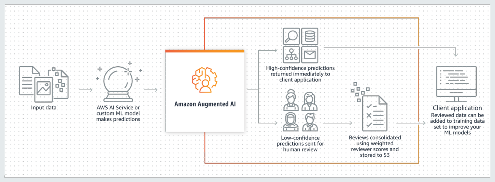

Topics

• Get Started with Amazon Augmented AI

• Use Cases and Examples Using Amazon A2I

Augmented AI
3144

## Page 174

Amazon SageMaker AI
Developer Guide

• Create a Human Review Workflow

• Delete a Human Review Workflow

• Create and Start a Human Loop

• Delete a Human Loop

• Create and Manage Worker Task Templates

• Monitor and Manage Your Human Loop

• Amazon A2I Output Data

• Permissions and Security in Amazon Augmented AI

• Use Amazon CloudWatch Events in Amazon Augmented AI

• Use APIs in Amazon Augmented AI

Get Started with Amazon Augmented AI

To get started using Amazon Augmented AI, review the Core Components of Amazon A2I and
Prerequisites to Using Augmented AI. Then, use the following documentation to learn how to use
the Amazon A2I console and API.

• Tutorial: Get Started in the Amazon A2I Console

• Tutorial: Get Started Using the Amazon A2I API

You can also get stared using the Amazon A2I API by following a Jupyter Notebook tutorial. See
Use Cases and Examples Using Amazon A2I for a list of notebooks and use cases.

Core Components of Amazon A2I

Review the following terms to familiarize yourself with the core components of Amazon A2I.

Task Types

The AI/ML workflow into which you integrate Amazon A2I defines an Amazon A2I task type.

Amazon A2I supports:

• Two built-in task types: Amazon Textract key-value pair extraction and Amazon Rekognition
image moderation.

Get Started with Amazon Augmented AI
3145

## Page 175

Amazon SageMaker AI
Developer Guide

• A custom task type: Use a custom task type to integrate a human review loop into any machine
learning workflow. You can use a custom task type to integrate Amazon A2I with other AWS
services like Amazon Comprehend, Amazon Transcribe, and Amazon Translate, as well as your
own custom machine learning workflows. To learn more, see Use Cases and Examples Using
Amazon A2I.

Select a tab in the following table to see diagrams that illustrate how Amazon A2I works with each
task type. Select the task type page using the links in the preceding list to learn more about that
task type.

Amazon Textract – Key-value pair extraction

This image depicts the Amazon A2I built-in workflow with Amazon Textract. On the left, the
resources that are required to create an Amazon Textract human review workflow are depicted:
an Amazon S3 bucket, activation conditions, a worker task template, and a work team. These
resources are used to create a human review workflow, or flow definition. An arrow points
right to the next step in the workflow: using Amazon Textract to configure a human loop with
the human review workflow. A second arrow points right from this step to the step in which
activation conditions specified in the human review workflow are met. This initiates the creation
of a human loop. On the right of the image, the human loop is depicted in three steps: 1) the
worker UI and tools are generated and the task is made available to workers, 2) workers review
input data, and finally, 3) results are saved in Amazon S3.

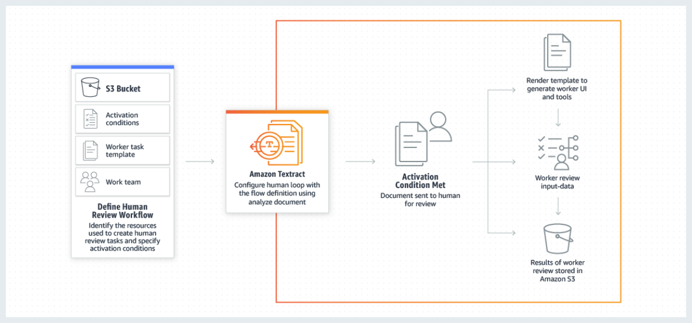

Get Started with Amazon Augmented AI
3146

## Page 176

Amazon SageMaker AI
Developer Guide

Amazon Rekognition – Image moderation

This image depicts the Amazon A2I built-in workflow with Amazon Rekognition. On the left,
the resources that are required to create an Amazon Rekognition human review workflow are
depicted: an Amazon S3 bucket, activation conditions, a worker task template, and a work team.
These resources are used to create a human review workflow, or flow definition. An arrow points
right to the next step in the workflow: using Amazon Rekognition to configure a human loop
with the human review workflow. A second arrow points right from this step to the step in
which activation conditions specified in the human review workflow are met. This initiates the
creation of a human loop. On the right of the image, the human loop is depicted in three steps:
1) the worker UI and tools are generated and the task is made available to workers, 2) workers
review input data, and finally, 3) results are saved in Amazon S3.

Custom Task Type

The following image depicts the Amazon A2I custom workflow. A custom ML model is used to
generate predictions. The client application filters these predictions using user-defined criteria
and determines if a human review is required. If so, these predictions are sent to Amazon
A2I for human review. Amazon A2I collects the results of human review in Amazon S3, which
can access by the client application. If the filter determines that no human review is needed,
predictions can be fed directly to the client application.

Get Started with Amazon Augmented AI
3147

## Page 177

Amazon SageMaker AI
Developer Guide

Human Review Workflow (Flow Definition)

You use a human review workflow to specify your human work team, to set up your worker UI using
a worker task template, and to provide information about how workers should complete the review
task.

For built-in task types, you also use the human review workflow to identify the conditions under
which a human loop is initiated. For example, Amazon Rekognition can perform image content
moderation using machine learning. You can use the human review workflow to specify that an
image is sent to a human for content moderation review if Amazon Rekognition's confidence is too
low.

You can use a human review workflow to create multiple human loops.

You can create a flow definition in the SageMaker AI console or with the SageMaker API. To learn
more about both of these options, see Create a Human Review Workflow.

Work Team

A work team is a group of human workers to whom you send your human review tasks.

When you create a human review workflow, you specify a single work team.

Your work team can come from the Amazon Mechanical Turk workforce, a vendor-managed
workforce, or your own private workforce. When you use the private workforce, you can create

Get Started with Amazon Augmented AI
3148

## Page 178

Amazon SageMaker AI
Developer Guide

multiple work teams. Each work team can be used in multiple human review workflows. To learn
how to create a workforce and work teams, see Workforces.

Worker Task Template and Human Task UI

You use a worker task template to create a worker UI (a human task UI) for your human review
tasks.

The human task UI displays your input data, such as documents or images, and instructions to
workers. It also provides interactive tools that the worker uses to complete your tasks.

For built-in task types, you must use the Amazon A2I worker task template provided for that task
type.

Human Loops

A human loop is used to create a single human review job. For each human review job, you can
choose the number of workers that are sent a task to review a single data object. For example,

if you set the number of workers per object to 3 for an image classification labeling job, three
workers classify each input image. Increasing the number of workers per object can improve label
accuracy.

A human loop is created using a human review workflow as follows:

• For built-in task types, the conditions specified in the human review workflow determine when
the human loop is created.

• Human review tasks are sent to the work team specified in the human review workflow.

• The worker task template specified in the human review workflow is used to render the human
task UI.

When do human loops get created?

When you use one of the built-in task types, the corresponding AWS service creates and starts a
human loop on your behalf when the conditions specified in your human review workflow are
met. For example:

• When you use Augmented AI with Amazon Textract, you can integrate Amazon A2I into a

document review task using the API operation AnalyzeDocument. A human loop is created
every time Amazon Textract returns inferences about key-value pairs that meet the conditions
you specify in your human review workflow.

Get Started with Amazon Augmented AI
3149

## Page 179

Amazon SageMaker AI
Developer Guide

• When you use Augmented AI with Amazon Rekognition, you can integrate Amazon A2I into an

image moderation task using the API operation DetectModerationLabels. A human loop is
created every time Amazon Rekognition returns inferences about image content that meet the
conditions you specify in your human review workflow.

When using a custom task type, you start a human loop using the Amazon Augmented AI Runtime

API. When you call StartHumanLoop in your custom application, a task is sent to human
reviewers.

To learn how to create and start a human loop, see Create and Start a Human Loop.

To generate these resources and create a human review workflow, Amazon A2I integrates
multiple APIs, including the Amazon Augmented AI Runtime Model, the SageMaker APIs, and APIs
associated with your task type. To learn more, see Use APIs in Amazon Augmented AI.

Note

AWS Region availability may differ when you use Augmented AI with other AWS services,
such as Amazon Textract. Create Augmented AI resources in the same AWS Region that you
use to interact with those AWS services. For AWS Region availability for all services, see the
Region Table.

Prerequisites to Using Augmented AI

Amazon A2I uses resources in IAM, SageMaker AI, and Amazon S3 to create and run your human
review workflows. You can create some of these resources in the Amazon A2I console when
you create a human review workflow. To learn how, see Tutorial: Get Started in the Amazon A2I
Console.

To use Amazon A2I, you need the following resources:

• One or more Amazon S3 buckets in the same AWS Region as the workflow for your input and
output data. To create a bucket, follow the instructions in  Create a Bucket in the Amazon Simple
Storage Service Console User Guide.

• An IAM role with required permissions to create a human review workflow and an IAM user
or role with permission to access Augmented AI. For more information, see Permissions and
Security in Amazon Augmented AI.

Get Started with Amazon Augmented AI
3150

## Page 180

Amazon SageMaker AI
Developer Guide

• A public, private, or vendor workforce for your human review workflows. If you plan to use
a private workforce, you need to set one up ahead of time in the same AWS Region as your
Amazon A2I workflow. To learn more about these workforce types, see Workforces.

Important

To learn about the compliance programs that cover Amazon Augmented AI at this time,
see AWS Services in Scope by Compliance Program. If you use Amazon Augmented AI in
conjunction with other AWS services (such as Amazon Rekognition and Amazon Textract),
note that Amazon Augmented AI may not be in scope for the same compliance programs
as those other services. You are responsible for how you use Amazon Augmented AI,
including understanding how the service processes or stores customer data and any
impact on the compliance of your data environment. You should discuss your workload
objectives and goals with your AWS account team; they can help you evaluate whether
the service is a good fit for your proposed use case and architecture.

Tutorial: Get Started in the Amazon A2I Console

The following tutorial shows you how to get started using Amazon A2I in the Amazon A2I console.

The tutorial gives you the option to use Augmented AI with Amazon Textract for document review
or Amazon Rekognition for image content review.

Prerequisites

To get started using Amazon A2I, complete the following prerequisites.

• Create an Amazon S3 bucket in the same AWS Region as the workflow for your input and output
data. For example, if you are using Amazon A2I with Amazon Textract in us-east-1, create your
bucket in us-east-1. To create a bucket, follow the instructions in Create a Bucket in the Amazon
Simple Storage Service Console User Guide.

• Do one of the following:

• If you want to complete the tutorial using Amazon Textract, download the following image
and place it in your Amazon S3 bucket.

Get Started with Amazon Augmented AI
3151

## Page 181

Amazon SageMaker AI
Developer Guide

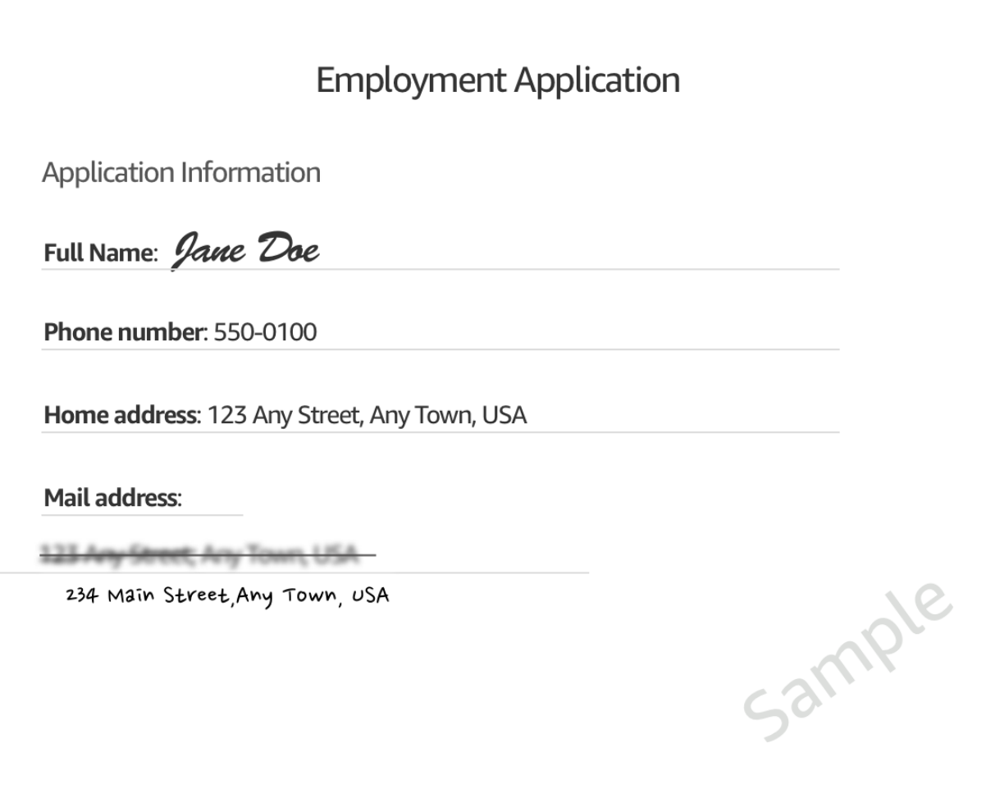

• If you want to complete the tutorial using Amazon Rekognition, download the following image
and place it in your Amazon S3 bucket.

Get Started with Amazon Augmented AI
3152

## Page 182

Amazon SageMaker AI
Developer Guide

Note

The Amazon A2I console is embedded in the SageMaker AI console.

Step 1: Create a Work Team

First, create a work team in the Amazon A2I console and add yourself as a worker so that you can
preview the worker review task.

Important

This tutorial uses a private work team. The Amazon A2I private workforce is configured in
the Ground Truth area of the SageMaker AI console and is shared between Amazon A2I and
Ground Truth.

Get Started with Amazon Augmented AI
3153

## Page 183

Amazon SageMaker AI
Developer Guide

To create a private workforce using worker emails

1.
Open the SageMaker AI console at https://console.aws.amazon.com/sagemaker/.

2.
In the navigation pane, choose Labeling workforces under Ground Truth.

3.
Choose Private, then choose Create private team.

4.
Choose Invite new workers by email.

5.
For this tutorial, enter your email and any others that you want to be able to preview the
human task UI. You can paste or type a list of up to 50 email addresses, separated by commas,
into the email addresses box.

6.
Enter an organization name and contact email.

7.
Optionally, choose an Amazon SNS topic to which to subscribe the team so workers are
notified by email when new Ground Truth labeling jobs become available. Amazon SNS
notifications are supported by Ground Truth and are not supported by Augmented AI. If you

subscribe workers to Amazon SNS notifications, they only receive notifications about Ground
Truth labeling jobs. They do not receive notifications about Augmented AI tasks.

8.
Choose Create private team.

If you add yourself to a private work team, you receive an email from no-

reply@verificationemail.com with login information. Use the link in this email to reset your
password and log in to your worker portal. This is where your human review tasks appear when you
create a human loop.

Step 2: Create a Human Review Workflow

In this step, you create a human review workflow. Each human review workflow is created for
a specific task type. This tutorial allows you to choose between the built-in task types: Amazon
Rekognition and Amazon Textract.

To create a human review workflow:

1.
Open the Augmented AI console at https://console.aws.amazon.com/a2i to access the Human
review workflows page.

2.
Select Create human review workflow.

3.
In Workflow settings, enter a workflow Name, S3 bucket, and the IAM role that you created

for this tutorial, with the AWS managed policy AmazonAugmentedAIIntegratedAPIAccess
attached.

Get Started with Amazon Augmented AI
3154

## Page 184

Amazon SageMaker AI
Developer Guide

4.
For Task type, select Textract – Key-value pair extraction or Rekognition – Image
moderation.

5.
Select the task type that you chose from the following table for instructions for that task type.

Amazon Textract – Key-value pair extraction

1. Select Trigger a human review for specific form keys based on the form key
confidence score or when specific form keys are missing.

2. For Key name, enter Mail Address.

3. Set the identification confidence threshold between 0 and 99.

4. Set the qualification confidence threshold between 0 and 99.

5. Select Trigger a human review for all form keys identified by Amazon Textract with
confidence scores in a specific range.

6. Set the identification confidence threshold between 0 and 90.

7. Set the qualification confidence threshold between 0 and 90.

This initiates a human review if Amazon Textract returns a confidence score that is less than

99 for Mail Address and its key, or if it returns a confidence score less than 90 for any
key value pair detected in the document.

The following image shows the Amazon Textract form extraction - Conditions for invoking
human review section of the Amazon A2I console. In the image, the check boxes for

the two types of triggers explained in the proceeding paragraph are checked, and Mail

Address is used as a Key name for the first trigger. The identification confidence threshold
is defined using confidence scores for key-value pairs detect within the form and is set
between 0 and 99. The qualification confidence threshold is defined using confidence
scores for text contained within keys and values in a form and is set between 0 and 99.

Get Started with Amazon Augmented AI
3155

## Page 185

Amazon SageMaker AI
Developer Guide

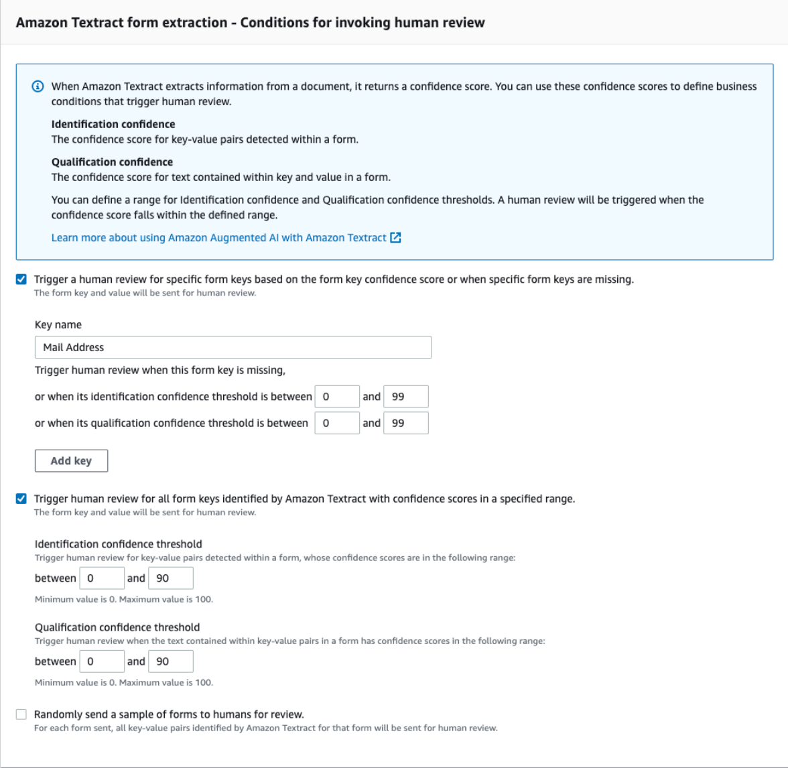

Amazon Rekognition – Image moderation

1. Select Trigger human review for labels identified by Amazon Rekognition based on
label confidence score.

2. Set the Threshold between 0 and 98.

This initiates a human review if Amazon Rekognition returns a confidence score that is less

than 98 for an image moderation job.

Get Started with Amazon Augmented AI
3156

## Page 186

Amazon SageMaker AI
Developer Guide

The following image shows how you can select the Trigger human review for labels
identified by Amazon Rekognition based on label confidence score option and enter a
Threshold between 0 and 98 in the Amazon A2I console.

6.
Under Worker task template creation, select Create from a default template.

7.
Enter a Template name.

8.
In Task description field, enter the following text:

Read the instructions carefully and complete the task.

9.
Under Workers, select Private.

10. Select the private team that you created.

11. Choose Create.

Once your human review workflow is created, it appears in the table on the Human review

workflows page. When the Status is Active, copy and save the Workflow ARN. You need it for the
next step.

Step 3: Start a Human Loop

You must use an API operation to start a human loop. There are a variety of language-specific SDKs
that you can use to interact with these API operations. To see documentation for each of these
SDKs, refer to the See Also section in the API documentation, as shown in the following image.

Get Started with Amazon Augmented AI
3157

## Page 187

Amazon SageMaker AI
Developer Guide

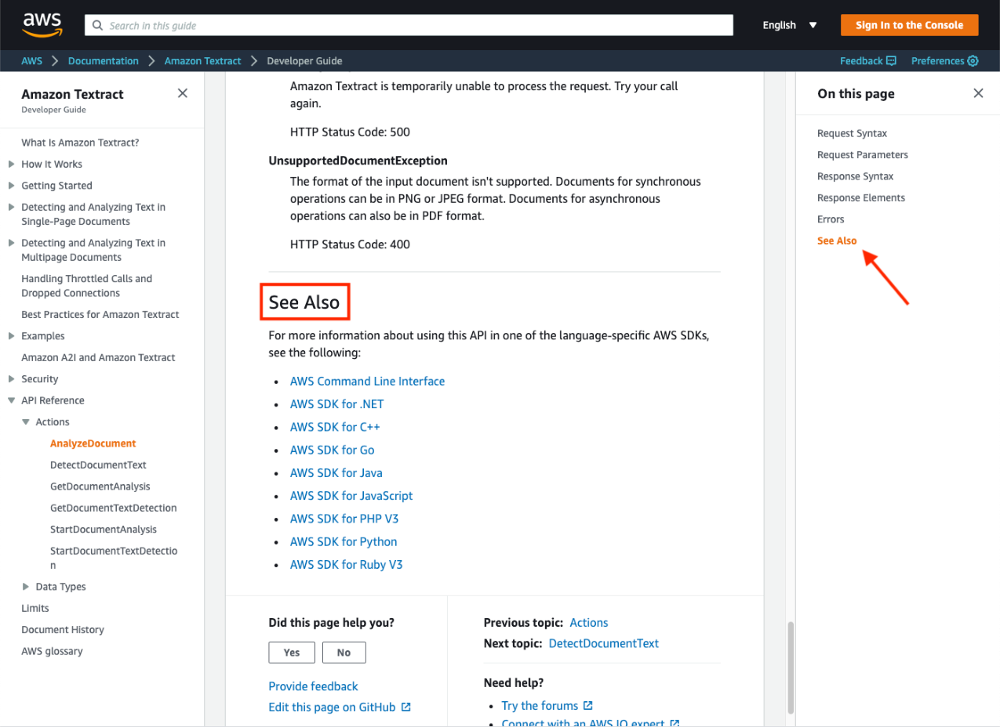

For this tutorial, you use one of the following APIs:

• If you chose the Amazon Textract task type, you use the AnalyzeDocument operation.

• If you chose the Amazon Rekognition task type, you use the DetectModerationLabels
operation.

You can interact with these APIs using a SageMaker notebook instance (recommended for new
users) or the AWS Command Line Interface (AWS CLI). Choose one of the following to learn more
about these options:

• To learn more about and set up a notebook instance, see Amazon SageMaker notebook
instances.

• To learn more about and get started using the AWS CLI, see What Is the AWS Command Line
Interface? in the AWS Command Line Interface User Guide.

Get Started with Amazon Augmented AI
3158

## Page 188

Amazon SageMaker AI
Developer Guide

Select your task type in the following table to see example requests for Amazon Textract and
Amazon Rekognition using the AWS SDK for Python (Boto3).

Amazon Textract – Key-value pair extraction

The following example uses the AWS SDK for Python (Boto3) to call analyze_document in

us-west-2. Replace the italicized red text with your resources. Include the DataAttributes
parameter if you are using the Amazon Mechanical Turk workforce. For more information, see

the analyze_document documention in the AWS SDK for Python (Boto) API Reference.

response = client.analyze_document(
Document={
"S3Object": {
"Bucket": "amzn-s3-demo-bucket",
"Name": "document-name.pdf"
}
},
HumanLoopConfig={
"FlowDefinitionArn":"arn:aws:sagemaker:us-west-2:111122223333:flow-
definition/flow-definition-name",
"HumanLoopName":"human-loop-name",
"DataAttributes" : {
"ContentClassifiers":
["FreeOfPersonallyIdentifiableInformation","FreeOfAdultContent"]
}
},
FeatureTypes=["TABLES", "FORMS"])

Amazon Rekognition – Image moderation

The following example uses the AWS SDK for Python (Boto3) to call

detect_moderation_labels in us-west-2. Replace the italicized red text with your resources.

Include the DataAttributes parameter if you are using the Amazon Mechanical Turk

workforce. For more information, see the detect_moderation_labels documentation in the
AWS SDK for Python (Boto) API Reference.

response = client.detect_moderation_labels(
Image={
"S3Object":{

Get Started with Amazon Augmented AI
3159

## Page 189

Amazon SageMaker AI
Developer Guide

"Bucket": "amzn-s3-demo-bucket",
"Name": "image-name.png"
}
},
HumanLoopConfig={
"FlowDefinitionArn":"arn:aws:sagemaker:us-west-2:111122223333:flow-
definition/flow-definition-name",
"HumanLoopName":"human-loop-name",
"DataAttributes":{
ContentClassifiers:
["FreeOfPersonallyIdentifiableInformation"|"FreeOfAdultContent"]
}
})

Step 4: View Human Loop Status in Console

When you start a human loop, you can view its status in the Amazon A2I console.

To view your human loop status

1.
Open the Augmented AI console at https://console.aws.amazon.com/a2i to access the Human
review workflows page.

2.
Select the human review workflow that you used to start your human loop.

3.
In the Human loops section, you can see your human loop. View its status in the Status
column.

Step 5: Download Output Data

Your output data is stored in the Amazon S3 bucket you specified when you created a human
review workflow.

To view your Amazon A2I output data

1.
Open the Amazon S3 console.

2.
Select the Amazon S3 bucket you specified when you created your human review workflow in
step 2 of this example.

3.
Starting with the folder that is named after your human review workflow, navigate to your
output data by selecting the folder with the following naming convention:

Get Started with Amazon Augmented AI
3160

## Page 190

Amazon SageMaker AI
Developer Guide

s3://output-bucket-specified-in-human-review-workflow/human-review-workflow-
name/YYYY/MM/DD/hh/mm/ss/human-loop-name/output.json

4.
Select output.json and choose Download.

Tutorial: Get Started Using the Amazon A2I API

This tutorial explains the API operations you can use to get started using Amazon A2I.

To use a Jupyter Notebook to run these operations, select a Jupyter Notebook from Use Cases and
Examples Using Amazon A2I and use Use SageMaker Notebook Instance with Amazon A2I Jupyter
Notebook to learn how to use it in a SageMaker AI notebook instance.

To learn more about the API operations you can use with Amazon A2I, see Use APIs in Amazon
Augmented AI.

Create a Private Work Team

You can create a private work team and add yourself as a worker so that you can preview Amazon
A2I.

If you are not familiar with Amazon Cognito, we recommend that you use the SageMaker AI
console to create a private workforce and add yourself as a private worker. For instructions, see
Step 1: Create a Work Team.

If you are familiar with Amazon Cognito, you can use the following instructions to create a private
work team using the SageMaker API. After you create a work team, note the work team ARN

(WorkteamArn).

To learn more about the private workforce and other available configurations, see Private
workforce.

Create a private workforce

If you have not created a private workforce, you can do so using an Amazon Cognito user pool.
Make sure that you have added yourself to this user pool. You can create a private work team using

the AWS SDK for Python (Boto3) create_workforce function. For other language-specific SDKs,
refer to the list in CreateWorkforce.

Get Started with Amazon Augmented AI
3161

## Page 191

Amazon SageMaker AI
Developer Guide

response = client.create_workforce(
CognitoConfig={
"UserPool": "Pool_ID",
"ClientId": "app-client-id"
},
WorkforceName="workforce-name"
)

Create a private work team

After you have created a private workforce in the AWS Region to configure and start
your human loop, you can create a private work team using the AWS SDK for Python

(Boto3) create_workteam function. For other language-specific SDKs, refer to the list in

CreateWorkteam.

response = client.create_workteam(
WorkteamName="work-team-name",
WorkforceName= "workforce-name",
MemberDefinitions=[
{
"CognitoMemberDefinition": {
"UserPool": "<aws-region>_ID",
"UserGroup": "user-group",
"ClientId": "app-client-id"
},
}
]
)

Access your work team ARN as follows:

workteamArn = response["WorkteamArn"]

List private work teams in your account

If you have already created a private work team, you can list all work teams in a given AWS Region

in your account using the AWS SDK for Python (Boto3) list_workteams function. For other

language-specific SDKs, refer to the list in ListWorkteams.

Get Started with Amazon Augmented AI
3162

## Page 192

Amazon SageMaker AI
Developer Guide

response = client.list_workteams()

If you have numerous work teams in your account, you may want to use MaxResults, SortBy, and

NameContains to filter your results.

Create a Human Review Workflow

You can create a human review workflow using the Amazon A2I CreateFlowDefinition
operation. Before you create your human review workflow, you need to create a human task UI.

You can do this with the CreateHumanTaskUi operation.

If you are using Amazon A2I with the Amazon Textract or Amazon Rekognition integrations, you
can specify activation conditions using a JSON.

Create a Human Task UI

If you are creating a human review workflow to be used with Amazon Textract or Amazon
Rekognition integrations, you need to use and modify pre-made worker task template. For all
custom integrations, you can use your own custom worker task template. Use the following
table to learn how to create a human task UI using a worker task template for the two built-in
integrations. Replace the template with your own to customize this request.

Amazon Textract – Key-value pair extraction

To learn more about this template, see Custom Template Example for Amazon Textract.

template = r"""

http://s3.amazonaws.com/
{{ task.input.aiServiceRequest.document.s3Object.bucket }}/
{{ task.input.aiServiceRequest.document.s3Object.name }}
<crowd-form>
<crowd-textract-analyze-document
src="{{ s3_uri | grant_read_access }}"
initial-value="{{ task.input.selectedAiServiceResponse.blocks }}"
header="Review the key-value pairs listed on the right and correct them if
they don"t match the following document."
no-key-edit=""
no-geometry-edit=""
keys="{{ task.input.humanLoopContext.importantFormKeys }}"
block-types='["KEY_VALUE_SET"]'>
<short-instructions header="Instructions">

Get Started with Amazon Augmented AI
3163

## Page 193

Amazon SageMaker AI
Developer Guide

Click on a key-value block to highlight the corresponding key-value pair
in the document.

 

If it is a valid key-value pair, review the content for the value. If the
content is incorrect, correct it.

 

The text of the value is incorrect, correct it.

 

A wrong value is identified, correct it.

 

If it is not a valid key-value relationship, choose No.

 

If you can’t find the key in the document, choose Key not found.

 

If the content of a field is empty, choose Value is blank.

 

<strong>Examples</strong>

Key and value are often displayed next or below to each other.

 

Key and value displayed in one line.

 

Key and value displayed in two lines.

 

If the content of the value has multiple lines, enter all the text
without line break.
Include all value text even if it extends beyond the highlight box.

</short-instructions>
<full-instructions header="Instructions"></full-instructions>
</crowd-textract-analyze-document>

Get Started with Amazon Augmented AI
3164

## Page 194

Amazon SageMaker AI
Developer Guide

</crowd-form>
"""

Amazon Rekognition – Image moderation

To learn more about this template, see Custom Template Example for Amazon Rekognition.

template = r"""

http://s3.amazonaws.com/
{{ task.input.aiServiceRequest.image.s3Object.bucket }}/
{{ task.input.aiServiceRequest.image.s3Object.name }}

<crowd-form>
<crowd-rekognition-detect-moderation-labels
categories='[


{
name: "{{ label.name }}",
parentName: "{{ label.parentName }}",
},

]'
src="{{ s3_uri | grant_read_access }}"
header="Review the image and choose all applicable categories."
>
<short-instructions header="Instructions">

Review the image and choose all applicable categories.
If no categories apply, choose None.

<b>Nudity</b>
Visuals depicting nude male or female person or persons

<b>Partial Nudity</b>
Visuals depicting covered up nudity, for example using hands or pose

<b>Revealing Clothes</b>
Visuals depicting revealing clothes and poses

Get Started with Amazon Augmented AI
3165

## Page 195

Amazon SageMaker AI
Developer Guide

<b>Physical Violence</b>
Visuals depicting violent physical assault, such as kicking or punching

<b>Weapon Violence</b>
Visuals depicting violence using weapons like firearms or blades, such as shooting

<b>Weapons</b>
Visuals depicting weapons like firearms and blades
</short-instructions>

<full-instructions header="Instructions"></full-instructions>
</crowd-rekognition-detect-moderation-labels>
</crowd-form>"""

Custom Integration

The following is an example template that can be used in a custom integration. This template is
used in this notebook, demonstrating a custom integration with Amazon Comprehend.

template = r"""

<crowd-form>
<crowd-classifier
name="sentiment"
categories='["Positive", "Negative", "Neutral", "Mixed"]'
initial-value="{{ task.input.initialValue }}"
header="What sentiment does this text convey?"
>
<classification-target>
{{ task.input.taskObject }}
</classification-target>
<full-instructions header="Sentiment Analysis Instructions">

<strong>Positive</strong> sentiment include: joy, excitement, delight

<strong>Negative</strong> sentiment include: anger, sarcasm, anxiety

<strong>Neutral</strong>: neither positive or negative, such as stating a
fact

<strong>Mixed</strong>: when the sentiment is mixed

</full-instructions>

<short-instructions>
Choose the primary sentiment that is expressed by the text.

Get Started with Amazon Augmented AI
3166

## Page 196

Amazon SageMaker AI
Developer Guide

</short-instructions>
</crowd-classifier>
</crowd-form>
"""

Using the template specified above, you can create a template using the AWS SDK for Python

(Boto3) create_human_task_ui function. For other language-specific SDKs, refer to the list in

CreateHumanTaskUi.

response = client.create_human_task_ui(
HumanTaskUiName="human-task-ui-name",
UiTemplate={
"Content": template
}
)

This response element contains the human task UI ARN. Save this as follows:

humanTaskUiArn = response["HumanTaskUiArn"]

Create JSON to specify activation conditions

For Amazon Textract and Amazon Rekognition built-in integrations, you can save activation

conditions in a JSON object and use this in your CreateFlowDefinition request.

Next, select a tab to see example activation conditions you can use for these built-in integrations.
For additional information about activation condition options, see JSON Schema for Human Loop
Activation Conditions in Amazon Augmented AI.

Amazon Textract – Key-value pair extraction

This example specifies conditions for specific keys (such as Mail address) in the document. If
Amazon Textract's confidence falls outside of the thresholds set here, the document is sent to a
human for review, with the specific keys that initiated the human loop prompted to the worker.

import json

humanLoopActivationConditions = json.dumps(

Get Started with Amazon Augmented AI
3167

## Page 197

Amazon SageMaker AI
Developer Guide

{
"Conditions": [
{
"Or": [
{
"ConditionType": "ImportantFormKeyConfidenceCheck",
"ConditionParameters": {
"ImportantFormKey": "Mail address",
"ImportantFormKeyAliases": ["Mail Address:","Mail
address:", "Mailing Add:","Mailing Addresses"],
"KeyValueBlockConfidenceLessThan": 100,
"WordBlockConfidenceLessThan": 100
}
},
{
"ConditionType": "MissingImportantFormKey",

"ConditionParameters": {
"ImportantFormKey": "Mail address",
"ImportantFormKeyAliases": ["Mail Address:","Mail
address:","Mailing Add:","Mailing Addresses"]
}
},
{
"ConditionType": "ImportantFormKeyConfidenceCheck",
"ConditionParameters": {
"ImportantFormKey": "Phone Number",
"ImportantFormKeyAliases": ["Phone number:", "Phone
No.:", "Number:"],
"KeyValueBlockConfidenceLessThan": 100,
"WordBlockConfidenceLessThan": 100
}
},
{
"ConditionType": "ImportantFormKeyConfidenceCheck",
"ConditionParameters": {
"ImportantFormKey": "*",
"KeyValueBlockConfidenceLessThan": 100,
"WordBlockConfidenceLessThan": 100
}
},
{
"ConditionType": "ImportantFormKeyConfidenceCheck",
"ConditionParameters": {

Get Started with Amazon Augmented AI
3168

## Page 198

Amazon SageMaker AI
Developer Guide

"ImportantFormKey": "*",
"KeyValueBlockConfidenceGreaterThan": 0,
"WordBlockConfidenceGreaterThan": 0
}
}
]
}
]
}
)

Amazon Rekognition – Image moderation

The human loop activation conditions used here are tailored towards Amazon Rekognition

content moderation; they are based on the confidence thresholds for the Suggestive and

Female Swimwear Or Underwear moderation labels.

import json

humanLoopActivationConditions = json.dumps(
{
"Conditions": [
{
"Or": [
{
"ConditionType": "ModerationLabelConfidenceCheck",
"ConditionParameters": {
"ModerationLabelName": "Suggestive",
"ConfidenceLessThan": 98
}
},
{
"ConditionType": "ModerationLabelConfidenceCheck",
"ConditionParameters": {
"ModerationLabelName": "Female Swimwear Or Underwear",
"ConfidenceGreaterThan": 98
}
}
]
}
]
}

Get Started with Amazon Augmented AI
3169

## Page 199

Amazon SageMaker AI
Developer Guide

)

Create a human review workflow

This section gives an example of the CreateFlowDefinition AWS SDK for Python (Boto3)
request using the resources created in the previous sections. For other language-specific SDKs,
refer to the list in CreateFlowDefinition. Use the tabs in the following table to see the requests
to create a human review workflow for Amazon Textract and Amazon Rekognition built-in
integrations.

Amazon Textract – Key-value pair extraction

If you use the built-in integration with Amazon Textract, you must specify "AWS/Textract/

AnalyzeDocument/Forms/V1" for "AwsManagedHumanLoopRequestSource" in

HumanLoopRequestSource.

response = client.create_flow_definition(
FlowDefinitionName="human-review-workflow-name",
HumanLoopRequestSource={
"AwsManagedHumanLoopRequestSource": "AWS/Textract/AnalyzeDocument/Forms/
V1"
},
HumanLoopActivationConfig={
"HumanLoopActivationConditionsConfig": {
"HumanLoopActivationConditions": humanLoopActivationConditions
}
},
HumanLoopConfig={
"WorkteamArn": workteamArn,
"HumanTaskUiArn": humanTaskUiArn,
"TaskTitle": "Document entry review",
"TaskDescription": "Review the document and instructions. Complete the
task",
"TaskCount": 1,
"TaskAvailabilityLifetimeInSeconds": 43200,
"TaskTimeLimitInSeconds": 3600,
"TaskKeywords": [
"document review",
],
},

Get Started with Amazon Augmented AI
3170

## Page 200

Amazon SageMaker AI
Developer Guide

OutputConfig={
"S3OutputPath": "s3://amzn-s3-demo-bucket/prefix/",
},
RoleArn="arn:aws:iam::<account-number>:role/<role-name>",
Tags=[
{
"Key": "string",
"Value": "string"
},
]
)

Amazon Rekognition – Image moderation

If you use the built-in integration with Amazon Rekognition, you must

specify "AWS/Rekognition/DetectModerationLabels/Image/V3" for

"AwsManagedHumanLoopRequestSource" in HumanLoopRequestSource.

response = client.create_flow_definition(
FlowDefinitionName="human-review-workflow-name",
HumanLoopRequestSource={
"AwsManagedHumanLoopRequestSource": "AWS/Rekognition/
DetectModerationLabels/Image/V3"
},
HumanLoopActivationConfig={
"HumanLoopActivationConditionsConfig": {
"HumanLoopActivationConditions": humanLoopActivationConditions
}
},
HumanLoopConfig={
"WorkteamArn": workteamArn,
"HumanTaskUiArn": humanTaskUiArn,
"TaskTitle": "Image content moderation",
"TaskDescription": "Review the image and instructions. Complete the
task",
"TaskCount": 1,
"TaskAvailabilityLifetimeInSeconds": 43200,
"TaskTimeLimitInSeconds": 3600,
"TaskKeywords": [
"content moderation",
],
},

Get Started with Amazon Augmented AI
3171

## Page 201

Amazon SageMaker AI
Developer Guide

OutputConfig={
"S3OutputPath": "s3://amzn-s3-demo-bucket/prefix/",
},
RoleArn="arn:aws:iam::<account-number>:role/<role-name>",
Tags=[
{
"Key": "string",
"Value": "string"
},
]
)

Custom Integration

If you use a custom integration, exclude the following parameters:

HumanLoopRequestSource, HumanLoopActivationConfig.

response = client.create_flow_definition(
FlowDefinitionName="human-review-workflow-name",
HumanLoopConfig={
"WorkteamArn": workteamArn,
"HumanTaskUiArn": humanTaskUiArn,
"TaskTitle": "Image content moderation",
"TaskDescription": "Review the image and instructions. Complete the
task",
"TaskCount": 1,
"TaskAvailabilityLifetimeInSeconds": 43200,
"TaskTimeLimitInSeconds": 3600,
"TaskKeywords": [
"content moderation",
],
},
OutputConfig={
"S3OutputPath": "s3://amzn-s3-demo-bucket/prefix/",
},
RoleArn="arn:aws:iam::<account-number>:role/<role-name>",
Tags=[
{
"Key": "string",
"Value": "string"
},
]

Get Started with Amazon Augmented AI
3172

## Page 202

Amazon SageMaker AI
Developer Guide

)

After you create a human review workflow, you can retrieve the flow definition ARN from the
response:

humanReviewWorkflowArn = response["FlowDefinitionArn"]

Create a Human Loop

The API operation you use to start a human loop depends on the Amazon A2I integration you use.

• If you use the Amazon Textract built-in integration, you use the AnalyzeDocument operation.

• If you use the Amazon Rekognition built-in integration, you use the DetectModerationLabels
operation.

• If you use a custom integration, you use the StartHumanLoop operation.

Select your task type in the following table to see example requests for Amazon Textract and
Amazon Rekognition using the AWS SDK for Python (Boto3).

Amazon Textract – Key-value pair extraction

The following example uses the AWS SDK for Python (Boto3) to call analyze_document in

us-west-2. Replace the italicized red text with your resources. Include the DataAttributes
parameter if you are using the Amazon Mechanical Turk workforce. For more information, see
the analyze_document documention in the AWS SDK for Python (Boto) API Reference.

response = client.analyze_document(
Document={"S3Object": {"Bucket": "amzn-s3-demo-bucket", "Name": "document-
name.pdf"},
HumanLoopConfig={
"FlowDefinitionArn":"arn:aws:sagemaker:us-west-2:111122223333:flow-
definition/flow-definition-name",
"HumanLoopName":"human-loop-name",
"DataAttributes" : {ContentClassifiers:
["FreeOfPersonallyIdentifiableInformation"|"FreeOfAdultContent"]}
}
FeatureTypes=["FORMS"]

Get Started with Amazon Augmented AI
3173

## Page 203

Amazon SageMaker AI
Developer Guide

)

Human loops are only created if Amazon Textract's confidence for document analysis task
meets the activation conditions you specified in your human review workflow. You can check

the response element to determine if a human loop has been created. To see everything

included in this response, see HumanLoopActivationOutput.

if "HumanLoopArn" in analyzeDocumentResponse["HumanLoopActivationOutput"]:
# A human loop has been started!
print(f"A human loop has been started with ARN:
{analyzeDocumentResponse["HumanLoopActivationOutput"]["HumanLoopArn"]}"

Amazon Rekognition – Image moderation

The following example uses the AWS SDK for Python (Boto3) to call

detect_moderation_labels in us-west-2. Replace the italicized red text with your resources.

Include the DataAttributes parameter if you are using the Amazon Mechanical Turk
workforce. For more information, see the detect_moderation_labels documention in the AWS
SDK for Python (Boto) API Reference.

response = client.detect_moderation_labels(
Image={"S3Object":{"Bucket": "amzn-s3-demo-bucket", "Name": "image-
name.png"}},
HumanLoopConfig={
"FlowDefinitionArn":"arn:aws:sagemaker:us-west-2:111122223333:flow-
definition/flow-definition-name",
"HumanLoopName":"human-loop-name",
"DataAttributes":{ContentClassifiers:
["FreeOfPersonallyIdentifiableInformation"|"FreeOfAdultContent"]}
}
)

Human loops are only created if Amazon Rekognition's confidence for an image moderation
task meets the activation conditions you specified in your human review workflow. You can

check the response element to determine if a human loop has been created. To see everything

included in this response, see HumanLoopActivationOutput.

Get Started with Amazon Augmented AI
3174

## Page 204

Amazon SageMaker AI
Developer Guide

if "HumanLoopArn" in response["HumanLoopActivationOutput"]:
# A human loop has been started!
print(f"A human loop has been started with ARN:
{response["HumanLoopActivationOutput"]["HumanLoopArn"]}")

Custom Integration

The following example uses the AWS SDK for Python (Boto3) to call start_human_loop in

us-west-2. Replace the italicized red text with your resources. Include the DataAttributes
parameter if you are using the Amazon Mechanical Turk workforce. For more information, see
the start_human_loop documention in the AWS SDK for Python (Boto) API Reference.

response = client.start_human_loop(
HumanLoopName= "human-loop-name",
FlowDefinitionArn= "arn:aws:sagemaker:us-west-2:111122223333:flow-
definition/flow-definition-name",
HumanLoopInput={"InputContent": inputContentJson},
DataAttributes={"ContentClassifiers":
["FreeOfPersonallyIdentifiableInformation"|"FreeOfAdultContent"]}
)

This example stores input content in the variable inputContentJson. Assume that the input

content contains two elements: a text blurb and sentiment (such as Positive, Negative, or

Neutral), and it is formatted as follows:

inputContent = {
"initialValue": sentiment,
"taskObject": blurb
}

The keys initialValue and taskObject must correspond to the keys used in the liquid
elements of the worker task template. Refer to the custom template in Create a Human Task UI
to see an example.

To create inputContentJson, do the following:

import json

Get Started with Amazon Augmented AI
3175

## Page 205

Amazon SageMaker AI
Developer Guide

inputContentJson = json.dumps(inputContent)

A human loop starts each time you call start_human_loop. To check the status of your
human loop, use describe_human_loop:

human_loop_info = a2i.describe_human_loop(HumanLoopName="human_loop_name")
print(f"HumanLoop Status: {resp["HumanLoopStatus"]}")
print(f"HumanLoop Output Destination: {resp["HumanLoopOutput"]}")

Use Cases and Examples Using Amazon A2I

You can use Amazon Augmented AI to incorporate a human review into your workflow for built-

in task types, Amazon Textract and Amazon Rekognition, or your own custom tasks using a custom
task type.

When you create a human review workflow using one of the built-in task types, you can specify
conditions, such as confidence thresholds, that initiate a human review. The service (Amazon
Rekognition or Amazon Textract) creates a human loop on your behalf when these conditions are
met and supplies your input data directly to Amazon A2I to send to human reviewers. To learn
more about the built-in task types, use the following:

• Use Amazon Augmented AI with Amazon Textract

• Use Amazon Augmented AI with Amazon Rekognition

When you use a custom task type, you create and start a human loop using the Amazon A2I
Runtime API. Use the custom task type to incorporate a human review workflow with other AWS
services or your own custom ML application.

• For more details, see Use Amazon Augmented AI with Custom Task Types

The following table outlines a variety of Amazon A2I use cases that you can explore using
SageMaker AI Jupyter Notebooks. To get started with a Jupyter Notebook, use the instructions in
Use SageMaker Notebook Instance with Amazon A2I Jupyter Notebook. For more examples, see
this GitHub repository.

Use Cases and Examples
3176

## Page 206

Amazon SageMaker AI
Developer Guide

Use Case
Description
Task Type

Use Amazon A2I with Amazon
Textract

Have humans review single-
page documents to review

Built-in

important form key-value
pairs, or have Amazon
Textract randomly sample
and send documents from
your dataset to humans for
review.

Use Amazon A2I with Amazon
Rekognition

Have humans review unsafe
images for explicit adult or
violent content if Amazon
Rekognition returns a
low confidence score, or
have Amazon Rekognition
randomly sample and send

Built-in

images from your dataset to
humans for review.

Use Amazon A2I with Amazon
Comprehend

Have humans review Amazon
Comprehend inferences about
text data such as sentiment
analysis, text syntax, and
entity detection.

Custom

Use Amazon A2I with Amazon
Transcribe

Have humans review Amazon
Transcribe transcriptions
of video or audio files. Use
the results of transcription
human review loops to create
a custom vocabulary and
improve future transcrip
tions of similar video or audio
content.

Custom

Use Cases and Examples
3177

## Page 207

Amazon SageMaker AI
Developer Guide

Use Case
Description
Task Type

Use Amazon A2I with Amazon
Translate

Have humans review low-
confidence translations
returned from Amazon
Translate.

Custom

Use Amazon A2I to review
real time ML inferences

Use Amazon A2I to review
real-time, low-confidence
inferences made by a model
deployed to a SageMaker
AI hosted endpoint and
incrementally train your
model using Amazon A2I
output data.

Custom

Use Amazon A2I to review
tabular data

Use Amazon A2I to integrate
a human review loop into
an ML application that uses
tabular data.

Custom

Topics

• Use SageMaker Notebook Instance with Amazon A2I Jupyter Notebook

• Use Amazon Augmented AI with Amazon Textract

• Use Amazon Augmented AI with Amazon Rekognition

• Use Amazon Augmented AI with Custom Task Types

Use SageMaker Notebook Instance with Amazon A2I Jupyter Notebook

For an end-to-end example that demonstrates how to integrate an Amazon A2I human review loop
into a machine learning workflow, you can use a Jupyter Notebook from this GitHub Repository in
a SageMaker notebook instance.

Use Cases and Examples
3178

## Page 208

Amazon SageMaker AI
Developer Guide

To use an Amazon A2I custom task type sample notebook in an Amazon SageMaker notebook
instance:

1.
If you do not have an active SageMaker notebook instance, create one by following the
instructions in Create an Amazon SageMaker Notebook Instance for the tutorial.

2.
When your notebook instance is active, choose Open JupyterLab to the right of the notebook
instance's name. It may take a few moments for JupyterLab to load.

3.
Choose the add Github repository icon

(

)
to clone a GitHub repository into your workspace.

4.
Enter the amazon-a2i-sample-jupyter-notebooks repository HTTPS URL.

5.
Choose CLONE.

6.
Open the notebook that you would like to run.

7.
Follow the instructions in the notebook to configure your human review workflow and human
loop and run the cells.

8.
To avoid incurring unnecessary charges, when you are done with the demo, stop and delete
your notebook instance in addition to any Amazon S3 buckets, IAM roles, and CloudWatch
Events resources created during the walkthrough.

Use Amazon Augmented AI with Amazon Textract

Amazon Textract enables you to add document text detection and analysis to your
applications. Amazon Augmented AI (Amazon A2I) directly integrates with Amazon Textract's

AnalyzeDocument API operation. You can use AnalyzeDocument to analyze a document for
relationships between detected items. When you add an Amazon A2I human review loop to an

AnalyzeDocument request, Amazon A2I monitors the Amazon Textract results and sends a
document to one or more human workers for review when the conditions specified in your flow

definition are met. For example, if you want a human to review a specific key like Full name: and
their associated input values, you can create an activation condition that starts a human review any

time the Full name: key is detected or when the inference confidence for that key falls within a
range that you specify.

The following image depicts the Amazon A2I built-in workflow with Amazon Textract. On the
left, the resources that are required to create an Amazon Textract human review workflow are
depicted: and Amazon S3 bucket, activation conditions, a worker task template, and a work team.

Use Cases and Examples
3179

## Page 209

Amazon SageMaker AI
Developer Guide

These resources are used to create a human review workflow, or flow definition. An arrow points
right to the next step in the workflow: using Amazon Textract to configure a human loop with the
human review workflow. A second arrow points right from this step to the step in which activation
conditions specified in the human review workflow are met. This initiates the creation of a human
loop. On the right of the image, the human loop is depicted in three steps: 1) the worker UI and
tools are generated and the task is made available to workers,2) workers review input data, and
finally, 3) results are saved in Amazon S3.

You can specify when Amazon Textract sends a task to a human worker for review when creating a
human review workflow or flow definition by specifying activation conditions.

You can set the following activation conditions when using the Amazon Textract task type:

• Initiate a human review for specific form keys based on the form key confidence score.

• Initiate a human review when specific form keys are missing.

• Initiate human review for all form keys identified by Amazon Textract with confidence scores in a
specified range.

• Randomly send a sample of forms to humans for review.

When your activation condition depends on form key confidence scores, you can use two types of
prediction confidence to initiate human loops:

• Identification confidence – The confidence score for key-value pairs detected within a form.

Use Cases and Examples
3180

## Page 210

Amazon SageMaker AI
Developer Guide

• Qualification confidence – The confidence score for text contained within key and value in a
form.

In the image in the following section, Full Name: Jane Doe is the key-value pair, Full Name is the
key, and Jane Doe is the value.

You can set these activation conditions using the Amazon SageMaker AI console when you create a
human review workflow, or by creating a JSON for human loop activation conditions and specifying

this as input in the HumanLoopActivationConditions parameter of CreateFlowDefinition
API operation. To learn how specify activation conditions in JSON format, see JSON Schema for
Human Loop Activation Conditions in Amazon Augmented AI and Use Human Loop Activation
Conditions JSON Schema with Amazon Textract.

Note

When using Augmented AI with Amazon Textract, create Augmented AI resources in the

same AWS Region you use to call AnalyzeDocument.

Get Started: Integrate a Human Review into an Amazon Textract Analyze Document Job

To integrate a human review into an Amazon Textract text detection and analysis job, you need
to create a flow definition, and then use the Amazon Textract API to integrate that flow definition
into your workflow. To learn how to create a flow definition using the SageMaker AI console or
Augmented AI API, see the following topics:

• Create a Human Review Workflow (Console)

• Create a Human Review Workflow (API)

After you've created your flow definition, see Using Augmented AI with Amazon Textract to learn
how to integrate your flow definition into your Amazon Textract task.

End-to-End Example Using Amazon Textract and Amazon A2I

For an end-to-end example that demonstrates how to use Amazon Textract with Amazon A2I using
the console, see Tutorial: Get Started in the Amazon A2I Console.

To learn how to use the Amazon A2I API to create and start a human review, you can use Amazon
Augmented AI (Amazon A2I) integration with Amazon Textract's Analyze Document [Example] in a

Use Cases and Examples
3181

## Page 211

Amazon SageMaker AI
Developer Guide

SageMaker Notebook instance. To get started, see Use SageMaker Notebook Instance with Amazon
A2I Jupyter Notebook.

A2I Textract Worker Console Preview

When they're assigned a review task in an Amazon Textract workflow, workers might see a user
interface similar to the following:

You can customize this interface in the SageMaker AI console when you create your human review
definition, or by creating and using a custom template. To learn more, see Create and Manage
Worker Task Templates.

Use Amazon Augmented AI with Amazon Rekognition

Amazon Rekognition makes it easy to add image analysis to your applications. The Amazon

Rekognition DetectModerationLabels API operation is directly integrated with Amazon A2I
so that you can easily create a human loop to review unsafe images, such as explicit adult or

violent content. You can use DetectModerationLabels to configure a human loop using a flow
definition ARN. This enables Amazon A2I to analyze predictions made by Amazon Rekognition and
send results to a human for review to ensure they meet the conditions set in your flow definition.

The following image depicts the Amazon A2I built-in workflow with Amazon Rekognition. On the
left, the resources that are required to create an Amazon Rekognition human review workflow

Use Cases and Examples
3182

## Page 212

Amazon SageMaker AI
Developer Guide

are depicted: and Amazon S3 bucket, activation conditions, a worker task template, and a work
team. These resources are used to create a human review workflow, or flow definition. An arrow
points right to the next step in the workflow: using Amazon Rekognition to configure a human loop
with the human review workflow. A second arrow points right from this step to the step in which
activation conditions specified in the human review workflow are met. This initiates the creation of
a human loop. On the right of the image, the human loop is depicted in three steps: 1) the worker
UI and tools are generated and the task is made available to workers, 2) workers review input data,
and finally, 3) results are saved in Amazon S3.

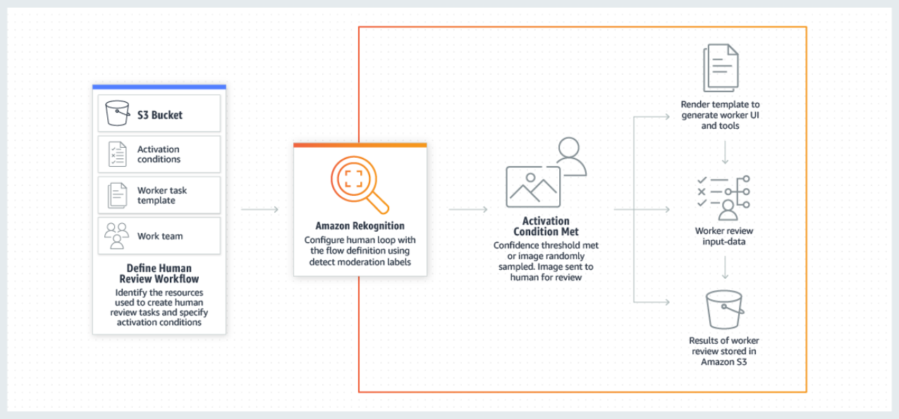

You can set the following activation conditions when using the Amazon Rekognition task type:

• Initiate human review for labels identified by Amazon Rekognition based on the label confidence
score.

• Randomly send a sample of images to humans for review.

You can set these activation conditions using the Amazon SageMaker AI console when you
create a human review workflow, or by creating a JSON for human loop activation conditions

and specifying this as input in the HumanLoopActivationConditions parameter of the

CreateFlowDefinition API operation. To learn how specify activation conditions in JSON
format, see JSON Schema for Human Loop Activation Conditions in Amazon Augmented AI and
Use Human Loop Activation Conditions JSON Schema with Amazon Rekognition.

Use Cases and Examples
3183

## Page 213

Amazon SageMaker AI
Developer Guide

Note

When using Augmented AI with Amazon Rekognition, create Augmented AI resources in the

same AWS Region you use to call DetectModerationLabels.

Get Started: Integrate a Human Review into an Amazon Rekognition Image Moderation Job

To integrate a human review into an Amazon Rekognition, see the following topics:

• Create a Human Review Workflow (Console)

• Create a Human Review Workflow (API)

After you've created your flow definition, see Using Augmented AI with Amazon Rekognition to

learn how to integrate your flow definition into your Amazon Rekognition task.

End-to-end Demo Using Amazon Rekognition and Amazon A2I

For an end-to-end example that demonstrates how to use Amazon Rekognition with Amazon A2I
using the console, see Tutorial: Get Started in the Amazon A2I Console.

To learn how to use the Amazon A2I API to create and start a human review, you can use Amazon
Augmented AI (Amazon A2I) integration with Amazon Rekognition [Example] in a SageMaker
notebook instance. To get started, see Use SageMaker Notebook Instance with Amazon A2I Jupyter
Notebook.

A2I Rekognition Worker Console Preview

When they're assigned a review task in an Amazon Rekognition workflow, workers might see a user
interface similar to the following:

Use Cases and Examples
3184

## Page 214

Amazon SageMaker AI
Developer Guide

You can customize this interface in the SageMaker AI console when you create your human review
definition, or by creating and using a custom template. To learn more, see Create and Manage
Worker Task Templates.

Use Amazon Augmented AI with Custom Task Types

You can use Amazon Augmented AI (Amazon A2I) to incorporate a human review (human loop)
into any machine learning workflow using the custom task type. This options gives you the most
flexibility to customize the conditions under which your data objects are sent to humans for review,
as well as the look and feel of your worker user interface.

When you use a custom task type, you create a custom human review workflow and specify the
conditions under which a data object is sent for human review directly in your application.

The following image depicts the Amazon A2I custom workflow. A custom ML model is used to
generate predictions. The client application filters these predictions using user-defined criteria and
determines if a human review is required. If so, these predictions are sent to Amazon A2I for human
review. Amazon A2I collects the results of human review in Amazon S3, which can access by the
client application. If the filter determines that no human review is needed, predictions can be fed
directly to the client application.

Use Cases and Examples
3185

## Page 215

Amazon SageMaker AI
Developer Guide

Use the procedures on this page to learn how to integrate Amazon A2I into any machine learning
workflow using the custom task type.

Create a human loop using a flow definition, integrate it into your application, and monitor the
results

1.
Complete the Amazon A2I Prerequisites to Using Augmented AI. Note the following:

• The path to the Amazon Simple Storage Service (Amazon S3) bucket or buckets where you
store your input and output data.

• The Amazon Resource Name (ARN) of an AWS Identity and Access Management (IAM) role
with required permissions attached.

• (Optional) The ARN of your private workforce, if you plan to use one.

2.
Using HTML elements, create a custom worker template which Amazon A2I uses to generate
your worker task UI. To learn how to create a custom template, see Create Custom Worker Task
Templates.

3.
Use the custom worker template from step 2 to generate a worker task template in the
Amazon SageMaker AI console. To learn how, see Create a Worker Task Template.

In the next step, you create a flow definition:

Use Cases and Examples
3186

## Page 216

Amazon SageMaker AI
Developer Guide

• If you want to create a flow definition using the SageMaker API, note the ARN of this worker
task template for the next step.

• If you are creating a flow definition using the console, your template automatically appears
in Worker task template section when you choose Create human review workflow.

4.
When creating your flow definition, provide the path to your S3 buckets, your IAM role ARN,
and your worker template.

• To learn how to create a flow definition using the SageMaker AI CreateFlowDefinition
API, see Create a Human Review Workflow (API).

• To learn how to create a flow definition using the SageMaker AI console, see Create a Human
Review Workflow (Console).

5.
Configure your human loop using the Amazon A2I Runtime API. To learn how, see Create and
Start a Human Loop.

6.
To control when human reviews are initiated in your application, specify conditions under

which StartHumanLoop is called in your application. Human loop activation conditions, such
as confidence thresholds that initiate the human loop, are not available when using Amazon

A2I with custom task types. Every StartHumanLoop invocation results in a human review.

Once you have started a human loop, you can manage and monitor your loops using the Amazon
Augmented AI Runtime API and Amazon EventBridge (also known as Amazon CloudWatch Events).
To learn more, see Monitor and Manage Your Human Loop.

End-to-end Tutorial Using Amazon A2I Custom Task Types

For an end-to-end examples that demonstrates how to integrate Amazon A2I into a variety of ML
workflows, see the table in Use Cases and Examples Using Amazon A2I. To get started using one of
these notebooks, see Use SageMaker Notebook Instance with Amazon A2I Jupyter Notebook.

Create a Human Review Workflow

Use an Amazon Augmented AI (Amazon A2I) human review workflow, or flow definition, to specify
the following:

• For the Amazon Textract and Amazon Rekognition built-in task types, the conditions under which
your human loop is called

• The workforce to which your tasks are sent

Create a Human Review Workflow
3187

## Page 217

Amazon SageMaker AI
Developer Guide

• The set of instructions that your workforce receives, which is called a worker task template

• The configuration of your worker tasks, including the number of workers that receive a task and
time limits to complete tasks

• Where your output data is stored

You can create a human review workflow in the SageMaker AI console or using the SageMaker AI

CreateFlowDefinition operation. You can build a worker task template using the console for
Amazon Textract and Amazon Rekognition task types while creating your flow definition.

Important

Human loop activation conditions, which initiate the human loop—for example,
confidence thresholds—aren't available for Amazon A2I custom task types. When using
the console to create a flow definition for a custom task type, you can't specify activation
conditions. When using the Amazon A2I API to create a flow definition for a custom

task type, you can't set the HumanLoopActivationConditions attribute of the

HumanLoopActivationConditionsConfig parameter. To control when human reviews

are initiated, specify conditions under which StartHumanLoop is called in your custom

application. In this case, every StartHumanLoop invocation results in a human review. For
more information, see Use Amazon Augmented AI with Custom Task Types.

Prerequisites

To create a human review workflow definition, you must have completed the prerequisites
described in Prerequisites to Using Augmented AI.

If you use the API to create a flow definition for any task type, or if you use a custom task type
when creating a flow definition in the console, first create a worker task template. For more
information, see Create and Manage Worker Task Templates.

If you want to preview your worker task template while creating a flow definition for a built-in
task type in the console, ensure that you grant the role that you use to create the flow definition
permission to access the Amazon S3 bucket that contains your template artifacts using a policy like
the one described in Enable Worker Task Template Previews.

Topics

Create a Human Review Workflow
3188

## Page 218

Amazon SageMaker AI
Developer Guide

• Create a Human Review Workflow (Console)

• Create a Human Review Workflow (API)

• JSON Schema for Human Loop Activation Conditions in Amazon Augmented AI

Create a Human Review Workflow (Console)

Use this procedure to create a Amazon Augmented AI (Amazon A2I) human review workflow using
the SageMaker AI console. If you are new to Amazon A2I, we recommend that you create a private
work team using people in your organization, and use this work team's ARN when creating your
flow definition. To learn how to set up a private workforce and create a work team, see Create a
Private Workforce (Amazon SageMaker AI Console). If you have already set up a private workforce,
see Create a Work Team Using the SageMaker AI Console to learn how to add a work team to that
workforce.

If you are using Amazon A2I with one of the built-in task types, you can create worker instructions
using a default worker task template provided by Augmented AI while creating a human review
workflow in the console. To see samples of the default templates provided by Augmented AI, see
the built-in task types in Use Cases and Examples Using Amazon A2I.

To create flow definition (console)

1.
Open the SageMaker AI console at https://console.aws.amazon.com/sagemaker/.

2.
In the navigation pane, under the Augmented AI section, choose Human review workflows
and then choose Create human review workflow.

3.
In Overview, do the following:

a.
For Name, enter a unique workflow name. The name must be lowercase, unique within the
AWS Region in your account, and can have up to 63 characters. Valid characters include: a-
z, 0-9, and - (hyphen).

b.
For S3 location for output, enter the S3 bucket where you want to store the human
review results. The bucket must be located in the same AWS Region as the workflow.

c.
For IAM role, choose the role that has the required permissions. If you choose a built-in
task type and want to preview your worker template in the console, provide a role with
the type of policy described in Enable Worker Task Template Previews attached.

4.
For Task type, choose the task type that you want the human worker to perform.

Create a Human Review Workflow
3189

## Page 219

Amazon SageMaker AI
Developer Guide

5.
If you chose the Amazon Rekognition or Amazon Textract task type, specify the conditions that
invoke human review.

• For Amazon Rekognition image moderation tasks, choose an inference confidence score
threshold interval that initiates human review.

• For Amazon Textract tasks, you can initiate a human review when specific form keys are
missing or when form key detection confidence is low. You can also initiate a human review
if, after evaluating all of the form keys in the text, confidence is lower than your required
threshold for any form key. Two variables specify your confidence thresholds: Identification
confidence and Qualification confidence. To learn more about these variables, see Use
Amazon Augmented AI with Amazon Textract.

• For both task types, you can randomly send a percentage of data objects (images or forms)
and their labels to humans for review.

6.
Configure and specify your worker task template:

a.
If you are using the Amazon Rekognition or Amazon Textract task type:

•
In the Create template section:

• To create instructions for your workers using the Amazon A2I default template for
Amazon Rekognition and Amazon Textract task types, choose Build from a default
template.

• If you choose Build from a default template, create your instructions under
Worker task design:

• Provide a Template name that is unique in the AWS Region you are in.

• In the Instructions section, provide detailed instructions on how to complete
your task. To help workers achieve greater accuracy, provide good and bad
examples.

• (Optional) In Additional instructions, provide your workers with additional
information and instructions.

For information on creating effective instructions, see Creating Good Worker
Instructions.

• To select a custom template that you've created, choose it from the Template
menu and provide a Task description to briefly describe the task for your workers.
To learn how to create a custom template, see Create a Worker Task Template.

Create a Human Review Workflow
3190

## Page 220

Amazon SageMaker AI
Developer Guide

b.
If you are using the custom task type:

•
In the Worker task template section, select your template from the list. All of the
templates that you have created in the SageMaker AI console appear in this list. To
learn how to create a template for custom task types, see Create and Manage Worker
Task Templates.

7.
(Optional) Preview your worker template:

For Amazon Rekognition and Amazon Textract task types, you have the option to choose See a
sample worker task to preview your worker task UI.

If you are creating a flow definition for a custom task type, you can preview your worker task

UI using the RenderUiTemplate operation. For more information, see Preview a Worker Task
Template.

8.
For Workers, choose a workforce type.

9.
Choose Create.

Next Steps

After you've created a human review workflow, it appears in the console under Human review
workflows. To see your flow definition's Amazon Resource Name (ARN) and configuration details,
choose the workflow by selecting its name.

If you are using a built-in task type, you can use the flow definition ARN to start a human loop
using that AWS service's API (for example, the Amazon Textract API). For custom task types, you
can use the ARN to start a human loop using the Amazon Augmented AI Runtime API. To learn
more about both options, see Create and Start a Human Loop.

Create a Human Review Workflow (API)

To create a flow definition using the SageMaker API, you use the CreateFlowDefinition
operation. After you complete the Prerequisites to Using Augmented AI, use the following
procedure to learn how to use this API operation.

For an overview of the CreateFlowDefinition operation, and details about each parameter, see

CreateFlowDefinition.

Create a Human Review Workflow
3191

## Page 221

Amazon SageMaker AI
Developer Guide

To create a flow definition (API)

1.
For FlowDe#nitionName, enter a unique name. The name must be unique within the AWS
Region in your account, and can have up to 63 characters. Valid characters include: a-z, 0-9,
and - (hyphen).

2.
For RoleArn, enter the ARN of the role that you configured to grant access to your data
sources.

3.
For HumanLoopConfig, enter information about the workers and what they should see. For

information about each parameter in HumanLoopConfig, see HumanLoopConfig.

4.
(Optional) If you are using a built-in task type, provide conditions that initiate a human

loop in HumanLoopActivationCon#g. To learn how to create the input required for the

HumanLoopActivationCon#g parameter, see JSON Schema for Human Loop Activation
Conditions in Amazon Augmented AI. If you do not specify conditions here, when you provide
a flow definition to the AWS service associated with a built-in task type (for example, Amazon
Textract or Amazon Rekognition), that service sends every task to a human worker for review.

If you are using a custom task type, HumanLoopActivationConfig is disabled. To learn how
to control when tasks are sent to human workers using a custom task type, see Use Amazon
Augmented AI with Custom Task Types.

5.
(Optional) If you are using a built-in task type, specify the integration source (for example,
Amazon Rekognition or Amazon Textract) in the HumanLoopRequestSource parameter.

6.
For OutputConfig, indicate where in Amazon Simple Storage Service (Amazon S3) to store
the output of the human loop.

7.
(Optional) Use Tags to enter key-value pairs to help you categorize and organize a flow
definition. Each tag consists of a key and a value, both of which you define.

Amazon Textract – Key-value pair extraction

The following is an example of a request to create an Amazon Textract human review workflow

(flow definition) using the AWS SDK for Python (Boto3). You must use 'AWS/Textract/

AnalyzeDocument/Forms/V1' to create a Amazon Textract human loop. Only include

PublicWorkforceTaskPrice if you are using the Mechanical Turk workforce.

sagemaker_client = boto3.client('sagemaker', aws_region)

response = sagemaker_client.create_flow_definition(
FlowDefinitionName='ExampleFlowDefinition',

Create a Human Review Workflow
3192

## Page 222

Amazon SageMaker AI
Developer Guide

HumanLoopRequestSource={
'AwsManagedHumanLoopRequestSource': 'AWS/Textract/AnalyzeDocument/Forms/V1'
},
HumanLoopActivationConfig={
'HumanLoopActivationConditionsConfig': {
'HumanLoopActivationConditions': '{...}'
}
},
HumanLoopConfig={
'WorkteamArn': 'arn:aws:sagemaker:aws_region:aws_account_number:workteam/
private-crowd/workteam_name',
'HumanTaskUiArn': 'arn:aws:sagemaker:aws_region:aws_account_number:human-
task-ui/template_name',
'TaskTitle': 'Example task title',
'TaskDescription': 'Example task description.',
'TaskCount': 123,
'TaskAvailabilityLifetimeInSeconds': 123,

'TaskTimeLimitInSeconds': 123,
'TaskKeywords': [
'Keyword1','Keyword2'
],
'PublicWorkforceTaskPrice': {
'AmountInUsd': {
'Dollars': 123,
'Cents': 123,
'TenthFractionsOfACent': 123
}
}
},
OutputConfig={
'S3OutputPath': 's3://bucket/path/',
'KmsKeyId': '1234abcd-12ab-34cd-56ef-1234567890ab'
},
RoleArn='arn:aws:iam::aws_account_number:role/role_name',
Tags=[
{
'Key': 'KeyName',
'Value': 'ValueName'
},
]
)

Create a Human Review Workflow
3193

## Page 223

Amazon SageMaker AI
Developer Guide

Amazon Rekognition – Image moderation

The following is an example of a request to create an Amazon Rekognition human review

workflow (flow definition) using the AWS SDK for Python (Boto3). You must use 'AWS/

Rekognition/DetectModerationLabels/Image/V3' to create an Amazon Rekognition

flow definition. Only include PublicWorkforceTaskPrice if you are using the Mechanical
Turk workforce.

sagemaker_client = boto3.client('sagemaker', aws_region)

response = sagemaker_client.create_flow_definition(
FlowDefinitionName='ExampleFlowDefinition',
HumanLoopRequestSource={
'AwsManagedHumanLoopRequestSource': 'AWS/Rekognition/
DetectModerationLabels/Image/V3'
},
HumanLoopActivationConfig={
'HumanLoopActivationConditionsConfig': {
'HumanLoopActivationConditions': '{...}'
}
},
HumanLoopConfig={
'WorkteamArn': 'arn:aws:sagemaker:aws_region:aws_account_number:workteam/
private-crowd/workteam_name',
'HumanTaskUiArn': 'arn:aws:sagemaker:aws_region:aws_account_number:human-
task-ui/template_name',
'TaskTitle': 'Example task title',
'TaskDescription': 'Example task description.',
'TaskCount': 123,
'TaskAvailabilityLifetimeInSeconds': 123,
'TaskTimeLimitInSeconds': 123,
'TaskKeywords': [
'Keyword1','Keyword2'
],
'PublicWorkforceTaskPrice': {
'AmountInUsd': {
'Dollars': 123,
'Cents': 123,
'TenthFractionsOfACent': 123
}
}
},
OutputConfig={

Create a Human Review Workflow
3194

## Page 224

Amazon SageMaker AI
Developer Guide

'S3OutputPath': 's3://bucket/path/',
'KmsKeyId': '1234abcd-12ab-34cd-56ef-1234567890ab'
},
RoleArn='arn:aws:iam::aws_account_number:role/role_name',
Tags=[
{
'Key': 'KeyName',
'Value': 'ValueName'
},
]
)

Custom Workflow

The following is an example of a request to create a human review workflow (flow
definition) for a custom integration. To create this type of human review workflow, omit

HumanLoopRequestSource from the flow definition request. You only need to include

PublicWorkforceTaskPrice if you are using the Mechanical Turk workforce.

sagemaker_client = boto3.client('sagemaker', aws_region)

response = sagemaker_client.create_flow_definition(
FlowDefinitionName='ExampleFlowDefinition',
HumanLoopActivationConfig={
'HumanLoopActivationConditionsConfig': {
'HumanLoopActivationConditions': '{...}'
}
},
HumanLoopConfig={
'WorkteamArn': 'arn:aws:sagemaker:aws_region:aws_account_number:workteam/
private-crowd/workteam_name',
'HumanTaskUiArn': 'arn:aws:sagemaker:aws_region:aws_acount_number:human-
task-ui/template_name',
'TaskTitle': 'Example task title',
'TaskDescription': 'Example task description.',
'TaskCount': 123,
'TaskAvailabilityLifetimeInSeconds': 123,
'TaskTimeLimitInSeconds': 123,
'TaskKeywords': [
'Keyword1','Keyword2'
],
'PublicWorkforceTaskPrice': {
'AmountInUsd': {

Create a Human Review Workflow
3195

## Page 225

Amazon SageMaker AI
Developer Guide

'Dollars': 123,
'Cents': 123,
'TenthFractionsOfACent': 123
}
}
},
OutputConfig={
'S3OutputPath': 's3://bucket/path/',
'KmsKeyId': '1234abcd-12ab-34cd-56ef-1234567890ab'
},
RoleArn='arn:aws:iam::account_number:role/role_name',
Tags=[
{
'Key': 'KeyName',
'Value': 'ValueName'
},
]

)

Next Steps

The return value of a successful call of the CreateFlowDefinition API operation is a flow
definition Amazon Resource Name (ARN).

If you are using a built-in task type, you can use the flow definition ARN to start a human loop
using that AWS service's API (i.e. the Amazon Textract API). For custom task types, you can use the
ARN to start a human loop using the Amazon Augmented AI Runtime API. To learn more about
both of these options, see Create and Start a Human Loop.

JSON Schema for Human Loop Activation Conditions in Amazon Augmented AI

The HumanLoopActivationConditions is an input parameter of the CreateFlowDefinition
API. This parameter is a JSON-formatted string. The JSON models the conditions under
which a human loop is created when those conditions are evaluated against the response

from an integrating AI service API (such as Rekognition.DetectModerationLabels or

Textract.AnalyzeDocument). This response is referred to as an inference. For example, Amazon
Rekognition sends an inference of a moderation label with an associated confidence score. In this
example, the inference is the model's best estimate of the appropriate label for an image. For
Amazon Textract, inference is made on the association between blocks of text (key-value pairs),

Create a Human Review Workflow
3196

## Page 226

Amazon SageMaker AI
Developer Guide

such as the association between Name: and Sue in a form as well as content within a block of text,
or word block, such as 'Name'.

The following is the schema for the JSON. At the top level, the

HumanLoopActivationConditions has a JSON array, Conditions. Each member of this array

is an independent condition that, if evaluated to true, results in Amazon A2I creating a human
loop. Each such independent condition can be a simple condition or a complex condition. A simple

condition has the following attributes:

• ConditionType: This attribute identifies the type of condition. Each AWS AI service API that

integrates with Amazon A2I defines its own set of allowed ConditionTypes.

• Rekognition DetectModerationLabels – This API supports the

ModerationLabelConfidenceCheck and Sampling ConditionType values.

• Textract AnalyzeDocument – This API supports the ImportantFormKeyConfidenceCheck,

MissingImportantFormKey, and Sampling ConditionType values.

• ConditionParameters – This is a JSON object that parameterizes the condition. The set

of allowed attributes of this object is dependent on the value of the ConditionType. Each

ConditionType defines its own set of ConditionParameters.

A member of the Conditions array can model a complex condition. This is accomplished by

logically connecting simple conditions using the And and Or logical operators and nesting the
underlying simple conditions. Up to two levels of nesting are supported.

{
"$schema": "http://json-schema.org/draft-07/schema#",
"definitions": {
"Condition": {
"type": "object",
"properties": {
"ConditionType": {
"type": "string"
},
"ConditionParameters": {
"type": "object"
}
},
"required": [
"ConditionType"
]

Create a Human Review Workflow
3197

## Page 227

Amazon SageMaker AI
Developer Guide

},
"OrConditionArray": {
"type": "object",
"properties": {
"Or": {
"type": "array",
"minItems": 2,
"items": {
"$ref": "#/definitions/ComplexCondition"
}
}
}
},
"AndConditionArray": {
"type": "object",
"properties": {
"And": {

"type": "array",
"minItems": 2,
"items": {
"$ref": "#/definitions/ComplexCondition"
}
}
}
},
"ComplexCondition": {
"anyOf": [
{
"$ref": "#/definitions/Condition"
},
{
"$ref": "#/definitions/OrConditionArray"
},
{
"$ref": "#/definitions/AndConditionArray"
}
]
}
},
"type": "object",
"properties": {
"Conditions": {
"type": "array",
"items": {

Create a Human Review Workflow
3198

## Page 228

Amazon SageMaker AI
Developer Guide

"$ref": "#/definitions/ComplexCondition"
}
}
}
}

Note

Human loop activation conditions aren't available for human review workflows that are

integrated with custom task types. The HumanLoopActivationConditions parameter is
disabled for custom task types.

Topics

• Use Human Loop Activation Conditions JSON Schema with Amazon Textract

• Use Human Loop Activation Conditions JSON Schema with Amazon Rekognition

Use Human Loop Activation Conditions JSON Schema with Amazon Textract

When used with Amazon A2I, the AnalyzeDocument operation supports the following inputs in

the ConditionType parameter:

• ImportantFormKeyConfidenceCheck – Use this condition to create a human loop when
inference confidence is within a specified range for document form keys and word blocks. A
form key is any word in a document that is associated with an input. The input is called a value.
Together, form keys and values are referred to as key-value pairs. A word block refers to the
words that Amazon Textract recognizes inside of a detected block of text. To learn more about
Amazon Textract document blocks, see Documents and Block Objects in the Amazon Textract
Developer Guide.

• MissingImportantFormKey – Use this condition to create a human loop when Amazon
Textract did not identify the key or its associated aliases within the document.

• Sampling – Use this condition to specify a percentage of forms to send to humans for review,
regardless of inference confidence scores. Use this condition to do the following:

• Audit your ML model by randomly sampling all forms analyzed by your model and sending a
specified percentage to humans for review.

Create a Human Review Workflow
3199

## Page 229

Amazon SageMaker AI
Developer Guide

• Using the ImportantFormKeyConfidenceCheck condition, randomly sample a percentage

of the inferences that met the conditions specified in ImportantFormKeyConfidenceCheck

to start a human loop and send only the specified percentage to humans for review.

Note

If you send the same request to AnalyzeDocument multiple times, the result of

Sampling does not change for the inference of that input. For example, if you make

an AnalyzeDocument request once, and Sampling doesn't initiate a human loop,

subsequent requests to AnalyzeDocument with the same configuration do not initiate a
human loop.

ImportantFormKeyConfidenceCheck Inputs and Results

The ImportantFormKeyConfidenceCheck ConditionType supports the following

ConditionParameters:

• ImportantFormKey – A string representing a key in a key-value pair detected by Amazon
Textract that needs to be reviewed by human workers. If the value of this parameter is the
special catch-all value (*), then all keys are considered to be matched to the condition. You can
use this to model the case where any key-value pair satisfying certain confidence thresholds
needs human review.

• ImportantFormKeyAliases – An array that represents alternate spellings or logical
equivalents for the important form key.

• KeyValueBlockConfidenceEquals

• KeyValueBlockConfidenceLessThan

• KeyValueBlockConfidenceLessThanEquals

• KeyValueBlockConfidenceGreaterThan

• KeyValueBlockConfidenceGreaterThanEquals

• WordBlockConfidenceEquals

• WordBlockConfidenceLessThan

• WordBlockConfidenceLessThanEquals

• WordBlockConfidenceGreaterThan

Create a Human Review Workflow
3200

## Page 230

Amazon SageMaker AI
Developer Guide

• WordBlockConfidenceGreaterThanEquals

When you use the ImportantFormKeyConfidenceCheck ConditionType, Amazon A2I sends
the key-value block and word block inferences of the key-value blocks and associated aliases that

you specified in ImportantFormKey and ImportantFormKeyAliases for human review.

When creating a flow definition, if you use the default worker task template that is
provided in the Human review workflows section of the Amazon SageMaker AI console,
key-value and block inferences sent for human review by this activation condition are
included in the worker UI. If you use a custom worker task template, you need to include the

{{ task.input.selectedAiServiceResponse.blocks }} element to include initial-value
input data (inferences) from Amazon Textract. For an example of a custom template that uses this
input element, see Custom Template Example for Amazon Textract.

MissingImportantFormKey Inputs and Results

The MissingImportantFormKey ConditionType supports the following

ConditionParameters:

• ImportantFormKey – A string representing a key in a key-value pair detected by Amazon
Textract that needs to be reviewed by human workers.

• ImportantFormKeyAliases – An array that represents alternate spellings or logical
equivalents for the important form key.

When you use the MissingImportantFormKey ConditionType, if the key in

ImportantFormKey or aliases in ImportantFormKeyAliases are not included in the Amazon
Textract inference, that form is sent to human for review and no predicted key-value pairs are

included. For example, if Amazon Textract only identified Address and Phone in a form, but was

missing the ImportantFormKey Name (in the MissingImportantFormKey condition type) that

form would be sent to humans for review without any of the form keys detected (Address and

Phone).

If you use the default worker task template that is provided in the SageMaker AI console, a task

is created asking workers to identify the key in ImportantFormKey and associated value. If you

use a custom worker task template, you need to include the <task.input.humanLoopContext>
custom HTML element to configure this task.

Create a Human Review Workflow
3201

## Page 231

Amazon SageMaker AI
Developer Guide

Sampling Inputs and Results

The Sampling ConditionType supports the RandomSamplingPercentage

ConditionParameters. The input for RandomSamplingPercentage must be real number
between 0.01 and 100. This number represents the percentage of data that qualifies for a

human review and is sent to humans for review. If you use the Sampling condition without any
other conditions, this number represents the percentage of all resulting inferences made by the

AnalyzeDocument operation from a single request that is sent to humans for review.

If you specify the Sampling condition without any other condition type, all key-value and block
inferences are sent to workers for review.

When creating a flow definition, if you use the default worker task template that is
provided in the Human review workflows section of the SageMaker AI console, all key-
value and block inferences sent for human review by this activation condition are included
in the worker UI. If you use a custom worker task template, you need to include the

{{ task.input.selectedAiServiceResponse.blocks }} element to include initial-value
input data (inferences) from Amazon Textract. For an example of a custom template that uses this
input element, see Custom Template Example for Amazon Textract.

Examples

While only one condition needs to evaluate to true to initiate a human loop, Amazon A2I
evaluates all conditions for each object analyzed by Amazon Textract. The human reviewers are

asked to review the important form keys for all the conditions that evaluated to true.

Example 1: Detect important form keys with confidence scores in a specified range that initiate
a human loop

The following example shows a HumanLoopActivationConditions JSON that initiates a human
loop if any one of the following three conditions is met:

• The Amazon Textract AnalyzeDocument API returns a key-value pair whose key is one of

Employee Name, Name, or EmployeeName, with the confidence of the key-value block being
less than 60 and the confidences of each of the word blocks making up the key and value being
less than 85.

• The Amazon Textract AnalyzeDocument API returns a key-value pair whose key is one of Pay

Date, PayDate, DateOfPay, or pay-date, with the confidence of the key-value block being
less than 65 and the confidences of each of the word blocks making up the key and value being
less than 85.

Create a Human Review Workflow
3202

## Page 232

Amazon SageMaker AI
Developer Guide

• The Amazon Textract AnalyzeDocument API returns a key-value pair whose key is one of Gross

Pay, GrossPay, or GrossAmount, with the confidence of the key-value block being less than 60

and the confidences of each of the word blocks making up the key and value being less than 85.

{
"Conditions": [
{
"ConditionType": "ImportantFormKeyConfidenceCheck",
"ConditionParameters": {
"ImportantFormKey": "Employee Name",
"ImportantFormKeyAliases": [
"Name",
"EmployeeName"
],
"KeyValueBlockConfidenceLessThan": 60,
"WordBlockConfidenceLessThan": 85
}
},
{
"ConditionType": "ImportantFormKeyConfidenceCheck",
"ConditionParameters": {
"ImportantFormKey": "Pay Date",
"ImportantFormKeyAliases": [
"PayDate",
"DateOfPay",
"pay-date"
],
"KeyValueBlockConfidenceLessThan": 65,
"WordBlockConfidenceLessThan": 85
}
},
{
"ConditionType": "ImportantFormKeyConfidenceCheck",
"ConditionParameters": {
"ImportantFormKey": "Gross Pay",
"ImportantFormKeyAliases": [
"GrossPay",
"GrossAmount"
],
"KeyValueBlockConfidenceLessThan": 60,
"WordBlockConfidenceLessThan": 85
}

Create a Human Review Workflow
3203

## Page 233

Amazon SageMaker AI
Developer Guide

}
]
}

Example 2: Use ImportantFormKeyConfidenceCheck

In the following example, if Amazon Textract detects a key-value pair whose confidence for the
key-value block is less than 60 and is less than 90 for any underlying word blocks, it creates a
human loop. The human reviewers are asked to review all the form key-value pairs that matched
the confidence value comparisons.

{
"Conditions": [
{
"ConditionType": "ImportantFormKeyConfidenceCheck",
"ConditionParameters": {
"ImportantFormKey": "*",
"KeyValueBlockConfidenceLessThan": 60,
"WordBlockConfidenceLessThan": 90
}
}
]
}

Example 3: Use Sampling

In the following example, 5% of inferences resulting from an Amazon Textract AnalyzeDocument
request are sent to human workers for review. All detected key-value pairs returned by Amazon
Textract are sent to workers for review.

{
"Conditions": [
{
"ConditionType": "Sampling",
"ConditionParameters": {
"RandomSamplingPercentage": 5
}
}
]
}

Example 4: Use MissingImportantFormKey

Create a Human Review Workflow
3204

## Page 234

Amazon SageMaker AI
Developer Guide

In the following example, if Mailing Address or its alias, Mailing Address:, is missing from
keys detected by Amazon Textract, a human review is initiated. When using the default worker

task template, the worker UI asks workers to identify the key Mailing Address or Mailing

Address: and its associated value.

{
"ConditionType": "MissingImportantFormKey",
"ConditionParameters": {
"ImportantFormKey": "Mailing Address",
"ImportantFormKeyAliases": ["Mailing Address:"]
}
}

Example 5: Use Sampling and ImportantFormKeyConfidenceCheck with the And operator

In this example, 5% of key-value pairs detected by Amazon Textract whose key is one of Pay

Date, PayDate, DateOfPay, or pay-date, with the confidence of the key-value block less than
65 and the confidences of each of the word blocks making up the key and value less than 85, are
sent to workers for review.

{
"Conditions": [
{
"And": [
{
"ConditionType": "Sampling",
"ConditionParameters": {
"RandomSamplingPercentage": 5
}
},
{
"ConditionType": "ImportantFormKeyConfidenceCheck",
"ConditionParameters": {
"ImportantFormKey": "Pay Date",
"ImportantFormKeyAliases": [
"PayDate",
"DateOfPay",
"pay-date"
],
"KeyValueBlockConfidenceLessThan": 65,
"WordBlockConfidenceLessThan": 85
}

Create a Human Review Workflow
3205

## Page 235

Amazon SageMaker AI
Developer Guide

}
]
}
]
}

Example 6: Use Sampling and ImportantFormKeyConfidenceCheck with the And operator

Use this example to configure your human review workflow to always send low confidence
inferences of a specified key-value pair for human review and sample high confidence inference of
a key-value pair at a specified rate.

In the following example, a human review is initiated in one of the following ways:

• Key-value pairs detected whose key is one of Pay Date, PayDate, DateOfPay, or pay-date,

with key-value and word block confidences less than 60, are sent for human review. Only the Pay

Date form key (and its aliases) and associated values are sent to workers to review.

• 5% of key-value pairs detected whose key is one of Pay Date, PayDate, DateOfPay, or pay-

date, with key-value and word block confidences greater than 90, are sent for human review.

Only the Pay Date form key (and its aliases) and associated values are sent to workers to
review.

{
"Conditions": [
{
"Or": [
{
"ConditionType": "ImportantFormKeyConfidenceCheck",
"ConditionParameters": {
"ImportantFormKey": "Pay Date",
"ImportantFormKeyAliases": [
"PayDate",
"DateOfPay",
"pay-date"
],
"KeyValueBlockConfidenceLessThan": 60,
"WordBlockConfidenceLessThan": 60
}
},
{
"And": [

Create a Human Review Workflow
3206

## Page 236

Amazon SageMaker AI
Developer Guide

{
"ConditionType": "Sampling",
"ConditionParameters": {
"RandomSamplingPercentage": 5
}
},
{
"ConditionType": "ImportantFormKeyConfidenceCheck",
"ConditionParameters": {
"ImportantFormKey": "Pay Date",
"ImportantFormKeyAliases": [
"PayDate",
"DateOfPay",
"pay-date"
],
"KeyValueBlockConfidenceLessThan": 90
"WordBlockConfidenceGreaterThan": 90

}
}
]
}
]
}
]
}

Example 7: Use Sampling and ImportantFormKeyConfidenceCheck with the Or operator

In the following example, the Amazon Textract AnalyzeDocument operation returns a key-value

pair whose key is one of Pay Date, PayDate, DateOfPay, or pay-date, with the confidence of
the key-value block less than 65 and the confidences of each of the word blocks making up the key
and value less than 85. Additionally, 5% of all other forms initiate a human loop. For each form
randomly chosen, all key-value pairs detected for that form are sent to humans for review.

{
"Conditions": [
{
"Or": [
{
"ConditionType": "Sampling",
"ConditionParameters": {
"RandomSamplingPercentage": 5
}

Create a Human Review Workflow
3207

## Page 237

Amazon SageMaker AI
Developer Guide

},
{
"ConditionType": "ImportantFormKeyConfidenceCheck",
"ConditionParameters": {
"ImportantFormKey": "Pay Date",
"ImportantFormKeyAliases": [
"PayDate",
"DateOfPay",
"pay-date"
],
"KeyValueBlockConfidenceLessThan": 65,
"WordBlockConfidenceLessThan": 85
}
}
}
]
}

]
}

Use Human Loop Activation Conditions JSON Schema with Amazon Rekognition

When used with Amazon A2I, the Amazon Rekognition DetectModerationLabels operation

supports the following inputs in the ConditionType parameters:

• ModerationLabelConfidenceCheck – Use this condition type to create a human loop when
inference confidence is low for one or more specified labels.

• Sampling – Use this condition to specify a percentage of all inferences to send to humans for
review. Use this condition to do the following:

• Audit your ML model by randomly sampling all of your model's inferences and sending a
specified percentage to humans for review.

• Using the ModerationLabelConfidenceCheck condition, randomly sample a percentage of

the inferences that met the conditions specified in ModerationLabelConfidenceCheck to
start a human loop and send only the specified percentage to humans for review.

Note

If you send the same request to DetectModerationLabels multiple times, the result

of Sampling does not change for the inference of that input. For example, if you make a

Create a Human Review Workflow
3208

## Page 238

Amazon SageMaker AI
Developer Guide

DetectModerationLabels request once, and Sampling does not initiate a human loop,

subsequent requests to DetectModerationLabels with the same configuration don't

initiate a human loop.

When creating a flow definition, if you use the default worker task template that is provided
in the Human review workflows section of the Amazon SageMaker AI console, inferences
sent for human review by these activation conditions are included in the worker UI when a
worker opens your task. If you use a custom worker task template, you need to include the

<task.input.selectedAiServiceResponse.blocks> custom HTML element to access
these inferences. For an example of a custom template that uses this HTML element, see Custom
Template Example for Amazon Rekognition.

ModerationLabelConfidenceCheck Inputs

For the ModerationLabelConfidenceCheck ConditionType, the following

ConditionParameters are supported:

• ModerationLabelName – The exact (case-sensitive) name of a ModerationLabel detected by

the Amazon Rekognition DetectModerationLabels operation. You can specify the special
catch-all value (*) to denote any moderation label.

• ConfidenceEquals

• ConfidenceLessThan

• ConfidenceLessThanEquals

• ConfidenceGreaterThan

• ConfidenceGreaterThanEquals

When you use the ModerationLabelConfidenceCheck ConditionType, Amazon A2I sends

label inferences for the labels that you specified in ModerationLabelName for human review.

Sampling Inputs

The Sampling ConditionType supports the RandomSamplingPercentage

ConditionParameters. The input for the RandomSamplingPercentage prameter should be
real number between 0.01 and 100. This number represents the percentage of inferences that

qualifies for a human review that are sent to humans for review. If you use the Sampling condition

Create a Human Review Workflow
3209

## Page 239

Amazon SageMaker AI
Developer Guide

without any other conditions, this number represents the percentage of all inferences that result

from a single DetectModerationLabel request that are sent to humans for review.

Examples

Example 1: Use ModerationLabelConfidenceCheck with the And operator

The following example of a HumanLoopActivationConditions condition initiates a human loop
when one or more of the following conditions are met:

• Amazon Rekognition detects the Graphic Male Nudity moderation label with a confidence
between 90 and 99.

• Amazon Rekognition detects the Graphic Female Nudity moderation label with a confidence
between 80 and 99.

Note the use of the Or and And logical operators to model this logic.

Although only one of the two conditions under the Or operator needs to evaluate to true for a
human loop to be created, Amazon Augmented AI evaluates all conditions. Human reviewers are

asked to review the moderation labels for all the conditions that evaluated to true.

{
"Conditions": [{
"Or": [{
"And": [{
"ConditionType": "ModerationLabelConfidenceCheck",
"ConditionParameters": {
"ModerationLabelName": "Graphic Male Nudity",
"ConfidenceLessThanEquals": 99
}
},
{
"ConditionType": "ModerationLabelConfidenceCheck",
"ConditionParameters": {
"ModerationLabelName": "Graphic Male Nudity",
"ConfidenceGreaterThanEquals": 90
}
}
]
},
{

Create a Human Review Workflow
3210

## Page 240

Amazon SageMaker AI
Developer Guide

"And": [{
"ConditionType": "ModerationLabelConfidenceCheck",
"ConditionParameters": {
"ModerationLabelName": "Graphic Female Nudity",
"ConfidenceLessThanEquals": 99
}
},
{
"ConditionType": "ModerationLabelConfidenceCheck",
"ConditionParameters": {
"ModerationLabelName": "Graphic Female Nudity",
"ConfidenceGreaterThanEquals": 80
}
}
]
}
]

}]
}

Example 2: Use ModerationLabelConfidenceCheck with the catch-all value (*)

In the following example, if any moderation label with a confidence greater than or equal to 75
is detected, a human loop is initiated. Human reviewers are asked to review all moderation labels
with confidence scores greater than or equal to 75.

{
"Conditions": [
{
"ConditionType": "ModerationLabelConfidenceCheck",
"ConditionParameters": {
"ModerationLabelName": "*",
"ConfidenceGreaterThanEquals": 75
}
}
]
}

Example 3: Use Sampling

In the following example, 5% of Amazon Rekognition inferences from a

DetectModerationLabels request are sent to human workers. When using the default worker

Create a Human Review Workflow
3211

## Page 241

Amazon SageMaker AI
Developer Guide

task template provided in the SageMaker AI console, all moderation labels returned by Amazon
Rekognition are sent to workers for review.

{
"Conditions": [
{
"ConditionType": "Sampling",
"ConditionParameters": {
"RandomSamplingPercentage": 5
}
}
]
}

Example 4: Use Sampling and ModerationLabelConfidenceCheck with the And operator

In this example, 5% of Amazon Rekognition inferences of the Graphic Male Nudity moderation
label with a confidence greater than 50 are sent workers for review. When using the default worker

task template provided in the SageMaker AI console, only the inferences of the Graphic Male

Nudity label are sent to workers for review.

{
"Conditions": [
{
"And": [
{
"ConditionType": "Sampling",
"ConditionParameters": {
"RandomSamplingPercentage": 5
}
},
{
"ConditionType": "ModerationLabelConfidenceCheck",
"ConditionParameters": {
"ModerationLabelName": "Graphic Male Nudity",
"ConfidenceGreaterThan": 50
}
}
]
}
]
}

Create a Human Review Workflow
3212

## Page 242

Amazon SageMaker AI
Developer Guide

Example 5: Use Sampling and ModerationLabelConfidenceCheck with the And operator

Use this example to configure your human review workflow to always send low-confidence
inferences of a specified label for human review and sample high-confidence inferences of a label
at a specified rate.

In the following example, a human review is initiated in one of the following ways:

• Inferences for the Graphic Male Nudity moderation label the with confidence scores less

than 60 are always sent for human review. Only the Graphic Male Nudity label is sent to
workers to review.

• 5% of all inferences for the Graphic Male Nudity moderation label the with confidence

scores greater than 90 are sent for human review. Only the Graphic Male Nudity label is sent
to workers to review.

{
"Conditions": [
{
"Or": [
{
"ConditionType": "ModerationLabelConfidenceCheck",
"ConditionParameters": {
"ModerationLabelName": "Graphic Male Nudity",
"ConfidenceLessThan": 60
}
},
{
"And": [
{
"ConditionType": "Sampling",
"ConditionParameters": {
"RandomSamplingPercentage": 5
}
},
{
"ConditionType": "ModerationLabelConfidenceCheck",
"ConditionParameters": {
"ModerationLabelName": "Graphic Male Nudity",
"ConfidenceGreaterThan": 90
}
}

Create a Human Review Workflow
3213

## Page 243

Amazon SageMaker AI
Developer Guide

]
}
]
}
]
}

Example 6: Use Sampling and ModerationLabelConfidenceCheck with the Or operator

In the following example, a human loop is created if the Amazon Rekognition inference response
contains the 'Graphic Male Nudity' label with inference confidence greater than 50. Additionally,
5% of all other inferences initiate a human loop.

{
"Conditions": [
{
"Or": [
{
"ConditionType": "Sampling",
"ConditionParameters": {
"RandomSamplingPercentage": 5
}
},
{
"ConditionType": "ModerationLabelConfidenceCheck",
"ConditionParameters": {
"ModerationLabelName": "Graphic Male Nudity",
"ConfidenceGreaterThan": 50
}
}
]
}
]
}

Delete a Human Review Workflow

When you delete a human review workflow or you delete your AWS account while a human loop is

in process, your human review workflow status changes to Deleting. Amazon A2I automatically
stops and deletes all associated human loops if workers have not started tasks created by those
human loops. If human workers are already working on a task, that task continues to be available

Delete a Human Review Workflow
3214

## Page 244

Amazon SageMaker AI
Developer Guide

until it is completed or expires. As long as workers are still working on a task, your human review

workflow's status is Deleting. If these tasks are completed, the results are stored in the Amazon
S3 bucket specified in your flow definition.

Deleting a flow definition does not remove any worker answers from your S3 bucket. If the tasks
are completed, but you deleted your AWS account, the results are stored in the Augmented AI
service bucket for 30 days and then permanently deleted.

After all human loops have been deleted, the human review workflow is permanently deleted.
When a human review workflow has been deleted, you can reuse its name to create a new human
review workflow.

You might want to delete a human review workflow for any of the following reasons:

• You have sent data to a set of human reviewers and you want to delete all non-started human

loops because you do not want those workers to work on those tasks any longer.

• The worker task template used to generate your worker UI does not render correctly or is not
functioning as expected.

After you delete a human review workflow, the following changes occur:

• The human review workflow no longer appears on the Human review workflows page in the
Augmented AI area of the Amazon SageMaker AI console.

• When you use the human review workflow name as input to the API operations

DescribeFlowDefinition or DeleteFlowDefinition, Augmented AI returns a

ResourceNotFound error.

• When you use ListFlowDefinitions, deleted human review workflows aren't included in the
results.

• When you use the human review workflow ARN as input to the Augmented AI Runtime API

operation ListHumanLoops, Augmented AI returns a ResourceNotFoundException.

Delete a Flow Definition Using the Console or the SageMaker API

You can delete a human review workflow on the Human review workflows page in the Augmented
AI area of the SageMaker AI console or by using the SageMaker AI API.

Flow definitions can only be deleted if their status is Active.

Delete a Human Review Workflow
3215

## Page 245

Amazon SageMaker AI
Developer Guide

Delete a human review workflow (console)

1.
Navigate to the Augmented AI console at https://console.aws.amazon.com/a2i/.

2.
In the navigation pane, under the Augmented AI section, choose Human review workflows.

3.
Select the hyperlinked name of the human review workflow that you want to delete.

4.
On the Summary page of your human review workflow, choose Delete.

5.
In the dialog box asking you to confirm that you want to delete your human review workflow,
choose Delete.

You're automatically redirected to the Human review workflows page. While your human review
workflow is being deleted, the status Deleting appears in the status column for that workflow.
After it's deleted, it doesn't appear in the list of workflows on this page.

Delete a human review workflow (API)

You can delete a human review workflow (flow definition) using the SageMaker AI
DeleteFlowDefinition API operation. This API operation is supported through the AWS CLI and
a variety of language specific SDKs. The following table shows example requests using SDK

for Python (Boto3) and the AWS CLI to delete the human review workflow, example-flow-

definition.

AWS SDK for Python (Boto3)

The following request example uses the SDK for Python (Boto3) to delete the human review
workflow. For more information, see delete_flow_definition in the AWS SDK for Python (Boto)
API Reference.

import boto3

sagemaker_client = boto3.client('sagemaker')
response = sagemaker_client.delete_flow_definition(FlowDefinitionName='example-flow-
definition')

AWS CLI

The following request example uses the AWS CLI to delete the human review workflow. For
more information, see delete-flow-definition in the AWS CLI Command Reference.

Delete a Human Review Workflow
3216

## Page 246

Amazon SageMaker AI
Developer Guide

$ aws sagemaker delete-flow-definition --flow-definition-name 'example-flow-
definition'

If the action is successful, Augmented AI sends back an HTTP 200 response with an empty HTTP
body.

Create and Start a Human Loop

A human loop starts your human review workflow and sends data review tasks to human workers.
When you use one of the Amazon A2I built-in task types, the corresponding AWS service creates
and starts a human loop on your behalf when the conditions specified in your flow definition
are met. If no conditions are specified in your flow definition, a human loop is created for each
object. When using Amazon A2I for a custom task, a human loop starts when your application calls

StartHumanLoop.

Use the following instructions to configure a human loop with Amazon Rekognition or Amazon
Textract built-in task types and custom task types.

Prerequisites

To create and start a human loop, you must attach the AmazonAugmentedAIFullAccess
policy to the AWS Identity and Access Management (IAM) user or role that configures or
starts the human loop. This is the identity that you use to configure the human loop using

HumanLoopConfig for built-in task types. For custom task types, this is the identity that you use

to call StartHumanLoop.

Additionally, when using a built-in task type, your user or role must have permission to
invoke API operations of the AWS service associated with your task type. For example, if you
are using Amazon Rekognition with Augmented AI, you must attach permissions required

to call DetectModerationLabels. For examples of identity-based policies you can use
to grant these permissions, see Amazon Rekognition Identity-Based Policy Examples and
Amazon Textract Identity-Based Policy Examples. You can also use the more general policy

AmazonAugmentedAIIntegratedAPIAccess to grant these permissions. For more information,
see Create a User With Permissions to Invoke Amazon A2I, Amazon Textract, and Amazon
Rekognition API Operations.

To create and start a human loop, you need a flow definition ARN. To learn how to create a flow
definition (or human review workflow), see Create a Human Review Workflow.

Create and Start a Human Loop
3217

## Page 247

Amazon SageMaker AI
Developer Guide

Important

Amazon A2I requires all S3 buckets that contain human loop input image data to have a
CORS policy attached. To learn more about this change, see CORS Permission Requirement.

Create and Start a Human Loop for a Built-in Task Type

To start a human loop using a built-in task type, use the corresponding service's API to provide your

input data and to configure the human loop. For Amazon Textract, you use the AnalyzeDocument

API operation. For Amazon Rekognition, you use the DetectModerationLabels API operation.
You can use the AWS CLI or a language-specific SDK to create requests using these API operations.

Important

When you create a human loop using a built-in task type, you can use DataAttributes

to specify a set of ContentClassifiers related to the input provided to the

StartHumanLoop operation. Use content classifiers to declare that your content is free of
personally identifiable information or adult content.
To use Amazon Mechanical Turk, ensure your data is free of personally identifiable
information, including protected health information under HIPAA. Include the

FreeOfPersonallyIdentifiableInformation content classifier. If you do not use this
content classifier, SageMaker AI does not send your task to Mechanical Turk. If your data

is free of adult content, also include the 'FreeOfAdultContent' classifier. If you do not
use these content classifiers, SageMaker AI may restrict the Mechanical Turk workers that
can view your task.

After you start your ML job using your built-in task type's AWS service API, Amazon A2I monitors
the inference results of that service. For example, when running a job with Amazon Rekognition,
Amazon A2I checks the inference confidence score for each image and compares it to the
confidence thresholds specified in your flow definition. If the conditions to start a human review
task are satisfied, or if you didn't specify conditions in your flow definition, a human review task is
sent to workers.

Create and Start a Human Loop
3218

## Page 248

Amazon SageMaker AI
Developer Guide

Create an Amazon Textract Human Loop

Amazon A2I integrates with Amazon Textract so that you can configure and start a human loop
using the Amazon Textract API. To send a document file to Amazon Textract for document analysis,

you use the Amazon Textract AnalyzeDocument API operation. To add a human loop to this

document analysis job, you must configure the parameter HumanLoopConfig.

When you configure your human loop, the flow definition you specify in FlowDefinitionArn of

HumanLoopConfig must be located in the same AWS Region as the bucket identified in Bucket of

the Documentparameter.

The following table shows examples of how to use this operation with the AWS CLI and AWS SDK
for Python (Boto3).

AWS SDK for Python (Boto3)

The following request example uses the SDK for Python (Boto3). For more information, see
analyze_document in the AWS SDK for Python (Boto) API Reference.

import boto3

textract = boto3.client('textract', aws_region)

response = textract.analyze_document(
Document={'S3Object': {'Bucket': bucket_name, 'Name': document_name}},
FeatureTypes=["TABLES", "FORMS"],
HumanLoopConfig={
'FlowDefinitionArn':
'arn:aws:sagemaker:aws_region:aws_account_number:flow-definition/flow_def_name',
'HumanLoopName': 'human_loop_name',
'DataAttributes': {'ContentClassifiers':
['FreeOfPersonallyIdentifiableInformation','FreeOfAdultContent']}
}
)

AWS CLI

The following request example uses the AWS CLI. For more information, see analyze-document
in the AWS CLI Command Reference.

$ aws textract analyze-document \

Create and Start a Human Loop
3219

## Page 249

Amazon SageMaker AI
Developer Guide

--document '{"S3Object":{"Bucket":"bucket_name","Name":"document_name"}}' \
--human-loop-config
HumanLoopName="human_loop_name",FlowDefinitionArn="arn:aws:sagemaker:aws-
region:aws_account_number:flow-
definition/
flow_def_name",DataAttributes='{ContentClassifiers=["FreeOfPersonallyIdentifiableInformation
"FreeOfAdultContent"]}' \
--feature-types '["TABLES", "FORMS"]'

$ aws textract analyze-document \
--document '{"S3Object":{"Bucket":"bucket_name","Name":"document_name"}}' \
--human-loop-config \
'{"HumanLoopName":"human_loop_name","FlowDefinitionArn":"arn:aws:sagemaker:aws_region:aws_a
definition/flow_def_name","DataAttributes": {"ContentClassifiers":

["FreeOfPersonallyIdentifiableInformation","FreeOfAdultContent"]}}' \
--feature-types '["TABLES", "FORMS"]'

After you run AnalyzeDocument with a human loop configured, Amazon A2I monitors

the results from AnalyzeDocument and checks it against the flow definition's activation
conditions. If the Amazon Textract inference confidence score for one or more key-value pairs
meets the conditions for review, Amazon A2I starts a human review loop and includes the

HumanLoopActivationOutput object in the AnalyzeDocument response.

Create an Amazon Rekognition Human Loop

Amazon A2I integrates with Amazon Rekognition so that you can configure and start a human
loop using the Amazon Rekognition API. To send images to Amazon Rekognition for content

moderation, you use the Amazon Rekognition DetectModerationLabels API operation.

To configure a human loop, set the HumanLoopConfig parameter when you configure

DetectModerationLabels.

When you configure your human loop, the flow definition you specify in FlowDefinitionArn

of HumanLoopConfig must be located in the same AWS Region as the S3 bucket identified in

Bucket of the Image parameter.

The following table shows examples of how to use this operation with the AWS CLI and AWS SDK
for Python (Boto3).

Create and Start a Human Loop
3220

## Page 250

Amazon SageMaker AI
Developer Guide

AWS SDK for Python (Boto3)

The following request example uses the SDK for Python (Boto3). For more information, see
detect_moderation_labels in the AWS SDK for Python (Boto) API Reference.

import boto3

rekognition = boto3.client("rekognition", aws_region)

response = rekognition.detect_moderation_labels( \
Image={'S3Object': {'Bucket': bucket_name, 'Name': image_name}}, \
HumanLoopConfig={ \
'HumanLoopName': 'human_loop_name', \
'FlowDefinitionArn': ,
"arn:aws:sagemaker:aws_region:aws_account_number:flow-definition/flow_def_name" \
'DataAttributes': {'ContentClassifiers':
['FreeOfPersonallyIdentifiableInformation','FreeOfAdultContent']}
})

AWS CLI

The following request example uses the AWS CLI. For more information, see detect-moderation-
labels in the AWS CLI Command Reference.

$ aws rekognition detect-moderation-labels \
--image "S3Object={Bucket='bucket_name',Name='image_name'}" \
--human-loop-config
HumanLoopName="human_loop_name",FlowDefinitionArn="arn:aws:sagemaker:aws_region:aws_account
definition/
flow_def_name",DataAttributes='{ContentClassifiers=["FreeOfPersonallyIdentifiableInformation
"FreeOfAdultContent"]}'

$ aws rekognition detect-moderation-labels \
--image "S3Object={Bucket='bucket_name',Name='image_name'}" \
--human-loop-config \
'{"HumanLoopName": "human_loop_name", "FlowDefinitionArn":
"arn:aws:sagemaker:aws_region:aws_account_number:flow-
definition/flow_def_name", "DataAttributes": {"ContentClassifiers":
["FreeOfPersonallyIdentifiableInformation", "FreeOfAdultContent"]}}'

Create and Start a Human Loop
3221

## Page 251

Amazon SageMaker AI
Developer Guide

After you run DetectModerationLabels with a human loop configured, Amazon A2I monitors

the results from DetectModerationLabels and checks it against the flow definition's activation

conditions. If the Amazon Rekognition inference confidence score for an image meets the
conditions for review, Amazon A2I starts a human review loop and includes the response element

HumanLoopActivationOutput in the DetectModerationLabels response.

Create and Start a Human Loop for a Custom Task Type

To configure a human loop for a custom human review task, use the StartHumanLoop operation
within your application. This section provides an example of a human loop request using the AWS
SDK for Python (Boto3) and the AWS Command Line Interface (AWS CLI). For documentation

on other language-specific SDKs that support StartHumanLoop, use the See Also section of
StartHumanLoop in the Amazon Augmented AI Runtime API documentation. Refer to Use Cases
and Examples Using Amazon A2I to see examples that demonstrate how to use Amazon A2I with a
custom task type.

Prerequisites

To complete this procedure, you need:

• Input data formatted as a string representation of a JSON-formatted file

• The Amazon Resource Name (ARN) of your flow definition

To configure the human loop

1.
For DataAttributes, specify a set of ContentClassifiers related to the input provided

to the StartHumanLoop operation. Use content classifiers to declare that your content is free
of personally identifiable information or adult content.

To use Amazon Mechanical Turk, ensure your data is free of personally identifiable
information, including protected health information under HIPAA, and include the

FreeOfPersonallyIdentifiableInformation content classifier. If you do not use this
content classifier, SageMaker AI does not send your task to Mechanical Turk. If your data is free

of adult content, also include the 'FreeOfAdultContent' classifier. If you do not use these
content classifiers, SageMaker AI may restrict the Mechanical Turk workers that can view your
task.

2.
For FlowDefinitionArn, enter the Amazon Resource Name (ARN) of your flow definition.

Create and Start a Human Loop
3222

## Page 252

Amazon SageMaker AI
Developer Guide

3.
For HumanLoopInput, enter your input data as a string representation of a JSON-formatted
file. Structure your input data and custom worker task template so that your input data is
properly displayed to human workers when you start your human loop. See Preview a Worker
Task Template to learn how to preview your custom worker task template.

4.
For HumanLoopName, enter a name for the human loop. The name must be unique within the
Region in your account and can have up to 63 characters. Valid characters are a-z, 0-9, and -
(hyphen).

To start a human loop

•
To start a human loop, submit a request similar to the following examples using your preferred
language-specific SDK.

AWS SDK for Python (Boto3)

The following request example uses the SDK for Python (Boto3). For more information, see
Boto 3 Augmented AI Runtime in the AWS SDK for Python (Boto) API Reference.

import boto3

a2i_runtime_client = boto3.client('sagemaker-a2i-runtime')

response = a2i_runtime_client.start_human_loop(
HumanLoopName='human_loop_name',
FlowDefinitionArn='arn:aws:sagemaker:aws-region:xyz:flow-
definition/flow_def_name',
HumanLoopInput={
'InputContent': '{"InputContent": {\"prompt\":\"What is the answer?\"}}'
},
DataAttributes={
'ContentClassifiers': [
'FreeOfPersonallyIdentifiableInformation'|'FreeOfAdultContent',
]
}
)

AWS CLI

The following request example uses the AWS CLI. For more information, see start-human-loop
in the AWS CLI Command Reference.

Create and Start a Human Loop
3223

## Page 253

Amazon SageMaker AI
Developer Guide

$ aws sagemaker-a2i-runtime start-human-loop
--flow-definition-arn 'arn:aws:sagemaker:aws_region:xyz:flow-
definition/flow_def_name' \
--human-loop-name 'human_loop_name' \
--human-loop-input '{"InputContent": "{\"prompt\":\"What is the answer?
\"}"}' \
--data-attributes
ContentClassifiers="FreeOfPersonallyIdentifiableInformation","FreeOfAdultContent" \

When you successfully start a human loop by invoking StartHumanLoop directly, the response

includes a HumanLoopARN and a HumanLoopActivationResults object which is set to NULL.
You can use this the human loop name to monitor and manage your human loop.

Next Steps:

After starting a human loop, you can manage and monitor it with the Amazon Augmented AI
Runtime API and Amazon CloudWatch Events. To learn more, see Monitor and Manage Your Human
Loop.

Delete a Human Loop

When you delete a human loop, the status changes to Deleting. When the human loop is deleted,
the associated human review task is no longer available to workers. You might want to delete a
human loop in one of the following circumstances:

• The worker task template used to generate your worker user interface does not render correctly
or is not functioning as expected.

• A single data object was accidentally sent to workers multiple times.

• You no longer need a data object reviewed by a human.

If the status of a human loop is InProgress, you must stop the human loop before deleting it.

When you stop a human loop, the status changes to Stopping while it is being stopped. When the

status changes to Stopped, you can delete the human loop.

If human workers are already working on a task when you stop the associated human loop, that
task continues to be available until it is completed or expires. As long as workers are still working

on a task, your human loop's status is Stopping. If these tasks are completed, the results are
stored in the Amazon S3 bucket URI specified in your human review workflow. If the worker leaves

Delete a Human Loop
3224

## Page 254

Amazon SageMaker AI
Developer Guide

the task without submitting work, it is stopped and the worker can't return to the task. If no worker
has started working on the task, it is stopped immediately.

If you delete the AWS account used to create the human loop, it is stopped and deleted
automatically.

Human Loop Data Retention and Deletion

When a human worker completes a human review task, the results are stored in the Amazon
S3 output bucket you specified in the human review workflow used to create the human loop.
Deleting or stopping a human loop does not remove any worker answers from your S3 bucket.

Additionally, Amazon A2I temporarily stores human loop input and output data internally for the
following reasons:

• If you configure your human loops so that a single data object is sent to multiple workers
for review, Amazon A2I does not write output data to your S3 bucket until all workers have
completed the review task. Amazon A2I stores partial answers—answers from individual workers
—internally so that it can write full results to your S3 bucket.

• If you report a low-quality human review result, Amazon A2I can investigate and respond to your
issue.

• If you lose access to or delete the output S3 bucket specified in the human review workflow used
to create a human loop, and the task has already been sent to one or more workers, Amazon A2I
needs a place to temporarily store human review results.

Amazon A2I deletes this data internally 30 days after a human loop's status changes to one of the

following: Deleted, Stopped, or Completed. In other words, data is deleted 30 days after the
human loop has been completed, stopped, or deleted. Additionally, this data is deleted after 30
days if you close the AWS account used to create associated human loops.

Stop and Delete a Flow Definition Using the Console or the Amazon A2I API

You can stop and delete a human loop in the Augmented AI console or by using the SageMaker API.

When the human loop has been deleted, the status changes to Deleted.

Delete a human loop (console)

1.
Navigate to the Augmented AI console at https://console.aws.amazon.com/a2i/.

2.
In the navigation pane, under the Augmented AI section, choose Human review workflows.

Delete a Human Loop
3225

## Page 255

Amazon SageMaker AI
Developer Guide

3.
Choose the hyperlinked name of the human review workflow you used to create the human
loop you want to delete.

4.
In the Human loops section at the bottom of the page, select the human loop you want to
stop and delete.

5.
If the human loop status is Completed, Stopped, or Failed, select Delete.

If the human loop Status is InProgress, select Stop. When the status changes to Stopped,
select Delete.

Delete a human loop (API)

1.
Check the status of your human loop using the Augmented AI Runtime API operation

DescribeHumanLoop. See examples using this operation in the following table.

AWS SDK for Python (Boto3)

The following example uses the SDK for Python (Boto3) to describe the human loop named

example-human-loop. For more information, see describe_human_loop in the AWS SDK
for Python (Boto) API Reference.

import boto3

a2i_runtime_client = boto3.client('sagemaker-a2i-runtime')
response = a2i_runtime_client.describe_human_loop(HumanLoopName='example-human-
loop')
human_loop_status = response['HumanLoopStatus']
print(f'example-human-loop status is: {human_loop_status}')

AWS CLI

The following example uses the AWS CLI to describe the human loop named example-

human-loop. For more information, see describe-human-loop in the AWS CLI Command
Reference.

$ aws sagemaker-a2i-runtime describe-human-loop --human-loop-name 'example-
human-loop'

2.
If the flow definition status is Completed, Stopped, or Failed, delete the flow definition

using the Augmented AI Runtime API operation DeleteHumanLoop.

Delete a Human Loop
3226

## Page 256

Amazon SageMaker AI
Developer Guide

AWS SDK for Python (Boto3)

The following example uses the SDK for Python (Boto3) to delete the human loop named

example-human-loop. For more information, see delete_human_loop in the AWS SDK for

Python (Boto) API Reference.

import boto3

a2i_runtime_client = boto3.client('sagemaker-a2i-runtime')
response = a2i_runtime_client.delete_human_loop(HumanLoopName='example-human-
loop')

AWS CLI

The following example uses the AWS CLI to delete the human loop named example-

human-loop. For more information, see delete-human-loop in the AWS CLI Command
Reference.

$ aws sagemaker-a2i-runtime delete-human-loop --human-loop-name 'example-human-
loop'

If the human loop status is InProgress, stop the human loop using StopHumanLoop and

then use DeleteHumanLoop to delete it.

AWS SDK for Python (Boto3)

The following example uses the SDK for Python (Boto3) to describe the human loop named

example-human-loop. For more information, see stop_human_loop in the AWS SDK for
Python (Boto) API Reference.

import boto3

a2i_runtime_client = boto3.client('sagemaker-a2i-runtime')
response = a2i_runtime_client.stop_human_loop(HumanLoopName='example-human-
loop')

Delete a Human Loop
3227

## Page 257

Amazon SageMaker AI
Developer Guide

AWS CLI

The following example uses the AWS CLI to describe the human loop named example-

human-loop. For more information, see stop-human-loop in the AWS CLI Command
Reference.

$ aws sagemaker-a2i-runtime stop-human-loop --human-loop-name 'example-human-
loop'

Create and Manage Worker Task Templates

You can create a task user interface for your workers by creating a worker task template. A worker
task template is an HTML file that is used to display your input data and instructions to help
workers complete your task.

For Amazon Rekognition or Amazon Textract task types, you can customize a pre-made worker
task template using a graphical user interface (GUI) and avoid interacting with HTML code. For
this option, use the instructions in Create a Human Review Workflow (Console) to create a human
review workflow and customize your worker task template in the Amazon SageMaker AI console.
Once you create a template using these instructions, it appears on the worker task templates page
of the Augmented AI console.

If you are creating a human review workflow for a custom task type, you must create a custom
worker task template using HTML code. For more information, see Create Custom Worker Task
Templates.

If you create your template using HTML, you must use this template to generate an Amazon
A2I human task UI Amazon Resource Name (ARN) in the Amazon A2I console. This ARN has the

following format: arn:aws:sagemaker:<aws-region>:<aws-account-number>:human-

task-ui/<template-name>. This ARN is associated with a worker task template resource that
you can use in one or more human review workflows (flow definitions).

Generate a human task UI ARN using a worker task template by following the instructions found in

Create a Worker Task Template or by using the CreateHumanTaskUi API operation.

Topics

• Create and Delete Worker Task Templates

• Create Custom Worker Task Templates

Create and Manage Worker Task Templates
3228

## Page 258

Amazon SageMaker AI
Developer Guide

• Creating Good Worker Instructions

Create and Delete Worker Task Templates

You can use a worker template to customize the interface and instructions that your workers see
when working on your tasks. Use the instructions on this page to create a worker task template in
the Augmented AI area of the Amazon SageMaker AI console. A starter template is provided for
Amazon Textract and Amazon Rekognition tasks. To learn how to customize your template using
HTML crowd elements, see Create Custom Worker Task Templates.

When you create a worker template in the worker task templates page of the Augmented
AI area of the SageMaker AI console, a worker task template ARN is generated. Use this ARN

as the input to HumanTaskUiArn when you create a flow definition using the API operation

CreateFlowDefinition. You can choose this template when creating a human review workflow
on the human review workflows page of the console.

If you are creating a worker task template resource for an Amazon Textract or Amazon Rekognition
task type, you can preview the worker UI that is generated from your template on the worker task
templates console page. You must attach the policy described in Enable Worker Task Template
Previews to the IAM role that you use to preview the template.

Create a Worker Task Template

You can create a worker task template using the SageMaker AI console and using the SageMaker

API operation CreateHumanTaskUi.

Create a worker task template (console)

1.
Open the Amazon A2I console at https://console.aws.amazon.com/a2i/.

2.
Under Amazon Augmented AI in the left navigation pane, choose Worker task templates.

3.
Choose Create template.

4.
In Template name, enter a unique name.

5.
(Optional) Enter an IAM role that grants Amazon A2I the permissions necessary to call services
on your behalf.

6.
In Template type, choose a template type from the dropdown list. If you are creating a
template for a Textract-form extraction or Rekognition-image moderation task, choose the
appropriate option.

Create and Manage Worker Task Templates
3229

## Page 259

Amazon SageMaker AI
Developer Guide

7.
Enter your custom template elements as follows:

• If you selected the Amazon Textract or Amazon Rekognition task template, the Template
editor autopopulates with a default template that you can customize.

• If you are using a custom template, enter your predefined template in the editor.

8.
(Optional) To complete this step, you must provide an IAM role ARN with permission to read
Amazon S3 objects that get rendered on your user interface in Step 5.

You can only preview your template if you are creating templates for Amazon Textract or
Amazon Rekognition.

Choose See preview to preview the interface and instructions that workers see. This is an
interactive preview. After you complete the sample task and choose Submit, you see the
resulting output from the task that you just performed.

If you are creating a worker task template for a custom task type, you can preview your

worker task UI using RenderUiTemplate. For more information, see Preview a Worker Task
Template.

9.
When you're satisfied with your template, choose Create.

After you've created your template, you can select that template when you create a human review
workflow in the console. Your template also appears in the Amazon Augmented AI section of the
SageMaker AI console under Worker task templates. Choose your template to view its ARN. Use

this ARN when using the CreateFlowDefinition API operation .

Create a worker task template using a worker task template (API)

To generate a worker task template using the SageMaker API operation CreateHumanTaskUi,

specify a name for your UI in HumanTaskUiName and input your HTML template in Content under

UiTemplate. Find documentation on language-specific SDKs that support this API operation in

the See Also section of the CreateHumanTaskUi.

Delete a Worker Task Template

Once you have created a worker task template, you can delete it using the SageMaker AI console or

the SageMaker API operation DeleteHumanTaskUi.

When you delete a worker task template, you are not able to use human review workflows (flow
definitions) created using that template to start human loops. Any human loops that have already

Create and Manage Worker Task Templates
3230

## Page 260

Amazon SageMaker AI
Developer Guide

been created using the worker task template that you delete continue to be processed until
completion and are not impacted.

Delete a worker task template (console)

1.
Open the Amazon A2I console at https://console.aws.amazon.com/a2i/.

2.
Under Amazon Augmented AI in the left navigation pane, choose Worker task templates.

3.
Select the template that you want to delete.

4.
Selete Delete.

5.
A modal appears to confirm your choice. Select Delete.

Delete a worker task template (API)

To delete a worker task template using the SageMaker API operation DeleteHumanTaskUi,

specify a name of your UI in HumanTaskUiName.

Create Custom Worker Task Templates

Crowd HTML Elements are web components that provide a number of task widgets and design
elements that you can tailor to the question you want to ask. You can use these crowd elements
to create a custom worker template and integrate it with an Amazon Augmented AI (Amazon A2I)
human review workflow to customize the worker console and instructions.

For a list of all HTML crowd elements available to Amazon A2I users, see Crowd HTML Elements
Reference. For examples of templates, see the AWS GitHub repository, which contains over 60
sample custom task templates.

Develop Templates Locally

When in the console to test how your template processes incoming data, you can test the look and
feel of your template's HTML and custom elements in your browser by adding the following code
to the top of your HTML file.

This loads the necessary code to render the custom HTML elements. Use this code if you want to
develop your template's look and feel in your preferred editor instead of in the console.

Create and Manage Worker Task Templates
3231

## Page 261

Amazon SageMaker AI
Developer Guide

This code won't parse your variables. You might want to replace them with sample content while
developing locally.

Use External Assets

Amazon Augmented AI custom templates enable you to embed external scripts and style sheets.

For example, the following header embeds a text/css style sheet name stylesheet located at

https://www.example.com/my-enhancement-styles.css into the custom template.

Example

<link rel="stylesheet" type="text/css" href="https://www.example.com/my-enhancement-
styles.css">

If you encounter errors, ensure that your originating server is sending the correct MIME type and
encoding headers with the assets.

For example, the MIME and encoding type for remote scripts is application/

javascript;CHARSET=UTF-8.

The MIME and encoding type for remote stylesheets is text/css;CHARSET=UTF-8.

Track Your Variables

When building a custom template, you must add variables to it to represent the pieces of data
that might change from task to task, or worker to worker. If you're starting with one of the sample
templates, you need to make sure you're aware of the variables it already uses.

For example, for a custom template that integrates an Augmented
AI human review loop with a Amazon Textract text review task,

{{ task.input.selectedAiServiceResponse.blocks }} is used for initial-value
input data. For Amazon Augmented AI (Amazon A2I) integration with Amazon Rekognition ,

{{ task.input.selectedAiServiceResponse.moderationLabels }} is used.
For a custom task type, you need to determine the input parameter for your task type.

Use {{ task.input.customInputValuesForStartHumanLoop}} where you specify

customInputValuesForStartHumanLoop.

Custom Template Example for Amazon Textract

All custom templates begin and end with the <crowd-form> </crowd-form> elements. Like

standard HTML <form> elements, all of your form code should go between these elements.

Create and Manage Worker Task Templates
3232

## Page 262

Amazon SageMaker AI
Developer Guide

For an Amazon Textract document analysis task, use the <crowd-textract-analyze-

document> element. It uses the following attributes:

• src – Specifies the URL of the image file to be annotated.

• initialValue – Sets initial values for attributes found in the worker UI.

• blockTypes (required) – Determines the kind of analysis that the workers can do. Only

KEY_VALUE_SET is currently supported.

• keys (required) – Specifies new keys and the associated text value that the worker can add.

• no-key-edit (required) – Prevents the workers from editing the keys of annotations passed

through initialValue.

• no-geometry-edit – Prevents workers from editing the polygons of annotations passed

through initialValue.

For children of the <crowd-textract-analyze-document> element, you must have two
Regions. You can use arbitrary HTML and CSS elements in these Regions.

• <full-instructions> – Instructions that are available from the View full instructions link in
the tool. You can leave this blank, but we recommend that you provide complete instructions to
get better results.

• <short-instructions> – A brief description of the task that appears in the tool's sidebar. You
can leave this blank, but we recommend that you provide complete instructions to get better
results.

An Amazon Textract template would look similar to the following.

Example

http://s3.amazonaws.com/
{{ task.input.aiServiceRequest.document.s3Object.bucket }}/
{{ task.input.aiServiceRequest.document.s3Object.name }}

<crowd-form>
<crowd-textract-analyze-document
src="{{ s3_uri | grant_read_access }}"
initial-value="{{ task.input.selectedAiServiceResponse.blocks }}"

Create and Manage Worker Task Templates
3233

## Page 263

Amazon SageMaker AI
Developer Guide

header="Review the key-value pairs listed on the right and correct them if they
don't match the following document."
no-key-edit
no-geometry-edit
keys="{{ task.input.humanLoopContext.importantFormKeys }}"
block-types="['KEY_VALUE_SET']"
>
<short-instructions header="Instructions">

Choose a key-value block to highlight the corresponding
key-value pair in the document.

If it is a valid key-value pair, review the content for the value. If the content is
incorrect, correct it.

The text of the value is incorrect, correct it.

A wrong value is identified, correct it.

If it is not a valid key-value relationship, choose No.

If you can’t find the key in the document, choose Key not found.

If the content of a field is empty, choose Value is blank.

<b>Examples</b>
Key and value are often displayed next to or below to each other.

Key and value displayed in one line.

Create and Manage Worker Task Templates
3234

## Page 264

Amazon SageMaker AI
Developer Guide

Key and value displayed in two lines.

If the content of the value has multiple lines, enter all the text without a line
break. Include all value text even if it extends beyond the highlight box.

</short-instructions>

<full-instructions header="Instructions"></full-instructions>
</crowd-textract-analyze-document>
</crowd-form>

Custom Template Example for Amazon Rekognition

All custom templates begin and end with the <crowd-form> </crowd-form> elements. Like

standard HTML <form> elements, all of your form code should go between these elements.

For an Amazon Rekognition custom task template, use the <crowd-rekognition-detect-

moderation-labels> element. This element supports the following attributes:

• categories – An array of strings or an array of objects where each object has a name field.

• If the categories come in as objects, the following applies:

• The displayed categories are the value of the name field.

• The returned answer contains the full objects of any selected categories.

• If the categories come in as strings, the following applies:

• The returned answer is an array of all the strings that were selected.

• exclusion-category – By setting this attribute, you create a button underneath the
categories in the UI. When a user selects the button, all categories are deselected and disabled.
If the worker selects the button again, you re-enable users to choose categories. If the worker
submits the task by selecting Submit after you select the button, that task returns an empty
array.

For children of the <crowd-rekognition-detect-moderation-labels> element, you must
have two Regions.

Create and Manage Worker Task Templates
3235

## Page 265

Amazon SageMaker AI
Developer Guide

• <full-instructions> – Instructions that are available from the View full instructions link in
the tool. You can leave this blank, but we recommend that you provide complete instructions to
get better results.

• <short-instructions> – Brief description of the task that appears in the tool's sidebar. You
can leave this blank, but we recommend that you provide complete instructions to get better
results.

A template using these elements would look similar to the following.

http://s3.amazonaws.com/
{{ task.input.aiServiceRequest.image.s3Object.bucket }}/
{{ task.input.aiServiceRequest.image.s3Object.name }}

<crowd-form>
<crowd-rekognition-detect-moderation-labels
categories='[

{
name: "{{ label.name }}",
parentName: "{{ label.parentName }}",
},

]'
src="{{ s3_uri | grant_read_access }}"
header="Review the image and choose all applicable categories."
>
<short-instructions header="Instructions">

Review the image and choose all applicable categories.
If no categories apply, choose None.

<b>Nudity</b>
Visuals depicting nude male or female person or persons

<b>Graphic Male Nudity</b>
Visuals depicting full frontal male nudity, often close ups

Create and Manage Worker Task Templates
3236

## Page 266

Amazon SageMaker AI
Developer Guide

<b>Graphic Female Nudity</b>
Visuals depicting full frontal female nudity, often close ups

<b>Sexual Activity</b>
Visuals depicting various types of explicit sexual activities and pornography

<b>Illustrated Nudity or Sexual Activity</b>
Visuals depicting animated or drawn sexual activity, nudity, or pornography

<b>Adult Toys</b>
Visuals depicting adult toys, often in a marketing context

<b>Female Swimwear or Underwear</b>
Visuals depicting female person wearing only swimwear or underwear

<b>Male Swimwear Or Underwear</b>
Visuals depicting male person wearing only swimwear or underwear

<b>Partial Nudity</b>
Visuals depicting covered up nudity, for example using hands or pose

<b>Revealing Clothes</b>
Visuals depicting revealing clothes and poses, such as deep cut dresses

<b>Graphic Violence or Gore</b>
Visuals depicting prominent blood or bloody injuries

<b>Physical Violence</b>
Visuals depicting violent physical assault, such as kicking or punching

<b>Weapon Violence</b>
Visuals depicting violence using weapons like firearms or blades, such as shooting

<b>Weapons</b>
Visuals depicting weapons like firearms and blades

<b>Self Injury</b>
Visuals depicting self-inflicted cutting on the body, typically in distinctive patterns
using sharp objects

<b>Emaciated Bodies</b>
Visuals depicting extremely malnourished human bodies

<b>Corpses</b>

Create and Manage Worker Task Templates
3237

## Page 267

Amazon SageMaker AI
Developer Guide

Visuals depicting human dead bodies

<b>Hanging</b>
Visuals depicting death by hanging

</short-instructions>

<full-instructions header="Instructions"></full-instructions>
</crowd-rekognition-detect-moderation-labels>
</crowd-form>

Add automation with Liquid

The custom template system uses Liquid for automation. Liquid is an open-source inline markup
language. For more information and documentation, see the Liquid homepage.

In Liquid, the text between single curly braces and percent symbols is an instruction or tag that
performs an operation like control flow or iteration. Text between double curly braces is a variable
or object that outputs its value. The following list includes two types of liquid tags that you may
find useful to automate template input data processing. If you select one of the following tag-
types, you are redirected to the Liquid documentation.

• Control flow: Includes programming logic operators like if/else, unless, and case/when.

• Iteration: Enables you to run blocks of code repeatedly using statements like for loops.

For example, the following code example demonstrates how you can use the Liquid for tag to

create a for loop. This example loops through the moderationLabels returned from Amazon

Rekognition and displays the moderationLabels attributes name and parentName for workers
to review:


{
name: &quot;{{ label.name }}&quot;,
parentName: &quot;{{ label.parentName }}&quot;,
},


Create and Manage Worker Task Templates
3238

## Page 268

Amazon SageMaker AI
Developer Guide

Use variable filters

In addition to the standard Liquid filters and actions, Amazon Augmented AI (Amazon A2I) offers

additional filters. You apply filters by placing a pipe (|) character after the variable name, and then

specifying a filter name. To chain filters, use the following format.

Example

{{ <content> | <filter> | <filter> }}

Autoescape and Explicit Escape

By default, inputs are HTML-escaped to prevent confusion between your variable text and HTML.

You can explicitly add the escape filter to make it more obvious to someone reading the source of
your template that escaping is being done.

escape_once

escape_once ensures that if you've already escaped your code, it doesn't get re-escaped again.

For example, it ensures that &amp; doesn't become &amp;amp;.

skip_autoescape

skip_autoescape is useful when your content is meant to be used as HTML. For example, you
might have a few paragraphs of text and some images in the full instructions for a bounding box.

Note

Use skip_autoescape sparingly. As a best practice for templates, avoid passing in

functional code or markup with skip_autoescape unless you are absolutely sure that
you have strict control over what's being passed. If you're passing user input, you could be
opening your workers up to a cross-site scripting attack.

to_json

to_json encodes data that you provide to JavaScript Object Notation (JSON). If you provide an
object, it serializes it.

Create and Manage Worker Task Templates
3239

## Page 269

Amazon SageMaker AI
Developer Guide

grant_read_access

grant_read_access takes an Amazon Simple Storage Service (Amazon S3) URI and encodes
it into an HTTPS URL with a short-lived access token for that resource. This makes it possible

to display photo, audio, or video objects stored in S3 buckets that are not otherwise publicly
accessible to workers.

s3_presign

The s3_presign filter works the same way as the grant_read_access filter. s3_presign
takes an Amazon S3 URI and encodes it into an HTTPS URL with a short-lived access token for that
resource. This makes it possible to display photo, audio, or video objects stored in S3 buckets that
are not otherwise publicly accessible to workers.

Example of the variable filters

Input

auto-escape: {{ "Have you read 'James & the Giant Peach'?" }}
explicit escape: {{ "Have you read 'James & the Giant Peach'?" | escape }}
explicit escape_once: {{ "Have you read 'James &amp; the Giant Peach'?" |
escape_once }}
skip_autoescape: {{ "Have you read 'James & the Giant Peach'?" | skip_autoescape }}
to_json: {{ jsObject | to_json }}
grant_read_access: {{ "s3://amzn-s3-demo-bucket/myphoto.png" | grant_read_access }}
s3_presign: {{ "s3://amzn-s3-demo-bucket/myphoto.png" | s3_presign }}

Example

Output

auto-escape: Have you read &#39;James &amp; the Giant Peach&#39;?
explicit escape: Have you read &#39;James &amp; the Giant Peach&#39;?
explicit escape_once: Have you read &#39;James &amp; the Giant Peach&#39;?
skip_autoescape: Have you read 'James & the Giant Peach'?
to_json: { "point_number": 8, "coords": [ 59, 76 ] }
grant_read_access: https://s3.amazonaws.com/amzn-s3-demo-bucket/myphoto.png?<access
token and other params>
s3_presign: https://s3.amazonaws.com/amzn-s3-demo-bucket/myphoto.png?<access token and
other params>

Create and Manage Worker Task Templates
3240

## Page 270

Amazon SageMaker AI
Developer Guide

Example of an automated classification template.

To automate this simple text classification sample, include the Liquid tag

{{ task.input.source }}. This example uses the crowd-classifier element.

<crowd-form>
<crowd-classifier
name="tweetFeeling"
categories="['positive', 'negative', 'neutral', 'cannot determine']"
header="Which term best describes this tweet?"
>
<classification-target>
{{ task.input.source }}
</classification-target>

<full-instructions header="Analyzing a sentiment">
Try to determine the feeling the author
of the tweet is trying to express.
If none seems to match, choose "other."
</full-instructions>

<short-instructions>
Pick the term that best describes the sentiment
of the tweet.
</short-instructions>

</crowd-classifier>
</crowd-form>

Preview a Worker Task Template

To preview a custom worker task template, use the SageMaker AI RenderUiTemplate operation.

You can use the RenderUiTemplate operation with the AWS CLI or your preferred AWS SDK. For

documentation on the supported language specific SDKs for this API operation, see the See Also

section of the RenderUiTemplate.

Prerequisites

To preview your worker task template, the AWS Identity and Access Management (IAM) role

Amazon Resource Name (ARN), or RoleArn, that you use must have permission to access to the

Create and Manage Worker Task Templates
3241

## Page 271

Amazon SageMaker AI
Developer Guide

S3 objects that are used by the template. To learn how to configure your role or user see Enable
Worker Task Template Previews.

To preview your worker task template using the RenderUiTemplate operation:

1.
Provide a RoleArn of the role with required policies attached to preview your custom
template.

2.
In the Input parameter of Task, provide a JSON object that contains values for the
variables defined in the template. These are the variables that are substituted for the

task.input.source variable. For example, if you define a task.input.text variable in your

template, you can supply the variable in the JSON object as text: sample text.

3.
In the Content parameter of UiTemplate, insert your template.

Once you've configured RenderUiTemplate, use your preferred SDK or the AWS CLI to

submit a request to render your template. If your request was successful, the response includes

RenderedContent, a Liquid template that renders the HTML for the worker UI.

Important

To preview your template, you need an IAM role with permissions to read Amazon S3
objects that get rendered on your user interface. For a sample policy that you can attach to
your IAM role to grant these permissions, see Enable Worker Task Template Previews.

Creating Good Worker Instructions

Creating good instructions for your human review jobs improves your worker's accuracy in
completing their task. You can modify the default instructions that are provided in the console
when creating a human review workflow, or you can use the console to create a custom worker
template and include your instructions in this template. The instructions are shown to the worker
on the UI page where they complete their labeling task.

Create Good Worker Instructions

There are three kinds of instructions in the Amazon Augmented AI console:

• Task Description – The description should provide a succinct explanation of the task.

Create and Manage Worker Task Templates
3242

## Page 272

Amazon SageMaker AI
Developer Guide

• Instructions – These instructions are shown on the same webpage where workers complete a
task. These instructions should provide an easy reference to show the worker the correct way to
complete the task.

• Additional Instructions – These instructions are shown in a dialog box that appears when a
worker chooses View full instructions. We recommend that you provide detailed instructions
for completing the task, and include several examples showing edge cases and other difficult
situations for labeling objects.

Add Example Images to Your Instructions

Images provide useful examples for your workers. To add a publicly accessible image to your
instructions, do the following:

1.
Place the cursor where the image should go in the instructions editor.

2.
Choose the image icon in the editor toolbar.

3.
Enter the URL of your image.

If your instruction image is in an S3 bucket that isn't publicly accessible, do the following:

• For the image URL, enter: {{ 'https://s3.amazonaws.com/your-bucket-name/image-

file-name' | grant_read_access }}.

This renders the image URL with a short-lived, one-time access code that's appended so the
worker's browser can display it. A broken image icon is displayed in the instructions editor,
but previewing the tool displays the image in the rendered preview. See s3_presign for more

information about the grand_read_access element.

Monitor and Manage Your Human Loop

Once you've started a human review loop, you can check the results of tasks sent to the loop and
manage it using the Amazon Augmented AI Runtime API. Additionally, Amazon A2I integrates
with Amazon EventBridge (also known as Amazon CloudWatch Events) to alert you when a human

review loop status changes to Completed, Failed, or Stopped. This event delivery is guaranteed
at least once, which means all events created when human loops finish are successfully delivered to
EventBridge.

Monitor and Manage Your Human Loop
3243

## Page 273

Amazon SageMaker AI
Developer Guide

Use the procedures below to learn how to use the Amazon A2I Runtime API to monitor and
manage your human loops. See Use Amazon CloudWatch Events in Amazon Augmented AI to learn
how Amazon A2I integrates with Amazon EventBridge.

To check your output data:

1.
Check the results of your human loop by calling the DescribeHumanLoop operation. The
result of this API operation contains information about the reason for and outcome of the loop
activation.

2.
Check the output data from your human loop in Amazon Simple Storage Service (Amazon S3).

In the path to the data, YYYY/MM/DD/hh/mm/ss represents the human loop creation date

with year (YYYY), month (MM), and day (DD), and the creation time with hour (hh), minute (mm),

and second (ss).

s3://customer-output-bucket-specified-in-flow-definition/flow-definition-
name/YYYY/MM/DD/hh/mm/ss/human-loop-name/output.json

You can integrate this structure with AWS Glue or Amazon Athena to partition and analyze your
output data. For more information, see Managing Partitions for ETL Output in AWS Glue.

To learn more about Amazon A2I output data format, see Amazon A2I Output Data.

To stop and delete your human loop:

1.
Once a human loop has been started, you can stop your human loop by calling the

StopHumanLoop operation using the HumanLoopName. If a human loop was successfully
stopped, the server sends back an HTTP 200 response.

2.
To delete a human loop for which the status equals Failed, Completed, or Stopped, use the

DeleteHumanLoop operation.

To list human loops:

1.
You can list all active human loops by calling the ListHumanLoops operation. You can

filter human loops by the creation date of the loop using the CreationTimeAfter and

CreateTimeBefore parameters.

Monitor and Manage Your Human Loop
3244

## Page 274

Amazon SageMaker AI
Developer Guide

2.
If successful, ListHumanLoops returns HumanLoopSummaries and NextToken objects in the

response element. HumanLoopSummaries contains information about a single human loop.

For example, it lists a loop's status and, if applicable, its failure reason.

Use the string returned in NextToken as an input in a subsequent call to ListHumanLoops to
see the next page of human loops.

Amazon A2I Output Data

When your machine learning workflow sends Amazon A2I a data object, a human loop is created
and human reviewers receive a task to review that data object. The output data from each human
review task is stored in the Amazon Simple Storage Service (Amazon S3) output bucket you specify

in your human review workflow. In the path to the data, YYYY/MM/DD/hh/mm/ss represents the

human loop creation date with year (YYYY), month (MM), and day (DD), and the creation time with

hour (hh), minute (mm), and second (ss).

s3://customer-output-bucket-specified-in-flow-definition/flow-definition-
name/YYYY/MM/DD/hh/mm/ss/human-loop-name/output.json

The content of your output data depends on the type of task type (built-in or custom) and the
type of workforce you use. Your output data always includes the response from the human worker.
Additionally, output data may include metadata about the human loop, the human reviewer
(worker), and the data object.

Use the following sections to learn more about Amazon A2I output data format for different task
types and workforces.

Output Data From Built-In Task Types

Amazon A2I built-in task types include Amazon Textract and Amazon Rekognition. In addition to
human responses, the output data from one of these tasks includes details about the reason the
human loop was created and information about the integrated service used to create the human
loop. Use the following table to learn more about the output data schema for all built-in task
types. The value for each of these parameters depends on the service you use with Amazon A2I.
Refer to the second table in this section for more information about these service-specific values.

Output Data
3245

## Page 275

Amazon SageMaker AI
Developer Guide

Parameter
Value Type
Example Values
Description

String
AWS/Rekog

The API operation
and associated

awsManage

dHumanLoo

nition/De

AWS services that
requested that
Amazon A2I create
the a human loop.
This is the API
operation you use
to configure your
Amazon A2I human
loop.

pRequestSource

tectModer

ationLabels/

Image/V3  or AWS/

Textract/Analy

zeDocument/

Forms/V1

String
arn:aws:s

The Amazon
Resource Number
(ARN) of the human
review workflow
(flow definition) used
to create the human
loop.

flowDefin

itionArn

agemaker:

us-west-2

: 111122223

333 :flow-def

inition/ flow-

definition-na

me

humanAnswers
List of JSON objects
{
"answerContent":
{
"AWS/Reko
gnition/D
etectMode
rationLabels/
Image/V3": {
"moderati
onLabels":
[...]
}
},

A list of JSON
objects that contain
worker responses in

answerContent .

This object also
contains submissio
n details and, if a
private workforce
was used, worker
metadata. To learn
more, see Track
Worker Activity.

or

Output Data
3246

## Page 276

Amazon SageMaker AI
Developer Guide

Parameter
Value Type
Example Values
Description

For human loop
output data
produced from
Amazon Rekogniti

{
"answerCo
ntent": {
"AWS/
Textract/Anal
yzeDocument/
Forms/V1": {
"blocks": [...]
}
},

on DetectMod

erationLabel
review tasks, this
parameter only
contains positive
responses. For
example, if workers
select No content,
this response is not
included.

humanLoopName
String
'human-loop-

The name of the
human loop.

name'

inputContent
JSON object
{
"aiServic
eRequest":
{...},
"aiServic
eResponse":
{...},
"humanTas
kActivati
onConditi
onResults":
{...},
"selected
AiService
Response":
{...}
}

The input content the
AWS service sent to
Amazon A2I when it
requested a human
loop be created.

Output Data
3247

## Page 277

Amazon SageMaker AI
Developer Guide

Parameter
Value Type
Example Values
Description

JSON object
{
"document":
{...},
"featureT
ypes": [ ...],
"humanLoo
pConfig": { ...}
}

The original request
sent to the AWS
service integrated
with Amazon A2I. For
example, if you use
Amazon Rekognition
with Amazon A2I, this
includes the request
made through
the API operation

aiService

Request

or

DetectMod

{
"image":
{...},
"humanLoo

erationLabels
.
For Amazon Textract
integrations, this
includes the request
made through

pConfig": { ...}
}

AnalyzeDocument .

JSON object
{
"moderati
onLabels":
[...],
"moderati
onModelVe
rsion": "3.0"
}

The full response
from the AWS service.
This is the data that
is used to determine
if a human review
is required. This
object may contain
metadata about
the data object that
is not shared with
human reviewers.

aiService

Response

or

{
"blocks":
[...],
"document
Metadata": {}
}

Output Data
3248

## Page 278

Amazon SageMaker AI
Developer Guide

Parameter
Value Type
Example Values
Description

JSON object
{
"moderati
onLabels":
[...],
"moderati
onModelVe
rsion": "3.0"
}

The subset of

selectedA

the aiService

iServiceR

Response  that
matches the
activation condition

esponse

s in Activatio

nConditions
.

All data objects

or

listed in aiService

Response  are

{
"blocks":
[...],
"document

listed in selectedA

iServiceR

esponse  when
inferences are
randomly sampled,
or all inferences
initiated activation
conditions.

Metadata": {}
}

Output Data
3249

## Page 279

Amazon SageMaker AI
Developer Guide

Parameter
Value Type
Example Values
Description

JSON object
{
"Conditio
ns": [ ...]
}

A JSON object in

humanTask

inputContent
that contains the
reason a human loop
was created. This
includes a list of the
activation condition

Activatio

nConditio

nResults

s (Conditions )
included in your
human review
workflow (flow
definition), and the
evaluation result
for each condition–
this result is either

true or false.
To learn more
about activation
conditions, see JSON
Schema for Human
Loop Activation
Conditions in Amazon
Augmented AI.

Select a tab on the following table to learn about the task type–specific parameters and see an
example output-data code block for each of the built-in task types.

Amazon Textract Task Type Output Data

When you use the Amazon Textract built-in integration, you see 'AWS/Textract/

AnalyzeDocument/Forms/V1' as the value for awsManagedHumanLoopRequestSource in
your output data.

The answerContent parameter contains a Block object that includes human responses for all
blocks sent to Amazon A2I.

Output Data
3250

## Page 280

Amazon SageMaker AI
Developer Guide

The aiServiceResponse parameter also includes a Block object with Amazon Textract's

response to the original request sent using to AnalyzeDocument.

To learn more about the parameters you see in the block object, refer to Block in the Amazon
Textract Developer Guide.

The following is an example of the output data from an Amazon A2I human review of Amazon
Textract document analysis inferences.

{
"awsManagedHumanLoopRequestSource": "AWS/Textract/AnalyzeDocument/Forms/V1",
"flowDefinitionArn": "arn:aws:sagemaker:us-west-2:111122223333:flow-
definition/flow-definition-name",
"humanAnswers": [
{
"answerContent": {
"AWS/Textract/AnalyzeDocument/Forms/V1": {
"blocks": [...]
}
},
"submissionTime": "2020-09-28T19:17:59.880Z",
"workerId": "111122223333",
"workerMetadata": {
"identityData": {
"identityProviderType": "Cognito",
"issuer": "https://cognito-idp.us-west-2.amazonaws.com/us-
west-2_111111",
"sub": "c6aa8eb7-9944-42e9-a6b9-111122223333"
}
}
}
],
"humanLoopName": "humnan-loop-name",
"inputContent": {
"aiServiceRequest": {
"document": {
"s3Object": {
"bucket": "amzn-s3-demo-bucket1",
"name": "document-demo.jpg"
}
},
"featureTypes": [
"TABLES",

Output Data
3251

## Page 281

Amazon SageMaker AI
Developer Guide

"FORMS"
],
"humanLoopConfig": {
"dataAttributes": {
"contentClassifiers": [
"FreeOfPersonallyIdentifiableInformation"
]
},
"flowDefinitionArn": "arn:aws:sagemaker:us-west-2:111122223333:flow-
definition/flow-definition-name",
"humanLoopName": "humnan-loop-name"
}
},
"aiServiceResponse": {
"blocks": [...],
"documentMetadata": {
"pages": 1

}
},
"humanTaskActivationConditionResults": {
"Conditions": [
{
"EvaluationResult": true,
"Or": [
{
"ConditionParameters": {
"ImportantFormKey": "Mail address",
"ImportantFormKeyAliases": [
"Mail Address:",
"Mail address:",
"Mailing Add:",
"Mailing Addresses"
],
"KeyValueBlockConfidenceLessThan": 100,
"WordBlockConfidenceLessThan": 100
},
"ConditionType": "ImportantFormKeyConfidenceCheck",
"EvaluationResult": true
},
{
"ConditionParameters": {
"ImportantFormKey": "Mail address",
"ImportantFormKeyAliases": [
"Mail Address:",

Output Data
3252

## Page 282

Amazon SageMaker AI
Developer Guide

"Mail address:",
"Mailing Add:",
"Mailing Addresses"
]
},
"ConditionType": "MissingImportantFormKey",
"EvaluationResult": false
}
]
}
]
},
"selectedAiServiceResponse": {
"blocks": [...]
}
}
}

Amazon Rekognition Task Type Output Data

When you use the Amazon Textract built-in integration, you see the string 'AWS/

Rekognition/DetectModerationLabels/Image/V3' as the value for

awsManagedHumanLoopRequestSource in your output data.

The answerContent parameter contains a moderationLabels object that contains human
responses for all moderation labels sent to Amazon A2I.

The aiServiceResponse parameter also includes a moderationLabels object with Amazon

Rekognition's response to the original request sent to DetectModerationLabels.

To learn more about the parameters you see in the block object, refer to ModerationLabel in the
Amazon Rekognition Developer Guide.

The following is an example of the output data from an Amazon A2I human review of Amazon
Rekognition image moderation inferences.

{
"awsManagedHumanLoopRequestSource": "AWS/Rekognition/DetectModerationLabels/
Image/V3",
"flowDefinitionArn": "arn:aws:sagemaker:us-west-2:111122223333:flow-
definition/flow-definition-name",
"humanAnswers": [
{

Output Data
3253

## Page 283

Amazon SageMaker AI
Developer Guide

"answerContent": {
"AWS/Rekognition/DetectModerationLabels/Image/V3": {
"moderationLabels": [...]
}
},
"submissionTime": "2020-09-28T19:22:35.508Z",
"workerId": "ef7294f850a3d9d1",
"workerMetadata": {
"identityData": {
"identityProviderType": "Cognito",
"issuer": "https://cognito-idp.us-west-2.amazonaws.com/us-
west-2_111111",
"sub": "c6aa8eb7-9944-42e9-a6b9-111122223333"
}
}
}
],

"humanLoopName": "humnan-loop-name",
"inputContent": {
"aiServiceRequest": {
"humanLoopConfig": {
"flowDefinitionArn": "arn:aws:sagemaker:us-west-2:111122223333:flow-
definition/flow-definition-name",
"humanLoopName": "humnan-loop-name"
},
"image": {
"s3Object": {
"bucket": "amzn-s3-demo-bucket1",
"name": "example-image.jpg"
}
}
},
"aiServiceResponse": {
"moderationLabels": [...],
"moderationModelVersion": "3.0"
},
"humanTaskActivationConditionResults": {
"Conditions": [
{
"EvaluationResult": true,
"Or": [
{
"ConditionParameters": {
"ConfidenceLessThan": 98,

Output Data
3254

## Page 284

Amazon SageMaker AI
Developer Guide

"ModerationLabelName": "Suggestive"
},
"ConditionType": "ModerationLabelConfidenceCheck",
"EvaluationResult": true
},
{
"ConditionParameters": {
"ConfidenceGreaterThan": 98,
"ModerationLabelName": "Female Swimwear Or
Underwear"
},
"ConditionType": "ModerationLabelConfidenceCheck",
"EvaluationResult": false
}
]
}
]

},
"selectedAiServiceResponse": {
"moderationLabels": [
{
"confidence": 96.7122802734375,
"name": "Suggestive",
"parentName": ""
}
],
"moderationModelVersion": "3.0"
}
}
}

Output Data From Custom Task Types

When you add Amazon A2I to a custom human review workflow, you see the following parameters
in the output data returned from human review tasks.

Parameter
Value Type
Description

flowDefinitionArn
String
The Amazon Resource
Number (ARN) of the human
review workflow (flow

Output Data
3255

## Page 285

Amazon SageMaker AI
Developer Guide

Parameter
Value Type
Description

definition) used to create the
human loop.

humanAnswers
List of JSON objects
A list of JSON objects that
contain worker responses in

answerContent . The value
in this parameter is determine
d by the output received from
your worker task template.

If you are using a private
workforce, worker metadata
is included. To learn more, see
Track Worker Activity.

humanLoopName
String
The name of the human loop.

inputContent
JSON Object
The input content sent to
Amazon A2I in the request to

StartHumanLoop .

The following is an example of output data from a custom integration with Amazon A2I and

Amazon Transcribe. In this example, the inputContent consists of:

• A path to an .mp4 file in Amazon S3 and the video title

• The transcription returned from Amazon Transcribe (parsed from Amazon Transcribe output
data)

• A start and end time used by the worker task template to clip the .mp4 file and show workers a
relevant portion of the video

{
"flowDefinitionArn": "arn:aws:sagemaker:us-west-2:111122223333:flow-
definition/flow-definition-name",
"humanAnswers": [
{

Output Data
3256

## Page 286

Amazon SageMaker AI
Developer Guide

"answerContent": {
"transcription": "use lambda to turn your notebook"
},
"submissionTime": "2020-06-18T17:08:26.246Z",
"workerId": "ef7294f850a3d9d1",
"workerMetadata": {
"identityData": {
"identityProviderType": "Cognito",
"issuer": "https://cognito-idp.us-west-2.amazonaws.com/us-
west-2_111111",
"sub": "c6aa8eb7-9944-42e9-a6b9-111122223333"
}
}

}
],
"humanLoopName": "human-loop-name",

"inputContent": {
"audioPath": "s3://amzn-s3-demo-bucket1/a2i_transcribe_demo/Fully-Managed
Notebook Instances with Amazon SageMaker - a Deep Dive.mp4",
"end_time": 950.27,
"original_words": "but definitely use Lambda to turn your ",
"start_time": 948.51,
"video_title": "Fully-Managed Notebook Instances with Amazon SageMaker - a Deep
Dive.mp4"
}
}

Track Worker Activity

Amazon A2I provides information that you can use to track individual workers in task output data.
To identify the worker that worked on the human review task, use the following from the output
data in Amazon S3:

• The acceptanceTime is the time that the worker accepted the task. The format of this date and

time stamp is YYYY-MM-DDTHH:MM:SS.mmmZ for the year (YYYY), month (MM), day (DD), hour

(HH), minute (MM), second (SS), and millisecond (mmm). The date and time are separated by a T.

• The submissionTime is the time that the worker submitted their annotations using the Submit

button. The format of this date and time stamp is YYYY-MM-DDTHH:MM:SS.mmmZ for the year

(YYYY), month (MM), day (DD), hour (HH), minute (MM), second (SS), and millisecond (mmm). The date
and time are separated by a T.

Output Data
3257

## Page 287

Amazon SageMaker AI
Developer Guide

• timeSpentInSeconds reports the total time, in seconds, that a worker actively worked on that
task. This metric does not include time when a worker paused or took a break.

• The workerId is unique to each worker.

• If you use a private workforce, in workerMetadata, you see the following.

• The identityProviderType is the service used to manage the private workforce.

• The issuer is the Amazon Cognito user pool or OpenID Connect (OIDC) Identity Provider (IdP)
issuer associated with the work team assigned to this human review task.

• A unique sub identifier refers to the worker. If you create a workforce using Amazon Cognito,
you can retrieve details about this worker (such as the name or user name) associated with
this ID using Amazon Cognito. To learn how, see Managing and Searching for User Accounts in
Amazon Cognito Developer Guide.

The following is an example of the output you may see if you use Amazon Cognito to create a

private workforce. This is identified in the identityProviderType.

"submissionTime": "2020-12-28T18:59:58.321Z",
"acceptanceTime": "2020-12-28T18:59:15.191Z",
"timeSpentInSeconds": 40.543,
"workerId": "a12b3cdefg4h5i67",
"workerMetadata": {
"identityData": {
"identityProviderType": "Cognito",
"issuer": "https://cognito-idp.aws-region.amazonaws.com/aws-region_123456789",
"sub": "aaaaaaaa-bbbb-cccc-dddd-eeeeeeeeeeee"
}
}

The following is an example of the output you may see if you use your own OIDC IdP to create a
private workforce:

"workerMetadata": {
"identityData": {
"identityProviderType": "Oidc",
"issuer": "https://example-oidc-ipd.com/adfs",
"sub": "aaaaaaaa-bbbb-cccc-dddd-eeeeeeeeeeee"
}
}

Output Data
3258

## Page 288

Amazon SageMaker AI
Developer Guide

To learn more about using private workforces, see Private workforce.

Permissions and Security in Amazon Augmented AI

When using Amazon Augmented AI (Amazon A2I) to create a human review workflow for your
ML/AI application, you create and configure resources in Amazon SageMaker AI such as a human
workforce and worker task templates. To configure and start a human loop, you either integrate
Amazon A2I with other AWS services such as Amazon Textract or Amazon Rekognition, or use the
Amazon Augmented AI Runtime API. To create a human review workflow and start a human loop,
you must attach certain policies to your AWS Identity and Access Management (IAM) role or user.
Specifically:

• When you start a human loop using image input data on or after January 12th, 2020, you must
add a CORS header policy to the Amazon S3 bucket that contains your input data. See CORS
Permission Requirement to learn more.

• When you create a flow definition, you need to provide a role that grants Amazon A2I permission
to access Amazon S3 both for reading objects that are rendered in a human task UI and for
writing the results of the human review.

This role must also have a trust policy attached to give SageMaker AI permission to assume the
role. This allows Amazon A2I to perform actions in accordance with permissions that you attach
to the role.

See Add Permissions to the IAM Role Used to Create a Flow Definition for example policies that
you can modify and attach to the role you use to create a flow definition. These are the policies
that are attached to the IAM role that is created in the Human review workflows section of the
Amazon A2I area of the SageMaker AI console.

• To create and start human loops, you either use an API operation from a built-in task type

(such as DetectModerationLabel or AnalyzeDocument) or the Amazon A2I Runtime

API operation StartHumanLoop in a custom ML application. You need to attach the

AmazonAugmentedAIFullAccess managed policy to the user that invokes these API
operations to grant permission to these services to use Amazon A2I operations. To learn how, see
Create a User That Can Invoke Amazon A2I API Operations.

This policy does not grant permission to invoke the API operations of the AWS service associated

with built-in task types. For example, AmazonAugmentedAIFullAccess does not grant

permission to call the Amazon Rekognition DetectModerationLabel API operation or

Amazon Textract AnalyzeDocument API operation. You can use the more general policy,

Permissions and Security
3259

## Page 289

Amazon SageMaker AI
Developer Guide

AmazonAugmentedAIIntegratedAPIAccess, to grant these permissions. For more
information, see Create a User With Permissions to Invoke Amazon A2I, Amazon Textract, and
Amazon Rekognition API Operations. This is a good option when you want to grant a user broad
permissions to use Amazon A2I and integrated AWS services' API operations.

If you want to configure more granular permissions, see Amazon Rekognition Identity-Based
Policy Examples and Amazon Textract Identity-Based Policy Examples for identity-based policies
you can use to grant permission to use these individual services.

• To preview your custom worker task UI template, you need an IAM role with permissions to read
Amazon S3 objects that get rendered on your user interface. See a policy example in Enable
Worker Task Template Previews.

Topics

• CORS Permission Requirement

• Add Permissions to the IAM Role Used to Create a Flow Definition

• Create a User That Can Invoke Amazon A2I API Operations

• Create a User With Permissions to Invoke Amazon A2I, Amazon Textract, and Amazon
Rekognition API Operations

• Enable Worker Task Template Previews

• Using Amazon A2I with AWS KMS Encrypted Buckets

• Additional Permissions and Security Resources

CORS Permission Requirement

Earlier in 2020, widely used browsers like Chrome and Firefox changed their default behavior for
rotating images based on image metadata, referred to as EXIF data. Previously, images would
always display in browsers exactly how they are stored on disk, which is typically unrotated. After
the change, images now rotate according to a piece of image metadata called orientation value.
This has important implications for the entire machine learning (ML) community. For example, if
the EXIF orientation is not considered, applications that are used to annotate images may display
images in unexpected orientations and result in incorrect labels.

Starting with Chrome 89, AWS can no longer automatically prevent the rotation of images because
the web standards group W3C has decided that the ability to control rotation of images violates
the web’s Same-Origin Policy. Therefore, to ensure human workers annotate your input images in

Permissions and Security
3260

## Page 290

Amazon SageMaker AI
Developer Guide

a predictable orientation when you submit requests to create a human loop, you must add a CORS
header policy to the S3 buckets that contain your input images.

Important

If you do not add a CORS configuration to the S3 buckets that contains your input data,
human review tasks for those input data objects fail.

You can add a CORS policy to an S3 bucket that contains input data in the Amazon S3 console. To
set the required CORS headers on the S3 bucket that contains your input images in the S3 console,
follow the directions detailed in How do I add cross-domain resource sharing with CORS?. Use the
following CORS configuration code for the buckets that host your images. If you use the Amazon
S3 console to add the policy to your bucket, you must use the JSON format.

JSON

[{
"AllowedHeaders": [],
"AllowedMethods": ["GET"],
"AllowedOrigins": ["*"],
"ExposeHeaders": []
}]

XML

<CORSConfiguration>
<CORSRule>
<AllowedOrigin>*</AllowedOrigin>
<AllowedMethod>GET</AllowedMethod>
</CORSRule>
</CORSConfiguration>

Add Permissions to the IAM Role Used to Create a Flow Definition

To create a flow definition, attach the policies in this section to the role that you use
when creating a human review workflow in the SageMaker AI console, or when using the

CreateFlowDefinition API operation.

Permissions and Security
3261

## Page 291

Amazon SageMaker AI
Developer Guide

• If you are using the console to create a human review workflow, enter the role Amazon Resource
Name (ARN) in the IAM role field when creating a human review workflow in the console.

• When creating a flow definition using the API, attach these policies to the role that is passed to

the RoleArn parameter of the CreateFlowDefinition operation.

When you create a human review workflow (flow definition), Amazon A2I invokes Amazon S3
to complete your task. To grant Amazon A2I permission to retrieve and store your files in your
Amazon S3 bucket, create the following policy and attach it to your role. For example, if the
images, documents, and other files that you are sending for human review are stored in an S3

bucket named my_input_bucket, and if you want the human reviews to be stored in a bucket

named my_output_bucket, create the following policy.

JSON

{
"Version":"2012-10-17",
"Statement": [
{
"Effect": "Allow",
"Action": [
"s3:GetObject"
],
"Resource": [
"arn:aws:s3:::my_input_bucket/*"
]
},
{
"Effect": "Allow",
"Action": [
"s3:PutObject"
],
"Resource": [
"arn:aws:s3:::my_output_bucket/*"
]
}
]
}

Permissions and Security
3262

## Page 292

Amazon SageMaker AI
Developer Guide

In addition, the IAM role must have the following trust policy to give SageMaker AI permission to
assume the role. To learn more about IAM trust policies, see Resource-Based Policies section of
Policies and Permissions in the AWS Identity and Access Management documentation.

JSON

{
"Version":"2012-10-17",
"Statement": [
{
"Sid": "AllowSageMakerToAssumeRole",
"Effect": "Allow",
"Principal": {
"Service": "sagemaker.amazonaws.com"
},

"Action": "sts:AssumeRole"
}
]
}

For more information about creating and managing IAM roles and policies, see the following topics
in the AWS Identity and Access Management User Guide:

• To create an IAM role, see Creating a Role to Delegate Permissions to an IAM User.

• To learn how to create IAM policies, see Creating IAM Policies.

• To learn how to attach an IAM policy to a role, see Adding and Removing IAM Identity
Permissions.

Create a User That Can Invoke Amazon A2I API Operations

To use Amazon A2I to create and start human loops for Amazon Rekognition, Amazon Textract,
or the Amazon A2I runtime API, you must use a user that has permissions to invoke Amazon A2I

operations. To do this, use the IAM console to attach the AmazonAugmentedAIFullAccess
managed policy to a new or existing user.

This policy grants permission to a user to invoke API operations from the SageMaker API for flow
definition creation and management and the Amazon Augmented AI Runtime API for human loop

Permissions and Security
3263

## Page 293

Amazon SageMaker AI
Developer Guide

creation and management. To learn more about these API operations, see Use APIs in Amazon
Augmented AI.

AmazonAugmentedAIFullAccess does not grant permissions to use Amazon Rekognition or
Amazon Textract API operations.

Note

You can also attach the AmazonAugmentedAIFullAccess policy to an IAM role that is
used to create and start a human loop.

To provide access, add permissions to your users, groups, or roles:

• Users and groups in AWS IAM Identity Center:

Create a permission set. Follow the instructions in Create a permission set in the AWS IAM
Identity Center User Guide.

• Users managed in IAM through an identity provider:

Create a role for identity federation. Follow the instructions in Create a role for a third-party
identity provider (federation) in the IAM User Guide.

• IAM users:

• Create a role that your user can assume. Follow the instructions in Create a role for an IAM user
in the IAM User Guide.

• (Not recommended) Attach a policy directly to a user or add a user to a user group. Follow the
instructions in Adding permissions to a user (console) in the IAM User Guide.

For more information, see Adding and Removing IAM Identity Permissions in the AWS Identity and
Access Management User Guide.

Create a User With Permissions to Invoke Amazon A2I, Amazon Textract, and
Amazon Rekognition API Operations

To create a user that has permission to invoke the API operations used by the built-in task types

(that is, DetectModerationLables for Amazon Rekognition and AnalyzeDocument for Amazon
Textract) and permission to use all Amazon A2I API operations, attach the IAM managed policy,

Permissions and Security
3264

## Page 294

Amazon SageMaker AI
Developer Guide

AmazonAugmentedAIIntegratedAPIAccess. You may want to use this policy when you want to
grant broad permissions to a user using Amazon A2I with more than one task type. To learn more
about these API operations, see Use APIs in Amazon Augmented AI.

Note

You can also attach the AmazonAugmentedAIIntegratedAPIAccess policy to an IAM
role that is used to create and start a human loop.

To provide access, add permissions to your users, groups, or roles:

• Users and groups in AWS IAM Identity Center:

Create a permission set. Follow the instructions in Create a permission set in the AWS IAM

Identity Center User Guide.

• Users managed in IAM through an identity provider:

Create a role for identity federation. Follow the instructions in Create a role for a third-party
identity provider (federation) in the IAM User Guide.

• IAM users:

• Create a role that your user can assume. Follow the instructions in Create a role for an IAM user
in the IAM User Guide.

• (Not recommended) Attach a policy directly to a user or add a user to a user group. Follow the
instructions in Adding permissions to a user (console) in the IAM User Guide.

For more information, see Adding and Removing IAM Identity Permissions in the AWS Identity and
Access Management User Guide.

Enable Worker Task Template Previews

To customize the interface and instructions that your workers see when working on your tasks,

you create a worker task template. You can create the template using the CreateHumanTaskUi
operation or the SageMaker AI console.

To preview your template, you need an IAM role with the following permissions to read Amazon S3
objects that get rendered on your user interface.

Permissions and Security
3265

## Page 295

Amazon SageMaker AI
Developer Guide

JSON

{
"Version":"2012-10-17",
"Statement": [
{
"Effect": "Allow",
"Action": [
"s3:GetObject"
],
"Resource": [
"arn:aws:s3:::my_input_bucket/*"
]
}
]
}

For Amazon Rekognition and Amazon Textract task types, you can preview your template using the
Amazon Augmented AI section of the SageMaker AI console. For custom task types, you preview

your template by invoking the RenderUiTemplate operation. To preview your template, follow
the instructions for your task type:

• Amazon Rekognition and Amazon Textract task types – In the SageMaker AI console, use the
role's Amazon Resource Name (ARN) in the procedure documented in Create a Worker Task
Template.

• Custom task types – In the RenderUiTemplate operation, use the role's ARN in the RoleArn
parameter.

Using Amazon A2I with AWS KMS Encrypted Buckets

If you specify an AWS Key Management Service (AWS KMS) customer managed key to encrypt

output data in OutputConfig of CreateFlowDefinition, you must add an IAM policy similar
to the following to that key. This policy gives the IAM execution role that you use to create your

human loops permission to use this key to perform all of the actions listed in "Action". To
learn more about these actions, see AWS KMS permissions in the AWS Key Management Service
Developer Guide.

Permissions and Security
3266

## Page 296

Amazon SageMaker AI
Developer Guide

To use this policy, replace the IAM service-role ARN in "Principal" with the ARN of the execution
role you use to create the human review workflow (flow definition). When you create a labeling job

using CreateFlowDefinition, this is the ARN you specify for RoleArn. Note that you cannot

provide a KmsKeyId when you create a flow definition in the console.

{
"Sid": "AllowUseOfKmsKey",

"Effect": "Allow",
"Principal": {
"AWS": "arn:aws:iam::111122223333:role/service-role/example-role"
},
"Action": [
"kms:Encrypt",
"kms:Decrypt",
"kms:ReEncrypt*",
"kms:GenerateDataKey*",
"kms:DescribeKey"
],
"Resource": "*"
}

Additional Permissions and Security Resources

• the section called “Control access to SageMaker AI resources by using tags”.

• the section called “Identity-based policies for Amazon SageMaker AI”

• the section called “Control creation of SageMaker AI resources with condition keys”

• the section called “Amazon SageMaker AI API Permissions Reference”

• Configure security in Amazon SageMaker AI

Use Amazon CloudWatch Events in Amazon Augmented AI

Amazon Augmented AI uses Amazon CloudWatch Events to alert you when a human review

loop status changes to Completed, Failed, or Stopped. This event delivery is guaranteed at
least once, which means all events created when human loops finish are successfully delivered to
CloudWatch Events (Amazon EventBridge). When a review loop changes to one of these states,
Augmented AI sends an event to CloudWatch Events similar to the following.

{

CloudWatch Events
3267

## Page 297

Amazon SageMaker AI
Developer Guide

"version":"0",
"id":"12345678-1111-2222-3333-12345EXAMPLE",
"detail-type":"SageMaker A2I HumanLoop Status Change",
"source":"aws.sagemaker",
"account":"1111111111111",
"time":"2019-11-14T17:49:25Z",
"region":"us-east-1",
"resources":["arn:aws:sagemaker:us-east-1:111111111111:human-loop/humanloop-
nov-14-1"],
"detail":{
"creationTime":"2019-11-14T17:37:36.740Z",
"failureCode":null,
"failureReason":null,
"flowDefinitionArn":"arn:aws:sagemaker:us-east-1:111111111111:flow-definition/
flowdef-nov-12",
"humanLoopArn":"arn:aws:sagemaker:us-east-1:111111111111:human-loop/humanloop-
nov-14-1",

"humanLoopName":"humanloop-nov-14-1",
"humanLoopOutput":{
"outputS3Uri":"s3://customer-output-bucket-specified-in-flow-definition/
flowdef-nov-12/2019/11/14/17/37/36/humanloop-nov-14-1/output.json"
},
"humanLoopStatus":"Completed"
}
}

The details in the JSON output include the following:

creationTime

The timestamp when Augmented AI created the human loop.

failureCode

A failure code denoting a specific type of failure.

failureReason

The reason why a human loop has failed. The failure reason is only returned when the human

review loop status is failed.

flowDefinitionArn

The Amazon Resource Name (ARN) of the flow definition, or human review workflow.

CloudWatch Events
3268

## Page 298

Amazon SageMaker AI
Developer Guide

humanLoopArn

The Amazon Resource Name (ARN) of the human loop.

humanLoopName

The name of the human loop.

humanLoopOutput

An object containing information about the output of the human loop.

outputS3Uri

The location of the Amazon S3 object where Augmented AI stores your human loop output.

humanLoopStatus

The status of the human loop.

Send Events from Your Human Loop to CloudWatch Events

To configure a CloudWatch Events rule to get status updates, or events, for your Amazon A2I

human loops, use the AWS Command Line Interface (AWS CLI) put-rule command. When using

the put-rule command, specify the following to receive human loop statuses:

• \"source\":[\"aws.sagemaker\"]

• \"detail-type\":[\"SageMaker A2I HumanLoop Status Change\"]

To configure a CloudWatch Events rule to watch for all status changes, use the following command

and replace the placeholder text. For example, replace "A2IHumanLoopStatusChanges"

with a unique CloudWatch Events rule name and "arn:aws:iam::111122223333:role/

MyRoleForThisRule" with the Amazon Resource Number (ARN) of an IAM role with an

events.amazonaws.com trust policy attached. Replace region with the AWS Region in which you
want to create the rule.

aws events put-rule --name "A2IHumanLoopStatusChanges"
--event-pattern "{\"source\":[\"aws.sagemaker\"],\"detail-type\":[\"SageMaker A2I
HumanLoop Status Change\"]}"
--role-arn "arn:aws:iam::111122223333:role/MyRoleForThisRule"
--region "region"

CloudWatch Events
3269

## Page 299

Amazon SageMaker AI
Developer Guide

To learn more about the put-rule request, see Event Patterns in CloudWatch Events in the
Amazon CloudWatch Events User Guide.

Set Up a Target to Process Events

To process events, you need to set up a target. For example, if you want to receive an email when
a human loop status changes, use a procedure in Setting Up Amazon SNS Notifications in the
Amazon CloudWatch User Guide to set up an Amazon SNS topic and subscribe your email to it.
Once you have created a topic, you can use it to create a target.

To add a target to your CloudWatch Events rule

1.
Open the CloudWatch console: https://console.aws.amazon.com/cloudwatch/home

2.
In the navigation pane, choose Rules.

3.
Choose the rule to which you want to add a target.

4.
Choose Actions, and then choose Edit.

5.
Under Targets, choose Add Target and choose the AWS service you want to act when a human
loop status change event is detected.

6.
Configure your target. For instructions, see the topic for configuring a target in the AWS
documentation for that service.

7.
Choose Configure details.

8.
For Name, enter a name and, optionally, provide details about the purpose of the rule in
Description.

9.
Make sure that the check box next to State is selected so that your rule is listed as Enabled.

10. Choose Update rule.

Use Human Review Output

After you receive human review results, you can analyze the results and compare them to machine
learning predictions. The JSON that is stored in the Amazon S3 bucket contains both the machine
learning predictions and the human review results.

More Information

Events that Amazon SageMaker AI sends to Amazon EventBridge

CloudWatch Events
3270

## Page 300

Amazon SageMaker AI
Developer Guide

Use APIs in Amazon Augmented AI

You can create a human review workflow or a worker task template programmatically. The
APIs you use depend on whether you are creating a Amazon Rekognition, Amazon Textract, or
custom task type. This topic provides links to API reference documentation for each task type and
programming task.

The following APIs can be used with Augmented AI:

Amazon Augmented AI

Use the Augmented AI API to start, stop, and delete human review loops. You can also list all
human review loops and return information about human review loops in your account.

Learn more about human review loop APIs in the Amazon Augmented AI Runtime API
Reference.

Amazon Rekognition

Use the HumanLoopConfig parameter of the  DetectModerationLabels API to initiate a
human review workflow using Amazon Rekognition.

Amazon SageMaker AI

Use the Amazon SageMaker API to create a FlowDefinition, also known as a human review

workflow. You can also create a HumanTaskUi or worker task template.

For more information, see the CreateFlowDefinition or the CreateHumanTaskUi API
documentation.

Amazon Textract

Use the HumanLoopConfig parameter of the AnalyzeDocument API to initiate a human review
workflow using Amazon Textract.

Programmatic Tutorials

The following tutorials provide example code and step-by-step instructions for creating human
review workflows and worker task templates programmatically.

• Tutorial: Get Started Using the Amazon A2I API

• Create a Human Review Workflow (API)

API References
3271

## Page 301

Amazon SageMaker AI
Developer Guide

• Create and Start a Human Loop

• Using Amazon Augmented AI with Amazon Rekognition in the Amazon Rekognition Developer
Guide

• Using Amazon Augmented AI with Amazon Textract AnalyzeDocument in the Amazon Textract

Developer Guide

API References
3272

## Page 302

Amazon SageMaker AI
Developer Guide

Recommendations for choosing the right data
preparation tool in SageMaker AI

Data preparation in machine learning refers to the process of collecting, preprocessing, and
organizing raw data to make it suitable for analysis and modeling. This step ensures that the data
is in a format from which machine learning algorithms can effectively learn. Data preparation tasks
may include handling missing values, removing outliers, scaling features, encoding categorical
variables, assessing potential biases and taking steps to mitigate them, splitting data into training
and testing sets, labeling, and other necessary transformations to optimize the quality and
usability of the data for subsequent machine learning tasks.

Choose a feature

There are 3 primary use cases for data preparation with Amazon SageMaker AI. Choose the use case
that aligns with your requirements, and then refer to the corresponding recommended feature.

Use cases

The following are the primary uses cases when performing data preparation for Machine Learning.

• Use case 1: For those who prefer a visual interface, SageMaker AI provides ways to explore,
prepare, and engineer features for model training through a point-and-click environment.

• Use case 2: For users comfortable with coding who want more flexibility and control over
data preparation, SageMaker AI integrates tools into its coding environments for exploration,
transformations, and feature engineering.

• Use case 3: For users focused on scalable data preparation, SageMaker AI offers serverless
capabilities that leverage the Hadoop/Spark ecosystem for distributed processing of big data.

Recommended features

The following table outlines the key considerations and tradeoffs for the SageMaker AI features
related to each data preparation use case for machine learning. To get started, identify the use
case that aligns to your requirements and navigate to its recommended SageMaker AI feature.

Choose a feature
3273

## Page 303

Amazon SageMaker AI
Developer Guide

Descripto
r

Use case 1
Use case 2
Use case 3

SageMaker

Data Wrangler within

Data preparation with SQL

Prepare data using EMR

AI
feature

Amazon SageMaker
Canvas

in Studio

Serverless applications in
Studio

Descripti
on

SageMaker Canvas is a
visual low-code environme
nt for building, training,
and deploying machine
learning models in
SageMaker AI. Its integrate
d Data Wrangler tool
allows users to combine,
transform, and clean
datasets through point-
and-click interactions.

The SQL extension in
Studio allows users to
connect to Amazon
Redshift, Snowflake,
Athena, and Amazon S3
to author ad-hoc SQL
queries, and preview
results in JupyterLab
notebooks. The output
of these queries can be
manipulated using Python
and Pandas for additiona
l processing, visualiza
tion, and transformation
into formats usable for
machine learning model
development.

The integration between
EMR Serverless and
Amazon SageMaker
Studio provides a scalable
serverless environme
nt for large-scale data
preparation for machine
learning using open-sour
ce frameworks such as
Apache Spark and Apache
Hive. Users can directly
access EMR Serverless
applications and data from
their Studio notebooks
to perform their data
preparation tasks at scale.

Optimized

Using a visual interface in

For users whose data

For users who prefer a

for

which you can:

resides in Amazon
Redshift, Snowflake,
Athena, or Amazon S3
and want to combine
exploratory SQL and
Python for data analysis
and preparation without
the need to learn Spark.

serverless experience
with automatic resource
provisioning and terminati
on for scaling short-
running or intermittent
interactive workloads
revolving around Apache
Spark, while taking
advantage of SageMaker
AI's machine learning
capabilities.

• Create data preparation
pipelines

• Perform data analysis

• Transform data using
built-in transforms

• Use genAI-powered
natural language
instructions for data
transforms

Recommended features
3274

## Page 304

Amazon SageMaker AI
Developer Guide

Descripto
r

Use case 1
Use case 2
Use case 3

Optimized for tabular data
tasks such as handling
missing values, encoding
categorical variables, and
applying data transform
ations.

Recommended features
3275

## Page 305

Amazon SageMaker AI
Developer Guide

Descripto
r

Use case 1
Use case 2
Use case 3

Considera
tions

• It may not be the
optimal choice if
your team already
has expertise in
Python, Spark, or other
languages.

• This feature is designed
for structured data
residing in Amazon
Redshift, Snowflake,
Athena, or Amazon S3
only.

• The learning curve for
users not familiar with
EMR Serverless applicati
ons and Spark-based
tools can be challengi
ng.

• It might not be best
suited if you need full
flexibility to customize
transformations to add
complex business logic
or require full control
over your data processin
g environment.

• If the size of your query
results exceeds your
SageMaker AI instance
memory, the following
notebook can guide you
on getting started with
Athena to prepare your
data for ingestion by a
SageMaker AI algorithm.

• This feature is better
suited for interacti
ve data preparation
tasks and may not be
as efficient as Amazon
EMR clusters for large-
scale, long-running, or
complex data processing
requirements involving
massive amounts of
data, extensive integrati
on with other services,
custom applications, or
diverse distributed data
processing framework
s beyond just Apache
Spark.

• While serverless
computing can be cost-
effective for short-liv
ed tasks, it is essential
to monitor and manage
costs carefully, especiall
y for long-running
or resource-intensive
workloads.

Recommended features
3276

## Page 306

Amazon SageMaker AI
Developer Guide

Descripto
r

Use case 1
Use case 2
Use case 3

Recommend
ed
environme
nt

Getting started with using
SageMaker Canvas

Launch Studio
Launch Studio

Additional options

SageMaker AI offers the following additional options for preparing your data for use in machine
learning models.

• the section called “Data preparation using Amazon EMR”: For long-running, computationally
intensive, large-scale data processing tasks, consider using Amazon EMR clusters from
SageMaker Studio. Amazon EMR clusters are designed to handle massive parallelization and can
scale to hundreds or thousands of nodes, making them well-suited for big data workloads that
require frameworks like Apache Spark, Hadoop, Hive, and Presto. The integration of Amazon
EMR with SageMaker Studio allows you to leverage the scalability and performance of Amazon
EMR, while keeping your full ML experimentation, model training and deployment, centralized
and managed within the SageMaker Studio environment.

• Prepare data using glue interactive sessions: You can use the Apache Spark-based serverless
engine from AWS Glue interactive sessions to aggregate, transform, and prepare data from
multiple sources in SageMaker Studio.

• Identify bias in training data using Amazon SageMaker Clarify processing jobs: SageMaker Clarify
analyzes your data and detect potential biases across multiple facets. For example, you can
use Clarify API in Studio to detect if your training data contains imbalanced representations or
labeling biases between groups such as gender, race, or age. Clarify can help you identify these
biases before training a model to avoid propagating biases into the model's predictions.

• Create, store, and share features: Amazon SageMaker Feature Store optimizes the discovery
and reuse of curated features for machine learning. It provides a centralized repository to
store feature data that can be searched and retrieved for model training. Storing features
in a standardized format enables reuse across ML projects. The Feature Store manages the
full lifecycle of features including lineage tracking, statistics, and audit trails for scalable and
governed machine learning feature engineering.

Additional options
3277

## Page 307

Amazon SageMaker AI
Developer Guide

• Label data with a human-in-the-loop: You can use SageMaker Ground Truth to manage the data
labeling workflows of your training datasets.

• Use SageMaker Processing API: After performing exploratory data analysis and creating your
data transformations steps, you can productionize your transformation code using SageMaker

AI Processing jobs and automate your preparation workflow using SageMaker Model Building
Pipelines.

Data preparation with SQL in Studio

Amazon SageMaker Studio provides a built-in SQL extension. This extension allows data scientists
to perform tasks such as sampling, exploratory analysis, and feature engineering directly within
their JupyterLab notebooks. It leverages AWS Glue connections to maintain a centralized data
source catalog. The catalog stores metadata about various data sources. Through this SQL
environment, data scientists can browse data catalogs, explore their data, author complex SQL
queries, and further process the results in Python.

This section walks through configuring the SQL extension in Studio. It describes the capabilities
enabled by this SQL integration and provides instructions for running SQL queries in JupyterLab
notebooks.

To enable SQL data analysis, administrators must first configure AWS Glue connections to the
relevant data sources. These connections allow data scientists to seamlessly access authorized
datasets from within JupyterLab.

In addition to the administrator-configured AWS Glue connections, the SQL extension allows
individual data scientists to create their own data source connections. These user-created
connections can be managed independently and scoped to the user's profile through tag-based
access control policies. This dual-level connection model - with both administrator-configured
and user-created connections - provides data scientists with broader access to the data they need
for their analysis and modeling tasks. Users can set up the necessary connections to their own
data sources within the JupyterLab environment user interface (UI), without relying solely on the
centralized connections established by the administrator.

Important

The user-defined connections creation capability is available as a set of standalone
libraries in PyPI. To use this functionality, you need to install the following libraries in your
JupyterLab environment:

Data preparation with SQL in Studio
3278

## Page 308

Amazon SageMaker AI
Developer Guide

• amazon-sagemaker-sql-editor

• amazon-sagemaker-sql-execution

• amazon-sagemaker-sql-magic

You can install these libraries by running the following commands in your JupyterLab
terminal:

pip install amazon-sagemaker-sql-editor>=0.1.13
pip install amazon-sagemaker-sql-execution>=0.1.6
pip install amazon-sagemaker-sql-magic>=0.1.3

After installing the libraries, you will need to restart the JupyterLab server for the changes
to take effect.

restart-jupyter-server

With access set up, JupyterLab users can:

• View and browse pre-configured data sources.

• Search, filter, and inspect database information elements such as tables, schemas, and columns.

• Auto-generate the connection parameters to a data source.

• Create complex SQL queries using the syntax-highlighting, auto-completion, and SQL formatting
features of the extension's SQL editor.

• Run SQL statements from JupyterLab notebook cells.

• Retrieve the results of SQL queries as pandas DataFrames for further processing, visualization,
and other machine learning tasks.

You can access the extension by choosing the SQL extension icon

(

)
in the left navigation pane of your JupyterLab application in Studio. Hovering over the icon
displays its Data Discovery tool tip.

Data preparation with SQL in Studio
3279

## Page 309

Amazon SageMaker AI
Developer Guide

Important

• The JupyterLab image in SageMaker Studio contains the SQL extension by default,
starting with SageMaker AI Distribution 1.6. The extension works with Python and
SparkMagic kernels only.

• The extension's user interface for exploring connections and data is only available in
JupyterLab within Studio. It is compatible with Amazon Redshift, Amazon Athena, and
Snowflake.

• If you are an administrator looking to create generic connections to data sources for the SQL
extension, follow these steps:

1.
Enable the network communication between your Studio domain and the data sources to
which you want to connect. To learn about the networking requirements, see the section
called “Configure network access (for administrators)”.

2.
Check connection properties and instructions to create a secret for your data source in the
section called “Create secrets for database access credentials”.

3.
Create the AWS Glue connections to your data sources in the section called “Create admin
connections”.

4.
Grant the execution role of your SageMaker domain or user profiles the required permissions
in the section called “Required IAM permissions (for administrators)”.

• If you are a data scientist looking to create your own connections to data sources for the SQL
extension, follow these steps:

1.
Have your administrator:

• Enable the network communication between your Studio domain and the data sources to
which you want to connect. To learn about the networking requirements, see the section
called “Configure network access (for administrators)”.

• Grant the execution role of your SageMaker domain or user profiles the required
permissions in the section called “Required IAM permissions (for administrators)”.

Data preparation with SQL in Studio
3280

## Page 310

Amazon SageMaker AI
Developer Guide

Note

Administrators can restrict user access to connections created within the
JupyterLab application by configuring tag-based access control in the execution
role.

2.
Check connection properties and instructions to create a secret for your data source in the
section called “Create secrets for database access credentials”.

3.
Create your connection in JupyterLab UI using the instructions in the section called “Create
user-defined connections”.

• If you are a data scientist looking to browse and query your data sources using the SQL
extension, ensure that you or your administrator have set up the connections to your data
sources first. Then, follow these steps:

1.
Create a private space to launch your JupyterLab application in Studio using the SageMaker
distribution image version 1.6 or higher.

2.
If you are a user of the SageMaker distribution image version 1.6, load the SQL extension

in a JupyterLab notebook by running %load_ext amazon_sagemaker_sql_magic in a
notebook cell.

For users of SageMaker distribution image versions 1.7 and later, no action is needed, the
SQL extension loads automatically.

3.
Familiarize with the capabilities of the SQL extension in the section called “Features
overview and usage”.

Topics

• Quickstart: Query data in Amazon S3

• SQL extension features and usage

• Configure network access between Studio and data sources (for administrators)

• SQL extension data source connections

• Frequently asked questions

• Connection parameters

Data preparation with SQL in Studio
3281

## Page 311

Amazon SageMaker AI
Developer Guide

Quickstart: Query data in Amazon S3

Users can analyze data stored in Amazon S3 by running SQL queries from JupyterLab notebooks
using the SQL extension. The extension integrates with Athena enabling the functionality for data
in Amazon S3 with a few extra steps.

This section walks you through the steps to load data from Amazon S3 into Athena and then query
that data from JupyterLab using the SQL extension. You will create an Athena data source and
AWS Glue crawler to index your Amazon S3 data, configure the proper IAM permissions to enable
JupyterLab access to Athena, and connect JupyterLab to Athena to query the data. Following those
few steps, you will be able to analyze Amazon S3 data using the SQL extension in JupyterLab
notebooks.

Prerequisites

• Sign in to the AWS Management Console using an AWS Identity and Access Management
(IAM) user account with admin permissions. For information on how to sign up for
an AWS account and create a user with administrative access, see the section called
“Complete Amazon SageMaker AI prerequisites”.

• Have a SageMaker AI domain and user profile to access SageMaker Studio. For
information on how to set a SageMaker AI environment, see the section called “Use quick
setup”.

• Have an Amazon S3 bucket and folder to store Athena query results, using the same AWS
Region and account as your SageMaker AI environment. For information on how to create
a bucket in Amazon S3, see Creating a bucket in the Amazon S3 documentation. You will
configure this bucket and folder to be your query output location.

To access and query your data in Amazon S3:

• Step 1: Set up an Athena data source and AWS Glue crawler for your Amazon S3 data

• Step 2: Grant Studio the permissions to access Athena

• Step 3: Enable Athena default connection in JupyterLab

• Step 4: Query data in Amazon S3 from JupyterLab notebooks using the SQL extension

Quickstart: Query data in Amazon S3
3282

## Page 312

Amazon SageMaker AI
Developer Guide

Step 1: Set up an Athena data source and AWS Glue crawler for your Amazon S3
data

Follow these steps to index your data in Amazon S3 and create tables in Athena.

Note

To avoid collisions between table names from different Amazon S3 locations, create a
separate data source and crawler for each location. Each data source creates a table named
after the folder that contain them unless prefixed.

1.
Configure a query result location

a.
Go to the Athena console: https://console.aws.amazon.com/athena/.

b.
From the left menu, choose Workgroups.

c.
Follow the link for the primary workgroup and choose Edit.

d.
In the Query result configuration section, enter the Amazon S3 path for your output
directory and then choose Save changes.

2.
Create an Athena data source for your Amazon S3 data

a.
From the left menu in the Athena console, choose Data sources and then Create Data
Source.

b.
Choose S3 - AWS Glue Data Catalog and then Next.

c.
Leave the default AWS Glue Data Catalog in this account, choose Create a crawler in
AWS Glue and then Create in AWS Glue. This opens the AWS Glue console.

3.
Use AWS Glue to crawl your data source

a.
Enter a name and a description for your new crawler and then choose Next.

b.
Under Data Sources, choose Add a data source.

i.
If the Amazon Amazon S3 bucket containing your data is in a different AWS account
than your SageMaker AI environment, choose In a different account for the Location
of the S3 data.

ii.
Enter the path to your dataset in Amazon S3. For example:

Quickstart: Query data in Amazon S3
3283

## Page 313

Amazon SageMaker AI
Developer Guide

s3://dsoaws/nyc-taxi-orig-cleaned-split-parquet-per-year-multiple-files/
ride-info/year=2019/

iii.
Keep all other default values and then choose Add an Amazon S3 data source. You
should see a new Amazon S3 data source in the data sources table.

iv.
Choose Next.

c.
Configure the IAM role for the crawler to access your data.

Note

Each role is scoped down to the data source you specify. When reusing a role, edit
the JSON policy to add any new resource you want to grant access to or create a
new role for this data source.

i.
Choose Create new IAM role.

ii.
Enter a name for the role and then choose Next.

4.
Create or select a database for your tables

a.
If you do not have an existing database in Athena, choose Add database and then Create
a new database.

b.
Back to your previous crawler creation tab, in Output configuration, choose the Refresh
button. You should now see your newly created database in the list.

c.
Select your database, add an optional prefix in Table name prefix and then choose Next.

Note

For the previous example where your data is located at s3://dsoaws/nyc-

taxi-orig-cleaned-split-parquet-per-year-multiple-files/ride-

info/year=2019/, adding the prefix taxi-ride- will create a table named

taxi-ride-year_2019. Adding a prefix helps prevent table name collisions
when multiple data locations have identically named folders.

5.
Choose Create crawler.

Quickstart: Query data in Amazon S3
3284

## Page 314

Amazon SageMaker AI
Developer Guide

6.
Run your crawler to index your data. Wait for the crawler run to reach a Completed status,
which may take a few minutes.

To ensure that a new table was created, go to the left menu in AWS Glue and choose Databases
then Tables. You should now see a new table containing your data.

Step 2: Grant Studio the permissions to access Athena

In the following steps you grant the execution role of your user profile permissions to access
Athena.

1.
Retrieve the ARN of the execution role associated with your user profile

a.
Go to the SageMaker AI console at https://console.aws.amazon.com/sagemaker/ and
choose Domains in the left menu.

b.
Follow the name for your domain name.

c.
In the User profiles list, follow the name for your user profile.

d.
On the User details page, copy the ARN of the execution role.

2.
Update the policy of your execution role

a.
Find your AWS region and account ID at the top right of the SageMaker AI console. Use
these values and your database name to update the placeholders in the following JSON
policy in a text editor.

JSON

{
"Version":"2012-10-17",
"Statement": [
{
"Sid": "GetS3AndDataSourcesMetadata",
"Effect": "Allow",
"Action": [
"glue:GetDatabases",
"glue:GetSchema",
"glue:GetTables",
"s3:ListBucket",
"s3:GetObject",
"s3:GetBucketLocation",

Quickstart: Query data in Amazon S3
3285

## Page 315

Amazon SageMaker AI
Developer Guide

"glue:GetDatabase",
"glue:GetTable",
"glue:ListSchemas",
"glue:GetPartitions"
],
"Resource": [
"arn:aws:s3:::*",
"arn:aws:glue:us-east-1:111122223333:catalog",
"arn:aws:glue:us-east-1:111122223333:database/db-name"
]
},
{
"Sid": "ExecuteAthenaQueries",
"Effect": "Allow",
"Action": [
"athena:ListDataCatalogs",
"athena:ListDatabases",

"athena:ListTableMetadata",
"athena:StartQueryExecution",
"athena:GetQueryExecution",
"athena:RunQuery",
"athena:StartSession",
"athena:GetQueryResults",
"athena:ListWorkGroups",
"s3:ListMultipartUploadParts",
"s3:ListBucket",
"s3:GetBucketLocation",
"athena:GetDataCatalog",
"s3:AbortMultipartUpload",
"s3:GetObject",
"s3:PutObject",
"athena:GetWorkGroup"
],
"Resource": [
"arn:aws:s3:::*"
]
},
{
"Sid": "GetGlueConnectionsAndSecrets",
"Effect": "Allow",
"Action": [
"glue:GetConnections",
"glue:GetConnection"
],

Quickstart: Query data in Amazon S3
3286

## Page 316

Amazon SageMaker AI
Developer Guide

"Resource": [
"*"
]
}
]
}

b.
Go to the IAM console: https://console.aws.amazon.com/iam/ and choose Roles in the left
menu.

c.
Search for your role by role name.

Note

You can retrieve an execution role name from its Amazon Resource Name

(ARN) by splitting the ARN on '/' and taking the last element. For example,

in the following example of an ARN arn:aws:iam::112233445566:role/

SageMakerStudio-SQLExtension-ExecutionRole, the name of the

execution role is SageMakerStudio-SQLExtension-ExecutionRole.

d.
Follow the link for your role.

e.
In the Permissions tab, choose Add permissions then Create inline policy.

f.
Choose the JSON format in the Policy editor section.

g.
Copy the policy above and then choose Next. Ensure that you have replaced all the

account-id, region-name, and db-name with their values.

h.
Enter a name for your policy and then choose Create policy.

Step 3: Enable Athena default connection in JupyterLab

In the following steps, you enable a default-athena-connection in your JupyterLab
application. The default Athena connection allows running SQL queries in Athena directly from
JupyterLab, without needing to manually create a connection.

To enable the default Athena connection

1.
Go to the SageMaker AI console at https://console.aws.amazon.com/sagemaker/ and choose
Studio in the left menu. Using your domain and user profile, launch Studio.

2.
Choose the JupyterLab application.

Quickstart: Query data in Amazon S3
3287

## Page 317

Amazon SageMaker AI
Developer Guide

3.
If you have not created a space for your JupyterLab application, choose Create a JupyterLab
space. Enter a name for the space, keep the space as Private, and then choose Create space.
Run your space using the latest version of the SageMaker AI Distribution image.

Otherwise, choose Run space on your space to launch a JupyterLab application.

4.
Enable Athena default connection:

a.
In your JupyterLab application, navigate to the Settings menu in the top navigation bar
and open the Settings Editor menu.

b.
Choose Data Discovery.

c.
Check the box for Enable default Athena connection.

d.
In your JupyterLab application, choose the SQL extension icon

(

)

in the left navigation pane to open the SQL extension.

e.
Choose the Refresh button at the bottom of the data discovery panel. You should see a

default-athena-connection in the list of connections.

Step 4: Query data in Amazon S3 from JupyterLab notebooks using the SQL
extension

You are ready to query your data using SQL in your JupyterLab notebooks.

1.
Open the connection default-athena-connection and then AWSDataCatalog.

2.
Navigate to your database and choose the three dots icon

(

)
on its right. Select Query in notebook.

This automatically populates a notebook cell in JupyterLab with the relevant %%sm_sql magic
command to connect to the data source. It also adds a sample SQL statement to help you start
querying right away.

Note

Ensure to load the extension in the top cell before you run an SQL query.

Quickstart: Query data in Amazon S3
3288

## Page 318

Amazon SageMaker AI
Developer Guide

You can further refine the SQL query using the auto-complete and highlighting features of
the extension. See the section called “SQL editor” for more information on using the SQL
extension SQL editor.

SQL extension features and usage

This section details the various features of the JupyterLab SQL extension in Studio, and provides
instructions on how to use them. Before you can use the SQL extension to access and query data
from your JupyterLab notebooks, an administrator must first configure the connection to your data
sources. For information on how administrators can create connections to data sources, see the
section called “Data source connections”.

Note

To use the SQL extension, your JupyterLab application must run on a SageMaker AI
distribution image version 1.6 or higher. These SageMaker images have the extension pre-
installed.

The extension provides two components to help you access, discover, query, and analyze data from
pre-configured data sources.

• Use the user interface of the SQL extension to discover and explore your data sources. The UI
capabilities can be further divided into the following subcategories.

• With the data exploration UI element, you can browse your data sources and explore their
tables, columns, and metadata. For details on the data exploration features of the SQL
extension, see the section called “Browse data”.

• The connection caching element caches connections for quick access. For details on
connection caching in the SQL extension, see the section called “Connection caching”.

• Use the SQL Editor and Executor to write, edit, and run SQL queries against connected data
sources.

• With the SQL editor element, you can write, format, and validate SQL statements within the
notebooks of your JupyterLab application in Studio. For details on the SQL editor features, see
the section called “SQL editor”.

Features overview and usage
3289

## Page 319

Amazon SageMaker AI
Developer Guide

• With the SQL execution element, you can run your SQL queries and visualize their results
from the notebooks of your JupyterLab application in Studio. For details on the SQL execution
capabilities, see the section called “SQL execution”.

Browse data using SQL extension

To open the SQL extension user interface (UI), choose the SQL extension icon

(

)
in the navigation pane of your JupyterLab application in Studio. The left panel data discovery
view expands and displays all pre-configured data store connections to Amazon Athena, Amazon
Redshift, and Snowflake.

From there, you can:

• Expand a specific connection to explore its databases, schemas, tables or views, and columns.

• Search for a specific connection using the search box in the SQL extension UI. The search returns
any databases, schemas, tables, or views that partially match the string you enter.

Note

If Athena is already set up in your AWS account, you can enable a default-athena-

connection in your JupyterLab application. This allows you to run Athena queries without
needing to manually create the connection. To enable the default Athena connection:

1.
Check with your administrator that your execution role has the required permissions to
access Athena and the AWS Glue catalog. For details on the permissions required, see
Configure an AWS Glue connection for Athena

2.
In your JupyterLab application, navigate to the Settings menu in the top navigation
bar and open the Settings Editor menu.

3.
Choose Data Discovery.

4.
Check the box for Enable default Athena connection.

5.
You can update the default primary WorkGroup if needed.

Features overview and usage
3290

## Page 320

Amazon SageMaker AI
Developer Guide

To query a database, schema, or table in a JupyterLab notebook, from a given connection in the
SQL extension pane:

• Choose the three dots icon

(

)
on the right side of any database, schema, or table.

• Select Query in notebook from the menu.

This automatically populates a notebook cell in JupyterLab with the relevant %%sm_sql magic
command to connect to the data source. It also adds a sample SQL statement to help you
start querying right away. You can further refine the SQL query using the auto-complete and
highlighting features of the extension. See the section called “SQL editor” for more information
on using the SQL extension SQL editor.

At the table level, the three dots icon provides the additional option to choose to Preview a table's
metadata.

The JupyterLab notebook cell content below shows an example of what is automatically generated

when selecting the Query in notebook menu on a redshift-connection data source in the SQL
extension pane.

%%sm_sql --metastore-id redshift-connection --metastore-type GLUE_CONNECTION

-- Query to list tables from schema 'dev.public'
SHOW TABLES
FROM
SCHEMA "dev"."public"

Use the less than symbol

(

)
at the top of the SQL extension pane to clear the search box or return to the list of your
connections.

Note

The extension caches your exploration results for fast access. If the cached results are
outdated or a connection is missing from your list, you can manually refresh the cache

Features overview and usage
3291

## Page 321

Amazon SageMaker AI
Developer Guide

by choosing the Refresh button at the bottom of the SQL extension panel. For more
information on connection caching, see the section called “Connection caching”.

SQL editor features of the JupyterLab SQL extension

The SQL extension provides magic commands that enable the SQL editor functionalities within
your JupyterLab notebook cells.

If you are a user of the SageMaker distribution image version 1.6, you must load the SQL extension

magic library by running %load_ext amazon_sagemaker_sql_magic in a JupyterLab
notebook. This turns on SQL editing features.

For users of SageMaker distribution image versions 1.7 and later, no action is needed, the SQL
extension loads automatically.

Once the extension is loaded, add the %%sm_sql magic command at the beginning of a cell to
activate the following capabilities of the SQL editor.

• Connection-selection dropdown: Upon adding an %%sm_sql magic command to a cell, a
dropdown menu appears at the top of the cell with your available data source connections.
Select a connection to automatically fill in the parameters needed to query that data source.

The following is an example of an %%sm_sql magic command string generated by selecting the

connection named connection-name.

%%sm_sql --metastore-type GLUE_CONNECTION --metastore-id connection-name

Use the SQL editor's features below to build your SQL queries, then run the query by running
the cell. For more information on the SQL execution capabilities, see the section called “SQL
execution”.

• Query result dropdown: You can specify how to render query results by selecting a result type
from the dropdown menu next to your connection-selection dropdown menu. Choose between
the following two alternatives:

• Cell Output: (default) This option displays the result of your query in the notebook cell output
area.

• Pandas Dataframe: This option populates a pandas DataFrame with the query results. An extra
input box lets you name the DataFrame when you choose this option.

Features overview and usage
3292

## Page 322

Amazon SageMaker AI
Developer Guide

• SQL syntax highlight: The cell automatically visually distinguishes SQL keywords, clauses,
operators, and more by color and styling. This makes SQL code easier to read and understand.

Keywords such as SELECT, FROM, WHERE, and built-in functions such as SUM and COUNT, or

clauses such as GROUP BY and more are highlighted in a different color and bold style.

• SQL formatting: You can apply consistent indents, capitalization, spacing, and line breaks to
group or separate SQL statements and clauses in one of the following ways. This makes SQL
code easier to read and understand.

• Right-click on the SQL cell and choose Format SQL.

• When the SQL cell is in focus, use the ALT + F shortcut on Windows or Option + F on MacOS.

• SQL auto-completion: The extension provides automatic suggestions and completion of SQL
keywords, functions, table names, column names, and more as you type. As you start typing

an SQL keyword such as SELECT or WHERE, the extension displays a pop-up with suggestions
to auto-complete the rest of the word. For example, when typing table or column names, it
suggests matching table and column names defined in the database schema.

Important

To enable SQL auto-completion in JupyterLab notebooks, users of the SageMaker AI

distribution image version 1.6 must run the following npm install -g vscode-

jsonrpc sql-language-server command in a terminal. After the installation

completes, restart the JupyterLab server by running restart-jupyter-server.
For users of SageMaker distribution image versions 1.7 and later, no action is needed.

The cell offers two methods for auto-completing recognized SQL keywords:

• Explicit invocation (recommended): Choose the Tab key to initiate the context-aware
suggestion menu, then choose Enter to accept the suggested item.

• Continuous hinting: The cell automatically suggests completions as you type.

Note

• Auto-completion is only triggered if the SQL keywords are in uppercase. For instance,

entering SEL prompts for SELECT, but typing sel does not.

Features overview and usage
3293

## Page 323

Amazon SageMaker AI
Developer Guide

• The first time you connect to a data source, SQL auto-completion indexes the data
source's metadata. This indexing process may take some time to complete depending
on the size of your databases.

SQL execution features of the JupyterLab SQL extension

You can execute SQL queries against your connected data sources in the SQL extension of
JupyterLab. The following sections explain the most common parameters for running SQL queries
inside JupyterLab notebooks:

• Create a simple connection in the section called “Create a simple connection”.

• Save your query results in a pandas DataFrame in the section called “Save results in a
DataFrame”.

• Override or add to connection properties defined by your administrator in the section called
“Override connection properties”.

• the section called “Provide dynamic values in SQL queries”.

When you run a cell with the %%sm_sql magic command, the SQL extension engine executes the
SQL query in the cell against the data source specified in the magic command parameters.

To see the details of the magic command parameters and supported formats, run %%sm_sql?.

Important

To use Snowflake, users of the SageMaker distribution image version 1.6 must install

the Snowflake Python dependency by running the following micromamba install

snowflake-connector-python -c conda-forge command in a terminal of their

JupyterLab application. Restart the JupyterLab server by running restart-jupyter-

server in the terminal after the installation is complete.
For SageMaker distribution image versions 1.7 and later, the Snowflake dependency is pre-
installed. No action is needed.

Features overview and usage
3294

## Page 324

Amazon SageMaker AI
Developer Guide

Create a simple magic command connection string

If your administrator has configured the connections to your data sources, follow these steps to
easily create a connection string in a notebook cell:

1.
Open a notebook cell that uses %%sm_sql.

2.
Select a pre-configured connection to your desired data source from the connection dropdown
menu above the cell.

3.
This will automatically populate the parameters needed to query that data source.

Alternatively, you can specify connection properties inline in the cell.

Choosing a connection from the dropdown menu inserts the following two parameters into
the default magic command string. The parameters contain the connection information your

administrator configured.

• --metastore-id: The name of the connection object that holds your connection parameters.

• --metastore-type: The type of meta-store corresponding to --metastore-id. The SQL
extension uses AWS Glue connections as a connection meta-store. This value is automatically set

to GLUE_CONNECTION.

For example, the connection string to a pre-configured Amazon Athena data store looks like the
following:

%%sm_sql --metastore-id athena-connection-name --metastore-type GLUE_CONNECTION

Save SQL query results in a pandas DataFrame

You can store the results of your SQL query in a pandas DataFrame. The easiest way to output
query results to a DataFrame is to use the the section called “SQL editor” query-result dropdown
and choose the Pandas dataframe option.

Alternatively, you can add the parameter --output '{"format": "DATAFRAME",

"dataframe_name": "dataframe_name"}' to your connection string.

For example, the following query extracts details of customers with the highest balance from the

Customer table in Snowflake's TPCH_SF1 database, using both pandas and SQL:

Features overview and usage
3295

## Page 325

Amazon SageMaker AI
Developer Guide

• In this example, we extract all the data from the customer table and save then in a DataFrame

named all_customer_data.

%%sm_sql --output '{"format": "DATAFRAME", "dataframe_name": "all_customer_data"}' --
metastore-id snowflake-connection-name --metastore-type GLUE_CONNECTION
SELECT * FROM SNOWFLAKE_SAMPLE_DATA.TPCH_SF1.CUSTOMER

Saved results to all_customer_data

• Next, we extract the details of the highest account balance from the DataFrame.

all_customer_data.loc[all_customer_data['C_ACCTBAL'].idxmax()].values

array([61453, 'Customer#000061453', 'RxNgWcyl5RZD4qOYnyT3', 15,
'25-819-925-1077', Decimal('9999.99'), 'BUILDING','es. carefully regular requests
among the blithely pending requests boost slyly alo'],
dtype=object)

Override connection properties

Your administrator's predefined connection definitions may not have the exact parameters you
need to connect to a specific data store. You can add or override parameters in the connection

string by using the --connection-properties argument.

The arguments are applied in the following order of precedence:

1. Overridden connection properties provided as inline arguments.

2. Connection properties present in the AWS Secrets Manager.

3. Connection properties in the AWS Glue connection.

If the same connection property is present in all three (command line argument, Secrets Manager,
and connection), the value provided in the command line argument takes precedence.

For more information on the available connection properties per data source, see the the section
called “Connection parameters”.

The following example illustrates a connection property argument that sets the schema name for
Amazon Athena.

Features overview and usage
3296

## Page 326

Amazon SageMaker AI
Developer Guide

%%sm_sql --connection-properties '{"schema_name": "athena-db-name"}' --metastore-
id athena-connection-name --metastore-type GLUE_CONNECTION

Use query parameters to provide dynamic values in SQL queries

Query parameters can be used to provide dynamic values in SQL queries.

In the following example, we pass a query parameter to the WHERE clause of the query.

# How to use '--query-parameters' with ATHENA as a data store
%%sm_sql --metastore-id athena-connection-name --metastore-type GLUE_CONNECTION --
query-parameters '{"parameters":{"name_var": "John Smith"}}'
SELECT * FROM my_db.my_schema.my_table WHERE name = (%(name_var)s);

SQL extension connection caching

The SQL extension extension defaults to caching connections to prevent the creation of multiple
connections for the same set of connection properties. The cached connections can be managed

using the %sm_sql_manage magic command.

The following topics describe how to manage your cached connections.

Topics

• Create cached connections

• List cached connections

• Clear cached connections

• Disable cached connections

Create cached connections

You can create cached connections by specifying a connection name in the --connection-

name parameter of your connection string. This is particularly useful when multiple connection
properties are overridden for a specific use case, and there's a need to reuse the same properties
without retyping them.

For example, the code below saves an Athena connection with an overridden schema connection

property using the name --connection-name my_athena_conn_with_schema, and then
reuses it in another cell:

Features overview and usage
3297

## Page 327

Amazon SageMaker AI
Developer Guide

%%sm_sql --connection-name my_athena_conn_with_schema --connection-properties
'{"schema_name": "sm-sql-private-beta-db"}' --metastore-id sm-sql-private-beta-athena-
connection --metastore-type GLUE_CONNECTION
SELECT * FROM "covid_table" LIMIT 2

%%sm_sql --connection-name my_athena_conn_with_schema
SELECT * FROM "covid_table" LIMIT 2

List cached connections

You can list your cached connections by running the following command:

%sm_sql_manage --list-cached-connections

Clear cached connections

To clear all cached connections, run the following command:

%sm_sql_manage --clear-cached-connections

Disable cached connections

To disable connection caching, run the following command:

%sm_sql_manage --set-connection-reuse False

Configure network access between Studio and data sources (for
administrators)

This section provides information about how administrators can configure a network to enable
communication between Amazon SageMaker Studio and Amazon Redshift or Amazon Athena,
either within a private Amazon VPC or over the internet. The networking instructions vary based
on whether the Studio domain and the data store are deployed within a private Amazon Virtual
Private Cloud (VPC) or communicate over the internet.

By default, Studio runs in an AWS managed VPC with internet access. When using an internet
connection, Studio accesses AWS resources, such as Amazon S3 buckets, over the internet.
However, if you have security requirements to control access to your data and job containers, we
recommend that you configure Studio and your data store (Amazon Redshift or Athena) so that

Configure network access (for administrators)
3298

## Page 328

Amazon SageMaker AI
Developer Guide

your data and containers aren’t accessible over the internet. To control access to your resources or

run Studio without public internet access, you can specify the VPC only network access type when
you onboard to Amazon SageMaker AI domain. In this scenario, Studio establishes connections with

other AWS services via private VPC endpoints. For information about configuring Studio in VPC

only mode, see Connect Studio to external resources in a VPC.

Note

To connect to Snowflake, the VPC of the Studio domain must have internet access.

The first two sections describe how to ensure communication between your Studio domain and
your data store in VPCs without public internet access. The last section covers how to ensure
communication between Studio and your data store using an internet connection. Prior to
connecting Studio and your data store without internet access, make sure to establish endpoints
for Amazon Simple Storage Service, Amazon Redshift or Athena, SageMaker AI, and for Amazon
CloudWatch and AWS CloudTrail (logging and monitoring).

• If Studio and the data store are in different VPCs, either in the same AWS account or in separate
accounts, see Studio and the data store are deployed in separate VPCs.

• If Studio and the data store are in the same VPC, see Studio and the data store are deployed in
the same VPC.

• If you chose to connect Studio and the data store over the public internet, see Studio and the
data store communicate over public internet.

Studio and the data store are deployed in separate VPCs

To allow communication between Studio and a data store deployed in different VPCs:

1. Start by connecting your VPCs through a VPC peering connection.

2. Update the routing tables in each VPC to allow bidirectional network traffic between Studio

subnets and the data store subnets.

3. Configure your security groups to allow inbound and outbound traffic.

The configuration steps are the same whether Studio and the data store are deployed in a single
AWS account or across different AWS accounts.

Configure network access (for administrators)
3299

## Page 329

Amazon SageMaker AI
Developer Guide

1.
VPC peering

Create a VPC peering connection to facilitate the networking between the two VPCs (Studio
and the data store).

a.
From the Studio account, on the VPC dashboard, choose Peering connections, then
Create peering connection.

b.
Create your request to peer the Studio VPC with the data store VPC. When requesting
peering in another AWS account, choose Another account in Select another VPC to peer
with.

For cross-account peering, the administrator must accept the request from the SQL engine
account.

When peering private subnets, you should enable private IP DNS resolution at the VPC
peering connection level.

2.
Routing tables

Configure the routing to allow network traffic between Studio and data store VPC subnets in
both directions.

After you establish the peering connection, the administrator (on each account for cross
account access) can add routes to the private subnet route tables to route the traffic between
Studio and the data store VPCs' subnets. You can define those routes by going to the Route
Tables section of each VPC in the VPC dashboard.

3.
Security groups

Lastly, the security group of Studio's domain VPC must allow outbound traffic, and the security
group of the data store's VPC must allow inbound traffic on your data store port from Studio's
VPC security group.

Studio and the data store are deployed in the same VPC

If Studio and the data store are in different private subnets in the same VPC, add routes in each
private subnet's route table. The routes should allow traffic to flow between the Studio subnets
and the data store subnets. You can define those routes by going to the Route Tables section of
each VPC in the VPC dashboard. If you deployed Studio and the data store in the same VPC and the
same subnet, you do not need to route the traffic.

Configure network access (for administrators)
3300

## Page 330

Amazon SageMaker AI
Developer Guide

Regardless of any routing table updates, the security group of Studio's domain VPC must allow
outbound traffic, and the security group of the data store's VPC must allow inbound traffic on its
port from Studio's VPC security group.

Studio and the data store communicate over public internet

By default, Studio provides a network interface that allows communication with the internet
through an internet gateway in the VPC associated with the Studio domain. If you choose to
connect to your data store through the public internet, your data store needs to accept inbound
traffic on its port.

A NAT gateway must be used to allow instances in private subnets of multiple VPCs to share a
single public IP address provided by the internet gateway when accessing the internet.

Note

Each port opened for inbound traffic represents a potential security risk. Carefully review
custom security groups to ensure that you minimize vulnerabilities.

SQL extension data source connections

Before using the SQL extension in JupyterLab notebooks, administrators or users must create AWS
Glue connections to their data sources. The SQL extension allows connecting to data sources such
as Amazon Redshift Amazon Athena, or Snowflake.

To set up the connections, administrators must first ensure their network configuration allows
communication between Studio and the data sources and then grant the necessary IAM
permissions to allow Studio to access the data sources. For information on how administrators can
set up the networking, see the section called “Configure network access (for administrators)”. For
information on what policies must be setup, see the section called “Required IAM permissions (for
administrators)”. Once the connections are set up, data scientists can use the SQL extension in their
JupyterLab notebooks to browse and query the connected data sources.

Note

We recommend storing your database access credentials as a secret in Secrets Manager.
To learn about how to create secrets for storing Amazon Redshift or Snowflake access
credentials, see the section called “Create secrets for database access credentials”.

Data source connections
3301

## Page 331

Amazon SageMaker AI
Developer Guide

This section explains how to set up an AWS Glue connection and lists the IAM permissions required
for the Studio JupyterLab application to access the data through the connection.

Note

Amazon SageMaker Assets integrates Amazon DataZone with Studio. It includes a
SageMaker AI blueprint for administrators to create Studio environments from Amazon
DataZone projects within an Amazon DataZone domain.
Users of a JupyterLab application launched from a Studio domain created with the
blueprint can automatically access AWS Glue connections to data assets in their Amazon
DataZone catalog when using the SQL extension. This allows querying those data sources
without manually setting up connections.

Topics

• Create secrets for database access credentials in Secrets Manager

• Create AWS Glue connections (for administrators)

• Create user-defined AWS Glue connections

• Set up the IAM permissions to access the data sources (for administrators)

Create secrets for database access credentials in Secrets Manager

Before creating your connection, we recommend storing your database access credentials as a
secret in AWS Secrets Manager. Alternatively, you can generate temporary database credentials
based on permissions granted through an AWS Identity and Access Management (IAM) permissions
policy to manage the access that your users have to your database. For more information, see
Using IAM authentication to generate database user credentials

Create a secret for Amazon Redshift access credentials

To store Amazon Redshift information in AWS Secrets Manager

1.
From the AWS Management Console, navigate to Secrets Manager.

2.
Choose Store a new secret.

3.
Under Secret type, choose Credentials for Amazon Redshift.

4.
Enter the administrator username and password configured when launching the Amazon
Redshift cluster.

Data source connections
3302

## Page 332

Amazon SageMaker AI
Developer Guide

5.
Select the Amazon Redshift cluster associated with the secrets.

6.
Name your secret.

7.
The remaining settings can be left at their default values for initial secret creation, or
customized if required.

8.
Create the secret and retrieve its ARN.

Create a secret for Amazon Redshift Serverless access credentials

If you need to connect to Amazon Redshift Serverless, follow these steps

1.
From the AWS Management Console, navigate to Secrets Manager.

2.
Choose Store a new secret.

3.
Under Secret type, choose Other type of secret.

4.
In the Key-value pairs, choose Plaintext, and then copy the following JSON content. Replace
the user, and password with their actual values:

{
"user": "redshift_user",
"password": "redshift_password"
}

5.
Create the secret and retrieve its ARN..

6.
When creating a new connection in SQL extension in JupyterLab, supply all other Amazon
Redshift connection parameters as needed.

Create a secret for Snowflake access credentials

This section provides details on the secret and connection properties in JSON definition files that
are specific to Snowflake. Before creating your connection, we recommend storing your Snowflake
access credentials as a secret in Secrets Manager.

To store Amazon Redshift information in Secrets Manager

1.
From the AWS Management Console, navigate to Secrets Manager.

2.
Choose Store a new secret.

3.
Under Secret type, choose Other type of secret.

Data source connections
3303

## Page 333

Amazon SageMaker AI
Developer Guide

4.
In the key-value pair, choose Plaintext, and then copy the following JSON content. Replace the

user, password, and account by their values.

{
"user":"snowflake_user",
"password":"snowflake_password",
"account":"account_id"
}

5.
Name the secret.

6.
The remaining settings can be left at their default values for initial secret creation, or
customized if required.

7.
Create the secret and retrieve its ARN.

Create AWS Glue connections (for administrators)

To use data sources with the SQL extension, administrators can set up AWS Glue connections
for each data source. These connections store the necessary configuration details to access and
interact with the data sources. Once the connections are created, and the appropriate permissions
are granted, the connections become visible to all users of the the section called “Amazon
SageMaker Studio spaces” that share the same execution role.

To create these connections:

• First, create a JSON file that defines the connection properties for each data source. The JSON
file includes details such as the data source identifier, access credentials, and other relevant
configuration parameters to access the data sources through the AWS Glue connections.

• Then use the AWS Command Line Interface (AWS CLI) to create the AWS Glue connection,
passing the JSON file as a parameter. The AWS CLI command reads the connection details from
the JSON file and establishes the appropriate connection.

Note

The SQL extension supports creating connections using the AWS CLI only.

Before creating AWS Glue connections, ensure that you complete the following steps:

Data source connections
3304

## Page 334

Amazon SageMaker AI
Developer Guide

• Install and configure the AWS Command Line Interface (AWS CLI). For more information
about how to install and configure the AWS CLI, see About AWS CLI version 2. Ensure that
the access keys and tokens of the IAM user or role used to configure the AWS CLI have
the required permissions to create AWS Glue connections. Add a policy that allows the

glue:CreateConnection action otherwise.

• Understand how to use AWS Secrets Manager. We recommend that you use Secrets Manager to
provide connection credentials and any other sensitive information for your data store. For more
information on using Secrets Manager to store credentials, see Storing connection credentials in
AWS Secrets Manager.

Create a connection definition JSON file

To create an AWS Glue connection definition file, create a JSON file to define the connection
details on the machine where you have installed and configured the AWS CLI. For this example,

name the file sagemaker-sql-connection.json.

The connection definition file should follow the following general format:

• Name is the name for the connection.

• Description is a textual description of the connection.

• ConnectionType is the type of connection. Choose REDSHIFT, ATHENA, or SNOWFLAKE.

• ConnectionProperties is a map of key-value pairs for the connection properties, such as the ARN
of your AWS secret, or the name of your database.

{
"ConnectionInput": {
"Name": <GLUE_CONNECTION_NAME>,
"Description": <GLUE_CONNECTION_DESCRIPTION>,
"ConnectionType": "REDSHIFT | ATHENA | SNOWFLAKE",
"ConnectionProperties": {
"PythonProperties": "{\"aws_secret_arn\": <SECRET_ARN>, \"database\":
<...>}"
}
}
}

Data source connections
3305

## Page 335

Amazon SageMaker AI
Developer Guide

Note

• The properties within the ConnectionProperties key consist of stringified key-value

pairs. Escape any double quotes used in the keys or values with a backslash (\) character.

• All properties available in Secrets Manager can also be directly provided through

PythonProperties. However, it is not recommended to include sensitive fields such

as passwords in PythonProperties. Instead, the preferred approach is to use Secrets
Manager.

Connection definition files specific to different data stores can be found in the following sections.

The connection definition files for each data source contain the specific properties and
configuration required to connect to those data stores from the SQL extension. Refer to the
appropriate section for details on defining connections to that source.

• To create an AWS Glue connection for Amazon Redshift, see the sample definition file in the
section called “Configure an AWS Glue connection for Amazon Redshift”.

• To create an AWS Glue connection for Amazon Athena, see the sample definition file in the
section called “Configure an AWS Glue connection for Athena”.

• To create an AWS Glue connection for Snowflake, see the sample definition file in the section
called “Configure an AWS Glue connection for Snowflake”.

Configure an AWS Glue connection for Amazon Redshift

This section provides details on the secret and connection properties in JSON definition files that
are specific to Amazon Redshift. Before creating your connection configuration file, we recommend
storing your Amazon Redshift access credentials as a secret in Secrets Manager. Alternatively,
you can generate temporary database credentials based on permissions granted through an AWS
Identity and Access Management (IAM) permissions policy to manage the access that your users
have to your Amazon Redshift database. For more information, see Using IAM authentication to
generate database user credentials.

Create a secret for Amazon Redshift access credentials

To store Amazon Redshift information in AWS Secrets Manager

1.
From the AWS console, navigate to Secrets Manager.

Data source connections
3306

## Page 336

Amazon SageMaker AI
Developer Guide

2.
Choose Store a new secret.

3.
Under Secret type, choose Credentials for Amazon Redshift.

4.
Enter the administrator username and password configured when launching the Amazon
Redshift cluster.

5.
Select the Amazon Redshift cluster associated with the secrets.

6.
Name your secret.

7.
The remaining settings can be left at their default values for initial secret creation, or
customized if required.

8.
Create the secret and retrieve its ARN.

Configure an AWS Glue connection for Amazon Redshift

The SQL extension connects to data sources using custom AWS Glue connections. For general
information on creating AWS Glue connections to connect a data source, see the section called
“Create admin connections”. The following example is a sample AWS Glue connection definition for
connecting to Amazon Redshift.

Before creating a new connection, keep these recommendations in mind:

• The properties within the PythonProperties key consist of stringified key-value pairs. Escape

any double quotes used in the keys or values with a backslash (\) character.

• In the connection definition file, enter the name and description of the connection, replace the

ARN of the secret in aws_secret_arn with the ARN of the secret previously created.

• Ensure that the database declared by its name in the connection definition above matches the
cluster database. You can verify this by going to the cluster details page on Amazon Redshift
console, and verifying the database name under Database configurations in Properties section.

• For additional parameters, see the list of connection properties supported by Amazon Redshift in
the section called “Amazon Redshift connection parameters”.

Note

• By default, the SQL extension connector for Python runs all queries in a transaction,

unless the auto_commit in connection properties is set to true.

• You can add all connection parameters, including the database name, to a secret.

Data source connections
3307

## Page 337

Amazon SageMaker AI
Developer Guide

{
"ConnectionInput": {
"Name": "Redshift connection name",
"Description": "Redshift connection description",
"ConnectionType": "REDSHIFT",
"ConnectionProperties": {
"PythonProperties":"{\"aws_secret_arn\":
\"arn:aws:secretsmanager:region:account_id:secret:secret_name\", \"database\":
\"database_name\", \"database_metadata_current_db_only\": false}"
}
}
}

Once your definition file is updated, follow the steps in the section called “Create a AWS Glue
connection” to create your AWS Glue connection.

Configure an AWS Glue connection for Athena

This section provides details on the connection properties in JSON definition files that are specific
to Athena.

Configure an AWS Glue connection for Athena

The SQL extension connects to data sources using custom AWS Glue connections. For general
information on creating AWS Glue connections to connect a data source, see the section called
“Create admin connections”. The following example is a sample AWS Glue connection definition for
connecting to Athena.

Before creating a new connection, keep these recommendations in mind:

• The properties within the ConnectionProperties key consist of stringified key-value pairs.

Escape any double quotes used in the keys or values with a backslash (\) character.

• In the connection definition file, enter the name and description of the connection, replace

the catalog_name with the name of your catalog, s3_staging_dir with the Amazon S3
URI (Uniform Resource Identifier) of your output directory in your Amazon S3 bucket, and the

region_name with the region of your Amazon S3 bucket.

• For additional parameters, refer to the list of connection properties supported by Athena in the
section called “Athena connection parameters”.

Data source connections
3308

## Page 338

Amazon SageMaker AI
Developer Guide

Note

• You can add all connection parameters, including the catalog_name or

s3_staging_dir, to a secret.

• If you specify a workgroup, you don't need to specify s3_staging_dir.

{
"ConnectionInput": {
"Name": "Athena connection name",
"Description": "Athena connection description",
"ConnectionType": "ATHENA",
"ConnectionProperties": {
"PythonProperties": "{\"catalog_name\": \"catalog_name\",\"s3_staging_dir
\": \"s3://amzn-s3-demo-bucket_in_same_region/output_query_results_dir/\",
\"region_name\": \"region\"}"
}
}
}

Once your definition file is updated, follow the steps in the section called “Create a AWS Glue
connection” to create your AWS Glue connection.

Configure an AWS Glue connection for Snowflake

This section provides details on the secret and connection properties in JSON definition files that
are specific to Snowflake. Before creating your connection configuration file, we recommend
storing your Snowflake access credentials as a secret in Secrets Manager.

Create a secret for Snowflake access credentials

To store Amazon Redshift information in Secrets Manager

1.
From the AWS console, navigate to AWS Secrets Manager.

2.
Choose Store a new secret.

3.
Under Secret type, choose Other type of secret.

4.
In the key-value pair, choose Plaintext, and then copy the following JSON content. Replace the

user, password, and account by their values.

Data source connections
3309

## Page 339

Amazon SageMaker AI
Developer Guide

{
"user":"snowflake_user",
"password":"snowflake_password",
"account":"account_id"
}

5.
Name the secret.

6.
The remaining settings can be left at their default values for initial secret creation, or
customized if required.

7.
Create the secret and retrieve its ARN.

Configure an AWS Glue connection for Snowflake

The SQL extension connects to data sources using custom AWS Glue connections. For general
information on creating AWS Glue connections to connect a data source, see the section called
“Create admin connections”. The following example is a sample AWS Glue connection definition for
connecting to Snowflake.

Before creating a new connection, keep these recommendations in mind:

• The properties within the ConnectionProperties key consist of stringified key-value pairs.

Escape any double quotes used in the keys or values with a backslash (\) character.

• In the connection definition file, enter the name and description of the connection, then replace

the ARN of the secret in aws_secret_arn with the ARN of the secret previously created, and

your account ID in account.

• For additional parameters, refer to the list of connection properties supported by Snowflake in
the section called “Snowflake connection parameters”.

Note

You can add all connection parameters, including the account, to a secret.

{
"ConnectionInput": {
"Name": "Snowflake connection name",
"Description": "Snowflake connection description",

Data source connections
3310

## Page 340

Amazon SageMaker AI
Developer Guide

"ConnectionType": "SNOWFLAKE",
"ConnectionProperties": {
"PythonProperties":  "{\"aws_secret_arn\":
\"arn:aws:secretsmanager:region:account_id:secret:secret_name\", \"account\":
\"account_id\"}"}"
}
}
}

Once your definition file is updated, follow the steps in the section called “Create a AWS Glue
connection” to create your AWS Glue connection.

Create AWS Glue connections

To create an AWS Glue connection through the AWS CLI, use your connection definition file and run

this AWS CLI command. Replace the region placeholder with your AWS Region name and provide
the local path to your definition file.

Note

The path to your configuration definition file must be preceded by file://.

aws --region region glue create-connection --cli-input-json file://path_to_file/
sagemaker-sql-connection.json

Verify that the AWS Glue connection was created by running the following command and check for
your connection name.

aws --region region glue get-connections

Alternatively, you can update an existing AWS Glue connection as follows:

• Modify the AWS Glue connection definition file as required.

• Run the following command to update the connection.

aws --region region glue update-connection --name glue_connection_name --cli-input-
json file://path_to_file/sagemaker-sql-connection.json

Data source connections
3311

## Page 341

Amazon SageMaker AI
Developer Guide

Create user-defined AWS Glue connections

Note

All AWS Glue connections created by users via the SQL extension UI are automatically
tagged with the following:

• UserProfile: user-profile-name

• AppType: "JL"

Those tags applied to the AWS Glue connections created via the SQL extension UI serve

two purposes. The "UserProfile": user-profile-name tag allows the identification
of the specific user profile that created the AWS Glue connection, providing visibility into

the user responsible for the connection. The "AppType": "JL" tag categorizes the
provenance of the connection, associating it with the JupyterLab application. This allows
these connections to be differentiated from those that may have been created through
other means, such as the AWS CLI.

Prerequisites

Before creating a AWS Glue connection using the SQL extension UI, ensure that you have
completed the following tasks:

• Have your administrator:

• Enable the network communication between your Studio domain and the data sources to
which you want to connect. To learn about the networking requirements, see the section called
“Configure network access (for administrators)”.

• Ensure that the necessary IAM permissions are set up for managing AWS Glue connections
and access to Secrets Manager. To learn about the required permissions, see the section called
“Required IAM permissions (for administrators)”.

Note

Administrators can restrict user access to only the connections that were created by
a user within the JupyterLab application. This can be done by configuring tag-based
access control scoped down to the user profile.

Data source connections
3312

## Page 342

Amazon SageMaker AI
Developer Guide

• Check the connection properties and instructions to create a secret for your data source in the
section called “Create secrets for database access credentials”.

User workflow

The following steps provide the user workflow when creating user connections:

1.
Select the data source type: Upon choosing the Add new connection icon, a form opens,
prompting the user to select the type of data source they want to connect to, such as Amazon
Redshift, Athena, or Snowflake.

2.
Provide connection properties: Based on the selected data source, the relevant connection
properties are dynamically loaded. The form indicates which fields are mandatory or optional
for the chosen data source. To learn about the available properties for your data source, see
the section called “Connection parameters”.

3.
Select your AWS Secrets Manager ARN: For Amazon Redshift and Snowflake data sources,
the user is prompted to select the AWS Secrets Manager ARN that stores sensitive information
such as the username and password. To learn about the creation of a secret for your data
source, see the section called “Create secrets for database access credentials”.

4.
Save your connection details: Upon clicking Create, the provided connection properties are
saved as a AWS Glue connection.

5.
Test your connection: If the connection is successful, the associated databases and tables
become visible in the explorer. If the connection fails, an error message is displayed, prompting
the user to review and correct the connection details.

6.
Familiarize with SQL extension features: To learn about the capabilities of the extension, see
the the section called “Features overview and usage”.

7.
(Optional) Update or delete user-created connections: Provided that the user has been
granted the necessary permissions, they can update or delete the connections they have
created. To learn more about the required permissions, see the section called “User-defined
connections required IAM permissions”.

Set up the IAM permissions to access the data sources (for administrators)

Administrators should ensure that the execution role used by the JupyterLab applications has the
necessary AWS IAM permissions to access the data through the configured AWS Glue connections.

Data source connections
3313

## Page 343

Amazon SageMaker AI
Developer Guide

• Connections created by administrators using the AWS CLI: To view the AWS Glue connections
created by administrators and access their data, users need to have their administrator attach
specific permissions to the SageMaker AI execution role used by their JupyterLab application in
Studio. This includes access to AWS Glue, Secrets Manager, and database-specific permissions.
Connections created by administrators are visible to all applications sharing the execution role
granted the permissions to view specific AWS Glue catalogs or databases. To learn about the list
of required permissions per type of data source, see the admin-defined connections permissions
in the section called “Admin-defined connections required IAM permissions”.

• Connections created by users using the SQL extension UI in JupyterLab: Connections created
by user profiles sharing the same execution role will also be listed unless the visibility of their
connections is scoped down to only those created by the user. Connections created by users are
tagged with the user profile that created them. To restrict the ability to view, update, or delete
those user-created connections to only the user who created them, administrators can add
additional tag-based access control restrictions to the execution role IAM permissions. To learn
about the additional tag-based access control required, see the section called “User-defined
connections required IAM permissions”.

Admin-defined connections required IAM permissions

To grant the SageMaker AI execution role used by your JupyterLab application in Studio access to a
data source through an AWS Glue connection, attach the following inline policy to the role.

To view the specific permissions and policy details for each data source or authentication method,
choose the relevant connection type below.

Note

We recommend limiting your policy's permissions to only the resources and actions
required.

To scope down policies and grant least privilege access, replace wildcard "Resource":

["*"] in your policy with specific ARNs for the exact resources needing access. For more
information about how to control access to your resources, see the section called “Fine-
tune AWS resource access with granular ARN permissions”.

Data source connections
3314

## Page 344

Amazon SageMaker AI
Developer Guide

All connection types

Note

We strongly recommend scoping down this policy to only the actions and resources

required.

JSON

{
"Version":"2012-10-17",
"Statement": [
{
"Sid": "GetS3AndDataSourcesMetadata",
"Effect": "Allow",
"Action": [
"glue:GetDatabases",
"glue:GetSchema",
"glue:GetTables",
"s3:ListBucket",
"s3:GetObject",
"s3:GetBucketLocation",
"glue:GetDatabase",
"glue:GetTable",
"glue:ListSchemas",
"glue:GetPartitions"
],
"Resource": [
"arn:aws:s3:::amzn-s3-demo-bucket/*",
"arn:aws:glue:us-east-1:111122223333:catalog",
"arn:aws:glue:us-east-1:111122223333:connection/*"
]
},
{
"Sid": "ExecuteQueries",
"Effect": "Allow",
"Action": [
"athena:ListDataCatalogs",
"athena:ListDatabases",
"athena:ListTableMetadata",
"athena:StartQueryExecution",

Data source connections
3315

## Page 345

Amazon SageMaker AI
Developer Guide

"athena:GetQueryExecution",
"athena:RunQuery",
"athena:StartSession",
"athena:GetQueryResults",
"athena:ListWorkGroups",
"s3:ListMultipartUploadParts",
"s3:ListBucket",
"s3:GetBucketLocation",
"athena:GetDataCatalog",
"s3:AbortMultipartUpload",
"s3:GetObject",
"s3:PutObject",
"athena:GetWorkGroup"
],
"Resource": [
"arn:aws:s3:::amzn-s3-demo-bucket/*",
"arn:aws:athena:us-east-1:111122223333:workgroup/workgroup-name"

]
},
{
"Sid": "GetGlueConnections",
"Effect": "Allow",
"Action": [
"glue:GetConnections",
"glue:GetConnection"
],
"Resource": [
"arn:aws:glue:us-east-1:111122223333:catalog",
"arn:aws:glue:us-east-1:111122223333:connection/*"
]
},
{
"Sid": "GetSecrets",
"Effect": "Allow",
"Action": [
"secretsmanager:GetSecretValue"
],
"Resource": [
"arn:aws:secretsmanager:us-east-1:111122223333:secret:secret-
name"
]
},
{
"Sid": "GetClusterCredentials",

Data source connections
3316

## Page 346

Amazon SageMaker AI
Developer Guide

"Effect": "Allow",
"Action": [
"redshift:GetClusterCredentials"
],
"Resource": [
"arn:aws:redshift:us-east-1:111122223333:cluster:cluster-name"
]
}
]
}

Athena

Note

We strongly recommend scoping down this policy to only the resources required.

For more information, see Example IAM permissions policies in Athena documentation.

JSON

{
"Version":"2012-10-17",
"Statement": [
{
"Sid": "GetS3AndDataSourcesMetadata",
"Effect": "Allow",
"Action": [
"glue:GetDatabases",
"glue:GetSchema",
"glue:GetTables",
"s3:ListBucket",
"s3:GetObject",
"s3:GetBucketLocation",
"glue:GetDatabase",
"glue:GetTable",
"glue:ListSchemas",
"glue:GetPartitions"
],
"Resource": [

Data source connections
3317

## Page 347

Amazon SageMaker AI
Developer Guide

"arn:aws:s3:::amzn-s3-demo-bucket/*",
"arn:aws:glue:us-east-2:111122223333:catalog",
"arn:aws:glue:us-east-2:111122223333:connection/*"
]
},
{
"Sid": "ExecuteAthenaQueries",
"Effect": "Allow",
"Action": [
"athena:ListDataCatalogs",
"athena:ListDatabases",
"athena:ListTableMetadata",
"athena:StartQueryExecution",
"athena:GetQueryExecution",
"athena:RunQuery",
"athena:StartSession",
"athena:GetQueryResults",

"athena:ListWorkGroups",
"s3:ListMultipartUploadParts",
"s3:ListBucket",
"s3:GetBucketLocation",
"athena:GetDataCatalog",
"s3:AbortMultipartUpload",
"s3:GetObject",
"s3:PutObject",
"athena:GetWorkGroup"
],
"Resource": [
"arn:aws:s3:::amzn-s3-demo-bucket/*",
"arn:aws:athena:us-east-2:111122223333:workgroup/workgroup-name"
]
},
{
"Sid": "GetGlueConnections",
"Effect": "Allow",
"Action": [
"glue:GetConnections",
"glue:GetConnection"
],
"Resource": [
"arn:aws:glue:us-east-2:111122223333:catalog",
"arn:aws:glue:us-east-2:111122223333:connection/*"
]
},

Data source connections
3318

## Page 348

Amazon SageMaker AI
Developer Guide

{
"Sid": "GetSecrets",
"Effect": "Allow",
"Action": [
"secretsmanager:GetSecretValue"
],
"Resource": [
"arn:aws:secretsmanager:us-east-2:111122223333:secret:secret-
name"
]
}
]
}

Amazon Redshift and Amazon Redshift Serverless (username & password auth) / Snowflake

Note

We strongly recommend scoping down this policy to only the resources required.

JSON

{
"Version":"2012-10-17",
"Statement": [
{
"Sid": "GetS3Metadata",
"Effect": "Allow",
"Action": [
"s3:ListBucket",
"s3:GetObject",
"s3:GetBucketLocation"
],
"Resource": [
"arn:aws:s3:::amzn-s3-demo-bucket/*"
]
},
{
"Sid": "GetGlueConnections",
"Effect": "Allow",

Data source connections
3319

## Page 349

Amazon SageMaker AI
Developer Guide

"Action": [
"glue:GetConnections",
"glue:GetConnection"
],
"Resource": [
"arn:aws:glue:us-east-2:111122223333:catalog",
"arn:aws:glue:us-east-2:111122223333:connection/*"
]
},
{
"Sid": "GetSecrets",
"Effect": "Allow",
"Action": [
"secretsmanager:GetSecretValue"
],
"Resource": [
"arn:aws:secretsmanager:us-east-2:111122223333:secret:secret-

name"
]
}
]
}

Amazon Redshift (IAM auth)

Note

We strongly recommend scoping down this policy to only the resources required.

JSON

{
"Version":"2012-10-17",
"Statement": [
{
"Sid": "GetS3Metadata",
"Effect": "Allow",
"Action": [
"s3:ListBucket",
"s3:GetObject",

Data source connections
3320

## Page 350

Amazon SageMaker AI
Developer Guide

"s3:GetBucketLocation"
],
"Resource": [
"arn:aws:s3:::amzn-s3-demo-bucket/*",
"arn:aws:s3:::amzn-s3-demo-bucket/*"
]
},
{
"Sid": "GetGlueConnections",
"Effect": "Allow",
"Action": [
"glue:GetConnections",
"glue:GetConnection"
],
"Resource": [
"arn:aws:glue:us-east-1:111122223333:catalog",
"arn:aws:glue:us-east-1:111122223333:connection/*",

"arn:aws:glue:us-east-1:111122223333:connection/connection-name"
]
},
{
"Sid": "GetSecrets",
"Effect": "Allow",
"Action": [
"secretsmanager:GetSecretValue"
],
"Resource": [
"arn:aws:secretsmanager:us-east-1:111122223333:secret:secret-
name",
"arn:aws:secretsmanager:us-east-1:111122223333:secret:secret-
name-with-suffix"
]
},
{
"Sid": "GetClusterCredentials",
"Effect": "Allow",
"Action": [
"redshift:GetClusterCredentials"
],
"Resource": [
"arn:aws:redshift:us-east-1:111122223333:cluster:cluster-name",
"arn:aws:redshift:us-east-1:111122223333:dbuser:cluster-name/db-
user-name"
]

Data source connections
3321

## Page 351

Amazon SageMaker AI
Developer Guide

}
]
}

Amazon Redshift serverless (IAM auth)

Note

We strongly recommend scoping down this policy to only the resources required.

JSON

{
"Version":"2012-10-17",
"Statement": [
{
"Sid": "GetS3Metadata",
"Effect": "Allow",
"Action": [
"s3:ListBucket",
"s3:GetObject",
"s3:GetBucketLocation"
],
"Resource": [
"arn:aws:s3:::amzn-s3-demo-bucket/*"
]
},
{
"Sid": "GetGlueConnections",
"Effect": "Allow",
"Action": [
"glue:GetConnections",
"glue:GetConnection"
],
"Resource": [
"arn:aws:glue:us-east-2:111122223333:catalog",
"arn:aws:glue:us-east-2:111122223333:connection/*"
]
},

Data source connections
3322

## Page 352

Amazon SageMaker AI
Developer Guide

{
"Sid": "GetSecrets",
"Effect": "Allow",
"Action": [
"secretsmanager:GetSecretValue"
],
"Resource": [
"arn:aws:secretsmanager:us-east-2:111122223333:secret:secret-
name"
]
},
{
"Sid": "GetRedshiftServerlessCredentials",
"Effect": "Allow",
"Action": [
"redshift-serverless:GetCredentials"
],

"Resource": [
"arn:aws:redshift-serverless:us-
east-2:111122223333:namespace/namespace-id"
]
}
]
}

User-defined connections required IAM permissions

The IAM policy permissions for a user can account for the presence of the UserProfile tag on
AWS Glue connection resources.

• For viewing AWS Glue connections:

• Users can view all connections that do not have the UserProfile tag (created by an
administrator).

• Users can view connections that have the UserProfile tag with the same value as their user
profile name.

• Users cannot view connections that have the UserProfile tag with a different value than
their user profile name.

• For updating or deleting AWS Glue connections:

Data source connections
3323

## Page 353

Amazon SageMaker AI
Developer Guide

• Users can update or delete a connection that has the UserProfile tag with the same value
as their user profile name.

• Users cannot update or delete a connection that has the UserProfile tag with a different
value than their user profile name.

• Users cannot update or delete connections that do not have the UserProfile tag.

To achieve this, administrators must grant the execution role used by the user profile's JupyterLab
application additional permissions beyond their existing admin-defined connections permissions.
Specifically, in addition to the permissions required for accessing admin-defined AWS Glue
connections, the following two additional IAM permissions must be granted to the user's execution
role:

• Permission to create AWS Glue connections and associate the UserProfile tag with the value
of the user's profile name.

• Permission to view, update, and delete AWS Glue connections that have the UserProfile tag
matching the user's profile name.

This permission restricts access to AWS Glue connections based on a specific user profile tag value.

Update the UserProfile tag value with the profile name of the user you want to target.

"Action": [
"glue:GetConnection",
"glue:GetConnections"
],
"Resource": [
"arn:aws:glue:region:account_id:connection/*"
],
"Condition": {
"StringEqualsIfExists": {
"aws:ResourceTag/UserProfile": "user_profile_name"
}
}

This permission restricts the ability to create, update, and delete user-created connections to only

the connections created by the user profile with the specified UserProfile tag value.

"Action": [
"glue:DeleteConnection",

Data source connections
3324

## Page 354

Amazon SageMaker AI
Developer Guide

"glue:UpdateConnection",
"glue:CreateConnection",
"glue:TagResource"
],
"Resource": [
"arn:aws:glue:region:account_id:connection/*"
],
"Condition": {
"StringEquals": {
"aws:ResourceTag/UserProfile": "user_profile"
}
}

Fine-tune AWS resource access with granular ARN permissions

For finer-grained control over access to your AWS resources, replace the wildcard resource

"Resource": ["*"] in your policies with the specific Amazon Resource Names (ARNs) of only
those resources that require access. Using the exact ARNs rather than a wildcard restricts access to
the intended resources.

• Use specific Amazon S3 bucket ARNs

For example "arn:aws:s3:::bucket-name" or  "arn:aws:s3:::bucket-name/*" for
bucket-level or object-level operations.

For information about all resource types in Amazon S3, see Resource types defined by Amazon
S3.

• Use specific AWS Glue database ARNs

For example  "arn:aws:glue:region:account-id:catalog" or

"arn:aws:glue:region:account-id:database/db-name". For information about all
resource types in AWS Glue, see Resource types defined by AWS Glue.

• Use specific Athena workgroup ARNs

For example "arn:aws:athena:region:account-id:workgroup/workgroup-name". For
information about all resource types in Athena, see Resource types defined by Athena.

• Use specific AWS Secrets Manager secret ARNs

Data source connections
3325

## Page 355

Amazon SageMaker AI
Developer Guide

For example "arn:aws:secretsmanager:region:account-id:secret:secret-name".
For information about all resource types in AWS Secrets Manager, see Resource types defined by
AWS Secrets Manager

• Use specific Amazon Redshift cluster ARNs

For example "arn:aws:redshift:region:account-id:cluster:cluster-name". For
information about resource types in Amazon Redshift, see Resource types defined by Amazon
Redshift. For information about all resource types in Redshift Serverless, see Resource types
defined by Redshift Serverless.

Frequently asked questions

The following FAQs answer common general questions for the SQL extension in JupyterLab.

Q: Where do I find the logs for the SQL extension?

A: The SQL extension writes its log in the general log file of your JupyterLab application in Studio.

You can find those logs at /var/log/apps/app_container.log.

Q: I am getting an error: “UsageError: Cell magic `%%sm_sql` not found.”

A: Create a new cell and load the extension again using %load_ext

amazon_sagemaker_sql_magic.

Q: How do I list the various parameters of my %%sm_sql command?

A: Use %%sm_sql? to get the help content of the command.

Q: I cannot see the data discovery view on the right side panel.

A: Ensure that your space uses a SageMaker distribution image version 1.6 or higher. These
SageMaker images come pre-installed with the extension.

If you updated the image of your JupyterLab application space in Studio, refresh your browser.

Q: The right panel does not accurately reflect the AWS Glue connections that are configured.

A: Try refreshing the right panel using the Refresh button in the bottom right corner of the SQL
extension UI in your notebook.

FAQs
3326

## Page 356

Amazon SageMaker AI
Developer Guide

Q: SQL statements do not run as expected or run incorrectly.

A: Try clearing the cached connections by running the following magic command

%sm_sql_manage --clear-cached-connections.

Q: I am getting an error: "Actual statement count 2 did not match the desired statement count
1."

A: The SQL extension only supports running one SQL query at a time.

Snowflake FAQs

The following FAQs answer common general questions for users of the SQL extension using
Snowflake as their data source.

Q: I am getting an error: "No active warehouse selected in the current session." Select an active
warehouse with the 'use warehouse' command.

A: This can happen if the default warehouse for a user is not selected. Run the command USE

WAREHOUSE warehouse_name for each session.

Q: I am getting an error: "object 'foo' does not exist or not authorized."

A: Ensure that your Snowflake user has access to the given object.

Connection parameters

The following tables detail the supported Python properties for AWS Glue connections per data
store.

Amazon Redshift connection parameters

The following Python connection parameters are supported by AWS Glue connections to Amazon
Redshift.

Key
Type
Description
Constraints
Required

auto_create
Type: boolean
Indicates
whether the
user should be
created if they

true, false
No

Connection parameters
3327

## Page 357

Amazon SageMaker AI
Developer Guide

Key
Type
Description
Constraints
Required

do not exist.
Defaults to

false.

Type: string
The ARN of
the secret used
to retrieve
the additional
parameters for
the connection.

Valid ARN
No

aws_secre

t_arn

The cluster
identifier of
the Amazon
Redshift cluster.

^(?!.*—)[a-z][a-
z0-9-]{0,61}[a-
z0-9]$

No

cluster_i

Type: string -
maxLength: 63

dentifier

The name of
the database to
connect to.

No

database
Type: string -
maxLength: 127

Type: boolean
Indicates if
the applicati
on supports
multi-database
datashare
catalogs.

true, false
No

database_

metadata_

current_d

b_only

Defaults to true
to indicate that
the applicati
on does not
support multi-
database
datashare
catalogs for
backwards
compatibility.

Connection parameters
3328

## Page 358

Amazon SageMaker AI
Developer Guide

Key
Type
Description
Constraints
Required

db_groups
Type: string
A comma-
separated list
of existing
database group
names that the

No

db_user joins
for the current
session.

db_user
Type: string
The user ID
to use with
Amazon
Redshift.

No

The hostname
of the Amazon
Redshift cluster.

No

host
Type: string -
maxLength: 256

iam
Type: boolean
Flag to enable
or disable IAM
based authentic
ation for a
connection.
Defaults to

true, false
No

false.

Connection parameters
3329

## Page 359

Amazon SageMaker AI
Developer Guide

Key
Type
Description
Constraints
Required

Type: boolean
This option
specifies
whether the IAM
credentials are
cached. Defaults

true, false
No

iam_disab

le_cache

to true. This
improves
performance
when requests
to the API
gateway are
throttled.

Type: integer
The maximum
number of
prepared
statements that
can be open at
once.

No

max_prepa

red_state

ments

Connection parameters
3330

## Page 360

Amazon SageMaker AI
Developer Guide

Key
Type
Description
Constraints
Required

Decimal to float
Specifies if

true, false
No

numeric_t

NUMERIC
datatype
values will
be converted
from decimal.
By default

o_float

NUMERIC values
are received

as decimal.D

ecimal
Python objects.
Enabling this
option is not
recommended
for use cases
which prefer the
most precision
as results may
be rounded.
Please reference
the Python
documentation

on decimal.D

ecimal  to
understand
the tradeoffs
between

decimal.D

ecimal  and

float before
enabling this
option. Defaults

to false.

Connection parameters
3331

## Page 361

Amazon SageMaker AI
Developer Guide

Key
Type
Description
Constraints
Required

port
Type: integer
The port
number of
the Amazon
Redshift cluster.

Range
1150-65535

No

The name of the
profile containin
g the credentials
and setting used
by the AWS CLI.

No

profile
Type: string -
maxLength: 256

region
Type: string
The AWS
Region where
the cluster is
located.

Valid AWS
Region

No

The AWS
account ID that
is associate
d with the
Amazon
Redshift
serverless
resource.

No

serverles

Type: string -
maxLength: 256

s_acct_id

The name of
the work group
for the Amazon
Redshift
serverless
endpoint.

No

serverles

Type: string -
maxLength: 256

s_work_gr

oup

true, false
No

ssl
Type: boolean
true if SSL is
enabled.

Connection parameters
3332

## Page 362

Amazon SageMaker AI
Developer Guide

Key
Type
Description
Constraints
Required

ssl_mode
Type:

The security of
the connectio
n to Amazon
Redshift.

No

verify-ca ,

enum[verify-

verify-full

ca , verify-

full , null])

verify-ca
(SSL must be
used and the
server certifica
te must be
verified.) and

verify-fu

ll  (SSL must
be used. The
server certifica
te must be
verified and the
server hostname
must match
the hostname
attribute on
the certificate.)
are supported
. For more
information,
see Configuring
security options
for connectio
ns in Amazon
Redshift
documenta
tion. Defaults to

verify-ca .

Connection parameters
3333

## Page 363

Amazon SageMaker AI
Developer Guide

Key
Type
Description
Constraints
Required

timeout
Type: integer
The number of
seconds before
the connectio
n to the server
times out.

0
No

Athena connection parameters

The following Python connection parameters are supported by AWS Glue connections to Athena.

Key
Type
Description
Constraints
Required

Specifies an
AWS access key
associated with
an IAM account.
We recommend
storing this
information in

Length 16-128
No

aws_acces

Type: string -
maxLength: 256

s_key_id

the aws_secre

t .

Secret part of an
AWS access key.
We recommend
storing this
information in

No

aws_secre

Type: string -
maxLength: 256

t_access_

key

the aws_secre

t .

Type: string
The ARN of
the secret used
to retrieve
the additional

Valid ARN
No

aws_secre

t_arn

Connection parameters
3334

## Page 364

Amazon SageMaker AI
Developer Guide

Key
Type
Description
Constraints
Required

parameters for
the connection.

The catalog that
contains the
databases and
the tables that
are accessed
with the driver.
For information
about catalogs,
see DataCatalog.

No

catalog_n

Type: string -
maxLength: 256

ame

Type: number
The duration, in
seconds, of the
role session. This
setting can have
a value from
1 hour to 12
hours. By default
the duration
is set to 3600
seconds (1 hour).

Range from 900
seconds (15
minutes) up to
the maximum
session duration
setting for the
role

No

duration_

seconds

Type:

Encryption at
rest for Amazon
S3. See the
Encryption at
rest section in
Athena guide.

No

encryptio

SSE_S3,

enum[SSE_S3,

n_option

SSE_KMS,

SSE_KMS,

CSE_KMS

CSE_KMS, null])

AWS KMS key if

No

kms_key
Type: string -
maxLength: 256

using CSE_KMS

in encrytion

_option .

Connection parameters
3335

## Page 365

Amazon SageMaker AI
Developer Guide

Key
Type
Description
Constraints
Required

Type: number
Interval in
seconds to poll
the status of
query results in
Athena.

No

poll_inte

rval

The name
of the AWS
configuration
profile whose
credentials
should be used
to authenticate
the request to
Athena.

No

profile_n

Type: string -
maxLength: 256

ame

region_name
Type: string
The AWS Region
where queries
are run.

Valid AWS
Region

No

Type: boolean
Enable the reuse
of previous
query result.

true, false
No

result_re

use_enable

Type: integer
Specifies, in
minutes, the
maximum age
of a previous
query result
that Athena
should consider
for reuse. The
default is 60.

>= 1
No

result_re

use_minut

es

Connection parameters
3336

## Page 366

Amazon SageMaker AI
Developer Guide

Key
Type
Description
Constraints
Required

role_arn
Type: string
Role to be used
for running
queries.

Valid ARN
No

Name of the
default schema
to use for the
database.

No

schema_name
Type: string -
maxLength: 256

The location
in Amazon
S3 where the
query results are
stored.

Either

s3_stagin

Type: string
- maxLength:
1024

s3_stagin

g_dir

g_dir  or

work_group  is
required

work_group
Type: string
The workgroup
in which queries
will run. For
informati
on about
workgroups, see
WorkGroup.

^[a-zA-Z0-9._-]
{1,128}$

Either

s3_stagin

g_dir  or

work_group  is
required

Snowflake connection parameters

The following Python connection parameters are supported by AWS Glue connections to
Snowflake.

Snowflake connection parameters

Key
Type
Description
Constraints
Required

The Snowflake
account identifie
r. The account
identifier does

Yes

account
Type: string -
maxLength: 256

Connection parameters
3337

## Page 367

Amazon SageMaker AI
Developer Guide

Key
Type
Description
Constraints
Required

not include the

snowflake

computing

.com  suffix.

Type: boolean
False by default,
which means
that NUMBER
column values
are returned
as double-pr
ecision floating
point numbers

true, false
No

arrow_num

ber_to_de

cimal

(float64). Set
this to True to
return DECIMAL
column values
as decimal
numbers

(decimal.D

ecimal ) when
calling the

fetch_pan

das_all()

and fetch_pan

das_batch

es()  methods.

Connection parameters
3338

## Page 368

Amazon SageMaker AI
Developer Guide

Key
Type
Description
Constraints
Required

autocommit
Type: boolean
Defaults to

true, false
No

false, which
honors the
Snowflake
parameter

AUTOCOMMIT .

Set to true or

false to enable
or disable the

autocommi

t  mode in
the session,
respectively.

Type: string
The ARN of
the secret used
to retrieve
the additional
parameters for
the connection.

Valid ARN
No

aws_secre

t_arn

Type: integer
The number of
threads used
to download

No

client_pr

efetch_th

reads

the result sets
(4 by default).
Increasing the
value improves
the fetch
performance but
requires more
memory.

Connection parameters
3339

## Page 369

Amazon SageMaker AI
Developer Guide

Key
Type
Description
Constraints
Required

The name of the
default database
to use.

No

database
Type: string -
maxLength: 256

Type: integer
The timeout in
seconds for the
login request.
Defaults to 60
seconds. The
login request
gives up after
the timeout
length if the
HTTP response

No

login_tim

eout

is not success.

Type: integer
The timeout in
seconds for all
other operation
s. Defaults to

No

network_t

imeout

none (infinite). A
general request
gives up after
the timeout
length if the
HTTP response

is not success.

Connection parameters
3340

## Page 370

Amazon SageMaker AI
Developer Guide

Key
Type
Description
Constraints
Required

Placeholder
syntaxes used
for parameter
substitution
when executing
SQL queries
from Python
code. Defaults

No

paramstyle
Type: string -
maxLength: 256

to pyformat
for client side
binding. Specify

qmark or

numeric to
change the bind
variable formats
for server side
binding.

The name of the
default role to
use.

No

role
Type: string -
maxLength: 256

The name of the
default schema
to use for the
database.

No

schema
Type: string -
maxLength: 256

Connection parameters
3341

## Page 371

Amazon SageMaker AI
Developer Guide

Key
Type
Description
Constraints
Required

None by default,
which honors
the Snowflake
parameter

Timezone in a
format similar

No

timezone
Type: string -
maxLength: 128

to America/L

os_Angeles

TIMEZONE. Set
to a valid time
zone (such as

America/L

os_Angele

s ) to set the
session time
zone.

No

validate_

Type: boolean
Set to true
to raise an
exception if
the specified
database,
schema, or
warehouse
doesn’t exist.
Defaults to

default_p

arameters

false.

The name of
the default
warehouse to
use.

No

warehouse
Type: string -
maxLength: 256

Data preparation at scale using Amazon EMR Serverless
applications or Amazon EMR clusters in Studio

Amazon SageMaker Studio and its legacy version, Studio Classic, provide data scientists, and
machine learning (ML) engineers with tools to perform data analytics and data preparation at

Data preparation at scale using Amazon EMR
3342

## Page 372

Amazon SageMaker AI
Developer Guide

scale. Analyzing, transforming, and preparing large amounts of data is a foundational step of any
data science and ML workflow. Both Studio and Studio Classic come with built-in integration with
Amazon EMR, allowing users to manage large-scale, interactive data preparation and machine
learning workflows within their JupyterLab notebooks.

Amazon EMR is a managed big data platform with resources to help you run petabyte-scale
distributed data processing jobs using open-source analytics frameworks on AWS such as Apache
Spark, Apache Hive, Presto, HBase, and Flink among others. With Studio and Studio Classic
integration with Amazon EMR, you can create, browse, discover, and connect to Amazon EMR
clusters without leaving your JupyterLab or Studio Classic notebooks. You can additionally monitor
and debug your Spark workloads by accessing the Spark UI directly from your notebook with one-
click.

You should consider Amazon EMR clusters for your data preparation workloads if you have large-
scale, long-running, or complex data processing requirements that involve massive amounts of
data, require extensive customization and integration with other services, need to run custom
applications, or plan to run a diverse range of distributed data processing frameworks beyond just
Apache Spark.

Using SageMaker distribution image 1.10 or higher, you can alternatively connect to interactive
EMR Serverless applications directly from your JupyterLab notebooks in SageMaker AI Studio.
The integration of Studio with EMR Serverless allows you to run open-source big data analytics
frameworks such as Apache Spark and Apache Hive without configuring, managing, or scaling
Amazon EMR clusters. EMR Serverless automatically provisions and manages the underlying
compute and memory resources based on your EMR Serverless application's needs. It scales
resources up and down dynamically, charging you or the amount of vCPU, memory, and storage
resources consumed by your applications. This serverless approach allows you to run interactive
data preparation workloads from your JupyterLab notebooks without worrying about cluster
management, while achieving high instance utilization and cost efficiency.

You should consider EMR Serverless for your interactive data preparation workloads if your
workloads are short-lived or intermittent and don't require a persistent cluster; you prefer a
serverless experience with automatic resource provisioning and termination, avoiding the overhead
of managing infrastructure; or your interactive data preparation tasks primarily revolve around
Apache Spark.

Content

• Configure network access for your Amazon EMR cluster

Data preparation at scale using Amazon EMR
3343

## Page 373

Amazon SageMaker AI
Developer Guide

• Prepare data using EMR Serverless

• Data preparation using Amazon EMR

Configure network access for your Amazon EMR cluster

Before you get started with using Amazon EMR or EMR Serverless for your data preparation
tasks in Studio, ensure that you or your administrator have configured your network to allow
communication between Studio and Amazon EMR. Once this communication is enabled, you can
choose to:

• Prepare data using EMR Serverless

• Data preparation using Amazon EMR

Note

For EMR Serverless users, the simplest setup involves creating your application in the
Studio UI without modifying the default settings for the Virtual private cloud (VPC)
option. This approach allows the application to be created within your SageMaker domain's
VPC, eliminating the need for additional networking configuration. If you choose this
option, you can skip the following networking setup section.

The networking instructions vary based on whether Studio and Amazon EMR are deployed within a
private Amazon Virtual Private Cloud (VPC) or communicate over the internet.

By default, Studio or Studio Classic run in an AWS managed VPC with internet access. When
using an internet connection, Studio and Studio Classic access AWS resources, such as Amazon S3
buckets, over the internet. However, if you have security requirements to control access to your
data and job containers, we recommend that you configure Studio or Studio Classic and Amazon
EMR so that your data and containers aren’t accessible over the internet. To control access to your

resources or run Studio or Studio Classic without public internet access, you can specify the VPC

only network access type when you onboard to Amazon SageMaker AI domain. In this scenario,
both Studio and Studio Classic establish connections with other AWS services via private VPC

endpoints. For information about configuring Studio or Studio Classic in VPC only mode, see
Connect SageMaker Studio or Studio Classic notebooks in a VPC to external resources..

Configure network access
3344

## Page 374

Amazon SageMaker AI
Developer Guide

The first two sections describe how to ensure communication between Studio or Studio Classic
and Amazon EMR in VPCs without public internet access. The last section covers how to ensure
communication between Studio or Studio Classic and Amazon EMR using an internet connection.
Prior to connecting Studio or Studio Classic and Amazon EMR without internet access, make sure
to establish endpoints for Amazon Simple Storage Service (data storage), Amazon CloudWatch
(logging and monitoring), and Amazon SageMaker Runtime (fine-grained role-based access control
(RBAC)).

To connect Studio or Studio Classic and Amazon EMR:

• If Studio or Studio Classic and Amazon EMR are in separate VPCs, either in the same AWS
account or in different accounts, see Studio and Amazon EMR are in separate VPCs.

• If Studio or Studio Classic and Amazon EMR are in the same VPC, see Studio and Amazon EMR
are in the same VPC.

• If you chose to connect Studio or Studio Classic and Amazon EMR over public internet, see Studio
and Amazon EMR communicate over public internet.

Studio and Amazon EMR are in separate VPCs

To allow communication between Studio or Studio Classic and Amazon EMR when they are
deployed in separate VPCs:

1. Start by connecting your VPCs through a VPC peering connection.

2. Update your routing tables in each VPC to route the network traffic between Studio or Studio

Classic subnets and Amazon EMR subnets both ways.

3. Configure your security groups to allow inbound and outbound traffic.

The steps to connect Studio or Studio Classic and Amazon EMR are the same whether the resources
are deployed in a single AWS account (Single account use case) or across multiple AWS accounts
(Cross-account use case).

1.
VPC peering

Create a VPC peering connection to facilitate the networking between the two VPCs (Studio or
Studio Classic and Amazon EMR).

Configure network access
3345

## Page 375

Amazon SageMaker AI
Developer Guide

a.
From your Studio or Studio Classic account, on the VPC dashboard, choose Peering
connections, then Create peering connection.

b.
Create your request to peer the Studio or Studio Classic VPC with the Amazon EMR VPC.
When requesting peering in another AWS account, choose Another account in Select
another VPC to peer with.

For cross-account peering, the administrator must accept the request from the Amazon
EMR account.

When peering private subnets, you should enable private IP DNS resolution at the VPC
peering connection level.

2.
Routing tables

Send the network traffic between Studio or Studio Classic subnets and Amazon EMR subnets
both ways.

After you establish the peering connection, the administrator (on each account for cross-
account access) can add routes to the private subnet route tables to route the traffic between
Studio or Studio Classic and the Amazon EMR subnets. You can define those routes by going to
the Route Tables section of each VPC in the VPC dashboard.

The following illustration of the route table of a Studio VPC subnet shows an example of an

outbound route from the Studio account to the Amazon EMR VPC IP range (here 2.0.1.0/24)
through the peering connection.

The following illustration of a route table of an Amazon EMR VPC subnet shows an example

of return routes from the Amazon EMR VPC to Studio VPC IP range (here 10.0.20.0/24)
through the peering connection.

Configure network access
3346

## Page 376

Amazon SageMaker AI
Developer Guide

3.
Security groups

Lastly, the security group of your Studio or Studio Classic domain must allow outbound traffic,
and the security group of the Amazon EMR primary node must allow inbound traffic on Apache

Livy, Hive, or Presto TCP ports (respectively 8998, 10000, and 8889) from the Studio or Studio
Classic instance security group. Apache Livy is a service that enables interaction with Amazon

EMR over a REST interface.

The following diagram shows an example of an Amazon VPC setup that enables JupyterLab or
Studio Classic notebooks to provision Amazon EMR clusters from CloudFormation templates in the
Service Catalog and then connect to an Amazon EMR cluster within the same AWS account. The
diagram provides an additional illustration of the required endpoints for a direct connection to
various AWS services, such as Amazon S3 or Amazon CloudWatch, when the VPCs have no internet
access. Alternatively, a NAT gateway must be used to allow instances in private subnets of multiple
VPCs to share a single public IP address provided by the internet gateway when accessing the
internet.

Configure network access
3347

## Page 377

Amazon SageMaker AI
Developer Guide

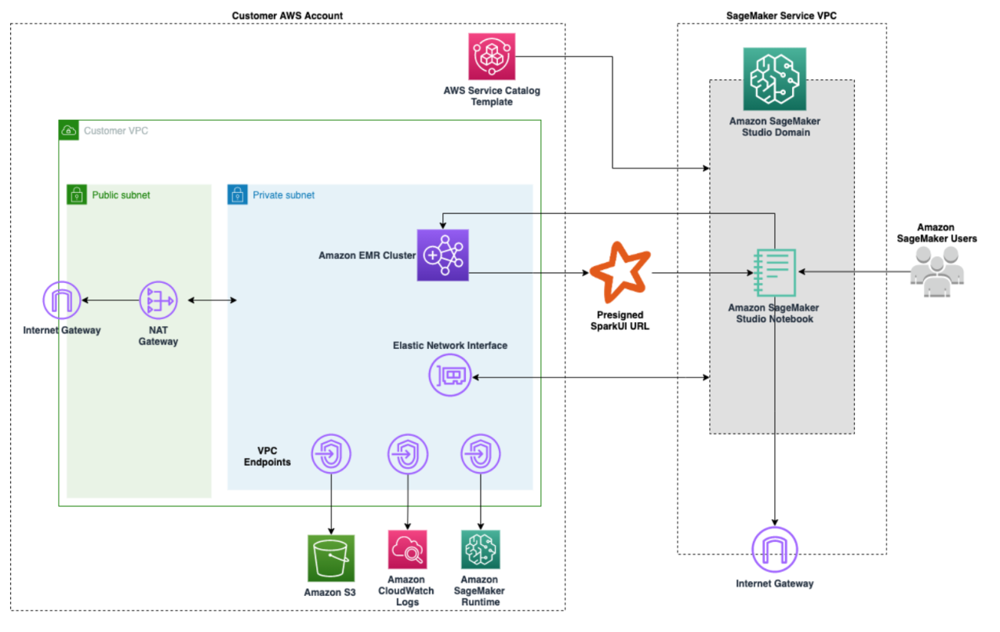

Studio and Amazon EMR are in the same VPC

If Studio or Studio Classic and Amazon EMR are in different subnets, add routes to each private
subnet route table to route the traffic between Studio or Studio Classic and the Amazon EMR
subnets. You can define those routes by going to the Route Tables section of each VPC in the VPC
dashboard. If you deployed Studio or Studio Classic and Amazon EMR in the same VPC and the
same subnet, you do not need to route the traffic between the Studio and the Amazon EMR.

Whether or not you needed to update your routing tables, the security group of your Studio or
Studio Classic domain must allow outbound traffic, and the security group of the Amazon EMR
primary node must allow inbound traffic on Apache Livy, Hive,or Presto TCP ports (respectively

8998, 10000, and 8889) from the Studio or Studio Classic instance security group. Apache Livy is a
service that enables interaction with a Amazon EMR over a REST interface.

Studio and Amazon EMR communicate over public internet

By default, Studio and Studio Classic provide a network interface that allows communication with
the internet through an internet gateway in the VPC associated with the SageMaker domain. If

Configure network access
3348

## Page 378

Amazon SageMaker AI
Developer Guide

you choose to connect to Amazon EMR through the public internet, Amazon EMR needs to accept

inbound traffic on Apache Livy, Hive,or Presto TCP ports (respectively 8998, 10000, and 8889) from
its internet gateway. Apache Livy is a service that enables interaction with Amazon EMR over a
REST interface.

Keep in mind that any port on which you allow inbound traffic represents a potential security
vulnerability. Carefully review custom security groups to ensure that you minimize vulnerabilities.

For more information, see Control network traffic with security groups.

Alternatively, see Blogs and whitepapers for a detailed walkthrough of how to enable Kerberos
on Amazon EMR, set the cluster in a private subnet, and access the cluster using a  Network Load
Balancer (NLB) to expose only specific ports, which are access-controlled via security groups.

Note

When connecting to your Apache Livy endpoint through the public internet, we
recommend that you secure communications between Studio or Studio Classic and your
Amazon EMR cluster using TLS.
For information on setting up HTTPS with Apache Livy, see Enabling HTTPS with Apache
Livy. For information on setting an Amazon EMR cluster with transit encryption enabled,
see Providing certificates for encrypting data in transit with Amazon EMR encryption.
Additionally, you need to configure Studio or Studio Classic to access your certificate key as
specified in Connect to an Amazon EMR cluster over HTTPS.

Prepare data using EMR Serverless

Beginning with SageMaker distribution image version 1.10, Amazon SageMaker Studio integrates
with EMR Serverless. Within JupyterLab notebooks in SageMaker Studio, data scientists and data
engineers can discover and connect to EMR Serverless applications, then interactively explore,
visualize, and prepare large-scale Apache Spark or Apache Hive workloads. This integration allows
to perform interactive data preprocessing at scale in preparation for ML model training and
deployment.

Specifically, the updated version of the sagemaker-studio-analytics-extension in

SageMaker AI distribution image version 1.10 leverages the integration between Apache Livy
and EMR Serverless, allowing the connection to an Apache Livy endpoint through JupyterLab
notebooks. This section assumes prior knowledge of EMR Serverless interactive applications.

Prepare data using EMR Serverless
3349

## Page 379

Amazon SageMaker AI
Developer Guide

Important

When using Studio, you can only discover and connect to EMR Serverless applications
for JupyterLab applications that are launched from private spaces. Ensure that the EMR
Serverless applications are located in the same AWS region as your Studio environment.

Prerequisites

Before you get started running interactive workloads with EMR Serverless from your JupyterLab
notebooks, make sure you meet the following prerequisites:

1. Your JupyterLab space must use a SageMaker Distribution image version 1.10 or higher.

2. Create an EMR Serverless interactive application with Amazon EMR version 6.14.0 or higher.

You can create an EMR Serverless application from the Studio user interface by following the
steps in Create EMR Serverless applications from Studio.

Note

For the simplest setup, you can create your EMR Serverless application in the Studio
UI without changing any default settings for the Virtual private cloud (VPC) option.
This allows the application to be created within your domain VPC without requiring any
networking configuration. In this case, you can skip the following networking setup step.

3. Review the networking and security requirements in Configure network access for your Amazon

EMR cluster. Specifically, ensure that you:

• Establish a VPC peering connection between your Studio account and your EMR Serverless
account.

• Add routes to the private subnet route tables in both accounts.

• Set up the security group attached to your Studio domain to allow outbound traffic, and
configure the security group of the VPC where you plan to run the EMR Serverless applications
to allow inbound TCP traffic from the Studio instance's security group.

4. To access your interactive applications on EMR Serverless and run workloads submitted from

your JupyterLab notebooks in SageMaker Studio, you must assign specific permissions and roles.
Refer to the Set up the permissions to enable listing and launching Amazon EMR applications
from SageMaker Studio section for details on the necessary roles and permissions.

Prepare data using EMR Serverless
3350

## Page 380

Amazon SageMaker AI
Developer Guide

List of topics

• Set up the permissions to enable listing and launching Amazon EMR applications from
SageMaker Studio

• Create EMR Serverless applications from Studio

• Connect to an EMR Serverless application from Studio

• Stop or delete an EMR Serverless application from the Studio UI

Set up the permissions to enable listing and launching Amazon EMR applications
from SageMaker Studio

In this section, we detail the roles and permissions required to list and connect to EMR Serverless
applications from SageMaker Studio, considering scenarios where Studio and the EMR Serverless
applications are deployed in the same AWS account or across different accounts.

The roles to which you must add the necessary permissions depend on whether Studio and your
EMR Serverless applications reside in the same AWS account (Single Account) or in separate
accounts (Cross Account). There are two types of roles involved:

• Execution roles:

• Runtime execution roles (Role-Based Access Control roles) used by EMR Serverless: These are
the IAM roles used by the EMR Serverless job execution environments to access other AWS
services and resources needed during runtime, such as Amazon S3 for data access, CloudWatch
for logging, access to the AWS Glue Data Catalog or other services based on your workload
requirements. We recommend creating these roles in the account where the EMR Serverless
applications are running.

To learn more about runtime roles, see Job runtime roles in the EMR Serverless User Guide.

Note

You can define several RBAC roles for your EMR Serverless application. These roles can
be based on the responsibilities and access levels needed by different users or groups
within your organization. For more information about RBAC permissions, see Security
best practices for Amazon Amazon EMR Serverless.

• SageMaker AI execution role: The execution role allowing SageMaker AI to perform certain
tasks like reading data from Amazon S3 buckets, writing logs to CloudWatch, and accessing

Prepare data using EMR Serverless
3351

## Page 381

Amazon SageMaker AI
Developer Guide

other AWS services that your workflow might need. The SageMaker AI execution role also has

the special permission called iam:PassRole which allows SageMaker AI to pass temporary
runtime execution roles to the EMR Serverless applications. These roles give the EMR
Serverless applications the permissions they need to interact with other AWS resources while
they are running.

• Assumable roles (Also referred to as Service Access Roles):

• These are the IAM roles that SageMaker AI's execution role can assume to perform operations
related to managing EMR Serverless applications. These roles define the permissions and
access policies required when listing, connecting to, or managing EMR Serverless applications.
They are typically used in cross-account scenarios, where the EMR Serverless applications are
located in a different AWS account than the SageMaker AI domain. Having a dedicated IAM
role for your EMR Serverless applications helps to follow the principle of least privilege and
ensures that Amazon EMR has only the required permissions to run your jobs while protecting
other resources in your AWS account.

By understanding and configuring these roles correctly, you can ensure that SageMaker Studio has
the necessary permissions to interact with EMR Serverless applications, regardless of whether they
are deployed in the same account or across different accounts.

Single account

The following diagrams illustrate the roles and permissions required to list and connect to EMR
Serverless applications from Studio when Studio and the applications are deployed in the same
AWS account.

Prepare data using EMR Serverless
3352

## Page 382

Amazon SageMaker AI
Developer Guide

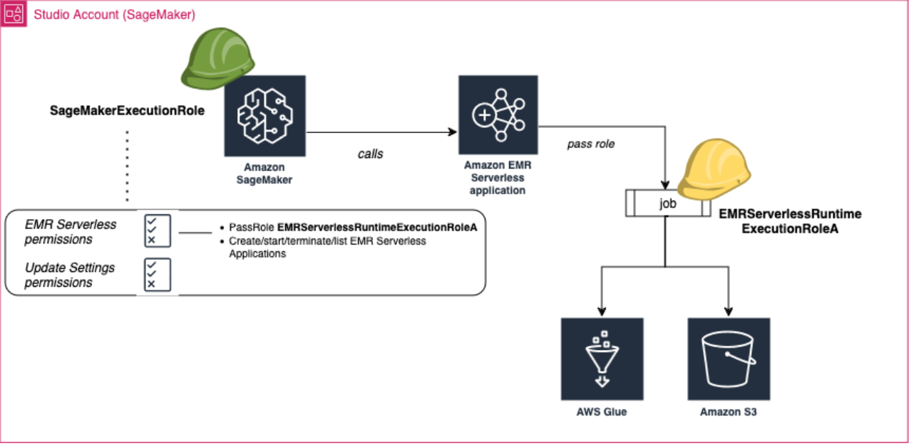

If your Amazon EMR applications and Studio are deployed in the same AWS account, follow these
steps:

1.
Step 1: Retrieve the ARN of the Amazon S3 bucket you use for data sources and output data
storage in the Amazon S3 console.

To learn about how to find a bucket by name, see Accessing and listing an Amazon S3 bucket.
For information on how to create an Amazon S3 bucket, see Creating a bucket.

2.
Step 2: Create at least one job runtime execution role for your EMR Serverless application

in your account (The EMRServerlessRuntimeExecutionRoleA in the Single account use
case diagram above). Choose Custom trust policy as the trusted entity. Add the permissions
required by your job. At a minimum, you need full access to an Amazon S3 bucket, and create
and read access to AWS Glue Data Catalog.

For detailed instructions about how to create a new runtime execution role for your EMR
Serverless applications, follow these steps:

a.
Navigate to the IAM console.

b.
In the left navigation pane, choose Policy, and then Create policy.

c.
Add the permissions required by your runtime role, name the policy, and then choose
Create policy.

Prepare data using EMR Serverless
3353

## Page 383

Amazon SageMaker AI
Developer Guide

You can refer to Job runtime roles for EMR Serverless to find sample runtime policies for
an EMR Serverless runtime role.

d.
In the left navigation pane, choose Roles and then Create role.

e.
On the Create role page, choose Custom trust policy as the trusted entity.

f.
Paste in the following JSON document in the Custom trust policy section and then
choose Next.

JSON

{
"Version":"2012-10-17",
"Statement": [
{

"Effect": "Allow",
"Principal": {
"Service": "emr-serverless.amazonaws.com"
},
"Action": "sts:AssumeRole"
}
]
}

g.
In the Add permissions page, add the policy you created and then choose Next.

h.
On the Review page, enter a name for the role such as

EMRServerlessAppRuntimeRoleA and an optional description.

i.
Review the role details and choose Create role.

With these roles, you and your teammates can connect to the same application, each using a
runtime role scoped with permissions matching your individual level of access to data.

Note

The Spark sessions operate differently. Spark sessions are isolated based on the
execution role used from Studio, so users with different execution roles will have
separate, isolated Spark sessions. Additionally, if you have enabled source identity

Prepare data using EMR Serverless
3354

## Page 384

Amazon SageMaker AI
Developer Guide

for your domain, there is further isolation of Spark sessions across different source
identities.

3.
Step 3: Retrieve the ARN of the SageMaker AI execution role used by your private space.

For information on spaces and execution roles in SageMaker AI, see Understanding domain
space permissions and execution roles.

For more information about how to retrieve the ARN of SageMaker AI's execution role, see Get
your execution role.

Note

Alternatively, users new to SageMaker AI can simplify their setup process by
automatically creating a new SageMaker AI execution role with the appropriate
permissions. In this case, skip steps 3 and 4. Instead, users can either:

• Choose the Set up for organizations option when creating a new domain from the
Domain menu in the left navigation of the  SageMaker AI console.

• Create a new execution role from the Role manager menu of the console, and then
attach the role to an existing domain or user profile.

When creating the role, choose the Run Studio EMR Serverless Applications option
in What ML activities will users perform? Then, provide the name of your Amazon S3
bucket and the job runtime execution role you want your EMR Serverless application to
use (step 2).
The SageMaker Role Manager automatically adds the necessary permissions for
running and connecting to EMR Serverless applications to the new execution role.Using
the SageMaker Role Manager, you can only assign one runtime role to your EMR
Serverless application, and the application must run in the same account where Studio
is deployed, using a runtime role created within that same account.

4.
Step 4: Attach the following permissions to the SageMaker AI execution role accessing your
EMR Serverless application.

a.
Open the IAM console at https://console.aws.amazon.com/sagemaker/.

b.
Choose Roles and then search for your execution role by name in the Search field. The
role name is the last part of the ARN, after the last forward slash (/).

Prepare data using EMR Serverless
3355

## Page 385

Amazon SageMaker AI
Developer Guide

c.
Follow the link to your role.

d.
Choose Add permissions and then Create inline policy.

e.
In the JSON tab, add the Amazon EMR Serverless permissions allowing EMR
Serverless access and operations. For details on the policy document, see EMR

Serverless policies in Reference policies. Replace the region, accountID, and passed

EMRServerlessAppRuntimeRole(s) with their actual values before copying the list of
statements to the inline policy of your role.

Note

You can include as many ARN strings of runtime roles as needed within the
permission, separating them with commas.

f.
Choose Next and then provide a Policy name.

g.
Choose Create policy.

h.
Repeat the Create inline policy step to add another inline policy granting the role
permissions to update the domains, user profiles, and spaces. For details on the

SageMakerUpdateResourcesPolicy policy document, see Domain, user profile, and

space update actions policy in Reference policies. Replace the region and accountID
with their actual values before copying the list of statements to the inline policy of your
role.

5.
Step 5:

Associate the list of runtime roles with your user profile or domain so you can visually browse
the list of roles and select the one to use when connecting to an EMR Serverless application
from JupyterLab. You can use the SageMaker AI console or the following script. Subsequently,
all your Apache Spark or Apache Hive jobs created from your notebook will access only the
data and resources permitted by the policies attached to the selected runtime role.

Important

Failure to complete this step will prevent you from connecting a JupyterLab notebook
to an EMR Serverless application.

Prepare data using EMR Serverless
3356

## Page 386

Amazon SageMaker AI
Developer Guide

SageMaker AI console

To associate your runtime roles with your user profile or domain using the SageMaker AI
console:

1.
Navigate to the SageMaker AI console at https://console.aws.amazon.com/
sagemaker/.

2.
In the left navigation pane, choose domain, and then select the domain using the
SageMaker AI execution role whose permissions you updated.

3.
• To add your runtime roles to your domain: In the App Configurations tab of the
Domain details page, navigate to the JupyterLab section.

• To add your runtime roles to your user profile: On the Domain details page, chose
the User profiles tab, select the user profile using the SageMaker AI execution role
whose permissions you updated. In the App Configurations tab, navigate to the
JupyterLab section.

4.
Choose Edit and add the ARNs of your EMR Serverless runtime execution roles.

5.
Choose Submit.

When you next connect to an EMR Serverless application via JupyterLab, the runtime roles
should appear in a drop-down menu for selection.

Python script

In a JupyterLab application started from a private space using the SageMaker AI
execution role whose permissions you updated, run the following command in a

terminal. Replace the domainID, user-profile-name, studio-accountID,

and EMRServerlessRuntimeExecutionRole(s) with their proper values.
This code snippet updates the user profile settings for a specific user profile

(client.update_user_profile) or domain settings (client.update_domain),
specifically associating the EMR Serverless runtime execution roles you previously created.

import botocore.session
import json
sess = botocore.session.get_session()
client = sess.create_client('sagemaker')

client.update_user_profile(

Prepare data using EMR Serverless
3357

## Page 387

Amazon SageMaker AI
Developer Guide

DomainId="domainID",
UserProfileName="user-profile-name",
DefaultUserSettings={
'JupyterLabAppSettings': {
'EmrSettings': {
'ExecutionRoleArns': ["arn:aws:iam::studio-
accountID:role/EMRServerlessRuntimeExecutionRoleA",
"arn:aws:iam::studio-
accountID:role/EMRServerlessRuntimeExecutionRoleAA"]
}
}
})
resp = client.describe_domain(DomainId="domainID")

resp['CreationTime'] = str(resp['CreationTime'])
resp['LastModifiedTime'] = str(resp['LastModifiedTime'])

print(json.dumps(resp, indent=2))

Cross account

The following diagrams illustrate the roles and permissions required to list and connect to EMR
Serverless applications from Studio when Studio and the applications are deployed in different
AWS accounts.

Prepare data using EMR Serverless
3358

## Page 388

Amazon SageMaker AI
Developer Guide

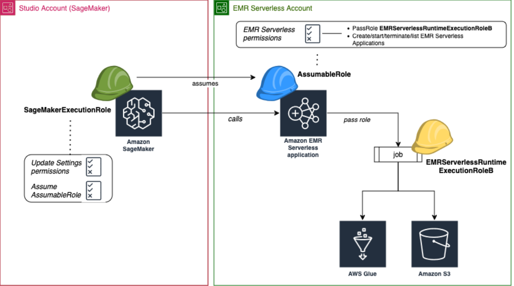

For more information about creating a role on an AWS account, see https://docs.aws.amazon.com/
IAM/latest/UserGuide/id_roles_create_for-user.html Creating an IAM role (console).

Before you get started:

• Retrieve the ARN of the SageMaker AI execution role used by your private space. For information
on spaces and execution roles in SageMaker AI, see Understanding domain space permissions
and execution roles. For more information about how to retrieve the ARN of SageMaker AI's
execution role, see Get your execution role.

• Retrieve the ARN of the Amazon S3 bucket you will use for data sources and output data storage
in the Amazon S3 console.

For information on how to create an Amazon S3 bucket, see Creating a bucket. To learn about
how to find a bucket by name, see Accessing and listing an Amazon S3 bucket.

If your EMR Serverless applications and Studio are deployed in separate AWS accounts, you
configure the permissions on both accounts.

Prepare data using EMR Serverless
3359

## Page 389

Amazon SageMaker AI
Developer Guide

On the EMR Serverless account

Follow these steps to create the necessary roles and policies on the account where your EMR
Serverless application is running, also referred to as the trusting account:

1.
Step 1: Create at least one job runtime execution role for your EMR Serverless application in

your account (The EMRServerlessRuntimeExecutionRoleB in the Cross account diagram
above). Choose Custom trust policy as the trusted entity. Add the permissions required by
your job. At a minimum, you need full access to an Amazon S3 bucket, and create and read
access to AWS Glue Data Catalog.

For detailed instructions on how to create a new runtime execution role for your EMR
Serverless applications, follow these steps:

a.
Navigate to the IAM console.

b.
In the left navigation pane, choose Policy, and then Create policy.

c.
Add the permissions required by your runtime role, name the policy, and then choose
Create policy.

For sample runtime policies of an EMR Serverless runtime role, see Job runtime roles for
Amazon EMR Serverless.

d.
In the left navigation pane, choose Roles and then Create role.

e.
On the Create role page, choose Custom trust policy as the trusted entity.

f.
Paste in the following JSON document in the Custom trust policy section and then
choose Next.

JSON

{
"Version":"2012-10-17",
"Statement": [
{
"Effect": "Allow",
"Principal": {
"Service": "emr-serverless.amazonaws.com"
},
"Action": "sts:AssumeRole"
}
]

Prepare data using EMR Serverless
3360

## Page 390

Amazon SageMaker AI
Developer Guide

}

g.
In the Add permissions page, add the policy you created and then choose Next.

h.
On the Review page, enter a name for the role such as

EMRServerlessAppRuntimeRoleB and an optional description.

i.
Review the role details and choose Create role.

With these roles, you and your teammates can connect to the same application, each using a
runtime role scoped with permissions matching your individual level of access to data.

Note

The Spark sessions operate differently.Spark sessions are isolated based on the
execution role used from Studio, so users with different execution roles will have
separate, isolated Spark sessions. Additionally, if you have enabled source identity
for your domain, there is further isolation of Spark sessions across different source
identities.

2.
Step 2: Create a custom IAM role named AssumableRole with the following configuration:

• Permissions: Grant the necessary permissions (Amazon EMR Serverless policies) to the

AssumableRole to allow accessing EMR Serverless resources. This role is also known as an
Access role.

• Trust relationship: Configure the trust policy for the AssumableRole to allow assuming the

execution role (The SageMakerExecutionRole in the cross-account diagram) from the
Studio account that requires access.

By assuming the role, Studio can gain temporary access to the permissions it needs in the EMR
Serverless account.

For detailed instructions on how to create a new AssumableRole in your EMR Serverless AWS
account, follow these steps:

a.
Navigate to the IAM console.

b.
In the left navigation pane, choose Policy, and then Create policy.

c.
In the JSON tab, add the Amazon EMR Serverless permissions allowing EMR
Serverless access and operations. For details on the policy document, see EMR

Prepare data using EMR Serverless
3361

## Page 391

Amazon SageMaker AI
Developer Guide

Serverless policies in Reference policies. Replace the region, accountID, and passed

EMRServerlessAppRuntimeRole(s) with their actual values before copying the list of

statements to the inline policy of your role.

Note

The EMRServerlessAppRuntimeRole here is the job runtime execution role

created in Step 1 (The EMRServerlessAppRuntimeRoleB in the Cross account
diagram above). You can include as many ARN strings of runtime roles as needed
within the permission, separating them with commas.

d.
Choose Next and then provide a Policy name.

e.
Choose Create policy.

f.
In the left navigation pane, choose Roles and then Create role.

g.
On the Create role page, choose Custom trust policy as the trusted entity.

h.
Paste in the following JSON document in the Custom trust policy section and then
choose Next.

Replace studio-account with the Studio account ID, and AmazonSageMaker-

ExecutionRole with the execution role used by your JupyterLab space.

JSON

{
"Version":"2012-10-17",
"Statement": [
{
"Effect": "Allow",
"Principal": {
"AWS": "arn:aws:iam::111122223333:role/service-
role/AmazonSageMaker-ExecutionRole"
},
"Action": "sts:AssumeRole"
}
]
}

i.
In the Add permissions page, add the permission EMRServerlessAppRuntimeRoleB
you created in Step 2 and then choose Next.

Prepare data using EMR Serverless
3362

## Page 392

Amazon SageMaker AI
Developer Guide

j.
On the Review page, enter a name for the role such as AssumableRole and an optional
description.

k.
Review the role details and choose Create role.

For more information about creating a role on an AWS account, see Creating an IAM role
(console).

On the Studio account

On the account where Studio is deployed, also referred to as the trusted account, update the
SageMaker AI execution role accessing your EMR Serverless applications with the required
permissions to access resources in the trusting account.

1.
Step 1: Retrieve the ARN of the SageMaker AI execution role used by your space.

For information on spaces and execution roles in SageMaker AI, see Understanding domain
space permissions and execution roles.

For more information about how to retrieve the ARN of SageMaker AI's execution role, see Get
your execution role.

2.
Step 2: Attach the following permissions to the SageMaker AI execution role accessing your
EMR Serverless application.

a.
Open the IAM console at https://console.aws.amazon.com/iam/.

b.
Choose Roles and then search for your execution role by name in the Search field. The
role name is the last part of the ARN, after the last forward slash (/).

c.
Follow the link to your role.

d.
Choose Add permissions and then Create inline policy.

e.
In the JSON tab, add the inline policy granting the role permissions
to update the domains, user profiles, and spaces. For details on the

SageMakerUpdateResourcesPolicy policy document, see Domain, user profile, and

space update actions policy in Reference policies. Replace the region and accountID
with their actual values before copying the list of statements to the inline policy of your
role.

f.
Choose Next and then provide a Policy name.

g.
Choose Create policy.

Prepare data using EMR Serverless
3363

## Page 393

Amazon SageMaker AI
Developer Guide

h.
Repeat the Create inline policy step to add another policy granting the execution role the

permissions to assume the AssumableRole and then perform actions permitted by the
role's access policy.

Replace emr-account with the Amazon EMR Serverless account ID, and AssumableRole
with the name of the assumable role created in the Amazon EMR Serverless account.

JSON

{
"Version":"2012-10-17",
"Statement": {
"Sid": "AllowSTSToAssumeAssumableRole",
"Effect": "Allow",
"Action": "sts:AssumeRole",

"Resource": "arn:aws:iam::111122223333:role/AssumableRole"
}
}

3.
Step 3:

Associate the list of runtime roles with your domain or user profile so you can visually browse
the list of roles and select the one to use when connecting to an EMR Serverless application
from JupyterLab. You can use the SageMaker AI console or the following script. Subsequently,
all your Apache Spark or Apache Hive jobs created from your notebook will access only the
data and resources permitted by the policies attached to the selected runtime role.

Important

Failure to complete this step will prevent you from connecting a JupyterLab notebook
to an EMR Serverless application.

SageMaker AI console

To associate your runtime roles with your user profile or domain using the SageMaker AI
console:

Prepare data using EMR Serverless
3364

## Page 394

Amazon SageMaker AI
Developer Guide

1.
Navigate to the SageMaker AI console at https://console.aws.amazon.com/
sagemaker/.

2.
In the left navigation pane, choose domain, and then select the domain using the
SageMaker AI execution role whose permissions you updated.

3.
• To add your runtime roles to your domain: In the App Configurations tab of the
Domain details page, navigate to the JupyterLab section.

• To add your runtime roles to your user profile: On the Domain details page, chose
the User profiles tab, select the user profile using the SageMaker AI execution role
whose permissions you updated. In the App Configurations tab, navigate to the
JupyterLab section.

4.
Choose Edit and add the ARNs of your assumable role and EMR Serverless runtime
execution roles.

5.
Choose Submit.

When you next connect to an EMR Serverless application via JupyterLab, the runtime roles
should appear in a drop-down menu for selection.

Python script

In a JupyterLab application started from a private space using the SageMaker AI
execution role whose permissions you updated, run the following command in a

terminal. Replace the domainID, user-profile-name, studio-accountID,

and EMRServerlessRuntimeExecutionRole with their proper values.
This code snippet updates the user profile settings for a specific user profile

(client.update_user_profile) or domain settings (client.update_domain) within
a SageMaker AI domain. Specifically, it sets the runtime execution roles for Amazon EMR
Serverless, which you have previously created. It also allows the JupyterLab application to

assume a particular IAM role (AssumableRole) for running EMR Serverless applications
within the Amazon EMR account.

import botocore.session
import json
sess = botocore.session.get_session()
client = sess.create_client('sagemaker')

client.update_user_profile(
DomainId="domainID",

Prepare data using EMR Serverless
3365

## Page 395

Amazon SageMaker AI
Developer Guide

UserProfileName="user-profile-name",
DefaultUserSettings={
'JupyterLabAppSettings': {
'EmrSettings': {
'AssumableRoleArns': ["arn:aws:iam::emr-
accountID:role/AssumableRole"],
'ExecutionRoleArns': ["arn:aws:iam::emr-
accountID:role/EMRServerlessRuntimeExecutionRoleA",
"arn:aws:iam::emr-
accountID:role/AnotherRuntimeExecutionRole"]
}
}
})
resp = client.describe_user_profile(DomainId="domainID", UserProfileName=user-
profile-name")

resp['CreationTime'] = str(resp['CreationTime'])
resp['LastModifiedTime'] = str(resp['LastModifiedTime'])
print(json.dumps(resp, indent=2))

Reference policies

• EMR Serverless policies: This policy allows managing EMR Serverless applications, including
listing, creating (with required SageMaker AI tags), starting, stopping, getting details, deleting,
accessing Livy endpoints, and getting job run dashboards. It also allows passing the required
EMR Serverless application runtime role to the service.

• EMRServerlessListApplications: Allows the ListApplications action on all EMR
Serverless resources in the specified region and AWS account.

• EMRServerlessPassRole: Allows passing the specified runtime role(s) in the provided AWS

account, but only when the role is being passed to the emr-serverless.amazonaws.com

service.

• EMRServerlessCreateApplicationAction: Allows the CreateApplication and
TagResource actions on EMR Serverless resources in he specified region and AWS account.
However, it requires that the resources being created or tagged have specific tag keys

(sagemaker:domain-arn, sagemaker:user-profile-arn, and sagemaker:space-arn)
present with non-null values.

Prepare data using EMR Serverless
3366

## Page 396

Amazon SageMaker AI
Developer Guide

• EMRServerlessDenyTaggingAction: The TagResource and UntagResource actions on EMR
Serverless resources in the specified region and AWS account if the resources do not have any

of the specified tag keys (sagemaker:domain-arn, sagemaker:user-profile-arn, and

sagemaker:space-arn) set.

• EMRServerlessActions: Allows various actions (StartApplication, StopApplication,

GetApplication, DeleteApplication, AccessLivyEndpoints, and

GetDashboardForJobRun) on EMR Serverless resources, but only if the resources have

the specified tag keys (sagemaker:domain-arn, sagemaker:user-profile-arn, and

sagemaker:space-arn) set with non-null values.

The IAM policy defined in the provided JSON document grants those permissions, but limits
that access to the presence of specific SageMaker AI tags on the EMR Serverless applications to
ensure that only Amazon EMR Serverless resources associated with a particular SageMaker AI
domain, user profile, and space can be managed.

JSON

{
"Version":"2012-10-17",
"Statement": [
{
"Sid": "EMRServerlessListApplications",
"Effect": "Allow",
"Action": [
"emr-serverless:ListApplications"
],
"Resource": "arn:aws:emr-serverless:us-east-1:111122223333:/*"
},
{
"Sid": "EMRServerlessPassRole",
"Effect": "Allow",
"Action": "iam:PassRole",
"Resource":
"arn:aws:iam::111122223333:role/EMRServerlessAppRuntimeRole",
"Condition": {
"StringLike": {
"iam:PassedToService": "emr-serverless.amazonaws.com"
}
}
},
{

Prepare data using EMR Serverless
3367

## Page 397

Amazon SageMaker AI
Developer Guide

"Sid": "EMRServerlessCreateApplicationAction",
"Effect": "Allow",
"Action": [
"emr-serverless:CreateApplication",
"emr-serverless:TagResource"
],
"Resource": "arn:aws:emr-serverless:us-east-1:111122223333:/*",
"Condition": {
"ForAllValues:StringEquals": {
"aws:TagKeys": [
"sagemaker:domain-arn",
"sagemaker:user-profile-arn",
"sagemaker:space-arn"
]
},
"Null": {
"aws:RequestTag/sagemaker:domain-arn": "false",

"aws:RequestTag/sagemaker:user-profile-arn": "false",
"aws:RequestTag/sagemaker:space-arn": "false"
}
}
},
{
"Sid": "EMRServerlessDenyTaggingAction",
"Effect": "Deny",
"Action": [
"emr-serverless:TagResource",
"emr-serverless:UntagResource"
],
"Resource": "arn:aws:emr-serverless:us-east-1:111122223333:/*",
"Condition": {
"Null": {
"aws:ResourceTag/sagemaker:domain-arn": "true",
"aws:ResourceTag/sagemaker:user-profile-arn": "true",
"aws:ResourceTag/sagemaker:space-arn": "true"
}
}
},
{
"Sid": "EMRServerlessActions",
"Effect": "Allow",
"Action": [
"emr-serverless:StartApplication",
"emr-serverless:StopApplication",

Prepare data using EMR Serverless
3368

## Page 398

Amazon SageMaker AI
Developer Guide

"emr-serverless:GetApplication",
"emr-serverless:DeleteApplication",
"emr-serverless:AccessLivyEndpoints",
"emr-serverless:GetDashboardForJobRun"
],
"Resource": "arn:aws:emr-serverless:us-east-1:111122223333:/
applications/*",
"Condition": {
"Null": {
"aws:ResourceTag/sagemaker:domain-arn": "false",
"aws:ResourceTag/sagemaker:user-profile-arn": "false",
"aws:ResourceTag/sagemaker:space-arn": "false"
}
}
}
]
}

• Domain, user profile, and space update actions policy : The following policy grants permissions
to update SageMaker AI domains, user profiles, and spaces within the specified region and AWS
account.

JSON

{
"Version":"2012-10-17",
"Statement": [
{
"Sid": "SageMakerUpdateResourcesPolicy",
"Effect": "Allow",
"Action": [
"sagemaker:UpdateDomain",
"sagemaker:UpdateUserprofile",
"sagemaker:UpdateSpace"
],
"Resource": [
"arn:aws:sagemaker:us-east-1:111122223333:domain/*",
"arn:aws:sagemaker:us-east-1:111122223333:user-profile/*"
]
}
]
}

Prepare data using EMR Serverless
3369

## Page 399

Amazon SageMaker AI
Developer Guide

Create EMR Serverless applications from Studio

Data scientists and data engineers can create EMR Serverless applications directly from the Studio
user interface. Before you begin, ensure that you have configured the necessary permissions as
described in the Set up the permissions to enable listing and launching Amazon EMR applications
from SageMaker Studio section. These permissions grant Studio the ability to create, start, view,
access, and terminate the applications.

To create an EMR Serverless application from Studio:

1.
In the Studio UI, navigate to the left-side panel and select the Data node in the left navigation
menu. Then, scroll and choose the Amazon EMR applications and clusters option. This opens
up a page that displays the Amazon EMR applications that you can access from within the
Studio environment, under the Serverless applications tab.

2.
Choose the Create serverless application button at the top right corner. This opens a Create
application page resembling the view you would see in the EMR Serverless console when
choosing to Use custom settings in the application setup options.

3.
Provide the necessary details for your application, including a name and any specific
configurable parameters you wish to set, then choose Create application.

Prepare data using EMR Serverless
3370

## Page 400

Amazon SageMaker AI
Developer Guide

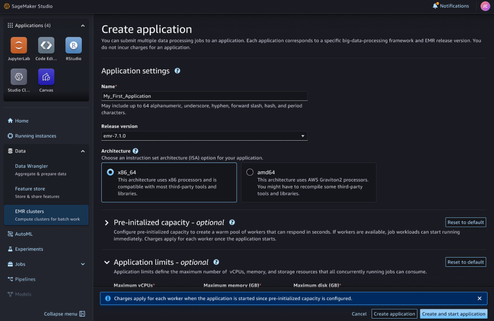

All configuration settings have default values and are optional to modify. For detailed
information on each available parameter, see Configuring an application in the EMR Serverless
user guide.

Note

• During the application creation process in the Studio UI, you have the option to
either Create application or Create and start application. Based on your choice, the

application will enter either the Creating or Starting state respectively.

If you opt to create the application without immediately starting it, make sure the
Automatically start application on job submission option remains selected. This

will ensure that the application automatically transitions to the Starting state
when you later submit a job to run on it.

• For the simplest setup, we recommend leaving the Virtual private cloud (VPC)
option set to its default value of No network connectivity to resources in your VPC

Prepare data using EMR Serverless
3371

## Page 401

Amazon SageMaker AI
Developer Guide

under the Network connections section. This allows the application to be created
within your domain VPC without requiring any additional networking configuration.

In any other case, ensure that you perform the following steps:

• Peer your VPCs.

• Add routes to your private subnet route tables.

• Configure your security groups as detailed in Configure network access for your
Amazon EMR cluster.

This ensures the proper networking setup for your application, beyond the default
No network connectivity option.

• For applications created from the Studio Classic UI, the following configuration is
automatically applied:

• An enabled Apache Livy endpoint.

• The application is tagged with the following:

• sagemaker:user-profile-arn

• sagemaker:domain-arn

• sagemaker:space-arn

If you create an application outside of Studio, ensure that you manually enable the
Apache Livy endpoint and apply the same set of tags to the application.

Once the application is created, the Studio Classic UI displays a The application has been
successfully created message and the new application appears in the list of Serverless applications.

To connect to your EMR Serverless application, see Connect to an EMR Serverless application from
Studio

Connect to an EMR Serverless application from Studio

Data scientists and data engineers can discover and then connect to an EMR Serverless application
directly from the Studio user interface. Before you begin, ensure that you have created an EMR
Serverless application by following the instructions in the section called “Create EMR Serverless
applications”.

Prepare data using EMR Serverless
3372

## Page 402

Amazon SageMaker AI
Developer Guide

You can connect an EMR Serverless application to a new JupyterLab notebook directly from the
Studio UI, or choose to initiate the connection in a notebook of a running JupyterLab application.

Important

When using Studio, you can only discover and connect to EMR Serverless applications
for JupyterLab applications that are launched from private spaces. Ensure that the EMR
Serverless applications are located in the same AWS region as your Studio environment.

Your JupyterLab space must use a SageMaker Distribution image version 1.10 or higher.

To connect an EMR Serverless application to a new JupyterLab notebook from the Studio UI:

1.
In the Studio UI, navigate to the left-side panel and select the Data node in the left navigation

menu. Then, scroll and choose the Amazon EMR applications and clusters option. This opens
up a page that displays the Amazon EMR applications that you can access from within the
Studio environment, under the Serverless applications tab.

Note

If you or your administrator have configured the permissions to allow cross-account
access to EMR Serverless applications, you can view a consolidated list of applications
across all accounts that you have granted access to Studio.

2.
Select an EMR Serverless application you want to connect to a new notebook, and then choose
Attach to notebook. This opens up a modal window displaying the list of your JupyterLab
spaces.

3.
• Select the private space from which you want to launch a JupyterLab application, and then
choose Open notebook. This launches a JupyterLab application from your chosen space and
opens a new notebook.

• Alternatively, you can create a new private space by choosing the Create new space button
at the top of the modal window. Enter a name for your space and then choose Create space
and open notebook. This creates a private space with the default instance type and latest
SageMaker distribution image available, launches a JupyterLab application, and opens a new
notebook.

Prepare data using EMR Serverless
3373

## Page 403

Amazon SageMaker AI
Developer Guide

4.
Choose the name of the IAM runtime execution role that your EMR Serverless application can
assume for the job run. Upon selection, a connection command populates the first cell of your
notebook and initiates the connection with the EMR Serverless application.

Important

To successfully connect a JupyterLab notebook to an EMR Serverless application,
you must first associate the list of runtime roles with your domain or user profile, as
outlined in the section called “Set up permissions”. Failing to complete this step will
prevent you from establishing the connection.

Once the connection succeeds, a message confirms the connection, starts your EMR Serverless
application, and initiates your Spark session.

Note

When you connect to an EMR Serverless application, its status transitions from either

Stopped or Created to Started.

Alternatively, you can connect to a cluster from a JupyterLab notebook.

1.
Choose the Cluster button at the top right of your notebook. This opens a modal window
listing the EMR Serverless applications that you can access. You can see the applications in the
Serverless applications tab.

2.
Select the application to which you want to connect, then choose Connect.

3.
EMR Serverless supports runtime IAM roles that were preloaded when setting the required
permissions as outlined in the section called “Set up permissions”. Failing to complete this step
will prevent you from establishing the connection.

You can select your role from the Amazon EMR execution role drop down menu. When you
connect to an EMR Serverless, Studio adds a code block to an active cell of your notebook to
establish the connection.

4.
An active cell populates and runs. This cell contains the connection magic command to
connect your notebook to your application.

Prepare data using EMR Serverless
3374

## Page 404

Amazon SageMaker AI
Developer Guide

Once the connection succeeds, a message confirms the connection and the start of the Spark
application. You can begin submitting your data processing jobs to your EMR Serverless
application.

Stop or delete an EMR Serverless application from the Studio UI

You can stop (transition to the Stopped state) or delete (transition to the Deleted state) an EMR
Serverless application from the list of applications in the Studio UI.

To stop or delete an application, navigate to the list of available EMR Serverless applications.

1.
In the Studio UI, navigate to the left-side panel and select the Data node in the left navigation
menu. Then, scroll and choose the Amazon EMR applications and clusters option. This opens
up a page that displays the Amazon EMR applications that you can access from within the
Studio environment, under the Serverless applications tab.

2.
Select the name of the application that you want to stop or delete, and then choose the
corresponding Stop or Delete button.

3.
A confirmation message informs you that any pending job will be lost permanently.

Data preparation using Amazon EMR

Important

Amazon SageMaker Studio and Amazon SageMaker Studio Classic are two of the machine
learning environments that you can use to interact with SageMaker AI.
If your domain was created after November 30, 2023, Studio is your default experience.
If your domain was created before November 30, 2023, Amazon SageMaker Studio Classic
is your default experience. To use Studio if Amazon SageMaker Studio Classic is your
default experience, see Migration from Amazon SageMaker Studio Classic.
When you migrate from Amazon SageMaker Studio Classic to Amazon SageMaker Studio,
there is no loss in feature availability. Studio Classic also exists as an application within
Amazon SageMaker Studio to help you run your legacy machine learning workflows.

Amazon SageMaker Studio and Studio Classic come with built-in integration with Amazon EMR.
Within JupyterLab and Studio Classic notebooks, data scientists and data engineers can discover

Data preparation using Amazon EMR
3375

## Page 405

Amazon SageMaker AI
Developer Guide

and connect to existing Amazon EMR clusters, then interactively explore, visualize, and prepare
large-scale data for machine learning using Apache Spark, Apache Hive, or Presto. With a single
click, they can access the Spark UI to monitor the status and metrics of their Spark jobs without
leaving their notebook.

Administrators can create CloudFormation templates that define Amazon EMR clusters. They can
then make those cluster templates available in the AWS Service Catalog for Studio and Studio
Classic users to launch. Data scientists can then choose a predefined template to self-provision
an Amazon EMR cluster directly from their Studio environment. Administrators can further
parameterize the templates to let users choose aspects of the cluster within predefined values. For
example, users may want to specify the number of core nodes or select the instance type of a node
from a dropdown menu.

Using CloudFormation, administrators can control the organizational, security, and networking
setup of Amazon EMR clusters. Data scientists and data engineers can then customize those
templates for their workloads to create on-demand Amazon EMR clusters directly from Studio
and Studio Classic without setting up complex configurations. Users can terminate Amazon EMR
clusters after use.

• If you are an administrator:

Ensure that you have enabled communication between Studio or Studio Classic and Amazon EMR
clusters. For instructions, see the Configure network access for your Amazon EMR cluster section.
Once this communication is enabled, you can:

• Configure Amazon EMR CloudFormation templates in the Service Catalog

• Configure listing Amazon EMR clusters

• If you are a data scientist or data engineer, you can:

• Launch an Amazon EMR cluster from Studio or Studio Classic

• List Amazon EMR clusters from Studio or Studio Classic

• Connect to an Amazon EMR cluster from SageMaker Studio or Studio Classic

• Terminate an Amazon EMR cluster from Studio or Studio Classic

• Access Spark UI from Studio or Studio Classic

List of topics

• Quickstart: Create a SageMaker AI sandbox domain to launch Amazon EMR clusters in Studio

• Admin guide

Data preparation using Amazon EMR
3376

## Page 406

Amazon SageMaker AI
Developer Guide

• User guide

• Blogs and whitepapers

• Troubleshooting

Quickstart: Create a SageMaker AI sandbox domain to launch Amazon EMR
clusters in Studio

This section walks you through the quick set up of a complete test environment in Amazon
SageMaker Studio. You will be creating a new Studio domain that lets users launch new Amazon
EMR clusters directly from Studio. The steps provide an example notebook that you can connect
to an Amazon EMR cluster to start running Spark workloads. Using this notebook, you will build a
Retrieval Augmented Generation System (RAG) using Amazon EMR Spark distributed processing
and OpenSearch vector database.

Note

To get started, sign in to the AWS Management Console using an AWS Identity and Access
Management (IAM) user account with admin permissions. For information on how to sign
up for an AWS account and create a user with administrative access, see the section called
“Complete Amazon SageMaker AI prerequisites”.

To set up your Studio test environment and start running Spark jobs:

• Step 1: Create a SageMaker AI domain for launching Amazon EMR clusters in Studio

• Step 2: Launch a new Amazon EMR cluster from Studio UI

• Step 3: Connect a JupyterLab notebook to the Amazon EMR cluster

• Step 4: Clean up your CloudFormation stack

Step 1: Create a SageMaker AI domain for launching Amazon EMR clusters in Studio

In the following steps, you apply a CloudFormation stack to automatically create a new SageMaker
AI domain. The stack also creates a user profile and configures the needed environment and
permissions. The SageMaker AI domain is configured to let you directly launch Amazon EMR
clusters from Studio. For this example, the Amazon EMR clusters are created in the same AWS
account as SageMaker AI without authentication. You can find additional CloudFormation stacks
supporting various authentication methods like Kerberos in the getting_started GitHub repository.

Data preparation using Amazon EMR
3377

## Page 407

Amazon SageMaker AI
Developer Guide

Note

SageMaker AI allows 5 Studio domains per AWS account and AWS Region by default.
Ensure your account has no more than 4 domains in your region before you create your
stack.

Follow these steps to set up a SageMaker AI domain for launching Amazon EMR clusters from
Studio.

1.
Download the raw file of this CloudFormation template from the sagemaker-studio-emr
GitHub repository.

2.
Go to the CloudFormation console: https://console.aws.amazon.com/cloudformation

3.
Choose Create stack and select With new resources (standard) from the drop down menu.

4.
In Step 1:

a.
In the Prepare template section, select Choose an existing template.

b.
In the Specify template section, choose Upload a template file.

c.
Upload the downloaded CloudFormation template and choose Next.

5.
In Step 2, enter a Stack name and a SageMakerDomainName then choose Next.

6.
In Step 3, keep all default values and choose Next.

7.
In Step 4, check the box to acknowledge resource creation and choose Create stack. This
creates a Studio domain in your account and region.

Step 2: Launch a new Amazon EMR cluster from Studio UI

In the following steps, you create a new Amazon EMR cluster from the Studio UI.

1.
Go to the SageMaker AI console at https://console.aws.amazon.com/sagemaker/ and choose
Domains in the left menu.

2.
Click on your domain name GenerativeAIDomain to open the Domain details page.

3.
Launch Studio from the user profile genai-user.

4.
In the left navigation pane, go to Data then Amazon EMR Clusters.

5.
On the Amazon EMR clusters page, choose Create. Select the template SageMaker Studio
Domain No Auth EMR created by the CloudFormation stack and then choose Next.

Data preparation using Amazon EMR
3378

## Page 408

Amazon SageMaker AI
Developer Guide

6.
Enter a name for the new Amazon EMR cluster. Optionally update other parameters such as
the instance type of core and master nodes, idle timeout, or number of core nodes.

7.
Choose Create resource to launch the new Amazon EMR cluster.

After creating the Amazon EMR cluster, follow the status on the EMR Clusters page. When the

status changes to Running/Waiting, your Amazon EMR cluster is ready to use in Studio.

Step 3: Connect a JupyterLab notebook to the Amazon EMR cluster

In the following steps, you connect a notebook in JupyterLab to your running Amazon EMR cluster.
For this example, you import a notebook allowing you to build a Retrieval Augmented Generation
(RAG) system using Amazon EMR Spark distributed processing and OpenSearch vector database.

1.
Launch JupyterLab

From Studio, launch the JupyterLab application.

2.
Create a private space

If you have not created a space for your JupyterLab application, choose Create a JupyterLab
space. Enter a name for the space, and keep the space as Private. Leave all other settings at
their default values, and then choose Create space.

Otherwise, run your JupyterLab space to launch a JupyterLab application.

3.
Deploy your LLM and embedding models for inference

• From the top menu, choose File, New, and then Terminal.

• In the terminal, run the following command.

wget --no-check-certificate https://raw.githubusercontent.com/
aws-samples/sagemaker-studio-foundation-models/main/lab-00-setup/
Lab_0_Warm_Up_Deploy_EmbeddingModel_Llama2_on_Nvidia.ipynb
mkdir AWSGuides
cd AWSGuides
wget --no-check-certificate https://raw.githubusercontent.com/aws-
samples/sagemaker-studio-foundation-models/main/lab-03-rag/AWSGuides/
AmazonSageMakerDeveloperGuide.pdf
wget --no-check-certificate https://raw.githubusercontent.com/aws-
samples/sagemaker-studio-foundation-models/main/lab-03-rag/AWSGuides/
EC2DeveloperGuide.pdf

Data preparation using Amazon EMR
3379

## Page 409

Amazon SageMaker AI
Developer Guide

wget --no-check-certificate https://raw.githubusercontent.com/aws-samples/
sagemaker-studio-foundation-models/main/lab-03-rag/AWSGuides/S3DeveloperGuide.pdf

This retrieves the the

Lab_0_Warm_Up_Deploy_EmbeddingModel_Llama2_on_Nvidia.ipynb notebook to

your local directory and downloads three PDF files into a local AWSGuides folder.

• Open lab-00-setup/

Lab_0_Warm_Up_Deploy_EmbeddingModel_Llama2_on_Nvidia.ipynb, keep the

Python 3 (ipykernel) kernel, and run each cell.

Warning

In the Llama 2 License Agreement section, ensure to accept the Llama2 EULA
before you continue.

The notebook deploys two models, Llama 2 and all-MiniLM-L6-v2 Models, on

ml.g5.2xlarge for inference.

The deployment of the models and the creation of the endpoints may take some time.

4.
Open your main notebook

In JupyterLab, open your terminal and run the following command.

cd ..
wget --no-check-certificate https://raw.githubusercontent.com/
aws-samples/sagemaker-studio-foundation-models/main/lab-03-rag/
Lab_3_RAG_on_SageMaker_Studio_using_EMR.ipynb

You should see the additional Lab_3_RAG_on_SageMaker_Studio_using_EMR.ipynb
notebook in the left panel of JupyterLab.

5.
Choose a PySpark kernel

Open your Lab_3_RAG_on_SageMaker_Studio_using_EMR.ipynb notebook and ensure

that you are using the SparkMagic PySpark kernel. You can switch kernel at the top right of
your notebook. Choose the current kernel name to open up a kernel selection modal, and then

choose SparkMagic PySpark.

Data preparation using Amazon EMR
3380

## Page 410

Amazon SageMaker AI
Developer Guide

6.
Connect your notebook to the cluster

a.
At the top right of your notebook, choose Cluster. This action opens a modal window that
lists all of the running clusters that you have permission to access.

b.
Select your cluster then choose Connect. A new credential type selection modal window
opens up.

c.
Choose No credential and then Connect.

d.
A notebook cell automatically populates and runs. The notebook cell loads the

sagemaker_studio_analytics_extension.magics extension, which provides

functionality to connect to the Amazon EMR cluster. It then uses the %sm_analytics
magic command to initiate the connection to your Amazon EMR cluster and the Spark
application.

Note

Ensure that the connection string to your Amazon EMR cluster has an

authentication type set to None. This is illustrated by the value --auth-type

None in the following example. You can modify the field if necessary.

%load_ext sagemaker_studio_analytics_extension.magics
%sm_analytics emr connect --verify-certificate False --cluster-id your-
cluster-id --auth-type None --language python

e.
Once you successfully establish the connection, your connection cell output message

should display your SparkSession details including your cluster ID, YARN application ID,
and a link to the Spark UI to monitor your Spark jobs.

You are ready to use the Lab_3_RAG_on_SageMaker_Studio_using_EMR.ipynb notebook.
This example notebook runs distributed PySpark workloads for building a RAG system using
LangChain and OpenSearch.

Data preparation using Amazon EMR
3381

## Page 411

Amazon SageMaker AI
Developer Guide

Step 4: Clean up your CloudFormation stack

After you are finished, make sure to terminate your two endpoints and delete your CloudFormation
stack to prevent continued charges. Deleting the stack cleans up all the resources that were
provisioned by the stack.

To delete your CloudFormation stack when you are done with it

1.
Go to the CloudFormation console: https://console.aws.amazon.com/cloudformation

2.
Select the stack you want to delete. You can search for it by name or find it in the list of stacks.

3.
Click the Delete button to finalize deleting the stack and then Delete again to acknowledge
that this will delete all resources created by the stack.

Wait for the stack deletion to complete. This can take a few minutes. CloudFormation
automatically cleans up all resources defined in the stack template.

4.
Verify that all resources created by the stack have been deleted. For example, check for any
leftover Amazon EMR cluster.

To remove the API endpoints for a model

1.
Go to the SageMaker AI console: https://console.aws.amazon.com/sagemaker/.

2.
In the left navigation pane, choose Inference and then Endpoints.

3.
Select the endpoint hf-allminil6v2-embedding-ep and then choose Delete in the

Actions drop down list. Repeat the step for the endpoint meta-llama2-7b-chat-tg-ep.

Admin guide

This section provides prerequisites, networking instructions for allowing the communication
between Studio or Studio Classic and Amazon EMR clusters. It covers different deployment
scenarios - when Studio and Amazon EMR are provisioned within private Amazon VPCs without
public internet access, as well as when they need to communicate over the internet.

It walks through how administrators can use the AWS Service Catalog to make CloudFormation
templates available to Studio, allowing data scientists to discover and self-provision Amazon EMR
clusters directly from within Studio. This involves creating a Service Catalog portfolio, granting
requisite permissions, referencing the Amazon EMR templates, and parameterizing them to enable
customizations during cluster creation.

Data preparation using Amazon EMR
3382

## Page 412

Amazon SageMaker AI
Developer Guide

Last, it provides guidance on configuring discoverability of existing running Amazon EMR clusters
from Studio, and Studio Classic, covering single account and cross-account access scenarios along
with the necessary IAM permissions.

Topics

• Configure Amazon EMR CloudFormation templates in the Service Catalog

• Configure listing Amazon EMR clusters

• Configure IAM runtime roles for Amazon EMR cluster access in Studio

• Reference policies

Configure Amazon EMR CloudFormation templates in the Service Catalog

This topic assumes administrators are familiar with CloudFormation, portfolios and products in
AWS Service Catalog, as well as Amazon EMR.

To simplify the creation of Amazon EMR clusters from Studio, administrators can register an
Amazon EMR CloudFormation template as a product in an AWS Service Catalog portfolio.
To make the template available to data scientists, they must associate the portfolio with the
SageMaker AI execution role used in Studio or Studio Classic. Finally, to allow users to discover
templates, provision clusters, and connect to Amazon EMR clusters from Studio or Studio Classic,
administrators need to set appropriate access permissions.

The Amazon EMR CloudFormation templates can allow end-users to customize various cluster
aspects. For example, administrators can define an approved list of instance types that users can
choose from when creating a cluster.

The following instructions use end-to-end CloudFormation stacks to setup a Studio or Studio
Classic domain, a user profile, a Service Catalog portfolio, and populate an Amazon EMR launch
template. The following steps highlight the specific settings that administrators must apply in
their end-to-end stack to enable Studio or Studio Classic to access Service Catalog products and
provision Amazon EMR clusters.

Note

The GitHub repository aws-samples/sagemaker-studio-emr contains example end-to-
end CloudFormation stacks that deploy the necessary IAM roles, networking, SageMaker
domain, user profile, Service Catalog portfolio, and add an Amazon EMR launch
CloudFormation template. The templates provide different authentication options between

Data preparation using Amazon EMR
3383

## Page 413

Amazon SageMaker AI
Developer Guide

Studio or Studio Classic and the Amazon EMR cluster. In these example templates, the
parent CloudFormation stack passes SageMaker AI VPC, security group, and subnet
parameters to the Amazon EMR cluster template.
The sagemaker-studio-emr/cloudformation/emr_servicecatalog_templates repository
contains various sample Amazon EMR CloudFormation launch templates, including options
for single account and cross-account deployments.
Refer to Connect to an Amazon EMR cluster from SageMaker Studio or Studio Classic for
details on the authentication methods you can use to connect to an Amazon EMR cluster.

To let data scientists discover Amazon EMR CloudFormation templates and provision clusters from
Studio or Studio Classic, follow these steps.

Step 0: Check your networking and prepare your CloudFormation stack

Before you start:

• Ensure that you have reviewed the networking and security requirements in Configure network
access for your Amazon EMR cluster.

• You must have an existing end-to-end CloudFormation stack that supports the authentication
method of your choice. You can find examples of such CloudFormation templates in the aws-
samples/sagemaker-studio-emr GitHub repository. The following steps highlight the specific
configurations in your end-to-end stack to enable the use of Amazon EMR templates within
Studio or Studio Classic.

Step 1: Associate your Service Catalog portfolio with SageMaker AI

In your Service Catalog portfolio, associate your portfolio ID with the SageMaker AI execution role
accessing your cluster.

To do so, add the following section (here in YAML format) to your stack. This grants the SageMaker
AI execution role access to the specified Service Catalog portfolio containing products like Amazon
EMR templates. It allows roles assumed by SageMaker AI to launch those products.

Replace SageMakerExecutionRole.Arn and SageMakerStudioEMRProductPortfolio.ID
with their actual values.

SageMakerStudioEMRProductPortfolioPrincipalAssociation:
Type: AWS::ServiceCatalog::PortfolioPrincipalAssociation

Data preparation using Amazon EMR
3384

## Page 414

Amazon SageMaker AI
Developer Guide

Properties:
PrincipalARN: SageMakerExecutionRole.Arn
PortfolioId: SageMakerStudioEMRProductPortfolio.ID
PrincipalType: IAM

For details on the required set of IAM permissions, see the permissions section.

Step 2: Reference an Amazon EMR template in a Service Catalog product

In a Service Catalog product of your portfolio, reference an Amazon EMR template resource and
ensure its visibility in Studio or Studio Classic.

To do so, reference the Amazon EMR template resource in the Service Catalog product definition,

and then add the following tag key "sagemaker:studio-visibility:emr" set to the value

"true" (see the example in YAML format).

In the Service Catalog product definition, the CloudFormation template of the cluster is referenced
via URL. The additional tag set to true ensures the visibility of the Amazon EMR templates in
Studio or Studio Classic.

Note

The Amazon EMR template referenced by the provided URL in the example does not
enforce any authentication requirements when launched. This option is meant for
demonstration and learning purposes. It is not recommended in a production environment.

SMStudioEMRNoAuthProduct:
Type: AWS::ServiceCatalog::CloudFormationProduct
Properties:
Owner: AWS
Name: SageMaker Studio Domain No Auth EMR
ProvisioningArtifactParameters:
- Name: SageMaker Studio Domain No Auth EMR
Description: Provisions a SageMaker domain and No Auth EMR Cluster
Info:
LoadTemplateFromURL: Link to your CloudFormation template. For example,
https://aws-blogs-artifacts-public.s3.amazonaws.com/artifacts/astra-m4-sagemaker/end-
to-end/CFN-EMR-NoStudioNoAuthTemplate-v3.yaml
Tags:
- Key: "sagemaker:studio-visibility:emr"

Data preparation using Amazon EMR
3385

## Page 415

Amazon SageMaker AI
Developer Guide

Value: "true"

Step 3: Parameterize the Amazon EMR CloudFormation template

The CloudFormation template used to define the Amazon EMR cluster within the Service
Catalog product allows administrators to specify configurable parameters. Administrators can

define Default values and AllowedValues ranges for these parameters within the template's

Parameters section. During the cluster launch process, data scientists can provide custom inputs
or make selections from those predefined options to customize certain aspects of their Amazon
EMR cluster.

The following example illustrates additional input parameters that administrators can set when
creating an Amazon EMR template.

"Parameters": {
"EmrClusterName": {
"Type": "String",
"Description": "EMR cluster Name."
},
"MasterInstanceType": {
"Type": "String",
"Description": "Instance type of the EMR master node.",
"Default": "m5.xlarge",
"AllowedValues": [
"m5.xlarge",
"m5.2xlarge",
"m5.4xlarge"
]
},
"CoreInstanceType": {
"Type": "String",
"Description": "Instance type of the EMR core nodes.",
"Default": "m5.xlarge",
"AllowedValues": [
"m5.xlarge",
"m5.2xlarge",
"m5.4xlarge",
"m3.medium",
"m3.large",
"m3.xlarge",
"m3.2xlarge"
]

Data preparation using Amazon EMR
3386

## Page 416

Amazon SageMaker AI
Developer Guide

},
"CoreInstanceCount": {
"Type": "String",
"Description": "Number of core instances in the EMR cluster.",
"Default": "2",
"AllowedValues": [
"2",
"5",
"10"
]
},
"EmrReleaseVersion": {
"Type": "String",
"Description": "The release version of EMR to launch.",
"Default": "emr-5.33.1",
"AllowedValues": [
"emr-5.33.1",

"emr-6.4.0"
]
}
}

After administrators have made the Amazon EMR CloudFormation templates available within

Studio, data scientists can use them to self-provision Amazon EMR clusters. The Parameters
section defined in the template translates into input fields on the cluster creation form within
Studio or Studio Classic. For each parameter, data scientists can either enter a custom value into
the input box or select from the predefined options listed in a dropdown menu, which corresponds

to the AllowedValues specified in the template.

The following illustration shows the dynamic form assembled from a CloudFormation Amazon EMR
template to create an Amazon EMR cluster in Studio or Studio Classic.

Data preparation using Amazon EMR
3387

## Page 417

Amazon SageMaker AI
Developer Guide

Visit Launch an Amazon EMR cluster from Studio or Studio Classic to learn about how to launch a
cluster from Studio or Studio Classic using those Amazon EMR templates.

Step 4: Set up the permissions to enable listing and launching Amazon EMR clusters from
Studio

Last, attach the required IAM permissions to enable listing existing running Amazon EMR clusters
and self-provisioning new clusters from Studio or Studio Classic.

The role(s) to which you must add those permissions depends on whether Studio or Studio Classic
and Amazon EMR are deployed in the same account (choose Single Account) or in different accounts
(choose Cross account).

Important

You can only discover and connect to Amazon EMR clusters for JupyterLab and Studio
Classic applications that are launched from private spaces. Ensure that the Amazon EMR
clusters are located in the same AWS region as your Studio environment.

Data preparation using Amazon EMR
3388

## Page 418

Amazon SageMaker AI
Developer Guide

Single account

If your Amazon EMR clusters and Studio or Studio Classic are deployed in the same AWS account,
attach the following permissions to the SageMaker AI execution role accessing your cluster.

1.
Step 1: Retrieve the ARN of the SageMaker AI execution role used by your private space.

For information on spaces and execution roles in SageMaker AI, see Understanding domain
space permissions and execution roles.

For more information about how to retrieve the ARN of SageMaker AI's execution role, see Get
your execution role.

2.
Step 2: Attach the following permissions to the SageMaker AI execution role accessing your
Amazon EMR clusters.

a.
Navigate to the IAM console.

b.
Choose Roles and then search for your execution role by name in the Search field. The
role name is the last part of the ARN, after the last forward slash (/).

c.
Follow the link to your role.

d.
Choose Add permissions and then Create inline policy.

e.
In the JSON tab, add the Amazon EMR permissions allowing Amazon EMR access and
operations. For details on the policy document, see List Amazon EMR policies in Reference

policies. Replace the region, and accountID with their actual values before copying the
list of statements to the inline policy of your role.

f.
Choose Next and then provide a Policy name.

g.
Choose Create policy.

h.
Repeat the Create inline policy step to add another policy granting the execution role
the permissions to provision new Amazon EMR clusters using CloudFormation templates.
For details on the policy document, see Create Amazon EMRclusters policies in Reference

policies. Replace the region and accountID with their actual values before copying the
list of statements to the inline policy of your role.

Data preparation using Amazon EMR
3389

## Page 419

Amazon SageMaker AI
Developer Guide

Note

Users of role-based access control (RBAC) connectivity to Amazon EMR clusters should also
refer to the section called “Configure runtime role authentication when your Amazon EMR
cluster and Studio are in the same account”.

Cross account

Before you get started, retrieve the ARN of the SageMaker AI execution role used by your private
space.

For information on spaces and execution roles in SageMaker AI, see Understanding domain space
permissions and execution roles.

For more information about how to retrieve the ARN of SageMaker AI's execution role, see Get your
execution role.

If your Amazon EMR clusters and Studio or Studio Classic are deployed in separate AWS accounts,
you configure the permissions on both accounts.

Note

Users of role-based access control (RBAC) connectivity to Amazon EMR clusters should also
refer to the section called “Configure runtime role authentication when your cluster and
Studio are in different accounts”.

On the Amazon EMR cluster account

Follow these steps to create the necessary roles and policies on the account where Amazon EMR is
deployed, also referred to as the trusting account:

1.
Step 1: Retrieve the ARN of the service role of your Amazon EMR cluster.

To learn about how to find the ARN of the service role of a cluster, see Configure IAM service
roles for Amazon EMR permissions to AWS services and resources.

2.
Step 2: Create a custom IAM role named AssumableRole with the following configuration:

Data preparation using Amazon EMR
3390

## Page 420

Amazon SageMaker AI
Developer Guide

• Permissions: Grant the necessary permissions to AssumableRole to allow accessing
Amazon EMR resources. This role is also known as an Access role in scenarios involving cross-
account access.

• Trust relationship: Configure the trust policy for AssumableRole to allow assuming the

execution role (The SageMakerExecutionRole in the cross-account diagram) from the
Studio account that requires access.

By assuming the role, Studio or Studio Classic can gain temporary access to the permissions it
needs in Amazon EMR.

For detailed instructions on how to create a new AssumableRole in your Amazon EMR AWS
account, follow these steps:

a.
Navigate to the IAM console.

b.
In the left navigation pane, choose Policy, and then Create policy.

c.
In the JSON tab, add the Amazon EMR permissions allowing Amazon EMR access and
operations. For details on the policy document, see List Amazon EMR policies in Reference

policies. Replace the region, and accountID with their actual values before copying the
list of statements to the inline policy of your role.

d.
Choose Next and then provide a Policy name.

e.
Choose Create policy.

f.
In the left navigation pane, choose Roles and then Create role.

g.
On the Create role page, choose Custom trust policy as the trusted entity.

h.
Paste in the following JSON document in the Custom trust policy section and then
choose Next.

For users of Studio and JupyterLab

Replace studio-account with the Studio account ID, and AmazonSageMaker-

ExecutionRole with the execution role used by your JupyterLab space.

JSON

{
"Version":"2012-10-17",

Data preparation using Amazon EMR
3391

## Page 421

Amazon SageMaker AI
Developer Guide

"Statement": [
{
"Effect": "Allow",
"Principal": {
"AWS": "arn:aws:iam::111122223333:role/service-
role/AmazonSageMaker-ExecutionRole"
},
"Action": "sts:AssumeRole"
}
]
}

For users of Studio Classic

Replace studio-account with the Studio Classic account ID.

JSON

{
"Version":"2012-10-17",
"Statement": [
{
"Effect": "Allow",
"Principal": {
"AWS": "arn:aws:iam::111122223333:root"
},
"Action": "sts:AssumeRole"
}
]
}

i.
In the Add permissions page, add the permission you just created and then choose Next.

j.
On the Review page, enter a name for the role such as AssumableRole and an optional
description.

k.
Review the role details and choose Create role.

For more information about creating a role on an AWS account, see Creating an IAM role
(console).

Data preparation using Amazon EMR
3392

## Page 422

Amazon SageMaker AI
Developer Guide

On the Studio account

On the account where Studio is deployed, also referred to as the trusted account, update the
SageMaker AI execution role accessing your clusters with the required permissions to access
resources in the trusting account.

1.
Step 1: Retrieve the ARN of the SageMaker AI execution role used by your private space.

For information on spaces and execution roles in SageMaker AI, see Understanding domain
space permissions and execution roles.

For more information about how to retrieve the ARN of SageMaker AI's execution role, see Get
your execution role.

2.
Step 2: Attach the following permissions to the SageMaker AI execution role accessing your
Amazon EMR clusters.

a.
Navigate to the IAM console.

b.
Choose Roles and then search for your execution role by name in the Search field. The
role name is the last part of the ARN, after the last forward slash (/).

c.
Follow the link to your role.

d.
Choose Add permissions and then Create inline policy.

e.
In the JSON tab, add the inline policy granting the role permissions to update the
domains, user profiles, and spaces. For details on the policy document, see Domain, user

profile, and space update actions policy in Reference policies. Replace the region and

accountID with their actual values before copying the list of statements to the inline
policy of your role.

f.
Choose Next and then provide a Policy name.

g.
Choose Create policy.

h.
Repeat the Create inline policy step to add another policy granting the execution role

the permissions to assume the AssumableRole and then perform actions permitted

by the role's access policy. Replace emr-account with the Amazon EMR account ID,

and AssumableRole with the name of the assumable role created in the Amazon EMR
account.

Data preparation using Amazon EMR
3393

## Page 423

Amazon SageMaker AI
Developer Guide

JSON

{
"Version":"2012-10-17",
"Statement": [
{
"Sid": "AllowRoleAssumptionForCrossAccountDiscovery",
"Effect": "Allow",
"Action": "sts:AssumeRole",
"Resource": [
"arn:aws:iam::111122223333:role/AssumableRole"
]
}
]
}

i.
Repeat the Create inline policy step to add another policy granting the execution role
the permissions to provision new Amazon EMR clusters using CloudFormation templates.
For details on the policy document, see Create Amazon EMRclusters policies in Reference

policies. Replace the region and accountID with their actual values before copying the
list of statements to the inline policy of your role.

j.
(Optional) To allow listing Amazon EMR clusters deployed in the same account as Studio,
add an additional inline policy to your Studio execution role as defined in List Amazon
EMR policies in Reference policies.

3.
Step 3: Associate your assumable role(s) (access role) with your domain or user profile.
JupyterLab users in Studio can use the SageMaker AI console or the provided script.

Choose the tab that corresponds to your use case.

Associate your assumable roles in JupyterLab using the SageMaker AI console

To associate your assumable roles with your user profile or domain using the SageMaker AI
console:

1.
Navigate to the SageMaker AI console at https://console.aws.amazon.com/
sagemaker/.

2.
In the left navigation pane, choose domain, and then select the domain using the
SageMaker AI execution role whose permissions you updated.

Data preparation using Amazon EMR
3394

## Page 424

Amazon SageMaker AI
Developer Guide

3.
• To add your assumable role(s) (access role) to your domain: In the App
Configurations tab of the Domain details page, navigate to the JupyterLab section.

• To add your assumable role(s) (access role) to your user profile: On the Domain
details page, chose the User profiles tab, select the user profile using the SageMaker
AI execution role whose permissions you updated. In the App Configurations tab,
navigate to the JupyterLab section.

4.
Choose Edit and add the ARNs of your assumable role (access role).

5.
Choose Submit.

Associate your assumable roles in JupyterLab using a Python script

In a JupyterLab application started from a space using the SageMaker AI execution role
whose permissions you updated, run the following command in a terminal. Replace

the domainID, user-profile-name, emr-accountID, and AssumableRole

( EMRServiceRole for RBAC runtime roles) with their proper values. This
code snippet updates the user profile settings for a specific user profile (use

client.update_userprofile) or domain settings (use client.update_domain)
within a SageMaker AI domain. Specifically, it allows the JupyterLab application to assume

a particular IAM role (AssumableRole) for running Amazon EMR clusters within the
Amazon EMR account.

import botocore.session
import json
sess = botocore.session.get_session()
client = sess.create_client('sagemaker')

client.update_userprofile(
DomainId="domainID",
UserProfileName="user-profile-name",
DefaultUserSettings={
'JupyterLabAppSettings': {
'EmrSettings': {
'AssumableRoleArns': ["arn:aws:iam::emr-
accountID:role/AssumableRole"],
'ExecutionRoleArns': ["arn:aws:iam::emr-
accountID:role/EMRServiceRole",
"arn:aws:iam::emr-
accountID:role/AnotherServiceRole"]
}

Data preparation using Amazon EMR
3395

## Page 425

Amazon SageMaker AI
Developer Guide

}
})
resp = client.describe_user_profile(DomainId="domainID", UserProfileName=user-
profile-name")

resp['CreationTime'] = str(resp['CreationTime'])
resp['LastModifiedTime'] = str(resp['LastModifiedTime'])
print(json.dumps(resp, indent=2))

For users of Studio Classic

Provide the ARN of the AssumableRole to your Studio Classic execution role. The ARN
is loaded by the Jupyter server at launch. The execution role used by Studio assumes that
cross-account role to discover and connect to Amazon EMR clusters in the trusting account.

You can specify this information by using Lifecycle Configuration (LCC) scripts. You can
attach the LCC to your domain or a specific user profile. The LCC script that you use must
be a JupyterServer configuration. For more information on how to create an LCC script, see
Use Lifecycle Configurations with Studio Classic.

The following is an example LCC script. To modify the script, replace AssumableRole and

emr-account with their respective values. The number of cross-accounts is limited to five.

# This script creates the file that informs Studio Classic that the role
"arn:aws:iam::emr-account:role/AssumableRole" in remote account "emr-account"
must be assumed to list and describe Amazon EMR clusters in the remote account.

#!/bin/bash

set -eux

FILE_DIRECTORY="/home/sagemaker-user/.cross-account-configuration-DO_NOT_DELETE"
FILE_NAME="emr-discovery-iam-role-arns-DO_NOT_DELETE.json"
FILE="$FILE_DIRECTORY/$FILE_NAME"

mkdir -p $FILE_DIRECTORY

cat > "$FILE" <<- "EOF"
{
emr-cross-account1: "arn:aws:iam::emr-cross-account1:role/AssumableRole",
emr-cross-account2: "arn:aws:iam::emr-cross-account2:role/AssumableRole"

Data preparation using Amazon EMR
3396

## Page 426

Amazon SageMaker AI
Developer Guide

}
EOF

After the LCC runs and the files are written, the server reads the file /home/sagemaker-

user/.cross-account-configuration-DO_NOT_DELETE/emr-discovery-iam-

role-arns-DO_NOT_DELETE.json and stores the cross-account ARN.

Configure listing Amazon EMR clusters

Administrators can configure permissions for the SageMaker Studio execution role to grant users
the ability to view the list of Amazon EMR clusters they have access to, allowing them to connect to
these clusters. The clusters to which you want access can be deployed in the same AWS account as
Studio (choose Single account) or in separate accounts (choose Cross account). The following page
describes how to grant the permissions for viewing Amazon EMR clusters from Studio or Studio
Classic.

Important

You can only discover and connect to Amazon EMR clusters for JupyterLab and Studio
Classic applications that are launched from private spaces. Ensure that the Amazon EMR
clusters are located in the same AWS region as your Studio environment.

To let data scientists discover and then connect to Amazon EMRclusters from Studio or Studio
Classic, follow these steps.

Single account

If your Amazon EMR clusters and Studio or Studio Classic are deployed in the same AWS account,
attach the following permissions to the SageMaker AI execution role accessing your cluster.

1.
Step 1: Retrieve the ARN of the SageMaker AI execution role used by your private space.

For information on spaces and execution roles in SageMaker AI, see Understanding domain
space permissions and execution roles.

For more information about how to retrieve the ARN of SageMaker AI's execution role, see Get
your execution role.

Data preparation using Amazon EMR
3397

## Page 427

Amazon SageMaker AI
Developer Guide

2.
Step 2: Attach the following permissions to the SageMaker AI execution role accessing your
Amazon EMR clusters.

a.
Navigate to the IAM console.

b.
Choose Roles and then search for your execution role by name in the Search field. The
role name is the last part of the ARN, after the last forward slash (/).

c.
Follow the link to your role.

d.
Choose Add permissions and then Create inline policy.

e.
In the JSON tab, add the Amazon EMR permissions allowing Amazon EMR access and
operations. For details on the policy document, see List Amazon EMR policies in Reference

policies. Replace the region, and accountID with their actual values before copying the
list of statements to the inline policy of your role.

f.
Choose Next and then provide a Policy name.

g.
Choose Create policy.

Note

Users of role-based access control (RBAC) connectivity to Amazon EMR clusters should also
refer to the section called “Configure runtime role authentication when your Amazon EMR
cluster and Studio are in the same account”.

Cross account

Before you get started, retrieve the ARN of the SageMaker AI execution role used by your private
space.

For information on spaces and execution roles in SageMaker AI, see Understanding domain space
permissions and execution roles.

For more information about how to retrieve the ARN of SageMaker AI's execution role, see Get your
execution role.

If your Amazon EMR clusters and Studio or Studio Classic are deployed in separate AWS accounts,
you configure the permissions on both accounts.

Data preparation using Amazon EMR
3398

## Page 428

Amazon SageMaker AI
Developer Guide

Note

Users of role-based access control (RBAC) connectivity to Amazon EMR clusters should also
refer to the section called “Configure runtime role authentication when your cluster and
Studio are in different accounts”.

On the Amazon EMR cluster account

Follow these steps to create the necessary roles and policies on the account where Amazon EMR is
deployed, also referred to as the trusting account:

1.
Step 1: Retrieve the ARN of the service role of your Amazon EMR cluster.

To learn about how to find the ARN of the service role of a cluster, see Configure IAM service
roles for Amazon EMR permissions to AWS services and resources.

2.
Step 2: Create a custom IAM role named AssumableRole with the following configuration:

• Permissions: Grant the necessary permissions to AssumableRole to allow accessing
Amazon EMR resources. This role is also known as an Access role in scenarios involving cross-
account access.

• Trust relationship: Configure the trust policy for AssumableRole to allow assuming the

execution role (The SageMakerExecutionRole in the cross-account diagram) from the
Studio account that requires access.

By assuming the role, Studio or Studio Classic can gain temporary access to the permissions it
needs in Amazon EMR.

For detailed instructions on how to create a new AssumableRole in your Amazon EMR AWS
account, follow these steps:

a.
Navigate to the IAM console.

b.
In the left navigation pane, choose Policy, and then Create policy.

c.
In the JSON tab, add the Amazon EMR permissions allowing Amazon EMR access and
operations. For details on the policy document, see List Amazon EMR policies in Reference

policies. Replace the region, and accountID with their actual values before copying the
list of statements to the inline policy of your role.

Data preparation using Amazon EMR
3399

## Page 429

Amazon SageMaker AI
Developer Guide

d.
Choose Next and then provide a Policy name.

e.
Choose Create policy.

f.
In the left navigation pane, choose Roles and then Create role.

g.
On the Create role page, choose Custom trust policy as the trusted entity.

h.
Paste in the following JSON document in the Custom trust policy section and then
choose Next.

For users of Studio and JupyterLab

Replace studio-account with the Studio account ID, and AmazonSageMaker-

ExecutionRole with the execution role used by your JupyterLab space.

JSON

{
"Version":"2012-10-17",
"Statement": [
{
"Effect": "Allow",
"Principal": {
"AWS": "arn:aws:iam::111122223333:role/service-
role/AmazonSageMaker-ExecutionRole"
},
"Action": "sts:AssumeRole"
}
]
}

For users of Studio Classic

Replace studio-account with the Studio Classic account ID.

JSON

{
"Version":"2012-10-17",
"Statement": [
{

Data preparation using Amazon EMR
3400

## Page 430

Amazon SageMaker AI
Developer Guide

"Effect": "Allow",
"Principal": {
"AWS": "arn:aws:iam::111122223333:root"
},
"Action": "sts:AssumeRole"
}
]
}

i.
In the Add permissions page, add the permission you just created and then choose Next.

j.
On the Review page, enter a name for the role such as AssumableRole and an optional
description.

k.
Review the role details and choose Create role.

For more information about creating a role on an AWS account, see Creating an IAM role
(console).

On the Studio account

On the account where Studio is deployed, also referred to as the trusted account, update the
SageMaker AI execution role accessing your clusters with the required permissions to access
resources in the trusting account.

1.
Step 1: Retrieve the ARN of the SageMaker AI execution role used by your private space.

For information on spaces and execution roles in SageMaker AI, see Understanding domain
space permissions and execution roles.

For more information about how to retrieve the ARN of SageMaker AI's execution role, see Get
your execution role.

2.
Step 2: Attach the following permissions to the SageMaker AI execution role accessing your
Amazon EMR clusters.

a.
Navigate to the IAM console.

b.
Choose Roles and then search for your execution role by name in the Search field. The
role name is the last part of the ARN, after the last forward slash (/).

c.
Follow the link to your role.

d.
Choose Add permissions and then Create inline policy.

Data preparation using Amazon EMR
3401

## Page 431

Amazon SageMaker AI
Developer Guide

e.
In the JSON tab, add the inline policy granting the role permissions to update the
domains, user profiles, and spaces. For details on the policy document, see Domain, user

profile, and space update actions policy in Reference policies. Replace the region and

accountID with their actual values before copying the list of statements to the inline

policy of your role.

f.
Choose Next and then provide a Policy name.

g.
Choose Create policy.

h.
Repeat the Create inline policy step to add another policy granting the execution role

the permissions to assume the AssumableRole and then perform actions permitted

by the role's access policy. Replace emr-account with the Amazon EMR account ID,

and AssumableRole with the name of the assumable role created in the Amazon EMR
account.

JSON

{
"Version":"2012-10-17",
"Statement": [
{
"Sid": "AllowRoleAssumptionForCrossAccountDiscovery",
"Effect": "Allow",
"Action": "sts:AssumeRole",
"Resource": [
"arn:aws:iam::111122223333:role/AssumableRole"
]
}
]
}

i.
(Optional) To allow listing Amazon EMR clusters deployed in the same account as Studio,
add an additional inline policy to your Studio execution role as defined in List Amazon
EMR policies in Reference policies.

3.
Step 3: Associate your assumable role(s) (access role) with your domain or user profile.
JupyterLab users in Studio can use the SageMaker AI console or the provided script.

Choose the tab that corresponds to your use case.

Data preparation using Amazon EMR
3402

## Page 432

Amazon SageMaker AI
Developer Guide

Associate your assumable roles in JupyterLab using the SageMaker AI console

To associate your assumable roles with your user profile or domain using the SageMaker AI
console:

1.
Navigate to the SageMaker AI console at https://console.aws.amazon.com/
sagemaker/.

2.
In the left navigation pane, choose domain, and then select the domain using the
SageMaker AI execution role whose permissions you updated.

3.
• To add your assumable role(s) (access role) to your domain: In the App
Configurations tab of the Domain details page, navigate to the JupyterLab section.

• To add your assumable role(s) (access role) to your user profile: On the Domain
details page, chose the User profiles tab, select the user profile using the SageMaker
AI execution role whose permissions you updated. In the App Configurations tab,
navigate to the JupyterLab section.

4.
Choose Edit and add the ARNs of your assumable role (access role).

5.
Choose Submit.

Associate your assumable roles in JupyterLab using a Python script

In a JupyterLab application started from a space using the SageMaker AI execution role
whose permissions you updated, run the following command in a terminal. Replace

the domainID, user-profile-name, emr-accountID, and AssumableRole

( EMRServiceRole for RBAC runtime roles) with their proper values. This
code snippet updates the user profile settings for a specific user profile (use

client.update_userprofile) or domain settings (use client.update_domain)
within a SageMaker AI domain. Specifically, it allows the JupyterLab application to assume

a particular IAM role (AssumableRole) for running Amazon EMR clusters within the
Amazon EMR account.

import botocore.session
import json
sess = botocore.session.get_session()
client = sess.create_client('sagemaker')

client.update_userprofile(
DomainId="domainID",

Data preparation using Amazon EMR
3403

## Page 433

Amazon SageMaker AI
Developer Guide

UserProfileName="user-profile-name",
DefaultUserSettings={
'JupyterLabAppSettings': {
'EmrSettings': {
'AssumableRoleArns': ["arn:aws:iam::emr-
accountID:role/AssumableRole"],
'ExecutionRoleArns': ["arn:aws:iam::emr-
accountID:role/EMRServiceRole",
"arn:aws:iam::emr-
accountID:role/AnotherServiceRole"]
}
}
})
resp = client.describe_user_profile(DomainId="domainID", UserProfileName=user-
profile-name")

resp['CreationTime'] = str(resp['CreationTime'])
resp['LastModifiedTime'] = str(resp['LastModifiedTime'])
print(json.dumps(resp, indent=2))

For users of Studio Classic

Provide the ARN of the AssumableRole to your Studio Classic execution role. The ARN
is loaded by the Jupyter server at launch. The execution role used by Studio assumes that
cross-account role to discover and connect to Amazon EMR clusters in the trusting account.

You can specify this information by using Lifecycle Configuration (LCC) scripts. You can
attach the LCC to your domain or a specific user profile. The LCC script that you use must
be a JupyterServer configuration. For more information on how to create an LCC script, see
Use Lifecycle Configurations with Studio Classic.

The following is an example LCC script. To modify the script, replace AssumableRole and

emr-account with their respective values. The number of cross-accounts is limited to five.

# This script creates the file that informs Studio Classic that the role
"arn:aws:iam::emr-account:role/AssumableRole" in remote account "emr-account"
must be assumed to list and describe Amazon EMR clusters in the remote account.

#!/bin/bash

set -eux

Data preparation using Amazon EMR
3404

## Page 434

Amazon SageMaker AI
Developer Guide

FILE_DIRECTORY="/home/sagemaker-user/.cross-account-configuration-DO_NOT_DELETE"
FILE_NAME="emr-discovery-iam-role-arns-DO_NOT_DELETE.json"
FILE="$FILE_DIRECTORY/$FILE_NAME"

mkdir -p $FILE_DIRECTORY

cat > "$FILE" <<- "EOF"
{
emr-cross-account1: "arn:aws:iam::emr-cross-account1:role/AssumableRole",
emr-cross-account2: "arn:aws:iam::emr-cross-account2:role/AssumableRole"
}
EOF

After the LCC runs and the files are written, the server reads the file /home/sagemaker-

user/.cross-account-configuration-DO_NOT_DELETE/emr-discovery-iam-

role-arns-DO_NOT_DELETE.json and stores the cross-account ARN.

Refer to List Amazon EMR clusters from Studio or Studio Classic to learn about how to discover and
connect to Amazon EMR clusters from Studio or Studio Classic notebooks.

Configure IAM runtime roles for Amazon EMR cluster access in Studio

When you connect to an Amazon EMR cluster from your Studio or Studio Classic notebooks,
you can visually browse a list of IAM roles, known as runtime roles, and select one on the fly.
Subsequently, all your Apache Spark, Apache Hive, or Presto jobs created from your notebook
access only the data and resources permitted by policies attached to the runtime role. Also, when
data is accessed from data lakes managed with AWS Lake Formation, you can enforce table-level
and column-level access using policies attached to the runtime role.

With this capability, you and your teammates can connect to the same cluster, each using a runtime
role scoped with permissions matching your individual level of access to data. Your sessions are
also isolated from one another on the shared cluster.

To try out this feature using Studio Classic, see  Apply fine-grained data access controls with AWS
Lake Formation and Amazon EMR from Amazon SageMaker Studio Classic . This blog post helps
you set up a demo environment where you can try using preconfigured runtime roles to connect to
Amazon EMR clusters.

Data preparation using Amazon EMR
3405

## Page 435

Amazon SageMaker AI
Developer Guide

Prerequisites

Before you get started, make sure you meet the following prerequisites:

• Use Amazon EMR version 6.9 or above.

• For Studio Classic users: Use JupyterLab version 3 in the Studio Classic Jupyter server
application configuration. This version supports Studio Classic connection to Amazon EMR
clusters using runtime roles.

For Studio users: Use a SageMaker distribution image version 1.10 or above.

• Allow the use of runtime roles in your cluster's security configuration. For more information, see
Runtime roles for Amazon EMR steps.

• Create a notebook with any of the kernels listed in Supported images and kernels to connect to
an Amazon EMR cluster from Studio or Studio Classic.

• Make sure you review the instructions in Set up Studio to use runtime IAM roles to configure your
runtime roles.

Cross-account connection scenarios

Runtime role authentication supports a variety of cross-account connection scenarios when your
data resides outside of your Studio account. The following image shows three different ways you
can assign your Amazon EMR cluster, data, and even Amazon EMR runtime execution role between
your Studio and data accounts:

Data preparation using Amazon EMR
3406

## Page 436

Amazon SageMaker AI
Developer Guide

In option 1, your Amazon EMR cluster and Amazon EMR runtime execution role are in a separate
data account from the Studio account. You define a separate Amazon EMR access role (also

referred to as Assumable role) permission policy which grants permission to Studio or Studio
Classic execution role to assume the Amazon EMR access role. The Amazon EMR access role then

calls the Amazon EMR API GetClusterSessionCredentials on behalf of your Studio or Studio
Classic execution role, giving you access to the cluster.

In option 2, your Amazon EMR cluster and Amazon EMR runtime execution role are in your
Studio account. Your Studio execution role has permission to use the Amazon EMR API

GetClusterSessionCredentials to gain access to your cluster. To access the Amazon S3

Data preparation using Amazon EMR
3407

## Page 437

Amazon SageMaker AI
Developer Guide

bucket, give the Amazon EMR runtime execution role cross-account Amazon S3 bucket access
permissions — you grant these permissions within your Amazon S3 bucket policy.

In option 3, your Amazon EMR clusters are in your Studio account, and the Amazon EMR runtime
execution role is in the data account. Your Studio or Studio Classic execution role has permission

to use the Amazon EMR API GetClusterSessionCredentials to gain access to your cluster.
Add the Amazon EMR runtime execution role into the execution role configuration JSON. Then
you can select the role in the UI when you choose your cluster. For details about how to set up
your execution role configuration JSON file, see Preload your execution roles into Studio or Studio
Classic.

Set up Studio to use runtime IAM roles

To establish runtime role authentication for your Amazon EMR clusters, configure the required
IAM policies, network, and usability enhancements. Your setup depends on whether you handle
any cross-account arrangements if your Amazon EMR clusters, Amazon EMR runtime execution
role, or both, reside outside of your Studio account. The following section guides you through the
policies to install, how to configure the network to allow traffic between cross-accounts, and the
local configuration file to set up to automate your Amazon EMR connection.

Configure runtime role authentication when your Amazon EMR cluster and Studio are in the
same account

If your Amazon EMR cluster resides in your Studio account, complete the following steps to add
necessary permissions to your Studio execution policy:

1. Add the required IAM policy to connect to Amazon EMR clusters. For details, see Configure

listing Amazon EMR clusters.

2. Grant permission to call the Amazon EMR API GetClusterSessionCredentials when you

pass one or more permitted Amazon EMR runtime execution roles specified in the policy.

3. (Optional) Grant permission to pass IAM roles that follow any user-defined naming conventions.

4. (Optional) Grant permission to access Amazon EMR clusters that are tagged with specific user-

defined strings.

5. Preload your IAM roles so you can select the role to use when you connect to your Amazon EMR

cluster. For details about how to preload your IAM roles, see Preload your execution roles into
Studio or Studio Classic.

Data preparation using Amazon EMR
3408

## Page 438

Amazon SageMaker AI
Developer Guide

The following example policy permits Amazon EMR runtime execution roles belonging to the

modeling and training groups to call GetClusterSessionCredentials. In addition, the

policyholder can access Amazon EMR clusters tagged with the strings modeling or training.

JSON

{
"Version":"2012-10-17",
"Statement": [
{
"Sid": "VisualEditor0",
"Effect": "Allow",
"Action": "elasticmapreduce:GetClusterSessionCredentials",
"Resource": "*",
"Condition": {

"ArnLike": {
"elasticmapreduce:ExecutionRoleArn": [
"arn:aws:iam::111122223333:role/emr-execution-role-ml-
modeling*",
"arn:aws:iam::111122223333:role/emr-execution-role-ml-
training*"
]},
"StringLike":{
"elasticmapreduce:ResourceTag/group": [
"*modeling*",
"*training*"
]
}
}
}
]
}

Configure runtime role authentication when your cluster and Studio are in different accounts

If your Amazon EMR cluster is not in your Studio account, allow your SageMaker AI execution role
to assume the cross-account Amazon EMR access role so you can connect to the cluster. Complete
the following steps to set up your cross-account configuration:

1. Create your SageMaker AI execution role permission policy so that the execution role can assume

the Amazon EMR access role. The following policy is an example:

Data preparation using Amazon EMR
3409

## Page 439

Amazon SageMaker AI
Developer Guide

JSON

{
"Version":"2012-10-17",
"Statement": [
{
"Sid": "AllowAssumeCrossAccountEMRAccessRole",
"Effect": "Allow",
"Action": "sts:AssumeRole",
"Resource": "arn:aws:iam::111122223333:role/emr-access-role-name"
}
]
}

2. Create the trust policy to specify which Studio account IDs are trusted to assume the Amazon

EMR access role. The following policy is an example:

JSON

{
"Version":"2012-10-17",
"Statement": [
{
"Sid": "AllowCrossAccountSageMakerExecutionRoleToAssumeThisRole",
"Effect": "Allow",
"Principal": {
"AWS": "arn:aws:iam::111122223333:role/studio_execution_role"
},
"Action": "sts:AssumeRole"
}
]
}

3. Create the Amazon EMR access role permission policy, which grants the Amazon EMR runtime

execution role the needed permissions to carry out the intended tasks on the cluster. Configure

the Amazon EMR access role to call the API GetClusterSessionCredentials with the
Amazon EMR runtime execution roles specified in the access role permission policy. The
following policy is an example:

JSON

{

Data preparation using Amazon EMR
3410

## Page 440

Amazon SageMaker AI
Developer Guide

"Version":"2012-10-17",
"Statement": [
{
"Sid": "AllowCallingEmrGetClusterSessionCredentialsAPI",
"Effect": "Allow",
"Action": "elasticmapreduce:GetClusterSessionCredentials",
"Resource": "arn:aws:elasticmapreduce:us-
east-1:111122223333:cluster/cluster-id",
"Condition": {
"StringLike": {
"elasticmapreduce:ExecutionRoleArn": [
"arn:aws:iam::111122223333:role/emr-execution-role-
name"
]
}
}
}

]
}

4. Set up the cross-account network so that traffic can move back and forth between your

accounts. For guided instruction, see the section called “Configure network access”Set up the . The
steps in this section help you complete the following tasks:

a. VPC-peer your Studio account and your Amazon EMR account to establish a connection.

b. Manually add routes to the private subnet route tables in both accounts. This permits creation

and connection of Amazon EMR clusters from the Studio account to the remote account's
private subnet.

c. Set up the security group attached to your Studio domain to allow outbound traffic and the

security group of the Amazon EMR primary node to allow inbound TCP traffic from the Studio
instance security group.

5. Preload your IAM runtime roles so you can select the role to use when you connect to your

Amazon EMR cluster. For details about how to preload your IAM roles, see Preload your
execution roles into Studio or Studio Classic.

Configure Lake Formation access

When you access data from data lakes managed by AWS Lake Formation, you can enforce table-
level and column-level access using policies attached to your runtime role. To configure permission
for Lake Formation access, see Integrate Amazon EMR with AWS Lake Formation.

Data preparation using Amazon EMR
3411

## Page 441

Amazon SageMaker AI
Developer Guide

Preload your execution roles into Studio or Studio Classic

You can preload your IAM runtime roles so you can select the role to use when you connect to
your Amazon EMR cluster. Users of JupyterLab in Studio can use the SageMaker AI console or the
provided script.

Preload runtime roles in JupyterLab using the SageMaker AI console

To associate your runtime roles with your user profile or domain using the SageMaker AI
console:

1.
Navigate to the SageMaker AI console at https://console.aws.amazon.com/sagemaker/.

2.
In the left navigation pane, choose domain, and then select the domain using the
SageMaker AI execution role whose permissions you updated.

3.
• To add your runtime (and access roles for cross-account use case) to your domain: In the
App Configurations tab of the Domain details page, navigate to the JupyterLab section.

• To add your runtime (and access roles for cross-account use case) to your user profile: On
the Domain details page, chose the User profiles tab, select the user profile using the
SageMaker AI execution role whose permissions you updated. In the App Configurations
tab, navigate to the JupyterLab section.

4.
Choose Edit and add the ARNs of your access role (assumable role) and EMR Serverless
runtime execution roles.

5.
Choose Submit.

When you next connect to an Amazon EMR server, the runtime roles should appear in a drop-
down menu for selection.

Preload runtime roles in JupyterLab using a Python script

In a JupyterLab application started from a space using the SageMaker AI execution role
whose permissions you updated, run the following command in a terminal. Replace the

domainID, user-profile-name, emr-accountID, and EMRServiceRole with their proper

values. This code snippet updates a user profile settings (client.update_user_profile)
within a SageMaker AI domain in a cross account use case. Specifically, it sets the service roles
for Amazon EMR. It also allows the JupyterLab application to assume a particular IAM role

(AssumableRole or AccessRole) for running Amazon EMR within the Amazon EMR account.

Data preparation using Amazon EMR
3412

## Page 442

Amazon SageMaker AI
Developer Guide

Alternatively, use client.update_domain to update the domain settings if your space uses
an execution role set at the domain level.

import botocore.session
import json
sess = botocore.session.get_session()
client = sess.create_client('sagemaker')

client.update_user_profile(
DomainId="domainID",
UserProfileName="user-profile-name",
UserSettings={
'JupyterLabAppSettings': {
'EmrSettings': {
'AssumableRoleArns': ["arn:aws:iam::emr-accountID:role/AssumableRole"],
'ExecutionRoleArns': ["arn:aws:iam::emr-accountID:role/EMRServiceRole",
"arn:aws:iam::emr-accountID:role/AnotherServiceRole"]
}
}
})
resp = client.describe_user_profile(DomainId="domainID", UserProfileName=user-
profile-name")

resp['CreationTime'] = str(resp['CreationTime'])
resp['LastModifiedTime'] = str(resp['LastModifiedTime'])
print(json.dumps(resp, indent=2))

Preload runtime roles in Studio Classic

Provide the ARN of the AccessRole (AssumableRole) to your SageMaker AI execution role.
The ARN is loaded by the Jupyter server at launch. The execution role used by Studio assumes
that cross-account role to discover and connect to Amazon EMR clusters in the trusting account.

You can specify this information by using Lifecycle Configuration (LCC) scripts. You can
attach the LCC to your domain or a specific user profile. The LCC script that you use must be
a JupyterServer configuration. For more information on how to create an LCC script, see Use
Lifecycle Configurations with Studio Classic.

The following is an example LCC script. To modify the script, replace AssumableRole and emr-

account with their respective values. The number of cross-accounts is limited to five.

Data preparation using Amazon EMR
3413

## Page 443

Amazon SageMaker AI
Developer Guide

The following snippet is an example LCC bash script you can apply if your Studio Classic
application and cluster are in the same account:

#!/bin/bash

set -eux

FILE_DIRECTORY="/home/sagemaker-user/.sagemaker-analytics-configuration-
DO_NOT_DELETE"
FILE_NAME="emr-configurations-DO_NOT_DELETE.json"
FILE="$FILE_DIRECTORY/$FILE_NAME"

mkdir -p $FILE_DIRECTORY

cat << 'EOF' > "$FILE"
{
"emr-execution-role-arns":
{
"123456789012": [
"arn:aws:iam::123456789012:role/emr-execution-role-1",
"arn:aws:iam::123456789012:role/emr-execution-role-2"
]
}
}
EOF

If your Studio Classic application and clusters are in different accounts, specify the Amazon
EMR access roles that can use the cluster. In the following example policy, 123456789012 is the
Amazon EMR cluster account ID, and 212121212121 and 434343434343 are the ARNs for the
permitted Amazon EMR access roles.

#!/bin/bash

set -eux

FILE_DIRECTORY="/home/sagemaker-user/.sagemaker-analytics-configuration-
DO_NOT_DELETE"
FILE_NAME="emr-configurations-DO_NOT_DELETE.json"
FILE="$FILE_DIRECTORY/$FILE_NAME"

mkdir -p $FILE_DIRECTORY

Data preparation using Amazon EMR
3414

## Page 444

Amazon SageMaker AI
Developer Guide

cat << 'EOF' > "$FILE"
{
"emr-execution-role-arns":
{
"123456789012": [
"arn:aws:iam::212121212121:role/emr-execution-role-1",
"arn:aws:iam::434343434343:role/emr-execution-role-2"
]
}
}
EOF

# add your cross-account EMR access role
FILE_DIRECTORY="/home/sagemaker-user/.cross-account-configuration-DO_NOT_DELETE"
FILE_NAME="emr-discovery-iam-role-arns-DO_NOT_DELETE.json"
FILE="$FILE_DIRECTORY/$FILE_NAME"

mkdir -p $FILE_DIRECTORY

cat << 'EOF' > "$FILE"
{
"123456789012": "arn:aws:iam::123456789012:role/cross-account-emr-access-role"
}
EOF

Reference policies

• List Amazon EMR policies: This policy allows performing the following actions:

• AllowPresignedUrl allows generating pre-signed URLs for accessing the Spark UI from
within Studio.

• AllowClusterDiscovery and AllowClusterDetailsDiscovery allows listing and
describing Amazon EMR clusters in the provided region and account.

JSON

{
"Version":"2012-10-17",
"Statement": [
{
"Sid": "AllowPresignedUrl",
"Effect": "Allow",

Data preparation using Amazon EMR
3415

## Page 445

Amazon SageMaker AI
Developer Guide

"Action": [
"elasticmapreduce:CreatePersistentAppUI",
"elasticmapreduce:DescribePersistentAppUI",
"elasticmapreduce:GetPersistentAppUIPresignedURL",
"elasticmapreduce:GetOnClusterAppUIPresignedURL"
],
"Resource": [
"arn:aws:elasticmapreduce:us-east-1:111122223333:cluster/*"
]
},
{
"Sid": "AllowClusterDetailsDiscovery",
"Effect": "Allow",
"Action": [
"elasticmapreduce:DescribeCluster",
"elasticmapreduce:ListInstances",
"elasticmapreduce:ListInstanceGroups",

"elasticmapreduce:DescribeSecurityConfiguration"
],
"Resource": [
"arn:aws:elasticmapreduce:us-east-1:111122223333:cluster/*"
]
},
{
"Sid": "AllowClusterDiscovery",
"Effect": "Allow",
"Action": [
"elasticmapreduce:ListClusters"
],
"Resource": "*"
}
]
}

• Create Amazon EMR clusters policies: This policy allows performing the following actions:

• AllowEMRTemplateDiscovery allows searching for Amazon EMR templates in the Service
Catalog. Studio and Studio Classic use this to show available templates.

• AllowSagemakerProjectManagement enables the creation of What is a SageMaker AI
Project?. In Studio or Studio Classic, access to the AWS Service Catalog is managed through
What is a SageMaker AI Project?.

Data preparation using Amazon EMR
3416

## Page 446

Amazon SageMaker AI
Developer Guide

The IAM policy defined in the provided JSON grants those permissions. Replace region and

accountID with your actual region and AWS account ID values before copying the list of

statements to the inline policy of your role.

JSON

{
"Version":"2012-10-17",
"Statement": [
{
"Sid": "AllowEMRTemplateDiscovery",
"Effect": "Allow",
"Action": [
"servicecatalog:SearchProducts"
],
"Resource": "*"
},
{
"Sid": "AllowSagemakerProjectManagement",
"Effect": "Allow",
"Action": [
"sagemaker:CreateProject",
"sagemaker:DeleteProject"
],
"Resource": "arn:aws:sagemaker:us-east-1:111122223333:project/*"
}
]
}

• Domain, user profile, and space update actions policy : The following policy grants permissions
to update SageMaker AI domains, user profiles, and spaces within the specified region and AWS
account.

JSON

{
"Version":"2012-10-17",
"Statement": [
{
"Sid": "SageMakerUpdateResourcesPolicy",
"Effect": "Allow",
"Action": [

Data preparation using Amazon EMR
3417

## Page 447

Amazon SageMaker AI
Developer Guide

"sagemaker:UpdateDomain",
"sagemaker:UpdateUserprofile",
"sagemaker:UpdateSpace"
],
"Resource": [
"arn:aws:sagemaker:us-east-1:111122223333:domain/*",
"arn:aws:sagemaker:us-east-1:111122223333:user-profile/*"
]
}
]
}

User guide

This section covers how data scientist and data engineers can launch, discover, connect to, or
terminate an Amazon EMR cluster from Studio or Studio Classic.

Before users can list or launch clusters, administrators must have configured the necessary
settings in the Studio environment. For information on how administrators can configure a Studio
environment to allow self-provisioning and listing of Amazon EMR clusters, see the section called
“Admin guide”.

Topics

• Supported images and kernels to connect to an Amazon EMR cluster from Studio or Studio
Classic

• Bring your own image

• Launch an Amazon EMR cluster from Studio or Studio Classic

• List Amazon EMR clusters from Studio or Studio Classic

• Connect to an Amazon EMR cluster from SageMaker Studio or Studio Classic

• Terminate an Amazon EMR cluster from Studio or Studio Classic

• Access Spark UI from Studio or Studio Classic

Data preparation using Amazon EMR
3418

## Page 448

Amazon SageMaker AI
Developer Guide

Supported images and kernels to connect to an Amazon EMR cluster from Studio or Studio
Classic

The following images and kernels come with sagemaker-studio-analytics-extension, the JupyterLab
extension that connects to a remote Spark (Amazon EMR) cluster via the SparkMagic library using
Apache Livy.

• For Studio users: SageMaker Distribution is a Docker environment for data science used as the
default image of JupyterLab notebook instances. All versions of SageMaker AI Distribution come

with sagemaker-studio-analytics-extension pre-installed.

• For Studio Classic users: The following images come pre-installed with sagemaker-studio-

analytics-extension:

• DataScience – Python 3 kernel

• DataScience 2.0 – Python 3 kernel

• DataScience 3.0 – Python 3 kernel

• SparkAnalytics 1.0 – SparkMagic and PySpark kernels

• SparkAnalytics 2.0 – SparkMagic and PySpark kernels

• SparkMagic – SparkMagic and PySpark kernels

• PyTorch 1.8 – Python 3 kernels

• TensorFlow 2.6 – Python 3 kernel

• TensorFlow 2.11 – Python 3 kernel

To connect to Amazon EMR clusters using another built-in image or your own image, follow the
instructions in Bring your own image.

Bring your own image

To bring your own image in Studio or Studio Classic and allow your notebooks to connect to
Amazon EMR clusters, install the following sagemaker-studio-analytics-extension extension to your
kernel. It supports connecting SageMaker Studio or Studio Classic notebooks to Spark(Amazon
EMR) clusters through the SparkMagic library.

pip install sparkmagic
pip install sagemaker-studio-sparkmagic-lib
pip install sagemaker-studio-analytics-extension

Data preparation using Amazon EMR
3419

## Page 449

Amazon SageMaker AI
Developer Guide

Additionally, to connect to Amazon EMR with Kerberos  authentication, you must install the kinit
client. Depending on your OS, the command to install the kinit client can vary. To bring an Ubuntu

(Debian based) image, use the apt-get install -y -qq krb5-user command.

For more information on bringing your own image in SageMaker Studio or Studio Classic, see Bring
your own SageMaker image.

Launch an Amazon EMR cluster from Studio or Studio Classic

Data scientists and data engineers can self-provision Amazon EMR clusters from Studio or Studio
Classic using CloudFormation templates set up by their administrators. Before users can launch a
cluster, administrators must have configured the necessary settings in the Studio environment. For
information on how administrators can configure a Studio environment to allow self-provisioning
Amazon EMR clusters, see Configure Amazon EMR CloudFormation templates in the Service
Catalog.

To provision a new Amazon EMR cluster from Studio or Studio Classic:

1.
In the Studio or Studio Classic UI's left-side panel, select the Data node in the left navigation
menu. Navigate down to Amazon EMR Clusters. This opens up a page listing the Amazon EMR
clusters that you can access from Studio or Studio Classic.

2.
Choose the Create button at the top right corner. This opens up a new modal listing the cluster
templates available to you.

3.
Select a cluster template by choosing a template name and then choose Next.

4.
Enter the cluster's details, such as a cluster name and any specific configurable parameter set
by your administrator, and then choose Create cluster. The creation of the cluster might take a
couple of minutes.

Data preparation using Amazon EMR
3420

## Page 450

Amazon SageMaker AI
Developer Guide

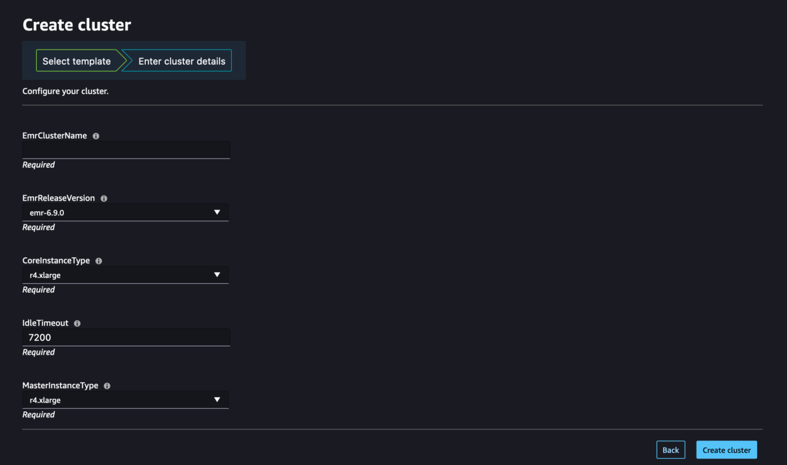

Once the cluster is provisioned, the Studio or Studio Classic UI displays a The cluster has been
successfully created message.

To connect to your cluster, see Connect to an Amazon EMR cluster from SageMaker Studio or
Studio Classic

List Amazon EMR clusters from Studio or Studio Classic

Data scientists and data engineers can discover, and then connect to Amazon EMR clusters from
Studio. The Amazon EMR clusters may be in the same AWS account as Studio or in a different AWS
account.

Before users can list or connect to clusters, administrators must have configured the necessary
settings in the Studio environment. For information on how administrators can configure a Studio
environment to allow discovering running Amazon EMR clusters, see the section called “Admin
guide”. If your administrator configured the cross-account discovery of Amazon EMR clusters, you
can view a consolidated list of clusters. The list includes clusters from the AWS account used by
Studio as well as clusters from remote accounts that you have been granted access to.

To view the list of available Amazon EMR clusters from within Studio:

Data preparation using Amazon EMR
3421

## Page 451

Amazon SageMaker AI
Developer Guide

1.
In the Studio UI's left navigation menu, scroll down to EMR Clusters. This opens up a page
listing the Amazon EMR clusters that you have access to.

The list displays clusters in the following stages: Bootstrapping, Starting Running, Waiting.
You can narrow down the displayed clusters by their current status using the filter icon.

2.
Choose a particular Running cluster you want to connect to, and then refer to Connect to an
Amazon EMR cluster from SageMaker Studio or Studio Classic.

Connect to an Amazon EMR cluster from SageMaker Studio or Studio Classic

Data scientists and data engineers can discover and then connect to an Amazon EMR cluster
directly from the Studio user interface. Before you begin, ensure that you have configured the
necessary permissions as described in the Step 4: Set up the permissions to enable listing and
launching Amazon EMR clusters from Studio section. These permissions grant Studio the ability to
create, start, view, access, and terminate clusters.

You can connect an Amazon EMR cluster to a new JupyterLab notebook directly from the Studio UI,
or choose to initiate the connection in a notebook of a running JupyterLab application.

Important

You can only discover and connect to Amazon EMR clusters for JupyterLab and Studio
Classic applications that are launched from private spaces. Ensure that the Amazon EMR
clusters are located in the same AWS region as your Studio environment. Your JupyterLab

space must use a SageMaker Distribution image version 1.10 or higher.

Connect to an Amazon EMR cluster using the Studio UI

To connect to your cluster using the Studio or Studio Classic UI, you can either initiate a connection
from the list of clusters accessed in List Amazon EMR clusters from Studio or Studio Classic, or from
a notebook in SageMaker Studio or Studio Classic.

To connect an Amazon EMR cluster to a new JupyterLab notebook from the Studio UI:

1.
In the Studio UI's left-side panel, select the Data node in the left navigation menu. Navigate
down to Amazon EMR applications and clusters. This opens up a page listing the Amazon
EMR clusters that you can access from Studio in the Amazon EMR clusters tab.

Data preparation using Amazon EMR
3422

## Page 452

Amazon SageMaker AI
Developer Guide

Note

If you or your administrator have configured the permissions to allow cross-account
access to Amazon EMR clusters, you can view a consolidated list of clusters across all
accounts that you have granted access to Studio.

2.
Select an Amazon EMR cluster you want to connect to a new notebook, and then choose
Attach to notebook. This opens up a modal window displaying the list of your JupyterLab
spaces.

3.
• Select the space from which you want to launch a JupyterLab application, and then choose
Open notebook. This launches a JupyterLab application from your chosen space and opens
a new notebook.

Note

Users of Studio Classic need to select an image and kernel. For a list of supported
images, see Supported images and kernels to connect to an Amazon EMR cluster
from Studio or Studio Classic or refer to Bring your own image.

• Alternatively, you can create a new private space by choosing the Create new space button
at the top of the modal window. Enter a name for your space and then choose Create space
and open notebook. This creates a private space with the default instance type and latest
SageMaker distribution image available, launches a JupyterLab application, and opens a new
notebook.

4.
If the cluster you select does not use Kerberos, LDAP, or runtime role authentication, Studio
prompts you to select the credential type. Choose from Http basic authentication or No
credentials, then enter your credentials, if applicable.

If the cluster you select supports runtime roles, choose the name of the IAM role that your
Amazon EMR cluster can assume for the job run.

Important

To successfully connect a JupyterLab notebook to an Amazon EMR cluster supporting
runtime roles, you must first associate the list of runtime roles with your domain or
user profile, as outlined in the section called “Configure IAM runtime roles for Amazon

Data preparation using Amazon EMR
3423

## Page 453

Amazon SageMaker AI
Developer Guide

EMR cluster access”. Failing to complete this step will prevent you from establishing
the connection.

Upon selection, a connection command populates the first cell of your notebook and initiates
the connection with the Amazon EMR cluster.

Once the connection succeeds, a message confirms the connection and the start of the Spark
application.

Alternatively, you can connect to a cluster from a JupyterLab or Studio Classic notebook.

1.
Choose the Cluster button at the top of your notebook. This opens a modal window listing

the Amazon EMR clusters in a Running state that you can access. You can see the Running

Amazon EMR clusters in the Amazon EMR clusters tab.

Note

For the users of Studio Classic, Cluster is only visible when you use a kernel from
Supported images and kernels to connect to an Amazon EMR cluster from Studio or
Studio Classic or from Bring your own image. If you cannot see Cluster at the top of
your notebook, ensure that your administrator has configured the discoverability of
your clusters and switch to a supported kernel.

2.
Select the cluster to which you want to connect, then choose Connect.

3.
If you configured your Amazon EMR clusters to support runtime IAM roles, you can select your
role from the Amazon EMR execution role drop down menu.

Important

To successfully connect a JupyterLab notebook to an Amazon EMR cluster supporting
runtime roles, you must first associate the list of runtime roles with your domain or
user profile, as outlined in the section called “Configure IAM runtime roles for Amazon
EMR cluster access”. Failing to complete this step will prevent you from establishing
the connection.

Data preparation using Amazon EMR
3424

## Page 454

Amazon SageMaker AI
Developer Guide

Otherwise, if the cluster you choose does not use Kerberos, LDAP, or runtime role
authentication, Studio or Studio Classic prompts you to select the credential type. You can
choose HTTP basic authentication or No credential.

4.
Studio adds and then run a code block to an active cell to establish the connection. This

cell contains the connection magic command to connect your notebook to your application
according to your authentication type.

Once the connection succeeds, a message confirms the connection and the start of the Spark
application.

Connect to an Amazon EMR cluster using a connection command

To establish a connection to an Amazon EMR cluster, you can execute connection commands within
a notebook cell.

When establishing the connection, you can authenticate using Kerberos, Lightweight Directory
Access Protocol (LDAP), or runtime IAM role authentication. The authentication method you choose
depends on your cluster configuration.

You can refer to this example Access Apache Livy using a Network Load Balancer on a Kerberos-
enabled Amazon EMR cluster to set up an Amazon EMR cluster that uses Kerberos authentication.
Alternatively, you can explore the CloudFormation example templates using Kerberos or LDAP
authentication in the aws-samples/sagemaker-studio-emr GitHub repository.

If your administrator has enabled cross-account access, you can connect to your Amazon EMR
cluster from a Studio Classic notebook, regardless of whether your Studio Classic application and
cluster reside in the same AWS account or different accounts.

For each of the following authentication types, use the specified command to connect to your
cluster from your Studio or Studio Classic notebook.

• Kerberos

Append the --assumable-role-arn argument if you need cross-account Amazon EMR access.

Append the --verify-certificate argument if you connect to your cluster with HTTPS.

%load_ext sagemaker_studio_analytics_extension.magics
%sm_analytics emr connect --cluster-id cluster_id \

Data preparation using Amazon EMR
3425

## Page 455

Amazon SageMaker AI
Developer Guide

--auth-type Kerberos --language python
[--assumable-role-arn EMR_access_role_ARN ]
[--verify-certificate /home/user/certificateKey.pem]

• LDAP

Append the --assumable-role-arn argument if you need cross-account Amazon EMR access.

Append the --verify-certificate argument if you connect to your cluster with HTTPS.

%load_ext sagemaker_studio_analytics_extension.magics
%sm_analytics emr connect --cluster-id cluster_id \
--auth-type Basic_Access --language python
[--assumable-role-arn EMR_access_role_ARN ]
[--verify-certificate /home/user/certificateKey.pem]

• NoAuth

Append the --assumable-role-arn argument if you need cross-account Amazon EMR access.

Append the --verify-certificate argument if you connect to your cluster with HTTPS.

%load_ext sagemaker_studio_analytics_extension.magics
%sm_analytics emr connect --cluster-id cluster_id \
--auth-type None --language python
[--assumable-role-arn EMR_access_role_ARN ]
[--verify-certificate /home/user/certificateKey.pem]

• Runtime IAM roles

Append the --assumable-role-arn argument if you need cross-account Amazon EMR access.

Append the --verify-certificate argument if you connect to your cluster with HTTPS.

For more information on connecting to an Amazon EMR cluster using runtime IAM roles, see
Configure IAM runtime roles for Amazon EMR cluster access in Studio.

%load_ext sagemaker_studio_analytics_extension.magics
%sm_analytics emr connect --cluster-id cluster_id \
--auth-type Basic_Access \
--emr-execution-role-arn arn:aws:iam::studio_account_id:role/emr-execution-role-name
[--assumable-role-arn EMR_access_role_ARN]
[--verify-certificate /home/user/certificateKey.pem]

Data preparation using Amazon EMR
3426

## Page 456

Amazon SageMaker AI
Developer Guide

Connect to an Amazon EMR cluster over HTTPS

If you have configured your Amazon EMR cluster with transit encryption enabled and Apache Livy
server for HTTPS and would like Studio or Studio Classic to communicate with Amazon EMR using
HTTPS, you need to configure Studio or Studio Classic to access your certificate key.

For self-signed or local Certificate Authority (CA) signed certificates, you can do this in two steps:

1. Download the PEM file of your certificate to your local file system using one of the following

options:

• Jupyter's built-in file upload function.

• A notebook cell.

• (For Studio Classic users only) A lifecycle configuration (LCC) script.

For information on how to use an LCC script, see Customize a Notebook Instance Using a
Lifecycle Configuration Script

2. Enable the validation of the certificate by providing the path to your certificate in the --

verify-certificate argument of your connection command.

%sm_analytics emr connect --cluster-id cluster_id \
--verify-certificate /home/user/certificateKey.pem ...

For public CA issued certificates, set the certificate validation by setting the --verify-

certificate parameter as true.

Alternatively, you can disable the certificate validation by setting the --verify-certificate

parameter as false.

You can find the list of available connection commands to an Amazon EMR cluster in Connect to an
Amazon EMR cluster using a connection command.

Terminate an Amazon EMR cluster from Studio or Studio Classic

The following procedure shows how to terminate an Amazon EMR cluster from a Studio or Studio
Classic notebook.

Data preparation using Amazon EMR
3427

## Page 457

Amazon SageMaker AI
Developer Guide

To terminate a cluster in a Running state, navigate to the list of available Amazon EMR
clusters.

1.
In the Studio UI, scroll down to the Data node in the left navigation menu.

2.
Navigate down to the EMR Clusters node. This opens up a page listing the Amazon EMR
clusters that you have access to.

3.
Select the name of the cluster that you want to terminate, and then choose Terminate.

4.
This opens up a confirmation window informing you that any pending work or data on your
cluster will be lost permanently after termination. Confirm by choosing Terminate again.

Access Spark UI from Studio or Studio Classic

The following sections give instructions for accessing the Spark UI from SageMaker AI Studio
or Studio Classic notebooks. The Spark UI allows you to monitor and debug your Spark Jobs
submitted to run on Amazon EMR from Studio or Studio Classic notebooks. SSH tunneling and
presigned URLs are two ways for accessing the Spark UI.

Set up SSH tunneling for Spark UI access

To set up SSH tunneling to access the Spark UI, follow one of the two options in this section.

Options for setting up SSH tunneling:

• Option 1: Set up an SSH tunnel to the master node using local port forwarding

• Option 2, part 1: Set up an SSH tunnel to the master node using dynamic port forwarding

Option 2, part 2: Configure proxy settings to view websites hosted on the master node

For information about viewing web interfaces hosted on Amazon EMR clusters, see View web
interfaces hosted on Amazon EMR Clusters. You can also visit your Amazon EMR console to get
access to the Spark UI.

Note

You can set up an SSH tunnel even if presigned URLs are not available to you.

Data preparation using Amazon EMR
3428

## Page 458

Amazon SageMaker AI
Developer Guide

Presigned URLs

To create one-click URLs that can access Spark UI on Amazon EMR from SageMaker Studio or
Studio Classic notebooks, you must enable the following IAM permissions. Choose the option that
applies to you:

• For Amazon EMR clusters that are in the same account as the SageMaker Studio or Studio
Classic notebook: Add the following permissions to the SageMaker Studio or Studio Classic
IAM execution role.

• For Amazon EMR clusters that are in a different account (not SageMaker Studio or Studio
Classic notebook): Add the following permissions to the cross-account role that you created
for List Amazon EMR clusters from Studio or Studio Classic.

Note

You can access presigned URLs from the console in the following regions:

• US East (N. Virginia) Region

• US West (N. California) Region

• Canada (Central) Region

• Europe (Frankfurt) Region

• Europe (Stockholm) Region

• Europe (Ireland) Region

• Europe (London) Region

• Europe (Paris) Region

• Asia Pacific (Tokyo) Region

• Asia Pacific (Seoul) Region

• Asia Pacific (Sydney) Region

• Asia Pacific (Mumbai) Region

• Asia Pacific (Singapore) Region

• South America (São Paulo)

The following policy gives access to presigned URLs for your execution role.
Data preparation using Amazon EMR
3429

## Page 459

Amazon SageMaker AI
Developer Guide

{
"Sid": "AllowPresignedUrl",
"Effect": "Allow",
"Action": [
"elasticmapreduce:DescribeCluster",
"elasticmapreduce:ListInstanceGroups",
"elasticmapreduce:CreatePersistentAppUI",
"elasticmapreduce:DescribePersistentAppUI",
"elasticmapreduce:GetPersistentAppUIPresignedURL",
"elasticmapreduce:GetOnClusterAppUIPresignedURL"
],
"Resource": [
"arn:aws:elasticmapreduce:region:account-id:cluster/*"
]
}

Blogs and whitepapers

The following blogs use a case study of sentiment prediction for a movie review to illustrate
the process of executing a complete machine learning workflow. This includes data preparation,
monitoring Spark jobs, and training and deploying a ML model to get predictions directly from
your Studio or Studio Classic notebook.

• Create and manage Amazon EMR clusters from SageMaker Studio or Studio Classic to run
interactive Spark and ML workloads.

• To extend the use case to a cross-account configuration where SageMaker Studio or Studio
Classic and your Amazon EMR cluster are deployed in separate AWS accounts, see Create and
manage Amazon EMR clusters from SageMaker Studio or Studio Classic to run interactive Spark
and ML workloads - Part 2.

See also:

• A walkthrough of the configuration of Access Apache Livy using a Network Load Balancer on a
Kerberos-enabled Amazon EMR cluster.

• AWS whitepapers for SageMaker Studio or Studio Classic best practices.

Data preparation using Amazon EMR
3430

## Page 460

Amazon SageMaker AI
Developer Guide

Troubleshooting

When working with Amazon EMR clusters from Studio or Studio Classic notebooks, you may
encounter various potential issues or challenges during the connection or usage process. To help
you troubleshoot and resolve these errors, this section provides guidance on common problems
that can arise.

The following are common errors that might occur while connecting or using Amazon EMR clusters
from Studio or Studio Classic notebooks.

Troubleshoot Livy connections hanging or failing

The following are Livy connectivity issues that might occur while using Amazon EMR clusters from
Studio or Studio Classic notebooks.

• Your Amazon EMR cluster encountered an out-of-memory error.

A possible reason for a Livy connection via sparkmagic hanging or failing is if your Amazon
EMR cluster encountered an out-of-memory error.

By default, the Java configuration parameter of the Apache Spark driver,

spark.driver.defaultJavaOptions, is set to -XX:OnOutOfMemoryError='kill

-9 %p'. This means that the default action taken when the driver program encounters an

OutOfMemoryError is to terminate the driver program by sending a SIGKILL signal. When

the Apache Spark driver is terminated, any Livy connection via sparkmagic that depends on
that driver hangs or fails. This is because the Spark driver is responsible for managing the Spark
application's resources, including task scheduling and execution. Without the driver, the Spark
application cannot function, and any attempts to interact with it fails.

If you suspect that your Spark cluster is experiencing memory issues, you can check Amazon EMR

logs. Containers killed due to out-of-memory errors typically exit with a code of 137. In such
cases, you need to restart the Spark application and establish a new Livy connection to resume
interaction with the Spark cluster.

You can refer to the knowledge base article How do I resolve the error "Container killed by YARN
for exceeding memory limits" in Spark on Amazon EMR? on AWS re:Post to learn about various
strategies and parameters that can be used to address an out-of-memory issue.

We recommend reviewing the Amazon EMR Best Practices Guides for best practices and tuning
guidance on running Apache Spark workloads on your Amazon EMR clusters.

Data preparation using Amazon EMR
3431

## Page 461

Amazon SageMaker AI
Developer Guide

• Your Livy session times out when connecting to an Amazon EMR cluster for the first time.

When you initially connect to an Amazon EMR cluster using sagemaker-studio-analytics-
extension, which enables connection to a remote Spark (Amazon EMR) cluster via the SparkMagic
library using Apache Livy, you may encounter a connection timeout error:

An error was encountered: Session 0 did not start up in 60 seconds.

If your Amazon EMR cluster requires the initialization of a Spark application upon establishing a
connection, there is an increased chance of seeing connection timeout errors.

To reduce the chances of getting timeouts when connecting to an Amazon EMR cluster using Livy

through the analytics extension, sagemaker-studio-analytics-extension version 0.0.19

and later override the default server session timeout to 120 seconds instead of sparkmagic's

default of 60 seconds.

We recommend upgrading your extension 0.0.18 and sooner by running the following upgrade
command.

pip install --upgrade sagemaker-studio-analytics-extension

Note that when providing a custom timeout configuration in sparkmagic, sagemaker-

studio-analytics-extension honors this override. However, setting the session timeout

to 60 seconds automatically triggers the default server session timeout of 120 seconds in

sagemaker-studio-analytics-extension.

Data preparation using AWS Glue interactive sessions

AWS Glue interactive sessions is a serverless service that you can enlist to collect, transform, clean,
and prepare data for storage in your data lakes and data pipelines. AWS Glue interactive sessions
provides an on-demand, serverless Apache Spark runtime environment that you can initialize
in seconds on a dedicated Data Processing Unit (DPU) without having to provision and manage
complex compute cluster infrastructure. After initialization, you can browse the AWS Glue data
catalog, run large queries, access data governed by AWS Lake Formation, and interactively analyze
and prepare data using Spark, right in your Studio or Studio Classic notebooks. You can then
use the prepared data to train, tune, and deploy models using the purpose-built ML tools within
SageMaker Studio or Studio Classic. You should consider AWS Glue Interactive Sessions for your

Data preparation using AWS Glue interactive sessions
3432

## Page 462

Amazon SageMaker AI
Developer Guide

data preparation workloads when you want a serverless Spark service with moderate control of
configurability and flexibility.

You can initiate an AWS Glue interactive session by starting a JupyterLab notebook in Studio or

Studio Classic. When starting your notebook, choose the built-in Glue PySpark and Ray or

Glue Spark kernel. This automatically starts an interactive, serverless Spark session. You do not
need to provision or manage any compute cluster or infrastructure. After initialization, you can
explore and interact with your data from within your Studio or Studio Classic notebooks.

Before starting your AWS Glue interactive session in Studio or Studio Classic, you need to set
the appropriate roles and policies. Additionally, you may need to provide access to additional
resources, such as a storage Amazon S3 bucket. For more information about required IAM policies,
see Permissions for AWS Glue interactive sessions in Studio or Studio Classic.

Studio and Studio Classic provide a default configuration for your AWS Glue interactive session,

however, you can use AWS Glue’s full catalog of Jupyter magic commands to further customize
your environment. For information about the default and additional Jupyter magics that you can
use in your AWS Glue interactive session, see Configure your AWS Glue interactive session in Studio
or Studio Classic.

• For Studio Classic users initiating an AWS Glue interactive session, they can select from the
following images and kernels:

• Images: SparkAnalytics 1.0, SparkAnalytics 2.0

• Kernel: Glue Python [PySpark and Ray] and Glue Spark

• For Studio users, use the default SageMaker Distribution image and select a Glue Python

[PySpark and Ray] or a Glue Spark kernel.

Get Started with AWS Glue Interactive Sessions

In this guide, you learn how to initiate an AWS Glue interactive session in SageMaker AI Studio
Classic, and manage your environment with Jupyter magics.

Permissions for AWS Glue interactive sessions in Studio or Studio Classic

This section lists the required policies to run AWS Glue interactive sessions in Studio or Studio
Classic and explains how to set them up. In particular, it details how to:

Get started with AWS Glue interactive sessions
3433

## Page 463

Amazon SageMaker AI
Developer Guide

• Attach the AwsGlueSessionUserRestrictedServiceRole managed policy to your
SageMaker AI execution role.

• Create an inline custom policy on your SageMaker AI execution role.

• Modify the trust relationship of your SageMaker AI execution role.

To attach the AwsGlueSessionUserRestrictedServiceRole managed policy to your
execution role

1.
Open the IAM console.

2.
Select Roles in the left-side panel.

3.
Find the Studio Classic execution role used by your user profile. For information about how to
view a user profile, see View user profiles in a domain.

4.
Choose your role name to access the role summary page.

5.
Under the Permissions tab, select Attach policies from the Add Permissions dropdown menu.

6.
Select the checkbox next to the managed policy

AwsGlueSessionUserRestrictedServiceRole.

7.
Choose Attach policies.

The summary page shows your newly-added managed policies.

To create the inline custom policy on your execution role

1.
Select Create inline policy in the Add Permissions dropdown menu.

2.
Select the JSON tab.

3.
Copy and paste in the following policy.

JSON

{
"Version":"2012-10-17",
"Statement": [
{
"Sid": "uniqueStatementId",

"Effect": "Allow",

Get started with AWS Glue interactive sessions
3434

## Page 464

Amazon SageMaker AI
Developer Guide

"Action": [
"iam:GetRole",
"iam:PassRole",
"sts:GetCallerIdentity"
],
"Resource": "arn:aws:iam::*:role/GlueServiceRole*"
}
]
}

4.
Choose Review policy.

5.
Enter a Name and choose Create policy.

The summary page shows your newly-added custom policy.

To modify the trust relationship of your execution role

1.
Select the Trust relationships tab.

2.
Chose Edit trust policy.

3.
Copy and paste in the following policy.

JSON

{
"Version":"2012-10-17",
"Statement": [
{
"Effect": "Allow",
"Principal": {
"Service": [
"glue.amazonaws.com",
"sagemaker.amazonaws.com"
]
},
"Action": "sts:AssumeRole"
}
]
}

4.
Choose Update policy.

Get started with AWS Glue interactive sessions
3435

## Page 465

Amazon SageMaker AI
Developer Guide

You can add additional roles and policies if you need to access other AWS resources. For a
description of the additional roles and policies you can include, see interactive sessions with IAM in
the AWS Glue documentation.

Tag propagation

Tags are commonly used to track and allocate costs, control access to your session, isolate your
resources, and more. To learn about adding metadata to your AWS resources using tagging, or for
details on common use cases, see Additional information.

You can enable the automatic propagation of AWS tags to new AWS Glue interactive sessions
created from within the Studio or Studio Classic UI. When an AWS Glue interactive session is
created from Studio or Studio Classic, any user-defined tags attached to the user profile or shared
space are carried over to the new AWS Glue interactive session. Additionally,Studio and Studio

Classic automatically add two AWS-generated internal tags ((sagemaker:user-profile-arn

and sagemaker:domain-arn) or (sagemaker:shared-space-arn and sagemaker:domain-

arn)) to new AWS Glue interactive sessions created from their UI. You can use these tags to
aggregate costs across individual domains, user profiles, or spaces.

Enable tag propagation

To enable the automatic propagation of tags to new AWS Glue interactive sessions, set the
following permissions for your SageMaker AI execution role and the IAM role associated with your
AWS Glue session:

Note

By default, the role associated with the AWS Glue interactive session is the same as the
SageMaker AI execution role. You can specify a different execution role for the AWS

Glue interactive session by using the %iam_role magic command. For information on
the available Jupyter magic commands to configure AWS Glue interactive sessions, see
Configure your AWS Glue interactive session in Studio or Studio Classic.

• On your SageMaker AI execution role: Create a new inline policy, and paste the following JSON

file. The policy grants the execution role permission to describe (DescribeUserProfile,

DescribeSpace, DescribeDomain) and list the tags (ListTag) set on the user profiles, shared
spaces, and SageMaker AI domain.

Get started with AWS Glue interactive sessions
3436

## Page 466

Amazon SageMaker AI
Developer Guide

{
"Effect": "Allow",
"Action": [
"sagemaker:ListTags"
],
"Resource": [
"arn:aws:sagemaker:*:*:user-profile/*",
"arn:aws:sagemaker:*:*:space/*"
]
},
{
"Effect": "Allow",
"Action": [
"sagemaker:DescribeUserProfile"
],
"Resource": [

"arn:aws:sagemaker:*:*:user-profile/*"
]
},
{
"Effect": "Allow",
"Action": [
"sagemaker:DescribeSpace"
],
"Resource": [
"arn:aws:sagemaker:*:*:space/*"
]
}
{
"Effect": "Allow",
"Action": [
"sagemaker:DescribeDomain"
],
"Resource": [
"arn:aws:sagemaker:*:*:domain/*"
]
}

• On the IAM role of your AWS Glue session: Create a new inline policy, and paste the following

JSON file. The policy grants your role permission to attach tags (TagResource) to your session,

or retrieve its list of tags (GetTags).

Get started with AWS Glue interactive sessions
3437

## Page 467

Amazon SageMaker AI
Developer Guide

{
"Effect": "Allow",
"Action": [
"glue:TagResource",
"glue:GetTags"
],
"Resource": [
"arn:aws:glue:*:*:session/*"
]
}

Note

• Failures occurring while applying those permissions do not prevent the creation of AWS
Glue interactive sessions. You can find details about the reason of the failure in Studio or
Studio Classic CloudWatch logs.

• You must restart the kernel of your AWS Glue interactive session to propagate the
update of a tag’s value.

It is important to note the following points:

• Once a tag is attached to a session, it cannot be removed by propagation.

You can remove tags from an AWS Glue interactive session directly through the AWS CLI, the
AWS Glue API, or the https://console.aws.amazon.com/sagemaker/. For example, using the AWS
CLI, you can remove a tag by providing the session's ARN and the tag keys you want to remove as
follows:

aws glue untag-resource \
--resource-arn arn:aws:glue:region:account-id:session:session-name \
--tags-to-remove tag-key1,tag-key2

• Studio and Studio Classic add two AWS-generated internal tags ((sagemaker:user-

profile-arn and sagemaker:domain-arn) or (sagemaker:shared-space-arn and

sagemaker:domain-arn)) to new AWS Glue interactive sessions created from their UI. Those

tags count against the limit of 50 tags set on all AWS resources. Both sagemaker:user-

Get started with AWS Glue interactive sessions
3438

## Page 468

Amazon SageMaker AI
Developer Guide

profile-arn and sagemaker:shared-space-arn contain the domain ID to which they
belong.

• Tags keys starting with aws:, AWS:, or any combination of upper and lowercase letters as a
prefix for keys are not propagated and are reserved for AWS use.

Additional information

For more information on tagging, refer to the following resources.

• To learn about adding metadata to your AWS resources with tagging, see Tagging AWS
resources.

• For information on tracking costs using tags, see Cost analysis in Studio administration best
practices.

• For information on controlling access to AWS Glue based on tag keys, see ABAC with AWS Glue.

Launch your AWS Glue interactive session on Studio or Studio Classic

After you create the roles, policies, and SageMaker AI domain, you can launch your AWS Glue
interactive session in Studio or Studio Classic.

1.
Sign in to the SageMaker AI console at https://console.aws.amazon.com/sagemaker/.

2.
From the left navigation pane, choose Studio.

3.
From the Studio landing page, select the domain and user profile for launching Studio.

4.
Choose Open Studio and start a JupyterLab or Studio Classic application.

5.
In the Jupyter view, choose File, then New, then Notebook.

6.
For Studio Classic users: In the Image dropdown menu, select SparkAnalytics 1.0 or
SparkAnalytics 2.0. In the kernel dropdown menu, select Glue Spark or Glue Python
[PySpark and Ray]. Choose Select.

For Studio users, select a Glue Spark or Glue Python [PySpark and Ray] kernel

7.
(optional) Use Jupyter magics to customize your environment. For more information about
Jupyter magics, see Configure your AWS Glue interactive session in Studio or Studio Classic.

8.
Start writing your Spark data processing scripts. The following notebook showcases an end-
to-end workflow for ETL on a large dataset using an AWS Glue interactive session, exploratory
data analysis, data preprocessing, and finally training a model on the processed data with
SageMaker AI.

Get started with AWS Glue interactive sessions
3439

## Page 469

Amazon SageMaker AI
Developer Guide

Configure your AWS Glue interactive session in Studio or Studio Classic

Note

All magic configurations are carried over to subsequent sessions for the lifetime of the AWS
Glue kernel.

You can use Jupyter magics in your AWS Glue interactive session to modify your session and

configuration parameters. Magics are short commands prefixed with % at the start of Jupyter
cells that provide a quick and easy way to help you control your environment. In your AWS Glue
interactive session, the following magics are set for you by default:

Magic
Default value

%glue_version
3.0

%iam_role
execution role attached to your SageMaker AI

domain

%region
your region

You can use magics to further customize your environment. For example, if you want to change
the number of workers allocated to your job from the default five to 10, you can specify

%number_of_workers 10. If you want to configure your session to stop after 10 minutes of idle

time instead of the default 2880, you can specify %idle_timeout 10.

All of the Jupyter magics currently available in AWS Glue are also available in Studio or Studio
Classic. For the complete list of AWS Glue magics available, see Configuring AWS Glue interactive
sessions for Jupyter and AWS Glue Studio notebooks.

AWS Glue interactive session pricing

When you use AWS Glue interactive sessions on Studio or Studio Classic notebooks, you are
charged separately for resource usage on AWS Glue and Studio notebooks.

AWS charges for AWS Glue interactive sessions based on how long the session is active and the
number of Data Processing Units (DPU) used. You are charged an hourly rate for the number

AWS Glue interactive session pricing
3440

## Page 470

Amazon SageMaker AI
Developer Guide

of DPUs used to run your workloads, billed in increments of one second. AWS Glue interactive
sessions assigns a default of five DPUs and requires a minimum of two DPUs. There is also a one-
minute minimum billing duration for each interactive session. To see the AWS Glue rates and
pricing examples, or to estimate your costs using the AWS Pricing Calculator, see AWS Glue pricing .

Your Studio or Studio Classic notebook runs on an Amazon EC2 instance and you are charged for
the instance type you choose, based on the duration of use. Studio Classic assign you a default

EC2 instance type of ml-t3-medium when you select the SparkAnalytics image and associated
kernel. You can change the instance type for of your Studio Classic notebook to suit your workload.
For information about Studio and Studio Classic pricing, see Amazon SageMaker Pricing.

Prepare ML Data with Amazon SageMaker Data Wrangler

Important

Amazon SageMaker Data Wrangler has been integrated into Amazon SageMaker Canvas.
Within the new Data Wrangler experience in SageMaker Canvas, you can use a natural
language interface to explore and transform your data in addition to the visual interface.
For more information about Data Wrangler in SageMaker Canvas, see Data preparation.

Amazon SageMaker Data Wrangler (Data Wrangler) is a feature of Amazon SageMaker Studio
Classic that provides an end-to-end solution to import, prepare, transform, featurize, and analyze
data. You can integrate a Data Wrangler data preparation flow into your machine learning (ML)
workflows to simplify and streamline data pre-processing and feature engineering using little to no
coding. You can also add your own Python scripts and transformations to customize workflows.

Data Wrangler provides the following core functionalities to help you analyze and prepare data for
machine learning applications.

• Import – Connect to and import data from Amazon Simple Storage Service (Amazon S3),
Amazon Athena (Athena), Amazon Redshift, Snowflake, and Databricks.

• Data Flow – Create a data flow to define a series of ML data prep steps. You can use a flow to
combine datasets from different data sources, identify the number and types of transformations
you want to apply to datasets, and define a data prep workflow that can be integrated into an
ML pipeline.

Prepare Data with Data Wrangler
3441

## Page 471

Amazon SageMaker AI
Developer Guide

• Transform – Clean and transform your dataset using standard transforms like string, vector, and
numeric data formatting tools. Featurize your data using transforms like text and date/time
embedding and categorical encoding.

• Generate Data Insights – Automatically verify data quality and detect abnormalities in your data
with Data Wrangler Data Insights and Quality Report.

• Analyze – Analyze features in your dataset at any point in your flow. Data Wrangler includes
built-in data visualization tools like scatter plots and histograms, as well as data analysis tools
like target leakage analysis and quick modeling to understand feature correlation.

• Export – Export your data preparation workflow to a different location. The following are
example locations:

• Amazon Simple Storage Service (Amazon S3) bucket

• Amazon SageMaker Pipelines – Use Pipelines to automate model deployment. You can export
the data that you've transformed directly to the pipelines.

• Amazon SageMaker Feature Store – Store the features and their data in a centralized store.

• Python script – Store the data and their transformations in a Python script for your custom
workflows.

To start using Data Wrangler, see Get Started with Data Wrangler.

Important

Data Wrangler no longer supports Jupyter Lab Version 1 (JL1). To access the latest features
and updates, update to Jupyter Lab Version 3. For more information about upgrading, see
View and update the JupyterLab version of an application from the console.

Important

The information and procedures in this guide use the latest version of Amazon SageMaker
Studio Classic. For information about updating Studio Classic to the latest version, see
Amazon SageMaker Studio Classic UI Overview.

You must use Studio Classic version 1.3.0 or later. Use the following procedure to open Amazon
SageMaker Studio Classic and see which version you're running.

Prepare Data with Data Wrangler
3442

## Page 472

Amazon SageMaker AI
Developer Guide

To open Studio Classic and check its version, see the following procedure.

1.
Use the steps in Prerequisites to access Data Wrangler through Amazon SageMaker Studio
Classic.

2.
Next to the user you want to use to launch Studio Classic, select Launch app.

3.
Choose Studio.

4.
After Studio Classic loads, select File, then New, and then Terminal.

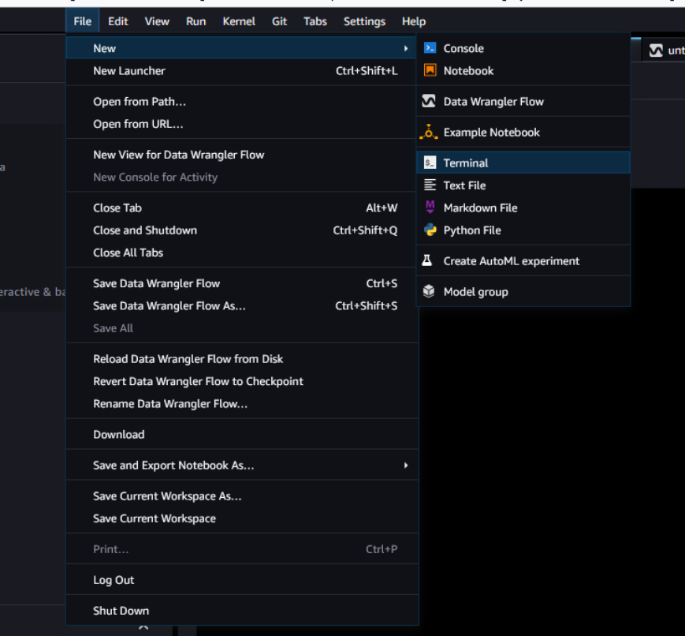

5.
Once you have launched Studio Classic, select File, then New, and then Terminal.

6.
Enter cat /opt/conda/share/jupyter/lab/staging/yarn.lock | grep -A 1

"@amzn/sagemaker-ui-data-prep-plugin@" to print the version of your Studio Classic
instance. You must have Studio Classic version 1.3.0 to use Snowflake.

Prepare Data with Data Wrangler
3443

## Page 473

Amazon SageMaker AI
Developer Guide

You can update Amazon SageMaker Studio Classic from within the AWS Management Console.
For more information about updating Studio Classic, see Amazon SageMaker Studio Classic UI
Overview.

Topics

• Get Started with Data Wrangler

• Import

• Create and Use a Data Wrangler Flow

• Get Insights On Data and Data Quality

• Automatically Train Models on Your Data Flow

• Transform Data

• Analyze and Visualize

• Reusing Data Flows for Different Datasets

• Export

• Use an Interactive Data Preparation Widget in an Amazon SageMaker Studio Classic Notebook to
Get Data Insights

• Security and Permissions

• Release Notes

• Troubleshoot

• Increase Amazon EC2 Instance Limit

• Update Data Wrangler

• Shut Down Data Wrangler

Get Started with Data Wrangler

Amazon SageMaker Data Wrangler is a feature in Amazon SageMaker Studio Classic. Use this
section to learn how to access and get started using Data Wrangler. Do the following:

1.
Complete each step in Prerequisites.

2.
Follow the procedure in Access Data Wrangler to start using Data Wrangler.

Prerequisites

To use Data Wrangler, you must complete the following prerequisites.

Get Started with Data Wrangler
3444

## Page 474

Amazon SageMaker AI
Developer Guide

1.
To use Data Wrangler, you need access to an Amazon Elastic Compute Cloud (Amazon EC2)
instance. For more information about the Amazon EC2 instances that you can use, see
Instances. To learn how to view your quotas and, if necessary, request a quota increase, see
AWS service quotas.

2.
Configure the required permissions described in Security and Permissions.

3.
If your organization is using a firewall that blocks internet traffic, you must have access to the
following URLs:

• https://ui.prod-1.data-wrangler.sagemaker.aws/

• https://ui.prod-2.data-wrangler.sagemaker.aws/

• https://ui.prod-3.data-wrangler.sagemaker.aws/

• https://ui.prod-4.data-wrangler.sagemaker.aws/

To use Data Wrangler, you need an active Studio Classic instance. To learn how to launch a new
instance, see Amazon SageMaker AI domain overview. When your Studio Classic instance is Ready,
use the instructions in Access Data Wrangler.

Access Data Wrangler

The following procedure assumes you have completed the Prerequisites.

To access Data Wrangler in Studio Classic, do the following.

1.
Sign in to Studio Classic. For more information, see Amazon SageMaker AI domain overview.

2.
Choose Studio.

3.
Choose Launch app.

4.
From the dropdown list, select Studio.

5.
Choose the Home icon.

6.
Choose Data.

7.
Choose Data Wrangler.

8.
You can also create a Data Wrangler flow by doing the following.

a.
In the top navigation bar, select File.

b.
Select New.

c.
Select Data Wrangler Flow.

Get Started with Data Wrangler
3445

## Page 475

Amazon SageMaker AI
Developer Guide

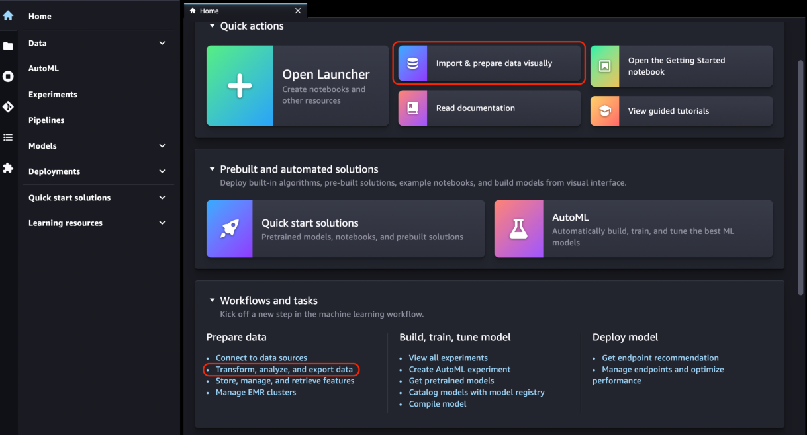

9.
(Optional) Rename the new directory and the .flow file.

10. When you create a new .flow file in Studio Classic, you might see a carousel that introduces

you to Data Wrangler.

This may take a few minutes.

This messaging persists as long as the KernelGateway app on your User Details page
is Pending. To see the status of this app, in the SageMaker AI console on the Amazon
SageMaker Studio Classic page, select the name of the user you are using to access Studio
Classic. On the User Details page, you see a KernelGateway app under Apps. Wait until this
app status is Ready to start using Data Wrangler. This can take around 5 minutes the first time
you launch Data Wrangler.

Get Started with Data Wrangler
3446

## Page 476

Amazon SageMaker AI
Developer Guide

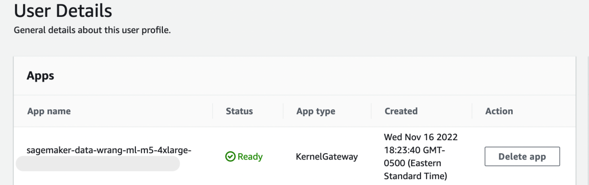

11. To get started, choose a data source and use it to import a dataset. See Import to learn more.

When you import a dataset, it appears in your data flow. To learn more, see Create and Use a
Data Wrangler Flow.

12. After you import a dataset, Data Wrangler automatically infers the type of data in each

column. Choose + next to the Data types step and select Edit data types.

Important

After you add transforms to the Data types step, you cannot bulk-update column
types using Update types.

13. Use the data flow to add transforms and analyses. To learn more see Transform Data and

Analyze and Visualize.

14. To export a complete data flow, choose Export and choose an export option. To learn more,

see Export.

15. Finally, choose the Components and registries icon, and select Data Wrangler from the

dropdown list to see all the .flow files that you've created. You can use this menu to find and
move between data flows.

After you have launched Data Wrangler, you can use the following section to walk through how
you might use Data Wrangler to create an ML data prep flow.

Update Data Wrangler

We recommend that you periodically update the Data Wrangler Studio Classic app to access the
latest features and updates. The Data Wrangler app name starts with sagemaker-data-wrang. To

Get Started with Data Wrangler
3447

## Page 477

Amazon SageMaker AI
Developer Guide

learn how to update a Studio Classic app, see Shut Down and Update Amazon SageMaker Studio
Classic Apps.

Demo: Data Wrangler Titanic Dataset Walkthrough

The following sections provide a walkthrough to help you get started using Data Wrangler. This
walkthrough assumes that you have already followed the steps in Access Data Wrangler and have
a new data flow file open that you intend to use for the demo. You may want to rename this .flow

file to something similar to titanic-demo.flow.

This walkthrough uses the Titanic dataset. It's a modified version of the Titanic dataset that you
can import into your Data Wrangler flow more easily. This data set contains the survival status, age,
gender, and class (which serves as a proxy for economic status) of passengers aboard the maiden
voyage of the RMS Titanic in 1912.

In this tutorial, you perform the following steps.

1. Do one of the following:

• Open your Data Wrangler flow and choose Use Sample Dataset.

• Upload the Titanic dataset to Amazon Simple Storage Service (Amazon S3), and then import
this dataset into Data Wrangler.

2. Analyze this dataset using Data Wrangler analyses.

3. Define a data flow using Data Wrangler data transforms.

4. Export your flow to a Jupyter Notebook that you can use to create a Data Wrangler job.

5. Process your data, and kick off a SageMaker training job to train a XGBoost Binary Classifier.

Upload Dataset to S3 and Import

To get started, you can use one of the following methods to import the Titanic dataset into Data
Wrangler:

• Importing the dataset directly from the Data Wrangler flow

• Uploading the dataset to Amazon S3 and then importing it into Data Wrangler

To import the dataset directly into Data Wrangler, open the flow and choose Use Sample Dataset.

Get Started with Data Wrangler
3448

## Page 478

Amazon SageMaker AI
Developer Guide

Uploading the dataset to Amazon S3 and importing it into Data Wrangler is closer to the
experience you have importing your own data. The following information tells you how to upload
your dataset and import it.

Before you start importing the data into Data Wrangler, download the Titanic dataset and upload it
to an Amazon S3 (Amazon S3) bucket in the AWS Region in which you want to complete this demo.

If you are a new user of Amazon S3, you can do this using drag and drop in the Amazon S3 console.
To learn how, see Uploading Files and Folders by Using Drag and Drop in the Amazon Simple
Storage Service User Guide.

Important

Upload your dataset to an S3 bucket in the same AWS Region you want to use to complete
this demo.

When your dataset has been successfully uploaded to Amazon S3, you can import it into Data
Wrangler.

Import the Titanic dataset to Data Wrangler

1.
Choose the Import data button in your Data flow tab or choose the Import tab.

2.
Select Amazon S3.

3.
Use the Import a dataset from S3 table to find the bucket to which you added the Titanic
dataset. Choose the Titanic dataset CSV file to open the Details pane.

4.
Under Details, the File type should be CSV. Check First row is header to specify that the first
row of the dataset is a header. You can also name the dataset something more friendly, such as

Titanic-train.

5.
Choose the Import  button.

When your dataset is imported into Data Wrangler, it appears in your Data Flow tab. You can
double click on a node to enter the node detail view, which allows you to add transformations or
analysis. You can use the plus icon for a quick access to the navigation. In the next section, you use
this data flow to add analysis and transform steps.

Get Started with Data Wrangler
3449

## Page 479

Amazon SageMaker AI
Developer Guide

Data Flow

In the data flow section, the only steps in the data flow are your recently imported dataset and a
Data type step. After applying transformations, you can come back to this tab and see what the
data flow looks like. Now, add some basic transformations under the Prepare and Analyze tabs.

Prepare and Visualize

Data Wrangler has built-in transformations and visualizations that you can use to analyze, clean,
and transform your data.

The Data tab of the node detail view lists all built-in transformations in the right panel, which also
contains an area in which you can add custom transformations. The following use case showcases
how to use these transformations.

To get information that might help you with data exploration and feature engineering, create a
data quality and insights report. The information from the report can help you clean and process
your data. It gives you information such as the number of missing values and the number of
outliers. If you have issues with your data, such as target leakage or imbalance, the insights report
can bring those issues to your attention. For more information about creating a report, see Get
Insights On Data and Data Quality.

Data Exploration

First, create a table summary of the data using an analysis. Do the following:

1.
Choose the + next to the Data type step in your data flow and select Add analysis.

2.
In the Analysis area, select Table summary from the dropdown list.

3.
Give the table summary a Name.

4.
Select Preview to preview the table that will be created.

5.
Choose Save to save it to your data flow. It appears under All Analyses.

Using the statistics you see, you can make observations similar to the following about this dataset:

• Fare average (mean) is around $33, while the max is over $500. This column likely has outliers.

• This dataset uses ? to indicate missing values. A number of columns have missing values: cabin,
embarked, and home.dest

• The age category is missing over 250 values.

Get Started with Data Wrangler
3450

## Page 480

Amazon SageMaker AI
Developer Guide

Next, clean your data using the insights gained from these stats.

Drop Unused Columns

Using the analysis from the previous section, clean up the dataset to prepare it for training. To

add a new transform to your data flow, choose + next to the Data type step in your data flow and
choose Add transform.

First, drop columns that you don't want to use for training. You can use pandas data analysis library
to do this, or you can use one of the built-in transforms.

Use the following procedure to drop the unused columns.

To drop the unused columns.

1.
Open the Data Wrangler flow.

2.
There are two nodes in your Data Wrangler flow. Choose the + to the right of the Data types
node.

3.
Choose Add transform.

4.
In the All steps column, choose Add step.

5.
In the Standard transform list, choose Manage Columns. The standard transformations are
ready-made, built-in transformations. Make sure that Drop column is selected.

6.
Under Columns to drop, check the following column names:

• cabin

• ticket

• name

• sibsp

• parch

• home.dest

• boat

• body

7.
Choose Preview.

8.
Verify that the columns have been dropped, then choose Add.

To do this using pandas, follow these steps.

Get Started with Data Wrangler
3451

## Page 481

Amazon SageMaker AI
Developer Guide

1.
In the All steps column, choose Add step.

2.
In the Custom transform list, choose Custom transform.

3.
Provide a name for your transformation, and choose Python (Pandas) from the dropdown list.

4.
Enter the following Python script in the code box.

cols = ['name', 'ticket', 'cabin', 'sibsp', 'parch', 'home.dest','boat', 'body']
df = df.drop(cols, axis=1)

5.
Choose Preview to preview the change, and then choose Add to add the transformation.

Clean up Missing Values

Now, clean up missing values. You can do this with the Handling missing values transform group.

A number of columns have missing values. Of the remaining columns, age and fare contain missing
values. Inspect this using a Custom Transform.

Using the Python (Pandas) option, use the following to quickly review the number of entries in
each column:

df.info()

Get Started with Data Wrangler
3452

## Page 482

Amazon SageMaker AI
Developer Guide

To drop rows with missing values in the age category, do the following:

1.
Choose Handle missing.

2.
Choose Drop missing for the Transformer.

3.
Choose age for the Input column.

4.
Choose Preview to see the new data frame, and then choose Add to add the transform to your
flow.

5.
Repeat the same process for fare.

You can use df.info() in the Custom transform section to confirm that all rows now have 1,045
values.

Custom Pandas: Encode

Try flat encoding using Pandas. Encoding categorical data is the process of creating a numerical

representation for categories. For example, if your categories are Dog and Cat, you may encode

this information into two vectors: [1,0] to represent Dog, and [0,1] to represent Cat.

1.
In the Custom Transform section, choose Python (Pandas) from the dropdown list.

Get Started with Data Wrangler
3453

## Page 483

Amazon SageMaker AI
Developer Guide

2.
Enter the following in the code box.

import pandas as pd

dummies = []
cols = ['pclass','sex','embarked']
for col in cols:
dummies.append(pd.get_dummies(df[col]))
encoded = pd.concat(dummies, axis=1)

df = pd.concat((df, encoded),axis=1)

3.
Choose Preview to preview the change. The encoded version of each column is added to the
dataset.

4.
Choose Add to add the transformation.

Custom SQL: SELECT Columns

Now, select the columns you want to keep using SQL. For this demo, select the columns listed in

the following SELECT statement. Because survived is your target column for training, put that
column first.

1.
In the Custom Transform section, select SQL (PySpark SQL) from the dropdown list.

2.
Enter the following in the code box.

SELECT survived, age, fare, 1, 2, 3, female, male, C, Q, S FROM df;

3.
Choose Preview to preview the change. The columns listed in your SELECT statement are the
only remaining columns.

4.
Choose Add to add the transformation.

Export to a Data Wrangler Notebook

When you've finished creating a data flow, you have a number of export options. The following
section explains how to export to a Data Wrangler job notebook. A Data Wrangler job is used to
process your data using the steps defined in your data flow. To learn more about all export options,
see Export.

Get Started with Data Wrangler
3454

## Page 484

Amazon SageMaker AI
Developer Guide

Export to Data Wrangler Job Notebook

When you export your data flow using a Data Wrangler job, the process automatically creates
a Jupyter Notebook. This notebook automatically opens in your Studio Classic instance and is
configured to run a SageMaker Processing job to run your Data Wrangler data flow, which is
referred to as a Data Wrangler job.

1.
Save your data flow. Select File and then select Save Data Wrangler Flow.

2.
Back to the Data Flow tab, select the last step in your data flow (SQL), then choose the + to
open the navigation.

3.
Choose Export, and Amazon S3 (via Jupyter Notebook). This opens a Jupyter Notebook.

4.
Choose any Python 3 (Data Science) kernel for the Kernel.

5.
When the kernel starts, run the cells in the notebook book until Kick off SageMaker Training
Job (Optional).

6.
Optionally, you can run the cells in Kick off SageMaker Training Job (Optional) if you want to
create a SageMaker AI training job to train an XGBoost classifier. You can find the cost to run a
SageMaker training job in Amazon SageMaker Pricing.

Alternatively, you can add the code blocks found in Training XGBoost Classifier to the
notebook and run them to use the XGBoost open source library to train an XGBoost classifier.

7.
Uncomment and run the cell under Cleanup and run it to revert the SageMaker Python SDK to
its original version.

You can monitor your Data Wrangler job status in the SageMaker AI console in the Processing tab.
Additionally, you can monitor your Data Wrangler job using Amazon CloudWatch. For additional
information, see Monitor Amazon SageMaker Processing Jobs with CloudWatch Logs and Metrics.

Get Started with Data Wrangler
3455

## Page 485

Amazon SageMaker AI
Developer Guide

If you kicked off a training job, you can monitor its status using the SageMaker AI console under
Training jobs in the Training section.

Training XGBoost Classifier

You can train an XGBoost Binary Classifier using either a Jupyter notebook or a Amazon SageMaker
Autopilot. You can use Autopilot to automatically train and tune models on the data that
you've transformed directly from your Data Wrangler flow. For information about Autopilot, see
Automatically Train Models on Your Data Flow.

In the same notebook that kicked off the Data Wrangler job, you can pull the data and train an
XGBoost Binary Classifier using the prepared data with minimal data preparation.

1.
First, upgrade necessary modules using pip and remove the _SUCCESS file (this last file is

problematic when using awswrangler).

! pip install --upgrade awscli awswrangler boto sklearn
! aws s3 rm {output_path} --recursive  --exclude "*" --include "*_SUCCESS*"

2.
Read the data from Amazon S3. You can use awswrangler to recursively read all the CSV files
in the S3 prefix. The data is then split into features and labels. The label is the first column of
the dataframe.

import awswrangler as wr

df = wr.s3.read_csv(path=output_path, dataset=True)
X, y = df.iloc[:,:-1],df.iloc[:,-1]

•
Finally, create DMatrices (the XGBoost primitive structure for data) and do cross-validation
using the XGBoost binary classification.

import xgboost as xgb

dmatrix = xgb.DMatrix(data=X, label=y)

params = {"objective":"binary:logistic",'learning_rate': 0.1, 'max_depth': 5,
'alpha': 10}

xgb.cv(
dtrain=dmatrix,
params=params,

Get Started with Data Wrangler
3456

## Page 486

Amazon SageMaker AI
Developer Guide

nfold=3,
num_boost_round=50,
early_stopping_rounds=10,
metrics="rmse",
as_pandas=True,
seed=123)

Shut down Data Wrangler

When you are finished using Data Wrangler, we recommend that you shut down the instance it runs
on to avoid incurring additional charges. To learn how to shut down the Data Wrangler app and
associated instance, see Shut Down Data Wrangler.

Import

You can use Amazon SageMaker Data Wrangler to import data from the following data sources:
Amazon Simple Storage Service (Amazon S3), Amazon Athena, Amazon Redshift, and Snowflake.
The dataset that you import can include up to 1000 columns.

Topics

• Import data from Amazon S3

• Import data from Athena

• Import data from Amazon Redshift

• Import data from Amazon EMR

• Import data from Databricks (JDBC)

• Import data from Salesforce Data Cloud

• Import data from Snowflake

• Import Data From Software as a Service (SaaS) Platforms

• Imported Data Storage

Some data sources allow you to add multiple data connections:

• You can connect to multiple Amazon Redshift clusters. Each cluster becomes a data source.

• You can query any Athena database in your account to import data from that database.

Import
3457

## Page 487

Amazon SageMaker AI
Developer Guide

When you import a dataset from a data source, it appears in your data flow. Data Wrangler
automatically infers the data type of each column in your dataset. To modify these types, select
the Data types step and select Edit data types.

When you import data from Athena or Amazon Redshift, the imported data is automatically stored
in the default SageMaker AI S3 bucket for the AWS Region in which you are using Studio Classic.
Additionally, Athena stores data you preview in Data Wrangler in this bucket. To learn more, see
Imported Data Storage.

Important

The default Amazon S3 bucket may not have the least permissive security settings, such
as bucket policy and server-side encryption (SSE). We strongly recommend that you  Add a
Bucket Policy To Restrict Access to Datasets Imported to Data Wrangler.

Important

In addition, if you use the managed policy for SageMaker AI, we strongly recommend that
you scope it down to the most restrictive policy that allows you to perform your use case.
For more information, see Grant an IAM Role Permission to Use Data Wrangler.

All data sources except for Amazon Simple Storage Service (Amazon S3) require you to specify a
SQL query to import your data. For each query, you must specify the following:

• Data catalog

• Database

• Table

You can specify the name of the database or the data catalog in either the drop down menus or
within the query. The following are example queries:

• select * from example-data-catalog-name.example-database-name.example-

table-name – The query doesn't use anything specified in the dropdown menus of the user-

interface (UI) to run. It queries example-table-name within example-database-name within

example-data-catalog-name.

Import
3458

## Page 488

Amazon SageMaker AI
Developer Guide

• select * from example-database-name.example-table-name – The query uses
the data catalog that you've specified in the Data catalog dropdown menu to run. It queries

example-table-name within example-database-name within the data catalog that you've
specified.

• select * from example-table-name – The query requires you to select fields for both the

Data catalog and Database name dropdown menus. It queries example-table-name within
the data catalog within the database and data catalog that you've specified.

The link between Data Wrangler and the data source is a connection. You use the connection to
import data from your data source.

There are the following types of connections:

• Direct

• Cataloged

Data Wrangler always has access to the most recent data in a direct connection. If the data in the
data source has been updated, you can use the connection to import the data. For example, if
someone adds a file to one of your Amazon S3 buckets, you can import the file.

A cataloged connection is the result of a data transfer. The data in the cataloged connection
doesn't necessarily have the most recent data. For example, you might set up a data transfer
between Salesforce and Amazon S3. If there's an update to the Salesforce data, you must transfer
the data again. You can automate the process of transferring data. For more information about
data transfers, see Import Data From Software as a Service (SaaS) Platforms.

Import data from Amazon S3

You can use Amazon Simple Storage Service (Amazon S3) to store and retrieve any amount of
data, at any time, from anywhere on the web. You can accomplish these tasks using the AWS
Management Console, which is a simple and intuitive web interface, and the Amazon S3 API. If
you've stored your dataset locally, we recommend that you add it to an S3 bucket for import into
Data Wrangler. To learn how, see Uploading an object to a bucket in the Amazon Simple Storage
Service User Guide.

Data Wrangler uses S3 Select to allow you to preview your Amazon S3 files in Data Wrangler. You
incur standard charges for each file preview. To learn more about pricing, see the Requests & data
retrievals tab on Amazon S3 pricing.

Import
3459

## Page 489

Amazon SageMaker AI
Developer Guide

Important

If you plan to export a data flow and launch a Data Wrangler job, ingest data into a
SageMaker AI feature store, or create a SageMaker AI pipeline, be aware that these
integrations require Amazon S3 input data to be located in the same AWS region.

Important

If you're importing a CSV file, make sure it meets the following requirements:

• A record in your dataset can't be longer than one line.

• A backslash, \, is the only valid escape character.

• Your dataset must use one of the following delimiters:

• Comma – ,

• Colon – :

• Semicolon – ;

• Pipe – |

• Tab – [TAB]

To save space, you can import compressed CSV files.

Data Wrangler gives you the ability to either import the entire dataset or sample a portion of it. For
Amazon S3, it provides the following sampling options:

• None – Import the entire dataset.

• First K – Sample the first K rows of the dataset, where K is an integer that you specify.

• Randomized – Takes a random sample of a size that you specify.

• Stratified – Takes a stratified random sample. A stratified sample preserves the ratio of values in
a column.

After you've imported your data, you can also use the sampling transformer to take one or more
samples from your entire dataset. For more information about the sampling transformer, see
Sampling.

Import
3460

## Page 490

Amazon SageMaker AI
Developer Guide

You can use one of the following resource identifiers to import your data:

• An Amazon S3 URI that uses an Amazon S3 bucket or Amazon S3 access point

• An Amazon S3 access point alias

• An Amazon Resource Name (ARN) that uses an Amazon S3 access point or Amazon S3 bucket

Amazon S3 access points are named network endpoints that are attached to the buckets. Each
access point has distinct permissions and network controls that you can configure. For more
information about access points, see Managing data access with Amazon S3 access points.

Important

If you're using an Amazon Resource Name (ARN) to import your data, it must be for a
resource located in the same AWS Region that you're using to access Amazon SageMaker

Studio Classic.

You can import either a single file or multiple files as a dataset. You can use the multifile import
operation when you have a dataset that is partitioned into separate files. It takes all of the files
from an Amazon S3 directory and imports them as a single dataset. For information on the types
of files that you can import and how to import them, see the following sections.

Single File Import

You can import single files in the following formats:

• Comma Separated Values (CSV)

• Parquet

• Javascript Object Notation (JSON)

• Optimized Row Columnar (ORC)

• Image – Data Wrangler uses OpenCV to import images. For more information about
supported image formats, see Image file reading and writing.

For files formatted in JSON, Data Wrangler supports both JSON lines (.jsonl) and JSON
documents (.json). When you preview your data, it automatically shows the JSON in tabular
format. For nested JSON documents that are larger than 5 MB, Data Wrangler shows the
schema for the structure and the arrays as values in the dataset. Use the Flatten structured and

Import
3461

## Page 491

Amazon SageMaker AI
Developer Guide

Explode array operators to display the nested values in tabular format. For more information,
see Unnest JSON Data and Explode Array.

When you choose a dataset, you can rename it, specify the file type, and identify the first row as
a header.

You can import a dataset that you've partitioned into multiple files in an Amazon S3 bucket in a
single import step.

To import a dataset into Data Wrangler from a single file that you've stored in Amazon S3:

1.
If you are not currently on the Import tab, choose Import.

2.
Under Available, choose Amazon S3.

3.
From the Import tabular, image, or time-series data from S3, do one of the following:

•
Choose an Amazon S3 bucket from the tabular view and navigate to the file that you're
importing.

•
For S3 source, specify an Amazon S3 bucket or an Amazon S3 URI and select Go. The
Amazon S3 URIs can be in one of the following formats:

• s3://amzn-s3-demo-bucket/example-prefix/example-file

• example-access-point-aqfqprnstn7aefdfbarligizwgyfouse1a-s3alias/

datasets/example-file

• s3://arn:aws:s3:AWS-Region:111122223333:accesspoint/example-

prefix/example-file

4.
Choose the dataset to open the Import settings pane.

5.
If your CSV file has a header, select the checkbox next to Add header to table.

6.
Use the Preview table to preview your dataset. This table shows up to 100 rows.

7.
In the Details pane, verify or change the Name and File Type for your dataset. If you add a
Name that contains spaces, these spaces are replaced with underscores when your dataset
is imported.

8.
Specify the sampling configuration that you'd like to use.

9.
Choose Import.

Multifile Import

The following are the requirements for importing multiple files:

Import
3462

## Page 492

Amazon SageMaker AI
Developer Guide

• The files must be in the same folder of your Amazon S3 bucket.

• The files must either share the same header or have no header.

Each file must be in one of the following formats:

• CSV

• Parquet

• Optimized Row Columnar (ORC)

• Image – Data Wrangler uses OpenCV to import images. For more information about
supported image formats, see Image file reading and writing.

Use the following procedure to import multiple files.

To import a dataset into Data Wrangler from multiple files that you've stored in an Amazon
S3 directory

1.
If you are not currently on the Import tab, choose Import.

2.
Under Available, choose Amazon S3.

3.
From the Import tabular, image, or time-series data from S3, do one of the following:

•
Choose an Amazon S3 bucket from the tabular view and navigate to the folder
containing the files that you're importing.

•
For S3 source, specify the Amazon S3 bucket or an Amazon S3 URI with your files and
select Go. The following are valid URIs:

• s3://amzn-s3-demo-bucket/example-prefix/example-prefix

• example-access-point-aqfqprnstn7aefdfbarligizwgyfouse1a-

s3alias/example-prefix/

• s3://arn:aws:s3:AWS-Region:111122223333:accesspoint/example-

prefix

4.
Select the folder containing the files that you want to import. Each file must be in one of
the supported formats. Your files must be the same data type.

5.
If your folder contains CSV files with headers, select the checkbox next to First row is
header.

Import
3463

## Page 493

Amazon SageMaker AI
Developer Guide

6.
If your files are nested within other folders, select the checkbox next to Include nested
directories.

7.
(Optional) Choose Add filename column add a column to the dataset that shows the
filename for each observation.

8.
(Optional) By default, Data Wrangler doesn't show you a preview of a folder. You can
activate previewing by choosing the blue Preview off button. A preview shows the first 10
rows of the first 10 files in the folder.

9.
In the Details pane, verify or change the Name and File Type for your dataset. If you add a
Name that contains spaces, these spaces are replaced with underscores when your dataset
is imported.

10. Specify the sampling configuration that you'd like to use.

11. Choose Import dataset.

You can also use parameters to import a subset of files that match a pattern. Parameters help
you more selectively pick the files that you're importing. To start using parameters, edit the data
source and apply them to the path that you're using to import the data. For more information, see
Reusing Data Flows for Different Datasets.

Import data from Athena

Use Amazon Athena to import your data from Amazon Simple Storage Service (Amazon S3) into
Data Wrangler. In Athena, you write standard SQL queries to select the data that you're importing
from Amazon S3. For more information, see What is Amazon Athena?

You can use the AWS Management Console to set up Amazon Athena. You must create at least one
database in Athena before you start running queries. For more information about getting started
with Athena, see Getting started.

Athena is directly integrated with Data Wrangler. You can write Athena queries without having to
leave the Data Wrangler UI.

In addition to writing simple Athena queries in Data Wrangler, you can also use:

• Athena workgroups for query result management. For more information about workgroups, see
Managing query results.

• Lifecycle configurations for setting data retention periods. For more information about data
retention, see Setting data retention periods.

Import
3464

## Page 494

Amazon SageMaker AI
Developer Guide

Query Athena within Data Wrangler

Note

Data Wrangler does not support federated queries.

If you use AWS Lake Formation with Athena, make sure your Lake Formation IAM permissions do

not override IAM permissions for the database sagemaker_data_wrangler.

Data Wrangler gives you the ability to either import the entire dataset or sample a portion of it. For
Athena, it provides the following sampling options:

• None – Import the entire dataset.

• First K – Sample the first K rows of the dataset, where K is an integer that you specify.

• Randomized – Takes a random sample of a size that you specify.

• Stratified – Takes a stratified random sample. A stratified sample preserves the ratio of values in
a column.

The following procedure shows how to import a dataset from Athena into Data Wrangler.

To import a dataset into Data Wrangler from Athena

1.
Sign into Amazon SageMaker AI Console.

2.
Choose Studio.

3.
Choose Launch app.

4.
From the dropdown list, select Studio.

5.
Choose the Home icon.

6.
Choose Data.

7.
Choose Data Wrangler.

8.
Choose Import data.

9.
Under Available, choose Amazon Athena.

10. For Data Catalog, choose a data catalog.

11. Use the Database dropdown list to select the database that you want to query. When you

select a database, you can preview all tables in your database using the Tables listed under
Details.

Import
3465

## Page 495

Amazon SageMaker AI
Developer Guide

12. (Optional) Choose Advanced configuration.

a.
Choose a Workgroup.

b.
If your workgroup hasn't enforced the Amazon S3 output location or if you don't use a
workgroup, specify a value for Amazon S3 location of query results.

c.
(Optional) For Data retention period, select the checkbox to set a data retention period
and specify the number of days to store the data before it's deleted.

d.
(Optional) By default, Data Wrangler saves the connection. You can choose to deselect the
checkbox and not save the connection.

13. For Sampling, choose a sampling method. Choose None to turn off sampling.

14. Enter your query in the query editor and use the Run button to run the query. After a

successful query, you can preview your result under the editor.

Note

Salesforce data uses the timestamptz type. If you're querying the timestamp column
that you've imported to Athena from Salesforce, cast the data in the column to the

timestamp type. The following query casts the timestamp column to the correct type.

# cast column timestamptz_col as timestamp type, and name it as
timestamp_col
select cast(timestamptz_col as timestamp) as timestamp_col from table

15. To import the results of your query, select Import.

After you complete the preceding procedure, the dataset that you've queried and imported appears
in the Data Wrangler flow.

By default, Data Wrangler saves the connection settings as a new connection. When you import
your data, the query that you've already specified appears as a new connection. The saved
connections store information about the Athena workgroups and Amazon S3 buckets that you're
using. When you're connecting to the data source again, you can choose the saved connection.

Import
3466

## Page 496

Amazon SageMaker AI
Developer Guide

Managing query results

Data Wrangler supports using Athena workgroups to manage the query results within an AWS
account. You can specify an Amazon S3 output location for each workgroup. You can also specify
whether the output of the query can go to different Amazon S3 locations. For more information,
see Using Workgroups to Control Query Access and Costs.

Your workgroup might be configured to enforce the Amazon S3 query output location. You can't
change the output location of the query results for those workgroups.

If you don't use a workgroup or specify an output location for your queries, Data Wrangler uses the
default Amazon S3 bucket in the same AWS Region in which your Studio Classic instance is located
to store Athena query results. It creates temporary tables in this database to move the query
output to this Amazon S3 bucket. It deletes these tables after data has been imported; however

the database, sagemaker_data_wrangler, persists. To learn more, see Imported Data Storage.

To use Athena workgroups, set up the IAM policy that gives access to workgroups. If you're using

a SageMaker AI-Execution-Role, we recommend adding the policy to the role. For more
information about IAM policies for workgroups, see IAM policies for accessing workgroups. For
example workgroup policies, see Workgroup example policies.

Setting data retention periods

Data Wrangler automatically sets a data retention period for the query results. The results are
deleted after the length of the retention period. For example, the default retention period is five
days. The results of the query are deleted after five days. This configuration is designed to help you
clean up data that you're no longer using. Cleaning up your data prevents unauthorized users from
gaining access. It also helps control the costs of storing your data on Amazon S3.

If you don't set a retention period, the Amazon S3 lifecycle configuration determines the duration
that the objects are stored. The data retention policy that you've specified for the lifecycle
configuration removes any query results that are older than the lifecycle configuration that you've
specified. For more information, see Setting lifecycle configuration on a bucket.

Data Wrangler uses Amazon S3 lifecycle configurations to manage data retention and expiration.
You must give your Amazon SageMaker Studio Classic IAM execution role permissions to manage
bucket lifecycle configurations. Use the following procedure to give permissions.

To give permissions to manage the lifecycle configuration do the following.

Import
3467

## Page 497

Amazon SageMaker AI
Developer Guide

1.
Sign in to the AWS Management Console and open the IAM console at https://
console.aws.amazon.com/iam/.

2.
Choose Roles.

3.
In the search bar, specify the Amazon SageMaker AI execution role that Amazon SageMaker
Studio Classic is using.

4.
Choose the role.

5.
Choose Add permissions.

6.
Choose Create inline policy.

7.
For Service, specify S3 and choose it.

8.
Under the Read section, choose GetLifecycleConfiguration.

9.
Under the Write section, choose PutLifecycleConfiguration.

10. For Resources, choose Specific.

11. For Actions, select the arrow icon next to Permissions management.

12. Choose PutResourcePolicy.

13. For Resources, choose Specific.

14. Choose the checkbox next to Any in this account.

15. Choose Review policy.

16. For Name, specify a name.

17. Choose Create policy.

Import data from Amazon Redshift

Amazon Redshift is a fully managed, petabyte-scale data warehouse service in the cloud. The first
step to create a data warehouse is to launch a set of nodes, called an Amazon Redshift cluster.
After you provision your cluster, you can upload your dataset and then perform data analysis
queries.

You can connect to and query one or more Amazon Redshift clusters in Data Wrangler. To use this
import option, you must create at least one cluster in Amazon Redshift. To learn how, see Getting
started with Amazon Redshift.

You can output the results of your Amazon Redshift query in one of the following locations:

• The default Amazon S3 bucket

Import
3468

## Page 498

Amazon SageMaker AI
Developer Guide

• An Amazon S3 output location that you specify

You can either import the entire dataset or sample a portion of it. For Amazon Redshift, it provides
the following sampling options:

• None – Import the entire dataset.

• First K – Sample the first K rows of the dataset, where K is an integer that you specify.

• Randomized – Takes a random sample of a size that you specify.

• Stratified – Takes a stratified random sample. A stratified sample preserves the ratio of values in
a column.

The default Amazon S3 bucket is in the same AWS Region in which your Studio Classic instance is
located to store Amazon Redshift query results. For more information, see Imported Data Storage.

For either the default Amazon S3 bucket or the bucket that you specify, you have the following
encryption options:

• The default AWS service-side encryption with an Amazon S3 managed key (SSE-S3)

• An AWS Key Management Service (AWS KMS) key that you specify

An AWS KMS key is an encryption key that you create and manage. For more information on KMS
keys, see AWS Key Management Service.

You can specify an AWS KMS key using either the key ARN or the ARN of your AWS account.

If you use the IAM managed policy, AmazonSageMakerFullAccess, to grant a role permission
to use Data Wrangler in Studio Classic, your Database User name must have the prefix

sagemaker_access.

Use the following procedures to learn how to add a new cluster.

Note

Data Wrangler uses the Amazon Redshift Data API with temporary credentials. To learn
more about this API, refer to Using the Amazon Redshift Data API in the Amazon Redshift
Management Guide.

Import
3469

## Page 499

Amazon SageMaker AI
Developer Guide

To connect to a Amazon Redshift cluster

1.
Sign into Amazon SageMaker AI Console.

2.
Choose Studio.

3.
Choose Launch app.

4.
From the dropdown list, select Studio.

5.
Choose the Home icon.

6.
Choose Data.

7.
Choose Data Wrangler.

8.
Choose Import data.

9.
Under Available, choose Amazon Athena.

10. Choose Amazon Redshift.

11. Choose Temporary credentials (IAM) for Type.

12. Enter a Connection Name. This is a name used by Data Wrangler to identify this connection.

13. Enter the Cluster Identifier to specify to which cluster you want to connect. Note: Enter only

the cluster identifier and not the full endpoint of the Amazon Redshift cluster.

14. Enter the Database Name of the database to which you want to connect.

15. Enter a Database User to identify the user you want to use to connect to the database.

16. For UNLOAD IAM Role, enter the IAM role ARN of the role that the Amazon Redshift cluster

should assume to move and write data to Amazon S3. For more information about this role,
see Authorizing Amazon Redshift to access other AWS services on your behalf in the Amazon
Redshift Management Guide.

17. Choose Connect.

18. (Optional) For Amazon S3 output location, specify the S3 URI to store the query results.

19. (Optional) For KMS key ID, specify the ARN of the AWS KMS key or alias. The following image

shows you where you can find either key in the AWS Management Console.

Import
3470

## Page 500

Amazon SageMaker AI
Developer Guide

The following image shows all the fields from the preceding procedure.

Import
3471

## Page 501

Amazon SageMaker AI
Developer Guide

After your connection is successfully established, it appears as a data source under Data Import.
Select this data source to query your database and import data.

To query and import data from Amazon Redshift

1.
Select the connection that you want to query from Data Sources.

Import
3472

## Page 502

Amazon SageMaker AI
Developer Guide

2.
Select a Schema. To learn more about Amazon Redshift Schemas, see Schemas in the Amazon
Redshift Database Developer Guide.

3.
(Optional) Under Advanced configuration, specify the Sampling method that you'd like to
use.

4.
Enter your query in the query editor and choose Run to run the query. After a successful query,
you can preview your result under the editor.

5.
Select Import dataset to import the dataset that has been queried.

6.
Enter a Dataset name. If you add a Dataset name that contains spaces, these spaces are
replaced with underscores when your dataset is imported.

7.
Choose Add.

To edit a dataset, do the following.

1.
Navigate to your Data Wrangler flow.

2.
Choose the + next to Source - Sampled.

3.
Change the data that you're importing.

4.
Choose Apply

Import data from Amazon EMR

You can use Amazon EMR as a data source for your Amazon SageMaker Data Wrangler flow.
Amazon EMR is a managed cluster platform that you can use process and analyze large amounts
of data. For more information about Amazon EMR, see What is Amazon EMR?. To import a dataset
from EMR, you connect to it and query it.

Important

You must meet the following prerequisites to connect to an Amazon EMR cluster:

Prerequisites

• Network configurations

• You have an Amazon VPC in the Region that you're using to launch Amazon SageMaker
Studio Classic and Amazon EMR.

Import
3473

## Page 503

Amazon SageMaker AI
Developer Guide

• Both Amazon EMR and Amazon SageMaker Studio Classic must be launched in private
subnets. They can be in the same subnet or in different ones.

• Amazon SageMaker Studio Classic must be in VPC-only mode.

For more information about creating a VPC, see Create a VPC.

For more information about creating a VPC, see Connect SageMaker Studio Classic
Notebooks in a VPC to External Resources.

• The Amazon EMR clusters that you're running must be in the same Amazon VPC.

• The Amazon EMR clusters and the Amazon VPC must be in the same AWS account.

• Your Amazon EMR clusters are running Hive or Presto.

• Hive clusters must allow inbound traffic from Studio Classic security groups on port
10000.

• Presto clusters must allow inbound traffic from Studio Classic security groups on
port 8889.

Note

The port number is different for Amazon EMR clusters using IAM roles.
Navigate to the end of the prerequisites section for more information.

• SageMaker Studio Classic

• Amazon SageMaker Studio Classic must run Jupyter Lab Version 3. For information
about updating the Jupyter Lab Version, see View and update the JupyterLab version
of an application from the console.

• Amazon SageMaker Studio Classic has an IAM role that controls user access. The
default IAM role that you're using to run Amazon SageMaker Studio Classic doesn't
have policies that can give you access to Amazon EMR clusters. You must attach the
policy granting permissions to the IAM role. For more information, see Configure listing
Amazon EMR clusters.

• The IAM role must also have the following policy attached

secretsmanager:PutResourcePolicy.

• If you're using a Studio Classic domain that you've already created, make sure that

its AppNetworkAccessType is in VPC-only mode. For information about updating a

Import
3474

## Page 504

Amazon SageMaker AI
Developer Guide

domain to use VPC-only mode, see Shut Down and Update Amazon SageMaker Studio
Classic.

• Amazon EMR clusters

• You must have Hive or Presto installed on your cluster.

• The Amazon EMR release must be version 5.5.0 or later.

Note

Amazon EMR supports auto termination. Auto termination stops idle clusters
from running and prevents you from incurring costs. The following are the
releases that support auto termination:

• For 6.x releases, version 6.1.0 or later.

• For 5.x releases, version 5.30.0 or later.

• Amazon EMR clusters using IAM runtime roles

• Use the following pages to set up IAM runtime roles for the Amazon EMR cluster. You
must enable in-transit encryption when you're using runtime roles:

• Prerequisites for launching an Amazon EMR cluster with a runtime role

• Launch an Amazon EMR cluster with role-based access control

• You must Lake Formation as a governance tool for the data within your databases. You
must also use external data filtering for access control.

• For more information about Lake Formation, see What is AWS Lake Formation?

• For more information about integrating Lake Formation into Amazon EMR, see
Integrating third-party services with Lake Formation.

• The version of your cluster must be 6.9.0 or later.

• Access to AWS Secrets Manager. For more information about Secrets Manager see
What is AWS Secrets Manager?

• Hive clusters must allow inbound traffic from Studio Classic security groups on port
10000.

An Amazon VPC is a virtual network that is logically isolated from other networks on the AWS
cloud. Amazon SageMaker Studio Classic and your Amazon EMR cluster only exist within the
Amazon VPC.
Import
3475

## Page 505

Amazon SageMaker AI
Developer Guide

Use the following procedure to launch Amazon SageMaker Studio Classic in an Amazon VPC.

To launch Studio Classic within a VPC, do the following.

1.
Navigate to the SageMaker AI console at https://console.aws.amazon.com/sagemaker/.

2.
Choose Launch SageMaker Studio Classic.

3.
Choose Standard setup.

4.
For Default execution role, choose the IAM role to set up Studio Classic.

5.
Choose the VPC where you've launched the Amazon EMR clusters.

6.
For Subnet, choose a private subnet.

7.
For Security group(s), specify the security groups that you're using to control between your
VPC.

8.
Choose VPC Only.

9.
(Optional) AWS uses a default encryption key. You can specify an AWS Key Management
Service key to encrypt your data.

10. Choose Next.

11. Under Studio settings, choose the configurations that are best suited to you.

12. Choose Next to skip the SageMaker Canvas settings.

13. Choose Next to skip the RStudio settings.

If you don't have an Amazon EMR cluster ready, you can use the following procedure to create one.
For more information about Amazon EMR, see What is Amazon EMR?

To create a cluster, do the following.

1.
Navigate to the AWS Management Console.

2.
In the search bar, specify Amazon EMR.

3.
Choose Create cluster.

4.
For Cluster name, specify the name of your cluster.

5.
For Release, select the release version of the cluster.

Note

Amazon EMR supports auto termination for the following releases:

Import
3476

## Page 506

Amazon SageMaker AI
Developer Guide

• For 6.x releases, releases 6.1.0 or later

• For 5.x releases, releases 5.30.0 or later

Auto termination stops idle clusters from running and prevents you from incurring
costs.

6.
(Optional) For Applications, choose Presto.

7.
Choose the application that you're running on the cluster.

8.
Under Networking, for Hardware configuration, specify the hardware configuration settings.

Important

For Networking, choose the VPC that is running Amazon SageMaker Studio Classic and
choose a private subnet.

9.
Under Security and access, specify the security settings.

10. Choose Create.

For a tutorial about creating an Amazon EMR cluster, see Getting started with Amazon EMR. For
information about best practices for configuring a cluster, see Considerations and best practices.

Note

For security best practices, Data Wrangler can only connect to VPCs on private subnets. You
can't connect to the master node unless you use AWS Systems Manager for your Amazon
EMR instances. For more information, see Securing access to EMR clusters using AWS
Systems Manager.

You can currently use the following methods to access an Amazon EMR cluster:

• No authentication

• Lightweight Directory Access Protocol (LDAP)

• IAM (Runtime role)

Import
3477

## Page 507

Amazon SageMaker AI
Developer Guide

Not using authentication or using LDAP can require you to create multiple clusters and Amazon
EC2 instance profiles. If you’re an administrator, you might need to provide groups of users with
different levels of access to the data. These methods can result in administrative overhead that
makes it more difficult to manage your users.

We recommend using an IAM runtime role that gives multiple users the ability to connect to
the same Amazon EMR cluster. A runtime role is an IAM role that you can assign to a user who is
connecting to an Amazon EMR cluster. You can configure the runtime IAM role to have permissions
that are specific to each group of users.

Use the following sections to create a Presto or Hive Amazon EMR cluster with LDAP activated.

Presto

Important

To use AWS Glue as a metastore for Presto tables, select Use for Presto table metadata
to store the results of your Amazon EMR queries in a AWS Glue data catalog when
you're launching an EMR cluster. Storing the query results in a AWS Glue data catalog
can save you from incurring charges.
To query large datasets on Amazon EMR clusters, you must add the following properties
to the Presto configuration file on your Amazon EMR clusters:

[{"classification":"presto-config","properties":{
"http-server.max-request-header-size":"5MB",
"http-server.max-response-header-size":"5MB"}}]

You can also modify the configuration settings when you launch the Amazon EMR
cluster.
The configuration file for your Amazon EMR cluster is located under the following path:

/etc/presto/conf/config.properties.

Use the following procedure to create a Presto cluster with LDAP activated.

To create a cluster, do the following.

1.
Navigate to the AWS Management Console.

Import
3478

## Page 508

Amazon SageMaker AI
Developer Guide

2.
In the search bar, specify Amazon EMR.

3.
Choose Create cluster.

4.
For Cluster name, specify the name of your cluster.

5.
For Release, select the release version of the cluster.

Note

Amazon EMR supports auto termination for the following releases:

• For 6.x releases, releases 6.1.0 or later

• For 5.x releases, releases 5.30.0 or later

Auto termination stops idle clusters from running and prevent you from incurring
costs.

6.
Choose the application that you're running on the cluster.

7.
Under Networking, for Hardware configuration, specify the hardware configuration
settings.

Important

For Networking, choose the VPC that is running Amazon SageMaker Studio Classic
and choose a private subnet.

8.
Under Security and access, specify the security settings.

9.
Choose Create.

Hive

Important

To use AWS Glue as a metastore for Hive tables, select Use for Hive table metadata to
store the results of your Amazon EMR queries in a AWS Glue data catalog when you're
launching an EMR cluster. Storing the query results in a AWS Glue data catalog can save
you from incurring charges.

Import
3479

## Page 509

Amazon SageMaker AI
Developer Guide

To be able to query large datasets on Amazon EMR clusters, add the following
properties to Hive configuration file on your Amazon EMR clusters:

[{"classification":"hive-site", "properties"
:{"hive.resultset.use.unique.column.names":"false"}}]

You can also modify the configuration settings when you launch the Amazon EMR
cluster.
The configuration file for your Amazon EMR cluster is located under the following

path: /etc/hive/conf/hive-site.xml. You can specify the following property and
restart the cluster:

<property>
<name>hive.resultset.use.unique.column.names</name>
<value>false</value>
</property>

Use the following procedure to create a Hive cluster with LDAP activated.

To create a Hive cluster with LDAP activated, do the following.

1.
Navigate to the AWS Management Console.

2.
In the search bar, specify Amazon EMR.

3.
Choose Create cluster.

4.
Choose Go to advanced options.

5.
For Release, select an Amazon EMR release version.

6.
The Hive configuration option is selected by default. Make sure the Hive option has a
checkbox next to it.

7.
(Optional) You can also select Presto as a configuration option to activate both Hive and
Presto on your cluster.

8.
(Optional) Select Use for Hive table metadata to store the results of your Amazon EMR
queries in a AWS Glue data catalog. Storing the query results in a AWS Glue catalog can

Import
3480

## Page 510

Amazon SageMaker AI
Developer Guide

save you from incurring charges. For more information, see Using the AWS Glue Data
Catalog as the metastore for Hive.

Note

Storing the query results in a data catalog requires Amazon EMR version 5.8.0 or
later.

9.
Under Enter configuration, specify the following JSON:

[
{
"classification": "hive-site",
"properties": {
"hive.server2.authentication.ldap.baseDN": "dc=example,dc=org",
"hive.server2.authentication": "LDAP",
"hive.server2.authentication.ldap.url": "ldap://ldap-server-dns-name:389"
}
}
]

Note

As a security best practice, we recommend enabling SSL for HiveServer by adding
a few properties in the preceding hive-site JSON. For more information, see Enable
SSL on HiveServer2.

10. Specify the remaining cluster settings and create a cluster.

Use the following sections to use LDAP authentication for Amazon EMR clusters that you've already
created.

LDAP for Presto

Using LDAP on a cluster running Presto requires access to the Presto coordinator through
HTTPS. Do the following to provide access:

• Activate access on port 636

Import
3481

## Page 511

Amazon SageMaker AI
Developer Guide

• Enable SSL for the Presto coordinator

Use the following template to configure Presto:

- Classification: presto-config
ConfigurationProperties:

http-server.authentication.type: 'PASSWORD'
http-server.https.enabled: 'true'
http-server.https.port: '8889'
http-server.http.port: '8899'
node-scheduler.include-coordinator: 'true'
http-server.https.keystore.path: '/path/to/keystore/path/for/presto'
http-server.https.keystore.key: 'keystore-key-password'
discovery.uri: 'http://master-node-dns-name:8899'
- Classification: presto-password-authenticator
ConfigurationProperties:
password-authenticator.name: 'ldap'
ldap.url: !Sub 'ldaps://ldap-server-dns-name:636'
ldap.user-bind-pattern: "uid=${USER},dc=example,dc=org"
internal-communication.authentication.ldap.user: "ldap-user-name"
internal-communication.authentication.ldap.password: "ldap-password"

For information about setting up LDAP in Presto, see the following resources:

• LDAP Authentication

• Using LDAP Authentication for Presto on Amazon EMR

Note

As a security best practice, we recommend enabling SSL for Presto. For more
information, see Secure Internal Communication.

LDAP for Hive

To use LDAP for Hive for a cluster that you've created, use the following procedure Reconfigure
an instance group in the console.

Import
3482

## Page 512

Amazon SageMaker AI
Developer Guide

You're specifying the name of the cluster to which you're connecting.

[
{
"classification": "hive-site",
"properties": {
"hive.server2.authentication.ldap.baseDN": "dc=example,dc=org",
"hive.server2.authentication": "LDAP",
"hive.server2.authentication.ldap.url": "ldap://ldap-server-dns-name:389"
}
}
]

Use the following procedure to import data from a cluster.

To import data from a cluster, do the following.

1.
Open a Data Wrangler flow.

2.
Choose Create Connection.

3.
Choose Amazon EMR.

4.
Do one of the following.

•
(Optional) For Secrets ARN, specify the Amazon Resource Number (ARN) of the database
within the cluster. Secrets provide additional security. For more information about secrets,
see What is AWS Secrets Manager? For information about creating a secret for your
cluster, see Creating a AWS Secrets Manager secret for your cluster.

Important

You must specify a secret if you're using an IAM runtime role for authentication.

•
From the dropdown table, choose a cluster.

5.
Choose Next.

6.
For Select an endpoint for example-cluster-name cluster, choose a query engine.

7.
(Optional) Select Save connection.

8.
Choose Next, select login and choose one of the following:

Import
3483

## Page 513

Amazon SageMaker AI
Developer Guide

• No authentication

• LDAP

• IAM

9.
For Login into example-cluster-name cluster, specify the Username and Password for the
cluster.

10. Choose Connect.

11. In the query editor specify a SQL query.

12. Choose Run.

13. Choose Import.

Creating a AWS Secrets Manager secret for your cluster

If you're using an IAM runtime role to access your Amazon EMR cluster, you must store the
credentials that you're using to access the Amazon EMR as a Secrets Manager secret. You store all
the credentials that you use to access the cluster within the secret.

You must store the following information in the secret:

• JDBC endpoint – jdbc:hive2://

• DNS name – The DNS name of your Amazon EMR cluster. It's either the endpoint for the primary
node or the hostname.

• Port – 8446

You can also store the following additional information within the secret:

• IAM role – The IAM role that you're using to access the cluster. Data Wrangler uses your
SageMaker AI execution role by default.

• Truststore path – By default, Data Wrangler creates a truststore path for you. You can also use
your own truststore path. For more information about truststore paths, see In-transit encryption
in HiveServer2.

• Truststore password – By default, Data Wrangler creates a truststore password for you. You can
also use your own truststore path. For more information about truststore paths, see In-transit
encryption in HiveServer2.

Import
3484

## Page 514

Amazon SageMaker AI
Developer Guide

Use the following procedure to store the credentials within a Secrets Manager secret.

To store your credentials as a secret, do the following.

1.
Navigate to the AWS Management Console.

2.
In the search bar, specify Secrets Manager.

3.
Choose AWS Secrets Manager.

4.
Choose Store a new secret.

5.
For Secret type, choose Other type of secret.

6.
Under Key/value pairs, select Plaintext.

7.
For clusters running Hive, you can use the following template for IAM authentication.

{"jdbcURL": ""
"iam_auth": {"endpoint": "jdbc:hive2://", #required
"dns": "ip-xx-x-xxx-xxx.ec2.internal", #required
"port": "10000", #required
"cluster_id": "j-xxxxxxxxx", #required
"iam_role": "arn:aws:iam::xxxxxxxx:role/xxxxxxxxxxxx", #optional
"truststore_path": "/etc/alternatives/jre/lib/security/cacerts",
#optional
"truststore_password": "changeit" #optional
}}

Note

After you import your data, you apply transformations to them. You then export the
data that you've transformed to a specific location. If you're using a Jupyter notebook
to export your transformed data to Amazon S3, you must use the truststore path
specified in the preceding example.

A Secrets Manager secret stores the JDBC URL of the Amazon EMR cluster as a secret. Using a
secret is more secure than directly entering in your credentials.

Use the following procedure to store the JDBC URL as a secret.

Import
3485

## Page 515

Amazon SageMaker AI
Developer Guide

To store the JDBC URL as a secret, do the following.

1.
Navigate to the AWS Management Console.

2.
In the search bar, specify Secrets Manager.

3.
Choose AWS Secrets Manager.

4.
Choose Store a new secret.

5.
For Secret type, choose Other type of secret.

6.
For Key/value pairs, specify jdbcURL as the key and a valid JDBC URL as the value.

The format of a valid JDBC URL depends on whether you use authentication and whether you
use Hive or Presto as the query engine. The following list shows the valid JBDC URL formats
for the different possible configurations.

• Hive, no authentication – jdbc:hive2://emr-cluster-master-public-dns:10000/;

• Hive, LDAP authentication – jdbc:hive2://emr-cluster-master-public-dns-

name:10000/;AuthMech=3;UID=david;PWD=welcome123;

• For Hive with SSL enabled, the JDBC URL format depends on whether you use a Java
Keystore File for the TLS configuration. The Java Keystore File helps verify the identity of
the master node of the Amazon EMR cluster. To use a Java Keystore File, generate it on an
EMR cluster and upload it to Data Wrangler. To generate a file, use the following command

on the Amazon EMR cluster, keytool -genkey -alias hive -keyalg RSA -keysize

1024 -keystore hive.jks. For information about running commands on an Amazon
EMR cluster, see Securing access to EMR clusters using AWS Systems Manager. To upload a
file, choose the upward arrow on the left-hand navigation of the Data Wrangler UI.

The following are the valid JDBC URL formats for Hive with SSL enabled:

• Without a Java Keystore File – jdbc:hive2://emr-cluster-

master-public-dns:10000/;AuthMech=3;UID=user-

name;PWD=password;SSL=1;AllowSelfSignedCerts=1;

• With a Java Keystore File – jdbc:hive2://emr-cluster-master-public-

dns:10000/;AuthMech=3;UID=user-name;PWD=password;SSL=1;SSLKeyStore=/

home/sagemaker-user/data/Java-keystore-file-

name;SSLKeyStorePwd=Java-keystore-file-passsword;

• Presto, no authentication – jdbc:presto://emr-cluster-master-public-dns:8889/;

Import
3486

## Page 516

Amazon SageMaker AI
Developer Guide

• For Presto with LDAP authentication and SSL enabled, the JDBC URL format depends on
whether you use a Java Keystore File for the TLS configuration. The Java Keystore File helps
verify the identity of the master node of the Amazon EMR cluster. To use a Java Keystore
File, generate it on an EMR cluster and upload it to Data Wrangler. To upload a file, choose
the upward arrow on the left-hand navigation of the Data Wrangler UI. For information
about creating a Java Keystore File for Presto, see Java Keystore File for TLS. For information
about running commands on an Amazon EMR cluster, see Securing access to EMR clusters
using AWS Systems Manager.

• Without a Java Keystore File – jdbc:presto://emr-cluster-master-public-

dns:8889/;SSL=1;AuthenticationType=LDAP Authentication;UID=user-

name;PWD=password;AllowSelfSignedServerCert=1;AllowHostNameCNMismatch=1;

• With a Java Keystore File – jdbc:presto://emr-cluster-

master-public-dns:8889/;SSL=1;AuthenticationType=LDAP

Authentication;SSLTrustStorePath=/home/sagemaker-user/data/Java-

keystore-file-name;SSLTrustStorePwd=Java-keystore-file-

passsword;UID=user-name;PWD=password;

Throughout the process of importing data from an Amazon EMR cluster, you might run into issues.
For information about troubleshooting them, see Troubleshooting issues with Amazon EMR.

Import data from Databricks (JDBC)

You can use Databricks as a data source for your Amazon SageMaker Data Wrangler flow. To import
a dataset from Databricks, use the JDBC (Java Database Connectivity) import functionality to
access to your Databricks database. After you access the database, specify a SQL query to get the
data and import it.

We assume that you have a running Databricks cluster and that you've configured your JDBC driver
to it. For more information, see the following Databricks documentation pages:

• JDBC driver

• JDBC configuration and connection parameters

• Authentication parameters

Import
3487

## Page 517

Amazon SageMaker AI
Developer Guide

Data Wrangler stores your JDBC URL in AWS Secrets Manager. You must give your Amazon
SageMaker Studio Classic IAM execution role permissions to use Secrets Manager. Use the following
procedure to give permissions.

To give permissions to Secrets Manager, do the following.

1.
Sign in to the AWS Management Console and open the IAM console at https://
console.aws.amazon.com/iam/.

2.
Choose Roles.

3.
In the search bar, specify the Amazon SageMaker AI execution role that Amazon SageMaker
Studio Classic is using.

4.
Choose the role.

5.
Choose Add permissions.

6.
Choose Create inline policy.

7.
For Service, specify Secrets Manager and choose it.

8.
For Actions, select the arrow icon next to Permissions management.

9.
Choose PutResourcePolicy.

10. For Resources, choose Specific.

11. Choose the checkbox next to Any in this account.

12. Choose Review policy.

13. For Name, specify a name.

14. Choose Create policy.

You can use partitions to import your data more quickly. Partitions give Data Wrangler the ability
to process the data in parallel. By default, Data Wrangler uses 2 partitions. For most use cases, 2
partitions give you near-optimal data processing speeds.

If you choose to specify more than 2 partitions, you can also specify a column to partition the data.
The type of the values in the column must be numeric or date.

We recommend using partitions only if you understand the structure of the data and how it's
processed.

You can either import the entire dataset or sample a portion of it. For a Databricks database, it
provides the following sampling options:

Import
3488

## Page 518

Amazon SageMaker AI
Developer Guide

• None – Import the entire dataset.

• First K – Sample the first K rows of the dataset, where K is an integer that you specify.

• Randomized – Takes a random sample of a size that you specify.

• Stratified – Takes a stratified random sample. A stratified sample preserves the ratio of values in
a column.

Use the following procedure to import your data from a Databricks database.

To import data from Databricks, do the following.

1.
Sign into Amazon SageMaker AI Console.

2.
Choose Studio.

3.
Choose Launch app.

4.
From the dropdown list, select Studio.

5.
From the Import data tab of your Data Wrangler flow, choose Databricks.

6.
Specify the following fields:

• Dataset name – A name that you want to use for the dataset in your Data Wrangler flow.

• Driver – com.simba.spark.jdbc.Driver.

• JDBC URL – The URL of the Databricks database. The URL formatting can
vary between Databricks instances. For information about finding the URL
and the specifying the parameters within it, see JDBC configuration and
connection parameters. The following is an example of how a URL can be
formatted: jdbc:spark://aws-sagemaker-datawrangler.cloud.databricks.com:443/
default;transportMode=http;ssl=1;httpPath=sql/protocolv1/

o/3122619508517275/0909-200301-cut318;AuthMech=3;UID=token;PWD=personal-

access-token.

Note

You can specify a secret ARN that contains the JDBC URL instead of specifying the
JDBC URL itself. The secret must contain a key-value pair with the following format:

jdbcURL:JDBC-URL. For more information, see What is Secrets Manager?.

7.
Specify a SQL SELECT statement.

Import
3489

## Page 519

Amazon SageMaker AI
Developer Guide

Note

Data Wrangler doesn't support Common Table Expressions (CTE) or temporary tables
within a query.

8.
For Sampling, choose a sampling method.

9.
Choose Run.

10. (Optional) For the PREVIEW, choose the gear to open the Partition settings.

•
Specify the number of partitions. You can partition by column if you specify the number
of partitions:

• Enter number of partitions – Specify a value greater than 2.

• (Optional) Partition by column – Specify the following fields. You can only partition by
a column if you've specified a value for Enter number of partitions.

• Select column – Select the column that you're using for the data partition. The data
type of the column must be numeric or date.

• Upper bound – From the values in the column that you've specified, the upper bound
is the value that you're using in the partition. The value that you specify doesn't
change the data that you're importing. It only affects the speed of the import. For the
best performance, specify an upper bound that's close to the column's maximum.

• Lower bound – From the values in the column that you've specified, the lower bound
is the value that you're using in the partition. The value that you specify doesn't
change the data that you're importing. It only affects the speed of the import. For the
best performance, specify a lower bound that's close to the column's minimum.

11. Choose Import.

Import data from Salesforce Data Cloud

You can use Salesforce Data Cloud as a data source in Amazon SageMaker Data Wrangler to
prepare the data in your Salesforce Data Cloud for machine learning.

With Salesforce Data Cloud as a data source in Data Wrangler, you can quickly connect to your
Salesforce data without writing a single line of code. You can join your Salesforce data with data
from any other data source in Data Wrangler.

Import
3490

## Page 520

Amazon SageMaker AI
Developer Guide

After you connect to the data cloud, you can do the following:

• Visualize your data with built-in visualizations

• Understand data and identify potential errors and extreme values

• Transform data with more than 300 built-in transformations

• Export the data that you've transformed

Topics

• Administrator setup

• Data Scientist Guide

Administrator setup

Important

Before you get started, make sure that your users are running Amazon SageMaker Studio
Classic version 1.3.0 or later. For information about checking the version of Studio Classic
and updating it, see Prepare ML Data with Amazon SageMaker Data Wrangler.

When you're setting up access to Salesforce Data Cloud, you must complete the following tasks:

• Getting your Salesforce Domain URL. Salesforce also refers to the Domain URL as your org's URL.

• Getting OAuth credentials from Salesforce.

• Getting the authorization URL and token URL for your Salesforce Domain.

• Creating a AWS Secrets Manager secret with the OAuth configuration.

• Creating a lifecycle configuration that Data Wrangler uses to read the credentials from the
secret.

• Giving Data Wrangler permissions to read the secret.

After you perform the preceding tasks, your users can log into the Salesforce Data Cloud using
OAuth.

Import
3491

## Page 521

Amazon SageMaker AI
Developer Guide

Note

Your users might run into issues after you've set everything up. For information about
troubleshooting, see Troubleshooting with Salesforce.

Use the following procedure to get the Domain URL.

1.
Navigate to the Salesforce login page.

2.
For Quick find, specify My Domain.

3.
Copy the value of Current My Domain URL to a text file.

4.
Add https:// to the beginning of the URL.

After you get the Salesforce Domain URL, you can use the following procedure to get the login
credentials from Salesforce and allow Data Wrangler to access your Salesforce data.

To get the log in credentials from Salesforce and provide access to Data Wrangler, do the following.

1.
Navigate to your Salesforce Domain URL and log into your account.

2.
Choose the gear icon.

3.
In the search bar that appears, specify App Manager.

4.
Select New Connected App.

5.
Specify the following fields:

• Connected App Name – You can specify any name, but we recommend choosing a name that
includes Data Wrangler. For example, you can specify Salesforce Data Cloud Data Wrangler
Integration.

• API name – Use the default value.

• Contact Email – Specify your email address.

• Under API heading (Enable OAuth Settings), select the checkbox to activate OAuth
settings.

• For Callback URL specify the Amazon SageMaker Studio Classic URL. To get the URL for
Studio Classic, access it from the AWS Management Console and copy the URL.

6.
Under Selected OAuth Scopes, move the following from the Available OAuth Scopes to
Selected OAuth Scopes:

Import
3492

## Page 522

Amazon SageMaker AI
Developer Guide

• Manage user data via APIs (api)

• Perform requests at any time (refresh_token, offline_access)

• Perform ANSI SQL queries on Salesforce Data Cloud data (cdp_query_api)

• Manage Salesforce Customer Data Platform profile data (cdp_profile_api)

7.
Choose Save. After you save your changes, Salesforce opens a new page.

8.
Choose Continue

9.
Navigate to Consumer Key and Secret.

10. Choose Manage Consumer Details. Salesforce redirects you to a new page where you might

have to pass two-factor authentication.

11.

Important

Copy the Consumer Key and Consumer Secret to a text editor. You need this
information to connect the data cloud to Data Wrangler.

12. Navigate back to Manage Connected Apps.

13. Navigate to Connected App Name and the name of your application.

14. Choose Manage.

a.
Select Edit Policies.

b.
Change IP Relaxation to Relax IP restrictions.

c.
Choose Save.

After you provide access to your Salesforce Data Cloud, you need to provide permissions for your
users. Use the following procedure to provide them with permissions.

To provide your users with permissions, do the following.

1.
Navigate to the setup home page.

2.
On the left-hand navigation, search for Users and choose the Users menu item.

3.
Choose the hyperlink with your user name.

4.
Navigate to Permission Set Assignments.

5.
Choose Edit Assignments.

6.
Add the following permissions:

Import
3493

## Page 523

Amazon SageMaker AI
Developer Guide

• Customer Data Platform Admin

• Customer Data Platform Data Aware Specialist

7.
Choose Save.

After you get the information for your Salesforce Domain, you must get the authorization URL and
the token URL for the AWS Secrets Manager secret that you're creating.

Use the following procedure to get the authorization URL and the token URL.

To get the authorization URL and token URL

1.
Navigate to your Salesforce Domain URL.

2.
Use one of the following methods to get the URLs. If you are on a Linux distribution with curl

and jq installed, we recommend using the method that only works on Linux.

•
(Linux only) Specify the following command in your terminal.

curl salesforce-domain-URL/.well-known/openid-configuration | \
jq '. | { authorization_url: .authorization_endpoint,
token_url: .token_endpoint }' | \
jq '.  += { identity_provider: "SALESFORCE", client_id: "example-client-id",
client_secret: "example-client-secret" }'

•
a.
Navigate to example-org-URL/.well-known/openid-configuration in your
browser.

b.
Copy the authorization_endpoint and token_endpoint to a text editor.

c.
Create the following JSON object:

{
"identity_provider": "SALESFORCE",
"authorization_url": "example-authorization-endpoint",
"token_url": "example-token-endpoint",
"client_id": "example-consumer-key",
"client_secret": "example-consumer-secret"
}

Import
3494

## Page 524

Amazon SageMaker AI
Developer Guide

After you create the OAuth configuration object, you can create a AWS Secrets Manager secret that
stores it. Use the following procedure to create the secret.

To create a secret, do the following.

1.
Navigate to the AWS Secrets Manager console.

2.
Choose Store a secret.

3.
Select Other type of secret.

4.
Under Key/value pairs select Plaintext.

5.
Replace the empty JSON with the following configuration settings.

{
"identity_provider": "SALESFORCE",
"authorization_url": "example-authorization-endpoint",

"token_url": "example-token-endpoint",
"client_id": "example-consumer-key",
"client_secret": "example-consumer-secret"
}

6.
Choose Next.

7.
For Secret Name, specify the name of the secret.

8.
Under Tags, choose Add.

•
For the Key, specify sagemaker:partner. For Value, we recommend specifying a value that
might be useful for your use case. However, you can specify anything.

Important

You must create the key. You can't import your data from Salesforce if you don't create
it.

9.
Choose Next.

10. Choose Store.

11. Choose the secret you've created.

12. Make a note of the following fields:

Import
3495

## Page 525

Amazon SageMaker AI
Developer Guide

• The Amazon Resource Number (ARN) of the secret

• The name of the secret

After you've created the secret, you must add permissions for Data Wrangler to read the secret. Use
the following procedure to add permissions.

To add read permissions for Data Wrangler, do the following.

1.
Navigate to the Amazon SageMaker AI console.

2.
Choose domains.

3.
Choose the domain that you're using to access Data Wrangler.

4.
Choose your User Profile.

5.
Under Details, find the Execution role. Its ARN is in the following format:

arn:aws:iam::111122223333:role/example-role. Make a note of the SageMaker AI

execution role. Within the ARN, it's everything after role/.

6.
Navigate to the IAM console.

7.
In the Search IAM search bar, specify the name of the SageMaker AI execution role.

8.
Choose the role.

9.
Choose Add permissions.

10. Choose Create inline policy.

11. Choose the JSON tab.

12. Specify the following policy within the editor.

JSON

{
"Version":"2012-10-17",
"Statement": [
{
"Effect": "Allow",
"Action": [
"secretsmanager:GetSecretValue",
"secretsmanager:PutSecretValue"
],

Import
3496

## Page 526

Amazon SageMaker AI
Developer Guide

"Resource": "arn:aws:secretsmanager:*:*:secret:*",
"Condition": {
"ForAnyValue:StringLike": {
"aws:ResourceTag/sagemaker:partner": "*"
}
}
},
{
"Effect": "Allow",
"Action": [
"secretsmanager:UpdateSecret"
],
"Resource": "arn:aws:secretsmanager:*:*:secret:AmazonSageMaker-*"
}
]
}

13. Choose Review Policy.

14. For Name, specify a name.

15. Choose Create policy.

After you've given Data Wrangler permissions to read the secret, you must add a Lifecycle
Configuration that uses your Secrets Manager secret to your Amazon SageMaker Studio Classic user
profile.

Use the following procedure to create a lifecycle configuration and add it to the Studio Classic
profile.

To create a lifecycle configuration and add it to the Studio Classic profile, do the following.

1.
Navigate to the Amazon SageMaker AI console.

2.
Choose domains.

3.
Choose the domain that you're using to access Data Wrangler.

4.
Choose your User Profile.

5.
If you see the following applications, delete them:

• KernelGateway

• JupyterKernel

Import
3497

## Page 527

Amazon SageMaker AI
Developer Guide

Note

Deleting the applications updates Studio Classic. It can take a while for the updates to
happen.

6.
While you're waiting for updates to happen, choose Lifecycle configurations.

7.
Make sure the page you're on says Studio Classic Lifecycle configurations.

8.
Choose Create configuration.

9.
Make sure Jupyter server app has been selected.

10. Choose Next.

11. For Name, specify a name for the configuration.

12. For Scripts, specify the following script:

#!/bin/bash
set -eux

cat > ~/.sfgenie_identity_provider_oauth_config <<EOL
{
"secret_arn": "secrets-arn-containing-salesforce-credentials"
}
EOL

13. Choose Submit.

14. On the left hand navigation, choose domains.

15. Choose your domain.

16. Choose Environment.

17. Under Lifecycle configurations for personal Studio Classic apps, choose Attach.

18. Select Existing configuration.

19. Under Studio Classic Lifecycle configurations select the lifecycle configuration that you've

created.

20. Choose Attach to domain.

Import
3498

## Page 528

Amazon SageMaker AI
Developer Guide

21. Select the checkbox next to the lifecycle configuration that you've attached.

22. Select Set as default.

You might run into issues when you set up your lifecycle configuration. For information about
debugging them, see Debug Lifecycle Configurations in Amazon SageMaker Studio Classic.

Data Scientist Guide

Use the following to connect Salesforce Data Cloud and access your data in Data Wrangler.

Important

Your administrator needs to use the information in the preceding sections to set up
Salesforce Data Cloud. If you're running into issues, contact them for troubleshooting help.

To open Studio Classic and check its version, see the following procedure.

1.
Use the steps in Prerequisites to access Data Wrangler through Amazon SageMaker Studio
Classic.

2.
Next to the user you want to use to launch Studio Classic, select Launch app.

3.
Choose Studio.

To create a dataset in Data Wrangler with data from the Salesforce Data Cloud

1.
Sign into Amazon SageMaker AI Console.

2.
Choose Studio.

3.
Choose Launch app.

4.
From the dropdown list, select Studio.

5.
Choose the Home icon.

6.
Choose Data.

7.
Choose Data Wrangler.

8.
Choose Import data.

9.
Under Available, choose Salesforce Data Cloud.

10. For Connection name, specify a name for your connection to the Salesforce Data Cloud.

Import
3499

## Page 529

Amazon SageMaker AI
Developer Guide

11. For Org URL, specify the organization URL in your Salesforce account. You can get the URL

from your administrator.s

12. Choose Connect.

13. Specify your credentials to log into Salesforce.

You can begin creating a dataset using data from Salesforce Data Cloud after you've connected to
it.

After you select a table, you can write queries and run them. The output of your query shows under
Query results.

After you have settled on the output of your query, you can then import the output of your query
into a Data Wrangler flow to perform data transformations.

After you've created a dataset, navigate to the Data flow screen to start transforming your data.

Import data from Snowflake

You can use Snowflake as a data source in SageMaker Data Wrangler to prepare data in Snowflake
for machine learning.

With Snowflake as a data source in Data Wrangler, you can quickly connect to Snowflake without
writing a single line of code. You can join your data in Snowflake with data from any other data
source in Data Wrangler.

Once connected, you can interactively query data stored in Snowflake, transform data with more
than 300 preconfigured data transformations, understand data and identify potential errors
and extreme values with a set of robust preconfigured visualization templates, quickly identify
inconsistencies in your data preparation workflow, and diagnose issues before models are deployed
into production. Finally, you can export your data preparation workflow to Amazon S3 for use with
other SageMaker AI features such as Amazon SageMaker Autopilot, Amazon SageMaker Feature
Store and Amazon SageMaker Pipelines.

You can encrypt the output of your queries using an AWS Key Management Service key that you've
created. For more information about AWS KMS, see AWS Key Management Service.

Topics

• Administrator Guide

• Data Scientist Guide

Import
3500

## Page 530

Amazon SageMaker AI
Developer Guide

Administrator Guide

Important

To learn more about granular access control and best practices, see Security Access Control.

This section is for Snowflake administrators who are setting up access to Snowflake from within
SageMaker Data Wrangler.

Important

You are responsible for managing and monitoring the access control within Snowflake.
Data Wrangler does not add a layer of access control with respect to Snowflake.
Access control includes the following:

• The data that a user accesses

• (Optional) The storage integration that provides Snowflake the ability to write query
results to an Amazon S3 bucket

• The queries that a user can run

(Optional) Configure Snowflake Data Import Permissions

By default, Data Wrangler queries the data in Snowflake without creating a copy of it in an
Amazon S3 location. Use the following information if you're configuring a storage integration with
Snowflake. Your users can use a storage integration to store their query results in an Amazon S3
location.

Your users might have different levels of access of sensitive data. For optimal data security, provide
each user with their own storage integration. Each storage integration should have its own data
governance policy.

This feature is currently not available in the opt-in Regions.

Snowflake requires the following permissions on an S3 bucket and directory to be able to access
files in the directory:

• s3:GetObject

• s3:GetObjectVersion

Import
3501

## Page 531

Amazon SageMaker AI
Developer Guide

• s3:ListBucket

• s3:ListObjects

• s3:GetBucketLocation

Create an IAM policy

You must create an IAM policy to configure access permissions for Snowflake to load and unload
data from an Amazon S3 bucket.

The following is the JSON policy document that you use to create the policy:

# Example policy for S3 write access
# This needs to be updated
{
"Version": "2012-10-17",
"Statement": [
{
"Effect": "Allow",
"Action": [
"s3:PutObject",
"s3:GetObject",
"s3:GetObjectVersion",
"s3:DeleteObject",
"s3:DeleteObjectVersion"
],
"Resource": "arn:aws:s3:::bucket/prefix/*"
},
{
"Effect": "Allow",
"Action": [
"s3:ListBucket"
],
"Resource": "arn:aws:s3:::bucket/",
"Condition": {
"StringLike": {
"s3:prefix": ["prefix/*"]
}
}
}
]
}

Import
3502

## Page 532

Amazon SageMaker AI
Developer Guide

For information and procedures about creating policies with policy documents, see Creating IAM
policies.

For documentation that provides an overview of using IAM permissions with Snowflake, see the
following resources:

• What is IAM?

• Create the IAM Role in AWS

• Create a Cloud Storage Integration in Snowflake

• Retrieve the AWS IAM User for your Snowflake Account

• Grant the IAM User Permissions to Access Bucket.

To grant the data scientist's Snowflake role usage permission to the storage integration, you must

run GRANT USAGE ON INTEGRATION integration_name TO snowflake_role;.

• integration_name is the name of your storage integration.

• snowflake_role is the name of the default Snowflake role given to the data scientist user.

Setting up Snowflake OAuth Access

Instead of having your users directly enter their credentials into Data Wrangler, you can have
them use an identity provider to access Snowflake. The following are links to the Snowflake
documentation for the identity providers that Data Wrangler supports.

• Azure AD

• Okta

• Ping Federate

Use the documentation from the preceding links to set up access to your identity provider.
The information and procedures in this section help you understand how to properly use the
documentation to access Snowflake within Data Wrangler.

Your identity provider needs to recognize Data Wrangler as an application. Use the following
procedure to register Data Wrangler as an application within the identity provider:

1.
Select the configuration that starts the process of registering Data Wrangler as an application.

2.
Provide the users within the identity provider access to Data Wrangler.

Import
3503

## Page 533

Amazon SageMaker AI
Developer Guide

3.
Turn on OAuth client authentication by storing the client credentials as an AWS Secrets
Manager secret.

4.
Specify a redirect URL using the following format: https://domain-ID.studio.AWS

Region.sagemaker.aws/jupyter/default/lab

Important

You're specifying the Amazon SageMaker AI domain ID and AWS Region that you're
using to run Data Wrangler.

Important

You must register a URL for each Amazon SageMaker AI domain and AWS Region
where you're running Data Wrangler. Users from a domain and AWS Region that don't
have redirect URLs set up for them won't be able to authenticate with the identity
provider to access the Snowflake connection.

5.
Make sure that the authorization code and refresh token grant types are allowed for the Data
Wrangler application.

Within your identity provider, you must set up a server that sends OAuth tokens to Data Wrangler
at the user level. The server sends the tokens with Snowflake as the audience.

Snowflake uses the concept of roles that are distinct role the IAM roles used in AWS. You must
configure the identity provider to use any role to use the default role associated with the

Snowflake account. For example, if a user has systems administrator as the default role

in their Snowflake profile, the connection from Data Wrangler to Snowflake uses systems

administrator as the role.

Use the following procedure to set up the server.

To set up the server, do the following. You're working within Snowflake for all steps except the last
one.

1.
Start setting up the server or API.

2.
Configure the authorization server to use the authorization code and refresh token grant
types.

Import
3504

## Page 534

Amazon SageMaker AI
Developer Guide

3.
Specify the lifetime of the access token.

4.
Set the refresh token idle timeout. The idle timeout is the time that the refresh token expires if
it's not used.

Note

If you're scheduling jobs in Data Wrangler, we recommend making the idle timeout
time greater than the frequency of the processing job. Otherwise, some processing
jobs might fail because the refresh token expired before they could run. When the
refresh token expires, the user must re-authenticate by accessing the connection that
they've made to Snowflake through Data Wrangler.

5.
Specify session:role-any as the new scope.

Note

For Azure AD, copy the unique identifier for the scope. Data Wrangler requires you to
provide it with the identifier.

6.

Important

Within the External OAuth Security Integration for Snowflake, enable

external_oauth_any_role_mode.

Important

Data Wrangler doesn't support rotating refresh tokens. Using rotating refresh tokens might
result in access failures or users needing to log in frequently.

Important

If the refresh token expires, your users must reauthenticate by accessing the connection
that they've made to Snowflake through Data Wrangler.

Import
3505

## Page 535

Amazon SageMaker AI
Developer Guide

After you've set up the OAuth provider, you provide Data Wrangler with the information it needs to
connect to the provider. You can use the documentation from your identity provider to get values
for the following fields:

• Token URL – The URL of the token that the identity provider sends to Data Wrangler.

• Authorization URL – The URL of the authorization server of the identity provider.

• Client ID – The ID of the identity provider.

• Client secret – The secret that only the authorization server or API recognizes.

• (Azure AD only) The OAuth scope credentials that you've copied.

You store the fields and values in a AWS Secrets Manager secret and add it to the Amazon
SageMaker Studio Classic lifecycle configuration that you're using for Data Wrangler. A Lifecycle
Configuration is a shell script. Use it to make the Amazon Resource Name (ARN) of the secret
accessible to Data Wrangler. For information about creating secrets see Move hardcoded secrets to
AWS Secrets Manager. For information about using lifecycle configurations in Studio Classic, see
Use Lifecycle Configurations to Customize Amazon SageMaker Studio Classic.

Important

Before you create a Secrets Manager secret, make sure that the SageMaker AI execution
role that you're using for Amazon SageMaker Studio Classic has permissions to create and
update secrets in Secrets Manager. For more information about adding permissions, see
Example: Permission to create secrets.

For Okta and Ping Federate, the following is the format of the secret:

{
"token_url":"https://identityprovider.com/oauth2/example-portion-of-URL-path/v2/
token",
"client_id":"example-client-id",
"client_secret":"example-client-secret",
"identity_provider":"OKTA"|"PING_FEDERATE",
"authorization_url":"https://identityprovider.com/oauth2/example-portion-of-URL-
path/v2/authorize"
}

Import
3506

## Page 536

Amazon SageMaker AI
Developer Guide

For Azure AD, the following is the format of the secret:

{
"token_url":"https://identityprovider.com/oauth2/example-portion-of-URL-path/v2/
token",
"client_id":"example-client-id",
"client_secret":"example-client-secret",
"identity_provider":"AZURE_AD",
"authorization_url":"https://identityprovider.com/oauth2/example-portion-of-URL-
path/v2/authorize",
"datasource_oauth_scope":"api://appuri/session:role-any)"
}

You must have a lifecycle configuration that uses the Secrets Manager secret that you've created.
You can either create the lifecycle configuration or modify one that has already been created. The
configuration must use the following script.

#!/bin/bash

set -eux

## Script Body

cat > ~/.snowflake_identity_provider_oauth_config <<EOL
{
"secret_arn": "example-secret-arn"
}
EOL

For information about setting up lifecycle configurations, see Create and Associate a Lifecycle
Configuration with Amazon SageMaker Studio Classic. When you're going through the process of
setting up, do the following:

• Set the application type of the configuration to Jupyter Server.

• Attach the configuration to the Amazon SageMaker AI domain that has your users.

Import
3507

## Page 537

Amazon SageMaker AI
Developer Guide

• Have the configuration run by default. It must run every time a user logs into Studio Classic.
Otherwise, the credentials saved in the configuration won't be available to your users when
they're using Data Wrangler.

• The lifecycle configuration creates a file with the name,

snowflake_identity_provider_oauth_config in the user's home folder. The file contains
the Secrets Manager secret. Make sure that it's in the user's home folder every time the Jupyter
Server's instance is initialized.

Private Connectivity between Data Wrangler and Snowflake via AWS PrivateLink

This section explains how to use AWS PrivateLink to establish a private connection between Data
Wrangler and Snowflake. The steps are explained in the following sections.

Create a VPC

If you do not have a VPC set up, then follow the Create a new VPC instructions to create one.

Once you have a chosen VPC you would like to use for establishing a private connection, provide
the following credentials to your Snowflake Administrator to enable AWS PrivateLink:

• VPC ID

• AWS Account ID

• Your corresponding account URL you use to access Snowflake

Important

As described in Snowflake's documentation, enabling your Snowflake account can take up
to two business days.

Set up Snowflake AWS PrivateLink Integration

After AWS PrivateLink is activated, retrieve the AWS PrivateLink configuration for your Region by
running the following command in a Snowflake worksheet. Log into your Snowflake console and

enter the following under Worksheets: select SYSTEM$GET_PRIVATELINK_CONFIG();

1. Retrieve the values for the following: privatelink-account-name, privatelink_ocsp-

url, privatelink-account-url, and privatelink_ocsp-url from the resulting JSON

Import
3508

## Page 538

Amazon SageMaker AI
Developer Guide

object. Examples of each value are shown in the following snippet. Store these values for later
use.

privatelink-account-name: xxxxxxxx.region.privatelink
privatelink-vpce-id: com.amazonaws.vpce.region.vpce-svc-xxxxxxxxxxxxxxxxx
privatelink-account-url: xxxxxxxx.region.privatelink.snowflakecomputing.com
privatelink_ocsp-url: ocsp.xxxxxxxx.region.privatelink.snowflakecomputing.com

2. Switch to your AWS Console and navigate to the VPC menu.

3. From the left side panel, choose the Endpoints link to navigate to the VPC Endpoints setup.

Once there, choose Create Endpoint.

4. Select the radio button for Find service by name, as shown in the following screenshot.

5. In the Service Name field, paste in the value for privatelink-vpce-id that you retrieved in

the preceding step and choose Verify.

If the connection is successful, a green alert saying Service name found appears on your screen
and the VPC and Subnet options automatically expand, as shown in the following screenshot.
Depending on your targeted Region, your resulting screen may show another AWS Region name.

Import
3509

## Page 539

Amazon SageMaker AI
Developer Guide

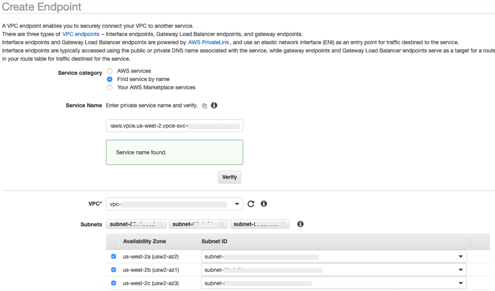

6. Select the same VPC ID that you sent to Snowflake from the VPC dropdown list.

7. If you have not yet created a subnet, then perform the following set of instructions on creating a

subnet.

8. Select Subnets from the VPC dropdown list. Then select Create subnet and follow the prompts

to create a subset in your VPC. Ensure you select the VPC ID you sent Snowflake.

9. Under Security Group Configuration, select Create New Security Group to open the default

Security Group screen in a new tab. In this new tab, select tCreate Security Group.

10.Provide a name for the new security group (such as datawrangler-doc-snowflake-

privatelink-connection) and a description. Be sure to select the VPC ID you have used in
previous steps.

11.Add two rules to allow traffic from within your VPC to this VPC endpoint.

Navigate to your VPC under Your VPCs in a separate tab, and retrieve your CIDR block for your

VPC. Then choose Add Rule in the Inbound Rules section. Select HTTPS for the type, leave the

Source as Custom in the form, and paste in the value retrieved from the preceding describe-

vpcs call (such as 10.0.0.0/16).

12.Choose Create Security Group. Retrieve the Security Group ID from the newly created security

group (such as sg-xxxxxxxxxxxxxxxxx).

Import
3510

## Page 540

Amazon SageMaker AI
Developer Guide

13.In the VPC Endpoint configuration screen, remove the default security group. Paste in the

security group ID in the search field and select the checkbox.

14.Select Create Endpoint.

15.If the endpoint creation is successful, you see a page that has a link to your VPC endpoint

configuration, specified by the VPC ID. Select the link to view the configuration in full.

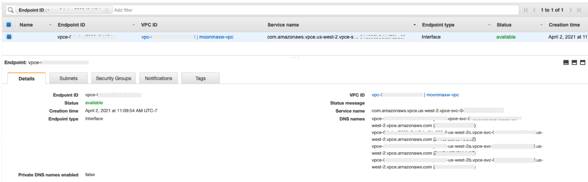

Retrieve the topmost record in the DNS names list. This can be differentiated from other DNS

names because it only includes the Region name (such as us-west-2), and no Availability Zone

letter notation (such as us-west-2a). Store this information for later use.

Configure DNS for Snowflake Endpoints in your VPC

This section explains how to configure DNS for Snowflake endpoints in your VPC. This allows your
VPC to resolve requests to the Snowflake AWS PrivateLink endpoint.

1. Navigate to the Route 53 menu within your AWS console.

2. Select the Hosted Zones option (if necessary, expand the left-hand menu to find this option).

3. Choose Create Hosted Zone.

Import
3511

## Page 541

Amazon SageMaker AI
Developer Guide

a. In the Domain name field, reference the value that was stored for privatelink-

account-url in the preceding steps. In this field, your Snowflake account ID is

removed from the DNS name and only uses the value starting with the Region
identifier. A Resource Record Set is also created later for the subdomain, such as,

region.privatelink.snowflakecomputing.com.

b. Select the radio button for Private Hosted Zone in the Type section. Your Region code may

not be us-west-2. Reference the DNS name returned to you by Snowflake.

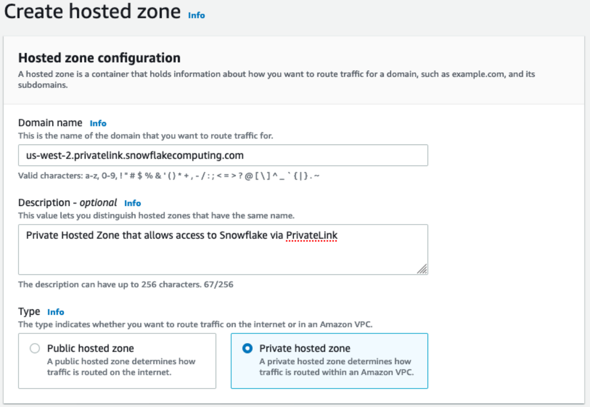

c. In the VPCs to associate with the hosted zone section, select the Region in which your VPC is

located and the VPC ID used in previous steps.

Import
3512

## Page 542

Amazon SageMaker AI
Developer Guide

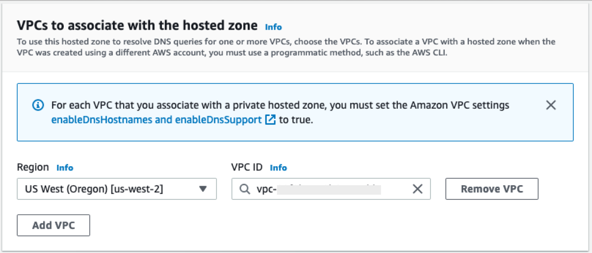

d. Choose Create hosted zone.

4. Next, create two records, one for privatelink-account-url and one for

privatelink_ocsp-url.

• In the Hosted Zone menu, choose Create Record Set.

a. Under Record name, enter your Snowflake Account ID only (the first 8 characters in

privatelink-account-url).

b. Under Record type, select CNAME.

c. Under Value, enter the DNS name for the regional VPC endpoint you retrieved in the last

step of the Set up the Snowflake AWS PrivateLink Integration section.

Import
3513

## Page 543

Amazon SageMaker AI
Developer Guide

d. Choose Create records.

e. Repeat the preceding steps for the OCSP record we notated as privatelink-ocsp-url,

starting with ocsp through the 8-character Snowflake ID for the record name (such as

ocsp.xxxxxxxx).

Configure Route 53 Resolver Inbound Endpoint for your VPC

This section explains how to configure Route 53 resolvers inbound endpoints for your VPC.

1. Navigate to the Route 53 menu within your AWS console.

• In the left hand panel in the Security section, select the Security Groups option.

2. Choose Create Security Group.

• Provide a name for your security group (such as datawranger-doc-route53-resolver-

sg) and a description.

• Select the VPC ID used in previous steps.

• Create rules that allow for DNS over UDP and TCP from within the VPC CIDR block.

Import
3514

## Page 544

Amazon SageMaker AI
Developer Guide

• Choose Create Security Group. Note the Security Group ID because adds a rule to allow
traffic to the VPC endpoint security group.

3. Navigate to the Route 53 menu within your AWS console.

• In the Resolver section, select the Inbound Endpoint option.

4. Choose Create Inbound Endpoint.

• Provide an endpoint name.

• From the VPC in the Region dropdown list, select the VPC ID you have used in all previous
steps.

• In the Security group for this endpoint dropdown list, select the security group ID from Step
2 in this section.

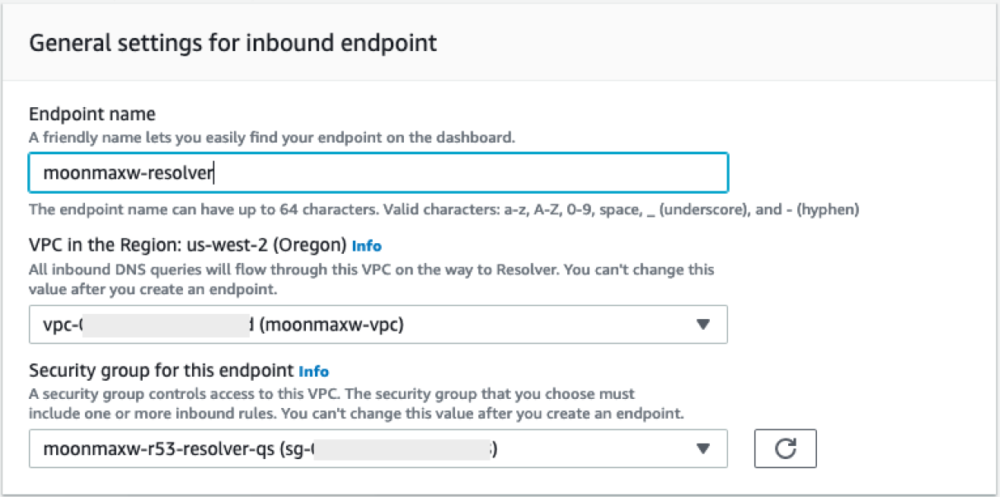

• In the IP Address section, select an Availability Zones, select a subnet, and leave the radio
selector for Use an IP address that is selected automatically selected for each IP address.

Import
3515

## Page 545

Amazon SageMaker AI
Developer Guide

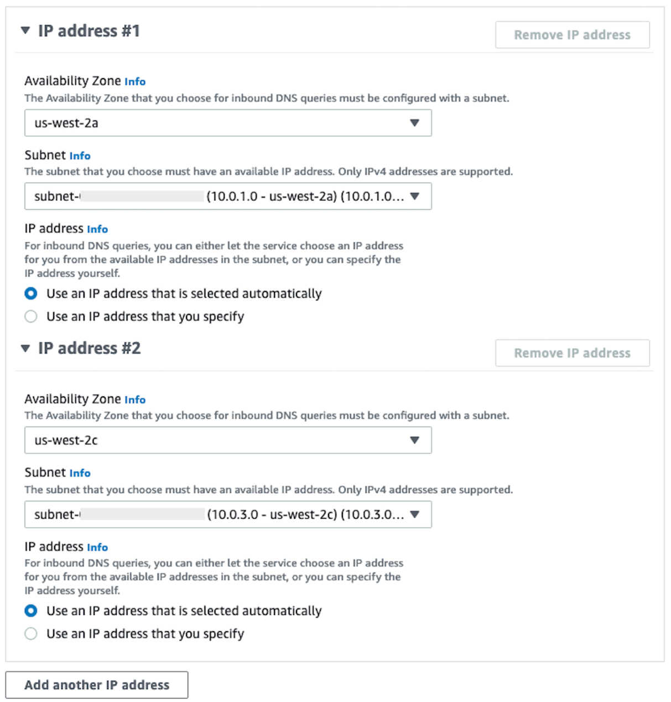

• Choose Submit.

5. Select the Inbound endpoint after it has been created.

6. Once the inbound endpoint is created, note the two IP addresses for the resolvers.

Import
3516

## Page 546

Amazon SageMaker AI
Developer Guide

SageMaker AI VPC Endpoints

This section explains how to create VPC endpoints for the following: Amazon SageMaker Studio
Classic, SageMaker Notebooks, the SageMaker API, SageMaker Runtime Runtime, and Amazon
SageMaker Feature Store Runtime.

Create a security group that is applied to all endpoints.

1. Navigate to the EC2 menu in the AWS Console.

2. In the Network & Security section, select the Security groups option.

3. Choose Create security group.

4. Provide a security group name and description (such as datawrangler-doc-sagemaker-

vpce-sg). A rule is added later to allow traffic over HTTPS from SageMaker AI to this group.

Creating the endpoints

1. Navigate to the VPC menu in the AWS console.

2. Select the Endpoints option.

3. Choose Create Endpoint.

4. Search for the service by entering its name in the Search field.

5. From the VPC dropdown list, select the VPC in which your Snowflake AWS PrivateLink

connection exists.

6. In the Subnets section, select the subnets which have access to the Snowflake PrivateLink

connection.

7. Leave the Enable DNS Name checkbox selected.

8. In the Security Groups section, select the security group you created in the preceding section.

9. Choose Create Endpoint.

Configure Studio Classic and Data Wrangler

Import
3517

## Page 547

Amazon SageMaker AI
Developer Guide

This section explains how to configure Studio Classic and Data Wrangler.

1. Configure the security group.

a. Navigate to the Amazon EC2 menu in the AWS Console.

b. Select the Security Groups option in the Network & Security section.

c. Choose Create Security Group.

d. Provide a name and description for your security group (such as datawrangler-doc-

sagemaker-studio).

e. Create the following inbound rules.

• The HTTPS connection to the security group you provisioned for the Snowflake PrivateLink
connection you created in the Set up the Snowflake PrivateLink Integration step.

• The HTTP connection to the security group you provisioned for the Snowflake PrivateLink
connection you created in the Set up the Snowflake PrivateLink Integration step.

• The UDP and TCP for DNS (port 53) to Route 53 Resolver Inbound Endpoint security group
you create in step 2 of Configure Route 53 Resolver Inbound Endpoint for your VPC.

f. Choose Create Security Group button in the lower right hand corner.

2. Configure Studio Classic.

• Navigate to the SageMaker AI menu in the AWS console.

• From the left hand console, Select the SageMaker AI Studio Classic option.

• If you do not have any domains configured, the Get Started menu is present.

• Select the Standard Setup option from the Get Started menu.

• Under Authentication method, select AWS Identity and Access Management (IAM).

• From the Permissions menu, you can create a new role or use a pre-existing role, depending
on your use case.

• If you choose Create a new role, you are presented the option to provide an S3 bucket
name, and a policy is generated for you.

• If you already have a role created with permissions for the S3 buckets to which you
require access, select the role from the dropdown list. This role should have the

AmazonSageMakerFullAccess policy attached to it.

• Select the Network and Storage dropdown list to configure the VPC, security, and subnets
SageMaker AI uses.

• Under VPC, select the VPC in which your Snowflake PrivateLink connection exists.
Import
3518

## Page 548

Amazon SageMaker AI
Developer Guide

• Under Subnet(s), select the subnets which have access to the Snowflake PrivateLink
connection.

• Under Network Access for Studio Classic, select VPC Only.

• Under Security Group(s), select the security group you created in step 1.

• Choose Submit.

3. Edit the SageMaker AI security group.

• Create the following inbound rules:

• Port 2049 to the inbound and outbound NFS Security Groups created automatically by
SageMaker AI in step 2 (the security group names contain the Studio Classic domain ID).

• Access to all TCP ports to itself (required for SageMaker AI for VPC Only).

4. Edit the VPC Endpoint Security Groups:

• Navigate to the Amazon EC2 menu in the AWS console.

• Locate the security group you created in a preceding step.

• Add an inbound rule allowing for HTTPS traffic from the security group created in step 1.

5. Create a user profile.

• From the SageMaker Studio Classic Control Panel , choose Add User.

• Provide a user name.

• For the Execution Role, choose to create a new role or to use a pre-existing role.

• If you choose Create a new role, you are presented the option to provide an Amazon S3
bucket name, and a policy is generated for you.

• If you already have a role created with permissions to the Amazon S3 buckets to which
you require access, select the role from the dropdown list. This role should have the

AmazonSageMakerFullAccess policy attached to it.

• Choose Submit.

6. Create a data flow (follow the data scientist guide outlined in a preceding section).

• When adding a Snowflake connection, enter the value of privatelink-account-name
(from the Set up Snowflake PrivateLink Integration step) into the Snowflake account name
(alphanumeric) field, instead of the plain Snowflake account name. Everything else is left
unchanged.

Import
3519

## Page 549

Amazon SageMaker AI
Developer Guide

Provide information to the data scientist

Provide the data scientist with the information that they need to access Snowflake from Amazon
SageMaker AI Data Wrangler.

Important

Your users need to run Amazon SageMaker Studio Classic version 1.3.0 or later. For
information about checking the version of Studio Classic and updating it, see Prepare ML
Data with Amazon SageMaker Data Wrangler.

1.
To allow your data scientist to access Snowflake from SageMaker Data Wrangler, provide them
with one of the following:

• For Basic Authentication, a Snowflake account name, user name, and password.

• For OAuth, a user name and password in the identity provider.

• For ARN, the Secrets Manager secret Amazon Resource Name (ARN).

• A secret created with AWS Secrets Manager and the ARN of the secret. Use the following
procedure below to create the secret for Snowflake if you choose this option.

Important

If your data scientists use the Snowflake Credentials (User name and Password)
option to connect to Snowflake, you can use Secrets Manager to store the
credentials in a secret. Secrets Manager rotates secrets as part of a best practice
security plan. The secret created in Secrets Manager is only accessible with the
Studio Classic role configured when you set up a Studio Classic user profile. This

requires you to add this permission, secretsmanager:PutResourcePolicy, to
the policy that is attached to your Studio Classic role.
We strongly recommend that you scope the role policy to use different roles for
different groups of Studio Classic users. You can add additional resource-based
permissions for the Secrets Manager secrets. See Manage Secret Policy for condition
keys you can use.
For information about creating a secret, see Create a secret. You're charged for the
secrets that you create.

Import
3520

## Page 550

Amazon SageMaker AI
Developer Guide

2.
(Optional) Provide the data scientist with the name of the storage integration that you created
using the following procedure Create a Cloud Storage Integration in Snowflake. This is the

name of the new integration and is called integration_name in the CREATE INTEGRATION
SQL command you ran, which is shown in the following snippet:

CREATE STORAGE INTEGRATION integration_name
TYPE = EXTERNAL_STAGE
STORAGE_PROVIDER = S3
ENABLED = TRUE
STORAGE_AWS_ROLE_ARN = 'iam_role'
[ STORAGE_AWS_OBJECT_ACL = 'bucket-owner-full-control' ]
STORAGE_ALLOWED_LOCATIONS = ('s3://bucket/path/', 's3://bucket/path/')
[ STORAGE_BLOCKED_LOCATIONS = ('s3://bucket/path/', 's3://bucket/path/') ]

Data Scientist Guide

Use the following to connect Snowflake and access your data in Data Wrangler.

Important

Your administrator needs to use the information in the preceding sections to set up
Snowflake. If you're running into issues, contact them for troubleshooting help.

You can connect to Snowflake in one of the following ways:

• Specifying your Snowflake credentials (account name, user name, and password) in Data
Wrangler.

• Providing an Amazon Resource Name (ARN) of a secret containing the credentials.

• Using an open standard for access delegation (OAuth) provider that connects to Snowflake. Your
administrator can give you access to one of the following OAuth providers:

• Azure AD

• Okta

• Ping Federate

Import
3521

## Page 551

Amazon SageMaker AI
Developer Guide

Talk to your administrator about the method that you need to use to connect to Snowflake.

The following sections have information about how you can connect to Snowflake using the
preceding methods.

Specifying your Snowflake Credentials

To import a dataset into Data Wrangler from Snowflake using your credentials

1.
Sign into Amazon SageMaker AI Console.

2.
Choose Studio.

3.
Choose Launch app.

4.
From the dropdown list, select Studio.

5.
Choose the Home icon.

6.
Choose Data.

7.
Choose Data Wrangler.

8.
Choose Import data.

9.
Under Available, choose Snowflake.

10. For Connection name, specify a name that uniquely identifies the connection.

11. For Authentication method, choose Basic Username-Password.

12. For Snowflake account name (alphanumeric), specify the full name of the Snowflake

account.

13. For Username, specify the username that you use to access the Snowflake account.

14. For Password, specify the password associated with the username.

15. (Optional) For Advanced settings. specify the following:

• Role – A role within Snowflake. Some roles have access to different datasets. If you don't
specify a role, Data Wrangler uses the default role in your Snowflake account.

• Storage integration – When you specify and run a query, Data Wrangler creates a
temporary copy of the query results in memory. To store a permanent copy of the query
results, specify the Amazon S3 location for the storage integration. Your administrator
provided you with the S3 URI.

• KMS key ID – A KMS key that you've created. You can specify its ARN to encrypt the
output of the Snowflake query. Otherwise, Data Wrangler uses the default encryption.

16. Choose Connect.

Import
3522

## Page 552

Amazon SageMaker AI
Developer Guide

Providing an Amazon Resource Name (ARN)

To import a dataset into Data Wrangler from Snowflake using an ARN

1.
Sign into Amazon SageMaker AI Console.

2.
Choose Studio.

3.
Choose Launch app.

4.
From the dropdown list, select Studio.

5.
Choose the Home icon.

6.
Choose Data.

7.
Choose Data Wrangler.

8.
Choose Import data.

9.
Under Available, choose Snowflake.

10. For Connection name, specify a name that uniquely identifies the connection.

11. For Authentication method, choose ARN.

12. Secrets Manager ARN – The ARN of the AWS Secrets Manager secret used to store the

credentials used to connect to Snowflake.

13. (Optional) For Advanced settings. specify the following:

• Role – A role within Snowflake. Some roles have access to different datasets. If you don't
specify a role, Data Wrangler uses the default role in your Snowflake account.

• Storage integration – When you specify and run a query, Data Wrangler creates a
temporary copy of the query results in memory. To store a permanent copy of the query
results, specify the Amazon S3 location for the storage integration. Your administrator
provided you with the S3 URI.

• KMS key ID – A KMS key that you've created. You can specify its ARN to encrypt the
output of the Snowflake query. Otherwise, Data Wrangler uses the default encryption.

14. Choose Connect.

Import
3523

## Page 553

Amazon SageMaker AI
Developer Guide

Using an OAuth Connection

Important

Your administrator customized your Studio Classic environment to provide the
functionality you're using to use an OAuth connection. You might need to restart the
Jupyter server application to use the functionality.
Use the following procedure to update the Jupyter server application.

1.
Within Studio Classic, choose File

2.
Choose Shut down.

3.
Choose Shut down server.

4.
Close the tab or window that you're using to access Studio Classic.

5.
From the Amazon SageMaker AI console, open Studio Classic.

To import a dataset into Data Wrangler from Snowflake using your credentials

1.
Sign into Amazon SageMaker AI Console.

2.
Choose Studio.

3.
Choose Launch app.

4.
From the dropdown list, select Studio.

5.
Choose the Home icon.

6.
Choose Data.

7.
Choose Data Wrangler.

8.
Choose Import data.

9.
Under Available, choose Snowflake.

10. For Connection name, specify a name that uniquely identifies the connection.

11. For Authentication method, choose OAuth.

12. (Optional) For Advanced settings. specify the following:

• Role – A role within Snowflake. Some roles have access to different datasets. If you don't
specify a role, Data Wrangler uses the default role in your Snowflake account.

• Storage integration – When you specify and run a query, Data Wrangler creates a
temporary copy of the query results in memory. To store a permanent copy of the query

Import
3524

## Page 554

Amazon SageMaker AI
Developer Guide

results, specify the Amazon S3 location for the storage integration. Your administrator
provided you with the S3 URI.

• KMS key ID – A KMS key that you've created. You can specify its ARN to encrypt the
output of the Snowflake query. Otherwise, Data Wrangler uses the default encryption.

13. Choose Connect.

You can begin the process of importing your data from Snowflake after you've connected to it.

Within Data Wrangler, you can view your data warehouses, databases, and schemas, along with
the eye icon with which you can preview your table. After you select the Preview Table icon, the
schema preview of that table is generated. You must select a warehouse before you can preview a
table.

Important

If you're importing a dataset with columns of type TIMESTAMP_TZ or TIMESTAMP_LTZ,

add ::string to the column names of your query. For more information, see How To:
Unload TIMESTAMP_TZ and TIMESTAMP_LTZ data to a Parquet file.

After you select a data warehouse, database and schema, you can now write queries and run them.
The output of your query shows under Query results.

After you have settled on the output of your query, you can then import the output of your query
into a Data Wrangler flow to perform data transformations.

After you've imported your data, navigate to your Data Wrangler flow and start adding
transformations to it. For a list of available transforms, see Transform Data.

Import Data From Software as a Service (SaaS) Platforms

You can use Data Wrangler to import data from more than forty software as a service (SaaS)
platforms. To import your data from your SaaS platform, you or your administrator must use
Amazon AppFlow to transfer the data from the platform to Amazon S3 or Amazon Redshift. For
more information about Amazon AppFlow, see What is Amazon AppFlow? If you don't need to use
Amazon Redshift, we recommend transferring the data to Amazon S3 for a simpler process.

Data Wrangler supports transferring data from the following SaaS platforms:

Import
3525

## Page 555

Amazon SageMaker AI
Developer Guide

• Amplitude

• Asana

• Braintree

• CircleCI

• DocuSign Monitor

• Delighted

• Domo

• Datadog

• Dynatrace

• Facebook Ads

• Facebook Page Insights

• Google Ads

• Google Analytics 4

• Google Calendar

• Google Search Console

• GitHub

• GitLab

• Infor Nexus

• Instagram Ads

• Intercom

• JDBC (Sync)

• Jira Cloud

• LinkedIn Ads

• Mailchimp

• Marketo

• Microsoft Dynamics 365

• Microsoft Teams

• Mixpanel

• Okta

• Oracle HCM

Import
3526

## Page 556

Amazon SageMaker AI
Developer Guide

• Paypal Checkout

• Pendo

• Salesforce

• Salesforce Marketing Cloud

• Salesforce Pardot

• SAP OData

• SendGrid

• ServiceNow

• Singular

• Slack

• Smartsheet

• Snapchat Ads

• Stripe

• Trend Micro

• Typeform

• Veeva

• WooCommerce

• Zendesk

• Zendesk Chat

• Zendesk Sell

• Zendesk Sunshine

• Zoho CRM

• Zoom Meetings

The preceding list has links to more information about setting up your data source. You or your
administrator can refer to the preceding links after you've read the following information.

When you navigate to the Import tab of your Data Wrangler flow, you see data sources under the
following sections:

• Available

Import
3527

## Page 557

Amazon SageMaker AI
Developer Guide

• Set up data sources

You can connect to data sources under Available without needing additional configuration. You
can choose the data source and import your data.

Data sources under Set up data sources, require you or your administrator to use Amazon AppFlow
to transfer the data from the SaaS platform to Amazon S3 or Amazon Redshift. For information
about performing a transfer, see Using Amazon AppFlow to transfer your data.

After you perform the data transfer, the SaaS platform appears as a data source under Available.
You can choose it and import the data that you've transferred into Data Wrangler. The data that
you've transferred appears as tables that you can query.

Using Amazon AppFlow to transfer your data

Amazon AppFlow is a platform that you can use to transfer data from your SaaS platform to
Amazon S3 or Amazon Redshift without having to write any code. To perform a data transfer, you
use the AWS Management Console.

Important

You must make sure you've set up the permissions to perform a data transfer. For more
information, see Amazon AppFlow Permissions.

After you've added permissions, you can transfer the data. Within Amazon AppFlow, you create
a flow to transfer the data. A flow is a series of configurations. You can use it to specify whether
you're running the data transfer on a schedule or whether you're partitioning the data into
separate files. After you've configured the flow, you run it to transfer the data.

For information about creating a flow, see Creating flows in Amazon AppFlow. For information
about running a flow, see Activate an Amazon AppFlow flow.

After the data has been transferred, use the following procedure to access the data in Data
Wrangler.

Important

Before you try to access your data, make sure your IAM role has the following policy:

Import
3528

## Page 558

Amazon SageMaker AI
Developer Guide

JSON

{

"Version":"2012-10-17",
"Statement": [
{
"Effect": "Allow",
"Action": "glue:SearchTables",
"Resource": [
"arn:aws:glue:*:*:table/*/*",
"arn:aws:glue:*:*:database/*",
"arn:aws:glue:*:*:catalog"
]
}
]
}

By default, the IAM role that you use to access Data Wrangler is the

SageMakerExecutionRole. For more information about adding policies, see Adding IAM
identity permissions (console).

To connect to a data source, do the following.

1.
Sign into Amazon SageMaker AI Console.

2.
Choose Studio.

3.
Choose Launch app.

4.
From the dropdown list, select Studio.

5.
Choose the Home icon.

6.
Choose Data.

7.
Choose Data Wrangler.

8.
Choose Import data.

9.
Under Available, choose the data source.

Import
3529

## Page 559

Amazon SageMaker AI
Developer Guide

10. For the Name field, specify the name of the connection.

11. (Optional) Choose Advanced configuration.

a.
Choose a Workgroup.

b.
If your workgroup hasn't enforced the Amazon S3 output location or if you don't use a
workgroup, specify a value for Amazon S3 location of query results.

c.
(Optional) For Data retention period, select the checkbox to set a data retention period
and specify the number of days to store the data before it's deleted.

d.
(Optional) By default, Data Wrangler saves the connection. You can choose to deselect the
checkbox and not save the connection.

12. Choose Connect.

13. Specify a query.

Note

To help you specify a query, you can choose a table on the left-hand navigation panel.
Data Wrangler shows the table name and a preview of the table. Choose the icon next
to the table name to copy the name. You can use the table name in the query.

14. Choose Run.

15. Choose Import query.

16. For Dataset name, specify the name of the dataset.

17. Choose Add.

When you navigate to the Import data screen, you can see the connection that you've created. You
can use the connection to import more data.

Imported Data Storage

Important

We strongly recommend that you follow the best practices around protecting your Amazon
S3 bucket by following  Security best practices.

Import
3530

## Page 560

Amazon SageMaker AI
Developer Guide

When you query data from Amazon Athena or Amazon Redshift, the queried dataset is
automatically stored in Amazon S3. Data is stored in the default SageMaker AI S3 bucket for the
AWS Region in which you are using Studio Classic.

Default S3 buckets have the following naming convention: sagemaker-region-account

number. For example, if your account number is 111122223333 and you are using Studio Classic in

us-east-1, your imported datasets are stored in sagemaker-us-east-1-111122223333.

Data Wrangler flows depend on this Amazon S3 dataset location, so you should not modify this
dataset in Amazon S3 while you are using a dependent flow. If you do modify this S3 location, and

you want to continue using your data flow, you must remove all objects in trained_parameters
in your .flow file. To do this, download the .flow file from Studio Classic and for each instance of

trained_parameters, delete all entries. When you are done, trained_parameters should be
an empty JSON object:

"trained_parameters": {}

When you export and use your data flow to process your data, the .flow file you export refers to
this dataset in Amazon S3. Use the following sections to learn more.

Amazon Redshift Import Storage

Data Wrangler stores the datasets that result from your query in a Parquet file in your default
SageMaker AI S3 bucket.

This file is stored under the following prefix (directory): redshift/uuid/data/, where uuid is a
unique identifier that gets created for each query.

For example, if your default bucket is sagemaker-us-east-1-111122223333, a single
dataset queried from Amazon Redshift is located in s3://sagemaker-us-east-1-111122223333/

redshift/uuid/data/.

Amazon Athena Import Storage

When you query an Athena database and import a dataset, Data Wrangler stores the dataset, as
well as a subset of that dataset, or preview files, in Amazon S3.

The dataset you import by selecting Import dataset is stored in Parquet format in Amazon S3.

Preview files are written in CSV format when you select Run on the Athena import screen, and
contain up to 100 rows from your queried dataset.

Import
3531

## Page 561

Amazon SageMaker AI
Developer Guide

The dataset you query is located under the prefix (directory): athena/uuid/data/, where uuid is a
unique identifier that gets created for each query.

For example, if your default bucket is sagemaker-us-east-1-111122223333, a single dataset

queried from Athena is located in s3://sagemaker-us-east-1-111122223333/athena/uuid/

data/example_dataset.parquet.

The subset of the dataset that is stored to preview dataframes in Data Wrangler is stored under the
prefix: athena/.

Create and Use a Data Wrangler Flow

Use an Amazon SageMaker Data Wrangler flow, or a data flow, to create and modify a data
preparation pipeline. The data flow connects the datasets, transformations, and analyses, or steps,
you create and can be used to define your pipeline.

Instances

When you create a Data Wrangler flow in Amazon SageMaker Studio Classic, Data Wrangler uses
an Amazon EC2 instance to run the analyses and transformations in your flow. By default, Data
Wrangler uses the m5.4xlarge instance. m5 instances are general purpose instances that provide
a balance between compute and memory. You can use m5 instances for a variety of compute
workloads.

Data Wrangler also gives you the option of using r5 instances. r5 instances are designed to deliver
fast performance that processes large datasets in memory.

We recommend that you choose an instance that is best optimized around your workloads. For
example, the r5.8xlarge might have a higher price than the m5.4xlarge, but the r5.8xlarge might be
better optimized for your workloads. With better optimized instances, you can run your data flows
in less time at lower cost.

The following table shows the instances that you can use to run your Data Wrangler flow.

Standard Instances
vCPU
Memory

ml.m5.4xlarge
16
64 GiB

ml.m5.8xlarge
32
128 GiB

Create and Use a Data Wrangler Flow
3532

## Page 562

Amazon SageMaker AI
Developer Guide

Standard Instances
vCPU
Memory

ml.m5.16xlarge
64
256 GiB

ml.m5.24xlarge
96
384 GiB

r5.4xlarge
16
128 GiB

r5.8xlarge
32
256 GiB

r5.24xlarge
96
768 GiB

For more information about r5 instances, see Amazon EC2 R5 Instances. For more information
about m5 instances, see Amazon EC2 M5 Instances.

Each Data Wrangler flow has an Amazon EC2 instance associated with it. You might have multiple
flows that are associated with a single instance.

For each flow file, you can seamlessly switch the instance type. If you switch the instance type, the
instance that you used to run the flow continues to run.

To switch the instance type of your flow, do the following.

1.
Choose the Running Terminals and Kernels icon

(

).

2.
Navigate to the instance that you're using and choose it.

3.
Choose the instance type that you want to use.

Create and Use a Data Wrangler Flow
3533

## Page 563

Amazon SageMaker AI
Developer Guide

4.
Choose Save.

You are charged for all running instances. To avoid incurring additional charges, shut down
the instances that you aren't using manually. To shut down an instance that is running, use the
following procedure.

To shut down a running instance.

1.
Choose the instance icon. The following image shows you where to select the RUNNING
INSTANCES icon.

Create and Use a Data Wrangler Flow
3534

## Page 564

Amazon SageMaker AI
Developer Guide

2.
Choose Shut down next to the instance that you want to shut down.

If you shut down an instance used to run a flow, you temporarily can't access the flow. If you get an
error while attempting to open the flow running an instance you previously shut down, wait for 5
minutes and try opening it again.

When you export your data flow to a location such as Amazon Simple Storage Service or Amazon
SageMaker Feature Store, Data Wrangler runs an Amazon SageMaker processing job. You can use
one of the following instances for the processing job. For more information on exporting your data,
see Export.

Standard Instances
vCPU
Memory

ml.m5.4xlarge
16
64 GiB

ml.m5.12xlarge
48
192 GiB

ml.m5.24xlarge
96
384 GiB

For more information about the cost per hour for using the available instance types, see SageMaker
Pricing.

The Data Flow UI

When you import a dataset, the original dataset appears on the data flow and is named Source. If
you turned on sampling when you imported your data, this dataset is named Source - sampled.
Data Wrangler automatically infers the types of each column in your dataset and creates a new
dataframe named Data types. You can select this frame to update the inferred data types. You see
results similar to those shown in the following image after you upload a single dataset:

Create and Use a Data Wrangler Flow
3535

## Page 565

Amazon SageMaker AI
Developer Guide

Each time you add a transform step, you create a new dataframe. When multiple transform steps
(other than Join or Concatenate) are added to the same dataset, they are stacked.

Join and Concatenate create standalone steps that contain the new joined or concatenated
dataset.

The following diagram shows a data flow with a join between two datasets, as well as two stacks
of steps. The first stack (Steps (2)) adds two transforms to the type inferred in the Data types
dataset. The downstream stack, or the stack to the right, adds transforms to the dataset resulting
from a join named demo-join.

Create and Use a Data Wrangler Flow
3536

## Page 566

Amazon SageMaker AI
Developer Guide

The small, gray box in the bottom right corner of the data flow provides an overview
of number of stacks and steps in the flow and the layout of the flow. The lighter box
inside the gray box indicates the steps that are within the UI view. You can use this box
to see sections of your data flow that fall outside of the UI view. Use the fit screen icon

(

)
to fit all steps and datasets into your UI view.

The bottom left navigation bar includes icons that you can use to zoom in

(

)
and zoom out
(

)
of your data flow and resize the data flow to fit the screen

(

).
Use the lock icon

(

)
to lock and unlock the location of each step on the screen.

Create and Use a Data Wrangler Flow
3537

## Page 567

Amazon SageMaker AI
Developer Guide

Add a Step to Your Data Flow

Select + next to any dataset or previously added step and then select one of the following options:

• Edit data types (For a Data types step only): If you have not added any transforms to a Data
types step, you can select Edit data types to update the data types Data Wrangler inferred when
importing your dataset.

• Add transform: Adds a new transform step. See Transform Data to learn more about the data
transformations you can add.

• Add analysis: Adds an analysis. You can use this option to analyze your data at any
point in the data flow. When you add one or more analyses to a step, an analysis icon

(

)
appears on that step. See Analyze and Visualize to learn more about the analyses you can add.

• Join: Joins two datasets and adds the resulting dataset to the data flow. To learn more, see Join
Datasets.

• Concatenate: Concatenates two datasets and adds the resulting dataset to the data flow. To
learn more, see Concatenate Datasets.

Delete a Step from Your Data Flow

To delete a step, select the step and select Delete. If the node is a node that has a single input, you
delete only the step that you select. Deleting a step that has a single input doesn't delete the steps
that follow it. If you're deleting a step for a source, join, or concatenate node, all the steps that
follow it are also deleted.

To delete a step from a stack of steps, select the stack and then select the step you want to delete.

You can use one of the following procedures to delete a step without deleting the downstream
steps.

Delete a step in the Data Wrangler flow

You can delete an individual step for nodes in your data flow that have a single input. You can't
delete individual steps for source, join, and concatenate nodes.

Use the following procedure to delete a step in the Data Wrangler flow.

Create and Use a Data Wrangler Flow
3538

## Page 568

Amazon SageMaker AI
Developer Guide

1.
Choose the group of steps that has the step that you're deleting.

2.
Choose the icon next to the step.

3.
Choose Delete step.

Delete a step in the table view

Use the following procedure to delete a step in the table view.

You can delete an individual step for nodes in your data flow that have a single input. You can't
delete individual steps for source, join, and concatenate nodes.

1.
Choose the step and open the table view for the step.

2.
Move your cursor over the step so the ellipsis icon appears.

3.
Choose the icon next to the step.

4.
Choose Delete.

Create and Use a Data Wrangler Flow
3539

## Page 569

Amazon SageMaker AI
Developer Guide

Edit a Step in Your Data Wrangler Flow

You can edit each step that you've added in your Data Wrangler flow. By editing steps, you can
change the transformations or the data types of the columns. You can edit the steps to make
changes with which you can perform better analyses.

There are many ways that you can edit a step. Some examples include changing the imputation
method or changing the threshold for considering a value to be an outlier.

Use the following procedure to edit a step.

To edit a step, do the following.

1.
Choose a step in the Data Wrangler flow to open the table view.

Create and Use a Data Wrangler Flow
3540

## Page 570

Amazon SageMaker AI
Developer Guide

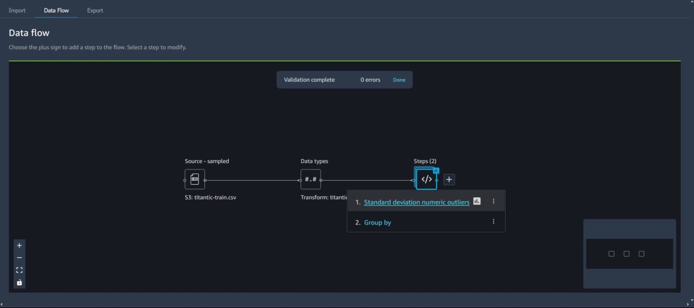

2.
Choose a step in the data flow.

3.
Edit the step.

The following image shows an example of editing a step.

Note

You can use the shared spaces within your Amazon SageMaker AI domain to work
collaboratively on your Data Wrangler flows. Within a shared space, you and your

Create and Use a Data Wrangler Flow
3541

## Page 571

Amazon SageMaker AI
Developer Guide

collaborators can edit a flow file in real-time. However, neither you nor your collaborators
can see the changes in real-time. When anyone makes a change to the Data Wrangler flow,
they must save it immediately. When someone saves a file, a collaborator won’t be able to
see it unless the close the file and reopen it. Any changes that aren’t saved by one person
are overwritten by the person who saved their changes.

Get Insights On Data and Data Quality

Use the Data Quality and Insights Report to perform an analysis of the data that you've imported
into Data Wrangler. We recommend that you create the report after you import your dataset. You
can use the report to help you clean and process your data. It gives you information such as the
number of missing values and the number of outliers. If you have issues with your data, such as
target leakage or imbalance, the insights report can bring those issues to your attention.

Use the following procedure to create a Data Quality and Insights report. It assumes that you've
already imported a dataset into your Data Wrangler flow.

To create a Data Quality and Insights report

1.
Choose a + next to a node in your Data Wrangler flow.

2.
Select Get data insights.

3.
For Analysis name, specify a name for the insights report.

4.
(Optional) For Target column, specify the target column.

5.
For Problem type, specify Regression or Classification.

6.
For Data size, specify one of the following:

• 50 K – Uses the first 50000 rows of the dataset that you've imported to create the report.

• Entire dataset – Uses the entire dataset that you've imported to create the report.

Note

Creating a Data Quality and Insights report on the entire dataset uses an Amazon
SageMaker processing job. A SageMaker Processing job provisions the additional
compute resources required to get insights for all of your data. For more information

Get Insights On Data and Data Quality
3542

## Page 572

Amazon SageMaker AI
Developer Guide

about SageMaker Processing jobs, see Data transformation workloads with SageMaker
Processing.

7.
Choose Create.

The following topics show the sections of the report:

Topics

• Summary

• Target column

• Quick model

• Feature summary

• Samples

• Definitions

You can either download the report or view it online. To download the report, choose the
download button at the top right corner of the screen. The following image shows the button.

Summary

The insights report has a brief summary of the data that includes general information such as
missing values, invalid values, feature types, outlier counts, and more. It can also include high
severity warnings that point to probable issues with the data. We recommend that you investigate
the warnings.

The following is an example of a report summary.

Get Insights On Data and Data Quality
3543

## Page 573

Amazon SageMaker AI
Developer Guide

Target column

When you create the data quality and insights report, Data Wrangler gives you the option to select
a target column. A target column is a column that you're trying to predict. When you choose a
target column, Data Wrangler automatically creates a target column analysis. It also ranks the
features in the order of their predictive power. When you select a target column, you must specify
whether you’re trying to solve a regression or a classification problem.

For classification, Data Wrangler shows a table and a histogram of the most common classes. A
class is a category. It also presents observations, or rows, with a missing or invalid target value.

The following image shows an example target column analysis for a classification problem.

Get Insights On Data and Data Quality
3544

## Page 574

Amazon SageMaker AI
Developer Guide

For regression, Data Wrangler shows a histogram of all the values in the target column. It also
presents observations, or rows, with a missing, invalid, or outlier target value.

The following image shows an example target column analysis for a regression problem.

Get Insights On Data and Data Quality
3545

## Page 575

Amazon SageMaker AI
Developer Guide

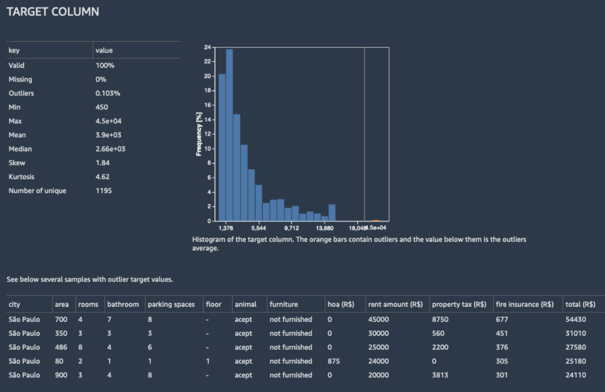

Quick model

The Quick model provides an estimate of the expected predicted quality of a model that you train
on your data.

Data Wrangler splits your data into training and validation folds. It uses 80% of the samples for
training and 20% of the values for validation. For classification, the sample is stratified split. For
a stratified split, each data partition has the same ratio of labels. For classification problems, it's
important to have the same ratio of labels between the training and classification folds. Data
Wrangler trains the XGBoost model with the default hyperparameters. It applies early stopping on
the validation data and performs minimal feature preprocessing.

For classification models, Data Wrangler returns both a model summary and a confusion matrix.

The following is an example of a classification model summary. To learn more about the
information that it returns, see Definitions.

Get Insights On Data and Data Quality
3546

## Page 576

Amazon SageMaker AI
Developer Guide

The following is an example of a confusion matrix that the quick model returns.

A confusion matrix gives you the following information:

• The number of times the predicted label matches the true label.

• The number of times the predicted label doesn't match the true label.

Get Insights On Data and Data Quality
3547

## Page 577

Amazon SageMaker AI
Developer Guide

The true label represents an actual observation in your data. For example, if you're using a model
to detect fraudulent transactions, the true label represents a transaction that is actually fraudulent
or non-fraudulent. The predicted label represents the label that your model assigns to the data.

You can use the confusion matrix to see how well the model predicts the presence or the absence
of a condition. If you're predicting fraudulent transactions, you can use the confusion matrix to
get a sense of both the sensitivity and the specificity of the model. The sensitivity refers to the
model's ability to detect fraudulent transactions. The specificity refers to the model's ability to
avoid detecting non-fraudulent transactions as fraudulent.

The following is an example of the quick model outputs for a regression problem.

Feature summary

When you specify a target column, Data Wrangler orders the features by their prediction power.
Prediction power is measured on the data after it was split into 80% training and 20% validation
folds. Data Wrangler fits a model for each feature separately on the training fold. It applies
minimal feature preprocessing and measures prediction performance on the validation data.

It normalizes the scores to the range [0,1]. Higher prediction scores indicate columns that are more
useful for predicting the target on their own. Lower scores point to columns that aren’t predictive
of the target column.

It’s uncommon for a column that isn’t predictive on its own to be predictive when it’s used in
tandem with other columns. You can confidently use the prediction scores to determine whether a
feature in your dataset is predictive.

Get Insights On Data and Data Quality
3548

## Page 578

Amazon SageMaker AI
Developer Guide

A low score usually indicates the feature is redundant. A score of 1 implies perfect predictive
abilities, which often indicates target leakage. Target leakage usually happens when the dataset
contains a column that isn’t available at the prediction time. For example, it could be a duplicate of
the target column.

The following are examples of the table and the histogram that show the prediction value of each
feature.

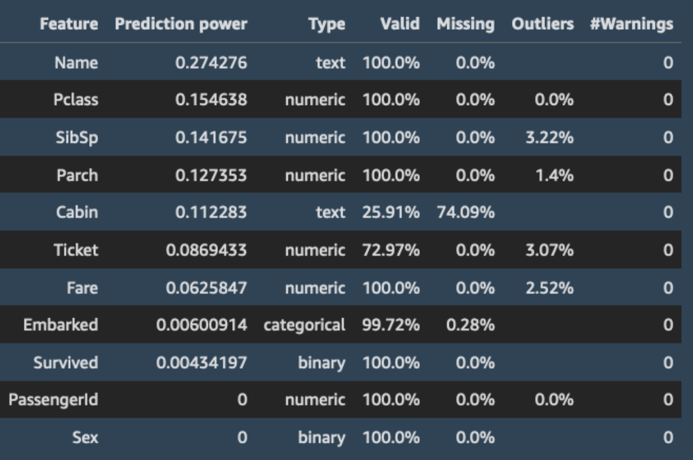

Get Insights On Data and Data Quality
3549

## Page 579

Amazon SageMaker AI
Developer Guide

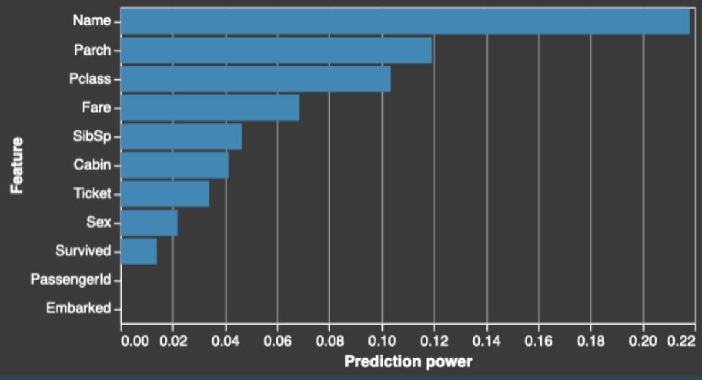

Samples

Data Wrangler provides information about whether your samples are anomalous or if there are
duplicates in your dataset.

Data Wrangler detects anomalous samples using the isolation forest algorithm. The isolation forest
associates an anomaly score with each sample (row) of the dataset. Low anomaly scores indicate
anomalous samples. High scores are associated with non-anomalous samples. Samples with a
negative anomaly score are usually considered anomalous and samples with positive anomaly score
are considered non-anomalous.

When you look at a sample that might be anomalous, we recommend that you pay attention to
unusual values. For example, you might have anomalous values that result from errors in gathering
and processing the data. We recommend using domain knowledge and business logic when you
examine anomalous samples.

Data Wrangler detects duplicate rows and calculates the ratio of duplicate rows in your data. Some
data sources could include valid duplicates. Other data sources could have duplicates that point
to problems in data collection. Duplicate samples that result from faulty data collection could
interfere with machine learning processes that rely on splitting the data into independent training
and validation folds.

The following are elements of the insights report that can be impacted by duplicated samples:

Get Insights On Data and Data Quality
3550

## Page 580

Amazon SageMaker AI
Developer Guide

• Quick model

• Prediction power estimation

• Automatic hyperparameter tuning

You can remove duplicate samples from the dataset using the Drop duplicates transform under
Manage rows. Data Wrangler shows you the most frequently duplicated rows.

Definitions

The following are definitions for the technical terms that are used in the data insights report.

Feature types

The following are the definitions for each of the feature types:

• Numeric – Numeric values can be either floats or integers, such as age or income. The
machine learning models assume that numeric values are ordered and a distance is defined
over them. For example, 3 is closer to 4 than to 10 and 3 < 4 < 10.

• Categorical – The column entries belong to a set of unique values, which is usually much
smaller than the number of entries in the column. For example, a column of length 100

could contain the unique values Dog, Cat, and Mouse. The values could be numeric, text, or a

combination of both. Horse, House, 8, Love, and 3.1 would all be valid values and could be
found in the same categorical column. The machine learning model does not assume order or
distance on the values of categorical features, as opposed to numeric features, even when all
the values are numbers.

• Binary – Binary features are a special categorical feature type in which the cardinality of the
set of unique values is 2.

• Text – A text column contains many non-numeric unique values. In extreme cases, all the
elements of the column are unique. In an extreme case, no two entries are the same.

• Datetime – A datetime column contains information about the date or time. It can have
information about both the date and time.

Feature statistics

The following are definitions for each of the feature statistics:

Get Insights On Data and Data Quality
3551

## Page 581

Amazon SageMaker AI
Developer Guide

• Prediction power – Prediction power measures how useful the column is in predicting the
target.

• Outliers (in numeric columns) – Data Wrangler detects outliers using two statistics that are
robust to outliers: median and robust standard deviation (RSTD). RSTD is derived by clipping
the feature values to the range [5 percentile, 95 percentile] and calculating the standard
deviation of the clipped vector. All values larger than median + 5 * RSTD or smaller than
median - 5 * RSTD are considered to be outliers.

• Skew (in numeric columns) – Skew measures the symmetry of the distribution and is defined
as the third moment of the distribution divided by the third power of the standard deviation.
The skewness of the normal distribution or any other symmetric distribution is zero. Positive
values imply that the right tail of the distribution is longer than the left tail. Negative values
imply that the left tail of the distribution is longer than the right tail. As a rule of thumb, a
distribution is considered skewed when the absolute value of the skew is larger than 3.

• Kurtosis (in numeric columns) – Pearson's kurtosis measures the heaviness of the tail of the
distribution. It's defined as the fourth moment of the distribution divided by the square of
the second moment. The kurtosis of the normal distribution is 3. Kurtosis values lower than 3
imply that the distribution is concentrated around the mean and the tails are lighter than the
tails of the normal distribution. Kurtosis values higher than 3 imply heavier tails or outliers.

• Missing values – Null-like objects, empty strings and strings composed of only white spaces
are considered missing.

• Valid values for numeric features or regression target – All values that you can cast to finite
floats are valid. Missing values are not valid.

• Valid values for categorical, binary, or text features, or for classification target – All values
that are not missing are valid.

• Datetime features – All values that you can cast to a datetime object are valid. Missing values
are not valid.

• Invalid values – Values that are either missing or you can't properly cast. For example, in a

numeric column, you can't cast the string "six" or a null value.

Quick model metrics for regression

The following are the definitions for the quick model metrics:

• R2 or coefficient of determination) – R2 is the proportion of the variation in the target that
is predicted by the model. R2 is in the range of [-infty, 1]. 1 is the score of the model that

Get Insights On Data and Data Quality
3552

## Page 582

Amazon SageMaker AI
Developer Guide

predicts the target perfectly and 0 is the score of the trivial model that always predicts the
target mean.

• MSE or mean squared error – MSE is in the range [0, infty]. 0 is the score of the model that
predicts the target perfectly.

• MAE or mean absolute error – MAE is in the range [0, infty] where 0 is the score of the model
that predicts the target perfectly.

• RMSE or root mean square error – RMSE is in the range [0, infty] where 0 is the score of the
model that predicts the target perfectly.

• Max error – The maximum absolute value of the error over the dataset. Max error is in the
range [0, infty]. 0 is the score of the model that predicts the target perfectly.

• Median absolute error – Median absolute error is in the range [0, infty]. 0 is the score of the
model that predicts the target perfectly.

Quick model metrics for classification

The following are the definitions for the quick model metrics:

• Accuracy – Accuracy is the ratio of samples that are predicted accurately. Accuracy is in the
range [0, 1]. 0 is the score of the model that predicts all samples incorrectly and 1 is the score
of the perfect model.

• Balanced accuracy – Balanced accuracy is the ratio of samples that are predicted accurately
when the class weights are adjusted to balance the data. All classes are given the same
importance, regardless of their frequency. Balanced accuracy is in the range [0, 1]. 0 is the
score of the model that predicts all samples wrong. 1 is the score of the perfect model.

• AUC (binary classification) – This is the area under the receiver operating characteristic
curve. AUC is in the range [0, 1] where a random model returns a score of 0.5 and the perfect
model returns a score of 1.

• AUC (OVR) – For multiclass classification, this is the area under the receiver operating
characteristic curve calculated separately for each label using one versus rest. Data Wrangler
reports the average of the areas. AUC is in the range [0, 1] where a random model returns a
score of 0.5 and the perfect model returns a score of 1.

• Precision – Precision is defined for a specific class. Precision is the fraction of true positives
out of all the instances that the model classified as that class. Precision is in the range [0, 1].
1 is the score of the model that has no false positives for the class. For binary classification,
Data Wrangler reports the precision of the positive class.

Get Insights On Data and Data Quality
3553

## Page 583

Amazon SageMaker AI
Developer Guide

• Recall – Recall is defined for a specific class. Recall is the fraction of the relevant class
instances that are successfully retrieved. Recall is in the range [0, 1]. 1 is the score of the
model that classifies all the instances of the class correctly. For binary classification, Data
Wrangler reports the recall of the positive class.

• F1 – F1 is defined for a specific class. It's the harmonic mean of the precision and recall. F1 is
in the range [0, 1]. 1 is the score of the perfect model. For binary classification, Data Wrangler
reports the F1 for classes with positive values.

Textual patterns

Patterns describe the textual format of a string using an easy to read format. The following are
examples of textual patterns:

• "{digits:4-7}" describes a sequence of digits that have a length between 4 and 7.

• "{alnum:5}" describes an alpha-numeric string with a length of exactly 5.

Data Wrangler infers the patterns by looking at samples of non-empty strings from your data.
It can describe many of the commonly used patterns. The confidence expressed as a percentage
indicates how much of the data is estimated to match the pattern. Using the textual pattern,
you can see which rows in your data you need to correct or drop.

The following describes the patterns that Data Wrangler can recognize:

Pattern
Textual Format

{alnum}
Alphanumeric strings

{any}
Any string of word characters

{digits}
A sequence of digits

{lower}
A lowercase word

{mixed}
A mixed-case word

{name}
A word beginning with a capital letter

{upper}
An uppercase word

Get Insights On Data and Data Quality
3554

## Page 584

Amazon SageMaker AI
Developer Guide

Pattern
Textual Format

{whitespace}
whitespace characters

A word character is either an underscore or a character that might appear in a word in any
language. For example, the strings 'Hello_word' and 'écoute' both consist of word characters. 'H'
and 'é' are both examples of word characters.

Automatically Train Models on Your Data Flow

You can use Amazon SageMaker Autopilot to automatically train, tune, and deploy models on
the data that you've transformed in your data flow. Amazon SageMaker Autopilot can go through
several algorithms and use the one that works best with your data. For more information about
Amazon SageMaker Autopilot, see SageMaker Autopilot.

When you train and tune a model, Data Wrangler exports your data to an Amazon S3 location
where Amazon SageMaker Autopilot can access it.

You can prepare and deploy a model by choosing a node in your Data Wrangler flow and choosing
Export and Train in the data preview. You can use this method to view your dataset before you
choose to train a model on it.

You can also train and deploy a model directly from your data flow.

The following procedure prepares and deploys a model from the data flow. For Data Wrangler
flows with multi-row transforms, you can't use the transforms from the Data Wrangler flow when
you're deploying the model. You can use the following procedure to process the data before you
use it to perform inference.

To train and deploy a model directly from your data flow, do the following.

1.
Choose the + next to the node containing the training data.

2.
Choose Train model.

3.
(Optional) Specify a AWS KMS key or ID. For more information about creating and controlling
cryptographic keys to protect your data, see AWS Key Management Service.

4.
Choose Export and train.

Automatically Train Models on Your Data Flow
3555

## Page 585

Amazon SageMaker AI
Developer Guide

5.
After Amazon SageMaker Autopilot trains the model on the data that Data Wrangler exported,
specify a name for Experiment name.

6.
Under Input data, choose Preview to verify that Data Wrangler properly exported your data to
Amazon SageMaker Autopilot.

7.
For Target, choose the target column.

8.
(Optional) For S3 location under Output data, specify an Amazon S3 location other than the
default location.

9.
Choose Next: Training method.

10. Choose a training method. For more information, see Training modes.

11. (Optional) For Auto deploy endpoint, specify a name for the endpoint.

12. For Deployment option, choose a deployment method. You can choose to deploy with or

without the transformations that you've made to your data.

Important

You can't deploy an Amazon SageMaker Autopilot model with the transformations
that you've made in your Data Wrangler flow. For more information about those
transformations, see Export to an Inference Endpoint.

13. Choose Next: Review and create.

14. Choose Create experiment.

For more information about model training and deployment, see Create Regression or
Classification Jobs for Tabular Data Using the AutoML API. Autopilot shows you analyses about the
best model's performance. For more information about model performance, see View an Autopilot
model performance report.

Transform Data

Amazon SageMaker Data Wrangler provides numerous ML data transforms to streamline cleaning,
transforming, and featurizing your data. When you add a transform, it adds a step to the data flow.
Each transform you add modifies your dataset and produces a new dataframe. All subsequent
transforms apply to the resulting dataframe.

Data Wrangler includes built-in transforms, which you can use to transform columns without any
code. You can also add custom transformations using PySpark, Python (User-Defined Function),

Transform Data
3556

## Page 586

Amazon SageMaker AI
Developer Guide

pandas, and PySpark SQL. Some transforms operate in place, while others create a new output
column in your dataset.

You can apply transforms to multiple columns at once. For example, you can delete multiple
columns in a single step.

You can apply the Process numeric and Handle missing transforms only to a single column.

Use this page to learn more about these built-in and custom transforms.

Transform UI

Most of the built-in transforms are located in the Prepare tab of the Data Wrangler UI. You can
access the join and concatenate transforms through the data flow view. Use the following table to
preview these two views.

Transform

You can add a transform to any step in your data flow. Use the following procedure to add a
transform to your data flow.

To add a step to your data flow, do the following.

1.
Choose the + next to the step in the data flow.

2.
Choose Add transform.

3.
Choose Add step.

Transform Data
3557

## Page 587

Amazon SageMaker AI
Developer Guide

4.
Choose a transform.

5.
(Optional) You can search for the transform that you want to use. Data Wrangler highlights
the query in the results.

Transform Data
3558

## Page 588

Amazon SageMaker AI
Developer Guide

Join View

To join two datasets, select the first dataset in your data flow and choose Join. When you
choose Join, you see results similar to those shown in the following image. Your left and right
datasets are displayed in the left panel. The main panel displays your data flow, with the newly
joined dataset added.

Transform Data
3559

## Page 589

Amazon SageMaker AI
Developer Guide

When you choose Configure to configure your join, you see results similar to those shown in the
following image. Your join configuration is displayed in the left panel. You can use this panel to
choose the joined dataset name, join type, and columns to join. The main panel displays three
tables. The top two tables display the left and right datasets on the left and right respectively.
Under this table, you can preview the joined dataset.

Transform Data
3560

## Page 590

Amazon SageMaker AI
Developer Guide

See Join Datasets to learn more.

Concatenate View

To concatenate two datasets, you select the first dataset in your data flow and choose
Concatenate. When you select Concatenate, you see results similar to those shown in the
following image. Your left and right datasets are displayed in the left panel. The main panel
displays your data flow, with the newly concatenated dataset added.

Transform Data
3561

## Page 591

Amazon SageMaker AI
Developer Guide

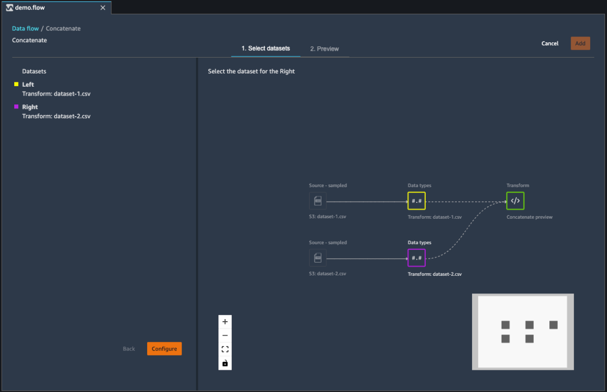

When you choose Configure to configure your concatenation, you see results similar to those
shown in the following image. Your concatenate configuration displays in the left panel.
You can use this panel to choose the concatenated dataset's name, and choose to remove
duplicates after concatenation and add columns to indicate the source dataframe. The main
panel displays three tables. The top two tables display the left and right datasets on the left
and right respectively. Under this table, you can preview the concatenated dataset.

Transform Data
3562

## Page 592

Amazon SageMaker AI
Developer Guide

See Concatenate Datasets to learn more.

Join Datasets

You join dataframes directly in your data flow. When you join two datasets, the resulting joined
dataset appears in your flow. The following join types are supported by Data Wrangler.

• Left Outer – Include all rows from the left table. If the value for the column joined on a left table
row does not match any right table row values, that row contains null values for all right table
columns in the joined table.

• Left Anti – Include rows from the left table that do not contain values in the right table for the
joined column.

• Left semi – Include a single row from the left table for all identical rows that satisfy the criteria
in the join statement. This excludes duplicate rows from the left table that match the criteria of
the join.

Transform Data
3563

## Page 593

Amazon SageMaker AI
Developer Guide

• Right Outer – Include all rows from the right table. If the value for the joined column in a right
table row does not match any left table row values, that row contains null values for all left table
columns in the joined table.

• Inner – Include rows from left and right tables that contain matching values in the joined

column.

• Full Outer – Include all rows from the left and right tables. If the row value for the joined column
in either table does not match, separate rows are created in the joined table. If a row doesn’t
contain a value for a column in the joined table, null is inserted for that column.

• Cartesian Cross – Include rows which combine each row from the first table with each row from
the second table. This is a Cartesian product of rows from tables in the join. The result of this
product is the size of the left table times the size of the right table. Therefore, we recommend
caution in using this join between very large datasets.

Use the following procedure to join two dataframes.

1.
Select + next to the left dataframe that you want to join. The first dataframe you select is
always the left table in your join.

2.
Choose Join.

3.
Select the right dataframe. The second dataframe you select is always the right table in your
join.

4.
Choose Configure to configure your join.

5.
Give your joined dataset a name using the Name field.

6.
Select a Join type.

7.
Select a column from the left and right tables to join.

8.
Choose Apply to preview the joined dataset on the right.

9.
To add the joined table to your data flow, choose Add.

Concatenate Datasets

Concatenate two datasets:

1.
Choose + next to the left dataframe that you want to concatenate. The first dataframe you
select is always the left table in your concatenate.

2.
Choose Concatenate.

Transform Data
3564

## Page 594

Amazon SageMaker AI
Developer Guide

3.
Select the right dataframe. The second dataframe you select is always the right table in your
concatenate.

4.
Choose Configure to configure your concatenate.

5.
Give your concatenated dataset a name using the Name field.

6.
(Optional) Select the checkbox next to Remove duplicates after concatenation to remove
duplicate columns.

7.
(Optional) Select the checkbox next to Add column to indicate source dataframe if, for each
column in the new dataset, you want to add an indicator of the column's source.

8.
Choose Apply to preview the new dataset.

9.
Choose Add to add the new dataset to your data flow.

Balance Data

You can balance the data for datasets with an underrepresented category. Balancing a dataset can
help you create better models for binary classification.

Note

You can't balance datasets containing column vectors.

You can use the Balance data operation to balance your data using one of the following operators:

• Random oversampling – Randomly duplicates samples in the minority category. For example,
if you're trying to detect fraud, you might only have cases of fraud in 10% of your data. For an
equal proportion of fraudulent and non-fraudulent cases, this operator randomly duplicates
fraud cases within the dataset 8 times.

• Random undersampling – Roughly equivalent to random oversampling. Randomly removes
samples from the overrepresented category to get the proportion of samples that you desire.

• Synthetic Minority Oversampling Technique (SMOTE) – Uses samples from the underrepresented
category to interpolate new synthetic minority samples. For more information about SMOTE, see
the following description.

You can use all transforms for datasets containing both numeric and non-numeric features. SMOTE
interpolates values by using neighboring samples. Data Wrangler uses the R-squared distance

Transform Data
3565

## Page 595

Amazon SageMaker AI
Developer Guide

to determine the neighborhood to interpolate the additional samples. Data Wrangler only uses
numeric features to calculate the distances between samples in the underrepresented group.

For two real samples in the underrepresented group, Data Wrangler interpolates the numeric
features by using a weighted average. It randomly assigns weights to those samples in the range of
[0, 1]. For numeric features, Data Wrangler interpolates samples using a weighted average of the
samples. For samples A and B, Data Wrangler could randomly assign a weight of 0.7 to A and 0.3 to
B. The interpolated sample has a value of 0.7A + 0.3B.

Data Wrangler interpolates non-numeric features by copying from either of the interpolated real
samples. It copies the samples with a probability that it randomly assigns to each sample. For
samples A and B, it can assign probabilities 0.8 to A and 0.2 to B. For the probabilities it assigned, it
copies A 80% of the time.

Custom Transforms

The Custom Transforms group allows you to use Python (User-Defined Function), PySpark, pandas,

or PySpark (SQL) to define custom transformations. For all three options, you use the variable df
to access the dataframe to which you want to apply the transform. To apply your custom code

to your dataframe, assign the dataframe with the transformations that you've made to the df
variable. If you're not using Python (User-Defined Function), you don't need to include a return
statement. Choose Preview to preview the result of the custom transform. Choose Add to add the
custom transform to your list of Previous steps.

You can import the popular libraries with an import statement in the custom transform code
block, such as the following:

• NumPy version 1.19.0

• scikit-learn version 0.23.2

• SciPy version 1.5.4

• pandas version 1.0.3

• PySpark version 3.0.0

Important

Custom transform doesn't support columns with spaces or special characters in the name.
We recommend that you specify column names that only have alphanumeric characters
and underscores. You can use the Rename column transform in the Manage columns

Transform Data
3566

## Page 596

Amazon SageMaker AI
Developer Guide

transform group to remove spaces from a column's name. You can also add a Python
(Pandas) Custom transform similar to the following to remove spaces from multiple

columns in a single step. This example changes columns named A column and B column

to A_column and B_column respectively.

df.rename(columns={"A column": "A_column", "B column": "B_column"})

If you include print statements in the code block, the result appears when you select Preview. You
can resize the custom code transformer panel. Resizing the panel provides more space to write
code. The following image shows the resizing of the panel.

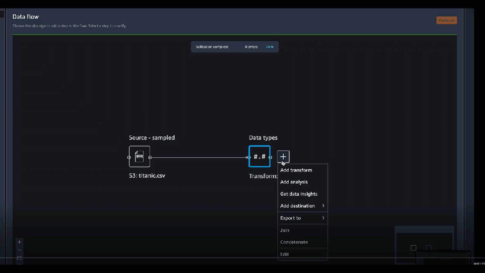

The following sections provide additional context and examples for writing custom transform code.

Python (User-Defined Function)

The Python function gives you the ability to write custom transformations without needing to
know Apache Spark or pandas. Data Wrangler is optimized to run your custom code quickly. You
get similar performance using custom Python code and an Apache Spark plugin.

To use the Python (User-Defined Function) code block, you specify the following:

Transform Data
3567

## Page 597

Amazon SageMaker AI
Developer Guide

• Input column – The input column where you're applying the transform.

• Mode – The scripting mode, either pandas or Python.

• Return type – The data type of the value that you're returning.

Using the pandas mode gives better performance. The Python mode makes it easier for you to
write transformations by using pure Python functions.

The following video shows an example of how to use custom code to create a transformation. It
uses the Titanic dataset to create a column with the person's salutation.

PySpark

The following example extracts date and time from a timestamp.

from pyspark.sql.functions import from_unixtime, to_date, date_format
df = df.withColumn('DATE_TIME', from_unixtime('TIMESTAMP'))
df = df.withColumn( 'EVENT_DATE', to_date('DATE_TIME')).withColumn(
'EVENT_TIME', date_format('DATE_TIME', 'HH:mm:ss'))

pandas

Transform Data
3568

## Page 598

Amazon SageMaker AI
Developer Guide

The following example provides an overview of the dataframe to which you are adding transforms.

df.info()

PySpark (SQL)

The following example creates a new dataframe with four columns: name, fare, pclass, survived.

SELECT name, fare, pclass, survived FROM df

If you don’t know how to use PySpark, you can use custom code snippets to help you get started.

Data Wrangler has a searchable collection of code snippets. You can use to code snippets to
perform tasks such as dropping columns, grouping by columns, or modelling.

To use a code snippet, choose Search example snippets and specify a query in the search bar. The
text you specify in the query doesn’t have to match the name of the code snippet exactly.

The following example shows a Drop duplicate rows code snippet that can delete rows with similar
data in your dataset. You can find the code snippet by searching for one of the following:

• Duplicates

• Identical

• Remove

The following snippet has comments to help you understand the changes that you need to make.
For most snippets, you must specify the column names of your dataset in the code.

# Specify the subset of columns
# all rows having identical values in these columns will be dropped

subset = ["col1", "col2", "col3"]
df = df.dropDuplicates(subset)

# to drop the full-duplicate rows run
# df = df.dropDuplicates()

Transform Data
3569

## Page 599

Amazon SageMaker AI
Developer Guide

To use a snippet, copy and paste its content into the Custom transform field. You can copy and
paste multiple code snippets into the custom transform field.

Custom Formula

Use Custom formula to define a new column using a Spark SQL expression to query data in the
current dataframe. The query must use the conventions of Spark SQL expressions.

Important

Custom formula doesn't support columns with spaces or special characters in the name.
We recommend that you specify column names that only have alphanumeric characters
and underscores. You can use the Rename column transform in the Manage columns
transform group to remove spaces from a column's name. You can also add a Python
(Pandas) Custom transform similar to the following to remove spaces from multiple

columns in a single step. This example changes columns named A column and B column

to A_column and B_column respectively.

df.rename(columns={"A column": "A_column", "B column": "B_column"})

You can use this transform to perform operations on columns, referencing the columns by name.
For example, assuming the current dataframe contains columns named col_a and col_b, you
can use the following operation to produce an Output column that is the product of these two
columns with the following code:

col_a * col_b

Other common operations include the following, assuming a dataframe contains col_a and col_b
columns:

• Concatenate two columns: concat(col_a, col_b)

• Add two columns: col_a + col_b

• Subtract two columns: col_a - col_b

• Divide two columns: col_a / col_b

• Take the absolute value of a column: abs(col_a)

Transform Data
3570

## Page 600

Amazon SageMaker AI
Developer Guide

For more information, see the Spark documentation on selecting data.

Reduce Dimensionality within a Dataset

Reduce the dimensionality in your data by using Principal Component Analysis (PCA). The

dimensionality of your dataset corresponds to the number of features. When you use
dimensionality reduction in Data Wrangler, you get a new set of features called components. Each
component accounts for some variability in the data.

The first component accounts for the largest amount of variation in the data. The second
component accounts for the second largest amount of variation in the data, and so on.

You can use dimensionality reduction to reduce the size of the data sets that you use to train
models. Instead of using the features in your dataset, you can use the principal components
instead.

To perform PCA, Data Wrangler creates axes for your data. An axis is an affine combination of
columns in your dataset. The first principal component is the value on the axis that has the largest
amount of variance. The second principal component is the value on the axis that has the second
largest amount of variance. The nth principal component is the value on the axis that has the nth
largest amount of variance.

You can configure the number of principal components that Data Wrangler returns. You can either
specify the number of principal components directly or you can specify the variance threshold
percentage. Each principal component explains an amount of variance in the data. For example,
you might have a principal component with a value of 0.5. The component would explain 50% of
the variation in the data. When you specify a variance threshold percentage, Data Wrangler returns
the smallest number of components that meet the percentage that you specify.

The following are example principal components with the amount of variance that they explain in
the data.

• Component 1 – 0.5

• Component 2 – 0.45

• Component 3 – 0.05

If you specify a variance threshold percentage of 94 or 95, Data Wrangler returns Component 1

and Component 2. If you specify a variance threshold percentage of 96, Data Wrangler returns all
three principal components.

Transform Data
3571

## Page 601

Amazon SageMaker AI
Developer Guide

You can use the following procedure to run PCA on your dataset.

To run PCA on your dataset, do the following.

1.
Open your Data Wrangler data flow.

2.
Choose the +, and select Add transform.

3.
Choose Add step.

4.
Choose Dimensionality Reduction.

5.
For Input Columns, choose the features that you're reducing into the principal components.

6.
(Optional) For Number of principal components, choose the number of principal components
that Data Wrangler returns in your dataset. If specify a value for the field, you can't specify a
value for Variance threshold percentage.

7.
(Optional) For Variance threshold percentage, specify the percentage of variation in the

data that you want explained by the principal components. Data Wrangler uses the default

value of 95 if you don't specify a value for the variance threshold. You can't specify a variance
threshold percentage if you've specified a value for Number of principal components.

8.
(Optional) Deselect Center to not use the mean of the columns as the center of the data. By
default, Data Wrangler centers the data with the mean before scaling.

9.
(Optional) Deselect Scale to not scale the data with the unit standard deviation.

10. (Optional) Choose Columns to output the components to separate columns. Choose Vector to

output the components as a single vector.

11. (Optional) For Output column, specify a name for an output column. If you're outputting the

components to separate columns, the name that you specify is a prefix. If you're outputting
the components to a vector, the name that you specify is the name of the vector column.

12. (Optional) Select Keep input columns. We don't recommend selecting this option if you plan

on only using the principal components to train your model.

13. Choose Preview.

14. Choose Add.

Encode Categorical

Categorical data is usually composed of a finite number of categories, where each category
is represented with a string. For example, if you have a table of customer data, a column that
indicates the country a person lives in is categorical. The categories would be Afghanistan, Albania,

Transform Data
3572

## Page 602

Amazon SageMaker AI
Developer Guide

Algeria, and so on. Categorical data can be nominal or ordinal. Ordinal categories have an inherent
order, and nominal categories do not. The highest degree obtained (High school, Bachelors,
Masters, and so on) is an example of ordinal categories.

Encoding categorical data is the process of creating a numerical representation for categories. For
example, if your categories are Dog and Cat, you may encode this information into two vectors,

[1,0] to represent Dog, and [0,1] to represent Cat.

When you encode ordinal categories, you may need to translate the natural order of categories
into your encoding. For example, you can represent the highest degree obtained with the following

map: {"High school": 1, "Bachelors": 2, "Masters":3}.

Use categorical encoding to encode categorical data that is in string format into arrays of integers.

The Data Wrangler categorical encoders create encodings for all categories that exist in a column at
the time the step is defined. If new categories have been added to a column when you start a Data
Wrangler job to process your dataset at time t, and this column was the input for a Data Wrangler
categorical encoding transform at time t-1, these new categories are considered missing in the
Data Wrangler job. The option you select for Invalid handling strategy is applied to these missing
values. Examples of when this can occur are:

• When you use a .flow file to create a Data Wrangler job to process a dataset that was updated
after the creation of the data flow. For example, you may use a data flow to regularly process
sales data each month. If that sales data is updated weekly, new categories may be introduced
into columns for which an encode categorical step is defined.

• When you select Sampling when you import your dataset, some categories may be left out of
the sample.

In these situations, these new categories are considered missing values in the Data Wrangler job.

You can choose from and configure an ordinal and a one-hot encode. Use the following sections to
learn more about these options.

Both transforms create a new column named Output column name. You specify the output format
of this column with Output style:

• Select Vector to produce a single column with a sparse vector.

• Select Columns to create a column for every category with an indicator variable for whether the
text in the original column contains a value that is equal to that category.

Transform Data
3573

## Page 603

Amazon SageMaker AI
Developer Guide

Ordinal Encode

Select Ordinal encode to encode categories into an integer between 0 and the total number of
categories in the Input column you select.

Invalid handing strategy: Select a method to handle invalid or missing values.

• Choose Skip if you want to omit the rows with missing values.

• Choose Keep to retain missing values as the last category.

• Choose Error if you want Data Wrangler to throw an error if missing values are encountered in
the Input column.

• Choose Replace with NaN to replace missing with NaN. This option is recommended if your ML
algorithm can handle missing values. Otherwise, the first three options in this list may produce
better results.

One-Hot Encode

Select One-hot encode for Transform to use one-hot encoding. Configure this transform using the
following:

• Drop last category: If True, the last category does not have a corresponding index in the one-
hot encoding. When missing values are possible, a missing category is always the last one and

setting this to True means that a missing value results in an all zero vector.

• Invalid handing strategy: Select a method to handle invalid or missing values.

• Choose Skip if you want to omit the rows with missing values.

• Choose Keep to retain missing values as the last category.

• Choose Error if you want Data Wrangler to throw an error if missing values are encountered in
the Input column.

• Is input ordinal encoded: Select this option if the input vector contains ordinal encoded data.
This option requires that input data contain non-negative integers. If True, input i is encoded as a
vector with a non-zero in the ith location.

Similarity encode

Use similarity encoding when you have the following:

• A large number of categorical variables

Transform Data
3574

## Page 604

Amazon SageMaker AI
Developer Guide

• Noisy data

The similarity encoder creates embeddings for columns with categorical data. An embedding is a
mapping of discrete objects, such as words, to vectors of real numbers. It encodes similar strings to
vectors containing similar values. For example, it creates very similar encodings for "California" and
"Calfornia".

Data Wrangler converts each category in your dataset into a set of tokens using a 3-gram
tokenizer. It converts the tokens into an embedding using min-hash encoding.

The following example shows how the similarity encoder creates vectors from strings.

Transform Data
3575

## Page 605

Amazon SageMaker AI
Developer Guide

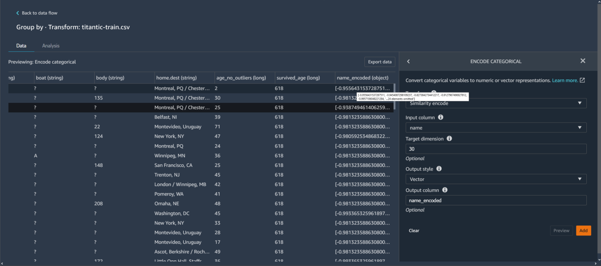

The similarity encodings that Data Wrangler creates:

• Have low dimensionality

• Are scalable to a large number of categories

• Are robust and resistant to noise

For the preceding reasons, similarity encoding is more versatile than one-hot encoding.

To add the similarity encoding transform to your dataset, use the following procedure.

To use similarity encoding, do the following.

1.
Sign in to the Amazon SageMaker AI Console.

2.
Choose Open Studio Classic.

3.
Choose Launch app.

4.
Choose Studio.

5.
Specify your data flow.

6.
Choose a step with a transformation.

7.
Choose Add step.

8.
Choose Encode categorical.

9.
Specify the following:

Transform Data
3576

## Page 606

Amazon SageMaker AI
Developer Guide

• Transform – Similarity encode

• Input column – The column containing the categorical data that you're encoding.

• Target dimension – (Optional) The dimension of the categorical embedding vector. The

default value is 30. We recommend using a larger target dimension if you have a large

dataset with many categories.

• Output style – Choose Vector for a single vector with all of the encoded values. Choose
Column to have the encoded values in separate columns.

• Output column – (Optional) The name of the output column for a vector encoded output.
For a column-encoded output, this is the prefix of the column names followed by listed
number.

Featurize Text

Use the Featurize Text transform group to inspect string-typed columns and use text embedding
to featurize these columns.

This feature group contains two features, Character statistics and Vectorize. Use the following
sections to learn more about these transforms. For both options, the Input column must contain
text data (string type).

Character Statistics

Use Character statistics to generate statistics for each row in a column containing text data.

This transform computes the following ratios and counts for each row, and creates a new column
to report the result. The new column is named using the input column name as a prefix and a suffix
that is specific to the ratio or count.

• Number of words: The total number of words in that row. The suffix for this output column is -

stats_word_count.

• Number of characters: The total number of characters in that row. The suffix for this output

column is -stats_char_count.

• Ratio of upper: The number of uppercase characters, from A to Z, divided by all characters in the

column. The suffix for this output column is -stats_capital_ratio.

• Ratio of lower: The number of lowercase characters, from a to z, divided by all characters in the

column. The suffix for this output column is -stats_lower_ratio.

Transform Data
3577

## Page 607

Amazon SageMaker AI
Developer Guide

• Ratio of digits: The ratio of digits in a single row over the sum of digits in the input column. The

suffix for this output column is -stats_digit_ratio.

• Special characters ratio: The ratio of non-alphanumeric (characters like #$&%:@) characters

to over the sum of all characters in the input column. The suffix for this output column is -

stats_special_ratio.

Vectorize

Text embedding involves mapping words or phrases from a vocabulary to vectors of real numbers.
Use the Data Wrangler text embedding transform to tokenize and vectorize text data into term
frequency–inverse document frequency (TF-IDF) vectors.

When TF-IDF is calculated for a column of text data, each word in each sentence is converted to
a real number that represents its semantic importance. Higher numbers are associated with less
frequent words, which tend to be more meaningful.

When you define a Vectorize transform step, Data Wrangler uses the data in your dataset to define
the count vectorizer and TF-IDF methods . Running a Data Wrangler job uses these same methods.

You configure this transform using the following:

• Output column name: This transform creates a new column with the text embedding. Use this
field to specify a name for this output column.

• Tokenizer: A tokenizer converts the sentence into a list of words, or tokens.

Choose Standard to use a tokenizer that splits by white space and converts each word to

lowercase. For example, "Good dog" is tokenized to ["good","dog"].

Choose Custom to use a customized tokenizer. If you choose Custom, you can use the following
fields to configure the tokenizer:

• Minimum token length: The minimum length, in characters, for a token to be valid. Defaults

to 1. For example, if you specify 3 for minimum token length, words like a, at, in are
dropped from the tokenized sentence.

• Should regex split on gaps: If selected, regex splits on gaps. Otherwise, it matches tokens.

Defaults to True.

• Regex pattern: Regex pattern that defines the tokenization process. Defaults to ' \\ s+'.

• To lowercase: If chosen, Data Wrangler converts all characters to lowercase before

tokenization. Defaults to True.

Transform Data
3578

## Page 608

Amazon SageMaker AI
Developer Guide

To learn more, see the Spark documentation on Tokenizer.

• Vectorizer: The vectorizer converts the list of tokens into a sparse numeric vector. Each token
corresponds to an index in the vector and a non-zero indicates the existence of the token in the
input sentence. You can choose from two vectorizer options, Count and Hashing.

• Count vectorize allows customizations that filter infrequent or too common tokens. Count
vectorize parameters include the following:

• Minimum term frequency: In each row, terms (tokens) with smaller frequency are filtered.
If you specify an integer, this is an absolute threshold (inclusive). If you specify a fraction

between 0 (inclusive) and 1, the threshold is relative to the total term count. Defaults to 1.

• Minimum document frequency: Minimum number of rows in which a term (token) must
appear to be included. If you specify an integer, this is an absolute threshold (inclusive). If
you specify a fraction between 0 (inclusive) and 1, the threshold is relative to the total term

count. Defaults to 1.

• Maximum document frequency: Maximum number of documents (rows) in which a term
(token) can appear to be included. If you specify an integer, this is an absolute threshold
(inclusive). If you specify a fraction between 0 (inclusive) and 1, the threshold is relative to

the total term count. Defaults to 0.999.

• Maximum vocabulary size: Maximum size of the vocabulary. The vocabulary is made up of

all terms (tokens) in all rows of the column. Defaults to 262144.

• Binary outputs: If selected, the vector outputs do not include the number of appearances of

a term in a document, but rather are a binary indicator of its appearance. Defaults to False.

To learn more about this option, see the Spark documentation on CountVectorizer.

• Hashing is computationally faster. Hash vectorize parameters includes the following:

• Number of features during hashing: A hash vectorizer maps tokens to a vector index
according to their hash value. This feature determines the number of possible hash values.
Large values result in fewer collisions between hash values but a higher dimension output
vector.

To learn more about this option, see the Spark documentation on FeatureHasher

• Apply IDF applies an IDF transformation, which multiplies the term frequency with the standard
inverse document frequency used for TF-IDF embedding. IDF parameters include the following:

• Minimum document frequency : Minimum number of documents (rows) in which a
term (token) must appear to be included. If count_vectorize is the chosen vectorizer, we

Transform Data
3579

## Page 609

Amazon SageMaker AI
Developer Guide

recommend that you keep the default value and only modify the min_doc_freq field in Count

vectorize parameters. Defaults to 5.

• Output format:The output format of each row.

• Select Vector to produce a single column with a sparse vector.

• Select Flattened to create a column for every category with an indicator variable for whether
the text in the original column contains a value that is equal to that category. You can only
choose flattened when Vectorizer is set as Count vectorizer.

Transform Time Series

In Data Wrangler, you can transform time series data. The values in a time series dataset are
indexed to specific time. For example, a dataset that shows the number of customers in a store for
each hour in a day is a time series dataset. The following table shows an example of a time series
dataset.

Hourly number of customers in a store

Number of customers
Time (hour)

4
09:00

10
10:00

14
11:00

25
12:00

20
13:00

18
14:00

For the preceding table, the Number of Customers column contains the time series data. The time
series data is indexed on the hourly data in the Time (hour) column.

You might need to perform a series of transformations on your data to get it in a format that you
can use for your analysis. Use the Time series transform group to transform your time series data.
For more information about the transformations that you can perform, see the following sections.

Transform Data
3580

## Page 610

Amazon SageMaker AI
Developer Guide

Topics

• Group by a Time Series

• Resample Time Series Data

• Handle Missing Time Series Data

• Validate the Timestamp of Your Time Series Data

• Standardizing the Length of the Time Series

• Extract Features from Your Time Series Data

• Use Lagged Features from Your Time Series Data

• Create a Datetime Range In Your Time Series

• Use a Rolling Window In Your Time Series

Group by a Time Series

You can use the group by operation to group time series data for specific values in a column.

For example, you have the following table that tracks the average daily electricity usage in a
household.

Average daily household electricity usage

Household ID
Daily timestamp
Electricity usage
(kWh)

Number of
household occupants

household_0
1/1/2020
30
2

household_0
1/2/2020
40
2

household_0
1/4/2020
35
3

household_1
1/2/2020
45
3

household_1
1/3/2020
55
4

If you choose to group by ID, you get the following table.

Electricity usage grouped by household ID

Transform Data
3581

## Page 611

Amazon SageMaker AI
Developer Guide

Household ID
Electricity usage series
(kWh)

Number of household
occupants series

household_0
[30, 40, 35]
[2, 2, 3]

household_1
[45, 55]
[3, 4]

Each entry in the time series sequence is ordered by the corresponding timestamp. The first

element of the sequence corresponds to the first timestamp of the series. For household_0, 30 is

the first value of the Electricity Usage Series. The value of 30 corresponds to the first timestamp

of 1/1/2020.

You can include the starting timestamp and ending timestamp. The following table shows how

that information appears.

Electricity usage grouped by household ID

Household ID
Electricity
usage series
(kWh)

Number of
household
occupants series

Start_time
End_time

household_0
[30, 40, 35]
[2, 2, 3]
1/1/2020
1/4/2020

household_1
[45, 55]
[3, 4]
1/2/2020
1/3/2020

You can use the following procedure to group by a time series column.

1.
Open your Data Wrangler data flow.

2.
If you haven't imported your dataset, import it under the Import data tab.

3.
In your data flow, under Data types, choose the +, and select Add transform.

4.
Choose Add step.

5.
Choose Time Series.

6.
Under Transform, choose Group by.

7.
Specify a column in Group by this column.

8.
For Apply to columns, specify a value.

Transform Data
3582

## Page 612

Amazon SageMaker AI
Developer Guide

9.
Choose Preview to generate a preview of the transform.

10. Choose Add to add the transform to the Data Wrangler data flow.

Resample Time Series Data

Time series data usually has observations that aren't taken at regular intervals. For example, a
dataset could have some observations that are recorded hourly and other observations that are
recorded every two hours.

Many analyses, such as forecasting algorithms, require the observations to be taken at regular
intervals. Resampling gives you the ability to establish regular intervals for the observations in
your dataset.

You can either upsample or downsample a time series. Downsampling increases the interval
between observations in the dataset. For example, if you downsample observations that are taken

either every hour or every two hours, each observation in your dataset is taken every two hours.
The hourly observations are aggregated into a single value using an aggregation method such as
the mean or median.

Upsampling reduces the interval between observations in the dataset. For example, if you
upsample observations that are taken every two hours into hourly observations, you can use an
interpolation method to infer hourly observations from the ones that have been taken every two
hours. For information on interpolation methods, see pandas.DataFrame.interpolate.

You can resample both numeric and non-numeric data.

Use the Resample operation to resample your time series data. If you have multiple time series in
your dataset, Data Wrangler standardizes the time interval for each time series.

The following table shows an example of downsampling time series data by using the mean as the
aggregation method. The data is downsampled from every two hours to every hour.

Hourly temperature readings over a day before downsampling

Timestamp
Temperature (Celsius)

12:00
30

1:00
32

Transform Data
3583

## Page 613

Amazon SageMaker AI
Developer Guide

Timestamp
Temperature (Celsius)

2:00
35

3:00
32

4:00
30

Temperature readings downsampled to every two hours

Timestamp
Temperature (Celsius)

12:00
30

2:00
33.5

4:00
35

You can use the following procedure to resample time series data.

1.
Open your Data Wrangler data flow.

2.
If you haven't imported your dataset, import it under the Import data tab.

3.
In your data flow, under Data types, choose the +, and select Add transform.

4.
Choose Add step.

5.
Choose Resample.

6.
For Timestamp, choose the timestamp column.

7.
For Frequency unit, specify the frequency that you're resampling.

8.
(Optional) Specify a value for Frequency quantity.

9.
Configure the transform by specifying the remaining fields.

10. Choose Preview to generate a preview of the transform.

11. Choose Add to add the transform to the Data Wrangler data flow.

Handle Missing Time Series Data

If you have missing values in your dataset, you can do one of the following:

Transform Data
3584

## Page 614

Amazon SageMaker AI
Developer Guide

• For datasets that have multiple time series, drop the time series that have missing values that are
greater than a threshold that you specify.

• Impute the missing values in a time series by using other values in the time series.

Imputing a missing value involves replacing the data by either specifying a value or by using an
inferential method. The following are the methods that you can use for imputation:

• Constant value – Replace all the missing data in your dataset with a value that you specify.

• Most common value – Replace all the missing data with the value that has the highest frequency
in the dataset.

• Forward fill – Use a forward fill to replace the missing values with the non-missing value that
precedes the missing values. For the sequence: [2, 4, 7, NaN, NaN, NaN, 8], all of the missing
values are replaced with 7. The sequence that results from using a forward fill is [2, 4, 7, 7, 7, 7,
8].

• Backward fill – Use a backward fill to replace the missing values with the non-missing value that
follows the missing values. For the sequence: [2, 4, 7, NaN, NaN, NaN, 8], all of the missing values
are replaced with 8. The sequence that results from using a backward fill is [2, 4, 7, 8, 8, 8, 8].

• Interpolate – Uses an interpolation function to impute the missing values. For more information
on the functions that you can use for interpolation, see pandas.DataFrame.interpolate.

Some of the imputation methods might not be able to impute of all the missing value in your
dataset. For example, a Forward fill can't impute a missing value that appears at the beginning of
the time series. You can impute the values by using either a forward fill or a backward fill.

You can either impute missing values within a cell or within a column.

The following example shows how values are imputed within a cell.

Electricity usage with missing values

Household ID
Electricity usage series (kWh)

household_0
[30, 40, 35, NaN, NaN]

household_1
[45, NaN, 55]

Transform Data
3585

## Page 615

Amazon SageMaker AI
Developer Guide

Electricity usage with values imputed using a forward fill

Household ID
Electricity usage series (kWh)

household_0
[30, 40, 35, 35, 35]

household_1
[45, 45, 55]

The following example shows how values are imputed within a column.

Average daily household electricity usage with missing values

Household ID
Electricity usage (kWh)

household_0
30

household_0
40

household_0
NaN

household_1
NaN

household_1
NaN

Average daily household electricity usage with values imputed using a forward fill

Household ID
Electricity usage (kWh)

household_0
30

household_0
40

household_0
40

household_1
40

household_1
40

Transform Data
3586

## Page 616

Amazon SageMaker AI
Developer Guide

You can use the following procedure to handle missing values.

1.
Open your Data Wrangler data flow.

2.
If you haven't imported your dataset, import it under the Import data tab.

3.
In your data flow, under Data types, choose the +, and select Add transform.

4.
Choose Add step.

5.
Choose Handle missing.

6.
For Time series input type, choose whether you want to handle missing values inside of a cell
or along a column.

7.
For Impute missing values for this column, specify the column that has the missing values.

8.
For Method for imputing values, select a method.

9.
Configure the transform by specifying the remaining fields.

10. Choose Preview to generate a preview of the transform.

11. If you have missing values, you can specify a method for imputing them under Method for

imputing values.

12. Choose Add to add the transform to the Data Wrangler data flow.

Validate the Timestamp of Your Time Series Data

You might have time stamp data that is invalid. You can use the Validate time stamp function to
determine whether the timestamps in your dataset are valid. Your timestamp can be invalid for one
or more of the following reasons:

• Your timestamp column has missing values.

• The values in your timestamp column are not formatted correctly.

If you have invalid timestamps in your dataset, you can't perform your analysis successfully. You
can use Data Wrangler to identify invalid timestamps and understand where you need to clean
your data.

The time series validation works in one of the two ways:

You can configure Data Wrangler to do one of the following if it encounters missing values in your
dataset:

Transform Data
3587

## Page 617

Amazon SageMaker AI
Developer Guide

• Drop the rows that have the missing or invalid values.

• Identify the rows that have the missing or invalid values.

• Throw an error if it finds any missing or invalid values in your dataset.

You can validate the timestamps on columns that either have the timestamp type or the string

type. If the column has the string type, Data Wrangler converts the type of the column to

timestamp and performs the validation.

You can use the following procedure to validate the timestamps in your dataset.

1.
Open your Data Wrangler data flow.

2.
If you haven't imported your dataset, import it under the Import data tab.

3.
In your data flow, under Data types, choose the +, and select Add transform.

4.
Choose Add step.

5.
Choose Validate timestamps.

6.
For Timestamp Column, choose the timestamp column.

7.
For Policy, choose whether you want to handle missing timestamps.

8.
(Optional) For Output column, specify a name for the output column.

9.
If the date time column is formatted for the string type, choose Cast to datetime.

10. Choose Preview to generate a preview of the transform.

11. Choose Add to add the transform to the Data Wrangler data flow.

Standardizing the Length of the Time Series

If you have time series data stored as arrays, you can standardize each time series to the same
length. Standardizing the length of the time series array might make it easier for you to perform
your analysis on the data.

You can standardize your time series for data transformations that require the length of your data
to be fixed.

Many ML algorithms require you to flatten your time series data before you use them. Flattening
time series data is separating each value of the time series into its own column in a dataset.
The number of columns in a dataset can't change, so the lengths of the time series need to be
standardized between you flatten each array into a set of features.

Transform Data
3588

## Page 618

Amazon SageMaker AI
Developer Guide

Each time series is set to the length that you specify as a quantile or percentile of the time series
set. For example, you can have three sequences that have the following lengths:

• 3

• 4

• 5

You can set the length of all of the sequences as the length of the sequence that has the 50th
percentile length.

Time series arrays that are shorter than the length you've specified have missing values added. The
following is an example format of standardizing the time series to a longer length: [2, 4, 5, NaN,
NaN, NaN].

You can use different approaches to handle the missing values. For information on those
approaches, see Handle Missing Time Series Data.

The time series arrays that are longer than the length that you specify are truncated.

You can use the following procedure to standardize the length of the time series.

1.
Open your Data Wrangler data flow.

2.
If you haven't imported your dataset, import it under the Import data tab.

3.
In your data flow, under Data types, choose the +, and select Add transform.

4.
Choose Add step.

5.
Choose Standardize length.

6.
For Standardize the time series length for the column, choose a column.

7.
(Optional) For Output column, specify a name for the output column. If you don't specify a
name, the transform is done in place.

8.
If the datetime column is formatted for the string type, choose Cast to datetime.

9.
Choose Cutoff quantile and specify a quantile to set the length of the sequence.

10. Choose Flatten the output to output the values of the time series into separate columns.

11. Choose Preview to generate a preview of the transform.

12. Choose Add to add the transform to the Data Wrangler data flow.

Transform Data
3589

## Page 619

Amazon SageMaker AI
Developer Guide

Extract Features from Your Time Series Data

If you're running a classification or a regression algorithm on your time series data, we recommend
extracting features from the time series before running the algorithm. Extracting features might
improve the performance of your algorithm.

Use the following options to choose how you want to extract features from your data:

• Use Minimal subset to specify extracting 8 features that you know are useful in downstream
analyses. You can use a minimal subset when you need to perform computations quickly. You can
also use it when your ML algorithm has a high risk of overfitting and you want to provide it with
fewer features.

• Use Efficient subset to specify extracting the most features possible without extracting features
that are computationally intensive in your analyses.

• Use All features to specify extracting all features from the tune series.

• Use Manual subset to choose a list of features that you think explain the variation in your data
well.

Use the following the procedure to extract features from your time series data.

1.
Open your Data Wrangler data flow.

2.
If you haven't imported your dataset, import it under the Import data tab.

3.
In your data flow, under Data types, choose the +, and select Add transform.

4.
Choose Add step.

5.
Choose Extract features.

6.
For Extract features for this column, choose a column.

7.
(Optional) Select Flatten to output the features into separate columns.

8.
For Strategy, choose a strategy to extract the features.

9.
Choose Preview to generate a preview of the transform.

10. Choose Add to add the transform to the Data Wrangler data flow.

Use Lagged Features from Your Time Series Data

For many use cases, the best way to predict the future behavior of your time series is to use its
most recent behavior.

Transform Data
3590

## Page 620

Amazon SageMaker AI
Developer Guide

The most common uses of lagged features are the following:

• Collecting a handful of past values. For example, for time, t + 1, you collect t, t - 1, t - 2, and t - 3.

• Collecting values that correspond to seasonal behavior in the data. For example, to predict the
occupancy in a restaurant at 1:00 PM, you might want to use the features from 1:00 PM on the
previous day. Using the features from 12:00 PM or 11:00 AM on the same day might not be as
predictive as using the features from previous days.

1.
Open your Data Wrangler data flow.

2.
If you haven't imported your dataset, import it under the Import data tab.

3.
In your data flow, under Data types, choose the +, and select Add transform.

4.
Choose Add step.

5.
Choose Lag features.

6.
For Generate lag features for this column, choose a column.

7.
For Timestamp Column, choose the column containing the timestamps.

8.
For Lag, specify the duration of the lag.

9.
(Optional) Configure the output using one of the following options:

• Include the entire lag window

• Flatten the output

• Drop rows without history

10. Choose Preview to generate a preview of the transform.

11. Choose Add to add the transform to the Data Wrangler data flow.

Create a Datetime Range In Your Time Series

You might have time series data that don't have timestamps. If you know that the observations
were taken at regular intervals, you can generate timestamps for the time series in a separate
column. To generate timestamps, you specify the value for the start timestamp and the frequency
of the timestamps.

For example, you might have the following time series data for the number of customers at a
restaurant.

Time series data on the number of customers at a restaurant

Transform Data
3591

## Page 621

Amazon SageMaker AI
Developer Guide

Number of customers

10

14

24

40

30

20

If you know that the restaurant opened at 5:00 PM and that the observations are taken hourly, you
can add a timestamp column that corresponds to the time series data. You can see the timestamp
column in the following table.

Time series data on the number of customers at a restaurant

Number of customers
Timestamp

10
1:00 PM

14
2:00 PM

24
3:00 PM

40
4:00 PM

30
5:00 PM

20
6:00 PM

Use the following procedure to add a datetime range to your data.

1.
Open your Data Wrangler data flow.

2.
If you haven't imported your dataset, import it under the Import data tab.

Transform Data
3592

## Page 622

Amazon SageMaker AI
Developer Guide

3.
In your data flow, under Data types, choose the +, and select Add transform.

4.
Choose Add step.

5.
Choose Datetime range.

6.
For Frequency type, choose the unit used to measure the frequency of the timestamps.

7.
For Starting timestamp, specify the start timestamp.

8.
For Output column, specify a name for the output column.

9.
(Optional) Configure the output using the remaining fields.

10. Choose Preview to generate a preview of the transform.

11. Choose Add to add the transform to the Data Wrangler data flow.

Use a Rolling Window In Your Time Series

You can extract features over a time period. For example, for time, t, and a time window length
of 3, and for the row that indicates the tth timestamp, we append the features that are extracted
from the time series at times t - 3, t -2, and t - 1. For information on extracting features, see
Extract Features from Your Time Series Data.

You can use the following procedure to extract features over a time period.

1.
Open your Data Wrangler data flow.

2.
If you haven't imported your dataset, import it under the Import data tab.

3.
In your data flow, under Data types, choose the +, and select Add transform.

4.
Choose Add step.

5.
Choose Rolling window features.

6.
For Generate rolling window features for this column, choose a column.

7.
For Timestamp Column, choose the column containing the timestamps.

8.
(Optional) For Output Column, specify the name of the output column.

9.
For Window size, specify the window size.

10. For Strategy, choose the extraction strategy.

11. Choose Preview to generate a preview of the transform.

12. Choose Add to add the transform to the Data Wrangler data flow.

Transform Data
3593

## Page 623

Amazon SageMaker AI
Developer Guide

Featurize Datetime

Use Featurize date/time to create a vector embedding representing a datetime field. To use this
transform, your datetime data must be in one of the following formats:

• Strings describing datetime: For example, "January 1st, 2020, 12:44pm".

• A Unix timestamp: A Unix timestamp describes the number of seconds, milliseconds,
microseconds, or nanoseconds from 1/1/1970.

You can choose to Infer datetime format and provide a Datetime format. If you provide a
datetime format, you must use the codes described in the Python documentation. The options you
select for these two configurations have implications for the speed of the operation and the final
results.

• The most manual and computationally fastest option is to specify a Datetime format and select
No for Infer datetime format.

• To reduce manual labor, you can choose Infer datetime format and not specify a datetime
format. It is also a computationally fast operation; however, the first datetime format
encountered in the input column is assumed to be the format for the entire column. If there are
other formats in the column, these values are NaN in the final output. Inferring the datetime
format can give you unparsed strings.

• If you don't specify a format and select No for Infer datetime format, you get the most robust
results. All the valid datetime strings are parsed. However, this operation can be an order of
magnitude slower than the first two options in this list.

When you use this transform, you specify an Input column which contains datetime data in one of
the formats listed above. The transform creates an output column named Output column name.
The format of the output column depends on your configuration using the following:

• Vector: Outputs a single column as a vector.

• Columns: Creates a new column for every feature. For example, if the output contains a year,
month, and day, three separate columns are created for year, month, and day.

Additionally, you must choose an Embedding mode. For linear models and deep networks, we
recommend choosing cyclic. For tree-based algorithms, we recommend choosing ordinal.

Transform Data
3594

## Page 624

Amazon SageMaker AI
Developer Guide

Format String

The Format string transforms contain standard string formatting operations. For example, you
can use these operations to remove special characters, normalize string lengths, and update string
casing.

This feature group contains the following transforms. All transforms return copies of the strings in
the Input column and add the result to a new, output column.

Name
Function

Left pad
Left-pad the string with a given Fill character
to the given width. If the string is longer than
width, the return value is shortened to width
characters.

Right pad
Right-pad the string with a given Fill
character to the given width. If the string
is longer than width, the return value is
shortened to width characters.

Center (pad on either side)
Center-pad the string (add padding on both
sides of the string) with a given Fill character
to the given width. If the string is longer than
width, the return value is shortened to width
characters.

Prepend zeros
Left-fill a numeric string with zeros, up to
a given width. If the string is longer than
width, the return value is shortened to width
characters.

Strip left and right
Returns a copy of the string with the leading
and trailing characters removed.

Strip characters from left
Returns a copy of the string with leading
characters removed.

Transform Data
3595

## Page 625

Amazon SageMaker AI
Developer Guide

Name
Function

Strip characters from right
Returns a copy of the string with trailing
characters removed.

Lower case
Convert all letters in text to lowercase.

Upper case
Convert all letters in text to uppercase.

Capitalize
Capitalize the first letter in each sentence.

Swap case
Converts all uppercase characters to lowercase
and all lowercase characters to uppercase
characters of the given string, and returns it.

Add prefix or suffix
Adds a prefix and a suffix the string column.
You must specify at least one of Prefix and
Suffix.

Remove symbols
Removes given symbols from a string. All
listed characters are removed. Defaults to
white space.

Handle Outliers

Machine learning models are sensitive to the distribution and range of your feature values.
Outliers, or rare values, can negatively impact model accuracy and lead to longer training times.
Use this feature group to detect and update outliers in your dataset.

When you define a Handle outliers transform step, the statistics used to detect outliers are
generated on the data available in Data Wrangler when defining this step. These same statistics are
used when running a Data Wrangler job.

Use the following sections to learn more about the transforms this group contains. You specify an
Output name and each of these transforms produces an output column with the resulting data.

Robust standard deviation numeric outliers

This transform detects and fixes outliers in numeric features using statistics that are robust to
outliers.

Transform Data
3596

## Page 626

Amazon SageMaker AI
Developer Guide

You must define an Upper quantile and a Lower quantile for the statistics used to calculate
outliers. You must also specify the number of Standard deviations from which a value must vary
from the mean to be considered an outlier. For example, if you specify 3 for Standard deviations, a
value must fall more than 3 standard deviations from the mean to be considered an outlier.

The Fix method is the method used to handle outliers when they are detected. You can choose
from the following:

• Clip: Use this option to clip the outliers to the corresponding outlier detection bound.

• Remove: Use this option to remove rows with outliers from the dataframe.

• Invalidate: Use this option to replace outliers with invalid values.

Standard Deviation Numeric Outliers

This transform detects and fixes outliers in numeric features using the mean and standard
deviation.

You specify the number of Standard deviations a value must vary from the mean to be considered
an outlier. For example, if you specify 3 for Standard deviations, a value must fall more than 3
standard deviations from the mean to be considered an outlier.

The Fix method is the method used to handle outliers when they are detected. You can choose
from the following:

• Clip: Use this option to clip the outliers to the corresponding outlier detection bound.

• Remove: Use this option to remove rows with outliers from the dataframe.

• Invalidate: Use this option to replace outliers with invalid values.

Quantile Numeric Outliers

Use this transform to detect and fix outliers in numeric features using quantiles. You can define an
Upper quantile and a Lower quantile. All values that fall above the upper quantile or below the
lower quantile are considered outliers.

The Fix method is the method used to handle outliers when they are detected. You can choose
from the following:

• Clip: Use this option to clip the outliers to the corresponding outlier detection bound.

Transform Data
3597

## Page 627

Amazon SageMaker AI
Developer Guide

• Remove: Use this option to remove rows with outliers from the dataframe.

• Invalidate: Use this option to replace outliers with invalid values.

Min-Max Numeric Outliers

This transform detects and fixes outliers in numeric features using upper and lower thresholds. Use
this method if you know threshold values that demark outliers.

You specify a Upper threshold and a Lower threshold, and if values fall above or below those
thresholds respectively, they are considered outliers.

The Fix method is the method used to handle outliers when they are detected. You can choose
from the following:

• Clip: Use this option to clip the outliers to the corresponding outlier detection bound.

• Remove: Use this option to remove rows with outliers from the dataframe.

• Invalidate: Use this option to replace outliers with invalid values.

Replace Rare

When you use the Replace rare transform, you specify a threshold and Data Wrangler finds all
values that meet that threshold and replaces them with a string that you specify. For example, you
may want to use this transform to categorize all outliers in a column into an "Others" category.

• Replacement string: The string with which to replace outliers.

• Absolute threshold: A category is rare if the number of instances is less than or equal to this
absolute threshold.

• Fraction threshold: A category is rare if the number of instances is less than or equal to this
fraction threshold multiplied by the number of rows.

• Max common categories: Maximum not-rare categories that remain after the operation. If the
threshold does not filter enough categories, those with the top number of appearances are
classified as not rare. If set to 0 (default), there is no hard limit to the number of categories.

Handle Missing Values

Missing values are a common occurrence in machine learning datasets. In some situations, it is
appropriate to impute missing data with a calculated value, such as an average or categorically

Transform Data
3598

## Page 628

Amazon SageMaker AI
Developer Guide

common value. You can process missing values using the Handle missing values transform group.
This group contains the following transforms.

Fill Missing

Use the Fill missing transform to replace missing values with a Fill value you define.

Impute Missing

Use the Impute missing transform to create a new column that contains imputed values where
missing values were found in input categorical and numerical data. The configuration depends on
your data type.

For numeric data, choose an imputing strategy, the strategy used to determine the new value to
impute. You can choose to impute the mean or the median over the values that are present in your
dataset. Data Wrangler uses the value that it computes to impute the missing values.

For categorical data, Data Wrangler imputes missing values using the most frequent value in the
column. To impute a custom string, use the Fill missing transform instead.

Add Indicator for Missing

Use the Add indicator for missing transform to create a new indicator column, which contains a

Boolean "false" if a row contains a value, and "true" if a row contains a missing value.

Drop Missing

Use the Drop missing option to drop rows that contain missing values from the Input column.

Manage Columns

You can use the following transforms to quickly update and manage columns in your dataset:

Name
Function

Drop Column
Delete a column.

Duplicate Column
Duplicate a column.

Rename Column
Rename a column.

Move Column
Move a column's location in the dataset.
Choose to move your column to the start or

Transform Data
3599

## Page 629

Amazon SageMaker AI
Developer Guide

Name
Function

end of the dataset, before or after a reference
column, or to a specific index.

Manage Rows

Use this transform group to quickly perform sort and shuffle operations on rows. This group
contains the following:

• Sort: Sort the entire dataframe by a given column. Select the check box next to Ascending order
for this option; otherwise, deselect the check box and descending order is used for the sort.

• Shuffle: Randomly shuffle all rows in the dataset.

Manage Vectors

Use this transform group to combine or flatten vector columns. This group contains the following
transforms.

• Assemble: Use this transform to combine Spark vectors and numeric data into a single column.
For example, you can combine three columns: two containing numeric data and one containing
vectors. Add all the columns you want to combine in Input columns and specify a Output
column name for the combined data.

• Flatten: Use this transform to flatten a single column containing vector data. The input column
must contain PySpark vectors or array-like objects. You can control the number of columns
created by specifying a Method to detect number of outputs. For example, if you select Length
of first vector, the number of elements in the first valid vector or array found in the column
determines the number of output columns that are created. All other input vectors with too
many items are truncated. Inputs with too few items are filled with NaNs.

You also specify an Output prefix, which is used as the prefix for each output column.

Process Numeric

Use the Process Numeric feature group to process numeric data. Each scalar in this group is
defined using the Spark library. The following scalars are supported:

Transform Data
3600

## Page 630

Amazon SageMaker AI
Developer Guide

• Standard Scaler: Standardize the input column by subtracting the mean from each value and
scaling to unit variance. To learn more, see the Spark documentation for StandardScaler.

• Robust Scaler: Scale the input column using statistics that are robust to outliers. To learn more,
see the Spark documentation for RobustScaler.

• Min Max Scaler: Transform the input column by scaling each feature to a given range. To learn
more, see the Spark documentation for MinMaxScaler.

• Max Absolute Scaler: Scale the input column by dividing each value by the maximum absolute
value. To learn more, see the Spark documentation for MaxAbsScaler.

Sampling

After you've imported your data, you can use the Sampling transformer to take one or more
samples of it. When you use the sampling transformer, Data Wrangler samples your original
dataset.

You can choose one of the following sample methods:

• Limit: Samples the dataset starting from the first row up to the limit that you specify.

• Randomized: Takes a random sample of a size that you specify.

• Stratified: Takes a stratified random sample.

You can stratify a randomized sample to make sure that it represents the original distribution of
the dataset.

You might be performing data preparation for multiple use cases. For each use case, you can take a
different sample and apply a different set of transformations.

The following procedure describes the process of creating a random sample.

To take a random sample from your data.

1.
Choose the + to the right of the dataset that you've imported. The name of your dataset is
located below the +.

2.
Choose Add transform.

3.
Choose Sampling.

4.
For Sampling method, choose the sampling method.

Transform Data
3601

## Page 631

Amazon SageMaker AI
Developer Guide

5.
For Approximate sample size, choose the approximate number of observations that you want
in your sample.

6.
(Optional) Specify an integer for Random seed to create a reproducible sample.

The following procedure describes the process of creating a stratified sample.

To take a stratified sample from your data.

1.
Choose the + to the right of the dataset that you've imported. The name of your dataset is
located below the +.

2.
Choose Add transform.

3.
Choose Sampling.

4.
For Sampling method, choose the sampling method.

5.
For Approximate sample size, choose the approximate number of observations that you want
in your sample.

6.
For Stratify column, specify the name of the column that you want to stratify on.

7.
(Optional) Specify an integer for Random seed to create a reproducible sample.

Search and Edit

Use this section to search for and edit specific patterns within strings. For example, you can find
and update strings within sentences or documents, split strings by delimiters, and find occurrences
of specific strings.

The following transforms are supported under Search and edit. All transforms return copies of the
strings in the Input column and add the result to a new output column.

Name
Function

Find substring
Returns the index of the first occurrence of
the Substring for which you searched , You
can start and end the search at Start and End
respectively.

Find substring (from right)
Returns the index of the last occurrence of
the Substring for which you searched. You

Transform Data
3602

## Page 632

Amazon SageMaker AI
Developer Guide

Name
Function

can start and end the search at Start and End
respectively.

Matches prefix
Returns a Boolean value if the string contains
a given Pattern. A pattern can be a character
sequence or regular expression. Optionally,
you can make the pattern case sensitive.

Find all occurrences
Returns an array with all occurrences of a
given pattern. A pattern can be a character
sequence or regular expression.

Extract using regex
Returns a string that matches a given Regex
pattern.

Extract between delimiters
Returns a string with all characters found
between Left delimiter and Right delimiter.

Extract from position
Returns a string, starting from Start position
in the input string, that contains all characters
up to the start position plus Length.

Find and replace substring
Returns a string with all matches of a given
Pattern (regular expression) replaced by
Replacement string.

Replace between delimiters
Returns a string with the substring found
between the first appearance of a Left
delimiter and the last appearance of a Right
delimiter replaced by Replacement string. If
no match is found, nothing is replaced.

Transform Data
3603

## Page 633

Amazon SageMaker AI
Developer Guide

Name
Function

Replace from position
Returns a string with the substring between
Start position and Start position plus Length
replaced by Replacement string. If Start
position plus Length is greater than the
length of the replacement string, the output
contains ….

Convert regex to missing
Converts a string to None if invalid and returns
the result. Validity is defined with a regular
expression in Pattern.

Split string by delimiter
Returns an array of strings from the input
string, split by Delimiter, with up to Max
number of splits (optional). The delimiter
defaults to white space.

Split data

Use the Split data transform to split your dataset into two or three datasets. For example, you can
split your dataset into a dataset used to train your model and a dataset used to test it. You can
determine the proportion of the dataset that goes into each split. For example, if you’re splitting
one dataset into two datasets, the training dataset can have 80% of the data while the testing
dataset has 20%.

Splitting your data into three datasets gives you the ability to create training, validation, and test
datasets. You can see how well the model performs on the test dataset by dropping the target
column.

Your use case determines how much of the original dataset each of your datasets get and the
method you use to split the data. For example, you might want to use a stratified split to make sure
that the distribution of the observations in the target column are the same across datasets. You
can use the following split transforms:

• Randomized split — Each split is a random, non-overlapping sample of the original dataset. For
larger datasets, using a randomized split might be computationally expensive and take longer
than an ordered split.

Transform Data
3604

## Page 634

Amazon SageMaker AI
Developer Guide

• Ordered split – Splits the dataset based on the sequential order of the observations. For
example, for an 80/20 train-test split, the first observations that make up 80% of the dataset
go to the training dataset. The last 20% of the observations go to the testing dataset. Ordered
splits are effective in keeping the existing order of the data between splits.

• Stratified split – Splits the dataset to make sure that the number of observations in the input
column have proportional representation. For an input column that has the observations 1, 1,
1, 1, 1, 1, 2, 2, 2, 2, 2, 2, 2, 2, 3, 3, 3, 3, 3, 3, 3, an 80/20 split on the column would mean that
approximately 80% of the 1s, 80% of the 2s, and 80% of the 3s go to the training set. About
20% of each type of observation go to the testing set.

• Split by key – Avoids data with the same key occurring in more than one split. For example, if you
have a dataset with the column 'customer_id' and you're using it as a key, no customer id is in
more than one split.

After you split the data, you can apply additional transformations to each dataset. For most use
cases, they aren't necessary.

Data Wrangler calculates the proportions of the splits for performance. You can choose an error
threshold to set the accuracy of the splits. Lower error thresholds more accurately reflect the
proportions that you specify for the splits. If you set a higher error threshold, you get better
performance, but lower accuracy.

For perfectly split data, set the error threshold to 0. You can specify a threshold between 0 and 1
for better performance. If you specify a value greater than 1, Data Wrangler interprets that value
as 1.

If you have 10000 rows in your dataset and you specify an 80/20 split with an error of 0.001, you
would get observations approximating one of the following results:

• 8010 observations in the training set and 1990 in the testing set

• 7990 observations in the training set and 2010 in the testing set

The number of observations for the testing set in the preceding example is in the interval between
8010 and 7990.

By default, Data Wrangler uses a random seed to make the splits reproducible. You can specify a
different value for the seed to create a different reproducible split.

Transform Data
3605

## Page 635

Amazon SageMaker AI
Developer Guide

Randomized split

Use the following procedure to perform a randomized split on your dataset.

To split your dataset randomly, do the following

1.
Choose the + next to the node containing the dataset that you're splitting.

2.
Choose Add transform.

3.
Choose Split data.

4.
(Optional) For Splits, specify the names and proportions of each split. The proportions
must sum to 1.

5.
(Optional) Choose the + to create an additional split.

•
Specify the names and proportions of all the splits. The proportions must sum to 1.

6.
(Optional) Specify a value for Error threshold other than the default value.

7.
(Optional) Specify a value for Random seed.

8.
Choose Preview.

9.
Choose Add.

Ordered split

Use the following procedure to perform an ordered split on your dataset.

To make an ordered split in your dataset, do the following.

1.
Choose the + next to the node containing the dataset that you're splitting.

2.
Choose Add transform.

3.
For Transform, choose Ordered split.

4.
Choose Split data.

5.
(Optional) For Splits, specify the names and proportions of each split. The proportions
must sum to 1.

6.
(Optional) Choose the + to create an additional split.

•
Specify the names and proportions of all the splits. The proportions must sum to 1.

7.
(Optional) Specify a value for Error threshold other than the default value.

Transform Data
3606

## Page 636

Amazon SageMaker AI
Developer Guide

8.
(Optional) For Input column, specify a column with numeric values. Uses the values of the
columns to infer which records are in each split. The smaller values are in one split with the
larger values in the other splits.

9.
(Optional) Select Handle duplicates to add noise to duplicate values and create a dataset
of entirely unique values.

10. (Optional) Specify a value for Random seed.

11. Choose Preview.

12. Choose Add.

Stratified split

Use the following procedure to perform a stratified split on your dataset.

To make a stratified split in your dataset, do the following.

1.
Choose the + next to the node containing the dataset that you're splitting.

2.
Choose Add transform.

3.
Choose Split data.

4.
For Transform, choose Stratified split.

5.
(Optional) For Splits, specify the names and proportions of each split. The proportions
must sum to 1.

6.
(Optional) Choose the + to create an additional split.

•
Specify the names and proportions of all the splits. The proportions must sum to 1.

7.
For Input column, specify a column with up to 100 unique values. Data Wrangler can't
stratify a column with more than 100 unique values.

8.
(Optional) Specify a value for Error threshold other than the default value.

9.
(Optional) Specify a value for Random seed to specify a different seed.

10. Choose Preview.

11. Choose Add.

Split by column keys

Use the following procedure to split by the column keys in your dataset.

Transform Data
3607

## Page 637

Amazon SageMaker AI
Developer Guide

To split by the column keys in your dataset, do the following.

1.
Choose the + next to the node containing the dataset that you're splitting.

2.
Choose Add transform.

3.
Choose Split data.

4.
For Transform, choose Split by key.

5.
(Optional) For Splits, specify the names and proportions of each split. The proportions
must sum to 1.

6.
(Optional) Choose the + to create an additional split.

•
Specify the names and proportions of all the splits. The proportions must sum to 1.

7.
For Key columns, specify the columns with values that you don't want to appear in both
datasets.

8.
(Optional) Specify a value for Error threshold other than the default value.

9.
Choose Preview.

10. Choose Add.

Parse Value as Type

Use this transform to cast a column to a new type. The supported Data Wrangler data types are:

• Long

• Float

• Boolean

• Date, in the format dd-MM-yyyy, representing day, month, and year respectively.

• String

Validate String

Use the Validate string transforms to create a new column that indicates that a row of text data
meets a specified condition. For example, you can use a Validate string transform to verify that a
string only contains lowercase characters. The following transforms are supported under Validate
string.

Transform Data
3608

## Page 638

Amazon SageMaker AI
Developer Guide

The following transforms are included in this transform group. If a transform outputs a Boolean

value, True is represented with a 1 and False is represented with a 0.

Name
Function

String length
Returns True if a string length equals

specified length. Otherwise, returns False.

Starts with
Returns True if a string starts will a specified

prefix. Otherwise, returns False.

Ends with
Returns True if a string length equals

specified length. Otherwise, returns False.

Is alphanumeric
Returns True if a string only contains
numbers and letters. Otherwise, returns

False.

Is alpha (letters)
Returns True if a string only contains letters.

Otherwise, returns False.

Is digit
Returns True if a string only contains digits.

Otherwise, returns False.

Is space
Returns True if a string only contains
numbers and letters. Otherwise, returns

False.

Is title
Returns True if a string contains any white

spaces. Otherwise, returns False.

Is lowercase
Returns True if a string only contains lower

case letters. Otherwise, returns False.

Is uppercase
Returns True if a string only contains upper

case letters. Otherwise, returns False.

Is numeric
Returns True if a string only contains

numbers. Otherwise, returns False.

Transform Data
3609

## Page 639

Amazon SageMaker AI
Developer Guide

Name
Function

Is decimal
Returns True if a string only contains decimal

numbers. Otherwise, returns False.

Unnest JSON Data

If you have a .csv file, you might have values in your dataset that are JSON strings. Similarly, you
might have nested data in columns of either a Parquet file or a JSON document.

Use the Flatten structured operator to separate the first level keys into separate columns. A first
level key is a key that isn't nested within a value.

For example, you might have a dataset that has a person column with demographic information on

each person stored as JSON strings. A JSON string might look like the following.

"{"seq": 1,"name": {"first": "Nathaniel","last": "Ferguson"},"age": 59,"city":
"Posbotno","state": "WV"}"

The Flatten structured operator converts the following first level keys into additional columns in
your dataset:

• seq

• name

• age

• city

• state

Data Wrangler puts the values of the keys as values under the columns. The following shows the
column names and values of the JSON.

seq, name,                                    age, city, state
1, {"first": "Nathaniel","last": "Ferguson"}, 59, Posbotno, WV

Transform Data
3610

## Page 640

Amazon SageMaker AI
Developer Guide

For each value in your dataset containing JSON, the Flatten structured operator creates columns
for the first-level keys. To create columns for nested keys, call the operator again. For the preceding
example, calling the operator creates the columns:

• name_first

• name_last

The following example shows the dataset that results from calling the operation again.

seq, name,                                    age, city, state, name_first, name_last
1, {"first": "Nathaniel","last": "Ferguson"}, 59, Posbotno, WV, Nathaniel, Ferguson

Choose Keys to flatten on to specify the first-level keys that want to extract as separate columns.
If you don't specify any keys, Data Wrangler extracts all the keys by default.

Explode Array

Use Explode array to expand the values of the array into separate output rows. For example, the
operation can take each value in the array, [[1, 2, 3,], [4, 5, 6], [7, 8, 9]] and create a new column
with the following rows:

[1, 2, 3]
[4, 5, 6]
[7, 8, 9]

Data Wrangler names the new column, input_column_name_flatten.

You can call the Explode array operation multiple times to get the nested values of the array into
separate output columns. The following example shows the result of calling the operation multiple
times on a dataset with a nested array.

Putting the values of a nested array into separate columns

Transform Data
3611

## Page 641

Amazon SageMaker AI
Developer Guide

id
array
id
array_items
id
array_ite
ms_items

1
[ [cat, dog],
[bat, frog] ]

1
[cat, dog]
1
cat

2
[[rose,
petunia], [lily,
daisy]]

1
[bat, frog]
1
dog

2
[rose,
petunia]

1
bat

2
[lily, daisy]
1
frog

2
2
rose

2
2
petunia

2
2
lily

2
2
daisy

Transform Image Data

Use Data Wrangler to import and transform the images that you're using for your machine learning
(ML) pipelines. After you've prepared your image data, you can export it from your Data Wrangler
flow to your ML pipeline.

You can use the information provided here to familiarize yourself with importing and transforming
image data in Data Wrangler. Data Wrangler uses OpenCV to import images. For more information
about supported image formats, see Image file reading and writing.

After you've familiarized yourself with the concepts of transforming your image data, go through
the following tutorial, Prepare image data with Amazon SageMaker Data Wrangler.

The following industries and use cases are examples where applying machine learning to
transformed image data can be useful:

• Manufacturing – Identifying defects in items from the assembly line

Transform Data
3612

## Page 642

Amazon SageMaker AI
Developer Guide

• Food – Identifying spoiled or rotten food

• Medicine – Identifying lesions in tissues

When you work with image data in Data Wrangler, you go through the following process:

1. Import – Select the images by choosing the directory containing them in your Amazon S3

bucket.

2. Transform – Use the built-in transformations to prepare the images for your machine learning

pipeline.

3. Export – Export the images that you’ve transformed to a location that can be accessed from the

pipeline.

Use the following procedure to import your image data.

To import your image data

1.
Navigate to the Create connection page.

2.
Choose Amazon S3.

3.
Specify the Amazon S3 file path that contains the image data.

4.
For File type, choose Image.

5.
(Optional) Choose Import nested directories to import images from multiple Amazon S3
paths.

6.
Choose Import.

Data Wrangler uses the open-source imgaug library for its built-in image transformations. You can
use the following built-in transformations:

• ResizeImage

• EnhanceImage

• CorruptImage

• SplitImage

• DropCorruptedImages

• DropImageDuplicates

Transform Data
3613

## Page 643

Amazon SageMaker AI
Developer Guide

• Brightness

• ColorChannels

• Grayscale

• Rotate

Use the following procedure to transform your images without writing code.

To transform the image data without writing code

1.
From your Data Wrangler flow, choose the + next to the node representing the images that
you've imported.

2.
Choose Add transform.

3.
Choose Add step.

4.
Choose the transform and configure it.

5.
Choose Preview.

6.
Choose Add.

In addition to using the transformations that Data Wrangler provides, you can also use your own
custom code snippets. For more information about using custom code snippets, see Custom
Transforms. You can import the OpenCV and imgaug libraries within your code snippets and use
the transforms associated with them. The following is an example of a code snippet that detects
edges within the images.

# A table with your image data is stored in the `df` variable
import cv2
import numpy as np
from pyspark.sql.functions import column

from sagemaker_dataprep.compute.operators.transforms.image.constants import
DEFAULT_IMAGE_COLUMN, IMAGE_COLUMN_TYPE
from sagemaker_dataprep.compute.operators.transforms.image.decorators import
BasicImageOperationDecorator, PandasUDFOperationDecorator

@BasicImageOperationDecorator
def my_transform(image: np.ndarray) -> np.ndarray:

Transform Data
3614

## Page 644

Amazon SageMaker AI
Developer Guide

# To use the code snippet on your image data, modify the following lines within the
function
HYST_THRLD_1, HYST_THRLD_2 = 100, 200
edges = cv2.Canny(image,HYST_THRLD_1,HYST_THRLD_2)
return edges

@PandasUDFOperationDecorator(IMAGE_COLUMN_TYPE)
def custom_image_udf(image_row):
return my_transform(image_row)

df = df.withColumn(DEFAULT_IMAGE_COLUMN,
custom_image_udf(column(DEFAULT_IMAGE_COLUMN)))

When apply transformations in your Data Wrangler flow, Data Wrangler only applies them to
a sample of the images in your dataset. To optimize your experience with the application, Data
Wrangler doesn't apply the transforms to all of your images.

To apply the transformations to all of your images, export your Data Wrangler flow to an Amazon
S3 location. You can use the images that you've exported in your training or inference pipelines.
Use a destination node or a Jupyter Notebook to export your data. You can access either method
for exporting your data from the Data Wrangler flow. For information about using these methods,
see Export to Amazon S3.

Filter data

Use Data Wrangler to filter the data in your columns. When you filter the data in a column, you
specify the following fields:

• Column name – The name of the column that you're using to filter the data.

• Condition – The type of filter that you're applying to values in the column.

• Value – The value or category in the column to which you're applying the filter.

You can filter on the following conditions:

• = – Returns values that match the value or category that you specify.

• != – Returns values that don't match the value or category that you specify.

Transform Data
3615

## Page 645

Amazon SageMaker AI
Developer Guide

• >= – For Long or Float data, filters for values that are greater than or equal to the value that you
specify.

• <= – For Long or Float data, filters for values that are less than or equal to the value that you

specify.

• > – For Long or Float data, filters for values that are greater than the value that you specify.

• < – For Long or Float data, filters for values that are less than the value that you specify.

For a column that has the categories, male and female, you can filter out all the male values. You

could also filter for all the female values. Because there are only male and female values in the

column, the filter returns a column that only has female values.

You can also add multiple filters. The filters can be applied across multiple columns or the same
column. For example, if you're creating a column that only has values within a certain range, you

add two different filters. One filter specifies that the column must have values greater than the
value that you provide. The other filter specifies that the column must have values less than the
value that you provide.

Use the following procedure to add the filter transform to your data.

To filter your data

1.
From your Data Wrangler flow, choose the + next to the node with the data that you're
filtering.

2.
Choose Add transform.

3.
Choose Add step.

4.
Choose Filter data.

5.
Specify the following fields:

• Column name – The column that you're filtering.

• Condition – The condition of the filter.

• Value – The value or category in the column to which you're applying the filter.

6.
(Optional) Choose + following the filter that you've created.

7.
Configure the filter.

8.
Choose Preview.

9.
Choose Add.

Transform Data
3616

## Page 646

Amazon SageMaker AI
Developer Guide

Map Columns for Amazon Personalize

Data Wrangler integrates with Amazon Personalize, a fully managed machine learning service that
generates item recommendations and user segments. You can use the Map columns for Amazon
Personalize transform to get your data into a format that Amazon Personalize can interpret. For
more information about the transforms specific to Amazon Personalize, see Importing data using
Amazon SageMaker Data Wrangler. For more information about Amazon Personalize see What is
Amazon Personalize?

Analyze and Visualize

Amazon SageMaker Data Wrangler includes built-in analyses that help you generate visualizations
and data analyses in a few clicks. You can also create custom analyses using your own code.

You add an analysis to a dataframe by selecting a step in your data flow, and then choosing Add
analysis. To access an analysis you've created, select the step that contains the analysis, and select
the analysis.

All analyses are generated using 100,000 rows of your dataset.

You can add the following analysis to a dataframe:

• Data visualizations, including histograms and scatter plots.

• A quick summary of your dataset, including number of entries, minimum and maximum values
(for numeric data), and most and least frequent categories (for categorical data).

• A quick model of the dataset, which can be used to generate an importance score for each
feature.

• A target leakage report, which you can use to determine if one or more features are strongly
correlated with your target feature.

• A custom visualization using your own code.

Use the following sections to learn more about these options.

Histogram

Use histograms to see the counts of feature values for a specific feature. You can inspect the
relationships between features using the Color by option. For example, the following histogram

Analyze and Visualize
3617

## Page 647

Amazon SageMaker AI
Developer Guide

charts the distribution of user ratings of the best-selling books on Amazon from 2009–2019,
colored by genre.

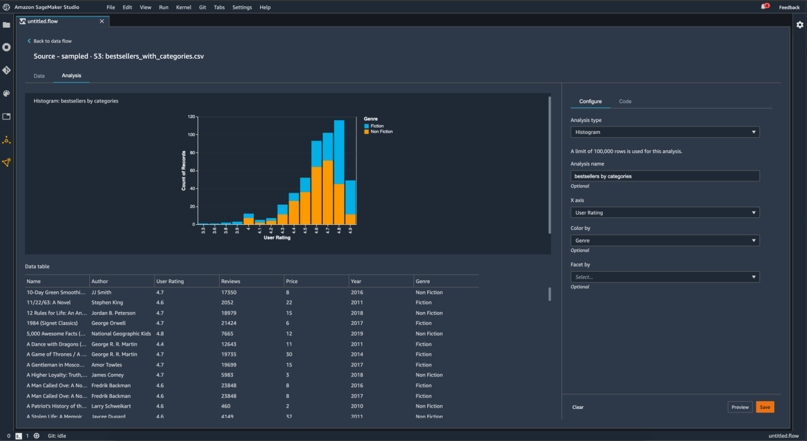

You can use the Facet by feature to create histograms of one column, for each value in another
column. For example, the following diagram shows histograms of user reviews of best-selling
books on Amazon if faceted by year.

Analyze and Visualize
3618

## Page 648

Amazon SageMaker AI
Developer Guide

Scatter Plot

Use the Scatter Plot feature to inspect the relationship between features. To create a scatter plot,
select a feature to plot on the X axis and the Y axis. Both of these columns must be numeric typed
columns.

You can color scatter plots by an additional column. For example, the following example shows a
scatter plot comparing the number of reviews against user ratings of top-selling books on Amazon
between 2009 and 2019. The scatter plot is colored by book genre.

Analyze and Visualize
3619

## Page 649

Amazon SageMaker AI
Developer Guide

Additionally, you can facet scatter plots by features. For example, the following image shows an
example of the same review versus user rating scatter plot, faceted by year.

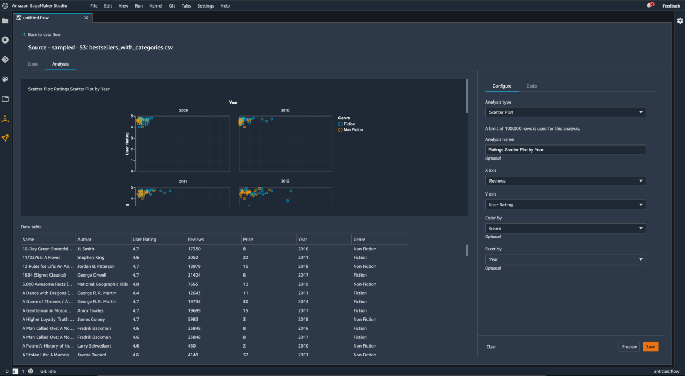

Analyze and Visualize
3620

## Page 650

Amazon SageMaker AI
Developer Guide

Table Summary

Use the Table Summary analysis to quickly summarize your data.

For columns with numerical data, including log and float data, a table summary reports the
number of entries (count), minimum (min), maximum (max), mean, and standard deviation (stddev)
for each column.

For columns with non-numerical data, including columns with string, Boolean, or date/time data,
a table summary reports the number of entries (count), least frequent value (min), and most
frequent value (max).

Quick Model

Use the Quick Model visualization to quickly evaluate your data and produce importance scores
for each feature. A feature importance score score indicates how useful a feature is at predicting
a target label. The feature importance score is between [0, 1] and a higher number indicates that
the feature is more important to the whole dataset. On the top of the quick model chart, there is a
model score. A classification problem shows an F1 score. A regression problem has a mean squared
error (MSE) score.

When you create a quick model chart, you select a dataset you want evaluated, and a target label
against which you want feature importance to be compared. Data Wrangler does the following:

• Infers the data types for the target label and each feature in the dataset selected.

• Determines the problem type. Based on the number of distinct values in the label column, Data
Wrangler determines if this is a regression or classification problem type. Data Wrangler sets
a categorical threshold to 100. If there are more than 100 distinct values in the label column,
Data Wrangler classifies it as a regression problem; otherwise, it is classified as a classification
problem.

• Pre-processes features and label data for training. The algorithm used requires encoding features
to vector type and encoding labels to double type.

• Trains a random forest algorithm with 70% of data. Spark’s RandomForestRegressor is used to
train a model for regression problems. The RandomForestClassifier is used to train a model for
classification problems.

• Evaluates a random forest model with the remaining 30% of data. Data Wrangler evaluates
classification models using an F1 score and evaluates regression models using an MSE score.

• Calculates feature importance for each feature using the Gini importance method.

Analyze and Visualize
3621

## Page 651

Amazon SageMaker AI
Developer Guide

The following image shows the user interface for the quick model feature.

Target Leakage

Target leakage occurs when there is data in a machine learning training dataset that is strongly
correlated with the target label, but is not available in real-world data. For example, you may
have a column in your dataset that serves as a proxy for the column you want to predict with your
model.

When you use the Target Leakage analysis, you specify the following:

• Target: This is the feature about which you want your ML model to be able to make predictions.

• Problem type: This is the ML problem type on which you are working. Problem type can either
be classification or regression.

• (Optional) Max features: This is the maximum number of features to present in the visualization,
which shows features ranked by their risk of being target leakage.

For classification, the target leakage analysis uses the area under the receiver operating
characteristic, or AUC - ROC curve for each column, up to Max features. For regression, it uses a
coefficient of determination, or R2 metric.

Analyze and Visualize
3622

## Page 652

Amazon SageMaker AI
Developer Guide

The AUC - ROC curve provides a predictive metric, computed individually for each column using
cross-validation, on a sample of up to around 1000 rows. A score of 1 indicates perfect predictive
abilities, which often indicates target leakage. A score of 0.5 or lower indicates that the information
on the column could not provide, on its own, any useful information towards predicting the target.
Although it can happen that a column is uninformative on its own but is useful in predicting
the target when used in tandem with other features, a low score could indicate the feature is
redundant.

For example, the following image shows a target leakage report for a diabetes classification
problem, that is, predicting if a person has diabetes or not. An AUC - ROC curve is used to calculate
the predictive ability of five features, and all are determined to be safe from target leakage.

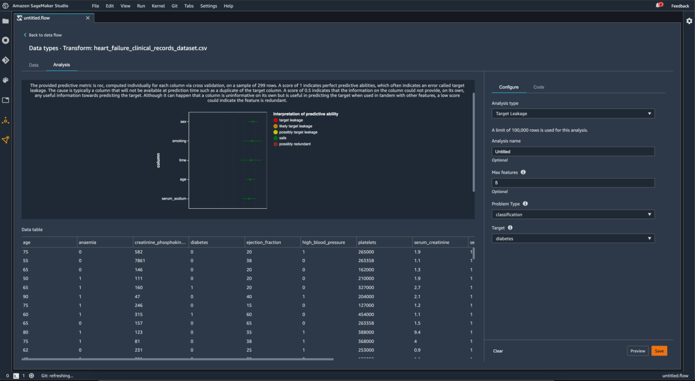

Multicollinearity

Multicollinearity is a circumstance where two or more predictor variables are related to each
other. The predictor variables are the features in your dataset that you're using to predict a target
variable. When you have multicollinearity, the predictor variables are not only predictive of the
target variable, but also predictive of each other.

Analyze and Visualize
3623

## Page 653

Amazon SageMaker AI
Developer Guide

You can use the Variance Inflation Factor (VIF), Principal Component Analysis (PCA), or Lasso
feature selection as measures for the multicollinearity in your data. For more information, see the
following.

Variance Inflation Factor (VIF)

The Variance Inflation Factor (VIF) is a measure of collinearity among variable pairs. Data
Wrangler returns a VIF score as a measure of how closely the variables are related to each other.
A VIF score is a positive number that is greater than or equal to 1.

A score of 1 means that the variable is uncorrelated with the other variables. Scores greater
than 1 indicate higher correlation.

Theoretically, you can have a VIF score with a value of infinity. Data Wrangler clips high scores
to 50. If you have a VIF score greater than 50, Data Wrangler sets the score to 50.

You can use the following guidelines to interpret your VIF scores:

• A VIF score less than or equal to 5 indicates that the variables are moderately correlated with
the other variables.

• A VIF score greater than or equal to 5 indicates that the variables are highly correlated with
the other variables.

Principle Component Analysis (PCA)

Principal Component Analysis (PCA) measures the variance of the data along different
directions in the feature space. The feature space consists of all the predictor variables that you
use to predict the target variable in your dataset.

For example, if you're trying to predict who survived on the RMS Titanic after it hit an iceberg,
your feature space can include the passengers' age, gender, and the fare that they paid.

From the feature space, PCA generates an ordered list of variances. These variances are also
known as singular values. The values in the list of variances are greater than or equal to 0. We
can use them to determine how much multicollinearity there is in our data.

When the numbers are roughly uniform, the data has very few instances of multicollinearity.
When there is a lot of variability among the values, we have many instances of multicollinearity.
Before it performs PCA, Data Wrangler normalizes each feature to have a mean of 0 and a
standard deviation of 1.

Analyze and Visualize
3624

## Page 654

Amazon SageMaker AI
Developer Guide

Note

PCA in this circumstance can also be referred to as Singular Value Decomposition (SVD).

Lasso feature selection

Lasso feature selection uses the L1 regularization technique to only include the most predictive
features in your dataset.

For both classification and regression, the regularization technique generates a coefficient for
each feature. The absolute value of the coefficient provides an importance score for the feature.
A higher importance score indicates that it is more predictive of the target variable. A common
feature selection method is to use all the features that have a non-zero lasso coefficient.

Detect Anomalies In Time Series Data

You can use the anomaly detection visualization to see outliers in your time series data. To
understand what determines an anomaly, you need to understand that we decompose the time
series into a predicted term and an error term. We treat the seasonality and trend of the time series
as the predicted term. We treat the residuals as the error term.

For the error term, you specify a threshold as the number of standard of deviations the residual
can be away from the mean for it to be considered an anomaly. For example, you can specify a
threshold as being 3 standard deviations. Any residual greater than 3 standard deviations away
from the mean is an anomaly.

You can use the following procedure to perform an Anomaly detection analysis.

1.
Open your Data Wrangler data flow.

2.
In your data flow, under Data types, choose the +, and select Add analysis.

3.
For Analysis type, choose Time Series.

4.
For Visualization, choose Anomaly detection.

5.
For Anomaly threshold, choose the threshold that a value is considered an anomaly.

6.
Choose Preview to generate a preview of the analysis.

7.
Choose Add to add the transform to the Data Wrangler data flow.

Analyze and Visualize
3625

## Page 655

Amazon SageMaker AI
Developer Guide

Seasonal Trend Decomposition In Time Series Data

You can determine whether there's seasonality in your time series data by using the Seasonal Trend
Decomposition visualization. We use the STL (Seasonal Trend decomposition using LOESS) method
to perform the decomposition. We decompose the time series into its seasonal, trend, and residual
components. The trend reflects the long term progression of the series. The seasonal component is
a signal that recurs in a time period. After removing the trend and the seasonal components from
the time series, you have the residual.

You can use the following procedure to perform a Seasonal-Trend decomposition analysis.

1.
Open your Data Wrangler data flow.

2.
In your data flow, under Data types, choose the +, and select Add analysis.

3.
For Analysis type, choose Time Series.

4.
For Visualization, choose Seasonal-Trend decomposition.

5.
For Anomaly threshold, choose the threshold that a value is considered an anomaly.

6.
Choose Preview to generate a preview of the analysis.

7.
Choose Add to add the transform to the Data Wrangler data flow.

Bias Report

You can use the bias report in Data Wrangler to uncover potential biases in your data. To generate
a bias report, you must specify the target column, or Label, that you want to predict and a Facet,
or the column that you want to inspect for biases.

Label: The feature about which you want a model to make predictions. For example, if you are
predicting customer conversion, you may select a column containing data on whether or not a
customer has placed an order. You must also specify whether this feature is a label or a threshold.
If you specify a label, you must specify what a positive outcome looks like in your data. In the
customer conversion example, a positive outcome may be a 1 in the orders column, representing
the positive outcome of a customer placing an order within the last three months. If you specify
a threshold, you must specify a lower bound defining a positive outcome. For example, if your
customer orders columns contains the number of orders placed in the last year, you may want to
specify 1.

Facet: The column that you want to inspect for biases. For example, if you are trying to predict
customer conversion, your facet may be the age of the customer. You may choose this facet

Analyze and Visualize
3626

## Page 656

Amazon SageMaker AI
Developer Guide

because you believe that your data is biased toward a certain age group. You must identify whether
the facet is measured as a value or threshold. For example, if you wanted to inspect one or more
specific ages, you select Value and specify those ages. If you want to look at an age group, you
select Threshold and specify the threshold of ages you want to inspect.

After you select your feature and label, you select the types of bias metrics you want to calculate.

To learn more, see Generate reports for bias in pre-training data.

Create Custom Visualizations

You can add an analysis to your Data Wrangler flow to create a custom visualization. Your dataset,
with all the transformations you've applied, is available as a Pandas DataFrame. Data Wrangler uses

the df variable to store the dataframe. You access the dataframe by calling the variable.

You must provide the output variable, chart, to store an Altair output chart. For example, you can
use the following code block to create a custom histogram using the Titanic dataset.

import altair as alt
df = df.iloc[:30]
df = df.rename(columns={"Age": "value"})
df = df.assign(count=df.groupby('value').value.transform('count'))
df = df[["value", "count"]]
base = alt.Chart(df)
bar = base.mark_bar().encode(x=alt.X('value', bin=True, axis=None), y=alt.Y('count'))
rule = base.mark_rule(color='red').encode(
x='mean(value):Q',
size=alt.value(5))
chart = bar + rule

To create a custom visualization:

1.
Next to the node containing the transformation that you'd like to visualize, choose the +.

2.
Choose Add analysis.

3.
For Analysis type, choose Custom Visualization.

4.
For Analysis name, specify a name.

5.
Enter your code in the code box.

6.
Choose Preview to preview your visualization.

7.
Choose Save to add your visualization.

Analyze and Visualize
3627

## Page 657

Amazon SageMaker AI
Developer Guide

If you don’t know how to use the Altair visualization package in Python, you can use custom code
snippets to help you get started.

Data Wrangler has a searchable collection of visualization snippets. To use a visualization snippet,
choose Search example snippets and specify a query in the search bar.

The following example uses the Binned scatterplot code snippet. It plots a histogram for 2
dimensions.

The snippets have comments to help you understand the changes that you need to make to the
code. You usually need to specify the column names of your dataset in the code.

import altair as alt

# Specify the number of top rows for plotting

Analyze and Visualize
3628

## Page 658

Amazon SageMaker AI
Developer Guide

rows_number = 1000
df = df.head(rows_number)
# You can also choose bottom rows or randomly sampled rows
# df = df.tail(rows_number)
# df = df.sample(rows_number)

chart = (
alt.Chart(df)
.mark_circle()
.encode(
# Specify the column names for binning and number of bins for X and Y axis
x=alt.X("col1:Q", bin=alt.Bin(maxbins=20)),
y=alt.Y("col2:Q", bin=alt.Bin(maxbins=20)),
size="count()",
)
)

# :Q specifies that label column has quantitative type.
# For more details on Altair typing refer to
# https://altair-viz.github.io/user_guide/encoding.html#encoding-data-types

Reusing Data Flows for Different Datasets

For Amazon Simple Storage Service (Amazon S3) data sources, you can create and use parameters.
A parameter is a variable that you've saved in your Data Wrangler flow. Its value can be any portion
of the data source's Amazon S3 path. Use parameters to quickly change the data that you're
importing into a Data Wrangler flow or exporting to a processing job. You can also use parameters
to select and import a specific subset of your data.

After you created a Data Wrangler flow, you might have trained a model on the data that you've
transformed. For datasets that have the same schema, you can use parameters to apply the same
transformations on a different dataset and train a different model. You can use the new datasets to
perform inference with your model or you could be using them to retrain your model.

In general, parameters have the following attributes:

• Name – The name you specify for the parameter

• Type – The type of value that the parameter represents

• Default value – The value of the parameter when you don't specify a new value

Reusing Data Flows for Different Datasets
3629

## Page 659

Amazon SageMaker AI
Developer Guide

Note

Datetime parameters have a time range attribute that they use as the default value.

Data Wrangler uses curly braces, {{}}, to indicate that a parameter is being used in

the Amazon S3 path. For example, you can have a URL such as s3://amzn-s3-demo-

bucket1/{{example_parameter_name}}/example-dataset.csv.

You create a parameter when you're editing the Amazon S3 data source that you've imported. You
can set any portion of the file path to a parameter value. You can set the parameter value to either
a value or a pattern. The following are the available parameter value types in the Data Wrangler
flow:

• Number

• String

• Pattern

• Datetime

Note

You can't create a pattern parameter or a datetime parameter for the name of the bucket in
the Amazon S3 path.

You must set a number as the default value of a number parameter. You can change the value of
the parameter to a different number when you're editing a parameter or when you're launching a

processing job. For example, in the S3 path, s3://amzn-s3-demo-bucket/example-prefix/

example-file-1.csv, you can create a number parameter named number_parameter in the

place of 1. Your S3 path now appears as s3://amzn-s3-demo-bucket/example-prefix/

example-file-{{number_parameter}}.csv. The path continues to point to the example-

file-1.csv dataset until you change the value of the parameter. If you change the value of

number_parameter to 2 the path is now s3://amzn-s3-demo-bucket/example-prefix/

example-file-2.csv. You can import example-file-2.csv into Data Wrangler if you've
uploaded the file to that Amazon S3 location.

Reusing Data Flows for Different Datasets
3630

## Page 660

Amazon SageMaker AI
Developer Guide

A string parameter stores a string as its default value. For example, in the S3 path, s3://amzn-

s3-demo-bucket/example-prefix/example-file-1.csv, you can create a string parameter

named string_parameter in the place of the filename, example-file-1.csv. The path now

appears as s3://amzn-s3-demo-bucket/example-prefix/{{string_parameter}}. It

continues to match s3://amzn-s3-demo-bucket/example-prefix/example-file-1.csv,
until you change the value of the parameter.

Instead of specifying the filename as a string parameter, you can create a string parameter using
the entire Amazon S3 path. You can specify a dataset from any Amazon S3 location in the string
parameter.

A pattern parameter stores a regular expression (Python REGEX) string as its default value. You
can use a pattern parameter to import multiple data files at the same time. To import more than
one object at a time, specify a parameter value that matches the Amazon S3 objects that you're
importing.

You can also create a pattern parameter for the following datasets:

• s3://amzn-s3-demo-bucket1/example-prefix/example-file-1.csv

• s3://amzn-s3-demo-bucket1/example-prefix/example-file-2.csv

• s3://amzn-s3-demo-bucket1/example-prefix/example-file-10.csv

• s3://amzn-s3-demo-bucket/example-prefix/example-file-0123.csv

For s3://amzn-s3-demo-bucket1/example-prefix/example-file-1.csv, you can create

a pattern parameter in the place of 1, and set the default value of the parameter to \d+. The \d

+ REGEX string matches any one or more decimal digits. If you create a pattern parameter named

pattern_parameter, your S3 path appears as s3://amzn-s3-demo-bucket1/example-

prefix/example-file-{{pattern_parameter}}.csv.

You can also use pattern parameters to match all CSV objects within your bucket. To match all

objects in a bucket, create a pattern parameter with the default value of .* and set the path to

s3://amzn-s3-demo-bucket/{{pattern_parameter}}.csv. The .* character matches any
string character in the path.

The s3://amzn-s3-demo-bucket/{{pattern_parameter}}.csv path can match the
following datasets.

• example-file-1.csv

Reusing Data Flows for Different Datasets
3631

## Page 661

Amazon SageMaker AI
Developer Guide

• other-example-file.csv

• example-file-a.csv

A datetime parameter stores the format with the following information:

• A format for parsing strings inside an Amazon S3 path.

• A relative time range to limit the datetime values that match

For example, in the Amazon S3 file path, s3://amzn-s3-demo-bucket/2020/01/01/

example-dataset.csv, 2020/01/01 represents a datetime in the format of year/month/day.

You can set the parameter’s time range to an interval such as 1 years or 24 hours. An interval

of 1 years matches all S3 paths with datetimes that fall between the current time and the time
exactly a year before the current time. The current time is the time when you start exporting the

transformations that you've made to the data. For more information about exporting data, see

Export. If the current date is 2022/01/01 and the time range is 1 years, the S3 path matches
datasets such as the following:

• s3://amzn-s3-demo-bucket/2021/01/01/example-dataset.csv

• s3://amzn-s3-demo-bucket/2021/06/30/example-dataset.csv

• s3://amzn-s3-demo-bucket/2021/12/31/example-dataset.csv

The datetime values within a relative time range change as time passes. The S3 paths that fall
within the relative time range might also differ.

For the Amazon S3 file path, s3://amzn-s3-demo-bucket1/20200101/example-

dataset.csv, 20220101 is an example of a path that can become a datetime parameter.

To view a table of all parameters that you've created in Data Wrangler flow, choose the `{{}}` to
the right of the text box containing the Amazon S3 path. If you no longer need a parameter that
you've created, you can edit or delete. To edit or delete a parameter, choose icons to the right of
the parameter.

Important

Before you delete a parameter, make sure that you haven't used it anywhere in your Data
Wrangler flow. Deleted parameters that are still within the flow cause errors.

Reusing Data Flows for Different Datasets
3632

## Page 662

Amazon SageMaker AI
Developer Guide

You can create parameters for any step of your Data Wrangler flow. You can edit or delete any
parameter that you create. If you're applying transformations to data that is no longer relevant to
your use case, you can modify the values of parameters. Modifying the values of the parameters
changes the data that you're importing.

The following sections provide additional examples and general guidance on using parameters. You
can use the sections to understand the parameters that work best for you.

Note

The following sections contain procedures that use the Data Wrangler interface to override
the parameters and create a processing job.
You can also override the parameters by using the following procedures.

To export your Data Wrangler flow and override the value of a parameter, do the following.

1.
Choose the + next to the node that you want to export.

2.
Choose Export to.

3.
Choose the location where you're exporting the data.

4.
Under parameter_overrides, specify different values for the parameters that
you've created.

5.
Run the Jupyter Notebook.

Applying a Data Wrangler flow to files using patterns

You can use parameters to apply transformations in your Data Wrangler flow to different files
that match a pattern in the Amazon S3 URI path. This helps you specify the files in your S3 bucket
that you want to transform with high specificity. For example, you might have a dataset with the

path s3://amzn-s3-demo-bucket1/example-prefix-0/example-prefix-1/example-

prefix-2/example-dataset.csv. Different datasets named example-dataset.csv are
stored under many different example prefixes. The prefixes might also be numbered sequentially.
You can create patterns for the numbers in the Amazon S3 URI. Pattern parameters use REGEX
to select any number of files that match the pattern of the expression. The following are REGEX
patterns that might be useful:

• .* – Matches zero or more of any character, except newline characters

• .+ – Matches one or more of any character, excluding newline characters

Reusing Data Flows for Different Datasets
3633

## Page 663

Amazon SageMaker AI
Developer Guide

• \d+ – Matches one or more of any decimal digit

• \w+ – Matches one or more of any alphanumeric character

• [abc-_]{2,4} – Matches a string two, three, or four characters composed of the set of
characters provided within a set of brackets

• abc|def – Matches one string or another. For example, the operation matches either abc or def

You can replace each number in the following paths with a single parameter that has a value of \d

+.

• s3://amzn-s3-demo-bucket1/example-prefix-3/example-prefix-4/example-

prefix-5/example-dataset.csv

• s3://amzn-s3-demo-bucket1/example-prefix-8/example-prefix-12/example-

prefix-13/example-dataset.csv

• s3://amzn-s3-demo-bucket1/example-prefix-4/example-prefix-9/example-

prefix-137/example-dataset.csv

The following procedure creates a pattern parameter for a dataset with the path s3://amzn-s3-

demo-bucket1/example-prefix-0/example-prefix-1/example-prefix-2/example-

dataset.csv.

To create a pattern parameter, do the following.

1.
Next to the dataset that you've imported, choose Edit dataset.

2.
Highlight the 0 in example-prefix-0.

3.
Specify values for the following fields:

• Name – A name for parameter

• Type – Pattern

• Value – \d+ a regular expression that corresponds to one or more digits

4.
Choose Create.

5.
Replace the 1 and the 2 in S3 URI path with the parameter. The path should have

the following format: s3://amzn-s3-demo-bucket1/example-prefix-

{{example_parameter_name}}/example-prefix-{{example_parameter_name}}/

example-prefix-{{example_parameter_name}}/example-dataset.csv

Reusing Data Flows for Different Datasets
3634

## Page 664

Amazon SageMaker AI
Developer Guide

The following is a general procedure for creating a pattern parameter.

1.
Navigate to your Data Wrangler flow.

2.
Next to the dataset that you've imported, choose Edit dataset.

3.
Highlight the portion of the URI that you're using as the value of the pattern parameter.

4.
Choose Create custom parameter.

5.
Specify values for the following fields:

• Name – A name for parameter

• Type – Pattern

• Value – A regular expression containing the pattern that you'd like to store.

6.
Choose Create.

Applying a Data Wrangler flow to files using numeric values

You can use parameters to apply transformations in your Data Wrangler flow to different files

that have similar paths. For example, you might have a dataset with the path s3://amzn-s3-

demo-bucket1/example-prefix-0/example-prefix-1/example-prefix-2/example-

dataset.csv.

You might have the transformations from your Data Wrangler flow that you've applied to datasets

under example-prefix-1. You might want to apply the same transformations to example-

dataset.csv that falls under example-prefix-10 or example-prefix-20.

You can create a parameter that stores the value 1. If you want to apply the transformations to
different datasets, you can create processing jobs that replace the value of the parameter with a
different value. The parameter acts as a placeholder for you to change when you want to apply
the transformations from your Data Wrangler flow to new data. You can override the value of the
parameter when you create a Data Wrangler processing job to apply the transformations in your
Data Wrangler flow to different datasets.

Use the following procedure to create numeric parameters for s3://amzn-s3-demo-bucket1/

example-prefix-0/example-prefix-1/example-prefix-2/example-dataset.csv.

To create parameters for the preceding S3 URI path, do the following.

1.
Navigate to your Data Wrangler flow.

2.
Next to the dataset that you've imported, choose Edit dataset.

Reusing Data Flows for Different Datasets
3635

## Page 665

Amazon SageMaker AI
Developer Guide

3.
Highlight the number in an example prefix of example-prefix-number.

4.
Choose Create custom parameter.

5.
For Name, specify a name for the parameter.

6.
For Type, choose Integer.

7.
For Value, specify the number.

8.
Create parameters for the remaining numbers by repeating the procedure.

After you've created the parameters, apply the transforms to your dataset and create a destination
node for them. For more information about destination nodes, see Export.

Use the following procedure to apply the transformations from your Data Wrangler flow to a
different time range. It assumes that you've created a destination node for the transformations in
your flow.

To change the value of a numeric parameter in a Data Wrangler processing job, do the following.

1.
From your Data Wrangler flow, choose Create job

2.
Select only the destination node that contains the transformations to the dataset containing
the datetime parameters.

3.
Choose Configure job.

4.
Choose Parameters.

5.
Choose the name of a parameter that you've created.

6.
Change the value of the parameter.

7.
Repeat the procedure for the other parameters.

8.
Choose Run.

Applying a Data Wrangler flow to files using strings

You can use parameters to apply transformations in your Data Wrangler flow to different files that

have similar paths. For example, you might have a dataset with the path s3://amzn-s3-demo-

bucket1/example-prefix/example-dataset.csv.

You might have transformations from your Data Wrangler flow that you've applied to datasets

under example-prefix. You might want to apply the same transformations to example-

dataset.csv under another-example-prefix or example-prefix-20.

Reusing Data Flows for Different Datasets
3636

## Page 666

Amazon SageMaker AI
Developer Guide

You can create a parameter that stores the value example-prefix. If you want to apply the
transformations to different datasets, you can create processing jobs that replace the value of
the parameter with a different value. The parameter acts as a placeholder for you to change
when you want to apply the transformations from your Data Wrangler flow to new data. You can
override the value of the parameter when you create a Data Wrangler processing job to apply the
transformations in your Data Wrangler flow to different datasets.

Use the following procedure to create a string parameter for s3://amzn-s3-demo-bucket1/

example-prefix/example-dataset.csv.

To create a parameter for the preceding S3 URI path, do the following.

1.
Navigate to your Data Wrangler flow.

2.
Next to the dataset that you've imported, choose Edit dataset.

3.
Highlight the example prefix, example-prefix.

4.
Choose Create custom parameter.

5.
For Name, specify a name for the parameter.

6.
For Type, choose String.

7.
For Value, specify the prefix.

After you've created the parameter, apply the transforms to your dataset and create a destination
node for them. For more information about destination nodes, see Export.

Use the following procedure to apply the transformations from your Data Wrangler flow to a
different time range. It assumes that you've created a destination node for the transformations in
your flow.

To change the value of a numeric parameter in a Data Wrangler processing job, do the following:

1.
From your Data Wrangler flow, choose Create job

2.
Select only the destination node that contains the transformations to the dataset containing
the datetime parameters.

3.
Choose Configure job.

4.
Choose Parameters.

5.
Choose the name of a parameter that you've created.

6.
Change the value of the parameter.

Reusing Data Flows for Different Datasets
3637

## Page 667

Amazon SageMaker AI
Developer Guide

7.
Repeat the procedure for the other parameters.

8.
Choose Run.

Applying a Data Wrangler flow to different datetime ranges

Use datetime parameters to apply transformations in your Data Wrangler flow to different time
ranges. Highlight the portion of the Amazon S3 URI that has a timestamp and create a parameter
for it. When you create a parameter, you specify a time range from the current time to a time in

the past. For example, you might have an Amazon S3 URI that looks like the following: s3://

amzn-s3-demo-bucket1/example-prefix/2022/05/15/example-dataset.csv. You can

save 2022/05/15 as a datetime parameter. If you specify a year as the time range, the time range
includes the moment that you run the processing job containing the datetime parameter and the
time exactly one year ago. If the moment you're running the processing job is September 6th, 2022

or 2022/09/06, the time ranges can include the following:

• s3://amzn-s3-demo-bucket1/example-prefix/2022/03/15/example-dataset.csv

• s3://amzn-s3-demo-bucket1/example-prefix/2022/01/08/example-dataset.csv

• s3://amzn-s3-demo-bucket1/example-prefix/2022/07/31/example-dataset.csv

• s3://amzn-s3-demo-bucket1/example-prefix/2021/09/07/example-dataset.csv

The transformations in the Data Wrangler flow apply to all of the preceding prefixes. Changing
the value of the parameter in the processing job doesn't change the value of the parameter in the
Data Wrangler flow. To apply the transformations to datasets within a different time range, do the
following:

1. Create a destination node containing all the transformations that you'd like to use.

2. Create a Data Wrangler job.

3. Configure the job to use a different time range for the parameter. Changing the value of the

parameter in the processing job doesn't change the value of the parameter in the Data Wrangler
flow.

For more information about destination nodes and Data Wrangler jobs, see Export.

The following procedure creates a datetime parameter for the Amazon S3 path: s3://amzn-s3-

demo-bucket1/example-prefix/2022/05/15/example-dataset.csv.

Reusing Data Flows for Different Datasets
3638

## Page 668

Amazon SageMaker AI
Developer Guide

To create a datetime parameter for the preceding S3 URI path, do the following.

1.
Navigate to your Data Wrangler flow.

2.
Next to the dataset that you've imported, choose Edit dataset.

3.
Highlight the portion of the URI that you're using as the value of the datetime parameter.

4.
Choose Create custom parameter.

5.
For Name, specify a name for the parameter.

6.
For Type, choose Datetime.

Note

By default, Data Wrangler selects Predefined, which provides a dropdown menu for
you to select a date format. However, the timestamp format that you're using might
not be available. Instead of using Predefined as the default option, you can choose
Custom and specify the timestamp format manually.

7.
For Date format, open the dropdown menu following Predefined and choose yyyy/MM/dd.
The format, yyyy/MM/dd, corresponds to the year/month/day of the timestamp.

8.
For Timezone, choose a time zone.

Note

The data that you're analyzing might have time stamps taken in a different time zone
from your time zone. Make sure that the time zone that you select matches the time
zone of the data.

9.
For Time range, specify the time range for the parameter.

10. (Optional) Enter a description to describe how you're using the parameter.

11. Choose Create.

After you've created the datetime parameters, apply the transforms to your dataset and create a
destination node for them. For more information about destination nodes, see Export.

Use the following procedure to apply the transformations from your Data Wrangler flow to a
different time range. It assumes that you've created a destination node for the transformations in
your flow.

Reusing Data Flows for Different Datasets
3639

## Page 669

Amazon SageMaker AI
Developer Guide

To change the value of a datetime parameter in a Data Wrangler processing job, do the following:

1.
From your Data Wrangler flow, choose Create job

2.
Select only the destination node that contains the transformations to the dataset containing
the datetime parameters.

3.
Choose Configure job.

4.
Choose Parameters.

5.
Choose the name of the datetime parameter that you've created.

6.
For Time range, change the time range for the datasets.

7.
Choose Run.

Export

In your Data Wrangler flow, you can export some or all of the transformations that you've made to
your data processing pipelines.

A Data Wrangler flow is the series of data preparation steps that you've performed on your data. In
your data preparation, you perform one or more transformations to your data. Each transformation
is done using a transform step. The flow has a series of nodes that represent the import of your
data and the transformations that you've performed. For an example of nodes, see the following
image.

Export
3640

## Page 670

Amazon SageMaker AI
Developer Guide

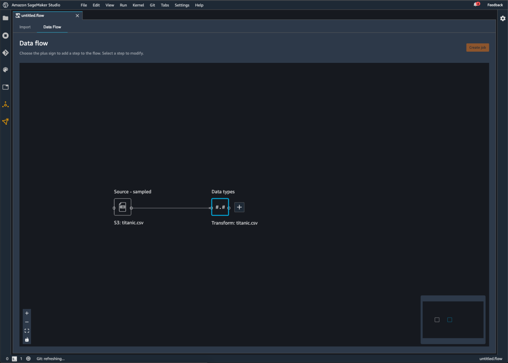

The preceding image shows a Data Wrangler flow with two nodes. The Source - sampled node
shows the data source from which you've imported your data. The Data types node indicates that
Data Wrangler has performed a transformation to convert the dataset into a usable format.

Each transformation that you add to the Data Wrangler flow appears as an additional node. For
information on the transforms that you can add, see Transform Data. The following image shows a
Data Wrangler flow that has a Rename-column node to change the name of a column in a dataset.

You can export your data transformations to the following:

• Amazon S3

• Pipelines

• Amazon SageMaker Feature Store

• Python Code

Export
3641

## Page 671

Amazon SageMaker AI
Developer Guide

Important

We recommend that you use the IAM AmazonSageMakerFullAccess managed policy
to grant AWS permission to use Data Wrangler. If you don't use the managed policy, you
can use an IAM policy that gives Data Wrangler access to an Amazon S3 bucket. For more
information on the policy, see Security and Permissions.

When you export your data flow, you're charged for the AWS resources that you use. You can use
cost allocation tags to organize and manage the costs of those resources. You create these tags for
your user-profile and Data Wrangler automatically applies them to the resources used to export
the data flow. For more information, see Using Cost Allocation Tags.

Export to Amazon S3

Data Wrangler gives you the ability to export your data to a location within an Amazon S3 bucket.
You can specify the location using one of the following methods:

• Destination node – Where Data Wrangler stores the data after it has processed it.

• Export to – Exports the data resulting from a transformation to Amazon S3.

• Export data – For small datasets, can quickly export the data that you've transformed.

Use the following sections to learn more about each of these methods.

Destination Node

If you want to output a series of data processing steps that you've performed to Amazon S3,
you create a destination node. A destination node tells Data Wrangler where to store the data
after you've processed it. After you create a destination node, you create a processing job to
output the data. A processing job is an Amazon SageMaker processing job. When you're using
a destination node, it runs the computational resources needed to output the data that you've
transformed to Amazon S3.

You can use a destination node to export some of the transformations or all of the
transformations that you've made in your Data Wrangler flow.

You can use multiple destination nodes to export different transformations or sets of
transformations. The following example shows two destination nodes in a single Data Wrangler
flow.

Export
3642

## Page 672

Amazon SageMaker AI
Developer Guide

You can use the following procedure to create destination nodes and export them to an
Amazon S3 bucket.

To export your data flow, you create destination nodes and a Data Wrangler job to export the
data. Creating a Data Wrangler job starts a SageMaker Processing job to export your flow. You
can choose the destination nodes that you want to export after you've created them.

Note

You can choose Create job in the Data Wrangler flow to view the instructions to use a
processing job.

Use the following procedure to create destination nodes.

1.
Choose the + next to the nodes that represent the transformations that you want to export.

Export
3643

## Page 673

Amazon SageMaker AI
Developer Guide

2.
Choose Add destination.

3.
Choose Amazon S3.

Export
3644

## Page 674

Amazon SageMaker AI
Developer Guide

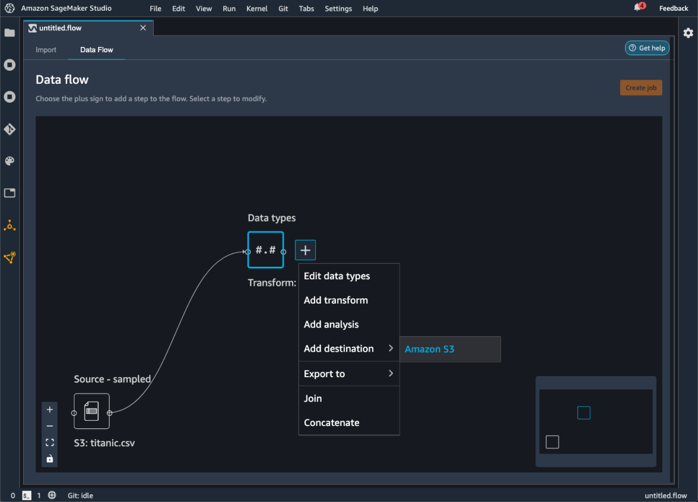

4.
Specify the following fields.

• Dataset name – The name that you specify for the dataset that you're exporting.

• File type – The format of the file that you're exporting.

• Delimiter (CSV and Parquet files only) – The value used to separate other values.

• Compression (CSV and Parquet files only) – The compression method used to reduce the
file size. You can use the following compression methods:

• bzip2

• deflate

• gzip

• (Optional) Amazon S3 location – The S3 location that you're using to output the files.

• (Optional) Number of partitions – The number of datasets that you're writing as the
output of the processing job.

Export
3645

## Page 675

Amazon SageMaker AI
Developer Guide

• (Optional) Partition by column – Writes all data with the same unique value from the
column.

• (Optional) Inference Parameters – Selecting Generate inference artifact applies all of
the transformations you've used in the Data Wrangler flow to data coming into your
inference pipeline. The model in your pipeline makes predictions on the transformed
data.

5.
Choose Add destination.

Use the following procedure to create a processing job.

Create a job from the Data flow page and choose the destination nodes that you want to
export.

Note

You can choose Create job in the Data Wrangler flow to view the instructions for
creating a processing job.

1.
Choose Create job. The following image shows the pane that appears after you select
Create job.

Export
3646

## Page 676

Amazon SageMaker AI
Developer Guide

2.
For Job name, specify the name of the export job.

3.
Choose the destination nodes that you want to export.

4.
(Optional) Specify a AWS KMS key ARN. A AWS KMS key is a cryptographic key that you
can use to protect your data. For more information about AWS KMS keys, see AWS Key
Management Service.

5.
(Optional) Under Trained parameters. choose Refit if you've done the following:

• Sampled your dataset

• Applied a transform that uses your data to create a new column in the dataset

For more information about refitting the transformations you've made to an entire dataset,
see Refit Transforms to The Entire Dataset and Export Them.

Export
3647

## Page 677

Amazon SageMaker AI
Developer Guide

Note

For image data, Data Wrangler exports the transformations that you've made to all
of the images. Refitting the transformations isn't applicable to your use case.

6.
Choose Configure job. The following image shows the Configure job page.

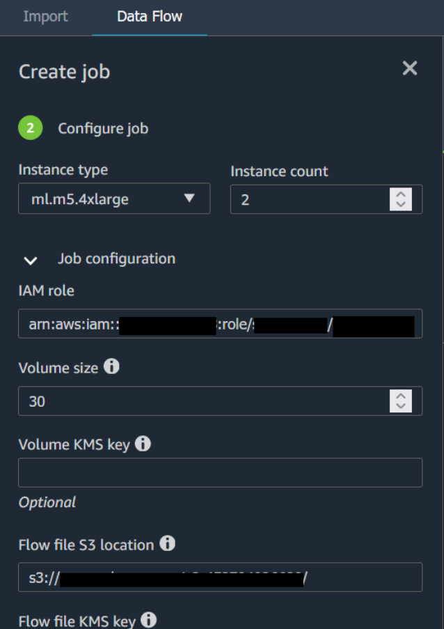

7.
(Optional) Configure the Data Wrangler job. You can make the following configurations:

• Job configuration

• Spark memory configuration

• Network configuration

• Tags

• Parameters

Export
3648

## Page 678

Amazon SageMaker AI
Developer Guide

• Associate Schedules

8.
Choose Run.

Export to

As an alternative to using a destination node, you can use the Export to option to export your
Data Wrangler flow to Amazon S3 using a Jupyter notebook. You can choose any data node in
your Data Wrangler flow and export it. Exporting the data node exports the transformation that
the node represents and the transformations that precede it.

Use the following procedure to generate a Jupyter notebook and run it to export your Data
Wrangler flow to Amazon S3.

1.
Choose the + next to the node that you want to export.

2.
Choose Export to.

3.
Choose Amazon S3 (via Jupyter Notebook).

4.
Run the Jupyter notebook.

When you run the notebook, it exports your data flow (.flow file) in the same AWS Region as the
Data Wrangler flow.

Export
3649

## Page 679

Amazon SageMaker AI
Developer Guide

The notebook provides options that you can use to configure the processing job and the data
that it outputs.

Important

We provide you with job configurations to configure the output of your data. For the
partitioning and driver memory options, we strongly recommend that you don't specify

a configuration unless you already have knowledge about them.

Under Job Configurations, you can configure the following:

• output_content_type – The content type of the output file. Uses CSV as the default

format, but you can specify Parquet.

• delimiter – The character used to separate values in the dataset when writing to a CSV file.

• compression – If set, compresses the output file. Uses gzip as the default compression
format.

• num_partitions – The number of partitions or files that Data Wrangler writes as the
output.

• partition_by – The names of the columns that you use to partition the output.

To change the output file format from CSV to Parquet, change the value from "CSV" to

"Parquet". For the rest of the preceding fields, uncomment the lines containing the fields that
you want to specify.

Under (Optional) Configure Spark Cluster Driver Memory you can configure Spark properties

for the job, such as the Spark driver memory, in the config dictionary.

The following shows the config dictionary.

config = json.dumps({
"Classification": "spark-defaults",
"Properties": {
"spark.driver.memory": f"{driver_memory_in_mb}m",
}
})

Export
3650

## Page 680

Amazon SageMaker AI
Developer Guide

To apply the configuration to the processing job, uncomment the following lines:

# data_sources.append(ProcessingInput(
#     source=config_s3_uri,
#     destination="/opt/ml/processing/input/conf",
#     input_name="spark-config",
#     s3_data_type="S3Prefix",
#     s3_input_mode="File",
#     s3_data_distribution_type="FullyReplicated"
# ))

Export data

If you have a transformation on a small dataset that you want to export quickly, you can use the
Export data method. When you start choose Export data, Data Wrangler works synchronously
to export the data that you've transformed to Amazon S3. You can't use Data Wrangler until
either it finishes exporting your data or you cancel the operation.

For information on using the Export data method in your Data Wrangler flow, see the following
procedure.

To use the Export data method:

1.
Choose a node in your Data Wrangler flow by opening (double-clicking on) it.

Export
3651

## Page 681

Amazon SageMaker AI
Developer Guide

2.
Configure how you want to export the data.

3.
Choose Export data.

When you export your data flow to an Amazon S3 bucket, Data Wrangler stores a copy of the
flow file in the S3 bucket. It stores the flow file under the data_wrangler_flows prefix. If you use
the default Amazon S3 bucket to store your flow files, it uses the following naming convention:

sagemaker-region-account number. For example, if your account number is 111122223333

and you are using Studio Classic in us-east-1, your imported datasets are stored in sagemaker-

us-east-1-111122223333. In this example, your .flow files created in us-east-1 are stored in

s3://sagemaker-region-account number/data_wrangler_flows/.

Export to Pipelines

When you want to build and deploy large-scale machine learning (ML) workflows, you can use
Pipelines to create workflows that manage and deploy SageMaker AI jobs. With Pipelines, you
can build workflows that manage your SageMaker AI data preparation, model training, and
model deployment jobs. You can use the first-party algorithms that SageMaker AI offers by using
Pipelines. For more information on Pipelines, see SageMaker Pipelines.

When you export one or more steps from your data flow to Pipelines, Data Wrangler creates a
Jupyter notebook that you can use to define, instantiate, run, and manage a pipeline.

Export
3652

## Page 682

Amazon SageMaker AI
Developer Guide

Use a Jupyter Notebook to Create a Pipeline

Use the following procedure to create a Jupyter notebook to export your Data Wrangler flow to
Pipelines.

Use the following procedure to generate a Jupyter notebook and run it to export your Data
Wrangler flow to Pipelines.

1.
Choose the + next to the node that you want to export.

2.
Choose Export to.

3.
Choose Pipelines (via Jupyter Notebook).

4.
Run the Jupyter notebook.

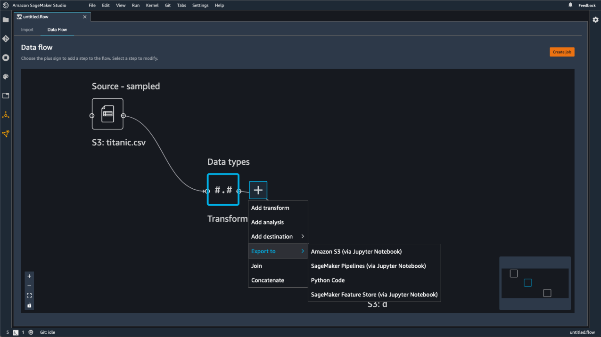

You can use the Jupyter notebook that Data Wrangler produces to define a pipeline. The pipeline
includes the data processing steps that are defined by your Data Wrangler flow.

You can add additional steps to your pipeline by adding steps to the steps list in the following
code in the notebook:

pipeline = Pipeline(

Export
3653

## Page 683

Amazon SageMaker AI
Developer Guide

name=pipeline_name,
parameters=[instance_type, instance_count],
steps=[step_process], #Add more steps to this list to run in your Pipeline
)

For more information on defining pipelines, see Define SageMaker AI Pipeline.

Export to an Inference Endpoint

Use your Data Wrangler flow to process data at the time of inference by creating a SageMaker
AI serial inference pipeline from your Data Wrangler flow. An inference pipeline is a series of
steps that results in a trained model making predictions on new data. A serial inference pipeline
within Data Wrangler transforms the raw data and provides it to the machine learning model for
a prediction. You create, run, and manage the inference pipeline from a Jupyter notebook within
Studio Classic. For more information about accessing the notebook, see Use a Jupyter Notebook to
create an inference endpoint.

Within the notebook, you can either train a machine learning model or specify one that you've
already trained. You can either use Amazon SageMaker Autopilot or XGBoost to train the model
using the data that you've transformed in your Data Wrangler flow.

The pipeline provides the ability to perform either batch or real-time inference. You can also add
the Data Wrangler flow to SageMaker Model Registry. For more information about hosting models,
see Multi-model endpoints.

Important

You can't export your Data Wrangler flow to an inference endpoint if it has the following
transformations:

• Join

• Concatenate

• Group by

If you must use the preceding transforms to prepare your data, use the following
procedure.

To prepare your data for inference with unsupported transforms

1.
Create a Data Wrangler flow.

Export
3654

## Page 684

Amazon SageMaker AI
Developer Guide

2.
Apply the preceding transforms that aren't supported.

3.
Export the data to an Amazon S3 bucket.

4.
Create a separate Data Wrangler flow.

5.
Import the data that you've exported from the preceding flow.

6.
Apply the remaining transforms.

7.
Create a serial inference pipeline using the Jupyter notebook that we provide.

For information about exporting your data to an Amazon S3 bucket see Export to Amazon
S3. For information about opening the Jupyter notebook used to create the serial inference
pipeline, see Use a Jupyter Notebook to create an inference endpoint.

Data Wrangler ignores transforms that remove data at the time of inference. For example, Data
Wrangler ignores the Handle Missing Values transform if you use the Drop missing configuration.

If you've refit transforms to your entire dataset, the transforms carry over to your inference
pipeline. For example, if you used the median value to impute missing values, the median
value from refitting the transform is applied to your inference requests. You can either refit the
transforms from your Data Wrangler flow when you're using the Jupyter notebook or when you're
exporting your data to an inference pipeline. For information about refitting transforms, see Refit
Transforms to The Entire Dataset and Export Them.

The serial inference pipeline supports the following data types for the input and output strings.
Each data type has a set of requirements.

Supported datatypes

• text/csv – the datatype for CSV strings

• The string can't have a header.

• Features used for the inference pipeline must be in the same order as features in the training
dataset.

• There must be a comma delimiter between features.

• Records must be delimited by a newline character.

The following is an example of a validly formatted CSV string that you can provide in an
inference request.

Export
3655

## Page 685

Amazon SageMaker AI
Developer Guide

abc,0.0,"Doe, John",12345\ndef,1.1,"Doe, Jane",67890

• application/json – the datatype for JSON strings

• The features used in the dataset for the inference pipeline must be in the same order as the
features in the training dataset.

• The data must have a specific schema. You define schema as a single instances object that

has a set of features. Each features object represents an observation.

The following is an example of a validly formatted JSON string that you can provide in an
inference request.

{
"instances": [
{
"features": ["abc", 0.0, "Doe, John", 12345]
},
{
"features": ["def", 1.1, "Doe, Jane", 67890]
}
]
}

Use a Jupyter Notebook to create an inference endpoint

Use the following procedure to export your Data Wrangler flow to create an inference pipeline.

To create an inference pipeline using a Jupyter notebook, do the following.

1.
Choose the + next to the node that you want to export.

2.
Choose Export to.

3.
Choose SageMaker AI Inference Pipeline (via Jupyter Notebook).

4.
Run the Jupyter notebook.

Export
3656

## Page 686

Amazon SageMaker AI
Developer Guide

When you run the Jupyter notebook, it creates an inference flow artifact. An inference flow artifact
is a Data Wrangler flow file with additional metadata used to create the serial inference pipeline.
The node that you're exporting encompasses all of the transforms from the preceding nodes.

Important

Data Wrangler needs the inference flow artifact to run the inference pipeline. You can't use
your own flow file as the artifact. You must create it by using the preceding procedure.

Export to Python Code

To export all steps in your data flow to a Python file that you can manually integrate into any data
processing workflow, use the following procedure.

Use the following procedure to generate a Jupyter notebook and run it to export your Data
Wrangler flow to Python Code.

1.
Choose the + next to the node that you want to export.

2.
Choose Export to.

3.
Choose Python Code.

4.
Run the Jupyter notebook.

Export
3657

## Page 687

Amazon SageMaker AI
Developer Guide

You might need to configure the Python script to make it run in your pipeline. For example,
if you're running a Spark environment, make sure that you are running the script from an
environment that has permission to access AWS resources.

Export to Amazon SageMaker Feature Store

You can use Data Wrangler to export features you've created to Amazon SageMaker Feature Store.
A feature is a column in your dataset. Feature Store is a centralized store for features and their
associated metadata. You can use Feature Store to create, share, and manage curated data for
machine learning (ML) development. Centralized stores make your data more discoverable and
reusable. For more information about Feature Store, see Amazon SageMaker Feature Store.

A core concept in Feature Store is a feature group. A feature group is a collection of features, their
records (observations), and associated metadata. It's similar to a table in a database.

You can use Data Wrangler to do one of the following:

• Update an existing feature group with new records. A record is an observation in the dataset.

• Create a new feature group from a node in your Data Wrangler flow. Data Wrangler adds the
observations from your datasets as records in your feature group.

Export
3658

## Page 688

Amazon SageMaker AI
Developer Guide

If you're updating an existing feature group, your dataset's schema must match the schema of
the feature group. All the records in the feature group are replaced with the observations in your
dataset.

You can use either a Jupyter notebook or a destination node to update your feature group with the
observations in the dataset.

If your feature groups with the Iceberg table format have a custom offline store encryption
key, make sure you grant the IAM that you're using for the Amazon SageMaker Processing job
permissions to use it. At a minimum, you must grant it permissions to encrypt the data that
you're writing to Amazon S3. To grant the permissions, give the IAM role the ability to use the
GenerateDataKey. For more information about granting IAM roles permissions to use AWS KMS
keys see https://docs.aws.amazon.com/kms/latest/developerguide/key-policies.html

Destination Node

If you want to output a series of data processing steps that you've performed to a feature
group, you can create a destination node. When you create and run a destination node, Data
Wrangler updates a feature group with your data. You can also create a new feature group from
the destination node UI. After you create a destination node, you create a processing job to
output the data. A processing job is an Amazon SageMaker processing job. When you're using
a destination node, it runs the computational resources needed to output the data that you've
transformed to the feature group.

You can use a destination node to export some of the transformations or all of the
transformations that you've made in your Data Wrangler flow.

Use the following procedure to create a destination node to update a feature group with the
observations from your dataset.

To update a feature group using a destination node, do the following.

Note

You can choose Create job in the Data Wrangler flow to view the instructions for using a
processing job to update the feature group.

1.
Choose the + symbol next to the node containing the dataset that you'd like to export.

2.
Under Add destination, choose SageMaker AI Feature Store.

Export
3659

## Page 689

Amazon SageMaker AI
Developer Guide

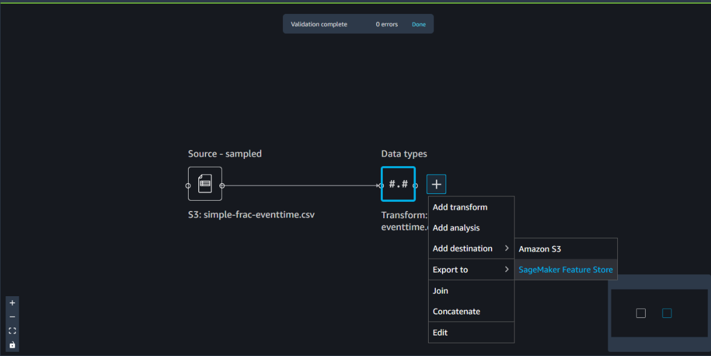

3.
Choose (double-click) the feature group. Data Wrangler checks whether the schema of
the feature group matches the schema of the data that you're using to update the feature
group.

4.
(Optional) Select Export to offline store only for feature groups that have both an online
store and an offline store. This option only updates the offline store with observations from
your dataset.

5.
After Data Wrangler validates the schema of your dataset, choose Add.

Use the following procedure to create a new feature group with data from your dataset.

You can store your feature group in one of the following ways:

• Online – Low-latency, high-availability cache for a feature group that provides real-time
lookup of records. The online store allows quick access to the latest value for a record in a
feature group.

• Offline – Stores data for your feature group in an Amazon S3 bucket. You can store your data
offline when you don't need low-latency (sub-second) reads. You can use an offline store for
features used in data exploration, model training, and batch inference.

• Both online and offline – Stores your data in both an online store and an offline store.

To create a feature group using a destination node, do the following.

Export
3660

## Page 690

Amazon SageMaker AI
Developer Guide

1.
Choose the + symbol next to the node containing the dataset that you'd like to export.

2.
Under Add destination, choose SageMaker AI Feature Store.

3.
Choose Create Feature Group.

4.
In the following dialog box, if your dataset doesn't have an event time column, select
Create "EventTime" column.

5.
Choose Next.

6.
Choose Copy JSON Schema. When you create a feature group, you paste the schema into
the feature definitions.

7.
Choose Create.

8.
For Feature group name, specify a name for your feature group.

9.
For Description (optional), specify a description to make your feature group more
discoverable.

10. To create a feature group for an online store, do the following.

a.
Select Enable storage online.

b.
For Online store encryption key, specify an AWS managed encryption key or an
encryption key of your own.

11. To create a feature group for an offline store, do the following.

a.
Select Enable storage offline. Specify values for the following fields:

• S3 bucket name – The name of the Amazon S3 bucket that stores the feature group.

• (Optional) Dataset directory name – The Amazon S3 prefix that you're using to store
the feature group.

• IAM Role ARN – The IAM role that has access to Feature Store.

• Table Format – Table format of your offline store. You can specify Glue or Iceberg.
Glue is the default format.

• Offline store encryption key – By default, Feature Store uses an AWS Key
Management Service managed key, but you can use the field to specify a key of your
own.

b.
Specify values for the following fields:

• S3 bucket name – The name of the bucket storing the feature group.

Export
3661

## Page 691

Amazon SageMaker AI
Developer Guide

• (Optional) Dataset directory name – The Amazon S3 prefix that you're using to
store the feature group.

• IAM Role ARN – The IAM role that has access to feature store.

• Offline store encryption key – By default, Feature Store uses an AWS managed key,
but you can use the field to specify a key of your own.

12. Choose Continue.

13. Choose JSON.

14. Remove the placeholder brackets in the window.

15. Paste the JSON text from Step 6.

16. Choose Continue.

17. For RECORD IDENTIFIER FEATURE NAME, choose the column in your dataset that has

unique identifiers for each record in your dataset.

18. For EVENT TIME FEATURE NAME, choose the column with the timestamp values.

19. Choose Continue.

20. (Optional) Add tags to make your feature group more discoverable.

21. Choose Continue.

22. Choose Create feature group.

23. Navigate back to your Data Wrangler flow and choose the refresh icon next to the Feature

Group search bar.

Note

If you've already created a destination node for a feature group within a flow, you can't
create another destination node for the same feature group. If you want to create
another destination node for the same feature group, you must create another flow file.

Use the following procedure to create a Data Wrangler job.

Create a job from the Data flow page and choose the destination nodes that you want to
export.

1.
Choose Create job. The following image shows the pane that appears after you select
Create job.

Export
3662

## Page 692

Amazon SageMaker AI
Developer Guide

2.
For Job name, specify the name of the export job.

3.
Choose the destination nodes that you want to export.

4.
(Optional) For Output KMS Key, specify an ARN, ID, or alias of an AWS KMS key. A KMS key
is a cryptographic key. You can use the key to encrypt the output data from the job. For
more information about AWS KMS keys, see AWS Key Management Service.

5.
The following image shows the Configure job page with the Job configuration tab open.

(Optional) Under Trained parameters. choose Refit if you've done the following:

• Sampled your dataset

• Applied a transform that uses your data to create a new column in the dataset

For more information about refitting the transformations you've made to an entire dataset,
see Refit Transforms to The Entire Dataset and Export Them.

Export
3663

## Page 693

Amazon SageMaker AI
Developer Guide

6.
Choose Configure job.

7.
(Optional) Configure the Data Wrangler job. You can make the following configurations:

• Job configuration

• Spark memory configuration

• Network configuration

• Tags

• Parameters

• Associate Schedules

8.
Choose Run.

Jupyter notebook

Use the following procedure to a Jupyter notebook to export to Amazon SageMaker Feature
Store.

Use the following procedure to generate a Jupyter notebook and run it to export your Data
Wrangler flow to Feature Store.

1.
Choose the + next to the node that you want to export.

2.
Choose Export to.

3.
Choose Amazon SageMaker Feature Store (via Jupyter Notebook).

4.
Run the Jupyter notebook.

Export
3664

## Page 694

Amazon SageMaker AI
Developer Guide

Running a Jupyter notebook runs a Data Wrangler job. Running a Data Wrangler job starts a
SageMaker AI processing job. The processing job ingests the flow into an online and offline
feature store.

Important

The IAM role you use to run this notebook must have the following

AWS managed policies attached: AmazonSageMakerFullAccess and

AmazonSageMakerFeatureStoreAccess.

You only need to enable one online or offline feature store when you create a feature group.

You can also enable both. To disable online store creation, set EnableOnlineStore to False:

# Online Store Configuration
online_store_config = {
"EnableOnlineStore": False
}

Export
3665

## Page 695

Amazon SageMaker AI
Developer Guide

The notebook uses the column names and types of the dataframe you export to create a
feature group schema, which is used to create a feature group. A feature group is a group of
features defined in the feature store to describe a record. The feature group defines the schema
and features contained in the feature group. A feature group definition is composed of a list of
features, a record identifier feature name, an event time feature name, and configurations for
its online store and offline store.

Each feature in a feature group can have one of the following types: String, Fractional, or
Integral. If a column in your exported dataframe is not one of these types, it defaults to

String.

The following is an example of a feature group schema.

column_schema = [
{

"name": "Height",
"type": "long"
},
{
"name": "Input",
"type": "string"
},
{
"name": "Output",
"type": "string"
},
{
"name": "Sum",
"type": "string"
},
{
"name": "Time",
"type": "string"
}
]

Additionally, you must specify a record identifier name and event time feature name:

• The record identifier name is the name of the feature whose value uniquely identifies a record
defined in the feature store. Only the latest record per identifier value is stored in the online
store. The record identifier feature name must be one of feature definitions' names.

Export
3666

## Page 696

Amazon SageMaker AI
Developer Guide

• The event time feature name is the name of the feature that stores the EventTime of a

record in a feature group. An EventTime is a point in time when a new event occurs that

corresponds to the creation or update of a record in a feature. All records in the feature group

must have a corresponding EventTime.

The notebook uses these configurations to create a feature group, process your data at scale,
and then ingest the processed data into your online and offline feature stores. To learn more,
see Data Sources and Ingestion.

The notebook uses these configurations to create a feature group, process your data at scale, and
then ingest the processed data into your online and offline feature stores. To learn more, see Data
Sources and Ingestion.

Refit Transforms to The Entire Dataset and Export Them

When you import data, Data Wrangler uses a sample of the data to apply the encodings. By
default, Data Wrangler uses the first 50,000 rows as a sample, but you can import the entire
dataset or use a different sampling method. For more information, see Import.

The following transformations use your data to create a column in the dataset:

• Encode Categorical

• Featurize Text

• Handle Outliers

• Handle Missing Values

If you used sampling to import your data, the preceding transforms only use the data from the
sample to create the column. The transform might not have used all of the relevant data. For
example, if you use the Encode Categorical transform, there might have been a category in the
entire dataset that wasn't present in the sample.

You can either use a destination node or a Jupyter notebook to refit the transformations to the
entire dataset. When Data Wrangler exports the transformations in the flow, it creates a SageMaker
Processing job. When the processing job finishes, Data Wrangler saves the following files in either
the default Amazon S3 location or an S3 location that you specify:

• The Data Wrangler flow file that specifies the transformations that are refit to the dataset

Export
3667

## Page 697

Amazon SageMaker AI
Developer Guide

• The dataset with the refit transformations applied to it

You can open a Data Wrangler flow file within Data Wrangler and apply the transformations to
a different dataset. For example, if you've applied the transformations to a training dataset, you
can open and use the Data Wrangler flow file to apply the transformations to a dataset used for
inference.

For a information about using destination nodes to refit transforms and export see the following
pages:

• Export to Amazon S3

• Export to Amazon SageMaker Feature Store

Use the following procedure to run a Jupyter notebook to refit the transformations and export the

data.

To run a Jupyter notebook and to refit the transformations and export your Data Wrangler flow, do
the following.

1.
Choose the + next to the node that you want to export.

2.
Choose Export to.

3.
Choose the location to which you're exporting the data.

4.
For the refit_trained_params object, set refit to True.

5.
For the output_flow field, specify the name of the output flow file with the refit
transformations.

6.
Run the Jupyter notebook.

Create a Schedule to Automatically Process New Data

If you're processing data periodically, you can create a schedule to run the processing job
automatically. For example, you can create a schedule that runs a processing job automatically
when you get new data. For more information about processing jobs, see Export to Amazon S3 and
Export to Amazon SageMaker Feature Store.

When you create a job you must specify an IAM role that has permissions to create the job. By

default, the IAM role that you use to access Data Wrangler is the SageMakerExecutionRole.

Export
3668

## Page 698

Amazon SageMaker AI
Developer Guide

The following permissions allow Data Wrangler to access EventBridge and allow EventBridge to run
processing jobs:

• Add the following AWS Managed policy to the Amazon SageMaker Studio Classic execution role
that provides Data Wrangler with permissions to use EventBridge:

arn:aws:iam::aws:policy/AmazonEventBridgeFullAccess

For more information about the policy, see AWS managed policies for EventBridge.

• Add the following policy to the IAM role that you specify when you create a job in Data Wrangler:

JSON

{
"Version":"2012-10-17",
"Statement": [
{
"Effect": "Allow",
"Action": "sagemaker:StartPipelineExecution",
"Resource": "arn:aws:sagemaker:us-east-1:111122223333:pipeline/
data-wrangler-*"
}
]
}

If you're using the default IAM role, you add the preceding policy to the Amazon SageMaker
Studio Classic execution role.

Add the following trust policy to the role to allow EventBridge to assume it.

{
"Effect": "Allow",
"Principal": {
"Service": "events.amazonaws.com"
},
"Action": "sts:AssumeRole"
}

Export
3669

## Page 699

Amazon SageMaker AI
Developer Guide

Important

When you create a schedule, Data Wrangler creates an eventRule in EventBridge. You
incur charges for both the event rules that you create and the instances used to run the
processing job.
For information about EventBridge pricing, see Amazon EventBridge pricing. For
information about processing job pricing, see Amazon SageMaker Pricing.

You can set a schedule using one of the following methods:

• CRON expressions

Note

Data Wrangler doesn't support the following expressions:

• LW#

• Abbreviations for days

• Abbreviations for months

• RATE expressions

• Recurring – Set an hourly or daily interval to run the job.

• Specific time – Set specific days and times to run the job.

The following sections provide procedures on creating jobs.

CRON

Use the following procedure to create a schedule with a CRON expression.

To specify a schedule with a CRON expression, do the following.

1.
Open your Data Wrangler flow.

2.
Choose Create job.

3.
(Optional) For Output KMS key, specify an AWS KMS key to configure the output of the
job.

4.
Choose Next, 2. Configure job.

Export
3670

## Page 700

Amazon SageMaker AI
Developer Guide

5.
Select Associate Schedules.

6.
Choose Create a new schedule.

7.
For Schedule Name, specify the name of the schedule.

8.
For Run Frequency, choose CRON.

9.
Specify a valid CRON expression.

10. Choose Create.

11. (Optional) Choose Add another schedule to run the job on an additional schedule.

Note

You can associate a maximum of two schedules. The schedules are independent and
don't affect each other unless the times overlap.

12. Choose one of the following:

• Schedule and run now – Data Wrangler the job runs immediately and subsequently runs
on the schedules.

• Schedule only – Data Wrangler the job only runs on the schedules that you specify.

13. Choose Run

RATE

Use the following procedure to create a schedule with a RATE expression.

To specify a schedule with a RATE expression, do the following.

1.
Open your Data Wrangler flow.

2.
Choose Create job.

3.
(Optional) For Output KMS key, specify an AWS KMS key to configure the output of the
job.

4.
Choose Next, 2. Configure job.

5.
Select Associate Schedules.

6.
Choose Create a new schedule.

7.
For Schedule Name, specify the name of the schedule.

8.
For Run Frequency, choose Rate.

Export
3671

## Page 701

Amazon SageMaker AI
Developer Guide

9.
For Value, specify an integer.

10. For Unit, select one of the following:

• Minutes

• Hours

• Days

11. Choose Create.

12. (Optional) Choose Add another schedule to run the job on an additional schedule.

Note

You can associate a maximum of two schedules. The schedules are independent and
don't affect each other unless the times overlap.

13. Choose one of the following:

• Schedule and run now – Data Wrangler the job runs immediately and subsequently runs
on the schedules.

• Schedule only – Data Wrangler the job only runs on the schedules that you specify.

14. Choose Run

Recurring

Use the following procedure to create a schedule that runs a job on a recurring basis.

To specify a schedule with a CRON expression, do the following.

1.
Open your Data Wrangler flow.

2.
Choose Create job.

3.
(Optional) For Output KMS key, specify an AWS KMS key to configure the output of the
job.

4.
Choose Next, 2. Configure job.

5.
Select Associate Schedules.

6.
Choose Create a new schedule.

7.
For Schedule Name, specify the name of the schedule.

Export
3672

## Page 702

Amazon SageMaker AI
Developer Guide

8.
For Run Frequency, make sure Recurring is selected by default.

9.
For Every x hours, specify the hourly frequency that the job runs during the day. Valid

values are integers in the inclusive range of 1 and 23.

10. For On days, select one of the following options:

• Every Day

• Weekends

• Weekdays

• Select Days

•
(Optional) If you've selected Select Days, choose the days of the week to run the job.

Note

The schedule resets every day. If you schedule a job to run every five hours, it runs
at the following times during the day:

• 00:00

• 05:00

• 10:00

• 15:00

• 20:00

11. Choose Create.

12. (Optional) Choose Add another schedule to run the job on an additional schedule.

Note

You can associate a maximum of two schedules. The schedules are independent and
don't affect each other unless the times overlap.

13. Choose one of the following:

• Schedule and run now – Data Wrangler the job runs immediately and subsequently runs
on the schedules.

Export
3673

## Page 703

Amazon SageMaker AI
Developer Guide

• Schedule only – Data Wrangler the job only runs on the schedules that you specify.

14. Choose Run

Specific time

Use the following procedure to create a schedule that runs a job at specific times.

To specify a schedule with a CRON expression, do the following.

1.
Open your Data Wrangler flow.

2.
Choose Create job.

3.
(Optional) For Output KMS key, specify an AWS KMS key to configure the output of the
job.

4.
Choose Next, 2. Configure job.

5.
Select Associate Schedules.

6.
Choose Create a new schedule.

7.
For Schedule Name, specify the name of the schedule.

8.
Choose Create.

9.
(Optional) Choose Add another schedule to run the job on an additional schedule.

Note

You can associate a maximum of two schedules. The schedules are independent and
don't affect each other unless the times overlap.

10. Choose one of the following:

• Schedule and run now – Data Wrangler the job runs immediately and subsequently runs
on the schedules.

• Schedule only – Data Wrangler the job only runs on the schedules that you specify.

11. Choose Run

You can use Amazon SageMaker Studio Classic view the jobs that are scheduled to run. Your
processing jobs run within Pipelines. Each processing job has its own pipeline. It runs as a

Export
3674

## Page 704

Amazon SageMaker AI
Developer Guide

processing step within the pipeline. You can view the schedules that you've created within a
pipeline. For information about viewing a pipeline, see View the details of a pipeline.

Use the following procedure to view the jobs that you've scheduled.

To view the jobs you've scheduled, do the following.

1.
Open Amazon SageMaker Studio Classic.

2.
Open Pipelines

3.
View the pipelines for the jobs that you've created.

The pipeline running the job uses the job name as a prefix. For example, if you've created

a job named housing-data-feature-enginnering, the name of the pipeline is data-

wrangler-housing-data-feature-engineering.

4.
Choose the pipeline containing your job.

5.
View the status of the pipelines. Pipelines with a Status of Succeeded have run the processing
job successfully.

To stop the processing job from running, do the following:

To stop a processing job from running, delete the event rule that specifies the schedule. Deleting
an event rule stops all the jobs associated with the schedule from running. For information about
deleting a rule, see Disabling or deleting an Amazon EventBridge rule.

You can stop and delete the pipelines associated with the schedules as well. For information about
stopping a pipeline, see StopPipelineExecution. For information about deleting a pipeline, see
DeletePipeline.

Use an Interactive Data Preparation Widget in an Amazon SageMaker
Studio Classic Notebook to Get Data Insights

Use the Data Wrangler data preparation widget to interact with your data, get visualizations,
explore actionable insights, and fix data quality issues.

You can access the data preparation widget from an Amazon SageMaker Studio Classic notebook.
For each column, the widget creates a visualization that helps you better understand its
distribution. If a column has data quality issues, a warning appears in its header.

Use Data Preparation in a Studio Classic Notebook to Get Data Insights
3675

## Page 705

Amazon SageMaker AI
Developer Guide

To see the data quality issues, select the column header showing the warning. You can use the
information that you get from the insights and the visualizations to apply the widget's built-in
transformations to help you fix the issues.

For example, the widget might detect that you have a column that only has one unique value and
show you a warning. The warning provides the option to drop the column from the dataset.

Getting started with running the widget

Use the following information to help you get started with running a notebook.

Open a notebook in Amazon SageMaker Studio Classic. For information about opening a notebook,
see Create or Open an Amazon SageMaker Studio Classic Notebook.

Important

To run the widget, the notebook must use one of the following images:

• Python 3 (Data Science) with Python 3.7

• Python 3 (Data Science 2.0) with Python 3.8

• Python 3 (Data Science 3.0) with Python 3.10

• SparkAnalytics 1.0

• SparkAnalytics 2.0

For more information about images, see Amazon SageMaker Images Available for Use With
Studio Classic Notebooks.

Use the following code to import the data preparation widget and pandas. The widget uses pandas
dataframes to analyze your data.

import pandas as pd
import sagemaker_datawrangler

The following example code loads a file into the dataframe called df.

df = pd.read_csv("example-dataset.csv")

Use Data Preparation in a Studio Classic Notebook to Get Data Insights
3676

## Page 706

Amazon SageMaker AI
Developer Guide

You can use a dataset in any format that you can load as a pandas dataframe object. For more
information about pandas formats, see IO tools (text, CSV, HDF5, …).

The following cell runs the df variable to start the widget.

df

The top of the dataframe has the following options:

• View the Pandas table – Switches between the interactive visualization and a pandas table.

• Use all of the rows in your dataset to compute the insights. Using the entire dataset might
increase the time it takes to generate the insights. – If you don't select the option, Data
Wrangler computes the insights for the first 10,000 rows of the dataset.

The dataframe shows the first 1000 rows of the dataset. Each column header has a stacked bar
chart that shows the column's characteristics. It shows the proportion of valid values, invalid
values, and missing values. You can hover over the different portions of the stacked bar chart to
get the calculated percentages.

Each column has a visualization in the header. The following shows the types of visualizations the
columns can have:

• Categorical – Bar chart

• Numeric – Histogram

• Datetime – Bar chart

• Text – Bar chart

For each visualization, the data preparation widget highlights outliers in orange.

When you choose a column, it opens a side panel. The side panel shows you the Insights tab. The
pane provides a count for the following types of values:

• Invalid values – Values whose type doesn’t match the column type.

• Missing values – Values that are missing, such as NaN or None.

• Valid values – Values that are neither missing nor invalid.

For numeric columns, the Insights tab shows the following summary statistics:

Use Data Preparation in a Studio Classic Notebook to Get Data Insights
3677

## Page 707

Amazon SageMaker AI
Developer Guide

• Minimum – The smallest value.

• Maximum – The largest value.

• Mean – The mean of the values.

• Mode – The value that appears most frequently.

• Standard deviation – The standard deviation of the values.

For categorical columns, the Insights tab shows the following summary statistics:

• Unique values – The number of unique values in the column.

• Top – The value that appears most frequently.

The columns that have warning icons in their headers have data quality issues. Choosing a column
opens a Data quality tab that you can use to find transforms to help you fix the issue. A warning
has one of the following severity levels:

• Low – Issues that might not affect your analysis, but can be useful to fix.

• Medium – Issues that are likely to affect your analysis, but are likely not critical to fix.

• High – Severe issues that we strongly recommend fixing.

Note

The widget sorts the column to show the values that have data quality issues at the top
of the dataframe. It also highlights the values that are causing the issues. The color of the
highlighting corresponds to the severity level.

Under SUGGESTED TRANSFORMS, you can choose a transform to fix the data quality issue. The
widget can offer multiple transforms that can fix the issue. It can offer recommendations for the
transforms that are best suited to the problem. You can move your cursor over the transform to get
more information about it.

To apply a transform to the dataset, choose Apply and export code. The transform modifies the
dataset and updates the visualization with modified values. The code for the transform appears in
the following cell of the notebook. If you apply additional transforms to the dataset, the widget

Use Data Preparation in a Studio Classic Notebook to Get Data Insights
3678

## Page 708

Amazon SageMaker AI
Developer Guide

appends the transforms to the cell. You can use the code that the widget generates to do the
following:

• Customize it to better fit your needs.

• Use it in your own workflows.

You can reproduce all the transforms you've made by rerunning all of the cells in the notebook.

The widget can provide insights and warnings for the target column. The target column is the
column that you're trying to predict. Use the following procedure to get target column insights.

To get target column insights, do the following.

1.
Choose the column that you're using as the target column.

2.
Choose Select as target column.

3.
Choose the problem type. The widget's insights and warnings are tailored to the problem
types. The following are the problem types:

• Classification – The target column has categorical data.

• Regression – The target column has numeric data.

4.
Choose Run.

5.
(Optional) Under Target Column Insights, choose one of the suggested transforms.

Reference for the insights and transforms in the widget

For feature columns (columns that aren't the target column), you can get the following insights to
warn you about issues with your dataset.

• Missing values – The column has missing values such as None, NaN (not a number), or NaT (not
a timestamp). Many machine learning algorithms don’t support missing values in the input data.
Filling them in or dropping the rows with missing data is therefore a crucial data preparation
step. If you see the missing values warning, you can use one of the following transforms to
correct the issue.

• Drop missing – Drops rows with missing values. We recommend dropping rows when
the percentage of rows with missing data is small and imputing the missing values isn't
appropriate.

Use Data Preparation in a Studio Classic Notebook to Get Data Insights
3679

## Page 709

Amazon SageMaker AI
Developer Guide

• Replace with new value – Replaces textual missing values with Other. You can change Other
to a different value in the output code. Replaces numeric missing values with 0.

• Replace with mean – Replaces missing values with the mean of the column.

• Replace with median – Replaces missing values with the median of the column.

• Drop column – Drops the column with missing values from the dataset. We recommend
dropping the entire column when there's a high percentage of rows with missing data.

• Disguised missing values – The column has disguised missing values. A disguised missing value

is a value that isn't explicitly encoded as a missing value. For example, instead of using a NaN

to indicate a missing value, the value could be Placeholder. You can use one of the following
transforms to handle the missing values:

• Drop missing – Drops rows with missing values

• Replace with new value – Replaces textual missing values with Other. You can change Other
to a different value in the output code. Replaces numeric missing values with 0.

• Constant column – The column only has one value. It therefore has no predictive power. We
strongly recommend using the Drop column transform to drop the column from the dataset.

• ID column – The column has no repeating values. All of the values in the column are unique.
They might be either IDs or database keys. Without additional information, the column has no
predictive power. We strongly recommend using the Drop column transform to drop the column
from the dataset.

• High cardinality – The column has a high percentage of unique values. High cardinality limits
the predictive power of categorical columns. Examine the importance of the column in your
analysis and consider using the Drop column transform to drop it.

For the target column, you can get the following insights to warn you about issues with your
dataset. You can use the suggested transformation provided with the warning to correct the issue.

• Mixed data types in target (Regression) – There are some non-numeric values in the target
column. There might be data entry errors. We recommend removing the rows that have the
values that can't be converted.

• Frequent label – Certain values in the target column appear more frequently than what would
be normal in the context of regression. There might be an error in data collection or processing.
A frequently appearing category might indicate that either the value is used as a default value
or that it’s a placeholder for missing values. We recommend using the Replace with new value

transform to replace the missing values with Other.

Use Data Preparation in a Studio Classic Notebook to Get Data Insights
3680

## Page 710

Amazon SageMaker AI
Developer Guide

• Too few instances per class – The target column has categories that appear rarely. Some of the
categories don't have enough rows for the target column to be useful. You can use one of the
following transforms:

• Drop rare target – Drops unique values with fewer than ten observations. For example, drops

the value cat if it appears nine times in the column.

• Replace rare target – Replaces categories that appear rarely in the dataset with the value

Other.

• Classes too imbalanced (multi-class classification) – There are categories in the dataset that
appear much more frequently than the other categories. The class imbalance might affect
prediction accuracy. For the most accurate predictions possible, we recommend updating the
dataset with rows that have the categories that currently appear less frequently.

• Large amount of classes/too many classes – There's a large number of classes in the target
column. Having many classes might result in longer training times or poor predictive quality. We
recommend doing one of the following:

• Grouping some of the categories into their own category. For example, if six categories are
closely related, we recommend using a single category for them.

• Using an ML algorithm that's resilient to multiple categories.

Security and Permissions

When you query data from Athena or Amazon Redshift, the queried dataset is automatically
stored in the default SageMaker AI S3 bucket for the AWS Region in which you are using Studio
Classic. Additionally, when you export a Jupyter Notebook from Amazon SageMaker Data Wrangler
and run it, your data flows, or .flow files, are saved to the same default bucket, under the prefix
data_wrangler_flows.

For high-level security needs, you can configure a bucket policy that restricts the AWS roles that
have access to this default SageMaker AI S3 bucket. Use the following section to add this type
of policy to an S3 bucket. To follow the instructions on this page, use the AWS Command Line
Interface (AWS CLI). To learn how, see Configuring the AWS CLI in the IAM User Guide.

Additionally, you need to grant each IAM role that uses Data Wrangler permissions to access
required resources. If you do not require granular permissions for the IAM role you use to access

Data Wrangler, you can add the IAM managed policy, AmazonSageMakerFullAccess, to an IAM
role that you use to create your Studio Classic user. This policy grants you full permission to use

Security and Permissions
3681

## Page 711

Amazon SageMaker AI
Developer Guide

Data Wrangler. If you require more granular permissions, refer to the section, Grant an IAM Role
Permission to Use Data Wrangler.

Add a Bucket Policy To Restrict Access to Datasets Imported to Data Wrangler

You can add a policy to the S3 bucket that contains your Data Wrangler resources using an Amazon
S3 bucket policy. Resources that Data Wrangler uploads to your default SageMaker AI S3 bucket in
the AWS Region you are using Studio Classic in include the following:

• Queried Amazon Redshift results. These are stored under the redshift/ prefix.

• Queried Athena results. These are stored under the athena/ prefix.

• The .flow files uploaded to Amazon S3 when you run an exported Jupyter Notebook Data
Wrangler produces. These are stored under the data_wrangler_flows/ prefix.

Use the following procedure to create an S3 bucket policy that you can add to restrict IAM role
access to that bucket. To learn how to add a policy to an S3 bucket, see How do I add an S3 Bucket
policy?.

To set up a bucket policy on the S3 bucket that stores your Data Wrangler resources:

1.
Configure one or more IAM roles that you want to be able to access Data Wrangler.

2.
Open a command prompt or shell. For each role that you create, replace role-name with the
name of the role and run the following:

$ aws iam get-role --role-name role-name

In the response, you see a RoleId string which begins with AROA. Copy this string.

3.
Add the following policy to the SageMaker AI default bucket in the AWS Region in which you

are using Data Wrangler. Replace region with the AWS Region in which the bucket is located,

and account-id with your AWS account ID. Replace userIds starting with AROAEXAMPLEID
with the IDs of an AWS roles to which you want to grant permission to use Data Wrangler.

JSON

{
"Version":"2012-10-17",
"Statement": [

Security and Permissions
3682

## Page 712

Amazon SageMaker AI
Developer Guide

{
"Effect": "Deny",
"Principal": "*",
"Action": "s3:*",
"Resource": [
"arn:aws:s3:::sagemaker-us-east-1-111122223333/data_wrangler_flows/",
"arn:aws:s3:::sagemaker-us-east-1-111122223333/data_wrangler_flows/
*",
"arn:aws:s3:::sagemaker-us-east-1-111122223333/athena",
"arn:aws:s3:::sagemaker-us-east-1-111122223333/athena/*",
"arn:aws:s3:::sagemaker-us-east-1-111122223333/redshift",
"arn:aws:s3:::sagemaker-us-east-1-111122223333/redshift/*"
],
"Condition": {
"StringNotLike": {
"aws:userId": [

"AROAEXAMPLEID_1:*",
"AROAEXAMPLEID_2:*"
]
}
}
}
]
}

Create an Allowlist for Data Wrangler

Whenever a user starts running Data Wrangler from the Amazon SageMaker Studio Classic user
interface, they make call to the SageMaker AI application programming interface (API) to create a
Data Wrangler application.

Your organization might not provide your users with permissions to make those API calls by
default. To provide permissions, you must create and attach a policy to the user's IAM roles using
the following policy template: Data Wrangler Allow List Example.

Note

The preceding policy example only gives your users access to the Data Wrangler
application.

Security and Permissions
3683

## Page 713

Amazon SageMaker AI
Developer Guide

For information about creating a policy, see Creating policies on the JSON tab. When you're
creating a policy, copy and paste the JSON policy from Data Wrangler Allow List Example in the
JSON tab.

Important

Delete any IAM policies that prevent users from running the following operations:

• CreateApp

• DescribeApp

If you don't delete the policies, your users could still be affected by them.

After you've creating the policy using the template, attach it to the IAM roles of your users. For
information about attaching a policy, see Adding IAM identity permissions (console).

Grant an IAM Role Permission to Use Data Wrangler

You can grant an IAM role permission to use Data Wrangler with the general IAM managed policy,

AmazonSageMakerFullAccess. This is a general policy that includes permissions required to use
all SageMaker AI services. This policy grants an IAM role full access to Data Wrangler. You should

be aware of the following when using AmazonSageMakerFullAccess to grant access to Data
Wrangler:

• If you import data from Amazon Redshift, the Database User name must have the prefix

sagemaker_access.

• This managed policy only grants permission to access buckets with one of the following in the

name: SageMaker AI, SageMaker AI, sagemaker, or aws-glue. If want to use Data Wrangler
to import from an S3 bucket without these phrases in the name, refer to the last section on this
page to learn how to grant permission to an IAM entity to access your S3 buckets.

If you have high-security needs, you can attach the policies in this section to an IAM entity to grant
permissions required to use Data Wrangler.

If you have datasets in Amazon Redshift or Athena that an IAM role needs to import from Data
Wrangler, you must add a policy to that entity to access these resources. The following policies

Security and Permissions
3684

## Page 714

Amazon SageMaker AI
Developer Guide

are the most restrictive policies you can use to give an IAM role permission to import data from
Amazon Redshift and Athena.

To learn how to attach a custom policy to an IAM role, refer to Managing IAM policies in the IAM
User Guide.

Policy example to grant access to an Athena dataset import

The following policy assumes that the IAM role has permission to access the underlying S3 bucket
where data is stored through a separate IAM policy.

JSON

{
"Version":"2012-10-17",
"Statement": [
{
"Effect": "Allow",
"Action": [
"athena:ListDataCatalogs",
"athena:ListDatabases",
"athena:ListTableMetadata",
"athena:GetQueryExecution",
"athena:GetQueryResults",
"athena:StartQueryExecution",
"athena:StopQueryExecution"
],
"Resource": [
"*"
]
},
{
"Effect": "Allow",
"Action": [
"glue:CreateTable"
],
"Resource": [
"arn:aws:glue:*:*:table/*/sagemaker_tmp_*",
"arn:aws:glue:*:*:table/sagemaker_featurestore/*",
"arn:aws:glue:*:*:catalog",
"arn:aws:glue:*:*:database/*"
]
},

Security and Permissions
3685

## Page 715

Amazon SageMaker AI
Developer Guide

{
"Effect": "Allow",
"Action": [
"glue:DeleteTable"
],
"Resource": [
"arn:aws:glue:*:*:table/*/sagemaker_tmp_*",
"arn:aws:glue:*:*:catalog",
"arn:aws:glue:*:*:database/*"
]
},
{
"Effect": "Allow",
"Action": [
"glue:GetDatabases",
"glue:GetTable",
"glue:GetTables"

],
"Resource": [
"arn:aws:glue:*:*:table/*",
"arn:aws:glue:*:*:catalog",
"arn:aws:glue:*:*:database/*"
]
},
{
"Effect": "Allow",
"Action": [
"glue:CreateDatabase",
"glue:GetDatabase"
],
"Resource": [
"arn:aws:glue:*:*:catalog",
"arn:aws:glue:*:*:database/sagemaker_featurestore",
"arn:aws:glue:*:*:database/sagemaker_processing",
"arn:aws:glue:*:*:database/default",
"arn:aws:glue:*:*:database/sagemaker_data_wrangler"
]
}
]
}

Policy example to grant access to an Amazon Redshift dataset import

Security and Permissions
3686

## Page 716

Amazon SageMaker AI
Developer Guide

The following policy grants permission to set up an Amazon Redshift connection to Data Wrangler

using database users that have the prefix sagemaker_access in the name. To grant permission

to connect using additional database users, add additional entries under "Resources" in the
following policy. The following policy assumes that the IAM role has permission to access the

underlying S3 bucket where data is stored through a separate IAM policy, if applicable.

JSON

{
"Version":"2012-10-17",
"Statement": [
{
"Effect": "Allow",
"Action": [
"redshift-data:ExecuteStatement",
"redshift-data:DescribeStatement",
"redshift-data:CancelStatement",
"redshift-data:GetStatementResult",
"redshift-data:ListSchemas",
"redshift-data:ListTables"
],
"Resource": [
"*"
]
},
{
"Effect": "Allow",
"Action": [
"redshift:GetClusterCredentials"
],
"Resource": [
"arn:aws:redshift:*:*:dbuser:*/sagemaker_access*",
"arn:aws:redshift:*:*:dbname:*"
]
}
]
}

Policy to grant access to an S3 bucket

Security and Permissions
3687

## Page 717

Amazon SageMaker AI
Developer Guide

If your dataset is stored in Amazon S3, you can grant an IAM role permission to access this bucket
with a policy similar to the following. This example grants programmatic read-write access to the

bucket named test.

JSON

{
"Version":"2012-10-17",
"Statement": [
{
"Effect": "Allow",
"Action": ["s3:ListBucket"],
"Resource": ["arn:aws:s3:::test"]
},
{
"Effect": "Allow",
"Action": [
"s3:PutObject",
"s3:GetObject",
"s3:DeleteObject"
],
"Resource": ["arn:aws:s3:::test/*"]
}
]
}

To import data from Athena and Amazon Redshift, you must grant an IAM role permission to
access the following prefixes under the default Amazon S3 bucket in the AWS Region Data

Wrangler in which is being used: athena/, redshift/. If a default Amazon S3 bucket does not
already exist in the AWS Region, you must also give the IAM role permission to create a bucket in
this region.

Additionally, if you want the IAM role to be able to use the Amazon SageMaker Feature
Store, Pipelines, and Data Wrangler job export options, you must grant access to the prefix

data_wrangler_flows/ in this bucket.

Data Wrangler uses the athena/ and redshift/ prefixes to store preview files and imported
datasets. To learn more, see Imported Data Storage.

Security and Permissions
3688

## Page 718

Amazon SageMaker AI
Developer Guide

Data Wrangler uses the data_wrangler_flows/ prefix to store .flow files when you run a Jupyter
Notebook exported from Data Wrangler. To learn more, see Export.

Use a policy similar to the following to grant the permissions described in the preceding
paragraphs.

JSON

{
"Version":"2012-10-17",
"Statement": [
{
"Effect": "Allow",
"Action": [
"s3:GetObject",
"s3:PutObject"

],
"Resource": [
"arn:aws:s3:::sagemaker-us-east-1-111122223333/
data_wrangler_flows/",
"arn:aws:s3:::sagemaker-us-east-1-111122223333/
data_wrangler_flows/*",
"arn:aws:s3:::sagemaker-us-east-1-111122223333/athena",
"arn:aws:s3:::sagemaker-us-east-1-111122223333/athena/*",
"arn:aws:s3:::sagemaker-us-east-1-111122223333/redshift",
"arn:aws:s3:::sagemaker-us-east-1-111122223333/redshift/*"
]
},
{
"Effect": "Allow",
"Action": [
"s3:CreateBucket",
"s3:ListBucket"
],
"Resource": "arn:aws:s3:::sagemaker-us-east-1-111122223333"
},
{
"Effect": "Allow",
"Action": [
"s3:ListAllMyBuckets",
"s3:GetBucketLocation"
],
"Resource": "*"

Security and Permissions
3689

## Page 719

Amazon SageMaker AI
Developer Guide

}
]
}

You can also access data in your Amazon S3 bucket from another AWS account by specifying the
Amazon S3 bucket URI. To do this, the IAM policy that grants access to the Amazon S3 bucket in

the other account should use a policy similar to the following example, where BucketFolder is

the specific directory in the user's bucket UserBucket. This policy should be added to the user
granting access to their bucket for another user.

JSON

{
"Version":"2012-10-17",
"Statement": [
{
"Effect": "Allow",
"Action": [
"s3:GetObject",
"s3:PutObject",
"s3:PutObjectAcl"
],
"Resource": "arn:aws:s3:::UserBucket/BucketFolder/*"
},
{
"Effect": "Allow",
"Action": [
"s3:ListBucket"
],
"Resource": "arn:aws:s3:::UserBucket",
"Condition": {
"StringLike": {
"s3:prefix": [
"BucketFolder/*"
]
}
}
}
]
}

Security and Permissions
3690

## Page 720

Amazon SageMaker AI
Developer Guide

The user that is accessing the bucket (not the bucket owner) must add a policy similar to the

following example to their user. Note that AccountX and TestUser below refers to the bucket
owner and their user respectively.

JSON

{
"Version":"2012-10-17",
"Statement": [
{
"Effect": "Allow",
"Principal": {
"AWS": "arn:aws:iam::111122223333:user/TestUser"
},
"Action": [
"s3:GetObject",
"s3:PutObject",
"s3:PutObjectAcl"
],
"Resource": [
"arn:aws:s3:::UserBucket/BucketFolder/*"
]
},
{
"Effect": "Allow",
"Principal": {
"AWS": "arn:aws:iam::111122223333:user/TestUser"
},
"Action": [
"s3:ListBucket"
],
"Resource": [
"arn:aws:s3:::UserBucket"
]
}
]
}

Policy example to grant access to use SageMaker AI Studio

Security and Permissions
3691

## Page 721

Amazon SageMaker AI
Developer Guide

Use a policy like to the following to create an IAM execution role that can be used to set up a
Studio Classic instance.

JSON

{
"Version":"2012-10-17",
"Statement": [
{
"Effect": "Allow",
"Action": [
"sagemaker:CreatePresignedDomainUrl",
"sagemaker:DescribeDomain",
"sagemaker:ListDomains",
"sagemaker:DescribeUserProfile",
"sagemaker:ListUserProfiles",
"sagemaker:*App",
"sagemaker:ListApps"
],
"Resource": "*"
}
]
}

Snowflake and Data Wrangler

All permissions for AWS resources are managed via your IAM role attached to your Studio Classic
instance. The Snowflake administrator manages Snowflake-specific permissions, as they can grant
granular permissions and privileges to each Snowflake user. This includes databases, schemas,
tables, warehouses, and storage integration objects. You must ensure that the correct permissions
are set up outside of Data Wrangler.

Note that the Snowflake COPY INTO Amazon S3 command moves data from Snowflake to
Amazon S3 over the public internet by default, but data in transit is secured using SSL. Data at rest
in Amazon S3 is encrypted with SSE-KMS using the default AWS KMS key.

With respect to Snowflake credentials storage, Data Wrangler does not store customer credentials.
Data Wrangler uses Secrets Manager to store the credentials in a secret and rotates secrets as
part of a best practice security plan. The Snowflake or Studio Classic administrator needs to
ensure that the data scientist’s Studio Classic execution role is granted permission to perform

Security and Permissions
3692

## Page 722

Amazon SageMaker AI
Developer Guide

GetSecretValue on the secret storing the credentials. If already attached to the Studio Classic

execution role, the AmazonSageMakerFullAccess policy has the necessary permissions

to read secrets created by Data Wrangler and secrets created by following the naming and
tagging convention in the instructions above. Secrets that do not follow the conventions must be

separately granted access. We recommend using Secrets Manager to prevent sharing credentials
over unsecured channels; however, note that a logged-in user can retrieve the plain-text password
by launching a terminal or Python notebook in Studio Classic and then invoking API calls from the
Secrets Manager API.

Data Encryption with AWS KMS

Within Data Wrangler, you can decrypt encrypted files and add them to your Data Wrangler flow.
You can also encrypt the output of the transforms using either a default AWS KMS key or one that
you provide.

You can import files if they have the following:

• server-side encryption

• SSE-KMS as the encryption type

To decrypt the file and import to a Data Wrangler flow, you must add the SageMaker Studio Classic
user that you're using as a key user.

The following screenshot shows a Studio Classic user role added as a key user. See IAM Roles to
access users under the left panel to make this change.

Amazon S3 customer managed key setup for Data Wrangler imported data storage

By default, Data Wrangler uses Amazon S3 buckets that have the following naming convention:

sagemaker-region-account number. For example, if your account number is 111122223333
and you are using Studio Classic in us-east-1, your imported datasets are stored with the following

naming convention: sagemaker-us-east-1-111122223333.

Security and Permissions
3693

## Page 723

Amazon SageMaker AI
Developer Guide

The following instructions explain how to set up a customer managed key for your default Amazon
S3 bucket.

1. To enable server-side encryption and setup a customer managed key for your default S3 bucket,

see Using KMS Encryption.

2. After following step 1, navigate to AWS KMS in your AWS Management Console. Find the

customer managed key you selected in step 1 of the previous step and add the Studio Classic
role as the key user. To do this, follow the instructions in Allows key users to use a customer
managed key.

Encrypting the Data That You Export

You can encrypt the data that you export using one of the following methods:

• Specifying that your Amazon S3 bucket has object use SSE-KMS encryption.

• Specifying an AWS KMS key to encrypt the data that you export from Data Wrangler.

On the Export data page, specify a value for the AWS KMS key ID or ARN.

For more information on using AWS KMS keys, see Protecting Data Using Server-Side Encryption
with AWS KMS keys Stored in AWSAWS Key Management Service (SSE-KMS) .

Amazon AppFlow Permissions

When you're performing a transfer, you must specify an IAM role that has permissions to perform
the transfer. You can use the same IAM role that has permissions to use Data Wrangler. By default,

the IAM role that you use to access Data Wrangler is the SageMakerExecutionRole.

The IAM role must have the following permissions:

• Permissions to Amazon AppFlow

• Permissions to the AWS Glue Data Catalog

• Permissions for AWS Glue to discover the data sources that are available

When you run a transfer, Amazon AppFlow stores metadata from the transfer in the AWS Glue Data
Catalog. Data Wrangler uses the metadata from the catalog to determine whether it's available for
you to query and import.

Security and Permissions
3694

## Page 724

Amazon SageMaker AI
Developer Guide

To add permissions to Amazon AppFlow, add the AmazonAppFlowFullAccess AWS managed
policy to the IAM role. For more information about adding policies, see Adding or removing IAM
identity permissions.

If you're transferring data to Amazon S3, you must also attach the following policy.

JSON

{
"Version":"2012-10-17",
"Statement": [
{
"Sid": "VisualEditor0",
"Effect": "Allow",
"Action": [

"s3:GetBucketTagging",
"s3:ListBucketVersions",
"s3:CreateBucket",
"s3:ListBucket",
"s3:GetBucketPolicy",
"s3:PutEncryptionConfiguration",
"s3:GetEncryptionConfiguration",
"s3:PutBucketTagging",
"s3:GetObjectTagging",
"s3:GetBucketOwnershipControls",
"s3:PutObjectTagging",
"s3:DeleteObject",
"s3:DeleteBucket",
"s3:DeleteObjectTagging",
"s3:GetBucketPublicAccessBlock",
"s3:GetBucketPolicyStatus",
"s3:PutBucketPublicAccessBlock",
"s3:PutAccountPublicAccessBlock",
"s3:ListAccessPoints",
"s3:PutBucketOwnershipControls",
"s3:PutObjectVersionTagging",
"s3:DeleteObjectVersionTagging",
"s3:GetBucketVersioning",
"s3:GetBucketAcl",
"s3:PutObject",
"s3:GetObject",
"s3:GetAccountPublicAccessBlock",

Security and Permissions
3695

## Page 725

Amazon SageMaker AI
Developer Guide

"s3:ListAllMyBuckets",
"s3:GetAnalyticsConfiguration",
"s3:GetBucketLocation"
],
"Resource": "*"
}
]
}

To add AWS Glue permissions, add the AWSGlueConsoleFullAccess managed policy to the
IAM role. For more information about AWS Glue permissions with Amazon AppFlow, see [link-to-
appflow-page].

Amazon AppFlow needs to access AWS Glue and Data Wrangler for you to import the data that
you've transferred. To grant Amazon AppFlow access, add the following trust policy to the IAM role.

JSON

{
"Version":"2012-10-17",
"Statement": [
{
"Effect": "Allow",
"Principal": {
"AWS": "arn:aws:iam::123456789012:root",
"Service": [
"appflow.amazonaws.com"
]
},
"Action": "sts:AssumeRole"
}
]
}

To display the Amazon AppFlow data in Data Wrangler, add the following policy to the IAM role:

Security and Permissions
3696

## Page 726

Amazon SageMaker AI
Developer Guide

JSON

{
"Version":"2012-10-17",
"Statement": [
{
"Effect": "Allow",
"Action": "glue:SearchTables",
"Resource": [
"arn:aws:glue:*:*:table/*/*",
"arn:aws:glue:*:*:database/*",
"arn:aws:glue:*:*:catalog"
]
}
]
}

Using Lifecycle Configurations in Data Wrangler

You might have an Amazon EC2 instance that is configured to run Kernel Gateway applications, but
not the Data Wrangler application. Kernel Gateway applications provide access to the environment
and the kernels that you use to run Studio Classic notebooks and terminals. The Data Wrangler
application is the UI application that runs Data Wrangler. Amazon EC2 instances that aren't
Data Wrangler instances require a modification to their lifecycle configurations to run Data
Wrangler. Lifecycle configurations are shell scripts that automate the customization of your
Amazon SageMaker Studio Classic environment.

For more information about lifecycle configurations, see Use Lifecycle Configurations to Customize
Amazon SageMaker Studio Classic.

The default lifecycle configuration for your instance doesn't support using Data Wrangler. You
can make the following modifications to the default configuration to use Data Wrangler with your
instance.

#!/bin/bash
set -eux

Security and Permissions
3697

## Page 727

Amazon SageMaker AI
Developer Guide

STATUS=$(
python3 -c "import sagemaker_dataprep"
echo $?
)
if [ "$STATUS" -eq 0 ]; then
echo 'Instance is of Type Data Wrangler'
else
echo 'Instance is not of Type Data Wrangler'

# Replace this with the URL of your git repository
export REPOSITORY_URL="https://github.com/aws-samples/sagemaker-studio-lifecycle-
config-examples.git"

git -C /root clone $REPOSTIORY_URL

fi

You can save the script as lifecycle_configuration.sh.

You attach the lifecycle configuration to your Studio Classic domain or user profile. For more
information about creating and attaching a lifecycle configuration, see Create and Associate a
Lifecycle Configuration with Amazon SageMaker Studio Classic.

The following instructions show you how to attach a lifecycle configuration to a Studio Classic
domain or user profile.

You might run into errors when you're creating or attaching a lifecycle configuration. For
information about debugging lifecycle configuration errors, KernelGateway app failure.

Release Notes

Data Wrangler is regularly updated with new features and bug fixes. To upgrade the version of
Data Wrangler you are using in Studio Classic, follow the instructions in Shut Down and Update
Amazon SageMaker Studio Classic Apps.

Release Notes

8/31/2023

New functionality:

Release Notes
3698

## Page 728

Amazon SageMaker AI
Developer Guide

Release Notes

You can now create a Data Quality and Insights report on your entire dataset. For more
information, see Get Insights On Data and Data Quality.

5/20/2023

New functionality:

You can now import your data from Salesforce Data Cloud. For more information, see Import
data from Salesforce Data Cloud.

4/18/2023

New functionality:

You can now get your data in a format that Amazon Personalize can interpret. For more
information, see Map Columns for Amazon Personalize.

3/1/2023

New functionality:

You can now use Hive to import your data from Amazon EMR. For more information, see Import
data from Amazon EMR.

12/10/2022

New functionality:

You can now export your Data Wrangler flow to an inference endpoint. For more information,
see Export to an Inference Endpoint.

New functionality:

You can now use an interactive notebook widget for data preparation. For more information, see
Use an Interactive Data Preparation Widget in an Amazon SageMaker Studio Classic Notebook
to Get Data Insights.

New functionality:

Release Notes
3699

## Page 729

Amazon SageMaker AI
Developer Guide

Release Notes

You can now import data from SaaS platforms. For more information, see Import Data From
Software as a Service (SaaS) Platforms.

10/12/2022

New functionality:

You can now reuse data flows for different data sets. For more information, see Reusing Data
Flows for Different Datasets.

10/05/2022

New functionality:

You can now use Principal Component Analysis (PCA) as a transform. For more information, see
Reduce Dimensionality within a Dataset.

10/05/2022

New functionality:

You can now refit parameters in your Data Wrangler flow. For more information, see Export.

10/03/2022

New functionality:

You can now deploy models from your Data Wrangler flow. For more information, see Automatic
ally Train Models on Your Data Flow.

9/20/2022

New functionality:

You can now set data retention periods in Athena. For more information, see Import data from
Athena.

6/9/2022

New functionality:

Release Notes
3700

## Page 730

Amazon SageMaker AI
Developer Guide

Release Notes

You can now use Amazon SageMaker Autopilot to train a model directly from your Data
Wrangler flow. For more information, see Automatically Train Models on Your Data Flow.

5/6/2022

New functionality:

You can now use additional m5 and r5 instances. For more information, see Instances.

4/27/2022

New functionalities:

• You can now get a data quality report. For more information, see Get Insights On Data and
Data Quality

• You can now perform random sampling and stratified sampling. For more information, see
Sampling.

4/1/2022

New functionality:

You can now use Databricks as a data source. For more information, see Import data from
Databricks (JDBC).

2/2/2022

New functionalities:

• You can now export using destination nodes. For more information, see Export

• You can import ORC and JSON files. For more information about file types, see Import.

• Data Wrangler now supports using the SMOTE transform. For more information, see Balance
Data.

• Data Wrangler now supports similarity encoding for categorical data. For more information,
see Similarity encode.

• Data Wrangler now supports unnesting JSON data. For more information, see Unnest JSON
Data.

Release Notes
3701

## Page 731

Amazon SageMaker AI
Developer Guide

Release Notes

• Data Wrangler now supports expanding the values of an array into separate columns. For
more information, see Explode Array.

• Data Wrangler now supports reaching out to the service team when you're having issues. For
more information, see Troubleshoot.

• Data Wrangler supports editing and deleting steps in your data flow. For more information,
see Delete a Step from Your Data Flow and Edit a Step in Your Data Wrangler Flow.

• You can now perform transformations on multiple columns. For more information, see
Transform Data.

• Data Wrangler now supports cost allocation tags. For more information, see Using Cost
Allocation Tags.

10/16/2021

New functionality:

Data Wrangler now supports Athena workgroups. For more information, see Import data from
Athena.

10/6/2021

New functionality:

Data Wrangler now supports transforming time series data. For more information, see
Transform Time Series.

7/15/2021

New functionalities:

• Snowflake and Data Wrangler is now supported. You can use Snowflake as a data source in
Data Wrangler.

• Added support for custom field delimiter in CSV. Now comma, colon, semicolon, pipe (|) and
Tab are supported.

• Now you can export results directly to Amazon S3.

• Added a few new multicollinearity analyzers: Variance Inflation Factors, Principal Component
Analysis and Lasso feature selection.

Release Notes
3702

## Page 732

Amazon SageMaker AI
Developer Guide

Release Notes

Enhancements:

• The analyze charts can no longer be could be packed with overlapping labels.

Bug Fixes:

• One-hot encoder handles empty string gracefully.

• Fixed crashes that occured when a dataframe column name contained dots.

4/26/2021

Enhancements:

• Added support for distributed processing Jobs. You can use multiple instances when running a
processing job.

• Data Wrangler Processing job now automatically coalesces small outputs when estimated
result size is less than 1 gigabytes.

• Feature Store Notebook: Improved feature store ingestion performance

• Data Wrangler Processing jobs now use 1.x as the authoritative container tag for future
releases.

Bug Fixes:

• Fixed rendering issues for faceted histogram.

• Fixed Export to Processing Job to support vector type columns.

• Fixed Extract using regex operator to return the first captured group if one or more
exists in the regular expression or regex.

2/8/2021

New Functionalities:

• Data Wrangler Flows supports multiple instances.

• Updated Export to Data Wrangler Job Notebook to use SageMaker SDK 2.20.0.

Release Notes
3703

## Page 733

Amazon SageMaker AI
Developer Guide

Release Notes

• Updated Export to Pipeline Notebook to use SageMaker SDK 2.20.0.

• Updated Export to Pipeline Notebook to add XGBoost training example as an optional step.

Enhancements:

• To improve performance, importing CSV files that contain multiple lines in a single field is no
longer supported.

Bug Fixes:

• Fixed type inference issue in Quick model.

• Fixed the bias metric bug in bias reports.

• Fixed the Featurize text transform to work with columns with missing values.

• Fixed Histogram and Scatter plot built-in visualizations to work with datasets that contain
array-like columns.

• Athena query now re-runs if the query execution ID has expired.

Troubleshoot

If an issue arises when using Amazon SageMaker Data Wrangler, we recommend you do the
following:

• If an error message is provided, read the message and resolve the issue it reports if possible.

• Make sure the IAM role of your Studio Classic user has the required permissions to perform the
action. For more information, see Security and Permissions.

• If the issue occurs when you are trying to import from another AWS service, such as Amazon
Redshift or Athena, make sure that you have configured the necessary permissions and resources
to perform the data import. For more information, see Import.

• If you're still having issues, choose Get help at the top right of your screen to reach out to the
Data Wrangler team. For more information, see the following images.

Troubleshoot
3704

## Page 734

Amazon SageMaker AI
Developer Guide

Troubleshoot
3705

## Page 735

Amazon SageMaker AI
Developer Guide

As a last resort, you can try restarting the kernel on which Data Wrangler is running.

1.
Save and exit the .flow file for which you want to restart the kernel.

2.
Select the Running Terminals and Kernels icon, as shown in the following image.

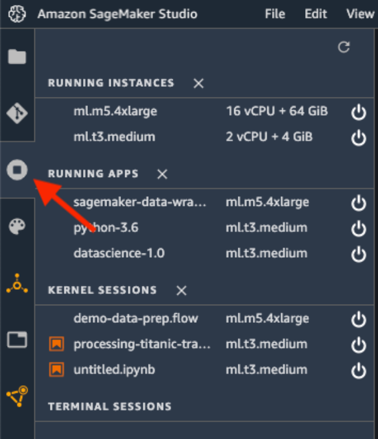

3.
Select the Stop icon to the right of the .flow file for which you want to terminate the kernel, as
shown in the following image.

Troubleshoot
3706

## Page 736

Amazon SageMaker AI
Developer Guide

4.
Refresh the browser.

5.
Reopen the .flow file on which you were working.

Troubleshooting issues with Amazon EMR

Use the following information to help you troubleshoot errors that might come up when you're
using Amazon EMR.

• Connection failure – If the connection fails with the following message The IP address of

the EMR cluster isn't private error message, your Amazon EMR cluster might not
have been launched in a private subnet. As a security best practice, Data Wrangler only supports
connecting to private Amazon EMR clusters. Choose a private EC2 subnet you launch an EMR
cluster.

• Connection hanging and timing out – The issue is most likely due to a network connectivity
issue. After you start connecting to the cluster, the screen doesn't refresh. After about 2 minutes,

you might see the following error JdbcAddConnectionError: An error occurred when

trying to connect to presto: xxx: Connect to xxx failed: Connection timed

out (Connection timed out) will display on top of the screen..

Troubleshoot
3707

## Page 737

Amazon SageMaker AI
Developer Guide

The errors might have two root causes:

• The Amazon EMR and Amazon SageMaker Studio Classic are in different VPCs. We recommend
launching both Amazon EMR and Studio Classic in the same VPC. You can also use VPC
peering. For more information, see What is VPC peering?.

• The Amazon EMR master security group lacks the inbound traffic rule for the security group
of Amazon SageMaker Studio Classic on the port used for Presto. To resolve the issue, allow
inbound traffic on port 8889.

• Connection fails due to the connection type being misconfigured – You might see the

following error message:  Data Wrangler couldn't create a connection to

{connection_source} successfully. Try connecting to {connection_source}

again. For more information, see Troubleshoot. If you’re still

experiencing issues, contact support.

Check the authentication method. The authentication method that you've specified in Data
Wrangler should match the authentication method that you're using on the cluster.

• You don't have HDFS permissions for LDAP authentication – Use the following guidance to
resolve the issue Set up HDFS Permissions using Linux Credentials. You can log into the cluster
using the following commands:

hdfs dfs -mkdir /user/USERNAME
hdfs dfs -chown USERNAME:USERNAME /user/USERNAME

• LDAP authentication missing connection key error – You might see the following error message:

Data Wrangler couldn't connect to EMR hive successfully. JDBC connection

is missing required connection key(s): PWD.

For LDAP authentication, you must specify both a username and a password. The JDBC URL

stored in Secrets Manager is missing property PWD.

• When you're troubleshooting the LDAP configuration: We recommend making sure that the
LDAP authenticator (LDAP server) is correctly configured to connect to the Amazon EMR cluster.

Use the ldapwhoami command to help you resolve the configuration issue. The following are
example commands that you can run:

• For LDAPS – ldapwhoami -x -H ldaps://ldap-server

• For LDAP – ldapwhoami -x -H ldap://ldap-server

Troubleshoot
3708

## Page 738

Amazon SageMaker AI
Developer Guide

Either command should return Anonymous if you've configured the authenticator successfully.

Troubleshooting with Salesforce

Lifecycle configuration error

When your user opens Studio Classic for the first time, they might get an error saying that there's
something wrong with their lifecycle configuration. Use Amazon CloudWatch to access the logs
written by your lifecycle configuration script. For more information about debugging lifecycle
configurations, see Debug Lifecycle Configurations in Amazon SageMaker Studio Classic.

If you aren't able to debug the error, you can create the configuration file manually. You must
create the file every time you delete or restart the Jupyter server. Use the following procedure to
create the file manually.

To create a configuration file

1.
Navigate to Studio Classic.

2.
Choose File, then New, then Terminal.

3.
Create .sfgenie_identity_provider_oauth_config.

4.
Open the file in a text editor.

5.
Add a JSON object containing the Amazon Resource Name (ARN) of the Secrets Manager secret
to the file. You can use the following template to create the object.

{
"secret_arn": "example-secret-ARN"
}

6.
Save your changes to the file.

Unable to access Salesforce Data Cloud from the Data Wrangler flow

After your user chooses Salesforce Data Cloud from your Data Wrangler flow, they might get an
error indicating the prerequisites to set up the connection haven't been met. It might be caused by
following errors:

• The Salesforce secret in Secrets Manager hasn't been created.

Troubleshoot
3709

## Page 739

Amazon SageMaker AI
Developer Guide

• The Salesforce secret in Secrets Manager has been created, but it's missing the Salesforce tag.

• The Salesforce secret in Secrets Manager has been created in the wrong AWS Region. For

example, your user won't be able to access the Salesforce Data Cloud in ca-central-1 because

you've created the secret in us-east-1. You can either replicate the secret to ca-central-1

or create a new secret with the same credentials in ca-central-1. For information about
replicating secrets, see Replicate an AWS Secrets Manager secret to other AWS Regions.

• The policy that your users are using to access Amazon SageMaker Studio Classic are missing
permissions for AWS Secrets Manager

• There's a typo in the Secrets Manager ARN of the JSON object that you've specified through your
lifecycle configuration.

• There's a typo in the Secrets Manager secret containing your Salesforce OAuth configuration

Blank page showing redirect_uri_mismatch

After your users choose Save and Connect, they might get redirected to a page that shows

redirect_uri_mismatch. The callback URI that you've registered in your Salesforce Connected
App settings is either missing or incorrect.

Use the following URL to check that your Studio Classic URL is correctly registered in your

Salesforce org's Connected App settings: https://EXAMPLE_SALESFORCE_ORG/lightning/

setup/NavigationMenus/home/. For more information about using the connected app settings,

navigate to the following URL: https://EXAMPLE_SALESFORCE_ORG/lightning/setup/

NavigationMenus/home/.

Note

It takes roughly ten minutes to propagate the URI within Salesforce's systems.

Shared spaces

Shared spaces doesn't currently work with the Salesforce Data Cloud integration. You can either
delete the shared spaces in the Amazon SageMaker AI domain that you intend to use, or you can
use another domain that doesn't have shared spaces set up.

Troubleshoot
3710

## Page 740

Amazon SageMaker AI
Developer Guide

OAuth Redirect Error

Your users should be able to import their data from the Salesforce Data Cloud after they choose
Connect. If they're running into an error, we recommend asking them to do the following:

• Tell them to be patient – When they get redirected back to Amazon SageMaker Studio Classic, it
can take up to a minute to complete the authentication process. While they're getting redirected,
we recommend telling them to avoid interacting with the browser. For example, they shouldn't
close the browser tab, switch to another tab, or interact with the Data Wrangler flow. Interacting
with the browser might remove the authorization code required to connect to the data cloud.

• Have your users reconnect to the data cloud – There are transient issues that can cause a
connection to the Salesforce Data Cloud to fail. Have your users create a new Data Wrangler flow
and try connecting to the Salesforce Data Cloud again.

• Make sure your users close all other tabs with Amazon SageMaker Studio Classic – Having Studio
Classic open in multiple tabs can cause the Salesforce Data Cloud connection to fail. Make sure
your users only have one Studio Classic tab open.

• Multiple users accessing Studio Classic at the same time – Only one user should access an
Amazon SageMaker AI domain at a time. If multiple users access the same domain, the
connection that a user is trying to create to the Salesforce Data Cloud might fail.

Updating both Data Wrangler and Studio Classic might also fix their error. For information about
updating Data Wrangler, see Update Data Wrangler. For information about updating Studio Classic,
see Shut Down and Update Amazon SageMaker Studio Classic.

If none of the preceding troubleshooting steps work, you might find an error
message from Salesforce with a corresponding description embedded in the
Studio Classic URL. The following is an example of a message you could find:

error=invalid_client_id&error_description=client%20identifier%20invalid.

You can look at the error message in the URL and try to address the issues it presents. If the error
message or description is unclear, we recommend searching the Salesforce Knowledge Base. If
searching the knowledge base doesn't work, you can reach out to the Salesforce help desk for more
assistance.

Data Wrangler takes a long time to load

When your users are getting redirected back to Data Wrangler from the Salesforce Data Cloud, they
might experience long load times.

Troubleshoot
3711

## Page 741

Amazon SageMaker AI
Developer Guide

If this is the user's first time using Data Wrangler or they've deleted the kernel, it might take about
5 minutes to provision the new Amazon EC2 instance to use Data Wrangler.

If this isn't the user's first time using Data Wrangler and they haven't deleted the kernel, you can
ask them to refresh the page or close as many browser tabs as possible.

If none of the preceding interventions work, have them set up a new connection to the Salesforce
Data Cloud.

User fails to export their data with an Invalid batch Id error

When your user exports the transformations that they've made to their Salesforce data, the
SageMaker Processing job that Data Wrangler uses on the backend might fail. The Salesforce Data
Cloud might be temporarily unavailable or there could be a caching issue.

To address the issue, we recommend having your users go back to the step where they're importing
the data and changing the order of the columns that they're querying . For example, they can
change the following query:

SELECT col_A, col_B FROM table

To the following query:

SELECT col_B, col_A FROM table

After they've changed the order of the columns and made sure that the subsequent
transformations they've made are still valid, they can start exporting their data again.

Users can't export a very large dataset

If your users imported a very large dataset from the Salesforce Data Cloud, they might not be able
to export the transformations that they've made. A large dataset might have too many rows, or it
can result from a complex query.

We recommend having your users take the following actions:

• Simplifying their SQL query

Troubleshoot
3712

## Page 742

Amazon SageMaker AI
Developer Guide

• Sampling their data

The following are some strategies that they can use to simplify their queries:

• Specify column names instead of using the * operator

• Finding a subset of the data that they'd like to import instead of using a larger subset

• Minimizing joins between very large datasets

They can use sampling to reduce the number of rows in their dataset. For information about
sampling methods, your users can refer to Sampling.

Users can't export data due to invalid refresh token

Data Wrangler uses a JDBC driver to integrate with the Salesforce Data Cloud. The method for
authentication is OAuth. For OAuth, the refresh token and the access token are two different pieces
of data that are used to authorize access to resources within your Salesforce Data Cloud.

The access token, or core token, is what allows you to access your Salesforce data and run queries
directly through Data Wrangler. It's short lived and designed to expire quickly. To maintain access
to your Salesforce data, Data Wrangler uses the refresh token to get a new access token from
Salesforce.

You might have set the refresh to expire too quickly to get a new access token for your users. You
might have to revisit your refresh token policy to make sure that it can accommodate queries that
take a long time to run for your users. For information about configuring your refresh token policy,

see https://EXAMPLE_SALESFORCE_ORG_URL/lightning/setup/ConnectedApplication/

home/.

Queries failing or tables not loading

Salesforce experiences service outages. Even if you’ve configured everything correctly, your users
might not be able to import their data for periods of time.

Service outages can happen for maintenance reasons. We recommend checking in the following
day to see if the issue has been resolved.

If you’re experiencing issues for more than a day, we recommend contacting Salesforce’s help desk
for further assistance. For information about contacting Salesforce, see How would you like to
contact Salesforce?

Troubleshoot
3713

## Page 743

Amazon SageMaker AI
Developer Guide

OAUTH_APP_BLOCKED during Studio Classic redirect

When your user gets redirected back to Amazon SageMaker Studio Classic, they might notice the

query parameter error=OAUTH_APP_BLOCKED within the URL. They're might be experiencing a
transient issue that should resolve itself within a day.

It's possible that you've blocked their access to the Connected App as well. For information about

resolving the issue, see https://EXAMPLE_SALESFORCE_ORG_URL/lightning/setup/

ConnectedApplication/home/.

OAUTH_APP_DENIED during Studio Classic redirect

When your user gets redirected back to Amazon SageMaker Studio Classic, they might notice the

query parameter error=OAUTH_APP_ACCESS_DENIED within the URL. You haven't given their

profile type permissions to access the Connected App associated with Data Wrangler.

To resolve their access issue, navigate to https://EXAMPLE_SALESFORCE_ORG_URL/

lightning/setup/ManageUsers/home/ and check whether the user is assigned to the correct
profile.

Increase Amazon EC2 Instance Limit

You might see the following error message when you're using Data Wrangler: The following

instance type is not available: ml.m5.4xlarge. Try selecting a different

instance below.

The message can indicate that you need to select a different instance type, but it can also indicate
that you don't have enough Amazon EC2 instances to successfully run Data Wrangler on your
workflow. You can increase the number of instances by using the following procedure.

To increase the number of instances, do the following.

1.
Open the AWS Management Console.

2.
In the search bar, specify Services Quotas.

3.
Choose Service Quotas.

4.
Choose AWS services.

5.
In the search bar, specify Amazon SageMaker AI.

6.
Choose Amazon SageMaker AI.

Increase Amazon EC2 Instance Limit
3714

## Page 744

Amazon SageMaker AI
Developer Guide

7.
Under Service quotas, specify Studio KernelGateway Apps running on

ml.m5.4xlarge instance.

Note

ml.m5.4xlarge is the default instance type for Data Wrangler. You can use other
instance types and request quota increases for them. For more information, see
Instances.

8.
Select Studio KernelGateway Apps running on ml.m5.4xlarge instance.

9.
Choose Request quota increase.

10. For Change quota value, specify a value greater than Applied quota value.

11. Choose Request.

If your request is approved, AWS sends a notification to the email address associated with your
account. You can also check the status of your request by choosing Quota request history on the
Service Quotas page. Processed requests have a Status of Closed.

Update Data Wrangler

To update Data Wrangler to the latest release, first shut down the corresponding KernelGateway
app from the Amazon SageMaker Studio Classic control panel. After the KernelGateway app is shut
down, restart it by opening a new or existing Data Wrangler flow in Studio Classic. When you open
a new or existing Data Wrangler flow, the kernel that starts contains the latest version of Data
Wrangler.

Update your Studio Classic and Data Wrangler instance

1.
Navigate to your SageMaker AI Console.

2.
Choose SageMaker AI and then Studio Classic.

3.
Choose your user name.

4.
Under Apps, in the row displaying the App name, choose Delete app for the app that starts

with sagemaker-data-wrang, and for the JupyterServer app.

5.
Choose Yes, delete app.

6.
Type delete in the confirmation box.

7.
Choose Delete.

Update Data Wrangler
3715

## Page 745

Amazon SageMaker AI
Developer Guide

8.
Reopen your Studio Classic instance. When you begin to create a Data Wrangler flow, your
instance now uses the latest version of Data Wrangler.

Alternatively, if you are using a Data Wrangler application version that is not the latest version, and
you have an existing Data Wrangler flow open, you are prompted to update your Data Wrangler
application version in the Studio Classic UI. The following screenshot shows this prompt.

Important

This updates the Data Wrangler kernel gateway app only. You still need to shut down the
JupyterServer app in your user account. To do this, follow the preceding steps.

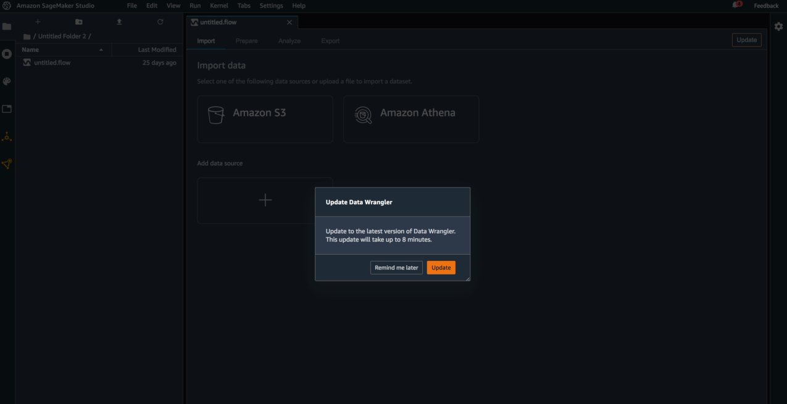

You can also choose Remind me later, in which case an Update button appears in the top-right
corner of the screen.

Update Data Wrangler
3716

## Page 746

Amazon SageMaker AI
Developer Guide

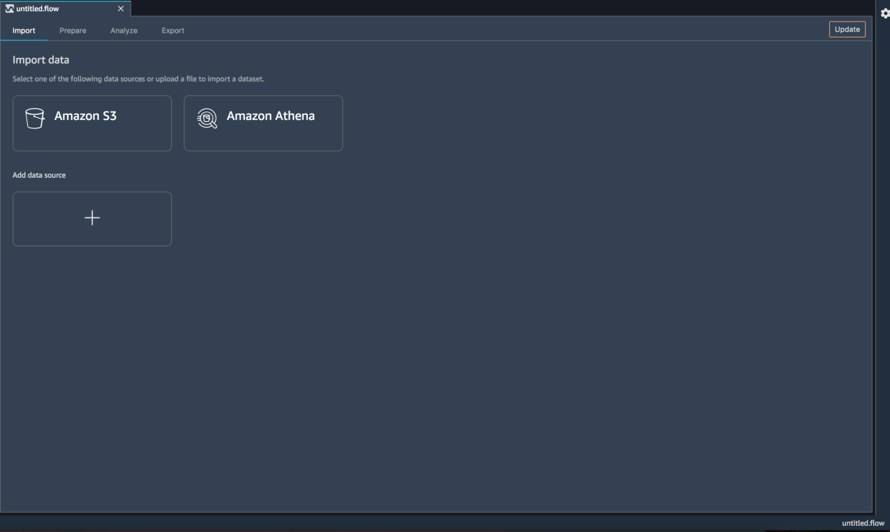

Shut Down Data Wrangler

When you are not using Data Wrangler, it is important to shut down the instance on which it runs
to avoid incurring additional fees.

To avoid losing work, save your data flow before shutting Data Wrangler down. To save your data
flow in Studio Classic, choose File and then choose Save Data Wrangler Flow. Data Wrangler
automatically saves your data flow every 60 seconds.

To shut down the Data Wrangler instance in Studio Classic

1.
In Studio Classic, select the Running Instances and Kernels icon

(

).

2.
Under RUNNING APPS is the sagemaker-data-wrangler-1.0 app. Select the shutdown icon

(

)
next to this app .

Shut Down Data Wrangler
3717

## Page 747

Amazon SageMaker AI
Developer Guide

Data Wrangler runs on an ml.m5.4xlarge instance. This instance disappears from RUNNING
INSTANCES when you shut down the Data Wrangler app.

Important

If you open Data Wrangler again, an Amazon EC2 instance starts running the application
and you will be charged for the compute. In addition to compute, you are also charged
for the storage that you use. For example, you're charged for any Amazon S3 buckets that
you're using with Data Wrangler.
If you find that you're still getting charged for Data Wrangler after shutting down your
applications, there's a Jupyter extension that you can use to automatically shut down idle
sessions. For information about the extension, see SageMaker-Studio-Autoshutdown-
Extension.

After you shut down the Data Wrangler app, it has to restart the next time you open a Data
Wrangler flow file. This can take a few minutes.

Shut Down Data Wrangler
3718

## Page 748

Amazon SageMaker AI
Developer Guide

Data transformation workloads with SageMaker
Processing

SageMaker Processing refers to SageMaker AI’s capabilities to run data pre and post processing,
feature engineering, and model evaluation tasks on SageMaker AI's fully-managed infrastructure.
These tasks are executed as processing jobs. The following provides information and resources to
learn about SageMaker Processing.

Using SageMaker Processing API, data scientists can run scripts and notebooks to process,
transform, and analyze datasets to prepare them for machine learning. When combined with
the other critical machine learning tasks provided by SageMaker AI, such as training and hosting,
Processing provides you with the benefits of a fully managed machine learning environment,

including all the security and compliance support built into SageMaker AI. You have the flexibility
to use the built-in data processing containers or to bring your own containers for custom
processing logic and then submit jobs to run on SageMaker AI managed infrastructure.

Note

You can create a processing job programmatically by calling the CreateProcessingJob
API action in any language supported by SageMaker AI or by using the AWS CLI. For
information on how this API action translates into a function in the language of your
choice, see the See Also section of CreateProcessingJob and choose an SDK. As an example,
for Python users, refer to the Amazon SageMaker Processing section of SageMaker Python
SDK. Alternatively, see the full request syntax of create_processing_job in the AWS SDK for
Python (Boto3).

The following diagram shows how Amazon SageMaker AI spins up a Processing job. Amazon
SageMaker AI takes your script, copies your data from Amazon Simple Storage Service (Amazon
S3), and then pulls a processing container. The underlying infrastructure for a Processing job is
fully managed by Amazon SageMaker AI. After you submit a processing job, SageMaker AI launches
the compute instances, processes and analyzes the input data, and releases the resources upon
completion. The output of the Processing job is stored in the Amazon S3 bucket you specified.

3719

## Page 749

Amazon SageMaker AI
Developer Guide

Note

Your input data must be stored in an Amazon S3 bucket. Alternatively, you can use Amazon
Athena or Amazon Redshift as input sources.

Tip

To learn best practices for distributed computing of machine learning (ML) training and
processing jobs in general, see Distributed computing with SageMaker AI best practices.

Use Amazon SageMaker Processing Sample Notebooks

We provide two sample Jupyter notebooks that show how to perform data preprocessing, model
evaluation, or both.

For a sample notebook that shows how to run scikit-learn scripts to perform data preprocessing
and model training and evaluation with the SageMaker Python SDK for Processing, see scikit-learn
Processing. This notebook also shows how to use your own custom container to run processing
workloads with your Python libraries and other specific dependencies.

For a sample notebook that shows how to use Amazon SageMaker Processing to perform
distributed data preprocessing with Spark, see Distributed Processing (Spark). This notebook also
shows how to train a regression model using XGBoost on the preprocessed dataset.

Sample Notebooks
3720

## Page 750

Amazon SageMaker AI
Developer Guide

For instructions on how to create and access Jupyter notebook instances that you can use to run
these samples in SageMaker AI, see Amazon SageMaker notebook instances. After you have created
a notebook instance and opened it, choose the SageMaker AI Examples tab to see a list of all the
SageMaker AI samples. To open a notebook, choose its Use tab and choose Create copy.

Monitor Amazon SageMaker Processing Jobs with CloudWatch
Logs and Metrics

Amazon SageMaker Processing provides Amazon CloudWatch logs and metrics to monitor
processing jobs. CloudWatch provides CPU, GPU, memory, GPU memory, and disk metrics, and
event logging. For more information, see Amazon SageMaker AI metrics in Amazon CloudWatch
and CloudWatch Logs for Amazon SageMaker AI.

Run a Processing Job with Apache Spark

Apache Spark is a unified analytics engine for large-scale data processing. Amazon SageMaker AI
provides prebuilt Docker images that include Apache Spark and other dependencies needed to
run distributed data processing jobs. The following provides an example on how to run a Amazon
SageMaker Processing job using Apache Spark.

With the Amazon SageMaker Python SDK, you can easily apply data transformations and extract
features (feature engineering) using the Spark framework. For information about using the
SageMaker Python SDK to run Spark processing jobs, see Data Processing with Spark in the
Amazon SageMaker Python SDK.

A code repository that contains the source code and Dockerfiles for the Spark images is available
on GitHub.

You can use the sagemaker.spark.PySparkProcessor or

sagemaker.spark.SparkJarProcessor class to run your Spark application inside of a
processing job. Note you can set MaxRuntimeInSeconds to a maximum runtime limit of 5 days.
With respect to execution time, and number of instances used, simple spark workloads see a near
linear relationship between the number of instances vs. time to completion.

The following code example shows how to run a processing job that invokes your PySpark script

preprocess.py.

from sagemaker.spark.processing import PySparkProcessor

CloudWatch Logs and Metrics
3721

## Page 751

Amazon SageMaker AI
Developer Guide

spark_processor = PySparkProcessor(
base_job_name="spark-preprocessor",
framework_version="2.4",
role=role,
instance_count=2,
instance_type="ml.m5.xlarge",
max_runtime_in_seconds=1200,
)

spark_processor.run(
submit_app="preprocess.py",
arguments=['s3_input_bucket', bucket,
's3_input_key_prefix', input_prefix,
's3_output_bucket', bucket,
's3_output_key_prefix', output_prefix]
)

For an in-depth look, see the Distributed Data Processing with Apache Spark and SageMaker
Processing example notebook.

If you are not using the Amazon SageMaker AI Python SDK and one of its Processor classes to
retrieve the pre-built images, you can retrieve these images yourself. The SageMaker prebuilt
Docker images are stored in Amazon Elastic Container Registry (Amazon ECR). For a complete list
of the available pre-built Docker images, see the available images document.

To learn more about using the SageMaker Python SDK with Processing containers, see Amazon
SageMaker AI Python SDK.

Run a Processing Job with scikit-learn

You can use Amazon SageMaker Processing to process data and evaluate models with scikit-learn
scripts in a Docker image provided by Amazon SageMaker AI. The following provides an example
on how to run a Amazon SageMaker Processing job using scikit-learn.

For a sample notebook that shows how to run scikit-learn scripts using a Docker image provided
and maintained by SageMaker AI to preprocess data and evaluate models, see scikit-learn
Processing. To use this notebook, you need to install the SageMaker AI Python SDK for Processing.

This notebook runs a processing job using SKLearnProcessor class from the the SageMaker
Python SDK to run a scikit-learn script that you provide. The script preprocesses data, trains a

Run a Processing Job with scikit-learn
3722

## Page 752

Amazon SageMaker AI
Developer Guide

model using a SageMaker training job, and then runs a processing job to evaluate the trained
model. The processing job estimates how the model is expected to perform in production.

To learn more about using the SageMaker Python SDK with Processing containers, see the
SageMaker Python SDK. For a complete list of pre-built Docker images available for processing

jobs, see Docker Registry Paths and Example Code.

The following code example shows how the notebook uses SKLearnProcessor to run your own

scikit-learn script using a Docker image provided and maintained by SageMaker AI, instead of your
own Docker image.

from sagemaker.sklearn.processing import SKLearnProcessor
from sagemaker.processing import ProcessingInput, ProcessingOutput

sklearn_processor = SKLearnProcessor(framework_version='0.20.0',
role=role,

instance_type='ml.m5.xlarge',
instance_count=1)

sklearn_processor.run(code='preprocessing.py',
inputs=[ProcessingInput(
source='s3://path/to/my/input-data.csv',
destination='/opt/ml/processing/input')],
outputs=[ProcessingOutput(source='/opt/ml/processing/output/
train'),
ProcessingOutput(source='/opt/ml/processing/output/
validation'),
ProcessingOutput(source='/opt/ml/processing/output/
test')]
)

To process data in parallel using Scikit-Learn on Amazon SageMaker Processing, you can shard

input objects by S3 key by setting s3_data_distribution_type='ShardedByS3Key' inside a

ProcessingInput so that each instance receives about the same number of input objects.

Data Processing with Framework Processors

A FrameworkProcessor can run Processing jobs with a specified machine learning framework,
providing you with an Amazon SageMaker AI–managed container for whichever machine learning

framework you choose. FrameworkProcessor provides premade containers for the following
machine learning frameworks: Hugging Face, MXNet, PyTorch, TensorFlow, and XGBoost.

Data Processing with Framework Processors
3723

## Page 753

Amazon SageMaker AI
Developer Guide

The FrameworkProcessor class also provides you with customization over the container

configuration. The FrameworkProcessor class supports specifying a source directory

source_dir for your processing scripts and dependencies. With this capability, you can give
the processor access to multiple scripts in a directory instead of only specifying one script.

FrameworkProcessor also supports including a requirements.txt file in the source_dir for
customizing the Python libraries to install in the container.

For more information on the FrameworkProcessor class and its methods and parameters, see
FrameworkProcessor in the Amazon SageMaker AI Python SDK.

To see examples of using a FrameworkProcessor for each of the supported machine learning
frameworks, see the following topics.

Topics

• Code example using HuggingFaceProcessor in the Amazon SageMaker Python SDK

• MXNet Framework Processor

• PyTorch Framework Processor

• TensorFlow Framework Processor

• XGBoost Framework Processor

Code example using HuggingFaceProcessor in the Amazon SageMaker
Python SDK

Hugging Face is an open-source provider of natural language processing (NLP) models. The

HuggingFaceProcessor in the Amazon SageMaker Python SDK provides you with the ability to

run processing jobs with Hugging Face scripts. When you use the HuggingFaceProcessor, you
can leverage an Amazon-built Docker container with a managed Hugging Face environment so that
you don't need to bring your own container.

The following code example shows how you can use the HuggingFaceProcessor to run your
Processing job using a Docker image provided and maintained by SageMaker AI. Note that
when you run the job, you can specify a directory containing your scripts and dependencies in

the source_dir argument, and you can have a requirements.txt file located inside your

source_dir directory that specifies the dependencies for your processing script(s). SageMaker

Processing installs the dependencies in requirements.txt in the container for you.

from sagemaker.huggingface import HuggingFaceProcessor

Hugging Face Framework Processor
3724

## Page 754

Amazon SageMaker AI
Developer Guide

from sagemaker.processing import ProcessingInput, ProcessingOutput
from sagemaker import get_execution_role

#Initialize the HuggingFaceProcessor
hfp = HuggingFaceProcessor(
role=get_execution_role(),
instance_count=1,
instance_type='ml.g4dn.xlarge',
transformers_version='4.4.2',
pytorch_version='1.6.0',
base_job_name='frameworkprocessor-hf'
)

#Run the processing job
hfp.run(
code='processing-script.py',
source_dir='scripts',

inputs=[
ProcessingInput(
input_name='data',
source=f's3://{BUCKET}/{S3_INPUT_PATH}',
destination='/opt/ml/processing/input/data/'
)
],
outputs=[
ProcessingOutput(output_name='train', source='/opt/ml/processing/output/
train/', destination=f's3://{BUCKET}/{S3_OUTPUT_PATH}'),
ProcessingOutput(output_name='test', source='/opt/ml/processing/output/test/',
destination=f's3://{BUCKET}/{S3_OUTPUT_PATH}'),
ProcessingOutput(output_name='val', source='/opt/ml/processing/output/val/',
destination=f's3://{BUCKET}/{S3_OUTPUT_PATH}')
]
)

If you have a requirements.txt file, it should be a list of libraries you want to install in the

container. The path for source_dir can be a relative, absolute, or Amazon S3 URI path. However,
if you use an Amazon S3 URI, then it must point to a tar.gz file. You can have multiple scripts in the

directory you specify for source_dir. To learn more about the HuggingFaceProcessor class,
see Hugging Face Estimator in the Amazon SageMaker AI Python SDK.

Hugging Face Framework Processor
3725

## Page 755

Amazon SageMaker AI
Developer Guide

MXNet Framework Processor

Apache MXNet is an open-source deep learning framework commonly used for training and

deploying neural networks. The MXNetProcessor in the Amazon SageMaker Python SDK
provides you with the ability to run processing jobs with MXNet scripts. When you use the

MXNetProcessor, you can leverage an Amazon-built Docker container with a managed MXNet
environment so that you don’t need to bring your own container.

The following code example shows how you can use the MXNetProcessor to run your Processing
job using a Docker image provided and maintained by SageMaker AI. Note that when you run the

job, you can specify a directory containing your scripts and dependencies in the source_dir

argument, and you can have a requirements.txt file located inside your source_dir directory
that specifies the dependencies for your processing script(s). SageMaker Processing installs the

dependencies in requirements.txt in the container for you.

from sagemaker.mxnet import MXNetProcessor
from sagemaker.processing import ProcessingInput, ProcessingOutput
from sagemaker import get_execution_role

#Initialize the MXNetProcessor
mxp = MXNetProcessor(
framework_version='1.8.0',
py_version='py37',
role=get_execution_role(),
instance_count=1,
instance_type='ml.c5.xlarge',
base_job_name='frameworkprocessor-mxnet'
)

#Run the processing job
mxp.run(
code='processing-script.py',
source_dir='scripts',
inputs=[
ProcessingInput(
input_name='data',
source=f's3://{BUCKET}/{S3_INPUT_PATH}',
destination='/opt/ml/processing/input/data/'
)
],
outputs=[
ProcessingOutput(

MXNet Framework Processor
3726

## Page 756

Amazon SageMaker AI
Developer Guide

output_name='processed_data',
source='/opt/ml/processing/output/',
destination=f's3://{BUCKET}/{S3_OUTPUT_PATH}'
)
]
)

If you have a requirements.txt file, it should be a list of libraries you want to install in the

container. The path for source_dir can be a relative, absolute, or Amazon S3 URI path. However,
if you use an Amazon S3 URI, then it must point to a tar.gz file. You can have multiple scripts in

the directory you specify for source_dir. To learn more about the MXNetProcessor class, see
MXNet Estimator in the Amazon SageMaker Python SDK.

PyTorch Framework Processor

PyTorch is an open-source machine learning framework. The PyTorchProcessor in the Amazon
SageMaker Python SDK provides you with the ability to run processing jobs with PyTorch scripts.

When you use the PyTorchProcessor, you can leverage an Amazon-built Docker container with a
managed PyTorch environment so that you don’t need to bring your own container.

The following code example shows how you can use the PyTorchProcessor to run your
Processing job using a Docker image provided and maintained by SageMaker AI. Note that
when you run the job, you can specify a directory containing your scripts and dependencies in

the source_dir argument, and you can have a requirements.txt file located inside your

source_dir directory that specifies the dependencies for your processing script(s). SageMaker

Processing installs the dependencies in requirements.txt in the container for you.

For the PyTorch versions supported by SageMaker AI, see the available  Deep Learning Container
images.

from sagemaker.pytorch.processing import PyTorchProcessor
from sagemaker.processing import ProcessingInput, ProcessingOutput
from sagemaker import get_execution_role

#Initialize the PyTorchProcessor
pytorch_processor = PyTorchProcessor(
framework_version='1.8',
role=get_execution_role(),
instance_type='ml.m5.xlarge',
instance_count=1,

PyTorch Framework Processor
3727

## Page 757

Amazon SageMaker AI
Developer Guide

base_job_name='frameworkprocessor-PT'
)

#Run the processing job
pytorch_processor.run(
code='processing-script.py',
source_dir='scripts',
inputs=[
ProcessingInput(
input_name='data',
source=f's3://{BUCKET}/{S3_INPUT_PATH}',
destination='/opt/ml/processing/input'
)
],
outputs=[
ProcessingOutput(output_name='data_structured', source='/opt/ml/processing/tmp/
data_structured', destination=f's3://{BUCKET}/{S3_OUTPUT_PATH}'),

ProcessingOutput(output_name='train', source='/opt/ml/processing/output/train',
destination=f's3://{BUCKET}/{S3_OUTPUT_PATH}'),
ProcessingOutput(output_name='validation', source='/opt/ml/processing/output/
val', destination=f's3://{BUCKET}/{S3_OUTPUT_PATH}'),
ProcessingOutput(output_name='test', source='/opt/ml/processing/output/test',
destination=f's3://{BUCKET}/{S3_OUTPUT_PATH}'),
ProcessingOutput(output_name='logs', source='/opt/ml/processing/logs',
destination=f's3://{BUCKET}/{S3_OUTPUT_PATH}')
]
)

If you have a requirements.txt file, it should be a list of libraries you want to install in the

container. The path for source_dir can be a relative, absolute, or Amazon S3 URI path. However,
if you use an Amazon S3 URI, then it must point to a tar.gz file. You can have multiple scripts in the

directory you specify for source_dir. To learn more about the PyTorchProcessor class, see
PyTorch Estimator in the Amazon SageMaker Python SDK.

TensorFlow Framework Processor

TensorFlow is an open-source machine learning and artificial intelligence library. The

TensorFlowProcessor in the Amazon SageMaker Python SDK provides you with the ability to

run processing jobs with TensorFlow scripts. When you use the TensorFlowProcessor, you can
leverage an Amazon-built Docker container with a managed TensorFlow environment so that you
don’t need to bring your own container.

TensorFlow Framework Processor
3728

## Page 758

Amazon SageMaker AI
Developer Guide

The following code example shows how you can use the TensorFlowProcessor to run your
Processing job using a Docker image provided and maintained by SageMaker AI. Note that
when you run the job, you can specify a directory containing your scripts and dependencies in

the source_dir argument, and you can have a requirements.txt file located inside your

source_dir directory that specifies the dependencies for your processing script(s). SageMaker

Processing installs the dependencies in requirements.txt in the container for you.

from sagemaker.tensorflow import TensorFlowProcessor
from sagemaker.processing import ProcessingInput, ProcessingOutput
from sagemaker import get_execution_role

#Initialize the TensorFlowProcessor
tp = TensorFlowProcessor(
framework_version='2.3',
role=get_execution_role(),
instance_type='ml.m5.xlarge',
instance_count=1,
base_job_name='frameworkprocessor-TF',
py_version='py37'
)

#Run the processing job
tp.run(
code='processing-script.py',
source_dir='scripts',
inputs=[
ProcessingInput(
input_name='data',
source=f's3://{BUCKET}/{S3_INPUT_PATH}',
destination='/opt/ml/processing/input/data'
),
ProcessingInput(
input_name='model',
source=f's3://{BUCKET}/{S3_PATH_TO_MODEL}',
destination='/opt/ml/processing/input/model'
)
],
outputs=[
ProcessingOutput(
output_name='predictions',
source='/opt/ml/processing/output',
destination=f's3://{BUCKET}/{S3_OUTPUT_PATH}'
)

TensorFlow Framework Processor
3729

## Page 759

Amazon SageMaker AI
Developer Guide

]
)

If you have a requirements.txt file, it should be a list of libraries you want to install in the

container. The path for source_dir can be a relative, absolute, or Amazon S3 URI path. However,
if you use an Amazon S3 URI, then it must point to a tar.gz file. You can have multiple scripts in the

directory you specify for source_dir. To learn more about the TensorFlowProcessor class, see
TensorFlow Estimator in the Amazon SageMaker Python SDK.

XGBoost Framework Processor

XGBoost is an open-source machine learning framework. The XGBoostProcessor in the Amazon
SageMaker Python SDK provides you with the ability to run processing jobs with XGBoost scripts.
When you use the XGBoostProcessor, you can leverage an Amazon-built Docker container with a
managed XGBoost environment so that you don’t need to bring your own container.

The following code example shows how you can use the XGBoostProcessor to run your
Processing job using a Docker image provided and maintained by SageMaker AI. Note that
when you run the job, you can specify a directory containing your scripts and dependencies in

the source_dir argument, and you can have a requirements.txt file located inside your

source_dir directory that specifies the dependencies for your processing script(s). SageMaker

Processing installs the dependencies in requirements.txt in the container for you.

from sagemaker.xgboost import XGBoostProcessor
from sagemaker.processing import ProcessingInput, ProcessingOutput
from sagemaker import get_execution_role

#Initialize the XGBoostProcessor
xgb = XGBoostProcessor(
framework_version='1.2-2',
role=get_execution_role(),
instance_type='ml.m5.xlarge',
instance_count=1,
base_job_name='frameworkprocessor-XGB',
)

#Run the processing job
xgb.run(
code='processing-script.py',
source_dir='scripts',
inputs=[

XGBoost Framework Processor
3730

## Page 760

Amazon SageMaker AI
Developer Guide

ProcessingInput(
input_name='data',
source=f's3://{BUCKET}/{S3_INPUT_PATH}',
destination='/opt/ml/processing/input/data'
)
],
outputs=[
ProcessingOutput(
output_name='processed_data',
source='/opt/ml/processing/output/',
destination=f's3://{BUCKET}/{S3_OUTPUT_PATH}'
)
]
)

If you have a requirements.txt file, it should be a list of libraries you want to install in the

container. The path for source_dir can be a relative, absolute, or Amazon S3 URI path. However,
if you use an Amazon S3 URI, then it must point to a tar.gz file. You can have multiple scripts in the

directory you specify for source_dir. To learn more about the XGBoostProcessor class, see
XGBoost Estimator in the Amazon SageMaker Python SDK.

Use Your Own Processing Code

You can install libraries to run your scripts in your own processing container or, in a more advanced
scenario, you can build your own processing container that satisfies the contract to run in Amazon
SageMaker AI. For more information about containers in SageMaker AI, see Docker containers for
training and deploying models. For a formal specification that defines the contract for an Amazon
SageMaker Processing container, see How to Build Your Own Processing Container (Advanced
Scenario).

Topics

• Run Scripts with Your Own Processing Container

• How to Build Your Own Processing Container (Advanced Scenario)

Run Scripts with Your Own Processing Container

You can use scikit-learn scripts to preprocess data and evaluate your models. To see how to run
scikit-learn scripts to perform these tasks, see the scikit-learn Processing sample notebook.

Use Your Own Processing Code
3731

## Page 761

Amazon SageMaker AI
Developer Guide

This notebook uses the ScriptProcessor class from the Amazon SageMaker Python SDK for
Processing.

The following example shows a general workflow for using a ScriptProcessor class with
your own processing container. The workflow shows how to create your own image, build your

container, and use a ScriptProcessor class to run a Python preprocessing script with the
container. The processing job processes your input data and saves the processed data in Amazon
Simple Storage Service (Amazon S3).

Before using the following examples, you need to have your own input data and a Python script
prepared to process your data. For an end-to-end, guided example of this process, refer back to the
scikit-learn Processing sample notebook.

1. Create a Docker directory and add the Dockerfile used to create the processing container. Install

pandas and scikit-learn into it. (You could also install your own dependencies with a similar RUN
command.)

mkdir docker

%%writefile docker/Dockerfile

FROM python:3.7-slim-buster

RUN pip3 install pandas==0.25.3 scikit-learn==0.21.3
ENV PYTHONUNBUFFERED=TRUE

ENTRYPOINT ["python3"]

2. Build the container using the docker command, create an Amazon Elastic Container Registry

(Amazon ECR) repository, and push the image to Amazon ECR.

import boto3

account_id = boto3.client('sts').get_caller_identity().get('Account')
region = boto3.Session().region_name
ecr_repository = 'sagemaker-processing-container'
tag = ':latest'
processing_repository_uri = '{}.dkr.ecr.{}.amazonaws.com/{}'.format(account_id,
region, ecr_repository + tag)

# Create ECR repository and push docker image

Run Scripts with a Processing Container
3732

## Page 762

Amazon SageMaker AI
Developer Guide

!docker build -t $ecr_repository docker
!aws ecr get-login-password --region {region} | docker login --username AWS --
password-stdin {account_id}.dkr.ecr.{region}.amazonaws.com
!aws ecr create-repository --repository-name $ecr_repository
!docker tag {ecr_repository + tag} $processing_repository_uri
!docker push $processing_repository_uri

3. Set up the ScriptProcessor from the SageMaker Python SDK to run the script. Replace

image_uri with the URI for the image you created, and replace role_arn with the ARN for an
AWS Identity and Access Management role that has access to your target Amazon S3 bucket.

from sagemaker.processing import ScriptProcessor, ProcessingInput, ProcessingOutput

script_processor = ScriptProcessor(command=['python3'],
image_uri='image_uri',
role='role_arn',
instance_count=1,
instance_type='ml.m5.xlarge')

4. Run the script. Replace preprocessing.py with the name of your own Python processing

script, and replace s3://path/to/my/input-data.csv with the Amazon S3 path to your
input data.

script_processor.run(code='preprocessing.py',
inputs=[ProcessingInput(
source='s3://path/to/my/input-data.csv',
destination='/opt/ml/processing/input')],
outputs=[ProcessingOutput(source='/opt/ml/processing/output/
train'),
ProcessingOutput(source='/opt/ml/processing/output/
validation'),
ProcessingOutput(source='/opt/ml/processing/output/
test')])

You can use the same procedure with any other library or system dependencies. You can also use
existing Docker images. This includes images that you run on other platforms such as Kubernetes.

Run Scripts with a Processing Container
3733

## Page 763

Amazon SageMaker AI
Developer Guide

How to Build Your Own Processing Container (Advanced Scenario)

You can provide Amazon SageMaker Processing with a Docker image that has your own code and
dependencies to run your data processing, feature engineering, and model evaluation workloads.
The following provides information on how to build your own processing container.

The following example of a Dockerfile builds a container with the Python libraries scikit-learn and
pandas, which you can run as a processing job.

FROM python:3.7-slim-buster

# Install scikit-learn and pandas
RUN pip3 install pandas==0.25.3 scikit-learn==0.21.3

# Add a Python script and configure Docker to run it
ADD processing_script.py /
ENTRYPOINT ["python3", "/processing_script.py"]

For an example of a processing script, see Get started with SageMaker Processing.

Build and push this Docker image to an Amazon Elastic Container Registry (Amazon ECR) repository
and ensure that your SageMaker AI IAM role can pull the image from Amazon ECR. Then you can
run this image on Amazon SageMaker Processing.

How Amazon SageMaker Processing Runs Your Processing Container Image

Amazon SageMaker Processing runs your processing container image in a similar way as the

following command, where AppSpecification.ImageUri is the Amazon ECR image URI that

you specify in a CreateProcessingJob operation.

docker run [AppSpecification.ImageUri]

This command runs the ENTRYPOINT command configured in your Docker image.

You can also override the entrypoint command in the image or give command-line arguments

to your entrypoint command using the AppSpecification.ContainerEntrypoint and

AppSpecification.ContainerArgument parameters in your CreateProcessingJob request.
Specifying these parameters configures Amazon SageMaker Processing to run the container similar
to the way that the following command does.

How to Build Your Own Processing Container
3734

## Page 764

Amazon SageMaker AI
Developer Guide

docker run --entry-point [AppSpecification.ContainerEntrypoint]
[AppSpecification.ImageUri] [AppSpecification.ContainerArguments]

For example, if you specify the ContainerEntrypoint to be [python3, -v, /

processing_script.py] in your CreateProcessingJob request, and ContainerArguments

to be [data-format, csv], Amazon SageMaker Processing runs your container with the
following command.

python3 -v /processing_script.py data-format csv

When building your processing container, consider the following details:

• Amazon SageMaker Processing decides whether the job completes or fails depending on the
exit code of the command run. A processing job completes if all of the processing containers exit
successfully with an exit code of 0, and fails if any of the containers exits with a non-zero exit
code.

• Amazon SageMaker Processing lets you override the processing container's entrypoint and set
command-line arguments just like you can with the Docker API. Docker images can also configure

the entrypoint and command-line arguments using the ENTRYPOINT and CMD instructions.

The way CreateProcessingJob's ContainerEntrypoint and ContainerArgument
parameters configure a Docker image's entrypoint and arguments mirrors how Docker overrides
the entrypoint and arguments through the Docker API:

• If neither ContainerEntrypoint nor ContainerArguments are provided, Processing uses

the default ENTRYPOINT or CMD in the image.

• If ContainerEntrypoint is provided, but not ContainerArguments, Processing runs the

image with the given entrypoint, and ignores the ENTRYPOINT and CMD in the image.

• If ContainerArguments is provided, but not ContainerEntrypoint, Processing runs the

image with the default ENTRYPOINT in the image and with the provided arguments.

• If both ContainerEntrypoint and ContainerArguments are provided, Processing runs the

image with the given entrypoint and arguments, and ignores the ENTRYPOINT and CMD in the
image.

• You must use the exec form of the ENTRYPOINT instruction in your Dockerfile (ENTRYPOINT

["executable", "param1", "param2"]) instead of the shell form (ENTRYPOINT command

param1 param2). This lets your processing container receive SIGINT and SIGKILL signals,

which Processing uses to stop processing jobs with the StopProcessingJob API.

How to Build Your Own Processing Container
3735

## Page 765

Amazon SageMaker AI
Developer Guide

• /opt/ml and all its subdirectories are reserved by SageMaker AI. When building your Processing
Docker image, don't place any data required by your processing container in these directories.

• If you plan to use GPU devices, make sure that your containers are nvidia-docker compatible.
Include only the CUDA toolkit in containers. Don't bundle NVIDIA drivers with the image. For
more information about nvidia-docker, see NVIDIA/nvidia-docker.

How Amazon SageMaker Processing Configures Input and Output For Your
Processing Container

When you create a processing job using the CreateProcessingJob operation, you can specify

multiple ProcessingInput and ProcessingOutput. values.

You use the ProcessingInput parameter to specify an Amazon Simple Storage Service (Amazon
S3) URI to download data from, and a path in your processing container to download the data to.

The ProcessingOutput parameter configures a path in your processing container from which

to upload data, and where in Amazon S3 to upload that data to. For both ProcessingInput

and ProcessingOutput, the path in the processing container must begin with /opt/ml/

processing/ .

For example, you might create a processing job with one ProcessingInput parameter that

downloads data from s3://your-data-bucket/path/to/input/csv/data into /opt/

ml/processing/csv in your processing container, and a ProcessingOutput parameter that

uploads data from /opt/ml/processing/processed_csv to s3://your-data-bucket/

path/to/output/csv/data. Your processing job would read the input data, and write output

data to /opt/ml/processing/processed_csv. Then it uploads the data written to this path to
the specified Amazon S3 output location.

Important

Symbolic links (symlinks) can not be used to upload output data to Amazon S3. Symlinks
are not followed when uploading output data.

How to Build Your Own Processing Container
3736

## Page 766

Amazon SageMaker AI
Developer Guide

How Amazon SageMaker Processing Provides Logs and Metrics for Your
Processing Container

When your processing container writes to stdout or stderr, Amazon SageMaker Processing saves
the output from each processing container and puts it in Amazon CloudWatch logs. For information
about logging, see CloudWatch Logs for Amazon SageMaker AI.

Amazon SageMaker Processing also provides CloudWatch metrics for each instance running your
processing container. For information about metrics, see Amazon SageMaker AI metrics in Amazon
CloudWatch.

How Amazon SageMaker Processing Configures Your Processing Container

Amazon SageMaker Processing provides configuration information to your processing

container through environment variables and two JSON files—/opt/ml/config/

processingjobconfig.json and /opt/ml/config/resourceconfig.json— at predefined
locations in the container.

When a processing job starts, it uses the environment variables that you specified with

the Environment map in the CreateProcessingJob request. The /opt/ml/config/

processingjobconfig.json file contains information about the hostnames of your processing

containers, and is also specified in the CreateProcessingJob request.

The following example shows the format of the /opt/ml/config/

processingjobconfig.json file.

{
"ProcessingJobArn": "<processing_job_arn>",
"ProcessingJobName": "<processing_job_name>",
"AppSpecification": {
"ImageUri": "<image_uri>",
"ContainerEntrypoint": null,
"ContainerArguments": null
},
"Environment": {
"KEY": "VALUE"
},
"ProcessingInputs": [
{
"InputName": "input-1",
"S3Input": {

How to Build Your Own Processing Container
3737

## Page 767

Amazon SageMaker AI
Developer Guide

"LocalPath": "/opt/ml/processing/input/dataset",
"S3Uri": "<s3_uri>",
"S3DataDistributionType": "FullyReplicated",
"S3DataType": "S3Prefix",
"S3InputMode": "File",
"S3CompressionType": "None",
"S3DownloadMode": "StartOfJob"
}
}
],
"ProcessingOutputConfig": {
"Outputs": [
{
"OutputName": "output-1",
"S3Output": {
"LocalPath": "/opt/ml/processing/output/dataset",
"S3Uri": "<s3_uri>",

"S3UploadMode": "EndOfJob"
}
}
],
"KmsKeyId": null
},
"ProcessingResources": {
"ClusterConfig": {
"InstanceCount": 1,
"InstanceType": "ml.m5.xlarge",
"VolumeSizeInGB": 30,
"VolumeKmsKeyId": null
}
},
"RoleArn": "<IAM role>",
"StoppingCondition": {
"MaxRuntimeInSeconds": 86400
}
}

The /opt/ml/config/resourceconfig.json file contains information about the hostnames
of your processing containers. Use the following hostnames when creating or running distributed
processing code.

{
"current_host": "algo-1",

How to Build Your Own Processing Container
3738

## Page 768

Amazon SageMaker AI
Developer Guide

"hosts": ["algo-1","algo-2","algo-3"]
}

Don't use the information about hostnames contained in /etc/hostname or /etc/hosts
because it might be inaccurate.

Hostname information might not be immediately available to the processing container. We
recommend adding a retry policy on hostname resolution operations as nodes become available in
the cluster.

Save and Access Metadata Information About Your Processing Job

To save metadata from the processing container after exiting it, containers can write UTF-8

encoded text to the /opt/ml/output/message file. After the processing job enters

any terminal status ("Completed", "Stopped", or "Failed"), the "ExitMessage" field in

DescribeProcessingJob contains the first 1 KB of this file. Access that initial part of file with

a call to DescribeProcessingJob, which returns it through the ExitMessage parameter. For
failed processing jobs, you can use this field to communicate information about why the processing
container failed.

Important

Don't write sensitive data to the /opt/ml/output/message file.

If the data in this file isn't UTF-8 encoded, the job fails and returns a ClientError. If multiple

containers exit with an ExitMessage, the content of the ExitMessage from each processing
container is concatenated, then truncated to 1 KB.

Run Your Processing Container Using the SageMaker AI Python SDK

You can use the SageMaker Python SDK to run your own processing image by using the

Processor class. The following example shows how to run your own processing container with
one input from Amazon Simple Storage Service (Amazon S3) and one output to Amazon S3.

from sagemaker.processing import Processor, ProcessingInput, ProcessingOutput

processor = Processor(image_uri='<your_ecr_image_uri>',
role=role,

How to Build Your Own Processing Container
3739

## Page 769

Amazon SageMaker AI
Developer Guide

instance_count=1,
instance_type="ml.m5.xlarge")

processor.run(inputs=[ProcessingInput(
source='<s3_uri or local path>',
destination='/opt/ml/processing/input_data')],
outputs=[ProcessingOutput(
source='/opt/ml/processing/processed_data',
destination='<s3_uri>')],
)

Instead of building your processing code into your processing image, you can provide a

ScriptProcessor with your image and the command that you want to run, along with the
code that you want to run inside that container. For an example, see Run Scripts with Your Own
Processing Container.

You can also use the scikit-learn image that Amazon SageMaker Processing provides through

SKLearnProcessor to run scikit-learn scripts. For an example, see Run a Processing Job with
scikit-learn.

How to Build Your Own Processing Container
3740

## Page 770

Amazon SageMaker AI
Developer Guide

Create, store, and share features with Feature Store

The machine learning (ML) development process includes extracting raw data, transforming it into
features (meaningful inputs for your ML model). Those features are then stored in a serviceable
way for data exploration, ML training, and ML inference. Amazon SageMaker Feature Store
simplifies how you create, store, share, and manage features. This is done by providing feature
store options and reducing repetitive data processing and curation work.

Among other things, with Feature Store you can:

• Simplify feature processing, storing, retrieving, and sharing features for ML development across
accounts or in an organization.

• Track your feature processing code development, apply your feature processor to the raw data,

and ingest your features into Feature Store in a consistent way. This reduces training-serving
skew, a common issue in ML where the difference between performance during training and
serving can impact the accuracy of your ML model.

• Store your features and associated metadata in feature groups, so features can be easily
discovered and reused. Feature groups are mutable and can evolve their schema after creation.

• Create feature groups that can be configured to include an online or offline store, or both, to
manage your features and automate how features are stored for your ML tasks.

• The online store retains only the latest records for your features. This is primarily designed for
supporting real-time predictions that need low millisecond latency reads and high throughput
writes.

• The offline store keeps all records for your features as a historical database. This is primarily
intended for data exploration, model training, and batch predictions.

The following diagram shows how you can use Feature Store as part of your ML pipeline. Once
you read in your raw data, you can use Feature Store to transform the raw data into features and
ingest them into your feature group. The features can be ingested via streaming or batches to the
feature group's online and offline stores. The features can then be served for data exploration,
model training, and real-time or batch inference.

3741

## Page 771

Amazon SageMaker AI
Developer Guide

How Feature Store works

In Feature Store, features are stored in a collection called a feature group. You can visualize a
feature group as a table in which each column is a feature, with a unique identifier for each row. In

principle, a feature group is composed of features and values specific to each feature. A Record is

a collection of values for features that correspond to a unique RecordIdentifier. Altogether, a

FeatureGroup is a group of features defined in your FeatureStore to describe a Record.

You can use Feature Store in the following modes:

• Online – In online mode, features are read with low latency (milliseconds) reads and used for
high throughput predictions. This mode requires a feature group to be stored in an online store.

• Offline – In offline mode, large streams of data are fed to an offline store, which can be used for
training and batch inference. This mode requires a feature group to be stored in an offline store.
The offline store uses your S3 bucket for storage and can also fetch data using Athena queries.

• Online and Offline – This includes both online and offline modes.

You can ingest data into feature groups in Feature Store in two ways: streaming or in batches.
When you ingest data through streaming, a collection of records are pushed to Feature Store by

calling a synchronous PutRecord API call. This API enables you to maintain the latest feature
values in Feature Store and to push new feature values as soon an update is detected.

Alternatively, Feature Store can process and ingest data in batches. For example, you can author
features using Amazon SageMaker Data Wrangler and export a notebook from Data Wrangler. The
notebook can be a SageMaker Processing job that ingests the features in batches to a Feature Store
feature group. This mode allows for batch ingestion into the offline store. It also supports ingestion
into the online store if the feature group is configured for both online and offline use.

How Feature Store works
3742

## Page 772

Amazon SageMaker AI
Developer Guide

Create feature groups

To ingest features into Feature Store, you must first define the feature group and the feature
definitions (feature name and data type) for all features that belong to the feature group. After
they are created, feature groups are mutable and can evolve their schema. Feature group names
are unique within an AWS Region and AWS account. When creating a feature group, you can also
create the metadata for the feature group. The metadata can contain a short description, storage
configuration, features for identifying each record, and the event time. Furthermore, the metadata
can include tags to store information such as the author, data source, version, and more.

Important

FeatureGroup names or associated metadata such as description or tags should not
contain any personal identifiable information (PII) or confidential information.

Find, discover, and share features

After you create a feature group in Feature Store, other authorized users of the feature store can
share and discover it. Users can browse through a list of all feature groups in Feature Store or
discover existing feature groups by searching by feature group name, description, record identifier
name, creation date, and tags.

Real-time inference for features stored in the online store

With Feature Store, you can enrich your features stored in the online store in real time with data
from a streaming source (clean stream data from another application) and serve the features with
low millisecond latency for real-time inference.

You can also perform joins across different FeatureGroups for real-time inference by querying

two different FeatureGroups in the client application.

Offline store for model training and batch inference

Feature Store provides offline storage for feature values in your S3 bucket. Your data is stored in
your S3 bucket using a prefixing scheme based on event time. The offline store is an append-only
store, enabling Feature Store to maintain a historical record of all feature values. Data is stored in
the offline store in Parquet format for optimized storage and query access.

Create feature groups
3743

## Page 773

Amazon SageMaker AI
Developer Guide

You can query, explore, and visualize features using Data Wrangler from the console.  Feature Store
supports combining data to produce, train, validate, and test data sets, and allows you to extract
data at different points in time.

Feature data ingestion

Feature generation pipelines can be created to process large batches (1 million rows of data or
more) or small batches, and to write feature data to the offline or online store. Streaming sources
such as Amazon Managed Streaming for Apache Kafka or Amazon Kinesis can also be used as
data sources from which features are extracted and directly fed to the online store for training,
inference, or feature creation.

You can push records to Feature Store by calling the synchronous PutRecord API call. Since this
is a synchronous API call, it allows small batches of updates to be pushed in a single API call. This
enables you to maintain high freshness of the feature values and publish values as soon as an
update is detected. These are also called streaming features.

When feature data is ingested and updated, Feature Store stores historical data for all features in
the offline store. For batch ingest, you can pull feature values from your S3 bucket or use Athena
to query. You can also use Data Wrangler to process and engineer new features that can then
be exported to a chosen S3 bucket to be accessed by Feature Store. For batch ingestion, you can
configure a processing job to batch ingest your data into Feature Store, or you can pull feature
values from your S3 bucket using Athena.

To remove a Record from your online store, use the DeleteRecord API call. This will also add the
deleted record to the offline store.

Resilience in Feature Store

Feature Store is distributed across multiple Availability Zones (AZs). An AZ is an isolated location
within an AWS Region. If some AZs fail, Feature Store can use other AZs. For more information
about AZs, see Resilience in Amazon SageMaker AI.

Get started with Amazon SageMaker Feature Store

The following topics give information about using Amazon SageMaker Feature Store. First learn the
Feature Store concepts, then how to manage permissions to use Feature Store, how to create and
use feature groups using Studio Classic, Jupyter or JupyterLab notebook, how to use Feature Store

Feature data ingestion
3744

## Page 774

Amazon SageMaker AI
Developer Guide

using the User Interface through the console, and how to delete feature groups using the console
and AWS SDK for Python (Boto3).

The instructions on using Feature Store through the console depends on if you have enabled
Studio or Studio Classic as your default experience. For information on accessing Studio Classic, see
Launch Amazon SageMaker Studio Classic Using the Amazon SageMaker AI Console.

Topics

• Feature Store concepts

• Adding policies to your IAM role

• Use Feature Store with SDK for Python (Boto3)

• Using Amazon SageMaker Feature Store in the console

• Delete a feature group

Feature Store concepts

We list common terms used in Amazon SageMaker Feature Store, followed by example diagrams to
visualize a few concepts:

• Feature Store: Storage and data management layer for machine learning (ML) features. Serves
as the single source of truth to store, retrieve, remove, track, share, discover, and control access
to features. In the following example diagram, the Feature Store is a store for your feature
groups, which contains your ML data, and provides additional services.

• Online store: Low latency, high availability store for a feature group that enables real-time

lookup of records. The online store allows quick access to the latest record via the GetRecord
API.

• Offline store: Stores historical data in your Amazon S3 bucket. The offline store is used when low
(sub-second) latency reads are not needed. For example, the offline store can be used when you
want to store and serve features for exploration, model training, and batch inference.

• Feature group: The main resource of Feature Store that contains the data and metadata used for
training or predicting with a ML model. A feature group is a logical grouping of features used to
describe records. In the following example diagram, a feature group contains your ML data.

• Feature: A property that is used as one of the inputs to train or predict using your ML model. In
the Feature Store API a feature is an attribute of a record. In the following example diagram, a
feature describes a column in your ML data table.

Feature Store concepts
3745

## Page 775

Amazon SageMaker AI
Developer Guide

• Feature definition: Consists of a name and one of the data types: integral, string or fractional. A
feature group contains a list of feature definitions. For more information on Feature Store data
types, see Data types.

• Record: Collection of values for features for a single record identifier. A combination of record
identifier and event time values uniquely identify a record within a feature group. In the
following example diagram, a record is a row in your ML data table.

• Record identifier name: The record identifier name is the name of the feature that identifies
the records. It must refer to one of the names of a feature defined in the feature group's feature
definitions. Each feature group is defined with a record identifier name.

• Event time: Timestamp that you provide corresponding to when the record event occurred. All
records in a feature group must have a corresponding event time. The online store only contains
the record corresponding to the latest event time, whereas the offline store contains all historic
records. For more information on event time formats, see Data types.

• Ingestion: Adding new records to a feature group. Ingestion is typically achieved via the

PutRecord API.

Topics

• Concepts overview diagram

• Ingestion diagrams

Concepts overview diagram

The following example diagram conceptualizes a few Feature Store concepts:

Feature Store concepts
3746

## Page 776

Amazon SageMaker AI
Developer Guide

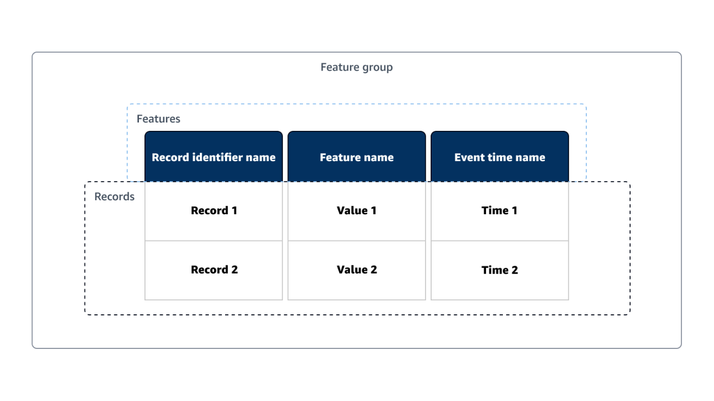

The Feature Store contains your feature groups and a feature group contains your ML data. In the
example diagram, the original feature group contains a data table that has three features (each
describing a column) and two records (rows).

• A feature's definition describes the feature name and data type of the feature values that are
associated with records.

• A record contains the feature values and is uniquely identified by its record identifier and must
include the event time.

Ingestion diagrams

Ingestion is the action of adding a record or records to an existing feature group. The online and
offline stores are updated differently for different storage use cases.

Ingestion to the online store example

The online store acts as a real-time look-up of records and only keeps the most up-to-date records.
Once a record is ingested into an existing online store, the updated online store will only keep the
record with the latest event time.

Feature Store concepts
3747

## Page 777

Amazon SageMaker AI
Developer Guide

In the following example diagram, the original online store contains a ML data table with one
record. A record is ingested with the same record identifier name as the original record, and the
ingested record has an earlier event time than the original record. As the updated online store only
keeps the record with the latest event time, the updated online store contains the original record.

Feature Store concepts
3748

## Page 778

Amazon SageMaker AI
Developer Guide

Ingestion to the offline store example

Feature Store concepts
3749

## Page 779

Amazon SageMaker AI
Developer Guide

The offline store acts as a historical look-up of records and keeps all records. After a new record is
ingested into an existing offline store, the updated offline store will keep the new record.

In the following example diagram, the original offline store contains a ML data table with one
record. A record is ingested with the same record identifier name as the original record, and the
ingested record has an event time earlier than the original record. As the updated offline store
keeps all of the records, the updated offline store contains both records.

Feature Store concepts
3750

## Page 780

Amazon SageMaker AI
Developer Guide

Feature Store concepts
3751

## Page 781

Amazon SageMaker AI
Developer Guide

Adding policies to your IAM role

To get started with Amazon SageMaker Feature Store you must have a role and add the required

policy to your role, AmazonSageMakerFeatureStoreAccess. The following is a walkthrough on
how to view the policies attached to a role and how to add a policy to your role. For information on
how to create a role, see How to use SageMaker AI execution roles. For information on how to get
your execution role, see Get your execution role.

1.
Open the IAM console at https://console.aws.amazon.com/iam/.

2.
In the navigation pane on the left of the IAM console, choose Roles.

3.
In the search bar enter the role you are using for Amazon SageMaker Feature Store.

For examples on how to find your execution role ARN for a notebook within SageMaker AI, see
Get your execution role. The role is at the end of the execution role ARN.

4.
After you enter the role in the search bar, choose the role.

Under Permissions policies you can view the policies attached to the role.

5.
After you choose the role, choose Add permissions, then choose Attach policies.

6.
In the search bar under Other permissions policies enter

AmazonSageMakerFeatureStoreAccess and press enter. If the policy does not show, you
may already have the policy attached, listed under your Current permissions policies.

7.
After you press enter, select the check box next to the policy and then choose Add
permissions.

8.
After you have attached the policy to your role, the policy will appear under Permissions
policies for your IAM role.

Use Feature Store with SDK for Python (Boto3)

The feature group is the main Feature Store resource that contains your machine learning (ML)
data and metadata stored in Amazon SageMaker Feature Store. A feature group is a logical
grouping of features and records. A feature group’s definition is composed of a configurations for
its online and offline store and a list of feature definitions that are used to describe the values
of your records. The feature definitions must include a record identifier name and an event time
name. For more information on feature store concepts, see Feature Store concepts.

Adding policies to your IAM role
3752

## Page 782

Amazon SageMaker AI
Developer Guide

Prior to using a feature store you typically load your dataset, run transformations, and set up
your features for ingestion. This process has a lot of variation and is highly dependent on your
data. The example code in the following topics refer to the  Introduction to Feature Store and
Fraud Detection with Amazon SageMaker Feature Store example notebooks, respectively. Both
use the AWS SDK for Python (Boto3). For more Feature Store examples and resources, see Amazon
SageMaker Feature Store resources.

Feature Store supports the following feature types: String, Fractional (IEEE 64-bit floating

point value), and Integral (Int64 - 64 bit signed integral value). The default type is set to

String. This means that, if a column in your dataset is not of a float or long feature type, it

defaults to String in your feature store.

You may use a schema to describe your data’s columns and data types. You pass this schema

into FeatureDefinitions, a required parameter for a FeatureGroup. You can use
the SDK for Python (Boto3), which has automatic data type detection when you use the

load_feature_definitions function.

The default behavior when a new feature record is added with an already existing record ID is
as follows. In the offline store, the new record will be appended. In the online store, if the event
time of the new record is less than the existing event time then nothing will happen, but if the
event time of the new record is greater than or equal to the existing event time, the record will be
overwritten.

When you create a new feature group you can choose one of the following table formats:

• AWS Glue (Default)

• Apache Iceberg

Ingesting data, especially when streaming, can result in a large number of small files deposited
into the offline store. This can negatively impact query performance due the higher number of file
operations required. To avoid potential performance issues, use the Apache Iceberg table format
when creating new feature groups. With Iceberg you can compact the small data files into fewer
large files in the partition, resulting in significantly faster queries. This compaction operation is
concurrent and does not affect ongoing read and write operations on the feature group. If you
choose the Iceberg option when creating new feature groups, Amazon SageMaker Feature Store
will create the Iceberg tables using Parquet file format, and register the tables with the AWS Glue
Data Catalog.

Use Feature Store with SDK for Python (Boto3)
3753

## Page 783

Amazon SageMaker AI
Developer Guide

Important

Note that for feature groups in Iceberg table format, you must specify String as the
value for the event time. If you specify any other type, you can't create the feature group
successfully.

In the following we list some available Feature Store managed resources.

Topics

• Introduction to Feature Store example notebook

• Fraud detection with Feature Store example notebook

Introduction to Feature Store example notebook

Important

Custom IAM policies that allow Amazon SageMaker Studio or Amazon SageMaker Studio
Classic to create Amazon SageMaker resources must also grant permissions to add tags to
those resources. The permission to add tags to resources is required because Studio and
Studio Classic automatically tag any resources they create. If an IAM policy allows Studio
and Studio Classic to create resources but does not allow tagging, "AccessDenied" errors can
occur when trying to create resources. For more information, see Provide permissions for
tagging SageMaker AI resources.
AWS managed policies for Amazon SageMaker AI that give permissions to create
SageMaker resources already include permissions to add tags while creating those
resources.

The example code on this page refers to the Introduction to Feature Store example notebook.
We recommend that you run this notebook in Studio Classic, notebook instances, or JupyterLab
because the code in this guide is conceptual and not fully functional if copied.

Use the following to clone the aws/amazon-sagemaker-examples GitHub repository, containing
the example notebook:

• For Studio Classic

Use Feature Store with SDK for Python (Boto3)
3754

## Page 784

Amazon SageMaker AI
Developer Guide

Launch Studio Classic. You can open Studio Classic if Studio or Studio Classic is enabled as
your default experience. For instructions on how to open Studio Classic, see Launch Amazon
SageMaker Studio Classic Using the Amazon SageMaker AI Console.

Clone the aws/amazon-sagemaker-examples GitHub repository to Studio Classic by following

the steps in Clone a Git Repository in Amazon SageMaker Studio Classic.

• For Amazon SageMaker notebook instances

Launch SageMaker notebook instance by following the instructions in Access Notebook
Instances.

Now that you have the SageMaker AI example notebooks, navigate to the amazon-sagemaker-

examples/sagemaker-featurestore directory and open the Introduction to Feature Store
example notebook.

Step 1: Set up your SageMaker AI session

To start using Feature Store, create a SageMaker AI session. Then, set up the Amazon Simple
Storage Service (Amazon S3) bucket that you want to use for your features. The Amazon S3 bucket
is your offline store. The following code uses the SageMaker AI default bucket and adds a custom
prefix to it.

Note

The role that you use to run the notebook must have the following managed policies

attached to it: AmazonS3FullAccess and AmazonSageMakerFeatureStoreAccess. For
information about adding policies to your IAM role, see Adding policies to your IAM role.

# SageMaker Python SDK version 2.x is required
import sagemaker
import sys

import boto3
import pandas as pd
import numpy as np
import io

Use Feature Store with SDK for Python (Boto3)
3755

## Page 785

Amazon SageMaker AI
Developer Guide

from sagemaker.session import Session
from sagemaker import get_execution_role

prefix = 'sagemaker-featurestore-introduction'
role = get_execution_role()

sagemaker_session = sagemaker.Session()
region = sagemaker_session.boto_region_name
s3_bucket_name = sagemaker_session.default_bucket()

Step 2: Inspect your data

In this notebook example, we ingest synthetic data from the GitHub repository that hosts the full
notebook.

customer_data = pd.read_csv("data/feature_store_introduction_customer.csv")
orders_data = pd.read_csv("data/feature_store_introduction_orders.csv")

print(customer_data.head())
print(orders_data.head())

The following diagram illustrates the steps that data goes through before Feature Store ingests it.
In this notebook, we illustrate the use case where you have data from multiple sources and want to
store them independently in a Feature Store. Our example considers data from a data warehouse
(customer data), and data from a real-time streaming service (order data).

Use Feature Store with SDK for Python (Boto3)
3756

## Page 786

Amazon SageMaker AI
Developer Guide

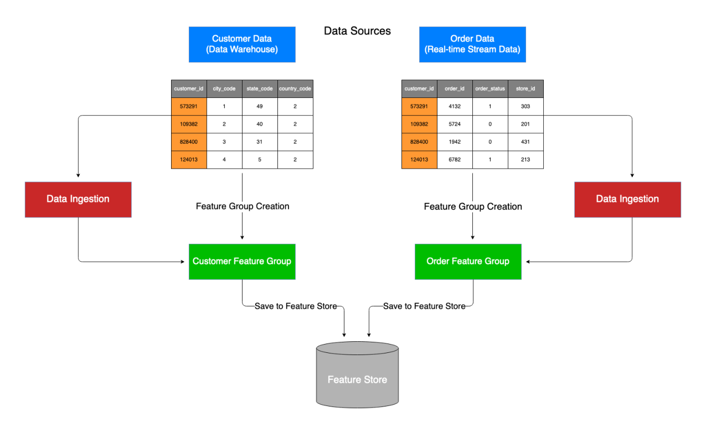

Step 3: Create feature groups

We first start by creating feature group names for customer_data and orders_data. Following this,

we create two feature groups, one for customer_data and another for orders_data:

import time
from time import strftime, gmtime
customers_feature_group_name = 'customers-feature-group-' + strftime('%d-%H-%M-%S',
gmtime())
orders_feature_group_name = 'orders-feature-group-' + strftime('%d-%H-%M-%S', gmtime())

Instantiate a FeatureGroup object for customers_data and orders_data:

from sagemaker.feature_store.feature_group import FeatureGroup

customers_feature_group = FeatureGroup(
name=customers_feature_group_name, sagemaker_session=sagemaker_session
)
orders_feature_group = FeatureGroup(
name=orders_feature_group_name, sagemaker_session=sagemaker_session

Use Feature Store with SDK for Python (Boto3)
3757

## Page 787

Amazon SageMaker AI
Developer Guide

)

import time
current_time_sec = int(round(time.time()))
record_identifier_feature_name = "customer_id"

Append EventTime feature to your data frame. This parameter is required, and timestamps each
data point:

customer_data["EventTime"] = pd.Series([current_time_sec]*len(customer_data),
dtype="float64")
orders_data["EventTime"] = pd.Series([current_time_sec]*len(orders_data),
dtype="float64")

Load feature definitions to your feature group:

customers_feature_group.load_feature_definitions(data_frame=customer_data)
orders_feature_group.load_feature_definitions(data_frame=orders_data)

The following calls create to create two feature groups, customers_feature_group and

orders_feature_group, respectively:

customers_feature_group.create(
s3_uri=f"s3://{s3_bucket_name}/{prefix}",
record_identifier_name=record_identifier_feature_name,
event_time_feature_name="EventTime",
role_arn=role,
enable_online_store=True
)

orders_feature_group.create(
s3_uri=f"s3://{s3_bucket_name}/{prefix}",
record_identifier_name=record_identifier_feature_name,
event_time_feature_name="EventTime",
role_arn=role,
enable_online_store=True
)

To confirm that your feature group was created, we display it by using DescribeFeatureGroup

and ListFeatureGroups APIs:

Use Feature Store with SDK for Python (Boto3)
3758

## Page 788

Amazon SageMaker AI
Developer Guide

customers_feature_group.describe()

orders_feature_group.describe()

sagemaker_session.boto_session.client('sagemaker',
region_name=region).list_feature_groups() # We use the boto client to list
FeatureGroups

Step 4: Ingest data into a feature group

After feature groups are created, we can put data into them. If you're using the SageMaker AI AWS

SDK for Python (Boto3), use the ingest API call. If you're using SDK for Python (Boto3), then

use the PutRecord API. It will take less than 1 minute to ingest data both of these options. This

example uses the SageMaker AI SDK for Python (Boto3), so it uses the ingest API call:

def check_feature_group_status(feature_group):
status = feature_group.describe().get("FeatureGroupStatus")
while status == "Creating":
print("Waiting for Feature Group to be Created")
time.sleep(5)
status = feature_group.describe().get("FeatureGroupStatus")
print(f"FeatureGroup {feature_group.name} successfully created.")

check_feature_group_status(customers_feature_group)
check_feature_group_status(orders_feature_group)

customers_feature_group.ingest(
data_frame=customer_data, max_workers=3, wait=True
)

orders_feature_group.ingest(
data_frame=orders_data, max_workers=3, wait=True
)

Using an arbitrary customer record id, 573291 we use get_record to check that the data has
been ingested into the feature group.

customer_id = 573291

Use Feature Store with SDK for Python (Boto3)
3759

## Page 789

Amazon SageMaker AI
Developer Guide

sample_record = sagemaker_session.boto_session.client('sagemaker-featurestore-runtime',
region_name=region).get_record(FeatureGroupName=customers_feature_group_name,
RecordIdentifierValueAsString=str(customer_id))

print(sample_record)

The following demonstrates how to use the batch_get_record to get a batch of records.

all_records = sagemaker_session.boto_session.client(
"sagemaker-featurestore-runtime", region_name=region
).batch_get_record(
Identifiers=[
{
"FeatureGroupName": customers_feature_group_name,
"RecordIdentifiersValueAsString": ["573291", "109382", "828400", "124013"],

},
{
"FeatureGroupName": orders_feature_group_name,
"RecordIdentifiersValueAsString": ["573291", "109382", "828400", "124013"],
},
]
)

print(all_records)

Step 5: Clean up

Here we remove the Feature Groups that we created.

customers_feature_group.delete()
orders_feature_group.delete()

Step 6: Next steps

In this example notebook, you learned how to get started with Feature Store, create feature
groups, and ingest data into them.

For an advanced example on how to use Feature Store for a fraud detection use case, see Fraud
Detection with Feature Store.

Use Feature Store with SDK for Python (Boto3)
3760

## Page 790

Amazon SageMaker AI
Developer Guide

Step 7: Code examples for programmers

In this notebook we used a variety of different API calls. Most of them are accessible through the
SageMaker Python SDK, however some only exist within Boto3. You can invoke the SageMaker
Python SDK API calls directly on your Feature Store objects, whereas to invoke API calls that exist
within Boto3, you must first access a Boto3 client through your Boto3 and SageMaker AI sessions:

for example, sagemaker_session.boto_session.client().

The following is a list of API calls for this notebook. These calls exist within the SDK for Python and
exist in Boto3, for your reference:

SDK for Python (Boto3) API Calls

describe()
ingest()

delete()
create()
load_feature_definitions()

Boto3 API Calls

list_feature_groups()
get_record()

Fraud detection with Feature Store example notebook

Important

Custom IAM policies that allow Amazon SageMaker Studio or Amazon SageMaker Studio
Classic to create Amazon SageMaker resources must also grant permissions to add tags to
those resources. The permission to add tags to resources is required because Studio and
Studio Classic automatically tag any resources they create. If an IAM policy allows Studio
and Studio Classic to create resources but does not allow tagging, "AccessDenied" errors can
occur when trying to create resources. For more information, see Provide permissions for
tagging SageMaker AI resources.
AWS managed policies for Amazon SageMaker AI that give permissions to create
SageMaker resources already include permissions to add tags while creating those
resources.

Use Feature Store with SDK for Python (Boto3)
3761

## Page 791

Amazon SageMaker AI
Developer Guide

The example code on this page refers to the example notebook: Fraud Detection with Amazon
SageMaker Feature Store. We recommend that you run this notebook in Studio Classic, notebook
instances, or JupyterLab because the code in this guide is conceptual and not fully functional if
copied.

Use the following to clone the aws/amazon-sagemaker-examples GitHub repository, containing
the example notebook.

• For Studio Classic

First launch Studio Classic. You can open Studio Classic if Studio or Studio Classic is enabled as
your default experience. To open Studio Classic, see Launch Amazon SageMaker Studio Classic
Using the Amazon SageMaker AI Console.

Clone the aws/amazon-sagemaker-examples GitHub repository to Studio Classic by following
the steps in Clone a Git Repository in Amazon SageMaker Studio Classic.

• For Amazon SageMaker notebook instances

First launch SageMaker notebook instance by following the instructions in Access Notebook
Instances.

Then, follow the instructions in Add a Git repository to your Amazon SageMaker AI account.

Now that you have the SageMaker AI example notebooks, navigate to the amazon-sagemaker-

examples/sagemaker-featurestore directory and open the Fraud Detection with Amazon
SageMaker Feature Store example notebook.

Step 1: Set up your Feature Store session

To start using Feature Store, create a SageMaker AI session, Boto3 session, and a Feature Store
session. Also, set up the Amazon S3 bucket you want to use for your features. This is your offline
store. The following code uses the SageMaker AI default bucket and adds a custom prefix to it.

Note

The role that you use to run the notebook must have the following

managed policies attached to it: AmazonSageMakerFullAccess and

AmazonSageMakerFeatureStoreAccess. For information about adding policies to your
IAM role, see Adding policies to your IAM role.

Use Feature Store with SDK for Python (Boto3)
3762

## Page 792

Amazon SageMaker AI
Developer Guide

import boto3
import sagemaker
from sagemaker.session import Session

sagemaker_session = sagemaker.Session()
region = sagemaker_session.boto_region_name
boto_session = boto3.Session(region_name=region)
role = sagemaker.get_execution_role()
default_bucket = sagemaker_session.default_bucket()
prefix = 'sagemaker-featurestore'
offline_feature_store_bucket = 's3://{}/{}'.format(default_bucket, prefix)

sagemaker_client = boto_session.client(service_name='sagemaker', region_name=region)
featurestore_runtime = boto_session.client(service_name='sagemaker-featurestore-
runtime', region_name=region)

feature_store_session = Session(
boto_session=boto_session,
sagemaker_client=sagemaker_client,
sagemaker_featurestore_runtime_client=featurestore_runtime
)

Step 2: Load datasets and partition data into feature groups

Load your data into data frames for each of your features. You use these data frames after you
set up the feature group. In the fraud detection example, you can see these steps in the following
code.

import numpy as np
import pandas as pd
import matplotlib.pyplot as plt
import io

s3_client = boto3.client(service_name='s3', region_name=region)

fraud_detection_bucket_name = 'sagemaker-featurestore-fraud-detection'
identity_file_key = 'sampled_identity.csv'
transaction_file_key = 'sampled_transactions.csv'

identity_data_object = s3_client.get_object(Bucket=fraud_detection_bucket_name,
Key=identity_file_key)
transaction_data_object = s3_client.get_object(Bucket=fraud_detection_bucket_name,
Key=transaction_file_key)

Use Feature Store with SDK for Python (Boto3)
3763

## Page 793

Amazon SageMaker AI
Developer Guide

identity_data = pd.read_csv(io.BytesIO(identity_data_object['Body'].read()))
transaction_data = pd.read_csv(io.BytesIO(transaction_data_object['Body'].read()))

identity_data = identity_data.round(5)
transaction_data = transaction_data.round(5)

identity_data = identity_data.fillna(0)
transaction_data = transaction_data.fillna(0)

# Feature transformations for this dataset are applied before ingestion into
FeatureStore.
# One hot encode card4, card6
encoded_card_bank = pd.get_dummies(transaction_data['card4'], prefix = 'card_bank')
encoded_card_type = pd.get_dummies(transaction_data['card6'], prefix = 'card_type')

transformed_transaction_data = pd.concat([transaction_data, encoded_card_type,

encoded_card_bank], axis=1)
transformed_transaction_data =
transformed_transaction_data.rename(columns={"card_bank_american express":
"card_bank_american_express"})

Step 3: Set up feature groups

When you set up your feature groups, you need to customize the feature names with a unique

name and set up each feature group with the FeatureGroup class.

from sagemaker.feature_store.feature_group import FeatureGroup
feature_group_name = "some string for a name"
feature_group = FeatureGroup(name=feature_group_name,
sagemaker_session=feature_store_session)

For example, in the fraud detection example, the two feature groups are identity and

transaction. In the following code you can see how the names are customized with a timestamp,
and then each group is set up by passing in the name and the session.

import time
from time import gmtime, strftime, sleep
from sagemaker.feature_store.feature_group import FeatureGroup

identity_feature_group_name = 'identity-feature-group-' + strftime('%d-%H-%M-%S',
gmtime())

Use Feature Store with SDK for Python (Boto3)
3764

## Page 794

Amazon SageMaker AI
Developer Guide

transaction_feature_group_name = 'transaction-feature-group-' + strftime('%d-%H-%M-%S',
gmtime())

identity_feature_group = FeatureGroup(name=identity_feature_group_name,
sagemaker_session=feature_store_session)
transaction_feature_group = FeatureGroup(name=transaction_feature_group_name,
sagemaker_session=feature_store_session)

Step 4: Set up record identifier and event time features

In this step, you specify a record identifier name and an event time feature name. This name maps
to the column of the corresponding features in your data. For example, in the fraud detection

example, the column of interest is TransactionID. EventTime can be appended to your data
when no timestamp is available. In the following code, you can see how these variables are set, and

then EventTime is appended to both feature’s data.

record_identifier_name = "TransactionID"
event_time_feature_name = "EventTime"
current_time_sec = int(round(time.time()))
identity_data[event_time_feature_name] =
pd.Series([current_time_sec]*len(identity_data), dtype="float64")
transformed_transaction_data[event_time_feature_name] =
pd.Series([current_time_sec]*len(transaction_data), dtype="float64")

Step 5: Load feature definitions

You can now load the feature definitions by passing a data frame containing the feature data. In
the following code for the fraud detection example, the identity feature and transaction feature

are each loaded by using load_feature_definitions, and this function automatically detects
the data type of each column of data. For developers using a schema rather than automatic
detection, see the Export Feature Groups from Data Wrangler example for code that shows how

to load the schema, map it, and add it as a FeatureDefinition that you can use to create the

FeatureGroup. This example also covers a AWS SDK for Python (Boto3) implementation, which
you can use instead of the SageMaker Python SDK.

identity_feature_group.load_feature_definitions(data_frame=identity_data); # output is
suppressed
transaction_feature_group.load_feature_definitions(data_frame=transformed_transaction_data);
# output is suppressed

Use Feature Store with SDK for Python (Boto3)
3765

## Page 795

Amazon SageMaker AI
Developer Guide

Step 6: Create a feature group

In this step, you use the create function to create the feature group. The following code shows all

of the available parameters. The online store is not created by default, so you must set this as True

if you want to enable it. The s3_uri is the S3 bucket location of your offline store.

# create a FeatureGroup
feature_group.create(
description = "Some info about the feature group",
feature_group_name = feature_group_name,
record_identifier_name = record_identifier_name,
event_time_feature_name = event_time_feature_name,
feature_definitions = feature_definitions,
role_arn = role,
s3_uri = offline_feature_store_bucket,
enable_online_store = True,
online_store_kms_key_id = None,
offline_store_kms_key_id = None,
disable_glue_table_creation = False,
data_catalog_config = None,
tags = ["tag1","tag2"])

The following code from the fraud detection example shows a minimal create call for each of the
two features groups being created.

identity_feature_group.create(
s3_uri=offline_feature_store_bucket,
record_identifier_name=record_identifier_name,
event_time_feature_name=event_time_feature_name,
role_arn=role,
enable_online_store=True
)

transaction_feature_group.create(
s3_uri=offline_feature_store_bucket,
record_identifier_name=record_identifier_name,
event_time_feature_name=event_time_feature_name,
role_arn=role,
enable_online_store=True
)

Use Feature Store with SDK for Python (Boto3)
3766

## Page 796

Amazon SageMaker AI
Developer Guide

When you create a feature group, it takes time to load the data, and you need to wait until the
feature group is created before you can use it. You can check status using the following method.

status = feature_group.describe().get("FeatureGroupStatus")

While the feature group is being created, you receive Creating as a response. When this step

has finished successfully, the response is Created. Other possible statuses are CreateFailed,

Deleting, or DeleteFailed.

Step 7: Work with feature groups

Now that you've set up your feature group, you can perform any of the following tasks:

Topics

• Describe a feature group

• List feature groups

• Put records in a feature group

• Get records from a feature group

• Generate hive DDL commands

• Build a training dataset

• Write and execute an Athena query

• Delete a feature group

Describe a feature group

You can retrieve information about your feature group with the describe function.

feature_group.describe()

List feature groups

You can list all of your feature groups with the list_feature_groups function.

sagemaker_client.list_feature_groups()

Use Feature Store with SDK for Python (Boto3)
3767

## Page 797

Amazon SageMaker AI
Developer Guide

Put records in a feature group

You can use the ingest function to load your feature data. You pass in a data frame of feature
data, set the number of workers, and choose to wait for it to return or not. The following example

demonstrates using the ingest function.

feature_group.ingest(
data_frame=feature_data, max_workers=3, wait=True
)

For each feature group you have, run the ingest function on the feature data you want to load.

Get records from a feature group

You can use the get_record function to retrieve the data for a specific feature by its record
identifier. The following example uses an example identifier to retrieve the record.

record_identifier_value = str(2990130)
featurestore_runtime.get_record(FeatureGroupName=transaction_feature_group_name,
RecordIdentifierValueAsString=record_identifier_value)

An example response from the fraud detection example:

...
'Record': [{'FeatureName': 'TransactionID', 'ValueAsString': '2990130'},
{'FeatureName': 'isFraud', 'ValueAsString': '0'},
{'FeatureName': 'TransactionDT', 'ValueAsString': '152647'},
{'FeatureName': 'TransactionAmt', 'ValueAsString': '75.0'},
{'FeatureName': 'ProductCD', 'ValueAsString': 'H'},
{'FeatureName': 'card1', 'ValueAsString': '4577'},
...

Generate hive DDL commands

The SageMaker Python SDK’s FeatureStore class also provides the functionality to generate Hive
DDL commands. The schema of the table is generated based on the feature definitions. Columns
are named after feature name and data-type are inferred based on feature type.

print(feature_group.as_hive_ddl())

Example output:

Use Feature Store with SDK for Python (Boto3)
3768

## Page 798

Amazon SageMaker AI
Developer Guide

CREATE EXTERNAL TABLE IF NOT EXISTS sagemaker_featurestore.identity-feature-
group-27-19-33-00 (
TransactionID INT
id_01 FLOAT
id_02 FLOAT
id_03 FLOAT
id_04 FLOAT
...

Build a training dataset

Feature Store automatically builds an AWS Glue data catalog when you create feature groups and
you can turn this off if you want. The following describes how to create a single training dataset
with feature values from both identity and transaction feature groups created earlier in this topic.
Also, the following describes how to run an Amazon Athena query to join data stored in the offline
store from both identity and transaction feature groups.

To start, create an Athena query using athena_query() for both identity and transaction feature
groups. The `table_name` is the AWS Glue table that is autogenerated by Feature Store.

identity_query = identity_feature_group.athena_query()
transaction_query = transaction_feature_group.athena_query()

identity_table = identity_query.table_name
transaction_table = transaction_query.table_name

Write and execute an Athena query

You write your query using SQL on these feature groups, and then execute the query with the

.run() command and specify your Amazon S3 bucket location for the data set to be saved there.

# Athena query
query_string = 'SELECT * FROM "'+transaction_table+'" LEFT JOIN "'+identity_table+'" ON
"'+transaction_table+'".transactionid = "'+identity_table+'".transactionid'

# run Athena query. The output is loaded to a Pandas dataframe.
dataset = pd.DataFrame()
identity_query.run(query_string=query_string,
output_location='s3://'+default_s3_bucket_name+'/query_results/')
identity_query.wait()
dataset = identity_query.as_dataframe()

Use Feature Store with SDK for Python (Boto3)
3769

## Page 799

Amazon SageMaker AI
Developer Guide

From here you can train a model using this data set and then perform inference.

Delete a feature group

You can delete a feature group with the delete function.

feature_group.delete()

The following code example is from the fraud detection example.

identity_feature_group.delete()
transaction_feature_group.delete()

For more information, see the Delete a feature group API.

Using Amazon SageMaker Feature Store in the console

Important

Custom IAM policies that allow Amazon SageMaker Studio or Amazon SageMaker Studio
Classic to create Amazon SageMaker resources must also grant permissions to add tags to
those resources. The permission to add tags to resources is required because Studio and
Studio Classic automatically tag any resources they create. If an IAM policy allows Studio
and Studio Classic to create resources but does not allow tagging, "AccessDenied" errors can
occur when trying to create resources. For more information, see Provide permissions for
tagging SageMaker AI resources.
AWS managed policies for Amazon SageMaker AI that give permissions to create
SageMaker resources already include permissions to add tags while creating those
resources.

You can use Amazon SageMaker Feature Store on the console to create, view, update, and monitor
your feature groups. Monitoring in this guide includes viewing pipeline executions and lineage
of your feature groups. This guide provides instructions on how to achieve these tasks from the
console.

For Feature Store examples and resources using the Amazon SageMaker APIs and AWS SDK for
Python (Boto3), see Amazon SageMaker Feature Store resources.

Using Amazon SageMaker Feature Store in the console
3770

## Page 800

Amazon SageMaker AI
Developer Guide

Topics

• Create a feature group from the console

• View feature group details from the console

• Update a feature group from the console

• View pipeline executions from the console

• View lineage from the console

Create a feature group from the console

The create feature group process has four steps:

1. Enter feature group information.

2. Enter feature definitions.

3. Enter required features.

4. Enter feature group tags.

Consider which of the following options fits your use case:

• Create an online store, an offline store, or both. For more information about the differences
between online and offline stores, see Feature Store concepts.

• Use a default AWS Key Management Service key or your own KMS key. The default key is AWS
KMS key (SSE-KMS). You can reduce AWS KMS request costs by configuring use of Amazon S3
Bucket Keys on the offline store Amazon S3 bucket. The Amazon S3 Bucket Key must be enabled
before using the bucket for your feature groups. For more information about reducing the cost
by using Amazon S3 Bucket Keys, see Reducing the cost of SSE-KMS with Amazon S3 Bucket
Keys.

You can use the same key for both online and offline stores, or have a unique key for each. For
more information about AWS KMS, see AWS Key Management Service.

• If you create an offline store:

• Decide if you want to create an Amazon S3 bucket or use an existing one. When using an
existing one, you must know the Amazon S3 bucket URL or Amazon S3 bucket name and
dataset directory name, if applicable.

Using Amazon SageMaker Feature Store in the console
3771

## Page 801

Amazon SageMaker AI
Developer Guide

• Choose which Amazon Resource Name (ARN) to use to specify the IAM role. For more
information about how to find your role and attached policies, see Adding policies to your IAM
role.

• Decide whether to use the AWS Glue (default) or Apache Iceberg table format. In most use
cases, you use the Apache Iceberg table format. For more information about table formats, see
Use Feature Store with SDK for Python (Boto3).

You can use the console to view the lineage of a feature group. The instructions for using Feature
Store on the console vary depending on whether you enabled Amazon SageMaker Studio or
Amazon SageMaker Studio Classic as your default experience.

Create feature groups if Studio is your default experience (console)

1.
Open the Studio console by following the instructions in Launch Amazon SageMaker Studio.

2.
Choose Data from the left navigation pane to expand the dropdown list.

3.
From the dropdown list, choose Feature Store.

4.
Choose Create feature group.

5.
Under Feature group details, enter a feature group name.

6.
(Optional) Enter a description of the feature group.

7.
Under Feature group storage configuration, choose a storage configuration from the
dropdown list. For information about storage configurations, see Feature Store storage
configurations.

8.
If you have chosen to enable the online storage:

a.
If you only enable the online storage, you can choose a Storage type from the dropdown
list. For information about online store storage types, see Online store.

b.
(Optional) Apply Time to Live (TTL) by toggling the switch to On and specifying the Time
to Live duration value and unit. This will update the default TTL duration for all records
added to the feature group after the feature group is created. For more information about
TTL, see Time to live (TTL) duration for records.

9.
If you have chosen to enable the offline storage:

a.
Under the Amazon S3 bucket name, enter a new bucket name, or enter an existing bucket
URL, manually.

Using Amazon SageMaker Feature Store in the console
3772

## Page 802

Amazon SageMaker AI
Developer Guide

b.
From the Table format dropdown list, choose the table format. In most use cases, you
should use the Apache Iceberg table format. For more information about table formats,
see Use Feature Store with SDK for Python (Boto3).

c.
Under IAM role ARN, choose the IAM role ARN you want to attach to this feature group.
For more information about how to find your role and attached policies, see Adding
policies to your IAM role.

d.
If you have chosen to enable the offline storage Table format and AWS Glue (default)
Table format, under Data catalog, you can choose one of the following two options:

• Use default values for your AWS Glue Data Catalog.

• Provide your existing Data Catalog name, table name, and database name to extend
your existing AWS Glue Data Catalog.

10. Under the Online store encryption key or Offline store encryption key dropdown list, choose

one of the following options:

• Use AWS managed AWS KMS key (default)

• Enter an AWS KMS key ARN and enter your AWS KMS key ARN under Offline store
encryption key ARN. For more information about AWS KMS, see AWS Key Management
Service.

11. If applicable, you will have the option to choose your throughput mode, which impacts how

you are charged. Under Throughput mode, choose a mode from the dropdown list and input
the read and write capacities when available. For information about throughput modes, like
when the mode can be applied and capacity units, see Throughput modes.

12. After you specify all of the required information, the Continue button appears available.

Choose Continue.

13. Under Specify feature definitions, you have two options for providing a schema for your

features: a JSON editor, or a table editor.

• JSON editor: In the JSON tab, enter or copy and paste your feature definitions in the JSON
format.

• Table editor: In the Table tab, enter the feature feature name and choose the corresponding
data type for each feature in your feature group. Choose + Add feature definitions to
include more features. Be aware that you cannot remove feature definitions from your
feature groups. However, you can add and update feature definitions after the feature group
is created.

Using Amazon SageMaker Feature Store in the console
3773

## Page 803

Amazon SageMaker AI
Developer Guide

There must be at least two features in a feature group that represent the record identifier and
event time:

• The record Feature type can be a string, fractional, or an integral.

• The event time Feature type must be a string or a fractional. However, if you chose the
Iceberg table format, the event time must be a string.

14. After all of the features are included, choose Continue.

15. Under Select required features, you must specify the record identifier and event time

features. Do this by choosing the feature name under Record identifier feature name and
Event time feature name dropdown lists, respectively.

16. After you choose the record identifier and event time features, choose Continue.

17. (Optional) To add tags for the feature group, choose Add new tag. Then enter a tag key and

the corresponding value under Key and Value, respectively.

18. Choose Continue.

19. Under Review feature group, review the feature group information. To edit any step, choose

the Edit button that corresponds to that step. This brings you to the corresponding step for
editing. To return to step 5, choose Continue until you return to step 5.

20. After you finalize the setup for your feature group, choose Create feature group.

If an issue occurs during setup, a pop-up alert message appears at the bottom of the page
with tips for solving the issue. You can return to previous steps to fix the issues by choosing
Edit for the step with conflicts.

After the feature group has been successfully created, a green pop-up message appears at the
bottom of the page. The new feature group also appears in your feature groups catalog.

Create feature groups if Studio Classic is your default experience (console)

1.
Open the Studio Classic console by following the instructions in Launch Amazon SageMaker
Studio Classic.

2.
Choose the Home icon

(

)
on the left navigation pane.

3.
Choose Data.

Using Amazon SageMaker Feature Store in the console
3774

## Page 804

Amazon SageMaker AI
Developer Guide

4.
From the dropdown list, choose Feature Store.

5.
Choose Create feature group.

6.
Under Feature group details, enter a feature group name.

7.
(Optional) Enter a description of the feature group.

8.
Under Feature group storage configuration, choose a storage configuration from the
dropdown list. For information about storage configurations, see Feature Store storage
configurations.

9.
If you have chosen to enable the online storage:

a.
If you only enable the online storage, you may choose a Storage type from the dropdown
list. For information about online store storage types, see Online store.

b.
(Optional) Apply Time to Live (TTL) by toggling the switch to On and specifying the Time
to Live duration value and unit. This will update the default TTL duration for all records
added to the feature group after the feature group is created. For more information about
TTL, see Time to live (TTL) duration for records.

10. If you have chosen to enable the offline storage:

a.
Under the Amazon S3 bucket name, enter a new bucket name or enter an existing bucket
URL manually.

b.
From the Table format dropdown list, choose the table format. In most use cases, you
should use the Apache Iceberg table format. For more information about table formats,
see Use Feature Store with SDK for Python (Boto3).

c.
Under IAM role ARN, choose the IAM role ARN you want to attach to this feature group.
For more information about how to find your role and attached policies, see Adding
policies to your IAM role.

d.
If you have chosen to enable the offline storage Table format and AWS Glue (default)
Table format, under Data catalog, you can choose one of the following two options:

• Use default values for your AWS Glue Data Catalog.

• Provide your existing Data Catalog name, table name, and database name to extend
your existing AWS Glue Data Catalog.

11. Under the Online store encryption key or Offline store encryption key dropdown list, choose

one of the following options:

• Use AWS managed AWS KMS key (default)

Using Amazon SageMaker Feature Store in the console
3775

## Page 805

Amazon SageMaker AI
Developer Guide

• Enter an AWS KMS key ARN and enter your AWS KMS key ARN under Offline store
encryption key ARN. For more information about AWS KMS, see AWS Key Management
Service.

12. After you specify all of the required information, the Continue button appears available.

Choose Continue.

13. Under Specify feature definitions, you have two options for providing a schema for your

features: a JSON editor, or a table editor.

• JSON editor: In the JSON tab, enter or copy and paste your feature definitions in the JSON
format.

• Table editor: In the Table tab, enter the feature feature name and choose the corresponding
data type for each feature in your feature group. Choose + Add feature definitions to
include more features. Be aware that you cannot remove feature definitions from your
feature groups. However, you can add and update feature definitions after the feature group
is created.

There must be at least two features in a feature group that represent the record identifier and
event time:

• The record Feature type can be a string, fractional, or an integral.

• The event time Feature type must be a string or a fractional. However, if you chose the
Iceberg table format, the event time must be a string.

14. After all of the features are included, choose Continue.

15. Under Select required features, you must specify the record identifier and event time

features. Do this by choosing the feature name under Record identifier feature name and
Event time feature name dropdown lists, respectively.

16. After you choose the record identifier and event time features, choose Continue.

17. (Optional) To add tags for the feature group, choose Add new tag. Then enter a tag key and

the corresponding value under Key and Value, respectively.

18. Choose Continue.

19. Under Review feature group, review the feature group information. To edit any step, choose

the Edit button that corresponds to that step. This brings you to the corresponding step for
editing. To return to step 5, choose Continue until you return to step 5.

20. After you finalize the setup for your feature group, choose Create feature group.

Using Amazon SageMaker Feature Store in the console
3776

## Page 806

Amazon SageMaker AI
Developer Guide

If an issue occurs during setup, a pop-up alert message appears at the bottom of the page
with tips for solving the issue. You can return to previous steps to fix the issues by choosing
Edit for the step with conflicts.

After the feature group has been successfully created, a green pop-up message appears at the
bottom of the page. The new feature group also appears in your feature groups catalog.

View feature group details from the console

You can view details of your feature groups after a feature group has successfully been created in
the Feature Store.

You can use the console or the Amazon SageMaker Feature Store API to view your feature
group details. The instructions for using Feature Store through the console depends on if you
have enabled Amazon SageMaker Studio or Amazon SageMaker Studio Classic as your default
experience.

View feature group details if Studio is your default experience (console)

1.
Open the Studio console by following the instructions in Launch Amazon SageMaker Studio.

2.
Choose Data in the left navigation pane, to expand the dropdown list.

3.
From the dropdown list, choose Feature Store.

4.
(Optional) To view your feature groups, choose My account. To view shared feature groups,
choose Cross account.

5.
Under the Feature group catalog tab, choose your feature group name from the list. This
opens the feature group page.

6.
On the Features tab, you can find a list of all of the features. Use the filter to refine your list.
Choose a feature to view its details.

7.
Under the Details tab and the Information subtab, you can review your feature group
information. This includes Latest execution, Offline storage settings, Online storage settings,
and more.

8.
Under the Details tab and the Tags subtab, you can review your feature group tags. Choose
Add new tag to add a new tag or Remove to remove a tag.

9.
Under the Pipeline Executions tab, you can view the associated pipelines or pipeline
executions for your feature group.

Using Amazon SageMaker Feature Store in the console
3777

## Page 807

Amazon SageMaker AI
Developer Guide

10. Under the Lineage tab, you can view the lineage of your feature group.

View feature group details if Studio Classic is your default experience (console)

1.
Open the Studio Classic console by following the instructions in Launch Amazon SageMaker
Studio Classic.

2.
Choose the Home icon

(

)
in the left navigation pane.

3.
Choose Data.

4.
From the dropdown list, choose Feature Store.

5.
(Optional) To view your feature groups, choose My account. To view shared feature groups,
choose Cross account.

6.
Under the Feature group catalog tab, choose your feature group name from the list. This
opens the feature group page.

7.
On the Features tab, you can find a list of all of the features. Use the filter to refine your list.
Choose a feature to view its details.

8.
Under the Details tab and the Information subtab, you can review your feature group
information, including Latest execution, Offline storage settings, Online storage settings,
and more.

9.
Under the Details tab and the Tags subtab, you can review your feature group tags. Choose
Add new tag to add a new tag or Remove to remove a tag.

10. Under the Pipeline Executions tab, you can view the associated pipelines or pipeline

executions for your feature group.

11. Under the Lineage tab, you can view the lineage of your feature group.

Update a feature group from the console

You can update your feature groups after a feature group has successfully been created in the
Feature Store.

You can use the console or the Amazon SageMaker Feature Store API to update a feature group.
The instructions for using Feature Store through the console depends on if you have enabled
Amazon SageMaker Studio or Amazon SageMaker Studio Classic as your default experience.

Using Amazon SageMaker Feature Store in the console
3778

## Page 808

Amazon SageMaker AI
Developer Guide

Update a feature group if Studio is your default experience (console)

1.
Open the Studio console by following the instructions in Launch Amazon SageMaker Studio.

2.
Choose Data in the left navigation pane, to expand the dropdown list.

3.
From the dropdown list, choose Feature Store.

4.
(Optional) To view your feature groups, choose My account. To view shared feature groups,
choose Cross account.

5.
Under the Feature group catalog tab, search for and choose your feature group name from
the list. This opens the feature group page.

6.
Choose Update feature group.

7.
(Optional) If applicable, you can change your throughput mode, which impacts how you are
charged. Under Throughput mode, choose a mode from the dropdown list and input the read
and write capacities when available. For information about throughput modes, like when the
mode can be applied and capacity units, see Throughput modes.

8.
(Optional) If your feature group uses the online store, you can update the default Time to
Live (TTL). If TTL hasn't been enabled for the feature group, toggle the switch button under
Time to Live (TTL) to On. You can specify the TTL value and unit under Time to Live duration.
This will update the default TTL duration for all records added to the feature group after the
feature group is updated.

9.
(Optional) You can add feature definitions to your feature group but be aware that you cannot
remove feature definitions from your feature groups. To add a feature definition, choose + Add
feature definition and then specify the new feature definition name under the Name column
and select the feature type under the Feature type column.

10. Choose Save changes.

11. To confirm your changes, choose Confirm.

Update a feature group if Studio Classic is your default experience (console)

1.
Open the Studio Classic console by following the instructions in Launch Amazon SageMaker
Studio Classic.

2.
Choose the Home icon

(

)
in the left navigation pane.

3.
Choose Data.

Using Amazon SageMaker Feature Store in the console
3779

## Page 809

Amazon SageMaker AI
Developer Guide

4.
From the dropdown list, choose Feature Store.

5.
(Optional) To view your feature groups, choose My account. To view shared feature groups,
choose Cross account.

6.
Under the Feature group catalog tab, search for and choose your feature group name from

the list. This opens the feature group page.

7.
Choose Update feature group.

8.
(Optional) If your feature group uses the online store, you can update the default Time to
Live (TTL). If TTL hasn't been enabled for the feature group, toggle the switch button under
Time to Live (TTL) to On. You can specify the TTL value and unit under Time to Live duration.
This will update the default TTL duration for all records added to the feature group after the
feature group is updated.

9.
(Optional) You can add feature definitions to your feature group but be aware that you cannot
remove feature definitions from your feature groups. To add a feature definition, choose + Add
feature definition and then specify the new feature definition name under the Name column
and select the feature type under the Feature type column.

10. Choose Save changes.

11. To confirm your changes, choose Confirm.

View pipeline executions from the console

You can view the latest pipeline execution information for a feature or feature group under
Pipeline executions. You can also get links to pipelines, executions, code, and other useful
execution information.

You can use the console to view your pipeline executions. The instructions for using Feature Store
through the console depends on if you have enabled Amazon SageMaker Studio or Amazon
SageMaker Studio Classic as your default experience.

View pipeline executions if Studio is your default experience (console)

1.
Open the Studio console by following the instructions in Launch Amazon SageMaker Studio.

2.
Choose Data in the left navigation pane, to expand the dropdown list.

3.
From the dropdown list, choose Feature Store.

4.
(Optional) To view your feature groups, choose My account. To view shared feature groups,
choose Cross account.

5.
Choose a feature group or feature to view their pipeline executions.

Using Amazon SageMaker Feature Store in the console
3780

## Page 810

Amazon SageMaker AI
Developer Guide

6.
Choose the Pipeline executions tab.

7.
Search for a pipeline from the Select a pipeline dropdown list.

8.
You can view the links for the pipeline, execution, and code details. You can also view the
execution owner, status, date, and duration.

View pipeline executions if Studio Classic is your default experience (console)

1.
Open the Studio Classic console by following the instructions in Launch Amazon SageMaker
Studio Classic.

2.
Choose the Home icon

(

)
in the left navigation pane.

3.
Choose Data.

4.
From the dropdown list, choose Feature Store.

5.
(Optional) To view your feature groups, choose My account. To view shared feature groups,
choose Cross account.

6.
Choose a feature group or feature to view their pipeline executions.

7.
Choose the Pipeline executions tab.

8.
Search for a pipeline from the Select a pipeline dropdown list.

9.
You can view the links for the pipeline, execution, and code details. You can also view the
execution owner, status, date, and duration.

View lineage from the console

You can view the lineage of a feature group. The lineage includes the information about the
execution code of your feature processing workflow, what data sources were used, and how they
are ingested to the feature group or feature.

You can use the console to view the lineage of a feature group. The instructions on using Feature
Store through the console depends on if you have enabled Amazon SageMaker Studio or Amazon
SageMaker Studio Classic as your default experience.

View lineage if Studio is your default experience (console)

1.
Open the Studio console by following the instructions in Launch Amazon SageMaker Studio.

Using Amazon SageMaker Feature Store in the console
3781

## Page 811

Amazon SageMaker AI
Developer Guide

2.
Choose Data from the left navigation pane to expand the dropdown list.

3.
From the dropdown list, choose Feature Store.

4.
(Optional) To view your feature groups, choose My account. To view shared feature groups,
choose Cross account.

5.
Choose a feature group or feature to view its lineage details.

6.
Choose the Lineage tab.

7.
Choose a feature group or pipeline node to expand the node. This contains more information
about a feature group or pipeline.

8.
You can zoom in, zoom out, or recenter the lineage graph by using the buttons on the bottom
left of the screen.

9.
You can move through the lineage map when you choose and drag the screen. To move
your lineage maps using nodes as the focal point, you can press Tab or Shift+Tab to switch
between nodes.

10. If applicable, you can navigate the lineage upstream (left, earlier) or downstream (right, most

recent). Do this by choosing a node and then choosing Query upstream lineage or Query
downstream lineage.

View lineage if Studio Classic is your default experience (console)

1.
Open Studio Classic by following the instructions in Launch Amazon SageMaker Studio Classic.

2.
Choose the Home icon

(

)
in the left navigation pane.

3.
Choose Data.

4.
From the dropdown list, choose Feature Store.

5.
(Optional) To view your feature groups, choose My account. To view shared feature groups,
choose Cross account.

6.
Choose a feature group or feature to view its lineage details.

7.
Choose the Lineage tab.

8.
Choose a feature group or pipeline node to expand the node. This contains more information
about a feature group or pipeline.

9.
You can zoom in, zoom out, or recenter the lineage graph by using the buttons on the bottom
left of the screen.

Using Amazon SageMaker Feature Store in the console
3782

## Page 812

Amazon SageMaker AI
Developer Guide

10. You can move through the lineage map when you choose and drag the screen. To move

your lineage maps using nodes as the focal point, you can press Tab or Shift+Tab to switch
between nodes.

11. If applicable, you can navigate the lineage upstream (left, earlier) or downstream (right, most

recent). Do this by choosing a node and then choosing Query upstream lineage or Query
downstream lineage.

Delete a feature group

You can use the console or the Amazon SageMaker Feature Store API to delete your feature group.
The instructions on using Feature Store through the console depends on if you have enabled Studio
or Studio Classic as your default experience. For more information about the differences between
the two, or how to change your default, see Amazon SageMaker Studio.

The following sections provide an overview on how to delete a feature group.

Topics

• Delete a feature group using the console

• Delete feature group example Python code

Delete a feature group using the console

This section shows two ways to delete a feature group in the console, depending on your default
experience: Studio or Studio Classic.

Delete feature group if Studio is your default experience (console)

1.
Open the Studio console by following instructions in Launch Amazon SageMaker Studio
Classic.

2.
Choose Data in the left navigation pane to expand the dropdown list.

3.
From the dropdown list, choose Feature Store.

4.
(Optional) To view your feature groups, choose My account. To view shared feature groups,
choose Cross account.

5.
In the Feature Group Catalog tab, choose the feature group to delete under Feature group
name.

6.
Choose Delete feature group.

Delete a feature group
3783

## Page 813

Amazon SageMaker AI
Developer Guide

7.
In the pop-up window, confirm deletion by entering delete in the field, then choose Delete.

Delete feature group if Studio Classic is your default experience (console)

1.
Open the Studio Classic console by following the instructions in Launch Amazon SageMaker
Studio Classic.

2.
In the left navigation pane, choose the Home icon

(

).

3.
Choose Data.

4.
From the dropdown list, choose Feature Store.

5.
(Optional) To view your feature groups, choose My account. To view shared feature groups,
choose Cross account.

6.
In the Feature Group Catalog tab, choose the feature group to delete under Feature group
name.

7.
Choose Delete feature group.

8.
In the pop-up window, confirm deletion by typing delete in the field, then choose Delete.

Delete feature group example Python code

The following code uses the DeleteFeatureGroup API operation to delete your feature group
using the AWS SDK for Python (Boto3). It assumes that you've set up Feature Store and created
a feature group. For more information about getting started, see Introduction to Feature Store
example notebook.

import sagemaker
from sagemaker.feature_store.feature_group import FeatureGroup

sagemaker_session = sagemaker.Session()
fg_name = 'your-feature-group-name'

my_fg = FeatureGroup(name=fg_name, sagemaker_session=sagemaker_session)
my_fg.delete()

Delete a feature group
3784

## Page 814

Amazon SageMaker AI
Developer Guide

Add features and records to a feature group

You can use the Amazon SageMaker Feature Store API or the console to update and describe
your feature group as well as add features and records to your feature group. A feature group is
an object that contains your data and a feature describes a column in the table. When you add a
feature to the feature group you are effectively adding a column to the table. When you add a new
record to the feature group you are filling in values for features associated with a specific record
identifier. For more information on Feature Store concepts, see Feature Store concepts.

After you successfully add features to a feature group, you cannot remove those features. The
features that you have added do not add any data to your records. You can add new records to the
feature group or overwrite them using the PutRecord API. For examples on updating, describing,
and putting records into a feature group, see Example code.

You can use the console to add features to a feature group. For more information on how to
update your feature groups using the console, see Update a feature group from the console.

The following sections provide an overview of using Feature Store APIs to add features to a feature
group followed by examples. With the API, you can also add or overwrite records after you've
updated the feature group.

Topics

• API

• Example code

API

Use the UpdateFeatureGroup operation to add features to a feature group.

You can use the DescribeFeatureGroup operation to see if you've added the features
successfully.

To add or overwrite records, use the PutRecord operation.

To see the updates that you've made to a record, use the GetRecord operation. To see the updates

that you've made to multiple records, use the BatchGetRecord operation. It can take up to five
minutes for the updates that you've made to appear.

Add features and records to a feature group
3785

## Page 815

Amazon SageMaker AI
Developer Guide

You can use the example code in the following section to walk through adding features and records
using the AWS SDK for Python (Boto3).

Example code

The example code walks you through the following process:

1. Adding features to the feature group

2. Verifying that you've added them successfully

3. Adding a record to the feature group

4. Verifying that you've added it successfully

Step 1: Add features to a feature group

The following code uses the UpdateFeatureGroup operation to add new features to the
feature group. It assumes that you've set up Feature Store and created a feature group. For more
information about getting started, see Introduction to Feature Store example notebook.

import boto3

sagemaker_client = boto3.client("sagemaker")

sagemaker_client.update_feature_group(
FeatureGroupName=feature_group_name,
FeatureAdditions=[
{"FeatureName": "new-feature-1", "FeatureType": "Integral"},
{"FeatureName": "new-feature-2", "FeatureType": "Fractional"},
{"FeatureName": "new-feature-3", "FeatureType": "String"}
]
)

The following code uses the DescribeFeatureGroup operation to check the status of the

update. If the LastUpdateStatus field is Successful, you've added the features successfully.

sagemaker_client.describe_feature_group(
FeatureGroupName=feature_group_name
)

Example code
3786

## Page 816

Amazon SageMaker AI
Developer Guide

Step 2: Add a new record to the feature group

The following code uses the PutRecord operation to add records to the feature group that you've
created.

record_identifier_value = 'new_record'

sagemaker_featurestore_runtime_client = boto3.client("sagemaker-featurestore-runtime")

sagemaker_runtime_client.put_record(
FeatureGroupName=feature_group_name,
Record=[
{
'FeatureName': "record-identifier-feature-name",
'ValueAsString': record_identifier_value
},
{
'FeatureName': "event-time-feature",
'ValueAsString': "timestamp-that-feature-store-returns"
},
{
'FeatureName': "new-feature-1",
'ValueAsString': "value-as-string"
},
{
'FeatureName': "new-feature-2",
'ValueAsString': "value-as-string"
},
{
'FeatureName': "new-feature-3",
'ValueAsString': "value-as-string"
},
]
)

Use the GetRecord operation to see which records in your feature group don't have data for the

features that you've added. You can use the PutRecord operation to overwrite the records that
don't have data for the features that you've added.

Example code
3787

## Page 817

Amazon SageMaker AI
Developer Guide

Delete records from your feature groups

You can use the Amazon SageMaker Feature Store API to delete records from your feature groups.
A feature group is an object that contains your machine learning (ML) data, where the columns
of your data are described by features and your data are contained in records. A record contains
values for features that are associated with a specific record identifier.

There are two storage configurations for your feature groups: online store and offline store. The
online store only keeps the record with the latest event time and is typically used for real-time
lookup for ML inference. The offline store keeps all records and acts as a historical database and is
typically used for feature exploration, ML training, and batch inference.

For more information on Feature Store concepts, see Ingestion diagrams.

There are two ways to delete records from your feature groups, and the behavior is different
depending on the storage configuration. In the following topics we will describe how to soft and
hard delete records from the online and offline stores and provide examples.

Topics

• Delete records from the online store

• Delete records from the offline store

Delete records from the online store

You can soft or hard delete a record from the online store using the DeleteRecord API by using

the DeletionMode request parameter to specify SoftDelete (default) or HardDelete. For

more information on the DeleteRecord API, see DeleteRecord in the Amazon SageMaker API
Reference.

With the online store:

• When you soft delete (default), the record is no longer retrievable by GetRecord

or BatchGetRecord and the feature column values are set to null, except for the

RecordIdentifer and EventTime feature values.

• When you hard delete, the record is completely removed from the online store.

In both cases Feature Store appends the deleted record marker to the OfflineStore. The deleted

record marker is a record with the same RecordIdentifer as the original, but with is_deleted

Delete records from your feature groups
3788

## Page 818

Amazon SageMaker AI
Developer Guide

value set to True, EventTime set to the delete input EventTime, and other feature values set to

null.

Note that the EventTime specified in DeleteRecord should be set later than the EventTime of

the existing record in the OnlineStore for that same RecordIdentifer. If it is not, the deletion
does not occur:

• For SoftDelete, the existing (not deleted) record remains in the OnlineStore, though the

delete record marker is still written to the OfflineStore.

• HardDelete returns EventTime: 400 ValidationException to indicate that the delete

operation failed. No delete record marker is written to the OfflineStore.

The following examples use the SDK for Python (Boto3) delete_record operation to delete a
record from a feature group. To delete a record from a feature group, you will need:

• Feature group name (feature-group-name)

• Record identifier value as a string (record-identifier-value)

• Deletion event time (deletion-event-time)

The deletion event time should be later than the event time of the record you wish to delete.

Online store soft delete example

For soft delete you will need use the DeleteRecord API and can use the default DeletionMode

or set the DeletionMode to SoftDelete.

import boto3
client = boto3.client('sagemaker-featurestore-runtime')

client.delete_record(
FeatureGroupName='feature-group-name',
RecordIdentifierValueAsString='record-identifier-value',
EventTime='deletion-event-time',
TargetStores=[
'OnlineStore',
],
DeletionMode='SoftDelete'
)

Delete records from the online store
3789

## Page 819

Amazon SageMaker AI
Developer Guide

Online store hard delete example

For hard delete you will need use the DeleteRecord API and set the DeletionMode to

HardDelete.

import boto3
client = boto3.client('sagemaker-featurestore-runtime')

client.delete_record(
FeatureGroupName='feature-group-name',
RecordIdentifierValueAsString='record-identifier-value',
EventTime='deletion-event-timestamp',
TargetStores=[
'OnlineStore',
],
DeletionMode='HardDelete'

)

Delete records from the offline store

With Amazon SageMaker Feature Store you can soft and hard delete a record from the

OfflineStore Iceberg table format. With the OfflineStore Iceberg table format:

• When you soft delete a record the latest version of the Iceberg table file will not contain the
record, but previous versions will still contain the record and can be accessed using time travel.
For information on time travel, see Querying Iceberg table data and performing time travel in
the Athena user guide.

• When you hard delete a record you are removing previous versions of the Iceberg table that
contain the record. In this case you should specify which versions of the Iceberg table you wish to
delete.

Obtain your Iceberg table name

To soft and hard delete from your OfflineStore Iceberg table, you will need to obtain your

Iceberg table name, iceberg-table-name. The following instructions assumes you have already
used Feature Store to create a feature group using the offline store storage configuration using

the Iceberg table format, with DisableGlueTableCreation = False (default). For more
information on creating feature groups, see Get started with Amazon SageMaker Feature Store.

Delete records from the offline store
3790

## Page 820

Amazon SageMaker AI
Developer Guide

To obtain your iceberg-table-name, use the DescribeFeatureGroup API to obtain

DataCatalogConfig. This contains the metadata of the Glue table which serves as data catalog

for the OfflineStore. The TableName within the DataCatalogConfig is your iceberg-

table-name.

Amazon Athena offline store soft and hard delete example

The following instructions use Amazon Athena to soft delete then hard delete a record from

the OfflineStore Iceberg table. This assumes that the record you intend to delete in your

OfflineStore is a deleted record marker. For information on the deleted record marker in your

OfflineStore, see Delete records from the online store.

1.
Obtain your Iceberg table name, iceberg-table-name. For information on how to obtain
your Iceberg table name, see Obtain your Iceberg table name.

2.
Run the DELETE command to soft delete the records on the OfflineStore, such that the
latest version (or snapshot) of the Iceberg table will not contain the records. The following

example deletes the records where is_deleted is 'True' and the previous event-time
versions of the those records .You may add additional conditions based on other features to

restrict the deletion. For more information on using DELETE with Athena, see DELETE in the
Athena user guide.

DELETE FROM iceberg-table-name WHERE record-id-feature-name IS IN ( SELECT record-
id-feature-name FROM iceberg-table-name WHERE is_deleted = 'True')

The soft deleted records are still viewable on previous file versions by performing time travel.
For information on performing time travel, see Querying Iceberg table data and performing
time travel in the Athena user guide.

3.
Remove the record from previous versions of your Iceberg tables to hard delete the record

from OfflineStore:

a.
Run the OPTIMIZE command to rewrite the data files into a more optimized layout, based
on their size and number of associated delete files. For more information on optimizing
Iceberg tables and the syntax, see Optimizing Iceberg tables in the Athena user guide.

OPTIMIZE iceberg-table-name REWRITE DATA USING BIN_PACK

b.
(Optional, only need to run once) Run the ALTER TABLE command to alter
the Iceberg table set values, and set when previous file versions are to be hard

Delete records from the offline store
3791

## Page 821

Amazon SageMaker AI
Developer Guide

deleted according to your specifications. This can be done by assigning values to

vacuum_min_snapshots_to_keep and vacuum_max_snapshot_age_seconds
properties. For more information on altering your Iceberg table set properties, see ALTER
TABLE SET PROPERTIES in the Athena user guide. For more information on Iceberg table
property key-value pairs, see Table properties in the Athena user guide.

ALTER TABLE iceberg-table-name SET TBLPROPERTIES (
'vacuum_min_snapshots_to_keep'='your-specified-value',
'vacuum_max_snapshot_age_seconds'='your-specified-value'
)

c.
Run the VACUUM command to remove no longer needed data files for your Iceberg

tables, not referenced by the current version. The VACUUM command should run after
the deleted record is no longer referenced in the current snapshot. For example,

vacuum_max_snapshot_age_seconds after the deletion. For more information on

VACUUM with Athena and the syntax, see VACUUM.

VACUUM iceberg-table-name

Apache Spark offline store soft and hard delete example

To soft and then hard delete a record from the OfflineStore Iceberg table using Apache Spark,
you can follow the same instructions as in the Amazon Athena offline store soft and hard delete
example above, but using Spark procedures. For a full list of procedures, see Spark Procedures in
the Apache Iceberg documentation.

• When soft deleting from the OfflineStore: instead of using the DELETE command in Athena,

use the DELETE FROM command in Apache Spark.

• To remove the record from previous versions of your Iceberg tables to hard delete the record

from OfflineStore:

• When changing your Iceberg table configuration: instead of using the ALTER TABLE command

from Athena, use expire_snapshots procedure.

• To remove no longer needed data files from your Iceberg tables: instead of using the VACUUM

command in Athena, use the remove_orphan_files procedure.

Delete records from the offline store
3792

## Page 822

Amazon SageMaker AI
Developer Guide

Collection types

Collection types provide a way to organize and structure data for efficient retrieval and analysis.
They are used in ML databases to define the schema of a dataset and its elements. In Amazon
SageMaker Feature Store, the supported collection types include list, set, and vector.

Collections are a grouping of elements in which each element within the collection must have the

same feature type (String, Integral, or Fractional). For example, a collection can contain

elements with all of the element feature types as Fractional, but a collection cannot contain

elements with some feature types as Fractional and some feature types as String.

Only InMemory online store feature groups currently support collection types. The following list
describes the collection type options.

List: An ordered collection of elements.

• The length of the list is determined by how many elements are in the collection.

• Example: You can have a list such as [‘a’, ‘b’, ‘a’], because the list preserves the order and can
have repeat elements.

Set: An unordered collection of unique elements.

• The length of the set is determined by how many unique elements are in the collection.

• Example: You cannot have a set such as [‘a’, 'b', 'a'], because it contains a repeat element. The set
will instead have the elements [‘a’, ‘b’], because the set only contains unique elements.

Vector: A specialized list that represents a fixed-size array of elements. The order of the elements
hold significance, such that the positions of the elements represent certain properties of the data.

• The elements in the vector collection type must have the Fractional feature type.

• You may only have one vector collection type per online store InMemory tier feature group.

• The dimension (number of elements in the vector) of the vector is predetermined by you and is

specified using VectorDimension. The max dimension limit is 8192.

• Example: You can have a vector such as [4.2, -6.3, 4.2], where the first, second, and third
elements can represent the x, y, and z positions in physical space.

Collection types
3793

## Page 823

Amazon SageMaker AI
Developer Guide

There are no limits on the length of the collections, as long as they don't exceed the maximum size
of a record. For the maximum size of a record, see Quotas, naming rules and data types.

Time to live (TTL) duration for records

Amazon SageMaker Feature Store provides the option for records to be hard deleted from the

online store after a time duration is reached, with time to live (TTL) duration (TtlDuration). The

record will expire after the record’s EventTime plus the TtlDuration is reached, or ExpiresAt =

EventTime + TtlDuration. The TtlDuration can be applied at a feature group level, where all

records within the feature group will have the TtlDuration by default, or at an individual record

level. If TtlDuration is unspecified, the default value is null and the record will remain in the
online store until it is overwritten.

A record deleted using TtlDuration is hard deleted, or completely removed from the online
store, and the deleted record is added to the offline store. For more information on hard delete and

deletion modes, see DeleteRecord in the Amazon SageMaker API Reference guide. When a record
is hard deleted it immediately becomes inaccessible using Feature Store APIs.

Important

TTL typically deletes expired items within a few days. Depending on the size and activity
level of a table, the actual delete operation of an expired item can vary. Because TTL is
meant to be a background process, the nature of the capacity used to expire and delete
items via TTL is variable (but free of charge). For more information on how items are
deleted from a DynamoDB table, see How it works: DynamoDB Time to Live (TTL).

TtlDuration must be a dictionary containing a Unit and a Value, where the Unit must be a

string with values "Seconds", "Minutes", "Hours", "Days", or "Weeks" and Value must be an integer

greater than or equal to 1. TtlDuration can be applied while using the CreateFeatureGroup,

UpdateFeatureGroup, and PutRecord APIs. See the request and response syntax in the SDK

for Python (Boto3) documentation for CreateFeatureGroup, UpdateFeatureGroup, and

PutRecord APIs.

• When TtlDuration is applied at a feature group level (using the CreateFeatureGroup or

UpdateFeatureGroup APIs), the applied TtlDuration becomes the default TtlDuration for
all records that are added to the feature group from the point in time that the API is called. When

Time to live (TTL) duration for records
3794

## Page 824

Amazon SageMaker AI
Developer Guide

applying TtlDuration with the UpdateFeatureGroup API, this will not become the default

TtlDuration for records that were created before the API is called.

To remove the default TtlDuration from an existing feature group, use the

UpdateFeatureGroup API and set the TtlDuration Unit and Value to null.

• When TtlDuration is applied at a record level (for example, using PutRecord API), the

TtlDuration duration applies to that record and is used instead of the feature group level

default TtlDuration.

• When TtlDuration is applied on a feature group level it may take a few minutes for

TtlDuration to come into effect.

• If TtlDuration is used when there is no online store, you will receive a Validation

Exception (400) error.

The following example code shows how to apply TtlDuration while updating a feature group,
such that the records added to the feature group after running the API will by default expire four
weeks after their event times.

import boto3

sagemaker_client = boto3.client("sagemaker")
feature_group_name = '<YOUR_FEATURE_GROUP_NAME>'

sagemaker_client.update_feature_group(
FeatureGroupName=feature_group_name,
OnlineStoreConfig={
TtlDuration:{
Unit: "Weeks",
Value: 4
}
}
)

You can use the DescribeFeatureGroup API to view the default TtlDuration.

To view the expiration times, ExpiresAt (in UTC time ISO-8601 format), while using the

GetRecord or BatchGetRecord APIs you must set ExpirationTimeResponse to ENABLED.
See the request and response syntax in the SDK for Python (Boto3) documentation for

DescribeFeatureGroup, GetRecord, and BatchGetRecord APIs.

Time to live (TTL) duration for records
3795

## Page 825

Amazon SageMaker AI
Developer Guide

Feature Store storage configurations

Amazon SageMaker Feature Store consists of an online store and an offline store. The online store
enables real-time lookup of features for inference, while the offline store contains historical data
for model training and batch inference. When creating a feature group, you have the option of
enabling either the online store, offline store, or both. When you enable both, they sync to avoid
discrepancies between training and serving data. For more information about the online and
offline stores and other Feature Store concepts, see Feature Store concepts.

The following topics discuss online store storage types and offline store table formats.

Topics

• Online store

• Offline store

• Throughput modes

Online store

The online store is a low-latency, high-availability data store that provides real-time lookup of
features. It is typically used for machine learning (ML) model serving. You can chose between the

standard online store (Standard) or an in-memory tier online store (InMemory), at the point when
you create a feature group. In this way, you can select the storage type that best matches the read
and write patterns for a particular application, while considering performance and cost. For more
details about pricing, see Amazon SageMaker Pricing.

The online store contains the following StorageType options. For more information about the

online store contents, see OnlineStoreConfig.

Standard tier storage type

The Standard tier is a managed low-latency data store for online store feature groups. It provides

fast data retrieval for ML model service for your applications. Standard is the default storage
type.

In-memory tier storage type

The InMemory tier is a managed data store for online store feature groups that supports very low-
latency retrieval. It provides large-scale real-time data retrieval for ML model serving used for high

Feature Store storage configurations
3796

## Page 826

Amazon SageMaker AI
Developer Guide

throughput applications. The InMemory tier is powered by Amazon ElastiCache (Redis OSS). For
more information, see What is Amazon ElastiCache (Redis OSS)?.

The online store InMemory tier supports collection types, namely list, set, and vector. For more

information about the InMemory collection types, see Collection types.

Feature Store provides low latency read and writes to the online store. The application latency
is primarily made up of two primary components: infrastructure or network latency and Feature
Store API latency. Reduction of network latency helps with getting the lowest latency reads and
writes to Feature Store. You can reduce the network latency to Feature Store by deploying AWS
PrivateLink to Feature Store Runtime endpoint. With AWS PrivateLink, you can privately access
all Feature Store Runtime API operations from your Amazon Virtual Private Cloud (VPC) in a
scalable manner by using interface VPC endpoints. An AWS PrivateLink deployment with the

privateDNSEnabled option set as true:

• It keeps all Feature Store read/write traffic within your VPC.

• It keeps traffic in the same AZ as the client that originated it when using Feature Store. This
avoids the “hops” between AZs reducing the network latency.

Follow the steps in Access an AWS service using an interface VPC endpoint to setup AWS
PrivateLink to Feature Store. The service name for Feature Store Runtime in AWS PrivateLink is

com.amazonaws.region.sagemaker.featurestore-runtime.

The InMemory tier online store scales automatically based about storage usage and requests. The
automated scaling can take a few minutes to adapt to a new usage pattern if it changes rapidly.
During automated scaling:

• Write operations to the feature group may receive throttling errors. You should retry your
requests a few minutes later.

• Read operations to the feature group may receive throttling errors. Standard retry strategies are
suitable in this case.

• Read operations may see elevated latency.

The default InMemory tier feature group maximum size is 50 GiB.

Note that the InMemory tier currently supports online feature groups only, not online+offline

feature groups, so there is not replication between online and offline stores for the InMemory tier.

Also, the InMemory tier does not currently support customer managed KMS keys.

Online store
3797

## Page 827

Amazon SageMaker AI
Developer Guide

Offline store

The offline store is used for historical data when sub-second retrieval is not needed. It is typically
used for data exploration, model training, and batch inference.

When you enable both the online and offline stores for your feature group, both stores sync to
avoid discrepancies between training and serving data. Please note that an online store feature

group with the InMemory storage type enabled does not currently support a corresponding
feature group in the offline store (no online to offline replication). For more information about ML
model serving in Amazon SageMaker Feature Store, see Online store.

The offline store contains the following TableFormat options. For information about the offline

store contents, see OfflineStoreConfig in the Amazon SageMaker API Reference.

Glue table format

The Glue format (default) is a standard Hive type table format for AWS Glue. With AWS Glue, you
can discover, prepare, move, and integrate data from multiple sources. It also includes additional
productivity and data ops tooling for authoring, running jobs, and implementing business
workflows. For more information about AWS Glue, see What is AWS Glue?.

Iceberg table format

The Iceberg format (recommended) is an open table format for very large analytic tables. With

Iceberg, you can compact the small data files into fewer large files in the partition, resulting in
significantly faster queries. This compaction operation is concurrent and does not affect ongoing
read and write operations on the feature group. For more information about optimizing Iceberg
tables, see the Amazon Athena and AWS Lake Formation user guides.

Iceberg manages large collections of files as tables and supports modern analytical data lake

operations. If you choose the Iceberg option when creating new feature groups, Amazon

SageMaker Feature Store creates the Iceberg tables using Parquet file format, and registers the

tables with the AWS Glue Data Catalog. For more information about Iceberg table formats, see
Using Apache Iceberg tables.

Offline store
3798

## Page 828

Amazon SageMaker AI
Developer Guide

Important

Note that for feature groups in Iceberg table format, you must specify String as the
feature type for the event time. If you specify any other type, you can't create the feature
group successfully.

Throughput modes

Amazon SageMaker Feature Store provides two pricing models to choose from: on-demand (On-

demand) and provisioned (Provisioned) throughput modes. On-demand works best for less

predictable traffic, while Provisioned works best for consistent and predictable traffic.

You have the option to switch between On-demand and Provisioned throughput modes for a
given feature group, to accommodate periods in which application traffic patterns are changing

or less predictable. You can only update your feature group throughput mode to On-demand
once in a 24 hour period. The throughput mode can be updated programmatically using the
UpdateFeatureGroup API or through the console UI. For more information about using the console,
see Using Amazon SageMaker Feature Store in the console.

You can use the Provisioned throughput mode with offline-only feature groups or feature

groups with the Standard storage type. For other storage configurations, the On-demand
throughput mode is used. For information about the online and offline storage configurations, see
Online store and Offline store, respectively.

For more details about pricing, see Amazon SageMaker Pricing.

Topics

• On-demand throughput mode

• Provisioned throughput mode

• Throughput mode metrics

• Throughput mode limits

On-demand throughput mode

The On-demand (default) throughput mode works best when you are using feature groups with
unknown workload, unpredictable application traffic, and you cannot forecast the capacity
requirements.

Throughput modes
3799

## Page 829

Amazon SageMaker AI
Developer Guide

The On-demand mode charges you for the reads and writes that your application performs on your
feature groups. You do not need to specify how much read and write throughput you expect your
application to perform because Feature Store instantly accommodates your workloads as they

ramp up or down. You pay only for what you use, which is measured in ReadRequestsUnits and

WriteRequestsUnits.

You can enable the On-demand throughput mode using the CreateFeatureGroup or
UpdateFeatureGroup APIs or through the console UI. For more information about using the console
UI, see Using Amazon SageMaker Feature Store in the console.

Important

You can only update your feature group throughput mode to On-demand once in a 24 hour
period.

Provisioned throughput mode

The Provisioned throughput mode works best when you are using feature groups with
predictable workloads and you can forecast the capacity requirements to control costs. This
can make it more cost effective for certain workloads where you can anticipate throughput
requirements in advance.

When you set a feature group to Provisioned mode, you specify capacity units which are the
maximum amount of capacity that an application can consume from a feature group. If your

application exceeds this Provisioned throughput capacity, it is subject to request throttling.

The following includes information about the read and write capacity units.

• Retrieving a single record of up to 4 KB using the GetRecord API will consume at least 1 RCU
(read capacity unit). Retrieving larger payloads may take more. The total number of read capacity
units required depends on the item size, including a small per record metadata added by the
Feature Store service.

• A single write request with a payload of 1 KB using the PutRecord API will consume at least 1
WCU (write capacity unit), with fractional payloads rounded up to nearest KB. It may consume
more depending on the event time, deletion status of the record, and time to live (TTL) status.
For more information about TTL, see Time to live (TTL) duration for records.

Throughput modes
3800

## Page 830

Amazon SageMaker AI
Developer Guide

Important

When setting your capacity units please consider the following:

• You will be charged for the read and write capacities you provision for your feature

group, even if you do not fully utilize the Provisioned capacity.

• If you set a read or write capacity too low, your requests may experience throttling.

• In some cases, records may consume an extra capacity unit due to record level metadata
that is added by the Feature Store service to enable various features.

• Retrieving only a subset of features using GetRecord or BatchGetRecord APIs will still
consume RCU corresponding to the entire record.

• For write capacity, you should provision 2x the recent peak capacity to avoid throttling
when performing backfills or bulk ingestion that may result in a large number of
historical record writes. This is because writing historical records consumes additional
write capacity.

• Feature Store does not currently support auto scaling for Provisioned mode.

You can enable the On-demand throughput mode using the CreateFeatureGroup or
UpdateFeatureGroup APIs or through the console UI. For more information about using the console
UI, see Using Amazon SageMaker Feature Store in the console.

The following describes how you can increase or decrease the RCU and WCU throughput for your

feature groups when Provisioned mode is enabled.

Increasing provisioned throughput

You can increase RCU or WCU as often as needed using the UpdateFeatureGroup API or the console
UI.

Decreasing provisioned throughput

You can decrease RCU and WCU (or both) for feature groups using UpdateFeatureGroup API or the
console UI.

There is a default quota on the number of Provisioned capacity decreases you can perform
on your feature group per day. A day is defined according to Universal Time Coordinated (UTC).
On a given day, you can start by performing up to four decreases within one hour as long as you
have not performed any other decreases yet during that day. Subsequently, you can perform

Throughput modes
3801

## Page 831

Amazon SageMaker AI
Developer Guide

one additional decrease per hour as long as there were no decreases in the preceding hour. This
effectively brings the maximum number of decreases in a day to 27 times (4 decreases in the first
hour, and 1 decrease for each of the subsequent 1-hour windows in a day).

Throughput mode metrics

A feature group in On-demand mode will emit ConsumedReadRequestsUnits and

ConsumedWriteRequestsUnits metrics. A feature group in Provisioned mode will emit

ConsumedReadCapacityUnits and ConsumedWriteCapacityUnits metrics. For more
information about Feature Store metrics, see Amazon SageMaker Feature Store metrics.

Throughput mode limits

Each AWS account has default service quotas or limits that are applied to help ensure availability
and manage billing risks. For information about the default quotas and limits, see Quotas, naming
rules and data types.

In some cases, these limits may be lower than what is stated in the documentation. If you need
higher limits, you can submit a request for an increase. It's a good idea to do so before reaching
current limits to avoid interruptions to your work. For information about service quotas and how to
request a quota increase, see AWS service quotas.

Data sources and ingestion

Records are added to your feature groups through ingestion. Depending on your desired use
case, the ingested records may be kept within the feature group or not. This depends on the
storage configuration, if your feature group uses the offline or online store. The offline store is
used as a historical database, that is typically used for data exploration, machine learning (ML)
model training, and batch inference. The online store is used as a real-time lookup of records,
that is typically used for ML model serving. For more information on Feature Store concepts and
ingestion, see Feature Store concepts.

There are multiple ways to bring your data into Amazon SageMaker Feature Store. Feature Store

offers a single API call for data ingestion called PutRecord that enables you to ingest data in
batches or from streaming sources. You can use Amazon SageMaker Data Wrangler to engineer
features and then ingest your features into your Feature Store. You can also use Amazon EMR for
batch data ingestion through a Spark connector.

In the following topics we will discuss the difference between

Data sources and ingestion
3802

## Page 832

Amazon SageMaker AI
Developer Guide

Topics

• Stream ingestion

• Data Wrangler with Feature Store

• Batch ingestion with Amazon SageMaker Feature Store Spark

Stream ingestion

You can use streaming sources such as Kafka or Kinesis as a data source, where records are
extracted from, and directly feed records to the online store for training, inference or feature

creation. Records can be ingested into your feature group by using the synchronous PutRecord
API call. Since this is a synchronous API call it allows small batches of updates to be pushed in a
single API call. This enables you to maintain high freshness of the feature values and publish values
as soon an update is detected. These are also called streaming features.

Data Wrangler with Feature Store

Data Wrangler is a feature of Studio Classic that provides an end-to-end solution to import,
prepare, transform, featurize, and analyze data. Data Wrangler enables you to engineer your
features and ingest them into your online or offline store feature groups.

The following instructions exports a Jupyter notebook that contains all of the source code needed
to create a Feature Store feature group that adds your features from Data Wrangler to an online or
offline store.

The instructions on exporting your Data Wrangler data flow to Feature Store on the console vary
depending on whether you enabled enabled Amazon SageMaker Studio or Amazon SageMaker
Studio Classic as your default experience.

Export your Data Wrangler data flow to Feature Store if Studio is your default experience
(console)

1.
Open the Studio console by following the instructions in Launch Amazon SageMaker Studio.

2.
Choose Data from the left panel, to expand the dropdown list.

3.
From the dropdown list, choose Data Wrangler.

4.
If you have an instance of Amazon SageMaker Canvas already running, choose Open Canvas.

If you don't have an instance of SageMaker Canvas running, choose Run in Canvas.

Stream ingestion
3803

## Page 833

Amazon SageMaker AI
Developer Guide

5.
On the SageMaker Canvas console, choose Data Wrangler in the left navigation pane.

6.
Choose Data flows to view your data flows.

7.
Choose + to expand the dropdown list.

8.
Choose Export data flow to expand the dropdown list.

9.
Choose Save to SageMaker Feature Store (via JupyterLab Notebook).

10. Under Export data flow as notebook, choose one of the following options:

• Download a local copy to download the dataflow to your local machine.

• Export to S3 location to download the dataflow to an Amazon Simple Storage Service
location and enter the Amazon S3 location or choose Browse to find your Amazon S3
location.

11. Choose Export.

Export your Data Wrangler data flow to Feature Store if Studio Classic is your default
experience (console)

1.
Open the Studio Classic console by following the instructions in Launch Amazon SageMaker
Studio Classic.

2.
Choose the Home icon

(

)
in the left navigation pane.

3.
Choose Data.

4.
From the dropdown list, choose Data Wrangler.

5.
Choose your workflow.

6.
Choose the Export tab.

7.
Choose Export Step.

8.
Choose Feature Store.

After the feature group has been created, you can also select and join data across multiple feature
groups to create new engineered features in Data Wrangler and then export your data set to an
Amazon S3 bucket.

For more information on how to export to Feature Store, see Export to SageMaker AI Feature Store.

Data Wrangler with Feature Store
3804

## Page 834

Amazon SageMaker AI
Developer Guide

Batch ingestion with Amazon SageMaker Feature Store Spark

Amazon SageMaker Feature Store Spark is a Spark connector that connects the Spark library to

Feature Store. Feature Store Spark simplifies data ingestion from Spark DataFrames to feature
groups. Feature Store supports batch data ingestion with Spark, using your existing ETL pipeline,
on Amazon EMR, GIS, an AWS Glue job, an Amazon SageMaker Processing job, or a SageMaker
notebook.

Methods for installing and implementing batch data ingestion are provided for Python and Scala

developers. Python developers can use the open-source sagemaker-feature-store-pyspark
Python library for local development, installation on Amazon EMR, and for Jupyter Notebooks by
following the instructions in the Amazon SageMaker Feature Store Spark GitHub repository. Scala
developers can use the Feature Store Spark connector available in the Amazon SageMaker Feature
Store Spark SDK Maven central repository.

You can use the Spark connector to ingest data in the following ways, depending on if the online
store, offline store, or both are enabled.

1. Ingest by default – If the online store is enabled, Spark connector first ingests your dataframe

into the online store using the PutRecord API. Only the record with the largest event time
remains in the online store. If the offline store is enabled, within 15 minutes Feature Store
ingests your dataframe into the offline store. For more information about how the online and
offline stores work, see Feature Store concepts.

You can accomplish this by not specifying target_stores in the .ingest_data(...)
method.

2. Offline store direct ingestion – If offline store is enabled, Spark connector batch ingests your

dataframe directly into the offline store. Ingesting the dataframe directly into the offline store
doesn't update the online store.

You can accomplish this by setting target_stores=["OfflineStore"] in the

.ingest_data(...) method.

3. Online store only – If online store is enabled, Spark connector ingests your dataframe into the

online store using the PutRecord API. Ingesting the dataframe directly into the online store
doesn't update the offline store.

You can accomplish this by setting target_stores=["OnlineStore"] in the

.ingest_data(...) method.

Feature Store Spark
3805

## Page 835

Amazon SageMaker AI
Developer Guide

For information about using the different ingestion methods, see Example implementations.

Topics

• Feature Store Spark installation

• Retrieving the JAR for Feature Store Spark

• Example implementations

Feature Store Spark installation

Scala users

The Feature Store Spark SDK is available in the Amazon SageMaker Feature Store Spark SDK Maven
central repository for Scala users.

Requirements

• Spark >= 3.0.0 and <= 3.3.0

• iceberg-spark-runtime >= 0.14.0

• Scala >= 2.12.x

• Amazon EMR >= 6.1.0 (only if you are using Amazon EMR)

Declare the dependency in POM.xml

The Feature Store Spark connector has a dependency on the iceberg-spark-runtime library.

You must therefore add corresponding version of the iceberg-spark-runtime library to
the dependency if you're ingesting data into a feature group that you've auto-created with the
Iceberg table format. For example, if you're using Spark 3.1, you must declare the following in your

project’s POM.xml:

<dependency>
<groupId>software.amazon.sagemaker.featurestore</groupId>
<artifactId>sagemaker-feature-store-spark-sdk_2.12</artifactId>
<version>1.0.0</version>
</dependency>
<dependency>
<groupId>org.apache.iceberg</groupId>
<artifactId>iceberg-spark-runtime-3.1_2.12</artifactId>

Feature Store Spark
3806

## Page 836

Amazon SageMaker AI
Developer Guide

<version>0.14.0</version>
</dependency>

Python users

The Feature Store Spark SDK is available in the open-source Amazon SageMaker Feature Store
Spark GitHub repository.

Requirements

• Spark >= 3.0.0 and <= 3.3.0

• Amazon EMR >= 6.1.0 (only if you are using Amazon EMR)

• Kernel = conda_python3

We recommend setting the $SPARK_HOME to the directory where you have Spark installed. During

installation, Feature Store uploads the required JAR to SPARK_HOME, so that the dependencies load
automatically. Spark starting a JVM is required to make this PySpark library work.

Local installation

To find more info about the installation, enable verbose mode by appending --verbose to the
following installation command.

pip3 install sagemaker-feature-store-pyspark-3.1 --no-binary :all:

Installation on Amazon EMR

Create an Amazon EMR cluster with the release version 6.1.0 or later. Enable SSH to help you
troubleshoot any issues.

You can do one of the following to install the library:

• Create a custom step within Amazon EMR.

• Connect to your cluster using SSH and install the library from there.

Feature Store Spark
3807

## Page 837

Amazon SageMaker AI
Developer Guide

Note

The following information uses Spark version 3.1, but you can specify any version that
meets the requirements.

export SPARK_HOME=/usr/lib/spark
sudo -E pip3 install sagemaker-feature-store-pyspark-3.1 --no-binary :all: --verbose

Note

If you want to install the dependent JARs automatically to SPARK_HOME, do not use the
bootstrap step.

Installation on a SageMaker notebook instance

Install a version of PySpark that's compatible with the Spark connector using the following
commands:

!pip3 install pyspark==3.1.1
!pip3 install sagemaker-feature-store-pyspark-3.1 --no-binary :all:

If you're performing batch ingestion to the offline store, the dependencies aren't within the
notebook instance environment.

from pyspark.sql import SparkSession
import feature_store_pyspark

extra_jars = ",".join(feature_store_pyspark.classpath_jars())

spark = SparkSession.builder \
.config("spark.jars", extra_jars) \
.config("spark.jars.packages", "org.apache.hadoop:hadoop-
aws:3.2.1,org.apache.hadoop:hadoop-common:3.2.1") \
.getOrCreate()

Feature Store Spark
3808

## Page 838

Amazon SageMaker AI
Developer Guide

Installation on notebooks with GIS

Important

You must use AWS Glue Version 2.0 or later.

Use the following information to help you install the PySpark connector in an AWS Glue Interactive
Session (GIS).

Amazon SageMaker Feature Store Spark requires a specific Spark connector JAR during the
initialization of the session to be uploaded to your Amazon S3 bucket. For more information on
uploading the required JAR to your S3 bucket, see Retrieving the JAR for Feature Store Spark.

After you’ve uploaded the JAR, you must provide the GIS sessions with the JAR using the following
command.

%extra_jars s3:/<YOUR_BUCKET>/spark-connector-jars/sagemaker-feature-store-spark-
sdk.jar

To install Feature Store Spark in the AWS Glue runtime, use the %additional_python_modules

magic command within the GIS notebook. AWS Glue runs pip to the modules that you’ve specified

under %additional_python_modules.

%additional_python_modules sagemaker-feature-store-pyspark-3.1

Before you start the AWS Glue session, you must use both of the preceding magic commands.

Installation on an AWS Glue job

Important

You must use AWS Glue Version 2.0 or later.

To install the Spark connector on a AWS Glue job, use the --extra-jars argument to provide

the necessary JARs and --additional-python-modules to install the Spark Connector as
job parameters when you create the AWS Glue job as shown in the following example. For more

Feature Store Spark
3809

## Page 839

Amazon SageMaker AI
Developer Guide

information on uploading the required JAR to your S3 bucket, see Retrieving the JAR for Feature
Store Spark.

glue_client = boto3.client('glue', region_name=region)
response = glue_client.create_job(

Name=pipeline_id,
Description='Feature Store Compute Job',
Role=glue_role_arn,
ExecutionProperty={'MaxConcurrentRuns': max_concurrent_run},
Command={
'Name': 'glueetl',
'ScriptLocation': script_location_uri,
'PythonVersion': '3'
},
DefaultArguments={
'--TempDir': temp_dir_location_uri,
'--additional-python-modules': 'sagemaker-feature-store-pyspark-3.1',
'--extra-jars': "s3:/<YOUR_BUCKET>/spark-connector-jars/sagemaker-feature-
store-spark-sdk.jar",
...
},
MaxRetries=3,
NumberOfWorkers=149,
Timeout=2880,
GlueVersion='3.0',
WorkerType='G.2X'
)

Installation on an Amazon SageMaker Processing job

To use Feature Store Spark with Amazon SageMaker Processing jobs, bring your own image. For
more information about bringing your image, see Custom Images in Amazon SageMaker Studio
Classic. Add the installation step to a Dockerfile. After you've pushed the Docker image to an
Amazon ECR repository, you can use the PySparkProcessor to create the processing job. For more
information about creating a processing job with the PySpark processor, see Run a Processing Job
with Apache Spark.

The following is an example of adding an installation step to the Dockerfile.

FROM <ACCOUNT_ID>.dkr.ecr.<AWS_REGION>.amazonaws.com/sagemaker-spark-processing:3.1-
cpu-py38-v1.0

Feature Store Spark
3810

## Page 840

Amazon SageMaker AI
Developer Guide

RUN /usr/bin/python3 -m pip install sagemaker-feature-store-pyspark-3.1 --no-
binary :all: --verbose

Retrieving the JAR for Feature Store Spark

To retrieve the Feature Store Spark dependency JAR, you must install the Spark connector from the

Python Package Index (PyPI) repository using pip in any Python environment with network access.
A SageMaker Jupyter Notebook is an example of a Python environment with network access.

The following command installs the Spark connector.

!pip install sagemaker-feature-store-pyspark-3.1

After you've installed Feature Store Spark, you can retrieve the JAR location and upload the JAR to
Amazon S3.

The feature-store-pyspark-dependency-jars command provides the location of the
necessary dependency JAR that Feature Store Spark added. You can use the command to retrieve
the JAR and upload it to Amazon S3.

jar_location = !feature-store-pyspark-dependency-jars
jar_location = jar_location[0]

s3_client = boto3.client("s3")
s3_client.upload_file(jar_location, "<YOUR_BUCKET>","spark-connector-jars/sagemaker-
feature-store-spark-sdk.jar")

Example implementations

Example Python script

FeatureStoreBatchIngestion.py

from pyspark.sql import SparkSession
from feature_store_pyspark.FeatureStoreManager import FeatureStoreManager
import feature_store_pyspark

Feature Store Spark
3811

## Page 841

Amazon SageMaker AI
Developer Guide

spark = SparkSession.builder \
.getOrCreate()

# Construct test DataFrame
columns = ["RecordIdentifier", "EventTime"]
data = [("1","2021-03-02T12:20:12Z"), ("2", "2021-03-02T12:20:13Z"), ("3",
"2021-03-02T12:20:14Z")]

df = spark.createDataFrame(data).toDF(*columns)

# Initialize FeatureStoreManager with a role arn if your feature group is created by
another account
feature_store_manager= FeatureStoreManager("arn:aws:iam::111122223333:role/role-
arn")
# Load the feature definitions from input schema. The feature definitions can be

used to create a feature group
feature_definitions = feature_store_manager.load_feature_definitions_from_schema(df)

feature_group_arn = "arn:aws:sagemaker:<AWS_REGION>:<ACCOUNT_ID>:feature-
group/<YOUR_FEATURE_GROUP_NAME>"

# Ingest by default. The connector will leverage PutRecord API to ingest your data
in stream
# https://docs.aws.amazon.com/sagemaker/latest/APIReference/
API_feature_store_PutRecord.html
feature_store_manager.ingest_data(input_data_frame=df,
feature_group_arn=feature_group_arn)

# To select the target stores for ingestion, you can specify the target store as the
paramter
# If OnlineStore is selected, the connector will leverage PutRecord API to ingest
your data in stream
feature_store_manager.ingest_data(input_data_frame=df,
feature_group_arn=feature_group_arn, target_stores=["OfflineStore", "OnlineStore"])

# If only OfflineStore is selected, the connector will batch write the data to
offline store directly
feature_store_manager.ingest_data(input_data_frame=df,
feature_group_arn=feature_group_arn, target_stores=["OfflineStore"])

# To retrieve the records failed to be ingested by spark connector
failed_records_df = feature_store_manager.get_failed_stream_ingestion_data_frame()

Feature Store Spark
3812

## Page 842

Amazon SageMaker AI
Developer Guide

Submit a Spark job with example Python script

The PySpark version requires an extra dependent JAR to be imported, so extra steps are needed
to run the Spark application.

If you did not specify SPARK_HOME during installation, then you have to load required JARs

in JVM when running spark-submit. feature-store-pyspark-dependency-jars is a
Python script installed by the Spark library to automatically fetch the path to all JARs for you.

spark-submit --jars `feature-store-pyspark-dependency-
jars` FeatureStoreBatchIngestion.py

If you are running this application on Amazon EMR, we recommended that you run the
application in client mode, so that you do not need to distribute the dependent JARs to other
task nodes. Add one more step in Amazon EMR cluster with Spark argument similar to the
following:

spark-submit --deploy-mode client --master yarn s3:/<PATH_TO_SCRIPT>/
FeatureStoreBatchIngestion.py

Example Scala script

FeatureStoreBatchIngestion.scala

import software.amazon.sagemaker.featurestore.sparksdk.FeatureStoreManager
import org.apache.spark.sql.types.{StringType, StructField, StructType}
import org.apache.spark.sql.{Row, SparkSession}

object TestSparkApp {
def main(args: Array[String]): Unit = {

val spark = SparkSession.builder().getOrCreate()

// Construct test DataFrame
val data = List(
Row("1", "2021-07-01T12:20:12Z"),

Feature Store Spark
3813

## Page 843

Amazon SageMaker AI
Developer Guide

Row("2", "2021-07-02T12:20:13Z"),
Row("3", "2021-07-03T12:20:14Z")
)
val schema = StructType(
List(StructField("RecordIdentifier", StringType), StructField("EventTime",
StringType))
)

val df = spark.createDataFrame(spark.sparkContext.parallelize(data), schema)
// Initialize FeatureStoreManager with a role arn if your feature group is
created by another account
val featureStoreManager = new
FeatureStoreManager("arn:aws:iam::111122223333:role/role-arn")
// Load the feature definitions from input schema. The feature definitions can

be used to create a feature group
val featureDefinitions =
featureStoreManager.loadFeatureDefinitionsFromSchema(df)

val featureGroupArn = "arn:aws:sagemaker:<AWS_REGION>:<ACCOUNT_ID>:feature-
group/<YOUR_FEATURE_GROUP_NAME>"
// Ingest by default. The connector will leverage PutRecord API to ingest your
data in stream
// https://docs.aws.amazon.com/sagemaker/latest/APIReference/
API_feature_store_PutRecord.html
featureStoreManager.ingestData(df, featureGroupArn)
// To select the target stores for ingestion, you can specify the target store
as the paramter
// If OnlineStore is selected, the connector will leverage PutRecord API to
ingest your data in stream
featureStoreManager.ingestData(df, featureGroupArn, List("OfflineStore",
"OnlineStore"))
// If only OfflineStore is selected, the connector will batch write the data to
offline store directly
featureStoreManager.ingestData(df, featureGroupArn, ["OfflineStore"])
// To retrieve the records failed to be ingested by spark connector
val failedRecordsDf = featureStoreManager.getFailedStreamIngestionDataFrame()
}

Feature Store Spark
3814

## Page 844

Amazon SageMaker AI
Developer Guide

}

Submit a Spark job

Scala

You should be able to use Feature Store Spark as a normal dependency. No extra instruction is

needed to run the application on all platforms.

Feature Processing

Amazon SageMaker Feature Store Feature Processing is a capability with which you can transform
raw data into machine learning (ML) features. It provides you with a Feature Processor SDK with
which you can transform and ingest data from batch data sources into your feature groups. With
this capability, Feature Store takes care of the underlying infrastructure including provisioning
the compute environments and creating and maintaining Pipelines to load and ingest data. This
way you can focus on your feature processor definitions that includes a transformation function
(for example, count of product views, mean of transaction value), sources (where to apply this
transformation on), and sinks (where to write the computed feature values to).

Feature Processor pipeline is a Pipelines pipeline. As a Pipelines, you can also track scheduled
Feature Processor pipelines with SageMaker AI lineage in the console. For more information
on SageMaker AI Lineage, see Amazon SageMaker ML Lineage Tracking This includes tracking
scheduled executions, visualizing lineage to trace features back to their data sources, and viewing
shared feature processors in a single environment. For information on using Feature Store with the
console, see View pipeline executions from the console.

Topics

• Feature Store Feature Processor SDK

• Running Feature Store Feature Processor remotely

• Creating and running Feature Store Feature Processor pipelines

• Scheduled and event based executions for Feature Processor pipelines

• Monitor Amazon SageMaker Feature Store Feature Processor pipelines

• IAM permissions and execution roles

• Feature Processor restrictions, limits, and quotas

• Data sources

Feature Processing
3815

## Page 845

Amazon SageMaker AI
Developer Guide

• Example Feature Processing code for common use cases

Feature Store Feature Processor SDK

Declare a Feature Store Feature Processor definition by decorating your transformation

functions with the @feature_processor decorator. The SageMaker AI SDK for Python
(Boto3) automatically loads data from the configured input data sources, applies the
decorated transformation function, and then ingests the transformed data to a target feature
group. Decorated transformation functions must conform to the expected signature of the

@feature_processor decorator. For more information about the @feature_processor
decorator, see @feature_processor Decorator in the Amazon SageMaker Feature Store Read the
Docs.

With the @feature_processor decorator, your transformation function runs in a Spark runtime

environment where the input arguments provided to your function and its return value are Spark
DataFrames. The number of input parameters in your transformation function must match the

number of inputs configured in the @feature_processor decorator.

For more information on the @feature_processor decorator, see the Feature Processor Feature
Store SDK for Python (Boto3).

The following code are basic examples on how to use the @feature_processor decorator. For
more specific example usage cases, see Example Feature Processing code for common use cases.

The Feature Processor SDK can be installed from the SageMaker Python SDK and its extras using
the following command.

pip install sagemaker[feature-processor]

In the following examples, us-east-1 is the region of the resource, 111122223333 is the

resource owner account ID, and your-feature-group-name is the feature group name.

The following is a basic feature processor definition, where the @feature_processor decorator
configures a CSV input from Amazon S3 to be loaded and provided to your transformation function

(for example, transform), and prepares it for ingestion to a feature group. The last line runs it.

from sagemaker.feature_store.feature_processor import CSVDataSource, feature_processor

CSV_DATA_SOURCE = CSVDataSource('s3://your-bucket/prefix-to-csv/')

Feature Store Feature Processor SDK
3816

## Page 846

Amazon SageMaker AI
Developer Guide

OUTPUT_FG = 'arn:aws:sagemaker:us-east-1:111122223333:feature-group/your-feature-group-
name'

@feature_processor(inputs=[CSV_DATA_SOURCE], output=OUTPUT_FG)
def transform(csv_input_df):
return csv_input_df
transform()

The @feature_processor parameters include:

• inputs (List[str]): A list of data sources that are used in your Feature Store Feature Processor.
If your data sources are feature groups or stored in Amazon S3 you may be able to use Feature
Store provided data source definitions for feature processor. For a full list of Feature Store
provided data source definitions, see the Feature Processor Data Source in the Amazon
SageMaker Feature Store Read the Docs.

• output (str): The ARN of the feature group to ingest the output of the decorated function.

• target_stores (Optional[List[str]]): A list of stores (for example, OnlineStore or

OfflineStore) to ingest to the output. If unspecified, data is ingested to all of the output
feature group’s enabled stores.

• parameters (Dict[str, Any]): A dictionary to be provided to your transformation function.

• enable_ingestion (bool): A flag to indicate whether the transformation function’s outputs
are ingested to the output feature group. This flag is useful during the development phase. If
unspecified, ingestion is enabled.

Optional wrapped function parameters (provided as an argument if provided in the function
signature) include:

• params (Dict[str, Any]): The dictionary defined in the @feature_processor parameters. It also

contains system configured parameters that can be referenced with the key system, such as the

scheduled_time parameter.

• spark (SparkSession): A reference to the SparkSession instance initialized for the Spark
Application.

The following code is an example of using the params and spark parameters.

from sagemaker.feature_store.feature_processor import CSVDataSource, feature_processor

Feature Store Feature Processor SDK
3817

## Page 847

Amazon SageMaker AI
Developer Guide

CSV_DATA_SOURCE = CSVDataSource('s3://your-bucket/prefix-to-csv/')
OUTPUT_FG = 'arn:aws:sagemaker:us-east-1:111122223333:feature-group/your-feature-group-
name'

@feature_processor(inputs=[CSV_DATA_SOURCE], output=OUTPUT_FG)
def transform(csv_input_df, params, spark):
scheduled_time = params['system']['scheduled_time']
csv_input_df.createOrReplaceTempView('csv_input_df')
return spark.sql(f'''
SELECT *
FROM csv_input_df
WHERE date_add(event_time, 1) >= {scheduled_time}
''')
transform()

The scheduled_time system parameter (provided in the params argument to your function) is
an important value to support retrying each execution. The value can help to uniquely identify the
Feature Processor’s execution and can be used as a reference point for daterange–based inputs (for
example, only loading the last 24 hours worth of data) to guarantee the input range independent
of the code’s actual execution time. If the Feature Processor runs on a schedule (see Scheduled
and event based executions for Feature Processor pipelines) then its value is fixed to the time it is
scheduled to run. The argument can be overridden during synchronous execution using the SDK’s
execute API to support use cases such as data backfills or re-running a missed past execution. Its
value is the current time if the Feature Processor runs any other way.

For information about authoring Spark code, see the  Spark SQL Programming Guide.

For more code samples for common use-cases, see the Example Feature Processing code for
common use cases.

Note that transformation functions decorated with @feature_processor do not return
a value. To programmatically test your function, you can remove or monkey patch the

@feature_processor decorator such that it acts as a pass-through to the wrapped function.

For more details on the @feature_processor decorator, see Amazon SageMaker Feature Store
Python SDK.

Feature Store Feature Processor SDK
3818

## Page 848

Amazon SageMaker AI
Developer Guide

Running Feature Store Feature Processor remotely

To run your Feature Processors on large data sets that require hardware more powerful than what

is locally available, you can decorate your code with the @remote decorator to run your local
Python code as a single or multi-node distributed SageMaker training job. For more information
on running your code as a SageMaker training job, see Run your local code as a SageMaker training
job.

The following is a usage example of the @remote decorator along with the @feature_processor
decorator.

from sagemaker.remote_function.spark_config import SparkConfig
from sagemaker.remote_function import remote
from sagemaker.feature_store.feature_processor import CSVDataSource, feature_processor

CSV_DATA_SOURCE = CSVDataSource('s3://bucket/prefix-to-csv/')
OUTPUT_FG = 'arn:aws:sagemaker:us-east-1:123456789012:feature-group/feature-group'

@remote(
spark_config=SparkConfig(),
instance_type="ml.m5.2xlarge",
dependencies="/local/requirements.txt"
)
@feature_processor(
inputs=[CSV_DATA_SOURCE],
output=OUTPUT_FG,
)
def transform(csv_input_df):
return csv_input_df
transform()

The spark_config parameter indicates that the remote job runs as a Spark application. The

SparkConfig instance can be used to configure the Spark Configuration and provide additional
dependencies to the Spark application such as Python files, JARs, and files.

For faster iterations when developing your feature processing code, you can specify the

keep_alive_period_in_seconds argument in the @remote decorator to retain configured
resources in a warm pool for subsequent training jobs. For more information on warm pools, see

KeepAlivePeriodInSeconds in the API Reference guide.

Running Feature Store Feature Processor remotely
3819

## Page 849

Amazon SageMaker AI
Developer Guide

The following code is an example of local requirements.txt:

sagemaker>=2.167.0

This will install the corresponding SageMaker SDK version in remote job which is required for

executing the method annotated by @feature-processor.

Creating and running Feature Store Feature Processor pipelines

The Feature Processor SDK provides APIs to promote your Feature Processor Definitions into a fully
managed SageMaker AI Pipeline. For more information on Pipelines, see Pipelines overview. To

convert your Feature Processor Definitions in to a SageMaker AI Pipeline, use the to_pipeline
API with your Feature Processor definition. You can schedule executions of your Feature Processor
Definition can be scheduled, operationally monitor them with CloudWatch metrics, and integrate
them with EventBridge to act as event sources or subscribers. For more information about
monitoring pipelines created with Pipelines, see Monitor Amazon SageMaker Feature Store Feature
Processor pipelines.

To view your Feature Processor pipelines, see View pipeline executions from the console.

If your function is also decorated with the @remote decorator, then its configurations is carried
over to the Feature Processor pipeline. You can specify advanced configurations such as compute
instance type and count, runtime dependencies, network and security configurations using the

@remote decorator.

The following example uses the to_pipeline and execute APIs.

from sagemaker.feature_store.feature_processor import (
execute, to_pipeline, describe, TransformationCode
)

pipeline_name="feature-processor-pipeline"
pipeline_arn = to_pipeline(
pipeline_name=pipeline_name,
step=transform,
transformation_code=TransformationCode(s3_uri="s3://bucket/prefix"),
)

pipeline_execution_arn = execute(
pipeline_name=pipeline_name
)

Creating and running Feature Store Feature Processor pipelines
3820

## Page 850

Amazon SageMaker AI
Developer Guide

The to_pipeline API is semantically an upsert operation. It updates the pipeline if it already
exists; otherwise, it creates a pipeline.

The to_pipeline API optionally accepts an Amazon S3 URI that references a file containing
the Feature Processor definition to associate it with the Feature Processor pipeline to track the
transformation function and its versions in its SageMaker AI machine learning lineage.

To retrieve a list of every Feature Processor pipeline in your account, you can use the

list_pipelines API. A subsequent request to the describe API returns details related to the
Feature Processor pipeline including, but not limited to, Pipelines and schedule details.

The following example uses the list_pipelines and describe APIs.

from sagemaker.feature_store.feature_processor import list_pipelines, describe

feature_processor_pipelines = list_pipelines()

pipeline_description = describe(
pipeline_name = feature_processor_pipelines[0]
)

Scheduled and event based executions for Feature Processor pipelines

Amazon SageMaker Feature Store Feature Processing pipeline executions can be configured to start
automatically and asynchronously based on a preconfigured schedule or as a result of another AWS
service event. For example, you can schedule Feature Processing pipelines to execute on the first
of every month or chain two pipelines together so that a target pipeline is executed automatically
after a source pipeline execution completes.

Topics

• Schedule based executions

• Event based executions

Schedule based executions

The Feature Processor SDK provides a schedule API to run Feature Processor pipelines on a
recurring basis with Amazon EventBridge Scheduler integration. The schedule can be specified

with an at, rate, or cron expression using the ScheduleExpression parameter with the

Scheduled and event based executions for Feature Processor pipelines
3821

## Page 851

Amazon SageMaker AI
Developer Guide

same expressions supported by Amazon EventBridge. The schedule API is semantically an upsert
operation in that it updates the schedule if it already exists; otherwise, it creates it. For more
information on the EventBridge expressions and examples, see Schedule types on EventBridge
Scheduler in the EventBridge Scheduler User Guide.

The following examples use the Feature Processor schedule API, using the at, rate, and cron
expressions.

from sagemaker.feature_store.feature_processor import schedule
pipeline_name='feature-processor-pipeline'

event_bridge_schedule_arn = schedule(
pipeline_name=pipeline_name,
schedule_expression="at(2020-11-30T00:00:00)"
)

event_bridge_schedule_arn = schedule(
pipeline_name=pipeline_name,
schedule_expression="rate(24 hours)"
)

event_bridge_schedule_arn = schedule(
pipeline_name=pipeline_name,
schedule_expression="cron(0 0-23/1 ? * * 2023-2024)"
)

The default timezone for date and time inputs in the schedule API are in UTC. For more

information about EventBridge Scheduler schedule expressions, see ScheduleExpression in the
EventBridge Scheduler API Reference documentation.

Scheduled Feature Processor pipeline executions provide your transformation function with the
scheduled execution time, to be used as an idempotency token or a fixed reference point for date

range–based inputs. To disable (i.e., pause) or re-enable a schedule, use the state parameter of

the schedule API with ‘DISABLED’ or ‘ENABLED’, respectively.

For information about Feature Processor, see Feature Processor SDK data sources.

Event based executions

A Feature Processing pipeline can be configured to automatically execute when an AWS

event occurs. The Feature Processing SDK provides a put_trigger function that accepts

Scheduled and event based executions for Feature Processor pipelines
3822

## Page 852

Amazon SageMaker AI
Developer Guide

a list of source events and a target pipeline. The source events must be instances of

FeatureProcessorPipelineEvent, that specifies a pipeline and execution status events.

The put_trigger function configures an Amazon EventBridge rule and target to route events and
allows you to specify an EventBridge event pattern to respond to any AWS event. For information

on these concepts, see Amazon EventBridge rules, targets, and event patterns.

Triggers can be enabled or disabled. EventBridge will start a target pipeline execution using the

role provided in the role_arn parameter of the put_trigger API. The execution role is used by
default if the SDK is used in a Amazon SageMaker Studio Classic or Notebook environment. For
information on how to get your execution role, see Get your execution role.

The following example sets up:

• A SageMaker AI Pipeline using the to_pipeline API, that takes in your target pipeline name

(target-pipeline) and your transformation function (transform). For information on your
Feature Processor and transform function, see Feature Processor SDK data sources.

• A trigger using the put_trigger API, that takes in FeatureProcessorPipelineEvent for

the event and your target pipeline name (target-pipeline).

The FeatureProcessorPipelineEvent defines the trigger for when the status of your source

pipeline (source-pipeline) becomes Succeeded. For information on the Feature Processor

Pipeline event function, see FeatureProcessorPipelineEvent in the Feature Store Read the
Docs.

from sagemaker.feature_store.feature_processor import put_trigger, to_pipeline,
FeatureProcessorPipelineEvent

to_pipeline(pipeline_name="target-pipeline", step=transform)

put_trigger(
source_pipeline_events=[
FeatureProcessorPipelineEvent(
pipeline_name="source-pipeline",
status=["Succeeded"]
)
],
target_pipeline="target-pipeline"
)

Scheduled and event based executions for Feature Processor pipelines
3823

## Page 853

Amazon SageMaker AI
Developer Guide

For an example of using event based triggers to create continuous executions and automatic retries
for your Feature Processor pipeline, see Continuous executions and automatic retries using event
based triggers.

For an example of using event based triggers to create continuous streaming and automatic retries
using event based triggers, see Streaming custom data source examples.

Monitor Amazon SageMaker Feature Store Feature Processor pipelines

AWS provides monitoring tools to watch your Amazon SageMaker AI resources and applications
in real time, report when something goes wrong, and take automatic actions when appropriate.
Feature Store Feature Processor pipelines are Pipelines, so the standard monitoring mechanisms
and integrations are available. Operational metrics such as execution failures can be monitored via
Amazon CloudWatch metrics and Amazon EventBridge events.

For more information on how to monitor and operationalize Feature Store Feature Processor, see
the following resources:

• Monitoring AWS resources in Amazon SageMaker AI - General guidance on monitoring and
auditing activity for SageMaker AI resources.

• SageMaker pipelines metrics - CloudWatch Metrics emitted by Pipelines.

• SageMaker pipeline execution state change - EventBridge events emitted for Pipelines and
executions.

• Troubleshooting Amazon SageMaker Pipelines - General debugging and troubleshooting tips for
Pipelines.

Feature Store Feature Processor execution logs can be found in Amazon CloudWatch Logs under

the /aws/sagemaker/TrainingJobs log group, where you can find the execution log streams

using lookup conventions. For executions created by directly invoking the @feature_processor

decorated function, you can find logs in your local execution environment’s console. For @remote
decorated executions, the CloudWatch Logs stream name contains the name of the function and
the execution timestamp. For Feature Processor pipeline executions, the CloudWatch Logs stream

for the step contains the feature-processor string and the pipeline execution ID.

Feature Store Feature Processor pipelines and recent execution statuses can be found in Amazon
SageMaker Studio Classic for a given feature group in the Feature Store UI. Feature groups related
to the Feature Processor pipelines as either inputs or outputs are displayed in the UI. In addition,
the lineage view can provide context into upstream executions, such as data producing Feature

Monitor Amazon SageMaker Feature Store Feature Processor pipelines
3824

## Page 854

Amazon SageMaker AI
Developer Guide

Processor pipelines and data sources, for further debugging. For more information on using the
lineage view using Studio Classic, see View lineage from the console.

IAM permissions and execution roles

To use the The Amazon SageMaker Python SDK requires permissions to interact with AWS services.
The following policies are required for full Feature Processor functionality. You can attach the
AmazonSageMakerFullAccess and AmazonEventBridgeSchedulerFullAccess AWS Managed Policies
attached to your IAM role. For information on attaching policies to your IAM role, see Adding
policies to your IAM role. See the following examples for details.

The trust policy of the role to which this policy is applied must allow the
"scheduler.amazonaws.com", "sagemaker.amazonaws.com", and "glue.amazonaws.com" principles.

JSON

{
"Version":"2012-10-17",
"Statement": [
{
"Sid": "",
"Effect": "Allow",
"Principal": {
"Service": [
"scheduler.amazonaws.com",
"sagemaker.amazonaws.com",
"glue.amazonaws.com"
]
},
"Action": "sts:AssumeRole"
}
]
}

Feature Processor restrictions, limits, and quotas

Amazon SageMaker Feature Store Feature Processing relies on SageMaker AI machine learning (ML)
lineage tracking. The Feature Store Feature Processor uses lineage contexts to represent and track
Feature Processing Pipelines and Pipeline versions. Each Feature Store Feature Processor consumes

IAM permissions and execution roles
3825

## Page 855

Amazon SageMaker AI
Developer Guide

at least two lineage contexts (one for the Feature Processing Pipeline and another for the version).
If the input or output data source of a Feature Processing Pipeline changes, an additional lineage
context is created. You can update SageMaker AI ML lineage limits by reaching out to AWS support
for a limit increase. Default limits for resources used by Feature Store Feature Processor are as
follows. For information on SageMaker AI ML lineage tracking, see Amazon SageMaker ML Lineage
Tracking.

For more information on SageMaker AI quotas, see Amazon SageMaker AI endpoints and quotas.

Lineage limits per Region

• Contexts – 500 (soft limit)

• Artifacts – 6,000 (soft limit)

• Associations – 6,000 (soft limit)

Training Limits per Region

• Longest run time for a training job – 432,000 seconds

• Maximum number of instances per training job – 20

• The maximum number of CreateTrainingJob requests that you can make, per second, in this
account in the current Region – 1 TPS

• Keep alive period for cluster reuse – 3,600 seconds

Maximum number of Pipelines and concurrent pipeline executions per Region

• Maximum number of pipelines allowed per account – 500

• Maximum number of concurrent pipeline executions allowed per account – 20

• Time at which pipeline executions time out – 672 hours

Data sources

Amazon SageMaker Feature Store Feature Processing supports multiple data sources. The Feature
Processor SDK for Python (Boto3) provides constructs to load data from feature groups or objects
stored in Amazon S3. In addition, you can author custom data sources to load data from other data
sources. For information about Feature Store provided data sources, see Feature Processor data
source Feature Store Python SDK.

Data sources
3826

## Page 856

Amazon SageMaker AI
Developer Guide

Topics

• Feature Processor SDK data sources

• Custom data sources

• Custom data source examples

Feature Processor SDK data sources

The Amazon SageMaker Feature Store Feature Processor SDK for Python (Boto3) provides
constructs to load data from feature groups or objects stored in Amazon S3. For a full list of
Feature Store provided data source definitions, see the Feature Processor data source Feature Store
Python SDK.

For examples on how to use the Feature Store Python SDK data source definitions, see Example
Feature Processing code for common use cases.

FeatureGroupDataSource

The FeatureGroupDataSource is used to specify a feature group as an input data source for a
Feature Processor. Data can be loaded from an offline store feature group. Attempting to load your
data from an online store feature group will result in a validation error. You can specify start and
end offsets to limit the data that is loaded to a specific time range. For example, you can specify a
start offset of ‘14 days' to load only the last two weeks of data, and you can additionally specify an
end offset of '7 days' to limit the input to the previous week of data.

Feature Store provided data source definitions

The Feature Store Python SDK contain data source definitions that can be used to specify various
input data sources for a Feature Processor. These include CSV, Parquet, and Iceberg table sources.
For a full list of Feature Store provided data source definitions, see the Feature Processor data
source Feature Store Python SDK.

Custom data sources

On this page we will describe how to create a custom data source class and show some usage
examples. With custom data sources, you can use the SageMaker AI SDK for Python (Boto3)
provided APIs in the same way as if you are using Amazon SageMaker Feature Store provided data
sources.

Data sources
3827

## Page 857

Amazon SageMaker AI
Developer Guide

To use a custom data source to transform and ingest data into a feature group using Feature

Processing, you will need to extend the PySparkDataSource class with the following class
members and function.

• data_source_name (str): an arbitrary name for the data source. For example, Amazon Redshift,

Snowflake, or a Glue Catalog ARN.

• data_source_unique_id (str): a unique identifier that refers to the specific resource being

accessed. For example, table name, DDB Table ARN, Amazon S3 prefix. All usage of the same

data_source_unique_id in custom data sources will be associated to the same data source in
the lineage view. Lineage includes information about the execution code of a feature processing
workflow, what data sources were used, and how they are ingested into the feature group or
feature. For information about viewing lineage of a feature group in Studio, see View lineage
from the console.

• read_data (func): a method used to connect with the feature processor. Returns a Spark data
frame. For examples, see Custom data source examples.

Both data_source_name and data_source_unique_id are used to uniquely identify
your lineage entity. The following is an example for a custom data source class named

CustomDataSource.

from sagemaker.feature_store.feature_processor import PySparkDataSource
from pyspark.sql import DataFrame

class CustomDataSource(PySparkDataSource):
data_source_name = "custom-data-source-name"
data_source_unique_id = "custom-data-source-id"
def read_data(self, parameter, spark) -> DataFrame:
your own code here to read data into a Spark dataframe
return dataframe

Custom data source examples

This section provides examples of custom data sources implementations for Feature Processors. For
more information on custom data sources, see Custom data sources.

Security is a shared responsibility between AWS and our customers. AWS is responsible for
protecting the infrastructure that runs the services in the AWS Cloud. Customers are responsible

Data sources
3828

## Page 858

Amazon SageMaker AI
Developer Guide

for all of their necessary security configuration and management tasks. For example, secrets such
as access credentials to data stores should not be hard coded in your custom data sources. You can
use AWS Secrets Manager to manage these credentials. For information about Secrets Manager, see
What is AWS Secrets Manager? in the AWS Secrets Manager user guide. The following examples will
use Secrets Manager for your credentials.

Topics

• Amazon Redshift Clusters (JDBC) custom data source examples

• Snowflake custom data source examples

• Databricks (JDBC) custom data source examples

• Streaming custom data source examples

Amazon Redshift Clusters (JDBC) custom data source examples

Amazon Redshift offers a JDBC driver that can be used to read data with Spark. For information
about how to download the Amazon Redshift JDBC driver, see Download the Amazon Redshift
JDBC driver, version 2.1.

To create the custom Amazon Redshift data source class, you will need to overwrite the

read_data method from the Custom data sources.

To connect with an Amazon Redshift cluster you need your:

• Amazon Redshift JDBC URL (jdbc-url)

For information about obtaining your Amazon Redshift JDBC URL, see Getting the JDBC URL in
the Amazon Redshift Database Developer Guide.

• Amazon Redshift user name (redshift-user) and password (redshift-password)

For information about how to create and manage database users using the Amazon Redshift SQL
commands, see Users in the Amazon Redshift Database Developer Guide.

• Amazon Redshift table name (redshift-table-name)

For information about how to create a table with some examples, see CREATE TABLE in the
Amazon Redshift Database Developer Guide.

• (Optional) If using Secrets Manager, you’ll need the secret name (secret-redshift-account-

info) where you store your Amazon Redshift access username and password on Secrets
Manager.

Data sources
3829

## Page 859

Amazon SageMaker AI
Developer Guide

For information about Secrets Manager, see Find secrets in AWS Secrets Manager in the AWS
Secrets Manager User Guide.

• AWS Region (your-region)

For information about obtaining your current session’s region name using SDK for Python
(Boto3), see region_name in the Boto3 documentation.

The following example demonstrates how to retrieve the JDBC URL and personal access

token from Secrets Manager and override the read_data for your custom data source class,

DatabricksDataSource.

from sagemaker.feature_store.feature_processor import PySparkDataSource
import json
import boto3

class RedshiftDataSource(PySparkDataSource):
data_source_name = "Redshift"
data_source_unique_id = "redshift-resource-arn"
def read_data(self, spark, params):
url = "jdbc-url?user=redshift-user&password=redshift-password"
aws_iam_role_arn = "redshift-command-access-role"
secret_name = "secret-redshift-account-info"
region_name = "your-region"
session = boto3.session.Session()
sm_client = session.client(
service_name='secretsmanager',
region_name=region_name,
)
secrets = json.loads(sm_client.get_secret_value(SecretId=secret_name)
["SecretString"])
jdbc_url = url.replace("jdbc-url", secrets["jdbcurl"]).replace("redshift-user",
secrets['username']).replace("redshift-password", secrets['password'])
return spark.read \
.format("jdbc") \
.option("url", url) \

Data sources
3830

## Page 860

Amazon SageMaker AI
Developer Guide

.option("driver", "com.amazon.redshift.Driver") \
.option("dbtable", "redshift-table-name") \
.option("tempdir", "s3a://your-bucket-name/your-bucket-prefix") \
.option("aws_iam_role", aws_iam_role_arn) \
.load()

The following example shows how to connect RedshiftDataSource to your

feature_processor decorator.

from sagemaker.feature_store.feature_processor import feature_processor
@feature_processor(
inputs=[RedshiftDataSource()],
output="feature-group-arn",
target_stores=["OfflineStore"],
spark_config={"spark.jars.packages": "com.amazon.redshift:redshift-
jdbc42:2.1.0.16"}
)
def transform(input_df):
return input_df

To run the feature processor job remotely, you need to provide the jdbc driver by defining

SparkConfig and pass it to the @remote decorator.

from sagemaker.remote_function import remote
from sagemaker.remote_function.spark_config import SparkConfig

config = {
"Classification": "spark-defaults",
"Properties": {
"spark.jars.packages": "com.amazon.redshift:redshift-jdbc42:2.1.0.16"
}
}

@remote(
spark_config=SparkConfig(configuration=config),
instance_type="ml.m5.2xlarge",
)
@feature_processor(
inputs=[RedshiftDataSource()],
output="feature-group-arn",
target_stores=["OfflineStore"],

Data sources
3831

## Page 861

Amazon SageMaker AI
Developer Guide

)
def transform(input_df):
return input_df

Snowflake custom data source examples

Snowflake provides a Spark connector that can be used for your feature_processor decorator.
For information about Snowflake connector for Spark, see Snowflake Connector for Spark in the
Snowflake documentation.

To create the custom Snowflake data source class, you will need to override the read_data
method from the Custom data sources and add the Spark connector packages to the Spark
classpath.

To connect with a Snowflake data source you need:

• Snowflake URL (sf-url)

For information about URLs for accessing Snowflake web interfaces, see Account Identifiers in
the Snowflake documentation.

• Snowflake database (sf-database)

For information about obtaining the name of your database using Snowflake, see
CURRENT_DATABASE in the Snowflake documentation.

• Snowflake database schema (sf-schema)

For information about obtaining the name of your schema using Snowflake, see
CURRENT_SCHEMA in the Snowflake documentation.

• Snowflake warehouse (sf-warehouse)

For information about obtaining the name of your warehouse using Snowflake, see
CURRENT_WAREHOUSE in the Snowflake documentation.

• Snowflake table name (sf-table-name)

• (Optional) If using Secrets Manager, you’ll need the secret name (secret-snowflake-

account-info) where you store your Snowflake access username and password on Secrets
Manager.

For information about Secrets Manager, see Find secrets in AWS Secrets Manager in the AWS
Secrets Manager User Guide.

Data sources
3832

## Page 862

Amazon SageMaker AI
Developer Guide

• AWS Region (your-region)

For information about obtaining your current session’s region name using SDK for Python
(Boto3), see region_name in the Boto3 documentation.

The following example demonstrates how to retrieve the Snowflake user name and password

from Secrets Manager and override the read_data function for your custom data source class

SnowflakeDataSource.

from sagemaker.feature_store.feature_processor import PySparkDataSource
from sagemaker.feature_store.feature_processor import feature_processor
import json
import boto3

class SnowflakeDataSource(PySparkDataSource):
sf_options = {
"sfUrl" : "sf-url",
"sfDatabase" : "sf-database",
"sfSchema" : "sf-schema",
"sfWarehouse" : "sf-warehouse",
}

data_source_name = "Snowflake"
data_source_unique_id = "sf-url"
def read_data(self, spark, params):
secret_name = "secret-snowflake-account-info"
region_name = "your-region"

session = boto3.session.Session()
sm_client = session.client(
service_name='secretsmanager',
region_name=region_name,
)
secrets = json.loads(sm_client.get_secret_value(SecretId=secret_name)
["SecretString"])
self.sf_options["sfUser"] = secrets.get("username")
self.sf_options["sfPassword"] = secrets.get("password")

Data sources
3833

## Page 863

Amazon SageMaker AI
Developer Guide

return spark.read.format("net.snowflake.spark.snowflake") \
.options(**self.sf_options) \
.option("dbtable", "sf-table-name") \
.load()

The following example shows how to connect SnowflakeDataSource to your

feature_processor decorator.

from sagemaker.feature_store.feature_processor import feature_processor

@feature_processor(
inputs=[SnowflakeDataSource()],
output=feature-group-arn,
target_stores=["OfflineStore"],
spark_config={"spark.jars.packages": "net.snowflake:spark-snowflake_2.12:2.12.0-
spark_3.3"}
)
def transform(input_df):
return input_df

To run the feature processor job remotely, you need to provide the packages via defining

SparkConfig and pass it to @remote decorator. The Spark packages in the following example

are such that spark-snowflake_2.12 is the Feature Processor Scala version, 2.12.0 is the

Snowflake version you wish to use, and spark_3.3 is the Feature Processor Spark version.

from sagemaker.remote_function import remote
from sagemaker.remote_function.spark_config import SparkConfig

config = {
"Classification": "spark-defaults",
"Properties": {
"spark.jars.packages": "net.snowflake:spark-snowflake_2.12:2.12.0-spark_3.3"
}
}

@remote(
spark_config=SparkConfig(configuration=config),
instance_type="ml.m5.2xlarge",
)
@feature_processor(
inputs=[SnowflakeDataSource()],
output="feature-group-arn>",

Data sources
3834

## Page 864

Amazon SageMaker AI
Developer Guide

target_stores=["OfflineStore"],
)
def transform(input_df):
return input_df

Databricks (JDBC) custom data source examples

Spark can read data from Databricks by using the Databricks JDBC driver. For information about
the Databricks JDBC driver, see Configure the Databricks ODBC and JDBC drivers in the Databricks
documentation.

Note

You can read data from any other database by including the corresponding JDBC driver
in Spark classpath. For more information, see JDBC To Other Databases in the Spark SQL
Guide.

To create the custom Databricks data source class, you will need to override the read_data
method from the Custom data sources and add the JDBC jar to the Spark classpath.

To connect with a Databricks data source you need:

• Databricks URL (databricks-url)

For information about your Databricks URL, see Building the connection URL for the Databricks
driver in the Databricks documentation.

• Databricks personal access token (personal-access-token)

For information about your Databricks access token, see Databricks personal access token
authentication in the Databricks documentation.

• Data catalog name (db-catalog)

For information about your Databricks catalog name, see Catalog name in the Databricks
documentation.

• Schema name (db-schema)

For information about your Databricks schema name, see Schema name in the Databricks
documentation.

Data sources
3835

## Page 865

Amazon SageMaker AI
Developer Guide

• Table name (db-table-name)

For information about your Databricks table name, see Table name in the Databricks
documentation.

• (Optional) If using Secrets Manager, you’ll need the secret name (secret-databricks-

account-info) where you store your Databricks access username and password on Secrets
Manager.

For information about Secrets Manager, see Find secrets in AWS Secrets Manager in the AWS
Secrets Manager User Guide.

• AWS Region (your-region)

For information about obtaining your current session’s region name using SDK for Python
(Boto3), see region_name in the Boto3 documentation.

The following example demonstrates how to retrieve the JDBC URL and personal access

token from Secrets Manager and overwrite the read_data for your custom data source class,

DatabricksDataSource.

from sagemaker.feature_store.feature_processor import PySparkDataSource
import json
import boto3

class DatabricksDataSource(PySparkDataSource):
data_source_name = "Databricks"
data_source_unique_id = "databricks-url"
def read_data(self, spark, params):
secret_name = "secret-databricks-account-info"
region_name = "your-region"

session = boto3.session.Session()
sm_client = session.client(
service_name='secretsmanager',
region_name=region_name,
)

Data sources
3836

## Page 866

Amazon SageMaker AI
Developer Guide

secrets = json.loads(sm_client.get_secret_value(SecretId=secret_name)
["SecretString"])
jdbc_url = secrets["jdbcurl"].replace("personal-access-token", secrets['pwd'])
return spark.read.format("jdbc") \
.option("url", jdbc_url) \
.option("dbtable","`db-catalog`.`db-schema`.`db-table-name`") \
.option("driver", "com.simba.spark.jdbc.Driver") \
.load()

The following example shows how to upload the JDBC driver jar, jdbc-jar-file-name.jar,
to Amazon S3 in order to add it to the Spark classpath. For information about downloading the

Spark JDBC driver (jdbc-jar-file-name.jar) from Databricks, see Download JDBC Driverin the
Databricks website.

from sagemaker.feature_store.feature_processor import feature_processor
@feature_processor(
inputs=[DatabricksDataSource()],
output=feature-group-arn,
target_stores=["OfflineStore"],
spark_config={"spark.jars": "s3://your-bucket-name/your-bucket-prefix/jdbc-jar-
file-name.jar"}
)
def transform(input_df):
return input_df

To run the feature processor job remotely, you need to provide the jars by defining SparkConfig

and pass it to the @remote decorator.

from sagemaker.remote_function import remote
from sagemaker.remote_function.spark_config import SparkConfig

config = {
"Classification": "spark-defaults",
"Properties": {
"spark.jars": "s3://your-bucket-name/your-bucket-prefix/jdbc-jar-file-name.jar"
}
}

@remote(
spark_config=SparkConfig(configuration=config),

Data sources
3837

## Page 867

Amazon SageMaker AI
Developer Guide

instance_type="ml.m5.2xlarge",
)
@feature_processor(
inputs=[DatabricksDataSource()],
output="feature-group-arn",
target_stores=["OfflineStore"],
)
def transform(input_df):
return input_df

Streaming custom data source examples

You can connect to streaming data sources like Amazon Kinesis, and author transforms with Spark
Structured Streaming to read from streaming data sources. For information about the Kinesis
connector, see Kinesis Connector for Spark Structured Streaming in GitHub. For information about
Amazon Kinesis, see What Is Amazon Kinesis Data Streams? in the Amazon Kinesis Developer
Guide.

To create the custom Amazon Kinesis data source class, you will need to extend the

BaseDataSource class and override the read_data method from Custom data sources.

To connect to an Amazon Kinesis data stream you need:

• Kinesis ARN (kinesis-resource-arn)

For information on Kinesis data stream ARNs, see Amazon Resource Names (ARNs) for Kinesis
Data Streams in the Amazon Kinesis Developer Guide.

• Kinesis data stream name (kinesis-stream-name)

• AWS Region (your-region)

For information about obtaining your current session’s region name using SDK for Python
(Boto3), see region_name in the Boto3 documentation.

from sagemaker.feature_store.feature_processor import BaseDataSource
from sagemaker.feature_store.feature_processor import feature_processor

class KinesisDataSource(BaseDataSource):

data_source_name = "Kinesis"
data_source_unique_id = "kinesis-resource-arn"

Data sources
3838

## Page 868

Amazon SageMaker AI
Developer Guide

def read_data(self, spark, params):
return spark.readStream.format("kinesis") \
.option("streamName", "kinesis-stream-name") \
.option("awsUseInstanceProfile", "false") \
.option("endpointUrl", "https://kinesis.your-region.amazonaws.com")
.load()

The following example demonstrates how to connect KinesisDataSource to your

feature_processor decorator.

from sagemaker.remote_function import remote
from sagemaker.remote_function.spark_config import SparkConfig
import feature_store_pyspark.FeatureStoreManager as fsm

def ingest_micro_batch_into_fg(input_df, epoch_id):

feature_group_arn = "feature-group-arn"
fsm.FeatureStoreManager().ingest_data(
input_data_frame = input_df,
feature_group_arn = feature_group_arn
)

@remote(
spark_config=SparkConfig(
configuration={
"Classification": "spark-defaults",
"Properties":{
"spark.sql.streaming.schemaInference": "true",
"spark.jars.packages": "com.roncemer.spark/spark-sql-
kinesis_2.13/1.2.2_spark-3.2"
}
}
),
instance_type="ml.m5.2xlarge",
max_runtime_in_seconds=2419200 # 28 days
)
@feature_processor(
inputs=[KinesisDataSource()],
output="feature-group-arn"
)
def transform(input_df):
output_stream = (

Data sources
3839

## Page 869

Amazon SageMaker AI
Developer Guide

input_df.selectExpr("CAST(rand() AS STRING) as partitionKey", "CAST(data AS
STRING)")
.writeStream.foreachBatch(ingest_micro_batch_into_fg)
.trigger(processingTime="1 minute")
.option("checkpointLocation", "s3a://checkpoint-path")
.start()
)
output_stream.awaitTermination()

In the example code above we use a few Spark Structured Streaming options while streaming
micro-batches into your feature group. For a full list of options, see the Structured Streaming
Programming Guide in the Apache Spark documentation.

• The foreachBatch sink mode is a feature that allows you to apply operations and write logic
on the output data of each micro-batch of a streaming query.

For information on foreachBatch, see Using Foreach and ForeachBatch in the Apache Spark
Structured Streaming Programming Guide.

• The checkpointLocation option periodically saves the state of the streaming application. The

streaming log is saved in checkpoint location s3a://checkpoint-path.

For information on the checkpointLocation option, see Recovering from Failures with
Checkpointing in the Apache Spark Structured Streaming Programming Guide.

• The trigger setting defines how often the micro-batch processing is triggered in a
streaming application. In the example, the processing time trigger type is used with one-

minute micro-batch intervals, specified by trigger(processingTime="1 minute").
To backfill from a stream source, you can use the available-now trigger type, specified by

trigger(availableNow=True).

For a full list of trigger types, see Triggers in the Apache Spark Structured Streaming
Programming Guide.

Continuous streaming and automatic retries using event based triggers

The Feature Processor uses SageMaker Training as compute infrastructure and it has a maximum
runtime limit of 28 days. You can use event based triggers to extend your continuous streaming for
a longer period of time and recover from transient failures. For more information on schedule and
event based executions, see Scheduled and event based executions for Feature Processor pipelines.

Data sources
3840

## Page 870

Amazon SageMaker AI
Developer Guide

The following is an example of setting up an event based trigger to keep the streaming Feature
Processor pipeline running continuously. This uses the streaming transform function defined in the

previous example. A target pipeline can be configured to be triggered when a STOPPED or FAILED
event occurs for a source pipeline execution. Note that the same pipeline is used as the source and
target so that it run continuously.

import sagemaker.feature_store.feature_processor as fp
from sagemaker.feature_store.feature_processor import FeatureProcessorPipelineEvent
from sagemaker.feature_store.feature_processor import
FeatureProcessorPipelineExecutionStatus

streaming_pipeline_name = "streaming-pipeline"
streaming_pipeline_arn = fp.to_pipeline(
pipeline_name = streaming_pipeline_name,
step = transform # defined in previous section
)

fp.put_trigger(
source_pipeline_events=FeatureProcessorPipelineEvents(
pipeline_name=source_pipeline_name,
pipeline_execution_status=[
FeatureProcessorPipelineExecutionStatus.STOPPED,
FeatureProcessorPipelineExecutionStatus.FAILED]
),
target_pipeline=target_pipeline_name
)

Example Feature Processing code for common use cases

The following examples provide sample Feature Processing code for common use cases. For a more
detailed example notebook showcasing specific use cases, see Amazon SageMaker Feature Store
Feature Processing notebook.

In the following examples, us-east-1 is the region of the resource, 111122223333 is the

resource owner account ID, and your-feature-group-name is the feature group name.

The transactions data set used in the following examples has the following schema:

'FeatureDefinitions': [
{'FeatureName': 'txn_id', 'FeatureType': 'String'},
{'FeatureName': 'txn_time', 'FeatureType': 'String'},
{'FeatureName': 'credit_card_num', 'FeatureType': 'String'},

Example Feature Processing code for common use cases
3841

## Page 871

Amazon SageMaker AI
Developer Guide

{'FeatureName': 'txn_amount', 'FeatureType': 'Fractional'}
]

Topics

• Joining data from multiple data sources

• Sliding window aggregates

• Tumbling window aggregates

• Promotion from the offline store to online store

• Transformations with the Pandas library

• Continuous executions and automatic retries using event based triggers

Joining data from multiple data sources

@feature_processor(
inputs=[
CSVDataSource('s3://bucket/customer'),
FeatureGroupDataSource('transactions')
],
output='arn:aws:sagemaker:us-east-1:111122223333:feature-group/your-feature-group-
name'
)
def join(transactions_df, customer_df):
'''Combine two data sources with an inner join on a common column'''

return transactions_df.join(
customer_df, transactions_df.customer_id == customer_df.customer_id, "inner"
)

Sliding window aggregates

@feature_processor(
inputs=[FeatureGroupDataSource('transactions')],
output='arn:aws:sagemaker:us-east-1:111122223333:feature-group/your-feature-group-
name'
)
def sliding_window_aggregates(transactions_df):
'''Aggregates over 1-week windows, across 1-day sliding windows.'''
from pyspark.sql.functions import window, avg, count

Example Feature Processing code for common use cases
3842

## Page 872

Amazon SageMaker AI
Developer Guide

return (
transactions_df
.groupBy("credit_card_num", window("txn_time", "1 week", "1 day"))
.agg(avg("txn_amount").alias("avg_week"), count("*").alias("count_week"))
.orderBy("window.start")
.select("credit_card_num", "window.start", "avg_week", "count_week")
)

Tumbling window aggregates

@feature_processor(
inputs=[FeatureGroupDataSource('transactions')],
output='arn:aws:sagemaker:us-east-1:111122223333:feature-group/your-feature-group-
name'
)
def tumbling_window_aggregates(transactions_df, spark):
'''Aggregates over 1-week windows, across 1-day tumbling windows, as a SQL
query.'''

transactions_df.createOrReplaceTempView('transactions')
return spark.sql(f'''
SELECT credit_card_num, window.start, AVG(amount) AS avg, COUNT(*) AS count
FROM transactions
GROUP BY credit_card_num, window(txn_time, "1 week")
ORDER BY window.start
''')

Promotion from the offline store to online store

@feature_processor(
inputs=[FeatureGroupDataSource('transactions')],
target_stores=['OnlineStore'],
output='arn:aws:sagemaker:us-east-1:111122223333:feature-group/transactions'
)
def offline_to_online():
'''Move data from the offline store to the online store of the same feature
group.'''

transactions_df.createOrReplaceTempView('transactions')
return spark.sql(f'''
SELECT txn_id, txn_time, credit_card_num, amount
FROM
(SELECT *,

Example Feature Processing code for common use cases
3843

## Page 873

Amazon SageMaker AI
Developer Guide

row_number()
OVER
(PARTITION BY txn_id
ORDER BY "txn_time" DESC, Api_Invocation_Time DESC, write_time DESC)
AS row_number
FROM transactions)
WHERE row_number = 1
''')

Transformations with the Pandas library

Transformations with the Pandas library

@feature_processor(
inputs=[FeatureGroupDataSource('transactions')],
target_stores=['OnlineStore'],
output='arn:aws:sagemaker:us-east-1:111122223333:feature-group/transactions'
)
def pandas(transactions_df):
'''Author transformations using the Pandas interface.
Requires PyArrow to be installed via pip.
For more details: https://spark.apache.org/docs/latest/api/python/user_guide/
pandas_on_spark
'''
import pyspark.pandas as ps
# PySpark DF to Pandas-On-Spark DF (Distributed DF with Pandas interface).
pandas_on_spark_df = transactions_df.pandas_api()
# Pandas-On-Spark DF to Pandas DF (Single Machine Only).
pandas_df = pandas_on_spark_df.to_pandas()
# Reverse: Pandas DF to Pandas-On-Spark DF
pandas_on_spark_df = ps.from_pandas(pandas_df)
# Reverse: Pandas-On-Spark DF to PySpark DF
spark_df = pandas_on_spark_df.to_spark()
return spark_df

Continuous executions and automatic retries using event based triggers

from sagemaker.feature_store.feature_processor import put_trigger, to_pipeline,
FeatureProcessorPipelineEvent

Example Feature Processing code for common use cases
3844

## Page 874

Amazon SageMaker AI
Developer Guide

from sagemaker.feature_store.feature_processor import
FeatureProcessorPipelineExecutionStatus

streaming_pipeline_name = "target-pipeline"

to_pipeline(
pipeline_name=streaming_pipeline_name,
step=transform
)

put_trigger(
source_pipeline_events=[
FeatureProcessorPipelineEvent(
pipeline_name=streaming_pipeline_name,
pipeline_execution_status=[
FeatureProcessorPipelineExecutionStatus.STOPPED,
FeatureProcessorPipelineExecutionStatus.FAILED]

)
],
target_pipeline=streaming_pipeline_name
)

Find features in your feature groups

With Amazon SageMaker Feature Store, you can search for the features that you created in your
feature groups. You can search through all of your features without needing to select a feature
group first. The search functionality helps find the features that are relevant to your use case.

Note

The feature groups where you're searching for features must be within your AWS
Region and AWS account. For shared feature groups, the feature groups must be made
discoverable to your AWS account. For more instructions on how to share the feature group
catalog and grant discoverability, see Share your feature group catalog.

If you're on a team, and teammates are looking for features to use in their models, they can search
through the features in all of the feature groups.

You can add searchable parameters and descriptions to make your features more discoverable. For
more information, see Adding searchable metadata to your features.

Find features in your feature groups
3845

## Page 875

Amazon SageMaker AI
Developer Guide

You can search for features using either the console or by using the Search API operation in
SageMaker AI. The following table lists all of the searchable metadata and whether you can search
for it in the console or with the API.

Searchable metadata
API field name
Searchable in the console?

All Parameters
AllParameters
Yes

Creation time
CreationTime
Yes

Description
Description
Yes

Feature group name
FeatureGroupName
No

Feature name
FeatureName
Yes

Feature type
FeatureType
No

Last modified time
LastModifiedTime
No

Parameters
Parameters.key
Yes

How to search for your features

The instructions for using Feature Store through the console depends on whether you have
enabled Amazon SageMaker Studio or Amazon SageMaker Studio Classic as your default
experience. Choose one of the following instructions based on your use case.

Search for features if Studio is your default experience (console)

1.
Open the Studio console by following the instructions in Launch Amazon SageMaker Studio.

2.
Choose Data in the left navigation pane to expand the dropdown list.

3.
From the dropdown list, choose Feature Store.

4.
(Optional) To view your features, choose My account. To view shared features, choose Cross
account.

5.
Under the Feature Catalog tab, choose My account to view your feature groups.

6.
Under the Feature Catalog tab, choose Cross account to view feature groups that others made
discoverable to you. Under Created by, you can view the resource owner account ID.

How to search for your features
3846

## Page 876

Amazon SageMaker AI
Developer Guide

7.
You can search for your feature in the Search dropdown list:

• (Optional) To filter your search, choose the filter icon next to the Search dropdown list. You
can use filters to specify parameters or date ranges in your search results. If you search for a
parameter, specify both its key and value. To find your features, specify time ranges, or clear
(deselect) columns that you don't want to query.

• For shared resources, you can only edit feature group metadata or feature definitions if
you have the proper access permission granted from the resource owner account. The
discoverability permission alone won't allow you to edit metadata or feature definitions. For
more information about granting access permissions, seeEnabling cross account access.

Search for features if Studio Classic is your default experience (console)

Use the latest version of Amazon SageMaker Studio Classic so that you have the most recent
version of the search functionality. For information about updating Studio Classic, see Shut Down
and Update Amazon SageMaker Studio Classic.

1.
Open the Studio Classic console by following the instructions in Launch Amazon SageMaker
Studio Classic.

2.
Choose the Home icon

(

)
in the left navigation pane.

3.
Choose Data.

4.
From the dropdown list, choose Feature Store.

5.
(Optional) To view your features, choose My account. To view shared features, choose Cross
account.

6.
Under the Feature Catalog tab, choose My account to view your feature groups.

7.
Under the Feature Catalog tab, choose Cross account to view feature groups that others made
discoverable to you. Under Created by, you can view the resource owner account ID.

8.
You can search for your feature in the Search dropdown list:

• (Optional) To filter your search, choose the filter icon next to the Search dropdown list. You
can use filters to specify parameters or date ranges in your search results. If you search for a
parameter, specify both its key and value. To find your features, specify time ranges, or clear
(deselect) columns that you don't want to query.

How to search for your features
3847

## Page 877

Amazon SageMaker AI
Developer Guide

• For shared resources, you can only edit feature group metadata or feature definitions if
you have the proper access permission granted from the resource owner account. The
discoverability permission alone won't allow you to edit metadata or feature definitions. For
more information about granting access permissions, seeEnabling cross account access.

Search for your features using SDK for Python (Boto3)

The code in this section uses the Search operation in the AWS SDK for Python (Boto3) to run the
search query to find features in your feature groups. For information about the other languages to
submit a query, see See Also in the Amazon SageMaker API Reference.

For more Feature Store examples and resources, see Amazon SageMaker Feature Store resources.

The following code shows different example search queries using the API:

# Return all features in your feature groups
sagemaker_client.search(
Resource="FeatureMetadata",
)

# Search for all features that belong to a feature group that contain the "ver"
substring
sagemaker_client.search(
Resource="FeatureMetadata",
SearchExpression={
'Filters': [
{
'Name': 'FeatureGroupName',
'Operator': 'Contains',
'Value': 'ver'
},
]
}
)

# Search for all features that belong to a feature group that have the EXACT name
"airport"
sagemaker_client.search(
Resource="FeatureMetadata",
SearchExpression={
'Filters': [

How to search for your features
3848

## Page 878

Amazon SageMaker AI
Developer Guide

{
'Name': 'FeatureGroupName',
'Operator': 'Equals',
'Value': 'airport'
},
]
}
)

# Search for all features that belong to a feature group that contains the name "ver"
AND have a name that contains "wha"
AND have a parameter (key or value) that contains "hea"

sagemaker_client.search(
Resource="FeatureMetadata",
SearchExpression={
'Filters': [

{
'Name': 'FeatureGroupName',
'Operator': 'Contains',
'Value': 'ver'
},
{
'Name': 'FeatureName',
'Operator': 'Contains',
'Value': 'wha'
},
{
'Name': 'AllParameters',
'Operator': 'Contains',
'Value': 'hea'
},
]
}
)

# Search for all features that belong to a feature group with substring "ver" in its
name
OR features that have a name that contain "wha"
OR features that have a parameter (key or value) that contains "hea"

sagemaker_client.search(
Resource="FeatureMetadata",
SearchExpression={

How to search for your features
3849

## Page 879

Amazon SageMaker AI
Developer Guide

'Filters': [
{
'Name': 'FeatureGroupName',
'Operator': 'Contains',
'Value': 'ver'
},
{
'Name': 'FeatureName',
'Operator': 'Contains',
'Value': 'wha'
},
{
'Name': 'AllParameters',
'Operator': 'Contains',
'Value': 'hea'
},
],

'Operator': 'Or' # note that this is explicitly set to "Or"- the default is
"And"
}
)

# Search for all features that belong to a feature group with substring "ver" in its
name
OR features that have a name that contain "wha"
OR parameters with the value 'Sage' for the 'org' key

sagemaker_client.search(
Resource="FeatureMetadata",
SearchExpression={
'Filters': [
{
'Name': 'FeatureGroupName',
'Operator': 'Contains',
'Value': 'ver'
},
{
'Name': 'FeatureName',
'Operator': 'Contains',
'Value': 'wha'
},
{
'Name': 'Parameters.org',

How to search for your features
3850

## Page 880

Amazon SageMaker AI
Developer Guide

'Operator': 'Contains',
'Value': 'Sage'
},
],
'Operator': 'Or' # note that this is explicitly set to "Or"- the default is
"And"
}
)

Find feature groups in your Feature Store

With Amazon SageMaker Feature Store, you can search for the feature groups using either the
console or the Search operation. You can use the search functionality to find features and feature
groups that are relevant to the models that you're creating. You can use the search functionality to
quickly find the feature groups that are relevant to your use case.

Note

The feature groups that you're searching for must be within your AWS Region and AWS
account, or shared with and made discoverable to your AWS account. For more information
about how to share the feature group catalog and grant discoverability, see Share your
feature group catalog.

The following table shows the searchable fields and whether you can use the console to search for
a specific field.

You can search for features using either Amazon SageMaker Studio Classic or the Search
operation in the SageMaker API. The following table lists all of the searchable metadata and
whether you can search for it in the console. Tags are searchable for your own feature groups but
are not searchable for feature groups made discoverable to you.

Searchable metadata
API field name
Searchable in the
console?

Searchable with
cross account?

All Tags
AllTags
Yes
No

Find feature groups in your Feature Store
3851

## Page 881

Amazon SageMaker AI
Developer Guide

Searchable metadata
API field name
Searchable in the
console?

Searchable with
cross account?

Creation Failure
Reason

FailureReason
No
No

Creation Status
FeatureGroupStatus
Yes
Yes

Creation time
CreationTime
Yes
Yes

Description
Description
Yes
Yes

Event Time Feature
Name

EventTimeFeatureNa
me

No
No

Feature Definitions
FeatureDefinitions
No
No

Feature Group ARN
FeatureGroupARN
No
No

Feature Group Name
FeatureGroupName
Yes
Yes

Offline Store
Configuration

OfflineStoreConfig
No
No

Offline Store Status
OfflineStoreStatus
Yes
Yes

Last Update Status
LastUpdateStatus
No
No

Record Identfier
Feature Name

RecordIdentifierFe
atureName

Yes
Yes

Tags
Tags.key
Yes
No

How to find feature groups

You can use the console or the Amazon SageMaker Feature Store API to find your feature groups.
The instructions for using Feature Store through the console depends on if you have enabled
Amazon SageMaker Studio or Amazon SageMaker Studio Classic as your default experience.

How to find feature groups
3852

## Page 882

Amazon SageMaker AI
Developer Guide

Find feature groups if Studio is your default experience (console)

1.
Open the Studio console by following the instructions in Launch Amazon SageMaker Studio.

2.
Choose Data in the left navigation pane to expand the dropdown list.

3.
From the dropdown list, choose Feature Store.

4.
(Optional) To view your feature groups, choose My account. To view shared feature groups,
choose Cross account.

5.
Under the Feature Group Catalog tab, choose My account to view your feature groups.

6.
Under the Feature Group Catalog tab, choose Cross account to view feature groups that
others made discoverable to you. Under Created by, you can view the resource owner account
ID.

7.
You can search for your feature groups in the Search dropdown list:

• (Optional) To filter your search, choose the filter icon next to the Search dropdown list. You
can use filters to specify parameters or date ranges in your search results. If you search for a
parameter, specify both its key and value. To find your feature groups, you can specify time
ranges, clear (deselect) columns that you don't want to query, choose stores to search, or
search by status.

• For shared resources, you can only edit feature group metadata or feature definitions if
you have the proper access permission granted from the resource owner account. The
discoverability permission alone won't allow you to edit metadata or feature definitions. For
more information about granting access permissions, see Enabling cross account access.

Find feature groups if Studio Classic is your default experience (console)

Use the latest version of Amazon SageMaker Studio Classic to get the most recent version of the
search functionality if you are accessing Feature Store through the Studio Classic application. For
information about updating Studio Classic, see Shut Down and Update Amazon SageMaker Studio
Classic.

1.
Open the Studio Classic console by following the instructions in Launch Amazon SageMaker
Studio Classic.

2.
Choose the Home icon

(

)
in the left navigation pane.

How to find feature groups
3853

## Page 883

Amazon SageMaker AI
Developer Guide

3.
Choose Data.

4.
From the dropdown list, choose Feature Store.

5.
(Optional) To view your feature groups, choose My account. To view shared feature groups,
choose Cross account.

6.
Under the Feature Group Catalog tab, choose My account to view your feature groups.

7.
Under the Feature Group Catalog tab, choose Cross account to view feature groups that
others made discoverable to you. Under Created by, you can view the resource owner account
ID.

8.
You can search for your feature groups in the Search dropdown list:

• (Optional) To filter your search, choose the filter icon next to the Search dropdown list. You
can use filters to specify parameters or date ranges in your search results. If you search for a
parameter, specify both its key and value. To find your feature groups more easily, you can
specify time ranges, clear (deselect) columns that you don't want to query, choose stores to
search, or search by status.

• For shared resources, you can only edit feature group metadata or feature definitions if
you have the proper access permission granted from the resource owner account. The
discoverability permission alone won't allow you to edit metadata or feature definitions. For
more information about granting access permissions, see Enabling cross account access.

Find feature groups using SDK for Python (Boto3)

The code in this section uses the Search operation in the AWS SDK for Python (Boto3) to run the
search query to find feature groups. For information about the other languages to submit a query,
see See Also in the Amazon SageMaker API Reference.

For more Feature Store examples and resources, see Amazon SageMaker Feature Store resources.

The following code shows different example search queries using the API:

# Return all feature groups
sagemaker_client.search(
Resource="FeatureGroups",
)

# Search for feature groups that are shared with your account
sagemaker_session.search(
resource="FeatureGroup",

How to find feature groups
3854

## Page 884

Amazon SageMaker AI
Developer Guide

search_expression={
"Filters": [
{
"Name": "FeatureGroupName",
"Value": "MyFeatureGroup",
"Operator": "Contains",
}
],
"Operator": "And",
},
sort_by="Name",
sort_order="Ascending",
next_token="token",
max_results=50,
CrossAccountFilterOption="SameAccount"
)

# Search for all feature groups with a name that contains the "ver" substring
sagemaker_client.search(
Resource="FeatureGroups",
SearchExpression={
'Filters': [
{
'Name': 'FeatureGroupName',
'Operator': 'Contains',
'Value': 'ver'
},
]
}
)

# Search for all feature groups that have the EXACT name "airport"
sagemaker_client.search(
Resource="FeatureGroups",
SearchExpression={
'Filters': [
{
'Name': 'FeatureGroupName',
'Operator': 'Equals',
'Value': 'airport'
},
]
}
)

How to find feature groups
3855

## Page 885

Amazon SageMaker AI
Developer Guide

# Search for all feature groups that contains the name "ver"
# AND have a record identifier feature name that contains "wha"
# AND have a tag (key or value) that contains "hea"
sagemaker_client.search(
Resource="FeatureGroups",
SearchExpression={
'Filters': [
{
'Name': 'FeatureGroupName',
'Operator': 'Contains',
'Value': 'ver'
},
{
'Name': 'RecordIdentifierFeatureName',
'Operator': 'Contains',
'Value': 'wha'

},
{
'Name': 'AllTags',
'Operator': 'Contains',
'Value': 'hea'
},
]
}
)

# Search for all feature groups with substring "ver" in its name
# OR feature groups that have a record identifier feature name that contains "wha"
# OR feature groups that have a tag (key or value) that contains "hea"
sagemaker_client.search(
Resource="FeatureGroups",
SearchExpression={
'Filters': [
{
'Name': 'FeatureGroupName',
'Operator': 'Contains',
'Value': 'ver'
},
{
'Name': 'RecordIdentifierFeatureName',
'Operator': 'Contains',
'Value': 'wha'
},

How to find feature groups
3856

## Page 886

Amazon SageMaker AI
Developer Guide

{
'Name': 'AllTags',
'Operator': 'Contains',
'Value': 'hea'
},
],
'Operator': 'Or' # note that this is explicitly set to "Or"- the default is
"And"
}
)

# Search for all feature groups with substring "ver" in its name
# OR feature groups that have a record identifier feature name that contains "wha"
# OR tags with the value 'Sage' for the 'org' key
sagemaker_client.search(
Resource="FeatureGroups",

SearchExpression={
'Filters': [
{
'Name': 'FeatureGroupName',
'Operator': 'Contains',
'Value': 'ver'
},
{
'Name': 'RecordIdentifierFeatureName',
'Operator': 'Contains',
'Value': 'wha'
},
{
'Name': 'Tags.org',
'Operator': 'Contains',
'Value': 'Sage'
},
],
'Operator': 'Or' # note that this is explicitly set to "Or"- the default is
"And"
}
)

# Search for all offline only feature groups
sagemaker_client.search(
Resource="FeatureGroups",
SearchExpression={

How to find feature groups
3857

## Page 887

Amazon SageMaker AI
Developer Guide

'Filters': [
{
'Name': 'OnlineStoreConfig.EnableOnlineStore',
'Operator': 'NotEquals',
'Value': 'true'
},
{
'Name': 'OfflineStoreConfig.S3StorageConfig.S3Uri',
'Operator': 'Exists'
}
]
}
)

# Search for all online only feature groups
sagemaker_client.search(
Resource="FeatureGroups",

SearchExpression={
'Filters': [
{
'Name': 'OnlineStoreConfig.EnableOnlineStore',
'Operator': 'Equals',
'Value': 'true'
},
{
'Name': 'OfflineStoreConfig.S3StorageConfig.S3Uri',
'Operator': 'NotExists'
}
]
}
)

# Search for all feature groups that are BOTH online and offline
sagemaker_client.search(
Resource="FeatureGroups",
SearchExpression={
'Filters': [
{
'Name': 'OnlineStoreConfig.EnableOnlineStore',
'Operator': 'Equals',
'Value': 'true'
},
{
'Name': 'OfflineStoreConfig.S3StorageConfig.S3Uri',

How to find feature groups
3858

## Page 888

Amazon SageMaker AI
Developer Guide

'Operator': 'Exists'
}
]
}
)

You can also use python SDK of AWS RAM APIs to create resource share. The API signature is given
below. To use python SDK of AWS RAM API, you need attach AWS RAM full access managed policy
with execution Role.

response = client.create_resource_share(
name='string',
resourceArns=[
'string',
],
principals=[
'string',
],
tags=[
{
'key': 'string',
'value': 'string'
},
],
allowExternalPrincipals=True|False,
clientToken='string',
permissionArns=[
'string',
]
)

Adding searchable metadata to your features

In Amazon SageMaker Feature Store, you can search through all of your features. To make your
features more discoverable, you can add metadata to them. You can add the following types of
metadata:

• Description – A searchable description of the feature.

• Parameters – Searchable key-value pairs.

Adding searchable metadata to your features
3859

## Page 889

Amazon SageMaker AI
Developer Guide

The description can have up to 255 characters. For parameters, you must specify a key-value pair in
your search. You can add up to 25 parameters.

To update the metadata of a feature, you can use either the console or the

UpdateFeatureMetadata operation.

How to add searchable metadata to your features

You can use the console or the Amazon SageMaker Feature Store API to add searchable metadata
to your features. Instructions for using Feature Store through the console depend on whether you
have enabled Amazon SageMaker Studio or Amazon SageMaker Studio Classic as your default
experience.

Add searchable metadata to features if Studio is your default experience (console)

1.
Open the Studio console by following the instructions in Launch Amazon SageMaker Studio.

2.
Choose Data in the left navigation pane, to expand the dropdown list.

3.
From the dropdown list, choose Feature Store.

4.
(Optional) To view your features, choose My account. To view shared features, choose Cross
account.

5.
To view your feature groups, under the Feature Catalog tab, choose My account.

6.
Under the Feature Catalog tab, choose Cross account to view feature groups that others make
discoverable to you. Under Created by, you can view the resource owner account ID of the
feature group.

7.
You can search for your feature in the Search dropdown list.

• (Optional) To filter your search, choose the filter icon next to the Search dropdown list. You
can use filters to specify parameters or date ranges in your search results. If you search for a
parameter, specify both its key and value. To find your features more easily, you can specify
time ranges or deselect columns that you don't want to query.

• For shared resources, you can only edit feature group metadata or feature definitions if you
have the proper access permission granted from the resource owner account. Having the
discoverability permission alone doesn't allow you to edit metadata or feature definitions.
For more information about granting access permissions, seeEnabling cross account access.

8.
Choose your feature.

9.
Choose Edit metadata.

How to add searchable metadata to your features
3860

## Page 890

Amazon SageMaker AI
Developer Guide

10. In the Description field, add or update the description.

11. In the Parameters field under Parameters, specify a key-value pair for the parameter.

12. (Optional) Choose Add new parameter to add another parameter.

13. Choose Save changes.

14. Choose Confirm.

Add searchable metadata to your features if Studio Classic is your default experience (console)

1.
Open the Studio Classic console by following the instructions in Launch Amazon SageMaker
Studio Classic Using the Amazon SageMaker AI Console.

2.
In the left navigation pane, choose the Home icon

(

).

3.
Choose Data.

4.
From the dropdown list, choose Feature Store.

5.
(Optional) To view your features, choose My account. To view shared features, choose Cross
account.

6.
To view your feature groups, under the Feature Catalog tab, choose My account.

7.
Under the Feature Catalog tab, choose Cross account to view feature groups that other
accounts made discoverable to you. Under Created by, you can view the resource owner
account ID of the feature group.

8.
You can search for your feature in the Search dropdown list.

• (Optional) To filter your search, choose the filter icon next to the Search dropdown list. You
can use filters to specify parameters or date ranges in your search results. If you search for a
parameter, specify both its key and value. To find your features more easily, you can specify
time ranges or deselect columns that you don't want to query.

• For shared resources, you can only edit feature group metadata or feature definitions if you
have the proper access permission granted from the resource owner account. Having the
discoverability permission alone doesn't allow you to edit metadata or feature definitions.
For more information about granting access permissions, seeEnabling cross account access.

9.
Choose your feature.

10. Choose Edit metadata.

11. In the Description field, add or update the description.

How to add searchable metadata to your features
3861

## Page 891

Amazon SageMaker AI
Developer Guide

12. In the Parameters field under Parameters, specify a key-value pair for the parameter.

13. (Optional) Choose Add new parameter to add another parameter.

14. Choose Save changes.

15. Choose Confirm.

Add searchable metadata to your features using SDK for Python (Boto3)

The code in this section uses the UpdateFeatureMetadata operation in the AWS SDK for Python
(Boto3) to add searchable metadata to your features for different scenarios. For information about
the other languages to submit a query, see See Also in the Amazon SageMaker API Reference.

For more Feature Store examples and resources, see Amazon SageMaker Feature Store resources.

Add a list of parameters to a feature

To add a list of parameters to a feature, specify values for the following fields:

• FeatureGroupName

• Feature

• Parameters

The following example code uses the AWS SDK for Python (Boto3) to add two parameters.

sagemaker_client.update_feature_metadata(
FeatureGroupName="feature_group_name",
FeatureName="feature-name",
ParameterAdditions=[
{"Key": "example-key-0", "Value": "example-value-0"},
{"Key": "example-key-1", "Value": "example-value-1"},
]
)

Add a description to a feature

To add a description to a feature, specify values for the following fields:

• FeatureGroupName

How to add searchable metadata to your features
3862

## Page 892

Amazon SageMaker AI
Developer Guide

• Feature

• Description

sagemaker_client.update_feature_metadata(
FeatureGroupName="feature-group-name",
FeatureName="feature-name",
Description="description"
)

Remove parameters for a feature

To remove all parameters for a feature, do the following.

Specify values for the following fields:

• FeatureGroupName

• Feature

Specify the keys for the parameters that you're removing under ParameterRemovals.

sagemaker_client.update_feature_metadata(
FeatureGroupName="feature_group_name",
FeatureName="feature-name",
ParameterRemovals=[
{"Key": "example-key-0"},
{"Key": "example-key-1"},
]
)

Remove the description for a feature

To remove the description for a feature, do the following.

Specify values for the following fields:

• FeatureGroupName

• Feature

How to add searchable metadata to your features
3863

## Page 893

Amazon SageMaker AI
Developer Guide

Specify an empty string for Description.

sagemaker_client.update_feature_metadata(
FeatureGroupName="feature-group-name",
FeatureName="feature-name",
Description=""
)

Example code

After you've updated the metadata for a feature, you can use the DescribeFeatureMetadata
operation to see the updates that you've made.

The following code goes through an example workflow using the AWS SDK for Python (Boto3). The
example code does the following:

1. Sets up your SageMaker AI environment.

2. Creates a feature group.

3. Adds features to the group.

4. Adds metadata to the features.

For more Feature Store examples and resources, see Amazon SageMaker Feature Store resources.

Step 1: Setup

To start using Feature Store, create SageMaker AI, boto3 and Feature Store sessions. Then set up
the S3 bucket you want to use for your features. This is your offline store. The following code uses
the SageMaker AI default bucket and adds a custom prefix to it.

Note

The role that you use must have the following managed policies attached to it:

AmazonS3FullAccess and AmazonSageMakerFeatureStoreAccess.

# SageMaker Python SDK version 2.x is required
%pip install 'sagemaker>=2.0.0'
import sagemaker

How to add searchable metadata to your features
3864

## Page 894

Amazon SageMaker AI
Developer Guide

import sys

import boto3
import pandas as pd
import numpy as np
import io
from sagemaker.session import Session
from sagemaker import get_execution_role
from botocore.exceptions import ClientError

prefix = 'sagemaker-featurestore-introduction'
role = get_execution_role()

sagemaker_session = sagemaker.Session()
region = sagemaker_session.boto_region_name
s3_bucket_name = sagemaker_session.default_bucket()
sagemaker_client = boto_session.client(service_name='sagemaker', region_name=region)

Step 2: Create a feature group and add features

The following code is an example of creating a feature group with feature definitions.

feature_group_name = "test-for-feature-metadata"
feature_definitions = [
{"FeatureName": "feature-1", "FeatureType": "String"},
{"FeatureName": "feature-2", "FeatureType": "String"},
{"FeatureName": "feature-3", "FeatureType": "String"},
{"FeatureName": "feature-4", "FeatureType": "String"},
{"FeatureName": "feature-5", "FeatureType": "String"}
]
try:
sagemaker_client.create_feature_group(
FeatureGroupName=feature_group_name,
RecordIdentifierFeatureName="feature-1",
EventTimeFeatureName="feature-2",
FeatureDefinitions=feature_definitions,
OnlineStoreConfig={"EnableOnlineStore": True}
)
except ClientError as e:

How to add searchable metadata to your features
3865

## Page 895

Amazon SageMaker AI
Developer Guide

if e.response["Error"]["Code"] == "ResourceInUse":
pass
else:
raise e

Step 3: Add metadata

Before you add metadata, use the DescribeFeatureGroup operation to make sure that the

status of the feature group is Created.

sagemaker_client.describe_feature_group(
FeatureGroupName=feature_group_name
)

Add a description to the feature.

sagemaker_client.update_feature_metadata(
FeatureGroupName=feature_group_name,
FeatureName="feature-1",
Description="new description"
)

You can use the DescribeFeatureMetadata operation to see if you successfully updated the
description for the feature group.

sagemaker_client.describe_feature_metadata(
FeatureGroupName=feature_group_name,
FeatureName="feature-1"
)

You can also use it to add parameters to the feature group.

sagemaker_client.update_feature_metadata(
FeatureGroupName=feature_group_name,
FeatureName="feature-1",

How to add searchable metadata to your features
3866

## Page 896

Amazon SageMaker AI
Developer Guide

ParameterAdditions=[
{"Key": "team", "Value": "featurestore"},
{"Key": "org", "Value": "sagemaker"},
]
)

You can use the DescribeFeatureMetadata operation again to see if you have successfully
added the parameters.

sagemaker_client.describe_feature_metadata(
FeatureGroupName=feature_group_name,
FeatureName="feature-1"
)

Create a dataset from your feature groups

After a Feature Store feature group has been created in an offline store, you can choose to use the
following methods to get your data:

• Using the Amazon SageMaker Python SDK

• Running SQL queries in the Amazon Athena

Important

Feature Store requires data to be registered in a AWS Glue data catalog. By default, Feature
Store automatically builds an AWS Glue data catalog when you create a feature group.

After you've created feature groups for your offline store and populated them with data, you can
create a dataset by running queries or using the SDK to join data stored in the offline store from
different feature groups. You can also join the feature groups to a single pandas dataframe. You
can use Amazon Athena to write and execute SQL queries.

Note

To make sure that your data is up to date, you can set up a AWS Glue crawler to run on a
schedule.

Create a dataset from your feature groups
3867

## Page 897

Amazon SageMaker AI
Developer Guide

To set up a AWS Glue crawler, specify an IAM role that the crawler is using to access the
offline store’s Amazon S3 buckets. For more information, see Create an IAM role.
For more information on how to use AWS Glue and Athena to build a training dataset for
model training and inference, see Use Feature Store with SDK for Python (Boto3).

Using the Amazon SageMaker Python SDK to get your data from your
feature groups

You can use the Feature Store APIs to create a dataset from your feature groups. Data scientists
create ML datasets for training by retrieving ML feature data from one or more feature groups in

the offline store. Use the create_dataset() function to create the dataset. You can use the SDK
to do the following:

• Create a dataset from multiple feature groups.

• Create a dataset from the feature groups and a pandas data frame.

By default, Feature Store doesn't include records that you've deleted from the dataset. It also
doesn't include duplicated records. A duplicate record has the record ID and timestamp value in the
event time column.

Before you use the SDK to create a dataset, you must start a SageMaker AI session. Use the
following code to start the session.

import boto3
from sagemaker.session import Session
from sagemaker.feature_store.feature_store import FeatureStore

region = boto3.Session().region_name
boto_session = boto3.Session(region_name=region)

sagemaker_client = boto_session.client(
service_name="sagemaker", region_name=region
)
featurestore_runtime = boto_session.client(
service_name="sagemaker-featurestore-runtime",region_name=region
)

feature_store_session = Session(

Using the Amazon SageMaker Python SDK to get your data from your feature groups
3868

## Page 898

Amazon SageMaker AI
Developer Guide

boto_session=boto_session,
sagemaker_client=sagemaker_client,
sagemaker_featurestore_runtime_client=featurestore_runtime,
)

feature_store = FeatureStore(feature_store_session)

The following code shows an example of creating a dataset from multiple feature groups. The

following code snippet uses the example feature groups "base_fg_name", "first_fg_name", and

"second_fg_name", which may not exist or have the same schema within your Feature Store. It is
recommended to replace these feature groups with feature groups that exist within your Feature
Store. For information on how to create a feature group, see Step 3: Create feature groups.

from sagemaker.feature_store.feature_group import FeatureGroup

s3_bucket_name = "offline-store-sdk-test"

base_fg_name = "base_fg_name"
base_fg = FeatureGroup(name=base_fg_name, sagemaker_session=feature_store_session)

first_fg_name = "first_fg_name"
first_fg = FeatureGroup(name=first_fg_name, sagemaker_session=feature_store_session)

second_fg_name = "second_fg_name"
second_fg = FeatureGroup(name=second_fg_name, sagemaker_session=feature_store_session)

feature_store = FeatureStore(feature_store_session)
builder = feature_store.create_dataset(
base=base_fg,
output_path=f"s3://{amzn-s3-demo-bucket1}",
).with_feature_group(first_fg
).with_feature_group(second_fg, "base_id", ["base_feature_1"])

The following code shows an example of creating a dataset from multiple feature groups and a
pandas dataframe.

base_data = [[1, 187512346.0, 123, 128],
[2, 187512347.0, 168, 258],
[3, 187512348.0, 125, 184],
[1, 187512349.0, 195, 206]]
base_data_df = pd.DataFrame(

Using the Amazon SageMaker Python SDK to get your data from your feature groups
3869

## Page 899

Amazon SageMaker AI
Developer Guide

base_data,
columns=["base_id", "base_time", "base_feature_1", "base_feature_2"]
)

builder = feature_store.create_dataset(
base=base_data_df,
event_time_identifier_feature_name='base_time',
record_identifier_feature_name='base_id',
output_path=f"s3://{s3_bucket_name}"
).with_feature_group(first_fg
).with_feature_group(second_fg, "base_id", ["base_feature_1"])

The Feature Store APIs provides you with helper methods for the create_dataset function. You
can use them to do the following:

• Create a dataset from multiple feature groups.

• Create a dataset from multiple feature groups and a pandas dataframe.

• Create a dataset from a single feature group and a pandas dataframe.

• Create a dataset using a point in time accurate join where records in the joined feature group
follow sequentially.

• Create a dataset with the duplicated records, instead of following the default behavior of the
function.

• Create a dataset with the deleted records, instead of following the default behavior of the
function.

• Create a dataset for time periods that you specify.

• Save the dataset as a CSV file.

• Save the dataset as a pandas dataframe.

The base feature group is an important concept for joins. The base feature group is the feature
group that has other feature groups or the pandas dataframe joined to it. For each dataset

You can add the following optional methods to the create_dataset function to configure how
you're creating dataset:

• with_feature_group – Performs an inner join between the base feature group and another
feature group using the record identifier and the target feature name in the base feature group.
The following provides information about the parameters that you specify:

Using the Amazon SageMaker Python SDK to get your data from your feature groups
3870

## Page 900

Amazon SageMaker AI
Developer Guide

• feature_group – The feature group that you're joining.

• target_feature_name_in_base – The name of the feature in the base feature group that
you're using as a key in the join. The record identifier in the other feature groups are the other
keys that Feature Store uses in the join.

• included_feature_names – A list of strings representing the feature names of the base
feature group. You can use the field to specify the features that you want to include in the
dataset.

• feature_name_in_target – Optional string representing the feature in the target feature
group that will be compared to the target feature in the base feature group.

• join_comparator – Optional JoinComparatorEnum representing the comparator
used when joining the target feature in the base feature group and the feature in the

target feature group. These JoinComparatorEnum values can be GREATER_THAN,

GREATER_THAN_OR_EQUAL_TO, LESS_THAN, LESS_THAN_OR_EQUAL_TO, NOT_EQUAL_TO or

EQUALS by default.

• join_type – Optional JoinTypeEnum representing the type of join between the base

and target feature groups. These JoinTypeEnum values can be LEFT_JOIN, RIGHT_JOIN,

FULL_JOIN, CROSS_JOIN or INNER_JOIN by default.

• with_event_time_range – Creates a dataset using the event time range that you specify.

• as_of – Creates a dataset up to a timestamp that you specify. For example, if you specify

datetime(2021, 11, 28, 23, 55, 59, 342380) as the value, creates a dataset up to
November 28th, 2021.

• point_time_accurate_join – Creates a dataset where all of the event time values of
the base feature group is less than all the event time values of the feature group or pandas
dataframe that you're joining.

• include_duplicated_records – Keeps duplicated values in the feature groups.

• include_deleted_records – Keeps deleted values in the feature groups.

• with_number_of_recent_records_by_record_identifier – An integer that you specify
to determine how many of the most recent records appear in the dataset.

• with_number_of_records_by_record_identifier – An integer that represents how many
records appear in the dataset.

After you've configured the dataset, you can specify the output using one of the following
methods:

Using the Amazon SageMaker Python SDK to get your data from your feature groups
3871

## Page 901

Amazon SageMaker AI
Developer Guide

• to_csv_file – Saves the dataset as a CSV file.

• to_dataframe – Saves the dataset as a pandas dataframe.

You can retrieve data that comes after a specific period in time. The following code retrieves data

after a timestamp.

fg1 = FeatureGroup("example-feature-group-1")
feature_store.create_dataset(
base=fg1,
output_path="s3://example-S3-path"
).with_number_of_records_from_query_results(5).to_csv_file()

You can also retrieve data from a specific time period. You can use the following code to get data
for a specific time range:

fg1 = FeatureGroup("fg1")
feature_store.create_dataset(
base=fg1,
output_path="example-S3-path"
).with_event_time_range(
datetime(2021, 11, 28, 23, 55, 59, 342380),
datetime(2020, 11, 28, 23, 55, 59, 342380)
).to_csv_file() #example time range specified in datetime functions

You might want to join multiple feature groups to a pandas dataframe where the event time values
of the feature group happen no later than the event time of the data frame. Use the following
code as a template to help you perform the join.

fg1 = FeatureGroup("fg1")
fg2 = FeatureGroup("fg2")
events = [['2020-02-01T08:30:00Z', 6, 1],
['2020-02-02T10:15:30Z', 5, 2],
['2020-02-03T13:20:59Z', 1, 3],
['2021-01-01T00:00:00Z', 1, 4]]
df = pd.DataFrame(events, columns=['event_time', 'customer-id', 'title-id'])
feature_store.create_dataset(
base=df,
event_time_identifier_feature_name='event_time',
record_identifier_feature_name='customer_id',
output_path="s3://example-S3-path"

Using the Amazon SageMaker Python SDK to get your data from your feature groups
3872

## Page 902

Amazon SageMaker AI
Developer Guide

).with_feature_group(fg1, "customer-id"
).with_feature_group(fg2, "title-id"
).point_in_time_accurate_join(
).to_csv_file()

You can also retrieve data that comes after a specific period in time. The following code retrieves

data after the time specified by the timestamp in the as_of method.

fg1 = FeatureGroup("fg1")
feature_store.create_dataset(
base=fg1,
output_path="s3://example-s3-file-path"
).as_of(datetime(2021, 11, 28, 23, 55, 59, 342380)
).to_csv_file() # example datetime values

Sample Amazon Athena queries

You can write queries in Amazon Athena to create a dataset from your feature groups. You can also
write queries that create a dataset from feature groups and a single pandas dataframe.

Interactive Exploration

This query selects the first 1000 records.

SELECT *
FROM <FeatureGroup.DataCatalogConfig.DatabaseName>.<FeatureGroup.DataCatalogConfig.TableName>
LIMIT 1000

Latest snapshot without duplicates

This query selects the latest non-duplicate records.

SELECT *
FROM
(SELECT *,
row_number()
OVER (PARTITION BY <RecordIdentiferFeatureName>
ORDER BY  <EventTimeFeatureName> desc, Api_Invocation_Time DESC, write_time DESC)
AS row_num
FROM
<FeatureGroup.DataCatalogConfig.DatabaseName>.<FeatureGroup.DataCatalogConfig.TableName>)
WHERE row_num = 1;

Sample Amazon Athena queries
3873

## Page 903

Amazon SageMaker AI
Developer Guide

Latest snapshot without duplicates and deleted records in the offline store

This query filters out any deleted records and selects non-duplicate records from the offline store.

SELECT *
FROM
(SELECT *,
row_number()
OVER (PARTITION BY <RecordIdentiferFeatureName>
ORDER BY  <EventTimeFeatureName> desc, Api_Invocation_Time DESC, write_time DESC)
AS row_num
FROM
<FeatureGroup.DataCatalogConfig.DatabaseName>.<FeatureGroup.DataCatalogConfig.TableName>)
WHERE row_num = 1 and
NOT is_deleted;

Time Travel without duplicates and deleted records in the offline store

This query filters out any deleted records and selects non-duplicate records from a particular point
in time.

SELECT *
FROM
(SELECT *,
row_number()
OVER (PARTITION BY <RecordIdentiferFeatureName>
ORDER BY  <EventTimeFeatureName> desc, Api_Invocation_Time DESC, write_time DESC)
AS row_num
FROM
<FeatureGroup.DataCatalogConfig.DatabaseName>.<FeatureGroup.DataCatalogConfig.TableName>
where <EventTimeFeatureName> <= timestamp '<timestamp>')
-- replace timestamp '<timestamp>' with just <timestamp>  if EventTimeFeature is of
type fractional
WHERE row_num = 1 and
NOT is_deleted

Cross account feature group discoverability and access

Data scientists and data engineers can benefit from exploring and accessing features that span
multiple accounts, in order to promote data consistency, streamline collaboration, and reduce
duplication of effort.

Cross account feature group discoverability and access
3874

## Page 904

Amazon SageMaker AI
Developer Guide

With Amazon SageMaker Feature Store, you can share feature group resources across accounts.
The resources that can be shared in Feature Store are feature group entities or the feature group
catalog, where the feature group catalog contains all of the feature group entities on your account.
The resource owner account shares resources with the resource consumer accounts. There are two
distinct categories of permissions associated with sharing resources:

• Discoverability permission: Discoverability means being able to see feature group names and
metadata. When you share the feature group catalog and grant the discoverability permission,
all feature group entities in the account that you share from (resource owner account) become
discoverable by the accounts that you are sharing with (resource consumer account). For
example, if you make the feature group catalog in the resource owner account discoverable to a
resource consumer account, then principals of the resource consumer account can see all feature
groups contained in the resource owner account. It means discoverability is “all or nothing” at
the account level (regionalized). This permission is granted to resource consumer accounts by
using the feature group catalog resource type.

• Access permissions: When you grant an access permission, you do so at a feature group resource
level (not at account level). This gives you more granular control over granting access to data.
The type of access permissions that can be granted are: read-only, read-write, and admin. For
example, you can select only certain feature groups from the resource owner account to be
accessible by principals of the resource consumer account, depending on your business needs.
This permission is granted to resource consumer accounts by using the feature group resource
type and specifying feature group entities.

The distinction between discoverability and access is important to keep in mind when you set up
cross account sharing. Also, the methods of sharing resources differ depending on whether you are
sharing online or offline feature groups. For information about online and offline feature groups,
see Feature Store concepts. In the following topics, you can learn how to apply discoverability and
access permissions to your shared resources.

The following example diagram visualizes the feature group catalog resource versus a feature
group resource entity. The feature group catalog contains all of your feature group entities and
can be shared using the discoverability permission. When granted a discoverability permission, the
resource consumer account can search and discover all feature group entities within the resource
owner account. A feature group entity contains your machine learning data and can be shared
using the access permission. When granted an access permission, the resource consumer account
can access the feature group data, with access determined by the relevant access permission.

Cross account feature group discoverability and access
3875

## Page 905

Amazon SageMaker AI
Developer Guide

Topics

• Enabling cross account discoverability

• Enabling cross account access

Enabling cross account discoverability

With AWS Resource Access Manager (AWS RAM) you can securely share the feature group catalog,
which contains all of your feature group and feature resources, with other AWS accounts. This
lets members of your team search and discover feature groups and features that span multiple
accounts, promoting data consistency, streamlining collaboration, and reducing duplication of
effort.

Enabling cross account discoverability
3876

## Page 906

Amazon SageMaker AI
Developer Guide

The resource owner account can share resources with other individual AWS accounts by granting
permissions using AWS RAM. The resource consumer account is the AWS account with whom a
resource is shared, limited by the permissions granted from the resource owner account. If you
are an organization, you may want to take advantage of AWS Organizations, with which you can
share resources with individual AWS accounts, with all accounts in your organization, or in an
Organization Unit (OU), without having to apply permissions to each account. For instructional
videos and more information about AWS RAM concepts and benefits, see What is AWS Resource
Access Manager? in the AWS RAM User Guide.

This section covers how the resource owner account can choose the feature group catalog and
grant discoverability privilege to resource consumer accounts, and then how the resource consumer
accounts with the discoverability privilege can use search and discover the feature groups within
the resource owner account. The discoverability permission does not grant access permissions
(read-only, read-write, or admin). Access permissions are granted at a resource level and not at
the account level. For information about granting access permissions, see Enabling cross account
access.

The following topics discuss how to share the feature group catalog and how to search for shared
resources with discoverability permissions applied.

Topics

• Share your feature group catalog

• Search discoverable resources

Share your feature group catalog

The feature group catalog, DefaultFeatureGroupCatalog, contains all feature group entities
owned by the resource owner account. The catalog can be shared by the resource owner account to
grant discoverability to a single or multiple resource consumer accounts. This is done by creating a
resource share in AWS Resource Access Manager (AWS RAM). A feature group is the main resource
in Amazon SageMaker Feature Store and is composed of feature definitions and records that are
managed by Feature Store. For more information about feature groups, see Feature Store concepts.

Discoverability means that the resource consumer accounts can search for the discoverable
resources. The discoverable resources are viewed as if they were in their own account (excluding
tags). When allowing the feature group catalog to be discoverable, the resource consumer accounts
by default are not granted access permissions (read-only, read-write, or admin). Access permissions

Enabling cross account discoverability
3877

## Page 907

Amazon SageMaker AI
Developer Guide

are granted at a resource level and not at the account level. For information about granting access
permissions, see Enabling cross account access.

In order to enable cross account discoverability you will need to specify the SageMaker AI Resource
Catalog and the feature group catalog while using the AWS RAM Create a resources share
instructions in the AWS RAM developer guide. In the following we give the specifications for using
the AWS RAM console instructions.

1.
Specify resource share details:

• Resource type: Choose SageMaker AI Resource Catalogs.

• ARN: Choose the feature group catalog ARN with the format: arn:aws:sagemaker:us-

east-1:111122223333:sagemaker-catalog/DefaultFeatureGroupCatalog

us-east-1 is the region of the resource and 111122223333 is the resource owner account
ID.

• Resource ID: Choose DefaultFeatureGroupCatalog.

2.
Associate managed permissions:

• Managed permission: Choose AWSRAMPermissionSageMakerCatalogResourceSearch.

3.
Grant access to principals:

• Choose the principal types (AWS account, Organization, or Organizational unit) and enter
the appropriate ID.

If you are an organization, you may want to take advantage of AWS Organizations. With
Organizations you can share resources with individual AWS accounts, all accounts in your
organization, or with an Organization Unit (OU). This simplifies applying permissions,
without having to apply permissions to each account. For more information about sharing
your resources and granting permissions within AWS, see Enable resource sharing within
AWS Organizations in the AWS Resource Access Manager Developer Guide.

4.
Review and create:

• Review then choose Create resource share.

It may take a few minutes for the resource share and principal, or resource consumer account,
associations to complete. Once the resource share and principal associations are set, the specified
resource consumer accounts receive an invitation to join the resource share. The resource consumer

Enabling cross account discoverability
3878

## Page 908

Amazon SageMaker AI
Developer Guide

accounts can view and accept the invitations by opening the Shared with me: Resource shares page
in the AWS RAM console. For more information on accepting and viewing resources in AWS RAM,
see Access AWS resources shared with you. Invitations are not sent in these cases:

• If you are part of an organization in AWS Organizations and sharing in your organization is
enabled. In this case principals in the organization automatically get access to the shared
resources without invitations.

• If you share with the AWS account that owns the resource, then the principals in that account
automatically get access to the shared resources without invitations.

For more information about accepting and using a resource share, see Search discoverable
resources.

Share the feature group catalog using the AWS SDK for Python (Boto3)

You can use the AWS SDK for Python (Boto3) for AWS RAM APIs to create a resource share.

The following code is an example of a resource owner account ID 111122223333 within

the region us-east-1. The resource owner is creating a resource share named test-

cross-account-catalog. They are sharing the feature group catalog with the resource

consumer account ID 444455556666. To use the Python SDK for AWS RAM APIs, attach the

AWSRAMPermissionSageMakerCatalogResourceSearch policy with the execution role. See
AWS RAM APIs for more details.

#Call list resource catalogs as a prerequisite for RAM share
sagemaker_client.list_resource_catalogs()

# Share DefaultFeatureGroupCatalog with other account
ram_client = boto3.client("ram")
response = ram_client.create_resource_share(
name='test-cross-account-catalog', # Change to your custom resource share name
resourceArns=[
'arn:aws:sagemaker:us-east-1:111122223333:sagemaker-catalog/' +
'DefaultFeatureGroupCatalog', # Change 111122223333 to the resource owner account ID
],
principals=[
'444455556666', # Change 444455556666 to the resource consumer account ID
],
permissionArns = ["arn:aws:ram::aws:permission/
AWSRAMPermissionSageMakerCatalogResourceSearch"] #

Enabling cross account discoverability
3879

## Page 909

Amazon SageMaker AI
Developer Guide

AWSRAMPermissionSageMakerCatalogResourceSearch is the only policy allowed for
SageMaker Catalog
)

Principals are actors in a security system. In a resource-based policy, the allowed principals are IAM
users, IAM roles, the root account, or another AWS service.

Search discoverable resources

The resource owner account must grant permissions to resource consumer accounts to allow for
discoverability or access (read-only, read-write, or admin) privileges with a shared resource. In the
following sections, we provide instructions on how to accept an invitation to shared resources and
examples showing how to search for discoverable feature groups.

Accept an invitation to shared resources

As the resource consumer account, you receive an invitation to join a resource share once the
resource owner account has granted permission. To accept the invitation to any shared resources,
open the Shared with me: Resource shares page in the AWS RAM console to view and respond to
invitations. Invitations are not sent in these cases:

• If you are part of an organization in AWS Organizations and sharing in your organization is
enabled, then principals in the organization automatically get access to the shared resources
without invitations.

• If you share with the AWS account that owns the resource, then the principals in that account
automatically get access to the shared resources without invitations.

For more information about accepting and using a resource share in AWS RAM, see Respond to the
resource share invitation.

Search discoverable feature groups example

Once resources are shared with a resource consumer account with the discoverability permission
applied, the resource consumer account can search for and discover the shared resources in
Amazon SageMaker Feature Store using the console UI and the Feature Store SDK. Note that you
cannot search on tags for cross account resources. The maximum number of feature group catalogs
viewable is 1000. For more information about granting discoverability permissions, see Enabling
cross account discoverability.

Enabling cross account discoverability
3880

## Page 910

Amazon SageMaker AI
Developer Guide

For details about viewing shared feature groups in the console, see Find feature groups in your
Feature Store.

In the following example, the resource consumer account uses SageMaker AI search to search

for resources made discoverable to them when CrossAccountFilterOption is set to

"CrossAccount":

from sagemaker.session import Session

sagemaker_session = Session(boto_session=boto_session)

sagemaker_session.search(
resource="FeatureGroup",
search_expression={
"Filters": [
{
"Name": "FeatureGroupName",
"Value": "MyFeatureGroup",
"Operator": "Contains",
}
],
"Operator": "And",
},
sort_by="Name",
sort_order="Ascending",
next_token="token",
max_results=50,
CrossAccountFilterOption="CrossAccount"
)

For more information about SageMaker AI search and the request parameters, see Search in the
Amazon SageMaker API Reference.

Enabling cross account access

The access permissions are read-only, read-write, and admin permissions. The permission name,
description, and list of specific APIs available for each permission are listed in the following:

• Read-only permission (AWSRAMPermissionSageMakerFeatureGroupReadOnly): The read
privilege allows resource consumer accounts to read records in the shared feature groups and
view details and metadata.

Enabling cross account access
3881

## Page 911

Amazon SageMaker AI
Developer Guide

• DescribeFeatureGroup: Retrieves details about a feature group and its configuration

• DescribeFeatureMetadata: Shows the metadata for a feature within a feature group

• BatchGetRecord: Retrieves a batch of records from a feature group

• GetRecord: Retrieves a record from a feature group

• Read-write permission (AWSRAMPermissionSagemakerFeatureGroupReadWrite): The read-
write privilege allows resource consumer accounts to write records to, and delete records from,

the shared feature groups, in addition to read permissions.

• PutRecord: Writes a record to a feature group

• DeleteRecord: Removes a record from a feature group

• APIs listed in AWSRAMPermissionSageMakerFeatureGroupReadOnly

• Admin permission (AWSRAMPermissionSagemakerFeatureGroupAdmin): The admin privilege
allows the resource consumer accounts to update the description and parameters of features
within the shared feature groups, update the configuration of the shared feature groups, in
addition to read-write permissions.

• DescribeFeatureMetadata: Shows the metadata for a feature within a feature group

• UpdateFeatureGroup: Updates a feature group configuration

• UpdateFeatureMetadata: Updates description and parameters of a feature in the feature
group

• APIs listed in AWSRAMPermissionSagemakerFeatureGroupReadWrite

In the following topics you can learn how to share online store and offline feature groups—there
are differences between the two when it comes to sharing.

Topics

• Share online feature groups with AWS Resource Access Manager

• Cross account offline store access

Share online feature groups with AWS Resource Access Manager

With AWS Resource Access Manager (AWS RAM) you can securely share Amazon SageMaker Feature
Store online feature groups with other AWS accounts. Members of your team can explore and
access feature groups that span multiple accounts, promoting data consistency, streamlining
collaboration, and reducing duplication of effort.

Enabling cross account access
3882

## Page 912

Amazon SageMaker AI
Developer Guide

The resource owner account can share resources with other individual AWS accounts by granting
permissions using AWS RAM. The resource consumer account is the AWS account with whom a
resource is shared, limited by the permissions granted from the resource owner account. If you
are an organization, you may want to take advantage of AWS Organizations, with which you can
share resources with individual AWS accounts, with all accounts in your organization, or in an
Organization Unit (OU), without having to apply permissions to each account. For instructional
videos and more information about AWS RAM concepts and benefits, see What is AWS Resource
Access Manager? in the AWS RAM User Guide.

Note that there is a soft maximum limit to the transactions per second (TPS) per API per AWS
account. The maximum TPS limit applies to all transactions on the resources within the resource
owner account, so transactions from the resource consumer accounts also count towards this
maximum limit. For information about service quotas and how to request a quota increase, see
AWS service quotas.

This section covers how the resource owner account can choose feature groups and grant access
privileges (read-only, read-write, and admin) to resource consumer accounts, and then how the
resource consumer accounts with access privileges can use those feature groups. The access
permissions do not allow for the resource consumer accounts to search and discover feature
groups. To allow for resource consumer accounts to search and discover feature groups from the
resource owner account, the resource owner account must grant discoverability permission to the
resource consumer accounts, where all of the feature groups within the resource owner account
are discoverable by the resource consumer accounts. For more information about granting the
discoverability permission, see Enabling cross account discoverability.

The following topics show how to share Feature Store online store resources using the AWS RAM
console. For information about sharing your resources and granting permissions within AWS using
the AWS RAM console or AWS Command Line Interface (AWS CLI), see Sharing your AWS resources.

Topics

• Share your feature group entities

• Use online store shared resources with access permissions

Share your feature group entities

As the resource owner account you can use the feature group resource type for Amazon SageMaker
Feature Store to share feature group entities, by creating a resource share in AWS Resource Access
Manager (AWS RAM).

Enabling cross account access
3883

## Page 913

Amazon SageMaker AI
Developer Guide

Use the following instructions along with the Sharing your AWS resources instructions in the AWS
RAM User Guide.

When sharing the feature group resource type using the AWS RAM console, you need to make the
following choices.

1.
Specify resource share details:

• Resource type: Choose SageMaker AI Feature Groups.

• ARN: Choose your feature group ARN with the format: arn:aws:sagemaker:us-

east-1:111122223333:feature-group/your-feature-group-name.

us-east-1 is the region of the resource, 111122223333 is the resource owner account ID,

and your-feature-group-name is the feature group you are sharing.

• Resource ID: Choose the feature group, your-feature-group-name, to which you want to
grant access permissions.

2.
Associate managed permissions:

• Managed permission: Choose the access permission. For more information about access
permissions, see Enabling cross account access.

3.
Grant access to principals:

• Choose the principal type (AWS account, Organization, Organizational unit, IAM role, or IAM
user) and enter the appropriate ID or ARN.

4.
Review and create:

• Review then choose Create resource share.

Granting any access permission does not grant resource consumer accounts the discoverability
permission, so the resource consumer accounts with access permissions cannot search and
discover those feature groups. To allow for resource consumer accounts to search and discover
feature groups from the resource owner account, the resource owner account must grant the
discoverability permission to the resource consumer accounts, where all of the feature groups
within the resource owner account are discoverable by the resource consumer accounts. For
more information about granting the discoverability permission, see Enabling cross account
discoverability.

Enabling cross account access
3884

## Page 914

Amazon SageMaker AI
Developer Guide

If the resource consumer accounts are only granted access permissions, the feature group entities
can still be viewed on AWS RAM. To view resources on AWS RAM, see Access AWS resources shared
with you in the AWS RAM User Guide.

It may take a few minutes for the resource share and principal, or resource consumer account,
associations to complete. Once the resource share and principal associations are set, the specified
resource consumer accounts receive an invitation to join the resource share. The resource consumer
accounts can view and accept the invitations by opening the Shared with me: Resource shares page
in the AWS RAM console. Invitations are not sent in these cases:

• If you are part of an organization in AWS Organizations and sharing in your organization is
enabled, then principals in the organization automatically get access to the shared resources
without invitations.

• If you share with the AWS account that owns the resource, then the principals in that account

automatically get access to the shared resources without invitations.

For more information about accepting and using a resource share in AWS RAM, see Using shared
AWS resources in the AWS RAM User Guide.

Share online store feature groups using the AWS SDK for Python (Boto3)

You can use the AWS SDK for Python (Boto3) for AWS RAM APIs to create a resource share.

The following code is an example of a resource owner account ID 111122223333 creating a

resource share named 'test-cross-account-fg', sharing the feature group named 'my-

feature-group' with the resource consumer account ID 444455556666 while granting the

AWSRAMPermissionSageMakerFeatureGroupReadOnly permission. For more information
about access permissions, see Enabling cross account access. To use the Python SDK for AWS
RAM APIs, you need to attach AWS RAM full access managed policy with execution role. See
create_resource_share AWS RAM API for more details.

import boto3

# Choose feature group name
feature_group_name = 'my-feature-group' # Change to your feature group name

# Share 'my-feature-group' with other account
ram_client = boto3.client("ram")
response = ram_client.create_resource_share(
name='test-cross-account-fg', # Change to your custom resource share name

Enabling cross account access
3885

## Page 915

Amazon SageMaker AI
Developer Guide

resourceArns=[
'arn:aws:sagemaker:us-east-1:111122223333:feature-group/' + feature_group_name,
# Change 111122223333 to the resource owner account ID
],
principals=[
'444455556666', # Change 444455556666 to the resource consumer account ID
],
permissionArns = ["arn:aws:ram::aws:permission/
AWSRAMPermissionSageMakerFeatureGroupReadOnly"]
)

Principals are actors in a security system. In a resource-based policy, the allowed principals are IAM
users, IAM roles, the root account, or another AWS service.

Use online store shared resources with access permissions

The resource owner account must grant permissions to resource consumer accounts to allow
for discoverability, read-only, write, or admin privileges with a shared resource. In the following
sections, we provide instructions on how to accept an invitation to access shared resources and
provide examples showing how to view and interact with shared feature groups.

Accept an invitation to access shared resources using AWS RAM

As the resource consumer account, you will receive an invitation to join a resource share once the
resource owner account has granted permission. To accept the invitation to any shared resources,
open the Shared with me: Resource shares page in the AWS RAM console to view and respond to
invitations. Invitations are not sent in these cases:

• If you are part of an organization in AWS Organizations and sharing in your organization is
enabled, then principals in the organization automatically get access to the shared resources
without invitations.

• If you share with the AWS account that owns the resource, then the principals in that account
automatically get access to the shared resources without invitations.

For more information about accepting and using a resource share in AWS RAM, see Using shared
AWS resources in the AWS RAM User Guide.

View shared resources on the AWS RAM console

Granting any access permissions does not grant resource consumer accounts the discoverability
permission, so the resource consumer accounts with access permissions cannot search and

Enabling cross account access
3886

## Page 916

Amazon SageMaker AI
Developer Guide

discover those feature groups. To allow for resource consumer accounts to search and discover
feature groups from the resource owner account, the resource owner account must grant the
discoverability permission to the resource consumer accounts, where all of the feature groups
within the resource owner account are discoverable by the resource consumer accounts. For
more information about granting the discoverability permission, see Enabling cross account
discoverability.

To view the shared resources on the AWS RAM console, open the Shared with me: Resource shares
page in the AWS RAM console.

Read and write actions with a shared feature groups example

Once your resource consumer account is granted the appropriate permissions by the resource
owner account, you can perform actions on the shared resources using the Feature Store SDK.

You can do this by providing the resource ARN as the FeatureGroupName. To obtain the Feature

Group ARN, you can use the AWS SDK for Python (Boto3) DescribeFeatureGroup function or
use the console UI. For information about using the console UI to view feature group details, see
View feature group details from the console.

The following examples use PutRecord and GetRecord with a shared feature group entity.
See the request and response syntax in the AWS SDK for Python (Boto3) documentation for

PutRecord and GetRecordAPIs.

import boto3

sagemaker_featurestore_runtime = boto3.client('sagemaker-featurestore-runtime')

# Put record into feature group named 'test-fg' within the resource owner account ID
111122223333
featurestore_runtime.put_record(
FeatureGroupName="arn:aws:sagemaker:us-east-1:111122223333:feature-group/test-fg",
Record=[value.to_dict() for value in record] # You will need to define record prior
to calling PutRecord
)

import boto3

sagemaker_featurestore_runtime = boto3.client('sagemaker-featurestore-runtime')

# Choose record identifier
record_identifier_value = str(2990130)

Enabling cross account access
3887

## Page 917

Amazon SageMaker AI
Developer Guide

# Get record from feature group named 'test-fg' within the resource owner account ID
111122223333
featurestore_runtime.get_record(
FeatureGroupName="arn:aws:sagemaker:us-east-1:111122223333:feature-group/test-fg",
RecordIdentifierValueAsString=record_identifier_value
)

For more information about granting permissions to feature group entities, see Share your feature
group entities.

Cross account offline store access

Amazon SageMaker Feature Store allows users to create a feature group in one account (Account
A) and configure it with an offline store using an Amazon S3 bucket in another account (Account B).
You can set this up using the steps in the following section.

Topics

• Step 1: Set up the offline store access role in Account A

• Step 2: Set up an offline store Amazon S3 bucket in Account B

• Step 3: Set up an offline store AWS KMS encryption key in Account A

• Step 4: Create a feature group in Account A

Step 1: Set up the offline store access role in Account A

First, set up a role for Amazon SageMaker Feature Store to write the data into the
offline store. The simplest way to accomplish this is to create a new role using the

AmazonSageMakerFeatureStoreAccess policy or to use an existing role that already has the

AmazonSageMakerFeatureStoreAccess policy attached. This document refers to this policy as

Account-A-Offline-Feature-Store-Role-ARN.

JSON

{
"Version":"2012-10-17",
"Statement": [
{
"Effect": "Allow",

Enabling cross account access
3888

## Page 918

Amazon SageMaker AI
Developer Guide

"Action": [
"s3:PutObject",
"s3:GetBucketAcl",
"s3:PutObjectAcl"
],
"Resource": [
"arn:aws:s3:::*SageMaker*",
"arn:aws:s3:::*Sagemaker*",
"arn:aws:s3:::*sagemaker*"
]
}
]
}

The preceding code snippet shows the AmazonSageMakerFeatureStoreAccess policy. The

Resource section of the policy is scoped down by default to S3 buckets with names that contain

SageMaker, Sagemaker, or sagemaker. This means the offline store Amazon S3 bucket being
used must follow this naming convention. If this is not your case, or if you want to further scope
down the resource, you can copy and paste the policy to your Amazon S3 bucket policy in the

console, customize the Resource section to be arn:aws:s3:::your-offline-store-

bucket-name, and then attach to the role.

Additionally, this role must have AWS KMS permissions attached. At a minimum, it requires the

kms:GenerateDataKey permission to be able to write to the offline store using your customer
managed key. See Step 3 to learn about why a customer managed key is needed for the cross
account scenario and how to set it up. The following example shows an inline policy:

JSON

{
"Version":"2012-10-17",
"Statement": [
{
"Sid": "VisualEditor0",
"Effect": "Allow",
"Action": [
"kms:GenerateDataKey"
],
"Resource": "arn:aws:kms:*:111122223333:key/*"
}

Enabling cross account access
3889

## Page 919

Amazon SageMaker AI
Developer Guide

]
}

The Resource section of this policy is scoped to any key in Account A. To further scope this down,
after setting up the offline store KMS key in Step 3, return to this policy and replace it with the key
ARN.

Step 2: Set up an offline store Amazon S3 bucket in Account B

Create an Amazon S3 bucket in Account B. If you are using the default

AmazonSageMakerFeatureStoreAccess policy, the bucket name must include SageMaker,

Sagemaker, or sagemaker. Edit the bucket policy as shown in the following example to allow
Account A to read and write objects.

This document refers to the following example bucket policy as Account-B-Offline-Feature-

Store-Bucket.

JSON

{
"Version":"2012-10-17",
"Statement": [
{
"Sid": "S3CrossAccountBucketAccess",
"Effect": "Allow",
"Action": [
"s3:PutObject",
"s3:PutObjectAcl",
"s3:GetBucketAcl"
],
"Principal": {
"AWS": [
"Account-A-Offline-Feature-Store-Role-ARN"
]
},
"Resource": [
"arn:aws:s3:::offline-store-bucket-name/*",
"arn:aws:s3:::offline-store-bucket-name"
]
}
]

Enabling cross account access
3890

## Page 920

Amazon SageMaker AI
Developer Guide

}

In the preceding policy, the principal is Account-A-Offline-Feature-Store-Role-ARN, which
is the role created in Account A in Step 1 and provided to Amazon SageMaker Feature Store to

write to the offline store. You can provide multiple ARN roles under Principal.

Step 3: Set up an offline store AWS KMS encryption key in Account A

Amazon SageMaker Feature Store ensures that server-side encryption is always enabled for
Amazon S3 objects in the offline store. For cross account use cases, you must provide a customer
managed key so that you are in control of who can write to the offline store (in this case,

Account-A-Offline-Feature-Store-Role-ARN from Account A) and who can read from the
offline store (in this case, identities from Account B).

This document refers to the following example key policy as Account-A-Offline-Feature-

Store-KMS-Key-ARN.

JSON

{
"Version":"2012-10-17",
"Id": "key-consolepolicy-3",
"Statement": [
{
"Sid": "Enable IAM User Permissions",
"Effect": "Allow",
"Principal": {
"AWS": "arn:aws:iam::111122223333:root"
},
"Action": "kms:*",
"Resource": "*"
},
{
"Sid": "Allow access for Key Administrators",
"Effect": "Allow",
"Principal": {
"AWS": [
"arn:aws:iam::111122223333:role/Administrator"
]
},
"Action": [

Enabling cross account access
3891

## Page 921

Amazon SageMaker AI
Developer Guide

"kms:Create*",
"kms:Describe*",
"kms:Enable*",
"kms:List*",
"kms:Put*",
"kms:Update*",
"kms:Revoke*",
"kms:Disable*",
"kms:Get*",
"kms:Delete*",
"kms:TagResource",
"kms:UntagResource",
"kms:ScheduleKeyDeletion",
"kms:CancelKeyDeletion"
],
"Resource": "*"
},

{
"Sid": "Allow Feature Store to get information about the customer
managed key",
"Effect": "Allow",
"Principal": {
"Service": "sagemaker.amazonaws.com"
},
"Action": [
"kms:Describe*",
"kms:Get*",
"kms:List*"
],
"Resource": "*"
},
{
"Sid": "Allow use of the key",
"Effect": "Allow",
"Principal": {
"AWS": [
"Account-A-Offline-Feature-Store-Role-ARN",
"arn:aws:iam::444455556666:root"
]
},
"Action": [
"kms:Encrypt",
"kms:Decrypt",
"kms:DescribeKey",

Enabling cross account access
3892

## Page 922

Amazon SageMaker AI
Developer Guide

"kms:CreateGrant",
"kms:RetireGrant",
"kms:ReEncryptFrom",
"kms:ReEncryptTo",
"kms:GenerateDataKey",
"kms:ListAliases",
"kms:ListGrants"
],
"Resource": "*"
}
]
}

Step 4: Create a feature group in Account A

Next, create the feature group in Account A, with an offline store Amazon
S3 bucket in Account B. To do this, provide the following parameters for

RoleArn, OfflineStoreConfig.S3StorageConfig.KmsKeyId, and

OfflineStoreConfig.S3StorageConfig.S3Uri, respectively:

• Provide Account-A-Offline-Feature-Store-Role-ARN as the RoleArn.

• Provide Account-A-Offline-Feature-Store-KMS-Key-ARN for

OfflineStoreConfig.S3StorageConfig.KmsKeyId.

• Provide Account-B-Offline-Feature-Store-Bucket for

OfflineStoreConfig.S3StorageConfig.S3Uri.

Security and access control

Amazon SageMaker Feature Store enables you to create two types of stores: an online store or
offline store. The online store is used for low latency real-time inference use cases whereas the
offline store is used for training and batch inference use cases. When you create a feature group
for online or offline use you can provide a AWS Key Management Service customer managed key
to encrypt all your data at rest. In case you do not provide a AWS KMS key then we ensure that
your data is encrypted on the server side using an AWS owned AWS KMS key or AWS managed
AWS KMS key. While creating a feature group, you can select storage type and optionally provide
a AWS KMS key for encrypting data, then you can call various APIs for data management such as

PutRecord, GetRecord, DeleteRecord.

Security and access control
3893

## Page 923

Amazon SageMaker AI
Developer Guide

Feature Store allows you to grant or deny access to individuals at the feature group-level and
enables cross-account access to Feature Store. For example, you can set up developer accounts
to access the offline store for model training and exploration that do not have write access to
production accounts. You can set up production accounts to access both online and offline stores.
Feature Store uses unique customer AWS KMS keys for offline and online store data at-rest
encryption. Access control is enabled through both API and AWS KMS key access. You can also
create feature group-level access control.

For more information about customer managed key, see customer managed keys. For more
information about AWS KMS, see AWS KMS.

Using AWS KMS permissions for Amazon SageMaker Feature Store

Encryption at rest protects Feature Store under an AWS KMS customer managed key. By default, it
uses an AWS owned customer managed key for OnlineStore and AWS managed customer managed

key for OfflineStore. Feature Store supports an option to encrypt your online or offline store under
customer managed key. You can select the customer managed key for Feature Store when you
create your online or offline store, and they can be different for each store.

Feature Store supports only symmetric customer managed keys. You cannot use an asymmetric
customer managed key to encrypt your data in your online or offline store. For help determining
whether a customer managed key is symmetric or asymmetric, see Identifying symmetric and
asymmetric customer managed keys.

When you use a customer managed key, you can take advantage of the following features:

• You create and manage the customer managed key, including setting the key policies, IAM
policies and grants to control access to the customer managed key. You can enable and disable
the customer managed key, enable and disable automatic key rotation, and delete the customer
managed key when it is no longer in use.

• You can use a customer managed key with imported key material or a customer managed key in
a custom key store that you own and manage.

• You can audit the encryption and decryption of your online or offline store by examining the API
calls to AWS KMS in AWS CloudTrail logs.

You do not pay a monthly fee for AWS owned customer managed keys. Customer managed keys
will  incur a charge for each API call and AWS Key Management Service quotas apply to each
customer managed key.

Using AWS KMS permissions for Amazon SageMaker Feature Store
3894

## Page 924

Amazon SageMaker AI
Developer Guide

Authorizing use of a customer managed Key for your online store

If you use a customer managed key  to protect your online store, the policies on that customer
managed key must give Feature Store permission to use it on your behalf. You have full control
over the policies and grants on a customer managed key.

Feature Store does not need additional authorization to use the default AWS owned KMS key to
protect your online or offline stores in your AWS account.

Customer managed key policy

When you select a customer managed key to protect your Online Store, Feature Store must have
permission to use the customer managed key on behalf of the principal who makes the selection.
That principal, a user or role, must have the permissions on the customer managed key that
Feature Store requires. You can provide these permissions in a key policy, an IAM policy, or a grant.
At a minimum, Feature Store requires the following permissions on a customer managed key:

• "kms:Encrypt", "kms:Decrypt", "kms:DescribeKey", "kms:CreateGrant", "kms:RetireGrant",
"kms:ReEncryptFrom", "kms:ReEncryptTo", "kms:GenerateDataKey", "kms:ListAliases",
"kms:ListGrants", "kms:RevokeGrant"

For example, the following example key policy provides only the required permissions. The policy
has the following effects:

• Allows Feature Store to use the customer managed key in cryptographic operations and create
grants, but only when it is acting on behalf of principals in the account who have permission to
use your Feature Store. If the principals specified in the policy statement don't have permission
to use your Feature Store, the call fails, even when it comes from the Feature Store service.

• The kms:ViaService condition key allows the permissions only when the request comes
from FeatureStore on behalf of the principals listed in the policy statement. These

principals can't call these operations directly. The value for kms:ViaService should be

sagemaker.*.amazonaws.com.

Note

The kms:ViaService condition key can only be used for the online store customer
managed AWS KMS key, and cannot be used for the offline store. If you add this special

Authorizing use of a customer managed Key for your online store
3895

## Page 925

Amazon SageMaker AI
Developer Guide

condition to your customer managed key, and use the same AWS KMS key for both the

online and offline store, then it will fail the CreateFeatureGroup API operation.

• Gives the customer managed key administrators read-only access to the customer managed key
and permission to revoke grants, including the grants that Feature Store uses to protect your
data.

Before using an example key policy, replace the example principals with actual principals from your
AWS account.

JSON

{"Id": "key-policy-feature-store",
"Version":"2012-10-17",
"Statement": [
{"Sid" : "Allow access through Amazon SageMaker AI Feature Store for all
principals in the account that are authorized to use  Amazon SageMaker AI
Feature Store ",
"Effect": "Allow",
"Principal": {"AWS": "arn:aws:iam::111122223333:user/featurestore-user"},
"Action": [
"kms:Encrypt",
"kms:Decrypt",
"kms:DescribeKey",
"kms:CreateGrant",
"kms:RetireGrant",
"kms:ReEncryptFrom",
"kms:ReEncryptTo",
"kms:GenerateDataKey",
"kms:ListGrants"
],
"Resource": "*",
"Condition": {"StringLike": {"kms:ViaService" :
"sagemaker.*.amazonaws.com"
}
}
},
{"Sid" : "Allow listing aliases",
"Effect": "Allow",
"Principal": {"AWS": "arn:aws:iam::111122223333:user/featurestore-user"},
"Action": "kms:ListAliases",

Authorizing use of a customer managed Key for your online store
3896

## Page 926

Amazon SageMaker AI
Developer Guide

"Resource": "*"
},
{"Sid":  "Allow administrators to view the customer managed key and revoke
grants",
"Effect": "Allow",
"Principal": {"AWS": "arn:aws:iam::111122223333:role/featurestore-admin"
},
"Action": [
"kms:Describe*",
"kms:Get*",
"kms:List*",
"kms:RevokeGrant"
],
"Resource": "*"
},
{"Sid": "Enable IAM User Permissions",
"Effect": "Allow",

"Principal": {"AWS": "arn:aws:iam::111122223333:root"
},
"Action": "kms:*",
"Resource": "*"
}
]
}

Using grants to authorize Feature Store

In addition to key policies, Feature Store uses grants to set permissions on the customer managed

key. To view the grants on a customer managed key in your account, use the ListGrants
operation. Feature Store does not need grants, or any additional permissions, to use the AWS
owned customer managed key to protect your online store.

Feature Store uses the grant permissions when it performs background system maintenance and
continuous data protection tasks.

Each grant is specific to an online store. If the account includes multiple stores encrypted under

the same customer managed key, there will be unique grants per FeatureGroup using the same
customer managed key.

Using grants to authorize Feature Store
3897

## Page 927

Amazon SageMaker AI
Developer Guide

The key policy can also allow the account to revoke the grant on the customer managed key.
However, if you revoke the grant on an active encrypted online store, Feature Store won't be able
to protect and maintain the store.

Monitoring Feature Store interaction with AWS KMS

If you use a customer managed key to protect your online or offline store, you can use AWS
CloudTrail logs to track the requests that Feature Store sends to AWS KMS on your behalf.

Accessing data in your online store

The caller (either user or role) to ALL DataPlane operations (Put, Get, DeleteRecord) must have
below permissions on the customer managed key:

"kms:Decrypt"

Authorizing use of a customer managed key for your offline store

The roleArn that is passed as a parameter to createFeatureGroup must have below permissions
to the OfflineStore KmsKeyId:

"kms:GenerateDataKey"

Note

The key policy for the online store also works for the offline store, only when the

kms:ViaService condition is not specified.

Important

You can specify a AWS KMS encryption key to encrypt the Amazon S3 location used for
your offline feature store when you create a feature group. If AWS KMS encryption key is
not specified, by default we encrypt all data at rest using AWS KMS key. By defining your
bucket-level key for SSE, you can reduce AWS KMS requests costs by up to 99 percent.

Monitoring Feature Store interaction with AWS KMS
3898

## Page 928

Amazon SageMaker AI
Developer Guide

Logging Feature Store operations by using AWS CloudTrail

Amazon SageMaker Feature Store is integrated with AWS CloudTrail, a service that provides a
record of actions taken by a user, role, or an AWS service in Feature Store. CloudTrail captures
all of the API calls for Feature Store listed on this page. The logged events include API calls from
Feature Store resource management and data operations. When you create a trail, you activate
continuous delivery of CloudTrail events from Feature Store to an Amazon S3 bucket. Using the

information collected by CloudTrail, you can determine the request that was made to Feature
Store, the IP address from which the request was made, who made the request, when it was made,
and additional details.

To learn more about CloudTrail, see the AWS CloudTrail User Guide.

Management events

Management events capture operations performed on Feature Store resources in your AWS
account. For example, the log generated from the management events provides visibility if a
user creates or deletes a Feature Store. The following APIs log management events with Amazon
SageMaker Feature Store.

• CreateFeatureGroup

• DeleteFeatureGroup

• DescribeFeatureGroup

• UpdateFeatureGroup

Amazon SageMaker API calls and management events are logged by default when you create the
account, as described in Logging Amazon SageMaker AI API calls using AWS CloudTrail. For more
information, see  Logging management events for trails.

Data events

Data events capture data plane operations performed using the Feature Store resources in your
AWS account. For example, the log generated from the data events provides visibility if a user
adds or deletes a record within a feature group. The following APIs log data events with Amazon
SageMaker Feature Store.

• BatchGetRecord

Logging Feature Store operations by using AWS CloudTrail
3899

## Page 929

Amazon SageMaker AI
Developer Guide

• DeleteRecord

• GetRecord

• PutRecord

Data events are not logged by CloudTrail trails by default. To activate logging of data events, turn
on logging of data plane API activity in CloudTrail. For more information, see CloudTrail's  Logging
data events for trails.

The following is an example CloudTrail event for a PutRecord API call:

{
"eventVersion": "1.08",
"userIdentity": {
"type": "IAMUser",
"principalId": "USERPRINCIPALID",

"arn": "arn:aws:iam::123456789012:user/user",
"accountId": "123456789012",
"accessKeyId": "USERACCESSKEYID",
"userName": "your-user-name"
},
"eventTime": "2023-01-01T01:00:00Z",
"eventSource": "sagemaker.amazonaws.com",
"eventName": "PutRecord",
"awsRegion": "us-east-1",
"sourceIPAddress": "192.0.2.0",
"userAgent": "your-user-agent",
"requestParameters": {
"featureGroupName": "your-feature-group-name"
},
"responseElements": null,
"requestID": "request-id",
"eventID": "event-id",
"readOnly": false,
"resources": [
{
"accountId": "123456789012",
"type": "AWS::SageMaker::FeatureGroup",
"ARN": "arn:aws:sagemaker:us-east-1:123456789012:feature-group/your-
feature-group-name"
}
],
"eventType": "AwsApiCall",

Data events
3900

## Page 930

Amazon SageMaker AI
Developer Guide

"managementEvent": false,
"recipientAccountId": "123456789012",
"eventCategory": "Data",
"tlsDetails": {
...
}
}

Quotas, naming rules and data types

Quota terminologies

• Read Request Unit (RRU): Measure of read throughput, where the number of RRUs per read
request is equal to the ceiling of read record's size divided into 4KB chunks. The minimum RRU
per request is 0.

• Write Request Unit (WRU): Measure of write throughput, where the number of WRUs per write
request is equal to the ceiling of the written record's size divided into 1KB chunks. The minimum
WRU per request is 1 (including delete operations).

Limits and quotas

Note

Soft limits can be increased based on your needs.

• Maximum number of feature groups per AWS account: Soft limit of 100.

• Maximum number of feature definitions per feature group: 2500.

• Maximum number of RRU per record identifier: 2400 RRU per second.

• Maximum number of WRU per record identifier: 500 WRU per second.

• Max Read Capacity Units (RCU) that can be provisioned on a single feature group: 40000 RCU.

• Max Write Capacity Units (WCU) that can be provisioned on a single feature group: 40000
WCU.

• Max Read Capacity Units that can be provisioned across all feature groups in a region: 80000
RCU.

Quotas, naming rules and data types
3901

## Page 931

Amazon SageMaker AI
Developer Guide

• Max Write Capacity Units that can be provisioned across all feature groups in a region: 80000
WCU.

• Maximum Transactions per second (TPS) per API per AWS account: Soft limit of 10000 TPS per

API excluding the BatchGetRecord API call, which has a soft limit of 500 TPS.

• Maximum size of a record: 350KB.

• Maximum size of a record identifier: 2KB.

• Maximum size of a feature value: 350KB.

• Maximum number of concurrent feature group creation workflows: 4.

• BatchGetRecord API: Can contain as many as 100 records and can query up to 100 feature
groups.

For information about service quotas and how to request a quota increase, see AWS service quotas.

Naming rules

• Reserved Words: The following are reserved words and cannot be used as feature names in

feature definitions: is_deleted, write_time, and api_invocation_time.

Data types

• String Feature Type: Strings are Unicode with UTF-8 binary encoding. The minimum length of a
string can be zero, the maximum length is constrained by the maximum size of a record.

• Fractional Feature Type: Fractional feature values must conform to a double precision floating
point number as defined by the IEEE 754 standard.

• Integral Feature Type: Feature Store supports integral values in the range of a 64-bit signed
integer. Minimum value of -263 and a maximum value: 263 - 1.

• Event Time Features: All feature groups have an event time feature with nanosecond precision.
Any event time with lower than nanosecond precision will lead to backwards incompatibility. The
feature can have a feature type of either String or Fractional.

• A string event time is accepted in ISO-8601 format, in UTC time, conforming to the pattern(s):
[yyyy-MM-dd'T'HH:mm:ssZ, yyyy-MM-dd'T'HH:mm:ss.SSSSSSSSSZ].

• A fractional event time value is accepted as seconds from unix epoch. Event times must be in
the range of [0000-01-01T00:00:00.000000000Z, 9999-12-31T23:59:59.999999999Z]. For

feature groups in the Iceberg table format, you can only use String type for the event time.

Naming rules
3902

## Page 932

Amazon SageMaker AI
Developer Guide

Amazon SageMaker Feature Store offline store data format

Amazon SageMaker Feature Store supports the AWS Glue and Apache Iceberg table formats for the
offline store. You can choose the table format when you’re creating a new feature group. AWS Glue

is the default format.

Amazon SageMaker Feature Store offline store data is stored in an Amazon S3 bucket within your

account. When you call PutRecord, your data is buffered, batched, and written into Amazon S3
within 15 minutes. Feature Store only supports the Parquet file format when writing your data
to your offline store. Specifically, when your data is written to your offline store, the data can be

retrieved from your Amazon S3 bucket in Parquet format. Each file can contain multiple Records.

For the Iceberg format, Feature Store saves the table’s metadata in the same Amazon S3 bucket

that you’re using to store the offline store data. You can find it under the metadata prefix.

Feature Store also exposes the OfflineStoreConfig.S3StorageConfig.ResolvedOutputS3Uri  field,
which can be found from in the DescribeFeatureGroup API call. This is the S3 path under which the
files for the specific feature group are written.

The following additional fields are added by Feature Store to each record when they persist in the
offline store:

• api_invocation_time – The timestamp when the service receives the PutRecord or

DeleteRecord call. If using managed ingestion (e.g. Data Wrangler), this is the timestamp when
data was written into the offline store.

• write_time – The timestamp when data was written into the offline store. Can be used for
constructing time-travel related queries.

• is_deleted – False by default. If DeleteRecord is called, a new Record is inserted into

RecordIdentifierValue and set to True in the offline store.

Amazon SageMaker Feature Store offline store URI structures

In the following examples amzn-s3-demo-bucket is the Amazon S3 bucket within your account,

example-prefix is your example prefix, 111122223333 is your account ID, AWS Region is your

region, feature-group-name is the name of your feature group.

AWS Glue table format

Amazon SageMaker Feature Store offline store data format
3903

## Page 933

Amazon SageMaker AI
Developer Guide

Records in the offline store stored using the AWS Glue table format are partitioned by event time
into hourly partitions. You can’t configure the partitioning scheme. The following URI structure
shows the organization of a Parquet file using the AWS Glue format:

s3://amzn-s3-demo-bucket/example-prefix/111122223333/sagemaker/AWS Region/offline-

store/feature-group-name-feature-group-creation-time/data/year=year/month=month/
day=day/hour=hour/timestamp_of_latest_event_time_in_file_16-random-alphanumeric-
digits.parquet

The following example is the output location of a Parquet file for a file with feature-group-

name as customer-purchase-history-patterns:

s3://amzn-s3-demo-bucket/example-prefix/111122223333/sagemaker/AWS Region/offline-
store/customer-purchase-history-patterns-1593511200/data/year=2020/month=06/day=31/
hour=00/20200631T064401Z_108934320012Az11.parquet

Iceberg table format

Records in the offline store stored in the Iceberg table format are partitioned by event time into
daily partitions. You can’t configure the partitioning scheme. The following URI structure shows the
organization of the data files saved in the Iceberg table format:

s3://amzn-s3-demo-bucket/example-prefix/111122223333/sagemaker/AWS Region/offline-
store/feature-group-name-feature-group-creation-time/data/8-random-alphanumeric-
digits/event-time-feature-name_trunc=event-time-year-event-time-month-event-time-day/
timestamp-of-latest-event-time-in-file_16-random-alphanumeric-digits.parquet

The following example is the output location of a Parquet file for a file with feature-group-

name as customer-purchase-history-patterns, and the event-time-feature-name is

EventTime:

s3://amzn-s3-demo-bucket/example-prefix/111122223333/sagemaker/AWS Region/
offline-store/customer-purchase-history-patterns-1593511200/data/0aec19ca/
EventTime_trunc=2022-11-09/20221109T215231Z_yolTtpyuWbkaeGIl.parquet

The following example is the location of a metadata file for data files saved in the Iceberg table
format.

s3://amzn-s3-demo-bucket/example-prefix/111122223333/sagemaker/AWS Region/offline-
store/feature-group-name-feature-group-creation-time/metadata/

Amazon SageMaker Feature Store offline store URI structures
3904

## Page 934

Amazon SageMaker AI
Developer Guide

Amazon SageMaker Feature Store resources

The following lists the available resources for Amazon SageMaker Feature Store users. For the
Feature Store main page, see Amazon SageMaker Feature Store.

Feature Store example notebooks and workshops

To get started using Amazon SageMaker Feature Store, you can choose from a variety of example
Jupyter notebooks from the following table. If this is your first time using Feature Store, try out the
Introduction to Feature Store notebook. To run any these notebooks, you must attach this policy to

your IAM execution role: AmazonSageMakerFeatureStoreAccess.

See IAM Roles to access your role and attach this policy. For a walkthrough on how to view the
policies attached to a role and how to add a policy to your role, see Adding policies to your IAM
role.

The following table lists a variety of resources to help you get started with Feature Store. This table
contains examples, instructions, and example notebooks to guide you in how to use Feature Store
for the first time to specific use cases. The code in these resources use the SageMaker AI SDK for
Python (Boto3).

Page
Description

Get started with Amazon SageMaker Feature
Store in Read the Docs.

A list of example notebooks to introduce you
to Feature Store and its features to help you
get started.

Amazon SageMaker Feature Store guide in
Read the Docs.

A Feature Store guide on how to set up, create
a feature group, load data into a feature
group, and how to use Feature Store in
general.

Amazon SageMaker Feature Store end-to-

An end-to-end Feature Store workshop.

end workshop in the aws-samples  Github
repository

Feature Store example notebooks in the
SageMaker AI example notebooks repository.

Specific use case example notebooks for
Feature Store.

Amazon SageMaker Feature Store resources
3905

## Page 935

Amazon SageMaker AI
Developer Guide

Feature Store Python SDK and API

Python Software Development Kit (SDK) and Application Programming Interface (API) are tools
used for creating software applications. The Feature Store SDK for Python (Boto3) and API are
listed in the following table.

Page
Description

Feature Store APIs in the Amazon SageMaker
Python SDK Read the Docs

The Feature Store APIs in Read the Docs.

Feature Store Python SDK in the Amazon
SageMaker Python SDK Github repository

The Feature Store Python SDK Github
repository.

Feature Store Runtime operations and
data types in the SDK for Python (Boto3)
documentation

Feature Store Runtime client that contains all
data plane API operations and data types for
Feature Store.

Amazon SageMaker Feature Store Runtime in
the Amazon SageMaker API Reference

Some feature group level actions supported
by Feature Store. If the API operation or data
type you are looking for is not listed here,
please use search in the guide.

Amazon SageMaker Feature Store Runtime in
the Amazon SageMaker API Reference

Record level actions supported by Feature
Store. If the API operation or data type you are
looking for is not listed here, please use search
in the guide.

Feature Store Python SDK and API
3906

## Page 936

Amazon SageMaker AI
Developer Guide

Reserve training plans for your training jobs or HyperPod
clusters

Amazon SageMaker training plans is a capability that allows you to reserve and help maximize
the use of GPU capacity for large-scale AI model training workloads. This feature provides access
to highly sought-after instance types that cover a range of GPU-accelerated computing options,
including the latest NVIDIA GPU technologies and AWS trainium chips. With SageMaker training
plans, you can secure predictable access to these high-demand, high-performance computational
resources within your specified timelines and budgets, without the need to manage underlying
infrastructure. This flexibility is particularly valuable for organizations dealing with the challenges
of acquiring and scheduling these oversubscribed compute instances for their mission-critical AI
workloads.

What are SageMaker training plans

SageMaker training plans allow you to reserve compute capacity tailored to your target resource
needs, such as SageMaker training jobs or SageMaker HyperPod clusters. The service automatically
handles the reservation, provisioning of accelerated compute resources, infrastructure setup,
workload execution, and recovery from infrastructure failures.

SageMaker training plans consist of one or more Reserved Capacity blocks, each defined by the
following parameters:

• Specific instance type

• Quantity of instances

• Availability Zone

• Duration

• Start and end times

Note

• Training plans are specific to their target resource (either SageMaker Training Job or
SageMaker HyperPod) and cannot be interchanged.

What are SageMaker training plans
3907

## Page 937

Amazon SageMaker AI
Developer Guide

• Multiple Reserved Capacity blocks in a single training plan may be discontinuous. This
means there can be gaps between the Reserved Capacity blocks.

Benefits of SageMaker training plans

SageMaker training plans offer the following benefits:

• Predictable Access: Reserve GPU capacity for your machine learning workloads within specified
time frames.

• Cost Management: Plan and budget for large-scale training requirements in advance.

• Automated Resource Management: SageMaker training plans handle the provisioning and
management of infrastructure.

• Flexibility: Create training plans for various resources, including SageMaker training jobs and
SageMaker HyperPod clusters.

• Fault Tolerance: Benefit from automatic recovery from infrastructure failures and workload
migration across Availability Zones for SageMaker AI training jobs.

SageMaker training plans advance reservation and flexible start
times

SageMaker training plans allow you to reserve compute capacity in advance, with flexible start
times and durations.

• Advance reservation: You can reserve a training plan up to 8 weeks (56 days) in advance of the
start date.

• Minimum lead time: SageMaker training plans offerings may be available to start within 30
minutes of reservation, subject to availability.

Note

You can search for and purchase a plan that will be accessible within 30 minutes. To
ensure timely activation, the payment transaction must successfully complete at least
5 minutes before the desired start time. For example, if you want a plan to start at 2:00

Benefits
3908

## Page 938

Amazon SageMaker AI
Developer Guide

PM, you can make a last-minute search as late as 1:30 PM and complete your purchase by
1:55 PM to guarantee the plan is ready by 2:00 PM.

• Reservation duration and instance quantity: SageMaker training plans allow you to reserve
instances with specific duration and quantity options. For available instance types in a given AWS
Region, duration, and quantity options, see the section called “Supported instance types, AWS
Regions, and pricing”.

• End time: Training Plans always end at 11:30 AM UTC on the final day of the reservation.

• Training plan termination: If you're using training jobs as a target resource and 30 minutes
remain in a Reserved Capacity, SageMaker training plans initiates the process of terminating any
running instances within that block until the next Reserved Capacity becomes active. You retain
full access to your training plan until 30 minutes before the final Reserved Capacity block's end
time.

If your target resource is a SageMaker HyperPod cluster, this time limit is one hour.

SageMaker training plans user workflow

SageMaker training plans work through the following steps:

Admin steps:

1. Search and review: Find available plan offerings that match your compute requirements, such as

instance type, count, start time, and duration.

2. Create a plan: Reserve a training plan that meets your needs using the ID of your chosen plan

offering.

3. Payment and scheduling: Upon successful upfront payment, the plan status becomes

Scheduled.

Steps for plan users / ML engineers:

1. Resource allocation: Use your plan to queue SageMaker AI training jobs or allocate to a

SageMaker HyperPod cluster instance group.

2. Activation: When the plan start date arrives, it becomes Active. Based on available reserved

capacity, SageMaker training plans automatically launch training jobs or provision instance
groups.

User workflow
3909

## Page 939

Amazon SageMaker AI
Developer Guide

Note

The status of the training plan transitions from Scheduled to Active when a Reserved

Capacity period begins, and then back to Scheduled when waiting for the next Reserved

Capacity period to start.

The following diagrams provide a comprehensive overview of how SageMaker training plans
interact with different target resources, illustrating a plan's lifecycle and its role in resource
allocation for both SageMaker training jobs and SageMaker HyperPod clusters.

• Training plans for SageMaker Training Job: The first diagram illustrates the end-to-end
workflow of the interaction between a training plan and SageMaker Training Job.

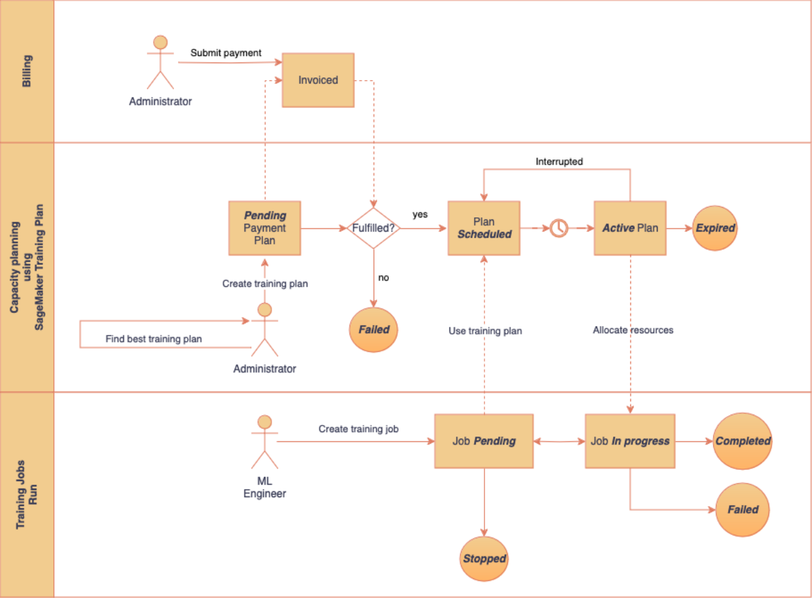

User workflow
3910

## Page 940

Amazon SageMaker AI
Developer Guide

• Training plans for SageMaker HyperPod clusters: The second diagram illustrates the end-to-
end workflow of the interaction between a training plan and a SageMaker HyperPod instance
group.

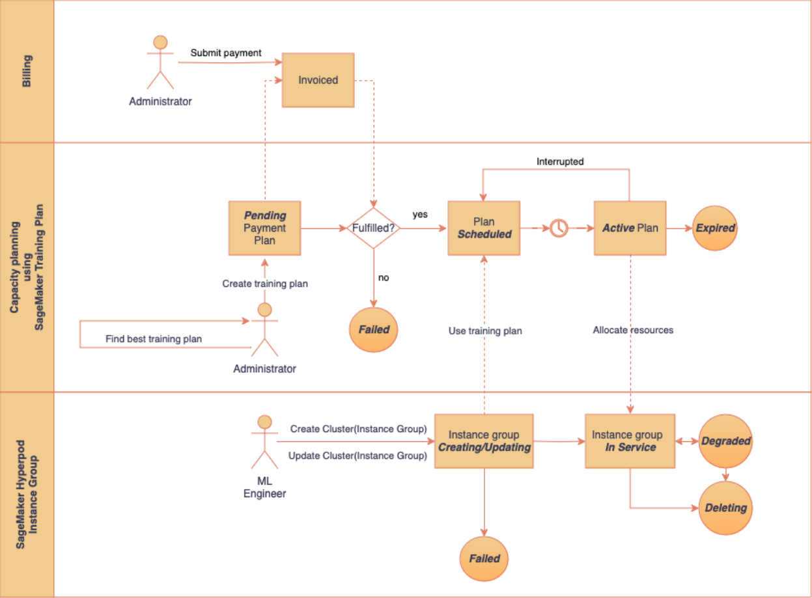

Supported instance types, AWS Regions, and pricing

Training plans support reservations for the following specific high-performance instance types,
each available in select AWS Regions:

• ml.p4d.24xlarge

• ml.p5.48xlarge

• ml.p5e.48xlarge

• ml.p5en.48xlarge

• ml.trn1.32xlarge

Supported instance types, AWS Regions, and pricing
3911

## Page 941

Amazon SageMaker AI
Developer Guide

• ml.trn2.48xlarge

• ml.p6-b200.48xlarge

• ml.c6i-32xlargesc

UltraServers

• ml.p6e-gb200.36xlarge

• ml.p6e-gb200.72xlarge

Note

The availability of instance types may change over time. For the most up-to-date
information on available instance types according to Region, as well as their respective
prices, see SageMaker Pricing. Scroll down to the Amazon SageMaker HyperPod flexible
training plans section under On-Demand Pricing. Select a Region to view the list of
available instance types.

The availability across multiple regions allows to choose the most suitable location for workloads,
considering factors such as data residency requirements and proximity to other AWS services.

Important

• You can use SageMaker training plans to reserve instances with the following reservation
duration and instance quantity options.

• Reservation durations are available in 1-day increments from 1 to 182 days.

• The reservation instance quantity options are 1, 2, 4, 8, 16, 32 or 64 instances.

• Make sure that your Training Jobs or HyperPod service quotas allow a maximum number
of instances per instance type that exceeds the number of instances specified in your
plan. To view your current quotas or request a quota increase, see the section called
“Quotas and pricing”.

Supported instance types, AWS Regions, and pricing
3912

## Page 942

Amazon SageMaker AI
Developer Guide

UltraServers in SageMaker AI

UltraServers in SageMaker AI offer a set of instances interconnected via a high bandwidth network

domain. For example, the P6e-GB200 UltraServer connects up to 18 p6e-gb200.36xlarge
instances under one NVIDIA NVLink domain. With 4 NVIDIA Blackwell GPUs per instance, each
P6e-GB200 UltraServer supports 72 GPUs, so you can run your largest AI workloads with high
performance on SageMaker AI.

When you use UltraServers with SageMaker AI, you get performance combined with SageMaker AI's
managed infrastructure, built-in fault resiliency features, integrated monitoring capabilities, and
native integration with other SageMaker AI and AWS services. This integration allows you to focus
on model development and deployment while SageMaker AI handles the undifferentiated heavy
lifting of managing AI infrastructure.

Note

UltraServers are available only in the Dallas Local Zone (us-east-1-dfw-2a), which is an
extension of the US East (N. Virginia) Region. For more information, see  Getting started
with AWS Local Zones

Considerations

Consider the following when using UltraServers with SageMaker AI:

• You can use UltraServers for both  SageMaker HyperPod and  SageMaker training jobs.

• You can only purchase UltraServers in full units. For more information about instance and pricing
information, see Amazon SageMaker HyperPod flexible training plans in Amazon SageMaker AI
pricing.

• If you're using UltraServers with HyperPod, HyperPod automatically adds topology labels to your
resources to help you with resource allocation. For more information, see  Using topology-aware
scheduling in Amazon SageMaker HyperPod.

• SageMaker AI and UltraServers offer various capabilities that enhance the resiliency of your
workloads, including preemptive checks and automatic fault detection and mitigation.
Depending on what the issue is, SageMaker AI can run actions to recover your workloads, such as
restarting instances, replacing failed instances with spares, and replacing failed UltraServers.

UltraServers in SageMaker AI
3913

## Page 943

Amazon SageMaker AI
Developer Guide

• For added resilience, you can configure instances within an UltraServer to be used as spares.
Keeping a spare instance within the UltraServer ensures that SageMaker AI can quickly respond
to an instance failure while minimizing any impact to your jobs. We recommend that you keep
one spare instance per UltraServer. You don't have to reserve any spare instances, but this might
hinder support options and slow down failure recovery. You purchase UltraServers by wholes, so
the number of spares that you reserve doesn't affect pricing.

• To see the status and instances within an UltraServer, use the  ListTrainingPlans API operation
or the AWS console to see training plans. Using these tools, you can see the total number of
available instances, instances currently in use, unhealthy instances, the number of configured

spares, and other information. Possible health statuses are ok, impaired, and insufficient-

data.

SageMaker training plans search behavior

When searching for a training plan offering, SageMaker training plans use the following approach
to maximize resource availability and flexibility for users, even when demand is high and Reserved
Capacity blocks are scarce:

• Initial continuous search: SageMaker training plans first attempt to find a single, continuous
block of Reserved Capacity that matches the specified duration within the start and end dates,
while meeting all other specified criteria, including target resource, requested instance type, and
number of instances.

• Two-block search: SageMaker training plans don't return a "no capacity" result if a single
continuous Reserved Capacity block meeting all criteria is unavailable. Instead, it automatically
attempts to fulfill the request using two separate Reserved Capacity blocks, splitting the total
duration across two time segments.

This two-block approach provides more flexibility in resource allocation, potentially securing
high-demand instances that would otherwise be unavailable.

Note

SageMaker training plans return up to three offerings of one or two segments. For example,
for a 48-hour duration plan, SageMaker training plans might offer a plan with two 24-hour
blocks, one continuous 48-hour block, and two blocks with uneven duration.

Search behavior
3914

## Page 944

Amazon SageMaker AI
Developer Guide

Considerations

Important

• Training plans cannot be modified once purchased.

• Training plans cannot be shared across AWS accounts or within your AWS Organization.

• When searching for training plan offerings, SageMaker training plans adapts its search strategy
based on the target resources:

For SageMaker HyperPod clusters:

• Offerings are limited to a single Availability Zone (AZ).

• This ensures consistent network performance and data locality within the cluster.

For SageMaker training jobs:

• Offerings can span multiple Availability Zones.

• This is particularly relevant when the plan offering contains multiple discontinuous reserved
capacities.

• For example, a plan might include capacity in AZ-A for one Reserved Capacity block and AZ-
B for another. SageMaker training plans can automatically move workloads across Availability
Zones (AZs) based on resource availability.

This multi-AZ approach for training jobs provides greater flexibility in resource allocation,
increasing the chances of finding suitable capacity for your workload. However, you should be
aware that your jobs may run in different AZs during different parts of your reservation period.

• When presented with a two-block offering, users should carefully consider if this split allocation
meets their workload requirements. This may require adjusting job scheduling or workload
distribution to accommodate the non-continuous nature of the reservation.

IAM for SageMaker training plans

SageMaker training plans requires specific permissions for two distinct roles::

1. Plan creator role: Users assigned the Plan Creator role need permissions to search training plan

offerings, create new training plans, list and describe training plans.

Considerations
3915

## Page 945

Amazon SageMaker AI
Developer Guide

2. Plan user role: Users with the Plan User role require permissions to use training plans in

SageMaker training jobs or when creating and updating SageMaker HyperPod clusters.

Before using SageMaker training plans, update permissions based on your access method:

• For AWS Management Console or SageMaker SDKs users: Update the permissions of the IAM role
configured for the console user or API user.

• For AWS CLI users: Ensure your AWS CLI profile is correctly configured with the appropriate
credentials and permissions.

• For Studio application users such as JupyterLab, set permissions on the execution role associated
with the space used by the application.

You can set these permissions using either a managed policy or individual more granular
permissions.

For information about how to update the permissions policy for a role, see Update permissions
for a role. For information about how to find and update an execution role, see Get your execution
role.

Note

Administrators should carefully consider which users need the ability to create training
plans and assign permissions accordingly.

Managed policies

• For plan creators: AmazonSageMakerTrainingPlanCreateAccess provides access to create
and manage training plans.

• For plan users: AmazonSageMakerFullAccess includes the permissions to use training plans.

Note

• The AmazonSageMakerFullAccess managed policy is designed as an ease-of-
use policy primarily for experimentation purposes. While it provides broad access to
SageMaker AI features, including the use of training plans, it's important to note:

Managed policies
3916

## Page 946

Amazon SageMaker AI
Developer Guide

• This policy is not recommended for production environments due to its broad
permissions.

• It does not include permissions for creating training plans, as CreateTrainingPlan
is considered an administrative action requiring upfront payment.

• For production use cases, we strongly recommend creating custom policies that adhere
to the principle of least privilege, granting only the specific permissions required for
each role.

Individual permissions

The following list details the granular permissions that should be set in the IAM policy statements
of a role, based on the specific actions a user needs to perform with SageMaker training plans:

Training plans list of permissions

• SearchTrainingPlanOfferings: This permission allows users to search for available training
plan offerings.

{
"Sid": "SearchTrainingPlanOfferingsPermissions",
"Effect": "Allow",
"Action": [
"sagemaker:SearchTrainingPlanOfferings"
],
"Resource": "*"
}

• CreateTrainingPlan: This permission allows users to create new training plans.

Note

You must also include permissions for CreateReservedCapacity and AddTags, and

specify both training-plan and reserved-capacity resource types.

{
"Sid": "CreateTrainingPlanPermissions",
"Effect": "Allow",

Individual permissions
3917

## Page 947

Amazon SageMaker AI
Developer Guide

"Action": [
"sagemaker:CreateTrainingPlan",
"sagemaker:CreateReservedCapacity",
"sagemaker:AddTags"
],
"Resource": [
"arn:aws:sagemaker:*:*:training-plan/*",
"arn:aws:sagemaker:*:*:reserved-capacity/*"
]
}

• DescribeTrainingPlan : This permission allows users to view details of existing training
plans.

{
"Sid": "DescribeTrainingPlanPermissions",
"Effect": "Allow",
"Action": [
"sagemaker:DescribeTrainingPlan"
],
"Resource": [
"arn:aws:sagemaker:::training-plan/*"
]
}

• ListTrainingPlans: This permission allows users to list all training plans in their AWS
account.

{
"Sid": "ListTrainingPlansPermissions",
"Effect": "Allow",
"Action": [
"sagemaker:ListTrainingPlans"
],
"Resource": "*"
}

Individual permissions per type of user

This section provides a detailed breakdown of the individual permissions required for each role, as
mentioned in the the section called “IAM for SageMaker training plans” section.

Individual permissions
3918

## Page 948

Amazon SageMaker AI
Developer Guide

For plan creators, the following permissions are necessary:

• sagemaker:SearchTrainingPlanOfferings

• sagemaker:CreateTrainingPlan

• sagemaker:CreateReservedCapacity

• sagemaker:AddTags

• sagemaker:DescribeTrainingPlan

• sagemaker:ListTrainingPlans

Plan users require these permissions:

• sagemaker:CreateTrainingJob (for SageMaker Training Job)

• sagemaker:CreateCluster and sagemaker:UpdateCluster (for SageMaker HyperPod)

• Access to the training-plan and reserved-capacity resources; When configuring IAM

policies for SageMaker training plans, include permissions for both training-plan and

reserved-capacity resources. These resources are required for both SageMaker training jobs
and SageMaker HyperPod clusters. This allows your IAM roles to interact with SageMaker training
plans resources and manage Reserved Capacity.

• For SageMaker training jobs, ensure your policy includes the

"arn:aws:sagemaker:::training-plan/" and "arn:aws:sagemaker:::reserved-

capacity/" resource ARNs.

JSON

{
"Version":"2012-10-17",
"Statement": [
{
"Effect": "Allow",
"Action": [
"sagemaker:CreateTrainingJob"
],
"Resource": [
"arn:aws:sagemaker:us-east-2:111122223333:training-job/",
"arn:aws:sagemaker:us-east-2:111122223333:training-plan/",
"arn:aws:sagemaker:us-east-2:111122223333:reserved-capacity/*"

Individual permissions
3919

## Page 949

Amazon SageMaker AI
Developer Guide

]
}
]
}

Similarly, for SageMaker HyperPod configurations, include these same ARNs in addition to the
cluster-specific resources.

JSON

{
"Version":"2012-10-17",
"Statement": [
{

"Effect": "Allow",
"Action": [
"sagemaker:CreateCluster",
"sagemaker:UpdateCluster"
],
"Resource": [
"arn:aws:sagemaker:us-east-2:111122223333:cluster/",
"arn:aws:sagemaker:us-east-2:111122223333:training-plan/",
"arn:aws:sagemaker:us-east-2:111122223333:reserved-capacity/*"
]
}
]
}

Training plans creation

To reserve compute capacity using the SageMaker training plans capability, follow these steps:

1. Identify your target resource:  Begin by determining whether you need capacity for SageMaker

training jobs or SageMaker HyperPod clusters.

2. Specify your capacity requirements : Define your capacity needs in detail. This includes

selecting the appropriate instance type for your workload, determining the number of instances
required, and specifying the duration of use. For information about the supported instance

Training plans creation
3920

## Page 950

Amazon SageMaker AI
Developer Guide

types in a given AWS Region, duration, and quantity options, see the section called “Supported
instance types, AWS Regions, and pricing”.

3. Search for available training plan offerings:  Once you specify your requirements, use

SageMaker training plans' search functionality to find available training plan offerings across
one or more segments. Each offering includes details such as start time, specific availability
zone for Reserved Capacity, and plan price. Review these offerings, considering factors like cost-
effectiveness, geographical preferences, and alignment with your specified needs.

If no suitable plan is available, adjust your search criteria and look for a new set of offerings.

4. Create a training plan based on a suitable offering:  After identifying a suitable offering,

proceed to create your training plan. This process involves selecting your chosen offering and
initiating the reservation.

• The training plan reservation creates an invoice.

• The payment for the total amount is collected as part of the fulfillment process. Once the
payment is completed, the plan is ready for scheduling your SageMaker training jobs or
creating HyperPod clusters.

To learn about how to use training plans for your SageMaker training jobs , see the section
called “Training plans utilization for SageMaker training jobs”.

To learn about how to use training plans for your HyperPod clusters, see the section called
“Training plans utilization for SageMaker HyperPod clusters”.

You can create a training plan using either the SageMaker AI console or programmatic methods.
The SageMaker AI console offers a visual, graphical interface with a comprehensive view of your
options, while programmatic creation can be done using the AWS CLI or SageMaker SDKs to
interact directly with the training plans API.

For step-by-step console instructions and detailed API references, refer to the respective sections in
this documentation.

Topics

• SageMaker training plans creation using the SageMaker AI console

• SageMaker training plans creation using the SageMaker API, or AWS CLI

Training plans creation
3921

## Page 951

Amazon SageMaker AI
Developer Guide

SageMaker training plans creation using the SageMaker AI console

SageMaker training plans offer a convenient way to create training plans through the SageMaker
AI console UI, allowing users to easily schedule their machine learning training resources. This
guide walks you through the process of creating a training plan for SageMaker training jobs and
SageMaker HyperPod clusters using the SageMaker AI console. By following these steps, you will
search for training plan offerings, review available options, and purchase the plan that best fits
your needs.

To create a training plan visually using a UI:

1.
Start by navigating to the SageMaker AI console at https://console.aws.amazon.com/
sagemaker/.

2.
Choose Training Plans in the left pane menu.

3.
From there, choose the Create training plan button in the main content area to start the
process of setting up your customized training schedule.

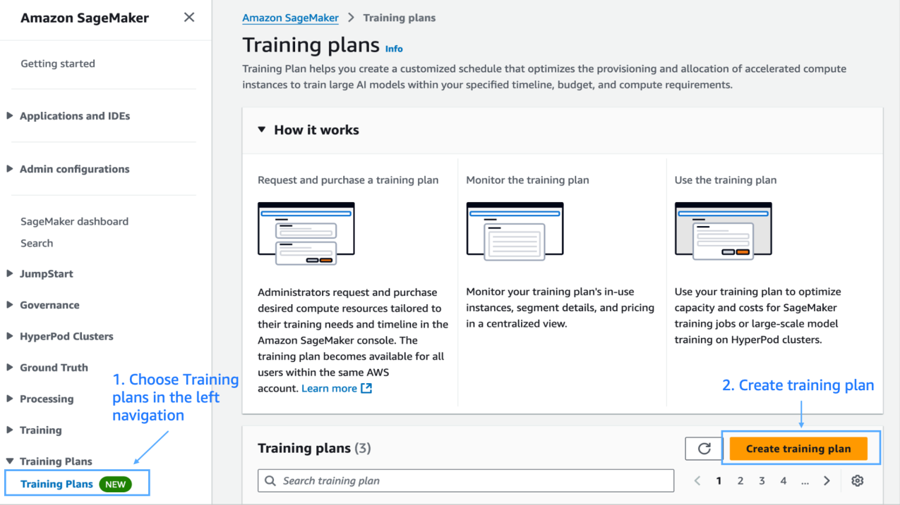

Next, search for plan offerings that match your compute requirements.

Create a training plan using the console UI
3922

## Page 952

Amazon SageMaker AI
Developer Guide

Topics

• Search training plan offerings

• Reserve the best training plan

• List training plans

• View training plan details

Search training plan offerings

After you choose Training Plans in the left pane of the SageMaker AI console, and then Create
training plan, a Find training plan form opens up. This form allows you to specify your
requirements and search for suitable training plan offerings.

Follow these steps to complete the form:

1.
Identify your Target: Training plans are specific to their target resource. Specify whether you
want to use a plan to run SageMaker training jobs or SageMaker HyperPod clusters.

2.
For Compute type, you can choose between Instance or UltraServer. UltraServers are
connect multiple Amazon EC2 instances using a low-latency, high-bandwidth accelerator
interconnect. For more information, see Amazon EC2 UltraServers. To learn about how you can
use UltraServers with SageMaker AI, see UltraServers in SageMaker AI.

3.
Choose your preferred Instance type and Instance count: For available instance types in a
given AWS Region, duration, and quantity options, see the section called “Supported instance
types, AWS Regions, and pricing”.

4.
Define your time parameters: Choose your desired start and end dates, and specify the plan
duration within this window.

5.
Choose Find training plans.

Create a training plan using the console UI
3923

## Page 953

Amazon SageMaker AI
Developer Guide

SageMaker training plans search for offerings that match your capacity requirements. When
matches are found within your specified time frame, they appear at the bottom of the page. Each
training plan offering includes the following details:

• Total plan duration

• Start and end dates

• Total upfront price:

Hover over the price to view the detailed breakdown of instance hourly rate, instance count, and
total hours

• Total number of plan segments

Clicking the segment detail link opens a modal view with segment-specific details:

• Duration

• Start and end dates

• Availability zone

Create a training plan using the console UI
3924

## Page 954

Amazon SageMaker AI
Developer Guide

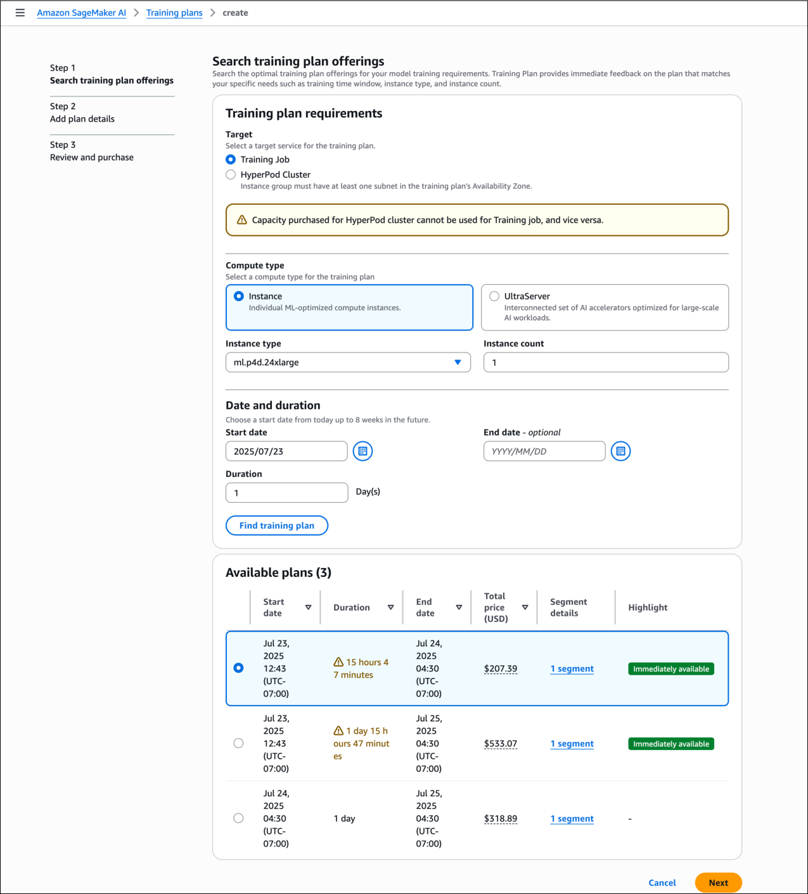

If no suitable plans are found or the available plans don't meet your needs, adjust your search
criteria by modifying the parameters in the Training plans requirements form. Once you find

Create a training plan using the console UI
3925

## Page 955

Amazon SageMaker AI
Developer Guide

a suitable offering, select it and choose Next to continue to the plan reservation page. On this
page, you can name your plan, and then review and confirm your selection before finalizing your
reservation.

Note

Plans marked Immediately available will start within 30 minutes, provided payment is
completed no less than 5 minutes before the scheduled start time.

Reserve the best training plan

The search of a training plan has returned offerings that fit your capacity needs and budget.

1.
Enter a name for your plan and then choose Next.

2.
Review and Submit your purchase order.

Important

• Training plans cannot be modified once purchased.

• Training plans cannot be shared across AWS accounts or within your AWS
Organization.

After submitting your order

• The training plan initially appears as Pending in your training plan list.

• An invoice is generated automatically upon order receipt.

• The total payment is collected during the fulfillment process.

• Once payment is successfully processed, the plan status changes to Scheduled and the plan
becomes available for use.

Create a training plan using the console UI
3926

## Page 956

Amazon SageMaker AI
Developer Guide

List training plans

To view your training plans:

1.
Navigate to the SageMaker AI console at https://console.aws.amazon.com/sagemaker/.

2.
Choose Training Plans in the left pane menu. This displays a list of all your training plans,
including their names, status, target resource type, and other key details.

After purchasing a plan, you are directed to this list. Newly created plans appear with a

Pending status until payment is completed. The status is typically updated within a few
minutes of payment processing.

Create a training plan using the console UI
3927

## Page 957

Amazon SageMaker AI
Developer Guide

View training plan details

From the training plans list, follow a plan's name to view its details. Specifically, you can check your
current capacity usage, and list your workloads in your plan's details page.

The details page shows:

• The training plan overview: Status, target, instance type, and duration.

• Expandable sections for segment details, pricing, plan name, and tags.

• Capacity utilization:

• Total: The total number of instances reserved in this training plan.

• In-use: The number of instances currently in use from this training plan.

• Available instances: The number of instances currently available for use in this training plan.

At the bottom of the page, a link allows you to view either the training jobs or the list of
SageMaker HyperPod cluster instance groups associated with this plan, depending on its target
resource.

Create a training plan using the console UI
3928

## Page 958

Amazon SageMaker AI
Developer Guide

SageMaker training plans creation using the SageMaker API, or AWS CLI

SageMaker training plans support the programmatic creation of training plans through its API. You
can interact with the training plans API using the AWS CLI or SageMaker SDKs.

SageMaker training plans's API actions provide a comprehensive workflow for managing training
plans programmatically:

• SearchTrainingPlanOfferings: Enables users to query and discover available compute
resources by specifying parameters like instance type, count, and desired time window. The API
returns a ranked list of training plan offerings that best match the user's requirements.

• CreateTrainingPlan: Allows reservation of a specific training plan offering, transforming a
potential compute capacity into scheduled reserved capacities with a unique training plan ARN.

• ListTrainingPlans: Provides a method to retrieve and review all existing training plans in a
user's AWS account, with optional filtering and sorting capabilities.

• DescribeTrainingPlan: Offers detailed insights into a specific training plan, including its

lifecycle stages from Pending to Active to Expired.

Topics

Create a training plan programmatically
3929

## Page 959

Amazon SageMaker AI
Developer Guide

• Search training plan offerings

• Reserve the best training plan

• List training plans

• View training plan details

Search training plan offerings

To create a training plan, start by calling the SearchTrainingPlanOfferings API operation,
passing your plan requirements (such as instance type, count, and desired time window) as input
parameters. Training plans are specific to their target resource. Ensure that you specify which

target resource the plan will be used for (training-job or hyperpod-cluster). The API returns
a list of available offerings that match your requirements. If no suitable offerings are found, you
may need to adjust your requirements and search again.

This API call retrieves the training plan offerings that best meet your capacity needs. Each

TrainingPlanOffering returned in the response is identified by a unique offering ID. The first
offering in the list represents the best match for your requirements. If no suitable training plan is
available within your specified dates, the list is empty. Adjust your search criteria and look for a
new set of offerings.

• Reservation durations are available in 1-day increments from 1 to 182 days.

• The reservation instance quantity options are 1, 2, 4, 8, 16, 32 or 64 instances.

To learn about the list of available instances supported by SageMaker training plans, see
Supported instance types, AWS Regions, and pricing.

The following example uses an AWS CLI command to request training plan offerings with a
specified instance type, count, and time information.

# List training plan offerings with instance type, instance count, duration in hours,
start time after, and end time before.
aws sagemaker search-training-plan-offerings \
--target-resources "training-job" \
--instance-type "ml.p4d.24xlarge" \
--instance-count 1 \
--duration-hours 15 \
--start-time-after "1737484800"

Create a training plan programmatically
3930

## Page 960

Amazon SageMaker AI
Developer Guide

--end-time-before "1737657600"

This JSON document is a sample response from the SageMaker training plans API. The response
provides information about multiple available training plan offerings that match the specified
capacity requirements. It includes three distinct offerings with varying durations, upfront fees, and
start/end times, all using the same instance type and targeting training jobs.

{
"TrainingPlanOfferings": [
{
"TrainingPlanOfferingId": "tpo-SHA-256-hash-value",
"TargetResources": [
"training-job"
],
"RequestedStartTimeAfter": "2025-01-21T11:08:27.704000-08:00",
"DurationHours": 15,

"DurationMinutes": 51,
"UpfrontFee": "xxxx.xx",
"CurrencyCode": "USD",
"ReservedCapacityOfferings": [
{
"InstanceType": "ml.p4d.24xlarge",
"InstanceCount": 1,
"AvailabilityZone": "us-west-2a",
"DurationHours": 15,
"DurationMinutes": 51,
"StartTime": "2025-01-21T11:39:00-08:00",
"EndTime": "2025-01-22T03:30:00-08:00"
}
]
},
{
"TrainingPlanOfferingId": "tpo-SHA-256-hash-value",
"TargetResources": [
"training-job"
],
"RequestedStartTimeAfter": "2025-01-21T11:08:27.704000-08:00",
"DurationHours": 39,
"DurationMinutes": 51,
"UpfrontFee": "xxxx.xx",
"CurrencyCode": "USD",
"ReservedCapacityOfferings": [
{

Create a training plan programmatically
3931

## Page 961

Amazon SageMaker AI
Developer Guide

"InstanceType": "ml.p4d.24xlarge",
"InstanceCount": 1,
"AvailabilityZone": "us-west-2a",
"DurationHours": 39,
"DurationMinutes": 51,
"StartTime": "2025-01-21T11:39:00-08:00",
"EndTime": "2025-01-23T03:30:00-08:00"
}
]
},
{
"TrainingPlanOfferingId": "tpo-SHA-256-hash-value",
"TargetResources": [
"training-job"
],
"RequestedStartTimeAfter": "2025-01-21T11:08:27.704000-08:00",
"DurationHours": 24,

"DurationMinutes": 0,
"UpfrontFee": "xxxx.xx",
"CurrencyCode": "USD",
"ReservedCapacityOfferings": [
{
"InstanceType": "ml.p4d.24xlarge",
"InstanceCount": 1,
"AvailabilityZone": "us-west-2a",
"DurationHours": 24,
"DurationMinutes": 0,
"StartTime": "2025-01-22T03:30:00-08:00",
"EndTime": "2025-01-23T03:30:00-08:00"
}
]
}
]
}

The following is a sample command of how to use the AWS CLI to search for training plan offerings
that include UltraServers.

aws sagemaker search-training-plan-offerings \
--ultra-server-type ml.c6i-32xlargesc \
--ultra-server-count 1 \
--duration-hours 24 \
--target-resources hyperpod-cluster

Create a training plan programmatically
3932

## Page 962

Amazon SageMaker AI
Developer Guide

--start-time-after "1737484800" \
--end-time-before "1737657600"

{
"TrainingPlanOfferings": [
{
"TrainingPlanOfferingId": "tpo-SHA-256-hash-value",
"TargetResources": [
"training-job"
],
"RequestedStartTimeAfter": "2025-07-21T16:59:25.760000+00:00",
"DurationHours": 24,
"DurationMinutes": 0,
"UpfrontFee": "0.24",
"CurrencyCode": "USD",
"ReservedCapacityOfferings": [

{
"ReservedCapacityType": "UltraServer",
"UltraServerType": "ml.u-p6e-gb200x72",
"UltraServerCount": 1,
"InstanceType": "ml.p6e-gb200.36xlarge",
"InstanceCount": 18,
"AvailabilityZone": "us-east-2a",
"DurationHours": 24,
"DurationMinutes": 0,
"StartTime": "2025-07-22T11:30:00+00:00",
"EndTime": "2025-07-23T11:30:00+00:00"
}
]
}
]
}

The following sections define the mandatory and optional input request parameters for the

SearchTrainingPlanOfferings API operation.

Required parameters

When calling the SearchTrainingPlanOfferings API to list training plan offerings that meet
your requirements, you must provide the following values:

Create a training plan programmatically
3933

## Page 963

Amazon SageMaker AI
Developer Guide

• TargetResources: The target resources (training-job or hyperpod-cluster) for which

the plan will be used. The default value is training-job. Training plans are specific to their

target resource.

• A training plan designed for SageMaker training jobs can only be used to schedule and run
training jobs.

• A training plan for HyperPod clusters can be used exclusively to provide compute resources to
a cluster's instance group.

• InstanceType: The type of instance to provision. The InstanceType must be of a supported
type.

To learn about the list of available instances supported by SageMaker training plans, see
Supported instance types, AWS Regions, and pricing.

• InstanceCount: The number of instances to provision. If the number of instances is greater

than 1, it should be a power of 2.

• DurationHour: The total duration of your requested plan in hours. The DurationHour is
rounded up to the nearest multiple of 24.

Optional parameters

The following sections provide details on some optional parameters that you can pass to your

SearchTrainingPlanOfferings API request.

• StartTimeAfter: Specify the requested start time of the plan. The StartTimeAfter should

be a timestamp or an ISO 8601 date/time value in the future.

• EndTimeBefore: Specify the requested end time of the plan in a timestamp or an ISO 8601

date/time format. The EndTimeBefore should be at least 24 hours after the start time .

• UltraServerType : Specify the type of UltraServer to search for. For more information about
UltraServers, see UltraServers in SageMaker AI.

• UltraServerCount: Specify the number of UltraServers to search for.

Reserve the best training plan

After reviewing the available training plan offerings that best match your requirements, you can

reserve a specific plan by calling the CreateTrainingPlan API operation. When created, the

plan initially enters a Pending state and remains there until the reservation process is complete.

Create a training plan programmatically
3934

## Page 964

Amazon SageMaker AI
Developer Guide

The response to the API call returns a training plan Amazon Resource Name (ARN). Make a note of
this ARN for tracking and monitoring purposes later on. The training plan reservation is fulfilled
asynchronously in the backend. The payment for the total amount is automatically collected as
part of the fulfillment process. Once the payment transaction is completed and the requested

reserved capacities are secured, the training plan is set to the Scheduled state, and is ready for
scheduling.

Important

• Training plans cannot be modified once purchased.

• Training plans cannot be shared across AWS accounts or within your AWS Organization.

The following example uses the an AWS CLI command to request a specific training plan, passing
the plan ID as a parameter.

aws sagemaker create-training-plan \
--training-plan-offering-id "tpo-SHA-256-hash-value" \
--training-plan-name "name" \

This JSON document is a sample response from the SageMaker training plans API. The response
contains the Amazon Resource Name (ARN) of the training plan that has been successfully created.

Note

The training plan remains in a Pending status until the fulfillment process is complete.

{
"TrainingPlanArn":"arn:aws:sagemaker:us-east-1:123456789123:training-plan/large-
models-fine-tuning"
}

The following sections define the mandatory and optional input request parameters for the

CreateTrainingPlan API operation.

Create a training plan programmatically
3935

## Page 965

Amazon SageMaker AI
Developer Guide

Required parameters

When calling CreateTrainingPlan API to reserve a particular training plan, you must provide
the following values:

• TrainingPlanOfferingId: The ID of the plan you are choosing. You can retrieve the ID of

a plan offering in the response of your SearchTrainingPlanOfferings API call. Its format

should start with pto-*.

• TrainingPlanName: The name of the plan you are creating.

List training plans

You can list all the training plans that have been created in your AWS account and Region by calling

the ListTrainingPlans API.

The following example uses an AWS CLI command to retrieve the list of your training plans.

aws sagemaker list-training-plans \
--start-time-after "2024-09-26T00:00:01.000Z"

This JSON document is a sample response from the SageMaker training plans API. The response
provides details about one training plan that has been successfully created and reserved.

{
"TrainingPlanSummaries": [
{
"AvailableInstanceCount": 2,
"CurrencyCode": "USD",
"DurationHours": 48,
"DurationMinutes": 0,
"EndTime": "2024-09-28T04:30:00-07:00",
"InUseInstanceCount": 2,
"ReservedCapacitySummaries": [
{
"AvailabilityZone": "string",
"DurationHours": 48,
"DurationMinutes": 0,
"EndTime": "2024-09-28T04:30:00-07:00",
"InstanceType": "ml.p5.48xlarge",
"ReservedCapacityArn": "arn:aws:sagemaker:us-
east-1:123456789123:reserved-capacity/large-models-fine-tuning-rc1",

Create a training plan programmatically
3936

## Page 966

Amazon SageMaker AI
Developer Guide

"StartTime": "2024-09-26T04:30:00-07:00",
"Status": "Scheduled",
"TotalInstanceCount": 4,
"UltraServerCount": 4,
"UltraServerType": "ml.p6e-gb200.36xlarge"
}
],
"StartTime": "2024-09-26T04:30:00-07:00",
"Status": "Scheduled",
"StatusMessage": "Payment confirmed, training plan scheduled."
"TargetResources": [ "training-job" ],
"TotalInstanceCount": 4,
"TotalUltraServerCount": 4,
"TrainingPlanArn": "arn:aws:sagemaker:us-east-1:123456789123:training-plan/
large-models-fine-tuning",
"TrainingPlanName": "large-models-fine-tuning",
"UpfrontFee": "xxxx.xx"

}
]
}

The following sections provide details of some optional parameters that you can pass to your

ListTrainingPlans API request.

Optional parameters

The following sections provide details on some optional parameters that you can pass to your

ListTrainingPlans API request.

• StartTimeAfter: The start time of the actual time range of the listed plans, specified as a

timestamp or an ISO 8601 date/time.

• StartTimeBefore: The end time of the actual time range of the listed plans, specified as a

timestamp or an ISO 8601 date/time.

• Filters: Criteria used to filter the results, with up to 5 Name-Value pairs where "Name" is the
name of a field of a TrainingPlanSummary and "Value" is the value to consider for the filter. For

example Name=Status,Value=Active.

The following example uses an AWS CLI command to retrieve your list of training plans, using some
of the optional parameters described above.

Create a training plan programmatically
3937

## Page 967

Amazon SageMaker AI
Developer Guide

aws sagemaker list-training-plans --max-results 10 --sort-by StartTime --sort-order
Descending --start-time-after 13000000 --filters Name=Status,Value=Active

View training plan details

To monitor the status or retrieve details of a training plan, you can use the

DescribeTrainingPlan API. The API response includes a Status field, which reflects the
current state of the training plan:

• If the plan purchase fails, the status is set to Failed.

• Upon successful payment, the status transitions from Pending to Scheduled, based on the
plan's start date.

• When the plan reaches its start date, the status changes to Active.

• For plans with multiple discontinuous reserved capacities, the status reverts to Scheduled

between active periods, until the start date of the next reserved capacity.

• After the plan's end date, the status becomes Expired.

Once the status is Scheduled, you can utilize the capacity reserved in the plan for your SageMaker
training jobs or HyperPod cluster workloads.

Note

• Training jobs associated with the plan remain in Pending status until the plan becomes

Active.

• For HyperPod clusters using a training plan for compute capacity, the instance group

status appears as InService once created.

The following example uses an AWS CLI command to retrieve the details of a training plan by its
name.

aws sagemaker describe-training-plan \
--training-plan-name "name"

This JSON document is a sample response from the SageMaker training plans API. This response
provides details about a training plan that has been successfully created.

Create a training plan programmatically
3938

## Page 968

Amazon SageMaker AI
Developer Guide

{
"AvailableInstanceCount": 2,
"CurrencyCode": "USD",
"DurationHours": 48,
"DurationMinutes": 0,
"EndTime": "2024-09-28T04:30:00-07:00",
"InUseInstanceCount": 2,
"ReservedCapacitySummaries": [
{
"AvailabilityZone": "string",
"DurationHours": 48,
"DurationMinutes": 0,
"EndTime": "2024-09-28T04:30:00-07:00",
"InstanceType": "ml.p5.48xlarge",
"ReservedCapacityArn": "arn:aws:sagemaker:us-
east-1:123456789123:reserved-capacity/large-models-fine-tuning-rc1",

"StartTime": "2024-09-26T04:30:00-07:00",
"Status": "Scheduled",
"TotalInstanceCount": 4,
"UltraServerCount": 4,
"UltraServerType": "ml.p6e-gb200.36xlarge"
}
],
"StartTime": "2024-09-26T04:30:00-07:00",
"Status": "Scheduled",
"StatusMessage": "Payment confirmed, training plan scheduled."
"TargetResources": [ "training-job" ],
"TotalInstanceCount": 4,
"TotalUltraServerCount": 4,
"TrainingPlanArn": "arn:aws:sagemaker:us-east-1:123456789123:training-plan/
large-models-fine-tuning",
"TrainingPlanName": "large-models-fine-tuning",
"UpfrontFee": "xxxx.xx"
}

The following sections define the mandatory input request parameter for the

DescribeTrainingPlan API operation.

Required parameters

• TrainingPlanName: The name of the training plan you want to describe.

Create a training plan programmatically
3939

## Page 969

Amazon SageMaker AI
Developer Guide

Training plans utilization for SageMaker training jobs

You can use a SageMaker training plans for your training jobs by specifying the plan of your choice
when creating a training job.

Note

The training plan must be in the Scheduled or Active status to be used by a training job.

If the required capacity is not immediately available for a training job, the job waits until it

becomes available, or until the StoppingCondition is met, or the job has been Pending for
capacity for 2 days, whichever comes first. If the stopping condition is met, the job is stopped. If a

job has been pending for 2 days, it is terminated with an InsufficientCapacityError.

Important

Reserved Capacity termination process: You have full access to all reserved instances until
30 minutes before the Reserved Capacity end time. When there are 30 minutes remaining
in your Reserved Capacity, SageMaker training plans begin the process of terminating any
running instances within that Reserved Capacity.
To ensure you don't lose progress due to these terminations, we recommend checkpointing
your training jobs.

Checkpoint your training job

When using SageMaker training plans for your SageMaker training jobs, ensure to implement
checkpointing in your training script. This allows you to save your training progress before a
Reserved Capacity expires. Checkpointing is especially important when working with reserved
capacities, as it enables you to resume training from the last saved point if your job is interrupted
between two reserved capacities or when your training plan reaches its end date.

To achieve this, you can use the

SAGEMAKER_CURRENT_CAPACITY_BLOCK_EXPIRATION_TIMESTAMP environment variable. This
variable helps determine when to initiate the checkpointing process. By incorporating this logic
into your training script, you ensure that your model's progress is saved at appropriate intervals.

Training plans utilization for SageMaker training jobs
3940

## Page 970

Amazon SageMaker AI
Developer Guide

Here's an example of how you can implement this checkpointing logic in your Python training
script:

import os
import time
from datetime import datetime, timedelta

def is_close_to_expiration(threshold_minutes=30):
# Retrieve the expiration timestamp from the environment variable
expiration_time_str =
os.environ.get('SAGEMAKER_CURRENT_CAPACITY_BLOCK_EXPIRATION_TIMESTAMP', '0')
# If the timestamp is not set (default '0'), return False
if expiration_time_str == '0':
return False

# Convert the timestamp string to a datetime object
expiration_time = datetime.fromtimestamp(int(expiration_time_str))
# Calculate the time difference between now and the expiration time
time_difference = expiration_time - datetime.now()
# Return True if we're within the threshold time of expiration
return time_difference < timedelta(minutes=threshold_minutes)

def start_checkpointing():
# Placeholder function for checkpointing logic
print("Starting checkpointing process...")
# TODO: Implement actual checkpointing logic here
# For example:
# - Save model state
# - Save optimizer state
# - Save current epoch and iteration numbers
# - Save any other relevant training state

# Main training loop
num_epochs = 100
final_checkpointing_done = False
for epoch in range(num_epochs):
# TODO: Replace this with your actual training code
# For example:
# - Load a batch of data
# - Forward pass

Checkpoint your training job
3941

## Page 971

Amazon SageMaker AI
Developer Guide

# - Calculate loss
# - Backward pass
# - Update model parameters
# Check if we're close to capacity expiration and haven't done final checkpointing
if not final_checkpointing_done and is_close_to_expiration():
start_checkpointing()
final_checkpointing_done = True
# Simulate some training time (remove this in actual implementation)
time.sleep(1)
print("Training completed.")

Note

• Training job provisioning follows a First-In-First-Out (FIFO) order, but a smaller cluster
job created later might be assigned capacity before a larger cluster job created earlier, if
the larger job cannot be fulfilled.

• SageMaker training managed warm-pool is compatible with SageMaker training plans.

For cluster re-use, you must provide identical TrainingPlanArn values in subsequent

CreateTrainingJob requests to reuse the same cluster.

Topics

• Create a training job using the SageMaker AI console

• Create a training job using the API, AWS CLI, SageMaker SDK

Create a training job using the SageMaker AI console

You can use a SageMaker training plans for your training jobs using the SageMaker AI UI. When
creating a training job, the available plans are suggested to you if your instance choice and region
matches the available plans.

To create a training job using a training plan's reserved capacity in the SageMaker console:

1.
Navigate to the SageMaker AI console at https://console.aws.amazon.com/sagemaker/.

2.
In the left navigation pane, choose Training, and then Training jobs.

Create a training job using the console UI
3942

## Page 972

Amazon SageMaker AI
Developer Guide

3.
Choose the Create training job button.

4.
When configuring the resources for your training job, look for the Instance capacity section. If
there are plans available that match your chosen instance type and region, they are displayed
here. Select a training plan that aligns with your compute capacity needs.

If no suitable plans are available, you can either adjust your instance type or region, or proceed
without using a training plan.

5.
After selecting a training plan (or choosing to proceed without one), complete the rest of your
training job configuration and choose Create training job to start the process.

Create a training job using the console UI
3943

## Page 973

Amazon SageMaker AI
Developer Guide

Create a training job using the console UI
3944

## Page 974

Amazon SageMaker AI
Developer Guide

Review and launch your job. Your job starts running as soon as the training plan becomes Active,
pending capacity.

Create a training job using the API, AWS CLI, SageMaker SDK

To use SageMaker training plans for your SageMaker training job, specify the TrainingPlanArn

parameter of the desired plan in the ResourceConfig when calling the CreateTrainingJob

API operation. You can use exactly one plan per job.

Important

The InstanceType field set in the ResourceConfig section of the

CreateTrainingJob request must match theInstanceType of your training plan.

Run a training job on a plan using the CLI

The following example demonstrates how to create a SageMaker training job and associate it with

a provided training plan using the TrainingPlanArn attribute in the create-training-job
AWS CLI command.

For more information about how to create a training job using the AWS CLI CreateTrainingJob

command, see create-training-job.

# Create a training job
aws sagemaker create-training-job \
--training-job-name training-job-name \
...
--resource-config '{
"InstanceType": "ml.p5.48xlarge",
"InstanceCount": 8,
"VolumeSizeInGB": 10,
"TrainingPlanArn": "training-plan-arn"
}
}' \
...

This AWS CLI example command creates a new training job in SageMaker AI passing a training plan

in the --resource-config argument.

Create a training job programmatically
3945

## Page 975

Amazon SageMaker AI
Developer Guide

aws sagemaker create-training-job \
--training-job-name job-name \
--role-arn arn:aws:iam::111122223333:role/DataAndAPIAccessRole \
--algorithm-specification '{"TrainingInputMode": "File","TrainingImage":
"111122223333.dkr.ecr.us-east-1.amazonaws.com/algo-image:tag", "ContainerArguments":
[" "]}' \
--input-data-config '[{"ChannelName":"training","DataSource":
{"S3DataSource":{"S3DataType":"S3Prefix","S3Uri":"s3://bucketname/
input","S3DataDistributionType":"ShardedByS3Key"}}}]' \
--output-data-config '{"S3OutputPath": "s3://bucketname/output"}' \
--resource-config
'{"VolumeSizeInGB":10,"InstanceCount":4,"InstanceType":"ml.p5.48xlarge",
"TrainingPlanArn" : "arn:aws:sagemaker:us-east-1:111122223333:training-plan/plan-
name"}' \
--stopping-condition '{"MaxRuntimeInSeconds": 1800}' \
--region us-east-1

After creating the training job, you can verify that it was properly assigned to the training plan by

calling the DescribeTrainingJob API.

aws sagemaker describe-training-job --training-job-name training-job-name

Run a training job on a plan using the SageMaker AI Python SDK

Alternatively, you can create a training job associated with a training plan using the SageMaker
Python SDK.

If you are using the SageMaker Python SDK from JupyterLab in Studio to create a training job,
ensure that the execution role used by the space running your JupyterLab application has the
required permissions to use SageMaker training plans. To learn about the required permissions to
use SageMaker training plans, see the section called “IAM for SageMaker training plans”.

The following example demonstrates how to create a SageMaker training job and associate it with

a provided training plan using the training_plan attribute in the Estimator object when using
the SageMaker Python SDK.

For more information on the SageMaker Estimator, see Use a SageMaker estimator to run a training
job.

import sagemaker

Create a training job programmatically
3946

## Page 976

Amazon SageMaker AI
Developer Guide

import boto3
from sagemaker import get_execution_role
from sagemaker.estimator import Estimator
from sagemaker.inputs import TrainingInput

# Set up the session and SageMaker client
session = boto3.Session()
region = session.region_name
sagemaker_session = session.client('sagemaker')

# Get the execution role for the training job
role = get_execution_role()

# Define the input data configuration
trainingInput = TrainingInput(
s3_data='s3://input-path',
distribution='ShardedByS3Key',

s3_data_type='S3Prefix'
)

estimator = Estimator(
entry_point='train.py',
image_uri="123456789123.dkr.ecr.{}.amazonaws.com/image:tag",
role=role,
instance_count=4,
instance_type='ml.p5.48xlarge',
training_plan="training-plan-arn",
volume_size=20,
max_run=3600,
sagemaker_session=sagemaker_session,
output_path="s3://output-path"
)

# Create the training job
estimator.fit(inputs=trainingInput, job_name=job_name)

After creating the training job, you can verify that it was properly assigned to the training plan by

calling the DescribeTrainingJob API.

# Check job details
sagemaker_session.describe_training_job(TrainingJobName=job_name)

Create a training job programmatically
3947

## Page 977

Amazon SageMaker AI
Developer Guide

Training plans utilization for Amazon SageMaker HyperPod
clusters

To use SageMaker training plans for your Amazon SageMaker HyperPod cluster, you specify the
training plan you want to use at the cluster instance level when creating or updating your cluster.

Note

• The training plan must be in the Scheduled or Active status to be used by an
HyperPod cluster.

• Ensure the cluster configuration aligns with the Availability Zone (AZ) specified in your
training plan.

For VPC setup, resource location, and security group configuration, refer to the section
called “Setting up SageMaker HyperPod with a custom Amazon VPC” in the SageMaker
HyperPod documentation.

If setting up HyperPod with Amazon FSx for Lustre, learn about Region and AZ selection,
review VPC configuration requirements, and understand AZ alignment best practices
in the section called “(Optional) Setting up SageMaker HyperPod with Amazon FSx for
Lustre”.

• You can select a plan for each of your instance groups. However, we do not recommend
using a training plan for the primary instance group of a cluster, as primary nodes require
continuous, stable resources that don't align with the fixed duration and potentially
discontinuous nature of training plan capacities.

Topics

• Create a SageMaker HyperPod cluster on training plans using the SageMaker AI console

• Update a SageMaker HyperPod cluster on training plans using the SageMaker AI console

• Create a SageMaker HyperPod cluster on training plans using the SageMaker API, or AWS CLI

• Update a SageMaker HyperPod cluster on training plans using the SageMaker API, or AWS CLI

Training plans utilization for SageMaker HyperPod clusters
3948

## Page 978

Amazon SageMaker AI
Developer Guide

Create a SageMaker HyperPod cluster on training plans using the
SageMaker AI console

To create an SageMaker HyperPod cluster using training plans from the SageMaker AI console UI,
follow these steps:

1.
Navigate to the SageMaker AI console at https://console.aws.amazon.com/sagemaker/.

2.
In the left navigation pane, choose Hyperpod, and then Create cluster.

3.
When configuring an instance group, you can select a plan that aligns with your compute
capacity needs.

Review and create your cluster. Instance groups using a training plan scale up to the specified

target instance count when the training plan becomes Active, subject to available capacity. Thirty
minutes before each Reserved Capacity period ends, the instance group begins scaling down to
zero instances. This scaled-down state persists until the next Reserved Capacity period begins or

Create an HyperPod cluster on a training plan using the console UI
3949

## Page 979

Amazon SageMaker AI
Developer Guide

the plan ends. Throughout this process, an healthy instance group maintains an InService status
after its initial creation, regardless of the current instance count.

Update a SageMaker HyperPod cluster on training plans using the
SageMaker AI console

You can update, remove, or add a training plan to an existing SageMaker HyperPod cluster using
the SageMaker AI console UI. To update the instance group of an SageMaker HyperPod cluster,
follow these steps:

1.
Navigate to the SageMaker AI console at https://console.aws.amazon.com/sagemaker/.

2.
In the left navigation pane, choose Hyperpod.

3.
Navigate to the cluster's details page by following the hyperlink associated with the cluster

name.

4.
When configuring an instance group, you can update your plan to align with your new
compute capacity needs.

Update an HyperPod cluster on a training plan using the console UI
3950

## Page 980

Amazon SageMaker AI
Developer Guide

Review and update your cluster.

Create a SageMaker HyperPod cluster on training plans using the
SageMaker API, or AWS CLI

To use SageMaker training plans for your Amazon SageMaker HyperPod cluster, specify

the ARN of the training plan you want to use in the TrainingPlanArn parameter of the

ClusterInstanceGroupSpecification when calling the CreateCluster API operation.

Ensure that the subnet associated with the designated AZ of your plan is included in the

VPCConfig of your cluster configuration. You can retrieve the AvailabilityZone of a training
plan in the response of a DescribeTrainingPlan API call.

The following sample illustrates how to create a new SageMaker HyperPod cluster and provide

an instance group with a training plan in the --instance-groups attribute of the create-

cluster AWS CLI command.

# Create a cluster

Create an HyperPod cluster on a training plan programmatically
3951

## Page 981

Amazon SageMaker AI
Developer Guide

aws sagemaker create-cluster \
--cluster-name cluster-name \
--instance-groups '[ \
{ \
"InstanceCount": 1,\
"InstanceGroupName": "controller-nodes",\
"InstanceType": "ml.t3.xlarge",\
"LifeCycleConfig": {"SourceS3Uri": source_s3_uri, "OnCreate":
"on_create.sh"},\
"ExecutionRole": "arn:aws:iam::customer_account_id:role/execution_role",\
"ThreadsPerCore": 1,\
},\
{ \
"InstanceCount": 2, \
"InstanceGroupName": "worker-nodes",\
"InstanceType": "p4d.24xlarge",\
"LifeCycleConfig": {"SourceS3Uri": source_s3_uri, "OnCreate":

"on_create.sh"},\
"ExecutionRole": "arn:aws:iam::customer_account_id}:role/execution_role}",\
"ThreadsPerCore": 1,\
"TrainingPlanArn": training_plan_arn,\
}]'

For information about how to create an HyperPod cluster using the AWS CLI, see create-

cluster.

After creating the cluster, you can verify that your instance group was properly assigned capacity

from the training plan by calling the DescribeCluster API.

aws sagemaker describe-cluster --cluster-name cluster-name

Update a SageMaker HyperPod cluster on training plans using the
SageMaker API, or AWS CLI

You can add, update, or remove a training plan by updating the instance group of an existing

cluster using the update-cluster AWS CLI command. The following sample illustrates how to
update a SageMaker HyperPod cluster and provide an instance group with a new training plan.

# Update a cluster
aws sagemaker update-cluster \
--cluster-name cluster-name \

Update an HyperPod cluster on a training plan programmatically
3952

## Page 982

Amazon SageMaker AI
Developer Guide

--instance-groups '[ \
{ \
"InstanceCount": 1,\
"InstanceGroupName": "controller-nodes",\
"InstanceType": "ml.t3.xlarge",\
"LifeCycleConfig": {"SourceS3Uri": source_s3_uri, "OnCreate":
"on_create.sh"},\
"ExecutionRole": "arn:aws:iam::customer_account_id:role/execution_role",\
"ThreadsPerCore": 1,\
},\
{ \
"InstanceCount": 2, \
"InstanceGroupName": "worker-nodes",\
"InstanceType": "p4d.24xlarge",\
"LifeCycleConfig": {"SourceS3Uri": source_s3_uri, "OnCreate":
"on_create.sh"},\
"ExecutionRole": "arn:aws:iam::customer_account_id}:role/execution_role}",\

"ThreadsPerCore": 1,\
"TrainingPlanArn": training_plan_arn,\
},\
{\
"InstanceCount": 1,\
"InstanceGroupName": "worker-nodes-2",\
"InstanceType": "p4d.24xlarge",\
"LifeCycleConfig": {"SourceS3Uri": source_s3_uri, "OnCreate":
"on_create.sh"},\
"ExecutionRole": "arn:aws:iam::customer_account_id:role/execution_role",\
"ThreadsPerCore": 1,\
"TrainingPlanArn": training_plan_arn,\
}\
]'

View SageMaker training plans quotas using the AWS
management console

Important

• For pricing information about SageMaker training plans, see the Amazon SageMaker
Pricing page. Navigate to the Amazon SageMaker HyperPod flexible training plans

Quotas and pricing
3953

## Page 983

Amazon SageMaker AI
Developer Guide

section under On-Demand Pricing. Choose your desired Region to view available
instance types and their corresponding prices.

• Make sure that your Training Jobs or HyperPod service quotas allow a maximum number
of instances per instance type that exceeds the number of instances specified in your
plan.

You can view the current quotas and limits for SageMaker training plans using the AWS
Management Console.

To search for a specific quota value:

1.
Open the  Service Quotas console.

2.
In the left navigation pane, choose AWS services.

3.
From the AWS services list, search for and select Amazon SageMaker AI.

4.
In the Service quotas list, you can see the service quota name, applied value (if it's available),
AWS default quota, and whether the quota value is adjustable.

To find specific quotas, you can use the search bar at the top of the Service quotas list. Type the

Limit Name of the quota you are searching for. For example, to find the quota for the number of

training plans per region, you would type training-plan-total_count in the search bar.

The following table outlines the quota limit names for SageMaker training plans.

SageMaker training plans quota limits

Limit Name
Display Name

training-plan-total_count
Number of training plans per Region

reserved-capacity-ml-p4d-24xlarge
Number of ml.p4d.24xlarge instances in
reserved capacity across training plans per
Region

reserved-capacity-ml-p5-48xlarge
Number of ml.p5.48xlarge instances in
reserved capacity across training plans per
Region

Quotas and pricing
3954

## Page 984

Amazon SageMaker AI
Developer Guide

Limit Name
Display Name

reserved-capacity-ml-p5e-48xlarge
Number of ml.p5e.48xlarge instances in
reserved capacity across training plans per
Region

reserved-capacity-ml-p5en-48xlarge
Number of ml.p5en.48xlarge instances in
reserved capacity across training plans per
Region

reserved-capacity-ml-trn1-32xlarge
Number of ml-trn1-32xlarge instances in
reserved capacity across training plans per
Region

reserved-capacity-ml-trn2-48xlarge
Number of ml.trn2.48xlarge instances in
reserved capacity across training plans per
Region

If you need higher limits for your SageMaker training plans, you may be able to request a quota
increase. The ability to increase a quota depends on whether it's adjustable, which you can see in
the Service quotas console.

To request a quota increase:

1.
Navigate to the specific quota in the Service quotas console.

2.
If the quota is adjustable, you can request a quota increase at either the account level or
resource level based on the value listed in the Adjustability column.

3.
For Increase quota value, enter the new value. The new value must be greater than the
current value.

4.
Choose Request.

5.
Quota increase requests are subject to review and approval by AWS. To view any pending
or recently resolved requests in the console, navigate to the Request history tab from the
service's details page, or choose Dashboard from the navigation pane. For pending requests,
choose the status of the request to open the request receipt. The initial status of a request is

Pending. After the status changes to Quota requested, you see the case number with AWS
Support. Choose the case number to open the ticket for your request.

Quotas and pricing
3955

## Page 985

Amazon SageMaker AI
Developer Guide

To learn more about requesting a quota increase in general, see Requesting a quota increase in the
AWS Service Quotas User Guide.

Release notes

See the following release notes to track the latest updates for SageMaker training plans.

Amazon SageMaker training plans Release Notes: December 04, 2024

New Features

• Launched Amazon SageMaker training plans at AWS re:Invent 2024.

Release notes
3956

## Page 986

Amazon SageMaker AI
Developer Guide

Model training

The training stage of the full machine learning (ML) lifecycle spans from accessing your training
dataset to generating a final model and selecting the best performing model for deployment. The
following sections provide an overview of available SageMaker training features and resources with
in-depth technical information for each.

The basic architecture of SageMaker Training

If you’re using SageMaker AI for the first time and want to find a quick ML solution to train a
model on your dataset, consider using a no-code or low-code solution such as  SageMaker Canvas,
JumpStart within SageMaker Studio Classic, or SageMaker Autopilot.

For intermediate coding experiences, consider using a SageMaker Studio Classic notebook or
SageMaker Notebook Instances. To get started, follow the instructions at the section called “Train
a Model” of the SageMaker AI Getting Started guide. We recommend this for use cases in which you
create your own model and training script using an ML framework.

The core of SageMaker AI jobs is the containerization of ML workloads and the capability of
managing compute resources. The SageMaker Training platform takes care of the heavy lifting
associated with setting up and managing infrastructure for ML training workloads. With SageMaker
Training, you can focus on developing, training, and fine-tuning your model.

The following architecture diagram shows how SageMaker AI manages ML training jobs and
provisions Amazon EC2 instances on behalf of SageMaker AI users. You as a SageMaker AI user can
bring your own training dataset, saving it to Amazon S3. You can choose an ML model training
from available SageMaker AI built-in algorithms, or bring your own training script with a model
built with popular machine learning frameworks.

The basic architecture of SageMaker Training
3957

## Page 987

Amazon SageMaker AI
Developer Guide

Full view of the SageMaker Training workflow and features

The full journey of ML training involves tasks beyond data ingestion to ML models, training models
on compute instances, and obtaining model artifacts and outputs. You need to evaluate every
phase of before, during, and after training to make sure your model is trained well to meet the
target accuracy for your objectives.

The following flow chart shows a high-level overview of your actions (in blue boxes) and available
SageMaker Training features (in light blue boxes) throughout the training phase of the ML lifecycle.

Full view of the SageMaker Training workflow and features
3958

## Page 988

Amazon SageMaker AI
Developer Guide

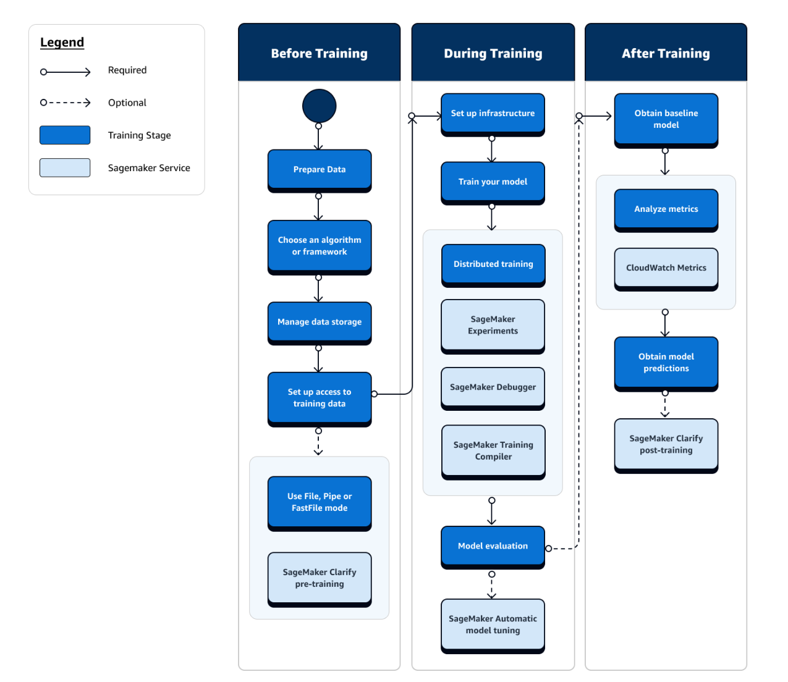

The following sections walk you through each phase of training depicted in the previous flow chart
and useful features offered by SageMaker AI throughout the three sub-stages of the ML training.

Topics

• Before training

• During training

• After training

Full view of the SageMaker Training workflow and features
3959

## Page 989

Amazon SageMaker AI
Developer Guide

Before training

There are a number of scenarios of setting up data resources and access you need to consider
before training. Refer to the following diagram and details of each before-training stage to get a
sense of what decisions you need to make.

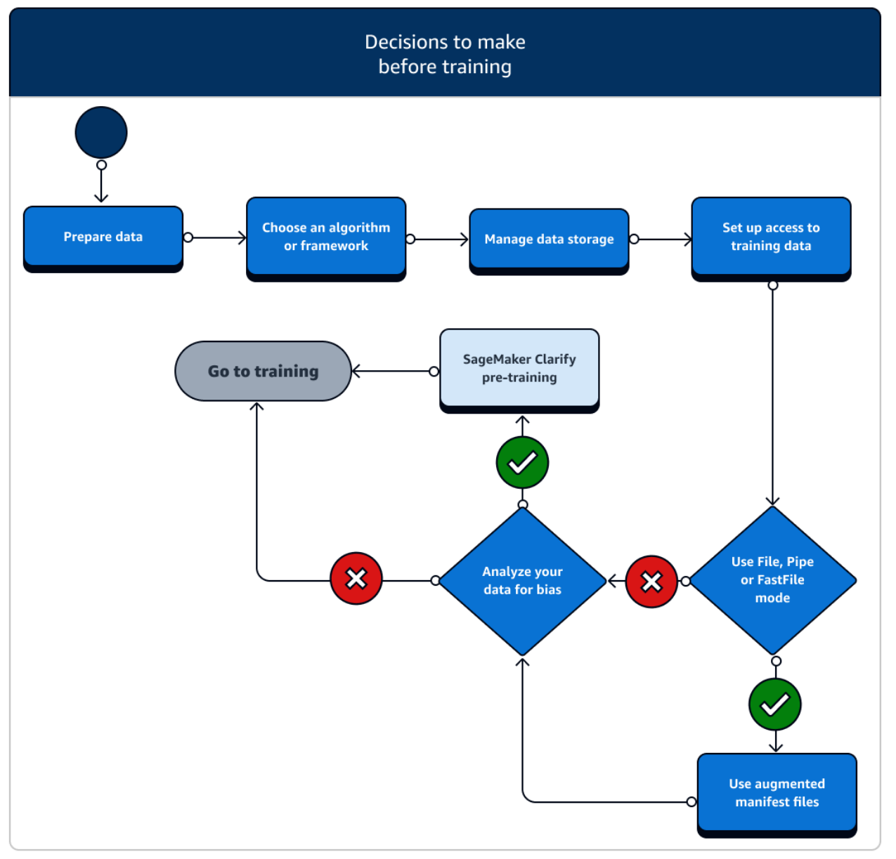

• Prepare data: Before training, you must have finished data cleaning and feature engineering
during the data preparation stage. SageMaker AI has several labeling and feature engineering

Before training
3960

## Page 990

Amazon SageMaker AI
Developer Guide

tools to help you. See Label Data, Prepare and Analyze Datasets, Process Data, and Create, Store,
and Share Features for more information.

• Choose an algorithm or framework: Depending on how much customization you need, there are
different options for algorithms and frameworks.

• If you prefer a low-code implementation of a pre-built algorithm, use one of the built-in
algorithms offered by SageMaker AI. For more information, see Choose an Algorithm.

• If you need more flexibility to customize your model, run your training script using your
preferred frameworks and toolkits within SageMaker AI. For more information, see ML
Frameworks and Toolkits.

• To extend pre-built SageMaker AI Docker images as the base image of your own container, see
Use Pre-built SageMaker AI Docker images.

• To bring your custom Docker container to SageMaker AI, see Adapting your own Docker
container to work with SageMaker AI. You need to install the sagemaker-training-toolkit to
your container.

• Manage data storage: Understand mapping between the data storage (such as Amazon S3,
Amazon EFS, or Amazon FSx) and the training container that runs in the Amazon EC2 compute
instance. SageMaker AI helps map the storage paths and local paths in the training container.
You can also manually specify them. After mapping is done, consider using one of the data
transmission modes: File, Pipe, and FastFile mode. To learn how SageMaker AI maps storage
paths, see Training Storage Folders.

• Set up access to training data: Use Amazon SageMaker AI domain, a domain user profile,
IAM, Amazon VPC, and AWS KMS to meet the requirements of the most security-sensitive
organizations.

• For account administration, see Amazon SageMaker AI domain.

• For a complete reference about IAM policies and security, see Security in Amazon SageMaker
AI.

• Stream your input data: SageMaker AI provides three data input modes, File, Pipe, and FastFile.
The default input mode is File mode, which loads the entire dataset during initializing the
training job. To learn about general best practices for streaming data from your data storage to
the training container, see Access Training Data.

In case of Pipe mode, you can also consider using an augmented manifest file to stream your
data directly from Amazon Simple Storage Service (Amazon S3) and train your model. Using
pipe mode reduces disk space because Amazon Elastic Block Store only needs to store your final

Before training
3961

## Page 991

Amazon SageMaker AI
Developer Guide

model artifacts, rather than storing your full training dataset. For more information, see Provide
Dataset Metadata to Training Jobs with an Augmented Manifest File.

• Analyze your data for bias: Before training, you can analyze your dataset and model for bias
against a disfavored group so that you can check that your model learns an unbiased dataset
using SageMaker Clarify.

• Choose which SageMaker SDK to use: There are two ways to launch a training job in SageMaker
AI: using the high-level SageMaker AI Python SDK, or using the low-level SageMaker APIs for
the SDK for Python (Boto3) or the AWS CLI. The SageMaker Python SDK abstracts the low-level
SageMaker API to provide convenient tools. As aforementioned in the section called “The basic
architecture of SageMaker Training”, you can also pursue no-code or minimal-code options using
SageMaker Canvas, JumpStart within SageMaker Studio Classic, or SageMaker AI Autopilot.

During training

During training, you need to continuously improve training stability, training speed, training
efficiency while scaling compute resources, cost optimization, and, most importantly, model
performance. Read on for more information about during-training stages and relevant SageMaker
Training features.

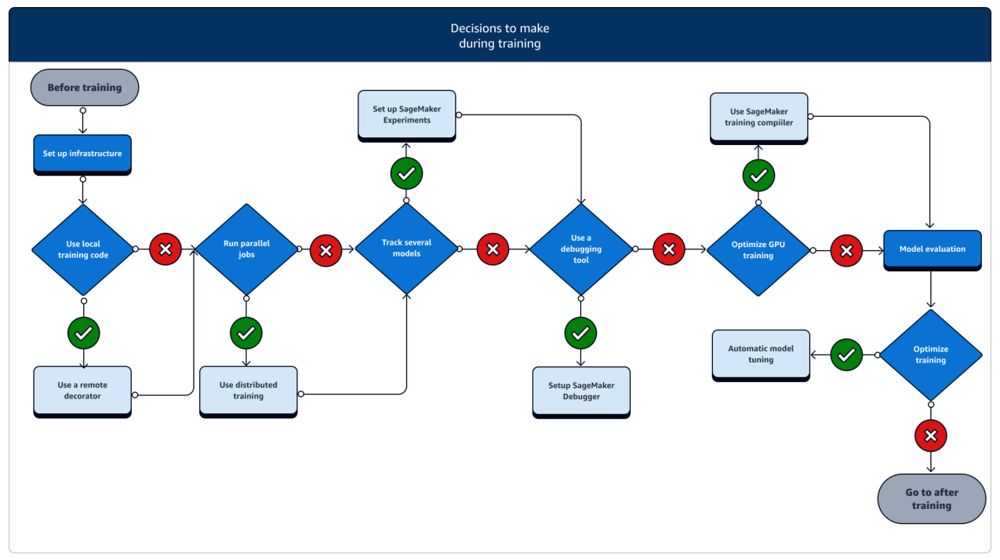

During training
3962

## Page 992

Amazon SageMaker AI
Developer Guide

• Set up infrastructure: Choose the right instance type and infrastructure management tools for
your use case. You can start from a small instance and scale up depending on your workload.
For training a model on a tabular dataset, start with the smallest CPU instance of the C4 or C5
instance families. For training a large model for computer vision or natural language processing,
start with the smallest GPU instance of the P2, P3, G4dn or G5 instance families. You can also
mix different instance types in a cluster, or keep instances in warm pools using the following
instance management tools offered by SageMaker AI. You can also use persistent cache to reduce
latency and billable time on iterative training jobs over the latency reduction from warm pools
alone. To learn more, see the following topics.

• Running training jobs on a heterogeneous cluster

• SageMaker AI Managed Warm Pools

• Using persistent cache

You must have sufficient quota to run a training job. If you run your training job on an instance

where you have insufficient quota, you will receive a ResourceLimitExceeded error. To check
the currently available quotas in your account, use your Service Quotas console. To learn how to
request a quota increase, see Supported Regions and Quotas. Also, to find pricing information
and available instance types depending on the AWS Regions, look up the tables in the Amazon
SageMaker Pricing page.

• Run a training job from a local code: You can annotate your local code with a remote decorator
to run your code as a SageMaker training job from inside Amazon SageMaker Studio Classic, an
Amazon SageMaker notebook or from your local integrated development environment. For more
information, see Run your local code as a SageMaker training job.

• Track training jobs: Monitor and track your training jobs using SageMaker Experiments,
SageMaker Debugger, or Amazon CloudWatch. You can watch the model performance in terms
of accuracy and convergence, and run comparative analysis of metrics between multiple training
jobs by using SageMaker AI Experiments. You can watch the compute resource utilization rate
by using SageMaker Debugger’s profiling tools or Amazon CloudWatch. To learn more, see the
following topics.

• Manage Machine Learning with Amazon SageMaker Experiments

• Profile Training Jobs Using Amazon SageMaker Debugger

• Monitor and Analyze Using CloudWatch Metrics

Additionally, for deep learning tasks, use the Amazon SageMaker Debugger model debugging
tools and built-in rules to identify more complex issues in model convergence and weight update
processes.

During training
3963

## Page 993

Amazon SageMaker AI
Developer Guide

• Distributed training: If your training job is going into a stable stage without breaking due to
misconfiguration of the training infrastructure or out-of-memory issues, you might want to
find more options to scale your job and run over an extended period of time for days and even
months. When you’re ready to scale up, consider distributed training. SageMaker AI provides
various options for distributed computation from light ML workloads to heavy deep learning
workloads.

For deep learning tasks that involve training very large models on very large datasets, consider
using one of the SageMaker AI distributed training strategies to scale up and achieve data
parallelism, model parallelism, or a combination of the two. You can also use SageMaker Training
Compiler for compiling and optimizing model graphs on GPU instances. These SageMaker AI
features support deep learning frameworks such as PyTorch, TensorFlow, and Hugging Face
Transformers.

• Model hyperparameter tuning: Tune your model hyperparameters using Automatic Model
Tuning with SageMaker AI. SageMaker AI provides hyperparameter tuning methods such as grid
search and Bayesian search, launching parallel hyperparameter tuning jobs with early-stopping
functionality for non-improving hyperparameter tuning jobs.

• Checkpointing and cost saving with Spot instances: If training time is not a big concern, you
might consider optimizing model training costs with managed Spot instances. Note that you
must activate checkpointing for Spot training to keep restoring from intermittent job pauses due
to Spot instance replacements. You can also use the checkpointing functionality to back up your
models in case of unexpected training job termination. To learn more, see the following topics.

• Managed Spot Training

• Use Checkpoints

After training

After training, you obtain a final model artifact to use for model deployment and inference. There
are additional actions involved in the after-training phase as shown in the following diagram.

After training
3964

## Page 994

Amazon SageMaker AI
Developer Guide

• Obtain baseline model: After you have the model artifact, you can set it as a baseline model.
Consider the following post-training actions and using SageMaker AI features before moving on
to model deployment to production.

• Examine model performance and check for bias: Use Amazon CloudWatch Metrics and
SageMaker Clarify for post-training bias to detect any bias in incoming data and model over time
against the baseline. You need to evaluate your new data and model predictions against the
new data regularly or in real time. Using these features, you can receive alerts about any acute
changes or anomalies, as well as gradual changes or drifts in data and model.

• You can also use the Incremental Training functionality of SageMaker AI to load and update your
model (or fine-tune) with an expanded dataset.

• You can register model training as a step in your SageMaker AI Pipeline or as part of other
Workflow features offered by SageMaker AI in order to orchestrate the full ML lifecycle.

After training
3965

## Page 995

Amazon SageMaker AI
Developer Guide

Train a Model with Amazon SageMaker

Amazon SageMaker Training is a fully managed machine learning (ML) service offered by
SageMaker that helps you efficiently train a wide range of ML models at scale. The core of
SageMaker AI jobs is the containerization of ML workloads and the capability of managing AWS
compute resources. The SageMaker Training platform takes care of the heavy lifting associated
with setting up and managing infrastructure for ML training workloads. With SageMaker Training,
you can focus on developing, training, and fine-tuning your model. This page introduces three
recommended ways to get started with training a model on SageMaker, followed by additional
options you can consider.

Tip

For information about training foundation models for Generative AI, see Use SageMaker

JumpStart foundation models in Amazon SageMaker Studio.

Choosing a feature within Amazon SageMaker Training

There are three main use cases for training ML models within SageMaker AI. This section describes
those use cases, as well as the SageMaker AI features we recommend for each use case.

Whether you are training complex deep learning models or implementing smaller machine learning
algorithms, SageMaker Training provides streamlined and cost-effective solutions that meet the
requirements of your use cases.

Use cases

The following are the main uses cases for training ML models within SageMaker AI.

• Use case 1: Develop a machine learning model in a low-code or no-code environment.

• Use case 2: Use code to develop machine learning models with more flexibility and control.

• Use case 3: Develop machine learning models at scale with maximum flexibility and control.

Recommended features

The following table describes three common scenarios of training ML models and corresponding
options to get started with SageMaker Training.

Model Training
3966

## Page 996

Amazon SageMaker AI
Developer Guide

Descripto
r

Use case 1
Use case 2
Use case 3

SageMaker

Build a model using

Train a model using one

Train a model at scale

AI
feature

Amazon SageMaker
Canvas.

of the SageMaker AI built-
in ML algorithms such
as XGBoost or Task-Spec
ific Models by SageMaker
JumpStart with the
SageMaker Python SDK.

with maximum flexibility
leveraging script mode
or custom containers in
SageMaker AI.

Descripti
on

Bring your data.
SageMaker AI helps
manage building ML
models and setting up the
training infrastructure and
resources.

Bring your data and
choose one of the built-
in ML algorithms provided
by SageMaker AI. Set
up the model hyperpara
meters, output metrics,
and basic infrastru

Develop your own ML code
and bring it as a script or a
set of scripts to SageMaker
AI. To learn more, see
Distributed computing
with SageMaker best
practices. Additiona

cture settings using the
SageMaker Python SDK.
The SageMaker Training
platform helps provision
the training infrastructure
and resources.

lly, you can bring your
own Docker container.
The SageMaker Training
platform helps provision
the training infrastructure
and resources at scale
based on your custom
settings.

Optimized
for

Low/no-code and UI-
driven model developme
nt with quick experimen
tation with a training
dataset. When you build
a custom model an
algorithm automatic
ally selected based on
your data. For advanced
customization options like

Training ML models with
high-level customization
for hyperparameters,
infrastructure settings,
and the ability to directly
use ML frameworks and
entrypoint scripts for
more flexibility. Use built-
in algorithms, pre-trained
models, and JumpStart

ML training workloads at
scale, requiring multiple
instances and maximum
flexibility. See distribut
ed computing with
SageMaker best practices
. SageMaker AI uses
Docker images to host the
training and serving of all
models. You can use any

Choosing a feature within Amazon SageMaker Training
3967

## Page 997

Amazon SageMaker AI
Developer Guide

Descripto
r

Use case 1
Use case 2
Use case 3

algorithm selection, see
advanced model building
configurations.

models through the
Amazon SageMaker
Python SDK to develop
ML models. For more
information, see Low-
code deployment with the
JumpStart class.

SageMaker AI or external
algorithms and use Docker
containers to build models.

Considera
tions

Minimal flexibility to
customize the model
provided by Amazon
SageMaker Canvas.

The SageMaker Python
SDK provides a simplifie
d interface and fewer
configuration options
compared to the low-level
SageMaker Training API.

Requires knowledge
of AWS infrastructure
and distributed training
options. See also Create
your own training
container using the
SageMaker Training
toolkit.

Recommend
ed
environme
nt

Use Amazon SageMaker
Canvas. To learn how
to set it up, see Getting
started with using
SageMaker Canvas.

Use SageMaker AI
JupyterLab within
Amazon SageMaker
Studio. To learn how
to set it up, see Launch
Amazon SageMaker
Studio.

Use SageMaker JupyterLab
within Amazon SageMaker
Studio. To learn how to set
it up, see Launch Amazon
SageMaker Studio.

Additional options

SageMaker AI offers the following additional options for training ML models.

SageMaker AI features offering training capabilities

• SageMaker JumpStart: SageMaker JumpStart provides access to the SageMaker AI public model
hub that contains the latest publicly available and proprietary foundation models (FMs). You
can fine-tune, evaluate, and deploy these models within Amazon SageMaker Studio. SageMaker
JumpStart streamlines the process of leveraging foundation models for your generative AI use-

Additional options
3968

## Page 998

Amazon SageMaker AI
Developer Guide

cases and allows you to create private model hubs to use foundation models while enforcing
governance guardrails and ensuring that your organization can only access approved models. To
get started with SageMaker JumpStart, see SageMaker JumpStart Foundation Models.

• SageMaker HyperPod: SageMaker HyperPod is a persistent cluster service for use cases that
need resilient clusters for massive machine learning (ML) workloads and developing state-
of-the-art foundation models (FMs). It accelerates development of such models by removing
undifferentiated heavy-lifting involved in building and maintaining large-scale compute clusters
powered by thousands of accelerators such as AWS Trainium or NVIDIA A100 and H100 Graphical
Processing Units (GPUs). You can use workload manager software such as Slurm on HyperPod.

More features of SageMaker Training

• Hyperparameter Tuning: This SageMaker AI feature helps define a set of hyperparameters for
a model and launch many training jobs on a dataset. Depending on the hyperparameter values,
the model training performance might vary. This feature provides the best performing set of
hyperparameters within the given range of hyperparameters you set to search through.

• Distributed training: Pre-train or fine-tune FMs built with PyTorch, NVIDIA CUDA, and other
PyTorch-based frameworks. To efficiently utilize GPU instances, use the SageMaker AI distributed
training libraries that offer collective communication operations and various model parallelism
techniques such as expert parallelism and shared data parallelism that are optimized for AWS
infrastructure.

• Observability features: Use the profiling and debugging functionalities of SageMaker Training
to gain insights into model training workloads, model performance, and resource utilization. To
learn more, see Debug and improve model performance and Profile and optimize computational
performance.

• Cost-saving and efficient instance options: To optimize compute cost and efficiency for training
instance provisioning, use Heterogeneous Cluster, Managed Spot instances, or Managed Warm
Pools.

Types of Algorithms

Machine learning can help you accomplish empirical tasks that require some sort of inductive
inference. This task involves induction as it uses data to train algorithms to make generalizable
inferences. This means that the algorithms can make statistically reliable predictions or decisions,
or complete other tasks when applied to new data that was not used to train them.

Types of Algorithms
3969

## Page 999

Amazon SageMaker AI
Developer Guide

To help you select the best algorithm for your task, we classify these tasks on various levels
of abstraction. At the highest level of abstraction, machine learning attempts to find patterns
or relationships between features or less structured items, such as text in a data set. Pattern
recognition techniques can be classified into distinct machine learning paradigms, each of which
address specific problem types. There are currently three basic paradigms for machine learning
used to address various problem types:

• Supervised learning

• Unsupervised learning

• Reinforcement learning

The types of problems that each learning paradigm can address are identified by considering the
inferences (or predictions, decisions, or other tasks) you want to make from the type of data that
you have or could collect. Machine learning paradigms use algorithmic methods to address their
various problem types. The algorithms provide recipes for solving these problems.

However, many algorithms, such as neural networks, can be deployed with different learning
paradigms and on different types of problems. Multiple algorithms can also address a specific
problem type. Some algorithms are more generally applicable and others are quite specific for
certain kinds of objectives and data. So the mapping between machine learning algorithms and
problem types is many-to-many. Also, there are various implementation options available for
algorithms.

The following sections provide guidance concerning implementation options, machine learning
paradigms, and algorithms appropriate for different problem types.

Topics

• Choose an algorithm implementation

• Problem types for the basic machine learning paradigms

• Built-in algorithms and pretrained models in Amazon SageMaker

• Use Reinforcement Learning with Amazon SageMaker AI

Choose an algorithm implementation

After choosing an algorithm, you must decide which implementation of it you want to use. Amazon
SageMaker AI supports three implementation options that require increasing levels of effort.

Choose an algorithm implementation
3970

## Page 1000

Amazon SageMaker AI
Developer Guide

• Pre-trained models require the least effort and are models ready to deploy or to fine-tune and
deploy using SageMaker JumpStart.

• Built-in algorithms require more effort and scale if the data set is large and significant resources
are needed to train and deploy the model.

• If there is no built-in solution that works, try to develop one that uses pre-made images for
machine and deep learning frameworks for supported frameworks such as Scikit-Learn,
TensorFlow, PyTorch, MXNet, or Chainer.

• If you need to run custom packages or use any code which isn’t a part of a supported framework
or available via PyPi, then you need to build your own custom Docker image that is configured
to install the necessary packages or software. The custom image must also be pushed to an
online repository like the Amazon Elastic Container Registry.

Topics

• Use a built-in algorithm

• Use script mode in a supported framework

• Use a custom Docker image

Algorithm implementation guidance

Implement
ation

Requires
code

Pre-coded
algorithms

Support for
third party
packages

Support for
custom code

Level of
effort

Built-in
No
Yes
No
No
Low

Scikit-learn
Yes
Yes
PyPi only
Yes
Medium

Spark ML
Yes
Yes
PyPi only
Yes
Medium

XGBoost
(open source)

Yes
Yes
PyPi only
Yes
Medium

TensorFlow
Yes
No
PyPi only
Yes
Medium-high

PyTorch
Yes
No
PyPi only
Yes
Medium-high

Choose an algorithm implementation
3971

## Page 1001

Amazon SageMaker AI
Developer Guide

Implement
ation

Requires
code

Pre-coded
algorithms

Support for
third party
packages

Support for
custom code

Level of
effort

MXNet
Yes
No
PyPi only
Yes
Medium-high

Chainer
Yes
No
PyPi only
Yes
Medium-high

Custom
image

Yes
No
Yes, from any
source

Yes
High

Use a built-in algorithm

When choosing an algorithm for your type of problem and data, the easiest option is to use one
of Amazon SageMaker AI's built-in algorithms. These built-in algorithms come with two major
benefits.

• The built-in algorithms require no coding to start running experiments. The only inputs you
need to provide are the data, hyperparameters, and compute resources. This allows you to run
experiments more quickly, with less overhead for tracking results and code changes.

• The built-in algorithms come with parallelization across multiple compute instances and GPU
support right out of the box for all applicable algorithms (some algorithms may not be included
due to inherent limitations). If you have a lot of data with which to train your model, most built-
in algorithms can easily scale to meet the demand. Even if you already have a pre-trained model,
it may still be easier to use its corollary in SageMaker AI and input the hyper-parameters you
already know than to port it over, using script mode on a supported framework.

For more information on the built-in algorithms provided by SageMaker AI, see Built-in algorithms
and pretrained models in Amazon SageMaker.

For important information about docker registry paths, data formats, recommended EC2 instance
types, and CloudWatch logs common to all of the built-in algorithms provided by SageMaker AI,
see Parameters for Built-in Algorithms.

Use script mode in a supported framework

If the algorithm you want to use for your model is not supported by a built-in choice and you are
comfortable coding your own solution, then you should consider using an Amazon SageMaker AI

Choose an algorithm implementation
3972

