# sagemaker-dg-5000.pdf

## Page 1

Amazon SageMaker AI
Developer Guide

Implement
ation

Requires
code

Pre-coded
algorithms

Support for
third party
packages

Support for
custom code

Level of
effort

MXNet
Yes
No
PyPi only
Yes
Medium-high

Chainer
Yes
No
PyPi only
Yes
Medium-high

Custom
image

Yes
No
Yes, from any
source

Yes
High

Use a built-in algorithm

When choosing an algorithm for your type of problem and data, the easiest option is to use one
of Amazon SageMaker AI's built-in algorithms. These built-in algorithms come with two major
benefits.

• The built-in algorithms require no coding to start running experiments. The only inputs you
need to provide are the data, hyperparameters, and compute resources. This allows you to run
experiments more quickly, with less overhead for tracking results and code changes.

• The built-in algorithms come with parallelization across multiple compute instances and GPU
support right out of the box for all applicable algorithms (some algorithms may not be included
due to inherent limitations). If you have a lot of data with which to train your model, most built-
in algorithms can easily scale to meet the demand. Even if you already have a pre-trained model,
it may still be easier to use its corollary in SageMaker AI and input the hyper-parameters you
already know than to port it over, using script mode on a supported framework.

For more information on the built-in algorithms provided by SageMaker AI, see Built-in algorithms
and pretrained models in Amazon SageMaker.

For important information about docker registry paths, data formats, recommended EC2 instance
types, and CloudWatch logs common to all of the built-in algorithms provided by SageMaker AI,
see Parameters for Built-in Algorithms.

Use script mode in a supported framework

If the algorithm you want to use for your model is not supported by a built-in choice and you are
comfortable coding your own solution, then you should consider using an Amazon SageMaker AI

Choose an algorithm implementation
3972

## Page 2

Amazon SageMaker AI
Developer Guide

supported framework. This is referred to as "script mode" because you write your custom code

(script) in a text file with a .py extension. As the table above indicates, SageMaker AI supports
most of the popular machine learning frameworks. These frameworks come preloaded with the
corresponding framework and some additional Python packages, such as Pandas and NumPy,
so you can write your own code for training an algorithm. These frameworks also allow you to
install any Python package hosted on PyPi by including a requirements.txt file with your training
code or to include your own code directories. R is also supported natively in SageMaker notebook
kernels. Some frameworks, like scikit-learn and Spark ML, have pre-coded algorithms you can
use easily, while other frameworks like TensorFlow and PyTorch may require you to implement
the algorithm yourself. The only limitation when using a supported framework image is that you
cannot import any software packages that are not hosted on PyPi or that are not already included
with the framework’s image.

For more information on the frameworks supported by SageMaker AI, see Machine Learning

Frameworks and Languages.

Use a custom Docker image

Amazon SageMaker AI's built-in algorithms and supported frameworks should cover most use
cases, but there are times when you may need to use an algorithm from a package not included
in any of the supported frameworks. You might also have a pre-trained model picked or persisted
somewhere which you need to deploy. SageMaker AI uses Docker images to host the training
and serving of all models, so you can supply your own custom Docker image if the package or
software you need is not included in a supported framework. This may be your own Python
package or an algorithm coded in a language like Stan or Julia. For these images you must also
configure the training of the algorithm and serving of the model properly in your Dockerfile. This
requires intermediate knowledge of Docker and is not recommended unless you are comfortable
writing your own machine learning algorithm. Your Docker image must be uploaded to an online
repository, such as the Amazon Elastic Container Registry (ECR) before you can train and serve your
model properly.

For more information on custom Docker images in SageMaker AI, see Docker containers for training
and deploying models.

Problem types for the basic machine learning paradigms

The following three sections describe the main problem types addressed by the three basic
paradigms for machine learning. For a list of the built-in algorithms that SageMaker AI provides to
address these problem types, see Built-in algorithms and pretrained models in Amazon SageMaker.

Problem types for the basic machine learning paradigms
3973

## Page 3

Amazon SageMaker AI
Developer Guide

Topics

• Supervised learning

• Unsupervised learning

• Reinforcement learning

Supervised learning

If your data set consists of features or attributes (inputs) that contain target values (outputs), then
you have a supervised learning problem. If your target values are categorical (mathematically
discrete), then you have a classification problem. It is a standard practice to distinguish binary
from multiclass classification.

• Binary classification is a type of supervised learning that assigns an individual to one of two
predefined and mutually exclusive classes based on the individual's attributes. It is supervised
because the models are trained using examples in which the attributes are provided with
correctly labeled objects. A medical diagnosis for whether an individual has a disease or not
based on the results of diagnostic tests is an example of binary classification.

• Multiclass classification is a type of supervised learning that assigns an individual to one of
several classes based on the individual's attributes. It is supervised because the models are
trained using examples in which the attributes are provided with correctly labeled objects. An
example is the prediction of the topic most relevant to a text document. A document may be
classified as being about religion, politics, or finance, or as about one of several other predefined
topic classes.

If the target values you are trying to predict are mathematically continuous, then you have a
regression problem. Regression estimates the values of a dependent target variable based on one
or more other variables or attributes that are correlated with it. An example is the prediction of
house prices using features like the number of bathrooms and bedrooms and the square footage
of the house and garden. Regression analysis can create a model that takes one or more of these
features as an input and predicts the price of a house.

For more information on the built-in supervised learning algorithms provided by SageMaker AI, see
Supervised learning.

Problem types for the basic machine learning paradigms
3974

## Page 4

Amazon SageMaker AI
Developer Guide

Unsupervised learning

If your data set consists of features or attributes (inputs) that do not contain labels or target
values (outputs), then you have an unsupervised learning problem. In this type of problem,
the output must be predicted based on the pattern discovered in the input data. The goal in
unsupervised learning problems is to discover patterns such as groupings within the data. There
are a large variety of tasks or problem types to which unsupervised learning can be applied.
Principal component and cluster analyses are two of the main methods commonly deployed for
preprocessing data. Here is a short list of problem types that can be addressed by unsupervised
learning:

• Dimension reduction is typically part of a data exploration step used to determine the most
relevant features to use for model construction. The idea is to transform data from a high-
dimensional, sparsely populated space into a low-dimensional space that retains most significant
properties of the original data. This provides relief for the curse of dimensionality that can
arise with sparsely populated, high-dimensional data on which statistical analysis becomes
problematic. It can also be used to help understand data, reducing high-dimensional data to a
lower dimensionality that can be visualized.

• Cluster analysis is a class of techniques that are used to classify objects or cases into groups
called clusters. It attempts to find discrete groupings within data, where members of a group are
as similar as possible to one another and as different as possible from members of other groups.
You define the features or attributes that you want the algorithm to use to determine similarity,
select a distance function to measure similarity, and specify the number of clusters to use in the
analysis.

• Anomaly detection is the identification of rare items, events, or observations in a data set which
raise suspicions because they differ significantly from the rest of the data. The identification of
anomalous items can be used, for example, to detect bank fraud or medical errors. Anomalies are
also referred to as outliers, novelties, noise, deviations, and exceptions.

• Density estimation is the construction of estimates of unobservable underlying probability
density functions based on observed data. A natural use of density estimates is for data
exploration. Density estimates can discover features such as skewness and multimodality in the
data. The most basic form of density estimation is a rescaled histogram.

SageMaker AI provides several built-in machine learning algorithms that you can use for these
unsupervised learning tasks. For more information on the built-in unsupervised algorithms
provided by SageMaker AI, see Unsupervised learning.

Problem types for the basic machine learning paradigms
3975

## Page 5

Amazon SageMaker AI
Developer Guide

Reinforcement learning

Reinforcement learning is a type of learning that is based on interaction with the environment. This
type of learning is used by an agent that must learn behavior through trial-and-error interactions

with a dynamic environment in which the goal is to maximize the long-term rewards that the agent
receives as a result of its actions. Rewards are maximized by trading off exploring actions that have
uncertain rewards with exploiting actions that have known rewards.

For more information on SageMaker AI's frameworks, toolkits, and environments for reinforcement
learning, see Use Reinforcement Learning with Amazon SageMaker AI.

Built-in algorithms and pretrained models in Amazon SageMaker

Amazon SageMaker provides a suite of built-in algorithms, pre-trained models, and pre-built
solution templates to help data scientists and machine learning practitioners get started on

training and deploying machine learning models quickly. For someone who is new to SageMaker,
choosing the right algorithm for your particular use case can be a challenging task. The following
table provides a quick cheat sheet that shows how you can start with an example problem or use
case and find an appropriate built-in algorithm offered by SageMaker that is valid for that problem
type. Additional guidance organized by learning paradigms (supervised and unsupervised) and
important data domains (text and images) is provided in the sections following the table.

Table: Mapping use cases to built-in algorithms

Learning
paradigm or

Problem types
Example
problems and

Data input
format

Built-in
algorithms

domain

use cases

Pre-trained
models and pre-
built solution
templates

Image Classific
ation

Here a few
examples out of
the 15 problem
types that can
be addressed by
the pre-trained
models and pre-
built solution
templates
provided

Image, Text,
Tabular

Popular models,
including
Mobilenet,
YOLO, Faster
R-CNN, BERT,
lightGBM, and
CatBoost

Tabular Classific
ation

Tabular
Regression

For a list of
pre-trained

Text Classific
ation

Built-in algorithms and pretrained models
3976

## Page 6

Amazon SageMaker AI
Developer Guide

Learning
paradigm or
domain

Problem types
Example
problems and
use cases

Data input
format

Built-in
algorithms

Object Detection

by Amazon
SageMaker
JumpStart:

models available
, see JumpStart
Models.

Text Embedding

Question
Answering

Question
answering:
chatbot that
outputs an
answer for a
given question.

For a list of pre-
built solution
templates
available, see
JumpStart
Solutions.

Sentence Pair
Classification

Image
Embedding

Text analysis:
analyze texts
from models
specific to an
industry domain
such as finance.

Named Entity
Recognition

Instance
Segmentation

Text Generation

Text Summariza
tion

Semantic
Segmentation

Machine
Translation

Built-in algorithms and pretrained models
3977

## Page 7

Amazon SageMaker AI
Developer Guide

Learning
paradigm or
domain

Problem types
Example
problems and
use cases

Data input
format

Built-in
algorithms

Supervised
learning

Binary/multi-
class classific
ation

Predict if an
item belongs to
a category: an
email spam filter

Tabular
AutoGluon
-Tabular,
CatBoost,
Factorization
Machines
Algorithm
, K-Nearest
Neighbors (k-
NN) Algorithm
, LightGBM,
Linear Learner
Algorithm
, TabTransf
ormer, XGBoost
algorithm
with Amazon
SageMaker AI

Built-in algorithms and pretrained models
3978

## Page 8

Amazon SageMaker AI
Developer Guide

Learning
paradigm or
domain

Problem types
Example
problems and
use cases

Data input
format

Built-in
algorithms

Regression
Predict a
numeric/c
ontinuous value:
estimate the
value of a house

Tabular
AutoGluon
-Tabular,
CatBoost,
Factorization
Machines
Algorithm
, K-Nearest
Neighbors (k-
NN) Algorithm
, LightGBM,
Linear Learner
Algorithm
, TabTransf
ormer, XGBoost
algorithm
with Amazon
SageMaker AI

Time-series
forecasting

Based on
historical data
for a behavior,
predict future
behavior: predict
sales on a new
product based
on previous
sales data.

Tabular
Use the
SageMaker
AI DeepAR
forecasting
algorithm

Built-in algorithms and pretrained models
3979

## Page 9

Amazon SageMaker AI
Developer Guide

Learning
paradigm or
domain

Problem types
Example
problems and
use cases

Data input
format

Built-in
algorithms

Embeddings:
convert high-
dimensional
objects into low-
dimensional
space.

Improve the
data embedding
s of the high-
dimensional
objects: identify
duplicate
support tickets
or find the
correct routing
based on
similarity of text
in the tickets

Tabular
Object2Vec
Algorithm

Unsupervised
learning

Feature
engineering:
dimensionality
reduction

Drop those
columns from
a dataset that
have a weak
relation with
the label/tar
get variable: the
color of a car
when predicting
its mileage.

Tabular
Principal
Component
Analysis (PCA)
Algorithm

Anomaly
detection

Detect abnormal
behavior in
application: spot
when an IoT
sensor is sending
abnormal
readings

Tabular
Random Cut
Forest (RCF)
Algorithm

Built-in algorithms and pretrained models
3980

## Page 10

Amazon SageMaker AI
Developer Guide

Learning
paradigm or
domain

Problem types
Example
problems and
use cases

Data input
format

Built-in
algorithms

IP anomaly
detection

Protect your
application
from suspiciou
s users: detect
if an IP address
accessing a
service might be
from a bad actor

Tabular
IP Insights

Clustering or
grouping

Group similar
objects/data
together: find
high-, medium-,
and low-spend
ing customers
from their
transaction
histories

Tabular
K-Means
Algorithm

Topic modeling
Organize a set
of documents
into topics
(not known in
advance): tag
a document
as belonging
to a medical
category based
on the terms
used in the
document.

Text
Latent Dirichlet
Allocation (LDA)
Algorithm,
Neural Topic
Model (NTM)
Algorithm

Built-in algorithms and pretrained models
3981

## Page 11

Amazon SageMaker AI
Developer Guide

Learning
paradigm or
domain

Problem types
Example
problems and
use cases

Data input
format

Built-in
algorithms

Textual analysis

Text classific
ation

Assign pre-defin
ed categories
to documents
in a corpus:
categorize books
in a library
into academic
disciplines

Text
BlazingText
algorithm, Text
Classification -
TensorFlow

Machine
translation
algorithm

Convert text
from one
language to
other: Spanish
to English

Text
Sequence-
to-Sequence
Algorithm

Text summariza
tion

Summarize a
long text corpus:
an abstract for a
research paper

Text
Sequence-
to-Sequence
Algorithm

Speech-to-text
Convert audio
files to text:
transcribe call
center conversat
ions for further
analysis

Text
Sequence-
to-Sequence
Algorithm

Built-in algorithms and pretrained models
3982

## Page 12

Amazon SageMaker AI
Developer Guide

Learning
paradigm or
domain

Problem types
Example
problems and
use cases

Data input
format

Built-in
algorithms

Image processin
g

Image and
multi-label
classification

Label/tag an
image based
on the content
of the image:
alerts about
adult content in
an image

Image
Image Classific
ation - MXNet

Image classific
ation

Classify
something
in an image
using transfer
learning.

Image
Image Classific
ation - TensorFlo
w

Object detection
and classific
ation

Detect people
and objects in
an image: police
review a large
photo gallery for
a missing person

Image
Object Detection
- MXNet, Object
Detection -
TensorFlow

Computer vision
Tag every pixel
of an image
individually
with a category:
self-driving
cars prepare to
identify objects
in their way

Image
Semantic
Segmentation
Algorithm

For important information about the following items common to all of the built-in algorithms
provided by SageMaker AI, see Parameters for Built-in Algorithms.

Built-in algorithms and pretrained models
3983

## Page 13

Amazon SageMaker AI
Developer Guide

• Docker registry paths

• data formats

• recommended Amazon EC2 instance types

• CloudWatch logs

The following sections provide additional guidance for the Amazon SageMaker AI built-in
algorithms grouped by the supervised and unsupervised learning paradigms to which they belong.
For descriptions of these learning paradigms and their associated problem types, see Types of
Algorithms. Sections are also provided for the SageMaker AI built-in algorithms available to
address two important machine learning domains: textual analysis and image processing.

• Pre-trained models and solution templates

• Supervised learning

• Unsupervised learning

• Textual analysis

• Image processing

Pre-trained models and solution templates

Amazon SageMaker JumpStart provides a wide range of pre-trained models, pre-built solution
templates, and examples for popular problem types. These use the SageMaker SDK as well as
Studio Classic. For more information about these models, solutions, and the example notebooks
provided by Amazon SageMaker JumpStart, see SageMaker JumpStart pretrained models.

Supervised learning

Amazon SageMaker AI provides several built-in general purpose algorithms that can be used for
either classification or regression problems.

• AutoGluon-Tabular—an open-source AutoML framework that succeeds by ensembling models
and stacking them in multiple layers.

• CatBoost—an implementation of the gradient-boosted trees algorithm that introduces ordered
boosting and an innovative algorithm for processing categorical features.

• Factorization Machines Algorithm—an extension of a linear model that is designed to
economically capture interactions between features within high-dimensional sparse datasets.

Built-in algorithms and pretrained models
3984

## Page 14

Amazon SageMaker AI
Developer Guide

• K-Nearest Neighbors (k-NN) Algorithm—a non-parametric method that uses the k nearest
labeled points to assign a value. For classification, it is a label to a new data point. For regression,
it is a predicted target value from the average of the k nearest points.

• LightGBM—an implementation of the gradient-boosted trees algorithm that adds two novel
techniques for improved efficiency and scalability. These two novel techniques are Gradient-
based One-Side Sampling (GOSS) and Exclusive Feature Bundling (EFB).

• Linear Learner Algorithm—learns a linear function for regression or a linear threshold function
for classification.

• TabTransformer—a novel deep tabular data modeling architecture built on self-attention-based
Transformers.

• XGBoost algorithm with Amazon SageMaker AI—an implementation of the gradient-boosted
trees algorithm that combines an ensemble of estimates from a set of simpler and weaker
models.

Amazon SageMaker AI also provides several built-in supervised learning algorithms used for more
specialized tasks during feature engineering and forecasting from time series data.

• Object2Vec Algorithm—a new highly customizable multi-purpose algorithm used for feature
engineering. It can learn low-dimensional dense embeddings of high-dimensional objects to
produce features that improve training efficiencies for downstream models. While this is a
supervised algorithm, there are many scenarios in which the relationship labels can be obtained
purely from natural clusterings in data. Even though it requires labeled data for training, this can
occur without any explicit human annotation.

• Use the SageMaker AI DeepAR forecasting algorithm—a supervised learning algorithm for
forecasting scalar (one-dimensional) time series using recurrent neural networks (RNN).

Unsupervised learning

Amazon SageMaker AI provides several built-in algorithms that can be used for a variety of
unsupervised learning tasks. These tasks includes things like clustering, dimension reduction,
pattern recognition, and anomaly detection.

• Principal Component Analysis (PCA) Algorithm—reduces the dimensionality (number of
features) within a dataset by projecting data points onto the first few principal components. The
objective is to retain as much information or variation as possible. For mathematicians, principal
components are eigenvectors of the data's covariance matrix.

Built-in algorithms and pretrained models
3985

## Page 15

Amazon SageMaker AI
Developer Guide

• K-Means Algorithm—finds discrete groupings within data. This occurs where members of a group
are as similar as possible to one another and as different as possible from members of other
groups.

• IP Insights—learns the usage patterns for IPv4 addresses. It is designed to capture associations

between IPv4 addresses and various entities, such as user IDs or account numbers.

• Random Cut Forest (RCF) Algorithm—detects anomalous data points within a data set that
diverge from otherwise well-structured or patterned data.

Textual analysis

SageMaker AI provides algorithms that are tailored to the analysis of textual documents. This
includes text used in natural language processing, document classification or summarization, topic
modeling or classification, and language transcription or translation.

• BlazingText algorithm—a highly optimized implementation of the Word2vec and text
classification algorithms that scale to large datasets easily. It is useful for many downstream
natural language processing (NLP) tasks.

• Sequence-to-Sequence Algorithm—a supervised algorithm commonly used for neural machine
translation.

• Latent Dirichlet Allocation (LDA) Algorithm—an algorithm suitable for determining topics in a set
of documents. It is an unsupervised algorithm, which means that it doesn't use example data with
answers during training.

• Neural Topic Model (NTM) Algorithm—another unsupervised technique for determining topics in
a set of documents, using a neural network approach.

• Text Classification - TensorFlow—a supervised algorithm that supports transfer learning with
available pretrained models for text classification.

Image processing

SageMaker AI also provides image processing algorithms that are used for image classification,
object detection, and computer vision.

• Image Classification - MXNet—uses example data with answers (referred to as a supervised
algorithm). Use this algorithm to classify images.

• Image Classification - TensorFlow—uses pretrained TensorFlow Hub models to fine-tune for
specific tasks (referred to as a supervised algorithm). Use this algorithm to classify images.

Built-in algorithms and pretrained models
3986

## Page 16

Amazon SageMaker AI
Developer Guide

• Semantic Segmentation Algorithm—provides a fine-grained, pixel-level approach to developing
computer vision applications.

• Object Detection - MXNet—detects and classifies objects in images using a single deep neural

network. It is a supervised learning algorithm that takes images as input and identifies all
instances of objects within the image scene.

• Object Detection - TensorFlow—detects bounding boxes and object labels in an image. It
is a supervised learning algorithm that supports transfer learning with available pretrained
TensorFlow models.

Topics

• Parameters for Built-in Algorithms

• Built-in SageMaker AI Algorithms for Tabular Data

• Built-in SageMaker AI Algorithms for Text Data

• Built-in SageMaker AI Algorithms for Time-Series Data

• Unsupervised Built-in SageMaker AI Algorithms

• Built-in SageMaker AI Algorithms for Computer Vision

Parameters for Built-in Algorithms

The following table lists parameters for each of the algorithms provided by Amazon SageMaker AI.

Algorithm
name

Channel
name

Training
input

File type
Instance
class

Paralleli
zable

mode

AutoGluon
-Tabular

training
and
(optional
ly)
validation

File
CSV
CPU or
GPU
(single
instance
only)

No

BlazingTe
xt

train
File or Pipe
Text file
(one
sentence
per line

CPU or
GPU
(single

No

Built-in algorithms and pretrained models
3987

## Page 17

Amazon SageMaker AI
Developer Guide

Algorithm
name

Channel
name

Training
input
mode

File type
Instance
class

Paralleli
zable

with
space-sep
arated
tokens)

instance
only)

CatBoost
training
and
(optional
ly)
validation

File
CSV
CPU
(single
instance
only)

No

DeepAR
Forecasti
ng

train and
(optional
ly) test

File
JSON Lines
or Parquet

CPU or
GPU

Yes

Factoriza
tion
Machines

train and
(optional
ly) test

File or Pipe
recordIO-
protobuf

CPU (GPU
for dense
data)

Yes

Image
Classific
ation -
MXNet

train and
validation,
(optional
ly) train_lst
, validatio
n_lst, and
model

File or Pipe
recordIO
or image
files (.jpg
or .png)

GPU
Yes

Image
Classific
ation -
TensorFlo
w

training
and
validation

File
image files
(.jpg, .jpeg,
or .png)

CPU or
GPU

Yes (only
across
multiple
GPUs on
a single
instance)

Built-in algorithms and pretrained models
3988

## Page 18

Amazon SageMaker AI
Developer Guide

Algorithm
name

Channel
name

Training
input
mode

File type
Instance
class

Paralleli
zable

IP Insights
train and
(optional
ly)
validation

File
CSV
CPU or
GPU

Yes

K-Means
train and
(optional
ly) test

File or Pipe
recordIO-
protobuf
or CSV

CPU or
GPUCommon
(single
GPU device
on one
or more
instances)

No

K-Nearest-
Neighbors
(k-NN)

train and
(optional
ly) test

File or Pipe
recordIO-
protobuf
or CSV

CPU or
GPU
(single
GPU device
on one
or more
instances)

Yes

LDA
train and
(optional
ly) test

File or Pipe
recordIO-
protobuf
or CSV

CPU
(single
instance
only)

No

LightGBM
train/tra
ining and
(optional
ly)
validation

File
CSV
CPU
Yes

Built-in algorithms and pretrained models
3989

## Page 19

Amazon SageMaker AI
Developer Guide

Algorithm
name

Channel
name

Training
input
mode

File type
Instance
class

Paralleli
zable

Linear
Learner

train and
(optional
ly)
validatio
n, test, or
both

File or Pipe
recordIO-
protobuf
or CSV

CPU or
GPU

Yes

Neural
Topic
Model

train and
(optional
ly)
validatio
n, test, or
both

File or Pipe
recordIO-
protobuf
or CSV

CPU or
GPU

Yes

Object2Ve
c

train and
(optional
ly)
validatio
n, test, or
both

File
JSON Lines
CPU or
GPU
(single
instance
only)

No

Object
Detection -
MXNet

train and
validation,
(optional
ly)
train_ann
otation,
validatio
n_annotat
ion, and
model

File or Pipe
recordIO
or image
files (.jpg
or .png)

GPU
Yes

Built-in algorithms and pretrained models
3990

## Page 20

Amazon SageMaker AI
Developer Guide

Algorithm
name

Channel
name

Training
input
mode

File type
Instance
class

Paralleli
zable

Object
Detection -
TensorFlo
w

training
and
validation

File
image files
(.jpg, .jpeg,
or .png)

GPU
Yes (only
across
multiple
GPUs on
a single
instance)

PCA
train and
(optional
ly) test

File or Pipe
recordIO-
protobuf
or CSV

CPU or
GPU

Yes

Random
Cut Forest

train and
(optional
ly) test

File or Pipe
recordIO-
protobuf
or CSV

CPU
Yes

Semantic
Segmentat
ion

train and
validation,
train_ann
otation,
validatio
n_annotat
ion, and
(optional
ly)
label_map
and model

File or Pipe
Image files
GPU
(single
instance
only)

No

Seq2Seq
Modeling

train,
validation,
and vocab

File
recordIO-
protobuf

GPU
(single
instance
only)

No

Built-in algorithms and pretrained models
3991

## Page 21

Amazon SageMaker AI
Developer Guide

Algorithm
name

Channel
name

Training
input
mode

File type
Instance
class

Paralleli
zable

TabTransf
ormer

training
and
(optional
ly)
validation

File
CSV
CPU or
GPU
(single
instance
only)

No

Text
Classific
ation -
TensorFlo
w

training
and
validation

File
CSV
CPU or
GPU

Yes (only
across
multiple
GPUs on
a single
instance)

XGBoost
(0.90-1,
0.90-2,
1.0-1,
1.2-1,
1.2-21)

train and
(optional
ly)
validation

File or Pipe
CSV,
LibSVM, or
Parquet

CPU (or
GPU for
1.2-1)

Yes

Algorithms that are parallelizable can be deployed on multiple compute instances for distributed
training.

The following topics provide information about data formats, recommended Amazon EC2 instance
types, and CloudWatch logs common to all of the built-in algorithms provided by Amazon
SageMaker AI.

Note

To look up the Docker image URIs of the built-in algorithms managed by SageMaker AI, see
Docker Registry Paths and Example Code.

Built-in algorithms and pretrained models
3992

## Page 22

Amazon SageMaker AI
Developer Guide

Topics

• Common Data Formats for Training

• Common data formats for inference

• Instance Types for Built-in Algorithms

• Logs for Built-in Algorithms

Common Data Formats for Training

To prepare for training, you can preprocess your data using a variety of AWS services, including
AWS Glue, Amazon EMR, Amazon Redshift, Amazon Relational Database Service, and Amazon
Athena. After preprocessing, publish the data to an Amazon S3 bucket. For training, the data must
go through a series of conversions and transformations, including:

• Training data serialization (handled by you)

• Training data deserialization (handled by the algorithm)

• Training model serialization (handled by the algorithm)

• Trained model deserialization (optional, handled by you)

When using Amazon SageMaker AI in the training portion of the algorithm, make sure to upload all
data at once. If more data is added to that location, a new training call would need to be made to
construct a brand new model.

Topics

• Content Types Supported by Built-In Algorithms

• Using Pipe Mode

• Using CSV Format

• Using RecordIO Format

• Trained Model Deserialization

Content Types Supported by Built-In Algorithms

The following table lists some of the commonly supported ContentType values and the
algorithms that use them:

ContentTypes for Built-in Algorithms

Built-in algorithms and pretrained models
3993

## Page 23

Amazon SageMaker AI
Developer Guide

ContentType
Algorithm

application/x-image
Object Detection Algorithm, Semantic Segmentation

application/x-recordio
Object Detection Algorithm

application/x-recordio-
protobuf

Factorization Machines, K-Means, k-NN, Latent Dirichlet Allocation,
Linear Learner, NTM, PCA, RCF, Sequence-to-Sequence

application/jsonlines
BlazingText, DeepAR

image/jpeg
Object Detection Algorithm, Semantic Segmentation

image/png
Object Detection Algorithm, Semantic Segmentation

text/csv
IP Insights, K-Means, k-NN, Latent Dirichlet Allocation, Linear
Learner, NTM, PCA, RCF, XGBoost

text/libsvm
XGBoost

For a summary of the parameters used by each algorithm, see the documentation for the individual
algorithms or this table.

Using Pipe Mode

In Pipe mode, your training job streams data directly from Amazon Simple Storage Service (Amazon
S3). Streaming can provide faster start times for training jobs and better throughput. This is
in contrast to File mode, in which your data from Amazon S3 is stored on the training instance
volumes. File mode uses disk space to store both your final model artifacts and your full training
dataset. By streaming in your data directly from Amazon S3 in Pipe mode, you reduce the size
of Amazon Elastic Block Store volumes of your training instances. Pipe mode needs only enough

disk space to store your final model artifacts. See the AlgorithmSpecification for additional
details on the training input mode.

Using CSV Format

Many Amazon SageMaker AI algorithms support training with data in CSV format. To use data

in CSV format for training, in the input data channel specification, specify text/csv as the

ContentType. Amazon SageMaker AI requires that a CSV file does not have a header record and

Built-in algorithms and pretrained models
3994

## Page 24

Amazon SageMaker AI
Developer Guide

that the target variable is in the first column. To run unsupervised learning algorithms that don't
have a target, specify the number of label columns in the content type. For example, in this case

'content_type=text/csv;label_size=0'. For more information, see Now use Pipe mode
with CSV datasets for faster training on Amazon SageMaker AI built-in algorithms.

Using RecordIO Format

In the protobuf recordIO format, SageMaker AI converts each observation in the dataset into a
binary representation as a set of 4-byte floats, then loads it in the protobuf values field. If you
are using Python for your data preparation, we strongly recommend that you use these existing
transformations. However, if you are using another language, the protobuf definition file below
provides the schema that you use to convert your data into SageMaker AI protobuf format.

Note

For an example that shows how to convert the commonly used numPy array into the
protobuf recordIO format, see An Introduction to Factorization Machines with MNIST .

syntax = "proto2";

package aialgs.data;

option java_package = "com.amazonaws.aialgorithms.proto";
option java_outer_classname = "RecordProtos";

// A sparse or dense rank-R tensor that stores data as doubles (float64).
message Float32Tensor   {
// Each value in the vector. If keys is empty, this is treated as a
// dense vector.
repeated float values = 1 [packed = true];

// If key is not empty, the vector is treated as sparse, with
// each key specifying the location of the value in the sparse vector.
repeated uint64 keys = 2 [packed = true];

// An optional shape that allows the vector to represent a matrix.
// For example, if shape = [ 10, 20 ], floor(keys[i] / 20) gives the row,
// and keys[i] % 20 gives the column.
// This also supports n-dimensonal tensors.
// Note: If the tensor is sparse, you must specify this value.

Built-in algorithms and pretrained models
3995

## Page 25

Amazon SageMaker AI
Developer Guide

repeated uint64 shape = 3 [packed = true];
}

// A sparse or dense rank-R tensor that stores data as doubles (float64).
message Float64Tensor {
// Each value in the vector. If keys is empty, this is treated as a
// dense vector.
repeated double values = 1 [packed = true];

// If this is not empty, the vector is treated as sparse, with
// each key specifying the location of the value in the sparse vector.
repeated uint64 keys = 2 [packed = true];

// An optional shape that allows the vector to represent a matrix.
// For example, if shape = [ 10, 20 ], floor(keys[i] / 10) gives the row,
// and keys[i] % 20 gives the column.
// This also supports n-dimensonal tensors.

// Note: If the tensor is sparse, you must specify this value.
repeated uint64 shape = 3 [packed = true];
}

// A sparse or dense rank-R tensor that stores data as 32-bit ints (int32).
message Int32Tensor {
// Each value in the vector. If keys is empty, this is treated as a
// dense vector.
repeated int32 values = 1 [packed = true];

// If this is not empty, the vector is treated as sparse with
// each key specifying the location of the value in the sparse vector.
repeated uint64 keys = 2 [packed = true];

// An optional shape that allows the vector to represent a matrix.
// For Exmple, if shape = [ 10, 20 ], floor(keys[i] / 10) gives the row,
// and keys[i] % 20 gives the column.
// This also supports n-dimensonal tensors.
// Note: If the tensor is sparse, you must specify this value.
repeated uint64 shape = 3 [packed = true];
}

// Support for storing binary data for parsing in other ways (such as JPEG/etc).
// This is an example of another type of value and may not immediately be supported.
message Bytes {
repeated bytes value = 1;

Built-in algorithms and pretrained models
3996

## Page 26

Amazon SageMaker AI
Developer Guide

// If the content type of the data is known, stores it.
// This allows for the possibility of using decoders for common formats
// in the future.
optional string content_type = 2;
}

message Value {
oneof value {
// The numbering assumes the possible use of:
// - float16, float128
// - int8, int16, int32
Float32Tensor float32_tensor = 2;
Float64Tensor float64_tensor = 3;
Int32Tensor int32_tensor = 7;
Bytes bytes = 9;
}
}

message Record {
// Map from the name of the feature to the value.
//
// For vectors and libsvm-like datasets,
// a single feature with the name `values`
// should be specified.
map<string, Value> features = 1;

// An optional set of labels for this record.
// Similar to the features field above, the key used for
// generic scalar / vector labels should be 'values'.
map<string, Value> label = 2;

// A unique identifier for this record in the dataset.
//
// Whilst not necessary, this allows better
// debugging where there are data issues.
//
// This is not used by the algorithm directly.
optional string uid = 3;

// Textual metadata describing the record.
//
// This may include JSON-serialized information
// about the source of the record.
//

Built-in algorithms and pretrained models
3997

## Page 27

Amazon SageMaker AI
Developer Guide

// This is not used by the algorithm directly.
optional string metadata = 4;

// An optional serialized JSON object that allows per-record
// hyper-parameters/configuration/other information to be set.
//
// The meaning/interpretation of this field is defined by
// the algorithm author and may not be supported.
//
// This is used to pass additional inference configuration
// when batch inference is used (e.g. types of scores to return).
optional string configuration = 5;
}

After creating the protocol buffer, store it in an Amazon S3 location that Amazon SageMaker AI can

access and that can be passed as part of InputDataConfig in create_training_job.

Note

For all Amazon SageMaker AI algorithms, the ChannelName in InputDataConfig must

be set to train. Some algorithms also support a validation or test input channels.
These are typically used to evaluate the model's performance by using a hold-out dataset.
Hold-out datasets are not used in the initial training but can be used to further tune the
model.

Trained Model Deserialization

Amazon SageMaker AI models are stored as model.tar.gz in the S3 bucket specified in

OutputDataConfig S3OutputPath parameter of the create_training_job call. The S3
bucket must be in the same AWS Region as the notebook instance. You can specify most of
these model artifacts when creating a hosting model. You can also open and review them in your

notebook instance. When model.tar.gz is untarred, it contains model_algo-1, which is a
serialized Apache MXNet object. For example, you use the following to load the k-means model
into memory and view it:

import mxnet as mx
print(mx.ndarray.load('model_algo-1'))

Built-in algorithms and pretrained models
3998

## Page 28

Amazon SageMaker AI
Developer Guide

Common data formats for inference

Amazon SageMaker AI algorithms accept and produce several different MIME types for the HTTP
payloads used in retrieving online and mini-batch predictions. You can use multiple AWS services to
transform or preprocess records before running inference. At a minimum, you need to convert the
data for the following:

• Inference request serialization (handled by you)

• Inference request deserialization (handled by the algorithm)

• Inference response serialization (handled by the algorithm)

• Inference response deserialization (handled by you)

Topics

• Convert data for inference request serialization

• Convert data for inference response deserialization

• Common request formats for all algorithms

• Use batch transform with built-in algorithms

Convert data for inference request serialization

Content type options for Amazon SageMaker AI algorithm inference requests include: text/csv,

application/json, and application/x-recordio-protobuf. Algorithms that don't support

all of these types can support other types. XGBoost, for example, only supports text/csv from

this list, but also supports text/libsvm.

For text/csv, the value for the Body argument to invoke_endpoint should be a string with
commas separating the values for each feature. For example, a record for a model with four

features might look like 1.5,16.0,14,23.0. Any transformations performed on the training
data should also be performed on the data before obtaining inference. The order of the features
matters and must remain unchanged.

application/json is more flexible and provides multiple possible formats for developers to use
in their applications. At a high level, in JavaScript, the payload might look like the following:

let request = {
// Instances might contain multiple rows that predictions are sought for.

Built-in algorithms and pretrained models
3999

## Page 29

Amazon SageMaker AI
Developer Guide

"instances": [
{
// Request and algorithm specific inference parameters.
"configuration": {},
// Data in the specific format required by the algorithm.
"data": {
"<field name>": dataElement
}
}
]
}

You have the following options for specifying the dataElement:

Protocol buffers equivalent

// Has the same format as the protocol buffers implementation described for training.
let dataElement = {
"keys": [],
"values": [],
"shape": []
}

Simple numeric vector

// An array containing numeric values is treated as an instance containing a
// single dense vector.
let dataElement = [1.5, 16.0, 14.0, 23.0]

// It will be converted to the following representation by the SDK.
let converted = {
"features": {
"values": dataElement
}
}

For multiple records

let request = {
"instances": [
// First instance.
{

Built-in algorithms and pretrained models
4000

## Page 30

Amazon SageMaker AI
Developer Guide

"features": [ 1.5, 16.0, 14.0, 23.0 ]
},
// Second instance.
{
"features": [ -2.0, 100.2, 15.2, 9.2 ]
}
]
}

Convert data for inference response deserialization

Amazon SageMaker AI algorithms return JSON in several layouts. At a high level, the structure is:

let response = {
"predictions": [{
// Fields in the response object are defined on a per algorithm-basis.
}]
}

The fields that are included in predictions differ across algorithms. The following are examples of
output for the k-means algorithm.

Single-record inference

let response = {
"predictions": [{
"closest_cluster": 5,
"distance_to_cluster": 36.5
}]
}

Multi-record inference

let response = {
"predictions": [
// First instance prediction.
{
"closest_cluster": 5,
"distance_to_cluster": 36.5
},
// Second instance prediction.

Built-in algorithms and pretrained models
4001

## Page 31

Amazon SageMaker AI
Developer Guide

{
"closest_cluster": 2,
"distance_to_cluster": 90.3
}
]
}

Multi-record inference with protobuf input

{
"features": [],
"label": {
"closest_cluster": {
"values": [ 5.0 ] // e.g. the closest centroid/cluster was 1.0
},
"distance_to_cluster": {
"values": [ 36.5 ]
}
},
"uid": "abc123",
"metadata": "{ "created_at": '2017-06-03' }"
}

SageMaker AI algorithms also support the JSONLINES format, where the per-record response
content is same as that in JSON format. The multi-record structure is a collection of per-record
response objects separated by newline characters. The response content for the built-in KMeans
algorithm for 2 input data points is:

{"distance_to_cluster": 23.40593910217285, "closest_cluster": 0.0}
{"distance_to_cluster": 27.250282287597656, "closest_cluster": 0.0}

While running batch transform, we recommended using the jsonlines response type by setting

the Accept field in the CreateTransformJobRequest to application/jsonlines.

Common request formats for all algorithms

Most algorithms use many of the following inference request formats.

JSON request format

Content type: application/JSON

Built-in algorithms and pretrained models
4002

## Page 32

Amazon SageMaker AI
Developer Guide

Dense format

let request =   {
"instances":    [
{
"features": [1.5, 16.0, 14.0, 23.0]
}
]
}

let request =   {
"instances":    [
{
"data": {
"features": {
"values": [ 1.5, 16.0, 14.0, 23.0]

}
}
}
]
}

Sparse format

{
"instances": [
{"data": {"features": {
"keys": [26, 182, 232, 243, 431],
"shape": [2000],
"values": [1, 1, 1, 4, 1]
}
}
},
{"data": {"features": {
"keys": [0, 182, 232, 243, 431],
"shape": [2000],
"values": [13, 1, 1, 4, 1]
}
}
},
]
}

Built-in algorithms and pretrained models
4003

## Page 33

Amazon SageMaker AI
Developer Guide

JSONLINES request format

Content type: application/JSONLINES

Dense format

A single record in dense format can be represented as either:

{ "features": [1.5, 16.0, 14.0, 23.0] }

or:

{ "data": { "features": { "values": [ 1.5, 16.0, 14.0, 23.0] } }

Sparse Format

A single record in sparse format is represented as:

{"data": {"features": { "keys": [26, 182, 232, 243, 431], "shape": [2000], "values":
[1, 1, 1, 4, 1] } } }

Multiple records are represented as a collection of single-record representations, separated by
newline characters:

{"data": {"features": { "keys": [0, 1, 3], "shape": [4], "values": [1, 4, 1] } } }
{ "data": { "features": { "values": [ 1.5, 16.0, 14.0, 23.0] } }
{ "features": [1.5, 16.0, 14.0, 23.0] }

CSV request format

Content type: text/CSV; label_size=0

Note

CSV support is not available for factorization machines.

RECORDIO request format

Content type: application/x-recordio-protobuf

Built-in algorithms and pretrained models
4004

## Page 34

Amazon SageMaker AI
Developer Guide

Use batch transform with built-in algorithms

While running batch transform, we recommended using the JSONLINES response type

instead of JSON, if supported by the algorithm. To do this, set the Accept field in the

CreateTransformJobRequest to application/jsonlines.

When you create a transform job, the SplitType must be set based on the ContentType of

the input data. Similarly, depending on the Accept field in the CreateTransformJobRequest,

AssembleWith must be set accordingly. Use the following table to set these fields:

ContentType
Recommended SplitType

application/x-recordio-protobuf
RecordIO

text/csv
Line

application/jsonlines
Line

application/json
None

application/x-image
None

image/*
None

Accept
Recommended AssembleWith

application/x-recordio-protobuf
None

application/json
None

application/jsonlines
Line

For more information on response formats for specific algorithms, see the following:

• DeepAR Inference Formats

• Factorization Machines Response Formats

• IP Insights Inference Data Formats

Built-in algorithms and pretrained models
4005

## Page 35

Amazon SageMaker AI
Developer Guide

• K-Means Response Formats

• k-NN Request and Response Formats

• Linear learner response formats

• NTM Response Formats

• Data Formats for Object2Vec Inference

• Encoder Embeddings for Object2Vec

• PCA Response Formats

• RCF Response Formats

Instance Types for Built-in Algorithms

Most Amazon SageMaker AI algorithms have been engineered to take advantage of GPU
computing for training. Despite higher per-instance costs, GPUs train more quickly, making them
more cost effective. Exceptions are noted in this guide.

To learn about the supported EC2 instances, see Instance details.

The size and type of data can have a great effect on which hardware configuration is most
effective. When the same model is trained on a recurring basis, initial testing across a spectrum
of instance types can discover configurations that are more cost-effective in the long run.
Additionally, algorithms that train most efficiently on GPUs might not require GPUs for efficient
inference. Experiment to determine the most cost effectiveness solution. To get an automatic
instance recommendation or conduct custom load tests, use Amazon SageMaker Inference
Recommender.

For more information on SageMaker AI hardware specifications, see Amazon SageMaker AI pricing.

UltraServers

UltraServers connect multiple Amazon EC2 instances using a low-latency, high-bandwidth
accelerator interconnect. They are built to handle large-scale AI/ML workloads that require
significant processing power. For more information, see Amazon EC2 UltraServers. To get started
with UltraServers, see Reserve training plans for your training jobs or HyperPod clusters.

To get started with UltraServers on Amazon SageMaker AI,  create a training plan. Once your
UltraServer is available in the training plan, create a training job with the AWS Management

Built-in algorithms and pretrained models
4006

## Page 36

Amazon SageMaker AI
Developer Guide

Console, Amazon SageMaker AI API, or AWS CLI. Remember to specify the UltraServer instance
type that you purchased in the training plan.

An UltraServer can run one or multiple jobs at a time. UltraServers groups instances together,
which gives you some flexibility in terms of how to allocate your UltraServer capacity in your
organization. As you configure your jobs, also remember your organization's data security
guidelines, as instances in one UltraServer can access data for another job in another instance on

the same UltraServer.

If you run into hardware failures in the UltraServer, SageMaker AI automatically tries to resolve
the issue. As SageMaker AI investigates and resolves the issue, you might receive notifications and
actions through AWS Health Events or AWS Support.

Once your training job finishes, SageMaker AI stops the instances, but they remain available in your
training plan if the plan is still active. To keep an instance in an UltraServer running after a job
finishes, you can use managed warm pools.

If your training plan has enough capacity, you can even run training jobs across multiple
UltraServers. By default, each UltraServer comes with 18 instances, comprising of 17 instances
and 1 spare instance. If you need more instances, you must buy more UltraServers. When
creating a training job, you can configure how jobs are placed across UltraServers using the

InstancePlacementConfig parameter.

If you don't configure job placement, SageMaker AI automatically allocates jobs to instances within
your UltraServer. This default strategy is based on best effort that prioritizes filling all of the
instances in a single UltraServer before using a different UltraServer. For example, if you request
14 instances and have 2 UltraServers in your training plan, SageMaker AI uses all of the instances
in the first UltraServer. If you requested 20 instances and have 2 UltraServers in your training
plan, SageMaker AI will will use all 17 instances in the first UltraServer and then use 3 from the
second UltraServer. Instances within an UltraServer use NVLink to communicate, but individual
UltraServers use Elastic Fabric Adapter (EFA), which might affect model training performance.

Logs for Built-in Algorithms

Amazon SageMaker AI algorithms produce Amazon CloudWatch logs, which provide detailed
information on the training process. To see the logs, in the AWS management console, choose
CloudWatch, choose Logs, and then choose the /aws/sagemaker/TrainingJobs log group. Each
training job has one log stream per node on which it was trained. The log stream’s name begins

with the value specified in the TrainingJobName parameter when the job was created.

Built-in algorithms and pretrained models
4007

## Page 37

Amazon SageMaker AI
Developer Guide

Note

If a job fails and logs do not appear in CloudWatch, it's likely that an error occurred before
the start of training. Reasons include specifying the wrong training image or S3 location.

The contents of logs vary by algorithms. However, you can typically find the following information:

• Confirmation of arguments provided at the beginning of the log

• Errors that occurred during training

• Measurement of an algorithm's accuracy or numerical performance

• Timings for the algorithm and any major stages within the algorithm

Common Errors

If a training job fails, some details about the failure are provided by the FailureReason return
value in the training job description, as follows:

sage = boto3.client('sagemaker')
sage.describe_training_job(TrainingJobName=job_name)['FailureReason']

Others are reported only in the CloudWatch logs. Common errors include the following:

1. Misspecifying a hyperparameter or specifying a hyperparameter that is invalid for the algorithm.

From the CloudWatch Log

[10/16/2017 23:45:17 ERROR 139623806805824 train.py:48]
Additional properties are not allowed (u'mini_batch_siz' was
unexpected)

2. Specifying an invalid value for a hyperparameter.

FailureReason

AlgorithmError: u'abc' is not valid under any of the given
schemas\n\nFailed validating u'oneOf' in
schema[u'properties'][u'feature_dim']:\n    {u'oneOf':
[{u'pattern': u'^([1-9][0-9]*)$', u'type': u'string'},\n

Built-in algorithms and pretrained models
4008

## Page 38

Amazon SageMaker AI
Developer Guide

{u'minimum': 1, u'type': u'integer'}]}\

FailureReason

[10/16/2017 23:57:17 ERROR 140373086025536 train.py:48] u'abc'
is not valid under any of the given schemas

3. Inaccurate protobuf file format.

From the CloudWatch log

[10/17/2017 18:01:04 ERROR 140234860816192 train.py:48] cannot
copy sequence with size 785 to array axis with dimension 784

Built-in SageMaker AI Algorithms for Tabular Data

Amazon SageMaker AI provides built-in algorithms that are tailored to the analysis of tabular data.
Tabular data refers to any datasets that are organized in tables consisting of rows (observations)
and columns (features). The built-in SageMaker AI algorithms for tabular data can be used for
either classification or regression problems.

• AutoGluon-Tabular—an open-source AutoML framework that succeeds by ensembling models
and stacking them in multiple layers.

• CatBoost—an implementation of the gradient-boosted trees algorithm that introduces ordered
boosting and an innovative algorithm for processing categorical features.

• Factorization Machines Algorithm—an extension of a linear model that is designed to
economically capture interactions between features within high-dimensional sparse datasets.

• K-Nearest Neighbors (k-NN) Algorithm—a non-parametric method that uses the k nearest
labeled points to assign a label to a new data point for classification or a predicted target value
from the average of the k nearest points for regression.

• LightGBM—an implementation of the gradient-boosted trees algorithm that adds two novel
techniques for improved efficiency and scalability: Gradient-based One-Side Sampling (GOSS)
and Exclusive Feature Bundling (EFB).

• Linear Learner Algorithm—learns a linear function for regression or a linear threshold function
for classification.

Built-in algorithms and pretrained models
4009

## Page 39

Amazon SageMaker AI
Developer Guide

• TabTransformer—a novel deep tabular data modeling architecture built on self-attention-based
Transformers.

• XGBoost algorithm with Amazon SageMaker AI—an implementation of the gradient-boosted
trees algorithm that combines an ensemble of estimates from a set of simpler and weaker
models.

Algorithm
name

Channel
name

Training
input
mode

File type
Instance
class

Paralleli
zable

AutoGluon
-Tabular

training
and
(optional
ly)
validation

File
CSV
CPU or
GPU
(single
instance
only)

No

CatBoost
training
and
(optional
ly)
validation

File
CSV
CPU
(single
instance
only)

No

Factoriza
tion
Machines

train and
(optional
ly) test

File or Pipe
recordIO-
protobuf

CPU (GPU
for dense
data)

Yes

K-Nearest-
Neighbors
(k-NN)

train and
(optional
ly) test

File or Pipe
recordIO-
protobuf
or CSV

CPU or
GPU
(single
GPU device
on one
or more
instances)

Yes

LightGBM
training
and
(optional

File
CSV
CPU
(single

No

Built-in algorithms and pretrained models
4010

## Page 40

Amazon SageMaker AI
Developer Guide

Algorithm
name

Channel
name

Training
input
mode

File type
Instance
class

Paralleli
zable

ly)
validation

instance
only)

Linear
Learner

train and
(optional
ly)
validatio
n, test, or
both

File or Pipe
recordIO-
protobuf
or CSV

CPU or
GPU

Yes

TabTransf
ormer

training
and
(optional
ly)
validation

File
CSV
CPU or
GPU
(single
instance
only)

No

XGBoost
(0.90-1,
0.90-2,
1.0-1,
1.2-1,
1.2-21)

train and
(optional
ly)
validation

File or Pipe
CSV,
LibSVM, or
Parquet

CPU (or
GPU for
1.2-1)

Yes

AutoGluon-Tabular

AutoGluon-Tabular is a popular open-source AutoML framework that trains highly accurate
machine learning models on an unprocessed tabular dataset. Unlike existing AutoML frameworks
that primarily focus on model and hyperparameter selection, AutoGluon-Tabular succeeds by
ensembling multiple models and stacking them in multiple layers. This page includes information
about Amazon EC2 instance recommendations and sample notebooks for AutoGluon-Tabular.

Built-in algorithms and pretrained models
4011

## Page 41

Amazon SageMaker AI
Developer Guide

How to use SageMaker AI AutoGluon-Tabular

You can use AutoGluon-Tabular as an Amazon SageMaker AI built-in algorithm. The following
section describes how to use AutoGluon-Tabular with the SageMaker Python SDK. For information
on how to use AutoGluon-Tabular from the Amazon SageMaker Studio Classic UI, see SageMaker
JumpStart pretrained models.

• Use AutoGluon-Tabular as a built-in algorithm

Use the AutoGluon-Tabular built-in algorithm to build an AutoGluon-Tabular training container
as shown in the following code example. You can automatically spot the AutoGluon-Tabular

built-in algorithm image URI using the SageMaker AI image_uris.retrieve API (or the

get_image_uri API if using Amazon SageMaker Python SDK version 2).

After specifying the AutoGluon-Tabular image URI, you can use the AutoGluon-Tabular container

to construct an estimator using the SageMaker AI Estimator API and initiate a training job. The
AutoGluon-Tabular built-in algorithm runs in script mode, but the training script is provided
for you and there is no need to replace it. If you have extensive experience using script mode to
create a SageMaker training job, then you can incorporate your own AutoGluon-Tabular training
scripts.

from sagemaker import image_uris, model_uris, script_uris

train_model_id, train_model_version, train_scope = "autogluon-classification-
ensemble", "*", "training"
training_instance_type = "ml.p3.2xlarge"

# Retrieve the docker image
train_image_uri = image_uris.retrieve(
region=None,
framework=None,
model_id=train_model_id,
model_version=train_model_version,
image_scope=train_scope,
instance_type=training_instance_type
)

# Retrieve the training script
train_source_uri = script_uris.retrieve(
model_id=train_model_id, model_version=train_model_version,
script_scope=train_scope

Built-in algorithms and pretrained models
4012

## Page 42

Amazon SageMaker AI
Developer Guide

)

train_model_uri = model_uris.retrieve(
model_id=train_model_id, model_version=train_model_version,
model_scope=train_scope
)

# Sample training data is available in this bucket
training_data_bucket = f"jumpstart-cache-prod-{aws_region}"
training_data_prefix = "training-datasets/tabular_binary/"

training_dataset_s3_path = f"s3://{training_data_bucket}/{training_data_prefix}/
train"
validation_dataset_s3_path = f"s3://{training_data_bucket}/{training_data_prefix}/
validation"

output_bucket = sess.default_bucket()

output_prefix = "jumpstart-example-tabular-training"

s3_output_location = f"s3://{output_bucket}/{output_prefix}/output"

from sagemaker import hyperparameters

# Retrieve the default hyperparameters for training the model
hyperparameters = hyperparameters.retrieve_default(
model_id=train_model_id, model_version=train_model_version
)

# [Optional] Override default hyperparameters with custom values
hyperparameters[
"auto_stack"
] = "True"
print(hyperparameters)

from sagemaker.estimator import Estimator
from sagemaker.utils import name_from_base

training_job_name = name_from_base(f"built-in-algo-{train_model_id}-training")

# Create SageMaker Estimator instance
tabular_estimator = Estimator(
role=aws_role,
image_uri=train_image_uri,
source_dir=train_source_uri,

Built-in algorithms and pretrained models
4013

## Page 43

Amazon SageMaker AI
Developer Guide

model_uri=train_model_uri,
entry_point="transfer_learning.py",
instance_count=1,
instance_type=training_instance_type,
max_run=360000,
hyperparameters=hyperparameters,
output_path=s3_output_location
)

# Launch a SageMaker Training job by passing the S3 path of the training data
tabular_estimator.fit(
{
"training": training_dataset_s3_path,
"validation": validation_dataset_s3_path,
}, logs=True, job_name=training_job_name
)

For more information about how to set up the AutoGluon-Tabular as a built-in algorithm, see the
following notebook examples. Any S3 bucket used in these examples must be in the same AWS
Region as the notebook instance used to run them.

• Tabular classification with Amazon SageMaker AI AutoGluon-Tabular algorithm

• Tabular regression with Amazon SageMaker AI AutoGluon-Tabular algorithm

Input and Output interface for the AutoGluon-Tabular algorithm

Gradient boosting operates on tabular data, with the rows representing observations, one column
representing the target variable or label, and the remaining columns representing features.

The SageMaker AI implementation of AutoGluon-Tabular supports CSV for training and inference:

• For Training ContentType, valid inputs must be text/csv.

• For Inference ContentType, valid inputs must be text/csv.

Note

For CSV training, the algorithm assumes that the target variable is in the first column and
that the CSV does not have a header record.
For CSV inference, the algorithm assumes that CSV input does not have the label column.

Built-in algorithms and pretrained models
4014

## Page 44

Amazon SageMaker AI
Developer Guide

Input format for training data, validation data, and categorical features

Be mindful of how to format your training data for input to the AutoGluon-Tabular model. You
must provide the path to an Amazon S3 bucket that contains your training and validation data. You

can also include a list of categorical features. Use both the training and validation channels

to provide your input data. Alternatively, you can use only the training channel.

Use both the training and validation channels

You can provide your input data by way of two S3 paths, one for the training channel and one

for the validation channel. Each S3 path can either be an S3 prefix or a full S3 path pointing
to one specific CSV file. The target variables should be in the first column of your CSV file. The
predictor variables (features) should be in the remaining columns. The validation data is used to
compute a validation score at the end of each boosting iteration. Early stopping is applied when
the validation score stops improving.

If your predictors include categorical features, you can provide a JSON file named

categorical_index.json in the same location as your training data file. If you provide

a JSON file for categorical features, your training channel must point to an S3 prefix and
not a specific CSV file. This file should contain a Python dictionary where the key is the string

"cat_index_list" and the value is a list of unique integers. Each integer in the value list should
indicate the column index of the corresponding categorical features in your training data CSV
file. Each value should be a positive integer (greater than zero because zero represents the target

value), less than the Int32.MaxValue (2147483647), and less than the total number of columns.
There should only be one categorical index JSON file.

Use only the training channel:

You can alternatively provide your input data by way of a single S3 path for the training channel.

This S3 path should point to a directory with a subdirectory named training/ that contains a

CSV file. You can optionally include another subdirectory in the same location called validation/
that also has a CSV file. If the validation data is not provided, then 20% of your training data is
randomly sampled to serve as the validation data. If your predictors include categorical features,

you can provide a JSON file named categorical_index.json in the same location as your data
subdirectories.

Built-in algorithms and pretrained models
4015

## Page 45

Amazon SageMaker AI
Developer Guide

Note

For CSV training input mode, the total memory available to the algorithm (instance count

multiplied by the memory available in the InstanceType) must be able to hold the
training dataset.

SageMaker AI AutoGluon-Tabular uses the autogluon.tabular.TabularPredictor module to
serialize or deserialize the model, which can be used for saving or loading the model.

To use a model trained with SageMaker AI AutoGluon-Tabular with the AutoGluon framework

•
Use the following Python code:

import tarfile

from autogluon.tabular import TabularPredictor

t = tarfile.open('model.tar.gz', 'r:gz')
t.extractall()

model = TabularPredictor.load(model_file_path)

# prediction with test data
# dtest should be a pandas DataFrame with column names feature_0, feature_1, ...,
feature_d
pred = model.predict(dtest)

Amazon EC2 instance recommendation for the AutoGluon-Tabular algorithm

SageMaker AI AutoGluon-Tabular supports single-instance CPU and single-instance GPU training.
Despite higher per-instance costs, GPUs train more quickly, making them more cost effective.
To take advantage of GPU training, specify the instance type as one of the GPU instances (for
example, P3). SageMaker AI AutoGluon-Tabular currently does not support multi-GPU training.

AutoGluon-Tabular sample notebooks

The following table outlines a variety of sample notebooks that address different use cases of
Amazon SageMaker AI AutoGluon-Tabular algorithm.

Built-in algorithms and pretrained models
4016

## Page 46

Amazon SageMaker AI
Developer Guide

Notebook Title
Description

Tabular classification with Amazon SageMaker
AI AutoGluon-Tabular algorithm

This notebook demonstrates the use of the
Amazon SageMaker AI AutoGluon-Tabular

algorithm to train and host a tabular classific
ation model.

Tabular regression with Amazon SageMaker AI
AutoGluon-Tabular algorithm

This notebook demonstrates the use of the
Amazon SageMaker AI AutoGluon-Tabular
algorithm to train and host a tabular regressio
n model.

For instructions on how to create and access Jupyter notebook instances that you can use to run
the example in SageMaker AI, see Amazon SageMaker notebook instances. After you have created a
notebook instance and opened it, choose the SageMaker AI Examples tab to see a list of all of the
SageMaker AI samples. To open a notebook, choose its Use tab and choose Create copy.

How AutoGluon-Tabular works

AutoGluon-Tabular performs advanced data processing, deep learning, and multi-layer model
ensemble methods. It automatically recognizes the data type in each column for robust data
preprocessing, including special handling of text fields.

AutoGluon fits various models ranging from off-the-shelf boosted trees to customized neural
networks. These models are ensembled in a novel way: models are stacked in multiple layers
and trained in a layer-wise manner that guarantees raw data can be translated into high-quality
predictions within a given time constraint. This process mitigates overfitting by splitting the data in
various ways with careful tracking of out-of-fold examples.

The AutoGluon-Tabular algorithm performs well in machine learning competitions because of its
robust handling of a variety of data types, relationships, and distributions. You can use AutoGluon-
Tabular for regression, classification (binary and multiclass), and ranking problems.

Refer to the following diagram illustrating how the multi-layer stacking strategy works.

Built-in algorithms and pretrained models
4017

## Page 47

Amazon SageMaker AI
Developer Guide

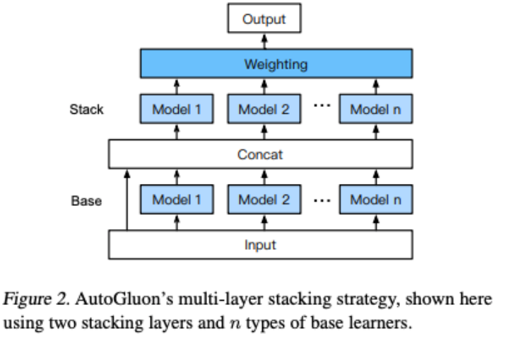

For more information, see AutoGluon-Tabular: Robust and Accurate AutoML for Structured Data.

AutoGluon-Tabular hyperparameters

The following table contains the subset of hyperparameters that are required or most commonly
used for the Amazon SageMaker AI AutoGluon-Tabular algorithm. Users set these parameters to
facilitate the estimation of model parameters from data. The SageMaker AI AutoGluon-Tabular
algorithm is an implementation of the open-source AutoGluon-Tabular package.

Note

The default hyperparameters are based on example datasets in the AutoGluon-Tabular
sample notebooks.

By default, the SageMaker AI AutoGluon-Tabular algorithm automatically chooses an evaluation
metric based on the type of classification problem. The algorithm detects the type of classification
problem based on the number of labels in your data. For regression problems, the evaluation
metric is root mean squared error. For binary classification problems, the evaluation metric is area
under the receiver operating characteristic curve (AUC). For multiclass classification problems,

the evaluation metric is accuracy. You can use the eval_metric hyperparameter to change the
default evaluation metric. Refer to the following table for more information on AutoGluon-Tabular
hyperparameters, including descriptions, valid values, and default values.

Built-in algorithms and pretrained models
4018

## Page 48

Amazon SageMaker AI
Developer Guide

Parameter Name
Description

eval_metric
The evaluation metric for validation data. If eval_metric  is

set to the default "auto" value, then the algorithm automatic
ally chooses an evaluation metric based on the type of classific
ation problem:

• "root_mean_squared_error"
for regression

• "roc_auc"  for binary classification

• "accuracy"  for multi-class classification

Valid values: string, refer to the AutoGluon documentation for
valid values.

Default value: "auto".

presets
List of preset configurations for various arguments in fit().

• "best_quality" : high predictive accuracy, slower
inference times and higher disk usage

• "high_quality" : high predictive accuracy and fast
inference

• "good_quality" : good predictive accuracy and very fast
inference

• "medium_quality" : medium predictive accuracy, very
fast inference and training time

• "optimize_for_deployment"
: delete unused models
and remove training artifacts

• "interpretable" : fits only interpretable rule-based

models from the imodels package

For more details, see AutoGluon Predictors.

Valid values: string, any of the following: ("best_qua

lity" , "high_quality" , good_quality" , "medium_q

Built-in algorithms and pretrained models
4019

## Page 49

Amazon SageMaker AI
Developer Guide

Parameter Name
Description

uality" , "optimize_for_deployment"
, or

"interpretable" ).

Default value: "medium_quality" .

auto_stack
Whether AutoGluon should automatically utilize bagging and
multi-layer stack ensembling to boost predictive accuracy. Set

auto_stack  to "True" if you are willing to tolerate longer

training times in order to maximize predictive accuracy. This

automatically sets the num_bag_folds  and num_stack

_levels  arguments based on dataset properties.

Valid values: string, "True" or "False".

Default value: "False".

num_bag_folds
Number of folds used for bagging of models. When

num_bag_folds  is equal to k, training time is roughly

increased by a factor of k. Set num_bag_folds  to 0 to
deactivate bagging. This is disabled by default, but we
recommend using values between 5 and 10 to maximize

predictive performance. Increasing num_bag_folds  results
in models with lower bias, but that are more prone to overfitti
ng. One is an invalid value for this parameter, and will raise a

ValueError . Values greater than 10 may produce diminishi

ng returns and can even harm overall results due to overfitting.

To further improve predictions, avoid increasing num_bag_f

olds  and instead increase num_bag_sets .

Valid values: string, any integer between (and including) "0"

and "10".

Default value: "0".

Built-in algorithms and pretrained models
4020

## Page 50

Amazon SageMaker AI
Developer Guide

Parameter Name
Description

num_bag_sets
Number of repeats of kfold bagging to perform (values
must be greater than or equal to 1). The total number of

models trained during bagging is equal to num_bag_f

olds  * num_bag_sets . This parameter defaults to one if

time_limit  is not specified. This parameters is disabled if

num_bag_folds  is not specified. Values greater than one
result in superior predictive performance, especially on smaller

problems and with stacking enabled.

Valid values: integer, range: [1, 20].

Default value: 1.

num_stack_levels
Number of stacking levels to use in stack ensemble. Roughly

increases model training time by factor of num_stack

_levels  + 1. Set this parameter to 0 to deactivate stack
ensembling. This parameter is deactivated by default, but
we recommend using values between 1 and 3 to maximize
predictive performance. To prevent overfitting and a

ValueError , num_bag_folds  must be greater than or
equal to 2.

Valid values: float, range: [0, 3].

Default value: 0.

refit_full
Whether or not to retrain all models on all of the data (training
and validation) after the normal training procedure. For more
details, see AutoGluon Predictors.

Valid values: string, "True" or "False".

Default value: "False".

Built-in algorithms and pretrained models
4021

## Page 51

Amazon SageMaker AI
Developer Guide

Parameter Name
Description

Whether or not to change the default model that the predictor

set_best_to_refit_

uses for prediction. If set_best_to_refit_full
is set

full

to "True", the default model changes to the model that
exhibited the highest validation score as a result of refitting

(activated by refit_full ). Only valid if refit_full  is set.

Valid values: string, "True" or "False".

Default value: "False".

save_space
Whether or note to reduce the memory and disk size of
predictor by deleting auxiliary model files that aren’t needed
for prediction on new data. This has no impact on inference

accuracy. We recommend setting save_space  to "True"
if the only goal is to use the trained model for prediction.
Certain advanced functionality may no longer be available

if save_space  is set to "True". Refer to the predictor

.save_space()
documentation for more details.

Valid values: string, "True" or "False".

Default value: "False".

verbosity
The verbosity of print messages. verbosity  levels range

from 0 to 4, with higher levels corresponding to more detailed

print statements. A verbosity  of 0 suppresses warnings.

Valid values: integer, any of the following: (0, 1, 2, 3, or 4).

Default value: 2.

Tuning an AutoGluon-Tabular model

Although AutoGluon-Tabular can be used with model tuning, its design can deliver good
performance using stacking and ensemble methods, meaning hyperparameter optimization is not
necessary. Rather than focusing on model tuning, AutoGluon-Tabular succeeds by stacking models
in multiple layers and training in a layer-wise manner.

Built-in algorithms and pretrained models
4022

## Page 52

Amazon SageMaker AI
Developer Guide

For more information about AutoGluon-Tabular hyperparameters, see AutoGluon-Tabular
hyperparameters.

CatBoost

CatBoost is a popular and high-performance open-source implementation of the Gradient
Boosting Decision Tree (GBDT) algorithm. GBDT is a supervised learning algorithm that attempts to
accurately predict a target variable by combining an ensemble of estimates from a set of simpler

and weaker models.

CatBoost introduces two critical algorithmic advances to GBDT:

1. The implementation of ordered boosting, a permutation-driven alternative to the classic

algorithm

2. An innovative algorithm for processing categorical features

Both techniques were created to fight a prediction shift caused by a special kind of target leakage
present in all currently existing implementations of gradient boosting algorithms. This page
includes information about Amazon EC2 instance recommendations and sample notebooks for
CatBoost.

How to use SageMaker AI CatBoost

You can use CatBoost as an Amazon SageMaker AI built-in algorithm. The following section
describes how to use CatBoost with the SageMaker Python SDK. For information on how to use
CatBoost from the Amazon SageMaker Studio Classic UI, see SageMaker JumpStart pretrained
models.

• Use CatBoost as a built-in algorithm

Use the CatBoost built-in algorithm to build a CatBoost training container as shown in the
following code example. You can automatically spot the CatBoost built-in algorithm image

URI using the SageMaker AI image_uris.retrieve API (or the get_image_uri API if using
Amazon SageMaker Python SDK version 2).

After specifying the CatBoost image URI, you can use the CatBoost container to construct an
estimator using the SageMaker AI Estimator API and initiate a training job. The CatBoost built-in
algorithm runs in script mode, but the training script is provided for you and there is no need to
replace it. If you have extensive experience using script mode to create a SageMaker training job,
then you can incorporate your own CatBoost training scripts.

Built-in algorithms and pretrained models
4023

## Page 53

Amazon SageMaker AI
Developer Guide

from sagemaker import image_uris, model_uris, script_uris

train_model_id, train_model_version, train_scope = "catboost-classification-model",
"*", "training"
training_instance_type = "ml.m5.xlarge"

# Retrieve the docker image
train_image_uri = image_uris.retrieve(
region=None,
framework=None,
model_id=train_model_id,
model_version=train_model_version,
image_scope=train_scope,
instance_type=training_instance_type
)

# Retrieve the training script
train_source_uri = script_uris.retrieve(
model_id=train_model_id, model_version=train_model_version,
script_scope=train_scope
)

train_model_uri = model_uris.retrieve(
model_id=train_model_id, model_version=train_model_version,
model_scope=train_scope
)

# Sample training data is available in this bucket
training_data_bucket = f"jumpstart-cache-prod-{aws_region}"
training_data_prefix = "training-datasets/tabular_multiclass/"

training_dataset_s3_path = f"s3://{training_data_bucket}/{training_data_prefix}/
train"
validation_dataset_s3_path = f"s3://{training_data_bucket}/{training_data_prefix}/
validation"

output_bucket = sess.default_bucket()
output_prefix = "jumpstart-example-tabular-training"

s3_output_location = f"s3://{output_bucket}/{output_prefix}/output"

from sagemaker import hyperparameters

Built-in algorithms and pretrained models
4024

## Page 54

Amazon SageMaker AI
Developer Guide

# Retrieve the default hyperparameters for training the model
hyperparameters = hyperparameters.retrieve_default(
model_id=train_model_id, model_version=train_model_version
)

# [Optional] Override default hyperparameters with custom values
hyperparameters[
"iterations"
] = "500"
print(hyperparameters)

from sagemaker.estimator import Estimator
from sagemaker.utils import name_from_base

training_job_name = name_from_base(f"built-in-algo-{train_model_id}-training")

# Create SageMaker Estimator instance

tabular_estimator = Estimator(
role=aws_role,
image_uri=train_image_uri,
source_dir=train_source_uri,
model_uri=train_model_uri,
entry_point="transfer_learning.py",
instance_count=1,
instance_type=training_instance_type,
max_run=360000,
hyperparameters=hyperparameters,
output_path=s3_output_location
)

# Launch a SageMaker Training job by passing the S3 path of the training data
tabular_estimator.fit(
{
"training": training_dataset_s3_path,
"validation": validation_dataset_s3_path,
}, logs=True, job_name=training_job_name
)

For more information about how to set up CatBoost as a built-in algorithm, see the following
notebook examples.

• Tabular classification with Amazon SageMaker AI LightGBM and CatBoost algorithm

• Tabular regression with Amazon SageMaker AI LightGBM and CatBoost algorithm

Built-in algorithms and pretrained models
4025

## Page 55

Amazon SageMaker AI
Developer Guide

Input and Output interface for the CatBoost algorithm

Gradient boosting operates on tabular data, with the rows representing observations, one column
representing the target variable or label, and the remaining columns representing features.

The SageMaker AI implementation of CatBoost supports CSV for training and inference:

• For Training ContentType, valid inputs must be text/csv.

• For Inference ContentType, valid inputs must be text/csv.

Note

For CSV training, the algorithm assumes that the target variable is in the first column and
that the CSV does not have a header record.
For CSV inference, the algorithm assumes that CSV input does not have the label column.

Input format for training data, validation data, and categorical features

Be mindful of how to format your training data for input to the CatBoost model. You must provide
the path to an Amazon S3 bucket that contains your training and validation data. You can also

include a list of categorical features. Use both the training and validation channels to provide

your input data. Alternatively, you can use only the training channel.

Use both the training and validation channels

You can provide your input data by way of two S3 paths, one for the training channel and one

for the validation channel. Each S3 path can either be an S3 prefix that points to one or more
CSV files or a full S3 path pointing to one specific CSV file. The target variables should be in the
first column of your CSV file. The predictor variables (features) should be in the remaining columns.

If multiple CSV files are provided for the training or validation channels, the CatBoost
algorithm concatenates the files. The validation data is used to compute a validation score at the
end of each boosting iteration. Early stopping is applied when the validation score stops improving.

If your predictors include categorical features, you can provide a JSON file named

categorical_index.json in the same location as your training data file or files. If you provide

a JSON file for categorical features, your training channel must point to an S3 prefix and
not a specific CSV file. This file should contain a Python dictionary where the key is the string

"cat_index_list" and the value is a list of unique integers. Each integer in the value list should

Built-in algorithms and pretrained models
4026

## Page 56

Amazon SageMaker AI
Developer Guide

indicate the column index of the corresponding categorical features in your training data CSV
file. Each value should be a positive integer (greater than zero because zero represents the target

value), less than the Int32.MaxValue (2147483647), and less than the total number of columns.
There should only be one categorical index JSON file.

Use only the training channel:

You can alternatively provide your input data by way of a single S3 path for the training channel.

This S3 path should point to a directory with a subdirectory named training/ that contains one
or more CSV files. You can optionally include another subdirectory in the same location called

validation/ that also has one or more CSV files. If the validation data is not provided, then 20%
of your training data is randomly sampled to serve as the validation data. If your predictors include

categorical features, you can provide a JSON file named categorical_index.json in the same
location as your data subdirectories.

Note

For CSV training input mode, the total memory available to the algorithm (instance count

multiplied by the memory available in the InstanceType) must be able to hold the
training dataset.

SageMaker AI CatBoost uses the catboost.CatBoostClassifier and

catboost.CatBoostRegressor modules to serialize or deserialize the model, which can be used
for saving or loading the model.

To use a model trained with SageMaker AI CatBoost with catboost

•
Use the following Python code:

import tarfile
from catboost import CatBoostClassifier

t = tarfile.open('model.tar.gz', 'r:gz')
t.extractall()

file_path = os.path.join(model_file_path, "model")
model = CatBoostClassifier()
model.load_model(file_path)

Built-in algorithms and pretrained models
4027

## Page 57

Amazon SageMaker AI
Developer Guide

# prediction with test data
# dtest should be a pandas DataFrame with column names feature_0, feature_1, ...,
feature_d
pred = model.predict(dtest)

Amazon EC2 instance recommendation for the CatBoost algorithm

SageMaker AI CatBoost currently only trains using CPUs. CatBoost is a memory-bound (as opposed
to compute-bound) algorithm. So, a general-purpose compute instance (for example, M5) is a
better choice than a compute-optimized instance (for example, C5). Further, we recommend that
you have enough total memory in selected instances to hold the training data.

CatBoost sample notebooks

The following table outlines a variety of sample notebooks that address different use cases of

Amazon SageMaker AI CatBoost algorithm.

Notebook Title
Description

Tabular classification with Amazon SageMaker
AI LightGBM and CatBoost algorithm

This notebook demonstrates the use of the
Amazon SageMaker AI CatBoost algorithm to
train and host a tabular classification model.

Tabular regression with Amazon SageMaker AI
LightGBM and CatBoost algorithm

This notebook demonstrates the use of the
Amazon SageMaker AI CatBoost algorithm to
train and host a tabular regression model.

For instructions on how to create and access Jupyter notebook instances that you can use to run
the example in SageMaker AI, see Amazon SageMaker notebook instances. After you have created a
notebook instance and opened it, choose the SageMaker AI Examples tab to see a list of all of the
SageMaker AI samples. To open a notebook, choose its Use tab and choose Create copy.

How CatBoost Works

CatBoost implements a conventional Gradient Boosting Decision Tree (GBDT) algorithm with the
addition of two critical algorithmic advances:

1. The implementation of ordered boosting, a permutation-driven alternative to the classic

algorithm

Built-in algorithms and pretrained models
4028

## Page 58

Amazon SageMaker AI
Developer Guide

2. An innovative algorithm for processing categorical features

Both techniques were created to fight a prediction shift caused by a special kind of target leakage
present in all currently existing implementations of gradient boosting algorithms.

The CatBoost algorithm performs well in machine learning competitions because of its
robust handling of a variety of data types, relationships, distributions, and the diversity of
hyperparameters that you can fine-tune. You can use CatBoost for regression, classification (binary
and multiclass), and ranking problems.

For more information on gradient boosting, see How the SageMaker AI XGBoost algorithm works.
For in-depth details about the additional GOSS and EFB techniques used in the CatBoost method,
see CatBoost: unbiased boosting with categorical features.

CatBoost hyperparameters

The following table contains the subset of hyperparameters that are required or most commonly
used for the Amazon SageMaker AI CatBoost algorithm. Users set these parameters to facilitate
the estimation of model parameters from data. The SageMaker AI CatBoost algorithm is an
implementation of the open-source CatBoost package.

Note

The default hyperparameters are based on example datasets in the CatBoost sample
notebooks.

By default, the SageMaker AI CatBoost algorithm automatically chooses an evaluation metric and
loss function based on the type of classification problem. The CatBoost algorithm detects the type
of classification problem based on the number of labels in your data. For regression problems, the
evaluation metric and loss functions are both root mean squared error. For binary classification
problems, the evaluation metric is Area Under the Curve (AUC) and the loss function is log loss.
For multiclass classification problems, the evaluation metric and loss functions are multiclass

cross entropy. You can use the eval_metric hyperparameter to change the default evaluation
metric. Refer to the following table for more information on LightGBM hyperparameters, including
descriptions, valid values, and default values.

Built-in algorithms and pretrained models
4029

## Page 59

Amazon SageMaker AI
Developer Guide

Parameter Name
Description

iterations
The maximum number of trees that can be built.

Valid values: integer, range: Positive integer.

Default value: 500.

The training will stop if one metric of one validation data point

early_stopping_rou

does not improve in the last early_stopping_rounds

nds

round. If early_stopping_rounds
is less than or equal to
zero, this hyperparameter is ignored.

Valid values: integer.

Default value: 5.

eval_metric
The evaluation metric for validation data. If eval_metric  is

set to the default "auto" value, then the algorithm automatic
ally chooses an evaluation metric based on the type of classific
ation problem:

• "RMSE" for regression

• "AUC" for binary classification

• "MultiClass"  for multi-class classification

Valid values: string, refer to the CatBoost documentation for
valid values.

Default value: "auto".

learning_rate
The rate at which the model weights are updated after working
through each batch of training examples.

Valid values: float, range: (0.0, 1.0).

Default value: 0.009.

depth
Depth of the tree.

Built-in algorithms and pretrained models
4030

## Page 60

Amazon SageMaker AI
Developer Guide

Parameter Name
Description

Valid values: integer, range: (1, 16).

Default value: 6.

l2_leaf_reg
Coefficient for the L2 regularization term of the cost function.

Valid values: integer, range: Positive integer.

Default value: 3.

random_strength
The amount of randomness to use for scoring splits when the
tree structure is selected. Use this parameter to avoid overfitti
ng the model.

Valid values: float, range: Positive floating point number.

Default value: 1.0.

max_leaves
The maximum number of leaves in the resulting tree. Can only

be used with the "Lossguide"  growing policy.

Valid values: integer, range: [2, 64].

Default value: 31.

rsm
Random subspace method. The percentage of features to use
at each split selection, when features are selected over again at

random.

Valid values: float, range: (0.0, 1.0].

Default value: 1.0.

sampling_frequency
Frequency to sample weights and objects when building trees.

Valid values: string, either: ("PerTreeLevel"  or "PerTree"

).

Default value: "PerTreeLevel" .

Built-in algorithms and pretrained models
4031

## Page 61

Amazon SageMaker AI
Developer Guide

Parameter Name
Description

min_data_in_leaf
The minimum number of training samples in a leaf. CatBoost
does not search for new splits in leaves with a sample count
less than the specified value. Can only be used with the

"Lossguide"  and "Depthwise"  growing policies.

Valid values: integer, range: (1 or ∞).

Default value: 1.

bagging_temperature
Defines the settings of the Bayesian bootstrap. Use the
Bayesian bootstrap to assign random weights to objects. If

bagging_temperature
is set to 1.0, then the weights

are sampled from an exponential distribution. If bagging_t

emperature
is set to 0.0, then all weights are 1.0.

Valid values: float, range: Non-negative float.

Default value: 1.0.

boosting_type
The boosting scheme. "Auto" means that the boosting_

type  is selected based on processing unit type, the number
of objects in the training dataset, and the selected learning
mode.

Valid values: string, any of the following: ("Auto", "Ordered"

, "Plain").

Default value: "Auto".

scale_pos_weight
The weight for positive class in binary classification. The value
is used as a multiplier for the weights of objects from positive
class.

Valid values: float, range: Positive float.

Default value: 1.0.

Built-in algorithms and pretrained models
4032

## Page 62

Amazon SageMaker AI
Developer Guide

Parameter Name
Description

max_bin
The number of splits for numerical features. "Auto" means

that max_bin is selected based on the processing unit type
and other parameters. For details, see the CatBoost documenta
tion.

Valid values: string, either: ("Auto" or string of integer from

"1" to "65535" inclusively).

Default value: "Auto".

grow_policy
The tree growing policy. Defines how to perform greedy tree
construction.

Valid values: string, any of the following: ("Symmetri

cTree" , "Depthwise" , or "Lossguide" ).

Default value: "SymmetricTree" .

random_seed
The random seed used for training.

Valid values: integer, range: Non-negative integer.

Default value: 1.0.

thread_count
The number of threads to use during the training. If

thread_count  is -1, then the number of threads is equal to

the number of processor cores. thread_count  cannot be 0.

Valid values: integer, either: (-1 or positive integer).

Default value: -1.

verbose
The verbosity of print messages, with higher levels correspon
ding to more detailed print statements.

Valid values: integer, range: Positive integer.

Default value: 1.

Built-in algorithms and pretrained models
4033

## Page 63

Amazon SageMaker AI
Developer Guide

Tune a CatBoost model

Automatic model tuning, also known as hyperparameter tuning, finds the best version of a model
by running many jobs that test a range of hyperparameters on your training and validation
datasets. Model tuning focuses on the following hyperparameters:

Note

The learning loss function is automatically assigned based on the type of classification
task, which is determined by the number of unique integers in the label column. For more
information, see CatBoost hyperparameters.

• A learning loss function to optimize during model training

• An evaluation metric that is used to evaluate model performance during validation

• A set of hyperparameters and a range of values for each to use when tuning the model
automatically

Automatic model tuning searches your chosen hyperparameters to find the combination of values
that results in a model that optimizes the chosen evaluation metric.

Note

Automatic model tuning for CatBoost is only available from the Amazon SageMaker SDKs,
not from the SageMaker AI console.

For more information about model tuning, see Automatic model tuning with SageMaker AI.

Evaluation metrics computed by the CatBoost algorithm

The SageMaker AI CatBoost algorithm computes the following metrics to use for model validation.
The evaluation metric is automatically assigned based on the type of classification task, which is
determined by the number of unique integers in the label column.

Built-in algorithms and pretrained models
4034

## Page 64

Amazon SageMaker AI
Developer Guide

Metric Name
Description
Optimization
Direction

Regex Pattern

RMSE
root mean square error
minimize
"bestTest

= ([0-9\\.]

+)"

MAE
mean absolute error
minimize
"bestTest

= ([0-9\\.]

+)"

median absolute error
minimize
"bestTest

MedianAbs

oluteError

= ([0-9\\.]

+)"

R2
r2 score
maximize
"bestTest

= ([0-9\\.]

+)"

Logloss
binary cross entropy
maximize
"bestTest

= ([0-9\\.]

+)"

Precision
precision
maximize
"bestTest

= ([0-9\\.]

+)"

Recall
recall
maximize
"bestTest

= ([0-9\\.]

+)"

F1
f1 score
maximize
"bestTest

= ([0-9\\.]

+)"

AUC
auc score
maximize
"bestTest

= ([0-9\\.]

+)"

Built-in algorithms and pretrained models
4035

## Page 65

Amazon SageMaker AI
Developer Guide

Metric Name
Description
Optimization
Direction

Regex Pattern

MultiClass
multiclass cross entropy
maximize
"bestTest

= ([0-9\\.]

+)"

Accuracy
accuracy
maximize
"bestTest

= ([0-9\\.]

+)"

balanced accuracy
maximize
"bestTest

BalancedA

ccuracy

= ([0-9\\.]

+)"

Tunable CatBoost hyperparameters

Tune the CatBoost model with the following hyperparameters. The hyperparameters that have

the greatest effect on optimizing the CatBoost evaluation metrics are: learning_rate, depth,

l2_leaf_reg, and random_strength. For a list of all the CatBoost hyperparameters, see
CatBoost hyperparameters.

Parameter Name
Parameter Type
Recommended
Ranges

learning_rate
ContinuousParameterRanges
MinValue: 0.001,
MaxValue: 0.01

depth
IntegerParameterRanges
MinValue: 4,
MaxValue: 10

l2_leaf_reg
IntegerParameterRanges
MinValue: 2,
MaxValue: 10

random_strength
ContinuousParameterRanges
MinValue: 0,
MaxValue: 10

Built-in algorithms and pretrained models
4036

## Page 66

Amazon SageMaker AI
Developer Guide

Factorization Machines Algorithm

The Factorization Machines algorithm is a general-purpose supervised learning algorithm that
you can use for both classification and regression tasks. It is an extension of a linear model that
is designed to capture interactions between features within high dimensional sparse datasets
economically. For example, in a click prediction system, the Factorization Machines model can
capture click rate patterns observed when ads from a certain ad-category are placed on pages
from a certain page-category. Factorization machines are a good choice for tasks dealing with high
dimensional sparse datasets, such as click prediction and item recommendation.

Note

The Amazon SageMaker AI implementation of the Factorization Machines algorithm
considers only pair-wise (2nd order) interactions between features.

Topics

• Input/Output Interface for the Factorization Machines Algorithm

• EC2 Instance Recommendation for the Factorization Machines Algorithm

• Factorization Machines Sample Notebooks

• How Factorization Machines Work

• Factorization Machines Hyperparameters

• Tune a Factorization Machines Model

• Factorization Machines Response Formats

Input/Output Interface for the Factorization Machines Algorithm

The Factorization Machines algorithm can be run in either in binary classification mode or
regression mode. In each mode, a dataset can be provided to the test channel along with the
train channel dataset. The scoring depends on the mode used. In regression mode, the testing
dataset is scored using Root Mean Square Error (RMSE). In binary classification mode, the test
dataset is scored using Binary Cross Entropy (Log Loss), Accuracy (at threshold=0.5) and F1 Score
(at threshold =0.5).

For training, the Factorization Machines algorithm currently supports only the recordIO-

protobuf format with Float32 tensors. Because their use case is predominantly on sparse data,

Built-in algorithms and pretrained models
4037

## Page 67

Amazon SageMaker AI
Developer Guide

CSV is not a good candidate. Both File and Pipe mode training are supported for recordIO-wrapped
protobuf.

For inference, the Factorization Machines algorithm supports the application/json and x-

recordio-protobuf formats.

• For the binary classification problem, the algorithm predicts a score and a label. The label

is a number and can be either 0 or 1. The score is a number that indicates how strongly the

algorithm believes that the label should be 1. The algorithm computes score first and then

derives the label from the score value. If the score is greater than or equal to 0.5, the label is 1.

• For the regression problem, just a score is returned and it is the predicted value. For example, if
Factorization Machines is used to predict a movie rating, score is the predicted rating value.

Please see Factorization Machines Sample Notebooks for more details on training and inference file
formats.

EC2 Instance Recommendation for the Factorization Machines Algorithm

The Amazon SageMaker AI Factorization Machines algorithm is highly scalable and can train across
distributed instances. We recommend training and inference with CPU instances for both sparse
and dense datasets. In some circumstances, training with one or more GPUs on dense data might
provide some benefit. Training with GPUs is available only on dense data. Use CPU instances for
sparse data. The Factorization Machines algorithm supports P2, P3, G4dn, and G5 instances for
training and inference.

Factorization Machines Sample Notebooks

For a sample notebook that uses the SageMaker AI Factorization Machines algorithm to analyze
the images of handwritten digits from zero to nine in the MNIST dataset, see An Introduction to
Factorization Machines with MNIST. For instructions how to create and access Jupyter notebook
instances that you can use to run the example in SageMaker AI, see Amazon SageMaker notebook
instances. Once you have created a notebook instance and opened it, select the SageMaker
AI Examples tab to see a list of all the SageMaker AI samples. Example notebooks that use
Factorization Machines algorithm are located in the Introduction to Amazon algorithms section.
To open a notebook, click on its Use tab and select Create copy.

Built-in algorithms and pretrained models
4038

## Page 68

Amazon SageMaker AI
Developer Guide

How Factorization Machines Work

The prediction task for a Factorization Machines model is to estimate a function ŷ from a feature
set xi to a target domain. This domain is real-valued for regression and binary for classification.
The Factorization Machines model is supervised and so has a training dataset (xi,yj) available. The
advantages this model presents lie in the way it uses a factorized parametrization to capture the
pairwise feature interactions. It can be represented mathematically as follows:

The three terms in this equation correspond respectively to the three components of the model:

• The w0 term represents the global bias.

• The wi linear terms model the strength of the ith variable.

• The <vi,vj> factorization terms model the pairwise interaction between the ith and jth variable.

The global bias and linear terms are the same as in a linear model. The pairwise feature
interactions are modeled in the third term as the inner product of the corresponding factors
learned for each feature. Learned factors can also be considered as embedding vectors for each
feature. For example, in a classification task, if a pair of features tends to co-occur more often in
positive labeled samples, then the inner product of their factors would be large. In other words,
their embedding vectors would be close to each other in cosine similarity. For more information
about the Factorization Machines model, see Factorization Machines.

For regression tasks, the model is trained by minimizing the squared error between the model
prediction ŷn and the target value yn. This is known as the square loss:

For a classification task, the model is trained by minimizing the cross entropy loss, also known as
the log loss:

where:

Built-in algorithms and pretrained models
4039

## Page 69

Amazon SageMaker AI
Developer Guide

For more information about loss functions for classification, see Loss functions for classification.

Factorization Machines Hyperparameters

The following table contains the hyperparameters for the Factorization Machines algorithm. These
are parameters that are set by users to facilitate the estimation of model parameters from data.
The required hyperparameters that must be set are listed first, in alphabetical order. The optional
hyperparameters that can be set are listed next, also in alphabetical order.

Parameter Name
Description

feature_dim
The dimension of the input feature space. This could be very
high with sparse input.

Required

Valid values: Positive integer. Suggested value range:
[10000,10000000]

num_factors
The dimensionality of factorization.

Required

Valid values: Positive integer. Suggested value range: [2,1000],
64 typically generates good outcomes and is a good starting
point.

predictor_type
The type of predictor.

• binary_classifier : For binary classification tasks.

• regressor : For regression tasks.

Required

Valid values: String: binary_classifier  or regressor

bias_init_method
The initialization method for the bias term:

Built-in algorithms and pretrained models
4040

## Page 70

Amazon SageMaker AI
Developer Guide

Parameter Name
Description

• normal: Initializes weights with random values sampled
from a normal distribution with a mean of zero and standard

deviation specified by bias_init_sigma .

• uniform: Initializes weights with random values uniformly

sampled from a range specified by [-bias_init_scale ,

+bias_init_scale ].

• constant: Initializes the weights to a scalar value specified

by bias_init_value .

Optional

Valid values: uniform, normal, or constant

Default value: normal

bias_init_scale
Range for initialization of the bias term. Takes effect if

bias_init_method  is set to uniform.

Optional

Valid values: Non-negative float. Suggested value range: [1e-8,
512].

Default value: None

bias_init_sigma
The standard deviation for initialization of the bias term. Takes

effect if bias_init_method  is set to normal.

Optional

Valid values: Non-negative float. Suggested value range: [1e-8,
512].

Default value: 0.01

Built-in algorithms and pretrained models
4041

## Page 71

Amazon SageMaker AI
Developer Guide

Parameter Name
Description

bias_init_value
The initial value of the bias term. Takes effect if bias_init

_method  is set to constant.

Optional

Valid values: Float. Suggested value range: [1e-8, 512].

Default value: None

bias_lr
The learning rate for the bias term.

Optional

Valid values: Non-negative float. Suggested value range: [1e-8,
512].

Default value: 0.1

bias_wd
The weight decay for the bias term.

Optional

Valid values: Non-negative float. Suggested value range: [1e-8,
512].

Default value: 0.01

clip_gradient
Gradient clipping optimizer parameter. Clips the gradient by

projecting onto the interval [-clip_gradient , +clip_grad

ient ].

Optional

Valid values: Float

Default value: None

Built-in algorithms and pretrained models
4042

## Page 72

Amazon SageMaker AI
Developer Guide

Parameter Name
Description

epochs
The number of training epochs to run.

Optional

Valid values: Positive integer

Default value: 1

eps
Epsilon parameter to avoid division by 0.

Optional

Valid values: Float. Suggested value: small.

Default value: None

factors_init_method
The initialization method for factorization terms:

• normal Initializes weights with random values sampled
from a normal distribution with a mean of zero and standard

deviation specified by factors_init_sigma
.

• uniform: Initializes weights with random values uniformly

sampled from a range specified by [-factors_i

nit_scale
, +factors_init_scale
].

• constant: Initializes the weights to a scalar value specified

by factors_init_value
.

Optional

Valid values: uniform, normal, or constant.

Default value: normal

Built-in algorithms and pretrained models
4043

## Page 73

Amazon SageMaker AI
Developer Guide

Parameter Name
Description

factors_init_scale
The range for initialization of factorization terms. Takes effect

if factors_init_method
is set to uniform.

Optional

Valid values: Non-negative float. Suggested value range: [1e-8,
512].

Default value: None

factors_init_sigma
The standard deviation for initialization of factorization terms.

Takes effect if factors_init_method
is set to normal.

Optional

Valid values: Non-negative float. Suggested value range: [1e-8,
512].

Default value: 0.001

factors_init_value
The initial value of factorization terms. Takes effect if

factors_init_method
is set to constant.

Optional

Valid values: Float. Suggested value range: [1e-8, 512].

Default value: None

factors_lr
The learning rate for factorization terms.

Optional

Valid values: Non-negative float. Suggested value range: [1e-8,
512].

Default value: 0.0001

Built-in algorithms and pretrained models
4044

## Page 74

Amazon SageMaker AI
Developer Guide

Parameter Name
Description

factors_wd
The weight decay for factorization terms.

Optional

Valid values: Non-negative float. Suggested value range: [1e-8,
512].

Default value: 0.00001

linear_lr
The learning rate for linear terms.

Optional

Valid values: Non-negative float. Suggested value range: [1e-8,
512].

Default value: 0.001

linear_init_method
The initialization method for linear terms:

• normal Initializes weights with random values sampled
from a normal distribution with a mean of zero and standard

deviation specified by linear_init_sigma .

• uniform Initializes weights with random values uniformly

sampled from a range specified by [-linear_init_scale ,

+linear_init_scale ].

• constant Initializes the weights to a scalar value specified

by linear_init_value .

Optional

Valid values: uniform, normal, or constant.

Default value: normal

Built-in algorithms and pretrained models
4045

## Page 75

Amazon SageMaker AI
Developer Guide

Parameter Name
Description

linear_init_scale
Range for initialization of linear terms. Takes effect if

linear_init_method
is set to uniform.

Optional

Valid values: Non-negative float. Suggested value range: [1e-8,
512].

Default value: None

linear_init_sigma
The standard deviation for initialization of linear terms. Takes

effect if linear_init_method
is set to normal.

Optional

Valid values: Non-negative float. Suggested value range: [1e-8,
512].

Default value: 0.01

linear_init_value
The initial value of linear terms. Takes effect if linear_in

it_method
is set to constant.

Optional

Valid values: Float. Suggested value range: [1e-8, 512].

Default value: None

linear_wd
The weight decay for linear terms.

Optional

Valid values: Non-negative float. Suggested value range: [1e-8,
512].

Default value: 0.001

Built-in algorithms and pretrained models
4046

## Page 76

Amazon SageMaker AI
Developer Guide

Parameter Name
Description

mini_batch_size
The size of mini-batch used for training.

Optional

Valid values: Positive integer

Default value: 1000

rescale_grad
Gradient rescaling optimizer parameter. If set, multiplies the

gradient with rescale_grad  before updating. Often choose

to be 1.0/batch_size .

Optional

Valid values: Float

Default value: None

Tune a Factorization Machines Model

Automatic model tuning, also known as hyperparameter tuning, finds the best version of a model
by running many jobs that test a range of hyperparameters on your dataset. You choose the
tunable hyperparameters, a range of values for each, and an objective metric. You choose the
objective metric from the metrics that the algorithm computes. Automatic model tuning searches
the hyperparameters chosen to find the combination of values that result in the model that
optimizes the objective metric.

For more information about model tuning, see Automatic model tuning with SageMaker AI.

Metrics Computed by the Factorization Machines Algorithm

The Factorization Machines algorithm has both binary classification and regression predictor
types. The predictor type determines which metric you can use for automatic model tuning. The

algorithm reports a test:rmse regressor metric, which is computed during training. When tuning
the model for regression tasks, choose this metric as the objective.

Built-in algorithms and pretrained models
4047

## Page 77

Amazon SageMaker AI
Developer Guide

Metric Name
Description
Optimization
Direction

test:rmse
Root Mean Square Error
Minimize

The Factorization Machines algorithm reports three binary classification metrics, which are
computed during training. When tuning the model for binary classification tasks, choose one of
these as the objective.

Metric Name
Description
Optimization
Direction

Accuracy
Maximize

test:bina

ry_classi

fication_

accuracy

Cross Entropy
Minimize

test:bina

ry_classi

fication_

cross_entropy

Beta
Maximize

test:bina

ry_f_beta

Tunable Factorization Machines Hyperparameters

You can tune the following hyperparameters for the Factorization Machines algorithm. The
initialization parameters that contain the terms bias, linear, and factorization depend on

their initialization method. There are three initialization methods: uniform, normal, and

constant. These initialization methods are not themselves tunable. The parameters that
are tunable are dependent on this choice of the initialization method. For example, if the

initialization method is uniform, then only the scale parameters are tunable. Specifically,

if bias_init_method==uniform, then bias_init_scale, linear_init_scale, and

factors_init_scale are tunable. Similarly, if the initialization method is normal, then

Built-in algorithms and pretrained models
4048

## Page 78

Amazon SageMaker AI
Developer Guide

only sigma parameters are tunable. If the initialization method is constant, then only value
parameters are tunable. These dependencies are listed in the following table.

Parameter Name
Parameter Type
Recommended

Dependenc

Ranges

y

ContinuousParameterRange
MinValue: 1e-8,
MaxValue: 512

bias_init
_method==
uniform

bias_init

_scale

ContinuousParameterRange
MinValue: 1e-8,
MaxValue: 512

bias_init
_method==
normal

bias_init

_sigma

ContinuousParameterRange
MinValue: 1e-8,
MaxValue: 512

bias_init
_method==
constant

bias_init

_value

bias_lr
ContinuousParameterRange
MinValue: 1e-8,
MaxValue: 512

None

bias_wd
ContinuousParameterRange
MinValue: 1e-8,
MaxValue: 512

None

epoch
IntegerParameterRange
MinValue: 1,
MaxValue: 1000

None

ContinuousParameterRange
MinValue: 1e-8,
MaxValue: 512

bias_init
_method==
uniform

factors_i

nit_scale

ContinuousParameterRange
MinValue: 1e-8,
MaxValue: 512

bias_init
_method==
normal

factors_i

nit_sigma

ContinuousParameterRange
MinValue: 1e-8,
MaxValue: 512

bias_init
_method==
constant

factors_i

nit_value

Built-in algorithms and pretrained models
4049

## Page 79

Amazon SageMaker AI
Developer Guide

Parameter Name
Parameter Type
Recommended
Ranges

Dependenc
y

factors_lr
ContinuousParameterRange
MinValue: 1e-8,
MaxValue: 512

None

factors_wd
ContinuousParameterRange
MinValue: 1e-8,
MaxValue: 512]

None

ContinuousParameterRange
MinValue: 1e-8,
MaxValue: 512

bias_init
_method==
uniform

linear_in

it_scale

ContinuousParameterRange
MinValue: 1e-8,
MaxValue: 512

bias_init
_method==
normal

linear_in

it_sigma

ContinuousParameterRange
MinValue: 1e-8,
MaxValue: 512

bias_init
_method==
constant

linear_in

it_value

linear_lr
ContinuousParameterRange
MinValue: 1e-8,
MaxValue: 512

None

linear_wd
ContinuousParameterRange
MinValue: 1e-8,
MaxValue: 512

None

IntegerParameterRange
MinValue: 100,
MaxValue: 10000

None

mini_batc

h_size

Factorization Machines Response Formats

Amazon SageMaker AI provides several response formats for getting inference from the
Factorization Machines model, such as JSON, JSONLINES, and RECORDIO, with specific structures
for binary classification and regression tasks.

JSON Response Format

Binary classification

Built-in algorithms and pretrained models
4050

## Page 80

Amazon SageMaker AI
Developer Guide

let response =   {
"predictions":    [
{
"score": 0.4,
"predicted_label": 0
}
]
}

Regression

let response =   {
"predictions":    [
{
"score": 0.4
}

]
}

JSONLINES Response Format

Binary classification

{"score": 0.4, "predicted_label": 0}

Regression

{"score": 0.4}

RECORDIO Response Format

Binary classification

[
Record = {
features = {},
label = {
'score’: {
keys: [],
values: [0.4]  # float32
},

Built-in algorithms and pretrained models
4051

## Page 81

Amazon SageMaker AI
Developer Guide

'predicted_label': {
keys: [],
values: [0.0]  # float32
}
}
}
]

Regression

[
Record = {
features = {},
label = {
'score’: {
keys: [],

values: [0.4]  # float32
}
}
}
]

K-Nearest Neighbors (k-NN) Algorithm

Amazon SageMaker AI k-nearest neighbors (k-NN) algorithm is an index-based algorithm. It uses a
non-parametric method for classification or regression. For classification problems, the algorithm
queries the k points that are closest to the sample point and returns the most frequently used label
of their class as the predicted label. For regression problems, the algorithm queries the k closest
points to the sample point and returns the average of their feature values as the predicted value.

Training with the k-NN algorithm has three steps: sampling, dimension reduction, and index
building. Sampling reduces the size of the initial dataset so that it fits into memory. For dimension
reduction, the algorithm decreases the feature dimension of the data to reduce the footprint
of the k-NN model in memory and inference latency. We provide two methods of dimension
reduction methods: random projection and the fast Johnson-Lindenstrauss transform. Typically,
you use dimension reduction for high-dimensional (d >1000) datasets to avoid the “curse of
dimensionality” that troubles the statistical analysis of data that becomes sparse as dimensionality
increases. The main objective of k-NN's training is to construct the index. The index enables
efficient lookups of distances between points whose values or class labels have not yet been
determined and the k nearest points to use for inference.

Built-in algorithms and pretrained models
4052

## Page 82

Amazon SageMaker AI
Developer Guide

Topics

• Input/Output Interface for the k-NN Algorithm

• k-NN Sample Notebooks

• How the k-NN Algorithm Works

• EC2 Instance Recommendation for the k-NN Algorithm

• k-NN Hyperparameters

• Tune a k-NN Model

• Data Formats for k-NN Training Input

• k-NN Request and Response Formats

Input/Output Interface for the k-NN Algorithm

SageMaker AI k-NN supports train and test data channels.

• Use a train channel for data that you want to sample and construct into the k-NN index.

• Use a test channel to emit scores in log files. Scores are listed as one line per mini-batch: accuracy

for classifier, mean-squared error (mse) for regressor for score.

For training inputs, k-NN supports text/csv and application/x-recordio-protobuf data

formats. For input type text/csv, the first label_size columns are interpreted as the label
vector for that row. You can use either File mode or Pipe mode to train models on data that is

formatted as recordIO-wrapped-protobuf or as CSV.

For inference inputs, k-NN supports the application/json, application/x-recordio-

protobuf, and text/csv data formats. The text/csv format accepts a label_size and

encoding parameter. It assumes a label_size of 0 and a UTF-8 encoding.

For inference outputs, k-NN supports the application/json and application/x-recordio-

protobuf data formats. These two data formats also support a verbose output mode. In verbose
output mode, the API provides the search results with the distances vector sorted from smallest to
largest, and corresponding elements in the labels vector.

For batch transform, k-NN supports the application/jsonlines data format for both input
and output. An example input is as follows:

content-type: application/jsonlines

Built-in algorithms and pretrained models
4053

## Page 83

Amazon SageMaker AI
Developer Guide

{"features": [1.5, 16.0, 14.0, 23.0]}
{"data": {"features": {"values": [1.5, 16.0, 14.0, 23.0]}}

An example output is as follows:

accept: application/jsonlines

{"predicted_label": 0.0}
{"predicted_label": 2.0}

For more information on input and output file formats, see Data Formats for k-NN Training Input
for training, k-NN Request and Response Formats for inference, and the k-NN Sample Notebooks.

k-NN Sample Notebooks

For a sample notebook that uses the SageMaker AI k-nearest neighbor algorithm to predict
wilderness cover types from geological and forest service data, see the K-Nearest Neighbor
Covertype .

Use a Jupyter notebook instance to run the example in SageMaker AI. To learn how to create and
open a Jupyter notebook instance in SageMaker AI, see Amazon SageMaker notebook instances.
Once you have created a notebook instance and opened it, select the SageMaker AI Examples tab
to see a list of all the SageMaker AI example notebooks. Find K-Nearest Neighbor notebooks in the
Introduction to Amazon algorithms section. To open a notebook, click on its Use tab and select
Create copy.

How the k-NN Algorithm Works

The Amazon SageMaker AI k-nearest neighbors (k-NN) algorithm follows a multi-step training
process which includes sampling the input data, performing dimension reduction, and building an
index. The indexed data is then used during inference to efficiently find the k-nearest neighbors for
a given data point and make predictions based on the neighboring labels or values.

Step 1: Sample

To specify the total number of data points to be sampled from the training dataset, use the

sample_sizeparameter. For example, if the initial dataset has 1,000 data points and the

sample_size is set to 100, where the total number of instances is 2, each worker would sample

Built-in algorithms and pretrained models
4054

## Page 84

Amazon SageMaker AI
Developer Guide

50 points. A total set of 100 data points would be collected. Sampling runs in linear time with
respect to the number of data points.

Step 2: Perform Dimension Reduction

The current implementation of the k-NN algorithm has two methods of dimension reduction. You

specify the method in the dimension_reduction_type hyperparameter. The sign method
specifies a random projection, which uses a linear projection using a matrix of random signs,

and the fjlt method specifies a fast Johnson-Lindenstrauss transform, a method based on the

Fourier transform. Both methods preserve the L2 and inner product distances. The fjlt method
should be used when the target dimension is large and has better performance with CPU inference.

The methods differ in their computational complexity. The sign method requires O(ndk) time
to reduce the dimension of a batch of n points of dimension d into a target dimension k. The

fjlt method requires O(nd log(d)) time, but the constants involved are larger. Using dimension
reduction introduces noise into the data and this noise can reduce prediction accuracy.

Step 3: Build an Index

During inference, the algorithm queries the index for the k-nearest-neighbors of a sample point.
Based on the references to the points, the algorithm makes the classification or regression
prediction. It makes the prediction based on the class labels or values provided. k-NN provides
three different types of indexes: a flat index, an inverted index, and an inverted index with product

quantization. You specify the type with the index_type parameter.

Serialize the Model

When the k-NN algorithm finishes training, it serializes three files to prepare for inference.

• model_algo-1: Contains the serialized index for computing the nearest neighbors.

• model_algo-1.labels: Contains serialized labels (np.float32 binary format) for computing the
predicted label based on the query result from the index.

• model_algo-1.json: Contains the JSON-formatted model metadata which stores the k and

predictor_type hyper-parameters from training for inference along with other relevant state.

With the current implementation of k-NN, you can modify the metadata file to change the way

predictions are computed. For example, you can change k to 10 or change predictor_type to
regressor.

{

Built-in algorithms and pretrained models
4055

## Page 85

Amazon SageMaker AI
Developer Guide

"k": 5,
"predictor_type": "classifier",
"dimension_reduction": {"type": "sign", "seed": 3, "target_dim": 10, "input_dim":
20},
"normalize": False,
"version": "1.0"
}

EC2 Instance Recommendation for the k-NN Algorithm

We recommend training on a CPU instance (such as ml.m5.2xlarge) or on a GPU instance. The k-NN
algorithm supports P2, P3, G4dn, and G5 GPU instance families for training and inference.

Inference requests from CPUs generally have a lower average latency than requests from GPUs
because there is a tax on CPU-to-GPU communication when you use GPU hardware. However, GPUs
generally have higher throughput for larger batches.

k-NN Hyperparameters

The following table lists the hyperparameters that you can set for the Amazon SageMaker AI k-
nearest neighbors (k-NN) algorithm.

Parameter Name
Description

feature_dim
The number of features in the input data.

Required

Valid values: positive integer.

k
The number of nearest neighbors.

Required

Valid values: positive integer

predictor_type
The type of inference to use on the data labels.

Required

Valid values: classifier for classification or regressor for regression.

Built-in algorithms and pretrained models
4056

## Page 86

Amazon SageMaker AI
Developer Guide

Parameter Name
Description

sample_size
The number of data points to be sampled from the training data set.

Required

Valid values: positive integer

The target dimension to reduce to.

dimension

_reductio

Required when you specify the dimension_reduction_type
parameter.

n_target

Valid values: positive integer greater than 0 and less than

feature_dim .

The type of dimension reduction method.

dimension

_reduction_type

Optional

Valid values: sign for random projection or fjlt for the fast Johnson-L
indenstrauss transform.

Default value: No dimension reduction

faiss_ind

The number of centroids to construct in the index when index_typ

ex_ivf_nlists

e  is faiss.IVFFlat or faiss.IVFPQ.

Optional

Valid values: positive integer

Default value: auto, which resolves to sqrt(sample_size) .

Built-in algorithms and pretrained models
4057

## Page 87

Amazon SageMaker AI
Developer Guide

Parameter Name
Description

faiss_index_pq_m
The number of vector sub-components to construct in the index

when index_type  is set to faiss.IVFPQ.

The FaceBook AI Similarity Search (FAISS) library requires that the

value of faiss_index_pq_m  is a divisor of the data dimension

. If faiss_index_pq_m  is not a divisor of the data dimension
, we increase the data dimension to smallest integer divisible by

faiss_index_pq_m . If no dimension reduction is applied, the
algorithm adds a padding of zeros. If dimension reduction is applied,

the algorithm increase the value of the dimension_reductio

n_target  hyper-parameter.

Optional

Valid values: One of the following positive integers: 1, 2, 3, 4, 8, 12,

16, 20, 24, 28, 32, 40, 48, 56, 64, 96

index_metric
The metric to measure the distance between points when finding

nearest neighbors. When training with index_type  set to

faiss.IVFPQ , the INNER_PRODUCT  distance and COSINE
similarity are not supported.

Optional

Valid values: L2 for Euclidean-distance, INNER_PRODUCT for inner-

product distance,  COSINE for cosine similarity.

Default value: L2

index_type
The type of index.

Optional

Valid values: faiss.Flat, faiss.IVFFlat, faiss.IVFPQ.

Default values: faiss.Flat

Built-in algorithms and pretrained models
4058

## Page 88

Amazon SageMaker AI
Developer Guide

Parameter Name
Description

mini_batch_size
The number of observations per mini-batch for the data iterator.

Optional

Valid values: positive integer

Default value: 5000

Tune a k-NN Model

The Amazon SageMaker AI k-nearest neighbors algorithm is a supervised algorithm. The algorithm
consumes a test data set and emits a metric about the accuracy for a classification task or
about the mean squared error for a regression task. These accuracy metrics compare the model
predictions for their respective task to the ground truth provided by the empirical test data. To
find the best model that reports the highest accuracy or lowest error on the test dataset, run a
hyperparameter tuning job for k-NN.

Automatic model tuning, also known as hyperparameter tuning, finds the best version of a model
by running many jobs that test a range of hyperparameters on your dataset. You choose the
tunable hyperparameters, a range of values for each, and an objective metric. You choose the
objective metric appropriate for the prediction task of the algorithm. Automatic model tuning
searches the hyperparameters chosen to find the combination of values that result in the model
that optimizes the objective metric. The hyperparameters are used only to help estimate model
parameters and are not used by the trained model to make predictions.

For more information about model tuning, see Automatic model tuning with SageMaker AI.

Metrics Computed by the k-NN Algorithm

The k-nearest neighbors algorithm computes one of two metrics in the following table during

training depending on the type of task specified by the predictor_type hyper-parameter.

• classifier specifies a classification task and computes test:accuracy

• regressor specifies a regression task and computes test:mse.

Choose the predictor_type value appropriate for the type of task undertaken to calculate the
relevant objective metric when tuning a model.

Built-in algorithms and pretrained models
4059

## Page 89

Amazon SageMaker AI
Developer Guide

Metric Name
Description
Optimization
Direction

Maximize

test:accuracy
When predictor_type  is set to classifier,
k-NN compares the predicted label, based on
the average of the k-nearest neighbors' labels,
to the ground truth label provided in the test
channel data. The accuracy reported ranges
from 0.0 (0%) to 1.0 (100%).

Minimize

test:mse
When predictor_type  is set to regressor
, k-NN compares the predicted label, based
on the average of the k-nearest neighbors'
labels, to the ground truth label provided in
the test channel data. The mean squared error
is computed by comparing the two labels.

Tunable k-NN Hyperparameters

Tune the Amazon SageMaker AI k-nearest neighbor model with the following hyperparameters.

Parameter Name
Parameter Type
Recommended
Ranges

k
IntegerParameterRanges
MinValue: 1,
MaxValue: 1024

sample_size
IntegerParameterRanges
MinValue: 256,
MaxValue: 20000000

Data Formats for k-NN Training Input

All Amazon SageMaker AI built-in algorithms adhere to the common input training formats
described in Common Data Formats - Training. This topic contains a list of the available input
formats for the SageMaker AI k-nearest-neighbor algorithm.

Built-in algorithms and pretrained models
4060

## Page 90

Amazon SageMaker AI
Developer Guide

CSV Data Format

content-type: text/csv; label_size=1

4,1.2,1.3,9.6,20.3

The first label_size columns are interpreted as the label vector for that row.

RECORDIO Data Format

content-type: application/x-recordio-protobuf

[
Record = {
features = {
'values': {
values: [1.2, 1.3, 9.6, 20.3]  # float32
}
},
label = {
'values': {
values: [4]  # float32
}
}
}
]

}

k-NN Request and Response Formats

All Amazon SageMaker AI built-in algorithms adhere to the common input inference format
described in Common Data Formats - Inference. This topic contains a list of the available output
formats for the SageMaker AI k-nearest-neighbor algorithm.

INPUT: CSV Request Format

content-type: text/csv

1.2,1.3,9.6,20.3

Built-in algorithms and pretrained models
4061

## Page 91

Amazon SageMaker AI
Developer Guide

This accepts a label_size or encoding parameter. It assumes a label_size of 0 and a utf-8
encoding.

INPUT: JSON Request Format

content-type: application/json

{
"instances": [
{"data": {"features": {"values": [-3, -1, -4, 2]}}},
{"features": [3.0, 0.1, 0.04, 0.002]}]
}

INPUT: JSONLINES Request Format

content-type: application/jsonlines

{"features": [1.5, 16.0, 14.0, 23.0]}
{"data": {"features": {"values": [1.5, 16.0, 14.0, 23.0]}}

INPUT: RECORDIO Request Format

content-type: application/x-recordio-protobuf

[
Record = {
features = {
'values': {
values: [-3, -1, -4, 2]  # float32
}
},
label = {}
},
Record = {
features = {
'values': {
values: [3.0, 0.1, 0.04, 0.002]  # float32
}
},
label = {}
},
]

Built-in algorithms and pretrained models
4062

## Page 92

Amazon SageMaker AI
Developer Guide

OUTPUT: JSON Response Format

accept: application/json

{
"predictions": [
{"predicted_label": 0.0},
{"predicted_label": 2.0}
]
}

OUTPUT: JSONLINES Response Format

accept: application/jsonlines

{"predicted_label": 0.0}
{"predicted_label": 2.0}

OUTPUT: VERBOSE JSON Response Format

In verbose mode, the API provides the search results with the distances vector sorted from smallest
to largest, with corresponding elements in the labels vector. In this example, k is set to 3.

accept: application/json; verbose=true

{
"predictions": [
{
"predicted_label": 0.0,
"distances": [3.11792408, 3.89746071, 6.32548437],
"labels": [0.0, 1.0, 0.0]
},
{
"predicted_label": 2.0,
"distances": [1.08470316, 3.04917915, 5.25393973],
"labels": [2.0, 2.0, 0.0]
}
]
}

OUTPUT: RECORDIO-PROTOBUF Response Format

content-type: application/x-recordio-protobuf

Built-in algorithms and pretrained models
4063

## Page 93

Amazon SageMaker AI
Developer Guide

[
Record = {
features = {},
label = {
'predicted_label': {
values: [0.0]  # float32
}
}
},
Record = {
features = {},
label = {
'predicted_label': {
values: [2.0]  # float32
}
}

}
]

OUTPUT: VERBOSE RECORDIO-PROTOBUF Response Format

In verbose mode, the API provides the search results with the distances vector sorted from smallest
to largest, with corresponding elements in the labels vector. In this example, k is set to 3.

accept: application/x-recordio-protobuf; verbose=true

[
Record = {
features = {},
label = {
'predicted_label': {
values: [0.0]  # float32
},
'distances': {
values: [3.11792408, 3.89746071, 6.32548437]  # float32
},
'labels': {
values: [0.0, 1.0, 0.0]  # float32
}
}
},
Record = {
features = {},

Built-in algorithms and pretrained models
4064

## Page 94

Amazon SageMaker AI
Developer Guide

label = {
'predicted_label': {
values: [0.0]  # float32
},
'distances': {
values: [1.08470316, 3.04917915, 5.25393973]  # float32
},
'labels': {
values: [2.0, 2.0, 0.0]  # float32
}
}
}
]

SAMPLE OUTPUT for the k-NN Algorithm

For regressor tasks:

[06/08/2018 20:15:33 INFO 140026520049408] #test_score (algo-1) : ('mse',
0.013333333333333334)

For classifier tasks:

[06/08/2018 20:15:46 INFO 140285487171328] #test_score (algo-1) : ('accuracy',
0.98666666666666669)

LightGBM

LightGBM is a popular and efficient open-source implementation of the Gradient Boosting Decision
Tree (GBDT) algorithm. GBDT is a supervised learning algorithm that attempts to accurately predict
a target variable by combining an ensemble of estimates from a set of simpler and weaker models.
LightGBM uses additional techniques to significantly improve the efficiency and scalability of
conventional GBDT. This page includes information about Amazon EC2 instance recommendations
and sample notebooks for LightGBM.

How to use SageMaker AI LightGBM

You can use LightGBM as an Amazon SageMaker AI built-in algorithm. The following section
describes how to use LightGBM with the SageMaker Python SDK. For information on how to use
LightGBM from the Amazon SageMaker Studio Classic UI, see SageMaker JumpStart pretrained
models.

Built-in algorithms and pretrained models
4065

## Page 95

Amazon SageMaker AI
Developer Guide

• Use LightGBM as a built-in algorithm

Use the LightGBM built-in algorithm to build a LightGBM training container as shown in the
following code example. You can automatically spot the LightGBM built-in algorithm image

URI using the SageMaker AI image_uris.retrieve API (or the get_image_uri API if using
Amazon SageMaker Python SDK version 2).

After specifying the LightGBM image URI, you can use the LightGBM container to construct an
estimator using the SageMaker AI Estimator API and initiate a training job. The LightGBM built-in
algorithm runs in script mode, but the training script is provided for you and there is no need to
replace it. If you have extensive experience using script mode to create a SageMaker training job,
then you can incorporate your own LightGBM training scripts.

from sagemaker import image_uris, model_uris, script_uris

train_model_id, train_model_version, train_scope = "lightgbm-classification-model",
"*", "training"
training_instance_type = "ml.m5.xlarge"

# Retrieve the docker image
train_image_uri = image_uris.retrieve(
region=None,
framework=None,
model_id=train_model_id,
model_version=train_model_version,
image_scope=train_scope,
instance_type=training_instance_type
)

# Retrieve the training script
train_source_uri = script_uris.retrieve(
model_id=train_model_id, model_version=train_model_version,
script_scope=train_scope
)

train_model_uri = model_uris.retrieve(
model_id=train_model_id, model_version=train_model_version,
model_scope=train_scope
)

# Sample training data is available in this bucket
training_data_bucket = f"jumpstart-cache-prod-{aws_region}"

Built-in algorithms and pretrained models
4066

## Page 96

Amazon SageMaker AI
Developer Guide

training_data_prefix = "training-datasets/tabular_multiclass/"

training_dataset_s3_path = f"s3://{training_data_bucket}/{training_data_prefix}/
train"
validation_dataset_s3_path = f"s3://{training_data_bucket}/{training_data_prefix}/
validation"

output_bucket = sess.default_bucket()
output_prefix = "jumpstart-example-tabular-training"

s3_output_location = f"s3://{output_bucket}/{output_prefix}/output"

from sagemaker import hyperparameters

# Retrieve the default hyperparameters for training the model
hyperparameters = hyperparameters.retrieve_default(
model_id=train_model_id, model_version=train_model_version

)

# [Optional] Override default hyperparameters with custom values
hyperparameters[
"num_boost_round"
] = "500"
print(hyperparameters)

from sagemaker.estimator import Estimator
from sagemaker.utils import name_from_base

training_job_name = name_from_base(f"built-in-algo-{train_model_id}-training")

# Create SageMaker Estimator instance
tabular_estimator = Estimator(
role=aws_role,
image_uri=train_image_uri,
source_dir=train_source_uri,
model_uri=train_model_uri,
entry_point="transfer_learning.py",
instance_count=1, # for distributed training, specify an instance_count greater
than 1
instance_type=training_instance_type,
max_run=360000,
hyperparameters=hyperparameters,
output_path=s3_output_location
)

Built-in algorithms and pretrained models
4067

## Page 97

Amazon SageMaker AI
Developer Guide

# Launch a SageMaker Training job by passing the S3 path of the training data
tabular_estimator.fit(
{
"train": training_dataset_s3_path,
"validation": validation_dataset_s3_path,
}, logs=True, job_name=training_job_name
)

For more information about how to set up the LightGBM as a built-in algorithm, see the
following notebook examples.

• Tabular classification with Amazon SageMaker AI LightGBM and CatBoost algorithm

• Tabular regression with Amazon SageMaker AI LightGBM and CatBoost algorithm

Input and Output interface for the LightGBM algorithm

Gradient boosting operates on tabular data, with the rows representing observations, one column
representing the target variable or label, and the remaining columns representing features.

The SageMaker AI implementation of LightGBM supports CSV for training and inference:

• For Training ContentType, valid inputs must be text/csv.

• For Inference ContentType, valid inputs must be text/csv.

Note

For CSV training, the algorithm assumes that the target variable is in the first column and
that the CSV does not have a header record.
For CSV inference, the algorithm assumes that CSV input does not have the label column.

Input format for training data, validation data, and categorical features

Be mindful of how to format your training data for input to the LightGBM model. You must provide
the path to an Amazon S3 bucket that contains your training and validation data. You can also

include a list of categorical features. Use both the train and validation channels to provide

your input data. Alternatively, you can use only the train channel.

Built-in algorithms and pretrained models
4068

## Page 98

Amazon SageMaker AI
Developer Guide

Note

Both train and training are valid channel names for LightGBM training.

Use both the train and validation channels

You can provide your input data by way of two S3 paths, one for the train channel and one for

the validation channel. Each S3 path can either be an S3 prefix that points to one or more CSV
files or a full S3 path pointing to one specific CSV file. The target variables should be in the first
column of your CSV file. The predictor variables (features) should be in the remaining columns. If

multiple CSV files are provided for the train or validation channels, the LightGBM algorithm
concatenates the files. The validation data is used to compute a validation score at the end of each
boosting iteration. Early stopping is applied when the validation score stops improving.

If your predictors include categorical features, you can provide a JSON file named

categorical_index.json in the same location as your training data file or files. If you

provide a JSON file for categorical features, your train channel must point to an S3 prefix and
not a specific CSV file. This file should contain a Python dictionary where the key is the string

"cat_index_list" and the value is a list of unique integers. Each integer in the value list should
indicate the column index of the corresponding categorical features in your training data CSV
file. Each value should be a positive integer (greater than zero because zero represents the target

value), less than the Int32.MaxValue (2147483647), and less than the total number of columns.
There should only be one categorical index JSON file.

Use only the train channel:

You can alternatively provide your input data by way of a single S3 path for the train channel.

This S3 path should point to a directory with a subdirectory named train/ that contains one
or more CSV files. You can optionally include another subdirectory in the same location called

validation/ that also has one or more CSV files. If the validation data is not provided, then 20%
of your training data is randomly sampled to serve as the validation data. If your predictors include

categorical features, you can provide a JSON file named categorical_index.json in the same
location as your data subdirectories.

Built-in algorithms and pretrained models
4069

## Page 99

Amazon SageMaker AI
Developer Guide

Note

For CSV training input mode, the total memory available to the algorithm (instance count

multiplied by the memory available in the InstanceType) must be able to hold the
training dataset.

SageMaker AI LightGBM uses the Python Joblib module to serialize or deserialize the model, which
can be used for saving or loading the model.

To use a model trained with SageMaker AI LightGBM with the JobLib module

•
Use the following Python code:

import joblib

import tarfile

t = tarfile.open('model.tar.gz', 'r:gz')
t.extractall()

model = joblib.load(model_file_path)

# prediction with test data
# dtest should be a pandas DataFrame with column names feature_0, feature_1, ...,
feature_d
pred = model.predict(dtest)

Amazon EC2 instance recommendation for the LightGBM algorithm

SageMaker AI LightGBM currently supports single-instance and multi-instance CPU training. For

multi-instance CPU training (distributed training), specify an instance_count greater than 1
when you define your Estimator. For more information on distributed training with LightGBM, see
Amazon SageMaker AI LightGBM Distributed training using Dask.

LightGBM is a memory-bound (as opposed to compute-bound) algorithm. So, a general-purpose
compute instance (for example, M5) is a better choice than a compute-optimized instance (for
example, C5). Further, we recommend that you have enough total memory in selected instances to
hold the training data.

Built-in algorithms and pretrained models
4070

## Page 100

Amazon SageMaker AI
Developer Guide

LightGBM sample notebooks

The following table outlines a variety of sample notebooks that address different use cases of
Amazon SageMaker AI LightGBM algorithm.

Notebook Title
Description

Tabular classification with Amazon SageMaker
AI LightGBM and CatBoost algorithm

This notebook demonstrates the use of the
Amazon SageMaker AI LightGBM algorithm to
train and host a tabular classification model.

Tabular regression with Amazon SageMaker AI
LightGBM and CatBoost algorithm

This notebook demonstrates the use of the
Amazon SageMaker AI LightGBM algorithm to
train and host a tabular regression model.

Amazon SageMaker AI LightGBM Distributed
training using Dask

This notebook demonstrates distribut
ed training with the Amazon SageMaker
AI LightGBM algorithm using the Dask
framework.

For instructions on how to create and access Jupyter notebook instances that you can use to run
the example in SageMaker AI, see Amazon SageMaker notebook instances. After you have created a
notebook instance and opened it, choose the SageMaker AI Examples tab to see a list of all of the
SageMaker AI samples. To open a notebook, choose its Use tab and choose Create copy.

How LightGBM works

LightGBM implements a conventional Gradient Boosting Decision Tree (GBDT) algorithm with
the addition of two novel techniques: Gradient-based One-Side Sampling (GOSS) and Exclusive
Feature Bundling (EFB). These techniques are designed to significantly improve the efficiency and
scalability of GBDT.

The LightGBM algorithm performs well in machine learning competitions because of its
robust handling of a variety of data types, relationships, distributions, and the diversity of
hyperparameters that you can fine-tune. You can use LightGBM for regression, classification (binary
and multiclass), and ranking problems.

Built-in algorithms and pretrained models
4071

## Page 101

Amazon SageMaker AI
Developer Guide

For more information on gradient boosting, see How the SageMaker AI XGBoost algorithm works.
For in-depth details about the additional GOSS and EFB techniques used in the LightGBM method,
see LightGBM: A Highly Efficient Gradient Boosting Decision Tree.

LightGBM hyperparameters

The following table contains the subset of hyperparameters that are required or most commonly
used for the Amazon SageMaker AI LightGBM algorithm. Users set these parameters to facilitate
the estimation of model parameters from data. The SageMaker AI LightGBM algorithm is an
implementation of the open-source LightGBM package.

Note

The default hyperparameters are based on example datasets in the LightGBM sample
notebooks.

By default, the SageMaker AI LightGBM algorithm automatically chooses an evaluation metric and
objective function based on the type of classification problem. The LightGBM algorithm detects
the type of classification problem based on the number of labels in your data. For regression
problems, the evaluation metric is root mean squared error and the objective function is L2 loss.
For binary classification problems, the evaluation metric and objective function are both binary
cross entropy. For multiclass classification problems, the evaluation metric is multiclass cross

entropy and the objective function is softmax. You can use the metric hyperparameter to change
the default evaluation metric. Refer to the following table for more information on LightGBM
hyperparameters, including descriptions, valid values, and default values.

Parameter Name
Description

num_boost_round
The maximum number of boosting iterations. Note: Internall

y, LightGBM constructs num_class * num_boost_round
trees for multi-class classification problems.

Valid values: integer, range: Positive integer.

Default value: 100.

The training will stop if one metric of one validation data point

early_stopping_rou

does not improve in the last early_stopping_rounds

nds

Built-in algorithms and pretrained models
4072

## Page 102

Amazon SageMaker AI
Developer Guide

Parameter Name
Description

round. If early_stopping_rounds
is less than or equal to
zero, this hyperparameter is ignored.

Valid values: integer.

Default value: 10.

metric
The evaluation metric for validation data. If metric is set to

the default "auto" value, then the algorithm automatically
chooses an evaluation metric based on the type of classific
ation problem:

• rmse for regression

• binary_logloss  for binary classification

• multi_logloss  for multi-class classification

Valid values: string, any of the following: ("auto", "rmse",

"l1", "l2", "huber", "fair", "binary_logloss" ,

"binary_error" , "auc", "average_precision"
,

"multi_logloss" , "multi_error" , "auc_mu", or

"cross_entropy" ).

Default value: "auto".

learning_rate
The rate at which the model weights are updated after working
through each batch of training examples.

Valid values: float, range: (0.0, 1.0).

Default value: 0.1.

num_leaves
The maximum number of leaves in one tree.

Valid values: integer, range: (1, 131072).

Default value: 64.

Built-in algorithms and pretrained models
4073

## Page 103

Amazon SageMaker AI
Developer Guide

Parameter Name
Description

feature_fraction
A subset of features to be selected on each iteration (tree).
Must be less than 1.0.

Valid values: float, range: (0.0, 1.0).

Default value: 0.9.

bagging_fraction
A subset of features similar to feature_fraction , but

bagging_fraction  randomly selects part of the data
without resampling.

Valid values: float, range: (0.0, 1.0].

Default value: 0.9.

bagging_freq
The frequency to perform bagging. At every bagging_freq
iteration, LightGBM randomly selects a percentage of the data

to use for the next bagging_freq  iteration. This percentage

is determined by the bagging_fraction  hyperparameter. If

bagging_freq  is zero, then bagging is deactivated.

Valid values: integer, range: Non-negative integer.

Default value: 1.

max_depth
The maximum depth for a tree model. This is used to deal with

overfitting when the amount of data is small. If max_depth

is less than or equal to zero, this means there is no limit for
maximum depth.

Valid values: integer.

Default value: 6.

Built-in algorithms and pretrained models
4074

## Page 104

Amazon SageMaker AI
Developer Guide

Parameter Name
Description

min_data_in_leaf
The minimum amount of data in one leaf. Can be used to deal
with overfitting.

Valid values: integer, range: Non-negative integer.

Default value: 3.

max_delta_step
Used to limit the max output of tree leaves. If max_delta

_step  is less than or equal to 0, then there is no constrain

t. The final max output of leaves is learning_rate *

max_delta_step .

Valid values: float.

Default value: 0.0.

lambda_l1
L1 regularization.

Valid values: float, range: Non-negative float.

Default value: 0.0.

lambda_l2
L2 regularization.

Valid values: float, range: Non-negative float.

Default value: 0.0.

boosting
Boosting type

Valid values: string, any of the following: ("gbdt", "rf",

"dart", or "goss").

Default value: "gbdt".

Built-in algorithms and pretrained models
4075

## Page 105

Amazon SageMaker AI
Developer Guide

Parameter Name
Description

min_gain_to_split
The minimum gain to perform a split. Can be used to speed up
training.

Valid values: integer, float: Non-negative float.

Default value: 0.0.

scale_pos_weight
The weight of the labels with positive class. Used only for

binary classification tasks. scale_pos_weight  cannot be

used if is_unbalance  is set to "True".

Valid values: float, range: Positive float.

Default value: 1.0.

tree_learner
Tree learner type.

Valid values: string, any of the following: ("serial",

"feature" , "data", or "voting").

Default value: "serial".

Selects a subset of random features on each tree node. For

feature_fraction_b

example, if feature_fraction_bynode
is 0.8, then 80%
of features are selected. Can be used to deal with overfitting.

ynode

Valid values: integer, range: (0.0, 1.0].

Default value: 1.0.

is_unbalance
Set to "True" if training data is unbalanced. Used only for

binary classification tasks. is_unbalance  cannot be used

with scale_pos_weight .

Valid values: string, either: ("True" or "False").

Default value: "False".

Built-in algorithms and pretrained models
4076

## Page 106

Amazon SageMaker AI
Developer Guide

Parameter Name
Description

max_bin
The maximum number of bins used to bucket feature values.
A small number of bins may reduce training accuracy, but
may increase general performance. Can be used to deal with
overfitting.

Valid values: integer, range: (1, ∞).

Default value: 255.

Controls the variance of the Tweedie distribution. Set this

tweedie_variance_p

closer to 2.0 to shift toward a gamma distribution. Set this

ower

closer to 1.0 to shift toward a Poisson distribution. Used only
for regression tasks.

Valid values: float, range: [1.0, 2.0).

Default value: 1.5.

num_threads
Number of parallel threads used to run LightGBM. Value 0
means default number of threads in OpenMP.

Valid values: integer, range: Non-negative integer.

Default value: 0.

verbosity
The verbosity of print messages. If the verbosity  is

less than 0, then print messages only show fatal errors. If

verbosity  is set to 0, then print messages include errors

and warnings. If verbosity  is 1, then print messages show

more information. A verbosity  greater than 1 shows the
most information in print messages and can be used for
debugging.

Valid values: integer.

Default value: 1.

Built-in algorithms and pretrained models
4077

## Page 107

Amazon SageMaker AI
Developer Guide

Tune a LightGBM model

Automatic model tuning, also known as hyperparameter tuning, finds the best version of a model
by running many jobs that test a range of hyperparameters on your training and validation
datasets. Model tuning focuses on the following hyperparameters:

Note

The learning objective function is automatically assigned based on the type of classification
task, which is determined by the number of unique integers in the label column. For more
information, see LightGBM hyperparameters.

• A learning objective function to optimize during model training

• An evaluation metric that is used to evaluate model performance during validation

• A set of hyperparameters and a range of values for each to use when tuning the model
automatically

Automatic model tuning searches your specified hyperparameters to find the combination of
values that results in a model that optimizes the chosen evaluation metric.

Note

Automatic model tuning for LightGBM is only available from the Amazon SageMaker SDKs,
not from the SageMaker AI console.

For more information about model tuning, see Automatic model tuning with SageMaker AI.

Evaluation metrics computed by the LightGBM algorithm

The SageMaker AI LightGBM algorithm computes the following metrics to use for model validation.
The evaluation metric is automatically assigned based on the type of classification task, which is
determined by the number of unique integers in the label column.

Built-in algorithms and pretrained models
4078

## Page 108

Amazon SageMaker AI
Developer Guide

Metric Name
Description
Optimization
Direction

Regex Pattern

rmse
root mean square error
minimize
"rmse:

([0-9\\.]

+)"

l1
mean absolute error
minimize
"l1: ([0-9\

\.]+)"

l2
mean squared error
minimize
"l2: ([0-9\

\.]+)"

huber
huber loss
minimize
"huber:

([0-9\\.]

+)"

fair
fair loss
minimize
"fair:

([0-9\\.]

+)"

binary cross entropy
maximize
"binary_l

binary_lo

gloss

ogloss:

([0-9\\.]

+)"

binary error
minimize
"binary_e

binary_er

ror

rror:

([0-9\\.]

+)"

auc
AUC
maximize
"auc: ([0-9\

\.]+)"

average precision score
maximize
"average_

average_p

recision

precision

: ([0-9\\.]

+)"

Built-in algorithms and pretrained models
4079

## Page 109

Amazon SageMaker AI
Developer Guide

Metric Name
Description
Optimization
Direction

Regex Pattern

multiclass cross entropy
maximize
"multi_lo

multi_log

loss

gloss:

([0-9\\.]

+)"

multi_error
multiclass error score
minimize
"multi_er

ror: ([0-9\

\.]+)"

auc_mu
AUC-mu
maximize
"auc_mu:

([0-9\\.]

+)"

cross entropy
minimize
"cross_en

cross_ent

ropy

tropy:

([0-9\\.]

+)"

Tunable LightGBM hyperparameters

Tune the LightGBM model with the following hyperparameters. The hyperparameters that

have the greatest effect on optimizing the LightGBM evaluation metrics are: learning_rate,

num_leaves, feature_fraction, bagging_fraction, bagging_freq, max_depth

and min_data_in_leaf. For a list of all the LightGBM hyperparameters, see LightGBM
hyperparameters.

Parameter Name
Parameter Type
Recommended
Ranges

learning_rate
ContinuousParameterRanges
MinValue: 0.001,
MaxValue: 0.01

num_leaves
IntegerParameterRanges
MinValue: 10,
MaxValue: 100

Built-in algorithms and pretrained models
4080

## Page 110

Amazon SageMaker AI
Developer Guide

Parameter Name
Parameter Type
Recommended
Ranges

ContinuousParameterRanges
MinValue: 0.1,
MaxValue: 1.0

feature_f

raction

ContinuousParameterRanges
MinValue: 0.1,
MaxValue: 1.0

bagging_f

raction

bagging_freq
IntegerParameterRanges
MinValue: 0,
MaxValue: 10

max_depth
IntegerParameterRanges
MinValue: 15,
MaxValue: 100

IntegerParameterRanges
MinValue: 10,
MaxValue: 200

min_data_

in_leaf

Linear Learner Algorithm

Linear models are supervised learning algorithms used for solving either classification or regression
problems. For input, you give the model labeled examples (x, y). x is a high-dimensional vector
and y is a numeric label. For binary classification problems, the label must be either 0 or 1. For

multiclass classification problems, the labels must be from 0 to num_classes - 1. For regression
problems, y is a real number. The algorithm learns a linear function, or, for classification problems,
a linear threshold function, and maps a vector x to an approximation of the label y.

The Amazon SageMaker AI linear learner algorithm provides a solution for both classification and
regression problems. With the SageMaker AI algorithm, you can simultaneously explore different
training objectives and choose the best solution from a validation set. You can also explore a large
number of models and choose the best. The best model optimizes either of the following:

• Continuous objectives, such as mean square error, cross entropy loss, absolute error.

• Discrete objectives suited for classification, such as F1 measure, precision, recall, or accuracy.

Compared with methods that provide a solution for only continuous objectives, the SageMaker
AI linear learner algorithm provides a significant increase in speed over naive hyperparameter
optimization techniques. It is also more convenient.

Built-in algorithms and pretrained models
4081

## Page 111

Amazon SageMaker AI
Developer Guide

The linear learner algorithm requires a data matrix, with rows representing the observations,
and columns representing the dimensions of the features. It also requires an additional column
that contains the labels that match the data points. At a minimum, Amazon SageMaker AI linear
learner requires you to specify input and output data locations, and objective type (classification
or regression) as arguments. The feature dimension is also required. For more information, see

CreateTrainingJob. You can specify additional parameters in the HyperParameters string
map of the request body. These parameters control the optimization procedure, or specifics of the
objective function that you train on. For example, the number of epochs, regularization, and loss
type.

If you're using Managed Spot Training, the linear learner algorithm supports using checkpoints to
take a snapshot of the state of the model.

Topics

• Input/Output interface for the linear learner algorithm

• EC2 instance recommendation for the linear learner algorithm

• Linear learner sample notebooks

• How linear learner works

• Linear learner hyperparameters

• Tune a linear learner model

• Linear learner response formats

Input/Output interface for the linear learner algorithm

The Amazon SageMaker AI linear learner algorithm supports three data channels: train, validation

(optional), and test (optional). If you provide validation data, the S3DataDistributionType

should be FullyReplicated. The algorithm logs validation loss at every epoch, and uses a
sample of the validation data to calibrate and select the best model. If you don't provide validation
data, the algorithm uses a sample of the training data to calibrate and select the model. If you
provide test data, the algorithm logs include the test score for the final model.

For training, the linear learner algorithm supports both recordIO-wrapped protobuf and CSV

formats. For the application/x-recordio-protobuf input type, only Float32 tensors are

supported. For the text/csv input type, the first column is assumed to be the label, which is the
target variable for prediction. You can use either File mode or Pipe mode to train linear learner

models on data that is formatted as recordIO-wrapped-protobuf or as CSV.

Built-in algorithms and pretrained models
4082

## Page 112

Amazon SageMaker AI
Developer Guide

For inference, the linear learner algorithm supports the application/json,

application/x-recordio-protobuf, and text/csv formats. When you make

predictions on new data, the format of the response depends on the type of model. For

regression (predictor_type='regressor'), the score is the prediction produced

by the model. For classification (predictor_type='binary_classifier' or

predictor_type='multiclass_classifier'), the model returns a score and also a

predicted_label. The predicted_label is the class predicted by the model and the score
measures the strength of that prediction.

• For binary classification, predicted_label is 0 or 1, and score is a single floating point
number that indicates how strongly the algorithm believes that the label should be 1.

• For multiclass classification, the predicted_class will be an integer from 0 to

num_classes-1, and score will be a list of one floating point number per class.

To interpret the score in classification problems, you have to consider the loss function used.

If the loss hyperparameter value is logistic for binary classification or softmax_loss for

multiclass classification, then the score can be interpreted as the probability of the corresponding

class. These are the loss values used by the linear learner when the loss value is auto default

value. But if the loss is set to hinge_loss, then the score cannot be interpreted as a probability.
This is because hinge loss corresponds to a Support Vector Classifier, which does not produce
probability estimates.

For more information on input and output file formats, see Linear learner response formats. For
more information on inference formats, and the Linear learner sample notebooks.

EC2 instance recommendation for the linear learner algorithm

The linear learner algorithm supports both CPU and GPU instances for training and inference. For
GPU, the linear learner algorithm supports P2, P3, G4dn, and G5 GPU families.

During testing, we have not found substantial evidence that multi-GPU instances are faster than
single-GPU instances. Results can vary, depending on your specific use case.

Linear learner sample notebooks

The following table outlines a variety of sample notebooks that address different use cases of
Amazon SageMaker AI linear learner algorithm.

Built-in algorithms and pretrained models
4083

## Page 113

Amazon SageMaker AI
Developer Guide

Notebook Title
Description

An Introduction with the MNIST dataset
Using the MNIST dataset, we train a binary
classifier to predict a single digit.

How to Build a Multiclass Classifier?
Using UCI's Covertype dataset, we demonstra
te how to train a multiclass classifier.

How to Build a Machine Learning (ML) Pipeline
for Inference?

Using a Scikit-learn container, we demonstrate
how to build an end-to-end ML pipeline.

For instructions on how to create and access Jupyter notebook instances that you can use to run
the example in SageMaker AI, see Amazon SageMaker notebook instances. After you have created a
notebook instance and opened it, choose the SageMaker AI Examples tab to see a list of all of the
SageMaker AI samples. The topic modeling example notebooks using the linear learning algorithm
are located in the Introduction to Amazon algorithms section. To open a notebook, choose its Use
tab and choose Create copy.

How linear learner works

There are three steps involved in the implementation of the linear learner algorithm: preprocess,
train, and validate.

Step 1: Preprocess

Normalization, or feature scaling, is an important preprocessing step for certain loss functions
that ensures the model being trained on a dataset does not become dominated by the weight of
a single feature. The Amazon SageMaker AI Linear Learner algorithm has a normalization option
to assist with this preprocessing step. If normalization is turned on, the algorithm first goes over a
small sample of the data to learn the mean value and standard deviation for each feature and for
the label. Each of the features in the full dataset is then shifted to have mean of zero and scaled to
have a unit standard deviation.

Note

For best results, ensure your data is shuffled before training. Training with unshuffled data
may cause training to fail.

Built-in algorithms and pretrained models
4084

## Page 114

Amazon SageMaker AI
Developer Guide

You can configure whether the linear learner algorithm normalizes the feature data and the

labels using the normalize_data and normalize_label hyperparameters, respectively.
Normalization is enabled by default for both features and labels for regression. Only the features
can be normalized for binary classification and this is the default behavior.

Step 2: Train

With the linear learner algorithm, you train with a distributed implementation of stochastic
gradient descent (SGD). You can control the optimization process by choosing the optimization
algorithm. For example, you can choose to use Adam, AdaGrad, stochastic gradient descent,
or other optimization algorithms. You also specify their hyperparameters, such as momentum,
learning rate, and the learning rate schedule. If you aren't sure which algorithm or hyperparameter
value to use, choose a default that works for the majority of datasets.

During training, you simultaneously optimize multiple models, each with slightly different
objectives. For example, you vary L1 or L2 regularization and try out different optimizer settings.

Step 3: Validate and set the threshold

When training multiple models in parallel, the models are evaluated against a validation set to
select the most optimal model once training is complete. For regression, the most optimal model
is the one that achieves the best loss on the validation set. For classification, a sample of the
validation set is used to calibrate the classification threshold. The most optimal model selected is
the one that achieves the best binary classification selection criteria on the validation set. Examples
of such criteria include the F1 measure, accuracy, and cross-entropy loss.

Note

If the algorithm is not provided a validation set, then evaluating and selecting the most
optimal model is not possible. To take advantage of parallel training and model selection
ensure you provide a validation set to the algorithm.

Linear learner hyperparameters

The following table contains the hyperparameters for the linear learner algorithm. These are
parameters that are set by users to facilitate the estimation of model parameters from data. The
required hyperparameters that must be set are listed first, in alphabetical order. The optional
hyperparameters that can be set are listed next, also in alphabetical order. When a hyperparameter

Built-in algorithms and pretrained models
4085

## Page 115

Amazon SageMaker AI
Developer Guide

is set to auto, Amazon SageMaker AI will automatically calculate and set the value of that
hyperparameter.

Parameter Name
Description

num_classes
The number of classes for the response variable. The algorithm

assumes that classes are labeled 0, ..., num_classes - 1 .

Required when predictor_type  is multiclass_classif

ier . Otherwise, the algorithm ignores it.

Valid values: Integers from 3 to 1,000,000

predictor_type
Specifies the type of target variable as a binary classification,
multiclass classification, or regression.

Required

Valid values: binary_classifier , multiclass_classifier
,

or regressor

accuracy_top_k
When computing the top-k accuracy metric for multiclass classific
ation, the value of k. If the model assigns one of the top-k scores to
the true label, an example is scored as correct.

Optional

Valid values: Positive integers

Default value: 3

Specifies whether to use class weights, which give each class equal

balance_m

importance in the loss function. Used only when the predictor

ulticlass

_type  is multiclass_classifier
.

_weights

Optional

Valid values: true, false

Default value: false

Built-in algorithms and pretrained models
4086

## Page 116

Amazon SageMaker AI
Developer Guide

Parameter Name
Description

beta_1
The exponential decay rate for first-moment estimates. Applies only

when the optimizer  value is adam.

Optional

Valid values: auto or floating-point value between 0 and 1.0

Default value: auto

beta_2
The exponential decay rate for second-moment estimates. Applies

only when the optimizer  value is adam.

Optional

Valid values: auto or floating-point integer between 0 and 1.0

Default value: auto

bias_lr_mult
Allows a different learning rate for the bias term. The actual learning

rate for the bias is learning_rate  * bias_lr_mult .

Optional

Valid values: auto or positive floating-point integer

Default value: auto

bias_wd_mult
Allows different regularization for the bias term. The actual L2

regularization weight for the bias is wd * bias_wd_mult . By
default, there is no regularization on the bias term.

Optional

Valid values: auto or non-negative floating-point integer

Default value: auto

Built-in algorithms and pretrained models
4087

## Page 117

Amazon SageMaker AI
Developer Guide

Parameter Name
Description

binary_cl

When predictor_type  is set to binary_classifier , the
model evaluation criteria for the validation dataset (or for the
training dataset if you don't provide a validation dataset). Criteria
include:

assifier_

model_sel

ection_criteria

• accuracy—The model with the highest accuracy.

• f_beta—The model with the highest F1 score. The default is F1.

• precision_at_target_recall
—The model with the highest
precision at a given recall target.

• recall_at_target_precision
—The model with the highest
recall at a given precision target.

• loss_function —The model with the lowest value of the loss
function used in training.

Optional

Valid values: accuracy, f_beta, precision_at_targe

t_recall , recall_at_target_precision
, or loss_func

tion

Default value: accuracy

Built-in algorithms and pretrained models
4088

## Page 118

Amazon SageMaker AI
Developer Guide

Parameter Name
Description

If no improvement is made in the relevant metric, the number of
epochs to wait before ending training. If you have provided a value

early_sto

pping_patience

for binary_classifier_model_selection_criteria
. the
metric is that value. Otherwise, the metric is the same as the value

specified for the loss hyperparameter.

The metric is evaluated on the validation data. If you haven't
provided validation data, the metric is always the same as the value

specified for the loss hyperparameter and is evaluated on the

training data. To disable early stopping, set early_stopping_pat

ience  to a value greater than the value specified for epochs.

Optional

Valid values: Positive integer

Default value: 3

The relative tolerance to measure an improvement in loss. If the
ratio of the improvement in loss divided by the previous best loss is
smaller than this value, early stopping considers the improvement to
be zero.

early_sto

pping_tolerance

Optional

Valid values: Positive floating-point integer

Default value: 0.001

epochs
The maximum number of passes over the training data.

Optional

Valid values: Positive integer

Default value: 15

Built-in algorithms and pretrained models
4089

## Page 119

Amazon SageMaker AI
Developer Guide

Parameter Name
Description

f_beta
The value of beta to use when calculating F score metrics for binary
or multiclass classification. Also used if the value specified for

binary_classifier_model_selection_criteria
is

f_beta.

Optional

Valid values: Positive floating-point integers

Default value: 1.0

feature_dim
The number of features in the input data.

Optional

Valid values: auto or positive integer

Default values: auto

huber_delta
The parameter for Huber loss. During training and metric evaluatio
n, compute L2 loss for errors smaller than delta and L1 loss for errors
larger than delta.

Optional

Valid values: Positive floating-point integer

Default value: 1.0

init_bias
Initial weight for the bias term.

Optional

Valid values: Floating-point integer

Default value: 0

Built-in algorithms and pretrained models
4090

## Page 120

Amazon SageMaker AI
Developer Guide

Parameter Name
Description

init_method
Sets the initial distribution function used for model weights.
Functions include:

• uniform—Uniformly distributed between (-scale, +scale)

• normal—Normal distribution, with mean 0 and sigma

Optional

Valid values: uniform or normal

Default value: uniform

init_scale
Scales an initial uniform distribution for model weights. Applies only

when the init_method  hyperparameter is set to uniform.

Optional

Valid values: Positive floating-point integer

Default value: 0.07

init_sigma
The initial standard deviation for the normal distribution. Applies

only when the init_method  hyperparameter is set to normal.

Optional

Valid values: Positive floating-point integer

Default value: 0.01

l1
The L1 regularization parameter. If you don't want to use L1
regularization, set the value to 0.

Optional

Valid values: auto or non-negative float

Default value: auto

Built-in algorithms and pretrained models
4091

## Page 121

Amazon SageMaker AI
Developer Guide

Parameter Name
Description

learning_rate
The step size used by the optimizer for parameter updates.

Optional

Valid values: auto or positive floating-point integer

Default value: auto, whose value depends on the optimizer chosen.

loss
Specifies the loss function.

The available loss functions and their default values depend on the

value of predictor_type :

• If the predictor_type  is set to regressor , the available

options are auto, squared_loss , absolute_loss ,

eps_insensitive_squared_loss
, eps_insen

sitive_absolute_loss
, quantile_loss , and

huber_loss . The default value for auto is squared_loss .

• If the predictor_type  is set to binary_classifier , the

available options are auto,logistic, and hinge_loss . The

default value for auto is logistic.

• If the predictor_type  is set to multiclass_classifier
,

the available options are auto and softmax_loss . The default

value for auto is softmax_loss .

Valid values: auto, logistic, squared_loss , absolute_

loss , hinge_loss , eps_insensitive_squared_loss
,

eps_insensitive_absolute_loss
, quantile_loss , or

huber_loss

Optional

Default value: auto

Built-in algorithms and pretrained models
4092

## Page 122

Amazon SageMaker AI
Developer Guide

Parameter Name
Description

The parameter for the epsilon-insensitive loss type. During training
and metric evaluation, any error smaller than this value is considered
to be zero.

loss_inse

nsitivity

Optional

Valid values: Positive floating-point integer

Default value: 0.01

lr_schedu

For every lr_scheduler_step  hyperparameter, the learning

ler_factor

rate decreases by this quantity. Applies only when the use_lr_sc

heduler  hyperparameter is set to true.

Optional

Valid values: auto or positive floating-point integer between 0 and 1

Default value: auto

The learning rate never decreases to a value lower than the value

lr_schedu

set for lr_scheduler_minimum_lr
. Applies only when the

ler_minimum_lr

use_lr_scheduler  hyperparameter is set to true.

Optional

Valid values: auto or positive floating-point integer

Default values: auto

lr_scheduler_step
The number of steps between decreases of the learning rate. Applies

only when the use_lr_scheduler  hyperparameter is set to true.

Optional

Valid values: auto or positive integer

Default value: auto

Built-in algorithms and pretrained models
4093

## Page 123

Amazon SageMaker AI
Developer Guide

Parameter Name
Description

margin
The margin for the hinge_loss  function.

Optional

Valid values: Positive floating-point integer

Default value: 1.0

mini_batch_size
The number of observations per mini-batch for the data iterator.

Optional

Valid values: Positive integer

Default value: 1000

momentum
The momentum of the sgd optimizer.

Optional

Valid values: auto or a floating-point integer between 0 and 1.0

Default value: auto

normalize_data
Normalizes the feature data before training. Data normalization
shifts the data for each feature to have a mean of zero and scales it
to have unit standard deviation.

Optional

Valid values: auto, true, or false

Default value: true

Built-in algorithms and pretrained models
4094

## Page 124

Amazon SageMaker AI
Developer Guide

Parameter Name
Description

normalize_label
Normalizes the label. Label normalization shifts the label to have a
mean of zero and scales it to have unit standard deviation.

The auto default value normalizes the label for regression problems

but does not for classification problems. If you set the normalize

_label  hyperparameter to true for classification problems, the
algorithm ignores it.

Optional

Valid values: auto, true, or false

Default value: auto

The number of observations from the validation dataset to use for
model calibration (when finding the best threshold).

num_calib

ration_samples

Optional

Valid values: auto or positive integer

Default value: auto

num_models
The number of models to train in parallel. For the default, auto, the
algorithm decides the number of parallel models to train. One model
is trained according to the given training parameter (regularization,

optimizer, loss), and the rest by close parameters.

Optional

Valid values: auto or positive integer

Default values: auto

Built-in algorithms and pretrained models
4095

## Page 125

Amazon SageMaker AI
Developer Guide

Parameter Name
Description

The number of data points to use for calculating normalization or
unbiasing of terms.

num_point

_for_scaler

Optional

Valid values: Positive integer

Default value: 10,000

optimizer
The optimization algorithm to use.

Optional

Valid values:

• auto—The default value.

• sgd—Stochastic gradient descent.

• adam—Adaptive momentum estimation.

• rmsprop—A gradient-based optimization technique that uses a
moving average of squared gradients to normalize the gradient.

Default value: auto. The default setting for auto is adam.

The weight assigned to positive examples when training a binary
classifier. The weight of negative examples is fixed at 1. If you
want the algorithm to choose a weight so that errors in classifying
negative vs. positive examples have equal impact on training loss,

positive_

example_w

eight_mult

specify balanced. If you want the algorithm to choose the weight

that optimizes performance, specify auto.

Optional

Valid values: balanced, auto, or a positive floating-point integer

Default value: 1.0

Built-in algorithms and pretrained models
4096

## Page 126

Amazon SageMaker AI
Developer Guide

Parameter Name
Description

quantile
The quantile for quantile loss. For quantile q, the model attempts

to produce predictions so that the value of true_label  is greater
than the prediction with probability q.

Optional

Valid values: Floating-point integer between 0 and 1

Default value: 0.5

target_precision
The target precision. If binary_classifier_model_sel

ection_criteria
is recall_at_target_precision
, then
precision is held at this value while recall is maximized.

Optional

Valid values: Floating-point integer between 0 and 1.0

Default value: 0.8

target_recall
The target recall. If binary_classifier_model_sel

ection_criteria
is precision_at_target_recall
, then
recall is held at this value while precision is maximized.

Optional

Valid values: Floating-point integer between 0 and 1.0

Default value: 0.8

unbias_data
Unbiases the features before training so that the mean is 0. By

default data is unbiased as the use_bias hyperparameter is set to

true.

Optional

Valid values: auto, true, or false

Default value: auto

Built-in algorithms and pretrained models
4097

## Page 127

Amazon SageMaker AI
Developer Guide

Parameter Name
Description

unbias_label
Unbiases labels before training so that the mean is 0. Applies to

regression only if the use_bias hyperparameter is set to true.

Optional

Valid values: auto, true, or false

Default value: auto

use_bias
Specifies whether the model should include a bias term, which is the
intercept term in the linear equation.

Optional

Valid values: true or false

Default value: true

use_lr_scheduler
Whether to use a scheduler for the learning rate. If you want to use a

scheduler, specify true.

Optional

Valid values: true or false

Default value: true

wd
The weight decay parameter, also known as the L2 regularization
parameter. If you don't want to use L2 regularization, set the value to
0.

Optional

Valid values:auto or non-negative floating-point integer

Default value: auto

Built-in algorithms and pretrained models
4098

## Page 128

Amazon SageMaker AI
Developer Guide

Tune a linear learner model

Automatic model tuning, also known as hyperparameter tuning, finds the best version of a model
by running many jobs that test a range of hyperparameters on your dataset. You choose the
tunable hyperparameters, a range of values for each, and an objective metric. You choose the
objective metric from the metrics that the algorithm computes. Automatic model tuning searches
the hyperparameters chosen to find the combination of values that result in the model that

optimizes the objective metric.

The linear learner algorithm also has an internal mechanism for tuning hyperparameters separate
from the automatic model tuning feature described here. By default, the linear learner algorithm
tunes hyperparameters by training multiple models in parallel. When you use automatic model
tuning, the linear learner internal tuning mechanism is turned off automatically. This sets the

number of parallel models, num_models, to 1. The algorithm ignores any value that you set for

num_models.

For more information about model tuning, see Automatic model tuning with SageMaker AI.

Metrics computed by the linear learner algorithm

The linear learner algorithm reports the metrics in the following table, which are computed during
training. Choose one of them as the objective metric. To avoid overfitting, we recommend tuning
the model against a validation metric instead of a training metric.

Metric Name
Description
Optimization
Direction

The absolute loss of the final model on the
test dataset. This objective metric is only valid
for regression.

Minimize

test:abso

lute_loss

The accuracy of the final model on the test
dataset. This objective metric is only valid for
binary classification.

Maximize

test:bina

ry_classi

fication_

accuracy

The F-beta score of the final model on the test
dataset. By default, it is the F1 score, which
is the harmonic mean of precision and recall.

Maximize

test:bina

ry_f_beta

Built-in algorithms and pretrained models
4099

## Page 129

Amazon SageMaker AI
Developer Guide

Metric Name
Description
Optimization
Direction

This objective metric is only valid for binary
classification.

test:dcg
The discounted cumulative gain of the final
model on the test dataset. This objective
metric is only valid for multiclass classification.

Maximize

The F-beta score of the final model on the test
dataset. This objective metric is only valid for
multiclass classification.

Maximize

test:macr

o_f_beta

The precision score of the final model on the
test dataset. This objective metric is only valid
for multiclass classification.

Maximize

test:macr

o_precision

The recall score of the final model on the test
dataset. This objective metric is only valid for
multiclass classification.

Maximize

test:macr

o_recall

test:mse
The mean square error of the final model on
the test dataset. This objective metric is only
valid for regression.

Minimize

The accuracy of the final model on the test
dataset. This objective metric is only valid for
multiclass classification.

Maximize

test:mult

iclass_ac

curacy

The accuracy among the top k labels predicted
on the test dataset. If you choose this metric
as the objective, we recommend setting the

Maximize

test:mult

iclass_to

p_k_accuracy

value of k using the accuracy_top_k
hyperparameter. This objective metric is only
valid for multiclass classification.

Built-in algorithms and pretrained models
4100

## Page 130

Amazon SageMaker AI
Developer Guide

Metric Name
Description
Optimization
Direction

The mean value of the objective loss function
on the test dataset after the model is trained.
By default, the loss is logistic loss for binary
classification and squared loss for regression.

Minimize

test:obje

ctive_loss

To set the loss to other types, use the loss
hyperparameter.

test:precision
The precision of the final model on the test
dataset. If you choose this metric as the
objective, we recommend setting a target

Maximize

recall by setting the binary_classifier_

model_selection
hyperparameter to

precision_at_target_recall
and

setting the value for the target_recall
hyperparameter. This objective metric is only
valid for binary classification.

test:recall
The recall of the final model on the test
dataset. If you choose this metric as the
objective, we recommend setting a target

Maximize

precision by setting the binary_cl

assifier_model_selection
hyperpara

meter to recall_at_target_precision

and setting the value for the target_pr

ecision  hyperparameter. This objective
metric is only valid for binary classification.

The area under receiving operating character
istic curve (ROC curve) of the final model on
the test dataset. This objective metric is only
valid for binary classification.

Maximize

test:roc_

auc_score

Built-in algorithms and pretrained models
4101

## Page 131

Amazon SageMaker AI
Developer Guide

Metric Name
Description
Optimization
Direction

The absolute loss of the final model on the
validation dataset. This objective metric is only
valid for regression.

Minimize

validatio

n:absolut

e_loss

The accuracy of the final model on the
validation dataset. This objective metric is only
valid for binary classification.

Maximize

validatio

n:binary_

classific

ation_accuracy

The F-beta score of the final model on the
validation dataset. By default, the F-beta
score is the F1 score, which is the harmonic

Maximize

validatio

n:binary_

f_beta

mean of the validation:precision
and

validation:recall  metrics. This objective
metric is only valid for binary classification.

validation:dcg
The discounted cumulative gain of the final
model on the validation dataset. This objective
metric is only valid for multiclass classification.

Maximize

The F-beta score of the final model on the
validation dataset. This objective metric is only
valid for multiclass classification.

Maximize

validatio

n:macro_f_beta

The precision score of the final model on the
validation dataset. This objective metric is only
valid for multiclass classification.

Maximize

validatio

n:macro_p

recision

The recall score of the final model on the
validation dataset. This objective metric is only
valid for multiclass classification.

Maximize

validatio

n:macro_recall

validation:mse
The mean square error of the final model on
the validation dataset. This objective metric is
only valid for regression.

Minimize

Built-in algorithms and pretrained models
4102

## Page 132

Amazon SageMaker AI
Developer Guide

Metric Name
Description
Optimization
Direction

The accuracy of the final model on the
validation dataset. This objective metric is only
valid for multiclass classification.

Maximize

validatio

n:multicl

ass_accuracy

The accuracy among the top k labels predicted
on the validation dataset. If you choose this
metric as the objective, we recommend setting

Maximize

validatio

n:multicl

ass_top_k

the value of k using the accuracy_top_k
hyperparameter. This objective metric is only
valid for multiclass classification.

_accuracy

The mean value of the objective loss function
on the validation dataset every epoch. By
default, the loss is logistic loss for binary
classification and squared loss for regressio

Minimize

validatio

n:objecti

ve_loss

n. To set loss to other types, use the loss
hyperparameter.

The precision of the final model on the
validation dataset. If you choose this metric as
the objective, we recommend setting a target

Maximize

validatio

n:precision

recall by setting the binary_classifier_

model_selection
hyperparameter to

precision_at_target_recall
and

setting the value for the target_recall
hyperparameter. This objective metric is only
valid for binary classification.

Built-in algorithms and pretrained models
4103

## Page 133

Amazon SageMaker AI
Developer Guide

Metric Name
Description
Optimization
Direction

The recall of the final model on the validatio
n dataset. If you choose this metric as
the objective, we recommend setting a

Maximize

validatio

n:recall

target precision by setting the binary_cl

assifier_model_selection
hyperpara

meter to recall_at_target_precision

and setting the value for the target_pr

ecision  hyperparameter. This objective
metric is only valid for binary classification.

validation:rmse
The root mean square error of the final model
on the validation dataset. This objective metric
is only valid for regression.

Minimize

The area under receiving operating character
istic curve (ROC curve) of the final model on
the validation dataset. This objective metric is
only valid for binary classification.

Maximize

validatio

n:roc_auc

_score

Tuning linear learner hyperparameters

You can tune a linear learner model with the following hyperparameters.

Parameter Name
Parameter Type
Recommended
Ranges

wd
ContinuousParameterRanges
MinValue: 1e-7,

MaxValue: 1

l1
ContinuousParameterRanges
MinValue: 1e-7,

MaxValue: 1

learning_rate
ContinuousParameterRanges
MinValue: 1e-5,

MaxValue: 1

Built-in algorithms and pretrained models
4104

## Page 134

Amazon SageMaker AI
Developer Guide

Parameter Name
Parameter Type
Recommended
Ranges

mini_batch_size
IntegerParameterRanges
MinValue: 100,

MaxValue: 5000

use_bias
CategoricalParameterRanges
[True, False]

positive_

ContinuousParameterRanges
MinValue: 1e-5,

example_w

MaxValue: 1e5

eight_mult

Linear learner response formats

JSON response formats

All Amazon SageMaker AI built-in algorithms adhere to the common input inference format
described in Common Data Formats - Inference. The following are the available output formats for
the SageMaker AI linear learner algorithm.

Binary Classification

let response =   {
"predictions":    [
{
"score": 0.4,
"predicted_label": 0
}
]
}

Multiclass Classification

let response =   {
"predictions":    [
{
"score": [0.1, 0.2, 0.4, 0.3],
"predicted_label": 2
}
]

Built-in algorithms and pretrained models
4105

## Page 135

Amazon SageMaker AI
Developer Guide

}

Regression

let response =   {
"predictions":    [
{
"score": 0.4
}
]
}

JSONLINES response formats

Binary Classification

{"score": 0.4, "predicted_label": 0}

Multiclass Classification

{"score": [0.1, 0.2, 0.4, 0.3], "predicted_label": 2}

Regression

{"score": 0.4}

RECORDIO response formats

Binary Classification

[
Record = {
features = {},
label = {
'score': {
keys: [],
values: [0.4]  # float32
},
'predicted_label': {
keys: [],

Built-in algorithms and pretrained models
4106

## Page 136

Amazon SageMaker AI
Developer Guide

values: [0.0]  # float32
}
}
}
]

Multiclass Classification

[
Record = {
"features": [],
"label":    {
"score":  {
"values":   [0.1, 0.2, 0.3, 0.4]
},
"predicted_label":  {
"values":   [3]
}
},
"uid":  "abc123",
"metadata": "{created_at: '2017-06-03'}"
}
]

Regression

[
Record = {
features = {},
label = {
'score': {
keys: [],
values: [0.4]  # float32
}
}
}
]

TabTransformer

TabTransformer is a novel deep tabular data modeling architecture for supervised learning. The
TabTransformer architecture is built on self-attention-based Transformers. The Transformer

Built-in algorithms and pretrained models
4107

## Page 137

Amazon SageMaker AI
Developer Guide

layers transform the embeddings of categorical features into robust contextual embeddings
to achieve higher prediction accuracy. Furthermore, the contextual embeddings learned from
TabTransformer are highly robust against both missing and noisy data features, and provide better
interpretability. This page includes information about Amazon EC2 instance recommendations and
sample notebooks for TabTransformer.

How to use SageMaker AI TabTransformer

You can use TabTransformer as an Amazon SageMaker AI built-in algorithm. The following section
describes how to use TabTransformer with the SageMaker Python SDK. For information on how
to use TabTransformer from the Amazon SageMaker Studio Classic UI, see SageMaker JumpStart
pretrained models.

• Use TabTransformer as a built-in algorithm

Use the TabTransformer built-in algorithm to build a TabTransformer training container as shown
in the following code example. You can automatically spot the TabTransformer built-in algorithm

image URI using the SageMaker AI image_uris.retrieve API (or the get_image_uri API if
using Amazon SageMaker Python SDK version 2).

After specifying the TabTransformer image URI, you can use the TabTransformer container to
construct an estimator using the SageMaker AI Estimator API and initiate a training job. The
TabTransformer built-in algorithm runs in script mode, but the training script is provided for you
and there is no need to replace it. If you have extensive experience using script mode to create a
SageMaker training job, then you can incorporate your own TabTransformer training scripts.

from sagemaker import image_uris, model_uris, script_uris

train_model_id, train_model_version, train_scope = "pytorch-
tabtransformerclassification-model", "*", "training"
training_instance_type = "ml.p3.2xlarge"

# Retrieve the docker image
train_image_uri = image_uris.retrieve(
region=None,
framework=None,
model_id=train_model_id,
model_version=train_model_version,
image_scope=train_scope,
instance_type=training_instance_type
)

Built-in algorithms and pretrained models
4108

## Page 138

Amazon SageMaker AI
Developer Guide

# Retrieve the training script
train_source_uri = script_uris.retrieve(
model_id=train_model_id, model_version=train_model_version,
script_scope=train_scope
)

train_model_uri = model_uris.retrieve(
model_id=train_model_id, model_version=train_model_version,
model_scope=train_scope
)

# Sample training data is available in this bucket
training_data_bucket = f"jumpstart-cache-prod-{aws_region}"
training_data_prefix = "training-datasets/tabular_binary/"

training_dataset_s3_path = f"s3://{training_data_bucket}/{training_data_prefix}/

train"
validation_dataset_s3_path = f"s3://{training_data_bucket}/{training_data_prefix}/
validation"

output_bucket = sess.default_bucket()
output_prefix = "jumpstart-example-tabular-training"

s3_output_location = f"s3://{output_bucket}/{output_prefix}/output"

from sagemaker import hyperparameters

# Retrieve the default hyperparameters for training the model
hyperparameters = hyperparameters.retrieve_default(
model_id=train_model_id, model_version=train_model_version
)

# [Optional] Override default hyperparameters with custom values
hyperparameters[
"n_epochs"
] = "50"
print(hyperparameters)

from sagemaker.estimator import Estimator
from sagemaker.utils import name_from_base

training_job_name = name_from_base(f"built-in-algo-{train_model_id}-training")

Built-in algorithms and pretrained models
4109

## Page 139

Amazon SageMaker AI
Developer Guide

# Create SageMaker Estimator instance
tabular_estimator = Estimator(
role=aws_role,
image_uri=train_image_uri,
source_dir=train_source_uri,
model_uri=train_model_uri,
entry_point="transfer_learning.py",
instance_count=1,
instance_type=training_instance_type,
max_run=360000,
hyperparameters=hyperparameters,
output_path=s3_output_location
)

# Launch a SageMaker Training job by passing the S3 path of the training data
tabular_estimator.fit(
{

"training": training_dataset_s3_path,
"validation": validation_dataset_s3_path,
}, logs=True, job_name=training_job_name
)

For more information about how to set up the TabTransformer as a built-in algorithm, see the
following notebook examples.

• Tabular classification with Amazon SageMaker AI TabTransformer algorithm

• Tabular regression with Amazon SageMaker AI TabTransformer algorithm

Input and Output interface for the TabTransformer algorithm

TabTransformer operates on tabular data, with the rows representing observations, one column
representing the target variable or label, and the remaining columns representing features.

The SageMaker AI implementation of TabTransformer supports CSV for training and inference:

• For Training ContentType, valid inputs must be text/csv.

• For Inference ContentType, valid inputs must be text/csv.

Built-in algorithms and pretrained models
4110

## Page 140

Amazon SageMaker AI
Developer Guide

Note

For CSV training, the algorithm assumes that the target variable is in the first column and
that the CSV does not have a header record.
For CSV inference, the algorithm assumes that CSV input does not have the label column.

Input format for training data, validation data, and categorical features

Be mindful of how to format your training data for input to the TabTransformer model. You must
provide the path to an Amazon S3 bucket that contains your training and validation data. You can

also include a list of categorical features. Use both the training and validation channels to

provide your input data. Alternatively, you can use only the training channel.

Use both the training and validation channels

You can provide your input data by way of two S3 paths, one for the training channel and one

for the validation channel. Each S3 path can either be an S3 prefix that points to one or more
CSV files or a full S3 path pointing to one specific CSV file. The target variables should be in the
first column of your CSV file. The predictor variables (features) should be in the remaining columns.

If multiple CSV files are provided for the training or validation channels, the TabTransformer
algorithm concatenates the files. The validation data is used to compute a validation score at the
end of each boosting iteration. Early stopping is applied when the validation score stops improving.

If your predictors include categorical features, you can provide a JSON file named

categorical_index.json in the same location as your training data file or files. If you provide

a JSON file for categorical features, your training channel must point to an S3 prefix and
not a specific CSV file. This file should contain a Python dictionary where the key is the string

"cat_index_list" and the value is a list of unique integers. Each integer in the value list should
indicate the column index of the corresponding categorical features in your training data CSV
file. Each value should be a positive integer (greater than zero because zero represents the target

value), less than the Int32.MaxValue (2147483647), and less than the total number of columns.
There should only be one categorical index JSON file.

Use only the training channel:

You can alternatively provide your input data by way of a single S3 path for the training channel.

This S3 path should point to a directory with a subdirectory named training/ that contains one
or more CSV files. You can optionally include another subdirectory in the same location called

Built-in algorithms and pretrained models
4111

## Page 141

Amazon SageMaker AI
Developer Guide

validation/ that also has one or more CSV files. If the validation data is not provided, then 20%
of your training data is randomly sampled to serve as the validation data. If your predictors include

categorical features, you can provide a JSON file named categorical_index.json in the same
location as your data subdirectories.

Note

For CSV training input mode, the total memory available to the algorithm (instance count

multiplied by the memory available in the InstanceType) must be able to hold the
training dataset.

Amazon EC2 instance recommendation for the TabTransformer algorithm

SageMaker AI TabTransformer supports single-instance CPU and single-instance GPU training.

Despite higher per-instance costs, GPUs train more quickly, making them more cost effective.
To take advantage of GPU training, specify the instance type as one of the GPU instances (for
example, P3). SageMaker AI TabTransformer currently does not support multi-GPU training.

TabTransformer sample notebooks

The following table outlines a variety of sample notebooks that address different use cases of
Amazon SageMaker AI TabTransformer algorithm.

Notebook Title
Description

Tabular classification with Amazon SageMaker

This notebook demonstrates the use of

AI TabTransformer algorithm

the Amazon SageMaker AI TabTransformer
algorithm to train and host a tabular classific
ation model.

Tabular regression with Amazon SageMaker AI
TabTransformer algorithm

This notebook demonstrates the use of
the Amazon SageMaker AI TabTransformer
algorithm to train and host a tabular regressio
n model.

For instructions on how to create and access Jupyter notebook instances that you can use to run
the example in SageMaker AI, see Amazon SageMaker notebook instances. After you have created a

Built-in algorithms and pretrained models
4112

## Page 142

Amazon SageMaker AI
Developer Guide

notebook instance and opened it, choose the SageMaker AI Examples tab to see a list of all of the
SageMaker AI samples. To open a notebook, choose its Use tab and choose Create copy.

How TabTransformer works

TabTransformer is a novel deep tabular data modeling architecture for supervised learning. The
TabTransformer is built upon self-attention based Transformers. The Transformer layers transform
the embeddings of categorical features into robust contextual embeddings to achieve higher
prediction accuracy. Furthermore, the contextual embeddings learned from TabTransformer are
highly robust against both missing and noisy data features, and provide better interpretability.

TabTransformer performs well in machine learning competitions because of its robust handling of
a variety of data types, relationships, distributions, and the diversity of hyperparameters that you
can fine-tune. You can use TabTransformer for regression, classification (binary and multiclass), and
ranking problems.

The following diagram illustrates the TabTransformer architecture.

Built-in algorithms and pretrained models
4113

## Page 143

Amazon SageMaker AI
Developer Guide

For more information, see TabTransformer: Tabular Data Modeling Using Contextual Embeddings.

TabTransformer hyperparameters

The following table contains the subset of hyperparameters that are required or most commonly
used for the Amazon SageMaker AI TabTransformer algorithm. Users set these parameters to
facilitate the estimation of model parameters from data. The SageMaker AI TabTransformer
algorithm is an implementation of the open-source TabTransformer package.

Built-in algorithms and pretrained models
4114

## Page 144

Amazon SageMaker AI
Developer Guide

Note

The default hyperparameters are based on example datasets in the TabTransformer sample
notebooks.

The SageMaker AI TabTransformer algorithm automatically chooses an evaluation metric and
objective function based on the type of classification problem. The TabTransformer algorithm
detects the type of classification problem based on the number of labels in your data. For
regression problems, the evaluation metric is r square and the objective function is mean square
error. For binary classification problems, the evaluation metric and objective function are both
binary cross entropy. For multiclass classification problems, the evaluation metric and objective
function are both multiclass cross entropy.

Note

The TabTransformer evaluation metric and objective functions are not currently available
as hyperparameters. Instead, the SageMaker AI TabTransformer built-in algorithm
automatically detects the type of classification task (regression, binary, or multiclass) based
on the number of unique integers in the label column and assigns an evaluation metric and
objective function.

Parameter Name
Description

n_epochs
Number of epochs to train the deep neural network.

Valid values: integer, range: Positive integer.

Default value: 5.

patience
The training will stop if one metric of one validation data point

does not improve in the last patience round.

Valid values: integer, range: (2, 60).

Default value: 10.

Built-in algorithms and pretrained models
4115

## Page 145

Amazon SageMaker AI
Developer Guide

Parameter Name
Description

learning_rate
The rate at which the model weights are updated after working
through each batch of training examples.

Valid values: float, range: Positive floating point number.

Default value: 0.001.

batch_size
The number of examples propagated through the network.

Valid values: integer, range: (1, 2048).

Default value: 256.

input_dim
The dimension of embeddings to encode the categorical and/
or continuous columns.

Valid values: string, any of the following: "16", "32", "64",

"128", "256", or "512".

Default value: "32".

n_blocks
The number of Transformer encoder blocks.

Valid values: integer, range: (1, 12).

Default value: 4.

attn_dropout
Dropout rate applied to the Multi-Head Attention layers.

Valid values: float, range: (0, 1).

Default value: 0.2.

Built-in algorithms and pretrained models
4116

## Page 146

Amazon SageMaker AI
Developer Guide

Parameter Name
Description

mlp_dropout
Dropout rate applied to the FeedForward network within the
encoder layers and the final MLP layers on top of Transformer
encoders.

Valid values: float, range: (0, 1).

Default value: 0.1.

frac_shared_embed
The fraction of embeddings shared by all the different
categories for one particular column.

Valid values: float, range: (0, 1).

Default value: 0.25.

Tune a TabTransformer model

Automatic model tuning, also known as hyperparameter tuning, finds the best version of a model
by running many jobs that test a range of hyperparameters on your training and validation
datasets. Model tuning focuses on the following hyperparameters:

Note

The learning objective function and evaluation metric are both automatically assigned
based on the type of classification task, which is determined by the number of unique
integers in the label column. For more information, see TabTransformer hyperparameters.

• A learning objective function to optimize during model training

• An evaluation metric that is used to evaluate model performance during validation

• A set of hyperparameters and a range of values for each to use when tuning the model
automatically

Automatic model tuning searches your chosen hyperparameters to find the combination of values
that results in a model that optimizes the chosen evaluation metric.

Built-in algorithms and pretrained models
4117

## Page 147

Amazon SageMaker AI
Developer Guide

Note

Automatic model tuning for TabTransformer is only available from the Amazon SageMaker
SDKs, not from the SageMaker AI console.

For more information about model tuning, see Automatic model tuning with SageMaker AI.

Evaluation metrics computed by the TabTransformer algorithm

The SageMaker AI TabTransformer algorithm computes the following metrics to use for model
validation. The evaluation metric is automatically assigned based on the type of classification task,
which is determined by the number of unique integers in the label column.

Metric Name
Description
Optimization
Direction

Regex Pattern

r2
r square
maximize
"metrics=

{'r2': (\\S

+)}"

f1_score
binary cross entropy
maximize
"metrics=

{'f1': (\\S

+)}"

multiclass cross entropy
maximize
"metrics=

accuracy_

score

{'accurac

y': (\\S

+)}"

Tunable TabTransformer hyperparameters

Tune the TabTransformer model with the following hyperparameters. The hyperparameters
that have the greatest effect on optimizing the TabTransformer evaluation metrics

are: learning_rate, input_dim, n_blocks, attn_dropout, mlp_dropout, and

frac_shared_embed. For a list of all the TabTransformer hyperparameters, see TabTransformer
hyperparameters.

Built-in algorithms and pretrained models
4118

## Page 148

Amazon SageMaker AI
Developer Guide

Parameter Name
Parameter Type
Recommended
Ranges

learning_rate
ContinuousParameterRanges
MinValue: 0.001,

MaxValue: 0.01

input_dim
CategoricalParameterRanges
[16, 32, 64, 128, 256,

512]

n_blocks
IntegerParameterRanges
MinValue: 1,
MaxValue: 12

attn_dropout
ContinuousParameterRanges
MinValue: 0.0,
MaxValue: 0.8

mlp_dropout
ContinuousParameterRanges
MinValue: 0.0,
MaxValue: 0.8

ContinuousParameterRanges
MinValue: 0.0,
MaxValue: 0.5

frac_shar

ed_embed

XGBoost algorithm with Amazon SageMaker AI

The XGBoost (eXtreme Gradient Boosting) is a popular and efficient open-source implementation
of the gradient boosted trees algorithm. Gradient boosting is a supervised learning algorithm that
tries to accurately predict a target variable by combining multiple estimates from a set of simpler
models. The XGBoost algorithm performs well in machine learning competitions for the following
reasons:

• Its robust handling of a variety of data types, relationships, distributions.

• The variety of hyperparameters that you can fine-tune.

You can use XGBoost for regression, classification (binary and multiclass), and ranking problems.

You can use the new release of the XGBoost algorithm as either:

• A Amazon SageMaker AI built-in algorithm.

• A framework to run training scripts in your local environments.

Built-in algorithms and pretrained models
4119

## Page 149

Amazon SageMaker AI
Developer Guide

This implementation has a smaller memory footprint, better logging, improved hyperparameter
validation, and an bigger set of metrics than the original versions. It provides an XGBoost

estimator that runs a training script in a managed XGBoost environment. The current release of
SageMaker AI XGBoost is based on the original XGBoost versions 1.0, 1.2, 1.3, 1.5, 1.7 and 3.0.

For more information about the Amazon SageMaker AI XGBoost algorithm, see the following blog
posts:

• Introducing the open-source Amazon SageMaker AI XGBoost algorithm container

• Amazon SageMaker AI XGBoost now offers fully distributed GPU training

Supported versions

For more details, see our support policy.

• Framework (open source) mode: 1.2-1, 1.2-2, 1.3-1, 1.5-1, 1.7-1, 3.0-5

• Algorithm mode: 1.2-1, 1.2-2, 1.3-1, 1.5-1, 1.7-1, 3.0-5

Warning

Due to required compute capacity, version 3.0-5 of SageMaker AI XGBoost is not
compatible with GPU instances from the P3 instance family for training or inference.

Warning

Due to package compatible, version 3.0-5 of SageMaker AI XGBoost does not support
SageMaker debugger.

Warning

Due to required compute capacity, version 1.7-1 of SageMaker AI XGBoost is not
compatible with GPU instances from the P2 instance family for training or inference.

Built-in algorithms and pretrained models
4120

## Page 150

Amazon SageMaker AI
Developer Guide

Warning

Network Isolation Mode: Do not upgrade pip beyond version 25.2. Newer versions may
attempt to fetch setuptools from PyPI during module installation.

Important

When you retrieve the SageMaker AI XGBoost image URI, do not use :latest or :1 for the
image URI tag. You must specify one of the Supported versions to choose the SageMaker
AI-managed XGBoost container with the native XGBoost package version that you want to
use. To find the package version migrated into the SageMaker AI XGBoost containers, see
Docker Registry Paths and Example Code. Then choose your AWS Region, and navigate to
the XGBoost (algorithm) section.

Warning

The XGBoost 0.90 versions are deprecated. Supports for security updates or bug fixes for
XGBoost 0.90 is discontinued. We highly recommend that you upgrade the XGBoost version
to one of the newer versions.

Note

XGBoost v1.1 is not supported on SageMaker AI. XGBoost 1.1 has a broken capability to run
prediction when the test input has fewer features than the training data in LIBSVM inputs.
This capability has been restored in XGBoost v1.2. Consider using SageMaker AI XGBoost
1.2-2 or later.

Note

You can use XGBoost v1.0-1, but it's not officially supported.

Built-in algorithms and pretrained models
4121

## Page 151

Amazon SageMaker AI
Developer Guide

EC2 instance recommendation for the XGBoost algorithm

SageMaker AI XGBoost supports CPU and GPU training and inference. Instance recommendations
depend on training and inference needs, as well as the version of the XGBoost algorithm. Choose
one of the following options for more information:

• CPU training

• GPU training

• Distributed CPU training

• Distributed GPU training

• Inference

Training

The SageMaker AI XGBoost algorithm supports CPU and GPU training.

CPU training

SageMaker AI XGBoost 1.0-1 or earlier only trains using CPUs. It is a memory-bound (as opposed to
compute-bound) algorithm. So, a general-purpose compute instance (for example, M5) is a better
choice than a compute-optimized instance (for example, C4). Further, we recommend that you have
enough total memory in selected instances to hold the training data. It supports the use of disk
space to handle data that does not fit into main memory. This is a result of the out-of-core feature
available with the libsvm input mode. Even so, writing cache files onto disk slows the algorithm
processing time.

GPU training

SageMaker AI XGBoost version 1.2-2 or later supports GPU training. Despite higher per-instance
costs, GPUs train more quickly, making them more cost effective.

SageMaker AI XGBoost version 1.2-2 or later supports P2, P3, G4dn, and G5 GPU instance families.

SageMaker AI XGBoost version 1.7-1 or later supports P3, G4dn, and G5 GPU instance families.
Note that due to compute capacity requirements, version 1.7-1 or later does not support the P2
instance family.

SageMaker AI XGBoost version 3.0-5 or later supports G4dn and G5 GPU instance families. Note
that due to compute capacity requirements, version 3.0-5 or later does not support the P3 instance
family.

Built-in algorithms and pretrained models
4122

## Page 152

Amazon SageMaker AI
Developer Guide

To take advantage of GPU training:

• Specify the instance type as one of the GPU instances (for example, G4dn)

• Set the tree_method hyperparameter to gpu_hist in your existing XGBoost script

Distributed training

SageMaker AI XGBoost supports CPU and GPU instances for distributed training.

Distributed CPU training

To run CPU training on multiple instances, set the instance_count parameter for the estimator
to a value greater than one. The input data must be divided between the total number of
instances.

Divide input data across instances

Divide the input data using the following steps:

1.
Break the input data down into smaller files. The number of files should be at least equal to
the number of instances used for distributed training. Using multiple smaller files as opposed
to one large file also decreases the data download time for the training job.

2.
When creating your TrainingInput, set the distribution parameter to ShardedByS3Key. With
this, each instance gets approximately 1/n of the number of files in S3 if there are n instances
specified in the training job.

Distributed GPU training

You can use distributed training with either single-GPU or multi-GPU instances.

Distributed training with single-GPU instances

SageMaker AI XGBoost versions 1.2-2 through 1.3-1 only support single-GPU instance training.
This means that even if you select a multi-GPU instance, only one GPU is used per instance.

You must divide your input data between the total number of instances if:

• You use XGBoost versions 1.2-2 through 1.3-1.

• You do not need to use multi-GPU instances.

Built-in algorithms and pretrained models
4123

## Page 153

Amazon SageMaker AI
Developer Guide

For more information, see Divide input data across instances.

Note

Versions 1.2-2 through 1.3-1 of SageMaker AI XGBoost only use one GPU per instance even
if you choose a multi-GPU instance.

Distributed training with multi-GPU instances

Starting with version 1.5-1, SageMaker AI XGBoost offers distributed GPU training with Dask. With
Dask you can utilize all GPUs when using one or more multi-GPU instances. Dask also works when
using single-GPU instances.

Train with Dask using the following steps:

1.
Either omit the distribution parameter in your TrainingInput or set it to

FullyReplicated.

2.
When defining your hyperparameters, set use_dask_gpu_training to "true".

Important

Distributed training with Dask only supports CSV and Parquet input formats. If you use
other data formats such as LIBSVM or PROTOBUF, the training job fails.
For Parquet data, ensure that the column names are saved as strings. Columns that have
names of other data types will fail to load.

Important

Distributed training with Dask does not support pipe mode. If pipe mode is specified, the
training job fails.

There are a few considerations to be aware of when training SageMaker AI XGBoost with Dask. Be
sure to split your data into smaller files. Dask reads each Parquet file as a partition. There is a Dask
worker for every GPU. As a result, the number of files should be greater than the total number of

Built-in algorithms and pretrained models
4124

## Page 154

Amazon SageMaker AI
Developer Guide

GPUs (instance count * number of GPUs per instance). Having a very large number of files can also
degrade performance. For more information, see Dask Best Practices.

Variations in output

The specified tree_method hyperparameter determines the algorithm that is used for XGBoost

training. The tree methods approx, hist and gpu_hist are all approximate methods and
use sketching for quantile calculation. For more information, see Tree Methods in the XGBoost
documentation. Sketching is an approximate algorithm. Therefore, you can expect variations in the
model depending on factors such as the number of workers chosen for distributed training. The
significance of the variation is data-dependent.

Inference

SageMaker AI XGBoost supports CPU and GPU instances for inference. For information about the
instance types for inference, see Amazon SageMaker AI ML Instance Types.

How to use SageMaker AI XGBoost

With SageMaker AI, you can use XGBoost as a built-in algorithm or framework. When XGBoost as
a framework, you have more flexibility and access to more advanced scenarios because you can
customize your own training scripts. The following sections describe how to use XGBoost with the
SageMaker Python SDK, and the input/output interface for the XGBoost algorithm. For information
on how to use XGBoost from the Amazon SageMaker Studio Classic UI, see SageMaker JumpStart
pretrained models.

Topics

• Use XGBoost as a framework

• Use XGBoost as a built-in algorithm

• Input/Output interface for the XGBoost algorithm

Use XGBoost as a framework

Use XGBoost as a framework to run your customized training scripts that can incorporate
additional data processing into your training jobs. In the following code example, SageMaker
Python SDK provides the XGBoost API as a framework. This functions similarly to how SageMaker
AI provides other framework APIs, such as TensorFlow, MXNet, and PyTorch.

import boto3

Built-in algorithms and pretrained models
4125

## Page 155

Amazon SageMaker AI
Developer Guide

import sagemaker
from sagemaker.xgboost.estimator import XGBoost
from sagemaker.session import Session
from sagemaker.inputs import TrainingInput

# initialize hyperparameters
hyperparameters = {
"max_depth":"5",
"eta":"0.2",
"gamma":"4",
"min_child_weight":"6",
"subsample":"0.7",
"verbosity":"1",
"objective":"reg:squarederror",
"num_round":"50"}

# set an output path where the trained model will be saved

bucket = sagemaker.Session().default_bucket()
prefix = 'DEMO-xgboost-as-a-framework'
output_path = 's3://{}/{}/{}/output'.format(bucket, prefix, 'abalone-xgb-framework')

# construct a SageMaker AI XGBoost estimator
# specify the entry_point to your xgboost training script
estimator = XGBoost(entry_point = "your_xgboost_abalone_script.py",
framework_version='1.7-1',
hyperparameters=hyperparameters,
role=sagemaker.get_execution_role(),
instance_count=1,
instance_type='ml.m5.2xlarge',
output_path=output_path)

# define the data type and paths to the training and validation datasets
content_type = "libsvm"
train_input = TrainingInput("s3://{}/{}/{}/".format(bucket, prefix, 'train'),
content_type=content_type)
validation_input = TrainingInput("s3://{}/{}/{}/".format(bucket, prefix, 'validation'),
content_type=content_type)

# execute the XGBoost training job
estimator.fit({'train': train_input, 'validation': validation_input})

For an end-to-end example of using SageMaker AI XGBoost as a framework, see Regression with
Amazon SageMaker AI XGBoost.

Built-in algorithms and pretrained models
4126

## Page 156

Amazon SageMaker AI
Developer Guide

Use XGBoost as a built-in algorithm

Use the XGBoost built-in algorithm to build an XGBoost training container as shown in the
following code example. You can automatically spot the XGBoost built-in algorithm image URI

using the SageMaker AI image_uris.retrieve API. If using Amazon SageMaker Python SDK

version 1, use the get_image_uri API. To make sure that the image_uris.retrieve API finds

the correct URI, see Common parameters for built-in algorithms. Then look up xgboost from the
full list of built-in algorithm image URIs and available regions.

After specifying the XGBoost image URI, use the XGBoost container to construct an estimator using
the SageMaker AI Estimator API and initiate a training job. This XGBoost built-in algorithm mode
does not incorporate your own XGBoost training script and runs directly on the input datasets.

Important

When you retrieve the SageMaker AI XGBoost image URI, do not use :latest or :1 for the
image URI tag. You must specify one of the Supported versions to choose the SageMaker
AI-managed XGBoost container with the native XGBoost package version that you want to
use. To find the package version migrated into the SageMaker AI XGBoost containers, see
Docker Registry Paths and Example Code. Then choose your AWS Region, and navigate to
the XGBoost (algorithm) section.

import sagemaker
import boto3
from sagemaker import image_uris
from sagemaker.session import Session
from sagemaker.inputs import TrainingInput

# initialize hyperparameters
hyperparameters = {
"max_depth":"5",
"eta":"0.2",
"gamma":"4",
"min_child_weight":"6",
"subsample":"0.7",
"objective":"reg:squarederror",
"num_round":"50"}

# set an output path where the trained model will be saved

Built-in algorithms and pretrained models
4127

## Page 157

Amazon SageMaker AI
Developer Guide

bucket = sagemaker.Session().default_bucket()
prefix = 'DEMO-xgboost-as-a-built-in-algo'
output_path = 's3://{}/{}/{}/output'.format(bucket, prefix, 'abalone-xgb-built-in-
algo')

# this line automatically looks for the XGBoost image URI and builds an XGBoost
container.
# specify the repo_version depending on your preference.
xgboost_container = sagemaker.image_uris.retrieve("xgboost", region, "1.7-1")

# construct a SageMaker AI estimator that calls the xgboost-container
estimator = sagemaker.estimator.Estimator(image_uri=xgboost_container,
hyperparameters=hyperparameters,
role=sagemaker.get_execution_role(),
instance_count=1,
instance_type='ml.m5.2xlarge',
volume_size=5, # 5 GB

output_path=output_path)

# define the data type and paths to the training and validation datasets
content_type = "libsvm"
train_input = TrainingInput("s3://{}/{}/{}/".format(bucket, prefix, 'train'),
content_type=content_type)
validation_input = TrainingInput("s3://{}/{}/{}/".format(bucket, prefix, 'validation'),
content_type=content_type)

# execute the XGBoost training job
estimator.fit({'train': train_input, 'validation': validation_input})

For more information about how to set up the XGBoost as a built-in algorithm, see the following
notebook examples.

• Managed Spot Training for XGBoost

• Regression with Amazon SageMaker AI XGBoost (Parquet input)

Input/Output interface for the XGBoost algorithm

Gradient boosting operates on tabular data, with the rows representing observations, one column
representing the target variable or label, and the remaining columns representing features.

The SageMaker AI implementation of XGBoost supports the following data formats for training
and inference:

Built-in algorithms and pretrained models
4128

## Page 158

Amazon SageMaker AI
Developer Guide

• text/libsvm (default)

• text/csv

• application/x-parquet

• application/x-recordio-protobuf

Note

There are a few considerations to be aware of regarding training and inference input:

• For increased performance, we recommend using XGBoost with File mode, in which your
data from Amazon S3 is stored on the training instance volumes.

• For training with columnar input, the algorithm assumes that the target variable (label)
is the first column. For inference, the algorithm assumes that the input has no label
column.

• For CSV data, the input should not have a header record.

• For LIBSVM training, the algorithm assumes that subsequent columns after the label
column contain the zero-based index value pairs for features. So each row has the
format: : <label> <index0>:<value0> <index1>:<value1>.

• For information on instance types and distributed training, see EC2 instance
recommendation for the XGBoost algorithm.

For CSV training input mode, the total memory available to the algorithm must be able to hold the

training dataset. The total memory available is calculated as Instance Count * the memory

available in the InstanceType. For libsvm training input mode, it's not required, but we
recommend it.

For v1.3-1 and later, SageMaker AI XGBoost saves the model in the XGBoost internal binary

format, using Booster.save_model. Previous versions use the Python pickle module to serialize/
deserialize the model.

Built-in algorithms and pretrained models
4129

## Page 159

Amazon SageMaker AI
Developer Guide

Note

Be mindful of versions when using an SageMaker AI XGBoost model in open source
XGBoost. Versions 1.3-1 and later use the XGBoost internal binary format while previous
versions use the Python pickle module.

To use a model trained with SageMaker AI XGBoost v1.3-1 or later in open source XGBoost

•
Use the following Python code:

import xgboost as xgb

xgb_model = xgb.Booster()
xgb_model.load_model(model_file_path)
xgb_model.predict(dtest)

To use a model trained with previous versions of SageMaker AI XGBoost in open source XGBoost

•
Use the following Python code:

import pickle as pkl
import tarfile

t = tarfile.open('model.tar.gz', 'r:gz')
t.extractall()

model = pkl.load(open(model_file_path, 'rb'))

# prediction with test data
pred = model.predict(dtest)

To differentiate the importance of labelled data points use Instance Weight Supports

•
SageMaker AI XGBoost allows customers to differentiate the importance of labelled data
points by assigning each instance a weight value. For text/libsvm input, customers can
assign weight values to data instances by attaching them after the labels. For example,

label:weight idx_0:val_0 idx_1:val_1.... For text/csv input, customers need to

Built-in algorithms and pretrained models
4130

## Page 160

Amazon SageMaker AI
Developer Guide

turn on the csv_weights flag in the parameters and attach weight values in the column after

labels. For example: label,weight,val_0,val_1,...).

XGBoost sample notebooks

The following list contains a variety of sample Jupyter notebooks that address different use cases
of Amazon SageMaker AI XGBoost algorithm.

• How to Create a Custom XGBoost container – This notebook shows you how to build a custom
XGBoost Container with Amazon SageMaker AI Batch Transform.

• Regression with XGBoost using Parquet – This notebook shows you how to use the Abalone
dataset in Parquet to train a XGBoost model.

• How to Train and Host a Multiclass Classification Model – This notebook shows how to use the
MNIST dataset to train and host a multiclass classification model.

• How to train a Model for Customer Churn Prediction – This notebook shows you how to train a
model to Predict Mobile Customer Departure in an effort to identify unhappy customers.

• An Introduction to Amazon SageMaker AI Managed Spot infrastructure for XGBoost Training –
This notebook shows you how to use Spot Instances for training with a XGBoost Container.

• How to use Amazon SageMaker Debugger to debug XGBoost Training Jobs – This notebook
shows you how to use Amazon SageMaker Debugger to monitor training jobs to detect
inconsistencies using built-in debugging rules.

For instructions on how to create and access Jupyter notebook instances that you can use to run
the example in SageMaker AI, see Amazon SageMaker notebook instances. After you have created a
notebook instance and opened it, choose the SageMaker AI Examples tab to see a list of all of the
SageMaker AI samples. The topic modeling example notebooks using the linear learning algorithm
are located in the Introduction to Amazon algorithms section. To open a notebook, choose its Use
tab and choose Create copy.

How the SageMaker AI XGBoost algorithm works

XGBoost is a popular and efficient open-source implementation of the gradient boosted trees
algorithm. Gradient boosting is a supervised learning algorithm, which attempts to accurately
predict a target variable by combining the estimates of a set of simpler, weaker models.

When using gradient boosting for regression, the weak learners are regression trees, and each
regression tree maps an input data point to one of its leaves that contains a continuous score.

Built-in algorithms and pretrained models
4131

## Page 161

Amazon SageMaker AI
Developer Guide

XGBoost minimizes a regularized (L1 and L2) objective function that combines a convex loss
function (based on the difference between the predicted and target outputs) and a penalty
term for model complexity (in other words, the regression tree functions). The training proceeds
iteratively, adding new trees that predict the residuals or errors of prior trees that are then
combined with previous trees to make the final prediction. It's called gradient boosting because it
uses a gradient descent algorithm to minimize the loss when adding new models.

Below is a brief illustration on how gradient tree boosting works.

For more detail on XGBoost, see:

• XGBoost: A Scalable Tree Boosting System

• Gradient Tree Boosting

• Introduction to Boosted Trees

Built-in algorithms and pretrained models
4132

## Page 162

Amazon SageMaker AI
Developer Guide

XGBoost hyperparameters

The following table contains the subset of hyperparameters that are required or most commonly
used for the Amazon SageMaker AI XGBoost algorithm. These are parameters that are set by users
to facilitate the estimation of model parameters from data. The required hyperparameters that
must be set are listed first, in alphabetical order. The optional hyperparameters that can be set are
listed next, also in alphabetical order. The SageMaker AI XGBoost algorithm is an implementation
of the open-source DMLC XGBoost package. For details about full set of hyperparameter that can
be configured for this version of XGBoost, see  XGBoost Parameters.

Parameter Name
Description

num_class
The number of classes.

Required if objective  is set to multi:softmax or multi:sof
tprob.

Valid values: Integer.

num_round
The number of rounds to run the training.

Required

Valid values: Integer.

alpha
L1 regularization term on weights. Increasing this value makes
models more conservative.

Optional

Valid values: Float.

Default value: 0

base_score
The initial prediction score of all instances, global bias.

Optional

Valid values: Float.

Default value: 0.5

Built-in algorithms and pretrained models
4133

## Page 163

Amazon SageMaker AI
Developer Guide

Parameter Name
Description

booster
Which booster to use. The gbtree and dart values use a tree-

based model, while gblinear uses a linear function.

Optional

Valid values: String. One of "gbtree", "gblinear" , or

"dart".

Default value: "gbtree"

colsample_bylevel
Subsample ratio of columns for each split, in each level.

Optional

Valid values: Float. Range: [0,1].

Default value: 1

colsample_bynode
Subsample ratio of columns from each node.

Optional

Valid values: Float. Range: (0,1].

Default value: 1

colsample_bytree
Subsample ratio of columns when constructing each tree.

Optional

Valid values: Float. Range: [0,1].

Default value: 1

Built-in algorithms and pretrained models
4134

## Page 164

Amazon SageMaker AI
Developer Guide

Parameter Name
Description

csv_weights
When this flag is enabled, XGBoost differentiates the
importance of instances for csv input by taking the second
column (the column after labels) in training data as the
instance weights.

Optional

Valid values: 0 or 1

Default value: 0

When this flag is enabled, XGBoost builds histogram on

deterministic_hist

GPU deterministically. Used only if tree_method  is set to

ogram

gpu_hist.

For a full list of valid inputs, please refer to XGBoost Parameter
s.

Optional

Valid values: String. Range: "true" or "false".

Default value: "true"

The model trains until the validation score stops improving.

early_stopping_rou

Validation error needs to decrease at least every early_sto

nds

pping_rounds
to continue training. SageMaker AI hosting
uses the best model for inference.

Optional

Valid values: Integer.

Default value: -

Built-in algorithms and pretrained models
4135

## Page 165

Amazon SageMaker AI
Developer Guide

Parameter Name
Description

eta
Step size shrinkage used in updates to prevent overfitting.
After each boosting step, you can directly get the weights of

new features. The eta parameter actually shrinks the feature
weights to make the boosting process more conservative.

Optional

Valid values: Float. Range: [0,1].

Default value: 0.3

eval_metric
Evaluation metrics for validation data. A default metric is
assigned according to the objective:

• rmse: for regression

• error: for classification

• map: for ranking

For a list of valid inputs, see XGBoost Learning Task Parameter
s.

Optional

Valid values: String.

Default value: Default according to objective.

gamma
Minimum loss reduction required to make a further partition
on a leaf node of the tree. The larger, the more conservative
the algorithm is.

Optional

Valid values: Float. Range: [0,∞).

Default value: 0

Built-in algorithms and pretrained models
4136

## Page 166

Amazon SageMaker AI
Developer Guide

Parameter Name
Description

grow_policy
Controls the way that new nodes are added to the tree.

Currently supported only if tree_method  is set to hist.

Optional

Valid values: String. Either "depthwise"  or "lossguide" .

Default value: "depthwise"

Specify groups of variables that are allowed to interact.

interaction_constr

aints

Optional

Valid values: Nested list of integers. Each integer represents a
feature, and each nested list contains features that are allowed
to interact e.g., [[1,2], [3,4,5]].

Default value: None

lambda
L2 regularization term on weights. Increasing this value makes
models more conservative.

Optional

Valid values: Float.

Default value: 1

lambda_bias
L2 regularization term on bias.

Optional

Valid values: Float. Range: [0.0, 1.0].

Default value: 0

Built-in algorithms and pretrained models
4137

## Page 167

Amazon SageMaker AI
Developer Guide

Parameter Name
Description

max_bin
Maximum number of discrete bins to bucket continuous

features. Used only if tree_method  is set to hist.

Optional

Valid values: Integer.

Default value: 256

max_delta_step
Maximum delta step allowed for each tree's weight estimatio
n. When a positive integer is used, it helps make the update
more conservative. The preferred option is to use it in logistic
regression. Set it to 1-10 to help control the update.

Optional

Valid values: Integer. Range: [0,∞).

Default value: 0

max_depth
Maximum depth of a tree. Increasing this value makes the
model more complex and likely to be overfit. 0 indicates no

limit. A limit is required when grow_policy =depth-wise .

Optional

Valid values: Integer. Range: [0,∞)

Default value: 6

max_leaves
Maximum number of nodes to be added. Relevant only if

grow_policy  is set to lossguide .

Optional

Valid values: Integer.

Default value: 0

Built-in algorithms and pretrained models
4138

## Page 168

Amazon SageMaker AI
Developer Guide

Parameter Name
Description

min_child_weight
Minimum sum of instance weight (hessian) needed in a child.
If the tree partition step results in a leaf node with the sum of

instance weight less than min_child_weight , the building
process gives up further partitioning. In linear regression
models, this simply corresponds to a minimum number of
instances needed in each node. The larger the algorithm, the
more conservative it is.

Optional

Valid values: Float. Range: [0,∞).

Default value: 1

monotone_constraints
Specifies monotonicity constraints on any feature.

Optional

Valid values: Tuple of Integers. Valid integers: -1 (decreasing
constraint), 0 (no constraint), 1 (increasing constraint).

E.g., (0, 1): No constraint on first predictor, and an increasing
constraint on the second. (-1, 1): Decreasing constraint on first
predictor, and an increasing constraint on the second.

Default value: (0, 0)

normalize_type
Type of normalization algorithm.

Optional

Valid values: Either tree or forest.

Default value: tree

Built-in algorithms and pretrained models
4139

## Page 169

Amazon SageMaker AI
Developer Guide

Parameter Name
Description

nthread
Number of parallel threads used to run xgboost.

Optional

Valid values: Integer.

Default value: Maximum number of threads.

objective
Specifies the learning task and the corresponding learning

objective. Examples: reg:logistic , multi:softmax ,

reg:squarederror . For a full list of valid inputs, refer to
XGBoost Learning Task Parameters.

Optional

Valid values: String

Default value: "reg:squarederror"

one_drop
When this flag is enabled, at least one tree is always dropped
during the dropout.

Optional

Valid values: 0 or 1

Default value: 0

process_type
The type of boosting process to run.

Optional

Valid values: String. Either "default"  or "update".

Default value: "default"

Built-in algorithms and pretrained models
4140

## Page 170

Amazon SageMaker AI
Developer Guide

Parameter Name
Description

rate_drop
The dropout rate that specifies the fraction of previous trees to
drop during the dropout.

Optional

Valid values: Float. Range: [0.0, 1.0].

Default value: 0.0

refresh_leaf
This is a parameter of the 'refresh' updater plug-in. When set

to true (1), tree leaves and tree node stats are updated. When

set to false(0), only tree node stats are updated.

Optional

Valid values: 0/1

Default value: 1

sample_type
Type of sampling algorithm.

Optional

Valid values: Either uniform or weighted.

Default value: uniform

scale_pos_weight
Controls the balance of positive and negative weights. It's
useful for unbalanced classes. A typical value to consider:

sum(negative cases)  / sum(positive cases) .

Optional

Valid values: float

Default value: 1

Built-in algorithms and pretrained models
4141

## Page 171

Amazon SageMaker AI
Developer Guide

Parameter Name
Description

seed
Random number seed.

Optional

Valid values: integer

Default value: 0

When this flag is enabled, XGBoost uses single precision to
build histograms instead of double precision. Used only if

single_precision_h

istogram

tree_method  is set to hist or gpu_hist.

For a full list of valid inputs, please refer to XGBoost Parameter
s.

Optional

Valid values: String. Range: "true" or "false"

Default value: "false"

sketch_eps
Used only for approximate greedy algorithm. This translate

s into O(1 / sketch_eps ) number of bins. Compared to
directly select number of bins, this comes with theoretical
guarantee with sketch accuracy.

Optional

Valid values: Float, Range: [0, 1].

Default value: 0.03

Built-in algorithms and pretrained models
4142

## Page 172

Amazon SageMaker AI
Developer Guide

Parameter Name
Description

skip_drop
Probability of skipping the dropout procedure during a
boosting iteration.

Optional

Valid values: Float. Range: [0.0, 1.0].

Default value: 0.0

subsample
Subsample ratio of the training instance. Setting it to 0.5
means that XGBoost randomly collects half of the data
instances to grow trees. This prevents overfitting.

Optional

Valid values: Float. Range: [0,1].

Default value: 1

tree_method
The tree construction algorithm used in XGBoost.

Optional

Valid values: One of auto, exact, approx, hist, or

gpu_hist.

Default value: auto

Parameter that controls the variance of the Tweedie distribut
ion.

tweedie_variance_p

ower

Optional

Valid values: Float. Range: (1, 2).

Default value: 1.5

Built-in algorithms and pretrained models
4143

## Page 173

Amazon SageMaker AI
Developer Guide

Parameter Name
Description

updater
A comma-separated string that defines the sequence of tree
updaters to run. This provides a modular way to construct and
to modify the trees.

For a full list of valid inputs, please refer to XGBoost Parameter
s.

Optional

Valid values: comma-separated string.

Default value: grow_colmaker , prune

use_dask_gpu_train

Set use_dask_gpu_training
to "true" if you want to
run distributed GPU training with Dask. Dask GPU training
is only supported for versions 1.5-1 and later. Do not set

ing

this value to "true" for versions preceding 1.5-1. For more
information, see Distributed GPU training.

Optional

Valid values: String. Range: "true" or "false"

Default value: "false"

verbosity
Verbosity of printing messages.

Valid values: 0 (silent), 1 (warning), 2 (info), 3 (debug).

Optional

Default value: 1

Tune an XGBoost Model

Automatic model tuning, also known as hyperparameter tuning, finds the best version of a model
by running many jobs that test a range of hyperparameters on your training and validation
datasets. You choose three types of hyperparameters:

Built-in algorithms and pretrained models
4144

## Page 174

Amazon SageMaker AI
Developer Guide

• a learning objective function to optimize during model training

• an eval_metric to use to evaluate model performance during validation

• a set of hyperparameters and a range of values for each to use when tuning the model
automatically

You choose the evaluation metric from set of evaluation metrics that the algorithm computes.
Automatic model tuning searches the hyperparameters chosen to find the combination of values
that result in the model that optimizes the evaluation metric.

Note

Automatic model tuning for XGBoost 0.90 is only available from the Amazon SageMaker
SDKs, not from the SageMaker AI console.

For more information about model tuning, see Automatic model tuning with SageMaker AI.

Evaluation Metrics Computed by the XGBoost Algorithm

The XGBoost algorithm computes the following metrics to use for model validation. When tuning

the model, choose one of these metrics to evaluate the model. For full list of valid eval_metric
values, refer to XGBoost Learning Task Parameters

Metric Name
Description
Optimization
Direction

Classification rate, calculated as #(right)/#(all
cases).

Maximize

validatio

n:accuracy

validation:auc
Area under the curve.
Maximize

Binary classification error rate, calculated as
#(wrong cases)/#(all cases).

Minimize

validatio

n:error

validation:f1
Indicator of classification accuracy, calculated
as the harmonic mean of precision and recall.

Maximize

Built-in algorithms and pretrained models
4145

## Page 175

Amazon SageMaker AI
Developer Guide

Metric Name
Description
Optimization
Direction

Negative log-likelihood.
Minimize

validatio

n:logloss

validation:mae
Mean absolute error.
Minimize

validation:map
Mean average precision.
Maximize

Multiclass classification error rate, calculated
as #(wrong cases)/#(all cases).

Minimize

validatio

n:merror

Negative log-likelihood for multiclass classific
ation.

Minimize

validatio

n:mlogloss

validation:mse
Mean squared error.
Minimize

validation:ndcg
Normalized Discounted Cumulative Gain.
Maximize

validation:rmse
Root mean square error.
Minimize

Tunable XGBoost Hyperparameters

Tune the XGBoost model with the following hyperparameters. The hyperparameters that have the

greatest effect on optimizing the XGBoost evaluation metrics are: alpha, min_child_weight,

subsample, eta, and num_round.

Parameter Name
Parameter Type
Recommended
Ranges

alpha
ContinuousParameterRanges
MinValue: 0,
MaxValue: 1000

ContinuousParameterRanges
MinValue: 0.1,
MaxValue: 1

colsample

_bylevel

ContinuousParameterRanges
MinValue: 0.1,
MaxValue: 1

colsample

_bynode

Built-in algorithms and pretrained models
4146

## Page 176

Amazon SageMaker AI
Developer Guide

Parameter Name
Parameter Type
Recommended
Ranges

ContinuousParameterRanges
MinValue: 0.5,
MaxValue: 1

colsample

_bytree

eta
ContinuousParameterRanges
MinValue: 0.1,
MaxValue: 0.5

gamma
ContinuousParameterRanges
MinValue: 0,
MaxValue: 5

lambda
ContinuousParameterRanges
MinValue: 0,
MaxValue: 1000

max_delta_step
IntegerParameterRanges
[0, 10]

max_depth
IntegerParameterRanges
[0, 10]

ContinuousParameterRanges
MinValue: 0,
MaxValue: 120

min_child

_weight

num_round
IntegerParameterRanges
[1, 4000]

subsample
ContinuousParameterRanges
MinValue: 0.5,
MaxValue: 1

Deprecated Versions of XGBoost and their Upgrades

This topic contains documentation for previous versions of Amazon SageMaker AI XGBoost that are
still available but deprecated. It also provides instructions on how to upgrade deprecated versions
of XGBoost, when possible, to more current versions.

Topics

• Upgrade XGBoost Version 0.90 to Version 1.5

• XGBoost Version 0.72

Built-in algorithms and pretrained models
4147

## Page 177

Amazon SageMaker AI
Developer Guide

Upgrade XGBoost Version 0.90 to Version 1.5

If you are using the SageMaker Python SDK, to upgrade existing XGBoost 0.90 jobs to version

1.5, you must have version 2.x of the SDK installed and change the XGBoost version and

framework_version parameters to 1.5-1. If you are using Boto3, you need to update the Docker

image, and a few hyperparameters and learning objectives.

Topics

• Upgrade SageMaker AI Python SDK Version 1.x to Version 2.x

• Change the image tag to 1.5-1

• Change Docker Image for Boto3

• Update Hyperparameters and Learning Objectives

Upgrade SageMaker AI Python SDK Version 1.x to Version 2.x

If you are still using Version 1.x of the SageMaker Python SDK, you must to upgrade version 2.x of
the SageMaker Python SDK. For information on the latest version of the SageMaker Python SDK,
see Use Version 2.x of the SageMaker Python SDK. To install the latest version, run:

python -m pip install --upgrade sagemaker

Change the image tag to 1.5-1

If you are using the SageMaker Python SDK and using the XGBoost build-in algorithm, change the

version parameter in image_uris.retrive.

from sagemaker import image_uris
image_uris.retrieve(framework="xgboost", region="us-west-2", version="1.5-1")

estimator = sagemaker.estimator.Estimator(image_uri=xgboost_container,
hyperparameters=hyperparameters,
role=sagemaker.get_execution_role(),
instance_count=1,
instance_type='ml.m5.2xlarge',
volume_size=5, # 5 GB
output_path=output_path)

If you are using the SageMaker Python SDK and using XGBoost as a framework to run your

customized training scripts, change the framework_version parameter in the XGBoost API.

Built-in algorithms and pretrained models
4148

## Page 178

Amazon SageMaker AI
Developer Guide

estimator = XGBoost(entry_point = "your_xgboost_abalone_script.py",
framework_version='1.5-1',
hyperparameters=hyperparameters,
role=sagemaker.get_execution_role(),
instance_count=1,
instance_type='ml.m5.2xlarge',
output_path=output_path)

sagemaker.session.s3_input in SageMaker Python SDK version 1.x has been renamed to

sagemaker.inputs.TrainingInput. You must use sagemaker.inputs.TrainingInput as
in the following example.

content_type = "libsvm"
train_input = TrainingInput("s3://{}/{}/{}/".format(bucket, prefix, 'train'),
content_type=content_type)
validation_input = TrainingInput("s3://{}/{}/{}/".format(bucket, prefix, 'validation'),
content_type=content_type)

For the full list of SageMaker Python SDK version 2.x changes, see Use Version 2.x of the
SageMaker Python SDK.

Change Docker Image for Boto3

If you are using Boto3 to train or deploy your model, change the docker image tag (1, 0.72, 0.90-1
or 0.90-2) to 1.5-1.

{
"AlgorithmSpecification":: {
"TrainingImage": "746614075791.dkr.ecr.us-west-1.amazonaws.com/sagemaker-
xgboost:1.5-1"
}
...
}

If you using the SageMaker Python SDK to retrieve registry path, change the version parameter

in image_uris.retrieve.

from sagemaker import image_uris
image_uris.retrieve(framework="xgboost", region="us-west-2", version="1.5-1")

Built-in algorithms and pretrained models
4149

## Page 179

Amazon SageMaker AI
Developer Guide

Update Hyperparameters and Learning Objectives

The silent parameter has been deprecated and is no longer available in XGBoost 1.5 and later

versions. Use verbosity instead. If you were using the reg:linear learning objective, it has

been deprecated as well in favor of reg:squarederror. Use reg:squarederror instead.

hyperparameters = {
"verbosity": "2",
"objective": "reg:squarederror",
"num_round": "50",
...
}

estimator = sagemaker.estimator.Estimator(image_uri=xgboost_container,
hyperparameters=hyperparameters,
...)

XGBoost Version 0.72

Important

The XGBoost 0.72 is deprecated by Amazon SageMaker AI. You can still use this old version
of XGBoost (as a built-in algorithm) by pulling its image URI as shown in the following code

sample. For XGBoost, the image URI ending with :1 is for the old version.

SageMaker Python SDK v1

import boto3
from sagemaker.amazon.amazon_estimator import get_image_uri

xgb_image_uri = get_image_uri(boto3.Session().region_name, "xgboost",
repo_version="1")

SageMaker Python SDK v2

import boto3
from sagemaker import image_uris

xgb_image_uri = image_uris.retrieve("xgboost", boto3.Session().region_name,
"1")

Built-in algorithms and pretrained models
4150

## Page 180

Amazon SageMaker AI
Developer Guide

If you want to use newer versions, you have to explicitly specify the image URI tags (see
Supported versions).

This previous release of the Amazon SageMaker AI XGBoost algorithm is based on the 0.72 release.
XGBoost (eXtreme Gradient Boosting) is a popular and efficient open-source implementation of
the gradient boosted trees algorithm. Gradient boosting is a supervised learning algorithm that
attempts to accurately predict a target variable by combining the estimates of a set of simpler,
weaker models. XGBoost has done remarkably well in machine learning competitions because
it robustly handles a variety of data types, relationships, and distributions, and because of the
large number of hyperparameters that can be tweaked and tuned for improved fits. This flexibility
makes XGBoost a solid choice for problems in regression, classification (binary and multiclass), and
ranking.

Customers should consider using the new release of XGBoost algorithm with Amazon SageMaker
AI. They can use it as a SageMaker AI built-in algorithm or as a framework to run scripts in their
local environments as they would typically, for example, do with a Tensorflow deep learning
framework. The new implementation has a smaller memory footprint, better logging, improved
hyperparameter validation, and an expanded set of metrics. The earlier implementation of XGBoost
remains available to customers if they need to postpone migrating to the new version. But this
previous implementation will remain tied to the 0.72 release of XGBoost.

Input/Output Interface for the XGBoost Release 0.72

Gradient boosting operates on tabular data, with the rows representing observations, one column
representing the target variable or label, and the remaining columns representing features.

The SageMaker AI implementation of XGBoost supports CSV and libsvm formats for training and
inference:

• For Training ContentType, valid inputs are text/libsvm (default) or text/csv.

• For Inference ContentType, valid inputs are text/libsvm or (the default) text/csv.

Built-in algorithms and pretrained models
4151

## Page 181

Amazon SageMaker AI
Developer Guide

Note

For CSV training, the algorithm assumes that the target variable is in the first column and
that the CSV does not have a header record. For CSV inference, the algorithm assumes that
CSV input does not have the label column.
For libsvm training, the algorithm assumes that the label is in the first column. Subsequent
columns contain the zero-based index value pairs for features. So each row has the format:
<label> <index0>:<value0> <index1>:<value1> ... Inference requests for libsvm may or may
not have labels in the libsvm format.

This differs from other SageMaker AI algorithms, which use the protobuf training input format to
maintain greater consistency with standard XGBoost data formats.

For CSV training input mode, the total memory available to the algorithm (Instance Count * the

memory available in the InstanceType) must be able to hold the training dataset. For libsvm
training input mode, it's not required, but we recommend it.

SageMaker AI XGBoost uses the Python pickle module to serialize/deserialize the model, which can
be used for saving/loading the model.

To use a model trained with SageMaker AI XGBoost in open source XGBoost

•
Use the following Python code:

import pickle as pkl
import tarfile
import xgboost

t = tarfile.open('model.tar.gz', 'r:gz')
t.extractall()

model = pkl.load(open(model_file_path, 'rb'))

# prediction with test data
pred = model.predict(dtest)

Built-in algorithms and pretrained models
4152

## Page 182

Amazon SageMaker AI
Developer Guide

To differentiate the importance of labelled data points use Instance Weight Supports

•
SageMaker AI XGBoost allows customers to differentiate the importance of labelled data
points by assigning each instance a weight value. For text/libsvm input, customers can
assign weight values to data instances by attaching them after the labels. For example,

label:weight idx_0:val_0 idx_1:val_1.... For text/csv input, customers need to

turn on the csv_weights flag in the parameters and attach weight values in the column after

labels. For example: label,weight,val_0,val_1,...).

EC2 Instance Recommendation for the XGBoost Release 0.72

SageMaker AI XGBoost currently only trains using CPUs. It is a memory-bound (as opposed to
compute-bound) algorithm. So, a general-purpose compute instance (for example, M4) is a better
choice than a compute-optimized instance (for example, C4). Further, we recommend that you have
enough total memory in selected instances to hold the training data. Although it supports the use
of disk space to handle data that does not fit into main memory (the out-of-core feature available
with the libsvm input mode), writing cache files onto disk slows the algorithm processing time.

XGBoost Release 0.72 Sample Notebooks

For a sample notebook that shows how to use the latest version of SageMaker AI XGBoost as a
built-in algorithm to train and host a regression model, see Regression with Amazon SageMaker
AI XGBoost algorithm. To use the 0.72 version of XGBoost, you need to change the version in the
sample code to 0.72. For instructions how to create and access Jupyter notebook instances that
you can use to run the example in SageMaker AI, see Amazon SageMaker notebook instances. Once
you have created a notebook instance and opened it, select the SageMaker AI Examples tab to see
a list of all the SageMaker AI samples. The topic modeling example notebooks using the XGBoost
algorithms are located in the Introduction to Amazon algorithms section. To open a notebook,
click on its Use tab and select Create copy.

XGBoost Release 0.72 Hyperparameters

The following table contains the hyperparameters for the XGBoost algorithm. These are
parameters that are set by users to facilitate the estimation of model parameters from data. The
required hyperparameters that must be set are listed first, in alphabetical order. The optional
hyperparameters that can be set are listed next, also in alphabetical order. The SageMaker
AI XGBoost algorithm is an implementation of the open-source XGBoost package. Currently
SageMaker AI supports version 0.72. For more detail about hyperparameter configuration for this
version of XGBoost, see  XGBoost Parameters.

Built-in algorithms and pretrained models
4153

## Page 183

Amazon SageMaker AI
Developer Guide

Parameter Name
Description

num_class
The number of classes.

Required if objective  is set to multi:softmax or multi:sof

tprob.

Valid values: integer

num_round
The number of rounds to run the training.

Required

Valid values: integer

alpha
L1 regularization term on weights. Increasing this value makes
models more conservative.

Optional

Valid values: float

Default value: 0

base_score
The initial prediction score of all instances, global bias.

Optional

Valid values: float

Default value: 0.5

booster
Which booster to use. The gbtree and dart values use a tree-

based model, while gblinear uses a linear function.

Optional

Valid values: String. One of gbtree, gblinear, or dart.

Default value: gbtree

colsample_bylevel
Subsample ratio of columns for each split, in each level.

Built-in algorithms and pretrained models
4154

## Page 184

Amazon SageMaker AI
Developer Guide

Parameter Name
Description

Optional

Valid values: Float. Range: [0,1].

Default value: 1

colsample_bytree
Subsample ratio of columns when constructing each tree.

Optional

Valid values: Float. Range: [0,1].

Default value: 1

csv_weights
When this flag is enabled, XGBoost differentiates the
importance of instances for csv input by taking the second
column (the column after labels) in training data as the
instance weights.

Optional

Valid values: 0 or 1

Default value: 0

The model trains until the validation score stops improving.

early_stopping_rou

Validation error needs to decrease at least every early_sto

nds

pping_rounds
to continue training. SageMaker AI hosting
uses the best model for inference.

Optional

Valid values: integer

Default value: -

Built-in algorithms and pretrained models
4155

## Page 185

Amazon SageMaker AI
Developer Guide

Parameter Name
Description

eta
Step size shrinkage used in updates to prevent overfitting.
After each boosting step, you can directly get the weights of

new features. The eta parameter actually shrinks the feature
weights to make the boosting process more conservative.

Optional

Valid values: Float. Range: [0,1].

Default value: 0.3

eval_metric
Evaluation metrics for validation data. A default metric is
assigned according to the objective:

• rmse: for regression

• error: for classification

• map: for ranking

For a list of valid inputs, see XGBoost Parameters.

Optional

Valid values: string

Default value: Default according to objective.

gamma
Minimum loss reduction required to make a further partition
on a leaf node of the tree. The larger, the more conservative
the algorithm is.

Optional

Valid values: Float. Range: [0,∞).

Default value: 0

Built-in algorithms and pretrained models
4156

## Page 186

Amazon SageMaker AI
Developer Guide

Parameter Name
Description

grow_policy
Controls the way that new nodes are added to the tree.

Currently supported only if tree_method  is set to hist.

Optional

Valid values: String. Either depthwise  or lossguide .

Default value: depthwise

lambda
L2 regularization term on weights. Increasing this value makes
models more conservative.

Optional

Valid values: float

Default value: 1

lambda_bias
L2 regularization term on bias.

Optional

Valid values: Float. Range: [0.0, 1.0].

Default value: 0

max_bin
Maximum number of discrete bins to bucket continuous

features. Used only if tree_method  is set to hist.

Optional

Valid values: integer

Default value: 256

Built-in algorithms and pretrained models
4157

## Page 187

Amazon SageMaker AI
Developer Guide

Parameter Name
Description

max_delta_step
Maximum delta step allowed for each tree's weight estimatio
n. When a positive integer is used, it helps make the update
more conservative. The preferred option is to use it in logistic
regression. Set it to 1-10 to help control the update.

Optional

Valid values: Integer. Range: [0,∞).

Default value: 0

max_depth
Maximum depth of a tree. Increasing this value makes the
model more complex and likely to be overfit. 0 indicates no

limit. A limit is required when grow_policy =depth-wise .

Optional

Valid values: Integer. Range: [0,∞)

Default value: 6

max_leaves
Maximum number of nodes to be added. Relevant only if

grow_policy  is set to lossguide .

Optional

Valid values: integer

Default value: 0

Built-in algorithms and pretrained models
4158

## Page 188

Amazon SageMaker AI
Developer Guide

Parameter Name
Description

min_child_weight
Minimum sum of instance weight (hessian) needed in a child.
If the tree partition step results in a leaf node with the sum of

instance weight less than min_child_weight , the building
process gives up further partitioning. In linear regression
models, this simply corresponds to a minimum number of
instances needed in each node. The larger the algorithm, the
more conservative it is.

Optional

Valid values: Float. Range: [0,∞).

Default value: 1

normalize_type
Type of normalization algorithm.

Optional

Valid values: Either tree or forest.

Default value: tree

nthread
Number of parallel threads used to run xgboost.

Optional

Valid values: integer

Default value: Maximum number of threads.

Built-in algorithms and pretrained models
4159

## Page 189

Amazon SageMaker AI
Developer Guide

Parameter Name
Description

objective
Specifies the learning task and the corresponding learning

objective. Examples: reg:logistic , reg:softmax ,

multi:squarederror
. For a full list of valid inputs, refer
to XGBoost Parameters.

Optional

Valid values: string

Default value: reg:squarederror

one_drop
When this flag is enabled, at least one tree is always dropped
during the dropout.

Optional

Valid values: 0 or 1

Default value: 0

process_type
The type of boosting process to run.

Optional

Valid values: String. Either default or update.

Default value: default

rate_drop
The dropout rate that specifies the fraction of previous trees to
drop during the dropout.

Optional

Valid values: Float. Range: [0.0, 1.0].

Default value: 0.0

Built-in algorithms and pretrained models
4160

## Page 190

Amazon SageMaker AI
Developer Guide

Parameter Name
Description

refresh_leaf
This is a parameter of the 'refresh' updater plug-in. When set

to true (1), tree leaves and tree node stats are updated. When

set to false(0), only tree node stats are updated.

Optional

Valid values: 0/1

Default value: 1

sample_type
Type of sampling algorithm.

Optional

Valid values: Either uniform or weighted.

Default value: uniform

scale_pos_weight
Controls the balance of positive and negative weights. It's
useful for unbalanced classes. A typical value to consider:

sum(negative cases)  / sum(positive cases) .

Optional

Valid values: float

Default value: 1

seed
Random number seed.

Optional

Valid values: integer

Default value: 0

Built-in algorithms and pretrained models
4161

## Page 191

Amazon SageMaker AI
Developer Guide

Parameter Name
Description

silent
0 means print running messages, 1 means silent mode.

Valid values: 0 or 1

Optional

Default value: 0

sketch_eps
Used only for approximate greedy algorithm. This translate

s into O(1 / sketch_eps ) number of bins. Compared to
directly select number of bins, this comes with theoretical
guarantee with sketch accuracy.

Optional

Valid values: Float, Range: [0, 1].

Default value: 0.03

skip_drop
Probability of skipping the dropout procedure during a
boosting iteration.

Optional

Valid values: Float. Range: [0.0, 1.0].

Default value: 0.0

subsample
Subsample ratio of the training instance. Setting it to 0.5
means that XGBoost randomly collects half of the data
instances to grow trees. This prevents overfitting.

Optional

Valid values: Float. Range: [0,1].

Default value: 1

Built-in algorithms and pretrained models
4162

## Page 192

Amazon SageMaker AI
Developer Guide

Parameter Name
Description

tree_method
The tree construction algorithm used in XGBoost.

Optional

Valid values: One of auto, exact, approx, or hist.

Default value: auto

Parameter that controls the variance of the Tweedie distribut
ion.

tweedie_variance_p

ower

Optional

Valid values: Float. Range: (1, 2).

Default value: 1.5

updater
A comma-separated string that defines the sequence of tree
updaters to run. This provides a modular way to construct and
to modify the trees.

For a full list of valid inputs, please refer to XGBoost Parameter
s.

Optional

Valid values: comma-separated string.

Default value: grow_colmaker , prune

Tune an XGBoost Release 0.72 Model

Automatic model tuning, also known as hyperparameter tuning, finds the best version of a model
by running many jobs that test a range of hyperparameters on your training and validation
datasets. You choose three types of hyperparameters:

• a learning objective function to optimize during model training

• an eval_metric to use to evaluate model performance during validation

Built-in algorithms and pretrained models
4163

## Page 193

Amazon SageMaker AI
Developer Guide

• a set of hyperparameters and a range of values for each to use when tuning the model
automatically

You choose the evaluation metric from set of evaluation metrics that the algorithm computes.
Automatic model tuning searches the hyperparameters chosen to find the combination of values
that result in the model that optimizes the evaluation metric.

For more information about model tuning, see Automatic model tuning with SageMaker AI.

Metrics Computed by the XGBoost Release 0.72 Algorithm

The XGBoost algorithm based on version 0.72 computes the following nine metrics to use for
model validation. When tuning the model, choose one of these metrics to evaluate the model. For

full list of valid eval_metric values, refer to XGBoost Learning Task Parameters

Metric Name
Description
Optimization
Direction

validation:auc
Area under the curve.
Maximize

Binary classification error rate, calculated as
#(wrong cases)/#(all cases).

Minimize

validatio

n:error

Negative log-likelihood.
Minimize

validatio

n:logloss

validation:mae
Mean absolute error.
Minimize

validation:map
Mean average precision.
Maximize

Multiclass classification error rate, calculated
as #(wrong cases)/#(all cases).

Minimize

validatio

n:merror

Negative log-likelihood for multiclass classific
ation.

Minimize

validatio

n:mlogloss

validation:ndcg
Normalized Discounted Cumulative Gain.
Maximize

validation:rmse
Root mean square error.
Minimize

Built-in algorithms and pretrained models
4164

## Page 194

Amazon SageMaker AI
Developer Guide

Tunable XGBoost Release 0.72 Hyperparameters

Tune the XGBoost model with the following hyperparameters. The hyperparameters that have the

greatest effect on optimizing the XGBoost evaluation metrics are: alpha, min_child_weight,

subsample, eta, and num_round.

Parameter Name
Parameter Type
Recommended
Ranges

alpha
ContinuousParameterRanges
MinValue: 0,
MaxValue: 1000

ContinuousParameterRanges
MinValue: 0.1,
MaxValue: 1

colsample

_bylevel

ContinuousParameterRanges
MinValue: 0.5,
MaxValue: 1

colsample

_bytree

eta
ContinuousParameterRanges
MinValue: 0.1,
MaxValue: 0.5

gamma
ContinuousParameterRanges
MinValue: 0,
MaxValue: 5

lambda
ContinuousParameterRanges
MinValue: 0,
MaxValue: 1000

max_delta_step
IntegerParameterRanges
[0, 10]

max_depth
IntegerParameterRanges
[0, 10]

ContinuousParameterRanges
MinValue: 0,
MaxValue: 120

min_child

_weight

num_round
IntegerParameterRanges
[1, 4000]

subsample
ContinuousParameterRanges
MinValue: 0.5,
MaxValue: 1

Built-in algorithms and pretrained models
4165

## Page 195

Amazon SageMaker AI
Developer Guide

Built-in SageMaker AI Algorithms for Text Data

SageMaker AI provides algorithms that are tailored to the analysis of textual documents used
in natural language processing, document classification or summarization, topic modeling or
classification, and language transcription or translation.

• BlazingText algorithm—a highly optimized implementation of the Word2vec and text
classification algorithms that scale to large datasets easily. It is useful for many downstream
natural language processing (NLP) tasks.

• Latent Dirichlet Allocation (LDA) Algorithm—an algorithm suitable for determining topics in a set
of documents. It is an unsupervised algorithm, which means that it doesn't use example data with
answers during training.

• Neural Topic Model (NTM) Algorithm—another unsupervised technique for determining topics in
a set of documents, using a neural network approach.

• Object2Vec Algorithm—a general-purpose neural embedding algorithm that can be used for
recommendation systems, document classification, and sentence embeddings.

• Sequence-to-Sequence Algorithm—a supervised algorithm commonly used for neural machine
translation.

• Text Classification - TensorFlow—a supervised algorithm that supports transfer learning with
available pretrained models for text classification.

Algorithm
name

Channel
name

Training
input
mode

File type
Instance
class

Paralleli
zable

BlazingTe
xt

train
File or Pipe
Text file
(one
sentence
per line
with
space-sep
arated
tokens)

GPU
(single
instance
only) or
CPU

No

Built-in algorithms and pretrained models
4166

## Page 196

Amazon SageMaker AI
Developer Guide

Algorithm
name

Channel
name

Training
input
mode

File type
Instance
class

Paralleli
zable

LDA
train and
(optional
ly) test

File or Pipe
recordIO-
protobuf
or CSV

CPU
(single
instance
only)

No

Neural
Topic
Model

train and
(optional
ly)
validatio
n, test, or
both

File or Pipe
recordIO-
protobuf
or CSV

GPU or
CPU

Yes

Object2Ve
c

train and
(optional
ly)
validatio
n, test, or
both

File
JSON Lines
GPU
or CPU
(single
instance
only)

No

Seq2Seq
Modeling

train,
validation,
and vocab

File
recordIO-
protobuf

GPU
(single
instance
only)

No

Text
Classific
ation -
TensorFlo
w

training
and
validation

File
CSV
CPU or
GPU

Yes (only
across
multiple
GPUs on
a single
instance)

Built-in algorithms and pretrained models
4167

## Page 197

Amazon SageMaker AI
Developer Guide

BlazingText algorithm

The Amazon SageMaker AI BlazingText algorithm provides highly optimized implementations
of the Word2vec and text classification algorithms. The Word2vec algorithm is useful for many
downstream natural language processing (NLP) tasks, such as sentiment analysis, named entity
recognition, machine translation, etc. Text classification is an important task for applications that
perform web searches, information retrieval, ranking, and document classification.

The Word2vec algorithm maps words to high-quality distributed vectors. The resulting vector
representation of a word is called a word embedding. Words that are semantically similar
correspond to vectors that are close together. That way, word embeddings capture the semantic
relationships between words.

Many natural language processing (NLP) applications learn word embeddings by training on large
collections of documents. These pretrained vector representations provide information about
semantics and word distributions that typically improves the generalizability of other models
that are later trained on a more limited amount of data. Most implementations of the Word2vec
algorithm are not optimized for multi-core CPU architectures. This makes it difficult to scale to
large datasets.

With the BlazingText algorithm, you can scale to large datasets easily. Similar to Word2vec, it
provides the Skip-gram and continuous bag-of-words (CBOW) training architectures. BlazingText's
implementation of the supervised multi-class, multi-label text classification algorithm extends the
fastText text classifier to use GPU acceleration with custom CUDA  kernels. You can train a model
on more than a billion words in a couple of minutes using a multi-core CPU or a GPU. And, you
achieve performance on par with the state-of-the-art deep learning text classification algorithms.

The BlazingText algorithm is not parallelizable. For more information on parameters related to
training, see  Docker Registry Paths for SageMaker Built-in Algorithms.

The SageMaker AI BlazingText algorithms provides the following features:

• Accelerated training of the fastText text classifier on multi-core CPUs or a GPU and Word2Vec on
GPUs using highly optimized CUDA kernels. For more information, see BlazingText: Scaling and
Accelerating Word2Vec using Multiple GPUs.

• Enriched Word Vectors with Subword Information by learning vector representations for
character n-grams. This approach enables BlazingText to generate meaningful vectors for out-
of-vocabulary (OOV) words by representing their vectors as the sum of the character n-gram
(subword) vectors.

Built-in algorithms and pretrained models
4168

## Page 198

Amazon SageMaker AI
Developer Guide

• A batch_skipgram mode for the Word2Vec algorithm that allows faster training and

distributed computation across multiple CPU nodes. The batch_skipgram mode does mini-

batching using the Negative Sample Sharing strategy to convert level-1 BLAS operations into
level-3 BLAS operations. This efficiently leverages the multiply-add instructions of modern

architectures. For more information, see Parallelizing Word2Vec in Shared and Distributed
Memory.

To summarize, the following modes are supported by BlazingText on different types instances:

Modes
Word2Vec

Text Classification

(Unsupervised Learning)

(Supervised Learning)

Single CPU instance
cbow

supervised

Skip-gram

Batch Skip-gram

Single GPU instance (with 1
or more GPUs)

cbow

supervised  with one GPU

Skip-gram

Multiple CPU instances
Batch Skip-gram
None

For more information about the mathematics behind BlazingText, see BlazingText: Scaling and
Accelerating Word2Vec using Multiple GPUs.

Topics

• Input/Output Interface for the BlazingText Algorithm

• EC2 Instance Recommendation for the BlazingText Algorithm

• BlazingText Sample Notebooks

• BlazingText Hyperparameters

• Tune a BlazingText Model

Built-in algorithms and pretrained models
4169

## Page 199

Amazon SageMaker AI
Developer Guide

Input/Output Interface for the BlazingText Algorithm

The BlazingText algorithm expects a single preprocessed text file with space-separated tokens.
Each line in the file should contain a single sentence. If you need to train on multiple text files,
concatenate them into one file and upload the file in the respective channel.

Training and Validation Data Format

Training and Validation Data Format for the Word2Vec Algorithm

For Word2Vec training, upload the file under the train channel. No other channels are supported.
The file should contain a training sentence per line.

Training and Validation Data Format for the Text Classification Algorithm

For supervised mode, you can train with file mode or with the augmented manifest text format.

Train with File Mode

For supervised mode, the training/validation file should contain a training sentence per line
along with the labels. Labels are words that are prefixed by the string __label__. Here is an example
of a training/validation file:

__label__4  linux ready for prime time , intel says , despite all the linux hype , the
open-source movement has yet to make a huge splash in the desktop market . that may be
about to change , thanks to chipmaking giant intel corp .

__label__2  bowled by the slower one again , kolkata , november 14 the past caught up
with sourav ganguly as the indian skippers return to international cricket was short
lived .

Note

The order of labels within the sentence doesn't matter.

Upload the training file under the train channel, and optionally upload the validation file under the
validation channel.

Built-in algorithms and pretrained models
4170

## Page 200

Amazon SageMaker AI
Developer Guide

Train with Augmented Manifest Text Format

Supervised mode for CPU instances also supports the augmented manifest format, which enables
you to do training in pipe mode without needing to create RecordIO files. While using the
format, an S3 manifest file needs to be generated that contains the list of sentences and their

corresponding labels. The manifest file format should be in JSON Lines format in which each

line represents one sample. The sentences are specified using the source tag and the label can

be specified using the label tag. Both source and label tags should be provided under the

AttributeNames parameter value as specified in the request.

{"source":"linux ready for prime time , intel says , despite all the linux hype",
"label":1}
{"source":"bowled by the slower one again , kolkata , november 14 the past caught up
with sourav ganguly", "label":2}

Multi-label training is also supported by specifying a JSON array of labels.

{"source":"linux ready for prime time , intel says , despite all the linux hype",
"label": [1, 3]}
{"source":"bowled by the slower one again , kolkata , november 14 the past caught up
with sourav ganguly", "label": [2, 4, 5]}

For more information on augmented manifest files, see Augmented Manifest Files for Training
Jobs.

Model Artifacts and Inference

Model Artifacts for the Word2Vec Algorithm

For Word2Vec training, the model artifacts consist of vectors.txt, which contains words-to-vectors
mapping, and vectors.bin, a binary used by BlazingText for hosting, inference, or both. vectors.txt
stores the vectors in a format that is compatible with other tools like Gensim and Spacy. For
example, a Gensim user can run the following commands to load the vectors.txt file:

from gensim.models import KeyedVectors
word_vectors = KeyedVectors.load_word2vec_format('vectors.txt', binary=False)
word_vectors.most_similar(positive=['woman', 'king'], negative=['man'])
word_vectors.doesnt_match("breakfast cereal dinner lunch".split())

If the evaluation parameter is set to True, an additional file, eval.json, is created. This file contains
the similarity evaluation results (using Spearman’s rank correlation coefficients) on WS-353

Built-in algorithms and pretrained models
4171

## Page 201

Amazon SageMaker AI
Developer Guide

dataset. The number of words from the WS-353 dataset that aren't there in the training corpus are
reported.

For inference requests, the model accepts a JSON file containing a list of strings and returns a list
of vectors. If the word is not found in vocabulary, inference returns a vector of zeros. If subwords

is set to True during training, the model is able to generate vectors for out-of-vocabulary (OOV)
words.

Sample JSON Request

Mime-type: application/json

{
"instances": ["word1", "word2", "word3"]
}

Model Artifacts for the Text Classification Algorithm

Training with supervised outputs creates a model.bin file that can be consumed by BlazingText
hosting. For inference, the BlazingText model accepts a JSON file containing a list of sentences and
returns a list of corresponding predicted labels and probability scores. Each sentence is expected to
be a string with space-separated tokens, words, or both.

Sample JSON Request

Mime-type: application/json

{
"instances": ["the movie was excellent", "i did not like the plot ."]
}

By default, the server returns only one prediction, the one with the highest probability. For
retrieving the top k predictions, you can set k in the configuration, as follows:

{
"instances": ["the movie was excellent", "i did not like the plot ."],
"configuration": {"k": 2}
}

Built-in algorithms and pretrained models
4172

## Page 202

Amazon SageMaker AI
Developer Guide

For BlazingText, the content-type and accept parameters must be equal. For batch transform,

they both need to be application/jsonlines. If they differ, the Accept field is ignored. The

format for input follows:

content-type: application/jsonlines

{"source": "source_0"}
{"source": "source_1"}

if you need to pass the value of k for top-k, then you can do it in the following way:

{"source": "source_0", "k": 2}
{"source": "source_1", "k": 3}

The format for output follows:

accept: application/jsonlines

{"prob": [prob_1], "label": ["__label__1"]}
{"prob": [prob_1], "label": ["__label__1"]}

If you have passed the value of k to be more than 1, then response will be in this
format:

{"prob": [prob_1, prob_2], "label": ["__label__1", "__label__2"]}
{"prob": [prob_1, prob_2], "label": ["__label__1", "__label__2"]}

For both supervised (text classification) and unsupervised (Word2Vec) modes, the binaries (*.bin)
produced by BlazingText can be cross-consumed by fastText and vice versa. You can use binaries
produced by BlazingText by fastText. Likewise, you can host the model binaries created with
fastText using BlazingText.

Here is an example of how to use a model generated with BlazingText with fastText:

#Download the model artifact from S3
aws s3 cp s3://<YOUR_S3_BUCKET>/<PREFIX>/model.tar.gz model.tar.gz

#Unzip the model archive
tar -xzf model.tar.gz

Built-in algorithms and pretrained models
4173

## Page 203

Amazon SageMaker AI
Developer Guide

#Use the model archive with fastText
fasttext predict ./model.bin test.txt

However, the binaries are only supported when training on CPU and single GPU; training on multi-

GPU will not produce binaries.

EC2 Instance Recommendation for the BlazingText Algorithm

For cbow and skipgram modes, BlazingText supports single CPU and single GPU instances. Both

of these modes support learning of subwords embeddings. To achieve the highest speed without
compromising accuracy, we recommend that you use an ml.p3.2xlarge instance.

For batch_skipgram mode, BlazingText supports single or multiple CPU instances. When

training on multiple instances, set the value of the S3DataDistributionType field of the

S3DataSource object that you pass to CreateTrainingJob to FullyReplicated. BlazingText
takes care of distributing data across machines.

For the supervised text classification mode, a C5 instance is recommended if the training dataset is
less than 2 GB. For larger datasets, use an instance with a single GPU. BlazingText supports P2, P3,
G4dn, and G5 instances for training and inference.

BlazingText Sample Notebooks

For a sample notebook that trains and deploys the SageMaker AI BlazingText algorithm to
generate word vectors, see Learning Word2Vec Word Representations using BlazingText. For
instructions for creating and accessing Jupyter notebook instances that you can use to run the
example in SageMaker AI, see Amazon SageMaker notebook instances. After creating and opening
a notebook instance, choose the SageMaker AI Examples tab to see a list of all the SageMaker
AI examples. The topic modeling example notebooks that use the Blazing Text are located in the
Introduction to Amazon algorithms section. To open a notebook, choose its Use tab, then choose
Create copy.

BlazingText Hyperparameters

When you start a training job with a CreateTrainingJob request, you specify a training
algorithm. You can also specify algorithm-specific hyperparameters as string-to-string maps.
The hyperparameters for the BlazingText algorithm depend on which mode you use: Word2Vec
(unsupervised) and Text Classification (supervised).

Built-in algorithms and pretrained models
4174

## Page 204

Amazon SageMaker AI
Developer Guide

Word2Vec Hyperparameters

The following table lists the hyperparameters for the BlazingText Word2Vec training algorithm
provided by Amazon SageMaker AI.

Parameter Name
Description

mode
The Word2vec architecture used for training.

Required

Valid values: batch_skipgram , skipgram, or cbow

batch_size
The size of each batch when mode is set to batch_ski

pgram . Set to a number between 10 and 20.

Optional

Valid values: Positive integer

Default value: 11

buckets
The number of hash buckets to use for subwords.

Optional

Valid values: positive integer

Default value: 2000000

epochs
The number of complete passes through the training data.

Optional

Valid values: Positive integer

Default value: 5

evaluation
Whether the trained model is evaluated using the WordSimil
arity-353 Test.

Optional

Built-in algorithms and pretrained models
4175

## Page 205

Amazon SageMaker AI
Developer Guide

Parameter Name
Description

Valid values: (Boolean) True or False

Default value: True

learning_rate
The step size used for parameter updates.

Optional

Valid values: Positive float

Default value: 0.05

min_char
The minimum number of characters to use for subwords/
character n-grams.

Optional

Valid values: positive integer

Default value: 3

min_count
Words that appear less than min_count  times are discarded.

Optional

Valid values: Non-negative integer

Default value: 5

max_char
The maximum number of characters to use for subwords/
character n-grams

Optional

Valid values: positive integer

Default value: 6

Built-in algorithms and pretrained models
4176

## Page 206

Amazon SageMaker AI
Developer Guide

Parameter Name
Description

negative_samples
The number of negative samples for the negative sample
sharing strategy.

Optional

Valid values: Positive integer

Default value: 5

sampling_threshold
The threshold for the occurrence of words. Words that appear
with higher frequency in the training data are randomly down-
sampled.

Optional

Valid values: Positive fraction. The recommended range is (0,
1e-3]

Default value: 0.0001

subwords
Whether to learn subword embeddings on not.

Optional

Valid values: (Boolean) True or False

Default value: False

vector_dim
The dimension of the word vectors that the algorithm learns.

Optional

Valid values: Positive integer

Default value: 100

Built-in algorithms and pretrained models
4177

## Page 207

Amazon SageMaker AI
Developer Guide

Parameter Name
Description

window_size
The size of the context window. The context window is the
number of words surrounding the target word used for
training.

Optional

Valid values: Positive integer

Default value: 5

Text Classification Hyperparameters

The following table lists the hyperparameters for the Text Classification training algorithm
provided by Amazon SageMaker AI.

Note

Although some of the parameters are common between the Text Classification and
Word2Vec modes, they might have different meanings depending on the context.

Parameter Name
Description

mode
The training mode.

Required

Valid values: supervised

buckets
The number of hash buckets to use for word n-grams.

Optional

Valid values: Positive integer

Default value: 2000000

Built-in algorithms and pretrained models
4178

## Page 208

Amazon SageMaker AI
Developer Guide

Parameter Name
Description

early_stopping
Whether to stop training if validation accuracy doesn't improve

after a patience number of epochs. Note that a validation
channel is required if early stopping is used.

Optional

Valid values: (Boolean) True or False

Default value: False

epochs
The maximum number of complete passes through the training
data.

Optional

Valid values: Positive integer

Default value: 5

learning_rate
The step size used for parameter updates.

Optional

Valid values: Positive float

Default value: 0.05

min_count
Words that appear less than min_count  times are discarded.

Optional

Valid values: Non-negative integer

Default value: 5

Built-in algorithms and pretrained models
4179

## Page 209

Amazon SageMaker AI
Developer Guide

Parameter Name
Description

min_epochs
The minimum number of epochs to train before early stopping
logic is invoked.

Optional

Valid values: Positive integer

Default value: 5

patience
The number of epochs to wait before applying early stopping
when no progress is made on the validation set. Used only

when early_stopping  is True.

Optional

Valid values: Positive integer

Default value: 4

vector_dim
The dimension of the embedding layer.

Optional

Valid values: Positive integer

Default value: 100

word_ngrams
The number of word n-gram features to use.

Optional

Valid values: Positive integer

Default value: 2

Tune a BlazingText Model

Automatic model tuning, also known as hyperparameter tuning, finds the best version of a model
by running many jobs that test a range of hyperparameters on your dataset. You choose the

Built-in algorithms and pretrained models
4180

## Page 210

Amazon SageMaker AI
Developer Guide

tunable hyperparameters, a range of values for each, and an objective metric. You choose the
objective metric from the metrics that the algorithm computes. Automatic model tuning searches
the hyperparameters chosen to find the combination of values that result in the model that
optimizes the objective metric.

For more information about model tuning, see Automatic model tuning with SageMaker AI.

Metrics Computed by the BlazingText Algorithm

The BlazingText Word2Vec algorithm (skipgram, cbow, and batch_skipgram modes) reports

on a single metric during training: train:mean_rho. This metric is computed on WS-353 word
similarity datasets. When tuning the hyperparameter values for the Word2Vec algorithm, use this
metric as the objective.

The BlazingText Text Classification algorithm (supervised mode), also reports on a single metric

during training: the validation:accuracy. When tuning the hyperparameter values for the text
classification algorithm, use these metrics as the objective.

Metric Name
Description
Optimization
Direction

train:mean_rho
The mean rho (Spearman's rank correlati
on coefficient) on WS-353 word similarity
datasets

Maximize

The classification accuracy on the user-spec

Maximize

validatio

ified validation dataset

n:accuracy

Tunable BlazingText Hyperparameters

Tunable Hyperparameters for the Word2Vec Algorithm

Tune an Amazon SageMaker AI BlazingText Word2Vec model with the following hyperparameters.

The hyperparameters that have the greatest impact on Word2Vec objective metrics are: mode,

learning_rate, window_size, vector_dim, and negative_samples.

Built-in algorithms and pretrained models
4181

## Page 211

Amazon SageMaker AI
Developer Guide

Parameter Name
Parameter Type
Recommended
Ranges or Values

batch_size
IntegerParameterRange
[8-32]

epochs
IntegerParameterRange
[5-15]

learning_rate
ContinuousParameterRange
MinValue: 0.005,
MaxValue: 0.01

min_count
IntegerParameterRange
[0-100]

mode
CategoricalParameterRange
['batch_sk

ipgram' ,

'skipgram' ,

'cbow']

IntegerParameterRange
[5-25]

negative_

samples

ContinuousParameterRange
MinValue: 0.0001,
MaxValue: 0.001

sampling_

threshold

vector_dim
IntegerParameterRange
[32-300]

window_size
IntegerParameterRange
[1-10]

Tunable Hyperparameters for the Text Classification Algorithm

Tune an Amazon SageMaker AI BlazingText text classification model with the following
hyperparameters.

Parameter Name
Parameter Type
Recommended
Ranges or Values

buckets
IntegerParameterRange
[1000000-10000000]

epochs
IntegerParameterRange
[5-15]

Built-in algorithms and pretrained models
4182

## Page 212

Amazon SageMaker AI
Developer Guide

Parameter Name
Parameter Type
Recommended
Ranges or Values

learning_rate
ContinuousParameterRange
MinValue: 0.005,
MaxValue: 0.01

min_count
IntegerParameterRange
[0-100]

vector_dim
IntegerParameterRange
[32-300]

word_ngrams
IntegerParameterRange
[1-3]

Latent Dirichlet Allocation (LDA) Algorithm

The Amazon SageMaker AI Latent Dirichlet Allocation (LDA) algorithm is an unsupervised learning
algorithm that attempts to describe a set of observations as a mixture of distinct categories. LDA
is most commonly used to discover a user-specified number of topics shared by documents within
a text corpus. Here each observation is a document, the features are the presence (or occurrence
count) of each word, and the categories are the topics. Since the method is unsupervised, the
topics are not specified up front, and are not guaranteed to align with how a human may naturally
categorize documents. The topics are learned as a probability distribution over the words that
occur in each document. Each document, in turn, is described as a mixture of topics.

The exact content of two documents with similar topic mixtures will not be the same. But overall,
you would expect these documents to more frequently use a shared subset of words, than when
compared with a document from a different topic mixture. This allows LDA to discover these word
groups and use them to form topics. As an extremely simple example, given a set of documents
where the only words that occur within them are: eat, sleep, play, meow, and bark, LDA might
produce topics like the following:

Topic
eat
sleep
play
meow
bark

Topic 1
0.1
0.3
0.2
0.4
0.0

Topic 2
0.2
0.1
0.4
0.0
0.3

Built-in algorithms and pretrained models
4183

## Page 213

Amazon SageMaker AI
Developer Guide

You can infer that documents that are more likely to fall into Topic 1 are about cats (who are more
likely to meow and sleep), and documents that fall into Topic 2 are about dogs (who prefer to play
and bark). These topics can be found even though the words dog and cat never appear in any of
the texts.

Topics

• Choosing between Latent Dirichlet Allocation (LDA) and Neural Topic Model (NTM)

• Input/Output Interface for the LDA Algorithm

• EC2 Instance Recommendation for the LDA Algorithm

• LDA Sample Notebooks

• How LDA Works

• LDA Hyperparameters

• Tune an LDA Model

Choosing between Latent Dirichlet Allocation (LDA) and Neural Topic Model (NTM)

Topic models are commonly used to produce topics from corpuses that (1) coherently encapsulate
semantic meaning and (2) describe documents well. As such, topic models aim to minimize
perplexity and maximize topic coherence.

Perplexity is an intrinsic language modeling evaluation metric that measures the inverse of the
geometric mean per-word likelihood in your test data. A lower perplexity score indicates better
generalization performance. Research has shown that the likelihood computed per word often
does not align to human judgement, and can be entirely non-correlated, thus topic coherence has
been introduced. Each inferred topic from your model consists of words, and topic coherence is
computed to the top N words for that particular topic from your model. It is often defined as the
average or median of the pairwise word-similarity scores of the words in that topic e.g., Pointwise
Mutual Information (PMI). A promising model generates coherent topics or topics with high topic
coherence scores.

While the objective is to train a topic model that minimizes perplexity and maximizes topic
coherence, there is often a tradeoff with both LDA and NTM. Recent research by Amazon, Dinget
et al., 2018 has shown that NTM is promising for achieving high topic coherence but LDA trained
with collapsed Gibbs sampling achieves better perplexity. There is a tradeoff between perplexity
and topic coherence. From a practicality standpoint regarding hardware and compute power,
SageMaker NTM hardware is more flexible than LDA and can scale better because NTM can run on

Built-in algorithms and pretrained models
4184

## Page 214

Amazon SageMaker AI
Developer Guide

CPU and GPU and can be parallelized across multiple GPU instances, whereas LDA only supports
single-instance CPU training.

Topics

• Input/Output Interface for the LDA Algorithm

• EC2 Instance Recommendation for the LDA Algorithm

• LDA Sample Notebooks

• How LDA Works

• LDA Hyperparameters

• Tune an LDA Model

Input/Output Interface for the LDA Algorithm

LDA expects data to be provided on the train channel, and optionally supports a test channel,

which is scored by the final model. LDA supports both recordIO-wrapped-protobuf (dense and

sparse) and CSV file formats. For CSV, the data must be dense and have dimension equal to number
of records * vocabulary size. LDA can be trained in File or Pipe mode when using recordIO-wrapped

protobuf, but only in File mode for the CSV format.

For inference, text/csv, application/json, and application/x-recordio-protobuf

content types are supported. Sparse data can also be passed for application/json and

application/x-recordio-protobuf. LDA inference returns application/json or

application/x-recordio-protobuf predictions, which include the topic_mixture vector for
each observation.

Please see the LDA Sample Notebooks for more detail on training and inference formats.

EC2 Instance Recommendation for the LDA Algorithm

LDA currently only supports single-instance CPU training. CPU instances are recommended for
hosting/inference.

LDA Sample Notebooks

For a sample notebook that shows how to train the SageMaker AI Latent Dirichlet Allocation
algorithm on a dataset and then how to deploy the trained model to perform inferences about the
topic mixtures in input documents, see the An Introduction to SageMaker AI LDA. For instructions
how to create and access Jupyter notebook instances that you can use to run the example in

Built-in algorithms and pretrained models
4185

## Page 215

Amazon SageMaker AI
Developer Guide

SageMaker AI, see Amazon SageMaker notebook instances. Once you have created a notebook
instance and opened it, select the SageMaker AI Examples tab to see a list of all the SageMaker
AI samples. The topic modeling example notebooks using the NTM algorithms are located in the
Introduction to Amazon algorithms section. To open a notebook, click on its Use tab and select
Create copy.

How LDA Works

Amazon SageMaker AI LDA is an unsupervised learning algorithm that attempts to describe a set
of observations as a mixture of different categories. These categories are themselves a probability
distribution over the features. LDA is a generative probability model, which means it attempts
to provide a model for the distribution of outputs and inputs based on latent variables. This is
opposed to discriminative models, which attempt to learn how inputs map to outputs.

You can use LDA for a variety of tasks, from clustering customers based on product purchases
to automatic harmonic analysis in music. However, it is most commonly associated with topic
modeling in text corpuses. Observations are referred to as documents. The feature set is referred
to as vocabulary. A feature is referred to as a word. And the resulting categories are referred to as
topics.

Note

Lemmatization significantly increases algorithm performance and accuracy. Consider pre-
processing any input text data. For more information, see Stemming and lemmatization.

An LDA model is defined by two parameters:

• α—A prior estimate on topic probability (in other words, the average frequency that each topic
within a given document occurs).

• β—a collection of k topics where each topic is given a probability distribution over the
vocabulary used in a document corpus, also called a "topic-word distribution."

LDA is a "bag-of-words" model, which means that the order of words does not matter. LDA is a
generative model where each document is generated word-by-word by choosing a topic mixture θ

∼ Dirichlet(α).

For each word in the document:

Built-in algorithms and pretrained models
4186

## Page 216

Amazon SageMaker AI
Developer Guide

• Choose a topic z  ∼ Multinomial(θ)

• Choose the corresponding topic-word distribution β_z.

• Draw a word w  ∼ Multinomial(β_z).

When training the model, the goal is to find parameters α and β, which maximize the probability
that the text corpus is generated by the model.

The most popular methods for estimating the LDA model use Gibbs sampling or Expectation
Maximization (EM) techniques. The Amazon SageMaker AI LDA uses tensor spectral decomposition.
This provides several advantages:

• Theoretical guarantees on results. The standard EM-method is guaranteed to converge only to
local optima, which are often of poor quality.

• Embarrassingly parallelizable. The work can be trivially divided over input documents in both
training and inference. The EM-method and Gibbs Sampling approaches can be parallelized, but
not as easily.

• Fast. Although the EM-method has low iteration cost it is prone to slow convergence rates. Gibbs
Sampling is also subject to slow convergence rates and also requires a large number of samples.

At a high-level, the tensor decomposition algorithm follows this process:

1. The goal is to calculate the spectral decomposition of a V x V x V tensor, which summarizes

the moments of the documents in our corpus. V is vocabulary size (in other words, the number
of distinct words in all of the documents). The spectral components of this tensor are the LDA
parameters α and β, which maximize the overall likelihood of the document corpus. However,
because vocabulary size tends to be large, this V x V x V tensor is prohibitively large to store in
memory.

2. Instead, it uses a V x V moment matrix, which is the two-dimensional analog of the tensor from

step 1, to find a whitening matrix of dimension V x k. This matrix can be used to convert the V x
V moment matrix into a k x k identity matrix. k is the number of topics in the model.

3. This same whitening matrix can then be used to find a smaller k x k x k tensor. When spectrally

decomposed, this tensor has components that have a simple relationship with the components
of the V x V x V tensor.

4. Alternating Least Squares is used to decompose the smaller k x k x k tensor. This provides a

substantial improvement in memory consumption and speed. The parameters α and β can be
found by “unwhitening” these outputs in the spectral decomposition.

Built-in algorithms and pretrained models
4187

## Page 217

Amazon SageMaker AI
Developer Guide

After the LDA model’s parameters have been found, you can find the topic mixtures for each
document. You use stochastic gradient descent to maximize the likelihood function of observing a
given topic mixture corresponding to these data.

Topic quality can be improved by increasing the number of topics to look for in training and then
filtering out poor quality ones. This is in fact done automatically in SageMaker AI LDA: 25% more
topics are computed and only the ones with largest associated Dirichlet priors are returned. To
perform further topic filtering and analysis, you can increase the topic count and modify the
resulting LDA model as follows:

> import mxnet as mx
> alpha, beta = mx.ndarray.load(‘model.tar.gz’)
> # modify alpha and beta
> mx.nd.save(‘new_model.tar.gz’, [new_alpha, new_beta])
> # upload to S3 and create new SageMaker model using the console

For more information about algorithms for LDA and the SageMaker AI implementation, see the
following:

• Animashree Anandkumar, Rong Ge, Daniel Hsu, Sham M Kakade, and Matus Telgarsky. Tensor
Decompositions for Learning Latent Variable Models, Journal of Machine Learning Research,
15:2773–2832, 2014.

• David M Blei, Andrew Y Ng, and Michael I Jordan. Latent Dirichlet Allocation. Journal of Machine
Learning Research, 3(Jan):993–1022, 2003.

• Thomas L Griffiths and Mark Steyvers. Finding Scientific Topics. Proceedings of the National
Academy of Sciences, 101(suppl 1):5228–5235, 2004.

• Tamara G Kolda and Brett W Bader. Tensor Decompositions and Applications. SIAM Review,
51(3):455–500, 2009.

LDA Hyperparameters

In the CreateTrainingJob request, you specify the training algorithm. You can also specify
algorithm-specific hyperparameters as string-to-string maps. The following table lists the
hyperparameters for the LDA training algorithm provided by Amazon SageMaker AI. For more
information, see How LDA Works.

Built-in algorithms and pretrained models
4188

## Page 218

Amazon SageMaker AI
Developer Guide

Parameter Name
Description

num_topics
The number of topics for LDA to find within the data.

Required

Valid values: positive integer

feature_dim
The size of the vocabulary of the input document corpus.

Required

Valid values: positive integer

mini_batch_size
The total number of documents in the input document corpus.

Required

Valid values: positive integer

alpha0
Initial guess for the concentration parameter: the sum of the
elements of the Dirichlet prior. Small values are more likely to
generate sparse topic mixtures and large values (greater than
1.0) produce more uniform mixtures.

Optional

Valid values: Positive float

Default value: 1.0

max_restarts
The number of restarts to perform during the Alternating
Least Squares (ALS) spectral decomposition phase of the
algorithm. Can be used to find better quality local minima at
the expense of additional computation, but typically should
not be adjusted.

Optional

Valid values: Positive integer

Built-in algorithms and pretrained models
4189

## Page 219

Amazon SageMaker AI
Developer Guide

Parameter Name
Description

Default value: 10

max_iterations
The maximum number of iterations to perform during the
ALS phase of the algorithm. Can be used to find better quality
minima at the expense of additional computation, but typically
should not be adjusted.

Optional

Valid values: Positive integer

Default value: 1000

tol
Target error tolerance for the ALS phase of the algorithm.
Can be used to find better quality minima at the expense of
additional computation, but typically should not be adjusted.

Optional

Valid values: Positive float

Default value: 1e-8

Tune an LDA Model

Automatic model tuning, also known as hyperparameter tuning, finds the best version of a model
by running many jobs that test a range of hyperparameters on your dataset. You choose the
tunable hyperparameters, a range of values for each, and an objective metric. You choose the
objective metric from the metrics that the algorithm computes. Automatic model tuning searches
the hyperparameters chosen to find the combination of values that result in the model that
optimizes the objective metric.

LDA is an unsupervised topic modeling algorithm that attempts to describe a set of observations
(documents) as a mixture of different categories (topics). The “per-word log-likelihood” (PWLL)
metric measures the likelihood that a learned set of topics (an LDA model) accurately describes
a test document dataset. Larger values of PWLL indicate that the test data is more likely to be
described by the LDA model.

Built-in algorithms and pretrained models
4190

## Page 220

Amazon SageMaker AI
Developer Guide

For more information about model tuning, see Automatic model tuning with SageMaker AI.

Metrics Computed by the LDA Algorithm

The LDA algorithm reports on a single metric during training: test:pwll. When tuning a model,

choose this metric as the objective metric.

Metric Name
Description
Optimization
Direction

test:pwll
Per-word log-likelihood on the test dataset.
The likelihood that the test dataset is
accurately described by the learned LDA
model.

Maximize

Tunable LDA Hyperparameters

You can tune the following hyperparameters for the LDA algorithm. Both hyperparameters,

alpha0 and num_topics, can affect the LDA objective metric (test:pwll). If you don't already
know the optimal values for these hyperparameters, which maximize per-word log-likelihood and
produce an accurate LDA model, automatic model tuning can help find them.

Parameter Name
Parameter Type
Recommended
Ranges

alpha0
ContinuousParameterRanges
MinValue: 0.1,

MaxValue: 10

num_topics
IntegerParameterRanges
MinValue: 1,
MaxValue: 150

Neural Topic Model (NTM) Algorithm

Amazon SageMaker AI NTM is an unsupervised learning algorithm that is used to organize a
corpus of documents into topics that contain word groupings based on their statistical distribution.
Documents that contain frequent occurrences of words such as "bike", "car", "train", "mileage",
and "speed" are likely to share a topic on "transportation" for example. Topic modeling can be

Built-in algorithms and pretrained models
4191

## Page 221

Amazon SageMaker AI
Developer Guide

used to classify or summarize documents based on the topics detected or to retrieve information
or recommend content based on topic similarities. The topics from documents that NTM learns
are characterized as a latent representation because the topics are inferred from the observed
word distributions in the corpus. The semantics of topics are usually inferred by examining the top
ranking words they contain. Because the method is unsupervised, only the number of topics, not
the topics themselves, are prespecified. In addition, the topics are not guaranteed to align with
how a human might naturally categorize documents.

Topic modeling provides a way to visualize the contents of a large document corpus in terms of
the learned topics. Documents relevant to each topic might be indexed or searched for based on
their soft topic labels. The latent representations of documents might also be used to find similar
documents in the topic space. You can also use the latent representations of documents that
the topic model learns for input to another supervised algorithm such as a document classifier.
Because the latent representations of documents are expected to capture the semantics of the
underlying documents, algorithms based in part on these representations are expected to perform
better than those based on lexical features alone.

Although you can use both the Amazon SageMaker AI NTM and LDA algorithms for topic modeling,
they are distinct algorithms and can be expected to produce different results on the same input
data.

For more information on the mathematics behind NTM, see Neural Variational Inference for Text
Processing.

Topics

• Input/Output Interface for the NTM Algorithm

• EC2 Instance Recommendation for the NTM Algorithm

• NTM Sample Notebooks

• NTM Hyperparameters

• Tune an NTM Model

• NTM Response Formats

Input/Output Interface for the NTM Algorithm

Amazon SageMaker AI Neural Topic Model supports four data channels: train, validation, test,
and auxiliary. The validation, test, and auxiliary data channels are optional. If you specify any of

Built-in algorithms and pretrained models
4192

## Page 222

Amazon SageMaker AI
Developer Guide

these optional channels, set the value of the S3DataDistributionType parameter for them to

FullyReplicated. If you provide validation data, the loss on this data is logged at every epoch,

and the model stops training as soon as it detects that the validation loss is not improving. If you
don't provide validation data, the algorithm stops early based on the training data, but this can be

less efficient. If you provide test data, the algorithm reports the test loss from the final model.

The train, validation, and test data channels for NTM support both recordIO-wrapped-

protobuf (dense and sparse) and CSV file formats. For CSV format, each row must be represented
densely with zero counts for words not present in the corresponding document, and have
dimension equal to: (number of records) * (vocabulary size). You can use either File mode or Pipe

mode to train models on data that is formatted as recordIO-wrapped-protobuf or as CSV. The
auxiliary channel is used to supply a text file that contains vocabulary. By supplying the vocabulary
file, users are able to see the top words for each of the topics printed in the log instead of their
integer IDs. Having the vocabulary file also allows NTM to compute the Word Embedding Topic
Coherence (WETC) scores, a new metric displayed in the log that captures similarity among the

top words in each topic effectively. The ContentType for the auxiliary channel is text/plain,
with each line containing a single word, in the order corresponding to the integer IDs provided in

the data. The vocabulary file must be named vocab.txt and currently only UTF-8 encoding is
supported.

For inference, text/csv, application/json, application/jsonlines, and application/

x-recordio-protobuf content types are supported. Sparse data can also be passed for

application/json and application/x-recordio-protobuf. NTM inference returns

application/json or application/x-recordio-protobuf predictions, which include the

topic_weights vector for each observation.

See the blog post for more details on using the auxiliary channel and the WETC scores. For more
information on how to compute the WETC score, see Coherence-Aware Neural Topic Modeling. We
used the pairwise WETC described in this paper for the Amazon SageMaker AI Neural Topic Model.

For more information on input and output file formats, see NTM Response Formats for inference
and the NTM Sample Notebooks.

EC2 Instance Recommendation for the NTM Algorithm

NTM training supports both GPU and CPU instance types. We recommend GPU instances, but
for certain workloads, CPU instances may result in lower training costs. CPU instances should be
sufficient for inference. NTM training supports P2, P3, G4dn, and G5 GPU instance families for
training and inference.

Built-in algorithms and pretrained models
4193

## Page 223

Amazon SageMaker AI
Developer Guide

NTM Sample Notebooks

For a sample notebook that uses the SageMaker AI NTM algorithm to uncover topics in documents
from a synthetic data source where the topic distributions are known, see the Introduction to Basic
Functionality of NTM. For instructions how to create and access Jupyter notebook instances that
you can use to run the example in SageMaker AI, see Amazon SageMaker notebook instances. Once
you have created a notebook instance and opened it, select the SageMaker AI Examples tab to
see a list of all the SageMaker AI samples. The topic modeling example notebooks using the NTM
algorithms are located in the Introduction to Amazon algorithms section. To open a notebook,
click on its Use tab and select Create copy.

NTM Hyperparameters

The following table lists the hyperparameters that you can set for the Amazon SageMaker AI
Neural Topic Model (NTM) algorithm.

Parameter Name
Description

feature_dim
The vocabulary size of the dataset.

Required

Valid values: Positive integer (min: 1, max: 1,000,000)

num_topics
The number of required topics.

Required

Valid values: Positive integer (min: 2, max: 1000)

batch_norm
Whether to use batch normalization during training.

Optional

Valid values: true or false

Default value: false

clip_gradient
The maximum magnitude for each gradient component.

Optional

Built-in algorithms and pretrained models
4194

## Page 224

Amazon SageMaker AI
Developer Guide

Parameter Name
Description

Valid values: Float (min: 1e-3)

Default value: Infinity

encoder_layers
The number of layers in the encoder and the output size of
each layer. When set to auto, the algorithm uses two layers of

sizes 3 x num_topics  and 2 x num_topics  respectively.

Optional

Valid values: Comma-separated list of positive integers or auto

Default value: auto

The activation function to use in the encoder layers.

encoder_layers_act

ivation

Optional

Valid values:

• sigmoid: Sigmoid function

• tanh: Hyperbolic tangent

• relu: Rectified linear unit

Default value: sigmoid

epochs
The maximum number of passes over the training data.

Optional

Valid values: Positive integer (min: 1)

Default value: 50

Built-in algorithms and pretrained models
4195

## Page 225

Amazon SageMaker AI
Developer Guide

Parameter Name
Description

learning_rate
The learning rate for the optimizer.

Optional

Valid values: Float (min: 1e-6, max: 1.0)

Default value: 0.001

mini_batch_size
The number of examples in each mini batch.

Optional

Valid values: Positive integer (min: 1, max: 10000)

Default value: 256

num_patience_epochs
The number of successive epochs over which early stopping
criterion is evaluated. Early stopping is triggered when
the change in the loss function drops below the specified

tolerance  within the last num_patience_epochs

number of epochs. To disable early stopping, set num_patie

nce_epochs
to a value larger than epochs.

Optional

Valid values: Positive integer (min: 1)

Default value: 3

Built-in algorithms and pretrained models
4196

## Page 226

Amazon SageMaker AI
Developer Guide

Parameter Name
Description

optimizer
The optimizer to use for training.

Optional

Valid values:

• sgd: Stochastic gradient descent

• adam: Adaptive momentum estimation

• adagrad: Adaptive gradient algorithm

• adadelta: An adaptive learning rate algorithm

• rmsprop: Root mean square propagation

Default value: adadelta

rescale_gradient
The rescale factor for gradient.

Optional

Valid values: float (min: 1e-3, max: 1.0)

Default value: 1.0

sub_sample
The fraction of the training data to sample for training per
epoch.

Optional

Valid values: Float (min: 0.0, max: 1.0)

Default value: 1.0

Built-in algorithms and pretrained models
4197

## Page 227

Amazon SageMaker AI
Developer Guide

Parameter Name
Description

tolerance
The maximum relative change in the loss function. Early
stopping is triggered when change in the loss function drops

below this value within the last num_patience_epochs
number of epochs.

Optional

Valid values: Float (min: 1e-6, max: 0.1)

Default value: 0.001

weight_decay
The weight decay coefficient. Adds L2 regularization.

Optional

Valid values: Float (min: 0.0, max: 1.0)

Default value: 0.0

Tune an NTM Model

Automatic model tuning, also known as hyperparameter tuning, finds the best version of a model
by running many jobs that test a range of hyperparameters on your dataset. You choose the
tunable hyperparameters, a range of values for each, and an objective metric. You choose the
objective metric from the metrics that the algorithm computes. Automatic model tuning searches
the hyperparameters chosen to find the combination of values that result in the model that
optimizes the objective metric.

Amazon SageMaker AI NTM is an unsupervised learning algorithm that learns latent
representations of large collections of discrete data, such as a corpus of documents. Latent
representations use inferred variables that are not directly measured to model the observations
in a dataset. Automatic model tuning on NTM helps you find the model that minimizes loss over
the training or validation data. Training loss measures how well the model fits the training data.
Validation loss measures how well the model can generalize to data that it is not trained on.
Low training loss indicates that a model is a good fit to the training data. Low validation loss
indicates that a model has not overfit the training data and so should be able to model documents
successfully on which is has not been trained. Usually, it's preferable to have both losses be small.

Built-in algorithms and pretrained models
4198

## Page 228

Amazon SageMaker AI
Developer Guide

However, minimizing training loss too much might result in overfitting and increase validation loss,
which would reduce the generality of the model.

For more information about model tuning, see Automatic model tuning with SageMaker AI.

Metrics Computed by the NTM Algorithm

The NTM algorithm reports a single metric that is computed during training:

validation:total_loss. The total loss is the sum of the reconstruction loss and Kullback-
Leibler divergence. When tuning hyperparameter values, choose this metric as the objective.

Metric Name
Description
Optimization
Direction

Total Loss on validation set
Minimize

validatio

n:total_loss

Tunable NTM Hyperparameters

You can tune the following hyperparameters for the NTM algorithm. Usually setting low

mini_batch_size and small learning_rate values results in lower validation losses, although
it might take longer to train. Low validation losses don't necessarily produce more coherent topics
as interpreted by humans. The effect of other hyperparameters on training and validation loss can
vary from dataset to dataset. To see which values are compatible, see NTM Hyperparameters.

Parameter Name
Parameter Type
Recommended
Ranges

CategoricalParameterRanges
['sigmoid', 'tanh',
'relu']

encoder_l

ayers_act

ivation

learning_rate
ContinuousParameterRange
MinValue: 1e-4,
MaxValue: 0.1

mini_batch_size
IntegerParameterRanges
MinValue: 16,
MaxValue:2048

Built-in algorithms and pretrained models
4199

## Page 229

Amazon SageMaker AI
Developer Guide

Parameter Name
Parameter Type
Recommended
Ranges

optimizer
CategoricalParameterRanges
['sgd', 'adam',
'adadelta']

ContinuousParameterRange
MinValue: 0.1,
MaxValue: 1.0

rescale_g

radient

weight_decay
ContinuousParameterRange
MinValue: 0.0,
MaxValue: 1.0

NTM Response Formats

All Amazon SageMaker AI built-in algorithms adhere to the common input inference format
described in Common Data Formats - Inference. This topic contains a list of the available output
formats for the SageMaker AI NTM algorithm.

JSON Response Format

{
"predictions":    [
{"topic_weights": [0.02, 0.1, 0,...]},
{"topic_weights": [0.25, 0.067, 0,...]}
]
}

JSONLINES Response Format

{"topic_weights": [0.02, 0.1, 0,...]}
{"topic_weights": [0.25, 0.067, 0,...]}

RECORDIO Response Format

[
Record = {
features = {},
label = {
'topic_weights': {

Built-in algorithms and pretrained models
4200

## Page 230

Amazon SageMaker AI
Developer Guide

keys: [],
values: [0.25, 0.067, 0, ...]  # float32
}
}
},
Record = {
features = {},
label = {
'topic_weights': {
keys: [],
values: [0.25, 0.067, 0, ...]  # float32
}
}
}
]

Object2Vec Algorithm

The Amazon SageMaker AI Object2Vec algorithm is a general-purpose neural embedding algorithm
that is highly customizable. It can learn low-dimensional dense embeddings of high-dimensional
objects. The embeddings are learned in a way that preserves the semantics of the relationship
between pairs of objects in the original space in the embedding space. You can use the learned
embeddings to efficiently compute nearest neighbors of objects and to visualize natural clusters
of related objects in low-dimensional space, for example. You can also use the embeddings as
features of the corresponding objects in downstream supervised tasks, such as classification or
regression.

Object2Vec generalizes the well-known Word2Vec embedding technique for words that is
optimized in the SageMaker AI BlazingText algorithm. For a blog post that discusses how to apply
Object2Vec to some practical use cases, see Introduction to Amazon SageMaker AI Object2Vec.

Topics

• I/O Interface for the Object2Vec Algorithm

• EC2 Instance Recommendation for the Object2Vec Algorithm

• Object2Vec Sample Notebooks

• How Object2Vec Works

• Object2Vec Hyperparameters

• Tune an Object2Vec Model

Built-in algorithms and pretrained models
4201

## Page 231

Amazon SageMaker AI
Developer Guide

• Data Formats for Object2Vec Training

• Data Formats for Object2Vec Inference

• Encoder Embeddings for Object2Vec

I/O Interface for the Object2Vec Algorithm

You can use Object2Vec on many input data types, including the following examples.

Input Data Type
Example

Sentence-sentence pairs
"A soccer game with multiple males playing." and "Some men
are playing a sport."

Labels-sequence pairs
The genre tags of the movie "Titanic", such as "Romance"
and "Drama", and its short description: "James Cameron's
Titanic is an epic, action-packed romance set against the ill-
fated maiden voyage of the R.M.S. Titanic. She was the most
luxurious liner of her era, a ship of dreams, which ultimately
carried over 1,500 people to their death in the ice cold waters
of the North Atlantic in the early hours of April 15, 1912."

Customer-customer pairs
The customer ID of Jane and customer ID of Jackie.

Product-product pairs
The product ID of football and product ID of basketball.

Item review user-item pairs
A user's ID and the items she has bought, such as apple, pear,
and orange.

To transform the input data into the supported formats, you must preprocess it. Currently,
Object2Vec natively supports two types of input:

• A discrete token, which is represented as a list of a single integer-id. For example, [10].

• A sequences of discrete tokens, which is represented as a list of integer-ids. For example,

[0,12,10,13].

The object in each pair can be asymmetric. For example, the pairs can be (token, sequence)
or (token, token) or (sequence, sequence). For token inputs, the algorithm supports simple

Built-in algorithms and pretrained models
4202

## Page 232

Amazon SageMaker AI
Developer Guide

embeddings as compatible encoders. For sequences of token vectors, the algorithm supports the
following as encoders:

• Average-pooled embeddings

• Hierarchical convolutional neural networks (CNNs),

• Multi-layered bidirectional long short-term memory (BiLSTMs)

The input label for each pair can be one of the following:

• A categorical label that expresses the relationship between the objects in the pair

• A score that expresses the strength of the similarity between the two objects

For categorical labels used in classification, the algorithm supports the cross-entropy loss function.
For ratings/score-based labels used in regression, the algorithm supports the mean squared error

(MSE) loss function. Specify these loss functions with the output_layer hyperparameter when
you create the model training job.

EC2 Instance Recommendation for the Object2Vec Algorithm

The type of Amazon Elastic Compute Cloud (Amazon EC2) instance that you use depends on
whether you are training or running inference.

When training a model using the Object2Vec algorithm on a CPU, start with an ml.m5.2xlarge
instance. For training on a GPU, start with an ml.p2.xlarge instance. If the training takes too long
on this instance, you can use a larger instance. Currently, the Object2Vec algorithm can train only
on a single machine. However, it does offer support for multiple GPUs. Object2Vec supports P2, P3,
G4dn, and G5 GPU instance families for training and inference.

For inference with a trained Object2Vec model that has a deep neural network, we
recommend using ml.p3.2xlarge GPU instance. Due to GPU memory scarcity, the

INFERENCE_PREFERRED_MODE environment variable can be specified to optimize on whether
the the section called “GPU optimization: Classification or Regression” or the section called “GPU
optimization: Encoder Embeddings” inference network is loaded into GPU.

Object2Vec Sample Notebooks

• Using Object2Vec to Encode Sentences into Fixed Length Embeddings

Built-in algorithms and pretrained models
4203

## Page 233

Amazon SageMaker AI
Developer Guide

How Object2Vec Works

When using the Amazon SageMaker AI Object2Vec algorithm, you follow the standard workflow:
process the data, train the model, and produce inferences.

Topics

• Step 1: Process Data

• Step 2: Train a Model

• Step 3: Produce Inferences

Step 1: Process Data

During preprocessing, convert the data to the JSON Lines text file format specified in Data Formats
for Object2Vec Training . To get the highest accuracy during training, also randomly shuffle the
data before feeding it into the model. How you generate random permutations depends on the

language. For python, you could use np.random.shuffle; for Unix, shuf.

Step 2: Train a Model

The SageMaker AI Object2Vec algorithm has the following main components:

• Two input channels – The input channels take a pair of objects of the same or different types as
inputs, and pass them to independent and customizable encoders.

• Two encoders – The two encoders, enc0 and enc1, convert each object into a fixed-length
embedding vector. The encoded embeddings of the objects in the pair are then passed into a
comparator.

• A comparator – The comparator compares the embeddings in different ways and outputs scores
that indicate the strength of the relationship between the paired objects. In the output score for
a sentence pair. For example, 1 indicates a strong relationship between a sentence pair, and 0
represents a weak relationship.

During training, the algorithm accepts pairs of objects and their relationship labels or scores as
inputs. The objects in each pair can be of different types, as described earlier. If the inputs to both
encoders are composed of the same token-level units, you can use a shared token embedding layer

by setting the tied_token_embedding_weight hyperparameter to True when you create the
training job. This is possible, for example, when comparing sentences that both have word token-

level units. To generate negative samples at a specified rate, set the negative_sampling_rate

Built-in algorithms and pretrained models
4204

## Page 234

Amazon SageMaker AI
Developer Guide

hyperparameter to the desired ratio of negative to positive samples. This hyperparameter
expedites learning how to discriminate between the positive samples observed in the training data
and the negative samples that are not likely to be observed.

Pairs of objects are passed through independent, customizable encoders that are compatible
with the input types of corresponding objects. The encoders convert each object in a pair into a
fixed-length embedding vector of equal length. The pair of vectors are passed to a comparator
operator, which assembles the vectors into a single vector using the value specified in the he

comparator_list hyperparameter. The assembled vector then passes through a multilayer
perceptron (MLP) layer, which produces an output that the loss function compares with the labels
that you provided. This comparison evaluates the strength of the relationship between the objects
in the pair as predicted by the model. The following figure shows this workflow.

Architecture of the Object2Vec Algorithm from Data Inputs to Scores

Step 3: Produce Inferences

After the model is trained, you can use the trained encoder to preprocess input objects or to
perform two types of inference:

Built-in algorithms and pretrained models
4205

## Page 235

Amazon SageMaker AI
Developer Guide

• To convert singleton input objects into fixed-length embeddings using the corresponding
encoder

• To predict the relationship label or score between a pair of input objects

The inference server automatically figures out which of the types is requested based on the input
data. To get the embeddings as output, provide only one input. To predict the relationship label or
score, provide both inputs in the pair.

Object2Vec Hyperparameters

In the CreateTrainingJob request, you specify the training algorithm. You can also specify
algorithm-specific hyperparameters as string-to-string maps. The following table lists the
hyperparameters for the Object2Vec training algorithm.

Parameter Name
Description

enc0_max_seq_len
The maximum sequence length for the enc0 encoder.

Required

Valid values: 1 ≤ integer ≤ 5000

enc0_vocab_size
The vocabulary size of enc0 tokens.

Required

Valid values: 2 ≤ integer ≤ 3000000

bucket_width
The allowed difference between data sequence length when
bucketing is enabled. To enable bucketing, specify a non-zero
value for this parameter.

Optional

Valid values: 0 ≤ integer ≤ 100

Default value: 0 (no bucketing)

comparator_list
A list used to customize the way in which two embedding
s are compared. The Object2Vec comparator operator layer

Built-in algorithms and pretrained models
4206

## Page 236

Amazon SageMaker AI
Developer Guide

Parameter Name
Description

takes the encodings from both encoders as inputs and outputs
a single vector. This vector is a concatenation of subvector

s. The string values passed to the comparator_list
and the order in which they are passed determine how

these subvectors are assembled. For example, if comparato

r_list="hadamard, concat"
, then the comparator
operator constructs the vector by concatenating the Hadamard
product of two encodings and the concatenation of two

encodings. If, on the other hand, comparator_list="h

adamard" , then the comparator operator constructs the
vector as the hadamard product of only two encodings.

Optional

Valid values: A string that contains any combination of the

names of the three binary operators: hadamard, concat, or

abs_diff. The Object2Vec algorithm currently requires that
the two vector encodings have the same dimension. These
operators produce the subvectors as follows:

• hadamard: Constructs a vector as the Hadamard (element-
wise) product of two encodings.

• concat: Constructs a vector as the concatenation of two
encodings.

• abs_diff: Constructs a vector as the absolute difference
between two encodings.

Default value: "hadamard, concat, abs_diff"

Built-in algorithms and pretrained models
4207

## Page 237

Amazon SageMaker AI
Developer Guide

Parameter Name
Description

dropout
The dropout probability for network layers. Dropout is a form
of regularization used in neural networks that reduces overfitti
ng by trimming codependent neurons.

Optional

Valid values: 0.0 ≤ float ≤ 1.0

Default value: 0.0

The number of consecutive epochs without improveme
nt allowed before early stopping is applied. Improvement

early_stopping_pat

ience

is defined by with the early_stopping_tolerance
hyperparameter.

Optional

Valid values: 1 ≤ integer ≤ 5

Default value: 3

The reduction in the loss function that an algorithm must
achieve between consecutive epochs to avoid early stopping
after the number of consecutive epochs specified in the

early_stopping_tol

erance

early_stopping_patience
hyperparameter concludes.

Optional

Valid values: 0.000001 ≤ float ≤ 0.1

Default value: 0.01

enc_dim
The dimension of the output of the embedding layer.

Optional

Valid values: 4 ≤ integer ≤ 10000

Default value: 4096

Built-in algorithms and pretrained models
4208

## Page 238

Amazon SageMaker AI
Developer Guide

Parameter Name
Description

enc0_network
The network model for the enc0 encoder.

Optional

Valid values: hcnn, bilstm, or pooled_embedding

• hcnn: A hierarchical convolutional neural network.

• bilstm: A bidirectional long short-term memory network
(biLSTM), in which the signal propagates backward and
forward in time. This is an appropriate recurrent neural
network (RNN) architecture for sequential learning tasks.

• pooled_embedding : Averages the embeddings of all of
the tokens in the input.

Default value: hcnn

The filter width of the convolutional neural network (CNN)
enc0 encoder.

enc0_cnn_filter_wi

dth

Conditional

Valid values: 1 ≤ integer ≤ 9

Default value: 3

Whether to freeze enc0 pretrained embedding weights.

enc0_freeze_pretra

ined_embedding

Conditional

Valid values: True or False

Default value: True

Built-in algorithms and pretrained models
4209

## Page 239

Amazon SageMaker AI
Developer Guide

Parameter Name
Description

enc0_layers
The number of layers in the enc0 encoder.

Conditional

Valid values: auto or 1 ≤ integer ≤ 4

• For hcnn, auto means 4.

• For bilstm, auto means 1.

• For pooled_embedding , auto ignores the number of
layers.

Default value: auto

The filename of the pretrained enc0 token embedding file in
the auxiliary data channel.

enc0_pretrained_em

bedding_file

Conditional

Valid values: String with alphanumeric characters, underscore,
or period. [A-Za-z0-9\.\_]

Default value: "" (empty string)

The output dimension of the enc0 token embedding layer.

enc0_token_embeddi

ng_dim

Conditional

Valid values: 2 ≤ integer ≤ 1000

Default value: 300

Built-in algorithms and pretrained models
4210

## Page 240

Amazon SageMaker AI
Developer Guide

Parameter Name
Description

enc0_vocab_file
The vocabulary file for mapping pretrained enc0 token
embedding vectors to numerical vocabulary IDs.

Conditional

Valid values: String with alphanumeric characters, underscore,
or period. [A-Za-z0-9\.\_]

Default value: "" (empty string)

enc1_network
The network model for the enc1 encoder. If you want the enc1
encoder to use the same network model as enc0, including the

hyperparameter values, set the value to enc0.

Note

Even when the enc0 and enc1 encoder networks have
symmetric architectures, you can't shared parameter
values for these networks.

Optional

Valid values: enc0, hcnn, bilstm, or pooled_embedding

• enc0: The network model for the enc0 encoder.

• hcnn: A hierarchical convolutional neural network.

• bilstm: A bidirectional LSTM, in which the signal propagate
s backward and forward in time. This is an appropriate
recurrent neural network (RNN) architecture for sequential
learning tasks.

• pooled_embedding : The averages of the embeddings of
all of the tokens in the input.

Default value: enc0

Built-in algorithms and pretrained models
4211

## Page 241

Amazon SageMaker AI
Developer Guide

Parameter Name
Description

The filter width of the CNN enc1 encoder.

enc1_cnn_filter_wi

dth

Conditional

Valid values: 1 ≤ integer ≤ 9

Default value: 3

Whether to freeze enc1 pretrained embedding weights.

enc1_freeze_pretra

ined_embedding

Conditional

Valid values: True or False

Default value: True

enc1_layers
The number of layers in the enc1 encoder.

Conditional

Valid values: auto or 1 ≤ integer ≤ 4

• For hcnn, auto means 4.

• For bilstm, auto means 1.

• For pooled_embedding , auto ignores the number of
layers.

Default value: auto

enc1_max_seq_len
The maximum sequence length for the enc1 encoder.

Conditional

Valid values: 1 ≤ integer ≤ 5000

Built-in algorithms and pretrained models
4212

## Page 242

Amazon SageMaker AI
Developer Guide

Parameter Name
Description

The name of the enc1 pretrained token embedding file in the
auxiliary data channel.

enc1_pretrained_em

bedding_file

Conditional

Valid values: String with alphanumeric characters, underscore,
or period. [A-Za-z0-9\.\_]

Default value: "" (empty string)

The output dimension of the enc1 token embedding layer.

enc1_token_embeddi

ng_dim

Conditional

Valid values: 2 ≤ integer ≤ 1000

Default value: 300

enc1_vocab_file
The vocabulary file for mapping pretrained enc1 token
embeddings to vocabulary IDs.

Conditional

Valid values: String with alphanumeric characters, underscore,
or period. [A-Za-z0-9\.\_]

Default value: "" (empty string)

enc1_vocab_size
The vocabulary size of enc0 tokens.

Conditional

Valid values: 2 ≤ integer ≤ 3000000

Built-in algorithms and pretrained models
4213

## Page 243

Amazon SageMaker AI
Developer Guide

Parameter Name
Description

epochs
The number of epochs to run for training.

Optional

Valid values: 1 ≤ integer ≤ 100

Default value: 30

learning_rate
The learning rate for training.

Optional

Valid values: 1.0E-6 ≤ float ≤ 1.0

Default value: 0.0004

mini_batch_size
The batch size that the dataset is split into for an optimizer
during training.

Optional

Valid values: 1 ≤ integer ≤ 10000

Default value: 32

mlp_activation
The type of activation function for the multilayer perceptron
(MLP) layer.

Optional

Valid values: tanh, relu, or linear

• tanh: Hyperbolic tangent

• relu: Rectified linear unit (ReLU)

• linear: Linear function

Default value: linear

Built-in algorithms and pretrained models
4214

## Page 244

Amazon SageMaker AI
Developer Guide

Parameter Name
Description

mlp_dim
The dimension of the output from MLP layers.

Optional

Valid values: 2 ≤ integer ≤ 10000

Default value: 512

mlp_layers
The number of MLP layers in the network.

Optional

Valid values: 0 ≤ integer ≤ 10

Default value: 2

The ratio of negative samples, generated to assist in training
the algorithm, to positive samples that are provided by users.
Negative samples represent data that is unlikely to occur in
reality and are labelled negatively for training. They facilitate
training a model to discriminate between the positive samples
observed and the negative samples that are not. To specify the
ratio of negative samples to positive samples used for training,
set the value to a positive integer. For example, if you train the
algorithm on input data in which all of the samples are positive

negative_sampling_

rate

and set negative_sampling_rate
to 2, the Object2Ve
c algorithm internally generates two negative samples per
positive sample. If you don't want to generate or use negative
samples during training, set the value to 0.

Optional

Valid values: 0 ≤ integer

Default value: 0 (off)

Built-in algorithms and pretrained models
4215

## Page 245

Amazon SageMaker AI
Developer Guide

Parameter Name
Description

num_classes
The number of classes for classification training. Amazon
SageMaker AI ignores this hyperparameter for regression
problems.

Optional

Valid values: 2 ≤ integer ≤ 30

Default value: 2

optimizer
The optimizer type.

Optional

Valid values: adadelta, adagrad, adam, sgd, or rmsprop.

• adadelta: A  per-dimension learning rate method for
gradient descent

• adagrad: The adaptive gradient algorithm

• adam: The adaptive moment estimation algorithm

• sgd: Stochastic gradient descent

• rmsprop: Root mean square propagation

Default value: adam

output_layer
The type of output layer where you specify that the task is
regression or classification.

Optional

Valid values: softmax or mean_squared_error

• softmax: The Softmax function used for classification.

• mean_squared_error
: The MSE used for regression.

Default value: softmax

Built-in algorithms and pretrained models
4216

## Page 246

Amazon SageMaker AI
Developer Guide

Parameter Name
Description

Whether to use a shared embedding layer for both encoders.
If the inputs to both encoders use the same token-level
units, use a shared token embedding layer. For example, for
a collection of documents, if one encoder encodes sentences
and another encodes whole documents, you can use a shared
token embedding layer. That's because both sentences and
documents are composed of word tokens from the same
vocabulary.

tied_token_embeddi

ng_weight

Optional

Valid values: True or False

Default value: False

Built-in algorithms and pretrained models
4217

## Page 247

Amazon SageMaker AI
Developer Guide

Parameter Name
Description

The mode of gradient update used during training: when the

token_embedding_st

dense mode is used, the optimizer calculates the full gradient
matrix for the token embedding layer even if most rows of

orage_type

the gradient are zero-valued. When sparse mode is used, the
optimizer only stores rows of the gradient that are actually
being used in the mini-batch. If you want the algorithm to
perform lazy gradient updates, which calculate the gradients
only in the non-zero rows and which speed up training, specify

row_sparse . Setting the value to row_sparse  constrains
the values available for other hyperparameters, as follows:

• The optimizer  hyperparameter must be set to adam,

adagrad, or sgd. Otherwise, the algorithm throws a

CustomerValueError
.

• The algorithm automatically disables bucketing, setting the

bucket_width  hyperparameter to 0.

Optional

Valid values: dense or row_sparse

Default value: dense

weight_decay
The weight decay parameter used for optimization.

Optional

Valid values: 0 ≤ float ≤ 10000

Default value: 0 (no decay)

Tune an Object2Vec Model

Automatic model tuning, also known as hyperparameter tuning, finds the best version of a model
by running many jobs that test a range of hyperparameters on your dataset. You choose the
tunable hyperparameters, a range of values for each, and an objective metric. For the objective

Built-in algorithms and pretrained models
4218

## Page 248

Amazon SageMaker AI
Developer Guide

metric, you use one of the metrics that the algorithm computes. Automatic model tuning searches
the chosen hyperparameters to find the combination of values that result in the model that
optimizes the objective metric.

For more information about model tuning, see Automatic model tuning with SageMaker AI.

Metrics Computed by the Object2Vec Algorithm

The Object2Vec algorithm has both classification and regression metrics. The output_layer type
determines which metric you can use for automatic model tuning.

Regressor Metrics Computed by the Object2Vec Algorithm

The algorithm reports a mean squared error regressor metric, which is computed during testing
and validation. When tuning the model for regression tasks, choose this metric as the objective.

Metric Name
Description
Optimization
Direction

The Mean Square Error
Minimize

test:mean

_squared_error

The Mean Square Error
Minimize

validatio

n:mean_sq

uared_error

Classification Metrics Computed by the Object2Vec Algorithm

The Object2Vec algorithm reports accuracy and cross-entropy classification metrics, which are
computed during test and validation. When tuning the model for classification tasks, choose one of
these as the objective.

Metric Name
Description
Optimization
Direction

test:accuracy
Accuracy
Maximize

Cross-entropy
Minimize

test:cros

s_entropy

Built-in algorithms and pretrained models
4219

## Page 249

Amazon SageMaker AI
Developer Guide

Metric Name
Description
Optimization
Direction

Accuracy
Maximize

validatio

n:accuracy

Cross-entropy
Minimize

validatio

n:cross_e

ntropy

Tunable Object2Vec Hyperparameters

You can tune the following hyperparameters for the Object2Vec algorithm.

Hyperparameter
Name

Hyperparameter Type
Recommend
ed Ranges and
Values

dropout
ContinuousParameterRange
MinValue: 0.0,
MaxValue: 1.0

IntegerParameterRange
MinValue: 1,
MaxValue: 5

early_sto

pping_pat

ience

ContinuousParameterRange
MinValue: 0.001,

early_sto

MaxValue: 0.1

pping_tol

erance

enc_dim
IntegerParameterRange
MinValue: 4,
MaxValue: 4096

IntegerParameterRange
MinValue: 1,
MaxValue: 5

enc0_cnn_

filter_wi

dth

enc0_layers
IntegerParameterRange
MinValue: 1,
MaxValue: 4

Built-in algorithms and pretrained models
4220

## Page 250

Amazon SageMaker AI
Developer Guide

Hyperparameter
Name

Hyperparameter Type
Recommend
ed Ranges and
Values

IntegerParameterRange
MinValue: 5,
MaxValue: 300

enc0_toke

n_embeddi

ng_dim

IntegerParameterRange
MinValue: 1,
MaxValue: 5

enc1_cnn_

filter_wi

dth

enc1_layers
IntegerParameterRange
MinValue: 1,
MaxValue: 4

IntegerParameterRange
MinValue: 5,
MaxValue: 300

enc1_toke

n_embeddi

ng_dim

epochs
IntegerParameterRange
MinValue: 4,
MaxValue: 20

ContinuousParameterRange
MinValue: 1e-6,
MaxValue: 1.0

learning_

rate

IntegerParameterRange
MinValue: 1,
MaxValue: 8192

mini_batc

h_size

CategoricalParameterRanges
[tanh, relu,

mlp_activ

ation

linear]

mlp_dim
IntegerParameterRange
MinValue: 16,
MaxValue: 1024

mlp_layers
IntegerParameterRange
MinValue: 1,
MaxValue: 4

Built-in algorithms and pretrained models
4221

## Page 251

Amazon SageMaker AI
Developer Guide

Hyperparameter
Name

Hyperparameter Type
Recommend
ed Ranges and
Values

optimizer
CategoricalParameterRanges
[adagrad, adam,

rmsprop, sgd,

adadelta]

weight_decay
ContinuousParameterRange
MinValue: 0.0,
MaxValue: 1.0

Data Formats for Object2Vec Training

When training with the Object2Vec algorithm, make sure that the input data in your request is in
JSON Lines format, where each line represents a single data point.

Input: JSON Lines Request Format

Content-type: application/jsonlines

{"label": 0, "in0": [6, 17, 606, 19, 53, 67, 52, 12, 5, 10, 15, 10178, 7, 33, 652, 80,
15, 69, 821, 4], "in1": [16, 21, 13, 45, 14, 9, 80, 59, 164, 4]}
{"label": 1, "in0": [22, 1016, 32, 13, 25, 11, 5, 64, 573, 45, 5, 80, 15, 67, 21, 7, 9,
107, 4], "in1": [22, 32, 13, 25, 1016, 573, 3252, 4]}
{"label": 1, "in0": [774, 14, 21, 206], "in1": [21, 366, 125]}

The “in0” and “in1” are the inputs for encoder0 and encoder1, respectively. The same format is

valid for both classification and regression problems. For regression, the field "label" can accept
real valued inputs.

Data Formats for Object2Vec Inference

The following page describes the input request and output response formats for getting scoring
inference from the Amazon SageMaker AI Object2Vec model.

GPU optimization: Classification or Regression

Due to GPU memory scarcity, the INFERENCE_PREFERRED_MODE environment variable can be
specified to optimize on whether the classification/regression or the the section called “Output:
Encoder Embeddings” inference network is loaded into GPU. If the majority of your inference

Built-in algorithms and pretrained models
4222

## Page 252

Amazon SageMaker AI
Developer Guide

is for classification or regression, specify INFERENCE_PREFERRED_MODE=classification.
The following is a Batch Transform example of using 4 instances of p3.2xlarge that optimizes for
classification/regression inference:

transformer = o2v.transformer(instance_count=4,
instance_type="ml.p2.xlarge",
max_concurrent_transforms=2,
max_payload=1,  # 1MB
strategy='MultiRecord',
env={'INFERENCE_PREFERRED_MODE': 'classification'},  #
only useful with GPU
output_path=output_s3_path)

Input: Classification or Regression Request Format

Content-type: application/json

{
"instances" : [
{"in0": [6, 17, 606, 19, 53, 67, 52, 12, 5, 10, 15, 10178, 7, 33, 652, 80, 15, 69,
821, 4], "in1": [16, 21, 13, 45, 14, 9, 80, 59, 164, 4]},
{"in0": [22, 1016, 32, 13, 25, 11, 5, 64, 573, 45, 5, 80, 15, 67, 21, 7, 9, 107,
4], "in1": [22, 32, 13, 25, 1016, 573, 3252, 4]},
{"in0": [774, 14, 21, 206], "in1": [21, 366, 125]}
]
}

Content-type: application/jsonlines

{"in0": [6, 17, 606, 19, 53, 67, 52, 12, 5, 10, 15, 10178, 7, 33, 652, 80, 15, 69, 821,
4], "in1": [16, 21, 13, 45, 14, 9, 80, 59, 164, 4]}
{"in0": [22, 1016, 32, 13, 25, 11, 5, 64, 573, 45, 5, 80, 15, 67, 21, 7, 9, 107, 4],
"in1": [22, 32, 13, 25, 1016, 573, 3252, 4]}
{"in0": [774, 14, 21, 206], "in1": [21, 366, 125]}

For classification problems, the length of the scores vector corresponds to num_classes. For
regression problems, the length is 1.

Output: Classification or Regression Response Format

Accept: application/json

Built-in algorithms and pretrained models
4223

## Page 253

Amazon SageMaker AI
Developer Guide

{
"predictions": [
{
"scores": [
0.6533935070037842,
0.07582679390907288,
0.2707797586917877
]
},
{
"scores": [
0.026291321963071823,
0.6577019095420837,
0.31600672006607056
]
}

]
}

Accept: application/jsonlines

{"scores":[0.195667684078216,0.395351558923721,0.408980727195739]}
{"scores":[0.251988261938095,0.258233487606048,0.489778339862823]}
{"scores":[0.280087798833847,0.368331134319305,0.351581096649169]}

In both the classification and regression formats, the scores apply to individual labels.

Encoder Embeddings for Object2Vec

The following page lists the input request and output response formats for getting encoder
embedding inference from the Amazon SageMaker AI Object2Vec model.

GPU optimization: Encoder Embeddings

An embedding is a mapping from discrete objects, such as words, to vectors of real numbers.

Due to GPU memory scarcity, the INFERENCE_PREFERRED_MODE environment variable can
be specified to optimize on whether the the section called “Inference Formats: Scoring” or the
encoder embedding inference network is loaded into GPU. If the majority of your inference is for

encoder embeddings, specify INFERENCE_PREFERRED_MODE=embedding. The following is a
Batch Transform example of using 4 instances of p3.2xlarge that optimizes for encoder embedding
inference:

Built-in algorithms and pretrained models
4224

## Page 254

Amazon SageMaker AI
Developer Guide

transformer = o2v.transformer(instance_count=4,
instance_type="ml.p2.xlarge",
max_concurrent_transforms=2,
max_payload=1,  # 1MB
strategy='MultiRecord',
env={'INFERENCE_PREFERRED_MODE': 'embedding'},  # only
useful with GPU
output_path=output_s3_path)

Input: Encoder Embeddings

Content-type: application/json; infer_max_seqlens=<FWD-LENGTH>,<BCK-LENGTH>

Where <FWD-LENGTH> and <BCK-LENGTH> are integers in the range [1,5000] and define the
maximum sequence lengths for the forward and backward encoder.

{
"instances" : [
{"in0": [6, 17, 606, 19, 53, 67, 52, 12, 5, 10, 15, 10178, 7, 33, 652, 80, 15, 69,
821, 4]},
{"in0": [22, 1016, 32, 13, 25, 11, 5, 64, 573, 45, 5, 80, 15, 67, 21, 7, 9, 107,
4]},
{"in0": [774, 14, 21, 206]}
]
}

Content-type: application/jsonlines; infer_max_seqlens=<FWD-LENGTH>,<BCK-LENGTH>

Where <FWD-LENGTH> and <BCK-LENGTH> are integers in the range [1,5000] and define the
maximum sequence lengths for the forward and backward encoder.

{"in0": [6, 17, 606, 19, 53, 67, 52, 12, 5, 10, 15, 10178, 7, 33, 652, 80, 15, 69, 821,
4]}
{"in0": [22, 1016, 32, 13, 25, 11, 5, 64, 573, 45, 5, 80, 15, 67, 21, 7, 9, 107, 4]}
{"in0": [774, 14, 21, 206]}

In both of these formats, you specify only one input type: “in0” or “in1.” The inference service
then invokes the corresponding encoder and outputs the embeddings for each of the instances.

Output: Encoder Embeddings

Content-type: application/json

Built-in algorithms and pretrained models
4225

## Page 255

Amazon SageMaker AI
Developer Guide

{
"predictions": [
{"embeddings":
[0.057368703186511,0.030703511089086,0.099890425801277,0.063688032329082,0.026327300816774,0.00
{"embeddings":
[0.150190666317939,0.05145975202322,0.098204270005226,0.064249359071254,0.056249320507049,0.015
]
}

Content-type: application/jsonlines

{"embeddings":
[0.057368703186511,0.030703511089086,0.099890425801277,0.063688032329082,0.026327300816774,0.00
{"embeddings":
[0.150190666317939,0.05145975202322,0.098204270005226,0.064249359071254,0.056249320507049,0.015

The vector length of the embeddings output by the inference service is equal to the value of one of

the following hyperparameters that you specify at training time: enc0_token_embedding_dim,

enc1_token_embedding_dim, or enc_dim.

Sequence-to-Sequence Algorithm

Amazon SageMaker AI Sequence to Sequence is a supervised learning algorithm where the input
is a sequence of tokens (for example, text, audio) and the output generated is another sequence
of tokens. Example applications include: machine translation (input a sentence from one language
and predict what that sentence would be in another language), text summarization (input a longer
string of words and predict a shorter string of words that is a summary), speech-to-text (audio
clips converted into output sentences in tokens). Recently, problems in this domain have been
successfully modeled with deep neural networks that show a significant performance boost over
previous methodologies. Amazon SageMaker AI seq2seq uses Recurrent Neural Networks (RNNs)
and Convolutional Neural Network (CNN) models with attention as encoder-decoder architectures.

Topics

• Input/Output Interface for the Sequence-to-Sequence Algorithm

• EC2 Instance Recommendation for the Sequence-to-Sequence Algorithm

• Sequence-to-Sequence Sample Notebooks

• How Sequence-to-Sequence Works

• Sequence-to-Sequence Hyperparameters

Built-in algorithms and pretrained models
4226

## Page 256

Amazon SageMaker AI
Developer Guide

• Tune a Sequence-to-Sequence Model

Input/Output Interface for the Sequence-to-Sequence Algorithm

Training

SageMaker AI seq2seq expects data in RecordIO-Protobuf format. However, the tokens are

expected as integers, not as floating points, as is usually the case.

A script to convert data from tokenized text files to the protobuf format is included in the seq2seq
example notebook. In general, it packs the data into 32-bit integer tensors and generates the
necessary vocabulary files, which are needed for metric calculation and inference.

After preprocessing is done, the algorithm can be invoked for training. The algorithm expects three
channels:

• train: It should contain the training data (for example, the train.rec file generated by the
preprocessing script).

• validation: It should contain the validation data (for example, the val.rec file generated by
the preprocessing script).

• vocab: It should contain two vocabulary files (vocab.src.json and vocab.trg.json)

If the algorithm doesn't find data in any of these three channels, training results in an error.

Inference

For hosted endpoints, inference supports two data formats. To perform inference using space

separated text tokens, use the application/json format. Otherwise, use the recordio-

protobuf format to work with the integer encoded data. Both modes support batching of input

data. application/json format also allows you to visualize the attention matrix.

• application/json: Expects the input in JSON format and returns the output in JSON format.

Both content and accept types should be application/json. Each sequence is expected to
be a string with whitespace separated tokens. This format is recommended when the number
of source sequences in the batch is small. It also supports the following additional configuration
options:

configuration: {attention_matrix: true}: Returns the attention matrix for the particular
input sequence.

Built-in algorithms and pretrained models
4227

## Page 257

Amazon SageMaker AI
Developer Guide

• application/x-recordio-protobuf: Expects the input in recordio-protobuf format

and returns the output in recordio-protobuf format. Both content and accept types should

be applications/x-recordio-protobuf. For this format, the source sequences must be
converted into a list of integers for subsequent protobuf encoding. This format is recommended

for bulk inference.

For batch transform, inference supports JSON Lines format. Batch transform expects the input in
JSON Lines format and returns the output in JSON Lines format. Both content and accept types

should be application/jsonlines. The format for input is as follows:

content-type: application/jsonlines

{"source": "source_sequence_0"}
{"source": "source_sequence_1"}

The format for response is as follows:

accept: application/jsonlines

{"target": "predicted_sequence_0"}
{"target": "predicted_sequence_1"}

For additional details on how to serialize and deserialize the inputs and outputs to specific formats
for inference, see the Sequence-to-Sequence Sample Notebooks .

EC2 Instance Recommendation for the Sequence-to-Sequence Algorithm

The Amazon SageMaker AI seq2seq algorithm only supports on GPU instance types and can
only train on a single machine. However, you can use instances with multiple GPUs. The seq2seq
algorithm supports P2, P3, G4dn, and G5 GPU instance families.

Sequence-to-Sequence Sample Notebooks

For a sample notebook that shows how to use the SageMaker AI Sequence to Sequence algorithm
to train a English-German translation model, see Machine Translation English-German Example
Using SageMaker AI Seq2Seq. For instructions how to create and access Jupyter notebook
instances that you can use to run the example in SageMaker AI, see Amazon SageMaker notebook
instances. Once you have created a notebook instance and opened it, select the SageMaker AI

Built-in algorithms and pretrained models
4228

## Page 258

Amazon SageMaker AI
Developer Guide

Examples tab to see a list of all the SageMaker AI samples. The topic modeling example notebooks
using the NTM algorithms are located in the Introduction to Amazon algorithms section. To open
a notebook, click on its Use tab and select Create copy.

How Sequence-to-Sequence Works

Typically, a neural network for sequence-to-sequence modeling consists of a few layers, including:

• An embedding layer. In this layer, the input matrix, which is input tokens encoded in a sparse
way (for example, one-hot encoded) are mapped to a dense feature layer. This is required
because a high-dimensional feature vector is more capable of encoding information regarding
a particular token (word for text corpora) than a simple one-hot-encoded vector. It is also a
standard practice to initialize this embedding layer with a pre-trained word vector like FastText
or Glove or to initialize it randomly and learn the parameters during training.

• An encoder layer. After the input tokens are mapped into a high-dimensional feature space,
the sequence is passed through an encoder layer to compress all the information from the input
embedding layer (of the entire sequence) into a fixed-length feature vector. Typically, an encoder
is made of RNN-type networks like long short-term memory (LSTM) or gated recurrent units
(GRU). ( Colah's blog explains LSTM in a great detail.)

• A decoder layer. The decoder layer takes this encoded feature vector and produces the output
sequence of tokens. This layer is also usually built with RNN architectures (LSTM and GRU).

The whole model is trained jointly to maximize the probability of the target sequence given the
source sequence. This model was first introduced by Sutskever et al. in 2014.

Attention mechanism. The disadvantage of an encoder-decoder framework is that model
performance decreases as and when the length of the source sequence increases because of
the limit of how much information the fixed-length encoded feature vector can contain. To
tackle this problem, in 2015, Bahdanau et al. proposed the attention mechanism. In an attention
mechanism, the decoder tries to find the location in the encoder sequence where the most
important information could be located and uses that information and previously decoded words
to predict the next token in the sequence.

For more in details, see the whitepaper Effective Approaches to Attention-based Neural Machine
Translation by Luong, et al. that explains and simplifies calculations for various attention
mechanisms. Additionally, the whitepaper Google's Neural Machine Translation System: Bridging
the Gap between Human and Machine Translation by Wu, et al. describes Google's architecture for
machine translation, which uses skip connections between encoder and decoder layers.

Built-in algorithms and pretrained models
4229

## Page 259

Amazon SageMaker AI
Developer Guide

Sequence-to-Sequence Hyperparameters

The following table lists the hyperparameters that you can set when training with the Amazon
SageMaker AI Sequence-to-Sequence (seq2seq) algorithm.

Parameter Name
Description

batch_size
Mini batch size for gradient descent.

Optional

Valid values: positive integer

Default value: 64

beam_size
Length of the beam for beam search. Used during

training for computing bleu and used during inference
.

Optional

Valid values: positive integer

Default value: 5

bleu_sample_size
Number of instances to pick from validation dataset

to decode and compute bleu score during training.

Set to -1 to use full validation set (if bleu is chosen as

optimized_metric ).

Optional

Valid values: integer

Default value: 0

bucket_width
Returns (source,target) buckets up to (max_seq_l

en_source
, max_seq_len_target
). The longer

side of the data uses steps of bucket_width  while
the shorter side uses steps scaled down by the average
target/source length ratio. If one sided reaches its

Built-in algorithms and pretrained models
4230

## Page 260

Amazon SageMaker AI
Developer Guide

Parameter Name
Description

maximum length before the other, width of extra

buckets on that side is fixed to that side of max_len.

Optional

Valid values: positive integer

Default value: 10

bucketing_enabled
Set to false to disable bucketing, unroll to maximum
length.

Optional

Valid values: true or false

Default value: true

Checkpoint and evaluate every x batches. This
checkpointing hyperparameter is passed to the
SageMaker AI's seq2seq algorithm for early stopping
and retrieving the best model. The algorithm's
checkpointing runs locally in the algorithm's training
container and is not compatible with SageMaker
AI checkpointing. The algorithm temporarily saves
checkpoints to a local path and stores the best model
artifact to the model output path in S3 after the
training job has stopped.

checkpoint_frequen

cy_num_batches

Optional

Valid values: positive integer

Default value: 1000

Built-in algorithms and pretrained models
4231

## Page 261

Amazon SageMaker AI
Developer Guide

Parameter Name
Description

checkpoint_threshold
Maximum number of checkpoints model is allowed

to not improve in optimized_metric  on validatio
n dataset before training is stopped. This checkpoin
ting hyperparameter is passed to the SageMaker AI's
seq2seq algorithm for early stopping and retrieving
the best model. The algorithm's checkpointing runs
locally in the algorithm's training container and is not
compatible with SageMaker AI checkpointing. The
algorithm temporarily saves checkpoints to a local path
and stores the best model artifact to the model output
path in S3 after the training job has stopped.

Optional

Valid values: positive integer

Default value: 3

clip_gradient
Clip absolute gradient values greater than this. Set to
negative to disable.

Optional

Valid values: float

Default value: 1

cnn_activation_type
The cnn activation type to be used.

Optional

Valid values: String. One of glu, relu, softrelu,

sigmoid, or tanh.

Default value: glu

Built-in algorithms and pretrained models
4232

## Page 262

Amazon SageMaker AI
Developer Guide

Parameter Name
Description

cnn_hidden_dropout
Dropout probability for dropout between convolutional
layers.

Optional

Valid values: Float. Range in [0,1].

Default value: 0

cnn_kernel_width_decoder
Kernel width for the cnn decoder.

Optional

Valid values: positive integer

Default value: 5

cnn_kernel_width_encoder
Kernel width for the cnn encoder.

Optional

Valid values: positive integer

Default value: 3

cnn_num_hidden
Number of cnn hidden units for encoder and decoder.

Optional

Valid values: positive integer

Default value: 512

decoder_type
Decoder type.

Optional

Valid values: String. Either rnn or cnn.

Default value: rnn

Built-in algorithms and pretrained models
4233

## Page 263

Amazon SageMaker AI
Developer Guide

Parameter Name
Description

embed_dropout_source
Dropout probability for source side embeddings.

Optional

Valid values: Float. Range in [0,1].

Default value: 0

embed_dropout_target
Dropout probability for target side embeddings.

Optional

Valid values: Float. Range in [0,1].

Default value: 0

encoder_type
Encoder type. The rnn architecture is based on
attention mechanism by Bahdanau et al. and cnn
architecture is based on Gehring et al.

Optional

Valid values: String. Either rnn or cnn.

Default value: rnn

fixed_rate_lr_half_life
Half life for learning rate in terms of number of

checkpoints for fixed_rate_ * schedulers.

Optional

Valid values: positive integer

Default value: 10

Built-in algorithms and pretrained models
4234

## Page 264

Amazon SageMaker AI
Developer Guide

Parameter Name
Description

learning_rate
Initial learning rate.

Optional

Valid values: float

Default value: 0.0003

loss_type
Loss function for training.

Optional

Valid values: String. cross-entropy

Default value: cross-entropy

lr_scheduler_type
Learning rate scheduler type. plateau_reduce

means reduce the learning rate whenever optimized

_metric  on validation_accuracy
plateaus.

inv_t is inverse time decay. learning_rate /

(1+decay_rate *t)

Optional

Valid values: String. One of plateau_reduce ,

fixed_rate_inv_t , or fixed_rate_inv_sqr

t_t .

Default value: plateau_reduce

max_num_batches
Maximum number of updates/batches to process. -1
for infinite.

Optional

Valid values: integer

Default value: -1

Built-in algorithms and pretrained models
4235

## Page 265

Amazon SageMaker AI
Developer Guide

Parameter Name
Description

max_num_epochs
Maximum number of epochs to pass through training
data before fitting is stopped. Training continues until
this number of epochs even if validation accuracy is not
improving if this parameter is passed. Ignored if not
passed.

Optional

Valid values: Positive integer and less than or equal to
max_num_epochs.

Default value: none

max_seq_len_source
Maximum length for the source sequence length.
Sequences longer than this length are truncated to this
length.

Optional

Valid values: positive integer

Default value: 100

max_seq_len_target
Maximum length for the target sequence length.
Sequences longer than this length are truncated to this
length.

Optional

Valid values: positive integer

Default value: 100

Built-in algorithms and pretrained models
4236

## Page 266

Amazon SageMaker AI
Developer Guide

Parameter Name
Description

min_num_epochs
Minimum number of epochs the training must run

before it is stopped via early_stopping  conditions.

Optional

Valid values: positive integer

Default value: 0

momentum
Momentum constant used for sgd. Don't pass this

parameter if you are using adam or rmsprop.

Optional

Valid values: float

Default value: none

num_embed_source
Embedding size for source tokens.

Optional

Valid values: positive integer

Default value: 512

num_embed_target
Embedding size for target tokens.

Optional

Valid values: positive integer

Default value: 512

Built-in algorithms and pretrained models
4237

## Page 267

Amazon SageMaker AI
Developer Guide

Parameter Name
Description

num_layers_decoder
Number of layers for Decoder rnn or cnn.

Optional

Valid values: positive integer

Default value: 1

num_layers_encoder
Number of layers for Encoder rnn or cnn.

Optional

Valid values: positive integer

Default value: 1

optimized_metric
Metrics to optimize with early stopping.

Optional

Valid values: String. One of perplexity , accuracy,

or bleu.

Default value: perplexity

optimizer_type
Optimizer to choose from.

Optional

Valid values: String. One of adam, sgd, or rmsprop.

Default value: adam

Built-in algorithms and pretrained models
4238

## Page 268

Amazon SageMaker AI
Developer Guide

Parameter Name
Description

plateau_reduce_lr_factor
Factor to multiply learning rate with (for plateau_r

educe ).

Optional

Valid values: float

Default value: 0.5

plateau_reduce_lr_

For plateau_reduce  scheduler, multiply learning

threshold

rate with reduce factor if optimized_metric  didn't
improve for this many checkpoints.

Optional

Valid values: positive integer

Default value: 3

Pass the attention to upper layers of rnn, like Google
NMT paper. Only applicable if more than one layer is
used.

rnn_attention_in_u

pper_layers

Optional

Valid values: boolean (true or false)

Default value: true

rnn_attention_num_hidden
Number of hidden units for attention layers. defaults

to rnn_num_hidden .

Optional

Valid values: positive integer

Default value: rnn_num_hidden

Built-in algorithms and pretrained models
4239

## Page 269

Amazon SageMaker AI
Developer Guide

Parameter Name
Description

rnn_attention_type
Attention model for encoders. mlp refers to concat and
bilinear refers to general from the Luong et al. paper.

Optional

Valid values: String. One of dot, fixed, mlp, or

bilinear.

Default value: mlp

rnn_cell_type
Specific type of rnn architecture.

Optional

Valid values: String. Either lstm or gru.

Default value: lstm

rnn_decoder_state_init
How to initialize rnn decoder states from encoders.

Optional

Valid values: String. One of last, avg, or zero.

Default value: last

rnn_first_residual_layer
First rnn layer to have a residual connection, only

applicable if number of layers in encoder or decoder is
more than 1.

Optional

Valid values: positive integer

Default value: 2

Built-in algorithms and pretrained models
4240

## Page 270

Amazon SageMaker AI
Developer Guide

Parameter Name
Description

rnn_num_hidden
The number of rnn hidden units for encoder and
decoder. This must be a multiple of 2 because the
algorithm uses bi-directional Long Term Short Term
Memory (LSTM) by default.

Optional

Valid values: positive even integer

Default value: 1024

rnn_residual_connections
Add residual connection to stacked rnn. Number of
layers should be more than 1.

Optional

Valid values: boolean (true or false)

Default value: false

rnn_decoder_hidden_dropout
Dropout probability for hidden state that combines the
context with the rnn hidden state in the decoder.

Optional

Valid values: Float. Range in [0,1].

Default value: 0

training_metric
Metrics to track on training on validation data.

Optional

Valid values: String. Either perplexity  or

accuracy.

Default value: perplexity

Built-in algorithms and pretrained models
4241

## Page 271

Amazon SageMaker AI
Developer Guide

Parameter Name
Description

weight_decay
Weight decay constant.

Optional

Valid values: float

Default value: 0

weight_init_scale
Weight initialization scale (for uniform and xavier
initialization).

Optional

Valid values: float

Default value: 2.34

weight_init_type
Type of weight initialization.

Optional

Valid values: String. Either uniform or xavier.

Default value: xavier

xavier_factor_type
Xavier factor type.

Optional

Valid values: String. One of in, out, or avg.

Default value: in

Tune a Sequence-to-Sequence Model

Automatic model tuning, also known as hyperparameter tuning, finds the best version of a model
by running many jobs that test a range of hyperparameters on your dataset. You choose the
tunable hyperparameters, a range of values for each, and an objective metric. You choose the
objective metric from the metrics that the algorithm computes. Automatic model tuning searches

Built-in algorithms and pretrained models
4242

## Page 272

Amazon SageMaker AI
Developer Guide

the hyperparameters chosen to find the combination of values that result in the model that
optimizes the objective metric.

For more information about model tuning, see Automatic model tuning with SageMaker AI.

Metrics Computed by the Sequence-to-Sequence Algorithm

The sequence to sequence algorithm reports three metrics that are computed during training.
Choose one of them as an objective to optimize when tuning the hyperparameter values.

Metric Name
Description
Optimization
Direction

Accuracy computed on the validation dataset.
Maximize

validatio

n:accuracy

validation:bleu
Bleu score computed on the validation
dataset. Because BLEU computation is
expensive, you can choose to compute BLEU
on a random subsample of the validatio
n dataset to speed up the overall training

Maximize

process. Use the bleu_sample_size
parameter to specify the subsample.

Perplexity, is a loss function computed on the
validation dataset. Perplexity measures the
cross-entropy between an empirical sample
and the distribution predicted by a model
and so provides a measure of how well a
model predicts the sample values, Models that
are good at predicting a sample have a low
perplexity.

Minimize

validatio

n:perplexity

Tunable Sequence-to-Sequence Hyperparameters

You can tune the following hyperparameters for the SageMaker AI Sequence to Sequence
algorithm. The hyperparameters that have the greatest impact on sequence to sequence objective

Built-in algorithms and pretrained models
4243

## Page 273

Amazon SageMaker AI
Developer Guide

metrics are: batch_size, optimizer_type, learning_rate, num_layers_encoder, and

num_layers_decoder.

Parameter Name
Parameter Type
Recommended

Ranges

IntegerParameterRange
[1-10]

num_layer

s_encoder

IntegerParameterRange
[1-10]

num_layer

s_decoder

batch_size
CategoricalParameterRange
[16,32,64,128,256,
512,1024,2048]

optimizer_type
CategoricalParameterRange
['adam', 'sgd',
'rmsprop']

CategoricalParameterRange
['xavier', 'uniform']

weight_in

it_type

ContinuousParameterRange
For the xavier type:
MinValue: 2.0,
MaxValue: 3.0 For
the uniform type:
MinValue: -1.0,
MaxValue: 1.0

weight_in

it_scale

learning_rate
ContinuousParameterRange
MinValue: 0.00005,
MaxValue: 0.2

weight_decay
ContinuousParameterRange
MinValue: 0.0,
MaxValue: 0.1

momentum
ContinuousParameterRange
MinValue: 0.5,
MaxValue: 0.9

clip_gradient
ContinuousParameterRange
MinValue: 1.0,
MaxValue: 5.0

Built-in algorithms and pretrained models
4244

## Page 274

Amazon SageMaker AI
Developer Guide

Parameter Name
Parameter Type
Recommended
Ranges

rnn_num_hidden
CategoricalParameterRange
Applicable only to
recurrent neural
networks (RNNs).
[128,256,512,1024,
2048]

cnn_num_hidden
CategoricalParameterRange
Applicable only to
convolutional neural
networks (CNNs).
[128,256,512,1024,
2048]

IntegerParameterRange
[256-512]

num_embed

_source

IntegerParameterRange
[256-512]

num_embed

_target

ContinuousParameterRange
MinValue: 0.0,
MaxValue: 0.5

embed_dro

pout_source

ContinuousParameterRange
MinValue: 0.0,
MaxValue: 0.5

embed_dro

pout_target

ContinuousParameterRange
MinValue: 0.0,
MaxValue: 0.5

rnn_decod

er_hidden

_dropout

ContinuousParameterRange
MinValue: 0.0,
MaxValue: 0.5

cnn_hidde

n_dropout

CategoricalParameterRange
['plateau_reduce',
'fixed_rate_inv_t',
'fixed_rate_inv_sq
rt_t']

lr_schedu

ler_type

Built-in algorithms and pretrained models
4245

## Page 275

Amazon SageMaker AI
Developer Guide

Parameter Name
Parameter Type
Recommended
Ranges

ContinuousParameterRange
MinValue: 0.1,
MaxValue: 0.5

plateau_r

educe_lr_

factor

IntegerParameterRange
[1-5]

plateau_r

educe_lr_

threshold

IntegerParameterRange
[10-30]

fixed_rat

e_lr_half_life

Text Classification - TensorFlow

The Amazon SageMaker AI Text Classification - TensorFlow algorithm is a supervised learning
algorithm that supports transfer learning with many pretrained models from the TensorFlow Hub.
Use transfer learning to fine-tune one of the available pretrained models on your own dataset,
even if a large amount of text data is not available. The text classification algorithm takes a text
string as input and outputs a probability for each of the class labels. Training datasets must be in
CSV format. This page includes information about Amazon EC2 instance recommendations and
sample notebooks for Text Classification - TensorFlow.

Topics

• How to use the SageMaker AI Text Classification - TensorFlow algorithm

• Input and output interface for the Text Classification - TensorFlow algorithm

• Amazon EC2 instance recommendation for the Text Classification - TensorFlow algorithm

• Text Classification - TensorFlow sample notebooks

• How Text Classification - TensorFlow Works

• TensorFlow Hub Models

• Text Classification - TensorFlow Hyperparameters

• Tune a Text Classification - TensorFlow model

Built-in algorithms and pretrained models
4246

## Page 276

Amazon SageMaker AI
Developer Guide

How to use the SageMaker AI Text Classification - TensorFlow algorithm

You can use Text Classification - TensorFlow as an Amazon SageMaker AI built-in algorithm. The
following section describes how to use Text Classification - TensorFlow with the SageMaker AI

Python SDK. For information on how to use Text Classification - TensorFlow from the Amazon

SageMaker Studio Classic UI, see SageMaker JumpStart pretrained models.

The Text Classification - TensorFlow algorithm supports transfer learning using any of the
compatible pretrained TensorFlow models. For a list of all available pretrained models, see

TensorFlow Hub Models. Every pretrained model has a unique model_id. The following example

uses BERT Base Uncased (model_id: tensorflow-tc-bert-en-uncased-L-12-H-768-

A-12-2) to fine-tune on a custom dataset. The pretrained models are all pre-downloaded from
the TensorFlow Hub and stored in Amazon S3 buckets so that training jobs can run in network
isolation. Use these pre-generated model training artifacts to construct a SageMaker AI Estimator.

First, retrieve the Docker image URI, training script URI, and pretrained model URI. Then,
change the hyperparameters as you see fit. You can see a Python dictionary of all available

hyperparameters and their default values with hyperparameters.retrieve_default. For
more information, see Text Classification - TensorFlow Hyperparameters. Use these values to
construct a SageMaker AI Estimator.

Note

Default hyperparameter values are different for different models. For example, for larger
models, the default batch size is smaller.

This example uses the SST2 dataset, which contains positive and negative movie reviews. We pre-

downloaded the dataset and made it available with Amazon S3. To fine-tune your model, call .fit
using the Amazon S3 location of your training dataset. Any S3 bucket used in a notebook must be
in the same AWS Region as the notebook instance that accesses it.

from sagemaker import image_uris, model_uris, script_uris, hyperparameters
from sagemaker.estimator import Estimator

model_id, model_version = "tensorflow-tc-bert-en-uncased-L-12-H-768-A-12-2", "*"
training_instance_type = "ml.p3.2xlarge"

# Retrieve the Docker image

Built-in algorithms and pretrained models
4247

## Page 277

Amazon SageMaker AI
Developer Guide

train_image_uri =
image_uris.retrieve(model_id=model_id,model_version=model_version,image_scope="training",insta

# Retrieve the training script
train_source_uri = script_uris.retrieve(model_id=model_id, model_version=model_version,
script_scope="training")

# Retrieve the pretrained model tarball for transfer learning
train_model_uri = model_uris.retrieve(model_id=model_id, model_version=model_version,
model_scope="training")

# Retrieve the default hyperparameters for fine-tuning the model
hyperparameters = hyperparameters.retrieve_default(model_id=model_id,
model_version=model_version)

# [Optional] Override default hyperparameters with custom values
hyperparameters["epochs"] = "5"

# Sample training data is available in this bucket
training_data_bucket = f"jumpstart-cache-prod-{aws_region}"
training_data_prefix = "training-datasets/SST2/"

training_dataset_s3_path = f"s3://{training_data_bucket}/{training_data_prefix}"

output_bucket = sess.default_bucket()
output_prefix = "jumpstart-example-tc-training"
s3_output_location = f"s3://{output_bucket}/{output_prefix}/output"

# Create an Estimator instance
tf_tc_estimator = Estimator(
role=aws_role,
image_uri=train_image_uri,
source_dir=train_source_uri,
model_uri=train_model_uri,
entry_point="transfer_learning.py",
instance_count=1,
instance_type=training_instance_type,
max_run=360000,
hyperparameters=hyperparameters,
output_path=s3_output_location,
)

# Launch a training job

Built-in algorithms and pretrained models
4248

## Page 278

Amazon SageMaker AI
Developer Guide

tf_tc_estimator.fit({"training": training_dataset_s3_path}, logs=True)

For more information about how to use the SageMaker Text Classification - TensorFlow algorithm
for transfer learning on a custom dataset, see the Introduction to JumpStart - Text Classification
notebook.

Input and output interface for the Text Classification - TensorFlow algorithm

Each of the pretrained models listed in TensorFlow Hub Models can be fine-tuned to any
dataset made up of text sentences with any number of classes. The pretrained model attaches a
classification layer to the Text Embedding model and initializes the layer parameters to random
values. The output dimension of the classification layer is determined based on the number of
classes detected in the input data.

Be mindful of how to format your training data for input to the Text Classification - TensorFlow
model.

• Training data input format: A directory containing a data.csv file. Each row of the first column
should have integer class labels between 0 and the number of classes. Each row of the second
column should have the corresponding text data.

The following is an example of an input CSV file. Note that the file should not have any
header. The file should be hosted in an Amazon S3 bucket with a path similar to the following:

s3://bucket_name/input_directory/. Note that the trailing / is required.

|   |  |
|---|---|
|0 |hide new secretions from the parental units|
|0 |contains no wit , only labored gags|
|1 |that loves its characters and communicates something rather beautiful about human
nature|
|...|...|

Incremental training

You can seed the training of a new model with artifacts from a model that you trained previously
with SageMaker AI. Incremental training saves training time when you want to train a new model
with the same or similar data.

Built-in algorithms and pretrained models
4249

## Page 279

Amazon SageMaker AI
Developer Guide

Note

You can only seed a SageMaker AI Text Classification - TensorFlow model with another Text
Classification - TensorFlow model trained in SageMaker AI.

You can use any dataset for incremental training, as long as the set of classes remains the same.
The incremental training step is similar to the fine-tuning step, but instead of starting with a
pretrained model, you start with an existing fine-tuned model.

For more information on using incremental training with the SageMaker AI Text Classification -
TensorFlow algorithm, see the Introduction to JumpStart - Text Classification sample notebook.

Inference with the Text Classification - TensorFlow algorithm

You can host the fine-tuned model that results from your TensorFlow Text Classification training

for inference. Any raw text formats for inference must be content type application/x-text.

Running inference results in probability values, class labels for all classes, and the predicted label
corresponding to the class index with the highest probability encoded in JSON format. The Text
Classification - TensorFlow model processes a single string per request and outputs only one line.
The following is an example of a JSON format response:

accept: application/json;verbose

{"probabilities": [prob_0, prob_1, prob_2, ...],
"labels": [label_0, label_1, label_2, ...],
"predicted_label": predicted_label}

If accept is set to application/json, then the model only outputs probabilities.

Amazon EC2 instance recommendation for the Text Classification - TensorFlow algorithm

The Text Classification - TensorFlow algorithm supports all CPU and GPU instances for training,
including:

• ml.p2.xlarge

• ml.p2.16xlarge

• ml.p3.2xlarge

Built-in algorithms and pretrained models
4250

## Page 280

Amazon SageMaker AI
Developer Guide

• ml.p3.16xlarge

• ml.g4dn.xlarge

• ml.g4dn.16.xlarge

• ml.g5.xlarge

• ml.g5.48xlarge

We recommend GPU instances with more memory for training with large batch sizes. Both
CPU (such as M5) and GPU (P2, P3, G4dn, or G5) instances can be used for inference. For a
comprehensive list of SageMaker training and inference instances across AWS Regions, see Amazon
SageMaker Pricing.

Text Classification - TensorFlow sample notebooks

For more information about how to use the SageMaker AI Text Classification - TensorFlow
algorithm for transfer learning on a custom dataset, see the Introduction to JumpStart - Text
Classification notebook.

For instructions how to create and access Jupyter notebook instances that you can use to run the
example in SageMaker AI, see Amazon SageMaker notebook instances. After you have created a
notebook instance and opened it, select the SageMaker AI Examples tab to see a list of all the
SageMaker AI samples. To open a notebook, choose its Use tab and choose Create copy.

How Text Classification - TensorFlow Works

The Text Classification - TensorFlow algorithm takes text as classifies it into one of the output
class labels. Deep learning networks such as BERT are highly accurate for text classification.
There are also deep learning networks that are trained on large text datasets, such as TextNet,
which has more than 11 million texts with about 11,000 categories. After a network is trained
with TextNet data, you can then fine-tune the network on a dataset with a particular focus to
perform more specific text classification tasks. The Amazon SageMaker AI Text Classification -
TensorFlow algorithm supports transfer learning on many pretrained models that are available in
the TensorFlow Hub.

According to the number of class labels in your training data, a text classification layer is attached
to the pretrained TensorFlow model of your choice. The classification layer consists of a dropout
layer, a dense layer, and a fully connected layer with 2-norm regularization, and is initialized with
random weights. You can change the hyperparameter values for the dropout rate of the dropout
layer and the L2 regularization factor for the dense layer.

Built-in algorithms and pretrained models
4251

## Page 281

Amazon SageMaker AI
Developer Guide

You can fine-tune either the entire network (including the pretrained model) or only the top
classification layer on new training data. With this method of transfer learning, training with
smaller datasets is possible.

TensorFlow Hub Models

The following pretrained models are available to use for transfer learning with the Text
Classification - TensorFlow algorithm.

The following models vary significantly in size, number of model parameters, training time,
and inference latency for any given dataset. The best model for your use case depends on the
complexity of your fine-tuning dataset and any requirements that you have on training time,
inference latency, or model accuracy.

Model Name
model_id
Source

BERT Base Uncased
tensorflow-tc-bert

TensorFlow Hub link

-en-uncased-L-12-H

-768-A-12-2

BERT Base Cased
tensorflow-tc-bert-

TensorFlow Hub link

en-cased-L-12-H-768-

A-12-2

BERT Base Multilingual Cased
tensorflow-tc-bert

TensorFlow Hub link

-multi-cased-L-12-

H-768-A-12-2

Small BERT L-2_H-128_A-2
tensorflow-tc-smal

TensorFlow Hub link

l-bert-bert-en-unc

ased-L-2-H-128-A-2

Small BERT L-2_H-256_A-4
tensorflow-tc-smal

TensorFlow Hub link

l-bert-bert-en-unc

ased-L-2-H-256-A-4

Small BERT L-2_H-512_A-8
tensorflow-tc-smal

TensorFlow Hub link

l-bert-bert-en-unc

ased-L-2-H-512-A-8

Built-in algorithms and pretrained models
4252

## Page 282

Amazon SageMaker AI
Developer Guide

Model Name
model_id
Source

Small BERT L-2_H-768_A-12
tensorflow-tc-smal

TensorFlow Hub link

l-bert-bert-en-unc

ased-L-2-H-768-A-12

Small BERT L-4_H-128_A-2
tensorflow-tc-smal

TensorFlow Hub link

l-bert-bert-en-unc

ased-L-4-H-128-A-2

Small BERT L-4_H-256_A-4
tensorflow-tc-smal

TensorFlow Hub link

l-bert-bert-en-unc

ased-L-4-H-256-A-4

Small BERT L-4_H-512_A-8
tensorflow-tc-smal

TensorFlow Hub link

l-bert-bert-en-unc

ased-L-4-H-512-A-8

Small BERT L-4_H-768_A-12
tensorflow-tc-smal

TensorFlow Hub link

l-bert-bert-en-unc

ased-L-4-H-768-A-12

Small BERT L-6_H-128_A-2
tensorflow-tc-smal

TensorFlow Hub link

l-bert-bert-en-unc

ased-L-6-H-128-A-2

Small BERT L-6_H-256_A-4
tensorflow-tc-smal

TensorFlow Hub link

l-bert-bert-en-unc

ased-L-6-H-256-A-4

Small BERT L-6_H-512_A-8
tensorflow-tc-smal

TensorFlow Hub link

l-bert-bert-en-unc

ased-L-6-H-512-A-8

Small BERT L-6_H-768_A-12
tensorflow-tc-smal

TensorFlow Hub link

l-bert-bert-en-unc

ased-L-6-H-768-A-12

Built-in algorithms and pretrained models
4253

## Page 283

Amazon SageMaker AI
Developer Guide

Model Name
model_id
Source

Small BERT L-8_H-128_A-2
tensorflow-tc-smal

TensorFlow Hub link

l-bert-bert-en-unc

ased-L-8-H-128-A-2

Small BERT L-8_H-256_A-4
tensorflow-tc-smal

TensorFlow Hub link

l-bert-bert-en-unc

ased-L-8-H-256-A-4

Small BERT L-8_H-512_A-8
tensorflow-tc-smal

TensorFlow Hub link

l-bert-bert-en-unc

ased-L-8-H-512-A-8

Small BERT L-8_H-768_A-12
tensorflow-tc-smal

TensorFlow Hub link

l-bert-bert-en-unc

ased-L-8-H-768-A-12

Small BERT L-10_H-128_A-2
tensorflow-tc-smal

TensorFlow Hub link

l-bert-bert-en-unc

ased-L-10-H-128-A-2

Small BERT L-10_H-256_A-4
tensorflow-tc-smal

TensorFlow Hub link

l-bert-bert-en-unc

ased-L-10-H-256-A-4

Small BERT L-10_H-512_A-8
tensorflow-tc-smal

TensorFlow Hub link

l-bert-bert-en-unc

ased-L-10-H-512-A-8

Small BERT L-10_H-768_A-12
tensorflow-tc-smal

TensorFlow Hub link

l-bert-bert-en-unc

ased-L-10-H-768-A-

12

Small BERT L-12_H-128_A-2
tensorflow-tc-smal

TensorFlow Hub link

l-bert-bert-en-unc

ased-L-12-H-128-A-2

Built-in algorithms and pretrained models
4254

## Page 284

Amazon SageMaker AI
Developer Guide

Model Name
model_id
Source

Small BERT L-12_H-256_A-4
tensorflow-tc-smal

TensorFlow Hub link

l-bert-bert-en-unc

ased-L-12-H-256-A-4

Small BERT L-12_H-512_A-8
tensorflow-tc-smal

TensorFlow Hub link

l-bert-bert-en-unc

ased-L-12-H-512-A-8

Small BERT L-12_H-768_A-12
tensorflow-tc-smal

TensorFlow Hub link

l-bert-bert-en-unc

ased-L-12-H-768-A-

12

BERT Large Uncased
tensorflow-tc-bert

TensorFlow Hub link

-en-uncased-L-24-H

-1024-A-16-2

BERT Large Cased
tensorflow-tc-bert

TensorFlow Hub link

-en-cased-L-24-H-1

024-A-16-2

BERT Large Uncased Whole
Word Masking

TensorFlow Hub link

tensorflow-tc-bert-

en-wwm-uncased-L-24-

H-1024-A-16-2

BERT Large Cased Whole
Word Masking

TensorFlow Hub link

tensorflow-tc-bert-

en-wwm-cased-L-24-

H-1024-A-16-2

ALBERT Base
tensorflow-tc-albe

TensorFlow Hub link

rt-en-base

ELECTRA Small++
tensorflow-tc-elec

TensorFlow Hub link

tra-small-1

Built-in algorithms and pretrained models
4255

## Page 285

Amazon SageMaker AI
Developer Guide

Model Name
model_id
Source

ELECTRA Base
tensorflow-tc-elec

TensorFlow Hub link

tra-base-1

BERT Base Wikipedia and
BooksCorpus

TensorFlow Hub link

tensorflow-tc-expe

rts-bert-wiki-book

s-1

BERT Base MEDLINE/PubMed
tensorflow-tc-expe

TensorFlow Hub link

rts-bert-pubmed-1

Talking Heads Base
tensorflow-tc-talk

TensorFlow Hub link

ing-heads-base

Talking Heads Large
tensorflow-tc-talk

TensorFlow Hub link

ing-heads-large

Text Classification - TensorFlow Hyperparameters

Hyperparameters are parameters that are set before a machine learning model begins learning.
The following hyperparameters are supported by the Amazon SageMaker AI built-in Object
Detection - TensorFlow algorithm. See Tune a Text Classification - TensorFlow model for
information on hyperparameter tuning.

Parameter Name
Description

batch_size
The batch size for training. For training on instances with
multiple GPUs, this batch size is used across the GPUs.

Valid values: positive integer.

Default value: 32.

beta_1
The beta1 for the "adam" and "adamw" optimizers. Represent
s the exponential decay rate for the first moment estimates.
Ignored for other optimizers.

Valid values: float, range: [0.0, 1.0].

Built-in algorithms and pretrained models
4256

## Page 286

Amazon SageMaker AI
Developer Guide

Parameter Name
Description

Default value: 0.9.

beta_2
The beta2 for the "adam" and "adamw" optimizers. Represent
s the exponential decay rate for the second moment estimates.
Ignored for other optimizers.

Valid values: float, range: [0.0, 1.0].

Default value: 0.999.

dropout_rate
The dropout rate for the dropout layer in the top classification

layer. Used only when reinitialize_top_layer
is set to

"True".

Valid values: float, range: [0.0, 1.0].

Default value: 0.2

early_stopping
Set to "True" to use early stopping logic during training. If

"False", early stopping is not used.

Valid values: string, either: ("True" or "False").

Default value: "False".

The minimum change needed to qualify as an improveme

early_stopping_min

nt. An absolute change less than the value of early_sto

_delta

pping_min_delta
does not qualify as improvement. Used

only when early_stopping  is set to "True".

Valid values: float, range: [0.0, 1.0].

Default value: 0.0.

Built-in algorithms and pretrained models
4257

## Page 287

Amazon SageMaker AI
Developer Guide

Parameter Name
Description

The number of epochs to continue training with no improveme

early_stopping_pat

nt. Used only when early_stopping  is set to "True".

ience

Valid values: positive integer.

Default value: 5.

epochs
The number of training epochs.

Valid values: positive integer.

Default value: 10.

epsilon
The epsilon for "adam", "rmsprop" , "adadelta" , and

"adagrad"  optimizers. Usually set to a small value to avoid
division by 0. Ignored for other optimizers.

Valid values: float, range: [0.0, 1.0].

Default value: 1e-7.

The starting value for the accumulators, or the per-parameter

initial_accumulato

momentum values, for the "adagrad"  optimizer. Ignored for
other optimizers.

r_value

Valid values: float, range: [0.0, 1.0].

Default value: 0.0001.

learning_rate
The optimizer learning rate.

Valid values: float, range: [0.0, 1.0].

Default value: 0.001.

Built-in algorithms and pretrained models
4258

## Page 288

Amazon SageMaker AI
Developer Guide

Parameter Name
Description

momentum
The momentum for the "sgd" and "nesterov"  optimizers.
Ignored for other optimizers.

Valid values: float, range: [0.0, 1.0].

Default value: 0.9.

optimizer
The optimizer type. For more information, see Optimizers in
the TensorFlow documentation.

Valid values: string, any of the following: ("adamw", "adam",

"sgd", "nesterov" , "rmsprop" , "adagrad"  ,

"adadelta" ).

Default value: "adam".

regularizers_l2
The L2 regularization factor for the dense layer in the classific

ation layer. Used only when reinitialize_top_layer
is

set to "True".

Valid values: float, range: [0.0, 1.0].

Default value: 0.0001.

reinitialize_top_l

If set to "Auto", the top classification layer parameters are
re-initialized during fine-tuning. For incremental training, top

ayer

classification layer parameters are not re-initialized unless set

to "True".

Valid values: string, any of the following: ("Auto", "True" or

"False").

Default value: "Auto".

Built-in algorithms and pretrained models
4259

## Page 289

Amazon SageMaker AI
Developer Guide

Parameter Name
Description

rho
The discounting factor for the gradient of the "adadelta"

and "rmsprop"  optimizers. Ignored for other optimizers.

Valid values: float, range: [0.0, 1.0].

Default value: 0.95.

train_only_on_top_

If "True", only the top classification layer parameters are fine-

layer

tuned. If "False", all model parameters are fine-tuned.

Valid values: string, either: ("True" or "False").

Default value: "False".

The fraction of training data to randomly split to create
validation data. Only used if validation data is not provided

validation_split_r

atio

through the validation  channel.

Valid values: float, range: [0.0, 1.0].

Default value: 0.2.

The fraction of the total number of gradient update steps,
where the learning rate increases from 0 to the initial learning

warmup_steps_fract

ion

rate as a warm up. Only used with the adamw optimizer.

Valid values: float, range: [0.0, 1.0].

Default value: 0.1.

Tune a Text Classification - TensorFlow model

Automatic model tuning, also known as hyperparameter tuning, finds the best version of a model
by running many jobs that test a range of hyperparameters on your dataset. You choose the
tunable hyperparameters, a range of values for each, and an objective metric. You choose the
objective metric from the metrics that the algorithm computes. Automatic model tuning searches
the hyperparameters chosen to find the combination of values that result in the model that
optimizes the objective metric.

Built-in algorithms and pretrained models
4260

## Page 290

Amazon SageMaker AI
Developer Guide

For more information about model tuning, see Automatic model tuning with SageMaker AI.

Metrics computed by the Text Classification - TensorFlow algorithm

Refer to the following chart to find which metrics are computed by the Text Classification -
TensorFlow algorithm.

Metric Name
Description
Optimization
Direction

Regex Pattern

The ratio of the number of correct
predictions to the total number of
predictions made.

Maximize
val_accur

validatio

n:accuracy

acy=([0-9\

\.]+)

Tunable Text Classification - TensorFlow hyperparameters

Tune a text classification model with the following hyperparameters. The hyperparameters

that have the greatest impact on text classification objective metrics are: batch_size,

learning_rate, and optimizer. Tune the optimizer-related hyperparameters, such as

momentum, regularizers_l2, beta_1, beta_2, and eps based on the selected optimizer. For

example, use beta_1 and beta_2 only when adamw or adam is the optimizer.

For more information about which hyperparameters are used for each optimizer, see Text
Classification - TensorFlow Hyperparameters.

Parameter Name
Parameter Type
Recommended
Ranges

batch_size
IntegerParameterRanges
MinValue: 4,
MaxValue: 128

beta_1
ContinuousParameterRanges
MinValue: 1e-6,
MaxValue: 0.999

beta_2
ContinuousParameterRanges
MinValue: 1e-6,
MaxValue: 0.999

Built-in algorithms and pretrained models
4261

## Page 291

Amazon SageMaker AI
Developer Guide

Parameter Name
Parameter Type
Recommended
Ranges

eps
ContinuousParameterRanges
MinValue: 1e-8,
MaxValue: 1.0

learning_rate
ContinuousParameterRanges
MinValue: 1e-6,
MaxValue: 0.5

momentum
ContinuousParameterRanges
MinValue: 0.0,
MaxValue: 0.999

optimizer
CategoricalParameterRanges
['adamw', 'adam',
'sgd', 'rmsprop',
'nesterov', 'adagrad',
'adadelta']

regularizers_l2
ContinuousParameterRanges
MinValue: 0.0,
MaxValue: 0.999

CategoricalParameterRanges
['True', 'False']

train_onl

y_on_top_layer

Built-in SageMaker AI Algorithms for Time-Series Data

SageMaker AI provides algorithms that are tailored to the analysis of time-series data for
forecasting product demand, server loads, webpage requests, and more.

• Use the SageMaker AI DeepAR forecasting algorithm—a supervised learning algorithm for
forecasting scalar (one-dimensional) time series using recurrent neural networks (RNN).

Built-in algorithms and pretrained models
4262

## Page 292

Amazon SageMaker AI
Developer Guide

Algorithm
name

Channel
name

Training
input
mode

File type
Instance
class

Paralleli
zable

DeepAR
Forecasti
ng

train and
(optional
ly) test

File
JSON Lines
or Parquet

GPU or
CPU

Yes

Use the SageMaker AI DeepAR forecasting algorithm

The Amazon SageMaker AI DeepAR forecasting algorithm is a supervised learning algorithm for
forecasting scalar (one-dimensional) time series using recurrent neural networks (RNN). Classical
forecasting methods, such as autoregressive integrated moving average (ARIMA) or exponential
smoothing (ETS), fit a single model to each individual time series. They then use that model to
extrapolate the time series into the future.

In many applications, however, you have many similar time series across a set of cross-sectional
units. For example, you might have time series groupings for demand for different products, server
loads, and requests for webpages. For this type of application, you can benefit from training a
single model jointly over all of the time series. DeepAR takes this approach. When your dataset
contains hundreds of related time series, DeepAR outperforms the standard ARIMA and ETS
methods. You can also use the trained model to generate forecasts for new time series that are
similar to the ones it has been trained on.

The training input for the DeepAR algorithm is one or, preferably, more target time series that
have been generated by the same process or similar processes. Based on this input dataset, the
algorithm trains a model that learns an approximation of this process/processes and uses it to
predict how the target time series evolves. Each target time series can be optionally associated

with a vector of static (time-independent) categorical features provided by the cat field and a

vector of dynamic (time-dependent) time series provided by the dynamic_feat field. SageMaker
AI trains the DeepAR model by randomly sampling training examples from each target time series
in the training dataset. Each training example consists of a pair of adjacent context and prediction
windows with fixed predefined lengths. To control how far in the past the network can see, use the

context_length hyperparameter. To control how far in the future predictions can be made, use

the prediction_length hyperparameter. For more information, see How the DeepAR Algorithm
Works.

Built-in algorithms and pretrained models
4263

## Page 293

Amazon SageMaker AI
Developer Guide

Topics

• Input/Output Interface for the DeepAR Algorithm

• Best Practices for Using the DeepAR Algorithm

• EC2 Instance Recommendations for the DeepAR Algorithm

• DeepAR Sample Notebooks

• How the DeepAR Algorithm Works

• DeepAR Hyperparameters

• Tune a DeepAR Model

• DeepAR Inference Formats

Input/Output Interface for the DeepAR Algorithm

DeepAR supports two data channels. The required train channel describes the training dataset.

The optional test channel describes a dataset that the algorithm uses to evaluate model accuracy
after training. You can provide training and test datasets in JSON Lines format. Files can be in gzip
or Parquet file format.

When specifying the paths for the training and test data, you can specify a single file or a directory
that contains multiple files, which can be stored in subdirectories. If you specify a directory,
DeepAR uses all files in the directory as inputs for the corresponding channel, except those that
start with a period (.) and those named _SUCCESS. This ensures that you can directly use output
folders produced by Spark jobs as input channels for your DeepAR training jobs.

By default, the DeepAR model determines the input format from the file extension (.json,

.json.gz, or .parquet) in the specified input path. If the path does not end in one of these

extensions, you must explicitly specify the format in the SDK for Python. Use the content_type
parameter of the s3_input class.

The records in your input files should contain the following fields:

• start—A string with the format YYYY-MM-DD HH:MM:SS. The start timestamp can't contain
time zone information.

• target—An array of floating-point values or integers that represent the time series. You can

encode missing values as null literals, or as "NaN" strings in JSON, or as nan floating-point
values in Parquet.

Built-in algorithms and pretrained models
4264

## Page 294

Amazon SageMaker AI
Developer Guide

• dynamic_feat (optional)—An array of arrays of floating-point values or integers that
represents the vector of custom feature time series (dynamic features). If you set this field, all
records must have the same number of inner arrays (the same number of feature time series).

In addition, each inner array must be the same length as the associated target value plus

prediction_length. Missing values are not supported in the features. For example, if target

time series represents the demand of different products, an associated dynamic_feat might
be a boolean time-series which indicates whether a promotion was applied (1) to the particular

product or not (0):

{"start": ..., "target": [1, 5, 10, 2], "dynamic_feat": [[0, 1, 1, 0]]}

• cat (optional)—An array of categorical features that can be used to encode the groups that
the record belongs to. Categorical features must be encoded as a 0-based sequence of positive
integers. For example, the categorical domain {R, G, B} can be encoded as {0, 1, 2}. All values
from each categorical domain must be represented in the training dataset. That's because the
DeepAR algorithm can forecast only for categories that have been observed during training.
And, each categorical feature is embedded in a low-dimensional space whose dimensionality is

controlled by the embedding_dimension hyperparameter. For more information, see DeepAR
Hyperparameters.

If you use a JSON file, it must be in JSON Lines format. For example:

{"start": "2009-11-01 00:00:00", "target": [4.3, "NaN", 5.1, ...], "cat": [0, 1],
"dynamic_feat": [[1.1, 1.2, 0.5, ...]]}
{"start": "2012-01-30 00:00:00", "target": [1.0, -5.0, ...], "cat": [2, 3],
"dynamic_feat": [[1.1, 2.05, ...]]}
{"start": "1999-01-30 00:00:00", "target": [2.0, 1.0], "cat": [1, 4], "dynamic_feat":
[[1.3, 0.4]]}

In this example, each time series has two associated categorical features and one time series
features.

For Parquet, you use the same three fields as columns. In addition, "start" can be the datetime

type. You can compress Parquet files using gzip (gzip) or the Snappy compression library

(snappy).

If the algorithm is trained without cat and dynamic_feat fields, it learns a "global" model, that
is a model that is agnostic to the specific identity of the target time series at inference time and is
conditioned only on its shape.

Built-in algorithms and pretrained models
4265

## Page 295

Amazon SageMaker AI
Developer Guide

If the model is conditioned on the cat and dynamic_feat feature data provided for each
time series, the prediction will probably be influenced by the character of time series with the

corresponding cat features. For example, if the target time series represents the demand of

clothing items, you can associate a two-dimensional cat vector that encodes the type of item (e.g.

0 = shoes, 1 = dress) in the first component and the color of an item (e.g. 0 = red, 1 = blue) in the
second component. A sample input would look as follows:

{ "start": ..., "target": ..., "cat": [0, 0], ... } # red shoes
{ "start": ..., "target": ..., "cat": [1, 1], ... } # blue dress

At inference time, you can request predictions for targets with cat values that are combinations of

the cat values observed in the training data, for example:

{ "start": ..., "target": ..., "cat": [0, 1], ... } # blue shoes
{ "start": ..., "target": ..., "cat": [1, 0], ... } # red dress

The following guidelines apply to training data:

• The start time and length of the time series can differ. For example, in marketing, products often
enter a retail catalog at different dates, so their start dates naturally differ. But all series must
have the same frequency, number of categorical features, and number of dynamic features.

• Shuffle the training file with respect to the position of the time series in the file. In other words,
the time series should occur in random order in the file.

• Make sure to set the start field correctly. The algorithm uses the start timestamp to derive
the internal features.

• If you use categorical features (cat), all time series must have the same number of categorical

features. If the dataset contains the cat field, the algorithm uses it and extracts the cardinality

of the groups from the dataset. By default, cardinality is "auto". If the dataset contains the

cat field, but you don't want to use it, you can disable it by setting cardinality to "". If a

model was trained using a cat feature, you must include it for inference.

• If your dataset contains the dynamic_feat field, the algorithm uses it automatically. All time
series have to have the same number of feature time series. The time points in each of the
feature time series correspond one-to-one to the time points in the target. In addition, the entry

in the dynamic_feat field should have the same length as the target. If the dataset contains

the dynamic_feat field, but you don't want to use it, disable it by setting(num_dynamic_feat

to ""). If the model was trained with the dynamic_feat field, you must provide this field for

Built-in algorithms and pretrained models
4266

## Page 296

Amazon SageMaker AI
Developer Guide

inference. In addition, each of the features has to have the length of the provided target plus the

prediction_length. In other words, you must provide the feature value in the future.

If you specify optional test channel data, the DeepAR algorithm evaluates the trained model with
different accuracy metrics. The algorithm calculates the root mean square error (RMSE) over the
test data as follows:

yi,t is the true value of time series i at the time t. ŷi,t is the mean prediction. The sum is over

all n time series in the test set and over the last Τ time points for each time series, where Τ
corresponds to the forecast horizon. You specify the length of the forecast horizon by setting the

prediction_length hyperparameter. For more information, see DeepAR Hyperparameters.

In addition, the algorithm evaluates the accuracy of the forecast distribution using weighted
quantile loss. For a quantile in the range [0, 1], the weighted quantile loss is defined as follows:

(τ) is the τ-quantile of the distribution that the model predicts. To specify which quantiles to

qi,t

calculate loss for, set the test_quantiles hyperparameter. In addition to these, the average of
the prescribed quantile losses is reported as part of the training logs. For information, see DeepAR
Hyperparameters.

For inference, DeepAR accepts JSON format and the following fields:

• "instances", which includes one or more time series in JSON Lines format

• A name of "configuration", which includes parameters for generating the forecast

For more information, see DeepAR Inference Formats.

Best Practices for Using the DeepAR Algorithm

When preparing your time series data, follow these best practices to achieve the best results:

• Except for when splitting your dataset for training and testing, always provide the entire time
series for training, testing, and when calling the model for inference. Regardless of how you set

Built-in algorithms and pretrained models
4267

## Page 297

Amazon SageMaker AI
Developer Guide

context_length, don't break up the time series or provide only a part of it. The model uses

data points further back than the value set in context_length for the lagged values feature.

• When tuning a DeepAR model, you can split the dataset to create a training dataset and a test
dataset. In a typical evaluation, you would test the model on the same time series used for

training, but on the future prediction_length time points that follow immediately after
the last time point visible during training. You can create training and test datasets that satisfy
this criteria by using the entire dataset (the full length of all time series that are available) as a

test set and removing the last prediction_length points from each time series for training.
During training, the model doesn't see the target values for time points on which it is evaluated

during testing. During testing, the algorithm withholds the last prediction_length points of
each time series in the test set and generates a prediction. Then it compares the forecast with
the withheld values. You can create more complex evaluations by repeating time series multiple
times in the test set, but cutting them at different endpoints. With this approach, accuracy
metrics are averaged over multiple forecasts from different time points. For more information,

see Tune a DeepAR Model.

• Avoid using very large values (>400) for the prediction_length because it makes the model
slow and less accurate. If you want to forecast further into the future, consider aggregating your

data at a lower frequency. For example, use 5min instead of 1min.

• Because lags are used, a model can look further back in the time series than the value specified

for context_length. Therefore, you don't need to set this parameter to a large value. We

recommend starting with the value that you used for prediction_length.

• We recommend training a DeepAR model on as many time series as are available. Although a
DeepAR model trained on a single time series might work well, standard forecasting algorithms,
such as ARIMA or ETS, might provide more accurate results. The DeepAR algorithm starts to
outperform the standard methods when your dataset contains hundreds of related time series.
Currently, DeepAR requires that the total number of observations available across all training
time series is at least 300.

EC2 Instance Recommendations for the DeepAR Algorithm

You can train DeepAR on both GPU and CPU instances and in both single and multi-machine
settings. We recommend starting with a single CPU instance (for example, ml.c4.2xlarge or
ml.c4.4xlarge), and switching to GPU instances and multiple machines only when necessary. Using
GPUs and multiple machines improves throughput only for larger models (with many cells per layer
and many layers) and for large mini-batch sizes (for example, greater than 512).

Built-in algorithms and pretrained models
4268

## Page 298

Amazon SageMaker AI
Developer Guide

For inference, DeepAR supports only CPU instances.

Specifying large values for context_length, prediction_length, num_cells, num_layers,

or mini_batch_size can create models that are too large for small instances. In this case, use a
larger instance type or reduce the values for these parameters. This problem also frequently occurs
when running hyperparameter tuning jobs. In that case, use an instance type large enough for the
model tuning job and consider limiting the upper values of the critical parameters to avoid job
failures.

DeepAR Sample Notebooks

For a sample notebook that shows how to prepare a time series dataset for training the SageMaker
AI DeepAR algorithm and how to deploy the trained model for performing inferences, see DeepAR
demo on electricity dataset, which illustrates the advanced features of DeepAR on a real world
dataset. For instructions on creating and accessing Jupyter notebook instances that you can use
to run the example in SageMaker AI, see Amazon SageMaker notebook instances. After creating
and opening a notebook instance, choose the SageMaker AI Examples tab to see a list of all of the
SageMaker AI examples. To open a notebook, choose its Use tab, and choose Create copy.

For more information about the Amazon SageMaker AI DeepAR algorithm, see the following blog
posts:

• Now available in Amazon SageMaker AI: DeepAR algorithm for more accurate time series
forecasting

• Deep demand forecasting with Amazon SageMaker AI

How the DeepAR Algorithm Works

During training, DeepAR accepts a training dataset and an optional test dataset. It uses the test
dataset to evaluate the trained model. In general, the datasets don't have to contain the same
set of time series. You can use a model trained on a given training set to generate forecasts for
the future of the time series in the training set, and for other time series. Both the training and
the test datasets consist of one or, preferably, more target time series. Each target time series can
optionally be associated with a vector of feature time series and a vector of categorical features.
For more information, see Input/Output Interface for the DeepAR Algorithm.

For example, the following is an element of a training set indexed by i which consists of a target
time series, Zi,t, and two associated feature time series, Xi,1,t and Xi,2,t:

Built-in algorithms and pretrained models
4269

## Page 299

Amazon SageMaker AI
Developer Guide

The target time series might contain missing values, which are represented by line breaks in the
time series. DeepAR supports only feature time series that are known in the future. This allows you
to run "what if?" scenarios. What happens, for example, if I change the price of a product in some
way?

Each target time series can also be associated with a number of categorical features. You can use
these features to encode which groupings a time series belongs to. Categorical features allow the
model to learn typical behavior for groups, which it can use to increase model accuracy. DeepAR
implements this by learning an embedding vector for each group that captures the common
properties of all time series in the group.

How Feature Time Series Work in the DeepAR Algorithm

To facilitate learning time-dependent patterns, such as spikes during weekends, DeepAR
automatically creates feature time series based on the frequency of the target time series. It uses
these derived feature time series with the custom feature time series that you provide during
training and inference. The following figure shows two of these derived time series features: ui,1,t
represents the hour of the day and ui,2,t the day of the week.

Built-in algorithms and pretrained models
4270

## Page 300

Amazon SageMaker AI
Developer Guide

The DeepAR algorithm automatically generates these feature time series. The following table lists
the derived features for the supported basic time frequencies.

Frequency of the Time Series
Derived Features

Minute
minute-of-hour , hour-of-day , day-of-week , day-

of-month , day-of-year

Hour
hour-of-day , day-of-week , day-of-month , day-of-

year

Day
day-of-week , day-of-month , day-of-year

Week
day-of-month , week-of-year

Month
month-of-year

DeepAR trains a model by randomly sampling several training examples from each of the time
series in the training dataset. Each training example consists of a pair of adjacent context and

prediction windows with fixed predefined lengths. The context_length hyperparameter controls

how far in the past the network can see, and the prediction_length hyperparameter controls
how far in the future predictions can be made. During training, the algorithm ignores training set
elements containing time series that are shorter than a specified prediction length. The following
figure represents five samples with context lengths of 12 hours and prediction lengths of 6 hours
drawn from element i. For brevity, we've omitted the feature time series xi,1,t and ui,2,t.

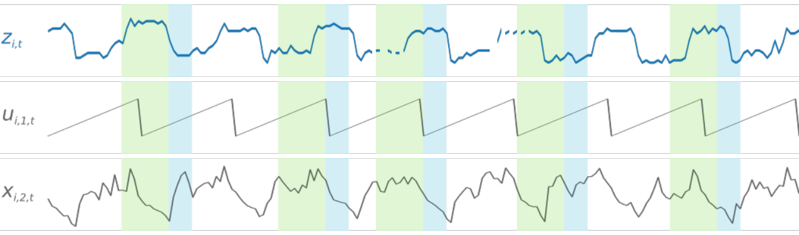

Built-in algorithms and pretrained models
4271

## Page 301

Amazon SageMaker AI
Developer Guide

To capture seasonality patterns, DeepAR also automatically feeds lagged values from the target
time series. In the example with hourly frequency, for each time index, t = T, the model exposes the
zi,t values, which occurred approximately one, two, and three days in the past.

For inference, the trained model takes as input target time series, which might or might

not have been used during training, and forecasts a probability distribution for the next

prediction_length values. Because DeepAR is trained on the entire dataset, the forecast takes
into account patterns learned from similar time series.

For information on the mathematics behind DeepAR, see DeepAR: Probabilistic Forecasting with
Autoregressive Recurrent Networks.

DeepAR Hyperparameters

The following table lists the hyperparameters that you can set when training with the Amazon
SageMaker AI DeepAR forecasting algorithm.

Parameter Name
Description

context_length
The number of time-points that the model gets to see before
making the prediction. The value for this parameter should

be about the same as the prediction_length . The model

also receives lagged inputs from the target, so context_l

ength  can be much smaller than typical seasonalities. For
example, a daily time series can have yearly seasonality. The
model automatically includes a lag of one year, so the context
length can be shorter than a year. The lag values that the
model picks depend on the frequency of the time series. For

Built-in algorithms and pretrained models
4272

## Page 302

Amazon SageMaker AI
Developer Guide

Parameter Name
Description

example, lag values for daily frequency are previous week, 2
weeks, 3 weeks, 4 weeks, and year.

Required

Valid values: Positive integer

epochs
The maximum number of passes over the training data. The
optimal value depends on your data size and learning rate. See

also early_stopping_patience
. Typical values range
from 10 to 1000.

Required

Valid values: Positive integer

prediction_length
The number of time-steps that the model is trained to predict,
also called the forecast horizon. The trained model always
generates forecasts with this length. It can't generate longer

forecasts. The prediction_length  is fixed when a model is
trained and it cannot be changed later.

Required

Valid values: Positive integer

Built-in algorithms and pretrained models
4273

## Page 303

Amazon SageMaker AI
Developer Guide

Parameter Name
Description

time_freq
The granularity of the time series in the dataset. Use

time_freq  to select appropriate date features and lags.
The model supports the following basic frequencies. It also
supports multiples of these basic frequencies. For example,

5min specifies a frequency of 5 minutes.

• M: monthly

• W: weekly

• D: daily

• H: hourly

• min: every minute

Required

Valid values: An integer followed by M, W, D, H, or min. For

example, 5min.

Built-in algorithms and pretrained models
4274

## Page 304

Amazon SageMaker AI
Developer Guide

Parameter Name
Description

cardinality
When using the categorical features (cat), cardinality
is an array specifying the number of categories (groups) per

categorical feature. Set this to auto to infer the cardinality

from the data. The auto mode also works when no categoric
al features are used in the dataset. This is the recommended
setting for the parameter.

Set cardinality to ignore to force DeepAR to not use categoric
al features, even it they are present in the data.

To perform additional data validation, it is possible to explicitl
y set this parameter to the actual value. For example, if two
categorical features are provided where the first has 2 and the
other has 3 possible values, set this to [2, 3].

For more information on how to use categorical feature, see
the data-section on the main documentation page of DeepAR.

Optional

Valid values: auto, ignore, array of positive integers, empty
string, or

Default value: auto

dropout_rate
The dropout rate to use during training. The model uses

zoneout regularization. For each iteration, a random subset of
hidden neurons are not updated. Typical values are less than
0.2.

Optional

Valid values: float

Default value: 0.1

Built-in algorithms and pretrained models
4275

## Page 305

Amazon SageMaker AI
Developer Guide

Parameter Name
Description

If this parameter is set, training stops when no progress is

early_stopping_pat

made within the specified number of epochs. The model that
has the lowest loss is returned as the final model.

ience

Optional

Valid values: integer

embedding_dimension
Size of embedding vector learned per categorical feature (same
value is used for all categorical features).

The DeepAR model can learn group-level time series patterns
when a categorical grouping feature is provided. To do this,

the model learns an embedding vector of size embedding

_dimension
for each group, capturing the common

properties of all time series in the group. A larger embedding

_dimension
allows the model to capture more complex

patterns. However, because increasing the embedding

_dimension
increases the number of parameters in the
model, more training data is required to accurately learn these
parameters. Typical values for this parameter are between
10-100.

Optional

Valid values: positive integer

Default value: 10

learning_rate
The learning rate used in training. Typical values range from
1e-4 to 1e-1.

Optional

Valid values: float

Default value: 1e-3

Built-in algorithms and pretrained models
4276

## Page 306

Amazon SageMaker AI
Developer Guide

Parameter Name
Description

likelihood
The model generates a probabilistic forecast, and can provide
quantiles of the distribution and return samples. Depending on
your data, select an appropriate likelihood (noise model) that
is used for uncertainty estimates. The following likelihoods can
be selected:

• gaussian: Use for real-valued data.

• beta: Use for real-valued targets between 0 and 1 inclusive.

• negative-binomial: Use for count data (non-negative
integers).

• student-T: An alternative for real-valued data that works well
for bursty data.

• deterministic-L1: A loss function that does not estimate
uncertainty and only learns a point forecast.

Optional

Valid values: One of gaussian, beta, negative-binomial, student-
T, or deterministic-L1.

Default value: student-T

mini_batch_size
The size of mini-batches used during training. Typical values
range from 32 to 512.

Optional

Valid values: positive integer

Default value: 128

Built-in algorithms and pretrained models
4277

## Page 307

Amazon SageMaker AI
Developer Guide

Parameter Name
Description

num_cells
The number of cells to use in each hidden layer of the RNN.
Typical values range from 30 to 100.

Optional

Valid values: positive integer

Default value: 40

num_dynamic_feat
The number of dynamic_feat  provided in the data. Set this

to auto to infer the number of dynamic features from the

data. The auto mode also works when no dynamic features are
used in the dataset. This is the recommended setting for the
parameter.

To force DeepAR to not use dynamic features, even it they are

present in the data, set num_dynamic_feat  to ignore.

To perform additional data validation, it is possible to explicitl
y set this parameter to the actual integer value. For example, if
two dynamic features are provided, set this to 2.

Optional

Valid values: auto, ignore, positive integer, or empty string

Default value: auto

Built-in algorithms and pretrained models
4278

## Page 308

Amazon SageMaker AI
Developer Guide

Parameter Name
Description

num_eval_samples
The number of samples that are used per time-series when
calculating test accuracy metrics. This parameter does not have
any influence on the training or the final model. In particular,
the model can be queried with a different number of samples.
This parameter only affects the reported accuracy scores on
the test channel after training. Smaller values result in faster
evaluation, but then the evaluation scores are typically worse
and more uncertain. When evaluating with higher quantiles,
for example 0.95, it may be important to increase the number
of evaluation samples.

Optional

Valid values: integer

Default value: 100

num_layers
The number of hidden layers in the RNN. Typical values range
from 1 to 4.

Optional

Valid values: positive integer

Default value: 2

test_quantiles
Quantiles for which to calculate quantile loss on the test
channel.

Optional

Valid values: array of floats

Default value: [0.1, 0.2, 0.3, 0.4, 0.5, 0.6, 0.7, 0.8, 0.9]

Built-in algorithms and pretrained models
4279

## Page 309

Amazon SageMaker AI
Developer Guide

Tune a DeepAR Model

Automatic model tuning, also known as hyperparameter tuning, finds the best version of a model
by running many jobs that test a range of hyperparameters on your dataset. You choose the
tunable hyperparameters, a range of values for each, and an objective metric. You choose the
objective metric from the metrics that the algorithm computes. Automatic model tuning searches
the hyperparameters chosen to find the combination of values that result in the model that
optimizes the objective metric.

For more information about model tuning, see Automatic model tuning with SageMaker AI.

Metrics Computed by the DeepAR Algorithm

The DeepAR algorithm reports three metrics, which are computed during training. When tuning a
model, choose one of these as the objective. For the objective, use either the forecast accuracy on
a provided test channel (recommended) or the training loss. For recommendations for the training/
test split for the DeepAR algorithm, see Best Practices for Using the DeepAR Algorithm.

Metric Name
Description
Optimization
Direction

test:RMSE
The root mean square error between the
forecast and the actual target computed on
the test set.

Minimize

The average overall quantile losses computed
on the test set. To control which quantiles are

Minimize

test:mean

_wQuantileLoss

used, set the test_quantiles  hyperpara

meter.

The training negative log-likelihood loss
averaged over the last training epoch for the
model.

Minimize

train:fin

al_loss

Tunable Hyperparameters for the DeepAR Algorithm

Tune a DeepAR model with the following hyperparameters. The hyperparameters that have the
greatest impact, listed in order from the most to least impactful, on DeepAR objective metrics are:

epochs, context_length, mini_batch_size, learning_rate, and num_cells.

Built-in algorithms and pretrained models
4280

## Page 310

Amazon SageMaker AI
Developer Guide

Parameter Name
Parameter Type
Recommended
Ranges

epochs
IntegerParameterRanges
MinValue: 1,
MaxValue: 1000

context_length
IntegerParameterRanges
MinValue: 1,
MaxValue: 200

mini_batch_size
IntegerParameterRanges
MinValue: 32,
MaxValue: 1028

learning_rate
ContinuousParameterRange
MinValue: 1e-5,
MaxValue: 1e-1

num_cells
IntegerParameterRanges
MinValue: 30,
MaxValue: 200

num_layers
IntegerParameterRanges
MinValue: 1,
MaxValue: 8

dropout_rate
ContinuousParameterRange
MinValue: 0.00,
MaxValue: 0.2

IntegerParameterRanges
MinValue: 1,
MaxValue: 50

embedding

_dimension

DeepAR Inference Formats

The following page describes the request and response formats for inference with the Amazon
SageMaker AI DeepAR model.

DeepAR JSON Request Formats

Query a trained model by using the model's endpoint. The endpoint takes the following JSON
request format.

In the request, the instances field corresponds to the time series that should be forecast by the
model.

Built-in algorithms and pretrained models
4281

## Page 311

Amazon SageMaker AI
Developer Guide

If the model was trained with categories, you must provide a cat for each instance. If the model

was trained without the cat field, it should be omitted.

If the model was trained with a custom feature time series (dynamic_feat), you have to provide

the same number of dynamic_featvalues for each instance. Each of them should have a length

given by length(target) + prediction_length, where the last prediction_length values
correspond to the time points in the future that will be predicted. If the model was trained without
custom feature time series, the field should not be included in the request.

{
"instances": [
{
"start": "2009-11-01 00:00:00",
"target": [4.0, 10.0, "NaN", 100.0, 113.0],
"cat": [0, 1],
"dynamic_feat": [[1.0, 1.1, 2.1, 0.5, 3.1, 4.1, 1.2, 5.0, ...]]
},
{
"start": "2012-01-30",
"target": [1.0],
"cat": [2, 1],
"dynamic_feat": [[2.0, 3.1, 4.5, 1.5, 1.8, 3.2, 0.1, 3.0, ...]]
},
{
"start": "1999-01-30",
"target": [2.0, 1.0],
"cat": [1, 3],
"dynamic_feat": [[1.0, 0.1, -2.5, 0.3, 2.0, -1.2, -0.1, -3.0, ...]]
}
],
"configuration": {
"num_samples": 50,
"output_types": ["mean", "quantiles", "samples"],
"quantiles": ["0.5", "0.9"]
}
}

The configuration field is optional. configuration.num_samples sets the
number of sample paths that the model generates to estimate the mean and quantiles.

configuration.output_types describes the information that will be returned in the request.

Valid values are "mean" "quantiles" and "samples". If you specify "quantiles", each of

Built-in algorithms and pretrained models
4282

## Page 312

Amazon SageMaker AI
Developer Guide

the quantile values in configuration.quantiles is returned as a time series. If you specify

"samples", the model also returns the raw samples used to calculate the other outputs.

DeepAR JSON Response Formats

The following is the format of a response, where [...] are arrays of numbers:

{
"predictions": [
{
"quantiles": {
"0.9": [...],
"0.5": [...]
},
"samples": [...],
"mean": [...]
},
{
"quantiles": {
"0.9": [...],
"0.5": [...]
},
"samples": [...],
"mean": [...]
},
{
"quantiles": {
"0.9": [...],
"0.5": [...]
},
"samples": [...],
"mean": [...]
}
]
}

DeepAR has a response timeout of 60 seconds. When passing multiple time series in a single
request, the forecasts are generated sequentially. Because the forecast for each time series
typically takes about 300 to 1000 milliseconds or longer, depending on the model size, passing
too many time series in a single request can cause time outs. It's better to send fewer time series
per request and send more requests. Because the DeepAR algorithm uses multiple workers per
instance, you can achieve much higher throughput by sending multiple requests in parallel.

Built-in algorithms and pretrained models
4283

## Page 313

Amazon SageMaker AI
Developer Guide

By default, DeepAR uses one worker per CPU for inference, if there is sufficient memory
per CPU. If the model is large and there isn't enough memory to run a model on each
CPU, the number of workers is reduced. The number of workers used for inference can be

overwritten using the environment variable MODEL_SERVER_WORKERS For example, by setting

MODEL_SERVER_WORKERS=1) when calling the SageMaker AI CreateModel API.

Batch Transform with the DeepAR Algorithm

DeepAR forecasting supports getting inferences by using batch transform from data using the
JSON Lines format. In this format, each record is represented on a single line as a JSON object, and
lines are separated by newline characters. The format is identical to the JSON Lines format used
for model training. For information, see Input/Output Interface for the DeepAR Algorithm. For
example:

{"start": "2009-11-01 00:00:00", "target": [4.3, "NaN", 5.1, ...], "cat": [0, 1],
"dynamic_feat": [[1.1, 1.2, 0.5, ..]]}
{"start": "2012-01-30 00:00:00", "target": [1.0, -5.0, ...], "cat": [2, 3],
"dynamic_feat": [[1.1, 2.05, ...]]}
{"start": "1999-01-30 00:00:00", "target": [2.0, 1.0], "cat": [1, 4], "dynamic_feat":
[[1.3, 0.4]]}

Note

When creating the transformation job with CreateTransformJob, set the

BatchStrategy value to SingleRecord and set the SplitType value in the

TransformInput configuration to Line, as the default values currently cause runtime
failures.

Similar to the hosted endpoint inference request format, the cat and the dynamic_feat fields for
each instance are required if both of the following are true:

• The model is trained on a dataset that contained both the cat and the dynamic_feat fields.

• The corresponding cardinality and num_dynamic_feat values used in the training job are

not set to "".

Unlike hosted endpoint inference, the configuration field is set once for the entire batch

inference job using an environment variable named DEEPAR_INFERENCE_CONFIG. The

Built-in algorithms and pretrained models
4284

## Page 314

Amazon SageMaker AI
Developer Guide

value of DEEPAR_INFERENCE_CONFIG can be passed when the model is created by calling

CreateTransformJob API. If DEEPAR_INFERENCE_CONFIG is missing in the container

environment, the inference container uses the following default:

{
"num_samples": 100,
"output_types": ["mean", "quantiles"],
"quantiles": ["0.1", "0.2", "0.3", "0.4", "0.5", "0.6", "0.7", "0.8", "0.9"]
}

The output is also in JSON Lines format, with one line per prediction, in an order identical to the
instance order in the corresponding input file. Predictions are encoded as objects identical to the
ones returned by responses in online inference mode. For example:

{ "quantiles": { "0.1": [...], "0.2": [...] }, "samples": [...], "mean": [...] }

Note that in the TransformInput configuration of the SageMaker AI CreateTransformJob

request clients must explicitly set the AssembleWith value to Line, as the default value None
concatenates all JSON objects on the same line.

For example, here is a SageMaker AI CreateTransformJob request for a DeepAR job with a

custom DEEPAR_INFERENCE_CONFIG:

{
"BatchStrategy": "SingleRecord",
"Environment": {
"DEEPAR_INFERENCE_CONFIG" : "{ \"num_samples\": 200, \"output_types\": [\"mean
\"] }",
...
},
"TransformInput": {
"SplitType": "Line",
...
},
"TransformOutput": {
"AssembleWith": "Line",
...
},
...
}

Built-in algorithms and pretrained models
4285

## Page 315

Amazon SageMaker AI
Developer Guide

Unsupervised Built-in SageMaker AI Algorithms

Amazon SageMaker AI provides several built-in algorithms that can be used for a variety of
unsupervised learning tasks such as clustering, dimension reduction, pattern recognition, and
anomaly detection.

• IP Insights—learns the usage patterns for IPv4 addresses. It is designed to capture associations
between IPv4 addresses and various entities, such as user IDs or account numbers.

• K-Means Algorithm—finds discrete groupings within data, where members of a group are as
similar as possible to one another and as different as possible from members of other groups.

• Principal Component Analysis (PCA) Algorithm—reduces the dimensionality (number of
features) within a dataset by projecting data points onto the first few principal components. The
objective is to retain as much information or variation as possible. For mathematicians, principal
components are eigenvectors of the data's covariance matrix.

• Random Cut Forest (RCF) Algorithm—detects anomalous data points within a data set that
diverge from otherwise well-structured or patterned data.

Algorithm
name

Channel
name

Training
input
mode

File type
Instance
class

Paralleli
zable

IP Insights
train and
(optional
ly)
validation

File
CSV
CPU or
GPU

Yes

K-Means
train and
(optional
ly) test

File or Pipe
recordIO-
protobuf
or CSV

CPU or
GPUCommon
(single
GPU device
on one
or more
instances)

No

Built-in algorithms and pretrained models
4286

## Page 316

Amazon SageMaker AI
Developer Guide

Algorithm
name

Channel
name

Training
input
mode

File type
Instance
class

Paralleli
zable

PCA
train and
(optional
ly) test

File or Pipe
recordIO-
protobuf
or CSV

GPU or
CPU

Yes

Random
Cut Forest

train and
(optional
ly) test

File or Pipe
recordIO-
protobuf
or CSV

CPU
Yes

IP Insights

Amazon SageMaker AI IP Insights is an unsupervised learning algorithm that learns the usage
patterns for IPv4 addresses. It is designed to capture associations between IPv4 addresses and
various entities, such as user IDs or account numbers. You can use it to identify a user attempting
to log into a web service from an anomalous IP address, for example. Or you can use it to identify
an account that is attempting to create computing resources from an unusual IP address. Trained
IP Insight models can be hosted at an endpoint for making real-time predictions or used for
processing batch transforms.

SageMaker AI IP insights ingests historical data as (entity, IPv4 Address) pairs and learns the IP
usage patterns of each entity. When queried with an (entity, IPv4 Address) event, a SageMaker
AI IP Insights model returns a score that infers how anomalous the pattern of the event is. For
example, when a user attempts to log in from an IP address, if the IP Insights score is high enough,
a web login server might decide to trigger a multi-factor authentication system. In more advanced
solutions, you can feed the IP Insights score into another machine learning model. For example,
you can combine the IP Insight score with other features to rank the findings of another security
system, such as those from Amazon GuardDuty.

The SageMaker AI IP Insights algorithm can also learn vector representations of IP addresses,
known as embeddings. You can use vector-encoded embeddings as features in downstream
machine learning tasks that use the information observed in the IP addresses. For example, you
can use them in tasks such as measuring similarities between IP addresses in clustering and
visualization tasks.

Topics

Built-in algorithms and pretrained models
4287

## Page 317

Amazon SageMaker AI
Developer Guide

• Input/Output Interface for the IP Insights Algorithm

• EC2 Instance Recommendation for the IP Insights Algorithm

• IP Insights Sample Notebooks

• How IP Insights Works

• IP Insights Hyperparameters

• Tune an IP Insights Model

• IP Insights Data Formats

Input/Output Interface for the IP Insights Algorithm

Training and Validation

The SageMaker AI IP Insights algorithm supports training and validation data channels. It uses the
optional validation channel to compute an area-under-curve (AUC) score on a predefined negative
sampling strategy. The AUC metric validates how well the model discriminates between positive

and negative samples. Training and validation data content types need to be in text/csv format.
The first column of the CSV data is an opaque string that provides a unique identifier for the entity.
The second column is an IPv4 address in decimal-dot notation. IP Insights currently supports only
File mode. For more information and some examples, see IP Insights Training Data Formats.

Inference

For inference, IP Insights supports text/csv, application/json, and application/

jsonlines data content types. For more information about the common data formats for
inference provided by SageMaker AI, see Common data formats for inference. IP Insights inference

returns output formatted as either application/json or application/jsonlines. Each

record in the output data contains the corresponding dot_product (or compatibility score) for
each input data point. For more information and some examples, see IP Insights Inference Data
Formats.

EC2 Instance Recommendation for the IP Insights Algorithm

The SageMaker AI IP Insights algorithm can run on both GPU and CPU instances. For training jobs,
we recommend using GPU instances. However, for certain workloads with large training datasets,
distributed CPU instances might reduce training costs. For inference, we recommend using CPU
instances. IP Insights supports P2, P3, G4dn, and G5 GPU families.

Built-in algorithms and pretrained models
4288

## Page 318

Amazon SageMaker AI
Developer Guide

GPU Instances for the IP Insights Algorithm

IP Insights supports all available GPUs. If you need to speed up training, we recommend starting
with a single GPU instance, such as ml.p3.2xlarge, and then moving to a multi-GPU environment,
such as ml.p3.8xlarge and ml.p3.16xlarge. Multi-GPUs automatically divide the mini batches
of training data across themselves. If you switch from a single GPU to multiple GPUs, the

mini_batch_size is divided equally into the number of GPUs used. You may want to increase the

value of the mini_batch_size to compensate for this.

CPU Instances for the IP Insights Algorithm

The type of CPU instance that we recommend depends largely on the instance's available memory

and the model size. The model size is determined by two hyperparameters: vector_dim and

num_entity_vectors. The maximum supported model size is 8 GB. The following table lists
typical EC2 instance types that you would deploy based on these input parameters for various

model sizes. In Table 1, the value for vector_dim in the first column range from 32 to 2048 and

the values for num_entity_vectors in the first row range from 10,000 to 50,000,000.

10,000
50,000
100,000
500,000
1,000,000 5,000,000 10,000,00

50,000,00
0

vector_di

0

m  \

num_entit

y_vectors

.

32
ml.m5.lar
ge

ml.m5.lar

ml.m5.lar

ml.m5.lar

ml.m5.lar

ml.m5.xla

ml.m5.2xl

ml.m5.4xl

ge

ge

ge

ge

rge

arge

arge

64
ml.m5.lar
ge

ml.m5.lar

ml.m5.lar

ml.m5.lar

ml.m5.lar

ml.m5.2xl

ml.m5.2xl

ge

ge

ge

ge

arge

arge

128
ml.m5.lar
ge

ml.m5.lar

ml.m5.lar

ml.m5.lar

ml.m5.lar

ml.m5.2xl

ml.m5.4xl

ge

ge

ge

ge

arge

arge

256
ml.m5.lar
ge

ml.m5.lar

ml.m5.lar

ml.m5.lar

ml.m5.xla

ml.m5.4xl

ge

ge

ge

rge

arge

512
ml.m5.lar
ge

ml.m5.lar

ml.m5.lar

ml.m5.lar

ml.m5.2xl

ge

ge

ge

arge

Built-in algorithms and pretrained models
4289

## Page 319

Amazon SageMaker AI
Developer Guide

10,000
50,000
100,000
500,000
1,000,000 5,000,000 10,000,00

50,000,00
0

vector_di

0

m  \

num_entit

y_vectors

.

1024
ml.m5.lar
ge

ml.m5.lar

ml.m5.lar

ml.m5.xla

ml.m5.4xl

ge

ge

rge

arge

2048
ml.m5.lar
ge

ml.m5.lar

ml.m5.xla

ml.m5.xla

ge

rge

rge

The values for the mini_batch_size, num_ip_encoder_layers,

random_negative_sampling_rate, and shuffled_negative_sampling_rate
hyperparameters also affect the amount of memory required. If these values are large, you might
need to use a larger instance type than normal.

IP Insights Sample Notebooks

For a sample notebook that shows how to train the SageMaker AI IP Insights algorithm and
perform inferences with it, see An Introduction to the SageMaker AIIP Insights Algorithm . For
instructions how to create and access Jupyter notebook instances that you can use to run the
example in SageMaker AI, see Amazon SageMaker notebook instances. After creating a notebook
instance, choose the SageMaker AI Examples tab to see a list of all the SageMaker AI examples. To
open a notebook, choose its Use tab and choose Create copy.

How IP Insights Works

Amazon SageMaker AI IP Insights is an unsupervised algorithm that consumes observed data
in the form of (entity, IPv4 address) pairs that associates entities with IP addresses. IP Insights
determines how likely it is that an entity would use a particular IP address by learning latent vector
representations for both entities and IP addresses. The distance between these two representations
can then serve as the proxy for how likely this association is.

The IP Insights algorithm uses a neural network to learn the latent vector representations for
entities and IP addresses. Entities are first hashed to a large but fixed hash space and then encoded
by a simple embedding layer. Character strings such as user names or account IDs can be fed
directly into IP Insights as they appear in log files. You don't need to preprocess the data for entity

Built-in algorithms and pretrained models
4290

## Page 320

Amazon SageMaker AI
Developer Guide

identifiers. You can provide entities as an arbitrary string value during both training and inference.
The hash size should be configured with a value that is high enough to ensure that the number
of collisions, which occur when distinct entities are mapped to the same latent vector, remain
insignificant. For more information about how to select appropriate hash sizes, see Feature Hashing
for Large Scale Multitask Learning. For representing IP addresses, on the other hand, IP Insights
uses a specially designed encoder network to uniquely represent each possible IPv4 address by
exploiting the prefix structure of IP addresses.

During training, IP Insights automatically generates negative samples by randomly pairing entities
and IP addresses. These negative samples represent data that is less likely to occur in reality. The
model is trained to discriminate between positive samples that are observed in the training data
and these generated negative samples. More specifically, the model is trained to minimize the cross
entropy, also known as the log loss, defined as follows:

yn is the label that indicates whether the sample is from the real distribution governing observed
data (yn=1) or from the distribution generating negative samples (yn=0). pn is the probability that
the sample is from the real distribution, as predicted by the model.

Generating negative samples is an important process that is used to achieve an accurate model
of the observed data. If negative samples are extremely unlikely, for example, if all of the
IP addresses in negative samples are 10.0.0.0, then the model trivially learns to distinguish
negative samples and fails to accurately characterize the actual observed dataset. To keep
negative samples more realistic, IP Insights generates negative samples both by randomly
generating IP addresses and randomly picking IP addresses from training data. You can configure
the type of negative sampling and the rates at which negative samples are generated with

the random_negative_sampling_rate and shuffled_negative_sampling_rate
hyperparameters.

Given an nth (entity, IP address pair), the IP Insights model outputs a score, Sn , that indicates how
compatible the entity is with the IP address. This score corresponds to the log odds ratio for a
given (entity, IP address) of the pair coming from a real distribution as compared to coming from a
negative distribution. It is defined as follows:

Built-in algorithms and pretrained models
4291

## Page 321

Amazon SageMaker AI
Developer Guide

The score is essentially a measure of the similarity between the vector representations of the nth
entity and IP address. It can be interpreted as how much more likely it would be to observe this
event in reality than in a randomly generated dataset. During training, the algorithm uses this
score to calculate an estimate of the probability of a sample coming from the real distribution, pn,
to use in the cross entropy minimization, where:

IP Insights Hyperparameters

In the CreateTransformJob request, you specify the training algorithm. You can also specify
algorithm-specific hyperparameters as string-to-string maps. The following table lists the
hyperparameters for the Amazon SageMaker AI IP Insights algorithm.

Parameter Name
Description

num_entity_vectors
The number of entity vector representations (entity
embedding vectors) to train. Each entity in the training
set is randomly assigned to one of these vectors using
a hash function. Because of hash collisions, it might be
possible to have multiple entities assigned to the same
vector. This would cause the same vector to represent
multiple entities. This generally has a negligible effect
on model performance, as long as the collision rate is
not too severe. To keep the collision rate low, set this
value as high as possible. However, the model size, and,
therefore, the memory requirement, for both training
and inference, scales linearly with this hyperparameter.
We recommend that you set this value to twice the
number of unique entity identifiers.

Built-in algorithms and pretrained models
4292

## Page 322

Amazon SageMaker AI
Developer Guide

Parameter Name
Description

Required

Valid values: 1 ≤ positive integer ≤ 250,000,000

vector_dim
The size of embedding vectors to represent entities and
IP addresses. The larger the value, the more informati
on that can be encoded using these representations. In
practice, model size scales linearly with this parameter
and limits how large the dimension can be. In addition,
using vector representations that are too large can
cause the model to overfit, especially for small training
datasets. Overfitting occurs when a model doesn't
learn any pattern in the data but effectively memorizes
the training data and, therefore, cannot generalize well
and performs poorly during inference. The recommend
ed value is 128.

Required

Valid values: 4 ≤ positive integer ≤ 4096

The interval (every X batches) at which the Apache
MXNet Speedometer function prints the training speed
of the network (samples/second).

batch_metrics_publ

ish_interval

Optional

Valid values: positive integer ≥ 1

Default value: 1,000

Built-in algorithms and pretrained models
4293

## Page 323

Amazon SageMaker AI
Developer Guide

Parameter Name
Description

epochs
The number of passes over the training data. The
optimal value depends on your data size and learning
rate. Typical values range from 5 to 100.

Optional

Valid values: positive integer ≥ 1

Default value: 10

learning_rate
The learning rate for the optimizer. IP Insights use a
gradient-descent-based Adam optimizer. The learning
rate effectively controls the step size to update model
parameters at each iteration. Too large a learning rate
can cause the model to diverge because the training is
likely to overshoot a minima. On the other hand, too
small a learning rate slows down convergence. Typical
values range from 1e-4 to 1e-1.

Optional

Valid values: 1e-6 ≤ float ≤ 10.0

Default value: 0.001

Built-in algorithms and pretrained models
4294

## Page 324

Amazon SageMaker AI
Developer Guide

Parameter Name
Description

mini_batch_size
The number of examples in each mini batch. The
training procedure processes data in mini batches.
The optimal value depends on the number of unique
account identifiers in the dataset. In general, the

larger the mini_batch_size , the faster the training
and the greater the number of possible shuffled-
negative-sample combinations. However, with a

large mini_batch_size , the training is more likely
to converge to a poor local minimum and perform
relatively worse for inference.

Optional

Valid values: 1 ≤ positive integer ≤ 500000

Default value: 10,000

num_ip_encoder_layers
The number of fully connected layers used to encode
the IP address embedding. The larger the number of
layers, the greater the model's capacity to capture
patterns among IP addresses. However, using a large
number of layers increases the chance of overfitting.

Optional

Valid values: 0 ≤ positive integer ≤ 100

Default value: 1

Built-in algorithms and pretrained models
4295

## Page 325

Amazon SageMaker AI
Developer Guide

Parameter Name
Description

The number of random negative samples, R, to
generate per input example. The training procedure
relies on negative samples to prevent the vector
representations of the model collapsing to a single
point. Random negative sampling generates R random
IP addresses for each input account in the mini batch.

random_negative_sa

mpling_rate

The sum of the random_negative_sampling_ra

te  (R) and shuffled_negative_sampling_

rate  (S) must be in the interval: 1 ≤ R + S ≤ 500.

Optional

Valid values: 0 ≤ positive integer ≤ 500

Default value: 1

The number of shuffled negative samples, S, to
generate per input example. In some cases, it helps to
use more realistic negative samples that are randomly
picked from the training data itself. This kind of
negative sampling is achieved by shuffling the data
within a mini batch. Shuffled negative sampling
generates S negative IP addresses by shuffling the IP
address and account pairings within a mini batch. The

shuffled_negative_

sampling_rate

sum of the random_negative_sampling_rate

(R) and shuffled_negative_sampling_rate
(S) must be in the interval: 1 ≤ R + S ≤ 500.

Optional

Valid values: 0 ≤ positive integer ≤ 500

Default value: 1

Built-in algorithms and pretrained models
4296

## Page 326

Amazon SageMaker AI
Developer Guide

Parameter Name
Description

weight_decay
The weight decay coefficient. This parameter adds an
L2 regularization factor that is required to prevent the
model from overfitting the training data.

Optional

Valid values: 0.0 ≤ float ≤ 10.0

Default value: 0.00001

Tune an IP Insights Model

Automatic model tuning, also called hyperparameter tuning, finds the best version of a model by
running many jobs that test a range of hyperparameters on your dataset. You choose the tunable
hyperparameters, a range of values for each, and an objective metric. You choose the objective
metric from the metrics that the algorithm computes. Automatic model tuning searches the
hyperparameters chosen to find the combination of values that result in the model that optimizes
the objective metric.

For more information about model tuning, see Automatic model tuning with SageMaker AI.

Metrics Computed by the IP Insights Algorithm

The Amazon SageMaker AI IP Insights algorithm is an unsupervised learning algorithm that learns
associations between IP addresses and entities. The algorithm trains a discriminator model , which
learns to separate observed data points (positive samples) from randomly generated data points
(negative samples). Automatic model tuning on IP Insights helps you find the model that can most
accurately distinguish between unlabeled validation data and automatically generated negative
samples. The model accuracy on the validation dataset is measured by the area under the receiver

operating characteristic curve. This validation:discriminator_auc metric can take values
between 0.0 and 1.0, where 1.0 indicates perfect accuracy.

The IP Insights algorithm computes a validation:discriminator_auc metric during
validation, the value of which is used as the objective function to optimize for hyperparameter
tuning.

Built-in algorithms and pretrained models
4297

## Page 327

Amazon SageMaker AI
Developer Guide

Metric Name
Description
Optimization
Direction

Area under the receiver operating character

Maximize

validatio

istic curve on the validation dataset. The
validation dataset is not labeled. Area Under
the Curve (AUC) is a metric that describes the
model's ability to discriminate validation data
points from randomly generated data points.

n:discrim

inator_auc

Tunable IP Insights Hyperparameters

You can tune the following hyperparameters for the SageMaker AI IP Insights algorithm.

Parameter Name
Parameter Type
Recommended
Ranges

epochs
IntegerParameterRange
MinValue: 1,
MaxValue: 100

learning_rate
ContinuousParameterRange
MinValue: 1e-4,
MaxValue: 0.1

mini_batch_size
IntegerParameterRanges
MinValue: 100,
MaxValue: 50000

IntegerParameterRanges
MinValue: 10000,
MaxValue: 1000000

num_entit

y_vectors

IntegerParameterRanges
MinValue: 1,
MaxValue: 10

num_ip_en

coder_layers

IntegerParameterRanges
MinValue: 0,
MaxValue: 10

random_ne

gative_sa

mpling_rate

Built-in algorithms and pretrained models
4298

## Page 328

Amazon SageMaker AI
Developer Guide

Parameter Name
Parameter Type
Recommended
Ranges

IntegerParameterRanges
MinValue: 0,
MaxValue: 10

shuffled_

negative_

sampling_rate

vector_dim
IntegerParameterRanges
MinValue: 8,
MaxValue: 256

weight_decay
ContinuousParameterRange
MinValue: 0.0,
MaxValue: 1.0

IP Insights Data Formats

This section provides examples of the available input and output data formats used by the IP
Insights algorithm during training and inference.

Topics

• IP Insights Training Data Formats

• IP Insights Inference Data Formats

IP Insights Training Data Formats

The following are the available data input formats for the IP Insights algorithm. Amazon
SageMaker AI built-in algorithms adhere to the common input training format described in
Common Data Formats for Training. However, the SageMaker AI IP Insights algorithm currently
supports only the CSV data input format.

IP Insights Training Data Input Formats

INPUT: CSV

The CSV file must have two columns. The first column is an opaque string that corresponds to an
entity's unique identifier. The second column is the IPv4 address of the entity's access event in
decimal-dot notation.

content-type: text/csv

Built-in algorithms and pretrained models
4299

## Page 329

Amazon SageMaker AI
Developer Guide

entity_id_1, 192.168.1.2
entity_id_2, 10.10.1.2

IP Insights Inference Data Formats

The following are the available input and output formats for the IP Insights algorithm. Amazon
SageMaker AI built-in algorithms adhere to the common input inference format described in
Common data formats for inference. However, the SageMaker AI IP Insights algorithm does not
currently support RecordIO format.

IP Insights Input Request Formats

INPUT: CSV Format

The CSV file must have two columns. The first column is an opaque string that corresponds to an
entity's unique identifier. The second column is the IPv4 address of the entity's access event in
decimal-dot notation.

content-type: text/csv

entity_id_1, 192.168.1.2
entity_id_2, 10.10.1.2

INPUT: JSON Format

JSON data can be provided in different formats. IP Insights follows the common SageMaker AI
formats. For more information about inference formats, see Common data formats for inference.

content-type: application/json

{
"instances": [
{"data": {"features": {"values": ["entity_id_1", "192.168.1.2"]}}},
{"features": ["entity_id_2", "10.10.1.2"]}
]
}

INPUT: JSONLINES Format

The JSON Lines content type is useful for running batch transform jobs. For more information on
SageMaker AI inference formats, see Common data formats for inference. For more information on
running batch transform jobs, see Batch transform for inference with Amazon SageMaker AI.

Built-in algorithms and pretrained models
4300

## Page 330

Amazon SageMaker AI
Developer Guide

content-type: application/jsonlines

{"data": {"features": {"values": ["entity_id_1", "192.168.1.2"]}}},
{"features": ["entity_id_2", "10.10.1.2"]}]

IP Insights Output Response Formats

OUTPUT: JSON Response Format

The default output of the SageMaker AI IP Insights algorithm is the dot_product between the
input entity and IP address. The dot_product signifies how compatible the model considers the

entity and IP address. The dot_product is unbounded. To make predictions about whether
an event is anomalous, you need to set a threshold based on your defined distribution. For

information about how to use the dot_product for anomaly detection, see the An Introduction to
the SageMaker AIIP Insights Algorithm.

accept: application/json

{
"predictions": [
{"dot_product": 0.0},
{"dot_product": 2.0}
]
}

Advanced users can access the model's learned entity and IP embeddings by providing the

additional content-type parameter verbose=True to the Accept heading. You can use the

entity_embedding and ip_embedding for debugging, visualizing, and understanding the
model. Additionally, you can use these embeddings in other machine learning techniques, such as
classification or clustering.

accept: application/json;verbose=True

{
"predictions": [
{
"dot_product": 0.0,
"entity_embedding": [1.0, 0.0, 0.0],
"ip_embedding": [0.0, 1.0, 0.0]
},

Built-in algorithms and pretrained models
4301

## Page 331

Amazon SageMaker AI
Developer Guide

{
"dot_product": 2.0,
"entity_embedding": [1.0, 0.0, 1.0],
"ip_embedding": [1.0, 0.0, 1.0]
}
]
}

OUTPUT: JSONLINES Response Format

accept: application/jsonlines

{"dot_product": 0.0}
{"dot_product": 2.0}

accept: application/jsonlines; verbose=True

{"dot_product": 0.0, "entity_embedding": [1.0, 0.0, 0.0], "ip_embedding": [0.0, 1.0,
0.0]}
{"dot_product": 2.0, "entity_embedding": [1.0, 0.0, 1.0], "ip_embedding": [1.0, 0.0,
1.0]}

K-Means Algorithm

K-means is an unsupervised learning algorithm. It attempts to find discrete groupings within data,
where members of a group are as similar as possible to one another and as different as possible
from members of other groups. You define the attributes that you want the algorithm to use to
determine similarity.

Amazon SageMaker AI uses a modified version of the web-scale k-means clustering algorithm.
Compared with the original version of the algorithm, the version used by Amazon SageMaker AI is
more accurate. Like the original algorithm, it scales to massive datasets and delivers improvements
in training time. To do this, the version used by Amazon SageMaker AI streams mini-batches (small,
random subsets) of the training data. For more information about mini-batch k-means, see Web-
scale k-means Clustering.

The k-means algorithm expects tabular data, where rows represent the observations that you want
to cluster, and the columns represent attributes of the observations. The n attributes in each row
represent a point in n-dimensional space. The Euclidean distance between these points represents
the similarity of the corresponding observations. The algorithm groups observations with similar

Built-in algorithms and pretrained models
4302

## Page 332

Amazon SageMaker AI
Developer Guide

attribute values (the points corresponding to these observations are closer together). For more
information about how k-means works in Amazon SageMaker AI, see How K-Means Clustering
Works.

Topics

• Input/Output Interface for the K-Means Algorithm

• EC2 Instance Recommendation for the K-Means Algorithm

• K-Means Sample Notebooks

• How K-Means Clustering Works

• K-Means Hyperparameters

• Tune a K-Means Model

• K-Means Response Formats

Input/Output Interface for the K-Means Algorithm

For training, the k-means algorithm expects data to be provided in the train channel

(recommended S3DataDistributionType=ShardedByS3Key), with an optional test channel

(recommended S3DataDistributionType=FullyReplicated) to score the data on. Both

recordIO-wrapped-protobuf and CSV formats are supported for training. You can use either

File mode or Pipe mode to train models on data that is formatted as recordIO-wrapped-

protobuf or as CSV.

For inference, text/csv, application/json, and application/x-recordio-protobuf are

supported. k-means returns a closest_cluster label and the distance_to_cluster for each
observation.

For more information on input and output file formats, see K-Means Response Formats for
inference and the K-Means Sample Notebooks. The k-means algorithm does not support multiple
instance learning, in which the training set consists of labeled “bags”, each of which is a collection
of unlabeled instances.

EC2 Instance Recommendation for the K-Means Algorithm

We recommend training k-means on CPU instances. You can train on GPU instances, but should
limit GPU training to single-GPU instances (such as ml.g4dn.xlarge) because only one GPU is used
per instance. The k-means algorithm supports P2, P3, G4dn, and G5 instances for training and
inference.

Built-in algorithms and pretrained models
4303

## Page 333

Amazon SageMaker AI
Developer Guide

K-Means Sample Notebooks

For a sample notebook that uses the SageMaker AI K-means algorithm to segment the population
of counties in the United States by attributes identified using principle component analysis, see
Analyze US census data for population segmentation using Amazon SageMaker AI. For instructions
how to create and access Jupyter notebook instances that you can use to run the example in
SageMaker AI, see Amazon SageMaker notebook instances. Once you have created a notebook
instance and opened it, select the SageMaker AI Examples tab to see a list of all the SageMaker AI
samples. To open a notebook, click on its Use tab and select Create copy.

How K-Means Clustering Works

K-means is an algorithm that trains a model that groups similar objects together. The k-means
algorithm accomplishes this by mapping each observation in the input dataset to a point in the
n-dimensional space (where n is the number of attributes of the observation). For example, your
dataset might contain observations of temperature and humidity in a particular location, which are
mapped to points (t, h) in 2-dimensional space.

Note

Clustering algorithms are unsupervised. In unsupervised learning, labels that might be
associated with the objects in the training dataset aren't used. For more information, see
Unsupervised learning.

In k-means clustering, each cluster has a center. During model training, the k-means algorithm uses
the distance of the point that corresponds to each observation in the dataset to the cluster centers
as the basis for clustering. You choose the number of clusters (k) to create.

For example, suppose that you want to create a model to recognize handwritten digits and you
choose the MNIST dataset for training. The dataset provides thousands of images of handwritten
digits (0 through 9). In this example, you might choose to create 10 clusters, one for each digit
(0, 1, …, 9). As part of model training, the k-means algorithm groups the input images into 10
clusters.

Each image in the MNIST dataset is a 28x28-pixel image, with a total of 784 pixels. Each image
corresponds to a point in a 784-dimensional space, similar to a point in a 2-dimensional space (x,y).
To find a cluster to which a point belongs, the k-means algorithm finds the distance of that point

Built-in algorithms and pretrained models
4304

## Page 334

Amazon SageMaker AI
Developer Guide

from all of the cluster centers. It then chooses the cluster with the closest center as the cluster to
which the image belongs.

Note

Amazon SageMaker AI uses a customized version of the algorithm where, instead of
specifying that the algorithm create k clusters, you might choose to improve model
accuracy by specifying extra cluster centers (K = k*x). However, the algorithm ultimately
reduces these to k clusters.

In SageMaker AI, you specify the number of clusters when creating a training job. For more

information, see CreateTrainingJob. In the request body, you add the HyperParameters

string map to specify the k and extra_center_factor strings.

The following is a summary of how k-means works for model training in SageMaker AI:

1. It determines the initial K cluster centers.

Note

In the following topics, K clusters refer to k * x, where you specify k and x when creating
a model training job.

2. It iterates over input training data and recalculates cluster centers.

3. It reduces resulting clusters to k (if the data scientist specified the creation of k*x clusters in the

request).

The following sections also explain some of the parameters that a data scientist might specify to

configure a model training job as part of the HyperParameters string map.

Topics

• Step 1: Determine the Initial Cluster Centers

• Step 2: Iterate over the Training Dataset and Calculate Cluster Centers

• Step 3: Reduce the Clusters from K to k

Built-in algorithms and pretrained models
4305

## Page 335

Amazon SageMaker AI
Developer Guide

Step 1: Determine the Initial Cluster Centers

When using k-means in SageMaker AI, the initial cluster centers are chosen from the observations
in a small, randomly sampled batch. Choose one of the following strategies to determine how
these initial cluster centers are selected:

• The random approach—Randomly choose K observations in your input dataset as cluster centers.
For example, you might choose a cluster center that points to the 784-dimensional space that
corresponds to any 10 images in the MNIST training dataset.

• The k-means++ approach, which works as follows:

1. Start with one cluster and determine its center. You randomly select an observation from your

training dataset and use the point corresponding to the observation as the cluster center. For
example, in the MNIST dataset, randomly choose a handwritten digit image. Then choose the
point in the 784-dimensional space that corresponds to the image as your cluster center. This
is cluster center 1.

2. Determine the center for cluster 2. From the remaining observations in the training dataset,

pick an observation at random. Choose one that is different than the one you previously
selected. This observation corresponds to a point that is far away from cluster center 1. Using
the MNIST dataset as an example, you do the following:

• For each of the remaining images, find the distance of the corresponding point from cluster
center 1. Square the distance and assign a probability that is proportional to the square of
the distance. That way, an image that is different from the one that you previously selected
has a higher probability of getting selected as cluster center 2.

• Choose one of the images randomly, based on probabilities assigned in the previous step.
The point that corresponds to the image is cluster center 2.

3. Repeat Step 2 to find cluster center 3. This time, find the distances of the remaining images

from cluster center 2.

4. Repeat the process until you have the K cluster centers.

To train a model in SageMaker AI, you create a training job. In the request, you provide

configuration information by specifying the following HyperParameters string maps:

• To specify the number of clusters to create, add the k string.

• For greater accuracy, add the optional extra_center_factor string.

Built-in algorithms and pretrained models
4306

## Page 336

Amazon SageMaker AI
Developer Guide

• To specify the strategy that you want to use to determine the initial cluster centers, add the

init_method string and set its value to random or k-means++.

For more information about the SageMaker AI k-means estimator, see K-means in the Amazon
SageMaker Python SDK documentation.

You now have an initial set of cluster centers.

Step 2: Iterate over the Training Dataset and Calculate Cluster Centers

The cluster centers that you created in the preceding step are mostly random, with some
consideration for the training dataset. In this step, you use the training dataset to move these
centers toward the true cluster centers. The algorithm iterates over the training dataset, and
recalculates the K cluster centers.

1.
Read a mini-batch of observations (a small, randomly chosen subset of all records) from the
training dataset and do the following.

Note

When creating a model training job, you specify the batch size in the

mini_batch_size string in the HyperParameters string map.

a.
Assign all of the observations in the mini-batch to one of the clusters with the closest
cluster center.

b.
Calculate the number of observations assigned to each cluster. Then, calculate the
proportion of new points assigned per cluster.

For example, consider the following clusters:

Cluster c1 = 100 previously assigned points. You added 25 points from the mini-batch in
this step.

Cluster c2 = 150 previously assigned points. You added 40 points from the mini-batch in
this step.

Cluster c3 = 450 previously assigned points. You added 5 points from the mini-batch in
this step.

Built-in algorithms and pretrained models
4307

## Page 337

Amazon SageMaker AI
Developer Guide

Calculate the proportion of new points assigned to each of clusters as follows:

p1 = proportion of points assigned to c1 = 25/(100+25)
p2 = proportion of points assigned to c2 = 40/(150+40)
p3 = proportion of points assigned to c3 = 5/(450+5)

c.
Compute the center of the new points added to each cluster:

d1 = center of the new points added to cluster 1
d2 = center of the new points added to cluster 2
d3 = center of the new points added to cluster 3

d.
Compute the weighted average to find the updated cluster centers as follows:

Center of cluster 1 = ((1 - p1) * center of cluster 1) + (p1 * d1)
Center of cluster 2 = ((1 - p2) * center of cluster 2) + (p2 * d2)

Center of cluster 3 = ((1 - p3) * center of cluster 3) + (p3 * d3)

2.
Read the next mini-batch, and repeat Step 1 to recalculate the cluster centers.

3.
For more information about mini-batch k-means, see Web-scale k-means Clustering).

Step 3: Reduce the Clusters from K to k

If the algorithm created K clusters—(K = k*x) where x is greater than 1—then it reduces the K

clusters to k clusters. (For more information, see extra_center_factor in the preceding

discussion.) It does this by applying Lloyd's method with kmeans++ initialization to the K cluster
centers. For more information about Lloyd's method, see k-means clustering.

K-Means Hyperparameters

In the CreateTrainingJob request, you specify the training algorithm that you want to use. You
can also specify algorithm-specific hyperparameters as string-to-string maps. The following table
lists the hyperparameters for the k-means training algorithm provided by Amazon SageMaker AI.
For more information about how k-means clustering works, see How K-Means Clustering Works.

Parameter Name
Description

feature_dim
The number of features in the input data.

Required

Built-in algorithms and pretrained models
4308

## Page 338

Amazon SageMaker AI
Developer Guide

Parameter Name
Description

Valid values: Positive integer

k
The number of required clusters.

Required

Valid values: Positive integer

epochs
The number of passes done over the training data.

Optional

Valid values: Positive integer

Default value: 1

eval_metrics
A JSON list of metric types used to report a score for the

model. Allowed values are msd for Means Square Deviation and

ssd for Sum of Square Distance. If test data is provided, the
score is reported for each of the metrics requested.

Optional

Valid values: Either [\"msd\"]  or [\"ssd\"]  or [\"msd

\",\"ssd\"]  .

Default value: [\"msd\"]

extra_center_factor
The algorithm creates K centers = num_clusters  *

extra_center_factor
as it runs and reduces the number

of centers from K to k when finalizing the model.

Optional

Valid values: Either a positive integer or auto.

Default value: auto

Built-in algorithms and pretrained models
4309

## Page 339

Amazon SageMaker AI
Developer Guide

Parameter Name
Description

half_life_time_size
Used to determine the weight given to an observation when
computing a cluster mean. This weight decays exponentially as
more points are observed. When a point is first observed, it is
assigned a weight of 1 when computing the cluster mean. The
decay constant for the exponential decay function is chosen

so that after observing  half_life_time_size
points, its
weight is 1/2. If set to 0, there is no decay.

Optional

Valid values: Non-negative integer

Default value: 0

init_method
Method by which the algorithm chooses the initial cluster
centers. The standard k-means approach chooses them at
random. An alternative k-means++ method chooses the first
cluster center at random. Then it spreads out the position of
the remaining initial clusters by weighting the selection of
centers with a probability distribution that is proportional to
the square of the distance of the remaining data points from
existing centers.

Optional

Valid values: Either random or kmeans++.

Default value: random

The initialization method for Lloyd's expectation-maximization

local_lloyd_init_m

(EM) procedure used to build the final model containing k
centers.

ethod

Optional

Valid values: Either random or kmeans++.

Default value: kmeans++

Built-in algorithms and pretrained models
4310

## Page 340

Amazon SageMaker AI
Developer Guide

Parameter Name
Description

local_lloyd_max_iter
The maximum number of iterations for Lloyd's expectation-
maximization (EM) procedure used to build the final model

containing k centers.

Optional

Valid values: Positive integer

Default value: 300

The number of times the Lloyd's expectation-maximization
(EM) procedure with the least loss is run when building the

local_lloyd_num_tr

ials

final model containing k centers.

Optional

Valid values: Either a positive integer or auto.

Default value: auto

local_lloyd_tol
The tolerance for change in loss for early stopping of Lloyd's
expectation-maximization (EM) procedure used to build the

final model containing k centers.

Optional

Valid values: Float. Range in [0, 1].

Default value: 0.0001

mini_batch_size
The number of observations per mini-batch for the data
iterator.

Optional

Valid values: Positive integer

Default value: 5000

Built-in algorithms and pretrained models
4311

## Page 341

Amazon SageMaker AI
Developer Guide

Tune a K-Means Model

Automatic model tuning, also known as hyperparameter tuning, finds the best version of a model
by running many jobs that test a range of hyperparameters on your dataset. You choose the
tunable hyperparameters, a range of values for each, and an objective metric. You choose the
objective metric from the metrics that the algorithm computes. Automatic model tuning searches
the hyperparameters chosen to find the combination of values that result in the model that
optimizes the objective metric.

The Amazon SageMaker AI k-means algorithm is an unsupervised algorithm that groups data into
clusters whose members are as similar as possible. Because it is unsupervised, it doesn't use a
validation dataset that hyperparameters can optimize against. But it does take a test dataset and
emits metrics that depend on the squared distance between the data points and the final cluster
centroids at the end of each training run. To find the model that reports the tightest clusters on the
test dataset, you can use a hyperparameter tuning job. The clusters optimize the similarity of their
members.

For more information about model tuning, see Automatic model tuning with SageMaker AI.

Metrics Computed by the K-Means Algorithm

The k-means algorithm computes the following metrics during training. When tuning a model,
choose one of these metrics as the objective metric.

Metric Name
Description
Optimization
Direction

test:msd
Mean squared distances between each record
in the test set and the closest center of the
model.

Minimize

test:ssd
Sum of the squared distances between each
record in the test set and the closest center of
the model.

Minimize

Tunable K-Means Hyperparameters

Tune the Amazon SageMaker AI k-means model with the following hyperparameters.
The hyperparameters that have the greatest impact on k-means objective metrics are:

Built-in algorithms and pretrained models
4312

## Page 342

Amazon SageMaker AI
Developer Guide

mini_batch_size, extra_center_factor, and init_method. Tuning the hyperparameter

epochs generally results in minor improvements.

Parameter Name
Parameter Type
Recommended

Ranges

epochs
IntegerParameterRanges
MinValue: 1,
MaxValue:10

IntegerParameterRanges
MinValue: 4,
MaxValue:10

extra_cen

ter_factor

init_method
CategoricalParameterRanges
['kmeans++',
'random']

mini_batch_size
IntegerParameterRanges
MinValue: 3000,
MaxValue:15000

K-Means Response Formats

All SageMaker AI built-in algorithms adhere to the common input inference format described in
Common Data Formats - Inference. This topic contains a list of the available output formats for the
SageMaker AI k-means algorithm.

JSON Response Format

{
"predictions": [
{
"closest_cluster": 1.0,
"distance_to_cluster": 3.0,
},
{
"closest_cluster": 2.0,
"distance_to_cluster": 5.0,
},

....
]
}

Built-in algorithms and pretrained models
4313

## Page 343

Amazon SageMaker AI
Developer Guide

JSONLINES Response Format

{"closest_cluster": 1.0, "distance_to_cluster": 3.0}
{"closest_cluster": 2.0, "distance_to_cluster": 5.0}

RECORDIO Response Format

[
Record = {
features = {},
label = {
'closest_cluster': {
keys: [],
values: [1.0, 2.0]  # float32
},
'distance_to_cluster': {
keys: [],
values: [3.0, 5.0]  # float32
},
}
}
]

CSV Response Format

The first value in each line corresponds to closest_cluster.

The second value in each line corresponds to distance_to_cluster.

1.0,3.0
2.0,5.0

Principal Component Analysis (PCA) Algorithm

PCA is an unsupervised machine learning algorithm that attempts to reduce the dimensionality
(number of features) within a dataset while still retaining as much information as possible. This
is done by finding a new set of features called components, which are composites of the original
features that are uncorrelated with one another. They are also constrained so that the first
component accounts for the largest possible variability in the data, the second component the
second most variability, and so on.

Built-in algorithms and pretrained models
4314

## Page 344

Amazon SageMaker AI
Developer Guide

In Amazon SageMaker AI, PCA operates in two modes, depending on the scenario:

• regular: For datasets with sparse data and a moderate number of observations and features.

• randomized: For datasets with both a large number of observations and features. This mode
uses an approximation algorithm.

PCA uses tabular data.

The rows represent observations you want to embed in a lower dimensional space. The columns
represent features that you want to find a reduced approximation for. The algorithm calculates the
covariance matrix (or an approximation thereof in a distributed manner), and then performs the
singular value decomposition on this summary to produce the principal components.

Topics

• Input/Output Interface for the PCA Algorithm

• EC2 Instance Recommendation for the PCA Algorithm

• PCA Sample Notebooks

• How PCA Works

• PCA Hyperparameters

• PCA Response Formats

Input/Output Interface for the PCA Algorithm

For training, PCA expects data provided in the train channel, and optionally supports a dataset

passed to the test dataset, which is scored by the final algorithm. Both recordIO-wrapped-

protobuf and CSV formats are supported for training. You can use either File mode or Pipe mode

to train models on data that is formatted as recordIO-wrapped-protobuf or as CSV.

For inference, PCA supports text/csv, application/json, and application/x-recordio-

protobuf. Results are returned in either application/json or application/x-recordio-

protobuf format with a vector of "projections."

For more information on input and output file formats, see PCA Response Formats for inference
and the PCA Sample Notebooks.

Built-in algorithms and pretrained models
4315

## Page 345

Amazon SageMaker AI
Developer Guide

EC2 Instance Recommendation for the PCA Algorithm

PCA supports CPU and GPU instances for training and inference. Which instance type is most
performant depends heavily on the specifics of the input data. For GPU instances, PCA supports P2,
P3, G4dn, and G5.

PCA Sample Notebooks

For a sample notebook that shows how to use the SageMaker AI Principal Component Analysis
algorithm to analyze the images of handwritten digits from zero to nine in the MNIST dataset, see
An Introduction to PCA with MNIST. For instructions how to create and access Jupyter notebook
instances that you can use to run the example in SageMaker AI, see Amazon SageMaker notebook
instances. Once you have created a notebook instance and opened it, select the SageMaker AI
Examples tab to see a list of all the SageMaker AI samples. The topic modeling example notebooks
using the NTM algorithms are located in the Introduction to Amazon algorithms section. To open
a notebook, click on its Use tab and select Create copy.

How PCA Works

Principal Component Analysis (PCA) is a learning algorithm that reduces the dimensionality
(number of features) within a dataset while still retaining as much information as possible.

PCA reduces dimensionality by finding a new set of features called components, which are
composites of the original features, but are uncorrelated with one another. The first component
accounts for the largest possible variability in the data, the second component the second most
variability, and so on.

It is an unsupervised dimensionality reduction algorithm. In unsupervised learning, labels that
might be associated with the objects in the training dataset aren't used.

Given the input of a matrix with rows

each of dimension 1 * d, the data is partitioned into mini-batches of rows and distributed among
the training nodes (workers). Each worker then computes a summary of its data. The summaries of
the different workers are then unified into a single solution at the end of the computation.

Modes

The Amazon SageMaker AI PCA algorithm uses either of two modes to calculate these summaries,
depending on the situation:

Built-in algorithms and pretrained models
4316

## Page 346

Amazon SageMaker AI
Developer Guide

• regular: for datasets with sparse data and a moderate number of observations and features.

• randomized: for datasets with both a large number of observations and features. This mode
uses an approximation algorithm.

As the algorithm's last step, it performs the singular value decomposition on the unified solution,
from which the principal components are then derived.

Mode 1: Regular

The workers jointly compute both

and

.

Note

Because

are 1 * d row vectors,

is a matrix (not a scalar). Using row vectors within the code allows us to obtain efficient
caching.

The covariance matrix is computed as

, and its top num_components singular vectors form the model.

Note

If subtract_mean is False, we avoid computing and subtracting

.

Built-in algorithms and pretrained models
4317

## Page 347

Amazon SageMaker AI
Developer Guide

Use this algorithm when the dimension d of the vectors is small enough so that

can fit in memory.

Mode 2: Randomized

When the number of features in the input dataset is large, we use a
method to approximate the covariance metric. For every mini-batch

of dimension b * d, we randomly initialize a (num_components + extra_components)

* b matrix that we multiply by each mini-batch, to create a (num_components +

extra_components) * d matrix. The sum of these matrices is computed by the workers, and the

servers perform SVD on the final (num_components + extra_components) * d matrix. The

top right num_components singular vectors of it are the approximation of the top singular vectors
of the input matrix.

Let

= num_components + extra_components. Given a mini-batch

of dimension b * d, the worker draws a random matrix

of dimension

. Depending on whether the environment uses a GPU or CPU and the
dimension size, the matrix is either a random sign matrix where each entry

is +-1 or a FJLT (fast Johnson Lindenstrauss transform; for information,
see FJLT Transforms and the follow-up papers). The worker then computes

and maintains

. The worker also maintains

, the sum of columns of

(T being the total number of mini-batches), and s, the sum of all input rows. After processing the

entire shard of data, the worker sends the server B, h, s, and n (the number of input rows).

Built-in algorithms and pretrained models
4318

## Page 348

Amazon SageMaker AI
Developer Guide

Denote the different inputs to the server as

The server computes B, h, s, n the sums of the respective inputs. It then computes

, and finds its singular value decomposition. The top-right singular vectors and singular values of C
are used as the approximate solution to the problem.

PCA Hyperparameters

In the CreateTrainingJob request, you specify the training algorithm. You can also specify
algorithm-specific HyperParameters as string-to-string maps. The following table lists the
hyperparameters for the PCA training algorithm provided by Amazon SageMaker AI. For more
information about how PCA works, see How PCA Works.

Parameter Name
Description

feature_dim
Input dimension.

Required

Valid values: positive integer

mini_batch_size
Number of rows in a mini-batch.

Required

Valid values: positive integer

num_components
The number of principal components to compute.

Required

Valid values: positive integer

algorithm_mode
Mode for computing the principal components.

Optional

Valid values: regular or randomized

Default value: regular

Built-in algorithms and pretrained models
4319

## Page 349

Amazon SageMaker AI
Developer Guide

Parameter Name
Description

extra_components
As the value increases, the solution becomes more accurate
but the runtime and memory consumption increase linearly.

The default, -1, means the maximum of 10 and num_compo

nents . Valid for randomized mode only.

Optional

Valid values: Non-negative integer or -1

Default value: -1

subtract_mean
Indicates whether the data should be unbiased both during
training and at inference.

Optional

Valid values: One of true or false

Default value: true

PCA Response Formats

All Amazon SageMaker AI built-in algorithms adhere to the common input inference format
described in Common Data Formats - Inference. This topic contains a list of the available output
formats for the SageMaker AI PCA algorithm.

JSON Response Format

Accept—application/json

{
"projections": [
{
"projection": [1.0, 2.0, 3.0, 4.0, 5.0]
},
{
"projection": [6.0, 7.0, 8.0, 9.0, 0.0]
},
....

Built-in algorithms and pretrained models
4320

## Page 350

Amazon SageMaker AI
Developer Guide

]
}

JSONLINES Response Format

Accept—application/jsonlines

{ "projection": [1.0, 2.0, 3.0, 4.0, 5.0] }
{ "projection": [6.0, 7.0, 8.0, 9.0, 0.0] }

RECORDIO Response Format

Accept—application/x-recordio-protobuf

[
Record = {
features = {},
label = {
'projection': {
keys: [],
values: [1.0, 2.0, 3.0, 4.0, 5.0]
}
}
},
Record = {
features = {},
label = {
'projection': {
keys: [],
values: [1.0, 2.0, 3.0, 4.0, 5.0]
}
}
}
]

Random Cut Forest (RCF) Algorithm

Amazon SageMaker AI Random Cut Forest (RCF) is an unsupervised algorithm for detecting
anomalous data points within a data set. These are observations which diverge from otherwise
well-structured or patterned data. Anomalies can manifest as unexpected spikes in time series
data, breaks in periodicity, or unclassifiable data points. They are easy to describe in that, when

Built-in algorithms and pretrained models
4321

## Page 351

Amazon SageMaker AI
Developer Guide

viewed in a plot, they are often easily distinguishable from the "regular" data. Including these
anomalies in a data set can drastically increase the complexity of a machine learning task since the
"regular" data can often be described with a simple model.

With each data point, RCF associates an anomaly score. Low score values indicate that the data
point is considered "normal." High values indicate the presence of an anomaly in the data. The
definitions of "low" and "high" depend on the application but common practice suggests that
scores beyond three standard deviations from the mean score are considered anomalous.

While there are many applications of anomaly detection algorithms to one-dimensional time series
data such as traffic volume analysis or sound volume spike detection, RCF is designed to work with
arbitrary-dimensional input. Amazon SageMaker AI RCF scales well with respect to number of
features, data set size, and number of instances.

Topics

• Input/Output Interface for the RCF Algorithm

• Instance Recommendations for the RCF Algorithm

• RCF Sample Notebooks

• How RCF Works

• RCF Hyperparameters

• Tune an RCF Model

• RCF Response Formats

Input/Output Interface for the RCF Algorithm

Amazon SageMaker AI Random Cut Forest supports the train and test data channels. The
optional test channel is used to compute accuracy, precision, recall, and F1-score metrics on labeled

data. Train and test data content types can be either application/x-recordio-protobuf or

text/csv formats. For the test data, when using text/csv format, the content must be specified as
text/csv;label_size=1 where the first column of each row represents the anomaly label: "1" for an
anomalous data point and "0" for a normal data point. You can use either File mode or Pipe mode

to train RCF models on data that is formatted as recordIO-wrapped-protobuf or as CSV

The train channel only supports S3DataDistributionType=ShardedByS3Key and the test

channel only supports S3DataDistributionType=FullyReplicated. The following example
specifies the S3 distribution type for the train channel using the Amazon SageMaker Python SDK.

Built-in algorithms and pretrained models
4322

## Page 352

Amazon SageMaker AI
Developer Guide

Note

The sagemaker.inputs.s3_input method was renamed to

sagemaker.inputs.TrainingInput in SageMaker Python SDK v2.

import sagemaker
# specify Random Cut Forest training job information and hyperparameters
rcf = sagemaker.estimator.Estimator(...)
# explicitly specify "ShardedByS3Key" distribution type
train_data = sagemaker.inputs.TrainingInput(
s3_data=s3_training_data_location,
content_type='text/csv;label_size=0',
distribution='ShardedByS3Key')
# run the training job on input data stored in S3
rcf.fit({'train': train_data})

To avoid common errors around execution roles, ensure that you have the execution roles required,

AmazonSageMakerFullAccess and AmazonEC2ContainerRegistryFullAccess. To avoid
common errors around your image not existing or its permissions being incorrect, ensure that your
ECR image is not larger then the allocated disk space on the training instance. To avoid this, run
your training job on an instance that has sufficient disk space. In addition, if your ECR image is from
a different AWS account's Elastic Container Service (ECS) repository, and you do not set repository
permissions to grant access, this will result in an error. See the ECR repository permissions  for
more information on setting a repository policy statement.

See the S3DataSource for more information on customizing the S3 data source attributes. Finally,
in order to take advantage of multi-instance training the training data must be partitioned into at
least as many files as instances.

For inference, RCF supports application/x-recordio-protobuf, text/csv and

application/json input data content types. See the Parameters for Built-in Algorithms

documentation for more information. RCF inference returns application/x-recordio-

protobuf or application/json formatted output. Each record in these output data contains
the corresponding anomaly scores for each input data point. See Common Data Formats--Inference
for more information.

Built-in algorithms and pretrained models
4323

## Page 353

Amazon SageMaker AI
Developer Guide

For more information on input and output file formats, see RCF Response Formats for inference
and the RCF Sample Notebooks.

Instance Recommendations for the RCF Algorithm

For training, we recommend the ml.m4, ml.c4, and ml.c5 instance families. For inference we

recommend using a ml.c5.xl instance type in particular, for maximum performance as well as
minimized cost per hour of usage. Although the algorithm could technically run on GPU instance
types it does not take advantage of GPU hardware.

RCF Sample Notebooks

For an example of how to train an RCF model and perform inferences with it, see the An
Introduction to SageMaker AI Random Cut Forests notebook. For instructions how to create and
access Jupyter notebook instances that you can use to run the example in SageMaker AI, see
Amazon SageMaker notebook instances. Once you have created a notebook instance and opened
it, select the SageMaker AI Examples tab to see a list of all the SageMaker AI samples. To open a
notebook, click on its Use tab and select Create copy.

For a blog post on using the RCF algorithm, see Use the built-in Amazon SageMaker AI Random Cut
Forest algorithm for anomaly detection.

How RCF Works

Amazon SageMaker AI Random Cut Forest (RCF) is an unsupervised algorithm for detecting
anomalous data points within a dataset. These are observations which diverge from otherwise
well-structured or patterned data. Anomalies can manifest as unexpected spikes in time series
data, breaks in periodicity, or unclassifiable data points. They are easy to describe in that, when
viewed in a plot, they are often easily distinguishable from the "regular" data. Including these
anomalies in a dataset can drastically increase the complexity of a machine learning task since the
"regular" data can often be described with a simple model.

The main idea behind the RCF algorithm is to create a forest of trees where each tree is obtained
using a partition of a sample of the training data. For example, a random sample of the input
data is first determined. The random sample is then partitioned according to the number of trees
in the forest. Each tree is given such a partition and organizes that subset of points into a k-d
tree. The anomaly score assigned to a data point by the tree is defined as the expected change in
complexity of the tree as a result adding that point to the tree; which, in approximation, is inversely
proportional to the resulting depth of the point in the tree. The random cut forest assigns an

Built-in algorithms and pretrained models
4324

## Page 354

Amazon SageMaker AI
Developer Guide

anomaly score by computing the average score from each constituent tree and scaling the result
with respect to the sample size. The RCF algorithm is based on the one described in reference [1].

Sample Data Randomly

The first step in the RCF algorithm is to obtain a random sample of
the training data. In particular, suppose we want a sample of size

from

total data points. If the training data is small enough, the entire dataset can be used, and we could
randomly draw

elements from this set. However, frequently the training data is too large to fit all at once, and this
approach isn't feasible. Instead, we use a technique called reservoir sampling.

Reservoir sampling is an algorithm for efficiently drawing random samples from a dataset

where the elements in the dataset can only be observed one at a
time or in batches. In fact, reservoir sampling works even when

is not known a priori. If only one sample is requested, such as when

,
the algorithm is like this:

Algorithm: Reservoir Sampling

• Input: dataset or data stream

• Initialize the random sample

• For each observed sample

:

• Pick a uniform random number

• If

Built-in algorithms and pretrained models
4325

## Page 355

Amazon SageMaker AI
Developer Guide

• Set

• Return

This algorithm selects a random sample such that

for all

.
When

the algorithm is more complicated. Additionally, a distinction must be made between random
sampling that is with and without replacement. RCF performs an augmented reservoir sampling
without replacement on the training data based on the algorithms described in [2].

Train a RCF Model and Produce Inferences

The next step in RCF is to construct a random cut forest using the random sample of data. First, the
sample is partitioned into a number of equal-sized partitions equal to the number of trees in the
forest. Then, each partition is sent to an individual tree. The tree recursively organizes its partition
into a binary tree by partitioning the data domain into bounding boxes.

This procedure is best illustrated with an example. Suppose a tree is given the following two-
dimensional dataset. The corresponding tree is initialized to the root node:

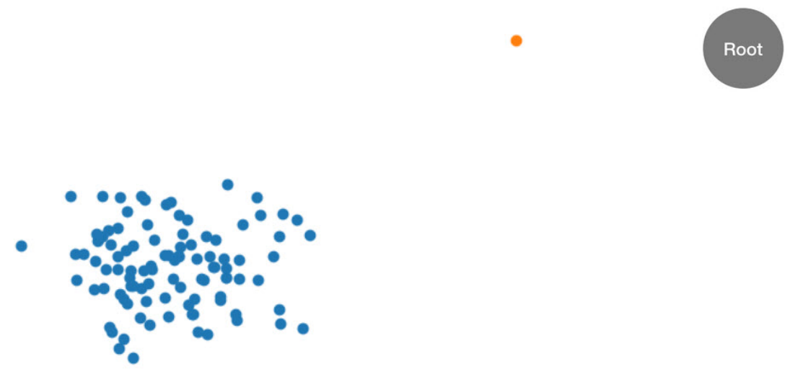

Built-in algorithms and pretrained models
4326

## Page 356

Amazon SageMaker AI
Developer Guide

Figure: A two-dimensional dataset where the majority of data lies in a cluster (blue) except for one
anomalous data point (orange). The tree is initialized with a root node.

The RCF algorithm organizes these data in a tree by first computing a bounding box of the data,
selecting a random dimension (giving more weight to dimensions with higher "variance"), and
then randomly determining the position of a hyperplane "cut" through that dimension. The two
resulting subspaces define their own sub tree. In this example, the cut happens to separate a lone
point from the remainder of the sample. The first level of the resulting binary tree consists of two
nodes, one which will consist of the subtree of points to the left of the initial cut and the other
representing the single point on the right.

Figure: A random cut partitioning the two-dimensional dataset. An anomalous data point is more
likely to lie isolated in a bounding box at a smaller tree depth than other points.

Bounding boxes are then computed for the left and right halves of the data and the process is
repeated until every leaf of the tree represents a single data point from the sample. Note that if
the lone point is sufficiently far away then it is more likely that a random cut would result in point
isolation. This observation provides the intuition that tree depth is, loosely speaking, inversely
proportional to the anomaly score.

When performing inference using a trained RCF model the final anomaly score is reported as the
average across scores reported by each tree. Note that it is often the case that the new data point
does not already reside in the tree. To determine the score associated with the new point the data
point is inserted into the given tree and the tree is efficiently (and temporarily) reassembled in a
manner equivalent to the training process described above. That is, the resulting tree is as if the

Built-in algorithms and pretrained models
4327

## Page 357

Amazon SageMaker AI
Developer Guide

input data point were a member of the sample used to construct the tree in the first place. The
reported score is inversely proportional to the depth of the input point within the tree.

Choose Hyperparameters

The primary hyperparameters used to tune the RCF model are num_trees and

num_samples_per_tree. Increasing num_trees has the effect of reducing the noise observed in
anomaly scores since the final score is the average of the scores reported by each tree. While the
optimal value is application-dependent we recommend using 100 trees to begin with as a balance
between score noise and model complexity. Note that inference time is proportional to the number
of trees. Although training time is also affected it is dominated by the reservoir sampling algorithm
describe above.

The parameter num_samples_per_tree is related to the expected density of anomalies

in the dataset. In particular, num_samples_per_tree should be chosen such that 1/

num_samples_per_tree approximates the ratio of anomalous data to normal data. For example,
if 256 samples are used in each tree then we expect our data to contain anomalies 1/256 or
approximately 0.4% of the time. Again, an optimal value for this hyperparameter is dependent on
the application.

References

1. Sudipto Guha, Nina Mishra, Gourav Roy, and Okke Schrijvers. "Robust random cut forest based

anomaly detection on streams." In International Conference on Machine Learning, pp. 2712-2721.
2016.

2. Byung-Hoon Park, George Ostrouchov, Nagiza F. Samatova, and Al Geist. "Reservoir-based

random sampling with replacement from data stream." In Proceedings of the 2004 SIAM
International Conference on Data Mining, pp. 492-496. Society for Industrial and Applied
Mathematics, 2004.

RCF Hyperparameters

In the CreateTrainingJob request, you specify the training algorithm. You can also specify
algorithm-specific hyperparameters as string-to-string maps. The following table lists the
hyperparameters for the Amazon SageMaker AI RCF algorithm. For more information, including
recommendations on how to choose hyperparameters, see How RCF Works.

Built-in algorithms and pretrained models
4328

## Page 358

Amazon SageMaker AI
Developer Guide

Parameter Name
Description

feature_dim
The number of features in the data set. (If you use the Random Cut
Forest estimator, this value is calculated for you and need not be

specified.)

Required

Valid values: Positive integer (min: 1, max: 10000)

eval_metrics
A list of metrics used to score a labeled test data set. The following
metrics can be selected for output:

• accuracy - returns fraction of correct predictions.

• precision_recall_fscore
- returns the positive and
negative precision, recall, and F1-scores.

Optional

Valid values: a list with possible values taken from accuracy or

precision_recall_fscore
.

Default value: Both accuracy, precision_recall_fscore
are
calculated.

Number of random samples given to each tree from the training data
set.

num_sampl

es_per_tree

Optional

Valid values: Positive integer (min: 1, max: 2048)

Default value: 256

num_trees
Number of trees in the forest.

Optional

Valid values: Positive integer (min: 50, max: 1000)

Built-in algorithms and pretrained models
4329

## Page 359

Amazon SageMaker AI
Developer Guide

Parameter Name
Description

Default value: 100

Tune an RCF Model

Automatic model tuning, also known as hyperparameter tuning or hyperparameter optimization,
finds the best version of a model by running many jobs that test a range of hyperparameters on
your dataset. You choose the tunable hyperparameters, a range of values for each, and an objective
metric. You choose the objective metric from the metrics that the algorithm computes. Automatic
model tuning searches the hyperparameters chosen to find the combination of values that result in
the model that optimizes the objective metric.

The Amazon SageMaker AI RCF algorithm is an unsupervised anomaly-detection algorithm that

requires a labeled test dataset for hyperparameter optimization. RCF calculates anomaly scores
for test data points and then labels the data points as anomalous if their scores are beyond three
standard deviations from the mean score. This is known as the three-sigma limit heuristic. The F1-
score is based on the difference between calculated labels and actual labels. The hyperparameter
tuning job finds the model that maximizes that score. The success of hyperparameter optimization
depends on the applicability of the three-sigma limit heuristic to the test dataset.

For more information about model tuning, see Automatic model tuning with SageMaker AI.

Metrics Computed by the RCF Algorithm

The RCF algorithm computes the following metric during training. When tuning the model, choose
this metric as the objective metric.

Metric Name
Description
Optimization
Direction

test:f1
F1-score on the test dataset, based on the
difference between calculated labels and
actual labels.

Maximize

Tunable RCF Hyperparameters

You can tune a RCF model with the following hyperparameters.

Built-in algorithms and pretrained models
4330

## Page 360

Amazon SageMaker AI
Developer Guide

Parameter Name
Parameter Type
Recommended
Ranges

IntegerParameterRanges
MinValue: 1,
MaxValue:2048

num_sampl

es_per_tree

num_trees
IntegerParameterRanges
MinValue: 50,
MaxValue:1000

RCF Response Formats

All Amazon SageMaker AI built-in algorithms adhere to the common input inference format
described in Common Data Formats - Inference. Note that SageMaker AI Random Cut Forest
supports both dense and sparse JSON and RecordIO formats. This topic contains a list of the
available output formats for the SageMaker AI RCF algorithm.

JSON Response Format

ACCEPT: application/json.

{
"scores":    [
{"score": 0.02},
{"score": 0.25}
]

Built-in algorithms and pretrained models
4331

## Page 361

Amazon SageMaker AI
Developer Guide

}

JSONLINES Response Format

ACCEPT: application/jsonlines.

{"score": 0.02},
{"score": 0.25}

RECORDIO Response Format

ACCEPT: application/x-recordio-protobuf.

[
Record = {
features = {},
label = {
'score': {
keys: [],
values: [0.25]  # float32
}

Built-in algorithms and pretrained models
4332

## Page 362

Amazon SageMaker AI
Developer Guide

}
},
Record = {
features = {},

label = {
'score': {
keys: [],
values: [0.23]  # float32
}
}
}

Built-in algorithms and pretrained models
4333

## Page 363

Amazon SageMaker AI
Developer Guide

]

Built-in SageMaker AI Algorithms for Computer Vision

SageMaker AI provides image processing algorithms that are used for image classification, object
detection, and computer vision.

• Image Classification - MXNet—uses example data with answers (referred to as a supervised
algorithm). Use this algorithm to classify images.

• Image Classification - TensorFlow—uses pretrained TensorFlow Hub models to fine-tune for
specific tasks (referred to as a supervised algorithm). Use this algorithm to classify images.

• Object Detection - MXNet—detects and classifies objects in images using a single deep neural

network. It is a supervised learning algorithm that takes images as input and identifies all
instances of objects within the image scene.

• Object Detection - TensorFlow—detects bounding boxes and object labels in an image. It
is a supervised learning algorithm that supports transfer learning with available pretrained
TensorFlow models.

• Semantic Segmentation Algorithm—provides a fine-grained, pixel-level approach to developing
computer vision applications.

Algorithm
name

Channel
name

Training
input

File type
Instance
class

Paralleli
zable

mode

Image
Classific
ation -
MXNet

train and
validation,
(optional
ly) train_lst
, validatio
n_lst, and
model

File or Pipe
recordIO
or image
files (.jpg
or .png)

GPU
Yes

Built-in algorithms and pretrained models
4334

## Page 364

Amazon SageMaker AI
Developer Guide

Algorithm
name

Channel
name

Training
input
mode

File type
Instance
class

Paralleli
zable

Image
Classific
ation -
TensorFlo
w

training
and
validation

File
image files
(.jpg, .jpeg,
or .png)

CPU or
GPU

Yes (only
across
multiple
GPUs on
a single
instance)

Object
Detection

train and
validation,
(optional
ly)
train_ann
otation,
validatio
n_annotat
ion, and
model

File or Pipe
recordIO
or image
files (.jpg
or .png)

GPU
Yes

Object
Detection -
TensorFlo
w

training
and
validation

File
image files
(.jpg, .jpeg,
or .png)

GPU
Yes (only
across
multiple
GPUs on
a single
instance)

Built-in algorithms and pretrained models
4335

## Page 365

Amazon SageMaker AI
Developer Guide

Algorithm
name

Channel
name

Training
input
mode

File type
Instance
class

Paralleli
zable

Semantic
Segmentat
ion

train and
validation,
train_ann
otation,
validatio
n_annotat
ion, and
(optional
ly)
label_map
and model

File or Pipe
Image files
GPU
(single
instance
only)

No

Image Classification - MXNet

The Amazon SageMaker image classification algorithm is a supervised learning algorithm that
supports multi-label classification. It takes an image as input and outputs one or more labels
assigned to that image. It uses a convolutional neural network that can be trained from scratch or
trained using transfer learning when a large number of training images are not available

The recommended input format for the Amazon SageMaker AI image classification algorithms is
Apache MXNet RecordIO. However, you can also use raw images in .jpg or .png format. Refer to
this discussion for a broad overview of efficient data preparation and loading for machine learning
systems.

Note

To maintain better interoperability with existing deep learning frameworks, this differs
from the protobuf data formats commonly used by other Amazon SageMaker AI
algorithms.

For more information on convolutional networks, see:

Built-in algorithms and pretrained models
4336

## Page 366

Amazon SageMaker AI
Developer Guide

• Deep residual learning for image recognition Kaiming He, et al., 2016 IEEE Conference on
Computer Vision and Pattern Recognition

• ImageNet image database

• Image classification with Gluon-CV and MXNet

Topics

• Input/Output Interface for the Image Classification Algorithm

• EC2 Instance Recommendation for the Image Classification Algorithm

• Image Classification Sample Notebooks

• How Image Classification Works

• Image Classification Hyperparameters

• Tune an Image Classification Model

Input/Output Interface for the Image Classification Algorithm

The SageMaker AI Image Classification algorithm supports both RecordIO (application/x-

recordio) and image (image/png, image/jpeg, and application/x-image) content types

for training in file mode, and supports the RecordIO (application/x-recordio) content type

for training in pipe mode. However, you can also train in pipe mode using the image files (image/

png, image/jpeg, and application/x-image), without creating RecordIO files, by using the
augmented manifest format.

Distributed training is supported for file mode and pipe mode. When using the RecordIO content

type in pipe mode, you must set the S3DataDistributionType of the S3DataSource to

FullyReplicated. The algorithm supports a fully replicated model where your data is copied
onto each machine.

The algorithm supports image/png, image/jpeg, and application/x-image for inference.

Train with RecordIO Format

If you use the RecordIO format for training, specify both train and validation channels as

values for the InputDataConfig parameter of the CreateTrainingJob request. Specify one

RecordIO (.rec) file in the train channel and one RecordIO file in the validation channel. Set

the content type for both channels to application/x-recordio.

Built-in algorithms and pretrained models
4337

## Page 367

Amazon SageMaker AI
Developer Guide

Train with Image Format

If you use the Image format for training, specify train, validation, train_lst,

and validation_lst channels as values for the InputDataConfig parameter of the

CreateTrainingJob request. Specify the individual image data (.jpg or .png files) for

the train and validation channels. Specify one .lst file in each of the train_lst and

validation_lst channels. Set the content type for all four channels to application/x-image.

Note

SageMaker AI reads the training and validation data separately from different channels, so
you must store the training and validation data in different folders.

A .lst file is a tab-separated file with three columns that contains a list of image files. The first

column specifies the image index, the second column specifies the class label index for the image,
and the third column specifies the relative path of the image file. The image index in the first
column must be unique across all of the images. The set of class label indices are numbered
successively and the numbering should start with 0. For example, 0 for the cat class, 1 for the dog
class, and so on for additional classes.

The following is an example of a .lst file:

5      1   your_image_directory/train_img_dog1.jpg
1000   0   your_image_directory/train_img_cat1.jpg
22     1   your_image_directory/train_img_dog2.jpg

For example, if your training images are stored in s3://<your_bucket>/train/class_dog,

s3://<your_bucket>/train/class_cat, and so on, specify the path for your train channel

as s3://<your_bucket>/train, which is the top-level directory for your data. In the .lst file,

specify the relative path for an individual file named train_image_dog1.jpg in the class_dog

class directory as class_dog/train_image_dog1.jpg. You can also store all your image files

under one subdirectory inside the train directory. In that case, use that subdirectory for the

relative path. For example, s3://<your_bucket>/train/your_image_directory.

Train with Augmented Manifest Image Format

The augmented manifest format enables you to do training in Pipe mode using image files without
needing to create RecordIO files. You need to specify both train and validation channels as values

Built-in algorithms and pretrained models
4338

## Page 368

Amazon SageMaker AI
Developer Guide

for the InputDataConfig parameter of the CreateTrainingJob request. While using the
format, an S3 manifest file needs to be generated that contains the list of images and their
corresponding annotations. The manifest file format should be in JSON Lines format in which each

line represents one sample. The images are specified using the 'source-ref' tag that points

to the S3 location of the image. The annotations are provided under the "AttributeNames"

parameter value as specified in the CreateTrainingJob request. It can also contain additional

metadata under the metadata tag, but these are ignored by the algorithm. In the following

example, the "AttributeNames" are contained in the list of image and annotation references

["source-ref", "class"]. The corresponding label value is "0" for the first image and “1”
for the second image:

{"source-ref":"s3://image/filename1.jpg", "class":"0"}
{"source-ref":"s3://image/filename2.jpg", "class":"1", "class-metadata": {"class-name":
"cat", "type" : "groundtruth/image-classification"}}

The order of "AttributeNames" in the input files matters when training the ImageClassification

algorithm. It accepts piped data in a specific order, with image first, followed by label. So the

"AttributeNames" in this example are provided with "source-ref" first, followed by "class".
When using the ImageClassification algorithm with Augmented Manifest, the value of the

RecordWrapperType parameter must be "RecordIO".

Multi-label training is also supported by specifying a JSON array of values. The num_classes
hyperparameter must be set to match the total number of classes. There are two valid label
formats: multi-hot and class-id.

In the multi-hot format, each label is a multi-hot encoded vector of all classes, where each class
takes the value of 0 or 1. In the following example, there are three classes. The first image is
labeled with classes 0 and 2, while the second image is labeled with class 2 only:

{"image-ref": "s3://amzn-s3-demo-bucket/sample01/image1.jpg", "class": "[1, 0, 1]"}
{"image-ref": "s3://amzn-s3-demo-bucket/sample02/image2.jpg", "class": "[0, 0, 1]"}

In the class-id format, each label is a list of the class ids, from [0, num_classes), which apply to
the data point. The previous example would instead look like this:

{"image-ref": "s3://amzn-s3-demo-bucket/sample01/image1.jpg", "class": "[0, 2]"}
{"image-ref": "s3://amzn-s3-demo-bucket/sample02/image2.jpg", "class": "[2]"}

Built-in algorithms and pretrained models
4339

## Page 369

Amazon SageMaker AI
Developer Guide

The multi-hot format is the default, but can be explicitly set in the content type with the label-

format parameter: "application/x-recordio; label-format=multi-hot". The class-id

format, which is the format outputted by GroundTruth, must be set explicitly: "application/x-

recordio; label-format=class-id".

For more information on augmented manifest files, see Augmented Manifest Files for Training
Jobs.

Incremental Training

You can also seed the training of a new model with the artifacts from a model that you trained
previously with SageMaker AI. Incremental training saves training time when you want to train a
new model with the same or similar data. SageMaker AI image classification models can be seeded
only with another built-in image classification model trained in SageMaker AI.

To use a pretrained model, in the CreateTrainingJob request, specify the ChannelName as

"model" in the InputDataConfig parameter. Set the ContentType for the model channel to

application/x-sagemaker-model. The input hyperparameters of both the new model and
the pretrained model that you upload to the model channel must have the same settings for the

num_layers, image_shape and num_classes input parameters. These parameters define the
network architecture. For the pretrained model file, use the compressed model artifacts (in .tar.gz
format) output by SageMaker AI. You can use either RecordIO or image formats for input data.

Inference with the Image Classification Algorithm

The generated models can be hosted for inference and support encoded .jpg and .png image

formats as image/png, image/jpeg, and application/x-image content-type. The input
image is resized automatically. The output is the probability values for all classes encoded in JSON
format, or in JSON Lines text format for batch transform. The image classification model processes
a single image per request and so outputs only one line in the JSON or JSON Lines format. The
following is an example of a response in JSON Lines format:

accept: application/jsonlines

{"prediction": [prob_0, prob_1, prob_2, prob_3, ...]}

For more details on training and inference, see the image classification sample notebook instances
referenced in the introduction.

Built-in algorithms and pretrained models
4340

## Page 370

Amazon SageMaker AI
Developer Guide

EC2 Instance Recommendation for the Image Classification Algorithm

For image classification, we support P2, P3, G4dn, and G5 instances. We recommend using GPU
instances with more memory for training with large batch sizes. You can also run the algorithm on
multi-GPU and multi-machine settings for distributed training. Both CPU (such as C4) and GPU (P2,
P3, G4dn, or G5) instances can be used for inference.

Image Classification Sample Notebooks

For a sample notebook that uses the SageMaker AI image classification algorithm, see Build and
Register an MXNet Image Classification Model via SageMaker Pipelines. For instructions how to
create and access Jupyter notebook instances that you can use to run the example in SageMaker
AI, see Amazon SageMaker notebook instances. Once you have created a notebook instance and
opened it, select the SageMaker AI Examples tab to see a list of all the SageMaker AI samples. The
example image classification notebooks are located in the Introduction to Amazon algorithms
section. To open a notebook, click on its Use tab and select Create copy.

How Image Classification Works

The image classification algorithm takes an image as input and classifies it into one of the output
categories. Deep learning has revolutionized the image classification domain and has achieved
great performance. Various deep learning networks such as ResNet, DenseNet, Inception, and so
on, have been developed to be highly accurate for image classification. At the same time, there
have been efforts to collect labeled image data that are essential for training these networks.
ImageNet is one such large dataset that has more than 11 million images with about 11,000
categories. Once a network is trained with ImageNet data, it can then be used to generalize with
other datasets as well, by simple re-adjustment or fine-tuning. In this transfer learning approach, a
network is initialized with weights (in this example, trained on ImageNet), which can be later fine-
tuned for an image classification task in a different dataset.

Image classification in Amazon SageMaker AI can be run in two modes: full training and transfer
learning. In full training mode, the network is initialized with random weights and trained on user
data from scratch. In transfer learning mode, the network is initialized with pre-trained weights
and just the top fully connected layer is initialized with random weights. Then, the whole network
is fine-tuned with new data. In this mode, training can be achieved even with a smaller dataset.
This is because the network is already trained and therefore can be used in cases without sufficient
training data.

Built-in algorithms and pretrained models
4341

## Page 371

Amazon SageMaker AI
Developer Guide

Image Classification Hyperparameters

Hyperparameters are parameters that are set before a machine learning model begins learning.
The following hyperparameters are supported by the Amazon SageMaker AI built-in Image
Classification algorithm. See Tune an Image Classification Model for information on image
classification hyperparameter tuning.

Parameter Name
Description

num_classes
Number of output classes. This parameter defines the
dimensions of the network output and is typically set to the
number of classes in the dataset.

Besides multi-class classification, multi-label classification is
supported too. Please refer to Input/Output Interface for the
Image Classification Algorithm for details on how to work with

multi-label classification with augmented manifest files.

Required

Valid values: positive integer

num_training_samples
Number of training examples in the input dataset.

If there is a mismatch between this value and the number
of samples in the training set, then the behavior of the

lr_scheduler_step  parameter is undefined and distribut
ed training accuracy might be affected.

Required

Valid values: positive integer

augmentation_type
Data augmentation type. The input images can be augmented
in multiple ways as specified below.

• crop: Randomly crop the image and flip the image horizonta
lly

• crop_color : In addition to ‘crop’, three random values in
the range [-36, 36], [-50, 50], and [-50, 50] are added to the

Built-in algorithms and pretrained models
4342

## Page 372

Amazon SageMaker AI
Developer Guide

Parameter Name
Description

corresponding Hue-Saturation-Lightness channels respectiv
ely

• crop_color_transform
: In addition to crop_colo

r , random transformations, including rotation, shear,
and aspect ratio variations are applied to the image. The
maximum angle of rotation is 10 degrees, the maximum
shear ratio is 0.1, and the maximum aspect changing ratio is

0.25.

Optional

Valid values: crop, crop_color , or crop_color_transfo

rm .

Default value: no default value

beta_1
The beta1 for adam, that is the exponential decay rate for the
first moment estimates.

Optional

Valid values: float. Range in [0, 1].

Default value: 0.9

beta_2
The beta2 for adam, that is the exponential decay rate for the
second moment estimates.

Optional

Valid values: float. Range in [0, 1].

Default value: 0.999

Built-in algorithms and pretrained models
4343

## Page 373

Amazon SageMaker AI
Developer Guide

Parameter Name
Description

checkpoint_frequency
Period to store model parameters (in number of epochs).

Note that all checkpoint files are saved as part of the final
model file "model.tar.gz" and uploaded to S3 to the specified
model location. This increases the size of the model file
proportionally to the number of checkpoints saved during
training.

Optional

Valid values: positive integer no greater than epochs.

Default value: no default value (Save checkpoint at the epoch
that has the best validation accuracy)

early_stopping
True to use early stopping logic during training.  False not to
use it.

Optional

Valid values: True or False

Default value: False

The minimum number of epochs that must be run before
the early stopping logic can be invoked. It is used only when

early_stopping_min

_epochs

early_stopping  = True.

Optional

Valid values: positive integer

Default value: 10

Built-in algorithms and pretrained models
4344

## Page 374

Amazon SageMaker AI
Developer Guide

Parameter Name
Description

The number of epochs to wait before ending training if no
improvement is made in the relevant metric. It is used only

early_stopping_pat

ience

when early_stopping  = True.

Optional

Valid values: positive integer

Default value: 5

Relative tolerance to measure an improvement in accuracy
validation metric. If the ratio of the improvement in accuracy
divided by the previous best accuracy is smaller than the

early_stopping_tol

erance

early_stopping_tolerance
value set, early stopping
considers there is no improvement. It is used only when

early_stopping  = True.

Optional

Valid values: 0 ≤ float ≤ 1

Default value: 0.0

epochs
Number of training epochs.

Optional

Valid values: positive integer

Default value: 30

eps
The epsilon for adam and rmsprop. It is usually set to a small
value to avoid division by 0.

Optional

Valid values: float. Range in [0, 1].

Default value: 1e-8

Built-in algorithms and pretrained models
4345

## Page 375

Amazon SageMaker AI
Developer Guide

Parameter Name
Description

gamma
The gamma for rmsprop, the decay factor for the moving
average of the squared gradient.

Optional

Valid values: float. Range in [0, 1].

Default value: 0.9

image_shape
The input image dimensions, which is the same size as
the input layer of the network. The format is defined as

'num_channels , height, width'. The image dimension can
take on any value as the network can handle varied dimension
s of the input. However, there may be memory constraints if
a larger image dimension is used. Pretrained models can use
only a fixed 224 x 224 image size. Typical image dimensions
for image classification are '3,224,224'. This is similar to the
ImageNet dataset.

For training, if any input image is smaller than this parameter
in any dimension, training fails. If an image is larger, a portion
of the image is cropped, with the cropped area specified by this

parameter. If hyperparameter augmentation_type  is set,
random crop is taken; otherwise, central crop is taken.

At inference, input images are resized to the image_shape
that was used during training. Aspect ratio is not preserved,
and images are not cropped.

Optional

Valid values: string

Default value: ‘3,224,224’

Built-in algorithms and pretrained models
4346

## Page 376

Amazon SageMaker AI
Developer Guide

Parameter Name
Description

kv_store
Weight update synchronization mode during distributed
training. The weight updates can be updated either synchrono
usly or asynchronously across machines. Synchronous updates
typically provide better accuracy than asynchronous updates
but can be slower. See distributed training in MXNet for more
details.

This parameter is not applicable to single machine training.

• dist_sync : The gradients are synchronized after every

batch with all the workers. With dist_sync , batch-size
now means the batch size used on each machine. So if there

are n machines and we use batch size b, then dist_sync
behaves like local with batch size n*b

• dist_async : Performs asynchronous updates. The weights
are updated whenever gradients are received from any
machine and the weight updates are atomic. However, the
order is not guaranteed.

Optional

Valid values: dist_sync  or dist_async

Default value: no default value

learning_rate
Initial learning rate.

Optional

Valid values: float. Range in [0, 1].

Default value: 0.1

Built-in algorithms and pretrained models
4347

## Page 377

Amazon SageMaker AI
Developer Guide

Parameter Name
Description

lr_scheduler_factor
The ratio to reduce learning rate used in conjunction with

the lr_scheduler_step  parameter, defined as lr_new =

lr_old * lr_scheduler_factor
.

Optional

Valid values: float. Range in [0, 1].

Default value: 0.1

lr_scheduler_step
The epochs at which to reduce the learning rate. As explained

in the lr_scheduler_factor
parameter, the learning rate

is reduced by lr_scheduler_factor
at these epochs. For
example, if the value is set to "10, 20", then the learning rate is

reduced by lr_scheduler_factor
after 10th epoch and

again by lr_scheduler_factor
after 20th epoch. The
epochs are delimited by ",".

Optional

Valid values: string

Default value: no default value

mini_batch_size
The batch size for training. In a single-machine multi-GPU

setting, each GPU handles mini_batch_size /num_gpu

training samples. For the multi-machine training in dist_sync

mode, the actual batch size is mini_batch_size *number of
machines. See MXNet docs for more details.

Optional

Valid values: positive integer

Default value: 32

Built-in algorithms and pretrained models
4348

## Page 378

Amazon SageMaker AI
Developer Guide

Parameter Name
Description

momentum
The momentum for sgd and nag, ignored for other optimizers.

Optional

Valid values: float. Range in [0, 1].

Default value: 0.9

multi_label
Flag to use for multi-label classification where each sample can
be assigned multiple labels. Average accuracy across all classes
is logged.

Optional

Valid values: 0 or 1

Default value: 0

num_layers
Number of layers for the network. For data with large image
size (for example, 224x224 - like ImageNet), we suggest
selecting the number of layers from the set [18, 34, 50, 101,
152, 200]. For data with small image size (for example, 28x28
- like CIFAR), we suggest selecting the number of layers from
the set [20, 32, 44, 56, 110]. The number of layers in each set is
based on the ResNet paper. For transfer learning, the number
of layers defines the architecture of base network and hence
can only be selected from the set [18, 34, 50, 101, 152, 200].

Optional

Valid values: positive integer in [18, 34, 50, 101, 152, 200] or
[20, 32, 44, 56, 110]

Default value: 152

Built-in algorithms and pretrained models
4349

## Page 379

Amazon SageMaker AI
Developer Guide

Parameter Name
Description

optimizer
The optimizer type. For more details of the parameters for the
optimizers, please refer to MXNet's API.

Optional

Valid values: One of sgd, adam, rmsprop, or nag.

• sgd: Stochastic gradient descent

• adam: Adaptive momentum estimation

• rmsprop: Root mean square propagation

• nag: Nesterov accelerated gradient

Default value: sgd

precision_dtype
The precision of the weights used for training. The algorithm

can use either single precision (float32) or half precision

(float16) for the weights. Using half-precision for weights
results in reduced memory consumption.

Optional

Valid values: float32 or float16

Default value: float32

Built-in algorithms and pretrained models
4350

## Page 380

Amazon SageMaker AI
Developer Guide

Parameter Name
Description

resize
The number of pixels in the shortest side of an image after
resizing it for training. If the parameter is not set, then the
training data is used without resizing. The parameter should
be larger than both the width and height components of

image_shape  to prevent training failure.

Required when using image content types

Optional when using the RecordIO content type

Valid values: positive integer

Default value: no default value

top_k
Reports the top-k accuracy during training. This parameter has
to be greater than 1, since the top-1 training accuracy is the
same as the regular training accuracy that has already been
reported.

Optional

Valid values: positive integer larger than 1.

Default value: no default value

use_pretrained_model
Flag to use pre-trained model for training. If set to 1, then the
pretrained model with the corresponding number of layers is
loaded and used for training. Only the top FC layer are reinitial
ized with random weights. Otherwise, the network is trained
from scratch.

Optional

Valid values: 0 or 1

Default value: 0

Built-in algorithms and pretrained models
4351

## Page 381

Amazon SageMaker AI
Developer Guide

Parameter Name
Description

use_weighted_loss
Flag to use weighted cross-entropy loss for multi-label classific

ation (used only when multi_label  = 1), where the weights
are calculated based on the distribution of classes.

Optional

Valid values: 0 or 1

Default value: 0

weight_decay
The coefficient weight decay for sgd and nag, ignored for
other optimizers.

Optional

Valid values: float. Range in [0, 1].

Default value: 0.0001

Tune an Image Classification Model

Automatic model tuning, also known as hyperparameter tuning, finds the best version of a model
by running many jobs that test a range of hyperparameters on your dataset. You choose the
tunable hyperparameters, a range of values for each, and an objective metric. You choose the
objective metric from the metrics that the algorithm computes. Automatic model tuning searches
the hyperparameters chosen to find the combination of values that result in the model that
optimizes the objective metric.

For more information about model tuning, see Automatic model tuning with SageMaker AI.

Metrics Computed by the Image Classification Algorithm

The image classification algorithm is a supervised algorithm. It reports an accuracy metric that is
computed during training. When tuning the model, choose this metric as the objective metric.

Built-in algorithms and pretrained models
4352

## Page 382

Amazon SageMaker AI
Developer Guide

Metric Name
Description
Optimization
Direction

The ratio of the number of correct predictions

Maximize

validatio

to the total number of predictions made.

n:accuracy

Tunable Image Classification Hyperparameters

Tune an image classification model with the following hyperparameters. The hyperparameters

that have the greatest impact on image classification objective metrics are: mini_batch_size,

learning_rate, and optimizer. Tune the optimizer-related hyperparameters, such as

momentum, weight_decay, beta_1, beta_2, eps, and gamma, based on the selected optimizer.

For example, use beta_1 and beta_2 only when adam is the optimizer.

For more information about which hyperparameters are used in each optimizer, see Image
Classification Hyperparameters.

Parameter Name
Parameter Type
Recommended
Ranges

beta_1
ContinuousParameterRanges
MinValue: 1e-6,
MaxValue: 0.999

beta_2
ContinuousParameterRanges
MinValue: 1e-6,
MaxValue: 0.999

eps
ContinuousParameterRanges
MinValue: 1e-8,
MaxValue: 1.0

gamma
ContinuousParameterRanges
MinValue: 1e-8,
MaxValue: 0.999

learning_rate
ContinuousParameterRanges
MinValue: 1e-6,
MaxValue: 0.5

mini_batch_size
IntegerParameterRanges
MinValue: 8,
MaxValue: 512

Built-in algorithms and pretrained models
4353

## Page 383

Amazon SageMaker AI
Developer Guide

Parameter Name
Parameter Type
Recommended
Ranges

momentum
ContinuousParameterRanges
MinValue: 0.0,
MaxValue: 0.999

optimizer
CategoricalParameterRanges
['sgd', ‘adam’,
‘rmsprop’, 'nag']

weight_decay
ContinuousParameterRanges
MinValue: 0.0,
MaxValue: 0.999

Image Classification - TensorFlow

The Amazon SageMaker Image Classification - TensorFlow algorithm is a supervised learning
algorithm that supports transfer learning with many pretrained models from the TensorFlow Hub.
Use transfer learning to fine-tune one of the available pretrained models on your own dataset,
even if a large amount of image data is not available. The image classification algorithm takes
an image as input and outputs a probability for each provided class label. Training datasets must
consist of images in .jpg, .jpeg, or .png format. This page includes information about Amazon EC2
instance recommendations and sample notebooks for Image Classification - TensorFlow.

Topics

• How to use the SageMaker Image Classification - TensorFlow algorithm

• Input and output interface for the Image Classification - TensorFlow algorithm

• Amazon EC2 instance recommendation for the Image Classification - TensorFlow algorithm

• Image Classification - TensorFlow sample notebooks

• How Image Classification - TensorFlow Works

• TensorFlow Hub Models

• Image Classification - TensorFlow Hyperparameters

• Tune an Image Classification - TensorFlow model

How to use the SageMaker Image Classification - TensorFlow algorithm

You can use Image Classification - TensorFlow as an Amazon SageMaker AI built-in algorithm. The
following section describes how to use Image Classification - TensorFlow with the SageMaker AI

Built-in algorithms and pretrained models
4354

## Page 384

Amazon SageMaker AI
Developer Guide

Python SDK. For information on how to use Image Classification - TensorFlow from the Amazon
SageMaker Studio Classic UI, see SageMaker JumpStart pretrained models.

The Image Classification - TensorFlow algorithm supports transfer learning using any of the
compatible pretrained TensorFlow Hub models. For a list of all available pretrained models,

see TensorFlow Hub Models. Every pretrained model has a unique model_id. The following

example uses MobileNet V2 1.00 224 (model_id: tensorflow-ic-imagenet-mobilenet-

v2-100-224-classification-4) to fine-tune on a custom dataset. The pretrained models are
all pre-downloaded from the TensorFlow Hub and stored in Amazon S3 buckets so that training
jobs can run in network isolation. Use these pre-generated model training artifacts to construct a
SageMaker AI Estimator.

First, retrieve the Docker image URI, training script URI, and pretrained model URI. Then,
change the hyperparameters as you see fit. You can see a Python dictionary of all available

hyperparameters and their default values with hyperparameters.retrieve_default. For
more information, see Image Classification - TensorFlow Hyperparameters. Use these values to
construct a SageMaker AI Estimator.

Note

Default hyperparameter values are different for different models. For larger models, the

default batch size is smaller and the train_only_top_layer hyperparameter is set to

"True".

This example uses the tf_flowers dataset, which contains five classes of flower images. We pre-
downloaded the dataset from TensorFlow under the Apache 2.0 license and made it available with

Amazon S3. To fine-tune your model, call .fit using the Amazon S3 location of your training
dataset.

from sagemaker import image_uris, model_uris, script_uris, hyperparameters
from sagemaker.estimator import Estimator

model_id, model_version = "tensorflow-ic-imagenet-mobilenet-v2-100-224-
classification-4", "*"
training_instance_type = "ml.p3.2xlarge"

# Retrieve the Docker image
train_image_uri =
image_uris.retrieve(model_id=model_id,model_version=model_version,image_scope="training",insta

Built-in algorithms and pretrained models
4355

## Page 385

Amazon SageMaker AI
Developer Guide

# Retrieve the training script
train_source_uri = script_uris.retrieve(model_id=model_id, model_version=model_version,
script_scope="training")

# Retrieve the pretrained model tarball for transfer learning
train_model_uri = model_uris.retrieve(model_id=model_id, model_version=model_version,
model_scope="training")

# Retrieve the default hyper-parameters for fine-tuning the model
hyperparameters = hyperparameters.retrieve_default(model_id=model_id,
model_version=model_version)

# [Optional] Override default hyperparameters with custom values
hyperparameters["epochs"] = "5"

# The sample training data is available in the following S3 bucket

training_data_bucket = f"jumpstart-cache-prod-{aws_region}"
training_data_prefix = "training-datasets/tf_flowers/"

training_dataset_s3_path = f"s3://{training_data_bucket}/{training_data_prefix}"

output_bucket = sess.default_bucket()
output_prefix = "jumpstart-example-ic-training"
s3_output_location = f"s3://{output_bucket}/{output_prefix}/output"

# Create SageMaker Estimator instance
tf_ic_estimator = Estimator(
role=aws_role,
image_uri=train_image_uri,
source_dir=train_source_uri,
model_uri=train_model_uri,
entry_point="transfer_learning.py",
instance_count=1,
instance_type=training_instance_type,
max_run=360000,
hyperparameters=hyperparameters,
output_path=s3_output_location,
)

# Use S3 path of the training data to launch SageMaker TrainingJob
tf_ic_estimator.fit({"training": training_dataset_s3_path}, logs=True)

Built-in algorithms and pretrained models
4356

## Page 386

Amazon SageMaker AI
Developer Guide

Input and output interface for the Image Classification - TensorFlow algorithm

Each of the pretrained models listed in TensorFlow Hub Models can be fine-tuned to any dataset
with any number of image classes. Be mindful of how to format your training data for input to the
Image Classification - TensorFlow model.

• Training data input format: Your training data should be a directory with as many subdirectories
as the number of classes. Each subdirectory should contain images belonging to that class
in .jpg, .jpeg, or .png format.

The following is an example of an input directory structure. This example dataset has two

classes: roses and dandelion. The image files in each class folder can have any name. The
input directory should be hosted in an Amazon S3 bucket with a path similar to the following:

s3://bucket_name/input_directory/. Note that the trailing / is required.

input_directory
|--roses
|--abc.jpg
|--def.jpg
|--dandelion
|--ghi.jpg
|--jkl.jpg

Trained models output label mapping files that map class folder names to the indices in the list
of output class probabilities. This mapping is in alphabetical order. For example, in the preceding
example, the dandelion class is index 0 and the roses class is index 1.

After training, you have a fine-tuned model that you can further train using incremental training
or deploy for inference. The Image Classification - TensorFlow algorithm automatically adds a pre-
processing and post-processing signature to the fine-tuned model so that it can take in images as
input and return class probabilities. The file mapping class indices to class labels is saved along
with the models.

Incremental training

You can seed the training of a new model with artifacts from a model that you trained previously
with SageMaker AI. Incremental training saves training time when you want to train a new model
with the same or similar data.

Built-in algorithms and pretrained models
4357

## Page 387

Amazon SageMaker AI
Developer Guide

Note

You can only seed a SageMaker Image Classification - TensorFlow model with another
Image Classification - TensorFlow model trained in SageMaker AI.

You can use any dataset for incremental training, as long as the set of classes remains the same.
The incremental training step is similar to the fine-tuning step, but instead of starting with a
pretrained model, you start with an existing fine-tuned model. For an example of incremental
training with the SageMaker AI Image Classification - TensorFlow algorithm, see the Introduction to
SageMaker TensorFlow - Image Classification sample notebook.

Inference with the Image Classification - TensorFlow algorithm

You can host the fine-tuned model that results from your TensorFlow Image Classification training

for inference. Any input image for inference must be in .jpg, .jpeg, or .png format and be

content type application/x-image. The Image Classification - TensorFlow algorithm resizes
input images automatically.

Running inference results in probability values, class labels for all classes, and the predicted label
corresponding to the class index with the highest probability encoded in JSON format. The Image
Classification - TensorFlow model processes a single image per request and outputs only one line.
The following is an example of a JSON format response:

accept: application/json;verbose

{"probabilities": [prob_0, prob_1, prob_2, ...],
"labels":        [label_0, label_1, label_2, ...],
"predicted_label": predicted_label}

If accept is set to application/json, then the model only outputs probabilities. For more
information on training and inference with the Image Classification - TensorFlow algorithm, see the
Introduction to SageMaker TensorFlow - Image Classification sample notebook.

Amazon EC2 instance recommendation for the Image Classification - TensorFlow algorithm

The Image Classification - TensorFlow algorithm supports all CPU and GPU instances for training,
including:

• ml.p2.xlarge

Built-in algorithms and pretrained models
4358

## Page 388

Amazon SageMaker AI
Developer Guide

• ml.p2.16xlarge

• ml.p3.2xlarge

• ml.p3.16xlarge

• ml.g4dn.xlarge

• ml.g4dn.16.xlarge

• ml.g5.xlarge

• ml.g5.48xlarge

We recommend GPU instances with more memory for training with large batch sizes. Both CPU
(such as M5) and GPU (P2, P3, G4dn, or G5) instances can be used for inference.

Image Classification - TensorFlow sample notebooks

For more information about how to use the SageMaker Image Classification - TensorFlow algorithm
for transfer learning on a custom dataset, see the Introduction to SageMaker TensorFlow - Image
Classification notebook.

For instructions how to create and access Jupyter notebook instances that you can use to run the
example in SageMaker AI, see Amazon SageMaker notebook instances. After you have created a
notebook instance and opened it, select the SageMaker AI Examples tab to see a list of all the
SageMaker AI samples. To open a notebook, choose its Use tab and choose Create copy.

How Image Classification - TensorFlow Works

The Image Classification - TensorFlow algorithm takes an image as input and classifies it into one
of the output class labels. Various deep learning networks such as MobileNet, ResNet, Inception,
and EfficientNet are highly accurate for image classification. There are also deep learning networks
that are trained on large image datasets, such as ImageNet, which has over 11 million images and
almost 11,000 classes. After a network is trained with ImageNet data, you can then fine-tune the
network on a dataset with a particular focus to perform more specific classification tasks. The
Amazon SageMaker Image Classification - TensorFlow algorithm supports transfer learning on
many pretrained models that are available in the TensorFlow Hub.

According to the number of class labels in your training data, a classification layer is attached to
the pretrained TensorFlow Hub model of your choice. The classification layer consists of a dropout
layer, a dense layer, and a fully-connected layer with 2-norm regularizer that is initialized with
random weights. The model has hyperparameters for the dropout rate of the dropout layer and
the L2 regularization factor for the dense layer. You can then fine-tune either the entire network

Built-in algorithms and pretrained models
4359

## Page 389

Amazon SageMaker AI
Developer Guide

(including the pretrained model) or only the top classification layer on new training data. With this
method of transfer learning, training with smaller datasets is possible.

TensorFlow Hub Models

The following pretrained models are available to use for transfer learning with the Image
Classification - TensorFlow algorithm.

The following models vary significantly in size, number of model parameters, training time,
and inference latency for any given dataset. The best model for your use case depends on the
complexity of your fine-tuning dataset and any requirements that you have on training time,
inference latency, or model accuracy.

Model Name
model_id
Source

MobileNet V2 1.00 224
tensorflow-ic-imag

TensorFlow Hub link

enet-mobilenet-v2-

100-224-classifica

tion-4

MobileNet V2 0.75 224
tensorflow-ic-imag

TensorFlow Hub link

enet-mobilenet-v2-

075-224-classifica

tion-4

MobileNet V2 0.50 224
tensorflow-ic-imag

TensorFlow Hub link

enet-mobilenet-v2-

050-224-classifica

tion-4

MobileNet V2 0.35 224
tensorflow-ic-imag

TensorFlow Hub link

enet-mobilenet-v2-

035-224-classifica

tion-4

MobileNet V2 1.40 224
tensorflow-ic-imag

TensorFlow Hub link

enet-mobilenet-v2-

140-224-classifica

tion-4

Built-in algorithms and pretrained models
4360

## Page 390

Amazon SageMaker AI
Developer Guide

Model Name
model_id
Source

MobileNet V2 1.30 224
tensorflow-ic-imag

TensorFlow Hub link

enet-mobilenet-v2-

130-224-classifica

tion-4

MobileNet V2
tensorflow-ic-tf2-

TensorFlow Hub link

preview-mobilenet-

v2-classification-4

Inception V3
tensorflow-ic-imag

TensorFlow Hub link

enet-inception-v3-

classification-4

Inception V2
tensorflow-ic-imag

TensorFlow Hub link

enet-inception-v2-

classification-4

Inception V1
tensorflow-ic-imag

TensorFlow Hub link

enet-inception-v1-

classification-4

Inception V3 Preview
tensorflow-ic-tf2-

TensorFlow Hub link

preview-inception-

v3-classification-4

Inception ResNet V2
tensorflow-ic-imag

TensorFlow Hub link

enet-inception-res

net-v2-classificat

ion-4

ResNet V2 50
tensorflow-ic-imag

TensorFlow Hub link

enet-resnet-v2-50-

classification-4

Built-in algorithms and pretrained models
4361

## Page 391

Amazon SageMaker AI
Developer Guide

Model Name
model_id
Source

ResNet V2 101
tensorflow-ic-imag

TensorFlow Hub link

enet-resnet-v2-101-

classification-4

ResNet V2 152
tensorflow-ic-imag

TensorFlow Hub link

enet-resnet-v2-152-

classification-4

ResNet V1 50
tensorflow-ic-imag

TensorFlow Hub link

enet-resnet-v1-50-

classification-4

ResNet V1 101
tensorflow-ic-imag

TensorFlow Hub link

enet-resnet-v1-101-

classification-4

ResNet V1 152
tensorflow-ic-imag

TensorFlow Hub link

enet-resnet-v1-152-

classification-4

ResNet 50
tensorflow-ic-imag

TensorFlow Hub link

enet-resnet-50-cla

ssification-4

EfficientNet B0
tensorflow-ic-effi

TensorFlow Hub link

cientnet-b0-classi

fication-1

EfficientNet B1
tensorflow-ic-effi

TensorFlow Hub link

cientnet-b1-classi

fication-1

EfficientNet B2
tensorflow-ic-effi

TensorFlow Hub link

cientnet-b2-classi

fication-1

Built-in algorithms and pretrained models
4362

## Page 392

Amazon SageMaker AI
Developer Guide

Model Name
model_id
Source

EfficientNet B3
tensorflow-ic-effi

TensorFlow Hub link

cientnet-b3-classi

fication-1

EfficientNet B4
tensorflow-ic-effi

TensorFlow Hub link

cientnet-b4-classi

fication-1

EfficientNet B5
tensorflow-ic-effi

TensorFlow Hub link

cientnet-b5-classi

fication-1

EfficientNet B6
tensorflow-ic-effi

TensorFlow Hub link

cientnet-b6-classi

fication-1

EfficientNet B7
tensorflow-ic-effi

TensorFlow Hub link

cientnet-b7-classi

fication-1

EfficientNet B0 Lite
tensorflow-ic-effi

TensorFlow Hub link

cientnet-lite0-cla

ssification-2

EfficientNet B1 Lite
tensorflow-ic-effi

TensorFlow Hub link

cientnet-lite1-cla

ssification-2

EfficientNet B2 Lite
tensorflow-ic-effi

TensorFlow Hub link

cientnet-lite2-cla

ssification-2

EfficientNet B3 Lite
tensorflow-ic-effi

TensorFlow Hub link

cientnet-lite3-cla

ssification-2

Built-in algorithms and pretrained models
4363

## Page 393

Amazon SageMaker AI
Developer Guide

Model Name
model_id
Source

EfficientNet B4 Lite
tensorflow-ic-effi

TensorFlow Hub link

cientnet-lite4-cla

ssification-2

MobileNet V1 1.00 224
tensorflow-ic-imag

TensorFlow Hub link

enet-mobilenet-v1-

100-224-classifica

tion-4

MobileNet V1 1.00 192
tensorflow-ic-imag

TensorFlow Hub link

enet-mobilenet-v1-

100-192-classifica

tion-4

MobileNet V1 1.00 160
tensorflow-ic-imag

TensorFlow Hub link

enet-mobilenet-v1-

100-160-classifica

tion-4

MobileNet V1 1.00 128
tensorflow-ic-imag

TensorFlow Hub link

enet-mobilenet-v1-

100-128-classifica

tion-4

MobileNet V1 0.75 224
tensorflow-ic-imag

TensorFlow Hub link

enet-mobilenet-v1-

075-224-classifica

tion-4

MobileNet V1 0.75 192
tensorflow-ic-imag

TensorFlow Hub link

enet-mobilenet-v1-

075-192-classifica

tion-4

Built-in algorithms and pretrained models
4364

## Page 394

Amazon SageMaker AI
Developer Guide

Model Name
model_id
Source

MobileNet V1 0.75 160
tensorflow-ic-imag

TensorFlow Hub link

enet-mobilenet-v1-

075-160-classifica

tion-4

MobileNet V1 0.75 128
tensorflow-ic-imag

TensorFlow Hub link

enet-mobilenet-v1-

075-128-classifica

tion-4

MobileNet V1 0.50 224
tensorflow-ic-imag

TensorFlow Hub link

enet-mobilenet-v1-

050-224-classifica

tion-4

MobileNet V1 0.50 192
tensorflow-ic-imag

TensorFlow Hub link

enet-mobilenet-v1-

050-192-classifica

tion-4

MobileNet V1 1.00 160
tensorflow-ic-imag

TensorFlow Hub link

enet-mobilenet-v1-

050-160-classifica

tion-4

MobileNet V1 0.50 128
tensorflow-ic-imag

TensorFlow Hub link

enet-mobilenet-v1-

050-128-classifica

tion-4

MobileNet V1 0.25 224
tensorflow-ic-imag

TensorFlow Hub link

enet-mobilenet-v1-

025-224-classifica

tion-4

Built-in algorithms and pretrained models
4365

## Page 395

Amazon SageMaker AI
Developer Guide

Model Name
model_id
Source

MobileNet V1 0.25 192
tensorflow-ic-imag

TensorFlow Hub link

enet-mobilenet-v1-

025-192-classifica

tion-4

MobileNet V1 0.25 160
tensorflow-ic-imag

TensorFlow Hub link

enet-mobilenet-v1-

025-160-classifica

tion-4

MobileNet V1 0.25 128
tensorflow-ic-imag

TensorFlow Hub link

enet-mobilenet-v1-

025-128-classifica

tion-4

BiT-S R50x1
tensorflow-ic-bit-

TensorFlow Hub link

s-r50x1-ilsvrc2012-

classification-1

BiT-S R50x3
tensorflow-ic-bit-

TensorFlow Hub link

s-r50x3-ilsvrc2012-

classification-1

BiT-S R101x1
tensorflow-ic-bit-s-

TensorFlow Hub link

r101x1-ilsvrc2012-

classification-1

BiT-S R101x3
tensorflow-ic-bit-s-

TensorFlow Hub link

r101x3-ilsvrc2012-

classification-1

BiT-M R50x1
tensorflow-ic-bit-

TensorFlow Hub link

m-r50x1-ilsvrc2012-

classification-1

Built-in algorithms and pretrained models
4366

## Page 396

Amazon SageMaker AI
Developer Guide

Model Name
model_id
Source

BiT-M R50x3
tensorflow-ic-bit-

TensorFlow Hub link

m-r50x3-ilsvrc2012-

classification-1

BiT-M R101x1
tensorflow-ic-bit-m-

TensorFlow Hub link

r101x1-ilsvrc2012-

classification-1

BiT-M R101x3
tensorflow-ic-bit-m-

TensorFlow Hub link

r101x3-ilsvrc2012-

classification-1

BiT-M R50x1 ImageNet-21k
tensorflow-ic-bit-m-

TensorFlow Hub link

r50x1-imagenet21k-

classification-1

BiT-M R50x3 ImageNet-21k
tensorflow-ic-bit-m-

TensorFlow Hub link

r50x3-imagenet21k-

classification-1

BiT-M R101x1 ImageNet-21k
tensorflow-ic-bit-m-

TensorFlow Hub link

r101x1-imagenet21k-

classification-1

BiT-M R101x3 ImageNet-21k
tensorflow-ic-bit-m-

TensorFlow Hub link

r101x3-imagenet21k-

classification-1

Image Classification - TensorFlow Hyperparameters

Hyperparameters are parameters that are set before a machine learning model begins learning.
The following hyperparameters are supported by the Amazon SageMaker AI built-in Image
Classification - TensorFlow algorithm. See Tune an Image Classification - TensorFlow model for
information on hyperparameter tuning.

Built-in algorithms and pretrained models
4367

## Page 397

Amazon SageMaker AI
Developer Guide

Parameter Name
Description

augmentation
Set to "True" to apply augmentation_random_flip
,

augmentation_random_rotation
, and augmentat

ion_random_zoom
to the training data.

Valid values: string, either: ("True" or "False").

Default value: "False".

Indicates which flip mode to use for data augmentation when

augmentation_rando

augmentation  is set to "True". For more information, see
RandomFlip in the TensorFlow documentation.

m_flip

Valid values: string, any of the following: ("horizont

al_and_vertical"
, "vertical" , or "None").

Default value: "horizontal_and_vertical"
.

Indicates how much rotation to use for data augmentation

augmentation_rando

when augmentation  is set to "True". Values represent a
fraction of 2π. Positive values rotate counterclockwise while

m_rotation

negative values rotate clockwise. 0 means no rotation. For
more information, see RandomRotation in the TensorFlow
documentation.

Valid values: float, range: [-1.0, 1.0].

Default value: 0.2.

Indicates how much vertical zoom to use for data augmentat

augmentation_rando

ion when augmentation  is set to "True". Positive values

m_zoom

zoom out while negative values zoom in. 0 means no zoom.
For more information, see RandomZoom in the TensorFlow
documentation.

Valid values: float, range: [-1.0, 1.0].

Default value: 0.1.

Built-in algorithms and pretrained models
4368

## Page 398

Amazon SageMaker AI
Developer Guide

Parameter Name
Description

batch_size
The batch size for training. For training on instances with
multiple GPUs, this batch size is used across the GPUs.

Valid values: positive integer.

Default value: 32.

beta_1
The beta1 for the "adam" optimizer. Represents the exponenti
al decay rate for the first moment estimates. Ignored for other
optimizers.

Valid values: float, range: [0.0, 1.0].

Default value: 0.9.

beta_2
The beta2 for the "adam" optimizer. Represents the exponenti
al decay rate for the second moment estimates. Ignored for
other optimizers.

Valid values: float, range: [0.0, 1.0].

Default value: 0.999.

binary_mode
When binary_mode  is set to "True", the model returns a
single probability number for the positive class and can use

additional eval_metric  options. Use only for binary classific
ation problems.

Valid values: string, either: ("True" or "False").

Default value: "False".

dropout_rate
The dropout rate for the dropout layer in the top classification
layer.

Valid values: float, range: [0.0, 1.0].

Default value: 0.2

Built-in algorithms and pretrained models
4369

## Page 399

Amazon SageMaker AI
Developer Guide

Parameter Name
Description

early_stopping
Set to "True" to use early stopping logic during training. If

"False", early stopping is not used.

Valid values: string, either: ("True" or "False").

Default value: "False".

The minimum change needed to qualify as an improveme

early_stopping_min

nt. An absolute change less than the value of early_sto

_delta

pping_min_delta
does not qualify as improvement. Used

only when early_stopping  is set to "True".

Valid values: float, range: [0.0, 1.0].

Default value: 0.0.

The number of epochs to continue training with no improveme

early_stopping_pat

nt. Used only when early_stopping  is set to "True".

ience

Valid values: positive integer.

Default value: 5.

epochs
The number of training epochs.

Valid values: positive integer.

Default value: 3.

epsilon
The epsilon for "adam", "rmsprop" , "adadelta" , and

"adagrad"  optimizers. Usually set to a small value to avoid
division by 0. Ignored for other optimizers.

Valid values: float, range: [0.0, 1.0].

Default value: 1e-7.

Built-in algorithms and pretrained models
4370

## Page 400

Amazon SageMaker AI
Developer Guide

Parameter Name
Description

eval_metric
If binary_mode  is set to "False", eval_metric  can only

be "accuracy" . If binary_mode  is "True", select any
of the valid values. For more information, see Metrics in the
TensorFlow documentation.

Valid values: string, any of the following: ("accuracy" ,

"precision" , "recall", "auc", or "prc").

Default value: "accuracy" .

Indicates interpolation method used when resizing images.
For more information, see image.resize in the TensorFlow
documentation.

image_resize_inter

polation

Valid values: string, any of the following: ("bilinear" ,

"nearest" , "bicubic" , "area", "lanczos3"  ,

"lanczos5" , "gaussian" , or "mitchellcubic" ).

Default value: "bilinear" .

The starting value for the accumulators, or the per-parameter

initial_accumulato

momentum values, for the "adagrad"  optimizer. Ignored for
other optimizers.

r_value

Valid values: float, range: [0.0, 1.0].

Default value: 0.0001.

label_smoothing
Indicates how much to relax the confidence on label values. For

example, if label_smoothing  is 0.1, then non-target labels

are 0.1/num_classes and target labels are 0.9+0.1/n

um_classes
.

Valid values: float, range: [0.0, 1.0].

Default value: 0.1.

Built-in algorithms and pretrained models
4371

## Page 401

Amazon SageMaker AI
Developer Guide

Parameter Name
Description

learning_rate
The optimizer learning rate.

Valid values: float, range: [0.0, 1.0].

Default value: 0.001.

momentum
The momentum for "sgd", "nesterov" , and "rmsprop"
optimizers. Ignored for other optimizers.

Valid values: float, range: [0.0, 1.0].

Default value: 0.9.

optimizer
The optimizer type. For more information, see Optimizers in
the TensorFlow documentation.

Valid values: string, any of the following: ("adam", "sgd",

"nesterov" , "rmsprop" , "adagrad"  , "adadelta" ).

Default value: "adam".

regularizers_l2
The L2 regularization factor for the dense layer in the classific
ation layer.

Valid values: float, range: [0.0, 1.0].

Default value: .0001.

reinitialize_top_l

If set to "Auto", the top classification layer parameters are
re-initialized during fine-tuning. For incremental training, top
classification layer parameters are not re-initialized unless set

ayer

to "True".

Valid values: string, any of the following: ("Auto", "True" or

"False").

Default value: "Auto".

Built-in algorithms and pretrained models
4372

## Page 402

Amazon SageMaker AI
Developer Guide

Parameter Name
Description

rho
The discounting factor for the gradient of the "adadelta"

and "rmsprop"  optimizers. Ignored for other optimizers.

Valid values: float, range: [0.0, 1.0].

Default value: 0.95.

train_only_top_layer
If "True", only the top classification layer parameters are fine-

tuned. If "False", all model parameters are fine-tuned.

Valid values: string, either: ("True" or "False").

Default value: "False".

Tune an Image Classification - TensorFlow model

Automatic model tuning, also known as hyperparameter tuning, finds the best version of a model
by running many jobs that test a range of hyperparameters on your dataset. You choose the
tunable hyperparameters, a range of values for each, and an objective metric. You choose the
objective metric from the metrics that the algorithm computes. Automatic model tuning searches
the hyperparameters chosen to find the combination of values that result in the model that
optimizes the objective metric.

For more information about model tuning, see Automatic model tuning with SageMaker AI.

Metrics computed by the Image Classification - TensorFlow algorithm

The image classification algorithm is a supervised algorithm. It reports an accuracy metric that is
computed during training. When tuning the model, choose this metric as the objective metric.

Metric Name
Description
Optimization
Direction

The ratio of the number of correct predictions
to the total number of predictions made.

Maximize

validatio

n:accuracy

Built-in algorithms and pretrained models
4373

## Page 403

Amazon SageMaker AI
Developer Guide

Tunable Image Classification - TensorFlow hyperparameters

Tune an image classification model with the following hyperparameters. The hyperparameters

that have the greatest impact on image classification objective metrics are: batch_size,

learning_rate, and optimizer. Tune the optimizer-related hyperparameters, such as

momentum, regularizers_l2, beta_1, beta_2, and eps based on the selected optimizer. For

example, use beta_1 and beta_2 only when adam is the optimizer.

For more information about which hyperparameters are used for each optimizer, see Image
Classification - TensorFlow Hyperparameters.

Parameter Name
Parameter Type
Recommended
Ranges

batch_size
IntegerParameterRanges
MinValue: 8,
MaxValue: 512

beta_1
ContinuousParameterRanges
MinValue: 1e-6,
MaxValue: 0.999

beta_2
ContinuousParameterRanges
MinValue: 1e-6,
MaxValue: 0.999

eps
ContinuousParameterRanges
MinValue: 1e-8,
MaxValue: 1.0

learning_rate
ContinuousParameterRanges
MinValue: 1e-6,

MaxValue: 0.5

momentum
ContinuousParameterRanges
MinValue: 0.0,
MaxValue: 0.999

optimizer
CategoricalParameterRanges
['sgd', ‘adam’,
‘rmsprop’, 'nesterov',
'adagrad', 'adadelta']

regularizers_l2
ContinuousParameterRanges
MinValue: 0.0,
MaxValue: 0.999

Built-in algorithms and pretrained models
4374

## Page 404

Amazon SageMaker AI
Developer Guide

Parameter Name
Parameter Type
Recommended
Ranges

ContinuousParameterRanges
['True', 'False']

train_onl

y_top_layer

Object Detection - MXNet

The Amazon SageMaker AI Object Detection - MXNet algorithm detects and classifies objects in
images using a single deep neural network. It is a supervised learning algorithm that takes images
as input and identifies all instances of objects within the image scene. The object is categorized
into one of the classes in a specified collection with a confidence score that it belongs to the class.
Its location and scale in the image are indicated by a rectangular bounding box. It uses the Single
Shot multibox Detector (SSD) framework and supports two base networks: VGG and ResNet. The
network can be trained from scratch, or trained with models that have been pre-trained on the
ImageNet dataset.

Topics

• Input/Output Interface for the Object Detection Algorithm

• EC2 Instance Recommendation for the Object Detection Algorithm

• Object Detection Sample Notebooks

• How Object Detection Works

• Object Detection Hyperparameters

• Tune an Object Detection Model

• Object Detection Request and Response Formats

Input/Output Interface for the Object Detection Algorithm

The SageMaker AI Object Detection algorithm supports both RecordIO (application/x-

recordio) and image (image/png, image/jpeg, and application/x-image) content types

for training in file mode and supports RecordIO (application/x-recordio) for training in pipe

mode. However you can also train in pipe mode using the image files (image/png, image/jpeg,

and application/x-image), without creating RecordIO files, by using the augmented manifest
format. The recommended input format for the Amazon SageMaker AI object detection algorithms

Built-in algorithms and pretrained models
4375

## Page 405

Amazon SageMaker AI
Developer Guide

is Apache MXNet RecordIO. However, you can also use raw images in .jpg or .png format. The

algorithm supports only application/x-image for inference.

Note

To maintain better interoperability with existing deep learning frameworks, this differs
from the protobuf data formats commonly used by other Amazon SageMaker AI
algorithms.

See the Object Detection Sample Notebooks for more details on data formats.

Train with the RecordIO Format

If you use the RecordIO format for training, specify both train and validation channels as values

for the InputDataConfig parameter of the CreateTrainingJob request. Specify one RecordIO
(.rec) file in the train channel and one RecordIO file in the validation channel. Set the content type

for both channels to application/x-recordio. An example of how to generate RecordIO file
can be found in the object detection sample notebook. You can also use tools from the MXNet's
GluonCV to generate RecordIO files for popular datasets like the PASCAL Visual Object Classes and
Common Objects in Context (COCO).

Train with the Image Format

If you use the image format for training, specify train, validation, train_annotation,

and validation_annotation channels as values for the InputDataConfig parameter of

CreateTrainingJob request. Specify the individual image data (.jpg or .png) files for the
train and validation channels. For annotation data, you can use the JSON format. Specify the

corresponding .json files in the train_annotation and validation_annotation channels.

Set the content type for all four channels to image/png or image/jpeg based on the image type.

You can also use the content type application/x-image when your dataset contains both .jpg
and .png images. The following is an example of a .json file.

{
"file": "your_image_directory/sample_image1.jpg",
"image_size": [
{
"width": 500,
"height": 400,

Built-in algorithms and pretrained models
4376

## Page 406

Amazon SageMaker AI
Developer Guide

"depth": 3
}
],
"annotations": [
{
"class_id": 0,
"left": 111,
"top": 134,
"width": 61,
"height": 128
},
{
"class_id": 0,
"left": 161,
"top": 250,
"width": 79,
"height": 143

},
{
"class_id": 1,
"left": 101,
"top": 185,
"width": 42,
"height": 130
}
],
"categories": [
{
"class_id": 0,
"name": "dog"
},
{
"class_id": 1,
"name": "cat"
}
]
}

Each image needs a .json file for annotation, and the .json file should have the same name
as the corresponding image. The name of above .json file should be "sample_image1.json".
There are four properties in the annotation .json file. The property "file" specifies the relative
path of the image file. For example, if your training images and corresponding .json files are

stored in s3://your_bucket/train/sample_image and s3://your_bucket/train_annotation,

Built-in algorithms and pretrained models
4377

## Page 407

Amazon SageMaker AI
Developer Guide

specify the path for your train and train_annotation channels as s3://your_bucket/train and

s3://your_bucket/train_annotation, respectively.

In the .json file, the relative path for an image named sample_image1.jpg should be

sample_image/sample_image1.jpg. The "image_size" property specifies the overall image

dimensions. The SageMaker AI object detection algorithm currently only supports 3-channel

images. The "annotations" property specifies the categories and bounding boxes for objects

within the image. Each object is annotated by a "class_id" index and by four bounding box

coordinates ("left", "top", "width", "height"). The "left" (x-coordinate) and "top"

(y-coordinate) values represent the upper-left corner of the bounding box. The "width" (x-

coordinate) and "height" (y-coordinate) values represent the dimensions of the bounding box.
The origin (0, 0) is the upper-left corner of the entire image. If you have multiple objects within one

image, all the annotations should be included in a single .json file. The "categories" property
stores the mapping between the class index and class name. The class indices should be numbered

successively and the numbering should start with 0. The "categories" property is optional for
the annotation .json file

Train with Augmented Manifest Image Format

The augmented manifest format enables you to do training in pipe mode using image files without
needing to create RecordIO files. You need to specify both train and validation channels as values

for the InputDataConfig parameter of the CreateTrainingJob request. While using the
format, an S3 manifest file needs to be generated that contains the list of images and their
corresponding annotations. The manifest file format should be in JSON Lines format in which each

line represents one sample. The images are specified using the 'source-ref' tag that points

to the S3 location of the image. The annotations are provided under the "AttributeNames"

parameter value as specified in the CreateTrainingJob request. It can also contain additional

metadata under the metadata tag, but these are ignored by the algorithm. In the following

example, the "AttributeNames are contained in the list ["source-ref", "bounding-box"]:

{"source-ref": "s3://your_bucket/image1.jpg", "bounding-box":{"image_size":[{ "width":
500, "height": 400, "depth":3}], "annotations":[{"class_id": 0, "left": 111, "top":
134, "width": 61, "height": 128}, {"class_id": 5, "left": 161, "top": 250, "width":
80, "height": 50}]}, "bounding-box-metadata":{"class-map":{"0": "dog", "5": "horse"},
"type": "groundtruth/object-detection"}}
{"source-ref": "s3://your_bucket/image2.jpg", "bounding-box":{"image_size":[{ "width":
400, "height": 300, "depth":3}], "annotations":[{"class_id": 1, "left": 100, "top":
120, "width": 43, "height": 78}]}, "bounding-box-metadata":{"class-map":{"1": "cat"},
"type": "groundtruth/object-detection"}}

Built-in algorithms and pretrained models
4378

## Page 408

Amazon SageMaker AI
Developer Guide

The order of "AttributeNames" in the input files matters when training the Object Detection

algorithm. It accepts piped data in a specific order, with image first, followed by annotations.

So the "AttributeNames" in this example are provided with "source-ref" first, followed

by "bounding-box". When using Object Detection with Augmented Manifest, the value of

parameter RecordWrapperType must be set as "RecordIO".

For more information on augmented manifest files, see Augmented Manifest Files for Training
Jobs.

Incremental Training

You can also seed the training of a new model with the artifacts from a model that you trained
previously with SageMaker AI. Incremental training saves training time when you want to train a
new model with the same or similar data. SageMaker AI object detection models can be seeded
only with another built-in object detection model trained in SageMaker AI.

To use a pretrained model, in the CreateTrainingJob request, specify the ChannelName as

"model" in the InputDataConfig parameter. Set the ContentType for the model channel to

application/x-sagemaker-model. The input hyperparameters of both the new model and
the pretrained model that you upload to the model channel must have the same settings for

the base_network and num_classes input parameters. These parameters define the network
architecture. For the pretrained model file, use the compressed model artifacts (in .tar.gz format)
output by SageMaker AI. You can use either RecordIO or image formats for input data.

For more information on incremental training and for instructions on how to use it, see Use
Incremental Training in Amazon SageMaker AI.

EC2 Instance Recommendation for the Object Detection Algorithm

The object detection algorithm supports P2, P3, G4dn, and G5 GPU instance families. We
recommend using GPU instances with more memory for training with large batch sizes. You can
run the object detection algorithm on multi-GPU and mult-machine settings for distributed
training.

You can use both CPU (such as C5 and M5) and GPU (such as P3 and G4dn) instances for inference.

Object Detection Sample Notebooks

For a sample notebook that shows how to use the SageMaker AI Object Detection algorithm to
train and host a model on the

Built-in algorithms and pretrained models
4379

## Page 409

Amazon SageMaker AI
Developer Guide

Caltech Birds (CUB 200 2011) dataset using the Single Shot multibox Detector algorithm, see
Amazon SageMaker AI Object Detection for Bird Species. For instructions how to create and access
Jupyter notebook instances that you can use to run the example in SageMaker AI, see Amazon
SageMaker notebook instances. Once you have created a notebook instance and opened it, select
the SageMaker AI Examples tab to see a list of all the SageMaker AI samples. The object detection
example notebook using the Object Detection algorithm is located in the Introduction to Amazon
Algorithms section. To open a notebook, click on its Use tab and select Create copy.

For more information about the Amazon SageMaker AI Object Detection algorithm, see the
following blog posts:

• Training the Amazon SageMaker AI object detection model and running it on AWS IoT
Greengrass – Part 1 of 3: Preparing training data

• Training the Amazon SageMaker AI object detection model and running it on AWS IoT
Greengrass – Part 2 of 3: Training a custom object detection model

• Training the Amazon SageMaker AI object detection model and running it on AWS IoT
Greengrass – Part 3 of 3: Deploying to the edge

How Object Detection Works

The object detection algorithm identifies and locates all instances of objects in an image from
a known collection of object categories. The algorithm takes an image as input and outputs the
category that the object belongs to, along with a confidence score that it belongs to the category.
The algorithm also predicts the object's location and scale with a rectangular bounding box.
Amazon SageMaker AI Object Detection uses the Single Shot multibox Detector (SSD) algorithm
that takes a convolutional neural network (CNN) pretrained for classification task as the base
network. SSD uses the output of intermediate layers as features for detection.

Various CNNs such as VGG and ResNet have achieved great performance on the image classification
task. Object detection in Amazon SageMaker AI supports both VGG-16 and ResNet-50 as a base
network for SSD. The algorithm can be trained in full training mode or in transfer learning mode.
In full training mode, the base network is initialized with random weights and then trained on user
data. In transfer learning mode, the base network weights are loaded from pretrained models.

The object detection algorithm uses standard data augmentation operations, such as flip, rescale,
and jitter, on the fly internally to help avoid overfitting.

Built-in algorithms and pretrained models
4380

## Page 410

Amazon SageMaker AI
Developer Guide

Object Detection Hyperparameters

In the CreateTrainingJob request, you specify the training algorithm that you want to use. You
can also specify algorithm-specific hyperparameters that are used to help estimate the parameters
of the model from a training dataset. The following table lists the hyperparameters provided by
Amazon SageMaker AI for training the object detection algorithm. For more information about
how object training works, see How Object Detection Works.

Parameter Name
Description

num_classes
The number of output classes. This parameter defines the
dimensions of the network output and is typically set to the
number of classes in the dataset.

Required

Valid values: positive integer

num_training_samples
The number of training examples in the input dataset.

Note

If there is a mismatch between this value and the
number of samples in the training set, then the

behavior of the lr_scheduler_step  parameter will
be undefined and distributed training accuracy may be
affected.

Required

Valid values: positive integer

base_network
The base network architecture to use.

Optional

Valid values: 'vgg-16' or 'resnet-50'

Default value: 'vgg-16'

Built-in algorithms and pretrained models
4381

## Page 411

Amazon SageMaker AI
Developer Guide

Parameter Name
Description

early_stopping
True to use early stopping logic during training.  False not to
use it.

Optional

Valid values: True or False

Default value: False

The minimum number of epochs that must be run before
the early stopping logic can be invoked. It is used only when

early_stopping_min

_epochs

early_stopping  = True.

Optional

Valid values: positive integer

Default value: 10

The number of epochs to wait before ending training if no

early_stopping_pat

improvement, as defined by the early_stopping_tol

ience

erance  hyperparameter, is made in the relevant metric. It is

used only when early_stopping  = True.

Optional

Valid values: positive integer

Default value: 5

Built-in algorithms and pretrained models
4382

## Page 412

Amazon SageMaker AI
Developer Guide

Parameter Name
Description

The tolerance value that the relative improvement in

early_stopping_tol

validation:mAP , the mean average precision (mAP), is
required to exceed to avoid early stopping. If the ratio of the
change in the mAP divided by the previous best mAP is smaller

erance

than the early_stopping_tolerance
value set, early
stopping considers that there is no improvement. It is used

only when early_stopping  = True.

Optional

Valid values: 0 ≤ float ≤ 1

Default value: 0.0

image_shape
The image size for input images. We rescale the input image to
a square image with this size. We recommend using 300 and
512 for better performance.

Optional

Valid values: positive integer ≥300

Default: 300

epochs
The number of training epochs.

Optional

Valid values: positive integer

Default: 30

Built-in algorithms and pretrained models
4383

## Page 413

Amazon SageMaker AI
Developer Guide

Parameter Name
Description

freeze_layer_pattern
The regular expression (regex) for freezing layers in the base

network. For example, if we set freeze_layer_pattern
=

"^(conv1_|conv2_).*"
, then any layers with a name that

contains "conv1_" or "conv2_" are frozen, which means that
the weights for these layers are not updated during training.
The layer names can be found in the network symbol files
vgg16-symbol.json and resnet-50-symbol.json. Freezing a
layer means that its weights can not be modified further. This
can reduce training time significantly in exchange for modest
losses in accuracy. This technique is commonly used in transfer
learning where the lower layers in the base network do not
need to be retrained.

Optional

Valid values: string

Default: No layers frozen.

Built-in algorithms and pretrained models
4384

## Page 414

Amazon SageMaker AI
Developer Guide

Parameter Name
Description

kv_store
The weight update synchronization mode used for distribut
ed training. The weights can be updated either synchrono
usly or asynchronously across machines. Synchronous updates
typically provide better accuracy than asynchronous updates
but can be slower. See the Distributed Training MXNet tutorial
for details.

Note

This parameter is not applicable to single machine
training.

Optional

Valid values: 'dist_sync'  or 'dist_async'

• 'dist_sync' : The gradients are synchronized after every

batch with all the workers. With 'dist_sync' , batch-
size now means the batch size used on each machine. So if
there are n machines and we use batch size b, then dist_sync
behaves like a single machine with batch size n*b.

• 'dist_async' : Performs asynchronous updates. The
weights are updated whenever gradients are received from
any machine and the weight updates are atomic. However,
the order is not guaranteed.

Default: -

Built-in algorithms and pretrained models
4385

## Page 415

Amazon SageMaker AI
Developer Guide

Parameter Name
Description

label_width
The force padding label width used to sync across training and
validation data. For example, if one image in the data contains
at most 10 objects, and each object's annotation is specified
with 5 numbers, [class_id, left, top, width, height], then the

label_width  should be no smaller than (10*5 + header
information length). The header information length is usually

2. We recommend using a slightly larger label_width  for
the training, such as 60 for this example.

Optional

Valid values: Positive integer large enough to accommodate
the largest annotation information length in the data.

Default: 350

learning_rate
The initial learning rate.

Optional

Valid values: float in (0, 1]

Default: 0.001

lr_scheduler_factor
The ratio to reduce learning rate. Used in conjunction with

the lr_scheduler_step  parameter defined as lr_new =

lr_old * lr_scheduler_factor
.

Optional

Valid values: float in (0, 1)

Default: 0.1

Built-in algorithms and pretrained models
4386

## Page 416

Amazon SageMaker AI
Developer Guide

Parameter Name
Description

lr_scheduler_step
The epochs at which to reduce the learning rate. The learning

rate is reduced by lr_scheduler_factor
at epochs
listed in a comma-delimited string: "epoch1, epoch2, ...". For

example, if the value is set to "10, 20" and the lr_schedu

ler_factor
is set to 1/2, then the learning rate is halved
after 10th epoch and then halved again after 20th epoch.

Optional

Valid values: string

Default: empty string

mini_batch_size
The batch size for training. In a single-machine multi-gpu

setting, each GPU handles mini_batch_size /num_gpu

training samples. For the multi-machine training in dist_sync

mode, the actual batch size is mini_batch_size *number

of machines. A large mini_batch_size  usually leads to
faster training, but it may cause out of memory problem. The

memory usage is related to mini_batch_size , image_sha

pe , and base_network  architecture. For example, on a

single p3.2xlarge instance, the largest mini_batch_size
without an out of memory error is 32 with the base_network

set to "resnet-50" and an image_shape  of 300. With the

same instance, you can use 64 as the mini_batch_size

with the base network vgg-16 and an image_shape  of 300.

Optional

Valid values: positive integer

Default: 32

Built-in algorithms and pretrained models
4387

## Page 417

Amazon SageMaker AI
Developer Guide

Parameter Name
Description

momentum
The momentum for sgd. Ignored for other optimizers.

Optional

Valid values: float in (0, 1]

Default: 0.9

nms_threshold
The non-maximum suppression threshold.

Optional

Valid values: float in (0, 1]

Default: 0.45

optimizer
The optimizer types. For details on optimizer values, see
MXNet's API.

Optional

Valid values: ['sgd', 'adam', 'rmsprop', 'adadelta']

Default: 'sgd'

overlap_threshold
The evaluation overlap threshold.

Optional

Valid values: float in (0, 1]

Default: 0.5

Built-in algorithms and pretrained models
4388

## Page 418

Amazon SageMaker AI
Developer Guide

Parameter Name
Description

use_pretrained_model
Indicates whether to use a pre-trained model for training. If set
to 1, then the pre-trained model with corresponding architect
ure is loaded and used for training. Otherwise, the network is
trained from scratch.

Optional

Valid values: 0 or 1

Default: 1

weight_decay
The weight decay coefficient for sgd and rmsprop. Ignored for
other optimizers.

Optional

Valid values: float in (0, 1)

Default: 0.0005

Tune an Object Detection Model

Automatic model tuning, also known as hyperparameter tuning, finds the best version of a model
by running many jobs that test a range of hyperparameters on your dataset. You choose the
tunable hyperparameters, a range of values for each, and an objective metric. You choose the
objective metric from the metrics that the algorithm computes. Automatic model tuning searches
the hyperparameters chosen to find the combination of values that result in the model that
optimizes the objective metric.

For more information about model tuning, see Automatic model tuning with SageMaker AI.

Metrics Computed by the Object Detection Algorithm

The object detection algorithm reports on a single metric during training: validation:mAP. When
tuning a model, choose this metric as the objective metric.

Built-in algorithms and pretrained models
4389

## Page 419

Amazon SageMaker AI
Developer Guide

Metric Name
Description
Optimization
Direction

validation:mAP
Mean Average Precision (mAP) computed on

Maximize

the validation set.

Tunable Object Detection Hyperparameters

Tune the Amazon SageMaker AI object detection model with the following hyperparameters.
The hyperparameters that have the greatest impact on the object detection objective metric are:

mini_batch_size, learning_rate, and optimizer.

Parameter Name
Parameter Type
Recommended
Ranges

learning_rate
ContinuousParameterRange
MinValue: 1e-6,
MaxValue: 0.5

mini_batch_size
IntegerParameterRanges
MinValue: 8,
MaxValue: 64

momentum
ContinuousParameterRange
MinValue: 0.0,
MaxValue: 0.999

optimizer
CategoricalParameterRanges
['sgd', 'adam',
'rmsprop', 'adadelta']

weight_decay
ContinuousParameterRange
MinValue: 0.0,
MaxValue: 0.999

Object Detection Request and Response Formats

The following page describes the inference request and response formats for the Amazon
SageMaker AI Object Detection - MXNet model.

Built-in algorithms and pretrained models
4390

## Page 420

Amazon SageMaker AI
Developer Guide

Request Format

Query a trained model by using the model's endpoint. The endpoint takes .jpg and .png image

formats with image/jpeg and image/png content-types.

Response Formats

The response is the class index with a confidence score and bounding box coordinates for all

objects within the image encoded in JSON format. The following is an example of response .json
file:

{"prediction":[
[4.0, 0.86419455409049988, 0.3088374733924866, 0.07030484080314636,
0.7110607028007507, 0.9345266819000244],
[0.0, 0.73376623392105103, 0.5714187026023865, 0.40427327156066895,
0.827075183391571, 0.9712159633636475],
[4.0, 0.32643985450267792, 0.3677481412887573, 0.034883320331573486,
0.6318609714508057, 0.5967587828636169],
[8.0, 0.22552496790885925, 0.6152569651603699, 0.5722782611846924, 0.882301390171051,
0.8985623121261597],
[3.0, 0.42260299175977707, 0.019305512309074402, 0.08386176824569702,
0.39093565940856934, 0.9574796557426453]
]}

Each row in this .json file contains an array that represents a detected object. Each of these object
arrays consists of a list of six numbers. The first number is the predicted class label. The second
number is the associated confidence score for the detection. The last four numbers represent the
bounding box coordinates [xmin, ymin, xmax, ymax]. These output bounding box corner indices
are normalized by the overall image size. Note that this encoding is different than that use by the
input .json format. For example, in the first entry of the detection result, 0.3088374733924866 is
the left coordinate (x-coordinate of upper-left corner) of the bounding box as a ratio of the overall
image width, 0.07030484080314636 is the top coordinate (y-coordinate of upper-left corner)
of the bounding box as a ratio of the overall image height, 0.7110607028007507 is the right
coordinate (x-coordinate of lower-right corner) of the bounding box as a ratio of the overall image
width, and 0.9345266819000244 is the bottom coordinate (y-coordinate of lower-right corner) of
the bounding box as a ratio of the overall image height.

To avoid unreliable detection results, you might want to filter out the detection results with low
confidence scores. In the object detection sample notebook, we provide examples of scripts that

Built-in algorithms and pretrained models
4391

## Page 421

Amazon SageMaker AI
Developer Guide

use a threshold to remove low confidence detections and to plot bounding boxes on the original
images.

For batch transform, the response is in JSON format, where the format is identical to the JSON
format described above. The detection results of each image is represented as a JSON file. For
example:

{"prediction": [[label_id, confidence_score, xmin, ymin, xmax, ymax], [label_id,
confidence_score, xmin, ymin, xmax, ymax]]}

For more details on training and inference, see the Object Detection Sample Notebooks.

OUTPUT: JSON Response Format

accept: application/json;annotation=1

{
"image_size": [
{
"width": 500,
"height": 400,
"depth": 3
}
],
"annotations": [
{
"class_id": 0,
"score": 0.943,
"left": 111,
"top": 134,
"width": 61,
"height": 128
},
{
"class_id": 0,
"score": 0.0013,
"left": 161,
"top": 250,
"width": 79,
"height": 143
},
{
"class_id": 1,

Built-in algorithms and pretrained models
4392

## Page 422

Amazon SageMaker AI
Developer Guide

"score": 0.0133,
"left": 101,
"top": 185,
"width": 42,
"height": 130
}
]
}

Object Detection - TensorFlow

The Amazon SageMaker AI Object Detection - TensorFlow algorithm is a supervised learning
algorithm that supports transfer learning with many pretrained models from the TensorFlow
Model Garden. Use transfer learning to fine-tune one of the available pretrained models on your
own dataset, even if a large amount of image data is not available. The object detection algorithm
takes an image as input and outputs a list of bounding boxes. Training datasets must consist

of images in .jpg, .jpeg, or .png format. This page includes information about Amazon EC2
instance recommendations and sample notebooks for Object Detection - TensorFlow.

Topics

• How to use the SageMaker AI Object Detection - TensorFlow algorithm

• Input and output interface for the Object Detection - TensorFlow algorithm

• Amazon EC2 instance recommendation for the Object Detection - TensorFlow algorithm

• Object Detection - TensorFlow sample notebooks

• How Object Detection - TensorFlow Works

• TensorFlow Models

• Object Detection - TensorFlow Hyperparameters

• Tune an Object Detection - TensorFlow model

How to use the SageMaker AI Object Detection - TensorFlow algorithm

You can use Object Detection - TensorFlow as an Amazon SageMaker AI built-in algorithm. The
following section describes how to use Object Detection - TensorFlow with the SageMaker AI
Python SDK. For information on how to use Object Detection - TensorFlow from the Amazon
SageMaker Studio Classic UI, see SageMaker JumpStart pretrained models.

The Object Detection - TensorFlow algorithm supports transfer learning using any of the
compatible pretrained TensorFlow models. For a list of all available pretrained models, see

Built-in algorithms and pretrained models
4393

## Page 423

Amazon SageMaker AI
Developer Guide

TensorFlow Models. Every pretrained model has a unique model_id. The following example uses

ResNet50 (model_id: tensorflow-od1-ssd-resnet50-v1-fpn-640x640-coco17-tpu-8) to

fine-tune on a custom dataset. The pretrained models are all pre-downloaded from the TensorFlow
Hub and stored in Amazon S3 buckets so that training jobs can run in network isolation. Use these

pre-generated model training artifacts to construct a SageMaker AI Estimator.

First, retrieve the Docker image URI, training script URI, and pretrained model URI. Then,
change the hyperparameters as you see fit. You can see a Python dictionary of all available

hyperparameters and their default values with hyperparameters.retrieve_default. For
more information, see Object Detection - TensorFlow Hyperparameters. Use these values to
construct a SageMaker AI Estimator.

Note

Default hyperparameter values are different for different models. For example, for larger

models, the default number of epochs is smaller.

This example uses the PennFudanPed dataset, which contains images of pedestriants in the street.
We pre-downloaded the dataset and made it available with Amazon S3. To fine-tune your model,

call .fit using the Amazon S3 location of your training dataset.

from sagemaker import image_uris, model_uris, script_uris, hyperparameters
from sagemaker.estimator import Estimator

model_id, model_version = "tensorflow-od1-ssd-resnet50-v1-fpn-640x640-coco17-tpu-8",
"*"
training_instance_type = "ml.p3.2xlarge"

# Retrieve the Docker image
train_image_uri =
image_uris.retrieve(model_id=model_id,model_version=model_version,image_scope="training",insta

# Retrieve the training script
train_source_uri = script_uris.retrieve(model_id=model_id, model_version=model_version,
script_scope="training")

# Retrieve the pretrained model tarball for transfer learning
train_model_uri = model_uris.retrieve(model_id=model_id, model_version=model_version,
model_scope="training")

Built-in algorithms and pretrained models
4394

## Page 424

Amazon SageMaker AI
Developer Guide

# Retrieve the default hyperparameters for fine-tuning the model
hyperparameters = hyperparameters.retrieve_default(model_id=model_id,
model_version=model_version)

# [Optional] Override default hyperparameters with custom values
hyperparameters["epochs"] = "5"

# Sample training data is available in this bucket
training_data_bucket = f"jumpstart-cache-prod-{aws_region}"
training_data_prefix = "training-datasets/PennFudanPed_COCO_format/"

training_dataset_s3_path = f"s3://{training_data_bucket}/{training_data_prefix}"

output_bucket = sess.default_bucket()
output_prefix = "jumpstart-example-od-training"
s3_output_location = f"s3://{output_bucket}/{output_prefix}/output"

# Create an Estimator instance
tf_od_estimator = Estimator(
role=aws_role,
image_uri=train_image_uri,
source_dir=train_source_uri,
model_uri=train_model_uri,
entry_point="transfer_learning.py",
instance_count=1,
instance_type=training_instance_type,
max_run=360000,
hyperparameters=hyperparameters,
output_path=s3_output_location,
)

# Launch a training job
tf_od_estimator.fit({"training": training_dataset_s3_path}, logs=True)

For more information about how to use the SageMaker AI Object Detection - TensorFlow algorithm
for transfer learning on a custom dataset, see the Introduction to SageMaker TensorFlow - Object
Detection notebook.

Input and output interface for the Object Detection - TensorFlow algorithm

Each of the pretrained models listed in TensorFlow Models can be fine-tuned to any dataset with
any number of image classes. Be mindful of how to format your training data for input to the
Object Detection - TensorFlow model.

Built-in algorithms and pretrained models
4395

## Page 425

Amazon SageMaker AI
Developer Guide

• Training data input format: Your training data should be a directory with an images

subdirectory and an annotations.json file.

The following is an example of an input directory structure. The input directory

should be hosted in an Amazon S3 bucket with a path similar to the following:

s3://bucket_name/input_directory/. Note that the trailing / is required.

input_directory
|--images
|--abc.png
|--def.png
|--annotations.json

The annotations.json file should contain information for bounding boxes and their class labels

in the form of a dictionary "images" and "annotations" keys. The value for the "images" key
should be a list of dictionaries. There should be one dictionary for each image with the following

information: {"file_name": image_name, "height": height, "width": width, "id":

image_id}. The value for the "annotations" key should also be a list of dictionaries. There

should be one dictionary for each bounding box with the following information: {"image_id":

image_id, "bbox": [xmin, ymin, xmax, ymax], "category_id": bbox_label}.

After training, a label mapping file and trained model are saved to your Amazon S3 bucket.

Incremental training

You can seed the training of a new model with artifacts from a model that you trained previously
with SageMaker AI. Incremental training saves training time when you want to train a new model
with the same or similar data.

Note

You can only seed a SageMaker AI Object Detection - TensorFlow model with another
Object Detection - TensorFlow model trained in SageMaker AI.

You can use any dataset for incremental training, as long as the set of classes remains the same.
The incremental training step is similar to the fine-tuning step, but instead of starting with a
pretrained model, you start with an existing fine-tuned model. For more information about

Built-in algorithms and pretrained models
4396

## Page 426

Amazon SageMaker AI
Developer Guide

how to use incremental training with the SageMaker AI Object Detection - TensorFlow, see the
Introduction to SageMaker TensorFlow - Object Detection notebook.

Inference with the Object Detection - TensorFlow algorithm

You can host the fine-tuned model that results from your TensorFlow Object Detection training for

inference. Any input image for inference must be in .jpg, .jpeg, or .png format and be content

type application/x-image. The Object Detection - TensorFlow algorithm resizes input images
automatically.

Running inference results in bounding boxes, predicted classes, and the scores of each prediction
encoded in JSON format. The Object Detection - TensorFlow model processes a single image per
request and outputs only one line. The following is an example of a JSON format response:

accept: application/json;verbose

{"normalized_boxes":[[xmin1, xmax1, ymin1, ymax1],....],
"classes":[classidx1, class_idx2,...],
"scores":[score_1, score_2,...],
"labels": [label1, label2, ...],
"tensorflow_model_output":<original output of the model>}

If accept is set to application/json, then the model only outputs normalized boxes, classes,
and scores.

Amazon EC2 instance recommendation for the Object Detection - TensorFlow algorithm

The Object Detection - TensorFlow algorithm supports all GPU instances for training, including:

• ml.p2.xlarge

• ml.p2.16xlarge

• ml.p3.2xlarge

• ml.p3.16xlarge

We recommend GPU instances with more memory for training with large batch sizes. Both CPU
(such as M5) and GPU (P2 or P3) instances can be used for inference. For a comprehensive list of
SageMaker training and inference instances across AWS Regions, see Amazon SageMaker Pricing.

Built-in algorithms and pretrained models
4397

## Page 427

Amazon SageMaker AI
Developer Guide

Object Detection - TensorFlow sample notebooks

For more information about how to use the SageMaker AI Object Detection - TensorFlow algorithm
for transfer learning on a custom dataset, see the Introduction to SageMaker TensorFlow - Object
Detection notebook.

For instructions how to create and access Jupyter notebook instances that you can use to run the
example in SageMaker AI, see Amazon SageMaker notebook instances. After you have created a
notebook instance and opened it, select the SageMaker AI Examples tab to see a list of all the
SageMaker AI samples. To open a notebook, choose its Use tab and choose Create copy.

How Object Detection - TensorFlow Works

The Object Detection - TensorFlow algorithm takes an image as input and predicts bounding
boxes and object labels. Various deep learning networks such as MobileNet, ResNet, Inception,
and EfficientNet are highly accurate for object detection. There are also deep learning networks
that are trained on large image datasets, such as Common Objects in Context (COCO), which has
328,000 images. After a network is trained with COCO data, you can then fine-tune the network
on a dataset with a particular focus to perform more specific object detection tasks. The Amazon
SageMaker AI Object Detection - TensorFlow algorithm supports transfer learning on many
pretrained models that are available in the TensorFlow Model Garden.

According to the number of class labels in your training data, an object detection layer is attached
to the pretrained TensorFlow model of your choice. You can then fine-tune either the entire
network (including the pretrained model) or only the top classification layer on new training data.
With this method of transfer learning, training with smaller datasets is possible.

TensorFlow Models

The following pretrained models are available to use for transfer learning with the Object
Detection - TensorFlow algorithm.

The following models vary significantly in size, number of model parameters, training time,
and inference latency for any given dataset. The best model for your use case depends on the
complexity of your fine-tuning dataset and any requirements that you have on training time,
inference latency, or model accuracy.

Built-in algorithms and pretrained models
4398

## Page 428

Amazon SageMaker AI
Developer Guide

Model Name
model_id
Source

ResNet50 V1 FPN 640
tensorflow-od1-ssd

TensorFlow Model Garden
link

-resnet50-v1-fpn-6

40x640-coco17-tpu-8

EfficientDet D0 512
tensorflow-od1-ssd

TensorFlow Model Garden
link

-efficientdet-d0-5

12x512-coco17-tpu-8

EfficientDet D1 640
tensorflow-od1-ssd

TensorFlow Model Garden
link

-efficientdet-d1-6

40x640-coco17-tpu-8

EfficientDet D2 768
tensorflow-od1-ssd

TensorFlow Model Garden
link

-efficientdet-d2-7

68x768-coco17-tpu-8

EfficientDet D3 896
tensorflow-od1-ssd

TensorFlow Model Garden
link

-efficientdet-d3-8

96x896-coco17-tpu-

32

MobileNet V1 FPN 640
tensorflow-od1-ssd

TensorFlow Model Garden
link

-mobilenet-v1-fpn-

640x640-coco17-tpu

-8

MobileNet V2 FPNLite 320
tensorflow-od1-ssd

TensorFlow Model Garden
link

-mobilenet-v2-fpnl

ite-320x320-coco17-

tpu-8

MobileNet V2 FPNLite 640
tensorflow-od1-ssd

TensorFlow Model Garden
link

-mobilenet-v2-fpnl

ite-640x640-coco17-

tpu-8

Built-in algorithms and pretrained models
4399

## Page 429

Amazon SageMaker AI
Developer Guide

Model Name
model_id
Source

ResNet50 V1 FPN 1024
tensorflow-od1-ssd

TensorFlow Model Garden
link

-resnet50-v1-fpn-1

024x1024-coco17-tp

u-8

ResNet101 V1 FPN 640
tensorflow-od1-ssd

TensorFlow Model Garden
link

-resnet101-v1-fpn-

640x640-coco17-tpu

-8

ResNet101 V1 FPN 1024
tensorflow-od1-ssd

TensorFlow Model Garden
link

-resnet101-v1-fpn-

1024x1024-coco17-t

pu-8

ResNet152 V1 FPN 640
tensorflow-od1-ssd

TensorFlow Model Garden
link

-resnet152-v1-fpn-

640x640-coco17-tpu

-8

ResNet152 V1 FPN 1024
tensorflow-od1-ssd

TensorFlow Model Garden
link

-resnet152-v1-fpn-

1024x1024-coco17-t

pu-8

Object Detection - TensorFlow Hyperparameters

Hyperparameters are parameters that are set before a machine learning model begins learning.
The following hyperparameters are supported by the Amazon SageMaker AI built-in Object
Detection - TensorFlow algorithm. See Tune an Object Detection - TensorFlow model for
information on hyperparameter tuning.

Parameter Name
Description

batch_size
The batch size for training.

Built-in algorithms and pretrained models
4400

## Page 430

Amazon SageMaker AI
Developer Guide

Parameter Name
Description

Valid values: positive integer.

Default value: 3.

beta_1
The beta1 for the "adam" optimizer. Represents the exponenti
al decay rate for the first moment estimates. Ignored for other
optimizers.

Valid values: float, range: [0.0, 1.0].

Default value: 0.9.

beta_2
The beta2 for the "adam" optimizer. Represents the exponenti
al decay rate for the second moment estimates. Ignored for
other optimizers.

Valid values: float, range: [0.0, 1.0].

Default value: 0.999.

early_stopping
Set to "True" to use early stopping logic during training. If

"False", early stopping is not used.

Valid values: string, either: ("True" or "False").

Default value: "False".

The minimum change needed to qualify as an improveme

early_stopping_min

nt. An absolute change less than the value of early_sto

_delta

pping_min_delta
does not qualify as improvement. Used

only when early_stopping  is set to "True".

Valid values: float, range: [0.0, 1.0].

Default value: 0.0.

Built-in algorithms and pretrained models
4401

## Page 431

Amazon SageMaker AI
Developer Guide

Parameter Name
Description

The number of epochs to continue training with no improveme

early_stopping_pat

nt. Used only when early_stopping  is set to "True".

ience

Valid values: positive integer.

Default value: 5.

epochs
The number of training epochs.

Valid values: positive integer.

Default value: 5 for smaller models, 1 for larger models.

epsilon
The epsilon for "adam", "rmsprop" , "adadelta" , and

"adagrad"  optimizers. Usually set to a small value to avoid
division by 0. Ignored for other optimizers.

Valid values: float, range: [0.0, 1.0].

Default value: 1e-7.

The starting value for the accumulators, or the per-parameter

initial_accumulato

momentum values, for the "adagrad"  optimizer. Ignored for
other optimizers.

r_value

Valid values: float, range: [0.0, 1.0].

Default value: 0.1.

learning_rate
The optimizer learning rate.

Valid values: float, range: [0.0, 1.0].

Default value: 0.001.

Built-in algorithms and pretrained models
4402

## Page 432

Amazon SageMaker AI
Developer Guide

Parameter Name
Description

momentum
The momentum for the "sgd" and "nesterov"  optimizers.
Ignored for other optimizers.

Valid values: float, range: [0.0, 1.0].

Default value: 0.9.

optimizer
The optimizer type. For more information, see Optimizers in
the TensorFlow documentation.

Valid values: string, any of the following: ("adam", "sgd",

"nesterov" , "rmsprop" , "adagrad"  , "adadelta" ).

Default value: "adam".

reinitialize_top_l

If set to "Auto", the top classification layer parameters are
re-initialized during fine-tuning. For incremental training, top
classification layer parameters are not re-initialized unless set

ayer

to "True".

Valid values: string, any of the following: ("Auto", "True" or

"False").

Default value: "Auto".

rho
The discounting factor for the gradient of the "adadelta"

and "rmsprop"  optimizers. Ignored for other optimizers.

Valid values: float, range: [0.0, 1.0].

Default value: 0.95.

train_only_on_top_

If "True", only the top classification layer parameters are fine-

layer

tuned. If "False", all model parameters are fine-tuned.

Valid values: string, either: ("True" or "False").

Default value: "False".

Built-in algorithms and pretrained models
4403

## Page 433

Amazon SageMaker AI
Developer Guide

Tune an Object Detection - TensorFlow model

Automatic model tuning, also known as hyperparameter tuning, finds the best version of a model
by running many jobs that test a range of hyperparameters on your dataset. You choose the
tunable hyperparameters, a range of values for each, and an objective metric. You choose the
objective metric from the metrics that the algorithm computes. Automatic model tuning searches
the hyperparameters chosen to find the combination of values that result in the model that
optimizes the objective metric.

For more information about model tuning, see Automatic model tuning with SageMaker AI.

Metrics computed by the Object Detection - TensorFlow algorithm

Refer to the following chart to find which metrics are computed by the Object Detection -
TensorFlow algorithm.

Metric Name
Description
Optimization
Direction

Regex Pattern

The localization loss for box
prediction.

Minimize
Val_local

validatio

n:localiz

ization=(

ation_loss

[0-9\\.]+)

Tunable Object Detection - TensorFlow hyperparameters

Tune an object detection model with the following hyperparameters. The hyperparameters

that have the greatest impact on object detection objective metrics are: batch_size,

learning_rate, and optimizer. Tune the optimizer-related hyperparameters, such as

momentum, regularizers_l2, beta_1, beta_2, and eps based on the selected optimizer. For

example, use beta_1 and beta_2 only when adam is the optimizer.

For more information about which hyperparameters are used for each optimizer, see Object
Detection - TensorFlow Hyperparameters.

Built-in algorithms and pretrained models
4404

## Page 434

Amazon SageMaker AI
Developer Guide

Parameter Name
Parameter Type
Recommended
Ranges

batch_size
IntegerParameterRanges
MinValue: 8,

MaxValue: 512

beta_1
ContinuousParameterRanges
MinValue: 1e-6,
MaxValue: 0.999

beta_2
ContinuousParameterRanges
MinValue: 1e-6,
MaxValue: 0.999

eps
ContinuousParameterRanges
MinValue: 1e-8,
MaxValue: 1.0

learning_rate
ContinuousParameterRanges
MinValue: 1e-6,
MaxValue: 0.5

momentum
ContinuousParameterRanges
MinValue: 0.0,
MaxValue: 0.999

optimizer
CategoricalParameterRanges
['sgd', ‘adam’,
‘rmsprop’, 'nesterov',
'adagrad', 'adadelta']

regularizers_l2
ContinuousParameterRanges
MinValue: 0.0,
MaxValue: 0.999

CategoricalParameterRanges
['True', 'False']

train_onl

y_on_top_layer

CategoricalParameterRanges
MinValue: 0.0,
MaxValue: 0.999

initial_a

ccumulato

r_value

Semantic Segmentation Algorithm

The SageMaker AI semantic segmentation algorithm provides a fine-grained, pixel-level approach
to developing computer vision applications. It tags every pixel in an image with a class label from a

Built-in algorithms and pretrained models
4405

## Page 435

Amazon SageMaker AI
Developer Guide

predefined set of classes. Tagging is fundamental for understanding scenes, which is critical to an
increasing number of computer vision applications, such as self-driving vehicles, medical imaging
diagnostics, and robot sensing.

For comparison, the SageMaker AI Image Classification - MXNet is a supervised learning algorithm
that analyzes only whole images, classifying them into one of multiple output categories. The
Object Detection - MXNet is a supervised learning algorithm that detects and classifies all instances
of an object in an image. It indicates the location and scale of each object in the image with a
rectangular bounding box.

Because the semantic segmentation algorithm classifies every pixel in an image, it also provides
information about the shapes of the objects contained in the image. The segmentation output is
represented as a grayscale image, called a segmentation mask. A segmentation mask is a grayscale
image with the same shape as the input image.

The SageMaker AI semantic segmentation algorithm is built using the MXNet Gluon framework
and the Gluon CV toolkit. It provides you with a choice of three built-in algorithms to train a deep
neural network. You can use the Fully-Convolutional Network (FCN) algorithm , Pyramid Scene
Parsing (PSP) algorithm, or DeepLabV3.

Each of the three algorithms has two distinct components:

• The backbone (or encoder)—A network that produces reliable activation maps of features.

• The decoder—A network that constructs the segmentation mask from the encoded activation
maps.

You also have a choice of backbones for the FCN, PSP, and DeepLabV3 algorithms: ResNet50
or ResNet101. These backbones include pretrained artifacts that were originally trained on the
ImageNet classification task. You can fine-tune these backbones for segmentation using your own
data. Or, you can initialize and train these networks from scratch using only your own data. The
decoders are never pretrained.

To deploy the trained model for inference, use the SageMaker AI hosting service. During inference,
you can request the segmentation mask either as a PNG image or as a set of probabilities for each
class for each pixel. You can use these masks as part of a larger pipeline that includes additional
downstream image processing or other applications.

Topics

• Semantic Segmentation Sample Notebooks

Built-in algorithms and pretrained models
4406

## Page 436

Amazon SageMaker AI
Developer Guide

• Input/Output Interface for the Semantic Segmentation Algorithm

• EC2 Instance Recommendation for the Semantic Segmentation Algorithm

• Semantic Segmentation Hyperparameters

• Tuning a Semantic Segmentation Model

Semantic Segmentation Sample Notebooks

For a sample Jupyter notebook that uses the SageMaker AI semantic segmentation algorithm to
train a model and deploy it to perform inferences, see the Semantic Segmentation Example. For
instructions on how to create and access Jupyter notebook instances that you can use to run the
example in SageMaker AI, see Amazon SageMaker notebook instances.

To see a list of all of the SageMaker AI samples, create and open a notebook instance, and choose
the SageMaker AI Examples tab. The example semantic segmentation notebooks are located
under Introduction to Amazon algorithms. To open a notebook, choose its Use tab, and choose
Create copy.

Input/Output Interface for the Semantic Segmentation Algorithm

SageMaker AI semantic segmentation expects the customer's training dataset to be on Amazon
Simple Storage Service (Amazon S3). Once trained, it produces the resulting model artifacts on
Amazon S3. The input interface format for the SageMaker AI semantic segmentation is similar to
that of most standardized semantic segmentation benchmarking datasets. The dataset in Amazon

S3 is expected to be presented in two channels, one for train and one for validation using four
directories, two for images and two for annotations. Annotations are expected to be uncompressed
PNG images. The dataset might also have a label map that describes how the annotation mappings
are established. If not, the algorithm uses a default. It also supports the augmented manifest

image format (application/x-image) for training in Pipe input mode straight from Amazon S3.

For inference, an endpoint accepts images with an image/jpeg content type.

How Training Works

The training data is split into four directories: train, train_annotation, validation,

and validation_annotation. There is a channel for each of these directories. The dataset

also expected to have one label_map.json file per channel for train_annotation and

validation_annotation respectively. If you don't provide these JSON files, SageMaker AI
provides the default set label map.

Built-in algorithms and pretrained models
4407

## Page 437

Amazon SageMaker AI
Developer Guide

The dataset specifying these files should look similar to the following example:

s3://bucket_name
|
|- train
|
| - 0000.jpg
| - coffee.jpg
|- validation
|
| - 00a0.jpg
| - bananna.jpg
|- train_annotation
|
| - 0000.png
| - coffee.png
|- validation_annotation
|
| - 00a0.png
| - bananna.png
|- label_map
| - train_label_map.json
| - validation_label_map.json

Every JPG image in the train and validation directories has a corresponding PNG label image with

the same name in the train_annotation and validation_annotation directories. This
naming convention helps the algorithm to associate a label with its corresponding image during

training. The train, train_annotation, validation, and validation_annotation channels
are mandatory. The annotations are single-channel PNG images. The format works as long as the
metadata (modes) in the image helps the algorithm read the annotation images into a single-
channel 8-bit unsigned integer. For more information on our support for modes, see the Python

Image Library documentation. We recommend using the 8-bit pixel, true color P mode.

The image that is encoded is a simple 8-bit integer when using modes. To get from this mapping
to a map of a label, the algorithm uses one mapping file per channel, called the label map. The
label map is used to map the values in the image with actual label indices. In the default label
map, which is provided by default if you don’t provide one, the pixel value in an annotation matrix
(image) directly index the label. These images can be grayscale PNG files or 8-bit indexed PNG files.
The label map file for the unscaled default case is the following:

{

Built-in algorithms and pretrained models
4408

## Page 438

Amazon SageMaker AI
Developer Guide

"scale": "1"
}

To provide some contrast for viewing, some annotation software scales the label images by a
constant amount. To support this, the SageMaker AI semantic segmentation algorithm provides

a rescaling option to scale down the values to actual label values. When scaling down doesn’t
convert the value to an appropriate integer, the algorithm defaults to the greatest integer less than
or equal to the scale value. The following code shows how to set the scale value to rescale the label
values:

{
"scale": "3"
}

The following example shows how this "scale" value is used to rescale the encoded_label

values of the input annotation image when they are mapped to the mapped_label values to be
used in training. The label values in the input annotation image are 0, 3, 6, with scale 3, so they are
mapped to 0, 1, 2 for training:

encoded_label = [0, 3, 6]
mapped_label = [0, 1, 2]

In some cases, you might need to specify a particular color mapping for each class. Use the map

option in the label mapping as shown in the following example of a label_map file:

{
"map": {
"0": 5,
"1": 0,
"2": 2
}
}

This label mapping for this example is:

encoded_label = [0, 5, 2]
mapped_label = [1, 0, 2]

With label mappings, you can use different annotation systems and annotation software to obtain
data without a lot of preprocessing. You can provide one label map per channel. The files for a

Built-in algorithms and pretrained models
4409

## Page 439

Amazon SageMaker AI
Developer Guide

label map in the label_map channel must follow the naming conventions for the four directory
structure. If you don't provide a label map, the algorithm assumes a scale of 1 (the default).

Training with the Augmented Manifest Format

The augmented manifest format enables you to do training in Pipe mode using image files without
needing to create RecordIO files. The augmented manifest file contains data objects and should be

in JSON Lines format, as described in the CreateTrainingJob request. Each line in the manifest
is an entry containing the Amazon S3 URI for the image and the URI for the annotation image.

Each JSON object in the manifest file must contain a source-ref key. The source-ref key
should contain the value of the Amazon S3 URI to the image. The labels are provided under the

AttributeNames parameter value as specified in the CreateTrainingJob request. It can also
contain additional metadata under the metadata tag, but these are ignored by the algorithm.

In the example below, the AttributeNames are contained in the list of image and annotation

references ["source-ref", "city-streets-ref"]. These names must have -ref appended
to them. When using the Semantic Segmentation algorithm with Augmented Manifest, the value

of the RecordWrapperType parameter must be "RecordIO" and value of the ContentType

parameter must be application/x-recordio.

{"source-ref": "S3 bucket location", "city-streets-ref": "S3 bucket location", "city-
streets-metadata": {"job-name": "label-city-streets", }}

For more information on augmented manifest files, see Augmented Manifest Files for Training
Jobs.

Incremental Training

You can also seed the training of a new model with a model that you trained previously using
SageMaker AI. This incremental training saves training time when you want to train a new model
with the same or similar data. Currently, incremental training is supported only for models trained
with the built-in SageMaker AI Semantic Segmentation.

To use your own pre-trained model, specify the ChannelName as "model" in the

InputDataConfig for the CreateTrainingJob request. Set the ContentType for the model

channel to application/x-sagemaker-model. The backbone, algorithm, crop_size,

and num_classes input parameters that define the network architecture must be consistently
specified in the input hyperparameters of the new model and the pre-trained model that you

Built-in algorithms and pretrained models
4410

## Page 440

Amazon SageMaker AI
Developer Guide

upload to the model channel. For the pretrained model file, you can use the compressed (.tar.gz)
artifacts from SageMaker AI outputs. You can only use Image formats for input data. For more
information on incremental training and for instructions on how to use it, see Use Incremental
Training in Amazon SageMaker AI.

Produce Inferences

To query a trained model that is deployed to an endpoint, you need to provide an image and an

AcceptType that denotes the type of output required. The endpoint takes JPEG images with an

image/jpeg content type. If you request an AcceptType of image/png, the algorithm outputs a
PNG file with a segmentation mask in the same format as the labels themselves. If you request an

accept type ofapplication/x-recordio-protobuf, the algorithm returns class probabilities
encoded in recordio-protobuf format. The latter format outputs a 3D tensor where the third
dimension is the same size as the number of classes. This component denotes the probability of
each class label for each pixel.

EC2 Instance Recommendation for the Semantic Segmentation Algorithm

The SageMaker AI semantic segmentation algorithm only supports GPU instances for training, and
we recommend using GPU instances with more memory for training with large batch sizes. The
algorithm can be trained using P2, P3, G4dn, or G5 instances in single machine configurations.

For inference, you can use either CPU instances (such as C5 and M5) and GPU instances (such as P3
and G4dn) or both. For information about the instance types that provide varying combinations of
CPU, GPU, memory, and networking capacity for inference, see Amazon SageMaker AI ML Instance
Types.

Semantic Segmentation Hyperparameters

The following tables list the hyperparameters supported by the Amazon SageMaker AI semantic
segmentation algorithm for network architecture, data inputs, and training. You specify Semantic

Segmentation for training in the AlgorithmName of the CreateTrainingJob request.

Network Architecture Hyperparameters

Parameter Name
Description

backbone
The backbone to use for the algorithm's encoder component.

Optional

Built-in algorithms and pretrained models
4411

## Page 441

Amazon SageMaker AI
Developer Guide

Parameter Name
Description

Valid values: resnet-50 , resnet-101

Default value: resnet-50

Whether a pretrained model is to be used for the backbone.

use_pretr

ained_model

Optional

Valid values: True, False

Default value: True

algorithm
The algorithm to use for semantic segmentation.

Optional

Valid values:

• fcn: Fully-Convolutional Network (FCN) algorithm

• psp: Pyramid Scene Parsing (PSP) algorithm

• deeplab: DeepLab V3 algorithm

Default value: fcn

Data Hyperparameters

Parameter Name
Description

num_classes
The number of classes to segment.

Required

Valid values: 2 ≤ positive integer ≤ 254

The number of samples in the training data. The algorithm uses this
value to set up the learning rate scheduler.

num_train

ing_samples

Required

Built-in algorithms and pretrained models
4412

## Page 442

Amazon SageMaker AI
Developer Guide

Parameter Name
Description

Valid values: positive integer

base_size
Defines how images are rescaled before cropping. Images are

rescaled such that the long size length is set to base_size
multiplied by a random number from 0.5 to 2.0, and the short size is
computed to preserve the aspect ratio.

Optional

Valid values: positive integer > 16

Default value: 520

crop_size
The image size for input during training. We randomly rescale the

input image based on base_size , and then take a random square

crop with side length equal to crop_size . The crop_size  will
be automatically rounded up to multiples of 8.

Optional

Valid values: positive integer > 16

Default value: 240

Training Hyperparameters

Parameter Name
Description

early_stopping
Whether to use early stopping logic during training.

Optional

Valid values: True, False

Default value: False

The minimum number of epochs that must be run.

early_sto

pping_min_epochs

Built-in algorithms and pretrained models
4413

## Page 443

Amazon SageMaker AI
Developer Guide

Parameter Name
Description

Optional

Valid values: integer

Default value: 5

The number of epochs that meet the tolerance for lower performan
ce before the algorithm enforces an early stop.

early_sto

pping_patience

Optional

Valid values: integer

Default value: 4

If the relative improvement of the score of the training job, the
mIOU, is smaller than this value, early stopping considers the epoch

early_sto

pping_tolerance

as not improved. This is used only when early_stopping  = True.

Optional

Valid values: 0 ≤ float ≤ 1

Default value: 0.0

epochs
The number of epochs with which to train.

Optional

Valid values: positive integer

Default value: 10

Built-in algorithms and pretrained models
4414

## Page 444

Amazon SageMaker AI
Developer Guide

Parameter Name
Description

gamma1
The decay factor for the moving average of the squared gradient for

rmsprop. Used only for rmsprop.

Optional

Valid values: 0 ≤ float ≤ 1

Default value: 0.9

gamma2
The momentum factor for rmsprop.

Optional

Valid values: 0 ≤ float ≤ 1

Default value: 0.9

learning_rate
The initial learning rate.

Optional

Valid values: 0 < float ≤ 1

Default value: 0.001

Built-in algorithms and pretrained models
4415

## Page 445

Amazon SageMaker AI
Developer Guide

Parameter Name
Description

lr_scheduler
The shape of the learning rate schedule that controls its decrease
over time.

Optional

Valid values:

• step: A stepwise decay, where the learning rate is reduced

(multiplied) by the lr_scheduler_factor
after epochs

specified by lr_scheduler_step .

• poly: A smooth decay using a polynomial function.

• cosine: A smooth decay using a cosine function.

Default value: poly

lr_schedu

If lr_scheduler  is set to step, the ratio by which to reduce

ler_factor

(multipy) the learning_rate  after each of the epochs specified by

the lr_scheduler_step . Otherwise, ignored.

Optional

Valid values: 0 ≤ float ≤ 1

Default value: 0.1

lr_scheduler_step
A comma delimited list of the epochs after which the learning_

rate  is reduced (multiplied) by an lr_scheduler_factor
. For

example, if the value is set to "10, 20", then the learning-rate

is reduced by lr_scheduler_factor
after the 10th epoch and
again by this factor after 20th epoch.

Conditionally Required if lr_scheduler  is set to step. Otherwise
, ignored.

Valid values: string

Default value: (No default, as the value is required when used.)

Built-in algorithms and pretrained models
4416

## Page 446

Amazon SageMaker AI
Developer Guide

Parameter Name
Description

mini_batch_size
The batch size for training. Using a large mini_batch_size
usually results in faster training, but it might cause you to run out of

memory. Memory usage is affected by the values of the mini_batc

h_size  and image_shape  parameters, and the backbone
architecture.

Optional

Valid values: positive integer

Default value: 16

momentum
The momentum for the sgd optimizer. When you use other
optimizers, the semantic segmentation algorithm ignores this
parameter.

Optional

Valid values: 0 < float ≤ 1

Default value: 0.9

optimizer
The type of optimizer. For more information about an optimizer,
choose the appropriate link:

• adam: Adaptive momentum estimation

• adagrad: Adaptive gradient descent

• nag: Nesterov accelerated gradient

• rmsprop: Root mean square propagation

• sgd: Stochastic gradient descent

Optional

Valid values: adam, adagrad, nag, rmsprop, sgd

Default value: sgd

Built-in algorithms and pretrained models
4417

## Page 447

Amazon SageMaker AI
Developer Guide

Parameter Name
Description

syncbn
If set to True, the batch normalization mean and variance are
computed over all the samples processed across the GPUs.

Optional

Valid values: True, False

Default value: False

validatio

The batch size for validation. A large mini_batch_size  usually
results in faster training, but it might cause you to run out of

n_mini_ba

memory. Memory usage is affected by the values of the mini_batc

tch_size

h_size  and image_shape  parameters, and the backbone
architecture.

• To score the validation on the entire image without cropping the
images, set this parameter to 1. Use this option if you want to
measure performance on the entire image as a whole.

Note

Setting the validation_mini_batch_size
parameter to 1 causes the algorithm to create a new
network model for every image. This might slow validation
and training.

• To crop images to the size specified in the crop_size  parameter
, even during evaluation, set this parameter to a value greater than
1.

Optional

Valid values: positive integer

Default value: 16

Built-in algorithms and pretrained models
4418

## Page 448

Amazon SageMaker AI
Developer Guide

Parameter Name
Description

weight_decay
The weight decay coefficient for the sgd optimizer. When you use
other optimizers, the algorithm ignores this parameter.

Optional

Valid values: 0 < float < 1

Default value: 0.0001

Tuning a Semantic Segmentation Model

Automatic model tuning, also known as hyperparameter tuning, finds the best version of a model
by running many jobs that test a range of hyperparameters on your dataset. You choose the
tunable hyperparameters, a range of values for each, and an objective metric. You choose the
objective metric from the metrics that the algorithm computes. Automatic model tuning searches
the hyperparameters chosen to find the combination of values that result in the model that
optimizes the objective metric.

Metrics Computed by the Semantic Segmentation Algorithm

The semantic segmentation algorithm reports two validation metrics. When tuning
hyperparameter values, choose one of these metrics as the objective.

Metric Name
Description
Optimization
Direction

validation:mIOU
The area of the intersection of the predicted
segmentation and the ground truth divided by
the area of union between them for images in
the validation set. Also known as the Jaccard
Index.

Maximize

The percentage of pixels that are correctly
classified in images from the validation set.

Maximize

validatio

n:pixel_a

ccuracy

Built-in algorithms and pretrained models
4419

## Page 449

Amazon SageMaker AI
Developer Guide

Tunable Semantic Segmentation Hyperparameters

You can tune the following hyperparameters for the semantic segmentation algorithm.

Parameter Name
Parameter Type
Recommended
Ranges

learning_rate
ContinuousParameterRange
MinValue: 1e-4,
MaxValue: 1e-1

mini_batch_size
IntegerParameterRanges
MinValue: 1,
MaxValue: 128

momentum
ContinuousParameterRange
MinValue: 0.9,
MaxValue: 0.999

optimzer
CategoricalParameterRanges
['sgd', 'adam',
'adadelta']

weight_decay
ContinuousParameterRange
MinValue: 1e-5,
MaxValue: 1e-3

Use Reinforcement Learning with Amazon SageMaker AI

Reinforcement learning (RL) combines fields such as computer science, neuroscience, and
psychology to determine how to map situations to actions to maximize a numerical reward
signal. This notion of a reward signal in RL stems from neuroscience research into how the human
brain makes decisions about which actions maximize reward and minimize punishment. In most
situations, humans are not given explicit instructions on which actions to take, but instead must
learn both which actions yield the most immediate rewards, and how those actions influence future
situations and consequences.

The problem of RL is formalized using Markov decision processes (MDPs) that originate from
dynamical systems theory. MDPs aim to capture high-level details of a real problem that a
learning agent encounters over some period of time in attempting to achieve some ultimate
goal. The learning agent should be able to determine the current state of its environment and
identify possible actions that affect the learning agent’s current state. Furthermore, the learning

Use Reinforcement Learning
4420

## Page 450

Amazon SageMaker AI
Developer Guide

agent’s goals should correlate strongly to the state of the environment. A solution to a problem
formulated in this way is known as a reinforcement learning method.

What are the differences between reinforcement, supervised, and unsupervised
learning paradigms?

Machine learning can be divided into three distinct learning paradigms: supervised, unsupervised,
and reinforcement.

In supervised learning, an external supervisor provides a training set of labeled examples. Each
example contains information about a situation, belongs to a category, and has a label identifying
the category to which it belongs. The goal of supervised learning is to generalize in order to predict
correctly in situations that are not present in the training data.

In contrast, RL deals with interactive problems, making it infeasible to gather all possible
examples of situations with correct labels that an agent might encounter. This type of learning
is most promising when an agent is able to accurately learn from its own experience and adjust
accordingly.

In unsupervised learning, an agent learns by uncovering structure within unlabeled data. While a
RL agent might benefit from uncovering structure based on its experiences, the sole purpose of RL
is to maximize a reward signal.

Topics

• Why is Reinforcement Learning Important?

• Markov Decision Process (MDP)

• Key Features of Amazon SageMaker AI RL

• Reinforcement Learning Sample Notebooks

• Sample RL Workflow Using Amazon SageMaker AI RL

• RL Environments in Amazon SageMaker AI

• Distributed Training with Amazon SageMaker AI RL

• Hyperparameter Tuning with Amazon SageMaker AI RL

Why is Reinforcement Learning Important?

RL is well-suited for solving large, complex problems, such as supply chain management, HVAC
systems, industrial robotics, game artificial intelligence, dialog systems, and autonomous vehicles.

Use Reinforcement Learning
4421

## Page 451

Amazon SageMaker AI
Developer Guide

Because RL models learn by a continuous process of receiving rewards and punishments for every
action taken by the agent, it is possible to train systems to make decisions under uncertainty and in
dynamic environments.

Markov Decision Process (MDP)

RL is based on models called Markov Decision Processes (MDPs). An MDP consists of a series of time
steps. Each time step consists of the following:

Environment

Defines the space in which the RL model operates. This can be either a real-world environment
or a simulator. For example, if you train a physical autonomous vehicle on a physical road,
that would be a real-world environment. If you train a computer program that models an
autonomous vehicle driving on a road, that would be a simulator.

State

Specifies all information about the environment and past steps that is relevant to the future.
For example, in an RL model in which a robot can move in any direction at any time step, the
position of the robot at the current time step is the state, because if we know where the robot
is, it isn't necessary to know the steps it took to get there.

Action

What the agent does. For example, the robot takes a step forward.

Reward

A number that represents the value of the state that resulted from the last action that the
agent took. For example, if the goal is for a robot to find treasure, the reward for finding
treasure might be 5, and the reward for not finding treasure might be 0. The RL model attempts
to find a strategy that optimizes the cumulative reward over the long term. This strategy is
called a policy.

Observation

Information about the state of the environment that is available to the agent at each step. This
might be the entire state, or it might be just a part of the state. For example, the agent in a
chess-playing model would be able to observe the entire state of the board at any step, but
a robot in a maze might only be able to observe a small portion of the maze that it currently
occupies.

Use Reinforcement Learning
4422

## Page 452

Amazon SageMaker AI
Developer Guide

Typically, training in RL consists of many episodes. An episode consists of all of the time steps in an
MDP from the initial state until the environment reaches the terminal state.

Key Features of Amazon SageMaker AI RL

To train RL models in SageMaker AI RL, use the following components:

• A deep learning (DL) framework. Currently, SageMaker AI supports RL in TensorFlow and Apache
MXNet.

• An RL toolkit. An RL toolkit manages the interaction between the agent and the
environment and provides a wide selection of state of the art RL algorithms. SageMaker
AI supports the Intel Coach and Ray RLlib toolkits. For information about Intel Coach, see
https://nervanasystems.github.io/coach/. For information about Ray RLlib, see https://
ray.readthedocs.io/en/latest/rllib.html.

• An RL environment. You can use custom environments, open-source environments, or
commercial environments. For information, see RL Environments in Amazon SageMaker AI.

The following diagram shows the RL components that are supported in SageMaker AI RL.

Use Reinforcement Learning
4423

## Page 453

Amazon SageMaker AI
Developer Guide

Reinforcement Learning Sample Notebooks

For complete code examples, see the reinforcement learning sample notebooks in the SageMaker
AI Examples repository.

Sample RL Workflow Using Amazon SageMaker AI RL

The following example describes the steps for developing RL models using Amazon SageMaker AI
RL.

1.
Formulate the RL problem—First, formulate the business problem into an RL problem. For
example, auto scaling enables services to dynamically increase or decrease capacity depending

Use Reinforcement Learning
4424

## Page 454

Amazon SageMaker AI
Developer Guide

on conditions that you define. Currently, this requires setting up alarms, scaling policies,
thresholds, and other manual steps. To solve this with RL, we define the components of the
Markov Decision Process:

a.
Objective—Scale instance capacity so that it matches the desired load profile.

b.
Environment—A custom environment that includes the load profile. It generates a
simulated load with daily and weekly variations and occasional spikes. The simulated
system has a delay between when new resources are requested and when they become
available for serving requests.

c.
State—The current load, number of failed jobs, and number of active machines.

d.
Action—Remove, add, or keep the same number of instances.

e.
Reward—A positive reward for successful transactions and a high penalty for failing
transactions beyond a specified threshold.

2.
Define the RL environment—The RL environment can be the real world where the RL
agent interacts or a simulation of the real world. You can connect open source and custom
environments developed using Gym interfaces and commercial simulation environments such
as MATLAB and Simulink.

3.
Define the presets—The presets configure the RL training jobs and define the
hyperparameters for the RL algorithms.

4.
Write the training code—Write training code as a Python script and pass the script to a
SageMaker AI training job. In your training code, import the environment files and the preset

files, and then define the main() function.

5.
Train the RL Model—Use the SageMaker AI RLEstimator in the Amazon SageMaker Python
SDK to start an RL training job. If you are using local mode, the training job runs on the
notebook instance. When you use SageMaker AI for training, you can select GPU or CPU
instances. Store the output from the training job in a local directory if you train in local mode,
or on Amazon S3 if you use SageMaker AI training.

The RLEstimator requires the following information as parameters.

a.
The source directory where the environment, presets, and training code are uploaded.

b.
The path to the training script.

c.
The RL toolkit and deep learning framework you want to use. This automatically resolves
to the Amazon ECR path for the RL container.

d.
The training parameters, such as the instance count, job name, and S3 path for output.

Use Reinforcement Learning
4425

## Page 455

Amazon SageMaker AI
Developer Guide

e.
Metric definitions that you want to capture in your logs. These can also be visualized in
CloudWatch and in SageMaker AI notebooks.

6.
Visualize training metrics and output—After a training job that uses an RL model completes,
you can view the metrics you defined in the training jobs in CloudWatch,. You can also plot
the metrics in a notebook by using the Amazon SageMaker Python SDK analytics library.
Visualizing metrics helps you understand how the performance of the model as measured by
the reward improves over time.

Note

If you train in local mode, you can't visualize metrics in CloudWatch.

7.
Evaluate the model—Checkpointed data from the previously trained models can be passed on
for evaluation and inference in the checkpoint channel. In local mode, use the local directory.
In SageMaker AI training mode, you need to upload the data to S3 first.

8.
Deploy RL models—Finally, deploy the trained model on an endpoint hosted on SageMaker AI
containers or on an edge device by using AWS IoT Greengrass.

For more information on RL with SageMaker AI, see Using RL with the SageMaker Python SDK.

RL Environments in Amazon SageMaker AI

Amazon SageMaker AI RL uses environments to mimic real-world scenarios. Given the current state
of the environment and an action taken by the agent or agents, the simulator processes the impact
of the action, and returns the next state and a reward. Simulators are useful in cases where it is not
safe to train an agent in the real world (for example, flying a drone) or if the RL algorithm takes a
long time to converge (for example, when playing chess).

The following diagram shows an example of the interactions with a simulator for a car racing
game.

Use Reinforcement Learning
4426

## Page 456

Amazon SageMaker AI
Developer Guide

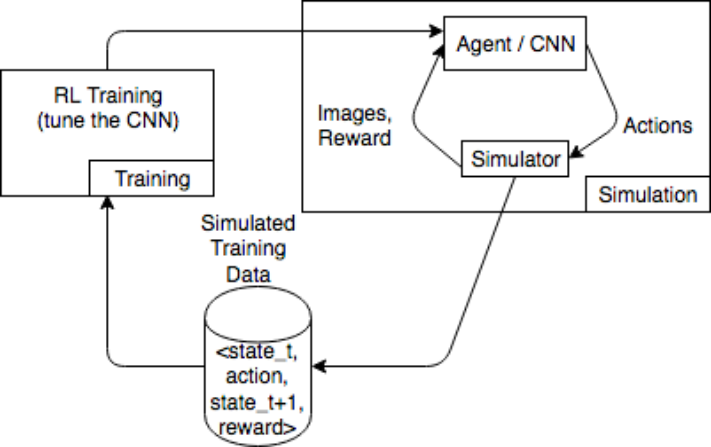

The simulation environment consists of an agent and a simulator. Here, a convolutional neural
network (CNN) consumes images from the simulator and generates actions to control the game

controller. With multiple simulations, this environment generates training data of the form

state_t, action, state_t+1, and reward_t+1. Defining the reward is not trivial and impacts
the RL model quality. We want to provide a few examples of reward functions, but would like to
make it user-configurable.

Topics

• Use OpenAI Gym Interface for Environments in SageMaker AI RL

• Use Open-Source Environments

• Use Commercial Environments

Use OpenAI Gym Interface for Environments in SageMaker AI RL

To use OpenAI Gym environments in SageMaker AI RL, use the following API elements. For more
information about OpenAI Gym, see Gym Documentation.

• env.action_space—Defines the actions the agent can take, specifies whether each action is
continuous or discrete, and specifies the minimum and maximum if the action is continuous.

• env.observation_space—Defines the observations the agent receives from the environment,
as well as minimum and maximum for continuous observations.

• env.reset()—Initializes a training episode. The reset() function returns the initial state
of the environment, and the agent uses the initial state to take its first action. The action is

then sent to step() repeatedly until the episode reaches a terminal state. When step()

Use Reinforcement Learning
4427

## Page 457

Amazon SageMaker AI
Developer Guide

returns done = True, the episode ends. The RL toolkit re-initializes the environment by calling

reset().

• step()—Takes the agent action as input and outputs the next state of the environment, the

reward, whether the episode has terminated, and an info dictionary to communicate debugging
information. It is the responsibility of the environment to validate the inputs.

• env.render()—Used for environments that have visualization. The RL toolkit calls this

function to capture visualizations of the environment after each call to the step() function.

Use Open-Source Environments

You can use open-source environments, such as EnergyPlus and RoboSchool, in SageMaker AI RL by
building your own container. For more information about EnergyPlus, see https://energyplus.net/.
For more information about RoboSchool, see https://github.com/openai/roboschool. The HVAC
and RoboSchool examples in the SageMaker AI examples repository show how to build a custom
container to use with SageMaker AI RL:

Use Commercial Environments

You can use commercial environments, such as MATLAB and Simulink, in SageMaker AI RL by
building your own container. You need to manage your own licenses.

Distributed Training with Amazon SageMaker AI RL

Amazon SageMaker AI RL supports multi-core and multi-instance distributed training. Depending
on your use case, training and/or environment rollout can be distributed. For example, SageMaker
AI RL works for the following distributed scenarios:

• Single training instance and multiple rollout instances of the same instance type. For an
example, see the Neural Network Compression example in the SageMaker AI examples
repository.

• Single trainer instance and multiple rollout instances, where different instance types for
training and rollouts. For an example, see the AWS DeepRacer / AWS RoboMaker example in the
SageMaker AI examples repository.

• Single trainer instance that uses multiple cores for rollout. For an example, see the Roboschool
example in the SageMaker AI examples repository. This is useful if the simulation environment is
light-weight and can run on a single thread.

• Multiple instances for training and rollouts. For an example, see the Roboschool example in the
SageMaker AI examples repository.

Use Reinforcement Learning
4428

## Page 458

Amazon SageMaker AI
Developer Guide

Hyperparameter Tuning with Amazon SageMaker AI RL

You can run a hyperparameter tuning job to optimize hyperparameters for Amazon SageMaker AI

RL. The Roboschool example in the sample notebooks in the SageMaker AI examples repository
shows how you can do this with RL Coach. The launcher script shows how you can abstract
parameters from the Coach preset file and optimize them.

Run your local code as a SageMaker training job

You can run your local machine learning (ML) Python code as a large single-node Amazon
SageMaker training job or as multiple parallel jobs. You can do this by annotating your code with
an @remote decorator, as shown in the following code example. Distributed training (across
multiple instances) are not supported with remote functions.

@remote(**settings)
def divide(x, y):
return x / y

The SageMaker Python SDK will automatically translate your existing workspace environment and
any associated data processing code and datasets into a SageMaker training job that runs on the
SageMaker training platform. You can also activate a persistent cache feature, which will further
reduce job start latency by caching previously downloaded dependency packages. This reduction in
job latency is greater than the reduction in latency from using SageMaker AI managed warm pools
alone. For more information, see Using persistent cache.

Note

Distributed training jobs are not supported by remote functions.

The following sections show how to annotate your local ML code with an @remote decorator
and tailor your experience for your use case. This includes customizing your environment and
integrating with SageMaker Experiments.

Topics

• Set up your environment

• Invoke a remote function

Run local code as a remote job
4429

## Page 459

Amazon SageMaker AI
Developer Guide

• Configuration file

• Customize your runtime environment

• Container image compatibility

• Logging parameters and metrics with Amazon SageMaker Experiments

• Using modular code with the @remote decorator

• Private repository for runtime dependencies

• Example notebooks

Set up your environment

Choose one of the following three options to set up your environment.

Run your code from Amazon SageMaker Studio Classic

You can annotate and run your local ML code from SageMaker Studio Classic by creating a
SageMaker Notebook and attaching any image available on SageMaker Studio Classic image. The
following instructions help you create a SageMaker Notebook, install the SageMaker Python SDK,
and annotate your code with the decorator.

1. Create a SageMaker Notebook and attach an image in SageMaker Studio Classic as follows:

a. Follow the instructions in Launch Amazon SageMaker Studio Classic in the Amazon SageMaker

AI Developer Guide.

b. Select Studio from the left navigation pane. This opens a new window.

c. In the Get Started dialog box, select a user profile from the down arrow. This opens a new

window.

d. Select Open Studio Classic.

e. Select Open Launcher from the main working area. This opens a new page.

f. Select Create notebook from the main working area.

g. Select Base Python 3.0 from the down arrow next to Image in the Change environment

dialog box.

The @remote decorator automatically detects the image attached to the SageMaker Studio

Classic notebook and uses it to run the SageMaker training job. If image_uri is specified
either as an argument in the decorator or in the configuration file, then the value specified in

image_uri will be used instead of the detected image.

Set up your environment
4430

## Page 460

Amazon SageMaker AI
Developer Guide

For more information about how to create a notebook in SageMaker Studio Classic, see the
Create a Notebook from the File Menu section in Create or Open an Amazon SageMaker
Studio Classic Notebook.

For a list of available images, see Supported Docker images.

2. Install the SageMaker Python SDK.

To annotate your code with the @remote function inside a SageMaker Studio Classic Notebook,
you must have the SageMaker Python SDK installed. Install the SageMaker Python SDK, as
shown in the following code example.

!pip install sagemaker

3. Use @remote decorator to run functions in a SageMaker training job.

To run your local ML code, first create a dependencies file to instruct SageMaker AI where to
locate your local code. To do so, follow these steps:

a. From the SageMaker Studio Classic Launcher main working area, in Utilities and files, choose

Text file. This opens a new tab with a text file called untitled.txt.

For more information about the SageMaker Studio Classic user interface (UI), see Amazon
SageMaker Studio Classic UI Overview.

b. Rename untitled.txt to requirements.txt.

c. Add all the dependencies required for the code along with the SageMaker AI library to

requirements.txt.

A minimal code example for requirements.txt for the example divide function is
provided in the following section, as follows.

sagemaker

d. Run your code with the remote decorator by passing the dependencies file, as follows.

from sagemaker.remote_function import remote

@remote(instance_type="ml.m5.xlarge", dependencies='./requirements.txt')
def divide(x, y):
return x / y

Set up your environment
4431

## Page 461

Amazon SageMaker AI
Developer Guide

divide(2, 3.0)

For additional code examples, see the sample notebook quick_start.ipynb.

If you’re already running a SageMaker Studio Classic notebook, and you install the Python
SDK as instructed in 2. Install the SageMaker Python SDK, you must restart your kernel. For
more information, see Use the SageMaker Studio Classic Notebook Toolbar in the Amazon
SageMaker AI Developer Guide.

Run your code from an Amazon SageMaker notebook

You can annotate your local ML code from a SageMaker notebook instance. The following
instructions show how to create a notebook instance with a custom kernel, install the SageMaker
Python SDK, and annotate your code with the decorator.

1. Create a notebook instance with a custom conda kernel.

You can annotate your local ML code with an @remote decorator to use inside of a SageMaker
training job. First you must create and customize a SageMaker notebook instance to use a kernel
with Python version 3.7 or higher, up to 3.10.x. To do so, follow these steps:

a. Open the SageMaker AI console at https://console.aws.amazon.com/sagemaker/.

b. In the left navigation panel, choose Notebook to expand its options.

c. Choose Notebook Instances from the expanded options.

d. Choose the Create Notebook Instance button. This opens a new page.

e. For Notebook instance name, enter a name with a maximum of 63 characters and no spaces.

Valid characters: A-Z, a-z, 0-9, and .:+=@ _%- (hyphen).

f. In the Notebook instance settings dialog box, expand the right arrow next to Additional

Configuration.

g. Under Lifecycle configuration - optional, expand the down arrow and select Create a new

lifecycle configuration. This opens a new dialog box.

h. Under Name, enter a name for your configuration setting.

i. In the Scripts dialog box, in the Start notebook tab, replace the existing contents of the text

box with the following script.

#!/bin/bash

Set up your environment
4432

## Page 462

Amazon SageMaker AI
Developer Guide

set -e

sudo -u ec2-user -i <<'EOF'
unset SUDO_UID
WORKING_DIR=/home/ec2-user/SageMaker/custom-miniconda/
source "$WORKING_DIR/miniconda/bin/activate"
for env in $WORKING_DIR/miniconda/envs/*; do
BASENAME=$(basename "$env")
source activate "$BASENAME"
python -m ipykernel install --user --name "$BASENAME" --display-name "Custom
($BASENAME)"
done
EOF

echo "Restarting the Jupyter server.."
# restart command is dependent on current running Amazon Linux and JupyterLab
CURR_VERSION_AL=$(cat /etc/system-release)

CURR_VERSION_JS=$(jupyter --version)

if [[ $CURR_VERSION_JS == *$"jupyter_core     : 4.9.1"* ]] && [[ $CURR_VERSION_AL
== *$" release 2018"* ]]; then
sudo initctl restart jupyter-server --no-wait
else
sudo systemctl --no-block restart jupyter-server.service
fi

j. In the Scripts dialog box, in the Create notebook tab, replace the existing contents of the text

box with the following script.

#!/bin/bash

set -e

sudo -u ec2-user -i <<'EOF'
unset SUDO_UID
# Install a separate conda installation via Miniconda
WORKING_DIR=/home/ec2-user/SageMaker/custom-miniconda
mkdir -p "$WORKING_DIR"
wget https://repo.anaconda.com/miniconda/Miniconda3-4.6.14-Linux-x86_64.sh -O
"$WORKING_DIR/miniconda.sh"
bash "$WORKING_DIR/miniconda.sh" -b -u -p "$WORKING_DIR/miniconda"
rm -rf "$WORKING_DIR/miniconda.sh"
# Create a custom conda environment

Set up your environment
4433

## Page 463

Amazon SageMaker AI
Developer Guide

source "$WORKING_DIR/miniconda/bin/activate"
KERNEL_NAME="custom_python310"
PYTHON="3.10"
conda create --yes --name "$KERNEL_NAME" python="$PYTHON" pip
conda activate "$KERNEL_NAME"
pip install --quiet ipykernel
# Customize these lines as necessary to install the required packages
EOF

k. Choose the Create configuration button on the bottom right of the window.

l. Choose the Create notebook instance button on the bottom right of the window.

m.Wait for the notebook instance Status to change from Pending to InService.

2. Create a Jupyter notebook in the notebook instance.

The following instructions show how to create a Jupyter notebook using Python 3.10 in your
newly created SageMaker instance.

a. After the notebook instance Status from the previous step is InService, do the following:

i. Select Open Jupyter under Actions in the row containing your newly created notebook

instance Name. This opens a new Jupyter server.

b. In the Jupyter server, select New from the top right menu.

c. From the down arrow, select conda_custom_python310. This creates a new Jupyter notebook

that uses a Python 3.10 kernel. This new Jupyter notebook can now be used similarly to a
local Jupyter notebook.

3. Install the SageMaker Python SDK.

After your virtual environment is running, install the SageMaker Python SDK by using the
following code example.

!pip install sagemaker

4. Use an @remote decorator to run functions in a SageMaker training job.

When you annotate your local ML code with an @remote decorator inside the SageMaker
notebook, SageMaker training will automatically interpret the function of your code and run it
as a SageMaker training job. Set up your notebook by doing the following:

a. Select the kernel name in the notebook menu from the SageMaker notebook instance that

you created in step 1, Create a SageMaker Notebook instance with a custom kernel.

Set up your environment
4434

## Page 464

Amazon SageMaker AI
Developer Guide

For more information, see Change an Image or a Kernel.

b. From the down arrow, choose the a custom conda kernel that uses a version of Python that is

3.7 or higher.

As an example, selecting conda_custom_python310 chooses the kernel for Python 3.10.

c. Choose Select.

d. Wait for the kernel’s status to show as idle, which indicates that the kernel has started.

e. In the Jupyter Server Home, select New from the top right menu.

f. Next to the down arrow, select Text file. This creates a new text file called untitled.txt.

g. Rename untitled.txt to requirements.txt and add any dependencies required for the

code along with sagemaker.

h. Run your code with the remote decorator by passing the dependencies file as shown below.

from sagemaker.remote_function import remote

@remote(instance_type="ml.m5.xlarge", dependencies='./requirements.txt')
def divide(x, y):
return x / y

divide(2, 3.0)

See the sample notebook quick_start.ipnyb for additional code examples.

Run your code from within your local IDE

You can annotate your local ML code with an @remote decorator inside your preferred local IDE.
The following steps show the necessary prerequisites, how to install the Python SDK, and how to
annotate your code with the @remote decorator.

1. Install prerequisites by setting up the AWS Command Line Interface (AWS CLI) and creating a

role, as follows:

• Onboard to a SageMaker AI domain following the instructions in the AWS CLI Prerequisites
section of Set Up Amazon SageMaker AI Prerequisites.

• Create an IAM role following the Create execution role section of SageMaker AI Roles.

2. Create a virtual environment by using either PyCharm or conda and using Python version 3.7 or

higher, up to 3.10.x.

Set up your environment
4435

## Page 465

Amazon SageMaker AI
Developer Guide

• Set up a virtual environment using PyCharm as follows:

a. Select File from the main menu.

b. Choose New Project.

c. Choose Conda from the down arrow under New environment using.

d. In the field for Python version use the down arrow to select a version of Python that is 3.7

or above. You can go up to 3.10.x from the list.

• If you have Anaconda installed, you can set up a virtual environment using conda, as follows:

• Open an Anaconda prompt terminal interface.

• Create and activate a new conda environment using a Python version of 3.7 or higher, up to

3.10x. The following code example shows how to create a conda environment using Python
version 3.10.

conda create -n sagemaker_jobs_quick_start python=3.10 pip
conda activate sagemaker_jobs_quick_start

3. Install the SageMaker Python SDK.

Set up your environment
4436

## Page 466

Amazon SageMaker AI
Developer Guide

To package your code from your preferred IDE, you must have a virtual environment set up
using Python 3.7 or higher, up to 3.10x. You also need a compatible container image. Install the
SageMaker Python SDK using the following code example.

pip install sagemaker

4. Wrap your code inside the @remote decorator. The SageMaker Python SDK will automatically

interpret the function of your code and run it as a SageMaker training job. The following code
examples show how to import the necessary libraries, set up a SageMaker session, and annotate
a function with the @remote decorator.

You can run your code by either providing the dependencies needed directly, or by using

dependencies from the active conda environment.

• To provide the dependencies directly, do the following:

• Create a requirements.txt file in the working directory that the code resides in.

• Add all of the dependencies required for the code along with the SageMaker library. The

following section provides a minimal code example for requirements.txt for the

example divide function.

sagemaker

• Run your code with the @remote decorator by passing the dependencies file. In the

following code example, replace The IAM role name with an AWS Identity and Access
Management (IAM) role ARN that you would like SageMaker to use to run your job.

import boto3
import sagemaker
from sagemaker.remote_function import remote

sm_session =
sagemaker.Session(boto_session=boto3.session.Session(region_name="us-west-2"))
settings = dict(
sagemaker_session=sm_session,
role=<The IAM role name>,
instance_type="ml.m5.xlarge",
dependencies='./requirements.txt'
)

@remote(**settings)

Set up your environment
4437

## Page 467

Amazon SageMaker AI
Developer Guide

def divide(x, y):
return x / y

if __name__ == "__main__":
print(divide(2, 3.0))

• To use dependencies from the active conda environment, use the value auto_capture for

the dependencies parameter, as shown in the following.

import boto3
import sagemaker
from sagemaker.remote_function import remote

sm_session = sagemaker.Session(boto_session=boto3.session.Session(region_name="us-
west-2"))
settings = dict(
sagemaker_session=sm_session,
role=<The IAM role name>,
instance_type="ml.m5.xlarge",
dependencies="auto_capture"
)

@remote(**settings)
def divide(x, y):
return x / y

if __name__ == "__main__":
print(divide(2, 3.0))

Note

You can also implement the previous code inside a Jupyter notebook. PyCharm
Professional Edition supports Jupyter natively. For more guidance, see Jupyter
notebook support in PyCharm's documentation.

Invoke a remote function

To invoke a function inside the @remote decorator, use either of the following methods:

Invoke a remote function
4438

## Page 468

Amazon SageMaker AI
Developer Guide

• Use an @remote decorator to invoke a function.

• Use the RemoteExecutor API to invoke a function.

If you use the @remote decorator method to invoke a function, the training job will wait for the

function to complete before starting a new task. However, if you use the RemoteExecutor API,
you can run more than one job in parallel. The following sections show both ways of invoking a

function.

Use an @remote decorator to invoke a function

You can use the @remote decorator to annotate a function. SageMaker AI will transform the code
inside the decorator into a SageMaker training job. The training job will then invoke the function
inside the decorator and wait for the job to complete. The following code example shows how to
import the required libraries, start a SageMaker AI instance, and annotate a matrix multiplication
with the @remote decorator.

from sagemaker.remote_function import remote
import numpy as np

@remote(instance_type="ml.m5.large")
def matrix_multiply(a, b):
return np.matmul(a, b)
a = np.array([[1, 0],
[0, 1]])
b = np.array([1, 2])

assert (matrix_multiply(a, b) == np.array([1,2])).all()

The decorator is defined as follows.

def remote(
*,
**kwarg):
...

When you invoke a decorated function, SageMaker Python SDK loads any exceptions raised by
an error into local memory. In the following code example, the first call to the divide function
completes successfully and the result is loaded into local memory. In the second call to the divide
function, the code returns an error and this error is loaded into local memory.

Invoke a remote function
4439

## Page 469

Amazon SageMaker AI
Developer Guide

from sagemaker.remote_function import remote
import pytest

@remote()
def divide(a, b):
return a/b

# the underlying job is completed successfully
# and the function return is loaded
assert divide(10, 5) == 2

# the underlying job fails with "AlgorithmError"
# and the function exception is loaded into local memory
with pytest.raises(ZeroDivisionError):
divide(10, 0)

Note

The decorated function is run as a remote job. If the thread is interrupted, the underlying
job will not be stopped.

How to change the value of a local variable

The decorator function is run on a remote machine. Changing a non-local variable or input
arguments inside a decorated function will not change the local value.

In the following code example, a list and a dict are appended inside the decorator function. This
does not change when the decorator function is invoked.

a = []

@remote
def func():
a.append(1)

# when func is invoked, a in the local memory is not modified
func()
func()

# a stays as []

Invoke a remote function
4440

## Page 470

Amazon SageMaker AI
Developer Guide

a = {}
@remote
def func(a):
# append new values to the input dictionary
a["key-2"] = "value-2"
a = {"key": "value"}
func(a)

# a stays as {"key": "value"}

To change the value of a local variable declared inside of a decorator function, return the variable
from the function. The following code example shows that the value of a local variable is changed
when it is returned from the function.

a = {"key-1": "value-1"}

@remote
def func(a):
a["key-2"] = "value-2"
return a

a = func(a)

-> {"key-1": "value-1", "key-2": "value-2"}

Data serialization and deserialization

When you invoke a remote function, SageMaker AI automatically serializes your function
arguments during the input and output stages. Function arguments and returns are serialized using
cloudpickle. SageMaker AI supports serializing the following Python objects and functions.

• Built-in Python objects including dicts, lists, floats, ints, strings, boolean values and tuples

• Numpy arrays

• Pandas Dataframes

• Scikit-learn datasets and estimators

• PyTorch models

• TensorFlow models

• The Booster class for XGBoost

Invoke a remote function
4441

## Page 471

Amazon SageMaker AI
Developer Guide

The following can be used with some limitations.

• Dask DataFrames

• The XGBoost Dmatrix class

• TensorFlow datasets and subclasses

• PyTorch models

The following section contains best practices for using the previous Python classes with some
limitations in your remote function, information about where SageMaker AI stores your serialized
data and how to manage access to it.

Best practices for Python classes with limited support for remote data serialization

You can use the Python classes listed in this section with limitations. The next sections discuss best
practices for how to use the following Python classes.

• Dask DataFrames

• The XGBoost DMatric class

• TensorFlow datasets and subclasses

• PyTorch models

Best practices for Dask

Dask is an open-source library used for parallel computing in Python. This section shows the
following.

• How to pass a Dask DataFrame into your remote function

• How to convert summary statistics from a Dask DataFrame into a Pandas DataFrame

How to pass a Dask DataFrame into your remote function

Dask DataFrames are often used to process large datasets because they can hold datasets that
require more memory than is available. This is because a Dask DataFrame does not load your local
data into memory. If you pass a Dask DataFrame as a function argument to your remote function,
Dask may pass a reference to the data in your local disk or cloud storage, instead of the data itself.
The following code shows an example of passing a Dask DataFrame inside your remote function
that will operate on an empty DataFrame.

Invoke a remote function
4442

## Page 472

Amazon SageMaker AI
Developer Guide

#Do not pass a Dask DataFrame  to your remote function as follows
def clean(df: dask.DataFrame ):
cleaned = df[] \ ...

Dask will load the data from the Dask DataFrame into memory only when you use the DataFrame .
If you want to use a Dask DataFrame inside a remote function, provide the path to the data . Then
Dask will read the dataset directly from the data path that you specify when the code runs.

The following code example shows how to use a Dask DataFrame inside the remote function

clean. In the code example, raw_data_path is passed to clean instead of the Dask DataFrame.
When the code runs, the dataset is read directly from the location of an Amazon S3 bucket

specified in raw_data_path. Then the persist function keeps the dataset in memory to

facilitate the subsequent random_split function and written back to the output data path in an
S3 bucket using Dask DataFrame API functions.

import dask.dataframe as dd

@remote(
instance_type='ml.m5.24xlarge',
volume_size=300,
keep_alive_period_in_seconds=600)
#pass the data path to your remote function rather than the Dask DataFrame  itself
def clean(raw_data_path: str, output_data_path: str: split_ratio: list[float]):
df = dd.read_parquet(raw_data_path) #pass the path to your DataFrame
cleaned = df[(df.column_a >= 1) & (df.column_a < 5)]\
.drop(['column_b', 'column_c'], axis=1)\
.persist() #keep the data in memory to facilitate the following random_split
operation

train_df, test_df = cleaned.random_split(split_ratio, random_state=10)

train_df.to_parquet(os.path.join(output_data_path, 'train')
test_df.to_parquet(os.path.join(output_data_path, 'test'))
clean("s3://amzn-s3-demo-bucket/raw/", "s3://amzn-s3-demo-bucket/cleaned/",
split_ratio=[0.7, 0.3])

How to convert summary statistics from a Dask DataFrame into a Pandas DataFrame

Summary statistics from a Dask DataFrame can be converted into a Pandas DataFrame by invoking

the compute method as shown in the following example code. In the example, the S3 bucket

Invoke a remote function
4443

## Page 473

Amazon SageMaker AI
Developer Guide

contains a large Dask DataFrame that cannot fit into memory or into a Pandas dataframe. In the
following example, a remote function scans the data set and returns a Dask DataFrame containing

the output statistics from describe to a Pandas DataFrame.

executor = RemoteExecutor(
instance_type='ml.m5.24xlarge',
volume_size=300,
keep_alive_period_in_seconds=600)

future = executor.submit(lambda: dd.read_parquet("s3://amzn-s3-demo-bucket/
raw/").describe().compute())

future.result()

Best practices for the XGBoost DMatric class

DMatrix is an internal data structure used by XGBoost to load data. A DMatrix object can’t be
pickled in order to move easily between compute sessions. Directly passing DMatrix instances will

fail with a SerializationError.

How to pass a data object to your remote function and train with XGBoost

To convert a Pandas DataFrame into a DMatrix instance and use it for training in your remote
function, pass it directly to the remote function as shown in the following code example.

import xgboost as xgb

@remote
def train(df, params):
#Convert a pandas dataframe into a DMatrix DataFrame and use it for training
dtrain = DMatrix(df)
return xgb.train(dtrain, params)

Best practices for TensorFlow datasets and sub-classes

TensorFlow datasets and subclasses are internal objects used by TensorFlow to load data
during training. TensorFlow datasets and subclasses can’t be pickled in order to move easily
between compute sessions. Directly passing Tensorflow datasets or subclasses will fail with a

SerializationError. Use the Tensorflow I/O APIs to load data from the storage, as shown in
the following code example.

Invoke a remote function
4444

## Page 474

Amazon SageMaker AI
Developer Guide

import tensorflow as tf
import tensorflow_io as tfio

@remote
def train(data_path: str, params):
dataset = tf.data.TextLineDataset(tf.data.Dataset.list_files(f"{data_path}/*.txt"))
...
train("s3://amzn-s3-demo-bucket/data", {})

Best practices for PyTorch models

PyTorch models are serializable and can be passed between your local environment and remote
function. If your local environment and remote environment have different device types, such as
(GPUs and CPUs), you cannot return a trained model to your local environment. For example, if the
following code is developed in a local environment without GPUs but run in an instance with GPUs,

returning the trained model directly will lead to a DeserializationError.

# Do not return a model trained on GPUs to a CPU-only environment as follows

@remote(instance_type='ml.g4dn.xlarge')
def train(...):
if torch.cuda.is_available():
device = torch.device("cuda")
else:
device = torch.device("cpu") # a device without GPU capabilities
model = Net().to(device)
# train the model
...
return model
model = train(...) #returns a DeserializationError if run on a device with GPU

To return a model trained in a GPU environment to one that contains only CPU capabilities, use the
PyTorch model I/O APIs directly as shown in the code example below.

import s3fs

Invoke a remote function
4445

## Page 475

Amazon SageMaker AI
Developer Guide

model_path = "s3://amzn-s3-demo-bucket/folder/"

@remote(instance_type='ml.g4dn.xlarge')
def train(...):
if torch.cuda.is_available():
device = torch.device("cuda")
else:
device = torch.device("cpu")
model = Net().to(device)
# train the model
...
fs = s3fs.FileSystem()
with fs.open(os.path.join(model_path, 'model.pt'), 'wb') as file:

torch.save(model.state_dict(), file) #this writes the model in a device-
agnostic way (CPU vs GPU)
train(...) #use the model to train on either CPUs or GPUs

model = Net()
fs = s3fs.FileSystem()with fs.open(os.path.join(model_path, 'model.pt'), 'rb') as file:
model.load_state_dict(torch.load(file, map_location=torch.device('cpu')))

Where SageMaker AI stores your serialized data

When you invoke a remote function, SageMaker AI automatically serializes your function
arguments and return values during the input and output stages. This serialized data is stored

under a root directory in your S3 bucket. You specify the root directory, <s3_root_uri>, in a

configuration file. The parameter job_name is automatically generated for you.

Under the root directory, SageMaker AI creates a <job_name> folder, which holds your current
work directory, serialized function, the arguments for your serialized function, results and any
exceptions that arose from invoking the serialized function.

Under <job_name>, the directory workdir contains a zipped archive of your current working
directory. The zipped archive includes any Python files in your working directory and the

requirements.txt file, which specifies any dependencies needed to run your remote function.

Invoke a remote function
4446

## Page 476

Amazon SageMaker AI
Developer Guide

The following is an example of the folder structure under an S3 bucket that you specify in your
configuration file.

<s3_root_uri>/ # specified by s3_root_uri or S3RootUri
<job_name>/ #automatically generated for you
workdir/workspace.zip # archive of the current working directory (workdir)
function/ # serialized function
arguments/ # serialized function arguments
results/ # returned output from the serialized function including the model
exception/ # any exceptions from invoking the serialized function

The root directory that you specify in your S3 bucket is not meant for long term storage. The
serialized data are tightly tied to the Python version and machine learning (ML) framework version
that were used during serialization. If you upgrade the Python version or ML framework, you may
not be able to use your serialized data. Instead, do the following.

• Store your model and model artifacts in a format that is agnostic to your Python version and ML
framework.

• If you upgrade your Python or ML framework, access your model results from your long-term
storage.

Important

To delete your serialized data after a specified amount of time, set a lifetime configuration
on your S3 bucket.

Note

Files that are serialized with the Python pickle module can be less portable than other data
formats including CSV, Parquet and JSON. Be wary of loading pickled files from unknown
sources.

For more information about what to include in a configuration file for a remote function, see
Configuration File.

Invoke a remote function
4447

## Page 477

Amazon SageMaker AI
Developer Guide

Access to your serialized data

Administrators can provide settings for your serialized data, including its location and any
encryption settings in a configuration file. By default, the serialized data are encrypted with an
AWS Key Management Service (AWS KMS) Key. Administrators can also restrict access to the root

directory that you specify in your configuration file with a bucket policy. The configuration file can
be shared and used across projects and jobs. For more information, see Configuration File.

Use the RemoteExecutor API to invoke a function

You can use the RemoteExecutor API to invoke a function. SageMaker AI Python SDK will

transform the code inside the RemoteExecutor call into a SageMaker AI training job. The training
job will then invoke the function as an asynchronous operation and return a future. If you use the

RemoteExecutor API, you can run more than one training job in parallel. For more information
about futures in Python, see Futures.

The following code example shows how to import the required libraries, define a function, start a

SageMaker AI instance, and use the API to submit a request to run 2 jobs in parallel.

from sagemaker.remote_function import RemoteExecutor

def matrix_multiply(a, b):
return np.matmul(a, b)

a = np.array([[1, 0],
[0, 1]])
b = np.array([1, 2])

with RemoteExecutor(max_parallel_job=2, instance_type="ml.m5.large") as e:
future = e.submit(matrix_multiply, a, b)

assert (future.result() == np.array([1,2])).all()

The RemoteExecutor class is an implementation of the concurrent.futures.Executor library.

The following code example shows how to define a function and call it using the

RemoteExecutorAPI. In this example, the RemoteExecutor will submit 4 jobs in total, but only

2 in parallel. The last two jobs will reuse the clusters with minimal overhead.

from sagemaker.remote_function.client import RemoteExecutor

Invoke a remote function
4448

## Page 478

Amazon SageMaker AI
Developer Guide

def divide(a, b):
return a/b

with RemoteExecutor(max_parallel_job=2, keep_alive_period_in_seconds=60) as e:
futures = [e.submit(divide, a, 2) for a in [3, 5, 7, 9]]

for future in futures:
print(future.result())

The max_parallel_job parameter only serves as a rate limiting mechanism without optimizing

compute resource allocation. In the previous code example, RemoteExecutor doesn’t reserve
compute resources for the two parallel jobs before any jobs are submitted. For more information

about max_parallel_job or other parameters for the @remote decorator, see Remote function
classes and methods specification.

Future class for the RemoteExecutor API

A future class is a public class that represents the return function from the training job when it is
invoked asynchronously. The future class implements the concurrent.futures.Future class. This class
can be used to do operations on the underlying job and load data into memory.

Configuration file

The Amazon SageMaker Python SDK supports setting of default values for AWS infrastructure
primitive types. After administrators configure these defaults, they are automatically passed when
SageMaker Python SDK calls supported APIs. The arguments for the decorator function can be
put inside of configuration files. This is so that you can separate settings that are related to the
infrastructure from the code base. For more information about parameters and arguments for the
remote function and methods, see Remote function classes and methods specification.

You can set infrastructure settings for the network configuration, IAM roles, Amazon S3 folder for
input, output data, and tags inside the configuration file. The configuration file can be used when

invoking a function using either the @remote decorator or the RemoteExecutor API.

An example configuration file that defines the dependencies, resources, and other arguments
follows. This example configuration file is used to invoke a function that is initiated either using the
@remote decorator or the RemoteExecutor API.

SchemaVersion: '1.0'
SageMaker:

Configuration file
4449

## Page 479

Amazon SageMaker AI
Developer Guide

PythonSDK:
Modules:
RemoteFunction:
Dependencies: 'path/to/requirements.txt'
EnableInterContainerTrafficEncryption: true
EnvironmentVariables: {'EnvVarKey': 'EnvVarValue'}
ImageUri: '366666666666.dkr.ecr.us-west-2.amazonaws.com/my-image:latest'
IncludeLocalWorkDir: true
CustomFileFilter:
IgnoreNamePatterns:
- "*.ipynb"
- "data"
InstanceType: 'ml.m5.large'
JobCondaEnvironment: 'your_conda_env'
PreExecutionCommands:
- 'command_1'
- 'command_2'

PreExecutionScript: 'path/to/script.sh'
RoleArn: 'arn:aws:iam::366666666666:role/MyRole'
S3KmsKeyId: 'yourkmskeyid'
S3RootUri: 's3://amzn-s3-demo-bucket/my-project'
VpcConfig:
SecurityGroupIds:
- 'sg123'
Subnets:
- 'subnet-1234'
Tags: [{'Key': 'yourTagKey', 'Value':'yourTagValue'}]
VolumeKmsKeyId: 'yourkmskeyid'

The @remote decorator and RemoteExecutor will look for Dependencies in the following
configuration files:

• An admin-defined configuration file.

• A user-defined configuration file.

The default locations for these configuration files depend on, and are relative to, your
environment. The following code example returns the default location of your admin and user
configuration files. These commands must be run in the same environment where you're using the
SageMaker Python SDK.

import os

Configuration file
4450

## Page 480

Amazon SageMaker AI
Developer Guide

from platformdirs import site_config_dir, user_config_dir

#Prints the location of the admin config file
print(os.path.join(site_config_dir("sagemaker"), "config.yaml"))

#Prints the location of the user config file
print(os.path.join(user_config_dir("sagemaker"), "config.yaml"))

You can override the default locations of these files by setting the

SAGEMAKER_ADMIN_CONFIG_OVERRIDE and SAGEMAKER_USER_CONFIG_OVERRIDE environment
variables for the admin-defined and user-defined configuration file paths, respectively.

If a key exists in both the admin-defined and user-defined configuration files, the value in the user-
defined file will be used.

Customize your runtime environment

You can customize your runtime environment to use your preferred local integrated development
environments (IDEs), SageMaker notebooks, or SageMaker Studio Classic notebooks to write your
ML code. SageMaker AI will help package and submit your functions and its dependencies as a
SageMaker training job. This allows you to access the capacity of the SageMaker training server to
run your training jobs.

Both the remote decorator and the RemoteExecutor methods to invoke a function allow users to

define and customize their runtime environment. You can use either a requirements.txt file or
a conda environment YAML file.

To customize a runtime environment using both a conda environment YAML file and a

requirements.txt file, refer to the following code example.

# specify a conda environment inside a yaml file
@remote(instance_type="ml.m5.large",
image_uri = "my_base_python:latest",
dependencies = "./environment.yml")
def matrix_multiply(a, b):
return np.matmul(a, b)

# use a requirements.txt file to import dependencies
@remote(instance_type="ml.m5.large",
image_uri = "my_base_python:latest",
dependencies = './requirements.txt')
def matrix_multiply(a, b):

Customize your runtime environment
4451

## Page 481

Amazon SageMaker AI
Developer Guide

return np.matmul(a, b)

Alternatively, you can set dependencies to auto_capture to let the SageMaker Python SDK
capture the installed dependencies in the active conda environment. The following are required for

auto_capture to work reliably:

• You must have an active conda environment. We recommend not using the base conda
environment for remote jobs so that you can reduce potential dependency conflicts. Not using

the base conda environment also allows for faster environment setup in the remote job.

• You must not have any dependencies installed using pip with a value for the parameter --

extra-index-url.

• You must not have any dependency conflicts between packages installed with conda and
packages installed with pip in the local development environment.

• Your local development environment must not contain operating system-specific dependencies
that are not compatible with Linux.

In case auto_capture does not work, we recommend that you pass in your dependencies as a
requirement.txt or conda environment.yaml file, as described in the first coding example in this
section.

Container image compatibility

The following table shows a list of SageMaker training images that are compatible with the
@remote decorator.

Name
Python Version
Image URI - CPU
Image URI - GPU

Data Science
3.7(py37)
For SageMaker Studio
Classic Notebooks
only. Python SDK
automatically selects
the image URI when
used as SageMaker
Studio Classic
Notebook kernel
image.

For SageMaker Studio
Classic Notebooks
only. Python SDK
automatically selects
the image URI when
used as SageMaker
Studio Classic
Notebook kernel
image.

Container image compatibility
4452

## Page 482

Amazon SageMaker AI
Developer Guide

Name
Python Version
Image URI - CPU
Image URI - GPU

Data Science 2.0
3.8(py38)
For SageMaker Studio
Classic Notebooks
only. Python SDK
automatically selects
the image URI when
used as SageMaker
Studio Classic
Notebook kernel
image.

For SageMaker Studio
Classic Notebooks
only. Python SDK
automatically selects
the image URI when
used as SageMaker
Studio Classic
Notebook kernel
image.

Data Science 3.0
3.10(py310)
For SageMaker Studio
Classic Notebooks
only. Python SDK
automatically selects
the image URI when
used as SageMaker
Studio Classic
Notebook kernel
image.

For SageMaker Studio
Classic Notebooks
only. Python SDK
automatically selects
the image URI when
used as SageMaker
Studio Classic
Notebook kernel
image.

Base Python 2.0
3.8(py38)
Python SDK selects
this image when
it detects that
development
environment is using
Python 3.8 runtime.
Otherwise Python
SDK automatic
ally selects this
image when used as
SageMaker Studio
Classic Notebook
kernel image

For SageMaker Studio
Classic Notebooks
only. Python SDK
automatically selects
the image URI when
used as SageMaker
Studio Classic
Notebook kernel
image.

Container image compatibility
4453

## Page 483

Amazon SageMaker AI
Developer Guide

Name
Python Version
Image URI - CPU
Image URI - GPU

Base Python 3.0
3.10(py310)
Python SDK selects
this image when
it detects that
development
environment is using
Python 3.8 runtime.
Otherwise Python
SDK automatic
ally selects this
image when used as
SageMaker Studio
Classic Notebook
kernel image

For SageMaker Studio
Classic Notebooks
only. Python SDK
automatically selects
the image URI when
used as Studio Classic
Notebook kernel
image.

DLC-TensorFlow
2.12.0 for SageMaker
Training

3.10(py310)
763104351884.dkr.e
cr.<region>.amazon
aws.com/tensorflow
-training:2.12.0-cpu-
py310-ubuntu20.04-
sagemaker

763104351884.dkr.e
cr.<region>.amazon
aws.com/tensorflow
-training:2.12.0-gpu-
py310-cu118-ubu
ntu20.04-sagemaker

DLC-Tensorflow
2.11.0 for SageMaker
training

3.9(py39)
763104351884.dkr.e
cr.<region>.amazon
aws.com/tensorflow
-training:2.11.0-cpu-
py39-ubuntu20.04-
sagemaker

763104351884.dkr.e
cr.<region>.amazon
aws.com/tensorflow
-training:2.11.0-gpu-
py39-cu112-ubun
tu20.04-sagemaker

DLC-TensorFlow
2.10.1 for SageMaker
training

3.9(py39)
763104351884.dkr.e
cr.<region>.amazon
aws.com/tensorflow
-training:2.10.1-cpu-
py39-ubuntu20.04-
sagemaker

763104351884.dkr.e
cr.<region>.amazon
aws.com/tensorflow
-training:2.10.1-gpu-
py39-cu112-ubun
tu20.04-sagemaker

Container image compatibility
4454

## Page 484

Amazon SageMaker AI
Developer Guide

Name
Python Version
Image URI - CPU
Image URI - GPU

DLC-TensorFlow
2.9.2 for SageMaker
training

3.9(py39)
763104351884.dkr.e
cr.<region>.amazon
aws.com/tensorflow
-training:2.9.2-cpu-
py39-ubuntu20.04-
sagemaker

763104351884.dkr.e
cr.<region>.amazon
aws.com/tensorflow
-training:2.9.2-gpu-
py39-cu112-ubunt
u20.04-sagemaker

DLC-TensorFlow
2.8.3 for SageMaker
training

3.9(py39)
763104351884.dkr.e
cr.<region>.amazon
aws.com/tensorflow
-training:2.8.3-cpu-
py39-ubuntu20.04-
sagemaker

763104351884.dkr.e
cr.<region>.amazon
aws.com/tensorflow
-training:2.8.3-gpu-
py39-cu112-ubunt
u20.04-sagemaker

DLC-PyTorch 2.0.0 for
SageMaker training

3.10(py310)
763104351884.dkr.e
cr.<region>.amazon
aws.com/pytorch-tr
aining:2.0.0-cpu-p
y310-ubuntu20.04-s
agemaker

763104351884.dkr.e
cr.<region>.amazon
aws.com/pytorch-tr
aining:2.0.0-gpu-p
y310-cu118-ubuntu2
0.04-sagemaker

DLC-PyTorch 1.13.1
for SageMaker
training

3.9(py39)
763104351884.dkr.e
cr.<region>.amazon
aws.com/pytorch-tr
aining:1.13.1-cpu-
py39-ubuntu20.04-s
agemaker

763104351884.dkr.e
cr.<region>.amazon
aws.com/pytorch-tr
aining:1.13.1-gpu-
py39-cu117-ubuntu2
0.04-sagemaker

DLC-PyTorch 1.12.1
for SageMaker
training

3.8(py38)
763104351884.dkr.e
cr.<region>.amazon
aws.com/pytorch-tr
aining:1.12.1-cpu-
py38-ubuntu20.04-s
agemaker

763104351884.dkr.e
cr.<region>.amazon
aws.com/pytorch-tr
aining:1.12.1-gpu-
py38-cu113-ubuntu2
0.04-sagemaker

Container image compatibility
4455

## Page 485

Amazon SageMaker AI
Developer Guide

Name
Python Version
Image URI - CPU
Image URI - GPU

DLC-PyTorch 1.11.0
for SageMaker
training

3.8(py38)
763104351884.dkr.e
cr.<region>.amazon
aws.com/pytorch-tr
aining:1.11.0-cpu-
py38-ubuntu20.04-s
agemaker

763104351884.dkr.e
cr.<region>.amazon
aws.com/pytorch-tr
aining:1.11.0-gpu-
py38-cu113-ubuntu2
0.04-sagemaker

DLC-MXNet 1.9.0 for
SageMaker training

3.8(py38)
763104351884.dkr.e
cr.<region>.amazon
aws.com/mxnet-trai
ning:1.9.0-cpu-py3
8-ubuntu20.04-sage
maker

763104351884.dkr.e
cr.<region>.amazon
aws.com/mxnet-trai
ning:1.9.0-gpu-py38-
cu112-ubuntu20.04-
sagemaker

Note

To run jobs locally using AWS Deep Learning Containers (DLC) images, use the image URIs

found in the DLC documentation. The DLC images do not support the auto_capture
value for dependencies.
Jobs with SageMaker AI Distribution in SageMaker Studio run in a container as a non-

root user named sagemaker-user. This user needs full permission to access /opt/ml

and /tmp. Grant this permission by adding sudo chmod -R 777 /opt/ml /tmp to the

pre_execution_commands list, as shown in the following snippet:

@remote(pre_execution_commands=["sudo chmod -R 777 /opt/ml /tmp"])
def func():
pass

You can also run remote functions with your custom images. For compatibility with remote
functions, custom images should be built with Python version 3.7.x-3.10.x. The following is a
minimal Dockerfile example showing you how to use a Docker image with Python 3.10.

FROM python:3.10

Container image compatibility
4456

## Page 486

Amazon SageMaker AI
Developer Guide

#... Rest of the Dockerfile

To create conda environments in your image and use it to run jobs, set the environment

variable SAGEMAKER_JOB_CONDA_ENV to the conda environment name. If your image has

the SAGEMAKER_JOB_CONDA_ENV value set, the remote function cannot create a new conda
environment during the training job runtime. Refer to the following Dockerfile example that uses a

conda environment with Python version 3.10.

FROM continuumio/miniconda3:4.12.0

ENV SHELL=/bin/bash \
CONDA_DIR=/opt/conda \
SAGEMAKER_JOB_CONDA_ENV=sagemaker-job-env

RUN conda create -n $SAGEMAKER_JOB_CONDA_ENV \
&& conda install -n $SAGEMAKER_JOB_CONDA_ENV python=3.10 -y \
&& conda clean --all -f -y \

For SageMaker AI to use mamba to manage your Python virtual environment in the container
image, install the mamba toolkit from miniforge. To use mamba, add the following code example

to your Dockerfile. Then, SageMaker AI will detect the mamba availability at runtime and use it

instead of conda.

#Mamba Installation
RUN curl -L -O "https://github.com/conda-forge/miniforge/releases/latest/download/
Mambaforge-Linux-x86_64.sh" \
&& bash Mambaforge-Linux-x86_64.sh -b -p "/opt/conda"  \
&& /opt/conda/bin/conda init bash

Using a custom conda channel on an Amazon S3 bucket is not compatible with mamba when
using a remote function. If you choose to use mamba, make sure you are not using a custom conda
channel on Amazon S3. For more information, see the Prerequisites section under Custom conda
repository using Amazon S3.

The following is a complete Dockerfile example showing how to create a compatible Docker image.

FROM python:3.10

RUN apt-get update -y \
# Needed for awscli to work
# See: https://github.com/aws/aws-cli/issues/1957#issuecomment-687455928

Container image compatibility
4457

## Page 487

Amazon SageMaker AI
Developer Guide

&& apt-get install -y groff unzip curl \
&& pip install --upgrade \
'boto3>1.0<2' \
'awscli>1.0<2' \
'ipykernel>6.0.0<7.0.0' \
#Use ipykernel with --sys-prefix flag, so that the absolute path to
#/usr/local/share/jupyter/kernels/python3/kernel.json python is used
# in kernelspec.json file
&& python -m ipykernel install --sys-prefix

#Install Mamba
RUN curl -L -O "https://github.com/conda-forge/miniforge/releases/latest/download/
Mambaforge-Linux-x86_64.sh" \
&& bash Mambaforge-Linux-x86_64.sh -b -p "/opt/conda"  \
&& /opt/conda/bin/conda init bash

#cleanup

RUN apt-get clean \
&& rm -rf /var/lib/apt/lists/* \
&& rm -rf ${HOME}/.cache/pip \
&& rm Mambaforge-Linux-x86_64.sh

ENV SHELL=/bin/bash \
PATH=$PATH:/opt/conda/bin

The resulting image from running the previous Dockerfile example can also be used as a
SageMaker Studio Classic kernel image.

Logging parameters and metrics with Amazon SageMaker Experiments

This guide show how to log parameters and metrics with Amazon SageMaker Experiments. A
SageMaker AI experiment consists of runs, and each run consists of all the inputs, parameters,
configurations and results for a single model training interaction.

You can log parameters and metrics from a remote function using either the @remote decorator or

the RemoteExecutor API.

To log parameters and metrics from a remote function, choose one of the following methods:

• Instantiate a SageMaker AI experiment run inside a remote function using Run from the
SageMaker Experiments library. For more information, see Create an Amazon SageMaker AI
Experiment.

Logging parameters and metrics with Amazon SageMaker Experiments
4458

## Page 488

Amazon SageMaker AI
Developer Guide

• Use the load_run function inside a remote function from the SageMaker AI Experiments library.

This will load a Run instance that is declared outside of the remote function.

The following sections show how to create and track lineage with SageMaker AI experiment runs

by using the previous listed methods. The sections also describe cases that are not supported by
SageMaker training.

Use the @remote decorator to integrate with SageMaker Experiments

You can either instantiate an experiment in SageMaker AI, or load a current SageMaker AI
experiment from inside a remote function. The following sections show you show to use either
method.

Create an experiment with SageMaker Experiments

You can create an experiment run in SageMaker AI experiment. To do this you pass your experiment
name, run name, and other parameters into your remote function.

The following code example imports the name of your experiment, the name of the run, and the

parameters to log during each run. The parameters param_1 and param_2 are logged over time
inside a training loop. Common parameters may include batch size or epochs. In this example,

the metrics metric_a and metric_b are logged for a run over time inside a training loop. Other

common metrics may include accuracy or loss.

from sagemaker.remote_function import remote
from sagemaker.experiments.run import Run

# Define your remote function
@remote
def train(value_1, value_2, exp_name, run_name):
...
...
#Creates the experiment
with Run(
experiment_name=exp_name,
run_name=run_name,
) as run:
...
#Define values for the parameters to log
run.log_parameter("param_1", value_1)

Logging parameters and metrics with Amazon SageMaker Experiments
4459

## Page 489

Amazon SageMaker AI
Developer Guide

run.log_parameter("param_2", value_2)
...
#Define metrics to log
run.log_metric("metric_a", 0.5)
run.log_metric("metric_b", 0.1)

# Invoke your remote function
train(1.0, 2.0, "my-exp-name", "my-run-name")

Load current SageMaker Experiments with a job initiated by the @remote decorator

Use the load_run() function from the SageMaker Experiments library to load the current run

object from the run context. You can also use the load_run() function within your remote

function. Load the run object initialized locally by the with statement on the run object as shown
in the following code example.

from sagemaker.experiments.run import Run, load_run

# Define your remote function
@remote
def train(value_1, value_2):
...
...
with load_run() as run:
run.log_metric("metric_a", value_1)
run.log_metric("metric_b", value_2)

# Invoke your remote function
with Run(
experiment_name="my-exp-name",
run_name="my-run-name",
) as run:
train(0.5, 1.0)

Load a current experiment run within a job initiated with the RemoteExecutor
API

You can also load a current SageMaker AI experiment run if your jobs were initiated with the

RemoteExecutor API. The following code example shows how to use RemoteExecutor API

Logging parameters and metrics with Amazon SageMaker Experiments
4460

## Page 490

Amazon SageMaker AI
Developer Guide

with the SageMaker Experiments load_run function. You do this to load a current SageMaker AI

experiment run and capture metrics in the job submitted by RemoteExecutor.

from sagemaker.experiments.run import Run, load_run

def square(x):
with load_run() as run:
result = x * x
run.log_metric("result", result)
return result

with RemoteExecutor(
max_parallel_job=2,
instance_type="ml.m5.large"
) as e:

with Run(
experiment_name="my-exp-name",
run_name="my-run-name",
):
future_1 = e.submit(square, 2)

Unsupported uses for SageMaker Experiments while annotating your code with
an @remote decorator

SageMaker AI does not support passing a Run type object to an @remote function or using global

Run objects. The following examples show code that will throw a SerializationError.

The following code example attempts to pass a Run type object to an @remote decorator, and it
generates an error.

@remote
def func(run: Run):
run.log_metrics("metric_a", 1.0)
with Run(...) as run:
func(run) ---> SerializationError caused by NotImplementedError

The following code example attempts to use a global run object instantiated outside of the

remote function. In the code example, the train() function is defined inside the with Run

context, referencing a global run object from within. When train() is called, it generates an error.

Logging parameters and metrics with Amazon SageMaker Experiments
4461

## Page 491

Amazon SageMaker AI
Developer Guide

with Run(...) as run:
@remote
def train(metric_1, value_1, metric_2, value_2):
run.log_parameter(metric_1, value_1)
run.log_parameter(metric_2, value_2)
train("p1", 1.0, "p2", 0.5) ---> SerializationError caused by NotImplementedError

Using modular code with the @remote decorator

You can organize your code into modules for ease of workspace management during development
and still use the @remote function to invoke a function. You can also replicate the local modules
from your development environment to the remote job environment. To do so, set the parameter

include_local_workdir to True, as shown in the following code example.

@remote(
include_local_workdir=True,
)

Note

The @remote decorator and parameter must appear in the main file, rather than in any of
the dependent files.

When include_local_workdir is set to True, SageMaker AI packages all of the Python scripts
while maintaining the directory structure in the process' current directory. It also makes the
dependencies available in the job's working directory.

For example, suppose your Python script which processes the MNIST dataset is divided into a

main.py script and a dependent pytorch_mnist.py script. main.py calls the dependent script.

Also, the main.py script contains code to import the dependency as shown.

from mnist_impl.pytorch_mnist import ...

The main.py file must also contain the @remote decorator, and it must set the

include_local_workdir parameter to True.

Using modular code with the @remote decorator
4462

## Page 492

Amazon SageMaker AI
Developer Guide

The include_local_workdir parameter by default includes all the Python scripts in the
directory. You can customize which files you want to upload to the job by using this parameter in

conjunction with the custom_file_filter parameter. You can either pass a function that filters

job dependencies to be uploaded to S3, or a CustomFileFilter object that specifies the local

directories and files to ignore in the remote function. You can use custom_file_filter only if

include_local_workdir is set to True—otherwise the parameter is ignored.

The following example uses CustomFileFilter to ignore all notebook files and folders or files

named data when uploading files to S3.

@remote(
include_local_workdir=True,
custom_file_filter=CustomFileFilter(
ignore_name_patterns=[ # files or directories to ignore
"*.ipynb", # all notebook files
"data", # folter or file named data
]
)
)

The following example demonstrates how you can package an entire workspace.

@remote(
include_local_workdir=True,
custom_file_filter=CustomFileFilter(
ignore_pattern_names=[] # package whole workspace
)
)

The following example shows how you can use a function to filter files.

import os

def my_filter(path: str, files: List[str]) -> List[str]:
to_ignore = []
for file in files:
if file.endswith(".txt") or file.endswith(".ipynb"):
to_ignore.append(file)
return to_ignore

@remote(

Using modular code with the @remote decorator
4463

## Page 493

Amazon SageMaker AI
Developer Guide

include_local_workdir=True,
custom_file_filter=my_filter
)

Best practices in structuring your working directory

The following best practices suggest how you can organize your directory structure while using the

@remote decorator in your modular code.

• Put the @remote decorator in a file that resides at the root level directory of the workspace.

• Structure the local modules at the root level.

The following example image shows the recommended directory structure. In this example

structure, the main.py script is located at the root level directory.

.
### config.yaml
### data/
### main.py <----------------- @remote used here
### mnist_impl
# ### __pycache__/
# # ### pytorch_mnist.cpython-310.pyc
# ### pytorch_mnist.py <-------- dependency of main.py
### requirements.txt

The following example image shows a directory structure that will result in inconsistent behavior
when it is used to annotate your code with an @remote decorator.

In this example structure, the main.py script that contains the @remote decorator is not located
at the root level directory. The following structure is NOT recommended.

.
### config.yaml
### entrypoint
# ### data
# ### main.py <----------------- @remote used here
### mnist_impl
# ### __pycache__
# # ### pytorch_mnist.cpython-310.pyc
# ### pytorch_mnist.py <-------- dependency of main.py

Using modular code with the @remote decorator
4464

## Page 494

Amazon SageMaker AI
Developer Guide

### requirements.txt

Private repository for runtime dependencies

You can use pre-execution commands or script to configure a dependency manager like pip or
conda in your job environment. To achieve network isolation, use either of these options to redirect
your dependency managers to access your private repositories and run remote functions within
a VPC. The pre-execution commands or script will run before your remote function runs. You can

define them with the @remote decorator, the RemoteExecutor API, or within a configuration file.

The following sections show you how to access a private Python Package Index (PyPI) repository
managed with AWS CodeArtifact. The sections also show how to access a custom conda channel
hosted on Amazon Simple Storage Service (Amazon S3).

How to use a custom PyPI repository managed with AWS CodeArtifact

To use CodeArtifact to manage a custom PyPI repository, the following prerequisites are required:

• Your private PyPI repository should already have been created. You can utilize AWS CodeArtifact
to create and manage your private package repositories. To learn more about CodeArtifact, see
the CodeArtifact User Guide.

• Your VPC should have access to your CodeArtifact repository. To allow a connection from your
VPC to your CodeArtifact repository, you must do the following:

• Create VPC endpoints for CodeArtifact.

• Create an Amazon S3 gateway endpoint for your VPC, which allows CodeArtifact to store
package assets.

The following pre-execution command example shows how to configure pip in the SageMaker AI
training job to point to your CodeArtifact repository. For more information, see Configure and use
pip with CodeArtifact.

# use a requirements.txt file to import dependencies
@remote(
instance_type="ml.m5.large"
image_uri = "my_base_python:latest",
dependencies = './requirements.txt',
pre_execution_commands=[

Private repository for runtime dependencies
4465

## Page 495

Amazon SageMaker AI
Developer Guide

"aws codeartifact login --tool pip --domain my-org --domain-owner
<000000000000> --repository my-codeartifact-python-repo --endpoint-url https://vpce-
xxxxx.api.codeartifact.us-east-1.vpce.amazonaws.com"
]
)
def matrix_multiply(a, b):
return np.matmul(a, b)

How to use a custom conda channel hosted on Amazon S3

To use Amazon S3 to manage a custom conda repository, the following prerequisites are required:

• Your private conda channel must already be set up in your Amazon S3 bucket, and all dependent
packages must be indexed and uploaded to your Amazon S3 bucket. For instructions on how to
index your conda packages, see Creating custom channels.

• Your VPC should have access to the Amazon S3 bucket. For more information, see Endpoints for
Amazon S3.

• The base conda environment in your job image should have boto3 installed. To check your

environment, enter the following in your Anaconda prompt to check that boto3 appears in the
resulting generated list.

conda list -n base

• You job image should be installed with conda, not mamba. To check your environment, ensure

that the previous code prompt does not return mamba.

The following pre-execution commands example shows how to configure conda in the SageMaker
training job to point to your private channel on Amazon S3 The pre-execution commands removes

the defaults channel and adds custom channels to a .condarc conda configuration file.

# specify your dependencies inside a conda yaml file
@remote(
instance_type="ml.m5.large"
image_uri = "my_base_python:latest",
dependencies = "./environment.yml",
pre_execution_commands=[
"conda config --remove channels 'defaults'"
"conda config --add channels 's3://my_bucket/my-conda-repository/conda-
forge/'",

Private repository for runtime dependencies
4466

## Page 496

Amazon SageMaker AI
Developer Guide

"conda config --add channels 's3://my_bucket/my-conda-repository/main/'"
]
)
def matrix_multiply(a, b):
return np.matmul(a, b)

Example notebooks

You can transform a training code in an existing workspace environment and any associated data
processing code and datasets into a SageMaker training job. The following notebooks show you
how to customize your environment, job settings, and more for an image classification problem,
using the XGBoost algorithm and Hugging Face.

The quick_start notebook contains the following code examples:

• How to customize your job settings with a configuration file.

• How to invoke Python functions as jobs, asynchronously.

• How to customize the job runtime environment by bringing in additional dependencies.

• How to use local dependencies with the @remote function method.

The following notebooks provide additional code examples for different ML problems types and
implementations.

• To see code examples to use the @remote decorator for an image classification problem, open
the pytorch_mnist.ipynb notebook. This classification problem recognizes handwritten digits
using the Modified National Institute of Standards and Technology (MNIST) sample dataset.

• To see code examples for using the @remote decorator for the previous image classification
problem with a script, see the Pytorch MNIST sample script, train.py.

• To see how the XGBoost algorithm implemented with an @remote decorator: Open the
xgboost_abalone.ipynb notebook.

• To see how Hugging Face is integrated with an @remote decorator: Open the huggingface.ipynb
notebook.

Example notebooks
4467

## Page 497

Amazon SageMaker AI
Developer Guide

Accelerate generative AI development using managed MLflow
on Amazon SageMaker AI

Fully managed MLflow 3.0 on Amazon SageMaker AI enables you to accelerate generative AI by
making it easier to track experiments and monitor performance of models and AI applications
using a single tool.

Generative AI development with MLflow 3.0

As customers across industries accelerate their generative AI development, they require capabilities
to track experiments, observe behavior, and evaluate performance of models and AI applications.
Data scientists and developers lack tools for analyzing the performance of models and AI
applications from experimentation to production, making it hard to root cause and resolve
issues. Teams spend more time integrating tools than improving their models or generative AI
applications.

Training or fine-tuning generative AI and machine learning is an iterative process that requires
experimenting with various combinations of data, algorithms, and parameters, while observing
their impact on model accuracy. The iterative nature of experimentation results in numerous model
training runs and versions, making it challenging to track the best performing models and their
configurations. The complexity of managing and comparing iterative training runs increases with
GenAI, where experimentation involves not only fine-tuning models but also exploring creative and
diverse outputs. Researchers must adjust hyperparameters, select suitable model architectures,
and curate diverse datasets to optimize both the quality and creativity of the generated content.
Evaluating generative AI models requires both quantitative and qualitative metrics, adding another
layer of complexity to the experimentation process. Experimentation tracking capabilities in
MLflow 3.0 on Amazon SageMaker AI enables you to track, organize, view, analyze, and compare
iterative ML experimentation to gain comparative insights and register and deploy your best
performing models.

Tracing capabilities in fully managed MLflow 3.0 enables you to record the inputs, outputs, and
metadata at every step of a generative AI application, helping you to quickly identify the source
of bugs or unexpected behaviors. By maintaining records of each model and application version,
fully managed MLflow 3.0 offers traceability to connect AI responses to their source components,
allowing you to quickly trace an issue directly to the specific code, data, or parameters that
generated it. This dramatically reduces troubleshooting time and enables teams to focus more on
innovation.

Accelerate generative AI development with MLflow
4468

## Page 498

Amazon SageMaker AI
Developer Guide

MLflow integrations

Use MLflow while training and evaluating models to find the best candidates for your use case.
You can compare model performance, parameters, and metrics across experiments in the MLflow
UI, keep track of your best models in the MLflow Model Registry, automatically register them as a
SageMaker AI model, and deploy registered models to SageMaker AI endpoints.

Amazon SageMaker AI with MLflow

Use MLflow to track and manage the experimentation phase of the machine learning (ML) lifecycle
with AWS integrations for model development, management, deployment, and tracking.

Amazon SageMaker Studio

Create and manage tracking servers, run notebooks to create experiments, and access the MLflow
UI to view and compare experiment runs all through Studio.

SageMaker Model Registry

Manage model versions and catalog models for production by automatically registering
models from MLflow Model Registry to SageMaker Model Registry. For more information, see
Automatically register SageMaker AI models with SageMaker Model Registry.

SageMaker AI Inference

Prepare your best models for deployment on a SageMaker AI endpoint using ModelBuilder. For

more information, see Deploy MLflow models with ModelBuilder.

AWS Identity and Access Management

Configure access to MLflow using role-based access control (RBAC) with IAM. Write IAM identity
policies to authorize the MLflow APIs that can be called by a client of an MLflow tracking server. All

MLflow REST APIs are represented as IAM actions under the sagemaker-mlflow service prefix. For
more information, see Set up IAM permissions for MLflow.

AWS CloudTrail

View logs in AWS CloudTrail to help you enable operational and risk auditing, governance, and
compliance of your AWS account. For more information, see AWS CloudTrail logs.

Amazon EventBridge

MLflow integrations
4469

## Page 499

Amazon SageMaker AI
Developer Guide

Automate the model review and deployment lifecycle using MLflow events captured by Amazon
EventBridge. For more information, see Amazon EventBridge events.

Supported AWS Regions

Amazon SageMaker AI with MLflow is generally available in all AWS commercial Regions where
Amazon SageMaker Studio is available, except the China Regions. SageMaker AI with MLflow is
available using only the AWS CLI in the Europe (Zurich) Region, Asia Pacific (Hyderabad) Region,
Asia Pacific (Melbourne) Region, and Canada West (Calgary) Region.

Tracking servers are launched in a single availability zone within their specified Region.

How it works

An MLflow Tracking Server has three main components: compute, backend metadata storage, and
artifact storage. The compute that hosts the tracking server and the backend metadata storage
are securely hosted in the SageMaker AI service account. The artifact storage lives in an Amazon S3
bucket in your own AWS account.

Supported AWS Regions
4470

## Page 500

Amazon SageMaker AI
Developer Guide

A tracking server has an ARN. You can use this ARN to connect the MLflow SDK to your Tracking
Server and start logging your training runs to MLflow.

Read on for more information about the following key concepts:

• Backend metadata storage

• Artifact storage

• MLflow Tracking Server sizes

• Tracking server versions

• AWS CloudTrail logs

• Amazon EventBridge events

How it works
4471

## Page 501

Amazon SageMaker AI
Developer Guide

Backend metadata storage

When you create an MLflow Tracking Server, a backend store, which persists various metadata for
each Run, such as run ID, start and end times, parameters, and metrics, is automatically configured
within the SageMaker AI service account and fully managed for you.

Artifact storage

To provide MLflow with persistent storage for metadata for each run, such as model weights,
images, model files, and data files for your experiment runs, you must create an artifact store using
Amazon S3. The artifact store must be set up within your AWS account and you must explicitly
give MLflow access to Amazon S3 in order to access your artifact store. For more information, see
Artifact Stores in the MLflow documentation.

Note

SageMaker AI MLflow has a 200 MB download size limit.

MLflow app versions

The following MLflow versions are available to use with SageMaker AI MLflow Apps:

MLflow version
Python version

MLflow 3.4 (latest version)
Python 3.9 or later

The latest version of the MLflow App has the latest features, security patches, and bug fixes. When
you create a new MLflow App it will be automatically updated to the latest supported version. For
more information about creating an MLflow App, see MLflow App Setup.

MLflow Apps use semantic versioning. Versions are in the following format: major-

version.minor-version.patch-version.

MLflow Tracking Server sizes

You can optionally specify the size of your tracking server in the Studio UI or with the AWS CLI

parameter --tracking-server-size. You can choose between "Small", "Medium", and

"Large". The default MLflow tracking server configuration size is "Small". You can choose a size

How it works
4472

## Page 502

Amazon SageMaker AI
Developer Guide

depending on the projected use of the tracking server such as the volume of data logged, number
of users, and frequency of use.

We recommend using a small tracking server for teams of up to 25 users, a medium tracking

server for teams of up to 50 users, and a large tracking server for teams of up to 100 users. We
assume that all users will make concurrent requests to your MLflow Tracking Server to make these
recommendations. You should select the tracking server size based on your expected usage pattern
and the TPS (Transactions Per Second) supported by each tracking server.

Note

The nature of your workload and the type of requests that you make to the tracking server
dictate the TPS you see.

Tracking server size
Sustained TPS
Burst TPS

Small
Up to 25
Up to 50

Medium
Up to 50
Up to 100

Large
Up to 100
Up to 200

Tracking server versions

The following MLflow versions are available to use with SageMaker AI:

MLflow version
Python version

MLflow 3.0 (latest version)
Python 3.9 or later

MLflow 2.16
Python 3.8 or later

MLflow 2.13
Python 3.8 or later

The latest version of the tracking server has the latest features, security patches, and bug
fixes. When you create a new tracking server, we recommend using the latest version. For more
information about creating a tracking server, see MLflow Tracking Servers.

How it works
4473

## Page 503

Amazon SageMaker AI
Developer Guide

MLflow tracking servers use semantic versioning. Versions are in the following format: major-

version.minor-version.patch-version.

The latest features, such as new UI elements and API functionality, are in the minor-version.

AWS CloudTrail logs

AWS CloudTrail automatically logs activity related to your MLflow Tracking Server. The following
control plane API calls are logged in CloudTrail:

• CreateMlflowTrackingServer

• DescribeMlflowTrackingServer

• UpdateMlflowTrackingServer

• DeleteMlflowTrackingServer

• ListMlflowTrackingServers

• CreatePresignedMlflowTrackingServer

• StartMlflowTrackingServer

• StopMlflowTrackingServer

AWS CloudTrail also automatically logs activity related to your MLflow data plane. The following

data plane API calls are logged in CloudTrail. For event names, add the prefix Mlflow (for example,

MlflowCreateExperiment).

• CreateExperiment

• CreateModelVersion

• CreateRegisteredModel

• CreateRun

• DeleteExperiment

• DeleteModelVersion

• DeleteModelVersionTag

• DeleteRegisteredModel

• DeleteRegisteredModelAlias

• DeleteRegisteredModelTag

• DeleteRun

How it works
4474

## Page 504

Amazon SageMaker AI
Developer Guide

• DeleteTag

• GetDownloadURIForModelVersionArtifacts

• GetExperiment

• GetExperimentByName

• GetLatestModelVersions

• GetMetricHistory

• GetModelVersion

• GetModelVersionByAlias

• GetRegisteredModel

• GetRun

• ListArtifacts

• LogBatch

• LogInputs

• LogMetric

• LogModel

• LogParam

• RenameRegisteredModel

• RestoreExperiment

• RestoreRun

• SearchExperiments

• SearchModelVersions

• SearchRegisteredModels

• SearchRuns

• SetExperimentTag

• SetModelVersionTag

• SetRegisteredModelAlias

• SetRegisteredModelTag

• SetTag

• TransitionModelVersionStage

• UpdateExperiment

How it works
4475

## Page 505

Amazon SageMaker AI
Developer Guide

• UpdateModelVersion

• UpdateRegisteredModel

• UpdateRun

• FinalizeLoggedModel

• GetLoggedModel

• DeleteLoggedModel

• SearchLoggedModels

• SetLoggedModelTags

• DeleteLoggedModelTag

• ListLoggedModelArtifacts

• LogLoggedModelParams

• LogOutputs

For more information about CloudTrail, see the AWS CloudTrail User Guide.

Amazon EventBridge events

Use EventBridge to route events from using MLflow with SageMaker AI to consumer applications
across your organization. The following events are emitted to EventBridge:

• "SageMaker Tracking Server Creating"

• "SageMaker Tracking Server Created“

• "SageMaker Tracking Server Create Failed"

• "SageMaker Tracking Server Updating"

• "SageMaker Tracking Server Updated"

• "SageMaker Tracking Server Update Failed"

• "SageMaker Tracking Server Deleting"

• "SageMaker Tracking Server Deleted"

• "SageMaker Tracking Server Delete Failed"

• "SageMaker Tracking Server Starting"

• "SageMaker Tracking Server Started"

• "SageMaker Tracking Server Start Failed"

How it works
4476

## Page 506

Amazon SageMaker AI
Developer Guide

• "SageMaker Tracking Server Stopping"

• "SageMaker Tracking Server Stopped"

• "SageMaker Tracking Server Stop Failed"

• "SageMaker Tracking Server Maintenance In Progress"

• "SageMaker Tracking Server Maintenance Complete"

• "SageMaker Tracking Server Maintenance Failed"

• "SageMaker MLFlow Tracking Server Creating Run"

• "SageMaker MLFlow Tracking Server Creating RegisteredModel"

• "SageMaker MLFlow Tracking Server Creating ModelVersion"

• "SageMaker MLFlow Tracking Server Transitioning ModelVersion Stage"

• "SageMaker MLFlow Tracking Server Setting Registered Model Alias"

For more information about EventBridge, see the Amazon EventBridge User Guide.

Topics

• MLflow App Setup

• MLflow Tracking Servers

• Launch the MLflow UI using a presigned URL

• Integrate MLflow with your environment

• MLflow tutorials using example Jupyter notebooks

• Troubleshoot common setup issues

• Clean up MLflow resources

• Amazon SageMaker Experiments in Studio Classic

MLflow App Setup

An MLflow App is a stand-alone HTTP server that serves multiple REST API endpoints for tracking
runs and experiments. An MLflow App is required to begin tracking your machine learning (ML)
experiments with SageMaker AI and MLflow. You can create an MLflow App through the Studio UI,
or through the AWS CLI for more granular security customization.

You must have the correct IAM permissions configured to create an MLflow App.

MLflow App Setup
4477

## Page 507

Amazon SageMaker AI
Developer Guide

MLflow Apps are the latest managed MLflow offering on SageMaker and should be preferred over
existing MLflow Tracking Servers. MLflow Apps offer additional features such as faster startup
time, cross-account sharing, integrations with other SageMaker features, and other features
beyond the existing MLflow Tracking Servers.

Topics

• MLflow App Setup Prequisites

• Create MLflow App

MLflow App Setup Prequisites

Set up IAM permissions for MLflow Apps

You must configure the necessary IAM service roles to get started with MLflow Apps in Amazon
SageMaker AI.

If you create a new Amazon SageMaker AI domain to access your experiments in Studio, you can
configure the necessary IAM permissions during domain setup. For more information, see Set up
MLflow IAM permissions when creating a new domain.

To set up permissions using the IAM console, see Create necessary IAM service roles in the IAM
console.

You must configure authorization controls for sagemaker-mlflow actions. You can optionally
define more granular authorization controls to govern action-specific MLflow permissions. For
more information, see Create action-specific authorization controls.

Set up MLflow IAM permissions when creating a new domain

When setting up a new Amazon SageMaker AI domain for your organization, you can configure IAM
permissions for your domain service role through the Users and ML Activities settings.

1.
Set up a new domain using the SageMaker AI console. On the Set up SageMaker AI domain
page, choose Set up for organizations. For more information, see Custom setup using the
console.

2.
When setting up Users and ML Activities, choose from the following ML activities for MLflow:
Use MLflow, Manage MLflow Apps, and Access required to AWS Services for MLflow. For
more information about these activities, see the explanations that follow this procedure.

3.
Complete the setup and creation of your new domain.

MLflow App Setup
4478

## Page 508

Amazon SageMaker AI
Developer Guide

The following MLflow ML activities are available in Amazon SageMaker Role Manager:

• Use MLflow: This ML activity grants the domain service role permission to call MLflow REST APIs
in order to manage experiments, runs, and models in MLflow.

• Manage MLflow Apps: This ML activity grants the domain service role permission to create,
update, and delete MLflow Apps.

• Access required to AWS services for MLflow Apps: This ML activity provides the domain service
role permissions needed to access Amazon S3 and the SageMaker AI Model Registry. This allows
you to use the domain service role as the tracking server service role.

For more information about ML activities in Role Manager, see ML activity reference.

Create necessary IAM service roles in the IAM console

If you did not create or update your domain service role, you must instead create the following
service roles in the IAM console in order to create and use an MLflow Apps:

• An MLflow App IAM service role that the App can use to access SageMaker AI resources

• A SageMaker AI IAM service role that SageMaker AI can use to create and manage MLflow
resources

IAM policies for the MLflow App IAM service role

The MLflow App IAM service role is used by the app to access the resources it needs such as
Amazon S3 and the SageMaker Model Registry.

When creating the app IAM service role, use the following IAM trust policy:

JSON

{
"Version":"2012-10-17",
"Statement": [
{
"Effect": "Allow",
"Principal": {
"Service": [
"sagemaker.amazonaws.com"

MLflow App Setup
4479

## Page 509

Amazon SageMaker AI
Developer Guide

]
},
"Action": "sts:AssumeRole"
}
]
}

In the IAM console, add the following permissions policy to your app service role:

JSON

{
"Version":"2012-10-17",
"Statement": [

{
"Effect": "Allow",
"Action": [
"s3:Get*",
"s3:Put*",
"s3:List*",
"sagemaker:AddTags",
"sagemaker:CreateModelPackageGroup",
"sagemaker:CreateModelPackage",
"sagemaker:UpdateModelPackage",
"sagemaker:DescribeModelPackageGroup"
],
"Resource": "*"
}
]
}

IAM policy for the SageMaker AI IAM service role

The SageMaker AI service role is used by the client accessing the MLflow App and needs
permissions to call MLflow REST APIs. The SageMaker AI service role also needs SageMaker API
permissions to create, view update, and delete apps.

You can create a new role or update an existing role. The SageMaker AI service role needs the
following policy:

MLflow App Setup
4480

## Page 510

Amazon SageMaker AI
Developer Guide

JSON

{
"Version":"2012-10-17",
"Statement": [
{
"Effect": "Allow",
"Action": [
"sagemaker-mlflow:*",
"sagemaker:CreateMlflowTrackingServer",
"sagemaker:ListMlflowTrackingServers",
"sagemaker:UpdateMlflowTrackingServer",
"sagemaker:DeleteMlflowTrackingServer",
"sagemaker:StartMlflowTrackingServer",
"sagemaker:StopMlflowTrackingServer",
"sagemaker:CreatePresignedMlflowTrackingServerUrl"

],
"Resource": "*"
}
]
}

Create action-specific authorization controls

You must set up authorization controls for sagemaker-mlflow, and can optionally configure
action-specific authorization controls to govern more granular MLflow permissions that your users
have on an MLflow Apps.

Note

The following steps assume that you have an ARN for an MLflow Apps already available.

Data Plane IAM actions supported for MLflow Apps

The following SageMaker AI MLflow actions are supported for authorization access control:

• sagemaker:CallMlflowAppApi

MLflow App Setup
4481

## Page 511

Amazon SageMaker AI
Developer Guide

Create MLflow App

Create an app using the AWS CLI

You can create an app using the AWS CLI for more granular security customization.

Prerequisites

To create an app using the AWS CLI, you must have the following:

• Access to a terminal. This can include local IDEs, an Amazon EC2 instance, or AWS CloudShell.

• Access to a development environment. This can include local IDEs or a Jupyter notebook
environment within Studio or Studio Classic.

• A configured AWS CLI installation. For more information, see Configure the AWS CLI.

• An IAM role with appropriate permissions. The following steps require your environment

to have iam:CreateRole, iam:CreatePolicy, iam:AttachRolePolicy, and

iam:ListPolicies permissions. These permissions are needed on the role that is being used
to run the steps in this user guide. The instructions in this guide create an IAM role that is used
as the execution role of the MLflow App so that it can access data in your Amazon S3 buckets.
Additionally, a policy is created to give the IAM role of the user that is interacting with the App
via the MLflow SDK permission to call MLflow APIs. For more information, see Modifying a role
permissions policy (console) .

If using a SageMaker Studio Notebook, update the service role for your Studio user profile
with these IAM permissions. To update the service role, navigate to the SageMaker AI console
and select the domain you are using. Then, under the domain, select the user profile you are
using. You will see the service role listed there. Navigate to the IAM console, search for the

service role under Roles, and update your role with a policy that allows the iam:CreateRole,

iam:CreatePolicy, iam:AttachRolePolicy, and iam:ListPolicies actions.

Set up AWS CLI model

Follow these command line steps within a terminal to set up the AWS CLI for Amazon SageMaker
AI with MLflow.

1.
Install an updated version of the AWS CLI. For more information, see Install or update to the
latest version of the AWS CLI in the AWS CLI User Guide.

2.
Verify that the AWS CLI is installed using the following command:

MLflow App Setup
4482

## Page 512

Amazon SageMaker AI
Developer Guide

aws sagemaker help

Press q to exit the prompt.

For troubleshooting help, see Troubleshoot common setup issues.

Set up MLflow infrastructure

The following section shows you how to set up an MLflow App along with the Amazon S3 bucket
and IAM role needed for the app.

Create an S3 bucket

Within your terminal, use the following commands to create a general purpose Amazon S3 bucket:

Important

When you provide the Amazon S3 URI for your artifact store, ensure the Amazon S3 bucket
is in the same AWS Region as your MLflow App. Cross-region artifact storage is not
supported.

bucket_name=bucket-name
region=valid-region
aws s3api create-bucket \
--bucket $bucket_name \
--region $region \
--create-bucket-configuration LocationConstraint=$region

The output should look similar to the following:

{
"Location": "/bucket-name"
}

MLflow App Setup
4483

## Page 513

Amazon SageMaker AI
Developer Guide

Set up IAM trust policies

Use the following steps to create an IAM trust policy. For more information about roles and trust
policies, see Roles terms and concepts in the AWS Identity and Access Management User Guide.

1.
Within your terminal, use the following command to create a file called mlflow-trust-

policy.json.

cat <<EOF > /tmp/mlflow-trust-policy.json
{
"Version": "2012-10-17",
"Statement": [
{
"Effect": "Allow",
"Principal": {
"Service": [
"sagemaker.amazonaws.com"
]
},
"Action": "sts:AssumeRole"
}
]
}
EOF

2.
Within your terminal, use the following command to create a file called custom-

policy.json.

cat <<EOF > /tmp/custom-policy.json
{
"Version": "2012-10-17",
"Statement": [
{
"Effect": "Allow",
"Action": [
"s3:Get*",
"s3:Put*",
"sagemaker:AddTags",
"sagemaker:CreateModelPackageGroup",
"sagemaker:CreateModelPackage",
"sagemaker:DescribeModelPackageGroup",
"sagemaker:UpdateModelPackage",
"s3:List*"

MLflow App Setup
4484

## Page 514

Amazon SageMaker AI
Developer Guide

],
"Resource": "*"
}
]
}
EOF

3.
Use the trust policy file to create a role. Then, attach IAM role policies that allow MLflow to
access Amazon S3 and SageMaker Model Registry within your account. MLflow must have
access to Amazon S3 for your app's artifact store and SageMaker Model Registry for automatic
model registration.

Note

If you are updating an existing role, use the following command instead: aws iam

update-assume-role-policy --role-name $role_name --policy-

document file:///tmp/mlflow-trust-policy.json.

role_name=role-name
aws iam  create-role \
--role-name $role_name \
--assume-role-policy-document file:///tmp/mlflow-trust-policy.json
aws iam put-role-policy \
--role-name $role_name \
--policy-name custom-policy \
--policy-document file:///tmp/custom-policy.json
role_arn=$(aws iam get-role --role-name  $role_name --query 'Role.Arn' --output
text)

Create MLflow App

Within your terminal, use the create-mlflow-app API to create an app in the AWS Region of
your choice. This step normally takes approximately 2-3 minutes.

The following command creates a new app with automatic model registration enabled. To

deactivate automatic model registration, specify --no-automatic-model-registration.

MLflow App Setup
4485

## Page 515

Amazon SageMaker AI
Developer Guide

After creating your app, you can launch the MLflow UI. For more information, see Launch the
MLflow UI using a presigned URL.

Note

It may take up to 2-3 minutes to complete app creation. If the app takes over 3 minutes to
create, check that you have the necessary IAM permissions. When you successfully create an

app, it automatically starts.

By default, the app that is created is the latest version and will be automatically updated.

app_name=app-name
region=valid-region
version=valid-version
aws sagemaker create-mlflow-app \
--name $app_name \
--artifact-store-uri s3://$bucket_name \
--role-arn $role_arn \
--automatic-model-registration \
--region $region

The output should be similar to the following:

{
"AppArn": "arn:aws:sagemaker:region:123456789012:mlflow-app/app-name"
}

Important

Take note of the app ARN for later use. You will also need the $bucket_name for clean
up steps.

MLflow Tracking Servers

An MLflow Tracking Server is a stand-alone HTTP server that serves multiple REST API endpoints
for tracking runs and experiments. A tracking server is required to begin tracking your machine

Tracking servers
4486

## Page 516

Amazon SageMaker AI
Developer Guide

learning (ML) experiments with SageMaker AI and MLflow. You can create a tracking server through
the Studio UI, or through the AWS CLI for more granular security customization.

You must have the correct IAM permissions configured to create an MLflow Tracking Server.

Topics

• Set up IAM permissions for MLflow

• Create a tracking server using Studio

• Create a tracking server using the AWS CLI

Set up IAM permissions for MLflow

You must configure the necessary IAM service roles to get started with MLflow in Amazon
SageMaker AI.

If you create a new Amazon SageMaker AI domain to access your experiments in Studio, you can
configure the necessary IAM permissions during domain setup. For more information, see Set up
MLflow IAM permissions when creating a new domain.

To set up permissions using the IAM console, see Create necessary IAM service roles in the IAM
console.

You must configure authorization controls for sagemaker-mlflow actions. You can optionally
define more granular authorization controls to govern action-specific MLflow permissions. For
more information, see Create action-specific authorization controls.

Set up MLflow IAM permissions when creating a new domain

When setting up a new Amazon SageMaker AI domain for your organization, you can configure IAM
permissions for your domain service role through the Users and ML Activities settings.

To configure IAM permissions for using MLflow with SageMaker AI when setting up a new
domain

1.
Set up a new domain using the SageMaker AI console. On the Set up SageMaker AI domain
page, choose Set up for organizations. For more information, see Custom setup using the
console.

2.
When setting up Users and ML Activities, choose from the following ML activities for MLflow:
Use MLflow, Manage MLflow Tracking Servers, and Access required to AWS Services for

Tracking servers
4487

## Page 517

Amazon SageMaker AI
Developer Guide

MLflow. For more information about these activities, see the explanations that follow this
procedure.

3.
Complete the setup and creation of your new domain.

The following MLflow ML activities are available in Amazon SageMaker Role Manager:

• Use MLflow: This ML activity grants the domain service role permission to call MLflow REST APIs
in order to manage experiments, runs, and models in MLflow.

• Manage MLflow Tracking Servers: This ML activity grants the domain service role permission to
create, update, start, stop, and delete tracking servers.

• Access required to AWS Services for MLflow: This ML activity provides the domain service role
permissions needed to access Amazon S3 and the SageMaker AI Model Registry. This allows you
to use the domain service role as the tracking server service role.

For more information about ML activities in Role Manager, see ML activity reference.

Create necessary IAM service roles in the IAM console

If you did not create or update your domain service role, you must instead create the following
service roles in the IAM console in order to create and use an MLflow Tracking Server:

• A tracking server IAM service role that the tracking server can use to access SageMaker AI
resources

• A SageMaker AI IAM service role that SageMaker AI can use to create and manage MLflow
resources

IAM policies for the tracking server IAM service role

The tracking server IAM service role is used by the tracking server to access the resources it needs
such as Amazon S3 and the SageMaker Model Registry.

When creating the tracking server IAM service role, use the following IAM trust policy:

JSON

{
"Version":"2012-10-17",

Tracking servers
4488

## Page 518

Amazon SageMaker AI
Developer Guide

"Statement": [
{
"Effect": "Allow",
"Principal": {
"Service": [
"sagemaker.amazonaws.com"
]
},
"Action": "sts:AssumeRole"
}
]
}

In the IAM console, add the following permissions policy to your tracking server service role:

JSON

{
"Version":"2012-10-17",
"Statement": [
{
"Effect": "Allow",
"Action": [
"s3:Get*",
"s3:Put*",
"s3:List*",
"sagemaker:AddTags",
"sagemaker:CreateModelPackageGroup",
"sagemaker:CreateModelPackage",
"sagemaker:UpdateModelPackage",
"sagemaker:DescribeModelPackageGroup"
],
"Resource": "*"
}
]
}

Tracking servers
4489

## Page 519

Amazon SageMaker AI
Developer Guide

IAM policy for the SageMaker AI IAM service role

The SageMaker AI service role is used by the client accessing the MLflow Tracking Server and needs
permissions to call MLflow REST APIs. The SageMaker AI service role also needs SageMaker API
permissions to create, view update, start, stop, and delete tracking servers.

You can create a new role or update an existing role. The SageMaker AI service role needs the
following policy:

JSON

{
"Version":"2012-10-17",
"Statement": [
{
"Effect": "Allow",
"Action": [
"sagemaker-mlflow:*",
"sagemaker:CreateMlflowTrackingServer",
"sagemaker:ListMlflowTrackingServers",
"sagemaker:UpdateMlflowTrackingServer",
"sagemaker:DeleteMlflowTrackingServer",
"sagemaker:StartMlflowTrackingServer",
"sagemaker:StopMlflowTrackingServer",
"sagemaker:CreatePresignedMlflowTrackingServerUrl"
],
"Resource": "*"
}
]
}

Create action-specific authorization controls

You must set up authorization controls for sagemaker-mlflow, and can optionally configure
action-specific authorization controls to govern more granular MLflow permissions that your users
have on an MLflow Tracking Server.

Tracking servers
4490

## Page 520

Amazon SageMaker AI
Developer Guide

Note

The following steps assume that you have an ARN for an MLflow Tracking Server already
available. To learn how to create a tracking server, see Create a tracking server using Studio
or Create a tracking server using the AWS CLI.

The following command creates a file called mlflow-policy.json that provides your tracking
server with IAM permissions for all available SageMaker AI MLflow actions. You can optionally limit
the permissions a user has by choosing the specific actions you want that user to perform. For a list
of available actions, see IAM actions supported for MLflow.

# Replace "Resource":"*" with "Resource":"TrackingServerArn"
# Replace "sagemaker-mlflow:*" with specific actions

printf '{
"Version": "2012-10-17",
"Statement": [
{
"Effect": "Allow",
"Action": "sagemaker-mlflow:*",
"Resource": "*"
}
]
}' > mlflow-policy.json

Use the mlflow-policy.json file to create an IAM policy using the AWS CLI.

aws iam create-policy \
--policy-name MLflowPolicy \
--policy-document file://mlflow-policy.json

Retrieve your account ID and attach the policy to your IAM role.

# Get your account ID
aws sts get-caller-identity

# Attach the IAM policy using your exported role and account ID
aws iam attach-role-policy \
--role-name $role_name \

Tracking servers
4491

## Page 521

Amazon SageMaker AI
Developer Guide

--policy-arn arn:aws:iam::123456789012:policy/MLflowPolicy

IAM actions supported for MLflow

The following SageMaker AI MLflow actions are supported for authorization access control:

• sagemaker-mlflow:AccessUI

• sagemaker-mlflow:CreateExperiment

• sagemaker-mlflow:SearchExperiments

• sagemaker-mlflow:GetExperiment

• sagemaker-mlflow:GetExperimentByName

• sagemaker-mlflow:DeleteExperiment

• sagemaker-mlflow:RestoreExperiment

• sagemaker-mlflow:UpdateExperiment

• sagemaker-mlflow:CreateRun

• sagemaker-mlflow:DeleteRun

• sagemaker-mlflow:RestoreRun

• sagemaker-mlflow:GetRun

• sagemaker-mlflow:LogMetric

• sagemaker-mlflow:LogBatch

• sagemaker-mlflow:LogModel

• sagemaker-mlflow:LogInputs

• sagemaker-mlflow:SetExperimentTag

• sagemaker-mlflow:SetTag

• sagemaker-mlflow:DeleteTag

• sagemaker-mlflow:LogParam

• sagemaker-mlflow:GetMetricHistory

• sagemaker-mlflow:SearchRuns

• sagemaker-mlflow:ListArtifacts

• sagemaker-mlflow:UpdateRun

Tracking servers
4492

## Page 522

Amazon SageMaker AI
Developer Guide

• sagemaker-mlflow:CreateRegisteredModel

• sagemaker-mlflow:GetRegisteredModel

• sagemaker-mlflow:RenameRegisteredModel

• sagemaker-mlflow:UpdateRegisteredModel

• sagemaker-mlflow:DeleteRegisteredModel

• sagemaker-mlflow:GetLatestModelVersions

• sagemaker-mlflow:CreateModelVersion

• sagemaker-mlflow:GetModelVersion

• sagemaker-mlflow:UpdateModelVersion

• sagemaker-mlflow:DeleteModelVersion

• sagemaker-mlflow:SearchModelVersions

• sagemaker-mlflow:GetDownloadURIForModelVersionArtifacts

• sagemaker-mlflow:TransitionModelVersionStage

• sagemaker-mlflow:SearchRegisteredModels

• sagemaker-mlflow:SetRegisteredModelTag

• sagemaker-mlflow:DeleteRegisteredModelTag

• sagemaker-mlflow:DeleteModelVersionTag

• sagemaker-mlflow:DeleteRegisteredModelAlias

• sagemaker-mlflow:SetRegisteredModelAlias

• sagemaker-mlflow:GetModelVersionByAlias

• sagemaker-mlflow:FinalizeLoggedModel

• sagemaker-mlflow:GetLoggedModel

• sagemaker-mlflow:DeleteLoggedModel

• sagemaker-mlflow:SearchLoggedModels

• sagemaker-mlflow:SetLoggedModelTags

• sagemaker-mlflow:DeleteLoggedModelTag

• sagemaker-mlflow:ListLoggedModelArtifacts

• sagemaker-mlflow:LogLoggedModelParams

• sagemaker-mlflow:LogOutputs

Tracking servers
4493

## Page 523

Amazon SageMaker AI
Developer Guide

Create a tracking server using Studio

You can create a tracking server from the SageMaker Studio MLflow UI. If you created your
SageMaker Studio domain following the Set up for organizations workflow, the service role for

your SageMaker Studio domain has sufficient permissions to serve as the SageMaker AI IAM service
roles and the tracking server IAM service role.

Create a tracking server from the SageMaker Studio MLflow UI with the following steps:

1.
Navigate to Studio from the SageMaker AI console. Be sure that you are using the new Studio
experience and have updated from Studio Classic. For more information, see Migration from
Amazon SageMaker Studio Classic.

2.
Choose MLflow in the Applications pane of the Studio UI.

3.
(Optional) If have not already created a Tracking Server or if you need to create a new one,
you can choose Create. Then provide a unique tracking server name and S3 URI for artifact
storage and create a tracking server. You can optionally choose Configure for more granular
tracking server customization.

4.
Choose Create in the MLflow Tracking Servers pane. The Studio domain IAM service role is
used for the tracking server IAM service role.

5.
Provide a unique name for your tracking server and an Amazon S3 URI for your tracking server
artifact store. Your tracking server and the Amazon S3 bucket must be in the same AWS
Region.

Important

When you provide the Amazon S3 URI for your artifact store, ensure the Amazon
S3 bucket is in the same AWS Region as your tracking server. Cross-region artifact
storage is not supported.

6.
(Optional) Choose Configure to change default settings such as tracking server size, tags, and
the IAM service role.

7.
Choose Create.

Note

It may take up to 25 minutes to complete tracking server creation. If the tracking
server takes over 25 minutes to create, check that you have the necessary IAM

Tracking servers
4494

## Page 524

Amazon SageMaker AI
Developer Guide

permissions. For more information on IAM permissions, see Set up IAM permissions for
MLflow. When you successfully create a tracking server, it automatically starts.

8.
After creating your tracking server, you can launch the MLflow UI. For more information, see
Launch the MLflow UI using a presigned URL.

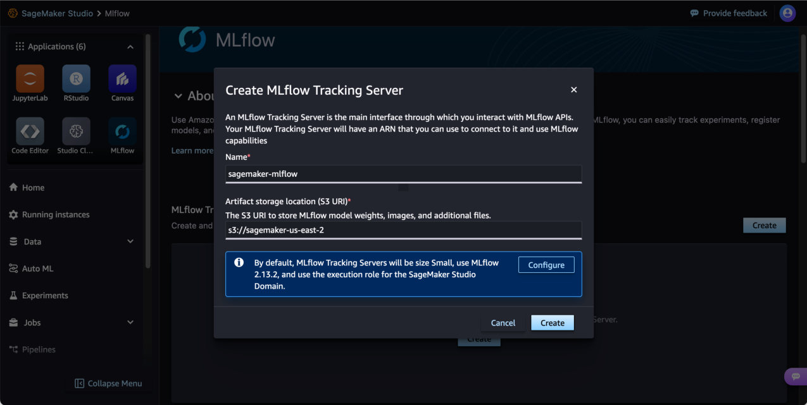

Create a tracking server using the AWS CLI

You can create a tracking server using the AWS CLI for more granular security customization.

Prerequisites

To create a tracking server using the AWS CLI, you must have the following:

• Access to a terminal. This can include local IDEs, an Amazon EC2 instance, or AWS CloudShell.

• Access to a development environment. This can include local IDEs or a Jupyter notebook
environment within Studio or Studio Classic.

• A configured AWS CLI installation. For more information, see Configure the AWS CLI.

• An IAM role with appropriate permissions. The following steps require your environment

to have iam:CreateRole, iam:CreatePolicy, iam:AttachRolePolicy, and

iam:ListPolicies permissions. These permissions are needed on the role that is being used

Tracking servers
4495

## Page 525

Amazon SageMaker AI
Developer Guide

to run the steps in this user guide. The instructions in this guide create an IAM role that is used
as the execution role of the MLflow Tracking Server so that it can access data in your Amazon S3
buckets. Additionally, a policy is created to give the IAM role of the user that is interacting with
the Tracking Server via the MLflow SDK permission to call MLflow APIs. For more information,
see Modifying a role permissions policy (console) .

If using a SageMaker Studio Notebook, update the service role for your Studio user profile
with these IAM permissions. To update the service role, navigate to the SageMaker AI console
and select the domain you are using. Then, under the domain, select the user profile you are
using. You will see the service role listed there. Navigate to the IAM console, search for the

service role under Roles, and update your role with a policy that allows the iam:CreateRole,

iam:CreatePolicy, iam:AttachRolePolicy, and iam:ListPolicies actions.

Set up AWS CLI model

Follow these command line steps within a terminal to set up the AWS CLI for Amazon SageMaker
AI with MLflow.

1.
Install an updated version of the AWS CLI. For more information, see Install or update to the
latest version of the AWS CLI in the AWS CLI User Guide.

2.
Verify that the AWS CLI is installed using the following command:

aws sagemaker help

Press q to exit the prompt.

For troubleshooting help, see Troubleshoot common setup issues.

Set up MLflow infrastructure

The following section shows you how to set up an MLflow Tracking Server along with the Amazon
S3 bucket and IAM role needed for the tracking server.

Create an S3 bucket

Within your terminal, use the following commands to create a general purpose Amazon S3 bucket:

Tracking servers
4496

## Page 526

Amazon SageMaker AI
Developer Guide

Important

When you provide the Amazon S3 URI for your artifact store, ensure the Amazon S3 bucket
is in the same AWS Region as your tracking server. Cross-region artifact storage is not
supported.

bucket_name=bucket-name
region=valid-region

aws s3api create-bucket \
--bucket $bucket_name \
--region $region \
--create-bucket-configuration LocationConstraint=$region

The output should look similar to the following:

{
"Location": "/bucket-name"
}

Set up IAM trust policies

Use the following steps to create an IAM trust policy. For more information about roles and trust
policies, see Roles terms and concepts in the AWS Identity and Access Management User Guide.

1.
Within your terminal, use the following command to create a file called mlflow-trust-

policy.json.

cat <<EOF > /tmp/mlflow-trust-policy.json
{
"Version": "2012-10-17",
"Statement": [
{
"Effect": "Allow",
"Principal": {
"Service": [
"sagemaker.amazonaws.com"
]
},

Tracking servers
4497

## Page 527

Amazon SageMaker AI
Developer Guide

"Action": "sts:AssumeRole"
}
]
}
EOF

2.
Within your terminal, use the following command to create a file called custom-

policy.json.

cat <<EOF > /tmp/custom-policy.json
{
"Version": "2012-10-17",
"Statement": [
{
"Effect": "Allow",
"Action": [
"s3:Get*",
"s3:Put*",
"sagemaker:AddTags",
"sagemaker:CreateModelPackageGroup",
"sagemaker:CreateModelPackage",
"sagemaker:DescribeModelPackageGroup",
"sagemaker:UpdateModelPackage",
"s3:List*"
],
"Resource": "*"
}
]
}
EOF

3.
Use the trust policy file to create a role. Then, attach IAM role policies that allow MLflow to
access Amazon S3 and SageMaker Model Registry within your account. MLflow must have
access to Amazon S3 for your tracking server's artifact store and SageMaker Model Registry for
automatic model registration.

Note

If you are updating an existing role, use the following command instead: aws iam

update-assume-role-policy --role-name $role_name --policy-

document file:///tmp/mlflow-trust-policy.json.

Tracking servers
4498

## Page 528

Amazon SageMaker AI
Developer Guide

role_name=role-name

aws iam  create-role \
--role-name $role_name \
--assume-role-policy-document file:///tmp/mlflow-trust-policy.json

aws iam put-role-policy \
--role-name $role_name \
--policy-name custom-policy \
--policy-document file:///tmp/custom-policy.json

role_arn=$(aws iam get-role --role-name  $role_name --query 'Role.Arn' --output
text)

Create MLflow tracking server

Within your terminal, use the create-mlflow-tracking-server API to create a tracking server
in the AWS Region of your choice. This step can take up to 25 minutes.

You can optionally specify the size of your tracking server with the parameter --tracking-

server-config. Choose between "Small", "Medium", and "Large". The default MLflow

Tracking Server configuration size is "Small". You can choose a size depending on the projected
use of the tracking server such as the volume of data logged, number of users, and frequency of
use. For more information, see MLflow Tracking Server sizes.

The following command creates a new tracking server with automatic model registration enabled.

To deactivate automatic model registration, specify --no-automatic-model-registration.

After creating your tracking server, you can launch the MLflow UI. For more information, see
Launch the MLflow UI using a presigned URL.

Note

It may take up to 25 minutes to complete tracking server creation. If the tracking server
takes over 25 minutes to create, check that you have the necessary IAM permissions. For
more information on IAM permissions, see Set up IAM permissions for MLflow. When you
successfully create a tracking server, it automatically starts.

Tracking servers
4499

## Page 529

Amazon SageMaker AI
Developer Guide

When you create a tracking server, we recommend specifying the latest version. For information
about the available versions, see Tracking server versions.

By default, the tracking server that's created is the latest version. However, we recommend always
specifying the latest version explicitly because the underlying MLflow APIs can change.

ts_name=tracking-server-name
region=valid-region
version=valid-version

aws sagemaker create-mlflow-tracking-server \
--tracking-server-name $ts_name \
--artifact-store-uri s3://$bucket_name \
--role-arn $role_arn \
--automatic-model-registration \
--region $region \
--mlflow-version $version

The output should be similar to the following:

{
"TrackingServerArn": "arn:aws:sagemaker:region:123456789012:mlflow-tracking-
server/tracking-server-name"
}

Important

Take note of the tracking server ARN for later use. You will also need the $bucket_name
for clean up steps.

Launch the MLflow UI using a presigned URL

You can access the MLflow UI to view your experiments using a presigned URL. You can launch the
MLflow UI either through Studio or using the AWS CLI in a terminal of your choice.

Launch the MLflow UI using Studio

After creating your tracking server, you can launch the MLflow UI directly from Studio.

Launch MLflow UI
4500

## Page 530

Amazon SageMaker AI
Developer Guide

1.
Navigate to Studio from the SageMaker AI console. Be sure that you are using the new Studio
experience and have updated from Studio Classic. For more information, see Migration from
Amazon SageMaker Studio Classic.

2.
Choose MLflow in the Applications pane of the Studio UI.

3.
(Optional) If have not already created a tracking server or if you need to create a new one, you
can choose Create. Then provide a unique tracking server name and S3 URI for artifact storage
and create a tracking server. You can optionally choose Configure for more granular tracking
server customization.

4.
Find the tracking server of your choice in the MLflow Tracking Servers pane. If the tracking
server is Off, start the tracking server.

5.
Choose the vertical menu icon in the right corner of the tracking server pane. Then, choose
Open MLflow. This launches a presigned URL in a new tab in your current browser.

Launch MLflow UI
4501

## Page 531

Amazon SageMaker AI
Developer Guide

Launch the MLflow UI using the AWS CLI

You can access the MLflow UI to view your experiments using a presigned URL.

Within your terminal, use the create-presigned-mlflow-tracking-server-url API to
generate a presigned URL.

aws sagemaker create-presigned-mlflow-tracking-server-url \
--tracking-server-name $ts_name \
--session-expiration-duration-in-seconds 1800 \
--expires-in-seconds 300 \
--region $region

The output should look similar to the following:

{
"AuthorizedUrl": "https://unique-key.us-west-2.experiments.sagemaker.aws.a2z.com/
auth?authToken=example_token"
}

Copy the entire presigned URL into the browser of your choice. You can use a new tab or a new

private window. Press q to exit the prompt.

The --session-expiration-duration-in-seconds parameter determines the length of
time that your MLflow UI session remains valid. The session duration time is the amount of time
that the MLflow UI can be loaded in the browser before a new presigned URL must be created. The
minimum session duration is 30 minutes (1800 seconds) and the maximum session duration is 12
hours (43200 seconds). The default session duration is 12 hours if no other duration is specified.

The --expires-in-seconds parameter determines the length of time that your presigned
URL remains valid. The minimum URL expiration length is 5 seconds and the maximum URL
expiration length is 5 minutes (300 seconds). The default URL expiration length is 300 seconds. The
presigned URL can be used only once.

The window should look similar to the following.

Launch MLflow UI
4502

## Page 532

Amazon SageMaker AI
Developer Guide

Integrate MLflow with your environment

The following page describes how to get started with the MLflow SDK and the AWS MLflow
plugin within your development environment. This can include local IDEs or a Jupyter Notebook
environment within Studio or Studio Classic.

Amazon SageMaker AI uses an MLflow plugin to customize the behavior of the MLflow Python
client and integrate AWS tooling. The AWS MLflow plugin authenticates API calls made with
MLflow using AWS Signature Version 4. The AWS MLflow plugin allows you to connect to your
MLflow tracking server using the tracking server ARN. For more information about plugins, see
AWS MLflow plugin and MLflow plugins.

Important

Your user IAM permissions within your development environment must have access to any
relevant MLflow API actions to successfully run provided examples. For more information,
see Set up IAM permissions for MLflow.

For more information about using the MLflow SDK, see Python API in the MLflow documentation.

Install MLflow and the AWS MLflow plugin

Within your development environment, install both MLflow and the AWS MLflow plugin.

pip install sagemaker-mlflow

To ensure compatibility between your MLflow client and tracking server, use the corresponding
MLflow version based on your tracking server version:

Integrate MLflow with your environment
4503

## Page 533

Amazon SageMaker AI
Developer Guide

• For tracking server 2.13.x, use mlflow==2.13.2

• For tracking server 2.16.x, use mlflow==2.16.2

• For tracking server 3.0.x, use mlflow==3.0.0

To see which versions of MLflow are available to use with SageMaker AI, see Tracking server
versions.

Connect to your MLflow Tracking Server

Use mlflow.set_tracking_uri to connect to a your tracking server from your development
environment using its ARN:

import mlflow

arn = "YOUR-TRACKING-SERVER-ARN"

mlflow.set_tracking_uri(arn)

Log metrics, parameters, and MLflow models during training

After connecting to your MLflow Tracking Server, you can use the MLflow SDK to log metrics,
parameters, and MLflow models.

Log training metrics

Use mlflow.log_metric within an MLflow training run to track metrics. For more information

about logging metrics using MLflow, see mlflow.log_metric.

with mlflow.start_run():
mlflow.log_metric("foo", 1)
print(mlflow.search_runs())

This script should create an experiment run and print out an output similar to the following:

run_id experiment_id status artifact_uri ... tags.mlflow.source.name tags.mlflow.user
tags.mlflow.source.type tags.mlflow.runName
0 607eb5c558c148dea176d8929bd44869 0 FINISHED s3://
dddd/0/607eb5c558c148dea176d8929bd44869/a... ... file.py user-id LOCAL experiment-code-
name

Integrate MLflow with your environment
4504

## Page 534

Amazon SageMaker AI
Developer Guide

Within the MLflow UI, this example should look similar to the following:

Choose Run Name to see more run details.

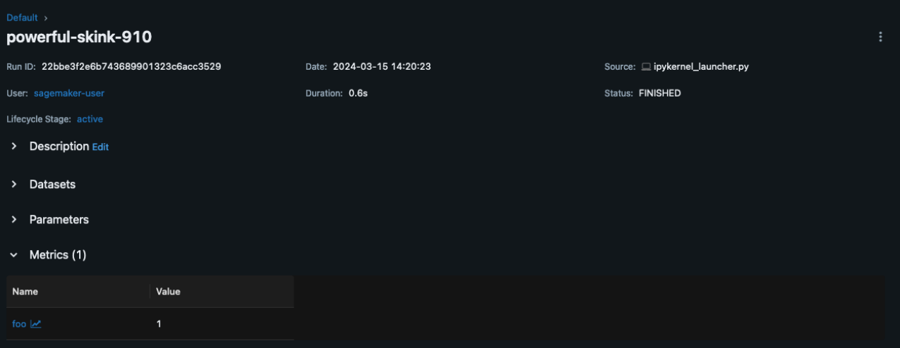

Log parameters and models

Note

The following example requires your environment to have s3:PutObject permissions.
This permission should be associated with the IAM Role that the MLflow SDK user assumes
when they log into or federate into their AWS account. For more information, see User and
role policy examples.

Integrate MLflow with your environment
4505

## Page 535

Amazon SageMaker AI
Developer Guide

The following example takes you through a basic model training workflow using SKLearn and
shows you how to track that model in an MLflow experiment run. This example logs parameters,
metrics, and model artifacts.

import mlflow

from mlflow.models import infer_signature

import pandas as pd
from sklearn import datasets
from sklearn.model_selection import train_test_split
from sklearn.linear_model import LogisticRegression
from sklearn.metrics import accuracy_score, precision_score, recall_score, f1_score

# This is the ARN of the MLflow Tracking Server you created
mlflow.set_tracking_uri(your-tracking-server-arn)

mlflow.set_experiment("some-experiment")

# Load the Iris dataset
X, y = datasets.load_iris(return_X_y=True)

# Split the data into training and test sets
X_train, X_test, y_train, y_test = train_test_split(X, y, test_size=0.2,
random_state=42)

# Define the model hyperparameters
params = {"solver": "lbfgs", "max_iter": 1000, "multi_class": "auto", "random_state":
8888}

# Train the model
lr = LogisticRegression(**params)
lr.fit(X_train, y_train)

# Predict on the test set
y_pred = lr.predict(X_test)

# Calculate accuracy as a target loss metric
accuracy = accuracy_score(y_test, y_pred)

# Start an MLflow run and log parameters, metrics, and model artifacts
with mlflow.start_run():
# Log the hyperparameters
mlflow.log_params(params)

Integrate MLflow with your environment
4506

## Page 536

Amazon SageMaker AI
Developer Guide

# Log the loss metric
mlflow.log_metric("accuracy", accuracy)

# Set a tag that we can use to remind ourselves what this run was for
mlflow.set_tag("Training Info", "Basic LR model for iris data")

# Infer the model signature
signature = infer_signature(X_train, lr.predict(X_train))

# Log the model
model_info = mlflow.sklearn.log_model(
sk_model=lr,
name="iris_model", # Changed from artifact_path to name for MLflow 3.0
signature=signature,
input_example=X_train,
registered_model_name="tracking-quickstart",

)

Within the MLflow UI, choose the experiment name in the left navigation pane to explore all
associated runs. Choose the Run Name to see more information about each run. For this example,
your experiment run page for this run should look similar to the following.

Integrate MLflow with your environment
4507

## Page 537

Amazon SageMaker AI
Developer Guide

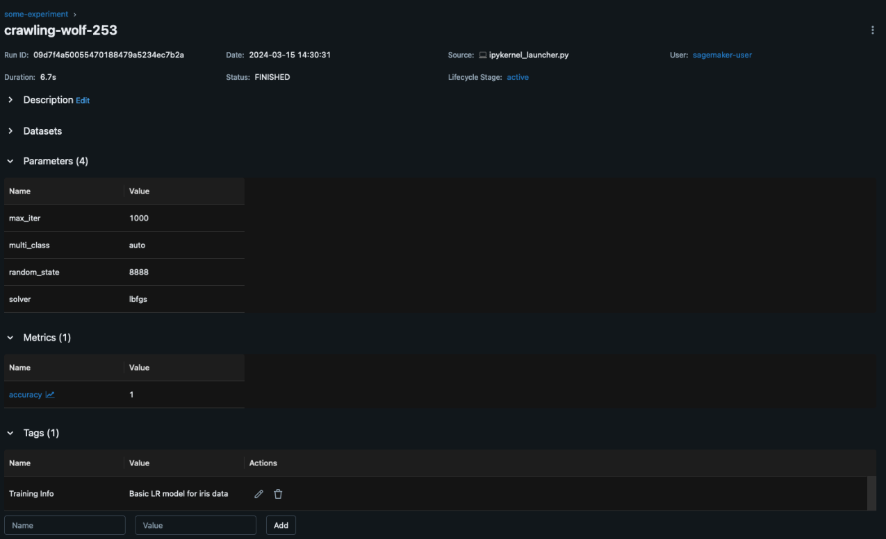

This example logs the logistic regression model. Within the MLflow UI, you should also see the
logged model artifacts.

Integrate MLflow with your environment
4508

## Page 538

Amazon SageMaker AI
Developer Guide

Automatically register SageMaker AI models with SageMaker Model Registry

You can log MLflow models and automatically register them with SageMaker Model Registry using
either the Python SDK or directly through the MLflow UI.

Note

Do not use spaces in a model name. While MLflow supports model names with spaces,
SageMaker AI Model Package does not. The auto-registration process fails if you use spaces
in your model name.

Register models using the SageMaker Python SDK

Use create_registered_model within your MLflow client to automatically create a model
package group in SageMaker AI that corresponds to an existing MLflow model of your choice.

import mlflow

Integrate MLflow with your environment
4509

## Page 539

Amazon SageMaker AI
Developer Guide

from mlflow import MlflowClient

mlflow.set_tracking_uri(arn)

client = MlflowClient()

mlflow_model_name = 'AutoRegisteredModel'
client.create_registered_model(mlflow_model_name, tags={"key1": "value1"})

Use mlflow.register_model() to automatically register a model with the SageMaker Model
Registry during model training. When registering the MLflow model, a corresponding model
package group and model package version are created in SageMaker AI.

import mlflow.sklearn
from mlflow.models import infer_signature

from sklearn.datasets import make_regression
from sklearn.ensemble import RandomForestRegressor

mlflow.set_tracking_uri(arn)
params = {"n_estimators": 3, "random_state": 42}
X, y = make_regression(n_features=4, n_informative=2, random_state=0, shuffle=False)

# Log MLflow entities
with mlflow.start_run() as run:
rfr = RandomForestRegressor(**params).fit(X, y)
signature = infer_signature(X, rfr.predict(X))
mlflow.log_params(params)
mlflow.sklearn.log_model(rfr, artifact_path="sklearn-model", signature=signature)

model_uri = f"runs:/{run.info.run_id}/sklearn-model"
mv = mlflow.register_model(model_uri, "RandomForestRegressionModel")

print(f"Name: {mv.name}")
print(f"Version: {mv.version}")

Register models using the MLflow UI

You can alternatively register a model with the SageMaker Model Registry directly in the MLflow
UI. Within the Models menu in the MLflow UI, choose Create Model. Any models newly created in
this way are added to the SageMaker Model Registry.

Integrate MLflow with your environment
4510

## Page 540

Amazon SageMaker AI
Developer Guide

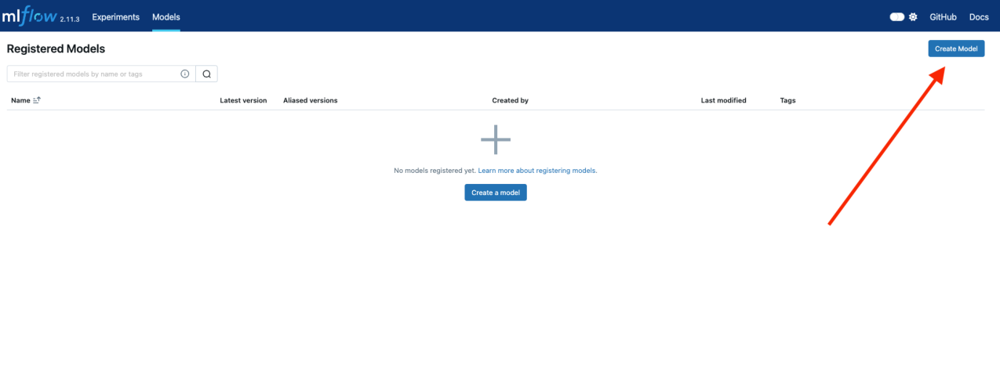

After logging a model during experiment tracking, navigate to the run page in the MLflow UI.
Choose the Artifacts pane and choose Register model in the upper right corner to register the
model version in both MLflow and SageMaker Model Registry.

View registered models in Studio

Within the SageMaker Studio landing page, choose Models on the left navigation pane to view
your registered models. For more information on getting started with Studio, see Launch Amazon
SageMaker Studio.

Integrate MLflow with your environment
4511

## Page 541

Amazon SageMaker AI
Developer Guide

Deploy MLflow models with ModelBuilder

You can deploy MLflow models to a SageMaker AI endpoint using Amazon SageMaker AI Model
Builder. For more information about Amazon SageMaker AI Model Builder, see Create a model in
Amazon SageMaker AI with ModelBuilder.

ModelBuilder is a Python class that takes a framework model or a user-specified inference

specification and converts it to a deployable model. For more details about the ModelBuilder
class, see ModelBuilder.

To deploy your MLflow model using ModelBuilder, provide a path to your MLflow artifacts in the

model_metadata["MLFLOW_MODEL_PATH"] attribute. Read on for more information about valid
model path input formats:

Note

If you provide your model artifact path in the form of an MLflow run ID or MLflow
model registry path, then you must also specify your tracking server ARN through the

model_metadata["MLFLOW_TRACKING_ARN"] attribute.

• Model paths that require an ARN in the model_metadata

• Model paths that do not require an ARN in the model_metadata

Integrate MLflow with your environment
4512

## Page 542

Amazon SageMaker AI
Developer Guide

Model paths that require an ARN in the model_metadata

The following model paths do require that you specify an ARN in the model_metadata for
deployment:

• MLflow run ID: runs:/aloy-run-id/run-relative/path/to/model

• MLflow model registry path: models:/model-name/model-version

Model paths that do not require an ARN in the model_metadata

The following model paths do not require that you specify an ARN in the model_metadata for
deployment:

• Local model path: /Users/me/path/to/local/model

• Amazon S3 model path: s3://amzn-s3-demo-bucket/path/to/model

• Model package ARN: arn:aws:sagemaker:region:account-id:mlflow-tracking-

server/tracking-server-name

For more information on how MLflow model deployment works with Amazon SageMaker AI, see
Deploy MLflow Model to Amazon SageMaker AI in the MLflow documentation.

If using an Amazon S3 path, you can find the path of your registered model with the following
commands:

registered_model = client.get_registered_model(name='AutoRegisteredModel')
source_path = registered_model.latest_versions[0].source

The following sample is an overview of how to deploy your MLflow model using ModelBuilder
and an MLflow model registry path. Because this sample provides the model artifact path in the

form of an MLflow model registry path, the call to ModelBuilder must also specify a tracking

server ARN through the model_metadata["MLFLOW_TRACKING_ARN"] attribute.

Important

You must use version 2.224.0 or later of the SageMaker Python SDK to use ModelBuilder.

Integrate MLflow with your environment
4513

## Page 543

Amazon SageMaker AI
Developer Guide

Note

Use the following code example for reference. For end-to-end examples that show you
how to deploy registered MLflow models, see MLflow tutorials using example Jupyter
notebooks.

from sagemaker.serve import ModelBuilder
from sagemaker.serve.mode.function_pointers import Mode
from sagemaker.serve import SchemaBuilder

my_schema = SchemaBuilder(
sample_input=sample_input,
sample_output=sample_output
)

model_builder = ModelBuilder(
mode=Mode.SAGEMAKER_ENDPOINT,
schema_builder=my_schema,
role_arn="Your-service-role-ARN",
model_metadata={
# both model path and tracking server ARN are required if you use an mlflow run
ID or mlflow model registry path as input
"MLFLOW_MODEL_PATH": "models:/sklearn-model/1"
"MLFLOW_TRACKING_ARN": "arn:aws:sagemaker:region:account-id:mlflow-tracking-
server/tracking-server-name"
}
)
model = model_builder.build()
predictor = model.deploy( initial_instance_count=1, instance_type="ml.c6i.xlarge" )

To maintain lineage tracking for MLflow models deployed using ModelBuilder, you must have
the following IAM permissions:

• sagemaker:CreateArtifact

• sagemaker:ListArtifacts

• sagemaker:AddAssociation

• sagemaker:DescribeMLflowTrackingServer

Integrate MLflow with your environment
4514

## Page 544

Amazon SageMaker AI
Developer Guide

Important

Lineage tracking is optional. Deployment succeeds without the permissions related to
lineage tracking. If you do not have the permissions configured, you will see a lineage

tracking permissions error when calling model.deploy(). However, the endpoint
deployment still succeeds and you can directly interact with your model endpoint. If the
permissions above are configured, lineage tracking information is automatically created
and stored.

For more information and end-to-end examples, see MLflow tutorials using example Jupyter
notebooks.

MLflow tutorials using example Jupyter notebooks

The following tutorials demonstrate how to integrate MLflow experiments into your training
workflows. To clean up resources created by a notebook tutorial, see Clean up MLflow resources.

You can run SageMaker AI example notebooks using JupyterLab in Studio. For more information on
JupyterLab, see JupyterLab user guide.

Explore the following example notebooks:

• SageMaker Training with MLflow — Train and register a Scikit-Learn model using SageMaker AI
in script mode. Learn how to integrate MLflow experiments into your training script. For more
information on model training, see Train a Model with Amazon SageMaker AI.

• SageMaker AI HPO with MLflow — Learn how to track your ML experiment in MLflow with
Amazon SageMaker AI automatic model tuning (AMT) and the SageMaker AI Python SDK.
Each training iteration is logged as a run within the same experiment. For more information
about hyperparameter optimization (HPO), see Perform Automatic Model Tuning with Amazon
SageMaker AI.

• SageMaker Pipelines with MLflow — Use Amazon SageMaker Pipelines and MLflow to train,

evaluate and register a model. This notebook uses the @step decorator to build a SageMaker AI

Pipeline. For more information on pipelines and the @step decorator, see Create a pipeline with

@step-decorated functions.

• Deploy an MLflow Model to SageMaker AI — Train a decision tree model using SciKit-Learn.

Then, use Amazon SageMaker AI ModelBuilder to deploy the model to a SageMaker

Tutorials
4515

## Page 545

Amazon SageMaker AI
Developer Guide

AI endpoint and run inference using the deployed model. For more information about

ModelBuilder, see Deploy MLflow models with ModelBuilder.

Troubleshoot common setup issues

Explore common troubleshooting issues.

Could not find executable named 'groff'

When using the AWS CLI, you might encounter the following error: Could not find

executable named 'groff'.

If using a Mac, you can resolve this issue with the following command:

brew install groff

On a Linux machine, use the following commands:

sudo apt-get update -y
sudo apt-get install groff -y

Command not found: jq

When creating your AuthZ permission policy JSON file, you might encounter the following error:

jq: command not found.

If using a Mac, you can resolve this issue with the following command:

brew install jq

On a Linux machine, use the following commands:

sudo apt-get update -y
sudo apt-get install jq -y

AWS MLflow plugin installation speeds

Installing the AWS MLflow plugin can take several minutes when using a Mac Python environment.

Troubleshooting
4516

## Page 546

Amazon SageMaker AI
Developer Guide

UnsupportedModelRegistryStoreURIException

If you see the UnsupportedModelRegistryStoreURIException, do the following:

1.
Restart your Jupyter notebook Kernel.

2.
Reinstall the AWS MLflow plugin:

!pip install --force-reinstall sagemaker-mlflow

Clean up MLflow resources

We recommend deleting any resources when you no longer need them. You can delete tracking
servers through Amazon SageMaker Studio or using the AWS CLI. You can delete additional

resources such as Amazon S3 buckets, IAM roles, and IAM policies using the AWS CLI or directly in
the AWS console.

Important

Don't delete the IAM role that you've used to create until you've deleted the tracking server
itself. Otherwise, you'll lose access to the tracking server.

Stop tracking servers

We recommend stopping your tracking server when it is no longer in use. You can stop a tracking
server in Studio or using the AWS CLI.

Stop a tracking server using Studio

To stop a tracking server in Studio:

1.
Navigate to Studio.

2.
Choose MLflow in the Applications pane of the Studio UI.

3.
Find the tracking server of your choice in the MLflow Tracking Servers pane. Choose the Stop
icon in the right corner of the tracking server pane.

Cleanup
4517

## Page 547

Amazon SageMaker AI
Developer Guide

Note

If your tracking server is Off, you see the Start icon. If the tracking server is On, you
see the Stop icon.

Stop a tracking server using the AWS CLI

To stop the tracking server using the AWS CLI, use the following command:

aws sagemaker stop-mlflow-tracking-server \
--tracking-server-name $ts_name \
--region $region

To start the tracking server using the AWS CLI, use the following command:

Note

It may take up to 25 minutes to start your tracking server.

aws sagemaker start-mlflow-tracking-server \
--tracking-server-name $ts_name \
--region $region

Delete tracking servers

You can fully delete a tracking server in Studio or using the AWS CLI.

Delete a tracking server using Studio

To delete a tracking server in Studio:

1.
Navigate to Studio.

2.
Choose MLflow in the Applications pane of the Studio UI.

3.
Find the tracking server of your choice in the MLflow Tracking Servers pane. Choose the
vertical menu icon in the right corner of the tracking server pane. Then, choose Delete.

Cleanup
4518

## Page 548

Amazon SageMaker AI
Developer Guide

4.
Choose Delete to confirm deletion.

Delete a tracking server using the AWS CLI

Use the DeleteMLflowTrackingServer API to delete any tracking servers that you created. This
may take some time.

aws sagemaker delete-mlflow-tracking-server \
--tracking-server-name $ts_name \
--region $region

To view the status of your tracking server, use the DescribeMLflowTrackingServer API and

check the TrackingServerStatus.

aws sagemaker describe-mlflow-tracking-server \
--tracking-server-name $ts_name \

Cleanup
4519

## Page 549

Amazon SageMaker AI
Developer Guide

--region $region

Delete Amazon S3 buckets

Delete any Amazon S3 bucket used as an artifact store for your tracking server using the following

commands:

aws s3 rm s3://$bucket_name --recursive
aws s3 rb s3://$bucket_name

You can alternatively delete an Amazon S3 bucket associated with your tracking server directly in
the AWS console. For more information, see Deleting a bucket in the Amazon S3 User Guide.

Delete registered models

You can delete any model groups and model versions created with MLflow directly in Studio. For
more information, see Delete a Model Group and Delete a Model Version.

Delete experiments or runs

You can use the MLflow SDK to delete experiments or runs.

• mlflow.delete_experiment

• mlflow.delete_run

Amazon SageMaker Experiments in Studio Classic

Important

Experiment tracking using the SageMaker Experiments Python SDK is only available in
Studio Classic. We recommend using the new Studio experience and creating experiments
using the latest SageMaker AI integrations with MLflow. There is no MLflow UI integration
with Studio Classic. If you want to use MLflow with Studio, you must launch the MLflow UI
using the AWS CLI. For more information, see Launch the MLflow UI using the AWS CLI.

Amazon SageMaker Experiments Classic is a capability of Amazon SageMaker AI that lets you
create, manage, analyze, and compare your machine learning experiments in Studio Classic. Use

Studio Classic
4520

## Page 550

Amazon SageMaker AI
Developer Guide

SageMaker Experiments to view, manage, analyze, and compare both custom experiments that you
programmatically create and experiments automatically created from SageMaker AI jobs.

Experiments Classic automatically tracks the inputs, parameters, configurations, and results of your

iterations as runs. You can assign, group, and organize these runs into experiments. SageMaker

Experiments is integrated with Amazon SageMaker Studio Classic, providing a visual interface
to browse your active and past experiments, compare runs on key performance metrics, and
identify the best performing models. SageMaker Experiments tracks all of the steps and artifacts
that went into creating a model, and you can quickly revisit the origins of a model when you are
troubleshooting issues in production, or auditing your models for compliance verifications.

Migrate from Experiments Classic to Amazon SageMaker AI with MLflow

Past experiments created using Experiments Classic are still available to view in Studio Classic. If
you want to maintain and use past experiment code with MLflow, you must update your training
code to use the MLflow SDK and run the training experiments again. For more information on
getting started with the MLflow SDK and the AWS MLflow plugin, see Integrate MLflow with your
environment.

Example notebooks for Experiments Classic

The following example notebooks demonstrate how to track runs for various model training
experiments. You can view the resulting experiments in Studio Classic after running the notebooks.
For a tutorial that showcases additional features of Studio Classic, see Amazon SageMaker Studio
Classic Tour.

Track experiments in a notebook environment

To learn more about tracking experiments in a notebook environment, see the following example
notebooks:

• Track an experiment while training a Keras model locally

• Track an experiment while training a Pytorch model locally or in your notebook

Track bias and explainability for your experiments with SageMaker Clarify

For a step-by-step guide on tracking bias and explainability for your experiments, see the following
example notebook:

Studio Classic
4521

## Page 551

Amazon SageMaker AI
Developer Guide

• Fairness and Explainability with SageMaker Clarify

Track experiments for SageMaker training jobs using script mode

For more information about tracking experiments for SageMaker training jobs, see the following
example notebooks:

• Run a SageMaker AI Experiment with Pytorch Distributed Data Parallel - MNIST Handwritten
Digits Classification

• Track an experiment while training a Pytorch model with a SageMaker Training Job

• Train a TensorFlow model with a SageMaker training job and track it using SageMaker
Experiments

View experiments and runs

Amazon SageMaker Studio Classic provides an experiments browser that you can use to view lists
of experiments and runs. You can choose one of these entities to view detailed information about
the entity or choose multiple entities for comparison. You can filter the list of experiments by
entity name, type, and tags.

To view experiments and runs

1.
To view the experiment in Studio Classic, in the left sidebar, choose Experiments.

Select the name of the experiment to view all associated runs. You can search experiments by
typing directly into the Search bar or filtering for experiment type. You can also choose which
columns to display in your experiment or run list.

It might take a moment for the list to refresh and display a new experiment or experiment
run. You can click Refresh to update the page. Your experiment list should look similar to the
following:

Studio Classic
4522

## Page 552

Amazon SageMaker AI
Developer Guide

2.
In the experiments list, double-click an experiment to display a list of the runs in the
experiment.

Note

Experiment runs that are automatically created by SageMaker AI jobs and
containers are visible in the Experiments Studio Classic UI by default. To hide runs
created by SageMaker AI jobs for a given experiment, choose the settings icon

(

)
and toggle Show jobs.

Studio Classic
4523

## Page 553

Amazon SageMaker AI
Developer Guide

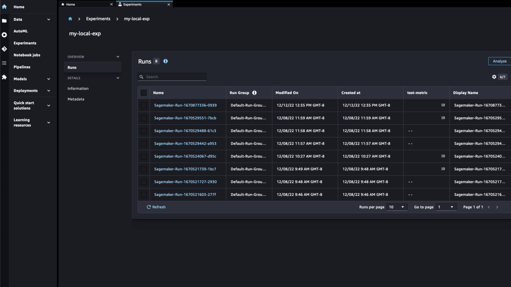

3.
Double-click a run to display information about a specific run.

In the Overview pane, choose any of the following headings to see available information
about each run:

• Metrics – Metrics that are logged during a run.

• Charts – Build your own charts to compare runs.

• Output artifacts – Any resulting artifacts of the experiment run and the artifact locations in
Amazon S3.

• Bias reports – Pre-training or post-training bias reports generated using Clarify.

• Explainability– Explainability reports generated using Clarify.

• Debugs – A list of debugger rules and any issues found.

Automatic model tuning with SageMaker AI

Amazon SageMaker AI automatic model tuning (AMT) finds the best version of a model by
running many training jobs on your dataset. Amazon SageMaker AI automatic model tuning
(AMT) is also known as hyperparameter tuning. To do this, AMT uses the algorithm and ranges of

Automatic Model Tuning
4524

## Page 554

Amazon SageMaker AI
Developer Guide

hyperparameters that you specify. It then chooses the hyperparameter values that creates a model
that performs the best, as measured by a metric that you choose.

For example, running a binary classification problem on a marketing dataset. Your goal is
to maximize the area under the curve (AUC) metric of the algorithm by training an XGBoost

algorithm with Amazon SageMaker AI model. You want to find which values for the eta, alpha,

min_child_weight, and max_depth hyperparameters that will train the best model. Specify a

range of values for these hyperparameters. Then, SageMaker AI hyperparameter tuning searches
within the ranges to find a combination that creates a training job that creates a model with the
highest AUC. To conserve resources or meet a specific model quality expectation, set up completion
criteria to stop tuning after the criteria have been met.

You can use SageMaker AI AMT with built-in algorithms, custom algorithms, or SageMaker AI pre-
built containers for machine learning frameworks.

SageMaker AI AMT can use an Amazon EC2 Spot instance to optimize costs when running training
jobs. For more information, see Managed Spot Training in Amazon SageMaker AI.

Before you start using hyperparameter tuning, you should have a well-defined machine learning
problem, including the following:

• A dataset

• An understanding of the type of algorithm that you need to train

• A clear understanding of how you measure success

Prepare your dataset and algorithm so that they work in SageMaker AI and successfully run a
training job at least once. For information about setting up and running a training job, see Guide to
getting set up with Amazon SageMaker AI.

Topics

• Understand the hyperparameter tuning strategies available in Amazon SageMaker AI

• Define metrics and environment variables

• Define Hyperparameter Ranges

• Track and set completion criteria for your tuning job

• Tune Multiple Algorithms with Hyperparameter Optimization to Find the Best Model

• Example: Hyperparameter Tuning Job

Automatic Model Tuning
4525

## Page 555

Amazon SageMaker AI
Developer Guide

• Stop Training Jobs Early

• Run a Warm Start Hyperparameter Tuning Job

• Resource Limits for Automatic Model Tuning

• Best Practices for Hyperparameter Tuning

Understand the hyperparameter tuning strategies available in Amazon
SageMaker AI

When you build complex machine learning systems like deep learning neural networks, exploring
all of the possible combinations is impractical. Hyperparameter tuning can accelerate your
productivity by trying many variations of a model. It looks for the best model automatically by
focusing on the most promising combinations of hyperparameter values within the ranges that
you specify. To get good results, you must choose the right ranges to explore. This page provides a
brief explanation of the different hyperparameter tuning strategies that you can use with Amazon
SageMaker AI.

Use the API reference guide to understand how to interact with hyperparameter tuning. You can
use the tuning strategies described on this page with the HyperParameterTuningJobConfig and
HyperbandStrategyConfig APIs.

Note

Because the algorithm itself is stochastic, the hyperparameter tuning model may fail to
converge on the best answer. This can occur even if the best possible combination of values
is within the ranges that you choose.

Grid search

When using grid search, hyperparameter tuning chooses combinations of values from the
range of categorical values that you specify when you create the job. Only categorical
parameters are supported when using the grid search strategy. You do not need to specify

the MaxNumberOfTrainingJobs. The number of training jobs created by the tuning job is
automatically calculated to be the total number of distinct categorical combinations possible. If

specified, the value of MaxNumberOfTrainingJobs should equal the total number of distinct
categorical combinations possible.

Hyperparameter tuning strategies
4526

## Page 556

Amazon SageMaker AI
Developer Guide

Random search

When using random search, hyperparameter tuning chooses a random combination of
hyperparameter values in the ranges that you specify for each training job it launches. The choice
of hyperparameter values doesn't depend on the results of previous training jobs. As a result, you
can run the maximum number of concurrent training jobs without changing the performance of
the tuning.

For an example notebook that uses random search, see the  Random search and hyperparameter
scaling with SageMaker XGBoost and Automatic Model Tuning notebook.

Bayesian optimization

Bayesian optimization treats hyperparameter tuning like a regression problem. Given a set of input
features (the hyperparameters), hyperparameter tuning optimizes a model for the metric that
you choose. To solve a regression problem, hyperparameter tuning makes guesses about which
hyperparameter combinations are likely to get the best results. It then runs training jobs to test
these values. After testing a set of hyperparameter values, hyperparameter tuning uses regression
to choose the next set of hyperparameter values to test.

Hyperparameter tuning uses an Amazon SageMaker AI implementation of Bayesian optimization.

When choosing the best hyperparameters for the next training job, hyperparameter tuning
considers everything that it knows about this problem so far. Sometimes it chooses a combination
of hyperparameter values close to the combination that resulted in the best previous training job
to incrementally improve performance. This allows hyperparameter tuning to use the best known
results. Other times, it chooses a set of hyperparameter values far removed from those it has tried.
This allows it to explore the range of hyperparameter values to try to find new areas that are not
yet well understood. The explore/exploit trade-off is common in many machine learning problems.

For more information about Bayesian optimization, see the following:

Basic Topics on Bayesian Optimization

• A Tutorial on Bayesian Optimization of Expensive Cost Functions, with Application to Active User
Modeling and Hierarchical Reinforcement Learning

• Practical Bayesian Optimization of Machine Learning Algorithms

• Taking the Human Out of the Loop: A Review of Bayesian Optimization

Hyperparameter tuning strategies
4527

## Page 557

Amazon SageMaker AI
Developer Guide

Speeding up Bayesian Optimization

• Google Vizier: A Service for Black-Box Optimization

• Learning Curve Prediction with Bayesian Neural Networks

• Speeding up automatic hyperparameter optimization of deep neural networks by extrapolation
of learning curves

Advanced Modeling and Transfer Learning

• Scalable Hyperparameter Transfer Learning

• Bayesian Optimization with Tree-structured Dependencies

• Bayesian Optimization with Robust Bayesian Neural Networks

• Scalable Bayesian Optimization Using Deep Neural Networks

• Input Warping for Bayesian Optimization of Non-stationary Functions

Hyperband

Hyperband is a multi-fidelity based tuning strategy that dynamically reallocates resources.
Hyperband uses both intermediate and final results of training jobs to re-allocate epochs to well-
utilized hyperparameter configurations and automatically stops those that underperform. It also
seamlessly scales to using many parallel training jobs. These features can significantly speed up
hyperparameter tuning over random search and Bayesian optimization strategies.

Hyperband should only be used to tune iterative algorithms that publish results at different
resource levels. For example, Hyperband can be used to tune a neural network for image
classification which publishes accuracy metrics after every epoch.

For more information about Hyperband, see the following links:

• Hyperband: A Novel Bandit-Based Approach to Hyperparameter Optimization

• Massively Parallel Hyperparameter Tuning

• BOHB: Robust and Efficient Hyperparameter Optimization at Scale

• Model-based Asynchronous Hyperparameter and Neural Architecture Search

Hyperparameter tuning strategies
4528

## Page 558

Amazon SageMaker AI
Developer Guide

Hyperband with early stopping

Training jobs can be stopped early when they are unlikely to improve the objective metric of
the hyperparameter tuning job. This can help reduce compute time and avoid overfitting your
model. Hyperband uses an advanced internal mechanism to apply early stopping. The parameter

TrainingJobEarlyStoppingType in the HyperParameterTuningJobConfig API must be set

to OFF when using the Hyperband internal early stopping feature.

Note

Hyperparameter tuning might not improve your model. It is an advanced tool for building
machine solutions. As such, it should be considered part of the scientific development
process.

Define metrics and environment variables

A tuning job optimizes hyperparameters for training jobs that it launches by using a metric to
evaluate performance. This guide shows how to define metrics so that you can use a custom
algorithm for training, or use a built-in algorithm from Amazon SageMaker AI. This guide also
shows how to specify environment variables during an Automatic model tuning (AMT) job.

Define metrics

Amazon SageMaker AI hyperparameter tuning parses your machine learning algorithm's stdout

and stderr streams to find metrics, such as loss or validation-accuracy. The metrics show how well
the model is performing on the dataset.

The following sections describe how to use two types of algorithms for training: built-in and
custom.

Use a built-in algorithm for training

If you use one of the SageMaker AI built-in algorithms, metrics are already defined for you.
In addition, built-in algorithms automatically send metrics to hyperparameter tuning for
optimization. These metrics are also written to Amazon CloudWatch logs. For more information,
see Log Amazon SageMaker AI Events with Amazon CloudWatch.

Define metrics and environment variables
4529

## Page 559

Amazon SageMaker AI
Developer Guide

For the objective metric for the tuning job, choose one of the metrics that the built-in algorithm
emits. For a list of available metrics, see the model tuning section for the appropriate algorithm in
Use Amazon SageMaker AI Built-in Algorithms or Pre-trained Models.

You can choose up to 40 metrics to monitor in your tuning job. Select one of those metrics to be

the objective metric. The hyperparameter tuning job returns the training job  that performed the
best against the objective metric.

Note

Hyperparameter tuning automatically sends an additional hyperparameter

_tuning_objective_metric to pass your objective metric to the tuning job for use
during training.

Use a custom algorithm for training

This section shows how to define your own metrics to use your own custom algorithm for training.

When doing so, make sure that your algorithm writes at least one metric to stderr or stdout.
Hyperparameter tuning parses these streams to find algorithm metrics that show how well the
model is performing on the dataset.

You can define custom metrics by specifying a name and regular expression for each
metric that your tuning job monitors. Then, pass these metric definitions to the

CreateHyperParameterTuningJob API in the TrainingJobDefinition parameter in the

MetricDefinitions field of AlgorithmSpecification.

The following shows sample output from a log written to stderr or stdout by a training
algorithm.

GAN_loss=0.138318;  Scaled_reg=2.654134; disc:[-0.017371,0.102429] real 93.3% gen 0.0%
disc-combined=0.000000; disc_train_loss=1.374587;  Loss = 16.020744;  Iteration 0 took
0.704s;  Elapsed=0s

The following code example shows how to use regular expressions in Python (regex). This is used to
search the sample log output and capture the numeric values of four different metrics.

[
{

Define metrics and environment variables
4530

## Page 560

Amazon SageMaker AI
Developer Guide

"Name": "ganloss",
"Regex": "GAN_loss=(.*?);",
},
{
"Name": "disc-combined",
"Regex": "disc-combined=(.*?);",
},
{
"Name": "discloss",
"Regex": "disc_train_loss=(.*?);",
},
{
"Name": "loss",
"Regex": "Loss = (.*?);",
},
]

In regular expressions, parenthesis () are used to group parts of the regular expression together.

• For the loss metric that is defined in the code example, the expression (.*?); captures any

character between the exact text "Loss=" and the first semicolon (;) character.

• The character . instructs the regular expression to match any character.

• The character * means to match zero or more characters.

• The character ? means capture only until the first instance of the ; character.

The loss metric defined in the code sample will capture Loss = 16.020744 from the sample
output.

Choose one of the metrics that you define as the objective metric for the tuning

job. If you are using the SageMaker API, specify the value of the name key in the

HyperParameterTuningJobObjective field of the HyperParameterTuningJobConfig

parameter that you send to the CreateHyperParameterTuningJob operation.

Specify environment variables

SageMaker AI AMT optimizes hyperparameters within a tuning job to find the best parameters for
model performance. You can use environment variables to configure your tuning job to change its
behavior. You can also use environment variables that you used during training inside your tuning
job.

Define metrics and environment variables
4531

## Page 561

Amazon SageMaker AI
Developer Guide

If you want to use an environment variable from your tuning job or specify a new

environment variable, input a string value for Environment within the SageMaker
AI HyperParameterTrainingJobDefinition API. Pass this training job definition to the
CreateHyperParameterTuningJob API.

For example, the environment variable SM_LOG_LEVEL can be set to the following values to tailor
the output from a Python container.

NOTSET=0
DEBUG=10
INFO=20
WARN=30
ERROR=40
CRITICAL=50

As an example, to set the log level to 10 to debug your container logs, set the environment
variable inside the HyperParameterTrainingJobDefinition, as follows.

{
"HyperParameterTuningJobConfig": {
...,
}
"TrainingJobDefinition": {
...,
"Environment" : [
{
"SM_LOG_LEVEL": 10
}
],
...,
},
...,
}

Define Hyperparameter Ranges

This guide shows how to use SageMaker APIs to define hyperparameter ranges. It also provides a
list of hyperparameter scaling types that you can use.

Choosing hyperparameters and ranges significantly affects the performance of your tuning job.
Hyperparameter tuning finds the best hyperparameter values for your model by searching over a

Define Hyperparameter Ranges
4532

## Page 562

Amazon SageMaker AI
Developer Guide

range of values that you specify for each tunable hyperparameter. You can also specify up to 100
static hyperparameters that do not change over the course of the tuning job. You can use up to 100
hyperparameters in total (static + tunable). For guidance on choosing hyperparameters and ranges,
see Best Practices for Hyperparameter Tuning. You can also use autotune to find optimal tuning job
settings. For more information, see the following Autotune section.

Note

SageMaker AI Automatic Model Tuning (AMT) may add additional hyperparameters(s)
that contribute to the limit of 100 total hyperparameters. Currently, to pass your
objective metric to the tuning job for use during training, SageMaker AI adds

_tuning_objective_metric automatically.

Static hyperparameters

Use static hyperparameters for the following cases: For example, you can use AMT to tune

your model using param1 (a tunable parameter) and param2 (a static parameter). If you do,

then use a search space for param1 that lies between two values, and pass param2 as a static
hyperparameter, as follows.

param1: ["range_min","range_max"]
param2: "static_value"

Static hyperparameters have the following structure:

"StaticHyperParameters": {
"objective" : "reg:squarederror",
"dropout_rate": "0.3"
}

You can use the Amazon SageMaker API to specify key value pairs in the StaticHyperParameters

field of the HyperParameterTrainingJobDefinition parameter that you pass to the
CreateHyperParameterTuningJob operation.

Dynamic hyperparameters

You can use the SageMaker API to define hyperparameter ranges. Specify the

names of hyperparameters and ranges of values in the ParameterRanges field

Define Hyperparameter Ranges
4533

## Page 563

Amazon SageMaker AI
Developer Guide

of the HyperParameterTuningJobConfig parameter that you pass to the

CreateHyperParameterTuningJob operation.

The ParameterRanges field has three subfields: categorical, integer, and continuous. You can
define up to 30 total (categorical + integer + continuous) tunable hyperparameters to search over.

Note

Each categorical hyperparameter can have at most 30 different values.

Dynamic hyperparameters have the following structure:

"ParameterRanges": {
"CategoricalParameterRanges": [
{
"Name": "tree_method",
"Values": ["auto", "exact", "approx", "hist"]
}
],
"ContinuousParameterRanges": [
{
"Name": "eta",
"MaxValue" : "0.5",
"MinValue": "0",
"ScalingType": "Auto"
}
],
"IntegerParameterRanges": [
{
"Name": "max_depth",
"MaxValue": "10",
"MinValue": "1",
"ScalingType": "Auto"
}
]
}

If you create a tuning job with a Grid strategy, you can only specify categorical values. You don't

need to provide the MaxNumberofTrainingJobs. This value is inferred from the total number
of configurations that can be produced from your categorical parameters. If specified, the value

Define Hyperparameter Ranges
4534

## Page 564

Amazon SageMaker AI
Developer Guide

of MaxNumberOfTrainingJobs should be equal to the total number of distinct categorical
combinations possible.

Autotune

To save time and resources searching for hyperparameter ranges, resources or objective metrics,
autotune can automatically guess optimal values for some hyperparameter fields. Use autotune to
find optimal values for the following fields:

• ParameterRanges – The names and ranges of hyperparameters that a tuning job can optimize.

• ResourceLimits  – The maximum resources to be used in a tuning job. These resources can
include the maximum number of training jobs, maximum runtime of a tuning job, and the
maximum number of training jobs that can be run at the same time.

• TrainingJobEarlyStoppingType – A flag that stops a training job if a job is not significantly

improving against an objective metric. Defaults to enabled. For more information, see Stop
Training Jobs Early.

• RetryStrategy – The number of times to retry a training job. Non-zero values for

RetryStrategy can increase the likelihood that your job will complete successfully.

• Strategy – Specifies how hyperparameter tuning chooses the combinations of hyperparameter
values to use for the training job that it launches.

• ConvergenceDetected – A flag to indicate that Automatic Model Tuning (AMT) has detected
model convergence.

To use autotune, do the following:

1. Specify the hyperparameter and an example value in the AutoParameters field of the

ParameterRanges API.

2. Enable autotune.

AMT will determine if your hyperparameters and example values are eligible for autotune.
Hyperparameters that can be used in autotune are automatically assigned to the appropriate

parameter range type. Then, AMT uses ValueHint to select an optimal range for you. You can use

the DescribeHyperParameterTrainingJob API to view these ranges.

Define Hyperparameter Ranges
4535

## Page 565

Amazon SageMaker AI
Developer Guide

The following example shows you how to configure a tuning job that uses autotune. In the

configuration example, the hyperparameter max_depth has ValueHint containing an example

value of 4.

config = {
'Autotune': {'Mode': 'Enabled'},
'HyperParameterTuningJobName':'my-autotune-job',
'HyperParameterTuningJobConfig': {
'HyperParameterTuningJobObjective': {'Type': 'Minimize', 'MetricName':
'validation:rmse'},
'ResourceLimits': {'MaxNumberOfTrainingJobs': 5, 'MaxParallelTrainingJobs': 1},
'ParameterRanges': {
'AutoParameters': [
{'Name': 'max_depth', 'ValueHint': '4'}
]
}
},
'TrainingJobDefinition': {
.... }

Continuing the previous example, a tuning job is created after the previous

configuration is included in a call to the CreateHyperParameterTuningJob
API. Then, autotune converts the max_depth hyperparameter in AutoParameters

to the hyperparameter IntegerParameterRanges. The following response

from a DescribeHyperParameterTrainingJob API shows that the optimal

IntegerParameterRanges for max_depth are between 2 and 8.

{
'HyperParameterTuningJobName':'my_job',
'HyperParameterTuningJobConfig': {
'ParameterRanges': {
'IntegerParameterRanges': [
{'Name': 'max_depth', 'MinValue': '2', 'MaxValue': '8'},
],
}
},
'TrainingJobDefinition': {
...
},
'Autotune': {'Mode': 'Enabled'}

Define Hyperparameter Ranges
4536

## Page 566

Amazon SageMaker AI
Developer Guide

}

Hyperparameter scaling types

For integer and continuous hyperparameter ranges, you can choose the scale that you want
hyperparameter tuning to use. For example, to search the range of values, you can specify a value

for the ScalingType field of the hyperparameter range. You can choose from the following
hyperparameter scaling types:

Auto

SageMaker AI hyperparameter tuning chooses the best scale for the hyperparameter.

Linear

Hyperparameter tuning searches the values in the hyperparameter range by using a linear scale.

Typically, you choose this if the range of all values from the lowest to the highest is relatively
small (within one order of magnitude). Uniformly searching values from the range provides a
reasonable exploration of the entire range.

Logarithmic

Hyperparameter tuning searches the values in the hyperparameter range by using a logarithmic
scale.

Logarithmic scaling works only for ranges that have values greater than 0.

Choose logarithmic scaling when you're searching a range that spans several orders of
magnitude.

For example, if you're tuning a Tune a linear learner model model, and you specify a range of

values between .0001 and 1.0 for the learning_rate hyperparameter, consider the following:
Searching uniformly on a logarithmic scale gives you a better sample of the entire range than
searching on a linear scale would. This is because searching on a linear scale would, on average,
devote 90 percent of your training budget to only the values between .1 and 1.0. As a result,
that leaves only 10 percent of your training budget for the values between .0001 and .1.

ReverseLogarithmic

Hyperparameter tuning searches the values in the hyperparameter range by using a reverse
logarithmic scale. Reverse logarithmic scaling is supported only for continuous hyperparameter
ranges. It is not supported for integer hyperparameter ranges.

Define Hyperparameter Ranges
4537

## Page 567

Amazon SageMaker AI
Developer Guide

Choose reverse logarithmic scaling when you are searching a range that is highly sensitive to
small changes that are very close to 1.

Reverse logarithmic scaling works only for ranges that are entirely within the range 0<=x<1.0.

For an example notebook that uses hyperparameter scaling, see these Amazon SageMaker AI
hyperparameter examples on GitHub.

Track and set completion criteria for your tuning job

You can use completion criteria to instruct Automatic model tuning (AMT) to stop your tuning job
if certain conditions are met. With these conditions, you can set a minimum model performance
or maximum number of training jobs that don’t improve when evaluated against the objective
metric. You can also track the progress of your tuning job and decide to let it continue or to stop it
manually. This guide shows you how to set completion criteria, check the progress of and stop your
tuning job manually.

Set completion criteria for your tuning job

During hyperparameter optimization, a tuning job will launch several training jobs inside a loop.
The tuning job will do the following.

• Check your training jobs for completion and update statistics accordingly

• Decide what combination of hyperparameters to evaluate next.

AMT will continuously check the training jobs that were launched from your tuning job to update
statistics. These statistics include tuning job runtime and best training job. Then, AMT determines
whether it should stop the job according to your completion criteria. You can also check these
statistics and stop your job manually. For more information about stopping a job manually, see the
Stopping your tuning job manually section.

As an example, if your tuning job meets your objective, you can stop tuning early to conserve
resources or ensure model quality. AMT checks your job performance against your completion
criteria and stops the tuning job if any have been met.

You can specify the following kinds of completion criteria:

• MaxNumberOfTrainingJobs – The maximum number of training jobs to be run before tuning
is stopped.

Track and set completion criteria
4538

## Page 568

Amazon SageMaker AI
Developer Guide

• MaxNumberOfTrainingJobsNotImproving – The maximum number of training jobs that do
not improve performance against the objective metric from the current best training job. As an

example, if the best training job returned an objective metric that had an accuracy of 90%, and

MaxNumberOfTrainingJobsNotImproving is set to 10. In this example, tuning will stop after

10 training jobs fail to return an accuracy higher than 90%.

• MaxRuntimeInSeconds – The upper limit of wall clock time in seconds of how long a tuning job
can run.

• TargetObjectiveMetricValue – The value of the objective metric against which the tuning
job is evaluated. Once this value is met, AMT stops the tuning job.

• CompleteOnConvergence – A flag to stop tuning after an internal algorithm determines that
the tuning job is unlikely to improve more than 1% over the objective metric from the best
training job.

Selecting completion criteria

You can choose one or multiple completion criteria to stop your hyperparameter tuning job after
a condition has been meet. The following instructions show you how to select completion criteria
and how to decide which is the most appropriate for your use case.

• Use MaxNumberOfTrainingJobs in the ResourceLimits API to set an upper limit for the
number of training jobs that can be run before your tuning job is stopped. Start with a large
number and adjust it based on model performance against your tuning job objective. Most

users input values of around 50 or more training jobs to find an optimal hyperparameter

configuration. Users looking for higher levels of model performance will use 200 or more
training jobs.

• Use MaxNumberOfTrainingJobsNotImproving in the BestObjectiveNotImproving
API field to stop training if model performance fails to improve after a specified number
of jobs. Model performance is evaluated against an objective function. After the

MaxNumberOfTrainingJobsNotImproving is met, AMT will stop the tuning job. Tuning jobs
tend to make the most progress in the beginning of the job. Improving model performance
against an objective function will require a larger number of training jobs towards the end

of tuning. Select a value for MaxNumberOfTrainingJobsNotImproving by checking the
performance of similar training jobs against your objective metric.

• Use MaxRuntimeInSeconds in the ResourceLimits API to set an upper limit for the amount
of wall clock time that the tuning job may take. Use this field to meet a deadline by which the
tuning job must complete or to limit compute resources.

Track and set completion criteria
4539

## Page 569

Amazon SageMaker AI
Developer Guide

To get an estimated total compute time in seconds for a tuning job, use the following formula:

Estimated max compute time in seconds= MaxRuntimeInSeconds *

MaxParallelTrainingJobs * MaxInstancesPerTrainingJob

Note

The actual duration of a tuning job may deviate slightly from the value specified in this
field.

• Use TargetObjectiveMetricValue in the TuningJobCompletionCriteria API to stop your
tuning job. You stop the tuning job after any training job that is launched by the tuning job
reaches this objective metric value. Use this field if your use case depends on reaching a specific
performance level, rather than spending compute resources to find the best possible model.

• Use CompleteOnConvergence in the TuningJobCompletionCriteria API to stop a tuning job
after AMT has detected that the tuning job has converged, and is unlikely to make further
significant progress. Use this field when it is not clear what values for any of the other
completion criteria should be used. AMT determines convergence based on an algorithm
developed and tested on a wide range of diverse benchmarks. A tuning job is defined to
have converged when none of the training jobs return significant improvement (1% or less).
Improvement is measured against the objective metric returned by the highest performing job,
so far.

Combining different completion criteria

You can also combine any of the different completion criteria in the same tuning job. AMT will
stop the tuning job when any one of the completion criteria is met. For example, if you want to
tune your model until it meets an objective metric, but don't want to keep tuning if your job has
converged, use the following guidance.

• Specify TargetObjectiveMetricValue in the TuningJobCompletionCriteria API to set a
target objective metrics value to reach.

• Set CompleteOnConvergence to Enabled to stop a tuning job if AMT has determined that
model performance is unlikely to improve.

Track and set completion criteria
4540

## Page 570

Amazon SageMaker AI
Developer Guide

Track tuning job progress

You can use the DescribeHyperParameterTuningJob API to track the progress of your tuning

job at any time while it is running. You don't have to specify completion criteria to obtain tracking
information for your tuning job. Use the following fields to obtain statistics about your tuning job.

• BestTrainingJob – An object that describes the best training job obtained so far, evaluated
against your objective metric. Use this field to check your current model performance and the
value of the objective metric of this best training job.

• ObjectiveStatusCounters – An object that specifies the total number of training jobs completed

in a tuning job. To estimate average duration of a tuning job, use ObjectiveStatusCounters
and the total runtime of a tuning job. You can use the average duration to estimate how much
longer your tuning job will run.

• ConsumedResources – The total resources, such as RunTimeInSeconds, consumed by your

tuning job. Compare ConsumedResources, found in the DescribeHyperParameterTuningJob

API, against BestTrainingJob in the same API. You can also compare ConsumedResources
against the response from the ListTrainingJobsForHyperParameterTuningJob API to assess if
your tuning job is making satisfactory progress given the resources being consumed.

• TuningJobCompletionDetails – Tuning job completion information that includes the following:

• The timestamp of when convergence is detected if the job has converged.

• The number of training jobs that have not improved model performance. Model performance
is evaluated against the objective metric from the best training job.

Use the tuning job completion criteria to assess how likely your tuning job is to improve your
model performance. Model performance is evaluated against the best objective metric if it ran to
completion.

Stopping your tuning job manually

You can determine if you should let the tuning job run until it completes or if you should stop
the tuning job manually. To determine this, use the information returned by the parameters

in the DescribeHyperParameterTuningJob API, as shown in the previous Tracking tuning
job progress section. As an example, if your model performance does not improve after several
training jobs complete, you may choose to stop the tuning job. Model performance is evaluated
against the best objective metric.

Track and set completion criteria
4541

## Page 571

Amazon SageMaker AI
Developer Guide

To stop the tuning job manually, use the StopHyperParameterTuningJob API and provide the name
of the tuning job to be stopped.

Tune Multiple Algorithms with Hyperparameter Optimization to Find

the Best Model

To create a new hyperparameter optimization (HPO) job with Amazon SageMaker AI that tunes
multiple algorithms, you must provide job settings that apply to all of the algorithms to be tested
and a training definition for each of these algorithms. You must also specify the resources you
want to use for the tuning job.

• The job settings to configure include warm starting, early stopping, and the tuning strategy.
Warm starting and early stopping are available only when tuning a single algorithm.

• The training job definition to specify the name, algorithm source, objective metric, and the

range of values, when required, to configure the set of hyperparameter values for each training
job. It configures the channels for data inputs, data output locations, and any checkpoint
storage locations for each training job. The definition also configures the resources to deploy
for each training job, including instance types and counts, managed spot training, and stopping
conditions.

• The tuning job resources: to deploy, including the maximum number of concurrent training jobs
that a hyperparameter tuning job can run concurrently and the maximum number of training
jobs that the hyperparameter tuning job can run.

Get Started

You can create a new hyperparameter tuning job, clone a job, add, or edit tags to a job from the
console. You can also use the search feature to find jobs by their name, creation time, or status.
Alternatively, you can also hyperparameter tuning jobs with the SageMaker AI API.

• In the console: To create a new job, open the Amazon SageMaker AI console at https://
console.aws.amazon.com/sagemaker/, choose Hyperparameter tuning jobs from the Training,
menu, and then choose Create hyperparameter tuning job. Then following the configuration
steps to create a training job for each algorithm that you want to use. These steps are
documented in the Create a Hyperparameter Optimization Tuning Job for One or More
Algorithms (Console) topic.

Tune Multiple Algorithms
4542

## Page 572

Amazon SageMaker AI
Developer Guide

Note

When you start the configuration steps, note that the warm start and early stopping
features are not available to use with multi-algorithm HPO. If you want to use these
features, you can only tune a single algorithm at a time.

• With the API: For instructions on using the SageMaker API to create a
hyperparameter tuning job, see Example: Hyperparameter Tuning Job. When you call

CreateHyperParameterTuningJob to tune multiple algorithms, you must provide

a list of training definitions using TrainingJobDefinitions instead of specifying a
single TrainingJobDefinition. You must provide job settings that apply to all of the algorithms
to be tested and a training definition for each of these algorithms. You must also specify the
resources that you want to use for the tuning job. Choose only one of these definition types
depending on the number of algorithms that are being tuned.

Topics

• Create a Hyperparameter Optimization Tuning Job for One or More Algorithms (Console)

• Manage Hyperparameter Tuning and Training Jobs

Create a Hyperparameter Optimization Tuning Job for One or More Algorithms
(Console)

This guide shows you how to create a new hyperparameter optimization (HPO) tuning job for
one or more algorithms. To create an HPO job, define the settings for the tuning job, and create
training job definitions for each algorithm being tuned. Next, configure the resources for and
create the tuning job. The following sections provide details about how to complete each step. We
provide an example of how to tune multiple algorithms using the SageMaker AI SDK for Python
client at the end of this guide.

Components of a tuning job

An HPO tuning job contains the following three components:

• Tuning job settings

• Training job definitions

• Tuning job configuration

Tune Multiple Algorithms
4543

## Page 573

Amazon SageMaker AI
Developer Guide

The way that these components are included in your HPO tuning job depends on whether your
tuning job contains one or multiple training algorithms. The following guide describes each of the
components and gives an example of both types of tuning jobs.

Tuning job settings

Your tuning job settings are applied across all of the algorithms in the HPO tuning job. Warm start

and early stopping are available only when you're tuning a single algorithm. After you define the
job settings, you can create individual training definitions for each algorithm or variation that you
want to tune.

Warm start

If you cloned this job, you can use the results from a previous tuning job to improve the
performance of this new tuning job. This is the warm start feature, and it's only available when
tuning a single algorithm. With the warm start option, you can choose up to five previous
hyperparameter tuning jobs to use. Alternatively, you can use transfer learning to add additional
data to the parent tuning job. When you select this option, you choose one previous tuning job as
the parent.

Note

Warm start is compatible only with tuning jobs that were created after October 1, 2018.
For more information, see Run a warm start job.

Early stopping

To reduce compute time and avoid overfitting your model, you can stop training jobs early. Early
stopping is helpful when the training job is unlikely to improve the current best objective metric
of the hyperparameter tuning job. Like warm start, this feature is only available when tuning a
single algorithm. This is an automatic feature without configuration options, and it’s disabled by
default. For more information about how early stopping works, the algorithms that support it, and
how to use it with your own algorithms, see Stop Training Jobs Early.

Tuning strategy

Tuning strategy can be either random, Bayesian, or Hyperband. These selections specify how
automatic tuning algorithms search specified hyperparameter ranges that are selected in a later

Tune Multiple Algorithms
4544

## Page 574

Amazon SageMaker AI
Developer Guide

step. Random search chooses random combinations of values from the specified ranges and
can be run sequentially or in parallel. Bayesian optimization chooses values based on what is
likely to get the best result according to the known history of previous selections. Hyperband
uses a multi-fidelity strategy that dynamically allocates resources toward well-utilized jobs and
automatically stops those that underperform. The new configuration that starts after stopping
other configurations is chosen randomly.

Hyperband can only be used with iterative algorithms, or algorithms that run steps in iterations,
such as XGBoost or Random Cut Forest. Hyperband can't be used with non-iterative algorithms,
such as decision trees or k-Nearest Neighbors. For more information about search strategies, see
How Hyperparameter Tuning Works.

Note

Hyperband uses an advanced internal mechanism to apply early stopping. Therefore,

when you use the Hyperband internal early stopping feature, the parameter

TrainingJobEarlyStoppingType in the HyperParameterTuningJobConfig API

must be set to OFF.

Tags

To help you manage tuning jobs, you can enter tags as key-value pairs to assign metadata to
tuning jobs. Values in the key-value pair are not required. You can use the key without values. To
see the keys associated with a job, choose the Tags tab on the details page for tuning job. For more
information about using tags for tuning jobs, see Manage Hyperparameter Tuning and Training
Jobs.

Training job definitions

To create a training job definition, you must configure the algorithm and parameters, define the

data input and output, and configure resources. Provide at least one TrainingJobDefinition
for each HPO tuning job. Each training definition specifies the configuration for an algorithm.

To create several definitions for your training job, you can clone a job definition. Cloning a job can
save time because it copies all of the job settings, including data channels and Amazon S3 storage
locations for output artifacts. You can edit a cloned job to change what you need for your use case.

Topics

Tune Multiple Algorithms
4545

## Page 575

Amazon SageMaker AI
Developer Guide

• Configure algorithm and parameters

• Define data input and output

• Configure training job resources

• Add or clone a training job

Configure algorithm and parameters

The following list describes what you need to configure the set of hyperparameter values for each
training job.

• A name for your tuning job

• Permission to access services

• Parameters for any algorithm options

• An objective metric

• The range of hyperparameter values, when required

Name

Provide a unique name for the training definition.

Permissions

Amazon SageMaker AI requires permissions to call other services on your behalf. Choose
an AWS Identity and Access Management (IAM) role, or let AWS create a role with the

AmazonSageMakerFullAccess IAM policy attached.

Optional security settings

The network isolation setting prevents the container from making any outbound network calls.
This is required for AWS Marketplace machine learning offerings.

You can also choose to use a virtual private cloud (VPC).

Note

Inter-container encryption is only available when you create a job definition from the API.

Tune Multiple Algorithms
4546

## Page 576

Amazon SageMaker AI
Developer Guide

Algorithm options

You can choose built-in algorithms, your own algorithm, your own container with an algorithm, or
you can subscribe to an algorithm from AWS Marketplace.

• If you choose a built-in algorithm, it has the Amazon Elastic Container Registry (Amazon ECR)
image information pre-populated.

• If you choose your own container, you must specify the (Amazon ECR) image information. You
can select the input mode for the algorithm as file or pipe.

• If you plan to supply your data using a CSV file from Amazon S3, you should select the file.

Metrics

When you choose a built-in algorithm, metrics are provided for you. If you choose your own

algorithm, you must define your metrics. You can define up to 20 metrics for your tuning job to
monitor. You must choose one metric as the objective metric. For more information about how to
define a metric for a tuning job, see Define metrics.

Objective metric

To find the best training job, set an objective metric and whether to maximize or minimize it. After
the training job is complete, you can view the tuning job detail page. The detail page provides a
summary of the best training job that is found using this objective metric.

Hyperparameter configuration

When you choose a built-in algorithm, the default values for its hyperparameters are set for you,
using ranges that are optimized for the algorithm that's being tuned. You can change these values
as you see fit. For example, instead of a range, you can set a fixed value for a hyperparameter
by setting the parameter’s type to static. Each algorithm has different required and optional
parameters. For more information, see Best Practices for Hyperparameter Tuning and Define
Hyperparameter Ranges.

Define data input and output

Each training job definition for a tuning job must configure the channels for data inputs, data
output locations, and optionally, any checkpoint storage locations for each training job.

Input data configuration

Tune Multiple Algorithms
4547

## Page 577

Amazon SageMaker AI
Developer Guide

Input data is defined by channels. Each channel its own source location (Amazon S3 or Amazon
Elastic File System), compression, and format options. You can define up to 20 channels of input
sources. If the algorithm that you choose supports multiple input channels, you can specify
those, too. For example, when you use the XGBoost churn prediction notebook, you can add two
channels: train and validation.

Checkpoint configuration

Checkpoints are periodically generated during training. For the checkpoints to be saved, you must
choose an Amazon S3 location. Checkpoints are used in metrics reporting, and are also used to
resume managed spot training jobs. For more information, see Checkpoints in Amazon SageMaker
AI.

Output data configuration

Define an Amazon S3 location for the artifacts of the training job to be stored. You have the option
of adding encryption to the output using an AWS Key Management Service (AWS KMS) key.

Configure training job resources

Each training job definition for a tuning job must configure the resources to deploy, including
instance types and counts, managed spot training, and stopping conditions.

Resource configuration

Each training definition can have a different resource configuration. You choose the instance type
and number of nodes.

Managed spot training

You can save computer costs for jobs if you have flexibility in start and end times by allowing
SageMaker AI to use spare capacity to run jobs. For more information, see Managed Spot Training
in Amazon SageMaker AI.

Stopping condition

The stopping condition specifies the maximum duration that's allowed for each training job.

Add or clone a training job

After you create a training job definition for a tuning job, you will return to the Training Job
Definition(s) panel. This panel is where you can create additional training job definitions to train

Tune Multiple Algorithms
4548

## Page 578

Amazon SageMaker AI
Developer Guide

additional algorithms. You can select the Add training job definition and work through the steps
to define a training job again.

Alternatively, to replicate an existing training job definition and edit it for the new algorithm,
choose Clone from the Action menu. The clone option can save time because it copies all of the

job’s settings, including the data channels and Amazon S3 storage locations. For more information
about cloning, see Manage Hyperparameter Tuning and Training Jobs.

Tuning job configuration

Resource Limits

You can specify the maximum number of concurrent training jobs that a hyperparameter tuning
job can run concurrently (10 at most). You can also specify the maximum number of training jobs
that the hyperparameter tuning job can run (500 at most). The number of parallel jobs should not
exceed the number of nodes that you have requested across all of your training definitions. The
total number of jobs can’t exceed the number of jobs that your definitions are expected to run.

Review the job settings, the training job definitions, and the resource limits. Then select Create
hyperparameter tuning job.

HPO tuning job example

To run a hyperparameter optimization (HPO) training job, first create a training job definition for
each algorithm that's being tuned. Next, define the tuning job settings and configure the resources
for the tuning job. Finally, run the tuning job.

If your HPO tuning job contains a single training algorithm, the SageMaker AI tuning function will

call the HyperparameterTuner API directly and pass in your parameters. If your HPO tuning job

contains multiple training algorithms, your tuning function will call the create function of the

HyperparameterTuner API. The create function tells the API to expect a dictionary containing
one or more estimators.

In the following section, code examples show how to tune a job containing either a single training
algorithm or multiple algorithms using the SageMaker AI Python SDK.

Create training job definitions

When you create a tuning job that includes multiple training algorithms, your tuning job
configuration will include the estimators and metrics and other parameters for your training jobs.
Therefore, you need to create the training job definition first, and then configure your tuning job.

Tune Multiple Algorithms
4549

## Page 579

Amazon SageMaker AI
Developer Guide

The following code example shows how to retrieve two SageMaker AI containers containing the
built-in algorithms XGBoost and Linear Learner. If your tuning job contains only one training
algorithm, omit one of the containers and one of the estimators.

import sagemaker
from sagemaker import image_uris

from sagemaker.estimator import Estimator

sess = sagemaker.Session()
region = sess.boto_region_name
role = sagemaker.get_execution_role()

bucket = sess.default_bucket()
prefix = "sagemaker/multi-algo-hpo"

# Define the training containers and intialize the estimators
xgb_container = image_uris.retrieve("xgboost", region, "latest")
ll_container = image_uris.retrieve("linear-learner", region, "latest")

xgb_estimator = Estimator(
xgb_container,
role=role,
instance_count=1,
instance_type="ml.m4.xlarge",
output_path='s3://{}/{}/xgb_output".format(bucket, prefix)',
sagemaker_session=sess,
)

ll_estimator = Estimator(
ll_container,
role,
instance_count=1,
instance_type="ml.c4.xlarge",
output_path="s3://{}/{}/ll_output".format(bucket, prefix),
sagemaker_session=sess,
)

# Set static hyperparameters
ll_estimator.set_hyperparameters(predictor_type="binary_classifier")
xgb_estimator.set_hyperparameters(
eval_metric="auc",
objective="binary:logistic",

Tune Multiple Algorithms
4550

## Page 580

Amazon SageMaker AI
Developer Guide

num_round=100,
rate_drop=0.3,
tweedie_variance_power=1.4,
)

Next, define your input data by specifying the training, validation, and testing datasets, as shown in
the following code example. This example shows how to tune multiple training algorithms.

training_data = sagemaker.inputs.TrainingInput(
s3_data="s3://{}/{}/train".format(bucket, prefix), content_type="csv"
)
validation_data = sagemaker.inputs.TrainingInput(
s3_data="s3://{}/{}/validate".format(bucket, prefix), content_type="csv"
)
test_data = sagemaker.inputs.TrainingInput(
s3_data="s3://{}/{}/test".format(bucket, prefix), content_type="csv"
)

train_inputs = {
"estimator-1": {
"train": training_data,
"validation": validation_data,
"test": test_data,
},
"estimator-2": {
"train": training_data,
"validation": validation_data,
"test": test_data,
},
}

If your tuning algorithm contains only one training algorithm, your train_inputs should contain
only one estimator.

You must upload the inputs for the training, validation, and training datasets to your Amazon S3
bucket before you use those in an HPO tuning job.

Define resources and settings for your tuning job

This section shows how to initialize a tuner, define resources, and specify job settings for your
tuning job. If your tuning job contains multiple training algorithms, these settings are applied
to all of the algorithms that are contained inside your tuning job. This section provides two

Tune Multiple Algorithms
4551

## Page 581

Amazon SageMaker AI
Developer Guide

code examples to define a tuner. The code examples show you how to optimize a single training
algorithm followed by an example of how to tune multiple training algorithms.

Tune a single training algorithm

The following code example shows how to initialize a tuner and set hyperparameter ranges for one
SageMaker AI built-in algorithm, XGBoost.

from sagemaker.tuner import HyperparameterTuner
from sagemaker.parameter import ContinuousParameter, IntegerParameter

hyperparameter_ranges = {
"max_depth": IntegerParameter(1, 10),
"eta": ContinuousParameter(0.1, 0.3),
}

objective_metric_name = "validation:accuracy"

tuner = HyperparameterTuner(
xgb_estimator,
objective_metric_name,
hyperparameter_ranges,
objective_type="Maximize",
max_jobs=5,
max_parallel_jobs=2,
)

Tune multiple training algorithms

Each training job requires different configurations, and these are specified using a dictionary. The
following code example shows how to initialize a tuner with configurations for two SageMaker AI
built-in algorithms, XGBoost and Linear Learner. The code example also shows how to set a tuning
strategy and other job settings, such as the compute resources for the tuning job. The following

code example uses metric_definitions_dict, which is optional.

from sagemaker.tuner import HyperparameterTuner
from sagemaker.parameter import ContinuousParameter, IntegerParameter

# Initialize your tuner
tuner = HyperparameterTuner.create(
estimator_dict={
"estimator-1": xgb_estimator,

Tune Multiple Algorithms
4552

## Page 582

Amazon SageMaker AI
Developer Guide

"estimator-2": ll_estimator,
},
objective_metric_name_dict={
"estimator-1": "validation:auc",
"estimator-2": "test:binary_classification_accuracy",
},
hyperparameter_ranges_dict={
"estimator-1": {"eta": ContinuousParameter(0.1, 0.3)},
"estimator-2": {"learning_rate": ContinuousParameter(0.1, 0.3)},
},
metric_definitions_dict={
"estimator-1": [
{"Name": "validation:auc", "Regex": "Overall test accuracy: (.*?);"}
],
"estimator-2": [
{
"Name": "test:binary_classification_accuracy",

"Regex": "Overall test accuracy: (.*?);",
}
],
},
strategy="Bayesian",
max_jobs=10,
max_parallel_jobs=3,
)

Run your HPO tuning job

Now you can run your tuning job by passing your training inputs to the fit function of the

HyperparameterTuner class. The following code example shows how to pass the train_inputs
parameter, that is defined in a previous code example, to your tuner.

tuner.fit(inputs=train_inputs, include_cls_metadata ={}, estimator_kwargs ={})

Manage Hyperparameter Tuning and Training Jobs

A tuning job can contain many training jobs and creating and managing these jobs and their
definitions can become a complex and onerous task. SageMaker AI provides tools to help facilitate
the management of these jobs. Tuning jobs you have run can be accessed from the Amazon
SageMaker AI console at https://console.aws.amazon.com/sagemaker/. Select Hyperparameter
tuning job from the Training menu to see the list. This page is also where you start the procedure
to create a new tuning job by selecting Create hyperparameter tuning job.

Tune Multiple Algorithms
4553

## Page 583

Amazon SageMaker AI
Developer Guide

To see the training jobs run a part of a tuning job, select one of the hyperparameter tuning
jobs from the list. The tabs on the tuning job page allow you to inspect the training jobs, their
definitions, the tags and configuration used for the tuning job, and the best training job found
during tuning. You can select the best training job or any of the other training jobs that belong
to the tuning job to see all of their settings. From here you can create a model that uses the
hyperparameter values found by a training job by selecting Create Model or you can clone the
training job by selecting Clone.

Cloning

You can save time by cloning a training job that belongs to a hyperparameter tuning job. Cloning
copies all of the job’s settings, including data channels, S3 storage locations for output artifacts.
You can do this for training jobs you have already run from the tuning job page, as just described,
or when you are creating additional training job definitions while creating a hyperparameter tuning

job, as described in Add or clone a training job step of that procedure.

Tagging

Automatic Model Tuning launches multiple training jobs within a single parent tuning job to
discover the ideal weighting of model hyperparameters. Tags can be added to the parent tuning
job as described in the Components of a tuning job section and these tags are then propagated to
the individual training jobs underneath. Customers can use these tags for purposes, such as cost

allocation or access control. To add tags using the SageMaker SDK, use AddTags API. For more
information about using tagging for AWS resources, see Tagging AWS resources.

Example: Hyperparameter Tuning Job

This example shows how to create a new notebook for configuring and launching a
hyperparameter tuning job. The tuning job uses the XGBoost algorithm with Amazon SageMaker AI
to train a model to predict whether a customer will enroll for a term deposit at a bank after being
contacted by phone.

You use the low-level SDK for Python (Boto3) to configure and launch the hyperparameter
tuning job, and the AWS Management Console to monitor the status of hyperparameter tuning
jobs. You can also use the Amazon SageMaker AI high-level Amazon SageMaker Python SDK
to configure, run, monitor, and analyze hyperparameter tuning jobs. For more information, see
https://github.com/aws/sagemaker-python-sdk.

Example: Hyperparameter Tuning Job
4554

## Page 584

Amazon SageMaker AI
Developer Guide

Prerequisites

To run the code in this example, you need

• An AWS account and an administrator user

• An Amazon S3 bucket for storing your training dataset and the model artifacts created during
training

• A running SageMaker AI notebook instance

Topics

• Create a Notebook Instance

• Get the Amazon SageMaker AI Boto 3 Client

• Get the SageMaker AI Execution Role

• Use an Amazon S3 bucket for input and output

• Download, Prepare, and Upload Training Data

• Configure and Launch a Hyperparameter Tuning Job

• Clean up

Create a Notebook Instance

Important

Custom IAM policies that allow Amazon SageMaker Studio or Amazon SageMaker Studio
Classic to create Amazon SageMaker resources must also grant permissions to add tags to
those resources. The permission to add tags to resources is required because Studio and
Studio Classic automatically tag any resources they create. If an IAM policy allows Studio
and Studio Classic to create resources but does not allow tagging, "AccessDenied" errors can
occur when trying to create resources. For more information, see Provide permissions for
tagging SageMaker AI resources.
AWS managed policies for Amazon SageMaker AI that give permissions to create
SageMaker resources already include permissions to add tags while creating those
resources.

Example: Hyperparameter Tuning Job
4555

## Page 585

Amazon SageMaker AI
Developer Guide

Create a Jupyter notebook that contains a pre-installed environment with the default Anaconda
installation and Python3.

To create a Jupyter notebook

1.
Open the Amazon SageMaker AI console at https://console.aws.amazon.com/sagemaker/.

2.
Open a running notebook instance, by choosing Open next to its name. The Jupyter notebook
server page appears:

3.
To create a notebook, choose Files, New, and conda_python3. .

4.
Name the notebook.

Next Step

Get the Amazon SageMaker AI Boto 3 Client

Get the Amazon SageMaker AI Boto 3 Client

Import Amazon SageMaker Python SDK, AWS SDK for Python (Boto3), and other Python libraries.
In a new Jupyter notebook, paste the following code to the first cell:

import sagemaker
import boto3

import numpy as np                                # For performing matrix operations
and numerical processing
import pandas as pd                               # For manipulating tabular data
from time import gmtime, strftime
import os

region = boto3.Session().region_name
smclient = boto3.Session().client('sagemaker')

Example: Hyperparameter Tuning Job
4556

## Page 586

Amazon SageMaker AI
Developer Guide

The preceding code cell defines region and smclient objects that you will use to call the built-in
XGBoost algorithm and set the SageMaker AI hyperparameter tuning job.

Next Step

Get the SageMaker AI Execution Role

Get the SageMaker AI Execution Role

Get the execution role for the notebook instance. This is the IAM role that you created for your
notebook instance.

To find the ARN of the IAM execution role attached to a notebook instance:

1.
Open the IAM console at https://console.aws.amazon.com/iam/.

2.
On the left navigation pane, choose Notebook then Notebook instances.

3.
From the list of notebooks, select the notebook that you want to view.

4.
The ARN is in the Permissions and encryption section.

Alternatively, Amazon SageMaker Python SDK users can retrieve the ARN of the execution role
attached to their user profile or a notebook instance by running the following code:

from sagemaker import get_execution_role

role = get_execution_role()
print(role)

For more information about using get_execution_role in the Amazon SageMaker Python SDK,
see Session. For more information about roles, see How to use SageMaker AI execution roles.

Next Step

Use an Amazon S3 bucket for input and output

Use an Amazon S3 bucket for input and output

Set up a S3 bucket to upload training datasets and save training output data for your
hyperparameter tuning job.

Example: Hyperparameter Tuning Job
4557

## Page 587

Amazon SageMaker AI
Developer Guide

To use a default S3 bucket

Use the following code to specify the default S3 bucket allocated for your SageMaker AI session.

prefix is the path within the bucket where SageMaker AI stores the data for the current training
job.

sess = sagemaker.Session()
bucket = sess.default_bucket() # Set a default S3 bucket
prefix = 'DEMO-automatic-model-tuning-xgboost-dm'

To use a specific S3 bucket (Optional)

If you want to use a specific S3 bucket, use the following code and replace the strings to the

exact name of the S3 bucket. The name of the bucket must contain sagemaker, and be globally
unique. The bucket must be in the same AWS Region as the notebook instance that you use for this
example.

bucket = "sagemaker-your-preferred-s3-bucket"

sess = sagemaker.Session(
default_bucket = bucket
)

Note

The name of the bucket doesn't need to contain sagemaker if the IAM role that you use to

run the hyperparameter tuning job has a policy that gives the S3FullAccess permission.

Next Step

Download, Prepare, and Upload Training Data

Download, Prepare, and Upload Training Data

For this example, you use a training dataset of information about bank customers that includes
the customer's job, marital status, and how they were contacted during the bank's direct marketing
campaign. To use a dataset for a hyperparameter tuning job, you download it, transform the data,
and then upload it to an Amazon S3 bucket.

Example: Hyperparameter Tuning Job
4558

## Page 588

Amazon SageMaker AI
Developer Guide

For more information about the dataset and the data transformation that the example performs,
see the hpo_xgboost_direct_marketing_sagemaker_APIs notebook in the Hyperparameter Tuning
section of the SageMaker AI Examples tab in your notebook instance.

Download and Explore the Training Dataset

To download and explore the dataset, run the following code in your notebook:

!wget -N https://archive.ics.uci.edu/ml/machine-learning-databases/00222/bank-
additional.zip
!unzip -o bank-additional.zip
data = pd.read_csv('./bank-additional/bank-additional-full.csv', sep=';')
pd.set_option('display.max_columns', 500)     # Make sure we can see all of the columns
pd.set_option('display.max_rows', 5)         # Keep the output on one page
data

Prepare and Upload Data

Before creating the hyperparameter tuning job, prepare the data and upload it to an S3 bucket
where the hyperparameter tuning job can access it.

Run the following code in your notebook:

data['no_previous_contact'] = np.where(data['pdays'] == 999, 1, 0)
# Indicator variable to capture when pdays takes a value of 999
data['not_working'] = np.where(np.in1d(data['job'], ['student', 'retired',
'unemployed']), 1, 0)   # Indicator for individuals not actively employed
model_data = pd.get_dummies(data)
# Convert categorical variables to sets of indicators
model_data
model_data = model_data.drop(['duration', 'emp.var.rate', 'cons.price.idx',
'cons.conf.idx', 'euribor3m', 'nr.employed'], axis=1)

train_data, validation_data, test_data = np.split(model_data.sample(frac=1,
random_state=1729), [int(0.7 * len(model_data)), int(0.9*len(model_data))])

pd.concat([train_data['y_yes'], train_data.drop(['y_no', 'y_yes'], axis=1)],
axis=1).to_csv('train.csv', index=False, header=False)
pd.concat([validation_data['y_yes'], validation_data.drop(['y_no', 'y_yes'], axis=1)],
axis=1).to_csv('validation.csv', index=False, header=False)
pd.concat([test_data['y_yes'], test_data.drop(['y_no', 'y_yes'], axis=1)],
axis=1).to_csv('test.csv', index=False, header=False)

Example: Hyperparameter Tuning Job
4559

## Page 589

Amazon SageMaker AI
Developer Guide

boto3.Session().resource('s3').Bucket(bucket).Object(os.path.join(prefix, 'train/
train.csv')).upload_file('train.csv')
boto3.Session().resource('s3').Bucket(bucket).Object(os.path.join(prefix, 'validation/
validation.csv')).upload_file('validation.csv')

Next Step

Configure and Launch a Hyperparameter Tuning Job

Configure and Launch a Hyperparameter Tuning Job

Important

Custom IAM policies that allow Amazon SageMaker Studio or Amazon SageMaker Studio
Classic to create Amazon SageMaker resources must also grant permissions to add tags to
those resources. The permission to add tags to resources is required because Studio and
Studio Classic automatically tag any resources they create. If an IAM policy allows Studio
and Studio Classic to create resources but does not allow tagging, "AccessDenied" errors can
occur when trying to create resources. For more information, see Provide permissions for
tagging SageMaker AI resources.
AWS managed policies for Amazon SageMaker AI that give permissions to create
SageMaker resources already include permissions to add tags while creating those
resources.

A hyperparameter is a high-level parameter that influences the learning process during model
training. To get the best model predictions, you can optimize a hyperparameter configuration
or set hyperparameter values. The process of finding an optimal configuration is called
hyperparameter tuning. To configure and launch a hyperparameter tuning job, complete the steps
in these guides.

Topics

• Settings for the hyperparameter tuning job

• Configure the training jobs

• Name and launch the hyperparameter tuning job

• Monitor the Progress of a Hyperparameter Tuning Job

Example: Hyperparameter Tuning Job
4560

## Page 590

Amazon SageMaker AI
Developer Guide

• View the Status of the Training Jobs

• View the Best Training Job

Settings for the hyperparameter tuning job

To specify settings for the hyperparameter tuning job, define a JSON object when you create

the tuning job. Pass this JSON object as the value of the HyperParameterTuningJobConfig

parameter to the CreateHyperParameterTuningJob API.

In this JSON object, specify the following:

In this JSON object, you specify:

• HyperParameterTuningJobObjective – The objective metric used to evaluate the
performance of the training job launched by the hyperparameter tuning job.

• ParameterRanges – The range of values that a tunable hyperparameter can use during
optimization. For more information, see Define Hyperparameter Ranges

• RandomSeed – A value used to initialize a pseudo-random number generator. Setting a random
seed will allow the hyperparameter tuning search strategies to produce more consistent
configurations for the same tuning job (optional).

• ResourceLimits – The maximum number of training and parallel training jobs that the
hyperparameter tuning job can use.

Note

If you use your own algorithm for hyperparameter tuning, rather than a SageMaker AI
built-in algorithm, you must define metrics for your algorithm. For more information, see
Define metrics.

The following code example shows how to configure a hyperparameter tuning job using the

built-in XGBoost algorithm. The code example shows how to define ranges for the eta, alpha,

min_child_weight, and max_depth hyperparameters. For more information about these and
other hyperparameters see XGBoost Parameters.

In this code example, the objective metric for the hyperparameter tuning job finds the

hyperparameter configuration that maximizes validation:auc. SageMaker AI built-in algorithms

Example: Hyperparameter Tuning Job
4561

## Page 591

Amazon SageMaker AI
Developer Guide

automatically write the objective metric to CloudWatch Logs. The following code example also

shows how to set a RandomSeed.

tuning_job_config = {
"ParameterRanges": {
"CategoricalParameterRanges": [],
"ContinuousParameterRanges": [
{
"MaxValue": "1",
"MinValue": "0",
"Name": "eta"
},
{
"MaxValue": "2",
"MinValue": "0",
"Name": "alpha"
},
{
"MaxValue": "10",
"MinValue": "1",
"Name": "min_child_weight"
}
],
"IntegerParameterRanges": [
{
"MaxValue": "10",
"MinValue": "1",
"Name": "max_depth"
}
]
},
"ResourceLimits": {
"MaxNumberOfTrainingJobs": 20,
"MaxParallelTrainingJobs": 3
},
"Strategy": "Bayesian",
"HyperParameterTuningJobObjective": {
"MetricName": "validation:auc",
"Type": "Maximize"
},
"RandomSeed" : 123
}

Example: Hyperparameter Tuning Job
4562

## Page 592

Amazon SageMaker AI
Developer Guide

Configure the training jobs

The hyperparameter tuning job will launch training jobs to find an optimal configuration
of hyperparameters. These training jobs should be configured using the SageMaker AI

CreateHyperParameterTuningJob API.

To configure the training jobs, define a JSON object and pass it as the value of the

TrainingJobDefinition parameter inside CreateHyperParameterTuningJob.

In this JSON object, you can specify the following:

• AlgorithmSpecification – The registry path of the Docker image containing the training
algorithm and related metadata. To specify an algorithm, you can use your own custom built
algorithm inside a Docker container or a SageMaker AI built-in algorithm (required).

• InputDataConfig – The input configuration, including the ChannelName, ContentType, and
data source for your training and test data (required).

• InputDataConfig – The input configuration, including the ChannelName, ContentType, and
data source for your training and test data (required).

• The storage location for the algorithm's output. Specify the S3 bucket where you want to store
the output of the training jobs.

• RoleArn – The Amazon Resource Name (ARN) of an AWS Identity and Access Management (IAM)
role that SageMaker AI uses to perform tasks. Tasks include reading input data, downloading a
Docker image, writing model artifacts to an S3 bucket, writing logs to Amazon CloudWatch Logs,
and writing metrics to Amazon CloudWatch (required).

• StoppingCondition – The maximum runtime in seconds that a training job can run before
being stopped. This value should be greater than the time needed to train your model (required).

• MetricDefinitions – The name and regular expression that defines any metrics that
the training jobs emit. Define metrics only when you use a custom training algorithm. The
example in the following code uses a built-in algorithm, which already has metrics defined. For
information about defining metrics (optional), see Define metrics.

• TrainingImage – The Dockercontainer image that specifies the training algorithm (optional).

• StaticHyperParameters – The name and values of hyperparameters that are not tuned in the
tuning job (optional).

Example: Hyperparameter Tuning Job
4563

## Page 593

Amazon SageMaker AI
Developer Guide

The following code example sets static values for the eval_metric, num_round, objective,

rate_drop, and tweedie_variance_power parameters of the XGBoost algorithm with Amazon

SageMaker AI built-in algorithm.

SageMaker Python SDK v1

from sagemaker.amazon.amazon_estimator import get_image_uri
training_image = get_image_uri(region, 'xgboost', repo_version='1.0-1')

s3_input_train = 's3://{}/{}/train'.format(bucket, prefix)
s3_input_validation ='s3://{}/{}/validation/'.format(bucket, prefix)

training_job_definition = {
"AlgorithmSpecification": {
"TrainingImage": training_image,
"TrainingInputMode": "File"
},
"InputDataConfig": [
{
"ChannelName": "train",
"CompressionType": "None",
"ContentType": "csv",
"DataSource": {
"S3DataSource": {
"S3DataDistributionType": "FullyReplicated",
"S3DataType": "S3Prefix",
"S3Uri": s3_input_train
}
}
},
{
"ChannelName": "validation",
"CompressionType": "None",
"ContentType": "csv",
"DataSource": {
"S3DataSource": {
"S3DataDistributionType": "FullyReplicated",
"S3DataType": "S3Prefix",
"S3Uri": s3_input_validation
}
}
}
],

Example: Hyperparameter Tuning Job
4564

## Page 594

Amazon SageMaker AI
Developer Guide

"OutputDataConfig": {
"S3OutputPath": "s3://{}/{}/output".format(bucket,prefix)
},
"ResourceConfig": {
"InstanceCount": 2,
"InstanceType": "ml.c4.2xlarge",
"VolumeSizeInGB": 10
},
"RoleArn": role,
"StaticHyperParameters": {
"eval_metric": "auc",
"num_round": "100",
"objective": "binary:logistic",
"rate_drop": "0.3",
"tweedie_variance_power": "1.4"
},
"StoppingCondition": {

"MaxRuntimeInSeconds": 43200
}
}

SageMaker Python SDK v2

training_image = sagemaker.image_uris.retrieve('xgboost', region, '1.0-1')

s3_input_train = 's3://{}/{}/train'.format(bucket, prefix)
s3_input_validation ='s3://{}/{}/validation/'.format(bucket, prefix)

training_job_definition = {
"AlgorithmSpecification": {
"TrainingImage": training_image,
"TrainingInputMode": "File"
},
"InputDataConfig": [
{
"ChannelName": "train",
"CompressionType": "None",
"ContentType": "csv",
"DataSource": {
"S3DataSource": {
"S3DataDistributionType": "FullyReplicated",
"S3DataType": "S3Prefix",
"S3Uri": s3_input_train

Example: Hyperparameter Tuning Job
4565

## Page 595

Amazon SageMaker AI
Developer Guide

}
}
},
{
"ChannelName": "validation",
"CompressionType": "None",
"ContentType": "csv",
"DataSource": {
"S3DataSource": {
"S3DataDistributionType": "FullyReplicated",
"S3DataType": "S3Prefix",
"S3Uri": s3_input_validation
}
}
}
],
"OutputDataConfig": {

"S3OutputPath": "s3://{}/{}/output".format(bucket,prefix)
},
"ResourceConfig": {
"InstanceCount": 2,
"InstanceType": "ml.c4.2xlarge",
"VolumeSizeInGB": 10
},
"RoleArn": role,
"StaticHyperParameters": {
"eval_metric": "auc",
"num_round": "100",
"objective": "binary:logistic",
"rate_drop": "0.3",
"tweedie_variance_power": "1.4"
},
"StoppingCondition": {
"MaxRuntimeInSeconds": 43200
}
}

Name and launch the hyperparameter tuning job

After you configure the hyperparameter tuning job, you can launch it by calling

the CreateHyperParameterTuningJob API. The following code example uses

Example: Hyperparameter Tuning Job
4566

## Page 596

Amazon SageMaker AI
Developer Guide

tuning_job_config and training_job_definition. These were defined in the previous two
code examples to create a hyperparameter tuning job.

tuning_job_name = "MyTuningJob"
smclient.create_hyper_parameter_tuning_job(HyperParameterTuningJobName =
tuning_job_name,
HyperParameterTuningJobConfig =
tuning_job_config,
TrainingJobDefinition =
training_job_definition)

Monitor the Progress of a Hyperparameter Tuning Job

To monitor the progress of a hyperparameter tuning job and the training jobs that it launches, use
the Amazon SageMaker AI console.

Topics

• View the Status of the Hyperparameter Tuning Job

View the Status of the Hyperparameter Tuning Job

To view the status of the hyperparameter tuning job

1.
Open the Amazon SageMaker AI console at https://console.aws.amazon.com/sagemaker/.

2.
Choose Hyperparameter tuning jobs.

Example: Hyperparameter Tuning Job
4567

## Page 597

Amazon SageMaker AI
Developer Guide

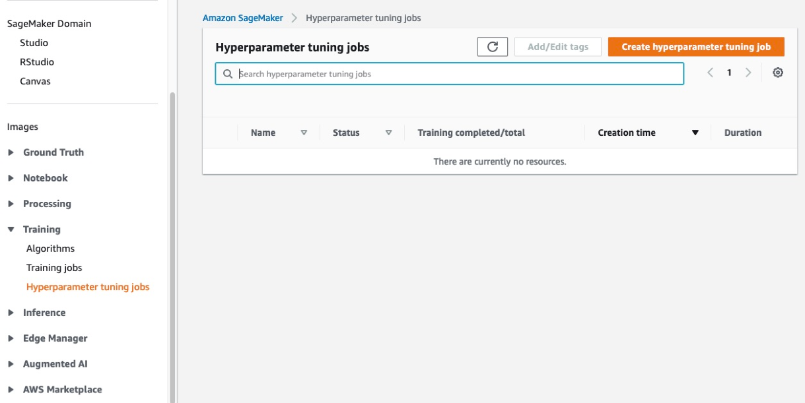

3.
In the list of hyperparameter tuning jobs, check the status of the hyperparameter tuning job
you launched. A tuning job can be:

• Completed—The hyperparameter tuning job successfully completed.

• InProgress—The hyperparameter tuning job is in progress. One or more training jobs are
still running.

• Failed—The hyperparameter tuning job failed.

• Stopped—The hyperparameter tuning job was manually stopped before it completed. All
training jobs that the hyperparameter tuning job launched are stopped.

• Stopping—The hyperparameter tuning job is in the process of stopping.

View the Status of the Training Jobs

To view the status of the training jobs that the hyperparameter tuning job launched

1.
In the list of hyperparameter tuning jobs, choose the job that you launched.

2.
Choose Training jobs.

Example: Hyperparameter Tuning Job
4568

## Page 598

Amazon SageMaker AI
Developer Guide

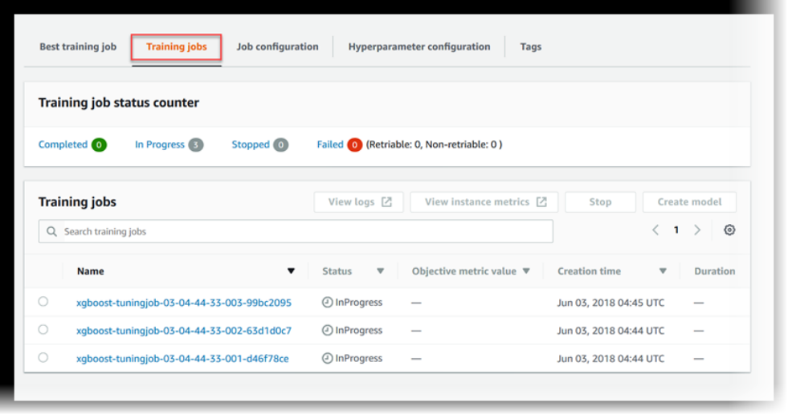

3.
View the status of each training job. To see more details about a job, choose it in the

list of training jobs. To view a summary of the status of all of the training jobs that the
hyperparameter tuning job launched, see Training job status counter.

A training job can be:

• Completed—The training job successfully completed.

• InProgress—The training job is in progress.

• Stopped—The training job was manually stopped before it completed.

• Failed (Retryable)—The training job failed, but can be retried. A failed training job can
be retried only if it failed because an internal service error occurred.

• Failed (Non-retryable)—The training job failed and can't be retried. A failed training
job can't be retried when a client error occurs.

Note

Hyperparameter tuning jobs can be stopped and the underlying resources  deleted, but
the jobs themselves cannot be deleted.

View the Best Training Job

A hyperparameter tuning job uses the objective metric that each training job returns to evaluate
training jobs. While the hyperparameter tuning job is in progress, the best training job is the one

Example: Hyperparameter Tuning Job
4569

## Page 599

Amazon SageMaker AI
Developer Guide

that has returned the best objective metric so far. After the hyperparameter tuning job is complete,
the best training job is the one that returned the best objective metric.

To view the best training job, choose Best training job.

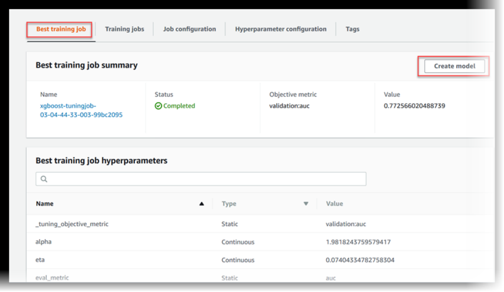

To deploy the best training job as a model that you can host at a SageMaker AI endpoint, choose
Create model.

Next Step

Clean up

Clean up

To avoid incurring unnecessary charges, when you are done with the example, use the AWS
Management Console to delete the resources that you created for it.

Note

If you plan to explore other examples, you might want to keep some of these resources,
such as your notebook instance, S3 bucket, and IAM role.

1. Open the SageMaker AI console at https://console.aws.amazon.com/sagemaker/ and delete the

notebook instance. Stop the instance before deleting it.

Example: Hyperparameter Tuning Job
4570

## Page 600

Amazon SageMaker AI
Developer Guide

2. Open the Amazon S3 console at https://console.aws.amazon.com/s3/ and delete the bucket

that you created to store model artifacts and the training dataset.

3. Open the IAM console at https://console.aws.amazon.com/iam/ and delete the IAM role. If you

created permission policies, you can delete them, too.

4. Open the Amazon CloudWatch console at https://console.aws.amazon.com/cloudwatch/ and

delete all of the log groups that have names starting with /aws/sagemaker/.

Stop Training Jobs Early

Stop the training jobs that a hyperparameter tuning job launches early when they are not
improving significantly as measured by the objective metric. Stopping training jobs early can help
reduce compute time and helps you avoid overfitting your model. To configure a hyperparameter
tuning job to stop training jobs early, do one of the following:

• If you are using the AWS SDK for Python (Boto3), set the TrainingJobEarlyStoppingType

field of the HyperParameterTuningJobConfig object that you use to configure the tuning

job to AUTO.

• If you are using the Amazon SageMaker Python SDK, set the early_stopping_type parameter

of the HyperParameterTuner object to Auto.

• In the Amazon SageMaker AI console, in the Create hyperparameter tuning job workflow, under
Early stopping, choose Auto.

For a sample notebook that demonstrates how to use early stopping, see https://
github.com/awslabs/amazon-sagemaker-examples/blob/master/hyperparameter_tuning/
image_classification_early_stopping/hpo_image_classification_early_stopping.ipynb or open the

hpo_image_classification_early_stopping.ipynb notebook in the Hyperparameter
Tuning section of the SageMaker AI Examples in a notebook instance.

How Early Stopping Works

When you enable early stopping for a hyperparameter tuning job, SageMaker AI evaluates each
training job the hyperparameter tuning job launches as follows:

• After each epoch of training, get the value of the objective metric.

• Compute the running average of the objective metric for all previous training jobs up to the
same epoch, and then compute the median of all of the running averages.

Stop Training Jobs Early
4571

## Page 601

Amazon SageMaker AI
Developer Guide

• If the value of the objective metric for the current training job is worse (higher when minimizing
or lower when maximizing the objective metric) than the median value of running averages of
the objective metric for previous training jobs up to the same epoch, SageMaker AI stops the
current training job.

Algorithms That Support Early Stopping

To support early stopping, an algorithm must emit objective metrics for each epoch. The following
built-in SageMaker AI algorithms support early stopping:

• LightGBM

• CatBoost

• AutoGluon-Tabular

• TabTransformer

• Linear Learner Algorithm—Supported only if you use objective_loss as the objective metric.

• XGBoost algorithm with Amazon SageMaker AI

• Image Classification - MXNet

• Object Detection - MXNet

• Sequence-to-Sequence Algorithm

• IP Insights

Note

This list of built-in algorithms that support early stopping is current as of December 13,
2018. Other built-in algorithms might support early stopping in the future. If an algorithm
emits a metric that can be used as an objective metric for a hyperparameter tuning job
(preferably a validation metric), then it supports early stopping.

To use early stopping with your own algorithm, you must write your algorithms such that it emits
the value of the objective metric after each epoch. The following list shows how you can do that in
different frameworks:

Stop Training Jobs Early
4572

## Page 602

Amazon SageMaker AI
Developer Guide

TensorFlow

Use the tf.keras.callbacks.ProgbarLogger class. For information, see the
tf.keras.callbacks.ProgbarLogger API.

MXNet

Use the mxnet.callback.LogValidationMetricsCallback. For information, see the
mxnet.callback APIs.

Chainer

Extend chainer by using the extensions.Evaluator class. For information, see the
chainer.training.extensions.Evaluator API.

PyTorch and Spark

There is no high-level support. You must explicitly write your training code so that it computes
objective metrics and writes them to logs after each epoch.

Run a Warm Start Hyperparameter Tuning Job

Use warm start to start a hyperparameter tuning job using one or more previous tuning jobs as
a starting point. The results of previous tuning jobs are used to inform which combinations of
hyperparameters to search over in the new tuning job. Hyperparameter tuning uses either Bayesian
or random search to choose combinations of hyperparameter values from ranges that you specify.
For more information, see Understand the hyperparameter tuning strategies available in Amazon
SageMaker AI. Using information from previous hyperparameter tuning jobs can help increase the
performance of the new hyperparameter tuning job by making the search for the best combination
of hyperparameters more efficient.

Note

Warm start tuning jobs typically take longer to start than standard hyperparameter tuning
jobs, because the results from the parent jobs have to be loaded before the job can start.
The increased time depends on the total number of training jobs launched by the parent
jobs.

Reasons to consider warm start include the following:

Run a Warm Start Hyperparameter Tuning Job
4573

## Page 603

Amazon SageMaker AI
Developer Guide

• To gradually increase the number of training jobs over several tuning jobs based on results after
each iteration.

• To tune a model using new data that you received.

• To change hyperparameter ranges that you used in a previous tuning job, change static
hyperparameters to tunable, or change tunable hyperparameters to static values.

• You stopped a previous hyperparameter job early or it stopped unexpectedly.

Topics

• Types of Warm Start Tuning Jobs

• Warm Start Tuning Restrictions

• Warm Start Tuning Sample Notebook

• Create a Warm Start Tuning Job

Types of Warm Start Tuning Jobs

There are two different types of warm start tuning jobs:

IDENTICAL_DATA_AND_ALGORITHM

The new hyperparameter tuning job uses the same input data and training image as the
parent tuning jobs. You can change the hyperparameter ranges to search and the maximum
number of training jobs that the hyperparameter tuning job launches. You can also change
hyperparameters from tunable to static, and from static to tunable, but the total number of
static plus tunable hyperparameters must remain the same as it is in all parent jobs. You cannot
use a new version of the training algorithm, unless the changes in the new version do not
affect the algorithm itself. For example, changes that improve logging or adding support for a
different data format are allowed.

Use identical data and algorithm when you use the same training data as you used in a previous
hyperparameter tuning job, but you want to increase the total number of training jobs or
change ranges or values of hyperparameters.

When you run an warm start tuning job of type IDENTICAL_DATA_AND_ALGORITHM, there

is an additional field in the response to DescribeHyperParameterTuningJob named

OverallBestTrainingJob. The value of this field is the TrainingJobSummary for the training

Run a Warm Start Hyperparameter Tuning Job
4574

## Page 604

Amazon SageMaker AI
Developer Guide

job with the best objective metric value of all training jobs launched by this tuning job and all
parent jobs specified for the warm start tuning job.

TRANSFER_LEARNING

The new hyperparameter tuning job can include input data, hyperparameter ranges, maximum
number of concurrent training jobs, and maximum number of training jobs that are different
than those of its parent hyperparameter tuning jobs. You can also change hyperparameters
from tunable to static, and from static to tunable, but the total number of static plus tunable
hyperparameters must remain the same as it is in all parent jobs. The training algorithm image
can also be a different version from the version used in the parent hyperparameter tuning job.
When you use transfer learning, changes in the dataset or the algorithm that significantly affect
the value of the objective metric might reduce the usefulness of using warm start tuning.

Warm Start Tuning Restrictions

The following restrictions apply to all warm start tuning jobs:

• A tuning job can have a maximum of 5 parent jobs, and all parent jobs must be in a terminal

state (Completed, Stopped, or Failed) before you start the new tuning job.

• The objective metric used in the new tuning job must be the same as the objective metric used in
the parent jobs.

• The total number of static plus tunable hyperparameters must remain the same between
parent jobs and the new tuning job. Because of this, if you think you might want to use a
hyperparameter as tunable in a future warm start tuning job, you should add it as a static
hyperparameter when you create a tuning job.

• The type of each hyperparameter (continuous, integer, categorical) must not change between
parent jobs and the new tuning job.

• The number of total changes from tunable hyperparameters in the parent jobs to static
hyperparameters in the new tuning job, plus the number of changes in the values of static
hyperparameters cannot be more than 10. For example, if the parent job has a tunable

categorical hyperparameter with the possible values red and blue, you change that
hyperparameter to static in the new tuning job, that counts as 2 changes against the allowed

total of 10. If the same hyperparameter had a static value of red in the parent job, and you

change the static value to blue in the new tuning job, it also counts as 2 changes.

• Warm start tuning is not recursive. For example, if you create MyTuningJob3 as a warm start

tuning job with MyTuningJob2 as a parent job, and MyTuningJob2 is itself an warm start

Run a Warm Start Hyperparameter Tuning Job
4575

## Page 605

Amazon SageMaker AI
Developer Guide

tuning job with a parent job MyTuningJob1, the information that was learned when running

MyTuningJob1 is not used for MyTuningJob3. If you want to use the information from

MyTuningJob1, you must explicitly add it as a parent for MyTuningJob3.

• The training jobs launched by every parent job in a warm start tuning job count against the 500
maximum training jobs for a tuning job.

• Hyperparameter tuning jobs created before October 1, 2018 cannot be used as parent jobs for
warm start tuning jobs.

Warm Start Tuning Sample Notebook

For a sample notebook that shows how to use warm start tuning, see https://github.com/
awslabs/amazon-sagemaker-examples/blob/master/hyperparameter_tuning/
image_classification_warmstart/hpo_image_classification_warmstart.ipynb.

Create a Warm Start Tuning Job

You can use either the low-level AWS SDK for Python (Boto 3) or the high-level SageMaker AI
Python SDK to create a warm start tuning job.

Topics

• Create a Warm Start Tuning Job ( Low-level SageMaker AI API for Python (Boto 3))

• Create a Warm Start Tuning Job (SageMaker AI Python SDK)

Create a Warm Start Tuning Job ( Low-level SageMaker AI API for Python (Boto 3))

To use warm start tuning, you specify the values of a

HyperParameterTuningJobWarmStartConfig object, and pass that as the WarmStartConfig

field in a call to CreateHyperParameterTuningJob.

The following code shows how to create a HyperParameterTuningJobWarmStartConfig

object and pass it to CreateHyperParameterTuningJob job by using the low-level SageMaker
AI API for Python (Boto 3).

Create the HyperParameterTuningJobWarmStartConfig object:

warm_start_config = {
"ParentHyperParameterTuningJobs" : [
{"HyperParameterTuningJobName" : 'MyParentTuningJob'}

Run a Warm Start Hyperparameter Tuning Job
4576

## Page 606

Amazon SageMaker AI
Developer Guide

],
"WarmStartType" : "IdenticalDataAndAlgorithm"
}

Create the warm start tuning job:

smclient = boto3.Session().client('sagemaker')
smclient.create_hyper_parameter_tuning_job(HyperParameterTuningJobName =
'MyWarmStartTuningJob',
HyperParameterTuningJobConfig = tuning_job_config, # See notebook for tuning
configuration
TrainingJobDefinition = training_job_definition, # See notebook for job definition
WarmStartConfig = warm_start_config)

Create a Warm Start Tuning Job (SageMaker AI Python SDK)

To use the Amazon SageMaker Python SDK to run a warm start tuning job, you:

• Specify the parent jobs and the warm start type by using a WarmStartConfig object.

• Pass the WarmStartConfig object as the value of the warm_start_config argument of a
HyperparameterTuner object.

• Call the fit method of the HyperparameterTuner object.

For more information about using the Amazon SageMaker Python SDK for hyperparameter tuning,
see https://github.com/aws/sagemaker-python-sdk#sagemaker-automatic-model-tuning.

This example uses an estimator that uses the Image Classification - MXNet algorithm for training.
The following code sets the hyperparameter ranges that the warm start tuning job searches within
to find the best combination of values. For information about setting hyperparameter ranges, see
Define Hyperparameter Ranges.

hyperparameter_ranges = {'learning_rate': ContinuousParameter(0.0, 0.1),
'momentum': ContinuousParameter(0.0, 0.99)}

The following code configures the warm start tuning job by creating a WarmStartConfig object.

from sagemaker.tuner import WarmStartConfig,WarmStartTypes

parent_tuning_job_name = "MyParentTuningJob"

Run a Warm Start Hyperparameter Tuning Job
4577

## Page 607

Amazon SageMaker AI
Developer Guide

warm_start_config =
WarmStartConfig(warm_start_type=WarmStartTypes.IDENTICAL_DATA_AND_ALGORITHM,
parents={parent_tuning_job_name})

Now set the values for static hyperparameters, which are hyperparameters that keep the same
value for every training job that the warm start tuning job launches. In the following code,

imageclassification is an estimator that was created previously.

imageclassification.set_hyperparameters(num_layers=18,
image_shape='3,224,224',
num_classes=257,
num_training_samples=15420,
mini_batch_size=128,
epochs=30,
optimizer='sgd',
top_k='2',
precision_dtype='float32',
augmentation_type='crop')

Now create the HyperparameterTuner object and pass the WarmStartConfig object that you

previously created as the warm_start_config argument.

tuner_warm_start = HyperparameterTuner(imageclassification,
'validation:accuracy',
hyperparameter_ranges,
objective_type='Maximize',
max_jobs=10,
max_parallel_jobs=2,
base_tuning_job_name='warmstart',
warm_start_config=warm_start_config)

Finally, call the fit method of the HyperparameterTuner object to launch the warm start
tuning job.

tuner_warm_start.fit(
{'train': s3_input_train, 'validation': s3_input_validation},
include_cls_metadata=False)

Resource Limits for Automatic Model Tuning

SageMaker AI sets the following default limits for resources used by automatic model tuning:

Resource Limits for Automatic Model Tuning
4578

## Page 608

Amazon SageMaker AI
Developer Guide

Resource
Regions
Default limits
Can be increased to

Number of parallel
(concurrent)

All
100
N/A

hyperparameter
tuning jobs

Number of hyperpara
meters that can be
searched *

All
30
N/A

Number of metrics
defined per
hyperparameter
tuning job

All
20
N/A

Number of parallel
training jobs per
hyperparameter
tuning job

All
10
100

[Bayesian optimizat
ion] Number of
training jobs per
hyperparameter
tuning job

All
750
N/A

[Random search]
Number of training
jobs per hyperpara
meter tuning job

All
750
10000

[Hyperband] Number
of training jobs per
hyperparameter
tuning job

All
750
N/A

Resource Limits for Automatic Model Tuning
4579

## Page 609

Amazon SageMaker AI
Developer Guide

Resource
Regions
Default limits
Can be increased to

[Grid] Number of
training jobs per
hyperparameter
tuning job, either
specified explicitly
or inferred from the
search space

All
750
N/A

Maximum run time
for a hyperparameter
tuning job

All
30 days
N/A

* Each categorical hyperparameter can have at most 30 different values.

Resource limit example

When you plan hyperparameter tuning jobs, you also have to take into account the limits on
training resources. For information about the default resource limits for SageMaker AI training jobs,
see SageMaker AI Limits. Every concurrent training instance on which all of your hyperparameter
tuning jobs run counts against the total number of training instances allowed. For example, if you
run 10 concurrent hyperparameter tuning jobs, each of those hyperparameter tuning jobs runs
100 total training jobs and 20 concurrent training jobs. Each of those training jobs runs on one
ml.m4.xlarge instance. The following limits apply:

• Number of concurrent hyperparameter tuning jobs: You don't need to increase the limit, because
10 tuning jobs is below the limit of 100.

• Number of training jobs per hyperparameter tuning job: You don't need to increase the limit,
because 100 training jobs is below the limit of 750.

• Number of concurrent training jobs per hyperparameter tuning job: You need to request a limit
increase to 20, because the default limit is 10.

• SageMaker AI training ml.m4.xlarge instances: You need to request a limit increase to 200,
because you have 10 hyperparameter tuning jobs, each of which is running 20 concurrent
training jobs. The default limit is 20 instances.

Resource Limits for Automatic Model Tuning
4580

## Page 610

Amazon SageMaker AI
Developer Guide

• SageMaker AI training total instance count: You need to request a limit increase to 200, because
you have 10 hyperparameter tuning jobs, each of which is running 20 concurrent training jobs.
The default limit is 20 instances.

To request a quota increase:

1.
Open the AWS Support Center page, sign in if necessary, and then choose Create case.

2.
On the Create case page, choose Service limit increase.

3.
On the Case details panel, select SageMaker AI Automatic Model Tuning [Hyperparameter
Optimization] for the Limit type

4.
On the Requests panel for Request 1, select the Region, the resource Limit to increase and
the New Limit value you are requesting. Select Add another request if you have additional
requests for quota increases.

Resource Limits for Automatic Model Tuning
4581

## Page 611

Amazon SageMaker AI
Developer Guide

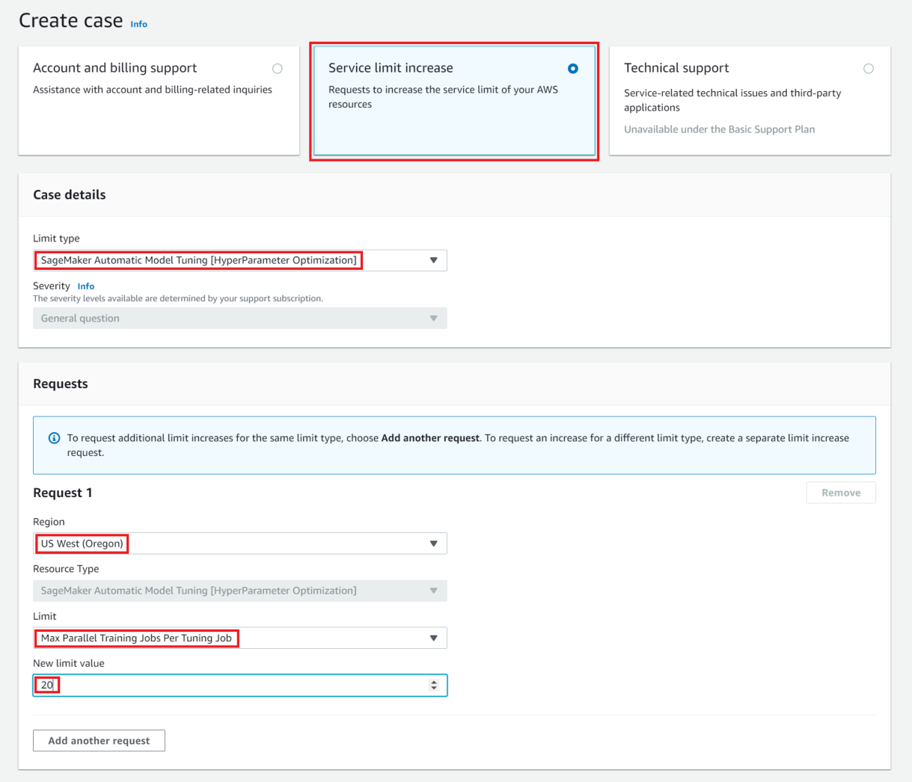

5.
In the Case description panel, provide a description of your use case .

6.
In the Contact options panel, select your preferred Contact methods (Web, Chat or Phone)
and then choose Submit.

Best Practices for Hyperparameter Tuning

Hyperparameter optimization (HPO) is not a fully-automated process. To improve optimization,
follow these best practices for hyperparameter tuning.

Topics

• Choosing a tuning strategy

Best Practices for Hyperparameter Tuning
4582

## Page 612

Amazon SageMaker AI
Developer Guide

• Choosing the number of hyperparameters

• Choosing hyperparameter ranges

• Using the correct scales for hyperparameters

• Choosing the best number of parallel training jobs

• Running training jobs on multiple instances

• Using a random seed to reproduce hyperparameter configurations

Choosing a tuning strategy

For large jobs, using the Hyperband tuning strategy can reduce computation time. Hyperband
has an early stopping mechanism to stop under-performing jobs. Hyperband can also reallocate
resources towards well-utilized hyperparameter configurations and run parallel jobs. For smaller
training jobs using less runtime, use either random search or Bayesian optimization.

Use Bayesian optimization to make increasingly informed decisions about improving
hyperparameter configurations in the next run. Bayesian optimization uses information
gathered from prior runs to improve subsequent runs. Because of its sequential nature, Bayesian
optimization cannot massively scale.

Use random search to run a large number of parallel jobs. In random search, subsequent jobs
do not depend on the results from prior jobs and can be run independently. Compared to other
strategies, random search is able to run the largest number of parallel jobs.

Use grid search to reproduce results of a tuning job, or if simplicity and transparency of the
optimization algorithm are important. You can also use grid search to explore the entire
hyperparameter search space evenly. Grid search methodically searches through every
hyperparameter combination to find optimal hyperparameter values. Unlike grid search, Bayesian
optimization, random search and Hyperband all draw hyperparameters randomly from the
search space. Because grid search analyzes every combination of hyperparameters, optimal
hyperparameter values will be identical between tuning jobs that use the same hyperparameters.

Choosing the number of hyperparameters

During optimization, the computational complexity of a hyperparameter tuning job depends on the
following:

• The number of hyperparameters

• The range of values that Amazon SageMaker AI has to search

Best Practices for Hyperparameter Tuning
4583

## Page 613

Amazon SageMaker AI
Developer Guide

Although you can simultaneously specify up to 30 hyperparameters, limiting your search to a
smaller number can reduce computation time. Reducing computation time allows SageMaker AI to
converge more quickly to an optimal hyperparameter configuration.

Choosing hyperparameter ranges

The range of values that you choose to search can adversely affect hyperparameter optimization.
For example, a range that covers every possible hyperparameter value can lead to large compute
times and a model that doesn't generalize well to unseen data. If you know that using a subset
of the largest possible range is appropriate for your use case, consider limiting the range to that
subset.

Using the correct scales for hyperparameters

During hyperparameter tuning, SageMaker AI attempts to infer if your hyperparameters are log-

scaled or linear-scaled. Initially, SageMaker AI assumes linear scaling for hyperparameters. If
hyperparameters are log-scaled, choosing the correct scale will make your search more efficient.

You can also select Auto for ScalingType in the CreateHyperParameterTuningJob API if you want
SageMaker AI to detect the scale for you.

Choosing the best number of parallel training jobs

You can use the results of previous trials to improve the performance of subsequent trials. Choose
the largest number of parallel jobs that would provide a meaningful incremental result that is also

within your region and account compute constraints. Use the MaxParallelTrainingJobs field
to limit the number of training jobs that a hyperparameter tuning job can launch in parallel. For
more information, see Running multiple HPO jobs in parallel on Amazon SageMaker AI.

Running training jobs on multiple instances

When a training job runs on multiple machines in distributed mode, each machine emits an
objective metric. HPO can only use one of these emitted objective metrics to evaluate model
performance, In distributed mode, HPO uses the objective metric that was reported by the last
running job across all instances.

Using a random seed to reproduce hyperparameter configurations

You can specify an integer as a random seed for hyperparameter tuning and use that seed during
hyperparameter generation. Later, you can use the same seed to reproduce hyperparameter

Best Practices for Hyperparameter Tuning
4584

## Page 614

Amazon SageMaker AI
Developer Guide

configurations that are consistent with your previous results. For random search and Hyperband
strategies, using the same random seed can provide up to 100% reproducibility of the previous
hyperparameter configuration for the same tuning job. For Bayesian strategy, using the same
random seed will improve reproducibility for the same tuning job.

Data refining during training with Amazon SageMaker smart
sifting

SageMaker smart sifting is a capability of SageMaker Training that helps improve the efficiency of
your training datasets and reduce total training time and cost.

Modern deep learning models such as large language models (LLMs) or vision transformer models
often require massive datasets to achieve acceptable accuracy. For example, LLMs often require
trillions of tokens or petabytes of data to converge. The growing size of training datasets, along
with the size of state-of-the-art models, can increase the compute time and cost of model training.

Invariably, samples in a dataset do not contribute equally to the learning process during model
training. A significant proportion of computational resources provisioned during training might be
spent on processing easy samples that do not contribute substantially to the overall accuracy of a
model. Ideally, training datasets would only include samples that are actually improving the model
convergence. Filtering out less helpful data can reduce training time and compute cost. However,
identifying less helpful data can be challenging and risky. It is practically difficult to identify which
samples are less informative before training, and model accuracy can be impacted if the wrong
samples or too many samples are excluded.

Smart sifting of data with Amazon SageMaker AI can help reduce training time and cost by
improving data efficiency. The SageMaker smart sifting algorithm evaluates the loss value of
each data during the data loading stage of a training job and excludes samples which are less
informative to the model. By using refined data for training, the total time and cost of training
your model is reduced by eliminating unnecessary forward and backward passes on non-improving
data. Therefore, there is minimal or no impact on the accuracy of the model.

SageMaker smart sifting is available through SageMaker Training Deep Learning Containers (DLCs)

and supports PyTorch workloads via the PyTorch DataLoader. Just a few lines of code change
are needed to implement SageMaker smart sifting and you do not need to change your existing
training or data processing workflows.

Topics

Data refining during training
4585

## Page 615

Amazon SageMaker AI
Developer Guide

• How SageMaker smart sifting works

• Supported frameworks and AWS Regions

• SageMaker smart sifting within your training script

• Troubleshooting

• Security in SageMaker smart sifting

• SageMaker smart sifting Python SDK reference

• SageMaker smart sifting release notes

How SageMaker smart sifting works

The goal of SageMaker smart sifting is to sift through your training data during the training
process and only feed more informative samples to the model. During typical training with
PyTorch, data is iteratively sent in batches to the training loop and to accelerator devices (such as

GPUs or Trainium chips) by the PyTorch DataLoader. SageMaker smart sifting is implemented
at this data loading stage and is thus independent of any upstream data pre-processing in your
training pipeline. SageMaker smart sifting uses your model and its user-specified loss function to
do an evaluative forward pass of each data sample as it is loaded. Samples that return low-loss
values have less of an impact on the model's learning and are thus excluded from training, because
it is already easy for the model to make the right prediction about them with high confidence.
Meanwhile, those relatively high-loss samples are what the model still needs to learn, so these are
kept for training. A key input you can set for SageMaker smart sifting is the proportion of data to
exclude. For example, by setting the proportion to 25%, samples distributed in the lowest quartile
of the distribution of loss (taken from a user-specified number of previous samples) are excluded
from training. High-loss samples are accumulated in a refined data batch. The refined data batch
is sent to the training loop (forward and backward pass), and the model learns and trains on the
refined data batch.

The following diagram shows an overview of how the SageMaker smart sifting algorithm is
designed.

How SageMaker smart sifting works
4586

## Page 616

Amazon SageMaker AI
Developer Guide

In short, SageMaker smart sifting operates during training as data is loaded. The SageMaker smart
sifting algorithm runs loss calculation over the batches, and sifts non-improving data out before
the forward and backward pass of each iteration. The refined data batch is then used for the
forward and backward pass.

Note

Smart sifting of data on SageMaker AI uses additional forward passes to analyze and
filter your training data. In turn, there are fewer backward passes as less impactful data

How SageMaker smart sifting works
4587

## Page 617

Amazon SageMaker AI
Developer Guide

is excluded from your training job. Because of this, models which have long or expensive
backward passes see the greatest efficiency gains when using smart sifting. Meanwhile, if
your model's forward pass takes longer than its backward pass, overhead could increase
total training time. To measure the time spent by each pass, you can run a pilot training
job and collect logs that record the time on the processes. Also consider using SageMaker
Profiler that provides profiling tools and UI application. To learn more, see Amazon
SageMaker Profiler.

SageMaker smart sifting works for PyTorch-based training jobs with classic distributed data

parallelism, which makes model replicas on each GPU worker and performs AllReduce. It works
with PyTorch DDP and the SageMaker AI distributed data parallel library.

Supported frameworks and AWS Regions

Before using SageMaker smart sifting data loader, check if your framework of choice is supported,
that the instance types are available in your AWS account, and that your AWS account is in one of
the supported AWS Regions.

Note

SageMaker smart sifting supports PyTorch model training with traditional data parallelism
and distributed data parallelism, which makes model replicas in all GPU workers and uses

the AllReduce operation. It doesn’t work with model parallelism techniques, including
sharded data parallelism. Because SageMaker smart sifting works for data parallelism jobs,
make sure that the model you train fits in each GPU memory.

Supported Frameworks

SageMaker smart sifting supports the following deep learning frameworks and is available through
AWS Deep Learning Containers.

Topics

• PyTorch

Supported frameworks and AWS Regions
4588

## Page 618

Amazon SageMaker AI
Developer Guide

PyTorch

Framework
Framework version
Deep Learning
Container URI

PyTorch
2.1.0
763104351

884 .dkr.ecr.

region.amazonaw
s.com/pytorch-trai
ning:2.1.0-gpu-py3
10-cu121-ubuntu20.
04-sagemaker

For more information about the pre-built containers, see SageMaker AI Framework Containers in
the AWS Deep Learning Containers GitHub repository.

AWS Regions

The containers packaged with the SageMaker smart sifting library are available in the AWS Regions
where AWS Deep Learning Containers are in service.

Instance types

You can use SageMaker smart sifting for any PyTorch training jobs on any instance types. We
recommend that you use P4d, P4de, or P5 instances.

SageMaker smart sifting within your training script

The SageMaker smart sifting library is packaged in the SageMaker AI framework DLCs as a
complementary library. It provides a filtering logic against training samples that have relatively
lower impact on model training, and your model can reach the desired model accuracy with fewer
training samples when compared to the model training with full data samples.

To learn how to implement the smart sifting tool into your training script, choose one of the
following based on the framework you use.

Topics

• Apply SageMaker smart sifting to your PyTorch script

SageMaker smart sifting within your training script
4589

## Page 619

Amazon SageMaker AI
Developer Guide

• Apply SageMaker smart sifting to your Hugging Face Transformers script

Apply SageMaker smart sifting to your PyTorch script

These instructions demonstrate how to enable SageMaker smart sifting with your training script.

1.
Configure the SageMaker smart sifting interface.

The SageMaker smart sifting library implements a relative-threshold loss-based sampling
technique that helps filter out samples with lower impact on reducing the loss value. The
SageMaker smart sifting algorithm calculates the loss value of every input data sample using a
forward pass, and calculates its relative percentile against the loss values of preceding data.

The following two parameters are what you need to specify to the

RelativeProbabilisticSiftConfig class for creating a sifting configuration object.

• Specify the proportion of data that should be used for training to the beta_value
parameter.

• Specify the number of samples used in the comparison with the loss_history_length
parameter.

The following code example demonstrates setting up an object of the

RelativeProbabilisticSiftConfig class.

from smart_sifting.sift_config.sift_configs import (
RelativeProbabilisticSiftConfig
LossConfig
SiftingBaseConfig
)

sift_config=RelativeProbabilisticSiftConfig(
beta_value=0.5,
loss_history_length=500,
loss_based_sift_config=LossConfig(
sift_config=SiftingBaseConfig(sift_delay=0)
)
)

SageMaker smart sifting within your training script
4590

## Page 620

Amazon SageMaker AI
Developer Guide

For more information about the loss_based_sift_config parameter and related classes,
see the section called “SageMaker smart sifting configuration modules” in the SageMaker
smart sifting Python SDK reference section.

The sift_config object in the preceding code example is used in step 4 for setting up the

SiftingDataloader class.

2.
(Optional) Configure a SageMaker smart sifting batch transform class.

Different training use cases require different training data formats. Given the variety of data
formats, the SageMaker smart sifting algorithm needs to identify how to perform sifting on a
particular batch. To address this, SageMaker smart sifting provides a batch transform module
that helps convert batches into standardized formats that it can efficiently sift.

a.
SageMaker smart sifting handles batch transform of training data in the following
formats: Python lists, dictionaries, tuples, and tensors. For these data formats, SageMaker
smart sifting automatically handles the batch data format conversion, and you can skip

the rest of this step. If you skip this step, in step 4 for configuring SiftingDataloader,

leave the batch_transforms parameter of SiftingDataloader to its default value,

which is None.

b.
If your dataset is not in these format, you should proceed to the rest of this step to create

a custom batch transform using SiftingBatchTransform.

In cases in which your dataset isn’t in one of the supported formats by SageMaker smart
sifting, you might run into errors. Such data format errors can be resolved by adding the

batch_format_index or batch_transforms parameter to the SiftingDataloader
class, which you set up in step 4. The following shows example errors due to an
incompatible data format and resolutions for them.

Error Message
Resolution

This error indicates the batch format is
not supported by default. You should
implement a custom batch transform
class, and use this by specifying it to the

Batches of type {type(batch)}  are not
supported by default.

batch_transforms  parameter of the

SiftingDataloader  class.

SageMaker smart sifting within your training script
4591

## Page 621

Amazon SageMaker AI
Developer Guide

Error Message
Resolution

Unable to index the batch of type

This error indicates the batch object
cannot be indexed normally. User must
implement a custom batch transform and

{type(batch)}

pass this using the batch_transforms
parameter.

This error occurs when the provided
batch size does not match the 0th or
1st dimensions of the batch. User must
implement a custom batch transform and

Batch size {batch_size}  does not
match dimension 0 or dimension 1 sizes

pass this using the batch_transforms
parameter.

Both dimension 0 and dimension 1 match
batch size

This error indicates that since multiple
dimensions match the provided batch
size, more information is required to
sift the batch. The user can provide the

batch_format_index
parameter
to indicate if the batch is indexable
by sample or feature. Users may also
implement a custom batch transform, but
this is more work than required.

To resolve the aforementioned issues, you need to create a custom batch transform class

using the SiftingBatchTransform module. A batch transform class should consist of
a pair of transform and reverse-transform functions. The function pair converts your data
format to a format that SageMaker smart sifting algorithm can process. After you create

a batch transform class, the class returns a SiftingBatch object that you'll pass to the

SiftingDataloader class in step 4.

The following are examples of custom batch transform classes of the

SiftingBatchTransform module.

• An example of a custom list batch transform implementation with SageMaker smart
sifting for cases where the dataloader chunk has inputs, masks, and labels.

SageMaker smart sifting within your training script
4592

## Page 622

Amazon SageMaker AI
Developer Guide

from typing import Any

import torch

from smart_sifting.data_model.data_model_interface import
SiftingBatchTransform
from smart_sifting.data_model.list_batch import ListBatch

class ListBatchTransform(SiftingBatchTransform):
def transform(self, batch: Any):
inputs = batch[0].tolist()
labels = batch[-1].tolist()  # assume the last one is the list of
labels
return ListBatch(inputs, labels)

def reverse_transform(self, list_batch: ListBatch):

a_batch = [torch.tensor(list_batch.inputs),
torch.tensor(list_batch.labels)]
return a_batch

• An example of a custom list batch transform implementation with SageMaker smart
sifting for cases where no labels are needed for reverse transformation.

class ListBatchTransformNoLabels(SiftingBatchTransform):
def transform(self, batch: Any):
return ListBatch(batch[0].tolist())

def reverse_transform(self, list_batch: ListBatch):
a_batch = [torch.tensor(list_batch.inputs)]
return a_batch

• An example of a custom tensor batch implementation with SageMaker smart sifting for
cases where the data loader chunk has inputs, masks, and labels.

from typing import Any

from smart_sifting.data_model.data_model_interface import
SiftingBatchTransform
from smart_sifting.data_model.tensor_batch import TensorBatch

class TensorBatchTransform(SiftingBatchTransform):
def transform(self, batch: Any):

SageMaker smart sifting within your training script
4593

## Page 623

Amazon SageMaker AI
Developer Guide

a_tensor_batch = TensorBatch(
batch[0], batch[-1]
)  # assume the last one is the list of labels
return a_tensor_batch

def reverse_transform(self, tensor_batch: TensorBatch):
a_batch = [tensor_batch.inputs, tensor_batch.labels]
return a_batch

After you create a SiftingBatchTransform-implemted batch transform class, you use

this class in step 4 for setting up the SiftingDataloader class. The rest of this guide

assumes that a ListBatchTransform class is created. In step 4, this class is passed to

the batch_transforms.

3.
Create a class for implementing the SageMaker smart sifting Loss interface. This tutorial

assumes that the class is named SiftingImplementedLoss. While setting up this class, we
recommend that you use the same loss function in the model training loop. Go through the

following substeps for creating a SageMaker smart sifting Loss implemented class.

a.
SageMaker smart sifting calculates a loss value for each training data sample, as opposed
to calculating a single loss value for a batch. To ensure that SageMaker smart sifting uses
the same loss calculation logic, create a smart-sifting-implemented loss function using the

SageMaker smart sifting Loss module that uses your loss function and calculates loss per
training sample.

Tip

SageMaker smart sifting algorithm runs on every data sample, not on the entire
batch, so you should add an initialization function to set the PyTorch loss function
without any reduction strategy.

class SiftingImplementedLoss(Loss):
def __init__(self):
self.loss = torch.nn.CrossEntropyLoss(reduction='none')

This is also shown in the following code example.

b.
Define a loss function that accepts the original_batch (or transformed_batch if you
have set up a batch transform in step 2) and the PyTorch model. Using the specified loss

SageMaker smart sifting within your training script
4594

## Page 624

Amazon SageMaker AI
Developer Guide

function with no reduction, SageMaker smart sifting runs a forward pass for each data
sample to evaluate its loss value.

The following code is an example of a smart-sifting-implemented Loss interface named

SiftingImplementedLoss.

from typing import Any

import torch
import torch.nn as nn
from torch import Tensor

from smart_sifting.data_model.data_model_interface import SiftingBatch
from smart_sifting.loss.abstract_sift_loss_module import Loss

model=... # a PyTorch model based on torch.nn.Module

class SiftingImplementedLoss(Loss):
# You should add the following initializaztion function
# to calculate loss per sample, not per batch.
def __init__(self):
self.loss_no_reduction = torch.nn.CrossEntropyLoss(reduction='none')

def loss(
self,
model: torch.nn.Module,
transformed_batch: SiftingBatch,
original_batch: Any = None,
) -> torch.Tensor:
device = next(model.parameters()).device
batch = [t.to(device) for t in original_batch] # use this if you use
original batch and skipped step 2
# batch = [t.to(device) for t in transformed_batch] # use this if you
transformed batches in step 2

# compute loss
outputs = model(batch)
return self.loss_no_reduction(outputs.logits, batch[2])

Before the training loop hits the actual forward pass, this sifting loss calculation is done during
the data loading phase of fetching a batch in each iteration. The individual loss value is then

SageMaker smart sifting within your training script
4595

## Page 625

Amazon SageMaker AI
Developer Guide

compared to previous loss values, and its relative percentile is estimated per the object of

RelativeProbabilisticSiftConfig you have set up in step 1.

4.
Wrap the PyTroch data loader by the SageMaker AI SiftingDataloader class.

Finally, use all the SageMaker smart sifting implemented classes you configured in the

previous steps to the SageMaker AI SiftingDataloder configuration class. This class is

a wrapper for PyTorch DataLoader. By wrapping PyTorch DataLoader, SageMaker smart
sifting is registered to run as part of data loading in each iteration of a PyTorch training job.
The following code example demonstrates implementing SageMaker AI data sifting to a

PyTorch DataLoader.

from smart_sifting.dataloader.sift_dataloader import SiftingDataloader
from torch.utils.data import DataLoader

train_dataloader = DataLoader(...) # PyTorch data loader

# Wrap the PyTorch data loader by SiftingDataloder
train_dataloader = SiftingDataloader(
sift_config=sift_config, # config object of RelativeProbabilisticSiftConfig
orig_dataloader=train_dataloader,
batch_transforms=ListBatchTransform(), # Optional, this is the custom class
from step 2
loss_impl=SiftingImplementedLoss(), # PyTorch loss function wrapped by the
Sifting Loss interface
model=model,
log_batch_data=False
)

Apply SageMaker smart sifting to your Hugging Face Transformers script

There are two ways to implement the SageMaker smart sifting into the Transformers Trainer
class.

Note

If you use one of the DLCs for PyTorch with the SageMaker smart sifting package installed,

note that you need to install the transformers library. You can install additional

packages by extending the DLCs or passing requirements.txt to the training job

SageMaker smart sifting within your training script
4596

## Page 626

Amazon SageMaker AI
Developer Guide

launcher class for PyTorch (sagemaker.pytorch.PyTorch) in the SageMaker AI Python
SDK.

Simple setup

The simplest way to implement SageMaker smart sifting into the Transformers Trainer class is to

use the enable_sifting function. This function accepts an existing Trainer object, and wraps

the existing DataLoader object with SiftingDataloader. You can continue using the same
training object. See the following example usage.

from smart_sifting.integrations.trainer import enable_sifting
from smart_sifting.loss.abstract_sift_loss_module import Loss
from smart_sifting.sift_config.sift_configs import (
RelativeProbabilisticSiftConfig
LossConfig
SiftingBaseConfig
)

class SiftingImplementedLoss(Loss):
def loss(self, model, transformed_batch, original_batch):
loss_fct = MSELoss(reduction="none") # make sure to set reduction to "none"
logits = model.bert(**original_batch)
return loss_fct(logits, original_batch.get("labels"))

sift_config = RelativeProbabilisticSiftConfig(
beta_value=0.5,
loss_history_length=500,
loss_based_sift_config=LossConfig(
sift_config=SiftingBaseConfig(sift_delay=0)
)
)

trainer = Trainer(...)
enable_sifting(trainer, sift_config, loss=SiftingImplementedLoss()) # updates the
trainer with Sifting Loss and config
trainer.train()

The SiftingDataloader class is an iterable data loader. The exact size of the resulting dataset
is not known beforehand due to the random sampling during sifting. As a result, the Hugging Face

Trainer expects the max_steps training argument. Note that this argument overrides the epoch

SageMaker smart sifting within your training script
4597

## Page 627

Amazon SageMaker AI
Developer Guide

configuration parameter num_train_epochs. If your original data loader was also iterable, or

your training uses max_steps and a single epoch, then the SiftingDataloader performs the

same as the existing dataloader. If the original dataloader was not iterable or max_steps was not
provided, the Hugging Face Trainer might throw an error message similar to the following.

args.max_steps must be set to a positive value if dataloader does not have a length,
was -1

To address this, the enable_sifting function provides an optional set_epochs parameter.
This enables training with epochs, using the number of epochs provided by num_train_epochs

argument of the Trainer class, and sets max_steps to the maximum system integer, allowing
training to progress until the specified epochs have completed.

Custom setup

For a custom integration of the SageMaker smart sifting dataloader, you can utilize a custom

Hugging Face Trainer class. Within any subclass of Trainer, the get_train_dataloader()

function can be overridden to return an object of the SiftingDataloader class instead. For cases
with existing custom trainers, this approach might be less intrusive but requires code changes than
the simple setup option. The following is an example implementation of SageMaker smart sifting

into a custom Hugging Face Trainer class.

from smart_sifting.sift_config.sift_configs import (
RelativeProbabilisticSiftConfig
LossConfig
SiftingBaseConfig
)
from smart_sifting.dataloader.sift_dataloader import SiftingDataloader
from smart_sifting.loss.abstract_sift_loss_module import Loss
from smart_sifting.data_model.data_model_interface import SiftingBatch,
SiftingBatchTransform
from smart_sifting.data_model.list_batch import ListBatch

class SiftingListBatchTransform(SiftingBatchTransform):
def transform(self, batch: Any):
inputs = batch[0].tolist()
labels = batch[-1].tolist()  # assume the last one is the list of labels
return ListBatch(inputs, labels)

def reverse_transform(self, list_batch: ListBatch):
a_batch = [torch.tensor(list_batch.inputs), torch.tensor(list_batch.labels)]

SageMaker smart sifting within your training script
4598

## Page 628

Amazon SageMaker AI
Developer Guide

return a_batch

class SiftingImplementedLoss():
# You should add the following initializaztion function
# to calculate loss per sample, not per batch.
def __init__(self):
self.celoss = torch.nn.CrossEntropyLoss(reduction='none')

def loss(
self,
model: torch.nn.Module,
transformed_batch: SiftingBatch,
original_batch: Any = None,
) -> torch.Tensor:
device = next(model.parameters()).device
batch = [t.to(device) for t in original_batch]

# compute loss
outputs = model(batch)
return self.celoss(outputs.logits, batch[2])

class SiftingImplementedTrainer(Trainer):
def get_train_dataloader(self):
dl = super().get_train_dataloader()

sift_config = RelativeProbabilisticSiftConfig(
beta_value=0.5,
loss_history_length=500,
loss_based_sift_config=LossConfig(
sift_config=SiftingBaseConfig(sift_delay=0)
)
)

return SiftingDataloader(
sift_config=sift_config,
orig_dataloader=dl,
batch_transforms=SiftingListBatchTransform(),
loss_impl=SiftingImplementedLoss(),
model=self.model
)

Using the wrapped Trainer class, create an object of it as follows.

SageMaker smart sifting within your training script
4599

## Page 629

Amazon SageMaker AI
Developer Guide

trainer = SiftingImplementedTrainer(
model=model,
args=training_args,
train_dataset=small_train_dataset,
eval_dataset=small_eval_dataset
)

trainer.train()

Troubleshooting

If you run into an error, use the following list to try to troubleshoot the issue. If you need further

support, reach out to the SageMaker AI team at <sm-smart-sifting-feedback@amazon.com>.

Exceptions from the SageMaker smart sifting library

Use the following reference of exceptions raised by the SageMaker smart sifting library to
troubleshoot errors and identify causes.

Exception Name
Description

SiftConfigValidationException
Thrown from the SageMaker smart sifting
library in case of any missing Config key or
unsupported value type for Sift Key

UnsupportedDataFormatException
Thrown from the SageMaker smart sifting
library in case of any unsupported DataFormat

for Sifting logic

LossImplementationNotProvidedException
Thrown in case of missing or not implement
ing Loss interface

Security in SageMaker smart sifting

Because the SageMaker smart sifting library runs processes of removing less valuable training
samples, it requires full access to training datasets as they are produced by the data loader. This
access is not different than the access already provided to PyTorch in normal training scenario.

Troubleshooting
4600

## Page 630

Amazon SageMaker AI
Developer Guide

SageMaker smart sifting has built-in logging with security implications. By default, SageMaker
smart sifting logs are only application-level logs containing metrics, latencies, and user errors or
warnings. Users can, however, choose to enable verbose logs, which log full batch data to show
which samples were removed from a given batch. These logs are emitted using Python loggers
and are not uploaded or stored anywhere by the library. In the case of automatic log uploading to
CloudWatch or similar services, please note that using verbose logs may result in sensitive training
data being uploaded off of the training instance.

Beyond the aforementioned logging, SageMaker smart sifting does not have any network
functionality nor does it interact with the local file system. User data is stored as in-memory
objects for the entirety of the time it is used by the library.

SageMaker smart sifting Python SDK reference

This page provides a reference of Python modules you need for applying SageMaker smart sifting
to your training script.

SageMaker smart sifting configuration modules

class

smart_sifting.sift_config.sift_configs.RelativeProbabilisticSiftConfig()

The SageMaker smart sifting configuration class.

Parameters

• beta_value (float) – A beta (constant) value. It is used to calculate the probability of selecting
a sample for training based on the percentile of the loss in the loss values history. Lowering
the beta value results in a lower percentage of data sifted, and raising it results in a higher
percentage of data sifted. There’s no minimum or maximum value for the beta value, other than
it must be a positive value. The following reference table gives information for sifting rates with

respect to beta_value.

beta_value
Proportion of data kept (%)
Proportion of data sifted
out (%)

0.1
90.91
9.01

0.25
80
20

SageMaker smart sifting Python SDK reference
4601

## Page 631

Amazon SageMaker AI
Developer Guide

beta_value
Proportion of data kept (%)
Proportion of data sifted
out (%)

0.5
66.67
33.33

1
50
50

2
33.33
66.67

3
25
75

10
9.09
90.92

100
0.99
99.01

• loss_history_length (int) – The number of previous training losses to store for the relative
threshold loss based sampling.

• loss_based_sift_config (dict or a LossConfig object) – Specify a LossConfig object that
returns the SageMaker smart sifting Loss interface configuration.

class smart_sifting.sift_config.sift_configs.LossConfig()

The configuration class for the loss_based_sift_config parameter of the

RelativeProbabilisticSiftConfig class.

Parameters

• sift_config (dict or a SiftingBaseConfig object) – Specify a SiftingBaseConfig object
that returns a sifting base configuration dictionary.

class smart_sifting.sift_config.sift_configs.SiftingBaseConfig()

The configuration class for the sift_config parameter of LossConfig.

Parameters

• sift_delay (int) – The number of training steps to wait for before starting sifting. We
recommend that you start sifting after all the layers in the model have enough view of the

training data. The default value is 1000.

SageMaker smart sifting Python SDK reference
4602

## Page 632

Amazon SageMaker AI
Developer Guide

• repeat_delay_per_epoch (bool) – Specify whether to delay sifting every epoch. The default

value is False.

SageMaker smart sifting data batch transform modules

class smart_sifting.data_model.data_model_interface.SiftingBatchTransform

A SageMaker smart sifting Python module for defining how to perform batch transform. Using
this, you can set up a batch transform class that converts the data format of your training data to

SiftingBatch format. SageMaker smart sifting can sift and accumulate data in this format into a
sifted batch.

class smart_sifting.data_model.data_model_interface.SiftingBatch

An interface to define a batch data type that can be sifted and accumulated.

class smart_sifting.data_model.list_batch.ListBatch

A module for keeping track of a list batch for sifting.

class smart_sifting.data_model.tensor_batch.TensorBatch

A module for keeping track of a tensor batch for sifting.

SageMaker smart sifting loss implementation module

class smart_sifting.loss.abstract_sift_loss_module.Loss

A wrapper module for registering the SageMaker smart sifting interface to the loss function of a
PyTorch-based model.

SageMaker smart sifting data loader wrapper module

class smart_sifting.dataloader.sift_dataloader.SiftingDataloader

A wrapper module for registering the SageMaker smart sifting interface to the data loader of a
PyTorch-based model.

The Main Sifting Dataloader iterator sifts out training samples from a dataloader based on a sift
configuration.

SageMaker smart sifting Python SDK reference
4603

## Page 633

Amazon SageMaker AI
Developer Guide

Parameters

• sift_config (dict or a RelativeProbabilisticSiftConfig object) – A

RelativeProbabilisticSiftConfig object.

• orig_dataloader (a PyTorch DataLoader object) – Specify the PyTorch Dataloader object to be
wrapped.

• batch_transforms (a SiftingBatchTransform object) – (Optional) If your data format is
not supported by the SageMaker smart sifting library’s default transform, you must create a

batch transform class using the SiftingBatchTransform module. This parameter is used to

pass the batch transform class. This class is used for SiftingDataloader to convert the data
into a format that the SageMaker smart sifting algorithm can accept.

• model (a PyTorch model object) – The original PyTorch model

• loss_impl (a sifting loss function of

smart_sifting.loss.abstract_sift_loss_module.Loss) – A sifting loss function that is

configured with the Loss module and wraps the PyTorch loss function.

• log_batch_data (bool) – Specify whether to log batch data. If set to True, SageMaker smart
sifting logs the details of the batches that are kept or sifted. We recommend that you turn it on
only for a pilot training job. When logging is on, the samples are loaded to GPU and transferred

to CPU, which introduces overhead. The default value is False.

SageMaker smart sifting release notes

See the following release notes to track the latest updates for the SageMaker smart sifting
capability.

SageMaker smart sifting release notes: November 29, 2023

New Features

• Launched the Amazon SageMaker smart sifting library at AWS re:Invent 2023.

Migration to AWS Deep Learning Containers

• The SageMaker smart sifting library passed integration testing and is available in AWS Deep
Learning Containers. To find a complete list of the pre-built containers with the SageMaker smart
sifting library, see the section called “Supported frameworks and AWS Regions”.

Release notes
4604

## Page 634

Amazon SageMaker AI
Developer Guide

Debugging and improving model performance

The essence of training machine learning models, deep learning neural networks, transformer
models is in achieving stable model convergence, and as such, state-of-the-art models have
millions, billions, or trillions of model parameters. The number of operations to update the gigantic
number of model parameters during each iteration can easily become astronomical. To identify
model convergence issues, it is important to be able to access the model parameters, activations,
and gradients computed during optimization processes.

Amazon SageMaker AI provides two debugging tools to help identify such convergence issues and
gain visibility into your models.

Amazon SageMaker AI with TensorBoard

To offer greater compatibility with the open-source community tools within the SageMaker AI
Training platform, SageMaker AI hosts TensorBoard as an application in SageMaker AI domain. You
can bring your training jobs to SageMaker AI and keep using the TensorBoard summary writer to
collect the model output tensors. Because TensorBoard is implemented into SageMaker AI domain,
it also gives you more options to manage user profiles under the SageMaker AI domain in your
AWS account, and provides fine control over the user profiles by granting access to specific actions
and resources. To learn more, see the section called “TensorBoard in SageMaker AI”.

Amazon SageMaker Debugger

Amazon SageMaker Debugger is a capability of SageMaker AI that provides tools to register hooks
to callbacks to extract model output tensors and save them in Amazon Simple Storage Service.
It provides built-in rules for detecting model convergence issues, such as overfitting, saturated
activation functions, vanishing gradients, and more. You can also set up the built-in rules with
Amazon CloudWatch Events and AWS Lambda for taking automated actions against detected
issues, and set up Amazon Simple Notification Service to receive email or text notifications. To
learn more, see the section called “SageMaker Debugger”.

Topics

• TensorBoard in Amazon SageMaker AI

• Amazon SageMaker Debugger

• Access a training container through AWS Systems Manager for remote debugging

• Release notes for debugging capabilities of Amazon SageMaker AI

Debugging and improving model performance
4605

## Page 635

Amazon SageMaker AI
Developer Guide

TensorBoard in Amazon SageMaker AI

Amazon SageMaker AI with TensorBoard is a capability of Amazon SageMaker AI that brings the
TensorBoard visualization tools to SageMaker AI and integrated with SageMaker Training and
domain. It provides options to administer your AWS account and users belonging to the account
through SageMaker AI domain, to give the domain users access to the TensorBoard data with
appropriate permissions to Amazon S3, and help the domain users perform model debugging tasks
using the TensorBoard visualization plugins. SageMaker AI with TensorBoard is extended with the
SageMaker AI Data Manager plugin, with which domain users can access a number of training jobs
in one place within the TensorBoard application.

Note

This feature is for debugging the training of deep learning models using PyTorch or

TensorFlow.

For data scientists

Training large models can have scientific problems that require data scientists to debug and resolve
them in order to improve model convergence and stabilize gradient descent processes.

When you encounter model training issues, such as loss not converging, or vanishing or exploding
weights and gradients, you need to access tensor data to dive deep and analyze the model
parameters, scalars, and any custom metrics. Using SageMaker AI with TensorBoard, you can
visualize model output tensors extracted from training jobs. As you experiment with different
models, multiple training runs, and model hyperparameters, you can select multiple training jobs in
TensorBoard and compare them in one place.

For administrators

Through the TensorBoard landing page in the SageMaker AI console or SageMaker AI domain,
you can manage TensorBoard application users if you are an administrator of an AWS account or
SageMaker AI domain. Each domain user can access their own TensorBoard application given the
granted permissions. As a SageMaker AI domain administrator and domain user, you can create and
delete the TensorBoard application given the permission level you have.

TensorBoard in SageMaker AI
4606

## Page 636

Amazon SageMaker AI
Developer Guide

Note

You cannot share the TensorBoard application for collaboration purposes because
SageMaker AI domain does not allow application sharing among users. Users can share the
output tensors saved in an S3 bucket, if they have access to the bucket.

Supported frameworks and AWS Regions

The TensorBoard application in SageMaker AI is available for the following machine learning
frameworks and AWS Regions.

Frameworks

• PyTorch

• TensorFlow

• Hugging Face Transformers

AWS Regions

• US East (N. Virginia) (us-east-1)

• US East (Ohio) (us-east-2)

• US West (Oregon) (us-west-2)

• Europe (Frankfurt) (eu-central-1)

• Europe (Ireland) (eu-west-1)

Note

Amazon SageMaker AI with TensorBoard runs on an ml.r5.large instance and incurs
charges after the SageMaker AI free tier or the free trial period of the feature. For more
information, see Amazon SageMaker AI Pricing.

Topics

• Prepare a training job to collect TensorBoard output data

• Accessing the TensorBoard application on SageMaker AI

TensorBoard in SageMaker AI
4607

## Page 637

Amazon SageMaker AI
Developer Guide

• Load and visualize output tensors using the TensorBoard application

• Delete unused TensorBoard applications

Prepare a training job to collect TensorBoard output data

A typical training job for machine learning in SageMaker AI consists of two main steps: preparing a
training script and configuring a SageMaker AI estimator object of the SageMaker AI Python SDK.
In this section, you'll learn about the required changes to collect TensorBoard-compatible data
from SageMaker training jobs.

Prerequisites

The following list shows the prerequisites to start using SageMaker AI with TensorBoard.

• A SageMaker AI domain that's set up with Amazon VPC in your AWS account.

For instructions on setting up a domain, see Onboard to Amazon SageMaker AI domain using
quick setup. You also need to add domain user profiles for individual users to access the
TensorBoard on SageMaker AI. For more information, see Add user profiles.

• The following list is the minimum set of permissions for using TensorBoard on SageMaker AI.

• sagemaker:CreateApp

• sagemaker:DeleteApp

• sagemaker:DescribeTrainingJob

• sagemaker:Search

• s3:GetObject

• s3:ListBucket

Step 1: Modify your training script with open-source TensorBoard helper tools

Make sure you determine which output tensors and scalars to collect, and modify code lines in
your training script using any of the following tools: TensorBoardX, TensorFlow Summary Writer,
PyTorch Summary Writer, or SageMaker Debugger.

Also make sure that you specify the TensorBoard data output path as the log directory (log_dir)
for callback in the training container.

For more information about callbacks per framework, see the following resources.

TensorBoard in SageMaker AI
4608

## Page 638

Amazon SageMaker AI
Developer Guide

• For PyTorch, use torch.utils.tensorboard.SummaryWriter. See also the Using TensorBoard
in PyTorch and Log scalars sections in the PyTorch tutorials. Alternatively, you can use
TensorBoardX Summary Writer.

LOG_DIR="/opt/ml/output/tensorboard"
tensorboard_callback=torch.utils.tensorboard.writer.SummaryWriter(log_dir=LOG_DIR)

• For TensorFlow, use the native callback for TensorBoard, tf.keras.callbacks.TensorBoard.

LOG_DIR="/opt/ml/output/tensorboard"
tensorboard_callback=tf.keras.callbacks.TensorBoard(
log_dir=LOG_DIR, histogram_freq=1)

• For Transformers with PyTorch, you can use transformers.integrations.TensorBoardCallback.

For Transformers with TensorFlow, use the tf.keras.tensorboard.callback, and pass that
to the keras callback in transformers.

Tip

You can also use a different container local output path. However, in Step 2: Create a
SageMaker training estimator object with the TensorBoard output configuration, you
must map the paths correctly for SageMaker AI to successfully search the local path and
save the TensorBoard data to the S3 output bucket.

• For guidance on modifying training scripts using the SageMaker Debugger Python library, see
the section called “Adapting your training script to register a hook”.

Step 2: Create a SageMaker training estimator object with the TensorBoard output
configuration

Use the sagemaker.debugger.TensorBoardOutputConfig while configuring a SageMaker
AI framework estimator. This configuration API maps the S3 bucket you specify for saving

TensorBoard data with the local path in the training container (/opt/ml/output/tensorboard).

Pass the object of the module to the tensorboard_output_config parameter of the estimator
class. The following code snippet shows an example of preparing a TensorFlow estimator with the
TensorBoard output configuration parameter.

TensorBoard in SageMaker AI
4609

## Page 639

Amazon SageMaker AI
Developer Guide

Note

This example assumes that you use the SageMaker Python SDK. If you use the low-
level SageMaker API, you should include the following to the request syntax of the
CreateTrainingJob API.

"TensorBoardOutputConfig": {
"LocalPath": "/opt/ml/output/tensorboard",
"S3OutputPath": "s3_output_bucket"
}

from sagemaker.tensorflow import TensorFlow
from sagemaker.debugger import TensorBoardOutputConfig

# Set variables for training job information,
# such as s3_out_bucket and other unique tags.
...

LOG_DIR="/opt/ml/output/tensorboard"

output_path = os.path.join(
"s3_output_bucket", "sagemaker-output", "date_str", "your-training_job_name"
)

tensorboard_output_config = TensorBoardOutputConfig(
s3_output_path=os.path.join(output_path, 'tensorboard'),
container_local_output_path=LOG_DIR
)

estimator = TensorFlow(
entry_point="train.py",
source_dir="src",
role=role,
image_uri=image_uri,
instance_count=1,
instance_type="ml.c5.xlarge",
base_job_name="your-training_job_name",
tensorboard_output_config=tensorboard_output_config,
hyperparameters=hyperparameters
)

TensorBoard in SageMaker AI
4610

## Page 640

Amazon SageMaker AI
Developer Guide

Note

The TensorBoard application does not provide out-of-the-box support for SageMaker

AI hyperparameter tuning jobs, as the CreateHyperParameterTuningJob API is
not integrated with the TensorBoard output configuration for the mapping. To use the
TensorBoard application for hyperparameter tuning jobs, you need to write code for
uploading metrics to Amazon S3 in your training script. Once the metrics are uploaded to
an Amazon S3 bucket, you can then load the bucket into the TensorBoard application on
SageMaker AI.

Accessing the TensorBoard application on SageMaker AI

You can access TensorBoard by two methods: programmatically using the

sagemaker.interactive_apps.tensorboard module that generates an unsigned or a
presigned URL, or using the TensorBoard landing page in the SageMaker AI console. After you open
TensorBoard, SageMaker AI runs the TensorBoard plugin and automatically finds all training job
output data in a TensorBoard-compatible file format.

Topics

• Open TensorBoard using the sagemaker.interactive_apps.tensorboard module

• Open TensorBoard using the get_app_url function as an estimator class method

• Open TensorBoard through the SageMaker AI console

Open TensorBoard using the sagemaker.interactive_apps.tensorboard module

The sagemaker.interactive_apps.tensorboard module provides a function called

get_app_url that generates unsigned or presigned URLs to open the TensorBoard application in
any environment in SageMaker AI or Amazon EC2. This is to provide a unified experience for both
Studio Classic and non-Studio Classic users. For the Studio environment, you can open TensorBoard

by running the get_app_url() function as it is, or you can also specify a job name to start
tracking as the TensorBoard application opens. For non-Studio Classic environments, you can open
TensorBoard by providing your domain and user profile information to the utility function. With
this functionality, regardless of where or how you run training code and launch training jobs, you

can directly access TensorBoard by running the get_app_url function in your Jupyter notebook
or terminal.

TensorBoard in SageMaker AI
4611

## Page 641

Amazon SageMaker AI
Developer Guide

Note

This functionality is available in the SageMaker Python SDK v2.184.0 and later. To use this

functionality, make sure that you upgrade the SDK by running pip install sagemaker

--upgrade.

Topics

• Option 1: For SageMaker AI Studio Classic

• Option 2: For non-Studio Classic environments

Option 1: For SageMaker AI Studio Classic

If you are using SageMaker Studio Classic, you can directly open the TensorBoard application or

retrieve an unsigned URL by running the get_app_url function as follows. As you are already

within the Studio Classic environment and signed in as a domain user, get_app_url() generates
unsigned URL because it is not necessary to authenticate again.

To open the TensorBoard application

The following code automatically opens the TensorBoard application from the unsigned URL that

the get_app_url() function returns in the your environment's default web browser.

from sagemaker.interactive_apps import tensorboard

region = "us-west-2"
app = tensorboard.TensorBoardApp(region)

app.get_app_url(
training_job_name="your-training_job_name" # Optional. Specify the job name to
track a specific training job
)

To retrieve an unsigned URL and open the TensorBoard application manually

The following code prints an unsigned URL that you can copy to a web browser and open the
TensorBoard application.

from sagemaker.interactive_apps import tensorboard

TensorBoard in SageMaker AI
4612

## Page 642

Amazon SageMaker AI
Developer Guide

region = "us-west-2"
app = tensorboard.TensorBoardApp(region)
print("Navigate to the following URL:")
print(
app.get_app_url(
training_job_name="your-training_job_name", # Optional. Specify the name of the
job to track.
open_in_default_web_browser=False           # Set to False to print the URL to
terminal.
)
)

Note that if you run the preceding two code samples outside the SageMaker AI Studio Classic
environment, the function will return a URL to the TensorBoard landing page in the SageMaker
AI console, because these do not have sign-in information to your domain and user profile. For

creating a presigned URL, see Option 2 in the following section.

Option 2: For non-Studio Classic environments

If you use non-Studio Classic environments, such as SageMaker Notebook instance or Amazon EC2,
and want to open TensorBoard directly from the environment you are in, you need to generate
a URL presigned with your domain and user profile information. A presigned URL is a URL that's
signed in to Amazon SageMaker Studio Classic while the URL is being created with your domain
and user profile, and therefore granted access to all of the domain applications and files associated

with your domain. To open TensorBoard through a presigned URL, use the get_app_url function
with your domain and user profile name as follows.

Note that this option requires the domain user to have the

sagemaker:CreatePresignedDomainUrl permission. Without the permission, the domain user
will receive an exception error.

Important

Do not share any presigned URLs. The get_app_url function creates presigned URLs,
which automatically authenticates with your domain and user profile and gives access to
any applications and files associated with your domain.

print(

TensorBoard in SageMaker AI
4613

## Page 643

Amazon SageMaker AI
Developer Guide

app.get_app_url(
training_job_name="your-training_job_name", # Optional. Specify the name of the
job to track.
create_presigned_domain_url=True,           # Reguired to be set to True for
creating a presigned URL.
domain_id="your-domain-id",                 # Required if creating a presigned
URL (create_presigned_domain_url=True).
user_profile_name="your-user-profile-name", # Required if creating a presigned
URL (create_presigned_domain_url=True).
open_in_default_web_browser=False,          # Optional. Set to False to print
the URL to terminal.
optional_create_presigned_url_kwargs={}     # Optional. Add any additional args
for Boto3 create_presigned_domain_url
)
)

Tip

The get_app_url function runs the

SageMaker.Client.create_presigned_domain_url API in the AWS SDK for Python

(Boto3) in the backend. As the Boto3 create_presigned_domain_url API creates
presigned domain URLs that expire in 300 seconds by default, presigned TensorBoard
application URLs also expire in 300 seconds. If you want to extend the expiration time, pass

the ExpiresInSeconds argument to the optional_create_presigned_url_kwargs

argument of the get_app_url function as follows.

optional_create_presigned_url_kwargs={"ExpiresInSeconds": 1500}

Note

If any of your input passed to the arguments of get_app_url is invalid, the function
outputs a URL to the TensorBoard landing page instead of opening the TensorBoard
application. The output message would be similar to the following.

Navigate to the following URL:
https://us-west-2.console.aws.amazon.com/sagemaker/home?region=us-west-2#/
tensor-board-landing

TensorBoard in SageMaker AI
4614

## Page 644

Amazon SageMaker AI
Developer Guide

Open TensorBoard using the get_app_url function as an estimator class method

If you are in the process of running a training job using the estimator class of the SageMaker

Python SDK and have an active object of the estimator class, you can also access the

get_app_url function as a class method of the estimator class. Open the TensorBoard

application or retrieve an unsigned URL by running the get_app_url method as follows. The

get_app_url class method pulls the training job name from the estimator and opens the
TensorBoard application with the specified job.

Note

This functionality is available in the SageMaker Python SDK v2.184.0 and later. To use this

functionality, make sure that you upgrade the SDK by running pip install sagemaker

--upgrade.

Topics

• Option 1: For SageMaker Studio Classic

• Option 2: For non-Studio Classic environments

Option 1: For SageMaker Studio Classic

To open the TensorBoard application

The following code automatically opens the TensorBoard application from the unsigned URL that

the get_app_url() method returns in the your environment's default web browser.

estimator.get_app_url(
app_type=SupportedInteractiveAppTypes.TENSORBOARD # Required.
)

To retrieve an unsigned URL and open the TensorBoard application manually

The following code prints an unsigned URL that you can copy to a web browser and open the
TensorBoard application.

print(
estimator.get_app_url(
app_type=SupportedInteractiveAppTypes.TENSORBOARD, # Required.

TensorBoard in SageMaker AI
4615

## Page 645

Amazon SageMaker AI
Developer Guide

open_in_default_web_browser=False, # Optional. Set to False to print the URL to
terminal.
)
)

Note that if you run the preceding two code samples outside the SageMaker AI Studio Classic
environment, the function will return a URL to the TensorBoard landing page in the SageMaker
AI console, because these do not have sign-in information to your domain and user profile. For
creating a presigned URL, see Option 2 in the following section.

Option 2: For non-Studio Classic environments

If you use non-Studio Classic environments, such as SageMaker Notebook instance and Amazon
EC2, and want to generate a presigned URL to open the TensorBoard application, use the

get_app_url method with your domain and user profile information as follows.

Note that this option requires the domain user to have the

sagemaker:CreatePresignedDomainUrl permission. Without the permission, the domain user
will receive an exception error.

Important

Do not share any presigned URLs. The get_app_url function creates presigned URLs,
which automatically authenticates with your domain and user profile and gives access to
any applications and files associated with your domain.

print(
estimator.get_app_url(
app_type=SupportedInteractiveAppTypes.TENSORBOARD, # Required
create_presigned_domain_url=True,           # Reguired to be set to True for
creating a presigned URL.
domain_id="your-domain-id",                 # Required if creating a presigned
URL (create_presigned_domain_url=True).
user_profile_name="your-user-profile-name", # Required if creating a presigned
URL (create_presigned_domain_url=True).
open_in_default_web_browser=False,            # Optional. Set to False to print
the URL to terminal.
optional_create_presigned_url_kwargs={}       # Optional. Add any additional
args for Boto3 create_presigned_domain_url
)

TensorBoard in SageMaker AI
4616

## Page 646

Amazon SageMaker AI
Developer Guide

)

Open TensorBoard through the SageMaker AI console

You can also use the SageMaker AI console UI to open the TensorBoard application. There are two
options to open the TensorBoard application through the SageMaker AI console.

Topics

• Option 1: Launch TensorBoard from the domain details page

• Option 2: Launch TensorBoard from the TensorBoard landing page

Option 1: Launch TensorBoard from the domain details page

Navigate to the domain details page

The following procedure shows how to navigate to the domain details page.

1.
Open the Amazon SageMaker AI console at https://console.aws.amazon.com/sagemaker/.

2.
On the left navigation pane, choose Admin configurations.

3.
Under Admin configurations, choose domains.

4.
From the list of domains, select the domain in which you want to launch the TensorBoard
application.

Launch a user profile application

The following procedure shows how to launch a Studio Classic application that is scoped to a user
profile.

1. On the domain details page, choose the User profiles tab.

2. Identify the user profile for which you want to launch the Studio Classic application.

3. Choose Launch for your selected user profile, then choose TensorBoard.

Option 2: Launch TensorBoard from the TensorBoard landing page

The following procedure describes how to launch a TensorBoard application from the TensorBoard
landing page.

1. Open the Amazon SageMaker AI console at https://console.aws.amazon.com/sagemaker/.

TensorBoard in SageMaker AI
4617

## Page 647

Amazon SageMaker AI
Developer Guide

2. On the left navigation pane, choose TensorBoard.

3. Under Get started, select the domain in which you want to launch the Studio Classic application.

If your user profile only belongs to one domain, you do not see the option for selecting a
domain.

4. Select the user profile for which you want to launch the Studio Classic application. If there is

no user profile in the domain, choose Create user profile. For more information, see Add and

Remove User Profiles.

5. Choose Open TensorBoard.

The following screenshot shows the location of TensorBoard in the left navigation pane of the
SageMaker AI console and the SageMaker AI with TensorBoard landing page in the main pane.

Load and visualize output tensors using the TensorBoard application

You can conduct an online or offline analysis by loading collected output tensors from S3 buckets
paired with training jobs during or after training.

When you open the TensorBoard application, TensorBoard opens with the SageMaker AI Data
Manager tab. The following screenshot shows the full view of the SageMaker AI Data Manager tab
in the TensorBoard application.

Note

The visualization plugins might not appear when you first launch the TensorBoard
application. After you select training jobs in the SageMaker AI Data Manager plugin, the

TensorBoard in SageMaker AI
4618

## Page 648

Amazon SageMaker AI
Developer Guide

TensorBoard application loads the TensorBoard data and populates the visualization
plugins.

Note

The TensorBoard application automatically shuts down after 1 hour of inactivity. If you
want to shut the application down when you are done using it, make sure to manually shut
down TensorBoard to avoid paying for the instance hosting it. For instructions on deleting
the application, see Delete unused TensorBoard applications.

In the SageMaker AI Data Manager tab, you can select any training job and load TensorBoard-
compatible training output data from Amazon S3.

TensorBoard in SageMaker AI
4619

## Page 649

Amazon SageMaker AI
Developer Guide

1. In the Search training jobs section, use the filters to narrow down the list of training jobs you

want to find, load, and visualize.

2. In the List of training jobs section, use the check boxes to choose training jobs from which you

want to pull data and visualize for debugging.

3. Choose Add selected jobs. The selected jobs should appear in the Tracked training jobs section,

as shown in the following screenshot.

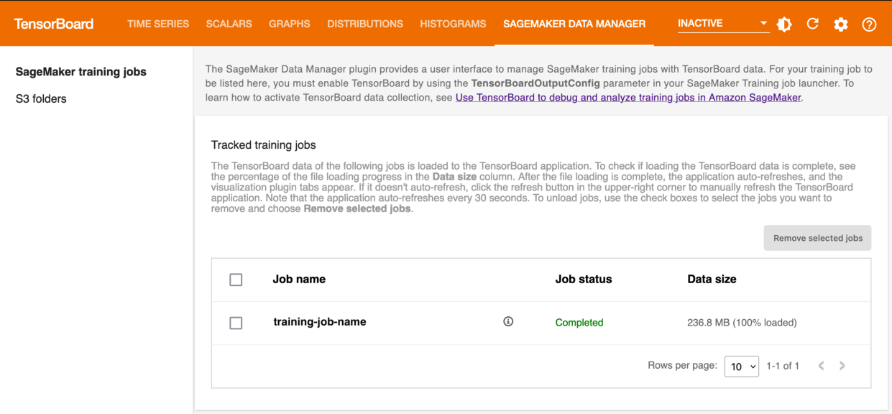

Note

The SageMaker AI Data Manager tab only shows training jobs configured with the

TensorBoardOutputConfig parameter. Make sure you have configured the SageMaker
AI estimator with this parameter. For more information, see Step 2: Create a SageMaker
training estimator object with the TensorBoard output configuration.

Note

The visualization tabs might not appear if you are using SageMaker AI with TensorBoard
for the first time or no data is loaded from a previous use. After adding training jobs and
waiting for a few seconds, refresh the viewer by choosing the clockwise circular arrow
on the upper-right corner. The visualization tabs should appear after the job data are

TensorBoard in SageMaker AI
4620

## Page 650

Amazon SageMaker AI
Developer Guide

successfully loaded. You can also set to auto-refresh using the Settings button next to the
refresh button in the upper right corner.

Visualization of the output tensors in TensorBoard

In the graphics tabs, you can find the list of the loaded training jobs in the left pane. You can also
use the check boxes of the training jobs to show or hide visualizations. The TensorBoard dynamic
plugins are activated dynamically depending on how you have set your training script to include
summary writers and pass callbacks for tensor and scalar collection, and therefore the graphics
tabs also appear dynamically. The following screenshots show example views of each tab with
visualization of two training jobs that collected metrics for time series, scalar, graph, distribution,
and histogram plugins.

The TIME SERIES tab view

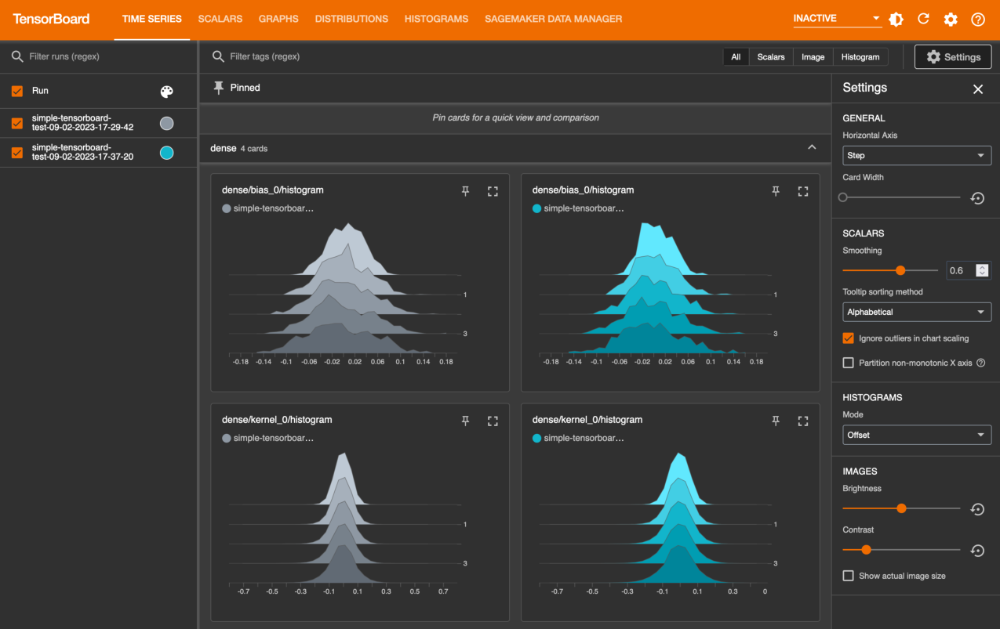

The SCALARS tab view

TensorBoard in SageMaker AI
4621

## Page 651

Amazon SageMaker AI
Developer Guide

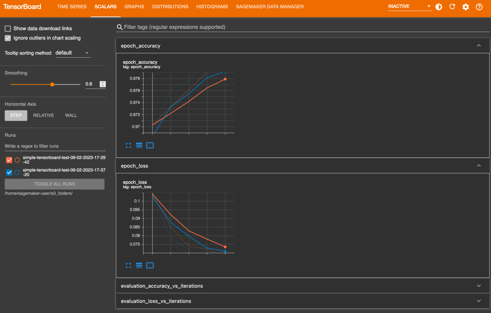

The GRAPHS tab view

TensorBoard in SageMaker AI
4622

## Page 652

Amazon SageMaker AI
Developer Guide

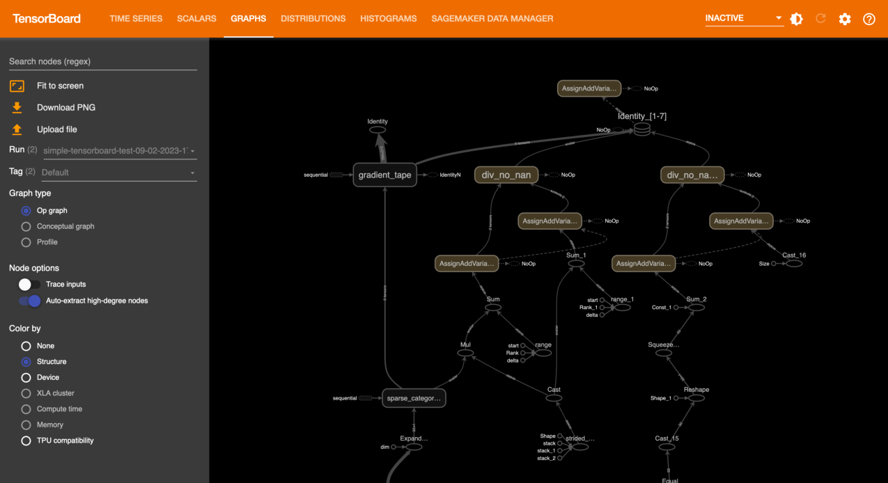

The DISTRIBUTIONS tab view

The HISTOGRAMS tab view

TensorBoard in SageMaker AI
4623

## Page 653

Amazon SageMaker AI
Developer Guide

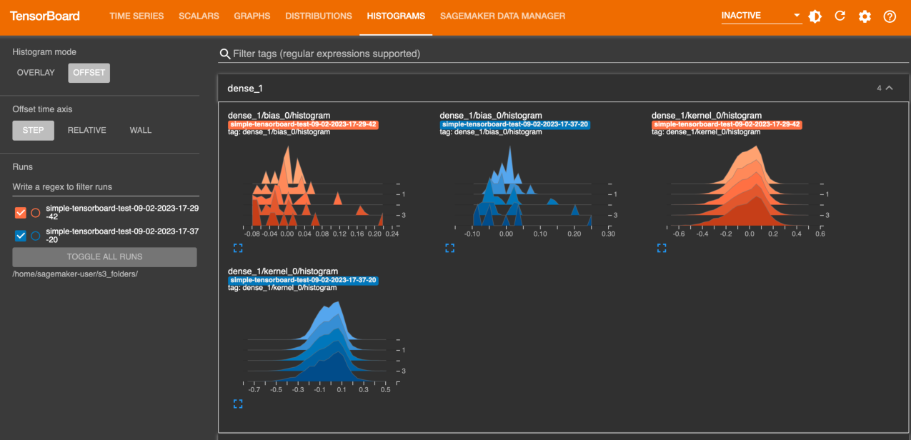

Delete unused TensorBoard applications

After you are done with monitoring and experimenting with jobs in TensorBoard, shut the
TensorBoard application down.

1.
Open the SageMaker AI console.

2.
On the left navigation pane, choose Admin configurations.

3.
Under Admin configurations, choose domains.

4.
Choose your domain.

5.
Choose your user profile.

6.
Under Apps, choose Delete App for the TensorBoard row.

7.
Choose Yes, delete app.

8.
Type delete in the text box, then choose Delete.

9.
A blue message should appear at the top of the screen: default is being deleted.

Amazon SageMaker Debugger

Debug model output tensors from machine learning training jobs in real time and detect non-
converging issues using Amazon SageMaker Debugger.

SageMaker Debugger
4624

## Page 654

Amazon SageMaker AI
Developer Guide

Amazon SageMaker Debugger features

A machine learning (ML) training job can have problems such as overfitting, saturated activation
functions, and vanishing gradients, which can compromise model performance.

SageMaker Debugger provides tools to debug training jobs and resolve such problems to improve
the performance of your model. Debugger also offers tools to send alerts when training anomalies
are found, take actions against the problems, and identify the root cause of them by visualizing
collected metrics and tensors.

SageMaker Debugger supports the Apache MXNet, PyTorch, TensorFlow, and XGBoost frameworks.
For more information about available frameworks and versions supported by SageMaker Debugger,
see Supported frameworks and algorithms.

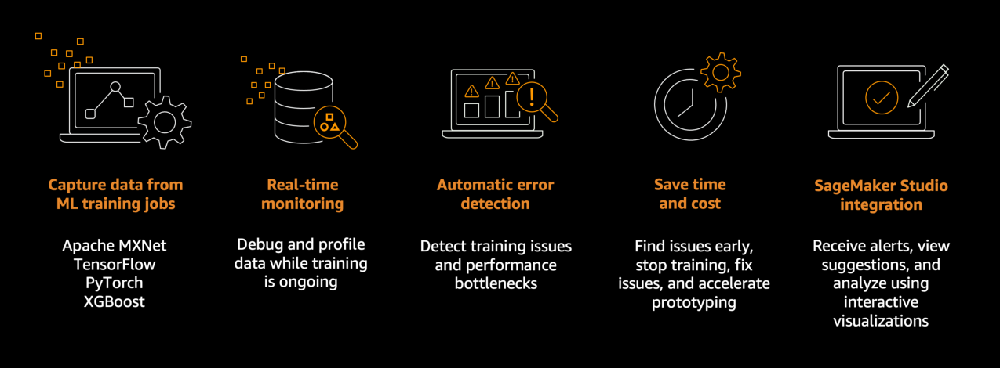

The high-level Debugger workflow is as follows:

1. Modify your training script with the sagemaker-debugger Python SDK if needed.

2. Configure a SageMaker training job with SageMaker Debugger.

• Configure using the SageMaker AI Estimator API (for Python SDK).

• Configure using the SageMaker AI CreateTrainingJob request (for Boto3 or CLI).

• Configure custom training containers with SageMaker Debugger.

3. Start a training job and monitor training issues in real time.

• List of Debugger built-in rules.

4. Get alerts and take prompt actions against the training issues.

SageMaker Debugger
4625

## Page 655

Amazon SageMaker AI
Developer Guide

• Receive texts and emails and stop training jobs when training issues are found using Use
Debugger built-in actions for rules.

• Set up your own actions using Amazon CloudWatch Events and AWS Lambda.

5. Explore deep analysis of the training issues.

• For debugging model output tensors, see Visualize Debugger Output Tensors in TensorBoard.

6. Fix the issues, consider the suggestions provided by Debugger, and repeat steps 1–5 until you

optimize your model and achieve target accuracy.

The SageMaker Debugger developer guide walks you through the following topics.

Topics

• Supported frameworks and algorithms

• Amazon SageMaker Debugger architecture

• Debugger tutorials

• Debugging training jobs using Amazon SageMaker Debugger

• List of Debugger built-in rules

• Creating custom rules using the Debugger client library

• Use Debugger with custom training containers

• Configure Debugger using SageMaker API

• Amazon SageMaker Debugger references

Supported frameworks and algorithms

The following table shows SageMaker AI machine learning frameworks and algorithms supported
by Debugger.

SageMaker AI-supported frameworks and
algorithms

Debugging output tensors

TensorFlow
AWS TensorFlow deep learning containers
1.15.4 or later

PyTorch
AWS PyTorch deep learning containers 1.5.0 or
later

SageMaker Debugger
4626

## Page 656

Amazon SageMaker AI
Developer Guide

MXNet
AWS MXNet deep learning containers 1.6.0 or
later

XGBoost
1.0-1, 1.2-1, 1.3-1

SageMaker AI generic estimator
Custom training containers (available for
TensorFlow, PyTorch, MXNet, and XGBoost
with manual hook registration)

• Debugging output tensors – Track and debug model parameters, such as weights, gradients,
biases, and scalar values of your training job. Available deep learning frameworks are Apache
MXNet, TensorFlow, PyTorch, and XGBoost.

Important

For the TensorFlow framework with Keras, SageMaker Debugger deprecates the zero

code change support for debugging models built using the tf.keras modules of
TensorFlow 2.6 and later. This is due to breaking changes announced in the TensorFlow
2.6.0 release note. For instructions on how to update your training script, see the section
called “TensorFlow”.

Important

From PyTorch v1.12.0 and later, SageMaker Debugger deprecates the zero code change
support for debugging models.
This is due to breaking changes that cause SageMaker Debugger to interfere with the

torch.jit functionality. For instructions on how to update your training script, see the
section called “PyTorch”.

If the framework or algorithm that you want to train and debug is not listed in the table, go to the
AWS Discussion Forum and leave feedback on SageMaker Debugger.

SageMaker Debugger
4627

## Page 657

Amazon SageMaker AI
Developer Guide

AWS Regions

Amazon SageMaker Debugger is available in all regions where Amazon SageMaker AI is in service
except the following region.

• Asia Pacific (Jakarta): ap-southeast-3

To find if Amazon SageMaker AI is in service in your AWS Region, see AWS Regional Services.

Use Debugger with Custom Training Containers

Bring your training containers to SageMaker AI and gain insights into your training jobs using
Debugger. Maximize your work efficiency by optimizing your model on Amazon EC2 instances using
the monitoring and debugging features.

For more information about how to build your training container with the sagemaker-debugger
client library, push it to the Amazon Elastic Container Registry (Amazon ECR), and monitor and
debug, see Use Debugger with custom training containers.

Debugger Open-Source GitHub Repositories

Debugger APIs are provided through the SageMaker Python SDK and designed to construct
Debugger hook and rule configurations for the SageMaker AI  CreateTrainingJob and

DescribeTrainingJob API operations. The sagemaker-debugger client library provides tools to
register hooks and access the training data through its trial feature, all through its flexible and
powerful API operations. It supports the machine learning frameworks TensorFlow, PyTorch,
MXNet, and XGBoost on Python 3.6 and later.

For direct resources about the Debugger and sagemaker-debugger API operations, see the
following links:

• The Amazon SageMaker Python SDK documentation

• The Amazon SageMaker Python SDK - Debugger APIs

• The sagemaker-debugger Python SDK documentation for the Amazon SageMaker Debugger
open source client library

• The sagemaker-debugger PyPI

If you use the SDK for Java to conduct SageMaker training jobs and want to configure Debugger
APIs, see the following references:

SageMaker Debugger
4628

## Page 658

Amazon SageMaker AI
Developer Guide

• Amazon SageMaker Debugger APIs

• Configure Debugger using SageMaker API

Amazon SageMaker Debugger architecture

This topic walks you through a high-level overview of the Amazon SageMaker Debugger workflow.

Debugger supports profiling functionality for performance optimization to identify computation
issues, such as system bottlenecks and underutilization, and to help optimize hardware resource
utilization at scale.

Debugger's debugging functionality for model optimization is about analyzing non-converging
training issues that can arise while minimizing the loss functions using optimization algorithms,
such as gradient descent and its variations.

The following diagram shows the architecture of SageMaker Debugger. The blocks with bold
boundary lines are what Debugger manages to analyze your training job.

SageMaker Debugger
4629

## Page 659

Amazon SageMaker AI
Developer Guide

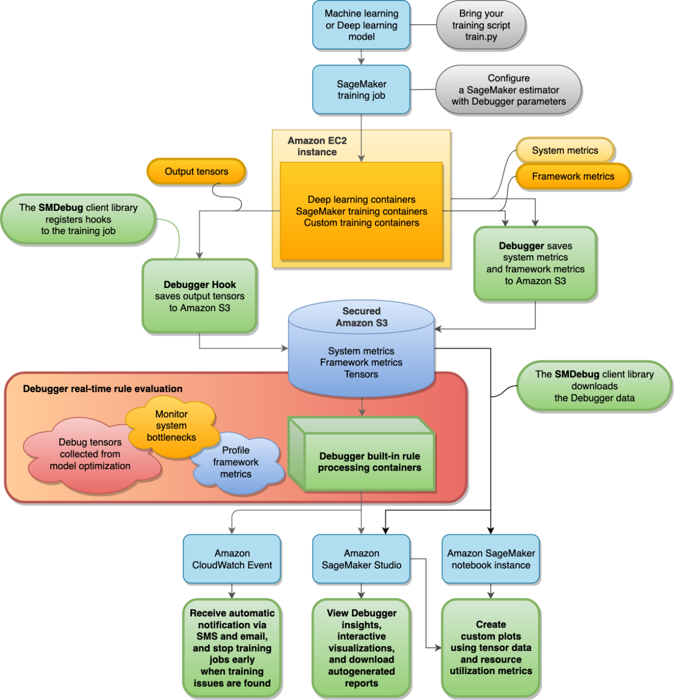

Debugger stores the following data from your training jobs in your secured Amazon S3 bucket:

• Output tensors – Collections of scalars and model parameters that are continuously updated
during the forward and backward passes while training ML models. The output tensors include

SageMaker Debugger
4630

## Page 660

Amazon SageMaker AI
Developer Guide

scalar values (accuracy and loss) and matrices (weights, gradients, input layers, and output
layers).

Note

By default, Debugger monitors and debugs SageMaker training jobs without any
Debugger-specific parameters configured in SageMaker AI estimators. Debugger collects

system metrics every 500 milliseconds and basic output tensors (scalar outputs such as

loss and accuracy) every 500 steps. It also runs the ProfilerReport rule to analyze the
system metrics and aggregate the Studio Debugger insights dashboard and a profiling
report. Debugger saves the output data in your secured Amazon S3 bucket.

The Debugger built-in rules run on processing containers, which are designed to evaluate machine

learning models by processing the training data collected in your S3 bucket (see Process Data and
Evaluate Models). The built-in rules are fully managed by Debugger. You can also create your own
rules customized to your model to watch for any issues you want to monitor.

Debugger tutorials

The following topics walk you through tutorials from the basics to advanced use cases of
monitoring, profiling, and debugging SageMaker training jobs using Debugger. Explore the
Debugger features and learn how you can debug and improve your machine learning models
efficiently by using Debugger.

Topics

• Debugger tutorial videos

• Debugger example notebooks

• Debugger advanced demos and visualization

Debugger tutorial videos

The following videos provide a tour of Amazon SageMaker Debugger capabilities using SageMaker
Studio and SageMaker AI notebook instances.

Topics

• Debugging models with Amazon SageMaker Debugger in Studio Classic

SageMaker Debugger
4631

## Page 661

Amazon SageMaker AI
Developer Guide

• Deep dive on Amazon SageMaker Debugger and SageMaker AI model monitor

Debugging models with Amazon SageMaker Debugger in Studio Classic

Julien Simon, AWS Technical Evangelist | Length: 14 minutes 17 seconds

This tutorial video demonstrates how to use Amazon SageMaker Debugger to capture and inspect
debugging information from a training model. The example training model used in this video
is a simple convolutional neural network (CNN) based on Keras with the TensorFlow backend.
SageMaker AI in a TensorFlow framework and Debugger enable you to build an estimator directly
using the training script and debug the training job.

Debug Models with Amazon SageMaker Debugger (part 1)

You can find the example notebook in the video in  this Studio Demo repository provided by the

author. You need to clone the debugger.ipynb notebook file and the mnist_keras_tf.py
training script to your SageMaker Studio or a SageMaker notebook instance. After you clone the

two files, specify the path keras_script_path to the mnist_keras_tf.py file inside the

debugger.ipynb notebook. For example, if you cloned the two files in the same directory, set it

as keras_script_path = "mnist_keras_tf.py".

Deep dive on Amazon SageMaker Debugger and SageMaker AI model monitor

Julien Simon, AWS Technical Evangelist | Length: 44 minutes 34 seconds

This video session explores advanced features of Debugger and SageMaker Model Monitor that
help boost productivity and the quality of your models. First, this video shows how to detect and
fix training issues, visualize tensors, and improve models with Debugger. Next, at 22:41, the video
shows how to monitor models in production and identify prediction issues such as missing features
or data drift using SageMaker AI Model Monitor. Finally, it offers cost optimization tips to help you
make the most of your machine learning budget.

Debug Models with Debugger (part 2)

You can find the example notebook in the video in  this AWS Dev Days 2020 repository offered by
the author.

SageMaker Debugger
4632

## Page 662

Amazon SageMaker AI
Developer Guide

Debugger example notebooks

SageMaker Debugger example notebooks are provided in the aws/amazon-sagemaker-examples
repository. The Debugger example notebooks walk you through basic to advanced use cases of
debugging and profiling training jobs.

We recommend that you run the example notebooks on SageMaker Studio or a SageMaker
Notebook instance because most of the examples are designed for training jobs in the SageMaker
AI ecosystem, including Amazon EC2, Amazon S3, and Amazon SageMaker Python SDK.

To clone the example repository to SageMaker Studio, follow the instructions at Amazon
SageMaker Studio Tour.

Important

To use the new Debugger features, you need to upgrade the SageMaker Python SDK

and the SMDebug client library. In your iPython kernel, Jupyter Notebook, or JupyterLab
environment, run the following code to install the latest versions of the libraries and restart
the kernel.

import sys
import IPython
!{sys.executable} -m pip install -U sagemaker smdebug
IPython.Application.instance().kernel.do_shutdown(True)

Debugger example notebooks for profiling training jobs

The following list shows Debugger example notebooks introducing Debugger's adaptability to
monitor and profile training jobs for various machine learning models, datasets, and frameworks.

Notebook
Title

Framework
Model
Dataset
Description

Amazon
SageMaker
Debugger
Profiling
Data Analysis

TensorFlow
Keras
ResNet50

Cifar-10
This notebook provides an
introduction to interacti
ve analysis of profiled data
captured by SageMaker
Debugger. Explore the full

SageMaker Debugger
4633

## Page 663

Amazon SageMaker AI
Developer Guide

Notebook
Title

Framework
Model
Dataset
Description

functionality of the SMDebug
interactive analysis tools.

Profile
machine
learning
training with
Amazon
SageMaker
Debugger

TensorFlow
1-D
Convoluti
onal Neural
Network

IMDB dataset
Profile a TensorFlow 1-D
CNN for sentiment analysis
of IMDB data that consists
of movie reviews labeled as
having positive or negative
sentiment. Explore the
Studio Debugger insights and
Debugger profiling report.

Profiling
TensorFlo
w ResNet
model
training
with various
distribut
ed training
settings

TensorFlow
ResNet50
Cifar-10
Run TensorFlow training
jobs with various distribut
ed training settings, monitor
system resource utilization,
and profile model performan
ce using Debugger.

Profiling
PyTorch
ResNet
model
training
with various
distribut
ed training
settings

PyTorch
ResNet50
Cifar-10
Run PyTorch training jobs
with various distributed
training settings, monitor
system resource utilization,
and profile model performan
ce using Debugger.

SageMaker Debugger
4634

## Page 664

Amazon SageMaker AI
Developer Guide

Debugger example notebooks for analyzing model parameters

The following list shows Debugger example notebooks introducing Debugger's adaptability to
debug training jobs for various machine learning models, datasets, and frameworks.

Notebook
Title

Framework
Model
Dataset
Description

Amazon
SageMaker
Debugger -
Use built-in
rule

TensorFlow
Convoluti
onal Neural
Network

MNIST
Use the Amazon SageMaker
Debugger built-in rules for
debugging a TensorFlow
model.

Amazon
SageMaker
Debugger -
Tensorflow
2.1

TensorFlow
ResNet50
Cifar-10
Use the Amazon SageMaker
Debugger hook configura
tion and built-in rules for
debugging a model with the
Tensorflow 2.1 framework.

Visualizing
Debugging
Tensors
of MXNet
training

MXNet
Gluon
Convoluti
onal Neural
Network

Fashion
MNIST

Run a training job and
configure SageMaker
Debugger to store all tensors
from this job, then visualize
those tensors ina notebook.

Enable Spot
Training with
Amazon
SageMaker
Debugger

MXNet
Gluon
Convoluti
onal Neural
Network

Fashion
MNIST

Learn how Debugger collects
tensor data from a training
job on a spot instance, and
how to use the Debugger
built-in rules with managed
spot training.

Explain an
XGBoost
model that
predicts an
individua

XGBoost
XGBoost
Regression

Adult Census
dataset

Learn how to use the
Debugger hook and built-
in rules for collecting and
visualizing tensor data from
an XGBoost regression model,

SageMaker Debugger
4635

## Page 665

Amazon SageMaker AI
Developer Guide

Notebook
Title

Framework
Model
Dataset
Description

l’s income
with Amazon
SageMaker
Debugger

such as loss values, features,
and SHAP values.

To find advanced visualizations of model parameters and use cases, see the next topic at Debugger
advanced demos and visualization.

Debugger advanced demos and visualization

The following demos walk you through advanced use cases and visualization scripts using
Debugger.

Topics

• Training and pruning models with Amazon SageMaker Experiments and Debugger

• Using SageMaker Debugger to monitor a convolutional autoencoder model training

• Using SageMaker Debugger to monitor attentions in BERT model training

• Using SageMaker Debugger to visualize class activation maps in convolutional neural networks
(CNNs)

Training and pruning models with Amazon SageMaker Experiments and Debugger

Dr. Nathalie Rauschmayr, AWS Applied Scientist | Length: 49 minutes 26 seconds

Train and Prune Models with SageMaker AI Experiments and Debugger

Find out how Amazon SageMaker Experiments and Debugger can simplify the management of your
training jobs. Amazon SageMaker Debugger provides transparent visibility into training jobs and
saves training metrics into your Amazon S3 bucket. SageMaker Experiments enables you to call the
training information as trials through SageMaker Studio and supports visualization of the training
job. This helps you keep model quality high while reducing less important parameters based on
importance rank.

This video demonstrates a model pruning technique that makes pre-trained ResNet50 and AlexNet
models lighter and affordable while keeping high standards for model accuracy.

SageMaker Debugger
4636

## Page 666

Amazon SageMaker AI
Developer Guide

SageMaker AI Estimator trains those algorithms supplied from the PyTorch model zoo in an AWS
Deep Learning Containers with PyTorch framework, and Debugger extracts training metrics from
the training process.

The video also demonstrates how to set up a Debugger custom rule to watch the accuracy of
a pruned model, to trigger an Amazon CloudWatch event and an AWS Lambda function when
the accuracy hits a threshold, and to automatically stop the pruning process to avoid redundant
iterations.

Learning objectives are as follows:

• Learn how to use SageMaker AI to accelerate ML model training and improve model quality.

• Understand how to manage training iterations with SageMaker Experiments by automatically
capturing input parameters, configurations, and results.

• Discover how Debugger makes the training process transparent by automatically capturing
real-time tensor data from metrics such as weights, gradients, and activation outputs of
convolutional neural networks.

• Use CloudWatch to trigger Lambda when Debugger catches issues.

• Master the SageMaker training process using SageMaker Experiments and Debugger.

You can find the notebooks and training scripts used in this video from SageMaker Debugger
PyTorch Iterative Model Pruning.

The following image shows how the iterative model pruning process reduces the size of AlexNet
by cutting out the 100 least significant filters based on importance rank evaluated by activation
outputs and gradients.

The pruning process reduced the initial 50 million parameters to 18 million. It also reduced the
estimated model size from 201 MB to 73 MB.

SageMaker Debugger
4637

## Page 667

Amazon SageMaker AI
Developer Guide

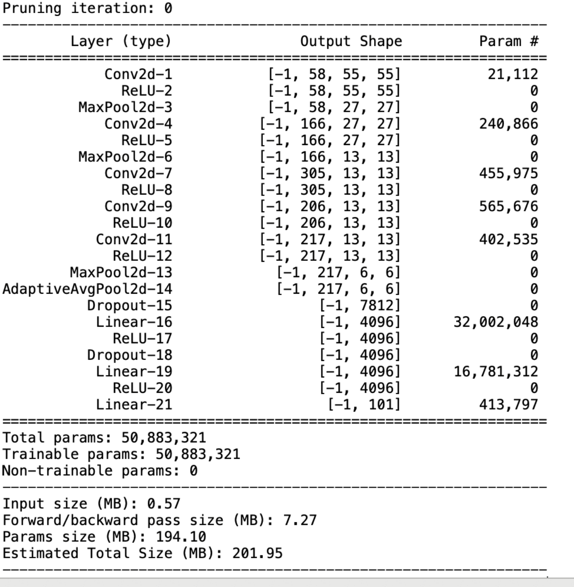

You also need to track model accuracy, and the following image shows how you can plot the model
pruning process to visualize changes in model accuracy based on the number of parameters in
SageMaker Studio.

SageMaker Debugger
4638

## Page 668

Amazon SageMaker AI
Developer Guide

In SageMaker Studio, choose the Experiments tab, select a list of tensors saved by Debugger from
the pruning process, and then compose a Trial Component List panel. Select all ten iterations and
then choose Add chart to create a Trial Component Chart. After you decide on a model to deploy,
choose the trial component and choose a menu to perform an action or choose Deploy model.

SageMaker Debugger
4639

## Page 669

Amazon SageMaker AI
Developer Guide

Note

To deploy a model through SageMaker Studio using the following notebook example, add a

line at the end of the train function in the train.py script.

# In the train.py script, look for the train function in line 58.
def train(epochs, batch_size, learning_rate):
...
print('acc:{:.4f}'.format(correct/total))
hook.save_scalar("accuracy", correct/total, sm_metric=True)

# Add the following code to line 128 of the train.py script to save the
pruned models
# under the current SageMaker Studio model directory
torch.save(model.state_dict(), os.environ['SM_MODEL_DIR'] + '/model.pt')

Using SageMaker Debugger to monitor a convolutional autoencoder model training

This notebook demonstrates how SageMaker Debugger visualizes tensors from an unsupervised (or
self-supervised) learning process on a MNIST image dataset of handwritten numbers.

The training model in this notebook is a convolutional autoencoder with the MXNet framework.
The convolutional autoencoder has a bottleneck-shaped convolutional neural network that consists
of an encoder part and a decoder part.

The encoder in this example has two convolution layers to produce compressed representation
(latent variables) of the input images. In this case, the encoder produces a latent variable of size
(1, 20) from an original input image of size (28, 28) and significantly reduces the size of data for
training by 40 times.

The decoder has two deconvolutional layers and ensures that the latent variables preserve key
information by reconstructing output images.

The convolutional encoder powers clustering algorithms with smaller input data size and the
performance of clustering algorithms such as k-means, k-NN, and t-Distributed Stochastic
Neighbor Embedding (t-SNE).

SageMaker Debugger
4640

## Page 670

Amazon SageMaker AI
Developer Guide

This notebook example demonstrates how to visualize the latent variables using Debugger, as
shown in the following animation. It also demonstrates how the t-SNE algorithm classifies the
latent variables into ten clusters and projects them into a two-dimensional space. The scatter plot
color scheme on the right side of the image reflects the true values to show how well the BERT
model and t-SNE algorithm organize the latent variables into the clusters.

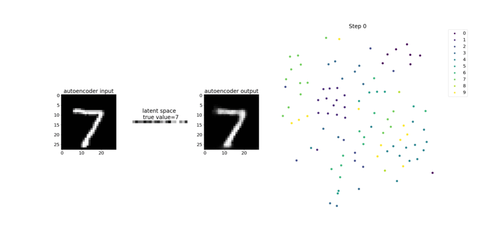

Using SageMaker Debugger to monitor attentions in BERT model training

Bidirectional Encode Representations from Transformers (BERT) is a language representation
model. As the name of model reflects, the BERT model builds on transfer learning and the
Transformer model for natural language processing (NLP).

The BERT model is pre-trained on unsupervised tasks such as predicting missing words in a
sentence or predicting the next sentence that naturally follows a previous sentence. The training
data contains 3.3 billion words (tokens) of English text, from sources such as Wikipedia and
electronic books. For a simple example, the BERT model can give a high attention to appropriate
verb tokens or pronoun tokens from a subject token.

The pre-trained BERT model can be fine-tuned with an additional output layer to achieve state-of-
the-art model training in NLP tasks, such as automated responses to questions, text classification,
and many others.

SageMaker Debugger
4641

## Page 671

Amazon SageMaker AI
Developer Guide

Debugger collects tensors from the fine-tuning process. In the context of NLP, the weight of
neurons is called attention.

This notebook demonstrates how to use the  pre-trained BERT model from the GluonNLP model
zoo on the Stanford Question and Answering dataset and how to set up SageMaker Debugger to
monitor the training job.

Plotting attention scores and individual neurons in the query and key vectors can help to identify
causes of incorrect model predictions. With SageMaker AI Debugger, you can retrieve the tensors
and plot the attention-head view in real time as training progresses and understand what the
model is learning.

The following animation shows the attention scores of the first 20 input tokens for ten iterations in
the training job provided in the notebook example.

SageMaker Debugger
4642

## Page 672

Amazon SageMaker AI
Developer Guide

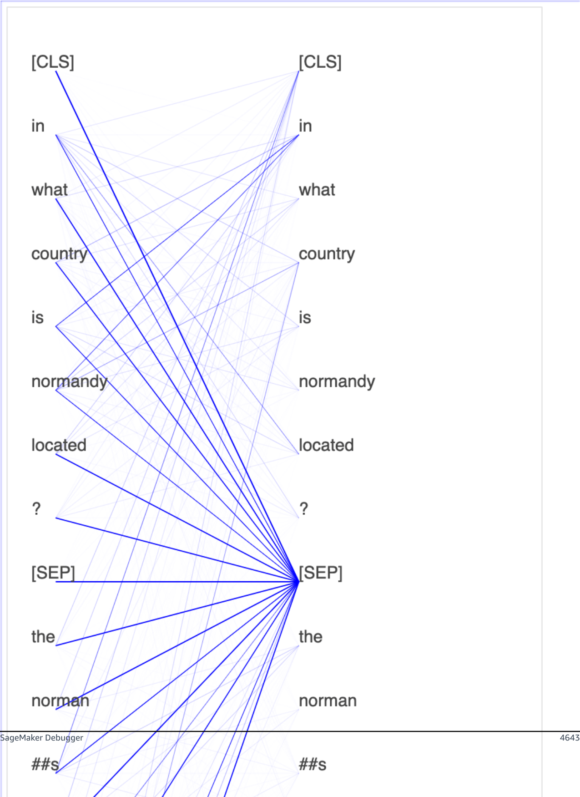

SageMaker Debugger
4643

## Page 673

Amazon SageMaker AI
Developer Guide

Using SageMaker Debugger to visualize class activation maps in convolutional neural networks
(CNNs)

This notebook demonstrates how to use SageMaker Debugger to plot class activation maps for
image detection and classification in convolutional neural networks (CNNs). In deep learning, a
convolutional neural network (CNN or ConvNet) is a class of deep neural networks, most commonly
applied to analyzing visual imagery. One of the applications that adopts the class activation maps
is self-driving cars, which require instantaneous detection and classification of images such as
traffic signs, roads, and obstacles.

In this notebook, the PyTorch ResNet model is trained on the German Traffic Sign Dataset, which
contains more than 40 classes of traffic-related objects and more than 50,000 images in total.

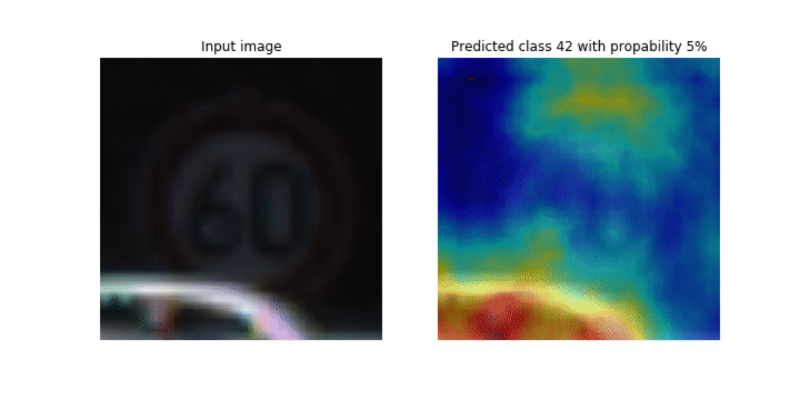

During the training process, SageMaker Debugger collects tensors to plot the class activation maps
in real time. As shown in the animated image, the class activation map (also called as a saliency
map) highlights regions with high activation in red color.

Using tensors captured by Debugger, you can visualize how the activation map evolves during the
model training. The model starts by detecting the edge on the lower-left corner at the beginning
of the training job. As the training progresses, the focus shifts to the center and detects the speed
limit sign, and the model successfully predicts the input image as Class 3, which is a class of speed
limit 60km/h signs, with a 97% confidence level.

SageMaker Debugger
4644

## Page 674

Amazon SageMaker AI
Developer Guide

Debugging training jobs using Amazon SageMaker Debugger

To prepare your training script and run training jobs with SageMaker Debugger to debug model
training progress, you follow the typical two-step process: modify your training script using the

sagemaker-debugger Python SDK, and construct a SageMaker AI estimator using the SageMaker
Python SDK. Go through the following topics to learn how to use SageMaker Debugger's
debugging functionality.

Topics

• Adapting your training script to register a hook

• Launch training jobs with Debugger using the SageMaker Python SDK

• SageMaker Debugger interactive report for XGBoost

• Action on Amazon SageMaker Debugger rules

• Visualize Amazon SageMaker Debugger output tensors in TensorBoard

Adapting your training script to register a hook

Amazon SageMaker Debugger comes with a client library called the sagemaker-debugger

Python SDK. The sagemaker-debugger Python SDK provides tools for adapting your training
script before training and analysis tools after training. In this page, you'll learn how to adapt your
training script using the client library.

The sagemaker-debugger Python SDK provides wrapper functions that help register a hook to
extract model tensors, without altering your training script. To get started with collecting model
output tensors and debug them to find training issues, make the following modifications in your
training script.

Tip

While you're following this page, use the sagemaker-debugger open source SDK
documentation for API references.

Topics

• Adapt your PyTorch training script

• Adapt your TensorFlow training script

SageMaker Debugger
4645

## Page 675

Amazon SageMaker AI
Developer Guide

Adapt your PyTorch training script

To start collecting model output tensors and debug training issues, make the following
modifications to your PyTorch training script.

Note

SageMaker Debugger cannot collect model output tensors from the

torch.nn.functional API operations. When you write a PyTorch training script, it is

recommended to use the torch.nn modules instead.

For PyTorch 1.12.0

If you bring a PyTorch training script, you can run the training job and extract model output
tensors with a few additional code lines in your training script. You need to use the hook APIs in the

sagemaker-debugger client library. Walk through the following instructions that break down the
steps with code examples.

1. Create a hook.

(Recommended) For training jobs within SageMaker AI

import smdebug.pytorch as smd
hook=smd.get_hook(create_if_not_exists=True)

When you launch a training job in the section called “Launch training jobs with Debugger using
the SageMaker Python SDK” with any of the DebuggerHookConfig, TensorBoardConfig, or Rules
in your estimator, SageMaker AI adds a JSON configuration file to your training instance that is

picked up by the get_hook function. Note that if you do not include any of the configuration
APIs in your estimator, there will be no configuration file for the hook to find, and the function

returns None.

(Optional) For training jobs outside SageMaker AI

If you run training jobs in local mode, directly on SageMaker Notebook instances, Amazon

EC2 instances, or your own local devices, use smd.Hook class to create a hook. However,
this approach can only store the tensor collections and usable for TensorBoard visualization.
SageMaker Debugger’s built-in Rules don’t work with the local mode because the Rules require

SageMaker Debugger
4646

## Page 676

Amazon SageMaker AI
Developer Guide

SageMaker AI ML training instances and S3 to store outputs from the remote instances in real

time. The smd.get_hook API returns None in this case.

If you want to create a manual hook to save tensors in local mode, use the following code

snippet with the logic to check if the smd.get_hook API returns None and create a manual

hook using the smd.Hook class. Note that you can specify any output directory in your local
machine.

import smdebug.pytorch as smd
hook=smd.get_hook(create_if_not_exists=True)

if hook is None:
hook=smd.Hook(
out_dir='/path/to/your/local/output/',
export_tensorboard=True
)

2. Wrap your model with the hook’s class methods.

The hook.register_module() method takes your model and iterates through each layer,
looking for any tensors that match with regular expressions that you’ll provide through the
configuration in the section called “Launch training jobs with Debugger using the SageMaker
Python SDK”. The collectable tensors through this hook method are weights, biases, activations,
gradients, inputs, and outputs.

hook.register_module(model)

Tip

If you collect the entire output tensors from a large deep learning model, the total size
of those collections can exponentially grow and might cause bottlenecks. If you want to

save specific tensors, you can also use the hook.save_tensor() method. This method
helps you pick the variable for the specific tensor and save to a custom collection named
as you want. For more information, see step 7 of this instruction.

3. Warp the loss function with the hook’s class methods.

SageMaker Debugger
4647

## Page 677

Amazon SageMaker AI
Developer Guide

The hook.register_loss method is to wrap the loss function. It extracts loss values every

save_interval that you’ll set during configuration in the section called “Launch training jobs

with Debugger using the SageMaker Python SDK”, and saves them to the "losses" collection.

hook.register_loss(loss_function)

4. Add hook.set_mode(ModeKeys.TRAIN) in the train block. This indicates the tensor collection

is extracted during the training phase.

def train():
...
hook.set_mode(ModeKeys.TRAIN)

5. Add hook.set_mode(ModeKeys.EVAL) in the validation block. This indicates the tensor

collection is extracted during the validation phase.

def validation():
...
hook.set_mode(ModeKeys.EVAL)

6. Use hook.save_scalar() to save custom scalars. You can save scalar values that aren’t in your

model. For example, if you want to record the accuracy values computed during evaluation, add
the following line of code below the line where you calculate accuracy.

hook.save_scalar("accuracy", accuracy)

Note that you need to provide a string as the first argument to name the custom scalar
collection. This is the name that'll be used for visualizing the scalar values in TensorBoard, and
can be any string you want.

7. Use hook.save_tensor() to save custom tensors. Similarly to hook.save_scalar(), you

can save additional tensors, defining your own tensor collection. For example, you can extract
input image data that are passed into the model and save as a custom tensor by adding the

following code line, where "images" is an example name of the custom tensor, image_inputs
is an example variable for the input image data.

hook.save_tensor("images", image_inputs)

SageMaker Debugger
4648

## Page 678

Amazon SageMaker AI
Developer Guide

Note that you must provide a string to the first argument to name the custom tensor.

hook.save_tensor() has the third argument collections_to_write to specify the tensor

collection to save the custom tensor. The default is collections_to_write="default". If

you don't explicitely specify the third argument, the custom tensor is saved to the "default"

tensor collection.

After you have completed adapting your training script, proceed to the section called “Launch
training jobs with Debugger using the SageMaker Python SDK”.

Adapt your TensorFlow training script

To start collecting model output tensors and debug training issues, make the following
modifications to your TensorFlow training script.

Create a hook for training jobs within SageMaker AI

import smdebug.tensorflow as smd

hook=smd.get_hook(hook_type="keras", create_if_not_exists=True)

This creates a hook when you start a SageMaker training job. When you launch a training job in
the section called “Launch training jobs with Debugger using the SageMaker Python SDK” with any

of the DebuggerHookConfig, TensorBoardConfig, or Rules in your estimator, SageMaker AI

adds a JSON configuration file to your training instance that is picked up by the smd.get_hook
method. Note that if you do not include any of the configuration APIs in your estimator, there will

be no configuration file for the hook to find, and the function returns None.

(Optional) Create a hook for training jobs outside SageMaker AI

If you run training jobs in local mode, directly on SageMaker Notebook instances, Amazon

EC2 instances, or your own local devices, use smd.Hook class to create a hook. However, this
approach can only store the tensor collections and usable for TensorBoard visualization. SageMaker

Debugger’s built-in Rules don’t work with the local mode. The smd.get_hook method also returns

None in this case.

If you want to create a manual hook, use the following code snippet with the logic to check if the

hook returns None and create a manual hook using the smd.Hook class.

import smdebug.tensorflow as smd

SageMaker Debugger
4649

## Page 679

Amazon SageMaker AI
Developer Guide

hook=smd.get_hook(hook_type="keras", create_if_not_exists=True)

if hook is None:
hook=smd.KerasHook(
out_dir='/path/to/your/local/output/',
export_tensorboard=True
)

After adding the hook creation code, proceed to the following topic for TensorFlow Keras.

Note

SageMaker Debugger currently supports TensorFlow Keras only.

Register the hook in your TensorFlow Keras training script

The following precedure walks you through how to use the hook and its methods to collect output
scalars and tensors from your model and optimizer.

1. Wrap your Keras model and optimizer with the hook’s class methods.

The hook.register_model() method takes your model and iterates through each layer,
looking for any tensors that match with regular expressions that you’ll provide through the
configuration in the section called “Launch training jobs with Debugger using the SageMaker
Python SDK”. The collectable tensors through this hook method are weights, biases, and
activations.

model=tf.keras.Model(...)
hook.register_model(model)

2. Wrap the optimizer by the hook.wrap_optimizer() method.

optimizer=tf.keras.optimizers.Adam(...)
optimizer=hook.wrap_optimizer(optimizer)

3. Compile the model in eager mode in TensorFlow.

To collect tensors from the model, such as the input and output tensors of each layer, you
must run the training in eager mode. Otherwise, SageMaker AI Debugger will not be able to

SageMaker Debugger
4650

## Page 680

Amazon SageMaker AI
Developer Guide

collect the tensors. However, other tensors, such as model weights, biases, and the loss, can be
collected without explicitly running in eager mode.

model.compile(
loss="categorical_crossentropy",
optimizer=optimizer,
metrics=["accuracy"],
# Required for collecting tensors of each layer
run_eagerly=True
)

4. Register the hook to the tf.keras.Model.fit() method.

To collect the tensors from the hooks that you registered, add callbacks=[hook] to the Keras

model.fit() class method. This will pass the sagemaker-debugger hook as a Keras callback.

model.fit(
X_train, Y_train,
batch_size=batch_size,
epochs=epoch,
validation_data=(X_valid, Y_valid),
shuffle=True,
callbacks=[hook]
)

5. TensorFlow 2.x provides only symbolic gradient variables that do not provide access to their

values. To collect gradients, wrap tf.GradientTape by the hook.wrap_tape() method,
which requires you to write your own training step as follows.

def training_step(model, dataset):
with hook.wrap_tape(tf.GradientTape()) as tape:
pred=model(data)
loss_value=loss_fn(labels, pred)
grads=tape.gradient(loss_value, model.trainable_variables)
optimizer.apply_gradients(zip(grads, model.trainable_variables))

By wrapping the tape, the sagemaker-debugger hook can identify output tensors such as

gradients, parameters, and losses. Wrapping the tape ensures that the hook.wrap_tape()

method around functions of the tape object, such as push_tape(), pop_tape(),

gradient(), will set up the writers of SageMaker Debugger and save tensors that are provided

as input to gradient() (trainable variables and loss) and output of gradient() (gradients).

SageMaker Debugger
4651

## Page 681

Amazon SageMaker AI
Developer Guide

Note

To collect with a custom training loop, make sure that you use eager mode. Otherwise,
SageMaker Debugger is not able to collect any tensors.

For a full list of actions that the sagemaker-debugger hook APIs offer to construct hooks and

save tensors, see Hook Methods in the sagemaker-debugger Python SDK documentation.

After you have completed adapting your training script, proceed to the section called “Launch
training jobs with Debugger using the SageMaker Python SDK”.

Launch training jobs with Debugger using the SageMaker Python SDK

To configure a SageMaker AI estimator with SageMaker Debugger, use Amazon SageMaker

Python SDK and specify Debugger-specific parameters. To fully utilize the debugging

functionality, there are three parameters you need to configure: debugger_hook_config,

tensorboard_output_config, and rules.

Important

Before constructing and running the estimator fit method to launch a training job, make
sure that you adapt your training script following the instructions at the section called
“Adapting your training script to register a hook”.

Constructing a SageMaker AI Estimator with Debugger-specific parameters

The code examples in this section show how to construct a SageMaker AI estimator with the
Debugger-specific parameters.

Note

The following code examples are templates for constructing the SageMaker AI framework
estimators and not directly executable. You need to proceed to the next sections and
configure the Debugger-specific parameters.

SageMaker Debugger
4652

## Page 682

Amazon SageMaker AI
Developer Guide

PyTorch

# An example of constructing a SageMaker AI PyTorch estimator
import boto3
import sagemaker

from sagemaker.pytorch import PyTorch
from sagemaker.debugger import CollectionConfig, DebuggerHookConfig, Rule,
rule_configs

session=boto3.session.Session()
region=session.region_name

debugger_hook_config=DebuggerHookConfig(...)
rules=[
Rule.sagemaker(rule_configs.built_in_rule())
]

estimator=PyTorch(
entry_point="directory/to/your_training_script.py",
role=sagemaker.get_execution_role(),
base_job_name="debugger-demo",
instance_count=1,
instance_type="ml.p3.2xlarge",
framework_version="1.12.0",
py_version="py37",
# Debugger-specific parameters
debugger_hook_config=debugger_hook_config,
rules=rules
)

estimator.fit(wait=False)

TensorFlow

# An example of constructing a SageMaker AI TensorFlow estimator
import boto3
import sagemaker
from sagemaker.tensorflow import TensorFlow
from sagemaker.debugger import CollectionConfig, DebuggerHookConfig, Rule,
rule_configs

session=boto3.session.Session()

SageMaker Debugger
4653

## Page 683

Amazon SageMaker AI
Developer Guide

region=session.region_name

debugger_hook_config=DebuggerHookConfig(...)
rules=[
Rule.sagemaker(rule_configs.built_in_rule()),
ProfilerRule.sagemaker(rule_configs.BuiltInRule())
]

estimator=TensorFlow(
entry_point="directory/to/your_training_script.py",
role=sagemaker.get_execution_role(),
base_job_name="debugger-demo",
instance_count=1,
instance_type="ml.p3.2xlarge",
framework_version="2.9.0",
py_version="py39",

# Debugger-specific parameters
debugger_hook_config=debugger_hook_config,
rules=rules
)

estimator.fit(wait=False)

MXNet

# An example of constructing a SageMaker AI MXNet estimator
import sagemaker
from sagemaker.mxnet import MXNet
from sagemaker.debugger import CollectionConfig, DebuggerHookConfig, Rule,
rule_configs

debugger_hook_config=DebuggerHookConfig(...)
rules=[
Rule.sagemaker(rule_configs.built_in_rule())
]

estimator=MXNet(
entry_point="directory/to/your_training_script.py",
role=sagemaker.get_execution_role(),
base_job_name="debugger-demo",
instance_count=1,
instance_type="ml.p3.2xlarge",

SageMaker Debugger
4654

## Page 684

Amazon SageMaker AI
Developer Guide

framework_version="1.7.0",
py_version="py37",
# Debugger-specific parameters
debugger_hook_config=debugger_hook_config,
rules=rules
)

estimator.fit(wait=False)

XGBoost

# An example of constructing a SageMaker AI XGBoost estimator
import sagemaker
from sagemaker.xgboost.estimator import XGBoost
from sagemaker.debugger import CollectionConfig, DebuggerHookConfig, Rule,
rule_configs

debugger_hook_config=DebuggerHookConfig(...)
rules=[
Rule.sagemaker(rule_configs.built_in_rule())
]

estimator=XGBoost(
entry_point="directory/to/your_training_script.py",
role=sagemaker.get_execution_role(),
base_job_name="debugger-demo",
instance_count=1,
instance_type="ml.p3.2xlarge",
framework_version="1.5-1",

# Debugger-specific parameters
debugger_hook_config=debugger_hook_config,
rules=rules
)

estimator.fit(wait=False)

Generic estimator

# An example of constructing a SageMaker AI generic estimator using the XGBoost
algorithm base image
import boto3

SageMaker Debugger
4655

## Page 685

Amazon SageMaker AI
Developer Guide

import sagemaker
from sagemaker.estimator import Estimator
from sagemaker import image_uris
from sagemaker.debugger import CollectionConfig, DebuggerHookConfig, Rule,
rule_configs

debugger_hook_config=DebuggerHookConfig(...)
rules=[
Rule.sagemaker(rule_configs.built_in_rule())
]

region=boto3.Session().region_name
xgboost_container=sagemaker.image_uris.retrieve("xgboost", region, "1.5-1")

estimator=Estimator(
role=sagemaker.get_execution_role()
image_uri=xgboost_container,

base_job_name="debugger-demo",
instance_count=1,
instance_type="ml.m5.2xlarge",
# Debugger-specific parameters
debugger_hook_config=debugger_hook_config,
rules=rules
)

estimator.fit(wait=False)

Configure the following parameters to activate SageMaker Debugger:

• debugger_hook_config (an object of DebuggerHookConfig) – Required to activate the hook
in the adapted training script during the section called “Adapting your training script to register a
hook”, configure the SageMaker training launcher (estimator) to collect output tensors from your
training job, and save the tensors into your secured S3 bucket or local machine. To learn how to

configure the debugger_hook_config parameter, see Configuring SageMaker Debugger to
save tensors.

• rules (a list of Rule objects) – Configure this parameter to activate SageMaker Debugger built-
in rules that you want to run in real time. The built-in rules are logics that automatically debug
the training progress of your model and find training issues by analyzing the output tensors

saved in your secured S3 bucket. To learn how to configure the rules parameter, see How to

SageMaker Debugger
4656

## Page 686

Amazon SageMaker AI
Developer Guide

configure Debugger built-in rules. To find a complete list of built-in rules for debugging output
tensors, see the section called “Debugger rule”. If you want to create your own logic to detect
any training issues, see the section called “Creating custom rules”.

Note

The built-in rules are available only through SageMaker training instances. You cannot
use them in local mode.

• tensorboard_output_config (an object of TensorBoardOutputConfig) – Configure
SageMaker Debugger to collect output tensors in the TensorBoard-compatible format and save

to your S3 output path specified in the TensorBoardOutputConfig object. To learn more, see
the section called “Visualize Debugger Output Tensors in TensorBoard”.

Note

The tensorboard_output_config must be configured with the

debugger_hook_config parameter, which also requires you to adapt your training

script by adding the sagemaker-debugger hook.

Note

SageMaker Debugger securely saves output tensors in subfolders of your S3 bucket. For

example, the format of the default S3 bucket URI in your account is s3://amzn-s3-

demo-bucket-sagemaker-<region>-<12digit_account_id>/<base-job-name>/

<debugger-subfolders>/. There are two subfolders created by SageMaker Debugger:

debug-output, and rule-output. If you add the tensorboard_output_config

parameter, you'll also find tensorboard-output folder.

See the following topics to find more examples of how to configure the Debugger-specific
parameters in detail.

Topics

• Configuring SageMaker Debugger to save tensors

• How to configure Debugger built-in rules

SageMaker Debugger
4657

## Page 687

Amazon SageMaker AI
Developer Guide

• Turn off Debugger

• Useful SageMaker AI estimator class methods for Debugger

Configuring SageMaker Debugger to save tensors

Tensors are data collections of updated parameters from the backward and forward pass of
each training iteration. SageMaker Debugger collects the output tensors to analyze the state

of a training job. SageMaker Debugger's CollectionConfig and DebuggerHookConfig
API operations provide methods for grouping tensors into collections and saving them to

a target S3 bucket. The following topics show how to use the CollectionConfig and

DebuggerHookConfig API operations, followed by examples of how to use Debugger hook to
save, access, and visualize output tensors.

While constructing a SageMaker AI estimator, activate SageMaker Debugger by specifying the

debugger_hook_config parameter. The following topics include examples of how to set up

the debugger_hook_config using the CollectionConfig and DebuggerHookConfig API
operations to pull tensors out of your training jobs and save them.

Note

After properly configured and activated, SageMaker Debugger saves the output tensors in
a default S3 bucket, unless otherwise specified. The format of the default S3 bucket URI

is s3://amzn-s3-demo-bucket-sagemaker-<region>-<12digit_account_id>/

<training-job-name>/debug-output/.

Topics

• Configure tensor collections using the CollectionConfig API

• Configure the DebuggerHookConfig API to save tensors

• Example notebooks and code samples to configure Debugger hook

Configure tensor collections using the CollectionConfig API

Use the CollectionConfig API operation to configure tensor collections. Debugger provides pre-
built tensor collections that cover a variety of regular expressions (regex) of parameters if using
Debugger-supported deep learning frameworks and machine learning algorithms. As shown in the
following example code, add the built-in tensor collections you want to debug.

SageMaker Debugger
4658

## Page 688

Amazon SageMaker AI
Developer Guide

from sagemaker.debugger import CollectionConfig

collection_configs=[
CollectionConfig(name="weights"),
CollectionConfig(name="gradients")
]

The preceding collections set up the Debugger hook to save the tensors every 500 steps based on

the default "save_interval" value.

For a full list of available Debugger built-in collections, see Debugger Built-in Collections.

If you want to customize the built-in collections, such as changing the save intervals and tensor

regex, use the following CollectionConfig template to adjust parameters.

from sagemaker.debugger import CollectionConfig

collection_configs=[
CollectionConfig(
name="tensor_collection",
parameters={
"key_1": "value_1",
"key_2": "value_2",
...
"key_n": "value_n"
}
)
]

For more information about available parameter keys, see CollectionConfig in the Amazon
SageMaker Python SDK. For example, the following code example shows how you can adjust the
save intervals of the "losses" tensor collection at different phases of training: save loss every 100
steps in training phase and validation loss every 10 steps in validation phase.

from sagemaker.debugger import CollectionConfig

collection_configs=[
CollectionConfig(
name="losses",
parameters={
"train.save_interval": "100",

SageMaker Debugger
4659

## Page 689

Amazon SageMaker AI
Developer Guide

"eval.save_interval": "10"
}
)
]

Tip

This tensor collection configuration object can be used for both DebuggerHookConfig and
Rule API operations.

Configure the DebuggerHookConfig API to save tensors

Use the DebuggerHookConfig API to create a debugger_hook_config object using the

collection_configs object you created in the previous step.

from sagemaker.debugger import DebuggerHookConfig

debugger_hook_config=DebuggerHookConfig(
collection_configs=collection_configs
)

Debugger saves the model training output tensors into the default S3 bucket. The format

of the default S3 bucket URI is s3://amzn-s3-demo-bucket-sagemaker-<region>-

<12digit_account_id>/<training-job-name>/debug-output/.

If you want to specify an exact S3 bucket URI, use the following code example:

from sagemaker.debugger import DebuggerHookConfig

debugger_hook_config=DebuggerHookConfig(
s3_output_path="specify-uri"
collection_configs=collection_configs
)

For more information, see DebuggerHookConfig in the Amazon SageMaker Python SDK.

Example notebooks and code samples to configure Debugger hook

The following sections provide notebooks and code examples of how to use Debugger hook to
save, access, and visualize output tensors.

SageMaker Debugger
4660

## Page 690

Amazon SageMaker AI
Developer Guide

Topics

• Tensor visualization example notebooks

• Save tensors using Debugger built-in collections

• Save tensors by modifying Debugger built-in collections

• Save tensors using Debugger custom collections

Tensor visualization example notebooks

The following two notebook examples show advanced use of Amazon SageMaker Debugger for
visualizing tensors. Debugger provides a transparent view into training deep learning models.

• Interactive Tensor Analysis in SageMaker Studio Notebook with MXNet

This notebook example shows how to visualize saved tensors using Amazon SageMaker
Debugger. By visualizing the tensors, you can see how the tensor values change while training
deep learning algorithms. This notebook includes a training job with a poorly configured
neural network and uses Amazon SageMaker Debugger to aggregate and analyze tensors,
including gradients, activation outputs, and weights. For example, the following plot shows
the distribution of gradients of a convolutional layer that is suffering from a vanishing gradient
problem.

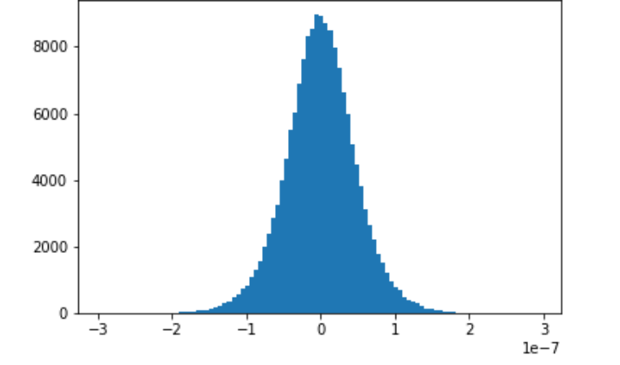

This notebook also illustrates how a good initial hyperparameter setting improves the training
process by generating the same tensor distribution plots.

• Visualizing and Debugging Tensors from MXNet Model Training

SageMaker Debugger
4661

## Page 691

Amazon SageMaker AI
Developer Guide

This notebook example shows how to save and visualize tensors from an MXNet Gluon model
training job using Amazon SageMaker Debugger. It illustrates that Debugger is set to save all
tensors to an Amazon S3 bucket and retrieves ReLu activation outputs for the visualization. The
following figure shows a three-dimensional visualization of the ReLu activation outputs. The
color scheme is set to blue to indicate values close to 0 and yellow to indicate values close to 1.

In this notebook, the TensorPlot class imported from tensor_plot.py is designed to
plot convolutional neural networks (CNNs) that take two-dimensional images for inputs. The

tensor_plot.py script provided with the notebook retrieves tensors using Debugger and
visualizes the CNN. You can run this notebook on SageMaker Studio to reproduce the tensor
visualization and implement your own convolutional neural network model.

• Real-time Tensor Analysis in a SageMaker Notebook with MXNet

This example guides you through installing required components for emitting tensors in an
Amazon SageMaker training job and using the Debugger API operations to access those tensors
while training is running. A gluon CNN model is trained on the Fashion MNIST dataset. While the
job is running, you will see how Debugger retrieves activation outputs of the first convolutional

SageMaker Debugger
4662

## Page 692

Amazon SageMaker AI
Developer Guide

layer from each of 100 batches and visualizes them. Also, this will show you how to visualize
weights after the job is done.

Save tensors using Debugger built-in collections

You can use built-in collections of tensors using the CollectionConfig API and save them using

the DebuggerHookConfig API. The following example shows how to use the default settings of
Debugger hook configurations to construct a SageMaker AI TensorFlow estimator. You can also
utilize this for MXNet, PyTorch, and XGBoost estimators.

Note

In the following example code, the s3_output_path parameter for

DebuggerHookConfig is optional. If you do not specify it, Debugger saves the tensors

at s3://<output_path>/debug-output/, where the <output_path> is the default
output path of SageMaker training jobs. For example:

"s3://sagemaker-us-east-1-111122223333/sagemaker-debugger-training-YYYY-MM-DD-
HH-MM-SS-123/debug-output"

import sagemaker
from sagemaker.tensorflow import TensorFlow
from sagemaker.debugger import DebuggerHookConfig, CollectionConfig

# use Debugger CollectionConfig to call built-in collections
collection_configs=[
CollectionConfig(name="weights"),
CollectionConfig(name="gradients"),
CollectionConfig(name="losses"),
CollectionConfig(name="biases")
]

# configure Debugger hook
# set a target S3 bucket as you want
sagemaker_session=sagemaker.Session()
BUCKET_NAME=sagemaker_session.default_bucket()
LOCATION_IN_BUCKET='debugger-built-in-collections-hook'

hook_config=DebuggerHookConfig(

SageMaker Debugger
4663

## Page 693

Amazon SageMaker AI
Developer Guide

s3_output_path='s3://{BUCKET_NAME}/{LOCATION_IN_BUCKET}'.
format(BUCKET_NAME=BUCKET_NAME,
LOCATION_IN_BUCKET=LOCATION_IN_BUCKET),
collection_configs=collection_configs
)

# construct a SageMaker TensorFlow estimator
sagemaker_estimator=TensorFlow(
entry_point='directory/to/your_training_script.py',
role=sm.get_execution_role(),
base_job_name='debugger-demo-job',
instance_count=1,
instance_type="ml.p3.2xlarge",
framework_version="2.9.0",
py_version="py39",
# debugger-specific hook argument below

debugger_hook_config=hook_config
)

sagemaker_estimator.fit()

To see a list of Debugger built-in collections, see Debugger Built-in Collections.

Save tensors by modifying Debugger built-in collections

You can modify the Debugger built-in collections using the CollectionConfig API operation.

The following example shows how to tweak the built-in losses collection and construct a
SageMaker AI TensorFlow estimator. You can also use this for MXNet, PyTorch, and XGBoost
estimators.

import sagemaker
from sagemaker.tensorflow import TensorFlow
from sagemaker.debugger import DebuggerHookConfig, CollectionConfig

# use Debugger CollectionConfig to call and modify built-in collections
collection_configs=[
CollectionConfig(
name="losses",
parameters={"save_interval": "50"})]

# configure Debugger hook
# set a target S3 bucket as you want

SageMaker Debugger
4664

## Page 694

Amazon SageMaker AI
Developer Guide

sagemaker_session=sagemaker.Session()
BUCKET_NAME=sagemaker_session.default_bucket()
LOCATION_IN_BUCKET='debugger-modified-collections-hook'

hook_config=DebuggerHookConfig(
s3_output_path='s3://{BUCKET_NAME}/{LOCATION_IN_BUCKET}'.
format(BUCKET_NAME=BUCKET_NAME,
LOCATION_IN_BUCKET=LOCATION_IN_BUCKET),
collection_configs=collection_configs
)

# construct a SageMaker TensorFlow estimator
sagemaker_estimator=TensorFlow(
entry_point='directory/to/your_training_script.py',
role=sm.get_execution_role(),
base_job_name='debugger-demo-job',
instance_count=1,

instance_type="ml.p3.2xlarge",
framework_version="2.9.0",
py_version="py39",
# debugger-specific hook argument below
debugger_hook_config=hook_config
)

sagemaker_estimator.fit()

For a full list of CollectionConfig parameters, see  Debugger CollectionConfig API.

Save tensors using Debugger custom collections

You can also save a reduced number of tensors instead of the full set of tensors (for example, if you
want to reduce the amount of data saved in your Amazon S3 bucket). The following example shows
how to customize the Debugger hook configuration to specify target tensors that you want to save.
You can use this for TensorFlow, MXNet, PyTorch, and XGBoost estimators.

import sagemaker
from sagemaker.tensorflow import TensorFlow
from sagemaker.debugger import DebuggerHookConfig, CollectionConfig

# use Debugger CollectionConfig to create a custom collection
collection_configs=[
CollectionConfig(

SageMaker Debugger
4665

## Page 695

Amazon SageMaker AI
Developer Guide

name="custom_activations_collection",
parameters={
"include_regex": "relu|tanh", # Required
"reductions": "mean,variance,max,abs_mean,abs_variance,abs_max"
})
]
# configure Debugger hook
# set a target S3 bucket as you want
sagemaker_session=sagemaker.Session()
BUCKET_NAME=sagemaker_session.default_bucket()
LOCATION_IN_BUCKET='debugger-custom-collections-hook'

hook_config=DebuggerHookConfig(
s3_output_path='s3://{BUCKET_NAME}/{LOCATION_IN_BUCKET}'.
format(BUCKET_NAME=BUCKET_NAME,
LOCATION_IN_BUCKET=LOCATION_IN_BUCKET),

collection_configs=collection_configs
)

# construct a SageMaker TensorFlow estimator
sagemaker_estimator=TensorFlow(
entry_point='directory/to/your_training_script.py',
role=sm.get_execution_role(),
base_job_name='debugger-demo-job',
instance_count=1,
instance_type="ml.p3.2xlarge",
framework_version="2.9.0",
py_version="py39",
# debugger-specific hook argument below
debugger_hook_config=hook_config
)

sagemaker_estimator.fit()

For a full list of CollectionConfig parameters, see  Debugger CollectionConfig.

How to configure Debugger built-in rules

In the following topics, you'll learn how to use the SageMaker Debugger built-in rules. Amazon
SageMaker Debugger's built-in rules analyze tensors emitted during the training of a model.

SageMaker AI Debugger offers the Rule API operation that monitors training job progress and

SageMaker Debugger
4666

## Page 696

Amazon SageMaker AI
Developer Guide

errors for the success of training your model. For example, the rules can detect whether gradients
are getting too large or too small, whether a model is overfitting or overtraining, and whether a
training job does not decrease loss function and improve. To see a full list of available built-in rules,
see List of Debugger built-in rules.

Topics

• Use Debugger built-in rules with the default parameter settings

• Use Debugger built-in rules with custom parameter values

• Example notebooks and code samples to configure Debugger rules

Use Debugger built-in rules with the default parameter settings

To specify Debugger built-in rules in an estimator, you need to configure a list object. The following
example code shows the basic structure of listing the Debugger built-in rules:

from sagemaker.debugger import Rule, rule_configs

rules=[
Rule.sagemaker(rule_configs.built_in_rule_name_1()),
Rule.sagemaker(rule_configs.built_in_rule_name_2()),
...
Rule.sagemaker(rule_configs.built_in_rule_name_n()),
... # You can also append more profiler rules in the
ProfilerRule.sagemaker(rule_configs.*()) format.
]

For more information about default parameter values and descriptions of the built-in rule, see List
of Debugger built-in rules.

To find the SageMaker Debugger API reference, see sagemaker.debugger.rule_configs and

sagemaker.debugger.Rule.

For example, to inspect the overall training performance and progress of your model, construct a
SageMaker AI estimator with the following built-in rule configuration.

from sagemaker.debugger import Rule, rule_configs

rules=[
Rule.sagemaker(rule_configs.loss_not_decreasing()),

SageMaker Debugger
4667

## Page 697

Amazon SageMaker AI
Developer Guide

Rule.sagemaker(rule_configs.overfit()),
Rule.sagemaker(rule_configs.overtraining()),
Rule.sagemaker(rule_configs.stalled_training_rule())
]

When you start the training job, Debugger collects system resource utilization data every
500 milliseconds and the loss and accuracy values every 500 steps by default. Debugger
analyzes the resource utilization to identify if your model is having bottleneck problems. The

loss_not_decreasing, overfit, overtraining, and stalled_training_rule monitors if
your model is optimizing the loss function without those training issues. If the rules detect training

anomalies, the rule evaluation status changes to IssueFound. You can set up automated actions,
such as notifying training issues and stopping training jobs using Amazon CloudWatch Events and
AWS Lambda. For more information, see Action on Amazon SageMaker Debugger rules.

Use Debugger built-in rules with custom parameter values

If you want to adjust the built-in rule parameter values and customize tensor collection

regex, configure the base_config and rule_parameters parameters for the

ProfilerRule.sagemaker and Rule.sagemaker classmethods. In case of the

Rule.sagemaker class methods, you can also customize tensor collections through the

collections_to_save parameter. The instruction of how to use the CollectionConfig class

is provided at Configure tensor collections using the CollectionConfig API.

Use the following configuration template for built-in rules to customize parameter values.
By changing the rule parameters as you want, you can adjust the sensitivity of the rules to be
triggered.

• The base_config argument is where you call the built-in rule methods.

• The rule_parameters argument is to adjust the default key values of the built-in rules listed in
List of Debugger built-in rules.

• The collections_to_save argument takes in a tensor configuration through the

CollectionConfig API, which requires name and parameters arguments.

• To find available tensor collections for name, see  Debugger Built-in Tensor Collections .

• For a full list of adjustable parameters, see  Debugger CollectionConfig API.

For more information about the Debugger rule class, methods, and parameters, see SageMaker AI
Debugger Rule class in the Amazon SageMaker Python SDK.

SageMaker Debugger
4668

## Page 698

Amazon SageMaker AI
Developer Guide

from sagemaker.debugger import Rule, ProfilerRule, rule_configs, CollectionConfig

rules=[
Rule.sagemaker(
base_config=rule_configs.built_in_rule_name(),
rule_parameters={
"key": "value"
},
collections_to_save=[
CollectionConfig(
name="tensor_collection_name",
parameters={
"key": "value"
}
)
]

)
]

The parameter descriptions and value customization examples are provided for each rule at List of
Debugger built-in rules.

Example notebooks and code samples to configure Debugger rules

In the following sections, notebooks and code samples of how to use Debugger rules to monitor
SageMaker training jobs are provided.

Topics

• Debugger built-in rules example notebooks

• Debugger built-in rules example code

• Use Debugger built-in rules with parameter modifications

Debugger built-in rules example notebooks

The following example notebooks show how to use Debugger built-in rules when running training
jobs with Amazon SageMaker AI:

• Using a SageMaker Debugger built-in rule with TensorFlow

• Using a SageMaker Debugger built-in rule with Managed Spot Training and MXNet

SageMaker Debugger
4669

## Page 699

Amazon SageMaker AI
Developer Guide

• Using a SageMaker Debugger built-in rule with parameter modifications for a real-time training
job analysis with XGBoost

While running the example notebooks in SageMaker Studio, you can find the training job trial
created on the Studio Experiment List tab. For example, as shown in the following screenshot,
you can find and open a Describe Trial Component window of your current training job.

On the Debugger tab, you can check if the Debugger rules, vanishing_gradient() and

loss_not_decreasing(), are monitoring the training session in parallel. For a full instruction
of how to find your training job trial components in the Studio UI, see SageMaker Studio - View
Experiments, Trials, and Trial Components.

SageMaker Debugger
4670

## Page 700

Amazon SageMaker AI
Developer Guide

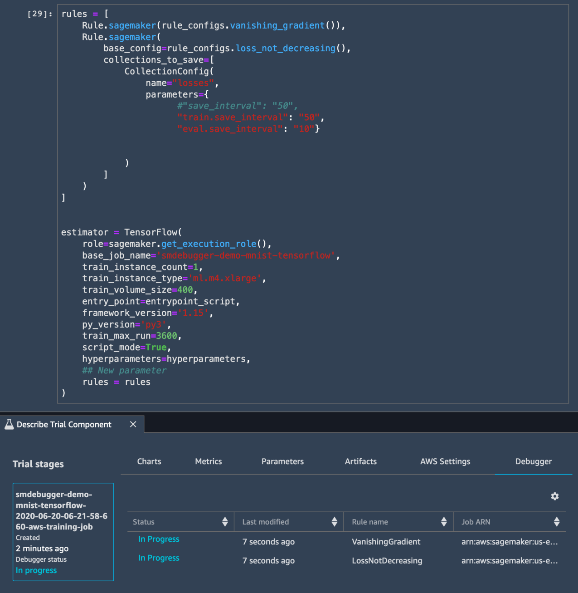

There are two ways of using the Debugger built-in rules in the SageMaker AI environment: deploy
the built-in rules as it is prepared or adjust their parameters as you want. The following topics show
you how to use the built-in rules with example codes.

SageMaker Debugger
4671

## Page 701

Amazon SageMaker AI
Developer Guide

Debugger built-in rules example code

The following code sample shows how to set the Debugger built-in rules using the

Rule.sagemaker method. To specify built-in rules that you want to run, use the rules_configs

API operation to call the built-in rules. To find a full list of Debugger built-in rules and default
parameter values, see List of Debugger built-in rules.

import sagemaker
from sagemaker.tensorflow import TensorFlow
from sagemaker.debugger import Rule, CollectionConfig, rule_configs

# call built-in rules that you want to use.
built_in_rules=[
Rule.sagemaker(rule_configs.vanishing_gradient())
Rule.sagemaker(rule_configs.loss_not_decreasing())
]

# construct a SageMaker AI estimator with the Debugger built-in rules
sagemaker_estimator=TensorFlow(
entry_point='directory/to/your_training_script.py',
role=sm.get_execution_role(),
base_job_name='debugger-built-in-rules-demo',
instance_count=1,
instance_type="ml.p3.2xlarge",
framework_version="2.9.0",
py_version="py39",

# debugger-specific arguments below
rules=built_in_rules
)
sagemaker_estimator.fit()

Note

The Debugger built-in rules run in parallel with your training job. The maximum number of
built-in rule containers for a training job is 20.

For more information about the Debugger rule class, methods, and parameters, see the SageMaker
Debugger Rule class in the Amazon SageMaker Python SDK.

SageMaker Debugger
4672

## Page 702

Amazon SageMaker AI
Developer Guide

To find an example of how to adjust the Debugger rule parameters, see the following Use
Debugger built-in rules with parameter modifications section.

Use Debugger built-in rules with parameter modifications

The following code example shows the structure of built-in rules to adjust parameters. In this

example, the stalled_training_rule collects the losses tensor collection from a training job
at every 50 steps and an evaluation stage at every 10 steps. If the training process starts stalling

and not collecting tensor outputs for 120 seconds, the stalled_training_rule stops the
training job.

import sagemaker
from sagemaker.tensorflow import TensorFlow
from sagemaker.debugger import Rule, CollectionConfig, rule_configs

# call the built-in rules and modify the CollectionConfig parameters

base_job_name_prefix= 'smdebug-stalled-demo-' + str(int(time.time()))

built_in_rules_modified=[
Rule.sagemaker(
base_config=rule_configs.stalled_training_rule(),
rule_parameters={
'threshold': '120',
'training_job_name_prefix': base_job_name_prefix,
'stop_training_on_fire' : 'True'
}
collections_to_save=[
CollectionConfig(
name="losses",
parameters={
"train.save_interval": "50"
"eval.save_interval": "10"
}
)
]
)
]

# construct a SageMaker AI estimator with the modified Debugger built-in rule
sagemaker_estimator=TensorFlow(
entry_point='directory/to/your_training_script.py',
role=sm.get_execution_role(),

SageMaker Debugger
4673

## Page 703

Amazon SageMaker AI
Developer Guide

base_job_name=base_job_name_prefix,
instance_count=1,
instance_type="ml.p3.2xlarge",
framework_version="2.9.0",
py_version="py39",

# debugger-specific arguments below
rules=built_in_rules_modified
)
sagemaker_estimator.fit()

For an advanced configuration of the Debugger built-in rules using the CreateTrainingJob API,
see Configure Debugger using SageMaker API.

Turn off Debugger

If you want to completely turn off Debugger, do one of the following:

• Before starting a training job, do the following:

To stop both monitoring and profiling, include the disable_profiler parameter to your

estimator and set it to True.

Warning

If you disable it, you won't be able to view the comprehensive Studio Debugger insights
dashboard and the autogenerated profiling report.

To stop debugging, set the debugger_hook_config parameter to False.

Warning

If you disable it, you won't be able to collect output tensors and cannot debug your
model parameters.

estimator=Estimator(
...
disable_profiler=True
debugger_hook_config=False

SageMaker Debugger
4674

## Page 704

Amazon SageMaker AI
Developer Guide

)

For more information about the Debugger-specific parameters, see SageMaker AI Estimator in
the Amazon SageMaker Python SDK.

• While a training job is running, do the following:

To disable both monitoring and profiling while your training job is running, use the following

estimator classmethod:

estimator.disable_profiling()

To disable framework profiling only and keep system monitoring, use the update_profiler
method:

estimator.update_profiler(disable_framework_metrics=true)

For more information about the estimator extension methods, see the
estimator.disable_profiling and estimator.update_profiler classmethods in the Amazon
SageMaker Python SDK documentation.

Useful SageMaker AI estimator class methods for Debugger

The following estimator class methods are useful for accessing your SageMaker training job
information and retrieving output paths of training data collected by Debugger. The following

methods are executable after you initiate a training job with the estimator.fit() method.

• To check the base S3 bucket URI of a SageMaker training job:

estimator.output_path

• To check the base job name of a SageMaker training job:

estimator.latest_training_job.job_name

• To see a full CreateTrainingJob API operation configuration of a SageMaker training job:

estimator.latest_training_job.describe()

• To check a full list of the Debugger rules while a SageMaker training job is running:

SageMaker Debugger
4675

## Page 705

Amazon SageMaker AI
Developer Guide

estimator.latest_training_job.rule_job_summary()

• To check the S3 bucket URI where the model parameter data (output tensors) are saved:

estimator.latest_job_debugger_artifacts_path()

• To check the S3 bucket URI at where the model performance data (system and framework
metrics) are saved:

estimator.latest_job_profiler_artifacts_path()

• To check the Debugger rule configuration for debugging output tensors:

estimator.debugger_rule_configs

• To check the list of the Debugger rules for debugging while a SageMaker training job is running:

estimator.debugger_rules

• To check the Debugger rule configuration for monitoring and profiling system and framework
metrics:

estimator.profiler_rule_configs

• To check the list of the Debugger rules for monitoring and profiling while a SageMaker training
job is running:

estimator.profiler_rules

For more information about the SageMaker AI estimator class and its methods, see Estimator API in
the Amazon SageMaker Python SDK.

SageMaker Debugger interactive report for XGBoost

Receive training reports autogenerated by Debugger. The Debugger reports provide insights
into your training jobs and suggest recommendations to improve your model performance. For
SageMaker AI XGBoost training jobs, use the Debugger CreateXgboostReport rule to receive a
comprehensive training report of the training progress and results. Following this guide, specify
the CreateXgboostReport rule while constructing an XGBoost estimator, download the report using

SageMaker Debugger
4676

## Page 706

Amazon SageMaker AI
Developer Guide

the Amazon SageMaker Python SDK or the Amazon S3 console, and gain insights into the training
results.

Note

You can download a Debugger reports while your training job is running or after the job
has finished. During training, Debugger concurrently updates the report reflecting the
current rules' evaluation status. You can download a complete Debugger report only after
the training job has completed.

Important

In the report, plots and recommendations are provided for informational purposes and are
not definitive. You are responsible for making your own independent assessment of the
information.

Topics

• Construct a SageMaker AI XGBoost estimator with the Debugger XGBoost Report rule

• Download the Debugger XGBoost training report

• Debugger XGBoost training report walkthrough

Construct a SageMaker AI XGBoost estimator with the Debugger XGBoost Report rule

The CreateXgboostReport rule collects the following output tensors from your training job:

• hyperparameters – Saves at the first step.

• metrics – Saves loss and accuracy every 5 steps.

• feature_importance – Saves every 5 steps.

• predictions – Saves every 5 steps.

• labels – Saves every 5 steps.

The output tensors are saved at a default S3 bucket. For example, s3://

sagemaker-<region>-<12digit_account_id>/<base-job-name>/debug-output/.

SageMaker Debugger
4677

## Page 707

Amazon SageMaker AI
Developer Guide

When you construct a SageMaker AI estimator for an XGBoost training job, specify the rule as
shown in the following example code.

Using the SageMaker AI generic estimator

import boto3
import sagemaker
from sagemaker.estimator import Estimator
from sagemaker import image_uris
from sagemaker.debugger import Rule, rule_configs

rules=[
Rule.sagemaker(rule_configs.create_xgboost_report())
]

region = boto3.Session().region_name

xgboost_container=sagemaker.image_uris.retrieve("xgboost", region, "1.2-1")

estimator=Estimator(
role=sagemaker.get_execution_role()
image_uri=xgboost_container,
base_job_name="debugger-xgboost-report-demo",
instance_count=1,
instance_type="ml.m5.2xlarge",
# Add the Debugger XGBoost report rule
rules=rules
)

estimator.fit(wait=False)

Download the Debugger XGBoost training report

Download the Debugger XGBoost training report while your training job is running or after the job
has finished using the Amazon SageMaker Python SDK and AWS Command Line Interface (CLI).

Download using the SageMaker Python SDK and AWS CLI

1.
Check the current job's default S3 output base URI.

estimator.output_path

SageMaker Debugger
4678

## Page 708

Amazon SageMaker AI
Developer Guide

2.
Check the current job name.

estimator.latest_training_job.job_name

3.
The Debugger XGBoost report is stored under <default-s3-output-base-uri>/

<training-job-name>/rule-output. Configure the rule output path as follows:

rule_output_path = estimator.output_path + "/" +
estimator.latest_training_job.job_name + "/rule-output"

4.
To check if the report is generated, list directories and files recursively under the

rule_output_path using aws s3 ls with the --recursive option.

! aws s3 ls {rule_output_path} --recursive

This should return a complete list of files under autogenerated folders that are named

CreateXgboostReport and ProfilerReport-1234567890. The XGBoost training

report is stored in the CreateXgboostReport, and the profiling report is stored in

the ProfilerReport-1234567890 folder. To learn more about the profiling report
generated by default with the XGBoost training job, see SageMaker Debugger interactive
report.

The xgboost_report.html is an autogenerated XGBoost training report by Debugger.

The xgboost_report.ipynb is a Jupyter notebook that's used to aggregate training
results into the report. You can download all of the files, browse the HTML report file, and
modify the report using the notebook.

5.
Download the files recursively using aws s3 cp. The following command saves all of the

rule output files to the ProfilerReport-1234567890 folder under the current working
directory.

SageMaker Debugger
4679

## Page 709

Amazon SageMaker AI
Developer Guide

! aws s3 cp {rule_output_path} ./ --recursive

Tip

If you are using a Jupyter notebook server, run !pwd to verify the current working
directory.

6.
Under the /CreateXgboostReport directory, open xgboost_report.html. If you are
using JupyterLab, choose Trust HTML to see the autogenerated Debugger training report.

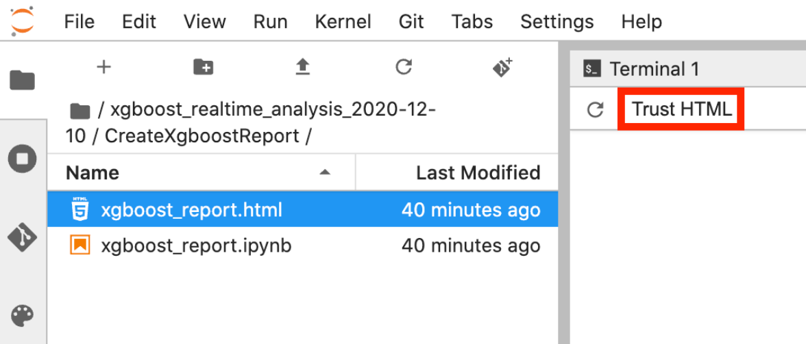

7.
Open the xgboost_report.ipynb file to explore how the report is generated. You can
customize and extend the training report using the Jupyter notebook file.

Download using the Amazon S3 console

1.
Sign in to the AWS Management Console and open the Amazon S3 console at https://
console.aws.amazon.com/s3/.

2.
Search for the base S3 bucket. For example, if you haven't specified any
base job name, the base S3 bucket name should be in the following format:

sagemaker-<region>-111122223333. Look up the base S3 bucket through the Find
bucket by name field.

SageMaker Debugger
4680

## Page 710

Amazon SageMaker AI
Developer Guide

3.
In the base S3 bucket, look up the training job name by entering your job name prefix in
Find objects by prefix and then choosing the training job name.

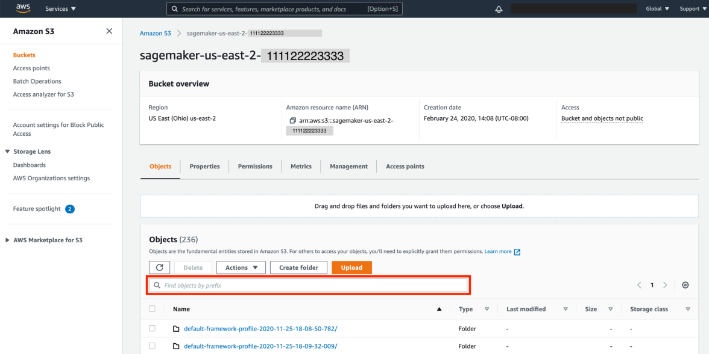

4.
In the training job's S3 bucket, choose rule-output/ subfolder. There must be three
subfolders for training data collected by Debugger: debug-output/, profiler-output/, and
rule-output/.

SageMaker Debugger
4681

## Page 711

Amazon SageMaker AI
Developer Guide

5.
In the rule-output/ folder, choose the CreateXgboostReport/ folder. The folder contains
xbgoost_report.html (the autogenerated report in html) and xbgoost_report.ipynb (a
Jupyter notebook with scripts that are used for generating the report).

6.
Choose the xbgoost_report.html file, choose Download actions, and then choose
Download.

SageMaker Debugger
4682

## Page 712

Amazon SageMaker AI
Developer Guide

SageMaker Debugger
4683

## Page 713

Amazon SageMaker AI
Developer Guide

7.
Open the downloaded xbgoost_report.html file in a web browser.

Debugger XGBoost training report walkthrough

This section walks you through the Debugger XGBoost training report. The report is automatically
aggregated depending on the output tensor regex, recognizing what type of your training job is
among binary classification, multiclass classification, and regression.

Important

In the report, plots and and recommendations are provided for informational purposes and
are not definitive. You are responsible for making your own independent assessment of the
information.

Topics

• Distribution of true labels of the dataset

• Loss versus step graph

• Feature importance

• Confusion matrix

• Evaluation of the confusion matrix

• Accuracy rate of each diagonal element over iteration

• Receiver operating characteristic curve

• Distribution of residuals at the last saved step

• Absolute validation error per label bin over iteration

Distribution of true labels of the dataset

This histogram shows the distribution of labeled classes (for classification) or values (for
regression) in your original dataset. Skewness in your dataset could contribute to inaccuracies. This
visualization is available for the following model types: binary classification, multiclassification,
and regression.

SageMaker Debugger
4684

## Page 714

Amazon SageMaker AI
Developer Guide

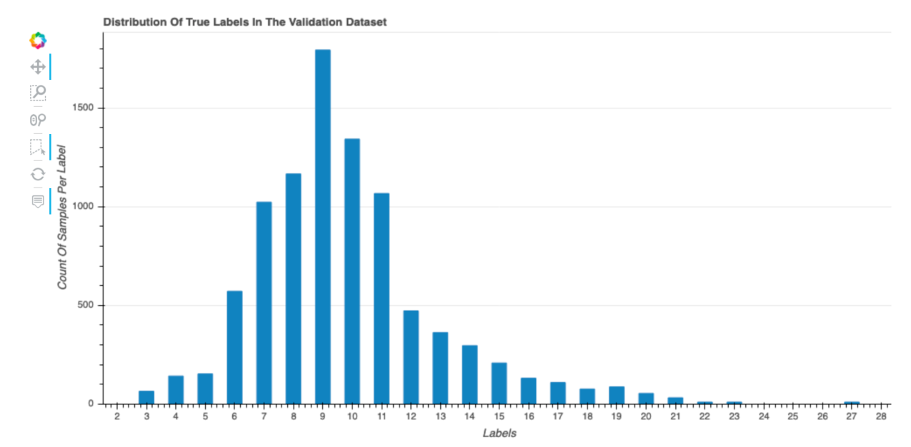

Loss versus step graph

This is a line chart that shows the progression of loss on training data and validation data
throughout training steps. The loss is what you defined in your objective function, such as mean
squared error. You can gauge whether the model is overfit or underfit from this plot. This section
also provides insights that you can use to determine how to resolve the overfit and underfit
problems. This visualization is available for the following model types: binary classification,
multiclassification, and regression.

SageMaker Debugger
4685

## Page 715

Amazon SageMaker AI
Developer Guide

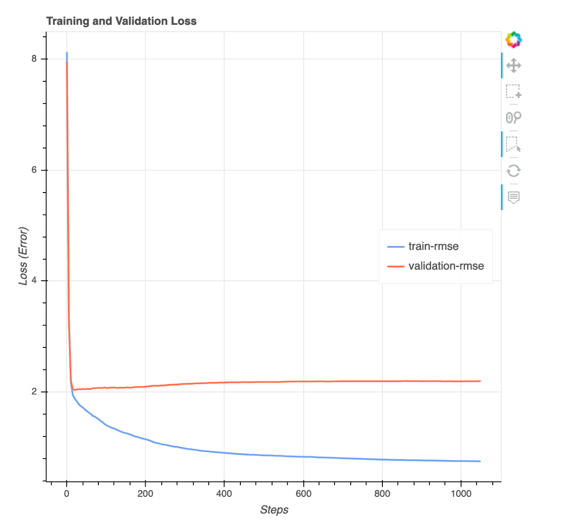

Feature importance

There are three different types of feature importance visualizations provided: Weight, Gain and
Coverage. We provide detailed definitions for each of the three in the report. Feature importance
visualizations help you learn what features in your training dataset contributed to the predictions.
Feature importance visualizations are available for the following model types: binary classification,
multiclassification, and regression.

SageMaker Debugger
4686

## Page 716

Amazon SageMaker AI
Developer Guide

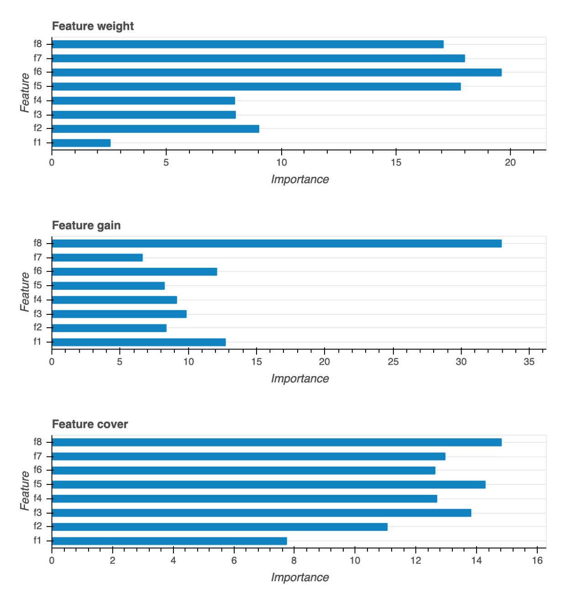

Confusion matrix

This visualization is only applicable to binary and multiclass classification models. Accuracy
alone might not be sufficient for evaluating the model performance. For some use cases, such
as healthcare and fraud detection, it’s also important to know the false positive rate and false

SageMaker Debugger
4687

## Page 717

Amazon SageMaker AI
Developer Guide

negative rate. A confusion matrix gives you the additional dimensions for evaluating your model
performance.

SageMaker Debugger
4688

## Page 718

Amazon SageMaker AI
Developer Guide

Evaluation of the confusion matrix

This section provides you with more insights on the micro, macro, and weighted metrics on
precision, recall, and F1-score for your model.

Accuracy rate of each diagonal element over iteration

This visualization is only applicable to binary classification and multiclass classification models.
This is a line chart that plots the diagonal values in the confusion matrix throughout the training
steps for each class. This plot shows you how the accuracy of each class progresses throughout the
training steps. You can identify the under-performing classes from this plot.

SageMaker Debugger
4689

## Page 719

Amazon SageMaker AI
Developer Guide

Receiver operating characteristic curve

This visualization is only applicable to binary classification models. The Receiver Operating
Characteristic curve is commonly used to evaluate binary classification model performance.
The y-axis of the curve is True Positive Rate (TPF) and x-axis is false positive rate (FPR). The plot
also displays the value for the area under the curve (AUC). The higher the AUC value, the more
predictive your classifier. You can also use the ROC curve to understand the trade-off between
TPR and FPR and identify the optimum classification threshold for your use case. The classification
threshold can be adjusted to tune the behavior of the model to reduce more of one or another type
of error (FP/FN).

SageMaker Debugger
4690

## Page 720

Amazon SageMaker AI
Developer Guide

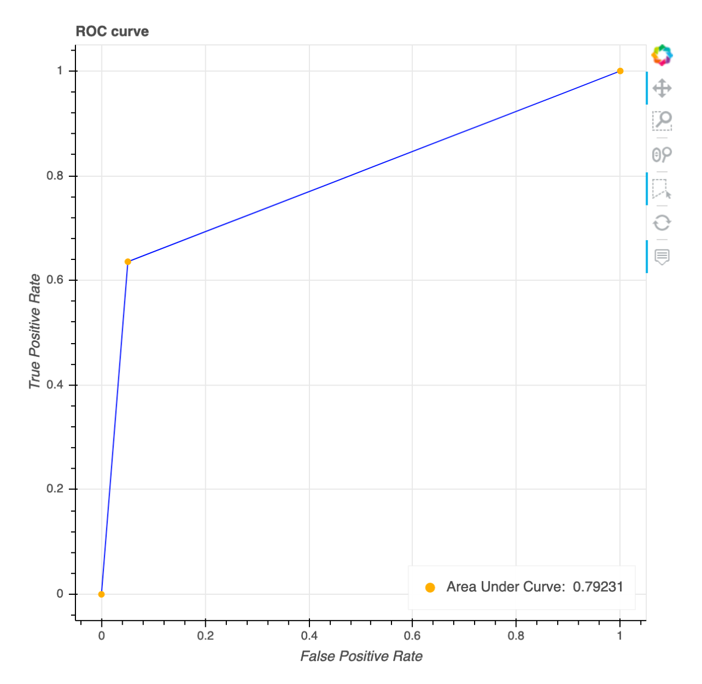

Distribution of residuals at the last saved step

This visualization is a column chart that shows the residual distributions in the last step Debugger
captures. In this visualization, you can check whether the residual distribution is close to normal
distribution that’s centered at zero. If the residuals are skewed, your features may not be sufficient
for predicting the labels.

SageMaker Debugger
4691

## Page 721

Amazon SageMaker AI
Developer Guide

Absolute validation error per label bin over iteration

This visualization is only applicable to regression models. The actual target values are split into 10
intervals. This visualization shows how validation errors progress for each interval throughout the
training steps in line plots. Absolute validation error is the absolute value of difference between
prediction and actual during validation. You can identify the underperforming intervals from this
visualization.

SageMaker Debugger
4692

## Page 722

Amazon SageMaker AI
Developer Guide

Action on Amazon SageMaker Debugger rules

Based on the Debugger rule evaluation status, you can set up automated actions such as stopping
a training job and sending notifications using Amazon Simple Notification Service (Amazon SNS).
You can also create your own actions using Amazon CloudWatch Events and AWS Lambda. To learn
how to set up automated actions based on the Debugger rule evaluation status, see the following
topics.

Topics

• Use Debugger built-in actions for rules

• Actions on rules using Amazon CloudWatch and AWS Lambda

Use Debugger built-in actions for rules

Use Debugger built-in actions to respond to issues found by Debugger rule. The Debugger

rule_configs class provides tools to configure a list of actions, including automatically stopping
training jobs and sending notifications using Amazon Simple Notification Service (Amazon SNS)
when the Debugger rules find training issues. The following topics takes you through the steps to
accomplish these tasks.

Topics

SageMaker Debugger
4693

## Page 723

Amazon SageMaker AI
Developer Guide

• Set up Amazon SNS, create an SMDebugRules topic, and subscribe to the topic

• Set up your IAM role to attach required policies

• Configure Debugger rules with the built-in actions

• Considerations for using the Debugger built-in actions

Set up Amazon SNS, create an SMDebugRules topic, and subscribe to the topic

This section walks you through how to set up an Amazon SNS SMDebugRules topic, subscribe to
it, and confirm the subscription to receive notifications from the Debugger rules.

Note

For more information about billing for Amazon SNS, see Amazon SNS pricing and Amazon
SNS FAQs.

To create a SMDebugRules topic

1.
Sign in to the AWS Management Console and open the Amazon SNS console at https://
console.aws.amazon.com/sns/v3/home.

2.
In the left navigation pane, choose Topics.

3.
On the Topics page, choose Create topic.

4.
On the Create topic page, in the Details section, do the following:

a.
For Type, choose Standard for topic type.

b.
In Name, enter SMDebugRules.

5.
Skip all other optional settings and choose Create topic. If you want to learn more about the
optional settings, see Creating an Amazon SNS topic.

To subscribe to the SMDebugRules topic

1.
Open the Amazon SNS console at https://console.aws.amazon.com/sns/v3/home.

2.
In the left navigation pane, choose Subscriptions.

3.
On the Subscriptions page, choose Create subscription.

4.
On the Create subscription page, in the Details section, do the following:

SageMaker Debugger
4694

## Page 724

Amazon SageMaker AI
Developer Guide

a.
For Topic ARN, choose the SMDebugRules topic ARN. The ARN should be in format of

arn:aws:sns:<region-id>:111122223333:SMDebugRules.

b.
For Protocol, choose Email or SMS.

c.
For Endpoint, enter the endpoint value, such as an email address or a phone number that
you want to receive notifications.

Note

Make sure you type the correct email address and phone number. Phone numbers

must include +, a country code, and phone number, with no special characters
or spaces. For example, the phone number +1 (222) 333-4444 is formatted as

+12223334444.

5.
Skip all other optional settings and choose Create subscription. If you want to learn more
about the optional settings, see Subscribing to an Amazon SNS topic.

After you subscribe to the SMDebugRules topic, you receive the following confirmation message in
email or by phone:

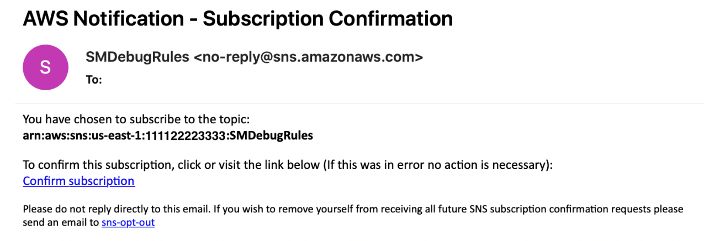

For more information about Amazon SNS, see Mobile text messaging (SMS) and Email notifications
in the Amazon SNS Developer Guide.

Set up your IAM role to attach required policies

In this step, you add the required policies to your IAM role.

SageMaker Debugger
4695

## Page 725

Amazon SageMaker AI
Developer Guide

To add the required policies to your IAM role

1.
Sign in to the AWS Management Console and open the IAM console at https://
console.aws.amazon.com/iam/.

2.
In the left navigation pane, choose Policies, and choose Create policy.

3.
On the Create policy page, do the following to create a new sns-access policy:

a.
Choose the JSON tab.

b.
Paste the JSON strings formatted in bold in the following code into the "Statement",
replacing the 12-digit AWS account ID with your AWS account ID.

JSON

{
"Version":"2012-10-17",
"Statement": [
{
"Sid": "VisualEditor0",
"Effect": "Allow",
"Action": [
"sns:Publish",
"sns:CreateTopic",
"sns:Subscribe"
],
"Resource": "arn:aws:sns:*:111122223333:SMDebugRules"
}
]
}

c.
At the bottom of the page, choose Review policy.

d.
On the Review policy page, for Name, enter sns-access.

e.
At the bottom of the page, choose Create policy.

4.
Go back to the IAM console, and choose Roles in the left navigation pane.

5.
Look up the IAM role that you use for SageMaker AI model training and choose that IAM role.

6.
On the Permissions tab of the Summary page, choose Attach policies.

7.
Search for the sns-access policy, select the check box next to the policy, and then choose
Attach policy.

SageMaker Debugger
4696

## Page 726

Amazon SageMaker AI
Developer Guide

For more examples of setting up IAM policies for Amazon SNS, see Example cases for Amazon SNS
access control.

Configure Debugger rules with the built-in actions

After successfully finishing the required settings in the preceding steps, you can configure the
Debugger built-in actions for debugging rules as shown in the following example script. You can

choose which built-in actions to use while building the actions list object. The rule_configs
is a helper module that provides high-level tools to configure Debugger built-in rules and actions.
The following built-in actions are available for Debugger:

• rule_configs.StopTraining() – Stops a training job when the Debugger rule finds an issue.

• rule_configs.Email("abc@abc.com") – Sends a notification via email when the Debugger
rule finds an issue. Use the email address that you used when you set up your SNS topic
subscription.

• rule_configs.SMS("+1234567890") – Sends a notification via text message when the
Debugger rule finds an issue. Use the phone number that you used when you set up your SNS
topic subscription.

Note

Make sure you type the correct email address and phone number. Phone numbers must

include +, a country code, and a phone number, with no special characters or spaces. For

example, the phone number +1 (222) 333-4444 is formatted as +12223334444.

You can use all of the built-in actions or a subset of actions by wrapping up using the

rule_configs.ActionList() method, which takes the built-in actions and configures a list of
actions.

To add all of the three built-in actions to a single rule

If you want to assign all of the three built-in actions to a single rule, configure a Debugger built-in
action list while constructing an estimator. Use the following template to construct the estimator,
and Debugger will stop training jobs and send notifications through email and text for any rules
that you use to monitor your training job progress.

from sagemaker.debugger import Rule, rule_configs

SageMaker Debugger
4697

## Page 727

Amazon SageMaker AI
Developer Guide

# Configure an action list object for Debugger rules
actions = rule_configs.ActionList(
rule_configs.StopTraining(),
rule_configs.Email("abc@abc.com"),
rule_configs.SMS("+1234567890")
)

# Configure rules for debugging with the actions parameter
rules = [
Rule.sagemaker(
base_config=rule_configs.built_in_rule(),         # Required
rule_parameters={"paramter_key": value },        # Optional
actions=actions
)
]

estimator = Estimator(

...
rules = rules
)

estimator.fit(wait=False)

To create multiple built-in action objects to assign different actions to a single rule

If you want to assign the built-in actions to be triggered at different threshold values of a single
rule, you can create multiple built-in action objects as shown in the following script. To avoid a
conflict error by running the same rule, you must submit different rule job names (specify different

strings for the rules' name attribute) as shown in the following example script template. This
example shows how to set up StalledTrainingRule to take two different actions: send an email to

abc@abc.com when a training job stalls for 60 seconds, and stop the training job if stalling for 120
seconds.

from sagemaker.debugger import Rule, rule_configs
import time

base_job_name_prefix= 'smdebug-stalled-demo-' + str(int(time.time()))

# Configure an action object for StopTraining
action_stop_training = rule_configs.ActionList(
rule_configs.StopTraining()
)

SageMaker Debugger
4698

## Page 728

Amazon SageMaker AI
Developer Guide

# Configure an action object for Email
action_email = rule_configs.ActionList(
rule_configs.Email("abc@abc.com")
)

# Configure a rule with the Email built-in action to trigger if a training job stalls
for 60 seconds
stalled_training_job_rule_email = Rule.sagemaker(
base_config=rule_configs.stalled_training_rule(),
rule_parameters={
"threshold": "60",
"training_job_name_prefix": base_job_name_prefix
},
actions=action_email
)
stalled_training_job_rule_text.name="StalledTrainingJobRuleEmail"

# Configure a rule with the StopTraining built-in action to trigger if a training job
stalls for 120 seconds
stalled_training_job_rule = Rule.sagemaker(
base_config=rule_configs.stalled_training_rule(),
rule_parameters={
"threshold": "120",
"training_job_name_prefix": base_job_name_prefix
},
actions=action_stop_training
)
stalled_training_job_rule.name="StalledTrainingJobRuleStopTraining"

estimator = Estimator(
...
rules = [stalled_training_job_rule_email, stalled_training_job_rule]
)

estimator.fit(wait=False)

While the training job is running, the Debugger built-in action sends notification emails and text
messages whenever the rule finds issues with your training job. The following screenshot shows an
example of email notification for a training job that has a stalled training job issue.

SageMaker Debugger
4699

## Page 729

Amazon SageMaker AI
Developer Guide

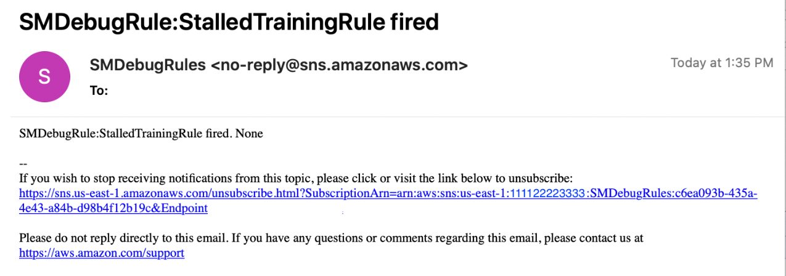

The following screenshot shows an example text notification that Debugger sends when the rule
finds a StalledTraining issue.

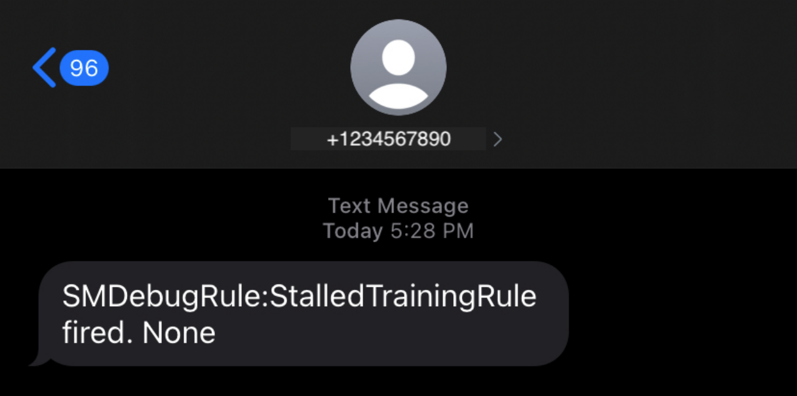

Considerations for using the Debugger built-in actions

• To use the Debugger built-in actions, an internet connection is required. This feature is not
supported in the network isolation mode provided by Amazon SageMaker AI or Amazon VPC.

• The built-in actions cannot be used for Profiler rules.

• The built-in actions cannot be used on training jobs with spot training interruptions.

SageMaker Debugger
4700

## Page 730

Amazon SageMaker AI
Developer Guide

• In email or text notifications, None appears at the end of messages. This does not have any

meaning, so you can disregard the text None.

Actions on rules using Amazon CloudWatch and AWS Lambda

Amazon CloudWatch collects Amazon SageMaker AI model training job logs and Amazon
SageMaker Debugger rule processing job logs. Configure Debugger with Amazon CloudWatch
Events and AWS Lambda to take action based on Debugger rule evaluation status.

Example notebooks

You can run the following example notebooks, which are prepared for experimenting with stopping
a training job using actions on Debugger's built-in rules using Amazon CloudWatch and AWS
Lambda.

• Amazon SageMaker Debugger - Reacting to CloudWatch Events from Rules

This example notebook runs a training job that has a vanishing gradient issue. The Debugger
VanishingGradient built-in rule is used while constructing the SageMaker AI TensorFlow
estimator. When the Debugger rule detects the issue, the training job is terminated.

• Detect Stalled Training and Invoke Actions Using SageMaker Debugger Rule

This example notebook runs a training script with a code line that forces it to sleep for 10
minutes. The Debugger StalledTrainingRule built-in rule invokes issues and stops the training job.

Topics

• Access CloudWatch logs for Debugger rules and training jobs

• Set up Debugger for automated training job termination using CloudWatch and Lambda

• Disable the CloudWatch Events rule to stop using the automated training job termination

Access CloudWatch logs for Debugger rules and training jobs

You can use the training and Debugger rule job status in the CloudWatch logs to take further
actions when there are training issues. The following procedure shows how to access the related
CloudWatch logs. For more information about monitoring training jobs using CloudWatch, see
Monitor Amazon SageMaker AI.

SageMaker Debugger
4701

## Page 731

Amazon SageMaker AI
Developer Guide

To access training job logs and Debugger rule job logs

1.
Open the CloudWatch console at https://console.aws.amazon.com/cloudwatch/.

2.
In the left navigation pane under the Log node, choose Log Groups.

3.
In the log groups list, do the following:

• Choose /aws/sagemaker/TrainingJobs for training job logs.

• Choose /aws/sagemaker/ProcessingJobs for Debugger rule job logs.

Set up Debugger for automated training job termination using CloudWatch and Lambda

The Debugger rules monitor training job status, and a CloudWatch Events rule watches the
Debugger rule training job evaluation status. The following sections outline the process needed to
automate training job termination using using CloudWatch and Lambda.

Topics

• Step 1: Create a Lambda function

• Step 2: Configure the Lambda function

• Step 3: Create a CloudWatch events rule and link to the Lambda function for Debugger

Step 1: Create a Lambda function

To create a Lambda function

1.
Open the AWS Lambda console at https://console.aws.amazon.com/lambda/.

2.
In the left navigation pane, choose Functions and then choose Create function.

3.
On the Create function page, choose Author from scratch option.

4.
In the Basic information section, enter a Function name (for example, debugger-rule-stop-
training-job).

5.
For Runtime, choose Python 3.7.

6.
For Permissions, expand the drop down option, and choose Change default execution role.

7.
For Execution role, choose Use an existing role and choose the IAM role that you use for
training jobs on SageMaker AI.

SageMaker Debugger
4702

## Page 732

Amazon SageMaker AI
Developer Guide

Note

Make sure you use the execution role with AmazonSageMakerFullAccess and

AWSLambdaBasicExecutionRole attached. Otherwise, the Lambda function

won't properly react to the Debugger rule status changes of the training job. If you
are unsure which execution role is being used, run the following code in a Jupyter
notebook cell to retrieve the execution role output:

import sagemaker
sagemaker.get_execution_role()

8.
At the bottom of the page, choose Create function.

The following figure shows an example of the Create function page with the input fields and
selections completed.

SageMaker Debugger
4703

## Page 733

Amazon SageMaker AI
Developer Guide

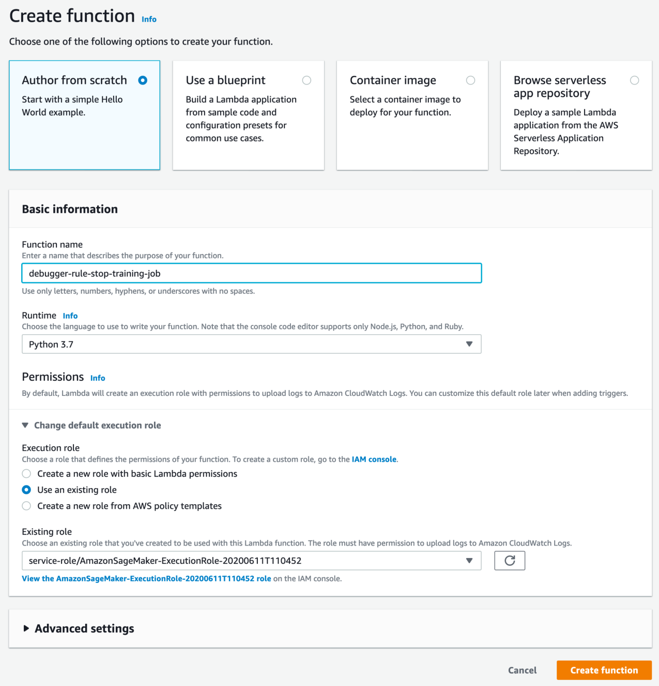

SageMaker Debugger
4704

## Page 734

Amazon SageMaker AI
Developer Guide

Step 2: Configure the Lambda function

To configure the Lambda function

1.
In the Function code section of the configuration page, paste the following Python script in

the Lambda code editor pane. The lambda_handler function monitors the Debugger rule

evaluation status collected by CloudWatch and triggers the StopTrainingJob API operation.

The AWS SDK for Python (Boto3) client for SageMaker AI provides a high-level method,

stop_training_job, which triggers the StopTrainingJob API operation.

import json
import boto3
import logging

logger = logging.getLogger()
logger.setLevel(logging.INFO)

def lambda_handler(event, context):
training_job_name = event.get("detail").get("TrainingJobName")
logging.info(f'Evaluating Debugger rules for training job:
{training_job_name}')
eval_statuses = event.get("detail").get("DebugRuleEvaluationStatuses", None)

if eval_statuses is None or len(eval_statuses) == 0:
logging.info("Couldn't find any debug rule statuses, skipping...")
return {
'statusCode': 200,
'body': json.dumps('Nothing to do')
}

# should only attempt stopping jobs with InProgress status
training_job_status = event.get("detail").get("TrainingJobStatus", None)
if training_job_status != 'InProgress':
logging.debug(f"Current Training job status({training_job_status}) is not
'InProgress'. Exiting")
return {
'statusCode': 200,
'body': json.dumps('Nothing to do')
}

client = boto3.client('sagemaker')

for status in eval_statuses:

SageMaker Debugger
4705

## Page 735

Amazon SageMaker AI
Developer Guide

logging.info(status.get("RuleEvaluationStatus") + ', RuleEvaluationStatus='
+ str(status))
if status.get("RuleEvaluationStatus") == "IssuesFound":
secondary_status = event.get("detail").get("SecondaryStatus", None)
logging.info(
f'About to stop training job, since evaluation of rule
configuration {status.get("RuleConfigurationName")} resulted in "IssuesFound". ' +
f'\ntraining job "{training_job_name}" status is
"{training_job_status}", secondary status is "{secondary_status}"' +
f'\nAttempting to stop training job "{training_job_name}"'
)
try:
client.stop_training_job(
TrainingJobName=training_job_name
)
except Exception as e:
logging.error(

"Encountered error while trying to "
"stop training job {}: {}".format(
training_job_name, str(e)
)
)
raise e
return None

For more information about the Lambda code editor interface, see Creating functions using
the AWS Lambda console editor.

2.
Skip all other settings and choose Save at the top of the configuration page.

Step 3: Create a CloudWatch events rule and link to the Lambda function for Debugger

To create a CloudWatch Events rule and link to the Lambda function for Debugger

1.
Open the CloudWatch console at https://console.aws.amazon.com/cloudwatch/.

2.
In the left navigation pane, choose Rules under the Events node.

3.
Choose Create rule.

4.
In the Event Source section of the Step 1: Create rule page, choose SageMaker AI for Service
Name, and choose SageMaker AI Training Job State Change for Event Type. The Event
Pattern Preview should look like the following example JSON strings:

SageMaker Debugger
4706

## Page 736

Amazon SageMaker AI
Developer Guide

{
"source": [
"aws.sagemaker"
],
"detail-type": [
"SageMaker Training Job State Change"
]
}

5.
In the Targets section, choose Add target*, and choose the debugger-rule-stop-training-
job Lambda function that you created. This step links the CloudWatch Events rule with the
Lambda function.

6.
Choose Configure details and go to the Step 2: Configure rule details page.

7.
Specify the CloudWatch rule definition name. For example, debugger-cw-event-rule.

8.
Choose Create rule to finish.

9.
Go back to the Lambda function configuration page and refresh the page. Confirm that it's
configured correctly in the Designer panel. The CloudWatch Events rule should be registered
as a trigger for the Lambda function. The configuration design should look like the following
example:

SageMaker Debugger
4707

## Page 737

Amazon SageMaker AI
Developer Guide

Disable the CloudWatch Events rule to stop using the automated training job termination

If you want to disable the automated training job termination, you need to disable the CloudWatch
Events rule. In the Lambda Designer panel, choose the EventBridge (CloudWatch Events) block
linked to the Lambda function. This shows an EventBridge panel below the Designer panel (for
example, see the previous screen shot). Select the check box next to EventBridge (CloudWatch
Events): debugger-cw-event-rule, and then choose Disable. If you want to use the automated
termination functionality later, you can enable the CloudWatch Events rule again.

Visualize Amazon SageMaker Debugger output tensors in TensorBoard

Important

This page is deprecated in favor of Amazon SageMaker AI with TensoBoard, which provides
a comprehensive TensorBoard experience integrated with SageMaker Training and the

SageMaker Debugger
4708

## Page 738

Amazon SageMaker AI
Developer Guide

access control functionalities of SageMaker AI domain. To learn more, see TensorBoard in
Amazon SageMaker AI.

Use SageMaker Debugger to create output tensor files that are compatible with TensorBoard.
Load the files to visualize in TensorBoard and analyze your SageMaker training jobs. Debugger
automatically generates output tensor files that are compatible with TensorBoard. For any hook
configuration you customize for saving output tensors, Debugger has the flexibility to create scalar
summaries, distributions, and histograms that you can import to TensorBoard.

You can enable this by passing DebuggerHookConfig and TensorBoardOutputConfig objects

to an estimator.

The following procedure explains how to save scalars, weights, and biases as full tensors,
histograms, and distributions that can be visualized with TensorBoard. Debugger saves them to the

training container's local path (the default path is /opt/ml/output/tensors) and syncs to the
Amazon S3 locations passed through the Debugger output configuration objects.

To save TensorBoard compatible output tensor files using Debugger

1.
Set up a tensorboard_output_config configuration object to save TensorBoard output

using the Debugger TensorBoardOutputConfig class. For the s3_output_path parameter,
specify the default S3 bucket of the current SageMaker AI session or a preferred S3 bucket.

SageMaker Debugger
4709

## Page 739

Amazon SageMaker AI
Developer Guide

This example does not add the container_local_output_path parameter; instead, it is set

to the default local path /opt/ml/output/tensors.

import sagemaker
from sagemaker.debugger import TensorBoardOutputConfig

bucket = sagemaker.Session().default_bucket()
tensorboard_output_config = TensorBoardOutputConfig(
s3_output_path='s3://{}'.format(bucket)
)

For additional information, see the Debugger TensorBoardOutputConfig API in the
Amazon SageMaker Python SDK.

2.
Configure the Debugger hook and customize the hook parameter values. For example,
the following code configures a Debugger hook to save all scalar outputs every 100 steps

in training phases and 10 steps in validation phases, the weights parameters every 500

steps (the default save_interval value for saving tensor collections is 500), and the bias
parameters every 10 global steps until the global step reaches 500.

from sagemaker.debugger import CollectionConfig, DebuggerHookConfig

hook_config = DebuggerHookConfig(
hook_parameters={
"train.save_interval": "100",
"eval.save_interval": "10"
},
collection_configs=[
CollectionConfig("weights"),
CollectionConfig(
name="biases",
parameters={
"save_interval": "10",
"end_step": "500",
"save_histogram": "True"
}
),
]
)

SageMaker Debugger
4710

## Page 740

Amazon SageMaker AI
Developer Guide

For more information about the Debugger configuration APIs, see the Debugger

CollectionConfig and DebuggerHookConfig APIs in the Amazon SageMaker Python SDK.

3.
Construct a SageMaker AI estimator with the Debugger parameters passing the configuration
objects. The following example template shows how to create a generic SageMaker AI

estimator. You can replace estimator and Estimator with other SageMaker AI frameworks'
estimator parent classes and estimator classes. Available SageMaker AI framework estimators

for this functionality are TensorFlow, PyTorch, and MXNet.

from sagemaker.estimator import Estimator

estimator = Estimator(
...
# Debugger parameters
debugger_hook_config=hook_config,
tensorboard_output_config=tensorboard_output_config
)
estimator.fit()

The estimator.fit() method starts a training job, and Debugger writes the output tensor
files in real time to the Debugger S3 output path and to the TensorBoard S3 output path. To
retrieve the output paths, use the following estimator methods:

• For the Debugger S3 output path, use

estimator.latest_job_debugger_artifacts_path().

• For the TensorBoard S3 output path, use

estimator.latest_job_tensorboard_artifacts_path().

4.
After the training has completed, check the names of saved output tensors:

from smdebug.trials import create_trial
trial = create_trial(estimator.latest_job_debugger_artifacts_path())
trial.tensor_names()

5.
Check the TensorBoard output data in Amazon S3:

tensorboard_output_path=estimator.latest_job_tensorboard_artifacts_path()
print(tensorboard_output_path)
!aws s3 ls {tensorboard_output_path}/

SageMaker Debugger
4711

## Page 741

Amazon SageMaker AI
Developer Guide

6.
Download the TensorBoard output data to your notebook instance. For example, the following

AWS CLI command downloads the TensorBoard files to /logs/fit under the current working
directory of your notebook instance.

!aws s3 cp --recursive {tensorboard_output_path} ./logs/fit

7.
Compress the file directory to a TAR file to download to your local machine.

!tar -cf logs.tar logs

8.
Download and extract the Tensorboard TAR file to a directory on your device, launch a Jupyter
notebook server, open a new notebook, and run the TensorBoard app.

!tar -xf logs.tar
%load_ext tensorboard
%tensorboard --logdir logs/fit

List of Debugger built-in rules

You can use the Debugger built-in rules, provided by Amazon SageMaker Debugger, to analyze
metrics and tensors collected while training your models. The following lists the debugger rules,
including information and an example on how to configure and deploy each built-in rule.

The Debugger built-in rules monitor various common conditions that are critical for the success of
a training job. You can call the built-in rules using Amazon SageMaker Python SDK or the low-level
SageMaker API operations.

There's no additional cost for using the built-in rules. For more information about billing, see the
Amazon SageMaker Pricing page.

Note

The maximum numbers of built-in rules that you can attach to a training job is 20.
SageMaker Debugger fully manages the built-in rules and analyzes your training job
synchronously.

SageMaker Debugger
4712

## Page 742

Amazon SageMaker AI
Developer Guide

Important

To use the new Debugger features, you need to upgrade the SageMaker Python SDK
and the SMDebug client library. In your iPython kernel, Jupyter notebook, or JupyterLab
environment, run the following code to install the latest versions of the libraries and restart
the kernel.

import sys
import IPython
!{sys.executable} -m pip install -U sagemaker smdebug
IPython.Application.instance().kernel.do_shutdown(True)

Debugger rule

The following rules are the Debugger built-in rules that are callable using the Rule.sagemaker
classmethod.

Debugger built-in rules for generating training reports

Scope of Validity
Built-in Rules

• create_xgboost_report

Training Report for SageMaker AI XGboost
training job

Debugger built-in rules for debugging model training data (output tensors)

Scope of Validity
Built-in Rules

• dead_relu

Deep learning frameworks (TensorFlow,
MXNet, and PyTorch)

• exploding_tensor

• poor_weight_initialization

• saturated_activation

• vanishing_gradient

• weight_update_ratio

SageMaker Debugger
4713

## Page 743

Amazon SageMaker AI
Developer Guide

Scope of Validity
Built-in Rules

• all_zero

Deep learning frameworks (TensorFlow,
MXNet, and PyTorch) and the XGBoost
algorithm

• class_imbalance

• loss_not_decreasing

• overfit

• overtraining

• similar_across_runs

• stalled_training_rule

• tensor_variance

• unchanged_tensor

Deep learning applications
• check_input_images

• nlp_sequence_ratio

XGBoost algorithm
• confusion

• feature_importance_overweight

• tree_depth

To use the built-in rules with default parameter values – use the following configuration format:

from sagemaker.debugger import Rule, ProfilerRule, rule_configs

rules = [
Rule.sagemaker(rule_configs.built_in_rule_name_1()),
Rule.sagemaker(rule_configs.built_in_rule_name_2()),
...
Rule.sagemaker(rule_configs.built_in_rule_name_n())
]

To use the built-in rules with customizing the parameter values – use the following configuration
format:

from sagemaker.debugger import Rule, ProfilerRule, rule_configs

rules = [

SageMaker Debugger
4714

## Page 744

Amazon SageMaker AI
Developer Guide

Rule.sagemaker(
base_config=rule_configs.built_in_rule_name(),
rule_parameters={
"key": "value"
}
collections_to_save=[
CollectionConfig(
name="tensor_collection_name",
parameters={
"key": "value"
}
)
]
)
]

To find available keys for the rule_parameters parameter, see the parameter description tables.

Sample rule configuration codes are provided for each built-in rule below the parameter
description tables.

• For a full instruction and examples of using the Debugger built-in rules, see Debugger built-in
rules example code.

• For a full instruction on using the built-in rules with the low-level SageMaker API operations, see
Configure Debugger using SageMaker API.

CreateXgboostReport

The CreateXgboostReport rule collects output tensors from an XGBoost training job and
autogenerates a comprehensive training report. You can download a comprehensive profiling
report while a training job is running or after the training job is complete, and check progress of
training or the final result of the training job. The CreateXgboostReport rule collects the following
output tensors by default:

• hyperparameters – Saves at the first step

• metrics – Saves loss and accuracy every 5 steps

• feature_importance – Saves every 5 steps

• predictions – Saves every 5 steps

• labels – Saves every 5 steps

SageMaker Debugger
4715

## Page 745

Amazon SageMaker AI
Developer Guide

Parameter Descriptions for the CreateXgboostReport Rule

Parameter Name
Description

base_trial
The base trial training job name. This
parameter is automatically set to the current
training job by Amazon SageMaker Debugger.

Required

Valid values: String

rules=[
Rule.sagemaker(
rule_configs.create_xgboost_report()
)
]

DeadRelu

This rule detects when the percentage of rectified linear unit (ReLU) activation functions in a trial
are considered dead because their activation activity has dropped below a threshold. If the percent

of inactive ReLUs in a layer is greater than the threshold_layer value of inactive ReLUs, the rule

returns True.

Parameter Descriptions for the DeadRelu Rule

Parameter Name
Description

base_trial
The base trial training job name. This
parameter is automatically set to the current
training job by Amazon SageMaker Debugger.

Required

Valid values: String

tensor_regex
A list of regex patterns used to restrict this
comparison to specific scalar-valued tensors.

SageMaker Debugger
4716

## Page 746

Amazon SageMaker AI
Developer Guide

Parameter Name
Description

The rule inspects only the tensors that match
the regex patterns specified in the list. If no
patterns are passed, the rule compares all
tensors gathered in the trials by default. Only
scalar-valued tensors can be matched.

Optional

Valid values: List of strings or a comma-sep
arated string

Default value: ".*relu_output"

threshold_inactivity
Defines a level of activity below which a ReLU
is considered to be dead. A ReLU might be
active in the beginning of a trial and then
slowly die during the training process. If

the ReLU is active less than the threshold

_inactivity
, it is considered to be dead.

Optional

Valid values: Float

Default values: 1.0 (in percentage)

SageMaker Debugger
4717

## Page 747

Amazon SageMaker AI
Developer Guide

Parameter Name
Description

threshold_layer
Returns True if the percentage of inactive

ReLUs in a layer is greater than threshold

_layer .

Returns False if the percentage of inactive

ReLUs in a layer is less than threshold

_layer .

Optional

Valid values: Float

Default values: 50.0 (in percentage)

built_in_rules = [
Rule.sagemaker(
base_config=rule_configs.dead_relu(),
rule_parameters={
"tensor_regex": ".*relu_output|.*ReLU_output",
"threshold_inactivity": "1.0",
"threshold_layer": "50.0"
},
collections_to_save=[
CollectionConfig(
name="custom_relu_collection",
parameters={
"include_regex: ".*relu_output|.*ReLU_output",
"save_interval": "500"
}
)
]
)
]

For an example of how to configure and deploy a built-in rule, see How to configure Debugger
built-in rules.

SageMaker Debugger
4718

## Page 748

Amazon SageMaker AI
Developer Guide

Note

This rule is not available for the XGBoost algorithm.

ExplodingTensor

This rule detects whether the tensors emitted during training have non-finite values, either infinite

or NaN (not a number). If a non-finite value is detected, the rule returns True.

Parameter Descriptions for the ExplodingTensor Rule

Parameter Name
Description

base_trial
The base trial training job name. This
parameter is automatically set to the current
training job by Amazon SageMaker Debugger.

Required

Valid values: String

collection_names
The list of collection names whose tensors the
rule inspects.

Optional

Valid values: String

Default value: None

tensor_regex
A list of regex patterns used to restrict this
comparison to specific scalar-valued tensors.
The rule inspects only the tensors that match
the regex patterns specified in the list. If no
patterns are passed, the rule compares all
tensors gathered in the trials by default. Only
scalar-valued tensors can be matched.

Optional

SageMaker Debugger
4719

## Page 749

Amazon SageMaker AI
Developer Guide

Parameter Name
Description

Valid values: String

Default value: None

only_nan
True to monitor the base_trial  tensors

only for NaN values and not for infinity.

False to treat both NaN and infinity as
exploding values and to monitor for both.

Optional

Default value: False

built_in_rules = [
Rule.sagemaker(
base_config=rule_configs.exploding_tensor(),
rule_parameters={
"tensor_regex": ".*gradient",
"only_nan": "False"
},
collections_to_save=[
CollectionConfig(
name="gradients",
parameters={
"save_interval": "500"
}
)
]
)
]

For an example of how to configure and deploy a built-in rule, see How to configure Debugger
built-in rules.

Note

This rule is not available for the XGBoost algorithm.

SageMaker Debugger
4720

## Page 750

Amazon SageMaker AI
Developer Guide

PoorWeightInitialization

This rule detects if your model parameters have been poorly initialized.

Good initialization breaks the symmetry of the weights and gradients in a neural network and
maintains commensurate activation variances across layers. Otherwise, the neural network doesn't
learn effectively. Initializers like Xavier aim to keep variance constant across activations, which
is especially relevant for training very deep neural nets. Too small an initialization can lead to
vanishing gradients. Too large an initialization can lead to exploding gradients. This rule checks the
variance of activation inputs across layers, the distribution of gradients, and the loss convergence
for the initial steps to determine if a neural network has been poorly initialized.

Parameter Descriptions for the PoorWeightInitialization Rule

Parameter Name
Description

base_trial
The base trial training job name. This
parameter is automatically set to the current
training job by Amazon SageMaker Debugger.

Required

Valid values: String

activation_inputs_regex
A list of regex patterns used to restrict this
comparison to specific scalar-valued tensors.
The rule inspects only the tensors that match
the regex patterns specified in the list. If no
patterns are passed, the rule compares all
tensors gathered in the trials by default. Only
scalar-valued tensors can be matched.

Optional

Valid values: String

Default value: ".*relu_input"

SageMaker Debugger
4721

## Page 751

Amazon SageMaker AI
Developer Guide

Parameter Name
Description

threshold
If the ratio between minimum and maximum
variance of weights per layer exceeds the

threshold  at a step, the rule returns True.

Optional

Valid values: Float

Default value: 10.0

distribution_range
If the minimum difference between 5th and
95th percentiles of the gradient distribution is

less than the distribution_range
, the

rule returns True.

Optional

Valid values: Float

Default value: 0.001

patience
The number of steps to wait until the loss is
considered to be no longer decreasing.

Optional

Valid values: Integer

Default value: 5

steps
The number of steps this rule analyzes. You
typically need to check only the first few
iterations.

Optional

Valid values: Float

Default value: 10

SageMaker Debugger
4722

## Page 752

Amazon SageMaker AI
Developer Guide

built_in_rules = [
Rule.sagemaker(
base_config=rule_configs.poor_weight_initialization(),
rule_parameters={
"activation_inputs_regex": ".*relu_input|.*ReLU_input",
"threshold": "10.0",
"distribution_range": "0.001",
"patience": "5",
"steps": "10"
},
collections_to_save=[
CollectionConfig(
name="custom_relu_collection",
parameters={
"include_regex": ".*relu_input|.*ReLU_input",
"save_interval": "500"

}
)
]
)
]

For an example of how to configure and deploy a built-in rule, see How to configure Debugger
built-in rules.

Note

This rule is not available for the XGBoost algorithm.

SaturatedActivation

This rule detects if the tanh and sigmoid activation layers are becoming saturated. An activation
layer is saturated when the input of the layer is close to the maximum or minimum of the
activation function. The minimum and maximum of the tanh and sigmoid activation functions are

defined by their respective min_threshold and max_thresholds values. If the activity of a node

drops below the threshold_inactivity percentage, it is considered saturated. If more than a

threshold_layer percent of the nodes are saturated, the rule returns True.

Parameter Descriptions for the SaturatedActivation Rule

SageMaker Debugger
4723

## Page 753

Amazon SageMaker AI
Developer Guide

Parameter Name
Description

base_trial
The base trial training job name. This
parameter is automatically set to the current

training job by Amazon SageMaker Debugger.

Required

Valid values: String

collection_names
The list of collection names whose tensors the
rule inspects.

Optional

Valid values: List of strings or a comma-sep
arated string

Default value: None

tensor_regex
A list of regex patterns used to restrict this
comparison to specific scalar-valued tensors.
The rule inspects only the tensors that match
the regex patterns specified in the list. If no
patterns are passed, the rule compares all
tensors gathered in the trials by default. Only
scalar-valued tensors can be matched.

Optional

Valid values: String

Default value: ".*tanh_input|.*si

gmoid_input".

threshold_tanh_min
The minimum and maximum thresholds that
define the extremes of the input for a tanh

activation function, defined as: (min_thre

shold, max_threshold)
. The default

SageMaker Debugger
4724

## Page 754

Amazon SageMaker AI
Developer Guide

Parameter Name
Description

values are determined based on a vanishing
gradient threshold of 0.0000001.

Optional

Valid values: Float

Default values: -9.4999

threshold_tanh_max
The minimum and maximum thresholds that
define the extremes of the input for a tanh

activation function, defined as: (min_thre

shold, max_threshold)
. The default
values are determined based on a vanishing
gradient threshold of 0.0000001.

Optional

Valid values: Float

Default values: 9.4999

threshold_sigmoid_min
The minimum and maximum thresholds that
define the extremes of the input for a sigmoid

activation function, defined as: (min_thre

shold, max_threshold)
. The default
values are determined based on a vanishing
gradient threshold of 0.0000001.

Optional

Valid values: Float

Default values: -23

SageMaker Debugger
4725

## Page 755

Amazon SageMaker AI
Developer Guide

Parameter Name
Description

threshold_sigmoid_max
The minimum and maximum thresholds that
define the extremes of the input for a sigmoid

activation function, defined as: (min_thre

shold, max_threshold)
. The default
values are determined based on a vanishing
gradient threshold of 0.0000001.

Optional

Valid values: Float

Default values: 16.99999

threshold_inactivity
The percentage of inactivity below which
the activation layer is considered to be
saturated. The activation might be active
in the beginning of a trial and then slowly
become less active during the training process.

Optional

Valid values: Float

Default values: 1.0

threshold_layer
Returns True if the number of saturated
activations in a layer is greater than the

threshold_layer  percentage.

Returns False if the number of saturated
activations in a layer is less than the

threshold_layer  percentage.

Optional

Valid values: Float

Default values: 50.0

SageMaker Debugger
4726

## Page 756

Amazon SageMaker AI
Developer Guide

built_in_rules = [
Rule.sagemaker(
base_config=rule_configs.saturated_activation(),
rule_parameters={
"tensor_regex": ".*tanh_input|.*sigmoid_input",
"threshold_tanh_min": "-9.4999",
"threshold_tanh_max": "9.4999",
"threshold_sigmoid_min": "-23",
"threshold_sigmoid_max": "16.99999",
"threshold_inactivity": "1.0",
"threshold_layer": "50.0"
},
collections_to_save=[
CollectionConfig(
name="custom_activations_collection",
parameters={

"include_regex": ".*tanh_input|.*sigmoid_input"
"save_interval": "500"
}
)
]
)
]

For an example of how to configure and deploy a built-in rule, see How to configure Debugger
built-in rules.

Note

This rule is not available for the XGBoost algorithm.

VanishingGradient

This rule detects if the gradients in a trial become extremely small or drop to a zero magnitude.

If the mean of the absolute values of the gradients drops below a specified threshold, the rule

returns True.

Parameters Descriptions for the VanishingGradient Rule

SageMaker Debugger
4727

## Page 757

Amazon SageMaker AI
Developer Guide

Parameter Name
Description

base_trial
The base trial training job name. This
parameter is automatically set to the current

training job by Amazon SageMaker Debugger.

Required

Valid values: String

threshold
The value at which the gradient is determined
to be vanishing.

Optional

Valid values: Float

Default value: 0.0000001 .

built_in_rules = [
Rule.sagemaker(
base_config=rule_configs.vanishing_gradient(),
rule_parameters={
"threshold": "0.0000001"
},
collections_to_save=[
CollectionConfig(
name="gradients",
parameters={
"save_interval": "500"
}
)
]
)
]

For an example of how to configure and deploy a built-in rule, see How to configure Debugger
built-in rules.

SageMaker Debugger
4728

## Page 758

Amazon SageMaker AI
Developer Guide

Note

This rule is not available for the XGBoost algorithm.

WeightUpdateRatio

This rule keeps track of the ratio of updates to weights during training and detects if that ratio

gets too large or too small. If the ratio of updates to weights is larger than the large_threshold

value or if this ratio is smaller than small_threshold, the rule returns True.

Conditions for training are best when the updates are commensurate to gradients. Excessively
large updates can push the weights away from optimal values, and very small updates result
in very slow convergence. This rule requires weights to be available for two training steps, and

train.save_interval needs to be set equal to num_steps.

Parameter Descriptions for the WeightUpdateRatio Rule

Parameter Name,
Description

base_trial
The base trial training job name. This
parameter is automatically set to the current
training job by Amazon SageMaker Debugger.

Required

Valid values: String

num_steps
The number of steps across which the rule
checks to determine if the tensor has changed.

The number of steps across which you want
to compare the weight ratios. If you pass no
value, the rule runs by default against the
current step and the immediately previous
saved step. If you override the default by
passing a value for this parameter, the

comparison is done between weights at step s

and at a step >= s - num_steps .

SageMaker Debugger
4729

## Page 759

Amazon SageMaker AI
Developer Guide

Parameter Name,
Description

Optional

Valid values: Integer

Default value: None

large_threshold
The maximum value that the ratio of updates
to weight can take before the rule returns

True.

Optional

Valid values: Float

Default value: 10.0

small_threshold
The minimum value that the ratio of updates
to weight can take, below which the rule

returns True.

Optional

Valid values: Float

Default value: 0.00000001

epsilon
A small constant used to ensure that

Debugger does not divide by zero when
computing the ratio updates to weigh.

Optional

Valid values: Float

Default value: 0.000000001

built_in_rules = [
Rule.sagemaker(
base_config=rule_configs.weight_update_ratio(),

SageMaker Debugger
4730

## Page 760

Amazon SageMaker AI
Developer Guide

rule_parameters={
"num_steps": "100",
"large_threshold": "10.0",
"small_threshold": "0.00000001",
"epsilon": "0.000000001"
},
collections_to_save=[
CollectionConfig(
name="weights",
parameters={
"train.save_interval": "100"
}
)
]
)
]

For an example of how to configure and deploy a built-in rule, see How to configure Debugger
built-in rules.

Note

This rule is not available for the XGBoost algorithm.

AllZero

This rule detects if all or a specified percentage of the tensor values are zero.

This rule can be applied either to one of the supported deep learning frameworks
(TensorFlow, MXNet, and PyTorch) or to the XGBoost algorithm. You must specify either the

collection_names or tensor_regex parameter. If both the parameters are specified, the rule
inspects the union of tensors from both sets.

For an example of how to configure and deploy a built-in rule, see How to configure Debugger
built-in rules.

Parameters Descriptions for the AllZero Rule

SageMaker Debugger
4731

## Page 761

Amazon SageMaker AI
Developer Guide

Parameter Name
Description

base_trial
The base trial training job name. This
parameter is automatically set to the current

training job by Amazon SageMaker Debugger.

Required

Valid values: String

collection_names
The list of collection names whose tensors the
rule inspects.

Optional

Valid values: List of strings or a comma-sep
arated string

Default value: None

tensor_regex
A list of regex patterns used to restrict this
comparison to specific scalar-valued tensors.
The rule inspects only the tensors that match
the regex patterns specified in the list. If no
patterns are passed, the rule compares all
tensors gathered in the trials by default. Only
scalar-valued tensors can be matched.

Optional

Valid values: List of strings or a comma-sep
arated string

Default value: None

threshold
Specifies the percentage of values in the
tensor that needs to be zero for this rule to be
invoked.

Optional

SageMaker Debugger
4732

## Page 762

Amazon SageMaker AI
Developer Guide

Parameter Name
Description

Valid values: Float

Default value: 100 (in percentage)

built_in_rules = [
Rule.sagemaker(
base_config=rule_configs.all_zero(),
rule_parameters={
"tensor_regex": ".*",
"threshold": "100"
},
collections_to_save=[
CollectionConfig(

name="all",
parameters={
"save_interval": "500"
}
)
]
)
]

ClassImbalance

This rule measures sampling imbalances between classes and throws errors if the imbalance
exceeds a threshold or if too many mispredictions for underrepresented classes occur as a result of
the imbalance.

Classification models require well-balanced classes in the training dataset or a proper weighting/
sampling of classes during training. The rule performs the following checks:

• It counts the occurrences per class. If the ratio of number of samples between smallest and

largest class is larger than the threshold_imbalance, an error is thrown.

• It checks the prediction accuracy per class. If resampling or weighting has not been correctly
applied, then the model can reach high accuracy for the class with many training samples, but
low accuracy for the classes with few training samples. If a fraction of mispredictions for a

certain class is above threshold_misprediction, an error is thrown.

SageMaker Debugger
4733

## Page 763

Amazon SageMaker AI
Developer Guide

This rule can be applied either to one of the supported deep learning frameworks (TensorFlow,
MXNet, and PyTorch) or to the XGBoost algorithm.

For an example of how to configure and deploy a built-in rule, see How to configure Debugger
built-in rules.

Parameter Descriptions for the ClassImbalance Rule

Parameter Name
Description

base_trial
The base trial training job name. This
parameter is automatically set to the current
training job by Amazon SageMaker Debugger.

Required

Valid values: String

threshold_imbalance
The acceptable imbalance between the
number of samples in the smallest class and
in the largest class. Exceeding this threshold
value throws an error.

Optional

Valid values: Float

Default value: 10

threshold_misprediction
A limit on the fraction of mispredictions
allowed for each class. Exceeding this
threshold throws an error. The underrepr
esented classes are most at risk of crossing
this threshold.

Optional

Valid values: Float

Default value: 0.7

SageMaker Debugger
4734

## Page 764

Amazon SageMaker AI
Developer Guide

Parameter Name
Description

samples
The number of labels that have to be
processed before an imbalance is evaluated
. The rule might not be triggered until it has
seen sufficient samples across several steps.
The more classes that your dataset contains,

the larger this sample number should be.

Optional

Valid values: Integer

Default value: 500 (assuming a dataset like
MNIST with 10 classes)

argmax
If True, np.argmax is applied to the predictio
n tensor. Required when you have a vector
of probabilities for each class. It is used
to determine which class has the highest
probability.

Conditional

Valid values: Boolean

Default value: False

labels_regex
The name of the tensor that contains the
labels.

Optional

Valid values: String

Default value: ".*labels"

SageMaker Debugger
4735

## Page 765

Amazon SageMaker AI
Developer Guide

Parameter Name
Description

predictions_regex
The name of the tensor that contains the
predictions.

Optional

Valid values: String

Default value: ".*predictions"

built_in_rules = [
Rule.sagemaker(
base_config=rule_configs.class_imbalance(),
rule_parameters={
"threshold_imbalance": "10",
"threshold_misprediction": "0.7",
"samples": "500",
"argmax": "False",
"labels_regex": ".*labels",
"predictions_regex": ".*predictions"
},
collections_to_save=[
CollectionConfig(
name="custom_output_collection",
parameters={
"include_regex": ".*labels|.*predictions",
"save_interval": "500"
}
)
]
)
]

LossNotDecreasing

This rule detects when the loss is not decreasing in value at an adequate rate. These losses must be
scalars.

This rule can be applied either to one of the supported deep learning frameworks
(TensorFlow, MXNet, and PyTorch) or to the XGBoost algorithm. You must specify either the

SageMaker Debugger
4736

## Page 766

Amazon SageMaker AI
Developer Guide

collection_names or tensor_regex parameter. If both the parameters are specified, the rule
inspects the union of tensors from both sets.

For an example of how to configure and deploy a built-in rule, see How to configure Debugger

built-in rules.

Parameter Descriptions for the LossNotDecreasing Rule

Parameter Name
Description

base_trial
The base trial training job name. This
parameter is automatically set to the current
training job by Amazon SageMaker Debugger.

Required

Valid values: String

collection_names
The list of collection names whose tensors the
rule inspects.

Optional

Valid values: List of strings or a comma-sep
arated string

Default value: None

tensor_regex
A list of regex patterns that is used to restrict
this comparison to specific scalar-valued
tensors. The rule inspects only the tensors that
match the regex patterns specified in the list.
If no patterns are passed, the rule compares
all tensors gathered in the trials by default.
Only scalar-valued tensors can be matched.

Optional

Valid values: List of strings or a comma-sep
arated string

SageMaker Debugger
4737

## Page 767

Amazon SageMaker AI
Developer Guide

Parameter Name
Description

Default value: None

use_losses_collection
If set to True, looks for losses in the collection
named "losses" when the collection is present.

Optional

Valid values: Boolean

Default value: True

num_steps
The minimum number of steps after which
the rule checks if the loss has decreased. Rule

evaluation happens every num_steps . The
rule compares the loss for this step with the

loss at a step which is at least num_steps
behind the current step. For example, suppose
that the loss is being saved every three steps,

but num_steps  is set to 10. At step 21, loss
for step 21 is compared with loss for step 9.
The next step at which loss is checked is step
33, because ten steps after step 21 is step 31,
and at step 31 and step 32 loss is not saved.

Optional

Valid values: Integer

Default value: 10

SageMaker Debugger
4738

## Page 768

Amazon SageMaker AI
Developer Guide

Parameter Name
Description

diff_percent
The minimum percentage difference by which

the loss should decrease between num_steps

.

Optional

Valid values: 0.0 < float < 100

Default value: 0.1 (in percentage)

increase_threshold_percent
The maximum threshold percent that loss
is allowed to increase in case loss has been
increasing

Optional

Valid values: 0 < float < 100

Default value: 5 (in percentage)

mode
The name of the Debugger mode to query
tensor values for rule checking. If this is not
passed, the rule checks in order by default for

the mode.EVAL , then mode.TRAIN , and

then mode.GLOBAL .

Optional

Valid values: String (EVAL, TRAIN, or GLOBAL)

Default value: GLOBAL

built_in_rules = [
Rule.sagemaker(
base_config=rule_configs.loss_not_decreasing(),
rule_parameters={
"tensor_regex": ".*",
"use_losses_collection": "True",

SageMaker Debugger
4739

## Page 769

Amazon SageMaker AI
Developer Guide

"num_steps": "10",
"diff_percent": "0.1",
"increase_threshold_percent": "5",
"mode": "GLOBAL"
},
collections_to_save=[
CollectionConfig(
name="losses",
parameters={
"save_interval": "500"
}
)
]
)
]

Overfit

This rule detects if your model is being overfit to the training data by comparing the validation and
training losses.

This rule can be applied either to one of the supported deep learning frameworks (TensorFlow,
MXNet, and PyTorch) or to the XGBoost algorithm.

For an example of how to configure and deploy a built-in rule, see How to configure Debugger
built-in rules.

Note

A standard way to prevent overfitting is to regularize your model.

Parameter Descriptions for the Overfit Rule

Parameter Name
Description

base_trial
The base trial training job name. This
parameter is automatically set to the current
training job by Amazon SageMaker Debugger.

Required

SageMaker Debugger
4740

## Page 770

Amazon SageMaker AI
Developer Guide

Parameter Name
Description

Valid values: String

tensor_regex
A list of regex patterns used to restrict this
comparison to specific scalar-valued tensors.
The rule inspects only the tensors that match
the regex patterns specified in the list. If no
patterns are passed, the rule compares all
tensors gathered in the trials by default. Only
scalar-valued tensors can be matched.

Optional

Valid values: List of strings or a comma-sep
arated string

Default value: None

start_step
The step from which to start comparing the
validation and training loss.

Optional

Valid values: Integer

Default value: 0

patience
The number of steps for which the

ratio_threshold  is allowed to exceed the
value set before the model is considered to be
overfit.

Optional

Valid values: Integer

Default value: 1

SageMaker Debugger
4741

## Page 771

Amazon SageMaker AI
Developer Guide

Parameter Name
Description

ratio_threshold
The maximum ratio of the difference between
the mean validation loss and mean training
loss to the mean training loss. If this threshold

is exceeded for a patience number of steps,
the model is being overfit and the rule returns

True.

Optional

Valid values: Float

Default value: 0.1

built_in_rules = [
Rule.sagemaker(
base_config=rule_configs.overfit(),
rule_parameters={
"tensor_regex": ".*",
"start_step": "0",
"patience": "1",
"ratio_threshold": "0.1"
},
collections_to_save=[
CollectionConfig(
name="losses",
parameters={
"train.save_interval": "100",
"eval.save_interval": "10"
}
)
]
)
]

Overtraining

This rule detects if a model is being overtrained. After a number of training iterations on a well-
behaved model (both training and validation loss decrease), the model approaches to a minimum

SageMaker Debugger
4742

## Page 772

Amazon SageMaker AI
Developer Guide

of the loss function and does not improve anymore. If the model continues training it can happen
that validation loss starts increasing, because the model starts overfitting. This rule sets up
thresholds and conditions to determine if the model is not improving, and prevents overfitting
problems due to overtraining.

This rule can be applied either to one of the supported deep learning frameworks (TensorFlow,
MXNet, and PyTorch) or to the XGBoost algorithm.

For an example of how to configure and deploy a built-in rule, see How to configure Debugger
built-in rules.

Note

Overtraining can be avoided by early stopping. For information on early stopping, see Stop
Training Jobs Early. For an example that shows how to use spot training with Debugger, see
Enable Spot Training with Amazon SageMaker Debugger.

Parameter Descriptions for the Overtraining Rule

Parameter Name
Description

base_trial
The base trial training job name. This
parameter is automatically set to the current
training job by Amazon SageMaker Debugger.

Required

Valid values: String

patience_train
The number of steps to wait before the
training loss is considered to not to be
improving anymore.

Optional

Valid values: Integer

Default value: 5

SageMaker Debugger
4743

## Page 773

Amazon SageMaker AI
Developer Guide

Parameter Name
Description

patience_validation
The number of steps to wait before the
validation loss is considered to not to be
improving anymore.

Optional

Valid values: Integer

Default value: 10

delta
The minimum threshold by how much the
error should improve before it is considered as
a new optimum.

Optional

Valid values: Float

Default value: 0.01

built_in_rules = [
Rule.sagemaker(
base_config=rule_configs.overtraining(),
rule_parameters={
"patience_train": "5",
"patience_validation": "10",
"delta": "0.01"
},
collections_to_save=[
CollectionConfig(
name="losses",
parameters={
"save_interval": "500"
}
)
]
)
]

SageMaker Debugger
4744

## Page 774

Amazon SageMaker AI
Developer Guide

SimilarAcrossRuns

This rule compares tensors gathered from a base trial with tensors from another trial.

This rule can be applied either to one of the supported deep learning frameworks (TensorFlow,
MXNet, and PyTorch) or to the XGBoost algorithm.

For an example of how to configure and deploy a built-in rule, see How to configure Debugger
built-in rules.

Parameter Descriptions for the SimilarAcrossRuns Rule

Parameter Name
Description

base_trial
The base trial training job name. This
parameter is automatically set to the current
training job by Amazon SageMaker Debugger.

Required

Valid values: String

other_trials
A completed training job name whose
tensors you want to compare to those tensors

gathered from the current base_trial .

Required

Valid values: String

collection_names
The list of collection names whose tensors the
rule inspects.

Optional

Valid values: List of strings or a comma-sep
arated string

Default value: None

tensor_regex
A list of regex patterns used to restrict this
comparison to specific scalar-valued tensors.

SageMaker Debugger
4745

## Page 775

Amazon SageMaker AI
Developer Guide

Parameter Name
Description

The rule inspects only the tensors that match
the regex patterns specified in the list. If no
patterns are passed, the rule compares all
tensors gathered in the trials by default. Only
scalar-valued tensors can be matched.

Optional

Valid values: List of strings or a comma-sep
arated string

Default value: None

built_in_rules = [
Rule.sagemaker(
base_config=rule_configs.similar_across_runs(),
rule_parameters={
"other_trials": "<specify-another-job-name>",
"collection_names": "losses",
"tensor_regex": ".*"
},
collections_to_save=[
CollectionConfig(
name="losses",
parameters={
"save_interval": "500"
}
)
]
)
]

StalledTrainingRule

StalledTrainingRule detects if there is no progress made on training job, and stops the training job
if the rule fires. This rule requires tensors to be periodically saved in a time interval defined by its

threshold parameter. This rule keeps on monitoring for new tensors, and if no new tensor has
been emitted for threshold interval rule gets fired.

SageMaker Debugger
4746

## Page 776

Amazon SageMaker AI
Developer Guide

Parameter Descriptions for the StalledTrainingRule Rule

Parameter Name
Description

base_trial
The base trial training job name. This
parameter is automatically set to the current
training job by Amazon SageMaker Debugger.

Required

Valid values: String

threshold
A threshold that defines by how much time
in seconds the rule waits for a tensor output
until it fires a stalled training issue. Default
value is 1800 seconds.

Optional

Valid values: Integer

Default value: 1800

stop_training_on_fire
If set to True, watches if the base training job

outputs tensors in "threshold " seconds.

Optional

Valid values: Boolean

Default value: False

training_job_name_prefix
The prefix of base training job name. If

stop_training_on_fire
is true, the
rule searches for SageMaker training jobs with
this prefix in the same account. If there is an

inactivity found, the rule takes a StopTrain

ingJob  action. Note if there are multiple
jobs found with same prefix, the rule skips

SageMaker Debugger
4747

## Page 777

Amazon SageMaker AI
Developer Guide

Parameter Name
Description

termination. It is important that the prefix is
set unique per each training job.

Optional

Valid values: String

built_in_rules = [
Rule.sagemaker(
base_config=rule_configs.stalled_training_rule(),
rule_parameters={
"threshold": "1800",
"stop_training_on_fire": "True",

"training_job_name_prefix": "<specify-training-base-job-name>"
},
collections_to_save=[
CollectionConfig(
name="losses",
parameters={
"save_interval": "500"
}
)
]
)
]

TensorVariance

This rule detects if you have tensors with very high or low variances. Very high or low variances in
a tensor could lead to neuron saturation, which reduces the learning ability of the neural network.
Very high variance in tensors can also eventually lead to exploding tensors. Use this rule to detect
such issues early.

This rule can be applied either to one of the supported deep learning frameworks
(TensorFlow, MXNet, and PyTorch) or to the XGBoost algorithm. You must specify either the

collection_names or tensor_regex parameter. If both the parameters are specified, the rule
inspects the union of tensors from both sets.

SageMaker Debugger
4748

## Page 778

Amazon SageMaker AI
Developer Guide

For an example of how to configure and deploy a built-in rule, see How to configure Debugger
built-in rules.

Parameter Descriptions for the TensorVariance Rule

Parameter Name
Description

base_trial
The base trial training job name. This
parameter is automatically set to the current
training job by Amazon SageMaker Debugger.

Required

Valid values: String

collection_names
The list of collection names whose tensors the
rule inspects.

Optional

Valid values: List of strings or a comma-sep
arated string

Default value: None

tensor_regex
A list of regex patterns used to restrict this
comparison to specific scalar-valued tensors.
The rule inspects only the tensors that match
the regex patterns specified in the list. If no
patterns are passed, the rule compares all
tensors gathered in the trials by default. Only
scalar-valued tensors can be matched.

Optional

Valid values: List of strings or a comma-sep
arated string

Default value: None

SageMaker Debugger
4749

## Page 779

Amazon SageMaker AI
Developer Guide

Parameter Name
Description

max_threshold
The threshold for the upper bound of tensor
variance.

Optional

Valid values: Float

Default value: None

min_threshold
The threshold for the lower bound of tensor
variance.

Optional

Valid values: Float

Default value: None

built_in_rules = [
Rule.sagemaker(
base_config=rule_configs.tensor_variance(),
rule_parameters={
"collection_names": "weights",
"max_threshold": "10",
"min_threshold": "0.00001",
},
collections_to_save=[
CollectionConfig(
name="weights",
parameters={
"save_interval": "500"
}
)
]
)
]

SageMaker Debugger
4750

## Page 780

Amazon SageMaker AI
Developer Guide

UnchangedTensor

This rule detects whether a tensor is no longer changing across steps.

This rule runs the numpy.allclose method to check if the tensor isn't changing.

This rule can be applied either to one of the supported deep learning frameworks
(TensorFlow, MXNet, and PyTorch) or to the XGBoost algorithm. You must specify either the

collection_names or tensor_regex parameter. If both the parameters are specified, the rule
inspects the union of tensors from both sets.

For an example of how to configure and deploy a built-in rule, see How to configure Debugger
built-in rules.

Parameter Descriptions for the UnchangedTensor Rule

Parameter Name
Description

base_trial
The base trial training job name. This
parameter is automatically set to the current
training job by Amazon SageMaker Debugger.

Required

Valid values: String

collection_names
The list of collection names whose tensors the
rule inspects.

Optional

Valid values: List of strings or a comma-sep
arated string

Default value: None

tensor_regex
A list of regex patternsused to restrict this
comparison to specific scalar-valued tensors.
The rule inspects only the tensors that match
the regex patterns specified in the list. If no
patterns are passed, the rule compares all

SageMaker Debugger
4751

## Page 781

Amazon SageMaker AI
Developer Guide

Parameter Name
Description

tensors gathered in the trials by default. Only
scalar-valued tensors can be matched.

Optional

Valid values: List of strings or a comma-sep
arated string

Default value: None

num_steps
The number of steps across which the rule
checks to determine if the tensor has changed.

This checks the last num_steps  that are
available. They don't need to be consecutive. If

num_steps  is 2, at step s it doesn't necessari
ly check for s-1 and s. If s-1 isn't available, it
checks the last available step along with s. In
that case, it checks the last available step with
the current step.

Optional

Valid values: Integer

Default value: 3

rtol
The relative tolerance parameter to be passed

to the numpy.allclose  method.

Optional

Valid values: Float

Default value: 1e-05

SageMaker Debugger
4752

## Page 782

Amazon SageMaker AI
Developer Guide

Parameter Name
Description

atol
The absolute tolerance parameter to be

passed to the numpy.allclose  method.

Optional

Valid values: Float

Default value: 1e-08

equal_nan
Whether to compare NaNs as equal. If True,
NaNs in input array a are considered equal
to NaNs in input array b in the output array.

This parameter is passed to the numpy.all

close  method.

Optional

Valid values: Boolean

Default value: False

built_in_rules = [
Rule.sagemaker(
base_config=rule_configs.unchanged_tensor(),
rule_parameters={
"collection_names": "losses",
"tensor_regex": "",
"num_steps": "3",
"rtol": "1e-05",
"atol": "1e-08",
"equal_nan": "False"
},
collections_to_save=[
CollectionConfig(
name="losses",
parameters={
"save_interval": "500"
}
)

SageMaker Debugger
4753

## Page 783

Amazon SageMaker AI
Developer Guide

]
)
]

CheckInputImages

This rule checks if input images have been correctly normalized. Specifically, it detects if the mean
of the sample data differs by more than a threshold value from zero. Many computer vision models
require that input data has a zero mean and unit variance.

This rule is applicable to deep learning applications.

For an example of how to configure and deploy a built-in rule, see How to configure Debugger
built-in rules.

Parameter Descriptions for the CheckInputImages Rule

Parameter Name
Description

base_trial
The base trial training job name. This
parameter is automatically set to the current
training job by Amazon SageMaker Debugger.

Required

Valid values: String

threshold_mean
A threshold that defines by how much mean
of the input data can differ from 0.

Optional

Valid values: Float

Default value: 0.2

threshold_samples
The number of images that have to be
sampled before an error can be thrown. If the
value is too low, the estimation of the dataset
mean will be inaccurate.

Optional

SageMaker Debugger
4754

## Page 784

Amazon SageMaker AI
Developer Guide

Parameter Name
Description

Valid values: Integer

Default value: 500

regex
The name of the input data tensor.

Optional

Valid values: String

Default value: ".*hybridsequentia

l0_input_0"
(the name of the input
tensor for Apache MXNet models using
HybridSequential)

channel
The position of the color channel in the input
tensor shape array.

Optional

Valid values: Integer

Default value: 1 (for example, MXNet expects
input data in the form of (batch_size, channel,
height, width))

built_in_rules = [
Rule.sagemaker(
base_config=rule_configs.check_input_images(),
rule_parameters={
"threshold_mean": "0.2",
"threshold_samples": "500",
"regex": ".*hybridsequential0_input_0",
"channel": "1"
},
collections_to_save=[
CollectionConfig(
name="custom_inputs_collection",
parameters={

SageMaker Debugger
4755

## Page 785

Amazon SageMaker AI
Developer Guide

"include_regex": ".*hybridsequential0_input_0",
"save_interval": "500"
}
)
]
)
]

NLPSequenceRatio

This rule calculates the ratio of specific tokens given the rest of the input sequence that is useful
for optimizing performance. For example, you can calculate the percentage of padding end-of-
sentence (EOS) tokens in your input sequence. If the number of EOS tokens is too high, an alternate
bucketing strategy should be performed. You also can calculate the percentage of unknown tokens
in your input sequence. If the number of unknown words is too high, an alternate vocabulary could
be used.

This rule is applicable to deep learning applications.

For an example of how to configure and deploy a built-in rule, see How to configure Debugger
built-in rules.

Parameter Descriptions for the NLPSequenceRatio Rule

Parameter Name
Description

base_trial
The base trial training job name. This
parameter is automatically set to the current
training job by Amazon SageMaker Debugger.

Required

Valid values: String

tensor_regex
A list of regex patterns used to restrict this
comparison to specific scalar-valued tensors.
The rule inspects only the tensors that match
the regex patterns specified in the list. If no
patterns are passed, the rule compares all
tensors gathered in the trials by default. Only
scalar-valued tensors can be matched.

SageMaker Debugger
4756

## Page 786

Amazon SageMaker AI
Developer Guide

Parameter Name
Description

Optional

Valid values: List of strings or a comma-sep
arated string

Default value: ".*embedding0_input_0"
(assuming an embedding as the initial layer of
the network)

token_values
A string of a list of the numerical values of the
tokens. For example, "3, 0".

Optional

Valid values: Comma-separated string of
numerical values

Default value: 0

token_thresholds_percent
A string of a list of thresholds (in percentag

es) that correspond to each of the token_val

ues . For example,"50.0, 50.0".

Optional

Valid values: Comma-separated string of floats

Default value: "50"

built_in_rules = [
Rule.sagemaker(
base_config=rule_configs.nlp_sequence_ratio(),
rule_parameters={
"tensor_regex": ".*embedding0_input_0",
"token_values": "0",
"token_thresholds_percent": "50"
},
collections_to_save=[
CollectionConfig(

SageMaker Debugger
4757

## Page 787

Amazon SageMaker AI
Developer Guide

name="custom_inputs_collection",
parameters={
"include_regex": ".*embedding0_input_0"
}
)
]
)
]

Confusion

This rule evaluates the goodness of a confusion matrix for a classification problem.

It creates a matrix of size category_no*category_no and populates it with data coming

from (labels, predictions) pairs. For each (labels, predictions) pair, the count in

confusion[labels][predictions] is incremented by 1. When the matrix is fully populated,

the ratio of data on-diagonal values and off-diagonal values are evaluated as follows:

• For elements on the diagonal: confusion[i][i]/sum_j(confusion[j][j])>=min_diag

• For elements off the diagonal: confusion[j][i])/sum_j(confusion[j]

[i])<=max_off_diag

This rule can be applied to the XGBoost algorithm.

For an example of how to configure and deploy a built-in rule, see How to configure Debugger
built-in rules.

Parameter Descriptions for the Confusion Rule

Parameter Name
Description

base_trial
The base trial training job name. This
parameter is automatically set to the current
training job by Amazon SageMaker Debugger.

Required

Valid values: String

category_no
The number of categories.

SageMaker Debugger
4758

## Page 788

Amazon SageMaker AI
Developer Guide

Parameter Name
Description

Optional

Valid values: Integer ≥2

Default value: "None"

labels
The labels tensor collection or an 1-d vector
of true labels.

Optional

Valid values: String

Default value: "labels"

predictions
The predictions  tensor collection or an 1-
d vector of estimated labels.

Optional

Valid values: String

Default value: "predictions"

labels_collection
The rule inspects the tensors in this collection

for labels.

Optional

Valid values: String

Default value: "labels"

SageMaker Debugger
4759

## Page 789

Amazon SageMaker AI
Developer Guide

Parameter Name
Description

predictions_collection
The rule inspects the tensors in this collection

for predictions .

Optional

Valid values: String

Default value: "predictions"

min_diag
The minimum threshold for the ratio of data
on the diagonal.

Optional

Valid values: 0≤float≤1

Default value: 0.9

max_off_diag
The maximum threshold for the ratio of data
off the diagonal.

Optional

Valid values: 0≤float≤1

Default value: 0.1

built_in_rules = [
Rule.sagemaker(
base_config=rule_configs.confusion(),
rule_parameters={
"category_no": "10",
"labels": "labels",
"predictions": "predictions",
"labels_collection": "labels",
"predictions_collection": "predictions",
"min_diag": "0.9",
"max_off_diag": "0.1"
},

SageMaker Debugger
4760

## Page 790

Amazon SageMaker AI
Developer Guide

collections_to_save=[
CollectionConfig(
name="labels",
parameters={
"save_interval": "500"
}
),
CollectionConfig(
name="predictions",
parameters={
"include_regex": "500"
}
)
]
)
]

Note

This rule infers default values for the optional parameters if their values aren't specified.

FeatureImportanceOverweight

This rule accumulates the weights of the n largest feature importance values per step and ensures
that they do not exceed the threshold. For example, you can set the threshold for the top 3
features to not hold more than 80 percent of the total weights of the model.

This rule is valid only for the XGBoost algorithm.

For an example of how to configure and deploy a built-in rule, see How to configure Debugger
built-in rules.

Parameter Descriptions for the FeatureImportanceOverweight Rule

Parameter Name
Description

base_trial
The base trial training job name. This
parameter is automatically set to the current
training job by Amazon SageMaker Debugger.

Required

SageMaker Debugger
4761

## Page 791

Amazon SageMaker AI
Developer Guide

Parameter Name
Description

Valid values: String

threshold
Defines the threshold for the proportion of

the cumulative sum of the n largest features.

The number n is defined by the nfeatures
parameter.

Optional

Valid values: Float

Default value: 0.8

nfeatures
The number of largest features.

Optional

Valid values: Integer

Default value: 3

tensor_regex
Regular expression (regex) of tensor names
the rule to analyze.

Optional

Valid values: String

Default value: ".*feature_importance/

weight"

built_in_rules = [
Rule.sagemaker(
base_config=rule_configs.feature_importance_overweight(),
rule_parameters={
"threshold": "0.8",
"nfeatures": "3",
"tensor_regex": ".*feature_importance/weight"
},

SageMaker Debugger
4762

## Page 792

Amazon SageMaker AI
Developer Guide

collections_to_save=[
CollectionConfig(
name="feature_importance",
parameters={
"save_interval": "500"
}
)
]
)
]

TreeDepth

This rule measures the depth of trees in an XGBoost model. XGBoost rejects splits if they do not
improve loss. This regularizes the training. As a result, the tree might not grow as deep as defined

by the depth parameter.

This rule is valid only for the XGBoost algorithm.

For an example of how to configure and deploy a built-in rule, see How to configure Debugger
built-in rules.

Parameter Descriptions for the TreeDepth Rule

Parameter Name
Description

base_trial
The base trial training job name. This
parameter is automatically set to the current
training job by Amazon SageMaker Debugger.

Required

Valid values: String

depth
The depth of the tree. The depth of the tree is
obtained by computing the base 2 logarithm
of the largest node ID.

Optional

Valid values: Float

SageMaker Debugger
4763

## Page 793

Amazon SageMaker AI
Developer Guide

Parameter Name
Description

Default value: 4

built_in_rules = [
Rule.sagemaker(
base_config=rule_configs.tree_depth(),
rule_parameters={
"depth": "4"
},
collections_to_save=[
CollectionConfig(
name="tree",
parameters={
"save_interval": "500"
}
)
]
)
]

Creating custom rules using the Debugger client library

You can create custom rules to monitor your training job using the Debugger rule APIs and the

open source smdebug Python library that provide tools to build your own rule containers.

Prerequisites for creating a custom rule

To create Debugger custom rules, you need the following prerequisites.

• SageMaker Debugger Rule.custom API

• The open source smdebug Python library

• Your own custom rule python script

• Amazon SageMaker Debugger image URIs for custom rule evaluators

Topics

• Use the smdebug client library to create a custom rule as a Python script

• Use the Debugger APIs to run your own custom rules

SageMaker Debugger
4764

## Page 794

Amazon SageMaker AI
Developer Guide

Use the smdebug client library to create a custom rule as a Python script

The smdebug Rule API provides an interface to set up your own custom rules. The following

python script is a sample of how to construct a custom rule, CustomGradientRule. This tutorial
custom rule watches if the gradients are getting too large and set the default threshold as 10. The
custom rule takes a base trial created by a SageMaker AI estimator when it initiates training job.

from smdebug.rules.rule import Rule

class CustomGradientRule(Rule):
def __init__(self, base_trial, threshold=10.0):
super().__init__(base_trial)
self.threshold = float(threshold)

def invoke_at_step(self, step):
for tname in self.base_trial.tensor_names(collection="gradients"):
t = self.base_trial.tensor(tname)
abs_mean = t.reduction_value(step, "mean", abs=True)
if abs_mean > self.threshold:
return True
return False

You can add multiple custom rule classes as many as you want in the same python script and
deploy them to any training job trials by constructing custom rule objects in the following section.

Use the Debugger APIs to run your own custom rules

The following code sample shows how to configure a custom rule with the Amazon SageMaker
Python SDK. This example assumes that the custom rule script you created in the previous step is
located at 'path/to/my_custom_rule.py'.

from sagemaker.debugger import Rule, CollectionConfig

custom_rule = Rule.custom(
name='MyCustomRule',
image_uri='759209512951.dkr.ecr.us-west-2.amazonaws.com/sagemaker-debugger-rule-
evaluator:latest',
instance_type='ml.t3.medium',
source='path/to/my_custom_rule.py',
rule_to_invoke='CustomGradientRule',
collections_to_save=[CollectionConfig("gradients")],
rule_parameters={"threshold": "20.0"}

SageMaker Debugger
4765

## Page 795

Amazon SageMaker AI
Developer Guide

)

The following list explains the Debugger Rule.custom API arguments.

• name (str): Specify a custom rule name as you want.

• image_uri (str): This is the image of the container that has the logic of understanding your
custom rule. It sources and evaluates the specified tensor collections you save in the training
job. You can find the list of open source SageMaker AI rule evaluator images from Amazon
SageMaker Debugger image URIs for custom rule evaluators.

• instance_type (str): You need to specify an instance to build a rule docker container. This spins
up the instance in parallel with a training container.

• source (str): This is the local path or the Amazon S3 URI to your custom rule script.

• rule_to_invoke (str): This specifies the particular Rule class implementation in your custom
rule script. SageMaker AI supports only one rule to be evaluated at a time in a rule job.

• collections_to_save (str): This specifies which tensor collections you will save for the rule to
run.

• rule_parameters (dictionary): This accepts parameter inputs in a dictionary format. You can
adjust the parameters that you configured in the custom rule script.

After you set up the custom_rule object, you can use it for building a SageMaker AI estimator for

any training jobs. Specify the entry_point to your training script. You do not need to make any
change of your training script.

from sagemaker.tensorflow import TensorFlow

estimator = TensorFlow(
role=sagemaker.get_execution_role(),
base_job_name='smdebug-custom-rule-demo-tf-keras',
entry_point='path/to/your_training_script.py'
train_instance_type='ml.p2.xlarge'
...
# debugger-specific arguments below
rules = [custom_rule]
)

estimator.fit()

SageMaker Debugger
4766

## Page 796

Amazon SageMaker AI
Developer Guide

For more variations and advanced examples of using Debugger custom rules, see the following
example notebooks.

• Monitor your training job with Amazon SageMaker Debugger custom rules

• PyTorch iterative model pruning of ResNet and AlexNet

• Trigger Amazon CloudWatch Events using Debugger Rules to Take an Action Based on Training
Status with TensorFlow

Use Debugger with custom training containers

Amazon SageMaker Debugger is available for any deep learning models that you bring to Amazon

SageMaker AI. The AWS CLI, SageMaker AI Estimator API, and the Debugger APIs enable you
to use any Docker base images to build and customize containers to train your models. To use

Debugger with customized containers, you need to make a minimal change to your training script
to implement the Debugger hook callback and retrieve tensors from training jobs. The following
sections will walk you through how to use Debugger with Custom Training Containers.

You need the following resources to build a customized container with Debugger.

• Amazon SageMaker Python SDK

• The SMDebug open source client library

• A Docker base image of your choice

• Your training script with a Debugger hook registered – For more information about registering a
Debugger hook to your training script, see Register Debugger hook to your training script.

For an end-to-end example of using Debugger with a custom training container, see the following
example notebook.

• Build a Custom Training Container and Debug Training Jobs with Debugger

Tip

This custom container with Debugger guide is an extension of the Adapting your own
training container guide which walks you thorough how to build and push your custom
training container to Amazon ECR.

SageMaker Debugger
4767

## Page 797

Amazon SageMaker AI
Developer Guide

Prepare to build a custom training container

To build a docker container, the basic structure of files should look like the following:

### debugger_custom_container_test_notebook.ipynb      # a notebook to run python

snippet codes
### debugger_custom_container_test_folder              # this is a docker folder
###  your-training-script.py                       # your training script with
Debugger hook
###  Dockerfile                                    # a Dockerfile to build your own
container

Register Debugger hook to your training script

To debug your model training, you need to add a Debugger hook to your training script.

Note

This step is required to collect model parameters (output tensors) for debugging your
model training. If you only want to monitor and profile, you can skip this hook registration

step and exclude the debugger_hook_config parameter when constructing an estimater.

The following example code shows the structure of a training script using the Keras ResNet50
model and how to pass the Debugger hook as a Keras callback for debugging. To find a complete
training script, see TensorFlow training script with SageMaker Debugger hook.

# An example of training script (your-training-script.py)
import tensorflow.compat.v2 as tf
from tensorflow.keras.applications.resnet50 import ResNet50
import smdebug.tensorflow as smd

def train(batch_size, epoch, model, hook):

...
model.fit(X_train, Y_train,
batch_size=batch_size,
epochs=epoch,
validation_data=(X_valid, Y_valid),
shuffle=True,

SageMaker Debugger
4768

## Page 798

Amazon SageMaker AI
Developer Guide

# smdebug modification: Pass the Debugger hook in the main() as a Keras
callback
callbacks=[hook])

def main():
parser=argparse.ArgumentParser(description="Train resnet50 cifar10")

# hyperparameter settings
parser.add_argument(...)
args = parser.parse_args()

model=ResNet50(weights=None, input_shape=(32,32,3), classes=10)

# Add the following line to register the Debugger hook for Keras.
hook=smd.KerasHook.create_from_json_file()

# Start the training.
train(args.batch_size, args.epoch, model, hook)

if __name__ == "__main__":
main()

For more information about registering the Debugger hook for the supported frameworks and
algorithm, see the following links in the SMDebug client library:

• SMDebug TensorFlow hook

• SMDebug PyTorch hook

• SMDebug MXNet hook

• SMDebug XGBoost hook

In the following example notebooks' training scripts, you can find more examples about how to
add the Debugger hooks to training scripts and collect output tensors in detail:

• Debugger in script mode with the TensorFlow 2.1 framework

To see the difference between using Debugger in a Deep Learning Container and in script
mode, open this notebook and put it and  the previous Debugger in a Deep Learning Container
TensorFlow v2.1 notebook example side by side.

SageMaker Debugger
4769

## Page 799

Amazon SageMaker AI
Developer Guide

In script mode, the hook configuration part is removed from the script in which you set the
estimator. Instead, the Debugger hook feature is merged into the training script,  TensorFlow

Keras ResNet training script in script mode. The training script imports the smdebug library in
the required TensorFlow Keras environment to communicate with the TensorFlow ResNet50

algorithm. It also manually implements the smdebug hook functionality by adding the

callbacks=[hook] argument inside the train function (in line 49), and by adding the manual
hook configuration (in line 89) provided through SageMaker Python SDK.

This script mode example runs the training job in the TF 2.1 framework for direct comparison
with the zero script change in the TF 2.1 example. The benefit of setting up Debugger in
script mode is the flexibility to choose framework versions not covered by AWS Deep Learning
Containers.

• Using Amazon SageMaker Debugger in a PyTorch Container in Script Mode

This notebook enables Debugger in script mode in PyTorch v1.3.1 framework. PyTorch v1.3.1
is supported by SageMaker AI containers, and this example shows details of how to modify a
training script.

The SageMaker AI PyTorch estimator is already in script mode by default. In the notebook, the

line to activate script_mode is not included in the estimator configuration.

This notebook shows detailed steps to change the original PyTorch training script to a modified
version to enable Debugger. Additionally, this example shows how you can use Debugger built-
in rules to detect training issues such as the vanishing gradients problem, and the Debugger trial
features to call and analyze the saved tensors.

Create and configure a Dockerfile

Open your SageMaker AI JupyterLab and create a new folder,

debugger_custom_container_test_folder in this example, to save your training script

and Dockerfile. The following code example is a Dockerfile that includes essential docker

build commends. Paste the following code into the Dockerfile text file and save it. Upload your
training script to the same folder.

# Specify a docker base image
FROM tensorflow/tensorflow:2.2.0rc2-gpu-py3
RUN /usr/bin/python3 -m pip install --upgrade pip
RUN pip install --upgrade protobuf

SageMaker Debugger
4770

## Page 800

Amazon SageMaker AI
Developer Guide

# Install required packages to enable the SageMaker Python SDK and the smdebug library
RUN pip install sagemaker-training
RUN pip install smdebug
CMD ["bin/bash"]

If you want to use a pre-built AWS Deep Learning Container image, see Available AWS Deep
Learning Containers Images.

Build and push the custom training image to Amazon ECR

Create a test notebook, debugger_custom_container_test_notebook.ipynb, and run the

following code in the notebook cell. This will access the debugger_byoc_test_docker directory,

build the docker with the specified algorithm_name, and push the docker container to your
Amazon ECR.

import boto3

account_id = boto3.client('sts').get_caller_identity().get('Account')
ecr_repository = 'sagemaker-debugger-mnist-byoc-tf2'
tag = ':latest'

region = boto3.session.Session().region_name

uri_suffix = 'amazonaws.com'
if region in ['cn-north-1', 'cn-northwest-1']:
uri_suffix = 'amazonaws.com.cn'
byoc_image_uri = '{}.dkr.ecr.{}.{}/{}'.format(account_id, region, uri_suffix,
ecr_repository + tag)

!docker build -t $ecr_repository docker
!$(aws ecr get-login --region $region --registry-ids $account_id --no-include-email)
!aws ecr create-repository --repository-name $ecr_repository
!docker tag {ecr_repository + tag} $byoc_image_uri
!docker push $byoc_image_uri

Tip

If you use one of the AWS Deep Learning Container base images, run the following code to
log in to Amazon ECR and access to the Deep Learning Container image repository.

SageMaker Debugger
4771

## Page 801

Amazon SageMaker AI
Developer Guide

! aws ecr get-login-password --region {region} | docker login --username AWS --
password-stdin 763104351884.dkr.ecr.us-east-1.amazonaws.com

Run and debug training jobs using the custom training container

After you build and push your docker container to Amazon ECR, configure a SageMaker AI
estimator with your training script and the Debugger-specific parameters. After you execute the

estimator.fit(), Debugger will collect output tensors, monitor them, and detect training

issues. Using the saved tensors, you can further analyze the training job by using the smdebug
core features and tools. Configuring a workflow of Debugger rule monitoring process with Amazon
CloudWatch Events and AWS Lambda, you can automate a stopping training job process whenever
the Debugger rules spots training issues.

import sagemaker
from sagemaker.estimator import Estimator
from sagemaker.debugger import Rule, DebuggerHookConfig, CollectionConfig, rule_configs

profiler_config=ProfilerConfig(...)
debugger_hook_config=DebuggerHookConfig(...)
rules=[
Rule.sagemaker(rule_configs.built_in_rule()),
ProfilerRule.sagemaker(rule_configs.BuiltInRule())
]

estimator=Estimator(
image_uri=byoc_image_uri,
entry_point="./debugger_custom_container_test_folder/your-training-script.py"
role=sagemaker.get_execution_role(),
base_job_name='debugger-custom-container-test',
instance_count=1,
instance_type='ml.p3.2xlarge',
# Debugger-specific parameters
profiler_config=profiler_config,
debugger_hook_config=debugger_hook_config,
rules=rules
)

# start training

SageMaker Debugger
4772

## Page 802

Amazon SageMaker AI
Developer Guide

estimator.fit()

Configure Debugger using SageMaker API

The preceding topics focus on using Debugger through Amazon SageMaker Python SDK, which is
a wrapper around AWS SDK for Python (Boto3) and SageMaker API operations. This offers a high-
level experience of accessing the Amazon SageMaker API operations. In case you need to manually
configure the SageMaker API operations using AWS Boto3 or AWS Command Line Interface (CLI)
for other SDKs, such as Java, Go, and C++, this section covers how to configure the following low-
level API operations.

Topics

• JSON (AWS CLI)

• SDK for Python (Boto3)

JSON (AWS CLI)

Amazon SageMaker Debugger built-in rules can be configured for a training job using the
DebugHookConfig, DebugRuleConfiguration, ProfilerConfig, and ProfilerRuleConfiguration objects
through the SageMaker AI CreateTrainingJob API operation. You need to specify the right image

URI in the RuleEvaluatorImage parameter, and the following examples walk you through how
to set up the JSON strings to request CreateTrainingJob.

The following code shows a complete JSON template to run a training job with required settings
and Debugger configurations. Save the template as a JSON file in your working directory and run

the training job using AWS CLI. For example, save the following code as debugger-training-

job-cli.json.

Note

Ensure that you use the correct Docker container images. To find AWS Deep Learning
Container images, see Available Deep Learning Containers Images. To find a complete list
of available Docker images for using the Debugger rules, see Docker images for Debugger
rules.

{
"TrainingJobName": "debugger-aws-cli-test",

SageMaker Debugger
4773

## Page 803

Amazon SageMaker AI
Developer Guide

"RoleArn": "arn:aws:iam::111122223333:role/service-role/AmazonSageMaker-
ExecutionRole-YYYYMMDDT123456",
"AlgorithmSpecification": {
// Specify a training Docker container image URI (Deep Learning Container or your
own training container) to TrainingImage.
"TrainingImage": "763104351884.dkr.ecr.us-west-2.amazonaws.com/tensorflow-
training:2.4.1-gpu-py37-cu110-ubuntu18.04",
"TrainingInputMode": "File",
"EnableSageMakerMetricsTimeSeries": false
},
"HyperParameters": {
"sagemaker_program": "entry_point/tf-hvd-train.py",
"sagemaker_submit_directory": "s3://sagemaker-us-west-2-111122223333/debugger-
boto3-profiling-test/source.tar.gz"
},
"OutputDataConfig": {
"S3OutputPath": "s3://sagemaker-us-west-2-111122223333/debugger-aws-cli-test/

output"
},
"DebugHookConfig": {
"S3OutputPath": "s3://sagemaker-us-west-2-111122223333/debugger-aws-cli-test/
debug-output",
"CollectionConfigurations": [
{
"CollectionName": "losses",
"CollectionParameters" : {
"train.save_interval": "50"
}
}
]
},
"DebugRuleConfigurations": [
{
"RuleConfigurationName": "LossNotDecreasing",
"RuleEvaluatorImage": "895741380848.dkr.ecr.us-west-2.amazonaws.com/sagemaker-
debugger-rules:latest",
"RuleParameters": {"rule_to_invoke": "LossNotDecreasing"}
}
],
"ProfilerConfig": {
"S3OutputPath": "s3://sagemaker-us-west-2-111122223333/debugger-aws-cli-test/
profiler-output",
"ProfilingIntervalInMilliseconds": 500,
"ProfilingParameters": {

SageMaker Debugger
4774

## Page 804

Amazon SageMaker AI
Developer Guide

"DataloaderProfilingConfig": "{\"StartStep\": 5, \"NumSteps\": 3,
\"MetricsRegex\": \".*\", }",
"DetailedProfilingConfig": "{\"StartStep\": 5, \"NumSteps\": 3, }",
"PythonProfilingConfig": "{\"StartStep\": 5, \"NumSteps\": 3, \"ProfilerName
\": \"cprofile\", \"cProfileTimer\": \"total_time\"}",
"LocalPath": "/opt/ml/output/profiler/"
}
},
"ProfilerRuleConfigurations": [
{
"RuleConfigurationName": "ProfilerReport",
"RuleEvaluatorImage": "895741380848.dkr.ecr.us-west-2.amazonaws.com/sagemaker-
debugger-rules:latest",
"RuleParameters": {"rule_to_invoke": "ProfilerReport"}
}
],
"ResourceConfig": {

"InstanceType": "ml.p3.8xlarge",
"InstanceCount": 1,
"VolumeSizeInGB": 30
},
"StoppingCondition": {
"MaxRuntimeInSeconds": 86400
}
}

After saving the JSON file, run the following command in your terminal. (Use ! at the beginning of
the line if you use a Jupyter notebook.)

aws sagemaker create-training-job --cli-input-json file://debugger-training-job-
cli.json

To configure a Debugger rule for debugging model parameters

The following code samples show how to configure a built-in VanishingGradient rule using this
SageMaker API.

To enable Debugger to collect output tensors

Specify the Debugger hook configuration as follows:

"DebugHookConfig": {

SageMaker Debugger
4775

## Page 805

Amazon SageMaker AI
Developer Guide

"S3OutputPath": "s3://<default-bucket>/<training-job-name>/debug-output",
"CollectionConfigurations": [
{
"CollectionName": "gradients",
"CollectionParameters" : {
"save_interval": "500"
}
}
]
}

This will make the training job save the tensor collection, gradients, every save_interval of

500 steps. To find available CollectionName values, see Debugger Built-in Collections in the

SMDebug client library documentation. To find available CollectionParameters parameter keys

and values, see the sagemaker.debugger.CollectionConfig class in the SageMaker Python
SDK documentation.

To enable Debugger rules for debugging the output tensors

The following DebugRuleConfigurations API example shows how to run the built-in

VanishingGradient rule on the saved gradients collection.

"DebugRuleConfigurations": [
{
"RuleConfigurationName": "VanishingGradient",
"RuleEvaluatorImage": "503895931360.dkr.ecr.us-east-1.amazonaws.com/sagemaker-
debugger-rules:latest",
"RuleParameters": {
"rule_to_invoke": "VanishingGradient",
"threshold": "20.0"
}
}
]

With a configuration like the one in this sample, Debugger starts a rule evaluation job for your

training job using the VanishingGradient rule on the collection of gradients tensor. To find
a complete list of available Docker images for using the Debugger rules, see Docker images for

Debugger rules. To find the key-value pairs for RuleParameters, see List of Debugger built-in
rules.

SageMaker Debugger
4776

## Page 806

Amazon SageMaker AI
Developer Guide

To configure a Debugger built-in rule for profiling system and framework metrics

The following example code shows how to specify the ProfilerConfig API operation to enable
collecting system and framework metrics.

To enable Debugger profiling to collect system and framework metrics

Target Step

"ProfilerConfig": {
// Optional. Path to an S3 bucket to save profiling outputs
"S3OutputPath": "s3://<default-bucket>/<training-job-name>/profiler-output",
// Available values for ProfilingIntervalInMilliseconds: 100, 200, 500, 1000 (1
second), 5000 (5 seconds), and 60000 (1 minute) milliseconds.
"ProfilingIntervalInMilliseconds": 500,
"ProfilingParameters": {
"DataloaderProfilingConfig": "{ \"StartStep\": 5, \"NumSteps\": 3,
\"MetricsRegex\": \".*\" }",
"DetailedProfilingConfig": "{ \"StartStep\": 5, \"NumSteps\": 3 }",
// For PythonProfilingConfig,
// available ProfilerName options: cProfile, Pyinstrument
// available cProfileTimer options only when using cProfile: cpu, off_cpu,
total_time
"PythonProfilingConfig": "{ \"StartStep\": 5, \"NumSteps\": 3,
\"ProfilerName\": \"cProfile\", \"cProfileTimer\": \"total_time\" }",
// Optional. Local path for profiling outputs
"LocalPath": "/opt/ml/output/profiler/"
}
}

Target Time Duration

"ProfilerConfig": {
// Optional. Path to an S3 bucket to save profiling outputs
"S3OutputPath": "s3://<default-bucket>/<training-job-name>/profiler-output",
// Available values for ProfilingIntervalInMilliseconds: 100, 200, 500, 1000 (1
second), 5000 (5 seconds), and 60000 (1 minute) milliseconds.
"ProfilingIntervalInMilliseconds": 500,
"ProfilingParameters": {
"DataloaderProfilingConfig": "{ \"StartTimeInSecSinceEpoch\": 12345567789,
\"DurationInSeconds\": 10, \"MetricsRegex\": \".*\" }",
"DetailedProfilingConfig": "{ \"StartTimeInSecSinceEpoch\": 12345567789,
\"DurationInSeconds\": 10 }",

SageMaker Debugger
4777

## Page 807

Amazon SageMaker AI
Developer Guide

// For PythonProfilingConfig,
// available ProfilerName options: cProfile, Pyinstrument
// available cProfileTimer options only when using cProfile: cpu, off_cpu,
total_time
"PythonProfilingConfig": "{ \"StartTimeInSecSinceEpoch\": 12345567789,
\"DurationInSeconds\": 10, \"ProfilerName\": \"cProfile\", \"cProfileTimer\":
\"total_time\" }",
// Optional. Local path for profiling outputs
"LocalPath": "/opt/ml/output/profiler/"
}
}

To enable Debugger rules for profiling the metrics

The following example code shows how to configure the ProfilerReport rule.

"ProfilerRuleConfigurations": [
{
"RuleConfigurationName": "ProfilerReport",
"RuleEvaluatorImage": "895741380848.dkr.ecr.us-west-2.amazonaws.com/sagemaker-
debugger-rules:latest",
"RuleParameters": {
"rule_to_invoke": "ProfilerReport",
"CPUBottleneck_cpu_threshold": "90",
"IOBottleneck_threshold": "90"
}
}
]

To find a complete list of available Docker images for using the Debugger rules, see Docker images

for Debugger rules. To find the key-value pairs for RuleParameters, see List of Debugger built-in
rules.

Update Debugger profiling configuration using the UpdateTrainingJob API

Debugger profiling configuration can be updated while your training job is running by using the
UpdateTrainingJob API operation. Configure new ProfilerConfig and ProfilerRuleConfiguration

objects, and specify the training job name to the TrainingJobName parameter.

{
"ProfilerConfig": {
"DisableProfiler": boolean,

SageMaker Debugger
4778

## Page 808

Amazon SageMaker AI
Developer Guide

"ProfilingIntervalInMilliseconds": number,
"ProfilingParameters": {
"string" : "string"
}
},
"ProfilerRuleConfigurations": [
{
"RuleConfigurationName": "string",
"RuleEvaluatorImage": "string",
"RuleParameters": {
"string" : "string"
}
}
],
"TrainingJobName": "your-training-job-name-YYYY-MM-DD-HH-MM-SS-SSS"
}

Add Debugger custom rule configuration to the CreateTrainingJob API

A custom rule can be configured for a training job using the  DebugHookConfig and
DebugRuleConfiguration objects in the  CreateTrainingJob API operation. The following code

sample shows how to configure a custom ImproperActivation rule written with the smdebug
library using this SageMaker API operation. This example assumes that you’ve written the custom
rule in custom_rules.py file and uploaded it to an Amazon S3 bucket. The example provides
pre-built Docker images that you can use to run your custom rules. These are listed at Amazon
SageMaker Debugger image URIs for custom rule evaluators. You specify the URL registry address

for the pre-built Docker image in the RuleEvaluatorImage parameter.

"DebugHookConfig": {
"S3OutputPath": "s3://<default-bucket>/<training-job-name>/debug-output",
"CollectionConfigurations": [
{
"CollectionName": "relu_activations",
"CollectionParameters": {
"include_regex": "relu",
"save_interval": "500",
"end_step": "5000"
}
}
]
},
"DebugRulesConfigurations": [

SageMaker Debugger
4779

## Page 809

Amazon SageMaker AI
Developer Guide

{
"RuleConfigurationName": "improper_activation_job",
"RuleEvaluatorImage": "552407032007.dkr.ecr.ap-south-1.amazonaws.com/sagemaker-
debugger-rule-evaluator:latest",
"InstanceType": "ml.c4.xlarge",
"VolumeSizeInGB": 400,
"RuleParameters": {
"source_s3_uri": "s3://bucket/custom_rules.py",
"rule_to_invoke": "ImproperActivation",
"collection_names": "relu_activations"
}
}
]

To find a complete list of available Docker images for using the Debugger rules, see Docker images

for Debugger rules. To find the key-value pairs for RuleParameters, see List of Debugger built-in
rules.

SDK for Python (Boto3)

Amazon SageMaker Debugger built-in rules can be configured for a training job using the

create_training_job() function of the AWS Boto3 SageMaker AI client. You need to specify

the right image URI in the RuleEvaluatorImage parameter, and the following examples walk

you through how to set up the request body for the create_training_job() function.

The following code shows a complete example of how to configure Debugger for the

create_training_job() request body and start a training job in us-west-2, assuming that

a training script entry_point/train.py is prepared using TensorFlow. To find an end-to-end
example notebook, see Profiling TensorFlow Multi GPU Multi Node Training Job with Amazon
SageMaker Debugger (Boto3).

Note

Ensure that you use the correct Docker container images. To find available AWS Deep
Learning Container images, see Available Deep Learning Containers Images. To find a
complete list of available Docker images for using the Debugger rules, see Docker images
for Debugger rules.

import sagemaker, boto3

SageMaker Debugger
4780

## Page 810

Amazon SageMaker AI
Developer Guide

import datetime, tarfile

# Start setting up a SageMaker session and a Boto3 SageMaker client
session = sagemaker.Session()
region = session.boto_region_name
bucket = session.default_bucket()

# Upload a training script to a default Amazon S3 bucket of the current SageMaker
session
source = 'source.tar.gz'
project = 'debugger-boto3-test'

tar = tarfile.open(source, 'w:gz')
tar.add ('entry_point/train.py') # Specify the directory and name of your training
script
tar.close()

s3 = boto3.client('s3')
s3.upload_file(source, bucket, project+'/'+source)

# Set up a Boto3 session client for SageMaker
sm = boto3.Session(region_name=region).client("sagemaker")

# Start a training job
sm.create_training_job(
TrainingJobName='debugger-boto3-'+datetime.datetime.now().strftime('%Y-%m-%d-%H-%M-
%S'),
HyperParameters={
'sagemaker_submit_directory': 's3://'+bucket+'/'+project+'/'+source,
'sagemaker_program': '/entry_point/train.py' # training scrip file location and
name under the sagemaker_submit_directory
},
AlgorithmSpecification={
# Specify a training Docker container image URI (Deep Learning Container or
your own training container) to TrainingImage.
'TrainingImage': '763104351884.dkr.ecr.us-west-2.amazonaws.com/tensorflow-
training:2.4.1-gpu-py37-cu110-ubuntu18.04',
'TrainingInputMode': 'File',
'EnableSageMakerMetricsTimeSeries': False
},
RoleArn='arn:aws:iam::111122223333:role/service-role/AmazonSageMaker-
ExecutionRole-20201014T161125',
OutputDataConfig={'S3OutputPath': 's3://'+bucket+'/'+project+'/output'},
ResourceConfig={

SageMaker Debugger
4781

## Page 811

Amazon SageMaker AI
Developer Guide

'InstanceType': 'ml.p3.8xlarge',
'InstanceCount': 1,
'VolumeSizeInGB': 30
},
StoppingCondition={
'MaxRuntimeInSeconds': 86400
},
DebugHookConfig={
'S3OutputPath': 's3://'+bucket+'/'+project+'/debug-output',
'CollectionConfigurations': [
{
'CollectionName': 'losses',
'CollectionParameters' : {
'train.save_interval': '500',
'eval.save_interval': '50'
}
}

]
},
DebugRuleConfigurations=[
{
'RuleConfigurationName': 'LossNotDecreasing',
'RuleEvaluatorImage': '895741380848.dkr.ecr.us-west-2.amazonaws.com/
sagemaker-debugger-rules:latest',
'RuleParameters': {'rule_to_invoke': 'LossNotDecreasing'}
}
],
ProfilerConfig={
'S3OutputPath': 's3://'+bucket+'/'+project+'/profiler-output',
'ProfilingIntervalInMilliseconds': 500,
'ProfilingParameters': {
'DataloaderProfilingConfig': '{"StartStep": 5, "NumSteps": 3,
"MetricsRegex": ".*", }',
'DetailedProfilingConfig': '{"StartStep": 5, "NumSteps": 3, }',
'PythonProfilingConfig': '{"StartStep": 5, "NumSteps": 3, "ProfilerName":
"cprofile", "cProfileTimer": "total_time"}',
'LocalPath': '/opt/ml/output/profiler/' # Optional. Local path for
profiling outputs
}
},
ProfilerRuleConfigurations=[
{
'RuleConfigurationName': 'ProfilerReport',

SageMaker Debugger
4782

## Page 812

Amazon SageMaker AI
Developer Guide

'RuleEvaluatorImage': '895741380848.dkr.ecr.us-west-2.amazonaws.com/
sagemaker-debugger-rules:latest',
'RuleParameters': {'rule_to_invoke': 'ProfilerReport'}
}
]
)

To configure a Debugger rule for debugging model parameters

The following code samples show how to configure a built-in VanishingGradient rule using this
SageMaker API.

To enable Debugger to collect output tensors

Specify the Debugger hook configuration as follows:

DebugHookConfig={
'S3OutputPath': 's3://<default-bucket>/<training-job-name>/debug-output',
'CollectionConfigurations': [
{
'CollectionName': 'gradients',
'CollectionParameters' : {
'train.save_interval': '500',
'eval.save_interval': '50'
}
}
]
}

This will make the training job save a tensor collection, gradients, every save_interval of

500 steps. To find available CollectionName values, see Debugger Built-in Collections in the

SMDebug client library documentation. To find available CollectionParameters parameter keys

and values, see the sagemaker.debugger.CollectionConfig class in the SageMaker Python
SDK documentation.

To enable Debugger rules for debugging the output tensors

The following DebugRuleConfigurations API example shows how to run the built-in

VanishingGradient rule on the saved gradients collection.

DebugRuleConfigurations=[

SageMaker Debugger
4783

## Page 813

Amazon SageMaker AI
Developer Guide

{
'RuleConfigurationName': 'VanishingGradient',
'RuleEvaluatorImage': '895741380848.dkr.ecr.us-west-2.amazonaws.com/sagemaker-
debugger-rules:latest',
'RuleParameters': {
'rule_to_invoke': 'VanishingGradient',
'threshold': '20.0'
}
}
]

With a configuration like the one in this sample, Debugger starts a rule evaluation job for your

training job using the VanishingGradient rule on the collection of gradients tensor. To find
a complete list of available Docker images for using the Debugger rules, see Docker images for

Debugger rules. To find the key-value pairs for RuleParameters, see List of Debugger built-in
rules.

To configure a Debugger built-in rule for profiling system and framework metrics

The following example code shows how to specify the ProfilerConfig API operation to enable
collecting system and framework metrics.

To enable Debugger profiling to collect system and framework metrics

Target Step

ProfilerConfig={
'S3OutputPath': 's3://<default-bucket>/<training-job-name>/profiler-output', #
Optional. Path to an S3 bucket to save profiling outputs
# Available values for ProfilingIntervalInMilliseconds: 100, 200, 500, 1000 (1
second), 5000 (5 seconds), and 60000 (1 minute) milliseconds.
'ProfilingIntervalInMilliseconds': 500,
'ProfilingParameters': {
'DataloaderProfilingConfig': '{
"StartStep": 5,
"NumSteps": 3,
"MetricsRegex": ".*"
}',
'DetailedProfilingConfig': '{
"StartStep": 5,
"NumSteps": 3
}',
'PythonProfilingConfig': '{

SageMaker Debugger
4784

## Page 814

Amazon SageMaker AI
Developer Guide

"StartStep": 5,
"NumSteps": 3,
"ProfilerName": "cprofile",  # Available options: cprofile, pyinstrument
"cProfileTimer": "total_time"  # Include only when using cprofile.
Available options: cpu, off_cpu, total_time
}',
'LocalPath': '/opt/ml/output/profiler/' # Optional. Local path for profiling
outputs
}
}

Target Time Duration

ProfilerConfig={
'S3OutputPath': 's3://<default-bucket>/<training-job-name>/profiler-output', #
Optional. Path to an S3 bucket to save profiling outputs

# Available values for ProfilingIntervalInMilliseconds: 100, 200, 500, 1000 (1
second), 5000 (5 seconds), and 60000 (1 minute) milliseconds.
'ProfilingIntervalInMilliseconds': 500,
'ProfilingParameters': {
'DataloaderProfilingConfig': '{
"StartTimeInSecSinceEpoch": 12345567789,
"DurationInSeconds": 10,
"MetricsRegex": ".*"
}',
'DetailedProfilingConfig': '{
"StartTimeInSecSinceEpoch": 12345567789,
"DurationInSeconds": 10
}',
'PythonProfilingConfig': '{
"StartTimeInSecSinceEpoch": 12345567789,
"DurationInSeconds": 10,
"ProfilerName": "cprofile",  # Available options: cprofile, pyinstrument
"cProfileTimer": "total_time"  # Include only when using cprofile.
Available options: cpu, off_cpu, total_time
}',
'LocalPath': '/opt/ml/output/profiler/' # Optional. Local path for profiling
outputs
}
}

To enable Debugger rules for profiling the metrics

SageMaker Debugger
4785

## Page 815

Amazon SageMaker AI
Developer Guide

The following example code shows how to configure the ProfilerReport rule.

ProfilerRuleConfigurations=[
{
'RuleConfigurationName': 'ProfilerReport',
'RuleEvaluatorImage': '895741380848.dkr.ecr.us-west-2.amazonaws.com/sagemaker-
debugger-rules:latest',
'RuleParameters': {
'rule_to_invoke': 'ProfilerReport',
'CPUBottleneck_cpu_threshold': '90',
'IOBottleneck_threshold': '90'
}
}
]

To find a complete list of available Docker images for using the Debugger rules, see Docker images

for Debugger rules. To find the key-value pairs for RuleParameters, see List of Debugger built-in
rules.

Update Debugger Profiling Configuration Using the UpdateTrainingJob API Operation

Debugger profiling configuration can be updated while your training job is running by using

the update_training_job() function of the AWS Boto3 SageMaker AI client. Configure new
ProfilerConfig and ProfilerRuleConfiguration objects, and specify the training job name to the

TrainingJobName parameter.

ProfilerConfig={
'DisableProfiler': boolean,
'ProfilingIntervalInMilliseconds': number,
'ProfilingParameters': {
'string' : 'string'
}
},
ProfilerRuleConfigurations=[
{
'RuleConfigurationName': 'string',
'RuleEvaluatorImage': 'string',
'RuleParameters': {
'string' : 'string'
}
}
],

SageMaker Debugger
4786

## Page 816

Amazon SageMaker AI
Developer Guide

TrainingJobName='your-training-job-name-YYYY-MM-DD-HH-MM-SS-SSS'

Add Debugger Custom Rule Configuration to the CreateTrainingJob API Operation

A custom rule can be configured for a training job using the  DebugHookConfig
and  DebugRuleConfiguration objects using the AWS Boto3 SageMaker AI client's

create_training_job() function. The following code sample shows how to configure a

custom ImproperActivation rule written with the smdebug library using this SageMaker API
operation. This example assumes that you’ve written the custom rule in custom_rules.py file and
uploaded it to an Amazon S3 bucket. The example provides pre-built Docker images that you can
use to run your custom rules. These are listed at Amazon SageMaker Debugger image URIs for
custom rule evaluators. You specify the URL registry address for the pre-built Docker image in the

RuleEvaluatorImage parameter.

DebugHookConfig={
'S3OutputPath': 's3://<default-bucket>/<training-job-name>/debug-output',
'CollectionConfigurations': [
{
'CollectionName': 'relu_activations',
'CollectionParameters': {
'include_regex': 'relu',
'save_interval': '500',
'end_step': '5000'
}
}
]
},
DebugRulesConfigurations=[
{
'RuleConfigurationName': 'improper_activation_job',
'RuleEvaluatorImage': '552407032007.dkr.ecr.ap-south-1.amazonaws.com/sagemaker-
debugger-rule-evaluator:latest',
'InstanceType': 'ml.c4.xlarge',
'VolumeSizeInGB': 400,
'RuleParameters': {
'source_s3_uri': 's3://bucket/custom_rules.py',
'rule_to_invoke': 'ImproperActivation',
'collection_names': 'relu_activations'
}
}
]

SageMaker Debugger
4787

## Page 817

Amazon SageMaker AI
Developer Guide

To find a complete list of available Docker images for using the Debugger rules, see Docker images

for Debugger rules. To find the key-value pairs for RuleParameters, see List of Debugger built-in
rules.

Amazon SageMaker Debugger references

Find more information and references about using Amazon SageMaker Debugger in the following
topics.

Topics

• Amazon SageMaker Debugger APIs

• Docker images for Debugger rules

• Amazon SageMaker Debugger exceptions

• Distributed training supported by Amazon SageMaker Debugger

Amazon SageMaker Debugger APIs

Amazon SageMaker Debugger has API operations in several locations that are used to implement
its monitoring and analysis of model training.

Amazon SageMaker Debugger also provides the open source sagemaker-debugger Python SDK
that is used to configure built-in rules, define custom rules, and register hooks to collect output
tensor data from training jobs.

The Amazon SageMaker AI Python SDK is a high-level SDK focused on machine learning
experimentation. The SDK can be used to deploy built-in or custom rules defined with the

SMDebug Python library to monitor and analyze these tensors using SageMaker AI estimators.

Debugger has added operations and types to the Amazon SageMaker API that enable the platform
to use Debugger when training a model and to manage the configuration of inputs and outputs.

• CreateTrainingJob and UpdateTrainingJob use the following Debugger APIs to configure
tensor collections, rules, rule images, and profiling options:

• CollectionConfiguration

• DebugHookConfig

• DebugRuleConfiguration

• TensorBoardOutputConfig

SageMaker Debugger
4788

## Page 818

Amazon SageMaker AI
Developer Guide

• ProfilerConfig

• ProfilerRuleConfiguration

• DescribeTrainingJob provides a full description of a training job, including the following
Debugger configurations and rule evaluation statuses:

• DebugHookConfig

• DebugRuleConfiguration

• DebugRuleEvaluationStatus

• ProfilerConfig

• ProfilerRuleConfiguration

• ProfilerRuleEvaluationStatus

The rule configuration API operations use the SageMaker Processing functionality when analyzing
a model training. For more information about SageMaker Processing, see Data transformation
workloads with SageMaker Processing.

Docker images for Debugger rules

Amazon SageMaker AI provides two sets of Docker images for rules: one set for evaluating rules
provided by SageMaker AI (built-in rules) and one set for evaluating custom rules provided in
Python source files.

If you use the Amazon SageMaker Python SDK, you can simply use SageMaker AI high-level
Debugger API operations with SageMaker AI Estimator API operations, without having to manually

retrieve the Debugger Docker images and configure the ConfigureTrainingJobAPI.

If you are not using the SageMaker Python SDK, you have to retrieve a relevant pre-built container
base image for the Debugger rules. Amazon SageMaker Debugger provides pre-built Docker
images for built-in and custom rules, and the images are stored in Amazon Elastic Container
Registry (Amazon ECR). To pull an image from an Amazon ECR repository (or to push an image to

one), use the full name registry URL of the image using the CreateTrainingJob API. SageMaker
AI uses the following URL patterns for the Debugger rule container image registry address.

<account_id>.dkr.ecr.<Region>.amazonaws.com/<ECR repository name>:<tag>

For the account ID in each AWS Region, the Amazon ECR repository name, and the tag value, see
the following topics.

SageMaker Debugger
4789

## Page 819

Amazon SageMaker AI
Developer Guide

Topics

• Amazon SageMaker Debugger image URIs for built-in rule evaluators

• Amazon SageMaker Debugger image URIs for custom rule evaluators

Amazon SageMaker Debugger image URIs for built-in rule evaluators

Use the following values for the components of the registry URLs for the images that provide built-
in rules for Amazon SageMaker Debugger. For account IDs, see the following table.

ECR Repository Name: sagemaker-debugger-rules

Tag: latest

Example of a full registry URL:

904829902805.dkr.ecr.ap-south-1.amazonaws.com/sagemaker-debugger-

rules:latest

Account IDs for Built-in Rules Container Images by AWS Region

Region
account_id

af-south-1
314341159256

ap-east-1
199566480951

ap-northeast-1
430734990657

ap-northeast-2
578805364391

ap-south-1
904829902805

ap-southeast-1
972752614525

ap-southeast-2
184798709955

ca-central-1
519511493484

cn-north-1
618459771430

cn-northwest-1
658757709296

SageMaker Debugger
4790

## Page 820

Amazon SageMaker AI
Developer Guide

Region
account_id

eu-central-1
482524230118

eu-north-1
314864569078

eu-south-1
563282790590

eu-west-1
929884845733

eu-west-2
250201462417

eu-west-3
447278800020

me-south-1
986000313247

sa-east-1
818342061345

us-east-1
503895931360

us-east-2
915447279597

us-west-1
685455198987

us-west-2
895741380848

us-gov-west-1
515509971035

Amazon SageMaker Debugger image URIs for custom rule evaluators

Use the following values for the components of the registry URL for the images that provide
custom rule evaluators for Amazon SageMaker Debugger. For account IDs, see the following table.

ECR Repository Name: sagemaker-debugger-rule-evaluator

Tag: latest

Example of a full registry URL:

552407032007.dkr.ecr.ap-south-1.amazonaws.com/sagemaker-debugger-rule-

evaluator:latest

SageMaker Debugger
4791

## Page 821

Amazon SageMaker AI
Developer Guide

Account IDs for Custom Rules Container Images by AWS Region

Region
account_id

af-south-1
515950693465

ap-east-1
645844755771

ap-northeast-1
670969264625

ap-northeast-2
326368420253

ap-south-1
552407032007

ap-southeast-1
631532610101

ap-southeast-2
445670767460

ca-central-1
105842248657

cn-north-1
617202126805

cn-northwest-1
658559488188

eu-central-1
691764027602

eu-north-1
091235270104

eu-south-1
335033873580

eu-west-1
606966180310

eu-west-2
074613877050

eu-west-3
224335253976

me-south-1
050406412588

sa-east-1
466516958431

us-east-1
864354269164

SageMaker Debugger
4792

## Page 822

Amazon SageMaker AI
Developer Guide

Region
account_id

us-east-2
840043622174

us-west-1
952348334681

us-west-2
759209512951

us-gov-west-1
515361955729

Amazon SageMaker Debugger exceptions

Amazon SageMaker Debugger is designed to be aware of that tensors required to execute a
rule might not be available at every step. As a result, it raises a few exceptions, which enable
you to control what happens when a tensor is missing. These exceptions are available in the
smdebug.exceptions module. You can import them as follows:

from smdebug.exceptions import *

The following exceptions are available:

• TensorUnavailableForStep – The tensor requested is not available for the step. This
might mean that this step might not be saved at all by the hook, or that this step might have
saved some tensors but the requested tensor is not part of them. Note that when you see this
exception, it means that this tensor can never become available for this step in the future. If the
tensor has reductions saved for the step, it notifies you they can be queried.

• TensorUnavailable – This tensor is not being saved or has not been saved by the smdebug

API. This means that this tensor is never seen for any step in smdebug.

• StepUnavailable – The step was not saved and Debugger has no data from the step.

• StepNotYetAvailable – The step has not yet been seen by smdebug. It might be available in
the future if the training is still going on. Debugger automatically loads new data as it becomes
available.

• NoMoreData – Raised when the training ends. Once you see this, you know that there are no
more steps and no more tensors to be saved.

• IndexReaderException – The index reader is not valid.

• InvalidWorker – A worker was invoked that was not valid.

SageMaker Debugger
4793

## Page 823

Amazon SageMaker AI
Developer Guide

• RuleEvaluationConditionMet – Evaluation of the rule at the step resulted in the condition
being met.

• InsufficientInformationForRuleInvocation – Insufficient information was provided to
invoke the rule.

Distributed training supported by Amazon SageMaker Debugger

The following list shows the scope of validity and considerations for using Debugger on training
jobs with deep learning frameworks and various distributed training options.

• Horovod

Scope of validity of using Debugger for training jobs with Horovod

Deep
Learning
Framework

Apache
MXNet

TensorFlow
1.x

TensorFlow
2.x

TensorFlo
w 2.x with
Keras

PyTorch

Monitorin
g system
bottlenecks

Yes
Yes
Yes
Yes
Yes

Profiling
framework
operations

No
No
No
Yes
Yes

Debugging
model
output
tensors

Yes
Yes
Yes
Yes
Yes

• SageMaker AI distributed data parallel

Scope of validity of using Debugger for training jobs with SageMaker AI distributed data parallel

SageMaker Debugger
4794

## Page 824

Amazon SageMaker AI
Developer Guide

Deep Learning
Framework

TensorFlow 2.x
TensorFlow 2.x with
Keras

PyTorch

Monitoring system

Yes
Yes
Yes

bottlenecks

Profiling framework
operations

No*
No**
Yes

Debugging model
output tensors

Yes
Yes
Yes

* Debugger does not support framework profiling for TensorFlow 2.x.

** SageMaker AI distributed data parallel does not support TensorFlow 2.x with Keras
implementation.

• SageMaker AI distributed model parallel – Debugger does not support SageMaker AI
distributed model parallel training.

• Distributed training with SageMaker AI checkpoints – Debugger is not available for training
jobs when both the distributed training option and SageMaker AI checkpoints are enabled. You
might see an error that looks like the following:

SMDebug Does Not Currently Support Distributed Training Jobs With Checkpointing
Enabled

To use Debugger for training jobs with distributed training options, you need to disable
SageMaker AI checkpointing and add manual checkpointing functions to your training script. For
more information about using Debugger with distributed training options and checkpoints, see
Using SageMaker AI distributed data parallel with Amazon SageMaker Debugger and checkpoints
and Saving Checkpoints.

• Parameter Server – Debugger does not support parameter server-based distributed training.

• Profiling distributed training framework operations, such as the AllReduced operation of
SageMaker AI distributed data parallel and Horovod operations, is not available.

SageMaker Debugger
4795

## Page 825

Amazon SageMaker AI
Developer Guide

Access a training container through AWS Systems Manager for remote
debugging

You can securely connect to SageMaker training containers through AWS Systems Manager (SSM).
This gives you a shell-level access to debug training jobs that are running within the container. You
can also log commands and responses that are streamed to Amazon CloudWatch. If you use your
own Amazon Virtual Private Cloud (VPC) to train a model, you can use AWS PrivateLink to set up a
VPC endpoint for SSM and connect to containers privately through SSM.

You can connect to SageMaker AI Framework Containers or connect to your own training container
set up with the SageMaker Training environment.

Set up IAM permissions

To enable SSM in your SageMaker training container, you need to set up an IAM role for the

container. For you or users in your AWS account to access the training containers through SSM, you
need to set up IAM users with permissions to use SSM.

IAM role

For a SageMaker training container to start with the SSM agent, provide an IAM role with SSM
permissions.

To enable remote debugging for your training job, SageMaker AI needs to start the SSM agent in
the training container when the training job starts. To allow the SSM agent to communicate with
the SSM service, add the following policy to the IAM role that you use to run your training job.

JSON

{
"Version":"2012-10-17",
"Statement": [
{
"Effect": "Allow",
"Action": [
"ssmmessages:CreateControlChannel",
"ssmmessages:CreateDataChannel",
"ssmmessages:OpenControlChannel",
"ssmmessages:OpenDataChannel"
],
"Resource": "*"

Access a training container through SSM for remote debugging
4796

## Page 826

Amazon SageMaker AI
Developer Guide

}
]
}

IAM user

Add the following policy to provide an IAM user with SSM session permissions to connect to an
SSM target. In this case, the SSM target is a SageMaker training container.

JSON

{
"Version":"2012-10-17",
"Statement": [

{
"Effect": "Allow",
"Action": [
"ssm:StartSession",
"ssm:TerminateSession"
],
"Resource": "*"
}
]
}

You can restrict IAM users to connect only to containers for specific training jobs by adding the

Condition key, as shown in the following policy sample.

JSON

{
"Version":"2012-10-17",
"Statement": [
{
"Effect": "Allow",
"Action": [
"ssm:StartSession",
"ssm:TerminateSession"
],

Access a training container through SSM for remote debugging
4797

## Page 827

Amazon SageMaker AI
Developer Guide

"Resource": [
"*"
],
"Condition": {
"StringLike": {
"ssm:resourceTag/aws:ssmmessages:target-id": [
"sagemaker-training-job:*"
]
}
}
}
]
}

You can also explicitly use the sagemaker:EnableRemoteDebug condition key to restrict remote
debugging. The following is an example policy for IAM users to restrict remote debugging.

JSON

{
"Version":"2012-10-17",
"Statement": [
{
"Sid": "DenyRemoteDebugInTrainingJob",
"Effect": "Allow",
"Action": [
"sagemaker:CreateTrainingJob",
"sagemaker:UpdateTrainingJob"
],
"Resource": "*",
"Condition": {
"BoolIfExists": {
"sagemaker:EnableRemoteDebug": false
}
}
}
]
}

Access a training container through SSM for remote debugging
4798

## Page 828

Amazon SageMaker AI
Developer Guide

For more information, see Condition keys for Amazon SageMaker AI in the AWS Service
Authorization Reference.

How to enable remote debugging for a SageMaker training job

In this section, learn how to enable remote debugging when starting or updating a training job in
Amazon SageMaker AI.

SageMaker Python SDK

Using the estimator class in the SageMaker Python SDK, you can turn remote debugging on

or off using the enable_remote_debug parameter or the enable_remote_debug() and

disable_remote_debug() methods.

To enable remote debugging when you create a training job

To enable remote debugging when you create a new training job, set the

enable_remote_debug parameter to True. The default value is False, so if you don’t set this

parameter at all, or you explicitly set it to False, remote debugging functionality is disabled.

import sagemaker

session = sagemaker.Session()

estimator = sagemaker.estimator.Estimator(
...,
sagemaker_session=session,
image_uri="<your_image_uri>", #must be owned by your organization or Amazon
DLCs
role=role,
instance_type="ml.m5.xlarge",
instance_count=1,
output_path=output_path,
max_run=1800,
enable_remote_debug=True
)

To enable remote debugging by updating a training job

Using the following estimator class methods, you can enable or disable remote debugging

while a training job is running when the SecondaryStatus of the job is Downloading or

Training.

Access a training container through SSM for remote debugging
4799

## Page 829

Amazon SageMaker AI
Developer Guide

# Enable RemoteDebug
estimator.enable_remote_debug()

# Disable RemoteDebug
estimator.disable_remote_debug()

AWS SDK for Python (Boto3)

To enable remote debugging when you create a training job

To enable remote debugging when you create a new training job, set the value for the

EnableRemoteDebug key to True in the RemoteDebugConfig parameter.

import boto3

sm = boto3.Session(region_name=region).client("sagemaker")

# Start a training job
sm.create_training_job(
...,
TrainingJobName=job_name,
AlgorithmSpecification={
// Specify a training Docker container image URI
// (Deep Learning Container or your own training container) to
TrainingImage.
"TrainingImage": "<your_image_uri>",
"TrainingInputMode": "File"
},
RoleArn=iam_role_arn,
OutputDataConfig=output_path,
ResourceConfig={
"InstanceType": "ml.m5.xlarge",
"InstanceCount": 1,
"VolumeSizeInGB": 30
},
StoppingCondition={
"MaxRuntimeInSeconds": 86400
},
RemoteDebugConfig={
"EnableRemoteDebug": True
}
)

Access a training container through SSM for remote debugging
4800

## Page 830

Amazon SageMaker AI
Developer Guide

To enable remote debugging by updating a training job

Using the update_traing_job API, you can enable or disable remote debugging while a

training job is running when the SecondaryStatus of the job is Downloading or Training.

# Update a training job
sm.update_training_job(
TrainingJobName=job_name,
RemoteDebugConfig={
"EnableRemoteDebug": True     # True | False
}
)

AWS Command Line Interface (CLI)

To enable remote debugging when you create a training job

Prepare a CreateTrainingJob request file in JSON format, as follows.

// train-with-remote-debug.json
{
"TrainingJobName": job_name,
"RoleArn": iam_role_arn,
"AlgorithmSpecification": {
// Specify a training Docker container image URI (Deep Learning Container or
your own training container) to TrainingImage.
"TrainingImage": "<your_image_uri>",
"TrainingInputMode": "File"
},
"OutputDataConfig": {
"S3OutputPath": output_path
},
"ResourceConfig": {
"InstanceType": "ml.m5.xlarge",
"InstanceCount": 1,
"VolumeSizeInGB": 30
},
"StoppingCondition": {
"MaxRuntimeInSeconds": 86400
},
"RemoteDebugConfig": {
"EnableRemoteDebug": True
}

Access a training container through SSM for remote debugging
4801

## Page 831

Amazon SageMaker AI
Developer Guide

}

After saving the JSON file, run the following command in the terminal where you submit the

training job. The following example command assumes that the JSON file is named train-

with-remote-debug.json. If you run it from a Jupyter notebook, add an exclamation point

(!) to the beginning of the line.

aws sagemaker create-training-job \
--cli-input-json file://train-with-remote-debug.json

To enable remote debugging by updating a training job

Prepare an UpdateTrainingJob request file in JSON format, as follows.

// update-training-job-with-remote-debug-config.json
{
"TrainingJobName": job_name,
"RemoteDebugConfig": {
"EnableRemoteDebug": True
}
}

After saving the JSON file, run the following command in the terminal where you submit the

training job. The following example command assumes that the JSON file is named train-

with-remote-debug.json. If you run it from a Jupyter notebook, add an exclamation point

(!) to the beginning of the line.

aws sagemaker update-training-job \
--cli-input-json file://update-training-job-with-remote-debug-config.json

Access your training container

You can access a training container when the SecondaryStatus of the corresponding training job

is Training. The following code examples demonstrate how to check the status of your training

job using the DescribeTrainingJob API, how to check the training job logs in CloudWatch, and
how to log in to the training container.

To check the status of a training job

Access a training container through SSM for remote debugging
4802

## Page 832

Amazon SageMaker AI
Developer Guide

SageMaker Python SDK

To check the SecondaryStatus of a training job, run the following SageMaker Python SDK
code.

import sagemaker

session = sagemaker.Session()

# Describe the job status
training_job_info = session.describe_training_job(job_name)
print(training_job_info)

AWS SDK for Python (Boto3)

To check the SecondaryStatus of a training job, run the following SDK for Python (Boto3)
code.

import boto3

session = boto3.session.Session()
region = session.region_name
sm = boto3.Session(region_name=region).client("sagemaker")

# Describe the job status
sm.describe_training_job(TrainingJobName=job_name)

AWS Command Line Interface (CLI)

To check the SecondaryStatus of a training job, run the following AWS CLI command for
SageMaker AI.

aws sagemaker describe-training-job \
--training-job-name job_name

To find the host name of a training container

To connect to the training container through SSM, use this format for the target ID: sagemaker-

training-job:<training-job-name>_algo-<n>, where algo-<n> is the name of the

container host. If your job is running on a single instance, the host is always algo-1. If you run a

Access a training container through SSM for remote debugging
4803

## Page 833

Amazon SageMaker AI
Developer Guide

distributed training job on multiple instances, SageMaker AI creates an equal number of hosts and

log streams. For example, if you use 4 instances, SageMaker AI creates algo-1, algo-2, algo-3,

and algo-4. You must determine which log stream you want to debug, and its host number. To
access log streams that are associated with a training job, do the following.

1. Open the Amazon SageMaker AI console at https://console.aws.amazon.com/sagemaker/.

2. In the left navigation pane, choose Training, then choose Training jobs.

3. From the Training jobs list, choose the training job that you want to debug. The training job

details page opens.

4. In the Monitor section, choose View logs. The related training job log stream list opens in the

CloudWatch console.

5. Log stream names appear in <training-job-name>/algo-<n>-<time-stamp> format, with

algo-<n> representing the host name.

To learn more about how SageMaker AI manages configuration information for multi-instance
distributed training, see Distributed Training Configuration.

To access the training container

Use the following command in terminal to start the SSM session (aws ssm start-session) and
connect to the training container.

aws ssm start-session --target sagemaker-training-job:<training-job-name>_algo-<n>

For example, if the training job name is training-job-test-remote-debug and the host

name is algo-1, the target ID becomes sagemaker-training-job:training-job-test-

remote-debug_algo-1. If the output of this command is similar to Starting session with

SessionId:xxxxx, the connection is successful.

SSM access with AWS PrivateLink

If your training containers run within a Amazon Virtual Private Cloud that is not connected to
the public internet, you can use AWS PrivateLink to enable SSM. AWS PrivateLink restricts all
network traffic between your endpoint instances, SSM, and Amazon EC2 to the Amazon network.
For more information on how to setup SSM access with AWS PrivateLink, see Set up an Amazon
VPC endpoint for Session Manager.

Access a training container through SSM for remote debugging
4804

## Page 834

Amazon SageMaker AI
Developer Guide

Log SSM session commands and results

After following the instructions at Create a Session Manager preferences document (command
line), you can create SSM documents that define your preferences for SSM sessions. You can use
SSM documents to configure session options, including data encryption, session duration, and
logging. For example, you can specify whether to store session log data in an Amazon Simple
Storage Service (Amazon S3) bucket or in an Amazon CloudWatch Logs group. You can create
documents that define general preferences for all sessions for an AWS account and AWS Region, or
documents that define preferences for individual sessions.

Troubleshooting issues by checking error logs from SSM

Amazon SageMaker AI uploads errors from the SSM agent to your CloudWatch Logs in the /aws/

sagemaker/TrainingJobs log group. SSM agent log streams are named in this format: <job-

name>/algo-<n>-<timestamp>/ssm. For example, if you create a two-node training job named

training-job-test-remote-debug, the training job log training-job-test-remote-

debug/algo-<n>-<timestamp> and multiple SSM agent error logs training-job-test-

remote-debug/algo-<n>-<timestamp>/ssm are uploaded to your CloudWatch Logs. In this

example, you can review the */ssm log streams to troubleshoot SSM issues.

training-job-test-remote-debug/algo-1-1680535238
training-job-test-remote-debug/algo-2-1680535238
training-job-test-remote-debug/algo-1-1680535238/ssm
training-job-test-remote-debug/algo-2-1680535238/ssm

Considerations

Consider the following when using SageMaker AI remote debugging.

• Remote debugging isn't supported for SageMaker AI algorithm containers or containers from
SageMaker AI on AWS Marketplace.

• You can't start an SSM session for containers that have network isolation enabled because the
isolation prevents outbound network calls.

Release notes for debugging capabilities of Amazon SageMaker AI

See the following release notes to track the latest updates for debugging capabilities of Amazon
SageMaker AI.

Release notes
4805

## Page 835

Amazon SageMaker AI
Developer Guide

December 21, 2023

New features

Released a remote debugging functionality, a new debugging capability of SageMaker AI that
gives you a shell-level access to training containers. With this release, you can debug training jobs
by logging into the job containers running on SageMaker AI ML instances. To learn more, see the
section called “Access a training container through SSM for remote debugging”.

September 7, 2023

New features

Added a new utility module sagemaker.interactive_apps.tensorboard.TensorBoardApp

that provides a function called get_app_url(). The get_app_url() function generates
unsigned or presigned URLs to open the TensorBoard application in any environment in SageMaker
AI or Amazon EC2. This is to provide a unified experience for both Studio Classic and non-Studio
Classic users. For the Studio Classic environment, you can open TensorBoard by running the

get_app_url() function as it is, or you can also specify a job name to start tracking as the
TensorBoard application opens. For non-Studio Classic environments, you can open TensorBoard
by providing your domain information to the utility function. With this functionality, regardless of
where or how you run training code and launch training jobs, you can directly access TensorBoard

by running the get_app_url function in your Jupyter notebook or terminal. This functionality is
available in the SageMaker Python SDK v2.184.0 and later. For more information, see the section
called “Accessing the TensorBoard application on SageMaker AI”.

April 4, 2023

New features

Released SageMaker AI with TensorBoard, a capability that hosts TensorBoard on SageMaker AI.
TensorBoard is available as an application through SageMaker AI domain, and the SageMaker
AI Training platform supports TensorBoard output data collection to S3 and loading them
automatically to the hosted TensorBoard on SageMaker AI. With this capability, you can run
training jobs set up with TensorBoard summary writers in SageMaker AI, save the TensorBoard
output files in Amazon S3, open the TensorBoard application directly from the SageMaker AI
console, and load the output files using SageMaker AI Data Manager plugin implemented to the
hosted TensorBoard interface. You don't need to install TensorBoard manually and host locally
on the SageMaker AI IDEs or local machine. To learn more, see the section called “TensorBoard in
SageMaker AI”.

Release notes
4806

## Page 836

Amazon SageMaker AI
Developer Guide

March 16, 2023

Deprecation notes

SageMaker Debugger deprecates the framework profiling feature starting from TensorFlow 2.11
and PyTorch 2.0. You can still use the feature in the previous versions of the frameworks and SDKs
as follows.

• SageMaker Python SDK <= v2.130.0

• PyTorch >= v1.6.0, < v2.0

• TensorFlow >= v2.3.1, < v2.11

With the deprecation, SageMaker Debugger also discontinues support for the following three

ProfilerRules for framework profiling.

• MaxInitializationTime

• OverallFrameworkMetrics

• StepOutlier

February 21, 2023

Other changes

• The XGBoost report tab has been removed from the SageMaker Debugger's profiler dashboard.
You can still access the XGBoost report by downloading it as a Jupyter notebook or a HTML file.
For more information, see SageMaker Debugger XGBoost Training Report.

• Starting from this release, the built-in profiler rules are not activated by default. To use the
SageMaker Debugger profiler rules to detect certain computational problems, you need to add
the rules when you configure a SageMaker training job launcher.

December 1, 2020

Amazon SageMaker Debugger launched deep profiling features at re:Invent 2020.

December 3, 2019

Amazon SageMaker Debugger initially launched at re:Invent 2019.

Release notes
4807

## Page 837

Amazon SageMaker AI
Developer Guide

Profile and optimize computational performance

When training state-of-the-art deep learning models that rapidly grow in size, scaling the training
job of such models to a large GPU cluster and identifying computational performance issues from
billions and trillions of operations and communications in every iteration of the gradient descent
process become a challenge.

SageMaker AI provides profiling tools to visualize and diagnose such complex computation issues
arising from running training jobs on AWS cloud computing resources. There are two profiling
options that SageMaker AI offers: Amazon SageMaker Profiler and a resource utilzation monitor
in Amazon SageMaker Studio Classic. See the following introductions of the two functionalities to
gain quick insights and learn which one to use depending on your needs.

Amazon SageMaker Profiler

Amazon SageMaker Profiler is a profiling capability of SageMaker AI with which you can deep
dive into compute resources provisioned while training deep learning models, and gain visibility
into operation-level details. SageMaker Profiler provides Python modules for adding annotations
throughout PyTorch or TensorFlow training scripts and activating SageMaker Profiler. You can
access the modules through the SageMaker Python SDK and AWS Deep Learning Containers.

With SageMaker Profiler, you can track all activities on CPUs and GPUs, such as CPU and GPU
utilizations, kernel runs on GPUs, kernel launches on CPUs, sync operations, memory operations
across CPUs and GPUs, latencies between kernel launches and corresponding runs, and data
transfer between CPUs and GPUs.

SageMaker Profiler also offers a user interface (UI) that visualizes the profile, a statistical summary
of profiled events, and the timeline of a training job for tracking and understanding the time
relationship of the events between GPUs and CPUs.

To learn more about SageMaker Profiler, see the section called “SageMaker Profiler”.

Monitoring AWS compute resources in Amazon SageMaker Studio Classic

SageMaker AI also provides a user interface in Studio Classic for monitoring resource utilization at
high level, but with more granularity compared to the default utilization metrics collected from
SageMaker AI to CloudWatch.

For any training job you run in SageMaker AI using the SageMaker Python SDK, SageMaker AI starts
profiling basic resource utilization metrics, such as CPU utilization, GPU utilization, GPU memory

Profile and optimize computational performance
4808

## Page 838

Amazon SageMaker AI
Developer Guide

utilization, network, and I/O wait time. It collects these resource utilization metrics every 500
milliseconds.

Compared to Amazon CloudWatch metrics, which collect metrics at intervals of 1 second, the
monitoring functionality of SageMaker AI provides finer granularity into the resource utilization
metrics down to 100-millisecond (0.1 second) intervals, so you can dive deep into the metrics at
the level of an operation or a step.

To access the dashboard for monitoring the resource utilization metrics of a training job, see the
SageMaker AI Debugger UI in SageMaker Studio Experiments.

Topics

• Amazon SageMaker Profiler

• Monitor AWS compute resource utilization in Amazon SageMaker Studio Classic

• Release notes for profiling capabilities of Amazon SageMaker AI

Amazon SageMaker Profiler

Amazon SageMaker Profiler is currently in preview release and available at no cost in supported
AWS Regions. The generally available version of Amazon SageMaker Profiler (if any) may include
features and pricing that are different than those offered in preview.

Amazon SageMaker Profiler is a capability of Amazon SageMaker AI that provides a detailed view
into the AWS compute resources provisioned during training deep learning models on SageMaker
AI. It focuses on profiling the CPU and GPU usage, kernel runs on GPUs, kernel launches on CPUs,
sync operations, memory operations across CPUs and GPUs, latencies between kernel launches
and corresponding runs, and data transfer between CPUs and GPUs. SageMaker Profiler also
offers a user interface (UI) that visualizes the profile, a statistical summary of profiled events, and
the timeline of a training job for tracking and understanding the time relationship of the events
between GPUs and CPUs.

SageMaker Profiler
4809

## Page 839

Amazon SageMaker AI
Developer Guide

Note

SageMaker Profiler supports PyTorch and TensorFlow and is available in AWS Deep
Learning Containers for SageMaker AI. To learn more, see the section called “Supported
framework images, AWS Regions, and instance types”.

For data scientists

Training deep learning models on a large compute cluster often has computational optimization
problems, such as bottlenecks, kernel launch latencies, memory limit, and low resource utilization.

To identify such computational performance issues, you need to profile deeper into the compute
resources to understand which kernels introduce latencies and which operations cause bottlenecks.
Data scientists can take the benefit from using the SageMaker Profiler UI for visualizing the
detailed profile of training jobs. The UI provides a dashboard furnished with summary charts and
a timeline interface to track every event on the compute resources. Data scientists can also add
custom annotations to track certain parts of the training job using the SageMaker Profiler Python
modules.

For administrators

Through the Profiler landing page in the SageMaker AI console or SageMaker AI domain, you
can manage the Profiler application users if you are an administrator of an AWS account or
SageMaker AI domain. Each domain user can access their own Profiler application given the
granted permissions. As a SageMaker AI domain administrator and domain user, you can create and
delete the Profiler application given the permission level you have.

Topics

• Supported framework images, AWS Regions, and instance types

• Prerequisites for SageMaker Profiler

• Prepare and run a training job with SageMaker Profiler

• Open the SageMaker Profiler UI application

• Explore the profile output data visualized in the SageMaker Profiler UI

• Troubleshooting for SageMaker Profiler

SageMaker Profiler
4810

## Page 840

Amazon SageMaker AI
Developer Guide

Supported framework images, AWS Regions, and instance types

This feature supports the following machine learning frameworks and AWS Regions.

Note

To use this feature, make sure that you have installed the SageMaker Python SDK version
2.180.0 or later.

SageMaker AI framework images pre-installed with SageMaker Profiler

SageMaker Profiler is pre-installed in the following AWS Deep Learning Containers for SageMaker
AI.

PyTorch images

PyTorch versions
AWS DLC image URI

2.2.0
763104351884 .dkr.ecr.<region>.amazonaw
s.com/pytorch-training:2.2.0-gpu-py310-
cu121-ubuntu20.04-sagemaker

2.1.0
763104351884 .dkr.ecr.<region>.amazonaw
s.com/pytorch-training:2.1.0-gpu-py310-
cu121-ubuntu20.04-sagemaker

2.0.1
763104351884 .dkr.ecr.<region>.amazonaw
s.com/pytorch-training:2.0.1-gpu-py310-
cu118-ubuntu20.04-sagemaker

763104351884 .dkr.ecr.<region>.amazonaw
s.com/pytorch-training:2.0.1-gpu-py310-
cu121-ubuntu20.04-sagemaker

1.13.1
763104351884 .dkr.ecr.<region>.amazonaw
s.com/pytorch-training:1.13.1-gpu-py39-
cu117-ubuntu20.04-sagemaker

SageMaker Profiler
4811

## Page 841

Amazon SageMaker AI
Developer Guide

TensorFlow images

TensorFlow versions
AWS DLC image URI

2.13.0
763104351884 .dkr.ecr.<region>.amazonaw
s.com/tensorflow-training:2.13.0-gpu-py310-
cu118-ubuntu20.04-sagemaker

2.12.0
763104351884 .dkr.ecr.<region>.amazonaw
s.com/tensorflow-training:2.12.0-gpu-py310-
cu118-ubuntu20.04-sagemaker

2.11.0
763104351884 .dkr.ecr.<region>.amazonaw
s.com/tensorflow-training:2.11.0-gpu-py39-
cu112-ubuntu20.04-sagemaker

Important

Distribution and maintenance of the framework containers in the preceding tables are
under the Framework Support Policy managed by the AWS Deep Learning Containers
service. We highly recommend you to upgrade to the currently supported framework
versions, if you are using prior framework versions that are no longer supported.

Note

If you want to use SageMaker Profiler for other framework images or your own Docker
images, you can install SageMaker Profiler using the SageMaker Profiler Python package
binary files provided in the following section.

SageMaker Profiler Python package binary files

If you want to configure your own Docker container, use SageMaker Profiler in other pre-built
containers for PyTorch and TensorFlow, or install the SageMaker Profiler Python package
locally, use one the following binary files. Depending on the Python and CUDA versions in your
environment, choose one of the following.

SageMaker Profiler
4812

## Page 842

Amazon SageMaker AI
Developer Guide

PyTorch

• Python3.8, CUDA 11.3: https://smppy.s3.amazonaws.com/pytorch/cu113/smprof-0.3.334-cp38-
cp38-linux_x86_64.whl

• Python3.9, CUDA 11.7: https://smppy.s3.amazonaws.com/pytorch/cu117/smprof-0.3.334-cp39-
cp39-linux_x86_64.whl

• Python3.10, CUDA 11.8: https://smppy.s3.amazonaws.com/pytorch/cu118/smprof-0.3.334-
cp310-cp310-linux_x86_64.whl

• Python3.10, CUDA 12.1: https://smppy.s3.amazonaws.com/pytorch/cu121/smprof-0.3.334-
cp310-cp310-linux_x86_64.whl

TensorFlow

• Python3.9, CUDA 11.2: https://smppy.s3.amazonaws.com/tensorflow/cu112/smprof-0.3.334-

cp39-cp39-linux_x86_64.whl

• Python3.10, CUDA 11.8: https://smppy.s3.amazonaws.com/tensorflow/cu118/smprof-0.3.334-
cp310-cp310-linux_x86_64.whl

For more information about how to install SageMaker Profiler using the binary files, see the section
called “(Optional) Install the SageMaker Profiler Python package”.

Supported AWS Regions

SageMaker Profiler is available in the following AWS Regions.

• US East (N. Virginia) (us-east-1)

• US East (Ohio) (us-east-2)

• US West (Oregon) (us-west-2)

• Europe (Frankfurt) (eu-central-1)

• Europe (Ireland) (eu-west-1)

Supported instance types

SageMaker Profiler supports profiling of training jobs on the following instance types.

CPU and GPU profiling

SageMaker Profiler
4813

## Page 843

Amazon SageMaker AI
Developer Guide

• ml.g4dn.12xlarge

• ml.g5.24xlarge

• ml.g5.48xlarge

• ml.p3dn.24xlarge

• ml.p4de.24xlarge

• ml.p4d.24xlarge

• ml.p5.48xlarge

GPU profiling only

• ml.g5.2xlarge

• ml.g5.4xlarge

• ml.g5.8xlarge

• ml.g5.16.xlarge

Prerequisites for SageMaker Profiler

The following list shows the prerequisites to start using SageMaker Profiler.

• A SageMaker AI domain set up with Amazon VPC in your AWS account.

For instructions on setting up a domain, see Onboard to Amazon SageMaker AI domain using
quick setup. You also need to add domain user profiles for individual users to access the Profiler
UI application. For more information, see Add user profiles.

• The following list is the minimum set of permissions for using the Profiler UI application.

• sagemaker:CreateApp

• sagemaker:DeleteApp

• sagemaker:DescribeTrainingJob

• sagemaker:Search

• s3:GetObject

• s3:ListBucket

SageMaker Profiler
4814

## Page 844

Amazon SageMaker AI
Developer Guide

Prepare and run a training job with SageMaker Profiler

Setting up to running a training job with the SageMaker Profiler consists of two steps: adapting the
training script and configuring the SageMaker training job launcher.

Topics

• Step 1: Adapt your training script using the SageMaker Profiler Python modules

• Step 2: Create a SageMaker AI framework estimator and activate SageMaker Profiler

• (Optional) Install the SageMaker Profiler Python package

Step 1: Adapt your training script using the SageMaker Profiler Python modules

To start capturing kernel runs on GPUs while the training job is running, modify your
training script using the SageMaker Profiler Python modules. Import the library and add the

start_profiling() and stop_profiling() methods to define the beginning and the end
of profiling. You can also use optional custom annotations to add markers in the training script to
visualize hardware activities during particular operations in each step.

Note that the annotators extract operations from GPUs. For profiling operations in CPUs, you
don’t need to add any additional annotations. CPU profiling is also activated when you specify the
profiling configuration, which you’ll practice in the section called “Step 2: Create a SageMaker AI
framework estimator and activate SageMaker Profiler”.

Note

Profiling an entire training job is not the most efficient use of resources. We recommend
profiling at most 300 steps of a training job.

Important

The release on December 14, 2023 involves a breaking change. The SageMaker Profiler

Python package name is changed from smppy to smprof. This is effective in the
SageMaker AI Framework Containers for TensorFlow v2.12 and later.
If you use one of the previous versions of the SageMaker AI Framework Containers such

TensorFlow v2.11.0, the SageMaker Profiler Python package is still available as smppy. If
you are uncertain about which version or the package name you should use, replace the
import statement of the SageMaker Profiler package with the following code snippet.

SageMaker Profiler
4815

## Page 845

Amazon SageMaker AI
Developer Guide

try:
import smprof
except ImportError:
# backward-compatability for TF 2.11 and PT 1.13.1 images
import smppy as smprof

Approach 1. Use the context manager smprof.annotate to annotate full functions

You can wrap full functions with the smprof.annotate() context manager. This wrapper is
recommended if you want to profile by functions instead of code lines. The following example
script shows how to implement the context manager to wrap the training loop and full functions in
each iteration.

import smprof

SMProf = smprof.SMProfiler.instance()
config = smprof.Config()
config.profiler = {
"EnableCuda": "1",
}
SMProf.configure(config)
SMProf.start_profiling()

for epoch in range(args.epochs):
if world_size > 1:
sampler.set_epoch(epoch)
tstart = time.perf_counter()
for i, data in enumerate(trainloader, 0):
with smprof.annotate("step_"+str(i)):
inputs, labels = data
inputs = inputs.to("cuda", non_blocking=True)
labels = labels.to("cuda", non_blocking=True)
optimizer.zero_grad()
with smprof.annotate("Forward"):
outputs = net(inputs)
with smprof.annotate("Loss"):
loss = criterion(outputs, labels)
with smprof.annotate("Backward"):

SageMaker Profiler
4816

## Page 846

Amazon SageMaker AI
Developer Guide

loss.backward()
with smprof.annotate("Optimizer"):
optimizer.step()

SMProf.stop_profiling()

Approach 2. Use smprof.annotation_begin() and smprof.annotation_end() to annotate
specific code line in functions

You can also define annotations to profile specific code lines. You can set the exact starting point
and end point of profiling at the level of individual code lines, not by the functions. For example, in

the following script, the step_annotator is defined at the beginning of each iteration and ends
at the end of the iteration. Meanwhile, other detailed annotators for each operations are defined
and wrap around the target operations throughout each iteration.

import smprof

SMProf = smprof.SMProfiler.instance()
config = smprof.Config()
config.profiler = {
"EnableCuda": "1",
}
SMProf.configure(config)
SMProf.start_profiling()

for epoch in range(args.epochs):
if world_size > 1:
sampler.set_epoch(epoch)
tstart = time.perf_counter()
for i, data in enumerate(trainloader, 0):
step_annotator = smprof.annotation_begin("step_" + str(i))

inputs, labels = data
inputs = inputs.to("cuda", non_blocking=True)
labels = labels.to("cuda", non_blocking=True)
optimizer.zero_grad()

forward_annotator = smprof.annotation_begin("Forward")
outputs = net(inputs)
smprof.annotation_end(forward_annotator)

loss_annotator = smprof.annotation_begin("Loss")
loss = criterion(outputs, labels)

SageMaker Profiler
4817

## Page 847

Amazon SageMaker AI
Developer Guide

smprof.annotation_end(loss_annotator)

backward_annotator = smprof.annotation_begin("Backward")
loss.backward()
smprof.annotation_end(backward_annotator)

optimizer_annotator = smprof.annotation_begin("Optimizer")
optimizer.step()
smprof.annotation_end(optimizer_annotator)

smprof.annotation_end(step_annotator)

SMProf.stop_profiling()

After annotating and setting up the profiler initiation modules, save the script to submit using a
SageMaker training job launcher in the following Step 2. The sample launcher assumes that the

training script is named train_with_profiler_demo.py.

Step 2: Create a SageMaker AI framework estimator and activate SageMaker Profiler

The following procedure shows how to prepare a SageMaker AI framework estimator for training
using the SageMaker Python SDK.

1. Set up a profiler_config object using the ProfilerConfig and Profiler modules as

follows.

from sagemaker import ProfilerConfig, Profiler
profiler_config = ProfilerConfig(
profile_params = Profiler(cpu_profiling_duration=3600)
)

The following is the description of the Profiler module and its argument.

• Profiler: The module for activating SageMaker Profiler with the training job.

• cpu_profiling_duration (int): Specify the time duration in seconds for profiling on
CPUs. Default is 3600 seconds.

2. Create a SageMaker AI framework estimator with the profiler_config object created in

the previous step. The following code shows an example of creating a PyTorch estimator. If

you want to create a TensorFlow estimator, import sagemaker.tensorflow.TensorFlow
instead, and specify one of the TensorFlow versions supported by SageMaker Profiler. For more

SageMaker Profiler
4818

## Page 848

Amazon SageMaker AI
Developer Guide

information about supported frameworks and instance types, see the section called “SageMaker
AI framework images pre-installed with SageMaker Profiler”.

import sagemaker
from sagemaker.pytorch import PyTorch

estimator = PyTorch(
framework_version="2.0.0",
role=sagemaker.get_execution_role(),
entry_point="train_with_profiler_demo.py", # your training job entry point
source_dir=source_dir, # source directory for your training script
output_path=output_path,
base_job_name="sagemaker-profiler-demo",
hyperparameters=hyperparameters, # if any
instance_count=1, # Recommended to test with < 8
instance_type=ml.p4d.24xlarge,
profiler_config=profiler_config
)

3. Start the training job by running the fit method. With wait=False, you can silence the

training job logs and let it run in the background.

estimator.fit(wait=False)

While running the training job or after the job has completed, you can go to the next topic at the
section called “Open the SageMaker Profiler UI application” and start exploring and visualizing the
saved profiles.

If you want to directly access the profile data saved in the Amazon S3 bucket, use the following
script to retrieve the S3 URI.

import os
# This is an ad-hoc function to get the S3 URI
# to where the profile output data is saved
def get_detailed_profiler_output_uri(estimator):
config_name = None
for processing in estimator.profiler_rule_configs:
params = processing.get("RuleParameters", dict())
rule = config_name = params.get("rule_to_invoke", "")
if rule == "DetailedProfilerProcessing":
config_name = processing.get("RuleConfigurationName")

SageMaker Profiler
4819

## Page 849

Amazon SageMaker AI
Developer Guide

break
return os.path.join(
estimator.output_path,
estimator.latest_training_job.name,
"rule-output",
config_name,
)

print(
f"Profiler output S3 bucket: ",
get_detailed_profiler_output_uri(estimator)
)

(Optional) Install the SageMaker Profiler Python package

To use SageMaker Profiler on PyTorch or TensorFlow framework images not listed in the section
called “SageMaker AI framework images pre-installed with SageMaker Profiler”, or on your own
custom Docker container for training, you can install SageMaker Profiler by using one of the the
section called “SageMaker Profiler Python package binary files”.

Option 1: Install the SageMaker Profiler package while launching a training job

If you want to use SageMaker Profiler for training jobs using PyTorch or TensorFlow images
not listed in the section called “SageMaker AI framework images pre-installed with SageMaker

Profiler”, create a requirements.txt file and locate it under the path you specify to the

source_dir parameter of the SageMaker AI framework estimator in Step 2. For more information

about setting up a requirements.txt file in general, see Using third-party libraries in the

SageMaker Python SDK documentation. In the requirements.txt file, add one of the S3 bucket
paths for the the section called “SageMaker Profiler Python package binary files”.

# requirements.txt
https://smppy.s3.amazonaws.com/tensorflow/cu112/smprof-0.3.332-cp39-cp39-
linux_x86_64.whl

Option 2: Install the SageMaker Profiler package in your custom Docker containers

If you use a custom Docker container for training, add one of the the section called “SageMaker
Profiler Python package binary files” to your Dockerfile.

# Install the smprof package version compatible with your CUDA version

SageMaker Profiler
4820

## Page 850

Amazon SageMaker AI
Developer Guide

RUN pip install https://smppy.s3.amazonaws.com/tensorflow/cu112/smprof-0.3.332-cp39-
cp39-linux_x86_64.whl

For guidance on running a custom Docker container for training on SageMaker AI in general, see
Adapting your own training container.

Open the SageMaker Profiler UI application

You can access the SageMaker Profiler UI application through the following options.

Topics

• Option 1: Launch the SageMaker Profiler UI from the domain details page

• Option 2: Launch the SageMaker Profiler UI application from the SageMaker Profiler landing
page in the SageMaker AI console

• Option 3: Use the application launcher function in the SageMaker AI Python SDK

Option 1: Launch the SageMaker Profiler UI from the domain details page

If you have access to the SageMaker AI console, you can take this option.

Navigate to the domain details page

The following procedure shows how to navigate to the domain details page.

1. Open the Amazon SageMaker AI console at https://console.aws.amazon.com/sagemaker/.

2. On the left navigation pane, choose domains.

3. From the list of domains, select the domain in which you want to launch the SageMaker Profiler

application.

Launch the SageMaker Profiler UI application

The following procedure shows how to launch the SageMaker Profiler application that is scoped to
a user profile.

1. On the domain details page, choose the User profiles tab.

2. Identify the user profile for which you want to launch the SageMaker Profiler UI application.

3. Choose Launch for the selected user profile, and choose Profiler.

SageMaker Profiler
4821

## Page 851

Amazon SageMaker AI
Developer Guide

Option 2: Launch the SageMaker Profiler UI application from the SageMaker Profiler landing
page in the SageMaker AI console

The following procedure describes how to launch the SageMaker Profiler UI application from the

SageMaker Profiler landing page in the SageMaker AI console. If you have access to the SageMaker
AI console, you can take this option.

1. Open the Amazon SageMaker AI console at https://console.aws.amazon.com/sagemaker/.

2. On the left navigation pane, choose Profiler.

3. Under Get started, select the domain in which you want to launch the Studio Classic application.

If your user profile only belongs to one domain, you do not see the option for selecting a
domain.

4. Select the user profile for which you want to launch the SageMaker Profiler UI application. If

there is no user profile in the domain, choose Create user profile. For more information about
creating a new user profile, see Add user profiles.

5. Choose Open Profiler.

Option 3: Use the application launcher function in the SageMaker AI Python SDK

If you are a SageMaker AI domain user and have access only to SageMaker Studio, you can
access the SageMaker Profiler UI application through SageMaker Studio Classic by running the

sagemaker.interactive_apps.detail_profiler_app.DetailProfilerApp function.

Note that SageMaker Studio Classic is the previous Studio UI experience before re:Invent 2023, and
is migrated as an application into a newly designed Studio UI at re:Invent 2023. The SageMaker
Profiler UI application is available at SageMaker AI domain level, and thus requires your domain

ID and user profile name. Currently, the DetailedProfilerApp function only works within the
SageMaker Studio Classic application; the function properly takes in the domain and user profile
information from SageMaker Studio Classic.

For domain, domain users, and Studio created before re:Invent 2023, Studio Classic would be the
default experience unless you have updated it following the instructions at Migrating from Amazon
SageMaker Studio Classic. If this is your case, there's no further action needed, and you can directly

launch the SageMaker Profiler UI application by running the DetailProfilerApp funciton.

If you created a new domain and Studio after re:Invent 2023, launch the Studio Classic application

within the Studio UI and then run the DetailProfilerApp function to launch the SageMaker
Profiler UI application.

SageMaker Profiler
4822

## Page 852

Amazon SageMaker AI
Developer Guide

Note that the DetailedProfilerApp function doesn’t work in other SageMaker AI machine
learning IDEs, such as the SageMaker Studio JupyterLab application, the SageMaker Studio Code

Editor application, and SageMaker Notebook instances. If you run the DetailedProfilerApp
function in those IDEs, it returns a URL to the Profiler landing page in the SageMaker AI console,

instead of a direct link to open the Profiler UI application.

Explore the profile output data visualized in the SageMaker Profiler UI

This section walks through the SageMaker Profiler UI and provides tips for how to use and gain
insights from it.

Load profile

When you open the SageMaker Profiler UI, the Load profile page opens up. To load and generate
the Dashboard and Timeline, go through the following procedure.

To load the profile of a training job

1. From the List of training jobs section, use the check box to choose the training job for which

you want to load the profile.

2. Choose Load. The job name should appear in the Loaded profile section at the top.

3. Choose the radio button on the left of the Job name to generate the Dashboard and Timeline.

Note that when you choose the radio button, the UI automatically opens the Dashboard. Note
also that if you generate the visualizations while the job status and loading status still appear to
be in progress, the SageMaker Profiler UI generates Dashboard plots and a Timeline up to the
most recent profile data collected from the ongoing training job or the partially loaded profile
data.

Tip

You can load and visualize one profile at a time. To load another profile, you must first
unload the previously loaded profile. To unload a profile, use the trash bin icon on the right
end of the profile in the Loaded profile section.

SageMaker Profiler
4823

## Page 853

Amazon SageMaker AI
Developer Guide

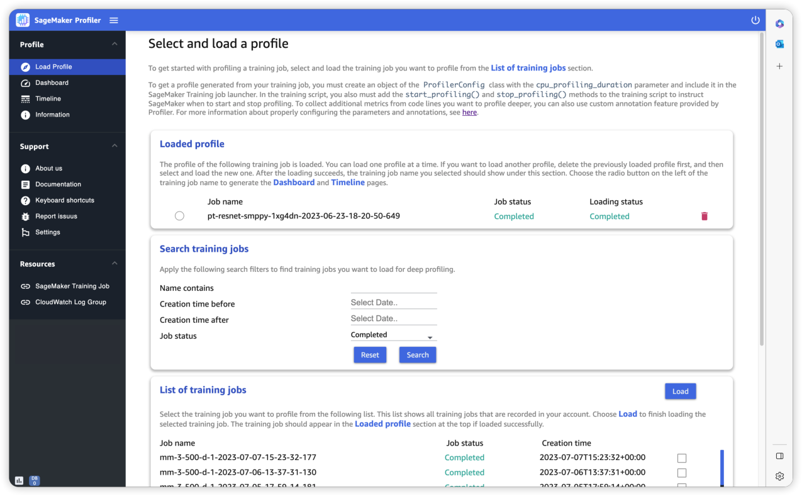

Dashboard

After you finish loading and selecting the training job, the UI opens the Dashboard page furnished
with the following panels by default.

• GPU active time – This pie chart shows the percentage of GPU active time versus GPU idle time.
You can check if your GPUs are more active than idle throughout the entire training job. GPU
active time is based on the profile data points with a utilization rate greater than 0%, whereas
GPU idle time is the profiled data points with 0% utilization.

• GPU utilization over time – This timeline graph shows the average GPU utilization rate over
time per node, aggregating all of the nodes in a single chart. You can check if the GPUs have an
unbalanced workload, under-utilization issues, bottlenecks, or idle issues during certain time
intervals. To track the utilization rate at the individual GPU level and related kernel runs, use the
the section called “Timeline interface”. Note that the GPU activity collection starts from where

you added the profiler starter function SMProf.start_profiling() in your training script,

and stops at SMProf.stop_profiling().

SageMaker Profiler
4824

## Page 854

Amazon SageMaker AI
Developer Guide

• CPU active time – This pie chart shows the percentage of CPU active time versus CPU idle time.
You can check if your CPUs are more active than idle throughout the entire training job. CPU
active time is based on the profiled data points with a utilization rate greater than 0%, whereas
CPU idle time is the profiled data points with 0% utilization.

• CPU utilization over time – This timeline graph shows the average CPU utilization rate over
time per node, aggregating all of the nodes in a single chart. You can check if the CPUs are
bottlenecked or underutilized during certain time intervals. To track the utilization rate of
the CPUs aligned with the individual GPU utilization and kernel runs, use the the section
called “Timeline interface”. Note that the utilization metrics start from the start from the job
initialization.

• Time spent by all GPU kernels – This pie chart shows all GPU kernels operated throughout
the training job. It shows the top 15 GPU kernels by default as individual sectors and all other
kernels in one sector. Hover over the sectors to see more detailed information. The value shows
the total time of the GPU kernels operated in seconds, and the percentage is based on the entire
time of the profile.

• Time spent by top 15 GPU kernels – This pie chart shows all GPU kernels operated throughout
the training job. It shows the top 15 GPU kernels as individual sectors. Hover over the sectors to
see more detailed information. The value shows the total time of the GPU kernels operated in
seconds, and the percentage is based on the entire time of the profile.

• Launch counts of all GPU kernels – This pie chart shows the number of counts for every GPU
kernel launched throughout the training job. It shows the top 15 GPU kernels as individual
sectors and all other kernels in one sector. Hover over the sectors to see more detailed
information. The value shows the total count of the launched GPU kernels, and the percentage is
based on the entire count of all kernels.

• Launch counts of top 15 GPU kernels – This pie chart shows the number of counts of every GPU
kernel launched throughout the training job. It shows the top 15 GPU kernels. Hover over the
sectors to see more detailed information. The value shows the total count of the launched GPU
kernels, and the percentage is based on the entire count of all kernels.

• Step time distribution – This histogram shows the distribution of step durations on GPUs. This
plot is generated only after you add the step annotator in your training script.

• Kernel precision distribution – This pie chart shows the percentage of time spent on running
kernels in different data types such as FP32, FP16, INT32, and INT8.

• GPU activity distribution – This pie chart shows the percentage of time spent on GPU activities,

such as running kernels, memory (memcpy and memset), and synchronization (sync).

SageMaker Profiler
4825

## Page 855

Amazon SageMaker AI
Developer Guide

• GPU memory operations distribution – This pie chart shows the percentage of time spent on

GPU memory operations. This visualizes the memcopy activities and helps identify if your training
job is spending excessive time on certain memory operations.

• Create a new histogram – Create a new diagram of a custom metric you annotated manually
during the section called “Step 1: Adapt your training script using the SageMaker Profiler Python
modules”. When adding a custom annotation to a new histogram, select or type the name of the
annotation you added in the training script. For example, in the demo training script in Step 1,

step, Forward, Backward, Optimize, and Loss are the custom annotations. While creating
a new histogram, these annotation names should appear in the drop-down menu for metric

selection. If you choose Backward, the UI adds the histogram of the time spent on backward
passes throughout the profiled time to the Dashboard. This type of histogram is useful for
checking if there are outliers taking abnormally longer time and causing bottleneck problems.

The following screenshots show the GPU and CPU active time ratio and the average GPU and CPU
utilization rate with respect to time per compute node.

The following screenshot shows an example of pie charts for comparing how many times the GPU
kernels are launched and measuring the time spent on running them. In the Time spent by all GPU
kernels and Launch counts of all GPU kernels panels, you can also specify an integer to the input

SageMaker Profiler
4826

## Page 856

Amazon SageMaker AI
Developer Guide

field for k to adjust the number of legend to show in the plots. For example, if you specify 10, the
plots show the top 10 most run and launched kernels respectively.

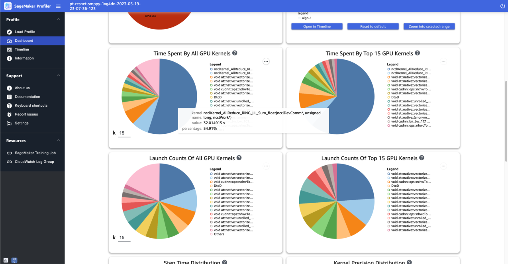

The following screenshot shows an example of step time duration histogram, and pie charts for the
kernel precision distribution, GPU activity distribution, and GPU memory operation distribution.

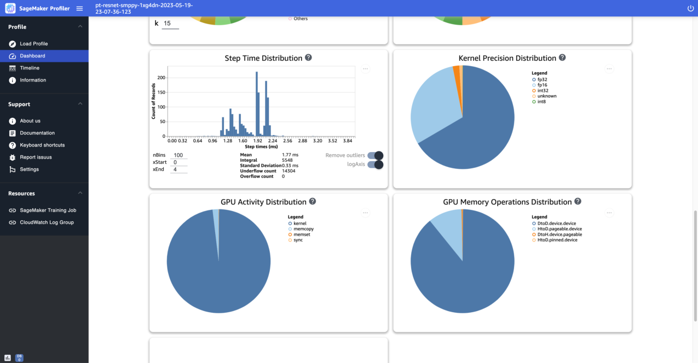

SageMaker Profiler
4827

## Page 857

Amazon SageMaker AI
Developer Guide

Timeline interface

To gain a detailed view into the compute resources at the level of operations and kernels scheduled
on the CPUs and run on the GPUs, use the Timeline interface.

You can zoom in and out and pan left or right in the timeline interface using your mouse, the [w,

a, s, d] keys, or the four arrow keys on the keyboard.

Tip

For more tips on the keyboard shortcuts to interact with the Timeline interface, choose
Keyboard shortcuts in the left pane.

The timeline tracks are organized in a tree structure, giving you information from the host level to

the device level. For example, if you run N instances with eight GPUs in each, the timeline structure
of each instance would be as follows.

• algo-inode – This is what SageMaker AI tags to assign jobs to provisioned instances. The digit inode
is randomly assigned. For example, if you use 4 instances, this section expands from algo-1 to
algo-4.

• CPU – In this section, you can check the average CPU utilization rate and performance
counters.

• GPUs – In this section, you can check the average GPU utilization rate, individual GPU
utilization rate, and kernels.

• SUM Utilization – The average GPU utilization rates per instance.

• HOST-0 PID-123 – A unique name assigned to each process track. The acronym PID is the
process ID, and the number appended to it is the process ID number that's recorded during
data capture from the process. This section shows the following information from the
process.

• GPU-inum_gpu utilization – The utilization rate of the inum_gpu-th GPU over time.

• GPU-inum_gpu device – The kernel runs on the inum_gpu-th GPU device.

• stream icuda_stream – CUDA streams showing kernel runs on the GPU device. To
learn more about CUDA streams, see the slides in PDF at CUDA C/C++ Streams and
Concurrency provided by NVIDIA.

• GPU-inum_gpu host – The kernel launches on the inum_gpu-th GPU host.

SageMaker Profiler
4828

## Page 858

Amazon SageMaker AI
Developer Guide

The following several screenshots show the Timeline of the profile of a training job run on

ml.p4d.24xlarge instances, which are equipped with 8 NVIDIA A100 Tensor Core GPUs in each.

The following is a zoomed-out view of the profile, printing a dozen of steps including an

intermittent data loader between step_232 and step_233 for fetching the next data batch.

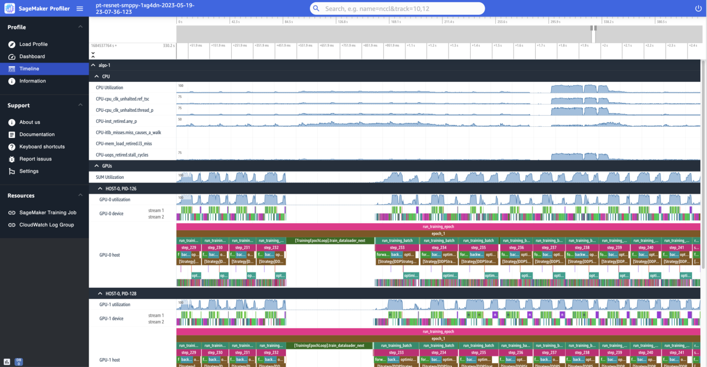

For each CPU, you can track the CPU utilization and performance counters, such as

"clk_unhalted_ref.tsc" and "itlb_misses.miss_causes_a_walk", which are indicative
of instructions run on the CPU.

For each GPU, you can see a host timeline and a device timeline. Kernel launches are on the host
timeline and kernel runs are on the device timeline. You can also see annotations (such as forward,
backward, and optimize) if you have added in training script in the GPU host timeline.

In the timeline view, you can also track kernel launch-and-run pairs. This helps you understand how
a kernel launch scheduled on a host (CPU) is run on the corresponding GPU device.

Tip

Press the f key to zoom into the selected kernel.

SageMaker Profiler
4829

## Page 859

Amazon SageMaker AI
Developer Guide

The following screenshot is a zoomed-in view into step_233 and step_234 from the previous

screenshot. The timeline interval selected in the following screenshot is the AllReduce operation,

an essential communication and synchronization step in distributed training, run on the GPU-0
device. In the screenshot, note that the kernel launch in the GPU-0 host connects to the kernel run

in the GPU-0 device stream 1, indicated with the arrow in cyan color.

Also two information tabs appear in the bottom pane of the UI when you select a timeline interval,
as shown in the previous screenshot. The Current Selection tab shows the details of the selected
kernel and the connected kernel launch from the host. The connection direction is always from
host (CPU) to device (GPU) since each GPU kernel is always called from a CPU. The Connections tab
shows the chosen kernel launch and run pair. You can select either of them to move it to the center
of the Timeline view.

The following screenshot zooms in further into the AllReduce operation launch and run pair.

SageMaker Profiler
4830

## Page 860

Amazon SageMaker AI
Developer Guide

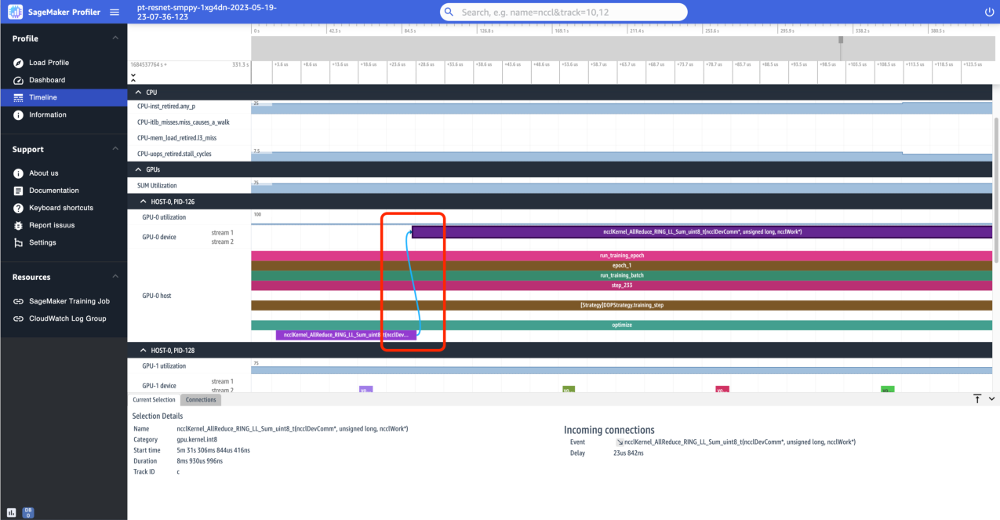

Information

In Information, you can access information about the loaded training job, such as the instance
type, Amazon Resource Names (ARNs) of compute resources provisioned for the job, node names,
and hyperparameters.

Settings

The SageMaker AI Profiler UI application instance is configured to shut down after 2 hours of idle
time by default. In Settings, use the following settings to adjust the auto shutdown timer.

• Enable app auto shutdown – Choose and set to Enabled to let the application automatically
shut down after the specified number of hours of idle time. To turn off the auto-shutdown
functionality, choose Disabled.

• Auto shutdown threshold in hours – If you choose Enabled for Enable app auto shutdown, you
can set the threshold time in hours for the application to shut down automatically. This is set to
2 by default.

SageMaker Profiler
4831

## Page 861

Amazon SageMaker AI
Developer Guide

Troubleshooting for SageMaker Profiler

Use the following question-and-answer pairs to troubleshoot problems while using SageMaker
Profiler.

Q. I’m getting an error message, ModuleNotFoundError: No module named 'smppy'

Since December 2023, the name of the SageMaker Profiler Python package has changed from

smppy to smprof to resolve a duplicate package name issue; smppy is already used by an open
source package.

Therefore, if you have been using smppy since before December 2023 and experiencing this

ModuleNotFoundError issue, it might be due to the outdated package name in your training

script while having the latested smprof package installed or using one of the latest the section
called “SageMaker AI framework images pre-installed with SageMaker Profiler”. In this case, make

sure that you replace all mentions of smppy with smprof throughout your training script.

While updating the SageMaker Profiler Python package name in your training scripts, to avoid
confusion around which version of the package name you should use, consider using a conditional
import statement as shown in the following code snippet.

try:
import smprof
except ImportError:
# backward-compatability for TF 2.11 and PT 1.13.1 images
import smppy as smprof

Also note that if you have been using smppy while upgrading to the latest PyTorch or TensorFlow

versions, make sure that you install the latest smprof package by following instructions at the
section called “(Optional) Install the SageMaker Profiler Python package”.

Q. I’m getting an error message, ModuleNotFoundError: No module named 'smprof'

First, make sure that you use one of the officially supported SageMaker AI Framework Containers.

If you don’t use one of those, you can install the smprof package by following instructions at the
section called “(Optional) Install the SageMaker Profiler Python package”.

Q. I’m not able to import ProfilerConfig

SageMaker Profiler
4832

## Page 862

Amazon SageMaker AI
Developer Guide

If you are unable to import ProfilerConfig in your job launcher script using the SageMaker
Python SDK, your local environment or the Jupyter kernel might have a significantly outdated
version of the SageMaker Python SDK. Make sure that you upgrade the SDK to the latest version.

$ pip install --upgrade sagemaker

Q. I’m getting an error message, aborted: core dumped when importing smprof into

my training script

In an earlier version of smprof, this issue occurs with PyTorch 2.0+ and PyTorch Lightning. To

resolve this issue, also install the latest smprof package by following instructions at the section
called “(Optional) Install the SageMaker Profiler Python package”.

Q. I cannot find the SageMaker Profiler UI from SageMaker Studio. How can I find it?

If you have access to the SageMaker AI console, choose one of the following options.

• the section called “Option 1: Launch the SageMaker Profiler UI from the domain details page”

• the section called “Option 2: Launch the SageMaker Profiler UI application from the SageMaker
Profiler landing page in the SageMaker AI console”

If you are a domain user and don't have access to the SageMaker AI console, you can access the
application through SageMaker Studio Classic. If this is your case, choose the following option.

• the section called “Option 3: Use the application launcher function in the SageMaker AI Python
SDK”

Monitor AWS compute resource utilization in Amazon SageMaker
Studio Classic

To track compute resource utilization of your training job, use the monitoring tools offered by
Amazon SageMaker Debugger.

For any training job you run in SageMaker AI using the SageMaker Python SDK, Debugger
collects basic resource utilization metrics, such as CPU utilization, GPU utilization, GPU memory
utilization, network, and I/O wait time every 500 milliseconds. To see the dashbard of the resource
utilization metrics of your training job, simply use the SageMaker Debugger UI in SageMaker Studio
Experiments.

Monitor AWS compute resource utilization in SageMaker Studio Classic
4833

## Page 863

Amazon SageMaker AI
Developer Guide

Deep learning operations and steps might operate in intervals of milliseconds. Compared to
Amazon CloudWatch metrics, which collect metrics at intervals of 1 second, Debugger provides
finer granularity into the resource utilization metrics down to 100-millisecond (0.1 second)
intervals so you can dive deep into the metrics at the level of an operation or a step.

If you want to change the metric collection time interval, you can add a paramter for profiling
configuration to your training job launcher. For example, if you're using the SageMaker AI Python

SDK, you need to pass the profiler_config parameter when you create an estimator object. To
learn how to adjust the resource utilization metric collection interval, see the section called “Code
template for configuring a SageMaker AI estimator object with the SageMaker Debugger Python
modules in the SageMaker AI Python SDK” and then the section called “Configure settings for basic
profiling of system resource utilization”.

Additionally, you can add issue detecting tools called built-in profiling rules provided by SageMaker
Debugger. The built-in profiling rules run analysis against the resource utilization metrics and
detect computational performance issues. For more information, see the section called “Use built-
in profiler rules”. You can receive rule analysis results through the SageMaker Debugger UI in
SageMaker Studio Experiments or the SageMaker Debugger Profiling Report. You can also create
custom profiling rules using the SageMaker Python SDK.

To learn more about monitoring functionalities provided by SageMaker Debugger, see the
following topics.

Topics

• Estimator configuration with parameters for basic profiling using the Amazon SageMaker
Debugger Python modules

• Use built-in profiler rules managed by Amazon SageMaker Debugger

• List of Debugger built-in profiler rules

• Amazon SageMaker Debugger UI in Amazon SageMaker Studio Classic Experiments

• SageMaker Debugger interactive report

• Analyze data using the Debugger Python client library

Estimator configuration with parameters for basic profiling using the Amazon
SageMaker Debugger Python modules

By default, SageMaker Debugger basic profiling is on by default and monitors resource utilization
metrics, such as CPU utilization, GPU utilization, GPU memory utilization, Network, and I/O

Monitor AWS compute resource utilization in SageMaker Studio Classic
4834

## Page 864

Amazon SageMaker AI
Developer Guide

wait time, of all SageMaker training jobs submitted using the Amazon SageMaker Python SDK.
SageMaker Debugger collects these resource utilization metrics every 500 milliseconds. You don't
need to make any additional changes in your code, training script, or the job launcher for tracking
basic resource utilization. If you want to change the metric collection interval for basic profiling,
you can specify Debugger-specific parameters while creating a SageMaker training job launcher
using the SageMaker Python SDK, AWS SDK for Python (Boto3), or AWS Command Line Interface
(CLI). In this guide, we focus on how to change profiling options using the Amazon SageMaker
Python SDK. This page gives reference templates for configuring this estimator object.

If you want to access the resource utilization metrics dashboard of your training job in SageMaker
Studio, you can jump onto the Amazon SageMaker Debugger UI in Amazon SageMaker Studio
Classic Experiments.

If you want to activate the rules that detect system resource utilization problems automatically,

you can add the rules parameter in the estimator object for activating the rules.

Important

To use the latest SageMaker Debugger features, you need to upgrade the SageMaker

Python SDK and the SMDebug client library. In your iPython kernel, Jupyter Notebook, or
JupyterLab environment, run the following code to install the latest versions of the libraries
and restart the kernel.

import sys
import IPython
!{sys.executable} -m pip install -U sagemaker smdebug
IPython.Application.instance().kernel.do_shutdown(True)

Code template for configuring a SageMaker AI estimator object with the SageMaker Debugger
Python modules in the SageMaker AI Python SDK

To adjust the basic profiling configuration (profiler_config) or add the profiler rules (rules),
choose one of the tabs to get the template for setting up a SageMaker AI estimator. In the
subsequent pages, you can find more information about how to configure the two parameters.

Monitor AWS compute resource utilization in SageMaker Studio Classic
4835

## Page 865

Amazon SageMaker AI
Developer Guide

Note

The following code examples are not directly executable. Proceed to the next sections to
learn how to configure each parameter.

PyTorch

# An example of constructing a SageMaker AI PyTorch estimator
import boto3
import sagemaker
from sagemaker.pytorch import PyTorch
from sagemaker.debugger import ProfilerConfig, ProfilerRule, rule_configs

session=boto3.session.Session()
region=session.region_name

profiler_config=ProfilerConfig(...)
rules=[
ProfilerRule.sagemaker(rule_configs.BuiltInRule())
]

estimator=PyTorch(
entry_point="directory/to/your_training_script.py",
role=sagemaker.get_execution_role(),
base_job_name="debugger-profiling-demo",
instance_count=1,
instance_type="ml.p3.2xlarge",
framework_version="1.12.0",
py_version="py37",
# SageMaker Debugger parameters
profiler_config=profiler_config,
rules=rules
)

estimator.fit(wait=False)

TensorFlow

# An example of constructing a SageMaker AI TensorFlow estimator
import boto3

Monitor AWS compute resource utilization in SageMaker Studio Classic
4836

## Page 866

Amazon SageMaker AI
Developer Guide

import sagemaker
from sagemaker.tensorflow import TensorFlow
from sagemaker.debugger import ProfilerConfig, ProfilerRule, rule_configs

session=boto3.session.Session()
region=session.region_name

profiler_config=ProfilerConfig(...)
rules=[
ProfilerRule.sagemaker(rule_configs.BuiltInRule())
]

estimator=TensorFlow(
entry_point="directory/to/your_training_script.py",
role=sagemaker.get_execution_role(),
base_job_name="debugger-profiling-demo",
instance_count=1,

instance_type="ml.p3.2xlarge",
framework_version="2.8.0",
py_version="py37",
# SageMaker Debugger parameters
profiler_config=profiler_config,
rules=rules
)

estimator.fit(wait=False)

MXNet

# An example of constructing a SageMaker AI MXNet estimator
import sagemaker
from sagemaker.mxnet import MXNet
from sagemaker.debugger import ProfilerConfig, ProfilerRule, rule_configs

profiler_config=ProfilerConfig(...)
rules=[
ProfilerRule.sagemaker(rule_configs.BuiltInRule())
]

estimator=MXNet(
entry_point="directory/to/your_training_script.py",
role=sagemaker.get_execution_role(),

Monitor AWS compute resource utilization in SageMaker Studio Classic
4837

## Page 867

Amazon SageMaker AI
Developer Guide

base_job_name="debugger-profiling-demo",
instance_count=1,
instance_type="ml.p3.2xlarge",
framework_version="1.7.0",
py_version="py37",
# SageMaker Debugger parameters
profiler_config=profiler_config,
rules=rules
)

estimator.fit(wait=False)

Note

For MXNet, when configuring the profiler_config parameter, you can only configure
for system monitoring. Profiling framework metrics is not supported for MXNet.

XGBoost

# An example of constructing a SageMaker AI XGBoost estimator
import sagemaker
from sagemaker.xgboost.estimator import XGBoost
from sagemaker.debugger import ProfilerConfig, ProfilerRule, rule_configs

profiler_config=ProfilerConfig(...)
rules=[
ProfilerRule.sagemaker(rule_configs.BuiltInRule())
]

estimator=XGBoost(
entry_point="directory/to/your_training_script.py",
role=sagemaker.get_execution_role(),
base_job_name="debugger-profiling-demo",
instance_count=1,
instance_type="ml.p3.2xlarge",
framework_version="1.5-1",

# Debugger-specific parameters
profiler_config=profiler_config,
rules=rules

Monitor AWS compute resource utilization in SageMaker Studio Classic
4838

## Page 868

Amazon SageMaker AI
Developer Guide

)

estimator.fit(wait=False)

Note

For XGBoost, when configuring the profiler_config parameter, you can only
configure for system monitoring. Profiling framework metrics is not supported for
XGBoost.

Generic estimator

# An example of constructing a SageMaker AI generic estimator using the XGBoost
algorithm base image
import boto3
import sagemaker
from sagemaker.estimator import Estimator
from sagemaker import image_uris
from sagemaker.debugger import ProfilerConfig, DebuggerHookConfig, Rule,
ProfilerRule, rule_configs

profiler_config=ProfilerConfig(...)
rules=[
ProfilerRule.sagemaker(rule_configs.BuiltInRule())
]

region=boto3.Session().region_name
xgboost_container=sagemaker.image_uris.retrieve("xgboost", region, "1.5-1")

estimator=Estimator(
role=sagemaker.get_execution_role()
image_uri=xgboost_container,
base_job_name="debugger-demo",
instance_count=1,
instance_type="ml.m5.2xlarge",
# Debugger-specific parameters
profiler_config=profiler_config,
rules=rules
)

Monitor AWS compute resource utilization in SageMaker Studio Classic
4839

## Page 869

Amazon SageMaker AI
Developer Guide

estimator.fit(wait=False)

The following provides brief descriptions of the parameters.

• profiler_config – Configure Debugger to collect system metrics and framework metrics
from your training job and save into your secured S3 bucket URI or local machine. You can
set how frequently or loosely collect the system metrics. To learn how to configure the

profiler_config parameter, see Configure settings for basic profiling of system resource
utilization and Estimator configuration for framework profiling.

• rules – Configure this parameter to activate SageMaker Debugger built-in rules that you want
to run in parallel. Make sure that your training job has access to this S3 bucket. The rules runs
on processing containers and automatically analyze your training job to find computational and
operational performance issues. The ProfilerReport rule is the most integrated rule that runs all
built-in profiling rules and saves the profiling results as a report into your secured S3 bucket. To

learn how to configure the rules parameter, see Use built-in profiler rules managed by Amazon
SageMaker Debugger.

Note

Debugger securely saves output data in subfolders of your default S3 bucket. For

example, the format of the default S3 bucket URI is s3://sagemaker-<region>-

<12digit_account_id>/<base-job-name>/<debugger-subfolders>/. There are

three subfolders created by Debugger: debug-output, profiler-output, and rule-

output. You can also retrieve the default S3 bucket URIs using the SageMaker AI estimator
classmethods.

See the following topics to find out how to configure the Debugger-specific parameters in detail.

Topics

• Configure settings for basic profiling of system resource utilization

• Estimator configuration for framework profiling

• Updating Debugger system monitoring and framework profiling configuration while a training
job is running

• Turn off Debugger

Monitor AWS compute resource utilization in SageMaker Studio Classic
4840

## Page 870

Amazon SageMaker AI
Developer Guide

Configure settings for basic profiling of system resource utilization

To adjust the time interval for collecting the utilization metrics, use the ProfilerConfig API
operation to create a parameter object while constructing a SageMaker AI framework or generic
estimator depending on your preference.

Note

By default, for all SageMaker training jobs, Debugger collects resource utilization metrics
from Amazon EC2 instances every 500 milliseconds for system monitoring, without any
Debugger-specific parameters specified in SageMaker AI estimators.
Debugger saves the system metrics in the default S3 bucket. The format of the default S3

bucket URI is s3://sagemaker-<region>-<12digit_account_id>/<training-

job-name>/profiler-output/.

The following code example shows how to set up the profiler_config parameter with a system
monitoring time interval of 1000 milliseconds.

from sagemaker.debugger import ProfilerConfig

profiler_config=ProfilerConfig(
system_monitor_interval_millis=1000
)

• system_monitor_interval_millis (int) – Specify the monitoring intervals in milliseconds
to record system metrics. Available values are 100, 200, 500, 1000 (1 second), 5000 (5 seconds),
and 60000 (1 minute) milliseconds. The default value is 500 milliseconds.

To see the progress of system monitoring, see Open the Amazon SageMaker Debugger Insights
dashboard.

Estimator configuration for framework profiling

Warning

In favor of Amazon SageMaker Profiler, SageMaker AI Debugger deprecates the framework
profiling feature starting from TensorFlow 2.11 and PyTorch 2.0. You can still use the
feature in the previous versions of the frameworks and SDKs as follows.

Monitor AWS compute resource utilization in SageMaker Studio Classic
4841

## Page 871

Amazon SageMaker AI
Developer Guide

• SageMaker Python SDK <= v2.130.0

• PyTorch >= v1.6.0, < v2.0

• TensorFlow >= v2.3.1, < v2.11

See also March 16, 2023.

To enable Debugger framework profiling, configure the framework_profile_params parameter
when you construct an estimator. Debugger framework profiling collects framework metrics,
such as data from initialization stage, data loader processes, Python operators of deep learning
frameworks and training scripts, detailed profiling within and between steps, with cProfile or

Pyinstrument options. Using the FrameworkProfile class, you can configure custom framework
profiling options.

Note

Before getting started with Debugger framework profiling, verify that the framework
used to build your model is supported by Debugger for framework profiling. For more
information, see Supported frameworks and algorithms.
Debugger saves the framework metrics in a default S3 bucket. The format of the default

S3 bucket URI is s3://sagemaker-<region>-<12digit_account_id>/<training-

job-name>/profiler-output/.

Topics

• Default framework profiling

• Default system monitoring and customized framework profiling for target steps or a target time
range

• Default system monitoring and customized framework profiling with different profiling options

Default framework profiling

Debugger framework default profiling includes the following options: detailed profiling,
data loader profiling, and Python profiling. The following example code is the simplest

profiler_config parameter setting to start the default system monitoring and the default

Monitor AWS compute resource utilization in SageMaker Studio Classic
4842

## Page 872

Amazon SageMaker AI
Developer Guide

framework profiling. The FrameworkProfile class in the following example code initiates the
default framework profiling when a training job starts.

from sagemaker.debugger import ProfilerConfig, FrameworkProfile
profiler_config=ProfilerConfig(
framework_profile_params=FrameworkProfile()
)

With this profiler_config parameter configuration, Debugger calls the default settings of
monitoring and profiling. Debugger monitors system metrics every 500 milliseconds; profiles the
fifth step with the detailed profiling option; the seventh step with the data loader profiling option;
and the ninth, tenth, and eleventh steps with the Python profiling option.

To find available profiling configuration options, the default parameter settings, and examples
of how to configure them, see Default system monitoring and customized framework profiling
with different profiling options and SageMaker Debugger APIs – FrameworkProfile in the Amazon
SageMaker Python SDK.

If you want to change the system monitoring interval and enable the default framework profiling,

you can specify the system_monitor_interval_millis parameter explicitly with the

framework_profile_params parameter. For example, to monitor every 1000 milliseconds and
enable the default framework profiling, use the following example code.

from sagemaker.debugger import ProfilerConfig, FrameworkProfile
profiler_config=ProfilerConfig(
system_monitor_interval_millis=1000,
framework_profile_params=FrameworkProfile()
)

For more information about the FrameworkProfile class, see SageMaker Debugger APIs –
FrameworkProfile in the Amazon SageMaker Python SDK.

Default system monitoring and customized framework profiling for target steps or a target
time range

If you want to specify target steps or target time intervals to profile your training job, you need to

specify parameters for the FrameworkProfile class. The following code examples show how to
specify the target ranges for profiling along with system monitoring.

Monitor AWS compute resource utilization in SageMaker Studio Classic
4843

## Page 873

Amazon SageMaker AI
Developer Guide

• For a target step range

With the following example configuration, Debugger monitors the entire training job every 500
milliseconds (the default monitoring) and profiles a target step range from step 5 to step 15 (for
10 steps).

from sagemaker.debugger import ProfilerConfig, FrameworkProfile
profiler_config=ProfilerConfig(
framework_profile_params=FrameworkProfile(start_step=5, num_steps=10)
)

With the following example configuration, Debugger monitors the entire training job every 1000
milliseconds and profiles a target step range from step 5 to step 15 (for 10 steps).

from sagemaker.debugger import ProfilerConfig, FrameworkProfile
profiler_config=ProfilerConfig(
system_monitor_interval_millis=1000,
framework_profile_params=FrameworkProfile(start_step=5, num_steps=10)
)

• For a target time range

With the following example configuration, Debugger monitors the entire training job every 500
milliseconds (the default monitoring) and profiles a target time range from the current Unix time
for 600 seconds.

import time
from sagemaker.debugger import ProfilerConfig, FrameworkProfile

profiler_config=ProfilerConfig(
framework_profile_params=FrameworkProfile(start_unix_time=int(time.time()),
duration=600)
)

With the following example configuration, Debugger monitors the entire training job every 1000
milliseconds and profiles a target time range from the current Unix time for 600 seconds.

import time
from sagemaker.debugger import ProfilerConfig, FrameworkProfile

Monitor AWS compute resource utilization in SageMaker Studio Classic
4844

## Page 874

Amazon SageMaker AI
Developer Guide

profiler_config=ProfilerConfig(
system_monitor_interval_millis=1000,
framework_profile_params=FrameworkProfile(start_unix_time=int(time.time()),
duration=600)
)

The framework profiling is performed for all of the profiling options at the target step or time
range.

To find more information about available profiling options, see SageMaker Debugger APIs –
FrameworkProfile in the Amazon SageMaker Python SDK.

The next section shows you how to script the available profiling options.

Default system monitoring and customized framework profiling with different profiling options

This section gives information about the supported profiling configuration classes, as well as an
example configuration. You can use the following profiling configuration classes to manage the
framework profiling options:

• DetailedProfilingConfig – Specify a target step or time range to profile framework operations
using the native framework profilers (TensorFlow profiler and PyTorch profiler). For example,
if using TensorFlow, the Debugger hooks enable the TensorFlow profiler to collect TensorFlow-
specific framework metrics. Detailed profiling enables you to profile all framework operators at a
pre-step (before the first step), within steps, and between steps of a training job.

Note

Detailed profiling might significantly increase GPU memory consumption. We do not
recommend enabling detailed profiling for more than a couple of steps.

• DataloaderProfilingConfig – Specify a target step or time range to profile deep learning
framework data loader processes. Debugger collects every data loader event of the frameworks.

Monitor AWS compute resource utilization in SageMaker Studio Classic
4845

## Page 875

Amazon SageMaker AI
Developer Guide

Note

Data loader profiling might lower the training performance while collecting information
from data loaders. We don't recommend enabling data loader profiling for more than a
couple of steps.
Debugger is preconfigured to annotate data loader processes only for the AWS deep
learning containers. Debugger cannot profile data loader processes from any other
custom or external training containers.

• PythonProfilingConfig – Specify a target step or time range to profile Python functions. You can
also choose between two Python profilers: cProfile and Pyinstrument.

• cProfile – The standard Python profiler. cProfile collects information for every Python operator
called during training. With cProfile, Debugger saves cumulative time and annotation for
each function call, providing complete detail about Python functions. In deep learning, for
example, the most frequently called functions might be the convolutional filters and backward
pass operators, and cProfile profiles every single of them. For the cProfile option, you can
further select a timer option: total time, CPU time, and off-CPU time. While you can profile
every function call executing on processors (both CPU and GPU) in CPU time, you can also
identify I/O or network bottlenecks with the off-CPU time option. The default is total time,
and Debugger profiles both CPU and off-CPU time. With cProfile, you are able to drill down to
every single functions when analyzing the profile data.

• Pyinstrument – Pyinstrument is a low-overhead Python profiler that works based on sampling.
With the Pyinstrument option, Debugger samples profiling events every millisecond. Because
Pyinstrument measures elapsed wall-clock time instead of CPU time, the Pyinstrument option
can be a better choice over the cProfile option for reducing profiling noise (filtering out
irrelevant function calls that are cumulatively fast) and capturing operators that are actually
compute intensive (cumulatively slow) for training your model. With Pyinstrument, you are
able to see a tree of function calls and better understand the structure and root cause of the
slowness.

Note

Enabling Python profiling might slow down the overall training time. cProfile profiles the
most frequently called Python operators at every call, so the processing time on profiling

Monitor AWS compute resource utilization in SageMaker Studio Classic
4846

## Page 876

Amazon SageMaker AI
Developer Guide

increases with respect to the number of calls. For Pyinstrument, the cumulative profiling
time increases with respect to time because of its sampling mechanism.

The following example configuration shows the full structure when you use the different profiling
options with specified values.

import time
from sagemaker.debugger import (ProfilerConfig,
FrameworkProfile,
DetailedProfilingConfig,
DataloaderProfilingConfig,
PythonProfilingConfig,
PythonProfiler, cProfileTimer)

profiler_config=ProfilerConfig(
system_monitor_interval_millis=500,
framework_profile_params=FrameworkProfile(
detailed_profiling_config=DetailedProfilingConfig(
start_step=5,
num_steps=1
),
dataloader_profiling_config=DataloaderProfilingConfig(
start_step=7,
num_steps=1
),
python_profiling_config=PythonProfilingConfig(
start_step=9,
num_steps=1,
python_profiler=PythonProfiler.CPROFILE,
cprofile_timer=cProfileTimer.TOTAL_TIME
)
)
)

For more information about available profiling options, see DetailedProfilingConfig,
DataloaderProfilingConfig, and PythonProfilingConfig in the Amazon SageMaker Python SDK.

Monitor AWS compute resource utilization in SageMaker Studio Classic
4847

## Page 877

Amazon SageMaker AI
Developer Guide

Updating Debugger system monitoring and framework profiling configuration while a training
job is running

If you want to activate or update the Debugger monitoring configuration for a training job that is
currently running, use the following SageMaker AI estimator extension methods:

• To activate Debugger system monitoring for a running training job and receive a Debugger
profiling report, use the following:

estimator.enable_default_profiling()

When you use the enable_default_profiling method, Debugger initiates the default

system monitoring and the ProfileReport built-in rule, which generates a comprehensive
profiling report at the end of the training job. This method can be called only if the current
training job is running without both Debugger monitoring and profiling.

For more information, see estimator.enable_default_profiling in the Amazon SageMaker Python
SDK.

• To update system monitoring configuration, use the following:

estimator.update_profiler(
system_monitor_interval_millis=500
)

For more information, see estimator.update_profiler in the Amazon SageMaker Python SDK.

Turn off Debugger

If you want to completely turn off Debugger, do one of the following:

• Before starting a training job, do the following:

To turn off profiling, include the disable_profiler parameter to your estimator and set it to

True.

Monitor AWS compute resource utilization in SageMaker Studio Classic
4848

## Page 878

Amazon SageMaker AI
Developer Guide

Warning

If you disable it, you won't be able to view the comprehensive Studio Debugger insights
dashboard and the autogenerated profiling report.

To turn off debugging, set the debugger_hook_config parameter to False.

Warning

If you disable it, you won't be able to collect output tensors and cannot debug your
model parameters.

estimator=Estimator(
...
disable_profiler=True
debugger_hook_config=False
)

For more information about the Debugger-specific parameters, see SageMaker AI Estimator in
the Amazon SageMaker Python SDK.

• While a training job is running, do the following:

To disable both monitoring and profiling while your training job is running, use the following
estimator classmethod:

estimator.disable_profiling()

To disable framework profiling only and keep system monitoring, use the update_profiler
method:

estimator.update_profiler(disable_framework_metrics=true)

For more information about the estimator extension methods, see the
estimator.disable_profiling and estimator.update_profiler classmethods in the Amazon
SageMaker Python SDK documentation.

Monitor AWS compute resource utilization in SageMaker Studio Classic
4849

## Page 879

Amazon SageMaker AI
Developer Guide

Use built-in profiler rules managed by Amazon SageMaker Debugger

The Amazon SageMaker Debugger built-in profiler rules analyze system metrics and framework

operations collected during the training of a model. Debugger offers the ProfilerRule API
operation that helps configure the rules to monitor training compute resources and operations
and to detect anomalies. For example, the profiling rules can help you detect whether there are
computational problems such as CPU bottlenecks, excessive I/O wait time, imbalanced workload
across GPU workers, and compute resource underutilization. To see a full list of available built-in
profiling rules, see List of Debugger built-in profiler rules. The following topics show how to use
the Debugger built-in rules with default parameter settings and custom parameter values.

Note

The built-in rules are provided through Amazon SageMaker processing containers and

fully managed by SageMaker Debugger at no additional cost. For more information about
billing, see the Amazon SageMaker Pricing page.

Topics

• Use SageMaker Debugger built-in profiler rules with their default parameter settings

• Use Debugger built-in profiler rules with custom parameter values

Use SageMaker Debugger built-in profiler rules with their default parameter settings

To add SageMaker Debugger built-in rules in your estimator, you need to configure a rules list
object. The following example code shows the basic structure of listing the SageMaker Debugger
built-in rules.

from sagemaker.debugger import Rule, ProfilerRule, rule_configs

rules=[
ProfilerRule.sagemaker(rule_configs.BuiltInProfilerRuleName_1()),
ProfilerRule.sagemaker(rule_configs.BuiltInProfilerRuleName_2()),
...
ProfilerRule.sagemaker(rule_configs.BuiltInProfilerRuleName_n()),
... # You can also append more debugging rules in the
Rule.sagemaker(rule_configs.*()) format.
]

Monitor AWS compute resource utilization in SageMaker Studio Classic
4850

## Page 880

Amazon SageMaker AI
Developer Guide

estimator=Estimator(
...
rules=rules
)

For a complete list of available built-in rules, see List of Debugger built-in profiler rules.

To use the profiling rules and inspect the computational performance and progress of your

training job, add the ProfilerReport rule of SageMaker Debugger. This rule activates all built-

in rules under the Debugger ProfilerRule ProfilerRule family. Furthermore, this rule generates
an aggregated profiling report. For more information, see Profiling Report Generated Using
SageMaker Debugger. You can use the following code to add the profiling report rule to your
training estimator.

from sagemaker.debugger import Rule, rule_configs

rules=[
ProfilerRule.sagemaker(rule_configs.ProfilerReport())
]

When you start the training job with the ProfilerReport rule, Debugger collects resource
utilization data every 500 milliseconds. Debugger analyzes the resource utilization to identify
if your model is having bottleneck problems. If the rules detect training anomalies, the rule

evaluation status changes to IssueFound. You can set up automated actions, such as notifying
training issues and stopping training jobs using Amazon CloudWatch Events and AWS Lambda. For
more information, see Action on Amazon SageMaker Debugger rules.

Use Debugger built-in profiler rules with custom parameter values

If you want to adjust the built-in rule parameter values and customize tensor collection

regex, configure the base_config and rule_parameters parameters for the

ProfilerRule.sagemaker and Rule.sagemaker class methods. In case of the

Rule.sagemaker class methods, you can also customize tensor collections through the

collections_to_save parameter. For instruction on how to use the CollectionConfig class,

see Configure tensor collections using the CollectionConfig API.

Use the following configuration template for built-in rules to customize parameter values. By
changing the rule parameters as you want, you can adjust the sensitivity of the rules to be initiated.

Monitor AWS compute resource utilization in SageMaker Studio Classic
4851

## Page 881

Amazon SageMaker AI
Developer Guide

• The base_config argument is where you call the built-in rule methods.

• The rule_parameters argument is to adjust the default key values of the built-in rules listed in
List of Debugger built-in profiler rules.

For more information about the Debugger rule class, methods, and parameters, see SageMaker AI
Debugger Rule class in the Amazon SageMaker Python SDK.

from sagemaker.debugger import Rule, ProfilerRule, rule_configs, CollectionConfig

rules=[
ProfilerRule.sagemaker(
base_config=rule_configs.BuiltInProfilerRuleName(),
rule_parameters={
"key": "value"
}
)
]

The parameter descriptions and value customization examples are provided for each rule at List of
Debugger built-in profiler rules.

For a low-level JSON configuration of the Debugger built-in rules using the CreateTrainingJob
API, see Configure Debugger using SageMaker API.

List of Debugger built-in profiler rules

Use the Debugger built-in profiler rules provided by Amazon SageMaker Debugger and analyze
metrics collected while training your models. The Debugger built-in rules monitor various common
conditions that are critical for the success of running a performant training job. You can call
the built-in profiler rules using Amazon SageMaker Python SDK or the low-level SageMaker API
operations. There's no additional cost for using the built-in rules. For more information about
billing, see the Amazon SageMaker Pricing page.

Note

The maximum numbers of built-in profiler rules that you can attach to a training job is
20. SageMaker Debugger fully manages the built-in rules and analyzes your training job
synchronously.

Monitor AWS compute resource utilization in SageMaker Studio Classic
4852

## Page 882

Amazon SageMaker AI
Developer Guide

Important

To use the new Debugger features, you need to upgrade the SageMaker Python SDK
and the SMDebug client library. In your iPython kernel, Jupyter notebook, or JupyterLab
environment, run the following code to install the latest versions of the libraries and restart
the kernel.

import sys
import IPython
!{sys.executable} -m pip install -U sagemaker smdebug
IPython.Application.instance().kernel.do_shutdown(True)

Profiler rules

The following rules are the Debugger built-in rules that are callable using the

ProfilerRule.sagemaker classmethod.

Debugger built-in rule for generating the profiling report

Scope of Validity
Built-in Rules

• ProfilerReport

Profiling Report for any SageMaker training
job

Debugger built-in rules for profiling hardware system resource utilization (system metrics)

Scope of Validity
Built-in Rules

• BatchSize

Generic system monitoring rules for any
SageMaker training job

• CPUBottleneck

• GPUMemoryIncrease

• IOBottleneck

• LoadBalancing

• LowGPUUtilization

• OverallSystemUsage

Monitor AWS compute resource utilization in SageMaker Studio Classic
4853

## Page 883

Amazon SageMaker AI
Developer Guide

Debugger built-in rules for profiling framework metrics

Scope of Validity
Built-in Rules

• MaxInitializationTime

Profiling rules for deep learning frameworks
(TensorFlow and PyTorch)

• OverallFrameworkMetrics

• StepOutlier

Warning

In favor of Amazon SageMaker Profiler, SageMaker AI Debugger deprecates the framework
profiling feature starting from TensorFlow 2.11 and PyTorch 2.0. You can still use the
feature in the previous versions of the frameworks and SDKs as follows.

• SageMaker Python SDK <= v2.130.0

• PyTorch >= v1.6.0, < v2.0

• TensorFlow >= v2.3.1, < v2.11

See also March 16, 2023.

To use the built-in rules with default parameter values – use the following configuration format:

from sagemaker.debugger import Rule, ProfilerRule, rule_configs

rules = [
ProfilerRule.sagemaker(rule_configs.BuiltInRuleName_1()),
ProfilerRule.sagemaker(rule_configs.BuiltInRuleName_2()),
...
ProfilerRule.sagemaker(rule_configs.BuiltInRuleName_n())
]

To use the built-in rules with customizing the parameter values – use the following configuration
format:

from sagemaker.debugger import Rule, ProfilerRule, rule_configs

Monitor AWS compute resource utilization in SageMaker Studio Classic
4854

## Page 884

Amazon SageMaker AI
Developer Guide

rules = [
ProfilerRule.sagemaker(
base_config=rule_configs.BuiltInRuleName(),
rule_parameters={
"key": "value"
}
)
]

To find available keys for the rule_parameters parameter, see the parameter description tables.

Sample rule configuration codes are provided for each built-in rule below the parameter
description tables.

• For a full instruction and examples of using the Debugger built-in rules, see Debugger built-in
rules example code.

• For a full instruction on using the built-in rules with the low-level SageMaker API operations, see
Configure Debugger using SageMaker API.

ProfilerReport

The ProfilerReport rule invokes all of the built-in rules for monitoring and profiling. It creates
a profiling report and updates when the individual rules are triggered. You can download a
comprehensive profiling report while a training job is running or after the training job is complete.
You can adjust the rule parameter values to customize sensitivity of the built-in monitoring and
profiling rules. The following example code shows the basic format to adjust the built-in rule
parameters through the ProfilerReport rule.

rules=[
ProfilerRule.sagemaker(
rule_configs.ProfilerReport(
<BuiltInRuleName>_<parameter_name> = value
)
)
]

If you trigger this ProfilerReport rule without any customized parameter as shown in the following
example code, then the ProfilerReport rule triggers all of the built-in rules for monitoring and
profiling with their default parameter values.

Monitor AWS compute resource utilization in SageMaker Studio Classic
4855

## Page 885

Amazon SageMaker AI
Developer Guide

rules=[ProfilerRule.sagemaker(rule_configs.ProfilerReport())]

The following example code shows how to specify and adjust the CPUBottleneck rule's

cpu_threshold parameter and the IOBottleneck rule's threshold parameter.

rules=[
ProfilerRule.sagemaker(
rule_configs.ProfilerReport(
CPUBottleneck_cpu_threshold = 90,
IOBottleneck_threshold = 90
)
)
]

To explore what's in the profiler report, see SageMaker Debugger Profiling Report. Also, because
this rule activates all of the profiling rules, you can also check the rule analysis status using the
SageMaker Debugger UI in SageMaker Studio Experiments.

Parameter Descriptions for the OverallSystemUsage Rule

Parameter Name
Description

base_trial
The base trial training job name. This
parameter is automatically set to the current
training job by Amazon SageMaker Debugger.

Required

Valid values: String

Customizable parameter to adjust threshold
s of other built-in monitoring and profiling
rules.

<BuiltInRuleName>_<paramete

r_name>

Optional

Default value: None

Monitor AWS compute resource utilization in SageMaker Studio Classic
4856

## Page 886

Amazon SageMaker AI
Developer Guide

BatchSize

The BatchSize rule helps detect if GPU is underutilized due to a small batch size. To detect this
issue, this rule monitors the average CPU utilization, GPU utilization, and GPU memory utilization.
If utilization on CPU, GPU, and GPU memory is low on average, it may indicate that the training job
can either run on a smaller instance type or can run with a bigger batch size. This analysis does not
work for frameworks that heavily overallocate memory. However, increasing the batch size can lead
to processing or data loading bottlenecks because more data preprocessing time is required in each
iteration.

Parameter Descriptions for the BatchSize Rule

Parameter Name
Description

base_trial
The base trial training job name. This
parameter is automatically set to the current
training job by Amazon SageMaker Debugger.

Required

Valid values: String

cpu_threshold_p95
Defines the threshold for 95th quantile of CPU
utilization in percentage.

Optional

Valid values: Integer

Default value: 70 (in percentage)

gpu_threshold_p95
Defines the threshold for 95th quantile of
GPU utilization in percentage.

Optional

Valid values: Integer

Default value: 70 (in percentage)

Monitor AWS compute resource utilization in SageMaker Studio Classic
4857

## Page 887

Amazon SageMaker AI
Developer Guide

Parameter Name
Description

gpu_memory_threshold_p95
Defines the threshold for 95th quantile of
GPU memory utilization in percentage.

Optional

Valid values: Integer

Default values: 70 (in percentage)

patience
Defines the number of data points to skip
until the rule starts evaluation. The first
several steps of training jobs usually show
high volume of data processes, so keep the
rule patient and prevent it from being invoked
too soon with a given number of profiling data
that you specify with this parameter.

Optional

Valid values: Integer

Default values: 100

window
Window size for computing quantiles.

Optional

Valid values: Integer

Default values: 500

scan_interval_us
Time interval that timeline files are scanned.

Optional

Valid values: Integer

Default values: 60000000 (in microseconds)

Monitor AWS compute resource utilization in SageMaker Studio Classic
4858

## Page 888

Amazon SageMaker AI
Developer Guide

CPUBottleneck

The CPUBottleneck rule helps detect if GPU is underutilized due to CPU bottlenecks. Rule returns
True if number of CPU bottlenecks exceeds a predefined threshold.

Parameter Descriptions for the CPUBottleneck Rule

Parameter Name
Description

base_trial
The base trial training job name. This
parameter is automatically set to the current
training job by Amazon SageMaker Debugger.

Required

Valid values: String

threshold
Defines the threshold for proportion of
bottlenecked time to the total training time.
If the proportion exceeds the percentage
specified to the threshold parameter, the rule
switches the rule status to True.

Optional

Valid values: Integer

Default value: 50 (in percentage)

gpu_threshold
A threshold that defines low GPU utilization.

Optional

Valid values: Integer

Default value: 10 (in percentage)

cpu_threshold
A threshold that defines high CPU utilization.

Optional

Valid values: Integer

Monitor AWS compute resource utilization in SageMaker Studio Classic
4859

## Page 889

Amazon SageMaker AI
Developer Guide

Parameter Name
Description

Default values: 90 (in percentage)

patience
Defines the number of data points to skip

until the rule starts evaluation. The first
several steps of training jobs usually show
high volume of data processes, so keep the
rule patient and prevent it from being invoked
too soon with a given number of profiling data
that you specify with this parameter.

Optional

Valid values: Integer

Default values: 100

scan_interval_us
Time interval with which timeline files are
scanned.

Optional

Valid values: Integer

Default values: 60000000 (in microseconds)

GPUMemoryIncrease

The GPUMemoryIncrease rule helps detect a large increase in memory usage on GPUs.

Parameter Descriptions for the GPUMemoryIncrease Rule

Parameter Name
Description

base_trial
The base trial training job name. This
parameter is automatically set to the current
training job by Amazon SageMaker Debugger.

Required

Monitor AWS compute resource utilization in SageMaker Studio Classic
4860

## Page 890

Amazon SageMaker AI
Developer Guide

Parameter Name
Description

Valid values: String

increase
Defines the threshold for absolute memory
increase.

Optional

Valid values: Integer

Default value: 10 (in percentage)

patience
Defines the number of data points to skip
until the rule starts evaluation. The first
several steps of training jobs usually show
high volume of data processes, so keep the
rule patient and prevent it from being invoked
too soon with a given number of profiling data
that you specify with this parameter.

Optional

Valid values: Integer

Default values: 100

window
Window size for computing quantiles.

Optional

Valid values: Integer

Default values: 500

scan_interval_us
Time interval that timeline files are scanned.

Optional

Valid values: Integer

Default values: 60000000 (in microseconds)

Monitor AWS compute resource utilization in SageMaker Studio Classic
4861

## Page 891

Amazon SageMaker AI
Developer Guide

IOBottleneck

This rule helps to detect if GPU is underutilized due to data IO bottlenecks. Rule returns True if
number of IO bottlenecks exceeds a predefined threshold.

Parameter Descriptions for the IOBottleneck Rule

Parameter Name
Description

base_trial
The base trial training job name. This
parameter is automatically set to the current
training job by Amazon SageMaker Debugger.

Required

Valid values: String

threshold
Defines the threshold when Rule to return
True.

Optional

Valid values: Integer

Default value: 50 (in percentage)

gpu_threshold
A threshold that defines when GPU is
considered underutilized.

Optional

Valid values: Integer

Default value: 70 (in percentage)

io_threshold
A threshold that defines high IO wait time.

Optional

Valid values: Integer

Default values: 50 (in percentage)

Monitor AWS compute resource utilization in SageMaker Studio Classic
4862

## Page 892

Amazon SageMaker AI
Developer Guide

Parameter Name
Description

patience
Defines the number of data points to skip
until the rule starts evaluation. The first
several steps of training jobs usually show
high volume of data processes, so keep the
rule patient and prevent it from being invoked
too soon with a given number of profiling data
that you specify with this parameter.

Optional

Valid values: Integer

Default values: 1000

scan_interval_us
Time interval that timeline files are scanned.

Optional

Valid values: Integer

Default values: 60000000 (in microseconds)

LoadBalancing

The LoadBalancing rule helps detect issues in workload balancing among multiple GPUs.

Parameter Descriptions for the LoadBalancing Rule

Parameter Name
Description

base_trial
The base trial training job name. This
parameter is automatically set to the current
training job by Amazon SageMaker Debugger.

Required

Valid values: String

Monitor AWS compute resource utilization in SageMaker Studio Classic
4863

## Page 893

Amazon SageMaker AI
Developer Guide

Parameter Name
Description

threshold
Defines the workload percentage.

Optional

Valid values: Integer

Default value: 0.5 (unitless proportion)

patience
Defines the number of data points to skip
until the rule starts evaluation. The first
several steps of training jobs usually show
high volume of data processes, so keep the
rule patient and prevent it from being invoked
too soon with a given number of profiling data
that you specify with this parameter.

Optional

Valid values: Integer

Default values: 10

scan_interval_us
Time interval that timeline files are scanned.

Optional

Valid values: Integer

Default values: 60000000 (in microseconds)

LowGPUUtilization

The LowGPUUtilization rule helps detect if GPU utilization is low or suffers from fluctuations. This
is checked for each GPU on each worker. Rule returns True if 95th quantile is below threshold_p95
which indicates underutilization. Rule returns true if 95th quantile is above threshold_p95 and 5th
quantile is below threshold_p5 which indicates fluctuations.

Parameter Descriptions for the LowGPUUtilization Rule

Monitor AWS compute resource utilization in SageMaker Studio Classic
4864

## Page 894

Amazon SageMaker AI
Developer Guide

Parameter Name
Description

base_trial
The base trial training job name. This
parameter is automatically set to the current

training job by Amazon SageMaker Debugger.

Required

Valid values: String

threshold_p95
A threshold for 95th quantile below which
GPU is considered to be underutilized.

Optional

Valid values: Integer

Default value: 70 (in percentage)

threshold_p5
A threshold for 5th quantile. Default is 10
percent.

Optional

Valid values: Integer

Default values: 10 (in percentage)

patience
Defines the number of data points to skip

until the rule starts evaluation. The first
several steps of training jobs usually show
high volume of data processes, so keep the
rule patient and prevent it from being invoked
too soon with a given number of profiling data
that you specify with this parameter.

Optional

Valid values: Integer

Monitor AWS compute resource utilization in SageMaker Studio Classic
4865

## Page 895

Amazon SageMaker AI
Developer Guide

Parameter Name
Description

Default values: 1000

window
Window size for computing quantiles.

Optional

Valid values: Integer

Default values: 500

scan_interval_us
Time interval that timeline files are scanned.

Optional

Valid values: Integer

Default values: 60000000 (in microseconds)

OverallSystemUsage

The OverallSystemUsage rule measures overall system usage per worker node. The rule currently
only aggregates values per node and computes their percentiles.

Parameter Descriptions for the OverallSystemUsage Rule

Parameter Name
Description

base_trial
The base trial training job name. This
parameter is automatically set to the current
training job by Amazon SageMaker Debugger.

Required

Valid values: String

scan_interval_us
Time interval to scan timeline files.

Optional

Monitor AWS compute resource utilization in SageMaker Studio Classic
4866

## Page 896

Amazon SageMaker AI
Developer Guide

Parameter Name
Description

Valid values: Integer

Default values: 60000000 (in microseconds)

MaxInitializationTime

The MaxInitializationTime rule helps detect if the training initialization is taking too much time.
The rule waits until the first step is available.

Parameter Descriptions for the MaxInitializationTime Rule

Parameter Name
Description

base_trial
The base trial training job name. This
parameter is automatically set to the current
training job by Amazon SageMaker Debugger.

Required

Valid values: String

threshold
Defines the threshold in minutes to wait for
the first step to become available.

Optional

Valid values: Integer

Default value: 20 (in minutes)

scan_interval_us
Time interval with which timeline files are
scanned.

Optional

Valid values: Integer

Default values: 60000000 (in microseconds)

Monitor AWS compute resource utilization in SageMaker Studio Classic
4867

## Page 897

Amazon SageMaker AI
Developer Guide

OverallFrameworkMetrics

The OverallFrameworkMetrics rule summarizes the time spent on framework metrics, such as
forward and backward pass, and data loading.

Parameter Descriptions for the OverallFrameworkMetrics Rule

Parameter Name
Description

base_trial
The base trial training job name. This
parameter is automatically set to the current
training job by Amazon SageMaker Debugger.

Required

Valid values: String

scan_interval_us
Time interval to scan timeline files.

Optional

Valid values: Integer

Default values: 60000000 (in microseconds)

StepOutlier

The StepOutlier rule helps detect outliers in step durations. This rule returns True if there are

outliers with step durations larger than stddev sigmas of the entire step durations in a time range.

Parameter Descriptions for the StepOutlier Rule

Parameter Name
Description

base_trial
The base trial training job name. This
parameter is automatically set to the current
training job by Amazon SageMaker Debugger.

Required

Monitor AWS compute resource utilization in SageMaker Studio Classic
4868

## Page 898

Amazon SageMaker AI
Developer Guide

Parameter Name
Description

Valid values: String

stddev
Defines a factor by which to multiply the
standard deviation. For example, the rule is
invoked by default when a step duration is
larger or smaller than 5 times the standard
deviation.

Optional

Valid values: Integer

Default value: 5 (in minutes)

mode
Mode under which steps have been saved and
on which Rule should run on. Per default rule
will run on steps from EVAL and TRAIN phase

Optional

Valid values: Integer

Default value: 5 (in minutes)

n_outliers
How many outliers to ignore before rule
returns True

Optional

Valid values: Integer

Default value: 10

Monitor AWS compute resource utilization in SageMaker Studio Classic
4869

## Page 899

Amazon SageMaker AI
Developer Guide

Parameter Name
Description

scan_interval_us
Time interval with which timeline files are
scanned.

Optional

Valid values: Integer

Default values: 60000000 (in microseconds)

Amazon SageMaker Debugger UI in Amazon SageMaker Studio Classic
Experiments

Use the Amazon SageMaker Debugger Insights dashboard in Amazon SageMaker Studio Classic
Experiments to analyze your model performance and system bottlenecks while running training
jobs on Amazon Elastic Compute Cloud (Amazon EC2) instances. Gain insights into your training
jobs and improve your model training performance and accuracy with the Debugger dashboards.
By default, Debugger monitors system metrics (CPU, GPU, GPU memory, network, and data I/
O) every 500 milliseconds and basic output tensors (loss and accuracy) every 500 iterations for
training jobs. You can also further customize Debugger configuration parameter values and adjust
the saving intervals through the Studio Classic UI or using the Amazon SageMaker Python SDK.

Important

If you're using an existing Studio Classic app, delete the app and restart to use the latest
Studio Classic features. For instructions on how to restart and update your Studio Classic
environment, see Update Amazon SageMaker AI Studio Classic.

Topics

• Open the Amazon SageMaker Debugger Insights dashboard

• Amazon SageMaker Debugger Insights dashboard controller

• Explore the Amazon SageMaker Debugger Insights dashboard

• Shut down the Amazon SageMaker Debugger Insights instance

Monitor AWS compute resource utilization in SageMaker Studio Classic
4870

## Page 900

Amazon SageMaker AI
Developer Guide

Open the Amazon SageMaker Debugger Insights dashboard

In the SageMaker Debugger Insights dashboard in Studio Classic, you can see the compute resource
utilization, resource utilization, and system bottleneck information of your training job that runs on
Amazon EC2 instances in real time and after trainings

Note

The SageMaker Debugger Insights dashboard runs a Studio Classic application on an

ml.m5.4xlarge instance to process and render the visualizations. Each SageMaker
Debugger Insights tab runs one Studio Classic kernel session. Multiple kernel sessions for
multiple SageMaker Debugger Insights tabs run on the single instance. When you close
a SageMaker Debugger Insights tab, the corresponding kernel session is also closed. The

Studio Classic application remains active and accrues charges for the ml.m5.4xlarge
instance usage. For information about pricing, see the Amazon SageMaker Pricing page.

Important

When you are done using the SageMaker Debugger Insights dashboard, you must shut

down the ml.m5.4xlarge instance to avoid accruing charges. For instructions on how to
shut down the instance, see Shut down the Amazon SageMaker Debugger Insights instance.

To open the SageMaker Debugger Insights dashboard

1.
On the Studio Classic Home page, choose Experiments in the left navigation pane.

2.
Search your training job in the Experiments page. If your training job is set up with an
Experiments run, the job should appear in the Experiments tab; if you didn't set up an
Experiments run, the job should appear in the Unassigned runs tab.

3.
Choose (click) the link of the training job name to see the job details.

4.
Under the OVERVIEW menu, choose Debuggger. This should show the following two sections.

• In the Debugger rules section, you can browse the status of the Debugger built-in rules
associated with the training job.

• In the Debugger insights section, you can find links to open SageMaker Debugger Insights
on the dashboard.

Monitor AWS compute resource utilization in SageMaker Studio Classic
4871

## Page 901

Amazon SageMaker AI
Developer Guide

5.
In the SageMaker Debugger Insights section, choose the link of the training job name to open
the SageMaker Debugger Insights dashboard. This opens a Debug [your-training-job-name]
window. In this window, Debugger provides an overview of the computational performance of
your training job on Amazon EC2 instances and helps you identify issues in compute resource
utilization.

You can also download an aggregated profiling report by adding the built-in ProfilerReport rule
of SageMaker Debugger. For more information, see Configure Built-in Profiler Rules and Profiling
Report Generated Using SageMaker Debugger.

Amazon SageMaker Debugger Insights dashboard controller

There are different components of the Debugger controller for monitoring and profiling. In this
guide, you learn about the Debugger controller components.

Note

The SageMaker Debugger Insights dashboard runs a Studio Classic app on an

ml.m5.4xlarge instance to process and render the visualizations. Each SageMaker
Debugger Insights tab runs one Studio Classic kernel session. Multiple kernel sessions for
multiple SageMaker Debugger Insights tabs run on the single instance. When you close
a SageMaker Debugger Insights tab, the corresponding kernel session is also closed. The

Studio Classic app remains active and accrues charges for the ml.m5.4xlarge instance
usage. For information about pricing, see the Amazon SageMaker Pricing page.

Important

When you are done using the SageMaker Debugger Insights dashboard, shut down the

ml.m5.4xlarge instance to avoid accruing charges. For instructions on how to shut down
the instance, see Shut down the Amazon SageMaker Debugger Insights instance.

SageMaker Debugger Insights controller UI

Using the Debugger controller located at the upper-left corner of the Insights dashboard, you can
refresh the dashboard, configure or update Debugger settings for monitoring system metrics, stop
a training job, and download a Debugger profiling report.

Monitor AWS compute resource utilization in SageMaker Studio Classic
4872

## Page 902

Amazon SageMaker AI
Developer Guide

• If you want to manually refresh the dashboard, choose the refresh button (the round arrow at
the upper-left corner) as shown in the preceding screenshot.

• The Monitoring toggle button is on by default for any SageMaker training job initiated using
the SageMaker Python SDK. If not activated, you can use the toggle button to start monitoring.
During monitoring, Debugger only collects resource utilization metrics to detect computational
problems such as CPU bottlenecks and GPU underutilization. For a complete list of resource
utilization problems that Debugger monitors, see Debugger built-in rules for profiling hardware
system resource utilization (system metrics).

• The Configure monitoring button opens a pop-up window that you can use to set or update the
data collection frequency and the S3 path to save the data.

Monitor AWS compute resource utilization in SageMaker Studio Classic
4873

## Page 903

Amazon SageMaker AI
Developer Guide

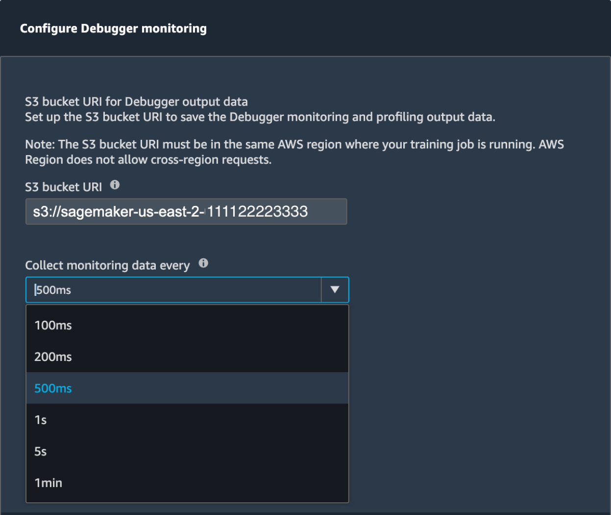

You can specify values for the following fields.

• S3 bucket URI: Specify the base S3 bucket URI.

• Collect monitoring data every: Select a time interval to collect system metrics. You can
choose one of the monitoring intervals from the dropdown list. Available intervals are 100
milliseconds, 200 milliseconds, 500 milliseconds (default), 1 second, 5 seconds, and 1 minute.

Note

If you choose one of the lower time intervals, you increase the granularity of resource
utilization metrics, so you can capture spikes and anomalies with a higher time
resolution. However, higher the resolution, larger the size of system metrics to

Monitor AWS compute resource utilization in SageMaker Studio Classic
4874

## Page 904

Amazon SageMaker AI
Developer Guide

process. This might introduce additional overhead and impact the overall training and
processing time.

• Using the Stop training button, you can stop the training job when you find anomalies in
resource utilization.

• Using the Download report button, you can download an aggregated profiling report by using
the built-in ProfilerReport rule of SageMaker Debugger. The button is activated when you add
the built-in ProfilerReport rule to the estimator. For more information, see Configure Built-in
Profiler Rules and Profiling Report Generated Using SageMaker Debugger.

Explore the Amazon SageMaker Debugger Insights dashboard

When you initiate a SageMaker training job, SageMaker Debugger starts monitoring the resource
utilization of the Amazon EC2 instances by default. You can track the system utilization rates,
statistics overview, and built-in rule analysis through the Insights dashboard. This guide walks you
through the content of the SageMaker Debugger Insights dashboard under the following tabs:
System Metrics and Rules.

Note

The SageMaker Debugger Insights dashboard runs a Studio Classic application on an

ml.m5.4xlarge instance to process and render the visualizations. Each SageMaker
Debugger Insights tab runs one Studio Classic kernel session. Multiple kernel sessions for
multiple SageMaker Debugger Insights tabs run on the single instance. When you close
a SageMaker Debugger Insights tab, the corresponding kernel session is also closed. The

Studio Classic application remains active and accrues charges for the ml.m5.4xlarge
instance usage. For information about pricing, see the Amazon SageMaker Pricing page.

Important

When you are done using the SageMaker Debugger Insights dashboard, shut down the

ml.m5.4xlarge instance to avoid accruing charges. For instructions on how to shut down
the instance, see Shut down the Amazon SageMaker Debugger Insights instance.

Monitor AWS compute resource utilization in SageMaker Studio Classic
4875

## Page 905

Amazon SageMaker AI
Developer Guide

Important

In the reports, plots and recommendations are provided for informational purposes and
are not definitive. You are responsible for making your own independent assessment of the
information.

Topics

• System metrics

• Rules

System metrics

In the System Metrics tab, you can use the summary table and timeseries plots to understand
resource utilization.

Resource utilization summary

This summary table shows the statistics of compute resource utilization metrics of all nodes
(denoted as algo-n). The resource utilization metrics include the total CPU utilization, the total GPU
utilization, the total CPU memory utilization, the total GPU memory utilization, the total I/O wait
time, and the total network in bytes. The table shows the minimum and the maximum values, and
p99, p90, and p50 percentiles.

Monitor AWS compute resource utilization in SageMaker Studio Classic
4876

## Page 906

Amazon SageMaker AI
Developer Guide

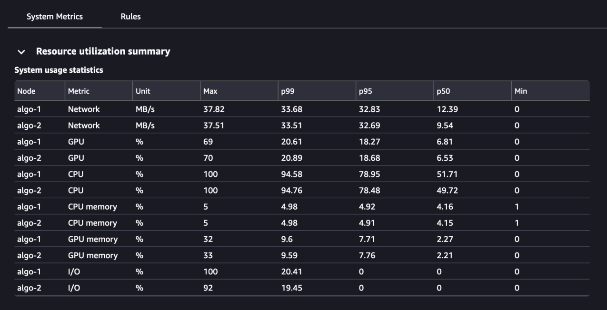

Resource utilization time series plots

Use the time series graphs to see more details of resource utilization and identify at what time
interval each instance shows any undesired utilization rate, such as low GPU utilization and CPU
bottlenecks that can cause a waste of the expensive instance.

The time series graph controller UI

The following screenshot shows the UI controller for adjusting the time series graphs.

• algo-1: Use this dropdown menu to choose the node that you want to look into.

• Zoom In: Use this button to zoom in the time series graphs and view shorter time intervals.

• Zoom Out: Use this button to zoom out the time series graphs and view wider time intervals.

• Pan Left: Move the time series graphs to an earlier time interval.

Monitor AWS compute resource utilization in SageMaker Studio Classic
4877

## Page 907

Amazon SageMaker AI
Developer Guide

• Pan Right: Move the time series graphs to a later time interval.

• Fix Timeframe: Use this check box to fix or bring back the time series graphs to show the whole
view from the first data point to the last data point.

CPU utilization and I/O wait time

The first two graphs show CPU utilization and I/O wait time over time. By default, the graphs show
the average of CPU utilization rate and I/O wait time spent on the CPU cores. You can select one
or more CPU cores by selecting the labels to graph them on single chart and compare utilization
across cores. You can drag and zoom in and out to have a closer look at specific time intervals.

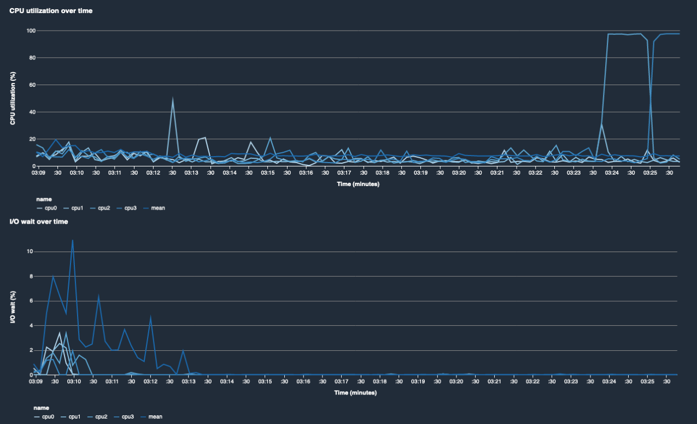

GPU utilization and GPU memory utilization

The following graphs show GPU utilization and GPU memory utilization over time. By default,
the graphs show the mean utilization rate over time. You can select the GPU core labels to see
the utilization rate of each core. Taking the mean of utilization rate over the total number of GPU
cores shows the mean utilization of the entire hardware system resource. By looking at the mean
utilization rate, you can check the overall system resource usage of an Amazon EC2 instance. The

Monitor AWS compute resource utilization in SageMaker Studio Classic
4878

## Page 908

Amazon SageMaker AI
Developer Guide

following figure shows an example training job on an ml.p3.16xlarge instance with 8 GPU cores.
You can monitor if the training job is well distributed, fully utilizing all GPUs.

Overall system utilization over time

The following heatmap shows an example of the entire system utilization of an ml.p3.16xlarge
instance over time, projected onto the two-dimensional plot. Every CPU and GPU core is listed in
the vertical axis, and the utilization is recorded over time with a color scheme, where the bright
colors represent low utilization and the darker colors represent high utilization. See the labeled
color bar on the right side of the plot to find out which color level corresponds to which utilization
rate.

Monitor AWS compute resource utilization in SageMaker Studio Classic
4879

## Page 909

Amazon SageMaker AI
Developer Guide

Rules

Use the Rules tab to find a summary of the profiling rule analysis on your training job. If the
profiling rule is activated with the training job, the text appears highlighted with the solid white
text. Inactive rules are dimmed in gray text. To activate these rules, follow instructions at the
section called “Use built-in profiler rules”.

Monitor AWS compute resource utilization in SageMaker Studio Classic
4880

## Page 910

Amazon SageMaker AI
Developer Guide

Shut down the Amazon SageMaker Debugger Insights instance

When you are not using the SageMaker Debugger Insights dashboard, you should shut down the
app instance to avoid incurring additional fees.

To shut down the SageMaker Debugger Insights app instance in Studio Classic

Monitor AWS compute resource utilization in SageMaker Studio Classic
4881

## Page 911

Amazon SageMaker AI
Developer Guide

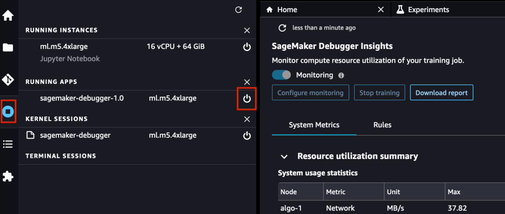

1. In Studio Classic, select the Running Instances and Kernels icon

(

).

2. Under the RUNNING APPS list, look for the sagemaker-debugger-1.0 app. Select the shutdown

icon

(

)

next to the app. The SageMaker Debugger Insights dashboards run on an ml.m5.4xlarge
instance. This instance also disappears from the RUNNING INSTANCES when you shut down the
sagemaker-debugger-1.0 app.

SageMaker Debugger interactive report

Receive profiling reports autogenerated by Debugger. The Debugger report provide insights
into your training jobs and suggest recommendations to improve your model performance.
The following screenshot shows a collage of the Debugger profiling report. To learn more, see
SageMaker Debugger interactive report.

Note

You can download a Debugger reports while your training job is running or after the job
has finished. During training, Debugger concurrently updates the report reflecting the

Monitor AWS compute resource utilization in SageMaker Studio Classic
4882

## Page 912

Amazon SageMaker AI
Developer Guide

current rules' evaluation status. You can download a complete Debugger report only after
the training job has completed.

Important

In the reports, plots and and recommendations are provided for informational purposes
and are not definitive. You are responsible for making your own independent assessment of
the information.

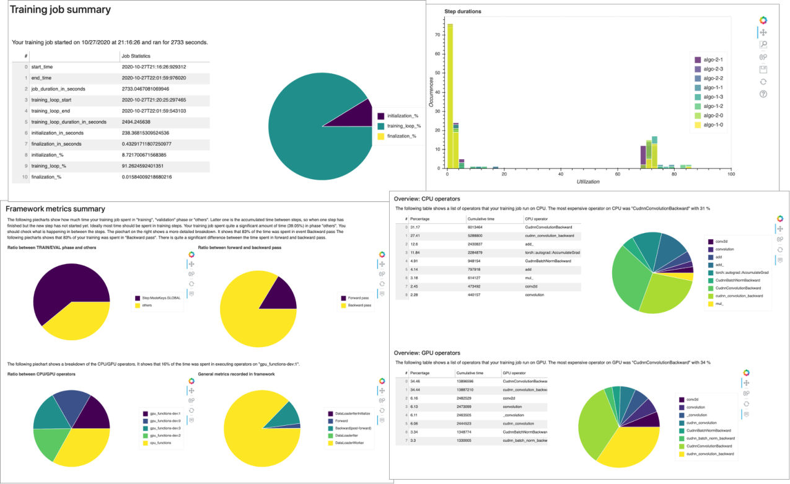

For any SageMaker training jobs, the SageMaker Debugger ProfilerReport rule invokes all of the
monitoring and profiling rules and aggregates the rule analysis into a comprehensive report.
Following this guide, download the report using the Amazon SageMaker Python SDK or the S3
console, and learn what you can interpret from the profiling results.

Monitor AWS compute resource utilization in SageMaker Studio Classic
4883

## Page 913

Amazon SageMaker AI
Developer Guide

Important

In the report, plots and and recommendations are provided for informational purposes and
are not definitive. You are responsible for making your own independent assessment of the
information.

Download the SageMaker Debugger profiling report

Download the SageMaker Debugger profiling report while your training job is running or after the
job has finished using the Amazon SageMaker Python SDK and AWS Command Line Interface (CLI).

Note

To get the profiling report generated by SageMaker Debugger, you must use the built-in

ProfilerReport rule offered by SageMaker Debugger. To activate the rule with your training
job, see Configure Built-in Profiler Rules.

Tip

You can also download the report with a single click in the SageMaker Studio Debugger
insights dashboard. This doesn't require any additional scripting to download the report.
To find out how to download the report from Studio, see Open the Amazon SageMaker
Debugger Insights dashboard.

Download using SageMaker Python SDK and AWS CLI

1.
Check the current job's default S3 output base URI.

estimator.output_path

2.
Check the current job name.

estimator.latest_training_job.job_name

3.
The Debugger profiling report is stored under <default-s3-output-base-uri>/

<training-job-name>/rule-output. Configure the rule output path as follows:

Monitor AWS compute resource utilization in SageMaker Studio Classic
4884

## Page 914

Amazon SageMaker AI
Developer Guide

rule_output_path = estimator.output_path +
estimator.latest_training_job.job_name + "/rule-output"

4.
To check if the report is generated, list directories and files recursively under the

rule_output_path using aws s3 ls with the --recursive option.

! aws s3 ls {rule_output_path} --recursive

This should return a complete list of files under an autogenerated folder that's named

as ProfilerReport-1234567890. The folder name is a combination of strings:

ProfilerReport and a unique 10-digit tag based on the Unix timestamp when the
ProfilerReport rule is initiated.

The profiler-report.html is an autogenerated profiling report by Debugger. The
remaining files are the built-in rule analysis components stored in JSON and a Jupyter
notebook that are used to aggregate them into the report.

5.
Download the files recursively using aws s3 cp. The following command saves all of the

rule output files to the ProfilerReport-1234567890 folder under the current working
directory.

! aws s3 cp {rule_output_path} ./ --recursive

Tip

If using a Jupyter notebook server, run !pwd to double check the current working
directory.

6.
Under the /ProfilerReport-1234567890/profiler-output directory, open

profiler-report.html. If using JupyterLab, choose Trust HTML to see the
autogenerated Debugger profiling report.

Monitor AWS compute resource utilization in SageMaker Studio Classic
4885

## Page 915

Amazon SageMaker AI
Developer Guide

7.
Open the profiler-report.ipynb file to explore how the report is generated. You can
also customize and extend the profiling report using the Jupyter notebook file.

Download using Amazon S3 Console

1.
Sign in to the AWS Management Console and open the Amazon S3 console at https://
console.aws.amazon.com/s3/.

2.
Search for the base S3 bucket. For example, if you haven't specified any base job

name, the base S3 bucket name should be in the following format: sagemaker-

<region>-111122223333. Look up the base S3 bucket through the Find bucket by name
field.

3.
In the base S3 bucket, look up the training job name by specifying your job name prefix
into the Find objects by prefix input field. Choose the training job name.

Monitor AWS compute resource utilization in SageMaker Studio Classic
4886

## Page 916

Amazon SageMaker AI
Developer Guide

4.
In the training job's S3 bucket, there must be three subfolders for training data collected by
Debugger: debug-output/, profiler-output/, and rule-output/. Choose rule-output/.

5.
In the rule-output/ folder, choose ProfilerReport-1234567890, and choose profiler-
output/ folder. The profiler-output/ folder contains profiler-report.html (the
autogenerated profiling report in html), profiler-report.ipynb (a Jupyter notebook with
scripts that are used for generating the report), and a profiler-report/ folder (contains rule
analysis JSON files that are used as components of the report).

6.
Select the profiler-report.html file, choose Actions, and Download.

Monitor AWS compute resource utilization in SageMaker Studio Classic
4887

## Page 917

Amazon SageMaker AI
Developer Guide

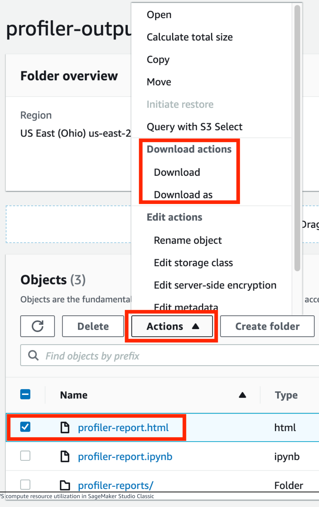

Monitor AWS compute resource utilization in SageMaker Studio Classic
4888

## Page 918

Amazon SageMaker AI
Developer Guide

7.
Open the downloaded profiler-report.html file in a web browser.

Note

If you started your training job without configuring the Debugger-specific parameters,
Debugger generates the report based only on the system monitoring rules because the
Debugger parameters are not configured to save framework metrics. To enable framework
metrics profiling and receive an extended Debugger profiling report, configure the

profiler_config parameter when constructing or updating SageMaker AI estimators.

To learn how to configure the profiler_config parameter before starting a training job,
see Estimator configuration for framework profiling.
To update the current training job and enable framework metrics profiling, see Update
Debugger Framework Profiling Configuration.

Debugger profiling report walkthrough

This section walks you through the Debugger profiling report section by section. The profiling
report is generated based on the built-in rules for monitoring and profiling. The report shows
result plots only for the rules that found issues.

Important

In the report, plots and and recommendations are provided for informational purposes and
are not definitive. You are responsible for making your own independent assessment of the
information.

Topics

• Training job summary

• System usage statistics

• Framework metrics summary

• Rules summary

• Analyzing the training loop – step durations

• GPU utilization analysis

Monitor AWS compute resource utilization in SageMaker Studio Classic
4889

## Page 919

Amazon SageMaker AI
Developer Guide

• Batch size

• CPU bottlenecks

• I/O bottlenecks

• Load balancing in multi-GPU training

• GPU memory analysis

Training job summary

At the beginning of the report, Debugger provides a summary of your training job. In this section,
you can overview the time durations and timestamps at different training phases.

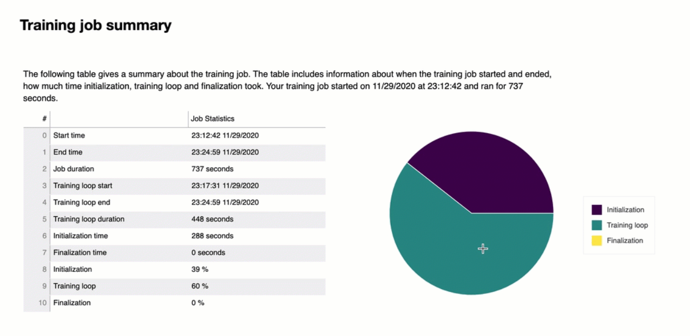

The summary table contains the following information:

• start_time – The exact time when the training job started.

• end_time – The exact time when the training job finished.

• job_duration_in_seconds – The total training time from the start_time to the end_time.

• training_loop_start – The exact time when the first step of the first epoch has started.

• training_loop_end – The exact time when the last step of the last epoch has finished.

• training_loop_duration_in_seconds – The total time between the training loop start time and
the training loop end time.

Monitor AWS compute resource utilization in SageMaker Studio Classic
4890

## Page 920

Amazon SageMaker AI
Developer Guide

• initialization_in_seconds – Time spent on initializing the training job. The initialization phase
covers the period from the start_time to the training_loop_start time. The initialization time is
spent on compiling the training script, starting the training script, creating and initializing the
model, initiating EC2 instances, and downloading training data.

• finalization_in_seconds – Time spent on finalizing the training job, such as finishing the model
training, updating the model artifacts, and closing the EC2 instances. The finalization phase
covers the period from the training_loop_end time to the end_time.

• initialization (%) – The percentage of time spent on initialization over the total
job_duration_in_seconds.

• training loop (%) – The percentage of time spent on training loop over the total
job_duration_in_seconds.

• finalization (%) – The percentage of time spent on finalization over the total
job_duration_in_seconds.

System usage statistics

In this section, you can see an overview of system utilization statistics.

The Debugger profiling report includes the following information:

Monitor AWS compute resource utilization in SageMaker Studio Classic
4891

## Page 921

Amazon SageMaker AI
Developer Guide

• node – Lists the name of nodes. If using distributed training on multi nodes (multiple EC2

instances), the node names are in format of algo-n.

• metric – The system metrics collected by Debugger: CPU, GPU, CPU memory, GPU memory, I/O,
and Network metrics.

• unit – The unit of the system metrics.

• max – The maximum value of each system metric.

• p99 – The 99th percentile of each system utilization.

• p95 – The 95th percentile of each system utilization.

• p50 – The 50th percentile (median) of each system utilization.

• min – The minimum value of each system metric.

Framework metrics summary

In this section, the following pie charts show the breakdown of framework operations on CPUs and
GPUs.

Monitor AWS compute resource utilization in SageMaker Studio Classic
4892

## Page 922

Amazon SageMaker AI
Developer Guide

Each of the pie charts analyzes the collected framework metrics in various aspects as follows:

• Ratio between TRAIN/EVAL phase and others – Shows the ratio between time durations spent
on different training phases.

• Ratio between forward and backward pass – Shows the ratio between time durations spent on
forward and backward pass in the training loop.

• Ratio between CPU/GPU operators – Shows the ratio between time spent on operators running
on CPU or GPU, such as convolutional operators.

• General metrics recorded in framework – Shows the ratio between time spent on major
framework metrics, such as data loading, forward and backward pass.

Overview: CPU Operators

This section provides information of the CPU operators in detail. The table shows the percentage of
the time and the absolute cumulative time spent on the most frequently called CPU operators.

Monitor AWS compute resource utilization in SageMaker Studio Classic
4893

## Page 923

Amazon SageMaker AI
Developer Guide

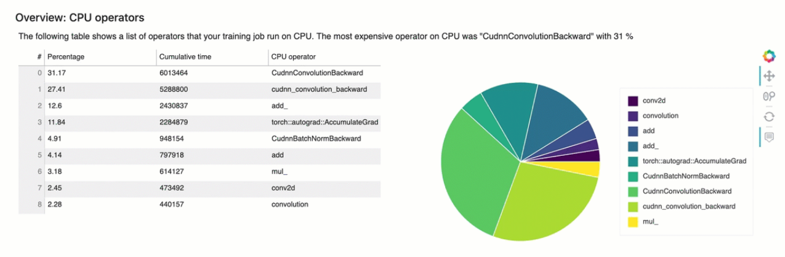

Overview: GPU operators

This section provides information of the GPU operators in detail. The table shows the percentage

of the time and the absolute cumulative time spent on the most frequently called GPU operators.

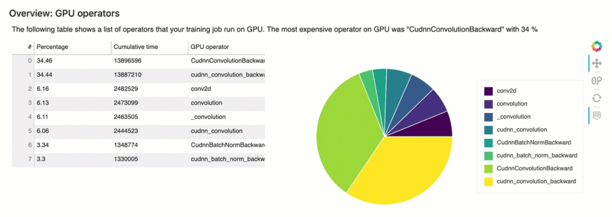

Rules summary

In this section, Debugger aggregates all of the rule evaluation results, analysis, rule descriptions,
and suggestions.

Monitor AWS compute resource utilization in SageMaker Studio Classic
4894

## Page 924

Amazon SageMaker AI
Developer Guide

Analyzing the training loop – step durations

In this section, you can find a detailed statistics of step durations on each GPU core of each node.
Debugger evaluates mean, maximum, p99, p95, p50, and minimum values of step durations, and
evaluate step outliers. The following histogram shows the step durations captured on different
worker nodes and GPUs. You can enable or disable the histogram of each worker by choosing the
legends on the right side. You can check if there is a particular GPU that's causing step duration
outliers.

Monitor AWS compute resource utilization in SageMaker Studio Classic
4895

## Page 925

Amazon SageMaker AI
Developer Guide

GPU utilization analysis

This section shows the detailed statistics about GPU core utilization based on LowGPUUtilization
rule. It also summarizes the GPU utilization statistics, mean, p95, and p5 to determine if the
training job is underutilizing GPUs.

Batch size

This section shows the detailed statistics of total CPU utilization, individual GPU utilizations,
and GPU memory footprints. The BatchSize rule determines if you need to change the batch
size to better utilize the GPUs. You can check whether the batch size is too small resulting in
underutilization or too large causing overutilization and out of memory issues. In the plot,
the boxes show the p25 and p75 percentile ranges (filled with dark purple and bright yellow
respectively) from the median (p50), and the error bars show the 5th percentile for the lower
bound and 95th percentile for the upper bound.

Monitor AWS compute resource utilization in SageMaker Studio Classic
4896

## Page 926

Amazon SageMaker AI
Developer Guide

CPU bottlenecks

In this section, you can drill down into the CPU bottlenecks that the CPUBottleneck rule detected

from your training job. The rule checks if the CPU utilization is above cpu_threshold (90% by

default) and also if the GPU utilization is below gpu_threshold (10% by default).

Monitor AWS compute resource utilization in SageMaker Studio Classic
4897

## Page 927

Amazon SageMaker AI
Developer Guide

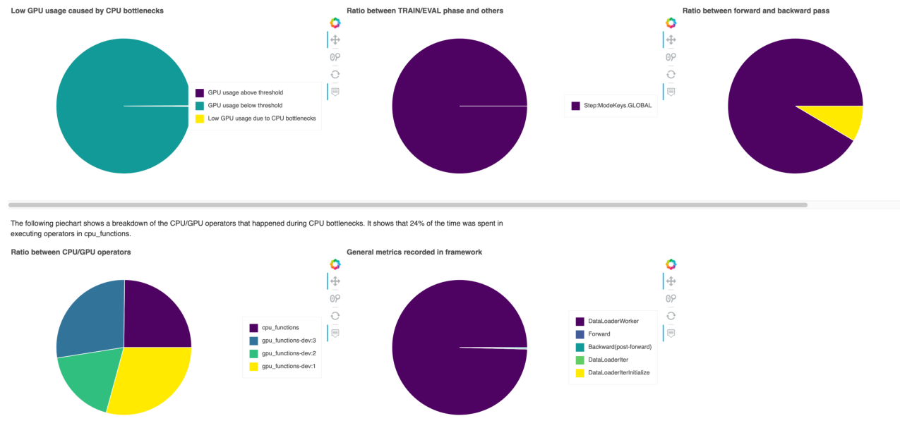

The pie charts show the following information:

• Low GPU usage caused by CPU bottlenecks – Shows the ratio of data points between the
ones with GPU utilization above and below the threshold and the ones that matches the CPU
bottleneck criteria.

• Ratio between TRAIN/EVAL phase and others – Shows the ratio between time durations spent
on different training phases.

• Ratio between forward and backward pass – Shows the ratio between time durations spent on
forward and backward pass in the training loop.

• Ratio between CPU/GPU operators – Shows the ratio between time durations spent on GPUs
and CPUs by Python operators, such as data loader processes and forward and backward pass
operators.

• General metrics recorded in framework – Shows major framework metrics and the ratio
between time durations spent on the metrics.

I/O bottlenecks

In this section, you can find a summary of I/O bottlenecks. The rule evaluates the I/O wait time
and GPU utilization rates and monitors if the time spent on the I/O requests exceeds a threshold
percent of the total training time. It might indicate I/O bottlenecks where GPUs are waiting for
data to arrive from storage.

Monitor AWS compute resource utilization in SageMaker Studio Classic
4898

## Page 928

Amazon SageMaker AI
Developer Guide

Load balancing in multi-GPU training

In this section, you can identify workload balancing issue across GPUs.

GPU memory analysis

In this section, you can analyze the GPU memory utilization collected by the GPUMemoryIncrease
rule. In the plot, the boxes show the p25 and p75 percentile ranges (filled with dark purple and
bright yellow respectively) from the median (p50), and the error bars show the 5th percentile for
the lower bound and 95th percentile for the upper bound.

Monitor AWS compute resource utilization in SageMaker Studio Classic
4899

## Page 929

Amazon SageMaker AI
Developer Guide

Opt out of the collection of Amazon SageMaker Debugger usage statistics

For all SageMaker training jobs, Amazon SageMaker Debugger runs the ProfilerReport rule and

autogenerates a SageMaker Debugger interactive report. The ProfilerReport rule provides

a Jupyter notebook file (profiler-report.ipynb) that generates a corresponding HTML file

(profiler-report.html).

Debugger collects profiling report usage statistics by including code in the Jupyter notebook

that collects the unique ProfilerReport rule's processing job ARN if the user opens the final

profiler-report.html file.

Debugger only collects information about whether a user opens the final HTML report. It DOES
NOT collect any information from training jobs, training data, training scripts, processing jobs, logs,
or the content of the profiling report itself.

You can opt out of the collection of usage statistics using one of the following options.

(Recommended) Option 1: Opt out before running a training job

To opt out, you need to add the following Debugger ProfilerReport rule configuration to your
training job request.

SageMaker Python SDK

estimator=sagemaker.estimator.Estimator(
...

rules=ProfilerRule.sagemaker(
base_config=rule_configs.ProfilerReport()
rule_parameters={"opt_out_telemetry": "True"}
)
)

AWS CLI

"ProfilerRuleConfigurations": [
{
"RuleConfigurationName": "ProfilerReport-1234567890",
"RuleEvaluatorImage": "895741380848.dkr.ecr.us-west-2.amazonaws.com/
sagemaker-debugger-rules:latest",
"RuleParameters": {
"rule_to_invoke": "ProfilerReport",

Monitor AWS compute resource utilization in SageMaker Studio Classic
4900

## Page 930

Amazon SageMaker AI
Developer Guide

"opt_out_telemetry": "True"
}
}
]

AWS SDK for Python (Boto3)

ProfilerRuleConfigurations=[
{
'RuleConfigurationName': 'ProfilerReport-1234567890',
'RuleEvaluatorImage': '895741380848.dkr.ecr.us-west-2.amazonaws.com/
sagemaker-debugger-rules:latest',
'RuleParameters': {
'rule_to_invoke': 'ProfilerReport',
'opt_out_telemetry': 'True'
}
}
]

Option 2: Opt out after a training job has completed

To opt out after training has completed, you need to modify the profiler-report.ipynb file.

Note

HTML reports autogenerated without Option 1 already added to your training job request
still report the usage statistics even after you opt out using Option 2.

1. Follow the instructions on downloading the Debugger profiling report files in the Download the

SageMaker Debugger profiling report page.

2. In the /ProfilerReport-1234567890/profiler-output directory, open profiler-

report.ipynb.

3. Add opt_out=True to the setup_profiler_report() function in the fifth code cell as

shown in the following example code:

setup_profiler_report(processing_job_arn, opt_out=True)

4. Run the code cell to finish opting out.

Monitor AWS compute resource utilization in SageMaker Studio Classic
4901

## Page 931

Amazon SageMaker AI
Developer Guide

Analyze data using the Debugger Python client library

While your training job is running or after it has completed, you can access the training data
collected by Debugger using the Amazon SageMaker Python SDK and the SMDebug client library.
The Debugger Python client library provides analysis and visualization tools that enable you to drill
down into your training job data.

To install the library and use its analysis tools (in a JupyterLab notebook or an iPython kernel)

! pip install -U smdebug

The following topics walk you through how to use the Debugger Python tools to visualize and
analyze the training data collected by Debugger.

Analyze system and framework metrics

• Access the profile data

• Plot the system metrics and framework metrics data

• Access the profiling data using the pandas data parsing tool

• Access the Python profiling stats data

• Merge timelines of multiple profile trace files

• Profiling data loaders

Access the profile data

The SMDebug TrainingJob class reads data from the S3 bucket where the system and framework
metrics are saved.

To set up a TrainingJob object and retrieve profiling event files of a training job

from smdebug.profiler.analysis.notebook_utils.training_job import TrainingJob
tj = TrainingJob(training_job_name, region)

Tip

You need to specify the training_job_name and region parameters to log to a training
job. There are two ways to specify the training job information:

Monitor AWS compute resource utilization in SageMaker Studio Classic
4902

## Page 932

Amazon SageMaker AI
Developer Guide

• Use the SageMaker Python SDK while the estimator is still attached to the training job.

import sagemaker
training_job_name=estimator.latest_training_job.job_name
region=sagemaker.Session().boto_region_name

• Pass strings directly.

training_job_name="your-training-job-name-YYYY-MM-DD-HH-MM-SS-SSS"
region="us-west-2"

Note

By default, SageMaker Debugger collects system metrics to monitor hardware resource
utilization and system bottlenecks. Running the following functions, you might receive
error messages regarding unavailability of framework metrics. To retrieve framework
profiling data and gain insights into framework operations, you must enable framework
profiling.

• If you use SageMaker Python SDK to manipulate your training job request, pass the

framework_profile_params to the profiler_config argument of your estimator.
To learn more, see Configure SageMaker Debugger Framework Profiling.

• If you use Studio Classic, turn on profiling using the Profiling toggle button in the
Debugger insights dashboard. To learn more, see SageMaker Debugger Insights
Dashboard Controller.

To retrieve a description of the training job description and the S3 bucket URI where the metric
data are saved

tj.describe_training_job()
tj.get_config_and_profiler_s3_output_path()

To check if the system and framework metrics are available from the S3 URI

tj.wait_for_sys_profiling_data_to_be_available()

Monitor AWS compute resource utilization in SageMaker Studio Classic
4903

## Page 933

Amazon SageMaker AI
Developer Guide

tj.wait_for_framework_profiling_data_to_be_available()

To create system and framework reader objects after the metric data become available

system_metrics_reader = tj.get_systems_metrics_reader()
framework_metrics_reader = tj.get_framework_metrics_reader()

To refresh and retrieve the latest training event files

The reader objects have an extended method, refresh_event_file_list(), to retrieve the
latest training event files.

system_metrics_reader.refresh_event_file_list()
framework_metrics_reader.refresh_event_file_list()

Plot the system metrics and framework metrics data

You can use the system and algorithm metrics objects for the following visualization classes to plot
timeline graphs and histograms.

Note

To visualize the data with narrowed-down metrics in the following visualization object plot

methods, specify select_dimensions and select_events parameters. For example,

if you specify select_dimensions=["GPU"], the plot methods filter the metrics that

include the "GPU" keyword. If you specify select_events=["total"], the plot methods
filter the metrics that include the "total" event tags at the end of the metric names. If you
enable these parameters and give the keyword strings, the visualization classes return the
charts with filtered metrics.

• The MetricsHistogram class

from smdebug.profiler.analysis.notebook_utils.metrics_histogram import
MetricsHistogram

metrics_histogram = MetricsHistogram(system_metrics_reader)
metrics_histogram.plot(
starttime=0,

Monitor AWS compute resource utilization in SageMaker Studio Classic
4904

## Page 934

Amazon SageMaker AI
Developer Guide

endtime=system_metrics_reader.get_timestamp_of_latest_available_file(),
select_dimensions=["CPU", "GPU", "I/O"], # optional
select_events=["total"]                  # optional
)

• The StepTimelineChart class

from smdebug.profiler.analysis.notebook_utils.step_timeline_chart import
StepTimelineChart

view_step_timeline_chart = StepTimelineChart(framework_metrics_reader)

• The StepHistogram class

from smdebug.profiler.analysis.notebook_utils.step_histogram import StepHistogram

step_histogram = StepHistogram(framework_metrics_reader)
step_histogram.plot(
starttime=step_histogram.last_timestamp - 5 * 1000 * 1000,
endtime=step_histogram.last_timestamp,
show_workers=True
)

• The TimelineCharts class

from smdebug.profiler.analysis.notebook_utils.timeline_charts import TimelineCharts

view_timeline_charts = TimelineCharts(
system_metrics_reader,
framework_metrics_reader,
select_dimensions=["CPU", "GPU", "I/O"], # optional
select_events=["total"]                  # optional
)

view_timeline_charts.plot_detailed_profiler_data([700,710])

• The Heatmap class

from smdebug.profiler.analysis.notebook_utils.heatmap import Heatmap

view_heatmap = Heatmap(
system_metrics_reader,
framework_metrics_reader,

Monitor AWS compute resource utilization in SageMaker Studio Classic
4905

## Page 935

Amazon SageMaker AI
Developer Guide

select_dimensions=["CPU", "GPU", "I/O"], # optional
select_events=["total"],                 # optional
plot_height=450
)

Access the profiling data using the pandas data parsing tool

The following PandasFrame class provides tools to convert the collected profiling data to Pandas
data frame.

from smdebug.profiler.analysis.utils.profiler_data_to_pandas import PandasFrame

The PandasFrame class takes the tj object's S3 bucket output path, and its methods

get_all_system_metrics() get_all_framework_metrics() return system metrics and
framework metrics in the Pandas data format.

pf = PandasFrame(tj.profiler_s3_output_path)
system_metrics_df = pf.get_all_system_metrics()
framework_metrics_df = pf.get_all_framework_metrics(
selected_framework_metrics=[
'Step:ModeKeys.TRAIN',
'Step:ModeKeys.GLOBAL'
]
)

Access the Python profiling stats data

The Python profiling provides framework metrics related to Python functions and operators in your
training scripts and the SageMaker AI deep learning frameworks.

Training Modes and Phases for Python Profiling

To profile specific intervals during training to partition statistics for each of these intervals,
Debugger provides tools to set modes and phases.

For training modes, use the following PythonProfileModes class:

from smdebug.profiler.python_profile_utils import PythonProfileModes

This class provides the following options:

Monitor AWS compute resource utilization in SageMaker Studio Classic
4906

## Page 936

Amazon SageMaker AI
Developer Guide

• PythonProfileModes.TRAIN – Use if you want to profile the target steps in the training
phase. This mode option available only for TensorFlow.

• PythonProfileModes.EVAL – Use if you want to profile the target steps in the evaluation
phase. This mode option available only for TensorFlow.

• PythonProfileModes.PREDICT – Use if you want to profile the target steps in the prediction
phase. This mode option available only for TensorFlow.

• PythonProfileModes.GLOBAL – Use if you want to profile the target steps in the global
phase, which includes the previous three phases. This mode option available only for PyTorch.

• PythonProfileModes.PRE_STEP_ZERO – Use if you want to profile the target steps in the
initialization stage before the first training step of the first epoch starts. This phase includes
the initial job submission, uploading the training scripts to EC2 instances, preparing the EC2
instances, and downloading input data. This mode option available for both TensorFlow and
PyTorch.

• PythonProfileModes.POST_HOOK_CLOSE – Use if you want to profile the target steps in the
finalization stage after the training job has done and the Debugger hook is closed. This phase
includes profiling data while the training jobs are finalized and completed. This mode option
available for both TensorFlow and PyTorch.

For training phases, use the following StepPhase class:

from smdebug.profiler.analysis.utils.python_profile_analysis_utils import StepPhase

This class provides the following options:

• StepPhase.START – Use to specify the start point of the initialization phase.

• StepPhase.STEP_START – Use to specify the start step of the training phase.

• StepPhase.FORWARD_PASS_END – Use to specify the steps where the forward pass ends. This
option is available only for PyTorch.

• StepPhase.STEP_END – Use to specify the end steps in the training phase. This option is
available only for TensorFlow.

• StepPhase.END – Use to specify the ending point of the finalization (post-hook-close) phase. If
the callback hook is not closed, the finalization phase profiling does not occur.

Python Profiling Analysis Tools

Monitor AWS compute resource utilization in SageMaker Studio Classic
4907

## Page 937

Amazon SageMaker AI
Developer Guide

Debugger supports the Python profiling with two profiling tools:

• cProfile – The standard python profiler. cProfile collects framework metrics on CPU time for
every function called when profiling was enabled.

• Pyinstrument – This is a low overhead Python profiler sampling profiling events every
milliseconds.

To learn more about the Python profiling options and what's collected, see Default system
monitoring and customized framework profiling with different profiling options.

The following methods of the PythonProfileAnalysis, cProfileAnalysis,

PyinstrumentAnalysis classes are provided to fetch and analyze the Python profiling data.
Each function loads the latest data from the default S3 URI.

from smdebug.profiler.analysis.python_profile_analysis import PythonProfileAnalysis,
cProfileAnalysis, PyinstrumentAnalysis

To set Python profiling objects for analysis, use the cProfileAnalysis or PyinstrumentAnalysis

classes as shown in the following example code. It shows how to set a cProfileAnalysis object,

and if you want to use PyinstrumentAnalysis, replace the class name.

python_analysis = cProfileAnalysis(
local_profile_dir=tf_python_stats_dir,
s3_path=tj.profiler_s3_output_path
)

The following methods are available for the cProfileAnalysis and PyinstrumentAnalysis
classes to fetch the Python profiling stats data:

• python_analysis.fetch_python_profile_stats_by_time(start_time_since_epoch_in_se

end_time_since_epoch_in_secs) – Takes in a start time and end time, and returns the
function stats of step stats whose start or end times overlap with the provided interval.

• python_analysis.fetch_python_profile_stats_by_step(start_step, end_step,

mode, start_phase, end_phase) – Takes in a start step and end step and returns the

function stats of all step stats whose profiled step satisfies start_step <= step <

end_step.

• start_step and end_step (str) – Specify the start step and end step to fetch the Python
profiling stats data.

Monitor AWS compute resource utilization in SageMaker Studio Classic
4908

## Page 938

Amazon SageMaker AI
Developer Guide

• mode (str) – Specify the mode of training job using the PythonProfileModes enumerator

class. The default is PythonProfileModes.TRAIN. Available options are provided in the

Training Modes and Phases for Python Profiling section.

• start_phase (str) – Specify the start phase in the target step(s) using the StepPhase

enumerator class. This parameter enables profiling between different phases of training. The

default is StepPhase.STEP_START. Available options are provided in the  Training Modes and
Phases for Python Profiling section.

• end_phase (str) – Specify the end phase in the target step(s) using the StepPhase
enumerator class. This parameter sets up the end phase of training. Available options are as

same as the ones for the start_phase parameter. The default is StepPhase.STEP_END.
Available options are provided in the  Training Modes and Phases for Python Profiling section.

• python_analysis.fetch_profile_stats_between_modes(start_mode, end_mode) –
Fetches stats from the Python profiling between the start and end modes.

• python_analysis.fetch_pre_step_zero_profile_stats() – Fetches the stats from the
Python profiling until step 0.

• python_analysis.fetch_post_hook_close_profile_stats() – Fetches stats from the
Python profiling after the hook is closed.

• python_analysis.list_profile_stats() – Returns a DataFrame of the Python profiling
stats. Each row holds the metadata for each instance of profiling and the corresponding stats file
(one per step).

• python_analysis.list_available_node_ids() – Returns a list the available node IDs for
the Python profiling stats.

The cProfileAnalysis class specific methods:

• fetch_profile_stats_by_training_phase() – Fetches and aggregates the Python
profiling stats for every possible combination of start and end modes. For example, if a training
and validation phases are done while detailed profiling is enabled, the combinations are

(PRE_STEP_ZERO, TRAIN), (TRAIN, TRAIN), (TRAIN, EVAL), (EVAL, EVAL), and

(EVAL, POST_HOOK_CLOSE). All stats files within each of these combinations are aggregated.

• fetch_profile_stats_by_job_phase() – Fetches and aggregates the Python profiling stats

by job phase. The job phases are initialization (profiling until step 0), training_loop

(training and validation), and finalization (profiling after the hook is closed).

Monitor AWS compute resource utilization in SageMaker Studio Classic
4909

## Page 939

Amazon SageMaker AI
Developer Guide

Merge timelines of multiple profile trace files

The SMDebug client library provide profiling analysis and visualization tools for merging timelines
of system metrics, framework metrics, and Python profiling data collected by Debugger.

Tip

Before proceeding, you need to set a TrainingJob object that will be utilized throughout
the examples in this page. For more information about setting up a TrainingJob object, see
Access the profile data.

The MergedTimeline class provides tools to integrate and correlate different profiling
information in a single timeline. After Debugger captures profiling data and annotations from

different phases of a training job, JSON files of trace events are saved in a default tracefolder
directory.

• For annotations in the Python layers, the trace files are saved in *pythontimeline.json.

• For annotations in the TensorFlow C++ layers, the trace files are saved in

*model_timeline.json.

• Tensorflow profiler saves events in a *trace.json.gz file.

Tip

If you want to list all of the JSON trace files, use the following AWS CLI command:

! aws s3 ls {tj.profiler_s3_output_path} --recursive | grep '\.json$'

As shown in the following animated screenshot, putting and aligning the trace events captured
from the different profiling sources in a single plot can provide an overview of the entire events
occurring in different phases of the training job.

Monitor AWS compute resource utilization in SageMaker Studio Classic
4910

## Page 940

Amazon SageMaker AI
Developer Guide

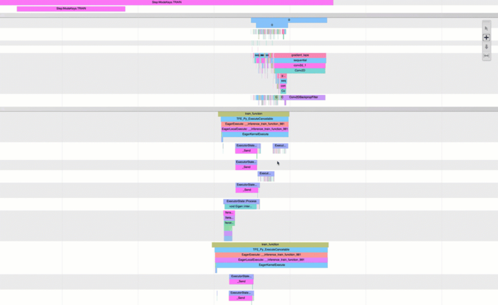

Tip

To interact with the merged timeline on the traicing app using a keyboard, use the W key for

zooming in, the A key for shifting to the left, the S key for zooming out, and the D key for
shifiting to the right.

The multiple event trace JSON files can be merged into one trace event JSON file

using the following MergedTimeline API operation and class method from the

smdebug.profiler.analysis.utils.merge_timelines module.

from smdebug.profiler.analysis.utils.merge_timelines import MergedTimeline

combined_timeline = MergedTimeline(path, file_suffix_filter, output_directory)
combined_timeline.merge_timeline(start, end, unit)

The MergedTimeline API operation passes the following parameters:

Monitor AWS compute resource utilization in SageMaker Studio Classic
4911

## Page 941

Amazon SageMaker AI
Developer Guide

• path (str) – Specify a root folder (/profiler-output) that contains system

and framework profiling trace files. You can locate the profiler-output

using the SageMaker AI estimator classmethod or the TrainingJob object. For

example, estimator.latest_job_profiler_artifacts_path() or

tj.profiler_s3_output_path.

• file_suffix_filter (list) – Specify a list of file suffix filters to merge timelines.

Available suffiex filters are ["model_timeline.json", "pythontimeline.json",

"trace.json.gz"]. If this parameter is not manually specified, all of the trace files are
merged by default.

• output_directory (str) – Specify a path to save the merged timeline JSON file. The default is

to the directory specified for the path parameter.

The merge_timeline() classmethod passes the following parameters to execute the merging
process:

• start (int) – Specify start time (in microseconds and in Unix time format) or start step to merge
timelines.

• end (int) – Specify end time (in microseconds and in Unix time format) or end step to merge
timelines.

• unit (str) – Choose between "time" and "step". The default is "time".

Using the following example codes, execute the merge_timeline() method and download the
merged JSON file.

• Merge timeline with the "time" unit option. The following example code merges all available
trace files between the Unix start time (the absolute zero Unix time) and the current Unix time,
which means that you can merge the timelines for the entire training duration.

import time
from smdebug.profiler.analysis.utils.merge_timelines import MergedTimeline
from smdebug.profiler.profiler_constants import CONVERT_TO_MICROSECS

combined_timeline = MergedTimeline(tj.profiler_s3_output_path, output_directory="./")
combined_timeline.merge_timeline(0, int(time.time() * CONVERT_TO_MICROSECS))

• Merge timeline with the "step" unit option. The following example code merges all available
timelines between step 3 and step 9.

Monitor AWS compute resource utilization in SageMaker Studio Classic
4912

## Page 942

Amazon SageMaker AI
Developer Guide

from smdebug.profiler.analysis.utils.merge_timelines import MergedTimeline

combined_timeline = MergedTimeline(tj.profiler_s3_output_path, output_directory="./")
combined_timeline.merge_timeline(3, 9, unit="step")

Open the Chrome tracing app at chrome://tracing on a Chrome browser, and open the JSON
file. You can explore the output to plot the merged timeline.

Profiling data loaders

In PyTorch, data loader iterators, such as SingleProcessingDataLoaderIter and

MultiProcessingDataLoaderIter, are initiated at the beginning of every iteration over a
dataset. During the initialization phase, PyTorch turns on worker processes depending on the

configured number of workers, establishes data queue to fetch data and pin_memory threads.

To use the PyTorch data loader profiling analysis tool, import the following

PT_dataloader_analysis class:

from smdebug.profiler.analysis.utils.pytorch_dataloader_analysis import
PT_dataloader_analysis

Pass the profiling data retrieved as a Pandas frame data object in the Access the profiling data
using the pandas data parsing tool section:

pt_analysis = PT_dataloader_analysis(pf)

The following functions are available for the pt_analysis object:

The SMDebug S3SystemMetricsReader class reads the system metrics from the S3 bucket

specified to the s3_trial_path parameter.

• pt_analysis.analyze_dataloaderIter_initialization()

The analysis outputs the median and maximum duration for these initializations. If there are
outliers, (i.e duration is greater than 2 * median), the function prints the start and end times for
those durations. These can be used to inspect system metrics during those time intervals.

The following list shows what analysis is available from this class method:

• Which type of data loader iterators were initialized.

Monitor AWS compute resource utilization in SageMaker Studio Classic
4913

## Page 943

Amazon SageMaker AI
Developer Guide

• The number of workers per iterator.

• Inspect whether the iterator was initialized with or without pin_memory.

• Number of times the iterators were initialized during training.

• pt_analysis.analyze_dataloaderWorkers()

The following list shows what analysis is available from this class method:

• The number of worker processes that were spun off during the entire training.

• Median and maximum duration for the worker processes.

• Start and end time for the worker processes that are outliers.

• pt_analysis.analyze_dataloader_getnext()

The following list shows what analysis is available from this class method:

• Number of GetNext calls made during the training.

• Median and maximum duration in microseconds for GetNext calls.

• Start time, End time, duration and worker id for the outlier GetNext call duration.

• pt_analysis.analyze_batchtime(start_timestamp, end_timestamp,

select_events=[".*"], select_dimensions=[".*"])

Debugger collects the start and end times of all the GetNext calls. You can find the amount of
time spent by the training script on one batch of data. Within the specified time window, you
can identify the calls that are not directly contributing to the training. These calls can be from
the following operations: computing the accuracy, adding the losses for debugging or logging
purposes, and printing the debugging information. Operations like these can be compute
intensive or time consuming. We can identify such operations by correlating the Python profiler,
system metrics, and framework metrics.

The following list shows what analysis is available from this class method:

• Profile time spent on each data batch, BatchTime_in_seconds, by finding the difference
between start times of current and subsequent GetNext calls.

• Find the outliers in BatchTime_in_seconds and start and end time for those outliers.

• Obtain the system and framework metrics during those BatchTime_in_seconds
timestamps. This indicates where the time was spent.

• pt_analysis.plot_the_window()

Plots a timeline charts between a start timestamp and the end timestamp.

Monitor AWS compute resource utilization in SageMaker Studio Classic
4914

## Page 944

Amazon SageMaker AI
Developer Guide

Release notes for profiling capabilities of Amazon SageMaker AI

See the following release notes to track the latest updates for profiling capabilities of Amazon
SageMaker AI.

March 21, 2024

Currency updates

SageMaker Profiler has added support for PyTorch v2.2.0, v2.1.0, and v2.0.1.

AWS Deep Learning Containers pre-installed with SageMaker Profiler

SageMaker Profiler is packaged in the following AWS Deep Learning Containers.

• SageMaker AI Framework Container for PyTorch v2.2.0

• SageMaker AI Framework Container for PyTorch v2.1.0

• SageMaker AI Framework Container for PyTorch v2.0.1

December 14, 2023

Currency updates

SageMaker Profiler has added support for TensorFlow v2.13.0.

Breaking changes

This release involves a breaking change. The SageMaker Profiler Python package name is changed

from smppy to smprof. If you have been using the previous version of the package while you
have started using the latest SageMaker AI Framework Containers for TensorFlow listed in the

following section, make sure that you update the package name from smppy to smprof in the
import statement in your training script.

AWS Deep Learning Containers pre-installed with SageMaker Profiler

SageMaker Profiler is packaged in the following AWS Deep Learning Containers.

• SageMaker AI Framework Container for TensorFlow v2.13.0

• SageMaker AI Framework Container for TensorFlow v2.12.0

Release notes
4915

## Page 945

Amazon SageMaker AI
Developer Guide

If you use the previous versions of the framework containers such TensorFlow v2.11.0, the

SageMaker Profiler Python package is still available as smppy. If you are uncertain which version or
the package name you should use, replace the import statement of the SageMaker Profiler package
with the following code snippet.

try:
import smprof
except ImportError:
# backward-compatability for TF 2.11 and PT 1.13.1 images
import smppy as smprof

August 24, 2023

New features

Released Amazon SageMaker Profiler, a profiling and visualization capability of SageMaker AI
to deep dive into compute resources provisioned while training deep learning models and gain

visibility into operation-level details. SageMaker Profiler provides Python modules (smppy) for
adding annotations throughout PyTorch or TensorFlow training scripts and activating SageMaker
Profiler. You can access the modules through the SageMaker AI Python SDK and AWS Deep
Learning Containers. For any jobs run with the SageMaker Profiler Python modules, you can load
the profile data in the SageMaker Profiler UI application that provides a summary dashboard and a
detailed timeline. To learn more, see Amazon SageMaker Profiler.

This release of the SageMaker Profiler Python package is integrated into the following SageMaker
AI Framework Containers for PyTorch and TensorFlow.

• PyTorch v2.0.0

• PyTorch v1.13.1

• TensorFlow v2.12.0

• TensorFlow v2.11.0

Distributed training in Amazon SageMaker AI

SageMaker AI provides distributed training libraries and supports various distributed training
options for deep learning tasks such as computer vision (CV) and natural language processing
(NLP). With SageMaker AI’s distributed training libraries, you can run highly scalable and cost-
effective custom data parallel and model parallel deep learning training jobs. You can also use

Distributed training
4916

## Page 946

Amazon SageMaker AI
Developer Guide

other distributed training frameworks and packages such as PyTorch DistributedDataParallel

(DDP), torchrun, MPI (mpirun), and parameter server. The following section gives information
about fundamental distributed training concepts. Throughout the documentation, instructions and
examples focus on how to set up the distributed training options for deep learning tasks using the
SageMaker Python SDK.

Tip

To learn best practices for distributed computing of machine learning (ML) training and
processing jobs in general, see Distributed computing with SageMaker AI best practices.

Distributed training concepts

SageMaker AI’s distributed training libraries use the following distributed training terms and
features.

Datasets and Batches

• Training Dataset: All of the data you use to train the model.

• Global batch size: The number of records selected from the training dataset in each iteration
to send to the GPUs in the cluster. This is the number of records over which the gradient is
computed at each iteration. If data parallelism is used, it is equal to the total number of model

replicas multiplied by the per-replica batch size: global batch size = (the number of

model replicas) * (per-replica batch size). A single batch of global batch size is
often referred to as the mini-batch  in machine learning literature.

• Per-replica batch size: When data parallelism is used, this is the number of records sent to each
model replica. Each model replica performs a forward and backward pass with this batch to
calculate weight updates. The resulting weight updates are synchronized (averaged) across all
replicas before the next set of per-replica batches are processed.

• Micro-batch: A subset of the mini-batch or, if hybrid model and data parallelism is used , it
is a subset of the per-replica sized batch . When you use SageMaker AI’s distributed model
parallelism library, each micro-batch is fed into the training pipeline one-by-one and follows an
execution schedule defined by the library's runtime.

Training

Distributed training concepts
4917

## Page 947

Amazon SageMaker AI
Developer Guide

• Epoch: One training cycle through the entire dataset. It is common to have multiple iterations
per an epoch. The number of epochs you use in training is unique on your model and use case.

• Iteration: A single forward and backward pass performed using a global batch sized batch (a
mini-batch) of training data. The number of iterations performed during training is determined
by the global batch size and the number of epochs used for training. For example, if a dataset
includes 5,000 samples, and you use a global batch size of 500, it will take 10 iterations to
complete a single epoch.

• Learning rate: A variable that influences the amount that weights are changed in response to
the calculated error of the model. The learning rate plays an important role in the model’s ability
to converge as well as the speed and optimality of convergence.

Instances and GPUs

• Instances: An AWS machine learning compute instance. These are also referred to as nodes.

• Cluster size: When using SageMaker AI's distributed training library, this is the number of
instances multiplied by the number of GPUs in each instance. For example, if you use two
ml.p3.8xlarge instances in a training job, which have 4 GPUs each, the cluster size is 8. While
increasing cluster size can lead to faster training times, communication between instances must
be optimized; Otherwise, communication between the nodes can add overhead and lead to
slower training times. The SageMaker AI distributed training library is designed to optimize
communication between Amazon EC2 ML compute instances, leading to higher device utilization
and faster training times.

Distributed Training Solutions

• Data parallelism: A strategy in distributed training where a training dataset is split up across
multiple GPUs in a compute cluster, which consists of multiple Amazon EC2 ML Instances. Each
GPU contains a replica of the model, receives different batches of training data, performs a
forward and backward pass, and shares weight updates with the other nodes for synchronization
before moving on to the next batch and ultimately another epoch.

• Model parallelism: A strategy in distributed training where the model partitioned across
multiple GPUs in a compute cluster, which consists of multiple Amazon EC2 ML Instances. The
model might be complex and have a large number of hidden layers and weights, making it
unable to fit in the memory of a single instance. Each GPU carries a subset of the model, through
which the data flows and the transformations are shared and compiled. The efficiency of model

Distributed training concepts
4918

## Page 948

Amazon SageMaker AI
Developer Guide

parallelism, in terms of GPU utilization and training time, is heavily dependent on how the model
is partitioned and the execution schedule used to perform forward and backward passes.

• Pipeline Execution Schedule (Pipelining): The pipeline execution schedule determines the order
in which computations (micro-batches) are made and data is processed across devices during

model training. Pipelining is a technique to achieve true parallelization in model parallelism and
overcome the performance loss due to sequential computation by having the GPUs compute
simultaneously on different data samples. To learn more, see Pipeline Execution Schedule.

Advanced concepts

Machine Learning (ML) practitioners commonly face two scaling challenges when training models:
scaling model size and scaling training data. While model size and complexity can result in better
accuracy, there is a limit to the model size you can fit into a single CPU or GPU. Furthermore,
scaling model size may result in more computations and longer training times.

Not all models handle training data scaling equally well because they need to ingest all the
training data in memory for training. They only scale vertically, and to bigger and bigger instance
types. In most cases, scaling training data results in longer training times.

Deep Learning (DL) is a specific family of ML algorithms consisting of several layers of artificial
neural networks. The most common training method is with mini-batch Stochastic Gradient
Descent (SGD). In mini-batch SGD, the model is trained by conducting small iterative changes of
its coefficients in the direction that reduces its error. Those iterations are conducted on equally
sized subsamples of the training dataset called mini-batches. For each mini-batch, the model is
run in each record of the mini-batch, its error measured and the gradient of the error estimated.
Then the average gradient is measured across all the records of the mini-batch and provides an
update direction for each model coefficient. One full pass over the training dataset is called an
epoch. Model trainings commonly consist of dozens to hundreds of epochs. Mini-batch SGD has
several benefits: First, its iterative design makes training time theoretically linear of dataset size.
Second, in a given mini-batch each record is processed individually by the model without need for
inter-record communication other than the final gradient average. The processing of a mini-batch
is consequently particularly suitable for parallelization and distribution.

Parallelizing SGD training by distributing the records of a mini-batch over different computing
devices is called data parallel distributed training, and is the most commonly used DL distribution
paradigm. Data parallel training is a relevant distribution strategy to scale the mini-batch size and
process each mini-batch faster. However, data parallel training comes with the extra complexity
of having to compute the mini-batch gradient average with gradients coming from all the workers

Distributed training concepts
4919

## Page 949

Amazon SageMaker AI
Developer Guide

and communicating it to all the workers, a step called allreduce that can represent a growing
overhead, as the training cluster is scaled, and that can also drastically penalize training time if
improperly implemented or implemented over improper hardware subtracts.

Data parallel SGD still requires developers to be able to fit at least the model and a single record
in a computing device, such as a single CPU or GPU. When training very large models such as large
transformers in Natural Language Processing (NLP), or segmentation models over high-resolution

images, there may be situations in which this is not feasible. An alternative way to break up the
workload is to partition the model over multiple computing devices, an approach called model-
parallel distributed training.

Get started with distributed training in Amazon SageMaker AI

The following page gives information about the steps needed to get started with distributed
training in Amazon SageMaker AI. If you’re already familiar with distributed training, choose one
of the following options that matches your preferred strategy or framework to get started. If you
want to learn about distributed training in general, see the section called “Distributed training
concepts”.

The SageMaker AI distributed training libraries are optimized for the SageMaker training
environment, help adapt your distributed training jobs to SageMaker AI, and improve training
speed and throughput. The libraries offer both data parallel and model parallel training strategies.
They combine software and hardware technologies to improve inter-GPU and inter-node
communications, and extend SageMaker AI’s training capabilities with built-in options that require
minimal code changes to your training scripts.

Before you get started

SageMaker Training supports distributed training on a single instance as well as multiple instances,
so you can run any size of training at scale. We recommend you to use the framework estimator
classes such as PyTorch and TensorFlow in the SageMaker Python SDK, which are the training
job launchers with various distributed training options. When you create an estimator object,

the object sets up distributed training infrastructure, runs the CreateTrainingJob API in the
backend, finds the Region where your current session is running, and pulls one of the pre-built
AWS deep learning container prepackaged with a number of libraries including deep learning
frameworks, distributed training frameworks, and the EFA driver. If you want to mount an FSx file
system to the training instances, you need to pass your VPC subnet and security group ID to the
estimator. Before running your distributed training job in SageMaker AI, read the following general
guidance on the basic infrastructure setup.

Get started with distributed training in Amazon SageMaker AI
4920

## Page 950

Amazon SageMaker AI
Developer Guide

Availability zones and network backplane

When using multiple instances (also called nodes), it’s important to understand the network
that connects the instances, how they read the training data, and how they share information
between themselves. For example, when you run a distributed data-parallel training job, a number
of factors, such as communication between the nodes of a compute cluster for running the

AllReduce operation and data transfer between the nodes and data storage in Amazon Simple
Storage Service or Amazon FSx for Lustre, play a crucial role to achieve an optimal use of compute
resources and a faster training speed. To reduce communication overhead, make sure that you
configure instances, VPC subnet, and data storage in the same AWS Region and Availability Zone.

GPU instances with faster network and high-throughput storage

You can technically use any instances for distributed training. For cases where you need to run
multi-node distributed training jobs for training large models, such as large language models
(LLMs) and diffusion models, which require faster inter-node commutation, we recommend EFA-
enabled GPU instances supported by SageMaker AI. Especially, to achieve the most performant
distributed training job in SageMaker AI, we recommend P4d and P4de instances equipped with
NVIDIA A100 GPUs. These are also equipped with high-throughput low-latency local instance
storage and faster intra-node network. For data storage, we recommend Amazon FSx for Lustre
that provides high throughput for storing training datasets and model checkpoints.

Use the SageMaker AI distributed data parallelism (SMDDP) library

The SMDDP library improves communication between nodes with implementations of AllReduce

and AllGather collective communication operations that are optimized for AWS network
infrastructure and Amazon SageMaker AI ML instance topology. You can use the SMDDP library
as the backend of PyTorch-based distributed training packages: PyTorch distributed data parallel
(DDP), PyTorch fully sharded data parallelism (FSDP), DeepSpeed, and Megatron-DeepSpeed. The

following code example shows how to set a PyTorch estimator for launching a distributed training

job on two ml.p4d.24xlarge instances.

from sagemaker.pytorch import PyTorch

estimator = PyTorch(
...,
instance_count=2,
instance_type="ml.p4d.24xlarge",
# Activate distributed training with SMDDP

Get started with distributed training in Amazon SageMaker AI
4921

## Page 951

Amazon SageMaker AI
Developer Guide

distribution={ "pytorchddp": { "enabled": True } }  # mpirun, activates SMDDP
AllReduce OR AllGather
# distribution={ "torch_distributed": { "enabled": True } }  # torchrun, activates
SMDDP AllGather
# distribution={ "smdistributed": { "dataparallel": { "enabled": True } } }  #
mpirun, activates SMDDP AllReduce OR AllGather
)

To learn how to prepare your training script and launch a distributed data-parallel training job on
SageMaker AI, see the section called “SageMaker AI distributed data parallelism library”.

Use the SageMaker AI model parallelism library (SMP)

SageMaker AI provides the SMP library and supports various distributed training techniques, such
as sharded data parallelism, pipelining, tensor parallelism, optimizer state sharding, and more. To
learn more about what the SMP library offers, see the section called “Core Features”.

To use SageMaker AI's model parallelism library, configure the distribution parameter of
the SageMaker AI framework estimators. Supported framework estimators are PyTorch and
TensorFlow. The following code example shows how to construct a framework estimator for

distributed training with the model parallelism library on two ml.p4d.24xlarge instances.

from sagemaker.framework import Framework

distribution={
"smdistributed": {
"modelparallel": {
"enabled":True,
"parameters": {
...   # enter parameter key-value pairs here
}
},
},
"mpi": {
"enabled" : True,
...           # enter parameter key-value pairs here
}
}

estimator = Framework(
...,
instance_count=2,
instance_type="ml.p4d.24xlarge",

Get started with distributed training in Amazon SageMaker AI
4922

## Page 952

Amazon SageMaker AI
Developer Guide

distribution=distribution
)

To learn how to adapt your training script, configure distribution parameters in the estimator
class, and launch a distributed training job, see SageMaker AI's model parallelism library (see also
Distributed Training APIs in the SageMaker Python SDK documentation).

Use open source distributed training frameworks

SageMaker AI also supports the following options to operate mpirun and torchrun in the
backend.

• To use PyTorch DistributedDataParallel (DDP) in SageMaker AI with the mpirun backend, add

distribution={"pytorchddp": {"enabled": True}} to your PyTorch estimator. For
more information, see also PyTorch Distributed Training and SageMaker AI PyTorch Estimator's

distribution argument in the SageMaker Python SDK documentation.

Note

This option is available for PyTorch 1.12.0 and later.

from sagemaker.pytorch import PyTorch

estimator = PyTorch(
...,
instance_count=2,
instance_type="ml.p4d.24xlarge",
distribution={"pytorchddp": {"enabled": True}}  # runs mpirun in the backend
)

• SageMaker AI supports the PyTorch torchrun launcher for distributed training on GPU-based
Amazon EC2 instances, such as P3 and P4, as well as Trn1 powered by the AWS Trainium device.

To use PyTorch DistributedDataParallel (DDP) in SageMaker AI with the torchrun backend, add

distribution={"torch_distributed": {"enabled": True}} to the PyTorch estimator.

Note

This option is available for PyTorch 1.13.0 and later.

Get started with distributed training in Amazon SageMaker AI
4923

## Page 953

Amazon SageMaker AI
Developer Guide

The following code snippet shows an example of constructing a SageMaker AI PyTorch estimator

to run distributed training on two ml.p4d.24xlarge instances with the torch_distributed
distribution option.

from sagemaker.pytorch import PyTorch

estimator = PyTorch(
...,
instance_count=2,
instance_type="ml.p4d.24xlarge",
distribution={"torch_distributed": {"enabled": True}}   # runs torchrun in the
backend
)

For more information, see Distributed PyTorch Training and SageMaker AI PyTorch Estimator's

distribution argument in the SageMaker Python SDK documentation.

Notes for distributed training on Trn1

A Trn1 instance consists of up to 16 Trainium devices, and each Trainium device consists of two
NeuronCores. For specs of the AWS Trainium devices, see Trainium Architecture in the AWS
Neuron Documentation.

To train on the Trainium-powered instances, you only need to specify the Trn1 instance code,

ml.trn1.*, in string to the instance_type argument of the SageMaker AI PyTorch estimator
class. To find available Trn1 instance types, see AWS Trn1 Architecture in the AWS Neuron
documentation.

Note

SageMaker Training on Amazon EC2 Trn1 instances is currently available only for the
PyTorch framework in the AWS Deep Learning Containers for PyTorch Neuron starting
v1.11.0. To find a complete list of supported versions of PyTorch Neuron, see Neuron
Containers in the AWS Deep Learning Containers GitHub repository.

When you launch a training job on Trn1 instances using the SageMaker Python SDK, SageMaker
AI automatically picks up and runs the right container from Neuron Containers provided by AWS

Get started with distributed training in Amazon SageMaker AI
4924

## Page 954

Amazon SageMaker AI
Developer Guide

Deep Learning Containers. The Neuron Containers are prepackaged with training environment
settings and dependencies for easier adaptation of your training job to the SageMaker Training
platform and Amazon EC2 Trn1 instances.

Note

To run your PyTorch training job on Trn1 instances with SageMaker AI, you should modify

your training script to initialize process groups with the xla backend and use PyTorch/
XLA. To support the XLA adoption process, the AWS Neuron SDK provides PyTorch
Neuron that uses XLA to make conversion of PyTorch operations to Trainium instructions.
To learn how to modify your training script, see Developer Guide for Training with

PyTorch Neuron (torch-neuronx) in the AWS Neuron Documentation.

For more information, see Distributed Training with PyTorch Neuron on Trn1 instances and

SageMaker AI PyTorch Estimator's distribution argument in the SageMaker Python SDK
documentation.

• To use MPI in SageMaker AI, add distribution={"mpi": {"enabled": True}} to your
estimator. The MPI distribution option is available for the following frameworks: MXNet, PyTorch,
and TensorFlow.

• To use a parameter server in SageMaker AI, add distribution={"parameter_server":

{"enabled": True}} to your estimator. The parameter server option is available for the
following frameworks: MXNet, PyTorch, and TensorFlow.

Tip

For more information about using the MPI and parameter server options per framework,
use the following links to the SageMaker Python SDK documentation.

• MXNet Distributed Training and SageMaker AI MXNet Estimator's distribution
argument

• PyTorch Distributed Training and SageMaker AI PyTorch Estimator's distribution
argument

• TensorFlow Distributed Training and SageMaker AI TensorFlow Estimator's

distribution argument.

Get started with distributed training in Amazon SageMaker AI
4925

## Page 955

Amazon SageMaker AI
Developer Guide

Strategies for distributed training

Distributed training is usually split by two approaches: data parallel and model parallel. Data
parallel is the most common approach to distributed training: You have a lot of data, batch it up,

and send blocks of data to multiple CPUs or GPUs (nodes) to be processed by the neural network
or ML algorithm, then combine the results. The neural network is the same on each node. A model
parallel approach is used with large models that won’t fit in a node’s memory in one piece; it breaks
up the model and places different parts on different nodes. In this situation, you need to send your
batches of data out to each node so that the data is processed on all parts of the model.

The terms network and model are often used interchangeably: A large model is really a large
network with many layers and parameters. Training with a large network produces a large model,
and loading the model back onto the network with all your pre-trained parameters and their
weights loads a large model into memory. When you break apart a model to split it across nodes,

you’re also breaking apart the underlying network. A network consists of layers, and to split up the
network, you put layers on different compute devices.

A common pitfall of naively splitting layers across devices is severe GPU under-utilization. Training
is inherently sequential in both forward and backward passes, and at a given time, only one
GPU can actively compute, while the others wait on the activations to be sent. Modern model
parallel libraries solve this problem by using pipeline execution schedules to improve device
utilization. However, only the Amazon SageMaker AI's distributed model parallel library includes
automatic model splitting. The two core features of the library, automatic model splitting and
pipeline execution scheduling, simplifies the process of implementing model parallelism by making
automated decisions that lead to efficient device utilization.

Train with data parallel and model parallel

If you are training with a large dataset, start with a data parallel approach. If you run out of
memory during training, you may want to switch to a model parallel approach, or try hybrid model
and data parallelism. You can also try the following to improve performance with data parallel:

• Change your model’s hyperparameters.

• Reduce the batch size.

• Keep reducing the batch size until it fits. If you reduce batch size to 1, and still run out of
memory, then you should try model-parallel training.

Try gradient compression (FP16, INT8):

Strategies for distributed training
4926

## Page 956

Amazon SageMaker AI
Developer Guide

• On NVIDIA TensorCore-equipped hardware, using mixed precision training creates both speed-up
and memory consumption reduction.

• SageMaker AI's distributed data parallelism library supports Automatic Mixed Precision (AMP)
out of the box. No extra action is needed to enable AMP other than the framework-level
modifications to your training script. If gradients are in FP16, the SageMaker AI data parallelism

library runs its AllReduce operation in FP16. For more information about implementing AMP
APIs to your training script, see the following resources:

• Frameworks - PyTorch in the NVIDIA Deep Learning Performance documentation

• Frameworks - TensorFlow in the NVIDIA Deep Learning Performance documentation

• Automatic Mixed Precision for Deep Learning in the NVIDIA Developer Docs

• Introducing native PyTorch automatic mixed precision for faster training on NVIDIA GPUs in
the PyTorch Blog

• TensorFlow mixed precision APIs in the TensorFlow documentation

Try reducing the input size:

• Reduce the NLP sequence length if you increase the sequence link, need to adjust the batch size
down, or adjust the GPUs up to spread the batch.

• Reduce image resolution.

Check if you use batch normalization, since this can impact convergence. When you use distributed
training, your batch is split across GPUs and the effect of a much lower batch size can be a higher
error rate thereby disrupting the model from converging. For example, if you prototyped your
network on a single GPU with a batch size of 64, then scaled up to using four p3dn.24xlarge,
you now have 32 GPUs and your per-GPU batch size drops from 64 to 2. This will likely break the
convergence you saw with a single node.

Start with model-parallel training when:

• Your model does not fit on a single device.

• Due to your model size, you’re facing limitations in choosing larger batch sizes, such as if your
model weights take up most of your GPU memory and you are forced to choose a smaller,
suboptimal batch size.

To learn more about the SageMaker AI distributed libraries, see the following:

Strategies for distributed training
4927

## Page 957

Amazon SageMaker AI
Developer Guide

• Run distributed training with the SageMaker AI distributed data parallelism library

• (Archived) SageMaker model parallelism library v1.x

Distributed training optimization

Customize hyperparameters for your use case and your data to get the best scaling efficiency. In
the following discussion, we highlight some of the most impactful training variables and provide
references to state-of-the-art implementations so you can learn more about your options. Also, we
recommend that you refer to your preferred framework’s distributed training documentation.

• Apache MXNet distributed training
• PyTorch distributed training
• TensorFlow distributed training

Batch Size

SageMaker AI distributed toolkits generally allow you to train on bigger batches. For example,
if a model fits within a single device but can only be trained with a small batch size, using either
model-parallel training or data parallel training enables you to experiment with larger batch sizes.

Be aware that batch size directly influences model accuracy by controlling the amount of noise
in the model update at each iteration. Increasing batch size reduces the amount of noise in the
gradient estimation, which can be beneficial when increasing from very small batches sizes, but can
result in degraded model accuracy as the batch size increases to large values.

Tip

Adjust your hyperparameters to ensure that your model trains to a satisfying convergence
as you increase its batch size.

A number of techniques have been developed to maintain good model convergence when batch is
increased.

Mini-batch size

In SGD, the mini-batch size quantifies the amount of noise present in the gradient estimation. A
small mini-batch results in a very noisy mini-batch gradient, which is not representative of the

Distributed training optimization
4928

## Page 958

Amazon SageMaker AI
Developer Guide

true gradient over the dataset. A large mini-batch results in a mini-batch gradient close to the
true gradient over the dataset and potentially not noisy enough—likely to stay locked in irrelevant
minima.

To learn more about these techniques, see the following papers:

• Accurate, Large Minibatch SGD:Training ImageNet in 1 Hour, Goya et al.

• PowerAI DDL, Cho et al.

• Scale Out for Large Minibatch SGD: Residual Network Training on ImageNet-1K with Improved
Accuracy and Reduced Time to Train, Codreanu et al.

• ImageNet Training in Minutes, You et al.

• Large Batch Training of Convolutional Networks, You et al.

• Large Batch Optimization for Deep Learning: Training BERT in 76 Minutes, You et al.

• Accelerated Large Batch Optimization of BERT Pretraining in 54 minutes, Zheng et al.

• Deep Gradient Compression, Lin et al.

Scaling training

The following sections cover scenarios in which you may want to scale up training, and how you
can do so using AWS resources. You may want to scale training in one of the following situations:

• Scaling from a single GPU to many GPUs

• Scaling from a single instance to multiple instances

• Using custom training scripts

Scaling from a single GPU to many GPUs

The amount of data or the size of the model used in machine learning can create situations in
which the time to train a model is longer that you are willing to wait. Sometimes, the training
doesn’t work at all because the model or the training data is too large. One solution is to increase

the number of GPUs you use for training. On an instance with multiple GPUs, like a p3.16xlarge
that has eight GPUs, the data and processing is split across the eight GPUs. When you use
distributed training libraries, this can result in a near-linear speedup in the time it takes to train

your model. It takes slightly over 1/8 the time it would have taken on p3.2xlarge with one GPU.

Scaling training
4929

## Page 959

Amazon SageMaker AI
Developer Guide

Instance type
GPUs

p3.2xlarge
1

p3.8xlarge
4

p3.16xlarge
8

p3dn.24xlarge
8

Note

The ml instance types used by SageMaker training have the same number of GPUs as the

corresponding p3 instance types. For example, ml.p3.8xlarge has the same number of

GPUs as p3.8xlarge - 4.

Scaling from a single instance to multiple instances

If you want to scale your training even further, you can use more instances. However, you should
choose a larger instance type before you add more instances. Review the previous table to see how
many GPUs are in each p3 instance type.

If you have made the jump from a single GPU on a p3.2xlarge to four GPUs on a p3.8xlarge,
but decide that you require more processing power, you may see better performance and incur

lower costs if you choose a p3.16xlarge before trying to increase instance count. Depending on
the libraries you use, when you keep your training on a single instance, performance is better and
costs are lower than a scenario where you use multiple instances.

When you are ready to scale the number of instances, you can do this with SageMaker AI

Python SDK estimator function by setting your instance_count. For example, you can set

instance_type = p3.16xlarge and    instance_count = 2. Instead of the eight GPUs on a

single p3.16xlarge, you have 16 GPUs across two identical instances. The following chart shows
scaling and throughput starting with eight GPUs on a single instance and increasing to 64 instances
for a total of 256 GPUs.

Scaling training
4930

## Page 960

Amazon SageMaker AI
Developer Guide

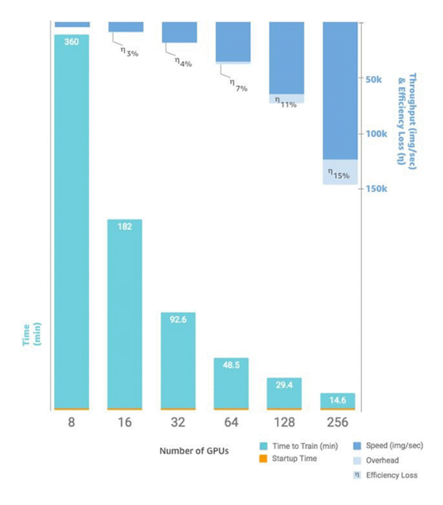

Custom training scripts

While SageMaker AI makes it simple to deploy and scale the number of instances and GPUs,
depending on your framework of choice, managing the data and results can be very challenging,
which is why external supporting libraries are often used. This most basic form of distributed
training requires modification of your training script to manage the data distribution.

Scaling training
4931

## Page 961

Amazon SageMaker AI
Developer Guide

SageMaker AI also supports Horovod and implementations of distributed training native to each
major deep learning framework. If you choose to use examples from these frameworks, you
can follow SageMaker AI’s container guide for Deep Learning Containers, and various example
notebooks that demonstrate implementations.

Run distributed training with the SageMaker AI distributed data
parallelism library

The SageMaker AI distributed data parallelism (SMDDP) library extends SageMaker training
capabilities on deep learning models with near-linear scaling efficiency by providing
implementations of collective communication operations optimized for AWS infrastructure.

When training large machine learning (ML) models, such as large language models (LLM) and
diffusion models, on a huge training dataset, ML practitioners use clusters of accelerators and

distributed training techniques to reduce the time to train or resolve memory constraints for
models that cannot fit in each GPU memory. ML practitioners often start with multiple accelerators
on a single instance and then scale to clusters of instances as their workload requirements increase.
As the cluster size increases, so does the communication overhead between multiple nodes, which
leads to drop in overall computational performance.

To address such overhead and memory problems, the SMDDP library offers the following.

• The SMDDP library optimizes training jobs for AWS network infrastructure and Amazon
SageMaker AI ML instance topology.

• The SMDDP library improves communication between nodes with implementations of

AllReduce and AllGather collective communication operations that are optimized for AWS
infrastructure.

To learn more about the details of the SMDDP library offerings, proceed to the section called
“Introduction to the SMDDP library”.

For more information about training with the model-parallel strategy offered by SageMaker AI, see
also (Archived) SageMaker model parallelism library v1.x.

Topics

• Introduction to the SageMaker AI distributed data parallelism library

• Supported frameworks, AWS Regions, and instances types

SageMaker AI distributed data parallelism library
4932

## Page 962

Amazon SageMaker AI
Developer Guide

• Distributed training with the SageMaker AI distributed data parallelism library

• Amazon SageMaker AI data parallelism library examples

• Configuration tips for the SageMaker AI distributed data parallelism library

• Amazon SageMaker AI distributed data parallelism library FAQ

• Troubleshooting for distributed training in Amazon SageMaker AI

• SageMaker AI data parallelism library release notes

Introduction to the SageMaker AI distributed data parallelism library

The SageMaker AI distributed data parallelism (SMDDP) library is a collective communication
library that improves compute performance of distributed data parallel training. The SMDDP
library addresses communications overhead of the key collective communication operations by
offering the following.

1. The library offers AllReduce optimized for AWS. AllReduce is a key operation used for

synchronizing gradients across GPUs at the end of each training iteration during distributed data
training.

2. The library offers AllGather optimized for AWS. AllGather is another key operation used in

sharded data parallel training, which is a memory-efficient data parallelism technique offered
by popular libraries such as the SageMaker AI model parallelism (SMP) library, DeepSpeed Zero
Redundancy Optimizer (ZeRO), and PyTorch Fully Sharded Data Parallelism (FSDP).

3. The library performs optimized node-to-node communication by fully utilizing AWS network

infrastructure and the Amazon EC2 instance topology.

The SMDDP library can increase training speed by offering performance improvement as you scale
your training cluster, with near-linear scaling efficiency.

Note

The SageMaker AI distributed training libraries are available through the AWS deep
learning containers for PyTorch and Hugging Face within the SageMaker Training platform.
To use the libraries, you must use the SageMaker Python SDK or the SageMaker APIs
through SDK for Python (Boto3) or AWS Command Line Interface. Throughout the
documentation, instructions and examples focus on how to use the distributed training
libraries with the SageMaker Python SDK.

SageMaker AI distributed data parallelism library
4933

## Page 963

Amazon SageMaker AI
Developer Guide

SMDDP collective communication operations optimized for AWS compute resources and
network infrastructure

The SMDDP library provides implementations of the AllReduce and AllGather collective
operations that are optimized for AWS compute resources and network infrastructure.

SMDDP AllReduce collective operation

The SMDDP library achieves optimal overlapping of the AllReduce operation with the backward
pass, significantly improving GPU utilization. It achieves near-linear scaling efficiency and faster
training speed by optimizing kernel operations between CPUs and GPUs. The library performs

AllReduce in parallel while GPU is computing gradients without taking away additional GPU
cycles, which makes the library to achieve faster training.

• Leverages CPUs: The library uses CPUs to AllReduce gradients, offloading this task from the
GPUs.

• Improved GPU usage: The cluster’s GPUs focus on computing gradients, improving their
utilization throughout training.

The following is the high-level workflow of the SMDDP AllReduce operation.

1. The library assigns ranks to GPUs (workers).

2. At each iteration, the library divides each global batch by the total number of workers (world

size) and assigns small batches (batch shards) to the workers.

• The size of the global batch is (number of nodes in a cluster) * (number of GPUs

per node) * (per batch shard).

• A batch shard (small batch) is a subset of dataset assigned to each GPU (worker) per iteration.

3. The library launches a training script on each worker.

4. The library manages copies of model weights and gradients from the workers at the end of

every iteration.

5. The library synchronizes model weights and gradients across the workers to aggregate a single

trained model.

The following architecture diagram shows an example of how the library sets up data parallelism
for a cluster of 3 nodes.

SageMaker AI distributed data parallelism library
4934

## Page 964

Amazon SageMaker AI
Developer Guide

SMDDP AllGather collective operation

AllGather is a collective operation where each worker starts with an input buffer, and then
concatenates or gathers the input buffers from all other workers into an output buffer.

Note

The SMDDP AllGather collective operation is available in smdistributed-

dataparallel>=2.0.1 and AWS Deep Learning Containers (DLC) for PyTorch v2.0.1 and
later.

AllGather is heavily used in distributed training techniques such as sharded data parallelism
where each individual worker holds a fraction of a model, or a sharded layer. The workers call

AllGather before forward and backward passes to reconstruct the sharded layers. The forward

SageMaker AI distributed data parallelism library
4935

## Page 965

Amazon SageMaker AI
Developer Guide

and backward passes continue onward after the parameters are all gathered. During the backward

pass, each worker also calls ReduceScatter to collect (reduce) gradients and break (scatter) them
into gradient shards to update the corresponding sharded layer. For more details on the role of
these collective operations in sharded data parallelism, see the SMP library's implementati on of
sharded data parallelism, ZeRO in the DeepSpeed documentation, and the blog about PyTorch
Fully Sharded Data Parallelism.

Because collective operations like AllGather are called in every iteration, they are the main
contributors to GPU communication overhead. Faster computation of these collective operations
directly translates to a shorter training time with no side effects on convergence. To achieve this,

the SMDDP library offers AllGather optimized for P4d instances.

SMDDP AllGather uses the following techniques to improve computational performance on P4d
instances.

1. It transfers data between instances (inter-node) through the Elastic Fabric Adapter (EFA)

network with a mesh topology. EFA is the AWS low-latency and high-throughput network
solution. A mesh topology for inter-node network communication is more tailored to the
characteristics of EFA and AWS network infrastructure. Compared to the NCCL ring or tree
topology that involves multiple packet hops, SMDDP avoids accumulating latency from multiple
hops as it only needs one hop. SMDDP implements a network rate control algorithm that
balances the workload to each communication peer in a mesh topology and achieves a higher
global network throughput.

2. It adopts low-latency GPU memory copy library based on NVIDIA GPUDirect RDMA technology

(GDRCopy) to coordinate local NVLink and EFA network traffic. GDRCopy, a low-latency GPU
memory copy library offered by NVIDIA, provides low-latency communication between CPU
processes and GPU CUDA kernels. With this technology, the SMDDP library is able to pipeline the
intra-node and inter-node data movement.

3. It reduces the usage of GPU streaming multiprocessors to increase compute power for running

model kernels. P4d and P4de instances are equipped with NVIDIA A100 GPUs, which each have
108 streaming multiprocessors. While NCCL takes up to 24 streaming multiprocessors to run
collective operations, SMDDP uses fewer than 9 streaming multiprocessors. Model compute
kernels pick up the saved streaming multiprocessors for faster computation.

SageMaker AI distributed data parallelism library
4936

## Page 966

Amazon SageMaker AI
Developer Guide

Supported frameworks, AWS Regions, and instances types

Before using the SageMaker AI distributed data parallelism (SMDDP) library, check what are the
supported ML frameworks and instance types and if there are enough quotas in your AWS account
and AWS Region.

Supported frameworks

The following tables show the deep learning frameworks and their versions that SageMaker AI
and SMDDP support. The SMDDP library is available in SageMaker AI Framework Containers,
integrated in Docker containers distributed by the SageMaker model parallelism (SMP) library v2,
or downloadable as a binary file.

Note

To check the latest updates and release notes of the SMDDP library, see the the section
called “SMDDP release notes”.

Topics

• PyTorch

• PyTorch Lightning

• Hugging Face Transformers

• TensorFlow (deprecated)

PyTorch

PyTorch version
SMDDP library
version

SageMaker AI
Framework
Container
images pre-
installed with
SMDDP

SMP Docker
images pre-
installed with
SMDDP

URL of the
binary file**

v2.3.1
smdistrib

Not available
658645717

https://s

uted-data

510.dkr.e

mdatapara

cr. <us-

llel.s3.a

SageMaker AI distributed data parallelism library
4937

## Page 967

Amazon SageMaker AI
Developer Guide

PyTorch version
SMDDP library
version

SageMaker AI
Framework
Container
images pre-
installed with
SMDDP

SMP Docker
images pre-
installed with
SMDDP

URL of the
binary file**

parallel=

west-

mazonaws.

=v2.5.0

2> .amazonaw

com/binar

s.com/smd

y/pytorch

istribute

/2.4.1/cu

d-modelpa

121/2024-

rallel:2.

10-09/smd

4.1-gpu-p

istribute

y311-cu121

d_datapar

allel-2.5

.0-cp311-

cp311-lin

ux_x86_64

.whl

SageMaker AI distributed data parallelism library
4938

## Page 968

Amazon SageMaker AI
Developer Guide

PyTorch version
SMDDP library
version

SageMaker AI
Framework
Container
images pre-
installed with
SMDDP

SMP Docker
images pre-
installed with
SMDDP

URL of the
binary file**

v2.3.0
smdistrib

Currently not
available

763104351

https://s

uted-data

884.dkr.e

mdatapara

parallel=

cr. <region>.amazonaw

llel.s3.a

=v2.3.0

s.com/pyt

mazonaws.

orch-trai

com/binar

ning:2.3.

y/pytorch

0-gpu-py3

/2.3.0/cu

11-cu121-

121/2024-

ubuntu20.

05-23/smd

04-sagema

istribute

ker

d_datapar

allel-2.3

.0-cp311-

cp311-lin

ux_x86_64

.whl

SageMaker AI distributed data parallelism library
4939

## Page 969

Amazon SageMaker AI
Developer Guide

PyTorch version
SMDDP library
version

SageMaker AI
Framework
Container
images pre-
installed with
SMDDP

SMP Docker
images pre-
installed with
SMDDP

URL of the
binary file**

v2.2.0
smdistrib

763104351

658645717

https://s

uted-data

884.dkr.e

510.dkr.e

mdatapara

parallel=

cr. <region>.amazonaw

cr. <region>.amazonaw

llel.s3.a

=v2.2.0

s.com/pyt

s.com/smd

mazonaws.

orch-trai

istribute

com/binar

ning:2.2.

d-modelpa

y/pytorch

0-gpu-py3

rallel:2.

/2.2.0/cu

10-cu121-

2.0-gpu-p

121/2024-

ubuntu20.

y310-cu121

03-04/smd

04-sagema

istribute

ker

d_datapar

allel-2.2

.0-cp310-

cp310-lin

ux_x86_64

.whl

SageMaker AI distributed data parallelism library
4940

## Page 970

Amazon SageMaker AI
Developer Guide

PyTorch version
SMDDP library
version

SageMaker AI
Framework
Container
images pre-
installed with
SMDDP

SMP Docker
images pre-
installed with
SMDDP

URL of the
binary file**

v2.1.0
smdistrib

763104351

658645717

https://s

uted-data

884.dkr.e

510.dkr.e

mdatapara

parallel=

cr. <region>.amazonaw

cr. <region>.amazonaw

llel.s3.a

=v2.1.0

s.com/pyt

s.com/smd

mazonaws.

orch-trai

istribute

com/binar

ning:2.1.

d-modelpa

y/pytorch

0-gpu-py3

rallel:2.

/2.1.0/cu

10-cu121-

1.2-gpu-p

121/2024-

ubuntu20.

y310-cu121

02-04/smd

04-sagema

istribute

ker

d_datapar

allel-2.1

.0-cp310-

cp310-lin

ux_x86_64

.whl

SageMaker AI distributed data parallelism library
4941

## Page 971

Amazon SageMaker AI
Developer Guide

PyTorch version
SMDDP library
version

SageMaker AI
Framework
Container
images pre-
installed with
SMDDP

SMP Docker
images pre-
installed with
SMDDP

URL of the
binary file**

v2.0.1
smdistrib

Not available
https://s

763104351

uted-data

884.dkr.e

mdatapara

parallel=

cr. <region>.amazonaw

llel.s3.a

=v2.0.1

s.com/pyt

mazonaws.

orch-trai

com/binar

ning:2.0.

y/pytorch

1-gpu-py3

/2.0.1/cu

10-cu118-

118/2023-

ubuntu20.

12-07/smd

04-sagema

istribute

ker

d_datapar

allel-2.0

.2-cp310-

cp310-lin

ux_x86_64

.whl

SageMaker AI distributed data parallelism library
4942

## Page 972

Amazon SageMaker AI
Developer Guide

PyTorch version
SMDDP library
version

SageMaker AI
Framework
Container
images pre-
installed with
SMDDP

SMP Docker
images pre-
installed with
SMDDP

URL of the
binary file**

v2.0.0
smdistrib

Not available
https://s

763104351

uted-data

884.dkr.e

mdatapara

parallel=

cr. <region>.amazonaw

llel.s3.a

=v1.8.0

s.com/pyt

mazonaws.

orch-trai

com/binar

ning:2.0.

y/pytorch

0-gpu-py3

/2.0.0/cu

10-cu118-

118/2023-

ubuntu20.

03-20/smd

04-sagema

istribute

ker

d_datapar

allel-1.8

.0-cp310-

cp310-lin

ux_x86_64

.whl

SageMaker AI distributed data parallelism library
4943

## Page 973

Amazon SageMaker AI
Developer Guide

PyTorch version
SMDDP library
version

SageMaker AI
Framework
Container
images pre-
installed with
SMDDP

SMP Docker
images pre-
installed with
SMDDP

URL of the
binary file**

v1.13.1
smdistrib

Not available
https://s

763104351

uted-data

884.dkr.e

mdatapara

parallel=

cr. <region>.amazonaw

llel.s3.a

=v1.7.0

s.com/pyt

mazonaws.

orch-trai

com/binar

ning:1.13

y/pytorch

.1-gpu-py

/1.13.1/c

39-cu117-

u117/2023

ubuntu20.

-01-09/sm

04-sagema

distribut

ker

ed_datapa

rallel-1.

7.0-cp39-

cp39-linu

x_x86_64.

whl

SageMaker AI distributed data parallelism library
4944

## Page 974

Amazon SageMaker AI
Developer Guide

PyTorch version
SMDDP library
version

SageMaker AI
Framework
Container
images pre-
installed with
SMDDP

SMP Docker
images pre-
installed with
SMDDP

URL of the
binary file**

v1.12.1
smdistrib

Not available
https://s

763104351

uted-data

884.dkr.e

mdatapara

parallel=

cr. <region>.amazonaw

llel.s3.a

=v1.6.0

s.com/pyt

mazonaws.

orch-trai

com/binar

ning:1.12

y/pytorch

.1-gpu-py

/1.12.1/c

38-cu113-

u113/2022

ubuntu20.

-12-05/sm

04-sagema

distribut

ker

ed_datapa

rallel-1.

6.0-cp38-

cp38-linu

x_x86_64.

whl

SageMaker AI distributed data parallelism library
4945

## Page 975

Amazon SageMaker AI
Developer Guide

PyTorch version
SMDDP library
version

SageMaker AI
Framework
Container
images pre-
installed with
SMDDP

SMP Docker
images pre-
installed with
SMDDP

URL of the
binary file**

v1.12.0
smdistrib

Not available
https://s

763104351

uted-data

884.dkr.e

mdatapara

parallel=

cr. <region>.amazonaw

llel.s3.a

=v1.5.0

s.com/pyt

mazonaws.

orch-trai

com/binar

ning:1.12

y/pytorch

.0-gpu-py

/1.12.0/c

38-cu113-

u113/2022

ubuntu20.

-07-01/sm

04-sagema

distribut

ker

ed_datapa

rallel-1.

5.0-cp38-

cp38-linu

x_x86_64.

whl

SageMaker AI distributed data parallelism library
4946

## Page 976

Amazon SageMaker AI
Developer Guide

PyTorch version
SMDDP library
version

SageMaker AI
Framework
Container
images pre-
installed with
SMDDP

SMP Docker
images pre-
installed with
SMDDP

URL of the
binary file**

v1.11.0
smdistrib

Not available
https://s

763104351

uted-data

884.dkr.e

mdatapara

parallel=

cr. <region>.amazonaw

llel.s3.a

=v1.4.1

s.com/pyt

mazonaws.

orch-trai

com/binar

ning:1.11

y/pytorch

.0-gpu-py

/1.11.0/c

38-cu113-

u113/2022

ubuntu20.

-04-14/sm

04-sagema

distribut

ker

ed_datapa

rallel-1.

4.1-cp38-

cp38-linu

x_x86_64.

whl

** The URLs of the binary files are for installing the SMDDP library in custom containers. For more
information, see Create your own Docker container with the SageMaker AI distributed data parallel
library.

Note

The SMDDP library is available in AWS Regions where the SageMaker AI Framework
Containers and the SMP Docker images are in service.

SageMaker AI distributed data parallelism library
4947

## Page 977

Amazon SageMaker AI
Developer Guide

Note

The SMDDP library v1.4.0 and later works as a backend of PyTorch distributed
(torch.distributed) data parallelism (torch.parallel.DistributedDataParallel). In accordance
with the change, the following smdistributed APIs for the PyTorch distributed package have
been deprecated.

• smdistributed.dataparallel.torch.distributed is deprecated. Use the
torch.distributed package instead.

• smdistributed.dataparallel.torch.parallel.DistributedDataParallel is
deprecated. Use the torch.nn.parallel.DistributedDataParallel API instead.

If you need to use the previous versions of the library (v1.3.0 or before), see the archived
SageMaker AI distributed data parallelism documentation in the SageMaker AI Python SDK
documentation.

PyTorch Lightning

The SMDDP library is available for PyTorch Lightning in the following SageMaker AI Framework
Containers for PyTorch and the SMP Docker containers.

PyTorch Lightning v2

PyTorch

PyTorch

SMDDP

SageMaker

SMP Docker

URL of the

Lightning
version

version

library
version

AI
Framework
Container
images pre-
installed
with SMDDP

images pre-
installed
with SMDDP

binary file**

2.2.5
2.3.0
smdistrib

Currently not
available

763104351

https://s

uted-data

884.dkr.e

mdatapara

parallel=

cr. <region>.amazonaw

llel.s3.a

=v2.3.0

s.com/pyt

mazonaws.

orch-trai

com/binar

SageMaker AI distributed data parallelism library
4948

## Page 978

Amazon SageMaker AI
Developer Guide

PyTorch
Lightning
version

PyTorch
version

SMDDP
library
version

SageMaker
AI
Framework
Container
images pre-
installed
with SMDDP

SMP Docker
images pre-
installed
with SMDDP

URL of the
binary file**

ning:2.3.

y/pytorch

0-gpu-py3

/2.3.0/cu

11-cu121-

121/2024-

ubuntu20.

05-23/smd

04-sagema

istribute

ker

d_datapar

allel-2.3

.0-cp311-

cp311-lin

ux_x86_64

.whl

2.2.0
2.2.0
smdistrib

763104351

658645717

https://s

uted-data

884.dkr.e

510.dkr.e

mdatapara

parallel=

cr. <region>.amazonaw

cr. <region>.amazonaw

llel.s3.a

=v2.2.0

s.com/pyt

s.com/smd

mazonaws.

orch-trai

istribute

com/binar

ning:2.2.

d-modelpa

y/pytorch

0-gpu-py3

rallel:2.

/2.2.0/cu

10-cu121-

2.0-gpu-p

121/2024-

ubuntu20.

y310-cu12

03-04/smd

04-sagema

1

istribute

ker

d_datapar

allel-2.2

.0-cp310-

cp310-lin

ux_x86_64

.whl

SageMaker AI distributed data parallelism library
4949

## Page 979

Amazon SageMaker AI
Developer Guide

PyTorch
Lightning
version

PyTorch
version

SMDDP
library
version

SageMaker
AI
Framework
Container
images pre-
installed
with SMDDP

SMP Docker
images pre-
installed
with SMDDP

URL of the
binary file**

2.1.2
2.1.0
smdistrib

763104351

658645717

https://s

uted-data

884.dkr.e

510.dkr.e

mdatapara

parallel=

cr. <region>.amazonaw

cr. <region>.amazonaw

llel.s3.a

=v2.1.0

s.com/pyt

s.com/smd

mazonaws.

orch-trai

istribute

com/binar

ning:2.1.

d-modelpa

y/pytorch

0-gpu-py3

rallel:2.

/2.1.0/cu

10-cu121-

1.2-gpu-p

121/2024-

ubuntu20.

y310-cu12

02-04/smd

04-sagema

1

istribute

ker

d_datapar

allel-2.1

.0-cp310-

cp310-lin

ux_x86_64

.whl

SageMaker AI distributed data parallelism library
4950

## Page 980

Amazon SageMaker AI
Developer Guide

PyTorch
Lightning
version

PyTorch
version

SMDDP
library
version

SageMaker
AI
Framework
Container
images pre-
installed
with SMDDP

SMP Docker
images pre-
installed
with SMDDP

URL of the
binary file**

2.1.0
2.0.1
smdistrib

Not available
https://s

763104351

uted-data

884.dkr.e

mdatapara

parallel=

cr. <region>.amazonaw

llel.s3.a

=v2.0.1

s.com/pyt

mazonaws.

orch-trai

com/binar

ning:2.0.

y/pytorch

1-gpu-py3

/2.0.1/cu

10-cu118-

118/2023-

ubuntu20.

12-07/smd

04-sagema

istribute

ker

d_datapar

allel-2.0

.2-cp310-

cp310-lin

ux_x86_64

.whl

PyTorch Lightning v1

PyTorch
Lightning
version

PyTorch version
SMDDP library
version

SageMaker AI
Framework
Container
images pre-
installed with
SMDDP

URL of the
binary file**

1.7.2
1.12.0
smdistrib

763104351
884.dkr.e

https://s
mdatapara

uted-data

SageMaker AI distributed data parallelism library
4951

## Page 981

Amazon SageMaker AI
Developer Guide

PyTorch
Lightning
version

PyTorch version
SMDDP library
version

SageMaker AI
Framework
Container
images pre-
installed with
SMDDP

URL of the
binary file**

1.7.0

llel.s3.a
mazonaws.
com/binary/
pytorch/1.12.0/
cu113/2022
-07-01/sm
distribut
ed_datapa
rallel-1.5.0-
cp38-cp38-linu
x_x86_64.whl

parallel=

cr.<region>.amazonaw
s.com/pytorch-
training:1.12
.0-gpu-py
38-cu113-
ubuntu20.04-
sagemaker

=v1.5.0

1.6.4

1.6.3

1.5.10

** The URLs of the binary files are for installing the SMDDP library in custom containers. For more
information, see Create your own Docker container with the SageMaker AI distributed data parallel
library.

Note

PyTorch Lightning and its utility libraries such as Lightning Bolts are not preinstalled in the
PyTorch DLCs. When you construct a SageMaker AI PyTorch estimator and submit a training

job request in Step 2, you need to provide requirements.txt to install pytorch-

lightning and lightning-bolts in the SageMaker AI PyTorch training container.

# requirements.txt
pytorch-lightning
lightning-bolts

SageMaker AI distributed data parallelism library
4952

## Page 982

Amazon SageMaker AI
Developer Guide

For more information about specifying the source directory to place the

requirements.txt file along with your training script and a job submission, see Using
third-party libraries in the Amazon SageMaker AI Python SDK documentation.

Hugging Face Transformers

The AWS Deep Learning Containers for Hugging Face use the SageMaker Training Containers for
PyTorch and TensorFlow as their base images. To look up the Hugging Face Transformers library
versions and paired PyTorch and TensorFlow versions, see the latest Hugging Face Containers and
the Prior Hugging Face Container Versions.

TensorFlow (deprecated)

Important

The SMDDP library discontinued support for TensorFlow and is no longer available in DLCs
for TensorFlow later than v2.11.0. The following table lists previous DLCs for TensorFlow
with the SMDDP library installed.

TensorFlow version
SMDDP library version

2.9.1, 2.10.1, 2.11.0
smdistributed-dataparallel=

=v1.4.1

2.8.3
smdistributed-dataparallel=

=v1.3.0

AWS Regions

The SMDDP library is available in all of the AWS Regions where the AWS Deep Learning Containers
for SageMaker AI and the SMP Docker images are in service.

Supported instance types

The SMDDP library requires one of the following instance types.

SageMaker AI distributed data parallelism library
4953

## Page 983

Amazon SageMaker AI
Developer Guide

Instance type

ml.p3dn.24xlarge *

ml.p4d.24xlarge

ml.p4de.24xlarge

Tip

To properly run distributed training on the EFA-enabled instance types, you should enable
traffic between the instances by setting up the security group of your VPC to allow all
inbound and outbound traffic to and from the security group itself. To learn how to set up
the security group rules, see Step 1: Prepare an EFA-enabled security group in the Amazon
EC2 User Guide.

Important

* The SMDDP library has discontinued support for optimizing its collective communication

operations on P3 instances. While you can still utilize the SMDDP optimized AllReduce

collective on ml.p3dn.24xlarge instances, there will be no further development
support to enhance performance on this instance type. Note that the SMDDP optimized

AllGather collective is only available for P4 instances.

For specs of the instance types, see the Accelerated Computing section in the Amazon EC2
Instance Types page. For information about instance pricing, see Amazon SageMaker Pricing.

If you encountered an error message similar to the following, follow the instructions at Request a
service quota increase for SageMaker AI resources.

ResourceLimitExceeded: An error occurred (ResourceLimitExceeded) when calling
the CreateTrainingJob operation: The account-level service limit 'ml.p3dn.24xlarge
for training job usage' is 0 Instances, with current utilization of 0 Instances
and a request delta of 1 Instances.
Please contact AWS support to request an increase for this limit.

SageMaker AI distributed data parallelism library
4954

## Page 984

Amazon SageMaker AI
Developer Guide

Distributed training with the SageMaker AI distributed data parallelism library

The SageMaker AI distributed data parallelism (SMDDP) library is designed for ease of use and to
provide seamless integration with PyTorch.

When training a deep learning model with the SMDDP library on SageMaker AI, you can focus on
writing your training script and model training.

To get started, import the SMDDP library to use its collective operations optimized for AWS. The
following topics provide instructions on what to add to your training script depending on which
collective operation you want to optimize.

Topics

• Adapting your training script to use the SMDDP collective operations

• Launching distributed training jobs with SMDDP using the SageMaker Python SDK

Adapting your training script to use the SMDDP collective operations

The training script examples provided in this section are simplified and highlight only the required
changes to enable the SageMaker AI distributed data parallelism (SMDDP) library in your training
script. For end-to-end Jupyter notebook examples that demonstrate how to run a distributed
training job with the SMDDP library, see Amazon SageMaker AI data parallelism library examples.

Topics

• Use the SMDDP library in your PyTorch training script

• Use the SMDDP library in your PyTorch Lightning training script

• Use the SMDDP library in your TensorFlow training script (deprecated)

Use the SMDDP library in your PyTorch training script

Starting from the SageMaker AI distributed data parallelism (SMDDP) library v1.4.0, you can use

the library as a backend option for the PyTorch distributed package. To use the SMDDP AllReduce

and AllGather collective operations, you only need to import the SMDDP library at the beginning
of your training script and set SMDDP as the the backend of PyTorch distributed modules during
process group initialization. With the single line of backend specification, you can keep all the
native PyTorch distributed modules and the entire training script unchanged. The following code
snippets show how to use the SMDDP library as the backend of PyTorch-based distributed training

SageMaker AI distributed data parallelism library
4955

## Page 985

Amazon SageMaker AI
Developer Guide

packages: PyTorch distributed data parallel (DDP), PyTorch fully sharded data parallelism (FSDP),
DeepSpeed, and Megatron-DeepSpeed.

For PyTorch DDP or FSDP

Initialize the process group as follows.

import torch.distributed as dist
import smdistributed.dataparallel.torch.torch_smddp

dist.init_process_group(backend="smddp")

Note

(For PyTorch DDP jobs only) The smddp backend currently does not support creating

subprocess groups with the torch.distributed.new_group() API. You also cannot

use the smddp backend concurrently with other process group backends such as NCCL and

Gloo.

For DeepSpeed or Megatron-DeepSpeed

Initialize the process group as follows.

import deepspeed
import smdistributed.dataparallel.torch.torch_smddp

deepspeed.init_distributed(dist_backend="smddp")

Note

To use SMDDP AllGather with the mpirun-based launchers (smdistributed and

pytorchddp) in the section called “Launching distributed training jobs with SMDDP”, you
also need to set the following environment variable in your training script.

export SMDATAPARALLEL_OPTIMIZE_SDP=true

SageMaker AI distributed data parallelism library
4956

## Page 986

Amazon SageMaker AI
Developer Guide

For general guidance on writing a PyTorch FSDP training script, see Advanced Model Training with
Fully Sharded Data Parallel (FSDP) in the PyTorch documentation.

For general guidance on writing a PyTorch DDP training script, see Getting started with distributed
data parallel in the PyTorch documentation.

After you have completed adapting your training script, proceed to Launching distributed training
jobs with SMDDP using the SageMaker Python SDK.

Use the SMDDP library in your PyTorch Lightning training script

If you want to bring your PyTorch Lightning training script and run a distributed data parallel
training job in SageMaker AI, you can run the training job with minimal changes in your training

script. The necessary changes include the following: import the smdistributed.dataparallel
library’s PyTorch modules, set up the environment variables for PyTorch Lightning to accept the
SageMaker AI environment variables that are preset by the SageMaker training toolkit, and activate

the SMDDP library by setting the process group backend to "smddp". To learn more, walk through
the following instructions that break down the steps with code examples.

Note

The PyTorch Lightning support is available in the SageMaker AI data parallel library v1.5.0
and later.

PyTorch Lightning == v2.1.0 and PyTorch == 2.0.1

1. Import the pytorch_lightning library and the smdistributed.dataparallel.torch

modules.

import lightning as pl
import smdistributed.dataparallel.torch.torch_smddp

2. Instantiate the LightningEnvironment.

from lightning.fabric.plugins.environments.lightning import LightningEnvironment

env = LightningEnvironment()
env.world_size = lambda: int(os.environ["WORLD_SIZE"])
env.global_rank = lambda: int(os.environ["RANK"])

SageMaker AI distributed data parallelism library
4957

## Page 987

Amazon SageMaker AI
Developer Guide

3. For PyTorch DDP – Create an object of the DDPStrategy class with "smddp" for

process_group_backend and "gpu" for accelerator, and pass that to the Trainer class.

import lightning as pl
from lightning.pytorch.strategies import DDPStrategy

ddp = DDPStrategy(
cluster_environment=env,
process_group_backend="smddp",
accelerator="gpu"
)

trainer = pl.Trainer(
max_epochs=200,
strategy=ddp,
devices=num_gpus,
num_nodes=num_nodes
)

For PyTorch FSDP – Create an object of the FSDPStrategy class (with wrapping policy of choice)

with "smddp" for process_group_backend and "gpu" for accelerator, and pass that to
the Trainer class.

import lightning as pl
from lightning.pytorch.strategies import FSDPStrategy

from functools import partial
from torch.distributed.fsdp.wrap import size_based_auto_wrap_policy

policy = partial(
size_based_auto_wrap_policy,
min_num_params=10000
)

fsdp = FSDPStrategy(
auto_wrap_policy=policy,
process_group_backend="smddp",
cluster_environment=env
)

trainer = pl.Trainer(
max_epochs=200,

SageMaker AI distributed data parallelism library
4958

## Page 988

Amazon SageMaker AI
Developer Guide

strategy=fsdp,
devices=num_gpus,
num_nodes=num_nodes
)

After you have completed adapting your training script, proceed to Launching distributed training
jobs with SMDDP using the SageMaker Python SDK.

Note

When you construct a SageMaker AI PyTorch estimator and submit a training job request in
the section called “Launching distributed training jobs with SMDDP”, you need to provide

requirements.txt to install pytorch-lightning and lightning-bolts in the
SageMaker AI PyTorch training container.

# requirements.txt
pytorch-lightning
lightning-bolts

For more information about specifying the source directory to place the

requirements.txt file along with your training script and a job submission, see Using
third-party libraries in the Amazon SageMaker AI Python SDK documentation.

Use the SMDDP library in your TensorFlow training script (deprecated)

Important

The SMDDP library discontinued support for TensorFlow and is no longer available in DLCs
for TensorFlow later than v2.11.0. To find previous TensorFlow DLCs with the SMDDP
library installed, see the section called “Supported frameworks”.

The following steps show you how to modify a TensorFlow training script to utilize SageMaker AI's
distributed data parallel library.

SageMaker AI distributed data parallelism library
4959

## Page 989

Amazon SageMaker AI
Developer Guide

The library APIs are designed to be similar to Horovod APIs. For additional details on each API that
the library offers for TensorFlow, see the SageMaker AI distributed data parallel TensorFlow API
documentation.

Note

SageMaker AI distributed data parallel is adaptable to TensorFlow training scripts

composed of tf core modules except tf.keras modules. SageMaker AI distributed data
parallel does not support TensorFlow with Keras implementation.

Note

The SageMaker AI distributed data parallelism library supports Automatic Mixed Precision
(AMP) out of the box. No extra action is needed to enable AMP other than the framework-
level modifications to your training script. If gradients are in FP16, the SageMaker AI data

parallelism library runs its AllReduce operation in FP16. For more information about
implementing AMP APIs to your training script, see the following resources:

• Frameworks - TensorFlow in the NVIDIA Deep Learning Performance documentation
• Automatic Mixed Precision for Deep Learning in the NVIDIA Developer Docs
• TensorFlow mixed precision APIs in the TensorFlow documentation

1.
Import the library's TensorFlow client and initialize it.

import smdistributed.dataparallel.tensorflow as sdp
sdp.init()

2.
Pin each GPU to a single smdistributed.dataparallel process with local_rank—
this refers to the relative rank of the process within a given node. The

sdp.tensorflow.local_rank() API provides you with the local rank of the device. The
leader node is rank 0, and the worker nodes are rank 1, 2, 3, and so on. This is invoked in the

following code block as sdp.local_rank(). set_memory_growth is not directly related to
SageMaker AI distributed, but must be set for distributed training with TensorFlow.

gpus = tf.config.experimental.list_physical_devices('GPU')
for gpu in gpus:
tf.config.experimental.set_memory_growth(gpu, True)

SageMaker AI distributed data parallelism library
4960

## Page 990

Amazon SageMaker AI
Developer Guide

if gpus:
tf.config.experimental.set_visible_devices(gpus[sdp.local_rank()], 'GPU')

3.
Scale the learning rate by the number of workers. The sdp.tensorflow.size() API
provides you the number of workers in the cluster. This is invoked in the following code block

as sdp.size().

learning_rate = learning_rate * sdp.size()

4.
Use the library’s DistributedGradientTape to optimize AllReduce operations during

training. This wraps tf.GradientTape.

with tf.GradientTape() as tape:
output = model(input)
loss_value = loss(label, output)
# SageMaker AI data parallel: Wrap tf.GradientTape with the library's
DistributedGradientTape
tape = sdp.DistributedGradientTape(tape)

5.
Broadcast the initial model variables from the leader node (rank 0) to all the worker
nodes (ranks 1 through n). This is needed to ensure a consistent initialization across all

the worker ranks. Use the sdp.tensorflow.broadcast_variables API after the
model and optimizer variables are initialized. This is invoked in the following code block as

sdp.broadcast_variables().

sdp.broadcast_variables(model.variables, root_rank=0)
sdp.broadcast_variables(opt.variables(), root_rank=0)

6.
Finally, modify your script to save checkpoints only on the leader node. The leader node has a
synchronized model. This also avoids worker nodes overwriting the checkpoints and possibly
corrupting the checkpoints.

if sdp.rank() == 0:
checkpoint.save(checkpoint_dir)

The following is an example TensorFlow training script for distributed training with the library.

import tensorflow as tf

SageMaker AI distributed data parallelism library
4961

## Page 991

Amazon SageMaker AI
Developer Guide

# SageMaker AI data parallel: Import the library TF API
import smdistributed.dataparallel.tensorflow as sdp

# SageMaker AI data parallel: Initialize the library
sdp.init()

gpus = tf.config.experimental.list_physical_devices('GPU')
for gpu in gpus:
tf.config.experimental.set_memory_growth(gpu, True)
if gpus:
# SageMaker AI data parallel: Pin GPUs to a single library process
tf.config.experimental.set_visible_devices(gpus[sdp.local_rank()], 'GPU')

# Prepare Dataset
dataset = tf.data.Dataset.from_tensor_slices(...)

# Define Model

mnist_model = tf.keras.Sequential(...)
loss = tf.losses.SparseCategoricalCrossentropy()

# SageMaker AI data parallel: Scale Learning Rate
# LR for 8 node run : 0.000125
# LR for single node run : 0.001
opt = tf.optimizers.Adam(0.000125 * sdp.size())

@tf.function
def training_step(images, labels, first_batch):
with tf.GradientTape() as tape:
probs = mnist_model(images, training=True)
loss_value = loss(labels, probs)

# SageMaker AI data parallel: Wrap tf.GradientTape with the library's
DistributedGradientTape
tape = sdp.DistributedGradientTape(tape)

grads = tape.gradient(loss_value, mnist_model.trainable_variables)
opt.apply_gradients(zip(grads, mnist_model.trainable_variables))

if first_batch:
# SageMaker AI data parallel: Broadcast model and optimizer variables
sdp.broadcast_variables(mnist_model.variables, root_rank=0)
sdp.broadcast_variables(opt.variables(), root_rank=0)

return loss_value

SageMaker AI distributed data parallelism library
4962

## Page 992

Amazon SageMaker AI
Developer Guide

...

# SageMaker AI data parallel: Save checkpoints only from master node.
if sdp.rank() == 0:
checkpoint.save(checkpoint_dir)

After you have completed adapting your training script, move on to Launching distributed training
jobs with SMDDP using the SageMaker Python SDK.

Launching distributed training jobs with SMDDP using the SageMaker Python SDK

To run a distributed training job with your adapted script from the section called “Adapting
your training script to use the SMDDP collective operations”, use the SageMaker Python SDK's
framework or generic estimators by specifying the prepared training script as an entry point script
and the distributed training configuration.

This page walks you through how to use the SageMaker AI Python SDK in two ways.

• If you want to achieve a quick adoption of your distributed training job in SageMaker AI,
configure a SageMaker AI PyTorch or TensorFlow framework estimator class. The framework
estimator picks up your training script and automatically matches the right image URI of the pre-
built PyTorch or TensorFlow Deep Learning Containers (DLC), given the value specified to the

framework_version parameter.

• If you want to extend one of the pre-built containers or build a custom container to create your

own ML environment with SageMaker AI, use the SageMaker AI generic Estimator class and
specify the image URI of the custom Docker container hosted in your Amazon Elastic Container
Registry (Amazon ECR).

Your training datasets should be stored in Amazon S3 or Amazon FSx for Lustre in the AWS Region
in which you are launching your training job. If you use Jupyter notebooks, you should have a
SageMaker notebook instance or a SageMaker Studio Classic app running in the same AWS Region.
For more information about storing your training data, see the SageMaker Python SDK data inputs
documentation.

SageMaker AI distributed data parallelism library
4963

## Page 993

Amazon SageMaker AI
Developer Guide

Tip

We recommend that you use Amazon FSx for Lustre instead of Amazon S3 to improve
training performance. Amazon FSx has higher throughput and lower latency than Amazon
S3.

Tip

To properly run distributed training on the EFA-enabled instance types, you should enables
traffic between the instances by setting up the security group of your VPC to allow all
inbound and outbound traffic to and from the security group itself. To learn how to set up
the security group rules, see Step 1: Prepare an EFA-enabled security group in the Amazon
EC2 User Guide.

Choose one of the following topics for instructions on how to run a distributed training job of
your training script. After you launch a training job, you can monitor system utilization and model
performance using Amazon SageMaker Debugger or Amazon CloudWatch.

While you follow instructions in the following topics to learn more about technical details, we
also recommend that you try the Amazon SageMaker AI data parallelism library examples to get
started.

Topics

• Use the PyTorch framework estimators in the SageMaker Python SDK

• Use the SageMaker AI generic estimator to extend pre-built DLC containers

• Create your own Docker container with the SageMaker AI distributed data parallel library

Use the PyTorch framework estimators in the SageMaker Python SDK

You can launch distributed training by adding the distribution argument to the SageMaker AI

framework estimators, PyTorch or TensorFlow. For more details, choose one of the frameworks
supported by the SageMaker AI distributed data parallelism (SMDDP) library from the following
selections.

SageMaker AI distributed data parallelism library
4964

## Page 994

Amazon SageMaker AI
Developer Guide

PyTorch

The following launcher options are available for launching PyTorch distributed training.

• pytorchddp – This option runs mpirun and sets up environment variables needed for
running PyTorch distributed training on SageMaker AI. To use this option, pass the following

dictionary to the distribution parameter.

{ "pytorchddp": { "enabled": True } }

• torch_distributed – This option runs torchrun and sets up environment variables
needed for running PyTorch distributed training on SageMaker AI. To use this option, pass the

following dictionary to the distribution parameter.

{ "torch_distributed": { "enabled": True } }

• smdistributed – This option also runs mpirun but with smddprun that sets up
environment variables needed for running PyTorch distributed training on SageMaker AI.

{ "smdistributed": { "dataparallel": { "enabled": True } } }

If you chose to replace NCCL AllGather to SMDDP AllGather, you can use all three options.
Choose one option that fits with your use case.

If you chose to replace NCCL AllReduce with SMDDP AllReduce, you should choose one of

the mpirun-based options: smdistributed or pytorchddp. You can also add additional MPI
options as follows.

{
"pytorchddp": {
"enabled": True,
"custom_mpi_options": "-verbose -x NCCL_DEBUG=VERSION"
}
}

{
"smdistributed": {
"dataparallel": {
"enabled": True,
"custom_mpi_options": "-verbose -x NCCL_DEBUG=VERSION"

SageMaker AI distributed data parallelism library
4965

## Page 995

Amazon SageMaker AI
Developer Guide

}
}
}

The following code sample shows the basic structure of a PyTorch estimator with distributed

training options.

from sagemaker.pytorch import PyTorch

pt_estimator = PyTorch(
base_job_name="training_job_name_prefix",
source_dir="subdirectory-to-your-code",
entry_point="adapted-training-script.py",
role="SageMakerRole",
py_version="py310",
framework_version="2.0.1",

# For running a multi-node distributed training job, specify a value greater
than 1
# Example: 2,3,4,..8
instance_count=2,

# Instance types supported by the SageMaker AI data parallel library:
# ml.p4d.24xlarge, ml.p4de.24xlarge
instance_type="ml.p4d.24xlarge",

# Activate distributed training with SMDDP
distribution={ "pytorchddp": { "enabled": True } }  # mpirun, activates SMDDP
AllReduce OR AllGather
# distribution={ "torch_distributed": { "enabled": True } }  # torchrun,
activates SMDDP AllGather
# distribution={ "smdistributed": { "dataparallel": { "enabled": True } } }  #
mpirun, activates SMDDP AllReduce OR AllGather
)

pt_estimator.fit("s3://bucket/path/to/training/data")

Note

PyTorch Lightning and its utility libraries such as Lightning Bolts are not preinstalled in

the SageMaker AI PyTorch DLCs. Create the following requirements.txt file and save
in the source directory where you save the training script.

SageMaker AI distributed data parallelism library
4966

## Page 996

Amazon SageMaker AI
Developer Guide

# requirements.txt
pytorch-lightning
lightning-bolts

For example, the tree-structured directory should look like the following.

### pytorch_training_launcher_jupyter_notebook.ipynb
### sub-folder-for-your-code
###   adapted-training-script.py
###   requirements.txt

For more information about specifying the source directory to place the

requirements.txt file along with your training script and a job submission, see Using
third-party libraries in the Amazon SageMaker AI Python SDK documentation.

Considerations for activating SMDDP collective operations and using the right distributed
training launcher options

• SMDDP AllReduce and SMDDP AllGather are not mutually compatible at present.

• SMDDP AllReduce is activated by default when using smdistributed or pytorchddp,

which are mpirun-based launchers, and NCCL AllGather is used.

• SMDDP AllGather is activated by default when using torch_distributed launcher, and

AllReduce falls back to NCCL.

• SMDDP AllGather can also be activated when using the mpirun-based launchers with an
additional environment variable set as follows.

export SMDATAPARALLEL_OPTIMIZE_SDP=true

SageMaker AI distributed data parallelism library
4967

## Page 997

Amazon SageMaker AI
Developer Guide

TensorFlow

Important

The SMDDP library discontinued support for TensorFlow and is no longer available
in DLCs for TensorFlow later than v2.11.0. To find previous TensorFlow DLCs with the
SMDDP library installed, see the section called “TensorFlow (deprecated)”.

from sagemaker.tensorflow import TensorFlow

tf_estimator = TensorFlow(
base_job_name = "training_job_name_prefix",
entry_point="adapted-training-script.py",
role="SageMakerRole",
framework_version="2.11.0",
py_version="py38",

# For running a multi-node distributed training job, specify a value greater
than 1
# Example: 2,3,4,..8
instance_count=2,

# Instance types supported by the SageMaker AI data parallel library:
# ml.p4d.24xlarge, ml.p3dn.24xlarge, and ml.p3.16xlarge
instance_type="ml.p3.16xlarge",

# Training using the SageMaker AI data parallel distributed training strategy
distribution={ "smdistributed": { "dataparallel": { "enabled": True } } }
)

tf_estimator.fit("s3://bucket/path/to/training/data")

Use the SageMaker AI generic estimator to extend pre-built DLC containers

You can customize SageMaker AI prebuilt containers or extend them to handle any additional
functional requirements for your algorithm or model that the prebuilt SageMaker AI Docker image
doesn't support. For an example of how you can extend a pre-built container, see Extend a Prebuilt
Container.

SageMaker AI distributed data parallelism library
4968

## Page 998

Amazon SageMaker AI
Developer Guide

To extend a prebuilt container or adapt your own container to use the library, you must use one of
the images listed in Supported frameworks.

Note

From TensorFlow 2.4.1 and PyTorch 1.8.1, SageMaker AI framework DLCs supports
EFA-enabled instance types. We recommend that you use the DLC images that contain
TensorFlow 2.4.1 or later and PyTorch 1.8.1 or later.

For example, if you use PyTorch, your Dockerfile should contain a FROM statement similar to the
following:

# SageMaker AI PyTorch image
FROM 763104351884.dkr.ecr.<aws-region>.amazonaws.com/pytorch-training:<image-tag>

ENV PATH="/opt/ml/code:${PATH}"

# this environment variable is used by the SageMaker AI PyTorch container to determine
our user code directory.
ENV SAGEMAKER_SUBMIT_DIRECTORY /opt/ml/code

# /opt/ml and all subdirectories are utilized by SageMaker AI, use the /code
subdirectory to store your user code.
COPY train.py /opt/ml/code/train.py

# Defines cifar10.py as script entrypoint
ENV SAGEMAKER_PROGRAM train.py

You can further customize your own Docker container to work with SageMaker AI using the
SageMaker Training toolkit and the binary file of the SageMaker AI distributed data parallel library.
To learn more, see the instructions in the following section.

Create your own Docker container with the SageMaker AI distributed data parallel library

To build your own Docker container for training and use the SageMaker AI data parallel library,
you must include the correct dependencies and the binary files of the SageMaker AI distributed
parallel libraries in your Dockerfile. This section provides instructions on how to create a complete
Dockerfile with the minimum set of dependencies for distributed training in SageMaker AI using
the data parallel library.

SageMaker AI distributed data parallelism library
4969

## Page 999

Amazon SageMaker AI
Developer Guide

Note

This custom Docker option with the SageMaker AI data parallel library as a binary is
available only for PyTorch.

To create a Dockerfile with the SageMaker training toolkit and the data parallel library

1. Start with a Docker image from NVIDIA CUDA. Use the cuDNN developer versions that contain

CUDA runtime and development tools (headers and libraries) to build from the PyTorch source
code.

FROM nvidia/cuda:11.3.1-cudnn8-devel-ubuntu20.04

Tip

The official AWS Deep Learning Container (DLC) images are built from the NVIDIA
CUDA base images. If you want to use the prebuilt DLC images as references while
following the rest of the instructions, see the AWS Deep Learning Containers for PyTorch
Dockerfiles.

2. Add the following arguments to specify versions of PyTorch and other packages. Also, indicate

the Amazon S3 bucket paths to the SageMaker AI data parallel library and other software to use
AWS resources, such as the Amazon S3 plug-in.

To use versions of the third party libraries other than the ones provided in the following code
example, we recommend you look into the official Dockerfiles of AWS Deep Learning Container
for PyTorch to find versions that are tested, compatible, and suitable for your application.

To find URLs for the SMDATAPARALLEL_BINARY argument, see the lookup tables at Supported
frameworks.

ARG PYTORCH_VERSION=1.10.2
ARG PYTHON_SHORT_VERSION=3.8
ARG EFA_VERSION=1.14.1
ARG SMDATAPARALLEL_BINARY=https://smdataparallel.s3.amazonaws.com/binary/pytorch/
${PYTORCH_VERSION}/cu113/2022-02-18/smdistributed_dataparallel-1.4.0-cp38-cp38-
linux_x86_64.whl

SageMaker AI distributed data parallelism library
4970

## Page 1000

Amazon SageMaker AI
Developer Guide

ARG PT_S3_WHL_GPU=https://aws-s3-plugin.s3.us-west-2.amazonaws.com/
binaries/0.0.1/1c3e69e/awsio-0.0.1-cp38-cp38-manylinux1_x86_64.whl
ARG CONDA_PREFIX="/opt/conda"
ARG BRANCH_OFI=1.1.3-aws

3. Set the following environment variables to properly build SageMaker training components and

run the data parallel library. You use these variables for the components in the subsequent
steps.

# Set ENV variables required to build PyTorch
ENV TORCH_CUDA_ARCH_LIST="7.0+PTX 8.0"
ENV TORCH_NVCC_FLAGS="-Xfatbin -compress-all"
ENV NCCL_VERSION=2.10.3

# Add OpenMPI to the path.
ENV PATH /opt/amazon/openmpi/bin:$PATH

# Add Conda to path
ENV PATH $CONDA_PREFIX/bin:$PATH

# Set this enviroment variable for SageMaker AI to launch SMDDP correctly.
ENV SAGEMAKER_TRAINING_MODULE=sagemaker_pytorch_container.training:main

# Add enviroment variable for processes to be able to call fork()
ENV RDMAV_FORK_SAFE=1

# Indicate the container type
ENV DLC_CONTAINER_TYPE=training

# Add EFA and SMDDP to LD library path
ENV LD_LIBRARY_PATH="/opt/conda/lib/python${PYTHON_SHORT_VERSION}/site-packages/
smdistributed/dataparallel/lib:$LD_LIBRARY_PATH"
ENV LD_LIBRARY_PATH=/opt/amazon/efa/lib/:$LD_LIBRARY_PATH

4. Install or update curl, wget, and git to download and build packages in the subsequent steps.

RUN --mount=type=cache,id=apt-final,target=/var/cache/apt \
apt-get update && apt-get install -y  --no-install-recommends \
curl \
wget \
git \
&& rm -rf /var/lib/apt/lists/*

SageMaker AI distributed data parallelism library
4971

## Page 1001

Amazon SageMaker AI
Developer Guide

5. Install Elastic Fabric Adapter (EFA) software for Amazon EC2 network communication.

RUN DEBIAN_FRONTEND=noninteractive apt-get update
RUN mkdir /tmp/efa \
&& cd /tmp/efa \
&& curl --silent -O https://efa-installer.amazonaws.com/aws-efa-installer-
${EFA_VERSION}.tar.gz \
&& tar -xf aws-efa-installer-${EFA_VERSION}.tar.gz \
&& cd aws-efa-installer \
&& ./efa_installer.sh -y --skip-kmod -g \
&& rm -rf /tmp/efa

6. Install Conda to handle package management.

RUN curl -fsSL -v -o ~/miniconda.sh -O  https://repo.anaconda.com/miniconda/
Miniconda3-latest-Linux-x86_64.sh  && \

chmod +x ~/miniconda.sh && \
~/miniconda.sh -b -p $CONDA_PREFIX && \
rm ~/miniconda.sh && \
$CONDA_PREFIX/bin/conda install -y python=${PYTHON_SHORT_VERSION} conda-build
pyyaml numpy ipython && \
$CONDA_PREFIX/bin/conda clean -ya

7. Get, build, and install PyTorch and its dependencies. We build PyTorch from the source code

because we need to have control of the NCCL version to guarantee compatibility with the AWS
OFI NCCL plug-in.

a. Following the steps in the PyTorch official dockerfile, install build dependencies and set up

ccache to speed up recompilation.

RUN DEBIAN_FRONTEND=noninteractive \
apt-get install -y --no-install-recommends \
build-essential \
ca-certificates \
ccache \
cmake \
git \
libjpeg-dev \
libpng-dev \
&& rm -rf /var/lib/apt/lists/*
# Setup ccache
RUN /usr/sbin/update-ccache-symlinks

SageMaker AI distributed data parallelism library
4972

