# sagemaker-dg-6000.pdf

## Page 1

Amazon SageMaker AI
Developer Guide

5. Install Elastic Fabric Adapter (EFA) software for Amazon EC2 network communication.

RUN DEBIAN_FRONTEND=noninteractive apt-get update
RUN mkdir /tmp/efa \
&& cd /tmp/efa \
&& curl --silent -O https://efa-installer.amazonaws.com/aws-efa-installer-
${EFA_VERSION}.tar.gz \
&& tar -xf aws-efa-installer-${EFA_VERSION}.tar.gz \
&& cd aws-efa-installer \
&& ./efa_installer.sh -y --skip-kmod -g \
&& rm -rf /tmp/efa

6. Install Conda to handle package management.

RUN curl -fsSL -v -o ~/miniconda.sh -O  https://repo.anaconda.com/miniconda/
Miniconda3-latest-Linux-x86_64.sh  && \

chmod +x ~/miniconda.sh && \
~/miniconda.sh -b -p $CONDA_PREFIX && \
rm ~/miniconda.sh && \
$CONDA_PREFIX/bin/conda install -y python=${PYTHON_SHORT_VERSION} conda-build
pyyaml numpy ipython && \
$CONDA_PREFIX/bin/conda clean -ya

7. Get, build, and install PyTorch and its dependencies. We build PyTorch from the source code

because we need to have control of the NCCL version to guarantee compatibility with the AWS
OFI NCCL plug-in.

a. Following the steps in the PyTorch official dockerfile, install build dependencies and set up

ccache to speed up recompilation.

RUN DEBIAN_FRONTEND=noninteractive \
apt-get install -y --no-install-recommends \
build-essential \
ca-certificates \
ccache \
cmake \
git \
libjpeg-dev \
libpng-dev \
&& rm -rf /var/lib/apt/lists/*
# Setup ccache
RUN /usr/sbin/update-ccache-symlinks

SageMaker AI distributed data parallelism library
4972

## Page 2

Amazon SageMaker AI
Developer Guide

RUN mkdir /opt/ccache && ccache --set-config=cache_dir=/opt/ccache

b. Install PyTorch’s common and Linux dependencies.

# Common dependencies for PyTorch
RUN conda install astunparse numpy ninja pyyaml mkl mkl-include setuptools cmake
cffi typing_extensions future six requests dataclasses

# Linux specific dependency for PyTorch
RUN conda install -c pytorch magma-cuda113

c. Clone the PyTorch GitHub repository.

RUN --mount=type=cache,target=/opt/ccache \
cd / \
&& git clone --recursive https://github.com/pytorch/pytorch -b v

${PYTORCH_VERSION}

d. Install and build a specific NCCL version. To do this, replace the content in the PyTorch’s

default NCCL folder (/pytorch/third_party/nccl) with the specific NCCL version from
the NVIDIA repository. The NCCL version was set in the step 3 of this guide.

RUN cd /pytorch/third_party/nccl \
&& rm -rf nccl \
&& git clone https://github.com/NVIDIA/nccl.git -b v${NCCL_VERSION}-1 \
&& cd nccl \
&& make -j64 src.build CUDA_HOME=/usr/local/cuda NVCC_GENCODE="-
gencode=arch=compute_70,code=sm_70 -gencode=arch=compute_80,code=sm_80" \
&& make pkg.txz.build \
&& tar -xvf build/pkg/txz/nccl_*.txz -C $CONDA_PREFIX --strip-components=1

e. Build and install PyTorch. This process usually takes slightly more than 1 hour to complete. It

is built using the NCCL version downloaded in a previous step.

RUN cd /pytorch \
&& CMAKE_PREFIX_PATH="$(dirname $(which conda))/../" \
python setup.py install \
&& rm -rf /pytorch

8. Build and install AWS OFI NCCL plugin. This enables libfabric support for the SageMaker AI data

parallel library.

SageMaker AI distributed data parallelism library
4973

## Page 3

Amazon SageMaker AI
Developer Guide

RUN DEBIAN_FRONTEND=noninteractive apt-get update \
&& apt-get install -y --no-install-recommends \
autoconf \
automake \
libtool
RUN mkdir /tmp/efa-ofi-nccl \
&& cd /tmp/efa-ofi-nccl \
&& git clone https://github.com/aws/aws-ofi-nccl.git -b v${BRANCH_OFI} \
&& cd aws-ofi-nccl \
&& ./autogen.sh \
&& ./configure --with-libfabric=/opt/amazon/efa \
--with-mpi=/opt/amazon/openmpi \
--with-cuda=/usr/local/cuda \
--with-nccl=$CONDA_PREFIX \
&& make \
&& make install \

&& rm -rf /tmp/efa-ofi-nccl

9. Build and install TorchVision.

RUN pip install --no-cache-dir -U \
packaging \
mpi4py==3.0.3
RUN cd /tmp \
&& git clone https://github.com/pytorch/vision.git -b v0.9.1 \
&& cd vision \
&& BUILD_VERSION="0.9.1+cu111" python setup.py install \
&& cd /tmp \
&& rm -rf vision

10.Install and configure OpenSSH. OpenSSH is required for MPI to communicate between

containers. Allow OpenSSH to talk to containers without asking for confirmation.

RUN apt-get update \
&& apt-get install -y  --allow-downgrades --allow-change-held-packages --no-
install-recommends \
&& apt-get install -y --no-install-recommends openssh-client openssh-server \
&& mkdir -p /var/run/sshd \
&& cat /etc/ssh/ssh_config | grep -v StrictHostKeyChecking > /etc/ssh/
ssh_config.new \
&& echo "    StrictHostKeyChecking no" >> /etc/ssh/ssh_config.new \
&& mv /etc/ssh/ssh_config.new /etc/ssh/ssh_config \

SageMaker AI distributed data parallelism library
4974

## Page 4

Amazon SageMaker AI
Developer Guide

&& rm -rf /var/lib/apt/lists/*

# Configure OpenSSH so that nodes can communicate with each other
RUN mkdir -p /var/run/sshd && \
sed 's@session\s*required\s*pam_loginuid.so@session optional pam_loginuid.so@g' -i /
etc/pam.d/sshd
RUN rm -rf /root/.ssh/ && \
mkdir -p /root/.ssh/ && \
ssh-keygen -q -t rsa -N '' -f /root/.ssh/id_rsa && \
cp /root/.ssh/id_rsa.pub /root/.ssh/authorized_keys \
&& printf "Host *\n StrictHostKeyChecking no\n" >> /root/.ssh/config

11.Install the PT S3 plug-in to efficiently access datasets in Amazon S3.

RUN pip install --no-cache-dir -U ${PT_S3_WHL_GPU}
RUN mkdir -p /etc/pki/tls/certs && cp /etc/ssl/certs/ca-certificates.crt /etc/pki/

tls/certs/ca-bundle.crt

12.Install the libboost library. This package is needed for networking the asynchronous IO

functionality of the SageMaker AI data parallel library.

WORKDIR /
RUN wget https://sourceforge.net/projects/boost/files/boost/1.73.0/
boost_1_73_0.tar.gz/download -O boost_1_73_0.tar.gz \
&& tar -xzf boost_1_73_0.tar.gz \
&& cd boost_1_73_0 \
&& ./bootstrap.sh \
&& ./b2 threading=multi --prefix=${CONDA_PREFIX} -j 64 cxxflags=-fPIC cflags=-
fPIC install || true \
&& cd .. \
&& rm -rf boost_1_73_0.tar.gz \
&& rm -rf boost_1_73_0 \
&& cd ${CONDA_PREFIX}/include/boost

13.Install the following SageMaker AI tools for PyTorch training.

WORKDIR /root
RUN pip install --no-cache-dir -U \
smclarify \
"sagemaker>=2,<3" \
sagemaker-experiments==0.* \
sagemaker-pytorch-training

SageMaker AI distributed data parallelism library
4975

## Page 5

Amazon SageMaker AI
Developer Guide

14.Finally, install the SageMaker AI data parallel binary and the remaining dependencies.

RUN --mount=type=cache,id=apt-final,target=/var/cache/apt \
apt-get update && apt-get install -y  --no-install-recommends \
jq \
libhwloc-dev \
libnuma1 \
libnuma-dev \
libssl1.1 \
libtool \
hwloc \
&& rm -rf /var/lib/apt/lists/*

RUN SMDATAPARALLEL_PT=1 pip install --no-cache-dir ${SMDATAPARALLEL_BINARY}

15.After you finish creating the Dockerfile, see Adapting Your Own Training Container to learn how

to build the Docker container, host it in Amazon ECR, and run a training job using the SageMaker
Python SDK.

The following example code shows a complete Dockerfile after combining all the previous code
blocks.

# This file creates a docker image with minimum dependencies to run SageMaker AI data
parallel training
FROM nvidia/cuda:11.3.1-cudnn8-devel-ubuntu20.04

# Set appropiate versions and location for components
ARG PYTORCH_VERSION=1.10.2
ARG PYTHON_SHORT_VERSION=3.8
ARG EFA_VERSION=1.14.1
ARG SMDATAPARALLEL_BINARY=https://smdataparallel.s3.amazonaws.com/binary/pytorch/
${PYTORCH_VERSION}/cu113/2022-02-18/smdistributed_dataparallel-1.4.0-cp38-cp38-
linux_x86_64.whl
ARG PT_S3_WHL_GPU=https://aws-s3-plugin.s3.us-west-2.amazonaws.com/
binaries/0.0.1/1c3e69e/awsio-0.0.1-cp38-cp38-manylinux1_x86_64.whl
ARG CONDA_PREFIX="/opt/conda"
ARG BRANCH_OFI=1.1.3-aws

# Set ENV variables required to build PyTorch
ENV TORCH_CUDA_ARCH_LIST="3.7 5.0 7.0+PTX 8.0"
ENV TORCH_NVCC_FLAGS="-Xfatbin -compress-all"
ENV NCCL_VERSION=2.10.3

SageMaker AI distributed data parallelism library
4976

## Page 6

Amazon SageMaker AI
Developer Guide

# Add OpenMPI to the path.
ENV PATH /opt/amazon/openmpi/bin:$PATH

# Add Conda to path
ENV PATH $CONDA_PREFIX/bin:$PATH

# Set this enviroment variable for SageMaker AI to launch SMDDP correctly.
ENV SAGEMAKER_TRAINING_MODULE=sagemaker_pytorch_container.training:main

# Add enviroment variable for processes to be able to call fork()
ENV RDMAV_FORK_SAFE=1

# Indicate the container type
ENV DLC_CONTAINER_TYPE=training

# Add EFA and SMDDP to LD library path

ENV LD_LIBRARY_PATH="/opt/conda/lib/python${PYTHON_SHORT_VERSION}/site-packages/
smdistributed/dataparallel/lib:$LD_LIBRARY_PATH"
ENV LD_LIBRARY_PATH=/opt/amazon/efa/lib/:$LD_LIBRARY_PATH

# Install basic dependencies to download and build other dependencies
RUN --mount=type=cache,id=apt-final,target=/var/cache/apt \
apt-get update && apt-get install -y  --no-install-recommends \
curl \
wget \
git \
&& rm -rf /var/lib/apt/lists/*

# Install EFA.
# This is required for SMDDP backend communication
RUN DEBIAN_FRONTEND=noninteractive apt-get update
RUN mkdir /tmp/efa \
&& cd /tmp/efa \
&& curl --silent -O https://efa-installer.amazonaws.com/aws-efa-installer-
${EFA_VERSION}.tar.gz \
&& tar -xf aws-efa-installer-${EFA_VERSION}.tar.gz \
&& cd aws-efa-installer \
&& ./efa_installer.sh -y --skip-kmod -g \
&& rm -rf /tmp/efa

# Install Conda
RUN curl -fsSL -v -o ~/miniconda.sh -O  https://repo.anaconda.com/miniconda/Miniconda3-
latest-Linux-x86_64.sh  && \

SageMaker AI distributed data parallelism library
4977

## Page 7

Amazon SageMaker AI
Developer Guide

chmod +x ~/miniconda.sh && \
~/miniconda.sh -b -p $CONDA_PREFIX && \
rm ~/miniconda.sh && \
$CONDA_PREFIX/bin/conda install -y python=${PYTHON_SHORT_VERSION} conda-build
pyyaml numpy ipython && \
$CONDA_PREFIX/bin/conda clean -ya

# Install PyTorch.
# Start with dependencies listed in official PyTorch dockerfile
# https://github.com/pytorch/pytorch/blob/master/Dockerfile
RUN DEBIAN_FRONTEND=noninteractive \
apt-get install -y --no-install-recommends \
build-essential \
ca-certificates \
ccache \
cmake \
git \

libjpeg-dev \
libpng-dev && \
rm -rf /var/lib/apt/lists/*

# Setup ccache
RUN /usr/sbin/update-ccache-symlinks
RUN mkdir /opt/ccache && ccache --set-config=cache_dir=/opt/ccache

# Common dependencies for PyTorch
RUN conda install astunparse numpy ninja pyyaml mkl mkl-include setuptools cmake cffi
typing_extensions future six requests dataclasses

# Linux specific dependency for PyTorch
RUN conda install -c pytorch magma-cuda113

# Clone PyTorch
RUN --mount=type=cache,target=/opt/ccache \
cd / \
&& git clone --recursive https://github.com/pytorch/pytorch -b v${PYTORCH_VERSION}
# Note that we need to use the same NCCL version for PyTorch and OFI plugin.
# To enforce that, install NCCL from source before building PT and OFI plugin.

# Install NCCL.
# Required for building OFI plugin (OFI requires NCCL's header files and library)
RUN cd /pytorch/third_party/nccl \
&& rm -rf nccl \
&& git clone https://github.com/NVIDIA/nccl.git -b v${NCCL_VERSION}-1 \

SageMaker AI distributed data parallelism library
4978

## Page 8

Amazon SageMaker AI
Developer Guide

&& cd nccl \
&& make -j64 src.build CUDA_HOME=/usr/local/cuda NVCC_GENCODE="-
gencode=arch=compute_70,code=sm_70 -gencode=arch=compute_80,code=sm_80" \
&& make pkg.txz.build \
&& tar -xvf build/pkg/txz/nccl_*.txz -C $CONDA_PREFIX --strip-components=1

# Build and install PyTorch.
RUN cd /pytorch \
&& CMAKE_PREFIX_PATH="$(dirname $(which conda))/../" \
python setup.py install \
&& rm -rf /pytorch

RUN ccache -C

# Build and install OFI plugin. \
# It is required to use libfabric.
RUN DEBIAN_FRONTEND=noninteractive apt-get update \

&& apt-get install -y --no-install-recommends \
autoconf \
automake \
libtool
RUN mkdir /tmp/efa-ofi-nccl \
&& cd /tmp/efa-ofi-nccl \
&& git clone https://github.com/aws/aws-ofi-nccl.git -b v${BRANCH_OFI} \
&& cd aws-ofi-nccl \
&& ./autogen.sh \
&& ./configure --with-libfabric=/opt/amazon/efa \
--with-mpi=/opt/amazon/openmpi \
--with-cuda=/usr/local/cuda \
--with-nccl=$CONDA_PREFIX \
&& make \
&& make install \
&& rm -rf /tmp/efa-ofi-nccl

# Build and install Torchvision
RUN pip install --no-cache-dir -U \
packaging \
mpi4py==3.0.3
RUN cd /tmp \
&& git clone https://github.com/pytorch/vision.git -b v0.9.1 \
&& cd vision \
&& BUILD_VERSION="0.9.1+cu111" python setup.py install \
&& cd /tmp \
&& rm -rf vision

SageMaker AI distributed data parallelism library
4979

## Page 9

Amazon SageMaker AI
Developer Guide

# Install OpenSSH.
# Required for MPI to communicate between containers, allow OpenSSH to talk to
containers without asking for confirmation
RUN apt-get update \
&& apt-get install -y  --allow-downgrades --allow-change-held-packages --no-
install-recommends \
&& apt-get install -y --no-install-recommends openssh-client openssh-server \
&& mkdir -p /var/run/sshd \
&& cat /etc/ssh/ssh_config | grep -v StrictHostKeyChecking > /etc/ssh/
ssh_config.new \
&& echo "    StrictHostKeyChecking no" >> /etc/ssh/ssh_config.new \
&& mv /etc/ssh/ssh_config.new /etc/ssh/ssh_config \
&& rm -rf /var/lib/apt/lists/*
# Configure OpenSSH so that nodes can communicate with each other
RUN mkdir -p /var/run/sshd && \
sed 's@session\s*required\s*pam_loginuid.so@session optional pam_loginuid.so@g' -

i /etc/pam.d/sshd
RUN rm -rf /root/.ssh/ && \
mkdir -p /root/.ssh/ && \
ssh-keygen -q -t rsa -N '' -f /root/.ssh/id_rsa && \
cp /root/.ssh/id_rsa.pub /root/.ssh/authorized_keys \
&& printf "Host *\n StrictHostKeyChecking no\n" >> /root/.ssh/config

# Install PT S3 plugin.
# Required to efficiently access datasets in Amazon S3
RUN pip install --no-cache-dir -U ${PT_S3_WHL_GPU}
RUN mkdir -p /etc/pki/tls/certs && cp /etc/ssl/certs/ca-certificates.crt /etc/pki/tls/
certs/ca-bundle.crt

# Install libboost from source.
# This package is needed for smdataparallel functionality (for networking asynchronous
IO).
WORKDIR /
RUN wget https://sourceforge.net/projects/boost/files/boost/1.73.0/boost_1_73_0.tar.gz/
download -O boost_1_73_0.tar.gz \
&& tar -xzf boost_1_73_0.tar.gz \
&& cd boost_1_73_0 \
&& ./bootstrap.sh \
&& ./b2 threading=multi --prefix=${CONDA_PREFIX} -j 64 cxxflags=-fPIC cflags=-fPIC
install || true \
&& cd .. \
&& rm -rf boost_1_73_0.tar.gz \
&& rm -rf boost_1_73_0 \

SageMaker AI distributed data parallelism library
4980

## Page 10

Amazon SageMaker AI
Developer Guide

&& cd ${CONDA_PREFIX}/include/boost

# Install SageMaker AI PyTorch training.
WORKDIR /root
RUN pip install --no-cache-dir -U \
smclarify \
"sagemaker>=2,<3" \
sagemaker-experiments==0.* \
sagemaker-pytorch-training

# Install SageMaker AI data parallel binary (SMDDP)
# Start with dependencies
RUN --mount=type=cache,id=apt-final,target=/var/cache/apt \
apt-get update && apt-get install -y  --no-install-recommends \
jq \
libhwloc-dev \
libnuma1 \

libnuma-dev \
libssl1.1 \
libtool \
hwloc \
&& rm -rf /var/lib/apt/lists/*

# Install SMDDP
RUN SMDATAPARALLEL_PT=1 pip install --no-cache-dir ${SMDATAPARALLEL_BINARY}

Tip

For more general information about creating a custom Dockerfile for training in SageMaker
AI, see Use Your Own Training Algorithms.

Tip

If you want to extend the custom Dockerfile to incorporate the SageMaker AI model
parallel library, see Create Your Own Docker Container with the SageMaker Distributed
Model Parallel Library.

SageMaker AI distributed data parallelism library
4981

## Page 11

Amazon SageMaker AI
Developer Guide

Amazon SageMaker AI data parallelism library examples

This page provides Jupyter notebooks that present examples of implementing the SageMaker AI
distributed data parallelism (SMDDP) library to run distributed training jobs on SageMaker AI.

Blogs and Case Studies

The following blogs discuss case studies about using the SMDDP library.

SMDDP v2 blogs

• Enable faster training with Amazon SageMaker AI data parallel library, AWS Machine Learning
Blog (December 05, 2023)

SMDDP v1 blogs

• How I trained 10TB for Stable Diffusion on SageMaker AI in Medium (November 29, 2022)

• Run PyTorch Lightning and native PyTorch DDP on Amazon SageMaker Training, featuring
Amazon Search , AWS Machine Learning Blog (August 18, 2022)

• Training YOLOv5 on AWS with PyTorch and the SageMaker AI distributed data parallel library,
Medium (May 6, 2022)

• Speed up EfficientNet model training on SageMaker AI with PyTorch and the SageMaker AI
distributed data parallel library, Medium (March 21, 2022)

• Speed up EfficientNet training on AWS with the SageMaker AI distributed data parallel library,
Towards Data Science (January 12, 2022)

• Hyundai reduces ML model training time for autonomous driving models using Amazon
SageMaker AI, AWS Machine Learning Blog (June 25, 2021)

• Distributed Training: Train BART/T5 for Summarization using Transformers and Amazon
SageMaker AI, the Hugging Face website (April 8, 2021)

Example notebooks

Example notebooks are provided in the SageMaker AI examples GitHub repository. To download

the examples, run the following command to clone the repository and go to training/

distributed_training/pytorch/data_parallel.

SageMaker AI distributed data parallelism library
4982

## Page 12

Amazon SageMaker AI
Developer Guide

Note

Clone and run the example notebooks in the following SageMaker AI ML IDEs.

• SageMaker AI JupyterLab (available in Studio created after December 2023)

• SageMaker AI Code Editor (available in Studio created after December 2023)

• Studio Classic (available as an application in Studio created after December 2023)

• SageMaker Notebook Instances

git clone https://github.com/aws/amazon-sagemaker-examples.git
cd amazon-sagemaker-examples/training/distributed_training/pytorch/data_parallel

SMDDP v2 examples

• Train Llama 2 using the SageMaker AI distributed data parallel library (SMDDP) and DeepSpeed

• Train Falcon using the SageMaker AI distributed data parallel library (SMDDP) and PyTorch Fully
Sharded Data Parallelism (FSDP)

SMDDP v1 examples

• CNN with PyTorch and the SageMaker AI data parallelism library

• BERT with PyTorch and the SageMaker AI data parallelism library

• CNN with TensorFlow 2.3.1 and the SageMaker AI data parallelism library

• BERT with TensorFlow 2.3.1 and the SageMaker AI data parallelism library

• HuggingFace Distributed Data Parallel Training in PyTorch on SageMaker AI - Distributed
Question Answering

• HuggingFace Distributed Data Parallel Training in PyTorch on SageMaker AI - Distributed Text
Summarization

• HuggingFace Distributed Data Parallel Training in TensorFlow on SageMaker AI

Configuration tips for the SageMaker AI distributed data parallelism library

Review the following tips before using the SageMaker AI distributed data parallelism (SMDDP)
library. This list includes tips that are applicable across frameworks.

SageMaker AI distributed data parallelism library
4983

## Page 13

Amazon SageMaker AI
Developer Guide

Topics

• Data preprocessing

• Single versus multiple nodes

• Debug scaling efficiency with Debugger

• Batch size

• Custom MPI options

• Use Amazon FSx and set up an optimal storage and throughput capacity

Data preprocessing

If you preprocess data during training using an external library that utilizes the CPU, you may run

into a CPU bottleneck because SageMaker AI distributed data parallel uses the CPU for AllReduce

operations. You may be able to improve training time by moving preprocessing steps to a library
that uses GPUs or by completing all preprocessing before training.

Single versus multiple nodes

We recommend that you use this library with multiple nodes. The library can be used with
a single-host, multi-device setup (for example, a single ML compute instance with multiple

GPUs); however, when you use two or more nodes, the library’s AllReduce operation gives you
significant performance improvement. Also, on a single host, NVLink already contributes to in-node

AllReduce efficiency.

Debug scaling efficiency with Debugger

You can use Amazon SageMaker Debugger to monitor and visualize CPU and GPU utilization
and other metrics of interest during training. You can use Debugger built-in rules to monitor

computational performance issues, such as CPUBottleneck, LoadBalancing, and

LowGPUUtilization. You can specify these rules with Debugger configurations when you
define an Amazon SageMaker Python SDK estimator. If you use AWS CLI and AWS SDK for Python
(Boto3) for training on SageMaker AI, you can enable Debugger as shown in Configure SageMaker
Debugger Using Amazon SageMaker API.

To see an example using Debugger in a SageMaker training job, you can reference one of the
notebook examples in the SageMaker Notebook Examples GitHub repository. To learn more about
Debugger, see Amazon SageMaker Debugger.

SageMaker AI distributed data parallelism library
4984

## Page 14

Amazon SageMaker AI
Developer Guide

Batch size

In distributed training, as more nodes are added, batch sizes should increase proportionally. To
improve convergence speed as you add more nodes to your training job and increase the global
batch size, increase the learning rate.

One way to achieve this is by using a gradual learning rate warmup where the learning rate is
ramped up from a small to a large value as the training job progresses. This ramp avoids a sudden
increase of the learning rate, allowing healthy convergence at the start of training. For example,
you can use a Linear Scaling Rule where each time the mini-batch size is multiplied by k, the
learning rate is also multiplied by k. To learn more about this technique, see the research paper,
Accurate, Large Minibatch SGD: Training ImageNet in 1 Hour, Sections 2 and 3.

Custom MPI options

The SageMaker AI distributed data parallel library employs Message Passing Interface (MPI), a

popular standard for managing communication between nodes in a high-performance cluster, and
uses NVIDIA’s NCCL library for GPU-level communication. When you use the data parallel library

with a TensorFlow or Pytorch Estimator, the respective container sets up the MPI environment

and executes the mpirun command to start jobs on the cluster nodes.

You can set custom MPI operations using the custom_mpi_options parameter in the

Estimator. Any mpirun flags passed in this field are added to the mpirun command and

executed by SageMaker AI for training. For example, you may define the distribution parameter

of an Estimator using the following to use the NCCL_DEBUG variable to print the NCCL version at
the start of the program:

distribution = {'smdistributed':{'dataparallel':{'enabled': True, "custom_mpi_options":
"-verbose -x NCCL_DEBUG=VERSION"}}}

Use Amazon FSx and set up an optimal storage and throughput capacity

When training a model on multiple nodes with distributed data parallelism, it is highly
recommended to use FSx for Lustre. Amazon FSx is a scalable and high-performance storage
service that supports shared file storage with a faster throughput. Using Amazon FSx storage at
scale, you can achieve a faster data loading speed across the compute nodes.

Typically, with distributed data parallelism, you would expect that the total training throughput
scales near-linearly with the number of GPUs. However, if you use suboptimal Amazon FSx storage,
the training performance might slow down due to a low Amazon FSx throughput.

SageMaker AI distributed data parallelism library
4985

## Page 15

Amazon SageMaker AI
Developer Guide

For example, if you use the SCRATCH_2 deployment type of Amazon FSx file system with the
minimum 1.2 TiB storage capacity, the I/O throughput capacity is 240 MB/s. Amazon FSx storage
works in a way that you can assign physical storage devices, and the more devices assigned, the
larger throughput you get. The smallest storage increment for the SRATCH_2 type is 1.2 TiB, and
the corresponding throughput gain is 240 MB/s.

Assume that you have a model to train on a 4-node cluster over a 100 GB data set. With a given
batch size that’s optimized to the cluster, assume that the model can complete one epoch in about
30 seconds. In this case, the minimum required I/O speed is approximately 3 GB/s (100 GB / 30
s). This is apparently a much higher throughput requirement than 240 MB/s. With such a limited
Amazon FSx capacity, scaling your distributed training job up to larger clusters might aggravate I/O
bottleneck problems; model training throughput might improve in later epochs as cache builds up,
but Amazon FSx throughput can still be a bottleneck.

To alleviate such I/O bottleneck problems, you should increase the Amazon FSx storage size
to obtain a higher throughput capacity. Typically, to find an optimal I/O throughput, you may
experiment with different Amazon FSx throughput capacities, assigning an equal to or slightly
lower throughput than your estimate, until you find that it is sufficient to resolve the I/O
bottleneck problems. In case of the aforementioned example, Amazon FSx storage with 2.4 GB/s
throughput and 67 GB RAM cache would be sufficient. If the file system has an optimal throughput,
the model training throughput should reach maximum either immediately or after the first epoch
as cache has built up.

To learn more about how to increase Amazon FSx storage and deployment types, see the following
pages in the Amazon FSx for Lustre documentation:

• How to increase storage capacity

• Aggregate file system performance

Amazon SageMaker AI distributed data parallelism library FAQ

Use the following to find answers to commonly asked questions about the SMDDP library.

Q: When using the library, how are the allreduce-supporting CPU instances managed? Do I
have to create heterogeneous CPU-GPU clusters, or does the SageMaker AI service create extra
C5s for jobs that use the SMDDP library?

The SMDDP library only supports GPU instances, more specificcally, P4d and P4de instances with
NVIDIA A100 GPUs and EFA. No additional C5 or CPU instances are launched; if your SageMaker

SageMaker AI distributed data parallelism library
4986

## Page 16

Amazon SageMaker AI
Developer Guide

AI training job is on an 8-node P4d cluster, only 8 ml.p4d.24xlarge instances are used. No
additional instances are provisioned.

Q: I have a training job taking 5 days on a single ml.p3.24xlarge instance with a set of
hyperparameters H1 (learning rate, batch size, optimizer, etc). Is using SageMaker AI's data
parallelism library and a five-time bigger cluster enough to achieve an approximate five-
time speedup? Or do I have to revisit its training hyperparameters after activating the SMDDP
library?

The library changes the overall batch size. The new overall batch size is scaled linearly with the
number of training instances used. As a result of this, hyperparameters, such as learning rate, have
to be changed to ensure convergence.

Q: Does the SMDDP library support Spot?

Yes. You can use managed spot training. You specify the path to the checkpoint file in the
SageMaker training job. You save and restore checkpoints in their training script as mentioned in
the last steps of the section called “TensorFlow (deprecated)” and the section called “PyTorch”.

Q: Is the SMDDP library relevant in a single-host, multi-device setup?

The library can be used in single-host multi-device training but the library offers performance
improvements only in multi-host training.

Q: Where should the training dataset be stored?

The training dataset can be stored in an Amazon S3 bucket or on an Amazon FSx drive. See this
document for various supported input file systems for a training job.

Q: When using the SMDDP library, is it mandatory to have training data in FSx for Lustre? Can
Amazon EFS and Amazon S3 be used?

We generally recommend you use Amazon FSx because of its lower latency and higher throughput.
If you prefer, you can use Amazon EFS or Amazon S3.

Q: Can the library be used with CPU nodes?

No. To find instance types supported by the SMDDP library, see the section called “Supported
instance types”.

Q: What frameworks and framework versions are currently supported by the SMDDP library at
launch?

SageMaker AI distributed data parallelism library
4987

## Page 17

Amazon SageMaker AI
Developer Guide

the SMDDP library currently supports PyTorch v1.6.0 or later and TensorFlow v2.3.0 or later. It
doesn't support TensorFlow 1.x. For more information about which version of the SMDDP library is
packaged within AWS deep learning containers, see Release Notes for Deep Learning Containers.

Q: Does the library support AMP?

Yes, the SMDDP library supports Automatic Mixed Precision (AMP) out of the box. No extra action
is needed to use AMP other than the framework-level modifications to your training script. If

gradients are in FP16, the SageMaker AI data parallelism library runs its AllReduce operation
in FP16. For more information about implementing AMP APIs to your training script, see the
following resources:

• Frameworks - PyTorch in the NVIDIA Deep Learning Performace documentation
• Frameworks - TensorFlow in the NVIDIA Deep Learning Performace documentation
• Automatic Mixed Precision for Deep Learning in the NVIDIA Developer Docs
• Introducing native PyTorch automatic mixed precision for faster training on NVIDIA GPUs in the
PyTorch Blog
• TensorFlow mixed precision APIs in the TensorFlow documentation

Q: How do I identify if my distributed training job is slowed down due to I/O bottleneck?

With a larger cluster, the training job requires more I/O throughput, and therefore the training
throughput might take longer (more epochs) to ramp up to the maximum performance. This
indicates that I/O is being bottlenecked and cache is harder to build up as you scale nodes up
(higher throughput requirement and more complex network topology). For more information
about monitoring the Amazon FSx throughput on CloudWatch, see Monitoring FSx for Lustre in the
FSx for Lustre User Guide.

Q: How do I resolve I/O bottlenecks when running a distributed training job with data
parallelism?

We highly recommend that you use Amazon FSx as your data channel if you are using Amazon S3.
If you are already using Amazon FSx but still having I/O bottleneck problems, you might have set
up your Amazon FSx file system with a low I/O throughput and a small storage capacity. For more
information about how to estimate and choose the right size of I/O throughput capacity, see Use
Amazon FSx and set up an optimal storage and throughput capacity.

Q: (For the library v1.4.0 or later) How do I resolve the Invalid backend error while
initializing process group.

SageMaker AI distributed data parallelism library
4988

## Page 18

Amazon SageMaker AI
Developer Guide

If you encounter the error message ValueError: Invalid backend: 'smddp'

when calling init_process_group, this is due to the breaking change in the

SMDDP library v1.4.0 and later. You must import the PyTorch client of the library,

smdistributed.dataparallel.torch.torch_smddp, which registers smddp as a backend for

PyTorch. To learn more, see the section called “PyTorch”.

Q: (For the SMDDP library v1.4.0 or later) I would like to call the collective primitives of the

torch.distributed interface. Which primitives does the smddp backend support?

In v1.4.0, the SMDDP library supports all_reduce, broadcast, reduce, all_gather, and

barrier of of the torch.distributed interface.

Q: (For the SMDDP library v1.4.0 or later) Does this new API work with other custom DDP
classes or libraries like Apex DDP?

The SMDDP library is tested with other third-party distributed data parallel libraries and

framework implementations that use the torch.distribtued modules. Using the SMDDP library
with custom DDP classes works as long as the collective operations used by the custom DDP classes
are supported by the SMDDP library. See the preceding question for a list of supported collectives.
If you have these use cases and need further support, reach out to the SageMaker AI team through
the AWS Support Center or AWS Developer Forums for Amazon SageMaker AI.

Q: Does the SMDDP library support the bring-your-own-container (BYOC) option? If so, how do
I install the library and run a distributed training job by writing a custom Dockerfile?

If you want to integrate the SMDDP library and its minimum dependencies into your own Docker
container, BYOC is the right approach. You can build your own container using the binary file of
the library. The recommended process is to write a custom Dockerfile with the library and its
dependencies, build the Docker container, host it in Amazon ECR, and use the ECR image URI to
launch a training job using the SageMaker AI generic estimator class. For more instructions on how
to prepare a custom Dockerfile for distributed training in SageMaker AI with the SMDDP library, see
Create your own Docker container with the SageMaker AI distributed data parallel library.

Troubleshooting for distributed training in Amazon SageMaker AI

If you have problems in running a training job when you use the library, use the following list to
try to troubleshoot. If you need further support, reach out to the SageMaker AI team through AWS
Support Center or AWS Developer Forums for Amazon Amazon SageMaker AI.

Topics

SageMaker AI distributed data parallelism library
4989

## Page 19

Amazon SageMaker AI
Developer Guide

• Using SageMaker AI distributed data parallel with Amazon SageMaker Debugger and checkpoints

• An unexpected prefix attached to model parameter keys

• SageMaker AI distributed training job stalling during initialization

• SageMaker AI distributed training job stalling at the end of training

• Observing scaling efficiency degradation due to Amazon FSx throughput bottlenecks

• SageMaker AI distributed training job with PyTorch returns deprecation warnings

Using SageMaker AI distributed data parallel with Amazon SageMaker Debugger and
checkpoints

To monitor system bottlenecks, profile framework operations, and debug model output tensors for
training jobs with SageMaker AI distributed data parallel, use Amazon SageMaker Debugger.

However, when you use SageMaker Debugger, SageMaker AI distributed data parallel, and
SageMaker AI checkpoints, you might see an error that looks like the following example.

SMDebug Does Not Currently Support Distributed Training Jobs With Checkpointing Enabled

This is due to an internal error between Debugger and checkpoints, which occurs when you enable
SageMaker AI distributed data parallel.

• If you enable all three features, SageMaker Python SDK automatically turns off Debugger by

passing debugger_hook_config=False, which is equivalent to the following framework

estimator example.

bucket=sagemaker.Session().default_bucket()
base_job_name="sagemaker-checkpoint-test"
checkpoint_in_bucket="checkpoints"

# The S3 URI to store the checkpoints
checkpoint_s3_bucket="s3://{}/{}/{}".format(bucket, base_job_name,
checkpoint_in_bucket)

estimator = TensorFlow(
...

distribution={"smdistributed": {"dataparallel": { "enabled": True }}},
checkpoint_s3_uri=checkpoint_s3_bucket,

SageMaker AI distributed data parallelism library
4990

## Page 20

Amazon SageMaker AI
Developer Guide

checkpoint_local_path="/opt/ml/checkpoints",
debugger_hook_config=False
)

• If you want to keep using both SageMaker AI distributed data parallel and SageMaker Debugger,
a workaround is manually adding checkpointing functions to your training script instead of

specifying the checkpoint_s3_uri and checkpoint_local_path parameters from the
estimator. For more information about setting up manual checkpointing in a training script, see
Saving Checkpoints.

An unexpected prefix attached to model parameter keys

For PyTorch distributed training jobs, an unexpected prefix (model for example) might be attached

to state_dict keys (model parameters). The SageMaker AI data parallel library does not directly
alter or prepend any model parameter names when PyTorch training jobs save model artifacts.

The PyTorch's distributed training changes the names in the state_dict to go over the network,
prepending the prefix. If you encounter any model failure problem due to different parameter
names while you are using the SageMaker AI data parallel library and checkpointing for PyTorch
training, adapt the following example code to remove the prefix at the step you load checkpoints
in your training script.

state_dict = {k.partition('model.')[2]:state_dict[k] for k in state_dict.keys()}

This takes each state_dict key as a string value, separates the string at the first occurrence of

'model.', and takes the third list item (with index 2) of the partitioned string.

For more information about the prefix issue, see a discussion thread at Prefix parameter names in
saved model if trained by multi-GPU? in the PyTorch discussion forum.

For more information about the PyTorch methods for saving and loading models, see Saving &
Loading Model Across Devices in the PyTorch documentation.

SageMaker AI distributed training job stalling during initialization

If your SageMaker AI distributed data parallel training job stalls during initialization when using
EFA-enabled instances, this might be due to a misconfiguration in the security group of the VPC
subnet that's used for the training job. EFA requires a proper security group configuration to enable
traffic between the nodes.

SageMaker AI distributed data parallelism library
4991

## Page 21

Amazon SageMaker AI
Developer Guide

To configure inbound and outbound rules for the security group

1. Sign in to the AWS Management Console and open the Amazon VPC console at https://

console.aws.amazon.com/vpc/.

2. Choose Security Groups in the left navigation pane.

3. Select the security group that's tied to the VPC subnet you use for training.

4. In the Details section, copy the Security group ID.

5. On the Inbound rules tab, choose Edit inbound rules.

6. On the Edit inbound rules page, do the following:

a. Choose Add rule.

b. For Type, choose All traffic.

c. For Source, choose Custom, paste the security group ID into the search box, and select the

security group that pops up.

7. Choose Save rules to finish configuring the inbound rule for the security group.

8. On the Outbound rules tab, choose Edit outbound rules.

9. Repeat the step 6 and 7 to add the same rule as an outbound rule.

After you complete the preceding steps for configuring the security group with the inbound and
outbound rules, re-run the training job and verify if the stalling issue is resolved.

For more information about configuring security groups for VPC and EFA, see Security groups for
your VPC and Elastic Fabric Adapter.

SageMaker AI distributed training job stalling at the end of training

One of the root causes of stalling issues at the end of training is a mismatch in the number of
batches that are processed per epoch across different ranks. All workers (GPUs) synchronize their
local gradients in the backward pass to ensure they all have the same copy of the model at the end
of the batch iteration. If the batch sizes are unevenly assigned to different worker groups during
the final epoch of training, the training job stalls. For example, while a group of workers (group
A) finishes processing all batches and exits the training loop, another group of workers (group B)
starts processing another batch and still expects communication from group A to synchronize the
gradients. This causes group B to wait for group A, which already completed training and does not
have any gradients to synchronize.

SageMaker AI distributed data parallelism library
4992

## Page 22

Amazon SageMaker AI
Developer Guide

Therefore, when setting up your training dataset, it is important that each worker gets the same
number of data samples so that each worker goes through the same number of batches while
training. Make sure each rank gets the same number of batches to avoid this stalling issue.

Observing scaling efficiency degradation due to Amazon FSx throughput bottlenecks

One potential cause of lowered scaling efficiency is the FSx throughput limit. If you observe a
sudden drop in scaling efficiency when you switch to a larger training cluster, try using a larger
FSx for Lustre file system with a higher throughput limit. For more information, see Aggregate file
system performance and Managing storage and throughput capacity in the Amazon FSx for Lustre
User Guide.

SageMaker AI distributed training job with PyTorch returns deprecation warnings

Since v1.4.0, the SageMaker AI distributed data parallelism library works as a backend of PyTorch
distributed. Because of the breaking change of using the library with PyTorch, you might encounter

a warning message that the smdistributed APIs for the PyTorch distributed package are
deprecated. The warning message should be similar to the following:

smdistributed.dataparallel.torch.dist is deprecated in the SageMaker AI distributed
data parallel library v1.4.0+.
Please use torch.distributed and specify 'smddp' as a backend when initializing process
group as follows:
torch.distributed.init_process_group(backend='smddp')
For more information, see the library's API documentation at
https://docs.aws.amazon.com/sagemaker/latest/dg/data-parallel-modify-sdp-pt.html

In v1.4.0 and later, the library only needs to be imported once at the top of your training script and
set as the backend during the PyTorch distributed initialization. With the single line of backend
specification, you can keep your PyTorch training script unchanged and directly use the PyTorch
distributed modules. See Use the SMDDP library in your PyTorch training script to learn about the
breaking changes and the new way to use the library with PyTorch.

SageMaker AI data parallelism library release notes

See the following release notes to track the latest updates for the SageMaker AI distributed data
parallelism (SMDDP) library.

The SageMaker AI distributed data parallelism library v2.5.0

Date: October 17, 2024

SageMaker AI distributed data parallelism library
4993

## Page 23

Amazon SageMaker AI
Developer Guide

New features

• Added support for PyTorch v2.4.1 with CUDA v12.1.

Integration into Docker containers distributed by the SageMaker AI model parallelism (SMP)
library

This version of the SMDDP library is migrated to the section called “SMP v2.6.0”.

658645717510.dkr.ecr.<us-west-2>.amazonaws.com/smdistributed-modelparallel:2.4.1-gpu-
py311-cu121

For Regions where the SMP Docker images are available, see the section called “AWS Regions”.

Binary file of this release

You can download or install the library using the following URL.

https://smdataparallel.s3.amazonaws.com/binary/pytorch/2.4.1/cu121/2024-10-09/
smdistributed_dataparallel-2.5.0-cp311-cp311-linux_x86_64.whl

The SageMaker AI distributed data parallelism library v2.3.0

Date: June 11, 2024

New features

• Added support for PyTorch v2.3.0 with CUDA v12.1 and Python v3.11.

• Added support for PyTorch Lightning v2.2.5. This is integrated into the SageMaker AI framework
container for PyTorch v2.3.0.

• Added instance type validation during import to prevent loading the SMDDP library on
unsupported instance types. For a list of instance types compatible with the SMDDP library, see
the section called “Supported frameworks, AWS Regions, and instances types”.

Integration into SageMaker AI Framework Containers

This version of the SMDDP library is migrated to the following SageMaker AI Framework Container.

• PyTorch v2.3.0

SageMaker AI distributed data parallelism library
4994

## Page 24

Amazon SageMaker AI
Developer Guide

763104351884.dkr.ecr.<region>.amazonaws.com/pytorch-training:2.3.0-gpu-py311-cu121-
ubuntu20.04-sagemaker

For a complete list of versions of the SMDDP library and the pre-built containers, see the section
called “Supported frameworks, AWS Regions, and instances types”.

Binary file of this release

You can download or install the library using the following URL.

https://smdataparallel.s3.amazonaws.com/binary/pytorch/2.3.0/cu121/2024-05-23/
smdistributed_dataparallel-2.3.0-cp311-cp311-linux_x86_64.whl

Other changes

• The SMDDP library v2.2.0 is integrated into the SageMaker AI framework container for PyTorch
v2.2.0.

The SageMaker AI distributed data parallelism library v2.2.0

Date: March 4, 2024

New features

• Added support for PyTorch v2.2.0 with CUDA v12.1.

Integration into Docker containers distributed by the SageMaker AI model parallelism (SMP)
library

This version of the SMDDP library is migrated to the section called “SMP v2.2.0”.

658645717510.dkr.ecr.<region>.amazonaws.com/smdistributed-modelparallel:2.2.0-gpu-
py310-cu121

For Regions where the SMP Docker images are available, see the section called “AWS Regions”.

Binary file of this release

You can download or install the library using the following URL.

SageMaker AI distributed data parallelism library
4995

## Page 25

Amazon SageMaker AI
Developer Guide

https://smdataparallel.s3.amazonaws.com/binary/pytorch/2.2.0/cu121/2024-03-04/
smdistributed_dataparallel-2.2.0-cp310-cp310-linux_x86_64.whl

The SageMaker AI distributed data parallelism library v2.1.0

Date: March 1, 2024

New features

• Added support for PyTorch v2.1.0 with CUDA v12.1.

Bug fixes

• Fixed the CPU memory leak issue in SMDDP v2.0.1.

Integration into SageMaker AI Framework Containers

This version of the SMDDP library passed benchmark testing and is migrated to the following
SageMaker AI Framework Container.

• PyTorch v2.1.0

763104351884.dkr.ecr.<region>.amazonaws.com/pytorch-training:2.1.0-gpu-py310-cu121-
ubuntu20.04-sagemaker

Integration into Docker containers distributed by the SageMaker AI model parallelism (SMP)
library

This version of the SMDDP library is migrated to the section called “SMP v2.1.0”.

658645717510.dkr.ecr.<region>.amazonaws.com/smdistributed-modelparallel:2.1.2-gpu-
py310-cu121

For Regions where the SMP Docker images are available, see the section called “AWS Regions”.

Binary file of this release

You can download or install the library using the following URL.

SageMaker AI distributed data parallelism library
4996

## Page 26

Amazon SageMaker AI
Developer Guide

https://smdataparallel.s3.amazonaws.com/binary/pytorch/2.1.0/cu121/2024-02-04/
smdistributed_dataparallel-2.1.0-cp310-cp310-linux_x86_64.whl

The SageMaker AI distributed data parallelism library v2.0.1

Date: December 7, 2023

New features

• Added a new SMDDP-implementation of AllGather collective operation optimized for AWS
compute resources and network infrastructure. To learn more, see the section called “SMDDP

AllGather collective operation”.

• The SMDDP AllGather collective operation is compatible with PyTorch FSDP and DeepSpeed.
To learn more, see the section called “PyTorch”.

• Added support for PyTorch v2.0.1

Known issues

• There's a CPU memory leak issue from a gradual CPU memory increase while training with

SMDDP AllReduce in DDP mode.

Integration into SageMaker AI Framework Containers

This version of the SMDDP library passed benchmark testing and is migrated to the following
SageMaker AI Framework Container.

• PyTorch v2.0.1

763104351884.dkr.ecr.<region>.amazonaws.com/pytorch-training:2.0.1-gpu-py310-cu118-
ubuntu20.04-sagemaker

Binary file of this release

You can download or install the library using the following URL.

https://smdataparallel.s3.amazonaws.com/binary/pytorch/2.0.1/cu118/2023-12-07/
smdistributed_dataparallel-2.0.2-cp310-cp310-linux_x86_64.whl

SageMaker AI distributed data parallelism library
4997

## Page 27

Amazon SageMaker AI
Developer Guide

Other changes

• Starting from this release, documentation for the SMDDP library is fully available in this Amazon
SageMaker AI Developer Guide. In favor of the complete developer guide for SMDDP v2 housed
in the Amazon SageMaker AI Developer Guide, documentation for the additional reference for
SMDDP v1.x in the SageMaker AI Python SDK documentation is no longer supported. If you still
need SMP v1.x documentation, see the following snapshot of the documentation at SageMaker
Python SDK v2.212.0 documentation.

SageMaker model parallelism library v2

Note

Since the release of the SageMaker model parallelism (SMP) library v2.0.0 on December 19,

2023, this documentation is renewed for the SMP library v2. For previous versions of the
SMP library, see the section called “(Archived) SageMaker model parallelism library v1.x”.

The Amazon SageMaker AI model parallelism library is a capability of SageMaker AI that enables
high performance and optimized large scale training on SageMaker AI accelerate compute
instances. The the section called “Core features of SMP v2” include techniques and optimizations
to accelerate and simplify large model training, such as hybrid sharded data parallelism, tensor
parallelism, activation checkpointing, and activation offloading. You can use the SMP library to
accelerate the training and fine-tuning of large language models (LLMs), large vision models
(LVMs), and foundation models (FMs) with hundreds of billions of parameters.

The SageMaker model parallelism library v2 (SMP v2) aligns the library’s APIs and methods
with open source PyTorch Fully Sharded Data Parallelism (FSDP), which gives you the benefit of
SMP performance optimizations with minimal code changes. With SMP v2, you can improve the
computational performance of training a state-of-the-art large model on SageMaker AI by bringing
your PyTorch FSDP training scripts to SageMaker AI.

You can use SMP v2 for the general SageMaker Training jobs and distributed training workloads on
the section called “HyperPod” clusters.

Topics

• Model parallelism concepts

• Supported frameworks and AWS Regions

SageMaker model parallelism library v2
4998

## Page 28

Amazon SageMaker AI
Developer Guide

• Use the SageMaker model parallelism library v2

• Core features of the SageMaker model parallelism library v2

• Amazon SageMaker AI model parallelism library v2 examples

• SageMaker distributed model parallelism best practices

• The SageMaker model parallel library v2 reference

• Release notes for the SageMaker model parallelism library

• (Archived) SageMaker model parallelism library v1.x

Model parallelism concepts

Model parallelism is a distributed training method in which the deep learning (DL) model is
partitioned across multiple GPUs and instances. The SageMaker model parallel library v2 (SMP
v2) is compatible with the native PyTorch APIs and capabilities. This makes it convenient for
you to adapt your PyTorch Fully Sharded Data Parallel (FSDP) training script to the SageMaker
Training platform and take advantage of the performance improvement that SMP v2 provides. This
introduction page provides a high-level overview about model parallelism and a description of how
it can help overcome issues that arise when training deep learning (DL) models that are typically
very large in size. It also provides examples of what the SageMaker model parallel library offers to
help manage model parallel strategies and memory consumption.

What is model parallelism?

Increasing the size of deep learning models (layers and parameters) yields better accuracy for
complex tasks such as computer vision and natural language processing. However, there is a limit
to the maximum model size you can fit in the memory of a single GPU. When training DL models,
GPU memory limitations can be bottlenecks in the following ways:

• They limit the size of the model that you can train, because the memory footprint of a model
scales proportionally to the number of parameters.

• They limit the per-GPU batch size during training, driving down GPU utilization and training
efficiency.

To overcome the limitations associated with training a model on a single GPU, SageMaker AI
provides the model parallel library to help distribute and train DL models efficiently on multiple
compute nodes. Furthermore, with the library, you can achieve optimized distributed training using

SageMaker model parallelism library v2
4999

## Page 29

Amazon SageMaker AI
Developer Guide

EFA-supported devices, which enhance the performance of inter-node communication with low
latency, high throughput, and OS bypass.

Estimate memory requirements before using model parallelism

Before you use the SageMaker model parallel library, consider the following to get a sense of the
memory requirements of training large DL models.

For a training job that uses automatic mixed precision such as float16 (FP16) or bfloat16 (BF16)
and Adam optimizers, the required GPU memory per parameter is about 20 bytes, which we can
break down as follows:

• An FP16 or BF16 parameter ~ 2 bytes

• An FP16 or BF16 gradient ~ 2 bytes

• An FP32 optimizer state ~ 8 bytes based on the Adam optimizers

• An FP32 copy of parameter ~ 4 bytes (needed for the optimizer apply (OA) operation)

• An FP32 copy of gradient ~ 4 bytes (needed for the OA operation)

Even for a relatively small DL model with 10 billion parameters, it can require at least 200GB of
memory, which is much larger than the typical GPU memory (for example, NVIDIA A100 with
40GB/80GB memory) available on a single GPU. On top of the memory requirements for model
and optimizer states, there are other memory consumers such as activations generated in the
forward pass. The memory required can be a lot greater than 200GB.

For distributed training, we recommend that you use Amazon EC2 P4 and P5 instances that have
NVIDIA A100 and H100 Tensor Core GPUs respectively. For more details about specifications
such as CPU cores, RAM, attached storage volume, and network bandwidth, see the Accelerated
Computing section in the Amazon EC2 Instance Types page. For instance types that SMP v2
supports, see the section called “Supported instance types”.

Even with the accelerated computing instances, models with about 10 billion parameters such
as Megatron-LM and T5, and even larger models with hundreds of billions of parameters such as
GPT-3, cannot fit model replicas in each GPU device.

How the library employs model parallelism and memory saving techniques

The library consists of various types of model parallelism features and memory-saving features
such as optimizer state sharding, activation checkpointing, and activation offloading. All these

SageMaker model parallelism library v2
5000

## Page 30

Amazon SageMaker AI
Developer Guide

techniques can be combined to efficiently train large models that consist of hundreds of billions of
parameters.

Topics

• Sharded data parallelism

• Expert parallelism

• Tensor parallelism

• Activation checkpointing and offloading

• Choosing the right techniques for your model

Sharded data parallelism

Sharded data parallelism is a memory-saving distributed training technique that splits the state of
a model (model parameters, gradients, and optimizer states) across GPUs within a data-parallel
group.

SMP v2 implements sharded data parallelism through FSDP, and extends it to implement the scale
aware hybrid sharding strategy discussed in the blog post Near-linear scaling of gigantic-model
training on AWS.

You can apply sharded data parallelism to your model as a standalone strategy. Furthermore, if
you are using the most performant GPU instances equipped with NVIDIA A100 Tensor Core GPUs,

ml.p4d.24xlarge and ml.p4de.24xlarge, you can take the advantage of improved training

speed from the AllGather operation offered by the SageMaker data parallelism (SMDDP) library.

To dive deep into sharded data parallelism and learn how to set it up or use a combination of
sharded data parallelism with other techniques like tensor parallelism and mixed precision training,
see the section called “Hybrid sharded data parallelism”.

Expert parallelism

SMP v2 integrates with NVIDIA Megatron for implementing expert parallelism on top of its support
for the native PyTorch FSDP APIs. You can keep your PyTorch FSDP training code as is and apply
SMP expert parallelism for training Mixture of Experts (MoE) models within SageMaker AI.

An MoE model is a type of transformer model that consists of multiple experts, each consisting of
a neural network, typically a feed-forward network (FFN). A gate network called router determines
which tokens are sent to which expert. These experts specialize in processing specific aspects
of the input data, enabling the model to train faster, reduce compute cost, while achieving the

SageMaker model parallelism library v2
5001

## Page 31

Amazon SageMaker AI
Developer Guide

same performance quality as its counterpart dense model. And expert parallelism is a parallelism
technique that handles splitting experts of an MoE model across GPU devices.

To learn how to train MoE models with SMP v2, see the section called “Expert parallelism”.

Tensor parallelism

Tensor parallelism splits individual layers, or nn.Modules, across devices to run in parallel. The

following figure shows the simplest example of how the SMP library splits a model with four layers

to achieve two-way tensor parallelism ("tensor_parallel_degree": 2). In the following
figure, the notations for model parallel group, tensor parallel group, and data parallel group are

MP_GROUP, TP_GROUP, and DP_GROUP respectively. The layers of each model replica are bisected
and distributed into two GPUs. The library manages communication across the tensor-distributed
model replicas.

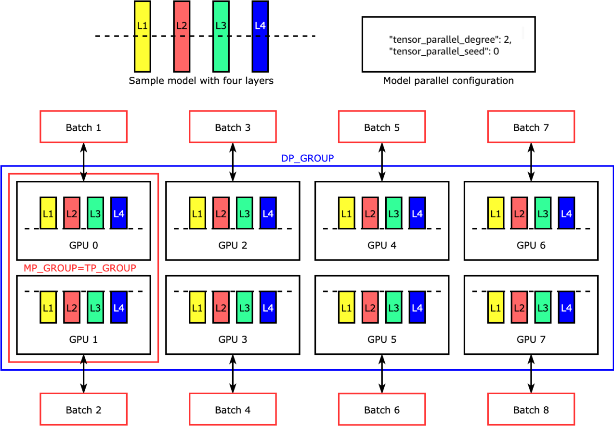

To dive deep into tensor parallelism and other memory-saving features for PyTorch, and to learn
how to set a combination of the core features, see the section called “Tensor parallelism”.

SageMaker model parallelism library v2
5002

## Page 32

Amazon SageMaker AI
Developer Guide

Activation checkpointing and offloading

To save GPU memory, the library supports activation checkpointing to avoid storing internal
activations in the GPU memory for user-specified modules during the forward pass. The library
recomputes these activations during the backward pass. In addition, with activation offloading, it
offloads the stored activations to CPU memory and fetches them back to GPU during the backward
pass to further reduce the activation memory footprint. For more information about how to use
these features, see the section called “Activation checkpointing” and the section called “Activation
offloading”.

Choosing the right techniques for your model

For more information about choosing the right techniques and configurations, see the section
called “Best practices”.

Supported frameworks and AWS Regions

Before using the SageMaker model parallelism library v2 (SMP v2), check the supported
frameworks and instance types and determine if there are enough quotas in your AWS account and
AWS Region.

Note

To check the latest updates and release notes of the library, see the section called “SMP
release notes”.

Supported frameworks

SMP v2 supports the following deep learning frameworks and available through SMP Docker
containers and an SMP Conda channel. When you use the framework estimator classes in the
SageMaker Python SDK and specify distribution configuration to use SMP v2, SageMaker AI
automatically picks up the SMP Docker containers. To use SMP v2, we recommend that you always
keep the SageMaker Python SDK up to date in your development environment.

PyTorch versions that the SageMaker model parallelism library supports

SageMaker model parallelism library v2
5003

## Page 33

Amazon SageMaker AI
Developer Guide

PyTorch version
SageMaker model
parallelism library
version

SMP Docker image
URI

SMP Enroot image
URI

v2.5.1
smdistributed-

658645717

https://s

modelparallel

510.dkr.e

agemaker-

==v2.8.0

cr. <us-west-

distributed-

2> .amazonaw

model-parallel.

s.com/smd

s3. <us-west-

istribute

2> .amazonaw

d-modelpa

s.com/enr

rallel:2.5.1-

oot/2.5.1-gpu-

gpu-py311-cu12

py311-cu124.s

4

qsh

v2.4.1

smdistributed-

658645717

https://s

modelparallel

510.dkr.e

agemaker-

==v2.7.0

cr. <us-west-

distributed-

2> .amazonaw

model-parallel.

s.com/smd

s3. <us-west-

istribute

2> .amazonaw

d-modelpa

s.com/enr

rallel:2.4.1-

oot/2.4.1-gpu-

gpu-py311-cu12

py311-cu121.s

1

qsh

N/A

smdistributed-

modelparallel

==v2.6.1

N/A

smdistributed-

modelparallel

==v2.6.0

v2.3.1
smdistributed-

N/A

658645717

modelparallel

510.dkr.e

==v2.5.0

cr. us-west-2

SageMaker model parallelism library v2
5004

## Page 34

Amazon SageMaker AI
Developer Guide

PyTorch version
SageMaker model
parallelism library
version

SMP Docker image
URI

SMP Enroot image
URI

.amazonaw

smdistributed-

s.com/smd

modelparallel

istribute

==v2.4.0

d-modelpa

rallel:2.3.1-

gpu-py311-cu12

1

v2.2.0

N/A

smdistributed-

658645717

modelparallel

510.dkr.e

==v2.3.0

cr. us-west-2

.amazonaw

smdistributed-

s.com/smd

modelparallel

istribute

==v2.2.0

d-modelpa

rallel:2.2.0-

gpu-py310-cu12

1

v2.1.2
smdistributed-

N/A

658645717

modelparallel

510.dkr.e

==v2.1.0

cr. us-west-2

.amazonaw

s.com/smd

istribute

d-modelpa

rallel:2.1.2-

gpu-py310-cu12

1

SageMaker model parallelism library v2
5005

## Page 35

Amazon SageMaker AI
Developer Guide

PyTorch version
SageMaker model
parallelism library
version

SMP Docker image
URI

SMP Enroot image
URI

v2.0.1
smdistributed-

N/A

658645717

modelparallel

510.dkr.e

==v2.0.0

cr. us-west-2

.amazonaw

s.com/smd

istribute

d-modelpa

rallel:2.0.1-

gpu-py310-cu12

1

SMP Conda channel

The following Amazon S3 bucket is a public Conda channel hosted by the SMP service team. If you
want to install the SMP v2 library in an environment such as SageMaker HyperPod clusters, use this
Conda channel to properly install the SMP library.

https://sagemaker-distributed-model-parallel.s3.us-west-2.amazonaws.com/smp-v2/

For more information about Conda channels in general, see Channels in the Conda documentation.

Note

To find previous versions of the SMP library v1.x and pre-packaged DLCs, see the section
called “Supported Frameworks” in the SMP v1 documentation.

Use SMP v2 with open source libraries

The SMP v2 library works with other PyTorch-based open source libraries such as PyTorch
Lightning, Hugging Face Transformers, and Hugging Face Accelerate, because SMP v2 is compatible
with the PyTorch FSDP APIs. If you have further questions on using the SMP library with other third

party libraries, contact the SMP service team at sm-model-parallel-feedback@amazon.com.

SageMaker model parallelism library v2
5006

## Page 36

Amazon SageMaker AI
Developer Guide

AWS Regions

SMP v2 is available in the following AWS Regions. If you'd like to use the SMP Docker image URIs or
the SMP Conda channel, check the following list and choose the AWS Region matching with yours,
and update the image URI or the channel URL accordingly.

• ap-northeast-1

• ap-northeast-2

• ap-northeast-3

• ap-south-1

• ap-southeast-1

• ap-southeast-2

• ca-central-1

• eu-central-1

• eu-north-1

• eu-west-1

• eu-west-2

• eu-west-3

• sa-east-1

• us-east-1

• us-east-2

• us-west-1

• us-west-2

Supported instance types

SMP v2 requires one of the following ML instance types.

Instance type

ml.p4d.24xlarge

ml.p4de.24xlarge

ml.p5.48xlarge

SageMaker model parallelism library v2
5007

## Page 37

Amazon SageMaker AI
Developer Guide

Instance type

ml.p5e.48xlarge

Tip

Starting from SMP v2.2.0 supporting PyTorch v2.2.0 and later, the section called “Mixed
precision training with FP8 on P5 instances using Transformer Engine” is available.

For specs of the SageMaker machine learning instance types in general, see the Accelerated
Computing section in the Amazon EC2 Instance Types page. For information about instance
pricing, see Amazon SageMaker AI Pricing.

If you encountered an error message similar to the following, follow the instructions at Requesting
a quota increase in the AWS Service Quotas User Guide.

ResourceLimitExceeded: An error occurred (ResourceLimitExceeded) when calling
the CreateTrainingJob operation: The account-level service limit 'ml.p3dn.24xlarge
for training job usage' is 0 Instances, with current utilization of 0 Instances
and a request delta of 1 Instances.
Please contact AWS support to request an increase for this limit.

Use the SageMaker model parallelism library v2

On this page, you'll learn how to use the SageMaker model parallelism library v2 APIs and get
started with running a PyTorch Fully Sharded Data Parallel (FSDP) training job in the SageMaker
Training platform or on a SageMaker HyperPod cluster.

There are various scenarios for running a PyTorch training job with SMP v2.

1. For SageMaker training, use one of the pre-built SageMaker Framework Containers for PyTorch

v2.0.1 and later, which are pre-packaged with SMP v2.

2. Use the SMP v2 binary file to set up a Conda environment for running a distributed training

workload on a SageMaker HyperPod cluster.

3. Extend the pre-built SageMaker Framework Containers for PyTorch v2.0.1 and later to install

any additional functional requirements for your use case. To learn how to extend a pre-built
container, see Extend a Pre-built Container.

SageMaker model parallelism library v2
5008

## Page 38

Amazon SageMaker AI
Developer Guide

4. You can also bring your own Docker container and manually set up all SageMaker Training

environment using the SageMaker Training toolkit and install the SMP v2 binary file. This is the
least recommended option due to the complexity of dependencies. To learn how to run your
own Docker container, see Adapting Your Own Training Container.

This getting started guide covers the first two scenarios.

Topics

• Step 1: Adapt your PyTorch FSDP training script

• Step 2: Launch a training job

Step 1: Adapt your PyTorch FSDP training script

To activate and configure the SMP v2 library, start with importing and adding the

torch.sagemaker.init() module at the top of the script. This module takes in the SMP
configuration dictionary of the section called “SMP v2 core feature configuration parameters” that
you'll prepare in the section called “Step 2: Launch a training job”. Also, for using the various core
features offered by SMP v2, you might need to make few more changes to adapt your training
script. More detailed instructions on adapting your training script for using the SMP v2 core
features are provided at the section called “Core features of SMP v2”.

SageMaker Training

In your training script, add the following two lines of code, which is the minimal requirement
to start training with SMP v2. In the section called “Step 2: Launch a training job”, you’ll set

up an object of the SageMaker PyTorch estimator class with an SMP configuration dictionary

through the distribution argument of the estimator class.

import torch.sagemaker as tsm
tsm.init()

Note

You can also directly pass a configuration dictionary of the the section called “SMP v2

core feature configuration parameters” to the torch.sagemaker.init() module.
However, the parameters passed to the PyTorch estimator in the section called

SageMaker model parallelism library v2
5009

## Page 39

Amazon SageMaker AI
Developer Guide

“Step 2: Launch a training job” take priority and override the ones specified to the

torch.sagemaker.init() module.

SageMaker HyperPod

In your training script, add the following two lines of code. In the section called “Step 2: Launch

a training job”, you’ll set up a smp_config.json file for setting up SMP configurations
in JSON format, and upload it to a storage or a file system mapped with your SageMaker
HyperPod cluster. We recommend that you keep the configuration file under the same directory
where you upload your training script.

import torch.sagemaker as tsm
tsm.init("/dir_to_training_files/smp_config.json")

Note

You can also directly pass a configuration dictionary of the the section called “SMP v2

core feature configuration parameters” into the torch.sagemaker.init() module.

Step 2: Launch a training job

Learn how to configure SMP distribution options for launching a PyTorch FSDP training job with
SMP core features.

SageMaker Training

When you set up a training job launcher object of the PyTorch framework estimator class in
the SageMaker Python SDK, configure the section called “SMP v2 core feature configuration

parameters” through distribution argument as follows.

Note

The distribution configuration for SMP v2 is integrated in the SageMaker Python
SDK starting from v2.200. Make sure that you use the SageMaker Python SDK v2.200 or
later.

SageMaker model parallelism library v2
5010

## Page 40

Amazon SageMaker AI
Developer Guide

Note

In SMP v2, you should configure smdistributed with torch_distributed

for the distribution argument of the SageMaker PyTorch estimator. With

torch_distributed, SageMaker AI runs torchrun, which is the default multi-node
job launcher of PyTorch Distributed.

from sagemaker.pytorch import PyTorch

estimator = PyTorch(
framework_version=2.2.0,
py_version="310"
# image_uri="<smp-docker-image-uri>" # For using prior versions, specify the SMP
image URI directly.
entry_point="your-training-script.py", # Pass the training script you adapted
with SMP from Step 1.
... # Configure other required and optional parameters
distribution={
"torch_distributed": { "enabled": True },
"smdistributed": {
"modelparallel": {
"enabled": True,
"parameters": {
"hybrid_shard_degree": Integer,
"sm_activation_offloading": Boolean,
"activation_loading_horizon": Integer,
"fsdp_cache_flush_warnings": Boolean,
"allow_empty_shards": Boolean,
"tensor_parallel_degree": Integer,
"expert_parallel_degree": Integer,
"random_seed": Integer
}
}
}
}
)

SageMaker model parallelism library v2
5011

## Page 41

Amazon SageMaker AI
Developer Guide

Important

For using one of the prior versions of PyTorch or SMP instead of the latest, you need to

specify the SMP Docker image directly using the image_uri argument instead of the

framework_version and py_version pair. The following is an example of

estimator = PyTorch(
...,
image_uri="658645717510.dkr.ecr.us-west-2.amazonaws.com/smdistributed-
modelparallel:2.2.0-gpu-py310-cu121"
)

To find SMP Docker image URIs, see the section called “Supported frameworks”.

SageMaker HyperPod

Before you start, make sure if the following prerequisites are met.

• An Amazon FSx shared directory mounted (/fsx) to your HyperPod cluster.

• Conda installed in the FSx shared directory. To learn how to install Conda, use the instructions
at Installing on Linux in the Conda User Guide.

• cuda11.8 or cuda12.1 installed on the head and compute nodes of your HyperPod cluster.

If the prerequisites are all met, proceed to the following instructions on launching a workload
with SMP v2 on a HyperPod cluster.

1. Prepare an smp_config.json file that contains a dictionary of the section called

“SMP v2 core feature configuration parameters”. Make sure that you upload this
JSON file to where you store your training script, or the path you specified to the

torch.sagemaker.init() module in Step 1. If you’ve already passed the configuration

dictionary to the torch.sagemaker.init() module in the training script in Step 1, you
can skip this step.

// smp_config.json
{
"hybrid_shard_degree": Integer,
"sm_activation_offloading": Boolean,
"activation_loading_horizon": Integer,

SageMaker model parallelism library v2
5012

## Page 42

Amazon SageMaker AI
Developer Guide

"fsdp_cache_flush_warnings": Boolean,
"allow_empty_shards": Boolean,
"tensor_parallel_degree": Integer,
"expert_parallel_degree": Integer,
"random_seed": Integer
}

2. Upload the smp_config.json file to a directory in your file system. The directory path

must match with the path you specified in Step 1. If you’ve already passed the configuration

dictionary to the torch.sagemaker.init() module in the training script, you can skip this
step.

3. On the compute nodes of your cluster, start a terminal session with the following command.

sudo su -l ubuntu

4. Create a Conda environment on the compute nodes. The following code is an example script

of creating a Conda environment and installing SMP, SMDDP, CUDA, and other dependencies.

# Run on compute nodes
SMP_CUDA_VER=<11.8 or 12.1>

source /fsx/<path_to_miniconda>/miniconda3/bin/activate

export ENV_PATH=/fsx/<path to miniconda>/miniconda3/envs/<ENV_NAME>
conda create -p ${ENV_PATH} python=3.10

conda activate ${ENV_PATH}

# Verify aws-cli is installed: Expect something like "aws-cli/2.15.0*"
aws ‐‐version
# Install aws-cli if not already installed
# https://docs.aws.amazon.com/cli/latest/userguide/getting-started-
install.html#cliv2-linux-install

# Install the SMP library
conda install pytorch="2.0.1=sm_py3.10_cuda${SMP_CUDA_VER}*" packaging ‐‐override-
channels \
-c https://sagemaker-distributed-model-parallel.s3.us-west-2.amazonaws.com/
smp-2.0.0-pt-2.0.1/2023-12-11/smp-v2/ \
-c pytorch -c numba/label/dev \
-c nvidia -c conda-forge

SageMaker model parallelism library v2
5013

## Page 43

Amazon SageMaker AI
Developer Guide

# Install dependencies of the script as below
python -m pip install packaging transformers==4.31.0 accelerate ninja tensorboard
h5py datasets \
&& python -m pip install expecttest hypothesis \
&& python -m pip install "flash-attn>=2.0.4" ‐‐no-build-isolation

# Install the SMDDP wheel
SMDDP_WHL="smdistributed_dataparallel-2.0.2-cp310-cp310-linux_x86_64.whl" \
&& wget -q https://smdataparallel.s3.amazonaws.com/binary/pytorch/2.0.1/
cu118/2023-12-07/${SMDDP_WHL} \
&& pip install ‐‐force ${SMDDP_WHL} \
&& rm ${SMDDP_WHL}

# cuDNN installation for Transformer Engine installation for CUDA 11.8
# Please download from below link, you need to agree to terms
# https://developer.nvidia.com/downloads/compute/cudnn/secure/8.9.5/
local_installers/11.x/cudnn-linux-x86_64-8.9.5.30_cuda11-archive.tar.xz

tar xf cudnn-linux-x86_64-8.9.5.30_cuda11-archive.tar.xz \
&& rm -rf /usr/local/cuda-$SMP_CUDA_VER/include/cudnn* /usr/local/cuda-
$SMP_CUDA_VER/lib/cudnn* \
&& cp ./cudnn-linux-x86_64-8.9.5.30_cuda11-archive/include/* /usr/local/cuda-
$SMP_CUDA_VER/include/ \
&& cp ./cudnn-linux-x86_64-8.9.5.30_cuda11-archive/lib/* /usr/local/cuda-
$SMP_CUDA_VER/lib/ \
&& rm -rf cudnn-linux-x86_64-8.9.5.30_cuda11-archive.tar.xz \
&& rm -rf cudnn-linux-x86_64-8.9.5.30_cuda11-archive/

# Please download from below link, you need to agree to terms
# https://developer.download.nvidia.com/compute/cudnn/secure/8.9.7/
local_installers/12.x/cudnn-linux-x86_64-8.9.7.29_cuda12-archive.tar.xz \
# cuDNN installation for TransformerEngine installation for cuda12.1
tar xf cudnn-linux-x86_64-8.9.7.29_cuda12-archive.tar.xz \
&& rm -rf /usr/local/cuda-$SMP_CUDA_VER/include/cudnn* /usr/local/cuda-
$SMP_CUDA_VER/lib/cudnn* \
&& cp ./cudnn-linux-x86_64-8.9.7.29_cuda12-archive/include/* /usr/local/cuda-
$SMP_CUDA_VER/include/ \
&& cp ./cudnn-linux-x86_64-8.9.7.29_cuda12-archive/lib/* /usr/local/cuda-
$SMP_CUDA_VER/lib/ \
&& rm -rf cudnn-linux-x86_64-8.9.7.29_cuda12-archive.tar.xz \
&& rm -rf cudnn-linux-x86_64-8.9.7.29_cuda12-archive/
# TransformerEngine installation
export CUDA_HOME=/usr/local/cuda-$SMP_CUDA_VER

SageMaker model parallelism library v2
5014

## Page 44

Amazon SageMaker AI
Developer Guide

export CUDNN_PATH=/usr/local/cuda-$SMP_CUDA_VER/lib
export CUDNN_LIBRARY=/usr/local/cuda-$SMP_CUDA_VER/lib
export CUDNN_INCLUDE_DIR=/usr/local/cuda-$SMP_CUDA_VER/include
export PATH=/usr/local/cuda-$SMP_CUDA_VER/bin:$PATH
export LD_LIBRARY_PATH=$LD_LIBRARY_PATH:/usr/local/cuda-$SMP_CUDA_VER/lib

python -m pip install ‐‐no-build-isolation git+https://github.com/NVIDIA/
TransformerEngine.git@v1.0

5. Run a test training job.

a. In the shared file system (/fsx), clone the Awsome Distributed Training GitHub repository,

and go to the 3.test_cases/11.modelparallel folder.

git clone https://github.com/aws-samples/awsome-distributed-training/
cd awsome-distributed-training/3.test_cases/11.modelparallel

b. Submit a job using sbatch as follows.

conda activate <ENV_PATH>
sbatch -N 16 conda_launch.sh

If the job submission is successful, the output message of this sbatch command should

be similar to Submitted batch job ABCDEF.

c. Check the log file in the current directory under logs/.

tail -f ./logs/fsdp_smp_ABCDEF.out

Core features of the SageMaker model parallelism library v2

The Amazon SageMaker AI model parallelism library v2 (SMP v2) offers distribution strategies
and memory-saving techniques, such as sharded data parallelism, tensor parallelism, and
checkpointing. The model parallelism strategies and techniques offered by SMP v2 help distribute
large models across multiple devices while optimizing training speed and memory consumption.

SMP v2 also provides a Python package torch.sagemaker to help adapt your training script with
few lines of code change.

This guide follows the basic two-step flow introduced in the section called “Use the SMP v2”. To
dive deep into the core features of SMP v2 and how to use them, see the following topics.

SageMaker model parallelism library v2
5015

## Page 45

Amazon SageMaker AI
Developer Guide

Note

These core features are available in SMP v2.0.0 and later and the SageMaker Python SDK
v2.200.0 and later, and works for PyTorch v2.0.1 and later. To check the versions of the
packages, see the section called “Supported frameworks and AWS Regions”.

Topics

• Hybrid sharded data parallelism

• Expert parallelism

• Context parallelism

• Compatibility with the SMDDP library optimized for AWS infrastructure

• Mixed precision training

• Delayed parameter initialization

• Activation checkpointing

• Activation offloading

• Tensor parallelism

• Fine-tuning

• FlashAttention

• Checkpointing using SMP

Hybrid sharded data parallelism

Sharded data parallelism is a memory-saving distributed training technique that splits the state
of a model (model parameters, gradients, and optimizer states) across devices. This helps you fit
a larger model or increase the batch size using the freed-up GPU memory. The SMP library offers
a capability of running sharded data parallelism with PyTorch Fully Sharded Data Parallel (FSDP).
PyTorch FSDP by default shards across the whole set of GPUs being used. In SMP v2, the library
offers this sharded data parallelism on top of PyTorch FSDP by extending PyTorch hybrid sharding

(HYBRID_SHARD), which is one of the sharding strategies provided by PyTorch FSDP: FULL_SHARD,

SHARD_GRAD_OP, HYBRID_SHARD, _HYBRID_SHARD_ZERO2. Extending hybrid sharding in this
manner helps implement scale-aware-sharding as described in the blog Near-linear scaling of
gigantic-model training on AWS for PyTorch FSDP.

SageMaker model parallelism library v2
5016

## Page 46

Amazon SageMaker AI
Developer Guide

The SMP library makes it easy to use HYBRID_SHARD and _HYBRID_SHARD_ZERO2 across
any configurable number of GPUs, extending the native PyTorch FSDP that supports sharding

across a single node (HYBRID_SHARD) or all GPUs (FULL_SHARD). PyTorch FSDP calls can

stay as is, and you only need to add the hybrid_shard_degree argument to the SMP

configuration, as shown in the following code example. You don't need to change the value of

the sharding_strategy argument in the PyTorch FSDP wrapper around your PyTorch model.

You can pass ShardingStrategy.HYBRID_SHARD as the value. Alternatively, the SMP library

overrides the strategy in the script and sets it to ShardingStrategy.HYBRID_SHARD if you

specify a value equal to or greater than 2 to the hybrid_shard_degree parameter.

The following code snippets show how to add the SMP initialization module

torch.sagemaker.init() to your training script and set up the SMP configuration dictionary
in JSON format for training job launcher while following the two-step process introduced in the
section called “Use the SMP v2”. You don’t need to make any changes to your PyTorch model or

PyTorch FSDP configuration. For more information about the hybrid_shard_degree parameter,
see the section called “SMP v2 core feature configuration parameters”.

SMP configuration dictionary

{ "hybrid_shard_degree": 16 }

In training script

import torch.sagemaker as tsm
tsm.init()

# Set up a PyTorch model
model = ...

# Wrap the PyTorch model using the PyTorch FSDP module
model = FSDP(
model,
...
)

# Optimizer needs to be created after FSDP wrapper
optimizer = ...

SageMaker model parallelism library v2
5017

## Page 47

Amazon SageMaker AI
Developer Guide

Expert parallelism

A Mixture of Experts (MoE) model is a type of transformer model that employs a sparse approach,
making it lighter for training compared to training traditional dense models. In this MoE neural
network architecture, only a subset of the model's components called experts are utilized for
each input. This approach offers several advantages, including more efficient training and faster
inference, even with a larger model size. In other words, with the same compute budget for
training a full dense model, you can fit a larger model or dataset when using MoE.

An MoE model consists of multiple experts, each consisting of a neural network, typically a feed-
forward network (FFN). A gate network called router determines which tokens are sent to which
expert. These experts specialize in processing specific aspects of the input data, enabling the
model to train faster, reduce compute cost, while achieving the same performance quality as its
counterpart dense model. To learn more about Mixture of Experts in general, refer to the blog
Applying Mixture of Experts in LLM Architectures in the NVIDIA developer website.

Expert parallelism is a type of parallelism that handles splitting experts of an MoE model across
GPU devices.

SMP v2 integrates with NVIDIA Megatron for implementing expert parallelism to support training
MoE models, and runs on top of PyTorch FSDP APIs. You keep using your PyTorch FSDP training
code as is and activate SMP expert parallelism for training MoE models.

Hugging Face Transformer models compatible with SMP expert parallelism

SMP v2 currently offers expert parallelism support for the following Hugging Face transformer
models.

• Mixtral

Configure expert parallelism

For expert_parallel_degree, you select a value for the degree of expert parallelism. The
value must evenly divide the number of GPUs in your cluster. For example, to shard your model
while using an instance with 8 GPUs, choose 2, 4, or 8. We recommend that you start with a small
number, and gradually increase it until the model fits in the GPU memory.

The following code snippets show how to add the SMP initialization module

torch.sagemaker.init() to your training script and set up the SMP configuration dictionary

SageMaker model parallelism library v2
5018

## Page 48

Amazon SageMaker AI
Developer Guide

in JSON format for training job launcher while following the two-step process introduced in the
section called “Use the SMP v2”. You don’t need to make any changes to your PyTorch model

or PyTorch FSDP configuration. For more information about the expert_parallel_degree
parameter, see the section called “SMP v2 core feature configuration parameters”.

Note

You can use expert parallelism with the section called “Hybrid sharded data parallelism”.
Note that expert parallelism is currently not compatible with tensor parallelism.

Note

This expert parallelism training feature is available in the following combination of libraries
of SageMaker and the PyTorch library:

• SMP v2.3.0 and later

• The SageMaker Python SDK v2.214.4 and later

• PyTorch v2.2.0 and later

In your training script

As part of Step 1, initialize your script with torch.sagemaker.init() to activate SMP v2 and

wrap your model with the the section called “torch.sagemaker.transform” API, adding

the config parameter to the API to activate MoE. The following code snippet shows how

to activate SMP MoE for the generic model class AutoModelForCausalLM pulling an MoE

transformer model configuration using the from_config method for training from scratch, or the

from_pretrained method for fine-tuning. To learn more about the SMP MoEConfig class, see

the section called “torch.sagemaker.moe.moe_config.MoEConfig”.

# Import the torch.sagemaker.transform API and initialize.
import torch.sagemaker as tsm
tsm.init()

# Import transformers AutoModelForCausalLM class.
from transformers import AutoModelForCausalLM

# Import the SMP-implementation of MoE configuration class.

SageMaker model parallelism library v2
5019

## Page 49

Amazon SageMaker AI
Developer Guide

from torch.sagemaker.moe.moe_config import MoEConfig

# Define a transformer model with an MoE model configuration
model = AutoModelForCausalLM.from_config(MoEModelConfig)

# Wrap it by torch.sagemaker.transform with the SMP MoE configuration.
model = tsm.transform(
model,
config=MoEConfig(
smp_moe=True,
random_seed=12345,
moe_load_balancing="sinkhorn",
global_token_shuffle=False,
moe_all_to_all_dispatcher=True,
moe_aux_loss_coeff=0.001,
moe_z_loss_coeff=0.001
)

)

SMP configuration

As part of Step 2, add the following parameter to the SMP configuration dictionary for the
SageMaker PyTorch estimator.

{
..., # other SMP config parameters
"expert_parallel_degree": 8
}

Context parallelism

Context parallelism is a type of model parallelism that partitions the model activations along
the sequence dimension. Unlike other sequence parallelism techniques, which only partition the

LayerNorm and RMSNorm, context parallelism partitions the network inputs and all intermediate
activations along the sequence dimension.

SMP v2 integrates with Transformer Engine for context parallelism and can be used in conjunction
with PyTorch FSDP and SMP the section called “Tensor parallelism”. You can enable all three
parallelisms simultaneously for model training. Context parallelism is beneficial for training models
with large activation sizes and long sequence lengths. It accelerates the computation of attention
scores and attention outputs, by allowing each device to computes only a part of the scores and

SageMaker model parallelism library v2
5020

## Page 50

Amazon SageMaker AI
Developer Guide

outputs along the sequence dimension. While tensor parallelism also accelerates computation
through partitioning along the hidden dimension, the advantage of context parallelism is more
substantial since computational requirements increase quadratically with sequence dimension.

Hugging Face Transformer models compatible with SMP context parallelism

SMP v2 currently offers context parallelism support for the following Hugging Face transformer
models.

• GPT-NeoX

• Llama 2 and Llama 3

• Mistral 7B

Configure context parallelism

Set an integer value to the context_parallel_degree parameter that evenly divides
the number of GPUs in your cluster. For example, if you have an 8-GPU instance, use

2, 4, or 8 for context_parallel_degree. We recommend starting with a small

context_parallel_degree value and gradually increasing it until the model fits in the GPU
memory with the required input sequence length.

The following code snippets show how to add the SMP initialization module

torch.sagemaker.init() to your training script and set up the SMP configuration dictionary
in JSON format for training job launcher while following the two-step process introduced in the
section called “Use the SMP v2”. You don’t need to make any changes to your PyTorch model

or PyTorch FSDP configuration. For more information about the context_parallel_degree
parameter, see the section called “SMP v2 core feature configuration parameters”.

In your training script

As part of Step 1, initialize your script with torch.sagemaker.init() to activate SMP v2 and

wrap your model with the the section called “torch.sagemaker.transform” API.

Starting from SMP v2.6.0, you can use the argument cp_comm_type to determine which context

parallelism implementation to use. The SMP library currently supports two implementations: p2p

and all_gather. The p2p implementation uses peer-to-peer send-receive calls for key-value
accumulation during the attention implementation and runs asynchronously, allowing overlaps

with compute. all_gather implementation, instead, uses the AllGather collective operation
and runs synchronously.

SageMaker model parallelism library v2
5021

## Page 51

Amazon SageMaker AI
Developer Guide

import torch.sagemaker as tsm
tsm.init()

from transformers import AutoModelForCausalLM
model = AutoModelForCausalLM.from_config(..)
model = tsm.transform(model, cp_comm_type="p2p")

SMP configuration

As part of Step 2, add the following parameter to the SMP configuration dictionary for the
SageMaker PyTorch estimator.

{
..., # other SMP config parameters
"context_parallel_degree": 2
}

Compatibility with the SMDDP library optimized for AWS infrastructure

You can use the SageMaker model parallelism library v2 (SMP v2) in conjunction with the

SageMaker distributed data parallelism (SMDDP) library that offers the AllGather collective
communication operation optimized for AWS infrastructure. In distributed training, collective
communication operations are designed for synchronizing multiple GPU workers and exchange

information between them. AllGather is one of the core collective communication operations

typically used in sharded data parallelism. To learn more about the SMDDP AllGather operation,

see the section called “SMDDP AllGather collective operation” Optimizing such collective
communication operations would directly contribute to a faster end-to-end training without side
effects on convergence.

Note

The SMDDP library supports P4 and P4de instances (see also the section called “Supported
frameworks, AWS Regions, and instances types” by the SMDDP library).

The SMDDP library integrates natively with PyTorch through the process group layer. To use the
SMDDP library, you only need to add two lines of code to your training script. It supports any
training frameworks such as SageMaker Model Parallelism Library, PyTorch FSDP, and DeepSpeed.

SageMaker model parallelism library v2
5022

## Page 52

Amazon SageMaker AI
Developer Guide

To activate SMDDP and use its AllGather operation, you need to add two lines of code to your
training script as part of the section called “Step 1: Adapt your PyTorch FSDP training script”. Note
that you need to initialize PyTorch Distributed with the SMDDP backend first, and then run the SMP
initialization.

import torch.distributed as dist

# Initialize with SMDDP
import smdistributed.dataparallel.torch.torch_smddp
dist.init_process_group(backend="smddp") # Replacing "nccl"

# Initialize with SMP
import torch.sagemaker as tsm
tsm.init()

SageMaker Framework Containers for PyTorch (see also the section called “Supported frameworks
and AWS Regions” by SMP v2 and the section called “Supported frameworks, AWS Regions, and
instances types” by the SMDDP library) are pre-packaged with the SMP binary and the SMDDP
binary. To learn more about the SMDDP library, see the section called “SageMaker AI distributed
data parallelism library”.

Mixed precision training

The SageMaker model parallelism (SMP) library v2 supports mixed precision training out of the
box by integrating with open source frameworks such as PyTorch FSDP and Transformer Engine. To
learn more, see the following topics.

Topics

• Mixed precision training with FP8 on P5 instances using Transformer Engine

• Mixed precision training with half-precision data types using PyTorch FSDP

Mixed precision training with FP8 on P5 instances using Transformer Engine

Starting from the SageMaker model parallelism (SMP) library v2.2.0, the SMP library integrates
with Transformer Engine and supports FP8 mixed precision training out of the box, keeping

compatibility with PyTorch FSDP MixedPrecision. This means that you can use both PyTorch
FSDP for mixed precision training and Transformer Engine for FP8 training. For model layers not
supported by Transformer Engine's FP8 training feature, those layers fall back to PyTorch FSDP
mixed precision.

SageMaker model parallelism library v2
5023

## Page 53

Amazon SageMaker AI
Developer Guide

Note

SMP v2 offers FP8 support for the following Hugging Face Transformer models:

• GPT-NeoX (available in SMP v2.2.0 and later)

• Llama 2 (available in SMP v2.2.0 and later)

• Mixtral 8x7b and Mixtral 8x22b (available in SMP v2.5.0 and later)

Note

This FP8 training on the P5 feature is available in the following combination of libraries of
SageMaker and the PyTorch library:

• The SageMaker Python SDK v2.212.0 and later

• PyTorch v2.2.0 and later

FP8 (8-bit floating point precision) is a data type that has emerged as another paradigm to
accelerate deep learning training of LLM models. With the release of NVIDIA H100 GPUs
supporting FP8 data types, you can benefit from the advantages from the performance
improvements on P5 instances equipped with the H100 GPUs, while accelerating distributed
training with FP8 mixed precision training.

The FP8 data type further branches down to E4M3 and E5M2 formats. E4M3 offers a better
precision, has a limited dynamic range, and is ideal for the forward pass in model training.
E5M2 has a broader dynamic range, but reduced precision, and is better suited for the backward
pass, where precision is less critical and a wider dynamic range becomes beneficial. Hence,
we recommend that you use the hybrid FP8 strategy recipe to leverage these characteristics
effectively.

For half-precision data types (FP16 and BF16), global loss-scaling techniques such as static loss-
scaling or dynamic loss-scaling handle convergence issues that arise from information loss due to
rounding gradients in half-precision. However, the dynamic range of FP8 is even narrower, and the
global loss scaling techniques are not sufficient. At this point, we need a finer-grained per-tensor
scaling technique. Delayed scaling is a strategy that selects a scaling factor based on the maximum
absolute values observed in a number of tensors form previous iterations. There's a trade-off in
this strategy; it uses the full performance benefits of FP8 computation but requires memory for

SageMaker model parallelism library v2
5024

## Page 54

Amazon SageMaker AI
Developer Guide

keeping the maximum value history of tensors. To learn more about the delayed scaling strategy in
general, see the paper FP8 Formats for Deep Learning.

In practice, using FP8 is helpful in all training scenarios on P5 instances. We strongly recommend
enabling FP8 whenever possible for enhancing training performance.

SMP v2 supports Transformer Engine out of the box. Therefore, when running FP8 training with

SMP v2 on P5 instances of SageMaker AI (ml.p5.48xlarge), the only thing you need to do

is to import torch.sagemaker in your training script and keep using the native Transformer
Engine Python package. To learn more about using Transformer Engine for FP8 training in general,
see Using FP8 with Transformer Engine in the NVIDIA Transformer Engine documentation. The
following code snippet shows how the code lines for importing the SMP library and setting up FP8
in your training script should look.

import torch.sagemaker as tsm
import transformer_engine.pytorch as te
from transformer_engine.common.recipe import DelayedScaling, Format

# Initialize the SMP torch.sagemaker API.
tsm.init()

# Define a transformer model and wrap it with the torch.sagemaker.transform API.
from transformers import AutoModelForCausalLM
model = AutoModelForCausalLM.from_config(ModelConfig)
model = tsm.transform(model)

# Enable E4M3 during forward pass, E5M2 during backward pass.
fp8_format = Format.HYBRID

# Create an FP8 recipe.
fp8_recipe = DelayedScaling(fp8_format=fp8_format, amax_history_len=32,
amax_compute_algo="max")

# Enable FP8 autocasting.
with te.fp8_autocast(enabled=True, fp8_recipe=fp8_recipe,
fp8_group=tsm.state.world_process_group):
out = model(inp)

loss = out.sum()
loss.backward()

SageMaker model parallelism library v2
5025

## Page 55

Amazon SageMaker AI
Developer Guide

To find a practical example of FP8 training with SMP v2 on P5 instances, see the example notebook
at Accelerate SageMaker PyTorch FSDP Training of Llama-v2 (or GPT-NeoX) with FP8 on P5
instances.

Mixed precision training with half-precision data types using PyTorch FSDP

SMP v2 supports PyTorch FSDP MixedPrecision for training jobs on P4 and P5 instances.
PyTorch FSDP provides various configurations for mixed precision for both performance
improvement and memory reduction.

Note

This mixed precision training with the PyTorch FSDP feature is available in the following
combination of libraries of SageMaker and the PyTorch library.

• SMP v2.0.0 and later

• the SageMaker Python SDK v2.200.0 and later

• PyTorch v2.0.1 and later

The standard way to configure a model for mixed precision is to create the model in float32,

and then allow FSDP to cast the parameters to float16 or bfloat16 on the fly by passing a

MixedPrecision policy, as shown in the following code snippet. For more information about

options to change the dtype for parameters, reduction, or buffers for mixed precision in PyTorch,

see PyTorch FSDP MixedPrecision API in the PyTorch documentation.

# Native PyTorch API
from torch.distributed.fsdp import MixedPrecision

dtype = torch.bfloat16
mixed_precision_policy = MixedPrecision(
param_dtype=dtype, reduce_dtype=dtype, buffer_dtype=dtype
)

model = FSDP(
model,
...,
mixed_precision=mixed_precision_policy
)

SageMaker model parallelism library v2
5026

## Page 56

Amazon SageMaker AI
Developer Guide

Note that certain models (such as the Hugging Face Transformers Llama model) expect buffers as

float32. To use float32, replace torch.bfloat16 with torch.float32 in the line defining

the dtype object.

Delayed parameter initialization

Initialization of a large model for training is not always possible with the limited GPU memory. To
resolve this problem of insufficient GPU memory, you can initialize the model on CPU memory.
However, for larger models with more than 20 or 40 billion parameters, even CPU memory might
not be enough. For such case, we recommend that you initialize the model on what PyTorch
calls a meta device, which allows the creation of tensors without any data attached to them. A
tensor on a meta device only needs the shape information, and this allows to create a large model
with its parameters on meta devices. Hugging Face Accelerate provides the context manager

init_empty_weights to help create such model on meta devices while initializing the buffers
on a regular device. Before training starts, PyTorch FSDP initializes the model parameters. This
delayed parameter initialization feature of SMP v2 delays this creation of model parameters to
happen after PyTorch FSDP performs parameter sharding. PyTorch FSDP accepts a parameter

initialization function (param_init_fn) when sharding the modules, and it calls param_init_fn

for each module. The param_init_fn API takes a module as an argument and initializes all the
parameters in it, not including the parameters of any child module. Note that this behavior differs
from the native PyTorch v2.0.1 which has a bug causing the parameters to be initialized multiple
times.

SMP v2 provides the the section called

“torch.sagemaker.delayed_param.DelayedParamIniter” API for applying delayed
parameter initialization.

The following code snippets show how to apply the

torch.sagemaker.delayed_param.DelayedParamIniter API to your training script.

Assume that you have a PyTorch FSDP training script as follows.

# Creation of model on meta device
from accelerate import init_empty_weights
with init_empty_weights():
model = create_model()

# Define a param init fn, below is an example for Hugging Face GPTNeoX.
def init_weights(module):
d = torch.cuda.current_device()

SageMaker model parallelism library v2
5027

## Page 57

Amazon SageMaker AI
Developer Guide

# Note that below doesn't work if you have buffers in the model
# buffers will need to reinitialized after this call
module.to_empty(device=d, recurse=False)
if isinstance(module, (nn.Linear, Conv1D)):
module.weight.data.normal_(mean=0.0, std=args.initializer_range)
if module.bias:
module.bias.data.zero_()
elif isinstance(module, nn.Embedding):
module.weight.data.normal_(mean=0.0, std=args.initializer_range)
if module.padding_idx:
module.weight.data[module.padding_idx].zero_()
elif isinstance(module, nn.LayerNorm):
module.bias.data.zero_()
module.weight.data.fill_(1.0)

# Changes to FSDP wrapper.
model = FSDP(

model,
...,
param_init_fn=init_weights
)

# At this point model is initialized and sharded for sharded data parallelism.

Note that the delayed parameter initialization approach is not model agnostic. To

resolve this issue, you need to write an init_weights function as shown in the
preceding example to match the initialization in the original model definition, and it
should cover all the parameters of the model. To simplify this process of preparing such

init_weights function, SMP v2 implements this initialization function for the following
models: GPT-2, GPT-J, GPT-NeoX, and Llama from Hugging Face Transformers. The

torch.sagemaker.delayed_param.DelayedParamIniter API also works with the SMP
tensor parallel implementation,

torch.sagemaker.tensor_parallel.transformer.TransformerLMHead model, that you

can call after the the section called “torch.sagemaker.transform” API call.

Using the torch.sagemaker.delayed_param.DelayedParamIniter API, you can adapt
your PyTorch FSDP script as follows. After creating a model with empty weights, register the

torch.sagemaker.delayed_param.DelayedParamIniter API to the model, and define an

object of it. Pass the object to the param_init_fn of the PyTorch FSDP class.

from torch.sagemaker.delayed_param import DelayedParamIniter

SageMaker model parallelism library v2
5028

## Page 58

Amazon SageMaker AI
Developer Guide

from accelerate import init_empty_weights

with init_empty_weights():
model = create_model()
delayed_initer = DelayedParamIniter(model)

with delayed_initer.validate_params_and_buffers_inited():
model = FSDP(
model,
...,
param_init_fn=delayed_initer.get_param_init_fn()
)

Notes on tied weights

When training models with tied weights, we need to take special care to tie the weights after
initializing the weights with delayed parameter initialization. PyTorch FSDP does not have a

mechanism to tie the weights after initializing them using param_init_fn as above. To address

such cases we added API to allow a post_init_hook_fn, which can be used to tie the weights.
You can pass any function in there which accepts the module as argument, but we also have a

predefined post_param_init_fn defined in DelayedParamIniter which calls tie_weights

method of the module if it exists. Note that it’s safe to always pass in post_param_init_fn even

if there’s no tie_weights method for the module.

with delayed_initer.validate_params_and_buffers_inited():
model = FSDP(
model,
...,
param_init_fn=delayed_initer.get_param_init_fn(),
post_param_init_fn=delayed_initer.get_post_param_init_fn()
)

Activation checkpointing

Activation checkpointing is a technique to reduce memory usage by clearing activations of certain
layers and recomputing them during the backward pass. Effectively, this trades extra computation
time for reducing memory usage. If a module is checkpointed, at the end of a forward pass, only
the initial inputs to the module and final outputs from the module stay in memory. PyTorch
releases any intermediate tensors that are part of the computation inside that module during the

SageMaker model parallelism library v2
5029

## Page 59

Amazon SageMaker AI
Developer Guide

forward pass. During the backward pass of the checkpointed modules, PyTorch recomputes these
tensors. At this point, the layers beyond this checkpointed module have finished their backward
pass, so the peak memory usage with checkpointing becomes lower.

SMP v2 supports the PyTorch activation checkpointing module,

apply_activation_checkpointing. The following are examples of activation checkpointing of
the Hugging Face GPT-NeoX model.

Checkpointing Transformer layers of the Hugging Face GPT-NeoX model

from transformers.models.gpt_neox import GPTNeoXLayer
from torch.distributed.algorithms._checkpoint.checkpoint_wrapper import (
apply_activation_checkpointing
)
# check_fn receives a module as the arg,
# and it needs to return whether the module is to be checkpointed
def is_transformer_layer(module):
from transformers.models.gpt_neox import GPTNeoXLayer
return isinstance(submodule, GPTNeoXLayer)
apply_activation_checkpointing(model, check_fn=is_transformer_layer)

Checkpointing every other Transformer layer of the Hugging Face GPT-NeoX model

# check_fn receives a module as arg,
# and it needs to return whether the module is to be checkpointed
# here we define that function based on global variable (transformer_layers)
from transformers.models.gpt_neox import GPTNeoXLayer
from torch.distributed.algorithms._checkpoint.checkpoint_wrapper import (
apply_activation_checkpointing
)

transformer_layers = [
m for m model.modules() if isinstance(m, GPTNeoXLayer)
]

def is_odd_transformer_layer(module):
return transformer_layers.index(module) % 2 == 0
apply_activation_checkpointing(model, check_fn=is_odd_transformer_layer)

SageMaker model parallelism library v2
5030

## Page 60

Amazon SageMaker AI
Developer Guide

Alternatively, PyTorch also has the torch.utils.checkpoint module for checkpointing, which
is used by a subset of Hugging Face Transformers models. This module also works with SMP v2.
However, it requires you to have access to the model definition for adding the checkpoint wrapper.

Therefore, we recommend you to use the apply_activation_checkpointing method.

Activation offloading

Important

In SMP v2.2.0, the activation offloading functionality of the SMP library doesn't work. Use
the native PyTorch activation offloading instead.

Typically, the forward pass computes activations at each layer and keeps them in GPU memory

until the backward pass for the corresponding layer finishes. Offloading these tensors to CPU
memory after forward pass and fetching them back to GPU when they are needed can save
substantial GPU memory usage. PyTorch supports offloading activations, but the implementation
causes GPUs to be idle while activations are fetched back from CPU during backward pass. This
causes a major performance degradation when using activation offloading.

SMP v2 improves this activation offloading. It pre-fetches activations ahead of time before the
activations are needed for the GPU to start backward pass on those activations. The pre-fetching
feature helps training progresses be run more efficiently without idle GPUs. This results in offering
benefits from lower memory usage without a performance degradation.

You can keep the native PyTorch modules for offloading activations in your training script. The
following is an example structure of applying the SMP activation offloading feature in your script.
Note that activation offloading is applicable only when used together with the section called
“Activation checkpointing”. To learn more about the native PyTorch checkpoint tools for activation
offloading, see:

• checkpoint_wrapper.py in the PyTorch GitHub repository

• Activation Checkpointing in the PyTorch blog Scaling Multi-modal Foundation Models in
TorchMultimodal with PyTorch Distributed.

You can apply the SMP activation offloading feature on PyTorch activation checkpointing. This

is done by adding the sm_activation_offloading and activation_loading_horizon

SageMaker model parallelism library v2
5031

## Page 61

Amazon SageMaker AI
Developer Guide

parameters to the SMP configuration dictionary during the section called “Step 2: Launch a
training job”.

The following code snippets show how to add the SMP initialization module

torch.sagemaker.init() to your training script and set up the SMP configuration dictionary
in JSON format for training job launcher while following the two-step process introduced in the
section called “Use the SMP v2”. You don’t need to make any changes to your PyTorch model or

PyTorch FSDP configuration. For more information about the sm_activation_offloading

and activation_loading_horizon parameters, see the section called “SMP v2 core feature
configuration parameters”.

SMP configuration

{
"activation_loading_horizon": 2,
"sm_activation_offloading": True
}

In training script

Note

While activating the SMP activation offloading feature, make sure that you also use the

PyTorch offload_wrapper function and apply it to the root module. The SMP activation
offloading feature uses the root module to determine when forward pass is done to start
pre-fetching.

import torch.sagemaker as tsm
tsm.init()

# Native PyTorch module for activation offloading
from torch.distributed.algorithms._checkpoint.checkpoint_wrapper import (
apply_activation_checkpointing,
offload_wrapper,
)

model = FSDP(...)

# Activation offloading requires activation checkpointing.

SageMaker model parallelism library v2
5032

## Page 62

Amazon SageMaker AI
Developer Guide

apply_activation_checkpointing(
model,
check_fn=checkpoint_transformer_layers_policy,
)

model = offload_wrapper(model)

Tensor parallelism

Tensor parallelism is a type of model parallelism in which specific model weights, gradients, and
optimizer states are split across devices. In contrast to pipeline parallelism, which keeps individual
weights intact but partitions the set of weights, gradients, or optimizer across devices, tensor
parallelism shards individual weights. This typically involves distributed computation of specific
operations, modules, or layers of the model.

Tensor parallelism is required in cases in which a single parameter consumes most of the GPU
memory (such as large embedding tables with a large vocabulary size or a large softmax layer with
a large number of classes). In this case, treating this large tensor or operation as an atomic unit is
inefficient and impedes balance of the memory load.

SMP v2 integrates with Transformer Engine for the implementation for tensor parallelism, and
runs on top of PyTorch FSDP APIs. You can enable PyTorch FSDP and SMP tensor parallelism
simultaneously, and determine the best model parallelism for best performance.

In practice, tensor parallelism is especially helpful in the following scenarios.

• When training with long context lengths as that leads to high activation memory with FSDP
alone.

• When training with really large clusters on which the global batch size exceeds desired limits.

Hugging Face Transformer models compatible with the SMP tensor parallelism

SMP v2 currently offers tensor parallelism support for the following Hugging Face transformer
models.

• GPT-NeoX

• Llama 2

• Llama 3

• Mistral 7B

SageMaker model parallelism library v2
5033

## Page 63

Amazon SageMaker AI
Developer Guide

• Mixtral 8x7B

• Mixtral 8x22B

For reference configuration for applying tensor parallelism on these models, see the section called

“Configuration tips”.

Configure tensor parallelism

For tensor_parallel_degree, you select a value for the degree of tensor parallelism. The
value must evenly divide the number of GPUs in your cluster. For example, to shard your model
while using an instance with 8 GPUs, choose 2, 4, or 8. We recommend that you start with a small
number, and gradually increase it until the model fits in the GPU memory.

The following code snippets show how to add the SMP initialization module

torch.sagemaker.init() to your training script and set up the SMP configuration dictionary
in JSON format for training job launcher while following the two-step process introduced in the
section called “Use the SMP v2”. You don’t need to make any changes to your PyTorch model or

PyTorch FSDP configuration. For more information about the tensor_parallel_degree and

random_seed parameters, see the section called “SMP v2 core feature configuration parameters”.

SMP configuration

{
"tensor_parallel_degree": 8,
"random_seed": 0
}

In your training script

Initialize with torch.sagemaker.init() to activate SMP v2 and wrap your model with the the

section called “torch.sagemaker.transform” API.

import torch.sagemaker as tsm
tsm.init()

from transformers import AutoModelForCausalLM
model = AutoModelForCausalLM.from_config(..)
model = tsm.transform(model)

SageMaker model parallelism library v2
5034

## Page 64

Amazon SageMaker AI
Developer Guide

Saving and loading Hugging Face Transformer checkpoints

After the SMP library transforms a model, it changes the state dictionary (state_dict) of
the model. This means that the model becomes incompatible with the original Hugging Face
Transformer checkpointing functionalities. To handle this, the SMP library provides APIs to save
checkpoints from a transformed model in Hugging Face Transformer representation, and the

torch.sagemaker.transform API to load a Hugging Face Transformer model checkpoint for
fine-tuning.

For more information about saving checkpoints while using the tensor parallelism feature of SMP
v2, see the section called “Checkpointing using SMP”.

For more information about fine-tuning a model applying the tensor parallelism feature of SMP v2,
see the section called “Fine-tuning”.

Fine-tuning

Fine-tuning is a process of continuously training pre-trained models to improve performance for
specific use cases.

Fine-tuning small models that fit fully on a single GPU, or those that fit 8 copies of model fully
on CPUs is straightforward. It requires no special change to regular FSDP training. In the realm
of models larger than this, you need to consider using the delayed parameter initialization
functionality, which can be tricky.

To address this, the SMP library loads the full model on one of the ranks while the rest of the ranks
create models with empty weights on a meta device. Then, PyTorch FSDP initializes the weights on

non-zero ranks using the init_weights function, and synchronizes the weights on all ranks to

the weights on the 0th rank with sync_module_states set to True. The following code snippet
shows how you should set it up in your training script.

import torch.distributed as dist
from transformers import AutoModelForCasalLM
from accelerate import init_empty_weights
from torch.sagemaker.delayed_param import DelayedParamIniter

if dist.get_rank() == 0:
model = AutoModelForCasalLM.from_pretrained(..., low_cpu_mem_usage=True)
else:
with init_empty_weights():

SageMaker model parallelism library v2
5035

## Page 65

Amazon SageMaker AI
Developer Guide

model = AutoModelForCasalLM.from_config(AutoConfig.from_pretrained(...))
delayed_initer = DelayedParamIniter(model)

model = FSDP(
model,
...,
sync_module_states=True,
param_init_fn=delayed_initer.get_param_init_fn() if dist.get_rank() > 0 else None
)

Fine-tuning a pre-trained Hugging Face Transformer model with SMP tensor parallelism

This section discusses loading Transformer models for two use cases: fine-tuning small Transformer
models and fine-tuning large Transformer models. For smaller models without delayed parameter

initialization, wrap the model with the torch.sagemaker.transform API before wrapping it

with PyTorch FSDP.

import functools
from transformers import AutoModelForCausalLM
from torch.distributed.fsdp import FullyShardedDataParallel as FSDP
from torch.distributed.fsdp.wrap import transformer_auto_wrap_policy
from torch.sagemaker import transform

model = AutoModelForCausalLM.from_pretrained("meta-llama/Llama-2-7b-hf",
low_cpu_mem_usage=True)

# Transform model while loading state dictionary from rank 0.
tp_model = transform(model, load_state_dict_from_rank0=True)

# Wrap with FSDP.
model = FSDP(
tp_model,
...
sync_module_states=True,
)

For larger models, the preceding approach causes to run out of CPU memory. We
recommend that you use delayed parameter initialization to avoid such CPU memory

issues. In this case, you can apply the torch.sagemaker.transform API and the

torch.sagemaker.delayed_param.DelayedParamIniter API as shown in the following code
example.

SageMaker model parallelism library v2
5036

## Page 66

Amazon SageMaker AI
Developer Guide

from transformers import AutoModelForCausalLM
from torch.sagemaker import transform
from torch.sagemaker.delayed_param import DelayedParamIniter

# Create one instance of model without delayed param
# on CPU, on one rank.
if dist.get_rank() == 0:
model = AutoModelForCasalLM.from_pretrained(...,low_cpu_mem_usage=True)
else:
with init_empty_weights():
model = AutoModelForCasalLM.from_config(AutoConfig.from_pretrained(...))

# Transform model while loading state dictionary from rank 0
model = transform(model, load_state_dict_from_rank0=True)

if dist.get_rank() != 0: # For fine-tuning, delayed parameter on non-zero ranks

delayed_initer = DelayedParamIniter(model)
else:
delayed_initer = None

with (
delayed_initer.validate_params_and_buffers_inited() if delayed_initer else
nullcontext()
):
# Wrap the model with FSDP
model = FSDP(
model,
...,
sync_module_states=True,
param_init_fn=delayed_initer.get_param_init_fn() if delayed_initer else None
)

FlashAttention

SMP v2 supports FlashAttention kernels and makes it easy to apply them to various scenarios for
Hugging Face Transformer models. Note that if you use FlashAttention package v2.0 or later, SMP
uses FlashAttention v2; however, the Triton flash attention defaults to the flash attention kernel in
FlashAttention v1.x, making it exclusively supported in FlashAttention v1.

The module (nn.Module) is a low level API that defines the attention layers of a model. It should

be applied right after model creation, from the AutoModelForCausalLM.from_config() API
for example, and before the model is being transformed or wrapped with FSDP.

SageMaker model parallelism library v2
5037

## Page 67

Amazon SageMaker AI
Developer Guide

Use FlashAttention kernels for self attention

The following code snippet shows how to use the the section called

“torch.sagemaker.nn.attn.FlashSelfAttention” API provided by SMP v2.

def new_attn(self, q, k, v, attention_mask=None, head_mask=None):
return (
self.flashmod((q, k, v), causal=True, cast_dtype=torch.bfloat16, layout="b h s
d"),
None,
)

for layer in model.gpt_neox.layers:
layer.attention.flash_mod = torch.sagemaker.nn.attn.FlashSelfAttention()
layer.attention._attn = functools.partial(new_attn, layer.attention)

Use FlashAttention kernels for grouped-query attention

SMP v2 also supports FlashAttention kernels for grouped-query attention (GQA) and makes it
easy to apply them to various scenarios for Hugging Face Transformer models. Different from
original attention architecture, GQA equally partitions query heads into groups, and query heads
in the same group share the same key and value heads. Therefore, q and kv heads are passed into
forward call separately. Note: The number of q heads needs to be divisible by the number of kv
heads.

Example of using FlashGroupedQueryAttention

The following code snippet shows how to use the the section called

“torch.sagemaker.nn.attn.FlashGroupedQueryAttention” API provided by SMP v2.

from transformers.models.llama.modeling_llama import LlamaAttention
from torch.sagemaker.nn.attn import FlashGroupedQueryAttention

class LlamaFlashAttention(LlamaAttention):
def __init__(self, config: LlamaConfig):
super().__init__(config)

self.flash_attn = FlashGroupedQueryAttention(
attention_dropout_prob=0.0,
)

SageMaker model parallelism library v2
5038

## Page 68

Amazon SageMaker AI
Developer Guide

def forward(
self,
hidden_states: torch.Tensor,
attention_mask: Optional[torch.Tensor] = None,
position_ids: Optional[torch.LongTensor] = None,
...
):
query_states = self.q_proj(hidden_states)
key_states = self.k_proj(hidden_states)
value_states = self.v_proj(hidden_states)
...
kv = (key_states, value_states)
attn_output = self.flash_attn(
query_states,
kv,
attn_mask=attention_mask,
causal=True,

layout="b h s d",
)
...
attn_output = self.o_proj(attn_output)
...
return attn_output

The SMP library also provides the section called

“torch.sagemaker.nn.huggingface.llama_flashattn.LlamaFlashAttention”, which

uses the the section called “torch.sagemaker.nn.attn.FlashGroupedQueryAttention”
API at low level. Hugging Face Transformers has a similar implementation called

LlamaFlashAttention2 from v4.36.0. The following code snippet shows how to use the SMP

v2 LlamaFlashAttention API or the Transformers LlamaFlashAttention2 API to replace the
attention layers of an existing Llama model.

from torch.sagemaker.nn.huggingface.llama_flashattn import LlamaFlashAttention
from transformers.models.llama.modeling_llama import LlamaFlashAttention2

flash_attn_class = LlamaFlashAttention # or flash_attn_class = LlamaFlashAttention2

attn_name = "self_attn"
for layer in model.model.layers:
prev_layer = getattr(layer, attn_name)
setattr(layer, attn_name, flash_attn_class(model.config))

SageMaker model parallelism library v2
5039

## Page 69

Amazon SageMaker AI
Developer Guide

Checkpointing using SMP

The SageMaker model parallelism (SMP) library supports PyTorch APIs for checkpoints, and
provides APIs that help checkpoint properly while using the SMP library.

PyTorch FSDP (Fully Sharded Data Parallelism) supports three types of checkpoints: full, sharded,
and local, each serving different purposes. Full checkpoints are used when exporting the model
after training is completed, as generating a full checkpoint is a computationally expensive process.
Sharded checkpoints help save and load the state of a model sharded for each individual rank.
With sharded checkpoints, you can resume training with different hardware configurations, such
as a different number of GPUs. However, loading sharded checkpoints can be slow due to the
communication involved among multiple devices. The SMP library provides local checkpointing
functionalities, which allow faster retrieval of the model's state without additional communication
overhead. Note that checkpoints created by FSDP require writing to a shared network file system

such as Amazon FSx.

Async local checkpoints

When training machine learning models, there is no need for subsequent iterations to wait
for the checkpoint files to be saved to disk. With the release of SMP v2.5, the library supports
saving checkpoint files asynchronously. This means that the subsequent training iteration can run
simultaneously with the input and output (I/O) operations for creating checkpoints, without being
slowed down or held back by those I/O operations. Also, the process of retrieving sharded model
and optimizer paramemeters in PyTorch can be time-consuming due to the additional collective
communication required to exchange distributed tensor metadata across ranks. Even when using

StateDictType.LOCAL_STATE_DICT to save local checkpoints for each rank, PyTorch still
invokes hooks that perform collective communication. To mitigate this issue and reduce the time

required for checkpoint retrieval, SMP introduces SMStateDictType.SM_LOCAL_STATE_DICT,
which allows for faster retrieval of model and optimizer checkpoints by bypassing the collective
communication overhead.

Note

Maintaining consistency in the FSDP SHARD_DEGREE is a requirement for utilizing the

SMStateDictType.SM_LOCAL_STATE_DICT. Ensure that the SHARD_DEGREE remains
unchanged. While the number of model replications can vary, the model shard degree
needs to be identical to the previous training setup when resuming from a checkpoint.

SageMaker model parallelism library v2
5040

## Page 70

Amazon SageMaker AI
Developer Guide

import os
import torch.distributed as dist
import torch.sagemaker as tsm
from torch.sagemaker import state
from torch.distributed.fsdp import FullyShardedDataParallel as FSDP
from torch.sagemaker.distributed.checkpoint.state_dict_saver import (
async_save,
maybe_finalize_async_calls,
)
from torch.sagemaker.distributed.checkpoint.state_dict_utils import (
sm_state_dict_type,
SMStateDictType,
)

global_rank = dist.get_rank()
save_dir = "/opt/ml/checkpoints"

sub_dir = f"tp{state.tp_rank}_ep{state.ep_rank}_fsdp{model.rank}"

# 1. Get replication ranks and group
current_replication_group = None
current_replication_ranks = None
for replication_ranks in state.ranker.get_rep_groups():
rep_group = dist.new_group(replication_ranks)
if global_rank in replication_ranks:
current_replication_group = rep_group
current_replication_ranks = replication_ranks

coordinator_rank = min(current_replication_ranks)

# 2. Wait for the previous checkpointing done
maybe_finalize_async_calls(
blocking=True, process_group=current_replication_group
)

# 3. Get model local checkpoint
with sm_state_dict_type(model, SMStateDictType.SM_LOCAL_STATE_DICT):
state_dict = {
"model": model.state_dict(),
"optimizer": optimizer.state_dict(),
# Potentially add more customized state dicts.
}

# 4. Save a local checkpoint

SageMaker model parallelism library v2
5041

## Page 71

Amazon SageMaker AI
Developer Guide

async_save(
state_dict,
checkpoint_id=os.path.join(save_dir, sub_dir),
process_group=current_replication_group,
coordinator_rank=coordinator_rank,
)

The following code snippet demonstrates how to load a checkpoint utilizing

SMStateDictType.SM_LOCAL_STATE_DICT.

import os
import torch.sagemaker as tsm
from torch.sagemaker import state
from torch.sagemaker.distributed.checkpoint.state_dict_loader import load
from torch.sagemaker.distributed.checkpoint.state_dict_utils import (
sm_state_dict_type,

SMStateDictType,
init_optim_state
)
from torch.sagemaker.distributed.checkpoint.filesystem import (
DistributedFileSystemReader,
)

load_dir = "/opt/ml/checkpoints"
sub_dir = f"tp{state.tp_rank}_ep{state.ep_rank}_fsdp{model.rank}"
global_rank = dist.get_rank()
checkpoint_id = os.path.join(load_dir, sub_dir)
storage_reader = DistributedFileSystemReader(checkpoint_id)

# 1. Get replication ranks and group
current_replication_group = None
current_replication_ranks = None
for replication_ranks in state.ranker.get_rep_groups():
rep_group = dist.new_group(replication_ranks)
if global_rank in replication_ranks:
current_replication_group = rep_group
current_replication_ranks = replication_ranks

coordinator_rank = min(current_replication_ranks)

# 2. Create local state_dict
with sm_state_dict_type(model, SMStateDictType.SM_LOCAL_STATE_DICT):
state_dict = {

SageMaker model parallelism library v2
5042

## Page 72

Amazon SageMaker AI
Developer Guide

"model": model.state_dict(),
# Potentially add more customized state dicts.
}
# Init optimizer state_dict states by setting zero grads and step.
init_optim_state(optimizer, skip_empty_param=True)
state_dict["optimizer"] = optimizer.state_dict()
# 3. Load a checkpoint
load(
state_dict=state_dict,
process_group=current_replication_group,
coordinator_rank=coordinator_rank,
storage_reader=storage_reader,
)

Storing checkpoints for large language models (LLMs) can be expensive as it often requires creating
a large filesystem volume. To reduce costs, you have the option to save checkpoints directly to
Amazon S3 without the need for additional filesystem services such as Amazon FSx. You can
leverage the previous example with the following code snippet to save checkpoints to S3 by
specifying an S3 URL as the destination.

key = os.path.join(checkpoint_dir, sub_dir)
checkpoint_id= f"s3://{your_s3_bucket}/{key}"
async_save(state_dict, checkpoint_id=checkpoint_id, **kw)
load(state_dict, checkpoint_id=checkpoint_id, **kw)

Async sharded checkpoints

There may be situations where you need to continue training with different hardware
configurations, such as changing the number of GPUs. In these cases, your training processes must
load checkpoints while resharding, which means resuming subsequent training with a different

number of SHARD_DEGREE. In order to address the scenario where you need to resume training

with a different number of SHARD_DEGREE, you must save your model checkpoints using the

sharded state dictionary type, which is represented by StateDictType.SHARDED_STATE_DICT.
Saving checkpoints in this format allows you to properly handle the resharding process when
continuing the training with a modified hardware configuration. The provided code snippet

illustrates how to use the tsm API to asynchronously save sharded checkpoints, enabling a more
efficient and streamlined training process.

SageMaker model parallelism library v2
5043

## Page 73

Amazon SageMaker AI
Developer Guide

import os
import torch.sagemaker as tsm
from torch.sagemaker import state
from torch.distributed.fsdp import FullyShardedDataParallel as FSDP
from torch.distributed.fsdp import StateDictType
from torch.sagemaker.utils.process_group_utils import get_global_ranks
from torch.sagemaker.distributed.checkpoint.state_dict_saver import (
async_save,
maybe_finalize_async_calls,
)

save_dir = "/opt/ml/checkpoints"
sub_dir = f"tp{state.tp_rank}_ep{state.ep_rank}"
checkpoint_id = os.path.join(save_dir, sub_dir)

# To determine whether curreto take part in checkpointing.

global_rank = dist.get_rank()
action_rank = state.ranker.get_rep_rank(global_rank) == 0
process_group = model.process_group
coordinator_rank = min(get_global_ranks(process_group))

# 1. wait for the previous checkpointing done
maybe_finalize_async_calls(blocking=True, process_group=process_group)

# 2. retrieve model & optimizer sharded state_dict
with FSDP.state_dict_type(model, StateDictType.SHARDED_STATE_DICT):
state_dict = {
"model": model.state_dict(),
"optimizer": FSDP.optim_state_dict(model, optimizer),
# Potentially add more customized state dicts.
}
# 3. save checkpoints asynchronously using async_save
if action_rank:
async_save(
state_dict,
checkpoint_id=checkpoint_id,
process_group=process_group,
coordinator_rank=coordinator_rank,
)

The process of loading shared checkpoints is similar to the previous section, but it involves using
the

SageMaker model parallelism library v2
5044

## Page 74

Amazon SageMaker AI
Developer Guide

torch.sagemaker.distributed.checkpoint.filesystem.DistributedFileSystemReader

and its load method. The load method of this class allows you to load the shared checkpoint

data, following a process analogous to the one described earlier.

import os
from torch.distributed.fsdp import FullyShardedDataParallel as FSDP
from torch.distributed.fsdp import StateDictType
from torch.distributed.checkpoint.optimizer import load_sharded_optimizer_state_dict
from torch.sagemaker.distributed.checkpoint.state_dict_loader import load
from torch.sagemaker.utils.process_group_utils import get_global_ranks
from torch.sagemaker.distributed.checkpoint.filesystem import (
DistributedFileSystemReader,
)
load_dir = "/opt/ml/checkpoints"
sub_dir = f"tp{state.tp_rank}_ep{state.ep_rank}"
checkpoint_id = os.path.join(load_dir, sub_dir)
reader = DistributedFileSystemReader(checkpoint_id)

process_group = model.process_group
coordinator_rank = min(get_global_ranks(process_group))

with FSDP.state_dict_type(model, StateDictType.SHARDED_STATE_DICT):
# 1. Load model and everything else except the optimizer.
state_dict = {
"model": model.state_dict()
# Potentially more customized state dicts.
}
load(
state_dict,
storage_reader=reader,
process_group=process_group,
coordinator_rank=coordinator_rank,
)
model.load_state_dict(state_dict["model"])
# 2. Load optimizer.
optim_state = load_sharded_optimizer_state_dict(
model_state_dict=state_dict["model"],
optimizer_key="optimizer",
storage_reader=reader,
process_group=process_group,
)

SageMaker model parallelism library v2
5045

## Page 75

Amazon SageMaker AI
Developer Guide

flattened_optimizer_state = FSDP.optim_state_dict_to_load(
optim_state["optimizer"], model, optimizer,
group=model.process_group
)
optimizer.load_state_dict(flattened_optimizer_state)

Full model checkpoints

At the end of training, you can save a full checkpoint that combines all shards of a model into a
single model checkpoint file. The SMP library fully supports the PyTorch full model checkpoints
API, so you don't need to make any changes.

Note that if you use the SMP the section called “Tensor parallelism”, the SMP library transforms
the model. When checkpointing the full model in this case, the SMP library translates the model
back to the Hugging Face Transformers checkpoint format by default.

In cases where you train with the SMP tensor parallelism and turn off the SMP translation process,

you can use the translate_on_save argument of the PyTorch FullStateDictConfig API
to switch the SMP auto-translation on or off as needed. For example, if you are focusing on
training a model, you don’t need to add the translation process which adds overhead. In that

case, we recommend you to set translate_on_save=False. Also, if you plan to keep using
the SMP translation of the model for further training in future, you can switch it off to save the
SMP translation of the model for later use. Translating the model back to the Hugging Face
Transformers model checkpoint format is needed when you wrap up the training of your model
and use that for inference.

from torch.distributed.fsdp import FullyShardedDataParallel as FSDP
from torch.distributed.fsdp import FullStateDictConfig
import torch.sagemaker as tsm

# Save checkpoints.
with FSDP.state_dict_type(
model,
StateDictType.FULL_STATE_DICT,
FullStateDictConfig(
rank0_only=True, offload_to_cpu=True,
# Default value is to translate back to Hugging Face Transformers format,
# when saving full checkpoints for models trained with SMP tensor parallelism.
# translate_on_save=True
),
):

SageMaker model parallelism library v2
5046

## Page 76

Amazon SageMaker AI
Developer Guide

state_dict = model.state_dict()
if dist.get_rank() == 0:
logger.info("Processed state dict to save. Starting write to disk now.")
os.makedirs(save_dir, exist_ok=True)
# This name is needed for HF from_pretrained API to work.
torch.save(state_dict, os.path.join(save_dir, "pytorch_model.bin"))
hf_model_config.save_pretrained(save_dir)
dist.barrier()

Note that the option FullStateDictConfig(rank0_only=True, offload_to_cpu=True)
is to gather the model on the CPU of the 0th rank device to save memory when training large
models.

To load the model back for inference, you do so as shown in the following code example. Note

that the class AutoModelForCausalLM might change to other factor builder classes in Hugging

Face Transformers, such as AutoModelForSeq2SeqLM, depending on your model. For more
information, see Hugging Face Transformers documentation.

from transformers import AutoModelForCausalLM
model = AutoModelForCausalLM.from_pretrained(save_dir)

Amazon SageMaker AI model parallelism library v2 examples

This page provides a list of blogs and Jupyter notebooks that present practical examples of
implementing the SageMaker model parallelism (SMP) library v2 to run distributed training jobs on
SageMaker AI.

Blogs and Case Studies

The following blogs discuss case studies about using SMP v2.

• Amazon SageMaker AI model parallel library now accelerates PyTorch FSDP workloads by up to
20%

PyTorch example notebooks

Example notebooks are provided in the SageMaker AI examples GitHub repository. To download

the examples, run the following command to clone the repository and go to training/

distributed_training/pytorch/model_parallel_v2.

SageMaker model parallelism library v2
5047

## Page 77

Amazon SageMaker AI
Developer Guide

Note

Clone and run the example notebooks in the following SageMaker AI ML IDEs.

• SageMaker JupyterLab (available in Studio created after December 2023)

• SageMaker Code Editor (available in Studio created after December 2023)

• Studio Classic (available as an application in Studio created after December 2023)

• SageMaker Notebook Instances

git clone https://github.com/aws/amazon-sagemaker-examples.git
cd amazon-sagemaker-examples/training/distributed_training/pytorch/model_parallel_v2

SMP v2 example notebooks

• Accelerate training of Llama v2 with SMP v2, PyTorch FSDP, and Transformer Engine by running
FP8 training on P5 instances

• Fine-tune Llama v2 with SMP v2 and PyTorch FSDP at large-scale using tensor parallelism, hybrid
sharding, and activation offloading

• Train GPT-NeoX with SMP v2 and PyTorch FSDP at large scale

• Fine-tune GPT-NeoX with SMP v2 and PyTorch FSDP at large-scale using tensor parallelism,
hybrid sharding, and activation offloading

SageMaker distributed model parallelism best practices

Use the following guidelines when you run a distributed training job with the SageMaker model
parallel library v2 (SMP v2).

Setting up the right configuration for distributed training

To estimate and find the best starting point to apply distributed training techniques that SMP v2
provides, review the following list. Each list item discusses the advantage of using the the section
called “Core features of SMP v2” along with potential tradeoffs.

Configuration tips

This section provides guidelines on how to decide on the best model configurations for optimal
throughput with global batch size requirements.

SageMaker model parallelism library v2
5048

## Page 78

Amazon SageMaker AI
Developer Guide

First, we recommend the following setups regardless of the size of your model.

1. Use the most powerful instance type that you can use.

2. Turn on mixed precision all the time, as it provides substantial benefits for performance and

memory reduction. We recommend you to use bfloat16 as it's more precise than float16.

3. Turn on the SageMaker distributed data parallelism library (instead of using NCCL) whenever

it’s applicable, as shown in the section called “Compatibility with the SMDDP library”. One

exception is for tensor-parallelism-only use cases (hybrid_shard_degree = 1 and

tensor_paralle_degree > 1).

4. If your model has more than about 60 billion parameters, we recommend using the section

called “Delayed parameter initialization”. You can also use delayed parameter initialization to
speed up the initialization for any model.

5. We recommend you to enable the section called “Activation checkpointing”.

Depending on the size of you model, we recommend that you start with the following guidance.

1. Use sharded data parallelism.

a. Depending on the batch size you intend to fit in the GPU memory, choose the appropriate

sharded data parallel degree. Normally, you should start with the lowest degree to fit your
model in the GPU memory while minimizing overhead from network communication. If
you see a warning that cache flushes are happening, we recommend that you increase the
sharding degree.

b. Determine world_size based on the maximum local batch size and required global batch

size, if any.

c. You can experiment with activation offloading. Depending on scenarios, it can address

your memory needs without having to increase the sharding degree, which means less
communication.

2. Use sharded data parallelism of PyTorch FSDP and tensor parallelism of SMP v2 simultaneously,

as introduced in the section called “Tensor parallelism”.

a. When training on large clusters, with FSDP alone the global batch size can become too large,

causing convergence issues for the model. Typically, most research work keeps the batch size
under 4 million tokens. In this case, you can resolve the problem by composing PyTorch FSDP
with tensor parallelism of SMP v2 to reduce the batch size.

SageMaker model parallelism library v2
5049

## Page 79

Amazon SageMaker AI
Developer Guide

For example, if you have 256 nodes and sequence length 4096, even a batch size of 1 per
GPU leads to global batch size of 8M tokens. However, when you use tensor parallelism with
degree 2 and batch size of 1 per tensor parallel group, this becomes 1/2 batch size per GPU,
which translates to 4 million tokens.

b. When training with long context lengths such as 8k, 16k activation memory can become very

high. FSDP doesn't shard activations, and activations can cause GPUs to go out of memory. In
such scenarios, you can train efficiently by composing PyTorch FSDP with tensor parallelism of
SMP v2.

Reference configurations

The SageMaker model parallelism training team provides the following reference points based on
experiments with the Llama 2 model transformed to the SMP transformer model using the section

called “torch.sagemaker.transform”, and trained on ml.p4d.24xlarge instance(s) with
sequence length 4096 and mixed precision (FP16 or BF16).

Model
Model
size (the
number
of model
parameter
s)

The
number
of
instances

Sharded
data
parallel
degree

Tensor
parallel
degree

Activatio
n
checkpoin
ting

Activatio
n
offloadin
g

Batch
size

Llama 2

7B
1
8
1
TRUE
FALSE
4

70B
32
256
1
TRUE
FALSE
2

175B
64
128
4
TRUE
TRUE
6

You can extrapolate from the preceding configurations to estimate GPU memory usage for your
model configuration. For example, if you increase the sequence length for a 10-billion-parameter
model or increase the size of the model to 20 billion, you might want to lower batch size first. If
the model still doesn’t fit, try increasing the degree of tensor parallelism.

SageMaker model parallelism library v2
5050

## Page 80

Amazon SageMaker AI
Developer Guide

Monitoring and logging a training job using the SageMaker AI console and Amazon CloudWatch

To monitor system-level metrics such as CPU memory utilization, GPU memory utilization, and
GPU utilization, use visualization provided through the SageMaker AI console.

1. In the left navigation pane, choose Training.

2. Choose Training jobs.

3. In the main pane, choose the training job name for which you want to see more details.

4. Browse the main pane and find the Monitor section to see the automated visualization.

5. To see training job logs, choose View logs in the Monitor section. You can access the distributed

training job logs of the training job in CloudWatch. If you launched multi-node distributed
training, you should see multiple log streams with tags in the format of algo-n-1234567890.
The algo-1 log stream tracks training logs from the main (0th) node.

For more information, see Amazon CloudWatch Metrics for Monitoring and Analyzing Training
Jobs.

Permissions

To run a SageMaker training job with model parallelism, make sure you have the right permissions
in your IAM role, such as the following:

• To use FSx for Lustre, add AmazonFSxFullAccess.

• To use Amazon S3 as a data channel, add AmazonS3FullAccess.

• To use Docker, build your own container, and push it to Amazon ECR, add

AmazonEC2ContainerRegistryFullAccess.

• To have a full access to use the entire suite of SageMaker AI features, add

AmazonSageMakerFullAccess.

The SageMaker model parallel library v2 reference

The following are references for the SageMaker model parallel library v2 (SMP v2).

Topics

• SMP v2 core feature configuration parameters

• Reference for the SMP v2 torch.sagemaker package

SageMaker model parallelism library v2
5051

## Page 81

Amazon SageMaker AI
Developer Guide

• Upgrade from SMP v1 to SMP v2

SMP v2 core feature configuration parameters

The following is a complete list of parameters to activate and configure the the section called
“Core features of SMP v2”. These must be written in JSON format and passed to the PyTorch
estimator in the SageMaker Python SDK or saved as a JSON file for SageMaker HyperPod.

{
"hybrid_shard_degree": Integer,
"sm_activation_offloading": Boolean,
"activation_loading_horizon": Integer,
"fsdp_cache_flush_warnings": Boolean,
"allow_empty_shards": Boolean,
"tensor_parallel_degree": Integer,
"context_parallel_degree": Integer,
"expert_parallel_degree": Integer,
"random_seed": Integer
}

• hybrid_shard_degree (Integer) – Specifies a sharded parallelism degree. The value must be

an integer between 0 and world_size. The default value is 0.

• If set to 0, it falls back to the native PyTorch implementation and API in the script

when tensor_parallel_degree is 1. Otherwise, it computes the largest possible

hybrid_shard_degree based on tensor_parallel_degree and world_size. When

falling back to the native PyTorch FSDP use cases, if FULL_SHARD is the strategy you use,

it shards across the whole cluster of GPUs. If HYBRID_SHARD or _HYBRID_SHARD_ZERO2

was the strategy, it is equivalent to hybrid_shard_degree of 8. When tensor parallelism is

enabled, it shards based on the revised hybrid_shard_degree.

• If set to 1, it falls back to the native PyTorch implementation and API for NO_SHARD in the

script when tensor_parallel_degree is 1. Otherwise, it's equivalent to NO_SHARD within
any given tensor parallel groups.

• If set to an integer between 2 and world_size, sharding happens across the specified

number of GPUs. If you don't set up sharding_strategy in the FSDP script, it gets

overridden to HYBRID_SHARD. If you set _HYBRID_SHARD_ZERO2, the sharding_strategy
you specify is used.

SageMaker model parallelism library v2
5052

## Page 82

Amazon SageMaker AI
Developer Guide

• sm_activation_offloading (Boolean) – Specifies whether to enable the

SMP activation offloading implementation. If False, offloading uses the

native PyTorch implementation. If True, it uses the SMP activation offloading
implementation. You also need to use the PyTorch activation offload wrapper

(torch.distributed.algorithms._checkpoint.checkpoint_wrapper.offload_wrapper)
in your script. To learn more, see the section called “Activation offloading”. The default value is

True.

• activation_loading_horizon (Integer) – An integer specifying the activation offloading
horizon type for FSDP. This is the maximum number of checkpointed or offloaded layers
whose inputs can be in the GPU memory simultaneously. To learn more, see the section called

“Activation offloading”. The input value must be a positive integer. The default value is 2.

• fsdp_cache_flush_warnings (Boolean) – Detects and warns if cache flushes happen in the
PyTorch memory manager, because they can degrade computational performance. The default

value is True.

• allow_empty_shards (Boolean) – Whether to allow empty shards when sharding tensors
if tensor is not divisible. This is an experimental fix for crash during checkpointing in certain

scenarios. Disabling this falls back to the original PyTorch behavior. The default value is False.

• tensor_parallel_degree (Integer) – Specifies a tensor parallelism degree. The value must

be between 1 and world_size. The default value is 1. Note that passing a value greater than
1 does not enable context parallelism automatically; you also need to use the the section called

“torch.sagemaker.transform” API to wrap the model in your training script. To learn more,
see the section called “Tensor parallelism”.

• context_parallel_degree (Integer) – Specifies the context parallelism degree. The value

must be between 1 and world_size , and must be <= hybrid_shard_degree. The default

value is 1. Note that passing a value greater than 1 does not enable context parallelism

automatically; you also need to use the the section called “torch.sagemaker.transform”
API to wrap the model in your training script. To learn more, see the section called “Context
parallelism”.

• expert_parallel_degree (Integer) – Specifies a expert parallelism degree. The value must

be between 1 and world_size. The default value is 1. Note that passing a value greater than
1 does not enable context parallelism automatically; you also need to use the the section called

“torch.sagemaker.transform” API to wrap the model in your training script. To learn more,
see the section called “Expert parallelism”.

• random_seed (Integer) – A seed number for the random operations in distributed modules by
SMP tensor parallelism or expert parallelism. This seed is added to tensor-parallel or expert-

SageMaker model parallelism library v2
5053

## Page 83

Amazon SageMaker AI
Developer Guide

parallel ranks to set the actual seed for each rank. It is unique for each tensor-parallel and
expert-parallel rank. SMP v2 makes sure that the random number generated across tensor-
parallel and expert-parallel ranks matches the non-tensor-parallelism and non-expert-
parallelism cases respectively.

Reference for the SMP v2 torch.sagemaker package

This section is a reference for the torch.sagemaker package provided by SMP v2.

Topics

• torch.sagemaker.delayed_param.DelayedParamIniter

• torch.sagemaker.distributed.checkpoint.state_dict_saver.async_save

• torch.sagemaker.distributed.checkpoint.state_dict_saver.maybe_finalize_async_calls

• torch.sagemaker.distributed.checkpoint.state_dict_saver.save

• torch.sagemaker.distributed.checkpoint.state_dict_loader.load

• torch.sagemaker.moe.moe_config.MoEConfig

• torch.sagemaker.nn.attn.FlashSelfAttention

• torch.sagemaker.nn.attn.FlashGroupedQueryAttention

• torch.sagemaker.nn.huggingface.llama_flashattn.LlamaFlashAttention

• torch.sagemaker.transform

• torch.sagemaker util functions and properties

torch.sagemaker.delayed_param.DelayedParamIniter

An API for applying the section called “Delayed parameter initialization” to a PyTorch model.

class torch.sagemaker.delayed_param.DelayedParamIniter(
model: nn.Module,
init_method_using_config : Callable = None,
verbose: bool = False,
)

Parameters

• model (nn.Module) – A PyTorch model to wrap and apply the delayed parameter initialization
functionality of SMP v2.

SageMaker model parallelism library v2
5054

## Page 84

Amazon SageMaker AI
Developer Guide

• init_method_using_config (Callable) – If you use the tensor parallel implementation of
SMP v2 or supported the section called “Hugging Face Transformer models compatible with the

SMP tensor parallelism”, keep this parameter at the default value, which is None. By default,

the DelayedParamIniter API finds out how to initialize the given model correctly. For any

other models, you need to create a custom parameter initialization function and add it to your

script. The following code snippet is the default init_method_using_config function that
SMP v2 implemented for the the section called “Hugging Face Transformer models compatible

with the SMP tensor parallelism”. Use the following code snippet as a reference for creating
your own initialization configuration function, adding it to your script, and passing it to the

init_method_using_config parameter of the SMP DelayedParamIniter API.

from torch.sagemaker.utils.module_utils import empty_module_params,
move_buffers_to_device

# Define a custom init config function.
def custom_init_method_using_config(module):
d = torch.cuda.current_device()
empty_module_params(module, device=d)
if isinstance(module, (nn.Linear, Conv1D)):
module.weight.data.normal_(mean=0.0, std=config.initializer_range)
if module.bias is not None:
module.bias.data.zero_()
elif isinstance(module, nn.Embedding):
module.weight.data.normal_(mean=0.0, std=config.initializer_range)
if module.padding_idx is not None:
module.weight.data[module.padding_idx].zero_()
elif isinstance(module, nn.LayerNorm):
module.weight.data.fill_(1.0)
module.bias.data.zero_()
elif isinstance(module, LlamaRMSNorm):
module.weight.data.fill_(1.0)
move_buffers_to_device(module, device=d)

delayed_initer = DelayedParamIniter(model,
init_method_using_config=custom_init_method_using_config)

For more information about the torch.sagemaker.module_util functions in the preceding

code snippet, see the section called “torch.sagemaker util functions and properties”.

• verbose (Boolean) – Whether to enable more detailed logging during initialization and

validation. The default value is False.

SageMaker model parallelism library v2
5055

## Page 85

Amazon SageMaker AI
Developer Guide

Methods

• get_param_init_fn() – Returns the parameter initialization function that you can pass to the

param_init_fn argument of the PyTorch FSDP wrapper class.

• get_post_param_init_fn() – Returns the parameter initialization function that you can

pass to the post_param_init_fn argument of the PyTorch FSDP wrapper class. This is
needed when you have tied weights in the model. The model must implement the method

tie_weights. For more information, see the Notes on tied weight in the section called
“Delayed parameter initialization”.

• count_num_params (module: nn.Module, *args: Tuple[nn.Parameter])
– Tracks how many parameters are being initialized by the parameter initialization

function. This helps implement the following validate_params_and_buffers_inited
method. You usually don’t need to call this function explicitly, because the

validate_params_and_buffers_inited method implicitly calls this method in the backend.

• validate_params_and_buffers_inited (enabled: bool=True) – This is a context
manager that helps validate that the number of parameters initialized matches the total number
of parameters in the model. It also validates that all parameters and buffers are now on GPU

devices instead of meta devices. It raises AssertionErrors if these conditions are not met. This
context manager is only optional and you're not required to use this context manager to initialize
parameters.

torch.sagemaker.distributed.checkpoint.state_dict_saver.async_save

Entry API for asynchronous save. Use this method to save a state_dict asynchronously to a

specified checkpoint_id.

def async_save(
state_dict: STATE_DICT_TYPE,
*,
checkpoint_id: Union[str, os.PathLike, None] = None,
storage_writer: Optional[StorageWriter] = None,
planner: Optional[SavePlanner] = None,
process_group: Optional[dist.ProcessGroup] = None,
coordinator_rank: int = 0,
queue : AsyncCallsQueue = None,
sharded_strategy: Union[SaveShardedStrategy, Tuple[str, int], None] = None,
wait_error_handling: bool = True,
force_check_all_plans: bool = True,

SageMaker model parallelism library v2
5056

## Page 86

Amazon SageMaker AI
Developer Guide

s3_region: Optional[str] = None,
s3client_config: Optional[S3ClientConfig] = None
) -> None:

Parameters

• state_dict (dict) - Required. The state dict to save.

• checkpoint_id (str) - Required. The storage path to save checkpoints to.

• storage_writer (StorageWriter) - Optional. An instance of StorageWriter in PyTorch to

perform write operations. If this is not specificed, the default configuration of StorageWriter
is used.

• planner (SavePlanner) - Optional. An instance of SavePlanner in PyTorch. If this is not

specificed, the default configuration of SavePlanner is used.

• process_group (ProcessGroup) - Optional. The process group to work on. If None, the default
(global) process group is used.

• coordinator_rank (int) - Optional. The rank of the coordinator when performing collective

communication operators such as AllReduce.

• queue (AsyncRequestQueue) - Optional. The async scheduler to use. By default, it takes the

global parameter DEFAULT_ASYNC_REQUEST_QUEUE.

• sharded_strategy (PyTorchDistSaveShardedStrategy) - Optional. The
sharded strategy to use for saving checkpoints. If this is is not specified,

torch.sagemaker.distributed.checkpoint.state_dict_saver.PyTorchDistSaveShardedS
is used by default.

• wait_error_handling (bool) - Optional. A flag specifying whether to wait for all ranks to

finish error handling. The default value is True.

• force_check_all_plans (bool) - Optional. A flag that determines whether to forcibly

synchronize plans across ranks, even in the case of a cache hit. The default value is True.

• s3_region (str) - Optional. The region where the S3 bucket is located. If not specified, the

region is inferred from the checkpoint_id.

• s3client_config (S3ClientConfig) - Optional. The dataclass exposing configurable parameters
for the S3 client. If not provided, the default configuration of S3ClientConfig is used. The

part_size parameter is set to 64MB by default.

SageMaker model parallelism library v2
5057

## Page 87

Amazon SageMaker AI
Developer Guide

torch.sagemaker.distributed.checkpoint.state_dict_saver.maybe_finalize_async_cal

This function allows a training process to monitor multiple asynchronous requests to be done.

def maybe_finalize_async_calls(
blocking=True,
process_group=None
) -> List[int]:

Parameters

• blocking (bool) - Optional. If True, it will wait until all active requests are completed.
Otherwise, it finalizes only the asynchronous requests that have already finished. The default

value is True.

• process_group (ProcessGroup) - Optional. The process group to operate on. If set to None, the
default (global) process group is utilized.

Returns

• A list containing the indices of asynchronous calls are successfully finalized.

torch.sagemaker.distributed.checkpoint.state_dict_saver.save

Use this method to save a state_dict synchronously to a specified checkpoint_id.

def save(
state_dict: STATE_DICT_TYPE,
*,
checkpoint_id: Union[str, os.PathLike, None] = None,
storage_writer: Optional[StorageWriter] = None,
planner: Optional[SavePlanner] = None,
process_group: Optional[dist.ProcessGroup] = None,
coordinator_rank: int = 0,
wait_error_handling: bool = True,
force_check_all_plans: bool = True,
s3_region: Optional[str] = None,
s3client_config: Optional[S3ClientConfig] = None
) -> None:

Parameters

SageMaker model parallelism library v2
5058

## Page 88

Amazon SageMaker AI
Developer Guide

• state_dict (dict) - Required. The state dict to save.

• checkpoint_id (str) - Required. The storage path to save checkpoints to.

• storage_writer (StorageWriter) - Optional. An instance of StorageWriter in PyTorch to

perform write operations. If this is not specificed, the default configuration of StorageWriter
is used.

• planner (SavePlanner) - Optional. An instance of SavePlanner in PyTorch. If this is not

specificed, the default configuration of SavePlanner is used.

• process_group (ProcessGroup) - Optional. The process group to work on. If None, the default
(global) process group is used.

• coordinator_rank (int) - Optional. The rank of the coordinator when performing collective

communication operators such as AllReduce.

• wait_error_handling (bool) - Optional. A flag specifying whether to wait for all ranks to

finish error handling. The default value is True.

• force_check_all_plans (bool) - Optional. A flag that determines whether to forcibly

synchronize plans across ranks, even in the case of a cache hit. The default value is True.

• s3_region (str) - Optional. The region where the S3 bucket is located. If not specified, the

region is inferred from the checkpoint_id.

• s3client_config (S3ClientConfig) - Optional. The dataclass exposing configurable parameters
for the S3 client. If not provided, the default configuration of S3ClientConfig is used. The

part_size parameter is set to 64MB by default.

torch.sagemaker.distributed.checkpoint.state_dict_loader.load

Load the state dictionary of a distributed model (state_dict).

def load(
state_dict: Dict[str, Any],
*,
checkpoint_id: Union[str, os.PathLike, None] = None,
storage_reader: Optional[StorageReader] = None,
planner: Optional[LoadPlanner] = None,
process_group: Optional[dist.ProcessGroup] = None,
check_keys_matched: bool = True,
coordinator_rank: int = 0,
s3_region: Optional[str] = None,
s3client_config: Optional[S3ClientConfig] = None

SageMaker model parallelism library v2
5059

## Page 89

Amazon SageMaker AI
Developer Guide

) -> None:

Parameters

• state_dict (dict) - Required. The state_dict to load.

• checkpoint_id (str) - Required. The ID of a checkpoint. The meaning of the checkpoint_id
depends on the storage. It can be a path to a folder or to a file. It can also be a key if the storage

is a key-value store.

• storage_reader (StorageReader) - Optional. An instance of StorageReader in PyTorch to
perform read operations. If not specified, distributed checkpointing will automatically infer the

reader based on the checkpoint_id. If checkpoint_id is also None, an exception error is
raised.

• planner (StorageReader) - Optional. An instance of LoadPlanner in PyTorch. If not specificed,

the default configuration of LoadPlanner is used.

• check_keys_matched (bool) - Optional. If enabled, checks whether the state_dict keys of

all ranks are matched using AllGather.

• s3_region (str) - Optional. The region where the S3 bucket is located. If not specified, the

region is inferred from the checkpoint_id.

• s3client_config (S3ClientConfig) - Optional. The dataclass exposing configurable parameters
for the S3 client. If not provided, the default configuration of S3ClientConfig is used. The

part_size parameter is set to 64MB by default.

torch.sagemaker.moe.moe_config.MoEConfig

A configuration class for setting up the SMP-implementation of Mixture-of-Experts
(MoE). You can specify MoE configuration values through this class and pass it to the

torch.sagemaker.transform API call. To learn more about the usage of this class for training
MoE models, see the section called “Expert parallelism”.

class torch.sagemaker.moe.moe_config.MoEConfig(
smp_moe=True,
random_seed=12345,
moe_load_balancing="sinkhorn",
global_token_shuffle=False,
moe_all_to_all_dispatcher=True,
moe_aux_loss_coeff=0.001,
moe_z_loss_coeff=0.001

SageMaker model parallelism library v2
5060

## Page 90

Amazon SageMaker AI
Developer Guide

)

Parameters

• smp_moe (Boolean) - Whether to use the SMP-implementation of MoE. The default value is

True.

• random_seed (Integer) - A seed number for the random operations in expert-parallel

distributed modules. This seed is added to the expert parallel rank to set the actual seed for each

rank. It is unique for each expert parallel rank. The default value is 12345.

• moe_load_balancing (String) - Specify the load balancing type of the MoE router. Valid

options are aux_loss, sinkhorn, balanced, and none. The default value is sinkhorn.

• global_token_shuffle (Boolean) - Whether to shuffle tokens across EP ranks within the same

EP group. The default value is False.

• moe_all_to_all_dispatcher (Boolean) - Whether to use all-to-all dispatcher for the

communications in MoE. The default value is True.

• moe_aux_loss_coeff (Float) - A coefficient for auxiliary load balancing loss. The default value

is 0.001.

• moe_z_loss_coeff (Float) - Coefficient for z-loss. The default value is 0.001.

torch.sagemaker.nn.attn.FlashSelfAttention

An API for using the section called “FlashAttention” with SMP v2.

class torch.sagemaker.nn.attn.FlashSelfAttention(
attention_dropout_prob: float = 0.0,
scale: Optional[float] = None,
triton_flash_attention: bool = False,
use_alibi: bool = False,
)

Parameters

• attention_dropout_prob (float) – The dropout probability to apply to attention. The default

value is 0.0.

• scale (float) – If passed, this scale factor is applied for softmax. If set to None (which is also

the default value), the scale factor is 1 / sqrt(attention_head_size). The default value is

None.

SageMaker model parallelism library v2
5061

## Page 91

Amazon SageMaker AI
Developer Guide

• triton_flash_attention (bool) – If passed, Triton implementation of flash attention is used.

This is necessary to supports Attention with Linear Biases (ALiBi) (see the following use_alibi

parameter). This version of the kernel doesn’t support dropout. The default value is False.

• use_alibi (bool) – If passed, it enables Attention with Linear Biases (ALiBi) using the mask
provided. When using ALiBi, it needs an attention mask prepared as follows. The default value is

False.

def generate_alibi_attn_mask(attention_mask, batch_size, seq_length,
num_attention_heads, alibi_bias_max=8):
device, dtype = attention_mask.device, attention_mask.dtype
alibi_attention_mask = torch.zeros(
1, num_attention_heads, 1, seq_length, dtype=dtype, device=device
)

alibi_bias = torch.arange(1 - seq_length, 1, dtype=dtype, device=device).view(
1, 1, 1, seq_length
)
m = torch.arange(1, num_attention_heads + 1, dtype=dtype, device=device)
m.mul_(alibi_bias_max / num_attention_heads)
alibi_bias = alibi_bias * (1.0 / (2 ** m.view(1, num_attention_heads, 1, 1)))

alibi_attention_mask.add_(alibi_bias)
alibi_attention_mask = alibi_attention_mask[..., :seq_length, :seq_length]
if attention_mask is not None and attention_mask.bool().any():
alibi_attention_mask.masked_fill(
attention_mask.bool().view(batch_size, 1, 1, seq_length), float("-inf")
)

return alibi_attention_mask

Methods

• forward(self, qkv, attn_mask=None, causal=False, cast_dtype=None,

layout="b h s d") – A regular PyTorch module function. When a module(x) is called, SMP
runs this function automatically.

• qkv – torch.Tensor of the following form: (batch_size x seqlen x (3 x

num_heads) x head_size) or (batch_size, (3 x num_heads) x seqlen x

head_size), a tuple of torch.Tensors each of which might be of shape (batch_size

SageMaker model parallelism library v2
5062

## Page 92

Amazon SageMaker AI
Developer Guide

x seqlen x num_heads x head_size), or (batch_size x num_heads x seqlen x

head_size). An appropriate layout arg must be passed based on the shape.

• attn_mask – torch.Tensor of the following form (batch_size x 1 x 1 x seqlen).

To enable this attention mask parameter, it requires triton_flash_attention=True and

use_alibi=True. To learn how to generate an attention mask using this method, see the

code examples at the section called “FlashAttention”. The default value is None.

• causal – When set to False, which is the default value of the argument, no mask is applied.

When set to True, the forward method uses the standard lower triangular mask. The default

value is False.

• cast_dtype – When set to a particular dtype, it casts the qkv tensors to that dtype before

attn. This is useful for implementations such as the Hugging Face Transformer GPT-NeoX

model, which has q and k with fp32 after rotary embeddings. If set to None, no cast is

applied. The default value is None.

• layout (string) – Available values are b h s d or b s h d. This should be set to the layout

of qkv tensors passed, so appropriate transformations can be applied for attn. The default

value is b h s d.

Returns

A single torch.Tensor with shape (batch_size x num_heads x seq_len x head_size).

torch.sagemaker.nn.attn.FlashGroupedQueryAttention

An API for using FlashGroupedQueryAttention with SMP v2. To learn more about the usage of
this API, see the section called “Use FlashAttention kernels for grouped-query attention”.

class torch.sagemaker.nn.attn.FlashGroupedQueryAttention(
attention_dropout_prob: float = 0.0,
scale: Optional[float] = None,
)

Parameters

• attention_dropout_prob (float) – The dropout probability to apply to attention. The default

value is 0.0.

• scale (float) – If passed, this scale factor is applied for softmax. If set to None, 1 /

sqrt(attention_head_size) is used as the scale factor. The default value is None.

SageMaker model parallelism library v2
5063

## Page 93

Amazon SageMaker AI
Developer Guide

Methods

• forward(self, q, kv, causal=False, cast_dtype=None, layout="b s h d")

– A regular PyTorch module function. When a module(x) is called, SMP runs this function
automatically.

• q – torch.Tensor of the following form (batch_size x seqlen x num_heads x

head_size) or (batch_size x num_heads x seqlen x head_size). Appropriate

layout arg must be passed based on the shape.

• kv – torch.Tensor of the following form (batch_size x seqlen x (2 x num_heads)

x head_size) or (batch_size, (2 x num_heads) x seqlen x head_size), or a

tuple of two torch.Tensors, each of which might be of shape (batch_size x seqlen x

num_heads x head_size) or (batch_size x num_heads x seqlen x head_size).

Appropriate layout argument must also be passed based on the shape.

• causal – When set to False, which is the default value of the argument, no mask is applied.

When set to True, the forward method uses the standard lower triangular mask. The default

value is False.

• cast_dtype – When set to a particular dtype, it casts the qkv tensors to that dtype before

attn. This is useful for implementations such as Hugging Face Transformers GPT-NeoX, which

has q,k with fp32 after rotary embeddings. If set to None, no cast is applied. The default

value is None.

• layout (string) – Available values are "b h s d" or "b s h d". This should be set to the

layout of qkv tensors passed, so appropriate transformations can be applied for attn. The

default value is "b h s d".

Returns

Returns a single torch.Tensor (batch_size x num_heads x seq_len x head_size)
that represents the output of attention computation.

torch.sagemaker.nn.huggingface.llama_flashattn.LlamaFlashAttention

An API that supports FlashAttention for the Llama model. This API uses the the section called

“torch.sagemaker.nn.attn.FlashGroupedQueryAttention” API at low level. To learn how
to use this, see the section called “Use FlashAttention kernels for grouped-query attention”.

class torch.sagemaker.nn.huggingface.llama_flashattn.LlamaFlashAttention(
config: LlamaConfig

SageMaker model parallelism library v2
5064

## Page 94

Amazon SageMaker AI
Developer Guide

)

Parameters

• config – A FlashAttention configuration for the Llama model.

Methods

• forward(self, hidden_states, attention_mask, position_ids,

past_key_value, output_attentions, use_cache)

• hidden_states (torch.Tensor) – Hidden states of a tensor in form of (batch_size x

seq_len x num_heads x head_size).

• attention_mask (torch.LongTensor) – Mask to avoid performing attention on padding

token indices in form of (batch_size x seqlen). The default value is None.

• position_ids (torch.LongTensor) – When not being None, it is in form of (batch_size

x seqlen), indicating the indices of positions of each input sequence token in the position

embeddings. The default value is None.

• past_key_value (Cache) – Pre-computed hidden-states (key and values in the self-attention

blocks and in the cross-attention blocks). The default value is None.

• output_attentions (bool) – Indicates whether to return the attentions tensors of all

attention layers. The default value is False.

• use_cache (bool) – Indicates whether to return past_key_values key value states. The

default value is False.

Returns

Returns a single torch.Tensor (batch_size x num_heads x seq_len x head_size)
that represents the output of attention computation.

torch.sagemaker.transform

SMP v2 provides this torch.sagemaker.transform() API for transforming Hugging Face
Transformer models to SMP model implementations and enabling the SMP tensor parallelism.

torch.sagemaker.transform(
model: nn.Module,
device: Optional[torch.device] = None,

SageMaker model parallelism library v2
5065

## Page 95

Amazon SageMaker AI
Developer Guide

dtype: Optional[torch.dtype] = None,
config: Optional[Dict] = None,
load_state_dict_from_rank0: bool = False,
cp_comm_type: str = "p2p"
)

SMP v2 maintains transformation policies for the the section called “Hugging Face Transformer
models compatible with the SMP tensor parallelism” by converting the configuration of the
Hugging Face Transformer models to the SMP transformer configuration.

Parameters

• model (torch.nn.Module) – A model from the section called “Hugging Face Transformer
models compatible with the SMP tensor parallelism” to transform and apply the tensor
parallelism feature of the SMP library.

• device (torch.device) – If passed, a new model is created on this device. If the original
module has any parameter on meta device (see the section called “Delayed parameter
initialization”), then the transformed module will also be created on meta device, ignoring the

argument passed here. The default value is None.

• dtype (torch.dtype) – If passed, sets this as the dtype context manager for the creation of the
model and creates a model with this dtype. This is typically unnecessary, as we want to create

the model with fp32 when using MixedPrecision, and fp32 is the default dtype in PyTorch.

The default value is None.

• config (dict) – This is a dictionary for configuring the SMP transformer. The default value is

None.

• load_state_dict_from_rank0 (Boolean) – By default, this module creates a new instance

of the model with new weights. When this argument is set to True, SMP tries to load the state
dictionary of the original PyTorch model from the 0th rank into transformed model for the

tensor parallel group that the 0th rank is part of. When this is set to True, rank 0 can’t have any
parameters on meta device. Only the first tensor parallel group populates the weights from the

0th rank after this transform call. You need to set sync_module_states to True in the FSDP
wrapper to get these weights from the first tensor parallel group to all other processes. With this
activated, the SMP library loads the state dictionary from the original model. The SMP library

takes the state_dict of the model before transform, converts it to match the structure of the
transformed model, shards it for each tensor parallel rank, communicates this state from the
0th rank to other ranks in the tensor parallel group that the 0th rank is part of, and loads it. The

default value is False.

SageMaker model parallelism library v2
5066

## Page 96

Amazon SageMaker AI
Developer Guide

• cp_comm_type (str) – Determines the context parallelism implementation and is only applicable

when the context_parallel_degree is greater than 1. Available values for this parameter are

p2p and all_gather. The p2p implementation utilizes peer-to-peer send-receive calls for key-
and-value (KV) tensor accumulation during the attention computation, running asynchronously

and allowing communication to overlap with computation. On the other hand, the all_gather

implementation employs the AllGather communication collective operation for KV tensor

accumulation. The default value is "p2p".

Returns

Returns a transformed model that you can wrap with PyTorch FSDP. When

load_state_dict_from_rank0 is set to True, the tensor parallel group that involves rank 0
has weights loaded from the original state dictionary on rank 0. When using the section called
“Delayed parameter initialization” on the original model, only these ranks have the actual tensors

on CPUs for the parameters and buffers of the transformed model. The rest of the ranks continue
to have the parameters and buffers on the meta device to save memory.

torch.sagemaker util functions and properties

torch.sagemaker util functions

• torch.sagemaker.init(config: Optional[Union[str, Dict[str, Any]]] = None)

-> None – Initializes the PyTorch training job with SMP.

• torch.sagemaker.is_initialized() -> bool – Checks whether the training job is
initialized with SMP. When falling back to the native PyTorch while the job is initialized with

SMP, some of the properties are not relevant and become None, as indicated in the following
Properties list.

• torch.sagemaker.utils.module_utils.empty_module_params(module: nn.Module,

device: Optional[torch.device] = None, recurse: bool = False) ->

nn.Module – Creates empty parameters on the given device if any, and it can be recursive for
all nested modules if specified.

• torch.sagemaker.utils.module_utils.move_buffers_to_device(module:

nn.Module, device: torch.device, recurse: bool = False) -> nn.Module –

Moves module buffers to the given device, and it can be recursive for all nested modules if
specified.

SageMaker model parallelism library v2
5067

## Page 97

Amazon SageMaker AI
Developer Guide

Properties

torch.sagemaker.state holds multiple useful properties after the initialization of SMP with

torch.sagemaker.init.

• torch.sagemaker.state.hybrid_shard_degree (int) – The sharded data parallelism

degree, a copy from user input in the SMP configuration passed to torch.sagemaker.init().
To learn more, see the section called “Use the SMP v2”.

• torch.sagemaker.state.rank (int) – The global rank for the device, in the range of [0,

world_size).

• torch.sagemaker.state.rep_rank_process_group

(torch.distributed.ProcessGroup) – The process group including all devices
with the same replication rank. Note the subtle but fundamental difference with

torch.sagemaker.state.tp_process_group. When falling back to native PyTorch, it

returns None.

• torch.sagemaker.state.tensor_parallel_degree (int) – The tensor parallelism degree,

a copy from user input in the SMP configuration passed to torch.sagemaker.init(). To learn
more, see the section called “Use the SMP v2”.

• torch.sagemaker.state.tp_size (int) – An alias to

torch.sagemaker.state.tensor_parallel_degree.

• torch.sagemaker.state.tp_rank (int) – The tensor parallelism rank for the device in

the range of [0, tp_size), determined by the tensor parallelism degree and the ranking
mechanism.

• torch.sagemaker.state.tp_process_group (torch.distributed.ProcessGroup) –
The tensor parallel process group including all devices with the same rank in other dimensions
(for example, sharded data parallelism and replication) but unique tensor parallel ranks. When

falling back to native PyTorch, it returns None.

• torch.sagemaker.state.world_size (int) – The total number of devices used in training.

Upgrade from SMP v1 to SMP v2

To move from SMP v1 to SMP v2, you must make script changes to remove the SMP v1 APIs and
apply the SMP v2 APIs. Instead of starting from your SMP v1 script, we recommend you start from
a PyTorch FSDP script, and follow the instructions at the section called “Use the SMP v2”.

SageMaker model parallelism library v2
5068

## Page 98

Amazon SageMaker AI
Developer Guide

To bring SMP v1 models to SMP v2, in SMP v1 you must collect the full model state dictionary
and apply the translation functions on the model state dictionary to convert it into the Hugging
Face Transformers model checkpoint format. Then in SMP v2, as discussed in the section called
“Checkpointing using SMP”, you can load the Hugging Face Transformers model checkpoints, and
then continue with using the PyTorch checkpoint APIs with SMP v2. To use SMP with your PyTorch
FSDP model, make sure that you move to SMP v2 and make changes to your training script to use
PyTorch FSDP and other latest features.

import smdistributed.modelparallel.torch as smp

# Create model
model = ...
model = smp.DistributedModel(model)

# Run training

...

# Save v1 full checkpoint
if smp.rdp_rank() == 0:
model_dict = model.state_dict(gather_to_rank0=True) # save the full model
# Get the corresponding translation function in smp v1 and translate
if model_type == "gpt_neox":
from smdistributed.modelparallel.torch.nn.huggingface.gptneox import
translate_state_dict_to_hf_gptneox
translated_state_dict = translate_state_dict_to_hf_gptneox(state_dict,
max_seq_len=None)
# Save the checkpoint
checkpoint_path = "checkpoint.pt"
if smp.rank() == 0:
smp.save(
{"model_state_dict": translated_state_dict},
checkpoint_path,
partial=False,
)

To find available translation functions in SMP v1, see the section called “Support for Hugging Face
Transformer Models”.

For instruction on model checkpoints saving and loading in SMP v2, see the section called
“Checkpointing using SMP”.

SageMaker model parallelism library v2
5069

## Page 99

Amazon SageMaker AI
Developer Guide

Release notes for the SageMaker model parallelism library

See the following release notes to track the latest updates for the SageMaker model parallelism
(SMP) library. If you have further questions about the SMP library, contact the SMP service team at

sm-model-parallel-feedback@amazon.com.

The SageMaker model parallelism library v2.8.0

Date: April 01, 2025

SMP library updates

Bug fixes

• SMP gradient norm clipping now supports activation offloading.

SMP Docker and Enroot containers

The SMP library team distributes Docker containers in replacement of the SageMaker PyTorch
framework containers. If you use the PyTorch estimator class in the SageMaker Python SDK
and specify distribution configuration to use SMP v2, SageMaker AI automatically picks up the
SMP Docker containers. To use this release of SMP v2, upgrade your SageMaker Python SDK to

v2.243.0 or later.

Currency updates

• Added support for PyTorch v2.5.1

• Upgraded CUDA support to v12.4

• Upgraded NCCL support to v2.23.4

• Upgraded SMDDP library to 2.6.0

Container details

• SMP Docker container for PyTorch v2.5.1 with CUDA v12.4

658645717510.dkr.ecr.<us-west-2>.amazonaws.com/smdistributed-modelparallel:2.5.1-gpu-
py311-cu124

• SMP Enroot container for PyTorch v2.5.1 with CUDA v12.4

SageMaker model parallelism library v2
5070

## Page 100

Amazon SageMaker AI
Developer Guide

https://sagemaker-distributed-model-parallel.s3.<us-west-2>.amazonaws.com/
enroot/2.5.1-gpu-py311-cu124.sqsh

• Pre-installed packages

• The SMP library v2.8.0

• The SMDDP library v2.6.0

• CUDNN v9.4.0

• FlashAttention v2.5.8

• TransformerEngine v1.10

• Megatron v0.8.0

• Hugging Face Transformers v4.44.2

• Hugging Face Datasets library v2.19.0

• EFA v1.36.0

• NCCL v2.23.4

• AWS-OFI-NCCL v1.13.2

SMP Conda channel

The following S3 bucket is the public Conda channel of the SMP library hosted by the SMP service
team. If you want to install the SMP v2 library in an environment such as SageMaker HyperPod
clusters, use this Conda channel to properly install the SMP library.

• https://sagemaker-distributed-model-parallel.s3.us-west-2.amazonaws.com/

smp-v2/

For more information about Conda channels in general, see Channels in the Conda documentation.

The SageMaker model parallelism library v2.7.0

Date: December 04, 2024

SMP library updates

New features

• Added support for the section called “HyperPod recipes”.

SageMaker model parallelism library v2
5071

## Page 101

Amazon SageMaker AI
Developer Guide

SMP Docker and Enroot containers

The SMP library team distributes Docker and Enroot containers in replacement of the SageMaker
PyTorch framework containers. If you use the PyTorch estimator class in the SageMaker Python
SDK and specify distribution configuration to use SMP v2, SageMaker automatically picks up the
SMP Docker containers. To use this release of SMP v2, upgrade your SageMaker Python SDK to

v2.237.0 or later.

Container details

• SMP Docker container for PyTorch v2.4.1 with CUDA v12.1

658645717510.dkr.ecr.<us-west-2>.smdistributed-modelparallel:2.4.1-gpu-py311-cu121

• SMP Enroot container for PyTorch v2.4.1 with CUDA v12.1

https://sagemaker-distributed-model-parallel.s3.<us-west-2>.amazonaws.com/
enroot/2.4.1-gpu-py311-cu121.sqsh

• Pre-installed packages

• The SMP library v2.7.0

• The SMDDP library v2.5.0

• CUDNN v9.4.0

• FlashAttention v2.5.8

• TransformerEngine v1.10

• Megatron v0.8.0

• Hugging Face Transformers v4.44.2

• Hugging Face Datasets library v2.19.0

• EFA v1.32.0

• NCCL v2.21.5

SMP Conda channel

The following S3 bucket is the public Conda channel of the SMP library hosted by the SMP
service team. If you want to install the SMP v2 library in a Conda environment such as SageMaker
HyperPod clusters, use this Conda channel to properly install the SMP library.

SageMaker model parallelism library v2
5072

## Page 102

Amazon SageMaker AI
Developer Guide

• https://sagemaker-distributed-model-parallel.s3.us-west-2.amazonaws.com/

smp-v2/

For more information about Conda channels in general, see Channels in the Conda documentation.

The SageMaker model parallelism library v2.6.1

Date: October 31, 2024

SMP library updates

Bug fixes

• Fixed an ImportError issue that occurred when using older training scripts with SMP v2.6.0.
This fixes the backward incompatibility with SMP v2.6.0.

• Added a DeprecationWarning for torch.sagemaker.distributed.fsdp.checkpoint.
This module will be deprecated and removed in SMP v2.7.0. If you're currently using

torch.sagemaker.distributed.fsdp.checkpoint in your code, you should plan to
update your scripts before the release of SMP v2.7.0 to avoid issues in the future.

• Fixed a backward compatibility issue identified in SMP v2.6.0. This issue was related to the

deprecation of the USE_PG_WITH_UTIL checkpoint method in SMP v2.6.0, which broke
backward compatibility with previous versions of training scripts. To resolve this issue, re-run
your PyTorch training jobs to pick up the latest SMP container packaged with SMP v2.6.1.

SMP Docker container

The SMP library team distributes Docker containers in replacement of the SageMaker PyTorch
framework containers. If you use the PyTorch estimator class in the SageMaker Python SDK and
specify distribution configuration to use SMP v2, SageMaker AI automatically picks up the SMP
Docker containers.

Container details

• SMP Docker container for PyTorch v2.4.1 with CUDA v12.1

658645717510.dkr.ecr.<us-west-2>.amazonaws.com/smdistributed-modelparallel:2.4.1-gpu-
py311-cu121

• Pre-installed packages

SageMaker model parallelism library v2
5073

## Page 103

Amazon SageMaker AI
Developer Guide

• The SMP library v2.6.1

• The SMDDP library v2.5.0

• CUDNN v9.4.0

• FlashAttention v2.5.8

• TransformerEngine v1.10

• Megatron v0.8.0

• Hugging Face Transformers v4.44.2

• Hugging Face Datasets library v2.19.0

• EFA v1.32.0

• NCCL v2.21.5

SMP Conda channel

The following S3 bucket is the public Conda channel of the SMP library hosted by the SMP service
team. If you want to install the SMP v2 library in an environment of highly customizable compute
resources such as SageMaker HyperPod clusters, use this Conda channel to properly install the SMP
library.

• https://sagemaker-distributed-model-parallel.s3.us-west-2.amazonaws.com/

smp-v2/

For more information about Conda channels in general, see Channels in the Conda documentation.

The SageMaker model parallelism library v2.6.0

Date: October 17, 2024

SMP library updates

New features

• Added support for the following LLM model configurations. You can start using the section
called “Context parallelism” and the section called “Tensor parallelism”.

• Llama3.1 8B

• Llama3.1 70B

• Mistral 7B

SageMaker model parallelism library v2
5074

## Page 104

Amazon SageMaker AI
Developer Guide

• Added the section called “Tensor parallelism” support for the following Mixtral model
configurations.

• Mixtral 8x7B

• Mixtral 8x22B

• Added support for an AllGather-based context parallelism implementation that utilizes the
AllGather communication collective to obtain the full sequence of key-and-value tensors.

Available implementations are p2p and all_gather. The p2p implementation utilizes peer-
to-peer send-receive calls for key-and-value (KV) tensor accumulation during the attention
computation, running asynchronously and allowing communication to overlap with computation.

On the other hand, the all_gather implementation employs the AllGather communication
collective operation for KV tensor accumulation. To learn how to apply these context parallelism
implementation, see the section called “Context parallelism”.

• Added support for tuning the Rotary Position Embedding (RoPE) theta value.

Bug fixes

• Fixed a bug where Rotary Position Embedding (RoPE) isn’t properly initialized during pre-training
when delayed parameter is enabled.

Known issues

• Transformer Engine does not currently support context parallelism or FP8 with sliding window
attention enabled. Thus, the SMP version of Mistral transformers don’t support context
parallelism or FP8 training when sliding window configuration is set to a non-null value.

SMP Docker container

The SMP library team distributes Docker containers in replacement of the SageMaker PyTorch
framework containers. If you use the PyTorch estimator class in the SageMaker Python SDK and
specify distribution configuration to use SMP v2, SageMaker AI automatically picks up the SMP
Docker containers.

Currency updates

• Upgraded PyTorch to v2.4.1

• Upgraded Megatron to v0.8.0

SageMaker model parallelism library v2
5075

## Page 105

Amazon SageMaker AI
Developer Guide

• Upgraded the TransformerEngine library to v1.10

• Upgraded Transformers to v4.44.2

• Upgraded cuDNN to v9.4.0.58

Container details

• SMP Docker container for PyTorch v2.4.1 with CUDA v12.1

658645717510.dkr.ecr.<us-west-2>.amazonaws.com/smdistributed-modelparallel:2.4.1-gpu-
py311-cu121

• Pre-installed packages

• The SMP library v2.6.0

• The SMDDP library v2.5.0

• CUDNN v9.4.0

• FlashAttention v2.5.8

• TransformerEngine v1.10

• Megatron v0.8.0

• Hugging Face Transformers v4.44.2

• Hugging Face Datasets library v2.19.0

• EFA v1.32.0

• NCCL v2.21.5

SMP Conda channel

The following S3 bucket is the public Conda channel of the SMP library hosted by the SMP service
team. If you want to install the SMP v2 library in an environment of highly customizable compute
resources such as SageMaker HyperPod clusters, use this Conda channel to properly install the SMP
library.

• https://sagemaker-distributed-model-parallel.s3.us-west-2.amazonaws.com/

smp-v2/

For more information about Conda channels in general, see Channels in the Conda documentation.

SageMaker model parallelism library v2
5076

## Page 106

Amazon SageMaker AI
Developer Guide

The SageMaker model parallelism library v2.5.0

Date: August 28, 2024

SMP library updates

New features

• Added support for mixed-precision training using FP8 data format on P5 instances for the
Mixtral model.

• Supported Mixtral configurations are 8x7B and 8x22B. To learn more, see the section called
“Mixed precision training with FP8 on P5 instances using Transformer Engine”.

• Added support for the section called “Context parallelism” for the following model
configurations.

• Llama-v2: 7B and 70B

• Llama-v3: 8B and 70B

• GPT-NeoX: 20B

• Added support for saving checkpoints asynchronously. To learn more, see the section called
“Checkpointing using SMP”.

• Support for saving checkpoints to S3 directly without using Amazon EBS or file servers.

Bug fixes

• Resolved an issue that caused unexpectedly high initial loss during Llama fine-tuning when
loading a pre-trained model checkpoint and utilizing tensor parallelism.

Notes

• To use activation checkpointing for Mixtral with FP8 mixed precision, you will need to checkpoint
the attention and expert layers separately. For an example of setting it up properly, see the
example training script in the Amazon SageMaker AI Examples repository.

Known issues

• The balanced load balancing type in the MoE configuration (the section called

“torch.sagemaker.moe.moe_config.MoEConfig”) is currently incompatible with activation
checkpointing.

SageMaker model parallelism library v2
5077

## Page 107

Amazon SageMaker AI
Developer Guide

• With context parallelism, GPT-NeoX shows performance regression in both pre-training and fine-
tuning.

• For GPT-NeoX on P4 instances, directly loading weights from a delayed parameter initialized
transformed model into a Hugging Face transformer model leads to a loss mismatch on the first

step.

SMP Docker container

The SMP library team distributes Docker containers in replacement of the SageMaker PyTorch
framework containers. If you use the PyTorch estimator class in the SageMaker Python SDK and
specify distribution configuration to use SMP v2, SageMaker AI automatically picks up the SMP
Docker containers. To use this release of SMP v2, upgrade your SageMaker Python SDK to v2.224.0
or later.

Currency updates

• Upgraded the FlashAttention library to v2.5.8

• Upgraded the Transformer Engine library to v1.8

• If you want to install Transformer Engine in a Conda environment, you need to build from the
source and cherry-pick the specific upstream fixes (744624d, 27c6342, 7669bf3).

Container details

• SMP Docker container for PyTorch v2.3.1 with CUDA v12.1

658645717510.dkr.ecr.<region>.amazonaws.com/smdistributed-modelparallel:2.3.1-gpu-
py311-cu121

For a complete list of supported regions, see the section called “AWS Regions”.

• Pre-installed packages

• The SMP library v2.5.0

• The SMDDP library v2.3.0

• CUDNN v8.9.7.29

• FlashAttention v2.5.8

• TransformerEngine v1.8

• Megatron v0.7.0

SageMaker model parallelism library v2
5078

## Page 108

Amazon SageMaker AI
Developer Guide

• Hugging Face Transformers v4.40.1

• Hugging Face Datasets library v2.19.0

• EFA v1.32.0

• NCCL v2.21.5

SMP Conda channel

The following S3 bucket is the public Conda channel of the SMP library hosted by the SMP service
team. If you want to install the SMP v2 library in an environment of highly customizable compute
resources such as SageMaker HyperPod clusters, use this Conda channel to properly install the SMP
library.

• https://sagemaker-distributed-model-parallel.s3.us-west-2.amazonaws.com/

smp-v2/

For more information about Conda channels in general, see Channels in the Conda documentation.

The SageMaker model parallelism library v2.4.0

Date: June 20, 2024

SMP library updates

Bug fixes

• Fixed a bug that causes incorrect logit shapes when labels are not passed in the forward pass
while using the SMP Transformer.

Currency updates

• Added support for PyTorch v2.3.1.

• Added support for Python v3.11.

• Added support for the Hugging Face Transformers library v4.40.1.

Deprecations

• Discontinued support for Python v3.10.

SageMaker model parallelism library v2
5079

## Page 109

Amazon SageMaker AI
Developer Guide

• Discontinued support for the Hugging Face Transformers library versions before v4.40.1.

Other changes

• Included a patch to toggle saving de-duplicated tensors on different ranks. To learn more, see
the discussion threadin the PyTorch GitHub repository.

Known issues

• There is a known issue that the loss might spike and then resume at a higher loss value while
fine-tuning Llama-3 70B with tensor parallelism.

SMP Docker container

The SMP library team distributes Docker containers in replacement of the SageMaker PyTorch
framework containers. If you use the PyTorch estimator class in the SageMaker Python SDK and
specify distribution configuration to use SMP v2, SageMaker AI automatically picks up the SMP
Docker containers. To use this release of SMP v2, upgrade your SageMaker Python SDK to v2.224.0
or later.

Currency updates

• Upgraded the SMDDP library to v2.3.0.

• Upgraded the NCCL library to v2.21.5.

• Upgraded the EFA software to v1.32.0.

Deprecations

• Discontinued the installation of the Torch Distributed Experimental (torchdistX) library.

Container details

• SMP Docker container for PyTorch v2.3.1 with CUDA v12.1

658645717510.dkr.ecr.us-west-2.amazonaws.com/smdistributed-modelparallel:2.3.1-gpu-
py311-cu121

• Pre-installed packages

SageMaker model parallelism library v2
5080

## Page 110

Amazon SageMaker AI
Developer Guide

• The SMP library v2.4.0

• The SMDDP library v2.3.0

• CUDNN v8.9.7.29

• FlashAttention v2.3.3

• TransformerEngine v1.2.1

• Hugging Face Transformers v4.40.1

• Hugging Face Datasets library v2.19.0

• EFA v1.32.0

• NCCL v2.21.5

SMP Conda channel

The following S3 bucket is the public Conda channel of the SMP library hosted by the SMP service
team. If you want to install the SMP v2 library in an environment of highly customizable compute
resources such as SageMaker HyperPod clusters, use this Conda channel to properly install the SMP
library.

• https://sagemaker-distributed-model-parallel.s3.us-west-2.amazonaws.com/

smp-v2/

For more information about Conda channels in general, see Channels in the Conda documentation.

The SageMaker model parallelism library v2.3.1

Date: May 9, 2024

Bug fixes

• Fixed an ImportError issue when using moe_load_balancing=balanced in the section

called “torch.sagemaker.moe.moe_config.MoEConfig” for expert parallelism.

• Fixed a fine-tuning issue where the the section called “torch.sagemaker.transform” call

raised KeyError when load_state_dict_from_rank0 is enabled.

• Fixed an out-of-memory (OOM) error raised when loading large Mixture of Experts (MoE) models,
such as Mixtral 8x22B, for fine-tuning.

SMP Docker container

SageMaker model parallelism library v2
5081

## Page 111

Amazon SageMaker AI
Developer Guide

The SMP library team distributes Docker containers in replacement of the SageMaker PyTorch
framework containers. This release incorporates the aforementioned bug fixes into the following
SMP Docker image.

• SMP Docker container for PyTorch v2.2.0 with CUDA v12.1

658645717510.dkr.ecr.us-west-2.amazonaws.com/smdistributed-modelparallel:2.2.0-gpu-
py310-cu121

The SageMaker model parallelism library v2.3.0

Date: April 11, 2024

New features

• Added a new core feature, expert parallelism, to support Mixture of Experts transformer models.
To learn more, see the section called “Expert parallelism”.

SMP Docker container

The SMP library team distributes Docker containers in replacement of the SageMaker PyTorch
framework containers. If you use the PyTorch estimator class in the SageMaker Python SDK and
specify distribution configuration to use SMP v2, SageMaker automatically picks up the SMP
Docker containers. To use this release of SMP v2, upgrade your SageMaker Python SDK to v2.214.4
or later.

• SMP Docker container for PyTorch v2.2.0 with CUDA v12.1

658645717510.dkr.ecr.us-west-2.amazonaws.com/smdistributed-modelparallel:2.2.0-gpu-
py310-cu121

• Pre-installed packages in this Docker container

• The SMDDP library v2.2.0

• CUDNN v8.9.5.29

• FlashAttention v2.3.3

• TransformerEngine v1.2.1

• Hugging Face Transformers v4.37.1

SageMaker model parallelism library v2
5082

## Page 112

Amazon SageMaker AI
Developer Guide

• Hugging Face Datasets library v2.16.1

• Megatron-core 0.5.0

• EFA v1.30.0

• NCCL v2.19.4

The SageMaker model parallelism library v2.2.0

Date: March 7, 2024

New Features

• Added support for FP8 training of the following Hugging Face transformer models on P5
instances with Transformer Engine integration:

• GPT-NeoX

• Llama 2

Bug Fixes

• Fixed a bug where tensors were not guaranteed to be contiguous before the AllGather
collective call during tensor parallelism training.

Currency Updates

• Added support for PyTorch v2.2.0.

• Upgraded the SMDDP library to v2.2.0.

• Upgraded the FlashAttention library to v2.3.3.

• Upgraded the NCCL library to v2.19.4.

Deprecation

• Discontinued support for Transformer Engine versions before v1.2.0.

Known issues

• The SMP the section called “Activation offloading” feature currently does not work. Use the
native PyTorch activation offloading instead.

SageMaker model parallelism library v2
5083

## Page 113

Amazon SageMaker AI
Developer Guide

Other changes

• Included a patch to fix the performance regression discussed in the issue thread at https://
github.com/pytorch/pytorch/issues/117748 in the PyTorch GitHub repository.

SMP Docker container

The SMP library team distributes Docker containers in replacement of the SageMaker PyTorch
framework containers. If you use the PyTorch estimator class in the SageMaker Python SDK and
specify distribution configuration to use SMP v2, SageMaker AI automatically picks up the SMP
Docker containers. To use this release of SMP v2, upgrade your SageMaker Python SDK to v2.212.0
or later.

• SMP Docker container for PyTorch v2.2.0 with CUDA v12.1

658645717510.dkr.ecr.us-west-2.amazonaws.com/smdistributed-modelparallel:2.2.0-gpu-
py310-cu121

• Available for P4d, P4de, and P5 instances

• Pre-installed packages in this Docker container

• The SMDDP library v2.2.0

• CUDNN v8.9.5.29

• FlashAttention v2.3.3

• TransformerEngine v1.2.1

• Hugging Face Transformers v4.37.1

• Hugging Face Datasets library v2.16.1

• EFA v1.30.0

• NCCL v2.19.4

The SageMaker model parallelism library v2.1.0

Date: February 6, 2024

Currency Updates

• Added support for PyTorch v2.1.2.

SageMaker model parallelism library v2
5084

## Page 114

Amazon SageMaker AI
Developer Guide

Deprecation

• Discontinued support for Hugging Face Transformers v4.31.0.

Known issues

• An issue is discovered that fine-tuning of the Hugging Face Llama 2 model with

attn_implementation=flash_attention_2 and FSDP causes the model to diverge. For
reference, see the issue ticket in the Hugging Face Transformers GitHub repository. To avoid the

divergence issue, use attn_implementation=sdpa. Alternatively, use the SMP transformer

model implementation by setting up use_smp_implementation=True.

SMP Docker container

The SMP library team distributes Docker containers in replacement of the SageMaker PyTorch
framework containers. If you use the PyTorch estimator class in the SageMaker Python SDK and
specify distribution configuration to use SMP v2, SageMaker automatically picks up the SMP
Docker containers. To use this release of SMP v2, upgrade your SageMaker Python SDK to v2.207.0
or later.

• SMP Docker container for PyTorch v2.1.2 with CUDA v12.1

658645717510.dkr.ecr.us-west-2.amazonaws.com/smdistributed-modelparallel:2.1.2-gpu-
py310-cu121

• Available for P4d, P4de, and P5 instances

• Pre-installed packages in this Docker container

• The SMDDP library v2.1.0

• CUDNN v8.9.5.29

• FlashAttention v2.3.3

• TransformerEngine v1.2.1

• Hugging Face Transformers v4.37.1

• Hugging Face Datasets library v2.16.1

• EFA v1.30.0

SMP Conda channel

SageMaker model parallelism library v2
5085

## Page 115

Amazon SageMaker AI
Developer Guide

The following S3 bucket is a public Conda channel hosted by the SMP service team. If you want
to install the SMP v2 library in an environment of highly customizable compute resources such as
SageMaker HyperPod clusters, use this Conda channel to properly install the SMP library.

• https://sagemaker-distributed-model-parallel.s3.us-west-2.amazonaws.com/

smp-v2/

For more information about Conda channels in general, see Channels in the Conda documentation.

The SageMaker model parallelism library v2.0.0

Date: December 19, 2023

New features

Released the SageMaker model parallelism (SMP) library v2.0.0 with the following new offerings.

• A new torch.sagemaker package, entirely revamped from the previous

smdistributed.modelparallel.torch package in SMP v1.x.

• Support for PyTorch 2.0.1.

• Support for PyTorch FSDP.

• Tensor parallelism implementation by integrating with the Transformer Engine library.

• Support for both SageMaker Training and SageMaker HyperPod.

Breaking changes

• SMP v2 revamped the APIs entirely and provides the torch.sagemaker package. Mostly,

you only need to initialize with the torch.sagemaker.init() module and pass model
parallel configuration parameters. With this new package, you can significantly simplify code
modifications in your training script. To learn more about adapting your training script to use
SMP v2, see the section called “Use the SMP v2”.

• If you've used SMP v1 for training Hugging Face Transformer models and want to reuse the
models in SMP v2, see the section called “Upgrade from SMP v1 to SMP v2”.

• For PyTorch FSDP training, you should use SMP v2.

Known issues

SageMaker model parallelism library v2
5086

## Page 116

Amazon SageMaker AI
Developer Guide

• Activation checkpointing currently only works with the following wrapping policies with FSDP.

• auto_wrap_policy = functools.partial(transformer_auto_wrap_policy, ...)

• To use the section called “Activation offloading”, FSDP activation checkpointing type must be
REENTRANT.

• When running with tensor parallel enabled with the sharded data parallel degree set to 1, you

must use backend = nccl. The smddp backend option is not supported in this scenario.

• Transformer Engine is required to use PyTorch with the SMP library even when not using tensor
parallelism.

Other changes

• Starting from this release, the documentation for the SageMaker model parallelism library is
fully available in this Amazon SageMaker AI Developer Guide. In favor of this complete developer
guide for SMP v2 in the Amazon SageMaker AI Developer Guide, the additional reference for
SMP v1.x in the SageMaker Python SDK documentation is deprecated. If you still need the
documentation for SMP v1.x, the developer guide for SMP v1.x is available at the section called
“(Archived) SageMaker model parallelism library v1.x”, and the SMP Python library v1.x reference
is available in the SageMaker Python SDK v2.199.0 documentation.

Deprecations

• Discontinued support for TensorFlow.

• There is no pipeline parallelism support in SMP v2.

• There is no support for the DeepSpeed library in favor of native PyTorch FSDP.

SMP Docker container

The SMP library team distributes Docker containers in replacement of the SageMaker PyTorch
framework containers. If you use the PyTorch estimator class in the SageMaker Python SDK and
specify distribution configuration to use SMP v2, SageMaker AI automatically picks up the SMP
Docker containers. To use this release of SMP v2, upgrade your SageMaker Python SDK to v2.207.0
or later.

• SMP Docker container for PyTorch v2.0.1 with CUDA v12.1

SageMaker model parallelism library v2
5087

## Page 117

Amazon SageMaker AI
Developer Guide

658645717510.dkr.ecr.us-west-2.amazonaws.com/smdistributed-modelparallel:2.0.1-gpu-
py310-cu121

(Archived) SageMaker model parallelism library v1.x

Important

As of December 19, 2023, the SageMaker model parallelism (SMP) library v2 is released.
In favor of the SMP library v2, the SMP v1 capabilites are no longer supported in future
releases. The following section and topics are archived and specific to using the SMP library
v1. For information about using the SMP library v2, see the section called “SageMaker
model parallelism library v2”.

Use Amazon SageMaker AI's model parallel library to train large deep learning (DL) models that are
difficult to train due to GPU memory limitations. The library automatically and efficiently splits a
model across multiple GPUs and instances. Using the library, you can achieve a target prediction
accuracy faster by efficiently training larger DL models with billions or trillions of parameters.

You can use the library to automatically partition your own TensorFlow and PyTorch models across
multiple GPUs and multiple nodes with minimal code changes. You can access the library's API
through the SageMaker Python SDK.

Use the following sections to learn more about model parallelism and the SageMaker model
parallel library. This library's API documentation is located at Distributed Training APIs in the
SageMaker Python SDK v2.199.0 documentation.

Topics

• Introduction to Model Parallelism

• Supported Frameworks and AWS Regions

• Core Features of the SageMaker Model Parallelism Library

• Run a SageMaker Distributed Training Job with Model Parallelism

• Checkpointing and Fine-Tuning a Model with Model Parallelism

• Amazon SageMaker AI model parallelism library v1 examples

• SageMaker Distributed Model Parallelism Best Practices

SageMaker model parallelism library v2
5088

## Page 118

Amazon SageMaker AI
Developer Guide

• The SageMaker Distributed Model Parallelism Library Configuration Tips and Pitfalls

• Model Parallel Troubleshooting

Introduction to Model Parallelism

Model parallelism is a distributed training method in which the deep learning model is partitioned
across multiple devices, within or across instances. This introduction page provides a high-level
overview about model parallelism, a description of how it can help overcome issues that arise when
training DL models that are typically very large in size, and examples of what the SageMaker model
parallel library offers to help manage model parallel strategies as well as memory consumption.

What is Model Parallelism?

Increasing the size of deep learning models (layers and parameters) yields better accuracy for
complex tasks such as computer vision and natural language processing. However, there is a limit
to the maximum model size you can fit in the memory of a single GPU. When training DL models,
GPU memory limitations can be bottlenecks in the following ways:

• They limit the size of the model you can train, since the memory footprint of a model scales
proportionally to the number of parameters.

• They limit the per-GPU batch size during training, driving down GPU utilization and training
efficiency.

To overcome the limitations associated with training a model on a single GPU, SageMaker provides
the model parallel library to help distribute and train DL models efficiently on multiple compute
nodes. Furthermore, with the library, you can achieve most optimized distributed training using
EFA-supported devices, which enhance the performance of inter-node communication with low
latency, high throughput, and OS bypass.

Estimate Memory Requirements Before Using Model Parallelism

Before you use the SageMaker model parallel library, consider the following to get a sense of the
memory requirements of training large DL models.

For a training job that uses AMP (FP16) and Adam optimizers, the required GPU memory per
parameter is about 20 bytes, which we can break down as follows:

• An FP16 parameter ~ 2 bytes

SageMaker model parallelism library v2
5089

## Page 119

Amazon SageMaker AI
Developer Guide

• An FP16 gradient ~ 2 bytes

• An FP32 optimizer state ~ 8 bytes based on the Adam optimizers

• An FP32 copy of parameter ~ 4 bytes (needed for the optimizer apply (OA) operation)

• An FP32 copy of gradient ~ 4 bytes (needed for the OA operation)

Even for a relatively small DL model with 10 billion parameters, it can require at least 200GB of
memory, which is much larger than the typical GPU memory (for example, NVIDIA A100 with
40GB/80GB memory and V100 with 16/32 GB) available on a single GPU. Note that on top of the
memory requirements for model and optimizer states, there are other memory consumers such as
activations generated in the forward pass. The memory required can be a lot greater than 200GB.

For distributed training, we recommend that you use Amazon EC2 P3 and P4 instances that have
NVIDIA V100 and A100 Tensor Core GPUs respectively. For more details about specifications
such as CPU cores, RAM, attached storage volume, and network bandwidth, see the Accelerated
Computing section in the Amazon EC2 Instance Types page.

Even with the accelerated computing instances, it is obvious that models with about 10 billion
parameters such as Megatron-LM and T5 and even larger models with hundreds of billions of
parameters such as GPT-3 cannot fit model replicas in each GPU device.

How the Library Employs Model Parallelism and Memory Saving Techniques

The library consists of various types of model parallelism features and memory-saving features
such as optimizer state sharding, activation checkpointing, and activation offloading. All these
techniques can be combined to efficiently train large models that consist of hundreds of billions of
parameters.

Topics

• Sharded data parallelism (available for PyTorch)

• Pipeline parallelism (available for PyTorch and TensorFlow)

• Tensor parallelism (available for PyTorch)

• Optimizer state sharding (available for PyTorch)

• Activation offloading and checkpointing (available for PyTorch)

• Choosing the right techniques for your model

SageMaker model parallelism library v2
5090

## Page 120

Amazon SageMaker AI
Developer Guide

Sharded data parallelism (available for PyTorch)

Sharded data parallelism is a memory-saving distributed training technique that splits the state of
a model (model parameters, gradients, and optimizer states) across GPUs within a data-parallel
group.

SageMaker AI implements sharded data parallelism through the implementation of MiCS, which is
a library that minimizes communication scale and discussed in the blog post Near-linear scaling of

gigantic-model training on AWS.

You can apply sharded data parallelism to your model as a stand-alone strategy. Furthermore, if
you are using the most performant GPU instances equipped with NVIDIA A100 Tensor Core GPUs,

ml.p4d.24xlarge, you can take the advantage of improved training speed from the AllGather
operation offered by SMDDP Collectives.

To dive deep into sharded data parallelism and learn how to set it up or use a combination of
sharded data parallelism with other techniques like tensor parallelism and FP16 training, see the
section called “Sharded Data Parallelism”.

Pipeline parallelism (available for PyTorch and TensorFlow)

Pipeline parallelism partitions the set of layers or operations across the set of devices,
leaving each operation intact. When you specify a value for the number of model partitions

(pipeline_parallel_degree), the total number of GPUs (processes_per_host) must be
divisible by the number of the model partitions. To set this up properly, you have to specify the

correct values for the pipeline_parallel_degree and processes_per_host parameters. The
simple math is as follows:

(pipeline_parallel_degree) x (data_parallel_degree) = processes_per_host

The library takes care of calculating the number of model replicas (also called

data_parallel_degree) given the two input parameters you provide.

For example, if you set "pipeline_parallel_degree": 2 and "processes_per_host": 8

to use an ML instance with eight GPU workers such as ml.p3.16xlarge, the library automatically
sets up the distributed model across the GPUs and four-way data parallelism. The following image
illustrates how a model is distributed across the eight GPUs achieving four-way data parallelism
and two-way pipeline parallelism. Each model replica, where we define it as a pipeline parallel

group and label it as PP_GROUP, is partitioned across two GPUs. Each partition of the model is
assigned to four GPUs, where the four partition replicas are in a data parallel group and labeled as

SageMaker model parallelism library v2
5091

## Page 121

Amazon SageMaker AI
Developer Guide

DP_GROUP. Without tensor parallelism, the pipeline parallel group is essentially the model parallel
group.

SageMaker model parallelism library v2
5092

## Page 122

Amazon SageMaker AI
Developer Guide

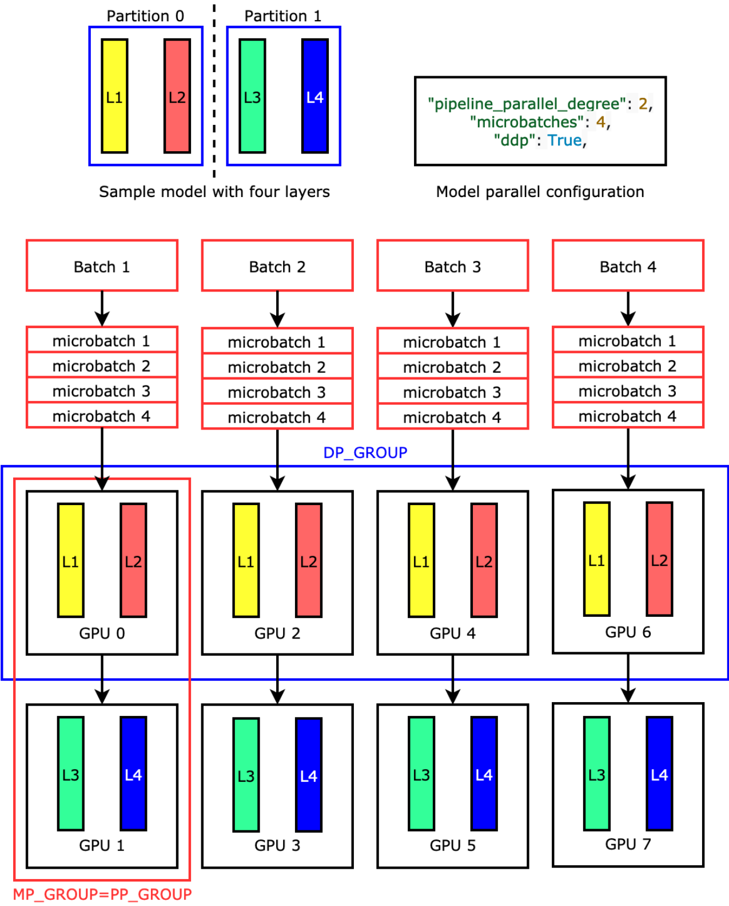

SageMaker model parallelism library v2
5093

## Page 123

Amazon SageMaker AI
Developer Guide

To dive deep into pipeline parallelism, see Core Features of the SageMaker Model Parallelism
Library.

To get started with running your model using pipeline parallelism, see Run a SageMaker
Distributed Training Job with the SageMaker Model Parallel Library.

Tensor parallelism (available for PyTorch)

Tensor parallelism splits individual layers, or nn.Modules, across devices, to be run in parallel.
The following figure shows the simplest example of how the library splits a model with four

layers to achieve two-way tensor parallelism ("tensor_parallel_degree": 2). The layers of
each model replica are bisected and distributed into two GPUs. In this example case, the model

parallel configuration also includes "pipeline_parallel_degree": 1 and "ddp": True (uses
PyTorch DistributedDataParallel package in the background), so the degree of data parallelism
becomes eight. The library manages communication across the tensor-distributed model replicas.


SageMaker model parallelism library v2
5094

## Page 124

Amazon SageMaker AI
Developer Guide

The usefulness of this feature is in the fact that you can select specific layers or a subset of layers
to apply tensor parallelism. To dive deep into tensor parallelism and other memory-saving features
for PyTorch, and to learn how to set a combination of pipeline and tensor parallelism, see Tensor
Parallelism.

Optimizer state sharding (available for PyTorch)

To understand how the library performs optimizer state sharding, consider a simple example model
with four layers. The key idea in optimizing state sharding is you don't need to replicate your
optimizer state in all of your GPUs. Instead, a single replica of the optimizer state is sharded across
data-parallel ranks, with no redundancy across devices. For example, GPU 0 holds the optimizer
state for layer one, the next GPU 1 holds the optimizer state for L2, and so on. The following
animated figure shows a backward propagation with the optimizer state sharding technique. At the

end of the backward propagation, there's compute and network time for the optimizer apply

(OA) operation to update optimizer states and the all-gather (AG) operation to update the

model parameters for the next iteration. Most importantly, the reduce operation can overlap with
the compute on GPU 0, resulting in a more memory-efficient and faster backward propagation. In

the current implementation, AG and OA operations do not overlap with compute. It can result in
an extended computation during the AG operation, so there might be a tradeoff.

SageMaker model parallelism library v2
5095

## Page 125

Amazon SageMaker AI
Developer Guide

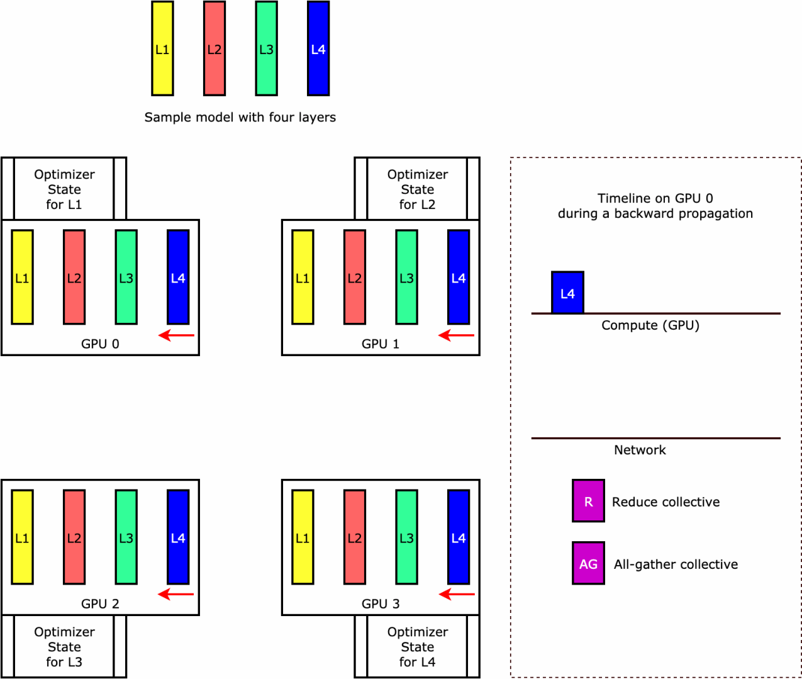

For more information about how to use this feature, see Optimizer State Sharding.

Activation offloading and checkpointing (available for PyTorch)

To save GPU memory, the library supports activation checkpointing to avoid storing internal
activations in the GPU memory for user-specified modules during the forward pass. The library
recomputes these activations during the backward pass. In addition, the activation offloading
feature offloads the stored activations to CPU memory and fetches back to GPU during the
backward pass to further reduce activation memory footprint. For more information about how to
use these features, see Activation Checkpointing and Activation Offloading.

SageMaker model parallelism library v2
5096

## Page 126

Amazon SageMaker AI
Developer Guide

Choosing the right techniques for your model

For more information about choosing the right techniques and configurations, see SageMaker
Distributed Model Parallel Best Practices and Configuration Tips and Pitfalls.

Supported Frameworks and AWS Regions

Before using the SageMaker model parallelism library, check the supported frameworks and
instance types, and determine if there are enough quotas in your AWS account and AWS Region.

Note

To check the latest updates and release notes of the library, see the SageMaker Model
Parallel Release Notes in the SageMaker Python SDK documentation.

Supported Frameworks

The SageMaker model parallelism library supports the following deep learning frameworks and is
available in AWS Deep Learning Containers (DLC) or downloadable as a binary file.

PyTorch versions supported by SageMaker AI and the SageMaker model parallelism library

PyTorch version
SageMaker model
parallelism library
version

URL of the binary
file**

smdistributed-

modelparallel

integrated DLC
image URI

v2.0.0
smdistributed-

https://sagemaker-
distributed-model-
parallel.s3.us-wes
t-2.amazonaws.com/
pytorch-2.0.0/buil
d-artifacts/2023-0
4-14-20-14/smdistr
ibuted_modelparall
el-1.15.0-cp310-cp
310-linux_x86_64.w
hl

763104351

modelparallel

884.dkr.e

==v1.15.0

cr. <region>.amazonaw

s.com/pytorch-

training:2.0.

0-gpu-py310-

cu118-ubuntu20.

04-sagemaker

SageMaker model parallelism library v2
5097

## Page 127

Amazon SageMaker AI
Developer Guide

PyTorch version
SageMaker model
parallelism library
version

URL of the binary
file**

smdistributed-

modelparallel

integrated DLC
image URI

v1.13.1
smdistributed-

https://sagemaker-
distributed-model-
parallel.s3.us-wes
t-2.amazonaws.com/
pytorch-1.13.1/bui
ld-artifacts/2023-
04-17-15-49/smdist
ributed_modelparal
lel-1.15.0-cp39-cp39-
linux_x86_64.whl

763104351

modelparallel

884.dkr.e

==v1.15.0

cr. <region>.amazonaw

s.com/pytorch-

training:1.13

.1-gpu-py39-

cu117-ubuntu20.

04-sagemaker

v1.12.1
smdistributed-

https://sagemaker-
distributed-model-
parallel.s3.us-wes
t-2.amazonaws.com/
pytorch-1.12.1/bui
ld-artifacts/2022-
12-08-21-34/smdist
ributed_modelparal
lel-1.13.0-cp38-cp38-
linux_x86_64.whl

763104351

modelparallel

884.dkr.e

==v1.13.0

cr. <region>.amazonaw

s.com/pytorch-

training:1.12

.1-gpu-py38-

cu113-ubuntu20.

04-sagemaker

v1.12.0
smdistributed-

https://sagemaker-
distributed-model-
parallel.s3.us-wes
t-2.amazonaws.com/
pytorch-1.12.0/bui
ld-artifacts/2022-
08-12-16-58/smdist
ributed_modelparal
lel-1.11.0-cp38-cp38-
linux_x86_64.whl

763104351

modelparallel

884.dkr.e

==v1.11.0

cr. <region>.amazonaw

s.com/pytorch-

training:1.12

.0-gpu-py38-

cu113-ubuntu20.

04-sagemaker

SageMaker model parallelism library v2
5098

## Page 128

Amazon SageMaker AI
Developer Guide

PyTorch version
SageMaker model
parallelism library
version

URL of the binary
file**

smdistributed-

modelparallel

integrated DLC
image URI

v1.11.0
smdistributed-

https://sagemaker-
distributed-model-
parallel.s3.us-wes
t-2.amazonaws.com/
pytorch-1.11.0/bui
ld-artifacts/2022-
07-11-19-23/smdist
ributed_modelparal
lel-1.10.0-cp38-cp38-
linux_x86_64.whl

763104351

modelparallel

884.dkr.e

==v1.10.0

cr. <region>.amazonaw

s.com/pytorch-

training:1.11

.0-gpu-py38-

cu113-ubuntu20.

04-sagemaker

v1.10.2
smdistributed-

-

763104351

modelparallel

884.dkr.e

==v1.7.0

cr. <region>.amazonaw

s.com/pytorch-

training:1.10

.2-gpu-py38-

cu113-ubuntu20.

04-sagemaker

v1.10.0
smdistributed-

-

763104351

modelparallel

884.dkr.e

==v1.5.0

cr. <region>.amazonaw

s.com/pytorch-

training:1.10

.0-gpu-py38-

cu113-ubuntu20.

04-sagemaker

SageMaker model parallelism library v2
5099

## Page 129

Amazon SageMaker AI
Developer Guide

PyTorch version
SageMaker model
parallelism library
version

URL of the binary
file**

smdistributed-

modelparallel

integrated DLC
image URI

v1.9.1
smdistributed-

-

763104351

modelparallel

884.dkr.e

==v1.4.0

cr. <region>.amazonaw

s.com/pytorch-

training:1.9.

1-gpu-py3

8-cu111-u

buntu20.04

v1.8.1*
smdistributed-

-

763104351

modelparallel

884.dkr.e

==v1.6.0

cr. <region>.amazonaw

s.com/pytorch-

training:1.8.

1-gpu-py3

6-cu111-u

buntu18.04

Note

The SageMaker model parallelism library v1.6.0 and later provides extended features for
PyTorch. For more information, see Core Features of the SageMaker Model Parallelism
Library.

** The URLs of the binary files are for installing the SageMaker model parallelism library in custom
containers. For more information, see the section called “Create Your Own Docker Container with
the Library”.

TensorFlow versions supported by SageMaker AI and the SageMaker model parallelism library

SageMaker model parallelism library v2
5100

## Page 130

Amazon SageMaker AI
Developer Guide

TensorFlow version
SageMaker model paralleli
sm library version

smdistributed-mode

lparallel
integrated
DLC image URI

v2.6.0
smdistributed-mode

763104351884.dkr.e

lparallel==v1.4.0

cr. <region>.amazonaw

s.com/tensorflow-t

raining:2.6.0-gpu-

py38-cu112-ubuntu2

0.04

v2.5.1
smdistributed-mode

763104351884.dkr.e

lparallel==v1.4.0

cr. <region>.amazonaw

s.com/tensorflow-t

raining:2.5.1-gpu-

py37-cu112-ubuntu1

8.04

Hugging Face Transformers versions supported by SageMaker AI and the SageMaker distributed
data parallel library

The AWS Deep Learning Containers for Hugging Face use the SageMaker Training Containers for
PyTorch and TensorFlow as their base images. To look up the Hugging Face Transformers library
versions and paired PyTorch and TensorFlow versions, see the latest Hugging Face Containers and
the Prior Hugging Face Container Versions.

AWS Regions

The SageMaker data parallel library is available in all of the AWS Regions where the AWS Deep
Learning Containers for SageMaker are in service. For more information, see Available Deep
Learning Containers Images.

Supported Instance Types

The SageMaker model parallelism library requires one of the following ML instance types.

SageMaker model parallelism library v2
5101

## Page 131

Amazon SageMaker AI
Developer Guide

Instance type

ml.g4dn.12xlarge

ml.p3.16xlarge

ml.p3dn.24xlarge

ml.p4d.24xlarge

ml.p4de.24xlarge

For specs of the instance types, see the Accelerated Computing section in the Amazon EC2
Instance Types page. For information about instance pricing, see Amazon SageMaker AI Pricing.

If you encountered an error message similar to the following, follow the instructions at Request a
service quota increase for SageMaker AI resources.

ResourceLimitExceeded: An error occurred (ResourceLimitExceeded) when calling
the CreateTrainingJob operation: The account-level service limit 'ml.p3dn.24xlarge
for training job usage' is 0 Instances, with current utilization of 0 Instances
and a request delta of 1 Instances.
Please contact AWS support to request an increase for this limit.

Core Features of the SageMaker Model Parallelism Library

Amazon SageMaker AI's model parallelism library offers distribution strategies and memory-
saving techniques, such as sharded data parallelism, tensor parallelism, model partitioning by
layers for pipeline scheduling, and checkpointing. The model parallelism strategies and techniques
help distribute large models across multiple devices while optimizing training speed and memory
consumption. The library also provides Python helper functions, context managers, and wrapper
functions to adapt your training script for automated or manual partitioning of your model.

When you implement model parallelism to your training job, you keep the same two-step workflow
shown in the Run a SageMaker Distributed Training Job with Model Parallelism section. For
adapting your training script, you'll add zero or few additional code lines to your training script.
For launching a training job of the adapted training script, you'll need to set the distribution
configuration parameters to activate the memory-saving features or to pass values for the degree
of parallelism.

SageMaker model parallelism library v2
5102

## Page 132

Amazon SageMaker AI
Developer Guide

To get started with examples, see the following Jupyter notebooks that demonstrate how to use
the SageMaker model parallelism library.

• PyTorch example notebooks

• TensorFlow example notebooks

To dive deep into the core features of the library, see the following topics.

Note

The SageMaker distributed training libraries are available through the AWS deep learning
containers for PyTorch, Hugging Face, and TensorFlow within the SageMaker Training
platform. To utilize the features of the distributed training libraries, we recommend that
you use the SageMaker Python SDK. You can also manually configure in JSON request
syntax if you use SageMaker APIs through SDK for Python (Boto3) or AWS Command Line
Interface. Throughout the documentation, instructions and examples focus on how to use
the distributed training libraries with the SageMaker Python SDK.

Important

The SageMaker model parallelism library supports all the core features for PyTorch, and
supports pipeline parallelism for TensorFlow.

Topics

• Sharded Data Parallelism

• Pipelining a Model

• Tensor Parallelism

• Optimizer State Sharding

• Activation Checkpointing

• Activation Offloading

• FP16 Training with Model Parallelism

• Support for FlashAttention

SageMaker model parallelism library v2
5103

## Page 133

Amazon SageMaker AI
Developer Guide

Sharded Data Parallelism

Sharded data parallelism is a memory-saving distributed training technique that splits the state of
a model (model parameters, gradients, and optimizer states) across GPUs in a data parallel group.

Note

Sharded data parallelism is available for PyTorch in the SageMaker model parallelism
library v1.11.0 and later.

When scaling up your training job to a large GPU cluster, you can reduce the per-GPU memory
footprint of the model by sharding the training state of the model over multiple GPUs. This returns
two benefits: you can fit larger models, which would otherwise run out of memory with standard
data parallelism, or you can increase the batch size using the freed-up GPU memory.

The standard data parallelism technique replicates the training states across the GPUs in the data

parallel group, and performs gradient aggregation based on the AllReduce operation. Sharded
data parallelism modifies the standard data-parallel distributed training procedure to account for
the sharded nature of the optimizer states. A group of ranks over which the model and optimizer
states are sharded is called a sharding group. The sharded data parallelism technique shards the
trainable parameters of a model and corresponding gradients and optimizer states across the GPUs
in the sharding group.

SageMaker AI achieves sharded data parallelism through the implementation of MiCS, which is
discussed in the AWS blog post Near-linear scaling of gigantic-model training on AWS. In this
implementation, you can set the sharding degree as a configurable parameter, which must be
less than the data parallelism degree. During each forward and backward pass, MiCS temporarily

recombines the model parameters in all GPUs through the AllGather operation. After the
forward or backward pass of each layer, MiCS shards the parameters again to save GPU memory.
During the backward pass, MiCS reduces gradients and simultaneously shards them across GPUs

through the ReduceScatter operation. Finally, MiCS applies the local reduced and sharded
gradients to their corresponding local parameter shards, using the local shards of optimizer states.
To bring down communication overhead, the SageMaker model parallelism library prefetches the
upcoming layers in the forward or backward pass, and overlaps the network communication with
the computation.

The training state of the model is replicated across the sharding groups. This means that before

gradients are applied to the parameters, the AllReduce operation must take place across the

SageMaker model parallelism library v2
5104

## Page 134

Amazon SageMaker AI
Developer Guide

sharding groups, in addition to the ReduceScatter operation that takes place within the sharding
group.

In effect, sharded data parallelism introduces a tradeoff between the communication overhead

and GPU memory efficiency. Using sharded data parallelism increases the communication cost, but

the memory footprint per GPU (excluding the memory usage due to activations) is divided by the
sharded data parallelism degree, thus larger models can be fit in the GPU cluster.

Selecting the degree of sharded data parallelism

When you select a value for the degree of sharded data parallelism, the value must evenly divide
the degree of data parallelism. For example, for an 8-way data parallelism job, choose 2, 4, or 8
for the sharded data parallelism degree. While choosing the sharded data parallelism degree, we
recommend that you start with a small number, and gradually increase it until the model fits in the
memory together with the desired batch size.

Selecting the batch size

After setting up sharded data parallelism, make sure you find the most optimal training
configuration that can successfully run on the GPU cluster. For training large language models
(LLM), start from the batch size 1, and gradually increase it until you reach the point to receive the
out-of-memory (OOM) error. If you encounter the OOM error even with the smallest batch size,
apply a higher degree of sharded data parallelism or a combination of sharded data parallelism
and tensor parallelism.

Topics

• How to apply sharded data parallelism to your training job

• Reference configurations

• Sharded data parallelism with SMDDP Collectives

• Mixed precision training with sharded data parallelism

• Sharded data parallelism with tensor parallelism

• Tips and considerations for using sharded data parallelism

How to apply sharded data parallelism to your training job

To get started with sharded data parallelism, apply required modifications to your training
script, and set up the SageMaker PyTorch estimator with the sharded-data-parallelism-specific
parameters. Also consider to take reference values and example notebooks as a starting point.

SageMaker model parallelism library v2
5105

## Page 135

Amazon SageMaker AI
Developer Guide

Adapt your PyTorch training script

Follow the instructions at Step 1: Modify a PyTorch Training Script to wrap the model and

optimizer objects with the smdistributed.modelparallel.torch wrappers of the

torch.nn.parallel and torch.distributed modules.

(Optional) Additional modification to register external model parameters

If your model is built with torch.nn.Module and uses parameters that is not defined within
the module class, you should register them to the module manually for SMP to gather the full

parameters while . To register parameters to a module, use smp.register_parameter(module,

parameter).

class Module(torch.nn.Module):
def __init__(self, *args):
super().__init__(self, *args)
self.layer1 = Layer1()
self.layer2 = Layer2()
smp.register_parameter(self, self.layer1.weight)

def forward(self, input):
x = self.layer1(input)
# self.layer1.weight is required by self.layer2.forward
y = self.layer2(x, self.layer1.weight)
return y

Set up the SageMaker PyTorch estimator

When configuring a SageMaker PyTorch estimator in the section called “Step 2: Launch a Training
Job”, add the parameters for sharded data parallelism.

To turn on sharded data parallelism, add the sharded_data_parallel_degree parameter to
the SageMaker PyTorch Estimator. This parameter specifies the number of GPUs over which the

training state is sharded. The value for sharded_data_parallel_degree must be an integer
between one and the data parallelism degree and must evenly divide the data parallelism degree.
Note that the library automatically detects the number of GPUs so thus the data parallel degree.
The following additional parameters are available for configuring sharded data parallelism.

• "sdp_reduce_bucket_size" (int, default: 5e8) – Specifies the size of PyTorch DDP gradient
buckets in number of elements of the default dtype.

SageMaker model parallelism library v2
5106

## Page 136

Amazon SageMaker AI
Developer Guide

• "sdp_param_persistence_threshold" (int, default: 1e6) – Specifies the size of a parameter
tensor in number of elements that can persist at each GPU. Sharded data parallelism splits
each parameter tensor across GPUs of a data parallel group. If the number of elements in the
parameter tensor is smaller than this threshold, the parameter tensor is not split; this helps
reduce communication overhead because the parameter tensor is replicated across data-parallel
GPUs.

• "sdp_max_live_parameters" (int, default: 1e9) – Specifies the maximum number of
parameters that can simultaneously be in a recombined training state during the forward and

backward pass. Parameter fetching with the AllGather operation pauses when the number of
active parameters reaches the given threshold. Note that increasing this parameter increases the
memory footprint.

• "sdp_hierarchical_allgather" (bool, default: True) – If set to True, the AllGather
operation runs hierarchically: it runs within each node first, and then runs across nodes. For

multi-node distributed training jobs, the hierarchical AllGather operation is automatically
activated.

• "sdp_gradient_clipping" (float, default: 1.0) – Specifies a threshold for gradient clipping
the L2 norm of the gradients before propagating them backward through the model parameters.
When sharded data parallelism is activated, gradient clipping is also activated. The default

threshold is 1.0. Adjust this parameter if you have the exploding gradients problem.

The following code shows an example of how to configure sharded data parallelism.

import sagemaker
from sagemaker.pytorch import PyTorch

smp_options = {
"enabled": True,
"parameters": {
# "pipeline_parallel_degree": 1,    # Optional, default is 1
# "tensor_parallel_degree": 1,      # Optional, default is 1
"ddp": True,
# parameters for sharded data parallelism
"sharded_data_parallel_degree": 2,              # Add this to activate sharded
data parallelism
"sdp_reduce_bucket_size": int(5e8),             # Optional
"sdp_param_persistence_threshold": int(1e6),    # Optional
"sdp_max_live_parameters": int(1e9),            # Optional
"sdp_hierarchical_allgather": True,             # Optional

SageMaker model parallelism library v2
5107

## Page 137

Amazon SageMaker AI
Developer Guide

"sdp_gradient_clipping": 1.0                    # Optional
}
}

mpi_options = {
"enabled" : True,                      # Required
"processes_per_host" : 8               # Required
}

smp_estimator = PyTorch(
entry_point="your_training_script.py", # Specify your train script
role=sagemaker.get_execution_role(),
instance_count=1,
instance_type='ml.p3.16xlarge',
framework_version='1.13.1',
py_version='py3',
distribution={

"smdistributed": {"modelparallel": smp_options},
"mpi": mpi_options
},
base_job_name="sharded-data-parallel-job"
)

smp_estimator.fit('s3://my_bucket/my_training_data/')

Reference configurations

The SageMaker distributed training team provides the following reference configurations that you
can use as a starting point. You can extrapolate from the following configurations to experiment
and estimate the GPU memory usage for your model configuration.

Sharded data parallelism with SMDDP Collectives

Model/the
number of
parameter
s

Num
instances

Instance
type

Sequence
length

Global
batch size

Mini batch
size

Sharded
data
parallel
degree

GPT-
NEOX-20B

2
ml.p4d.24
xlarge

2048
64
4
16

SageMaker model parallelism library v2
5108

## Page 138

Amazon SageMaker AI
Developer Guide

Model/the
number of
parameter
s

Num
instances

Instance
type

Sequence
length

Global
batch size

Mini batch
size

Sharded
data
parallel
degree

GPT-
NEOX-20B

8
ml.p4d.24
xlarge

2048
768
12
32

For example, if you increase the sequence length for a 20-billion-parameter model or increase
the size of the model to 65 billion parameters, you need to try reducing the batch size first. If the
model still doesn’t fit with the smallest batch size (the batch size of 1), try increasing the degree of
model parallelism.

Sharded data parallelism with tensor parallelism and NCCL Collectives

Model/
the
number
of
parameter
s

Num
instances

Instance
type

Sequence
length

Global
batch
size

Mini
batch
size

Sharded
data
parallel
degree

Tensor
parallel
degree

Activatio
n
offloadin
g

GPT-
NEOX-
65B

64
ml.p4d.24
xlarge

2048
512
8
16
8
Y

GPT-
NEOX-
65B

64
ml.p4d.24
xlarge

4096
512
2
64
2
Y

The combined usage of sharded data parallelism and tensor parallelism is useful when you want
to fit a large language model (LLM) into a large-scale cluster while using text data with a longer
sequence length, which leads to use a smaller batch size, and consequently handling the GPU
memory usage to train LLMs against longer text sequences. To learn more, see the section called
“Sharded data parallelism with tensor parallelism”.

SageMaker model parallelism library v2
5109

## Page 139

Amazon SageMaker AI
Developer Guide

For case studies, benchmarks, and more configuration examples, see the blog post New
performance improvements in Amazon SageMaker AI model parallel library.

Sharded data parallelism with SMDDP Collectives

The SageMaker data parallelism library offers collective communication primitives (SMDDP
collectives) optimized for the AWS infrastructure. It achieves optimization by adopting an all-to-
all-type communication pattern by making use of Elastic Fabric Adapter (EFA), resulting in high-
throughput and less latency-sensitive collectives, offloading the communication-related processing
to the CPU, and freeing up GPU cycles for computation. On large clusters, SMDDP Collectives can
offer improvements in distributed training performance by up to 40% compared to NCCL. For
case studies and benchmark results, see the blog New performance improvements in the Amazon
SageMaker AI model parallelism library.

Note

Sharded data parallelism with SMDDP Collectives is available in the SageMaker model
parallelism library v1.13.0 and later, and the SageMaker data parallelism library v1.6.0
and later. See also Supported configurations to use sharded data parallelism with SMDDP
Collectives.

In sharded data parallelism, which is a commonly used technique in large-scale distributed training,

the AllGather collective is used to reconstitute the sharded layer parameters for forward and
backward pass computations, in parallel with GPU computation. For large models, performing the

AllGather operation efficiently is critical to avoid GPU bottleneck problems and slowing down
training speed. When sharded data parallelism is activated, SMDDP Collectives drops into these

performance-critical AllGather collectives, improving training throughput.

Train with SMDDP Collectives

When your training job has sharded data parallelism activated and meets the Supported
configurations, SMDDP Collectives are automatically activated. Internally, SMDDP Collectives

optimize the AllGather collective to be performant on the AWS infrastructure and falls back
to NCCL for all other collectives. Furthermore, under unsupported configurations, all collectives,

including AllGather, automatically use the NCCL backend.

Since the SageMaker model parallelism library version 1.13.0, the "ddp_dist_backend"

parameter is added to the modelparallel options. The default value for this configuration

SageMaker model parallelism library v2
5110

## Page 140

Amazon SageMaker AI
Developer Guide

parameter is "auto", which uses SMDDP Collectives whenever possible, and falls back to NCCL

otherwise. To force the library to always use NCCL, specify "nccl" to the "ddp_dist_backend"

configuration parameter.

The following code example shows how to set up a PyTorch estimator using the sharded data

parallelism with the "ddp_dist_backend" parameter, which is set to "auto" by default and,
therefore, optional to add.

import sagemaker
from sagemaker.pytorch import PyTorch

smp_options = {
"enabled":True,
"parameters": {
"partitions": 1,
"ddp": True,
"sharded_data_parallel_degree": 64
"bf16": True,
"ddp_dist_backend": "auto"  # Specify "nccl" to force to use NCCL.
}
}

mpi_options = {
"enabled" : True,                      # Required
"processes_per_host" : 8               # Required
}

smd_mp_estimator = PyTorch(
entry_point="your_training_script.py", # Specify your train script
source_dir="location_to_your_script",
role=sagemaker.get_execution_role(),
instance_count=8,
instance_type='ml.p4d.24xlarge',
framework_version='1.13.1',
py_version='py3',
distribution={
"smdistributed": {"modelparallel": smp_options},
"mpi": mpi_options
},
base_job_name="sharded-data-parallel-demo",
)

SageMaker model parallelism library v2
5111

## Page 141

Amazon SageMaker AI
Developer Guide

smd_mp_estimator.fit('s3://my_bucket/my_training_data/')

Supported configurations

The AllGather operation with SMDDP Collectives are activated in training jobs when all the
following configuration requirements are met.

• The sharded data parallelism degree greater than 1

• Instance_count greater than 1

• Instance_type equal to ml.p4d.24xlarge

• SageMaker training container for PyTorch v1.12.1 or later

• The SageMaker data parallelism library v1.6.0 or later

• The SageMaker model parallelism library v1.13.0 or later

Performance and memory tuning

SMDDP Collectives utilize additional GPU memory. There are two environment variables to
configure the GPU memory usage depending on different model training use cases.

• SMDDP_AG_SCRATCH_BUFFER_SIZE_BYTES – During the SMDDP AllGather operation,

the AllGather input buffer is copied into a temporary buffer for inter-node communication.

The SMDDP_AG_SCRATCH_BUFFER_SIZE_BYTES variable controls the size (in bytes) of this

temporary buffer. If the size of the temporary buffer is smaller than the AllGather input buffer

size, the AllGather collective falls back to use NCCL.

• Default value: 16 * 1024 * 1024 (16 MB)

• Acceptable values: any multiple of 8192

• SMDDP_AG_SORT_BUFFER_SIZE_BYTES – The SMDDP_AG_SORT_BUFFER_SIZE_BYTES
variable is to size the temporary buffer (in bytes) to hold data gathered from inter-

node communication. If the size of this temporary buffer is smaller than 1/8 *

sharded_data_parallel_degree * AllGather input size, the AllGather collective
falls back to use NCCL.

• Default value: 128 * 1024 * 1024 (128 MB)

• Acceptable values: any multiple of 8192

SageMaker model parallelism library v2
5112

## Page 142

Amazon SageMaker AI
Developer Guide

Tuning guidance on the buffer size variables

The default values for the environment variables should work well for most use cases. We
recommend tuning these variables only if training runs into the out-of-memory (OOM) error.

The following list discusses some tuning tips to reduce the GPU memory footprint of SMDDP
Collectives while retaining the performance gain from them.

• Tuning SMDDP_AG_SCRATCH_BUFFER_SIZE_BYTES

• The AllGather input buffer size is smaller for smaller models. Hence, the required size

for SMDDP_AG_SCRATCH_BUFFER_SIZE_BYTES can be smaller for models with fewer
parameters.

• The AllGather input buffer size decreases as sharded_data_parallel_degree
increases, because the model gets sharded across more GPUs. Hence, the required size for

SMDDP_AG_SCRATCH_BUFFER_SIZE_BYTES can be smaller for training jobs with large values

for sharded_data_parallel_degree.

• Tuning SMDDP_AG_SORT_BUFFER_SIZE_BYTES

• The amount of data gathered from inter-node communication is less for models with fewer

parameters. Hence, the required size for SMDDP_AG_SORT_BUFFER_SIZE_BYTES can be
smaller for such models with fewer number of parameters.

Some collectives might fall back to use NCCL; hence, you might not get the performance
gain from the optimized SMDDP collectives. If additional GPU memory is available for use,

you can consider increasing the values of SMDDP_AG_SCRATCH_BUFFER_SIZE_BYTES and

SMDDP_AG_SORT_BUFFER_SIZE_BYTES to benefit from the performance gain.

The following code shows how you can configure the environment variables by appending them to

mpi_options in the distribution parameter for the PyTorch estimator.

import sagemaker
from sagemaker.pytorch import PyTorch

smp_options = {
.... # All modelparallel configuration options go here
}

mpi_options = {
"enabled" : True,                      # Required
"processes_per_host" : 8               # Required

SageMaker model parallelism library v2
5113

## Page 143

Amazon SageMaker AI
Developer Guide

}

# Use the following two lines to tune values of the environment variables for buffer
mpioptions += " -x SMDDP_AG_SCRATCH_BUFFER_SIZE_BYTES=8192"
mpioptions += " -x SMDDP_AG_SORT_BUFFER_SIZE_BYTES=8192"

smd_mp_estimator = PyTorch(
entry_point="your_training_script.py", # Specify your train script
source_dir="location_to_your_script",
role=sagemaker.get_execution_role(),
instance_count=8,
instance_type='ml.p4d.24xlarge',
framework_version='1.13.1',
py_version='py3',
distribution={
"smdistributed": {"modelparallel": smp_options},
"mpi": mpi_options

},
base_job_name="sharded-data-parallel-demo-with-tuning",
)

smd_mp_estimator.fit('s3://my_bucket/my_training_data/')

Mixed precision training with sharded data parallelism

To further save GPU memory with half-precision floating point numbers and sharded data
parallelism, you can activate 16-bit floating point format (FP16) or Brain floating point format
(BF16) by adding one additional parameter to the distributed training configuration.

Note

Mixed precision training with sharded data parallelism is available in the SageMaker model
parallelism library v1.11.0 and later.

For FP16 Training with Sharded Data Parallelism

To run FP16 training with sharded data parallelism, add "fp16": True" to the smp_options
configuration dictionary. In your training script, you can choose between the static and dynamic

loss scaling options through the smp.DistributedOptimizer module. For more information,
see the section called “FP16 Training with Model Parallelism”.

SageMaker model parallelism library v2
5114

## Page 144

Amazon SageMaker AI
Developer Guide

smp_options = {
"enabled": True,
"parameters": {
"ddp": True,
"sharded_data_parallel_degree": 2,
"fp16": True
}
}

For BF16 Training with Sharded Data Parallelism

The sharded data parallelism feature of SageMaker AI supports training in BF16 data type.
The BF16 data type uses 8 bits to represent the exponent of a floating point number, while
the FP16 data type uses 5 bits. Preserving the 8 bits for the exponent allows to keep the same
representation of the exponent of a 32-bit single precision floating point (FP32) number. This

makes the conversion between FP32 and BF16 simpler and significantly less prone to cause
overflow and underflow issues that arise often in FP16 training, especially when training larger
models. While both data types use 16 bits in total, this increased representation range for the
exponent in the BF16 format comes at the expense of reduced precision. For training large models,
this reduced precision is often considered an acceptable trade-off for the range and training
stability.

Note

Currently, BF16 training works only when sharded data parallelism is activated.

To run BF16 training with sharded data parallelism, add "bf16": True to the smp_options
configuration dictionary.

smp_options = {
"enabled": True,
"parameters": {
"ddp": True,
"sharded_data_parallel_degree": 2,
"bf16": True
}
}

SageMaker model parallelism library v2
5115

## Page 145

Amazon SageMaker AI
Developer Guide

Sharded data parallelism with tensor parallelism

If you use sharded data parallelism and also need to reduce the global batch size, consider using
tensor parallelism with sharded data parallelism. When training a large model with sharded data
parallelism on a very large compute cluster (typically 128 nodes or beyond), even a small batch
size per GPU results in a very large global batch size. It might lead to convergence issues or low
computational performance issues. Reducing the batch size per GPU sometimes is not possible
with sharded data parallelism alone when a single batch is already large and cannot be reduced
further. In such cases, using sharded data parallelism in combination with tensor parallelism helps
reduce the global batch size.

Choosing the optimal sharded data parallel and tensor parallel degrees depends on the scale of the
model, the instance type, and the global batch size that is reasonable for the model to converge.
We recommend that you start from a low tensor parallel degree to fit the global batch size into
the compute cluster to resolve CUDA out-of-memory errors and achieve the best performance. See
the following two example cases to learn how the combination of tensor parallelism and sharded
data parallelism helps you adjust the global batch size by grouping GPUs for model parallelism,
resulting in a lower number of model replicas and a smaller global batch size.

Note

This feature is available from the SageMaker model parallelism library v1.15, and supports
PyTorch v1.13.1.

Note

This feature is available for the supported models by the tensor parallelism functionality
of the library. To find the list of the supported models, see Support for Hugging Face

Transformer Models. Also note that you need to pass tensor_parallelism=True to

the smp.model_creation argument while modifying your training script. To learn more,

see the training script train_gpt_simple.py in the SageMaker AI Examples GitHub
repository.

Example 1

Assume that we want to train a model over a cluster of 1536 GPUs (192 nodes
with 8 GPUs in each), setting the degree of sharded data parallelism to 32

SageMaker model parallelism library v2
5116

## Page 146

Amazon SageMaker AI
Developer Guide

(sharded_data_parallel_degree=32) and the batch size per GPU to 1, where each batch has
a sequence length of 4096 tokens. In this case, there are 1536 model replicas, the global batch size
becomes 1536, and each global batch contains about 6 million tokens.

(1536 GPUs) * (1 batch per GPU) = (1536 global batches)
(1536 batches) * (4096 tokens per batch) = (6,291,456 tokens)

Adding tensor parallelism to it can lower the global batch size. One configuration example can
be setting the tensor parallel degree to 8 and the batch size per GPU to 4. This forms 192 tensor
parallel groups or 192 model replicas, where each model replica is distributed across 8 GPUs. The
batch size of 4 is the amount of training data per iteration and per tensor parallel group; that is,
each model replica consumes 4 batches per iteration. In this case, the global batch size becomes
768, and each global batch contains about 3 million tokens. Hence, the global batch size is reduced
by half compared to the previous case with sharded data parallelism only.

(1536 GPUs) / (8 tensor parallel degree) = (192 tensor parallelism groups)
(192 tensor parallelism groups) * (4 batches per tensor parallelism group) = (768
global batches)
(768 batches) * (4096 tokens per batch) = (3,145,728 tokens)

Example 2

When both sharded data parallelism and tensor parallelism are activated, the library first applies
tensor parallelism and shards the model across this dimension. For each tensor parallel rank, the

data parallelism is applied as per sharded_data_parallel_degree.

For example, assume that we want to set 32 GPUs with a tensor parallel degree of 4 (forming
groups of 4 GPUs), a sharded data parallel degree of 4, ending up with a replication degree of
2. The assignment creates eight GPU groups based on the tensor parallel degree as follows:

(0,1,2,3), (4,5,6,7), (8,9,10,11), (12,13,14,15), (16,17,18,19), (20,21,22,23),

(24,25,26,27), (28,29,30,31). That is, four GPUs form one tensor parallel group. In this
case, the reduced data parallel group for the 0th rank GPUs of the tensor parallel groups would

be (0,4,8,12,16,20,24,28). The reduced data parallel group is sharded based on the
sharded data parallel degree of 4, resulting in two replication groups for data parallelism. GPUs

(0,4,8,12) form one sharding group, which collectively hold a complete copy of all parameters

for the 0th tensor parallel rank, and GPUs (16,20,24,28) form another such group. Other tensor
parallel ranks also have similar sharding and replication groups.

SageMaker model parallelism library v2
5117

## Page 147

Amazon SageMaker AI
Developer Guide

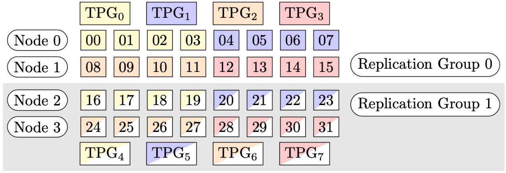

Figure 1: Tensor parallelism groups for (nodes, sharded data parallel degree, tensor parallel degree)
= (4, 4, 4), where each rectangle represents a GPU with indices from 0 to 31. The GPUs form tensor
parallelism groups from TPG0 to TPG7. Replication groups are ({TPG0, TPG4}, {TPG1, TPG5}, {TPG2,
TPG6} and {TPG3, TPG7}); each replication group pair shares the same color but filled differently.

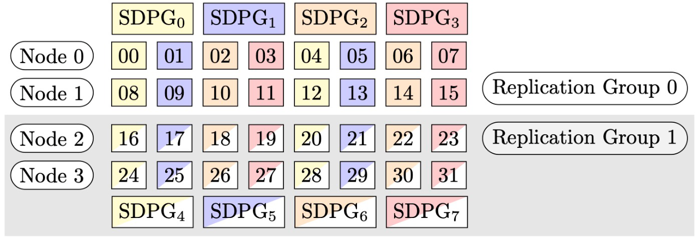

Figure 2: Sharded data parallelism groups for (nodes, sharded data parallel degree, tensor parallel
degree) = (4, 4, 4), where each rectangle represents a GPU with indices from 0 to 31. The GPUs
form sharded data parallelism groups from SDPG0 to SDPG7. Replication groups are ({SDPG0,
SDPG4}, {SDPG1, SDPG5}, {SDPG2, SDPG6} and {SDPG3, SDPG7}); each replication group pair shares
the same color but filled differently.

How to activate sharded data parallelism with tensor parallelism

To use sharded data parallelism with tensor parallelism, you need to set both

sharded_data_parallel_degree and tensor_parallel_degree in the configuration for

distribution while creating an object of the SageMaker PyTorch estimator class.

SageMaker model parallelism library v2
5118

## Page 148

Amazon SageMaker AI
Developer Guide

You also need to activate prescaled_batch. This means that, instead of each GPU reading its
own batch of data, each tensor parallel group collectively reads a combined batch of the chosen
batch size. Effectively, instead of dividing the dataset into parts equal to the number of GPUs (or

data parallel size, smp.dp_size()), it divides into parts equal to the number of GPUs divided by

tensor_parallel_degree (also called reduced data parallel size, smp.rdp_size()). For more
details on prescaled batch, see Prescaled Batch in the SageMaker Python SDK documentation. See

also the example training script train_gpt_simple.py for GPT-2 in the SageMaker AI Examples

GitHub repository.

The following code snippet shows an example of creating a PyTorch estimator object based on the
aforementioned scenario in the section called “Example 2”.

mpi_options = "-verbose --mca orte_base_help_aggregate 0 "
smp_parameters = {
"ddp": True,
"fp16": True,
"prescaled_batch": True,
"sharded_data_parallel_degree": 4,
"tensor_parallel_degree": 4
}

pytorch_estimator = PyTorch(
entry_point="your_training_script.py",
role=role,
instance_type="ml.p4d.24xlarge",
volume_size=200,
instance_count=4,
sagemaker_session=sagemaker_session,
py_version="py3",
framework_version="1.13.1",
distribution={
"smdistributed": {
"modelparallel": {
"enabled": True,
"parameters": smp_parameters,
}
},
"mpi": {
"enabled": True,
"processes_per_host": 8,
"custom_mpi_options": mpi_options,
},

SageMaker model parallelism library v2
5119

## Page 149

Amazon SageMaker AI
Developer Guide

},
source_dir="source_directory_of_your_code",
output_path=s3_output_location
)

Tips and considerations for using sharded data parallelism

Consider the following when using the SageMaker model parallelism library's sharded data

parallelism.

• Sharded data parallelism is compatible with FP16 training. To run FP16 training, see the the
section called “FP16 Training with Model Parallelism” section.

• Sharded data parallelism is compatible with tensor parallelism. The following items are what you
might need to consider for using sharded data parallelism with tensor parallelism.

• When using sharded data parallelism with tensor parallelism, the embedding layers
are also automatically distributed across the tensor parallel group. In other words, the

distribute_embedding parameter is automatically set to True. For more information
about tensor parallelism, see the section called “Tensor Parallelism”.

• Note that sharded data parallelism with tensor parallelism currently uses the NCCL collectives
as the backend of the distributed training strategy.

To learn more, see the the section called “Sharded data parallelism with tensor parallelism”
section.

• Sharded data parallelism currently is not compatible with pipeline parallelism or optimizer state
sharding. To activate sharded data parallelism, turn off optimizer state sharding and set the
pipeline parallel degree to 1.

• The activation checkpointing and activation offloading features are compatible with sharded
data parallelism.

• To use sharded data parallelism with gradient accumulation, set the

backward_passes_per_step argument to the number of accumulation steps while wrapping

your model with the smdistributed.modelparallel.torch.DistributedModel module.

This ensures that the gradient AllReduce operation across the model replication groups
(sharding groups) takes place at the boundary of gradient accumulation.

• You can checkpoint your models trained with sharded data parallelism using the library's

checkpointing APIs, smp.save_checkpoint and smp.resume_from_checkpoint. For
more information, see the section called “Checkpointing a distributed PyTorch model (for the
SageMaker model parallelism library v1.10.0 and later)”.

SageMaker model parallelism library v2
5120

## Page 150

Amazon SageMaker AI
Developer Guide

• The behavior of the delayed_parameter_initialization configuration parameter
changes under sharded data parallelism. When these two features are simultaneously turned
on, parameters are immediately initialized upon model creation in a sharded manner instead
of delaying the parameter initialization, so that each rank initializes and stores its own shard of
parameters.

• When sharded data parallelism is activated, the library performs gradient clipping internally

when the optimizer.step() call runs. You don't need to use utility APIs for gradient clipping,

such as torch.nn.utils.clip_grad_norm_(). To adjust the threshold value for gradient

clipping, you can set it through the sdp_gradient_clipping parameter for the distribution
parameter configuration when you construct the SageMaker PyTorch estimator, as shown in the
the section called “How to apply sharded data parallelism to your training job” section.

Pipelining a Model

One of the core features of SageMaker's model parallelism library is pipeline parallelism, which
determines the order in which computations are made and data is processed across devices during
model training. Pipelining is a technique to achieve true parallelization in model parallelism,
by having the GPUs compute simultaneously on different data samples, and to overcome the
performance loss due to sequential computation. When you use pipeline parallelism, training job is
executed in a pipelined fashion over microbatches to maximize GPU usage.

Note

Pipeline parallelism, also called model partitioning, is available for both PyTorch and
TensorFlow. For supported versions of the frameworks, see the section called “Supported
Frameworks and AWS Regions”.

Pipeline Execution Schedule

Pipelining is based on splitting a mini-batch into microbatches, which are fed into the training
pipeline one-by-one and follow an execution schedule defined by the library runtime. A microbatch
is a smaller subset of a given training mini-batch. The pipeline schedule determines which
microbatch is executed by which device for every time slot.

For example, depending on the pipeline schedule and the model partition, GPU i might perform

(forward or backward) computation on microbatch b while GPU i+1 performs computation on

SageMaker model parallelism library v2
5121

## Page 151

Amazon SageMaker AI
Developer Guide

microbatch b+1, thereby keeping both GPUs active at the same time. During a single forward or
backward pass, execution flow for a single microbatch might visit the same device multiple times,
depending on the partitioning decision. For instance, an operation that is at the beginning of the
model might be placed on the same device as an operation at the end of the model, while the
operations in between are on different devices, which means this device is visited twice.

The library offers two different pipeline schedules, simple and interleaved, which can be configured

using the pipeline parameter in the SageMaker Python SDK. In most cases, interleaved pipeline
can achieve better performance by utilizing the GPUs more efficiently.

Interleaved Pipeline

In an interleaved pipeline, backward execution of the microbatches is prioritized whenever
possible. This allows quicker release of the memory used for activations, using memory more
efficiently. It also allows for scaling the number of microbatches higher, reducing the idle time of

the GPUs. At steady-state, each device alternates between running forward and backward passes.
This means that the backward pass of one microbatch may run before the forward pass of another
microbatch finishes.

The preceding figure illustrates an example execution schedule for the interleaved pipeline over
2 GPUs. In the figure, F0 represents the forward pass for microbatch 0, and B1 represents the
backward pass for microbatch 1. Update represents the optimizer update of the parameters. GPU0
always prioritizes backward passes whenever possible (for instance, executes B0 before F2), which
allows for clearing of the memory used for activations earlier.

Simple Pipeline

A simple pipeline, by contrast, finishes running the forward pass for each microbatch before
starting the backward pass. This means that it only pipelines the forward pass and backward pass
stages within themselves. The following figure illustrates an example of how this works, over 2
GPUs.

SageMaker model parallelism library v2
5122

## Page 152

Amazon SageMaker AI
Developer Guide

Pipelining Execution in Specific Frameworks

Use the following sections to learn about the framework-specific pipeline scheduling decisions
SageMaker's model parallelism library makes for TensorFlow and PyTorch.

Pipeline Execution with TensorFlow

The following image is an example of a TensorFlow graph partitioned by the model parallelism
library, using automated model splitting. When a graph is split, each resulting subgraph is

replicated B times (except for the variables), where B is the number of microbatches. In this figure,

each subgraph is replicated 2 times (B=2). An SMPInput operation is inserted at each input of a

subgraph, and an SMPOutput operation is inserted at each output. These operations communicate
with the library backend to transfer tensors to and from each other.

The following image is an example of 2 subgraphs split with B=2 with gradient operations added.

The gradient of a SMPInput op is a SMPOutput op, and vice versa. This enables the gradients to
flow backwards during back-propagation.

SageMaker model parallelism library v2
5123

## Page 153

Amazon SageMaker AI
Developer Guide

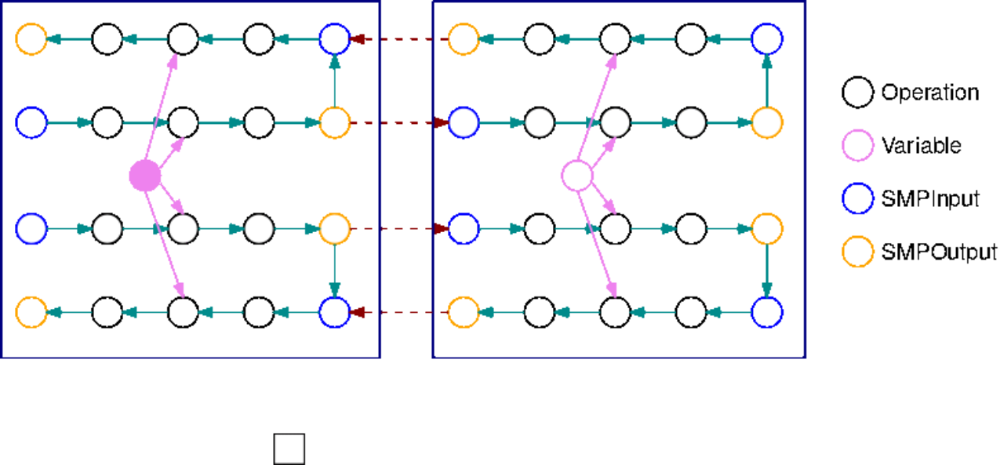

This GIF demonstrates an example interleaved pipeline execution schedule with B=2 microbatches
and 2 subgraphs. Each device sequentially executes one of the subgraph replicas to improve GPU
utilization. As B grows larger, the fraction of idle time slots goes to zero. Whenever it is time to do
(forward or backward) computation on a specific subgraph replica, the pipeline layer signals to the

corresponding blue SMPInput operations to start executing.

Once the gradients from all microbatches in a single mini-batch are computed, the library
combines the gradients across microbatches, which can then be applied to the parameters.

Pipeline Execution with PyTorch

Conceptually, pipelining follows a similar idea in PyTorch. However, since PyTorch does not involve
static graphs and so the model parallelism library's PyTorch feature uses a more dynamic pipelining
paradigm.

As in TensorFlow, each batch is split into a number of microbatches, which are executed one at a
time on each device. However, the execution schedule is handled via execution servers launched on
each device. Whenever the output of a submodule that is placed on another device is needed on
the current device, an execution request is sent to the execution server of the remote device along
with the input tensors to the submodule. The server then executes this module with the given
inputs and returns the response to the current device.

Since the current device is idle during the remote submodule execution, the local execution for
the current microbatch pauses, and the library runtime switches execution to another microbatch

SageMaker model parallelism library v2
5124

## Page 154

Amazon SageMaker AI
Developer Guide

which the current device can actively work on. The prioritization of microbatches is determined by
the chosen pipeline schedule. For an interleaved pipeline schedule, microbatches that are in the
backward stage of the computation are prioritized whenever possible.

Tensor Parallelism

Tensor parallelism is a type of model parallelism in which specific model weights, gradients, and
optimizer states are split across devices. In contrast to pipeline parallelism, which keeps individual
weights intact but partitions the set of weights, tensor parallelism splits individual weights. This
typically involves distributed computation of specific operations, modules, or layers of the model.

Tensor parallelism is required in cases in which a single parameter consumes most of the GPU
memory (such as large embedding tables with a large vocabulary size or a large softmax layer with
a large number of classes). In this case, treating this large tensor or operation as an atomic unit is
inefficient and impedes balance of the memory load.

Tensor parallelism is also useful for extremely large models in which a pure pipelining is simply
not enough. For example, with GPT-3-scale models that require partitioning over tens of instances,
a pure microbatch pipelining is inefficient because the pipeline depth becomes too high and the
overhead becomes prohibitively large.

Note

Tensor parallelism is available for PyTorch in the SageMaker model parallelism library
v1.6.0 and later.

Topics

• How Tensor Parallelism Works

• Run a SageMaker Distributed Model Parallel Training Job with Tensor Parallelism

• Support for Hugging Face Transformer Models

• Ranking Mechanism when Using a Combination of Pipeline Parallelism and Tensor Parallelism

How Tensor Parallelism Works

Tensor parallelism takes place at the level of nn.Modules; it partitions specific modules in the
model across tensor parallel ranks. This is in addition to the existing partition of the set of modules
used in pipeline parallelism.

SageMaker model parallelism library v2
5125

## Page 155

Amazon SageMaker AI
Developer Guide

When a module is partitioned through tensor parallelism, its forward and backward propagation
are distributed. The library handles the necessary communication across devices to implement
the distributed execution of these modules. The modules are partitioned across multiple data
parallel ranks. Contrary to the traditional distribution of workloads, each data parallel rank does
not have the complete model replica when the library’s tensor parallelism is used. Instead, each
data parallel rank may have only a partition of the distributed modules, in addition to the entirety
of the modules that are not distributed.

Example: Consider tensor parallelism across data parallel ranks, where the degree of data
parallelism is 4 and the degree of tensor parallelism is 2. Assume that you have a data parallel
group that holds the following module tree, after partitioning the set of modules.

A
### B
|   ### E
|   ### F
### C
### D
### G
### H

Assume that tensor parallelism is supported for the modules B, G, and H. One possible outcome of
tensor parallel partition of this model could be:

dp_rank 0 (tensor parallel rank 0): A, B:0, C, D, G:0, H
dp_rank 1 (tensor parallel rank 1): A, B:1, C, D, G:1, H
dp_rank 2 (tensor parallel rank 0): A, B:0, C, D, G:0, H
dp_rank 3 (tensor parallel rank 1): A, B:1, C, D, G:1, H

Each line represents the set of modules stored in that dp_rank, and the notation X:y represents

the yth fraction of the module X. Note the following:

1. Partitioning takes place across subsets of data parallel ranks, which we call TP_GROUP, not the

entire DP_GROUP, so that the exact model partition is replicated across dp_rank 0 and dp_rank

2, and similarly across dp_rank 1 and dp_rank 3.

2. The modules E and F are no longer part of the model, since their parent module B is partitioned,

and any execution that is normally a part of E and F takes place within the (partitioned) B
module.

SageMaker model parallelism library v2
5126

## Page 156

Amazon SageMaker AI
Developer Guide

3. Even though H is supported for tensor parallelism, in this example it is not partitioned, which

highlights that whether to partition a module depends on user input. The fact that a module is
supported for tensor parallelism does not necessarily mean it is partitioned.

How the library adapts tensor parallelism to PyTorch nn.Linear module

When tensor parallelism is performed over data parallel ranks, a subset of the parameters,
gradients, and optimizer states are partitioned across the tensor parallel devices for the modules
that are partitioned. For the rest of the modules, the tensor parallel devices operate in a regular
data parallel manner. To execute the partitioned module, a device first collects the necessary parts
of all data samples across peer devices in the same tensor parallelism group. The device then
runs the local fraction of the module on all these data samples, followed by another round of
synchronization which both combines the parts of the output for each data sample and returns the
combined data samples to the GPUs from which the data sample first originated. The following

figure shows an example of this process over a partitioned nn.Linear module.


SageMaker model parallelism library v2
5127

## Page 157

Amazon SageMaker AI
Developer Guide

The first figure shows a small model with a large nn.Linear module with data parallelism over

the two tensor parallelism ranks. The nn.Linear module is replicated into the two parallel ranks.

The second figure shows tensor parallelism applied on a larger model while splitting the

nn.Linear module. Each tp_rank holds half the linear module, and the entirety of the rest of

the operations. While the linear module runs, each tp_rank collects the relevant half of all data

samples and passes it through their half of the nn.Linear module. The result needs to be reduce-
scattered (with summation as the reduction operation) so that each rank has the final linear output
for their own data samples. The rest of the model runs in the typical data parallel manner.

Run a SageMaker Distributed Model Parallel Training Job with Tensor Parallelism

In this section, you learn:

• How to configure a SageMaker PyTorch estimator and the SageMaker model parallelism option
to use tensor parallelism.

• How to adapt your training script using the extended smdistributed.modelparallel
modules for tensor parallelism.

To learn more about the smdistributed.modelparallel modules, see the SageMaker model
parallel APIs in the SageMaker Python SDK documentation.

Topics

• Tensor parallelism alone

• Tensor parallelism combined with pipeline parallelism

Tensor parallelism alone

The following is an example of a distributed training option to activate tensor parallelism alone,

without pipeline parallelism. Configure the mpi_options and smp_options dictionaries to

specify distributed training options to the SageMaker PyTorch estimator.

Note

Extended memory-saving features are available through Deep Learning Containers for
PyTorch, which implements the SageMaker model parallelism library v1.6.0 or later.

SageMaker model parallelism library v2
5128

## Page 158

Amazon SageMaker AI
Developer Guide

Configure a SageMaker PyTorch estimator

mpi_options = {
"enabled" : True,
"processes_per_host" : 8,               # 8 processes
"custom_mpi_options" : "--mca btl_vader_single_copy_mechanism none "
}
smp_options = {
"enabled":True,
"parameters": {
"pipeline_parallel_degree": 1,    # alias for "partitions"
"placement_strategy": "cluster",
"tensor_parallel_degree": 4,      # tp over 4 devices
"ddp": True
}

}
smp_estimator = PyTorch(
entry_point='your_training_script.py', # Specify
role=role,
instance_type='ml.p3.16xlarge',
sagemaker_session=sagemaker_session,
framework_version='1.13.1',
py_version='py36',
instance_count=1,
distribution={
"smdistributed": {"modelparallel": smp_options},
"mpi": mpi_options
},
base_job_name="SMD-MP-demo",
)

smp_estimator.fit('s3://my_bucket/my_training_data/')

Tip

To find a complete list of parameters for distribution, see Configuration Parameters for
Model Parallelism in the SageMaker Python SDK documentation.

Adapt your PyTorch training script

SageMaker model parallelism library v2
5129

## Page 159

Amazon SageMaker AI
Developer Guide

The following example training script shows how to adapt the SageMaker model
parallelism library to a training script. In this example, it is assumed that the script is

named your_training_script.py.

import torch
import torch.nn as nn
import torch.nn.functional as F
import torch.optim as optim
from torchnet.dataset import SplitDataset
from torchvision import datasets

import smdistributed.modelparallel.torch as smp

class Net(nn.Module):
def __init__(self):
super(Net, self).__init__()
self.conv1 = nn.Conv2d(1, 32, 3, 1)
self.conv2 = nn.Conv2d(32, 64, 3, 1)
self.fc1 = nn.Linear(9216, 128)
self.fc2 = nn.Linear(128, 10)

def forward(self, x):
x = self.conv1(x)
x = F.relu(x)
x = self.conv2(x)
x = F.relu(x)
x = F.max_pool2d(x, 2)
x = torch.flatten(x, 1)
x = self.fc1(x)
x = F.relu(x)
x = self.fc2(x)
return F.log_softmax(x, 1)

def train(model, device, train_loader, optimizer):
model.train()
for batch_idx, (data, target) in enumerate(train_loader):
# smdistributed: Move input tensors to the GPU ID used by
# the current process, based on the set_device call.
data, target = data.to(device), target.to(device)
optimizer.zero_grad()
output = model(data)
loss = F.nll_loss(output, target, reduction="mean")
loss.backward()

SageMaker model parallelism library v2
5130

## Page 160

Amazon SageMaker AI
Developer Guide

optimizer.step()

# smdistributed: Initialize the backend
smp.init()

# smdistributed: Set the device to the GPU ID used by the current process.
# Input tensors should be transferred to this device.
torch.cuda.set_device(smp.local_rank())
device = torch.device("cuda")

# smdistributed: Download only on a single process per instance.
# When this is not present, the file is corrupted by multiple processes trying
# to download and extract at the same time
if smp.local_rank() == 0:
dataset = datasets.MNIST("../data", train=True, download=False)
smp.barrier()

# smdistributed: Shard the dataset based on data parallel ranks
if smp.dp_size() > 1:
partitions_dict = {f"{i}": 1 / smp.dp_size() for i in range(smp.dp_size())}
dataset = SplitDataset(dataset, partitions=partitions_dict)
dataset.select(f"{smp.dp_rank()}")

train_loader = torch.utils.data.DataLoader(dataset, batch_size=64)

# smdistributed: Enable tensor parallelism for all supported modules in the model
# i.e., nn.Linear in this case. Alternatively, we can use
# smp.set_tensor_parallelism(model.fc1, True)
# to enable it only for model.fc1
with smp.tensor_parallelism():
model = Net()

# smdistributed: Use the DistributedModel wrapper to distribute the
# modules for which tensor parallelism is enabled
model = smp.DistributedModel(model)

optimizer = optim.AdaDelta(model.parameters(), lr=4.0)
optimizer = smp.DistributedOptimizer(optimizer)

train(model, device, train_loader, optimizer)

SageMaker model parallelism library v2
5131

## Page 161

Amazon SageMaker AI
Developer Guide

Tensor parallelism combined with pipeline parallelism

The following is an example of a distributed training option that enables tensor parallelism

combined with pipeline parallelism. Set up the mpi_options and smp_options parameters to

specify model parallel options with tensor parallelism when you configure a SageMaker PyTorch
estimator.

Note

Extended memory-saving features are available through Deep Learning Containers for
PyTorch, which implements the SageMaker model parallelism library v1.6.0 or later.

Configure a SageMaker PyTorch estimator

mpi_options = {
"enabled" : True,
"processes_per_host" : 8,               # 8 processes
"custom_mpi_options" : "--mca btl_vader_single_copy_mechanism none "
}
smp_options = {
"enabled":True,
"parameters": {
"microbatches": 4,
"pipeline_parallel_degree": 2,    # alias for "partitions"
"placement_strategy": "cluster",
"tensor_parallel_degree": 2,      # tp over 2 devices
"ddp": True
}
}
smp_estimator = PyTorch(
entry_point='your_training_script.py', # Specify
role=role,
instance_type='ml.p3.16xlarge',
sagemaker_session=sagemaker_session,
framework_version='1.13.1',
py_version='py36',
instance_count=1,
distribution={
"smdistributed": {"modelparallel": smp_options},

SageMaker model parallelism library v2
5132

## Page 162

Amazon SageMaker AI
Developer Guide

"mpi": mpi_options
},
base_job_name="SMD-MP-demo",
)

smp_estimator.fit('s3://my_bucket/my_training_data/')

Adapt your PyTorch training script

The following example training script shows how to adapt the SageMaker model parallelism library

to a training script. Note that the training script now includes the smp.step decorator:

import torch
import torch.nn as nn
import torch.nn.functional as F
import torch.optim as optim
from torchnet.dataset import SplitDataset
from torchvision import datasets

import smdistributed.modelparallel.torch as smp

class Net(nn.Module):
def __init__(self):
super(Net, self).__init__()
self.conv1 = nn.Conv2d(1, 32, 3, 1)
self.conv2 = nn.Conv2d(32, 64, 3, 1)
self.fc1 = nn.Linear(9216, 128)
self.fc2 = nn.Linear(128, 10)

def forward(self, x):
x = self.conv1(x)
x = F.relu(x)
x = self.conv2(x)
x = F.relu(x)
x = F.max_pool2d(x, 2)
x = torch.flatten(x, 1)
x = self.fc1(x)
x = F.relu(x)
x = self.fc2(x)
return F.log_softmax(x, 1)

# smdistributed: Define smp.step. Return any tensors needed outside.

SageMaker model parallelism library v2
5133

## Page 163

Amazon SageMaker AI
Developer Guide

@smp.step
def train_step(model, data, target):
output = model(data)
loss = F.nll_loss(output, target, reduction="mean")
model.backward(loss)
return output, loss

def train(model, device, train_loader, optimizer):
model.train()
for batch_idx, (data, target) in enumerate(train_loader):
# smdistributed: Move input tensors to the GPU ID used by
# the current process, based on the set_device call.
data, target = data.to(device), target.to(device)
optimizer.zero_grad()
# Return value, loss_mb is a StepOutput object
_, loss_mb = train_step(model, data, target)

# smdistributed: Average the loss across microbatches.
loss = loss_mb.reduce_mean()

optimizer.step()

# smdistributed: Initialize the backend
smp.init()

# smdistributed: Set the device to the GPU ID used by the current process.
# Input tensors should be transferred to this device.
torch.cuda.set_device(smp.local_rank())
device = torch.device("cuda")

# smdistributed: Download only on a single process per instance.
# When this is not present, the file is corrupted by multiple processes trying
# to download and extract at the same time
if smp.local_rank() == 0:
dataset = datasets.MNIST("../data", train=True, download=False)
smp.barrier()

# smdistributed: Shard the dataset based on data parallel ranks
if smp.dp_size() > 1:
partitions_dict = {f"{i}": 1 / smp.dp_size() for i in range(smp.dp_size())}
dataset = SplitDataset(dataset, partitions=partitions_dict)
dataset.select(f"{smp.dp_rank()}")

# smdistributed: Set drop_last=True to ensure that batch size is always divisible

SageMaker model parallelism library v2
5134

## Page 164

Amazon SageMaker AI
Developer Guide

# by the number of microbatches
train_loader = torch.utils.data.DataLoader(dataset, batch_size=64, drop_last=True)

model = Net()

# smdistributed: enable tensor parallelism only for model.fc1
smp.set_tensor_parallelism(model.fc1, True)

# smdistributed: Use the DistributedModel container to provide the model
# to be partitioned across different ranks. For the rest of the script,
# the returned DistributedModel object should be used in place of
# the model provided for DistributedModel class instantiation.
model = smp.DistributedModel(model)

optimizer = optim.AdaDelta(model.parameters(), lr=4.0)
optimizer = smp.DistributedOptimizer(optimizer)

train(model, device, train_loader, optimizer)

Support for Hugging Face Transformer Models

The SageMaker model parallelism library's tensor parallelism offers out-of-the-box support for the
following Hugging Face Transformer models:

• GPT-2, BERT, and RoBERTa (Available in the SageMaker model parallelism library v1.7.0 and
later)

• GPT-J (Available in the SageMaker model parallelism library v1.8.0 and later)

• GPT-Neo (Available in the SageMaker model parallelism library v1.10.0 and later)

Note

For any other Transformers models, you need to use the
smdistributed.modelparallel.torch.tp_register_with_module() API to apply tensor
parallelism.

Note

To use tensor parallelism for training Hugging Face Transformer models, make sure you
use Hugging Face Deep Learning Containers for PyTorch that has the SageMaker model

SageMaker model parallelism library v2
5135

## Page 165

Amazon SageMaker AI
Developer Guide

parallelism library v1.7.0 and later. For more information, see the SageMaker model
parallelism library release notes.

Supported Models Out of the Box

For the Hugging Face transformer models supported by the library out of the box, you

don't need to manually implement hooks to translate Transformer APIs to smdistributed
transformer layers. You can activate tensor parallelism by using the context manager
smdistributed.modelparallel.torch.tensor_parallelism() and wrapping the model by
smdistributed.modelparallel.torch.DistributedModel(). You don't need to manually register hooks

for tensor parallelism using the smp.tp_register API.

The state_dict translation functions between Hugging Face Transformers and

smdistributed.modelparallel can be accessed as follows.

• smdistributed.modelparallel.torch.nn.huggingface.gpt2.translate_state_dict_to_h

max_seq_len=None)

• smdistributed.modelparallel.torch.nn.huggingface.gpt2.translate_hf_state_dict_t

• smdistributed.modelparallel.torch.nn.huggingface.bert.translate_state_dict_to_h

max_seq_len=None)

• smdistributed.modelparallel.torch.nn.huggingface.bert.translate_hf_state_dict_t

• smdistributed.modelparallel.torch.nn.huggingface.roberta.translate_state_dict_t

max_seq_len=None)

• smdistributed.modelparallel.torch.nn.huggingface.roberta.translate_hf_state_dic

• smdistributed.modelparallel.torch.nn.huggingface.gptj.translate_state_dict_to_h

max_seq_len=None) (Available in the SageMaker model parallelism library v1.8.0 and later)

• smdistributed.modelparallel.torch.nn.huggingface.gptj.translate_hf_gptj_state_d
(Available in the SageMaker model parallelism library v1.8.0 and later)

• smdistributed.modelparallel.torch.nn.huggingface.gptneo.translate_state_dict_to

max_seq_len=None) (Available in the SageMaker model parallelism library v1.10.0 and later)

• smdistributed.modelparallel.torch.nn.huggingface.gptneo.translate_hf_state_dict
(Available in the SageMaker model parallelism library v1.10.0 and later)

Example usage of the GPT-2 translation function

SageMaker model parallelism library v2
5136

## Page 166

Amazon SageMaker AI
Developer Guide

Start with wrapping the model as shown in the following code.

from transformers import AutoModelForCausalLM

with smp.tensor_parallelism():

model = AutoModelForCausalLM.from_config(hf_gpt2_config)

model = smp.DistributedModel(model)

Given a state_dict from the DistributedModel object, you can load the weights into the

original Hugging Face GPT-2 model using the translate_state_dict_to_hf_gpt2 function as
shown in the following code.

from smdistributed.modelparallel.torch.nn.huggingface.gpt2 \
import translate_state_dict_to_hf_gpt2

max_seq_len = 1024

# [... code block for training ...]

if smp.rdp_rank() == 0:
state_dict = dist_model.state_dict()
hf_state_dict = translate_state_dict_to_hf_gpt2(state_dict, max_seq_len)

# can now call model.load_state_dict(hf_state_dict) to the original HF model

Example usage of the RoBERTa translation function

Similarly, given a supported HuggingFace model state_dict, you can use the

translate_hf_state_dict_to_smdistributed function to convert it to a format readable

by smp.DistributedModel. This can be useful in transfer learning use cases, where a pre-trained

model is loaded into a smp.DistributedModel for model-parallel fine-tuning:

from smdistributed.modelparallel.torch.nn.huggingface.roberta \
import translate_state_dict_to_smdistributed

model = AutoModelForMaskedLM.from_config(roberta_config)
model = smp.DistributedModel(model)

pretrained_model = AutoModelForMaskedLM.from_pretrained("roberta-large")
translated_state_dict =
translate_state_dict_to_smdistributed(pretrained_model.state_dict())

SageMaker model parallelism library v2
5137

## Page 167

Amazon SageMaker AI
Developer Guide

# load the translated pretrained weights into the smp.DistributedModel
model.load_state_dict(translated_state_dict)

# start fine-tuning...

Ranking Mechanism when Using a Combination of Pipeline Parallelism and Tensor Parallelism

This section explains how the ranking mechanism of model parallelism works with tensor
parallelism. This is extended from the Ranking Basics for Core Features of the SageMaker Model
Parallelism Library. With tensor parallelism, the library introduces three types of ranking and

process group APIs: smp.tp_rank() for tensor parallel rank, smp.pp_rank() for pipeline parallel

rank, and smp.rdp_rank() for reduced-data parallel rank. The corresponding communication

process groups are tensor parallel group (TP_GROUP), pipeline parallel group (PP_GROUP), and

reduced-data parallel group (RDP_GROUP). These groups are defined as follows:

• A tensor parallel group (TP_GROUP) is an evenly divisible subset of the data parallel group,
over which tensor parallel distribution of modules takes place. When the degree of pipeline

parallelism is 1, TP_GROUP is the same as model parallel group (MP_GROUP).

• A pipeline parallel group (PP_GROUP) is the group of processes over which pipeline parallelism

takes place. When the tensor parallelism degree is 1, PP_GROUP is the same as MP_GROUP.

• A reduced-data parallel group (RDP_GROUP) is a set of processes that hold both the same pipeline
parallelism partitions and the same tensor parallel partitions, and perform data parallelism
among themselves. This is called the reduced data parallel group because it is a subset of the

entire data parallelism group, DP_GROUP. For the model parameters that are distributed within

the TP_GROUP , the gradient allreduce operation is performed only for reduced-data parallel

group, while for the parameters that are not distributed, the gradient allreduce takes place

over the entire DP_GROUP.

• A model parallel group (MP_GROUP) refers to a group of processes that collectively store the

entire model. It consists of the union of the PP_GROUPs of all the ranks that are in the TP_GROUP

of the current process. When the degree of tensor parallelism is 1, MP_GROUP is equivalent

to PP_GROUP. It is also consistent with the existing definition of MP_GROUP from previous

smdistributed releases. Note that the current TP_GROUP is a subset of both the current

DP_GROUP and the current MP_GROUP.

To learn more about the communication process APIs in the SageMaker model parallelism library,
see the Common API and the PyTorch-specific APIs in the SageMaker Python SDK documentation.

SageMaker model parallelism library v2
5138

## Page 168

Amazon SageMaker AI
Developer Guide

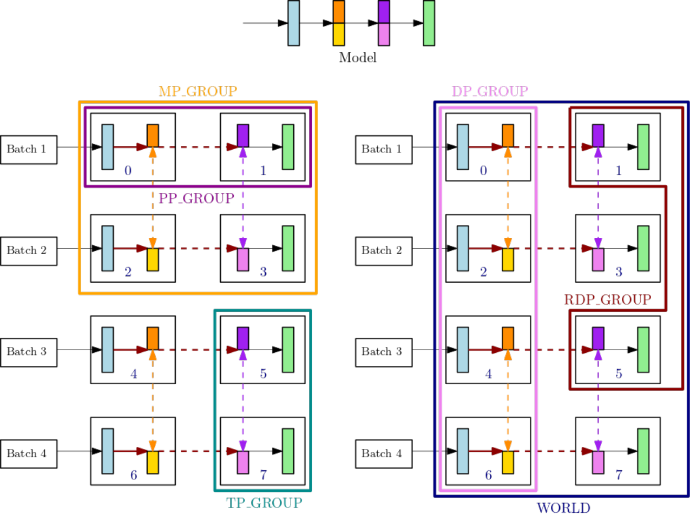

For example, consider process groups for a single node with 8 GPUs, where the degree of tensor
parallelism is 2, the degree of pipeline parallelism is 2, and the degree of data parallelism is 4. The
upper center part of the preceding figure shows an example of a model with 4 layers. The lower
left and lower right parts of figure illustrate the 4-layer model distributed across 4 GPUs using
both pipeline parallelism and tensor parallelism, where tensor parallelism is used for the middle
two layers. These two lower figures are simple copies to illustrate different group boundary lines.
The partitioned model is replicated for data parallelism across GPUs 0-3 and 4-7. The lower left

figure shows the definitions of MP_GROUP, PP_GROUP, and TP_GROUP. The lower right figure shows

RDP_GROUP, DP_GROUP, and WORLD over the same set of GPUs. The gradients for the layers and

layer slices that have the same color are allreduced together for data parallelism. For example,

the first layer (light blue) gets the allreduce operations across DP_GROUP, whereas the dark

orange slice in the second layer only gets the allreduce operations within the RDP_GROUP of its

process. The bold dark red arrows represent tensors with the batch of its entire TP_GROUP.

SageMaker model parallelism library v2
5139

## Page 169

Amazon SageMaker AI
Developer Guide

GPU0: pp_rank 0, tp_rank 0, rdp_rank 0, dp_rank 0, mp_rank 0
GPU1: pp_rank 1, tp_rank 0, rdp_rank 0, dp_rank 0, mp_rank 1
GPU2: pp_rank 0, tp_rank 1, rdp_rank 0, dp_rank 1, mp_rank 2
GPU3: pp_rank 1, tp_rank 1, rdp_rank 0, dp_rank 1, mp_rank 3
GPU4: pp_rank 0, tp_rank 0, rdp_rank 1, dp_rank 2, mp_rank 0
GPU5: pp_rank 1, tp_rank 0, rdp_rank 1, dp_rank 2, mp_rank 1
GPU6: pp_rank 0, tp_rank 1, rdp_rank 1, dp_rank 3, mp_rank 2
GPU7: pp_rank 1, tp_rank 1, rdp_rank 1, dp_rank 3, mp_rank 3

In this example, pipeline parallelism occurs across the GPU pairs (0,1); (2,3); (4,5) and (6,7). In

addition, data parallelism (allreduce) takes place across GPUs 0, 2, 4, 6, and independently over

GPUs 1, 3, 5, 7. Tensor parallelism happens over subsets of DP_GROUPs, across the GPU pairs (0,2);
(1,3); (4,6) and (5,7).

Optimizer State Sharding

Optimizer state sharding is a useful memory-saving technique that shards the optimizer state (the
set of weights that describes the state of optimizer) across data parallel device groups. You can
use optimizer state sharding whenever you use a stateful optimizer (such as Adam) or an FP16
optimizer (which stores both FP16 and FP32 copies of the parameters).

Note

Optimizer state sharding is available for PyTorch in the SageMaker model parallelism
library v1.6.0 and later.

How to Use Optimizer State Sharding

You can turn on optimizer state sharding by setting "shard_optimizer_state": True in the

modelparallel configuration.

When this feature is turned on, the library partitions the set of model parameters based on

the data parallelism degree. The gradients corresponding to the ith partition get reduced only

at the ith data parallel rank. At the end of the first call to an smp.step decorator function,

the optimizer wrapped by smp.DistributedOptimizer redefines its parameters to be only
limited to those parameters corresponding to the partition of the current data parallel rank. The
redefined parameters are called virtual parameters and share underlying storage with the original

SageMaker model parallelism library v2
5140

## Page 170

Amazon SageMaker AI
Developer Guide

parameters. During the first call to optimizer.step, the optimizer states are created based
on these redefined parameters, which are sharded because of the original partition. After the

optimizer update, the AllGather operation (as part of the optimizer.step call) runs across the
data parallel ranks to achieve consistent parameter states.

Tip

Optimizer state sharding can be useful when the degree of data parallelism is greater than
1 and the model has more than a billion parameters.

The degree of data parallelism is calculated by (processes_per_host *

instance_count / pipeline_parallel_degree), and the smp.dp_size() function
handles the sizing in the background.

Configure a SageMaker PyTorch estimator

mpi_options = {
"enabled" : True,
"processes_per_host" : 8,               # 8 processes
"custom_mpi_options" : "--mca btl_vader_single_copy_mechanism none "
}

smp_options = {
"enabled":True,
"parameters": {
"microbatches": 4,
"pipeline_parallel_degree": 2,    # alias for "partitions"
"placement_strategy": "cluster",
"tensor_parallel_degree": 2,      # tp over 2 devices
"ddp": True,
"shard_optimizer_state": True
}
}

Adapt your PyTorch training script

See Adapt your PyTorch training script in the Tensor parallelism combined with pipeline parallelism
section. There’s no additional modification required for the script.

SageMaker model parallelism library v2
5141

## Page 171

Amazon SageMaker AI
Developer Guide

Activation Checkpointing

Activation checkpointing (or gradient checkpointing) is a technique to reduce memory usage by
clearing activations of certain layers and recomputing them during a backward pass. Effectively,
this trades extra computation time for reduced memory usage. If a module is checkpointed,
at the end of a forward pass, the inputs to and outputs from the module stay in memory. Any
intermediate tensors that would have been part of the computation inside that module are freed
up during the forward pass. During the backward pass of checkpointed modules, these tensors
are recomputed. At this point, the layers beyond this checkpointed module have finished their
backward pass, so the peak memory usage with checkpointing can be lower.

Note

This feature is available for PyTorch in the SageMaker model parallelism library v1.6.0 and
later.

How to Use Activation Checkpointing

With smdistributed.modelparallel, you can use activation checkpointing at the granularity

of a module. For all torch.nn modules except torch.nn.Sequential, you can only checkpoint
a module tree if it lies within one partition from the perspective of pipeline parallelism. In case

of the torch.nn.Sequential module, each module tree inside the sequential module must
lie completely within one partition for activation checkpointing to work. When you use manual
partitioning, be aware of these restrictions.

When you use automated model partitioning, you can find the partitioning assignment logs

starting with Partition assignments: in the training job logs. If a module is partitioned
across multiple ranks (for example, with one descendant on one rank and another descendant on
a different rank), the library ignores the attempt to checkpoint the module and raises a warning
message that the module won't be checkpointed.

Note

The SageMaker model parallelism library supports both overlapping and non-overlapping

allreduce operation in combination with checkpointing.

SageMaker model parallelism library v2
5142

## Page 172

Amazon SageMaker AI
Developer Guide

Note

PyTorch’s native checkpointing API is not compatible with

smdistributed.modelparallel.

Example 1: The following sample code shows how to use activation checkpointing when you have
a model definition in your script.

import torch.nn as nn
import torch.nn.functional as F

from smdistributed.modelparallel.torch.patches.checkpoint import checkpoint

class Net(nn.Module):
def __init__(self):
super(Net, self).__init__()
self.conv1 = nn.Conv2d(1, 32, 3, 1)
self.conv2 = nn.Conv2d(32, 64, 3, 1)
self.fc1 = nn.Linear(9216, 128)
self.fc2 = nn.Linear(128, 10)

def forward(self, x):
x = self.conv1(x)
x = self.conv2(x)
x = F.max_pool2d(x, 2)
x = torch.flatten(x, 1)
# This call of fc1 will be checkpointed
x = checkpoint(self.fc1, x)
x = self.fc2(x)
return F.log_softmax(x, 1)

Example 2: The following sample code shows how to use activation checkpointing when you have
a sequential model in your script.

import torch.nn as nn
from smdistributed.modelparallel.torch.patches.checkpoint import checkpoint_sequential

class Net(nn.Module):
def __init__(self):
super(Net, self).__init__()

SageMaker model parallelism library v2
5143

## Page 173

Amazon SageMaker AI
Developer Guide

self.seq = nn.Sequential(
nn.Conv2d(1,20,5),
nn.ReLU(),
nn.Conv2d(20,64,5),
nn.ReLU()
)

def forward(self, x):
# This call of self.seq will be checkpointed
x = checkpoint_sequential(self.seq, x)
return F.log_softmax(x, 1)

Example 3: The following sample code shows how to use activation checkpointing when you
import a prebuilt model from a library, such as PyTorch and Hugging Face Transformers. Whether
you checkpoint sequential modules or not, do the following:

1. Wrap the model by smp.DistributedModel().

2. Define an object for sequential layers.

3. Wrap the sequential layer object by smp.set_activation_checkpointig().

import smdistributed.modelparallel.torch as smp
from transformers import AutoModelForCausalLM

smp.init()
model = AutoModelForCausalLM(*args, **kwargs)
model = smp.DistributedModel(model)

# Call set_activation_checkpointing API
transformer_layers = model.module.module.module.transformer.seq_layers
smp.set_activation_checkpointing(
transformer_layers, pack_args_as_tuple=True, strategy='each')

Activation Offloading

When activation checkpointing and pipeline parallelism are turned on and the number of
microbatches is greater than one, activation offloading is an additional feature that can further
reduce memory usage. Activation offloading asynchronously moves the checkpointed activations
corresponding to their microbatches that are not currently running in the CPU. Right before the
GPU needs the activations for the microbatch’s backward pass, this functionality prefetches the
offloaded activations back from the CPU.

SageMaker model parallelism library v2
5144

## Page 174

Amazon SageMaker AI
Developer Guide

Note

This feature is available for PyTorch in the SageMaker model parallelism library v1.6.0 and
later.

How to Use Activation Offloading

Use activation offloading to reduce memory usage when the number of microbatches is greater
than 1, and activation checkpointing is turned on (see Activation Checkpointing). When the
activation checkpointing is not used, activation offloading has no effect. When it is used with only
one microbatch, it does not save memory.

To use activation offloading, set "offload_activations": True in the modelparallel
configuration.

Activation offloading moves the checkpointed activations in nn.Sequential modules to
CPU asynchronously. The data transfer over the PCIe link overlaps with GPU computation. The
offloading happens immediately, as soon as the forward pass for a particular checkpointed layer
is computed. The activations are loaded back to the GPU shortly before they are needed for
the backward pass of a particular microbatch. The CPU-GPU transfer similarly overlaps with
computation.

To adjust how early the activations are loaded back into the GPU, you can use the configuration

parameter "activation_loading_horizon" (default is set to 4, must be int larger than 0). A
larger activation loading horizon would cause the activations to be loaded back to the GPU earlier.
If the horizon is too large, the memory-saving impact of activation offloading might be diminished.
If the horizon is too small, the activations may not be loaded back in time, reducing the amount of
overlap and degrading performance.

Tip

Activation offloading can be useful for large models with over a hundred billion
parameters.

Configure a SageMaker PyTorch estimator

mpi_options = {

SageMaker model parallelism library v2
5145

## Page 175

Amazon SageMaker AI
Developer Guide

"enabled" : True,
"processes_per_host" : 8,               # 8 processes
"custom_mpi_options" : "--mca btl_vader_single_copy_mechanism none "
}

smp_options = {
"enabled":True,
"parameters": {
"microbatches": 4,
"pipeline_parallel_degree": 2,    # alias for "partitions"
"placement_strategy": "cluster",
"tensor_parallel_degree": 2,      # tp over 2 devices
"ddp": True,
"offload_activations": True,
"activation_loading_horizon": 4   # optional. default is 4.
}
}

FP16 Training with Model Parallelism

For FP16 training, apply the following modifications to your training script and estimator.

Note

This feature is available for PyTorch in the SageMaker model parallelism library v1.10.0 and
later.

Adapt your PyTorch training script

1. Wrap your model using the smdistributed.modelparallel.torch.model_creation() context

manager.

# fp16_training_script.py

import torch
import smdistributed.modelparallel.torch as smp

with smp.model_creation(
dtype=torch.float16 if args.fp16 else torch.get_default_dtype()
):
model = ...

SageMaker model parallelism library v2
5146

## Page 176

Amazon SageMaker AI
Developer Guide

Tip

If you are using tensor parallelism, add tensor_parallelism=smp.tp_size()

> 1 to the smp.model_creation context manager. Adding this line also helps

automatically detect whether tensor parallelism is activated or not.

with smp.model_creation(
... ,
tensor_parallelism=smp.tp_size() > 1
):
model = ...

2. When you wrap the optimizer with

smdistributed.modelparallel.torch.DistributedOptimizer, set either

the static_loss_scaling or dynamic_loss_scaling argument. By default,

static_loss_scaling is set to 1.0, and dynamic_loss_scaling is set to False. If you

set dynamic_loss_scale=True, you can feed dynamic loss scaling options as a dictionary

through the dynamic_loss_args argument. In most cases, we recommend you use dynamic
loss scaling with the default options. For more information, options, and examples of the
optimizer wrapper function, see the smdistributed.modelparallel.torch.DistributedOptimizer API.

The following code is an example of wrapping an Adadelta optimizer object with dynamic loss
scaling for FP16 training.

optimizer = torch.optim.Adadelta(...)
optimizer = smp.DistributedOptimizer(
optimizer,
static_loss_scale=None,
dynamic_loss_scale=True,
dynamic_loss_args={
"scale_window": 1000,
"min_scale": 1,
"delayed_shift": 2
}
)

Configure a SageMaker PyTorch estimator

SageMaker model parallelism library v2
5147

## Page 177

Amazon SageMaker AI
Developer Guide

Add the FP16 parameter ("fp16") to the distribution configuration for model parallelism when
creating a SageMaker PyTorch estimator object. For a complete list of the configuration parameters

for model parallelism, see Parameters for smdistributed.

from sagemaker.pytorch import PyTorch

smp_options = {
"enabled": True,
"parameters":  {
"microbatches":   4,
"pipeline_parallel_degree":   2,
"tensor_parallel_degree":   2,
...,

"fp16": True
}
}

fp16_estimator = PyTorch(
entry_point="fp16_training_script.py", # Specify your train script
...,

distribution={
"smdistributed": {"modelparallel": smp_options},
"mpi": {...}
}
)

fp16_estimator.fit(...)

When FP16 training starts, the model and the optimizer are wrapped by FP16_Module and

FP16_Optimizer respectively, which are modified smdistributed versions of the Apex utils.

FP16_Module converts the model to FP16 dtype and deals with the forward pass in FP16.

Tip

You can apply gradient clipping by calling clip_master_grads before optimizer.step.

optimizer.clip_master_grads(max_norm)     # max_norm(float or int): max norm of
the gradients

SageMaker model parallelism library v2
5148

## Page 178

Amazon SageMaker AI
Developer Guide

Tip

When using torch.optim.lr_scheduler and FP16 training, you need to pass

optimizer.optimizer to the LR scheduler rather than the optimizer. See the following

example code.

from torch.optim.lr_scheduler import StepLR

scheduler = StepLR(
optimizer.optimizer if smp.state.cfg.fp16 else optimizer,
step_size=1,
gamma=args.gamma
)

Support for FlashAttention

Support for FlashAttention is a feature of the library only applicable for the distributed transformer

model, which is a Transformer model wrapped by smp.DistributedModel() for model-parallel
training. This feature is also compatible with the section called “Tensor Parallelism”.

The FlashAttention library only supports models when attention_head_size is set to a value
that's a multiple of 8 and less than 128. Therefore, when you train a distributed transformer and
make sure that FlashAttention works properly, you should adjust parameters to make the attention
head size comply the requirements. For more information, see also Installation and features in the
FlashAttention GitHub repository.

For example, assume that you configure a Transformer model with hidden_width=864 and

num_heads=48. The head size of FlashAttention is calculated as attention_head_size =

hidden_width / num_heads = 864 / 48 = 18. To enable FlashAttention, you need to

adjust the num_heads parameter to 54, so that attention_head_size = hidden_width /

num_heads = 864 / 54 = 16, which is a multiple of 8.

Run a SageMaker Distributed Training Job with Model Parallelism

Learn how to run a model-parallel training job of your own training script using the SageMaker
Python SDK with the SageMaker model parallelism library.

There are three use-case scenarios for running a SageMaker training job.

SageMaker model parallelism library v2
5149

## Page 179

Amazon SageMaker AI
Developer Guide

1. You can use one of the pre-built AWS Deep Learning Container for TensorFlow and PyTorch. This

option is recommended if it is the first time for you to use the model parallel library. To find a
tutorial for how to run a SageMaker model parallel training job, see the example notebooks at
PyTorch training with Amazon SageMaker AI's model parallelism library.

2. You can extend the pre-built containers to handle any additional functional requirements for

your algorithm or model that the pre-built SageMaker Docker image doesn't support. To find an
example of how you can extend a pre-built container, see Extend a Pre-built Container.

3. You can adapt your own Docker container to work with SageMaker AI using the SageMaker

Training toolkit. For an example, see Adapting Your Own Training Container.

For options 2 and 3 in the preceding list, refer to Extend a Pre-built Docker Container that Contains
SageMaker's Distributed Model Parallel Library to learn how to install the model parallel library in
an extended or customized Docker container.

In all cases, you launch your training job configuring a SageMaker TensorFlow or PyTorch
estimator to activate the library. To learn more, see the following topics.

Topics

• Step 1: Modify Your Own Training Script Using SageMaker's Distributed Model Parallel Library

• Step 2: Launch a Training Job Using the SageMaker Python SDK

Step 1: Modify Your Own Training Script Using SageMaker's Distributed Model Parallel Library

Use this section to learn how to customize your training script to use the core features of the
Amazon SageMaker AI model parallelism library. To use the library-specific API functions and
parameters, we recommend you use this documentation alongside the SageMaker model parallel
library APIs in the SageMaker Python SDK documentation.

The training script examples provided in these sections are simplified and designed to highlight the
required changes you must make to use the library. For end-to-end, runnable notebook examples
that demonstrate how to use a TensorFlow or PyTorch training script with the SageMaker model
parallelism library, see Amazon SageMaker AI model parallelism library v2 examples.

Topics

• Split the model of your training script using the SageMaker model parallelism library

• Modify a TensorFlow training script

SageMaker model parallelism library v2
5150

## Page 180

Amazon SageMaker AI
Developer Guide

• Modify a PyTorch Training Script

Split the model of your training script using the SageMaker model parallelism library

There are two ways to modify your training script to set up model splitting: automated splitting or
manual splitting.

Automated model splitting

When you use SageMaker's model parallelism library, you can take advantage of automated model
splitting, also referred to as automated model partitioning. The library uses a partitioning algorithm
that balances memory, minimizes communication between devices, and optimizes performance.
You can configure the automated partitioning algorithm to optimize for speed or memory.

Alternatively, you can use manual model splitting. We recommend automated model splitting,
unless you are very familiar with the model architecture and have a good idea of how to efficiently
partition your model.

How it works

Auto-partitioning occurs during the first training step, when the smp.step-decorated function
is first called. During this call, the library first constructs a version of the model on the CPU RAM
(to avoid GPU memory limitations), and then analyzes the model graph and makes a partitioning
decision. Based on this decision, each model partition is loaded on a GPU, and only then the first
step is executed. Because of these analysis and partitioning steps, the first training step might take
longer.

In either framework, the library manages the communication between devices through its own
backend, which is optimized for AWS infrastructure.

The auto-partition design adapts to the characteristics of the framework, and the library does
the partitioning at the granularity level that is more natural in each framework. For instance, in
TensorFlow, each specific operation can be assigned to a different device, whereas in PyTorch, the
assignment is done at the module level, where each module consists of multiple operations. The
follow section reviews the specifics of the design in each framework.

Automated model splitting with PyTorch

During the first training step, the model parallelism library internally runs a tracing step that
is meant to construct the model graph and determine the tensor and parameter shapes. After

SageMaker model parallelism library v2
5151

## Page 181

Amazon SageMaker AI
Developer Guide

this tracing step, the library constructs a tree, which consists of the nested nn.Module objects
in the model, as well as additional data gathered from tracing, such as the amount of stored

nn.Parameters, and execution time for each nn.Module.

Next, the library traverses this tree from the root and runs a partitioning algorithm that assigns

each nn.Module to a device, which balances computational load (measured by module execution

time) and memory use (measured by the total stored nn.Parameter size and activations). If

multiple nn.Modules share the same nn.Parameter, then these modules are placed on the
same device to avoid maintaining multiple versions of the same parameter. Once the partitioning
decision is made, the assigned modules and weights are loaded to their devices.

For instructions on how to register the smp.step decorator to your PyTorch training script, see the
section called “Automated splitting with PyTorch”.

Automated model splitting with TensorFlow

The model parallelism library analyzes the sizes of the trainable variables and the graph structure,
and internally uses a graph partitioning algorithm. This algorithm comes up with a device
assignment for each operation, with the objective of minimizing the amount of communication
needed across devices, subject to two constraints:

• Balancing the number of variables stored in each device

• Balancing the number of operations executed in each device

If you specify speed for optimize (in the model parallelism parameters in the Python SDK),

the library tries to balance the number of operations and tf.Variable objects in each device.

Otherwise, it tries to balance the total size of tf.Variables.

Once the partitioning decision is made, the library creates a serialized representation of
the subgraph that each device needs to execute and imports them onto each device. While

partitioning, the library places operations that consume the same tf.Variable and operations
that are part of the same Keras layer onto the same device. It also respects the colocation
constraints imposed by TensorFlow. This means that, for example, if there are two Keras layers

that share a tf.Variable, then all operations that are part of these layers are placed on a single
device.

For instructions on how to register the smp.step decorator to your PyTorch training script, see the
section called “Automated splitting with TensorFlow”.

SageMaker model parallelism library v2
5152

## Page 182

Amazon SageMaker AI
Developer Guide

Comparison of automated model splitting between frameworks

In TensorFlow, the fundamental unit of computation is a tf.Operation, and TensorFlow

represents the model as a directed acyclic graph (DAG) of tf.Operations, and therefore the
model parallelism library partitions this DAG so that each node goes to one device. Crucially,

tf.Operation objects are sufficiently rich with customizable attributes, and they are universal in
the sense that every model is guaranteed to consist of a graph of such objects.

PyTorch on the other hand, does not have an equivalent notion of operation that is sufficiently
rich and universal. The closest unit of computation in PyTorch that has these characteristics

is an nn.Module, which is at a much higher granularity level, and this is why the library does
partitioning at this level in PyTorch.

Manual Model Splitting

If you want to manually specify how to partition your model across devices, use the

smp.partition context manager. For instructions on how to set the context manager for manual
partitioning, see the following pages.

• the section called “Manual splitting with TensorFlow”

• the section called “Manual splitting with PyTorch”

To use this option after making modifications, in Step 2, you'll need to set auto_partition to

False, and define a default_partition in the framework estimator class of the SageMaker

Python SDK. Any operation that is not explicitly placed on a partition through the smp.partition

context manager is executed on the default_partition. In this case, the automated splitting
logic is bypassed, and each operation is placed based on your specification. Based on the resulting
graph structure, the model parallelism library creates a pipelined execution schedule automatically.

Modify a TensorFlow training script

In this section, you learn how to modify TensorFlow training scripts to configure the SageMaker
model parallelism library for auto-partitioning and manual partitioning. This selection of examples
also includes an example integrated with Horovod for hybrid model and data parallelism.

Note

To find which TensorFlow versions are supported by the library, see the section called
“Supported Frameworks and AWS Regions”.

SageMaker model parallelism library v2
5153

## Page 183

Amazon SageMaker AI
Developer Guide

The required modifications you must make to your training script to use the library are listed in
Automated splitting with TensorFlow.

To learn how to modify your training script to use hybrid model and data parallelism with Horovod,
see Automated splitting with TensorFlow and Horovod for hybrid model and data parallelism.

If you want to use manual partitioning, also review Manual splitting with TensorFlow.

The following topics show examples of training scripts that you can use to configure SageMaker's
model parallelism library for auto-partitioning and manual partitioning TensorFlow models.

Note

Auto-partitioning is enabled by default. Unless otherwise specified, the example scripts use
auto-partitioning.

Topics

• Automated splitting with TensorFlow

• Automated splitting with TensorFlow and Horovod for hybrid model and data parallelism

• Manual splitting with TensorFlow

• Unsupported framework features

Automated splitting with TensorFlow

The following training script changes are required to run a TensorFlow model with SageMaker's
model parallelism library:

1. Import and initialize the library with smp.init().

2. Define a Keras model by inheriting from smp.DistributedModel instead of the Keras Model

class. Return the model outputs from the call method of the smp.DistributedModel object.
Be mindful that any tensors returned from the call method will be broadcast across model-
parallel devices, incurring communication overhead, so any tensors that are not needed outside
the call method (such as intermediate activations) should not be returned.

3. Set drop_remainder=True in tf.Dataset.batch() method. This is to ensure that the batch

size is always divisible by the number of microbatches.

SageMaker model parallelism library v2
5154

## Page 184

Amazon SageMaker AI
Developer Guide

4. Seed the random operations in the data pipeline using smp.dp_rank(), e.g., shuffle(ds,

seed=smp.dp_rank()) to ensure consistency of data samples across GPUs that hold different

model partitions.

5. Put the forward and backward logic in a step function and decorate it with smp.step.

6. Perform post-processing on the outputs across microbatches using StepOutput methods such

as reduce_mean. The smp.step function must have a return value that depends on the output

of smp.DistributedModel.

7. If there is an evaluation step, similarly place the forward logic inside an smp.step-decorated

function and post-process the outputs using StepOutput API.

To learn more about the SageMaker's model parallelism library API, refer to the API
documentation.

The following Python script is an example of a training script after the changes are made.

import tensorflow as tf

# smdistributed: Import TF2.x API
import smdistributed.modelparallel.tensorflow as smp

# smdistributed: Initialize
smp.init()

# Download and load MNIST dataset.
(x_train, y_train), (x_test, y_test) = tf.keras.datasets.mnist.load_data(
"MNIST-data-%d" % smp.rank()
)
x_train, x_test = x_train / 255.0, x_test / 255.0

# Add a channels dimension
x_train = x_train[..., tf.newaxis]
x_test = x_test[..., tf.newaxis]

# smdistributed: If needed, seed the shuffle with smp.dp_rank(), and drop_remainder
# in batching to make sure batch size is always divisible by number of microbatches
train_ds = (
tf.data.Dataset.from_tensor_slices((x_train, y_train))
.shuffle(10000, seed=smp.dp_rank())
.batch(256, drop_remainder=True)
)

SageMaker model parallelism library v2
5155

## Page 185

Amazon SageMaker AI
Developer Guide

# smdistributed: Define smp.DistributedModel the same way as Keras sub-classing API
class MyModel(smp.DistributedModel):
def __init__(self):
super(MyModel, self).__init__()
# define layers

def call(self, x, training=None):
# define forward pass and return the model output

model = MyModel()

loss_object = tf.keras.losses.SparseCategoricalCrossentropy(from_logits=True)
optimizer = tf.keras.optimizers.Adam()
train_accuracy = tf.keras.metrics.SparseCategoricalAccuracy(name="train_accuracy")

# smdistributed: Define smp.step. Return any tensors needed outside

@smp.step
def get_grads(images, labels):
predictions = model(images, training=True)
loss = loss_object(labels, predictions)

grads = optimizer.get_gradients(loss, model.trainable_variables)
return grads, loss, predictions

@tf.function
def train_step(images, labels):
gradients, loss, predictions = get_grads(images, labels)

# smdistributed: Accumulate the gradients across microbatches
gradients = [g.accumulate() for g in gradients]
optimizer.apply_gradients(zip(gradients, model.trainable_variables))

# smdistributed: Merge predictions and average losses across microbatches
train_accuracy(labels, predictions.merge())
return loss.reduce_mean()

for epoch in range(5):
# Reset the metrics at the start of the next epoch
train_accuracy.reset_states()
for images, labels in train_ds:
loss = train_step(images, labels)

SageMaker model parallelism library v2
5156

## Page 186

Amazon SageMaker AI
Developer Guide

accuracy = train_accuracy.result()

If you are done preparing your training script, proceed to Step 2: Launch a Training Job Using the

SageMaker Python SDK. If you want to run a hybrid model and data parallel training job, continue
to the next section.

Automated splitting with TensorFlow and Horovod for hybrid model and data parallelism

You can use the SageMaker model parallelism library with Horovod for hybrid model and data
parallelism. To read more about how the library splits a model for hybrid parallelism, see Pipeline
parallelism (available for PyTorch and TensorFlow).

In this step, we focus on how to modify your training script to adapt the SageMaker model
parallelism library.

To properly set up your training script to pick up the hybrid parallelism configuration that you'll
set in Step 2: Launch a Training Job Using the SageMaker Python SDK, use the library's helper

functions, smp.dp_rank() and smp.mp_rank(), which automatically detect the data parallel
rank and model parallel rank respectively.

To find all MPI primitives the library supports, see MPI Basics in the SageMaker Python SDK
documentation.

The required changes needed in the script are:

• Adding hvd.allreduce

• Broadcasting variables after the first batch, as required by Horovod

• Seeding shuffling and/or sharding operations in the data pipeline with smp.dp_rank().

Note

When you use Horovod, you must not directly call hvd.init in your training script.

Instead, you'll have to set "horovod" to True in the SageMaker Python SDK

modelparallel parameters in Step 2: Launch a Training Job Using the SageMaker
Python SDK. This allows the library to internally initialize Horovod based on the device

assignments of model partitions. Calling hvd.init() directly in your training script can
cause problems.

SageMaker model parallelism library v2
5157

## Page 187

Amazon SageMaker AI
Developer Guide

Note

Using the hvd.DistributedOptimizer API directly in your training script might
result in a poor training performance and speed, because the API implicitly places the

AllReduce operation inside smp.step. We recommend you to use the model parallelism

library with Horovod by directly calling hvd.allreduce after calling accumulate()

or reduce_mean() on the gradients returned from smp.step, as will be shown in the

following example.

To learn more about the SageMaker's model parallelism library API, refer to the API
documentation.

import tensorflow as tf
import horovod.tensorflow as hvd

# smdistributed: Import TF2.x API
import smdistributed.modelparallel.tensorflow as smp

# smdistributed: Initialize
smp.init()

# Download and load MNIST dataset.
(x_train, y_train), (x_test, y_test) = tf.keras.datasets.mnist.load_data(
"MNIST-data-%d" % smp.rank()
)
x_train, x_test = x_train / 255.0, x_test / 255.0

# Add a channels dimension
x_train = x_train[..., tf.newaxis]
x_test = x_test[..., tf.newaxis]

# smdistributed: Seed the shuffle with smp.dp_rank(), and drop_remainder
# in batching to make sure batch size is always divisible by number of microbatches
train_ds = (
tf.data.Dataset.from_tensor_slices((x_train, y_train))
.shuffle(10000, seed=smp.dp_rank())
.batch(256, drop_remainder=True)
)

# smdistributed: Define smp.DistributedModel the same way as Keras sub-classing API

SageMaker model parallelism library v2
5158

## Page 188

Amazon SageMaker AI
Developer Guide

class MyModel(smp.DistributedModel):
def __init__(self):
super(MyModel, self).__init__()
# define layers

def call(self, x, training=None):
# define forward pass and return model outputs

model = MyModel()

loss_object = tf.keras.losses.SparseCategoricalCrossentropy(from_logits=True)
optimizer = tf.keras.optimizers.Adam()
train_accuracy = tf.keras.metrics.SparseCategoricalAccuracy(name="train_accuracy")

# smdistributed: Define smp.step. Return any tensors needed outside
@smp.step

def get_grads(images, labels):
predictions = model(images, training=True)
loss = loss_object(labels, predictions)

grads = optimizer.get_gradients(loss, model.trainable_variables)
return grads, loss, predictions

@tf.function
def train_step(images, labels, first_batch):
gradients, loss, predictions = get_grads(images, labels)

# smdistributed: Accumulate the gradients across microbatches
# Horovod: AllReduce the accumulated gradients
gradients = [hvd.allreduce(g.accumulate()) for g in gradients]
optimizer.apply_gradients(zip(gradients, model.trainable_variables))

# Horovod: Broadcast the variables after first batch
if first_batch:
hvd.broadcast_variables(model.variables, root_rank=0)
hvd.broadcast_variables(optimizer.variables(), root_rank=0)

# smdistributed: Merge predictions across microbatches
train_accuracy(labels, predictions.merge())
return loss.reduce_mean()

SageMaker model parallelism library v2
5159

## Page 189

Amazon SageMaker AI
Developer Guide

for epoch in range(5):
# Reset the metrics at the start of the next epoch
train_accuracy.reset_states()

for batch, (images, labels) in enumerate(train_ds):
loss = train_step(images, labels, tf.constant(batch == 0))

Manual splitting with TensorFlow

Use smp.partition context managers to place operations in specific partition. Any operation

not placed in any smp.partition contexts is placed in the default_partition. To learn more
about the SageMaker's model parallelism library API, refer to the API documentation.

import tensorflow as tf

# smdistributed: Import TF2.x API.
import smdistributed.modelparallel.tensorflow as smp

# smdistributed: Initialize
smp.init()

# Download and load MNIST dataset.
(x_train, y_train), (x_test, y_test) = tf.keras.datasets.mnist.load_data(
"MNIST-data-%d" % smp.rank()
)
x_train, x_test = x_train / 255.0, x_test / 255.0

# Add a channels dimension
x_train = x_train[..., tf.newaxis]
x_test = x_test[..., tf.newaxis]

# smdistributed: If needed, seed the shuffle with smp.dp_rank(), and drop_remainder
# in batching to make sure batch size is always divisible by number of microbatches.
train_ds = (
tf.data.Dataset.from_tensor_slices((x_train, y_train))
.shuffle(10000, seed=smp.dp_rank())
.batch(256, drop_remainder=True)
)

# smdistributed: Define smp.DistributedModel the same way as Keras sub-classing API.
class MyModel(smp.DistributedModel):
def __init__(self):
# define layers

SageMaker model parallelism library v2
5160

## Page 190

Amazon SageMaker AI
Developer Guide

def call(self, x):
with smp.partition(0):
x = self.layer0(x)
with smp.partition(1):
return self.layer1(x)

model = MyModel()

loss_object = tf.keras.losses.SparseCategoricalCrossentropy(from_logits=True)
optimizer = tf.keras.optimizers.Adam()
train_accuracy = tf.keras.metrics.SparseCategoricalAccuracy(name="train_accuracy")

# smdistributed: Define smp.step. Return any tensors needed outside
@smp.step
def get_grads(images, labels):

predictions = model(images, training=True)
loss = loss_object(labels, predictions)

grads = optimizer.get_gradients(loss, model.trainable_variables)
return grads, loss, predictions

@tf.function
def train_step(images, labels):
gradients, loss, predictions = get_grads(images, labels)

# smdistributed: Accumulate the gradients across microbatches
gradients = [g.accumulate() for g in gradients]
optimizer.apply_gradients(zip(gradients, model.trainable_variables))

# smdistributed: Merge predictions and average losses across microbatches
train_accuracy(labels, predictions.merge())
return loss.reduce_mean()

for epoch in range(5):
# Reset the metrics at the start of the next epoch
train_accuracy.reset_states()
for images, labels in train_ds:
loss = train_step(images, labels)
accuracy = train_accuracy.result()

SageMaker model parallelism library v2
5161

## Page 191

Amazon SageMaker AI
Developer Guide

Unsupported framework features

The following TensorFlow features are not supported by the library:

• tf.GradientTape() is currently not supported. You can use Optimizer.get_gradients()

or Optimizer.compute_gradients() instead to compute gradients.

• The tf.train.Checkpoint.restore() API is currently not supported. For checkpointing, use

smp.CheckpointManager instead, which provides the same API and functionality. Note that

checkpoint restores with smp.CheckpointManager should take place after the first step.

Modify a PyTorch Training Script

In this section, you learn how to modify PyTorch training scripts to configure the SageMaker model
parallelism library for auto-partitioning and manual partitioning.

Note

To find which PyTorch versions are supported by the library, see the section called
“Supported Frameworks and AWS Regions”.

Tip

For end-to-end notebook examples that demonstrate how to use a PyTorch training script
with the SageMaker model parallelism library, see Amazon SageMaker AI model parallelism
library v1 examples.

Note that auto-partitioning is enabled by default. Unless otherwise specified, the following scripts
use auto-partitioning.

Topics

• Automated splitting with PyTorch

• Manual splitting with PyTorch

• Considerations

• Unsupported framework features

SageMaker model parallelism library v2
5162

## Page 192

Amazon SageMaker AI
Developer Guide

Automated splitting with PyTorch

The following training script changes are required to run a PyTorch training script with SageMaker's
model parallelism library:

1. Import and initialize the library with smdistributed.modelparallel.torch.init().

2. Wrap the model with smdistributed.modelparallel.torch.DistributedModel. Be

mindful that any tensors returned from the forward method of the underlying nn.Module
object will be broadcast across model-parallel devices, incurring communication overhead, so
any tensors that are not needed outside the call method (such as intermediate activations)
should not be returned.

Note

For FP16 training, you need to use the
smdistributed.modelparallel.torch.model_creation() context manager to wrap the model.
For more information, see FP16 Training with Model Parallelism.

3. Wrap the optimizer with

smdistributed.modelparallel.torch.DistributedOptimizer.

Note

For FP16 training, you need to set up static or dynamic loss scaling. For more
information, see FP16 Training with Model Parallelism.

4. Use the returned DistributedModel object instead of a user model.

5. Put the forward and backward logic in a step function and decorate it with

smdistributed.modelparallel.torch.step.

6. Restrict each process to its own device through

torch.cuda.set_device(smp.local_rank()).

7. Move the input tensors to the GPU using the .to() API before the smp.step call (see example

below).

8. Replace torch.Tensor.backward and torch.autograd.backward with

DistributedModel.backward.

9. Perform post-processing on the outputs across microbatches using StepOutput methods such

as reduce_mean.

SageMaker model parallelism library v2
5163

## Page 193

Amazon SageMaker AI
Developer Guide

10.If there is an evaluation step, similarly place the forward logic inside an smp.step-decorated

function and post-process the outputs using StepOutput API.

11.Set drop_last=True in DataLoader. Alternatively, manually skip a batch in the training loop

if the batch size is not divisible by the number of microbatches.

To learn more about the SageMaker's model parallelism library API, refer to the API

documentation.

import torch
import torch.nn as nn
import torch.nn.functional as F
import torch.optim as optim
from torchnet.dataset import SplitDataset
from torchvision import datasets

import smdistributed.modelparallel.torch as smp

class GroupedNet(nn.Module):
def __init__(self):
super(GroupedNet, self).__init__()
# define layers

def forward(self, x):
# define forward pass and return model outputs

# smdistributed: Define smp.step. Return any tensors needed outside.
@smp.step
def train_step(model, data, target):
output = model(data)
loss = F.nll_loss(output, target, reduction="mean")
model.backward(loss)
return output, loss

def train(model, device, train_loader, optimizer):
model.train()
for batch_idx, (data, target) in enumerate(train_loader):
# smdistributed: Move input tensors to the GPU ID used by the current process,
# based on the set_device call.
data, target = data.to(device), target.to(device)
optimizer.zero_grad()

SageMaker model parallelism library v2
5164

## Page 194

Amazon SageMaker AI
Developer Guide

# Return value, loss_mb is a StepOutput object
_, loss_mb = train_step(model, data, target)

# smdistributed: Average the loss across microbatches.
loss = loss_mb.reduce_mean()

optimizer.step()

# smdistributed: initialize the backend
smp.init()

# smdistributed: Set the device to the GPU ID used by the current process.
# Input tensors should be transferred to this device.
torch.cuda.set_device(smp.local_rank())
device = torch.device("cuda")

# smdistributed: Download only on a single process per instance.

# When this is not present, the file is corrupted by multiple processes trying
# to download and extract at the same time
dataset = datasets.MNIST("../data", train=True, download=False)

# smdistributed: Shard the dataset based on data-parallel ranks
if smp.dp_size() > 1:
partitions_dict = {f"{i}": 1 / smp.dp_size() for i in range(smp.dp_size())}
dataset = SplitDataset(dataset, partitions=partitions_dict)
dataset.select(f"{smp.dp_rank()}")

# smdistributed: Set drop_last=True to ensure that batch size is always divisible
# by the number of microbatches
train_loader = torch.utils.data.DataLoader(dataset, batch_size=64, drop_last=True)

model = GroupedNet()
optimizer = optim.Adadelta(model.parameters(), lr=4.0)

# smdistributed: Use the DistributedModel container to provide the model
# to be partitioned across different ranks. For the rest of the script,
# the returned DistributedModel object should be used in place of
# the model provided for DistributedModel class instantiation.
model = smp.DistributedModel(model)
optimizer = smp.DistributedOptimizer(optimizer)

train(model, device, train_loader, optimizer)

SageMaker model parallelism library v2
5165

## Page 195

Amazon SageMaker AI
Developer Guide

Manual splitting with PyTorch

Use smp.partition context managers to place modules in specific devices. Any module

not placed in any smp.partition contexts is placed in the default_partition. The

default_partition needs to be provided if auto_partition is set to False. The modules

that are created within a specific smp.partition context are placed on the corresponding
partition.

To learn more about the SageMaker's model parallelism library API, refer to the API
documentation.

import torch
import torch.nn as nn
import torch.nn.functional as F
import torch.optim as optim
from torchnet.dataset import SplitDataset
from torchvision import datasets

import smdistributed.modelparallel.torch as smp

class GroupedNet(nn.Module):
def __init__(self):
super(GroupedNet, self).__init__()
with smp.partition(0):
# define child modules on device 0
with smp.partition(1):
# define child modules on device 1

def forward(self, x):
# define forward pass and return model outputs

# smdistributed: Define smp.step. Return any tensors needed outside.
@smp.step
def train_step(model, data, target):
output = model(data)
loss = F.nll_loss(output, target, reduction="mean")
model.backward(loss)
return output, loss

def train(model, device, train_loader, optimizer):
model.train()

SageMaker model parallelism library v2
5166

## Page 196

Amazon SageMaker AI
Developer Guide

for batch_idx, (data, target) in enumerate(train_loader):
# smdistributed: Move input tensors to the GPU ID used by the current process,
# based on the set_device call.
data, target = data.to(device), target.to(device)
optimizer.zero_grad()
# Return value, loss_mb is a StepOutput object
_, loss_mb = train_step(model, data, target)

# smdistributed: Average the loss across microbatches.
loss = loss_mb.reduce_mean()

optimizer.step()

# smdistributed: initialize the backend
smp.init()

# smdistributed: Set the device to the GPU ID used by the current process.

# Input tensors should be transferred to this device.
torch.cuda.set_device(smp.local_rank())
device = torch.device("cuda")

# smdistributed: Download only on a single process per instance.
# When this is not present, the file is corrupted by multiple processes trying
# to download and extract at the same time
dataset = datasets.MNIST("../data", train=True, download=False)

# smdistributed: Shard the dataset based on data-parallel ranks
if smp.dp_size() > 1:
partitions_dict = {f"{i}": 1 / smp.dp_size() for i in range(smp.dp_size())}
dataset = SplitDataset(dataset, partitions=partitions_dict)
dataset.select(f"{smp.dp_rank()}")

# smdistributed: Set drop_last=True to ensure that batch size is always divisible
# by the number of microbatches
train_loader = torch.utils.data.DataLoader(dataset, batch_size=64, drop_last=True)

model = GroupedNet()
optimizer = optim.Adadelta(model.parameters(), lr=4.0)

# smdistributed: Use the DistributedModel container to provide the model
# to be partitioned across different ranks. For the rest of the script,
# the returned DistributedModel object should be used in place of
# the model provided for DistributedModel class instantiation.
model = smp.DistributedModel(model)

SageMaker model parallelism library v2
5167

## Page 197

Amazon SageMaker AI
Developer Guide

optimizer = smp.DistributedOptimizer(optimizer)

train(model, device, train_loader, optimizer)

Considerations

When you configure a PyTorch training script using SageMaker's model parallelism library, you
should be aware of the following:

• If you are using an optimization technique that relies on global gradient norms, for example
gradient norm from the entire model, such as some variants of LAMB optimizer or global
gradient clipping, you need to gather all the norms across the model partitions for correctness.
You can use the library’s communication basic data types to do this.

• All torch.Tensor arguments to the forward methods of the nn.Modules in your model must
be used in the computation of the module output. In other words, the library does not support

the case where there is a torch.Tensor argument to a module on which the module output
does not depend.

• The argument to the smp.DistributedModel.backward() call must depend
on all model outputs. In other words, there cannot be an output from the

smp.DistributedModel.forward call that is not used in the computation of the tensor that

is fed into the smp.DistributedModel.backward call.

• If there are torch.cuda.synchronize() calls in your code, you might need to call

torch.cuda.set_device(smp.local_rank()) immediately before the synchronize call.
Otherwise unnecessary CUDA contexts might be created in device 0, which will needlessly
consume memory.

• Since the library places nn.Modules on different devices, the modules in the model must

not depend on any global state that is modified inside smp.step. Any state that remains

fixed throughout training, or that is modified outside smp.step in a way that is visible to all
processes, is allowed.

• You don’t need to move the model to GPU (for example, using model.to(device)) when using
the library. If you try to move the model to GPU before the model is partitioned (before the first

smp.step call), the move call is ignored. The library automatically moves the part of the model
assigned to a rank to its GPU. Once training with the library starts, don’t move the model to CPU
and use it, as it won’t have correct parameters for modules not assigned to the partition held by
the process. If you want to retrain a model or use it for inference without the library after it was
trained using the model parallelism library, the recommended way is to save the full model using
our checkpointing API and load it back to a regular PyTorch Module.

SageMaker model parallelism library v2
5168

## Page 198

Amazon SageMaker AI
Developer Guide

• If you have a list of modules such that output of one feeds into another, replacing that list with

nn.Sequential can significantly improve performance.

• The weight update (optimizer.step()) needs to happen outside of smp.step because that is
when the entire backward pass is done and gradients are ready. When using a hybrid model with
model and data parallelism, at this point, AllReduce of gradients is also guaranteed to finish.

• When using the library in combination with data parallelism, make sure that the number of
batches on all data parallel ranks is the same so that AllReduce does not hang waiting for a rank
which is not participating in the step.

• If you launch a training job using an ml.p4d instance type (such as ml.p4d.24xlarge), you must

set the data loader variable num_workers=0. For example, you may define your DataLoader as
follows:

dataloader = torch.utils.data.DataLoader(
data,
batch_size=batch_size,
num_workers=0,
pin_memory=True,
drop_last=True,
shuffle=shuffle,
)

• The inputs to smp.step must be the model inputs generated by DataLoader. This is because

smp.step internally splits the input tensors along the batch dimension and pipelines them. This

means that passing DataLoader itself to the smp.step function to generate the model inputs
inside does not work.

For example, if you define a DataLoader as follows:

train_loader = torch.utils.data.DataLoader(dataset, batch_size=64, drop_last=True)

You should access the model inputs generated by train_loader and pass those to an

smp.step decorated function. Do not pass train_loader directly to the smp.step function.

def train(model, device, train_loader, optimizer):
model.train()
for batch_idx, (data, target) in enumerate(train_loader):
...
_, loss_mb = train_step(model, data, target)
...

SageMaker model parallelism library v2
5169

## Page 199

Amazon SageMaker AI
Developer Guide

@smp.step
def train_step(model, data, target):
...
return output, loss

• The input tensors to smp.step must be moved to the current device using .to() API, which

must take place after the torch.cuda.set_device(local_rank()) call.

For example, you may define the train function as follows. This function adds data and

target to the current device using .to() API before using those input tensors to call

train_step.

def train(model, device, train_loader, optimizer):
model.train()
for batch_idx, (data, target) in enumerate(train_loader):
# smdistributed: Move input tensors to the GPU ID used by the current
process,
# based on the set_device call.
data, target = data.to(device), target.to(device)
optimizer.zero_grad()
# Return value, loss_mb is a StepOutput object
_, loss_mb = train_step(model, data, target)

# smdistributed: Average the loss across microbatches.
loss = loss_mb.reduce_mean()

optimizer.step()

The input tensors to this smp.set decorated function have been moved to the current device

in the train function above. The model does not need to be moved to the current device. The
library automatically moves the part of the model assigned to a rank to its GPU.

@smp.step
def train_step(model, data, target):
output = model(data)
loss = F.nll_loss(output, target, reduction="mean")
model.backward(loss)
return output, loss

SageMaker model parallelism library v2
5170

## Page 200

Amazon SageMaker AI
Developer Guide

Unsupported framework features

The following PyTorch features are unsupported by SageMaker's model parallelism library:

• If you use data parallelism with the native PyTorch DDP, the

torch.nn.parallel.DistributedDataParallel wrapper module is not supported by
the library. The library internally manages integrating with PyTorch DDP, including parameter
broadcast and gradient AllReduce. When using the library, module buffers are only broadcast
once at the start of training. If your model has module buffers that need to be synchronized

across data parallel groups at each step, you can do so through the torch.distributed API,

using the process group that can be obtained via smp.get_dp_process_group().

• For mixed precision training, the apex.amp module is not supported. The recommended way to

use the library with automatic mixed-precision is to use torch.cuda.amp, with the exception of

using smp.amp.GradScaler instead of the implementation in torch.

• torch.jit.ScriptModules or ScriptFunctions are not supported by

smp.DistributedModel.

• apex : FusedLayerNorm, FusedAdam, FusedLAMB, and FusedNovoGrad from apex are not

supported. You can use the library implementations of these through smp.optimizers and

smp.nn APIs instead.

Step 2: Launch a Training Job Using the SageMaker Python SDK

The SageMaker Python SDK supports managed training of models with ML frameworks such
as TensorFlow and PyTorch. To launch a training job using one of these frameworks, you define
a SageMaker TensorFlow estimator, a SageMaker PyTorch estimator, or a SageMaker generic
Estimator to use the modified training script and model parallelism configuration.

Topics

• Using the SageMaker TensorFlow and PyTorch Estimators

• Extend a Pre-built Docker Container that Contains SageMaker's Distributed Model Parallel
Library

• Create Your Own Docker Container with the SageMaker Distributed Model Parallel Library

Using the SageMaker TensorFlow and PyTorch Estimators

The TensorFlow and PyTorch estimator classes contain the distribution parameter, which
you can use to specify configuration parameters for using distributed training frameworks. The

SageMaker model parallelism library v2
5171

## Page 201

Amazon SageMaker AI
Developer Guide

SageMaker model parallel library internally uses MPI for hybrid data and model parallelism, so you
must use the MPI option with the library.

The following template of a TensorFlow or PyTorch estimator shows how to configure the

distribution parameter for using the SageMaker model parallel library with MPI.

Using the SageMaker TensorFlow estimator

import sagemaker
from sagemaker.tensorflow import TensorFlow

smp_options = {
"enabled":True,              # Required
"parameters": {
"partitions": 2,         # Required
"microbatches": 4,

"placement_strategy": "spread",
"pipeline": "interleaved",
"optimize": "speed",
"horovod": True,         # Use this for hybrid model and data parallelism
}
}

mpi_options = {
"enabled" : True,            # Required
"processes_per_host" : 8,    # Required
# "custom_mpi_options" : "--mca btl_vader_single_copy_mechanism none"
}

smd_mp_estimator = TensorFlow(
entry_point="your_training_script.py", # Specify your train script
source_dir="location_to_your_script",
role=sagemaker.get_execution_role(),
instance_count=1,
instance_type='ml.p3.16xlarge',
framework_version='2.6.3',
py_version='py38',
distribution={
"smdistributed": {"modelparallel": smp_options},
"mpi": mpi_options
},
base_job_name="SMD-MP-demo",
)

SageMaker model parallelism library v2
5172

## Page 202

Amazon SageMaker AI
Developer Guide

smd_mp_estimator.fit('s3://my_bucket/my_training_data/')

Using the SageMaker PyTorch estimator

import sagemaker
from sagemaker.pytorch import PyTorch

smp_options = {
"enabled":True,
"parameters": {                        # Required
"pipeline_parallel_degree": 2,     # Required
"microbatches": 4,
"placement_strategy": "spread",
"pipeline": "interleaved",
"optimize": "speed",

"ddp": True,
}
}

mpi_options = {
"enabled" : True,                      # Required
"processes_per_host" : 8,              # Required
# "custom_mpi_options" : "--mca btl_vader_single_copy_mechanism none"
}

smd_mp_estimator = PyTorch(
entry_point="your_training_script.py", # Specify your train script
source_dir="location_to_your_script",
role=sagemaker.get_execution_role(),
instance_count=1,
instance_type='ml.p3.16xlarge',
framework_version='1.13.1',
py_version='py38',
distribution={
"smdistributed": {"modelparallel": smp_options},
"mpi": mpi_options
},
base_job_name="SMD-MP-demo",
)

smd_mp_estimator.fit('s3://my_bucket/my_training_data/')

SageMaker model parallelism library v2
5173

## Page 203

Amazon SageMaker AI
Developer Guide

To enable the library, you need to pass configuration dictionaries to the "smdistributed" and

"mpi" keys through the distribution argument of the SageMaker estimator constructors.

Configuration parameters for SageMaker model parallelism

• For the "smdistributed" key, pass a dictionary with the "modelparallel" key and the
following inner dictionaries.

Note

Using "modelparallel" and "dataparallel" in one training job is not supported.

• "enabled" – Required. To enable model parallelism, set "enabled": True.

• "parameters" – Required. Specify a set of parameters for SageMaker model parallelism.

• For a complete list of common parameters, see Parameters for smdistributed in the
SageMaker Python SDK documentation.

For TensorFlow, see TensorFlow-specific Parameters.

For PyTorch, see PyTorch-specific Parameters.

• "pipeline_parallel_degree" (or "partitions" in smdistributed-

modelparallel<v1.6.0) – Required. Among the parameters for smdistributed, this
parameter is required to specify how many model partitions you want to split into.

Important

There is a breaking change in the parameter name. The

"pipeline_parallel_degree" parameter replaces the "partitions"

since smdistributed-modelparallel v1.6.0. For more information, see
Common Parameters for SageMaker model parallelism configuration and
SageMaker Distributed Model Parallel Release Notes in the SageMaker Python SDK
documentation.

• For the "mpi" key, pass a dictionary that contains the following:

• "enabled" – Required. Set True to launch the distributed training job with MPI.

• "processes_per_host" – Required. Specify the number of processes MPI should launch on
each host. In SageMaker AI, a host is a single Amazon EC2 ML instance. The SageMaker Python

SageMaker model parallelism library v2
5174

## Page 204

Amazon SageMaker AI
Developer Guide

SDK maintains a one-to-one mapping between processes and GPUs across model and data
parallelism. This means that SageMaker AI schedules each process on a single, separate GPU
and no GPU contains more than one process. If you are using PyTorch, you must restrict each

process to its own device through torch.cuda.set_device(smp.local_rank()). To learn
more, see Automated splitting with PyTorch.

Important

process_per_host must not be greater than the number of GPUs per instance and
typically will be equal to the number of GPUs per instance.

• "custom_mpi_options" (optional) – Use this key to pass any custom MPI options you might
need. If you do not pass any MPI custom options to the key, the MPI option is set by default to
the following flag.

--mca btl_vader_single_copy_mechanism none

Note

You do not need to explicitly specify this default flag to the key. If you explicitly specify
it, your distributed model parallel training job might fail with the following error:

The following MCA parameter has been listed multiple times on the command
line:
MCA param: btl_vader_single_copy_mechanism MCA parameters can only be listed
once
on a command line to ensure there is no ambiguity as to its value.
Please correct the situation and try again.

Tip

If you launch a training job using an EFA-enabled instance type, such as

ml.p4d.24xlarge and ml.p3dn.24xlarge, use the following flag for best
performance:

SageMaker model parallelism library v2
5175

## Page 205

Amazon SageMaker AI
Developer Guide

-x FI_EFA_USE_DEVICE_RDMA=1 -x FI_PROVIDER=efa -x RDMAV_FORK_SAFE=1

To launch the training job using the estimator and your SageMaker model parallel configured

training script, run the estimator.fit() function.

Use the following resources to learn more about using the model parallelism features in the
SageMaker Python SDK:

• Use TensorFlow with the SageMaker Python SDK

• Use PyTorch with the SageMaker Python SDK

• We recommend you use a SageMaker notebook instance if you are new users. To see an example
of how you can launch a training job using a SageMaker notebook instance, see Amazon
SageMaker AI model parallelism library v2 examples.

• You can also submit a distributed training job from your machine using AWS CLI. To set up AWS
CLI on your machine, see set up your AWS credentials and Region for development.

Extend a Pre-built Docker Container that Contains SageMaker's Distributed Model Parallel
Library

To extend a pre-built container and use SageMaker's model parallelism library, you must use one
of the available AWS Deep Learning Containers (DLC) images for PyTorch or TensorFlow. The
SageMaker model parallelism library is included in the TensorFlow (2.3.0 and later) and PyTorch

(1.6.0 and later) DLC images with CUDA (cuxyz). For a complete list of DLC images, see Available
Deep Learning Containers Images in the AWS Deep Learning Containers GitHub repository.

Tip

We recommend that you use the image that contains the latest version of TensorFlow or
PyTorch to access the most up-to-date version of the SageMaker model parallelism library.

For example, your Dockerfile should contain a FROM statement similar to the following:

# Use the SageMaker DLC image URI for TensorFlow or PyTorch

SageMaker model parallelism library v2
5176

## Page 206

Amazon SageMaker AI
Developer Guide

FROM aws-dlc-account-id.dkr.ecr.aws-region.amazonaws.com/framework-training:{framework-
version-tag}

# Add your dependencies here
RUN ...

ENV PATH="/opt/ml/code:${PATH}"

# this environment variable is used by the SageMaker AI container to determine our user
code directory.
ENV SAGEMAKER_SUBMIT_DIRECTORY /opt/ml/code

Additionally, when you define a PyTorch or TensorFlow estimator, you must specify that the

entry_point for your training script. This should be the same path identified with ENV

SAGEMAKER_SUBMIT_DIRECTORY in your Dockerfile.

Tip

You must push this Docker container to Amazon Elastic Container Registry (Amazon ECR)

and use the image URI (image_uri) to define a SageMaker estimator for training. For more
information, see Extend a Pre-built Container.

After you finish hosting the Docker container and retrieving the image URI of the container, create

a SageMaker PyTorch estimator object as follows. This example assumes that you have already

defined smp_options and mpi_options.

smd_mp_estimator = Estimator(
entry_point="your_training_script.py",
role=sagemaker.get_execution_role(),
instance_type='ml.p3.16xlarge',
sagemaker_session=sagemaker_session,
image_uri='your_aws_account_id.dkr.ecr.region.amazonaws.com/name:tag'
instance_count=1,
distribution={
"smdistributed": smp_options,
"mpi": mpi_options
},
base_job_name="SMD-MP-demo",
)

SageMaker model parallelism library v2
5177

## Page 207

Amazon SageMaker AI
Developer Guide

smd_mp_estimator.fit('s3://my_bucket/my_training_data/')

Create Your Own Docker Container with the SageMaker Distributed Model Parallel Library

To build your own Docker container for training and use the SageMaker model parallel library, you
must include the correct dependencies and the binary files of the SageMaker distributed parallel
libraries in your Dockerfile. This section provides the minimum set of code blocks you must include
to properly prepare a SageMaker training environment and the model parallel library in your own
Docker container.

Note

This custom Docker option with the SageMaker model parallel library as a binary is
available only for PyTorch.

To create a Dockerfile with the SageMaker training toolkit and the model parallel library

1. Start with one of the NVIDIA CUDA base images.

FROM <cuda-cudnn-base-image>

Tip

The official AWS Deep Learning Container (DLC) images are built from the NVIDIA CUDA
base images. We recommend you look into the official Dockerfiles of AWS Deep Learning
Container for PyTorch to find which versions of the libraries you need to install and
how to configure them. The official Dockerfiles are complete, benchmark tested, and
managed by the SageMaker and Deep Learning Container service teams. In the provided

link, choose the PyTorch version you use, choose the CUDA (cuxyz) folder, and choose

the Dockerfile ending with .gpu or .sagemaker.gpu.

2. To set up a distributed training environment, you need to install software for communication

and network devices, such as Elastic Fabric Adapter (EFA), NVIDIA Collective Communications
Library (NCCL), and Open MPI. Depending on the PyTorch and CUDA versions you choose, you
must install compatible versions of the libraries.

SageMaker model parallelism library v2
5178

## Page 208

Amazon SageMaker AI
Developer Guide

Important

Because the SageMaker model parallel library requires the SageMaker data parallel
library in the subsequent steps, we highly recommend that you follow the instructions at
Create your own Docker container with the SageMaker AI distributed data parallel library
to properly set up a SageMaker training environment for distributed training.

For more information about setting up EFA with NCCL and Open MPI, see Get started with EFA
and MPI and Get started with EFA and NCCL.

3. Add the following arguments to specify the URLs of the SageMaker distributed training

packages for PyTorch. The SageMaker model parallel library requires the SageMaker data
parallel library to use the cross-node Remote Direct Memory Access (RDMA).

ARG SMD_MODEL_PARALLEL_URL=https://sagemaker-distributed-model-parallel.s3.us-
west-2.amazonaws.com/pytorch-1.10.0/build-artifacts/2022-02-21-19-26/
smdistributed_modelparallel-1.7.0-cp38-cp38-linux_x86_64.whl
ARG SMDATAPARALLEL_BINARY=https://smdataparallel.s3.amazonaws.com/binary/
pytorch/1.10.2/cu113/2022-02-18/smdistributed_dataparallel-1.4.0-cp38-cp38-
linux_x86_64.whl

4. Install dependencies that the SageMaker model parallel library requires.

a. Install the METIS library.

ARG METIS=metis-5.1.0

RUN rm /etc/apt/sources.list.d/* \
&& wget -nv http://glaros.dtc.umn.edu/gkhome/fetch/sw/metis/${METIS}.tar.gz \
&& gunzip -f ${METIS}.tar.gz \
&& tar -xvf ${METIS}.tar \
&& cd ${METIS} \
&& apt-get update \
&& make config shared=1 \
&& make install \
&& cd .. \
&& rm -rf ${METIS}.tar* \
&& rm -rf ${METIS} \
&& rm -rf /var/lib/apt/lists/* \
&& apt-get clean

SageMaker model parallelism library v2
5179

## Page 209

Amazon SageMaker AI
Developer Guide

b. Install the RAPIDS Memory Manager library. This requires CMake 3.14 or later.

ARG RMM_VERSION=0.15.0

RUN  wget -nv https://github.com/rapidsai/rmm/archive/v${RMM_VERSION}.tar.gz \
&& tar -xvf v${RMM_VERSION}.tar.gz \
&& cd rmm-${RMM_VERSION} \
&& INSTALL_PREFIX=/usr/local ./build.sh librmm \
&& cd .. \
&& rm -rf v${RMM_VERSION}.tar* \
&& rm -rf rmm-${RMM_VERSION}

5. Install the SageMaker model parallel library.

RUN pip install --no-cache-dir -U ${SMD_MODEL_PARALLEL_URL}

6. Install the SageMaker data parallel library.

RUN SMDATAPARALLEL_PT=1 pip install --no-cache-dir ${SMDATAPARALLEL_BINARY}

7. Install the sagemaker-training toolkit. The toolkit contains the common functionality that's

necessary to create a container compatible with the SageMaker training platform and the
SageMaker Python SDK.

RUN pip install sagemaker-training

8. After you finish creating the Dockerfile, see Adapting Your Own Training Container to learn how

to build the Docker container and host it in Amazon ECR.

Tip

For more general information about creating a custom Dockerfile for training in SageMaker
AI, see Use Your Own Training Algorithms.

Checkpointing and Fine-Tuning a Model with Model Parallelism

The SageMaker model parallelism library provides checkpointing APIs to save the model state and
the optimizer state split by the various model parallelism strategies, and to load checkpoints for

SageMaker model parallelism library v2
5180

## Page 210

Amazon SageMaker AI
Developer Guide

continuous training from where you want to restart training and fine-tune. The APIs also support
options to save the model and optimizer states partially or fully.

Topics

• Checkpointing a distributed model

• Fine-tuning a distributed model

Checkpointing a distributed model

Choose one of the following topics depending on the framework between PyTorch and TensorFlow
and the version of the SageMaker model parallelism library you use.

Topics

• Checkpointing a distributed PyTorch model (for the SageMaker model parallelism library v1.10.0
and later)

• Checkpointing a distributed PyTorch model (for the SageMaker model parallelism library
between v1.6.0 and v1.9.0)

• Checkpointing a distributed TensorFlow model

Checkpointing a distributed PyTorch model (for the SageMaker model parallelism library
v1.10.0 and later)

The SageMaker model parallelism library provides checkpoint APIs to save and load full or partial
checkpoints of the distributed model state and its optimizer state.

Note

This checkpointing method is recommended if you use PyTorch and the SageMaker model
parallelism library v1.10.0 or later.

Partial checkpointing

To save checkpoints of a model trained with model parallelism, use the

smdistributed.modelparallel.torch.save_checkpoint API with the partial

checkpointing option set to true (partial=True). This saves each model partition individually.
In addition to the model and the optimizer state, you can also save any additional custom data

SageMaker model parallelism library v2
5181

## Page 211

Amazon SageMaker AI
Developer Guide

through the user_content argument. The checkpointed model, optimizer, and user content are

saved as separate files. The save_checkpoint API call creates checkpoint folders in the following

structure.

- path
- ${tag}_partial (folder for partial checkpoints)
- model_rankinfo.pt
- optimizer_rankinfo.pt
- fp16_states_rankinfo.pt
- user_content.pt
- $tag (checkpoint file for full checkpoints)
- user_content_$tag (user_content file for full checkpoints)
- newest (a file that indicates the newest checkpoint)

To resume training from partial checkpoints, use the

smdistributed.modelparallel.torch.resume_from_checkpoint API with

partial=True, and specify the checkpoint directory and the tag used while saving the partial
checkpoints. Note that the actual loading of model weights happens after model partitioning,

during the first run of the smdistributed.modelparallel.torch.step-decorated training
step function.

When saving a partial checkpoint, the library also saves the model partition decision as files with

.pt file extension. Conversely, when resuming from the partial checkpoint, the library loads
the partition decision files together. Once the partition decision is loaded, you can't change the
partition.

The following code snippet shows how to set the checkpoint APIs in a PyTorch training script.

import smdistributed.modelparallel.torch as smp

model = ...
model = smp.DistributedModel(model)
optimizer = ...
optimizer = smp.DistributedOptimizer(optimizer)
user_content = ...     # additional custom data
checkpoint_path = "/opt/ml/checkpoint/model_parallel"

# Save a checkpoint.
smp.save_checkpoint(
path=checkpoint_path,
tag=f"total_steps{total_steps}",

SageMaker model parallelism library v2
5182

## Page 212

Amazon SageMaker AI
Developer Guide

partial=True,
model=model,
optimizer=optimizer,
user_content=user_content
num_kept_partial_checkpoints=5
)

# Load a checkpoint.
# This automatically loads the most recently saved checkpoint.
smp_checkpoint = smp.resume_from_checkpoint(
path=checkpoint_path,
partial=True
)

Full checkpointing

To save the final model artifact for inference purposes, use the

smdistributed.modelparallel.torch.save_checkpoint API with partial=False, which
combines the model partitions to create a single model artifact. Note that this does not combine
the optimizer states.

To initialize training with particular weights, given a full model checkpoint, you can use

the smdistributed.modelparallel.torch.resume_from_checkpoint API with

partial=False. Note that this does not load optimizer states.

Note

With tensor parallelism, in general, the state_dict must be translated between

the original model implementation and the DistributedModel implementation.

Optionally, you can provide the state_dict translation function as an argument to the

smdistributed.modelparallel.torch.resume_from_checkpoint. However,
for the section called “Supported Models Out of the Box”, the library takes care of this
translation automatically.

The following code shows an example of how to use the checkpoint APIs for fully checkpointing a
PyTorch model trained with model parallelism.

import smdistributed.modelparallel.torch as smp

SageMaker model parallelism library v2
5183

## Page 213

Amazon SageMaker AI
Developer Guide

model = ...
model = smp.DistributedModel(model)
optimizer = ...
optimizer = smp.DistributedOptimizer(optimizer)
user_content = ...     # additional custom data
checkpoint_path = "/opt/ml/checkpoint/model_parallel"

# Save a checkpoint.
smp.save_checkpoint(
path=checkpoint_path,
tag=f"total_steps{total_steps}",
partial=False,
model=model,
optimizer=optimizer,
user_content=user_content
num_kept_partial_checkpoints=5
)

# Load a checkpoint.
# This automatically loads the most recently saved checkpoint.
smp_checkpoint = smp.resume_from_checkpoint(
path=checkpoint_path,
partial=False
)

Checkpointing a distributed PyTorch model (for the SageMaker model parallelism library
between v1.6.0 and v1.9.0)

The SageMaker model parallelism library provides Python functions for saving partial or full
checkpoints for training jobs with tensor parallelism. The following procedure shows how to use

smp.save() and smp.load() to save and load a checkpoint when you use tensor parallelism.

Note

This checkpointing method is recommended if you use PyTorch, the section called “Tensor
Parallelism”, and the SageMaker model parallelism library between v1.6.0 and v1.9.0.

1. Prepare a model object and wrap it with the library's wrapper function

smp.DistributedModel().

model = MyModel(...)

SageMaker model parallelism library v2
5184

## Page 214

Amazon SageMaker AI
Developer Guide

model = smp.DistributedModel(model)

2. Prepare an optimizer for the model. A set of model parameters is an iterable argument

required by optimizer functions. To prepare a set of model parameters, you must process

model.parameters() to assign unique IDs to individual model parameters.

If there are parameters with duplicated IDs in the model parameter iterable, loading the
checkpointed optimizer state fails. To create an iterable of model parameters with unique IDs for
your optimizer, see the following:

unique_params = []
unique_params_set = set()
for p in model.parameters():
if p not in unique_params_set:
unique_params.append(p)

unique_params_set.add(p)
del unique_params_set

optimizer = MyOpt(unique_params, ...)

3. Wrap the optimizer using the library's wrapper function smp.DistributedOptimizer().

optimizer = smp.DistributedOptimizer(optimizer)

4. Save the model and the optimizer state using smp.save(). Depending on how you want to save

checkpoints, choose one of the following two options:

• Option 1: Save a partial model on each mp_rank for a single MP_GROUP.

model_dict = model.local_state_dict() # save a partial model
opt_dict = optimizer.local_state_dict() # save a partial optimizer state
# Save the dictionaries at rdp_rank 0 as a checkpoint
if smp.rdp_rank() == 0:
smp.save(
{"model_state_dict": model_dict, "optimizer_state_dict": opt_dict},
f"/checkpoint.pt",
partial=True,
)

With tensor parallelism, the library saves checkpointed files named in the following format:

checkpoint.pt_{pp_rank}_{tp_rank}.

SageMaker model parallelism library v2
5185

## Page 215

Amazon SageMaker AI
Developer Guide

Note

With tensor parallelism, make sure you set the if statement as if smp.rdp_rank()

== 0 instead of if smp.dp_rank() == 0. When the optimizer state is sharded with

tensor parallelism, all reduced-data parallel ranks must save their own partition of the
optimizer state. Using a wrong if statement for checkpointing might result in a stalling

training job. For more information about using if smp.dp_rank() == 0 without
tensor parallelism, see General Instruction for Saving and Loading in the SageMaker
Python SDK documentation.

• Option 2: Save the full model.

if smp.rdp_rank() == 0:
model_dict = model.state_dict(gather_to_rank0=True) # save the full model
if smp.rank() == 0:
smp.save(
{"model_state_dict": model_dict},
"/checkpoint.pt",
partial=False,
)

Note

Consider the following for full checkpointing:

• If you set gather_to_rank0=True, all ranks other than 0 return empty
dictionaries.

• For full checkpointing, you can only checkpoint the model. Full checkpointing of
optimizer states is currently not supported.

• The full model only needs to be saved at smp.rank() == 0.

5. Load the checkpoints using smp.load(). Depending on how you checkpointed in the previous

step, choose one of the following two options:

• Option 1: Load the partial checkpoints.

checkpoint = smp.load("/checkpoint.pt", partial=True)
model.load_state_dict(checkpoint["model_state_dict"], same_partition_load=False)

SageMaker model parallelism library v2
5186

## Page 216

Amazon SageMaker AI
Developer Guide

optimizer.load_state_dict(checkpoint["optimizer_state_dict"])

You can set same_partition_load=True in model.load_state_dict() for a faster load,

if you know that the partition will not change.

• Option 2: Load the full checkpoints.

if smp.rdp_rank() == 0:
checkpoint = smp.load("/checkpoint.pt", partial=False)
model.load_state_dict(checkpoint["model_state_dict"])

The if smp.rdp_rank() == 0 condition is not required, but it can help avoid redundant

loading among different MP_GROUPs. Full checkpointing optimizer state dict is currently not
supported with tensor parallelism.

Checkpointing a distributed TensorFlow model

To save a TensorFlow model while training with model parallelism, use the following functions
provided by the SageMaker model parallelism library.

• smdistributed.modelparallel.tensorflow.DistributedModel.save_model

• smdistributed.modelparallel.tensorflow.CheckpointManager

Fine-tuning a distributed model

The fine-tuning needs to be configured in your training script. The following code snippet shows
an example structure of a training script using the AutoModelForCausalLM class of Hugging Face

Transformers with modifications for registering the smdistributed.model.parallel.torch
modules and settings for fine-tuning.

Note

Fine-tuning a distributed transformer (a Transformer model wrapped by

smp.DistributedModel()) with the smp.delayed_param_initialization function
activated requires the fine-tuning job to be configured with an FSx for Lustre file system.
In cases where you want to fine-tune a large-scale model with the delayed parameter
initialization option, you should set up an FSx for Lustre file system.

SageMaker model parallelism library v2
5187

## Page 217

Amazon SageMaker AI
Developer Guide

import argparse
from transformers import AutoModelForCausalLM
import smdistributed.modelparallel
import smdistributed.modelparallel.torch as smp

def parse_args():

parser = argparse.ArgumentParser()

# set an arg group for model
model_grp = parser.add_argument_group(
title="model", description="arguments to describe model configuration"
)

... # set up numerous args to parse from the configuration dictionary to the script
for training

# add arg for activating fine-tuning
model_grp.add_argument(
"--fine_tune",
type=int,
default=0,
help="Fine-tune model from checkpoint or pretrained model",
)

def main():
"""Main function to train GPT."""
args = parse_args()

... # parse numerous args

if args.fine_tune > 0 and args.delayed_param > 0 and smp.rank() == 0:
pretrained_model = AutoModelForCausalLM.from_pretrained(
args.model_name or args.model_dir
)
model_state_dict = pretrained_model.state_dict()
path = os.path.join(args.model_dir, "fullmodel.pt")
torch.save(model_state_dict, path)

# create a Transformer model and wrap by smp.model_creation()
# with options to configure model parallelism parameters offered by SageMaker AI
with smp.model_creation(
tensor_parallelism=smp.tp_size() > 1 or args.use_distributed_transformer > 0,

SageMaker model parallelism library v2
5188

## Page 218

Amazon SageMaker AI
Developer Guide

zero_init=args.use_distributed_transformer == 0,
dtype=dtype,
distribute_embedding=args.sharded_data_parallel_degree > 1 and smp.tp_size() >
1,
use_alibi=args.alibi > 0,
attention_in_fp32=args.attention_in_fp32 > 0,
fp32_residual_addition=args.residual_addition_in_fp32 > 0,
query_key_layer_scaling=args.query_key_layer_scaling > 0 and args.bf16 < 1,
fused_softmax=args.fused_softmax > 0,
fused_dropout=args.fused_dropout > 0,
fused_bias_gelu=args.fused_bias_gelu > 0,
flash_attention=args.flash_attention > 0,
):
if args.fine_tune > 0 and args.delayed_param == 0:
model = AutoModelForCausalLM.from_pretrained(
args.model_name or args.model_dir
)

else:
model = AutoModelForCausalLM.from_config(model_config)

# wrap the model by smp.DistributedModel() to apply SageMaker model parallelism
model = smp.DistributedModel(
model, trace_device="gpu", backward_passes_per_step=args.gradient_accumulation
)

# wrap the optimizer by smp.DistributedOptimizer() to apply SageMaker model
parallelism
optimizer= ... # define an optimizer
optimizer = smp.DistributedOptimizer(
optimizer,
static_loss_scale=None,
dynamic_loss_scale=True,
dynamic_loss_args={"scale_window": 1000, "min_scale": 1, "delayed_shift": 2},
)

# for fine-tuning, use smp.resume_from_checkpoint() to load a pre-trained model
if args.fine_tune > 0 and args.delayed_param > 0:
smp.resume_from_checkpoint(args.model_dir, tag="fullmodel.pt", partial=False)

For a complete example of training scripts and Jupyter notebooks, see the GPT-2 examples for
PyTorch in the SageMaker AI Examples GitHub repository.

SageMaker model parallelism library v2
5189

## Page 219

Amazon SageMaker AI
Developer Guide

Amazon SageMaker AI model parallelism library v1 examples

This page provides a list of blogs and Jupyter notebooks that present practical examples of
implementing the SageMaker model parallelism (SMP) library v1 to run distributed training jobs on
SageMaker AI.

Blogs and Case Studies

The following blogs discuss case studies about using SMP v1.

• New performance improvements in the Amazon SageMaker AI model parallelism library, AWS
Machine Learning Blog (December 16, 2022)

• Train gigantic models with near-linear scaling using sharded data parallelism on Amazon
SageMaker AI, AWS Machine Learning Blog (October 31, 2022)

Example notebooks

Example notebooks are provided in the SageMaker AI examples GitHub repository. To download

the examples, run the following command to clone the repository and go to training/

distributed_training/pytorch/model_parallel.

Note

Clone and run the example notebooks in the following SageMaker AI ML IDEs.

• SageMaker JupyterLab (available in Studio created after December 2023)

• SageMaker Code Editor (available in Studio created after December 2023)

• Studio Classic (available as an application in Studio created after December 2023)

• SageMaker Notebook Instances

git clone https://github.com/aws/amazon-sagemaker-examples.git
cd amazon-sagemaker-examples/training/distributed_training/pytorch/model_parallel

SMP v1 example notebooks for PyTorch

• Train GPT-2 with near-linear scaling using the sharded data parallelism technique in the
SageMaker model parallelism library

SageMaker model parallelism library v2
5190

## Page 220

Amazon SageMaker AI
Developer Guide

• Fine-tune GPT-2 with near-linear scaling using sharded data parallelism technique in the
SageMaker model parallelism library

• Train GPT-NeoX-20B with near-linear scaling using the sharded data parallelism technique in the

SageMaker model parallelism library

• Train GPT-J 6B using the sharded data parallelism and tensor parallelism techniques in the
SageMaker model parallelism library

• Train FLAN-T5 with near-linear scaling using sharded data parallelism technique in the
SageMaker model parallelism library

• Train Falcon with near-linear scaling using sharded data parallelism technique in the SageMaker
model parallelism library

SMP v1 example notebooks for TensorFlow

• CNN with TensorFlow 2.3.1 and the SageMaker model parallelism library

• HuggingFace with TensorFlow Distributed model parallelism library Training on SageMaker AI

SageMaker Distributed Model Parallelism Best Practices

Use the following guidelines when you run a distributed training job with the SageMaker model
parallel library.

Setting Up the Right Configuration for a Given Model

When scaling up a model, we recommend you to go over the following list in order. Each list item
discusses the advantage of using the library's techniques along with the tradeoffs that might arise.

Tip

If a model can fit well using a subset of the library's features, adding more model
parallelism or memory saving features does not usually improve performance.

Using large GPU instance types

• In the realm of model parallelism, it is best to use powerful instances with large GPU memories
to handle overhead from model parallelism operations such as partitioning models across

multiple GPUs. We recommend using ml.p4d or ml.p3dn instances for training large DL

SageMaker model parallelism library v2
5191

## Page 221

Amazon SageMaker AI
Developer Guide

models. These instances are also equipped with Elastic Fabric Adapter (EFA), which provides
higher network bandwidth and enables large-scale training with model parallelism.

Sharding optimizer state

• The impact of sharding optimizer state depends on the number of data parallel ranks. Typically,
a higher degree of data parallelism (proportional to the size of compute node) can improve the
efficiency of memory usage.

When you want to downsize a cluster, make sure you check the optimizer state sharding
configuration. For example, a large DL model with optimizer state sharding that fits on a
compute cluster with 16 GPUs (for example, two P4d or P4de instances) might not always fit on
a node with 8 GPUs (for example, a single P4d or P4de instance). This is because the combined
memory of 8 GPUs is lower than the combined memory of 16 GPUs, and the required memory
per GPU for sharding over 8 GPUs is also higher than the memory per GPU for sharding over the
16-GPU scenario. As a result, the increased memory requirement might not fit into the smaller
cluster.

For more information, see Optimizer State Sharding.

Activation checkpointing

• Memory efficiency can be improved by using activation checkpointing for a group of
modules. The more you group the modules, the more efficient the memory usage.

When checkpointing sequential modules for layers, the strategy argument of the

smp.set_activation_checkpointing function groups the layers together for
checkpointing. For example, grouping two or more layers together for checkpointing is more
memory efficient than checkpointing one layer at a time, and this trades extra computation time
for reduced memory usage.

For more information, see Activation Checkpointing.

Tensor parallelism

• The degree of tensor parallelism should be a power of two (2, 4, 8, ..., 2n), where the maximum
degree must be equal to the number of GPUs per node. For example, if you use a node with
8 GPUs, possible numbers for the degree of tensor parallelism are 2, 4, and 8. We don’t

SageMaker model parallelism library v2
5192

## Page 222

Amazon SageMaker AI
Developer Guide

recommend arbitrary numbers (such as 3, 5, 6, and 7) for the degree of tensor parallelism. When
you use multiple nodes, misconfiguring the degree of tensor parallelism might result in running
tensor parallelism across the nodes; this adds significant overhead from communication of
activations across the nodes and can become computationally expensive.

For more information, see Tensor Parallelism.

Pipeline parallelism across nodes

• You can run pipeline parallelism both within a single node and across multiple nodes. When you
use pipeline parallelism in combination with tensor parallelism, we recommend running pipeline
parallelism across multiple nodes and keeping tensor parallelism within individual nodes.

• Pipeline parallelism comes with the following three knobs: microbatches,

active_microbatches, and prescaled_batch.

• When you use tensor parallelism with pipeline parallelism, we recommend activating

prescaled_batch so that the batch size per model parallel group can be increased for

efficient pipelining. With prescaled_batch activated, the batch size set in the training script

becomes tp_size times the batch size set for each rank without prescaled_batch.

• Increasing the number of microbatches helps achieve efficient pipelining and better
performance. Note that the effective microbatch size is the batch size divided by number of
microbatches. If you increase the number of microbatches while keeping batch size constant,
each microbatch processes fewer samples.

• The number of active_microbatches is the maximum number of microbatches
that are simultaneously in process during pipelining. For each active microbatch in
process, its activations and gradients take up GPU memory. Therefore, increasing

active_microbatches takes up more GPU memory.

• If both GPU and GPU memory are underutilized, increase active_microbatches for better
parallelization during pipelining.

• For more information about how to use tensor parallelism with pipeline parallelism, see Tensor
parallelism combined with pipeline parallelism.

• To find descriptions of the aforementioned parameters, see Parameters for smdistributed in
the SageMaker Python SDK documentation.

SageMaker model parallelism library v2
5193

## Page 223

Amazon SageMaker AI
Developer Guide

Offloading activations to CPU

• Make sure that this is used in combination with activation checkpointing and pipeline
parallelism. To ensure that the offloading and preloading happen in the background, specify a
value greater than 1 to the microbatches parameter.

• When offloading activations, you might be able to increase active_microbatches and
sometimes match with the total number of microbatches. This depends on which modules are
checkpointed and how the model is partitioned.

For more information, see Activation Offloading.

Reference configurations

The SageMaker model parallelism training team provides the following reference points based on

experiments with the GPT-2 model, the sequence length of 512, and the vocabulary size of 50,000.

The
number
of model
parameter
s

Instance
type

Pipeline
paralleli
sm

Tensor
paralleli
sm

Optimizer
state
sharding

Activatio
n
checkpoin
ting

Prescaled
batch

Batch
size

10 billion
16

1
4
True
Each
transform
er layer

True
batch_siz

ml.p4d.24

e=40

xlarge

30 billion
16

1
8
True
Each
transform
er layer

True
batch_siz

ml.p4d.24

e=32

xlarge

60 billion
32

2
8
True
Each
transform
er layer

True
batch_siz

ml.p4d.24

e=56 ,

xlarge

microbatc

hes=4 ,

active_mi

crobatche

s=2

SageMaker model parallelism library v2
5194

## Page 224

Amazon SageMaker AI
Developer Guide

You can extrapolate from the preceding configurations to estimate GPU memory usage for your
model configuration. For example, if you increase the sequence length for a 10-billion-parameter
model or increase the size of the model to 20 billion, you might want to lower batch size first. If
the model still doesn’t fit, try increasing the degree of tensor parallelism.

Modifying Your Training Script

• Before you use the SageMaker model parallel library’s features in your training script, review The
SageMaker Distributed Model Parallelism Library Configuration Tips and Pitfalls.

• To launch a training job faster, use the SageMaker AI local mode. This helps you quickly run
a training job locally on a SageMaker notebook instance. Depending on the scale of the ML
instance on which your SageMaker notebook instance is running, you might need to adjust the
size of your model by changing the model configurations, such as the hidden width, number of
transformer layers, and attention heads. Validate if the reduced model runs well on the notebook
instance before using a large cluster for training the full model.

Monitoring and Logging a Training Job Using the SageMaker AI Console and Amazon
CloudWatch

To monitor system-level metrics such as CPU memory utilization, GPU memory utilization, and
GPU utilization, use visualization provided through the SageMaker AI console.

1. In the left navigation pane, choose Training.

2. Choose Training jobs.

3. In the main pane, choose the training job name for which you want to see more details.

4. Browse the main pane and find the Monitor section to see the automated visualization.

5. To see training job logs, choose View logs in the Monitor section. You can access the distributed

training job logs of the training job in CloudWatch. If you launched multi-node distributed
training, you should see multiple log streams with tags in the format of algo-n-1234567890.
The algo-1 log stream tracks training logs from the main (0th) node.

For more information, see Amazon CloudWatch Metrics for Monitoring and Analyzing Training
Jobs.

SageMaker model parallelism library v2
5195

## Page 225

Amazon SageMaker AI
Developer Guide

Permissions

To run a SageMaker training job with model parallelism or the SageMaker distributed training
example notebooks, make sure you have the right permissions in your IAM role, such as the
following:

• To use FSx for Lustre, add AmazonFSxFullAccess.

• To use Amazon S3 as a data channel, add AmazonS3FullAccess.

• To use Docker, build your own container, and push it to Amazon ECR, add

AmazonEC2ContainerRegistryFullAccess.

• To have a full access to use the entire suite of SageMaker AI features, add

AmazonSageMakerFullAccess.

The SageMaker Distributed Model Parallelism Library Configuration Tips and Pitfalls

Review the following tips and pitfalls before using Amazon SageMaker AI's model parallelism
library. This list includes tips that are applicable across frameworks. For TensorFlow and PyTorch
specific tips, see Modify a TensorFlow training script and Modify a PyTorch Training Script,
respectively.

Batch Size and Number of Microbatches

• The library is most efficient when the batch size is increased. For use cases where the model fits
within a single device, but can only be trained with a small batch size, batch size can and should
be increased after the library is integrated. Model parallelism saves memory for large models,
enabling you to train using batch sizes that previously did not fit in memory.

• Choosing a number of microbatches that is too small or too large can lower performance. The
library executes each microbatch sequentially in each device, so microbatch size (batch size
divided by number of microbatches) must be large enough to fully utilize each GPU. At the
same time, pipeline efficiency increases with the number of microbatches, so striking the right
balance is important. Typically, a good starting point is to try 2 or 4 microbatches, increasing
the batch size to the memory limit, and then experiment with larger batch sizes and numbers
of microbatches. As the number of microbatches is increased, larger batch sizes might become
feasible if an interleaved pipeline is used.

• Your batch size must be always divisible by the number of microbatches. Note that depending
on the size of the dataset, sometimes the last batch of every epoch can be of a smaller size than
the rest, and this smaller batch needs to be divisible by the number of microbatches as well. If it

SageMaker model parallelism library v2
5196

## Page 226

Amazon SageMaker AI
Developer Guide

is not, you can set drop_remainder=True in the tf.Dataset.batch() call (in TensorFlow),

or set drop_last=True in DataLoader (in PyTorch), so that this last, small batch is not used.

If you are using a different API for the data pipeline, you might need to manually skip the last
batch whenever it is not divisible by the number of microbatches.

Manual Partitioning

• If you use manual partitioning, be mindful of the parameters that are consumed by multiple
operations and modules in your model, such as the embedding table in transformer
architectures. Modules that share the same parameter must be placed in the same device for
correctness. When auto-partitioning is used, the library automatically enforces this constraint.

Data Preparation

• If the model takes multiple inputs, make sure you seed the random operations in your data

pipeline (e.g., shuffling) with smp.dp_rank(). If the dataset is being deterministically sharded

across data parallel devices, make sure that the shard is indexed by smp.dp_rank(). This is to
make sure that the order of the data seen on all ranks that form a model partition is consistent.

Returning Tensors from smp.DistributedModel

• Any tensor that is returned from the smp.DistributedModel.call (for TensorFlow) or

smp.DistributedModel.forward (for PyTorch) function is broadcast to all other ranks, from
the rank that computed that particular tensor. As a result, any tensor that is not needed outside
the call and forward methods (intermediate activations, for example) should not be returned, as
this causes needless communication and memory overhead and hurts performance.

The @smp.step Decorator

• If an smp.step-decorated function has a tensor argument that does not have a batch

dimension, the argument name must be provided in the non_split_inputs list when calling

smp.step. This prevents the library from attempting to split the tensor into microbatches. For

more information see smp.step in the API documentation.

SageMaker model parallelism library v2
5197

## Page 227

Amazon SageMaker AI
Developer Guide

Delaying Parameter Initialization

For very large models over 100 billion parameters, weight initialization through the CPU
memory might result in an out-of-memory error. To get around this, the library offers

smp.delay_param_initialization context manager. This delays the physical allocation of

parameters until they move to GPU during the first execution of a smp.step-decorated function.
This avoids unnecessary memory usage of the CPU during the initialization of training. Use the
context manager when you create a model object as shown in the following code.

with smp.delay_param_initialization(enabled=True):
model = MyModel()

Tensor Parallelism for PyTorch

• If you are using a seed for deterministic results, set the seed based on smp.dp_rank() (for

example, torch.manual_seed(42 + smp.dp_rank())). If you do not do this, different

partitions of an nn.Parameter are initialized in the same way, impacting convergence.

• SageMaker’s model parallelism library uses NCCL to implement collectives needed for the
distribution of the modules. Especially for smaller models, if too many NCCL calls are scheduled
on the GPU at the same time, memory usage might increase because of additional space used

by NCCL. To counteract this, smp throttles the NCCL calls so that the number of ongoing NCCL
operations at any given time is less than or equal to a given limit. The default limit is 8, but this

can be adjusted using the environment variable SMP_NCCL_THROTTLE_LIMIT. If you observe
more memory usage than you expect while using tensor parallelism, you can try reducing
this limit. However, choosing a limit that is too small might cause throughput loss. To disable

throttling altogether, you can set SMP_NCCL_THROTTLE_LIMIT=-1.

• The following identity, which holds when the degree of tensor parallelism is 1, does not hold

when the degree of tensor parallelism is greater than 1: smp.mp_size() * smp.dp_size()

== smp.size(). This is because the tensor parallel group is part of both the model parallelism

group and the data parallelism group. If your code has existing references to mp_rank, mp_size,

MP_GROUP, and so on, and if you want to work with only the pipeline parallel group, you might

need to replace the references with smp.pp_size(). The following identities are always true:

• smp.mp_size() * smp.rdp_size() == smp.size()

• smp.pp_size() * smp.dp_size() == smp.size()

• smp.pp_size() * smp.tp_size() * smp.rdp_size() == smp.size()

SageMaker model parallelism library v2
5198

## Page 228

Amazon SageMaker AI
Developer Guide

• Since the smp.DistributedModel wrapper modifies the model parameters when tensor

parallelism is enabled, the optimizer should be created after calling smp.DistributedModel,

with the distributed parameters. For example, the following does not work:

## WRONG
model = MyModel()
optimizer = SomeOptimizer(model.parameters())
model = smp.DistributedModel(model)  # optimizer now has outdated parameters!

Instead, the optimizer should be created with the parameters of the smp.DistributedModel
as follows:

## CORRECT
model = smp.DistributedModel(MyModel())
optimizer = SomeOptimizer(model.optimizers())

• When a module is replaced with its distributed counterpart through tensor parallelism, the
distributed module does not inherit its weights from the original module, and initializes new
weights. This means that, for instance, if the weights need to be initialized in a particular

call (for example, through a load_state_dict call), this needs to happen after the

smp.DistributedModel call, once the module distribution takes place.

• When accessing the parameters of distributed modules directly, note that the weight does not
have the same shape as the original module. For instance,

with smp.tensor_parallelism():
linear = nn.Linear(60, 60)

# will pass
assert tuple(linear.weight.shape) == (60, 60)

distributed_linear = smp.DistributedModel(linear)

# will fail. the number of input channels will have been divided by smp.tp_size()
assert tuple(distributed_linear.module.weight.shape) == (60, 60)

• Using torch.utils.data.distributed.DistributedSampler is strongly recommended
for tensor parallelism. This ensures that every data parallel rank receives the same number of

data samples, which prevents hangs that might result from different dp_ranks taking a different
number of steps.

SageMaker model parallelism library v2
5199

## Page 229

Amazon SageMaker AI
Developer Guide

• If you use the join API of PyTorch's DistributedDataParallel class to handle cases in
which different data parallel ranks have different numbers of batches, you still need to make

sure that ranks that are in the same TP_GROUP have the same number of batches; otherwise the
communication collectives used in distributed execution of modules may hang. Ranks that are in

different TP_GROUPs can have different numbers of batches, as long as join API is used.

• If you want to checkpoint your model and use tensor parallelism, consider the following:

• To avoid stalling and race conditions while saving and loading models when you use tensor
parallelism, make sure you call appropriate functions from the following model and optimizer
states inside a reduced-data parallelism rank.

• If you are transitioning an existing pipeline parallel script and enabling tensor parallel for

the script, ensure that you modify any if smp.dp_rank() == 0 block used for saving and

loading with if smp.rdp_rank() == 0 blocks. Otherwise, it might cause your training job
to stall.

For more information about checkpointing a model with tensor parallelism, see the section
called “Checkpointing a distributed model”.

Model Parallel Troubleshooting

If you run into an error, you can use the following list to try to troubleshoot your training job. If the
problem persists, contact AWS Support.

Topics

• Considerations for Using SageMaker Debugger with the SageMaker Model Parallelism Library

• Saving Checkpoints

• Convergence Using Model Parallel and TensorFlow

• Stalling or Crashing Distributed Training Jobs

• Receiving NCCL Error for a PyTorch Training Job

• Receiving RecursionError for a PyTorch Training Job

Considerations for Using SageMaker Debugger with the SageMaker Model Parallelism Library

SageMaker Debugger is not available for the SageMaker model parallelism library. Debugger is
enabled by default for all SageMaker TensorFlow and PyTorch training jobs, and you might see an
error that looks like the following:

SageMaker model parallelism library v2
5200

## Page 230

Amazon SageMaker AI
Developer Guide

FileNotFoundError: [Errno 2] No such file or directory: '/opt/ml/checkpoints/
metadata.json.sagemaker-uploading

To fix this issue, disable Debugger by passing debugger_hook_config=False when creating a

framework estimator as shown in the following example.

bucket=sagemaker.Session().default_bucket()
base_job_name="sagemaker-checkpoint-test"
checkpoint_in_bucket="checkpoints"

# The S3 URI to store the checkpoints
checkpoint_s3_bucket="s3://{}/{}/{}".format(bucket, base_job_name,
checkpoint_in_bucket)

estimator = TensorFlow(
...

distribution={"smdistributed": {"modelparallel": { "enabled": True }}},
checkpoint_s3_uri=checkpoint_s3_bucket,
checkpoint_local_path="/opt/ml/checkpoints",
debugger_hook_config=False
)

Saving Checkpoints

You might run into the following error when saving checkpoints of a large model on SageMaker AI:

InternalServerError: We encountered an internal error. Please try again

This could be caused by a SageMaker AI limitation while uploading the local checkpoint to Amazon
S3 during training. To disable checkpointing in SageMaker AI, use the following example to
explicitly upload the checkpoints.

If you run into the preceding error, do not use checkpoint_s3_uri with the SageMaker

estimator call. While saving checkpoints for larger models, we recommend saving checkpoints to

a custom directory and passing the same to the helper function (as a local_path argument).

import os

def aws_s3_sync(source, destination):
"""aws s3 sync in quiet mode and time profile"""

SageMaker model parallelism library v2
5201

## Page 231

Amazon SageMaker AI
Developer Guide

import time, subprocess
cmd = ["aws", "s3", "sync", "--quiet", source, destination]
print(f"Syncing files from {source} to {destination}")
start_time = time.time()
p = subprocess.Popen(cmd, stdout=subprocess.PIPE, stderr=subprocess.PIPE)
p.wait()
end_time = time.time()
print("Time Taken to Sync: ", (end_time-start_time))
return

def sync_local_checkpoints_to_s3(local_path="/opt/ml/checkpoints",
s3_uri=os.path.dirname(os.path.dirname(os.getenv('SM_MODULE_DIR', '')))+'/
checkpoints'):
""" sample function to sync checkpoints from local path to s3 """

import boto3
#check if local path exists

if not os.path.exists(local_path):
raise RuntimeError("Provided local path {local_path} does not exist. Please
check")

#check if s3 bucket exists
s3 = boto3.resource('s3')
if not s3_uri.startswith("s3://"):
raise ValueError(f"Provided s3 uri {s3_uri} is not valid.")

s3_bucket = s3_uri.replace('s3://','').split('/')[0]
print(f"S3 Bucket: {s3_bucket}")
try:
s3.meta.client.head_bucket(Bucket=s3_bucket)
except Exception as e:
raise e
aws_s3_sync(local_path, s3_uri)
return

def sync_s3_checkpoints_to_local(local_path="/opt/ml/checkpoints",
s3_uri=os.path.dirname(os.path.dirname(os.getenv('SM_MODULE_DIR', '')))+'/
checkpoints'):
""" sample function to sync checkpoints from s3 to local path """

import boto3
#try to create local path if it does not exist
if not os.path.exists(local_path):
print(f"Provided local path {local_path} does not exist. Creating...")

SageMaker model parallelism library v2
5202

## Page 232

Amazon SageMaker AI
Developer Guide

try:
os.makedirs(local_path)
except Exception as e:
raise RuntimeError(f"Failed to create {local_path}")

#check if s3 bucket exists
s3 = boto3.resource('s3')
if not s3_uri.startswith("s3://"):
raise ValueError(f"Provided s3 uri {s3_uri} is not valid.")

s3_bucket = s3_uri.replace('s3://','').split('/')[0]
print(f"S3 Bucket: {s3_bucket}")
try:
s3.meta.client.head_bucket(Bucket=s3_bucket)
except Exception as e:
raise e
aws_s3_sync(s3_uri, local_path)

return

Usage of helper functions:

#base_s3_uri - user input s3 uri or save to model directory (default)
#curr_host - to save checkpoints of current host
#iteration - current step/epoch during which checkpoint is saved

# save checkpoints on every node using local_rank
if smp.local_rank() == 0:
base_s3_uri = os.path.dirname(os.path.dirname(os.getenv('SM_MODULE_DIR', '')))
curr_host = os.environ['SM_CURRENT_HOST']
full_s3_uri = f'{base_s3_uri}/checkpoints/{curr_host}/{iteration}'
sync_local_checkpoints_to_s3(local_path=checkpoint_dir, s3_uri=full_s3_uri)

Convergence Using Model Parallel and TensorFlow

When you use SageMaker AI multi-node training with TensorFlow and the model parallelism
library, the loss may not converge as expected because the order of training input files may be
different on each node. This may cause different ranks in the same model parallel group to work on
different input files, causing inconsistencies. To prevent this, ensure the input files are ordered the
same way in all the ranks before they get converted to TensorFlow datasets. One way to achieve
this is to sort the input file names in the training script.

SageMaker model parallelism library v2
5203

## Page 233

Amazon SageMaker AI
Developer Guide

Stalling or Crashing Distributed Training Jobs

If your training job has stalling, crashing, or not responding issues, read the following
troubleshooting items to identify what's the cause of the issue. If you need any further support,
reach out to the SageMaker distributed training team through AWS Support.

• If you see a distributed training job stalling at the NCCL initialization step, consider the
following:

• If you are using one of the EFA-enabled instances ( ml.p4d or ml.p3dn instances) with a
custom VPC and its subnet, ensure that the security group used has inbound and outbound
connections for all ports to and from the same SG. You also generally need outbound
connections to any IP as a separate rule (for internet access). To find instructions on how to
add inbound and outbound rules for EFA communication, refer to SageMaker AI distributed
training job stalling during initialization.

• If you see a distributed training job stalling when checkpointing the full model, this might

be because the state_dict() call on the model or optimizer was not made on all ranks

with rdp_rank()==0 (when using tensor parallelism) or dp_rank()==0 (when using only
pipeline parallelism). These ranks need to communicate to construct the checkpoint to
be saved. Similar stalling issues can also happen when checkpointing partial optimizer if

shard_optimizer_state is enabled.

For more information about checkpointing a model with model parallelism, see General
Instruction for Saving and Loading and Checkpointing a distributed PyTorch model (for the
SageMaker model parallelism library between v1.6.0 and v1.9.0).

• If the training job crashes with a CUDA Out of Memory error, this means that the distributed
training configuration needs to be adjusted to fit the model on the GPU cluster. For more
information and best practices, see Setting Up the Right Configuration for a Given Model.

• If the training job crashes with an uncorrectable ECC error, this means that one of the GPUs in
the cluster has gone bad. If you need technical support, share the job ARN with the AWS team
and restart your training job from a checkpoint if possible.

• In rare cases, a job configuration that worked previously but is close to the limits of GPU memory
might fail later with a different cluster due to a CUDA Out of Memory error. This could be
because some GPU has lower available memory than usual due to ECC errors.

• Network timeout crash might happen when running a multinode job which doesn’t use
all GPUs in the node. To get around this, use all GPUs on the node by ensuring that the

processes_per_host parameter is set to the number of GPUs in each instance. For

SageMaker model parallelism library v2
5204

## Page 234

Amazon SageMaker AI
Developer Guide

example, this is processes_per_host=8 for ml.p3.16xlarge, ml.p3dn.24xlarge, and

ml.p4d.24xlarge instances.

• If you find that your training job takes a long time during the data downloading stage, make sure

the Amazon S3 path you provided to checkpoint_s3_uri for the SageMaker Estimator class
is unique for the current training job. If this path is reused across multiple training jobs running
simultaneously, all those checkpoints are uploaded and downloaded to the same Amazon S3
path and might significantly increase checkpoint loading time.

• Use FSx for Lustre when you deal with large data and models.

• If your dataset is large and fetching it takes a long time, we recommend keeping your dataset
in FSx for Lustre.

• When training models are beyond 10 billion parameters, we recommend using FSx for Lustre
for checkpointing.

• After you create a file system, make sure to wait for the status to become available before
starting a training job using it.

Receiving NCCL Error for a PyTorch Training Job

If you encountered the following error, it might be due to a process running out of GPU memory.

NCCL error in: ../torch/lib/c10d/ProcessGroupNCCL.cpp:825, unhandled system error, NCCL
version 2.7.8
ncclSystemError: System call (socket, malloc, munmap, etc) failed.

You can resolve this by reducing the batch size or active_microbatches. If auto partitioning is
not resulting in a well-balanced partitioning, you might have to consider manual partitioning. For
more information, see Pipeline parallelism across nodes.

Receiving RecursionError for a PyTorch Training Job

The library does not support calling super.forward() inside a module's forward call. If you use

super.forward(), you might receive the following error message.

RecursionError: maximum recursion depth exceeded

To fix the error, instead of calling super.forward(), you should call

super()._orig_forward().

SageMaker model parallelism library v2
5205

## Page 235

Amazon SageMaker AI
Developer Guide

Distributed computing with SageMaker AI best practices

This best practices page presents various flavors of distributed computing for machine learning
(ML) jobs in general. The term distributed computing in this page encompasses distributed training

for machine learning tasks and parallel computing for data processing, data generation, feature
engineering, and reinforcement learning. In this page, we discuss about common challenges in
distributed computing, and available options in SageMaker Training and SageMaker Processing. For
additional reading materials about distributed computing, see What Is Distributed Computing?.

You can configure ML tasks to run in a distributed manner across multiple nodes (instances),
accelerators (NVIDIA GPUs, AWS Trainium chips), and vCPU cores. By running distributed
computation, you can achieve a variety of goals such as computing operations faster, handling
large datasets, or training large ML models.

The following list covers common challenges that you might face when you run an ML training job

at scale.

• You need to make decisions on how to distribute computation depending on ML tasks, software
libraries you want to use, and compute resources.

• Not all ML tasks are straightforward to distribute. Also, not all ML libraries support distributed
computation.

• Distributed computation might not always result in a linear increase in compute efficiency. In
particular, you need to identify if data I/O and inter-GPU communication have bottlenecks or
cause overhead.

• Distributed computation might disturb numerical processes and change model accuracy.
Specifically to data-parallel neural network training, when you change the global batch
size while scaling up to a larger compute cluster, you also need to adjust the learning rate
accordingly.

SageMaker AI provides distributed training solutions to ease such challenges for various use cases.
Choose one of the following options that best fits your use case.

Topics

• Option 1: Use a SageMaker AI built-in algorithm that supports distributed training

• Option 2: Run a custom ML code in the SageMaker AI managed training or processing
environment

• Option 3: Write your own custom distributed training code

Distributed computing with SageMaker AI best practices
5206

## Page 236

Amazon SageMaker AI
Developer Guide

• Option 4: Launch multiple jobs in parallel or sequentially

Option 1: Use a SageMaker AI built-in algorithm that supports distributed
training

SageMaker AI provides built-in algorithms that you can use out of the box through the SageMaker
AI console or the SageMaker Python SDK. Using the built-in algorithms, you don’t need to spend
time for code customization, understanding science behind the models, or running Docker on
provisioned Amazon EC2 instances.

A subset of the SageMaker AI built-in algorithms support distributed training. To check if the
algorithm of your choice supports distributed training, see the Parallelizable column in the
Common Information About Built-in Algorithms table. Some of the algorithms support multi-
instance distributed training, while the rest of the parallelizable algorithms support parallelization

across multiple GPUs in a single instance, as indicated in the Parallelizable column.

Option 2: Run a custom ML code in the SageMaker AI managed training or
processing environment

SageMaker AI jobs can instantiate distributed training environment for specific use cases and
frameworks. This environment acts as a ready-to-use whiteboard, where you can bring and run
your own ML code.

If your ML code uses a deep learning framework

You can launch distributed training jobs using the Deep Learning Containers (DLC) for SageMaker
Training, which you can orchestrate either through the dedicated Python modules in the
SageMaker AI Python SDK, or through the SageMaker APIs with AWS CLI, AWS SDK for Python
(Boto3). SageMaker AI provides training containers for machine learning frameworks, including
PyTorch, TensorFlow, Hugging Face Transformers, and Apache MXNet. You have two options to
write deep learning code for distributed training.

• The SageMaker AI distributed training libraries

The SageMaker AI distributed training libraries propose AWS-managed code for neural network
data parallelism and model parallelism. SageMaker AI distributed training also comes with
launcher clients built into the SageMaker Python SDK, and you don’t need to author parallel
launch code. To learn more, see SageMaker AI's data parallelism library and SageMaker AI's
model parallelism library.

Distributed computing with SageMaker AI best practices
5207

## Page 237

Amazon SageMaker AI
Developer Guide

• Open-source distributed training libraries

Open source frameworks have their own distribution mechanisms such as

DistributedDataParallelism (DDP) in PyTorch or tf.distribute modules in TensorFlow. You can
choose to run these distributed training frameworks in the SageMaker AI-managed framework
containers. For example, the sample code for training MaskRCNN in SageMaker AI shows how
to use both PyTorch DDP in the SageMaker AI PyTorch framework container and Horovod in the
SageMaker TensorFlow framework container.

SageMaker AI ML containers also come with MPI preinstalled, so you can parallelize your entry
point script using mpi4py. Using the MPI integrated training containers is a great option when you
launch a third-party distributed training launcher or write ad-hoc parallel code in the SageMaker AI
managed training environment.

Notes for data-parallel neural network training on GPUs

• Scale to multi-GPU and multi-machine parallelism when appropriate

We often run neural network training jobs on multiple-CPU or multiple-GPU instances. Each
GPU-based instance usually contains multiple GPU devices. Consequently, distributed GPU
computing can happen either within a single GPU instance with multiple GPUs (single-node
multi-GPU training), or across multiple GPU instances with multiple GPU cores in each (multi-
node multi-GPU training). Single-instance training is easier to write code and debug, and
the intra-node GPU-to-GPU throughput is usually faster than the inter-node GPU-to-GPU
throughput. Therefore, it is a good idea to scale data parallelism vertically first (use one GPU
instance with multiple GPUs) and expand to multiple GPU instances if needed. This might not
apply to cases where the CPU budget is high (for example, a massive workload for data pre-
processing) and when the CPU-to-GPU ratio of a multi-GPU instance is too low. In all cases, you
need to experiment with different combinations of instance types based on your own ML training
needs and workload.

• Monitor the quality of convergence

When training a neural network with data parallelism, increasing the number of GPUs while
keeping the mini-batch size per GPU constant leads to increasing the size of global mini-
batch for the mini-batch stochastic gradient descent (MSGD) process. The size of mini-batches
for MSGD is known to impact the descent noise and convergence. For properly scaling while
preserving accuracy, you need to adjust other hyperparameters such as the learning rate [Goyal
et al. (2017)].

Distributed computing with SageMaker AI best practices
5208

## Page 238

Amazon SageMaker AI
Developer Guide

• Monitor I/O bottlenecks

As you increase the number of GPUs, the throughput for reading and writing storage should also
increase. Make sure that your data source and pipeline don’t become bottlenecks.

• Modify your training script as needed

Training scripts written for single-GPU training must be modified for multi-node multi-GPU
training. In most data parallelism libraries, script modification is required to do the following.

• Assign batches of training data to each GPU.

• Use an optimizer that can deal with gradient computation and parameter updates across
multiple GPUs.

• Assign responsibility of checkpointing to a specific host and GPU.

If your ML code involves tabular data processing

PySpark is a Python frontend of Apache Spark, which is an open-source distributed computing
framework. PySpark has been widely adopted for distributed tabular data processing for large-
scale production workloads. If you want to run tabular data processing code, consider using
the SageMaker Processing PySpark containers and running parallel jobs. You can also run data
processing jobs in parallel using SageMaker Training and SageMaker Processing APIs in Amazon
SageMaker Studio Classic, which is integrated with Amazon EMR and AWS Glue.

Option 3: Write your own custom distributed training code

When you submit a training or processing job to SageMaker AI, SageMaker Training and SageMaker
AI Processing APIs launch Amazon EC2 compute instances. You can customize training and
processing environment in the instances by running your own Docker container or installing
additional libraries in the AWS managed containers. For more information about Docker with
SageMaker Training, see Adapting your own Docker container to work with SageMaker AI and
Create a container with your own algorithms and models. For more information about Docker with
SageMaker AI Processing, see Use Your Own Processing Code.

Every SageMaker training job environment contains a configuration file at /opt/ml/input/

config/resourceconfig.json, and every SageMaker Processing job environment contains

a similar configuration file at /opt/ml/config/resourceconfig.json. Your code can read

this file to find hostnames and establish inter-node communications. To learn more, including
the schema of the JSON file, see Distributed Training Configuration and How Amazon SageMaker

Distributed computing with SageMaker AI best practices
5209

## Page 239

Amazon SageMaker AI
Developer Guide

Processing Configures Your Processing Container. You can also install and use third-party
distributed computing libraries such as Ray or DeepSpeed in SageMaker AI.

You can also use SageMaker Training and SageMaker Processing to run custom distributed
computations that do not require inter-worker communication. In the computing literature, those
tasks are often described as embarrassingly parallel or share-nothing. Examples include parallel
processing of data files, training models in parallel on different configurations, or running batch

inference on a collection of records. You can trivially parallelize such share-nothing use cases with
Amazon SageMaker AI. When you launch a SageMaker Training or SageMaker Processing job on a
cluster with multiple nodes, SageMaker AI by default replicates and launches your training code
(in Python or Docker) on all the nodes. Tasks requiring random spread of input data across such

multiple nodes can be facilitated by setting S3DataDistributionType=ShardedByS3Key in the

data input configuration of the SageMaker AI TrainingInput API.

Option 4: Launch multiple jobs in parallel or sequentially

You can also distribute an ML compute workflow into smaller parallel or sequential compute tasks,
each represented by its own SageMaker Training or SageMaker Processing job. Splitting a task into
multiple jobs can be beneficial for the following situations or tasks:

• When you have specific data channels and metadata entries (such as hyperparameters, model
configuration, or instance types) for each sub-tasks.

• When you implement retry steps at a sub-task level.

• When you vary the configuration of the sub-tasks over the course of the workload, such as when
training on increasing batch sizes.

• When you need to run an ML task that takes longer than the maximum training time allowed for
a single training job (28 days maximum).

• When different steps of a compute workflow require different instance types.

For the specific case of hyperparameter search, use SageMaker AI Automated Model Tuning.
SageMaker AI Automated Model Tuning is a serverless parameter search orchestrator that launches
multiple training jobs on your behalf, according to a search logic that can be random, Bayesian, or
HyperBand.

Additionally, to orchestrate multiple training jobs, you can also consider workflow orchestration
tools, such as SageMaker Pipelines, AWS Step Functions, and Apache Airflow supported by Amazon
Managed Workflows for Apache Airflow (MWAA) and SageMaker AI Workflows.

Distributed computing with SageMaker AI best practices
5210

## Page 240

Amazon SageMaker AI
Developer Guide

Amazon SageMaker Training Compiler

Important

Amazon Web Services (AWS) announces that there will be no new releases or versions of
SageMaker Training Compiler. You can continue to utilize SageMaker Training Compiler
through the existing AWS Deep Learning Containers (DLCs) for SageMaker Training. It
is important to note that while the existing DLCs remain accessible, they will no longer
receive patches or updates from AWS, in accordance with the AWS Deep Learning
Containers Framework Support Policy.

Use Amazon SageMaker Training Compiler to train deep learning (DL) models faster on scalable
GPU instances managed by SageMaker AI.

What Is SageMaker Training Compiler?

State-of-the-art deep learning (DL) models consist of complex multi-layered neural networks
with billions of parameters that can take thousands of GPU hours to train. Optimizing such
models on training infrastructure requires extensive knowledge of DL and systems engineering;
this is challenging even for narrow use cases. Although there are open-source implementations
of compilers that optimize the DL training process, they can lack the flexibility to integrate DL
frameworks with some hardware such as GPU instances.

SageMaker Training Compiler is a capability of SageMaker AI that makes these hard-to-implement
optimizations to reduce training time on GPU instances. The compiler optimizes DL models to
accelerate training by more efficiently using SageMaker AI machine learning (ML) GPU instances.
SageMaker Training Compiler is available at no additional charge within SageMaker AI and can help
reduce total billable time as it accelerates training.

Training Compiler
5211

## Page 241

Amazon SageMaker AI
Developer Guide


SageMaker Training Compiler is integrated into the AWS Deep Learning Containers (DLCs). Using
the SageMaker Training Compiler–enabled AWS DLCs, you can compile and optimize training
jobs on GPU instances with minimal changes to your code. Bring your deep learning models to
SageMaker AI and enable SageMaker Training Compiler to accelerate the speed of your training job
on SageMaker AI ML instances for accelerated computing.

How It Works

SageMaker Training Compiler converts DL models from their high-level language representation
to hardware-optimized instructions. Specifically, SageMaker Training Compiler applies graph-level
optimizations, dataflow-level optimizations, and backend optimizations to produce an optimized
model that efficiently uses hardware resources. As a result, you can train your models faster than
when you train them without compilation.

It is a two-step process to activate SageMaker Training Compiler for your training job:

1. Bring your own DL script and, if needed, adapt to compile and train with SageMaker Training

Compiler. To learn more, see Bring Your Own Deep Learning Model.

2. Create a SageMaker AI estimator object with the compiler configuration parameter using the

SageMaker Python SDK.

a. Turn on SageMaker Training Compiler by adding

compiler_config=TrainingCompilerConfig() to the SageMaker AI estimator class.

b. Adjust hyperparameters (batch_size and learning_rate) to maximize the benefit that

SageMaker Training Compiler provides.

How It Works
5212

## Page 242

Amazon SageMaker AI
Developer Guide

Compilation through SageMaker Training Compiler changes the memory footprint of the
model. Most commonly, this manifests as a reduction in memory utilization and a consequent
increase in the largest batch size that can fit on the GPU. In some cases, the compiler
intelligently promotes caching which leads to a decrease in the largest batch size that can fit
on the GPU. Note that if you want to change the batch size, you must adjust the learning rate
appropriately.

For a reference for batch_size tested for popular models, see Tested Models.

When you adjust the batch size, you also have to adjust the learning_rate appropriately.
For best practices for adjusting the learning rate along with the change in batch size, see the
section called “Best Practices and Considerations”.

c. By running the estimator.fit() class method, SageMaker AI compiles your model and

starts the training job.

For instructions on how to launch a training job, see Enable SageMaker Training Compiler.

SageMaker Training Compiler does not alter the final trained model, while allowing you to
accelerate the training job by more efficiently using the GPU memory and fitting a larger batch size
per iteration. The final trained model from the compiler-accelerated training job is identical to the
one from the ordinary training job.

Tip

SageMaker Training Compiler only compiles DL models for training on supported GPU
instances managed by SageMaker AI. To compile your model for inference and deploy it to
run anywhere in the cloud and at the edge, use SageMaker Neo compiler.

Topics

• Supported Frameworks, AWS Regions, Instance Types, and Tested Models

• Bring Your Own Deep Learning Model

• Enable SageMaker Training Compiler

• SageMaker Training Compiler Example Notebooks and Blogs

• SageMaker Training Compiler Best Practices and Considerations

• SageMaker Training Compiler FAQ

How It Works
5213

## Page 243

Amazon SageMaker AI
Developer Guide

• SageMaker Training Compiler Troubleshooting

• Amazon SageMaker Training Compiler Release Notes

Supported Frameworks, AWS Regions, Instance Types, and Tested
Models

Important

Amazon Web Services (AWS) announces that there will be no new releases or versions of
SageMaker Training Compiler. You can continue to utilize SageMaker Training Compiler
through the existing AWS Deep Learning Containers (DLCs) for SageMaker Training. It
is important to note that while the existing DLCs remain accessible, they will no longer
receive patches or updates from AWS, in accordance with the AWS Deep Learning
Containers Framework Support Policy.

Before using SageMaker Training Compiler, check if your framework of choice is supported, the
instance types are available in your AWS account, and your AWS account is in one of the supported
AWS Regions.

Note

SageMaker Training Compiler is available in the SageMaker Python SDK v2.70.0 or later.

Supported Frameworks

SageMaker Training Compiler supports the following deep learning frameworks and is available
through AWS Deep Learning Containers.

Topics

• PyTorch

• TensorFlow

Supported Frameworks, AWS Regions, Instance Types, and Tested Models
5214

## Page 244

Amazon SageMaker AI
Developer Guide

PyTorch

Framework
Framework version
Deep Learning
Container URI

Extendable for
Docker customiza

tion

No
PyTorch

PyTorch v1.13.1
763104351884.dkr.e

cr.<region>.amazonaw
s.com/pytorch-trco

mp-training:1.12.0-
gpu-py38-cu113-ub
untu20.04-sagemake
r

PyTorch v1.12.0
763104351884.dkr.e

No

cr.<region>.amazonaw
s.com/pytorch-trco
mp-training:1.13.1-
gpu-py39-cu117-ub
untu20.04-sagemake
r

No
PyTorch with
Hugging Face
Transformers

Transformers v4.21.1

763104351884.dkr.e

cr.<region>.amazonaw
s.com/huggingface-
pytorch-trcomp-tra

PyTorch v1.11.0

ining:1.11.0-trans
formers4.21.1-gpu-
py38-cu113-ubuntu2
0.04

Transformers v4.17.0

763104351884.dkr.e

No

cr.<region>.amazonaw
s.com/huggingface-
pytorch-trcomp-tra
ining:1.10.2-trans
formers4.17.0-gpu-

PyTorch v1.10.2

Supported Frameworks, AWS Regions, Instance Types, and Tested Models
5215

## Page 245

Amazon SageMaker AI
Developer Guide

Framework
Framework version
Deep Learning
Container URI

Extendable for
Docker customiza
tion

py38-cu113-ubuntu2
0.04

Transformers v4.11.0

763104351884.dkr.e

No

cr.<region>.amazonaw
s.com/huggingface-
pytorch-training-c
omp:1.9.0-transfor
mers4.11.0-gpu-py3
8-cu111-ubuntu20.0
4

PyTorch v1.9.0

TensorFlow

Framework
Framework version
Deep Learning
Container URI

Extendable for
Docker customiza
tion

Yes
TensorFlow

TensorFlow v2.11.0
763104351884.dkr.e

cr.<region>.amazonaw
s.com/tensorflow-t

raining:2.11.0-gpu-
py39-cu112-ubuntu
20.04-sagemaker

TensorFlow v2.10.0
763104351884.dkr.e

Yes

cr.<region>.amazonaw
s.com/tensorflow-t
raining:2.10.0-gpu-
py39-cu112-ubuntu
20.04-sagemaker

Supported Frameworks, AWS Regions, Instance Types, and Tested Models
5216

## Page 246

Amazon SageMaker AI
Developer Guide

Framework
Framework version
Deep Learning
Container URI

Extendable for
Docker customiza
tion

TensorFlow v2.9.1
763104351884.dkr.e

Yes

cr.<region>.amazonaw
s.com/tensorflow-
training:2.9.1-gpu-
py39-cu112-ubuntu2
0.04-sagemaker

No
TensorFlow with
Hugging Face
Transformers

Transformers v4.17.0

763104351884.dkr.e

cr.<region>.amazonaw
s.com/huggingface-
tensorflow-trcomp-
training:2.6.3-tra
nsformers4.17.0-gp
u-py38-cu112-ubunt
u20.04

TensorFlow v2.6.3

Transformers v4.11.0

763104351884.dkr.e

No

cr.<region>.amazonaw
s.com/huggingface-
tensorflow-trainin
g-comp:2.5.1-trans
formers4.11.0-gpu-
py37-cu112-ubuntu1
8.04

TensorFlow v2.5.1

For more information, see Available Images in the AWS Deep Learning Containers GitHub repository.

AWS Regions

The SageMaker Training Compiler Containers are available in the AWS Regions where AWS Deep
Learning Containers are in service except the China regions.

Supported Frameworks, AWS Regions, Instance Types, and Tested Models
5217

## Page 247

Amazon SageMaker AI
Developer Guide

Supported Instance Types

SageMaker Training Compiler is tested on and supports the following ML instance types.

• P4 instances

• P3 instances

• G4dn instances

• G5 instances

For specs of the instance types, see the Accelerated Computing section in the Amazon EC2
Instance Types page. For information about instance pricing, see Amazon SageMaker Pricing.

If you encountered an error message similar to the following, follow the instructions at Request a
service quota increase for SageMaker AI resources.

ResourceLimitExceeded: An error occurred (ResourceLimitExceeded) when calling
the CreateTrainingJob operation: The account-level service limit 'ml.p3dn.24xlarge
for training job usage' is 0 Instances, with current utilization of 0 Instances
and a request delta of 1 Instances.
Please contact AWS support to request an increase for this limit.

Tested Models

The following table includes a list of the models that have been tested with SageMaker Training
Compiler. For reference, the largest batch size that is able to fit into memory is also included
alongside other training parameters. SageMaker Training Compiler can change the memory
footprint of the model training process; as a result, a larger batch size can often be used during
the training process, further decreasing total training time. In some cases, SageMaker Training
Compiler intelligently promotes caching which leads to a decrease in the largest batch size that
can fit on the GPU. You must retune your model hyperparameters and find an optimal batch size
for your case. To save time, use the following reference tables to look up a batch size that can be a
good starting point for your use case.

Note

The batch sizes are local batch size that fit into each individual GPU in the respective
instance type. You should also adjust the learning rate when changing the batch size.

Supported Frameworks, AWS Regions, Instance Types, and Tested Models
5218

## Page 248

Amazon SageMaker AI
Developer Guide

PyTorch 1.13.1

Natural language processing (NLP) models

The following models are tested for training jobs for all combinations of single-node and multi-
node with single or multi GPU cores and Automatic Mixed Precision (AMP) as indicated.

Single-node/multi-node single-GPU/multi-GPU

Model
Dataset
Instance
type

Precision
Sequence
Length

Batch size
for native
framework
s

Batch
size for
SageMaker
Training
Compiler

albert-ba
se-v2

wikitext-2-
raw-v1

g4dn.16xl
arge

float16
128
80
192

albert-ba
se-v2

wikitext-2-
raw-v1

g5.4xlarge
float16
128
128
332

albert-ba
se-v2

wikitext-2-
raw-v1

p3.2xlarge
float16
128
80
224

bert-base-
uncased

wikitext-2-
raw-v1

g5.4xlarge
float16
128
160
288

camembert
-base

wikitext-2-
raw-v1

g5.4xlarge
float16
128
160
280

distilber
t-base-un
cased

wikitext-2-
raw-v1

g5.4xlarge
float16
128
240
472

distilgpt2
wikitext-2-
raw-v1

g4dn.16xl
arge

float16
128
77
128

distilgpt2
wikitext-2-
raw-v1

g5.4xlarge
float16
128
138
390

Supported Frameworks, AWS Regions, Instance Types, and Tested Models
5219

## Page 249

Amazon SageMaker AI
Developer Guide

Single-node/multi-node single-GPU/multi-GPU

Model
Dataset
Instance
type

Precision
Sequence
Length

Batch size
for native
framework
s

Batch
size for
SageMaker
Training
Compiler

distilgpt2
wikitext-2-
raw-v1

p3.2xlarge
float16
128
96
256

distilrob
erta-base

wikitext-2-
raw-v1

g4dn.16xl
arge

float16
128
96
192

distilrob
erta-base

wikitext-2-
raw-v1

g5.4xlarge
float16
128
171
380

distilrob
erta-base

wikitext-2-
raw-v1

p3.2xlarge
float16
128
112
256

gpt2
wikitext-2-
raw-v1

g4dn.16xl
arge

float16
128
52
152

gpt2
wikitext-2-
raw-v1

g5.4xlarge
float16
128
84
240

gpt2
wikitext-2-
raw-v1

p3.2xlarge
float16
128
58
164

microsoft
/deberta-
base

wikitext-2-
raw-v1

g4dn.16xl
arge

float16
128
48
128

microsoft
/deberta-
base

wikitext-2-
raw-v1

g5.4xlarge
float16
128
84
207

Supported Frameworks, AWS Regions, Instance Types, and Tested Models
5220

## Page 250

Amazon SageMaker AI
Developer Guide

Single-node/multi-node single-GPU/multi-GPU

Model
Dataset
Instance
type

Precision
Sequence
Length

Batch size
for native
framework
s

Batch
size for
SageMaker
Training
Compiler

microsoft
/deberta-
base

wikitext-2-
raw-v1

p3.2xlarge
float16
128
53
133

roberta-b
ase

wikitext-2-
raw-v1

g5.4xlarge
float16
128
125
224

xlm-rober
ta-base

wikitext-2-
raw-v1

g4dn.16xl
arge

float16
128
16
31

xlm-rober
ta-base

wikitext-2-
raw-v1

p3.2xlarge
float16
128
18
50

xlnet-base-
cased

wikitext-2-
raw-v1

g5.4xlarge
float16
128
128
240

bert-base-
uncased

wikitext-
103-v1

g5.48xlar
ge

float16
512
29
50

distilber
t-base-un
cased

wikitext-
103-v1

g5.48xlar
ge

float16
512
45
64

gpt2
wikitext-
103-v1

g5.48xlar
ge

float16
512
18
45

roberta-b
ase

wikitext-
103-v1

g5.48xlar
ge

float16
512
23
44

gpt2
wikitext-
103-v1

p4d.24xla
rge

float16
512
36
64

Supported Frameworks, AWS Regions, Instance Types, and Tested Models
5221

## Page 251

Amazon SageMaker AI
Developer Guide

Computer Vision (CV) models

Tested using TensorFlow Model Garden with Automatic Mixed Precision (AMP) as indicated.

Single/multi-node single/multi-GPU

Model
Dataset
Instance
type

Precision
Batch size
for native
frameworks

Batch
size for
SageMaker
Training
Compiler

ResNet152
food101
g4dn.16xl
arge

float16
128
144

ResNet152
food101
g5.4xlarge
float16
128
192

ResNet152
food101
p3.2xlarge
float16
152
156

ViT
food101
g4dn.16xl
arge

float16
512
512

ViT
food101
g5.4xlarge
float16
992
768

ViT
food101
p3.2xlarge
float16
848
768

PyTorch 1.12.0

Natural language processing (NLP) models

The following models are tested for training jobs for all combinations of single-node and multi-
node with single or multi GPU cores and Automatic Mixed Precision (AMP) as indicated.

Supported Frameworks, AWS Regions, Instance Types, and Tested Models
5222

## Page 252

Amazon SageMaker AI
Developer Guide

Single-node/multi-node single-GPU/multi-GPU

Model
Dataset
Instance
type

Precision
Sequence
Length

Batch size
for native

Batch
size for

framework
s

SageMaker
Training
Compiler

albert-ba
se-v2

wikitext-2-
raw-v1

ml.g5.2xl
arge

float16
128
128
248

bert-base-
uncased

wikitext-2-
raw-v1

ml.g5.2xl
arge

float16
128
160
288

camembert
-base

wikitext-2-
raw-v1

ml.g5.2xl
arge

float16
128
160
279

camembert
-base

wikitext-2-
raw-v1

ml.p3.2xl
arge

float16
128
105
164

distilgpt2
wikitext-2-
raw-v1

ml.g5.2xl
arge

float16
128
136
256

distilgpt2
wikitext-2-
raw-v1

ml.p3.2xl
arge

float16
128
80
118

gpt2
wikitext-2-

ml.g5.2xl

float16
128
84
240

raw-v1

arge

gpt2
wikitext-2-
raw-v1

ml.p3.2xl
arge

float16
128
80
119

microsoft
/deberta-
base

wikitext-2-
raw-v1

ml.g5.2xl
arge

float16
128
93
197

microsoft
/deberta-
base

wikitext-2-
raw-v1

ml.p3.2xl
arge

float16
128
113
130

Supported Frameworks, AWS Regions, Instance Types, and Tested Models
5223

## Page 253

Amazon SageMaker AI
Developer Guide

Single-node/multi-node single-GPU/multi-GPU

Model
Dataset
Instance
type

Precision
Sequence
Length

Batch size
for native
framework
s

Batch
size for
SageMaker
Training
Compiler

roberta-b
ase

wikitext-2-
raw-v1

ml.g5.2xl
arge

float16
128
125
224

roberta-b
ase

wikitext-2-
raw-v1

ml.p3.2xl
arge

float16
128
78
112

xlnet-base-
cased

wikitext-2-
raw-v1

ml.g5.2xl
arge

float16
128
138
240

bert-base-
uncased

wikitext-
103-v1

ml.p4d.24
xlarge

float16
512
52

distilber
t-base-un
cased

wikitext-
103-v1

ml.p4d.24
xlarge

float16
512
160

gpt2
wikitext-
103-v1

ml.p4d.24
xlarge

float16
512
25

roberta-b
ase

wikitext-
103-v1

ml.p4d.24
xlarge

float16
512
64

TensorFlow 2.11.0

Computer Vision (CV) models

Tested using TensorFlow Model Garden with Automatic Mixed Precision (AMP) as indicated.

Supported Frameworks, AWS Regions, Instance Types, and Tested Models
5224

## Page 254

Amazon SageMaker AI
Developer Guide

Single/multi-node single/multi-GPU

Model
Dataset
Instance
type

Precision
Batch size
for native

Batch
size for

frameworks

SageMaker
Training
Compiler

MaskRCNN-
ResNet50-
FPN

COCO-2017
ml.g5.2xlarge
float16
6
8

MaskRCNN-
ResNet50-
FPN

COCO-2017
ml.p3.2xlarge
float16
4
6

ResNet50
ImageNet
ml.g5.2xlarge
float16
192
256

ResNet50
ImageNet
ml.p3.2xlarge
float16
256
256

ResNet101
ImageNet
ml.g5.2xlarge
float16
128
256

ResNet101
ImageNet
ml.p3.2xlarge
float16
128
128

ResNet152
ImageNet
ml.g5.2xlarge
float16
128
224

ResNet152
ImageNet
ml.p3.2xlarge
float16
128
128

VisionTra
nsformer

ImageNet
ml.g5.2xlarge
float16
112
144

VisionTra
nsformer

ImageNet
ml.p3.2xlarge
float16
96
128

Natural Language Processing (NLP) models

Tested using Transformer models with Sequence_Len=128 and Automatic Mixed Precision (AMP)
as indicated.

Supported Frameworks, AWS Regions, Instance Types, and Tested Models
5225

## Page 255

Amazon SageMaker AI
Developer Guide

Single/multi-node single/multi-GPU

Model
Dataset
Instance
type

Precision
Batch size
for native

Batch
size for

frameworks

SageMaker
Training
Compiler

albert-base-
v2

wikitext-2-
raw-v1

ml.g5.2xlarge
float16
160
197

albert-base-
v2

wikitext-2-
raw-v1

ml.p3.2xl
arge

float16
95
127

bert-base-
uncased

wikitext-2-
raw-v1

ml.g5.2xlarge
float16
160
128

bert-base-
uncased

wikitext-2-
raw-v1

ml.p3.2xl
arge

float16
104
111

bert-large-
uncased

wikitext-2-
raw-v1

ml.g5.2xlarge
float16
65
48

bert-large-
uncased

wikitext-2-
raw-v1

ml.p3.2xl
arge

float16
40
35

camembert-

wikitext-2-

ml.g5.2xlarge
float16
128
162

base

raw-v1

camembert-
base

wikitext-2-
raw-v1

ml.p3.2xl
arge

float16
105
111

distilbert-
base-uncased

wikitext-2-
raw-v1

ml.g5.2xlarge
float16
256
264

distilbert-
base-uncased

wikitext-2-
raw-v1

ml.p3.2xl
arge

float16
128
169

Supported Frameworks, AWS Regions, Instance Types, and Tested Models
5226

## Page 256

Amazon SageMaker AI
Developer Guide

Single/multi-node single/multi-GPU

Model
Dataset
Instance
type

Precision
Batch size
for native
frameworks

Batch
size for
SageMaker
Training
Compiler

gpt2
wikitext-2-
raw-v1

ml.g5.2xlarge
float16
128
120

gpt2
wikitext-2-
raw-v1

ml.p3.2xl
arge

float16
80
83

jplu/tf-xlm-
roberta-base

wikitext-2-
raw-v1

ml.g5.2xlarge
float16
32
32

jplu/tf-xlm-
roberta-base

wikitext-2-
raw-v1

ml.p3.2xl
arge

float16
32
36

microsoft/
mpnet-base

wikitext-2-
raw-v1

ml.g5.2xlarge
float16
144
160

microsoft/
mpnet-base

wikitext-2-
raw-v1

ml.p3.2xl
arge

float16
106
110

roberta-base
wikitext-2-
raw-v1

ml.g5.2xlarge
float16
128
128

roberta-base
wikitext-2-
raw-v1

ml.p3.2xl
arge

float16
72
98

albert-base-
v2

wikitext-2-
raw-v1

ml.g5.48x
large

float16
128
192

albert-base-
v2

wikitext-2-
raw-v1

ml.p3.16x
large

float16
95
96

Supported Frameworks, AWS Regions, Instance Types, and Tested Models
5227

## Page 257

Amazon SageMaker AI
Developer Guide

Single/multi-node single/multi-GPU

Model
Dataset
Instance
type

Precision
Batch size
for native
frameworks

Batch
size for
SageMaker
Training
Compiler

distilbert-
base-uncased

wikitext-2-
raw-v1

ml.g5.48x
large

float16
256
256

distilbert-
base-uncased

wikitext-2-
raw-v1

ml.p3.16x
large

float16
140
184

google/el
ectra-small-
discriminator

wikitext-2-
raw-v1

ml.g5.48x
large

float16
256
384

google/el
ectra-small-
discriminator

wikitext-2-
raw-v1

ml.p3.16x
large

float16
256
268

gpt2
wikitext-2-
raw-v1

ml.g5.48x
large

float16
116
116

gpt2
wikitext-2-
raw-v1

ml.p3.16x
large

float16
85
83

gpt2
wikitext-2-
raw-v1

ml.p4d.24
xlarge

float16
94
110

microsoft/
mpnet-base

wikitext-2-
raw-v1

ml.g5.48x
large

float16
187
164

microsoft/
mpnet-base

wikitext-2-
raw-v1

ml.p3.16x
large

float16
106
111

Supported Frameworks, AWS Regions, Instance Types, and Tested Models
5228

## Page 258

Amazon SageMaker AI
Developer Guide

TensorFlow 2.10.0

Computer Vision (CV) models

Tested using TensorFlow Model Garden with Automatic Mixed Precision (AMP) as indicated.

Single-node single-GPU/multi-GPU

Model
Dataset
Instance
type

Precision
Batch size
for native
frameworks

Batch
size for
SageMaker
Training
Compiler

Detection
Transformer-
ResNet50

COCO-2017
ml.g4dn.2
xlarge

float32
2
4

Detection
Transformer-
ResNet50

COCO-2017
ml.g5.2xlarge
float32
3
6

Detection
Transformer-
ResNet50

COCO-2017
ml.p3.2xlarge
float32
2
4

MaskRCNN-

COCO-2017
ml.g4dn.2

float16
4
6

ResNet50-
FPN

xlarge

MaskRCNN-
ResNet50-
FPN

COCO-2017
ml.g5.2xlarge
float16
6
8

MaskRCNN-
ResNet50-
FPN

COCO-2017
ml.g5.48x
large

float16
48
64

Supported Frameworks, AWS Regions, Instance Types, and Tested Models
5229

## Page 259

Amazon SageMaker AI
Developer Guide

Single-node single-GPU/multi-GPU

Model
Dataset
Instance
type

Precision
Batch size
for native
frameworks

Batch
size for
SageMaker
Training
Compiler

MaskRCNN-
ResNet50-
FPN

COCO-2017
ml.p3.2xlarge
float16
4
6

ResNet50
ImageNet
ml.g4dn.2
xlarge

float16
224
256

ResNet50
ImageNet
ml.g5.2xlarge
float16
192
160

ResNet50
ImageNet
ml.g5.48x
large

float16
2048
2048

ResNet50
ImageNet
ml.p3.2xlarge
float16
224
160

ResNet101
ImageNet
ml.g4dn.2
xlarge

float16
160
128

ResNet101
ImageNet
ml.g5.2xlarge
float16
192
256

ResNet101
ImageNet
ml.g5.48x
large

float16
2048
2048

ResNet101
ImageNet
ml.p3.2xlarge
float16
160
224

ResNet152
ImageNet
ml.g4dn.2
xlarge

float16
128
128

ResNet152
ImageNet
ml.g5.2xlarge
float16
192
224

ResNet152
ImageNet
ml.g5.48x
large

float16
1536
1792

Supported Frameworks, AWS Regions, Instance Types, and Tested Models
5230

## Page 260

Amazon SageMaker AI
Developer Guide

Single-node single-GPU/multi-GPU

Model
Dataset
Instance
type

Precision
Batch size
for native
frameworks

Batch
size for
SageMaker
Training
Compiler

ResNet152
ImageNet
ml.p3.2xlarge
float16
128
160

VisionTra
nsformer

ImageNet
ml.g4dn.2
xlarge

float16
80
128

VisionTra
nsformer

ImageNet
ml.g5.2xlarge
float16
112
144

VisionTra
nsformer

ImageNet
ml.g5.48x
large

float16
896
1152

VisionTra
nsformer

ImageNet
ml.p3.2xlarge
float16
80
128

Natural Language Processing (NLP) models

Tested using Transformer models with Sequence_Len=128 and Automatic Mixed Precision (AMP)
as indicated.

Single-node single-GPU/multi-GPU

Model
Dataset
Instance
type

Precision
Batch size
for native
frameworks

Batch
size for
SageMaker
Training
Compiler

albert-base-
v2

wikitext-2-
raw-v1

g4dn.16xl
arge

float16
128
112

Supported Frameworks, AWS Regions, Instance Types, and Tested Models
5231

## Page 261

Amazon SageMaker AI
Developer Guide

Single-node single-GPU/multi-GPU

Model
Dataset
Instance
type

Precision
Batch size
for native
frameworks

Batch
size for
SageMaker
Training
Compiler

albert-base-
v2

wikitext-2-
raw-v1

p3.2xlarge
float16
128
128

albert-base-
v2

wikitext-2-
raw-v1

p3.8xlarge
float16
128
135

albert-base-
v2

wikitext-2-
raw-v1

g5.4xlarge
float16
128
191

bert-base-
uncased

wikitext-2-
raw-v1

g4dn.16xl
arge

float16
64
94

bert-base-
uncased

wikitext-2-
raw-v1

p3.2xlarge
float16
96
101

bert-base-
uncased

wikitext-2-
raw-v1

p3.8xlarge
float16
96
96

bert-base-
uncased

wikitext-2-
raw-v1

g5.4xlarge
float16
128
128

bert-large-
uncased

wikitext-2-
raw-v1

g4dn.16xl
arge

float16
35
21

bert-large-
uncased

wikitext-2-
raw-v1

p3.2xlarge
float16
39
26

bert-large-
uncased

wikitext-2-
raw-v1

g5.4xlarge
float16
60
50

Supported Frameworks, AWS Regions, Instance Types, and Tested Models
5232

## Page 262

Amazon SageMaker AI
Developer Guide

Single-node single-GPU/multi-GPU

Model
Dataset
Instance
type

Precision
Batch size
for native
frameworks

Batch
size for
SageMaker
Training
Compiler

camembert-
base

wikitext-2-
raw-v1

g4dn.16xl
arge

float16
96
90

camembert-
base

wikitext-2-
raw-v1

p3.2xlarge
float16
96
98

camembert-
base

wikitext-2-
raw-v1

p3.8xlarge
float16
96
96

camembert-
base

wikitext-2-
raw-v1

g5.4xlarge
float16
128
128

distilbert-
base-uncased

wikitext-2-
raw-v1

g4dn.16xl
arge

float16
256
160

distilbert-
base-uncased

wikitext-2-
raw-v1

p3.2xlarge
float16
128
176

distilbert-
base-uncased

wikitext-2-
raw-v1

p3.8xlarge
float16
128
160

distilbert-
base-uncased

wikitext-2-
raw-v1

g5.4xlarge
float16
256
258

google_el
ectra-small-
discriminator

wikitext-2-
raw-v1

g4dn.16xl
arge

float16
256
216

google_el
ectra-small-
discriminator

wikitext-2-
raw-v1

p3.2xlarge
float16
256
230

Supported Frameworks, AWS Regions, Instance Types, and Tested Models
5233

## Page 263

Amazon SageMaker AI
Developer Guide

Single-node single-GPU/multi-GPU

Model
Dataset
Instance
type

Precision
Batch size
for native
frameworks

Batch
size for
SageMaker
Training
Compiler

google_el
ectra-small-
discriminator

wikitext-2-
raw-v1

p3.8xlarge
float16
256
224

google_el
ectra-small-
discriminator

wikitext-2-
raw-v1

g5.4xlarge
float16
256
320

gpt2
wikitext-2-
raw-v1

g4dn.16xl
arge

float16
80
64

gpt2
wikitext-2-
raw-v1

p3.2xlarge
float16
80
77

gpt2
wikitext-2-
raw-v1

p3.8xlarge
float16
80
72

gpt2
wikitext-2-
raw-v1

g5.4xlarge
float16
128
120

jplu_tf-xlm-
roberta-base

wikitext-2-
raw-v1

g4dn.16xl
arge

float16
28
24

jplu_tf-xlm-
roberta-base

wikitext-2-
raw-v1

p3.2xlarge
float16
32
24

jplu_tf-xlm-
roberta-base

wikitext-2-
raw-v1

p3.8xlarge
float16
32
26

jplu_tf-xlm-
roberta-base

wikitext-2-
raw-v1

g5.4xlarge
float16
66
52

Supported Frameworks, AWS Regions, Instance Types, and Tested Models
5234

## Page 264

Amazon SageMaker AI
Developer Guide

Single-node single-GPU/multi-GPU

Model
Dataset
Instance
type

Precision
Batch size
for native
frameworks

Batch
size for
SageMaker
Training
Compiler

microsoft
_mpnet-base

wikitext-2-
raw-v1

g4dn.16xl
arge

float16
96
92

microsoft
_mpnet-base

wikitext-2-
raw-v1

p3.2xlarge
float16
96
101

microsoft
_mpnet-base

wikitext-2-
raw-v1

p3.8xlarge
float16
96
101

microsoft
_mpnet-base

wikitext-2-
raw-v1

g5.4xlarge
float16
128
152

roberta-base
wikitext-2-
raw-v1

g4dn.16xl
arge

float16
64
72

roberta-base
wikitext-2-
raw-v1

p3.2xlarge
float16
64
84

roberta-base
wikitext-2-
raw-v1

p3.8xlarge
float16
64
86

roberta-base
wikitext-2-
raw-v1

g5.4xlarge
float16
128
128

TensorFlow 2.9.1

Tested using TensorFlow Model Garden with Automatic Mixed Precision (AMP).

Supported Frameworks, AWS Regions, Instance Types, and Tested Models
5235

## Page 265

Amazon SageMaker AI
Developer Guide

Single-node single-GPU/multi-GPU

Model
Dataset
Instance type
Batch size
for native

Batch size for
SageMaker

frameworks

Training
Compiler

ResNet50
ImageNet
ml.g4dn.2xlarge
192
256*

ResNet101
ImageNet

ml.g4dn.2xlarge
128
160

ml.g5.2xlarge
224
256*

ml.p3.16xlarge
1536
1792

ResNet152
ImageNet

ml.g5.2xlarge
192
224

ml.p3.2xlarge
160
160

ml.p3.16xlarge
1024
1280

VisionTra
nsformer

ImageNet

ml.g4dn.2xlarge
80
128*

ml.g5.2xlarge
112
128*

ml.p3.2xlarge
56
128*

ml.p3.16xlarge
640
1024*

Detection
Transformer-
ResNet50

COCO-2017

ml.g4dn.2xlarge
2
2

ml.g5.2xlarge
3
6

ml.p3.2xlarge
2
4

ml.p3.16xlarge
8
32

ml.g4dn.2xlarge
4
4
MaskRCNN-
ResNet50-FPN

COCO-2017

ml.g5.2xlarge
6
8

Supported Frameworks, AWS Regions, Instance Types, and Tested Models
5236

## Page 266

Amazon SageMaker AI
Developer Guide

Single-node single-GPU/multi-GPU

Model
Dataset
Instance type
Batch size
for native
frameworks

Batch size for
SageMaker
Training
Compiler

ml.p3.2xlarge
4
6

* The batch sizes marked with the asterisk symbol (*) indicate the largest batch size tested by the
SageMaker Training Compiler developer team. For the marked cells, the instance may be able to fit
a larger batch size than what is indicated.

Transformers 4.21.1 with PyTorch 1.11.0

Tested with Sequence_Len=512 and Automatic Mixed Precision (AMP).

Single-node single-GPU

Model
Dataset
Instance
type

Instance
count

Batch size
for native
frameworks

Batch size
for Training
Compiler

albert-base-
v2

wikitext-2

ml.g4dn.2
xlarge

1
14
28

ml.g5.2xlarge
1
18
40

ml.p3.2xlarge
1
14
32

bert-base-
cased

wikitext-2

ml.g4dn.2
xlarge

1
12
24

ml.g5.2xlarge
1
28
44

ml.p3.2xlarge
1
16
20

camembert-
base

wikitext-2
ml.g4dn.2
xlarge

1
16
28

Supported Frameworks, AWS Regions, Instance Types, and Tested Models
5237

## Page 267

Amazon SageMaker AI
Developer Guide

Single-node single-GPU

Model
Dataset
Instance
type

Instance
count

Batch size
for native
frameworks

Batch size
for Training
Compiler

ml.g5.2xlarge
1
24
40

ml.p3.2xlarge
1
16
24

distilbert-
base-uncased

wikitext-2

ml.g4dn.2
xlarge

1
28
52

ml.g5.2xlarge
1
40
76

ml.p3.2xlarge
1
32
48

wikitext-103-
v1

ml.p4d.24
xlarge

4
82
160

distilgpt2
wikitext-2

ml.g4dn.2
xlarge

1
6
18

ml.g5.2xlarge
1
12
28

ml.p3.2xlarge
1
6
16

distilroberta-
base

wikitext-2

ml.g4dn.2
xlarge

1
20
40

ml.g5.2xlarge
1
28
56

ml.p3.2xlarge
1
24
40

EleutherA
I/gpt-neo
-125M

wikitext-2

ml.g4dn.2
xlarge

1
4
8

ml.g5.2xlarge
1
6
14

ml.p3.2xlarge
1
4
10

Supported Frameworks, AWS Regions, Instance Types, and Tested Models
5238

## Page 268

Amazon SageMaker AI
Developer Guide

Single-node single-GPU

Model
Dataset
Instance
type

Instance
count

Batch size
for native
frameworks

Batch size
for Training
Compiler

gpt2

wikitext-2

ml.g4dn.2
xlarge

1
4
8

ml.g5.2xlarge
1
6
16

ml.p3.2xlarge
1
4
10

wikitext-103-
v1

ml.p4d.24
xlarge

4
13
25

roberta-base

wikitext-2

ml.g4dn.2
xlarge

1
12
20

ml.g5.2xlarge
1
24
36

ml.p3.2xlarge
1
12
20

wikitext-103-
v1

ml.p4d.24
xlarge

4
36
64

xlnet-base-
cased

wikitext-2

ml.g4dn.2
xlarge

1
2
6

ml.g5.2xlarge
1
2
10

ml.p3.2xlarge
1
2
8

bert-base-
uncased

wikitext-103-
v1

ml.p4d.24
xlarge

2
32
64

4
32
64

8
32
64

16
32
64

Supported Frameworks, AWS Regions, Instance Types, and Tested Models
5239

## Page 269

Amazon SageMaker AI
Developer Guide

Single-node single-GPU

Model
Dataset
Instance
type

Instance
count

Batch size
for native
frameworks

Batch size
for Training
Compiler

roberta-large
wikitext-103-
v1

ml.p4d.24
xlarge

4
16
24

microsoft/
deberta-v3-
base

wikitext-103-
v1

ml.p4d.24
xlarge

16
9
23

Transformers 4.17.0 with PyTorch 1.10.2

Tested with Sequence_Len=512 and Automatic Mixed Precision (AMP).

Single-node single-GPU

Model
Instance type
Batch size for native
frameworks

Batch size for
Training Compiler

ml.p3.2xlarge
14
28
albert-base-v2

ml.g4dn.2xlarge
14
24

ml.p3.2xlarge
16
24
bert-base-cased

ml.g4dn.2xlarge
12
24

ml.p3.2xlarge
16
24
bert-base-uncased

ml.g4dn.2xlarge
12
28

ml.p3.2xlarge
12
24
camembert-base

ml.g4dn.2xlarge
12
28

distilbert-base-un
cased

ml.p3.2xlarge
28
48

Supported Frameworks, AWS Regions, Instance Types, and Tested Models
5240

## Page 270

Amazon SageMaker AI
Developer Guide

Single-node single-GPU

Model
Instance type
Batch size for native
frameworks

Batch size for
Training Compiler

ml.g4dn.2xlarge
24
52

ml.p3.2xlarge
6
12
distilgpt2

ml.g4dn.2xlarge
6
14

ml.p3.2xlarge
20
40
distilroberta-base

ml.g4dn.2xlarge
12
40

ml.p3.2xlarge
2
10
EleutherAI/gpt-neo
-125M

ml.g4dn.2xlarge
2
8

ml.p3.2xlarge
2
6
facebook/bart-base

ml.g4dn.2xlarge
2
6

ml.p3.2xlarge
4
8
gpt2

ml.g4dn.2xlarge
2
8

ml.p3.2xlarge
12
20
roberta-base

ml.g4dn.2xlarge
12
20

ml.p3.2xlarge
2
8
xlnet-base-cased

ml.g4dn.2xlarge
4
6

Transformers 4.11.0 with PyTorch 1.9.0

Tested with Sequence_Len=512 and Automatic Mixed Precision (AMP).

Supported Frameworks, AWS Regions, Instance Types, and Tested Models
5241

## Page 271

Amazon SageMaker AI
Developer Guide

Single-node single-GPU

Model
Instance type
Batch size for native
Batch size for
Training Compiler

albert-base-v2
ml.p3.2xlarge
12
32

bert-base-cased
ml.p3.2xlarge
14
24

bert-base-chinese
ml.p3.2xlarge
16
24

bert-base-multilin
gual-cased

ml.p3.2xlarge
4
16

bert-base-multilin
gual-uncased

ml.p3.2xlarge
8
16

bert-base-uncased
ml.p3.2xlarge
12
24

cl-tohoku/bert-bas
e-japanese-whole-w
ord-masking

ml.p3.2xlarge
12
24

cl-tohoku/bert-base-
japanese

ml.p3.2xlarge
12
24

distilbert-base-un
cased

ml.p3.2xlarge
28
32

distilbert-base-un
cased-finetuned-ss
t-2-english

ml.p3.2xlarge
28
32

distilgpt2
ml.p3.2xlarge
16
32

facebook/bart-base
ml.p3.2xlarge
4
8

gpt2
ml.p3.2xlarge
6
20

Supported Frameworks, AWS Regions, Instance Types, and Tested Models
5242

## Page 272

Amazon SageMaker AI
Developer Guide

Single-node single-GPU

Model
Instance type
Batch size for native
Batch size for
Training Compiler

nreimers/MiniLMv2-
L6-H384-distilled-
from-RoBERTa-Large

ml.p3.2xlarge
20
32

roberta-base
ml.p3.2xlarge
12
20

Single-node multi-GPU

Model
Instance type
Batch size for native
Batch size for
Training Compiler

bert-base-chinese
ml.p3.8xlarge
16
26

bert-base-multilin
gual-cased

ml.p3.8xlarge
6
16

bert-base-multilin
gual-uncased

ml.p3.8xlarge
6
16

bert-base-uncased
ml.p3.8xlarge
14
24

distilbert-base-un
cased

ml.p3.8xlarge
14
32

distilgpt2
ml.p3.8xlarge
6
32

facebook/bart-base
ml.p3.8xlarge
8
16

gpt2
ml.p3.8xlarge
8
20

roberta-base
ml.p3.8xlarge
12
20

Supported Frameworks, AWS Regions, Instance Types, and Tested Models
5243

## Page 273

Amazon SageMaker AI
Developer Guide

Transformers 4.17.0 with TensorFlow 2.6.3

Tested with Sequence_Len=128 and Automatic Mixed Precision (AMP).

Model
Instance type
Batch size for native
frameworks

Batch size for
Training Compiler

albert-base-v2
ml.g4dn.16xlarge
136
208

albert-base-v2
ml.g5.4xlarge
219
312

albert-base-v2
ml.p3.2xlarge
152
208

albert-base-v2
ml.p3.8xlarge
152
192

bert-base-uncased
ml.g4dn.16xlarge
120
101

bert-base-uncased
ml.g5.4xlarge
184
160

bert-base-uncased
ml.p3.2xlarge
128
108

bert-large-uncased
ml.g4dn.16xlarge
37
28

bert-large-uncased
ml.g5.4xlarge
64
55

bert-large-uncased
ml.p3.2xlarge
40
32

camembert-base
ml.g4dn.16xlarge
96
100

camembert-base
ml.g5.4xlarge
190
160

camembert-base
ml.p3.2xlarge
129
108

camembert-base
ml.p3.8xlarge
128
104

distilbert-base-un
cased

ml.g4dn.16xlarge
210
160

distilbert-base-un
cased

ml.g5.4xlarge
327
288

Supported Frameworks, AWS Regions, Instance Types, and Tested Models
5244

## Page 274

Amazon SageMaker AI
Developer Guide

Model
Instance type
Batch size for native
frameworks

Batch size for
Training Compiler

distilbert-base-un
cased

ml.p3.2xlarge
224
196

distilbert-base-un
cased

ml.p3.8xlarge
192
182

google_electra-small-
discriminator

ml.g4dn.16xlarge
336
288

google_electra-small-
discriminator

ml.g5.4xlarge
504
384

google_electra-small-
discriminator

ml.p3.2xlarge
352
323

gpt2
ml.g4dn.16xlarge
89
64

gpt2
ml.g5.4xlarge
140
146

gpt2
ml.p3.2xlarge
94
96

gpt2
ml.p3.8xlarge
96
88

jplu_tf-xlm-roberta-
base

ml.g4dn.16xlarge
52
16

jplu_tf-xlm-roberta-
base

ml.g5.4xlarge
64
44

microsoft_mpnet-ba
se

ml.g4dn.16xlarge
120
100

microsoft_mpnet-ba
se

ml.g5.4xlarge
192
160

microsoft_mpnet-ba
se

ml.p3.2xlarge
128
104

Supported Frameworks, AWS Regions, Instance Types, and Tested Models
5245

## Page 275

Amazon SageMaker AI
Developer Guide

Model
Instance type
Batch size for native
frameworks

Batch size for
Training Compiler

microsoft_mpnet-ba
se

ml.p3.8xlarge
130
92

roberta-base
ml.g4dn.16xlarge
108
64

roberta-base
ml.g5.4xlarge
176
142

roberta-base
ml.p3.2xlarge
118
100

roberta-base
ml.p3.8xlarge
112
88

Transformers 4.11.0 with TensorFlow 2.5.1

Tested with Sequence_Len=128 and Automatic Mixed Precision (AMP).

Single-node single-GPU

Model
Instance type
Batch size for native
Batch size for
Training Compiler

albert-base-v2
ml.p3.2xlarge
128
128

bart-base
ml.p3.2xlarge
12
64

bart-large
ml.p3.2xlarge
4
28

bert-base-cased
ml.p3.2xlarge
16
128

bert-base-chinese
ml.p3.2xlarge
16
128

bert-base-multilin
gual-cased

ml.p3.2xlarge
12
64

bert-base-multilin
gual-uncased

ml.p3.2xlarge
16
96

bert-base-uncased
ml.p3.2xlarge
16
96

Supported Frameworks, AWS Regions, Instance Types, and Tested Models
5246

## Page 276

Amazon SageMaker AI
Developer Guide

Single-node single-GPU

Model
Instance type
Batch size for native
Batch size for
Training Compiler

bert-large-uncased
ml.p3.2xlarge
4
24

cl-tohoku/bert-base-
japanese

ml.p3.2xlarge
16
128

cl-tohoku/bert-bas
e-japanese-whole-w
ord-masking

ml.p3.2xlarge
16
128

distilbert-base-sst2
ml.p3.2xlarge
32
128

distilbert-base-un
cased

ml.p3.2xlarge
32
128

distilgpt2
ml.p3.2xlarge
32
128

gpt2
ml.p3.2xlarge
12
64

gpt2-large
ml.p3.2xlarge
2
24

jplu/tf-xlm-roberta-
base

ml.p3.2xlarge
12
32

roberta-base
ml.p3.2xlarge
4
64

roberta-large
ml.p3.2xlarge
4
64

t5-base
ml.p3.2xlarge
64
64

t5-small
ml.p3.2xlarge
128
128

Supported Frameworks, AWS Regions, Instance Types, and Tested Models
5247

## Page 277

Amazon SageMaker AI
Developer Guide

Bring Your Own Deep Learning Model

Important

Amazon Web Services (AWS) announces that there will be no new releases or versions of
SageMaker Training Compiler. You can continue to utilize SageMaker Training Compiler
through the existing AWS Deep Learning Containers (DLCs) for SageMaker Training. It
is important to note that while the existing DLCs remain accessible, they will no longer
receive patches or updates from AWS, in accordance with the AWS Deep Learning
Containers Framework Support Policy.

This guide walks you through how to adapt your training script for a compiler-accelerated training
job. The preparation of your training script depends on the following:

• Training settings such as single-core or distributed training.

• Frameworks and libraries that you use to create the training script.

Choose one of the following topics depending on the framework you use.

Topics

• PyTorch

• TensorFlow

Note

After you finish preparing your training script, you can run a SageMaker training job using
the SageMaker AI framework estimator classes. For more information, see the previous
topic at Enable SageMaker Training Compiler.

PyTorch

Bring your own PyTorch model to SageMaker AI, and run the training job with SageMaker Training
Compiler.

Topics

Bring Your Own Deep Learning Model
5248

## Page 278

Amazon SageMaker AI
Developer Guide

• PyTorch Models with Hugging Face Transformers

PyTorch Models with Hugging Face Transformers

PyTorch models with Hugging Face Transformers are based on PyTorch's torch.nn.Module API.
Hugging Face Transformers also provides Trainer and pretrained model classes for PyTorch to help
reduce the effort for configuring natural language processing (NLP) models. After preparing your

training script, you can launch a training job using the SageMaker AI PyTorch or HuggingFace
estimator with the SageMaker Training Compiler configuration when you'll proceed to the next
topic at Enable SageMaker Training Compiler.

Tip

When you create a tokenizer for an NLP model using Transformers in your training script,

make sure that you use a static input tensor shape by specifying padding='max_length'.

Do not use padding='longest' because padding to the longest sequence in the batch
can change the tensor shape for each training batch. The dynamic input shape can trigger
recompilation of the model and might increase total training time. For more information
about padding options of the Transformers tokenizers, see Padding and truncation in the
Hugging Face Transformers documentation.

Topics

• Large Language Models Using the Hugging Face Transformers Trainer Class

• Large Language Models Using PyTorch Directly (without the Hugging Face Transformers Trainer
API)

Large Language Models Using the Hugging Face Transformers Trainer Class

If you use the transformers library’s Trainer class, you don’t need to make any additional changes
to your training script. SageMaker Training Compiler automatically compiles your Trainer model if
you enable it through the estimator class. The following code shows the basic form of a PyTorch
training script with Hugging Face Trainer API.

from transformers import Trainer, TrainingArguments

training_args=TrainingArguments(**kwargs)

Bring Your Own Deep Learning Model
5249

## Page 279

Amazon SageMaker AI
Developer Guide

trainer=Trainer(args=training_args, **kwargs)

Topics

• For single GPU training

• For distributed training

• Best Practices to Use SageMaker Training Compiler with Trainer

For single GPU training

You don't need to change your code when you use the transformers.Trainer class.

For distributed training

PyTorch v1.11.0 and later

To run distributed training with SageMaker Training Compiler, you must add the following

_mp_fn() function in your training script and wrap the main() function. It redirects the

_mp_fn(index) function calls from the SageMaker AI distributed runtime for PyTorch

(pytorchxla) to the main() function of your training script.

def _mp_fn(index):
main()

This function accepts the index argument to indicate the rank of the current GPU in the cluster
for distributed training. To find more example scripts, see the Hugging Face Transformers language
modeling example scripts.

For Transformers v4.17 and before with PyTorch v1.10.2 and before

SageMaker Training Compiler uses an alternate mechanism for launching a distributed training
job, and you don't need to make any modification in your training script. Instead, SageMaker
Training Compiler requires you to pass a SageMaker AI distributed training launcher script to the

entry_point argument and pass your training script to the hyperparameters argument in the
SageMaker AI Hugging Face estimator.

Best Practices to Use SageMaker Training Compiler with Trainer

• Make sure that you use SyncFree optimizers by setting the optim argument to

adamw_torch_xla while setting up transformers.TrainingArgument. See also Optimizer in the
Hugging Face Transformers documentation.

Bring Your Own Deep Learning Model
5250

## Page 280

Amazon SageMaker AI
Developer Guide

• Ensure that the throughput of the data processing pipeline is higher than the

training throughput. You can tweak the dataloader_num_workers and

preprocessing_num_workers arguments of the transformers.TrainingArgument class to
achieve this. Typically, these need to be greater than or equal to the number of GPUs but less

than the number of CPUs.

After you have completed adapting your training script, proceed to the section called “Run PyTorch
Training Jobs with Training Compiler”.

Large Language Models Using PyTorch Directly (without the Hugging Face Transformers Trainer
API)

If you have a training script that uses PyTorch directly, you need to make additional changes to
your PyTorch training script to implement PyTorch/XLA. Follow the instructions to modify your
script to properly set up the PyTorch/XLA primatives.

Topics

• For single GPU training

• For distributed training

• Best Practices to Use SageMaker Training Compiler with PyTorch/XLA

For single GPU training

1. Import the optimization libraries.

import torch_xla
import torch_xla.core.xla_model as xm

2. Change the target device to be XLA instead of torch.device("cuda")

device=xm.xla_device()

3. If you're using PyTorch's Automatic Mixed Precision (AMP), do the following:

a. Replace torch.cuda.amp with the following:

import torch_xla.amp

b. Replace torch.optim.SGD and torch.optim.Adam with the following:

Bring Your Own Deep Learning Model
5251

## Page 281

Amazon SageMaker AI
Developer Guide

import torch_xla.amp.syncfree.Adam as adam
import torch_xla.amp.syncfree.SGD as SGD

c. Replace torch.cuda.amp.GradScaler with the following:

import torch_xla.amp.GradScaler as grad_scaler

4. If you're not using AMP, replace optimizer.step() with the following:

xm.optimizer_step(optimizer)

5. If you're using a distributed dataloader, wrap your dataloader in the PyTorch/XLA's

ParallelLoader class:

import torch_xla.distributed.parallel_loader as pl
parallel_loader=pl.ParallelLoader(dataloader, [device]).per_device_loader(device)

6. Add mark_step at the end of the training loop when you're not using parallel_loader:

xm.mark_step()

7. To checkpoint your training, use the PyTorch/XLA's model checkpoint method:

xm.save(model.state_dict(), path_to_save)

After you have completed adapting your training script, proceed to the section called “Run PyTorch
Training Jobs with Training Compiler”.

For distributed training

In addition to the changes listed in the previous For single GPU training section, add the following
changes to properly distribute workload across GPUs.

1. If you're using AMP, add all_reduce after scaler.scale(loss).backward():

gradients=xm._fetch_gradients(optimizer)
xm.all_reduce('sum', gradients, scale=1.0/xm.xrt_world_size())

Bring Your Own Deep Learning Model
5252

## Page 282

Amazon SageMaker AI
Developer Guide

2. If you need to set variables for local_ranks and world_size, use similar code to the

following:

local_rank=xm.get_local_ordinal()
world_size=xm.xrt_world_size()

3. For any world_size (num_gpus_per_node*num_nodes) greater than 1, you must define a

train sampler which should look similar to the following:

import torch_xla.core.xla_model as xm

if xm.xrt_world_size() > 1:
train_sampler=torch.utils.data.distributed.DistributedSampler(
train_dataset,
num_replicas=xm.xrt_world_size(),
rank=xm.get_ordinal(),
shuffle=True
)

train_loader=torch.utils.data.DataLoader(
train_dataset,
batch_size=args.batch_size,
sampler=train_sampler,
drop_last=args.drop_last,
shuffle=False if train_sampler else True,
num_workers=args.num_workers
)

4. Make the following changes to make sure you use the parallel_loader provided by the

torch_xla distributed module.

import torch_xla.distributed.parallel_loader as pl
train_device_loader=pl.MpDeviceLoader(train_loader, device)

The train_device_loader functions like a regular PyTorch loader as follows:

for step, (data, target) in enumerate(train_device_loader):
optimizer.zero_grad()
output=model(data)
loss=torch.nn.NLLLoss(output, target)
loss.backward()

Bring Your Own Deep Learning Model
5253

## Page 283

Amazon SageMaker AI
Developer Guide

With all of these changes, you should be able to launch distributed training with any PyTorch
model without the Transformer Trainer API. Note that these instructions can be used for both
single-node multi-GPU and multi-node multi-GPU.

5. For PyTorch v1.11.0 and later

To run distributed training with SageMaker Training Compiler, you must add the following

_mp_fn() function in your training script and wrap the main() function. It redirects the

_mp_fn(index) function calls from the SageMaker AI distributed runtime for PyTorch

(pytorchxla) to the main() function of your training script.

def _mp_fn(index):
main()

This function accepts the index argument to indicate the rank of the current GPU in the cluster
for distributed training. To find more example scripts, see the Hugging Face Transformers
language modeling example scripts.

For Transformers v4.17 and before with PyTorch v1.10.2 and before

SageMaker Training Compiler uses an alternate mechanism for launching a distributed
training job and requires you to pass a SageMaker AI distributed training launcher script to the

entry_point argument and pass your training script to the hyperparameters argument in
the SageMaker AI Hugging Face estimator.

After you have completed adapting your training script, proceed to the section called “Run PyTorch
Training Jobs with Training Compiler”.

Best Practices to Use SageMaker Training Compiler with PyTorch/XLA

If you want to leverage the SageMaker Training Compiler on your native PyTorch training script,
you may want to first get familiar with PyTorch on XLA devices. The following sections list some
best practices to enable XLA for PyTorch.

Note

This section for best practices assumes that you use the following PyTorch/XLA modules:

import torch_xla.core.xla_model as xm

Bring Your Own Deep Learning Model
5254

## Page 284

Amazon SageMaker AI
Developer Guide

import torch_xla.distributed.parallel_loader as pl

Understand the lazy mode in PyTorch/XLA

One significant difference between PyTorch/XLA and native PyTorch is that the PyTorch/XLA
system runs in lazy mode while the native PyTorch runs in eager mode. Tensors in lazy mode
are placeholders for building the computational graph until they are materialized after the
compilation and evaluation are complete. The PyTorch/XLA system builds the computational graph
on the fly when you call PyTorch APIs to build the computation using tensors and operators. The

computational graph gets compiled and executed when xm.mark_step() is called explicitly or

implicitly by pl.MpDeviceLoader/pl.ParallelLoader, or when you explicitly request the

value of a tensor such as by calling loss.item() or print(loss).

Minimize the number of compilation-and-executions using pl.MpDeviceLoader/

pl.ParallelLoader and xm.step_closure

For best performance, you should keep in mind the possible ways to initiate compilation-
and-executions as described in Understand the lazy mode in PyTorch/XLA and should try to
minimize the number of compilation-and-executions. Ideally, only one compilation-and-execution

is necessary per training iteration and is initiated automatically by pl.MpDeviceLoader/

pl.ParallelLoader. The MpDeviceLoader is optimized for XLA and should always be used
if possible for best performance. During training, you might want to examine some intermediate
results such as loss values. In such case, the printing of lazy tensors should be wrapped using

xm.add_step_closure() to avoid unnecessary compilation-and-executions.

Use AMP and syncfree optimizers

Training in Automatic Mixed Precision (AMP) mode significantly accelerates your training speed

by leveraging the Tensor cores of NVIDIA GPUs. SageMaker Training Compiler provides syncfree
optimizers that are optimized for XLA to improve AMP performance. Currently, the following three

syncfree optimizers are available and should be used if possible for best performance.

torch_xla.amp.syncfree.SGD
torch_xla.amp.syncfree.Adam
torch_xla.amp.syncfree.AdamW

These syncfree optimizers should be paired with torch_xla.amp.GradScaler for gradient
scaling/unscaling.

Bring Your Own Deep Learning Model
5255

## Page 285

Amazon SageMaker AI
Developer Guide

Tip

Starting PyTorch 1.13.1, SageMaker Training Compiler improves performance by letting
PyTorch/XLA to automatically override the optimizers (such as SGD, Adam, AdamW)

in torch.optim or transformers.optimization with the syncfree versions of

them in torch_xla.amp.syncfree (such as torch_xla.amp.syncfree.SGD,

torch_xla.amp.syncfree.Adam, torch_xla.amp.syncfree.AdamW). You don't need
to change those code lines where you define optimizers in your training script.

TensorFlow

Bring your own TensorFlow model to SageMaker AI, and run the training job with SageMaker
Training Compiler.

TensorFlow Models

SageMaker Training Compiler automatically optimizes model training workloads that are built on
top of the native TensorFlow API or the high-level Keras API.

Tip

For preprocessing your input dataset, ensure that you use a static input shape. Dynamic
input shape can initiate recompilation of the model and might increase total training time.

Using Keras (Recommended)

For the best compiler acceleration, we recommend using models that are subclasses of TensorFlow
Keras (tf.keras.Model).

For single GPU training

There's no additional change you need to make in the training script.

Without Keras

SageMaker Training Compiler does not support eager execution in TensorFlow. Accordingly,
you should wrap your model and training loops with the TensorFlow function decorator

(@tf.function) to leverage compiler acceleration.

Bring Your Own Deep Learning Model
5256

## Page 286

Amazon SageMaker AI
Developer Guide

SageMaker Training Compiler performs a graph-level optimization, and uses the decorator to make
sure your TensorFlow functions are set to run in graph mode.

For single GPU training

TensorFlow 2.0 or later has the eager execution on by default, so you should add the

@tf.function decorator in front of every function that you use for constructing a TensorFlow
model.

TensorFlow Models with Hugging Face Transformers

TensorFlow models with Hugging Face Transformers are based on TensorFlow's tf.keras.Model API.
Hugging Face Transformers also provides pretrained model classes for TensorFlow to help reduce
the effort for configuring natural language processing (NLP) models. After creating your own
training script using the Transformers library, you can run the training script using the SageMaker

AI HuggingFace estimator with the SageMaker Training Compiler configuration class as shown in
the previous topic at Run TensorFlow Training Jobs with SageMaker Training Compiler.

SageMaker Training Compiler automatically optimizes model training workloads that are built on
top of the native TensorFlow API or the high-level Keras API, such as the TensorFlow transformer
models.

Tip

When you create a tokenizer for an NLP model using Transformers in your training script,

make sure that you use a static input tensor shape by specifying padding='max_length'.

Do not use padding='longest' because padding to the longest sequence in the batch
can change the tensor shape for each training batch. The dynamic input shape can initiate
recompilation of the model and might increase total training time. For more information
about padding options of the Transformers tokenizers, see Padding and truncation in the
Hugging Face Transformers documentation.

Topics

• Using Keras

• Without Keras

Bring Your Own Deep Learning Model
5257

## Page 287

Amazon SageMaker AI
Developer Guide

Using Keras

For the best compiler acceleration, we recommend using models that are subclasses of TensorFlow
Keras (tf.keras.Model). As noted in the Quick tour page in the Hugging Face Transformers
documentation, you can use the models as regular TensorFlow Keras models.

For single GPU training

There's no additional change you need to make in the training script.

For distributed training

SageMaker Training Compiler acceleration works transparently for multi-GPU workloads
when the model is constructed and trained using Keras APIs within the scope of

tf.distribute.Strategy.scope() call.

1. Choose the right distributed training strategy.

a. For single-node multi-GPU, use tf.distribute.MirroredStrategy to set the strategy.

strategy = tf.distribute.MirroredStrategy()

b. For multi-node multi-GPU, add the following code to properly set the TensorFlow distributed

training configuration before creating the strategy.

def set_sm_dist_config():
DEFAULT_PORT = '8890'
DEFAULT_CONFIG_FILE = '/opt/ml/input/config/resourceconfig.json'
with open(DEFAULT_CONFIG_FILE) as f:
config = json.loads(f.read())
current_host = config['current_host']
tf_config = {
'cluster': {
'worker': []
},
'task': {'type': 'worker', 'index': -1}
}
for i, host in enumerate(config['hosts']):
tf_config['cluster']['worker'].append("%s:%s" % (host, DEFAULT_PORT))
if current_host == host:
tf_config['task']['index'] = i
os.environ['TF_CONFIG'] = json.dumps(tf_config)

Bring Your Own Deep Learning Model
5258

## Page 288

Amazon SageMaker AI
Developer Guide

set_sm_dist_config()

Use tf.distribute.MultiWorkerMirroredStrategy to set the strategy.

strategy = tf.distribute.MultiWorkerMirroredStrategy()

2. Using the strategy of your choice, wrap the model.

with strategy.scope():
# create a model and do fit

Without Keras

If you want to bring custom models with custom training loops using TensorFlow without
Keras, you should wrap the model and the training loop with the TensorFlow function decorator

(@tf.function) to leverage compiler acceleration.

SageMaker Training Compiler performs a graph-level optimization, and uses the decorator to make
sure your TensorFlow functions are set to run in graph mode.

For single GPU training

TensorFlow 2.0 or later has the eager execution on by default, so you should add the

@tf.function decorator in front of every function that you use for constructing a TensorFlow
model.

For distributed training

In addition to the changes needed for Using Keras for distributed training, you need to ensure

that functions to be run on each GPU are annotated with @tf.function, while cross-GPU
communication functions are not annotated. An example training code should look like the
following:

@tf.function()
def compiled_step(inputs, outputs):
with tf.GradientTape() as tape:
pred=model(inputs, training=True)
total_loss=loss_object(outputs, pred)/args.batch_size
gradients=tape.gradient(total_loss, model.trainable_variables)

Bring Your Own Deep Learning Model
5259

## Page 289

Amazon SageMaker AI
Developer Guide

return total_loss, pred, gradients

def train_step(inputs, outputs):
total_loss, pred, gradients=compiled_step(inputs, outputs)
if args.weight_decay > 0.:
gradients=[g+v*args.weight_decay for g,v in zip(gradients,
model.trainable_variables)]

optimizer.apply_gradients(zip(gradients, model.trainable_variables))

train_loss.update_state(total_loss)
train_accuracy.update_state(outputs, pred)

@tf.function()
def train_step_dist(inputs, outputs):
strategy.run(train_step, args= (inputs, outputs))

Note that this instruction can be used for both single-node multi-GPU and multi-node multi-GPU.

Enable SageMaker Training Compiler

Important

Amazon Web Services (AWS) announces that there will be no new releases or versions of
SageMaker Training Compiler. You can continue to utilize SageMaker Training Compiler
through the existing AWS Deep Learning Containers (DLCs) for SageMaker Training. It
is important to note that while the existing DLCs remain accessible, they will no longer
receive patches or updates from AWS, in accordance with the AWS Deep Learning
Containers Framework Support Policy.

SageMaker Training Compiler is built into the SageMaker Python SDK and AWS Deep Learning
Containers so that you don’t need to change your workflows to enable Training Compiler. Choose
one of the following topics that matches with your use case.

Topics

• Run PyTorch Training Jobs with SageMaker Training Compiler

• Run TensorFlow Training Jobs with SageMaker Training Compiler

Enable Training Compiler
5260

## Page 290

Amazon SageMaker AI
Developer Guide

Run PyTorch Training Jobs with SageMaker Training Compiler

You can use any of the SageMaker AI interfaces to run a training job with SageMaker Training
Compiler: Amazon SageMaker Studio Classic, Amazon SageMaker notebook instances, AWS SDK for
Python (Boto3), and AWS Command Line Interface.

Topics

• Using the SageMaker Python SDK

• Using the SageMaker AI CreateTrainingJob API Operation

Using the SageMaker Python SDK

SageMaker Training Compiler for PyTorch is available through the SageMaker AI PyTorch

and HuggingFace framework estimator classes. To turn on SageMaker Training Compiler,

add the compiler_config parameter to the SageMaker AI estimators. Import the

TrainingCompilerConfig class and pass an instance of it to the compiler_config parameter.
The following code examples show the structure of SageMaker AI estimator classes with
SageMaker Training Compiler turned on.

Tip

To get started with prebuilt models provided by PyTorch or Transformers, try using the
batch sizes provided in the reference table at Tested Models.

Note

The native PyTorch support is available in the SageMaker Python SDK v2.121.0 and later.
Make sure that you update the SageMaker Python SDK accordingly.

Note

Starting PyTorch v1.12.0, SageMaker Training Compiler containers for PyTorch are
available. Note that the SageMaker Training Compiler containers for PyTorch are not
prepackaged with Hugging Face Transformers. If you need to install the library in the

container, make sure that you add the requirements.txt file under the source directory
when submitting a training job.

Enable Training Compiler
5261

## Page 291

Amazon SageMaker AI
Developer Guide

For PyTorch v1.11.0 and before, use the previous versions of the SageMaker Training
Compiler containers for Hugging Face and PyTorch.
For a complete list of framework versions and corresponding container information, see the
section called “Supported Frameworks”.

For information that fits your use case, see one of the following options.

For single GPU training

PyTorch v1.12.0 and later

To compile and train a PyTorch model, configure a SageMaker AI PyTorch estimator with
SageMaker Training Compiler as shown in the following code example.

Note

This native PyTorch support is available in the SageMaker AI Python SDK v2.120.0 and
later. Make sure that you update the SageMaker AI Python SDK.

from sagemaker.pytorch import PyTorch, TrainingCompilerConfig

# the original max batch size that can fit into GPU memory without compiler
batch_size_native=12
learning_rate_native=float('5e-5')

# an updated max batch size that can fit into GPU memory with compiler
batch_size=64

# update learning rate
learning_rate=learning_rate_native/batch_size_native*batch_size

hyperparameters={
"n_gpus": 1,
"batch_size": batch_size,
"learning_rate": learning_rate
}

pytorch_estimator=PyTorch(
entry_point='train.py',

Enable Training Compiler
5262

## Page 292

Amazon SageMaker AI
Developer Guide

source_dir='path-to-requirements-file', # Optional. Add this if need to install
additional packages.
instance_count=1,
instance_type='ml.p3.2xlarge',
framework_version='1.13.1',
py_version='py3',
hyperparameters=hyperparameters,
compiler_config=TrainingCompilerConfig(),
disable_profiler=True,
debugger_hook_config=False
)

pytorch_estimator.fit()

Hugging Face Transformers with PyTorch v1.11.0 and before

To compile and train a transformer model with PyTorch, configure a SageMaker AI Hugging Face
estimator with SageMaker Training Compiler as shown in the following code example.

from sagemaker.huggingface import HuggingFace, TrainingCompilerConfig

# the original max batch size that can fit into GPU memory without compiler
batch_size_native=12
learning_rate_native=float('5e-5')

# an updated max batch size that can fit into GPU memory with compiler
batch_size=64

# update learning rate
learning_rate=learning_rate_native/batch_size_native*batch_size

hyperparameters={
"n_gpus": 1,
"batch_size": batch_size,
"learning_rate": learning_rate
}

pytorch_huggingface_estimator=HuggingFace(
entry_point='train.py',
instance_count=1,
instance_type='ml.p3.2xlarge',
transformers_version='4.21.1',
pytorch_version='1.11.0',

Enable Training Compiler
5263

## Page 293

Amazon SageMaker AI
Developer Guide

hyperparameters=hyperparameters,
compiler_config=TrainingCompilerConfig(),
disable_profiler=True,
debugger_hook_config=False
)

pytorch_huggingface_estimator.fit()

To prepare your training script, see the following pages.

• For single GPU training of a PyTorch model using Hugging Face Transformers' Trainer API

• For single GPU training of a PyTorch model without Hugging Face Transformers' Trainer API

To find end-to-end examples, see the following notebooks:

• Compile and Train a Hugging Face Transformers Trainer Model for Question and Answering
with the SQuAD dataset

• Compile and Train a Hugging Face Transformer BERT Model with the SST Dataset using
SageMaker Training Compiler

• Compile and Train a Binary Classification Trainer Model with the SST2 Dataset for Single-
Node Single-GPU Training

For distributed training

PyTorch v1.12

For PyTorch v1.12, you can run distributed training with SageMaker Training Compiler by

adding the pytorch_xla option specified to the distribution parameter of the SageMaker
AI PyTorch estimator class.

Note

This native PyTorch support is available in the SageMaker AI Python SDK v2.121.0 and
later. Make sure that you update the SageMaker AI Python SDK.

from sagemaker.pytorch import PyTorch, TrainingCompilerConfig

Enable Training Compiler
5264

## Page 294

Amazon SageMaker AI
Developer Guide

# choose an instance type, specify the number of instances you want to use,
# and set the num_gpus variable the number of GPUs per instance.
instance_count=1
instance_type='ml.p3.8xlarge'
num_gpus=4

# the original max batch size that can fit to GPU memory without compiler
batch_size_native=16
learning_rate_native=float('5e-5')

# an updated max batch size that can fit to GPU memory with compiler
batch_size=26

# update learning rate
learning_rate=learning_rate_native/
batch_size_native*batch_size*num_gpus*instance_count

hyperparameters={
"n_gpus": num_gpus,
"batch_size": batch_size,
"learning_rate": learning_rate
}

pytorch_estimator=PyTorch(
entry_point='your_training_script.py',
source_dir='path-to-requirements-file', # Optional. Add this if need to install
additional packages.
instance_count=instance_count,
instance_type=instance_type,
framework_version='1.13.1',
py_version='py3',
hyperparameters=hyperparameters,
compiler_config=TrainingCompilerConfig(),
distribution ={'pytorchxla' : { 'enabled': True }},
disable_profiler=True,
debugger_hook_config=False
)

pytorch_estimator.fit()

Enable Training Compiler
5265

## Page 295

Amazon SageMaker AI
Developer Guide

Tip

To prepare your training script, see PyTorch

Transformers v4.21 with PyTorch v1.11

For PyTorch v1.11 and later, SageMaker Training Compiler is available for distributed training

with the pytorch_xla option specified to the distribution parameter.

from sagemaker.huggingface import HuggingFace, TrainingCompilerConfig

# choose an instance type, specify the number of instances you want to use,
# and set the num_gpus variable the number of GPUs per instance.
instance_count=1
instance_type='ml.p3.8xlarge'

num_gpus=4

# the original max batch size that can fit to GPU memory without compiler
batch_size_native=16
learning_rate_native=float('5e-5')

# an updated max batch size that can fit to GPU memory with compiler
batch_size=26

# update learning rate
learning_rate=learning_rate_native/
batch_size_native*batch_size*num_gpus*instance_count

hyperparameters={
"n_gpus": num_gpus,
"batch_size": batch_size,
"learning_rate": learning_rate
}

pytorch_huggingface_estimator=HuggingFace(
entry_point='your_training_script.py',
instance_count=instance_count,
instance_type=instance_type,
transformers_version='4.21.1',
pytorch_version='1.11.0',
hyperparameters=hyperparameters,
compiler_config=TrainingCompilerConfig(),

Enable Training Compiler
5266

## Page 296

Amazon SageMaker AI
Developer Guide

distribution ={'pytorchxla' : { 'enabled': True }},
disable_profiler=True,
debugger_hook_config=False
)

pytorch_huggingface_estimator.fit()

Tip

To prepare your training script, see the following pages.

• For distributed training of a PyTorch model using Hugging Face Transformers' Trainer
API

• For distributed training of a PyTorch model without Hugging Face Transformers'
Trainer API

Transformers v4.17 with PyTorch v1.10.2 and before

For the supported version of PyTorch v1.10.2 and before, SageMaker Training Compiler requires
an alternate mechanism for launching a distributed training job. To run distributed training,
SageMaker Training Compiler requires you to pass a SageMaker AI distributed training launcher

script to the entry_point argument, and pass your training script to the hyperparameters
argument. The following code example shows how to configure a SageMaker AI Hugging Face
estimator applying the required changes.

from sagemaker.huggingface import HuggingFace, TrainingCompilerConfig

# choose an instance type, specify the number of instances you want to use,
# and set the num_gpus variable the number of GPUs per instance.
instance_count=1
instance_type='ml.p3.8xlarge'
num_gpus=4

# the original max batch size that can fit to GPU memory without compiler
batch_size_native=16
learning_rate_native=float('5e-5')

# an updated max batch size that can fit to GPU memory with compiler
batch_size=26

Enable Training Compiler
5267

## Page 297

Amazon SageMaker AI
Developer Guide

# update learning rate
learning_rate=learning_rate_native/
batch_size_native*batch_size*num_gpus*instance_count

training_script="your_training_script.py"

hyperparameters={
"n_gpus": num_gpus,
"batch_size": batch_size,
"learning_rate": learning_rate,
"training_script": training_script     # Specify the file name of your training
script.
}

pytorch_huggingface_estimator=HuggingFace(
entry_point='distributed_training_launcher.py',    # Specify the distributed
training launcher script.

instance_count=instance_count,
instance_type=instance_type,
transformers_version='4.17.0',
pytorch_version='1.10.2',
hyperparameters=hyperparameters,
compiler_config=TrainingCompilerConfig(),
disable_profiler=True,
debugger_hook_config=False
)

pytorch_huggingface_estimator.fit()

The launcher script should look like the following. It wraps your training script and configures
the distributed training environment depending on the size of the training instance of your
choice.

# distributed_training_launcher.py

#!/bin/python

import subprocess
import sys

if __name__ == "__main__":
arguments_command = " ".join([arg for arg in sys.argv[1:]])
"""

Enable Training Compiler
5268

## Page 298

Amazon SageMaker AI
Developer Guide

The following line takes care of setting up an inter-node communication
as well as managing intra-node workers for each GPU.
"""
subprocess.check_call("python -m torch_xla.distributed.sm_dist " +
arguments_command, shell=True)

Tip

To prepare your training script, see the following pages.

• For distributed training of a PyTorch model using Hugging Face Transformers' Trainer
API

• For distributed training of a PyTorch model without Hugging Face Transformers'
Trainer API

Tip

To find end-to-end examples, see the following notebooks:

• Compile and Train the GPT2 Model using the Transformers Trainer API with the SST2
Dataset for Single-Node Multi-GPU Training

• Compile and Train the GPT2 Model using the Transformers Trainer API with the SST2
Dataset for Multi-Node Multi-GPU Training

The following list is the minimal set of parameters required to run a SageMaker training job with
the compiler.

Note

When using the SageMaker AI Hugging Face estimator, you must specify the

transformers_version, pytorch_version, hyperparameters, and

compiler_config parameters to enable SageMaker Training Compiler. You cannot

use image_uri to manually specify the Training Compiler integrated Deep Learning
Containers that are listed at Supported Frameworks.

Enable Training Compiler
5269

## Page 299

Amazon SageMaker AI
Developer Guide

• entry_point (str) – Required. Specify the file name of your training script.

Note

To run a distributed training with SageMaker Training Compiler and PyTorch v1.10.2 and
before, specify the file name of a launcher script to this parameter. The launcher script
should be prepared to wrap your training script and configure the distributed training
environment. For more information, see the following example notebooks:

• Compile and Train the GPT2 Model using the Transformers Trainer API with the SST2
Dataset for Single-Node Multi-GPU Training

• Compile and Train the GPT2 Model using the Transformers Trainer API with the SST2
Dataset for Multi-Node Multi-GPU Training

• source_dir (str) – Optional. Add this if need to install additional packages. To install packages,

you need to prapare a requirements.txt file under this directory.

• instance_count (int) – Required. Specify the number of instances.

• instance_type (str) – Required. Specify the instance type.

• transformers_version (str) – Required only when using the SageMaker AI Hugging Face
estimator. Specify the Hugging Face Transformers library version supported by SageMaker
Training Compiler. To find available versions, see Supported Frameworks.

• framework_version or pytorch_version (str) – Required. Specify the PyTorch version
supported by SageMaker Training Compiler. To find available versions, see Supported
Frameworks.

Note

When using the SageMaker AI Hugging Face estimator, you must specify both

transformers_version and pytorch_version.

• hyperparameters (dict) – Optional. Specify hyperparameters for the training job, such as

n_gpus, batch_size, and learning_rate. When you enable SageMaker Training Compiler,
try larger batch sizes and adjust the learning rate accordingly. To find case studies of using the
compiler and adjusted batch sizes to improve training speed, see the section called “Tested
Models” and SageMaker Training Compiler Example Notebooks and Blogs.

Enable Training Compiler
5270

## Page 300

Amazon SageMaker AI
Developer Guide

Note

To run a distributed training with SageMaker Training Compiler and PyTorch v1.10.2 and

before, you need to add an additional parameter, "training_script", to specify your
training script, as shown in the preceding code example.

• compiler_config (TrainingCompilerConfig object) – Required to activate SageMaker Training
Compiler. Include this parameter to turn on SageMaker Training Compiler. The following are

parameters for the TrainingCompilerConfig class.

• enabled (bool) – Optional. Specify True or False to turn on or turn off SageMaker Training

Compiler. The default value is True.

• debug (bool) – Optional. To receive more detailed training logs from your compiler-

accelerated training jobs, change it to True. However, the additional logging might add

overhead and slow down the compiled training job. The default value is False.

• distribution (dict) – Optional. To run a distributed training job with SageMaker Training

Compiler, add distribution = { 'pytorchxla' : { 'enabled': True }}.

Warning

If you turn on SageMaker Debugger, it might impact the performance of SageMaker
Training Compiler. We recommend that you turn off Debugger when running SageMaker
Training Compiler to make sure there's no impact on performance. For more information,
see the section called “Considerations”. To turn the Debugger functionalities off, add the
following two arguments to the estimator:

disable_profiler=True,
debugger_hook_config=False

If the training job with the compiler is launched successfully, you receive the following logs during
the job initialization phase:

• With TrainingCompilerConfig(debug=False)

Found configuration for Training Compiler

Enable Training Compiler
5271

## Page 301

Amazon SageMaker AI
Developer Guide

Configuring SM Training Compiler...

• With TrainingCompilerConfig(debug=True)

Found configuration for Training Compiler
Configuring SM Training Compiler...
Training Compiler set to debug mode

Using the SageMaker AI CreateTrainingJob API Operation

SageMaker Training Compiler configuration options must be specified through the

AlgorithmSpecification and HyperParameters field in the request syntax for the

CreateTrainingJob API operation.

"AlgorithmSpecification": {
"TrainingImage": "<sagemaker-training-compiler-enabled-dlc-image>"
},

"HyperParameters": {
"sagemaker_training_compiler_enabled": "true",
"sagemaker_training_compiler_debug_mode": "false",
"sagemaker_pytorch_xla_multi_worker_enabled": "false"    // set to "true" for
distributed training
}

To find a complete list of deep learning container image URIs that have SageMaker Training
Compiler implemented, see Supported Frameworks.

Run TensorFlow Training Jobs with SageMaker Training Compiler

You can use any of the SageMaker AI interfaces to run a training job with SageMaker Training
Compiler: Amazon SageMaker Studio Classic, Amazon SageMaker notebook instances, AWS SDK for
Python (Boto3), and AWS Command Line Interface.

Topics

• Using the SageMaker Python SDK

• Using the SageMaker AI Python SDK and Extending SageMaker AI Framework Deep Learning
Containers

• Enable SageMaker Training Compiler Using the SageMaker AI CreateTrainingJob API Operation

Enable Training Compiler
5272

## Page 302

Amazon SageMaker AI
Developer Guide

Using the SageMaker Python SDK

To turn on SageMaker Training Compiler, add the compiler_config parameter to the SageMaker

AI TensorFlow or Hugging Face estimator. Import the TrainingCompilerConfig class and pass

an instance of it to the compiler_config parameter. The following code examples show the
structure of the SageMaker AI estimator classes with SageMaker Training Compiler turned on.

Tip

To get started with prebuilt models provided by the TensorFlow and Transformers libraries,
try using the batch sizes provided in the reference table at Tested Models.

Note

SageMaker Training Compiler for TensorFlow is available through the SageMaker AI
TensorFlow and Hugging Face framework estimators.

For information that fits your use case, see one of the following options.

For single GPU training

TensorFlow

from sagemaker.tensorflow import TensorFlow, TrainingCompilerConfig

# the original max batch size that can fit into GPU memory without compiler
batch_size_native=12
learning_rate_native=float('5e-5')

# an updated max batch size that can fit into GPU memory with compiler
batch_size=64

# update the global learning rate
learning_rate=learning_rate_native/batch_size_native*batch_size

hyperparameters={
"n_gpus": 1,
"batch_size": batch_size,
"learning_rate": learning_rate

Enable Training Compiler
5273

## Page 303

Amazon SageMaker AI
Developer Guide

}

tensorflow_estimator=TensorFlow(
entry_point='train.py',
instance_count=1,
instance_type='ml.p3.2xlarge',
framework_version='2.9.1',
hyperparameters=hyperparameters,
compiler_config=TrainingCompilerConfig(),
disable_profiler=True,
debugger_hook_config=False
)

tensorflow_estimator.fit()

To prepare your training script, see the following pages.

• For single GPU training of a model constructed using TensorFlow Keras (tf.keras.*).

• For single GPU training of a model constructed using TensorFlow modules (tf.* excluding
the TensorFlow Keras modules).

Hugging Face Estimator with TensorFlow

from sagemaker.huggingface import HuggingFace, TrainingCompilerConfig

# the original max batch size that can fit into GPU memory without compiler
batch_size_native=12
learning_rate_native=float('5e-5')

# an updated max batch size that can fit into GPU memory with compiler
batch_size=64

# update the global learning rate
learning_rate=learning_rate_native/batch_size_native*batch_size

hyperparameters={
"n_gpus": 1,
"batch_size": batch_size,
"learning_rate": learning_rate
}

tensorflow_huggingface_estimator=HuggingFace(

Enable Training Compiler
5274

## Page 304

Amazon SageMaker AI
Developer Guide

entry_point='train.py',
instance_count=1,
instance_type='ml.p3.2xlarge',
transformers_version='4.21.1',
tensorflow_version='2.6.3',
hyperparameters=hyperparameters,
compiler_config=TrainingCompilerConfig(),
disable_profiler=True,
debugger_hook_config=False
)

tensorflow_huggingface_estimator.fit()

To prepare your training script, see the following pages.

• For single GPU training of a TensorFlow Keras model with Hugging Face Transformers

• For single GPU training of a TensorFlow model with Hugging Face Transformers

For distributed training

Hugging Face Estimator with TensorFlow

from sagemaker.huggingface import HuggingFace, TrainingCompilerConfig

# choose an instance type, specify the number of instances you want to use,
# and set the num_gpus variable the number of GPUs per instance.
instance_count=1
instance_type='ml.p3.8xlarge'
num_gpus=4

# the original max batch size that can fit to GPU memory without compiler
batch_size_native=16
learning_rate_native=float('5e-5')

# an updated max batch size that can fit to GPU memory with compiler
batch_size=26

# update learning rate
learning_rate=learning_rate_native/
batch_size_native*batch_size*num_gpus*instance_count

hyperparameters={

Enable Training Compiler
5275

## Page 305

Amazon SageMaker AI
Developer Guide

"n_gpus": num_gpus,
"batch_size": batch_size,
"learning_rate": learning_rate
}

tensorflow_huggingface_estimator=HuggingFace(
entry_point='train.py',
instance_count=instance_count,
instance_type=instance_type,
transformers_version='4.21.1',
tensorflow_version='2.6.3',
hyperparameters=hyperparameters,
compiler_config=TrainingCompilerConfig(),
disable_profiler=True,
debugger_hook_config=False
)

tensorflow_huggingface_estimator.fit()

Tip

To prepare your training script, see the following pages.

• For distributed training of a TensorFlow Keras model with Hugging Face Transformers

• For distributed training of a TensorFlow model with Hugging Face Transformers

The following list is the minimal set of parameters required to run a SageMaker training job with
the compiler.

Note

When using the SageMaker AI Hugging Face estimator, you must specify the

transformers_version, tensorflow_version, hyperparameters, and

compiler_config parameters to enable SageMaker Training Compiler. You cannot

use image_uri to manually specify the Training Compiler integrated Deep Learning
Containers that are listed at Supported Frameworks.

• entry_point (str) – Required. Specify the file name of your training script.

Enable Training Compiler
5276

## Page 306

Amazon SageMaker AI
Developer Guide

• instance_count (int) – Required. Specify the number of instances.

• instance_type (str) – Required. Specify the instance type.

• transformers_version (str) – Required only when using the SageMaker AI Hugging Face
estimator. Specify the Hugging Face Transformers library version supported by SageMaker

Training Compiler. To find available versions, see Supported Frameworks.

• framework_version or tensorflow_version (str) – Required. Specify the TensorFlow

version supported by SageMaker Training Compiler. To find available versions, see Supported
Frameworks.

Note

When using the SageMaker AI TensorFlow estimator, you must specify

framework_version.
When using the SageMaker AI Hugging Face estimator, you must specify both

transformers_version and tensorflow_version.

• hyperparameters (dict) – Optional. Specify hyperparameters for the training job, such as

n_gpus, batch_size, and learning_rate. When you enable SageMaker Training Compiler,
try larger batch sizes and adjust the learning rate accordingly. To find case studies of using the
compiler and adjusted batch sizes to improve training speed, see the section called “Tested
Models” and SageMaker Training Compiler Example Notebooks and Blogs.

• compiler_config (TrainingCompilerConfig object) – Required. Include this parameter
to turn on SageMaker Training Compiler. The following are parameters for the

TrainingCompilerConfig class.

• enabled (bool) – Optional. Specify True or False to turn on or turn off SageMaker Training

Compiler. The default value is True.

• debug (bool) – Optional. To receive more detailed training logs from your compiler-

accelerated training jobs, change it to True. However, the additional logging might add

overhead and slow down the compiled training job. The default value is False.

Warning

If you turn on SageMaker Debugger, it might impact the performance of SageMaker
Training Compiler. We recommend that you turn off Debugger when running SageMaker
Training Compiler to make sure there's no impact on performance. For more information,

Enable Training Compiler
5277

## Page 307

Amazon SageMaker AI
Developer Guide

see the section called “Considerations”. To turn the Debugger functionalities off, add the
following two arguments to the estimator:

disable_profiler=True,
debugger_hook_config=False

If the training job with the compiler is launched successfully, you receive the following logs during
the job initialization phase:

• With TrainingCompilerConfig(debug=False)

Found configuration for Training Compiler
Configuring SM Training Compiler...

• With TrainingCompilerConfig(debug=True)

Found configuration for Training Compiler
Configuring SM Training Compiler...
Training Compiler set to debug mode

Using the SageMaker AI Python SDK and Extending SageMaker AI Framework Deep Learning
Containers

AWS Deep Learning Containers (DLC) for TensorFlow use adapted versions of TensorFlow that
include changes on top of the open-source TensorFlow framework. The SageMaker AI Framework
Deep Learning Containers are optimized for the underlying AWS infrastructure and Amazon
SageMaker AI. With the advantage of using the DLCs, SageMaker Training Compiler integration
adds more performance improvements over the native TensorFlow. Furthermore, you can create a
custom training container by extending the DLC image.

Note

This Docker customization feature is currently available only for TensorFlow.

To extend and customize the SageMaker AI TensorFlow DLCs for your use-case, use the following
instructions.

Enable Training Compiler
5278

## Page 308

Amazon SageMaker AI
Developer Guide

Create a Dockerfile

Use the following Dockerfile template to extend the SageMaker AI TensorFlow DLC. You must use
the SageMaker AI TensorFlow DLC image as the base image of your Docker container. To find the
SageMaker AI TensorFlow DLC image URIs, see Supported Frameworks.

# SageMaker AI TensorFlow Deep Learning Container image
FROM 763104351884.dkr.ecr.<aws-region>.amazonaws.com/tensorflow-training:<image-tag>

ENV PATH="/opt/ml/code:${PATH}"

# This environment variable is used by the SageMaker AI container
# to determine user code directory.
ENV SAGEMAKER_SUBMIT_DIRECTORY /opt/ml/code

# Add more code lines to customize for your use-case
...

For more information, see Step 2: Create and upload the Dockerfile and Python training scripts.

Consider the following pitfalls when extending SageMaker AI Framework DLCs:

• Do not explicitly uninstall or change the version of TensorFlow packages in SageMaker AI
containers. Doing so causes the AWS optimized TensorFlow packages to be overwritten by open-
source TensorFlow packages, which might result in performance degradation.

• Watch out for packages that have a particular TensorFlow version or flavor as a dependency.
These packages might implicitly uninstall the AWS optimized TensorFlow and install open-source
TensorFlow packages.

For example, there’s a known issue that the tensorflow/models and tensorflow/text libraries
always attempt to reinstall open source TensorFlow. If you need to install these libraries to choose
a specific version for your use case, we recommend that you look into the SageMaker AI TensorFlow
DLC Dockerfiles for v2.9 or later. The paths to the Dockerfiles are typically in the following

format: tensorflow/training/docker/<tensorflow-version>/py3/<cuda-version>/

Dockerfile.gpu. In the Dockerfiles, you should find the code lines to reinstall AWS managed

TensorFlow binary (specified to the TF_URL environment variable) and other dependencies in
order. The reinstallation section should look like the following example:

# tf-models does not respect existing installations of TensorFlow

Enable Training Compiler
5279

## Page 309

Amazon SageMaker AI
Developer Guide

# and always installs open source TensorFlow

RUN pip3 install --no-cache-dir -U \
tf-models-official==x.y.z

RUN pip3 uninstall -y tensorflow tensorflow-gpu \
; pip3 install --no-cache-dir -U \
${TF_URL} \
tensorflow-io==x.y.z \
tensorflow-datasets==x.y.z

Build and push to ECR

To build and push your Docker container to Amazon ECR, follow the instructions in the following
links:

• Step 3: Build the container

• Step 4: Test the container

• Step 5: Push the container to Amazon ECR

Run using the SageMaker Python SDK Estimator

Use the SageMaker AI TensorFlow framework estimator as usual. You must specify image_uri to
use the new container you hosted in Amazon ECR.

import sagemaker, boto3
from sagemaker import get_execution_role
from sagemaker.tensorflow import TensorFlow, TrainingCompilerConfig

account_id = boto3.client('sts').get_caller_identity().get('Account')
ecr_repository = 'tf-custom-container-test'
tag = ':latest'

region = boto3.session.Session().region_name

uri_suffix = 'amazonaws.com'

byoc_image_uri = '{}.dkr.ecr.{}.{}/{}'.format(
account_id, region, uri_suffix, ecr_repository + tag
)

byoc_image_uri

Enable Training Compiler
5280

## Page 310

Amazon SageMaker AI
Developer Guide

# This should return something like
# 111122223333.dkr.ecr.us-east-2.amazonaws.com/tf-custom-container-test:latest

estimator = TensorFlow(
image_uri=image_uri,
role=get_execution_role(),
base_job_name='tf-custom-container-test-job',
instance_count=1,
instance_type='ml.p3.8xlarge'
compiler_config=TrainingCompilerConfig(),
disable_profiler=True,
debugger_hook_config=False
)

# Start training
estimator.fit()

Enable SageMaker Training Compiler Using the SageMaker AI CreateTrainingJob API
Operation

SageMaker Training Compiler configuration options must be specified through the

AlgorithmSpecification and HyperParameters field in the request syntax for the

CreateTrainingJob API operation.

"AlgorithmSpecification": {
"TrainingImage": "<sagemaker-training-compiler-enabled-dlc-image>"
},

"HyperParameters": {
"sagemaker_training_compiler_enabled": "true",
"sagemaker_training_compiler_debug_mode": "false"
}

To find a complete list of deep learning container image URIs that have SageMaker Training
Compiler implemented, see Supported Frameworks.

SageMaker Training Compiler Example Notebooks and Blogs

Important

Amazon Web Services (AWS) announces that there will be no new releases or versions of
SageMaker Training Compiler. You can continue to utilize SageMaker Training Compiler

Example Notebooks and Blogs
5281

## Page 311

Amazon SageMaker AI
Developer Guide

through the existing AWS Deep Learning Containers (DLCs) for SageMaker Training. It
is important to note that while the existing DLCs remain accessible, they will no longer
receive patches or updates from AWS, in accordance with the AWS Deep Learning
Containers Framework Support Policy.

The following blogs, case studies, and notebooks provide examples of how to implement
SageMaker Training Compiler.

Example notebooks are provided in the SageMaker AI examples GitHub repository, and you can
also browse them on the SageMaker AI examples website.

Blogs and Case Studies

The following blogs discuss case studies about using SageMaker Training Compiler.

• New – Introducing SageMaker Training Compiler

• Hugging Face Transformers BERT fine-tuning using Amazon SageMaker Training Compiler

• Speed up Hugging Face Training Jobs on AWS by Up to 50% with SageMaker Training Compiler

Examples Notebooks

To find examples of using SageMaker Training Compiler, see the Training Compiler page in the
Amazon SageMaker AI Example Read the Docs website.

SageMaker Training Compiler Best Practices and Considerations

Important

Amazon Web Services (AWS) announces that there will be no new releases or versions of
SageMaker Training Compiler. You can continue to utilize SageMaker Training Compiler
through the existing AWS Deep Learning Containers (DLCs) for SageMaker Training. It
is important to note that while the existing DLCs remain accessible, they will no longer
receive patches or updates from AWS, in accordance with the AWS Deep Learning
Containers Framework Support Policy.

Review the following best practices and considerations when using SageMaker Training Compiler.

Best Practices and Considerations
5282

## Page 312

Amazon SageMaker AI
Developer Guide

Best Practices

Use the following guidelines to achieve the best results when you run training jobs with SageMaker
Training Compiler.

General Best Practices

• Make sure that you use one of the Supported Instance Types and Tested Models.

• When you create a tokenizer for an NLP model using the Hugging Face Transformers library
in your training script, make sure that you use a static input tensor shape by specifying

padding='max_length'. Do not use padding='longest' because padding to the longest
sequence in the batch can change the tensor shape for each training batch. The dynamic input
shape can initiate recompilation of the model and might increase total training time. For more
information about padding options of the Transformers tokenizers, see Padding and truncation

in the Hugging Face Transformers documentation.

• Measure GPU memory utilization to make sure that you use the maximum batch size that can
fit into the GPU memory. Amazon SageMaker Training Compiler reduces the memory footprint

of your model during training, which typically allows you to fit a larger batch_size in the GPU

memory. Using a larger batch_size results in a better GPU utilization and reduces the total
training time.

When you adjust the batch size, you also have to adjust the learning_rate appropriately. For

example, if you increased the batch size by a factor of k, you need to adjust learning_rate

linearly (simple multiplication by k) or multiply by the square root of k. This is to achieve the

same or similar convergence behavior in the reduced training time. For reference of batch_size
tested for popular models, see Tested Models.

• To debug the compiler-accelerated training job, enable the debug flag in the compiler_config
parameter. This enables SageMaker AI to put the debugging logs into SageMaker training job
logs.

huggingface_estimator=HuggingFace(
...
compiler_config=TrainingCompilerConfig(debug=True)
)

Note that if you enable full debugging of the training job with the compiler, this might add some
overhead.

Best Practices and Considerations
5283

## Page 313

Amazon SageMaker AI
Developer Guide

Best Practices for PyTorch

• If you bring a PyTorch model and want to checkpoint it, make sure you use PyTorch/XLA's model
save function to properly checkpoint your model. For more information about the function, see

torch_xla.core.xla_model.save in the PyTorch on XLA Devices documentation.

To learn how to add the modifications to your PyTorch script, see Large Language Models Using
PyTorch Directly (without the Hugging Face Transformers Trainer API).

For more information about the actual application of using the model save function, see
Checkpoint Writing and Loading in the Hugging Face on PyTorch/XLA TPUs: Faster and cheaper
training blog.

• To achieve the most optimal training time for distributed training, consider the following.

• Use instances with multiple GPUs instead of using single-gpu instances. For example, a single

ml.p3dn.24xlarge instance has faster training time compared to 8 x ml.p3.2xlarge
instances.

• Use instances with EFA support such as ml.p3dn.24xlarge and ml.p4d.24xlarge. These
instance types have accelerated networking speed and reduce training time.

• Tune the preprocessing_num_workers parameter for datasets, so that model training is
not delayed by slow preprocessing.

Considerations

Consider the following when using SageMaker Training Compiler.

Performance degradation due to logging, checkpointing, and profiling

• Avoid logging, checkpointing, and profiling model tensors that lead to explicit evaluations. To
understand what an explicit evaluation is, consider the following code compiling example.

a = b+c
e = a+d

A compiler interprets the code as follows and reduces the memory footprint for the variable a:

e = b+c+d

Best Practices and Considerations
5284

## Page 314

Amazon SageMaker AI
Developer Guide

Now consider the following case in which the code is changed to add a print function for the

variable a.

a = b+c
e = a+d

print(a)

The compiler makes an explicit evaluation of the variable a as follows.

e = b+c+d
a = b+c    # Explicit evaluation
print(a)

In PyTorch, for example, avoid using torch.tensor.items(), which might introduce explicit
evaluations. In deep learning, such explicit evaluations can cause overhead because they break

fused operations in a compilation graph of a model and lead to recomputation of the tensors.

If you still want to periodically evaluate the model during training while using SageMaker
Training Compiler, we recommend logging and checkpointing at a lower frequency to reduce
overhead due to explicit evaluations. For example, log every 10 epochs instead of every epoch.

• Graph compilation runs during the first few steps of training. As a result, the first few steps
are expected to be exceptionally slow. However, this is a one-time compilation cost and can be
amortized by training for a longer duration because compilation makes future steps much faster.
The initial compilation overhead depends on the size of the model, the size of the input tensors,
and the distribution of input tensor shapes.

Incorrect use of the PyTorch/XLA APIs when using PyTorch directly

PyTorch/XLA defines a set of APIs to replace some of the existing PyTorch training APIs. Failing to
use them properly leads PyTorch training to fail.

• One of the most typical errors when compiling a PyTorch model is due to a wrong device type
for operators and tensors. To properly compile a PyTorch model, make sure you use XLA devices

(xm.xla_device()) instead of using CUDA or mixing CUDA devices and XLA devices.

• mark_step() is a barrier just for XLA. Failing to set it correctly causes a training job to stall.

• PyTorch/XLA provides additional distributed training APIs. Failing to program the APIs properly
causes gradients to be collected incorrectly, which causes a training convergence failure.

Best Practices and Considerations
5285

## Page 315

Amazon SageMaker AI
Developer Guide

To properly set up your PyTorch script and avoid the aforementioned incorrect API uses, see Large
Language Models Using PyTorch Directly (without the Hugging Face Transformers Trainer API).

SageMaker Training Compiler FAQ

Important

Amazon Web Services (AWS) announces that there will be no new releases or versions of
SageMaker Training Compiler. You can continue to utilize SageMaker Training Compiler
through the existing AWS Deep Learning Containers (DLCs) for SageMaker Training. It
is important to note that while the existing DLCs remain accessible, they will no longer
receive patches or updates from AWS, in accordance with the AWS Deep Learning
Containers Framework Support Policy.

Use the following FAQ items to find answers to commonly asked questions about SageMaker
Training Compiler.

Q. How do I know SageMaker Training Compiler is working?

If you successfully launched your training job with SageMaker Training Compiler, you receive the
following log messages:

• With TrainingCompilerConfig(debug=False)

Found configuration for Training Compiler
Configuring SM Training Compiler...

• With TrainingCompilerConfig(debug=True)

Found configuration for Training Compiler
Configuring SM Training Compiler...
Training Compiler set to debug mode

Q. Which models does SageMaker Training Compiler accelerate?

SageMaker Training Compiler supports the most popular deep learning models from the Hugging
Face transformers library. With most of the operators that the compiler supports, these models
can be trained faster with SageMaker Training Compiler. Compilable models include but are not

Training Compiler FAQ
5286

## Page 316

Amazon SageMaker AI
Developer Guide

limited to the following: bert-base-cased, bert-base-chinese, bert-base-uncased,

distilbert-base-uncased, distilbert-base-uncased-finetuned-sst-2-english,

gpt2, roberta-base, roberta-large, t5-base, and xlm-roberta-base. The compiler works
with most DL operators and data structures and can accelerate many other DL models beyond

those that have been tested.

Q. What happens if I enable SageMaker Training Compiler with a model that isn't tested?

For an untested model, you might need to first modify the training script to be compatible with
SageMaker Training Compiler. For more information, see Bring Your Own Deep Learning Model and
follow the instructions on how to prepare your training script.

Once you have updated your training script, you can start the training job. The compiler proceeds
to compile the model. However, training speed may not increase and might even decrease relative
to the baseline with an untested model. You might need to retune training parameters such as

batch_size and learning_rate to achieve any speedup benefits.

If compilation of the untested model fails, the compiler returns an error. See SageMaker Training
Compiler Troubleshooting for detailed information about the failure types and error messages.

Q. Will I always get a faster training job with SageMaker Training Compiler?

No, not necessarily. First, SageMaker Training Compiler adds some compilation overhead before
the ongoing training process can be accelerated. The optimized training job must run sufficiently
long to amortize and make up for this incremental compilation overhead at the beginning of the
training job.

Additionally, as with any model training process, training with suboptimal parameters can increase
training time. SageMaker Training Compiler can change the characteristics of the training job by,
for example, changing the memory footprint of the job. Because of these differences, you might
need to retune your training job parameters to speed up training. A reference table specifying
the best performing parameters for training jobs with different instance types and models can be
found at Tested Models.

Finally, some code in a training script might add additional overhead or disrupt the compiled
computation graph and slow training. If working with a customized or untested model, see the
instructions at Best Practices to Use SageMaker Training Compiler with PyTorch/XLA.

Q. Can I always use a larger batch size with SageMaker Training Compiler?

Training Compiler FAQ
5287

## Page 317

Amazon SageMaker AI
Developer Guide

Batch size increases in most, but not all, cases. The optimizations made by SageMaker Training
Compiler can change the characteristics of your training job, such as the memory footprint.
Typically, a Training Compiler job occupies less memory than an uncompiled training job with the
native framework, which allows for a larger batch size during training. A larger batch size, and a
corresponding adjustment to the learning rate, increases training throughput and can decrease
total training time.

However, there could be cases where SageMaker Training Compiler might actually increase memory
footprint based on its optimization scheme. The compiler uses an analytical cost model to predict
the execution schedule with the lowest cost of execution for any compute-intensive operator. This
model could find an optimal schedule that increases memory use. In this case, you won’t be able to
increase batch sizes, but your sample throughput is still higher.

Q. Does SageMaker Training Compiler work with other SageMaker training features, such as the
SageMaker AI distributed training libraries and SageMaker Debugger?

SageMaker Training Compiler is currently not compatible with SageMaker AI’s distributed training
libraries.

SageMaker Training Compiler is compatible with SageMaker Debugger, but Debugger might
degrade computational performance by adding overhead.

Q. Does SageMaker Training Compiler support custom containers (bring your own container)?

SageMaker Training Compiler is provided through AWS Deep Learning Containers, and you can
extend a subset of the containers to customize for your use-case. Containers that are extended
from AWS DLCs are supported by SageMaker Training Compiler. For more information, see
Supported Frameworks and Using the SageMaker AI Python SDK and Extending SageMaker AI
Framework Deep Learning Containers. If you need further support, reach out to the SageMaker AI
team through AWS Support or AWS Developer Forums for Amazon SageMaker AI.

SageMaker Training Compiler Troubleshooting

Important

Amazon Web Services (AWS) announces that there will be no new releases or versions of
SageMaker Training Compiler. You can continue to utilize SageMaker Training Compiler
through the existing AWS Deep Learning Containers (DLCs) for SageMaker Training. It
is important to note that while the existing DLCs remain accessible, they will no longer

Troubleshooting
5288

## Page 318

Amazon SageMaker AI
Developer Guide

receive patches or updates from AWS, in accordance with the AWS Deep Learning
Containers Framework Support Policy.

If you run into an error, you can use the following list to try to troubleshoot your training job. If you
need further support, reach out to the SageMaker AI team through AWS Support or AWS Developer
Forums for Amazon SageMaker AI.

Training job is not converging as expected when compared to the native
framework training job

Convergence issues range from “the model is not learning when SageMaker Training Compiler is
turned on” to “the model is learning but slower than the native framework”. In this troubleshooting
guide, we assume your convergence is fine without SageMaker Training Compiler (in the native
framework) and consider this the baseline.

When faced with such convergence issues, the first step is to identify if the issue is limited to
distributed training or stems from single-GPU training. Distributed training with SageMaker
Training Compiler is an extension of single-GPU training with additional steps.

1. Set up a cluster with multiple instances or GPUs.

2. Distribute input data to all workers.

3. Synchronize the model updates from all workers.

Therefore, any convergence issue in single-GPU training propagates to distributed training with
multiple workers.

Troubleshooting
5289

## Page 319

Amazon SageMaker AI
Developer Guide

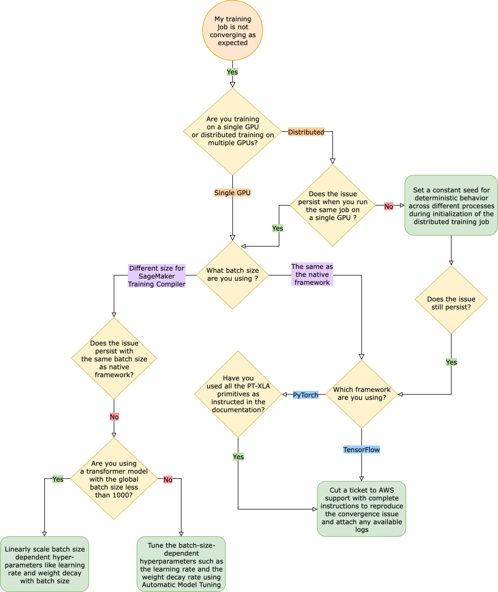

Troubleshooting
5290

## Page 320

Amazon SageMaker AI
Developer Guide

Convergence issues occurring in single-GPU training

If your convergence issue stems from single-GPU training, this is likely due to improper settings for

hyperparameters or the torch_xla APIs.

Check the hyperparameters

Training with SageMaker Training Compiler leads to change in the memory footprint of a model.
The compiler intelligently arbitrates between re-use and re-compute leading to a corresponding
increase or decrease in memory consumption. To leverage this, it is essential to re-tune the
batch size and associated hyperparameters when migrating a training job to SageMaker Training
Compiler. However, incorrect hyperparameter settings often cause oscillation in training loss and
possibly a slower convergence as a result. In rare cases, aggressive hyperparameters might result in

the model not learning (the training loss metric doesn’t decrease or returns NaN). To identify if the
convergence issue is due to the hyperparameters, do a side-by-side test of two training jobs with

and without SageMaker Training Compiler while keeping all the hyperparameters the same.

Check if the torch_xla APIs are properly set up for single-GPU training

If the convergence issue persists with the baseline hyperparameters, you need to check

if there’s any improper usage of the torch_xla APIs, specifically the ones for updating

the model. Fundamentally, torch_xla continues to accumulate instructions (deferring
execution) in the form of graph until it is explicitly instructed to run the accumulated graph.

The torch_xla.core.xla_model.mark_step() function facilitates the execution of the
accumulated graph. The graph execution should be synchronized using this function after each
model update and before printing and logging any variables. If it lacks the synchronization step,
the model might use stale values from memory during prints, logs, and the subsequent forward
passes, instead of using the most recent values that have to be synchronized after every iteration
and model update.

It can be more complicated when using SageMaker Training Compiler with gradient scaling
(possibly from the use of AMP) or gradient clipping techniques. The appropriate order of gradient
computation with AMP is as follows.

1. Gradient computation with scaling

2. Gradient un-scaling, gradient clipping, and then scaling

3. Model update

4. Synchronizing the graph execution with mark_step()

Troubleshooting
5291

## Page 321

Amazon SageMaker AI
Developer Guide

To find the right APIs for the operations mentioned in the list, see the guide for migrating your
training script to SageMaker Training Compiler.

Consider using Automatic Model Tuning

If the convergence issue arises when re-tuning the batch size and associated hyperparameters
such as the learning rate while using SageMaker Training Compiler, consider using Automatic
Model Tuning to tune your hyperparameters. You can refer to the example notebook on tuning
hyperparameters with SageMaker Training Compiler.

Convergence issues occurring in distributed training

If your convergence issue persists in distributed training, this is likely due to improper settings for

weight initialization or the torch_xla APIs.

Check weight initialization across the workers

If the convergence issue arises when running a distributed training job with multiple workers,
ensure there is a uniform deterministic behavior across all workers by setting a constant seed
where applicable. Beware of techniques such as weight initialization, which involves randomization.
Each worker might end up training a different model in the absence of a constant seed.

Check if the torch_xla APIs are properly set up for distributed training

If the issue still persists, this is likely due to improper use of the torch_xla APIs for distributed
training. Make sure that you add the following in your estimator to set up a cluster for distributed
training with SageMaker Training Compiler.

distribution={'torchxla': {'enabled': True}}

This should be accompanied by a function _mp_fn(index) in your training script, which is invoked

once per worker. Without the mp_fn(index) function, you might end up letting each of the
workers train the model independently without sharing model updates.

Next, make sure that you use the

torch_xla.distributed.parallel_loader.MpDeviceLoader API along with the
distributed data sampler, as guided in the documentation about migrating your training script to
SageMaker Training Compiler, as in the following example.

torch.utils.data.distributed.DistributedSampler()

Troubleshooting
5292

## Page 322

Amazon SageMaker AI
Developer Guide

This ensures that the input data is properly distributed across all workers.

Finally, to synchronize model updates from all workers, use

torch_xla.core.xla_model._fetch_gradients to gather gradients from all workers and

torch_xla.core.xla_model.all_reduce to combine all the gathered gradients into a single
update.

It can be more complicated when using SageMaker Training Compiler with gradient scaling
(possibly from use of AMP) or gradient clipping techniques. The appropriate order of gradient
computation with AMP is as follows.

1. Gradient computation with scaling

2. Gradient synchronization across all workers

3. Gradient un-scaling, gradient clipping, and then gradient scaling

4. Model update

5. Synchronizing the graph execution with mark_step()

Note that this checklist has an additional item for synchronizing all workers, compared to the
checklist for single-GPU training.

Training job fails due to missing PyTorch/XLA configuration

If a training job fails with the Missing XLA configuration error message, it might be due to a
misconfiguration in the number of GPUs per instance that you use.

XLA requires additional environment variables to compile the training job. The most common

missing environment variable is GPU_NUM_DEVICES. For the compiler to work properly, you must
set this environment variable equal to the number of GPUs per instance.

There are three approaches to set the GPU_NUM_DEVICES environment variable:

• Approach 1 – Use the environment argument of the SageMaker AI estimator class. For

example, if you use an ml.p3.8xlarge instance that has four GPUs, do the following:

# Using the SageMaker Python SDK's HuggingFace estimator

hf_estimator=HuggingFace(
...
instance_type="ml.p3.8xlarge",

Troubleshooting
5293

## Page 323

Amazon SageMaker AI
Developer Guide

hyperparameters={...},
environment={
...
"GPU_NUM_DEVICES": "4" # corresponds to number of GPUs on the specified
instance
},
)

• Approach 2 – Use the hyperparameters argument of the SageMaker AI estimator class and
parse it in your training script.

1. To specify the number of GPUs, add a key-value pair to the hyperparameters argument.

For example, if you use an ml.p3.8xlarge instance that has four GPUs, do the following:

# Using the SageMaker Python SDK's HuggingFace estimator

hf_estimator=HuggingFace(
...
entry_point = "train.py"
instance_type= "ml.p3.8xlarge",
hyperparameters = {
...
"n_gpus": 4 # corresponds to number of GPUs on specified instance
}
)
hf_estimator.fit()

2. In your training script, parse the n_gpus hyperparameter and specify it as an input for the

GPU_NUM_DEVICES environment variable.

# train.py
import os, argparse

if __name__ == "__main__":
parser = argparse.ArgumentParser()
...
# Data, model, and output directories
parser.add_argument("--output_data_dir", type=str,
default=os.environ["SM_OUTPUT_DATA_DIR"])
parser.add_argument("--model_dir", type=str,
default=os.environ["SM_MODEL_DIR"])
parser.add_argument("--training_dir", type=str,
default=os.environ["SM_CHANNEL_TRAIN"])

Troubleshooting
5294

## Page 324

Amazon SageMaker AI
Developer Guide

parser.add_argument("--test_dir", type=str,
default=os.environ["SM_CHANNEL_TEST"])
parser.add_argument("--n_gpus", type=str, default=os.environ["SM_NUM_GPUS"])

args, _ = parser.parse_known_args()

os.environ["GPU_NUM_DEVICES"] = args.n_gpus

• Approach 3 – Hard-code the GPU_NUM_DEVICES environment variable in your training script.
For example, add the following to your script if you use an instance that has four GPUs.

# train.py

import os
os.environ["GPU_NUM_DEVICES"] = 4

Tip

To find the number of GPU devices on machine learning instances that you want to use, see
Accelerated Computing in the Amazon EC2 Instance Types page.

SageMaker Training Compiler doesn't reduce the total training time

If the total training time does not decrease with SageMaker Training Compiler, we highly
recommend you to go over the SageMaker Training Compiler Best Practices and Considerations
page to check your training configuration, padding strategy for the input tensor shape, and
hyperparameters.

Amazon SageMaker Training Compiler Release Notes

Important

Amazon Web Services (AWS) announces that there will be no new releases or versions of
SageMaker Training Compiler. You can continue to utilize SageMaker Training Compiler
through the existing AWS Deep Learning Containers (DLCs) for SageMaker Training. It
is important to note that while the existing DLCs remain accessible, they will no longer

Release Notes
5295

## Page 325

Amazon SageMaker AI
Developer Guide

receive patches or updates from AWS, in accordance with the AWS Deep Learning
Containers Framework Support Policy.

See the following release notes to track the latest updates for Amazon SageMaker Training
Compiler.

SageMaker Training Compiler Release Notes: February 13, 2023

Currency Updates

• Added support for PyTorch v1.13.1

Bug Fixes

• Fixed a race condition issue on GPU which was causing NAN loss in some models like vision
transformer (ViT) models.

Other Changes

• SageMaker Training Compiler improves performance by letting PyTorch/
XLA to automatically override the optimizers (such as SGD, Adam, AdamW) in

torch.optim or transformers.optimization with the syncfree versions of

them in torch_xla.amp.syncfree (such as torch_xla.amp.syncfree.SGD,

torch_xla.amp.syncfree.Adam, torch_xla.amp.syncfree.AdamW). You don't need to
change those code lines where you define optimizers in your training script.

Migration to AWS Deep Learning Containers

This release passed benchmark testing and is migrated to the following AWS Deep Learning
Container:

• PyTorch v1.13.1

763104351884.dkr.ecr.us-west-2.amazonaws.com/pytorch-trcomp-training:1.13.1-gpu-py39-
cu117-ubuntu20.04-sagemaker

Release Notes
5296

## Page 326

Amazon SageMaker AI
Developer Guide

To find a complete list of the prebuilt containers with Amazon SageMaker Training Compiler, see
Supported Frameworks, AWS Regions, Instance Types, and Tested Models.

SageMaker Training Compiler Release Notes: January 9, 2023

Breaking Changes

• tf.keras.optimizers.Optimizer points to a new optimizer in TensorFlow 2.11.0 and later.

The old optimizers are moved to tf.keras.optimizers.legacy. You might encounter job
failure due to the breaking change when you do the following.

• Load checkpoints from an old optimizer. We recommend you to switch to use the legacy
optimizers.

• Use TensorFlow v1. We recommend you to migrate to TensorFlow v2, or switch to the legacy
optimizers if you need to continue using TensorFlow v1.

For more detailed list of breaking changes from the optimizer changes, see the official
TensorFlow v2.11.0 release notes in the TensorFlow GitHub repository.

Migration to AWS Deep Learning Containers

This release passed benchmark testing and is migrated to the following AWS Deep Learning
Container:

• TensorFlow v2.11.0

763104351884.dkr.ecr.<region>.amazonaws.com/tensorflow-training:2.11.0-gpu-py39-
cu112-ubuntu20.04-sagemaker

To find a complete list of the prebuilt containers with Amazon SageMaker Training Compiler, see
Supported Frameworks, AWS Regions, Instance Types, and Tested Models.

SageMaker Training Compiler Release Notes: December 8, 2022

Bug Fixes

• Fixed the seed for PyTorch training jobs starting PyTorch v1.12 to ensure that there is no
discrepancy in model initialization across different processes. See also PyTorch Reproducibility.

Release Notes
5297

## Page 327

Amazon SageMaker AI
Developer Guide

• Fixed the issue causing PyTorch distributed training jobs on G4dn and G5 instances to not default
to communication through PCIe.

Known Issues

• Improper use of PyTorch/XLA APIs in Hugging Face’s vision transformers might lead to
convergence issues.

Other Changes

• When using the Hugging Face Transformers Trainer class, make sure that you use SyncFree

optimizers by setting the optim argument to adamw_torch_xla. For more information, see

Large Language Models Using the Hugging Face Transformers Trainer Class. See also Optimizer
in the Hugging Face Transformers documentation.

Migration to AWS Deep Learning Containers

This release passed benchmark testing and is migrated to the following AWS Deep Learning
Container:

• PyTorch v1.12.0

763104351884.dkr.ecr.<region>.amazonaws.com/pytorch-trcomp-training:1.12.0-gpu-py38-
cu113-ubuntu20.04-sagemaker

To find a complete list of the prebuilt containers with Amazon SageMaker Training Compiler, see
Supported Frameworks, AWS Regions, Instance Types, and Tested Models.

SageMaker Training Compiler Release Notes: October 4, 2022

Currency Updates

• Added support for TensorFlow v2.10.0.

Release Notes
5298

## Page 328

Amazon SageMaker AI
Developer Guide

Other Changes

• Added Hugging Face NLP models using the Transformers library to TensorFlow framework tests.
To find the tested Transformer models, see the section called “Tested Models”.

Migration to AWS Deep Learning Containers

This release passed benchmark testing and is migrated to the following AWS Deep Learning
Container:

• TensorFlow v2.10.0

763104351884.dkr.ecr.<region>.amazonaws.com/tensorflow-training:2.10.0-gpu-py39-
cu112-ubuntu20.04-sagemaker

To find a complete list of the prebuilt containers with Amazon SageMaker Training Compiler, see
Supported Frameworks, AWS Regions, Instance Types, and Tested Models.

SageMaker Training Compiler Release Notes: September 1, 2022

Currency Updates

• Added support for Hugging Face Transformers v4.21.1 with PyTorch v1.11.0.

Improvements

• Implemented a new distributed training launcher mechanism to activate SageMaker Training
Compiler for Hugging Face Transformer models with PyTorch. To learn more, see Run PyTorch
Training Jobs with SageMaker Training Compiler for Distributed Training.

• Integrated with EFA to improve the collective communication in distributed training.

• Added support for G5 instances for PyTorch training jobs. For more information, see the section
called “Supported Frameworks, AWS Regions, Instance Types, and Tested Models”.

Migration to AWS Deep Learning Containers

This release passed benchmark testing and is migrated to the following AWS Deep Learning
Container:

Release Notes
5299

## Page 329

Amazon SageMaker AI
Developer Guide

• HuggingFace v4.21.1 with PyTorch v1.11.0

763104351884.dkr.ecr.us-west-2.amazonaws.com/huggingface-pytorch-trcomp-
training:1.11.0-transformers4.21.1-gpu-py38-cu113-ubuntu20.04

To find a complete list of the prebuilt containers with Amazon SageMaker Training Compiler, see
Supported Frameworks, AWS Regions, Instance Types, and Tested Models.

SageMaker Training Compiler Release Notes: June 14, 2022

New Features

• Added support for TensorFlow v2.9.1. SageMaker Training Compiler fully supports compiling

TensorFlow modules (tf.*) and TensorFlow Keras modules (tf.keras.*).

• Added support for custom containers created by extending AWS Deep Learning Containers
for TensorFlow. For more information, see Enable SageMaker Training Compiler Using the
SageMaker Python SDK and Extending SageMaker AI Framework Deep Learning Containers.

• Added support for G5 instances for TensorFlow training jobs.

Migration to AWS Deep Learning Containers

This release passed benchmark testing and is migrated to the following AWS Deep Learning
Container:

• TensorFlow 2.9.1

763104351884.dkr.ecr.<region>.amazonaws.com/tensorflow-training:2.9.1-gpu-py39-cu112-
ubuntu20.04-sagemaker

To find a complete list of the pre-built containers with Amazon SageMaker Training Compiler, see
Supported Frameworks, AWS Regions, Instance Types, and Tested Models.

SageMaker Training Compiler Release Notes: April 26, 2022

Improvements

• Added support for all of the AWS Regions where AWS Deep Learning Containers are in service
except the China regions.

Release Notes
5300

## Page 330

Amazon SageMaker AI
Developer Guide

SageMaker Training Compiler Release Notes: April 12, 2022

Currency Updates

• Added support for Hugging Face Transformers v4.17.0 with TensorFlow v2.6.3 and PyTorch

v1.10.2.

SageMaker Training Compiler Release Notes: February 21, 2022

Improvements

• Completed benchmark test and confirmed training speed-ups on the ml.g4dn instance types. To

find a complete list of tested ml instances, see Supported Instance Types.

SageMaker Training Compiler Release Notes: December 01, 2021

New Features

• Launched Amazon SageMaker Training Compiler at AWS re:Invent 2021.

Migration to AWS Deep Learning Containers

• Amazon SageMaker Training Compiler passed benchmark testing and is migrated to AWS Deep
Learning Containers. To find a complete list of the prebuilt containers with Amazon SageMaker
Training Compiler, see Supported Frameworks, AWS Regions, Instance Types, and Tested Models.

Setting up training jobs to access datasets

When creating a training job, you specify the location of training datasets in a data storage of
your choice and the data input mode for the job. Amazon SageMaker AI supports Amazon Simple
Storage Service (Amazon S3), Amazon Elastic File System (Amazon EFS), and Amazon FSx for
Lustre. You can choose one of the input modes to stream the dataset in real time or download the
whole dataset at the start of the training job.

Note

Your dataset must reside in the same AWS Region as the training job.

Setting up training jobs to access datasets
5301

## Page 331

Amazon SageMaker AI
Developer Guide

SageMaker AI input modes and AWS cloud storage options

This section provides an overview of the file input modes supported by SageMaker for data stored
in Amazon EFS and Amazon FSx for Lustre.


• File mode presents a file system view of the dataset to the training container. This is the default
input mode if you don't explicitly specify one of the other two options. If you use file mode,
SageMaker AI downloads the training data from the storage location to a local directory in the
Docker container. Training starts after the full dataset has been downloaded. In file mode, the
training instance must have enough storage space to fit the entire dataset. File mode download
speed depends on the size of dataset, the average size of files, and the number of files. You can
configure the dataset for file mode by providing either an Amazon S3 prefix, manifest file, or
augmented manifest file. You should use an S3 prefix when all your dataset files are located
within a common S3 prefix. File mode is compatible with SageMaker AI local mode (starting a
SageMaker training container interactively in seconds). For distributed training, you can shard the

dataset across multiple instances with the ShardedByS3Key option.

SageMaker AI input modes and AWS cloud storage options
5302

## Page 332

Amazon SageMaker AI
Developer Guide

• Fast file mode provides file system access to an Amazon S3 data source while leveraging the
performance advantage of pipe mode. At the start of training, fast file mode identifies the data
files but does not download them. Training can start without waiting for the entire dataset to
download. This means that the training startup takes less time when there are fewer files in the
Amazon S3 prefix provided.

In contrast to pipe mode, fast file mode works with random access to the data. However, it works
best when data is read sequentially. Fast file mode doesn't support augmented manifest files.

Fast file mode exposes S3 objects using a POSIX-compliant file system interface, as if the files
are available on the local disk of your training instance. It streams S3 content on demand as
your training script consumes data. This means that your dataset no longer needs to fit into
the training instance storage space as a whole, and you don't need to wait for the dataset
to be downloaded to the training instance before training starts. Fast file currently supports

S3 prefixes only (it does not support manifest and augmented manifest). Fast file mode is
compatible with SageMaker AI local mode.

Note

Using Fast File mode might lead to increased CloudTrail costs due to additional logging
of:

• Amazon S3 data events (if enabled in CloudTrail).

• AWS KMS decryption events when accessing Amazon S3 objects encrypted with AWS
KMS keys.

• Management events related to AWS KMS operations.
Review your CloudTrail configuration and monitoring costs if you have CloudTrail logging
enabled for these event types.

• Pipe mode streams data directly from an Amazon S3 data source. Streaming can provide faster
start times and better throughput than file mode.

When you stream the data directly, you can reduce the size of the Amazon EBS volumes used by
the training instance. Pipe mode needs only enough disk space to store the final model artifacts.

It is another streaming mode that is largely replaced by the newer and simpler-to-use fast file
mode. In pipe mode, data is pre-fetched from Amazon S3 at high concurrency and throughput,
and streamed into a named pipe, which also known as a First-In-First-Out (FIFO) pipe for its
behavior. Each pipe may only be read by a single process. A SageMaker AI specific extension

SageMaker AI input modes and AWS cloud storage options
5303

## Page 333

Amazon SageMaker AI
Developer Guide

to TensorFlow conveniently integrates Pipe mode into the native TensorFlow data loader for
streaming text, TFRecords, or RecordIO file formats. Pipe mode also supports managed sharding
and shuffling of data.

• Amazon S3 Express One Zone is a high-performance, single Availability Zone storage class
that can deliver consistent, single-digit millisecond data access for the most latency-sensitive
applications including SageMaker model training. Amazon S3 Express One Zone allows
customers to collocate their object storage and compute resources in a single AWS Availability
Zone, optimizing both compute performance and costs with increased data processing speed. To
further increase access speed and support hundreds of thousands of requests per second, data is
stored in a new bucket type, an Amazon S3 directory bucket.

SageMaker AI model training supports high-performance Amazon S3 Express One Zone directory
buckets as a data input location for file mode, fast file mode, and pipe mode. To use Amazon
S3 Express One Zone, input the location of the Amazon S3 Express One Zone directory bucket
instead of an Amazon S3 bucket. Provide the ARN for the IAM role with the required access
control and permissions policy. Refer to AmazonSageMakerFullAccesspolicy for details. You can
only encrypt your SageMaker AI output data in directory buckets with server-side encryption
with Amazon S3 managed keys (SSE-S3). Server-side encryption with AWS KMS keys (SSE-KMS)
is not currently supported for storing SageMaker AI output data in directory buckets. For more
information, see Amazon S3 Express One Zone.

• Amazon FSx for Lustre – FSx for Lustre can scale to hundreds of gigabytes of throughput and
millions of IOPS with low-latency file retrieval. When starting a training job, SageMaker AI
mounts the FSx for Lustre file system to the training instance file system, then starts your
training script. Mounting itself is a relatively fast operation that doesn't depend on the size of
the dataset stored in FSx for Lustre.

To access FSx for Lustre, your training job must connect to an Amazon Virtual Private Cloud
(VPC), which requires DevOps setup and involvement. To avoid data transfer costs, the file
system uses a single Availability Zone, and you need to specify a VPC subnet which maps to this
Availability Zone ID when running the training job.

• Amazon EFS – To use Amazon EFS as a data source, the data must already reside in Amazon EFS
prior to training. SageMaker AI mounts the specified Amazon EFS file system to the training
instance, then starts your training script. Your training job must connect to a VPC to access
Amazon EFS.

SageMaker AI input modes and AWS cloud storage options
5304

## Page 334

Amazon SageMaker AI
Developer Guide

Tip

To learn more about how to specify your VPC configuration to SageMaker AI estimators,
see Use File Systems as Training Inputs in the SageMaker AI Python SDK documentation.

Configure data input mode using the SageMaker Python SDK

SageMaker Python SDK provides the generic Estimator class and its variations for ML frameworks
for launching training jobs. You can specify one of the data input modes while configuring the

SageMaker AI Estimator class or the Estimator.fit method. The following code templates
show the two ways to specify input modes.

To specify the input mode using the Estimator class

from sagemaker.estimator import Estimator
from sagemaker.inputs import TrainingInput

estimator = Estimator(
checkpoint_s3_uri='s3://amzn-s3-demo-bucket/checkpoint-destination/',
output_path='s3://amzn-s3-demo-bucket/output-path/',
base_job_name='job-name',
input_mode='File'  # Available options: File | Pipe | FastFile
...
)

# Run the training job
estimator.fit(
inputs=TrainingInput(s3_data="s3://amzn-s3-demo-bucket/my-data/train")
)

For more information, see the sagemaker.estimator.Estimator class in the SageMaker Python SDK
documentation.

To specify the input mode through the estimator.fit() method

from sagemaker.estimator import Estimator
from sagemaker.inputs import TrainingInput

estimator = Estimator(

Configure data input mode using the SageMaker Python SDK
5305

## Page 335

Amazon SageMaker AI
Developer Guide

checkpoint_s3_uri='s3://amzn-s3-demo-bucket/checkpoint-destination/',
output_path='s3://amzn-s3-demo-bucket/output-path/',
base_job_name='job-name',
...
)

# Run the training job
estimator.fit(
inputs=TrainingInput(
s3_data="s3://amzn-s3-demo-bucket/my-data/train",
input_mode='File'  # Available options: File | Pipe | FastFile
)
)

For more information, see the sagemaker.estimator.Estimator.fit class method and the
sagemaker.inputs.TrainingInput class in the SageMaker Python SDK documentation.

Tip

To learn more about how to configure Amazon FSx for Lustre or Amazon EFS with your VPC
configuration using the SageMaker Python SDK estimators, see Use File Systems as Training
Inputs in the SageMaker AI Python SDK documentation.

Tip

The data input mode integrations with Amazon S3, Amazon EFS, and FSx for Lustre are
recommended ways to optimally configure data source for the best practices. You can
strategically improve data loading performance using the SageMaker AI managed storage
options and input modes, but it's not strictly constrained. You can write your own data
reading logic directly in your training container. For example, you can set to read from a
different data source, write your own S3 data loader class, or use third-party frameworks'
data loading functions within your training script. However, you must make sure that you
specify the right paths that SageMaker AI can recognize.

Configure data input mode using the SageMaker Python SDK
5306

## Page 336

Amazon SageMaker AI
Developer Guide

Tip

If you use a custom training container, make sure you install the SageMaker training toolkit
that helps set up the environment for SageMaker training jobs. Otherwise, you must
specify the environment variables explicitly in your Dockerfile. For more information, see
Create a container with your own algorithms and models.

For more information about how to set the data input modes using the low-level SageMaker APIs,

see How Amazon SageMaker AI Provides Training Information, the CreateTrainingJob API, and

the TrainingInputMode in AlgorithmSpecification.

Configure data input channel to use Amazon FSx for Lustre

Learn how to use Amazon FSx for Lustre as your data source for higher throughput and faster
training by reducing the time for data loading.

Note

When you use EFA-enabled instances such as P4d and P3dn, make sure that you set
appropriate inbound and output rules in the security group. Specially, opening up these
ports is necessary for SageMaker AI to access the Amazon FSx file system in the training
job. To learn more, see File System Access Control with Amazon VPC.

Sync Amazon S3 and Amazon FSx for Lustre

To link your Amazon S3 to Amazon FSx for Lustre and upload your training datasets, do the
following.

1. Prepare your dataset and upload to an Amazon S3 bucket. For example, assume that the

Amazon S3 paths for a train dataset and a test dataset are in the following format.

s3://amzn-s3-demo-bucket/data/train
s3://amzn-s3-demo-bucket/data/test

2. To create an FSx for Lustre file system linked with the Amazon S3 bucket with the training data,

follow the steps at Linking your file system to an Amazon S3 bucket in the Amazon FSx for

Configure data input channel to use Amazon FSx for Lustre
5307

## Page 337

Amazon SageMaker AI
Developer Guide

Lustre User Guide. Make sure that you add an endpoint to your VPC allowing Amazon S3 access.
For more information, see the section called “Create an Amazon S3 VPC Endpoint”. When you
specify Data repository path, provide the Amazon S3 bucket URI of the folder that contains
your datasets. For example, based on the example S3 paths in step 1, the data repository path
should be the following.

s3://amzn-s3-demo-bucket/data

3. After the FSx for Lustre file system is created, check the configuration information by running

the following commands.

aws fsx describe-file-systems && \
aws fsx describe-data-repository-association

These commands return FileSystemId, MountName, FileSystemPath, and

DataRepositoryPath. For example, the outputs should look like the following.

# Output of aws fsx describe-file-systems
"FileSystemId": "fs-0123456789abcdef0"
"MountName": "1234abcd"

# Output of aws fsx describe-data-repository-association
"FileSystemPath": "/ns1",
"DataRepositoryPath": "s3://amzn-s3-demo-bucket/data/"

After the sync between Amazon S3 and Amazon FSx has completed, your datasets are saved in
Amazon FSx in the following directories.

/ns1/train  # synced with s3://amzn-s3-demo-bucket/data/train
/ns1/test   # synced with s3://amzn-s3-demo-bucket/data/test

Set the Amazon FSx file system path as the data input channel for SageMaker
training

The following procedures walk you through the process of setting the Amazon FSx file system as
the data source for SageMaker training jobs.

Configure data input channel to use Amazon FSx for Lustre
5308

## Page 338

Amazon SageMaker AI
Developer Guide

Using the SageMaker Python SDK

To properly set the Amazon FSx file system as the data source, configure the SageMaker AI

estimator classes and FileSystemInput using the following instruction.

1. Configure a FileSystemInput class object.

from sagemaker.inputs import FileSystemInput

train_fs = FileSystemInput(
file_system_id="fs-0123456789abcdef0",
file_system_type="FSxLustre",
directory_path="/1234abcd/ns1/",
file_system_access_mode="ro",
)

Tip

When you specify directory_path, make sure that you provide the Amazon FSx file

system path starting with MountName.

2. Configure a SageMaker AI estimator with the VPC configuration used for the Amazon FSx file

system.

from sagemaker.estimator import Estimator

estimator = Estimator(
...
role="your-iam-role-with-access-to-your-fsx",
subnets=["subnet-id"],  # Should be the same as the subnet used for Amazon FSx
security_group_ids="security-group-id"
)

Make sure that the IAM role for the SageMaker training job has the permissions to access and
read from Amazon FSx.

3. Launch the training job by running the estimator.fit method with the Amazon FSx file system.

estimator.fit(train_fs)

Configure data input channel to use Amazon FSx for Lustre
5309

## Page 339

Amazon SageMaker AI
Developer Guide

To find more code examples, see Use File Systems as Training Inputs in the SageMaker Python
SDK documentation.

Using the SageMaker AI CreateTrainingJob API

As part of the CreateTrainingJob request JSON, configure InputDataConfig as follows.

"InputDataConfig": [
{
"ChannelName": "string",
"DataSource": {
"FileSystemDataSource": {
"DirectoryPath": "/1234abcd/ns1/",
"FileSystemAccessMode": "ro",
"FileSystemId": "fs-0123456789abcdef0",
"FileSystemType": "FSxLustre"

}
}
}
],

Tip

When you specify DirectoryPath, make sure that you provide the Amazon FSx file

system path starting with MountName.

Choosing an input mode and a storage unit

The best data source for your training job depends on workload characteristics such as the size
of the dataset, the file format, the average size of files, the training duration, a sequential or
random data loader read pattern, and how fast your model can consume the training data. The
following best practices provide guidelines to get started with the most suitable input mode and
data storage service for your use case.

Choosing an input mode and a storage unit
5310

## Page 340

Amazon SageMaker AI
Developer Guide

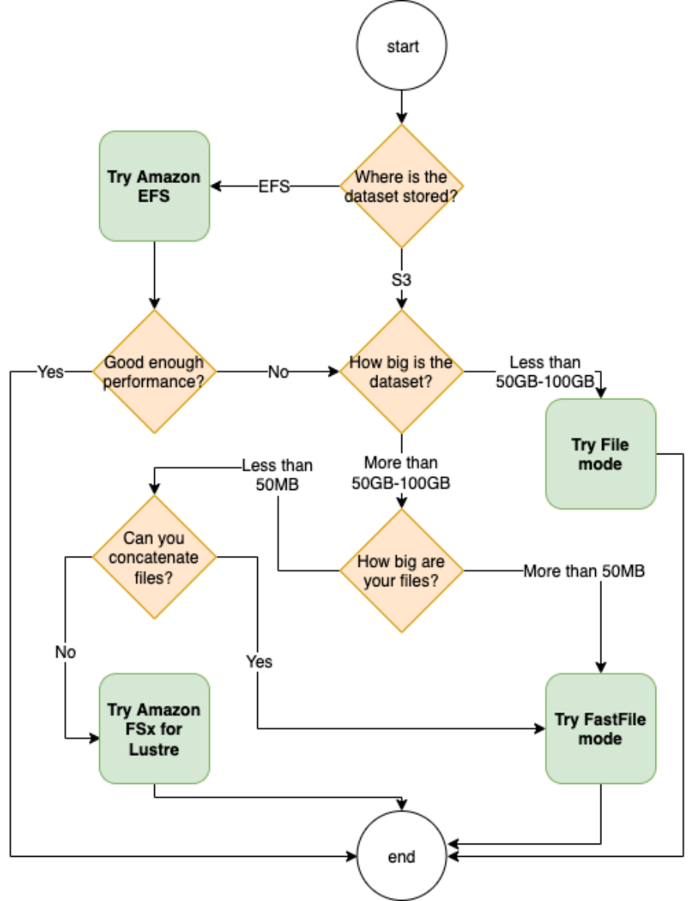

When to use Amazon EFS

If your dataset is stored in Amazon Elastic File System, you might have a preprocessing or
annotations application that uses Amazon EFS for storage. You can run a training job configured
with a data channel that points to the Amazon EFS file system. For more information, see Speed up
training on Amazon SageMaker AI using Amazon FSx for Lustre and Amazon EFS file systems. If you
cannot achieve better performance, check your optimization options following the Amazon Elastic
File System performance guide or consider using different input modes or data storage.

Choosing an input mode and a storage unit
5311

## Page 341

Amazon SageMaker AI
Developer Guide

Use file mode for small datasets

If the dataset is stored in Amazon Simple Storage Service and its overall volume is relatively small
(for example, less than 50-100 GB), try using file mode. The overhead of downloading a 50 GB
dataset can vary based on the total number of files. For example, it takes about 5 minutes if a

dataset is chunked into 100 MB shards. Whether this startup overhead is acceptable primarily
depends on the overall duration of your training job, because a longer training phase means a
proportionally smaller download phase.

Serializing many small files

If your dataset size is small (less than 50-100 GB), but is made up of many small files (less than 50
MB per file), the file mode download overhead grows, because each file needs to be downloaded
individually from Amazon Simple Storage Service to the training instance volume. To reduce this
overhead and data traversal time in general, consider serializing groups of such small files into
fewer larger file containers (such as 150 MB per file) by using file formats, such as TFRecord for
TensorFlow,  WebDataset for PyTorch, and RecordIO for MXNet.

When to use fast file mode

For larger datasets with larger files (more than 50 MB per file), the first option is to try fast file
mode, which is more straightforward to use than FSx for Lustre because it doesn't require creating
a file system, or connecting to a VPC. Fast file mode is ideal for large file containers (more than 150
MB), and might also do well with files more than 50 MB. Because fast file mode provides a POSIX
interface, it supports random reads (reading non-sequential byte-ranges). However, this is not the
ideal use case, and your throughput might be lower than with the sequential reads. However, if
you have a relatively large and computationally intensive ML model, fast file mode might still be
able to saturate the effective bandwidth of the training pipeline and not result in an IO bottleneck.
You'll need to experiment and see. To switch from file mode to fast file mode (and back), just add

(or remove) the input_mode='FastFile' parameter while defining your input channel using the
SageMaker Python SDK:

sagemaker.inputs.TrainingInput(S3_INPUT_FOLDER,  input_mode = 'FastFile')

When to use Amazon FSx for Lustre

If your dataset is too large for file mode, has many small files that you can't serialize easily, or uses
a random read access pattern, FSx for Lustre is a good option to consider. Its file system scales
to hundreds of gigabytes per second (GB/s) of throughput and millions of IOPS, which is ideal

Choosing an input mode and a storage unit
5312

## Page 342

Amazon SageMaker AI
Developer Guide

when you have many small files. However, note that there might be the cold start issue due to lazy
loading and the overhead of setting up and initializing the FSx for Lustre file system.

Tip

To learn more, see Choose the best data source for your Amazon SageMaker training
job. This AWS machine learning blog further discusses case studies and performance
benchmark of data sources and input modes.

Use attribute-based access control (ABAC) for multi-tenancy training

In a multi-tenant environment, it is crucial to ensure that each tenant's data is isolated and
accessible only to authorized entities. SageMaker AI supports the use of attribute-based access

control (ABAC) to achieve this isolation for training jobs. Instead of creating multiple IAM roles
for each tenant, you can use the same IAM role for all tenants by configuring a session chaining
configuration that uses AWS Security Token Service (AWS STS) session tags to request temporary,
limited-privilege credentials for your training job to access specific tenants. For more information
about session tags, see Passing session tags in AWS STS.

When creating a training job, your session chaining configuration uses AWS STS to request
temporary security credentials. This request generates a session, which is tagged. Each SageMaker
training job can only access a specific tenant using a single role shared by all training jobs. By
implementing ABAC with session chaining, you can ensure that each training job has access only
to the tenant specified by the session tag, effectively isolating and securing each tenant. The
following section guides you through the steps to set up and use ABAC for multi-tenant training
job isolation using the SageMaker Python SDK.

Prerequisites

To get started with ABAC for multi-tenant training job isolation, you must have the following:

• Tenants with consistent naming across locations. For example, if an input data Amazon S3 URI

for a tenant is s3://your-input-s3-bucket/example-tenant, the Amazon FSx directory

for that same tenant should be /fsx-train/train/example-tenant and the output data

Amazon S3 URI should be s3://your-output-s3-bucket/example-tenant.

• A SageMaker AI job creation role. You can create a SageMaker AI job creation role using Amazon
SageMaker AI Role Manager. For information, see Using the role manager.

Use attribute-based access control (ABAC) for multi-tenancy training
5313

## Page 343

Amazon SageMaker AI
Developer Guide

• A SageMaker AI execution role that has sts:AssumeRole, and sts:TagSession permissions in
its trust policy. For more information on SageMaker AI execution roles, see SageMaker AI Roles.

The execution role should also have a policy that allows tenants in any attribute-based multi-

tenancy architecture to read from the prefix attached to a principal tag. The following is an
example policy that limits the SageMaker AI execution role to have access to the value associated

with the tenant-id key. For more information on naming tag keys, see Rules for tagging in IAM
and STS.

JSON

{
"Version":"2012-10-17",
"Statement": [
{

"Action": [
"s3:GetObject",
"s3:PutObject"
],
"Resource": [
"arn:aws:s3:::your-input-s3-bucket/${aws:PrincipalTag/tenant-
id}/*"
],
"Effect": "Allow"
},
{
"Action": [
"s3:PutObject"
],
"Resource": "arn:aws:s3:::your-output-s3-bucket/
${aws:PrincipalTag/tenant-id}/*",
"Effect": "Allow"
},
{
"Action": "s3:ListBucket",
"Resource": "*",
"Effect": "Allow"
}
]
}

Use attribute-based access control (ABAC) for multi-tenancy training
5314

## Page 344

Amazon SageMaker AI
Developer Guide

Create a training job with session tag chaining enabled

The following procedure shows you how to create a training job with session tag chaining using the
SageMaker Python SDK for ABAC-enabled multi-tenancy training.

Note

In addition to multi-tenancy data storage, you can also use the ABAC workflow to pass
session tags to your execution role for Amazon VPC, AWS Key Management Service, and
any other services you allow SageMaker AI to call

Enable session tag chaining for ABAC

1.
Import boto3 and the SageMaker Python SDK. ABAC-enabled training job isolation is only
available in version 2.217 or later of the SageMaker AI Python SDK.

import boto3
import sagemaker

from sagemaker.estimator import Estimator
from sagemaker.inputs import TrainingInput

2.
Set up an AWS STS and SageMaker AI client to use the tenant-labeled session tags. You can
change the tag value to specify a different tenant.

# Start an AWS STS client
sts_client = boto3.client('sts')

# Define your tenants using tags
# The session tag key must match the principal tag key in your execution role
policy
tags = []
tag = {}
tag['Key'] = "tenant-id"
tag['Value'] = "example-tenant"
tags.append(tag)

# Have AWS STS assume your ABAC-enabled job creation role
response = sts_client.assume_role(
RoleArn="arn:aws:iam::<account-id>:role/<your-training-job-creation-role>",
RoleSessionName="SessionName",

Use attribute-based access control (ABAC) for multi-tenancy training
5315

## Page 345

Amazon SageMaker AI
Developer Guide

Tags=tags)
credentials = response['Credentials']

# Create a client with your job creation role (which was assumed with tags)
sagemaker_client = boto3.client(
'sagemaker',
aws_access_key_id=credentials['AccessKeyId'],
aws_secret_access_key=credentials['SecretAccessKey'],
aws_session_token=credentials['SessionToken']
)
sagemaker_session = sagemaker.Session(sagemaker_client=sagemaker_client)

When appending the tags "tenant-id=example-tenant" to the job creation role, these
tags are extracted by the execution role to use the following policy:

JSON

{
"Version":"2012-10-17",
"Statement": [
{
"Action": [
"s3:GetObject",
"s3:PutObject"
],
"Resource": [
"arn:aws:s3:::your-input-s3-bucket/example-tenant/*"
],
"Effect": "Allow"
},
{
"Action": [
"s3:PutObject"
],
"Resource": "arn:aws:s3:::your-output-s3-bucket/example-tenant/
*",
"Effect": "Allow"
},
{
"Action": "s3:ListBucket",
"Resource": "*",
"Effect": "Allow"

Use attribute-based access control (ABAC) for multi-tenancy training
5316

## Page 346

Amazon SageMaker AI
Developer Guide

}
]
}

3.
Define an estimator to create a training job using the SageMaker Python SDK. Set

enable_session_tag_chaining to True to allow your SageMaker AI training execution
role to retrieve the tags from your job creation role.

# Specify your training input
trainingInput = TrainingInput(
s3_data='s3://<your-input-bucket>/example-tenant',
distribution='ShardedByS3Key',
s3_data_type='S3Prefix'
)

# Specify your training job execution role
execution_role_arn = "arn:aws:iam::<account-id>:role/<your-training-job-execution-
role>"

# Define your esimator with session tag chaining enabled
estimator = Estimator(
image_uri="<your-training-image-uri>",
role=execution_role_arn,
instance_count=1,
instance_type='ml.m4.xlarge',
volume_size=20,
max_run=3600,
sagemaker_session=sagemaker_session,
output_path="s3://<your-output-bucket>/example-tenant",
enable_session_tag_chaining=True
)

estimator.fit(inputs=trainingInput, job_name="abac-demo")

SageMaker AI can only read tags provided in the training job request and does not add any tags to
resources on your behalf.

ABAC for SageMaker training is compatible with SageMaker AI managed warm pools. To use ABAC
with warm pools, matching training jobs must have identical session tags. For more information,
see the section called “Matching training jobs”.

Use attribute-based access control (ABAC) for multi-tenancy training
5317

## Page 347

Amazon SageMaker AI
Developer Guide

Mapping of training storage paths managed by Amazon
SageMaker AI

This page provides a high-level summary of how the SageMaker training platform manages
storage paths for training datasets, model artifacts, checkpoints, and outputs between AWS cloud
storage and training jobs in SageMaker AI. Throughout this guide, you learn to identify the default

paths set by the SageMaker AI platform and how the data channels can be streamlined with your
data sources in Amazon Simple Storage Service (Amazon S3), FSx for Lustre, and Amazon EFS. For
more information about various data channel input modes and storage options, see Setting up
training jobs to access datasets.

Overview of how SageMaker AI maps storage paths

The following diagram shows an example of how SageMaker AI maps input and output paths when
you run a training job using the SageMaker Python SDK Estimator class.


SageMaker AI maps storage paths between a storage (such as Amazon S3, Amazon FSx, and
Amazon EFS) and the SageMaker training container based on the paths and input mode specified

Mapping of training storage paths
5318

## Page 348

Amazon SageMaker AI
Developer Guide

through a SageMaker AI estimator object. More information about how SageMaker AI reads
from or writes to the paths and the purpose of the paths, see the section called “SageMaker AI
environment variables and the default paths for training storage locations”.

You can use OutputDataConfig in the CreateTrainingJob API to save the results of model

training to an S3 bucket. Use the ModelArtifacts API to find the S3 bucket that contains your model
artifacts. See the abalone_build_train_deploy notebook for an example of output paths and how
they are used in API calls.

For more information and examples of how SageMaker AI manages data source, input modes, and
local paths in SageMaker training instances, see Access Training Data.

Topics

• Uncompressed model output

• Managing storage paths for different types of instance local storage

• SageMaker AI environment variables and the default paths for training storage locations

Uncompressed model output

SageMaker AI stores your model in /opt/ml/model and your data in /opt/ml/output/data.
After the model and data are written to those locations, they're uploaded to your Amazon S3
bucket as compressed files by default.

You can save time on large data file compression by uploading model and data outputs to your S3
bucket as uncompressed files. To do this, create a training job in uncompressed upload mode by
using either the AWS Command Line Interface (AWS CLI) or the SageMaker Python SDK.

The following code example shows how to create a training job in uncompressed upload mode

when using the AWS CLI. To enable uncompressed upload mode, set CompressionType field in

the OutputDataConfig API to NONE.

{
"TrainingJobName": "uncompressed_model_upload",
...
"OutputDataConfig": {
"S3OutputPath": "s3://amzn-s3-demo-bucket/uncompressed_upload/output",
"CompressionType": "NONE"
},

Uncompressed model output
5319

## Page 349

Amazon SageMaker AI
Developer Guide

...
}

The following code example shows you how to create a training job in uncompressed upload mode
using the SageMaker Python SDK.

import sagemaker
from sagemaker.estimator import Estimator

estimator = Estimator(
image_uri="your-own-image-uri",
role=sagemaker.get_execution_role(),
sagemaker_session=sagemaker.Session(),
instance_count=1,
instance_type='ml.c4.xlarge',
disable_output_compression=True
)

Managing storage paths for different types of instance local storage

Consider the following when setting up storage paths for training jobs in SageMaker AI.

• If you want to store training artifacts for distributed training in the /opt/ml/output/data
directory, you must properly append subdirectories or use unique file names for the artifacts
through your model definition or training script. If the subdirectories and file names are not
properly configured, all of the distributed training workers might write outputs to the same file
name in the same output path in Amazon S3.

• If you use a custom training container, make sure you install the SageMaker Training Toolkit
that helps set up the environment for SageMaker training jobs. Otherwise, you must specify the
environment variables explicitly in your Dockerfile. For more information, see Create a container
with your own algorithms and models.

• When using an ML instance with NVMe SSD volumes, SageMaker AI doesn't provision Amazon
EBS gp2 storage. Available storage is fixed to the NVMe-type instance's storage capacity.
SageMaker AI configures storage paths for training datasets, checkpoints, model artifacts, and
outputs to use the entire capacity of the instance storage. For example, ML instance families

with the NVMe-type instance storage include ml.p4d, ml.g4dn, and ml.g5. When using an ML
instance with the EBS-only storage option and without instance storage, you must define the

size of EBS volume through the volume_size parameter in the SageMaker AI estimator class (or

VolumeSizeInGB if you are using the ResourceConfig API). For example, ML instance families

Managing storage paths for different types of instance local storage
5320

## Page 350

Amazon SageMaker AI
Developer Guide

that use EBS volumes include ml.c5 and ml.p2. To look up instance types and their instance
storage types and volumes, see Amazon EC2 Instance Types.

• The default paths for SageMaker training jobs are mounted to Amazon EBS volumes or

NVMe SSD volumes of the ML instance. When you adapt your training script to SageMaker AI,
make sure that you use the default paths listed in the previous topic about the section called
“SageMaker AI environment variables and the default paths for training storage locations”. We

recommend that you use the /tmp directory as a scratch space for temporarily storing any large
objects during training. This means that you must not use directories that are mounted to small

disk space allocated for system, such as /user and /home, to avoid out-of-space errors.

To learn more, see the AWS machine learning blog Choose the best data source for your Amazon
SageMaker training job that further discusses case studies and performance benchmarks of data
sources and input modes.

SageMaker AI environment variables and the default paths for training
storage locations

The following table summarizes the input and output paths for training datasets, checkpoints,
model artifacts, and outputs, managed by the SageMaker training platform.

Local
path in
SageMaker
training
instance

SageMaker
AI
environme
nt
variable

Purpose
Read
from S3
during
start

Read
from S3
during
Spot-
restart

Writes
to S3
during
training

Writes to
S3 when
job is
terminate
d

SM_CHANNE

Reading training
data from the
input channels
specified through
the SageMaker
AI Python SDK
Estimator class or the
CreateTrainingJob
API operation. For
more information

Yes
Yes
No
No

/opt/

L_CHANNEL_N

ml/i

AME

nput/

data

/ channel_n

ame
1

SageMaker AI environment variables and the default paths for training storage locations
5321

## Page 351

Amazon SageMaker AI
Developer Guide

Local
path in
SageMaker
training
instance

SageMaker
AI
environme
nt
variable

Purpose
Read
from S3
during
start

Read
from S3
during
Spot-
restart

Writes
to S3
during
training

Writes to
S3 when
job is
terminate
d

about how to specify
it in your training
script using the
SageMaker Python
SDK, see Prepare a
Training script.

SM_OUTPUT
_DIR

Saving outputs such
as loss, accuracy,
intermediate layers,
weights, gradients,
bias, and TensorBoa
rd-compatible
outputs. You can also
save any arbitrary
output you’d like
using this path. Note
that this is a different
path from the one
for storing the final

No
No
No
Yes

/opt/

ml/o

utput/

data
2

model artifact /opt/

ml/model/ .

SageMaker AI environment variables and the default paths for training storage locations
5322

## Page 352

Amazon SageMaker AI
Developer Guide

Local
path in
SageMaker
training
instance

SageMaker
AI
environme
nt
variable

Purpose
Read
from S3
during
start

Read
from S3
during
Spot-
restart

Writes
to S3
during
training

Writes to
S3 when
job is
terminate
d

SM_MODEL_
DIR

Storing the final
model artifact. This
is also the path
from where the
model artifact is
deployed for Real-
time inference
in SageMaker AI
Hosting.

No
No
No
Yes

/opt/

ml/m

odel
3

-
Saving model
checkpoints (the
state of model) to
resume training
from a certain
point, and recover
from unexpected
or Managed Spot
Training interrupt
ions.

Yes
Yes
Yes
No

/opt/

ml/c

heckpoint

s
4

SAGEMAKER
_SUBMIT_D
IRECTORY

Copying training
scripts, additiona
l libraries, and
dependencies.

Yes
Yes
No
No

/opt/

ml/c

ode

/tmp
-
Reading or writing

No
No
No
No

to /tmp as a scratch
space.

SageMaker AI environment variables and the default paths for training storage locations
5323

## Page 353

Amazon SageMaker AI
Developer Guide

1 channel_name is the place to specify user-defined channel names for training data inputs.
Each training job can contain several data input channels. You can specify up to 20 training input
channels per training job. Note that the data downloading time from the data channels is counted
to the billable time. For more information about data input paths, see How Amazon SageMaker AI
Provides Training Information. Also, there are three types of data input modes that SageMaker AI
supports: file, FastFile, and pipe mode. To learn more about the data input modes for training in
SageMaker AI, see Access Training Data.

2 SageMaker AI compresses and writes training artifacts to TAR files (tar.gz). Compression and
uploading time is counted to the billable time. For more information, see How Amazon SageMaker
AI Processes Training Output.

3 SageMaker AI compresses and writes the final model artifact to a TAR file (tar.gz). Compression
and uploading time is counted to the billable time. For more information, see How Amazon
SageMaker AI Processes Training Output.

4 Sync with Amazon S3 during training. Write as is without compressing to TAR files. For more
information, see Use Checkpoints in Amazon SageMaker AI.

Running training jobs on a heterogeneous cluster

Using the heterogeneous cluster feature of SageMaker Training, you can run a training job with
multiple types of ML instances for a better resource scaling and utilization for different ML training
tasks and purposes. For example, if your training job on a cluster with GPU instances suffers low
GPU utilization and CPU bottleneck problems due to CPU-intensive tasks, using a heterogeneous
cluster can help offload CPU-intensive tasks by adding more cost-efficient CPU instance groups,
resolve such bottleneck problems, and achieve a better GPU utilization.

Note

This feature is available in the SageMaker Python SDK v2.98.0 and later.

Note

This feature is available through the SageMaker AI PyTorch and TensorFlow framework
estimator classes. Supported frameworks are PyTorch v1.10 or later and TensorFlow v2.6 or
later.

Heterogeneous clusters
5324

## Page 354

Amazon SageMaker AI
Developer Guide

See also the blog Improve price performance of your model training using Amazon SageMaker AI
heterogeneous clusters.

Topics

• Configure a training job with a heterogeneous cluster in Amazon SageMaker AI

• Run distributed training on a heterogeneous cluster in Amazon SageMaker AI

• Modify your training script to assign instance groups

Configure a training job with a heterogeneous cluster in Amazon
SageMaker AI

This section provides instructions on how to run a training job using a heterogeneous cluster that
consists of multiple instance types.

Note the following before you start.

• All instance groups share the same Docker image and training script. Therefore, your training
script should be modified to detect which instance group it belongs to and fork execution
accordingly.

• The heterogeneous cluster feature is not compatable with SageMaker AI local mode.

• The Amazon CloudWatch log streams of a heterogeneous cluster training job are not grouped by
instance groups. You need to figure out from the logs which nodes are in which group.

Topics

• Option 1: Using the SageMaker Python SDK

• Option 2: Using the low-level SageMaker APIs

Option 1: Using the SageMaker Python SDK

Follow instructions on how to configure instance groups for a heterogeneous cluster using the
SageMaker Python SDK.

1. To configure instance groups of a heterogeneous cluster for a training job, use the

sagemaker.instance_group.InstanceGroup class. You can specify a custom name for
each instance group, the instance type, and the number of instances for each instance group.

Configure a training job with a heterogeneous cluster in Amazon SageMaker AI
5325

## Page 355

Amazon SageMaker AI
Developer Guide

For more information, see sagemaker.instance_group.InstanceGroup in the SageMaker AI Python
SDK documentation.

Note

For more information about available instance types and the maximum number
of instance groups that you can configure in a heterogeneous cluster, see the
InstanceGroup API reference.

The following code example shows how to set up two instance groups that consists

of two ml.c5.18xlarge CPU-only instances named instance_group_1 and one

ml.p3dn.24xlarge GPU instance named instance_group_2, as shown in the following
diagram.


The preceding diagram shows a conceptual example of how pre-training processes, such as data
preprocessing, can be assigned to the CPU instance group and stream the preprocessed data to
the GPU instance group.

from sagemaker.instance_group import InstanceGroup

instance_group_1 = InstanceGroup(
"instance_group_1", "ml.c5.18xlarge", 2
)
instance_group_2 = InstanceGroup(
"instance_group_2", "ml.p3dn.24xlarge", 1
)

Configure a training job with a heterogeneous cluster in Amazon SageMaker AI
5326

## Page 356

Amazon SageMaker AI
Developer Guide

2. Using the instance group objects, set up training input channels and assign instance

groups to the channels through the instance_group_names argument of the

sagemaker.inputs.TrainingInput class. The instance_group_names argument accepts a list of
strings of instance group names.

The following example shows how to set two training input channels and assign the instance
groups created in the example of the previous step. You can also specify Amazon S3 bucket

paths to the s3_data argument for the instance groups to process data for your usage
purposes.

from sagemaker.inputs import TrainingInput

training_input_channel_1 = TrainingInput(
s3_data_type='S3Prefix', # Available Options: S3Prefix | ManifestFile |
AugmentedManifestFile
s3_data='s3://your-training-data-storage/folder1',
distribution='FullyReplicated', # Available Options: FullyReplicated |
ShardedByS3Key
input_mode='File', # Available Options: File | Pipe | FastFile
instance_groups=["instance_group_1"]
)

training_input_channel_2 = TrainingInput(
s3_data_type='S3Prefix',
s3_data='s3://your-training-data-storage/folder2',
distribution='FullyReplicated',
input_mode='File',
instance_groups=["instance_group_2"]
)

For more information about the arguments of TrainingInput, see the following links.

• The sagemaker.inputs.TrainingInput class in the SageMaker Python SDK documentation

• The S3DataSource API in the SageMaker AI API Reference

3. Configure a SageMaker AI estimator with the instance_groups argument as shown in the

following code example. The instance_groups argument accepts a list of InstanceGroup
objects.

Configure a training job with a heterogeneous cluster in Amazon SageMaker AI
5327

## Page 357

Amazon SageMaker AI
Developer Guide

Note

The heterogeneous cluster feature is available through the SageMaker AI PyTorch and
TensorFlow framework estimator classes. Supported frameworks are PyTorch v1.10
or later and TensorFlow v2.6 or later. To find a complete list of available framework
containers, framework versions, and Python versions, see SageMaker AI Framework
Containers in the AWS Deep Learning Container GitHub repository.

PyTorch

from sagemaker.pytorch import PyTorch

estimator = PyTorch(
...
entry_point='my-training-script.py',
framework_version='x.y.z',    # 1.10.0 or later
py_version='pyxy',
job_name='my-training-job-with-heterogeneous-cluster',
instance_groups=[instance_group_1, instance_group_2]
)

TensorFlow

from sagemaker.tensorflow import TensorFlow

estimator = TensorFlow(
...
entry_point='my-training-script.py',
framework_version='x.y.z', # 2.6.0 or later
py_version='pyxy',
job_name='my-training-job-with-heterogeneous-cluster',
instance_groups=[instance_group_1, instance_group_2]
)

Note

The instance_type and instance_count argument pair and the instance_groups
argument of the SageMaker AI estimator class are mutually exclusive. For homogeneous

Configure a training job with a heterogeneous cluster in Amazon SageMaker AI
5328

## Page 358

Amazon SageMaker AI
Developer Guide

cluster training, use the instance_type and instance_count argument pair. For

heterogeneous cluster training, use instance_groups.

Note

To find a complete list of available framework containers, framework versions, and
Python versions, see SageMaker AI Framework Containers in the AWS Deep Learning
Container GitHub repository.

4. Configure the estimator.fit method with the training input channels configured with the

instance groups and start the training job.

estimator.fit(
inputs={
'training': training_input_channel_1,
'dummy-input-channel': training_input_channel_2
}
)

Option 2: Using the low-level SageMaker APIs

If you use the AWS Command Line Interface or AWS SDK for Python (Boto3) and want to use low-
level SageMaker APIs for submitting a training job request with a heterogeneous cluster, see the
following API references.

• CreateTrainingJob

• ResourceConfig

• InstanceGroup

• S3DataSource

Configure a training job with a heterogeneous cluster in Amazon SageMaker AI
5329

## Page 359

Amazon SageMaker AI
Developer Guide

Run distributed training on a heterogeneous cluster in Amazon
SageMaker AI

Through the distribution argument of the SageMaker AI estimator class, you can assign
a specific instance group to run distributed training. For example, assume that you have the
following two instance groups and want to run multi-GPU training on one of them.

from sagemaker.instance_group import InstanceGroup

instance_group_1 = InstanceGroup("instance_group_1", "ml.c5.18xlarge", 1)
instance_group_2 = InstanceGroup("instance_group_2", "ml.p3dn.24xlarge", 2)

You can set the distributed training configuration for one of the instance groups. For example, the

following code examples show how to assign training_group_2 with two ml.p3dn.24xlarge
instances to the distributed training configuration.

Note

Currently, only one instance group of a heterogeneous cluster can be specified to the
distribution configuration.

With MPI

PyTorch

from sagemaker.pytorch import PyTorch

estimator = PyTorch(
...
instance_groups=[instance_group_1, instance_group_2],
distribution={
"mpi": {
"enabled": True, "processes_per_host": 8
},
"instance_groups": [instance_group_2]
}
)

Run distributed training on a heterogeneous cluster in Amazon SageMaker AI
5330

## Page 360

Amazon SageMaker AI
Developer Guide

TensorFlow

from sagemaker.tensorflow import TensorFlow

estimator = TensorFlow(
...
instance_groups=[instance_group_1, instance_group_2],
distribution={
"mpi": {
"enabled": True, "processes_per_host": 8
},
"instance_groups": [instance_group_2]
}
)

With the SageMaker AI data parallel library

PyTorch

from sagemaker.pytorch import PyTorch

estimator = PyTorch(
...
instance_groups=[instance_group_1, instance_group_2],
distribution={
"smdistributed": {
"dataparallel": {
"enabled": True
}
},
"instance_groups": [instance_group_2]
}
)

TensorFlow

from sagemaker.tensorflow import TensorFlow

estimator = TensorFlow(
...
instance_groups=[instance_group_1, instance_group_2],
distribution={

Run distributed training on a heterogeneous cluster in Amazon SageMaker AI
5331

## Page 361

Amazon SageMaker AI
Developer Guide

"smdistributed": {
"dataparallel": {
"enabled": True
}
},
"instance_groups": [instance_group_2]
}
)

Note

When using the SageMaker AI data parallel library, make sure the instance group consists of
the supported instance types by the library.

For more information about the SageMaker AI data parallel library, see SageMaker AI Data Parallel
Training.

With the SageMaker AI model parallel library

PyTorch

from sagemaker.pytorch import PyTorch

estimator = PyTorch(
...
instance_groups=[instance_group_1, instance_group_2],
distribution={
"smdistributed": {
"modelparallel": {
"enabled":True,
"parameters": {
...   # SageMaker AI model parallel parameters
}
}
},
"instance_groups": [instance_group_2]
}
)

Run distributed training on a heterogeneous cluster in Amazon SageMaker AI
5332

## Page 362

Amazon SageMaker AI
Developer Guide

TensorFlow

from sagemaker.tensorflow import TensorFlow

estimator = TensorFlow(
...
instance_groups=[instance_group_1, instance_group_2],
distribution={
"smdistributed": {
"modelparallel": {
"enabled":True,
"parameters": {
...   # SageMaker AI model parallel parameters
}
}
},

"instance_groups": [instance_group_2]
}
)

For more information about the SageMaker AI model parallel library, see SageMaker AI Model
Parallel Training.

Modify your training script to assign instance groups

With the heterogeneous cluster configuration in the previous sections, you have prepared the
SageMaker training environment and instances for your training job. To further assign the instance
groups to certain training and data processing tasks, the next step is to modify your training script.
By default, the training job simply makes training script replicas for all nodes regardless the size of
the instance, and this might lead to performance loss.

For example, if you mix CPU instances and GPU instances in a heterogeneous cluster while

passing a deep neural network training script to the entry_point argument of the SageMaker AI

estimator, the entry_point script is replicated to each instance. This means that, without proper
task assignments, CPU instances also run the entire script and start the training job that’s designed
for distributed training on GPU instances. Therefore, you must make changes in specific processing
functions that you want to offload and run on the CPU instances. You can use the SageMaker AI
environment variables to retrieve the information of the heterogeneous cluster and let specific
processes to run accordingly.

Modify your training script to assign instance groups
5333

## Page 363

Amazon SageMaker AI
Developer Guide

When your training job starts, your training script reads SageMaker training environment
information that includes heterogeneous cluster configuration. The configuration contains
information such as the current instance groups, the current hosts in each group, and in which
group the current host resides.

You can query instance group information during the initialization phase of a SageMaker AI
training job in the following ways.

(Recommended) Reading instance group information with the SageMaker training toolkit

Use the environment Python module that the SageMaker training toolkit library provides. The
toolkit library is preinstalled in the SageMaker framework containers for TensorFlow and PyTorch,
so you don’t need an additional installation step when using the prebuilt containers. This is the
recommended way to retrieve the SageMaker AI environment variables with fewer code changes in
your training script.

from sagemaker_training import environment

env = environment.Environment()

Environment variables related to general SageMaker training and heterogeneous clusters:

• env.is_hetero – Returns a Boolean result whether a heterogeneous cluster is configured or
not.

• env.current_host – Returns the current host.

• env.current_instance_type – Returns the type of instance of the current host.

• env.current_instance_group – Returns the name of the current instance group.

• env.current_instance_group_hosts – Returns a list of hosts in current instance group.

• env.instance_groups – Returns a list of instance group names used for training.

• env.instance_groups_dict – Returns the entire heterogeneous cluster configuration of the
training job.

• env.distribution_instance_groups – Returns a list of instance groups assigned to the

distribution parameter of the SageMaker AI estimator class.

• env.distribution_hosts – Returns a list of hosts belonging to the instance groups assigned

to the distribution parameter of the SageMaker AI estimator class.

Modify your training script to assign instance groups
5334

## Page 364

Amazon SageMaker AI
Developer Guide

For example, consider the following example of a heterogeneous cluster that consists of two
instance groups.

from sagemaker.instance_group import InstanceGroup

instance_group_1 = InstanceGroup(
"instance_group_1", "ml.c5.18xlarge", 1)
instance_group_2 = InstanceGroup(
"instance_group_2", "ml.p3dn.24xlarge", 2)

The output of env.instance_groups_dict of the example heterogeneous cluster should be
similar to the following.

{
"instance_group_1": {

"hosts": [
"algo-2"
],
"instance_group_name": "instance_group_1",
"instance_type": "ml.c5.18xlarge"
},
"instance_group_2": {
"hosts": [
"algo-3",
"algo-1"
],
"instance_group_name": "instance_group_2",
"instance_type": "ml.p3dn.24xlarge"
}
}

(Optional) Reading instance group information from the resource configuration JSON file

If you prefer to retrieve the environment variables in JSON format, you can directly use the

resource configuration JSON file. The JSON file in a SageMaker training instance is located at /

opt/ml/input/config/resourceconfig.json by default.

file_path = '/opt/ml/input/config/resourceconfig.json'
config = read_file_as_json(file_path)
print(json.dumps(config, indent=4, sort_keys=True))

Modify your training script to assign instance groups
5335

## Page 365

Amazon SageMaker AI
Developer Guide

Use Incremental Training in Amazon SageMaker AI

Over time, you might find that a model generates inference that are not as good as they were in
the past. With incremental training, you can use the artifacts from an existing model and use an
expanded dataset to train a new model. Incremental training saves both time and resources.

Use incremental training to:

• Train a new model using an expanded dataset that contains an underlying pattern that was not
accounted for in the previous training and which resulted in poor model performance.

• Use the model artifacts or a portion of the model artifacts from a popular publicly available
model in a training job. You don't need to train a new model from scratch.

• Resume a training job that was stopped.

• Train several variants of a model, either with different hyperparameter settings or using different
datasets.

For more information about training jobs, see Train a Model with Amazon SageMaker.

You can train incrementally using the SageMaker AI console or the Amazon SageMaker Python
SDK.

Important

Only three built-in algorithms currently support incremental training: Object Detection -
MXNet, Image Classification - MXNet, and Semantic Segmentation Algorithm.

Topics

• Perform Incremental Training (Console)

• Perform Incremental Training (API)

Perform Incremental Training (Console)

To complete this procedure, you need:

• The Amazon Simple Storage Service (Amazon S3) bucket URI where you've stored the training
data.

Use Incremental Training
5336

## Page 366

Amazon SageMaker AI
Developer Guide

• The S3 bucket URI where you want to store the output of the job.

• The Amazon Elastic Container Registry path where the training code is stored. For more
information, see Docker Registry Paths and Example Code.

• The URL of the S3 bucket where you've stored the model artifacts that you want to use in
incremental training. To find the URL for the model artifacts, see the details page of the training
job used to create the model. To find the details page, in the SageMaker AI console, choose
Inference, choose Models, and then choose the model.

To restart a stopped training job, use the URL to the model artifacts that are stored in the details
page as you would with a model or a completed training job.

To perform incremental training (console)

1.
Open the Amazon SageMaker AI console at https://console.aws.amazon.com/sagemaker/.

2.
In the navigation pane, choose Training, then choose Training jobs.

3.
Choose Create training job.

4.
Provide a name for the training job. The name must be unique within an AWS Region in an
AWS account. The training job name must have 1 to 63 characters. Valid characters: a-z, A-Z,
0-9, and . : + = @ _ % - (hyphen).

5.
Choose the algorithm that you want to use. For information about algorithms, see Built-in
algorithms and pretrained models in Amazon SageMaker.

6.
(Optional) For Resource configuration, either leave the default values or increase the resource
consumption to reduce computation time.

a.
(Optional) For Instance type, choose the ML compute instance type that you want to use.
In most cases, ml.m4.xlarge is sufficient.

b.
For Instance count, use the default, 1.

c.
(Optional) For Additional volume per instance (GB), choose the size of the ML storage
volume that you want to provision. In most cases, you can use the default, 1. If you are
using a large dataset, use a larger size.

7.
Provide information about the input data for the training dataset.

a.
For Channel name, either leave the default (train) or enter a more meaningful name for

the training dataset, such as expanded-training-dataset.

b.
For InputMode, choose File. For incremental training, you need to use file input mode.

Perform Incremental Training (Console)
5337

## Page 367

Amazon SageMaker AI
Developer Guide

c.
For S3 data distribution type, choose FullyReplicated. This causes each ML compute
instance to use a full replicate of the expanded dataset when training incrementally.

d.
If the expanded dataset is uncompressed, set the Compression type to None. If the
expanded dataset is compressed using Gzip, set it to Gzip.

e.
(Optional) If you are using File input mode, leave Content type empty. For Pipe input
mode, specify the appropriate MIME type. Content type is the multipurpose internet mail
extension (MIME) type of the data.

f.
For Record wrapper, if the dataset is saved in RecordIO format, choose RecordIO. If your
dataset is not saved as a RecordIO formatted file, choose None.

g.
For S3 data type, if the dataset is stored as a single file, choose S3Prefix. If the dataset is
stored as several files in a folder, choose Manifest.

h.
For S3 location, provide the URL to the path where you stored the expanded dataset.

i.
Choose Done.

8.
To use model artifacts in a training job, you need to add a new channel and provide the
needed information about the model artifacts.

a.
For Input data configuration, choose Add channel.

b.
For Channel name, enter model to identify this channel as the source of the model
artifacts.

c.
For InputMode, choose File. Model artifacts are stored as files.

d.
For S3 data distribution type, choose FullyReplicated. This indicates that each ML
compute instance should use all of the model artifacts for training.

e.
For Compression type, choose None because we are using a model for the channel.

f.
Leave Content type empty. Content type is the multipurpose internet mail extension
(MIME) type of the data. For model artifacts, we leave it empty.

g.
Set Record wrapper to None because model artifacts are not stored in RecordIO format.

h.
For S3 data type, if you are using a built-in algorithm or an algorithm that stores the
model as a single file, choose S3Prefix. If you are using an algorithm that stores the model
as several files, choose Manifest.

i.
For S3 location, provide the URL to the path where you stored the model artifacts.

Typically, the model is stored with the name model.tar.gz. To find the URL for the
model artifacts, in the navigation pane, choose Inference, then choose Models. From the
list of models, choose a model to display its details page. The URL for the model artifacts
is listed under Primary container .

Perform Incremental Training (Console)
5338

## Page 368

Amazon SageMaker AI
Developer Guide

j.
Choose Done.

9.
For Output data configuration, provide the following information:

a.
For S3 location, type the path to the S3 bucket where you want to store the output data.

b.
(Optional) For Encryption key, you can add your AWS Key Management Service (AWS
KMS) encryption key to encrypt the output data at rest. Provide the key ID or its Amazon
Resource Number (ARN). For more information, see KMS-Managed Encryption Keys.

10. (Optional) For Tags, add one or more tags to the training job. A tag is metadata that you can

define and assign to AWS resources. In this case, you can use tags to help you manage your
training jobs. A tag consists of a key and a value, which you define. For example, you might

want to create a tag with Project as a key and a value referring to a project that is related to

the training job, such as Home value forecasts.

11. Choose Create training job. SageMaker AI creates and runs training job.

After the training job has completed, the newly trained model artifacts are stored under the S3
output path that you provided in the Output data configuration field. To deploy the model to get
predictions, see Deploy the model to Amazon EC2.

Perform Incremental Training (API)

This example shows how to use SageMaker AI APIs to train a model using the SageMaker AI image
classification algorithm and the Caltech 256 Image Dataset, then train a new model using the first
one. It uses Amazon S3 for input and output sources. Please see the incremental training sample
notebook for more details on using incremental training.

Note

In this example we used the original datasets in the incremental training, however you can
use different datasets, such as ones that contain newly added samples. Upload the new

datasets to S3 and make adjustments to the data_channels variable used to train the
new model.

Get an AWS Identity and Access Management (IAM) role that grants required permissions and
initialize environment variables:

import sagemaker

Perform Incremental Training (API)
5339

## Page 369

Amazon SageMaker AI
Developer Guide

from sagemaker import get_execution_role

role = get_execution_role()
print(role)

sess = sagemaker.Session()

bucket=sess.default_bucket()
print(bucket)
prefix = 'ic-incr-training'

Get the training image for the image classification algorithm:

from sagemaker.amazon.amazon_estimator import get_image_uri

training_image = get_image_uri(sess.boto_region_name, 'image-classification',
repo_version="latest")
#Display the training image
print (training_image)

Download the training and validation datasets, then upload them to Amazon Simple Storage
Service (Amazon S3):

import os
import urllib.request
import boto3

# Define a download function
def download(url):
filename = url.split("/")[-1]
if not os.path.exists(filename):
urllib.request.urlretrieve(url, filename)

# Download the caltech-256 training and validation datasets
download('http://data.mxnet.io/data/caltech-256/caltech-256-60-train.rec')
download('http://data.mxnet.io/data/caltech-256/caltech-256-60-val.rec')

# Create four channels: train, validation, train_lst, and validation_lst
s3train = 's3://{}/{}/train/'.format(bucket, prefix)
s3validation = 's3://{}/{}/validation/'.format(bucket, prefix)

# Upload the first files to the train and validation channels
!aws s3 cp caltech-256-60-train.rec $s3train --quiet

Perform Incremental Training (API)
5340

## Page 370

Amazon SageMaker AI
Developer Guide

!aws s3 cp caltech-256-60-val.rec $s3validation --quiet

Define the training hyperparameters:

# Define hyperparameters for the estimator

hyperparams = { "num_layers": "18",
"resize": "32",
"num_training_samples": "50000",
"num_classes": "10",
"image_shape": "3,28,28",
"mini_batch_size": "128",
"epochs": "3",
"learning_rate": "0.1",
"lr_scheduler_step": "2,3",
"lr_scheduler_factor": "0.1",
"augmentation_type": "crop_color",
"optimizer": "sgd",
"momentum": "0.9",
"weight_decay": "0.0001",
"beta_1": "0.9",
"beta_2": "0.999",
"gamma": "0.9",
"eps": "1e-8",
"top_k": "5",
"checkpoint_frequency": "1",
"use_pretrained_model": "0",
"model_prefix": "" }

Create an estimator object and train the first model using the training and validation datasets:

# Fit the base estimator
s3_output_location = 's3://{}/{}/output'.format(bucket, prefix)
ic = sagemaker.estimator.Estimator(training_image,
role,
instance_count=1,
instance_type='ml.p2.xlarge',
volume_size=50,
max_run=360000,
input_mode='File',
output_path=s3_output_location,
sagemaker_session=sess,
hyperparameters=hyperparams)

Perform Incremental Training (API)
5341

## Page 371

Amazon SageMaker AI
Developer Guide

train_data = sagemaker.inputs.TrainingInput(s3train, distribution='FullyReplicated',
content_type='application/x-recordio',
s3_data_type='S3Prefix')
validation_data = sagemaker.inputs.TrainingInput(s3validation,
distribution='FullyReplicated',
content_type='application/x-recordio',
s3_data_type='S3Prefix')

data_channels = {'train': train_data, 'validation': validation_data}

ic.fit(inputs=data_channels, logs=True)

To use the model to incrementally train another model, create a new estimator object and use the

model artifacts (ic.model_data, in this example) for the model_uri input argument:

# Given the base estimator, create a new one for incremental training

incr_ic = sagemaker.estimator.Estimator(training_image,
role,
instance_count=1,
instance_type='ml.p2.xlarge',
volume_size=50,
max_run=360000,
input_mode='File',
output_path=s3_output_location,
sagemaker_session=sess,
hyperparameters=hyperparams,
model_uri=ic.model_data) # This parameter will
ingest the previous job's model as a new channel
incr_ic.fit(inputs=data_channels, logs=True)

After the training job has completed, the newly trained model artifacts are stored under the S3

output path that you provided in Output_path. To deploy the model to get predictions, see
Deploy the model to Amazon EC2.

Managed Spot Training in Amazon SageMaker AI

Amazon SageMaker AI makes it easy to train machine learning models using managed Amazon EC2
Spot instances. Managed spot training can optimize the cost of training models up to 90% over on-
demand instances. SageMaker AI manages the Spot interruptions on your behalf.

Managed Spot Training
5342

## Page 372

Amazon SageMaker AI
Developer Guide

Managed Spot Training uses Amazon EC2 Spot instance to run training jobs instead of on-demand
instances. You can specify which training jobs use spot instances and a stopping condition that
specifies how long SageMaker AI waits for a job to run using Amazon EC2 Spot instances. Metrics
and logs generated during training runs are available in CloudWatch.

Amazon SageMaker AI automatic model tuning, also known as hyperparameter tuning, can use
managed spot training. For more information on automatic model tuning, see Automatic model
tuning with SageMaker AI.

Spot instances can be interrupted, causing jobs to take longer to start or finish. You can configure
your managed spot training job to use checkpoints. SageMaker AI copies checkpoint data from a
local path to Amazon S3. When the job is restarted, SageMaker AI copies the data from Amazon
S3 back into the local path. The training job can then resume from the last checkpoint instead of
restarting. For more information about checkpointing, see Checkpoints in Amazon SageMaker AI.

Note

Unless your training job will complete quickly, we recommend you use checkpointing with
managed spot training. SageMaker AI built-in algorithms and marketplace algorithms that

do not checkpoint are currently limited to a MaxWaitTimeInSeconds of 3600 seconds (60
minutes).

To use managed spot training, create a training job. Set EnableManagedSpotTraining

to True and specify the MaxWaitTimeInSeconds. MaxWaitTimeInSeconds must be

larger than MaxRuntimeInSeconds. For more information about creating a training job, see
DescribeTrainingJob.

You can calculate the savings from using managed spot training using the formula (1 -

(BillableTimeInSeconds / TrainingTimeInSeconds)) * 100. For example, if

BillableTimeInSeconds is 100 and TrainingTimeInSeconds is 500, this means that your
training job ran for 500 seconds, but you were billed for only 100 seconds. Your savings is (1 -
(100 / 500)) * 100 = 80%.

To learn how to run training jobs on Amazon SageMaker AI spot instances and how managed spot
training works and reduces the billable time, see the following example notebooks:

• Managed Spot Training with TensorFlow

• Managed Spot Training with PyTorch

Managed Spot Training
5343

## Page 373

Amazon SageMaker AI
Developer Guide

• Managed Spot Training with XGBoost

• Managed Spot Training with MXNet

• Amazon SageMaker AI Managed Spot Training Examples GitHub repository

Managed Spot Training Lifecycle

You can monitor a training job using TrainingJobStatus and SecondaryStatus returned by

DescribeTrainingJob. The list below shows how TrainingJobStatus and SecondaryStatus
values change depending on the training scenario:

• Spot instances acquired with no interruption during training

1. InProgress: Starting↠ Downloading ↠ Training ↠ Uploading

• Spot instances interrupted once. Later, enough spot instances were acquired to finish the
training job.

1. InProgress: Starting ↠ Downloading ↠ Training ↠ Interrupted ↠ Starting ↠

Downloading ↠ Training ↠ Uploading

• Spot instances interrupted twice and MaxWaitTimeInSeconds exceeded.

1. InProgress: Starting ↠ Downloading ↠ Training ↠ Interrupted ↠ Starting ↠

Downloading ↠ Training ↠ Interrupted ↠ Downloading ↠ Training

2. Stopping: Stopping

3. Stopped: MaxWaitTimeExceeded

• Spot instances were never launched.

1. InProgress: Starting

2. Stopping: Stopping

3. Stopped: MaxWaitTimeExceeded

SageMaker AI Managed Warm Pools

SageMaker AI managed warm pools let you retain and reuse provisioned infrastructure after
the completion of a training job to reduce latency for repetitive workloads, such as iterative
experimentation or running many jobs consecutively. Subsequent training jobs that match
specified parameters run on the retained warm pool infrastructure, which speeds up start times by
reducing the time spent provisioning resources.

Managed Spot Training Lifecycle
5344

## Page 374

Amazon SageMaker AI
Developer Guide

Important

SageMaker AI managed warm pools are a billable resource. For more information, see
Billing.

Topics

• How it works

• Considerations

• Request a warm pool quota increase

• Use SageMaker AI managed warm pools

How it works

To use SageMaker AI managed warm pools and reduce latency between similar consecutive

training jobs, create a training job that specifies a KeepAlivePeriodInSeconds value in its

ResourceConfig. This value represents the duration of time in seconds to retain configured
resources in a warm pool for subsequent training jobs. If you need to run several training jobs
using similar configurations, you can further reduce latency and billable time by using a dedicated
persistent cache directory to store and re-use your information in a different job.

Topics

• Warm pool lifecycle

• Warm pool creation

• Matching training jobs

• Maximum warm pool duration

• Using persistent cache

• Billing

Warm pool lifecycle

1. Create an initial training job with a KeepAlivePeriodInSeconds value greater than 0. When

you run this first training job, this “cold-starts” a cluster with typical startup times.

How it works
5345

## Page 375

Amazon SageMaker AI
Developer Guide

2. When the first training job completes, the provisioned resources are kept alive in a warm pool

for the period specified in the KeepAlivePeriodInSeconds value. As long as the cluster is

healthy and the warm pool is within the specified KeepAlivePeriodInSeconds, then the

warm pool status is Available.

3. The warm pool stays Available until it either identifies a matching training job for reuse or it

exceeds the specified KeepAlivePeriodInSeconds and is terminated. The maximum length

of time allowed for the KeepAlivePeriodInSeconds is 3600 seconds (60 minutes). If the

warm pool status is Terminated, then this is the end of the warm pool lifecycle.

4. If the warm pool identifies a second training job with matching specifications such as instance

count or instance type, then the warm pool moves from the first training job to the second

training job for reuse. The status of the first training job warm pool becomes Reused. This is the
end of the warm pool lifecycle for the first training job.

5. The status of the second training job that reused the warm pool becomes InUse.

After the second training job completes, the warm pool is Available for the

KeepAlivePeriodInSeconds duration specified in the second training job. A warm pool can
continue moving to subsequent matching training jobs for a maximum of 28 days.

6. If the warm pool is no longer available to reuse, the warm pool status is Terminated. Warm

pools are no longer available if they are terminated by a user, for a patch update, or for

exceeding the specified KeepAlivePeriodInSeconds.

For more information on warm pool status options, see WarmPoolStatus in the Amazon SageMaker
API Reference.

Warm pool creation

If an initial training job successfully completes and has a KeepAlivePeriodInSeconds value
greater than 0, this creates a warm pool. If you stop a training job after a cluster is already
launched, a warm pool is still retained. If the training job fails due to an algorithm or client error, a
warm pool is still retained. If the training job fails for any other reason that might compromise the
health of the cluster, then the warm pool is not created.

To verify successful warm pool creation, check the warm pool status of your training job. If a warm

pool successfully provisions, the warm pool status is Available. If a warm pool fails to provision,

the warm pool status is Terminated.

How it works
5346

## Page 376

Amazon SageMaker AI
Developer Guide

Matching training jobs

For a warm pool to persist, it must find a matching training job within the time specified in the

KeepAlivePeriodInSeconds value. The next training job is a match if the following values are
identical:

• RoleArn

• ResourceConfig values:

• InstanceCount

• InstanceType

• VolumeKmsKeyId

• VolumeSizeInGB

• VpcConfig values:

• SecurityGroupIds

• Subnets

• EnableInterContainerTrafficEncryption

• EnableNetworkIsolation

• If you passed session tags for your training job with EnableSessionTagChaining set to True

in the training job's SessionChainingConfig, then a matching training job must also set

EnableSessionTagChaining to True and have identical session keys. For more information,
see Use attribute-based access control (ABAC) for multi-tenancy training.

All of these values must be the same for a warm pool to move to a subsequent training job for
reuse.

Maximum warm pool duration

The maximum KeepAlivePeriodInSeconds for a single training job is 3600 seconds (60
minutes) and the maximum length of time that a warm pool cluster can continue running
consecutive training jobs is 28 days.

Each subsequent training job must also specify a KeepAlivePeriodInSeconds value. When the

warm pool moves to the next training job, it inherits the new KeepAlivePeriodInSeconds value

specified in that training job’s ResourceConfig. In this way, you can keep a warm pool moving
from training job to training job for a maximum of 28 days.

How it works
5347

## Page 377

Amazon SageMaker AI
Developer Guide

If no KeepAlivePeriodInSeconds is specified, then the warm pool spins down after the training
job completes.

Using persistent cache

When you create a warm pool, SageMaker AI mounts a special directory on the volume that
will persist throughout the lifecycle of the warm pool. This directory can also be used to store

information that you want to re-use in another job.

Using persistent cache can reduce latency and billable time over using warm pools alone for jobs
that require the following:

• multiple interactions with similar configurations

• incremental training jobs

• hyperparameter optimization

For example, you can avoid downloading the same Python dependencies on repeated runs by
setting up a pip cache directory inside the persistent cache directory. You are fully responsible for
managing the contents of this directory. The following are examples of types of information that
you can put in your persistent cache to help reduce your latency and billable time.

• Dependencies managed by pip.

• Dependencies managed by conda.

• Checkpoint information.

• Any additional information generated during training.

The location of the persistent cache is /opt/ml/sagemaker/warmpoolcache. The environment

variable SAGEMAKER_MANAGED_WARMPOOL_CACHE_DIRECTORY points to the location of the
persistent cache directory.

The following code example shows you how to set up a warm pool and use persistent cache to
store your pip dependencies for use in a subsequent job. The subsequent job must run within the

time frame given by the parameter keep_alive_period_in_seconds.

import sagemakerfrom sagemaker import get_execution_rolefrom sagemaker.tensorflow
import TensorFlow
# Creates a SageMaker session and gets execution role

How it works
5348

## Page 378

Amazon SageMaker AI
Developer Guide

session = sagemaker.Session()
role = get_execution_role()
# Creates an example estimator
estimator = TensorFlow(
...
entry_point='my-training-script.py',
source_dir='code',
role=role,
model_dir='model_dir',
framework_version='2.2',
py_version='py37',
job_name='my-training-job-1',
instance_type='ml.g4dn.xlarge',
instance_count=1,
volume_size=250,
hyperparameters={
"batch-size": 512,

"epochs": 1,
"learning-rate": 1e-3,
"beta_1": 0.9,
"beta_2": 0.999,
},
keep_alive_period_in_seconds=1800,
environment={"PIP_CACHE_DIR": "/opt/ml/sagemaker/warmpoolcache/pip"}
)

In the previous code example, using the environment parameter exports the environment variable

PIP_CACHE_DIRECTORY to point to the directory /opt/ml/sagemaker/warmpoolcache/pip.
Exporting this environment variable will change where pip stores its cache to the new location. Any
directory, including nested directories, that you create inside the persistent cache directory will be
available for re-use during a subsequent training run. In the previous code example, a directory

called pip is changed to be the default location to cache any dependencies installed using pip.

The persistent cache location may also be accessed from within your Python training script using
the environment variable as shown in the following code example.

import os
import shutil
if __name__ == '__main__':
PERSISTED_DIR = os.environ["SAGEMAKER_MANAGED_WARMPOOL_CACHE_DIRECTORY"]

# create a file to be persisted

How it works
5349

## Page 379

Amazon SageMaker AI
Developer Guide

open(os.path.join(PERSISTED_DIR, "test.txt"), 'a').close()
# create a directory to be persisted
os.mkdir(os.path.join(PERSISTED_DIR, "test_dir"))

# Move a file to be persisted
shutil.move("path/of/your/file.txt", PERSISTED_DIR)

Billing

SageMaker AI managed warm pools are a billable resource. Retrieve the warm pool status for
your training job to check the billable time for your warm pools. You can check the warm pool
status either through the Using the Amazon SageMaker AI console or directly through the
DescribeTrainingJob API command. For more information, see WarmPoolStatus in the Amazon
SageMaker API Reference.

Note

After the time specified by the parameter KeepAlivePeriodInSeconds has ended, both
the warm pool and persistent cache will shut down, and the contents will be deleted.

Considerations

Consider the following items when using SageMaker AI managed warm pools.

• SageMaker AI managed warm pools cannot be used with heterogeneous cluster training.

• SageMaker AI managed warm pools cannot be used with spot instances.

• SageMaker AI managed warm pools are limited to a KeepAlivePeriodInSeconds value of
3600 seconds (60 minutes).

• If a warm pool continues to successfully match training jobs within the specified

KeepAlivePeriodInSeconds value, the cluster can only continue running for a maximum of
28 days.

Request a warm pool quota increase

To get started, you must first request a service limit increase for SageMaker AI managed warm
pools. The default resource limit for warm pools is 0.

Considerations
5350

## Page 380

Amazon SageMaker AI
Developer Guide

If a training job is created with KeepAlivePeriodInSeconds specified, but you did not request
a warm pool limit increase, then a warm pool is not retained after the completion of the training
job. A warm pool is only created if your warm pool limit has sufficient resources. After a warm
pool is created, the resources are released when they move to a matching training job or if the

KeepAlivePeriodInSeconds expires (if the warm pool status is Reused or Terminated).

Request a warm pool quota increase using the AWS Service Quotas console.

Note

All warm pool instance usage counts toward your SageMaker training resource limit.
Increasing your warm pool resource limit does not increase your instance limit, but
allocates a subset of your resource limit to warm pool training.

1. Open the AWS Service Quotas console.

2. On the left-hand navigation panel, choose AWS services.

3. Search for and choose Amazon SageMaker AI.

4. Search for the keyword warm pool to see all available warm pool service quotas.

5. Find the instance type for which you want to increase your warm pool quota, select the warm

pool service quota for that instance type, and choose Request quota increase.

6. Enter your requested instance limit number under Change quota value. The new value must be

greater than the current Applied quota value.

7. Choose Request.

There is a limit on the number of instances that you can retain for each account, which is
determined by instance type. You can check your resource limits in the AWS Service Quotas console
or directly using the list-service-quotas AWS CLI command. For more information on AWS Service
Quotas, see Requesting a quota increase in the Service Quotas User Guide.

You can also use AWS Support Center to request a warm pool quota increase. For a list of available
instance types according to Region, see Amazon SageMaker Pricing and choose Training in the On-
Demand Pricing table.

Request a warm pool quota increase
5351

## Page 381

Amazon SageMaker AI
Developer Guide

Use SageMaker AI managed warm pools

You can use SageMaker AI managed warm pools through the SageMaker Python SDK,
the Amazon SageMaker AI console, or through the low-level APIs. Administrators can

optionally use the sagemaker:KeepAlivePeriod condition key to further restrict the

KeepAlivePeriodInSeconds limits for certain users or groups.

Topics

• Using the SageMaker AI Python SDK

• Using the Amazon SageMaker AI console

• Using the low-level SageMaker APIs

• IAM condition key

Using the SageMaker AI Python SDK

Create, update, or terminate warm pools using the SageMaker Python SDK.

Note

This feature is available in the SageMaker AI Python SDK v2.110.0 and later.

Topics

• Create a warm pool

• Update a warm pool

• Terminate a warm pool

Create a warm pool

To create a warm pool, use the SageMaker Python SDK to create an estimator with a

keep_alive_period_in_seconds value greater than 0 and call fit(). When the training job
completes, a warm pool is retained. For more information on training scripts and estimators, see
Train a Model with the SageMaker Python SDK. If your script does not create a warm pool, see
Warm pool creation for possible explanations.

import sagemaker

Use SageMaker AI managed warm pools
5352

## Page 382

Amazon SageMaker AI
Developer Guide

from sagemaker import get_execution_role
from sagemaker.tensorflow import TensorFlow

# Creates a SageMaker AI session and gets execution role
session = sagemaker.Session()
role = get_execution_role()

# Creates an example estimator
estimator = TensorFlow(
...
entry_point='my-training-script.py',
source_dir='code',
role=role,
model_dir='model_dir',
framework_version='2.2',
py_version='py37',
job_name='my-training-job-1',

instance_type='ml.g4dn.xlarge',
instance_count=1,
volume_size=250,
hyperparameters={
"batch-size": 512,
"epochs": 1,
"learning-rate": 1e-3,
"beta_1": 0.9,
"beta_2": 0.999,
},
keep_alive_period_in_seconds=1800,
)

# Starts a SageMaker training job and waits until completion
estimator.fit('s3://my_bucket/my_training_data/')

Next, create a second matching training job. In this example, we create my-training-job-2,

which has all of the necessary attributes to match with my-training-job-1, but has a different
hyperparameter for experimentation. The second training job reuses the warm pool and starts up
faster than the first training job. The following code example uses a Tensorflow estimator. The
warm pool feature can be used with any training algorithm that runs on Amazon SageMaker AI. For
more information on which attributes need to match, see Matching training jobs.

# Creates an example estimator
estimator = TensorFlow(

Use SageMaker AI managed warm pools
5353

## Page 383

Amazon SageMaker AI
Developer Guide

...
entry_point='my-training-script.py',
source_dir='code',
role=role,
model_dir='model_dir',
framework_version='py37',
py_version='pyxy',
job_name='my-training-job-2',
instance_type='ml.g4dn.xlarge',
instance_count=1,
volume_size=250,
hyperparameters={
"batch-size": 512,
"epochs": 2,
"learning-rate": 1e-3,
"beta_1": 0.9,
"beta_2": 0.999,

},
keep_alive_period_in_seconds=1800,
)

# Starts a SageMaker training job and waits until completion
estimator.fit('s3://my_bucket/my_training_data/')

Check the warm pool status of both training jobs to confirm that the warm pool is Reused for my-

training-job-1 and InUse for my-training-job-2.

Note

Training job names have date/time suffixes. The example training job names my-

training-job-1 and my-training-job-2 should be replaced with actual training job

names. You can use the estimator.latest_training_job.job_name command to
fetch the actual training job name.

session.describe_training_job('my-training-job-1')
session.describe_training_job('my-training-job-2')

The result of describe_training_job provides all details about a given training job. Find the

WarmPoolStatus attribute to check information about a training job’s warm pool. Your output
should look similar to the following example:

Use SageMaker AI managed warm pools
5354

## Page 384

Amazon SageMaker AI
Developer Guide

# Warm pool status for training-job-1
...
'WarmPoolStatus': {'Status': 'Reused',
'ResourceRetainedBillableTimeInSeconds': 1000,
'ReusedByName': my-training-job-2}
...

# Warm pool status for training-job-2
...
'WarmPoolStatus': {'Status': 'InUse'}
...

Update a warm pool

When the training job is complete and the warm pool status is Available, then you can update

the KeepAlivePeriodInSeconds value.

session.update_training_job(job_name,
resource_config={"KeepAlivePeriodInSeconds":3600})

Terminate a warm pool

To manually terminate a warm pool, set the KeepAlivePeriodInSeconds  value to 0.

session.update_training_job(job_name, resource_config={"KeepAlivePeriodInSeconds":0})

The warm pool automatically terminates when it exceeds the designated

KeepAlivePeriodInSeconds value or if there is a patch update for the cluster.

Using the Amazon SageMaker AI console

Through the console, you can create a warm pool, release a warm pool, or check the warm pool
status and billable time of specific training jobs. You can also see which matching training job
reused a warm pool.

1.
Open the Amazon SageMaker AI console and choose Training jobs from the navigation pane.
If applicable, the warm pool status of each training job is visible in the Warm pool status
column and the time left for an active warm pool is visible in the Time left column.

2.
To create a training job that uses a warm pool from the console, choose Create training job.
Then, be sure to specify a value for the Keep alive period field when configuring your training

Use SageMaker AI managed warm pools
5355

## Page 385

Amazon SageMaker AI
Developer Guide

job resources. This value must be an integer between 1 and 3600, which represents duration of
time in seconds.

3.
To release a warm pool from the console, select a specific training job and choose Release
cluster from the Actions dropdown menu.

4.
To see more information about a warm pool, choose a training job name. In the job details
page, scroll down to the Warm pool status section to find the warm pool status, the time left

if the warm pool status is Available, the warm pool billable seconds, and the name of the

training job that reused the warm pool if the warm pool status is Reused.

Using the low-level SageMaker APIs

Use SageMaker AI managed warm pools with either the SageMaker API or the AWS CLI.

SageMaker AI API

Set up SageMaker AI managed warm pools using the SageMaker API with the following commands:

• CreateTrainingJob

• UpdateTrainingJob

• ListTrainingJobs

• DescribeTrainingJob

AWS CLI

Set up SageMaker AI managed warm pools using the AWS CLI with the following commands:

• create-training-job

• update-training-job

• list-training-jobs

• describe-training-job

IAM condition key

Administrators can optionally use the sagemaker:KeepAlivePeriod condition key to further

restrict the KeepAlivePeriodInSeconds limits for certain users or groups. SageMaker AI

Use SageMaker AI managed warm pools
5356

## Page 386

Amazon SageMaker AI
Developer Guide

managed warm pools are limited to a KeepAlivePeriodInSeconds value of 3600 seconds (60
minutes), but administrators can lower this limit if needed.

JSON

{
"Version":"2012-10-17",
"Statement": [
{
"Sid": "EnforceKeepAlivePeriodLimit",
"Effect": "Allow",
"Action": [
"sagemaker:CreateTrainingJob"
],
"Resource": "*",
"Condition": {
"NumericLessThanIfExists": {
"sagemaker:KeepAlivePeriod": "1800"
}
}
}
]
}

For more information, see Condition keys for Amazon SageMaker AI in the Service Authorization
Reference.

Amazon CloudWatch Metrics for Monitoring and Analyzing
Training Jobs

An Amazon SageMaker training job is an iterative process that teaches a model to make predictions
by presenting examples from a training dataset. Typically, a training algorithm computes several
metrics, such as training error and prediction accuracy. These metrics help diagnose whether the
model is learning well and will generalize well for making predictions on unseen data. The training
algorithm writes the values of these metrics to logs, which SageMaker AI monitors and sends to
Amazon CloudWatch in real time. To analyze the performance of your training job, you can view
graphs of these metrics in CloudWatch. When a training job has completed, you can also get a list

CloudWatch Metrics for Training Jobs
5357

## Page 387

Amazon SageMaker AI
Developer Guide

of the metric values that it computes in its final iteration by calling the DescribeTrainingJob
operation.

Note

Amazon CloudWatch supports high-resolution custom metrics, and its finest resolution is
1 second. However, the finer the resolution, the shorter the lifespan of the CloudWatch
metrics. For the 1-second frequency resolution, the CloudWatch metrics are available for
3 hours. For more information about the resolution and the lifespan of the CloudWatch
metrics, see GetMetricStatistics in the Amazon CloudWatch API Reference.

Tip

If you want to profile your training job with a finer resolution down to 100-millisecond (0.1
second) granularity and store the training metrics indefinitely in Amazon S3 for custom
analysis at any time, consider using Amazon SageMaker Debugger. SageMaker Debugger
provides built-in rules to automatically detect common training issues; it detects hardware
resource utilization issues (such as CPU, GPU, and I/O bottlenecks) and non-converging
model issues (such as overfit, vanishing gradients, and exploding tensors). SageMaker
Debugger also provides visualizations through Studio Classic and its profiling report.
To explore the Debugger visualizations, see SageMaker Debugger Insights Dashboard
Walkthrough, Debugger Profiling Report Walkthrough, and Analyze Data Using the
SMDebug Client Library.

Topics

• Define Training Metrics

• View training job metrics

• Example: Viewing a Training and Validation Curve

Define Training Metrics

SageMaker AI automatically parses training job logs and sends training metrics to CloudWatch. By
default, SageMaker AI sends system resource utilization metrics listed in SageMaker AI Jobs and
Endpoint Metrics. If you want SageMaker AI to parse logs and send custom metrics from a training

Define Training Metrics
5358

## Page 388

Amazon SageMaker AI
Developer Guide

job of your own algorithm to CloudWatch, you need to specify metrics definitions by passing the
name of metrics and regular expressions when you configure a SageMaker AI training job request.

You can specify the metrics that you want to track using the SageMaker AI console, the SageMaker
AI Python SDK, or the low-level SageMaker AI API.

If you are using your own algorithm, do the following:

• Make sure that the algorithm writes the metrics that you want to capture to logs.

• Define a regular expression that accurately searches the logs to capture the values of the metrics
that you want to send to CloudWatch.

For example, suppose your algorithm emits the following metrics for training error and validation
error:

Train_error=0.138318;  Valid_error=0.324557;

If you want to monitor both of those metrics in CloudWatch, the dictionary for the metric
definitions should look like the following example:

[
{
"Name": "train:error",
"Regex": "Train_error=(.*?);"
},
{
"Name": "validation:error",
"Regex": "Valid_error=(.*?);"
}
]

In the regex for the train:error metric defined in the preceding example, the first part of the

regex finds the exact text "Train_error=", and the expression (.*?); captures any characters until
the first semicolon character appears. In this expression, the parenthesis tell the regex to capture

what is inside them, . means any character, * means zero or more, and ? means capture only until

the first instance of the ; character.

Define Training Metrics
5359

## Page 389

Amazon SageMaker AI
Developer Guide

Define Metrics Using the SageMaker AI Python SDK

Define the metrics that you want to send to CloudWatch by specifying a list of metric names and

regular expressions as the metric_definitions argument when you initialize an Estimator

object. For example, if you want to monitor both the train:error and validation:error

metrics in CloudWatch, your Estimator initialization would look like the following example:

import sagemaker
from sagemaker.estimator import Estimator

estimator = Estimator(
image_uri="your-own-image-uri",
role=sagemaker.get_execution_role(),
sagemaker_session=sagemaker.Session(),
instance_count=1,
instance_type='ml.c4.xlarge',
metric_definitions=[
{'Name': 'train:error', 'Regex': 'Train_error=(.*?);'},
{'Name': 'validation:error', 'Regex': 'Valid_error=(.*?);'}
]
)

For more information about training by using Amazon SageMaker Python SDK estimators, see
Sagemaker Python SDK on GitHub.

Define Metrics Using the SageMaker AI Console

If you choose the Your own algorithm container in ECR option as your algorithm source in the
SageMaker AI console when you create a training job, add the metric definitions in the Metrics
section. The following screenshot shows how it should look after you add the example metric
names and the corresponding regular expressions.

Define Training Metrics
5360

## Page 390

Amazon SageMaker AI
Developer Guide


Define Metrics Using the Low-level SageMaker AI API

Define the metrics that you want to send to CloudWatch by specifying a list of metric names

and regular expressions in the MetricDefinitions field of the AlgorithmSpecification

input parameter that you pass to the CreateTrainingJob operation. For example, if you

want to monitor both the train:error and validation:error metrics in CloudWatch, your

AlgorithmSpecification would look like the following example:

Define Training Metrics
5361

## Page 391

Amazon SageMaker AI
Developer Guide

"AlgorithmSpecification": {
"TrainingImage": your-own-image-uri,
"TrainingInputMode": "File",
"MetricDefinitions" : [
{
"Name": "train:error",
"Regex": "Train_error=(.*?);"
},
{
"Name": "validation:error",
"Regex": "Valid_error=(.*?);"
}
]
}

For more information about defining and running a training job by using the low-level SageMaker

AI API, see CreateTrainingJob.

View training job metrics

You can view the metrics emitted from your Amazon SageMaker training jobs in either the Amazon
CloudWatch or SageMaker AI console.

Monitor training job metrics (CloudWatch console)

You can monitor the metrics that a training job emits in real time in the CloudWatch console.

To monitor training job metrics (CloudWatch console)

1.
Open the CloudWatch console at https://console.aws.amazon.com/cloudwatch.

2.
Choose Metrics, then choose /aws/sagemaker/TrainingJobs.

3.
Choose TrainingJobName.

4.
On the All metrics tab, choose the names of the training metrics that you want to monitor.

5.
On the Graphed metrics tab, configure the graph options. For more information about using
CloudWatch graphs, see Graph Metrics in the Amazon CloudWatch User Guide.

Monitor training job metrics (SageMaker AI console)

You can monitor the metrics that a training job emits in real time by using the SageMaker AI
console.

View training job metrics
5362

## Page 392

Amazon SageMaker AI
Developer Guide

To monitor training job metrics (SageMaker AI console)

1.
Open the SageMaker AI console at https://console.aws.amazon.com/sagemaker.

2.
Choose Training jobs, then choose the training job whose metrics you want to see.

3.
Choose TrainingJobName.

4.
In the Monitor section, you can review the graphs of instance utilization and algorithm
metrics.

View training job metrics
5363

## Page 393

Amazon SageMaker AI
Developer Guide


View training job metrics
5364

## Page 394

Amazon SageMaker AI
Developer Guide

Example: Viewing a Training and Validation Curve

Typically, you split the data on which you train your model into training and validation datasets.
You use the training set to train the model parameters that are used to make predictions on the
training dataset. Then you test how well the model makes predictions by calculating predictions
for the validation set. To analyze the performance of a training job, you commonly plot a training
curve against a validation curve.

Viewing a graph that shows the accuracy for both the training and validation sets over time can
help you to improve the performance of your model. For example, if training accuracy continues
to increase over time, but, at some point, validation accuracy starts to decrease, you are likely
overfitting your model. To address this, you can make adjustments to your model, such as
increasing regularization.

For this example, you can use the Image-classification-full-training example in the Example
notebooks section of your SageMaker AI notebook instance. If you don't have a SageMaker
notebook instance, create one by following the instructions at Create an Amazon SageMaker
Notebook Instance for the tutorial. If you prefer, you can follow along with the End-to-End
Multiclass Image Classification Example in the example notebook on GitHub. You also need an
Amazon S3 bucket to store the training data and for the model output.

To view training and validation error curves

1.
Open the SageMaker AI console at https://console.aws.amazon.com/sagemaker.

2.
Choose Notebooks, and then choose Notebook instances.

3.
Choose the notebook instance that you want to use, and then choose Open.

4.
On the dashboard for your notebook instance, choose SageMaker AI Examples.

5.
Expand the Introduction to Amazon Algorithms section, and then choose Use next to Image-
classification-fulltraining.ipynb.

6.
Choose Create copy. SageMaker AI creates an editable copy of the Image-classification-
fulltraining.ipynb notebook in your notebook instance.

7.
Run all of the cells in the notebook up to the Inference section. You don't need to deploy an
endpoint or get inference for this example.

8.
After the training job starts, open the CloudWatch console at https://
console.aws.amazon.com/cloudwatch.

9.
Choose Metrics, then choose /aws/sagemaker/TrainingJobs.

Example: Viewing a Training and Validation Curve
5365

## Page 395

Amazon SageMaker AI
Developer Guide

10. Choose TrainingJobName.

11. On the All metrics tab, choose the train:accuracy and validation:accuracy metrics for the

training job that you created in the notebook.

12. On the graph, choose an area that the metric's values to zoom in. You should see something

like the following example.


Augmented Manifest Files for Training Jobs

To include metadata with your dataset in a training job, use an augmented manifest file. When
using an augmented manifest file, your dataset must be stored in Amazon Simple Storage Service
(Amazon S3), and you must configure your training job to use the dataset stored there. You specify

the location and format of this dataset for one or more Channel. Augmented manifests can only

support Pipe input mode. See the section, InputMode in Channel to learn more about pipe input
mode.

When specifying a channel's parameters, you specify a path to the file, called a S3Uri. Amazon

SageMaker AI interprets this URI based on the specified S3DataType in S3DataSource. The

AugmentedManifestFile option defines a manifest format that includes metadata with the
input data. Using an augmented manifest file is an alternative to preprocessing when you have
labeled data. For training jobs using labeled data, you typically need to preprocess the dataset to
combine input data with metadata before training. If your training dataset is large, preprocessing
can be time consuming and expensive.

Augmented Manifest Files
5366

## Page 396

Amazon SageMaker AI
Developer Guide

Augmented Manifest File Format

An augmented manifest file must be formatted in JSON Lines format. In JSON Lines format, each
line in the file is a complete JSON object followed by a newline separator.

During training, SageMaker AI parses each JSON line and sends some or all of its attributes on
to the training algorithm. You specify which attribute contents to pass and the order in which

to pass them with the AttributeNames parameter of the CreateTrainingJob API. The

AttributeNames parameter is an ordered list of attribute names that SageMaker AI looks for in
the JSON object to use as training input.

For example, if you list ["line", "book"] for AttributeNames, the input data must include

the attribute names of line and book in the specified order. For this example, the following
augmented manifest file content is valid:

{"author": "Herman Melville", "line": "Call me Ishmael", "book": "Moby Dick"}
{"line": "It was love at first sight.", "author": "Joseph Heller", "book": "Catch-22"}

SageMaker AI ignores unlisted attribute names even if they precede, follow, or are in between
listed attributes.

When using augmented manifest files, observe the following guidelines:

• The order of the attributes listed in the AttributeNames parameter determines the order of
the attributes passed to the algorithm in the training job.

• The listed AttributeNames can be a subset of all of the attributes in the JSON line. SageMaker
AI ignores unlisted attributes in the file.

• You can specify any type of data allowed by the JSON format in AttributeNames, including
text, numerical, data arrays, or objects.

• To include an S3 URI as an attribute name, add the suffix -ref to it.

If an attribute name contains the suffix -ref, the attribute's value must be an S3 URI to a data file

that is accessible to the training job. For example, if AttributeNames contains ["image-ref",

"is-a-cat"], the following example shows a valid augmented manifest file:

{"image-ref": "s3://amzn-s3-demo-bucket/sample01/image1.jpg", "is-a-cat": 1}
{"image-ref": "s3://amzn-s3-demo-bucket/sample02/image2.jpg", "is-a-cat": 0}

Augmented Manifest File format
5367

## Page 397

Amazon SageMaker AI
Developer Guide

In case of the first JSON line of this manifest file, SageMaker AI retrieves the image1.jpg file

from s3://amzn-s3-demo-bucket/sample01/ and the string representation of the is-a-cat

attribute "1" for image classification.

Tip

To create an augmented manifest file, use Amazon SageMaker Ground Truth and create a
labeling job. For more information about the output from a labeling job, see Labeling job
output data.

Augmented Manifest File Format for Pipe Mode Training

Augmented manifest format enables you to do training in Pipe mode using files without needing
to create RecordIO files. You need to specify both train and validation channels as values for the

InputDataConfig parameter of the CreateTrainingJob request. Augmented manifest files are
supported only for channels using Pipe input mode. For each channel, the data is extracted from
its augmented manifest file and streamed (in order) to the algorithm through the channel's named
pipe. Pipe mode uses the first in first out (FIFO) method, so records are processed in the order in

which they are queued. For information about Pipe input mode, see Input Mode.

Attribute names with a "-ref" suffix point to preformatted binary data. In some cases, the
algorithm knows how to parse the data. In other cases, you might need to wrap the data so that
records are delimited for the algorithm. If the algorithm is compatible with RecordIO-formatted

data, specifying RecordIO for RecordWrapperType solves this issue. If the algorithm is not

compatible with RecordIO format, specify None for RecordWrapperType and make sure that
your data is parsed correctly for your algorithm.

Using the ["image-ref", "is-a-cat"] example, if you use RecordIO wrapping, the following
stream of data is sent to the queue:

recordio_formatted(s3://amzn-s3-demo-bucket/foo/

image1.jpg)recordio_formatted("1")recordio_formatted(s3://amzn-s3-demo-

bucket/bar/image2.jpg)recordio_formatted("0")

Images that are not wrapped with RecordIO format, are streamed with the corresponding is-

a-cat attribute value as one record. This can cause a problem because the algorithm might not
delimit the images and attributes correctly. For more information about using augmented manifest
files for image classification, see Train with Augmented Manifest Image Format.

Augmented Manifest File Format for Pipe Mode Training
5368

## Page 398

Amazon SageMaker AI
Developer Guide

With augmented manifest files and Pipe mode in general, size limits of the EBS volume do not
apply. This includes settings that otherwise must be within the EBS volume size limit such as

S3DataDistributionType . For more information about Pipe mode and how to use it, see Using
Your Own Training Algorithms - Input Data Configuration.

Use an Augmented Manifest File

The following sections show you how to use augmented manifest files in your Amazon SageMaker
training jobs, either with the SageMaker AI console or programmatically using the SageMaker
Python SDK.

Use an Augmented Manifest File (Console)

To complete this procedure, you need:

• The URL of the S3 bucket where you've stored the augmented manifest file.

• To store the data that is listed in the augmented manifest file in an S3 bucket.

• The URL of the S3 bucket where you want to store the output of the job.

To use an augmented manifest file in a training job (console)

1.
Open the Amazon SageMaker AI console at https://console.aws.amazon.com/sagemaker/.

2.
In the navigation pane, choose Training, then choose Training jobs.

3.
Choose Create training job.

4.
Provide a name for the training job. The name must be unique within an AWS Region in an
AWS account. It can have 1 to 63 characters. Valid characters: a-z, A-Z, 0-9, and . : + = @ _ % -
(hyphen).

5.
Choose the algorithm that you want to use. For information about supported built-in
algorithms, see Built-in algorithms and pretrained models in Amazon SageMaker. If you want
to use a custom algorithm, make sure that it is compatible with Pipe mode.

6.
(Optional) For Resource configuration, either accept the default values or, to reduce
computation time, increase the resource consumption.

a.
(Optional) For Instance type, choose the ML compute instance type that you want to use.
In most cases, ml.m4.xlarge is sufficient.

b.
For Instance count, use the default, 1.

Use an Augmented Manifest File
5369

## Page 399

Amazon SageMaker AI
Developer Guide

c.
(Optional) For Additional volume per instance (GB), choose the size of the ML storage

volume that you want to provision. In most cases, you can use the default, 1. If you are
using a large dataset, use a larger size.

7.
Provide information about the input data for the training dataset.

a.
For Channel name, either accept the default (train) or enter a more meaningful name,

such as training-augmented-manifest-file.

b.
For InputMode, choose Pipe.

c.
For S3 data distribution type, choose FullyReplicated. When training incrementally, fully
replicating causes each ML compute instance to use a complete copy of the expanded
dataset. For neural-based algorithms, such as Neural Topic Model (NTM) Algorithm,

choose ShardedByS3Key.

d.
If the data specified in the augmented manifest file is uncompressed, set the Compression
type to None. If the data is compressed using gzip, set it to Gzip.

e.
(Optional) For Content type, specify the appropriate MIME type. Content type is the
multipurpose internet mail extension (MIME) type of the data.

f.
For Record wrapper, if the dataset specified in the augmented manifest file is saved in
RecordIO format, choose RecordIO. If your dataset is not saved as a RecordIO-formatted
file, choose None.

g.
For S3 data type, choose AugmentedManifestFile.

h.
For S3 location, provide the path to the bucket where you stored the augmented manifest
file.

i.
For AugmentedManifestFile attribute names, specify the name of an attribute that you
want to use. The attribute name must be present within the augmented manifest file, and
is case-sensitive.

j.
(Optional) To add more attribute names, choose Add row and specify another attribute
name for each attribute.

k.
(Optional) To adjust the order of attribute names, choose the up or down buttons next to
the names. When using an augmented manifest file, the order of the specified attribute
names is important.

l.
Choose Done.

8.
For Output data configuration, provide the following information:

a.
For S3 location, type the path to the S3 bucket where you want to store the output data.

Use an Augmented Manifest File
5370

## Page 400

Amazon SageMaker AI
Developer Guide

b.
(Optional) You can use your AWS Key Management Service (AWS KMS) encryption key
to encrypt the output data at rest. For Encryption key, provide the key ID or its Amazon
Resource Number (ARN). For more information, see KMS-Managed Encryption Keys.

9.
(Optional) For Tags, add one or more tags to the training job. A tag is metadata that you can

define and assign to AWS resources. In this case, you can use tags to help you manage your
training jobs. A tag consists of a key and a value, which you define. For example, you might

want to create a tag with Project as a key and a value that refers to a project that is related

to the training job, such as Home value forecasts.

10. Choose Create training job. SageMaker AI creates and runs the training job.

After the training job has finished, SageMaker AI stores the model artifacts in the bucket whose
path you provided for S3 output path in the Output data configuration field. To deploy the model
to get predictions, see Deploy the model to Amazon EC2.

Use an Augmented Manifest File (API)

The following shows how to train a model with an augmented manifest file using the SageMaker AI
high-level Python library:

import sagemaker

# Create a model object set to using "Pipe" mode.
model = sagemaker.estimator.Estimator(
training_image,
role,
instance_count=1,
instance_type='ml.p3.2xlarge',
volume_size = 50,
max_run = 360000,
input_mode = 'Pipe',
output_path=s3_output_location,
sagemaker_session=session
)

# Create a train data channel with S3_data_type as 'AugmentedManifestFile' and
attribute names.
train_data = sagemaker.inputs.TrainingInput(
your_augmented_manifest_file,
distribution='FullyReplicated',
content_type='application/x-recordio',

Use an Augmented Manifest File
5371

## Page 401

Amazon SageMaker AI
Developer Guide

s3_data_type='AugmentedManifestFile',
attribute_names=['source-ref', 'annotations'],
input_mode='Pipe',
record_wrapping='RecordIO'
)

data_channels = {'train': train_data}

# Train a model.
model.fit(inputs=data_channels, logs=True)

After the training job has finished, SageMaker AI stores the model artifacts in the bucket whose
path you provided for S3 output path in the Output data configuration field. To deploy the model
to get predictions, see Deploy the model to Amazon EC2.

Checkpoints in Amazon SageMaker AI

Use checkpoints in Amazon SageMaker AI to save the state of machine learning (ML) models during
training. Checkpoints are snapshots of the model and can be configured by the callback functions
of ML frameworks. You can use the saved checkpoints to restart a training job from the last saved
checkpoint.

Using checkpoints, you can do the following:

• Save your model snapshots under training due to an unexpected interruption to the training job
or instance.

• Resume training the model in the future from a checkpoint.

• Analyze the model at intermediate stages of training.

• Use checkpoints with S3 Express One Zone for increased access speeds.

• Use checkpoints with SageMaker AI managed spot training to save on training costs.

The SageMaker training mechanism uses training containers on Amazon EC2 instances, and the

checkpoint files are saved under a local directory of the containers (the default is /opt/ml/

checkpoints). SageMaker AI provides the functionality to copy the checkpoints from the local
path to Amazon S3 and automatically syncs the checkpoints in that directory with S3. Existing
checkpoints in S3 are written to the SageMaker AI container at the start of the job, enabling jobs
to resume from a checkpoint. Checkpoints added to the S3 folder after the job has started are not
copied to the training container. SageMaker AI also writes new checkpoints from the container to

Checkpoints in SageMaker AI
5372

## Page 402

Amazon SageMaker AI
Developer Guide

S3 during training. If a checkpoint is deleted in the SageMaker AI container, it will also be deleted
in the S3 folder.

You can use checkpoints in Amazon SageMaker AI with the Amazon S3 Express One Zone storage
class (S3 Express One Zone) for faster access to checkpoints. When you enable checkpointing and
specify the S3 URI for your checkpoint storage destination, you can provide an S3 URI for a folder
in either an S3 general purpose bucket or an S3 directory bucket. S3 directory buckets that are
integrated with SageMaker AI can only be encrypted with server-side encryption with Amazon S3
managed keys (SSE-S3). Server-side encryption with AWS KMS keys (SSE-KMS) is not currently
supported. For more information on S3 Express One Zone and S3 directory buckets, see What is S3
Express One Zone.

If you are using checkpoints with SageMaker AI managed spot training, SageMaker AI manages
checkpointing your model training on a spot instance and resuming the training job on the
next spot instance. With SageMaker AI managed spot training, you can significantly reduce the
billable time for training ML models. For more information, see Managed Spot Training in Amazon
SageMaker AI.

Topics

• Checkpoints for frameworks and algorithms in SageMaker AI

• Considerations for checkpointing

• Enable checkpointing

• Browse checkpoint files

• Resume training from a checkpoint

• Cluster repairs for GPU errors

Checkpoints for frameworks and algorithms in SageMaker AI

Use checkpoints to save snapshots of ML models built on your preferred frameworks within
SageMaker AI.

SageMaker AI frameworks and algorithms that support checkpointing

SageMaker AI supports checkpointing for AWS Deep Learning Containers and a subset of built-in
algorithms without requiring training script changes. SageMaker AI saves the checkpoints to the

default local path '/opt/ml/checkpoints' and copies them to Amazon S3.

Frameworks and algorithms
5373

## Page 403

Amazon SageMaker AI
Developer Guide

• Deep Learning Containers: TensorFlow, PyTorch, MXNet, and HuggingFace

Note

If you are using the HuggingFace framework estimator, you need to specify a checkpoint

output path through hyperparameters. For more information, see Run training on
Amazon SageMaker AI in the HuggingFace documentation.

• Built-in algorithms: Image Classification, Object Detection, Semantic Segmentation, and XGBoost
(0.90-1 or later)

Note

If you are using the XGBoost algorithm in framework mode (script mode), you need to
bring an XGBoost training script with checkpointing that's manually configured. For more
information about the XGBoost training methods to save model snapshots, see Training
XGBoost in the XGBoost Python SDK documentation.

If a pre-built algorithm that does not support checkpointing is used in a managed spot training
job, SageMaker AI does not allow a maximum wait time greater than an hour for the job in order to
limit wasted training time from interrupts.

For custom training containers and other frameworks

If you are using your own training containers, training scripts, or other frameworks not listed in
the previous section, you must properly set up your training script using callbacks or training

APIs to save checkpoints to the local path ('/opt/ml/checkpoints') and load from the local
path in your training script. SageMaker AI estimators can sync up with the local path and save the
checkpoints to Amazon S3.

Considerations for checkpointing

Consider the following when using checkpoints in SageMaker AI.

• To avoid overwrites in distributed training with multiple instances, you must manually configure
the checkpoint file names and paths in your training script. The high-level SageMaker AI
checkpoint configuration specifies a single Amazon S3 location without additional suffixes or
prefixes to tag checkpoints from multiple instances.

Considerations for checkpointing
5374

## Page 404

Amazon SageMaker AI
Developer Guide

• The SageMaker Python SDK does not support high-level configuration for checkpointing
frequency. To control the checkpointing frequency, modify your training script using the
framework's model save functions or checkpoint callbacks.

• If you use SageMaker AI checkpoints with SageMaker Debugger and SageMaker AI distributed

and are facing issues, see the following pages for troubleshooting and considerations.

• Distributed training supported by Amazon SageMaker Debugger

• Troubleshooting for distributed training in Amazon SageMaker AI

• Model Parallel Troubleshooting

Enable checkpointing

After you enable checkpointing, SageMaker AI saves checkpoints to Amazon S3 and syncs your
training job with the checkpoint S3 bucket. You can use either S3 general purpose or S3 directory

buckets for your checkpoint S3 bucket.


The following example shows how to configure checkpoint paths when you construct a

SageMaker AI estimator. To enable checkpointing, add the checkpoint_s3_uri and

checkpoint_local_path parameters to your estimator.

The following example template shows how to create a generic SageMaker AI estimator and
enable checkpointing. You can use this template for the supported algorithms by specifying the

image_uri parameter. To find Docker image URIs for algorithms with checkpointing supported by

SageMaker AI, see Docker Registry Paths and Example Code. You can also replace estimator and

Estimator with other SageMaker AI frameworks' estimator parent classes and estimator classes,

such as TensorFlow, PyTorch, MXNet, HuggingFace and XGBoost.

Enable checkpointing
5375

## Page 405

Amazon SageMaker AI
Developer Guide

import sagemaker
from sagemaker.estimator import Estimator

bucket=sagemaker.Session().default_bucket()
base_job_name="sagemaker-checkpoint-test"
checkpoint_in_bucket="checkpoints"

# The S3 URI to store the checkpoints
checkpoint_s3_bucket="s3://{}/{}/{}".format(bucket, base_job_name,
checkpoint_in_bucket)

# The local path where the model will save its checkpoints in the training container
checkpoint_local_path="/opt/ml/checkpoints"

estimator = Estimator(
...

image_uri="<ecr_path>/<algorithm-name>:<tag>" # Specify to use built-in algorithms
output_path=bucket,
base_job_name=base_job_name,
# Parameters required to enable checkpointing
checkpoint_s3_uri=checkpoint_s3_bucket,
checkpoint_local_path=checkpoint_local_path
)

The following two parameters specify paths for checkpointing:

• checkpoint_local_path – Specify the local path where the model saves the checkpoints

periodically in a training container. The default path is set to '/opt/ml/checkpoints'. If you
are using other frameworks or bringing your own training container, ensure that your training

script's checkpoint configuration specifies the path to '/opt/ml/checkpoints'.

Note

We recommend specifying the local paths as '/opt/ml/checkpoints' to be consistent
with the default SageMaker AI checkpoint settings. If you prefer to specify your own local
path, make sure you match the checkpoint saving path in your training script and the

checkpoint_local_path parameter of the SageMaker AI estimators.

• checkpoint_s3_uri – The URI to an S3 bucket where the checkpoints are stored in real time.
You can specify either an S3 general purpose or S3 directory bucket to store your checkpoints.

Enable checkpointing
5376

## Page 406

Amazon SageMaker AI
Developer Guide

For more information on S3 directory buckets, see Directory buckets in the Amazon Simple
Storage Service User Guide.

To find a complete list of SageMaker AI estimator parameters, see the Estimator API in the Amazon
SageMaker Python SDK documentation.

Browse checkpoint files

Locate checkpoint files using the SageMaker Python SDK and the Amazon S3 console.

To find the checkpoint files programmatically

To retrieve the S3 bucket URI where the checkpoints are saved, check the following estimator
attribute:

estimator.checkpoint_s3_uri

This returns the S3 output path for checkpoints configured while requesting the

CreateTrainingJob request. To find the saved checkpoint files using the S3 console, use the
following procedure.

To find the checkpoint files from the S3 console

1.
Sign in to the AWS Management Console and open the SageMaker AI console at https://
console.aws.amazon.com/sagemaker/.

2.
In the left navigation pane, choose Training jobs.

3.
Choose the link to the training job with checkpointing enabled to open Job settings.

4.
On the Job settings page of the training job, locate the Checkpoint configuration section.

5.
Use the link to the S3 bucket to access the checkpoint files.

Browse checkpoint files
5377

## Page 407

Amazon SageMaker AI
Developer Guide

Resume training from a checkpoint

To resume a training job from a checkpoint, run a new estimator with the same

checkpoint_s3_uri that you created in the Enable checkpointing section. Once the training has

resumed, the checkpoints from this S3 bucket are restored to checkpoint_local_path in each
instance of the new training job. Ensure that the S3 bucket is in the same Region as that of the
current SageMaker AI session.

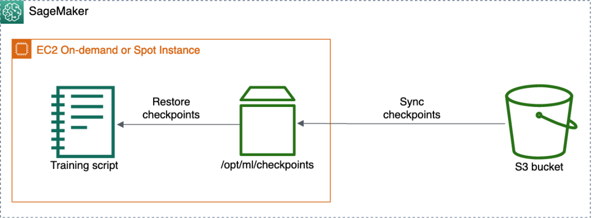

Cluster repairs for GPU errors

If you are running a training job that fails on a GPU, SageMaker AI will run a GPU health check to
see whether the failure is related to a GPU issue. SageMaker AI takes the following actions based
on the health check results:

• If the error is recoverable, and can be fixed by rebooting the instance or resetting the GPU,
SageMaker AI will reboot the instance.

• If the error is not recoverable, and caused by a GPU that needs to be replaced, SageMaker AI will
replace the instance.

The instance is either replaced or rebooted as part of a SageMaker AI cluster repair process. During
this process, you will see the following message in your training job status:

Repairing training cluster due to hardware failure

SageMaker AI will attempt to repair the cluster up to 10 times. If the cluster repair is successful,
SageMaker AI will automatically restart the training job from the previous checkpoint. If the cluster

Resume training from a checkpoint
5378

## Page 408

Amazon SageMaker AI
Developer Guide

repair fails, the training job will also fail. You are not billed for the cluster repair process. Cluster
repairs will not initiate unless your training job fails. If a GPU issue is detected for a warmpool
cluster, the cluster will enter into repair mode to either reboot or replace the faulty instance. After
repair, the cluster can still be used as a warmpool cluster.

The previously described cluster and instance repair process is depicted in the following diagram:

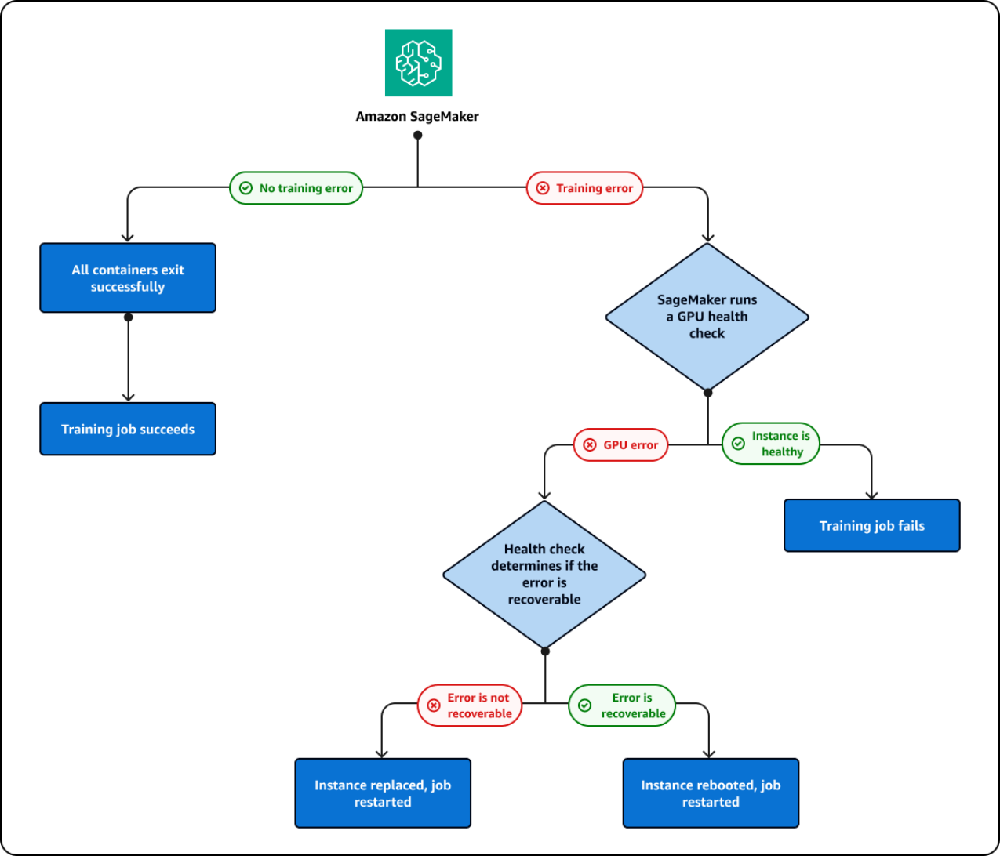

Cluster repairs for GPU errors
5379

## Page 409

Amazon SageMaker AI
Developer Guide

Amazon Nova Forge

Amazon Nova Forge is a first-of-its-kind service that offers organizations the easiest and most cost-
effective way to build their own frontier models using Nova.

Amazon Nova Forge introduces the concept of “open training" models, which give organizations

access to a variety of early model checkpoints and the ability to blend proprietary data with
Amazon-curated data sets at every stage of model training. This allows the models to maximize
learning from proprietary data while minimizing risk of forgetting foundational skills like
reasoning.

Nova Forge provides the following key capabilities:

• Access checkpoints across all phases of model development, and leverage new Nova models
before they are widely available

• Blend your proprietary data with Amazon Nova-curated training data

• Perform reinforcement learning with reward functions in your environment

• Use push-button recipes that are optimized to build with Nova through visual workflows or a
command line interface

• Use the built-in responsible AI toolkit to implement custom safety guardrails

Prerequisites

Topics

• Subscribe to Nova Forge

• Other prerequisites

Subscribe to Nova Forge

To request access to the Nova Forge service, the first step is to add the following key-value pair
as tags to your role: forge-subscription. After you've added these tags to your role, please go to
SageMaker AI Console > Model training and customization and click on Nova Forge. On this page,
you'll find details about the service, pricing information and the capabilities. You can request
subscription and then manage your subscription from this page.

Prerequisites
5380

## Page 410

Amazon SageMaker AI
Developer Guide

1. The role should have permission to call api ListAttachedRolePolicy, and the response

should include either AdministratorAccess or AmazonSageMakerFullAccess policy.

2. The sign-in role should have permission to call api ListRoleTags, and the response tags

should include tag.key=forge-subscription.

Other prerequisites

Also ensure the following prerequisites are complete:

1. General pre-requisites

2. Additional steps for SageMaker HyperPod users: Add Restricted Instance Group (RIG) to your

HyperPod cluster (to complete follow steps here)

Initial HyperPod setup

Follow the steps in the AWS documentation to connect the HyperPod CLI to your cluster. Ensure

you use nova-lite-2.0-release branch instead of release_v2 for testing. This topic covers:

• Setting up AWS IAM permissions and policies

• Configuring the HyperPod CLI

• Creating your cluster with the necessary instance groups

• Connecting to your cluster

Verification: After completing the setup, confirm you can successfully run hyperpod connect-

cluster and access your cluster.

Setting up permissions for Nova Forge

To enable access to Nova Forge models and data mixes, grant your HyperPod cluster's execution
role permissions to access Nova Forge S3 buckets.

1.
Locate your execution role.

Your execution role follows the naming convention:

arn:aws:iam::<AWS_ACCOUNT_ID>:role/<your-cluster-name>-9610a1d3ExecRole

Other prerequisites
5381

## Page 411

Amazon SageMaker AI
Developer Guide

To find your execution role:

1. Navigate to IAM  → Roles in the AWS Management Console

2. Search for your cluster name (e.g., 9610a1d3Exec)

3. Locate the role matching the pattern above

4. Alternately, if the cluster is already created, the execution role can be viewed in the AWS

Management Console under SageMaker AI > Cluster management > [Your Cluster Name] >
Instances > Restricted Instance Groups > Execution Role ARN

2.
Apply Changes to Existing RIG (if applicable)

Important

If you granted this permission after creating your RIG, you must update the cluster
for changes to take effect. See the Troubleshooting section below for instructions on
updating your cluster.

Note

Without this permission, your RIG will not have access to Nova datasets or model
checkpoints required for Forge features.

Nova Forge access and setup

Subscribe to Nova Forge

To access Nova Forge features, complete the following steps:

1.
Verify administrator access to the AWS account.

2.
Navigate to the SageMaker AI AI console and request access to Nova Forge.

3.
Wait for the Nova team to email a confirmation after the subscription request is approved.

4.
Tag your SageMaker HyperPod execution role with the forge-subscription tag. This tag
is required for accessing Nova Forge features and checkpoints. Add the following tag to your
execution role:

Nova Forge access and setup
5382

## Page 412

Amazon SageMaker AI
Developer Guide

• Key: forge-subscription

• Value: true

5.
Set up the necessary SageMaker HyperPod infrastructure by following the workshop
instructions for configuring the environment with Forge-enabled features.

Note

Standard Amazon Nova features remain available without a Forge subscription. Nova Forge
is designed for building custom frontier models with control and flexibility across all model
training phases.

Content moderation settings

If you need access to Nova Forge, customizable content moderation settings (CCMS) are available
for Amazon Nova Lite 1.0 and Pro 1.0 models. CCMS allows adjustment of content moderation
controls to align with specific business requirements while maintaining essential responsible AI
safeguards. To determine if a business model is appropriate for CCMS, contact an AWS Account
Manager.

For additional information on configuring and using CCMS with custom models, see the
Responsible AI Toolkit and Content Moderation section.

Continued Pre-Training and Mid-Training

Note

Detailed documentation is provided once subscribed

Nova Forge CPT offers advanced capabilities beyond standard CPT, including access to intermediate
checkpoints and data mixing with Nova's pre-training corpus. These features enable more efficient
domain adaptation and better preservation of the model's general capabilities.

Content moderation settings
5383

## Page 413

Amazon SageMaker AI
Developer Guide

What are intermediate checkpoints and why are they needed?

Intermediate checkpoints are snapshots of the Amazon Nova model saved at different stages of the
pre-training, before the model reaches its final production-ready state. During model development,
Amazon Nova undergoes multiple training phases: initial pre-training with constant learning rate,
learning rate ramp-down, context extension training, and finally instruction-following alignment
and safety training. For CPT, intermediate checkpoints are often preferable to the final Prod

checkpoint because they are more plastic and receptive to domain adaptation. The Prod checkpoint
has undergone extensive instruction-following alignment and safety training, which optimizes the
model for general conversational use but can make it resistant to learning new domain-specific
patterns during CPT. In contrast, Partially and Fully pre-trained text only checkpoints retain the
model's pre-training characteristics. They haven't been heavily steered toward specific behaviors,
making them more efficient starting points for domain adaptation. When performing large-scale
CPT (>10B tokens), starting from intermediate checkpoints typically results in faster convergence,
better training stability, and more effective domain knowledge acquisition. However, for small-
scale CPT (<10B tokens), or when instruction-following capabilities need to be preserved, the Prod
checkpoint may be more appropriate as it allows domain adaptation while maintaining the model's
conversational abilities.

Multiple intermediate checkpoints are necessary for CPT because they offer different levels of
model plasticity that affect how efficiently the model can absorb new domain knowledge. The final
Prod checkpoint has undergone extensive instruction-following alignment and safety training,
which optimizes it for general conversational use but makes it resistant to learning new domain-
specific patterns. In other words, It has been hardened through post-training. In contrast, earlier
checkpoints retain the model's pre-training characteristics and haven't been heavily steered toward
specific behaviors, making them more plastic and receptive to domain adaptation.

To achieve the best training efficiency, multiple intermediate checkpoints are provided.

What checkpoints are available?

Nova 1.0

Amazon Nova 1.0 family has three models (Micro, Lite, Pro) and for each model there are three
checkpoints available.

• PRE-TRAINED - [nova-<micro/lite/pro>/pretraining-text-partial]: This is the
checkpoint after the constant learning rate stage of Amazon Nova pre-training where the model
is trained on trillions of text tokens.

What are intermediate checkpoints and why are they needed?
5384

## Page 414

Amazon SageMaker AI
Developer Guide

• MID-TRAINED - [nova-<micro/lite/pro>/pretraining-text-full]: This is the text-only
checkpoint after all the stages of Amazon Nova pre-training and mid-training with trillions of
text tokens have finished. Use these if the model specifically should not have seen any multi-
modal data.

• MID-TRAINED - [nova-<lite/pro>/pretraining-mm-full]: This is the checkpoint after
all the stages of Amazon Nova pre-training and mid-training, including multi-modal data, with
trillions of tokens have been processed.

• POST-TRAINED - [nova-<micro/lite/pro>/prod]: This is the fully aligned final checkpoint of
the model that has gone through all the pre-training and post training steps.

Nova 2.0

There are three Amazon Nova Lite 2.0 checkpoints.

• PRE-TRAINED - [nova-lite-2/pretraining-text-RD]: This is the checkpoint after the
constant learning rate and ramp-down stages of Amazon Nova pre-training where the model is
trained on trillions of tokens.

• MID-TRAINED - [nova-lite-2/pretraining-text-CE]: This checkpoint allows intermediate
volumes of unstructured data to be introduced with a more conservative learning rate than pre-
training, absorbing domain-specific knowledge while avoiding catastrophic forgetting.

• POST-TRAINED - [nova-lite-2/prod]: This is the fully aligned final checkpoint of the model
that has gone through all the pertaining and post training steps.

The following table elaborates on the different conditions for pre- and mid-training.

Data Type
Perform
With Checkpoint

Large-scale unstructured raw
domain data (documents,
logs, articles, code, etc.)

Continued Pre-Training
Pre-Trained

Large-scale unstructured raw
domain data (documents,
logs, articles, code, etc.)

Mid-Training
Pre-Trained

What checkpoints are available?
5385

## Page 415

Amazon SageMaker AI
Developer Guide

Data Type
Perform
With Checkpoint

Smaller volumes of unstructu
red raw data. Structured
reasoning traces / CoT data

Mid-Training
Mid-Trained

Structured demonstrations
(high-quality input-output
pairs, curated task instructi
ons, multi-turn dialogues)

Full Fine-Tuning
Mid-Trained

Structured demonstrations
(high-quality input-output
pairs, curated task instructi
ons, multi-turn dialogues)

Parameter Efficient Fine-Tuni
ng

Post-Trained

Which checkpoint to use?

Partially pre-trained text only and fully pre-trained text only checkpoints typically converge faster
and require fewer training steps for domain adaptation. However, they have no instruction tuning
and would need to undergo post training steps to be able to perform useful tasks and follow
instructions. GA checkpoint may require more steps to adapt but provides safer starting point
for small-scale experiments and will maintain some of it post training capabilities even after CPT
training.

In general, with large training datasets (>10B tokens), start from partially pre-trained text only
or fully pre-trained text only checkpoints for more efficient and stable training, as the model's
knowledge base will be substantially modified. With small datasets (<10B tokens), use the GA
checkpoint to preserve instruction-following capabilities while adapting to the domain.

How to use data mixing for 1.0 or 2.0 models?

When performing CPT with a new domain data, it is highly beneficial to mix the new data with
some of the data used previously in the pre-training stage of the model. Mixing old data with new
domain data solves two problems:

• Forgetting control: Prevents catastrophic forgetting by preserving existing skills and knowledge
of the model. Without data mixing, training exclusively on narrow domain data causes the model

Which checkpoint to use?
5386

## Page 416

Amazon SageMaker AI
Developer Guide

to overwrite general capabilities. For example, a model trained only on legal documents might
lose its ability to code or do math. Mixing the general domain datasets preserves these general
skills while acquiring the new domain.

• Optimization stability: Maintains training stability by anchoring the model's internal
representations. During CPT, the model's learned features are modified and data mixing provides
gradients from diverse sources that guide this adaptation smoothly. Without it, training on
narrow distributions can cause gradient instability, where the model's representations shift too
drastically, leading to training divergence, loss spikes, or collapse of existing capabilities. This
is the stability-plasticity tradeoff: the model should be plastic enough to learn new domain
knowledge, but stable enough not to break what it already knows.

Nova CPT Data Mixing Capabilities

Access to Amazon Nova pre-training data and checkpoints is one of the core offerings of the
Amazon Nova CPT customization. Amazon Nova CPT customization enables easy mixing of domain
data with Amazon Nova's pre-training corpus. Further, the sampling ratio of the specific Amazon
Nova data categories (e.g., code, math, reasoning, etc) can be changed and their proportions
controlled to complement domain data. This allows reinforcement of capabilities that align with
the use case while adapting the model to the specific domain.

Finding the Optimal Mixing Ratio

The optimal ratio of Amazon Nova data versus domain data depends on the dataset's domain,
complexity, size, quality, and the importance of maintaining general capabilities. This ratio must be
discovered through experimentation. An experiment framework to decide on how much Amazon
Nova data to mix is as follows.

Select a representative subset of domain data (e.g., 5B tokens) and keep this constant across all
experimental runs.

Run small-scale CPT experiments varying only the amount of Amazon Nova data mixed in:

• No mixing: 100% domain  → 5B domain only (total 5B)

• Light mixing: 90% domain  → 5B domain + ~0.56B Amazon Nova (total ~5.56B)

• Medium mixing: 70% domain  → 5B domain + ~2.14B Amazon Nova (total ~7.14B)

• Heavy mixing: 50% domain  → 5B domain + 5B Amazon Nova (total 10B)

How to use data mixing for 1.0 or 2.0 models?
5387

## Page 417

Amazon SageMaker AI
Developer Guide

Evaluate each checkpoint on in domain and general domain benchmarks. Also evaluate the starting
checkpoint (Amazon Nova checkpoint before any training).

• Does customer-domain performance stay roughly constant across runs? It usually should, since
each run saw the same number of domain tokens. If domain performance improves with more
mixing, Amazon Nova data provides useful regularization.

• Do general benchmark scores improve as mixing is increased?

• Expected behavior is that the general capabilities should improve monotonically as more
Amazon Nova data is added.

• Measure multiple general benchmarks: MMLU (general knowledge), HumanEval (coding),
GSM8K (math), or specific benchmarks of interest.

• Select the mixing ratio that maintains domain performance while delivering acceptable general
capabilities for the use cases. Factor in the additional cost of training with more data mixing.

Once the optimal mixing ratio has been identified, run full-scale CPT using the complete domain
dataset with the selected mixing ratio.

Limitations

Current CPT only supports text data and does not support any customer multi-modal datasets.

Supervised Fine-Tuning

Note

Detailed documentation is provided once subscribed

Data mixing allows combining custom training datasets with Amazon Nova's proprietary training
data for more nuanced fine-tuning, minimizing risk of catastrophic forgetting, and preserving
foundational capabilities. This feature is available for both Amazon Nova 1.0 and Amazon Nova
2.0 models and supports both text and multimodal data.

How to Enable Data Mixing

Add the data_mixing section to the recipe with the appropriate percentage distribution across

dataset categories. The nova_data percentages must sum to 100.

Supervised Fine-Tuning
5388

## Page 418

Amazon SageMaker AI
Developer Guide

Reinforcement Learning

Note

Detailed documentation is provided once subscribed

Nova Forge provides advanced reinforcement learning capabilities with the option to use remote
reward functions in your own environment. Customers can choose to integrate their own endpoint
to execute validation for immediate real-world feedback, or even use their own orchestrator to
coordinate agentic multi-turn evaluations in your environment.

Bring your own orchestrator for agentic multi-turn evaluations

For Forge users requiring multi-turn conversations or reward functions exceeding 15-minute
timeouts, Nova Forge provides Bring Your Own Orchestration (BYOO) capabilities. This allows you
to coordinate agentic multi-turn evaluations in your environment (e.g., using chemistry tools to
score molecular designs, or robotics simulations that reward efficient task completion and penalize
collisions).

Topics

• Architecture overview

• Setup and execution

Architecture overview

The BYOO architecture provides full control over the rollout and generation process through
customer-managed infrastructure.

Training VPC:

• Rollout: Coordinates training by delegating rollout generation to customer infrastructure

• Trainer: Performs model weight updates based on received rollouts

Customer VPC (such as ECS on EC2):

• Proxy Lambda: Receives rollout requests and coordinates with customer infrastructure

Reinforcement Learning
5389

## Page 419

Amazon SageMaker AI
Developer Guide

• Rollout Response SQS: Queue for returning completed rollouts to training infrastructure

• Generate Request SQS: Queue for model generation requests

• Generate Response SQS: Queue for model generation responses

• Customer Container: Implements custom orchestration logic (can use provided starter kit)

• DynamoDB: Stores and retrieves state across the orchestration process

Workflow:

1. Rollout delegates rollout generation to Proxy Lambda

2. Proxy Lambda pushes rollout API request to Generate Request SQS

3. Customer container processes requests, manages multi-turn interactions, and calls reward

functions

4. Container stores and retrieves state from DynamoDB as needed

5. Container pushes rollout responses to Rollout Response SQS

6. Rollout sends completed rollouts to Trainer for weight updates

Setup and execution

For detailed setup instructions, recipe configurations, request and response formats, and
environment examples, refer to the confidential documentation provided to Nova Forge
subscribers. To get the Nova Forge documents follow the below steps:

aws s3 cp s3://nova-forge-c7363-206080352451-us-east-1/v1/ ./ --recursive

Once the assets are downloaded, you can find all the documentation under the docs folder.

Responsible AI toolkit and content moderation

Responsible AI toolkit

Nova Forge provides a Responsible AI toolkit that includes training and evaluation data to align
models to Amazon Nova's responsible AI guidelines during the training process, and runtime
controls to moderate model responses during inference.

Responsible AI toolkit
5390

## Page 420

Amazon SageMaker AI
Developer Guide

Training data – Cases and scenarios emphasizing responsible AI principles, safety considerations,
and responsible technology deployment are available for data mixing to align models responsibly
during continued pre-training.

Evaluations – Evaluations testing the model's ability to detect and reject inappropriate, harmful,

or incorrect content are available as a benchmark task to determine the delta between base model
performance and custom model performance.

Runtime controls – By default, Amazon Nova's runtime controls moderate model responses
during inference. To modify these runtime controls, request Amazon Nova's Customizable Content
Moderation Settings by contacting an AWS account manager.

Safety is a shared responsibility between AWS and its users. Changing the base model or using
continued pre-training to improve performance on a specific use case can impact safety, fairness,
and other properties of the new model. A robust adaptation method minimizes changes to the
safety, fairness, and other protections built into base models while minimizing impact on model
performance for tasks the model was not customized for. End-to-end testing of applications
on datasets representative of use cases is required to determine if test results meet specific
expectations of safety, fairness, and other properties, as well as overall effectiveness. For more
information, see AWS Responsible Use of AI Guide, AWS Responsible AI Policy, AWS Acceptable Use
Policy, and AWS Service Terms.

Customizable content moderation

Customizable content moderation settings (CCMS) allow adjustment of controls relevant to
business requirements while maintaining essential, non-configurable controls to ensure responsible
use of AI.

These settings allow content generation through three available combinations: security; a
combined setting for safety, sensitive content, and fairness; or all combinations together.

1. Safety – Covers dangerous activities, weapons, and controlled substances

2. Sensitive content – Includes profanity, nudity, and bullying

3. Fairness – Addresses bias and cultural considerations

4. Security – Involves cybercrime, malware, and malicious content

Regardless of CCMS configuration, Amazon Nova enforces essential, non-configurable controls to
ensure responsible use of AI, such as controls to prevent harm to children and preserve privacy.

Customizable content moderation
5391

## Page 421

Amazon SageMaker AI
Developer Guide

When using CCMS, use Continued Pre-Training (CPT) and start from a pre-RAI alignment
checkpoint (partially or fully pre-trained text-only) rather than the fully-aligned production
checkpoint. These checkpoints have not undergone safety training or been steered toward specific
RAI behaviors, allowing more efficient customization to content moderation requirements.

CCMS is currently available for Amazon Nova Lite 1.0 and Pro 1.0 with Amazon Bedrock On
Demand inference in the us-east-1 (N. Virginia) region. To enable CCMS for Forge models, contact
an AWS account manager.

Customizable content moderation
5392

## Page 422

Amazon SageMaker AI
Developer Guide

Customizing models with Amazon SageMaker AI

Amazon SageMaker AI model customization is a capability that transforms the traditionally
complex and time-consuming process of customizing AI models from a months-long endeavor into
a streamlined workflow that can be completed in days. This feature addresses the critical challenge
faced by AI developers who need to customize foundation models with proprietary data to create
highly differentiated customer experiences. Detailed customization documentation, including step-
by-step guides and advanced configuration options, is provided in this SageMaker AI guide. For a
brief overview of Nova model customization, see Customize and fine-tune with SageMaker in the
Amazon Nova User Guide.

The capability includes a new guided user interface that understands natural language
requirements, with a comprehensive suite of advanced model customization techniques, all
powered by serverless infrastructure that eliminates the operational overhead of managing
compute resources. Whether you're building legal research applications, enhancing customer
service chatbots, or developing domain-specific AI agents, this feature accelerates your path from
proof-of-concept to production deployment.

Features in Model Customization powered by Amazon Bedrock Evaluations may securely transmit
data across AWS Regions within your geography for processing. For more information, access
Amazon Bedrock Evaluations documentation.

Key concepts

Serverless training

A fully managed compute infrastructure that abstracts away all infrastructure complexity, allowing
you to focus purely on model development. This includes automatic provisioning of GPU instances
(P5, P4de, P4d, G5) based on model size and training requirements, pre-optimized training recipes
that incorporate best practices for each customization technique, real-time monitoring with live
metrics and logs accessible through the UI, and automatic cleanup of resources after training
completion to optimize costs.

Model customization techniques

Comprehensive set of advanced methods including supervised fine-tuning (SFT), direct preference
optimization (DPO), reinforcement learning with verifiable rewards (RLVR), and reinforcement
learning with AI feedback (RLAIF).

Key concepts
5393

## Page 423

Amazon SageMaker AI
Developer Guide

Custom model

A specialized version of a base foundation model that has been adapted to a specific use case by
training it on your own data, resulting in an AI model that retains the general capabilities of the

original foundation model while adding domain-specific knowledge, terminology, style, or behavior

tailored to your requirements.

AI model customization assets

Resources and artifacts used to train, refine, and evaluate custom models during the model
customization process. These assets include datasets, which are collections of training examples
(prompt-response pairs, domain-specific text, or labeled data) used to fine-tune a foundation
model to learn specific behaviors, knowledge, or styles, and evaluators, which are mechanisms
for assessing and improving model performance through either reward functions (code-based
logic that scores model outputs based on specific criteria, used in RLVR training and custom scorer
evaluation) or reward prompts (natural language instructions that guide an LLM to judge the
quality of model responses, used in RLAIF training and LLM-as-a-judge evaluation).

Model package group

A collection container that tracks all logged models from training jobs, providing a centralized
location for model versions and their lineage.

Logged model

The output created by SageMaker AI when running serverless training jobs. This can be a fine-
tuned model (successful job), a checkpoint (failed job with checkpoint), or associated metadata
(failed job without checkpoint).

Registered model

A logged model that has been marked for formal tracking and governance purposes, enabling full
lineage and lifecycle management.

Lineage

The automatically captured relationships between training jobs, input datasets, output models,
evaluation jobs, and deployments across SageMaker AI and Amazon Bedrock.

Cross-account sharing

Key concepts
5394

## Page 424

Amazon SageMaker AI
Developer Guide

The ability to share models, datasets, and evaluators across AWS accounts using AWS Resource
Access Manager (RAM) while maintaining complete lineage visibility.

Customizing Amazon Nova models on Amazon SageMaker AI

You can customize Amazon Nova models, including the enhanced Nova 2.0 models, through
recipes and train them on SageMaker AI. These recipes support techniques such as supervised fine-
tuning (SFT), Direct Preference Optimization (DPO), and Reinforcement Fine-Tuning (RFT), with
both full-rank and low-rank adaptation (LoRA) options.

The end-to-end customization workflow involves stages like model training, model evaluation, and
deployment for inference. This model customization approach on SageMaker AI provides greater
flexibility and control to fine-tune its supported Amazon Nova models, optimize hyperparameters
with precision, and implement techniques such as LoRA parameter-efficient fine-tuning (PEFT),
full-rank SFT, DPO, RFT, Continued Pre-Training (CPT), Proximal Policy Optimization (PPO), etc.

SageMaker AI offers two environments for customizing Amazon Nova models.

• Amazon SageMaker training jobs provides a fully managed environment for customizing Nova
models where you don't need to create or maintain any clusters. The service automatically
handles all infrastructure provisioning, scaling, and resource management, allowing you to focus
solely on configuring your training parameters and submitting your job. You can customize Nova
models on SageMaker training jobs with techniques like Parameter Efficient Fine-tuning (PEFT),
Full rank fine tuning, Direct Preference Optimization (DPO), and Reinforcement Fine-Tuning
(RFT). For more information, see the section called “On SageMaker training jobs”.

Note

If you provide a KMS key to your Nova model customization training job for encryption in
the Amazon-owned output S3 bucket:

• You must provide the same KMS key when calling subsequent iterative training jobs, or
when calling the CreateCustomModel API leveraging the encrypted model.

• The identity calling the CreateTrainingJob API (rather than the execution

role) must have permissions to CreateGrant, RetireGrant, Encrypt, and

GenerateDataKey as defined in KMS key policy.

• Amazon SageMaker HyperPod offers a specialized environment to train Nova models by
requiring you to create and manage SageMaker HyperPod EKS clusters with restricted instance

Amazon Nova model customization
5395

## Page 425

Amazon SageMaker AI
Developer Guide

groups (RIGs). This environment gives you flexibility in configuring your training environment
with specialized GPU instances and integrated Amazon FSx for Lustre storage, making it
particularly well-suited for advanced distributed training scenarios and ongoing model
development. For more information, see the section called “On SageMaker HyperPod”.

In this chapter

• General prerequisites

• Amazon Nova recipes

• Amazon Nova customization on SageMaker training jobs

• Amazon Nova customization on Amazon SageMaker HyperPod

• Iterative Training

• Amazon Bedrock inference

• Limitations of customizing Amazon Nova models

• Amazon Nova customization FAQs

General prerequisites

The customization process involves several key stages including model training, evaluation, and
deployment for inference, each requiring specific resources and configurations. Before beginning
your Amazon Nova model customization on SageMaker AI, ensure you have the following general
prerequisites.

• An AWS account. If you don't have an AWS account, follow these instructions to sign up for one.

• Installing the AWS CLI and Setting up the configuration.

• Access to the base Amazon Nova model customization recipes.

• Familiarity of YAML configuration files.

• Familiarity of how to run a Jupyter notebook in your environment.

• Familiarity of how to create AWS resources like Amazon S3 buckets and IAM roles with
appropriate permissions.

• Familiarity of how to train a model with Amazon SageMaker AI.

• Familiarity of Amazon SageMaker HyperPod with EKS orchestration.

• Familiarity of Amazon SageMaker HyperPod CLI.

General prerequisites
5396

## Page 426

Amazon SageMaker AI
Developer Guide

• Familiarity of Amazon Nova foundational models.

• Familiarity of available Amazon Nova models and algorithms for customization.

• Familiarity of Amazon Bedrock inference.

Amazon Nova recipes

You can get an Amazon Nova recipe from the SageMaker HyperPod recipes repository. A Nova
recipe is a YAML configuration file that provides details to SageMaker AI on how to run your
model customization job. It provides the base model name, sets training hyperparameters, defines
optimization settings, and includes any additional options required to fine-tune or train the model
successfully.

You can also access Nova recipes through Amazon SageMaker Studio and Amazon SageMaker
Unified Studio by navigating to the JumpStart model hub, selecting AWS, and browsing Amazon
Nova models to find their associated recipes. Both Amazon SageMaker Studio and Amazon
SageMaker Unified Studio provide sample notebooks for each recipe, which include all the
necessary steps to modify the recipes and run customization jobs using SageMaker AI training jobs
or Amazon SageMaker HyperPod environments.

To access the recipes pages in Amazon SageMaker Studio, the execution role must have the
following permissions.

JSON

{
"Version":"2012-10-17",
"Statement": [
{
"Effect": "Allow",
"Action": [
"s3:GetObject"
],
"Resource": [
"arn:aws:s3:::*model-customization-recipes*"
]
}
]
}

Amazon Nova recipes
5397

## Page 427

Amazon SageMaker AI
Developer Guide

To execute the sample notebooks on SageMaker training jobs and SageMaker HyperPod, use one

of the following SageMaker distribution image versions: 2.7.1+, 2.8.0+, 3.2.1+, 3.3.0+. This
applies to both Amazon SageMaker Studio and Amazon SageMaker Unified Studio.

Topics

• Getting Amazon Nova recipes

• Available models and algorithms

• Amazon Nova recipes reference

Getting Amazon Nova recipes

To get a base Amazon Nova recipe, clone the SageMaker HyperPod recipes repository by running
the following command.

git clone https://github.com/aws/sagemaker-hyperpod-recipes.git

The base recipes are available at recipes_collection/recipes/.

cd recipes_collection/recipes/

The Amazon Nova customization recipes are in the following folders.

Recipe type
Folder

SFT (Full-rank and
PEFT), PPO, DPO
(Full-rank and PEFT)

fine-tuning/nova

Evaluation
evaluation/nova

CPT
training/nova

Available models and algorithms

The following table summarizes the availability of customization for Amazon Nova models and
supported algorithms using SageMaker AI.

Amazon Nova recipes
5398

## Page 428

Amazon SageMaker AI
Developer Guide

Model name
Model ID
Fine-tuning
Notes

Amazon Nova Micro
amazon.nova-micro-
v1:0:128k

Yes
For SFT, DPO, and
RFT, this model

accepts text as input
and produces text as
output only.

Amazon Nova Lite
amazon.nova-lite-v
1:0:300k

Yes
• SFT - Accepts
either text and/
or image or text
and/or video as the
input and produces
text as output. A
single job can't

combine text,
image, and video in
the same run.

• DPO - Accepts text
and image as the
input and produces
text as output.

• RFT - Accepts text
and image as input
for single-turn

conversations and
produces text as
output.

Amazon Nova Pro
amazon.nova-pro-v1
:0:300k

Yes
• SFT - Accepts
either text and/
or image or text
and/or video as the
input and produces
text as output. A
single job can't

Amazon Nova recipes
5399

## Page 429

Amazon SageMaker AI
Developer Guide

Model name
Model ID
Fine-tuning
Notes

combine text,
image, and video in
the same run.

• DPO - Accepts text
and image as the
input and produces
text as output.

• RFT - Accepts text
and image as input
for single-turn
conversations and
produces text as
output.

Amazon Nova recipes
5400

## Page 430

Amazon SageMaker AI
Developer Guide

Model name
Model ID
Fine-tuning
Notes

Amazon Nova Lite 2.0
amazon.nova-lite-v
2:0:300k

Yes
• SFT - Accepts
either text and/
or image or text
and/or video as the
input and produces
text as output. A
single job can't
combine text,
image, and video in
the same run.

• DPO - Accepts text
and image as the
input and produces
text as output.

• RFT - Accepts text
and image as input
for single-turn
conversations and
produces text as
output. Improved
reward optimizat
ion capabilities.

Amazon Nova recipes reference

The tables below list detailed information of the Amazon Nova recipes reference.

Amazon Nova Lite

The table below lists detailed information of the Amazon Nova Lite recipes reference.

Amazon Nova recipes
5401

## Page 431

Amazon SageMaker AI
Developer Guide

ModelCategory/

Technique
Recipe Name
Image URI
(Training
Jobs)

Image
URI
(HyperPod

Compute
Instance

Sub-
categ

ory

)

Nova
Lite

Training/
Fine-
tuning

Supervised
Fine-Tuni
ng (LoRA)

nova_lite

708977205

708977205

ml.p5.48x

_p5_gpu_l

387.dkr.e

387.dkr.e

large

ora_sft.yaml

cr.us-

cr.us-

eas

eas

t-1.amazo

t-1.amazo

naws.com/

naws.com/

nova-

nova-

fine-

fine-

tune-rep

tune-

o:SM-TJ-

rep

SFT-V2-

o:SM-

latest

HP-S

FT-V2-

latest

Nova
Lite

Training/
Fine-
tuning

Supervised
Fine-Tuni
ng (Full)

nova_lite

708977205

708977205

ml.p5.48x

_p5_gpu_sft.yaml

387.dkr.e

387.dkr.e

large

cr.us-

cr.us-

eas

eas

t-1.amazo

t-1.amazo

naws.com/

naws.com/

nova-

nova-

fine-

fine-

tune-rep

tune-

o:SM-TJ-

rep

SFT-V2-

o:SM-

latest

HP-S

FT-V2-

latest

Amazon Nova recipes
5402

## Page 432

Amazon SageMaker AI
Developer Guide

ModelCategory/

Technique
Recipe Name
Image URI
(Training
Jobs)

Image
URI
(HyperPod
)

Compute
Instance

Sub-
categ
ory

Nova
Lite

Training/
Fine-
tuning

Direct
Preference
Optimizat
ion (Full)

nova_lite

708977205

708977205

ml.p5.48x

_p5_gpu_dpo.yaml

387.dkr.e

387.dkr.e

large

cr.us-

cr.us-

eas

eas

t-1.amazo

t-1.amazo

naws.com/

naws.com/

nova-

nova-

fine-

fine-

tune-rep

tune-

o:SM-TJ-

rep

DPO-V2-

o:SM-

latest

HP-D

PO-V2-

latest

Nova
Lite

Training/
Fine-
tuning

Direct
Preference
Optimizat
ion (LoRA)

nova_lite

708977205

708977205

ml.p5.48x

_p5_gpu_l

387.dkr.e

387.dkr.e

large

ora_dpo.yaml

cr.us-

cr.us-

eas

eas

t-1.amazo

t-1.amazo

naws.com/

naws.com/

nova-

nova-

fine-

fine-

tune-rep

tune-

o:SM-TJ-

rep

DPO-V2-

o:SM-

latest

HP-D

PO-V2-

latest

Amazon Nova recipes
5403

## Page 433

Amazon SageMaker AI
Developer Guide

ModelCategory/

Technique
Recipe Name
Image URI
(Training
Jobs)

Image
URI
(HyperPod
)

Compute
Instance

Sub-
categ
ory

Nova
Lite

Training/
Reinforce
ment
learning

Reinforce
ment Fine-
Tuning
(RFT)

n/a
708977205

nova_lite

ml.p5.48x

_rft.yaml

387.dkr.e

large

cr.us-

eas

t-1.amazo

naws.com/

nova-

fine-

tune-

rep

o:SMHP-

PPO-

TRAIN-l

atest

Nova
Lite

Training/
Continued
Pre-
Train
ing

Continued
Pre-Train
ing (base
model)

n/a
708977205

nova_lite

ml.p5.48x

_gpu_p5x1

387.dkr.e

large

6_pretrain.yaml

cr.us-

eas

t-1.amazo

naws.com/

nova-

fine-

tune-

rep

o:HP-

CPT-

latest

Amazon Nova recipes
5404

## Page 434

Amazon SageMaker AI
Developer Guide

ModelCategory/

Technique
Recipe Name
Image URI
(Training
Jobs)

Image
URI
(HyperPod
)

Compute
Instance

Sub-
categ
ory

Nova
Lite

Evaluatio
n/
Evaluat
e

Standard
text
benchmark
s

nova_lite

708977205

708977205

ml.p5.48x

_p5_48xl_

387.dkr.e

387.dkr.e

large

general_t

cr.us-

cr.us-

ext_bench

eas

eas

mark_eval.yaml

t-1.amazo

t-1.amazo

naws.com/

naws.com/

nova-

nova-

eval

eval

uation-

uation-

repo:SM-

re

TJ-Eval-

po:SM-

latest

HP-

Eval-

latest

Nova
Lite

Evaluatio
n/
Evaluat
e

Custom
dataset
evaluation

nova_lite

708977205

708977205

ml.p5.48x

_p5_48xl_

387.dkr.e

387.dkr.e

large

bring_you

cr.us-

cr.us-

r_own_dat

eas

eas

aset_eval.yaml

t-1.amazo

t-1.amazo

naws.com/

naws.com/

nova-

nova-

eval

eval

uation-

uation-

repo:SM-

re

TJ-Eval-

po:SM-

latest

HP-

Eval-

latest

Amazon Nova recipes
5405

## Page 435

Amazon SageMaker AI
Developer Guide

ModelCategory/

Technique
Recipe Name
Image URI
(Training
Jobs)

Image
URI
(HyperPod
)

Compute
Instance

Sub-
categ
ory

Nova
Lite

Evaluatio
n/
Evaluat
e

Multi-
modal
benchmark
s

nova_lite

708977205

708977205

ml.p5.48x

_p5_48_ge

387.dkr.e

387.dkr.e

large

neral_mul

cr.us-

cr.us-

ti_modal_

eas

eas

benchmark

t-1.amazo

t-1.amazo

_eval.yaml

naws.com/

naws.com/

nova-

nova-

eval

eval

uation-

uation-

repo:SM-

re

TJ-Eval-

po:SM-

latest

HP-

Eval-

latest

Nova
Lite

Evaluatio
n/
Evaluat
e

LLM as a
Judge

nova_lite

708977205

708977205

ml.p5.48x

_p5_48xl_

387.dkr.e

387.dkr.e

large

llm_judge

cr.us-

cr.us-

_eval.yaml

eas

eas

t-1.amazo

t-1.amazo

naws.com/

naws.com/

nova-

nova-

eval

eval

uation-

uation-

repo:SM-

re

TJ-Eval-

po:SM-

latest

HP-

Eval-

latest

Amazon Nova recipes
5406

## Page 436

Amazon SageMaker AI
Developer Guide

ModelCategory/

Technique
Recipe Name
Image URI
(Training
Jobs)

Image
URI
(HyperPod
)

Compute
Instance

Sub-
categ
ory

Nova
Lite

Training/
Fine-
tuning

Supervised
Fine-Tuni
ng (LoRA)

n/a
ml.g5.12x

nova_lite

708977205

_g5_g6_12

387.dkr.e

large ,

x_gpu_lor

cr.us-

ml.g6.12x

a_sft.yam

eas

large ,

l  nova_lite

t-1.amazo

ml.g5.48x

_g5_g6_48

naws.com/

large ,

x_gpu_lor

nova-

ml.g6.48x

a_sft.yaml

fine-

large

tune-rep

o:SM-TJ-

SFT-V2-

latest

Nova
Lite

Training/
Fine-
tuning

DPO
(LoRA)

n/a
ml.g5.48x

nova_lite

708977205

_g5_g6_48

387.dkr.e

large ,

x_gpu_lor

cr.us-

ml.g6.48x

a_dpo.yaml

eas

large

t-1.amazo

naws.com/

nova-

fine-

tune-rep

o:SM-TJ-

DPO-V2-

latest

Nova 2.0 Lite

The table below lists detailed information of the Nova 2.0 Lite recipes reference.

Amazon Nova recipes
5407

## Page 437

Amazon SageMaker AI
Developer Guide

ModelCategory/

Technique
Recipe Name
Image URI
(Training
Jobs)

Image
URI
(HyperPod

Compute
Instance

Sub-
categ

ory

)

Nova
2.0
Lite

Training
Continued
Pre
Training

N/A
708977205

nova_lite

ml.p5.48x

_2_0_p5x8

387.dkr.e

large ,

_gpu_pret

cr.us-

ml.p5en.4

rain.yaml

eas

8xlarge

t-1.amazo

naws.com/

nova-

fine-

tune-

rep

o:SM-

HP-C

PT-V2-

latest

Nova
2.0
Lite

Parameter
Efficient
Fine
Tuning

Fine
Tuning

nova_lite

708977205

708977205

ml.p5.48x

_2_0_p5_g

387.dkr.e

387.dkr.e

large ,

pu_lora_sft.yaml

cr.us-

cr.us-

ml.p5en.4

eas

eas

8xlarge

t-1.amazo

t-1.amazo

naws.com/

naws.com/

nova-

nova-

fine-

fine-

tune-rep

tune-

o:SM-TJ-

rep

SFT-V2-

o:SM-

latest

HP-S

FT-V2-

latest

Amazon Nova recipes
5408

## Page 438

Amazon SageMaker AI
Developer Guide

ModelCategory/

Technique
Recipe Name
Image URI
(Training
Jobs)

Image
URI
(HyperPod
)

Compute
Instance

Sub-
categ
ory

Nova
2.0
Lite

Full-
Rank
Fine
Tuning

Fine
Tuning

nova_lite

708977205

708977205

ml.p5.48x

_2_0_p5_g

387.dkr.e

387.dkr.e

large ,

pu_sft.yaml

cr.us-

cr.us-

ml.p5en.4

eas

eas

8xlarge

t-1.amazo

t-1.amazo

naws.com/

naws.com/

nova-

nova-

fine-

fine-

tune-rep

tune-

o:SM-TJ-

rep

SFT-V2-

o:SM-

latest

HP-S

FT-V2-

latest

Nova
2.0
Lite

Parameter
Efficient
RFT

Fine
Tuning

nova_lite

708977205

708977205

ml.p5.48x

_v2_smtj_

387.dkr.e

387.dkr.e

large ,

p5_p5en_g

cr.us-

cr.us-

ml.p5en.4

pu_lora_rft.yaml

eas

eas

8xlarge

t-1.amazo

t-1.amazo

naws.com/

naws.com/

nova-

nova-

fine-

fine-

tune-rep

tune-

o:SM-TJ-

rep

RFT-V2-

o:SM-

latest

HP-R

FT-

TRAIN-

V2-

latest

Amazon Nova recipes
5409

## Page 439

Amazon SageMaker AI
Developer Guide

ModelCategory/

Technique
Recipe Name
Image URI
(Training
Jobs)

Image
URI
(HyperPod
)

Compute
Instance

Sub-
categ
ory

Nova
2.0
Lite

Full
Rank
RFT

Fine
Tuning

nova_lite

708977205

708977205

ml.p5.48x

_v2_smtj_

387.dkr.e

387.dkr.e

large ,

p5en_gpu_

cr.us-

cr.us-

ml.p5en.4

rft.yaml

eas

eas

8xlarge

t-1.amazo

t-1.amazo

naws.com/

naws.com/

nova-

nova-

fine-

fine-

tune-rep

tune-

o:SM-TJ-

rep

RFT-V2-

o:SM-

latest

HP-R

FT-

TRAIN-

V2-

latest

Amazon Nova recipes
5410

## Page 440

Amazon SageMaker AI
Developer Guide

ModelCategory/

Technique
Recipe Name
Image URI
(Training
Jobs)

Image
URI
(HyperPod
)

Compute
Instance

Sub-
categ
ory

Nova
2.0
Lite

Bring
Your
Own
Data

Evaluation
nova_lite

708977205

708977205

ml.p5.48x

_2_0_p5_4

387.dkr.e

387.dkr.e

large ,

8xl_gpu_b

cr.us-

cr.us-

ml.p5en.4

ring_your

eas

eas

8xlarge

_own_data

t-1.amazo

t-1.amazo

set_eval.yaml

naws.com/

naws.com/

nova-

nova-

eval

eval

uation-

uation-

repo:SM-

re

TJ-Eval-

po:SM-

V2-l

HP-

atest

Eval-

V2-l

atest

Nova
2.0
Lite

General
Text
Benchmark

Evaluation
nova_lite

708977205

708977205

ml.p5.48x

_2_0_p5_4

387.dkr.e

387.dkr.e

large ,

8xl_gpu_g

cr.us-

cr.us-

ml.p5en.4

eneral_te

eas

eas

8xlarge

xt_benchm

t-1.amazo

t-1.amazo

ark_eval.yaml

naws.com/

naws.com/

nova-

nova-

eval

eval

uation-

uation-

repo:SM-

re

TJ-Eval-

po:SM-

V2-l

HP-

atest

Eval-

V2-l

atest

Amazon Nova recipes
5411

## Page 441

Amazon SageMaker AI
Developer Guide

ModelCategory/

Technique
Recipe Name
Image URI
(Training
Jobs)

Image
URI
(HyperPod
)

Compute
Instance

Sub-
categ
ory

Nova
2.0
Lite

RFT
Evaluatio
n

Evaluation
nova_lite

708977205

708977205

ml.p5.48x

_2_0_p5_4

387.dkr.e

387.dkr.e

large ,

8xl_gpu_r

cr.us-

cr.us-

ml.p5en.4

ft_eval.yaml

eas

eas

8xlarge

t-1.amazo

t-1.amazo

naws.com/

naws.com/

nova-

nova-

eval

eval

uation-

uation-

repo:SM-

re

TJ-Eval-

po:SM-

V2-l

HP-

atest

Eval-

V2-l

atest

Nova
2.0
Lite

LLM
Rubric
Based
Judge

Evaluation
nova_lite

708977205

708977205

ml.p5.48x

_2_0_p5_4

387.dkr.e

387.dkr.e

large ,

8xl_gpu_r

cr.us-

cr.us-

ml.p5en.4

ubric_llm

eas

eas

8xlarge

_judge_eval.yaml

t-1.amazo

t-1.amazo

naws.com/

naws.com/

nova-

nova-

eval

eval

uation-

uation-

repo:SM-

re

TJ-Eval-

po:SM-

V2-l

HP-

atest

Eval-

V2-l

atest

Amazon Nova recipes
5412

## Page 442

Amazon SageMaker AI
Developer Guide

Amazon Nova Micro

The table below lists detailed information of the Amazon Nova Micro recipes reference.

Model Category/

Technique
Recipe Name
Image
URI
(Training
Jobs)

Image
URI
(HyperPod
)

Compute
Instance

Sub-
category

Nova
Micro

Training/
Fine-tuni
ng

Supervise
d Fine-
Tuning
(LoRA)

n/a
ml.g5.12x

nova_micr

708977205

o_g5_gpu_

387.dkr.e

large

lora_sft.yaml

cr.us-

eas

t-1.amazo

naws.com/

nova-

fine-

tune-

rep

o:SM-

TJ-S

FT-V2-

latest

Nova
Micro

Training/
Fine-tuni
ng

Supervise
d Fine-
Tuning
(LoRA)

nova_micr

708977205

708977205

ml.p5.48x

o_p5_gpu_

387.dkr.e

387.dkr.e

large

lora_sft.yaml

cr.us-

cr.us-

eas

eas

t-1.amazo

t-1.amazo

naws.com/

naws.com/

nova-

nova-

fine-

fine-

tune-

tune-

rep

rep

o:SM-

o:SM-

TJ-S

HP-S

Amazon Nova recipes
5413

## Page 443

Amazon SageMaker AI
Developer Guide

Model Category/

Technique
Recipe Name
Image
URI
(Training
Jobs)

Image
URI
(HyperPod
)

Compute
Instance

Sub-
category

FT-V2-

FT-V2-

latest

latest

Nova
Micro

Training/
Fine-tuni
ng

Supervise
d Fine-
Tuning
(Full)

nova_micr

708977205

708977205

ml.p5.48x

o_p5_gpu_

387.dkr.e

387.dkr.e

large

sft.yaml

cr.us-

cr.us-

eas

eas

t-1.amazo

t-1.amazo

naws.com/

naws.com/

nova-

nova-

fine-

fine-

tune-

tune-

rep

rep

o:SM-

o:SM-

TJ-S

HP-S

FT-V2-

FT-V2-

latest

latest

Nova
Micro

Training/
Fine-tuni
ng

Direct
Preference
Optimizat
ion (Full)

nova_micr

708977205

708977205

ml.p5.48x

o_p5_gpu_

387.dkr.e

387.dkr.e

large

dpo.yaml

cr.us-

cr.us-

eas

eas

t-1.amazo

t-1.amazo

naws.com/

naws.com/

nova-

nova-

fine-

fine-

tune-

tune-

rep

rep

o:SM-

o:SM-

TJ-D

HP-D

PO-V2-

PO-V2-

latest

latest

Amazon Nova recipes
5414

## Page 444

Amazon SageMaker AI
Developer Guide

Model Category/

Technique
Recipe Name
Image
URI
(Training
Jobs)

Image
URI
(HyperPod
)

Compute
Instance

Sub-
category

Nova
Micro

Training/
Fine-tuni
ng

Direct
Preference
Optimizat
ion (LoRA)

nova_micr

708977205

708977205

ml.p5.48x

o_p5_gpu_

387.dkr.e

387.dkr.e

large

lora_dpo.yaml

cr.us-

cr.us-

eas

eas

t-1.amazo

t-1.amazo

naws.com/

naws.com/

nova-

nova-

fine-

fine-

tune-

tune-

rep

rep

o:SM-

o:SM-

TJ-D

HP-D

PO-V2-

PO-V2-

latest

latest

Nova
Micro

Training/
Reinforce
ment
learning

Reinforce
ment Fine-
Tuning
(RFT)

n/a
708977205

nova_micr

ml.p5.48x

o_rft.yaml

387.dkr.e

large

cr.us-

eas

t-1.amazo

naws.com/

nova-

fine-

tune-

rep

o:SMHP-

PPO-

TRAIN-l

atest

Amazon Nova recipes
5415

## Page 445

Amazon SageMaker AI
Developer Guide

Model Category/

Technique
Recipe Name
Image
URI
(Training
Jobs)

Image
URI
(HyperPod
)

Compute
Instance

Sub-
category

Nova
Micro

Training/
Continued
Pre-Train
ing

Continued
Pre-Train
ing (Base
Model)

n/a
708977205

nova_micr

ml.p5.48x

o_gpu_p5x

387.dkr.e

large

8_pretrain.yaml

cr.us-

eas

t-1.amazo

naws.com/

nova-

fine-

tune-

rep

o:HP-

CPT-

latest

Nova
Micro

Evaluatio
n/Evaluat
e

General
text
benchmark

nova_micr

708977205

708977205

ml.p5.48x

o_p5_48xl

387.dkr.e

387.dkr.e

large

_general_

cr.us-

cr.us-

text_benc

eas

eas

hmark_eval.yaml

t-1.amazo

t-1.amazo

naws.com/

naws.com/

nova-

nova-

eval

eval

uation-

uation-

re

re

po:SM-

po:SM-

TJ-

HP-

Eval-

Eval-

latest

latest

Amazon Nova recipes
5416

## Page 446

Amazon SageMaker AI
Developer Guide

Model Category/

Technique
Recipe Name
Image
URI
(Training
Jobs)

Image
URI
(HyperPod
)

Compute
Instance

Sub-
category

Nova
Micro

Evaluatio
n/Evaluat
e

Bring
your own
dataset
(gen_qa)
benchmark

nova_micr

708977205

708977205

ml.p5.48x

o_p5_48xl

387.dkr.e

387.dkr.e

large

_bring_yo

cr.us-

cr.us-

ur_own_da

eas

eas

taset_eval.yaml

t-1.amazo

t-1.amazo

naws.com/

naws.com/

nova-

nova-

eval

eval

uation-

uation-

re

re

po:SM-

po:SM-

TJ-

HP-

Eval-

Eval-

latest

latest

Nova
Micro

Evaluatio
n/Evaluat
e

LLM as a
Judge

nova_micr

708977205

708977205

ml.p5.48x

o_p5_48xl

387.dkr.e

387.dkr.e

large

_llm_judg

cr.us-

cr.us-

e_eval.yaml

eas

eas

t-1.amazo

t-1.amazo

naws.com/

naws.com/

nova-

nova-

eval

eval

uation-

uation-

re

re

po:SM-

po:SM-

TJ-

HP-

Eval-

Eval-

latest

latest

Amazon Nova recipes
5417

## Page 447

Amazon SageMaker AI
Developer Guide

Model Category/

Technique
Recipe Name
Image
URI
(Training
Jobs)

Image
URI
(HyperPod
)

Compute
Instance

Sub-
category

Nova
Micro

Training/
Fine-tuni
ng

Supervise
d Fine-
Tuning
(LoRA)

n/a
ml.g5.12x

nova_micr

708977205

o_g5_g6_1

387.dkr.e

large ,

2x_gpu_lo

cr.us-

ml.g6.12x

ra_sft.ya

eas

large ,

ml  nova_micr

t-1.amazo

ml.g5.48x

o_g5_g6_4

naws.com/

large ,

8x_gpu_lo

nova-

ml.g6.48x

ra_sft.yaml

fine-

large

tune-

rep

o:SM-

TJ-S

FT-V2-

latest

Nova
Micro

Training/
Fine-tuni
ng

Supervise
d Fine-
Tuning
(FFT)

n/a
ml.g5.48x

nova_micr

708977205

o_g5_g6_4

387.dkr.e

large ,

8x_gpu_sft.yaml

cr.us-

ml.g6.48x

eas

large

t-1.amazo

naws.com/

nova-

fine-

tune-

rep

o:SM-

TJ-S

FT-V2-

latest

Amazon Nova recipes
5418

## Page 448

Amazon SageMaker AI
Developer Guide

Model Category/

Technique
Recipe Name
Image
URI
(Training
Jobs)

Image
URI
(HyperPod
)

Compute
Instance

Sub-
category

Nova
Micro

Training/
Fine-tuni
ng

DPO
(LoRA)

n/a
ml.g5.12x

nova_micr

708977205

o_g5_g6_1

387.dkr.e

large ,

2x_gpu_lo

cr.us-

ml.g6.12x

ra_dpo.ya

eas

large ,

ml  nova_micr

t-1.amazo

ml.g5.48x

o_g5_g6_4

naws.com/

large ,

8x_gpu_lo

nova-

ml.g6.48x

ra_dpo.yaml

fine-

large

tune-

rep

o:SM-

TJ-D

PO-V2-

latest

Amazon Nova Pro

The table below lists detailed information of the Amazon Nova Pro recipes reference.

Model Category/

Technique
Recipe Name
Image URI
(Training
Jobs)

Image
URI
(HyperPod
)

Compute
Instance

Sub-
categ
ory

Nova
Pro

Training/
Fine-
tuning

Supervise
d Fine-Tuni
ng (LoRA)

nova_pro_p5_gpu_lo

708977205

708977205

ml.p5.48x

ra_sft.yaml

387.dkr.e

387.dkr.e

large

cr.us-

cr.us-

eas

eas

t-1.amazo

t-1.amazo

naws.com/

naws.com/

nova-

nova-

Amazon Nova recipes
5419

## Page 449

Amazon SageMaker AI
Developer Guide

Model Category/

Technique
Recipe Name
Image URI
(Training
Jobs)

Image
URI
(HyperPod
)

Compute
Instance

Sub-
categ
ory

fine-

fine-

tune-rep

tune-

o:SM-

rep

TJ-SFT-

o:SM-

V2-lat

HP-S

est

FT-V2-

latest

Nova
Pro

Training/
Fine-
tuning

Supervise
d Fine-Tuni
ng (Full)

nova_pro_p5_gpu_sf

708977205

708977205

ml.p5.48x

t.yaml

387.dkr.e

387.dkr.e

large

cr.us-

cr.us-

eas

eas

t-1.amazo

t-1.amazo

naws.com/

naws.com/

nova-

nova-

fine-

fine-

tune-rep

tune-

o:SM-

rep

TJ-SFT-

o:SM-

V2-lat

HP-S

est

FT-V2-

latest

Amazon Nova recipes
5420

## Page 450

Amazon SageMaker AI
Developer Guide

Model Category/

Technique
Recipe Name
Image URI
(Training
Jobs)

Image
URI
(HyperPod
)

Compute
Instance

Sub-
categ
ory

Nova
Pro

Training/
Fine-
tuning

Direct
Preference
Optimizat
ion (Full)

nova_pro_p5_gpu_dp

708977205

708977205

ml.p5.48x

o.yaml

387.dkr.e

387.dkr.e

large

cr.us-

cr.us-

eas

eas

t-1.amazo

t-1.amazo

naws.com/

naws.com/

nova-

nova-

fine-

fine-

tune-rep

tune-

o:SM-

rep

TJ-DPO-

o:SM-

V2-lat

HP-D

est

PO-V2-

latest

Nova
Pro

Training/
Fine-
tuning

Direct
Preference
Optimizat
ion (LoRA)

nova_pro_p5_gpu_lo

708977205

708977205

ml.p5.48x

ra_dpo.yaml

387.dkr.e

387.dkr.e

large

cr.us-

cr.us-

eas

eas

t-1.amazo

t-1.amazo

naws.com/

naws.com/

nova-

nova-

fine-

fine-

tune-rep

tune-

o:SM-

rep

TJ-DPO-

o:SM-

V2-lat

HP-D

est

PO-V2-

latest

Amazon Nova recipes
5421

## Page 451

Amazon SageMaker AI
Developer Guide

Model Category/

Technique
Recipe Name
Image URI
(Training
Jobs)

Image
URI
(HyperPod
)

Compute
Instance

Sub-
categ
ory

Nova
Pro

Training/
Reinforce
ment
learning

Reinforce
ment Fine-
Tuning
(RFT)

nova_pro_rft.yaml
n/a
708977205

ml.p5.48x

387.dkr.e

large

cr.us-

eas

t-1.amazo

naws.com/

nova-

fine-

tune-

rep

o:SMHP-

PPO-

TRAIN-l

atest

Nova
Pro

Training/
Continued
Pre-
Training

Continued
Pre-Train
ing (Base
Model)

n/a
708977205

nova_pro_gpu_p5x24

ml.p5.48x

_pretrain.yaml

387.dkr.e

large

cr.us-

eas

t-1.amazo

naws.com/

nova-

fine-

tune-

rep

o:HP-

CPT-

latest

Amazon Nova recipes
5422

## Page 452

Amazon SageMaker AI
Developer Guide

Model Category/

Technique
Recipe Name
Image URI
(Training
Jobs)

Image
URI
(HyperPod
)

Compute
Instance

Sub-
categ
ory

Nova
Pro

Training/
Data
augmentat
ion

Model
distillation
for post-
training

n/a
708977205

nova_pro_r5_cpu_di

ml.r5.24x

still.yaml

387.dkr.e

large

cr.us-

eas

t-1.amazo

naws.com/

nova-

dist

illation-

repo:SM-

TJ-

DISTILL

-

LATEST

Nova
Pro

Evaluatio
n/
Evaluat
e

Standard
text
benchmark
s

nova_pro_p5_48xl_g

708977205

708977205

ml.p5.48x

eneral_te

387.dkr.e

387.dkr.e

large

xt_benchm

cr.us-

cr.us-

ark_eval.yaml

eas

eas

t-1.amazo

t-1.amazo

naws.com/

naws.com/

nova-

nova-

eval

eval

uation-

uation-

re

re

po:SM-

po:SM-

TJ-

HP-

Eval-

Eval-

latest

latest

Amazon Nova recipes
5423

## Page 453

Amazon SageMaker AI
Developer Guide

Model Category/

Technique
Recipe Name
Image URI
(Training
Jobs)

Image
URI
(HyperPod
)

Compute
Instance

Sub-
categ
ory

Nova
Pro

Evaluatio
n/
Evaluat
e

Custom
dataset
evaluation

nova_pro_p5_48xl_b

708977205

708977205

ml.p5.48x

ring_your

387.dkr.e

387.dkr.e

large

_own_data

cr.us-

cr.us-

set_eval.yaml

eas

eas

t-1.amazo

t-1.amazo

naws.com/

naws.com/

nova-

nova-

eval

eval

uation-

uation-

re

re

po:SM-

po:SM-

TJ-

HP-

Eval-

Eval-

latest

latest

Nova
Pro

Evaluatio
n/
Evaluat
e

Multi-
modal
benchmark
s

nova_pro_p5_48xl_g

708977205

708977205

ml.p5.48x

eneral_mu

387.dkr.e

387.dkr.e

large

lti_modal

cr.us-

cr.us-

_benchmar

eas

eas

k_eval.yaml

t-1.amazo

t-1.amazo

naws.com/

naws.com/

nova-

nova-

eval

eval

uation-

uation-

re

re

po:SM-

po:SM-

TJ-

HP-

Eval-

Eval-

latest

latest

Amazon Nova recipes
5424

## Page 454

Amazon SageMaker AI
Developer Guide

Model Category/

Technique
Recipe Name
Image URI
(Training
Jobs)

Image
URI
(HyperPod
)

Compute
Instance

Sub-
categ
ory

Nova
Pro

Evaluatio
n/
Evaluat
e

LLM as a
Judge

nova_pro_p5_48xl_l

708977205

708977205

ml.p5.48x

lm_judge_

387.dkr.e

387.dkr.e

large

eval.yaml

cr.us-

cr.us-

eas

eas

t-1.amazo

t-1.amazo

naws.com/

naws.com/

nova-

nova-

eval

eval

uation-

uation-

re

re

po:SM-

po:SM-

TJ-

HP-

Eval-

Eval-

latest

latest

Amazon Nova Premier

The table below lists detailed information of the Amazon Nova Premier recipes reference.

Model
Category/
Sub-
categ
ory

TechniqueRecipe Name
Image
URI
(Training
Jobs)

Image
URI
(SageMake
r
HyperPod)

Compute
Instance

Nova
Premier

TrainingModel

n/a
ml.r5.24x

nova_premier_r5_cp

708977205

distillat
ion for
post-
training

u_distill.yaml

387.dkr.e

large

cr.us-

eas

t-1.amazo

naws.com/

Amazon Nova recipes
5425

## Page 455

Amazon SageMaker AI
Developer Guide

Model
Category/
Sub-
categ
ory

TechniqueRecipe Name
Image
URI
(Training
Jobs)

Image
URI
(SageMake
r
HyperPod)

Compute
Instance

nova-

dist

illation-

repo:SM-

TJ-

DISTILL

-

LATEST

Amazon Nova customization on SageMaker training jobs

Amazon SageMaker training jobs is an environment that enables you to train machine learning
models at scale. It automatically provisions and scales compute resources, loads training data from
sources like Amazon S3, executes your training code, and stores the resulting model artifacts.

The purpose of training is to customize the base Amazon Nova model using your proprietary
data. The training process typically involves steps to prepare your data, choose a recipe, modify
configuration parameters in YAML files, and submit a training job. The training process will output
trained model checkpoint in a service-managed Amazon S3 bucket. You can use this checkpoint
location for evaluation jobs. Nova customization on SageMaker training jobs stores model artifacts
in a service-managed Amazon S3 bucket. Artifacts in the service-managed bucket are encrypted
with SageMaker-managed KMS keys. Service-managed Amazon S3 buckets don't currently support
data encryption using customer-managed KMS keys.

Overview

This section provides an overview of customization techniques and helps you choose the best
approach for your needs and available data.

On SageMaker training jobs
5426

## Page 456

Amazon SageMaker AI
Developer Guide

Two stages of LLM training

Large language model training consists of two major stages: pre-training and post-training.
During pre-training, the model processes tokens of raw text and optimizes for next-token
prediction. This process creates a pattern completer that absorbs syntax, semantics, facts, and
reasoning patterns from web and curated text. However, the pre-trained model doesn't understand
instructions, user goals, or context-appropriate behavior. It continues text in whatever style fits its
training distribution. A pre-trained model autocompletes rather than follows directions, produces
inconsistent formatting, and can mirror undesirable biases or unsafe content from the training
data. Pre-training builds general competence, not task usefulness.

Post-training transforms the pattern completer into a useful assistant. You run multiple rounds of
Supervised Fine-Tuning (SFT) to teach the model to follow instructions, adhere to schemas and
policies, call tools, and produce reliable outputs by imitating high-quality demonstrations. This

alignment teaches the model to respond to prompts as tasks rather than text to continue. You then
apply Reinforcement Fine-Tuning (RFT) to optimize behavior using measurable feedback (such
as verifiers or an LLM-as-a-judge), balancing trade-offs like accuracy versus brevity, safety versus
coverage, or multi-step reasoning under constraints. In practice, you alternate SFT and RFT in
cycles to shape the pre-trained model into a reliable, policy-aligned system that performs complex
tasks consistently.

Choose the right customization approach

In this section we will cover post training customization strategies: RFT and SFT.

Reinforcement fine-tuning (RFT)

Reinforcement fine-tuning improves model performance through feedback signals—measurable
scores or rewards that indicate response quality—rather than direct supervision with exact correct
answers. Unlike traditional supervised fine-tuning that learns from input-output pairs, RFT uses
reward functions to evaluate model responses and iteratively optimizes the model to maximize
these rewards. This approach works well for tasks where defining the exact correct output is
challenging, but you can reliably measure response quality. RFT enables models to learn complex
behaviors and preferences through trial and feedback, making it ideal for applications that require
nuanced decision-making, creative problem-solving, or adherence to specific quality criteria that
you can programmatically evaluate. For example, answering complex legal questions is an ideal use
case for RFT because you want to teach the model how to reason better to answer questions more
accurately.

On SageMaker training jobs
5427

## Page 457

Amazon SageMaker AI
Developer Guide

How it works

In reinforcement fine-tuning, you start from an instruction-tuned baseline and treat each prompt
like a small tournament. For a given input, you sample a handful of candidate answers from the
model, score each one with the reward function, then rank them within that group. The update
step nudges the model to make higher-scoring candidates more likely next time and lower-scoring
ones less likely, while a stay-close-to-baseline constraint keeps behavior from drifting or becoming
verbose or exploitative. You repeat this loop over many prompts, refreshing hard cases, tightening
verifiers or judge rubrics when you see exploits, and continuously tracking task metrics.

When to use RFT

Tasks that benefit most from RFT share several traits. They have measurable success signals even
when a single correct output is hard to specify. They admit partial credit or graded quality so you
can rank better versus worse answers within a prompt or using a reward function. They involve
multiple objectives that must be balanced (such as accuracy with brevity, clarity, safety, or cost).
They require adherence to explicit constraints that you can programmatically check. They operate
in tool-mediated or environment-based settings where outcomes are observable (success or failure,
latency, resource use). They occur in low-label regimes where collecting gold targets is expensive
but automated or rubric-based feedback is plentiful. RFT works best when you can turn quality into
a reliable scalar or ranking and want the model to preferentially amplify higher-scoring behaviors
without needing exhaustive labeled targets.

Consider other methods when:

• You have plentiful, reliable labeled input-output pairs – Use SFT

• The main gap is knowledge or jargon – Use retrieval-augmented generation (RAG)

• Your reward signal is noisy or unreliable and you can't fix it with better rubrics or checkers –
Stabilize that first before RFT

When not to use RFT

Avoid RFT in these situations:

• You can cheaply produce reliable labeled input-output pairs (SFT is simpler, cheaper, and more
stable)

• The gap is knowledge or jargon rather than behavior (use RAG)

On SageMaker training jobs
5428

## Page 458

Amazon SageMaker AI
Developer Guide

• Your reward signal is noisy, sparse, easy to game, or expensive or slow to compute (fix the
evaluator first)

• Baseline performance is near-zero (bootstrap with SFT before optimizing preferences)

• The task has deterministic schemas, strict formatting, or a single correct answer (SFT or rule-
based validation works better)

• Tight latency or cost budgets can't absorb the extra sampling or exploration RFT requires

• Safety or policy constraints aren't crisply specified and enforceable in the reward

If you can point to "the right answer," use SFT. If you need new knowledge, use RAG. Use RFT only
after you have a solid baseline and a robust, fast, hard-to-exploit reward function.

Supervised fine-tuning (SFT)

Supervised fine-tuning trains the LLM on a dataset of human-labeled input-output pairs for your
task. You provide examples of prompts (questions, instructions, and so on) with the correct or
desired responses, and continue training the model on these examples. The model adjusts its
weights to minimize a supervised loss (typically cross-entropy between its predictions and the
target output tokens). This is the same training used in most supervised machine learning tasks,
applied to specialize an LLM.

SFT changes behavior, not knowledge. It doesn't teach the model new facts or jargon it didn't see
in pre-training. It teaches the model how to answer, not what to know. If you need new domain
knowledge (such as internal terminology), use retrieval-augmented generation (RAG) to provide
that context at inference time. SFT then adds the desired instruction-following behavior on top.

How it works

SFT optimizes LLM by minimizing the average cross-entropy loss on response tokens, treating
prompt tokens as context and masking them from the loss. The model internalizes your target
style, structure, and decision rules, learning to generate the correct completion for each prompt.
For example, to classify documents into custom categories, you fine-tune the model with prompts
(the document text) and labeled completions (the category labels). You train on those pairs until
the model outputs the right label for each prompt with high probability.

You can perform SFT with as few as a few hundred examples and scale up to a few hundred
thousand. SFT samples must be high quality and directly aligned with the desired model behavior.

On SageMaker training jobs
5429

## Page 459

Amazon SageMaker AI
Developer Guide

When to use SFT

Use SFT when you have a well-defined task with clear desired outputs. If you can explicitly state
"Given X input, the correct output is Y" and gather examples of such mappings, supervised fine-
tuning is a good choice. SFT excels in these scenarios:

• Structured or complex classification tasks – Classify internal documents or contracts into many
custom categories. With SFT, the model learns these specific categories better than prompting
alone.

• Question-answering or transformation tasks with known answers – Fine-tune a model to
answer questions from a company's knowledge base, or convert data between formats where
each input has a correct response.

• Formatting and style consistency – Train the model to always respond in a certain format or
tone by fine-tuning on examples of the correct format or tone. For instance, training on prompt-
response pairs that demonstrate a particular brand voice teaches the model to generate outputs
with that style. Instruction-following behavior is often initially taught through SFT on curated
examples of good assistant behavior.

SFT is the most direct way to teach an LLM a new skill or behavior when you can specify what the
right behavior looks like. It uses the model's existing language understanding and focuses it on
your task. Use SFT when you want the model to do a specific thing and you have or can create a
dataset of examples.

Use SFT when you can assemble high-quality prompt and response pairs that closely mirror
the behavior you want. It fits tasks with clear targets or deterministic formats such as schemas,
function or tool calls, and structured answers where imitation is an appropriate training signal.
The goal is behavior shaping: teaching the model to treat prompts as tasks, follow instructions,
adopt tone and refusal policies, and produce consistent formatting. Plan for at least hundreds
of demonstrations, with data quality, consistency, and deduplication mattering more than raw
volume. For a straightforward, cost-efficient update, use parameter-efficient methods like Low-
Rank Adaptation to train small adapters while leaving most of the backbone untouched.

When not to use SFT

Don't use SFT when the gap is knowledge rather than behavior. It doesn't teach the model new
facts, jargon, or recent events. In those cases, use retrieval-augmented generation to bring external
knowledge at inference. Avoid SFT when you can measure quality but can't label a single right
answer. Use reinforcement fine-tuning with verifiable rewards or an LLM-as-a-judge to optimize

On SageMaker training jobs
5430

## Page 460

Amazon SageMaker AI
Developer Guide

those rewards directly. If your needs or content change frequently, rely on retrieval and tool use
rather than retraining the model.

Topics

• Amazon Nova distillation

• Nova Customization SDK

• Fine-tuning Amazon Nova models using SageMaker training jobs

• Monitoring Progress Across Iterations

• Evaluating your SageMaker AI-trained model

Amazon Nova distillation

This quick start guide helps you get started with Amazon Nova model distillation using supervised
fine-tuning (SFT) on SageMaker AI.

Model distillation is a method that transfers knowledge from large, advanced models to smaller,
efficient ones. With Amazon Nova models, a larger "teacher" model (like Amazon Nova Pro or
Amazon Nova Premier) passes its capabilities to a smaller "student" model (like Amazon Nova Lite
or Amazon Nova Micro). This creates a customized model that maintains high performance while
using fewer resources.

Key components

The distillation process primarily involves two types of models:

Teacher models serve as the knowledge source and include:

• Amazon Nova Pro (amazon.nova-pro-v1:0)

• Amazon Nova Premier (amazon.nova-premier-v1:0)

Student models receive and implement the knowledge:

• Amazon Nova Lite (amazon.nova-lite-v1:0:300k)

• Amazon Nova Micro (amazon.nova-micro-v1:0:128k)

• Amazon Nova Pro (amazon.nova-pro-v1:0:300k) - Available only when using Amazon Nova
Premier as teacher

On SageMaker training jobs
5431

## Page 461

Amazon SageMaker AI
Developer Guide

Use cases

Mode distillation is particularly beneficial when:

• Your application has strict latency, cost, and accuracy requirements.

• You need a custom model for specific tasks but lack sufficient high-quality labeled training data.

• You want to match the performance of advanced models while maintaining the efficiency of
smaller models.

Prerequisites

• AWS account with access to Amazon Nova models and appropriate service quotas (min. 6 P5 and
1 R5 instances).

• IAM role with permissions for SageMaker training jobs.

• Amazon S3 bucket to store training data and outputs.

Setting up data augmentation

The data augmentation phase uses SageMaker training jobs to generate high-quality training data
using the teacher model. This section details the setup process and requirements.

IAM role

To create IAM roles and attach policies, see Creating roles and attaching policies (console). If you
use AWS CLI, follow instructions in create-role and attach-role-policy. For more information, see
How to use SageMaker AI execution roles from the SageMaker AI Developer Guide.

The following are example commands for your reference.

Create a SageMaker AI execution role

The role is created with a trust relationship allowing SageMaker AI, Amazon Bedrock, to assume
this role. This enables these services to act on your behalf when executing batch inference jobs.

aws iam create-role \
--role-name NovaCustomizationRole \
--assume-role-policy-document '{
"Version": "2012-10-17",
"Statement": [
{

On SageMaker training jobs
5432

## Page 462

Amazon SageMaker AI
Developer Guide

"Effect": "Allow",
"Principal": {
"Service": ["sagemaker.amazonaws.com",
"bedrock.amazonaws.com"]
},
"Action": "sts:AssumeRole"
}
]
}'

Attach necessary policies

# Attach AmazonSageMakerFullAccess
aws iam attach-role-policy \
--role-name NovaCustomizationRole \
--policy-arn arn:aws:iam::aws:policy/AmazonSageMakerFullAccess

# Attach AmazonBedrockFullAccess
aws iam attach-role-policy \
--role-name NovaCustomizationRole \
--policy-arn arn:aws:iam::aws:policy/AmazonBedrockFullAccess

# Attach S3 access policy
aws iam attach-role-policy \
--role-name NovaCustomizationRole \
--policy-arn arn:aws:iam::aws:policy/AmazonS3FullAccess
# Attach AmazonEC2FullAccess
aws iam attach-role-policy \
--role-name NovaCustomizationRole \
--policy-arn arn:aws:iam::aws:policy/AmazonEC2FullAccess
# Attach AmazonEC2ContainerRegistryFullAccess
aws iam attach-role-policy \
--role-name NovaCustomizationRole \
--policy-arn arn:aws:iam::aws:policy/AmazonEC2ContainerRegistryFullAccess
# Attach AmazonEC2ContainerRegistryFullAccess
aws iam attach-role-policy \
--role-name NovaCustomizationRole \
--policy-arn arn:aws:iam::aws:policy/CloudWatchLogsFullAccess

Attach the following inline policy to customer execution role needed for Distillation Container.

On SageMaker training jobs
5433

## Page 463

Amazon SageMaker AI
Developer Guide

• AWS KMS permissions: Allows the role to interact with AWS Key Management Service, necessary
for accessing encrypted resources or managing encryption keys.

• IAM:PassRole: This permission is often required when one service needs to pass this role to
another service, a common pattern in AWS service integrations.

aws iam put-role-policy \
--role-name NovaCustomizationRole \
--policy-name Distillation-Additional-Permissions\
--policy-document '{
"Version": "2012-10-17",
"Statement": [
{
"Effect": "Allow",
"Action": [
"kms:*"
],
"Resource": "*"
},
{
"Effect": "Allow",
"Action": [
"iam:PassRole"
],
"Resource": "*"
}
]
}

Amazon VPC configuration

To create Amazon VPC configuration for SageMaker AI training jobs using the AWS Management
Console, follow instructions in Configure Your private VPC for SageMaker training (console).

Create a new Amazon VPC

Name: Distillation-VPC
IPv4 CIDR: 10.0.0.0/16 (or your preferred range)
Availability Zones: 2
Public Subnets: 2
Private Subnets: 2
NAT Gateways: 1 (in one AZ)

On SageMaker training jobs
5434

## Page 464

Amazon SageMaker AI
Developer Guide

Create a security group

Name: Distillation-SG
Description: Security group for data distillation jobs
Inbound Rules: Allow all traffic from self
Outbound Rules: Allow all traffic (0.0.0.0/0)

Create VPC endpoints for the following services

com.amazonaws.[region].s3
com.amazonaws.[region].sagemaker.api
com.amazonaws.[region].sagemaker.runtime
com.amazonaws.[region].bedrock.api
com.amazonaws.[region].bedrock.runtime
com.amazonaws.[region].sts
com.amazonaws.[region].logs
com.amazonaws.[region].ecr.api
com.amazonaws.[region].ecr.dkr

For each endpoint:

• Select your Distillation-VPC

• Choose the private subnets

• Select the Distillation-SG security group

AWS KMS keys

When working with Amazon Bedrock batch inference, a AWS KMS key is required for data security
and compliance. Amazon Bedrock batch inference jobs require input and output Amazon S3
buckets to be encrypted with AWS KMS keys to ensure data protection at rest.

Create a KMS key using AWS CLI with this command:

# Create KMS key
aws kms create-key \
--description "KMS key for Amazon Bedrock batch inference Amazon S3 bucket" \
--region us-east-1

The command will output the key information including the ARN. Example output:

On SageMaker training jobs
5435

## Page 465

Amazon SageMaker AI
Developer Guide

{
"KeyMetadata": {
"KeyId": "1234abcd-12ab-34cd-56ef-1234567890ab",
"Arn": "arn:aws:kms:us-
east-1:111122223333:key/1234abcd-12ab-34cd-56ef-1234567890ab"
}
}

Note

Save the KMS key ARN from the output as you'll need it for the Amazon S3 bucket creation
in the next section.

Amazon S3 bucket

You need two types of Amazon S3 storage. Customer-managed Amazon S3 bucket stores your

input data and output manifest.json files. You create and manage this bucket and can use a
single bucket for both input and output. This bucket must be configured with KMS encryption
since it will store sensitive output data and will be used by Amazon Bedrock batch inference jobs -
Amazon Bedrock requires KMS-encrypted buckets for processing batch inference tasks.

Service-managed Amazon S3 bucket stores model weights. A service-managed Amazon S3 bucket
is created automatically during your first training job. It has restricted access controls with specific
paths accessible via manifest files only.

To create a bucket in a specific AWS Region, use the create-bucket CLI command.

Example command to create an Amazon S3 bucket with AWS KMS encryption. Replace

{kms_key_arn} with your AWS KMS key ARN. You'll need to create a AWS KMS key first if you
haven't already done so.

aws s3api create-bucket \
--bucket {my_bucket_name} \
--region {aws_region} \
--create-bucket-configuration LocationConstraint={aws_region} \
--server-side-encryption-configuration '{
"Rules": [
{
"ApplyServerSideEncryptionByDefault": {

On SageMaker training jobs
5436

## Page 466

Amazon SageMaker AI
Developer Guide

"SSEAlgorithm": "aws:kms",
"KMSMasterKeyID": "{kms_key_arn}"
},
"BucketKeyEnabled": true
}
]
}'

Starting a SageMaker training job

Before you start a training job, prepare your data.

Data format requirement - Your input dataset must be in JSONL format with each line
containing a sample in converse format for more information follow Preparing data for distilling
understanding models.

Dataset constraints

• Minimum prompts: 100

• Maximum file size: 2GB

• Maximum line length: 180KB

• File format: JSONL only

To upload input data, run the following command.

aws s3 cp /path/to/input-data/ s3://customer-input-data-bucket/ —recursive

Data augmentation recipe

You can get the distillation recipe from the SageMaker HyperPod recipes repository. The distillation

recipe is under the directory: recipes-collection/recipes/fine-tuning/nova. The data
augmentation process is controlled by a YAML configuration file. Below is a detailed explanation of
each parameter. All are required fields.

Parameter Description

name
A descriptive name for your training job. This
helps identify your job in the AWS Management
Console.

On SageMaker training jobs
5437

## Page 467

Amazon SageMaker AI
Developer Guide

Parameter Description

distillat
ion_data

Enables data distillation job, do not modify this
field.

maxNumber
OfPrompts

The Maximum number of prompts in the dataset.

maxRespon
seLength

The Maximum response length per prompt
(tokens).

maxInputF
ileSizeIn
GB

The Maximum size of the input file (in GB).

maxLineLe
ngthInKB

The Maximum size of a single line in the input file
(in KB).

maxStuden
tModelFin
eTuningCo
ntextLeng
thInToken
s

The Maximum context window size (tokens) for
student model. The is value must not exceed
student model capacity. You can set this value to
32k or 64k based on student model capacity.

teacherMo
delId

When you set Teacher Model Id, select from two:

• For Amazon Nova Premier: "us.amazon.nova-
premier-v1:0" for IAD region. Note: This is only
available in IAD region.

• For Amazon Nova Pro: "us.amazon.nova-pro-
v1:0" for IAD region and "eu.amazon.nova-pro-
v1:0" for ARN region.

temperatu
re

Controls response randomness (0.7 recommend
ed for balance).

On SageMaker training jobs
5438

## Page 468

Amazon SageMaker AI
Developer Guide

Parameter Description

top_p
Cumulative probability threshold for token
sampling (0.9 is recommended).

customer_
bucket

Amazon S3 bucket for input/output data.

kms_key
AWS KMS key to encrypt output in S3, This
needed by Bedrock batch inference to store
output returned by inference job.

Limitation

For Teacher Model as Nova Premier - Only supported in IAD region (us-east-1) due to Amazon

Bedrock batch inference is not available in ARN (eu-north-1) region.

Best Practices

Data preparation

• Include 100 high-quality labeled examples to guide the teacher model

• Remove poor quality labels before submission

• Follow text understanding prompting best practices

• Test prompts with the teacher model before starting distillation

Model selection

• Use Nova Pro as teacher for general use cases

• Consider Nova Premier for specialized domain knowledge

• Choose student model based on latency and cost requirements

Performance optimization

• Start with recommended temperature (0.7) and top_p (0.9)

• Validate augmented data quality before fine-tuning

• Follow the guidelines in Selecting hyperparameters to adjust the hyperparameters

On SageMaker training jobs
5439

## Page 469

Amazon SageMaker AI
Developer Guide

Starting a job with PySDK

The following sample notebook demonstrates how to run a SageMaker training job for distillation.
For more information, see Use a SageMaker AI estimator to run a training job.

import os
import sagemaker,boto3
from sagemaker.pytorch import PyTorch

from sagemaker.inputs import TrainingInput

sagemaker_session = sagemaker.Session()
role = sagemaker.get_execution_role()

# SETUP
job_name = <Your_job_name> # Must be unique for every run

input_s3_uri = <S3 URI to your input dataset> # Must end in .jsonl file
output_s3_uri = <S3 URI to your output bucket> + job_name

image_uri = "708977205387.dkr.ecr.us-east-1.amazonaws.com/nova-distillation-repo:SM-TJ-
DISTILL-LATEST" # Do not change
instance_type = "ml.r5.4xlarge" # Recommedation is to use cpu instances
instance_count = 1 # Must be 1, do not change
role_arn = <IAM role to execute the job with>
recipe_path = <Local path to your recipe>

# Execution

estimator = PyTorch(
output_path=output_s3_uri,
base_job_name=job_name,
role=role_arn,
instance_count=instance_count,
instance_type=instance_type,
training_recipe=recipe_path,
max_run=432000,
sagemaker_session=sagemaker_session,
image_uri=image_uri,
subnets= ['subnet-xxxxxxxxxxxxxxxxx','subnet-xxxxxxxxxxxxxxxxx'], # Add subnet
groups created in previous steps
security_group_ids= ['sg-xxxxxxxxxxxxxxxxx'], # Add security group created in
previous steps
disable_profiler=True,
debugger_hook_config=False

On SageMaker training jobs
5440

## Page 470

Amazon SageMaker AI
Developer Guide

)

trainingInput = TrainingInput(
s3_data=input_s3_uri,
distribution='FullyReplicated',
s3_data_type='Converse'
)

# The keys must be "train".
estimator.fit(inputs={"train": trainingInput})

CloudWatch logs

Logs are available in Amazon CloudWatch under the /aws/sagemaker/TrainingJobs log group
in your AWS account. You will see one log file per host used for your training job.

Successful training

For a successful training job, you will see the log message "Training is complete" at the end of the
log.

The output bucket contains the following files:

• distillation_data/manifest.json: Contains the location of augmented data. You can use
this dataset to start an Amazon Nova fine-tuning job. Only SFT training is supported with this
dataset.

{
"distillation_data": "s3://customer_escrow_bucket/job_id/distillation_data/"
}

• distillation_data/sample_training_data.jsonl: This JSONL file contains 50 samples
of augmented data for preview to help you determine data quality.

• distillation_data/training_config.json: This file contains recommended
hyperparameters for Amazon Nova fine-tuning jobs. The following is an example file:

{
"epochCount": 5,
"learningRate": 1e-05,
"batchSize": 1,
"learningRateWarmupSteps": 1

On SageMaker training jobs
5441

## Page 471

Amazon SageMaker AI
Developer Guide

}

Validating augmented data quality

Before proceeding to fine-tuning, it's crucial to validate the quality of the augmented data:

1. Review the sample_training_data.jsonl file in your output bucket. This file contains 50

random samples from the augmented dataset.

2. Manually inspect these samples for relevance, coherence, and alignment with your use case.

3. If the quality doesn't meet your expectations, you may need to adjust your input data or

distillation parameters and rerun the data augmentation process.

After data augmentation completes, the second phase involves fine-tuning the student model
using Amazon SageMaker HyperPod. For more information, see Supervised fine-tuning (SFT).

In SFT training recipe you can pass the dataset path returned form previous job.

data_s3_path: "s3://[escrow-bucket]/[job-name]/distillation_data/training_data.jsonl"

Also override the training config recommended generated from previous step.

Limitations

• Only supports SFT Nova fine-tuning technique on this augmented data.

• Only supports SFT Nova fine-tuning technique on Amazon SageMaker HyperPod.

• No support for multi-modal distillation.

• No support for custom teacher models.

Nova Customization SDK

The Nova Customization SDK is a comprehensive Python SDK for customizing Amazon Nova
models. The SDK provides a unified interface for training, evaluation, monitoring, deployment, and
inference of Amazon Nova models across different platforms including SageMaker AI and Amazon
Bedrock. Whether you're adapting models to domain-specific tasks or optimizing performance for
your use case, this SDK provides everything you need in one unified interface.

On SageMaker training jobs
5442

## Page 472

Amazon SageMaker AI
Developer Guide

Benefits

• One SDK for the entire model customization lifecycle—from data preparation to deployment
and monitoring.

• Support for multiple training methods including supervised fine-tuning (SFT) and reinforcement
fine-tuning (RFT), with both LoRA and full-rank approaches.

• Built-in support for SageMaker AI Training Jobs and SageMaker HyperPod, with automatic
resource management.

• No more finding the right recipes or container URI for your training techniques.

• Bring your own training recipes or use the SDK's intelligent defaults with parameter overrides.

• The SDK validates your configuration against supported model and instance combinations,
preventing errors before training starts.

• Integrated Amazon CloudWatch monitoring enables you to track training progress in real-time.

Requirements

The SDK requires at least Python 3.12.

Installation

To install this SDK, please follow below command.

pip install amzn-nova-customization-sdk

Supported Models and Techniques

The SDK supports the following models and techniques within the Amazon Nova family:

Method
Supported Models

Supervised Fine-tuning LoRA
All Nova Models

Supervised Fine-tuning Full-Rank
All Nova Models

Reinforcement Fine-tuning LoRA
Nova Lite 2.0

Reinforcement Fine-tuning Full-Rank
Nova Lite 2.0

On SageMaker training jobs
5443

## Page 473

Amazon SageMaker AI
Developer Guide

Getting Started

Topics

• 1. Prepare Your Data

• 2. Configure Your Infrastructure

• 3. Train

• 4. Monitor

• 5. Evaluate

• 6. Deploy

1. Prepare Your Data

Load your dataset from local files or S3, and let the SDK handle the transformation to the correct

format for your chosen training method. Or, provide formatted data and get started immediately.

from amzn_nova_customization_sdk.dataset.dataset_loader import JSONLDatasetLoader
from amzn_nova_customization_sdk.model.model_enums import Model, TrainingMethod

loader = JSONLDatasetLoader(question="input", answer="output")
loader.load("s3://your-bucket/training-data.jsonl")
loader.transform(method=TrainingMethod.SFT_LORA, model=Model.NOVA_LITE)

2. Configure Your Infrastructure

Choose your compute resources—the SDK validates configurations and ensures optimal setup.

from amzn_nova_customization_sdk.manager.runtime_manager import SMTJRuntimeManager,
SMHPRuntimeManager

# SageMaker Training Jobs
runtime = SMTJRuntimeManager(
instance_type="ml.p5.48xlarge",
instance_count=4
)

# SageMaker HyperPod
runtime = SMHPRuntimeManager(
instance_type="ml.p5.48xlarge",
instance_count=4,

On SageMaker training jobs
5444

## Page 474

Amazon SageMaker AI
Developer Guide

cluster_name="my-hyperpod-cluster",
namespace="kubeflow"
)

3. Train

Start training with just a few lines of code.

from amzn_nova_customization_sdk.model import NovaModelCustomizer
from amzn_nova_customization_sdk.model.model_enums import Model, TrainingMethod

customizer = NovaModelCustomizer(
model=Model.NOVA_LITE_2,
method=TrainingMethod.SFT_LORA,
infra=runtime,
data_s3_path="s3://your-bucket/prepared-data.jsonl"
)

result = customizer.train(job_name="my-training-job")

4. Monitor

Track your training progress directly from the SDK.

from amzn_nova_customization_sdk.monitor.log_monitor import CloudWatchLogMonitor

# Monitor training logs
customizer.get_logs()

# Or monitor directly via CloudWatchLogMonitor
monitor = CloudWatchLogMonitor.from_job_result(result)
monitor.show_logs(limit=10)

# Check job status
result.get_job_status() # InProgress, Completed, Failed

5. Evaluate

Evaluate model performance with a variety of built-in benchmarks, or design your own evaluations.

from amzn_nova_customization_sdk.recipe_config.eval_config import EvaluationTask

# Evaluate on benchmark tasks

On SageMaker training jobs
5445

## Page 475

Amazon SageMaker AI
Developer Guide

eval_result = customizer.evaluate(
job_name="model-eval",
eval_task=EvaluationTask.MMLU,
model_path=result.model_artifacts.checkpoint_s3_path
)

6. Deploy

Deploy your customized model to production with built-in support for Amazon Bedrock.

from amzn_nova_customization_sdk.model.model_enums import DeployPlatform

# Bedrock provisioned throughput
deployment = customizer.deploy(
model_artifact_path=result.model_artifacts.checkpoint_s3_path,
deploy_platform=DeployPlatform.BEDROCK_PT,
pt_units=10
)

# Bedrock On-Demand
deployment = customizer.deploy(
model_artifact_path=result.model_artifacts.checkpoint_s3_path,
deploy_platform=DeployPlatform.BEDROCK_OD,
pt_units=10
)

Key Capabilities

On The Fly Recipe Creation

The SDK eliminates the need to search for the appropriate recipes or container URI for specific
techniques.

Intelligent Data Processing

The SDK automatically transforms your data into the correct format for training. Whether you're
working with JSON, JSONL, or CSV files, the data loader handles the conversion seamlessly. Data
Loader supports text as well as multimodal data (images and videos).

Enterprise Infrastructure Support

The SDK works with both SageMaker Training Jobs and SageMaker HyperPod, automatically
managing:

On SageMaker training jobs
5446

## Page 476

Amazon SageMaker AI
Developer Guide

• Instance type validation

• Recipe validation

• Job orchestration and monitoring

Comprehensive evaluation

Evaluate your customized models against standard benchmarks including:

• MMLU (Massive Multitask Language Understanding)

• BBH (Advanced Reasoning Tasks)

• GPQA (Graduate-Level Google-Proof Q&A)

Either use the benchmark defaults, or modify them to fit your needs:

• BYOM (Bring Your Own Metric)

• BYOD (Bring Your Own Dataset)

Production Deployment

Deploy your models to Amazon Bedrock with options for:

• Provisioned Throughput - Dedicated capacity for consistent performance

• On-Demand - Pay-per-use pricing

Batch Inference

Run large-scale inference jobs efficiently:

• Process thousands of requests in parallel

• Automatic result aggregation

• Cost-effective batch processing

On SageMaker training jobs
5447

## Page 477

Amazon SageMaker AI
Developer Guide

Learn More

Ready to start customizing Nova models with the Nova Customization SDK? Check out our GitHub
repository for detailed guides, API references, and additional examples: https://github.com/aws-
samples/sample-nova-customization-sdk/

Fine-tuning Amazon Nova models using SageMaker training jobs

Fine-tuning Amazon Nova models with SageMaker training jobs offers a powerful way to customize
foundation models for your specific use cases.

You can fine-tune Amazon Nova 1.0 series of models using Supervised Fine-Tuning (SFT) and Direct
Preference Optimization, or fine-tune the Nova 2.0 Lite model using SFT.

Topics

• Fine-tune Nova 1.0

• Fine-tune Nova 2.0

• Reinforcement Fine-Tuning (RFT) with Amazon Nova models

Fine-tune Nova 1.0

Prerequisites

Before you start a training job, note the following.

• Amazon S3 buckets to store your input data and output of training jobs. You can either use one
bucket for both or separate buckets for each type of the data. Make sure your buckets are in the
same AWS Region where you create all the other resources for training. For more information,
see Creating a general purpose bucket.

• An IAM role with permissions to run a training job. Make sure you attach an IAM policy with

AmazonSageMakerFullAccess. For more information, see How to use SageMaker execution
roles.

• Base Amazon Nova recipes, see ???.

Data preparation

Preparing high-quality, properly formatted data is a critical first step in the fine-tuning process
for large language models. Whether you're using supervised fine-tuning (SFT) or Direct Preference

On SageMaker training jobs
5448

## Page 478

Amazon SageMaker AI
Developer Guide

Optimization (DPO), with either full-rank or low-rank adaptation (LoRA) approaches, your data
must adhere to specific format requirements to ensure successful model training. This section
outlines the necessary data formats, validation methods, and best practices to help you prepare
your datasets effectively for fine-tuning Amazon Nova models.

Data format requirements

SFT

SFT data format requirements - For both full-rank SFT and LoRA SFT, data should follow the
format shown below. For examples and constraints of this format, see Preparing data for fine-
tuning Understanding models.

SFT data validation - To validate your dataset format before submission, we recommend using
the following validation script from the Amazon Bedrock samples repository. This validation tool

will help ensure your jsonl files adhere to the required format specifications and identify any
potential issues before submitting your fine-tuning job.

DPO

DPO data format requirements - For both DPO in full-rank and DPO with LoRA, data should follow
the format shown below. The dataset also needs to be in the similar format as SFT except the last
turn needs to have preference pairs.

DPO dataset other constraints - Other constraints on datasets are the same for SFT. For more
information, see Dataset constraints. A single JSONL file for training and a single JSONL file for
validation is expected. Validation set is optional.

DPO dataset recommendations - A minimum of 1,000 preference pairs for effective training. High-
quality preference data will result in more efficient results.

Examples

Sample DPO data format

// N-1 turns same as SFT format
{
"role": "assistant",
"candidates": [
{
"content": [

On SageMaker training jobs
5449

## Page 479

Amazon SageMaker AI
Developer Guide

{
"text": "..."
} // content list can contain multiple 'text' objects
],
"preferenceLabel": "preferred"
},
{
"content": [
{
"text": "..."
} // content list can contain multiple 'text' objects
],
"preferenceLabel": "non-preferred"
}
]
}

Sample DPO data format (multi-turn)

{
"system": [
{
"text": "..."
}
],
"messages":[
{
"role": "user",
"content": [
{
"text": "..."
}
]
},
{
"role": "assistant",
"content": [
{
"text": "..."
}
]
},
{

On SageMaker training jobs
5450

## Page 480

Amazon SageMaker AI
Developer Guide

"role": "user",
"content": [
{
"text": "..."
}
]
},
{
"role": "assistant",
"candidates": [
{
"content": [
{
"text": "..."
}
],
"preferenceLabel": "preferred"

},
{
"content": [
{
"text": "..."
}
],
"preferenceLabel": "non-preferred"
}
]
}
],
}

Sample DPO data format (with images)

{
"system": [
{
"text": "..."
}
],
"messages":[
{
"role": "user",
"content": [

On SageMaker training jobs
5451

## Page 481

Amazon SageMaker AI
Developer Guide

{
"text": "..."
},
{
"text": "..."
},
{
"image": {
"format": "jpeg",
"source": {
"s3Location": {
"uri": "s3://your-bucket/your-path/your-image.jpg",
"bucketOwner": "your-aws-account-id"
}
}
}
} // "content" can have multiple "text" and "image" objects.

// max image count is 10
]
},
{
"role": "assistant",
"content": [
{
"text": "..."
}
]
},
{
"role": "user",
"content": [
{
"text": "..."
},
{
"text": "..."
},
{
"image": {
"format": "jpeg",
"source": {
"s3Location": {
"uri": "s3://your-bucket/your-path/your-image.jpg",
"bucketOwner": "your-aws-account-id"

On SageMaker training jobs
5452

## Page 482

Amazon SageMaker AI
Developer Guide

}
}
}
} // "content" can have multiple "text" and "image" objects.
// max image count is 10
]
},
{
"role": "assistant",
"candidates": [
{
"content": [
{
"text": "..."
}
],
"preferenceLabel": "preferred"

},
{
"content": [
{
"text": "..."
}
],
"preferenceLabel": "non-preferred"
}
]
}
],
}

Dataset limits

Training jobs default to a 1-day time limit, though the estimates in the tables below assume a 5-
day training duration for illustration purposes. As a best practice, we recommend increasing your
training time limit to 28 days maximum to accommodate longer training workloads. To request a
limit increase, see Requesting a quota increase.

SFT dataset limits

On SageMaker training jobs
5453

## Page 483

Amazon SageMaker AI
Developer Guide

Context
length

Model
Method
Datasets
Description

32k context

Amazon

Full rank

Text only
If you use a dataset where all

length jobs

Nova Micro

and LoRA

records have 32k context length,
and for example, run for 5
epochs, you can only have up to
100k records.

Amazon
Nova Lite

Full rank

Text only
If you use a dataset where all
records have 32k context length,
and for example, run for 5
epochs, you can have up to 100k
records.

Image and
video

If you use a dataset where all
records have 32k context length,
and for example, run for 5
epochs, you can have up to 50k
records.

LoRA

Text only
If you use a dataset where all
records have 32k context length,
and for example, run for 5
epochs, you can have up to 100k
records.

Image and
video

If you use a dataset where all
records have 32k context length,
and for example, run for 5
epochs, you can have up to 90k
records.

Amazon
Nova Pro

Full rank
Text only
If you use a dataset where all
records have 32k context length,
and for example, run for 5

On SageMaker training jobs
5454

## Page 484

Amazon SageMaker AI
Developer Guide

Context
length

Model
Method
Datasets
Description

epochs, you can have up to 40k
records.

Image and
video

If you use a dataset where all
records have 32k context length,
and for example, run for 5
epochs, you can have up to 30k
records.

LoRA

Text only
If you use a dataset where all
records have 32k context length,
and for example, run for 5
epochs, you can have up to 40k
records.

Image and
video

If you use a dataset where all
records have 32k context length,
and for example, run for 5
epochs, you can have up to 35k
records.

64k context
length jobs

Amazon
Nova Micro

Full rank
and LoRA

Text only
If you use a dataset where all
records have 64k context length,
and for example, run for 5
epochs, you can only have up to
50k records.

Amazon
Nova Lite

Full rank
Text only
If you use a dataset where all
records have 64k context length,
and for example, run for 5
epochs, you can have up to 50k
records.

On SageMaker training jobs
5455

## Page 485

Amazon SageMaker AI
Developer Guide

Context
length

Model
Method
Datasets
Description

Image and
video

If you use a dataset where all
records have 64k context length,
and for example, run for 5
epochs, you can have up to 30k
records.

LoRA
-
LoRA is not supported at 64k for
Nova Lite.

Amazon
Nova Pro

Full rank
and LoRA

Text only
If you use a dataset where all
records have 64k context length,
and for example, run for 5
epochs, you can have up to 17k
records.

Image and
video

If you use a dataset where all
records have 64k context length,
and for example, run for 5
epochs, you can have up to 15k
records.

DPO dataset limits

Context
length

Model
Method
Datasets
Description

16k context
length jobs

Amazon
Nova Micro

Full rank
Text only
If you use a dataset where all
records have 16k context length,
and for example, run for 5
epochs, you can only have up to
120k records.

LoRA
Text only
If you use a dataset where all
records have 16k context length,

On SageMaker training jobs
5456

## Page 486

Amazon SageMaker AI
Developer Guide

Context
length

Model
Method
Datasets
Description

and for example, run for 5
epochs, you can only have up to
125k records.

Amazon
Nova Lite

Full rank

Text only
If you use a dataset where all
records have 16k context length,
and for example, run for 5
epochs, you can have up to 130k
records.

Image
If you use a dataset where all
records have 16k context length,
and for example, run for 5
epochs, you can complete 20k
samples within 2 days

LoRA

Text only
If you use a dataset where all
records have 16k context length,
and for example, run for 5
epochs, you can have up to 140k
records.

Image
if you use a dataset where all
records have 16k context length,
and for example, run for 5
epochs, you can complete 20k
samples within 2 days.

Amazon
Nova Pro

Full rank
Text only
If you use a dataset where all
records have 16k context length,
and for example, run for 5
epochs, you can have up to 45k
records.

On SageMaker training jobs
5457

## Page 487

Amazon SageMaker AI
Developer Guide

Context
length

Model
Method
Datasets
Description

Image
If you use a dataset where all
records have 16k context length,
and for example, run for 5
epochs, you can complete 20k
samples within 4 days

LoRA

Text only
If you use a dataset where all
records have 16k context length,
and for example, run for 5
epochs, you can have up to 55k
records.

Image
If you use a dataset where all
records have 16k context length,
and for example, run for 5
epochs, you can complete 20k
samples within 4 days

32k context
length jobs

Amazon
Nova Micro

Full rank
Text only
If you use a dataset where all
records have 32k context length,
and for example, run for 5
epochs, you can only have up to
45k records.

LoRA
Text only
If you use a dataset where all
records have 32k context length,
and for example, run for 5
epochs, you can only have up to
50k records.

Amazon
Nova Lite

Full rank
Text only
If you use a dataset where all
records have 32k context length,
and for example, run for 5
epochs, you can have up to 55k
records.

On SageMaker training jobs
5458

## Page 488

Amazon SageMaker AI
Developer Guide

Context
length

Model
Method
Datasets
Description

Image
If you use a dataset where all
records have 32k context length,
and for example, run for 5
epochs, you can have up to 35k
records.

LoRA

Text only
If you use a dataset where all
records have 32k context length,
and for example, run for 5
epochs, you can have up to 60k
records.

Image
If you use a dataset where all
records have 32k context length,
and for example, run for 5
epochs, you can have up to 35k
records.

Amazon
Nova Pro

Full rank

Text only
If you use a dataset where all
records have 32k context length,
and for example, run for 5
epochs, you can have up to 20k
records.

Image
If you use a dataset where all
records have 64k context length,
and for example, run for 5
epochs, you can have up to 16k
records.

LoRA
Text only
If you use a dataset where all
records have 32k context length,
and for example, run for 5
epochs, you can have up to 22k
records.

On SageMaker training jobs
5459

## Page 489

Amazon SageMaker AI
Developer Guide

Context
length

Model
Method
Datasets
Description

Image
If you use a dataset where all
records have 64k context length,
and for example, run for 5
epochs, you can have up to 18k
records.

By reducing the number of epochs or the context length of your records, you could provide more
records.

Full-rank SFT and LoRA PEFT configurations

This section covers guidance on recipe configurations for both full-rank supervised fine-tuning
(SFT) and low-rank adaptation parameter-efficient fine-tuning (LoRA PEFT) approaches. These
recipe files serve as the blueprint for your model customization jobs, allowing you to specify
training parameters, hyperparameters, and other critical settings that determine how your
model learns from your data. To adjust the hyperparameters, follow the guidelines in Selecting
hyperparameters.

Fine-tuning configurations (Full-rank SFT and LoRA PEFT)

The only difference between full-rank SFT and LoRA PEFT in terms of recipe is the LoRA PEFT
configuration, which is set to 'null' for full rank and set to appropriate values if using LoRA PEFT-
based fine-tuning. Example recipes are available in the SageMaker HyperPod recipes GitHub
repository. The following tables show detailed configurations that you might find helpful.

About "run" configuration.

Key
Definition
Micro
Lite
Pro

Run
configuration

model_type
Specifies the
Nova model
variant to
use. Do not
modify this
field.

"amazon.n
ova-micro-
v1:0:128k"

"amazon.n
ova-lite-
v1:0:300k"

"amazon.n
ova-pro-v
1:0:300k"

On SageMaker training jobs
5460

## Page 490

Amazon SageMaker AI
Developer Guide

Key
Definition
Micro
Lite
Pro

model_nam
e_or_path

The path
to the base
model.

"nova-micro/
prod"

"nova-lite/
prod"

"nova-pro/
prod"

replicas
The number
of compute
instances
to use for
distributed
training.

2, 4 or 8
4, 8 or 16
6, 12 or 24

About “training_config” configuration.

Root key
Child keys
Definition
Min
Max

max_length
The
maximum
sequence
length in
tokens. This
determines
the context

1024
65536,
except Lite
LoRA which
supports
32768.

window size
for training.
Tunable to
nearest 1024
multiple, max
value: 65536
(for Lite Lora
32768).

global_ba
tch_size

Total
samples per
step, allowed
values are

16
32 for Nova
Pro, 64 for
Nova Lite
and Micro.

On SageMaker training jobs
5461

## Page 491

Amazon SageMaker AI
Developer Guide

Root key
Child keys
Definition
Min
Max

16, 32, 64.
Max value:
32 for Nova
Pro, 64 for
Nova Lite
and Micro.

Trainer
configura
tion

trainer
max_epochs
The number
of complete
passes
through
your training
dataset.
For most
customiza
tion tasks,
1-5 epochs
are typically
sufficient.
Recommend
ed to keep up
to 5.

1
-

On SageMaker training jobs
5462

## Page 492

Amazon SageMaker AI
Developer Guide

Root key
Child keys
Definition
Min
Max

Model
configura
tion

model
hidden_dr
opout

Probability
of dropping
hidden state
outputs.
Increase
(0.0-0.2)
to reduce
overfitting
on smaller
datasets. The
bounds are
between 0 -
1.

0
1

model
attention
_dropout

Probability
of dropping
attention
weights. Can
help with
generaliz
ation. The
bounds are
between 0 -
1.

0
1

model
ffn_dropout
Probability
of dropping
feed-forw
ard network
outputs. The
bounds are
between 0 -
1.

0
1

On SageMaker training jobs
5463

## Page 493

Amazon SageMaker AI
Developer Guide

Root key
Child keys
Definition
Min
Max

Optimizer
configura
tion

model.optim
lr
Learning
rate, controls
step size
during
optimization.
The limits
are between
0 and 1.
Typically
set between
1e-6 and
1e-4.
for good
performance.

0
1

model.optim
name
Optimizer
algorithm
. Currently
, only

-
-

distribut

ed_fused_

adam is
supported.

model.optim
adam_w_mo
de

Enable
AdamW
mode (true/
false).

-
-

model.optim
eps
Epsilon for
numerical
stability.

On SageMaker training jobs
5464

## Page 494

Amazon SageMaker AI
Developer Guide

Root key
Child keys
Definition
Min
Max

model.optim
weight_decay
L2 regulariz
ation
strength,
must be
between 0.0
and 1.0.

0
1

model.optim
betas
Adam
optimizer
betas, must
be between
0.0 and 1.0.

0
1

model.optim
sched_war
mup_steps

Number
of steps to
gradually
increase
learning
rate. This
improves
training
stability.
Between 1
and 20.

1
20

model.optim
sched_con
stant_steps

Steps at
constant
learning rate.

1.00E-10
1.00E-06

On SageMaker training jobs
5465

## Page 495

Amazon SageMaker AI
Developer Guide

Root key
Child keys
Definition
Min
Max

model.optim
sched.min_lr
Minimum
learning rate
at the end of
decay. The
limits are
between 0
and 1, but
must be less
than learning
rate.

0
1

-
-
LoRA PEFT
configura
tion

model.peft
peft_scheme
Use "lora"
or "null".
"lora" uses
LoRA PEFT
method for
parameter-
efficient fine-
tuning. "null"
kicks off a
full rank fine
tuning.

model.peft
lora_tuni
ng.lorapl
us_lr_ratio

LoRA+
learning
rate scaling
factor, must
be between
0.0 and
100.0.

0
100

On SageMaker training jobs
5466

## Page 496

Amazon SageMaker AI
Developer Guide

Root key
Child keys
Definition
Min
Max

model.peft
lora_tuni
ng.alpha

Scaling
factor
for LoRA
weights.
Allowed
values are
32, 64, 96,
128, 160 and
192.

32
192

model.peft
lora_tuni
ng.adapte
r_dropout

Regulariz
ation for
LoRA
parameter
s.Must be
between 0.0
and 1.0.

0
1

Fine-tuning specific configurations (DPO)

The only difference between Direct Preference Optimization (DPO) as compared to LoRA PEFT and
FullRank SFT is in terms of dpo_cfg configuration and allowed values. Refer to the table below the
example for allowed specifically for DPO. Example recipes are available in the SageMaker HyperPod
recipes GitHub repository. The following table shows detailed configurations that you might find
helpful.

Root key
Child keys
Definition
Min
Max

max_length
The
maximum
sequence
length in
tokens. This
determines
the context

1024
32768

On SageMaker training jobs
5467

## Page 497

Amazon SageMaker AI
Developer Guide

Root key
Child keys
Definition
Min
Max

window size
for training.
Tunable to
nearest 1024
multiple,
max value:
32,768.

global_ba
tch_size

Global batch
size, allowed
values are
{16, 32, 64,
128, 256}.

16
256

Trainer
configura
tion

trainer
max_epochs
The number
of complete
passes
through
your training
dataset.
For most
customiza
tion tasks,
1-5 epochs
are typically
sufficient.
Max epochs
is 5.

1
5

On SageMaker training jobs
5468

## Page 498

Amazon SageMaker AI
Developer Guide

Root key
Child keys
Definition
Min
Max

Model
configura
tion

model
hidden_dr
opout

Probability
of dropping
hidden state
outputs.
Increase
(0.0-0.2)
to reduce
overfitting
on smaller
datasets. The
bounds are
between 0 -
1.

0
1

model
attention
_dropout

Probability
of dropping
attention
weights. Can
help with
generaliz
ation. The
bounds are
between 0 -
1.

0
1

model
ffn_dropout
Probability
of dropping
feed-forw
ard network
outputs. The
bounds are
between 0 -
1.

0
1

On SageMaker training jobs
5469

## Page 499

Amazon SageMaker AI
Developer Guide

Root key
Child keys
Definition
Min
Max

Optimizer
configura
tion

model.optim
lr
Learning
rate, controls
step size
during
optimization.
The limits
are between
0 and 1.
Typically
set between
1e-6 and
1e-4.
for good
performance.

0
1

model.optim
name
Optimizer
algorithm
. Currently
, only

-
-

distribut

ed_fused_

adam  is
supported.

model.optim
adam_w_mo
de

Enable
AdamW
mode (true/
false).

-
-

model.optim
eps
Epsilon for
numerical
stability.

1.00E-10
1.00E-06

On SageMaker training jobs
5470

## Page 500

Amazon SageMaker AI
Developer Guide

Root key
Child keys
Definition
Min
Max

model.optim
weight_decay
L2 regulariz
ation
strength,
must be
between 0.0
and 1.0.

0
1

model.optim
betas
Adam
optimizer
betas, must
be between
0.0 and 1.0.

0
1

model.optim
sched_war
mup_steps

Number
of steps to
gradually
increase
learning
rate. This
improves
training
stability.
Between 1
and 20.

1
20

model.optim
sched_con
stant_steps

Steps at
constant
learning rate.

On SageMaker training jobs
5471

## Page 501

Amazon SageMaker AI
Developer Guide

Root key
Child keys
Definition
Min
Max

model.optim
sched.min_lr
Minimum
learning rate
at the end of
decay. The
limits are
between 0
and 1, but
must be less
than learning
rate.

0
1

-
-
LoRA PEFT
configura
tion

model.peft
peft_scheme
Use "lora"
or "null".
"lora" uses
LoRA PEFT
method for
parameter-
efficient fine-
tuning. "null"
kicks off a
full rank fine
tuning.

model.peft
lora_tuni
ng.lorapl
us_lr_ratio

LoRA+
learning
rate scaling
factor, must
be between
0.0 and
100.0.

0
100

On SageMaker training jobs
5472

## Page 502

Amazon SageMaker AI
Developer Guide

Root key
Child keys
Definition
Min
Max

model.peft
lora_tuni
ng.alpha

Scaling
factor
for LoRA
weights.
Allowed
values are
32, 64, 96,
128, 160 and
192.

32
192

model.peft
lora_tuni
ng.adapte
r_dropout

Regulariz
ation for
LoRA
parameter
s. Must be
between 0.0
and 1.0.

0
1

DPO
configura
tion

model-dpo
_cfg

beta
Strength of
preference
enforcement.

0.001
0.1

Running customized Nova model on SageMaker training jobs

This section demonstrates how to run a customized Nova model on SageMaker training jobs
through a Jupyter notebook environment. You'll find a complete example that walks through
the process of configuring and launching a training job, along with reference tables for selecting
the appropriate container image URIs and instance configurations. This approach gives you
programmatic control over your fine-tuning workflows while leveraging SageMaker's managed
infrastructure for model customization. For more information, see Use a SageMaker AI estimator to
run a training job.

Reference tables

Before running the sample notebook, refer to the following tables for selecting the appropriate
container image URIs and instance configurations.

On SageMaker training jobs
5473

## Page 503

Amazon SageMaker AI
Developer Guide

Selecting image URI

Recipe
Image URI

SFT image URI
708977205387.dkr.ecr.us-east-1.amazonaws.com/

nova-fine-tune-repo:SM-TJ-SFT-latest

DPO image URI
708977205387.dkr.ecr.us-east-1.amazonaws.com/

nova-fine-tune-repo:SM-TJ-DPO-latest

Selecting instance type and count

Model
Job type
Instance type
Recommend
ed
instance
count

Allowed
instance
count

Amazon Nova
Micro

Fine-tuning (SFT/
DPO, LoRA)

1
1

g5.12xlarge, g6.12xlarge,

g5.48xlarge, g6.48xlarge

Amazon Nova
Micro

Fine-tuning (SFT,
FFT)

g5.48xlarge, g6.48xlarge
1
1

Amazon Nova
Lite

Fine-tuning (SFT,
LoRA)

1
1

g5.12xlarge, g6.12xlarge,

g5.48xlarge, g6.48xlarge

Amazon Nova
Lite

Fine-tuning (DPO,
LoRA)

g5.48xlarge, g6.48xlarge
1
1

Amazon Nova
Micro

Fine-tuning (SFT)
p5.48xlarge, p5en.48xl

2
1,2,4,8

arge

Amazon Nova
Lite

Fine-tuning (SFT)
p5.48xlarge, p5en.48xl

4
2,4,8,16

arge

Amazon Nova
Pro

Fine-tuning (SFT)
p5.48xlarge, p5en.48xl

6
3,6,12,24

arge

On SageMaker training jobs
5474

## Page 504

Amazon SageMaker AI
Developer Guide

Model
Job type
Instance type
Recommend
ed
instance
count

Allowed
instance
count

Amazon Nova
Micro

Fine-tuning
(DPO)

2
2,4,8

p5.48xlarge, p5en.48xl

arge

Amazon Nova
Lite

Fine-tuning
(DPO)

4
4,8,16

p5.48xlarge, p5en.48xl

arge

Amazon Nova
Pro

Fine-tuning
(DPO)

6
6,12,24

p5.48xlarge, p5en.48xl

arge

Sample notebook

The following sample notebook demonstrates how to run a training job. For additional getting
started notebooks on how to customize Nova models using SageMaker AI training jobs, see Use a
SageMaker AI estimator to run a training job.

# 1. Install dependencies

!pip install sagemaker==2.254.1

# 2. Import dependencies and initialize sagemaker session

import sagemaker,boto3

sm = boto3.client('sagemaker', region_name='us-east-1')
sagemaker_session = sagemaker.session.Session(boto_session=boto3.session.Session(),
sagemaker_client=sm)

# 3. Configure your job
# Define the core configuration for launching a SageMaker Training Job. This includes
input/output S3 URIs, container image, hardware setup, and other runtime parameters.
Update the placeholders below before submitting the job.

job_name = "<Your Job Name>"

input_s3_uri = "<S3 path to input data>"

On SageMaker training jobs
5475

## Page 505

Amazon SageMaker AI
Developer Guide

validation_s3_uri = "<S3 path to validation data>" # optional, leave blank if no
validation data

output_s3_uri = "<S3 path to output location>"

image_uri = "<Image URI from documentation>" # you can choose the image for SFT/DPO
instance_type = "ml.p5.48xlarge" # do not change
instance_count = <Integer number of hosts> # change hosts as needed. Refer to
documentation for allowed values based on model type.
role_arn = "<IAM Role you want to use to run the job>"
recipe_path = "<Local path to the recipe file>"
output_kms_key = "<KMS key arn to encrypt trained model in Amazon-owned S3 bucket>" #
optional, leave blank for Amazon managed encryption

# 4. Launch SageMaker Training Job
# This block sets up and runs the SageMaker training job using the PyTorch estimator.
It configures the training image, hardware, input channels, and TensorBoard

integration. Validation data is included if provided.

from sagemaker.debugger import TensorBoardOutputConfig
from sagemaker.pytorch import PyTorch
from sagemaker.inputs import TrainingInput

tensorboard_output_config = TensorBoardOutputConfig(
s3_output_path=output_s3_uri,
)

estimator = PyTorch(
output_path=output_s3_uri,
base_job_name=job_name,
role=role_arn,
instance_count=instance_count,
instance_type=instance_type,
training_recipe=recipe_path,
sagemaker_session=sagemaker_session,
image_uri=image_uri,
tensorboard_output_config=tensorboard_output_config, # Add the setting for using
TensorBoard.
disable_profiler=True,
debugger_hook_config=False,
output_kms_key=output_kms_key
)

trainingInput = TrainingInput(

On SageMaker training jobs
5476

## Page 506

Amazon SageMaker AI
Developer Guide

s3_data=input_s3_uri,
distribution='FullyReplicated',
s3_data_type='Converse'
)

if (validation_s3_uri):
validationInput = TrainingInput(
s3_data=validation_s3_uri,
distribution='FullyReplicated',
s3_data_type='Converse'
)

estimator.fit(inputs={"train": trainingInput, "validation": validationInput}) #
inputs must be called "train" and "validation", do not change
else:
estimator.fit(inputs={"train": trainingInput})

Hyperparameter optimization guidance

Fine-tuning your Nova LLM model effectively requires careful selection of hyperparameters. While
this section explains the basic recipe structure and components, optimizing hyperparameters for
your specific use case often requires additional guidance. For comprehensive recommendations
on hyperparameter selection, best practices, and optimization strategies, see Selecting
hyperparameters. This resource provides detailed guidance on selecting appropriate learning rates,
batch sizes, training epochs, and other critical parameters based on your dataset characteristics
and training objectives. We recommend consulting this guide when fine-tuning your recipe
configuration to achieve optimal model performance.

For details about minimum, maximum, and default values for epochs, learning rate, and learning
warmup steps, see Hyperparameters for Understanding models.

Common recipe modifications

Here are some common recipe adjustments based on specific use cases:

• For smaller datasets (< 1,000 examples)

training_config:
max_epochs: 2  # More passes through a smaller dataset
model:
hidden_dropout: 0.1  # Increase regularization
weight_decay: 0.01   # Increase regularization

On SageMaker training jobs
5477

## Page 507

Amazon SageMaker AI
Developer Guide

• For efficiency with limited compute

peft:
peft_scheme: "lora"
lora_tuning:

• For complex instruction tuning

optim:
lr: 5e-6  # Lower learning rate for more stable learning
sched:
warmup_steps: 100  # Longer warmup for stability

Fine-tune Nova 2.0

Prerequisites

Before you start a training job, note the following.

• Amazon S3 buckets to store your input data and output of training jobs. You can either use one
bucket for both or separate buckets for each type of the data. Make sure your buckets are in the
same AWS Region where you create all the other resources for training. For more information,
see Creating a general purpose bucket.

• An IAM role with permissions to run a training job. Make sure you attach an IAM policy with

AmazonSageMakerFullAccess. For more information, see How to use SageMaker execution
roles.

• Base Amazon Nova recipes, see ???.

What is SFT?

Supervised fine-tuning (SFT) trains a language model using labeled input-output pairs. The model
learns from demonstration examples consisting of prompts and responses, refining its capabilities
to align with specific tasks, instructions, or desired behaviors.

On SageMaker training jobs
5478

## Page 508

Amazon SageMaker AI
Developer Guide

Data preparation

Overview

Nova 2.0 SFT data uses the same Converse API format as Nova 1.0, with the addition of optional
reasoning content fields. For complete format specifications, see:

• Reasoning content: ReasoningContentBlock

• Converse API schema: Converse API

• Dataset constraints: Dataset constraints

Supported features

• Input types – Text, image, or video in user content blocks

• Assistant content – Text-only responses and reasoning content

• Dataset composition – Must be homogeneous. Choose one of:

• Text-only turns

• Text + image turns

• Text + video turns (supports document understanding)

Important

You cannot mix images and videos within the same dataset or across different turns.

Current limitations

• Multimodal reasoning content – Although the Converse format supports image-based
reasoning content, Nova 2.0 SFT supports only text-based reasoning content in the
reasoningText field.

• Validation sets – You cannot provide a validation dataset for SFT with Nova 2.0. If you provide
a validation dataset, it is ignored during training. This limitation applies to both UI-based and
programmatic job submissions.

On SageMaker training jobs
5479

## Page 509

Amazon SageMaker AI
Developer Guide

Supported media formats

• Images – PNG, JPEG, GIF

• Videos – MOV, MKV, MP4

Data format examples

Text-only (Nova 1.0 compatible)

{
"schemaVersion": "bedrock-conversation-2024",
"system": [
{
"text": "You are a digital assistant with a friendly personality"
}
],
"messages": [
{
"role": "user",
"content": [
{
"text": "What country is right next to Australia?"
}
]
},
{
"role": "assistant",
"content": [
{
"text": "The closest country is New Zealand"
}
]
}
]
}

Text with reasoning (Nova 2.0)

{
"schemaVersion": "bedrock-conversation-2024",
"system": [
{

On SageMaker training jobs
5480

## Page 510

Amazon SageMaker AI
Developer Guide

"text": "You are a digital assistant with a friendly personality"
}
],
"messages": [
{
"role": "user",
"content": [
{
"text": "What country is right next to Australia?"
}
]
},
{
"role": "assistant",
"content": [
{
"reasoningContent": {

"reasoningText": {
"text": "I need to use my world knowledge of geography to answer this
question"
}
}
},
{
"text": "The closest country to Australia is New Zealand, located to the
southeast across the Tasman Sea."
}
]
}
]
}

Image + text input

{
"schemaVersion": "bedrock-conversation-2024",
"system": [
{
"text": "You are a helpful assistant."
}
],
"messages": [
{

On SageMaker training jobs
5481

## Page 511

Amazon SageMaker AI
Developer Guide

"role": "user",
"content": [
{
"image": {
"format": "jpeg",
"source": {
"s3Location": {
"uri": "s3://your-bucket/your-path/your-image.jpg",
"bucketOwner": "your-aws-account-id"
}
}
}
},
{
"text": "Which country is highlighted in the image?"
}
]

},
{
"role": "assistant",
"content": [
{
"reasoningContent": {
"reasoningText": {
"text": "I will determine the highlighted country by examining its
location on the map and using my geographical knowledge"
}
}
},
{
"text": "The highlighted country is New Zealand"
}
]
}
]
}

Video + text input

{
"schemaVersion": "bedrock-conversation-2024",
"system": [
{

On SageMaker training jobs
5482

## Page 512

Amazon SageMaker AI
Developer Guide

"text": "You are a helpful assistant."
}
],
"messages": [
{
"role": "user",
"content": [
{
"video": {
"format": "mp4",
"source": {
"s3Location": {
"uri": "s3://your-bucket/your-path/your-video.mp4",
"bucketOwner": "your-aws-account-id"
}
}
}

},
{
"text": "What is shown in this video?"
}
]
},
{
"role": "assistant",
"content": [
{
"reasoningContent": {
"reasoningText": {
"text": "I will analyze the video content to identify key elements"
}
}
},
{
"text": "The video shows a map with New Zealand highlighted"
}
]
}
]
}

On SageMaker training jobs
5483

## Page 513

Amazon SageMaker AI
Developer Guide

Tool calling

Nova 2.0 SFT supports training models on tool calling patterns, enabling your model to learn when
and how to invoke external tools or functions.

Data format for tool calling

Tool calling training data includes a toolConfig section that defines available tools, along with
conversation turns that demonstrate tool usage patterns.

Sample input

{
"schemaVersion": "bedrock-conversation-2024",
"system": [
{
"text": "You are an expert in composing function calls."
}
],
"toolConfig": {
"tools": [
{
"toolSpec": {
"name": "getItemCost",
"description": "Retrieve the cost of an item from the catalog",
"inputSchema": {
"json": {
"type": "object",
"properties": {
"item_name": {
"type": "string",
"description": "The name of the item to retrieve cost for"
},
"item_id": {
"type": "string",
"description": "The ASIN of item to retrieve cost for"
}
},
"required": [
"item_id"
]
}
}
}

On SageMaker training jobs
5484

## Page 514

Amazon SageMaker AI
Developer Guide

},
{
"toolSpec": {
"name": "getItemAvailability",
"description": "Retrieve whether an item is available in a given location",
"inputSchema": {
"json": {
"type": "object",
"properties": {
"zipcode": {
"type": "string",
"description": "The zipcode of the location to check in"
},
"quantity": {
"type": "integer",
"description": "The number of items to check availability for"
},

"item_id": {
"type": "string",
"description": "The ASIN of item to check availability for"
}
},
"required": [
"item_id", "zipcode"
]
}
}
}
}
]
},
"messages": [
{
"role": "user",
"content": [
{
"text": "I need to check whether there are twenty pieces of the following
item available. Here is the item ASIN on Amazon: id-123. Please check for the zipcode
94086"
}
]
},
{
"role": "assistant",

On SageMaker training jobs
5485

## Page 515

Amazon SageMaker AI
Developer Guide

"content": [
{
"reasoningContent": {
"reasoningText": {
"text": "The user wants to check how many pieces of the item with ASIN
id-123 are available in the zipcode 94086"
}
}
},
{
"toolUse": {
"toolUseId": "getItemAvailability_0",
"name": "getItemAvailability",
"input": {
"zipcode": "94086",
"quantity": 20,
"item_id": "id-123"

}
}
}
]
},
{
"role": "user",
"content": [
{
"toolResult": {
"toolUseId": "getItemAvailability_0",
"content": [
{
"text": "[{\"name\": \"getItemAvailability\", \"results\":
{\"availability\": true}}]"
}
]
}
}
]
},
{
"role": "assistant",
"content": [
{
"text": "Yes, there are twenty pieces of item id-123 available at 94086.
Would you like to place an order or know the total cost?"

On SageMaker training jobs
5486

## Page 516

Amazon SageMaker AI
Developer Guide

}
]
}
]
}

Tool calling requirements

When creating tool calling training data, follow these requirements:

Requirement
Description

ToolUse placement
ToolUse must appear in assistant turns only

ToolResult placement
ToolResult must appear in user turns only

ToolResult format
ToolResult should be text or JSON only. Other modalities are not
supported for Nova models

inputSchema format
The inputSchema within the toolSpec must be a valid JSON Schema
object

toolUseId matching
Each ToolResult must reference a valid toolUseId from a preceding
assistant ToolUse, with each toolUseId used exactly once per conversat
ion

Important notes

• Ensure your tool definitions are consistent across all training samples

• The model learns tool invocation patterns from the demonstrations you provide

• Include diverse examples of when to use each tool and when not to use tools

Document understanding

Nova 2.0 SFT supports training on document-based tasks, enabling your model to learn how to
analyze and respond to questions about PDF documents.

On SageMaker training jobs
5487

## Page 517

Amazon SageMaker AI
Developer Guide

Data format for document understanding

Document understanding training data includes document references in the user content blocks,
with the model learning to extract and reason over document content.

Sample input

{
"schemaVersion": "bedrock-conversation-2024",
"messages": [
{
"role": "user",
"content": [
{
"text": "What are the ways in which a customer can experience issues during
checkout on Amazon?"
},
{
"document": {
"format": "pdf",
"source": {
"s3Location": {
"uri": "s3://my-bucket-name/path/to/documents/
customer_service_debugging.pdf",
"bucketOwner": "123456789012"
}
}
}
}
]
},
{
"role": "assistant",
"content": [
{
"text": "Customers can experience issues with 1. Data entry, 2. Payment
methods, 3. Connectivity while placing the order. Which one would you like to dive
into?"
}
],
"reasoning_content": [
{
"text": "I need to find the relevant section in the document to answer the
question.",

On SageMaker training jobs
5488

## Page 518

Amazon SageMaker AI
Developer Guide

"type": "text"
}
]
}
]
}

Document understanding limitations

Limitation
Details

Supported format
PDF files only

Maximum document
size

10 MB

Modality mixing
A sample can have documents and text, but cannot have documents
mixed with other modalities (images, videos)

Best practices for document understanding

• Ensure documents are clearly formatted and text is extractable

• Provide diverse examples covering different document types and question formats

• Include reasoning content to help the model learn document analysis patterns

Video understanding

Nova 2.0 SFT supports training on video-based tasks, enabling your model to learn how to analyze
and respond to questions about video content.

Data format for video understanding

Video understanding training data includes video references in the user content blocks, with the
model learning to extract information and reason over video content.

Sample input

{
"schemaVersion": "bedrock-conversation-2024",
"messages": [

On SageMaker training jobs
5489

## Page 519

Amazon SageMaker AI
Developer Guide

{
"role": "user",
"content": [
{
"text": "What are the ways in which a customer can experience issues during
checkout on Amazon?"
},
{
"video": {
"format": "mp4",
"source": {
"s3Location": {
"uri": "s3://my-bucket-name/path/to/videos/
customer_service_debugging.mp4",
"bucketOwner": "123456789012"
}
}

}
}
]
},
{
"role": "assistant",
"content": [
{
"text": "Customers can experience issues with 1. Data entry, 2. Payment
methods, 3. Connectivity while placing the order. Which one would you like to dive
into?"
}
],
"reasoning_content": [
{
"text": "I need to find the relevant section in the video to answer the
question.",
"type": "text"
}
]
}
]
}

On SageMaker training jobs
5490

## Page 520

Amazon SageMaker AI
Developer Guide

Video understanding limitations

Limitation
Details

Maximum video size
50 MB

Maximum video
duration

15 minutes

Videos per sample
Only one video is allowed per sample. Multiple videos in the same
sample are not supported

Modality mixing
A sample can have video and text, but cannot have video combined
with other modalities (images, documents)

Supported video formats

• MOV

• MKV

• MP4

Best practices for video understanding

• Keep videos concise and focused on the content relevant to your task

• Ensure video quality is sufficient for the model to extract meaningful information

• Provide clear questions that reference specific aspects of the video content

• Include diverse examples covering different video types and question formats

Reasoning vs non-reasoning modes

Understanding reasoning content

Reasoning content (also called chain-of-thought) captures the model's intermediate thinking steps

before generating a final answer. In the assistant turn, use the reasoningContent field to
include these reasoning traces.

How loss is calculated

On SageMaker training jobs
5491

## Page 521

Amazon SageMaker AI
Developer Guide

• With reasoning content – Training loss includes both reasoning tokens and final output tokens

• Without reasoning content – Training loss is calculated only on the final output tokens

You can include reasoningContent across multiple assistant turns in multi-turn conversations.

Formatting guidelines

• Use plain text for reasoning content

• Avoid markup tags like <thinking> and </thinking> unless specifically required by your task

• Ensure reasoning content is clear and relevant to the problem-solving process

When to enable reasoning mode

Set reasoning_enabled: true in your training configuration when:

• Your training data has reasoning tokens

• You want the model to generate thinking tokens before producing final outputs

• You need improved performance on complex reasoning tasks

Training Nova on a non-reasoning dataset with reasoning_enabled = true is permitted.
However, doing so may cause the model to lose its reasoning capabilities, as Nova primarily learns
to generate the responses presented in the data without applying reasoning. If you want to train
Nova on a non-reasoning dataset but still expect reasoning during inference, you can disable

reasoning during training (reasoning_enabled = false) but enable it for inference. While
this approach allows reasoning to be used at inference time, it does not guarantee improved
performance compared to inference without reasoning. In general, enable reasoning for both
training and inference when using reasoning datasets, and disable it for both when using non-
reasoning datasets.

Set reasoning_enabled: false when:

• Your training data does not have reasoning tokens

• You're training on straightforward tasks that don't benefit from explicit reasoning steps

• You want to optimize for speed and reduce token usage

On SageMaker training jobs
5492

## Page 522

Amazon SageMaker AI
Developer Guide

Generating reasoning data

If your dataset lacks reasoning traces, you can create them using a reasoning-capable model like
Nova Premier. Provide your input-output pairs to the model and capture its reasoning process to
build a reasoning-augmented dataset.

Using reasoning tokens for training

When training with reasoning mode enabled, the model learns to separate internal reasoning from
the final answer. The training process:

• Organizes data as triples: input, reasoning, and answer

• Optimizes using standard next-token prediction loss from both reasoning and answer tokens

• Encourages the model to reason internally before generating responses

Effective reasoning content

High-quality reasoning content should include:

• Intermediate thoughts and analysis

• Logical deductions and inference steps

• Step-by-step problem-solving approaches

• Explicit connections between steps and conclusions

This helps the model develop the ability to "think before answering."

Dataset preparation guidelines

Size and quality

• Recommended size – 2,000-10,000 samples

• Minimum samples – 200

• Priority – Quality over quantity. Ensure examples are accurate and well-annotated

• Application alignment – Dataset should closely reflect your production use cases

Diversity

Include diverse examples that:

On SageMaker training jobs
5493

## Page 523

Amazon SageMaker AI
Developer Guide

• Cover the full range of expected inputs

• Represent different difficulty levels

• Include edge cases and variations

• Prevent overfitting to narrow patterns

Output formatting

Clearly specify the desired output format in assistant responses:

• JSON structures

• Tables

• CSV format

• Custom formats specific to your application

Multi-turn conversations

For multi-turn datasets, remember:

• Loss is calculated only on assistant turns, not user turns

• Each assistant response should be properly formatted

• Maintain consistency across conversation turns

Quality checklist

• Sufficient dataset size (2K-10K samples)

• Diverse examples covering all use cases

• Clear, consistent output formatting

• Accurate labels and annotations

• Representative of production scenarios

• Free from contradictions or ambiguities

Uploading your data

Datasets should be uploaded to a bucket that can be accessed by SageMaker training jobs. For
information about setting the right permissions, see Prerequisites.

On SageMaker training jobs
5494

## Page 524

Amazon SageMaker AI
Developer Guide

Starting a training job

Selecting hyperparameters and updating the recipe

The setup for Nova 2.0 is largely the same as for Nova 1.0. Once the input data has been uploaded
to S3, use the recipe from SageMaker Hyperpod Recipes under Fine tuning folder. For Nova 2.0, the
following are some of the key hyperparameters that you can update based on the use case. The
following is an example of the Nova 2.0 SFT PEFT recipe.

Please use v2.254.1 of SageMaker PySDK for strict compatibility with Nova training. Upgrading the
SDK to v3.0 version will result in breaking changes. Support for v3 of SageMaker PySDK is coming
soon.

Sample Input

!pip install sagemaker==2.254.1

run:
name: {peft_recipe_job_name}
model_type: amazon.nova-2-lite-v1:0:256k
model_name_or_path: {peft_model_name_or_path}
data_s3_path: {train_dataset_s3_path} # SageMaker Hyperpod (SMHP) only and not
compatible with SageMaker Training jobs. Note replace my-bucket-name with your real
bucket name for SMHP job
replicas: 4                      # Number of compute instances for training, allowed
values are 4, 8, 16, 32
output_s3_path: ""               # Output artifact path (Hyperpod job-specific; not
compatible with standard SageMaker Training jobs). Note replace my-bucket-name with
your real bucket name for SMHP job
training_config:
max_steps: 10                   # Maximum training steps. Minimal is 4.
save_steps: 10                      # How many training steps the checkpoint will be
saved. Should be less than or equal to max_steps
save_top_k: 1                    # Keep top K best checkpoints. Note supported only
for SageMaker HyperPod jobs. Minimal is 1.
max_length: 32768                # Sequence length (options: 8192, 16384, 32768
[default], 65536)
global_batch_size: 32            # Global batch size (options: 32, 64, 128)
reasoning_enabled: true          # If data has reasoningContent, set to true;
otherwise False
lr_scheduler:

On SageMaker training jobs
5495

## Page 525

Amazon SageMaker AI
Developer Guide

warmup_steps: 15               # Learning rate warmup steps. Recommend 15% of
max_steps
min_lr: 1e-6                   # Minimum learning rate, must be between 0.0 and 1.0
optim_config:                    # Optimizer settings
lr: 1e-5                       # Learning rate, must be between 0.0 and 1.0
weight_decay: 0.0              # L2 regularization strength, must be between 0.0
and 1.0
adam_beta1: 0.9                # Exponential decay rate for first-moment estimates,
must be between 0.0 and 1.0
adam_beta2: 0.95               # Exponential decay rate for second-moment
estimates, must be between 0.0 and 1.0
peft:                            # Parameter-efficient fine-tuning (LoRA)
peft_scheme: "lora"            # Enable LoRA for PEFT
lora_tuning:

alpha: 64                    # Scaling factor for LoRA weights ( options: 32, 64,
96, 128, 160, 192),
lora_plus_lr_ratio: 64.0

The recipe also contains largely the same hyperparameters as Nova 1.0. The notable
hyperparameters are:

• max_steps – The number of steps you want to run the job for. Generally, for one epoch (one run
through your entire dataset), the number of steps = number of data samples / global batch size.
The larger the number of steps and the smaller your global batch size, the longer the job will
take to run.

• reasoning_enabled – Controls reasoning mode for your dataset. Options:

• true: Enables reasoning mode (equivalent to high reasoning)

• false: Disables reasoning mode

Note: For SFT, there is no granular control over reasoning effort levels. Setting

reasoning_enabled: true enables full reasoning capability.

• peft.peft_scheme – Setting this to "lora" enables PEFT-based fine tuning. Setting it to null
(no quotes) enables Full-Rank fine tuning.

Start the training job

from sagemaker.pytorch import PyTorch

On SageMaker training jobs
5496

## Page 526

Amazon SageMaker AI
Developer Guide

# define OutputDataConfig path
if default_prefix:
output_path = f"s3://{bucket_name}/{default_prefix}/{sm_training_job_name}"
else:
output_path = f"s3://{bucket_name}/{sm_training_job_name}"

output_kms_key = "<KMS key arn to encrypt trained model in Amazon-owned S3 bucket>" #
optional, leave blank for Amazon managed encryption
recipe_overrides = {
"run": {
"replicas": instance_count,  # Required
"output_s3_path": output_path
},
}

estimator = PyTorch(
output_path=output_path,
base_job_name=sm_training_job_name,
role=role,
disable_profiler=True,
debugger_hook_config=False,
instance_count=instance_count,
instance_type=instance_type,
training_recipe=training_recipe,
recipe_overrides=recipe_overrides,
max_run=432000,
sagemaker_session=sagemaker_session,
image_uri=image_uri,
output_kms_key=output_kms_key,
tags=[
{'Key': 'model_name_or_path', 'Value': model_name_or_path},
]
)
print(f"\nsm_training_job_name:\n{sm_training_job_name}\n")
print(f"output_path:\n{output_path}")

from sagemaker.inputs import TrainingInput
train_input = TrainingInput(
s3_data=train_dataset_s3_path,

On SageMaker training jobs
5497

## Page 527

Amazon SageMaker AI
Developer Guide

distribution="FullyReplicated",
s3_data_type="Converse",
)
estimator.fit(inputs={"validation": val_input}, wait=False)

Note

Passing a validation dataset is not supported for supervised fine tuning of Nova 2.0.

To kick off the job:

• Update the recipe with your dataset paths and hyperparameters

• Execute the specified cells in the notebook to submit the training job

The notebook handles job submission and provides status tracking.

Reinforcement Fine-Tuning (RFT) with Amazon Nova models

Overview

What is RFT?

Reinforcement fine-tuning (RFT) improves model performance by training on feedback signals
—measurable scores or rewards indicating how well the model performed—rather than exact
correct answers. Unlike supervised fine-tuning that learns from input-output pairs, RFT uses reward
functions to evaluate model responses and iteratively optimizes the model to maximize these
rewards. This approach excels when defining the exact correct output is challenging, but you can
reliably measure response quality.

When to use RFT

Use RFT when you can define clear, measurable success criteria but struggle to provide exact
correct outputs for training. It's ideal for:

• Tasks where quality is subjective or multifaceted (creative writing, code optimization, complex
reasoning)

• Scenarios with multiple valid solutions where some are clearly better than others

On SageMaker training jobs
5498

## Page 528

Amazon SageMaker AI
Developer Guide

• Applications requiring iterative improvement, personalization, or adherence to complex business
rules

• Cases where collecting high-quality labeled examples is expensive or impractical

Best use cases

RFT excels in domains where output quality can be objectively measured but optimal responses are
difficult to define upfront:

• Mathematical problem-solving and code generation

• Scientific reasoning and structured data analysis

• Tasks requiring step-by-step reasoning or multi-turn problem solving

• Applications balancing multiple objectives (accuracy, efficiency, style)

• Scenarios where success can be verified programmatically through execution results or
performance metrics

Supported models

Nova Lite 2.0

Data format overview

RFT training data must follow the OpenAI Reinforcement Fine-Tuning format. Each training
example is a JSON object containing:

• A messages array with conversational turns using system and user roles

• A reference_answer field containing the expected output or evaluation criteria for reward
calculation

Current limitations

• Text only

Data format examples

Each example should be on a single line in your JSONL file, with one JSON object per line.

On SageMaker training jobs
5499

## Page 529

Amazon SageMaker AI
Developer Guide

Chemistry problem

{
"id": "chem-01",
"messages": [
{
"role": "system",
"content": "You are a helpful chemistry assistant"
},
{
"role": "user",
"content": "Calculate the molecular weight of caffeine (C8H10N4O2)"
}
],
"reference_answer": {
"molecular_weight": 194.19,

"unit": "g/mol",
"calculation": "8(12.01) + 10(1.008) + 4(14.01) + 2(16.00) = 194.19"
}
}

Math problem

{
"id": "sample-001",  // Optional
"messages": [
{
"role": "system",
"content": "You are a math tutor"
},
{
"role": "user",
"content": "Solve: 2x + 5 = 13"
}
],
"reference_answer": {
"solution": "x = 4",
"steps": ["2x = 13 - 5", "2x = 8", "x = 4"]
}
}

On SageMaker training jobs
5500

## Page 530

Amazon SageMaker AI
Developer Guide

Code problem

{
"id": "code-002",
"messages": [
{
"role": "system",
"content": "You are a helpful programming assistant"
},
{
"role": "user",
"content": "Write a Python function that reverses a string without using
built-in reverse methods"
}
],
"reference_answer": {

"code": "def reverse_string(s):  \n    result = ''  \n    for i in range(len(s)
- 1, -1, -1):  \n        result += s[i]  \n    return result",
"test_cases": [
{
"input": "hello",
"expected_output": "olleh"
},
{
"input": "",
"expected_output": ""
},
{
"input": "a",
"expected_output": "a"
},
{
"input": "Python123",
"expected_output": "321nohtyP"
}
],
"all_tests_pass": true
}
}

On SageMaker training jobs
5501

## Page 531

Amazon SageMaker AI
Developer Guide

The reference_answer field contains the expected output or evaluation criteria that your reward
function uses to score the model's response. It is not limited to structured outputs—it can contain
any format that helps your reward function evaluate quality.

Dataset size recommendations

Starting point

• Minimum 100 training examples

• Minimum 100 evaluation examples

Evaluation-first approach

Before investing in large-scale RFT training, evaluate your model's baseline performance:

• High performance (>95% reward) – RFT may be unnecessary—your model already performs
well

• Very poor performance (0% reward) – Switch to SFT first to establish basic capabilities

• Moderate performance – RFT is likely appropriate

Starting with a small dataset allows you to:

• Validate your reward function is bug-free

• Confirm RFT is the right approach for your use case

• Identify and fix issues early

• Test the workflow before scaling up

Once validated, you can expand to larger datasets to further improve performance.

Characteristics of effective training data

Clarity and consistency

Good RFT examples require clear, unambiguous input data that enables accurate reward
calculation across different model outputs. Avoid noise in your data, including:

• Inconsistent formatting

On SageMaker training jobs
5502

## Page 532

Amazon SageMaker AI
Developer Guide

• Contradictory labels or instructions

• Ambiguous prompts

• Conflicting reference answers

Any ambiguity will mislead the training process and cause the model to learn unintended
behaviors.

Diversity

Your dataset should capture the full diversity of production use cases to ensure robust real-world
performance. Include:

• Different input formats and edge cases

• Map actual production usage patterns from logs and user analytics

• Sample across user types, geographic regions, and seasonal variations

• Include difficulty levels from simple to complex problems

Reward function considerations

Design your reward function for efficient training:

• Execute within seconds (not minutes)

• Parallelize effectively with Lambda

• Return consistent, reliable scores

• Handle different types of model outputs gracefully

Fast, scalable reward functions enable rapid iteration and cost-effective experimentation.

Additional properties

The RFT data format supports custom fields beyond the core schema requirements (messages and

reference_answer). This flexibility lets you add any additional data your reward function needs
for proper evaluation.

On SageMaker training jobs
5503

## Page 533

Amazon SageMaker AI
Developer Guide

Note

You don't need to configure this in your recipe—the data format inherently supports
additional fields. Simply include them in your training data JSON, and they will be passed

to your reward function in the metadata field.

Common additional properties

Example metadata fields:

• task_id – Unique identifier for tracking

• difficulty_level – Problem complexity indicator

• domain – Subject area or category

• expected_reasoning_steps – Number of steps in solution

Example with additional properties

{
"messages": [
{
"role": "system",
"content": "You are a math tutor"
},
{
"role": "user",
"content": "Solve: 2x + 5 = 13"
}
],
"reference_answer": {
"solution": "x = 4",
"steps": ["2x = 13 - 5", "2x = 8", "x = 4"]
},
"task_id": "algebra_001",
"difficulty_level": "easy",
"domain": "algebra",
"expected_reasoning_steps": 3
}

On SageMaker training jobs
5504

## Page 534

Amazon SageMaker AI
Developer Guide

These additional fields are passed to your reward function during evaluation, enabling
sophisticated scoring logic tailored to your specific use case.

Training configuration

Sample recipe

# Note:
# This recipe can run on p5.48xlarge and p5en.48xlarge instance types.
run:
name: "my-rft-run"                           # Unique run name (appears in logs/
artifacts).
model_type: amazon.nova-2-lite-v1:0:256k
model_name_or_path: nova-lite-2/prod
data_s3_path: s3://<bucket>/<data file>      # Training dataset in JSONL;
replicas: 4
reward_lambda_arn: ""
## SMTJ GRPO Training specific configs
training_config:
max_length: 8192                              # Context window (tokens) for inputs
+prompt;
global_batch_size: 16                         # Total samples per optimizer step
across all replicas (16/32/64/128/256).
reasoning_effort: high                        # Enables reasoning mode high / low /
or null for non-reasoning
rollout:                                      # How responses are generated for GRPO/
advantage calc.
advantage_strategy:
number_generation: 2                      # N samples per prompt to estimate
advantages (variance vs cost).
generator:
max_new_tokens: 6000                      # Cap on tokens generated per sample
set_random_seed: true                     # Seed generation for reproducibility
across runs.
temperature: 1                            # Softmax temperature;
top_k: 1                                  # Sample only from top-K logits
rewards:
preset_reward_function: null              # Usage of reward functions built into
Verl [exact_match, code_executions, math_answers]
api_endpoint:
lambda_arn: ""

On SageMaker training jobs
5505

## Page 535

Amazon SageMaker AI
Developer Guide

lambda_concurrency_limit: 12             # Max concurrent Lambda invocations
(throughput vs. throttling).
trainer:
max_steps: 2                                 # Steps to train for. One Step =
global_batch_size
save_steps: 5
test_steps: 1
save_top_k: 5
# RL parameters
ent_coeff: 0.0                              # A bonus added to the policy loss that
rewards higher-output entropy.
kl_loss_coef: 0.001                         # Weight on the KL penalty between the
actor (trainable policy) and a frozen reference model
optim_config:                    # Optimizer settings

lr: 7e-7                       # Learning rate
weight_decay: 0.0              # L2 regularization strength (0.0–1.0)
adam_beta1: 0.9
adam_beta2: 0.95
peft:                            # Parameter-efficient fine-tuning (LoRA)
peft_scheme: "lora"            # Enable LoRA for PEFT
lora_tuning:
alpha: 32
lora_plus_lr_ratio: 64.0     # LoRA+ learning rate scaling factor (0.0–
100.0)

RFT training using LLM as a judge

Overview

Large language models (LLMs) are increasingly being used as judges in reinforcement fine-
tuning (RFT) workflows, providing automated reward signals that guide model optimization. In
this approach, an LLM evaluates model outputs against specified criteria—whether assessing
correctness, quality, style adherence, or semantic equivalence—and assigns rewards that drive the
reinforcement learning process.

This is particularly valuable for tasks where traditional reward functions are difficult to define
programmatically, such as determining whether different representations (like "1/3", "0.333",
and "one-third") are semantically equivalent, or evaluating nuanced qualities like coherence
and relevance. By using LLM-based judges as reward functions, you can scale RFT to complex

On SageMaker training jobs
5506

## Page 536

Amazon SageMaker AI
Developer Guide

domains without requiring extensive human annotation, enabling rapid iteration and continuous
improvement of your models across diverse use cases beyond traditional alignment problems.

Reasoning mode selection

Available modes

• none – No reasoning (omit the reasoning_effort field)

• low – Minimal reasoning overhead

• high – Maximum reasoning capability (default when reasoning_effort is specified)

Note

There is no medium option for RFT. If the reasoning_effort field is absent from your
configuration, reasoning is disabled. When reasoning is enabled, you should set

max_new_tokens to 32768 to accommodate extended reasoning outputs.

When to use each mode

Use high reasoning for:

• Complex analytical tasks

• Mathematical problem-solving

• Multi-step logical deduction

• Tasks where step-by-step thinking adds value

Use none (omit reasoning_effort) or low reasoning for:

• Simple factual queries

• Direct classifications

• Speed and cost optimization

• Straightforward question-answering

Cost and performance trade-offs

Higher reasoning modes increase:

On SageMaker training jobs
5507

## Page 537

Amazon SageMaker AI
Developer Guide

• Training time and cost

• Inference latency and cost

• Model capability for complex reasoning tasks

Validating your LLM judge

Before deploying an LLM-as-a-judge in production, validate that the judge model's evaluations
align with human judgment. This involves:

• Measuring agreement rates between the LLM judge and human evaluators on representative
samples of your task

• Ensuring that the LLM's agreement with humans meets or exceeds inter-human agreement rates

• Identifying potential biases in the judge model

• Building confidence that the reward signal guides your model in the intended direction

This validation step helps ensure the automated evaluation process will produce models that meet
your production quality criteria.

Lambda configuration for LLM judge

Using an LLM as a judge is an extension of using Lambda functions for Reinforcement Learning
with Verifiable Rewards (RLVR). Inside the Lambda function, you make a call to one of the models
hosted in Amazon Bedrock.

Important configuration requirements:

Configuration
Requirement
Details

Amazon Bedrock
throughput

Sufficient quota
Ensure your throughput quota for the Amazon
Bedrock model used is sufficient for your
training workload

Lambda timeout
Extended timeout
Configure your Lambda function timeout up
to the maximum of 15 minutes. The default
setting is 3 seconds, which is insufficient for
Amazon Bedrock model responses

On SageMaker training jobs
5508

## Page 538

Amazon SageMaker AI
Developer Guide

Configuration
Requirement
Details

Lambda concurrency
Increased concurren
cy

The Lambda gets invoked in parallel during
training. Increase concurrency to maximize
available throughput

Recipe configuration
Match Lambda
settings

The concurrency limit must be configured in
your recipe

Creating and running jobs

Starting a training job

Use the SageMaker AI Training Job notebook template: https://docs.aws.amazon.com/sagemaker/
latest/dg/nova-fine-tuning-training-job.html#nova-model-training-jobs-notebook

Instance requirements

The container supports both Full-Rank and LoRA training:

• LoRA training – 2/4/6/8 × p5.48xlarge or p5en.48xlarge instances

• Full-Rank training – 2/4/6/8 × p5.48xlarge instances (required)

Monitoring training

Training logs include comprehensive metrics at each step. Key metric categories:

Reward metrics

• critic/rewards/mean, critic/rewards/max, critic/rewards/min – Reward distribution

• val-score/rewards/mean@1 – Validation rewards

Model behavior

• actor/entropy – Policy variation (higher = more exploratory)

Training health

• actor/pg_loss – Policy gradient loss

On SageMaker training jobs
5509

## Page 539

Amazon SageMaker AI
Developer Guide

• actor/pg_clipfrac – Frequency of clipped updates

• actor/grad_norm – Gradient magnitude

Response characteristics

• prompt_length/mean, prompt_length/max, prompt_length/min – Input token statistics

• response_length/mean, response_length/max, response_length/min – Output token
statistics

• response/aborted_ratio – Incomplete generation rate (0 = all completed)

Performance

• perf/throughput – Training throughput

• perf/time_per_step – Time per training step

• timing_per_token_ms/* – Per-token processing times

Resource usage

• perf/max_memory_allocated_gb, perf/max_memory_reserved_gb – GPU memory

• perf/cpu_memory_used_gb – CPU memory

Using fine-tuned models

After training completes, the final model checkpoint is saved to your specified output location. The
checkpoint path is available in:

• Training logs

• manifest.json file in the output Amazon S3 location (defined by output_s3_uri in your
notebook)

Limitations and best practices

Limitations

• Lambda timeout – Reward functions must complete within 15 minutes (prevents runaway
processes and manages costs)

On SageMaker training jobs
5510

## Page 540

Amazon SageMaker AI
Developer Guide

• Single-turn only – Multi-turn conversations are not supported

• Data requirements – Needs sufficient diversity; struggles with sparse rewards (<5% positive
examples)

• Computational cost – More expensive than supervised fine-tuning

• No multi-modal data – Only text data type is supported

Best practices

Start small

• Begin with 100-200 examples

• Validate reward function correctness

• Scale gradually based on results

Pre-training evaluation

• Test baseline model performance before RFT

• If rewards are consistently 0%, use SFT first to establish basic capabilities

• If rewards are >95%, RFT may be unnecessary

Monitor training

• Track average reward scores and distribution

• Watch for overfitting (training rewards increase while validation rewards decrease)

• Look for concerning patterns:

• Rewards plateauing below 0.15

• Increasing reward variance over time

• Declining validation performance

Optimize reward functions

• Execute within seconds (not minutes)

• Minimize external API calls

• Use efficient algorithms

On SageMaker training jobs
5511

## Page 541

Amazon SageMaker AI
Developer Guide

• Implement proper error handling

• Take advantage of Lambda's parallel scaling

Iteration strategy

If rewards aren't improving:

• Adjust reward function design

• Increase dataset diversity

• Add more representative examples

• Verify reward signals are clear and consistent

Advanced capabilities: Nova Forge

For users requiring advanced capabilities beyond standard RFT limitations, Nova Forge is available
as a paid subscription service offering:

• Multi-turn conversation support

• Reward functions with >15 minute execution time

• Additional algorithms and tuning options

• Custom training recipe modifications

• State-of-the-art AI techniques

Nova Forge runs on SageMaker AI HyperPod and is designed to support enterprise customers to
build their own frontier models.

Useful commands and tips

A collection of observability scripts is available to help monitor the status and progress of training
jobs.

Available scripts are:

• Enabling email notifications for training job status updates

• Obtaining training time estimates based on job configurations

• Obtaining approximations for how long training is expected to take for in-progress jobs

On SageMaker training jobs
5512

## Page 542

Amazon SageMaker AI
Developer Guide

Installation

Note

Be sure to refresh your AWS credentials prior to using any of the following scripts.

pip install boto3
git clone https://github.com/aws-samples/amazon-nova-samples.git
cd amazon-nova-samples/customization/SageMakerUilts/SageMakerJobsMonitoring/

Basic usage

# Enabling email notifications for training job status updates
python enable_sagemaker_job_notifs.py --email test@amazon.com test2@gmail.com --region
us-east-1 --platform SMTJ
Creating resources........
Please check your email for a subscription confirmation email, and click 'Confirm
subscription' to start receiving job status email notifications!
You'll receive the confirmation email within a few minutes.

# Obtaining training time estimates based on job configurations
python get_training_time_estimate.py

# Obtaining approximations for how long training is expected to take for in-progress
jobs
python get-training-job-progress.py --region us-east-1 --job-name my-training-job --
num-dataset-samples 1000

Please see here for additional details and examples.

Monitoring Progress Across Iterations

You can track metrics via MLflow.

Create an MLflow app

Using Studio UI: If you create a training job through the Studio UI, a default MLflow app is created
automatically and selected by default under Advanced Options.

On SageMaker training jobs
5513

## Page 543

Amazon SageMaker AI
Developer Guide

Using CLI: If you use the CLI, you must create an MLflow app and pass it as an input to the training
job API request.

mlflow_app_name="<enter your MLflow app name>"
role_arn="<enter your role ARN>"

bucket_name="<enter your bucket name>"
region="<enter your region>"

mlflow_app_arn=$(aws sagemaker create-mlflow-app \
--name $mlflow_app_name \
--artifact-store-uri "s3://$bucket_name" \
--role-arn $role_arn \
--region $region)

Access the MLflow app

Using CLI: Create a pre-signed URL to access the MLflow app UI:

aws sagemaker create-presigned-mlflow-app-url \
--arn $mlflow_app_arn \
--region $region \
--output text

Using Studio UI: The Studio UI displays key metrics stored in MLflow and provides a link to the
MLflow app UI.

Key metrics to track

Monitor these metrics across iterations to assess improvement and track the job progress:

For SFT

• Training loss curves

• Number of samples consumed and time to process samples

• Performance accuracy on held-out test sets

• Format compliance (e.g., valid JSON output rate)

• Perplexity on domain-specific evaluation data

For RFT

On SageMaker training jobs
5514

## Page 544

Amazon SageMaker AI
Developer Guide

• Average reward scores over training

• Reward distribution (percentage of high-reward responses)

• Validation reward trends (watch for over-fitting)

• Task-specific success rates (e.g., code execution pass rate, math problem accuracy)

General

• Benchmark performance deltas between iterations

• Human evaluation scores on representative samples

• Production metrics (if deploying iteratively)

Determining when to stop

Stop iterating when:

• Performance plateaus: Additional training no longer meaningfully improves target metrics

• Technique switching helps: If one technique plateaus, try switching (e.g., SFT  → RFT  → SFT) to
break through performance ceilings

• Target metrics achieved: Your success criteria are met

• Regression detected: New iterations degrade performance (see rollback procedures below)

For detailed evaluation procedures, refer to the Evaluation section.

Evaluating your SageMaker AI-trained model

The purpose of the evaluation process is to assess trained-model performance against benchmarks
or custom dataset. The evaluation process typically involves steps to create evaluation recipe
pointing to the trained model, specify evaluation datasets and metrics, submit a separate job for
the evaluation, and evaluate against standard benchmarks or custom data. The evaluation process
will output performance metrics stored in your Amazon S3 bucket.

Note

The evaluation process described in this topic is an offline process. The model is tested
against fixed benchmarks with predefined answers, rather than being assessed in real-time

On SageMaker training jobs
5515

## Page 545

Amazon SageMaker AI
Developer Guide

or through live user interactions. For real-time evaluation, you can test the model after it
has been deployed to Amazon Bedrock by calling Amazon Bedrock Runtime APIs.

Topics

• Prerequisites

• Available benchmark tasks

• Evaluation specific configurations

• Running evaluation training jobs

• Assessing and analyzing evaluation results

• Evaluation best practices and troubleshooting

• Available subtasks

• Rubric Based Judge

• Reasoning model evaluation

• RFT evaluation

• Implementing reward functions

• Running evaluations and interpreting results

Prerequisites

Before you start a evaluation training job, note the following.

• A SageMaker AI-trained Amazon Nova model which you want to evaluate its performance.

• Base Amazon Nova recipe for evaluation. For more information, see ???.

Available benchmark tasks

A sample code package is available that demonstrates how to calculate benchmark metrics using
the SageMaker model evaluation feature for Amazon Nova. To access the code packages, see
sample-Nova-lighteval-custom-task.

Here is a list of available industry standard benchmarks supported. You can specify the following

benchmarks in the eval_task parameter.

Available benchmarks for model evaluation

On SageMaker training jobs
5516

## Page 546

Amazon SageMaker AI
Developer Guide

Benchmark
Modality
Description
Metrics
Strategy
Subtask
available

mmlu
Text
Multi-task

accuracy
zs_cot
Yes

Language
Understan
ding – Tests
knowledge
across 57
subjects.

mmlu_pro
Text
MMLU –
Professio
nal Subset
– Focuses
on professio
nal domains
such as law,

accuracy
zs_cot
No

medicine,
accounting,
and engineeri
ng.

bbh
Text
Advanced
Reasoning
Tasks – A

accuracy
fs_cot
Yes

collection
of challengi
ng problems
that test
higher-level
cognitive and
problem-s
olving skills.

gpqa
Text
General
Physics

accuracy
zs_cot
No

On SageMaker training jobs
5517

## Page 547

Amazon SageMaker AI
Developer Guide

Benchmark
Modality
Description
Metrics
Strategy
Subtask
available

Question
Answering
– Assesses
comprehen
sion of
physics
concepts
and related
problem-
solving
abilities.

math
Text
Mathemati
cal Problem
Solving –
Measures
mathemati
cal reasoning
across topics
including
algebra,
calculus,
and word
problems.

exact_match
zs_cot
Yes

On SageMaker training jobs
5518

## Page 548

Amazon SageMaker AI
Developer Guide

Benchmark
Modality
Description
Metrics
Strategy
Subtask
available

strong_reject
Text
Quality-C
ontrol Task
– Tests the
model’s
ability to
detect
and reject
inappropr
iate, harmful,
or incorrect
content.

deflection
zs
Yes

ifeval
Text
Instruction-
Following
Evaluation –
Gauges how
accuratel
y a model
follows given
instructi
ons and
completes
tasks to
specification.

accuracy
zs
No

On SageMaker training jobs
5519

## Page 549

Amazon SageMaker AI
Developer Guide

Benchmark
Modality
Description
Metrics
Strategy
Subtask
available

gen_qa
Multi-Modal
(image)

Custom
Dataset
Evaluatio
n – Lets
you supply
your own
dataset for
benchmark
ing,
comparing
model
outputs to
reference
answers with
metrics such
as ROUGE
and BLEU.

all
gen_qa
No

gen_qa
supports
image
inference
for Amazon
Nova Lite
or Amazon
Nova Pro
based
models. Also
supports
Bring-Your-
Own Metrics
lambda. (For
RFT evaluatio
n, please

On SageMaker training jobs
5520

## Page 550

Amazon SageMaker AI
Developer Guide

Benchmark
Modality
Description
Metrics
Strategy
Subtask
available

use RFT eval
recipe)

llm_judge
Text
LLM-as-
a-Judge
Preference
Comparison –
Uses a Nova
Judge model
to determine
preferenc
e between
paired
responses (B
compared
with A)
for your
prompts,
calculating
the probabili
ty of B being
preferred
over A.

all
judge
No

On SageMaker training jobs
5521

## Page 551

Amazon SageMaker AI
Developer Guide

Benchmark
Modality
Description
Metrics
Strategy
Subtask
available

mm_llm_ju
dge

Multi-Modal
(image)

This new
benchmark
behaves the
same as the
text-based

all
judge
No

llm_judge

above.
The only
differenc
e is that it
supports
image
inference.

On SageMaker training jobs
5522

## Page 552

Amazon SageMaker AI
Developer Guide

Benchmark
Modality
Description
Metrics
Strategy
Subtask
available

rubric_ll
m_judge

Text
Rubric
Judge is an
enhanced
LLM-as-
a-judge
evaluation
model built
on Nova 2.0
Lite. Unlike
the original
judge model
that only
provides
preferenc
e verdicts,
Rubric Judge
dynamical
ly generates
custom
evaluatio
n criteria
tailored to
each prompt
and assigns
granular
scores across
multiple
dimensions.

all
judge
No

On SageMaker training jobs
5523

## Page 553

Amazon SageMaker AI
Developer Guide

Benchmark
Modality
Description
Metrics
Strategy
Subtask
available

aime_2024
Text
AIME 2024
- American
Invitational
Mathemati
cs Examinati
on problems
testing
advanced
mathemati
cal reasoning
and problem-
solving

exact_match
zs_cot
No

calendar_
scheduling

Text
Natural Plan
- Calendar
Scheduling
task testing
planning
abilities for
schedulin
g meetings
across
multiple days
and people

exact_match
fs
No

On SageMaker training jobs
5524

## Page 554

Amazon SageMaker AI
Developer Guide

Benchmark
Modality
Description
Metrics
Strategy
Subtask
available

humaneval
Text
HumanEval -
A benchmark
dataset
designed
to evaluate
the code
generatio
n capabilit
ies of large
language
models

pass@1
zs
No

Evaluation specific configurations

Below is a breakdown of the key components in the recipe and guidance on how to modify them
for your use cases.

Understanding and modifying your recipes

General run configuration

run:
name: eval_job_name
model_type: amazon.nova-2-lite-v1:0:256k
model_name_or_path: nova-lite-2/prod # or s3://escrow_bucket/model_location
replicas: 1
data_s3_path: ""
mlflow_tracking_uri: ""
mlflow_experiment_name : ""
mlflow_run_name : ""

• name: A descriptive name for your evaluation job.

• model_type: Specifies the Nova model variant to use. Do not manually modify this field.
Options include:

• amazon.nova-micro-v1:0:128k

On SageMaker training jobs
5525

## Page 555

Amazon SageMaker AI
Developer Guide

• amazon.nova-lite-v1:0:300k

• amazon.nova-pro-v1:0:300k

• amazon.nova-2-lite-v1:0:256k

• model_name_or_path: The path to the base model or s3 path for post trained checkpoint.
Options include:

• nova-micro/prod

• nova-lite/prod

• nova-pro/prod

• nova-lite-2/prod

• S3 path for post trained checkpoint path (s3:customer-escrow-111122223333-smtj-

<unique_id>/<training_run_name>)

Note

Evaluate post-trained model
To evaluate a post-trained model after a Nova SFT training job, follow these steps
after running a successful training job. At the end of the training logs, you will see

the log message "Training is complete". You will also find a manifest.json file in
your output bucket containing the location of your checkpoint. This file will be located

within an output.tar.gz file at your output S3 location. To proceed with evaluation,

use this checkpoint by setting it as the value for run.model_name_or_path in your
recipe configuration.

• replica: The number of compute instances to use for distributed inference (running inference

across multiple nodes). Set replica > 1 to enable multi-node inference, which accelerates

evaluation. If both instance_count and replica are specified, instance_count takes
precedence. Note that multiple replicas only apply to SageMaker training jobs, not SageMaker
HyperPod.

• data_s3_path: The input dataset Amazon S3 path. This field is required but should always left
empty.

• mlflow_tracking_uri: (Optional) The location of the MLflow tracking server (only needed on
SMHP)

• mlflow_experiment_name: (Optional) Name of the experiment to group related ML runs
together

On SageMaker training jobs
5526

## Page 556

Amazon SageMaker AI
Developer Guide

• mlflow_run_name: (Optional) Custom name for a specific training run within an experiment

Evaluation configuration

evaluation:
task: mmlu
strategy: zs_cot
subtask: abstract_algebra
metric: accuracy

• task: Specifies the evaluation benchmark or task to use. Supported task includes:

• mmlu

• mmlu_pro

• bbh

• gpqa

• math

• strong_reject

• gen_qa

• ifeval

• llm_judge

• mm_llm_judge

• rubric_llm_judge

• aime_2024

• calendar_scheduling

• humaneval

• strategy: Defines the evaluation approach.

• zs_cot: Zero-shot Chain of Thought - an approach to prompt large language models that
encourages step-by-step reasoning without requiring explicit examples.

• fs_cot: Few-shot Chain of Thought - an approach that provides a few examples of step-by-
step reasoning before asking the model to solve a new problem.

• zs: Zero-shot - an approach to solve a problem without any prior training examples.

• gen_qa: Strategy specific for bring your own dataset.

• judge: Strategy specific for Nova LLM as Judge and mm_llm_judge.

On SageMaker training jobs
5527

## Page 557

Amazon SageMaker AI
Developer Guide

• subtask: Optional. Specific components of the evaluation task. For a complete list of available
subtasks, see ???.

• Check supported subtasks in Available benchmarks tasks.

• Should remove this field if there are no subtasks benchmarks.

• metric: The evaluation metric to use.

• accuracy: Percentage of correct answers.

• exact_match: For math benchmark, returns the rate at which the input predicted strings
exactly match their references.

• deflection: For strong reject benchmark, returns relative deflection to base model and
difference significance metrics.

• all:

For gen_qa, bring your own dataset benchmark, return following metrics:

• rouge1: Measures overlap of unigrams (single words) between generated and reference
text.

• rouge2: Measures overlap of bigrams (two consecutive words) between generated and
reference text.

• rougeL: Measures longest common subsequence between texts, allowing for gaps in the
matching.

• exact_match: Binary score (0 or 1) indicating if the generated text matches the reference
text exactly, character by character.

• quasi_exact_match: Similar to exact match but more lenient, typically ignoring case,
punctuation, and white space differences.

• f1_score: Harmonic mean of precision and recall, measuring word overlap between
predicted and reference answers.

• f1_score_quasi: Similar to f1_score but with more lenient matching, using normalized
text comparison that ignores minor differences.

• bleu: Measures precision of n-gram matches between generated and reference text,
commonly used in translation evaluation.

For llm_judge and mm_llm_judge, bring your own dataset benchmark, return following
metrics:

• a_scores: Number of wins for response_A across forward and backward evaluation
passes.
On SageMaker training jobs
5528

## Page 558

Amazon SageMaker AI
Developer Guide

• a_scores_stderr: Standard error of response_A_scores across pairwise judgements.

• b_scores: Measures Number of wins for response_B across forward and backward
evaluation passes.

• a_scores_stderr: Standard error of response_B_scores across pairwise judgements.

• ties: Number of judgements where response_A and response_B are evaluated as equal.

• ties_stderr: Standard error of ties across pairwise judgements.

• inference_error: Count of judgements that could not be properly evaluated.

• score: Aggregate score based on wins from both forward and backward passes for

response_B.

• score_stderr: Aggregate score based on wins from both forward and backward passes for

response_B.

• inference_error_stderr: Standard error of the aggregate score across pairwise
judgements.

• winrate: The probability that response_B will be preferred over response_A calculated
using Bradley-Terry probability.

• lower_rate: Lower bound (2.5th percentile) of the estimated win rate from bootstrap
sampling.

• upper_rate: Upper bound (97.5th percentile) of the estimated win rate from bootstrap
sampling.

Inference configuration (optional)

inference:
max_new_tokens: 2048
top_k: -1
top_p: 1.0
temperature: 0
top_logprobs: 10
reasoning_effort: null  # options: low/high to enable reasoning or null to disable
reasoning

• max_new_tokens: Maximum number of tokens to generate. Must be an integer. (Unavailable for
LLM Judge)

• top_k: Number of the highest probability tokens to consider. Must be an integer.

On SageMaker training jobs
5529

## Page 559

Amazon SageMaker AI
Developer Guide

• top_p: Cumulative probability threshold for token sampling. Must be a float between 1.0 to 0.0.

• temperature: Randomness in token selection (higher = more random), keep 0 to make the
result deterministic. Float type, minimal value is 0.

• top_logprobs: The number of top logprobs to be returned in the inference response. This
value must be an integer from 0 to 20. Logprobs contain the considered output tokens and log
probabilities of each output token returned in the message content.

• reasoning_effort: controls the reasoning behavior for reasoning-capable models. Set

reasoning_effort only when model_type specifies a reasoning-capable model (currently

amazon.nova-2-lite-v1:0:256k). Available options are null (default value if not set;
disables reasoning), low, or high.

Evaluation recipe examples

Amazon Nova provides four different types of evaluation recipes. All recipes are available in
Amazon SageMaker HyperPod recipes GitHub repository.

General text benchmark recipes

These recipes enable you to evaluate the fundamental capabilities of Amazon Nova models across
a comprehensive suite of text-only benchmarks.

Recipe format: xxx_general_text_benchmark_eval.yaml.

Bring your own dataset benchmark recipes

These recipes enable you to bring your own dataset for benchmarking and compare model outputs
to reference answers using different types of metrics.

Recipe format: xxx_ bring_your_own_dataset_eval.yaml.

Bring your own dataset requirements

File format:

• Single gen_qa.jsonl file containing evaluation examples. The file name should be exact

gen_qa.jsonl.

• Your must upload your dataset to an S3 location where SageMaker training jobs can access.

• The file must follow the required schema format for general Q&A dataset.

On SageMaker training jobs
5530

## Page 560

Amazon SageMaker AI
Developer Guide

Schema format requirements - Each line in the .jsonl file must be a JSON object with the
following fields.

• Required fields.

query: String containing the question or instruction that needs an answer.

response: String containing the expected model output.

• Optional fields.

system: String containing the system prompt that sets the behavior, role, or personality of the
AI model before it processes the query.

images: Array containing a list of objects with data attributes (Base64 encoded image strings).

metadata: String containing metadata associated with the entry for tagging purposes.

Example entry

{
"system":"You are an English major with top marks in class who likes to give minimal
word responses: ",
"query":"What is the symbol that ends the sentence as a question",
"response":"?"
}{
"system":"You are a pattern analysis specialist who provides succinct answers: ",
"query":"What is the next number in this series? 1, 2, 4, 8, 16, ?",
"response":"32"
}{
"system":"You have great attention to detail and follow instructions accurately: ",
"query":"Repeat only the last two words of the following: I ate a hamburger today
and it was kind of dry",
"response":"of dry"
}{
"system": "Image inference: ",
"query": "What is the number in the image? Please just use one English word to
answer.",
"response": "two",
"images": [
{
"data": "data:image/png;Base64,iVBORw0KGgoA ..."
}

On SageMaker training jobs
5531

## Page 561

Amazon SageMaker AI
Developer Guide

]
}

To use your custom dataset, modify your evaluation recipe by adding the following required fields
without changing the existing configuration:

evaluation:

task: gen_qa
strategy: gen_qa
metric: all

Limitations

• Only one .jsonl file is allowed per evaluation.

• The file must strictly follow the defined schema.

Bring your own metrics

You can bring your own metrics to fully customize your model evaluation workflow with custom
preprocessing, postprocessing, and metrics capabilities. Preprocessing allows you to process input
data before sending it to the inference server, and postprocessing allows you to customize metrics
calculation and return custom metrics based on your needs.

Follow these steps to bring your own metrics with custom evaluation SDK.

1.
If you haven't done so, create an AWS Lambda function in your AWS account first.

2.
Download the pre-built nova-custom-eval-layer.zip file from the GitHub repository. You
can use this open-source Nova custom evaluation SDK to validate input and output payloads
for your custom function and provide a unified interface for integrating with Nova's bring your
own metrics evaluation during training.

3.
Upload the custom Lambda layer using the following command:

aws lambda publish-layer-version \
--layer-name nova-custom-eval-layer \
--zip-file fileb://nova-custom-eval-layer.zip \
--compatible-runtimes python3.12 python3.11 python3.10 python3.9

On SageMaker training jobs
5532

## Page 562

Amazon SageMaker AI
Developer Guide

4.
Add this layer as a custom layer to your Lambda function, along with the required AWS

layer: AWSLambdaPowertoolsPythonV3-python312-arm64 (required for pydantic
dependency).

5.
Update your Lambda code using the provided example, modifying the code as needed. This
example code creates a Lambda function for Nova's custom evaluation with preprocessing and
postprocessing steps for model evaluation.

from nova_custom_evaluation_sdk.processors.decorators import preprocess,
postprocess
from nova_custom_evaluation_sdk.lambda_handler import build_lambda_handler

@preprocess
def preprocessor(event: dict, context) -> dict:
data = event.get('data', {})
return {
"statusCode": 200,
"body": {
"system": data.get("system"),
"prompt": data.get("prompt", ""),
"gold": data.get("gold", "")
}
}

@postprocess
def postprocessor(event: dict, context) -> dict:
# data is already validated and extracted from event
data = event.get('data', [])
inference_output = data.get('inference_output', '')
gold = data.get('gold', '')
metrics = []
inverted_accuracy = 0 if inference_output.lower() == gold.lower() else 1.0
metrics.append({
"metric": "inverted_accuracy_custom",
"value": accuracy
})
# Add more metrics here
return {
"statusCode": 200,
"body": metrics

On SageMaker training jobs
5533

## Page 563

Amazon SageMaker AI
Developer Guide

}

# Build Lambda handler
lambda_handler = build_lambda_handler(
preprocessor=preprocessor,
postprocessor=postprocessor
)

6.
Grant Lambda access to the evaluation job. Ensure the execution role specified for the
evaluation job includes a policy the invoke your Lambda function. Here is an example policy.

JSON

{
"Version":"2012-10-17",
"Statement": [
{
"Sid": "LambdaAccess",
"Effect": "Allow",
"Action": [
"lambda:InvokeFunction"
],
"Resource": "arn:aws:lambda:us-
east-1:111122223333:function:ExampleFunction",
"Condition": {
"StringLike": {
"aws:PrincipalArn": "arn:aws:iam::111122223333:role/
service-role/AmazonSageMaker-ExecutionRole-ARN"
}
}
},
{
"Sid": "DenyNonAWSEventSourcesForLambda",
"Effect": "Deny",
"Action": [
"lambda:InvokeFunction"
],
"Resource": "arn:aws:lambda:us-
east-1:111122223333:function:ExampleFunction",
"Condition": {
"Null": {
"lambda:EventSourceToken": false
}

On SageMaker training jobs
5534

## Page 564

Amazon SageMaker AI
Developer Guide

}
}
]
}

7.
Review the Lambda payload schema. The following table lists the Lambda request and
response schema. You can validate your schema using the Nova custom evaluation SDK.

Lambda Request Payload
Lambda Response Payload

Preproces
sor

{
"process_type": "preproce
ss",
"data": {
"system": "You are a
helpful assistant",
"prompt": "What is
2+2?",
"gold": "4"
}
}

{
"statusCode": 200,
"body": {
"system": "You are a helpful
assistant that can substitute *
for addition",
"prompt": "What is 2*2?",
"gold": "4"
}
}

Postproce
ssor

{
"process_type": "postproc
ess",
"data":  {
"prompt": "What is 2+2?",
"inference_output":
"2+2=4",
"gold": "4"
}
}

{
"statusCode": 200,
"body": [
{"metric": "accuracy",
"value": 1.0},
{"metric": "f1_score",
"value": 1.0},
{"metric": "exact_match",
"value": 1},
{"metric": "length_ratio",
"value": 0.8}
]
}

8.
Modify the recipe file. Here is an example.

processor:
lambda_arn: arn:aws:lambda:us-east-1:111122223333:function:name

On SageMaker training jobs
5535

## Page 565

Amazon SageMaker AI
Developer Guide

lambda_type: "custom_metrics"
preprocessing:
enabled: true
postprocessing:
enabled: true
aggregation: average

• lambda-arn: The Amazon Resource Name (ARN) for your Lambda function that handles
preprocessing and postprocessing.

• lambda_type: "custom_metrics" or "rft".

• preprocessing: Whether to enable custom pre-processing operations.

• postprocessing: Whether to enable custom post-processing operations.

• aggregation: Built-in aggregation function (valid options: min, max, average, sum).

Limitations

• Bring your own metrics only applies to text input datasets.

• Multi-modal input datasets are not supported.

• The preprocessing step does not process the metadata field.

Nova LLM as a Judge benchmark recipes

Nova LLM Judge is a model evaluation feature that enables you to compare the quality of
responses from one model against a baseline model's responses using a custom dataset. It accepts
a dataset containing prompts, baseline responses, and challenger responses, then uses a Nova
Judge model to provide a win rate metric based on Bradley-Terry probability through pairwise

comparisons. Recipe format: xxx_llm_judge_eval.yaml.

Nova LLM dataset requirements

File format:

• Single llm_judge.jsonl file containing evaluation examples. The file name should be exact

llm_judge.jsonl.

• Your must upload your dataset to an S3 location where SageMaker training jobs can access.

• The file must follow the required schema format for the llm_judge dataset.

• The input dataset should ensure all records are under 12 k context length.

On SageMaker training jobs
5536

## Page 566

Amazon SageMaker AI
Developer Guide

Schema format - Each line in the .jsonl file must be a JSON object with the following fields.

• Required fields.

prompt: String containing the prompt for the generated response.

response_A: String containing the baseline response.

response_B: String containing the alternative response be compared with baseline response.

Example entry

{
"prompt": "What is the most effective way to combat climate change?",
"response_A": "The most effective way to combat climate change is through a combination

of transitioning to renewable energy sources and implementing strict carbon pricing
policies. This creates economic incentives for businesses to reduce emissions while
promoting clean energy adoption.",
"response_B": "We should focus on renewable energy. Solar and wind power are good.
People should drive electric cars. Companies need to pollute less."
}
{
"prompt": "Explain how a computer's CPU works",
"response_A": "CPU is like brain of computer. It does math and makes computer work
fast. Has lots of tiny parts inside.",
"response_B": "A CPU (Central Processing Unit) functions through a fetch-execute
cycle, where instructions are retrieved from memory, decoded, and executed through its
arithmetic logic unit (ALU). It coordinates with cache memory and registers to process
data efficiently using binary operations."
}
{
"prompt": "How does photosynthesis work?",
"response_A": "Plants do photosynthesis to make food. They use sunlight and water. It
happens in leaves.",
"response_B": "Photosynthesis is a complex biochemical process where plants convert
light energy into chemical energy. They utilize chlorophyll to absorb sunlight,
combining CO2 and water to produce glucose and oxygen through a series of chemical
reactions in chloroplasts."
}

To use your custom dataset, modify your evaluation recipe with the following required fields, don't
change any of the content:

On SageMaker training jobs
5537

## Page 567

Amazon SageMaker AI
Developer Guide

evaluation:
task: llm_judge
strategy: judge
metric: all

Limitations

• Only one .jsonl file is allowed per evaluation.

• The file must strictly follow the defined schema.

• Nova Judge models are the same across micro / lite / pro specifications.

• Custom judge models are not currently supported.

Nova LLM as a Judge for multi-modal (image) benchmark recipes

Nova LLM Judge for multi-modal (image), short for Nova MM_LLM Judge, is a model evaluation
feature that enables you to compare the quality of responses from one model against a baseline
model's responses using a custom dataset. It accepts a dataset containing prompts, baseline
responses, and challenger responses, and images in thte form of Base64-encoded string, then
uses a Nova Judge model to provide a win rate metric based on Bradley-Terry probability through

pairwise comparisons. Recipe format: xxx_mm_llm_judge_eval.yaml.

Nova LLM dataset requirements

File format:

• Single mm_llm_judge.jsonl file containing evaluation examples. The file name must be

exactly llm_judge.jsonl.

• Your must upload your dataset to an S3 location where SageMaker training jobs can access it.

• The file must follow the required schema format for the mm_llm_judge dataset.

• The input dataset should ensure all records are under 12 k context length, excluding the image's
attribute.

Schema format - Each line in the .jsonl file must be a JSON object with the following fields.

• Required fields.

prompt: String containing the prompt for the generated response.

On SageMaker training jobs
5538

## Page 568

Amazon SageMaker AI
Developer Guide

images: Array containing a list of objects with data attributes (values are Base64-encoded image
strings).

response_A: String containing the baseline response.

response_B: String containing the alternative response be compared with baseline response.

Example entry

For readability, the following example includes new lines and indentation, but in the actual dataset,
each record should be on a single line.

{
"prompt": "What is in the image?",
"images": [
{
"data": "data:image/jpeg;Base64,/9j/2wBDAAQDAwQDAwQEAwQFBAQFBgo..."
}
],
"response_A": "a dog.",
"response_B": "a cat.",
}
{
"prompt": "How many animals are in each of the images?",
"images": [
{
"data": "data:image/jpeg;Base64,/9j/2wBDAAQDAwQDAwQEAwQFBAQFBgo..."
},
{
"data": "data:image/jpeg;Base64,/DKEafe3gihn..."
}
],
"response_A": "The first image contains one cat and the second image contains one
dog",
"response_B": "The first image has one aminal and the second has one animal"
}

To use your custom dataset, modify your evaluation recipe with the following required fields, don't
change any of the content:

evaluation:

On SageMaker training jobs
5539

## Page 569

Amazon SageMaker AI
Developer Guide

task: mm_llm_judge
strategy: judge
metric: all

Limitations

• Only one .jsonl file is allowed per evaluation.

• The file must strictly follow the defined schema.

• Nova MM Judge models only support image reference.

• Nova MM Judge models are the same across Amazon Nova Micro, Amazon Nova Lite, and
Amazon Nova Pro specifications.

• Custom judge models are not currently supported.

• Amazon S3 image URI is not supported.

• The input dataset should ensure all records are under 12 k context length, excluding images
attribute.

Running evaluation training jobs

Start a training job using the following sample Jupyter notebook. Please refer to below notebook
as example to run the evaluation training job. For more information, see Use a SageMaker AI
estimator to run a training job.

Reference tables

Before running the notebook, refer to the following reference tables to select image URI and
instance configurations.

Selecting image URI

Recipe
Image URI

Evaluation image URI
708977205387.dkr.ecr.us-east-1.amazonaws.com/

nova-evaluation-repo:SM-TJ-Eval-V2-latest

Selecting instance type and count

On SageMaker training jobs
5540

## Page 570

Amazon SageMaker AI
Developer Guide

Model
Job type
Instance type
Recommended
instance count

Allowed
instance count

Amazon Nova

Evaluation (SFT/

g5.12xlarge
1
1 - 16

Micro

DPO)

Amazon Nova
Lite

Evaluation (SFT/
DPO)

g5.12xlarge
1
1 - 16

Amazon Nova
Pro

Evaluation (SFT/
DPO)

p5.48xlarge
1
1 - 16

Sample notebook

The following sample notebook demonstrates how to run an evaluation training job.

# install python SDK

# Do not use sagemaker v3, as sagemaker v3 introduced breaking changes

!pip install sagemaker==2.254.1
import os
import sagemaker,boto3
from sagemaker.inputs import TrainingInput
from sagemaker.pytorch import PyTorch

sagemaker_session = sagemaker.Session()
role = sagemaker.get_execution_role()

# Download recipe from https://github.com/aws/sagemaker-hyperpod-recipes/tree/main/
recipes_collection/recipes/evaluation/nova to local
# Assume the file name be `recipe.yaml`

# Populate parameters
# input_s3_uri = "s3://<path>/input/" # (Optional) Only used for multi-modal dataset or
bring your own dataset s3 location
output_s3_uri= "s3://<path>/output/" # Output data s3 location, a zip containing
metrics json and tensorboard metrics files will be stored to this location
instance_type = "instance_type"  # ml.g5.16xlarge as example

On SageMaker training jobs
5541

## Page 571

Amazon SageMaker AI
Developer Guide

instance_count = 1 # The number of instances for inference (set instance_count > 1 for
multi-node inference to accelerate evaluation)
job_name = "your job name"
recipe_path = "recipe path" # ./recipe.yaml as example
image_uri = "708977205387.dkr.ecr.us-east-1.amazonaws.com/nova-evaluation-repo:SM-TJ-
Eval-V2-latest" # Do not change
output_kms_key = "<KMS key arn to encrypt trained model in Amazon-owned S3 bucket>" #
optional, leave blank for Amazon managed encryption

# (Optional) To bring your own dataset and LLM judge for evaluation
# evalInput = TrainingInput(
# s3_data=input_s3_uri,
# distribution='FullyReplicated',
# s3_data_type='S3Prefix'
#)

estimator = PyTorch(

output_path=output_s3_uri,
base_job_name=job_name,
role=role,
instance_type=instance_type,
instance_count=instance_count,
training_recipe=recipe_path,
sagemaker_session=sagemaker_session,
image_uri=image_uri,
output_kms_key=output_kms_key
)
estimator.fit()

# If input dataset exist, pass in inputs
# estimator.fit(inputs={"train": evalInput})

Assessing and analyzing evaluation results

After your evaluation job completes successfully, you can assess and analyze the results using the
following steps.

To assess and analyze the results, following these steps.

1.
Understand the output location structure. Results are stored in your specified Amazon S3
output location as a compressed file:

s3://your-bucket/output/benchmark-name/

On SageMaker training jobs
5542

## Page 572

Amazon SageMaker AI
Developer Guide

### job_name/
### output/
### output.tar.gz

2.
Download the output.tar.gz file from your bucket. Extract the contents to reveal.

run_name/
### eval_results/
|   ### results_[timestamp].json
#   ### inference_output.jsonl (only present for gen_qa)
|   ### details/
|         ### model/
|              ### <execution-date-time>/
|                    ###details_<task_name>_#_<datetime>.parquet
### tensorboard_results/
### eval/
### events.out.tfevents.[timestamp]

• results_[timestamp].json - Output metrics JSON file

• details_<task_name>_#_<datetime>.parquet - Inference output file (except for

strong_reject)

• events.out.tfevents.[timestamp] - TensorBoard output file

• inference_output.jsonl - Cleaned inference output file (only for gen_qa tasks)

3.
View results in TensorBoard. To visualize your evaluation metrics:

1. Upload the extracted folder to an S3 bucket

2. Navigate to SageMaker TensorBoard

3. Select your "S3 folders"

4. Add the S3 folder path

5. Wait for synchronization to complete

4.
Analyze inference outputs. All evaluation tasks, except llm_judge and strong_reject, will
have the following fields for analysis in the inference output.

• full_prompt - The full user prompt sent to the model used for the evaluation task.

• gold - The field that contains the correct answer(s) as specified by the dataset.

• metrics - The field that contains the metrics evaluated on the individual inference. Values
that require aggregation would not have a value on the individual inference outputs.

On SageMaker training jobs
5543

## Page 573

Amazon SageMaker AI
Developer Guide

• predictions - The field that contains a list of the model’s output for the given prompt.

• pred_logits - The field that contains the considered output tokens and log probabilities
of each output token returned in the message content.

By looking at these fields, you can determine the cause for metric differences and understand
the behavior of the customized models.

For llm_judge, the inference output file contains the following fields under the metrics field
per pair of evaluations.

• forward_output - Judge's raw preferences when evaluating in order (response_A,
response_B).

• backward_output - Judge's raw preferences when evaluating in reverse order (response_B,
response_A).

• Pairwise metrics - Metrics that are calculated per pair of forward and backward

evaluation including a_scores, b_scores, ties, inference-score and score.

Note

Aggregate metrics like winrate are only available in the summary results files, not
per individual judgement.

For gen_qa, the inference_output.jsonl file contains the following fields for each JSON
object:

• prompt - The final prompt submitted to the model

• inference - The raw inference output from the model

• gold - The target response from the input dataset

• metadata - The metadata string from the input dataset if provided

Evaluation best practices and troubleshooting

Best practices

The following lists some best practices for the evaluation process.

On SageMaker training jobs
5544

## Page 574

Amazon SageMaker AI
Developer Guide

• Keep your output paths organized by model and benchmark type.

• Maintain consistent naming conventions for easy tracking.

• Save extracted results in a secure location.

• Monitor TensorBoard sync status for successful data loading.

Troubleshooting

You can use CloudWatch log group /aws/sagemaker/TrainingJobs for training job error logs.

Engine core Failure

Issue:

If you are seeing:

RuntimeError: Engine core initialization failed.

Cause:

Although this is a general error that can have multiple causes, it typically occurs when there is a
mismatch between the model checkpoint you're trying to load and the model type specified. E.g.
you want to evaluate a fine-tuned Nova 2.0 lite model checkpoint but the model type you provide

is 1.0 model type. e.g. amazon.nova-micro-v1:0:128k

The correct mapping should be

model_type: amazon.nova-2-lite-v1:0:256k
model_name_or_path: nova-lite-2/prod # or s3://escrow_bucket/model_location

Prevention:

Double check the model_name_or_path is mapped to the right model_type before submitting
the evaluation job.

Available subtasks

The following lists available subtasks for model evaluation across multiple domains including
MMLU (Massive Multitask Language Understanding), BBH (Big Bench Hard), and MATH. These
subtasks allow you to assess your model's performance on specific capabilities and knowledge
areas.

On SageMaker training jobs
5545

## Page 575

Amazon SageMaker AI
Developer Guide

MMLU

MMLU_SUBTASKS = [
"abstract_algebra",
"anatomy",
"astronomy",
"business_ethics",
"clinical_knowledge",

"college_biology",
"college_chemistry",
"college_computer_science",
"college_mathematics",
"college_medicine",
"college_physics",
"computer_security",
"conceptual_physics",
"econometrics",
"electrical_engineering",
"elementary_mathematics",
"formal_logic",
"global_facts",
"high_school_biology",
"high_school_chemistry",
"high_school_computer_science",
"high_school_european_history",
"high_school_geography",
"high_school_government_and_politics",
"high_school_macroeconomics",
"high_school_mathematics",
"high_school_microeconomics",
"high_school_physics",
"high_school_psychology",
"high_school_statistics",
"high_school_us_history",
"high_school_world_history",
"human_aging",
"human_sexuality",
"international_law",
"jurisprudence",
"logical_fallacies",
"machine_learning",
"management",
"marketing",
"medical_genetics",

On SageMaker training jobs
5546

## Page 576

Amazon SageMaker AI
Developer Guide

"miscellaneous",
"moral_disputes",
"moral_scenarios",
"nutrition",
"philosophy",
"prehistory",
"professional_accounting",
"professional_law",
"professional_medicine",
"professional_psychology",
"public_relations",
"security_studies",
"sociology",
"us_foreign_policy",
"virology",
"world_religions"
]

BBH

BBH_SUBTASKS = [
"boolean_expressions",
"causal_judgement",
"date_understanding",
"disambiguation_qa",
"dyck_languages",
"formal_fallacies",
"geometric_shapes",
"hyperbaton",
"logical_deduction_five_objects",
"logical_deduction_seven_objects",
"logical_deduction_three_objects",
"movie_recommendation",
"multistep_arithmetic_two",
"navigate",
"object_counting",
"penguins_in_a_table",
"reasoning_about_colored_objects",
"ruin_names",
"salient_translation_error_detection",
"snarks",
"sports_understanding",
"temporal_sequences",

On SageMaker training jobs
5547

## Page 577

Amazon SageMaker AI
Developer Guide

"tracking_shuffled_objects_five_objects",
"tracking_shuffled_objects_seven_objects",
"tracking_shuffled_objects_three_objects",
"web_of_lies",
"word_sorting"
]

Math

MATH_SUBTASKS = [
"algebra",
"counting_and_probability",
"geometry",
"intermediate_algebra",
"number_theory",
"prealgebra",
"precalculus",

Evaluate your customized Nova models using various evaluation methods and metrics.

In this section:

• Rubric Based Judge

• Reasoning model evaluation

• RFT evaluation

• Implementing reward functions

• Running evaluations and interpreting results

Rubric Based Judge

Overview

Rubric Judge is an enhanced LLM-as-a-judge evaluation model built on Nova 2.0 Lite. Unlike
the original judge model that only provides preference verdicts (A>B, B>A, or tie), Rubric Judge
dynamically generates custom evaluation criteria tailored to each prompt and assigns granular
scores across multiple dimensions.

Key capabilities

• Dynamic criteria generation – Automatically creates relevant evaluation dimensions based on
the input prompt

On SageMaker training jobs
5548

## Page 578

Amazon SageMaker AI
Developer Guide

• Weighted scoring – Assigns importance weights to each criterion to reflect their relative
significance

• Granular assessment – Provides detailed scores on a binary (true/false) or scale (1-5) basis for
each criterion

• Quality metrics – Calculates continuous quality scores (0-1 scale) that quantify the magnitude of
differences between responses

Example criterion generated by the model

price_validation:
description: "The response includes validation to ensure price is a positive value."
type: "scale"
weight: 0.3

The model evaluates both responses against all generated criteria, then uses these criterion-level
scores to inform its final preference decision.

Recipe configuration

Rubric Judge recipe

Enable Rubric Judge by setting task: rubric_llm_judge in your recipe:

run:
name: nova-eval-job-name                              # [MODIFIABLE] Unique
identifier for your evaluation job
model_type: amazon.nova-2-lite-v1:0:256k              # [FIXED] Rubric Judge model
type
model_name_or_path: "nova-lite-2/prod"                # [FIXED] Path to model
checkpoint or identifier
replicas: 1                                           # [MODIFIABLE] Number of
replicas for SageMaker Training job
data_s3_path: ""                                      # [FIXED] Leave empty for
SageMaker Training job
output_s3_path: ""                                    # [FIXED] Leave empty for
SageMaker Training job
evaluation:
task: rubric_llm_judge                                # [FIXED] Evaluation task -
enables Rubric Judge

On SageMaker training jobs
5549

## Page 579

Amazon SageMaker AI
Developer Guide

strategy: judge                                       # [FIXED] Evaluation strategy
metric: all                                           # [FIXED] Metric calculation
method
inference:
max_new_tokens: 12000                                 # [MODIFIABLE] Maximum tokens
to generate
top_k: -1                                             # [MODIFIABLE] Top-k sampling
parameter
top_p: 1.0                                            # [MODIFIABLE] Nucleus sampling
parameter
temperature: 0                                        # [MODIFIABLE] Sampling
temperature (0 = deterministic)

Original LLM as a Judge recipe (for comparison)

The original judge model uses task: llm_judge:

run:
name: eval-job-name                                   # [MODIFIABLE] Unique
identifier for your evaluation job
model_type: amazon.nova-micro-v1:0:128k               # [FIXED] Model type
model_name_or_path: "nova-micro/prod"                 # [FIXED] Path to model
checkpoint or identifier
replicas: 1                                           # [MODIFIABLE] Number of
replicas for SageMaker Training job
data_s3_path: ""                                      # [FIXED] Leave empty for
SageMaker Training job
output_s3_path: ""                                    # [FIXED] Leave empty for
SageMaker Training job
evaluation:
task: llm_judge                                       # [FIXED] Original judge task
strategy: judge                                       # [FIXED] Evaluation strategy
metric: all                                           # [FIXED] Metric calculation
method
inference:
max_new_tokens: 12000                                 # [MODIFIABLE] Maximum tokens
to generate
top_k: -1                                             # [MODIFIABLE] Top-k sampling
parameter
top_p: 1.0                                            # [MODIFIABLE] Nucleus sampling
parameter

On SageMaker training jobs
5550

## Page 580

Amazon SageMaker AI
Developer Guide

temperature: 0                                        # [MODIFIABLE] Sampling
temperature (0 = deterministic)

Input dataset format

The input dataset format is identical to the original judge model:

Required fields

• prompt – String containing the input prompt and instructions

• response_A – String containing the baseline model output

• response_B – String containing the customized model output

Example dataset (JSONL format)

{"prompt": "What is the most effective way to combat climate change?", "response_A":
"The most effective way to combat climate change is through a combination of
transitioning to renewable energy sources and implementing strict carbon pricing
policies. This creates economic incentives for businesses to reduce emissions while
promoting clean energy adoption.", "response_B": "We should focus on renewable energy.
Solar and wind power are good. People should drive electric cars. Companies need to
pollute less."}
{"prompt": "Explain how a computer's CPU works", "response_A": "CPU is like brain of
computer. It does math and makes computer work fast. Has lots of tiny parts inside.",
"response_B": "A CPU (Central Processing Unit) functions through a fetch-execute
cycle, where instructions are retrieved from memory, decoded, and executed through its
arithmetic logic unit (ALU). It coordinates with cache memory and registers to process
data efficiently using binary operations."}
{"prompt": "How does photosynthesis work?", "response_A": "Plants do photosynthesis
to make food. They use sunlight and water. It happens in leaves.", "response_B":
"Photosynthesis is a complex biochemical process where plants convert light energy
into chemical energy. They utilize chlorophyll to absorb sunlight, combining CO2
and water to produce glucose and oxygen through a series of chemical reactions in
chloroplasts."}

Format requirements

• Each entry must be a single-line JSON object

• Separate entries with newlines

• Follow the exact field naming as shown in examples

On SageMaker training jobs
5551

## Page 581

Amazon SageMaker AI
Developer Guide

Evaluation output

Output structure

Rubric Judge produces enhanced evaluation metrics compared to the original judge model:

{
"config_general": {

"lighteval_sha": "string",
"num_fewshot_seeds": "int",
"max_samples": "int | null",
"job_id": "int",
"start_time": "float",
"end_time": "float",
"total_evaluation_time_secondes": "string",
"model_name": "string",
"model_sha": "string",
"model_dtype": "string | null",
"model_size": "string"
},
"results": {
"custom|rubric_llm_judge_judge|0": {
"a_scores": "float",
"a_scores_stderr": "float",
"b_scores": "float",
"b_scores_stderr": "float",
"ties": "float",
"ties_stderr": "float",
"inference_error": "float",
"inference_error_stderr": "float",
"score": "float",
"score_stderr": "float",
"weighted_score_A": "float",
"weighted_score_A_stderr": "float",
"weighted_score_B": "float",
"weighted_score_B_stderr": "float",
"score_margin": "float",
"score_margin_stderr": "float",
"winrate": "float",
"lower_rate": "float",
"upper_rate": "float"
}
},
"versions": {

On SageMaker training jobs
5552

## Page 582

Amazon SageMaker AI
Developer Guide

"custom|rubric_llm_judge_judge|0": "int"
}
}

New metrics in Rubric Judge

The following six metrics are unique to Rubric Judge and provide granular quality assessment:

Metric
Description

weighted_score_A
Average normalized quality score for response_A across all model-gen
erated evaluation criteria. Scores are weighted by criterion importance
and normalized to 0-1 scale (higher = better quality)

weighted_score_A_s
tderr

Standard error of the mean for weighted_score_A, indicating statistical
uncertainty

weighted_score_B
Average normalized quality score for response_B across all model-gen
erated evaluation criteria. Scores are weighted by criterion importance
and normalized to 0-1 scale (higher = better quality)

weighted_score_B_s
tderr

Standard error of the mean for weighted_score_B, indicating statistical
uncertainty

score_margin
Difference between weighted scores (calculated as weighted_score_A -
weighted_score_B). Range: -1.0 to 1.0. Positive = response_A is better;
negative = response_B is better; near zero = similar quality

score_margin_stderr
Standard error of the mean for score_margin, indicating uncertainty in
the quality difference measurement

Understanding weighted score metrics

Purpose: Weighted scores provide continuous quality measurements that complement binary
preference verdicts, enabling deeper insights into model performance.

Key differences from original judge

• Original judge – Only outputs discrete preferences (A>B, B>A, A=B)

On SageMaker training jobs
5553

## Page 583

Amazon SageMaker AI
Developer Guide

• Rubric Judge – Outputs both preferences AND continuous quality scores (0-1 scale) based on
custom criteria

Interpreting score_margin

• score_margin = -0.128: Response_B scored 12.8 percentage points higher than response_A

• |score_margin| < 0.1: Narrow quality difference (close decision)

• |score_margin| > 0.2: Clear quality difference (confident decision)

Use cases

• Model improvement – Identify specific areas where your model underperforms

• Quality quantification – Measure the magnitude of performance gaps, not just win/loss ratios

• Confidence assessment – Distinguish between close decisions and clear quality differences

Important

Final verdicts are still based on the judge model's explicit preference labels to preserve
holistic reasoning and ensure proper position bias mitigation through forward/backward
evaluation. Weighted scores serve as observability tools, not as replacements for the
primary verdict.

Calculation methodology

Weighted scores are computed through the following process:

• Extract criterion data – Parse the judge's YAML output to extract criterion scores and weights

• Normalize scores:

• Scale-type criteria (1-5): Normalize to 0-1 by calculating (score - 1) / 4

• Binary criteria (true/false): Convert to 1.0/0.0

• Apply weights – Multiply each normalized score by its criterion weight

• Aggregate – Sum all weighted scores for each response

• Calculate margin – Compute score_margin = weighted_score_A - weighted_score_B

On SageMaker training jobs
5554

## Page 584

Amazon SageMaker AI
Developer Guide

Example: If response_A has a weighted sum of 0.65 and response_B has 0.78, the score_margin
would be -0.13, indicating response_B is 13 percentage points higher in quality across all weighted
criteria.

Reasoning model evaluation

Overview

Reasoning model support enables evaluation with reasoning-capable Nova models that perform
explicit internal reasoning before generating final responses. This feature uses API-level control

via the reasoning_effort parameter to dynamically enable or disable reasoning functionality,
potentially improving response quality for complex analytical tasks.

Supported models

• amazon.nova-2-lite-v1:0:256k

Recipe configuration

Enable reasoning by adding the reasoning_effort parameter to the inference section of your
recipe:

run:
name: reasoning-eval-job-name                          # [MODIFIABLE] Unique
identifier for your evaluation job
model_type: amazon.nova-2-lite-v1:0:256k               # [FIXED] Must be a reasoning-
supported model
model_name_or_path: nova-lite-2/prod                   # [FIXED] Path to model
checkpoint or identifier
replicas: 1                                            # [MODIFIABLE] Number of
replicas for SageMaker Training job
data_s3_path: ""                                       # [MODIFIABLE] Leave empty for
SageMaker Training job; optional for SageMaker HyperPod job
output_s3_path: ""                                     # [MODIFIABLE] Output path for
SageMaker HyperPod job (not compatible with SageMaker Training jobs)
evaluation:
task: mmlu                                             # [MODIFIABLE] Evaluation task
strategy: zs_cot                                       # [MODIFIABLE] Evaluation
strategy

On SageMaker training jobs
5555

## Page 585

Amazon SageMaker AI
Developer Guide

metric: accuracy                                       # [MODIFIABLE] Metric
calculation method
inference:
reasoning_effort: high                                 # [MODIFIABLE] Enables
reasoning mode; options: low/high or null to disable
max_new_tokens: 32768                                  # [MODIFIABLE] Maximum tokens
to generate, recommended value when reasoning_effort set to high
top_k: -1                                              # [MODIFIABLE] Top-k sampling
parameter
top_p: 1.0                                             # [MODIFIABLE] Nucleus
sampling parameter
temperature: 0                                         # [MODIFIABLE] Sampling
temperature (0 = deterministic)

Using the reasoning_effort parameter

The reasoning_effort parameter controls the reasoning behavior for reasoning-capable
models.

Prerequisites

• Model compatibility – Set reasoning_effort only when model_type specifies a reasoning-

capable model (currently amazon.nova-2-lite-v1:0:256k)

• Error handling – Using reasoning_effort with unsupported models will fail

with ConfigValidationError: "Reasoning mode is enabled but model

'{model_type}' does not support reasoning. Please use a reasoning-capable

model or disable reasoning mode."

Available options

Option
Behavior
Token limit
Use case

null
(default)

Disables reasoning mode
N/A
Standard evaluatio
n without reasoning
overhead

low
Enables reasoning with
constraints

4,000 tokens for internal
reasoning

Scenarios requiring
concise reasoning;

On SageMaker training jobs
5556

## Page 586

Amazon SageMaker AI
Developer Guide

Option
Behavior
Token limit
Use case

optimizes for speed and
cost

high
Enables reasoning
without constraints

No token limit on
internal reasoning

Complex problems
requiring extensive
analysis and step-by-step
reasoning

Training method
Available options
How to configure

SFT (Supervised Fine-
Tuning)

High or Off only
Use reasoning_enabled: true (high) or
reasoning_enabled: false (off)

RFT (Reinforcement
Fine-Tuning)

Low, High, or Off
Use reasoning_effort: low or reasoning_effort:
high. Omit field to disable.

Evaluation
Low, High, or Off
Use reasoning_effort: low or reasoning_effort:
high. Use null to disable.

When to enable reasoning

Use reasoning mode (low or high) for

• Complex problem-solving tasks (mathematics, logic puzzles, coding)

• Multi-step analytical questions requiring intermediate reasoning

• Tasks where detailed explanations or step-by-step thinking improve accuracy

• Scenarios where response quality is prioritized over speed

Use non-reasoning mode (null or omit parameter) for

• Simple Q&A or factual queries

• Creative writing tasks

• When faster response times are critical

• Performance benchmarking where reasoning overhead should be excluded

On SageMaker training jobs
5557

## Page 587

Amazon SageMaker AI
Developer Guide

• Cost optimization when reasoning doesn't improve task performance

Troubleshooting

Error: "Reasoning mode is enabled but model does not support reasoning"

Cause: The reasoning_effort parameter is set to a non-null value, but the specified

model_type doesn't support reasoning.

Resolution:

• Verify your model type is amazon.nova-2-lite-v1:0:256k

• If using a different model, either switch to a reasoning-capable model or remove the

reasoning_effort parameter from your recipe

RFT evaluation

What is RFT evaluation?

RFT Evaluation allows you to assess your model's performance using custom reward functions
before, during, or after reinforcement learning training. Unlike standard evaluations that use
pre-defined metrics, RFT Evaluation lets you define your own success criteria through a Lambda
function that scores model outputs based on your specific requirements.

Why evaluate with RFT?

Evaluation is crucial to determine whether the RL fine-tuning process has:

• Improved model alignment with your specific use case and human values

• Maintained or improved model capabilities on key tasks

• Avoided unintended side effects such as reduced factuality, increased verbosity, or degraded
performance on other tasks

• Met your custom success criteria as defined by your reward function

When to use RFT evaluation

Use RFT Evaluation in these scenarios:

On SageMaker training jobs
5558

## Page 588

Amazon SageMaker AI
Developer Guide

• Before RFT Training: Establish baseline metrics on your evaluation dataset

• During RFT Training: Monitor training progress with intermediate checkpoints

• After RFT Training: Validate that the final model meets your requirements

• Comparing Models: Evaluate multiple model versions using consistent reward criteria

Note

Use RFT Evaluation when you need custom, domain-specific metrics. For general-purpose
evaluation (accuracy, perplexity, BLEU), use standard evaluation methods.

Data format requirements

Input data structure

RFT evaluation input data must follow the OpenAI Reinforcement Fine-Tuning format. Each
example is a JSON object containing:

• messages – Array of conversational turns with system and user roles

• reference_answer – Expected output or ground truth data used by your reward function for
scoring

Data format example

{
"messages": [
{
"role": "user",
"content": [
{
"type": "text",
"text": "Solve for x. Return only JSON like {\"x\": <number>}. Equation: 2x +
5 = 13"
}
]
}
],
"reference_answer": {

On SageMaker training jobs
5559

## Page 589

Amazon SageMaker AI
Developer Guide

"x": 4
}
}

Current limitations

• Text only: No multimodal inputs (images, audio, video) are supported

• Single-turn conversations: Only supports single user message (no multi-turn dialogues)

• JSON format: Input data must be in JSONL format (one JSON object per line)

• Model outputs: Evaluation is performed on generated completions from the specified model

Preparing your evaluation recipe

Sample notebook

For a complete example, see Evaluation notebooks.

Sample recipe configuration

run:
name: nova-lite-rft-eval-job
model_type: amazon.nova-lite-v1:0:300k
model_name_or_path: s3://escrow_bucket/model_location # [MODIFIABLE] S3 path to your
model or model identifier
replicas: 1 # [MODIFIABLE] For SageMaker Training jobs only; fixed for HyperPod jobs
data_s3_path: "" # [REQUIRED FOR HYPERPOD] Leave empty for SageMaker Training jobs
and use TrainingInput in sagemaker python SDK
output_s3_path: "" # [REQUIRED] Output artifact S3 path for evaluation results
evaluation:
task: rft_eval # [FIXED] Do not modify
strategy: rft_eval # [FIXED] Do not modify
metric: all # [FIXED] Do not modify
# Inference Configuration
inference:
max_new_tokens: 8192 # [MODIFIABLE] Maximum tokens to generate
top_k: -1 # [MODIFIABLE] Top-k sampling parameter
top_p: 1.0 # [MODIFIABLE] Nucleus sampling parameter
temperature: 0 # [MODIFIABLE] Sampling temperature (0 = deterministic)

On SageMaker training jobs
5560

## Page 590

Amazon SageMaker AI
Developer Guide

top_logprobs: 0 # [MODIFIABLE] Set between 1-20 to enable logprobs output
# =============================================================================
# Bring Your Own Reinforcement Learning Environment
# =============================================================================
rl_env:
reward_lambda_arn: arn:aws:lambda:<region>:<account_id>:function:<reward-function-
name>

Preset reward functions

Two preset reward functions (prime_code and prime_math) from the open source verl library are
available as a Lambda layer for easy integration with your RFT Lambda functions.

Overview

These preset functions provide out-of-the-box evaluation capabilities for:

• prime_code – Code generation and correctness evaluation

• prime_math – Mathematical reasoning and problem-solving evaluation

Quick setup

1. Download the Lambda layer from the nova-custom-eval-sdk releases.

2. Publish Lambda layer using AWS Command Line Interface (AWS CLI):

aws lambda publish-layer-version \
--layer-name preset-function-layer \
--description "Preset reward function layer with dependencies" \
--zip-file fileb://universal_reward_layer.zip \
--compatible-runtimes python3.9 python3.10 python3.11 python3.12 \
--compatible-architectures x86_64 arm64

3. Add the layer to your Lambda function in AWS Management Console (Select the preset-

function-layer from custom layer and also add AWSSDKPandas-Python312 for numpy
dependencies).

4. Import and use in your Lambda code:

from prime_code import compute_score  # For code evaluation
from prime_math import compute_score  # For math evaluation

On SageMaker training jobs
5561

## Page 591

Amazon SageMaker AI
Developer Guide

prime_code function

Evaluates Python code generation tasks by executing code against test cases and measuring
correctness.

Example input dataset format

{"messages":[{"role":"user","content":"Write a function that returns the sum of
two numbers."}],"reference_answer":{"inputs":["3\n5","10\n-2","0\n0"],"outputs":
["8","8","0"]}}
{"messages":[{"role":"user","content":"Write a function to check if a number
is even."}],"reference_answer":{"inputs":["4","7","0","-2"],"outputs":
["True","False","True","True"]}}

Key features

• Automatic code extraction from markdown code blocks

• Function detection and call-based testing

• Test case execution with timeout protection

• Syntax validation and compilation checks

• Detailed error reporting with tracebacks

prime_math function

Evaluates mathematical reasoning and problem-solving capabilities with symbolic math support.

Input format

{"messages":[{"role":"user","content":"What is the derivative of x^2 +
3x?."}],"reference_answer":"2*x + 3"}

Key features

• Symbolic math evaluation using SymPy

• Multiple answer formats (LaTeX, plain text, symbolic)

• Mathematical equivalence checking

• Expression normalization and simplification

On SageMaker training jobs
5562

## Page 592

Amazon SageMaker AI
Developer Guide

Data format requirements

For code evaluation

• Inputs: Array of function arguments (proper types: integers, strings, etc.)

• Outputs: Array of expected return values (proper types: booleans, numbers, etc.)

• Code: Must be in Python with clear function definitions

For math evaluation

• Reference answer: Mathematical expression or numeric value

• Response: Can be LaTeX, plain text, or symbolic notation

• Equivalence: Checked symbolically, not just string matching

Best practices

• Use proper data types in test cases (integers vs strings, booleans vs "True")

• Provide clear function signatures in code problems

• Include edge cases in test inputs (zero, negative numbers, empty inputs)

• Format math expressions consistently in reference answers

• Test your reward function with sample data before deployment

Error handling

Both functions include robust error handling for:

• Compilation errors in generated code

• Runtime exceptions during execution

• Malformed input data

• Timeout scenarios for infinite loops

• Invalid mathematical expressions

On SageMaker training jobs
5563

## Page 593

Amazon SageMaker AI
Developer Guide

Creating your reward function

Lambda ARN requirements

Your Lambda ARN must follow this format:

"arn:aws:lambda:*:*:function:*SageMaker*"

If the Lambda does not have this naming scheme, the job will fail with this error:

[ERROR] Unexpected error: lambda_arn must contain one of: ['SageMaker', 'sagemaker',
'Sagemaker'] when running on SMHP platform (Key: lambda_arn)

Lambda request format

Your Lambda function receives data in this format:

[
{
"id": "sample-001",
"messages": [
{
"role": "user",
"content": [
{
"type": "text",
"text": "Do you have a dedicated security team?"
}
]
},
{
"role": "nova_assistant",
"content": [
{
"type": "text",
"text": "As an AI developed by Company, I don't have a dedicated security
team..."
}
]
}
],
"reference_answer": {

On SageMaker training jobs
5564

## Page 594

Amazon SageMaker AI
Developer Guide

"compliant": "No",
"explanation": "As an AI developed by Company, I do not have a traditional
security team..."
}
}
]

Note

The message structure includes the nested content array, matching the input data format.

The last message with role nova_assistant contains the model's generated response.

Lambda response format

Your Lambda function must return data in this format:

[
{
"id": "sample-001",
"aggregate_reward_score": 0.75,
"metrics_list": [
{
"name": "accuracy",
"value": 0.85,
"type": "Metric"
},
{
"name": "fluency",
"value": 0.90,
"type": "Reward"
}
]
}
]

Response fields

• id – Must match the input sample ID

• aggregate_reward_score – Overall score (typically 0.0 to 1.0)

• metrics_list – Array of individual metrics with:

On SageMaker training jobs
5565

## Page 595

Amazon SageMaker AI
Developer Guide

• name – Metric identifier (e.g., "accuracy", "fluency")

• value – Metric score (typically 0.0 to 1.0)

• type – Either "Metric" (for reporting) or "Reward" (used in training)

IAM permissions

Required permissions

Your SageMaker execution role must have permissions to invoke your Lambda function. Add this
policy to your SageMaker execution role:

{
"Version": "2012-10-17",
"Statement": [
{

"Effect": "Allow",
"Action": [
"lambda:InvokeFunction"
],
"Resource": "arn:aws:lambda:region:account-id:function:function-name"
}
]
}

Lambda execution role

Your Lambda function's execution role needs basic Lambda execution permissions:

{
"Version": "2012-10-17",
"Statement": [
{
"Effect": "Allow",
"Action": [
"logs:CreateLogGroup",
"logs:CreateLogStream",
"logs:PutLogEvents"
],
"Resource": "arn:aws:logs:*:*:*"
}
]

On SageMaker training jobs
5566

## Page 596

Amazon SageMaker AI
Developer Guide

}

If your Lambda function accesses other AWS services (e.g., S3 for reference data, DynamoDB for
logging), add those permissions to the Lambda execution role.

Executing the evaluation job

1. Prepare your data – Format your evaluation data according to the data format requirements

and upload your JSONL file to S3: s3://your-bucket/eval-data/eval_data.jsonl

2. Configure your recipe – Update the sample recipe with your configuration:

• Set model_name_or_path to your model location

• Set lambda_arn to your reward function ARN

• Set output_s3_path to your desired output location

• Adjust inference parameters as needed

Save the recipe as rft_eval_recipe.yaml

3. Run the evaluation – Execute the evaluation job using the provided notebook: Evaluation

notebooks

4. Monitor progress – Monitor your evaluation job through:

• SageMaker Console: Check job status and logs

• CloudWatch Logs: View detailed execution logs

• Lambda Logs: Debug reward function issues

Understanding evaluation results

Output format

The evaluation job outputs results to your specified S3 location in JSONL format. Each line contains
the evaluation results for one sample:

{
"id": "sample-001",
"aggregate_reward_score": 0.75,
"metrics_list": [
{
"name": "accuracy",
"value": 0.85,
"type": "Metric"

On SageMaker training jobs
5567

## Page 597

Amazon SageMaker AI
Developer Guide

},
{
"name": "fluency",
"value": 0.90,
"type": "Reward"
}
]
}

Note

The RFT Evaluation Job Output is identical to the Lambda Response format. The evaluation
service passes through your Lambda function's response without modification, ensuring
consistency between your reward calculations and the final results.

Interpreting results

Aggregate reward score

• Range: Typically 0.0 (worst) to 1.0 (best), but depends on your implementation

• Purpose: Single number summarizing overall performance

• Usage: Compare models, track improvement over training

Individual metrics

• Metric Type: Informational metrics for analysis

• Reward Type: Metrics used during RFT training

• Interpretation: Higher values generally indicate better performance (unless you design inverse
metrics)

Performance benchmarks

What constitutes "good" performance depends on your use case:

Score range
Interpretation
Action

0.8 - 1.0
Excellent
Model ready for deployment

On SageMaker training jobs
5568

## Page 598

Amazon SageMaker AI
Developer Guide

Score range
Interpretation
Action

0.6 - 0.8
Good
Minor improvements may be
beneficial

0.4 - 0.6
Fair
Significant improvement needed

0.0 - 0.4
Poor
Review training data and reward
function

Important

These are general guidelines. Define your own thresholds based on business requirements,
baseline model performance, domain-specific constraints, and cost-benefit analysis of
further training.

Troubleshooting

Common issues

Issue
Cause
Solution

Lambda timeout
Complex reward calculation
Increase Lambda timeout or
optimize function

Permission
denied

Missing IAM permissions
Verify SageMaker role can invoke
Lambda

Inconsistent
scores

Non-deterministic reward function
Use fixed seeds or deterministic
logic

Missing results
Lambda errors not caught
Add comprehensive error handling
in Lambda

Debug checklist

• Verify input data follows the correct format with nested content arrays

On SageMaker training jobs
5569

## Page 599

Amazon SageMaker AI
Developer Guide

• Confirm Lambda ARN is correct and function is deployed

• Check IAM permissions for SageMaker  → Lambda invocation

• Review CloudWatch logs for Lambda errors

• Validate Lambda response matches expected format

Best practices

• Start Simple: Begin with basic reward functions and iterate

• Test Lambda Separately: Use Lambda test events before full evaluation

• Validate on Small Dataset: Run evaluation on subset before full dataset

• Version Control: Track reward function versions alongside model versions

• Monitor Costs: Lambda invocations and compute time affect costs

• Log Extensively: Use print statements in Lambda for debugging

• Set Timeouts Appropriately: Balance between patience and cost

• Document Metrics: Clearly define what each metric measures

Next steps

After completing RFT evaluation:

• If results are satisfactory: Deploy model to production

• If improvement needed:

• Adjust reward function

• Collect more training data

• Modify training hyperparameters

• Run additional RFT training iterations

• Continuous monitoring: Re-evaluate periodically with new data

On SageMaker training jobs
5570

## Page 600

Amazon SageMaker AI
Developer Guide

Implementing reward functions

Overview

The reward function (also called scorer or grader) is the core component that evaluates model

responses and provides feedback signals for training. It must be implemented as an Lambda
function that accepts model responses and returns reward scores.

Interface format

Your reward function must accept and return data in the following format:

Sample input sample to training

{
"messages": [
{
"role": "user",
"content": "Do you have a dedicated security team?"
}
],
"reference_answer": {
"compliant": "No",
"explanation": "As an AI developed by Company, I do not have a traditional
security team..."
}
}

Sample payload for the reward lambda

The container automatically transforms your data before sending it to your Lambda function by:

1. Generating a model response for each prompt

2. Appending the assistant turn (generated response) to the messages array

3. Adding a unique id field for tracking

Your Lambda function will receive data in this transformed format:

{
"id": "123",
"messages": [

On SageMaker training jobs
5571

## Page 601

Amazon SageMaker AI
Developer Guide

{
"role": "user",
"content": "Do you have a dedicated security team?"
},
{
"role": "assistant",
"content": "As an AI developed by Amazon, I don not have a dedicated
security team..."
}
],
# Following section will be same as your training dataset sample
"reference_answer": {
"compliant": "No",
"explanation": "As an AI developed by Company, I do not have a traditional
security team..."
}
}

Reward Lambda contract

def lambda_handler(event, context):
return lambda_grader(event)
def lambda_grader(samples: list[dict]) -> list[dict]:
"""
Args:
samples: List of dictionaries in OpenAI format
Example input:
{
"id": "123",
"messages": [
{
"role": "user",
"content": "Do you have a dedicated security team?"
},
{
"role": "assistant",
"content": "As an AI developed by Company, I don nott have a
dedicated security team..."
}
],
# This section will be same as your training dataset

On SageMaker training jobs
5572

## Page 602

Amazon SageMaker AI
Developer Guide

"reference_answer": {
"compliant": "No",
"explanation": "As an AI developed by Company, I do not have a
traditional security team..."
}
}
Returns:
List of dictionaries with reward scores:
{
"id": str,                              # Same id as input sample
"aggregate_reward_score": float,        # Overall score for the sample
"metrics_list": [                       # OPTIONAL: Component scores
{
"name": str,                    # Name of the component score
"value": float,                 # Value of the component score
"type": str                     # "Reward" or "Metric"

}
]
}
"""

Input and output fields

Input fields

Field
Description
Additional notes

id
Unique identifier for the sample
Echoed back in output. String

format

messages
Ordered chat history in OpenAI
format

Array of message objects

messages[].role
Speaker of the message
Common values: "user", "assistant",
"system"

messages[
].content

Text content of the message
Plain string

On SageMaker training jobs
5573

## Page 603

Amazon SageMaker AI
Developer Guide

Field
Description
Additional notes

**metadata
Free-form information to aid
grading

Object; optional fields passed from
training data

Output fields

Field
Description
Additional notes

id
Same identifier as input sample
Must match input

aggregate
_reward_score

Overall score for the sample
Float (e.g., 0.0–1.0 or task-defined
range)

metrics_list
Component scores that make up the
aggregate

Array of metric objects

Technical constraints

• Timeout limit – 15 minutes maximum execution time per Lambda invocation

• Concurrency – Must handle rollout_worker_replicas * 64 concurrent requests

• Reliability – Must implement proper error handling and return valid scores consistently

• Performance – Optimize for fast execution (seconds, not minutes) to enable efficient training

Best practices

• Minimize external API calls

• Use efficient algorithms and data structures

• Implement retry logic for transient failures

• Cache reusable computations

• Test thoroughly before training to ensure bug-free execution

Using custom reward functions

Implement custom reward functions when you have task-specific evaluation criteria:

On SageMaker training jobs
5574

## Page 604

Amazon SageMaker AI
Developer Guide

• Define evaluation criteria – Determine what makes a good response for your task

• Implement Lambda function – Create an Lambda function following the interface format

• Test locally – Validate your function returns correct scores for sample inputs

• Deploy to AWS – Deploy your Lambda and note the ARN

• Configure recipe – Add the Lambda ARN to your recipe's reward_lambda_arn field

• Test with small dataset – Run RFT with minimal data to verify integration

IAM permissions

Required permissions

Your SageMaker execution role must have permissions to invoke your Lambda function. Add this
policy to your SageMaker execution role:

{
"Version": "2012-10-17",
"Statement": [
{
"Effect": "Allow",
"Action": [
"lambda:InvokeFunction"
],
"Resource": "arn:aws:lambda:region:account-id:function:function-name"
}
]
}

Lambda execution role

Your Lambda function's execution role needs basic Lambda execution permissions:

{
"Version": "2012-10-17",
"Statement": [
{
"Effect": "Allow",
"Action": [
"logs:CreateLogGroup",
"logs:CreateLogStream",
"logs:PutLogEvents"

On SageMaker training jobs
5575

## Page 605

Amazon SageMaker AI
Developer Guide

],
"Resource": "arn:aws:logs:*:*:*"
}
]
}

Additional permissions: If your Lambda function accesses other AWS services (for example, S3 for
reference data, DynamoDB for logging), add those permissions to the Lambda execution role.

Example: LLM As a Judge reward function

This example demonstrates using Amazon Bedrock models as judges to evaluate model responses
by comparing them against reference answers. This Lambda template provides a framework
for customers to implement calls to Amazon Bedrock for inference requests to process judge
evaluations. The Lambda function maintains the same input/output contract as other reward
functions.

Implementation

This Lambda function implements a two-stage evaluation process: the lambda_handler extracts

model responses and reference answers from incoming samples, then the lambda_graded
function calls Amazon Bedrock to score the semantic similarity between them. The implementation
includes robust error handling with automatic retries for transient failures and supports flexible
reference answer formats (both string and structured dictionary formats).

Implementation details:

• Retry Logic: Implements exponential backoff (1s, 2s, 4s) for throttling exceptions to handle
Bedrock API rate limits

• Error Handling: Returns score of 0.0 for failed evaluations rather than raising exceptions

• Deterministic Scoring: Uses temperature=0.0 to ensure consistent scores across evaluations

• Flexible Reference Format: Automatically handles both string and dictionary reference answers

• Score Clamping: Ensures all scores fall within valid [0.0, 1.0] range

• Model Agnostic: Change JUDGE_MODEL_ID to use any Amazon Bedrock model (Nova, Llama,
Mistral, etc.)

"""
LLM Judge Lambda POC - Working implementation using Amazon Bedrock
"""

On SageMaker training jobs
5576

## Page 606

Amazon SageMaker AI
Developer Guide

import json
import time
import boto3
bedrock_runtime = boto3.client('bedrock-runtime', region_name='us-east-1')
JUDGE_MODEL_ID = "anthropic.claude-3-5-sonnet-20240620-v1:0"
SYSTEM_PROMPT = "You must output ONLY a number between 0.0 and 1.0. No explanations, no
text, just the number."
JUDGE_PROMPT_TEMPLATE = """Compare the following two responses and rate how similar
they are on a scale of 0.0 to 1.0, where:
- 1.0 means the responses are semantically equivalent (same meaning, even if worded
differently)
- 0.5 means the responses are partially similar
- 0.0 means the responses are completely different or contradictory

Response A: {response_a}
Response B: {response_b}
Output ONLY a number between 0.0 and 1.0. No explanations."""
def lambda_graded(response_a: str, response_b: str, max_retries: int = 3) -> float:
"""Call Bedrock to compare responses and return similarity score."""
prompt = JUDGE_PROMPT_TEMPLATE.format(response_a=response_a, response_b=response_b)
for attempt in range(max_retries):
try:
response = bedrock_runtime.converse(
modelId=JUDGE_MODEL_ID,
messages=[{"role": "user", "content": [{"text": prompt}]}],
system=[{"text": SYSTEM_PROMPT}],
inferenceConfig={"temperature": 0.0, "maxTokens": 10}
)
print(f"Bedrock call successful: {response}")
output = response['output']['message']['content'][0]['text'].strip()
score = float(output)
print(f"Score parsed: {score}")
return max(0.0, min(1.0, score))
except Exception as e:

On SageMaker training jobs
5577

## Page 607

Amazon SageMaker AI
Developer Guide

if "ThrottlingException" in str(e) and attempt < max_retries - 1:
time.sleep(2 ** attempt)
else:
print(f"Bedrock call failed: {e}")
return None
return None
def lambda_handler(event, context):
"""AWS Lambda handler - processes samples from RFTEvalInvoker."""
try:
samples = event if isinstance(event, list) else [event]
results = []
for sample in samples:
sample_id = sample.get("id", "unknown")
messages = sample.get("messages", [])

# Extract assistant response (response A)
response_a = ""
for msg in messages:
if msg.get("role") in ["assistant", "nova_assistant"]:
response_a = msg.get("content", "")
break
# Extract reference answer from root level (no longer in metadata)
reference_answer = sample.get("reference_answer", "")
# Handle both string and dict reference_answer formats
if isinstance(reference_answer, dict):
# If reference_answer is a dict, extract the explanation or compliant
field
response_b = reference_answer.get("explanation",
reference_answer.get("compliant", ""))
else:
response_b = reference_answer
if not response_a or not response_b:
results.append({
"id": sample_id,
"aggregate_reward_score": 0.0,
"metrics_list": [{"name": "similarity_score", "value": 0.0, "type":
"Metric"}]
})

On SageMaker training jobs
5578

## Page 608

Amazon SageMaker AI
Developer Guide

continue
# Get similarity score
score = lambda_graded(response_a, response_b)
results.append({
"id": sample_id,
"aggregate_reward_score": score,
"metrics_list": [
{
"name": "similarity_score",
"value": score,
"type": "Metric"
}
]
})

return {"statusCode": 200, "body": json.dumps(results)}
except Exception as e:
print(f"Error: {e}")
return {"statusCode": 500, "body": json.dumps({"error": str(e)})}

Input format

The Lambda receives the same input format as other reward functions:

{
"id": "sample-001",
"messages": [
{
"role": "user",
"content": "Do you have a dedicated security team?"
},
{
"role": "assistant",
"content": "As an AI developed by Amazon, I don't have a dedicated security
team..."
}
],
"reference_answer": {
"compliant": "No",
"explanation": "As an AI developed by Company, I do not have a traditional
security team..."

On SageMaker training jobs
5579

## Page 609

Amazon SageMaker AI
Developer Guide

},
"my_custom_field": "custom_value"
}

Output format

{
"id": "sample-001",
"aggregate_reward_score": 0.85,
"metrics_list": [
{
"name": "similarity_score",
"value": 0.85,
"type": "Metric"
}
]
}

Deployment considerations

You may also need to adjust the prompt template and inference parameters based on your chosen
model's capabilities and API format.

• IAM Permissions: Lambda execution role must have bedrock:InvokeModel permission for
your chosen model

• Timeout: Set Lambda timeout to at least 60 seconds to accommodate Bedrock API latency and
retries

• Region: Deploy in a region where your chosen Bedrock model is available

• Cost: Monitor Bedrock API usage as each evaluation makes one API call per sample

• Throughput: For large-scale evaluations, request increased Bedrock quotas to avoid throttling

Increasing Bedrock Throughput

If you experience throttling during evaluation, increase your Bedrock model quotas:

• Navigate to the AWS Service Quotas console

• Search for "Bedrock" and select your region

• Find the quota for your chosen model (for example, "Invocations per minute for Claude 3.5
Sonnet")

On SageMaker training jobs
5580

## Page 610

Amazon SageMaker AI
Developer Guide

• Click "Request quota increase" and specify your desired throughput

• Provide justification for the increase (for example, "RFT evaluation workload")

The Lambda's built-in retry logic handles occasional throttling, but sustained high-volume
evaluations require appropriate quota increases.

Required IAM Policy:

{
"Version": "2012-10-17",
"Statement": [
{
"Effect": "Allow",
"Action": [
"bedrock:InvokeModel"
],
"Resource": "arn:aws:bedrock:*::foundation-model/*"
}
]
}

Running evaluations and interpreting results

Executing the evaluation job

Step 1: Prepare your data

• Format your evaluation data according to the Data Format Requirements

• Upload your JSONL file to S3: s3://your-bucket/eval-data/eval_data.jsonl

Step 2: Configure your recipe

Update the sample recipe with your configuration:

• Set model_name_or_path to your model location

• Set lambda_arn to your reward function ARN

• Set output_s3_path to your desired output location

• Adjust inference parameters as needed

On SageMaker training jobs
5581

## Page 611

Amazon SageMaker AI
Developer Guide

Save the recipe as rft_eval_recipe.yaml

Step 3: Run the evaluation

Execute the evaluation job using the provided notebook: Evaluation notebooks

Evaluation container

708977205387.dkr.ecr.us-east-1.amazonaws.com/nova-evaluation-repo:SM-TJ-Eval-V2-latest

Step 4: Monitor progress

Monitor your evaluation job through:

• SageMaker Console: Check job status and logs

• CloudWatch Logs: View detailed execution logs

• Lambda Logs: Debug reward function issues

Understanding evaluation results

Output format

The evaluation job outputs results to your specified S3 location in JSONL format. Each line contains
the evaluation results for one sample:

{
"id": "sample-001",
"aggregate_reward_score": 0.75,
"metrics_list": [
{
"name": "accuracy",
"value": 0.85,
"type": "Metric"
},
{
"name": "fluency",
"value": 0.90,
"type": "Reward"
}
]

On SageMaker training jobs
5582

## Page 612

Amazon SageMaker AI
Developer Guide

}

Note

The RFT Evaluation Job Output is identical to the Lambda Response format. The evaluation
service passes through your Lambda function's response without modification, ensuring
consistency between your reward calculations and the final results.

Interpreting results

Aggregate reward score

• Range: Typically 0.0 (worst) to 1.0 (best), but depends on your implementation

• Purpose: Single number summarizing overall performance

• Usage: Compare models, track improvement over training

Individual metrics

• Metric Type: Informational metrics for analysis

• Reward Type: Metrics used during RFT training

• Interpretation: Higher values generally indicate better performance (unless you design inverse
metrics)

Performance benchmarks

What constitutes "good" performance depends on your use case:

Score range
Interpretation
Action

0.8 - 1.0
Excellent
Model ready for deployment

0.6 - 0.8
Good
Minor improvements may be beneficial

0.4 - 0.6
Fair
Significant improvement needed

0.0 - 0.4
Poor
Review training data and reward function

On SageMaker training jobs
5583

## Page 613

Amazon SageMaker AI
Developer Guide

Important

These are general guidelines. Define your own thresholds based on:

• Business requirements

• Baseline model performance

• Domain-specific constraints

• Cost-benefit analysis of further training

Analyzing results

Calculate summary statistics

import json
import numpy as np
scores = []
with open('evaluation_results.jsonl', 'r') as f:
for line in f:
result = json.loads(line)
scores.append(result['aggregate_reward_score'])
print(f"Mean: {np.mean(scores):.3f}")
print(f"Median: {np.median(scores):.3f}")
print(f"Std Dev: {np.std(scores):.3f}")
print(f"Min: {np.min(scores):.3f}")
print(f"Max: {np.max(scores):.3f}")

• Identify Failure Cases: Review samples with low scores to understand weaknesses

• Compare Metrics: Analyze correlation between different metrics to identify trade-offs

• Track Over Time: Compare evaluation results across training iterations

On SageMaker training jobs
5584

## Page 614

Amazon SageMaker AI
Developer Guide

Troubleshooting

Common issues

Issue
Cause
Solution

Lambda timeout
Complex reward
calculation

Increase Lambda timeout or optimize function

Permission denied
Missing IAM
permissions

Verify SageMaker role can invoke Lambda

Inconsistent scores
Non-deterministic
reward function

Use fixed seeds or deterministic logic

Missing results
Lambda errors not
caught

Add comprehensive error handling in Lambda

Debug checklist

• Verify input data follows the correct format with nested content arrays

• Confirm Lambda ARN is correct and function is deployed

• Check IAM permissions for SageMaker  → Lambda invocation

• Review CloudWatch logs for Lambda errors

• Validate Lambda response matches expected format

Best practices

• Start Simple: Begin with basic reward functions and iterate

• Test Lambda Separately: Use Lambda test events before full evaluation

• Validate on Small Dataset: Run evaluation on subset before full dataset

• Version Control: Track reward function versions alongside model versions

• Monitor Costs: Lambda invocations and compute time affect costs

• Log Extensively: Use print statements in Lambda for debugging

• Set Timeouts Appropriately: Balance between patience and cost

On SageMaker training jobs
5585

## Page 615

Amazon SageMaker AI
Developer Guide

• Document Metrics: Clearly define what each metric measures

Next steps

After completing RFT evaluation:

• If results are satisfactory: Deploy model to production

• If improvement needed:

• Adjust reward function

• Collect more training data

• Modify training hyperparameters

• Run additional RFT training iterations

• Continuous monitoring: Re-evaluate periodically with new data

Preset reward functions

Two preset reward functions (prime_code, prime_math) from the open source verl library are
available in a Lambda layer that you can bundle with your RFT Lambda.

Overview

These preset functions provide out-of-the-box evaluation capabilities for:

• prime_code – Code generation and correctness evaluation

• prime_math – Mathematical reasoning and problem-solving evaluation

Quick setup

1. Download the Lambda layer from the nova-custom-eval-sdk releases

2. Publish Lambda layer using AWS CLI:

aws lambda publish-layer-version \
--layer-name preset-function-layer \
--description "Preset reward function layer with dependencies" \
--zip-file fileb://universal_reward_layer.zip \
--compatible-runtimes python3.9 python3.10 python3.11 python3.12 \
--compatible-architectures x86_64 arm64

On SageMaker training jobs
5586

## Page 616

Amazon SageMaker AI
Developer Guide

3. Add the layer to your Lambda function in AWS Management Console (Select the preset-

function-layer from custom layer and also add AWSSDKPandas-Python312 for numpy
dependencies)

4. Import and use in your Lambda code:

from prime_code import compute_score  # For code evaluation
from prime_math import compute_score  # For math evaluation

prime_code function

Purpose: Evaluates Python code generation tasks by executing code against test cases and
measuring correctness.

Example input dataset format from evaluation

{"messages":[{"role":"user","content":"Write a function that returns the sum of
two numbers."}],"reference_answer":{"inputs":["3\n5","10\n-2","0\n0"],"outputs":
["8","8","0"]}}
{"messages":[{"role":"user","content":"Write a function to check if a number
is even."}],"reference_answer":{"inputs":["4","7","0","-2"],"outputs":
["True","False","True","True"]}}

Key features

• Automatic code extraction from markdown code blocks

• Function detection and call-based testing

• Test case execution with timeout protection

• Syntax validation and compilation checks

• Detailed error reporting with tracebacks

prime_math function

Purpose: Evaluates mathematical reasoning and problem-solving capabilities with symbolic math
support.

Input format

On SageMaker training jobs
5587

## Page 617

Amazon SageMaker AI
Developer Guide

{"messages":[{"role":"user","content":"What is the derivative of x^2 +
3x?."}],"reference_answer":"2*x + 3"}

Key features

• Symbolic math evaluation using SymPy

• Multiple answer formats (LaTeX, plain text, symbolic)

• Mathematical equivalence checking

• Expression normalization and simplification

Data format requirements

For code evaluation

• Inputs – Array of function arguments (proper types: integers, strings, etc.)

• Outputs – Array of expected return values (proper types: booleans, numbers, etc.)

• Code – Must be in Python with clear function definitions

For math evaluation

• Reference answer – Mathematical expression or numeric value

• Response – Can be LaTeX, plain text, or symbolic notation

• Equivalence – Checked symbolically, not just string matching

Best practices

• Use proper data types in test cases (integers vs strings, booleans vs "True")

• Provide clear function signatures in code problems

• Include edge cases in test inputs (zero, negative numbers, empty inputs)

• Format math expressions consistently in reference answers

• Test your reward function with sample data before deployment

Error handling

Both functions include robust error handling for:

On SageMaker training jobs
5588

## Page 618

Amazon SageMaker AI
Developer Guide

• Compilation errors in generated code

• Runtime exceptions during execution

• Malformed input data

• Timeout scenarios for infinite loops

• Invalid mathematical expressions

Amazon Nova customization on Amazon SageMaker HyperPod

You can customize Amazon Nova models, including the enhanced Nova 2.0 models, using  Amazon
Nova recipes and train them on Amazon SageMaker HyperPod. A recipe is a YAML configuration
file that provides details to SageMaker AI on how to run your model customization job. Amazon
SageMaker HyperPod supports two types of services: Forge and Non-forge.

Amazon SageMaker HyperPod offers high-performance computing with optimized GPU instances
and Amazon FSx for Lustre storage, robust monitoring through integration with tools like
TensorBoard, flexible checkpoint management for iterative improvement, seamless deployment to
Amazon Bedrock for inference, and efficient scalable multi-node distributed training-all working
together to provide organizations with a secure, performant, and flexible environment to tailor
Nova models to their specific business requirements.

Amazon Nova customization on Amazon SageMaker HyperPod stores model artifacts including
model checkpoints in a service-managed Amazon S3 bucket. Artifacts in the service-managed
bucket are encrypted with SageMaker-managed AWS KMS keys. Service-managed Amazon S3
buckets don't currently support data encryption using customer-managed KMS keys. You can use
this checkpoint location for evaluation jobs or Amazon Bedrock inference.

Standard pricing can apply for compute instances, Amazon S3 storage, and FSx for Lustre. For
pricing details, see SageMaker HyperPod pricing, Amazon S3 pricing, and FSx for Lustre pricing.

Compute requirements for Amazon Nova 1 models

The following tables summarize the computational requirements for SageMaker HyperPod and
SageMaker AI training jobs training for Nova 1.0 models.

On SageMaker HyperPod
5589

## Page 619

Amazon SageMaker AI
Developer Guide

Pre-training

Model
Sequence
length

Nodes
Instance
Accelerator

Amazon Nova
Micro

8,192
8
ml.p5.48xlarge
GPU H100

Amazon Nova
Lite

8,192
16
ml.p5.48xlarge
GPU H100

Amazon Nova
Pro

8,192
12
ml.p5.48xlarge
GPU H100

Direct preference optimization (DPO)

Model
Sequence
length

Number of
nodes

Instance
Accelerator

Direct Preferenc
e Optimization
(Full)

32,768
2, 4, or 6
ml.p5.48xlarge
GPU H100

Direct Preferenc
e Optimization
(LoRA)

32,768
2, 4, or 6
ml.p5.48xlarge
GPU H100

Fine-tuning

Model
Technique
Sequence
length

Number of
nodes

Instance
Accelerator

Amazon
Nova 1 Micro

Supervised
Fine-Tuning
(LoRA)

65,536
2
ml.p5.48x
large

GPU H100

On SageMaker HyperPod
5590

## Page 620

Amazon SageMaker AI
Developer Guide

Model
Technique
Sequence
length

Number of
nodes

Instance
Accelerator

Amazon
Nova 1 Micro

Supervised
Fine-Tuning
(Full)

65,536
2
ml.p5.48x
large

GPU H100

Amazon
Nova 1 Lite

Supervised
Fine-Tuning
(LoRA)

32,768
4
ml.p5.48x
large

GPU H100

Amazon
Nova 1 Lite

Supervised
Fine-Tuning
(Full)

65,536
4
ml.p5.48x
large

GPU H100

Amazon
Nova 1 Pro

Supervised
Fine-Tuning
(LoRA)

65,536
6
ml.p5.48x
large

GPU H100

Amazon
Nova 1 Pro

Supervised
Fine-Tuning
(Full)

65,536
6
ml.p5.48x
large

GPU H100

Distillation

Model
Nodes
Instance

Model Distillation for Post-
Training

1
ml.r5.24xlarge

Evaluation

Model
Sequence
length

Nodes
Instance
Accelerator

General Text
Benchmark
Recipe

8,192
1
ml.p5.48xlarge
GPU H100

On SageMaker HyperPod
5591

## Page 621

Amazon SageMaker AI
Developer Guide

Model
Sequence
length

Nodes
Instance
Accelerator

Bring your own
dataset (gen_qa)
benchmark
Recipe

8,192
1
ml.p5.48xlarge
GPU H100

Amazon Nova
LLM as a Judge
Recipe

8,192
1
ml.p5.48xlarge
GPU H100

Standard Text
Benchmarks

8,192
1
ml.p5.48xlarge
GPU H100

Custom Dataset
Evaluation

8,192
1
ml.p5.48xlarge
GPU H100

Multi-Modal
Benchmarks

8,192
1
ml.p5.48xlarge
GPU H100

Proximal policy optimization

Model
Critic
Model
Instance

Reward
Model
Instance

Anchor
Model
Instance

Actor
Train

Actor
Generatio
n

Number
of
Instances

Total
Hours
Per

P5
Hours

Instance
Type

Count

Count

Count

Run

Amazon
Nova
Micro

1
1
1
2
2
7
8
56
ml.p5.48x
large

Amazon
Nova
Lite

1
1
1
2
2
7
16
112
ml.p5.48x
large

On SageMaker HyperPod
5592

## Page 622

Amazon SageMaker AI
Developer Guide

Model
Critic
Model
Instance
Count

Reward
Model
Instance
Count

Anchor
Model
Instance
Count

Actor
Train

Actor
Generatio
n

Number
of
Instances

Total
Hours
Per
Run

P5
Hours

Instance
Type

Amazon
Nova
Pro

1
1
1
6
2
11
26
260
ml.p5.48x
large

Compute requirements for Amazon Nova 2 models

The following tables summarize the computational requirements for SageMaker HyperPod and
SageMaker AI training jobs training for Nova 2 models.

Nova 2 Training Requirements

Training
Technique

Minimum
Instances

Instance Type
GPU Count
Notes

SFT (LoRA)
4
P5.48xlarge
16
Parameter-
efficient fine-
tuning

SFT (Full Rank)
4
P5.48xlarge
32
Full model fine-
tuning

RFT on
SageMaker AI
Training Jobs
(LoRA)

2
P5.48xlarge
16
Custom Reward
Functions
in your AWS
Environment

RFT on
SageMaker AI
Training Jobs
(Full Rank)

4
P5.48xlarge
32
32K context
length

On SageMaker HyperPod
5593

## Page 623

Amazon SageMaker AI
Developer Guide

Training
Technique

Minimum
Instances

Instance Type
GPU Count
Notes

RFT on
SageMaker
HyperPod

8
P5.48xlarge
64
Default 8192
context length

CPT
2
P5.48xlarge
16
Processes
approximately
1.25B tokens per
day

Topics

• Nova Customization SDK

• Amazon HyperPod Essential Commands Guide

• Creating a HyperPod EKS cluster with restricted instance group (RIG)

• Nova Forge access and setup for SageMaker AI HyperPod

• Training for Amazon Nova models

• Fine-tuning Amazon Nova models on Amazon SageMaker HyperPod

• Evaluating your trained model

Nova Customization SDK

The Nova Customization SDK is a comprehensive Python SDK that provides a unified,
programmatic interface for the complete Amazon Nova model customization lifecycle. The
SDK simplifies model customization by offering a single, consistent API for training, evaluation,
monitoring, deployment, and inference across Amazon SageMaker and Amazon Bedrock platforms.

For more information, see Nova Customization SDK.

Amazon HyperPod Essential Commands Guide

Amazon Amazon SageMaker HyperPod provides extensive command-line functionality for
managing training workflows. This guide covers essential commands for common operations, from
connecting to your cluster to monitoring job progress.

On SageMaker HyperPod
5594

## Page 624

Amazon SageMaker AI
Developer Guide

Prerequisites

Before using these commands, ensure you have completed the following setup:

• HyperPod cluster with RIG created (typically in us-east-1)

• Output Amazon S3 bucket created for training artifacts

• IAM roles configured with appropriate permissions

• Training data uploaded in correct JSONL format

• FSx for Lustre sync completed (verify in cluster logs on first job)

Topics

• Installing Recipe CLI

• Connecting to your cluster

• Starting a training job

• Checking job status

• Monitoring job logs

• Listing active jobs

• Canceling a job

• Running an evaluation job

• Common issues

Installing Recipe CLI

Navigate to the root of your recipe repository before running the installation command.

Use the SageMaker HyperPodrecipes repository if using Non Forge customization techniques,
for Forge based customization refer to the forge specific recipe repository.

Run the following commands to install the HyperPod CLI:

Note

Make sure you aren’t in an active conda / anaconda / miniconda environment or another
virtual environment
If you are, please exit the environment using:

On SageMaker HyperPod
5595

## Page 625

Amazon SageMaker AI
Developer Guide

• conda deactivate for conda / anaconda / miniconda environments

• deactivate for python virtual environments

If you are using a Non Forge customization technique, download the sagemaker-hyperpod-recipes
as shown below:

git clone -b release_v2 https://github.com/aws/sagemaker-hyperpod-cli.git cd sagemaker-
hyperpod-cli
pip install -e .
cd ..
root_dir=$(pwd)
export PYTHONPATH=${root_dir}/sagemaker-hyperpod-cli/src/hyperpod_cli/
sagemaker_hyperpod_recipes/launcher/nemo/nemo_framework_launcher/launcher_scripts:
$PYTHONPATH

curl -fsSL -o get_helm.sh https://raw.githubusercontent.com/helm/helm/main/scripts/get-
helm-3
chmod 700 get_helm.sh
./get_helm.sh rm -f ./get_helm.sh

If you are a Forge Subscriber, you should be downloading the recipes using below mentioned
process.

mkdir NovaForgeHyperpodCLI
cd NovaForgeHyperpodCLI
aws s3 cp s3://nova-forge-c7363-206080352451-us-east-1/v1/ ./ --recursive
pip install -e .

curl -fsSL -o get_helm.sh https://raw.githubusercontent.com/helm/helm/main/scripts/get-
helm-3
chmod 700 get_helm.sh
./get_helm.sh rm -f ./get_helm.sh

Tip

To use a new virtual environment before running pip install -e ., run:

• python -m venv nova_forge

• source nova_forge/bin/activate

On SageMaker HyperPod
5596

## Page 626

Amazon SageMaker AI
Developer Guide

• Your command line will now display (nova_forge) at the beginning of your prompt

• This ensures there are no competing dependencies when using the CLI

Purpose: Why do we do pip install -e . ?

This command installs the HyperPod CLI in editable mode, allowing you to use updated
recipes without reinstalling each time. It also enables you to add new recipes that the CLI can
automatically pick up.

Connecting to your cluster

Connect the HyperPod CLI to your cluster before running any jobs:

export AWS_REGION=us-east-1 && hyperpod connect-cluster --cluster-name <your-cluster-
name> --region us-east-1

Important

This command creates a context file (/tmp/hyperpod_context.json) that subsequent
commands require. If you see an error about this file not found, re-run the connect
command.

Pro tip: You can further configure your cluster to always use the kubeflow namespace by adding

the --namespace kubeflow argument to your command as follows:

export AWS_REGION=us-east-1 && \
hyperpod connect-cluster \
--cluster-name <your-cluster-name> \
--region us-east-1 \
--namespace kubeflow

This saves you the effort of adding the -n kubeflow in every command when interacting with
your jobs.

On SageMaker HyperPod
5597

## Page 627

Amazon SageMaker AI
Developer Guide

Starting a training job

Note

If running PPO/RFT jobs, ensure you add label selector settings to src/hyperpod_cli/

sagemaker_hyperpod_recipes/recipes_collection/cluster/k8s.yaml so that
all pods are schedule on the same node.

label_selector:
required:
sagemaker.amazonaws.com/instance-group-name:
- <rig_group>

Launch a training job using a recipe with optional parameter overrides:

hyperpod start-job -n kubeflow \
--recipe fine-tuning/nova/nova_1_0/nova_micro/SFT/nova_micro_1_0_p5_p4d_gpu_lora_sft \
--override-parameters '{
"instance_type": "ml.p5.48xlarge",
"container": "708977205387.dkr.ecr.us-east-1.amazonaws.com/nova-fine-tune-repo:SM-
HP-SFT-latest"
}'

Expected output:

Final command: python3 <path_to_your_installation>/NovaForgeHyperpodCLI/src/
hyperpod_cli/sagemaker_hyperpod_recipes/main.py recipes=fine-tuning/nova/
nova_micro_p5_gpu_sft cluster_type=k8s cluster=k8s base_results_dir=/local/home/
<username>/results cluster.pullPolicy="IfNotPresent" cluster.restartPolicy="OnFailure"
cluster.namespace="kubeflow" container="708977205387.dkr.ecr.us-east-1.amazonaws.com/
nova-fine-tune-repo:HP-SFT-DATAMIX-latest"

Prepared output directory at /local/home/<username>/results/<job-name>/k8s_templates
Found credentials in shared credentials file: ~/.aws/credentials
Helm script created at /local/home/<username>/results/<job-name>/<job-name>_launch.sh
Running Helm script: /local/home/<username>/results/<job-name>/<job-name>_launch.sh

NAME: <job-name>
LAST DEPLOYED: Mon Sep 15 20:56:50 2025
NAMESPACE: kubeflow

On SageMaker HyperPod
5598

## Page 628

Amazon SageMaker AI
Developer Guide

STATUS: deployed
REVISION: 1
TEST SUITE: None
Launcher successfully generated: <path_to_your_installation>/NovaForgeHyperpodCLI/src/
hyperpod_cli/sagemaker_hyperpod_recipes/launcher/nova/k8s_templates/SFT

{
"Console URL": "https://us-east-1.console.aws.amazon.com/sagemaker/home?region=us-
east-1#/cluster-management/<your-cluster-name>"
}

Checking job status

Monitor your running jobs using kubectl:

kubectl get pods -o wide -w -n kubeflow | (head -n1 ; grep <your-job-name>)

Understanding pod statuses

The following table explains common pod statuses:

Status
Description

Pending
Pod accepted but not yet scheduled onto a
node, or waiting for container images to be
pulled

Running
Pod bound to a node with at least one
container running or starting

Succeeded
All containers completed successfully and
won't restart

Failed
All containers terminated with at least one
ending in failure

Unknown
Pod state cannot be determined (usually due
to node communication issues)

CrashLoopBackOff
Container repeatedly failing; Kubernetes
backing off from restart attempts

On SageMaker HyperPod
5599

## Page 629

Amazon SageMaker AI
Developer Guide

Status
Description

ImagePullBackOff  / ErrImagePull
Unable to pull container image from registry

OOMKilled
Container terminated for exceeding memory

limits

Completed
Job or Pod finished successfully (batch job
completion)

Tip

Use the -w flag to watch pod status updates in real-time. Press Ctrl+C to stop watching.

Monitoring job logs

You can view your logs one of three ways:

Create the MLflow App

Example AWS CLI command

aws sagemaker-mlflow create-mlflow-app \
--name <app-name> \
--artifact-store-uri <s3-bucket-name> \
--role-arn <role-arn> \
--region <region-name>

Example output

{
"Arn": "arn:aws:sagemaker:us-east-1:111122223333:mlflow-app/app-LGZEOZ2UY4NZ"
}

Generate pre-signed URL

Example AWS CLI command

aws sagemaker-mlflow create-presigned-mlflow-app-url \

On SageMaker HyperPod
5600

## Page 630

Amazon SageMaker AI
Developer Guide

--arn <app-arn> \
--region <region-name> \
--output text

Example output

https://app-LGZEOZ2UY4NZ.mlflow.sagemaker.us-east-1.app.aws/auth?

authToken=eyJhbGciOiJIUzI1NiJ9.eyJhdXRoVG9rZW5JZCI6IkxETVBPUyIsImZhc0NyZWRlbnRpYWxzIjoiQWdWNGhD

Open presigned URL and view the app

Click

https://app-LGZEOZ2UY4NZ.mlflow.sagemaker.us-east-1.app.aws/auth?
authToken=eyJhbGciOiJIUzI1NiJ9.eyJhdXRoVG9rZW5JZCI6IkxETVBPUyIsImZhc0NyZWRlbnRpYWxzIjoiQWdWNGhD

View

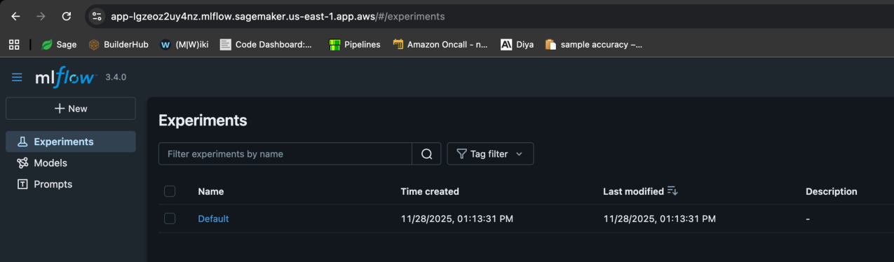

Pass to recipe under run block of your HyperPod recipe

Recipe

run
mlflow_tracking_uri: arn:aws:sagemaker:us-east-1:111122223333:mlflow-app/app-
LGZEOZ2UY4NZ

View

On SageMaker HyperPod
5601

## Page 631

Amazon SageMaker AI
Developer Guide

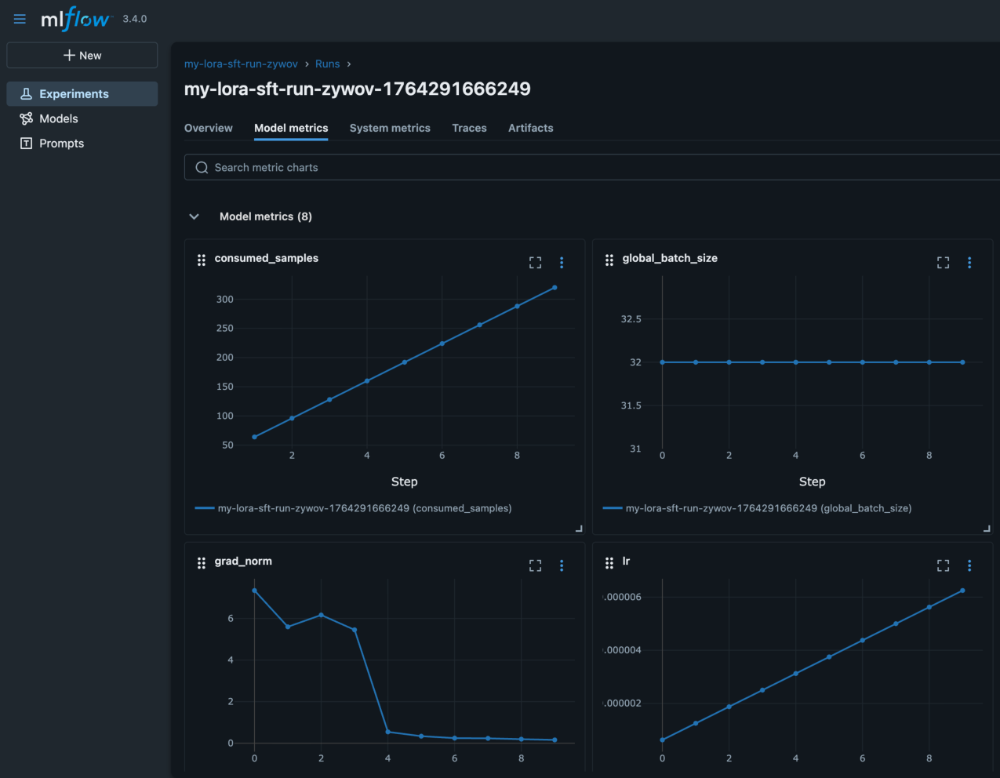

Using CloudWatch

Your logs are available in your AWS account that contains the hyperpod cluster under CloudWatch.
To view them in your browser, navigate to the CloudWatch homepage in your account and search

for your cluster name. For example, if your cluster were called my-hyperpod-rig the log group
would have the prefix:

• Log group: /aws/sagemaker/Clusters/my-hyperpod-rig/{UUID}

• Once you're in the log group, you can find your specific log using the node instance ID such as -

hyperpod-i-00b3d8a1bf25714e4.

• i-00b3d8a1bf25714e4 here represents the hyperpod friendly machine name where your

training job is running. Recall how in the previous command kubectl get pods -o wide -

On SageMaker HyperPod
5602

## Page 632

Amazon SageMaker AI
Developer Guide

w -n kubeflow | (head -n1 ; grep my-cpt-run) output we captured a column called
NODE.

• The "master" node run was in this case running on hyperpod-i-00b3d8a1bf25714e4
and thus we'll use that string to select the log group to view. Select the one that says

SagemakerHyperPodTrainingJob/rig-group/[NODE]

Using CloudWatch Insights

If you have your job name handy and don't wish to go through all the steps above, you can simply

query all logs under /aws/sagemaker/Clusters/my-hyperpod-rig/{UUID} to find the
individual log.

CPT:

fields @timestamp, @message, @logStream, @log
| filter @message like /(?i)Starting CPT Job/
| sort @timestamp desc
| limit 100

For job completion replace Starting CPT Job with CPT Job completed

Then you can click through the results and pick the one that says "Epoch 0" since that will be your
master node.

Using the AWS AWS CLI

You may choose to tail your logs using the AWS CLI. Before doing so, please check your aws cli

version using aws --version. It is also recommended to use this utility script that helps in live
log tracking in your terminal

for V1:

aws logs get-log-events \
--log-group-name /aws/sagemaker/YourLogGroupName \
--log-stream-name YourLogStream \
--start-from-head | jq -r '.events[].message'

for V2:

aws logs tail /aws/sagemaker/YourLogGroupName \

On SageMaker HyperPod
5603

## Page 633

Amazon SageMaker AI
Developer Guide

--log-stream-name YourLogStream \
--since 10m \
--follow

Listing active jobs

View all jobs running in your cluster:

hyperpod list-jobs -n kubeflow

Example output:

{
"jobs": [
{

"Name": "test-run-nhgza",
"Namespace": "kubeflow",
"CreationTime": "2025-10-29T16:50:57Z",
"State": "Running"
}
]
}

Canceling a job

Stop a running job at any time:

hyperpod cancel-job --job-name <job-name> -n kubeflow

Finding your job name

Option 1: From your recipe

The job name is specified in your recipe's run block:

run:
name: "my-test-run"                        # This is your job name
model_type: "amazon.nova-micro-v1:0:128k"
...

Option 2: From list-jobs command

On SageMaker HyperPod
5604

## Page 634

Amazon SageMaker AI
Developer Guide

Use hyperpod list-jobs -n kubeflow and copy the Name field from the output.

Running an evaluation job

Evaluate a trained model or base model using an evaluation recipe.

Prerequisites

Before running evaluation jobs, ensure you have:

• Checkpoint Amazon S3 URI from your training job's manifest.json file (for trained models)

• Evaluation dataset uploaded to Amazon S3 in the correct format

• Output Amazon S3 path for evaluation results

Command

Run the following command to start an evaluation job:

hyperpod start-job -n kubeflow \
--recipe evaluation/nova/nova_2_0/nova_lite/
nova_lite_2_0_p5_48xl_gpu_bring_your_own_dataset_eval \
--override-parameters '{
"instance_type": "p5.48xlarge",
"container": "708977205387.dkr.ecr.us-east-1.amazonaws.com/nova-evaluation-repo:SM-
HP-Eval-latest",
"recipes.run.name": "<your-eval-job-name>",
"recipes.run.model_name_or_path": "<checkpoint-s3-uri>",
"recipes.run.output_s3_path": "s3://<your-bucket>/eval-results/",
"recipes.run.data_s3_path": "s3://<your-bucket>/eval-data.jsonl"
}'

Parameter descriptions:

• recipes.run.name: Unique name for your evaluation job

• recipes.run.model_name_or_path: Amazon S3 URI from manifest.json or base model

path (e.g., nova-micro/prod)

• recipes.run.output_s3_path: Amazon S3 location for evaluation results

• recipes.run.data_s3_path: Amazon S3 location of your evaluation dataset

Tips:

On SageMaker HyperPod
5605

## Page 635

Amazon SageMaker AI
Developer Guide

• Model-specific recipes: Each model size (micro, lite, pro) has its own evaluation recipe

• Base model evaluation: Use base model paths (e.g., nova-micro/prod) instead of checkpoint
URIs to evaluate base models

Evaluation data format

Input format (JSONL):

{
"metadata": "{key:4, category:'apple'}",
"system": "arithmetic-patterns, please answer the following with no other words: ",
"query": "What is the next number in this series? 1, 2, 4, 8, 16, ?",
"response": "32"
}

Output format:

{
"prompt": "[{'role': 'system', 'content': 'arithmetic-patterns, please answer the
following with no other words: '}, {'role': 'user', 'content': 'What is the next
number in this series? 1, 2, 4, 8, 16, ?'}]",
"inference": "['32']",
"gold": "32",
"metadata": "{key:4, category:'apple'}"
}

Field descriptions:

• prompt: Formatted input sent to the model

• inference: Model's generated response

• gold: Expected correct answer from input dataset

• metadata: Optional metadata passed through from input

Common issues

• ModuleNotFoundError: No module named 'nemo_launcher', you might've to add

nemo_launcher to your python path based on where hyperpod_cli is installed. Sample
command:

On SageMaker HyperPod
5606

## Page 636

Amazon SageMaker AI
Developer Guide

export PYTHONPATH=<path_to_hyperpod_cli>/sagemaker-hyperpod-cli/src/hyperpod_cli/
sagemaker_hyperpod_recipes/launcher/nemo/nemo_framework_launcher/launcher_scripts:
$PYTHONPATH

• FileNotFoundError: [Errno 2] No such file or directory: '/tmp/

hyperpod_current_context.json' indicates you missed running the hyperpod connect
cluster command.

• If you don't see your job scheduled, double check if the output of your HyperPod CLI has this
section with job names and other metadata. If not, re-install helm chart by running:

curl -fsSL -o get_helm.sh https://raw.githubusercontent.com/helm/helm/main/scripts/
get-helm-3
chmod 700 get_helm.sh
./get_helm.sh
rm -f ./get_helm.sh

Creating a HyperPod EKS cluster with restricted instance group (RIG)

To customize a model on SageMaker HyperPod, the necessary infrastructure must be set up. For
details on setting up a SageMaker HyperPod EKS cluster with a restricted instance group (RIG), visit
the workshop, which provides a detailed walkthrough of the setup process.

Nova Forge access and setup for SageMaker AI HyperPod

Subscribe to Nova Forge

To access Nova Forge features, complete the following steps:

1.
Verify administrator access to the AWS account.

2.
Navigate to the SageMaker AI AI console and request access to Nova Forge.

3.
Wait for the Nova team to email a confirmation after the subscription request is approved.

4.
Tag your SageMaker HyperPod execution role with the forge-subscription tag. This tag
is required for accessing Nova Forge features and checkpoints. Add the following tag to your
execution role:

• Key: forge-subscription

• Value: true

On SageMaker HyperPod
5607

## Page 637

Amazon SageMaker AI
Developer Guide

Note

Standard Amazon Nova features remain available without a Forge subscription. Nova Forge
is designed for building custom frontier models with control and flexibility across all model
training phases.

Set up HyperPod infrastructure

Once your Nova Forge subscription is approved, set up the necessary SageMaker HyperPod
infrastructure to use Forge-enabled features. For detailed instructions on creating a HyperPod EKS
cluster with a restricted instance group (RIG), follow the workshop instructions.

Content moderation settings

Customizable content moderation settings (CCMS) are available for Nova Forge subscribers using
Amazon Nova Lite 1.0 and Pro 1.0 models. CCMS allows adjustment of content moderation
controls to align with specific business requirements while maintaining essential responsible AI
safeguards. To determine if your use case is appropriate for CCMS, contact your AWS Account
Manager.

For additional information on configuring and using CCMS with custom models, see the
Responsible AI Toolkit and Content Moderation section.

Training for Amazon Nova models

Training Amazon Nova models on Amazon SageMaker HyperPod supports multiple techniques
including Continued Pre-Training (CPT), Supervised Fine-Tuning (SFT), and Reinforcement Fine-
Tuning (RFT). Each technique serves different customization needs and can be applied to different
Amazon Nova model versions.

Topics

• Continued pre-training (CPT)

• Supervised fine-tuning (SFT)

• Reinforcement Fine-Tuning (RFT) on Amazon SageMaker HyperPod

On SageMaker HyperPod
5608

## Page 638

Amazon SageMaker AI
Developer Guide

Continued pre-training (CPT)

Continued pre-training (CPT) is a training technique that extends the pre-training phase of a
foundation model by exposing it to additional unlabeled text from specific domains or corpora.
Unlike supervised fine-tuning, which requires labeled input-output pairs, CPT trains on raw
documents to help the model acquire deeper knowledge of new domains, learn domain-specific
terminology and writing patterns, and adapt to particular content types or subject areas.

This approach is particularly valuable when you have large volumes (tens of billions of tokens) of
domain-specific text data, such as legal documents, medical literature, technical documentation,
or proprietary business content, and you want the model to develop native fluency in that domain.
Generally, after the CPT stage, the model needs to undergo additional instruction tuning stages to
enable the model to use the newly acquired knowledge and complete useful tasks.

Supported models

CPT is available for the following Amazon Nova models:

• Nova 1.0 (Micro, Lite, Pro)

• Nova 2.0 (Lite)

When to use Nova 1.0 versus Nova 2.0

The Amazon Nova family of models offers multiple price-performance operating points to optimize
between accuracy, speed, and cost.

Choose Nova 2.0 when you need the following:

• Advanced reasoning capabilities for complex analytical tasks

• Superior performance on coding, math, and scientific problem-solving

• Longer context length support

• Better multilingual performance

Choose Nova 1.0 when the following applies:

• Your use case requires standard language understanding without advanced reasoning.

• You want to optimize for lower training and inference costs.

On SageMaker HyperPod
5609

## Page 639

Amazon SageMaker AI
Developer Guide

• Your focus is on teaching the model domain-specific knowledge and behaviors rather than
complex reasoning tasks.

• You have already validated performance on Nova 1.0 and don't need additional capabilities.

Note

The larger model is not always better. Consider the cost-performance tradeoff and your
specific business requirements when selecting between Nova 1.0 and Nova 2.0 models.

CPT on Nova 1.0

You should use CPT in the following scenarios:

• You have large-scale, unlabeled data that's specific to a domain (for example medicine or
finance).

• You want the model to retain general language capabilities while improving on domain-specific
content.

• You want to improve zero-shot and few-shot performance in specialized areas without
performing extensive, task-specific fine-tuning.

Data format requirements

We recommend adhering to the following dataset characteristics when performing CPT:

• Diversity: Your data should cover a broad range of expressions within the target domain to avoid
over-fitting.

• Representation: Your data should reflect the distribution that the model will face during
inference.

• Cleanliness: Noise and redundancy in your data can degrade performance. Deduplication and
text normalization improve model training.

• Scale: Larger datasets help, but beyond a certain threshold (such as running multiple epochs on
limited data), over-fitting risks increase.

On SageMaker HyperPod
5610

## Page 640

Amazon SageMaker AI
Developer Guide

Training and validation datasets must be JSONL files following the format shown below, where
each line contains a JSON object representing a conversation with the required fields and structure.
Here is an example:

{"text": "AWS stands for Amazon Web Services"}
{"text": "Amazon SageMaker is a fully managed machine learning service"}
{"text": "Amazon Bedrock is a fully managed service for foundation models"}

Text entries should contain naturally flowing, high-quality content that represents your target
domain.

Dataset validation

To validate your dataset before submitting your CPT job, check for the following conditions:

• Each line must contain a valid JSON object.

• Each object has a "text" field that contains string data.

• No fields other than "text" are present.

• The file is a .jsonl extension.

Training times

The amount of time spent training depends heavily on the size of the dataset, the number of
instances use, and the model being trained. Training times are expected to scale linearly. The
following table provides some example training times for various models.

Model Type
GBS
Number of
Samples in
Dataset

Number of
P5 Instances

Approximate
training time
in hours

max_lengt

h  value

Amazon
Nova Micro

256
100,000
8
8,192
4

Amazon
Nova Lite

256
100,000
16
8,192
4

Amazon
Nova Pro

256
100,000
24
8,192
10

On SageMaker HyperPod
5611

## Page 641

Amazon SageMaker AI
Developer Guide

Training and validation datasets must be JSONL files following the format shown below, where
each line contains a JSON object representing a conversation with the required fields and structure.

The Amazon Nova parameters that are available for tuning with CPT include:

• Run configuration

• name: A descriptive name for your training job. This helps identify your job in the AWS
Management Console.

• model_type: The Amazon Nova model variant to use. The available options are

amazon.nova-micro-v1:0:128k, amazon.nova-lite-v1:0:300k, or amazon.nova-

pro-v1:0:300k.

• model_name_or_path: The path to the base model to use for your training. The available

options are nova-micro/prod, nova-lite/prod, nova-pro/prod, or the S3 path

for the post-training checkpoint (s3://customer-escrow-bucket-unique_id/

training_run_name).

• replicas: The number of compute instances to use for distributed training. Available values
vary based on the model you choose. Amazon Nova Micro supports 2, 4, or 8 replicas. Amazon
Nova Lite supports 4, 8, 16, or 32 replicas. Amazon Nova Pro supports 6, 12, or 24 replicas.

• data_s3_path: The S3 location of the training dataset, which is a JSONL file. This file must
reside in the same AWS account and Region as the cluster. All of the S3 locations provided
must be in the same account and Region.

• validation_data_s3_path: (Optional) The S3 location of the validation dataset, which is
a JSONL file. This file must reside in the same account and region as the cluster. All of the S3
locations provided must be in the same account and Region.

• output_s3_path: The S3 location where the manifest and TensorBoard logs are stored. All of
the S3 locations provided must be in the same AWS account and AWS Region.

• Training configuration

• max_length: The maximum sequence length in tokens. This determines the context window
size for training. The maximum supported value are 8192 tokens for CPT.

Longer sequences will improve training efficiencies at the cost of increased memory

requirements. We recommend that you match the max_length parameter to your data
distribution.

• Trainer settings

On SageMaker HyperPod
5612

## Page 642

Amazon SageMaker AI
Developer Guide

• global_batch_size: The total number of training samples processed together in one
forward or backward pass across all devices and workers.

This value multiplies the per-device batch size and number of devices. It affects the stability of

training and throughput. We recommend that you start with a batch size that fits comfortably
within your memory and scale up from there. For domain-specific data, larger batches might
over-smooth gradients.

• max_epochs: The number of complete passes through your training dataset.

In general, larger datasets require fewer epochs to converge, while smaller datasets require
more epochs to converge. We recommend that you adjust the number of epochs based on the
size of your data to prevent over-fitting.

• Model settings

• hidden_dropout: The probability of dropping hidden state outputs. Increase this value by
approximately 0.0-0.2 to reduce overfitting on smaller datasets. Valid values are between 0-1,
inclusive.

• attention_dropout: The probability of dropping attention weights. This parameter can help
with generalization. Valid values are between 0-1, inclusive.

• ffn_dropout: The probability of dropping feed-forward network outputs. Valid values are
between 0-1, inclusive.

• Optimizer configuration

• lr: The learning rate, which controls the step size during optimization. We recommend values
between 1e-6-1e-4 for good performance. Valid values are between 0-1, inclusive.

• name: The optimizer algorithm. Currently, only distributed_fused_adam is supported.

• weight_decay: The L2 regularization strength. Higher values (between 0.01-0.1) increase
regularization.

• warmup_steps: The number of steps to gradually increase learning rate. This improves
training stability. Valid values are between 1-20, inclusive.

• min_lr: The minimum learning rate at the end of decay. Valid values are between 0-1,
inclusive, but must be less than learning rate.

CPT recipe

The following is a recipe for CPT.

On SageMaker HyperPod
5613

## Page 643

Amazon SageMaker AI
Developer Guide

## Run config
run:
name: "my-cpt-run"             # A descriptive name for your training job
model_type: "amazon.nova-lite-v1:0:300k"  # Model variant specification, do not
change
model_name_or_path: "nova-lite/prod"      # Base model path, do not change
replicas: 4                     # Number of compute instances for training, allowed
values are 4, 8, 16
data_s3_path: [S3_PATH_TO_TRAIN_DATASET]
validation_data_s3_path: (OPTIONAL)[S3_PATH_TO_VALIDATION_DATASET]
output_s3_path: [S3_PATH_TO_STORE_MANIFEST]

## Training specific configs
training_config:
max_length: 8192               # Maximum context window size (tokens).
global_batch_size: 256           # Global batch size, allowed values are 32, 64, 128,

256.

trainer:
max_epochs: 2                # Number of training epochs

model:
hidden_dropout: 0.0          # Dropout for hidden states, must be between 0.0 and
1.0
attention_dropout: 0.0       # Dropout for attention weights, must be between 0.0
and 1.0
ffn_dropout: 0.0             # Dropout for feed-forward networks, must be between
0.0 and 1.0

optim:
lr: 1e-5                 # Learning rate
name: distributed_fused_adam  # Optimizer algorithm, do not change
adam_w_mode: true        # Enable AdamW mode
eps: 1e-06               # Epsilon for numerical stability
weight_decay: 0.0        # L2 regularization strength, must be between 0.0 and
1.0
betas:                   # Adam optimizer betas, must be between 0.0 and 1.0
- 0.9
- 0.999
sched:
warmup_steps: 10     # Learning rate warmup steps
constant_steps: 0    # Steps at constant learning rate
min_lr: 1e-6         # Minimum learning rate, must be lower than lr

On SageMaker HyperPod
5614

## Page 644

Amazon SageMaker AI
Developer Guide

Limitations

CPT has the following limitations:

• Multimodal datasets aren't supported.

• Intermediate checkpoints aren't saved for evaluation and you can't resume from an intermediate
checkpoint. Only the last checkpoint is saved.

CPT on Nova 2.0

Amazon Nova Lite 2.0 is a reasoning model trained on larger and more diverse datasets than Nova
Lite 1.0. Despite being a larger model, Nova Lite 2.0 delivers faster inference than Nova Lite 1.0
while offering enhanced reasoning capabilities, longer context lengths, and improved multilingual
performance.

CPT on Nova 2.0 allows you to extend these advanced capabilities with your domain-specific data,
enabling the model to develop deep expertise in specialized areas while maintaining its superior
reasoning and analytical abilities.

Data preparation for CPT on 2.0

Data format requirements

Training and validation datasets must be JSONL files following the format shown below, where
each line contains a JSON object representing a conversation with the required fields and structure.
Here is an example:

{"text": "AWS stands for Amazon Web Services"}
{"text": "Amazon SageMaker is a fully managed machine learning service"}
{"text": "Amazon Bedrock is a fully managed service for foundation models"}

Text entries should contain naturally flowing, high-quality content that represents the target
domain.

Test that the data is capable of being converted into Arrow format. Use the python script below to

help with it. Ensure the datasets==2.18.0 version at minimum is used:

from datasets import load_dataset, load_from_disk
from pathlib import Path

On SageMaker HyperPod
5615

## Page 645

Amazon SageMaker AI
Developer Guide

input_path = Path("<Your jsonl file>")
output_path = Path("<Your output directory>")

dataset = load_dataset("json", data_files=str(input_path), split="train")
dataset.save_to_disk(str(output_path), max_shard_size="1GB")

try:
test_dataset = datasets.load_from_disk(output_dir)
print(f"Dataset loaded successfully #! Contains {len(test_dataset)} samples")
except Exception as e:
print(e)

It should print the same number of lines that were in the JSONL file.

When using datamixing, run the first job with max_steps=2. This will help create optimizations in
the cluster for data access and validate that all the datamixes are available.

How to prepare data for CPT

Training data is the most crucial determining factor for the success of continuous pre-training.
While CPT data is often described as "unlabeled," the reality is far more nuanced. How data is
structured, formatted, and presented determines whether the model will acquire the knowledge
and skills required for the business use case.

Preparing structured business datasets for CPT

This is a common challenge for companies and organizations building foundation models
specialized in their domain. Most businesses possess rich repositories of structured data: product
catalogs, user profiles, transaction logs, form submissions, API calls, and operational metadata. At
first glance, this looks very different from the unstructured web text typically used in standard pre-
training.

To effectively learn from structured business data, think carefully about downstream tasks and
design the data presentation to force the model to learn the right predictive relationships.

To unlock the full potential of continuous pre-training, consider:

• What tasks the model should perform at inference time

• What information is present in the raw data

• How to structure that data so the model learns to extract and manipulate the information
correctly

On SageMaker HyperPod
5616

## Page 646

Amazon SageMaker AI
Developer Guide

Simply dumping structured data into training won't teach the model to reason about it. Actively
shape the data presentation to guide what the model learns.

In the following sections, there is literature review demonstrating the importance of data

augmentation and provide examples augmentation strategies for structured business data that will
give useful ideas on how to treat and organize business dataset for CPT.

Structured data for CPT in the literature

CPT can pack domain facts into the model but often fails to make those facts retrievable and
manipulable when inputs or tasks shift. Controlled experiments show that without diverse
augmentation during pretraining, models memorize facts in brittle ways that remain hard to
extract even after later instruction tuning, and they recommend injecting instruction like signals
early in training. For semi structured data, randomized serialization and other augmentations
reduce schema overfitting, which is why CPT should be interleaved with instruction style tasks

rather than run first and IFT later. Finance focused work further finds that jointly mixing CPT
and instruction data at batch time improves generalization and reduces forgetting versus the
sequential recipe. Qwen technical report converges on the same pattern by integrating high quality
instruction data into pretraining itself, which boosts in context learning and preserves instruction
following while acquiring new domain knowledge.

Data augmentation for semi structured corpora is a key lever. Synthetic graph aware CPT expands
small domain sets into entity linked corpora that explicitly teach relationships and compounds with
retrieval at inference time. Joint CPT plus instruction mixing outperforms sequential pipelines in
finance and balancing domain with general data lowers degradation on general skills. Very large
scale domain CPT can also retain broad ability and even allow trade offs through model merging,
yet still points to instruction tuning as an essential next step, reinforcing the value of introducing
instruction signals during CPT.

Injecting diversity through randomization and shuffling

A general strategy that helps to teach model effectively from the structured and semi structured
datasets is to shuffle the order of fields in the datasets, and even randomly drop out some keys.

Shuffling the fields forces the model to read what each value means instead of where it appears
and learn the relationships between all the fields. For example, in case of an video game posted
on amazon store, when "Title," "Platform," "Price," "Condition," and "Edition" arrive in different
permutations, the model can't rely on "the third slot is platform"; it must bind labels to values and
learn the bilateral relationships among attributes: title  ⇄ platform, platform  ⇄ price, condition  ⇄

On SageMaker HyperPod
5617

## Page 647

Amazon SageMaker AI
Developer Guide

price. So it can, for example, infer a likely platform from a game name and an observed price, or
estimate a plausible price range given a title and platform.

Randomly dropping keys during serialization acts like feature dropout: it prevents co-adaptation on
any one field and forces the model to recover missing information from the remaining evidence. If

"Platform" is absent, the model must pick it up from the title string or compatibility text; if "Price"
is hidden, it has to triangulate from platform, edition, and condition. This builds symmetry  (A→B
and  B→A), robustness to messy real-world listings, and schema invariance when fields are missing,
renamed, or reordered.

An shopping-style example makes it concrete. Serialize the same item multiple ways—"Title: 'Elden
Ring' | Platform: PlayStation 5 | Condition: Used—Like New | Price: $34.99" and a permutation
like "Price: $34.99 | Title: 'Elden Ring' | Condition: Used—Like New | Platform: PlayStation 5"—
and on some passes drop "Platform" while leaving "Compatible with PS5" in the description.
Train complementary objectives such as predicting platform from {title, price} and predicting a

price bucket from {title, platform}. Because order and even presence of keys vary, the only stable
strategy is to learn the true relationships between attributes rather than memorize a template.

The way data is presented matters

LLMs learn by predicting the next token from what they have already seen. So the order of fields
and events shown during training decides what the model can learn. If the training format matches
the real task, the loss lands on the exact decision tokens. If fields are tossed together without
structure, the model learns shortcuts or memorizes popularity and then fails when asked to choose
among options.

Show the situation first, then the options, then the decision. If the model should also learn about
outcomes or explanations, put them after the decision.

Packing samples for CPT

What is packing?

It simply means to fill each sequence window in the training data with multiple whole examples so
the window is dense with real tokens, not padding.

Why it matters

During training a maximum context length is set, for example 8,192 tokens. Batches are shaped
to [batch size × context length]. If a training example is shorter than the context length, the

On SageMaker HyperPod
5618

## Page 648

Amazon SageMaker AI
Developer Guide

remaining positions are padded. Padding still runs through attention and MLP kernels even if loss is
masked, so compute is paid for tokens that carry no learning signal.

How to do packing?

To pack multiple samples, concatenate multiple training samples with a  [DOC]  separator in
between (note the space before and after the [DOC] ) such that the full length of the samples are
under the desired context length.

An example packed document would look like this:

{"text": "training sample 1 [DOC] training sample 2 [DOC] training sample 3"}

Supervised fine-tuning (SFT)

The SFT training process consists of two main stages:

• Data Preparation: Follow established guidelines to create, clean, or reformat datasets into the
required structure. Ensure that inputs, outputs, and auxiliary information (such as reasoning
traces or metadata) are properly aligned and formatted.

• Training Configuration: Define how the model will be trained. When using SageMaker
HyperPod, this configuration is written in a YAML recipe file that includes:

• Data source paths (training and validation datasets)

• Key hyperparameters (epochs, learning rate, batch size)

• Optional components (distributed training parameters, etc)

Nova Model Comparison and Selection

Amazon Nova 2.0 is a model trained on a larger and more diverse dataset than Amazon Nova 1.0.
Key improvements include:

• Enhanced reasoning abilities with explicit reasoning mode support

• Broader multilingual performance across additional languages

• Improved performance on complex tasks including coding and tool use

• Extended context handling with better accuracy and stability at longer context lengths

On SageMaker HyperPod
5619

## Page 649

Amazon SageMaker AI
Developer Guide

When to Use Nova 1.0 vs. Nova 2.0

Choose Amazon Nova 2.0 when:

• Superior performance with advanced reasoning capabilities is needed

• Multilingual support or complex task handling is required

• Better results on coding, tool calling, or analytical tasks are needed

Choose Amazon Nova 1.0 when:

• The use case requires standard language understanding without advanced reasoning

• Performance has already been validated on Amazon Nova 1.0 and additional capabilities are not
needed

SFT on Nova 1.0

Supervised fine-tuning (SFT) is the process of providing a collection of prompt-response pairs to
a foundation model to improve the performance of a pre-trained foundation model on a specific
task. The labeled examples are formatted as prompt-response pairs and phrased as instructions.
This fine-tuning process modifies the weights of the model.

You should use SFT when you have domain-specific data that requires providing specific prompt-
response pairs for optimal results.

Note that your training and validation input datasets must reside in customer-owned buckets, not
in escrow, or service-managed S3 buckets.

Data requirements

For full-rank SFT and low-rank adapter (LoRA) SFT, the data should follow the Amazon Bedrock
Converse operation format. For examples and constraints of this format, see Preparing data for
fine-tuning Understanding models.

To validate your dataset format before submission, we recommend using the validation script from
the Amazon Bedrock samples repository. This validation tool helps ensure that your JSONL files
adhere to the required format specifications and identify any potential issues before you submit
your fine-tuning job.

The Amazon Nova parameters that are available for tuning with SFT are as follows:

On SageMaker HyperPod
5620

## Page 650

Amazon SageMaker AI
Developer Guide

• Run configuration

• name: A descriptive name for your training job. This helps identify your job in the AWS
Management Console.

• model_type: The Amazon Nova model variant to use. The available options are

amazon.nova-micro-v1:0:128k, amazon.nova-lite-v1:0:300k, or amazon.nova-

pro-v1:0:300k.

• model_name_or_path: The path to the base model to use for your training. Select the model

to use from nova-micro/prod, nova-lite/prod, nova-pro/prod, or the S3 path for the

post-training checkpoint (s3://<escrow bucket>/<job id>/outputs/checkpoints).

• replicas: The number of compute instances to use for distributed training. Available values
vary based on the model chosen. Amazon Nova Micro supports 2, 4, or 8 replicas. Amazon
Nova Lite supports 4, 8, 16, or 32 replicas. Amazon Nova Pro supports 6, 12, or 24 replicas.

• data_s3_path: The S3 location of the training dataset, which is a JSONL file. This file must
reside in the same AWS account and Region as the cluster. All of the S3 locations within the
provided S3 path must be in the same account and Region.

• validation_data_s3_path: (Optional) The S3 location of the validation dataset, which is
a JSONL file. This file must reside in the same account and Region as the cluster. All of the S3
locations within the provided S3 path must be in the same account and Region.

• output_s3_path: The S3 location where the manifest and TensorBoard logs are stored. All of
the S3 locations within the provided S3 path must be in the same account and region.

• Training configuration

• max_length: The maximum sequence length in tokens. This determines the context window
size for training. The maximum supported value are 65,536 tokens for SFT.

Longer sequences will improve training efficiencies at the cost of increased memory

requirements. We recommend that you match the max_length parameter to your data
distribution.

• Trainer settings

• max_epochs: The number of complete passes through your training dataset.

In general, larger datasets require fewer epochs to converge, while smaller datasets require
more epochs to converge. We recommend that you adjust the number of epochs based on the
size of your data.

• Model settings

On SageMaker HyperPod
5621

## Page 651

Amazon SageMaker AI
Developer Guide

• hidden_dropout: The probability of dropping hidden state outputs. Increase this value by
approximately 0.0-0.2 to reduce over-fitting on smaller datasets. Valid values are between 0-1,
inclusive.

• attention_dropout: The probability of dropping attention weights. This parameter can help
with generalization. Valid values are between 0-1, inclusive.

• ffn_dropout: The probability of dropping feed-forward network outputs. Valid values are
between 0-1, inclusive.

• Optimizer configuration

• lr: The learning rate, which controls the step size during optimization. Valid values
are between 1e-6-1e-3, inclusive. We recommend values between 1e-6-1e-4 for good
performance.

• name: The optimizer algorithm. Currently, only distributed_fused_adam is supported.

• weight_decay: The L2 regularization strength. Higher values (between 0.01-0.1) increase
regularization.

• warmup_steps: The number of steps to gradually increase learning rate. This improves
training stability. Valid values are between 1-20, inclusive.

• min_lr: The minimum learning rate at the end of decay. Valid values are between 0-1,
inclusive, but must be less than learning rate.

Quick start with a full-rank SFT recipe

The following is a recipe for full-rank SFT that's intended for you to quickly start an SFT job on a
HyperPod cluster. This recipe also assumes that you have connected to your HyperPod cluster using
the correct AWS credentials.

run:
name: "my-sft-micro-job" # gets appended with a unique ID for HP jobs
model_type: "amazon.nova-micro-v1:0:128k"
model_name_or_path: "nova-micro/prod"
replicas: 2
data_s3_path: s3:Replace with your S3 bucket name/input.jsonl
validation_data_s3_path: [OPTIONAL] s3:your S3 bucket name/input.jsonl
output_s3_path: [S3_PATH_TO_STORE_MANIFEST]

## training specific configs
training_config:
max_length: 32768

On SageMaker HyperPod
5622

## Page 652

Amazon SageMaker AI
Developer Guide

save_steps: 100000
replicas: ${recipes.run.replicas}
micro_batch_size: 1
task_type: sft
global_batch_size: 64
weights_only: True
allow_percentage_invalid_samples: 10

exp_manager:
exp_dir: null
create_wandb_logger: False
create_tensorboard_logger: True
project: null
name: null
checkpoint_callback_params:
monitor: step
save_top_k: 10

mode: max
every_n_train_steps: ${recipes.training_config.save_steps}
save_last: True
create_early_stopping_callback: True
early_stopping_callback_params:
min_delta: 0.001
mode: min
monitor: "val_loss"
patience: 2

trainer:
log_every_n_steps: 1
max_epochs: -1
max_steps: 16
val_check_interval: 100
limit_test_batches: 0
gradient_clip_val: 1.0
num_nodes: ${recipes.training_config.replicas}

model:
hidden_dropout: 0.0 # Dropout probability for hidden state transformer.
attention_dropout: 0.0 # Dropout probability in the attention layer.
ffn_dropout: 0.0 # Dropout probability in the feed-forward layer.
sequence_parallel: True
optim:
lr: 1e-5
name: distributed_fused_adam

On SageMaker HyperPod
5623

## Page 653

Amazon SageMaker AI
Developer Guide

bucket_cap_mb: 10
contiguous_grad_buffer: False
overlap_param_sync: False
contiguous_param_buffer: False
overlap_grad_sync: False
adam_w_mode: true
eps: 1e-06
weight_decay: 0.0
betas:
- 0.9
- 0.999
sched:
name: CosineAnnealing
warmup_steps: 10
constant_steps: 0
min_lr: 1e-6

mm_cfg:
llm:
freeze: false
image_projector:
freeze: true
require_newline: true
video_projector:
freeze: true
require_newline: false

peft:
peft_scheme: null

training_validation:
loader:
args:
data_loader_workers: 1
prefetch_factor: 2
collator:
args:
force_image_at_turn_beginning: false

Sample full-rank recipe

The following is a sample full-rank recipe for SFT with all components properly configured.

## Run config

On SageMaker HyperPod
5624

## Page 654

Amazon SageMaker AI
Developer Guide

run:
name: "my-sft-run"              # A descriptive name for your training job
model_type: "amazon.nova-lite-v1:0:300k"  # Model variant specification
model_name_or_path: "nova-lite/prod"      # Base model path
replicas: 4                     # Number of compute instances for training
data_s3_path: s3:Replace with your S3 bucket name/input.jsonl
validation_data_s3_path: [OPTIONAL] s3:your S3 bucket name/input.jsonl
output_s3_path: [S3_PATH_TO_STORE_MANIFEST]

## Training specific configs
training_config:
max_length: 32768               # Maximum context window size (tokens)

trainer:
max_epochs: 2               # Number of training epochs
model:

hidden_dropout: 0.0          # Dropout for hidden states
attention_dropout: 0.0       # Dropout for attention weights
ffn_dropout: 0.0             # Dropout for feed-forward networks
optim:
lr: 1e-5                 # Learning rate
name: distributed_fused_adam  # Optimizer algorithm
adam_w_mode: true        # Enable AdamW mode
eps: 1e-06               # Epsilon for numerical stability
weight_decay: 0.0        # L2 regularization strength
betas:                   # Adam optimizer betas
- 0.9
- 0.999
sched:
warmup_steps: 10     # Learning rate warmup steps
constant_steps: 0    # Steps at constant learning rate
min_lr: 1e-6         # Minimum learning rate
peft:
peft_scheme: null        # Set to null for full-parameter fine-tuning

Limitations

Publishing metrics to Weights & Biases is not supported.

To adjust the hyperparameters, follow the guidance in Selecting hyperparameters.

On SageMaker HyperPod
5625

## Page 655

Amazon SageMaker AI
Developer Guide

Parameter-efficient fine-tuning (PEFT)

Parameter-efficient fine-tuning (PEFT) involves retraining a small number of additional weights
to adapt a foundation model to new tasks or domains. Specifically, low-rank adapter (LoRA) PEFT
efficiently fine-tunes foundation models by introducing low-rank trainable weight matrices into

specific model layers, reducing the number of trainable parameters while maintaining model
quality.

A LoRA PEFT adapter augments the base foundation model by incorporating lightweight adapter
layers that modify the model’s weights during inference while keeping the original model
parameters intact. This approach is also considered one of the most cost-effective fine-tuning
techniques. For more information, see Fine-tune models with adapter inference components.

You should use LoRA PEFT in the following scenarios:

• You want to start with a fast training procedure.

• The base model's performance is already satisfactory. In this case, the goal of LoRA PEFT is to
enhance its capabilities across multiple related tasks, such as text summarization or language
translation. LoRA PEFT's regularization properties help prevent overfitting and mitigate the
risks of the model "forgetting" the source domain. This ensures the model remains versatile and
adaptable to various applications.

• You want to perform instruction fine-tuning scenarios with relatively small datasets. LoRA PEFT
performs better with smaller, task-specific datasets than broader, larger datasets.

• You have large, labeled datasets that exceed the Amazon Bedrock customization data limits. In
this case, you can use LoRA PEFT on SageMaker AI to generate better results.

• If you have already achieved promising results through Amazon Bedrock fine-tuning, LoRA PEFT
in SageMaker AI can help further optimize the model hyperparameters.

The Amazon Nova parameters that are available for with LoRA PEFT include:

• Run configuration

• name: A descriptive name for your training job. This helps identify your job in the AWS
Management Console.

• model_type: The Nova model variant to use. The available options are amazon.nova-

micro-v1:0:128k, amazon.nova-lite-v1:0:300k, or amazon.nova-pro-v1:0:300k.

• model_name_or_path: The path to the base model to use for your training. Select the model

to use. The available options are nova-micro/prod, nova-lite/prod, nova-pro/prod,

On SageMaker HyperPod
5626

## Page 656

Amazon SageMaker AI
Developer Guide

or the S3 path for the post-training checkpoint (s3://<escrow bucket>/<job id>/

outputs/checkpoints).

• replicas: The number of compute instances to use for distributed training. Available values
vary based on the model you use. Amazon Nova Micro supports 2, 4, or 8 replicas. Amazon

Nova Lite supports 4, 8, 16, or 32 replicas. Amazon Nova Pro supports 6, 12, or 24 replicas.

• output_s3_path: The S3 location where the manifest and TensorBoard logs are stored. All of

the S3 locations within the provided S3 path must be in the same account and region.

• Training configuration

• max_length: The maximum sequence length in tokens. This determines the context window
size for training. The maximum supported value are 65,536 tokens for LoRA PEFT.

Longer sequences will improve training efficiencies at the cost of increased memory

requirements. We recommend that you match the max_length parameter to your data
distribution.

• Trainer settings

• max_epochs: The number of complete passes through your training dataset. You can set

either max_steps or max_epochs, but we do not recommend setting both. The maximum
value is 5.

In general, larger datasets require fewer epochs to converge, while smaller datasets require
more epochs to converge. We recommend that you adjust the number of epochs based on the
size of your data.

• Model settings

• hidden_dropout: The probability of dropping hidden state outputs. Increase this value by
approximately 0.0-0.2 to reduce overfitting on smaller datasets. Valid values are between 0-1,
inclusive.

• attention_dropout: The probability of dropping attention weights. This parameter can help
with generalization. Valid values are between 0-1, inclusive.

• ffn_dropout: The probability of dropping feed-forward network outputs. Valid values are
between 0-1, inclusive.

• Optimizer configuration

• lr: The learning rate, which controls the step size during optimization. We recommend values
between 1e-6-1e-4 for good performance. Valid values are between 0-1, inclusive.

• name: The optimizer algorithm. Currently, only distributed_fused_adam is supported.

On SageMaker HyperPod
5627

## Page 657

Amazon SageMaker AI
Developer Guide

• weight_decay: The L2 regularization strength. Higher values (between 0.01-0.1) increase
regularization.

• warmup_steps: The number of steps to gradually increase learning rate. This improves
training stability. Valid values are between 1-20, inclusive.

• min_lr: The minimum learning rate at the end of decay. Valid values are between 0-1,
inclusive, but must be less than learning rate.

• LoRA configuration parameters

• peft_scheme: Set to lora to enable low-rank adaptation.

• alpha: The scaling factor for LoRA weights. This is typically set to same value as

adapter_dim.

• adaptor_dropout: The regularization parameter for LoRA.

PEFT recipe

The following is a recipe for LoRA PEFT.

## Run config
run:
name: "my-lora-run"             # A descriptive name for your training job
model_type: "amazon.nova-lite-v1:0:300k"  # Model variant specification
model_name_or_path: "nova-lite/prod"      # Base model path
replicas: 4                     # Number of compute instances for training
output_s3_path: [S3_PATH_TO_STORE_MANIFEST]

## Training specific configs
training_config:
max_length: 32768               # Maximum context window size (tokens)

trainer:
max_epochs: 2               # Number of training epochs
model:
hidden_dropout: 0.0          # Dropout for hidden states
attention_dropout: 0.0       # Dropout for attention weights
ffn_dropout: 0.0             # Dropout for feed-forward networks
optim:
lr: 1e-5                 # Learning rate
name: distributed_fused_adam  # Optimizer algorithm

On SageMaker HyperPod
5628

## Page 658

Amazon SageMaker AI
Developer Guide

adam_w_mode: true        # Enable AdamW mode
eps: 1e-06               # Epsilon for numerical stability
weight_decay: 0.0        # L2 regularization strength
betas:                   # Adam optimizer betas
- 0.9
- 0.999
sched:
warmup_steps: 10     # Learning rate warmup steps
constant_steps: 0    # Steps at constant learning rate
min_lr: 1e-6         # Minimum learning rate
peft:
peft_scheme: "lora"      # Enable LoRA for parameter-efficient fine-tuning
lora_tuning:
loraplus_lr_ratio: 8.0  # LoRA+ learning rate scaling factor
alpha: 32            # Scaling factor for LoRA weights
adapter_dropout: 0.01  # Regularization for LoRA parameters

Troubleshooting

Use the following information to help resolve issues that you might encounter:

• The input dataset for both training and validation should reside in customer-owned buckets, not
in escrow, or service-managed S3 buckets.

• If you receive a Region not found error in the AWS CLI, resubmit the job with the region

prepended to the start-job command. For example: AWS_REGION=us-east-1 hyperpod

start-job ...Job Parameters.

• To adjust the hyperparameters, follow the guidance in Selecting hyperparameters.

SFT on Nova 2.0

Amazon Nova Lite 2.0 brings enhanced capabilities for supervised fine-tuning, including advanced
reasoning mode, improved multimodal understanding, and extended context handling. SFT
on Nova 2.0 enables you to adapt these powerful capabilities to your specific use cases while
maintaining the model's superior performance on complex tasks.

Key features of SFT on Nova 2.0 include:

• Reasoning mode support: Train models to generate explicit reasoning traces before final
answers for enhanced analytical capabilities.

On SageMaker HyperPod
5629

## Page 659

Amazon SageMaker AI
Developer Guide

• Advanced multimodal training: Fine-tune on document understanding (PDF), video
understanding, and image-based tasks with improved accuracy.

• Tool calling capabilities: Train models to effectively use external tools and function calling for
complex workflows.

• Extended context support: Leverage longer context windows with better stability and accuracy
for document-intensive applications.

Topics

• Reasoning Mode Selection (Nova 2.0 Only)

• Tool calling data format

• Document understanding data format

• Video Understanding for SFT

• Data Upload Instructions

• Creating a Fine-Tuning Job

• Hyperparameter Guidance

Reasoning Mode Selection (Nova 2.0 Only)

Amazon Nova 2.0 supports reasoning mode for enhanced analytical capabilities:

• Reasoning Mode (enabled):

• Set reasoning_enabled: true in the training configuration

• Model trains to generate reasoning traces before final answers

• Improves performance on complex reasoning tasks

• Non-Reasoning Mode (disabled):

• Set reasoning_enabled: false or omit the parameter (default)

• Standard SFT without explicit reasoning

• Suitable for tasks that don't benefit from step-by-step reasoning

Note

• When reasoning is enabled, it operates at high reasoning effort. There is no low
reasoning option for SFT.

On SageMaker HyperPod
5630

## Page 660

Amazon SageMaker AI
Developer Guide

• Multimodal reasoning content is not supported for SFT. Reasoning mode applies to text-
only inputs.

Using reasoning mode with non-reasoning datasets

Training Amazon Nova on a non-reasoning dataset with reasoning_enabled: true is
permitted. However, doing so may cause the model to lose its reasoning capabilities, as Amazon
Nova primarily learns to generate the responses presented in the data without applying reasoning.

If training Amazon Nova on a non-reasoning dataset but still want to use reasoning during
inference:

1.
Disable reasoning during training (reasoning_enabled: false)

2.
Enable reasoning later during inference

While this approach allows reasoning at inference time, it does not guarantee improved
performance compared to inference without reasoning.

Best practice: Enable reasoning for both training and inference when using reasoning datasets,
and disable it for both when using non-reasoning datasets.

Tool calling data format

SFT supports training models to use tools (function calling). Below is a sample input format for
tool calling:

Sample input:

{
"schemaVersion": "bedrock-conversation-2024",
"system": [
{
"text": "You are an expert in composing function calls."
}
],
"toolConfig": {
"tools": [
{
"toolSpec": {
"name": "getItemCost",

On SageMaker HyperPod
5631

## Page 661

Amazon SageMaker AI
Developer Guide

"description": "Retrieve the cost of an item from the catalog",
"inputSchema": {
"json": {
"type": "object",
"properties": {
"item_name": {
"type": "string",
"description": "The name of the item to retrieve cost for"
},
"item_id": {
"type": "string",
"description": "The ASIN of item to retrieve cost for"
}
},
"required": [
"item_id"
]

}
}
}
},
{
"toolSpec": {
"name": "getItemAvailability",
"description": "Retrieve whether an item is available in a given location",
"inputSchema": {
"json": {
"type": "object",
"properties": {
"zipcode": {
"type": "string",
"description": "The zipcode of the location to check in"
},
"quantity": {
"type": "integer",
"description": "The number of items to check availability for"
},
"item_id": {
"type": "string",
"description": "The ASIN of item to check availability for"
}
},
"required": [
"item_id", "zipcode"

On SageMaker HyperPod
5632

## Page 662

Amazon SageMaker AI
Developer Guide

]
}
}
}
}
]
},
"messages": [
{
"role": "user",
"content": [
{
"text": "I need to check whether there are twenty pieces of the following
item available. Here is the item ASIN on Amazon: id-123. Please check for the zipcode
94086"
}
]

},
{
"role": "assistant",
"content": [
{
"reasoningContent": {
"reasoningText": {
"text": "The user wants to check how many pieces of the item with ASIN
id-123 are available in the zipcode 94086"
}
}
},
{
"toolUse": {
"toolUseId": "getItemAvailability_0",
"name": "getItemAvailability",
"input": {
"zipcode": "94086",
"quantity": 20,
"item_id": "id-123"
}
}
}
]
},
{
"role": "user",

On SageMaker HyperPod
5633

## Page 663

Amazon SageMaker AI
Developer Guide

"content": [
{
"toolResult": {
"toolUseId": "getItemAvailability_0",
"content": [
{
"text": "[{\"name\": \"getItemAvailability\", \"results\":
{\"availability\": true}}]"
}
]
}
}
]
},
{
"role": "assistant",
"content": [

{
"text": "Yes, there are twenty pieces of item id-123 available at 94086.
Would you like to place an order or know the total cost?"
}
]
}
]
}

Important considerations for tool calling data:

• ToolUse must appear in assistant turns only

• ToolResult must appear in user turns only

• ToolResult should be text or JSON only; other modalities are not currently supported for Amazon
Nova models

• The inputSchema within the toolSpec must be a valid JSON Schema object

• Each ToolResult must reference a valid toolUseId from a preceding assistant ToolUse, with each
toolUseId used exactly once per conversation

Document understanding data format

SFT supports training models on document understanding tasks. Below is a sample input format:

Sample input

On SageMaker HyperPod
5634

## Page 664

Amazon SageMaker AI
Developer Guide

{
"schemaVersion": "bedrock-conversation-2024",
"messages": [
{
"role": "user",
"content": [
{
"text": "What are the ways in which a customer can experience issues during
checkout on Amazon?"
},
{
"document": {
"format": "pdf",
"source": {
"s3Location": {
"uri": "s3://my-bucket-name/path/to/documents/

customer_service_debugging.pdf",
"bucketOwner": "123456789012"
}
}
}
}
]
},
{
"role": "assistant",
"content": [
{
"text": "Customers can experience issues with 1. Data entry, 2. Payment
methods, 3. Connectivity while placing the order. Which one would you like to dive
into?"
}
],
"reasoning_content": [
{
"text": "I need to find the relevant section in the document to answer the
question.",
"type": "text"
}
]
}
]
}

On SageMaker HyperPod
5635

## Page 665

Amazon SageMaker AI
Developer Guide

Important considerations for document understanding:

• Only PDF files are supported

• Maximum document size is 10 MB

• A sample can contain documents and text, but cannot mix documents with other modalities
(such as images or video)

Video Understanding for SFT

SFT supports fine-tuning models for video understanding tasks. Below is a sample input format:

Sample input

{
"schemaVersion": "bedrock-conversation-2024",
"messages": [
{
"role": "user",
"content": [
{
"text": "What are the ways in which a customer can experience issues during
checkout on Amazon?"
},
{
"video": {
"format": "mp4",
"source": {
"s3Location": {
"uri": "s3://my-bucket-name/path/to/videos/
customer_service_debugging.mp4",
"bucketOwner": "123456789012"
}
}
}
}
]
},
{
"role": "assistant",
"content": [
{

On SageMaker HyperPod
5636

## Page 666

Amazon SageMaker AI
Developer Guide

"text": "Customers can experience issues with 1. Data entry, 2. Payment
methods, 3. Connectivity while placing the order. Which one would you like to dive
into?"
}
],
"reasoning_content": [
{
"text": "I need to find the relevant section in the video to answer the
question.",
"type": "text"
}
]
}
]
}

Important considerations for video understanding:

• Videos can be a maximum of 50 MB

• Videos can be up to 15 minutes long

• Only one video is allowed per sample; multiple videos in the same sample are not supported

• A sample can contain video and text, but cannot mix video with other modalities (such as images
or documents)

Data Upload Instructions

Upload training and validation datasets to an S3 bucket. Specify these locations in the recipe's run
block:

## Run config
run:
...
data_s3_path: "s3://<bucket-name>/<training-directory>/<training-file>.jsonl"

Note: Replace <bucket-name>, <training-directory>, <validation-directory>,

<training-file>, and <validation-file> with actual S3 paths.

Note: Validation datasets are not currently supported for SFT with Amazon Nova 2.0. If a validation
dataset is provided, it will be ignored.

On SageMaker HyperPod
5637

## Page 667

Amazon SageMaker AI
Developer Guide

Creating a Fine-Tuning Job

Define the base model using the model_type and model_name_or_path fields in the run block:

## Run config

run:
...
model_type: amazon.nova-2-lite-v1:0:256k
model_name_or_path: nova-lite-2/prod
...

Hyperparameter Guidance

Use the following recommended hyperparameters based on the training approach:

Full Rank Training

• Epochs: 1

• Learning rate (lr): 1e-5

• Minimum learning rate (min_lr): 1e-6

LoRA (Low-Rank Adaptation)

• Epochs: 2

• Learning rate (lr): 5e-5

• Minimum learning rate (min_lr): 1e-6

Note: Adjust these values based on dataset size and validation performance. Monitor training
metrics to prevent overfitting.

Reinforcement Fine-Tuning (RFT) on Amazon SageMaker HyperPod

Reinforcement Fine-Tuning (RFT) is a machine learning technique that improves model
performance through feedback signals—measurable scores or rewards indicating response quality
—rather than direct supervision with exact correct answers. Unlike traditional supervised fine-
tuning that learns from input-output pairs, RFT uses reward functions to evaluate model responses
and iteratively optimizes the model to maximize these rewards.

This approach is particularly effective for tasks where defining the exact correct output is
challenging, but you can reliably measure response quality. RFT enables models to learn complex

On SageMaker HyperPod
5638

## Page 668

Amazon SageMaker AI
Developer Guide

behaviors and preferences through trial and feedback, making it ideal for applications requiring
nuanced decision-making, creative problem-solving, or adherence to specific quality criteria that
can be programmatically evaluated.

When to use RFT

Use RFT when you can define clear, measurable success criteria but struggle to provide exact
correct outputs for training. It's ideal for tasks where quality is subjective or multifaceted—such as
creative writing, code optimization, or complex reasoning—where multiple valid solutions exist but
some are clearly better than others.

RFT works best when you have the following:

• A reliable reward function that can evaluate model outputs programmatically

• Need to align model behavior with specific preferences or constraints

• Situations where traditional supervised fine-tuning falls short because collecting high-quality
labeled examples is expensive or impractical

Consider RFT for applications requiring iterative improvement, personalization, or adherence to
complex business rules that can be encoded as reward signals.

What RFT is best suited for

RFT excels in domains where output quality can be objectively measured but optimal responses are
difficult to define upfront:

• Mathematical problem-solving: Verifiable correctness with multiple solution paths

• Code generation and optimization: Testable execution results and performance metrics

• Scientific reasoning tasks: Logical consistency and factual accuracy

• Structured data analysis: Programmatically verifiable outputs

• Multi-step reasoning: Tasks requiring step-by-step logical progression

• Tool usage and API calls: Success measurable by execution results

• Complex workflows: Adherence to specific constraints and business rules

RFT works exceptionally well when you need to balance multiple competing objectives like
accuracy, efficiency, and style.

When to use reasoning mode for RFT training

On SageMaker HyperPod
5639

## Page 669

Amazon SageMaker AI
Developer Guide

Amazon Nova 2.0 supports reasoning mode during RFT training. The following modes are
available:

• none: No reasoning (omit the reasoning_effort field)

• low: Minimal reasoning overhead

• high: Maximum reasoning capability (default when reasoning_effort is specified)

Note

There is no medium option for RFT. If the reasoning_effort field is absent from your
configuration, reasoning is disabled.

Use high reasoning for the following:

• Complex analytical tasks

• Mathematical problem-solving

• Multi-step logical deduction

• Tasks where step-by-step thinking adds value

Use none (omit reasoning_effort) or low reasoning for the following:

• Simple factual queries

• Direct classifications

• Speed and cost optimization

• Straightforward question-answering

Important

Higher reasoning modes increase training time and cost, inference latency and cost, but
also increase model capability for complex reasoning tasks.

Supported models

RFT on SageMaker HyperPod supports Amazon Nova Lite 2.0 (amazon.nova-2-lite-v1:0:256k).

On SageMaker HyperPod
5640

## Page 670

Amazon SageMaker AI
Developer Guide

Major steps

The RFT process involves four key phases:

• Implementing an evaluator: Create a reward function to programmatically score model

responses based on your quality criteria.

• Uploading prompts: Prepare and upload training data in the specified conversational format
with reference data for evaluation.

• Starting a job: Launch the reinforcement fine-tuning process with your configured parameters.

• Monitoring: Track training progress through metrics dashboards to ensure the model learns
effectively.

Each step builds on the previous one, with the evaluator serving as the foundation that guides the
entire training process by providing consistent feedback signals.

Topics

• RFT on Nova 2.0

• Custom reward functions in your AWS environment

• Monitoring RFT training

RFT on Nova 2.0

RFT training data follows the OpenAI conversational format. Each training example is a JSON
object containing messages, reference answers, and optional tool definitions. This section provides
guidance on preparing effective training data for RFT on Nova 2.0.

Topics

• Data format and structure

• Field descriptions

• Additional properties

• Dataset size recommendations

• Characteristics of effective training data

Data format and structure

Each training example is a JSON object containing the following:

On SageMaker HyperPod
5641

## Page 671

Amazon SageMaker AI
Developer Guide

• messages: An array of conversational turns using system, user, and optionally assistant roles

• reference_answer: Expected output or evaluation criteria for reward calculation

• tools (optional): Array of function definitions available to the model

• id (optional): Unique identifier for tracking and deduplication

Each example should be on a single line in your JSONL file, with one JSON object per line.

Example 1: Chemistry problem

The following example shows a chemistry problem with reference answer containing ground truth
values:

{
"id": "chem-001",
"messages": [
{
"role": "system",
"content": "You are a helpful chemistry assistant"
},
{
"role": "user",
"content": "Predict hydrogen bond donors and acceptors for this SMILES:
CCN(CC)CCC(=O)c1sc(N)nc1C"
}
],
"reference_answer": {
"donor_bond_counts": 2,
"acceptor_bond_counts": 4,
"explanation": "Calculated using Lipinski's rule of five: N-H groups (2 donors), N
and O atoms with lone pairs (4 acceptors)"
}
}

Note

The reference_answer contains ground truth values calculated using domain-specific rules.
Your reward function compares the model's predicted values against these reference values
to calculate a reward score.

On SageMaker HyperPod
5642

## Page 672

Amazon SageMaker AI
Developer Guide

Example 2: Math problem

The following example shows a math problem with solution steps:

{
"id": "math-001",
"messages": [
{
"role": "system",
"content": "You are a math tutor"
},
{
"role": "user",
"content": "Solve: 2x + 5 = 13"
}
],
"reference_answer": {
"solution": "x = 4",
"steps": ["2x = 13 - 5", "2x = 8", "x = 4"]
}
}

Example 3: Tool usage

The following example shows tool usage with expected behavior:

{
"id": "tool-001",
"messages": [
{
"role": "system",
"content": "You are a helpful game master assistant"
},
{
"role": "user",
"content": "Generate a strength stat for a warrior character. Apply a +2 racial
bonus modifier."
}
],
"tools": [
{
"type": "function",
"function": {

On SageMaker HyperPod
5643

## Page 673

Amazon SageMaker AI
Developer Guide

"name": "StatRollAPI",
"description": "Generates character stats by rolling 4d6, dropping the lowest
die result, and applying a modifier.",
"parameters": {
"type": "object",
"properties": {
"modifier": {
"description": "An integer representing the modifier to apply to the
total of the stat roll.",
"type": "integer"
}
},
"required": ["modifier"]
}
}
}
],

"reference_answer": {
"tool_called": "StatRollAPI",
"tool_parameters": {
"modifier": 2
},
"expected_behavior": "Call StatRollAPI with modifier=2 and return the calculated
stat value"
}
}

Field descriptions

Field
Description
Additional notes
Required

id
Unique identifier for
this RFT example

String (for example,
"sample-001"). Useful
for tracking and
deduplication.

No

messages
Ordered list of chat
messages that define
the prompt and
context

Array of objects.
Model sees them
in order. Typically
starts with a system
message, then user.

Yes

On SageMaker HyperPod
5644

## Page 674

Amazon SageMaker AI
Developer Guide

Field
Description
Additional notes
Required

messages[].role
Who is speaking in
the message

Common
values: "system",
"user" (sometimes
"assistant" in other
contexts)

No

messages[].content
The text content of
the message

Plain string. For
system it's instructi
ons, for user it's the
task or input.

No

tools
Tool specifications
available to the
model during this
example

Array. Each item
defines a tool's
interface and
metadata. Types may
include "function" or
"internal".

Yes

reference_answer
The expected model
output for this
example

String or object
depending on task.
Used as target
for evaluation or
training.

No

Note

Any additional custom fields (for example, task_id, difficulty_level, context_data) are not
validated and will be passed to your reward function as metadata.

Additional properties

The "additionalProperties": true setting allows you to include custom fields beyond the core
schema requirements, providing flexibility to add any data your reward function needs for proper
evaluation.

On SageMaker HyperPod
5645

## Page 675

Amazon SageMaker AI
Developer Guide

Common additional fields

You can include the following types of additional fields:

Metadata:

• task_id: Unique identifier for tracking

• difficulty_level: Problem complexity indicator

• domain: Subject area or category

• expected_reasoning_steps: Number of steps in solution

Evaluation criteria:

• evaluation_criteria: Specific grading rubrics

• custom_scoring_weights: Relative importance of different aspects

• context_data: Background information for the problem

• external_references: Links to relevant documentation or resources

Example with additional properties

The following example includes custom metadata fields:

{
"id": "algebra_001",
"messages": [
{
"role": "system",
"content": "You are a math tutor"
},
{
"role": "user",
"content": "Solve: 2x + 5 = 13"
}
],
"reference_answer": {
"solution": "x = 4",
"steps": ["2x = 13 - 5", "2x = 8", "x = 4"]
},
"task_id": "algebra_001",

On SageMaker HyperPod
5646

## Page 676

Amazon SageMaker AI
Developer Guide

"difficulty_level": "easy",
"domain": "algebra",
"expected_reasoning_steps": 3
}

Dataset size recommendations

Starting point

Begin with the following minimum dataset sizes:

• Minimum 100 training examples

• Minimum 100 evaluation examples

Prioritize high-quality input data and a reliable reward function that executes consistently on
model responses.

Evaluation-first approach

Before investing in large-scale RFT training, evaluate your model's baseline performance:

• High performance (greater than 95% reward): RFT may be unnecessary—your model already
performs well

• Very poor performance (0% reward): Switch to SFT first to establish basic capabilities

• Moderate performance: RFT is likely appropriate

This evaluation-first approach ensures your reward function is bug-free and determines if RFT
is the right method for your use case. Starting small allows you to get comfortable with the
RFT workflow, identify and fix issues early, validate your approach before scaling up, and test
reward function reliability. Once validated, you can expand to larger datasets to further improve
performance.

Characteristics of effective training data

Clarity and consistency

Good RFT examples require clear, unambiguous input data that enables accurate reward
calculation across different model outputs. Avoid noise in your data, including:

On SageMaker HyperPod
5647

## Page 677

Amazon SageMaker AI
Developer Guide

• Inconsistent formatting

• Contradictory labels or instructions

• Ambiguous prompts

• Conflicting reference answers

Any ambiguity will mislead the training process and cause the model to learn unintended
behaviors.

Diversity

Your dataset should capture the full diversity of production use cases to ensure robust real-world
performance. Include:

• Various problem types and difficulty levels

• Different input formats and edge cases

• Representative samples from all expected scenarios

This diversity helps prevent overfitting and ensures the model handles unfamiliar inputs gracefully.

Reward function considerations

Design your reward function for efficient training:

• Execute within seconds (not minutes)

• Parallelize effectively with Lambda

• Return consistent, reliable scores

• Handle different types of model outputs gracefully

Fast, scalable reward functions enable rapid iteration and cost-effective experimentation at scale.

Custom reward functions in your AWS environment

Custom reward functions in your AWS environment support single-turn RFT only. This trains
models on tasks where a single prompt receives a single response, evaluated independently. The
model receives one prompt and generates one response, which is then scored by your reward
function—there's no back-and-forth conversation. This is in contrast to multi-turn RFT where the

On SageMaker HyperPod
5648

## Page 678

Amazon SageMaker AI
Developer Guide

model engages in multiple rounds of interaction with an environment or user before receiving a
final reward.

Topics

• Architecture overview

• Recipe configuration

• Recipe parameters

• Reasoning mode selection

• Reward function implementation

Architecture overview

The architecture consists of two main components:

Training VPC:

• Rollout: Loads dataset and model, sends rollouts to the reward function, and receives rewards

• Trainer: Receives rollouts from Rollout component, performs forward and backward passes, and
updates model weights

Customer VPC:

• Reward Lambda: Customer-implemented reward function that evaluates model responses and
returns reward scores

Workflow:

1. Rollout loads dataset and model

2. Rollout generates model responses and calls Lambda for rewards

3. Lambda returns reward scores

4. Rollout sends rollouts to Trainer

5. Trainer updates policy weights based on rewards

Recipe configuration

Use this recipe when your reward function completes processing within 15 minutes.

On SageMaker HyperPod
5649

## Page 679

Amazon SageMaker AI
Developer Guide

PEFT (LoRA) recipe

## Nova Lite RLVR Training (PEFT)
run:
name: my-rft-run
model_type: amazon.nova-2-lite-v1:0:256k
model_name_or_path: nova-lite-2/prod
data_s3_path: s3://example-bucket/train.jsonl

output_s3_path: ""
replicas: 2 # Number of compute instances for training. All supported values: {2, 4,
8, 16}
generation_replicas: 2 # LLM inference replicas
rollout_worker_replicas: 1
# Lambda functions for RFT
reward_lambda_arn: ""

## Training config - essential fields for all services
training_config:
max_length: 10240
global_batch_size: 256
reasoning_effort: high
data:
shuffle: false
rollout:
rollout_strategy:
type: off_policy_async
age_tolerance: 2
advantage_strategy:
number_generation: 8
generator:
max_new_tokens: 8192
set_random_seed: true
temperature: 1
top_k: 0
rewards:
api_endpoint:
lambda_arn: ${run.reward_lambda_arn}
lambda_concurrency_limit: 100 # Lambda should be able to handle
(rollout_worker_replicas * 64) requests

On SageMaker HyperPod
5650

## Page 680

Amazon SageMaker AI
Developer Guide

# Training configuration
trainer:
max_steps: 100
save_steps: 5
save_top_k: 5
# RL parameters
refit_freq: 4
clip_ratio_high: 0.2
ent_coeff: 0.001
loss_scale: 1
optim_config:                    # Optimizer settings
lr: 7e-7                       # Learning rate
weight_decay: 0.0              # L2 regularization strength (0.0–1.0)
adam_beta1: 0.9
adam_beta2: 0.95

peft:                            # Parameter-efficient fine-tuning (LoRA)
peft_scheme: "lora"            # Enable LoRA for PEFT
lora_tuning:
alpha: 32
lora_plus_lr_ratio: 64.0     # LoRA+ learning rate scaling factor (0.0–
100.0)

Full rank recipe

## Nova Lite RLVR Training
run:
name: my-rft-run
model_type: amazon.nova-2-lite-v1:0:256k
model_name_or_path: nova-lite-2/prod
data_s3_path: s3://example-bucket/train.jsonl
output_s3_path: ""
replicas: 2 # Number of compute instances for training. All supported values: {2, 4,
8, 16}
generation_replicas: 2 # LLM inference replicas
rollout_worker_replicas: 1
# Lambda functions for RFT
reward_lambda_arn: ""

On SageMaker HyperPod
5651

## Page 681

Amazon SageMaker AI
Developer Guide

## Training config - essential fields for all services
training_config:
max_length: 10240
global_batch_size: 256
reasoning_effort: high
data:
shuffle: false
rollout:
rollout_strategy:
type: off_policy_async
age_tolerance: 2
advantage_strategy:
number_generation: 8
generator:
max_new_tokens: 8192

set_random_seed: true
temperature: 1
top_k: 0
rewards:
api_endpoint:
lambda_arn: ${run.reward_lambda_arn}
lambda_concurrency_limit: 100 # Lambda should be able to handle
(rollout_worker_replicas * 64) requests
# Training configuration
trainer:
max_steps: 100
save_steps: 5
save_top_k: 5
# RL parameters
refit_freq: 4
clip_ratio_high: 0.2
ent_coeff: 0.001
loss_scale: 1
optim_config:                    # Optimizer settings
lr: 7e-7                       # Learning rate
weight_decay: 0.0              # L2 regularization strength (0.0–1.0)
adam_beta1: 0.9
adam_beta2: 0.95

On SageMaker HyperPod
5652

## Page 682

Amazon SageMaker AI
Developer Guide

peft:                            # Parameter-efficient fine-tuning (LoRA)
peft_scheme: "null"            # Disable LoRA for PEFT

Recipe parameters

• max_steps: Number of gradient updates to the model. Each update uses global_batch_size

× refit_freq samples. Each sample corresponds to one model generation. Total training

samples = max_steps × global_batch_size.

• max_seq_length: Maximum context length (in tokens) the model processes during training.
Should accommodate input prompt length + generated response length. Setting too short
causes training errors; setting too large wastes GPU memory and slows training. Available
presets: 8K (default), 16K, 32K.

• global_batch_size: Number of samples per gradient update of the model. Larger
values provide more stable gradients but require more memory. Note that each sample

corresponds to a generation by the model, and not a prompt. A single prompt is used to create

number_generation samples. Recommended: 64-4096 in powers of 2.

• refit_freq: Frequency at which model weight updates. The number of samples in each

update is refit_freq * global_batch_size. Controls how often the generation models is
updated. Higher values increases effective batch size, leads to more stable learning. Lower values
increases training speed, but increases variance. Increase in refit_freq, increases "off_policy" data.
Recommended: 4 (min: 1, max: 4).

• rollout_strategy.off_policy_async: Enables updates to the model to be "off-policy",
i.e. the generations that are used to compute the loss may come from a previous versions of the
model than the current model. Enabling off-policy leads to faster training, but can be unstable if

the age_tolerance is high. Recommended: True (True, False).

• rollout_strategy.age_tolerance: Only works when off_policy_async is enabled. Only

keep the data from the model version that is less than age_tolerance older from the current
model. Lower values discards data, higher values holds more data from previous versions of the
model. Recommended: 2 (min: 1, max: 20).

• clip_ratio_high: Clipping helps prevent large policy updates that could destabilize training.
Larger values encourage updates that fixes model mistakes but can destabilize training. Smaller
values lead to less learning. Recommended: 0.3 (0.1, 10).

• ent_coeff: Short for "entropy coefficient," this parameter encourages exploration during
training by adding an entropy bonus to the loss function. Higher values promote more diverse/
exploratory behavior, while lower values focus on exploiting current knowledge. Recommended:
0.0 (min: 0, max: 0.1).

On SageMaker HyperPod
5653

## Page 683

Amazon SageMaker AI
Developer Guide

Reasoning mode selection

Choose from three reasoning effort levels based on your task complexity:

Reasoning Effort
Use Case
Cost/Latency
Best For

omit field (no
reasoning)

Simple factual
queries, classific
ations

Low
Speed and cost
optimization

low
Moderate complexit
y requiring some
reasoning

Medium
Balanced performan
ce and efficiency

high
Complex analytica
l tasks, multi-step
problems

High
Maximum reasoning
capability

Default behavior: When reasoning_effort is specified without a value, it defaults to high.

Guidelines:

• Use high for complex analytical tasks where step-by-step thinking adds value (math, logic, code
debugging)

• Use low for moderate complexity tasks requiring some reasoning

• Omit the field entirely for direct factual queries, simple classifications, and when optimizing for
speed and cost

Important

Higher reasoning modes improve performance for tasks requiring logical analysis and
complex reasoning, but increase costs and latency during both training and deployment.
They are not helpful for simple factual queries like "What is the capital of France?"

On SageMaker HyperPod
5654

## Page 684

Amazon SageMaker AI
Developer Guide

Reward function implementation

The reward function (also called scorer or grader) is the core component that evaluates model
responses and provides feedback signals for training. It must be implemented as an Lambda
function that accepts model responses and returns reward scores.

Prerequisites

Ensure your Lambda functions and SQS queues follow the required naming format and that your
execution role has the necessary permissions.

Lambda ARN naming:

Lambda ARN must follow this naming format:

arn:aws:lambda:*:*:function:*SageMaker*

SQS naming (required only for remote reward functions in your own AWS environment):

• Ensure SQS permissions in the execution role created for the HyperPod cluster

• SQS ARN must match one of these naming formats:

arn:aws:sqs:*:*:*SageMaker*
arn:aws:sqs:*:*:*Sagemaker*
arn:aws:sqs:*:*:*sagemaker*

• In SQS client, use endpoint override: --endpoint https://sqs.us-

west-2.amazonaws.com because in VPCE, legacy SQS Service Endpoint is not available

IAM policy for execution role:

{
"Action": "lambda:InvokeFunction",
"Resource": [
"arn:aws:lambda:*:*:function:*SageMaker*"
],
"Effect": "Allow"
},
{
"Action": [

On SageMaker HyperPod
5655

## Page 685

Amazon SageMaker AI
Developer Guide

"sqs:DeleteMessage",
"sqs:ReceiveMessage",
"sqs:SendMessage"
],
"Resource": [
"arn:aws:sqs:*:*:*SageMaker*"
],
"Effect": "Allow"
}

VPC endpoint:

For the HyperPod cluster to invoke Lambda functions, you must:

• Create a VPC endpoint for the Lambda service in your HyperPod cluster's VPC

• Associate the endpoint with the cluster's security group

• Ensure the VPC endpoint policy allows the lambda:InvokeFunction action

Verify that you see a lambda endpoint in the VPC attached to the EKS.

Interface format

Your reward function must accept and return data in the following format.

Sample input to training:

[{
"messages": [
{
"role": "user",
"content": "Do you have a dedicated security team?"
}
],
"metadata": {
"reference_answer": {
"compliant": "No",
"explanation": "As an AI developed by Company, I do not have a traditional
security team..."
},
"my_key": "sample-001"
}

On SageMaker HyperPod
5656

## Page 686

Amazon SageMaker AI
Developer Guide

}]

Sample payload for the reward Lambda:

The system appends the assistant turn (generated response) to the last turn of the messages field

and adds a unique id:

[{
"id": "123",
"messages": [
{
"role": "user",
"content": "Do you have a dedicated security team?"
},
{
"role": "assistant",

"content": "As an AI developed by Amazon, I do not have a dedicated security
team..."
}
],
"metadata": {
"reference_answer": {
"compliant": "No",
"explanation": "As an AI developed by Company, I do not have a traditional
security team..."
},
"my_key": "sample-001"
}
}]

Reward Lambda contract:

def lambda_handler(event, context):
return lambda_grader(event)

def lambda_grader(samples: list[dict]) -> list[dict]:
"""
Args:
samples: List of dictionaries in OpenAI format
Example input (List of such sample):
{
"id": "123",

On SageMaker HyperPod
5657

## Page 687

Amazon SageMaker AI
Developer Guide

"messages": [
{
"role": "user",
"content": "Do you have a dedicated security team?"
},
{
"role": "assistant",
"content": "As an AI developed by Company, I do not have a
dedicated security team..."
}
],
"metadata": {
"reference_answer": {
"compliant": "No",
"explanation": "As an AI developed by Company, I do not have a
traditional security team..."
},

"my_key": "sample-001"
}
}
Returns:
List of dictionaries with reward scores:
{
"id": str,                              # Same id as input sample
"aggregate_reward_score": float,        # Overall score for the sample
"metrics_list": [                       # OPTIONAL: Component scores
{
"name": str,                    # Name of the component score
"value": float,                 # Value of the component score
"type": str                     # "Reward" or "Metric"
}
]
}
"""

Input fields:

Field
Description
Additional Notes

id
Unique identifier for the
sample

Echoed back in output. String
format

On SageMaker HyperPod
5658

## Page 688

Amazon SageMaker AI
Developer Guide

Field
Description
Additional Notes

messages
Ordered chat history in
OpenAI format

Array of message objects

messages[].role
Speaker of the message
Common values: "user",
"assistant", "system"

messages[].content
Text content of the message
Plain string

metadata
Free-form information to aid
grading

Object; optional fields passed
from training data

Output fields:

Field
Description
Additional Notes

id
Same identifier as input
sample

Must match input

aggregate_reward_score
Overall score for the sample
Float (e.g., 0.0–1.0 or task-
defined range)

metrics_list
Component scores that make
up the aggregate

Array of metric objects

metrics_list[].name
Name of the component

String (e.g., "accuracy",

metric/reward

"policy_reward")

metrics_list[].value
Value of the component
metric/reward

Float

metrics_list[].type
Category of component
String: "Reward" or "Metric"

Technical constraints

• Timeout limit: 15 minutes maximum execution time per Lambda invocation

• Concurrency: Must handle rollout_worker_replicas × 64 concurrent requests

On SageMaker HyperPod
5659

## Page 689

Amazon SageMaker AI
Developer Guide

• Reliability: Must implement proper error handling and return valid scores consistently

• Performance: Optimize for fast execution (seconds, not minutes) to enable efficient training

Best practices:

• Minimize external API calls

• Use efficient algorithms and data structures

• Implement retry logic for transient failures

• Cache reusable computations

• Test thoroughly before training to ensure bug-free execution

Using custom reward functions

Implement custom reward functions when you have task-specific evaluation criteria:

1. Define evaluation criteria: Determine what makes a good response for your task

2. Implement Lambda function: Create an Lambda function following the interface format

3. Test locally: Validate your function returns correct scores for sample inputs

4. Deploy to AWS: Deploy your Lambda and note the ARN

5. Configure recipe: Add the Lambda ARN to your recipe's reward_lambda_arn field

6. Test with small dataset: Run RFT with minimal data to verify integration

Example Lambda function

This example validates input format and compares model output against reference answers.
Replace the scoring logic with your actual evaluation criteria.

from typing import List
import json
from dataclasses import asdict, dataclass

@dataclass
class RewardOutput:
"""Reward service output."""
id: str
aggregate_reward_score: float

On SageMaker HyperPod
5660

## Page 690

Amazon SageMaker AI
Developer Guide

def lambda_handler(event, context):
""" Main lambda handler """
return lambda_grader(event)

def lambda_grader(samples: list[dict]) -> list[dict]:
""" Core grader function """
scores: List[RewardOutput] = []
for sample in samples:

# Extract components
idx = sample["id"]
ground_truth = sample.get("metadata", {}).get("reference_answer")

if "messages" not in sample:

print(f"Messages is None/empty for id: {idx}")
ro = RewardOutput(id=idx, aggregate_reward_score=0.0)
scores.append(ro)

if ground_truth is None:
print(f"No answer found in ground truth for id: {idx}")
ro = RewardOutput(id=idx, aggregate_reward_score=0.0)
scores.append(ro)

# Get model's response (last turn is assistant turn)
last_message = sample["messages"][-1]
assert last_message["role"] == "assistant", "Last message must be from
assistant"
model_text = last_message["content"]

ground_truth_text = _extract_ground_truth_text(ground_truth)
if model_text.lower() == ground_truth_text.lower():
score = 1.0
else:
score = 0.0

ro = RewardOutput(id=idx, aggregate_reward_score=score)
scores.append(ro)

# Convert to dict format for JSON serialization
return [asdict(score) for score in scores]

On SageMaker HyperPod
5661

## Page 691

Amazon SageMaker AI
Developer Guide

def _extract_ground_truth_text(ground_truth) -> str:
"""
Turn the `ground_truth` field into a plain string.
"""
if isinstance(ground_truth, str):
return ground_truth

if isinstance(ground_truth, dict):
# Common patterns: { "explanation": "...", "answer": "..." }
if "explanation" in ground_truth and isinstance(ground_truth["explanation"],
str):
return ground_truth["explanation"]
if "answer" in ground_truth and isinstance(ground_truth["answer"], str):
return ground_truth["answer"]
# Fallback: stringify the whole dict

return json.dumps(ground_truth, ensure_ascii=False)

# Fallback: stringify anything else
return str(ground_truth)

Using LLM as a judge for reward functions

Large Language Models (LLMs) are increasingly being used as judges in reinforcement fine-
tuning (RFT) workflows, providing automated reward signals that guide model optimization. In
this approach, an LLM evaluates model outputs against specified criteria—whether assessing
correctness, quality, style adherence, or semantic equivalence—and assigns rewards that drive the
reinforcement learning process.

This is particularly valuable for tasks where traditional reward functions are difficult to define
programmatically, such as determining whether different representations (like "1/3", "0.333",
and "one-third") are semantically equivalent, or evaluating nuanced qualities like coherence and
relevance. By leveraging LLM-based judges as reward functions, you can scale RFT to complex
domains without requiring extensive human annotation, enabling rapid iteration and continuous
improvement of your models across diverse use cases beyond traditional alignment problems.

Before deploying an LLM-as-a-Judge in production, validate that the judge model's evaluations
align with human judgment. This involves measuring agreement rates between the LLM judge
and human evaluators on representative samples of your task, ideally ensuring that the LLM's
agreement with humans meets or exceeds inter-human agreement rates. This validation step helps

On SageMaker HyperPod
5662

## Page 692

Amazon SageMaker AI
Developer Guide

identify potential biases, ensures the reward signal is guiding your model in the intended direction,
and builds confidence that the automated evaluation process will produce models that meet your
production quality criteria.

Using LLM-as-a-Judge is a simple extension of using Lambda functions for Reinforcement Learning
with Verifiable Rewards (RLVR). Inside the Lambda function, you make a call to one of the models
hosted in Amazon Bedrock. To ensure the training and evaluation works well with the judge model,
ensure your throughput quota for the Amazon Bedrock model used is sufficient.

Configure your Lambda function so that the timeout is long, up to a maximum of 15 minutes. The
default setting for Lambda is 3 seconds, and changing the timeout in the Lambda configuration is
essential to account for longer response times from Amazon Bedrock models compared to logic-
based reward functions. The Lambda also gets invoked in parallel during training, so increase the
concurrency to fully maximize the throughput available. Note that the concurrency limit needs to
be set in both the Lambda configuration as well as the training job recipe.

Sample training recipe:

display_name: "Nova Lite V2 LoRA RLVR SMTJ training on GPU"
version: "1.0"
instance_types: ["ml.p5.48xlarge", "ml.p5en.48xlarge"]

run:
name: <experiment_name>
model_type: amazon.nova-2-lite-v1:0:256k
model_name_or_path: "nova-lite-2/prod"
data_s3_path: s3://<path>/<training_data>.jsonl
replicas: 4
reward_lambda_arn: arn:aws:lambda:<region>:<account>:function:<lambda-name>

## SMTJ RFT Training specific configs
training_config:
max_length: 1200                             # Context window (tokens) for inputs
+prompt
global_batch_size: 64                         # Total samples per optimizer step
across all replicas (16/32/64/128/256)
reasoning_effort: high                        # Enables reasoning mode High / Low /
or null for non-reasoning
test_freq: 10
rollout:                                      # How responses are generated for GRPO/
advantage calc

On SageMaker HyperPod
5663

## Page 693

Amazon SageMaker AI
Developer Guide

advantage_strategy:
number_generation: 4                      # N samples per prompt to estimate
advantages (variance vs cost)
generator:
max_new_tokens: 1024                     # Cap on tokens generated per sample
set_random_seed: true                     # Seed generation for reproducibility
across runs
temperature: 1                            # Softmax temperature
top_k: 1                                  # Sample only from top-K logits
rewards:
preset_reward_function: null              # Usage of reward functions built into
Verl [exact_match, code_executions, math_answers]
api_endpoint:
lambda_arn: arn:aws:lambda:<region>:<account>:function:<lambda-name>
lambda_concurrency_limit: 12             # Max concurrent Lambda invocations
(throughput vs. throttling)

trainer:
max_steps: 100                                 # Steps to train for. One Step =
global_batch_size
save_steps: 20
test_freq:10
# RL parameters
ent_coeff: 0.0                              # A bonus added to the policy loss that
rewards higher-output entropy
kl_loss_coef: 0.0                         # Weight on the KL penalty between the
actor (trainable policy) and a frozen reference model
optim_config:                    # Optimizer settings
lr: 1e-6                       # Learning rate
weight_decay: 0.0              # L2 regularization strength (0.0–1.0)
adam_beta1: 0.9
adam_beta2: 0.95

Example Lambda:

This Lambda function implements an LLM-as-a-Judge reward scoring system for reinforcement
fine-tuning. It processes batches of model-generated responses by extracting answers from well-

formatted outputs (looking for \boxed{} notation), then uses Claude Haiku as a judge model
to evaluate semantic similarity between the extracted answer and the ground truth reference
answer on a 0.0-1.0 scale. The judge compares responses to determine if they're semantically
equivalent (even if represented differently, like "1/3" vs "0.333"), handling cases where answers

On SageMaker HyperPod
5664

## Page 694

Amazon SageMaker AI
Developer Guide

may be formatted in various ways. The function includes retry logic for throttling, validates
message structure, and returns a list of reward scores that can be used as training signals in the
reinforcement learning process, with scores of 0.0 assigned when answers can't be extracted or
validation fails.

import json
import random

from dataclasses import asdict, dataclass

import re

from typing import Dict, Optional, Any, List
import boto3

from botocore.exceptions import ClientError

from copy import deepcopy
import time

import base64

def extract_solution_nova(solution_str: str) -> Optional[str]:
"""
Extract solution from Nova-formatted response.
Args:
solution_str: The solution text from Nova model
method: "strict" or "flexible" extraction method
Returns:
Extracted numerical answer or None
"""
boxed_matches = re.findall(r'\\boxed\{([^}]+)\}', solution_str)
if boxed_matches:
final_answer = boxed_matches[-1].replace(",", "").replace("$", "")
return final_answer
return 0.0

bedrock_runtime = boto3.client('bedrock-runtime', region_name='us-east-1')
JUDGE_MODEL_ID = "global.anthropic.claude-haiku-4-5-20251001-v1:0"

On SageMaker HyperPod
5665

## Page 695

Amazon SageMaker AI
Developer Guide

SYSTEM_PROMPT = "You must output ONLY a number between 0.0 and 1.0. No explanations, no
text, just the number."

JUDGE_PROMPT_TEMPLATE = """Compare the following two responses and rate how similar
they are on a scale of 0.0 to 1.0, where:
- 1.0 means the responses are semantically equivalent (same meaning, even if worded
differently)
- 0.5 means the responses are partially similar
- 0.0 means the responses are completely different or contradictory

Response A: {response_a}

Response B: {response_b}

Output ONLY a number between 0.0 and 1.0. No explanations."""

def lambda_graded(id: str, response_a: str, response_b: str, max_retries: int = 50) ->

float:
"""Call Bedrock to compare responses and return similarity score."""
prompt = JUDGE_PROMPT_TEMPLATE.format(response_a=response_a, response_b=response_b)
print(f"Calling judge: {JUDGE_MODEL_ID}")
for attempt in range(max_retries):
try:
print(f"Attempt: {attempt}")
response = bedrock_runtime.converse(
modelId=JUDGE_MODEL_ID,
messages=[{"role": "user", "content": [{"text": prompt}]}],
system=[{"text": SYSTEM_PROMPT}],
inferenceConfig={"temperature": 0.0, "maxTokens": 10}
)
print(f"Bedrock call successful: {response}")
output = response['output']['message']['content'][0]['text'].strip()
score = float(output)

print(f"Score parsed: {score}")

return max(0.0, min(1.0, score))

except Exception as e:
if "ThrottlingException" in str(e) and attempt < max_retries - 1:
time.sleep(2 ** attempt)
print(f"Throttling {id}")
else:
print(f"Bedrock call failed: {e}")

On SageMaker HyperPod
5666

## Page 696

Amazon SageMaker AI
Developer Guide

return 0.0
print("Max retries reached. Unable to complete the request.")
return 0.0

def compute_score(id: str, solution_str: str, ground_truth: str, method: str =
"strict",
format_score: float = 0.0, score: float = 1.0,
data_source: str ='dataset_name', extra_info: Optional[dict] =
None) -> float:
"""
The scoring function for PandaLM with Nova format.
Args:
solution_str: The solution text from Nova model
ground_truth: JSON string containing the ground truth answer
method: The method to extract the solution, choices are 'strict' and 'flexible'

format_score: The score for format compliance
score: The score for correct answer
data_source: Should match the data_source in the given dataset
extra_info: Optional dict with additional fields. Required in function
signature.
Returns:
Score between 0 and 1
"""
import json
answer = extract_solution_nova(solution_str=solution_str, method=method)
if answer is None:
return 0.0
print(f"Answer: {str(answer)}, Reference: {str(ground_truth)}")
# Clean both answers for comparison
clean_answer = str(answer)
clean_ground_truth = str(ground_truth)
score = lambda_graded(id, response_a=clean_answer, response_b=clean_ground_truth)
print(f"Raw score: {score}")
return score

@dataclass
class RewardOutput:

On SageMaker HyperPod
5667

## Page 697

Amazon SageMaker AI
Developer Guide

"""Reward service."""

id: str
aggregate_reward_score: float

def lambda_handler(event, context):

scores: List[RewardOutput] = []

samples = event
print(len(samples))
for sample in samples:
# Extract the ground truth key. In the current dataset it's answer
print("Sample: ", json.dumps(sample, indent=2))
ground_truth = sample["reference_answer"]
idx = "no id"

# print(sample)
if not "id" in sample:
print(f"ID is None/empty for sample: {sample}")
else:
idx = sample["id"]

ro = RewardOutput(id=idx, aggregate_reward_score=0.0)

if not "messages" in sample:
print(f"Messages is None/empty for id: {idx}")
scores.append(RewardOutput(id="0", aggregate_reward_score=0.0))
continue
# Extract answer from ground truth dict
if ground_truth is None:
print(f"No answer found in ground truth for id: {idx}")
scores.append(RewardOutput(id="0", aggregate_reward_score=0.0))
continue
# Get completion from last message (assistant message)
last_message = sample["messages"][-1]
completion_text = last_message["content"]
if last_message["role"] not in ["assistant", "nova_assistant"]:
print(f"Last message is not from assistant for id: {idx}")
scores.append(RewardOutput(id="0", aggregate_reward_score=0.0))
continue

On SageMaker HyperPod
5668

## Page 698

Amazon SageMaker AI
Developer Guide

if not "content" in last_message:
print(f"Completion text is empty for id: {idx}")
scores.append(RewardOutput(id="0", aggregate_reward_score=0.0))
continue

random_score = compute_score(id=id, solution_str=completion_text,
ground_truth=ground_truth)
ro = RewardOutput(id=idx, aggregate_reward_score=random_score)

print(f"Response for id: {idx} is {ro}")
scores.append(ro)

return [asdict(score) for score in scores]

Monitoring RFT training

Monitor key metrics during training to ensure effective learning and identify potential issues early.

Topics

• Key metrics to track

• Hyperparameter guidance

• Evaluation after RFT

• Using fine-tuned models

• Limitations and best practices

• Troubleshooting

Key metrics to track

Monitor the following metrics using MlFlow during training:

Reward metrics:

• Average reward score: Overall quality of model responses (should increase over time)

• Reward distribution: Percentage of responses receiving high, medium, and low rewards

• Training vs. validation rewards: Compare to detect overfitting

Training metrics:

On SageMaker HyperPod
5669

## Page 699

Amazon SageMaker AI
Developer Guide

• Policy updates: Number of successful weight updates

• Rollout completion rate: Percentage of samples successfully evaluated

Concerning patterns:

• Rewards plateauing (indicates poor learning)

• Validation rewards dropping while training rewards increase (overfitting)

• Reward variance increasing significantly over time (instability)

• High percentage of reward function errors (implementation issues)

When to stop training:

• Target performance metrics are achieved

• Rewards plateau and no longer improve

• Validation performance degrades (overfitting detected)

• Maximum training budget is reached

Hyperparameter guidance

Use the following recommended hyperparameters based on your training approach:

General:

• Epochs: 1

• Learning rate (lr): 1e-7

• Number of generations: 8

• Max new tokens: 8192

• Batch size: 256

LoRA (Low-Rank Adaptation):

• LoRA Rank: 32

On SageMaker HyperPod
5670

## Page 700

Amazon SageMaker AI
Developer Guide

Note

Adjust these values based on your dataset size and validation performance. Monitor
training metrics to prevent overfitting.

Evaluation after RFT

After training completes, evaluate your fine-tuned model to assess performance improvements:

• Run RFT evaluation job: Use the checkpoint from your RFT training as the model

• Compare to baseline: Evaluate both base model and fine-tuned model on the same test set

• Analyze metrics: Review task-specific metrics (accuracy, reward scores, etc.)

• Conduct qualitative review: Manually inspect sample outputs for quality

For detailed evaluation procedures, see the Evaluation section.

Using fine-tuned models

Accessing checkpoints:

After training completes, locate your checkpoint:

1. Navigate to your output_path in S3

2. Download and extract output.tar.gz

3. Open manifest.json

4. Copy the checkpoint_s3_bucket value

Deploying for inference:

Use the checkpoint S3 path for inference or further training:

run:
model_type: amazon.nova-2-lite-v1:0:256k
model_name_or_path: "s3://customer-escrow-<account-number>-smtj-<unique-identifier>/
<job-name>"

On SageMaker HyperPod
5671

## Page 701

Amazon SageMaker AI
Developer Guide

For deployment and inference instructions, refer to the Inference section.

Limitations and best practices

Current limitations:

Beta restrictions:

• Need to create a new RIG group for RFT. This limitation will be resolved by GA.

• Non-RIG instance groups not allowed: Ensure your HyperPod cluster contains only Restricted
Instance Groups (RIGs) - no regular instance groups. This limitation will be resolved by GA.

• Instance type requirements: Only P5 instances supported (minimum 8x P5.48xlarge). Coming
Soon: Support for smaller instance types (ETA: mid-January 2025).

Functional limitations:

• 15-minute Lambda timeout: Reward functions must complete within 15 minutes

• Single-turn only: Multi-turn conversations not supported

• Validation datasets: Not supported during training. Use separate evaluation jobs to assess
training progress.

Training considerations:

• Low reward scenarios: May struggle when less than 5% of examples receive positive rewards -
consider SFT first

• Data requirements: Needs sufficient diversity to learn effectively

• Computational cost: More expensive than supervised fine-tuning

Nova Forge removes some of these limitations:

• Supports multi-turn conversations

• Allows reward functions exceeding 15-minute timeouts

• Provides advanced algorithms and tuning options

• Designed for complex enterprise use cases, specifically tuned to build frontier models

Best practices:

On SageMaker HyperPod
5672

## Page 702

Amazon SageMaker AI
Developer Guide

Start small and scale:

• Begin with minimal datasets (100-200 examples) and few training epochs

• Validate your approach before scaling up

• Gradually increase dataset size and training steps based on results

Baseline with SFT first:

• If reward scores are consistently low (e.g., always 0), perform SFT before RFT

• RFT requires reasonable baseline performance to improve effectively

Design efficient reward functions:

• Execute in seconds, not minutes

• Minimize external API calls

• Use efficient algorithms and data structures

• Implement proper error handling

• Test thoroughly before training

• Leverage Lambda's parallel scaling capabilities

Monitor training actively:

• Track average reward scores over time

• Watch reward distribution across samples

• Compare training vs. validation rewards

• Look for concerning patterns (plateaus, overfitting, instability)

Iterate based on results:

• If rewards don't improve after several iterations, adjust reward function design

• Increase dataset diversity to provide clearer learning signals

• Consider switching to SFT if rewards remain near zero

• Experiment with different hyperparameters (learning rate, batch size)

On SageMaker HyperPod
5673

## Page 703

Amazon SageMaker AI
Developer Guide

Optimize data quality:

• Ensure diverse, representative examples

• Include edge cases and difficult samples

• Verify reward function correctly scores all example types

• Remove or fix samples that confuse the reward function

Troubleshooting

Reward function errors:

Symptoms: High error rate in reward function calls during training

Issue
Symptoms
Resolution

Lambda timeout
Frequent timeouts after 15
minutes

Optimize function performan
ce; consider Nova Forge for
complex evaluations

Insufficient concurrency
Lambda throttling errors
Increase lambda_concurrency
_limit or request quota
increase

Invalid return format
Training fails with format
errors

Verify return structure
matches required interface
format

Unhandled exceptions
Intermittent errors
Add comprehensive error
handling and logging

External API failures
Inconsistent scoring
Implement retry logic and
fallback strategies

Poor training performance:

Symptoms: Rewards not improving or plateauing at low values

Resolutions:

On SageMaker HyperPod
5674

## Page 704

Amazon SageMaker AI
Developer Guide

• Verify reward function correctness: Test with known good/bad examples

• Check baseline performance: Evaluate base model; if near-zero accuracy, do SFT first

• Increase data diversity: Add more varied examples covering different scenarios

• Adjust hyperparameters: Try different learning rates or batch sizes

• Review reward signal quality: Ensure rewards differentiate between good and bad responses

Overfitting:

Symptoms: Training rewards increase while validation rewards decrease

Resolutions:

• Reduce training steps: Stop training earlier

• Increase dataset size: Add more training examples

• Add regularization: Adjust weight_decay or entropy_coeff

• Increase data diversity: Ensure training set represents full distribution

Fine-tuning Amazon Nova models on Amazon SageMaker HyperPod

The following techniques show you how to fine-tune Amazon Nova 2 models on Amazon
SageMaker HyperPod.

Topics

• Direct preference optimization (DPO)

• Proximal policy optimization (PPO)

Direct preference optimization (DPO)

Direct preference optimization (DPO) is an efficient fine-tuning method for foundation models
that uses paired comparison data to align model outputs with human preferences. This approach
enables direct optimization of model behavior based on human feedback about which responses
are more desirable.

Both full-rank DPO and low-rank adapter (LoRA) DPO are available.

Data format requirements

On SageMaker HyperPod
5675

## Page 705

Amazon SageMaker AI
Developer Guide

For both full-rank and LoRA DPO, the training data format requirements are similar to SFT.
However, for DPO, the final turn needs to have preference pairs. Here is an example of the DPO
data format:

// N-1 turns same as SFT format
{
"role": "assistant",
"candidates": [
{
"content": [
{
"text": "..."
} // content list can contain multiple 'text' objects
],
"preferenceLabel": "preferred"
},
{
"content": [
{
"text": "..."
} // content list can contain multiple 'text' objects
],
"preferenceLabel": "non-preferred"
}
]
}

Here is another complete DPO text sample:

{
"system": [
{
"text": "..."
}
],
"messages":[
{
"role": "user",
"content": [
{
"text": "..."
}
]

On SageMaker HyperPod
5676

## Page 706

Amazon SageMaker AI
Developer Guide

},
{
"role": "assistant",
"content": [
{
"text": "..."
}
]
},
{
"role": "user",
"content": [
{
"text": "..."
}
]
},

{
"role": "assistant",
"candidates": [
{
"content": [
{
"text": "..."
}
],
"preferenceLabel": "preferred"
},
{
"content": [
{
"text": "..."
}
],
"preferenceLabel": "non-preferred"
}
]
}
],
}

Here is a complete DPO image sample:

On SageMaker HyperPod
5677

## Page 707

Amazon SageMaker AI
Developer Guide

{
"system": [
{
"text": "..."
}
],
"messages":[
{
"role": "user",
"content": [
{
"text": "..."
},
{
"text": "..."
},

{
"image": {
"format": "jpeg",
"source": {
"s3Location": {
"uri": "s3://your-bucket/your-path/your-image.jpg",
"bucketOwner": "your-aws-account-id"
}
}
}
} // "content" can have multiple "text" and "image" objects.
// max image count is 10
]
},
{
"role": "assistant",
"content": [
{
"text": "..."
}
]
},
{
"role": "user",
"content": [
{
"text": "..."

On SageMaker HyperPod
5678

## Page 708

Amazon SageMaker AI
Developer Guide

},
{
"text": "..."
},
{
"image": {
"format": "jpeg",
"source": {
"s3Location": {
"uri": "s3://your-bucket/your-path/your-image.jpg",
"bucketOwner": "your-aws-account-id"
}
}
}
} // "content" can have multiple "text" and "image" objects.
// max image count is 10
]

},
{
"role": "assistant",
"candidates": [
{
"content": [
{
"text": "..."
}
],
"preferenceLabel": "preferred"
},
{
"content": [
{
"text": "..."
}
],
"preferenceLabel": "non-preferred"
}
]
}
],
}

On SageMaker HyperPod
5679

## Page 709

Amazon SageMaker AI
Developer Guide

Other constraints on the input datasets apply. For more information, see Dataset constraints. We
recommend that you include a minimum of 1,000 preference pairs for effective training. High-
quality preference data leads to more efficient results.

We recommend using DPO in the following scenarios:

• Optimizing for subjective outputs that require alignment with specific human preferences.

• Adjusting the model’s tone, style, or content characteristics to match desired response patterns.

• Making targeted improvements to an existing model based on user feedback and error analysis.

• Maintaining consistent output quality across different use cases.

• Implementing safety guardrails through preferred response patterns.

• Training with reward-free reinforcement learning.

• Using only preference data instead of graded or labeled data.

• Improving the model in nuanced alignment tasks, such as helpfulness, harmlessness, or honesty.

Full-rank DPO

The Amazon Nova parameters that are available for full-rank DPO are as follows:

• Run configuration

• name: A descriptive name for your training job. This helps identify your job in the AWS
Management Console.

• model_type: The Nova model variant to use. The available options are amazon.nova-

micro-v1:0:128k, amazon.nova-lite-v1:0:300k, or amazon.nova-pro-v1:0:300k.

• model_name_or_path: The path to the base model. Select the model to use from nova-

micro/prod, nova-lite/prod, nova-pro/prod, or the S3 path for the post-training

checkpoint (s3://<escrow bucket>/<job id>/outputs/checkpoints).

• replicas: The number of compute instances to use for distributed training. Available values
vary based on the model chosen. Amazon Nova Micro supports 2, 4, or 8 replicas. Amazon
Nova Lite supports 4, 8, 16, or 32 replicas. Amazon Nova Pro supports 6, 12, or 24 replicas.

• data_s3_path: The S3 location of the training dataset, which is a JSONL file. This file must
reside in the same account and Region as the cluster. All of the S3 locations provided must be
in the same account and Region.

On SageMaker HyperPod
5680

## Page 710

Amazon SageMaker AI
Developer Guide

• validation_data_s3_path: The S3 location of the validation dataset, which is a JSONL file.
This file must reside in the same AWS account and Region as the cluster. All of the S3 locations
provided must be in the same account and Region.

• Training configuration

• max_length: The maximum sequence length in tokens. This determines the context window
size for training. The maximum supported value are 32,768 tokens for DPO.

Longer sequences will improve training efficiencies at the cost of increased memory

requirements. We recommend that you match the max_length parameter to your data
distribution.

• Trainer settings

• max_epochs: The number of complete passes through your training dataset.

In general, larger datasets require fewer epochs to converge, while smaller datasets require
more epochs to converge. We recommend that you adjust the number of epochs based on the
size of your data.

• Model settings

• hidden_dropout: The probability of dropping hidden state outputs. Increase this value by
approximately 0.0-0.2 to reduce overfitting on smaller datasets. Valid values are between 0-1,
inclusive.

• attention_dropout: The probability of dropping attention weights. This parameter can help
with generalization. Valid values are between 0-1, inclusive.

• ffn_dropout: The probability of dropping feed-forward network outputs. Valid values are
between 0-1, inclusive.

• Optimizer configuration

• lr: The learning rate, which controls the step size during optimization. We recommend values
between 1e-6-1e-4 for good performance. Valid values are between 0-1, inclusive.

• name: The optimizer algorithm. Currently, only distributed_fused_adam is supported.

• weight_decay: The L2 regularization strength. Higher values (between 0.01-0.1) increase
regularization.

• warmup_steps: The number of steps to gradually increase learning rate. This improves
training stability. Valid values are between 1-20, inclusive.

• min_lr: The minimum learning rate at the end of decay. Valid values are between 0-1,
inclusive, but must be less than learning rate.
On SageMaker HyperPod
5681

## Page 711

Amazon SageMaker AI
Developer Guide

• DPO configuration

• beta: Determines how closely the model should fit the training data or the original model.
Valid values are between 0.001-0.5, inclusive.

Specify larger values (for example, 0.5) to preserve more of the reference model behavior
while more slowly learning new preferences. Specify smaller values (for example, 0.01-0.05) to
more quickly learn new preferences at the risk of diverging from the reference model behavior.

Full-rank DPO recipe

The following is a full-rank recipe for DPO

## Run config
run:

name: "my-dpo-micro-job"             # A descriptive name for your training job
model_type: "amazon.nova-micro-v1:0:128k"  # Model variant specification, do not
change
model_name_or_path: "nova-micro/prod"      # Base model path, do not change
replicas: 2                     # Number of compute instances for training, allowed
values are 2, 4, 8
data_s3_path: s3:Replace with your S3 bucket name/input.jsonl
validation_data_s3_path: [OPTIONAL] s3:your S3 bucket name/input.jsonl
output_s3_path: [S3_PATH_TO_STORE_MANIFEST]

## Training specific configs
training_config:
max_length: 32768               # Maximum context window size (tokens).
global_batch_size: 64           # Global batch size, allowed values are 16, 32, 64.

trainer:
max_epochs: 2                # Number of training epochs

model:
hidden_dropout: 0.0          # Dropout for hidden states, must be between 0.0 and
1.0
attention_dropout: 0.0       # Dropout for attention weights, must be between 0.0
and 1.0
ffn_dropout: 0.0             # Dropout for feed-forward networks, must be between
0.0 and 1.0

optim:
lr: 1e-5                 # Learning rate

On SageMaker HyperPod
5682

## Page 712

Amazon SageMaker AI
Developer Guide

name: distributed_fused_adam  # Optimizer algorithm, do not change
adam_w_mode: true        # Enable AdamW mode
eps: 1e-06               # Epsilon for numerical stability
weight_decay: 0.0        # L2 regularization strength, must be between 0.0 and
1.0
betas:                   # Adam optimizer betas, must be between 0.0 and 1.0
- 0.9
- 0.999
sched:
warmup_steps: 10     # Learning rate warmup steps
constant_steps: 0    # Steps at constant learning rate
min_lr: 1e-6         # Minimum learning rate, must be lower than lr

dpo_cfg:
beta: 0.1               # Strength of preference enforcement. Limits: [0.001,
0.5]

peft:
peft_scheme: null        # Disable LoRA, trigger full rank fine tuning

Low-rank adapter DPO

The Amazon Nova parameters that are available for low-rank adapter DPO are as follows:

• Run configuration

• name: A descriptive name for your training job. This helps identify your job in the AWS
Management Console.

• model_type: The Nova model variant to use. The available options are amazon.nova-

micro-v1:0:128k, amazon.nova-lite-v1:0:300k, or amazon.nova-pro-v1:0:300k.

• model_name_or_path: The path to the base model. Select the model to use from nova-

micro/prod, nova-lite/prod, nova-pro/prod, or the S3 path for the post-training

checkpoint (s3://<escrow bucket>/<job id>/outputs/checkpoints).

• replicas: The number of compute instances to use for distributed training. Available values
vary based on the model chosen. Amazon Nova Micro supports 2, 4, or 8 replicas. Amazon
Nova Lite supports 4, 8, 16, or 32 replicas. Amazon Nova Pro supports 6, 12, or 24 replicas.

• Training configuration

• max_length: The maximum sequence length in tokens. This determines the context window
size for training. The maximum supported value are 32,768 tokens for DPO.

On SageMaker HyperPod
5683

## Page 713

Amazon SageMaker AI
Developer Guide

Longer sequences will improve training efficiencies at the cost of increased memory

requirements. We recommend that you match the max_length parameter to your data
distribution.

• Trainer settings

• max_epochs: The number of complete passes through your training dataset.

In general, larger datasets require fewer epochs to converge, while smaller datasets require
more epochs to converge. We recommend that you adjust the number of epochs based on the
size of your data.

• Model settings

• hidden_dropout: The probability of dropping hidden state outputs. Increase this value by
approximately 0.0-0.2 to reduce overfitting on smaller datasets. Valid values are between 0-1,
inclusive.

• attention_dropout: The probability of dropping attention weights. This parameter can help
with generalization. Valid values are between 0-1, inclusive.

• ffn_dropout: The probability of dropping feed-forward network outputs. Valid values are
between 0-1, inclusive.

• Optimizer configuration

• lr: The learning rate, which controls the step size during optimization. We recommend values
between 1e-6-1e-4 for good performance. Valid values are between 0-1, inclusive.

• name: The optimizer algorithm. Currently, only distributed_fused_adam is supported.

• weight_decay: The L2 regularization strength. Higher values (between 0.01-0.1) increase
regularization.

• warmup_steps: The number of steps to gradually increase learning rate. This improves
training stability. Valid values are between 1-20, inclusive.

• min_lr: The minimum learning rate at the end of decay. Valid values are between 0-1,
inclusive, but must be less than learning rate.

• DPO configuration

• beta: Determines how closely the model should fit the training data or the original model.
Valid values are between 0.001-0.5, inclusive.

Specify larger values (for example, 0.5) to preserve more of the reference model behavior
while more slowly learning new preferences. Specify smaller values (for example, 0.01-0.05) to
more quickly learn new preferences at the risk of diverging from the reference model behavior.

On SageMaker HyperPod
5684

## Page 714

Amazon SageMaker AI
Developer Guide

• LoRA configuration parameters

• peft_scheme: Set to lora to enable Low-Rank Adaptation, which generates a more efficient,
smaller output model. These LoRA-specific properties are also available:

• alpha: The scaling factor for LoRA weights. This is typically set to same value as

adapter_dim.

• adapter_dropout: The regularization parameter for the LoRA parameters.

LoRA DPO recipe

The following is a recipe for LoRA DPO.

## Run config
run:
name: "my-lora-run"             # A descriptive name for your training job
model_type: "amazon.nova-lite-v1:0:300k"  # Model variant specification, do not
change
model_name_or_path: "nova-lite/prod"      # Base model path, do not change
replicas: 4                     # Number of compute instances for training. All
supported values: {4, 8, 16}
data_s3_path: s3:Replace with your S3 bucket name/input.jsonl
validation_data_s3_path: [OPTIONAL] s3:your S3 bucket name/input.jsonl
output_s3_path: [S3_PATH_TO_STORE_MANIFEST]

## Training specific configs
training_config:
max_length: 16384               # Maximum context window size (tokens). Should be
between [1024, 32768] and multiple of 1024.
# Note: Image dataset for DPO has a limit on 20k
samples and 16384 max_length
global_batch_size: 64           # Total samples per step. Limits: {16, 32, 64, 128,
256}

trainer:
max_epochs: 2               # Number of training epochs

model:
hidden_dropout: 0.0          # Dropout for hidden states. Limits: [0.0, 1.0]
attention_dropout: 0.0       # Dropout for attention weights. Limits: [0.0,
1.0]
ffn_dropout: 0.0             # Dropout for feed-forward networks. Limits: [0.0,
1.0]

On SageMaker HyperPod
5685

## Page 715

Amazon SageMaker AI
Developer Guide

optim:
lr: 1e-5                 # Learning rate
name: distributed_fused_adam  # Optimizer algorithm, do not change
adam_w_mode: true        # Enable AdamW mode
eps: 1e-08               # Epsilon for numerical stability
weight_decay: 0.01       # L2 regularization strength
betas:                   # Adam optimizer betas. Limits: [0.0, 1.0]
- 0.9
- 0.999
sched:
warmup_steps: 10     # Learning rate warmup steps
constant_steps: 0    # Steps at constant learning rate
min_lr: 1e-6         # Minimum learning rate

dpo_cfg:
beta: 0.01               # Strength of preference enforcement. Limits:

[0.001, 0.5]

peft:
peft_scheme: "lora"      # Enable LoRA for parameter-efficient fine-tuning
lora_tuning:
loraplus_lr_ratio: 20.0  # LoRA+ learning rate scaling factor. Limits:
[0.0, 100.0]
alpha: 64            # Scaling factor for LoRA weights. [32, 64, 96,
128, 160, 192]
adapter_dropout: 0.01  # Regularization for LoRA parameters. Limits:
[0.0, 1.0]

Limitations

DPO has the following limitations:

• Intermediate checkpoints are not saved for evaluation and you can't resume from an
intermediate checkpoint. Only the last checkpoint is saved.

• To adjust the hyperparameters, follow the guidance in Selecting hyperparameters.

Proximal policy optimization (PPO)

Proximal policy optimization (PPO) is the process of using several machine learning models to train
and score a model. The following models are part of the PPO process:

On SageMaker HyperPod
5686

## Page 716

Amazon SageMaker AI
Developer Guide

• Actor train or policy model: A supervised fine-tuning (SFT) model that gets fine-tuned and
updated every epoch. The updates are made by sampling prompts, generating completions, and
updating weights using a clipped-surrogate objective. This limits the per-token log-profitability
change so that each policy step is proximal to the previous one, preserving training stability.

• Actor generation model: A model that generates prompt completions or responses to be judged
by the reward model and critic model. The weights of this model are updated from the actor
train or policy model each epoch.

• Reward model: A model with frozen weights that's used to score the actor generation model.

• Critic model: A model with unfrozen weights that's used to score the actor generation model.
This score is often viewed as an estimate of the total reward the actor receives when generating
the remaining tokens.

• Anchor model: An SFT model with frozen weights that is used to calculate the KL divergence
between the actor train model and the base model. The anchor model ensures that the updates
to the actor model are not too drastic compared to the base model. Drastic changes can lead to
instability or performance degradation.

The training data must be in JSONL format where each line contains a single JSON object that
represents a training example. Here is an example:

{
"turns": ["string", "string", ...], // Required
"turns_to_mask": [integer, integer, ...], // Required
"reward_category": "string", // Required
"meta_data": {} // Optional
}

• turns is an array of conversation string arrays that represent the dialog sequence. This line
contains system prompts, user messages, and bot responses. User messages typically end with

"Bot: " to indicate where the model output begins. For example, [["System prompt"],

["User: Question Bot:"], ["Bot response"]].

• turns_to_mask is an array of 0-based indices that identify which turns should not receive
gradient updates. The masked turns are typically system prompts and user turns. For example,

[0, 1, 3] masks the system prompt and user messages (the first and third messages).

• reward_category is a string that identifies what aspects of model performance to evaluate.
It's used to select the appropriate reward model category during training. The reward category is

available for the following reward categories: default, math, coding, if, rag, and rai.

On SageMaker HyperPod
5687

## Page 717

Amazon SageMaker AI
Developer Guide

• meta_data is an optional object that contains additional contextual or ground-truth
information. This can include identifiers, source information, or conversation context. The
structure is flexible based on your dataset needs.

Here is an example record:

{
"turns": ["You are a helpful AI assistant.",
"User: What is ML? Bot:",
"Machine learning is...", "User: Examples? Bot:",
"Email spam filtering is..."
],
"turns_to_mask": [0, 1, 3],
"reward_category": "default",
"meta_data": {
"messages": [{
"role": "system",
"content": "You are a helpful AI assistant."
},
{
"role": "user",
"content": "What is ML?"
},
{
"role": "assistant",
"content": "Machine learning is..."
},
{
"role": "user",
"content": "Examples?"
},
{
"role": "assistant",
"content": "Email spam filtering is..."
}
]
}
}

The reward modeling framework implements multi-dimensional optimization across distinct
categorical objectives to facilitate robust model convergence. The reward category should be
selected based on the task that the model must be optimized for.

On SageMaker HyperPod
5688

## Page 718

Amazon SageMaker AI
Developer Guide

We recommend the following guidelines for selecting the right framework for your tasks:

• default: A general purpose optimizer for standard conversational tasks and basic interactions.
Used for general conversations and discussions, basic writing tasks, simple question answering,
and non-specialized knowledge queries.

Here is an example:

{
"turns": ["Write a summary of climate change"],
"turns_to_mask": [0],
"reward_category": "default"
}

• math: A specialized optimizer for mathematical computations and numerical reasoning tasks.
Used for mathematical problem-solving, arithmetic calculations, algebraic equations, geometric
problems, and statistical analysis.

Here is an example:

{
"turns": ["Calculate the derivative of x²"],
"turns_to_mask": [0],
"reward_category": "math"
}

• coding: A dedicated category for programming and software development-related
queries. Used for code implementation, debugging assistance, algorithm design, technical
documentation, and system architecture questions.

Here is an example:

{
"turns": ["Write a function to check if a string is palindrome"],
"turns_to_mask": [0],
"reward_category": "coding"
}

• if: A category for tasks that require precise procedural execution and step-by-step guidance.
Used for multi-step procedures, sequential instructions, complex task decomposition, and
process documentation.

On SageMaker HyperPod
5689

## Page 719

Amazon SageMaker AI
Developer Guide

Here is an example:

{
"turns": ["Provide steps to deploy a web application"],
"turns_to_mask": [0],
"reward_category": "if"
}

• rag: A reward category for tasks that require answering queries based specifically on retrieved
contextual information. Used when responses should be derived directly from provided reference
materials, synthesizing factual content without going beyond the scope of retrieved information,
ensuring answers are grounded in the supplied context rather than general knowledge.

Here is an example:

{
"turns": ["The Synthesis Report integrates findings from all six IPCC
assessment cycles, revealing that global surface temperature has increased 1.1°C
from 1850-1900 to 2011-2020, with human activities unequivocally identified as the
cause of this warming. Alarmingly, current policies put the world on track for
3.2°C warming by 2100. The document identifies 5 key climate system "tipping points"
approaching and emphasizes that greenhouse gas emissions must decline 43% by 2030
(compared to 2019 levels) to limit warming to 1.5°C. Climate-related risks will
escalate with every increment of warming, with loss and damage disproportionately
affecting vulnerable populations. Despite some progress, climate adaptation remains
uneven with significant gaps, and financial flows continue to fall below levels
needed for mitigation goals.",
"What were the key findings of the latest IPCC climate report?"],
"turns_to_mask": [0, 0],
"reward_category": "rag"
}

• rai: A reward category for tasks that require applying responsible AI principles such as fairness,
transparency, and ethics. Used for evaluating potential biases in AI systems, ensuring privacy
considerations, addressing ethical dilemmas, and promoting inclusive design principles.

Here is an example:

{
"turns": ["Identify potential bias concerns when developing a loan
approval algorithm and suggest mitigation strategies"],

On SageMaker HyperPod
5690

## Page 720

Amazon SageMaker AI
Developer Guide

"turns_to_mask": [0],
"reward_category": "rai"
}

Masking turns

In training datasets, the turns_to_mask parameter is crucial for controlling which conversation
turns receive gradient updates during training. This array of indices determines which parts of the
dialogue the model should learn to generate versus which parts should be treated as context only.
Proper masking ensures the model learns appropriate response patterns while avoiding training on
system prompts or user inputs that could degrade performance.

We recommend the following guidance for masking:

• Always mask index 0 - System prompts should never receive gradient updates.

• Always mask user turns - Prevent the model from learning to generate user inputs.

• Pattern consistency - Use identical masking patterns for similar conversation structures, such as
(0, 1, 3, 5) for multi-turn dialogues.

• Selective training - Mask early bot responses to focus training on improved final responses.

• Chain-of-thought preservation - Only mask system and user turns when training on reasoning
sequences.

• Quality filtering - Mask low-quality assistant responses to prevent performance degradation.

• Context optimization - Ensure masked turns don't remove essential context needed for
subsequent responses.

The key to effective masking is monitoring training metrics and validation performance to identify
whether your masking strategy preserves necessary context while focusing gradient updates on the
desired model outputs.

Enable KL-divergence loss

For enabling KL-divergence loss, the anchor server needs to be enabled to compute the
divergence of the current policy from the original distribution. The KL loss type needs to be
specified, and coefficients need to be a value other than zero. Higher coefficient values help
the model not deviate much from the original policy which results in lesser changes to general
performance. Lower coefficient values allow larger deviations from previous policy, leading to
better performance of target metrics but impacting the general performance.

On SageMaker HyperPod
5691

## Page 721

Amazon SageMaker AI
Developer Guide

ppo_anchor:
max_length: 8192
trainer:
num_nodes: ${recipes.run.cm_replicas}
model:
global_batch_size: 32
ppo_actor_train:
model:
######## Use KL in actor loss ########
kl_loss_type: low_var_kl
kl_loss_coeff: 0.1

######## Use KL in reward model ######
kl_reward_penalty_coeff: 0.1

Learning rate

The learning rate for the critic and policy models can be adjusted, with 3e-6 being the default
balanced choice. Higher learning rates typically lead to training instabilities, which can be
identified through KL divergence spikes and erratic policy behavior. Lower learning rates may cause
convergence issues and slow learning, indicated by stagnant rewards and minimal policy updates.
Regular monitoring of KL divergence, reward score, and value loss helps in determining whether to
adjust the learning rate during training.

ppo_critic:
model:
optim:
lr: 3e-6

ppo_actor_train:
model:
optim:
lr: 3e-06

Global batch size

Global batch size significantly impacts PPO performance in Amazon Nova, with larger batches
generally improving training stability and gradient estimation while enabling more efficient
parallel processing. However, very large batch sizes can lead to diminishing returns and may

On SageMaker HyperPod
5692

## Page 722

Amazon SageMaker AI
Developer Guide

be constrained by available memory, requiring careful balance with learning rate and other
hyperparameters.

ppo_actor_train:
model:
global_batch_size: 160

The Amazon Nova parameters that are available for tuning with PPO include:

• Run configuration

• actor_train_replicas: The number of compute instances to be used for the actor train
model. Available values vary based on the model chosen. Amazon Nova Micro supports 1 or 2
replicas. Amazon Nova Lite supports 1, 2, or 4 replicas. Amazon Nova Pro supports 3, 6, or 12
replicas.

• rm_replicas: The number of compute instances used for the reward model. We recommend
that you use one replica for any model size.

• cm_replicas: The number of compute instances used for the critic model. We recommend
that you use one replica for any model size.

• actor_generation_replicas: The number of compute instances used for the actor
generation. Available values vary based on the model chosen. Amazon Nova Micro supports 1
replica. Amazon Nova Lite supports 1 or 2 replicas. Amazon Nova Pro supports 1 or 2 replicas.

• am_replicas: The number of compute instances used for the anchor model. We recommend
that you use one replica for any model size.

• Actor train configuration (policy config)

• max_steps: The maximum number of steps to fine-tune or train the actor train model.
Here, one step is defined as rollout, followed by training the actor train model with

global_batch_size number of samples. One epoch is defined as global_batch_size *

trajectory_buffer_scale.

The value chosen here will vary based on your use case and dataset complexity. We
recommend starting with 65 epochs or 520 steps, which is the number of epochs multiplied

by the value of the trajectory_buffer_scale. However, some tasks require a longer PPO
training time to achieve the same performance.

For PPO, the training metrics, such as saturating reward model score and average action length
from the ml-flow console, can help in identifying the optimal points for evaluation.

On SageMaker HyperPod
5693

## Page 723

Amazon SageMaker AI
Developer Guide

• actor_model_max_length: The maximum length of the input data that is sent to the actor
generation component to generate completions.

• reward_model_max_length: The maximum length of the input data that is sent to the
reward server to score completions.

• trajectory_buffer_scale: This buffer represents the number of rollouts generated
using the old actor train (policy) model before updating the weights and generating the new
rollouts. The supported values are 1, 2, 4, 8, and 16.

If trajectory_buffer_scale is 1, then the training is on policy. That means the rollouts are
generated with the most updated model weights, but throughput suffers. If it's 16, then the
model is slightly off-policy but throughput is higher. We recommend starting with 8 for each
model.

• kl_reward_penalty_coeff: This is the KL divergence term that ensures updates are not too
drastic and the policy does not draft from the base or SFT model.

• kl_loss_coeff: This value controls how much the KL divergence penalty influences the
overall training objective in PPO.

• kl_loss_type: This value specifies how to compute the divergence between current

and reference policy distributions. The kl_loss_types available are kl (Standard KL

divergence), mse (Mean squared error), abs (Absolute difference between log probabilities),

and low_var_kl (low-variance KL approximation).

• model.clip_ratio: The actor clip ratio (ε) in PPO is a hyperparameter that limits how much
the policy can change during each update.

• model.optim.lr: The learning rate used for surrogate model loss training in the actor
model.

• model.lam: Part of the advantage estimation process. Higher λ gives more weight to longer-
term rewards but with higher variance, while a lower λ focuses more on immediate rewards
with lower variance but more bias.

• model.ent_coeff: Entropy loss in PPO encourages exploration by penalizing the policy
when it becomes too deterministic (that is, always picking the same actions with high
confidence).

• Reward model configuration

• global_batch_size: The batch size for scoring the completions using the

reward model. If ppo_actor_train.model.global_batch_size is greater

than ppo_reward.model.global_batch_size, they are processed in multiple

On SageMaker HyperPod
5694

## Page 724

Amazon SageMaker AI
Developer Guide

batches. Note that ppo_actor_train.model.global_batch_size %

ppo_reward.model.global_batch_size must equal 0.

• max_length: The maximum context length of the reward model. This should be same as

ppo_actor_train.model.max_length.

• Critic model configuration

• global_batch_size: The batch size of the critic model value. The critic model will provide
value estimates for each token in the responses provided by the actor model. The batch size is
used for both inference and training.

Note that ppo_actor_train.model.global_batch_size

% ppo_critic.model.global_batch_size must equal

0 and ppo_actor_train.model.global_batch_size *

ppo_actor_train.model.trajectory_buffer_size %

ppo_critic.model.global_batch_size == 0.

• max_length: The maximum context length of the critic model. This should be same as

ppo_actor_train.model.max_length.

• model.optim.lr: The learning rate used for surrogate model loss training in the actor
model.

• Anchor model configuration

• global_batch_size: The batch size for generating the logp of the frozen SFT

or anchor model. Note that ppo_actor_train.model.global_batch_size %

ppo_anchor.model.global_batch_size must equal 0.

• max_length: The maximum context length of the reward model. This should be same as

ppo_actor_train.model.max_length.

• Actor generation model configuration

• actor_model_max_length: The maximum context length of the actor model generation

component. This should be the same as ppo_actor_train.model.max_length.

PPO recipe

The following is a recipe for PPO.

## Run config
run:
name: ndry-ppo-pro

On SageMaker HyperPod
5695

## Page 725

Amazon SageMaker AI
Developer Guide

model_type: amazon.nova-pro-v1:0:300k
model_name_or_path: nova-pro/prod
data_s3_path: s3://testing/train.jsonl # Your training data S3 path

actor_train_replicas: 6 # Actor train model replicas
rm_replicas: 1 # Reward model replicas
cm_replicas: 1 # Critic model replicas
actor_generation_replicas: 2 # Actor generation model replicas
am_replicas: 1 # Anchor model replicas

## Training config for each PPO component
ppo_reward:
max_length: 8192 # model architecture max length
trainer:
num_nodes: ${recipes.run.rm_replicas}
model:
global_batch_size: 16

ppo_critic:
max_length: 8192
trainer:
num_nodes: ${recipes.run.cm_replicas}
model:
global_batch_size: 16
optim:
lr: 3e-6
name: distributed_fused_adam
adam_w_mode: true
eps: 1e-06
weight_decay: 0.0
betas:
- 0.9
- 0.999

ppo_anchor:
max_length: 8192
trainer:
num_nodes: ${recipes.run.am_replicas}
model:
global_batch_size: 16

ppo_actor_generation:
actor_model_max_length: 8192
trainer:

On SageMaker HyperPod
5696

## Page 726

Amazon SageMaker AI
Developer Guide

num_nodes: ${recipes.run.actor_generation_replicas}

ppo_actor_train:
max_length: 8192
max_steps: 520 # Stopping criteria Desired epoch num * trajectory_buffer_scale
actor_model_max_length: 8192 # truncate input data to max length
reward_model_max_length: 8192 # truncate input data to max length
trajectory_buffer_scale: 8
trainer:
num_nodes: ${recipes.run.actor_train_replicas}
model:
global_batch_size: 160
ent_coeff: 0
clip_ratio: 0.2
lam: 1
kl_loss_coeff: 0.0
kl_loss_type: low_var_kl

kl_reward_penalty_coeff: 0.0
hidden_dropout: 0.0 # Dropout probability for hidden state transformer.
attention_dropout: 0.0 # Dropout probability in the attention layer.
ffn_dropout: 0.0 # Dropout probability in the feed-forward layer.
optim:
lr: 3e-06
name: distributed_fused_adam # only this one is available for p0.
adam_w_mode: true
eps: 1e-08
weight_decay: 0.0
betas:
- 0.9
- 0.999

Limitations

PPO has the following limitations:

• Intermediate checkpoints are not saved for evaluation and you can't resume from an
intermediate checkpoint. Only the last checkpoint is saved.

• Multimodal datasets aren't supported.

• Training jobs aren't automatically stopped. You have to stop the job using the HyperPod CLI.

• Critic training metrics are not supported on TensorBoard.

• To adjust the hyperparameters, follow the guidance in Selecting hyperparameters.

On SageMaker HyperPod
5697

## Page 727

Amazon SageMaker AI
Developer Guide

Evaluating your trained model

An evaluation recipe is a YAML configuration file that defines how your Amazon Nova model
evaluation job is executed. With this recipe, you can assess the performance of a base or trained
model against common benchmarks or your own custom datasets. Metrics can be stored in Amazon

S3 or TensorBoard. The evaluation provides quantitative metrics that help you assess model
performance across various tasks to determine if further customization is needed.

Model evaluation is an offline process, where models are tested against fixed benchmarks with
predefined answers. They are not assessed in real-time or against live user interactions. For real-
time evaluations, you can evaluate the model after it is deployed to Amazon Bedrock by calling the
Amazon Bedrock runtime APIs.

Topics

• Available benchmark tasks

• Understanding the recipe parameters

• Evaluation recipe examples

• Starting an evaluation job

• Accessing and analyzing evaluation results

• RFT evaluation

Available benchmark tasks

A sample code package is available that demonstrates how to calculate benchmark metrics using
the SageMaker AI model evaluation feature for Amazon Nova. To access the code packages, see
sample-Nova-lighteval-custom-task.

Here is a list of the supported, available industry standard benchmarks. You can specify the

following benchmarks in the eval_task parameter:

Benchmark
Modality
Description
Metrics
Strategy
Subtask
Available

mmlu
Text
Multi-task
Language
Understan
ding – Tests

accuracy
zs_cot
Yes

On SageMaker HyperPod
5698

## Page 728

Amazon SageMaker AI
Developer Guide

Benchmark
Modality
Description
Metrics
Strategy
Subtask
Available

knowledge
across 57
subjects.

mmlu_pro
Text
MMLU –
Professio
nal Subset
– Focuses
on professio
nal domains
such as law,
medicine,
accounting,
and engineeri
ng.

accuracy
zs_cot
No

bbh
Text
Advanced
Reasoning
Tasks – A
collection
of challengi
ng problems
that test
higher-level
cognitive and
problem-s
olving skills.

accuracy
zs_cot
Yes

On SageMaker HyperPod
5699

## Page 729

Amazon SageMaker AI
Developer Guide

Benchmark
Modality
Description
Metrics
Strategy
Subtask
Available

gpqa
Text
General
Physics
Question
Answering
– Assesses
comprehen
sion of
physics
concepts
and related
problem-
solving
abilities.

accuracy
zs_cot
No

math
Text
Mathemati
cal Problem
Solving –
Measures
mathemati
cal reasoning
across topics
including
algebra,
calculus,
and word
problems.

exact_match
zs_cot
Yes

On SageMaker HyperPod
5700

## Page 730

Amazon SageMaker AI
Developer Guide

Benchmark
Modality
Description
Metrics
Strategy
Subtask
Available

strong_reject
Text
Quality-C
ontrol Task
– Tests the
model’s
ability to
detect
and reject
inappropr
iate, harmful,
or incorrect
content.

deflection
zs
Yes

IFEval
Text
Instruction-
Following
Evaluation –
Gauges how
accuratel
y a model
follows given
instructi
ons and
completes
tasks to
specification.

accuracy
zs
No

On SageMaker HyperPod
5701

## Page 731

Amazon SageMaker AI
Developer Guide

Benchmark
Modality
Description
Metrics
Strategy
Subtask
Available

gen_qa
Text
Custom
Dataset
Evaluatio
n – Lets
you bring
your own
dataset for
benchmark
ing,
comparing
model
outputs to
reference
answers with
metrics such
as ROUGE
and BLEU.

all
gen_qa
No

On SageMaker HyperPod
5702

## Page 732

Amazon SageMaker AI
Developer Guide

Benchmark
Modality
Description
Metrics
Strategy
Subtask
Available

llm_judge
Text
LLM-as-
a-Judge
Preference
Comparison –
Uses a Nova
Judge model
to determine
preferenc
e between
paired
responses (B
compared
with A)
for your
prompts,
calculating
the probabili
ty of B being
preferred
over A.

all
judge
No

humaneval
Text
HumanEval -
A benchmark
dataset
designed
to evaluate
the code
generatio
n capabilit
ies of large
language
models

pass@1
zs
No

On SageMaker HyperPod
5703

## Page 733

Amazon SageMaker AI
Developer Guide

Benchmark
Modality
Description
Metrics
Strategy
Subtask
Available

mm_llm_ju
dge

Multi-modal
(image)

This new
benchmark
behaves the
same as the
text-based

all
judge
No

llm_judge

above. The
only differenc
e is that it
supports
image
inference.

On SageMaker HyperPod
5704

## Page 734

Amazon SageMaker AI
Developer Guide

Benchmark
Modality
Description
Metrics
Strategy
Subtask
Available

rubric_ll
m_judge

Text
Rubric
Judge is an
enhanced
LLM-as-
a-judge
evaluation
model built
on Nova 2.0
Lite. Unlike
the original
judge model
that only
provides
preferenc
e verdicts,
Rubric Judge
dynamical
ly generates
custom
evaluatio
n criteria
tailored to
each prompt
and assigns
granular
scores across
multiple
dimensions.

all
judge
No

On SageMaker HyperPod
5705

## Page 735

Amazon SageMaker AI
Developer Guide

Benchmark
Modality
Description
Metrics
Strategy
Subtask
Available

aime_2024
Text
AIME 2024
- American
Invitational
Mathemati
cs Examinati
on problems
testing
advanced
mathemati
cal reasoning
and problem-
solving

exact_match
zs_cot
No

calendar_
scheduling

Text
Natural Plan
- Calendar
Scheduling
task testing
planning
abilities for
schedulin
g meetings
across
multiple days
and people

exact_match
fs
No

The following mmlu subtasks are available:

MMLU_SUBTASKS = [
"abstract_algebra",
"anatomy",
"astronomy",
"business_ethics",
"clinical_knowledge",
"college_biology",
"college_chemistry",

On SageMaker HyperPod
5706

## Page 736

Amazon SageMaker AI
Developer Guide

"college_computer_science",
"college_mathematics",
"college_medicine",
"college_physics",
"computer_security",
"conceptual_physics",
"econometrics",
"electrical_engineering",
"elementary_mathematics",
"formal_logic",
"global_facts",
"high_school_biology",
"high_school_chemistry",
"high_school_computer_science",
"high_school_european_history",
"high_school_geography",
"high_school_government_and_politics",

"high_school_macroeconomics",
"high_school_mathematics",
"high_school_microeconomics",
"high_school_physics",
"high_school_psychology",
"high_school_statistics",
"high_school_us_history",
"high_school_world_history",
"human_aging",
"human_sexuality",
"international_law",
"jurisprudence",
"logical_fallacies",
"machine_learning",
"management",
"marketing",
"medical_genetics",
"miscellaneous",
"moral_disputes",
"moral_scenarios",
"nutrition",
"philosophy",
"prehistory",
"professional_accounting",
"professional_law",
"professional_medicine",
"professional_psychology",

On SageMaker HyperPod
5707

## Page 737

Amazon SageMaker AI
Developer Guide

"public_relations",
"security_studies",
"sociology",
"us_foreign_policy",
"virology",
"world_religions"
]

The following bbh subtasks are available:

BBH_SUBTASKS = [
"boolean_expressions",
"causal_judgement",
"date_understanding",
"disambiguation_qa",
"dyck_languages",
"formal_fallacies",
"geometric_shapes",
"hyperbaton",
"logical_deduction_five_objects",
"logical_deduction_seven_objects",
"logical_deduction_three_objects",
"movie_recommendation",
"multistep_arithmetic_two",
"navigate",
"object_counting",
"penguins_in_a_table",
"reasoning_about_colored_objects",
"ruin_names",
"salient_translation_error_detection",
"snarks",
"sports_understanding",
"temporal_sequences",
"tracking_shuffled_objects_five_objects",
"tracking_shuffled_objects_seven_objects",
"tracking_shuffled_objects_three_objects",
"web_of_lies",
"word_sorting"
]

The following math subtasks are available:

MATH_SUBTASKS = [

On SageMaker HyperPod
5708

## Page 738

Amazon SageMaker AI
Developer Guide

"algebra",
"counting_and_probability",
"geometry",
"intermediate_algebra",
"number_theory",
"prealgebra",
"precalculus",
]

Understanding the recipe parameters

Run configuration

The following is a general run configuration and an explanation of the parameters involved.

run:

name: eval_job_name
model_type: amazon.nova-micro-v1:0:128k
model_name_or_path: nova-micro/prod
replicas: 1
data_s3_path: ""
output_s3_path: s3://output_path
mlflow_tracking_uri: ""
mlflow_experiment_name : ""
mlflow_run_name : ""

• name: (Required) A descriptive name for your evaluation job. This helps identify your job in the
AWS console.

• model_type: (Required) Specifies the Amazon Nova model variant to use. Do not manually
modify this field. Options include:

• amazon.nova-micro-v1:0:128k

• amazon.nova-lite-v1:0:300k

• amazon.nova-pro-v1:0:300k

• amazon.nova-2-lite-v1:0:256k

• model_name_or_path: (Required) The path to the base model or S3 path for the post-trained
checkpoint. Options include:

• nova-micro/prod

• nova-lite/prod

On SageMaker HyperPod
5709

## Page 739

Amazon SageMaker AI
Developer Guide

• nova-pro/prod

• nova-lite-2/prod

• (S3 path for the post-trained checkpoint) s3://<escrow bucket>/<job id>/outputs/

checkpoints

• replicas: (Required) The number of compute instances to use for distributed training. You
must set this value to 1 because multi-node is not supported.

• data_s3_path: (Required) The S3 path to the input dataset. Leave this parameter empty unless
you are using the bring your own dataset or LLM as a judge recipe.

• output_s3_path: (Required) The S3 path to store output evaluation artifacts. Note that the
output S3 bucket must be created by the same account that is creating the job.

• mlflow_tracking_uri: (Optional) MLflow tracking server ARN for tracking MLFlow runs/
experiments. Please ensure you have permission to access the tracking server from SageMaker AI
execution role

Evaluation configuration

The following is a model evaluation configuration and an explanation of the parameters involved.

evaluation:
task: mmlu
strategy: zs_cot
subtask: mathematics
metric: accuracy

• task: (Required) Specifies the evaluation benchmark or task to use.

Supported task list:

• mmlu

• mmlu_pro

• bbh

• gpqa

• math

• strong_reject

• gen_qa

• ifeval

On SageMaker HyperPod
5710

## Page 740

Amazon SageMaker AI
Developer Guide

• llm_judge

• humaneval

• mm_llm_judge

• rubric_llm_judge

• aime_2024

• calendar_scheduling

• humaneval

• strategy: (Required) Defines the evaluation approach:

• zs_cot: Zero-shot Chain-of-Thought - An approach to prompt large language models that
encourages step-by-step reasoning without requiring explicit examples.

• zs: Zero-shot - An approach to solve a problem without any prior training examples.

• gen_qa: A strategy specific for bring your own dataset recipes.

• judge: A strategy specific for Amazon Nova LLM as Judge and mm_llm_judge.

• subtask: (Optional and Removable) Specifies a specific subtask for certain evaluation tasks.
Remove this from your recipe if your task does not have any subtasks.

• metric: (Required) The evaluation metric to use.

• accuracy: Percentage of correct answers

• exact_match: (For math benchmark), returns the rate at which the input predicted strings
exactly match their references.

• deflection: (For strong reject benchmark), returns the relative deflection to the base
model and the difference in significance metrics.

• pass@1: (For humaneval benchmark) is a metric used to measures the percentage of cases
where the model's highest confidence prediction matches the correct answer.

• all: Returns the following metrics:

• For gen_qa and bring your own dataset benchmark, return following metrics:

• rouge1: Measures the overlap of unigrams (single words) between generated and
reference text.

• rouge2: Measures the overlap of bigrams (two consecutive words) between generated
and reference text.

• rougeL: Measures the longest common subsequence between texts, allowing for gaps in
the matching.
On SageMaker HyperPod
5711

## Page 741

Amazon SageMaker AI
Developer Guide

• exact_match: Binary score (0 or 1) indicating if the generated text matches the reference
text exactly, character by character.

• quasi_exact_match: Similar to exact match but more lenient, typically ignoring case,
punctuation, and white space differences.

• f1_score: Harmonic mean of precision and recall, measuring word overlap between
predicted and reference answers.

• f1_score_quasi: Similar to f1_score but with more lenient matching, using normalized
text comparison that ignores minor differences.

• bleu: Measures precision of n-gram matches between generated and reference text,
commonly used in translation evaluation.

• For llm_judge and mm_llm_judge, bring your own dataset benchmark, return following
metrics:

• a_scores: Number of wins for response_A across forward and backward evaluation
passes.

• a_scores_stderr: Standard error of response_A scores across pairwise judgements.

• b_scores: Number of wins for response_B across forward and backward evaluation
passes.

• b_scores_stderr: Standard error of response_B scores across pairwise judgements.

• ties: Number of judgements where response_A and response_B are evaluated as
equal.

• ties_stderr: Standard error of ties across pairwise judgements.

• inference_error: Count of judgements that could not be properly evaluated.

• inference_error_stderr: Standard error of inference errors across judgements.

• score: Aggregate score based on wins from both forward and backward passes for

response_B.

• score_stderr: Standard error of the aggregate score across pairwise judgements.

• winrate: the probability that response_B will be preferred over response_A calculated
using Bradley-Terry probability.

• lower_rate: Lower bound (2.5th percentile) of the estimated win rate from bootstrap
sampling.

Inference configuration
On SageMaker HyperPod
5712

## Page 742

Amazon SageMaker AI
Developer Guide

The following is an inference configuration and an explanation of the parameters involved. All
parameters are optional.

inference:
max_new_tokens: 200
top_k: -1
top_p: 1.0
temperature: 0
top_logprobs: 10
reasoning_effort: null  # options: low/high to enable reasoning or null to disable
reasoning

• max_new_tokens: The maximum number of tokens to generate. This must be an integer.

• top_k: The number of highest probability tokens to consider. This must be an integer.

• top_p: The cumulative probability threshold for token sampling. This must be a float between
0.0 and 1.0, inclusive.

• temperature: Randomness in token selection. Larger values introduce more randomness. Use 0
to make the results deterministic. This value must be a float with a minimum value of 0.

• top_logprobs: The number of top logprobs to be returned in the inference response. This
value must be an integer from 0 to 20. Logprobs contain the considered output tokens and log
probabilities of each output token returned in the message content.

• reasoning_effort: controls the reasoning behavior for reasoning-capable models. Set

reasoning_effort only when model_type specifies a reasoning-capable model (currently

amazon.nova-2-lite-v1:0:256k). Available options are null (default value if not set;

disables reasoning), low, or high.

Note that for humaneval, we recommend the following inference configuration:

inference:
top_k: 1
max_new_tokens: 1600
temperature: 0.0

MLFlow configuration

The following is an MLFlow configuration and an explanation of the parameters involved. All
parameters are optional.

On SageMaker HyperPod
5713

## Page 743

Amazon SageMaker AI
Developer Guide

run:
mlflow_tracking_uri: ""
mlflow_experiment_name: ""
mlflow_run_name: ""

• mlflow_tracking_uri: Optional) The location of the MLflow tracking server (only needed on
SMHP)

• mlflow_experiment_name: (Optional) Name of the experiment to group related ML runs
together

• mlflow_run_name: (Optional) Custom name for a specific training run within an experiment

Evaluation recipe examples

Amazon Nova provides four types of evaluation recipes, which are available in the HyperPod

recipes GitHub repository.

General text benchmark recipes

These recipes enable you to evaluate the fundamental capabilities of Amazon Nova models
across a comprehensive suite of text-only benchmarks. They are provided in the format

xxx_general_text_benchmark_eval.yaml.

Bring your own dataset benchmark recipes

These recipes enable you to bring your own dataset for benchmarking and compare model
outputs to reference answers using different types of metrics. They are provided in the format

xxx_bring_your_own_dataset_eval.yaml.

The following are the bring your own dataset requirements:

• File format requirements

• You must include a single gen_qa.jsonl file containing evaluation examples.

• Your dataset must be uploaded to an S3 location where SageMaker AI training job can access
it.

• The file must follow the required schema format for a general Q&A dataset.

• Schema format requirements - Each line in the JSONL file must be a JSON object with the
following fields:

• query: (Required) String containing the question or instruction that needs an answer

On SageMaker HyperPod
5714

## Page 744

Amazon SageMaker AI
Developer Guide

• response: (Required) String containing the expected model output

• system: (Optional) String containing the system prompt that sets the behavior, role, or
personality of the AI model before it processes the query

• metadata: (Optional) String containing metadata associated with the entry for tagging
purposes.

Here is a bring your own data set example entry

{
"system":"You are a english major with top marks in class who likes to give minimal
word responses: ",
"query":"What is the symbol that ends the sentence as a question",
"response":"?"
}

{
"system":"You are a pattern analysis specialist that provides succinct answers: ",
"query":"What is the next number in this series? 1, 2, 4, 8, 16, ?",
"response":"32"
}
{
"system":"You have great attention to detail that follows instructions accurately:
",
"query":"Repeat only the last two words of the following: I ate a hamburger today
and it was kind of dry",
"response":"of dry"
}

To use your custom dataset, modify your evaluation recipe with the following required fields, do
not change any of the content:

evaluation:
task: gen_qa
strategy: gen_qa
metric: all

The following limitations apply:

• Only one JSONL file is allowed per evaluation.

• The file must strictly follow the defined schema.

On SageMaker HyperPod
5715

## Page 745

Amazon SageMaker AI
Developer Guide

• Context length limit: For each sample in the dataset, the context length (including system +
query prompts) should be less than 3.5k.

Nova LLM as a Judge benchmark recipes

Amazon Nova LLM as a Judge is a model evaluation feature that enables customers to compare the
quality of responses from one model to a baseline model response on a custom dataset. It takes
in a dataset with prompts, baseline responses, and challenger responses, and uses a Nova Judge
model to provide a winrate metric based on Bradley-Terry probability with pairwise comparisons.

The recipes are provided in the format xxx_llm_judge_eval.yaml.

The following are the LLM as a Judge requirements:

• File format requirements

• Include a single llm_judge.jsonl file containing evaluation examples. The file name must

be llm_judge.jsonl.

• Your dataset must be uploaded to an S3 location that SageMaker AI HyperPod RIG can access.

• The file must follow the required schema format for the llm_judge.jsonl dataset.

• The input dataset should ensure all records are under 12k context length.

• Schema format requirements - Each line in the JSONL file must be a JSON object with the
following fields:

• prompt: (Required) A string containing the prompt for the generated response.

• response_A: A string containing the baseline response.

• response_B: A string containing the alternative response be compared with baseline
response.

Here is an LLM as a judge example entry

{
"prompt": "What is the most effective way to combat climate change?",
"response_A": "The most effective way to combat climate change is through a combination
of transitioning to renewable energy sources and implementing strict carbon pricing
policies. This creates economic incentives for businesses to reduce emissions while
promoting clean energy adoption.",
"response_B": "We should focus on renewable energy. Solar and wind power are good.
People should drive electric cars. Companies need to pollute less."

On SageMaker HyperPod
5716

## Page 746

Amazon SageMaker AI
Developer Guide

}
{
"prompt": "Explain how a computer's CPU works",
"response_A": "CPU is like brain of computer. It does math and makes computer work
fast. Has lots of tiny parts inside.",
"response_B": "A CPU (Central Processing Unit) functions through a fetch-execute
cycle, where instructions are retrieved from memory, decoded, and executed through its
arithmetic logic unit (ALU). It coordinates with cache memory and registers to process
data efficiently using binary operations."
}
{
"prompt": "How does photosynthesis work?",
"response_A": "Plants do photosynthesis to make food. They use sunlight and water. It
happens in leaves.",
"response_B": "Photosynthesis is a complex biochemical process where plants convert
light energy into chemical energy. They utilize chlorophyll to absorb sunlight,
combining CO2 and water to produce glucose and oxygen through a series of chemical

reactions in chloroplasts."
}

To use your custom dataset, modify your evaluation recipe with the following required fields, don't
change any of the content:

evaluation:
task: llm_judge
strategy: judge
metric: all

The following limitations apply:

• Only one JSONL file is allowed per evaluation.

• The file must strictly follow the defined schema.

• Amazon Nova Judge models are the same across all model family specifications (that is, Lite,
Micro, and Pro).

• Custom judge models are not supported at this time.

• Context length limit: For each sample in the dataset, the context length (including system +
query prompts) should be less than 7k.

On SageMaker HyperPod
5717

## Page 747

Amazon SageMaker AI
Developer Guide

Nova LLM as a Judge for multi-modal (image) benchmark recipes

Nova LLM Judge for multi-modal (image), short for Nova MM_LLM Judge, is a model evaluation
feature that enables you to compare the quality of responses from one model against a baseline
model's responses using a custom dataset. It accepts a dataset containing prompts, baseline
responses, and challenger responses, and images in the form of Base64-encoded string, then
uses a Nova Judge model to provide a win rate metric based on Bradley-Terry probability through

pairwise comparisons. Recipe format: xxx_mm_llm_judge _eval.yaml.

Nova LLM dataset requirements

File format:

• Single mm_llm_judge.jsonl file containing evaluation examples. The file name must be

exactly llm_judge.jsonl.

• Your must upload your dataset to an S3 location where SageMaker training jobs can access it.

• The file must follow the required schema format for the mm_llm_judge dataset.

• The input dataset should ensure all records are under 12 k context length, excluding the image's
attribute.

Schema format - Each line in the .jsonl file must be a JSON object with the following fields.

• Required fields.

prompt: String containing the prompt for the generated response.

images: Array containing a list of objects with data attributes (values are Base64-encoded image
strings).

response_A: String containing the baseline response.

response_B: String containing the alternative response be compared with baseline response.

Example entry

For readability, the following example includes new lines and indentation, but in the actual dataset,
each record should be on a single line.

{

On SageMaker HyperPod
5718

## Page 748

Amazon SageMaker AI
Developer Guide

"prompt": "what is in the image?",
"images": [
{
"data": "data:image/jpeg;Base64,/9j/2wBDAAQDAwQDAwQEAwQFBAQFBgo..."
}
],
"response_A": "a dog.",
"response_B": "a cat.",
}
{
"prompt": "how many animals in echo of the images?",
"images": [
{
"data": "data:image/jpeg;Base64,/9j/2wBDAAQDAwQDAwQEAwQFBAQFBgo..."
},
{
"data": "data:image/jpeg;Base64,/DKEafe3gihn..."

}
],
"response_A": "The first image contains one cat and the second image contains one
dog",
"response_B": "The first image has one aminal and the second has one animal",
}

To use your custom dataset, modify your evaluation recipe with the following required fields, don't
change any of the content:

evaluation:
task: mm_llm_judge
strategy: judge
metric: all

Limitations

• Only one .jsonl file is allowed per evaluation.

• The file must strictly follow the defined schema.

• Nova MM Judge models only support image reference.

• Nova MM Judge models are the same across Amazon Nova Lite specifications.

• Custom judge models are not currently supported.

• Amazon S3 image URI is not supported.

On SageMaker HyperPod
5719

## Page 749

Amazon SageMaker AI
Developer Guide

• The input dataset should ensure all records are under 12 k context length, excluding images
attribute.

Rubric Based Judge

Rubric Judge is an enhanced LLM-as-a-judge evaluation model built on Nova 2.0 Lite. Unlike
the original judge model that only provides preference verdicts (A>B, B>A, or tie), Rubric Judge
dynamically generates custom evaluation criteria tailored to each prompt and assigns granular
scores across multiple dimensions.

Key capabilities:

• Dynamic criteria generation: Automatically creates relevant evaluation dimensions based on the
input prompt

• Weighted scoring: Assigns importance weights to each criterion to reflect their relative
significance

• Granular assessment: Provides detailed scores on a binary (true/false) or scale (1-5) basis for
each criterion

• Quality metrics: Calculates continuous quality scores (0-1 scale) that quantify the magnitude of
differences between responses

Example criterion generated by the model:

price_validation:
description: "The response includes validation to ensure price is a positive value."
type: "scale"
weight: 0.3

The model evaluates both responses against all generated criteria, then uses these criterion-level
scores to inform its final preference decision.

Topics

• Recipe configuration

• Input dataset format

• Evaluation output

• Reasoning model support

On SageMaker HyperPod
5720

## Page 750

Amazon SageMaker AI
Developer Guide

Recipe configuration

Rubric Judge recipe

Enable Rubric Judge by setting task: rubric_llm_judge in your recipe:

run:
name: nova-eval-job-name                              # [MODIFIABLE] Unique
identifier for your evaluation job
model_type: amazon.nova-2-lite-v1:0:256k              # [FIXED] Rubric Judge model
type
model_name_or_path: "nova-lite-2/prod"                # [FIXED] Path to model
checkpoint or identifier
replicas: 1                                           # [MODIFIABLE] Number of
replicas for SageMaker Training job
data_s3_path: ""                                      # [FIXED] Leave empty for
SageMaker Training job

output_s3_path: ""                                    # [FIXED] Leave empty for
SageMaker Training job

evaluation:
task: rubric_llm_judge                                # [FIXED] Evaluation task -
enables Rubric Judge
strategy: judge                                       # [FIXED] Evaluation strategy
metric: all                                           # [FIXED] Metric calculation
method

inference:
max_new_tokens: 12000                                 # [MODIFIABLE] Maximum tokens
to generate
top_k: -1                                             # [MODIFIABLE] Top-k sampling
parameter
top_p: 1.0                                            # [MODIFIABLE] Nucleus sampling
parameter
temperature: 0                                        # [MODIFIABLE] Sampling
temperature (0 = deterministic)

Original LLM as a Judge recipe (for comparison)

The original judge model uses task: llm_judge:

run:
name: eval-job-name                                   # [MODIFIABLE] Unique
identifier for your evaluation job

On SageMaker HyperPod
5721

## Page 751

Amazon SageMaker AI
Developer Guide

model_type: amazon.nova-micro-v1:0:128k               # [FIXED] Model type
model_name_or_path: "nova-micro/prod"                 # [FIXED] Path to model
checkpoint or identifier
replicas: 1                                           # [MODIFIABLE] Number of
replicas for SageMaker Training job
data_s3_path: ""                                      # [FIXED] Leave empty for
SageMaker Training job
output_s3_path: ""                                    # [FIXED] Leave empty for
SageMaker Training job

evaluation:
task: llm_judge                                       # [FIXED] Original judge task
strategy: judge                                       # [FIXED] Evaluation strategy
metric: all                                           # [FIXED] Metric calculation
method

inference:

max_new_tokens: 12000                                 # [MODIFIABLE] Maximum tokens
to generate
top_k: -1                                             # [MODIFIABLE] Top-k sampling
parameter
top_p: 1.0                                            # [MODIFIABLE] Nucleus sampling
parameter
temperature: 0                                        # [MODIFIABLE] Sampling
temperature (0 = deterministic)

Input dataset format

The input dataset format is identical to the original judge model:

Required fields:

• prompt: String containing the input prompt and instructions

• response_A: String containing the baseline model output

• response_B: String containing the customized model output

Example dataset (JSONL format):

{"prompt": "What is the most effective way to combat climate change?", "response_A":
"The most effective way to combat climate change is through a combination of
transitioning to renewable energy sources and implementing strict carbon pricing
policies. This creates economic incentives for businesses to reduce emissions while

On SageMaker HyperPod
5722

## Page 752

Amazon SageMaker AI
Developer Guide

promoting clean energy adoption.", "response_B": "We should focus on renewable energy.
Solar and wind power are good. People should drive electric cars. Companies need to
pollute less."}
{"prompt": "Explain how a computer's CPU works", "response_A": "CPU is like brain of
computer. It does math and makes computer work fast. Has lots of tiny parts inside.",
"response_B": "A CPU (Central Processing Unit) functions through a fetch-execute
cycle, where instructions are retrieved from memory, decoded, and executed through its
arithmetic logic unit (ALU). It coordinates with cache memory and registers to process
data efficiently using binary operations."}
{"prompt": "How does photosynthesis work?", "response_A": "Plants do photosynthesis
to make food. They use sunlight and water. It happens in leaves.", "response_B":
"Photosynthesis is a complex biochemical process where plants convert light energy
into chemical energy. They utilize chlorophyll to absorb sunlight, combining CO2
and water to produce glucose and oxygen through a series of chemical reactions in
chloroplasts."}

Format requirements:

• Each entry must be a single-line JSON object

• Separate entries with newlines

• Follow the exact field naming as shown in examples

Evaluation output

Output structure

Rubric Judge produces enhanced evaluation metrics compared to the original judge model:

{
"config_general": {
"lighteval_sha": "string",
"num_fewshot_seeds": "int",
"max_samples": "int | null",
"job_id": "int",
"start_time": "float",
"end_time": "float",
"total_evaluation_time_secondes": "string",
"model_name": "string",
"model_sha": "string",
"model_dtype": "string | null",
"model_size": "string"
},

On SageMaker HyperPod
5723

## Page 753

Amazon SageMaker AI
Developer Guide

"results": {
"custom|rubric_llm_judge_judge|0": {
"a_scores": "float",
"a_scores_stderr": "float",
"b_scores": "float",
"b_scores_stderr": "float",
"ties": "float",
"ties_stderr": "float",
"inference_error": "float",
"inference_error_stderr": "float",
"score": "float",
"score_stderr": "float",
"weighted_score_A": "float",
"weighted_score_A_stderr": "float",
"weighted_score_B": "float",
"weighted_score_B_stderr": "float",
"score_margin": "float",

"score_margin_stderr": "float",
"winrate": "float",
"lower_rate": "float",
"upper_rate": "float"
}
},
"versions": {
"custom|rubric_llm_judge_judge|0": "int"
}
}

New metrics in Rubric Judge

The following six metrics are unique to Rubric Judge and provide granular quality assessment:

Metric
Description

weighted_score_A
Average normalized quality score for
response_A across all model-generated
evaluation criteria. Scores are weighted by
criterion importance and normalized to 0-1
scale (higher = better quality)

weighted_score_A_stderr
Standard error of the mean for weighted_
score_A, indicating statistical uncertainty

On SageMaker HyperPod
5724

## Page 754

Amazon SageMaker AI
Developer Guide

Metric
Description

weighted_score_B
Average normalized quality score for
response_B across all model-generated
evaluation criteria. Scores are weighted by
criterion importance and normalized to 0-1
scale (higher = better quality)

weighted_score_B_stderr
Standard error of the mean for weighted_
score_B, indicating statistical uncertainty

score_margin
Difference between weighted scores (calculat
ed as weighted_score_A - weighted_score_B).
Range: -1.0 to 1.0. Positive = response_A is
better; negative = response_B is better; near
zero = similar quality

score_margin_stderr
Standard error of the mean for score_margin,
indicating uncertainty in the quality difference
measurement

Understanding weighted score metrics

Purpose: Weighted scores provide continuous quality measurements that complement binary
preference verdicts, enabling deeper insights into model performance.

Key differences from original judge:

• Original judge: Only outputs discrete preferences (A>B, B>A, A=B)

• Rubric Judge: Outputs both preferences AND continuous quality scores (0-1 scale) based on
custom criteria

Interpreting score_margin:

• score_margin = -0.128: Response_B scored 12.8 percentage points higher than response_A

• |score_margin| < 0.1: Narrow quality difference (close decision)

• |score_margin| > 0.2: Clear quality difference (confident decision)

On SageMaker HyperPod
5725

## Page 755

Amazon SageMaker AI
Developer Guide

Use cases:

• Model improvement: Identify specific areas where your model underperforms

• Quality quantification: Measure the magnitude of performance gaps, not just win/loss ratios

• Confidence assessment: Distinguish between close decisions and clear quality differences

Important

Final verdicts are still based on the judge model's explicit preference labels to preserve
holistic reasoning and ensure proper position bias mitigation through forward/backward
evaluation. Weighted scores serve as observability tools, not as replacements for the
primary verdict.

Calculation methodology

Weighted scores are computed through the following process:

• Extract criterion data: Parse the judge's YAML output to extract criterion scores and weights

• Normalize scores:

• Scale-type criteria (1-5): Normalize to 0-1 by calculating (score - 1) / 4

• Binary criteria (true/false): Convert to 1.0/0.0

• Apply weights: Multiply each normalized score by its criterion weight

• Aggregate: Sum all weighted scores for each response

• Calculate margin: Compute score_margin = weighted_score_A - weighted_score_B

Example: If response_A has a weighted sum of 0.65 and response_B has 0.78, the score_margin
would be -0.13, indicating response_B is 13 percentage points higher in quality across all weighted
criteria.

Reasoning model support

Reasoning model support enables evaluation with reasoning-capable Nova models that perform
explicit internal reasoning before generating final responses. This feature uses API-level control

via the reasoning_effort parameter to dynamically enable or disable reasoning functionality,
potentially improving response quality for complex analytical tasks.

On SageMaker HyperPod
5726

## Page 756

Amazon SageMaker AI
Developer Guide

Supported models:

• amazon.nova-2-lite-v1:0:256k

Recipe configuration

Enable reasoning by adding the reasoning_effort parameter to the inference section of your
recipe:

run:
name: eval-job-name                                    # [MODIFIABLE] Unique
identifier for your evaluation job
model_type: amazon.nova-2-lite-v1:0:256k               # [FIXED] Must be a reasoning-
supported model
model_name_or_path: nova-lite-2/prod                   # [FIXED] Path to model

checkpoint or identifier
replicas: 1                                            # [MODIFIABLE] Number of
replicas for SageMaker Training job
data_s3_path: ""                                       # [MODIFIABLE] Leave empty for
SageMaker Training job; optional for SageMaker HyperPod job
output_s3_path: ""                                     # [MODIFIABLE] Output path for
SageMaker HyperPod job (not compatible with SageMaker Training jobs)

evaluation:
task: mmlu                                             # [MODIFIABLE] Evaluation task
strategy: generate                                     # [MODIFIABLE] Evaluation
strategy
metric: all                                            # [MODIFIABLE] Metric
calculation method

inference:
reasoning_effort: high                                 # [MODIFIABLE] Enables
reasoning mode; options: low/medium/high or null to disable
max_new_tokens: 200                                    # [MODIFIABLE] Maximum tokens
to generate
top_k: 50                                              # [MODIFIABLE] Top-k sampling
parameter
top_p: 1.0                                             # [MODIFIABLE] Nucleus
sampling parameter
temperature: 0                                         # [MODIFIABLE] Sampling
temperature (0 = deterministic)

On SageMaker HyperPod
5727

## Page 757

Amazon SageMaker AI
Developer Guide

Using the reasoning_effort parameter

The reasoning_effort parameter controls the reasoning behavior for reasoning-capable
models.

Prerequisites:

• Model compatibility: Set reasoning_effort only when model_type specifies a reasoning-

capable model (currently amazon.nova-2-lite-v1:0:256k)

• Error handling: Using reasoning_effort with unsupported models will fail with

ConfigValidationError: "Reasoning mode is enabled but model

'{model_type}' does not support reasoning. Please use a reasoning-capable

model or disable reasoning mode."

Available options:

Option
Behavior
Token Limit
Use Case

null (default)
Disables reasoning
mode

N/A
Standard evaluatio
n without reasoning
overhead

low
Enables reasoning
with constraints

4,000 tokens for
internal reasoning

Scenarios requiring
concise reasoning;
optimizes for speed
and cost

high
Enables reasoning
without constraints

No token limit on
internal reasoning

Complex problems
requiring extensive
analysis and step-by-
step reasoning

When to enable reasoning

Use reasoning mode (low, medium, or high) for:

• Complex problem-solving tasks (mathematics, logic puzzles, coding)

• Multi-step analytical questions requiring intermediate reasoning

On SageMaker HyperPod
5728

## Page 758

Amazon SageMaker AI
Developer Guide

• Tasks where detailed explanations or step-by-step thinking improve accuracy

• Scenarios where response quality is prioritized over speed

Use non-reasoning mode (omit parameter) for:

• Simple Q&A or factual queries

• Creative writing tasks

• When faster response times are critical

• Performance benchmarking where reasoning overhead should be excluded

• Cost optimization when reasoning doesn't improve task performance

Troubleshooting

Error: "Reasoning mode is enabled but model does not support reasoning"

Cause: The reasoning_effort parameter is set to a non-null value, but the specified

model_type doesn't support reasoning.

Resolution:

• Verify your model type is amazon.nova-2-lite-v1:0:256k

• If using a different model, either switch to a reasoning-capable model or remove the

reasoning_effort parameter from your recipe

Starting an evaluation job

The following provides a suggested evaluation instance type and model type configuration:

# Install Dependencies (Helm - https://helm.sh/docs/intro/install/)
curl -fsSL -o get_helm.sh https://raw.githubusercontent.com/helm/helm/main/scripts/get-
helm-3
chmod 700 get_helm.sh
./get_helm.sh
rm -f ./get_helm.sh

# Install the HyperPod CLI
git clone --recurse-submodules https://github.com/aws/sagemaker-hyperpod-cli.git
git checkout -b release_v2
cd sagemaker-hyperpod-cli

On SageMaker HyperPod
5729

## Page 759

Amazon SageMaker AI
Developer Guide

pip install .

# Verify the installation
hyperpod --help

# Connect to a HyperPod Cluster
hyperpod connect-cluster --cluster-name cluster-name

# Submit the Job using the recipe for eval
# Namespace by default should be kubeflow
hyperpod start-job [--namespace namespace] --recipe evaluation/nova/
nova_micro_p5_48xl_general_text_benchmark_eval --override-parameters \
'{
"instance_type":"p5d.48xlarge",
"container": "708977205387.dkr.ecr.us-east-1.amazonaws.com/nova-evaluation-repo:SM-
HP-Eval-V2-latest",

"recipes.run.name": custom-run-name,
"recipes.run.model_type": model_type,
"recipes.run.model_name_or_path" " model name or finetune checkpoint s3uri,
"recipes.run.data_s3_path": s3 for input data only for genqa and llm_judge, must be
full S3 path that include filename,
}'

# List jobs
hyperpod list-jobs [--namespace namespace] [--all-namespaces]

# Getting Job details
hyperpod get-job --job-name job-name [--namespace namespace] [--verbose]

# Listing Pods
hyperpod list-pods --job-name job-name --namespace namespace

# Cancel Job
hyperpod cancel-job --job-name job-name [--namespace namespace]

You should also be able to view the job status through Amazon EKS cluster console.

Accessing and analyzing evaluation results

After your evaluation job completes successfully, you can access and analyze the results using

the information in this section. Based on the output_s3_path (such as s3://output_path/)
defined in the recipe, the output structure is the following:

On SageMaker HyperPod
5730

## Page 760

Amazon SageMaker AI
Developer Guide

job_name/
### eval-result/
#    ### results_[timestamp].json
#    ### inference_output.jsonl (only present for gen_qa)
#    ### details/
#        ### model/
#            ### execution-date-time/
#                ###details_task_name_#_datetime.parquet
### tensorboard-results/
### eval/
### events.out.tfevents.[timestamp]

Metrics results are stored in the specified S3 output location s3://output_path/job_name/

eval-result/result-timestamp.json.

Tensorboard results are stored in the S3 path s3://output_path/job_name/eval-

tensorboard-result/eval/event.out.tfevents.epoch+ip.

All inference outputs, except for llm_judge and strong_reject, are stored in the S3 path:

s3://output_path/job_name/eval-result/details/model/taskname.parquet.

For gen_qa, the inference_output.jsonl file contains the following fields for each JSON
object:

• prompt - The final prompt submitted to the model

• inference - The raw inference output from the model

• gold - The target response from the input dataset

• metadata - The metadata string from the input dataset if provided

To visualize your evaluation metrics in Tensorboard, complete the following steps:

1.
Navigate to SageMaker AI Tensorboard.

2.
Select S3 folders.

3.
Add your S3 folder path, for example s3://output_path/job-name/eval-tensorboard-

result/eval.

4.
Wait for synchronization to complete.

The time series, scalars, and text visualizations are available.

On SageMaker HyperPod
5731

## Page 761

Amazon SageMaker AI
Developer Guide

We recommend the following best practices:

• Keep your output paths organized by model and benchmark type.

• Maintain consistent naming conventions for easy tracking.

• Save extracted results in a secure location.

• Monitor TensorBoard sync status for successful data loading.

You can find HyperPod job error logs in the CloudWatch log group /aws/sagemaker/Clusters/

cluster-id.

RFT evaluation

Note

Evaluation via remote reward functions in your own AWS environment is only available if
you are Nova Forge customer.

Important

The rl_env configuration field is used exclusively for evaluation, not for training. During

training, you configure reward functions using reward_lambda_arn (single-turn) or BYOO

infrastructure with rollout.delegate: true (multi-turn).

What is RFT Evaluation?

RFT Evaluation allows you to assess your model's performance using custom reward functions
before, during, or after reinforcement learning training. Unlike standard evaluations that use
pre-defined metrics, RFT Evaluation lets you define your own success criteria through a Lambda
function that scores model outputs based on your specific requirements.

Why Evaluate with RFT?

Evaluation is crucial to determine whether the RL fine-tuning process has:

• Improved model alignment with your specific use case and human values

• Maintained or improved model capabilities on key tasks

On SageMaker HyperPod
5732

## Page 762

Amazon SageMaker AI
Developer Guide

• Avoided unintended side effects such as reduced factuality, increased verbosity, or degraded
performance on other tasks

• Met your custom success criteria as defined by your reward function

When to Use RFT Evaluation

Use RFT Evaluation in these scenarios:

• Before RFT Training: Establish baseline metrics on your evaluation dataset

• During RFT Training: Monitor training progress with intermediate checkpoints

• After RFT Training: Validate that the final model meets your requirements

• Comparing Models: Evaluate multiple model versions using consistent reward criteria

Note

Use RFT Evaluation when you need custom, domain-specific metrics. For general-purpose
evaluation (accuracy, perplexity, BLEU), use standard evaluation methods.

Topics

• Data format requirements

• Preparing your evaluation recipe

• Preset reward functions

• Creating your reward function

• IAM permissions

• Executing the evaluation job

• Understanding evaluation results

Data format requirements

Input data structure

RFT evaluation input data must follow the OpenAI Reinforcement Fine-Tuning format. Each
example is a JSON object containing:

On SageMaker HyperPod
5733

## Page 763

Amazon SageMaker AI
Developer Guide

• messages: Array of conversational turns with system and user roles

• Optional other metadata, e.g. reference_answer

Data format example

The following example shows the required format:

{
"messages": [
{
"role": "user",
"content": [
{
"type": "text",
"text": "Solve for x. Return only JSON like {\"x\": <number>}. Equation: 2x +
5 = 13"
}
]
}
],
"reference_answer": {
"x": 4
}
}

Current limitations

The following limitations apply to RFT evaluation:

• Text only: No multimodal inputs (images, audio, video) are supported

• Single-turn conversations: Only supports single user message (no multi-turn dialogues)

• JSON format: Input data must be in JSONL format (one JSON object per line)

• Model outputs: Evaluation is performed on generated completions from the specified model

Preparing your evaluation recipe

Sample recipe configuration

The following example shows a complete RFT evaluation recipe:

On SageMaker HyperPod
5734

## Page 764

Amazon SageMaker AI
Developer Guide

run:
name: nova-lite-rft-eval-job
model_type: amazon.nova-lite-v1:0:300k
model_name_or_path: s3://escrow_bucket/model_location    # [MODIFIABLE] S3 path to
your model or model identifier
replicas: 1                                             # [MODIFIABLE] For SageMaker
Training jobs only; fixed for HyperPod jobs
data_s3_path: ""                                        # [REQUIRED FOR HYPERPOD]
Leave empty for SageMaker Training jobs
output_s3_path: ""                                      # [REQUIRED] Output artifact
S3 path for evaluation results

evaluation:
task: rft_eval                                          # [FIXED] Do not modify
strategy: rft_eval                                      # [FIXED] Do not modify
metric: all                                             # [FIXED] Do not modify

# Inference Configuration
inference:
max_new_tokens: 8196                                    # [MODIFIABLE] Maximum tokens
to generate
top_k: -1                                               # [MODIFIABLE] Top-k sampling
parameter
top_p: 1.0                                              # [MODIFIABLE] Nucleus
sampling parameter
temperature: 0                                          # [MODIFIABLE] Sampling
temperature (0 = deterministic)
top_logprobs: 0

# Evaluation Environment Configuration (NOT used in training)
rl_env:
reward_lambda_arn: arn:aws:lambda:<region>:<account_id>:function:<reward-function-
name>

Preset reward functions

We have made available 2 preset reward functions (prime_code, prime_math) from Open source
verl library into a lambda layer where you can easily bundle with your RFT lambda to use.

Overview

These preset functions provide out-of-the-box evaluation capabilities for:

On SageMaker HyperPod
5735

## Page 765

Amazon SageMaker AI
Developer Guide

• prime_code: Code generation and correctness evaluation

• prime_math: Mathematical reasoning and problem-solving evaluation

Quick setup

To use preset reward functions:

1.
Download the Lambda layer from the nova-custom-eval-sdk releases

2.
Publish Lambda layer using AWS CLI:

aws lambda publish-layer-version \
--layer-name preset-function-layer \
--description "Preset reward function layer with dependencies" \
--zip-file fileb://universal_reward_layer.zip \
--compatible-runtimes python3.9 python3.10 python3.11 python3.12 \
--compatible-architectures x86_64 arm64

3.
Add the layer to your Lambda function in AWS Console (Select the preset-function-layer from
custom layer and also add AWSSDKPandas-Python312 for numpy dependencies)

4.
Import and use in your Lambda code:

from prime_code import compute_score  # For code evaluation
from prime_math import compute_score  # For math evaluation

prime_code function

Purpose: Evaluates Python code generation tasks by executing code against test cases and
measuring correctness.

Example input dataset format from evaluation:

{"messages":[{"role":"user","content":"Write a function that returns the sum of
two numbers."}],"reference_answer":{"inputs":["3\n5","10\n-2","0\n0"],"outputs":
["8","8","0"]}}
{"messages":[{"role":"user","content":"Write a function to check if a number
is even."}],"reference_answer":{"inputs":["4","7","0","-2"],"outputs":
["True","False","True","True"]}}

Key features:

On SageMaker HyperPod
5736

## Page 766

Amazon SageMaker AI
Developer Guide

• Automatic code extraction from markdown code blocks

• Function detection and call-based testing

• Test case execution with timeout protection

• Syntax validation and compilation checks

• Detailed error reporting with tracebacks

prime_math function

Purpose: Evaluates mathematical reasoning and problem-solving capabilities with symbolic math
support.

Input format:

{"messages":[{"role":"user","content":"What is the derivative of x^2 +

3x?."}],"reference_answer":"2*x + 3"}

Key features:

• Symbolic math evaluation using SymPy

• Multiple answer formats (LaTeX, plain text, symbolic)

• Mathematical equivalence checking

• Expression normalization and simplification

Best practices

Follow these best practices when using preset reward functions:

• Use proper data types in test cases (integers vs strings, booleans vs "True")

• Provide clear function signatures in code problems

• Include edge cases in test inputs (zero, negative numbers, empty inputs)

• Format math expressions consistently in reference answers

• Test your reward function with sample data before deployment

Creating your reward function

Lambda ARN

On SageMaker HyperPod
5737

## Page 767

Amazon SageMaker AI
Developer Guide

You must refer to the following format for the Lambda ARN:

"arn:aws:lambda:*:*:function:*SageMaker*"

If the Lambda does not have this naming scheme, the job will fail with this error:

[ERROR] Unexpected error: lambda_arn must contain one of: ['SageMaker', 'sagemaker',
'Sagemaker'] when running on SMHP platform (Key: lambda_arn)

Lambda function structure

Your Lambda function receives batches of model outputs and returns reward scores. Below is a
sample implementation:

from typing import List, Any
import json
import re
from dataclasses import asdict, dataclass

@dataclass
class MetricResult:
"""Individual metric result."""
name: str
value: float
type: str

@dataclass
class RewardOutput:
"""Reward service output."""
id: str
aggregate_reward_score: float
metrics_list: List[MetricResult]

def lambda_handler(event, context):
""" Main lambda handler """
return lambda_grader(event)

def lambda_grader(samples: list[dict]) -> list[dict]:
""" Core grader function """

On SageMaker HyperPod
5738

## Page 768

Amazon SageMaker AI
Developer Guide

scores: List[RewardOutput] = []
for sample in samples:
print("Sample: ", json.dumps(sample, indent=2))
# Extract components
idx = sample.get("id", "no id")
if not idx or idx == "no id":
print(f"ID is None/empty for sample: {sample}")
ground_truth = sample.get("reference_answer")
if "messages" not in sample:
print(f"Messages is None/empty for id: {idx}")
continue
if ground_truth is None:

print(f"No answer found in ground truth for id: {idx}")
continue
# Get model's response (last turn is assistant turn)
last_message = sample["messages"][-1]
if last_message["role"] != "nova_assistant":
print(f"Last message is not from assistant for id: {idx}")
continue
if "content" not in last_message:
print(f"Completion text is empty for id: {idx}")
continue
model_text = last_message["content"]

# --- Actual scoring logic (lexical overlap) ---
ground_truth_text = _extract_ground_truth_text(ground_truth)
# Calculate main score and individual metrics
overlap_score = _lexical_overlap_score(model_text, ground_truth_text)
# Create two separate metrics as in the first implementation
accuracy_score = overlap_score  # Use overlap as accuracy
fluency_score = _calculate_fluency(model_text)  # New function for fluency
# Create individual metrics

On SageMaker HyperPod
5739

## Page 769

Amazon SageMaker AI
Developer Guide

metrics_list = [
MetricResult(name="accuracy", value=accuracy_score, type="Metric"),
MetricResult(name="fluency", value=fluency_score, type="Reward")
]
ro = RewardOutput(
id=idx,
aggregate_reward_score=overlap_score,
metrics_list=metrics_list
)
print(f"Response for id: {idx} is {ro}")
scores.append(ro)

# Convert to dict format
result = []
for score in scores:

result.append({
"id": score.id,
"aggregate_reward_score": score.aggregate_reward_score,
"metrics_list": [asdict(metric) for metric in score.metrics_list]
})
return result

def _extract_ground_truth_text(ground_truth: Any) -> str:
"""
Turn the `ground_truth` field into a plain string.
"""
if isinstance(ground_truth, str):
return ground_truth

if isinstance(ground_truth, dict):
# Common patterns: { "explanation": "...", "answer": "..." }
if "explanation" in ground_truth and isinstance(ground_truth["explanation"],
str):
return ground_truth["explanation"]
if "answer" in ground_truth and isinstance(ground_truth["answer"], str):
return ground_truth["answer"]
# Fallback: stringify the whole dict
return json.dumps(ground_truth, ensure_ascii=False)

# Fallback: stringify anything else

On SageMaker HyperPod
5740

## Page 770

Amazon SageMaker AI
Developer Guide

return str(ground_truth)

def _tokenize(text: str) -> List[str]:
# Very simple tokenizer: lowercase + alphanumeric word chunks
return re.findall(r"\w+", text.lower())

def _lexical_overlap_score(model_text: str, ground_truth_text: str) -> float:
"""
Simple lexical overlap score in [0, 1]:
score = |tokens(model) # tokens(gt)| / |tokens(gt)|
"""
gt_tokens = _tokenize(ground_truth_text)
model_tokens = _tokenize(model_text)

if not gt_tokens:

return 0.0

gt_set = set(gt_tokens)
model_set = set(model_tokens)
common = gt_set & model_set

return len(common) / len(gt_set)

def _calculate_fluency(text: str) -> float:
"""
Calculate a simple fluency score based on:
- Average word length
- Text length
- Sentence structure
Returns a score between 0 and 1.
"""
# Simple implementation - could be enhanced with more sophisticated NLP
words = _tokenize(text)
if not words:
return 0.0
# Average word length normalized to [0,1] range
# Assumption: average English word is ~5 chars, so normalize around that
avg_word_len = sum(len(word) for word in words) / len(words)

On SageMaker HyperPod
5741

## Page 771

Amazon SageMaker AI
Developer Guide

word_len_score = min(avg_word_len / 10, 1.0)
# Text length score - favor reasonable length responses
ideal_length = 100  # words
length_score = min(len(words) / ideal_length, 1.0)
# Simple sentence structure check (periods, question marks, etc.)
sentence_count = len(re.findall(r'[.!?]+', text)) + 1
sentence_ratio = min(sentence_count / (len(words) / 15), 1.0)
# Combine scores
fluency_score = (word_len_score + length_score + sentence_ratio) / 3
return fluency_score

Lambda request format

Your Lambda function receives data in this format:

[
{
"id": "sample-001",
"messages": [
{
"role": "user",
"content": [
{
"type": "text",
"text": "Do you have a dedicated security team?"
}
]
},
{
"role": "nova_assistant",
"content": [
{
"type": "text",
"text": "As an AI developed by Company, I don't have a dedicated security
team in the traditional sense. However, the development and deployment of AI systems
like me involve extensive security measures, including data encryption, user privacy
protection, and other safeguards to ensure safe and responsible use."
}
]
}

On SageMaker HyperPod
5742

## Page 772

Amazon SageMaker AI
Developer Guide

],
"reference_answer": {
"compliant": "No",
"explanation": "As an AI developed by Company, I do not have a traditional
security team. However, the deployment involves stringent safety measures, such as
encryption and privacy safeguards."
}
}
]

Note

The message structure includes the nested content array, matching the input data format.

The last message with role nova_assistant contains the model's generated response.

Lambda response format

Your Lambda function must return data in this format:

[
{
"id": "sample-001",
"aggregate_reward_score": 0.75,
"metrics_list": [
{
"name": "accuracy",
"value": 0.85,
"type": "Metric"
},
{
"name": "fluency",
"value": 0.90,
"type": "Reward"
}
]
}
]

Response fields:

• id: Must match the input sample ID

On SageMaker HyperPod
5743

## Page 773

Amazon SageMaker AI
Developer Guide

• aggregate_reward_score: Overall score (typically 0.0 to 1.0)

• metrics_list: Array of individual metrics with:

• name: Metric identifier (e.g., "accuracy", "fluency")

• value: Metric score (typically 0.0 to 1.0)

• type: Either "Metric" (for reporting) or "Reward" (used in training)

IAM permissions

Required permissions

Your SageMaker AI execution role must have permissions to invoke your Lambda function. Add this
policy to your SageMaker AI execution role:

{
"Version": "2012-10-17",
"Statement": [
{
"Effect": "Allow",
"Action": [
"lambda:InvokeFunction"
],
"Resource": "arn:aws:lambda:region:account-id:function:function-name"
}
]
}

Lambda execution role

Your Lambda function's execution role needs basic Lambda execution permissions:

{
"Version": "2012-10-17",
"Statement": [
{
"Effect": "Allow",
"Action": [
"logs:CreateLogGroup",
"logs:CreateLogStream",
"logs:PutLogEvents"
],
"Resource": "arn:aws:logs:*:*:*"

On SageMaker HyperPod
5744

## Page 774

Amazon SageMaker AI
Developer Guide

}
]
}

Additional permissions: If your Lambda function accesses other AWS services (e.g., Amazon S3 for
reference data, DynamoDB for logging), add those permissions to the Lambda execution role.

Executing the evaluation job

1.
Prepare your data

• Format your evaluation data according to the data format requirements

• Upload your JSONL file to Amazon S3: s3://your-bucket/eval-data/

eval_data.jsonl

2.
Configure your recipe

Update the sample recipe with your configuration:

• Set model_name_or_path to your model location

• Set lambda_arn to your reward function ARN

• Set output_s3_path to your desired output location

• Adjust inference parameters as needed

Save the recipe as rft_eval_recipe.yaml

3.
Run the evaluation

Execute the evaluation job using the provided notebook: Nova model evaluation notebook

4.
Monitor progress

Monitor your evaluation job through:

• SageMaker AI Console: Check job status and logs

• CloudWatch Logs: View detailed execution logs

• Lambda Logs: Debug reward function issues

Understanding evaluation results

Output format

On SageMaker HyperPod
5745

## Page 775

Amazon SageMaker AI
Developer Guide

The evaluation job outputs results to your specified Amazon S3 location in JSONL format. Each line
contains the evaluation results for one sample:

{
"id": "sample-001",

"aggregate_reward_score": 0.75,
"metrics_list": [
{
"name": "accuracy",
"value": 0.85,
"type": "Metric"
},
{
"name": "fluency",
"value": 0.90,
"type": "Reward"
}
]
}

Note

The RFT Evaluation Job Output is identical to the Lambda Response format. The evaluation
service passes through your Lambda function's response without modification, ensuring
consistency between your reward calculations and the final results.

Interpreting results

Aggregate Reward Score:

• Range: Typically 0.0 (worst) to 1.0 (best), but depends on your implementation

• Purpose: Single number summarizing overall performance

• Usage: Compare models, track improvement over training

Individual Metrics:

• Metric Type: Informational metrics for analysis

• Reward Type: Metrics used during RFT training

On SageMaker HyperPod
5746

## Page 776

Amazon SageMaker AI
Developer Guide

• Interpretation: Higher values generally indicate better performance (unless you design inverse
metrics)

Performance benchmarks

What constitutes "good" performance depends on your use case:

Score Range
Interpretation
Action

0.8 - 1.0
Excellent
Model ready for deployment

0.6 - 0.8
Good
Minor improvements may be
beneficial

0.4 - 0.6
Fair
Significant improvement
needed

0.0 - 0.4
Poor
Review training data and
reward function

Important

These are general guidelines. Define your own thresholds based on business requirements,
baseline model performance, domain-specific constraints, and cost-benefit analysis of
further training.

Iterative Training

Overview

Iterative training is the process of repeatedly fine-tuning a model through multiple training
cycles across different training methods — train, evaluate, analyze errors, adjust data/objectives/
hyperparameters — with each round starting from the previous checkpoint. This approach allows
you to systematically target model failure modes, incorporate curated examples addressing specific
weaknesses, and adapt to changing requirements over time.

Benefits over single-pass training:

Iterative Training
5747

## Page 777

Amazon SageMaker AI
Developer Guide

• Targeted improvement: Address specific failure patterns discovered through evaluation

• Adaptive refinement: Respond to distribution shifts or evolving product requirements

• Risk mitigation: Validate improvements incrementally rather than committing to a single long

training run

• Data efficiency: Focus data collection efforts on areas where the model underperforms

• Curriculum Training: Multiple round of training with increasingly higher quality data

How it works

Checkpoint location and access

After each training job completes, a manifest file is generated in the output location specified by

the output_path parameter in your training configuration.

To access your checkpoint

• Navigate to your specified output_path in S3

• Download and extract the output.tar.gz file

• Open the manifest.json file inside

• Locate the checkpoint_s3_bucket parameter, which contains the S3 URI of your trained
model

Example manifest.json structure

{
"checkpoint_s3_bucket": "s3://customer-escrow-<account-number>-smtj-<unique-
identifier>/<job-name>/stepID",
...
}

Understanding escrow buckets

Since Amazon Nova weights are proprietary, trained model checkpoints are stored in escrow S3
buckets within AWS-managed accounts rather than being copied to your account. These escrow
buckets:

• Contain your customized model weights securely

Iterative Training
5748

## Page 778

Amazon SageMaker AI
Developer Guide

• Can be referenced by other AWS services (Inference, Evaluation, and subsequent training jobs)

• Are accessible only to your AWS account via IAM permissions

• Incur standard S3 storage charges in your account (see Cost considerations)

You can use the escrow bucket path as the model_name_or_path in your next training run to
continue iterative training.

Using checkpoints for iterative training

Configure your next training job to use the previous checkpoint as the base model:

run:
name: "my-iterative-training-job"
model_type: amazon.nova-2-lite-v1:0:256k
model_name_or_path: "s3://customer-escrow-<account-number>-smtj-<unique-identifier>/
<previous-job-name>"
data_s3_path: s3://<bucket>/<data-file>.jsonl
replicas: 4

When to use iterative training

Ideal use cases

Use iterative training when you have:

• Feedback loops – Ability to collect real-world failure cases and systematically address them

• Dynamic environments – Evolving documentation, APIs, or support topics requiring periodic
model updates

• Robust evaluation – Strong benchmarks and evaluation frameworks (see examples below) to
measure improvements confidently

• ML operations capability – Resources to manage multiple training cycles and version control

Examples of robust evaluation frameworks

• Automated benchmark suites with pass/fail thresholds

• Human evaluation protocols with inter-rater reliability metrics

• Red-team testing scenarios covering edge cases and adversarial inputs

• A/B testing infrastructure to measure production impact

Iterative Training
5749

## Page 779

Amazon SageMaker AI
Developer Guide

Common patterns

SFT  → RFT Pipeline: A frequently used iterative pattern involves:

• SFT first – Teach the model how to solve problems through demonstration examples

• RFT second – Optimize performance across the broader problem space using reward signals

This sequence is essential when models perform poorly initially—RFT on near-zero accuracy
models will not improve performance without first establishing basic problem-solving capabilities
through SFT.

When not to use iterative training

Avoid iterative training for:

• Stable, well-defined tasks – Stationary data with consistent requirements already achieving
near-ceiling performance

• Simple classification problems – Narrow tasks where single-pass training suffices

• Resource constraints – Lacking dedicated ML operations capabilities to manage multiple training
cycles

• Marginal gains – When overhead doesn't justify minimal performance improvements

Example workflow: SFT  → RFT

This example demonstrates a common iterative training pattern for reasoning models.

Step 1: Initial SFT training

Configure and launch your SFT training job with your dataset:

run:
name: "initial-sft-training"
model_type: amazon.nova-2-lite-v1:0:256k
model_name_or_path: "nova-lite-2/prod"
data_s3_path: s3://<bucket>/sft-training-data.jsonl
validation_data_s3_path: s3://<bucket>/sft-validation-data.jsonl

Rationale: SFT provides additional demonstrations that shape model outputs into your desired
format and voice, establishing foundational capabilities.

Iterative Training
5750

## Page 780

Amazon SageMaker AI
Developer Guide

After training completes

• Note the output_path configured in your training job

• Download output.tar.gz from that location

• Extract and locate manifest.json

• Copy the checkpoint_s3_bucket value

Step 2: RFT training on SFT checkpoint

Create a new RFT training job using the SFT checkpoint:

run:
name: "rft-on-sft-checkpoint"
model_type: amazon.nova-2-lite-v1:0:256k
model_name_or_path: "s3://customer-escrow-<account-number>-smtj-<unique-identifier>/
<initial-sft-training>"
data_s3_path: s3://<bucket>/rft-training-data.jsonl
reward_lambda_arn: <your-reward-function-arn>

Rationale: RFT training builds on the SFT foundation, allowing the model to develop more
complex reasoning patterns optimized by your reward function.

Step 3: Evaluate and iterate

Run evaluation on the RFT checkpoint to assess performance:

run:
name: "evaluate-rft-checkpoint"
model_type: amazon.nova-2-lite-v1:0:256k
model_name_or_path: "s3://customer-escrow-<account-number>-smtj-<unique-identifier>/
<rft-on-sft-checkpoint>"
data_s3_path: s3://<bucket>/evaluation-data.jsonl

If target metrics are not satisfied, continue iterating with adjusted data or hyperparameters.

Important

The training technique (LoRA vs. Full Rank) must remain consistent across all iterations:

• If you use SFT with LoRA, you must use RFT with LoRA

Iterative Training
5751

## Page 781

Amazon SageMaker AI
Developer Guide

• If you use SFT with Full Rank, you must use RFT with Full Rank

• You cannot switch between LoRA and Full Rank mid-pipeline

Important

If a KMS key is used for encryption in the Amazon-owned output S3 bucket, that same KMS
key must be used for all future iterations.

Monitoring progress across iterations

You can track metrics via MLFlow.

Create an MLflow app

Using Studio UI: If you create a training job through the Studio UI, a default MLflow app is created
automatically and selected by default under Advanced Options.

Using CLI: If you use the CLI, you must create an MLflow app and pass it as an input to the training
job API request.

mlflow_app_name="<enter your MLflow app name>"
role_arn="<enter your role ARN>"
bucket_name="<enter your bucket name>"
region="<enter your region>"
mlflow_app_arn=$(aws sagemaker create-mlflow-app \
--name $mlflow_app_name \
--artifact-store-uri "s3://$bucket_name" \
--role-arn $role_arn \
--region $region)

Access the MLflow app

Using CLI: Create a presigned URL to access the MLflow app UI:

aws sagemaker create-presigned-mlflow-app-url \
--arn $mlflow_app_arn \

Iterative Training
5752

## Page 782

Amazon SageMaker AI
Developer Guide

--region $region \
--output text

Using Studio UI: The Studio UI displays key metrics stored in MLflow and provides a link to the
MLflow app UI.

Key metrics to track

Monitor these metrics across iterations to assess improvement and track the job progress:

For SFT

• Training loss curves

• Number of samples consumed and time to process samples

• Performance accuracy on held-out test sets

• Format compliance (for example, valid JSON output rate)

• Perplexity on domain-specific evaluation data

For RFT

• Average reward scores over training

• Reward distribution (percentage of high-reward responses)

• Validation reward trends (watch for overfitting)

• Task-specific success rates (for example, code execution pass rate, math problem accuracy)

General

• Benchmark performance deltas between iterations

• Human evaluation scores on representative samples

• Production metrics (if deploying iteratively)

Determining when to stop

Stop iterating when:

• Performance plateaus – Additional training no longer meaningfully improves target metrics

Iterative Training
5753

## Page 783

Amazon SageMaker AI
Developer Guide

• Technique switching helps – If one technique plateaus, try switching (for example, SFT  → RFT  →
SFT) to break through performance ceilings

• Target metrics achieved – Your success criteria are met

• Regression detected – New iterations degrade performance (see rollback procedures below)

For detailed evaluation procedures, refer to the Evaluation section.

Best practices

Start small and scale gradually

Begin with minimal datasets and single training epochs to validate your approach before scaling
up. This builds confidence and helps identify issues early.

Establish clear success metrics

Define quantitative and qualitative indicators before starting:

Example success metrics by use case

• Question answering – Exact match accuracy, F1 score, human preference ratings

• Code generation – Unit test pass rate, compilation success, execution time

• Reasoning tasks – Step accuracy, final answer correctness, reward scores

• Content generation – Coherence scores, factual accuracy, style adherence

Implement automated evaluation

Set up automated evaluation pipelines to track performance after each round, enabling rapid
iteration and objective comparison.

Maintain rigorous version control

Document for each iteration:

• Dataset versions and modifications

• Model checkpoint locations

• Hyperparameter changes

Iterative Training
5754

## Page 784

Amazon SageMaker AI
Developer Guide

• Performance metrics and deltas

• Qualitative observations

This builds institutional knowledge and enables debugging.

Focus on data quality over quantity

Analyze failure cases from previous rounds and add targeted, high-quality examples rather than
simply increasing dataset size.

Plan iteration budget

Plan for 3-5 iterations as a typical range:

• 1-2 iterations – Often sufficient for simple improvements or final polishing

• 3-5 iterations – Appropriate for complex tasks requiring multiple refinement cycles

• 5+ iterations – May indicate diminishing returns or need for different approaches

Adjust based on computational budget and performance improvement rates.

Implement rollback capabilities

If an iteration introduces regressions:

• Identify the regression – Compare evaluation metrics across checkpoints

• Return to previous checkpoint – Use the earlier checkpoint's S3 path as your

model_name_or_path

• Adjust training approach – Modify data, hyperparameters, or technique before retrying

• Document the failure – Record what caused regression to avoid repeating

Example rollback

run:
name: "rollback-to-iteration-2"
model_type: amazon.nova-2-lite-v1:0:256k
# Use iteration 2 checkpoint instead of failed iteration 3
model_name_or_path: "s3://customer-escrow-<account-number>-smtj-<unique-identifier>/
<iteration-2-job-name>"

Iterative Training
5755

## Page 785

Amazon SageMaker AI
Developer Guide

Cost considerations

Checkpoint storage

• Location – Checkpoints stored in escrow buckets incur standard S3 storage charges billed to your
AWS account

• Retention – Checkpoints are retained indefinitely unless explicitly deleted

• Management – Implement lifecycle policies to archive or delete old checkpoints you no longer
need

Cost optimization tips

• Delete intermediate checkpoints after validating newer iterations

• Archive checkpoints to S3 Glacier for long-term retention at lower cost

• Set retention policies based on your compliance and experimentation needs

Limitations

Model family consistency

When iteratively training, you must use the same model type throughout all iterations.

Initial training

run:
model_type: amazon.nova-2-lite-v1:0:256k
model_name_or_path: "nova-lite-2/prod"

Subsequent iterations must use the same model_type

run:
model_type: amazon.nova-2-lite-v1:0:256k  # Must match original
model_name_or_path: "s3://customer-escrow-<account-number>-smtj-<unique-identifier>/
<job-name>"

Training technique consistency

The training technique must remain consistent across iterations:

Iterative Training
5756

## Page 786

Amazon SageMaker AI
Developer Guide

• LoRA-trained models can only be iteratively trained with LoRA

• Full-Rank-trained models can only be iteratively trained with Full-Rank

How LoRA adapters work in iterative training

• Each LoRA training iteration produces new adapter weights

• New adapters replace (not stack with) previous adapters

• The base model remains frozen; only adapters are updated

Technique compatibility matrix

Initial training
Can iterate with

SFT (Full-Rank)
SFT (Full-Rank), RFT (Full-Rank)

SFT (LoRA)
SFT (LoRA), RFT (LoRA)

RFT (Full-Rank)
RFT (Full-Rank)

RFT (LoRA)
RFT (LoRA)

Verifying compatibility before starting a job

• Check your previous training recipe to identify the model type and training technique (LoRA vs.
Full-Rank)

• Ensure your new recipe matches both the model type and technique

• Review the manifest.json to confirm the checkpoint path is correct

Troubleshooting

Error: "Incompatible model training techniques detected"

Cause: The training technique (LoRA vs. Full-Rank) doesn't match the checkpoint's technique.

Resolution: Ensure your recipe uses the same training technique as the original model:

• If the checkpoint was trained with LoRA, use LoRA in your new recipe

Iterative Training
5757

## Page 787

Amazon SageMaker AI
Developer Guide

• If the checkpoint was trained with Full-Rank, use Full-Rank in your new recipe

Error: "Base model for the job extracted from model_name_or_path does not match
model_type"

Cause: The model type specified in model_type doesn't match the actual model in the checkpoint.

Resolution: Verify that:

• The model_type in your recipe matches the original model type

• The checkpoint S3 path in model_name_or_path is correct

• You're using the path from the correct manifest.json file

Example of correct configuration

run:
model_type: amazon.nova-2-lite-v1:0:256k  # Must match checkpoint's model
model_name_or_path: "s3://customer-escrow-<account-number>-smtj-<unique-identifier>/
<job-name>"

Error: "Model configuration not found"

Cause: The S3 path in model_name_or_path is invalid or inaccessible.

Resolution:

• Verify the S3 path is correctly copied from the manifest.json file

• Ensure your IAM role has permissions to access the escrow bucket

• Confirm the previous training job completed successfully

• Check for typos in the path

Performance regression after iteration

Symptoms: Evaluation metrics decline after a new training iteration.

Resolution:

• Rollback – Use the previous checkpoint as your base model

Iterative Training
5758

## Page 788

Amazon SageMaker AI
Developer Guide

• Analyze – Review training logs and data quality for the failed iteration

• Adjust – Modify hyperparameters (reduce learning rate), improve data quality, or reduce training
epochs

• Retry – Launch a new iteration with adjustments

Amazon Bedrock inference

In this topic, you will learn how to deploy a trained Amazon Nova model to Amazon Bedrock for
inference. The purpose of inference is to deploy trained model to Amazon Bedrock for production
use. The deployment process typically involves the steps to use Amazon Bedrock APIs to create
custom model, point to model artifacts in service-managed Amazon S3 bucket, wait for model to

become ACTIVE, and configure provisioned throughput. The output of the process is a deployed
model endpoint for application integration.

For detailed explanation, see Import a SageMaker AI-trained Amazon Nova model.

Limitations of customizing Amazon Nova models

Amazon Nova customization doesn't support the following capabilities on SageMaker AI.

• SSH into the instance to find the metrics

Due to security controls in place, you can't SSH into the master node in the training algo-1
instance to find memory stats or NVIDIA stats and validate the training steps.

• Support for SageMaker trainer SDK

SageMaker trainer is currently not available to start training jobs. You can start training jobs only
via estimator API today.

• Warm pools are not accessible to SageMaker training jobs

Due to security controls in place, the SageMaker warm pools can't be used to keep the instance
in the warm pool till the time to live.

• Custom model merging

Merging multiple models is not currently supported. This means that creating multiple LoRA
adapters and perform a multi-merge operation with the base model is not available.

• Supported observability tool

Amazon Bedrock inference
5759

## Page 789

Amazon SageMaker AI
Developer Guide

TensorBoard is the only supported observability tool to view metrics for SageMaker AI training
jobs. MLFlow or WandB are not currently supported. For more information about using
TensorBoard in SageMaker, see TensorBoard in SageMaker AI.

Amazon Nova customization FAQs

Q: How do I clean up my model artifacts?

A: To clean up your model artifacts from the service-managed Amazon S3 bucket, contact https://
aws.amazon.com/premiumsupport/. This step is optional.

Open weight model customization

This section walks you through the process to get started with open weight model customization.

Topics

• Prerequisites

• Creating assets for model customization in the UI

• AI model customization job submission

• Model evaluation job submission

• Model deployment

• Sample datasets and evaluators

Prerequisites

Before you begin, complete the following prerequisites:

• Onboard to a SageMaker AI domain with Studio access. If you don't have permissions to
set Studio as the default experience for your domain, contact your administrator. For more
information, see Amazon SageMaker AI domain overview.

• Update the AWS CLI by following the steps in Installing the current AWS CLI Version.

• From your local machine, run aws configure and provide your AWS credentials. For
information about AWS credentials, see Understanding and getting your AWS credentials.

FAQs
5760

## Page 790

Amazon SageMaker AI
Developer Guide

Required IAM permissions

SageMaker AI model customization requires adding appropriate permissions to your SageMaker AI

domain execution. To do this, you can create an inline IAM permissions policy and attach it to the
IAM role. For information about adding policies, see Adding and removing IAM identity permissions
in the AWS Identity and Access Management User Guide.

{
"Version": "2012-10-17",
"Statement": [
{
"Sid": "AllowNonAdminStudioActions",
"Effect": "Allow",
"Action": [
"sagemaker:CreatePresignedDomainUrl",
"sagemaker:DescribeDomain",
"sagemaker:DescribeUserProfile",
"sagemaker:DescribeSpace",
"sagemaker:ListSpaces",
"sagemaker:DescribeApp",
"sagemaker:ListApps"
],
"Resource": [
"arn:aws:sagemaker:*:*:domain/*",
"arn:aws:sagemaker:*:*:user-profile/*",
"arn:aws:sagemaker:*:*:app/*",
"arn:aws:sagemaker:*:*:space/*"
]
},
{
"Sid": "LambdaListPermissions",
"Effect": "Allow",
"Action": [
"lambda:ListFunctions"
],
"Resource": [
"*"
]
},
{
"Sid": "LambdaPermissionsForRewardFunction",
"Effect": "Allow",
"Action": [

Prerequisites
5761

## Page 791

Amazon SageMaker AI
Developer Guide

"lambda:CreateFunction",
"lambda:DeleteFunction",
"lambda:InvokeFunction",
"lambda:GetFunction"
],
"Resource": [
"arn:aws:lambda:*:*:function:*SageMaker*",
"arn:aws:lambda:*:*:function:*sagemaker*",
"arn:aws:lambda:*:*:function:*Sagemaker*"
],
"Condition": {
"StringEquals": {
"aws:ResourceAccount": "${aws:PrincipalAccount}"
}
}
},
{

"Sid": "LambdaLayerForAWSSDK",
"Effect": "Allow",
"Action": [
"lambda:GetLayerVersion"
],
"Resource": [
"arn:aws:lambda:*:336392948345:layer:AWSSDK*"
]
},
{
"Sid": "SageMakerPublicHubPermissions",
"Effect": "Allow",
"Action": [
"sagemaker:ListHubContents"
],
"Resource": [
"arn:aws:sagemaker:*:aws:hub/SageMakerPublicHub"
]
},
{
"Sid": "SageMakerHubPermissions",
"Effect": "Allow",
"Action": [
"sagemaker:ListHubs",
"sagemaker:ListHubContents",
"sagemaker:DescribeHubContent",
"sagemaker:DeleteHubContent",

Prerequisites
5762

## Page 792

Amazon SageMaker AI
Developer Guide

"sagemaker:ListHubContentVersions",
"sagemaker:Search"
],
"Resource": [
"*"
],
"Condition": {
"StringEquals": {
"aws:ResourceAccount": "${aws:PrincipalAccount}"
}
}
},
{
"Sid": "JumpStartAccess",
"Effect": "Allow",
"Action": [
"s3:GetObject",

"s3:ListBucket"
],
"Resource": [
"arn:aws:s3:::jumpstart*"
]
},
{
"Sid": "ListMLFlowOperations",
"Effect": "Allow",
"Action": [
"sagemaker:ListMlflowApps",
"sagemaker:ListMlflowTrackingServers"
],
"Resource": [
"*"
]
},
{
"Sid": "MLFlowAccess",
"Effect": "Allow",
"Action": [
"sagemaker:UpdateMlflowApp",
"sagemaker:DescribeMlflowApp",
"sagemaker:CreatePresignedMlflowAppUrl",
"sagemaker:CallMlflowAppApi",
"sagemaker-mlflow:*"
],

Prerequisites
5763

## Page 793

Amazon SageMaker AI
Developer Guide

"Resource": [
"arn:aws:sagemaker:*:*:mlflow-app/*"
],
"Condition": {
"StringEquals": {
"aws:ResourceAccount": "${aws:PrincipalAccount}"
}
}
},
{
"Sid": "BYODataSetS3Access",
"Effect": "Allow",
"Action": [
"s3:ListBucket",
"s3:GetObject",
"s3:PutObject"
],

"Resource": [
"arn:aws:s3:::*SageMaker*",
"arn:aws:s3:::*Sagemaker*",
"arn:aws:s3:::*sagemaker*"
]
},
{
"Sid": "AllowHubPermissions",
"Effect": "Allow",
"Action": [
"sagemaker:ImportHubContent"
],
"Resource": [
"arn:aws:sagemaker:*:*:hub/*",
"arn:aws:sagemaker:*:*:hub-content/*"
],
"Condition": {
"StringEquals": {
"aws:ResourceAccount": "${aws:PrincipalAccount}"
}
}
},
{
"Sid": "PassRoleForSageMaker",
"Effect": "Allow",
"Action": [
"iam:PassRole"

Prerequisites
5764

## Page 794

Amazon SageMaker AI
Developer Guide

],
"Resource": [
"arn:aws:iam::*:role/service-role/AmazonSageMaker-ExecutionRole-*"
],
"Condition": {
"StringEquals": {
"iam:PassedToService": "sagemaker.amazonaws.com",
"aws:ResourceAccount": "${aws:PrincipalAccount}"
}
}
},
{
"Sid": "PassRoleForAWSLambda",
"Effect": "Allow",
"Action": [
"iam:PassRole"
],

"Resource": [
"arn:aws:iam::*:role/service-role/AmazonSageMaker-ExecutionRole-*"
],
"Condition": {
"StringEquals": {
"iam:PassedToService": "lambda.amazonaws.com",
"aws:ResourceAccount": "${aws:PrincipalAccount}"
}
}
},
{
"Sid": "PassRoleForBedrock",
"Effect": "Allow",
"Action": [
"iam:PassRole"
],
"Resource": [
"arn:aws:iam::*:role/service-role/AmazonSageMaker-ExecutionRole-*"
],
"Condition": {
"StringEquals": {
"iam:PassedToService": "bedrock.amazonaws.com",
"aws:ResourceAccount": "${aws:PrincipalAccount}"
}
}
},
{

Prerequisites
5765

## Page 795

Amazon SageMaker AI
Developer Guide

"Sid": "TrainingJobRun",
"Effect": "Allow",
"Action": [
"sagemaker:CreateTrainingJob",
"sagemaker:DescribeTrainingJob",
"sagemaker:ListTrainingJobs"
],
"Resource": [
"arn:aws:sagemaker:*:*:training-job/*"
],
"Condition": {
"StringEquals": {
"aws:ResourceAccount": "${aws:PrincipalAccount}"
}
}
},
{

"Sid": "ModelPackageAccess",
"Effect": "Allow",
"Action": [
"sagemaker:CreateModelPackage",
"sagemaker:DescribeModelPackage",
"sagemaker:ListModelPackages",
"sagemaker:CreateModelPackageGroup",
"sagemaker:DescribeModelPackageGroup",
"sagemaker:ListModelPackageGroups",
"sagemaker:CreateModel"
],
"Resource": [
"arn:aws:sagemaker:*:*:model-package-group/*",
"arn:aws:sagemaker:*:*:model-package/*",
"arn:aws:sagemaker:*:*:model/*"
],
"Condition": {
"StringEquals": {
"aws:ResourceAccount": "${aws:PrincipalAccount}"
}
}
},
{
"Sid": "TagsPermission",
"Effect": "Allow",
"Action": [
"sagemaker:AddTags",

Prerequisites
5766

## Page 796

Amazon SageMaker AI
Developer Guide

"sagemaker:ListTags"
],
"Resource": [
"arn:aws:sagemaker:*:*:model-package-group/*",
"arn:aws:sagemaker:*:*:model-package/*",
"arn:aws:sagemaker:*:*:hub/*",
"arn:aws:sagemaker:*:*:hub-content/*",
"arn:aws:sagemaker:*:*:training-job/*",
"arn:aws:sagemaker:*:*:model/*",
"arn:aws:sagemaker:*:*:endpoint/*",
"arn:aws:sagemaker:*:*:endpoint-config/*",
"arn:aws:sagemaker:*:*:pipeline/*",
"arn:aws:sagemaker:*:*:inference-component/*",
"arn:aws:sagemaker:*:*:action/*"
],
"Condition": {
"StringEquals": {

"aws:ResourceAccount": "${aws:PrincipalAccount}"
}
}
},
{
"Sid": "LogAccess",
"Effect": "Allow",
"Action": [
"logs:DescribeLogGroups",
"logs:DescribeLogStreams",
"logs:GetLogEvents"
],
"Resource": [
"arn:aws:logs:*:*:log-group*",
"arn:aws:logs:*:*:log-group:/aws/sagemaker/TrainingJobs:log-stream:*"
],
"Condition": {
"StringEquals": {
"aws:ResourceAccount": "${aws:PrincipalAccount}"
}
}
},
{
"Sid": "BedrockDeploy",
"Effect": "Allow",
"Action": [
"bedrock:CreateModelImportJob"

Prerequisites
5767

## Page 797

Amazon SageMaker AI
Developer Guide

],
"Resource": [
"arn:aws:bedrock:*:*:*"
],
"Condition": {
"StringEquals": {
"aws:ResourceAccount": "${aws:PrincipalAccount}"
}
}
},
{
"Sid": "BedrockOperations",
"Effect": "Allow",
"Action": [
"bedrock:GetModelImportJob",
"bedrock:GetImportedModel",
"bedrock:ListProvisionedModelThroughputs",

"bedrock:ListCustomModelDeployments",
"bedrock:ListCustomModels",
"bedrock:ListModelImportJobs",
"bedrock:GetEvaluationJob",
"bedrock:CreateEvaluationJob",
"bedrock:InvokeModel"
],
"Resource": [
"arn:aws:bedrock:*:*:evaluation-job/*",
"arn:aws:bedrock:*:*:imported-model/*",
"arn:aws:bedrock:*:*:model-import-job/*",
"arn:aws:bedrock:*:*:foundation-model/*"
],
"Condition": {
"StringEquals": {
"aws:ResourceAccount": "${aws:PrincipalAccount}"
}
}
},
{
"Sid": "BedrockFoundationModelOperations",
"Effect": "Allow",
"Action": [
"bedrock:GetFoundationModelAvailability",
"bedrock:ListFoundationModels"
],
"Resource": [

Prerequisites
5768

## Page 798

Amazon SageMaker AI
Developer Guide

"*"
]
},
{
"Sid": "SageMakerPipelinesAndLineage",
"Effect": "Allow",
"Action": [
"sagemaker:ListActions",
"sagemaker:ListArtifacts",
"sagemaker:QueryLineage",
"sagemaker:ListAssociations",
"sagemaker:AddAssociation",
"sagemaker:DescribeAction",
"sagemaker:AddAssociation",
"sagemaker:CreateAction",
"sagemaker:CreateContext",
"sagemaker:DescribeTrialComponent"

],
"Resource": [
"arn:aws:sagemaker:*:*:artifact/*",
"arn:aws:sagemaker:*:*:action/*",
"arn:aws:sagemaker:*:*:context/*",
"arn:aws:sagemaker:*:*:action/*",
"arn:aws:sagemaker:*:*:model-package/*",
"arn:aws:sagemaker:*:*:context/*",
"arn:aws:sagemaker:*:*:pipeline/*",
"arn:aws:sagemaker:*:*:experiment-trial-component/*"
],
"Condition": {
"StringEquals": {
"aws:ResourceAccount": "${aws:PrincipalAccount}"
}
}
},
{
"Sid": "ListOperations",
"Effect": "Allow",
"Action": [
"sagemaker:ListInferenceComponents",
"sagemaker:ListWorkforces"
],
"Resource": [
"*"
],

Prerequisites
5769

## Page 799

Amazon SageMaker AI
Developer Guide

"Condition": {
"StringEquals": {
"aws:ResourceAccount": "${aws:PrincipalAccount}"
}
}
},
{
"Sid": "SageMakerInference",
"Effect": "Allow",
"Action": [
"sagemaker:DescribeInferenceComponent",
"sagemaker:CreateEndpoint",
"sagemaker:CreateEndpointConfig",
"sagemaker:DescribeEndpoint",
"sagemaker:DescribeEndpointConfig",
"sagemaker:ListEndpoints"
],

"Resource": [
"arn:aws:sagemaker:*:*:inference-component/*",
"arn:aws:sagemaker:*:*:endpoint/*",
"arn:aws:sagemaker:*:*:endpoint-config/*"
],
"Condition": {
"StringEquals": {
"aws:ResourceAccount": "${aws:PrincipalAccount}"
}
}
},
{
"Sid": "SageMakerPipelines",
"Effect": "Allow",
"Action": [
"sagemaker:DescribePipelineExecution",
"sagemaker:ListPipelineExecutions",
"sagemaker:ListPipelineExecutionSteps",
"sagemaker:CreatePipeline",
"sagemaker:UpdatePipeline",
"sagemaker:StartPipelineExecution"
],
"Resource": [
"arn:aws:sagemaker:*:*:pipeline/*"
],
"Condition": {
"StringEquals": {

Prerequisites
5770

## Page 800

Amazon SageMaker AI
Developer Guide

"aws:ResourceAccount": "${aws:PrincipalAccount}"
}
}
}
]
}

If you've attached the AmazonSageMakerFullAccessPolicy to your execution role then you can add
this reduced policy:

{
"Version": "2012-10-17",
"Statement": [
{
"Sid": "LambdaListPermissions",
"Effect": "Allow",
"Action": [
"lambda:ListFunctions"
],
"Resource": [
"*"
]
},
{
"Sid": "LambdaPermissionsForRewardFunction",
"Effect": "Allow",
"Action": [
"lambda:CreateFunction",
"lambda:DeleteFunction",
"lambda:InvokeFunction",
"lambda:GetFunction"
],
"Resource": [
"arn:aws:lambda:*:*:function:*SageMaker*",
"arn:aws:lambda:*:*:function:*sagemaker*",
"arn:aws:lambda:*:*:function:*Sagemaker*"
],
"Condition": {
"StringEquals": {
"aws:ResourceAccount": "${aws:PrincipalAccount}"
}
}
},

Prerequisites
5771

## Page 801

Amazon SageMaker AI
Developer Guide

{
"Sid": "LambdaLayerForAWSSDK",
"Effect": "Allow",
"Action": [
"lambda:GetLayerVersion"
],
"Resource": [
"arn:aws:lambda:*:336392948345:layer:AWSSDK*"
]
},
{
"Sid": "S3Access",
"Effect": "Allow",
"Action": [
"s3:GetObject",
"s3:PutObject"
],

"Resource": [
"arn:aws:s3:::*SageMaker*",
"arn:aws:s3:::*Sagemaker*",
"arn:aws:s3:::*sagemaker*",
"arn:aws:s3:::jumpstart*"
]
},
{
"Sid": "PassRoleForSageMakerAndLambdaAndBedrock",
"Effect": "Allow",
"Action": [
"iam:PassRole"
],
"Resource": [
"arn:aws:iam::*:role/service-role/AmazonSageMaker-ExecutionRole-*"
],
"Condition": {
"StringEquals": {
"iam:PassedToService": [
"lambda.amazonaws.com",
"bedrock.amazonaws.com"
],
"aws:ResourceAccount": "${aws:PrincipalAccount}"
}
}
},
{

Prerequisites
5772

## Page 802

Amazon SageMaker AI
Developer Guide

"Sid": "BedrockDeploy",
"Effect": "Allow",
"Action": [
"bedrock:CreateModelImportJob"
],
"Resource": [
"*"
],
"Condition": {
"StringEquals": {
"aws:ResourceAccount": "${aws:PrincipalAccount}"
}
}
},
{
"Sid": "BedrockOperations",
"Effect": "Allow",

"Action": [
"bedrock:GetModelImportJob",
"bedrock:GetImportedModel",
"bedrock:ListProvisionedModelThroughputs",
"bedrock:ListCustomModelDeployments",
"bedrock:ListCustomModels",
"bedrock:ListModelImportJobs",
"bedrock:GetEvaluationJob",
"bedrock:CreateEvaluationJob",
"bedrock:InvokeModel"
],
"Resource": [
"arn:aws:bedrock:*:*:evaluation-job/*",
"arn:aws:bedrock:*:*:imported-model/*",
"arn:aws:bedrock:*:*:model-import-job/*",
"arn:aws:bedrock:*:*:foundation-model/*"
],
"Condition": {
"StringEquals": {
"aws:ResourceAccount": "${aws:PrincipalAccount}"
}
}
},
{
"Sid": "BedrockFoundationModelOperations",
"Effect": "Allow",
"Action": [

Prerequisites
5773

## Page 803

Amazon SageMaker AI
Developer Guide

"bedrock:GetFoundationModelAvailability",
"bedrock:ListFoundationModels"
],
"Resource": [
"*"
]
}
]
}

You must then click on Edit Trust Policy and replace it with the following policy, then click on
Update Policy.

{
"Version": "2012-10-17",
"Statement": [
{
"Effect": "Allow",
"Principal": {
"Service": "lambda.amazonaws.com"
},
"Action": "sts:AssumeRole"
},
{
"Effect": "Allow",
"Principal": {
"Service": "sagemaker.amazonaws.com"
},
"Action": "sts:AssumeRole"
},
{
"Effect": "Allow",
"Principal": {
"Service": "bedrock.amazonaws.com"
},
"Action": "sts:AssumeRole"
}
]
}

Prerequisites
5774

## Page 804

Amazon SageMaker AI
Developer Guide

Creating assets for model customization in the UI

You can create and manage the dataset and evaluator assets that you can use for model
customization in the UI.

Assets

Select Assets in the left hand panel and the Amazon SageMaker Studio UI and then select
Datasets.

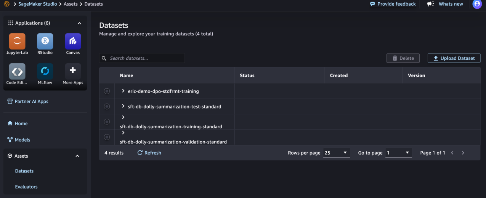

Choose Upload Dataset to add the dataset that you will use in your model customization jobs. By
choosing the Required data input format, you can access a reference of dataset format to use.

Creating assets for model customization in the UI
5775

## Page 805

Amazon SageMaker AI
Developer Guide


Evaluators

You can also add Reward Functions and Reward Prompts for your Reinforcement Learning
customization jobs.

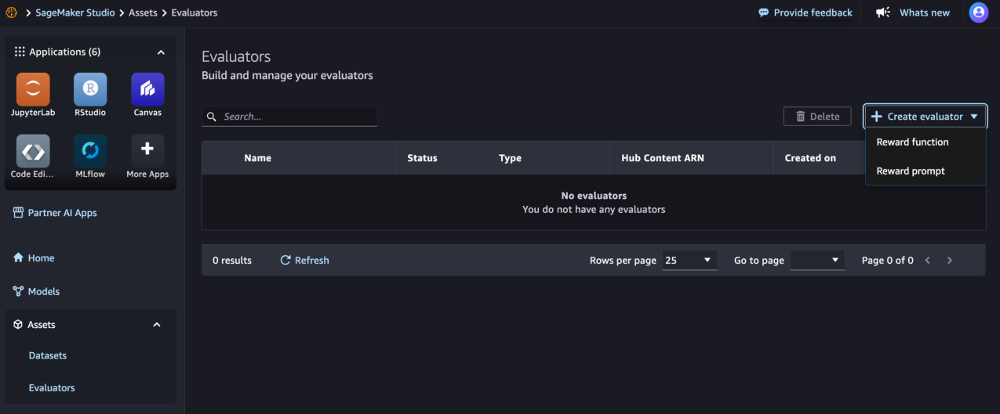

The UI also provides guidance on the format required for the reward function or reward prompt.

Creating assets for model customization in the UI
5776

## Page 806

Amazon SageMaker AI
Developer Guide


Assets for model customization using AWS SDK

You can also use the SageMaker AI Python SDK to create assets. See sample code snippet below:

from sagemaker.ai_registry.air_constants import REWARD_FUNCTION, REWARD_PROMPT
from sagemaker.ai_registry.dataset import DataSet, CustomizationTechnique
from sagemaker.ai_registry.evaluator import Evaluator

# Creating a dataset example
dataset = DataSet.create(
name="sdkv3-gen-ds2",
source="s3://sample-test-bucket/datasets/training-data/jamjee-sft-
ds1.jsonl", # or use local filepath as source.
customization_technique=CustomizationTechnique.SFT
)

# Refreshes status from hub
dataset.refresh()
pprint(dataset.__dict__)

# Creating an evaluator. Method : Lambda
evaluator = Evaluator.create(
name = "sdk-new-rf11",

Creating assets for model customization in the UI
5777

## Page 807

Amazon SageMaker AI
Developer Guide

source="arn:aws:lambda:us-west-2:<>:function:<function-name>8",
type=REWARD_FUNCTION
)

# Creating an evaluator. Method : Bring your own code
evaluator = Evaluator.create(
name = "eval-lambda-test",
source="/path_to_local/eval_lambda_1.py",
type = REWARD_FUNCTION
)

# Optional wait, by default we have wait = True during create call.
evaluator.wait()

evaluator.refresh()
pprint(evaluator)

AI model customization job submission

The SageMaker AI model customization capability can be accessed from Amazon SageMaker
Studio’s Models page in the left hand panel. You can also find the Assets page where you can
create and manage your model customization Datasets and Evaluators.

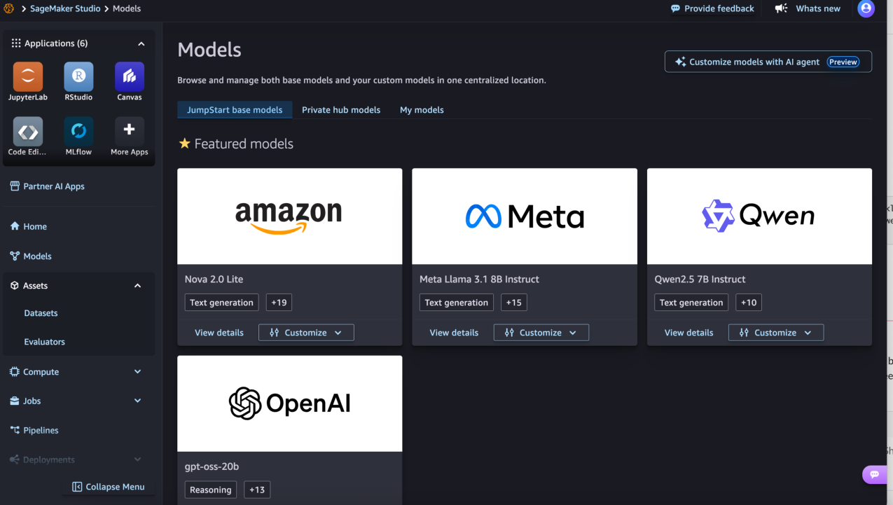

AI model customization job submission
5778

## Page 808

Amazon SageMaker AI
Developer Guide

To begin a model customization job submission, select the Models option to access the Jumpstart
Base Models tab:


You can directly click Customize model in the model card or you can search for any model from
Meta that is the one that your interested to customize.

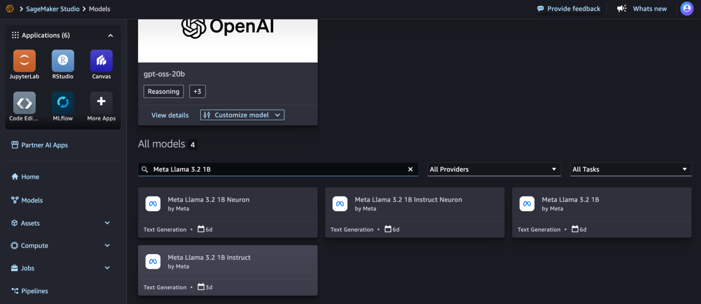

Upon clicking the model card, you can access the model details page and launch the customization
job by clicking Customize model and then selecting Customize with UI to kick-off configuring your
RLVR job.

AI model customization job submission
5779

## Page 809

Amazon SageMaker AI
Developer Guide


You can then enter your custom model name, select the model customization technique to use and
configure your job hyperparameters:

AI model customization job submission
5780

## Page 810

Amazon SageMaker AI
Developer Guide

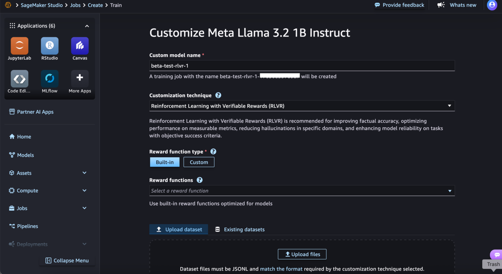


AI model customization job submission
5781

## Page 811

Amazon SageMaker AI
Developer Guide

AI model customization job submission using SDK

You can also use the SageMaker AI Python SDK to submit a model customization job:

# Submit a DPO model customization job

from sagemaker.modules.train.dpo_trainer import DPOTrainer

from sagemaker.modules.train.common import TrainingType

trainer = DPOTrainer(
model=BASE_MODEL,
training_type=TrainingType.LORA,
model_package_group_name=MODEL_PACKAGE_GROUP_NAME,
training_dataset=TRAINING_DATASET,
s3_output_path=S3_OUTPUT_PATH,
sagemaker_session=sagemaker_session,
role=ROLE_ARN
)

Monitoring your customization job

Immediately after submitting your job, you will be re-directed to your model customization
training job page.

AI model customization job submission
5782

## Page 812

Amazon SageMaker AI
Developer Guide

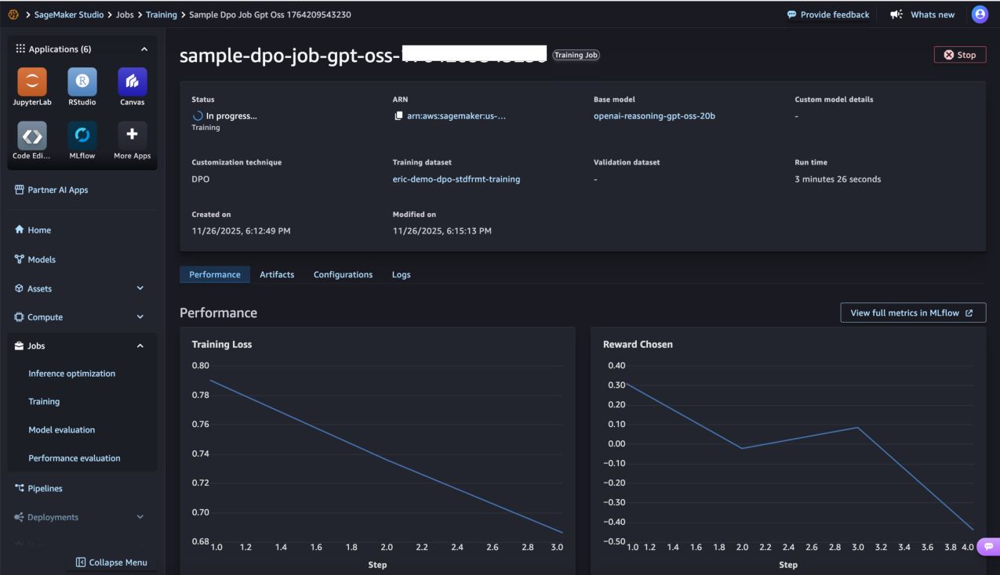

Once the job completes you can go to your custom model details page by clicking the Go to
Custom Model button in the upper right corner.

AI model customization job submission
5783

## Page 813

Amazon SageMaker AI
Developer Guide

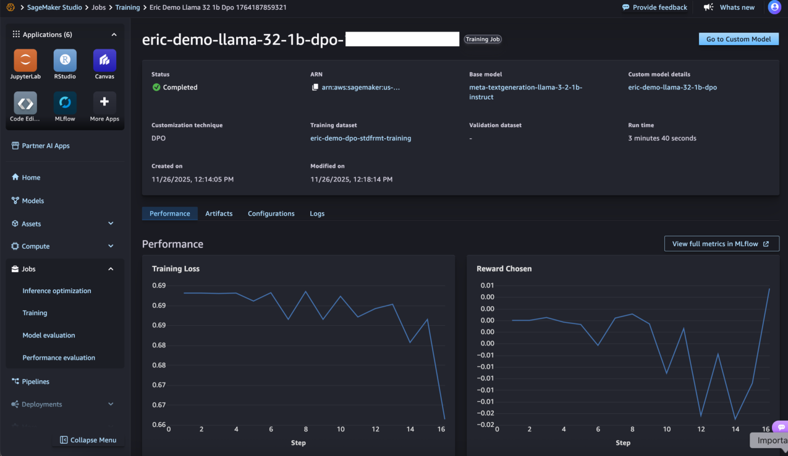

In the custom model details page you can further work with your custom model by:

1. Checking information about performance, generated artifacts location, training configuration

hyper-parameters and training logs.

2. Launch an evaluation job with a different dataset (Continued customization).

3. Deploy the model using SageMaker AI Inference endpoints or Amazon Bedrock Custom Model

Import.

AI model customization job submission
5784

## Page 814

Amazon SageMaker AI
Developer Guide

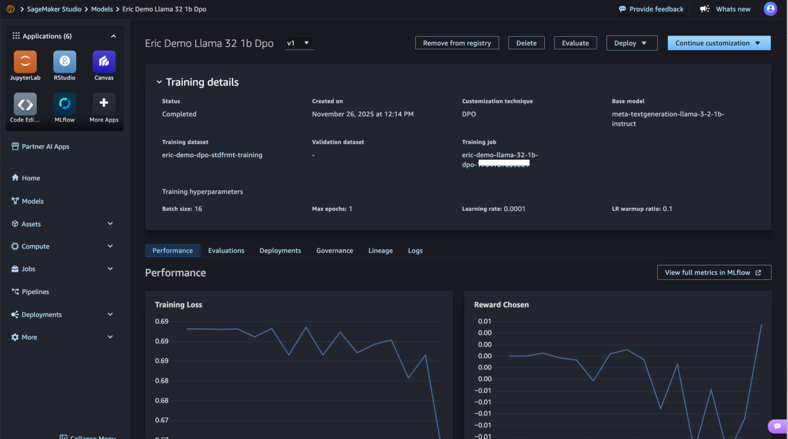

Model evaluation job submission

This section describes open-weight custom model evaluation. It gets you started through a walk
through of the evaluation job submission process. Additional resources are provided for more
advanced evaluation job submission use cases.

Topics

• Getting Started

• Evaluation types and Job Submission

• Evaluation Metrics Formats

• Supported Dataset Formats for Bring-Your-Own-Dataset (BYOD) Tasks

• Evaluate with Preset and Custom Scorers

Model evaluation job submission
5785

## Page 815

Amazon SageMaker AI
Developer Guide

Getting Started

Submit an Evaluation Job Through SageMaker Studio

Step 1: Navigate to Evaluation From Your Model Card

After you customize your model, navigate to the evaluation page from your model card.

For information on open-weight custom model training: https://docs.aws.amazon.com/
sagemaker/latest/dg/model-customize-open-weight-job.html

SageMaker visualizes your customized model on the My Models tab:

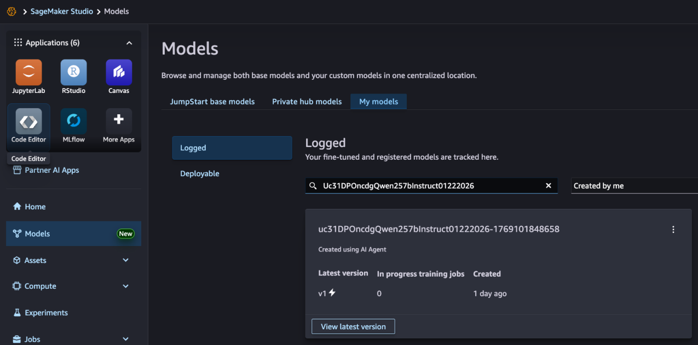

Choose View latest version, then choose Evaluate:

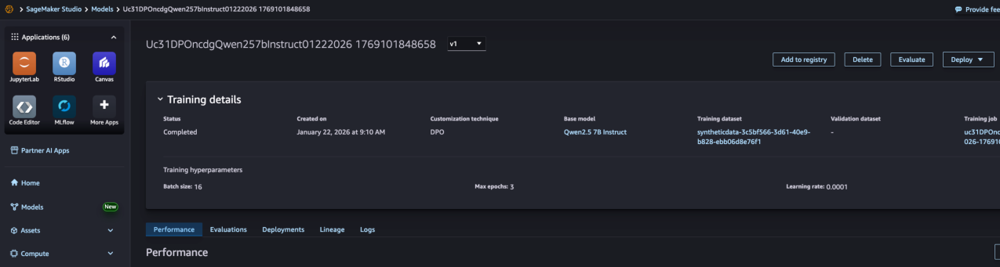

Model evaluation job submission
5786

## Page 816

Amazon SageMaker AI
Developer Guide

Step 2: Submit Your Evaluation Job

Choose the Submit button and submit your evaluation job. This submits a minimal MMLU
benchmark job.

For information on the supported evaluation job types, see the section called “Evaluation types
and Job Submission”.

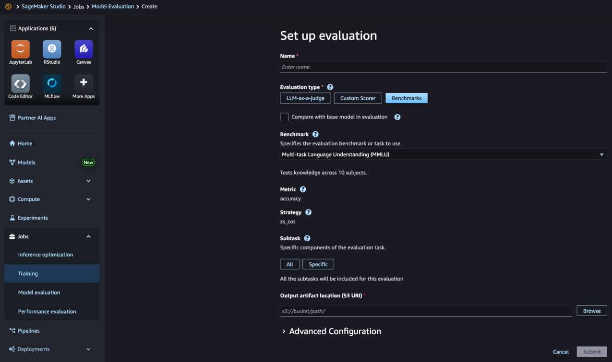

Step 3: Track Your Evaluation Job Progress

Your evaluation job progress is tracked in the Evaluation steps tab:

Model evaluation job submission
5787

## Page 817

Amazon SageMaker AI
Developer Guide

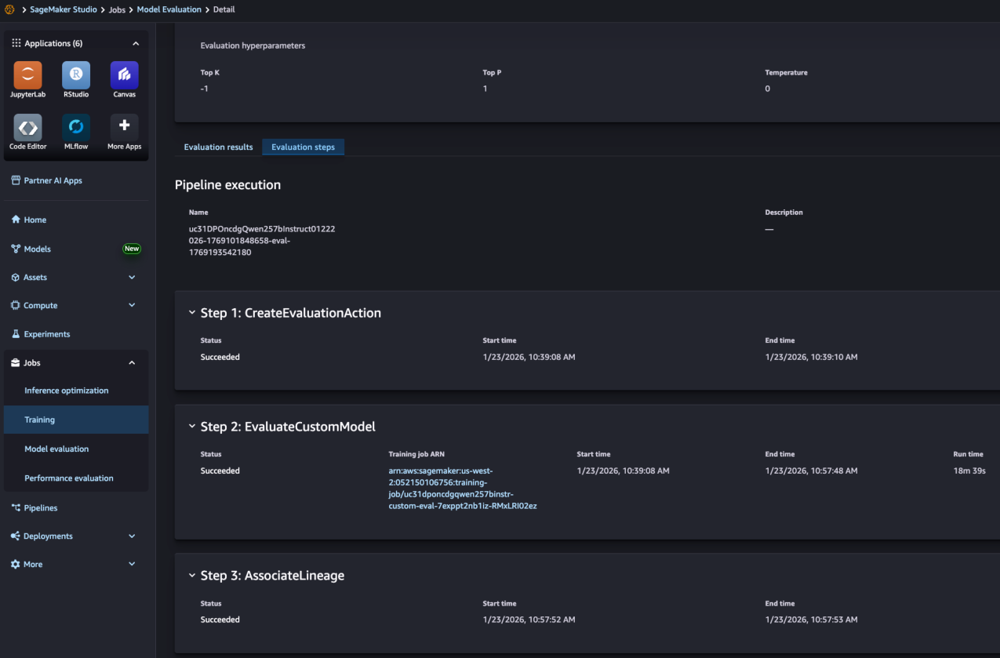

Step 4: View Your Evaluation Job Results

Your evaluation job results are visualized in the Evaluation results tab:

Model evaluation job submission
5788

## Page 818

Amazon SageMaker AI
Developer Guide


Step 5: View Your Completed Evaluations

Your completed evaluation job is displayed in Evaluations of your model card:

Model evaluation job submission
5789

## Page 819

Amazon SageMaker AI
Developer Guide


Submit Your Evaluation Job Through SageMaker Python SDK

Step 1: Create Your BenchMarkEvaluator

Pass your registered trained model, AWS S3 output location, and MLFlow resource ARN to

BenchMarkEvaluator and then initialize it.

from sagemaker.train.evaluate import BenchMarkEvaluator, Benchmark
evaluator = BenchMarkEvaluator(
benchmark=Benchmark.MMLU,

Model evaluation job submission
5790

## Page 820

Amazon SageMaker AI
Developer Guide

model="arn:aws:sagemaker:<region>:<account-id>:model-package/<model-package-name>/
<version>",
s3_output_path="s3://<bucket-name>/<prefix>/eval/",
mlflow_resource_arn="arn:aws:sagemaker:<region>:<account-id>:mlflow-tracking-
server/<tracking-server-name>",
evaluate_base_model=False
)

Step 2: Submit Your Evaluation Job

Call the evaluate() method to submit the evaluation job.

execution = evaluator.evaluate()

Step 3: Track Your Evaluation Job Progress

Call the wait() method of the execution to get a live update of the evaluation job progress.

execution.wait(target_status="Succeeded", poll=5, timeout=3600)

Step 4: View Your Evaluation Job Results

Call the show_results() method to display your evaluation job results.

execution.show_results()

Evaluation types and Job Submission

Benchmarking with standardized datasets

Use the Benchmark Evaluation type to evaluate the quality of your model across standardized
benchmark datasets including popular datasets like MMLU and BBH.

Benchmark
Custom
Dataset
Supported

Modalitie
s

Descripti
on

Metrics
Strategy
Subtask
available

mmlu
No
Text
Multi-
task
Language

accuracy
zs_cot
Yes

Model evaluation job submission
5791

## Page 821

Amazon SageMaker AI
Developer Guide

Benchmark
Custom
Dataset
Supported

Modalitie
s

Descripti
on

Metrics
Strategy
Subtask
available

Understan
ding –
Tests
knowledge
across
57
subjects.

mmlu_proNo
Text
MMLU
–
Professio
nal
Subset
–
Focuses
on
professio
nal
domains
such
as
law,
medicine,
accountin
g, and
engineeri
ng.

accuracy
zs_cot
No

Model evaluation job submission
5792

## Page 822

Amazon SageMaker AI
Developer Guide

Benchmark
Custom
Dataset
Supported

Modalitie
s

Descripti
on

Metrics
Strategy
Subtask
available

bbh
No
Text
Advanced
Reasoning
Tasks
– A
collectio
n of
challengi
ng
problems
that
test
higher-
level
cognitive
and
problem-
s
olving
skills.

accuracy
fs_cot
Yes

Model evaluation job submission
5793

## Page 823

Amazon SageMaker AI
Developer Guide

Benchmark
Custom
Dataset
Supported

Modalitie
s

Descripti
on

Metrics
Strategy
Subtask
available

gpqa
No
Text
General
Physics
Question
Answering
–
Assesses
comprehen
sion
of
physics
concepts
and
related
problem-
s
olving
abilities
.

accuracy
zs_cot
No

Model evaluation job submission
5794

## Page 824

Amazon SageMaker AI
Developer Guide

Benchmark
Custom
Dataset
Supported

Modalitie
s

Descripti
on

Metrics
Strategy
Subtask
available

math
No
Text
Mathemati
cal
Problem
Solving
–
Measures
mathemati
cal
reasoning
across
topics
including
algebra,
calculus,
and
word
problems.

exact_match
zs_cot
Yes

Model evaluation job submission
5795

## Page 825

Amazon SageMaker AI
Developer Guide

Benchmark
Custom
Dataset
Supported

Modalitie
s

Descripti
on

Metrics
Strategy
Subtask
available

strong_re
ject

No
Text
Quality-
C
ontrol
Task –
Tests
the
model's
ability
to
detect
and
reject
inappropr
iate,
harmful,
or
incorrect
content.

deflection
zs
Yes

Model evaluation job submission
5796

## Page 826

Amazon SageMaker AI
Developer Guide

Benchmark
Custom
Dataset
Supported

Modalitie
s

Descripti
on

Metrics
Strategy
Subtask
available

ifeval
No
Text
Instructi
on-
Follow
ing
Evaluatio
n –
Gauges
how
accuratel
y a
model
follows
given
instructi
ons
and
completes
tasks
to
specifica
tion.

accuracy
zs
No

For more information on BYOD formats, see the section called “Supported Dataset Formats for
Bring-Your-Own-Dataset (BYOD) Tasks”.

Available Subtasks

The following lists available subtasks for model evaluation across multiple domains including
MMLU (Massive Multitask Language Understanding), BBH (Big Bench Hard), StrongReject, and
MATH. These subtasks allow you to assess your model's performance on specific capabilities and
knowledge areas.

MMLU Subtasks

Model evaluation job submission
5797

## Page 827

Amazon SageMaker AI
Developer Guide

MMLU_SUBTASKS = [
"abstract_algebra",
"anatomy",
"astronomy",
"business_ethics",
"clinical_knowledge",
"college_biology",
"college_chemistry",
"college_computer_science",
"college_mathematics",
"college_medicine",
"college_physics",
"computer_security",
"conceptual_physics",
"econometrics",
"electrical_engineering",

"elementary_mathematics",
"formal_logic",
"global_facts",
"high_school_biology",
"high_school_chemistry",
"high_school_computer_science",
"high_school_european_history",
"high_school_geography",
"high_school_government_and_politics",
"high_school_macroeconomics",
"high_school_mathematics",
"high_school_microeconomics",
"high_school_physics",
"high_school_psychology",
"high_school_statistics",
"high_school_us_history",
"high_school_world_history",
"human_aging",
"human_sexuality",
"international_law",
"jurisprudence",
"logical_fallacies",
"machine_learning",
"management",
"marketing",
"medical_genetics",
"miscellaneous",

Model evaluation job submission
5798

## Page 828

Amazon SageMaker AI
Developer Guide

"moral_disputes",
"moral_scenarios",
"nutrition",
"philosophy",
"prehistory",
"professional_accounting",
"professional_law",
"professional_medicine",
"professional_psychology",
"public_relations",
"security_studies",
"sociology",
"us_foreign_policy",
"virology",
"world_religions"
]

BBH Subtasks

BBH_SUBTASKS = [
"boolean_expressions",
"causal_judgement",
"date_understanding",
"disambiguation_qa",
"dyck_languages",
"formal_fallacies",
"geometric_shapes",
"hyperbaton",
"logical_deduction_five_objects",
"logical_deduction_seven_objects",
"logical_deduction_three_objects",
"movie_recommendation",
"multistep_arithmetic_two",
"navigate",
"object_counting",
"penguins_in_a_table",
"reasoning_about_colored_objects",
"ruin_names",
"salient_translation_error_detection",
"snarks",
"sports_understanding",
"temporal_sequences",
"tracking_shuffled_objects_five_objects",

Model evaluation job submission
5799

## Page 829

Amazon SageMaker AI
Developer Guide

"tracking_shuffled_objects_seven_objects",
"tracking_shuffled_objects_three_objects",
"web_of_lies",
"word_sorting"
]

Math Subtasks

MATH_SUBTASKS = [
"algebra",
"counting_and_probability",
"geometry",
"intermediate_algebra",
"number_theory",
"prealgebra",
"precalculus"
]

StrongReject Subtasks

STRONG_REJECT_SUBTASKS = [
"gcg_transfer_harmbench",
"gcg_transfer_universal_attacks",
"combination_3",
"combination_2",
"few_shot_json",
"dev_mode_v2",
"dev_mode_with_rant",
"wikipedia_with_title",
"distractors",
"wikipedia",
"style_injection_json",
"style_injection_short",
"refusal_suppression",
"prefix_injection",
"distractors_negated",
"poems",
"base64",
"base64_raw", "
base64_input_only",
"base64_output_only",
"evil_confidant",
"aim",

Model evaluation job submission
5800

## Page 830

Amazon SageMaker AI
Developer Guide

"rot_13",
"disemvowel",
"auto_obfuscation",
"auto_payload_splitting",
"pair",
"pap_authority_endorsement",
"pap_evidence_based_persuasion",
"pap_expert_endorsement",
"pap_logical_appeal",
"pap_misrepresentation"
]

Submit your benchmark job

SageMaker Studio


Model evaluation job submission
5801

## Page 831

Amazon SageMaker AI
Developer Guide

SageMaker Python SDK

from sagemaker.train.evaluate import get_benchmarks
from sagemaker.train.evaluate import BenchMarkEvaluator

Benchmark = get_benchmarks()

# Create evaluator with MMLU benchmark
evaluator = BenchMarkEvaluator(
benchmark=Benchmark.MMLU,
model="arn:aws:sagemaker:<region>:<account-id>:model-package/<model-package-name>/
<version>",
s3_output_path="s3://<bucket-name>/<prefix>/",
evaluate_base_model=False
)

execution = evaluator.evaluate()

For more information on evaluation job submission through SageMaker Python SDK, see:
https://sagemaker.readthedocs.io/en/stable/model_customization/evaluation.html

Large Language Model as a Judge (LLMAJ) evaluation

Use LLM-as-a-judge (LLMAJ) evaluation to leverage another frontier model to grade
your target model responses. You can use AWS Bedrock models as judges by calling

create_evaluation_job API to launch the evaluation job.

For more information on the supported judge models see: https://docs.aws.amazon.com/bedrock/
latest/userguide/models-supported.html

You can use 2 different metric formats to define the evaluation:

• Builtin metrics: Leverage AWS Bedrock builtin metrics to analyze the quality of your model's
inference responses. For more information, see: https://docs.aws.amazon.com/bedrock/latest/
userguide/model-evaluation-type-judge-prompt.html

• Custom metrics: Define your own custom metrics in Bedrock Evaluation custom metric format
to analyze the quality of your model's inference responses using your own instruction. For more
information, see: https://docs.aws.amazon.com/bedrock/latest/userguide/model-evaluation-
custom-metrics-prompt-formats.html

Model evaluation job submission
5802

## Page 832

Amazon SageMaker AI
Developer Guide

Submit a builtin metrics LLMAJ job

SageMaker Studio

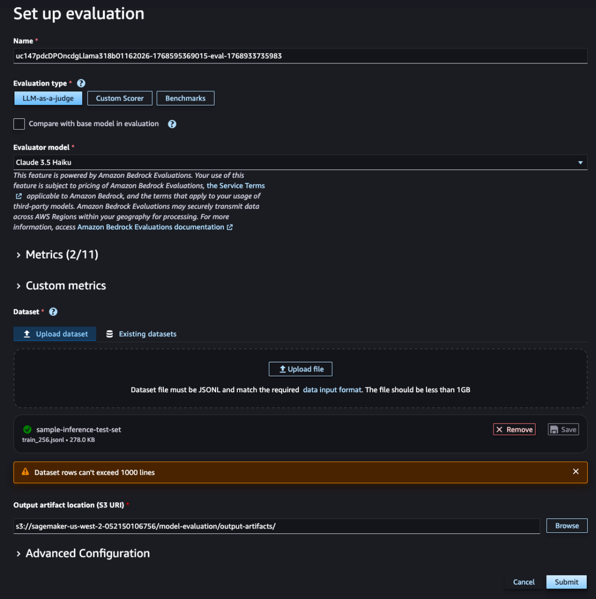

SageMaker Python SDK

from sagemaker.train.evaluate import LLMAsJudgeEvaluator

evaluator = LLMAsJudgeEvaluator(

Model evaluation job submission
5803

## Page 833

Amazon SageMaker AI
Developer Guide

model="arn:aws:sagemaker:<region>:<account-id>:model-package/<model-package-
name>/<version>",
evaluator_model="<bedrock-judge-model-id>",
dataset="s3://<bucket-name>/<prefix>/<dataset-file>.jsonl",
builtin_metrics=["<builtin-metric-1>", "<builtin-metric-2>"],
s3_output_path="s3://<bucket-name>/<prefix>/",
evaluate_base_model=False
)

execution = evaluator.evaluate()

For more information on evaluation job submission through SageMaker Python SDK, see:
https://sagemaker.readthedocs.io/en/stable/model_customization/evaluation.html

Submit a custom metrics LLMAJ job

Define your custom metric(s):

{
"customMetricDefinition": {
"name": "PositiveSentiment",
"instructions": (
"You are an expert evaluator. Your task is to assess if the sentiment of
the response is positive. "
"Rate the response based on whether it conveys positive sentiment,
helpfulness, and constructive tone.\n\n"
"Consider the following:\n"
"- Does the response have a positive, encouraging tone?\n"
"- Is the response helpful and constructive?\n"
"- Does it avoid negative language or criticism?\n\n"
"Rate on this scale:\n"
"- Good: Response has positive sentiment\n"
"- Poor: Response lacks positive sentiment\n\n"
"Here is the actual task:\n"
"Prompt: {{prompt}}\n"
"Response: {{prediction}}"
),
"ratingScale": [
{"definition": "Good", "value": {"floatValue": 1}},
{"definition": "Poor", "value": {"floatValue": 0}}
]
}

Model evaluation job submission
5804

## Page 834

Amazon SageMaker AI
Developer Guide

}

For more information, see: https://docs.aws.amazon.com/bedrock/latest/userguide/model-
evaluation-custom-metrics-prompt-formats.html

Model evaluation job submission
5805

## Page 835

Amazon SageMaker AI
Developer Guide

SageMaker Studio

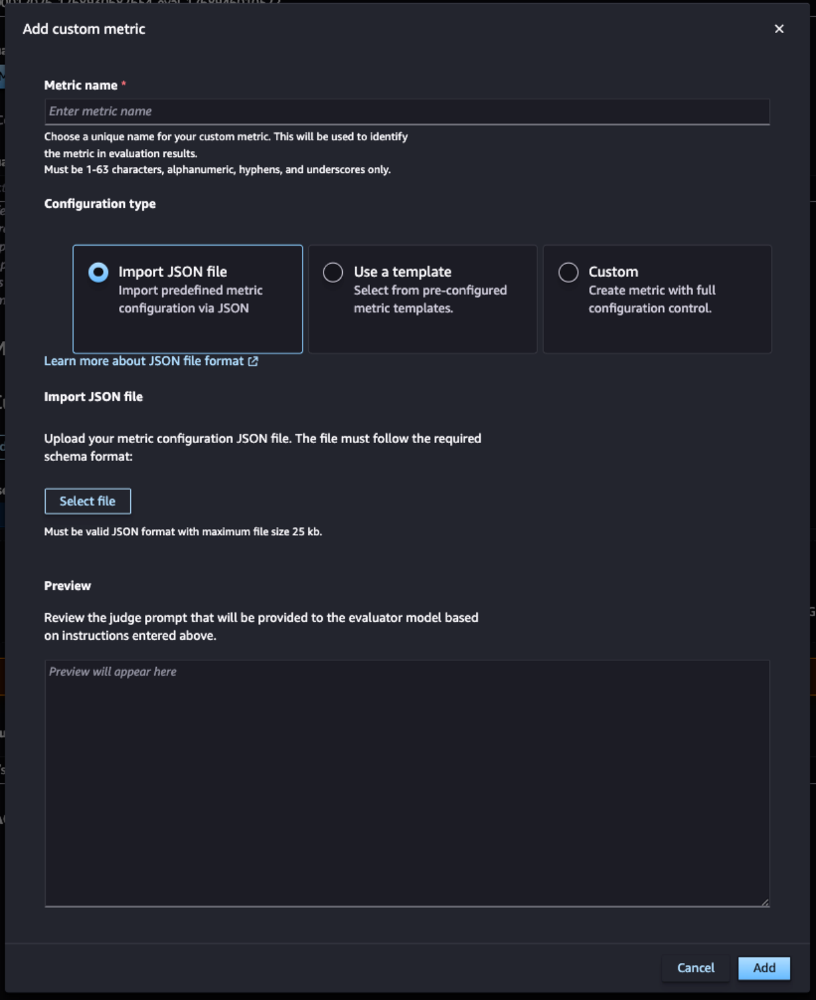

Model evaluation job submission
5806

## Page 836

Amazon SageMaker AI
Developer Guide

SageMaker Python SDK

evaluator = LLMAsJudgeEvaluator(
model="arn:aws:sagemaker:<region>:<account-id>:model-package/<model-package-
name>/<version>",
evaluator_model="<bedrock-judge-model-id>",
dataset="s3://<bucket-name>/<prefix>/<dataset-file>.jsonl",
custom_metrics=custom_metric_dict = {
"customMetricDefinition": {
"name": "PositiveSentiment",
"instructions": (
"You are an expert evaluator. Your task is to assess if the
sentiment of the response is positive. "
"Rate the response based on whether it conveys positive sentiment,
helpfulness, and constructive tone.\n\n"
"Consider the following:\n"

"- Does the response have a positive, encouraging tone?\n"
"- Is the response helpful and constructive?\n"
"- Does it avoid negative language or criticism?\n\n"
"Rate on this scale:\n"
"- Good: Response has positive sentiment\n"
"- Poor: Response lacks positive sentiment\n\n"
"Here is the actual task:\n"
"Prompt: {{prompt}}\n"
"Response: {{prediction}}"
),
"ratingScale": [
{"definition": "Good", "value": {"floatValue": 1}},
{"definition": "Poor", "value": {"floatValue": 0}}
]
}
},
s3_output_path="s3://<bucket-name>/<prefix>/",
evaluate_base_model=False
)

Custom Scorers

Define your own custom scorer function to launch an evaluation job. The system provides two
built-in scorers: Prime math and Prime code. You can also bring your own scorer function. You can
copy your scorer function code directly or bring your own Lambda function definition using the

Model evaluation job submission
5807

## Page 837

Amazon SageMaker AI
Developer Guide

associated ARN. By default, both scorer types produce evaluation results which include standard
metrics such as F1 score, ROUGE, and BLEU.

For more information on built-in and custom scorers and their respective requirements/contracts,
see the section called “Evaluate with Preset and Custom Scorers”.

Register your dataset

Bring your own dataset for custom scorer by registering it as a SageMaker Hub Content Dataset.

SageMaker Studio

In Studio, upload your dataset using the dedicated Datasets page..

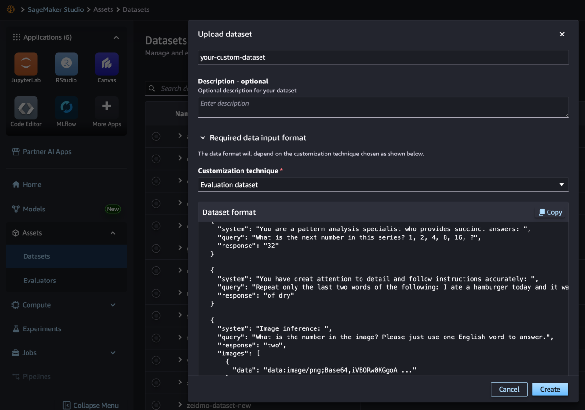

SageMaker Python SDK

In the SageMaker Python SDK, upload your dataset using the dedicated Datasets page..

from sagemaker.ai_registry.dataset import DataSet

Model evaluation job submission
5808

## Page 838

Amazon SageMaker AI
Developer Guide

dataset = DataSet.create(
name="your-bring-your-own-dataset",
source="s3://<bucket-name>/<prefix>/<dataset-file>.jsonl"
)
dataset.refresh()

Submit a built-in scorer job

SageMaker Studio


SageMaker Python SDK

from sagemaker.train.evaluate import CustomScorerEvaluator
from sagemaker.train.evaluate import get_builtin_metrics

BuiltInMetric = get_builtin_metrics()

evaluator_builtin = CustomScorerEvaluator(

Model evaluation job submission
5809

## Page 839

Amazon SageMaker AI
Developer Guide

evaluator=BuiltInMetric.PRIME_MATH,
dataset="arn:aws:sagemaker:<region>:<account-id>:hub-content/<hub-content-id>/
DataSet/your-bring-your-own-dataset/<version>",
model="arn:aws:sagemaker:<region>:<account-id>:model-package/<model-package-
name>/<version>",
s3_output_path="s3://<bucket-name>/<prefix>/",
evaluate_base_model=False
)

execution = evaluator.evaluate()

Select from BuiltInMetric.PRIME_MATH or BuiltInMetric.PRIME_CODE for Built-In
Scoring.

Submit a custom scorer job

Define a custom reward function. For more information, see the section called “Custom Scorers
(Bring Your Own Metrics)”.

Register the custom reward function

Model evaluation job submission
5810

## Page 840

Amazon SageMaker AI
Developer Guide

SageMaker Studio

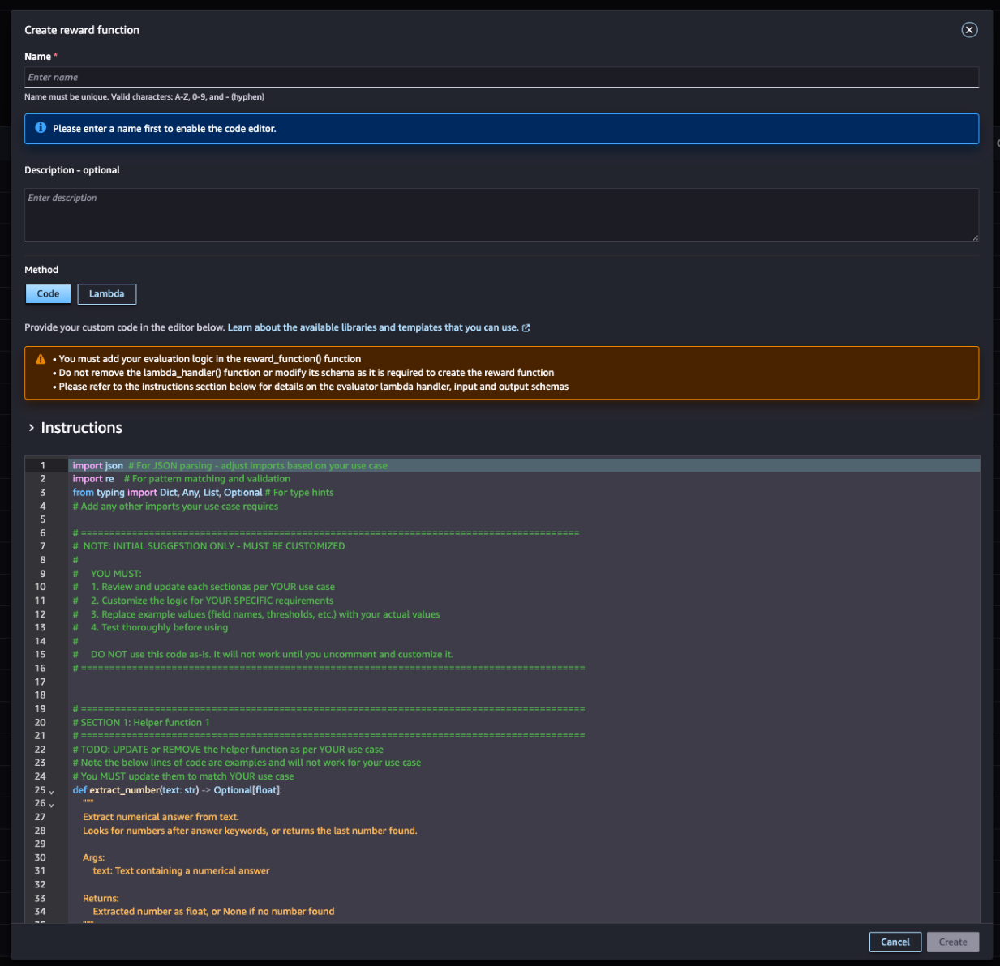

Model evaluation job submission
5811

## Page 841

Amazon SageMaker AI
Developer Guide

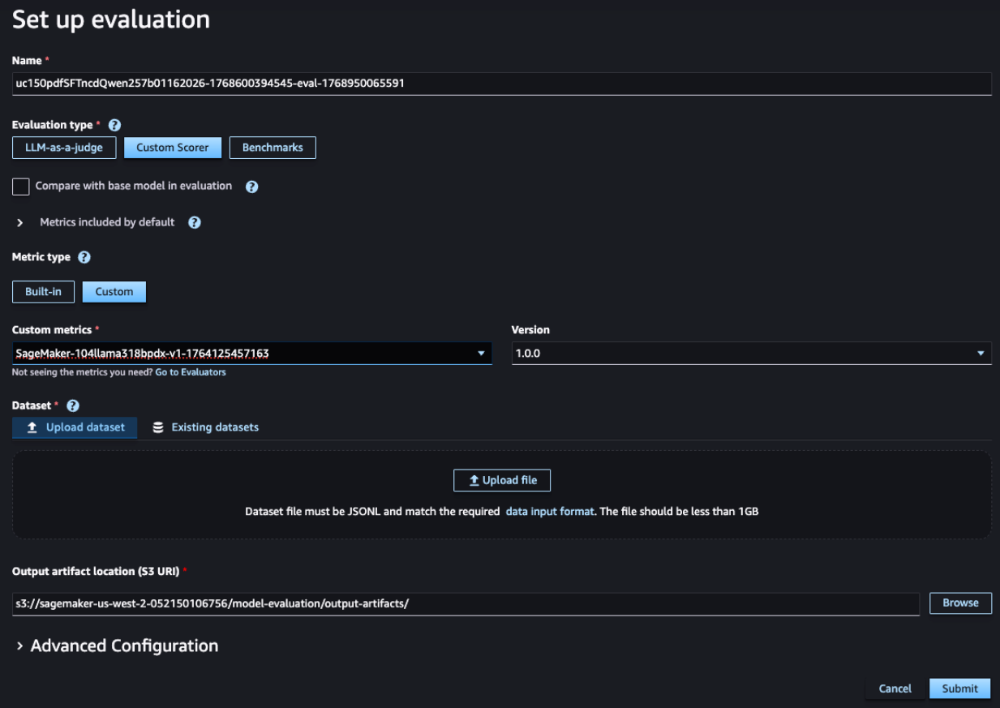

SageMaker Python SDK

from sagemaker.ai_registry.evaluator import Evaluator
from sagemaker.ai_registry.air_constants import REWARD_FUNCTION

evaluator = Evaluator.create(
name = "your-reward-function-name",
source="/path_to_local/custom_lambda_function.py",
type = REWARD_FUNCTION
)

evaluator = CustomScorerEvaluator(
evaluator=evaluator,
dataset="s3://<bucket-name>/<prefix>/<dataset-file>.jsonl",
model="arn:aws:sagemaker:<region>:<account-id>:model-package/<model-package-
name>/<version>",
s3_output_path="s3://<bucket-name>/<prefix>/",

Model evaluation job submission
5812

## Page 842

Amazon SageMaker AI
Developer Guide

evaluate_base_model=False
)

execution = evaluator.evaluate()

Evaluation Metrics Formats

Evaluating the quality of your model across these metric formats:

• Model Evaluation Summary

• MLFlow

• TensorBoard

Model Evaluation Summary

When you submit your evaluation job you specify an AWS S3 output location. SageMaker
automatically uploads the evaluation summary .json file to the location. The benchmark summary
S3 path is the following:

s3://<your-provide-s3-location>/<training-job-name>/output/output/<evaluation-job-
name>/eval_results/

Pass the AWS S3 location

Model evaluation job submission
5813

## Page 843

Amazon SageMaker AI
Developer Guide

SageMaker Studio


SageMaker Python SDK

evaluator = BenchMarkEvaluator(
benchmark=Benchmark.MMLU,
model="arn:aws:sagemaker:<region>:<account-id>:model-package/<model-package-
name>/<version>",
s3_output_path="s3://<bucket-name>/<prefix>/eval/",
evaluate_base_model=False
)

execution = evaluator.evaluate()

Read it directly as a .json from the AWS S3 location or visualized automatically in the UI:

Model evaluation job submission
5814

## Page 844

Amazon SageMaker AI
Developer Guide

{
"results": {
"custom|gen_qa_gen_qa|0": {
"rouge1": 0.9152812653966208,
"rouge1_stderr": 0.003536439199232507,
"rouge2": 0.774569918517409,
"rouge2_stderr": 0.006368825746765958,
"rougeL": 0.9111255645823356,
"rougeL_stderr": 0.003603841524881021,
"em": 0.6562150055991042,
"em_stderr": 0.007948251702846893,
"qem": 0.7522396416573348,
"qem_stderr": 0.007224355240883467,
"f1": 0.8428757602152095,
"f1_stderr": 0.005186300690881584,
"f1_score_quasi": 0.9156170336744968,

"f1_score_quasi_stderr": 0.003667700152375464,
"bleu": 100.00000000000004,
"bleu_stderr": 1.464411857851008
},
"all": {
"rouge1": 0.9152812653966208,
"rouge1_stderr": 0.003536439199232507,
"rouge2": 0.774569918517409,
"rouge2_stderr": 0.006368825746765958,
"rougeL": 0.9111255645823356,
"rougeL_stderr": 0.003603841524881021,
"em": 0.6562150055991042,
"em_stderr": 0.007948251702846893,
"qem": 0.7522396416573348,
"qem_stderr": 0.007224355240883467,
"f1": 0.8428757602152095,
"f1_stderr": 0.005186300690881584,
"f1_score_quasi": 0.9156170336744968,
"f1_score_quasi_stderr": 0.003667700152375464,
"bleu": 100.00000000000004,
"bleu_stderr": 1.464411857851008
}
}
}

Model evaluation job submission
5815

## Page 845

Amazon SageMaker AI
Developer Guide

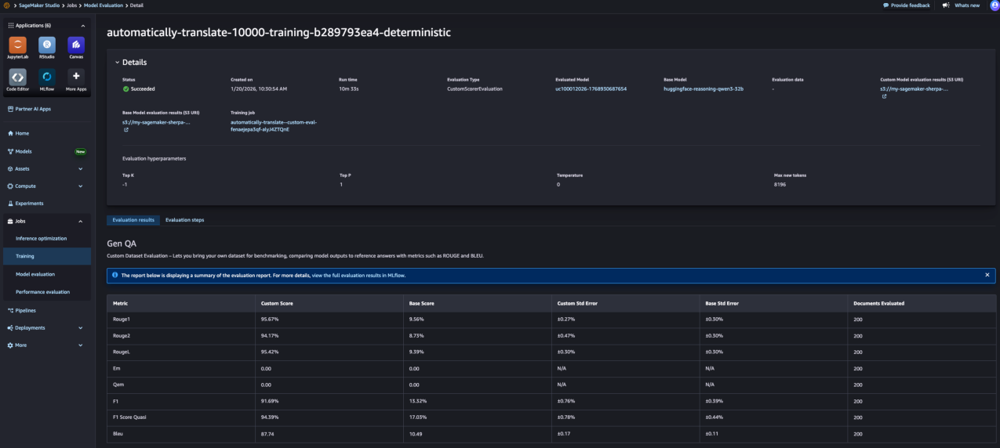

MLFlow logging

Provide your SageMaker MLFlow resource ARN

SageMaker Studio uses the default MLFlow app that gets provisioned on each Studio domain when
you use the model customization capability for the first time. SageMaker Studio uses the default
MLflow app associated ARN in evaluation job submission.

You can also submit your evaluation job and explicitly provide an MLFlow Resource ARN to stream
metrics to said associated tracking server/app for real time analysis.

SageMaker Python SDK

evaluator = BenchMarkEvaluator(
benchmark=Benchmark.MMLU,
model="arn:aws:sagemaker:<region>:<account-id>:model-package/<model-package-name>/
<version>",
s3_output_path="s3://<bucket-name>/<prefix>/eval/",
mlflow_resource_arn="arn:aws:sagemaker:<region>:<account-id>:mlflow-tracking-
server/<tracking-server-name>",
evaluate_base_model=False
)

execution = evaluator.evaluate()

Model level and system level metric visualization:

Model evaluation job submission
5816

## Page 846

Amazon SageMaker AI
Developer Guide


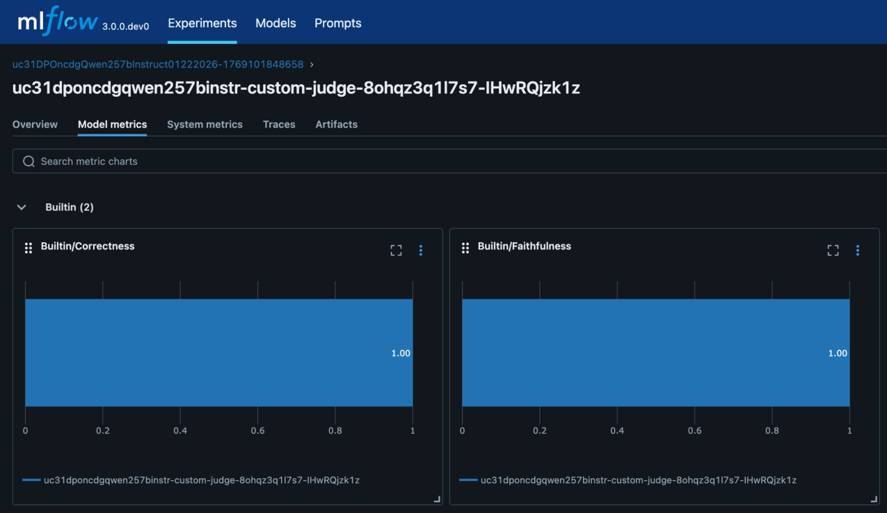

Model evaluation job submission
5817

## Page 847

Amazon SageMaker AI
Developer Guide

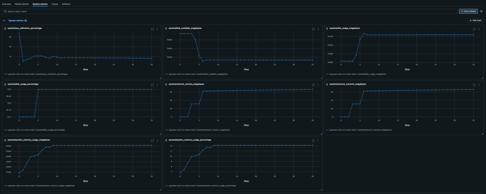

TensorBoard

Submit your evaluation job with an AWS S3 output location. SageMaker automatically uploads a
TensorBoard file to the location.

SageMaker uploads the TensorBoard file to AWS S3 in the following location:

s3://<your-provide-s3-location>/<training-job-name>/output/output/<evaluation-job-
name>/tensorboard_results/eval/

Pass the AWS S3 location as follows

Model evaluation job submission
5818

## Page 848

Amazon SageMaker AI
Developer Guide

SageMaker Studio

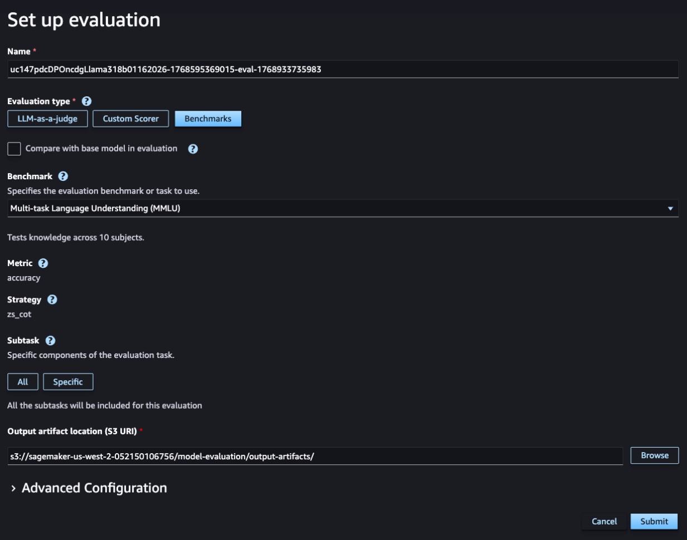

SageMaker Python SDK

evaluator = BenchMarkEvaluator(
benchmark=Benchmark.MMLU,
model="arn:aws:sagemaker:<region>:<account-id>:model-package/<model-package-
name>/<version>",
s3_output_path="s3://<bucket-name>/<prefix>/eval/",
evaluate_base_model=False
)

execution = evaluator.evaluate()

Sample model level metrics

Model evaluation job submission
5819

## Page 849

Amazon SageMaker AI
Developer Guide


Supported Dataset Formats for Bring-Your-Own-Dataset (BYOD) Tasks

The Custom Scorer and LLM-as-judge evaluation types require a custom dataset JSONL file
located in AWS S3. You must provide the file as a JSON Lines file adhering to one of the following
supported formats. The examples in this doc are expanded for clarity.

Each format has its own nuances but at a minimum all require a user prompt.

Required Fields

Field
Required

User Prompt
Yes

System Prompt
No

Ground truth
Only for Custom Scorer

Category
No

1. OpenAI Format

{
"messages": [

Model evaluation job submission
5820

## Page 850

Amazon SageMaker AI
Developer Guide

{
"role": "system",    # System prompt (looks for system role)
"content": "You are a helpful assistant."
},
{
"role": "user",       # Query (looks for user role)
"content": "Hello!"
},
{
"role": "assistant",  # Ground truth (looks for assistant role)
"content": "Hello to you!"
}
]
}

2. SageMaker Evaluation

{
"system":"You are an English major with top marks in class who likes to give minimal
word responses: ",
"query":"What is the symbol that ends the sentence as a question",
"response":"?", # Ground truth
"category": "Grammar"
}

3. HuggingFace Prompt Completion

Both Standard and Conversational formats are supported.

# Standard

{
"prompt" : "What is the symbol that ends the sentence as a question", # Query
"completion" : "?" # Ground truth
}

# Conversational
{
"prompt": [
{
"role": "user", # Query (looks for user role)
"content": "What is the symbol that ends the sentence as a question"
}

Model evaluation job submission
5821

## Page 851

Amazon SageMaker AI
Developer Guide

],
"completion": [
{
"role": "assistant", # Ground truth (looks for assistant role)
"content": "?"
}
]
}

4. HuggingFace Preference

Support for both standard format (string) and conversational format (messages array).

# Standard: {"prompt": "text", "chosen": "text", "rejected": "text"}
{
"prompt" : "The sky is", # Query
"chosen" : "blue", # Ground truth
"rejected" : "green"
}

# Conversational:
{
"prompt": [
{
"role": "user", # Query (looks for user role)
"content": "What color is the sky?"
}
],
"chosen": [
{
"role": "assistant", # Ground truth (looks for assistant role)
"content": "It is blue."
}
],
"rejected": [
{
"role": "assistant",
"content": "It is green."
}
]
}

5. Verl Format

Model evaluation job submission
5822

## Page 852

Amazon SageMaker AI
Developer Guide

The Verl format (both current and legacy formats) is supported for reinforcement learning
use cases. Verl docs for reference: https://verl.readthedocs.io/en/latest/preparation/
prepare_data.html

Users of the VERL format typically do not provide a ground truth response. If you want to provide

one anyways, use either of the fields extra_info.answer or reward_model.ground_truth;

extra_info takes precedence.

SageMaker preserves the following VERL-specific fields as metadata if present:

• id

• data_source

• ability

• reward_model

• extra_info

• attributes

• difficulty

# Newest VERL format where `prompt` is an array of messages.
{
"data_source": "openai/gsm8k",
"prompt": [
{
"content": "You are a helpful math tutor who explains solutions to questions
step-by-step.",
"role": "system"
},
{
"content": "Natalia sold clips to 48 of her friends in April, and then she sold
half as many clips in May. How many clips did Natalia sell altogether in April and
May? Let's think step by step and output the final answer after \"####\".",
"role": "user"
}
],
"ability": "math",
"extra_info": {
"answer": "Natalia sold 48/2 = <<48/2=24>>24 clips in May.\nNatalia sold 48+24 =
<<48+24=72>>72 clips altogether in April and May.\n#### 72",
"index": 0,

Model evaluation job submission
5823

## Page 853

Amazon SageMaker AI
Developer Guide

"question": "Natalia sold clips to 48 of her friends in April, and then she sold
half as many clips in May. How many clips did Natalia sell altogether in April and
May?",
"split": "train"
},
"reward_model": {
"ground_truth": "72" # Ignored in favor of extra_info.answer
}
}

# Legacy VERL format where `prompt` is a string. Also supported.
{
"data_source": "openai/gsm8k",
"prompt": "Natalia sold clips to 48 of her friends in April, and then she sold half
as many clips in May. How many clips did Natalia sell altogether in April and May?
Let's think step by step and output the final answer after \"####\".",
"extra_info": {

"answer": "Natalia sold 48/2 = <<48/2=24>>24 clips in May.\nNatalia sold 48+24 =
<<48+24=72>>72 clips altogether in April and May.\n#### 72",
"index": 0,
"question": "Natalia sold clips to 48 of her friends in April, and then she sold
half as many clips in May. How many clips did Natalia sell altogether in April and
May?",
"split": "train"
}
}

Evaluate with Preset and Custom Scorers

When using the Custom Scorer evaluation type, SageMaker Evaluation supports two built-in
scorers (also referred to as "reward functions") Prime Math and Prime Code taken from the
volcengine/verl RL training library, or your own custom scorer implemented as a Lambda Function.

Built-in Scorers

Prime Math

The prime math scorer expects a custom JSONL dataset of entries containing a math question
as the prompt/query and the correct answer as ground truth. The dataset can be any of the
supported formats mentioned in the section called “Supported Dataset Formats for Bring-Your-
Own-Dataset (BYOD) Tasks”.

Example dataset entry (expanded for clarity):

Model evaluation job submission
5824

## Page 854

Amazon SageMaker AI
Developer Guide

{
"system":"You are a math expert: ",
"query":"How many vertical asymptotes does the graph of $y=\\frac{2}{x^2+x-6}$
have?",
"response":"2" # Ground truth aka correct answer
}

Prime Code

The prime code scorer expects a custom JSONL dataset of entries containing a coding problem

and test cases specified in the metadata field. Structure the test cases with the expected function
name for each entry, sample inputs, and expected outputs.

Example dataset entry (expanded for clarity):

{
"system":"\\nWhen tackling complex reasoning tasks, you have access to the
following actions. Use them as needed to progress through your thought process.\\n\
\n[ASSESS]\\n\\n[ADVANCE]\\n\\n[VERIFY]\\n\\n[SIMPLIFY]\\n\\n[SYNTHESIZE]\\n\\n[PIVOT]\
\n\\n[OUTPUT]\\n\\nYou should strictly follow the format below:\\n\\n[ACTION NAME]\\n\
\n# Your action step 1\\n\\n# Your action step 2\\n\\n# Your action step 3\\n\\n...\\n\
\nNext action: [NEXT ACTION NAME]\\n\\n",
"query":"A number N is called a factorial number if it is the factorial of a
positive integer. For example, the first few factorial numbers are 1, 2, 6, 24, 120,
\\nGiven a number N, the task is to return the list/vector of the factorial numbers
smaller than or equal to N.\\nExample 1:\\nInput: N = 3\\nOutput: 1 2\\nExplanation:
The first factorial number is \\n1 which is less than equal to N. The second \\nnumber
is 2 which is less than equal to N,\\nbut the third factorial number is 6 which \\nis
greater than N. So we print only 1 and 2.\\nExample 2:\\nInput: N = 6\\nOutput: 1 2
6\\nExplanation: The first three factorial \\nnumbers are less than equal to N but \
\nthe fourth factorial number 24 is \\ngreater than N. So we print only first \\nthree
factorial numbers.\\nYour Task:  \\nYou don't need to read input or print anything.
Your task is to complete the function factorialNumbers() which takes an integer N as
an input parameter and return the list/vector of the factorial numbers smaller than
or equal to N.\\nExpected Time Complexity: O(K), Where K is the number of factorial
numbers.\\nExpected Auxiliary Space: O(1)\\nConstraints:\\n1<=N<=10^{18}\\n\\nWrite
Python code to solve the problem. Present the code in \\n```python\\nYour code\\n```\
\nat the end.",
"response": "", # Dummy string for ground truth. Provide a value if you want NLP
metrics like ROUGE, BLEU, and F1.
### Define test cases in metadata field
"metadata": {
"fn_name": "factorialNumbers",

Model evaluation job submission
5825

## Page 855

Amazon SageMaker AI
Developer Guide

"inputs": ["5"],
"outputs": ["[1, 2]"]
}
}

Custom Scorers (Bring Your Own Metrics)

Fully customize your model evaluation workflow with custom post-processing logic which allows
you to compute custom metrics tailored to your needs. You must implement your custom scorer as
an AWS Lambda function that accepts model responses and returns reward scores.

Sample Lambda Input Payload

Your custom AWS Lambda expects inputs in the OpenAI format. Example:

{

"id": "123",
"messages": [
{
"role": "user",
"content": "Do you have a dedicated security team?"
},
{
"role": "assistant",
"content": "As an AI developed by Amazon, I do not have a dedicated
security team..."
}
],
"reference_answer": {
"compliant": "No",
"explanation": "As an AI developed by Company, I do not have a traditional
security team..."
}
}

Sample Lambda Output Payload

The SageMaker evaluation container expects your Lambda responses to follow this format:

{
"id": str,                              # Same id as input sample
"aggregate_reward_score": float,        # Overall score for the sample
"metrics_list": [                       # OPTIONAL: Component scores

Model evaluation job submission
5826

## Page 856

Amazon SageMaker AI
Developer Guide

{
"name": str,                    # Name of the component score
"value": float,                 # Value of the component score
"type": str                     # "Reward" or "Metric"
}
]
}

Custom Lambda Definition

Find an example of a fully-implemented custom scorer with sample input and expected
output at: https://docs.aws.amazon.com/sagemaker/latest/dg/nova-implementing-reward-
functions.html#nova-reward-llm-judge-example

Use the following skeleton as a starting point for your own function.

def lambda_handler(event, context):
return lambda_grader(event)

def lambda_grader(samples: list[dict]) -> list[dict]:
"""
Args:
Samples: List of dictionaries in OpenAI format
Example input:
{
"id": "123",
"messages": [
{
"role": "user",
"content": "Do you have a dedicated security team?"
},
{
"role": "assistant",
"content": "As an AI developed by Company, I do not have a
dedicated security team..."
}
],
# This section is the same as your training dataset
"reference_answer": {
"compliant": "No",
"explanation": "As an AI developed by Company, I do not have a
traditional security team..."

Model evaluation job submission
5827

## Page 857

Amazon SageMaker AI
Developer Guide

}
}
Returns:
List of dictionaries with reward scores:
{
"id": str,                              # Same id as input sample
"aggregate_reward_score": float,        # Overall score for the sample
"metrics_list": [                       # OPTIONAL: Component scores
{
"name": str,                    # Name of the component score
"value": float,                 # Value of the component score
"type": str                     # "Reward" or "Metric"
}
]
}
"""

Input and output fields

Input fields

Field
Description
Additional notes

id
Unique identifier for the sample
Echoed back in output. String format

messagesOrdered chat history in OpenAI

Array of message objects

format

messages[
].role

Speaker of the message
Common values: "user", "assistant", "system"

messages[
].content

Text content of the message
Plain string

metadataFree-form information to aid

Object; optional fields passed from training data

grading

Output fields

Model evaluation job submission
5828

## Page 858

Amazon SageMaker AI
Developer Guide

Output Fields

Field
Description
Additional notes

id
Same identifier as input sample
Must match input

aggregate
_reward_s
core

Overall score for the sample
Float (e.g., 0.0–1.0 or task-defined range)

metrics_l
ist

Component scores that make up
the aggregate

Array of metric objects

Required Permissions

Ensure that the SageMaker execution role you use to run evaluation has AWS Lambda permissions.

{
"Version": "2012-10-17",
"Statement": [
{
"Effect": "Allow",
"Action": [
"lambda:InvokeFunction"
],
"Resource": "arn:aws:lambda:region:account-id:function:function-name"
}
]
}

Ensure your AWS Lambda Function's execution role has basic Lambda execution permissions, as
well as additional permissions you may require for any downstream AWS calls.

{
"Version": "2012-10-17",
"Statement": [
{
"Effect": "Allow",
"Action": [
"logs:CreateLogGroup",
"logs:CreateLogStream",

Model evaluation job submission
5829

## Page 859

Amazon SageMaker AI
Developer Guide

"logs:PutLogEvents"
],
"Resource": "arn:aws:logs:*:*:*"
}
]
}

Model deployment

From the custom models details page you can also deploy your custom model using either
SageMaker AI Inference endpoints or Amazon Bedrock.


Sample datasets and evaluators

Supervised Fine tuning (SFT)

• Name: TAT-QA

• License: CC-BY-4.0

• Link: https://huggingface.co/datasets/next-tat/TAT-QA

• Preprocessing - Formatting

Model deployment
5830

## Page 860

Amazon SageMaker AI
Developer Guide

One Sample

{
"prompt": "Given a table and relevant text descriptions, answer the following
question.\n\nTable:\n<table border=\"1\" class=\"dataframe\">\n  <tbody>\n    <tr>
\n      <td></td>\n      <td>2019</td>\n      <td>2018</td>\n    </tr>\n    <tr>\n
<td></td>\n      <td>$'000</td>\n      <td>$'000</td>\n    </tr>\n    <tr>\n
<td>Revenue from external customers</td>\n      <td></td>\n      <td></td>\n    </
tr>\n    <tr>\n      <td>Australia</td>\n      <td>144,621</td>\n      <td>129,431</
td>\n    </tr>\n    <tr>\n      <td>New Zealand</td>\n      <td>13,036</td>\n
<td>8,912</td>\n    </tr>\n    <tr>\n      <td>Total</td>\n      <td>157,657</td>\n
<td>138,343</td>\n    </tr>\n  </tbody>\n</table>\n\nParagraphs:\n    4. SEGMENT
INFORMATION\n\n    During the 2019 and 2018 financial years, the Group operated wholly
within one business segment being the operation and management of storage centres
in Australia and New Zealand.\n\n    The Managing Director is the Group\u2019s chief
operating decision maker and monitors the operating results on a portfolio wide basis.
Monthly management reports are evaluated based upon the overall performance of NSR
consistent with the presentation within the consolidated financial statements. The
Group\u2019s financing (including finance costs and finance income) are managed on
a Group basis and not allocated to operating segments.\n\n    The operating results
presented in the statement of profit or loss represent the same segment information
as reported in internal management information.\n\n    The revenue information above
excludes interest income and is based on the location of storage centres.\n\nQuestion:
How many business segments were present in 2019 and 2018?\n\nAnswer:",
"completion": "one",
"data_idx": "2951"
}

Direct Preference Optimization (DPO)

• Name: Ultrafeedback

• License: MIT

• Link: https://huggingface.co/datasets/openbmb/UltraFeedback

• Preprocessing steps: Formatting and subsampling.

One Sample

{
"source": "evol_instruct",
"prompt": "Can you write a C++ program that prompts the user to enter the name of
a country and checks if it borders the Mediterranean Sea? Here's some starter code

Sample datasets and evaluators
5831

## Page 861

Amazon SageMaker AI
Developer Guide

to help you out:\n#include <iostream>\n#include <string>\nusing namespace std;\nint
main() {\n    string country;\n    // prompt user for input\n    cout << \"Enter
the name of a country: \";\n    cin >> country;\n    // check if country borders the
Mediterranean Sea\n    // [C++ code]\n    return 0;\n}",
"chosen": "Here's a C++ program that prompts the user to enter the name of a
country and checks if it borders the Mediterranean Sea:\n\n#include <iostream>
\n#include <string>\n#include <set>\n#include <map>\n#include <algorithm>\n\nusing
namespace std;\n\nint main() {\n    // store countries and their bordering seas
in a map\n    map<string, set<string>> countries;\n    countries[\"Algeria\"]
= {\"Mediterranean Sea\", \"North African Coast\"};\n    countries[\"France
\"] = {\"Mediterranean Sea\", \"English Channel\"};\n    countries[\"Italy
\"] = {\"Mediterranean Sea\", \"Adriatic Sea\"};\n    countries[\"Malta\"] =
{\"Mediterranean Sea\", \"North African Coast\"};\n    countries[\"Spain\"]
= {\"Mediterranean Sea\", \"Atlantic Ocean\"};\n    countries[\"Tunisia\"] =
{\"Mediterranean Sea\", \"North African Coast\"};\n\n    string country;\n
cout << \"Enter the name of a country: \";\n    cin >> country;\n\n    // check
if country is in the map\n    if (countries.find(country)!= countries.end()) {\n

// check if country borders the Mediterranean Sea\n        set<string>
borders = countries.at(country);\n        if (borders.find(\"Mediterranean Sea\")!=
borders.end()) {\n            cout << country << \" borders the Mediterranean Sea.
\" << endl;\n        } else {\n            cout << country << \" does not border the
Mediterranean Sea.\" << endl;\n        }\n    } else {\n        cout << country << \"
is not a recognized country.\" << endl;\n    }\n\n    return 0;\n}\n\nIn this program,
we first define a map called countries that stores each country's name as a key and a
set of its surrounding seas as the value. We use a set to store each sea name so that
we can easily check if a country borders a certain sea.\n\nWe then present the user
with a prompt to enter the name of a country. We use a while loop to ensure that the
user enters a valid country name. We check if the country is in the map, and if so,
we retrieve its bordering seas from the map.\n\nFinally, we check if the Mediterranean
Sea is among the set of borders. If it is, we inform the user that the country borders
the Mediterranean Sea. If not, we inform the user that the country does not border the
Mediterranean Sea.",
"chosen-rating": 5.0,
"chosen-model": "starchat",
"rejected": "Sure, here is the program using the C++11 algorithm
\"cds::algorithm::GreaterEqual\":\n#include <iostream>\n#include <string>\n#include
<algorithm>\n#include <vector>\n#include <cctype>\n\nusing namespace std;\n\nint
main() {\n    string country;\n    cout << \"Enter the name of a country: \";\n
cin >> country;\n    std::vector<string> vec;\n    vec.push_back(country);\n    size_t
index = std::find_if(vec.begin(), vec.end(), [](const string& s) {\n        return
std::any_of(s.begin(), s.end(), [](const char& c) {\n            return c == '}}';\n
});\n    if (index != vec.end()) {\n        if ((*index)[0] == 'M') {\n
cout << \"Country is bordered by the Mediterranean Sea.\" << endl;\n        } else
{\n            cout << \"Country does not border the Mediterranean Sea.\" << endl;\n

Sample datasets and evaluators
5832

## Page 862

Amazon SageMaker AI
Developer Guide

}\n    } else {\n        cout << \"Country is not found.\" << endl;\n    }\n
return 0;\n}",
"rejected-rating": 1.25,
"rejected-model": "pythia-12b"
}

Reinforcement Learning from AI Feedback (RLAIF) - Pair-Wise Judging

Input Dataset

Source dataset: https://github.com/WeOpenML/PandaLM

One Sample

{
"data_source": "WeOpenML/PandaLM",
"prompt": [
{
"role": "user",
"content": "Below are two responses for a given task. The task is defined
by the Instruction with an Input that provides further context. Evaluate the responses
and generate a reference answer for the task.\n\n
### Instruction:\nCompare the given products.\n\n### Input:\niPhone 11 and
Google Pixel 4\n\n
### Response 1:\nThe iPhone 11 has a larger screen size and a longer
battery life than the Google Pixel 4.\n\n
### Response 2:\nThe iPhone 11 and Google Pixel 4 are both flagship
smartphones released in 2018. The iPhone 11 has a 6.1-inch LCD display, while the
Google Pixel 4 has a 5.7-inch OLED display. The iPhone 11 has an A13 Bionic chipset,
while the Google Pixel 4 has a Qualcomm Snapdragon 845 chipset. The iPhone 11 has a
dual-camera system, while the Google Pixel 4 has a single camera system. The iPhone
11 has a longer battery life, while the Google Pixel 4 has a faster processor.\n\n###
Evaluation:\n"
}
],
"ability": "pairwise-judging",
"reward_model": {
"style": "llmj",
"ground_truth": "2\n\n### Reason: Response 2 provides a more detailed and
comprehensive comparison of the two products, including their specifications and
features. Response 1 only mentions two aspects of the products and does not provide as
much information.\n\n### Reference: The iPhone 11 and Google Pixel 4 are both flagship
smartphones released in 2018. The iPhone 11 has a 6.1-inch LCD display, while the
Google Pixel 4 has a 5.7-inch OLED display. The iPhone 11 has an A13 Bionic chipset,

Sample datasets and evaluators
5833

## Page 863

Amazon SageMaker AI
Developer Guide

while the Google Pixel 4 has a Qualcomm Snapdragon 845 chipset. The iPhone 11 has a
dual-camera system, while the Google Pixel 4 has a single camera system. The iPhone 11
has a longer battery life, while the Google Pixel 4 has a faster processor."
},
"extra_info": {
"split": "train",
"index": 0,
"raw_output_sequence": "2\n\n### Reason: Response 2 provides a more detailed
and comprehensive comparison of the two products, including their specifications and
features. Response 1 only mentions two aspects of the products and does not provide as
much information.\n\n### Reference: The iPhone 11 and Google Pixel 4 are both flagship
smartphones released in 2018. The iPhone 11 has a 6.1-inch LCD display, while the
Google Pixel 4 has a 5.7-inch OLED display. The iPhone 11 has an A13 Bionic chipset,
while the Google Pixel 4 has a Qualcomm Snapdragon 845 chipset. The iPhone 11 has a
dual-camera system, while the Google Pixel 4 has a single camera system. The iPhone 11
has a longer battery life, while the Google Pixel 4 has a faster processor.\n",
"llmj": {

"question": "Below are two responses for a given task. The task is defined
by the Instruction with an Input that provides further context. Evaluate the responses
and generate a reference answer for the task.\n\n### Instruction:\nCompare the given
products.\n\n### Input:\niPhone 11 and Google Pixel 4\n\n### Response 1:\nThe iPhone
11 has a larger screen size and a longer battery life than the Google Pixel 4.\n\n###
Response 2:\nThe iPhone 11 and Google Pixel 4 are both flagship smartphones released
in 2018. The iPhone 11 has a 6.1-inch LCD display, while the Google Pixel 4 has a 5.7-
inch OLED display. The iPhone 11 has an A13 Bionic chipset, while the Google Pixel 4
has a Qualcomm Snapdragon 845 chipset. The iPhone 11 has a dual-camera system, while
the Google Pixel 4 has a single camera system. The iPhone 11 has a longer battery
life, while the Google Pixel 4 has a faster processor.\n\n### Evaluation:\n",
"ground_truth": "2\n\n### Reason: Response 2 provides a more detailed
and comprehensive comparison of the two products, including their specifications and
features. Response 1 only mentions two aspects of the products and does not provide as
much information.\n\n### Reference: The iPhone 11 and Google Pixel 4 are both flagship
smartphones released in 2018. The iPhone 11 has a 6.1-inch LCD display, while the
Google Pixel 4 has a 5.7-inch OLED display. The iPhone 11 has an A13 Bionic chipset,
while the Google Pixel 4 has a Qualcomm Snapdragon 845 chipset. The iPhone 11 has a
dual-camera system, while the Google Pixel 4 has a single camera system. The iPhone 11
has a longer battery life, while the Google Pixel 4 has a faster processor.",
"document_in_context": null
},
"sample_size": 1980
}
}

Sample datasets and evaluators
5834

## Page 864

Amazon SageMaker AI
Developer Guide

RLAIF - Chain of Thought

Input Dataset

Source Data: https://huggingface.co/datasets/thesven/gsm8k-reasoning/tree/main/data

One Sample

{
"data_source": "openai/gsm8k",
"prompt": [
{
"role": "system",
"content": "\nYou are an AI assistant that uses a Chain of Thought (CoT)
approach with reflection to answer queries.\n\nFollow these steps:\n- Think through
the problem step by step within the ‹thinking> tags.\n- Reflect on your thinking
\n\nto check for any errors or improvements within the ‹reflection› tags.\n- Make
any necessary adjustments based on your reflection.\n- Provide your final, concise
answer within the ‹output> tags.\n\nImportant: The <thinking> and ‹reflection›
sections are for your internal reasoning process only.\nDo not include any part of
the final answer in these sections.\nThe actual response to the query must be entirely
contained within the ‹output› tags.\n\nUse the following format for your response:
\n<thinking>\n[Your initial thought process goes here]\n</thinking›\n\n<reasoning>
\n[Your step-by-step reasoning goes here. This is your internal thought process,
not the final answer. You can create as many reasoning steps as necessary in your
process.]\n</reasoning>\n\n‹reflection>\n[Your reflection on your reasoning, checking
for errors or improvements. You can create as many reflection steps as necessary in
your process.]\n</ reflection>\n\n<adjustment>\n[Any adjustments to your thinking
based on your reflection]\n</adjustment>\n\n<output>\n[Your final, concise answer to
the query. This is the only part that will be shown to the user.]\n</output>\n"
},
{
"role": "user",
"content": "A craft store makes a third of its sales in the fabric section,
a quarter of its sales in the jewelry section, and the rest in the stationery section.
They made 36 sales today. How many sales were in the stationery section?"
}
],
"ability": "chain-of-thought",
"reward_model": {
"style": "llmj-cot",
"ground_truth": "Thus, there were 36 - 12 - 9 = <<36-12-9=15>>15 sales in the
stationery section."
},

Sample datasets and evaluators
5835

## Page 865

Amazon SageMaker AI
Developer Guide

"extra_info": {
"split": "train",
"index": 0,
"question": "A craft store makes a third of its sales in the fabric section, a
quarter of its sales in the jewelry section, and the rest in the stationery section.
They made 36 sales today. How many sales were in the stationery section?",
"short_answer": "15",
"model_output": "<thinking>\nTo find the number of sales in the stationery
section, I need to first calculate the number of sales in the fabric and jewelry
sections. The store makes a third of its sales in the fabric section, which is 1/3
of 36 sales. I can calculate this as 36 * 1/3 = 12 sales in the fabric section. The
store makes a quarter of its sales in the jewelry section, which is 1/4 of 36 sales.
I can calculate this as 36 * 1/4 = 9 sales in the jewelry section. Since the rest of
the sales are in the stationery section, I can subtract the sales from the other two
sections from the total number of sales to find the number of sales in the stationery
section.\n</thinking>\n\n<reasoning>\n1. Calculate the number of sales in the fabric
section: 36 * 1/3 = 12\n2. Calculate the number of sales in the jewelry section:

36 * 1/4 = 9\n3. Calculate the number of sales in the stationery section: 36 - 12
- 9 = 15\n</reasoning>\n\n‹reflection>\nUpon reviewing my reasoning, I noticed that
my calculations seem correct, but I should ensure that I understand the question
correctly. The question asks for the number of sales in the stationery section, and
I believe I have correctly calculated that. However, I should double-check my math to
make sure it's accurate.\n</reflection>\n\n<adjustment>\nUpon re-examining my math, I
am confident that my calculations are correct. The fabric section makes up 1/3 of the
sales, the jewelry section makes up 1/4, and the rest is the stationery section. My
math checks out, and I am confident in my answer.\n</adjustment>\n\n<output>\n15\n</
output>"
}
}

RLAIF - Faithfulnesss

Input Dataset

Source: https://huggingface.co/datasets/rajpurkar/squad_v2/blob/main/squad_v2/train-00000-
of-00001.parquet

One Sample

{
"data_source": "squad_v2",
"prompt": [

Sample datasets and evaluators
5836

## Page 866

Amazon SageMaker AI
Developer Guide

{
"role": "system",
"content": "You are a helpful assistant that answers questions based on the
provided context. Only use information from the context."
},
{
"role": "user",
"content": "Context: Beyoncé Giselle Knowles-Carter (/bi##j#nse#/ bee-
YON-say) (born September 4, 1981) is an American singer, songwriter, record producer
and actress. Born and raised in Houston, Texas, she performed in various singing and
dancing competitions as a child, and rose to fame in the late 1990s as lead singer
of R&B girl-group Destiny's Child. Managed by her father, Mathew Knowles, the group
became one of the world's best-selling girl groups of all time. Their hiatus saw the
release of Beyoncé's debut album, Dangerously in Love (2003), which established her as
a solo artist worldwide, earned five Grammy Awards and featured the Billboard Hot 100
number-one singles \"Crazy in Love\" and \"Baby Boy\".\n\nQuestion: When did Beyonce
start becoming popular?"

}
],
"ability": "faithfulness",
"reward_model": {
"style": "llmj-faithfulness",
"ground_truth": "Beyoncé Giselle Knowles-Carter (/bi##j#nse#/ bee-YON-say)
(born September 4, 1981) is an American singer, songwriter, record producer and
actress. Born and raised in Houston, Texas, she performed in various singing and
dancing competitions as a child, and rose to fame in the late 1990s as lead singer
of R&B girl-group Destiny's Child. Managed by her father, Mathew Knowles, the group
became one of the world's best-selling girl groups of all time. Their hiatus saw the
release of Beyoncé's debut album, Dangerously in Love (2003), which established her as
a solo artist worldwide, earned five Grammy Awards and featured the Billboard Hot 100
number-one singles \"Crazy in Love\" and \"Baby Boy\"."
},
"extra_info": {
"question": "When did Beyonce start becoming popular?",
"split": "train",
"index": 0
}
}

RLAIF - Summarization

Input Dataset

Sample datasets and evaluators
5837

## Page 867

Amazon SageMaker AI
Developer Guide

Source: Cleaned gsm8k dataset https://huggingface.co/datasets/thesven/gsm8k-reasoning/tree/
main/data

One Sample

{
"data_source": "cnn_dailymail",
"prompt": [

{
"role": "system",
"content": "You are a helpful assistant that creates concise, accurate
summaries of news articles. Focus on the key facts and main points."
},
{
"role": "user",
"content": "Summarize the following article:\n\nLONDON, England (Reuters)
-- Harry Potter star Daniel Radcliffe gains access to a reported £20 million ($41.1
million) fortune as he turns 18 on Monday, but he insists the money won't cast a
spell on him. Daniel Radcliffe as Harry Potter in \"Harry Potter and the Order
of the Phoenix\" To the disappointment of gossip columnists around the world, the
young actor says he has no plans to fritter his cash away on fast cars, drink and
celebrity parties. \"I don't plan to be one of those people who, as soon as they turn
18, suddenly buy themselves a massive sports car collection or something similar,
\" he told an Australian interviewer earlier this month. \"I don't think I'll be
particularly extravagant. \"The things I like buying are things that cost about 10
pounds -- books and CDs and DVDs.\" At 18, Radcliffe will be able to gamble in a
casino, buy a drink in a pub or see the horror film \"Hostel: Part II,\" currently
six places below his number one movie on the UK box office chart. Details of how
he'll mark his landmark birthday are under wraps. His agent and publicist had no
comment on his plans. \"I'll definitely have some sort of party,\" he said in an
interview. \"Hopefully none of you will be reading about it.\" Radcliffe's earnings
from the first five Potter films have been held in a trust fund which he has not
been able to touch. Despite his growing fame and riches, the actor says he is keeping
his feet firmly on the ground. \"People are always looking to say 'kid star goes
off the rails,'\" he told reporters last month. \"But I try very hard not to go that
way because it would be too easy for them.\" His latest outing as the boy wizard in
\"Harry Potter and the Order of the Phoenix\" is breaking records on both sides of the
Atlantic and he will reprise the role in the last two films.  Watch I-Reporter give
her review of Potter's latest » . There is life beyond Potter, however. The Londoner
has filmed a TV movie called \"My Boy Jack,\" about author Rudyard Kipling and his
son, due for release later this year. He will also appear in \"December Boys,\" an
Australian film about four boys who escape an orphanage. Earlier this year, he made
his stage debut playing a tortured teenager in Peter Shaffer's \"Equus.\" Meanwhile,
he is braced for even closer media scrutiny now that he's legally an adult: \"I just

Sample datasets and evaluators
5838

## Page 868

Amazon SageMaker AI
Developer Guide

think I'm going to be more sort of fair game,\" he told Reuters. E-mail to a friend .
Copyright 2007 Reuters. All rights reserved.This material may not be published,
broadcast, rewritten, or redistributed."
}
],
"ability": "summarization",
"reward_model": {
"style": "llmj-summarization",
"ground_truth": "Harry Potter star Daniel Radcliffe gets £20M fortune as
he turns 18 Monday .\nYoung actor says he has no plans to fritter his cash away .
\nRadcliffe's earnings from first five Potter films have been held in trust fund ."
},
"extra_info": {
"question": "LONDON, England (Reuters) -- Harry Potter star Daniel Radcliffe
gains access to a reported £20 million ($41.1 million) fortune as he turns 18 on
Monday, but he insists the money won't cast a spell on him. Daniel Radcliffe as Harry
Potter in \"Harry Potter and the Order of the Phoenix\" To the disappointment of

gossip columnists around the world, the young actor says he has no plans to fritter
his cash away on fast cars, drink and celebrity parties. \"I don't plan to be one of
those people who, as soon as they turn 18, suddenly buy themselves a massive sports
car collection or something similar,\" he told an Australian interviewer earlier this
month. \"I don't think I'll be particularly extravagant. \"The things I like buying
are things that cost about 10 pounds -- books and CDs and DVDs.\" At 18, Radcliffe
will be able to gamble in a casino, buy a drink in a pub or see the horror film
\"Hostel: Part II,\" currently six places below his number one movie on the UK box
office chart. Details of how he'll mark his landmark birthday are under wraps. His
agent and publicist had no comment on his plans. \"I'll definitely have some sort of
party,\" he said in an interview. \"Hopefully none of you will be reading about it.
\" Radcliffe's earnings from the first five Potter films have been held in a trust
fund which he has not been able to touch. Despite his growing fame and riches, the
actor says he is keeping his feet firmly on the ground. \"People are always looking
to say 'kid star goes off the rails,'\" he told reporters last month. \"But I try very
hard not to go that way because it would be too easy for them.\" His latest outing as
the boy wizard in \"Harry Potter and the Order of the Phoenix\" is breaking records
on both sides of the Atlantic and he will reprise the role in the last two films.
Watch I-Reporter give her review of Potter's latest » . There is life beyond Potter,
however. The Londoner has filmed a TV movie called \"My Boy Jack,\" about author
Rudyard Kipling and his son, due for release later this year. He will also appear
in \"December Boys,\" an Australian film about four boys who escape an orphanage.
Earlier this year, he made his stage debut playing a tortured teenager in Peter
Shaffer's \"Equus.\" Meanwhile, he is braced for even closer media scrutiny now that
he's legally an adult: \"I just think I'm going to be more sort of fair game,\" he
told Reuters. E-mail to a friend . Copyright 2007 Reuters. All rights reserved.This
material may not be published, broadcast, rewritten, or redistributed.",

Sample datasets and evaluators
5839

## Page 869

Amazon SageMaker AI
Developer Guide

"split": "train",
"index": 0,
"source_id": "42c027e4ff9730fbb3de84c1af0d2c50"
}
}

RLAIF - Custom Prompt

In this example, we use the section called “RLAIF - Chain of Thought” to discuss how a custom jinja
prompt can replace one of the preset prompts.

Below is an example of a custom prompt for CoT:

You are an expert logical reasoning evaluator specializing in Chain-of-Thought (CoT)
analysis.

Given: A problem prompt and a model's reasoning-based response.

Goal: Assess the quality and structure of logical reasoning, especially for specialized
domains (law, medicine, finance, etc.).

Scoring rubric (start at 0.0, then add or subtract):

Core Components:

Structural Completeness (0.3 max)
- Clear problem statement: +0.05
- Defined variables/terminology: +0.05
- Organized given information: +0.05
- Explicit proof target: +0.05
- Step-by-step reasoning: +0.05
- Clear conclusion: +0.05

Logical Quality (0.4 max)
- Valid logical flow: +0.1
- Proper use of if-then relationships: +0.1
- Correct application of domain principles: +0.1
- No logical fallacies: +0.1

Technical Accuracy (0.3 max)
- Correct use of domain terminology: +0.1
- Accurate application of domain rules: +0.1

Sample datasets and evaluators
5840

## Page 870

Amazon SageMaker AI
Developer Guide

- Proper citation of relevant principles: +0.1

Critical Deductions:
A. Invalid logical leap: -0.3
B. Missing critical steps: -0.2
C. Incorrect domain application: -0.2
D. Unclear/ambiguous reasoning: -0.1

Additional Instructions:
- Verify domain-specific terminology and principles
- Check for logical consistency throughout
- Ensure conclusions follow from premises
- Flag potential domain-specific compliance issues
- Consider regulatory/professional standards where applicable

Return EXACTLY this JSON (no extra text):
{

"score": <numerical score 0.0-1.0>,
"component_scores": {
"structural_completeness": <score>,
"logical_quality": <score>,
"technical_accuracy": <score>
},
"steps_present": {
"problem_statement": <true/false>,
"variable_definitions": <true/false>,
"given_information": <true/false>,
"proof_target": <true/false>,
"step_reasoning": <true/false>,
"conclusion": <true/false>
},
"reasoning": "<explain scoring decisions and identify any logical gaps>",
"domain_flags": ["<any domain-specific concerns or compliance issues>"]
}

### (Prompt field from dataset)
Problem Prompt: {{ prompt }}

Model's Response: {{ model_output }}

### Ground truth (if applicable):
{{ ground_truth }}

Sample datasets and evaluators
5841

## Page 871

Amazon SageMaker AI
Developer Guide

Reinforcement Learning from Verifiable Rewards (RLVR) - Exact Match

Input Dataset

Source: https://huggingface.co/datasets/openai/gsm8k

Sample

{
"data_source": "openai/gsm8k",
"prompt": [
{
"content": "Natalia sold clips to 48 of her friends in April, and then she sold
half as many clips in May. How many clips did Natalia sell altogether in April and
May? Let\'s think step by step and output the final answer after \\"####\\".",
"role": "user"
}
],
"ability": "math",
"reward_model": {
"ground_truth": "72",
"style": "rule"
},
"extra_info": {
"answer": "Natalia sold 48\\/2 = <<48\\/2=24>>24 clips in May.\\nNatalia sold 48+24
= <<48+24=72>>72 clips altogether in April and May.\\n#### 72",
"index": 0,
"question": "Natalia sold clips to 48 of her friends in April, and then she sold
half as many clips in May. How many clips did Natalia sell altogether in April and
May?",
"split": "train"
}
}

RLVR - Code Execution

Input Dataset

Source: https://huggingface.co/datasets/open-r1/codeforces

Sample

{

Sample datasets and evaluators
5842

## Page 872

Amazon SageMaker AI
Developer Guide

"data_source": "codeforces",
"prompt": [
{
"content": "\nWhen tackling complex reasoning tasks, you have access to the
following actions. Use them as needed to progress through your thought process.
\n\n[ASSESS]\n\n[ADVANCE]\n\n[VERIFY]\n\n[SIMPLIFY]\n\n[SYNTHESIZE]\n\n[PIVOT]\n
\n[OUTPUT]\n\nYou should strictly follow the format below:\n\n[ACTION NAME]\n\n# Your
action step 1\n\n# Your action step 2\n\n# Your action step 3\n\n...\n\nNext action:
[NEXT ACTION NAME]\n\n",
"role": "system"
},
{
"content": "Title: Zebras\n\nTime Limit: None seconds\n\nMemory Limit: None
megabytes\n\nProblem Description:\nOleg writes down the history of the days he lived.
For each day he decides if it was good or bad. Oleg calls a non-empty sequence of days
a zebra, if it starts with a bad day, ends with a bad day, and good and bad days are
alternating in it. Let us denote bad days as 0 and good days as 1. Then, for example,

sequences of days 0, 010, 01010 are zebras, while sequences 1, 0110, 0101 are not.\n
\nOleg tells you the story of days he lived in chronological order in form of string
consisting of 0 and 1. Now you are interested if it is possible to divide Oleg's
life history into several subsequences, each of which is a zebra, and the way it can
be done. Each day must belong to exactly one of the subsequences. For each of the
subsequences, days forming it must be ordered chronologically. Note that subsequence
does not have to be a group of consecutive days.\n\nInput Specification:\nIn the only
line of input data there is a non-empty string *s* consisting of characters 0 and 1,
which describes the history of Oleg's life. Its length (denoted as |*s*|) does not
exceed 200<=000 characters.\n\nOutput Specification:\nIf there is a way to divide
history into zebra subsequences, in the first line of output you should print an
integer *k* (1<=\u2264<=*k*<=\u2264<=|*s*|), the resulting number of subsequences. In
the *i*-th of following *k* lines first print the integer *l**i* (1<=\u2264<=*l**i*<=
\u2264<=|*s*|), which is the length of the *i*-th subsequence, and then *l**i* indices
of days forming the subsequence. Indices must follow in ascending order. Days
are numbered starting from 1. Each index from 1 to *n* must belong to exactly one
subsequence. If there is no way to divide day history into zebra subsequences, print
-1.\n\nSubsequences may be printed in any order. If there are several solutions, you
may print any of them. You do not have to minimize nor maximize the value of *k*.\n
\nDemo Input:\n['0010100\\n', '111\\n']\n\nDemo Output:\n['3\\n3 1 3 4\\n3 2 5 6\\n1
7\\n', '-1\\n']\n\nNote:\nnone\n\nWrite Python code to solve the problem. Present the
code in \n```python\nYour code\n```\nat the end.",
"role": "user"
}
],
"ability": "code",
"reward_model": {

Sample datasets and evaluators
5843

## Page 873

Amazon SageMaker AI
Developer Guide

"ground_truth": "{\"inputs\": [\"0010100\", \"111\", \"0\", \"1\", \"0101010101\",
\"010100001\", \"000111000\", \"0101001000\", \"0000001000\", \"0101\",
\"000101110\", \"010101010\", \"0101001010\", \"0100101100\", \"0110100000\",
\"0000000000\", \"1111111111\", \"0010101100\", \"1010000\", \"0001110\",
\"00000000000110011000111101010001010000100101110001001101100000110100111101100011001000010010
\"01010101010101010101010101010101010101010101010101010101010101010101010101010101010101010101
\"0010011100000000\"], \"outputs\": [\"3\\n1 1\\n5 2 3 4 5 6\\n1 7\", \"-1\", \"1\\n1
1\", \"-1\", \"-1\", \"-1\", \"3\\n3 1 6 7\\n3 2 5 8\\n3 3 4 9\", \"4\\n5 1 2 3 4 5\
\n3 6 7 8\\n1 9\\n1 10\", \"8\\n1 1\\n1 2\\n1 3\\n1 4\\n1 5\\n3 6 7 8\\n1 9\\n1 10\",
\"-1\", \"-1\", \"1\\n9 1 2 3 4 5 6 7 8 9\", \"2\\n5 1 2 3 4 5\\n5 6 7 8 9 10\", \"2\
\n5 1 2 3 8 9\\n5 4 5 6 7 10\", \"-1\", \"10\\n1 1\\n1 2\\n1 3\\n1 4\\n1 5\\n1 6\\n1 7\
\n1 8\\n1 9\\n1 10\", \"-1\", \"2\\n3 1 8 9\\n7 2 3 4 5 6 7 10\", \"-1\", \"-1\", \"22\
\n1 1\\n1 2\\n1 3\\n1 4\\n1 5\\n1 6\\n1 7\\n1 8\\n7 9 24 25 26 27 28 29\\n7 10 13 14 17
18 23 30\\n11 11 12 15 16 19 22 31 32 33 34 35\\n3 20 21 36\\n3 37 46 47\\n9 38 39 40
45 48 57 58 75 76\\n17 41 42 43 44 49 50 51 54 55 56 59 72 73 74 77 80 81\\n9 52 53 60
71 78 79 82 83 84\\n7 61 64 65 66 67 70 85\\n5 62 63 68 69 86\\n3 87 88 89\\n3 90 91
92\\n5 93 94 95 96 97\\n3 98 99 100\", \"1\\n245 1 2 3 4 5 6 7 8 9 10 11 12 13 14 15

16 17 18 19 20 21 22 23 24 25 26 27 28 29 30 31 32 33 34 35 36 37 38 39 40 41 42 43 44
45 46 47 48 49 50 51 52 53 54 55 56 57 58 59 60 61 62 63 64 65 66 67 68 69 70 71 72 73
74 75 76 77 78 79 80 81 82 83 84 85 86 87 88 89 90 91 92 93 94 95 96 97 98 99 100 101
102 103 104 105 106 107 108 109 110 111 112 113 114 115 116 117 118 119 120 121 122
123 124 125 126 127 128 129 130 131 132 133 134 135 136 137 138 139 140 141 142 143
144 145 146 147 148 149 150 151 152 153 ...\", \"8\\n3 1 8 9\\n5 2 3 4 7 10\\n3 5 6
11\\n1 12\\n1 13\\n1 14\\n1 15\\n1 16\"]}",
"style": "rule"
},
"extra_info": {
"index": 49,
"split": "train"
}
}

Reward Function

Reward Function: https://github.com/volcengine/verl/tree/main/verl/utils/reward_score/
prime_code

RLVR - Math Answer

Input Dataset

Source: Cleaned gsm8k dataset https://huggingface.co/datasets/thesven/gsm8k-reasoning/tree/
main/data

Sample datasets and evaluators
5844

## Page 874

Amazon SageMaker AI
Developer Guide

Sample

[
{

"content": "\nYou are an AI assistant that uses a Chain of Thought (CoT)

approach with reflection to answer queries...",
"role": "system"
},
{
"content": "A craft store makes a third of its sales in the fabric section, a
quarter of its sales in the jewelry section, and the rest in the stationery section.
They made 36 sales today. How many sales were in the stationery section?",
"role": "user"
},
{
"content": "\nTo find the number of sales in the stationery section, I need
to first calculate the number of sales in the fabric and jewelry sections...\n\n
\n<reasoning>\n1. Calculate the number of sales in the fabric section: 36 * 1/3
= 12\n2. Calculate the number of sales in the jewelry section: 36 * 1/4 = 9\n3.
Calculate the number of sales in the stationery section: 36 - 12 - 9 = 15\n</
reasoning>\n\n<reflection>\nUpon reviewing my reasoning, I noticed that my calculations
seem correct...\n</reflection>\n\n<adjustment>\nUpon re-examining my math, I am
confident that my calculations are correct...\n</adjustment>\n\n<output>\n15\n</
output>",
"role": "assistant"
}
]

Reward Calculation

Reward Function: https://github.com/volcengine/verl/blob/main/verl/utils/reward_score/
gsm8k.py

RLVR - Custom Lambda

Input Dataset

Source: Cleaned gsm8k dataset https://huggingface.co/datasets/thesven/gsm8k-reasoning/tree/
main/data

Sample

Sample datasets and evaluators
5845

## Page 875

Amazon SageMaker AI
Developer Guide

[
{
"content": "\nYou are an AI assistant that uses a Chain of Thought (CoT) approach
with reflection to answer queries.\n\nFollow these steps:\n- Think through the problem
step by step within the ‹thinking> tags.\n- Reflect on your thinking\n\nto check
for any errors or improvements within the ‹reflection› tags.\n- Make any necessary
adjustments based on your reflection.\n- Provide your final, concise answer within
the ‹output> tags.\n\nImportant: The <thinking> and ‹reflection› sections are for
your internal reasoning process only.\nDo not include any part of the final answer
in these sections.\nThe actual response to the query must be entirely contained
within the ‹output› tags.\n\nUse the following format for your response:\n<thinking>
\n[Your initial thought process goes here]\n</thinking›\n\n<reasoning>\n[Your step-
by-step reasoning goes here. This is your internal thought process, not the final
answer. You can create as many reasoning steps as necessary in your process.]\n</
reasoning>\n\n‹reflection>\n[Your reflection on your reasoning, checking for errors
or improvements. You can create as many reflection steps as necessary in your

process.]\n</ reflection>\n\n<adjustment>\n[Any adjustments to your thinking based on
your reflection]\n</adjustment>\n\n<output>\n[Your final, concise answer to the query.
This is the only part that will be shown to the user.]\n</output>\n",
"role": "system"
},
{
"content": "A craft store makes a third of its sales in the fabric section, a
quarter of its sales in the jewelry section, and the rest in the stationery section.
They made 36 sales today. How many sales were in the stationery section?",
"role": "user"
},
{
"content": "<thinking>\nTo find the number of sales in the stationery section, I
need to first calculate the number of sales in the fabric and jewelry sections. The
store makes a third of its sales in the fabric section, which is 1/3 of 36 sales. I
can calculate this as 36 * 1/3 = 12 sales in the fabric section. The store makes a
quarter of its sales in the jewelry section, which is 1/4 of 36 sales. I can calculate
this as 36 * 1/4 = 9 sales in the jewelry section. Since the rest of the sales are
in the stationery section, I can subtract the sales from the other two sections from
the total number of sales to find the number of sales in the stationery section.\n</
thinking>\n\n<reasoning>\n1. Calculate the number of sales in the fabric section:
36 * 1/3 = 12\n2. Calculate the number of sales in the jewelry section: 36 * 1/4 =
9\n3. Calculate the number of sales in the stationery section: 36 - 12 - 9 = 15\n</
reasoning>\n\n‹reflection>\nUpon reviewing my reasoning, I noticed that my calculations
seem correct, but I should ensure that I understand the question correctly. The
question asks for the number of sales in the stationery section, and I believe I have
correctly calculated that. However, I should double-check my math to make sure it's

Sample datasets and evaluators
5846

## Page 876

Amazon SageMaker AI
Developer Guide

accurate.\n</reflection>\n\n<adjustment>\nUpon re-examining my math, I am confident
that my calculations are correct. The fabric section makes up 1/3 of the sales, the
jewelry section makes up 1/4, and the rest is the stationery section. My math checks
out, and I am confident in my answer.\n</adjustment>\n\n<output>\n15\n</output>",
"role": "assistant"
}
]

Sample Reward Calculation

# RLVR Evaluator for OSS

# lambda_grader.py
import json
import re
import uuid
from typing import Any, Dict, List
def custom_reward(assistant_answer: str, ground_truth: str) -> float:
"""
Add custom reward computation here
Example:-
Reward = fraction of ground-truth words that are correct
in the correct position.
Example:
gt:   "the cat sat"
ans:  "the dog sat"
word-by-word:
"the" == "the"  -> correct
"dog" != "cat"  -> wrong
"sat" == "sat"  -> correct
correct = 2 out of 3 -> reward = 2/3 ≈ 0.67
"""
ans_words = assistant_answer.strip().lower().split()
gt_words = ground_truth.strip().lower().split()
if not gt_words:
return 0.0

Sample datasets and evaluators
5847

## Page 877

Amazon SageMaker AI
Developer Guide

correct = 0
for aw, gw in zip(ans_words, gt_words):
if aw == gw:
correct += 1
return correct / len(gt_words)
# Lambda utility functions
def _ok(body: Any, code: int = 200) -> Dict[str, Any]:
return {
"statusCode": code,
"headers": {
"content-type": "application/json",
"access-control-allow-origin": "*",
"access-control-allow-methods": "POST,OPTIONS",

"access-control-allow-headers": "content-type",
},
"body": json.dumps(body),
}
def _assistant_text(sample: Dict[str, Any]) -> str:
"""Extract assistant text from sample messages."""
for m in reversed(sample.get("messages", [])):
if m.get("role") == "assistant":
return (m.get("content") or "").strip()
return ""
def _sample_id(sample: Dict[str, Any]) -> str:
"""Generate or extract sample ID."""
if isinstance(sample.get("id"), str) and sample["id"]:
return sample["id"]
return str(uuid.uuid4())
def _ground_truth(sample: Dict[str, Any]) -> str:
"""Extract ground truth from sample or metadata if available"""
if isinstance(sample.get("reference_answer"), str) and sample["reference_answer"]:
return sample["reference_answer"].strip()
md = sample.get("metadata") or {}
gt = md.get("reference_answer", None) or md.get("ground_truth", None)

Sample datasets and evaluators
5848

## Page 878

Amazon SageMaker AI
Developer Guide

if gt is None:
return ""
return str(gt).strip()
def _score_and_metrics(sample: Dict[str, Any]) -> Dict[str, Any]:
sid = _sample_id(sample)
solution_text = _assistant_text(sample)
# Extract ground truth
gt = _ground_truth(sample)
metrics_list: List[Dict[str, Any]] = []
# Custom rlvr scoring
if solution_text and gt:

# Compute score
reward_score = custom_reward(
assistant_answer=solution_text,
ground_truth=gt
)
# Add detailed metrics
metrics_list.append({
"name": "custom_reward_score",
"value": float(reward_score),
"type": "Reward"
})
# The aggregate reward score is the custom reward score
aggregate_score = float(reward_score)
else:
# No solution text or ground truth - default to 0
aggregate_score = 0.0
metrics_list.append({
"name": "default_zero",
"value": 0.0,
"type": "Reward"
})
print("detected score", {
"id": sid,
"aggregate_reward_score": float(aggregate_score),

Sample datasets and evaluators
5849

## Page 879

Amazon SageMaker AI
Developer Guide

"metrics_list": metrics_list,
})
return {
"id": sid,
"aggregate_reward_score": float(aggregate_score),
"metrics_list": metrics_list,
}
def lambda_handler(event, context):
"""AWS Lambda handler for custom reward lambda grading."""
# CORS preflight
if event.get("requestContext", {}).get("http", {}).get("method") == "OPTIONS":
return _ok({"ok": True})
# Body may be a JSON string (API GW/Function URL) or already a dict (Invoke)
raw = event.get("body") or "{}"
try:

body = json.loads(raw) if isinstance(raw, str) else raw
except Exception as e:
return _ok({"error": f"invalid JSON body: {e}"}, 400)
# Accept top-level list, {"batch":[...]}, or single sample object
if isinstance(body, dict) and isinstance(body.get("batch"), list):
samples = body["batch"]
else:
return _ok({
"error": "Send a sample object, or {'batch':[...]} , or a top-level list of
samples."
}, 400)
try:
results = [_score_and_metrics(s) for s in samples]
except Exception as e:
return _ok({"error": f"Custom scoring failed: {e}"}, 500)
return _ok(results)

Sample reward function code

# RLVR Evaluator for OSS
# lambda_grader.py

Sample datasets and evaluators
5850

## Page 880

Amazon SageMaker AI
Developer Guide

import json
import re
import uuid from typing
import Any, Dict, List
def custom_reward(assistant_answer: str, ground_truth: str) -> float:
"""
Add custom reward computation here
Example:-
Reward = fraction of ground-truth words that are correct
in the correct position.
Example:
gt:   "the cat sat"
ans:  "the dog sat"

word-by-word:
"the" == "the"  -> correct
"dog" != "cat"  -> wrong
"sat" == "sat"  -> correct
correct = 2 out of 3 -> reward = 2/3 ≈ 0.67
"""
ans_words = assistant_answer.strip().lower().split()
gt_words = ground_truth.strip().lower().split()
if not gt_words:
return 0.0
correct = 0
for aw, gw in zip(ans_words, gt_words):
if aw == gw:
correct += 1
return correct / len(gt_words)
# Lambda utility functions
def _ok(body: Any, code: int = 200) -> Dict[str, Any]:
return {
"statusCode": code,
"headers": {

Sample datasets and evaluators
5851

## Page 881

Amazon SageMaker AI
Developer Guide

"content-type": "application/json",
"access-control-allow-origin": "*",
"access-control-allow-methods": "POST,OPTIONS",
"access-control-allow-headers": "content-type",
},
"body": json.dumps(body),
}
def _assistant_text(sample: Dict[str, Any]) -> str:
"""Extract assistant text from sample messages."""
for m in reversed(sample.get("messages", [])):
if m.get("role") == "assistant":
return (m.get("content") or "").strip()
return ""
def _sample_id(sample: Dict[str, Any]) -> str:
"""Generate or extract sample ID."""

if isinstance(sample.get("id"), str) and sample["id"]:
return sample["id"]
return str(uuid.uuid4())
def _ground_truth(sample: Dict[str, Any]) -> str:
"""Extract ground truth from sample or metadata if available"""
if isinstance(sample.get("reference_answer"), str) and sample["reference_answer"]:
return sample["reference_answer"].strip()
md = sample.get("metadata") or {}
gt = md.get("reference_answer", None) or md.get("ground_truth", None)
if gt is None:
return ""
return str(gt).strip()
def _score_and_metrics(sample: Dict[str, Any]) -> Dict[str, Any]:
sid = _sample_id(sample)
solution_text = _assistant_text(sample)
# Extract ground truth
gt = _ground_truth(sample)
metrics_list: List[Dict[str, Any]] = []

Sample datasets and evaluators
5852

## Page 882

Amazon SageMaker AI
Developer Guide

# Custom rlvr scoring
if solution_text and gt:
# Compute score
reward_score = custom_reward(
assistant_answer=solution_text,
ground_truth=gt
)
# Add detailed metrics
metrics_list.append({
"name": "custom_reward_score",
"value": float(reward_score),
"type": "Reward"
})
# The aggregate reward score is the custom reward score

aggregate_score = float(reward_score)
else:
# No solution text or ground truth - default to 0
aggregate_score = 0.0
metrics_list.append({
"name": "default_zero",
"value": 0.0,
"type": "Reward"
})
print("detected score", {
"id": sid,
"aggregate_reward_score": float(aggregate_score),
"metrics_list": metrics_list,
})
return {
"id": sid,
"aggregate_reward_score": float(aggregate_score),
"metrics_list": metrics_list,
}
def lambda_handler(event, context):
"""AWS Lambda handler for custom reward lambda grading."""
# CORS preflight
if event.get("requestContext", {}).get("http", {}).get("method") == "OPTIONS":
return _ok({"ok": True})

Sample datasets and evaluators
5853

## Page 883

Amazon SageMaker AI
Developer Guide

# Body may be a JSON string (API GW/Function URL) or already a dict (Invoke)
raw = event.get("body") or "{}"
try:
body = json.loads(raw) if isinstance(raw, str) else raw
except Exception as e:
return _ok({"error": f"invalid JSON body: {e}"}, 400)
# Accept top-level list, {"batch":[...]}, or single sample object
if isinstance(body, dict) and isinstance(body.get("batch"), list):
samples = body["batch"]
else:
return _ok({
"error": "Send a sample object, or {'batch':[...]} , or a top-level list of
samples."
}, 400)
try:

results = [_score_and_metrics(s) for s in samples]
except Exception as e:
return _ok({"error": f"Custom scoring failed: {e}"}, 500)
return _ok(results)

Sample reward prompt

You are an expert RAG response evaluator specializing in faithfulness and relevance
assessment.
Given: Context documents, a question, and response statements.
Goal: Evaluate both statement-level faithfulness and overall response relevance to the
question.

Scoring rubric (start at 0.0, then add or subtract):

Core Components:

Faithfulness Assessment (0.6 max)
Per statement evaluation:
- Direct support in context: +0.2
- Accurate inference from context: +0.2
- No contradictions with context: +0.2
Deductions:
- Hallucination: -0.3

Sample datasets and evaluators
5854

## Page 884

Amazon SageMaker AI
Developer Guide

- Misrepresentation of context: -0.2
- Unsupported inference: -0.1

Question Relevance (0.4 max)
- Direct answer to question: +0.2
- Appropriate scope/detail: +0.1
- Proper context usage: +0.1
Deductions:
- Off-topic content: -0.2
- Implicit/meta responses: -0.2
- Missing key information: -0.1

Critical Flags:
A. Complete hallucination
B. Context misalignment
C. Question misinterpretation
D. Implicit-only responses

Additional Instructions:
- Evaluate each statement independently
- Check for direct textual support
- Verify logical inferences
- Assess answer completeness
- Flag any unsupported claims

Return EXACTLY this JSON (no extra text):
{
"statements_evaluation": [
{
"statement": "<statement_text>",
"verdict": <0 or 1>,
"reason": "<detailed explanation>",
"context_support": "<relevant context quote or 'None'>"
}
],
"overall_assessment": {
"question_addressed": <0 or 1>,
"reasoning": "<explanation>",
"faithfulness_score": <0.0-1.0>,
"relevance_score": <0.0-1.0>
},
"flags": ["<any critical issues>"]
}

Sample datasets and evaluators
5855

## Page 885

Amazon SageMaker AI
Developer Guide

## Current Evaluation Task

### Context
{{ ground_truth }}

### Question
{{ extra_info.question }}

### Model's Response
{{ model_output }}

Release note

The SageMaker AI model customization images

Support plan

• Major versions: 12 months after next major release

• Minor versions: 6 months after next minor release

• Patch versions: No guaranteed support (upgrade to latest patch)

Below are the release notes for Base Deep Learning Containers for Amazon EKS (EKS) and
SageMaker AI training jobs (SMTJ):

VersionType ServiceImage URL

1.0.0
CUDA EKS
652744875666.dkr.ecr.amazonaws.com/hyperpod-model-

customization:verl-eks-v1.0.0

1.0.0
CUDA SMTJ 652744875666.dkr.ecr.amazonaws.com/hyperpod-model-

customization:verl-smtj-v1.0.0

1.0.0
CUDA SMJT 652744875666.dkr.ecr.amazonaws.com/hyperpod-model-

customization:v1-v1.0.0

1.0.0
CUDA SMTJ 652744875666.dkr.ecr.amazonaws.com/hyperpod-model-

customization:llama-90b-v1.0.0

Release note
5856

## Page 886

Amazon SageMaker AI
Developer Guide

AWS Regions support

Region
Code
Serverless SMTJ support

Asia Pacific (Mumbai)
ap-south-1
no

Asia Pacific (Singapore)
ap-southeast-1
no

Asia Pacific (Sydney)
ap-southeast-2
no

Asia Pacific (Tokyo)
ap-northeast-1
yes

Europe (Frankfurt)
eu-central-1
no

Europe (Ireland)
eu-west-1
yes

Europe (Stockholm)
eu-north-1
no

South America (São Paulo)
sa-east-1
no

US East (N. Virginia)
us-east-1
yes

US East (Ohio)
us-east-2
no

US West (N. California)
us-west-1
no

US West (Oregon)
us-west-2
yes

Release note
5857

## Page 887

Amazon SageMaker AI
Developer Guide

Deploy models for inference

With Amazon SageMaker AI, you can start getting predictions, or inferences, from your trained
machine learning models. SageMaker AI provides a broad selection of ML infrastructure and model
deployment options to help meet all your ML inference needs. With SageMaker AI Inference,
you can scale your model deployment, manage models more effectively in production, and
reduce operational burden. SageMaker AI provides you with various inference options, such as
real-time endpoints for getting low latency inference, serverless endpoints for fully managed
infrastructure and auto-scaling, and asynchronous endpoints for batches of requests. By leveraging
the appropriate inference option for your use case, you can ensure efficient model deployment and
inference.

Choosing a feature

There are several use cases for deploying ML models with SageMaker AI. This section describes
those use cases, as well as the SageMaker AI feature we recommend for each use case.

Use cases

The following are the main uses cases for deploying ML models with SageMaker AI.

• Use case 1: Deploy a machine learning model in a low-code or no-code environment. For
beginners or those new to SageMaker AI, you can deploy pre-trained models using Amazon
SageMaker JumpStart through the Amazon SageMaker Studio interface, without the need for
complex configurations.

• Use case 2: Use code to deploy machine learning models with more flexibility and control.
Experienced ML practitioners can deploy their own models with customized settings for their

application needs using the ModelBuilder class in the SageMaker AI Python SDK, which
provides fine-grained control over various settings, such as instance types, network isolation, and
resource allocation.

• Use case 3: Deploy machine learning models at scale. For advanced users and organizations
who want to manage models at scale in production, use the AWS SDK for Python (Boto3) and
CloudFormation along with your desired Infrastructure as Code (IaC) and CI/CD tools to provision
resources and automate resource management.

Choosing a feature
5858

## Page 888

Amazon SageMaker AI
Developer Guide

Recommended features

The following table describes key considerations and tradeoffs for SageMaker AI features
corresponding with each use case.

Use case 1
Use case 2
Use case 3

SageMaker
AI
feature

Use  JumpStart in Studio
to accelerate your
foundational model
deployment.

Deploy models using
ModelBuilder from the
SageMaker Python SDK.

Deploy and manage
models at scale with
CloudFormation.

Descripti
on

Use the Studio UI to
deploy pre-trained models
from a catalog to pre-confi
gured inference endpoints
. This option is ideal for
citizen data scientists, or
for anyone who wants to
deploy a model without
configuring complex
settings.

Use CloudFormation and
Infrastructure as Code
(IaC) for programmatic
control and automatio
n for deploying and
managing SageMaker AI
models. This option is
ideal for advanced users
who require consistent
and repeatable deploymen
ts.

Use the ModelBuilder
class from the Amazon
SageMaker AI Python SDK
to deploy your own model
and configure deploymen
t settings. This option is
ideal for experienced data
scientists, or for anyone
who has their own model
to deploy and requires
fine-grained control.

Optimized
for

Fast and streamlined
deployments of popular
open source models

Deploying your own
models

Ongoing management of
models in production

Considera
tions

Lack of customization for
container settings and
specific application needs

No UI, requires that you're
comfortable developing
and maintaining Python
code

Requires infrastru
cture management and
organizational resources,
and also requires familiari
ty with the AWS SDK for
Python (Boto3) or with
CloudFormation templates
.

Recommended features
5859

## Page 889

Amazon SageMaker AI
Developer Guide

Use case 1
Use case 2
Use case 3

Recommend
ed
environme
nt

A SageMaker AI domain
A Python development
environment configured
with your AWS credentia
ls and the SageMaker
Python SDK installed, or a
SageMaker AI IDE such as
SageMaker JupyterLab

The AWS CLI, a local
development environme
nt, and Infrastructure as
Code (IaC) and CI/CD tools

Additional options

SageMaker AI provides different options for your inference use cases, giving you choice over the
technical breadth and depth of your deployments:

• Deploying a model to an endpoint. When deploying your model, consider the following options:

• Real-time inference. Real-time inference is ideal for inference workloads where you have
interactive, low latency requirements.

• Deploy models with Amazon SageMaker Serverless Inference. Use Serverless Inference to
deploy models without configuring or managing any of the underlying infrastructure. This
option is ideal for workloads which have idle periods between traffic spurts and can tolerate
cold starts.

• Asynchronous inference. Queues incoming requests and processes them asynchronously. This
option is ideal for requests with large payload sizes (up to 1GB), long processing times (up to
one hour), and near real-time latency requirements.

• Cost optimization. To optimize your inference costs, consider the following options:

• Model performance optimization with SageMaker Neo. Use SageMaker Neo to optimize and
run your machine learning models with better performance and efficiency, helping you to
minimize compute costs by automatically optimizing models to run in environments like AWS
Inferentia chips.

• Automatic scaling of Amazon SageMaker AI models. Use autoscaling to dynamically adjust
the compute resources for your endpoints based on incoming traffic patterns, which helps you
optimize costs by only paying for the resources you're using at a given time.

Additional options
5860

## Page 890

Amazon SageMaker AI
Developer Guide

Model deployment options in Amazon SageMaker AI

After you train your machine learning model, you can deploy it using Amazon SageMaker AI to get
predictions. Amazon SageMaker AI supports the following ways to deploy a model, depending on
your use case:

• For persistent, real-time endpoints that make one prediction at a time, use SageMaker AI real-
time hosting services. See Real-time inference.

• Workloads that have idle periods between traffic spikes and can tolerate cold starts, use
Serverless Inference. See Deploy models with Amazon SageMaker Serverless Inference.

• Requests with large payload sizes up to 1GB, long processing times, and near real-time latency
requirements, use Amazon SageMaker Asynchronous Inference. See Asynchronous inference.

• To get predictions for an entire dataset, use SageMaker AI batch transform. See Batch transform
for inference with Amazon SageMaker AI.

SageMaker AI also provides features to manage resources and optimize inference performance
when deploying machine learning models:

• To manage models on edge devices so that you can optimize, secure, monitor, and maintain
machine learning models on fleets of edge devices, see Model deployment at the edge with
SageMaker Edge Manager. This applies to edge devices like smart cameras, robots, personal
computers, and mobile devices.

• To optimize Gluon, Keras, MXNet, PyTorch, TensorFlow, TensorFlow-Lite, and ONNX models
for inference on Android, Linux, and Windows machines based on processors from Ambarella,
ARM, Intel, Nvidia, NXP, Qualcomm, Texas Instruments, and Xilinx, see Model performance
optimization with SageMaker Neo.

For more information about all deployment options, see Deploy models for inference.

Understand the options for deploying models and getting
inferences in Amazon SageMaker AI

To help you get started with SageMaker AI Inference, see the following sections which explain your
options for deploying your model in SageMaker AI and getting inferences. The Inference options

Model Deployment
5861

## Page 891

Amazon SageMaker AI
Developer Guide

in Amazon SageMaker AI section can help you determine which feature best fits your use case for
inference.

You can refer to the Resources section for more troubleshooting and reference information, blogs

and examples to help you get started, and common FAQs.

Topics

• Before you begin

• Steps for model deployment

• Inference options in Amazon SageMaker AI

• Advanced endpoint options for inference with Amazon SageMaker AI

• Next steps for inference with Amazon SageMaker AI

Before you begin

These topics assume that you have built and trained one or more machine learning models and
are ready to deploy them. You don't need to train your model in SageMaker AI in order to deploy
your model in SageMaker AI and get inferences. If you don't have your own model, you can also use
SageMaker AI’s built-in algorithms or pre-trained models.

If you are new to SageMaker AI and haven't picked out a model to deploy, work through the steps
in the Get Started with Amazon SageMaker AI tutorial. Use the tutorial to get familiar with how
SageMaker AI manages the data science process and how it handles model deployment. For more
information about training a model, see Train Models.

For additional information, reference, and examples, see the Resources.

Steps for model deployment

For inference endpoints, the general workflow consists of the following:

• Create a model in SageMaker AI Inference by pointing to model artifacts stored in Amazon S3
and a container image.

• Select an inference option. For more information, see Inference options in Amazon SageMaker AI.

• Create a SageMaker AI Inference endpoint configuration by choosing the instance type and
number of instances you need behind the endpoint. You can use Amazon SageMaker Inference
Recommender to get recommendations for instance types. For Serverless Inference, you only
need to provide the memory configuration you need based on your model size.

Before you begin
5862

## Page 892

Amazon SageMaker AI
Developer Guide

• Create a SageMaker AI Inference endpoint.

• Invoke your endpoint to receive an inference as a response.

The following diagram shows the preceding workflow.

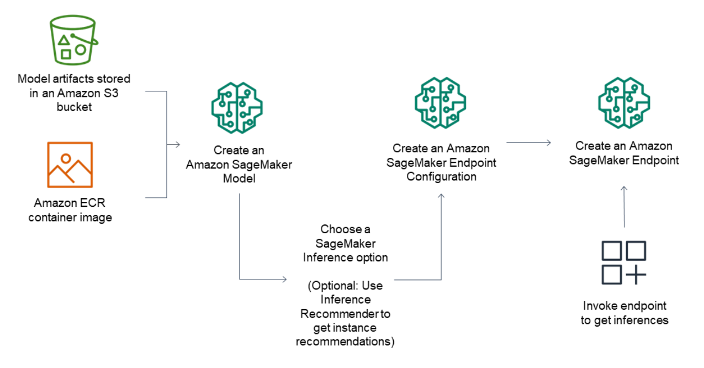

You can perform these actions using the AWS console, the AWS SDKs, the SageMaker Python SDK,
CloudFormation or the AWS CLI.

For batch inference with batch transform, point to your model artifacts and input data and create
a batch inference job. Instead of hosting an endpoint for inference, SageMaker AI outputs your
inferences to an Amazon S3 location of your choice.

Inference options in Amazon SageMaker AI

SageMaker AI provides multiple inference options so that you can pick the option that best suits
your workload:

• Real-Time Inference: Real-time inference is ideal for online inferences that have low latency
or high throughput requirements. Use real-time inference for a persistent and fully managed
endpoint (REST API) that can handle sustained traffic, backed by the instance type of your choice.
Real-time inference can support payload sizes up to 25 MB and processing times of 60 seconds
for regular responses and 8 min for streaming responses.

Inference options
5863

## Page 893

Amazon SageMaker AI
Developer Guide

• Serverless Inference: Serverless inference is ideal when you have intermittent or unpredictable
traffic patterns. SageMaker AI manages all of the underlying infrastructure, so there’s no need to
manage instances or scaling policies. You pay only for what you use and not for idle time. It can
support payload sizes up to 4 MB and processing times up to 60 seconds.

• Batch Transform: Batch transform is suitable for offline processing when large amounts of data
are available upfront and you don’t need a persistent endpoint. You can also use batch transform
for pre-processing datasets. It can support large datasets that are GBs in size and processing
times of days.

• Asynchronous Inference: Asynchronous inference is ideal when you want to queue requests and
have large payloads with long processing times. Asynchronous Inference can support payloads
up to 1 GB and long processing times up to one hour. You can also scale down your endpoint to 0
when there are no requests to process.

Advanced endpoint options for inference with Amazon SageMaker AI

With real-time inference, you can further optimize for performance and cost with the following
advanced inference options:

• Multi-model endpoints – Use this option if you have multiple models that use the same
framework and can share a container. This option helps you optimize costs by improving
endpoint utilization and reducing deployment overhead.

• Multi-container endpoints – Use this option if you have multiple models that use different
frameworks and require their own containers. You get many of the benefits of Multi-Model
Endpoints and can deploy a variety of frameworks and models.

• Serial Inference Pipelines – Use this option if you want to host models with pre-processing and
post-processing logic behind an endpoint. Inference pipelines are fully managed by SageMaker
AI and provide lower latency because all of the containers are hosted on the same Amazon EC2
instances.

Next steps for inference with Amazon SageMaker AI

After you have an endpoint and understand the general inference workflow, you can use the
following features in SageMaker AI to improve your inference workflow.

Advanced endpoint options
5864

## Page 894

Amazon SageMaker AI
Developer Guide

Monitoring

To track your model over time through metrics such as model accuracy and drift, you can use
Model Monitor. With Model Monitor, you can set alerts that notify you when there are deviations in
your model’s quality. To learn more, see the Model Monitor documentation.

To learn more about tools that can be used to monitor model deployments and events that change
your endpoint, see Monitor Amazon SageMaker AI. For example, you can monitor your endpoint’s
health through metrics such as invocation errors and model latency using Amazon CloudWatch
metrics. The SageMaker AI endpoint invocation metrics can provide you with valuable information
about your endpoint’s performance.

CI/CD for model deployment

To put together machine learning solutions in SageMaker AI, you can use SageMaker AI MLOps. You
can use this feature to automate the steps in your machine learning workflow and practice CI/CD.
You can use MLOps Project Templates to help with the setup and implementation of SageMaker AI
MLOps projects. SageMaker AI also supports using your own third-party Git repo for creating a CI/
CD system.

For your ML pipelines, use Model Registry to manage your model versions and the deployment and
automation of your models.

Deployment guardrails

If you want to update your model while it’s in production without impacting production, you can
use deployment guardrails. Deployment guardrails are a set of model deployment options in
SageMaker AI Inference to update your machine learning models in production. Using the fully
managed deployment options, you can control the switch from the current model in production
to a new one. Traffic shifting modes give you granular control over the traffic shifting process, and
built-in safeguards like auto-rollbacks help you catch issues early on.

To learn more about deployment guardrails, see the deployment guardrails documentation.

Inferentia

If you need to run large-scale machine learning and deep learning applications, you can use an

Inf1 instance with a real-time endpoint. This instance type is suitable for use cases such as image
or speech recognition, natural language processing (NLP), personalization, forecasting, or fraud
detection.

Next steps
5865

## Page 895

Amazon SageMaker AI
Developer Guide

Inf1 instances are built to support machine learning inference applications and feature the AWS

Inferentia chips. Inf1 instances provide higher throughput and lower cost per inference than GPU-

based instances.

To deploy a model on Inf1 instances, compile your model with SageMaker Neo and choose an

Inf1 instance for your deployment option. To learn more, see Optimize model performance using
SageMaker Neo.

Optimize model performance

SageMaker AI provides features to manage resources and optimize inference performance when
deploying machine learning models. You can use SageMaker AI’s built-in algorithms and pre-built
models, as well as prebuilt Docker images, which are developed for machine learning.

To train models and optimize them for deployment, see prebuilt Docker imagesOptimize model
performance using SageMaker Neo. With SageMaker Neo, you can train TensorFlow, Apache
MXNet, PyTorch, ONNX, and XGBoost models. Then, you can optimize them and deploy on ARM,
Intel, and Nvidia processors.

Autoscaling

If you have varying amounts of traffic to your endpoints, you might want to try autoscaling. For
example, during peak hours, you might require more instances to process requests. However,
during periods of low traffic, you might want to reduce your use of computing resources. To
dynamically adjust the number of instances provisioned in response to changes in your workload,
see Automatic scaling of Amazon SageMaker AI models.

If you have unpredictable traffic patterns or don’t want to set up scaling policies, you can also use
Serverless Inference for an endpoint. Then, SageMaker AI manages autoscaling for you. During
periods of low traffic, SageMaker AI scales down your endpoint, and if traffic increases, then
SageMaker AI scales your endpoint up. For more information, see the Deploy models with Amazon
SageMaker Serverless Inference documentation.

Create a model in Amazon SageMaker AI with ModelBuilder

Preparing your model for deployment on a SageMaker AI endpoint requires multiple steps,
including choosing a model image, setting up the endpoint configuration, coding your serialization
and deserialization functions to transfer data to and from server and client, identifying model

Model creation with ModelBuilder
5866

## Page 896

Amazon SageMaker AI
Developer Guide

dependencies, and uploading them to Amazon S3. ModelBuilder can reduce the complexity of
initial setup and deployment to help you create a deployable model in a single step.

ModelBuilder performs the following tasks for you:

• Converts machine learning models trained using various frameworks like XGBoost or PyTorch
into deployable models in one step.

• Performs automatic container selection based on the model framework so you don’t have to
manually specify your container. You can still bring your own container by passing your own URI

to ModelBuilder.

• Handles the serialization of data on the client side before sending it to the server for inference
and deserialization of the results returned by the server. Data is correctly formatted without
manual processing.

• Enables automatic capture of dependencies and packages the model according to model server

expectations. ModelBuilder's automatic capture of dependencies is a best-effort approach to
dynamically load dependencies. (We recommend that you test the automated capture locally and
update the dependencies to meet your needs.)

• For large language model (LLM) use cases, optionally performs local parameter tuning of serving
properties that can be deployed for better performance when hosting on a SageMaker AI
endpoint.

• Supports most of the popular model servers and containers like TorchServe, Triton, DJLServing
and TGI container.

Build your model with ModelBuilder

ModelBuilder is a Python class that takes a framework model, such as XGBoost or PyTorch, or

a user-specified inference specification and converts it into a deployable model. ModelBuilder
provides a build function that generates the artifacts for deployment. The model artifact
generated is specific to the model server, which you can also specify as one of the inputs. For more

details about the ModelBuilder class, see ModelBuilder.

The following diagram illustrates the overall model creation workflow when you use

ModelBuilder. ModelBuilder accepts a model or inference specification along with your
schema to create a deployable model that you can test locally before deployment.

Build your model with ModelBuilder
5867

## Page 897

Amazon SageMaker AI
Developer Guide

ModelBuilder can handle any customization you want to apply. However, to deploy a framework
model, the model builder expects at minimum a model, sample input and output, and the role. In

the following code example, ModelBuilder is called with a framework model and an instance of

SchemaBuilder with minimum arguments (to infer the corresponding functions for serializing
and deserializing the endpoint input and output). No container is specified and no packaged
dependencies are passed—SageMaker AI automatically infers these resources when you build your
model.

from sagemaker.serve.builder.model_builder import ModelBuilder
from sagemaker.serve.builder.schema_builder import SchemaBuilder

model_builder = ModelBuilder(
model=model,
schema_builder=SchemaBuilder(input, output),
role_arn="execution-role",
)

The following code sample invokes ModelBuilder with an inference specification (as an

InferenceSpec instance) instead of a model, with additional customization. In this case, the
call to model builder includes a path to store model artifacts and also turns on autocapture of

all available dependencies. For additional details about InferenceSpec, see Customize model
loading and handling of requests.

model_builder = ModelBuilder(
mode=Mode.LOCAL_CONTAINER,
model_path=model-artifact-directory,
inference_spec=your-inference-spec,
schema_builder=SchemaBuilder(input, output),
role_arn=execution-role,
dependencies={"auto": True}

Build your model with ModelBuilder
5868

## Page 898

Amazon SageMaker AI
Developer Guide

)

Define serialization and deserialization methods

When invoking a SageMaker AI endpoint, the data is sent through HTTP payloads with different
MIME types. For example, an image sent to the endpoint for inference needs to be converted to
bytes at the client side and sent through an HTTP payload to the endpoint. When the endpoint
receives the payload, it needs to deserialize the byte string back to the data type that is expected
by the model (also known as server-side deserialization). After the model finishes prediction, the
results also need to be serialized to bytes that can be sent back through the HTTP payload to
the user or the client. Once the client receives the response byte data, it needs to perform client-
side deserialization to convert the bytes data back to the expected data format, such as JSON. At
minimum, you need to convert data for the following tasks:

1.
Inference request serialization (handled by the client)

2.
Inference request deserialization (handled by the server or algorithm)

3.
Invoking the model against the payload and send response payload back

4.
Inference response serialization (handled by the server or algorithm)

5.
Inference response deserialization (handled by the client)

The following diagram shows the serialization and deserialization processes that occur when you
invoke the endpoint.


When you supply sample input and output to SchemaBuilder, the schema builder generates the
corresponding marshalling functions for serializing and deserializing the input and output. You can

Define serialization and deserialization methods
5869

## Page 899

Amazon SageMaker AI
Developer Guide

further customize your serialization functions with CustomPayloadTranslator. But for most
cases, a simple serializer such as the following would work:

input = "How is the demo going?"

output = "Comment la démo va-t-elle?"
schema = SchemaBuilder(input, output)

For further details about SchemaBuilder, see SchemaBuilder.

The following code snippet outlines an example where you want to customize both serialization
and deserialization functions at the client and server sides. You can define your own request

and response translators with CustomPayloadTranslator and pass these translators to

SchemaBuilder.

By including the inputs and outputs with the translators, the model builder can extract the data

format the model expects. For example, suppose the sample input is a raw image, and your custom

translators crop the image and send the cropped image to the server as a tensor. ModelBuilder
needs both the raw input and any custom preprocessing or postprocessing code to derive a method
to convert data on both the client and server sides.

from sagemaker.serve import CustomPayloadTranslator

# request translator
class MyRequestTranslator(CustomPayloadTranslator):
# This function converts the payload to bytes - happens on client side
def serialize_payload_to_bytes(self, payload: object) -> bytes:
# converts the input payload to bytes
... ...
return  //return object as bytes

# This function converts the bytes to payload - happens on server side
def deserialize_payload_from_stream(self, stream) -> object:
# convert bytes to in-memory object
... ...
return //return in-memory object

# response translator
class MyResponseTranslator(CustomPayloadTranslator):
# This function converts the payload to bytes - happens on server side
def serialize_payload_to_bytes(self, payload: object) -> bytes:
# converts the response payload to bytes

Define serialization and deserialization methods
5870

## Page 900

Amazon SageMaker AI
Developer Guide

... ...
return //return object as bytes

# This function converts the bytes to payload - happens on client side
def deserialize_payload_from_stream(self, stream) -> object:
# convert bytes to in-memory object
... ...
return //return in-memory object

You pass in the sample input and output along with the previously-defined custom translators

when you create the SchemaBuilder object, as shown in the following example:

my_schema = SchemaBuilder(
sample_input=image,
sample_output=output,
input_translator=MyRequestTranslator(),

output_translator=MyResponseTranslator()
)

Then you pass in the sample input and output, along with the custom translators defined

previously, to the SchemaBuilder object.

my_schema = SchemaBuilder(
sample_input=image,
sample_output=output,
input_translator=MyRequestTranslator(),
output_translator=MyResponseTranslator()
)

The following sections explain in detail how to build your model with ModelBuilder and use its
supporting classes to customize the experience for your use case.

Topics

• Customize model loading and handling of requests

• Build your model and deploy

• Bring your own container (BYOC)

• Using ModelBuilder in local mode

• ModelBuilder examples

Define serialization and deserialization methods
5871

## Page 901

Amazon SageMaker AI
Developer Guide

Customize model loading and handling of requests

Providing your own inference code through InferenceSpec offers an additional layer of

customization. With InferenceSpec, you can customize how the model is loaded and how
it handles incoming inference requests, bypassing its default loading and inference handling
mechanisms. This flexibility is particularly beneficial when working with non-standard models

or custom inference pipelines. You can customize the invoke method to control how the model

preprocesses and postprocesses incoming requests. The invoke method ensures that the model

handles inference requests correctly. The following example uses InferenceSpec to generate

a model with the HuggingFace pipeline. For further details about InferenceSpec, refer to the
InferenceSpec.

from sagemaker.serve.spec.inference_spec import InferenceSpec
from transformers import pipeline

class MyInferenceSpec(InferenceSpec):
def load(self, model_dir: str):
return pipeline("translation_en_to_fr", model="t5-small")

def invoke(self, input, model):
return model(input)

inf_spec = MyInferenceSpec()

model_builder = ModelBuilder(
inference_spec=your-inference-spec,
schema_builder=SchemaBuilder(X_test, y_pred)
)

The following example illustrates a more customized variation of a previous example. A
model is defined with an inference specification that has dependencies. In this case, the code
in the inference specification is dependent on the lang-segment package. The argument for

dependencies contains a statement that directs the builder to install lang-segment using Git.

Since the model builder is directed by the user to custom install a dependency, the auto key is

False to turn off autocapture of dependencies.

model_builder = ModelBuilder(
mode=Mode.LOCAL_CONTAINER,
model_path=model-artifact-directory,
inference_spec=your-inference-spec,

Customize model loading and handling of requests
5872

## Page 902

Amazon SageMaker AI
Developer Guide

schema_builder=SchemaBuilder(input, output),
role_arn=execution-role,
dependencies={"auto": False, "custom": ["-e git+https://github.com/luca-medeiros/
lang-segment-anything.git#egg=lang-sam"],}
)

Build your model and deploy

Call the build function to create your deployable model. This step creates inference code (as

inference.py) in your working directory with the code necessary to create your schema, run
serialization and deserialization of inputs and outputs, and run other user-specified custom logic.

As an integrity check, SageMaker AI packages and pickles the necessary files for deployment as

part of the ModelBuilder build function. During this process, SageMaker AI also creates HMAC
signing for the pickle file and adds the secret key in the CreateModel API as an environment

variable during deploy (or create). The endpoint launch uses the environment variable to
validate the integrity of the pickle file.

# Build the model according to the model server specification and save it as files in
the working directory
model = model_builder.build()

Deploy your model with the model’s existing deploy method. In this step, SageMaker AI
sets up an endpoint to host your model as it starts making predictions on incoming requests.

Although the ModelBuilder infers the endpoint resources needed to deploy your model, you
can override those estimates with your own parameter values. The following example directs

SageMaker AI to deploy the model on a single ml.c6i.xlarge instance. A model constructed

from ModelBuilder enables live logging during deployment as an added feature.

predictor = model.deploy(
initial_instance_count=1,
instance_type="ml.c6i.xlarge"
)

If you want more fine-grained control over the endpoint resources assigned to your model, you

can use a ResourceRequirements object. With the ResourceRequirements object, you can
request a minimum number of CPUs, accelerators, and copies of models you want to deploy. You
can also request a minimum and maximum bound of memory (in MB). To use this feature, you need

to specify your endpoint type as EndpointType.INFERENCE_COMPONENT_BASED. The following

Build your model and deploy
5873

## Page 903

Amazon SageMaker AI
Developer Guide

example requests four accelerators, a minimum memory size of 1024 MB, and one copy of your

model to be deployed to an endpoint of type EndpointType.INFERENCE_COMPONENT_BASED.

resource_requirements = ResourceRequirements(
requests={

"num_accelerators": 4,
"memory": 1024,
"copies": 1,
},
limits={},
)
predictor = model.deploy(
mode=Mode.SAGEMAKER_ENDPOINT,
endpoint_type=EndpointType.INFERENCE_COMPONENT_BASED,
resources=resource_requirements,
role="role"
)

Bring your own container (BYOC)

If you want to bring your own container (extended from a SageMaker AI container), you can also
specify the image URI as shown in the following example. You also need to identify the model

server that corresponds to the image for ModelBuilder to generate artifacts specific to the
model server.

model_builder = ModelBuilder(
model=model,
model_server=ModelServer.TORCHSERVE,
schema_builder=SchemaBuilder(X_test, y_pred),
image_uri="123123123123.dkr.ecr.ap-southeast-2.amazonaws.com/byoc-image:xgb-1.7-1")
)

Using ModelBuilder in local mode

You can deploy your model locally by using the mode argument to switch between local testing
and deployment to an endpoint. You need to store the model artifacts in the working directory, as
shown in the following snippet:

model = XGBClassifier()
model.fit(X_train, y_train)

Bring your own container (BYOC)
5874

## Page 904

Amazon SageMaker AI
Developer Guide

model.save_model(model_dir + "/my_model.xgb")

Pass the model object, a SchemaBuilder instance, and set mode to Mode.LOCAL_CONTAINER.

When you call the build function, ModelBuilder automatically identifies the supported
framework container and scans for dependencies. The following example demonstrates model
creation with an XGBoost model in local mode.

model_builder_local = ModelBuilder(
model=model,
schema_builder=SchemaBuilder(X_test, y_pred),
role_arn=execution-role,
mode=Mode.LOCAL_CONTAINER
)
xgb_local_builder = model_builder_local.build()

Call the deploy function to deploy locally, as shown in the following snippet. If you specify
parameters for instance type or count, these arguments are ignored.

predictor_local = xgb_local_builder.deploy()

Troubleshooting local mode

Depending on your individual local setup, you may encounter difficulties running ModelBuilder
smoothly in your environment. See the following list for some issues you may face and how to
resolve them.

• Already already in use: You may encounter an Address already in use error. In this case, it
is possible that a Docker container is running on that port or another process is utilizing it. You
can follow the approach outlined in Linux documentation to identify the process and gracefully
redirect your local process from port 8080 to another port or clean up the Docker instance.

• IAM Permission Issue: You might encounter a permission issue when trying to pull an Amazon
ECR image or access Amazon S3. In this case, navigate to the execution role of the notebook or

Studio Classic instance to verify the policy for SageMakerFullAccess or the respective API
permissions.

• EBS volume capacity issue: If you deploy a large language model (LLM), you might run out of
space while running Docker in local mode or experience space limitations for the Docker cache.
In this case, you can try to move your Docker volume to a filesystem that has enough space. To
move your Docker volume, complete the following steps:

Using ModelBuilder in local mode
5875

## Page 905

Amazon SageMaker AI
Developer Guide

1.
Open a terminal and run df to display disk usage, as shown in the following output:

(python3) sh-4.2$ df
Filesystem     1K-blocks      Used Available Use% Mounted on
devtmpfs       195928700         0 195928700   0% /dev
tmpfs          195939296         0 195939296   0% /dev/shm
tmpfs          195939296      1048 195938248   1% /run
tmpfs          195939296         0 195939296   0% /sys/fs/cgroup
/dev/nvme0n1p1 141545452 135242112   6303340  96% /
tmpfs           39187860         0  39187860   0% /run/user/0
/dev/nvme2n1   264055236  76594068 176644712  31% /home/ec2-user/SageMaker
tmpfs           39187860         0  39187860   0% /run/user/1002
tmpfs           39187860         0  39187860   0% /run/user/1001
tmpfs           39187860         0  39187860   0% /run/user/1000

2.
Move the default Docker directory from /dev/nvme0n1p1 to /dev/nvme2n1 so you can
fully utilize the 256 GB SageMaker AI volume. For more details, see documentation about
how to move your Docker directory.

3.
Stop Docker with the following command:

sudo service docker stop

4.
Add a daemon.json to /etc/docker or append the following JSON blob to the existing
one.

{
"data-root": "/home/ec2-user/SageMaker/{created_docker_folder}"
}

5.
Move the Docker directory in /var/lib/docker to /home/ec2-user/SageMaker AI
with the following command:

sudo rsync -aP /var/lib/docker/ /home/ec2-user/SageMaker/{created_docker_folder}

6.
Start Docker with the following command:

sudo service docker start

7.
Clean trash with the following command:

Using ModelBuilder in local mode
5876

## Page 906

Amazon SageMaker AI
Developer Guide

cd /home/ec2-user/SageMaker/.Trash-1000/files/*
sudo rm -r *

8.
If you are using a SageMaker notebook instance, you can follow the steps in the Docker prep
file to prepare Docker for local mode.

ModelBuilder examples

For more examples of using ModelBuilder to build your models, see ModelBuilder sample
notebooks.

Inference optimization for Amazon SageMaker AI models

With Amazon SageMaker AI, you can improve the performance of your generative AI models by
applying inference optimization techniques. By optimizing your models, you can attain better cost-
performance for your use case. When you optimize a model, you choose which of the supported
optimization techniques to apply, including quantization, speculative decoding, and compilation.
After your model is optimized, you can run an evaluation to see performance metrics for latency,
throughput, and price.

For many models, SageMaker AI also provides several pre-optimized versions, where each caters to
different applications needs for latency and throughput. For such models, you can deploy one of
the optimized versions without first optimizing the model yourself.

Optimization techniques

Amazon SageMaker AI supports the following optimization techniques.

Compilation

Compilation optimizes the model for the best available performance on the chosen hardware type
without a loss in accuracy. You can apply model compilation to optimize LLMs for accelerated
hardware, such as GPU instances, AWS Trainium instances, or AWS Inferentia instances.

When you optimize a model with compilation, you benefit from ahead-of-time compilation. You
reduce the model's deployment time and auto-scaling latency because the model weights don't
require just-in-time compilation when the model deploys to a new instance.

ModelBuilder examples
5877

## Page 907

Amazon SageMaker AI
Developer Guide

If you choose to compile your model for a GPU instance, SageMaker AI uses the TensorRT-LLM
library to run the compilation. If you choose to compile your model for an AWS Trainium or AWS
Inferentia instance, SageMaker AI uses the AWS Neuron SDK to run the compilation.

Quantization

Quantization is a technique to reduce the hardware requirements of a model by using a less precise
data type for the weights and activations. After you optimize a model with quantization, you can
host it on less expensive and more available GPUs. However, the quantized model might be less
accurate than the source model that you optimized.

The data formats that SageMaker AI supports for quantization vary from model to model. The
supported formats include the following:

• INT4-AWQ – A 4-bit data format. Activation-aware Weight Quantization (AWQ) is a quantization

technique for LLMs that is efficient, accurate, low-bit, and weight-only.

• FP8 – 8-bit Floating Point (FP8) is a low-precision format for floating point numbers. It balances
memory efficiency and model accuracy by representing values with fewer bits than standard
FP16 floating point format.

• INT8-SmoothQuant – AN 8-bit data format. SmoothQuant is a mixed-precision quantization
method that scales activations and weights jointly by balancing their dynamic ranges.

Speculative decoding

Speculative decoding is a technique to speed up the decoding process of large LLMs. It optimizes
models for latency without compromising the quality of the generated text.

This technique uses a smaller but faster model called the draft model. The draft model generates
candidate tokens, which are then validated by the larger but slower target model. At each iteration,
the draft model generates multiple candidate tokens. The target model verifies the tokens, and if it
finds that a particular token is not acceptable, it rejects the token and regenerates it. So, the target
model both verifies tokens and generates a small amount of them.

The draft model is significantly faster than the target model. It generates all the tokens quickly and
then sends batches of them to the target model for verification. The target model evaluate them
all in parallel, which speeds up the final response.

SageMaker AI offers a pre-built draft model that you can use, so you don't have to build your own.
If you prefer to use your own custom draft model, SageMaker AI also supports this option.

Optimization techniques
5878

## Page 908

Amazon SageMaker AI
Developer Guide

Fast model loading

The fast model loading technique prepares an LLM so that SageMaker AI can load it onto an ML
instance more quickly.

To prepare the model, SageMaker AI shards it in advance by dividing it into portions that can each
reside on a separate GPU for distributed inference. Also, SageMaker AI stores the model weights in
equal-sized chunks that SageMaker AI can load onto the instance concurrently.

When SageMaker AI loads the optimized model onto the instance, it streams the model weights
directly from Amazon S3 onto the GPUs of the instance. By streaming the weights, SageMaker AI
omits several time-consuming steps that are normally necessary. These steps include downloading
the model artifacts from Amazon S3 to disk, loading the model artifacts onto the host memory,
and sharding the model on the host before finally loading the shards onto the GPUs.

After you optimize your model for faster loading, you can deploy it more quickly to a SageMaker
AI endpoint. Also, if you configure the endpoint to use auto scaling, it scales out more quickly to
accommodate increases in traffic.

Deploy a pre-optimized model

Some models in JumpStart are pre-optimized by SageMaker AI, which means that you can deploy
optimized versions of these models without first creating an inference optimization job.

For the list of models with pre-optimized options, see Pre-optimized JumpStart models.

Amazon SageMaker Studio

Use the following procedure to deploy a pre-optimized JumpStart model using Amazon SageMaker
Studio.

To deploy a pre-optimized model

1.
In Studio, in the navigation menu on the left, choose JumpStart.

2.
On the All public models page, choose one of the models that are pre-optimized.

3.
On the model details page, choose Deploy.

4.
On the deployment page, some JumpStart models require you to sign an end-user license
agreement (EULA) before you can proceed. If requested, review the license terms in the

Deploy a pre-optimized model
5879

## Page 909

Amazon SageMaker AI
Developer Guide

License agreement section. If the terms are acceptable for your use case, select the checkbox
for I accept the EULA, and read the terms and conditions.

For more information, see End-user license agreements.

5.
For Endpoint name and Initial instance count, accept the default values or set custom ones.

6.
For Instance type, keep the default value. Otherwise, you can't deploy a pre-optimized
configuration.

7.
Under Models, expand the model configuration. Studio shows a table that provides the pre-
optimized configurations that you can choose from. Each option has metrics for latency and
throughput. Choose the option that best suits your application needs.

8.
Choose Deploy.

SageMaker AI Python SDK

You can deploy a pre-optimized model by using the SageMaker AI Python SDK in your project.

First, you define a Model instance by using the ModelBuilder class. Then, you use the

set_deployment_config() method to set the pre-optimized configuration that you want to

deploy. Then, you use the build() method to build the model. Finally, you use the deploy()
method to deploy it to an inference endpoint.

For more information about the classes and methods used in the following examples, see APIs in
the SageMaker AI Python SDK documentation.

To set up your project

1.
In your application code, import the necessary libraries. The following example imports the
SDK for Python (Boto3). It also imports the modules from the SageMaker AI Python SDK that
you use to define and work with models:

import boto3
from sagemaker.serve.builder.model_builder import ModelBuilder
from sagemaker.serve.builder.schema_builder import SchemaBuilder
from sagemaker.session import Session

2.
Initialize a SageMaker AI session. The following example uses the Session() class:

sagemaker_session = Session()

Deploy a pre-optimized model
5880

## Page 910

Amazon SageMaker AI
Developer Guide

To define your model

1.
Create a SchemaBuilder instance, and provide input and output samples. You supply

this instance to the ModelBuilder class when you define a model. With it, SageMaker AI
automatically generates the marshalling functions for serializing and deserializing the input

and output.

For more information about using the SchemaBuilder and ModelBuilder classes, see
Create a model in Amazon SageMaker AI with ModelBuilder.

The following example provides sample input and output strings to the SchemaBuilder class:

response = "Jupiter is the largest planet in the solar system. It is the fifth
planet from the sun."
sample_input = {
"inputs": "What is the largest planet in the solar system?",
"parameters": {"max_new_tokens": 128, "top_p": 0.9, "temperature": 0.6},
}
sample_output = [{"generated_text": response}]
schema_builder = SchemaBuilder(sample_input, sample_output)

2.
Define your model to SageMaker AI. The following example sets the parameters to initialize a

ModelBuilder instance:

model_builder = ModelBuilder(
model="jumpstart-model-id",
schema_builder=schema_builder,
sagemaker_session=sagemaker_session,
role_arn=sagemaker_session.get_caller_identity_arn(),
)

This example uses a JumpStart model. Replace jumpstart-model-id with the ID of a

JumpStart model, such as meta-textgeneration-llama-3-70b.

To retrieve benchmark metrics

1.
To determine which pre-optimized configuration you want to deploy, look up the options that
SageMaker AI provides. The following example displays them:

model_builder.display_benchmark_metrics()

Deploy a pre-optimized model
5881

## Page 911

Amazon SageMaker AI
Developer Guide

This display_benchmark_metrics() method prints a table like the following:

| Instance Type   | Config Name   |   Concurrent Users |   Latency, TTFT (P50 in
sec) |   Throughput (P50 in tokens/sec/user) |
|:----------------|:--------------|-------------------:|-----------------------------:|----
| ml.g5.48xlarge  | lmi-optimized |                  1 |
2.25 |                                 49.70 |
| ml.g5.48xlarge  | lmi-optimized |                  2 |
2.28 |                                 21.10 |
| ml.g5.48xlarge  | lmi-optimized |                  4 |
2.37 |                                 14.10 |
. . .
| ml.p4d.24xlarge | lmi-optimized |                  1 |
0.10 |                                137.40 |
| ml.p4d.24xlarge | lmi-optimized |                  2 |
0.11 |                                109.20 |
| ml.p4d.24xlarge | lmi-optimized |                  4 |
0.13 |                                 85.00 |
. . .

In the first column, the table lists potential instance types that you can use to host your chosen

JumpStart model. For each instance type, under Config Name, it lists the names of the pre-

optimized configurations. The configurations that SageMaker AI provides are named lmi-

optimized. For each instance type and configuration, the table provides benchmark metrics.
These metrics indicate the throughput and latency that your model will support for different
numbers of concurrent users.

2.
Based on the benchmark metrics, pick the instance type and configuration name that best
supports your performance needs. You will use these values when you create a deployment
configuration.

To deploy a pre-optimized model

1.
Create a deployment configuration. The following example uses a ModelBuilder instance. It

passes an instance type and configuration name to the to the set_deployment_config()
method:

model_builder.set_deployment_config(
config_name="config-name",
instance_type="instance-type",

Deploy a pre-optimized model
5882

## Page 912

Amazon SageMaker AI
Developer Guide

)

Replace config-name with a configuration name from the table, such as such as lmi-

optimized. Replace instance-type with an instance type from the table, such as

ml.p4d.24xlarge.

2.
Build your model. The following example uses the .build() method of the ModelBuilder
instance:

optimized_model = model_builder.build()

The .build() method returns a deployable Model instance.

3.
Deploy your model to an inference endpoint. The following example uses the .deploy()

method of the Model instance:

predictor = optimized_model.deploy(accept_eula=True)

The deploy() method returns a Predictor instance, which you can use to send inference
requests to the model.

To test your model with an inference request

•
After you deploy your model to an inference endpoint, test the model's predictions. The

following example sends an inference request by using the Predictor instance:

predictor.predict(sample_input)

The model returns the text that it generates with a response like the following:

{'generated_text': ' Jupiter is the largest planet in the solar system. It is the
fifth planet from the sun. It is a gas giant with . . .'}

Pre-optimized JumpStart models

The following are the JumpStart models that have pre-optimized configurations.

Deploy a pre-optimized model
5883

## Page 913

Amazon SageMaker AI
Developer Guide

Meta

• Llama 3.1 70B Instruct

• Llama 3.1 70B

• Llama 3.1 405B Instruct FP8

• Llama 3.1 405B FP8

• Llama 3 8B Instruct

• Llama 3 8B

• Llama 3 70B Instruct

• Llama 3 70B

• Llama 2 70B Chat

• Llama 2 7B Chat

• Llama 2 13B Chat

HuggingFace

• Mixtral 8x7B Instruct

• Mixtral 8x7B

• Mistral 7B Instruct

• Mistral 7B

Pre-compiled JumpStart models

For some models and configurations, SageMaker AI provides models that are pre-compiled
for specific AWS Inferentia and AWS Trainium instances. For these, if you create a compilation
optimization job, and you choose ml.inf2.48xlarge or ml.trn1.32xlarge as the deployment instance
type, SageMaker AI fetches the compiled artifacts. Because the job uses a model that’s already
compiled, it completes quickly without running the compilation from scratch.

The following are the JumpStart models for which SageMaker AI has pre-compiled models:

Meta

• Llama3 8B

• Llama3 70B

Deploy a pre-optimized model
5884

## Page 914

Amazon SageMaker AI
Developer Guide

• Llama2 7B

• Llama2 70B

• Llama2 13B

• Code Llama 7B

• Code Llama 70B

HuggingFace

• Mistral 7B

Create an inference optimization job

You can create an inference optimization job by using Studio or the SageMaker AI Python SDK. The

job optimizes your model by applying the techniques that you choose. For more information, see
Optimization techniques.

Instance pricing for inference optimization jobs

When you create a inference optimization job that applies quantization or compilation,
SageMaker AI chooses which instance type to use to run the job. You are charged based on
the instance used.
For the possible instance types and their pricing details, see the inference optimization
pricing information on the Amazon SageMaker pricing page.
You incur no additional costs for jobs that apply speculative decoding.

For the supported models that you can optimize, see Supported models reference.

Amazon SageMaker Studio

Complete the following steps to create an inference optimization job in Studio.

To begin creating an optimization job

1.
In SageMaker AI Studio, create an optimization job through any of the following paths:

•
To create a job for a JumpStart model, do the following:

a.
In the navigation menu, choose JumpStart.

Create an optimization job
5885

## Page 915

Amazon SageMaker AI
Developer Guide

b.
On the All public models page, choose a model provider, and then choose one of the
models that supports optimization.

c.
On the model details page, choose Optimize. This button is enabled only for models
that support optimization.

d.
On the Create inference optimization job page, some JumpStart models require you
to sign an end-user license agreement (EULA) before you can proceed. If requested,
review the license terms in the License agreement section. If the terms are acceptable
for your use case, select the checkbox for I accept the EULA, and read the terms and
conditions.

•
To create a job for a fine-tuned JumpStart model, do the following:

a.
In the navigation menu, under Jobs, choose Training.

b.
On the Training Jobs page, choose the name of a job that you used to fine tune
a JumpStart model. These jobs have the type JumpStart training in the Job type
column.

c.
On the details page for the training job, choose Optimize.

•
To create a job for a custom model, do the following:

a.
In the navigation menu, under Jobs, choose Inference optimization.

b.
Choose Create new job.

c.
On the Create inference optimization job page, choose Add model.

d.
In the Add model window, choose Custom Model.

e.
Choose one of the following options:

Use your existing model - Select this option to optimize a model that you've already
created in SageMaker AI.

Existing model name - enter the name of your SageMaker AI model.

From S3 - Select this option to provide model artifacts from Amazon S3. For S3 URI,
enter the URI for the location in Amazon S3 where you've stored your model artifacts.

f.
(Optional) For Output model name, you can enter a custom name for the optimized
model that the job creates. If you don't provide a name, Studio automatically
generates one based on your selection.

Create an optimization job
5886

## Page 916

Amazon SageMaker AI
Developer Guide

2.
On the Create inference optimization job page, for Job name, you can accept the default
name that SageMaker AI assigns. Or, to enter a custom job name, choose the Job name field,
and choose Enter job name.

To set the optimization configurations

1.
For Deployment instance type, choose the instance type that you want to optimize the model
for.

The instance type affects what optimization techniques you can choose. For most types
that use GPU hardware, the supported techniques are Quantization and Speculative
decoding. If you choose an instance that uses custom silicon, like the AWS Inferentia instance
ml.inf2.8xlarge, the supported technique is Compilation, which you can use to compile the
model for that specific hardware type.

2.
Select one or more of the optimization techniques that Studio provides:

• If you select Quantization, choose a data type for Precision data type.

• If you select Speculative decoding, choose one of the following options:

• Use SageMaker AI draft model – Choose to use the draft model that SageMaker AI
provides.

Note

If you choose to use the SageMaker AI draft model, you must also enable network
isolation. Studio provides this option under Security.

• Choose JumpStart draft model – Choose to select a model from the JumpStart catalog to
use as your draft model.

• Choose your own draft model – Choose to use your own draft model, and provide the S3
URI that locates it.

• If you choose Fast model loading, Studio shows the OPTION_TENSOR_PARALLEL_DEGREE
environment variable. Use the Value field to set the degree of tensor parallelism. The value
must evenly divide the number of GPUs in the instance you chose for Deployment instance
type. For example, to shard your model while using an instance with 8 GPUs, use the values
2, 4, or 8.

Create an optimization job
5887

## Page 917

Amazon SageMaker AI
Developer Guide

• If you set Deployment instance type to an AWS Inferentia or AWS Trainium instance, Studio
might show that Compilation is the one supported option. In that case, Studio selects this
option for you.

3.
For Output, enter the URI of a location in Amazon S3. There, SageMaker AI stores the artifacts

of the optimized model that your job creates.

4.
(Optional) Expand Advanced options for more fine-grained control over settings such as the

IAM role, VPC, and environment variables. For more information, see Advanced options below.

5.
When you're finished configuring the job, choose Create job.

Studio shows the job details page, which shows the job status and all of its settings.

Advanced options

You can set the following advanced options when you create an inference optimization job.

Under Configurations, you can set the following options:

Tensor parallel degree

A value for the degree of tensor parallelism. Tensor parallelism is a type of model parallelism in
which specific model weights, gradients, and optimizer states are split across devices. The value
must evenly divide the number of GPUs in your cluster.

Maximum token length

The limit for the number of tokens to be generated by the model. Note that the model might
not always generate the maximum number of tokens.

Concurrency

The ability to run multiple instances of a model on the same underlying hardware. Use
concurrency to serve predictions to multiple users and to maximize hardware utilization.

Batch size

If your model does batch inferencing, use this option to control the size of the batches that your
model processes.

Batch inferencing generates model predictions on a batch of observations. It's a good option for
large datasets or if you don't need an immediate response to an inference request.

Create an optimization job
5888

## Page 918

Amazon SageMaker AI
Developer Guide

Under Security, you can set the following options:

IAM Role

An IAM role that enables SageMaker AI to perform tasks on your behalf. During model
optimization, SageMaker AI needs your permission to:

• Read input data from an S3 bucket

• Write model artifacts to an S3 bucket

• Write logs to Amazon CloudWatch Logs

• Publish metrics to Amazon CloudWatch

You grant permissions for all of these tasks to an IAM role.

For more information, see How to use SageMaker AI execution roles.

Encryption KMS key

A key in AWS Key Management Service (AWS KMS). SageMaker AI uses they key to encrypt the
artifacts of the optimized model when SageMaker AI uploads the model to Amazon S3.

VPC

SageMaker AI uses this information to create network interfaces and attach them to your model
containers. The network interfaces provide your model containers with a network connection
within your VPC that is not connected to the internet. They also enable your model to connect
to resources in your private VPC.

For more information, see Give SageMaker AI Hosted Endpoints Access to Resources in Your
Amazon VPC.

Enable network isolation

Activate this option if you want to restrict your container's internet access. Containers that run
with network isolation can’t make any outbound network calls.

Note

You must activate this option when you optimize with speculative decoding and you use
the SageMaker AI draft model.
For more information about network isolation, see Network Isolation.

Create an optimization job
5889

## Page 919

Amazon SageMaker AI
Developer Guide

Under Advanced container definition, you can set the following options:

Stopping condition

Specifies a limit to how long a job can run. When the job reaches the time limit, SageMaker AI
ends the job. Use this option to cap costs.

Tags

Key-value pairs associated with the optimization job.

For more information about tags, see Tagging your AWS resources in the AWS General
Reference.

Environment variables

Key-value pairs that define the environment variables to set in the model container.

SageMaker AI Python SDK

You can create an inference optimization job by using the SageMaker AI Python SDK in your

project. First, you define a Model instance by using the ModelBuilder class. Then, you use

the optimize() method to run a job that optimizes your model with quantization, speculative
decoding, or compilation. When the job completes, you deploy the model to an inference endpoint

by using the deploy() method.

For more information about the classes and methods used in the following examples, see APIs in
the SageMaker AI Python SDK documentation.

To set up your project

1.
In your application code, import the necessary libraries. The following example imports the
SDK for Python (Boto3). It also imports the classes from the SageMaker AI Python SDK that
you use to define and work with models:

import boto3
from sagemaker.serve.builder.model_builder import ModelBuilder
from sagemaker.serve.builder.schema_builder import SchemaBuilder
from sagemaker.session import Session
from pathlib import Path

2.
Initialize a SageMaker AI session. The following example uses the Session() class:

Create an optimization job
5890

## Page 920

Amazon SageMaker AI
Developer Guide

sagemaker_session = Session()

To define your model

1.
Create a SchemaBuilder instance, and provide input and output samples. You supply

this instance to the ModelBuilder class when you define a model. With it, SageMaker AI
automatically generates the marshalling functions for serializing and deserializing the input
and output.

For more information about using the SchemaBuilder and ModelBuilder classes, see
Create a model in Amazon SageMaker AI with ModelBuilder.

The following example provides sample input and output strings to the SchemaBuilder class:

response = "Jupiter is the largest planet in the solar system. It is the fifth
planet from the sun."
sample_input = {
"inputs": "What is the largest planet in the solar system?",
"parameters": {"max_new_tokens": 128, "top_p": 0.9, "temperature": 0.6},
}
sample_output = [{"generated_text": response}]
schema_builder = SchemaBuilder(sample_input, sample_output)

2.
Define your model to SageMaker AI. The following example sets the parameters to initialize a

ModelBuilder instance:

model_builder = ModelBuilder(
model="jumpstart-model-id",
schema_builder=schema_builder,
sagemaker_session=sagemaker_session,
role_arn=sagemaker_session.get_caller_identity_arn(),
)

This example uses a JumpStart model. Replace jumpstart-model-id with the ID of a

JumpStart model, such as meta-textgeneration-llama-3-70b.

Create an optimization job
5891

## Page 921

Amazon SageMaker AI
Developer Guide

Note

If you want to optimize with speculative decoding, and you want to use the SageMaker
AI draft, you must enable network isolation. To enable it, include the following

argument when you initialize a ModelBuilder instance:

enable_network_isolation=True,

For more information about network isolation, see Network Isolation.

To optimize with quantization

1.
To run a quantization job, use the optimize() method, and set the quantization_config

argument. The following example sets OPTION_QUANTIZE as an environment variable in the
optimization container:

optimized_model = model_builder.optimize(
instance_type="instance-type",
accept_eula=True,
quantization_config={
"OverrideEnvironment": {
"OPTION_QUANTIZE": "awq",
},
},
output_path="s3://output-path",
)

In this example, replace instance-type with an ML instance, such as ml.p4d.24xlarge.

Replace s3://output-path with the path to the S3 location where you store the optimized
model that the job creates.

The optimize() method returns a Model object, which you can use to deploy your model to
an endpoint.

2.
When the job completes, deploy the model. The following example uses the deploy()
method:

predictor = optimized_model.deploy(

Create an optimization job
5892

## Page 922

Amazon SageMaker AI
Developer Guide

instance_type="instance-type",
accept_eula=True,
)

In this example, replace instance-type with an ML instance, such as ml.p4d.24xlarge.

The deploy() method returns a predictor object, which you can use to send inference
requests to the endpoint that hosts the model.

To optimize with speculative decoding using the SageMaker AI draft model

When you optimize your model with speculative decoding, you can choose to use a draft model
that SageMaker AI provides, or you can use your own. The following examples use the SageMaker
AI draft model.

Prerequisite

To optimize with speculative decoding and the SageMaker AI draft model, you must enable
network isolation when you define your model.

1.
To run a speculative decoding job, use the optimize() method, and set the

speculative_decoding_config argument. The following example sets the

ModelProvider key to SAGEMAKER to use the draft model that SageMaker AI provides.

optimized_model = model_builder.optimize(
instance_type="instance-type",
accept_eula=True,
speculative_decoding_config={
"ModelProvider": "SAGEMAKER",
},
)

In this example, replace instance-type with an ML instance, such as ml.p4d.24xlarge.

The optimize() method returns a Model object, which you can use to deploy your model to
an endpoint.

2.
When the job completes, deploy the model. The following example uses the deploy()
method:

Create an optimization job
5893

## Page 923

Amazon SageMaker AI
Developer Guide

predictor = optimized_model.deploy(accept_eula=True)

The deploy() method returns a predictor object, which you can use to send inference
requests to the endpoint that hosts the model.

To optimize with speculative decoding using a custom draft model

Before you can provide your custom draft model to SageMaker AI, you must first upload the model
artifacts to Amazon S3.

The following examples demonstrate one possible way to provide a custom draft model. The
examples download the draft model from the Hugging Face Hub, upload it to Amazon S3, and

provide the S3 URI to the speculative_decoding_config argument.

1.
If you want to download a model from the Hugging Face Hub, add the huggingface_hub

library to your project, and download a model with the snapshot_download() method. The
following example downloads a model to a local directory:

import huggingface_hub

huggingface_hub.snapshot_download(
repo_id="model-id",
revision="main",
local_dir=download-dir,
token=hf-access-token,
)

In this example, replace model-id with the ID of a model the Hugging Face Hub, such as

meta-llama/Meta-Llama-3-8B. Replace download-dir with a local directory. Replace hf-

access-token with your user access token. To learn how to get your access token, see User
access tokens in the Hugging Face documentation.

For more information about the huggingface_hub library, see Hub client library in the
Hugging Face documentation.

2.
To make your downloaded model available to SageMaker AI, upload it to Amazon S3. The

following example uploads the model with the sagemaker_session object:

custom_draft_model_uri = sagemaker_session.upload_data(

Create an optimization job
5894

## Page 924

Amazon SageMaker AI
Developer Guide

path=hf_local_download_dir.as_posix(),
bucket=sagemaker_session.default_bucket(),
key_prefix="prefix",
)

In this example, replace prefix with a qualifier that helps you distinguish the draft model in

S3, such as spec-dec-custom-draft-model.

The upload_data() method returns the S3 URI for the model artifacts.

3.
To run a speculative decoding job, use the optimize() method, and set the

speculative_decoding_config argument. The following example sets the ModelSource
key to the S3 URI of the custom draft model:

optimized_model = model_builder.optimize(
instance_type="instance-type",
accept_eula=True,
speculative_decoding_config={
"ModelSource": custom_draft_model_uri + "/",
},
)

In this example, replace instance-type with an ML instance, such as ml.p4d.24xlarge.

The optimize() method returns a Model object, which you can use to deploy your model to
an endpoint.

4.
When the job completes, deploy the model. The following example uses the deploy()
method:

predictor = optimized_model.deploy(accept_eula=True)

The deploy() method returns a predictor object, which you can use to send inference
requests to the endpoint that hosts the model.

To optimize with compilation

1.
To run a compilation job, use the optimize() method, and set the compilation_config

argument. The following example uses the OverrideEnvironment key to set the necessary
environment variables in the optimization container:

Create an optimization job
5895

## Page 925

Amazon SageMaker AI
Developer Guide

optimized_model = model_builder.optimize(
instance_type="instance-type",
accept_eula=True,
compilation_config={
"OverrideEnvironment": {
"OPTION_TENSOR_PARALLEL_DEGREE": "24",
"OPTION_N_POSITIONS": "8192",
"OPTION_DTYPE": "fp16",
"OPTION_ROLLING_BATCH": "auto",
"OPTION_MAX_ROLLING_BATCH_SIZE": "4",
"OPTION_NEURON_OPTIMIZE_LEVEL": "2",
}
},
output_path="s3://output-path",
)

In this example, set instance-type to an ML instance type with accelerated hardware. For
example, for accelerated inference with AWS Inferentia, you could set the type to an Inf2

instance, such as ml.inf2.48xlarge. Replace s3://output-path with the path to the S3
location where you store the optimized model that the job creates.

2.
When the job completes, deploy the model. The following example uses the deploy()
method:

predictor = optimized_model.deploy(accept_eula=True)

The deploy() method returns a predictor object, which you can use to send inference
requests to the endpoint that hosts the model.

To test your model with an inference request

•
To send a test inference request to your deployed model, use the predict() method of a

predictor object. The following example passes the sample_input variable that was also

passed to the SchemaBuilder class in the examples to define your model:

predictor.predict(sample_input)

Create an optimization job
5896

## Page 926

Amazon SageMaker AI
Developer Guide

The sample input has the prompt, "What is the largest planet in the solar

system?". The predict() method returns the response that the model generated, as shown

by the following example:

{'generated_text': ' Jupiter is the largest planet in the solar system. It is the
fifth planet from the sun. It is a gas giant with . . .'}

AWS SDK for Python (Boto3)

You can use the AWS SDK for Python (Boto3) to programmatically create and manage inference
optimization jobs. This section provides examples for different optimization techniques.

Prerequisites

Before creating an optimization job with Boto3, ensure you have:

• Configured AWS credentials - Set up your AWS credentials with appropriate permissions

• Created a SageMaker AI model (if using an existing model)

• Prepared training data in S3 (for speculative decoding optimization, supported context length up
to 4096)

• IAM role with necessary permissions - Your execution role must have permissions to access S3
and create SageMaker resources

Example: Create an Optimization Job with EAGLE Speculative Decoding (Llama 3.3 70B)

This example demonstrates creating an optimization job for a large language model using the
EAGLE speculative decoding technique:

import boto3

# Initialize SageMaker client
sagemaker_client = boto3.client('sagemaker', region_name='us-west-2')

# Step 1: Create a SageMaker model (if not already created)
model_response = sagemaker_client.create_model(
ModelName='meta-llama-3-3-70b-instruct',
ExecutionRoleArn='arn:aws:iam::123456789012:role/SageMakerExecutionRole',
PrimaryContainer={
'Image': '763104351884.dkr.ecr.us-west-2.amazonaws.com/djl-inference:<tag>',

Create an optimization job
5897

## Page 927

Amazon SageMaker AI
Developer Guide

'ModelDataSource': {
'S3DataSource': {
'S3Uri': 's3://my-bucket/models/Llama-3.3-70B-Instruct/',
'S3DataType': 'S3Prefix',
'CompressionType': 'None'
}
},
'Environment': {
'SAGEMAKER_ENV': '1',
'SAGEMAKER_MODEL_SERVER_TIMEOUT': '3600'
}
}
)

# Step 2: Create optimization job with speculative decoding
optimization_response = sagemaker_client.create_optimization_job(
OptimizationJobName='llama-optim-job-eagle-speculative-decoding',

RoleArn='arn:aws:iam::123456789012:role/SageMakerExecutionRole',
ModelSource={
'SageMakerModel': {
'ModelName': 'meta-llama-3-3-70b-instruct'
}
},
DeploymentInstanceType='ml.p4d.24xlarge',
# MaxInstanceCount specifies the maximum number of instances for distributed
training
MaxInstanceCount=4,
OptimizationConfigs=[
{
'ModelSpeculativeDecodingConfig': {
'Technique': 'EAGLE',
'TrainingDataSource': {
'S3Uri': 's3://my-bucket/training_data/ultrachat_8k/',
'S3DataType': 'S3Prefix'
}
}
}
],
OutputConfig={
'S3OutputLocation': 's3://my-bucket/optimized-models/llama-optim-output/',
},
StoppingCondition={
'MaxRuntimeInSeconds': 432000  # 5 days
}

Create an optimization job
5898

## Page 928

Amazon SageMaker AI
Developer Guide

)

print(f"Optimization job ARN: {optimization_response['OptimizationJobArn']}")

Example: Create an Optimization Job from S3 Model Artifacts (Qwen3 32B)

This example shows how to create an optimization job using model artifacts directly from S3:

import boto3

sagemaker_client = boto3.client('sagemaker', region_name='us-west-2')

# Create model from S3 artifacts
model_response = sagemaker_client.create_model(
ModelName='qwen3-32b',
ExecutionRoleArn='arn:aws:iam::123456789012:role/SageMakerExecutionRole',
PrimaryContainer={
'Image': '763104351884.dkr.ecr.us-west-2.amazonaws.com/djl-inference:<tag>',
'Mode': 'SingleModel',
'ModelDataSource': {
'S3DataSource': {
'S3Uri': 's3://my-bucket/models/qwen3-32b/',
'S3DataType': 'S3Prefix',
'CompressionType': 'None'
}
},
'Environment': {
'AWS_REGION': 'us-west-2'
}
}
)

# Create optimization job with smaller training dataset
optimization_response = sagemaker_client.create_optimization_job(
OptimizationJobName='qwen3-optim-job-eagle',
RoleArn='arn:aws:iam::123456789012:role/SageMakerExecutionRole',
ModelSource={
'SageMakerModel': {
'ModelName': 'qwen3-32b'
}
},
DeploymentInstanceType='ml.g6.48xlarge',
MaxInstanceCount=4,
OptimizationConfigs=[

Create an optimization job
5899

## Page 929

Amazon SageMaker AI
Developer Guide

{
'ModelSpeculativeDecodingConfig': {
'Technique': 'EAGLE',
'TrainingDataSource': {
'S3Uri': 's3://my-bucket/training_data/ultrachat_1k/',
'S3DataType': 'S3Prefix'
}
}
}
],
OutputConfig={
'S3OutputLocation': 's3://my-bucket/optimized-models/qwen3-optim-output/',
},
StoppingCondition={
'MaxRuntimeInSeconds': 432000  # 5 days
}
)

print(f"Optimization job ARN: {optimization_response['OptimizationJobArn']}")

Example: Monitor and Manage Optimization Jobs

After creating an optimization job, you can monitor its progress and manage it using these
commands:

import boto3

sagemaker_client = boto3.client('sagemaker', region_name='us-west-2')

# Describe optimization job to check status
describe_response = sagemaker_client.describe_optimization_job(
OptimizationJobName='llama-optim-job-eagle-speculative-decoding'
)

print(f"Job Status: {describe_response['OptimizationJobStatus']}")

# List all optimization jobs (with pagination)
list_response = sagemaker_client.list_optimization_jobs(
MaxResults=10,
SortBy='CreationTime',
SortOrder='Descending'
)

Create an optimization job
5900

## Page 930

Amazon SageMaker AI
Developer Guide

print("\nRecent optimization jobs:")
for job in list_response['OptimizationJobSummaries']:
print(f"- {job['OptimizationJobName']}: {job['OptimizationJobStatus']}")

# Stop a running optimization job if needed
# sagemaker_client.stop_optimization_job(
#     OptimizationJobName='llama-optim-job-eagle-speculative-decoding'
# )

# Delete a completed or failed optimization job
# sagemaker_client.delete_optimization_job(
#     OptimizationJobName='llama-optim-job-eagle-speculative-decoding'
# )

Speculative decoding with Eagle Heads runs four sequential training jobs. Each job produces
output that becomes the input to the next. Only the output from the final job is delivered to your
S3 bucket. The intermediate outputs are encrypted and stored in an internal SageMaker AI service
bucket for upto 20 days. SageMaker AI does not have permissions to de-crypt them. If you want
the intermediate data removed before that time period, ensure your job has been completed or
has stopped, and then open a support case [https://docs.aws.amazon.com/awssupport/latest/
user/case-management.html#creating-a-support-case] for this data to be deleted. Include in the
request your AWS account ID and the optimization job ARN.

Limitations of the SageMaker AI draft model

For any model that you optimize with the SageMaker AI draft model, be aware of the requirements,
restrictions, and supported environment variables.

Requirements

You must do the following:

• Use a model that's provided by SageMaker JumpStart.

• Enable network isolation for the model deployment.

• If you deploy the model to a Large Model Inference (LMI) container, use a DJLServing container
at version 0.28.0 or above.

For the available containers, see Large Model Inference Containers in the Deep Learning
Containers GitHub repository.

• If you fine tune the JumpStart model, use the safetensors format for the model weights.

Create an optimization job
5901

## Page 931

Amazon SageMaker AI
Developer Guide

For more information about this format, see Safetensors in the Hugging Face documentation.

Restrictions

You can't do the following:

• Use the model in local test environments that you create with local mode.

For more information about local mode, see Local Mode in the SageMaker AI Python SDK
documentation.

• Access the model container through the AWS Systems Manager Agent (SSM Agent). The SSM
Agent provides shell-level access to your model container so that you can debug processes and
log commands with Amazon CloudWatch.

For more information about this feature, see Access containers through SSM.

• Configure the model container for a core dump that occurs if the process crashes.

For more information about core dumps from model containers, see
ProductionVariantCoreDumpConfig.

• Deploy the model to multi-model endpoints, multi-container endpoints, or endpoints that host
inference components.

For more information about these endpoint types, see Multi-model endpoints, Multi-container
endpoints, and Inference components.

• Create a model package for the model. You use model packages to create deployable models
that you publish on AWS Marketplace.

For more information about this feature, see Create a Model Package Resource.

• Use your own inference code in the model container.

• Use a requirements.txt file in the model container. This type of file lists package
dependencies.

• Enable the Hugging Face parameter trust_remote_code.

Supported environment variables

You can configure the container only with the following environment variables:

Create an optimization job
5902

## Page 932

Amazon SageMaker AI
Developer Guide

• Common environment variables for large model inference (LMI) containers.

For more information about these variables, see Environment Variable Configurations in the LMI
container documentation.

• Common environment variables for packages that the Hugging Face Hub provides in its Git
repositories.

For the repositories, see Hugging Face on GitHub.

• Common PyTorch & CUDA environment variables.

For more information about these variables, see Torch Environment Variables in the PyTorch
documentation.

View the optimization job results

After you've created one or more optimization jobs, you can use Studio to view a summary table of
all of your jobs, and you can view the details for any individual job.

Amazon SageMaker Studio

To view the optimization job summary table

•
In the Studio navigation menu, under Jobs, choose Inference optimization.

The Inference optimization page shows a table that displays the jobs that you've created. For
each job, it shows the optimization configurations that you applied and the job status.

To view the details for a job

•
On the Inference optimization page, in the summary table, choose the name of the job.

Studio shows the job details page, which shows the job status and all of the settings that you
applied when you created the job. If the job completed successfully, SageMaker AI stored the
optimized model artifacts in the Amazon S3 location under Optimized model S3 URI.

View the optimization job results
5903

## Page 933

Amazon SageMaker AI
Developer Guide

Evaluate the performance of optimized models

After you use an optimization job to create an optimized model, you can run an evaluation of
model performance. This evaluation yields metrics for latency, throughput, and price. Use these
metrics to determine whether the optimized model meets the needs of your use case or whether it
requires further optimization.

You can run performance evaluations only by using Studio. This feature is not provided through the
Amazon SageMaker AI API or Python SDK.

Before you begin

Before you can create a performance evaluation, you must first optimize a model by creating an
inference optimization job. In Studio, you can evaluate only the models that you create with these

jobs.

Create the performance evaluation

Complete the following steps in Studio to create a performance evaluation for an optimized model.

1.
In the Studio navigation menu, under Jobs, choose Inference optimization.

2.
Choose the name of the job that created the optimized model that you want to evaluate.

3.
On the job details page, choose Evaluate performance.

4.
On the Evaluate performance page, some JumpStart models require you to sign an end-user
license agreement (EULA) before you can proceed. If requested, review the license terms in the
License agreement section. If the terms are acceptable for your use case, select the checkbox
for I accept the EULA, and read the terms and conditions.

5.
For Select a model for tokenizer, accept the default, or a choose a specific model to act as the
tokenizer for your evaluation.

6.
For Input datasets, choose whether to:

• Use the default sample datasets from SageMaker AI.

• Provide an S3 URI that points to your own sample datasets.

7.
For S3 URI for performance results, provide a URI that points to the location in Amazon S3
where you want to store the evaluation results.

8.
Choose Evaluate.

Evaluate performance
5904

## Page 934

Amazon SageMaker AI
Developer Guide

Studio shows the Performance evaluations page, where your evaluation job is shown in the
table. The Status column shows the status of your evaluation.

9.
When the status is Completed, choose the name of the job to see the evaluation results.

The evaluation details page shows tables that provide the performance metrics for latency,
throughput, and price. For more information about each metric, see the Metrics reference for
inference performance evaluations.

Metrics reference for inference performance evaluations

After you successfully evaluate the performance of an optimized model, the evaluation details
page in Studio shows the following metrics.

Latency metrics

The Latency section shows the following metrics

Concurrency

The number of concurrent users that the evaluation simulated to invoke the endpoint
simultaneously.

Time to first token (ms)

The time that elapsed between when request is sent and when the first token of a streaming
response is received.

Inter-token latency (ms)

The time to generate an output token for each request.

Client latency (ms)

The request latency from the time the request is sent to the time the entire response is
received.

Input tokens/sec (count)

The total number of generated input tokens, across all requests, divided by the total duration in
seconds for the concurrency.

Evaluate performance
5905

## Page 935

Amazon SageMaker AI
Developer Guide

Output tokens/sec (count)

The total number of generated output tokens, across all requests, divided by total duration in
seconds for the concurrency.

Client invocations (count)

The total number of inference requests sent to the endpoint across all users at a concurrency.

Client invocation errors (count)

The total number of inference requests sent to the endpoint across all users at a given
concurrency that resulted in an invocation error.

Tokenizer failed (count)

The total number of inference requests where the tokenizer failed to parse the request or the
response.

Empty inference response (count)

The total number of inference requests that resulted in zero output tokens or the tokenizer
failing to parse the response.

Throughput metrics

The Throughput section shows the following metrics.

Concurrency

The number of concurrent users that the evaluation simulated to invoke the endpoint
simultaneously.

Input tokens/sec/req (count)

The total number of generated input tokens per second per request.

Output tokens/sec/req (count)

The total number of generated output tokens per second per request.

Input tokens (count)

The total number of generated input tokens per request.

Output tokens (count)

The total number of generated output tokens per request.

Evaluate performance
5906

## Page 936

Amazon SageMaker AI
Developer Guide

Price metrics

The Price section shows the following metrics.

Concurrency

The number of concurrent users that the evaluation simulated to invoke the endpoint
simultaneously.

Price per million input tokens

Cost of processing 1M input tokens.

Price per million output tokens

Cost of generating 1M output tokens.

Supported models reference

The following tables show the models for which SageMaker AI support inference optimization, and
they show the supported optimization techniques.

Supported Llama models

Model Name
Supported Data
Formats for
Quantization

Supports
Speculative
Decoding

Supports Fast
Model Loading

Libraries Used
for Compilation

Meta Llama 2
13B

INT4-AWQ

Yes
Yes
AWS Neuron

INT8-Smoo
thQuant

TensorRT-LLM

FP8

Meta Llama 2
13B Chat

INT4-AWQ

Yes
Yes
AWS Neuron

INT8-Smoo
thQuant

TensorRT-LLM

FP8

Supported models reference
5907

## Page 937

Amazon SageMaker AI
Developer Guide

Model Name
Supported Data
Formats for
Quantization

Supports
Speculative
Decoding

Supports Fast
Model Loading

Libraries Used
for Compilation

Meta Llama 2
70B

INT4-AWQ

Yes
Yes
AWS Neuron

INT8-Smoo
thQuant

TensorRT-LLM

FP8

Meta Llama 2
70B Chat

INT4-AWQ

Yes
Yes
AWS Neuron

INT8-Smoo
thQuant

TensorRT-LLM

FP8

Meta Llama 2 7B
INT4-AWQ

Yes
Yes
AWS Neuron

INT8-Smoo
thQuant

TensorRT-LLM

FP8

Meta Llama 2 7B
Chat

INT4-AWQ

Yes
Yes
AWS Neuron

INT8-Smoo
thQuant

TensorRT-LLM

FP8

Meta Llama 3
70B

INT4-AWQ

Yes
Yes
AWS Neuron

INT8-Smoo
thQuant

TensorRT-LLM

FP8

Supported models reference
5908

## Page 938

Amazon SageMaker AI
Developer Guide

Model Name
Supported Data
Formats for
Quantization

Supports
Speculative
Decoding

Supports Fast
Model Loading

Libraries Used
for Compilation

Meta Llama 3
70B Instruct

INT4-AWQ

Yes
Yes
AWS Neuron

INT8-Smoo
thQuant

TensorRT-LLM

FP8

Meta Llama 3 8B
INT4-AWQ

Yes
Yes
AWS Neuron

INT8-Smoo
thQuant

TensorRT-LLM

FP8

Meta Llama 3 8B
Instruct

INT4-AWQ

Yes
Yes
AWS Neuron

INT8-Smoo
thQuant

TensorRT-LLM

FP8

Meta Code
Llama 13B

INT4-AWQ

Yes
Yes
TensorRT-LLM

INT8-Smoo
thQuant

FP8

Meta Code
Llama 13B
Instruct

INT4-AWQ

Yes
Yes
TensorRT-LLM

INT8-Smoo
thQuant

FP8

Supported models reference
5909

## Page 939

Amazon SageMaker AI
Developer Guide

Model Name
Supported Data
Formats for
Quantization

Supports
Speculative
Decoding

Supports Fast
Model Loading

Libraries Used
for Compilation

Meta Code
Llama 13B
Python

INT4-AWQ

Yes
Yes
TensorRT-LLM

INT8-Smoo
thQuant

FP8

Meta Code
Llama 34B

INT4-AWQ

Yes
Yes
TensorRT-LLM

INT8-Smoo
thQuant

FP8

Meta Code
Llama 34B
Instruct

INT4-AWQ

Yes
Yes
TensorRT-LLM

INT8-Smoo
thQuant

FP8

Meta Code
Llama 34B
Python

INT4-AWQ

Yes
Yes
TensorRT-LLM

INT8-Smoo
thQuant

FP8

Meta Code
Llama 70B

INT4-AWQ

Yes
Yes
TensorRT-LLM

INT8-Smoo
thQuant

FP8

Supported models reference
5910

## Page 940

Amazon SageMaker AI
Developer Guide

Model Name
Supported Data
Formats for
Quantization

Supports
Speculative
Decoding

Supports Fast
Model Loading

Libraries Used
for Compilation

Meta Code
Llama 70B
Instruct

INT4-AWQ

Yes
Yes
TensorRT-LLM

INT8-Smoo
thQuant

FP8

Meta Code
Llama 70B
Python

INT4-AWQ

Yes
Yes
TensorRT-LLM

INT8-Smoo
thQuant

FP8

Meta Code
Llama 7B

INT4-AWQ

Yes
Yes
TensorRT-LLM

INT8-Smoo
thQuant

FP8

Meta Code
Llama 7B
Instruct

INT4-AWQ

Yes
Yes
TensorRT-LLM

INT8-Smoo
thQuant

FP8

Meta Code
Llama 7B
Python

INT4-AWQ

Yes
Yes
TensorRT-LLM

INT8-Smoo
thQuant

FP8

Meta Llama 2
13B Neuron

None
No
No
AWS Neuron

Supported models reference
5911

## Page 941

Amazon SageMaker AI
Developer Guide

Model Name
Supported Data
Formats for
Quantization

Supports
Speculative
Decoding

Supports Fast
Model Loading

Libraries Used
for Compilation

Meta Llama
2 13B Chat
Neuron

None
No
No
AWS Neuron

Meta Llama 2
70B Neuron

None
No
No
AWS Neuron

Meta Llama
2 70B Chat
Neuron

None
No
No
AWS Neuron

Meta Llama 2 7B
Neuron

None
No
No
AWS Neuron

Meta Llama 2 7B
Chat Neuron

None
No
No
AWS Neuron

Meta Llama 3
70B Neuron

None
No
No
AWS Neuron

Meta Llama 3
70B Instruct
Neuron

None
No
No
AWS Neuron

Meta Llama 3 8B
Neuron

None
No
No
AWS Neuron

Meta Llama 3 8B
Instruct Neuron

None
No
No
AWS Neuron

Meta Code
Llama 70B
Neuron

None
No
No
AWS Neuron

Supported models reference
5912

## Page 942

Amazon SageMaker AI
Developer Guide

Model Name
Supported Data
Formats for
Quantization

Supports
Speculative
Decoding

Supports Fast
Model Loading

Libraries Used
for Compilation

Meta Code
Llama 7B
Neuron

None
No
No
AWS Neuron

Meta Code
Llama 7B
Python Neuron

None
No
No
AWS Neuron

Meta Llama 3.1
405B FP8

None
Yes
Yes
None

Meta Llama 3.1
405B Instruct
FP8

None
Yes
Yes
None

Meta Llama 3.1
70B

INT4-AWQ

Yes
Yes
None

FP8

Meta Llama 3.1
70B Instruct

INT4-AWQ

Yes
Yes
None

FP8

Meta Llama 3.1
8B

INT4-AWQ

Yes
Yes
None

FP8

Meta Llama 3.1
8B Instruct

INT4-AWQ

Yes
Yes
None

FP8

Meta Llama 3.1
70B Neuron

None
No
No
AWS Neuron

Supported models reference
5913

## Page 943

Amazon SageMaker AI
Developer Guide

Model Name
Supported Data
Formats for
Quantization

Supports
Speculative
Decoding

Supports Fast
Model Loading

Libraries Used
for Compilation

Meta Llama 3.1
70B Instruct
Neuron

None
No
No
AWS Neuron

Meta Llama 3 1
8B Neuron

None
No
No
AWS Neuron

Meta Llama
3.1 8B Instruct
Neuron

None
No
No
AWS Neuron

Supported Mistral models

Model Name
Supported Data
Formats for
Quantization

Supports
Speculative
Decoding

Supports Fast
Model Loading

Libraries Used
for Compilation

Mistral 7B
INT4-AWQ

Yes
Yes
AWS Neuron

INT8-Smoo
thQuant

TensorRT-LLM

FP8

Mistral 7B
Instruct

INT4-AWQ

Yes
Yes
AWS Neuron

INT8-Smoo
thQuant

TensorRT-LLM

FP8

Mistral 7B
Neuron

None
No
No
AWS Neuron

Supported models reference
5914

## Page 944

Amazon SageMaker AI
Developer Guide

Model Name
Supported Data
Formats for
Quantization

Supports
Speculative
Decoding

Supports Fast
Model Loading

Libraries Used
for Compilation

Mistral 7B
Instruct Neuron

None
No
No
AWS Neuron

Supported Mixtral models

Model Name
Supported Data
Formats for
Quantization

Supports
Speculative
Decoding

Supports Fast
Model Loading

Libraries Used
for Compilation

Mixtral-8x22B-
Instruct-v0.1

INT4-AWQ

Yes
Yes
TensorRT-LLM

INT8-Smoo
thQuant

FP8

Mixtral-8x22B
V1

INT4-AWQ

Yes
Yes
TensorRT-LLM

INT8-Smoo
thQuant

FP8

Mixtral 8x7B
INT4-AWQ

Yes
Yes
TensorRT-LLM

INT8-Smoo
thQuant

FP8

Mixtral 8x7B
Instruct

INT4-AWQ

Yes
Yes
TensorRT-LLM

INT8-Smoo
thQuant

FP8

Supported models reference
5915

## Page 945

Amazon SageMaker AI
Developer Guide

Supported Model Architectures and EAGLE Type

Model Architecture Name
EAGLE Type

LlamaForCausalLM
EAGLE 3

Qwen3ForCausalLM
EAGLE 3

Qwen3NextForCausalLM
EAGLE 2

Qwen3MoeForCausalLM
EAGLE 3

Qwen2ForCausalLM
EAGLE 3

GptOssForCausalLM
EAGLE 3

Options for evaluating your machine learning model in Amazon
SageMaker AI

After training a model, evaluate it to determine whether its performance and accuracy enable you
to achieve your business goals. You might generate multiple models using different methods and
evaluate each. For example, you could apply different business rules for each model, and then
apply various measures to determine each model's suitability. You might consider whether your
model needs to be more sensitive than specific (or vice versa).

You can evaluate your model using historical data (offline) or live data:

• Offline testing—Use historical, not live, data to send requests to the model for inferences.

Deploy your trained model to an alpha endpoint, and use historical data to send inference
requests to it. To send the requests, use a Jupyter notebook in your Amazon SageMaker AI
notebook instance and either the AWS SDK for Python (Boto) or the high-level Python library
provided by SageMaker AI.

• Online testing with live data—SageMaker AI supports A/B testing for models in production by
using production variants. Production variants are models that use the same inference code and
are deployed on the same SageMaker AI endpoint. You configure the production variants so that
a small portion of the live traffic goes to the model that you want to validate. For example, you
might choose to send 10% of the traffic to a model variant for evaluation. After you are satisfied

Options for evaluating your model
5916

## Page 946

Amazon SageMaker AI
Developer Guide

with the model's performance, you can route 100% traffic to the updated model. For an example
of testing models in production, see Testing models with production variants.

For more information, see articles and books about how to evaluate models, for example,
Evaluating Machine Learning Models.

Options for offline model evaluation include:

• Validating using a holdout set—Machine learning practitioners often set aside a part of the
data as a "holdout set." They don’t use this data for model training.

With this approach, you evaluate how well your model provides inferences on the holdout set.
You then assess how effectively the model generalizes what it learned in the initial training, as
opposed to using model memory. This approach to validation gives you an idea of how often the

model is able to infer the correct answer.

In some ways, this approach is similar to teaching elementary school students. First, you provide
them with a set of examples to learn, and then test their ability to generalize from their learning.
With homework and tests, you pose problems that were not included in the initial learning and
determine whether they are able to generalize effectively. Students with perfect memories could
memorize the problems, instead of learning the rules.

Typically, the holdout dataset is of 20-30% of the training data.

• k-fold validation—In this validation approach, you split the example dataset into k parts. You
treat each of these parts as a holdout set for k training runs, and use the other k-1 parts as the
training set for that run. You produce k models using a similar process, and aggregate the models
to generate your final model. The value k is typically in the range of 5-10.

Amazon SageMaker Inference Recommender

Amazon SageMaker Inference Recommender is a capability of Amazon SageMaker AI. It reduces the
time required to get machine learning (ML) models in production by automating load testing and

Inference Recommender
5917

## Page 947

Amazon SageMaker AI
Developer Guide

model tuning across SageMaker AI ML instances. You can use Inference Recommender to deploy
your model to a real-time or serverless inference endpoint that delivers the best performance at
the lowest cost. Inference Recommender helps you select the best instance type and configuration
for your ML models and workloads. It considers factors like instance count, container parameters,
model optimizations, max concurrency, and memory size.

Amazon SageMaker Inference Recommender only charges you for the instances used while your
jobs are executing.

How it Works

To use Amazon SageMaker Inference Recommender, you can either create a SageMaker AI model or
register a model to the SageMaker Model Registry with your model artifacts. Use the AWS SDK for
Python (Boto3) or the SageMaker AI console to run benchmarking jobs for different SageMaker AI
endpoint configurations. Inference Recommender jobs help you collect and visualize metrics across
performance and resource utilization to help you decide on which endpoint type and configuration
to choose.

How to Get Started

If you are a first-time user of Amazon SageMaker Inference Recommender, we recommend that you
do the following:

1. Read through the Prerequisites for using Amazon SageMaker Inference Recommender section

to make sure you have satisfied the requirements to use Amazon SageMaker Inference
Recommender.

2. Read through the Recommendation jobs with Amazon SageMaker Inference Recommender

section to launch your first Inference Recommender recommendation jobs.

3. Explore the introductory Amazon SageMaker Inference Recommender Jupyter notebook

example, or review the example notebooks in the following section.

Example notebooks

The following example Jupyter notebooks can help you with the workflows for multiple use cases
in Inference Recommender:

• If you want an introductory notebook that benchmarks a TensorFlow model, see the SageMaker
Inference Recommender TensorFlow notebook.

How it Works
5918

## Page 948

Amazon SageMaker AI
Developer Guide

• If you want to benchmark a HuggingFace model, see the SageMaker Inference Recommender for
HuggingFace notebook.

• If you want to benchmark an XGBoost model, see the SageMaker Inference Recommender
XGBoost notebook.

• If you want to review CloudWatch metrics for your Inference Recommender jobs, see the
SageMaker Inference Recommender CloudWatch metrics notebook.

Prerequisites for using Amazon SageMaker Inference Recommender

Before you can use Amazon SageMaker Inference Recommender, you must complete the
prerequisite steps. As an example, we show how to use a PyTorch (v1.7.1) ResNet-18 pre-trained
model for both types of Amazon SageMaker Inference Recommender recommendation jobs. The
examples shown use the AWS SDK for Python (Boto3).

Note

• The following code examples use Python. Remove the ! prefix character if you run any of
the following code samples in your terminal or AWS CLI.

• You can run the following examples with the Python 3 (TensorFlow 2.6 Python 3.8 CPU
Optimized) kernel in an Amazon SageMaker Studio notebook. For more information
about Studio, see Amazon SageMaker Studio.

1.
Create an IAM role for Amazon SageMaker AI.

Create an IAM role for Amazon SageMaker AI that has the AmazonSageMakerFullAccess
IAM managed policy attached.

2.
Set up your environment.

Import dependencies and create variables for your AWS Region, your SageMaker AI IAM role
(from Step 1), and the SageMaker AI client.

!pip install --upgrade pip awscli botocore boto3  --quiet
from sagemaker import get_execution_role, Session, image_uris
import boto3

region = boto3.Session().region_name

Prerequisites
5919

## Page 949

Amazon SageMaker AI
Developer Guide

role = get_execution_role()
sagemaker_client = boto3.client("sagemaker", region_name=region)
sagemaker_session = Session()

3.
(Optional) Review existing models benchmarked by Inference Recommender.

Inference Recommender benchmarks models from popular model zoos. Inference
Recommender supports your model even if it is not already benchmarked.

Use ListModelMetaData to get a response object that lists the domain, framework, task, and
model name of machine learning models found in common model zoos.

You use the domain, framework, framework version, task, and model name in later steps
to both select an inference Docker image and register your model with SageMaker Model
Registry. The following demonstrates how to list model metadata with SDK for Python
(Boto3):

list_model_metadata_response=sagemaker_client.list_model_metadata()

The output includes model summaries (ModelMetadataSummaries) and response metadata

(ResponseMetadata) similar to the following example:

{
'ModelMetadataSummaries': [{
'Domain': 'NATURAL_LANGUAGE_PROCESSING',
'Framework': 'PYTORCH:1.6.0',
'Model': 'bert-base-cased',
'Task': 'FILL_MASK'
},
{
'Domain': 'NATURAL_LANGUAGE_PROCESSING',
'Framework': 'PYTORCH:1.6.0',
'Model': 'bert-base-uncased',
'Task': 'FILL_MASK'
},
{
'Domain': 'COMPUTER_VISION',
'Framework': 'MXNET:1.8.0',
'Model': 'resnet18v2-gluon',
'Task': 'IMAGE_CLASSIFICATION'
},
{

Prerequisites
5920

## Page 950

Amazon SageMaker AI
Developer Guide

'Domain': 'COMPUTER_VISION',
'Framework': 'PYTORCH:1.6.0',
'Model': 'resnet152',
'Task': 'IMAGE_CLASSIFICATION'
}],
'ResponseMetadata': {
'HTTPHeaders': {
'content-length': '2345',
'content-type': 'application/x-amz-json-1.1',
'date': 'Tue, 19 Oct 2021 20:52:03 GMT',
'x-amzn-requestid': 'xxxxxxxx-xxxx-xxxx-xxxx-
xxxxxxxxxxxx'
},
'HTTPStatusCode': 200,
'RequestId': 'xxxxxxxx-xxxx-xxxx-xxxx-xxxxxxxxxxxx',
'RetryAttempts': 0
}

}

For this demo, we use a PyTorch (v1.7.1) ResNet-18 model to perform image classification. The
following Python code sample stores the framework, framework version, domain, and task
into variables for later use:

# ML framework details
framework = 'pytorch'
framework_version = '1.7.1'

# ML model details
ml_domain = 'COMPUTER_VISION'
ml_task = 'IMAGE_CLASSIFICATION'

4.
Upload your machine learning model to Amazon S3.

Use this PyTorch (v1.7.1) ResNet-18 model if you do not have a pre-trained machine learning
model:

# Optional: Download a sample PyTorch model
import torch
from torchvision import models, transforms, datasets

# Create an example input for tracing
image = torch.zeros([1, 3, 256, 256], dtype=torch.float32)

Prerequisites
5921

## Page 951

Amazon SageMaker AI
Developer Guide

# Load a pretrained resnet18 model from TorchHub
model = models.resnet18(pretrained=True)

# Tell the model we are using it for evaluation (not training). Note this is
required for Inferentia compilation.
model.eval()
model_trace = torch.jit.trace(model, image)

# Save your traced model
model_trace.save('model.pth')

Download a sample inference script inference.py. Create a code directory and move the

inference script to the code directory.

# Download the inference script

!wget https://aws-ml-blog-artifacts.s3.us-east-2.amazonaws.com/inference.py

# move it into a code/ directory
!mkdir code
!mv inference.py code/

Amazon SageMaker AI requires pre-trained machine learning models to be packaged as a

compressed TAR file (*.tar.gz). Compress your model and inference script to satisfy this
requirement:

!tar -czf test.tar.gz model.pth code/inference.py

When your endpoint is provisioned, the files in the archive are extracted to /opt/ml/model/
on the endpoint.

After you compress your model and model artifacts as a .tar.gz file, upload them to your
Amazon S3 bucket. The following example demonstrates how to upload your model to
Amazon S3 using the AWS CLI:

!aws s3 cp test.tar.gz s3://{your-bucket}/models/

5.
Select a prebuilt Docker inference image or create your own Inference Docker Image.

Prerequisites
5922

## Page 952

Amazon SageMaker AI
Developer Guide

SageMaker AI provides containers for its built-in algorithms and prebuilt Docker images for
some of the most common machine learning frameworks, such as Apache MXNet, TensorFlow,
PyTorch, and Chainer. For a full list of the available SageMaker AI images, see Available Deep
Learning Containers Images.

If none of the existing SageMaker AI containers meet your needs and you don't have an
existing container of your own, create a new Docker image. See Containers with custom
inference code for information about how to create your Docker image.

The following demonstrates how to retrieve a PyTorch version 1.7.1 inference image using the
SageMaker Python SDK:

from sagemaker import image_uris

## Uncomment and replace with your own values if you did not define
## these variables a previous step.
#framework = 'pytorch'
#framework_version = '1.7.1'

# Note: you can use any CPU-based instance here,
# this is just to set the arch as CPU for the Docker image
instance_type = 'ml.m5.2xlarge'

image_uri = image_uris.retrieve(framework,
region,
version=framework_version,
py_version='py3',
instance_type=instance_type,
image_scope='inference')

For a list of available SageMaker AI Instances, see Amazon SageMaker AI Pricing.

6.
Create a sample payload archive.

Create an archive that contains individual files that the load testing tool can send to your
SageMaker AI endpoints. Your inference code must be able to read the file formats from the
sample payload.

The following downloads a .jpg image that this example uses in a later step for the ResNet-18
model.

Prerequisites
5923

## Page 953

Amazon SageMaker AI
Developer Guide

!wget https://cdn.pixabay.com/photo/2020/12/18/05/56/flowers-5841251_1280.jpg

Compress the sample payload as a tarball:

!tar -cvzf payload.tar.gz flowers-5841251_1280.jpg

Upload the sample payload to Amazon S3 and note the Amazon S3 URI:

!aws s3 cp payload.tar.gz s3://{bucket}/models/

You need the Amazon S3 URI in a later step, so store it in a variable:

bucket_prefix='models'
bucket = '<your-bucket-name>' # Provide the name of your S3 bucket
payload_s3_key = f"{bucket_prefix}/payload.tar.gz"
sample_payload_url= f"s3://{bucket}/{payload_s3_key}"

7.
Prepare your model input for the recommendations job

For the last prerequisite, you have two options to prepare your model input. You can either
register your model with SageMaker Model Registry, which you can use to catalog models for

production, or you can create a SageMaker AI model and specify it in the ContainerConfig
field when creating a recommendations job. The first option is best if you want to take
advantage of the features that Model Registry provides, such as managing model versions and
automating model deployment. The second option is ideal if you want to get started quickly.
For the first option, go to step 7. For the second option, skip step 7 and go to step 8.

8.
Option 1: Register your model in the model registry

With SageMaker Model Registry, you can catalog models for production, manage model
versions, associate metadata (such as training metrics) with a model, manage the approval
status of a model, deploy models to production, and automate model deployment with CI/CD.

When you use SageMaker Model Registry to track and manage your models, they are
represented as a versioned model package within model package groups. Unversioned model
packages are not part of a model group. Model package groups hold multiple versions or
iterations of a model. Though it is not required to create them for every model in the registry,

Prerequisites
5924

## Page 954

Amazon SageMaker AI
Developer Guide

they help organize various models that all have the same purpose and provide automatic
versioning.

To use Amazon SageMaker Inference Recommender, you must have a versioned
model package. You can create a versioned model package programmatically with
the AWS SDK for Python (Boto3) or with Amazon SageMaker Studio Classic. To create
a versioned model package programmatically, first create a model package group

with the CreateModelPackageGroup API. Next, create a model package using the

CreateModelPackage API. Calling this method makes a versioned model package.

See Create a Model Group and Register a Model Version for detailed instructions about how
to programmatically and interactively create a model package group and how to create a
versioned model package, respectively, with the AWS SDK for Python (Boto3) and Amazon
SageMaker Studio Classic.

The following code sample demonstrates how to create a versioned model package using the
AWS SDK for Python (Boto3).

Note

You do not need to approve the model package to create an Inference Recommender
job.

a.
Create a model package group

Create a model package group with the CreateModelPackageGroup API. Provide a

name to the model package group for the ModelPackageGroupName and optionally

provide a description of the model package in the ModelPackageGroupDescription
field.

model_package_group_name = '<INSERT>'
model_package_group_description = '<INSERT>'

model_package_group_input_dict = {
"ModelPackageGroupName" : model_package_group_name,
"ModelPackageGroupDescription" : model_package_group_description,
}

Prerequisites
5925

## Page 955

Amazon SageMaker AI
Developer Guide

model_package_group_response =
sagemaker_client.create_model_package_group(**model_package_group_input_dict)

See the Amazon SageMaker API Reference Guide for a full list of optional and required

arguments you can pass to CreateModelPackageGroup.

Create a model package by specifying a Docker image that runs your inference
code and the Amazon S3 location of your model artifacts and provide values for

InferenceSpecification. InferenceSpecification should contain information
about inference jobs that can be run with models based on this model package, including
the following:

• The Amazon ECR paths of images that run your inference code.

• (Optional) The instance types that the model package supports for transform jobs and
real-time endpoints used for inference.

• The input and output content formats that the model package supports for inference.

In addition, you must specify the following parameters when you create a model package:

• Domain: The machine learning domain of your model package and its components.
Common machine learning domains include computer vision and natural language
processing.

• Task: The machine learning task your model package accomplishes. Common machine
learning tasks include object detection and image classification. Specify "OTHER" if
none of the tasks listed in the API Reference Guide satisfy your use case. See the Task
API field descriptions for a list of supported machine learning tasks.

• SamplePayloadUrl: The Amazon Simple Storage Service (Amazon S3) path where the
sample payload are stored. This path must point to a single GZIP compressed TAR
archive (.tar.gz suffix).

• Framework: The machine learning framework of the model package container image.

• FrameworkVersion: The framework version of the model package container image.

If you provide an allow list of instance types to use to generate inferences in real-time for
the SupportedRealtimeInferenceInstanceTypes, Inference Recommender limits the search

space for instance types during a Default job. Use this parameter if you have budget

Prerequisites
5926

## Page 956

Amazon SageMaker AI
Developer Guide

constraints or know there's a specific set of instance types that can support your model
and container image.

In a previous step, we downloaded a pre-trained ResNet18 model and stored it in an

Amazon S3 bucket in a directory called models. We retrieved a PyTorch (v1.7.1) Deep

Learning Container inference image and stored the URI in a variable called image_uri.
Use those variables in the following code sample to define a dictionary used as input to

the CreateModelPackage API.

# Provide the Amazon S3 URI of your compressed tarfile
# so that Model Registry knows where to find your model artifacts
bucket_prefix='models'
bucket = '<your-bucket-name>' # Provide the name of your S3 bucket
model_s3_key = f"{bucket_prefix}/test.tar.gz"
model_url= f"s3://{bucket}/{model_s3_key}"

# Similar open source model to the packaged model
# The name of the ML model as standardized by common model zoos
nearest_model_name = 'resnet18'

# The supported MIME types for input and output data. In this example,
# we are using images as input.
input_content_type='image/jpeg'

# Optional - provide a description of your model.
model_package_description = '<INSERT>'

## Uncomment if you did not store the domain and task in an earlier
## step
#ml_domain = 'COMPUTER_VISION'
#ml_task = 'IMAGE_CLASSIFICATION'

## Uncomment if you did not store the framework and framework version
## in a previous step.
#framework = 'PYTORCH'
#framework_version = '1.7.1'

# Optional: Used for optimizing your model using SageMaker Neo
# PyTorch uses NCHW format for images
data_input_configuration = "[[1,3,256,256]]"

Prerequisites
5927

## Page 957

Amazon SageMaker AI
Developer Guide

# Create a dictionary to use as input for creating a model pacakge group
model_package_input_dict = {
"ModelPackageGroupName" : model_package_group_name,
"ModelPackageDescription" : model_package_description,
"Domain": ml_domain,
"Task": ml_task,
"SamplePayloadUrl": sample_payload_url,
"InferenceSpecification": {
"Containers": [
{
"Image": image_uri,
"ModelDataUrl": model_url,
"Framework": framework.upper(),
"FrameworkVersion": framework_version,
"NearestModelName": nearest_model_name,
"ModelInput": {"DataInputConfig":
data_input_configuration}

}
],
"SupportedContentTypes": [input_content_type]
}
}

b.
Create a model package

Use the CreateModelPackage API to create a model package. Pass the input dictionary
defined in the previous step:

model_package_response =
sagemaker_client.create_model_package(**model_package_input_dict)

You need the model package ARN to use Amazon SageMaker Inference Recommender.
Note the ARN of the model package or store it in a variable:

model_package_arn = model_package_response["ModelPackageArn"]

print('ModelPackage Version ARN : {}'.format(model_package_arn))

9.
Option 2: Create a model and configure the ContainerConfig field

Use this option if you want to start an inference recommendations job and don't need to
register your model in the Model Registry. In the following steps, you create a model in

Prerequisites
5928

## Page 958

Amazon SageMaker AI
Developer Guide

SageMaker AI and configure the ContainerConfig field as input for the recommendations
job.

a.
Create a model

Create a model with the CreateModel API. For an example that calls this method when
deploying a model to SageMaker AI Hosting, see Create a Model (AWS SDK for Python
(Boto3)).

In a previous step, we downloaded a pre-trained ResNet18 model and stored it in an

Amazon S3 bucket in a directory called models. We retrieved a PyTorch (v1.7.1) Deep

Learning Container inference image and stored the URI in a variable called image_uri.
We use those variables in the following code example where we define a dictionary used

as input to the CreateModel API.

model_name = '<name_of_the_model>'
# Role to give SageMaker permission to access AWS services.
sagemaker_role= "arn:aws:iam::<region>:<account>:role/*"

# Provide the Amazon S3 URI of your compressed tarfile
# so that Model Registry knows where to find your model artifacts
bucket_prefix='models'
bucket = '<your-bucket-name>' # Provide the name of your S3 bucket
model_s3_key = f"{bucket_prefix}/test.tar.gz"
model_url= f"s3://{bucket}/{model_s3_key}"

#Create model
create_model_response = sagemaker_client.create_model(
ModelName = model_name,
ExecutionRoleArn = sagemaker_role,
PrimaryContainer = {
'Image': image_uri,
'ModelDataUrl': model_url,
})

b.
Configure the ContainerConfig field

Next, you must configure the ContainerConfig field with the model you just created and
specify the following parameters in it:

Prerequisites
5929

## Page 959

Amazon SageMaker AI
Developer Guide

• Domain: The machine learning domain of the model and its components, such as
computer vision or natural language processing.

• Task: The machine learning task that the model accomplishes, such as image
classification or object detection.

• PayloadConfig: The configuration for the payload for a recommendation job. For

more information about the subfields, see RecommendationJobPayloadConfig.

• Framework: The machine learning framework of the container image, such as PyTorch.

• FrameworkVersion: The framework version of the container image.

• (Optional) SupportedInstanceTypes: A list of the instance types that are used to
generate inferences in real-time.

If you use the SupportedInstanceTypes parameter, Inference Recommender limits

the search space for instance types during a Default job. Use this parameter if you have
budget constraints or know there's a specific set of instance types that can support your
model and container image.

In the following code example, we use the previously defined parameters,

along with NearestModelName, to define a dictionary used as input to the

CreateInferenceRecommendationsJob API.

## Uncomment if you did not store the domain and task in a previous step
#ml_domain = 'COMPUTER_VISION'
#ml_task = 'IMAGE_CLASSIFICATION'

## Uncomment if you did not store the framework and framework version in a
previous step
#framework = 'PYTORCH'
#framework_version = '1.7.1'

# The name of the ML model as standardized by common model zoos
nearest_model_name = 'resnet18'

# The supported MIME types for input and output data. In this example,
# we are using images as input
input_content_type='image/jpeg'

# Optional: Used for optimizing your model using SageMaker Neo
# PyTorch uses NCHW format for images

Prerequisites
5930

## Page 960

Amazon SageMaker AI
Developer Guide

data_input_configuration = "[[1,3,256,256]]"

# Create a dictionary to use as input for creating an inference recommendation
job
container_config = {
"Domain": ml_domain,
"Framework": framework.upper(),
"FrameworkVersion": framework_version,
"NearestModelName": nearest_model_name,
"PayloadConfig": {
"SamplePayloadUrl": sample_payload_url,
"SupportedContentTypes": [ input_content_type ]
},
"DataInputConfig": data_input_configuration
"Task": ml_task,
}

Recommendation jobs with Amazon SageMaker Inference
Recommender

Amazon SageMaker Inference Recommender can make two types of recommendations:

1. Inference recommendations (Default job type) run a set of load tests on the recommended

instance types. You can also load test for a serverless endpoint.. You only need to provide a
model package Amazon Resource Name (ARN) to launch this type of recommendation job.
Inference recommendation jobs complete within 45 minutes.

2. Endpoint recommendations (Advanced job type) are based on a custom load test where you

select your desired ML instances or a serverless endpoint, provide a custom traffic pattern, and
provide requirements for latency and throughput based on your production requirements. This
job takes an average of 2 hours to complete depending on the job duration set and the total
number of inference configurations tested.

Both types of recommendations use the same APIs to create, describe, and stop jobs. The output
is a list of instance configuration recommendations with associated environment variables, cost,
throughput, and latency metrics. Recommendation jobs also provide an initial instance count,
which you can use to configure an autoscaling policy. To differentiate between the two types of
jobs, when you’re creating a job through either the SageMaker AI console or the APIs, specify

Recommendation jobs
5931

## Page 961

Amazon SageMaker AI
Developer Guide

Default to create preliminary endpoint recommendations and Advanced for custom load testing
and endpoint recommendations.

Note

You do not need to do both types of recommendation jobs in your own workflow. You can
do either independently of the other.

Inference Recommender can also provide you with a list of prospective instances, or the top five
instance types that are optimized for cost, throughput and latency for model deployment, along
with a confidence score. You can choose these instances when deploying your model. Inference
Recommender automatically performs benchmarking against your model for you to provide the
prospective instances. Since these are preliminary recommendations, we recommend that you
run further instance recommendation jobs to get more accurate results. To view the prospective
instances, go to your SageMaker AI model details page. For more information, see Get instant
prospective instances.

Topics

• Get instant prospective instances

• Inference recommendations

• Get an inference recommendation for an existing endpoint

• Stop your inference recommendation

• Compiled recommendations with Neo

• Recommendation results

• Get autoscaling policy recommendations

• Run a custom load test

• Stop your load test

• Troubleshoot Inference Recommender errors

Get instant prospective instances

Inference Recommender can also provide you with a list of prospective instances, or instance
types that might be suitable for your model, on your SageMaker AI model details page. Inference
Recommender automatically performs preliminary benchmarking against your model for you

Recommendation jobs
5932

## Page 962

Amazon SageMaker AI
Developer Guide

to provide the top five prospective instances. Since these are preliminary recommendations, we
recommend that you run further instance recommendation jobs to get more accurate results.

You can view a list of prospective instances for your model either programmatically by using the
DescribeModel API, the SageMaker Python SDK, or the SageMaker AI console.

Note

You won’t get prospective instances for models that you created in SageMaker AI before
this feature became available.

To view the prospective instances for your model through the console, do the following:

1.
Go to the SageMaker console at https://console.aws.amazon.com/sagemaker/.

2.
In the left navigation pane, choose Inference, and then choose Models.

3.
From the list of models, choose your model.

On the details page for your model, go to the Prospective instances to deploy model section. The
following screenshot shows this section.


In this section, you can view the prospective instances that are optimized for cost, throughput, and
latency for model deployment, along with additional information for each instance type such as
the memory size, CPU and GPU count, and cost per hour.

Recommendation jobs
5933

## Page 963

Amazon SageMaker AI
Developer Guide

If you decide that you want to benchmark a sample payload and run a full inference
recommendation job for your model, you can start a default inference recommendation job from
this page. To start a default job through the console, do the following:

1.
On your model details page in the Prospective instances to deploy model section, choose
Run Inference recommender job.

2.
In the dialog box that pops up, for S3 bucket for benchmarking payload, enter the Amazon
S3 location where you’ve stored a sample payload for your model.

3.
For Payload content type, enter the MIME types for your payload data.

4.
(Optional) In the Model compilation using SageMaker Neo section, for the Data input
configuration, enter a data shape in dictionary format.

5.
Choose Run job.

Inference Recommender starts the job, and you can view the job and its results from the Inference
recommender list page in the SageMaker AI console.

If you want to run an advanced job and perform custom load tests, or if you want to configure
additional settings and parameters for your job, see Run a custom load test.

Inference recommendations

Inference recommendation jobs run a set of load tests on recommended instance types or a
serverless endpoint. Inference recommendation jobs use performance metrics that are based on
load tests using the sample data you provided during model version registration.

Note

Before you create an Inference Recommender recommendation job, make sure you have
satisfied the Prerequisites for using Amazon SageMaker Inference Recommender.

The following demonstrates how to use Amazon SageMaker Inference Recommender to create an
inference recommendation based on your model type using the AWS SDK for Python (Boto3), AWS
CLI, and Amazon SageMaker Studio Classic, and the SageMaker AI console

Topics

• Create an inference recommendation

Recommendation jobs
5934

## Page 964

Amazon SageMaker AI
Developer Guide

• Get your inference recommendation job results

Create an inference recommendation

Create an inference recommendation programmatically using the AWS SDK for Python (Boto3)
or the AWS CLI, or interactively using Studio Classic or the SageMaker AI console. Specify a job
name for your inference recommendation, an AWS IAM role ARN, an input configuration, and either
a model package ARN when you registered your model with the model registry, or your model

name and a ContainerConfig dictionary from when you created your model in the Prerequisites
section.

AWS SDK for Python (Boto3)

Use the CreateInferenceRecommendationsJob API to start an inference recommendation

job. Set the JobType field to 'Default' for inference recommendation jobs. In addition,
provide the following:

• The Amazon Resource Name (ARN) of an IAM role that enables Inference Recommender to

perform tasks on your behalf. Define this for the RoleArn field.

• A model package ARN or model name. Inference Recommender supports either one model
package ARN or a model name as input. Specify one of the following:

• The ARN of the versioned model package you created when you registered your model

with SageMaker AI model registry. Define this for ModelPackageVersionArn in the

InputConfig field.

• The name of the model you created. Define this for ModelName in the InputConfig

field. Also, provide the ContainerConfig dictionary, which includes the required fields

that need to be provided with the model name. Define this for ContainerConfig in

the InputConfig field. In the ContainerConfig, you can also optionally specify the

SupportedEndpointType field as either RealTime or Serverless. If you specify this
field, Inference Recommender returns recommendations for only that endpoint type. If
you don't specify this field, Inference Recommender returns recommendations for both
endpoint types.

• A name for your Inference Recommender recommendation job for the JobName field. The
Inference Recommender job name must be unique within the AWS Region and within your
AWS account.

Recommendation jobs
5935

## Page 965

Amazon SageMaker AI
Developer Guide

Import the AWS SDK for Python (Boto3) package and create a SageMaker AI client object using
the client class. If you followed the steps in the Prerequisites section, only specify one of the
following:

• Option 1: If you would like to create an inference recommendations job with a model package

ARN, then store the model package group ARN in a variable named model_package_arn.

• Option 2: If you would like to create an inference recommendations job with a model name

and ContainerConfig, store the model name in a variable named model_name and the

ContainerConfig dictionary in a variable named container_config.

# Create a low-level SageMaker service client.
import boto3
aws_region = '<INSERT>'
sagemaker_client = boto3.client('sagemaker', region_name=aws_region)

# Provide only one of model package ARN or model name, not both.
# Provide your model package ARN that was created when you registered your
# model with Model Registry
model_package_arn = '<INSERT>'
## Uncomment if you would like to create an inference recommendations job with a
## model name instead of a model package ARN, and comment out model_package_arn
above
## Provide your model name
# model_name = '<INSERT>'
## Provide your container config
# container_config = '<INSERT>'

# Provide a unique job name for SageMaker Inference Recommender job
job_name = '<INSERT>'

# Inference Recommender job type. Set to Default to get an initial recommendation
job_type = 'Default'

# Provide an IAM Role that gives SageMaker Inference Recommender permission to
# access AWS services
role_arn = 'arn:aws:iam::<account>:role/*'

sagemaker_client.create_inference_recommendations_job(
JobName = job_name,
JobType = job_type,
RoleArn = role_arn,

Recommendation jobs
5936

## Page 966

Amazon SageMaker AI
Developer Guide

# Provide only one of model package ARN or model name, not both.
# If you would like to create an inference recommendations job with a model
name,
# uncomment ModelName and ContainerConfig, and comment out
ModelPackageVersionArn.
InputConfig = {
'ModelPackageVersionArn': model_package_arn
# 'ModelName': model_name,
# 'ContainerConfig': container_config
}
)

See the Amazon SageMaker API Reference Guide for a full list of optional and required

arguments you can pass to CreateInferenceRecommendationsJob.

AWS CLI

Use the create-inference-recommendations-job API to start an inference

recommendation job. Set the job-type field to 'Default' for inference recommendation
jobs. In addition, provide the following:

• The Amazon Resource Name (ARN) of an IAM role that enables Amazon SageMaker Inference

Recommender to perform tasks on your behalf. Define this for the role-arn field.

• A model package ARN or model name. Inference Recommender supports either one model
package ARN or a model name as input. Specify one of the following

• The ARN of the versioned model package you created when you registered your model with

Model Registry. Define this for ModelPackageVersionArn in the input-config field.

• The name of the model you created. Define this for ModelName in the input-config

field. Also, provide the ContainerConfig dictionary which includes the required fields

that need to be provided with the model name. Define this for ContainerConfig in

the input-config field. In the ContainerConfig, you can also optionally specify the

SupportedEndpointType field as either RealTime or Serverless. If you specify this
field, Inference Recommender returns recommendations for only that endpoint type. If
you don't specify this field, Inference Recommender returns recommendations for both
endpoint types.

• A name for your Inference Recommender recommendation job for the job-name field. The
Inference Recommender job name must be unique within the AWS Region and within your
AWS account.

Recommendation jobs
5937

## Page 967

Amazon SageMaker AI
Developer Guide

To create an inference recommendation jobs with a model package ARN, use the following
example:

aws sagemaker create-inference-recommendations-job
--region <region>\

--job-name <job_name>\
--job-type Default\
--role-arn arn:aws:iam::<account:role/*>\
--input-config "{
\"ModelPackageVersionArn\": \"arn:aws:sagemaker:<region:account:role/*>\",
}"

To create an inference recommendation jobs with a model name and ContainerConfig, use

the following example. The example uses the SupportedEndpointType field to specify that
we only want to return real-time inference recommendations:

aws sagemaker create-inference-recommendations-job
--region <region>\
--job-name <job_name>\
--job-type Default\
--role-arn arn:aws:iam::<account:role/*>\
--input-config "{
\"ModelName\": \"model-name\",
\"ContainerConfig\" : {
\"Domain\": \"COMPUTER_VISION\",
\"Framework\": \"PYTORCH\",
\"FrameworkVersion\": \"1.7.1\",
\"NearestModelName\": \"resnet18\",
\"PayloadConfig\":
{
\"SamplePayloadUrl\": \"s3://{bucket}/{payload_s3_key}\",
\"SupportedContentTypes\": [\"image/jpeg\"]
},
\"SupportedEndpointType\": \"RealTime\",
\"DataInputConfig\": \"[[1,3,256,256]]\",
\"Task\": \"IMAGE_CLASSIFICATION\",
},
}"

Amazon SageMaker Studio Classic

Create an inference recommendation job in Studio Classic.

Recommendation jobs
5938

## Page 968

Amazon SageMaker AI
Developer Guide

1.
In your Studio Classic application, choose the home icon

(

).

2.
In the left sidebar of Studio Classic, choose Models.

3.
Choose Model Registry from the dropdown list to display models you have registered with
the model registry.

The left panel displays a list of model groups. The list includes all the model groups
registered with the model registry in your account, including models registered outside of
Studio Classic.

4.
Select the name of your model group. When you select your model group, the right pane of
Studio Classic displays column heads such as Versions and Setting.

If you have one or more model packages within your model group, you see a list of those
model packages within the Versions column.

5.
Choose the Inference recommender column.

6.
Choose an IAM role that grants Inference Recommender permission to access AWS services.

You can create a role and attach the AmazonSageMakerFullAccess IAM managed policy
to accomplish this. Or you can let Studio Classic create a role for you.

7.
Choose Get recommendations.

The inference recommendation can take up to 45 minutes.

Warning

Do not close this tab. If you close this tab, you cancel the instance recommendation
job.

SageMaker AI console

Create an instance recommendation job through the SageMaker AI console by doing the
following:

1.
Go to the SageMaker AI console at https://console.aws.amazon.com/sagemaker/.

2.
In the left navigation pane, choose Inference, and then choose Inference recommender.

3.
On the Inference recommender jobs page, choose Create job.

Recommendation jobs
5939

## Page 969

Amazon SageMaker AI
Developer Guide

4.
For Step 1: Model configuration, do the following:

a.
For Job type, choose Default recommender job.

b.
If you’re using a model registered in the SageMaker AI model registry, then turn on the
Choose a model from the model registry toggle and do the following:

i.
From the Model group dropdown list, choose the model group in SageMaker AI
model registry where your model is located.

ii.
From the Model version dropdown list, choose the desired version of your model.

c.
If you’re using a model that you’ve created in SageMaker AI, then turn off the Choose a
model from the model registry toggle and do the following:

•
For the Model name field, enter the name of your SageMaker AI model.

d.
From the IAM role dropdown list, you can select an existing AWS IAM role that has the
necessary permissions to create an instance recommendation job. Alternatively, if you
don’t have an existing role, you can choose Create a new role to open the role creation
pop-up, and SageMaker AI adds the necessary permissions to the new role that you
create.

e.
For S3 bucket for benchmarking payload, enter the Amazon S3 path to your
sample payload archive, which should contain sample payload files that Inference
Recommender uses to benchmark your model on different instance types.

f.
For Payload content type, enter the MIME types of your sample payload data.

g.
(Optional) If you turned off the Choose a model from the model registry toggle and
specified a SageMaker AI model, then for Container configuration, do the following:

i.
For the Domain dropdown list, select the machine learning domain of the model,
such as computer vision, natural language processing, or machine learning.

ii.
For the Framework dropdown list, select the framework of your container, such as
TensorFlow or XGBoost.

iii.
For Framework version, enter the framework version of your container image.

iv.
For the Nearest model name dropdown list, select the pre-trained model that
mostly closely matches your own.

v.
For the Task dropdown list, select the machine learning task that the model
accomplishes, such as image classification or regression.

Recommendation jobs
5940

## Page 970

Amazon SageMaker AI
Developer Guide

h.
(Optional) For Model compilation using SageMaker Neo, you can configure the
recommendation job for a model that you’ve compiled using SageMaker Neo. For Data
input configuration, enter the correct input data shape for your model in a format

similar to {'input':[1,1024,1024,3]}.

i.
Choose Next.

5.
For Step 2: Instances and environment parameters, do the following:

a.
(Optional) For Select instances for benchmarking, you can select up to 8 instance
types that you want to benchmark. If you don’t select any instances, Inference
Recommender considers all instance types.

b.
Choose Next.

6.
For Step 3: Job parameters, do the following:

a.
(Optional) For the Job name field, enter a name for your instance recommendation
job. When you create the job, SageMaker AI appends a timestamp to the end of this
name.

b.
(Optional) For the Job description field, enter a description for the job.

c.
(Optional) For the Encryption key dropdown list, choose an AWS KMS key by name or
enter its ARN to encrypt your data.

d.
(Optional) For Max test duration (s), enter the maximum number of seconds you want
each test to run for.

e.
(Optional) For Max invocations per minute, enter the maximum number of requests
per minute the endpoint can reach before stopping the recommendation job. After
reaching this limit, SageMaker AI ends the job.

f.
(Optional) For P99 Model latency threshold (ms), enter the model latency percentile
in milliseconds.

g.
Choose Next.

7.
For Step 4: Review job, review your configurations and then choose Submit.

Get your inference recommendation job results

Collect the results of your inference recommendation job programmatically with AWS SDK for
Python (Boto3), the AWS CLI, Studio Classic, or the SageMaker AI console.

Recommendation jobs
5941

## Page 971

Amazon SageMaker AI
Developer Guide

AWS SDK for Python (Boto3)

Once an inference recommendation is complete, you can use

DescribeInferenceRecommendationsJob to get the job details and recommendations.
Provide the job name that you used when you created the inference recommendation job.

job_name='<INSERT>'
response = sagemaker_client.describe_inference_recommendations_job(
JobName=job_name)

Print the response object. The previous code sample stored the response in a variable named

response.

print(response['Status'])

This returns a JSON response similar to the following example. Note that this example shows
the recommended instance types for real-time inference (for an example showing serverless
inference recommendations, see the example after this one).

{
'JobName': 'job-name',
'JobDescription': 'job-description',
'JobType': 'Default',
'JobArn': 'arn:aws:sagemaker:region:account-id:inference-recommendations-
job/resource-id',
'Status': 'COMPLETED',
'CreationTime': datetime.datetime(2021, 10, 26, 20, 4, 57, 627000,
tzinfo=tzlocal()),
'LastModifiedTime': datetime.datetime(2021, 10, 26, 20, 25, 1, 997000,
tzinfo=tzlocal()),
'InputConfig': {
'ModelPackageVersionArn': 'arn:aws:sagemaker:region:account-
id:model-package/resource-id',
'JobDurationInSeconds': 0
},
'InferenceRecommendations': [{
'Metrics': {
'CostPerHour': 0.20399999618530273,
'CostPerInference': 5.246913588052848e-06,
'MaximumInvocations': 648,
'ModelLatency': 263596
},

Recommendation jobs
5942

## Page 972

Amazon SageMaker AI
Developer Guide

'EndpointConfiguration': {
'EndpointName': 'endpoint-name',
'VariantName': 'variant-name',
'InstanceType': 'ml.c5.xlarge',
'InitialInstanceCount': 1
},
'ModelConfiguration': {
'Compiled': False,
'EnvironmentParameters': []
}
},
{
'Metrics': {
'CostPerHour': 0.11500000208616257,
'CostPerInference': 2.92620870823157e-06,
'MaximumInvocations': 655,
'ModelLatency': 826019

},
'EndpointConfiguration': {
'EndpointName': 'endpoint-name',
'VariantName': 'variant-name',
'InstanceType': 'ml.c5d.large',
'InitialInstanceCount': 1
},
'ModelConfiguration': {
'Compiled': False,
'EnvironmentParameters': []
}
},
{
'Metrics': {
'CostPerHour': 0.11500000208616257,
'CostPerInference': 3.3625731248321244e-06,
'MaximumInvocations': 570,
'ModelLatency': 1085446
},
'EndpointConfiguration': {
'EndpointName': 'endpoint-name',
'VariantName': 'variant-name',
'InstanceType': 'ml.m5.large',
'InitialInstanceCount': 1
},
'ModelConfiguration': {
'Compiled': False,

Recommendation jobs
5943

## Page 973

Amazon SageMaker AI
Developer Guide

'EnvironmentParameters': []
}
}],
'ResponseMetadata': {
'RequestId': 'request-id',
'HTTPStatusCode': 200,
'HTTPHeaders': {
'x-amzn-requestid': 'x-amzn-requestid',
'content-type': 'content-type',
'content-length': '1685',
'date': 'Tue, 26 Oct 2021 20:31:10 GMT'
},
'RetryAttempts': 0
}
}

The first few lines provide information about the inference recommendation job itself. This
includes the job name, role ARN, and creation and deletion times.

The InferenceRecommendations dictionary contains a list of Inference Recommender
inference recommendations.

The EndpointConfiguration nested dictionary contains the instance type (InstanceType)
recommendation along with the endpoint and variant name (a deployed AWS machine learning
model) that was used during the recommendation job. You can use the endpoint and variant
name for monitoring in Amazon CloudWatch Events. See Amazon SageMaker AI metrics in
Amazon CloudWatch for more information.

The Metrics nested dictionary contains information about the estimated cost per hour

(CostPerHour) for your real-time endpoint in US dollars, the estimated cost per inference

(CostPerInference) in US dollars for your real-time endpoint, the expected maximum

number of InvokeEndpoint requests per minute sent to the endpoint (MaxInvocations),

and the model latency (ModelLatency), which is the interval of time (in microseconds)
that your model took to respond to SageMaker AI. The model latency includes the local
communication times taken to send the request and to fetch the response from the container of
a model and the time taken to complete the inference in the container.

The following example shows the InferenceRecommendations part of the response for an
inference recommendations job configured to return serverless inference recommendations:

"InferenceRecommendations": [

Recommendation jobs
5944

## Page 974

Amazon SageMaker AI
Developer Guide

{
"EndpointConfiguration": {
"EndpointName": "value",
"InitialInstanceCount": value,
"InstanceType": "value",
"VariantName": "value",
"ServerlessConfig": {
"MaxConcurrency": value,
"MemorySizeInMb": value
}
},
"InvocationEndTime": value,
"InvocationStartTime": value,
"Metrics": {
"CostPerHour": value,
"CostPerInference": value,
"CpuUtilization": value,

"MaxInvocations": value,
"MemoryUtilization": value,
"ModelLatency": value,
"ModelSetupTime": value
},
"ModelConfiguration": {
"Compiled": "False",
"EnvironmentParameters": [],
"InferenceSpecificationName": "value"
},
"RecommendationId": "value"
}
]

You can interpret the recommendations for serverless inference similarly to the results for

real-time inference, with the exception of the ServerlessConfig, which tells you the

metrics returned for a serverless endpoint with the given MemorySizeInMB and when

MaxConcurrency = 1. To increase the throughput possible on the endpoint, increase the

value of MaxConcurrency linearly. For example, if the inference recommendation shows

MaxInvocations as 1000, then increasing MaxConcurrency to 2 would support 2000

MaxInvocations. Note that this is true only up to a certain point, which can vary based on

your model and code. Serverless recommendations also measure the metric ModelSetupTime,
which measures (in microseconds) the time it takes to launch computer resources on a

Recommendation jobs
5945

## Page 975

Amazon SageMaker AI
Developer Guide

serverless endpoint. For more information about setting up serverless endpoints, see the
Serverless Inference documentation.

AWS CLI

Once an inference recommendation is complete, you can use describe-inference-

recommendations-job to get the job details and recommended instance types. Provide the
job name that you used when you created the inference recommendation job.

aws sagemaker describe-inference-recommendations-job\
--job-name <job-name>\
--region <aws-region>

The JSON response similar should resemble the following example. Note that this example
shows the recommended instance types for real-time inference (for an example showing
serverless inference recommendations, see the example after this one).

{
'JobName': 'job-name',
'JobDescription': 'job-description',
'JobType': 'Default',
'JobArn': 'arn:aws:sagemaker:region:account-id:inference-recommendations-
job/resource-id',
'Status': 'COMPLETED',
'CreationTime': datetime.datetime(2021, 10, 26, 20, 4, 57, 627000,
tzinfo=tzlocal()),
'LastModifiedTime': datetime.datetime(2021, 10, 26, 20, 25, 1, 997000,
tzinfo=tzlocal()),
'InputConfig': {
'ModelPackageVersionArn': 'arn:aws:sagemaker:region:account-
id:model-package/resource-id',
'JobDurationInSeconds': 0
},
'InferenceRecommendations': [{
'Metrics': {
'CostPerHour': 0.20399999618530273,
'CostPerInference': 5.246913588052848e-06,
'MaximumInvocations': 648,
'ModelLatency': 263596
},
'EndpointConfiguration': {
'EndpointName': 'endpoint-name',
'VariantName': 'variant-name',

Recommendation jobs
5946

## Page 976

Amazon SageMaker AI
Developer Guide

'InstanceType': 'ml.c5.xlarge',
'InitialInstanceCount': 1
},
'ModelConfiguration': {
'Compiled': False,
'EnvironmentParameters': []
}
},
{
'Metrics': {
'CostPerHour': 0.11500000208616257,
'CostPerInference': 2.92620870823157e-06,
'MaximumInvocations': 655,
'ModelLatency': 826019
},
'EndpointConfiguration': {
'EndpointName': 'endpoint-name',

'VariantName': 'variant-name',
'InstanceType': 'ml.c5d.large',
'InitialInstanceCount': 1
},
'ModelConfiguration': {
'Compiled': False,
'EnvironmentParameters': []
}
},
{
'Metrics': {
'CostPerHour': 0.11500000208616257,
'CostPerInference': 3.3625731248321244e-06,
'MaximumInvocations': 570,
'ModelLatency': 1085446
},
'EndpointConfiguration': {
'EndpointName': 'endpoint-name',
'VariantName': 'variant-name',
'InstanceType': 'ml.m5.large',
'InitialInstanceCount': 1
},
'ModelConfiguration': {
'Compiled': False,
'EnvironmentParameters': []
}
}],

Recommendation jobs
5947

## Page 977

Amazon SageMaker AI
Developer Guide

'ResponseMetadata': {
'RequestId': 'request-id',
'HTTPStatusCode': 200,
'HTTPHeaders': {
'x-amzn-requestid': 'x-amzn-requestid',
'content-type': 'content-type',
'content-length': '1685',
'date': 'Tue, 26 Oct 2021 20:31:10 GMT'
},
'RetryAttempts': 0
}
}

The first few lines provide information about the inference recommendation job itself. This
includes the job name, role ARN, creation, and deletion time.

The InferenceRecommendations dictionary contains a list of Inference Recommender
inference recommendations.

The EndpointConfiguration nested dictionary contains the instance type (InstanceType)
recommendation along with the endpoint and variant name (a deployed AWS machine learning
model) used during the recommendation job. You can use the endpoint and variant name
for monitoring in Amazon CloudWatch Events. See Amazon SageMaker AI metrics in Amazon
CloudWatch for more information.

The Metrics nested dictionary contains information about the estimated cost per hour

(CostPerHour) for your real-time endpoint in US dollars, the estimated cost per inference

(CostPerInference) in US dollars for your real-time endpoint, the expected maximum

number of InvokeEndpoint requests per minute sent to the endpoint (MaxInvocations),

and the model latency (ModelLatency), which is the interval of time (in milliseconds) that your
model took to respond to SageMaker AI. The model latency includes the local communication
times taken to send the request and to fetch the response from the container of a model and
the time taken to complete the inference in the container.

The following example shows the InferenceRecommendations part of the response for an
inference recommendations job configured to return serverless inference recommendations:

"InferenceRecommendations": [
{
"EndpointConfiguration": {

Recommendation jobs
5948

## Page 978

Amazon SageMaker AI
Developer Guide

"EndpointName": "value",
"InitialInstanceCount": value,
"InstanceType": "value",
"VariantName": "value",
"ServerlessConfig": {
"MaxConcurrency": value,
"MemorySizeInMb": value
}
},
"InvocationEndTime": value,
"InvocationStartTime": value,
"Metrics": {
"CostPerHour": value,
"CostPerInference": value,
"CpuUtilization": value,
"MaxInvocations": value,
"MemoryUtilization": value,

"ModelLatency": value,
"ModelSetupTime": value
},
"ModelConfiguration": {
"Compiled": "False",
"EnvironmentParameters": [],
"InferenceSpecificationName": "value"
},
"RecommendationId": "value"
}
]

You can interpret the recommendations for serverless inference similarly to the results for

real-time inference, with the exception of the ServerlessConfig, which tells you the

metrics returned for a serverless endpoint with the given MemorySizeInMB and when

MaxConcurrency = 1. To increase the throughput possible on the endpoint, increase the

value of MaxConcurrency linearly. For example, if the inference recommendation shows

MaxInvocations as 1000, then increasing MaxConcurrency to 2 would support 2000

MaxInvocations. Note that this is true only up to a certain point, which can vary based on

your model and code. Serverless recommendations also measure the metric ModelSetupTime,
which measures (in microseconds) the time it takes to launch computer resources on a
serverless endpoint. For more information about setting up serverless endpoints, see the
Serverless Inference documentation.

Recommendation jobs
5949

## Page 979

Amazon SageMaker AI
Developer Guide

Amazon SageMaker Studio Classic

The inference recommendations populate in a new Inference recommendations tab within
Studio Classic. It can take up to 45 minutes for the results to show up. This tab contains Results
and Details column headings.

The Details column provides information about the inference recommendation job, such as the
name of the inference recommendation, when the job was created (Creation time), and more. It
also provides Settings information, such as the maximum number of invocations that occurred
per minute and information about the Amazon Resource Names used.

The Results column provides a  Deployment goals and SageMaker AI recommendations
window in which you can adjust the order that the results are displayed based on deployment
importance. There are three dropdown menus that you can use to provide the level of
importance of the Cost, Latency, and Throughput for your use case. For each goal (cost,

latency, and throughput), you can set the level of importance: Lowest Importance, Low
Importance, Moderate importance, High importance, or Highest importance.

Based on your selections of importance for each goal, Inference Recommender displays its top
recommendation in the SageMaker recommendation field on the right of the panel, along
with the estimated cost per hour and inference request. It also provides information about the
expected model latency, maximum number of invocations, and the number of instances. For
serverless recommendations, you can see the ideal values for the maximum concurrency and
endpoint memory size.

In addition to the top recommendation displayed, you can also see the same information
displayed for all instances that Inference Recommender tested in the All runs section.

SageMaker AI console

You can view your instance recommendation jobs in the SageMaker AI console by doing the
following:

1.
Go to the SageMaker AI console at https://console.aws.amazon.com/sagemaker/.

2.
In the left navigation pane, choose Inference, and then choose Inference recommender.

3.
On the Inference recommender jobs page, choose the name of your inference
recommendation job.

On the details page for your job, you can view the Inference recommendations, which are the
instance types SageMaker AI recommends for your model, as shown in the following screenshot.

Recommendation jobs
5950

## Page 980

Amazon SageMaker AI
Developer Guide


In this section, you can compare the instance types by various factors such as Model latency,
Cost per hour, Cost per inference, and Invocations per minute.

On this page, you can also view the configurations you specified for your job. In the Monitor
section, you can view the Amazon CloudWatch metrics that were logged for each instance type.
To learn more about interpreting these metrics, see Interpret results.

For more information about interpreting the results of your recommendation job, see
Recommendation results.

Get an inference recommendation for an existing endpoint

Inference recommendation jobs run a set of load tests on recommended instance types and an
existing endpoint. Inference recommendation jobs use performance metrics that are based on load
tests using the sample data you provided during model version registration.

You can benchmark and get inference recommendations for an existing SageMaker AI Inference
endpoint to help you improve the performance of your endpoint. The procedure of getting
recommendations for an existing SageMaker AI Inference endpoint is similar to the procedure for
getting inference recommendations without an endpoint. There are several feature exclusions to
take note of when benchmarking an existing endpoint:

• You can only use one existing endpoint per Inference Recommender job.

• You can only have one variant on your endpoint.

• You can’t use an endpoint that enables autoscaling.

• This functionality is only supported for Real-Time Inference.

• This functionality doesn’t support Real-Time Multi-Model Endpoints.

Recommendation jobs
5951

## Page 981

Amazon SageMaker AI
Developer Guide

Warning

We strongly recommend that you don't run an Inference Recommender job on a production
endpoint that handles live traffic. The synthetic load during benchmarking can affect
your production endpoint and cause throttling or provide inaccurate benchmark results.
We recommend that you use a non-production or developer endpoint for comparison
purposes.

The following sections demonstrate how to use Amazon SageMaker Inference Recommender to
create an inference recommendation for an existing endpoint based on your model type using the
AWS SDK for Python (Boto3) and the AWS CLI.

Note

Before you create an Inference Recommender recommendation job, make sure you have
satisfied the Prerequisites for using Amazon SageMaker Inference Recommender.

Prerequisites

If you don’t already have a SageMaker AI Inference endpoint, you can either get an inference
recommendation without an endpoint, or you can create a Real-Time Inference endpoint by
following the instructions in Create your endpoint and deploy your model.

Create an inference recommendation job for an existing endpoint

Create an inference recommendation programmatically using AWS SDK for Python (Boto3), or
the AWS CLI. Specify a job name for your inference recommendation, the name of an existing
SageMaker AI Inference endpoint, an AWS IAM role ARN, an input configuration, and your model
package ARN from when you registered your model with the model registry.

AWS SDK for Python (Boto3)

Use the CreateInferenceRecommendationsJob API to get an inference recommendation.

Set the JobType field to 'Default' for inference recommendation jobs. In addition, provide
the following:

Recommendation jobs
5952

## Page 982

Amazon SageMaker AI
Developer Guide

• Provide a name for your Inference Recommender recommendation job for the JobName field.
The Inference Recommender job name must be unique within the AWS Region and within
your AWS account.

• The Amazon Resource Name (ARN) of an IAM role that enables Inference Recommender to

perform tasks on your behalf. Define this for the RoleArn field.

• The ARN of the versioned model package you created when you registered your model with

the model registry. Define this for ModelPackageVersionArn in the InputConfig field.

• Provide the name of an existing SageMaker AI Inference endpoint that you want to

benchmark in Inference Recommender for Endpoints in the InputConfig field.

Import the AWS SDK for Python (Boto3) package and create a SageMaker AI client object using
the client class. If you followed the steps in the Prerequisites section, the model package group

ARN was stored in a variable named model_package_arn.

# Create a low-level SageMaker service client.
import boto3
aws_region = '<region>'
sagemaker_client = boto3.client('sagemaker', region_name=aws_region)

# Provide your model package ARN that was created when you registered your
# model with Model Registry
model_package_arn = '<model-package-arn>'

# Provide a unique job name for SageMaker Inference Recommender job
job_name = '<job-name>'

# Inference Recommender job type. Set to Default to get an initial recommendation
job_type = 'Default'

# Provide an IAM Role that gives SageMaker Inference Recommender permission to
# access AWS services
role_arn = '<arn:aws:iam::<account>:role/*>'
# Provide endpoint name for your endpoint that want to benchmark in Inference
Recommender
endpoint_name = '<existing-endpoint-name>'

sagemaker_client.create_inference_recommendations_job(
JobName = job_name,
JobType = job_type,

Recommendation jobs
5953

## Page 983

Amazon SageMaker AI
Developer Guide

RoleArn = role_arn,
InputConfig = {
'ModelPackageVersionArn': model_package_arn,
'Endpoints': [{'EndpointName': endpoint_name}]
}
)

See the Amazon SageMaker API Reference Guide for a full list of optional and required

arguments you can pass to CreateInferenceRecommendationsJob.

AWS CLI

Use the create-inference-recommendations-job API to get an instance endpoint

recommendation. Set the job-type field to 'Default' for instance endpoint
recommendation jobs. In addition, provide the following:

• Provide a name for your Inference Recommender recommendation job for the job-name
field. The Inference Recommender job name must be unique within the AWS Region and
within your AWS account.

• The Amazon Resource Name (ARN) of an IAM role that enables Amazon SageMaker Inference

Recommender to perform tasks on your behalf. Define this for the role-arn field.

• The ARN of the versioned model package you created when you registered your model with

Model Registry. Define this for ModelPackageVersionArn in the input-config field.

• Provide the name of an existing SageMaker AI Inference endpoint that you want to

benchmark in Inference Recommender for Endpoints in the input-config field.

aws sagemaker create-inference-recommendations-job
--region <region>\
--job-name <job_name>\
--job-type Default\
--role-arn arn:aws:iam::<account:role/*>\
--input-config "{
\"ModelPackageVersionArn\": \"arn:aws:sagemaker:<region:account:role/*>\",
\"Endpoints\": [{\"EndpointName\": <endpoint_name>}]
}"

Recommendation jobs
5954

## Page 984

Amazon SageMaker AI
Developer Guide

Get your inference recommendation job results

You can collect the results of your inference recommendation job programmatically with the
same procedure for standard inference recommendation jobs. For more information, see Get your
inference recommendation job results.

When you get inference recommendation job results for an existing endpoint, you should receive a
JSON response similar to the following:

{
"JobName": "job-name",
"JobType": "Default",
"JobArn": "arn:aws:sagemaker:region:account-id:inference-recommendations-
job/resource-id",
"RoleArn": "iam-role-arn",
"Status": "COMPLETED",
"CreationTime": 1664922919.2,
"LastModifiedTime": 1664924208.291,
"InputConfig": {
"ModelPackageVersionArn": "arn:aws:sagemaker:region:account-id:model-
package/resource-id",
"Endpoints": [
{
"EndpointName": "endpoint-name"
}
]
},
"InferenceRecommendations": [
{
"Metrics": {
"CostPerHour": 0.7360000014305115,
"CostPerInference": 7.456940238625975e-06,
"MaxInvocations": 1645,
"ModelLatency": 171
},
"EndpointConfiguration": {
"EndpointName": "sm-endpoint-name",
"VariantName": "variant-name",
"InstanceType": "ml.g4dn.xlarge",
"InitialInstanceCount": 1
},
"ModelConfiguration": {
"EnvironmentParameters": [

Recommendation jobs
5955

## Page 985

Amazon SageMaker AI
Developer Guide

{
"Key": "TS_DEFAULT_WORKERS_PER_MODEL",
"ValueType": "string",
"Value": "4"
}
]
}
}
],
"EndpointPerformances": [
{
"Metrics": {
"MaxInvocations": 184,
"ModelLatency": 1312
},
"EndpointConfiguration": {
"EndpointName": "endpoint-name"

}
}
]
}

The first few lines provide information about the inference recommendation job itself. This
includes the job name, role ARN, and creation and latest modification times.

The InferenceRecommendations dictionary contains a list of Inference Recommender inference
recommendations.

The EndpointConfiguration nested dictionary contains the instance type (InstanceType)
recommendation along with the endpoint and variant name (a deployed AWS machine learning
model) that was used during the recommendation job.

The Metrics nested dictionary contains information about the estimated cost per hour

(CostPerHour) for your real-time endpoint in US dollars, the estimated cost per inference

(CostPerInference) in US dollars for your real-time endpoint, the expected maximum number

of InvokeEndpoint requests per minute sent to the endpoint (MaxInvocations), and the model

latency (ModelLatency), which is the interval of time (in milliseconds) that your model took to
respond to SageMaker AI. The model latency includes the local communication times taken to
send the request and to fetch the response from the container of a model and the time taken to
complete the inference in the container.

Recommendation jobs
5956

## Page 986

Amazon SageMaker AI
Developer Guide

The EndpointPerformances nested dictionary contains the name of your existing endpoint on

which the recommendation job was run (EndpointName) and the performance metrics for your

endpoint (MaxInvocations and ModelLatency).

Stop your inference recommendation

You might want to stop a job that is currently running if you began a job by mistake or no
longer need to run the job. Stop your Inference Recommender inference recommendation jobs

programmatically with the StopInferenceRecommendationsJob API or with Studio Classic.

AWS SDK for Python (Boto3)

Specify the name of the inference recommendation job for the JobName field:

sagemaker_client.stop_inference_recommendations_job(
JobName='<INSERT>'
)

AWS CLI

Specify the job name of the inference recommendation job for the job-name flag:

aws sagemaker stop-inference-recommendations-job --job-name <job-name>

Amazon SageMaker Studio Classic

Close the tab in which you initiated the inference recommendation to stop your Inference
Recommender inference recommendation.

SageMaker AI console

To stop your instance recommendation job through the SageMaker AI console, do the following:

1.
Go to the SageMaker AI console at https://console.aws.amazon.com/sagemaker/.

2.
In the left navigation pane, choose Inference, and then choose Inference recommender.

3.
On the Inference recommender jobs page, select your instance recommendation job.

4.
Choose Stop job.

5.
In the dialog box that pops up, choose Confirm.

Recommendation jobs
5957

## Page 987

Amazon SageMaker AI
Developer Guide

After stopping your job, the job’s Status should change to Stopping.

Compiled recommendations with Neo

In Inference Recommender, you can compile your model with Neo and get endpoint
recommendations for your compiled model. SageMaker Neo is a service that can optimize your
model for a target hardware platform (that is, a specific instance type or environment). Optimizing
a model with Neo might improve the performance of your hosted model.

For Neo-supported frameworks and containers, Inference Recommender automatically suggests
Neo-optimized recommendations. To be eligible for Neo compilation, your input must meet the
following prerequisites:

• You are using a SageMaker AI owned DLC  or XGBoost container.

• You are using a framework version supported by Neo. For the framework versions supported by
Neo, see Cloud Instances in the SageMaker Neo documentation.

• Neo requires that you provide a correct input data shape for your model. You can specify this

data shape as the DataInputConfig in the InferenceSpecification when you create a
model package. For information about the correct data shapes for each framework, see Prepare
Model for Compilation in the SageMaker Neo documentation.

The following example shows how to specify the DataInputConfig field in the

InferenceSpecification, where data_input_configuration is a variable that contains

the data shape in dictionary format (for example, {'input':[1,1024,1024,3]}).

"InferenceSpecification": {
"Containers": [
{
"Image": dlc_uri,
"Framework": framework.upper(),
"FrameworkVersion": framework_version,
"NearestModelName": model_name,
"ModelInput": {"DataInputConfig": data_input_configuration},
}
],
"SupportedContentTypes": input_mime_types,  # required, must be non-null
"SupportedResponseMIMETypes": [],
"SupportedRealtimeInferenceInstanceTypes":
supported_realtime_inference_types,  # optional

Recommendation jobs
5958

## Page 988

Amazon SageMaker AI
Developer Guide

}

If these conditions are met in your request, then Inference Recommender runs scenarios for
both compiled and uncompiled versions of your model, giving you multiple recommendation
combinations to choose from. You can compare the configurations for compiled and uncompiled
versions of the same inference recommendation and determine which one best suits your use case.
The recommendations are ranked by cost per inference.

To get the Neo compilation recommendations, you don’t have to do any additional configuration
besides making sure that your input meets the preceding requirements. Inference Recommender
automatically runs Neo compilation on your model if your input meets the requirements, and you
receive a response that includes Neo recommendations.

If you run into errors during your Neo compilation, see Troubleshoot Neo Compilation Errors.

The following table is an example of a response you might get from an Inference Recommender

job that includes recommendations for compiled models. If the InferenceSpecificationName

field is None, then the recommendation is an uncompiled model. The last row, in which the value

for the InferenceSpecificationName field is neo-00011122-2333-4445-5566-677788899900,
is for a model compiled with Neo. The value in the field is the name of the Neo job used to compile
and optimize your model.

EndpointN
ame

InstanceT
ype

InitialIn
stanceCou
nt

Environme
ntParamet
ers

CostPerHo
ur

CostPerIn
ference

MaxInvoca
tions

ModelLate
ncy

Inference
Specifica
tionName

sm-
epc-ex
ample-000
111222

ml.c5.9xl
arge

1
[]
1.836
9.15E-07
33456
7
None

sm-
epc-ex
ample-111
222333

ml.c5.2xl
arge

1
[]
0.408
2.11E-07
32211
21
None

sm-
epc-ex

ml.c5.xla
rge

1
[]
0.204
1.86E-07
18276
92
None

Recommendation jobs
5959

## Page 989

Amazon SageMaker AI
Developer Guide

EndpointN
ame

InstanceT
ype

InitialIn
stanceCou
nt

Environme
ntParamet
ers

CostPerHo
ur

CostPerIn
ference

MaxInvoca
tions

ModelLate
ncy

Inference
Specifica
tionName

ample-222
333444

sm-
epc-ex
ample-333
444555

ml.c5.xla
rge

1
[]
0.204
1.60E-07
21286
42
neo-00011
122-2333-
4445-5566
-67778889
9900

Get started

The general steps for creating an Inference Recommender job that includes Neo-optimized
recommendations are as follows:

• Prepare your ML model for compilation. For more information, see Prepare Model for
Compilation in the Neo documentation.

• Package your model in a model archive (.tar.gz file).

• Create a sample payload archive.

• Register your model in SageMaker Model Registry.

• Create an Inference Recommender job.

• View the results of the Inference Recommender job and choose a configuration.

• Debug compilation failures, if any. For more information, see Troubleshoot Neo Compilation
Errors.

For an example that demonstrates the previous workflow and how to get Neo-optimized
recommendations using XGBoost, see the following example notebook. For an example that
show how to get Neo-optimized recommendations using TensorFlow, see the following example
notebook.

Recommendation jobs
5960

## Page 990

Amazon SageMaker AI
Developer Guide

Recommendation results

Each Inference Recommender job result includes InstanceType, InitialInstanceCount, and

EnvironmentParameters, which are tuned environment variable parameters for your container
to improve its latency and throughput. The results also include performance and cost metrics such

as MaxInvocations, ModelLatency, CostPerHour, CostPerInference, CpuUtilization,

and MemoryUtilization.

In the table below we provide a description of these metrics. These metrics can help you narrow
down your search for the best endpoint configuration that suits your use case. For example, if your
motivation is overall price performance with an emphasis on throughput, then you should focus on

CostPerInference.

Metric
Description
Use case

ModelLatency
The interval of time taken
by a model to respond as
viewed from SageMaker AI.
This interval includes the
local communication times
taken to send the request and
to fetch the response from

Latency sensitive workloads
such as ad serving and
medical diagnosis

the container of a model and
the time taken to complete
the inference in the container.

Units: Milliseconds

MaximumInvocations
The maximum number of

Throughput-focused
workloads such as video
processing or batch inference

InvokeEndpoint  requests
sent to a model endpoint in a
minute.

Units: None

CostPerHour
The estimated cost per hour
for your real-time endpoint.

Cost sensitive workloads with
no latency deadlines

Units: US Dollars

Recommendation jobs
5961

## Page 991

Amazon SageMaker AI
Developer Guide

Metric
Description
Use case

CostPerInference
The estimated cost per
inference call for your real-
time endpoint.

Maximize overall price
performance with a focus on
throughput

Units: US Dollars

CpuUtilization
The expected CPU utilizati
on at maximum invocations
per minute for the endpoint
instance.

Understand instance health
during benchmarking by
having visibility into core CPU
utilization of the instance

Units: Percent

MemoryUtilization
The expected memory
utilization at maximum
invocations per minute for
the endpoint instance.

Understand instance health
during benchmarking by
having visibility into core
memory utilization of the
instance

Units: Percent

In some cases you might want to explore other SageMaker AI Endpoint Invocation metrics such as

CPUUtilization. Every Inference Recommender job result includes the names of endpoints spun
up during the load test. You can use CloudWatch to review the logs for these endpoints even after
they’ve been deleted.

The following image is an example of CloudWatch metrics and charts you can review for a single
endpoint from your recommendation result. This recommendation result is from a Default job. The
way to interpret the scalar values from the recommendation results is that they are based on the

time point when the Invocations graph first begins to level out. For example, the ModelLatency

value reported is at the beginning of the plateau around 03:00:31.

Recommendation jobs
5962

## Page 992

Amazon SageMaker AI
Developer Guide

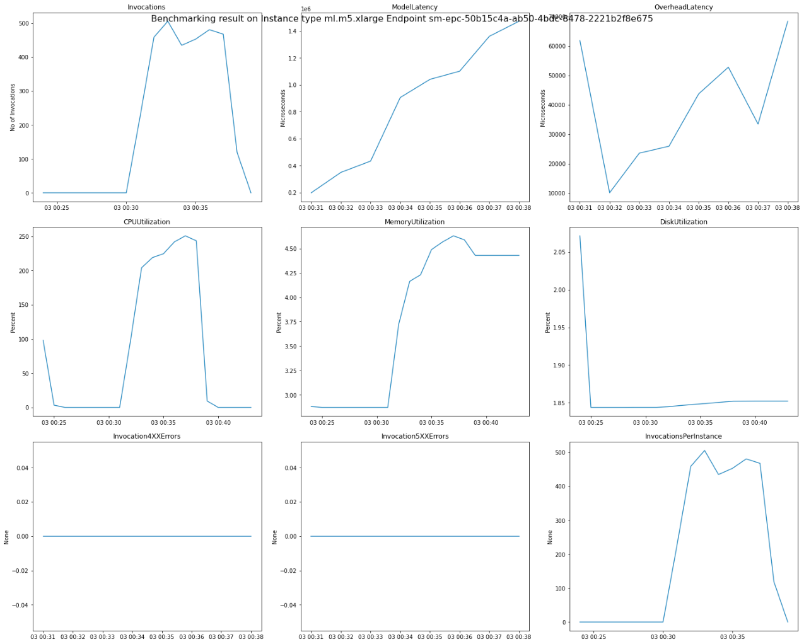

For full descriptions of the CloudWatch metrics used in the preceding charts, see SageMaker AI
Endpoint Invocation metrics.

You can also see performance metrics like ClientInvocations and NumberOfUsers published

by Inference Recommender in the /aws/sagemaker/InferenceRecommendationsJobs
namespace. For a full list of metrics and descriptions published by Inference Recommender, see
SageMaker Inference Recommender jobs metrics.

See the Amazon SageMaker Inference Recommender - CloudWatch Metrics Jupyter notebook in
the amazon-sagemaker-examples Github repository for an example of how to use the AWS SDK for
Python (Boto3) to explore CloudWatch metrics for your endpoints.

Recommendation jobs
5963

## Page 993

Amazon SageMaker AI
Developer Guide

Get autoscaling policy recommendations

With Amazon SageMaker Inference Recommender, you can get recommendations for autoscaling
policies for your SageMaker AI endpoint based on your anticipated traffic pattern. If you’ve already
completed an inference recommendation job, you can provide the details of the job to get a
recommendation for an autoscaling policy that you can apply to your endpoint.

Inference Recommender benchmarks different values for each metric to determine the
ideal autoscaling configuration for your endpoint. The autoscaling recommendation returns
a recommended autoscaling policy for each metric that was defined in your inference
recommendation job. You can save the policies and apply them to your endpoint with the
PutScalingPolicy API.

To get started, review the following prerequisites.

Prerequisites

Before you begin, you must have completed a successful inference recommendation job. In the
following section, you can provide either an inference recommendation ID or the name of a
SageMaker AI endpoint that was benchmarked during an inference recommendation job.

To retrieve your recommendation job ID or endpoint name, you can either view
the details of your inference recommendation job in the SageMaker AI console,

or you can use the RecommendationId or EndpointName fields returned by the
DescribeInferenceRecommendationsJob API.

Create an autoscaling configuration recommendation

To create an autoscaling recommendation policy, you can use the AWS SDK for Python (Boto3).

The following example shows the fields for the  GetScalingConfigurationRecommendation API. Use
the following fields when you call the API:

• InferenceRecommendationsJobName – Enter the name of your inference recommendation
job.

• RecommendationId – Enter the ID of an inference recommendation from a recommendation

job. This is optional if you’ve specified the EndpointName field.

• EndpointName – Enter the name of an endpoint that was benchmarked during an inference

recommendation job. This is optional if you’ve specified the RecommendationId field.

Recommendation jobs
5964

## Page 994

Amazon SageMaker AI
Developer Guide

• TargetCpuUtilizationPerCore – (Optional) Enter a percentage value of how much
utilization you want an instance on your endpoint to use before autoscaling. The default value if
you don’t specify this field is 50%.

• ScalingPolicyObjective – (Optional) An object where you specify your anticipated traffic
pattern.

• MinInvocationsPerMinute – (Optional) The minimum number of expected requests to your
endpoint per minute.

• MaxInvocationsPerMinute – (Optional) The maximum number of expected requests to
your endpoint per minute.

{
"InferenceRecommendationsJobName": "string", // Required
"RecommendationId": "string", // Optional, provide one of RecommendationId or

EndpointName
"EndpointName": "string", // Optional, provide one of RecommendationId or
EndpointName
"TargetCpuUtilizationPerCore": number, // Optional
"ScalingPolicyObjective": { // Optional
"MinInvocationsPerMinute": number,
"MaxInvocationsPerMinute": number
}
}

After submitting your request, you’ll receive a response with autoscaling policies defined for each
metric. See the following section for information about interpreting the response.

Review your autoscaling configuration recommendation results

The following example shows the response from the  GetScalingConfigurationRecommendation
API:

{
"InferenceRecommendationsJobName": "string",
"RecommendationId": "string", // One of RecommendationId or EndpointName is shown
"EndpointName": "string",
"TargetUtilizationPercentage": Integer,
"ScalingPolicyObjective": {
"MinInvocationsPerMinute": Integer,
"MaxInvocationsPerMinute": Integer
},

Recommendation jobs
5965

## Page 995

Amazon SageMaker AI
Developer Guide

"Metric": {
"ModelLatency": Integer,
"InvocationsPerInstance": Integer
},
"DynamicScalingConfiguration": {
"MinCapacity": number,
"MaxCapacity": number,
"ScaleInCooldown": number,
"ScaleOutCooldown": number,
"ScalingPolicies": [
{
"TargetTracking": {
"MetricSpecification": {
"Predefined" {
"PredefinedMetricType": "string"
},
"Customized": {

"MetricName": "string",
"Namespace": "string",
"Statistic": "string"
}
},
"TargetValue": Double
}
}
]
}
}

The InferenceRecommendationsJobName, RecommendationID or EndpointName,

TargetCpuUtilizationPerCore, and the ScalingPolicyObjective object fields are copied
from your initial request.

The Metric object lists the metrics that were benchmarked in your inference recommendation
job, along with a calculation of the values for each metric when the instance utilization would

be the same as the TargetCpuUtilizationPerCore value. This is useful for anticipating
the performance metrics on your endpoint when it scales in and out with the recommended
autoscaling policy. For example, consider if your instance utilization was 50% in your inference

recommendation job and your InvocationsPerInstance value was originally 4. If you specify

the TargetCpuUtilizationPerCore value to be 100% in your autoscaling recommendation

request, then the InvocationsPerInstance metric value returned in the response is 2 because
you anticipated allocating twice as much instance utilization.

Recommendation jobs
5966

## Page 996

Amazon SageMaker AI
Developer Guide

The DynamicScalingConfiguration object returns the values that you should specify for the
TargetTrackingScalingPolicyConfiguration when you call the PutScalingPolicy API. This includes
the recommended minimum and maximum capacity values, the recommended scale in and

scale out cooldown times, and the ScalingPolicies object, which contains the recommended

TargetValue you should specify for each metric.

Run a custom load test

Amazon SageMaker Inference Recommender load tests conduct extensive benchmarks based on
production requirements for latency and throughput, custom traffic patterns, and either serverless
endpoints or real-time instances (up to 10) that you select.

The following sections demonstrate how to create, describe, and stop a load test programmatically
using the AWS SDK for Python (Boto3) and the AWS CLI, or interactively using Amazon SageMaker
Studio Classic or the SageMaker AI console.

Create a load test job

Create a load test programmatically using the AWS SDK for Python (Boto3), with the AWS CLI, or
interactively using Studio Classic or the SageMaker AI console. As with Inference Recommender
inference recommendations, specify a job name for your load test, an AWS IAM role ARN, an input
configuration, and your model package ARN from when you registered your model with the model
registry. Load tests require that you also specify a traffic pattern and stopping conditions.

AWS SDK for Python (Boto3)

Use the CreateInferenceRecommendationsJob API to create an Inference Recommender

load test. Specify Advanced for the JobType field and provide:

• A job name for your load test (JobName). The job name must be unique within your AWS
Region and within your AWS account.

• The Amazon Resource Name (ARN) of an IAM role that enables Inference Recommender to

perform tasks on your behalf. Define this for the RoleArn field.

• An endpoint configuration dictionary (InputConfig) where you specify the following:

• For TrafficPattern, specify either the phases or stairs traffic pattern. With the phases
traffic pattern, new users spawn every minute at the rate you specify. With the stairs traffic
pattern, new users spawn at timed intervals (or steps) at a rate you specify. Choose one of
the following:

Recommendation jobs
5967

## Page 997

Amazon SageMaker AI
Developer Guide

• For TrafficType, specify PHASES. Then, for the Phases array, specify the

InitialNumberOfUsers (how many concurrent users to start with, with a minimum

of 1 and a maximum of 3), SpawnRate (the number of users to be spawned in a minute
for a specific phase of load testing, with a minimum of 0 and maximum of 3), and

DurationInSeconds (how long the traffic phase should be, with a minimum of 120 and
maximum of 3600).

• For TrafficType, specify STAIRS. Then, for the Stairs array, specify the

DurationInSeconds (how long the traffic phase should be, with a minimum of 120

and maximum of 3600), NumberOfSteps (how many intervals are used during the

phase), and UsersPerStep (how many users are added during each interval). Note that

the length of each step is the value of DurationInSeconds / NumberOfSteps. For

example, if your DurationInSeconds is 600 and you specify 5 steps, then each step is
120 seconds long.

Note

A user is defined as a system-generated actor that runs in a loop and invokes
requests to an endpoint as part of Inference Recommender. For a typical XGBoost

container running on an ml.c5.large instance, endpoints can reach 30,000
invocations per minute (500 tps) with just 15-20 users.

• For ResourceLimit, specify MaxNumberOfTests (the maximum number of
benchmarking load tests for an Inference Recommender job, with a minimum of 1

and a maximum of 10) and MaxParallelOfTests (the maximum number of parallel
benchmarking load tests for an Inference Recommender job, with a minimum of 1 and a
maximum of 10).

• For EndpointConfigurations, you can specify one of the following:

• The InstanceType field, where you specify the instance type on which you want to run
your load tests.

• The ServerlessConfig, in which you specify your ideal values for MaxConcurrency

and MemorySizeInMB for a serverless endpoint. For more information, see the
Serverless Inference documentation.

• A stopping conditions dictionary (StoppingConditions), where if any of the conditions are
met, the Inference Recommender job stops. For this example, specify the following fields in
the dictionary:

Recommendation jobs
5968

## Page 998

Amazon SageMaker AI
Developer Guide

• For MaxInvocations, specify the maximum number of requests per minute expected for
the endpoint, with a minimum of 1 and a maximum of 30,000.

• For ModelLatencyThresholds, specify Percentile (the model latency percentile

threshold) and ValueInMilliseconds (the model latency percentile value in

milliseconds).

• (Optional) For FlatInvocations, you can specify whether to continue the load test

when the TPS (invocations per minute) rate flattens. A flattened TPS rate usually means
that the endpoint has reached capacity. However, you might want to continue monitoring
the endpoint under full capacity conditions. To continue the load test when this happens,

specify this value as Continue. Otherwise, the default value is Stop.

# Create a low-level SageMaker service client.
import boto3
aws_region=<INSERT>
sagemaker_client=boto3.client('sagemaker', region=aws_region)
# Provide a name to your recommendation based on load testing
load_test_job_name="<INSERT>"

# Provide the name of the sagemaker instance type
instance_type="<INSERT>"

# Provide the IAM Role that gives SageMaker permission to access AWS services
role_arn='arn:aws:iam::<account>:role/*'

# Provide your model package ARN that was created when you registered your
# model with Model Registry
model_package_arn='arn:aws:sagemaker:<region>:<account>:role/*'

sagemaker_client.create_inference_recommendations_job(
JobName=load_test_job_name,
JobType="Advanced",
RoleArn=role_arn,
InputConfig={
'ModelPackageVersionArn': model_package_arn,
"JobDurationInSeconds": 7200,
'TrafficPattern' : {
# Replace PHASES with STAIRS to use the stairs
traffic pattern
'TrafficType': 'PHASES',

Recommendation jobs
5969

## Page 999

Amazon SageMaker AI
Developer Guide

'Phases': [
{
'InitialNumberOfUsers': 1,
'SpawnRate': 1,
'DurationInSeconds': 120
},
{
'InitialNumberOfUsers': 1,
'SpawnRate': 1,
'DurationInSeconds': 120
}
]
# Uncomment this section and comment out the Phases
object above to use the stairs traffic pattern
# 'Stairs' : {
#   'DurationInSeconds': 240,
#   'NumberOfSteps': 2,

#   'UsersPerStep': 2
# }
},
'ResourceLimit': {
'MaxNumberOfTests': 10,
'MaxParallelOfTests': 3
},
"EndpointConfigurations" : [{
'InstanceType': 'ml.c5.xlarge'
},
{
'InstanceType': 'ml.m5.xlarge'
},
{
'InstanceType': 'ml.r5.xlarge'
}]
# Uncomment the ServerlessConfig and comment out
the InstanceType field if you want recommendations for a serverless endpoint
# "ServerlessConfig": {
#     "MaxConcurrency": value,
#     "MemorySizeInMB": value
# }
},
StoppingConditions={
'MaxInvocations': 1000,
'ModelLatencyThresholds':[{
'Percentile': 'P95',

Recommendation jobs
5970

## Page 1000

Amazon SageMaker AI
Developer Guide

'ValueInMilliseconds': 100
}],
# Change 'Stop' to 'Continue' to let the load test
continue if invocations flatten
'FlatInvocations': 'Stop'
}
)

See the Amazon SageMaker API Reference Guide for a full list of optional and required

arguments you can pass to CreateInferenceRecommendationsJob.

AWS CLI

Use the create-inference-recommendations-job API to create an Inference

Recommender load test. Specify Advanced for the JobType field and provide:

• A job name for your load test (job-name). The job name must be unique within your AWS
Region and within your AWS account.

• The Amazon Resource Name (ARN) of an IAM role that enables Inference Recommender to

perform tasks on your behalf. Define this for the role-arn field.

• An endpoint configuration dictionary (input-config) where you specify the following:

• For TrafficPattern, specify either the phases or stairs traffic pattern. With the phases
traffic pattern, new users spawn every minute at the rate you specify. With the stairs traffic
pattern, new users spawn at timed intervals (or steps) at a rate you specify. Choose one of
the following:

• For TrafficType, specify PHASES. Then, for the Phases array, specify the

InitialNumberOfUsers (how many concurrent users to start with, with a minimum

of 1 and a maximum of 3), SpawnRate (the number of users to be spawned in a minute
for a specific phase of load testing, with a minimum of 0 and maximum of 3), and

DurationInSeconds (how long the traffic phase should be, with a minimum of 120 and
maximum of 3600).

• For TrafficType, specify STAIRS. Then, for the Stairs array, specify the

DurationInSeconds (how long the traffic phase should be, with a minimum of 120

and maximum of 3600), NumberOfSteps (how many intervals are used during the

phase), and UsersPerStep (how many users are added during each interval). Note that

the length of each step is the value of DurationInSeconds / NumberOfSteps. For

example, if your DurationInSeconds is 600 and you specify 5 steps, then each step is
120 seconds long.

Recommendation jobs
5971

## Page 1001

Amazon SageMaker AI
Developer Guide

Note

A user is defined as a system-generated actor that runs in a loop and invokes
requests to an endpoint as part of Inference Recommender. For a typical XGBoost

container running on an ml.c5.large instance, endpoints can reach 30,000
invocations per minute (500 tps) with just 15-20 users.

• For ResourceLimit, specify MaxNumberOfTests (the maximum number of
benchmarking load tests for an Inference Recommender job, with a minimum of 1

and a maximum of 10) and MaxParallelOfTests (the maximum number of parallel
benchmarking load tests for an Inference Recommender job, with a minimum of 1 and a
maximum of 10).

• For EndpointConfigurations, you can specify one of the following:

• The InstanceType field, where you specify the instance type on which you want to run
your load tests.

• The ServerlessConfig, in which you specify your ideal values for MaxConcurrency

and MemorySizeInMB for a serverless endpoint.

• A stopping conditions dictionary (stopping-conditions), where if any of the conditions
are met, the Inference Recommender job stops. For this example, specify the following fields
in the dictionary:

• For MaxInvocations, specify the maximum number of requests per minute expected for
the endpoint, with a minimum of 1 and a maximum of 30,000.

• For ModelLatencyThresholds, specify Percentile (the model latency percentile

threshold) and ValueInMilliseconds (the model latency percentile value in
milliseconds).

• (Optional) For FlatInvocations, you can specify whether to continue the load test
when the TPS (invocations per minute) rate flattens. A flattened TPS rate usually means
that the endpoint has reached capacity. However, you might want to continue monitoring
the endpoint under full capacity conditions. To continue the load test when this happens,

specify this value as Continue. Otherwise, the default value is Stop.

aws sagemaker create-inference-recommendations-job\
--region <region>\
--job-name <job-name>\

Recommendation jobs
5972

