# sagemaker-dg-7000.pdf

## Page 1

Amazon SageMaker AI
Developer Guide

Note

A user is defined as a system-generated actor that runs in a loop and invokes
requests to an endpoint as part of Inference Recommender. For a typical XGBoost

container running on an ml.c5.large instance, endpoints can reach 30,000
invocations per minute (500 tps) with just 15-20 users.

• For ResourceLimit, specify MaxNumberOfTests (the maximum number of
benchmarking load tests for an Inference Recommender job, with a minimum of 1

and a maximum of 10) and MaxParallelOfTests (the maximum number of parallel
benchmarking load tests for an Inference Recommender job, with a minimum of 1 and a
maximum of 10).

• For EndpointConfigurations, you can specify one of the following:

• The InstanceType field, where you specify the instance type on which you want to run
your load tests.

• The ServerlessConfig, in which you specify your ideal values for MaxConcurrency

and MemorySizeInMB for a serverless endpoint.

• A stopping conditions dictionary (stopping-conditions), where if any of the conditions
are met, the Inference Recommender job stops. For this example, specify the following fields
in the dictionary:

• For MaxInvocations, specify the maximum number of requests per minute expected for
the endpoint, with a minimum of 1 and a maximum of 30,000.

• For ModelLatencyThresholds, specify Percentile (the model latency percentile

threshold) and ValueInMilliseconds (the model latency percentile value in
milliseconds).

• (Optional) For FlatInvocations, you can specify whether to continue the load test
when the TPS (invocations per minute) rate flattens. A flattened TPS rate usually means
that the endpoint has reached capacity. However, you might want to continue monitoring
the endpoint under full capacity conditions. To continue the load test when this happens,

specify this value as Continue. Otherwise, the default value is Stop.

aws sagemaker create-inference-recommendations-job\
--region <region>\
--job-name <job-name>\

Recommendation jobs
5972

## Page 2

Amazon SageMaker AI
Developer Guide

--job-type ADVANCED\
--role-arn arn:aws:iam::<account>:role/*\
--input-config \"{
\"ModelPackageVersionArn\": \"arn:aws:sagemaker:<region>:<account>:role/*\",
\"JobDurationInSeconds\": 7200,
\"TrafficPattern\" : {
# Replace PHASES with STAIRS to use the stairs traffic pattern
\"TrafficType\": \"PHASES\",
\"Phases\": [
{
\"InitialNumberOfUsers\": 1,
\"SpawnRate\": 60,
\"DurationInSeconds\": 300
}
]
# Uncomment this section and comment out the Phases object above to
use the stairs traffic pattern

# 'Stairs' : {
#   'DurationInSeconds': 240,
#   'NumberOfSteps': 2,
#   'UsersPerStep': 2
# }
},
\"ResourceLimit\": {
\"MaxNumberOfTests\": 10,
\"MaxParallelOfTests\": 3
},
\"EndpointConfigurations\" : [
{
\"InstanceType\": \"ml.c5.xlarge\"
},
{
\"InstanceType\": \"ml.m5.xlarge\"
},
{
\"InstanceType\": \"ml.r5.xlarge\"
}
# Use the ServerlessConfig and leave out the InstanceType fields if
you want recommendations for a serverless endpoint
# \"ServerlessConfig\": {
#     \"MaxConcurrency\": value,
#     \"MemorySizeInMB\": value
# }
]

Recommendation jobs
5973

## Page 3

Amazon SageMaker AI
Developer Guide

}\"
--stopping-conditions \"{
\"MaxInvocations\": 1000,
\"ModelLatencyThresholds\":[
{
\"Percentile\": \"P95\",
\"ValueInMilliseconds\": 100
}
],
# Change 'Stop' to 'Continue' to let the load test continue if invocations
flatten
\"FlatInvocations\": \"Stop\"
}\"

Amazon SageMaker Studio Classic

Create a load test with Studio Classic.

1.
In your Studio Classic application, choose the home icon

(

).

2.
In the left sidebar of Studio Classic, choose Deployments.

3.
Choose Inference recommender from the dropdown list.

4.
Choose Create inference recommender job. A new tab titled Create inference
recommender job opens.

5.
Select the name of your model group from the dropdown Model group field. The list
includes all the model groups registered with the model registry in your account, including
models registered outside of Studio Classic.

6.
Select a model version from the dropdown Model version field.

7.
Choose Continue.

8.
Provide a name for the job in the Name field.

9.
(Optional) Provide a description of your job in the Description field.

10. Choose an IAM role that grants Inference Recommender permission to access AWS services.

You can create a role and attach the AmazonSageMakerFullAccess IAM managed policy
to accomplish this, or you can let Studio Classic create a role for you.

11. Choose Stopping Conditions to expand the available input fields. Provide a set of

conditions for stopping a deployment recommendation.

Recommendation jobs
5974

## Page 4

Amazon SageMaker AI
Developer Guide

a.
Specify the maximum number of requests per minute expected for the endpoint in the
Max Invocations Per Minute field.

b.
Specify the model latency threshold in microseconds in the Model Latency Threshold
field. The Model Latency Threshold depicts the interval of time taken by a model
to respond as viewed from Inference Recommender. The interval includes the local
communication time taken to send the request and to fetch the response from the
model container and the time taken to complete the inference in the container.

12. Choose Traffic Pattern to expand the available input fields.

a.
Set the initial number of virtual users by specifying an integer in the Initial Number of
Users field.

b.
Provide an integer number for the Spawn Rate field. The spawn rate sets the number
of users created per second.

c.
Set the duration for the phase in seconds by specifying an integer in the Duration
field.

d.
(Optional) Add additional traffic patterns. To do so, choose Add.

13. Choose the Additional setting to reveal the Max test duration field. Specify, in seconds,

the maximum time a test can take during a job. New jobs are not scheduled after the
defined duration. This helps ensure jobs that are in progress are not stopped and that you
only view completed jobs.

14. Choose Continue.

15. Choose Selected Instances.

16. In the Instances for benchmarking field, choose Add instances to test. Select up to 10

instances for Inference Recommender to use for load testing.

17. Choose Additional settings.

a.
Provide an integer that sets an upper limit on the number of tests a job can make for
the Max number of tests field. Note that each endpoint configuration results in a new
load test.

b.
Provide an integer for the Max parallel test field. This setting defines an upper limit on
the number of load tests that can run in parallel.

18. Choose Submit.

The load test can take up to 2 hours.

Recommendation jobs
5975

## Page 5

Amazon SageMaker AI
Developer Guide

Warning

Do not close this tab. If you close this tab, you cancel the Inference Recommender
load test job.

SageMaker AI console

Create a custom load test through the SageMaker AI console by doing the following:

1.
Go to the SageMaker AI console at https://console.aws.amazon.com/sagemaker/.

2.
In the left navigation pane, choose Inference, and then choose Inference recommender.

3.
On the Inference recommender jobs page, choose Create job.

4.
For Step 1: Model configuration, do the following:

a.
For Job type, choose Advanced recommender job.

b.
If you’re using a model registered in the SageMaker AI model registry, then turn on the
Choose a model from the model registry toggle and do the following:

i.
For the Model group dropdown list, choose the model group in SageMaker AI
model registry where your model is.

ii.
For the Model version dropdown list, choose the desired version of your model.

c.
If you’re using a model that you’ve created in SageMaker AI, then turn off the Choose a
model from the model registry toggle and do the following:

•
For the Model name field, enter the name of your SageMaker AI model.

d.
For IAM role, you can select an existing AWS IAM role that has the necessary
permissions to create an instance recommendation job. Alternatively, if you don’t have
an existing role, you can choose Create a new role to open the role creation pop-up,
and SageMaker AI adds the necessary permissions to the new role that you create.

e.
For S3 bucket for benchmarking payload, enter the Amazon S3 path to your
sample payload archive, which should contain sample payload files that Inference
Recommender uses to benchmark your model on different instance types.

f.
For Payload content type, enter the MIME types of your sample payload data.

g.
For Traffic pattern, configure phases for the load test by doing the following:

Recommendation jobs
5976

## Page 6

Amazon SageMaker AI
Developer Guide

i.
For Initial number of users, specify how many concurrent users you want to start
with (with a minimum of 1 and a maximum of 3).

ii.
For Spawn rate, specify the number of users to be spawned in a minute for the
phase (with a minimum of 0 and a maximum of 3).

iii.
For Duration (seconds), specify how low the traffic phase should be in seconds
(with a minimum of 120 and a maximum of 3600).

h.
(Optional) If you turned off the Choose a model from the model registry toggle and
specified a SageMaker AI model, then for Container configuration, do the following:

i.
For the Domain dropdown list, select the machine learning domain of the model,
such as computer vision, natural language processing, or machine learning.

ii.
For the Framework dropdown list, select the framework of your container, such as
TensorFlow or XGBoost.

iii.
For Framework version, enter the framework version of your container image.

iv.
For the Nearest model name dropdown list, select the pre-trained model that
mostly closely matches your own.

v.
For the Task dropdown list, select the machine learning task that the model
accomplishes, such as image classification or regression.

i.
(Optional) For Model compilation using SageMaker Neo, you can configure the
recommendation job for a model that you’ve compiled using SageMaker Neo. For Data
input configuration, enter the correct input data shape for your model in a format

similar to {'input':[1,1024,1024,3]}.

j.
Choose Next.

5.
For Step 2: Instances and environment parameters, do the following:

a.
For Select instances for benchmarking, select up to 8 instance types that you want to
benchmark against.

b.
(Optional) For Environment parameter ranges, you can specify environment
parameters that help optimize your model. Specify the parameters as Key and Value
pairs.

c.
Choose Next.

6.
For Step 3: Job parameters, do the following:

Recommendation jobs
5977

## Page 7

Amazon SageMaker AI
Developer Guide

a.
(Optional) For the Job name field, enter a name for your instance recommendation
job. When you create the job, SageMaker AI appends a timestamp to the end of this
name.

b.
(Optional) For the Job description field, enter a description for the job.

c.
(Optional) For the Encryption key dropdown list, choose an AWS KMS key by name or
enter its ARN to encrypt your data.

d.
(Optional) For Max number of tests, enter the number of test that you want to run
during the recommendation job.

e.
(Optional) For Max parallel tests, enter the maximum number of parallel tests that you
want to run during the recommendation job.

f.
For Max test duration (s), enter the maximum number of seconds you want each test
to run for.

g.
For Max invocations per minute, enter the maximum number of requests per minute
the endpoint can reach before stopping the recommendation job. After reaching this
limit, SageMaker AI ends the job.

h.
For P99 Model latency threshold (ms), enter the model latency percentile in
milliseconds.

i.
Choose Next.

7.
For Step 4: Review job, review your configurations and then choose Submit.

Get your load test results

You can programmatically collect metrics across all load tests once the load tests are done with
AWS SDK for Python (Boto3), the AWS CLI, Studio Classic, or the SageMaker AI console.

AWS SDK for Python (Boto3)

Collect metrics with the DescribeInferenceRecommendationsJob API. Specify the job

name of the load test for the JobName field:

load_test_response = sagemaker_client.describe_inference_recommendations_job(
JobName=load_test_job_name
)

Print the response object.

Recommendation jobs
5978

## Page 8

Amazon SageMaker AI
Developer Guide

load_test_response['Status']

This returns a JSON response similar to the following example. Note that this example shows
the recommended instance types for real-time inference (for an example showing serverless
inference recommendations, see the example after this one).

{
'JobName': 'job-name',
'JobDescription': 'job-description',
'JobType': 'Advanced',
'JobArn': 'arn:aws:sagemaker:region:account-id:inference-recommendations-
job/resource-id',
'Status': 'COMPLETED',
'CreationTime': datetime.datetime(2021, 10, 26, 19, 38, 30, 957000,
tzinfo=tzlocal()),
'LastModifiedTime': datetime.datetime(2021, 10, 26, 19, 46, 31, 399000,
tzinfo=tzlocal()),
'InputConfig': {
'ModelPackageVersionArn': 'arn:aws:sagemaker:region:account-id:model-
package/resource-id',
'JobDurationInSeconds': 7200,
'TrafficPattern': {
'TrafficType': 'PHASES'
},
'ResourceLimit': {
'MaxNumberOfTests': 100,
'MaxParallelOfTests': 100
},
'EndpointConfigurations': [{
'InstanceType': 'ml.c5d.xlarge'
}]
},
'StoppingConditions': {
'MaxInvocations': 1000,
'ModelLatencyThresholds': [{
'Percentile': 'P95',
'ValueInMilliseconds': 100}
]},
'InferenceRecommendations': [{
'Metrics': {
'CostPerHour': 0.6899999976158142,
'CostPerInference': 1.0332434612791985e-05,

Recommendation jobs
5979

## Page 9

Amazon SageMaker AI
Developer Guide

'MaximumInvocations': 1113,
'ModelLatency': 100000
},
'EndpointConfiguration': {
'EndpointName': 'endpoint-name',
'VariantName': 'variant-name',
'InstanceType': 'ml.c5d.xlarge',
'InitialInstanceCount': 3
},
'ModelConfiguration': {
'Compiled': False,
'EnvironmentParameters': []
}
}],
'ResponseMetadata': {
'RequestId': 'request-id',
'HTTPStatusCode': 200,

'HTTPHeaders': {
'x-amzn-requestid': 'x-amzn-requestid',
'content-type': 'content-type',
'content-length': '1199',
'date': 'Tue, 26 Oct 2021 19:57:42 GMT'
},
'RetryAttempts': 0}
}

The first few lines provide information about the load test job itself. This includes the job name,
role ARN, creation, and deletion time.

The InferenceRecommendations dictionary contains a list of Inference Recommender
inference recommendations.

The EndpointConfiguration nested dictionary contains the instance type (InstanceType)
recommendation along with the endpoint and variant name (a deployed AWS machine learning
model) used during the recommendation job. You can use the endpoint and variant name
for monitoring in Amazon CloudWatch Events. See Amazon SageMaker AI metrics in Amazon
CloudWatch for more information.

The EndpointConfiguration nested dictionary also contains the instance count

(InitialInstanceCount) recommendation. This is the number of instances that

you should provision in the endpoint to meet the MaxInvocations specified in the

StoppingConditions. For example, if the InstanceType is ml.m5.large and the

Recommendation jobs
5980

## Page 10

Amazon SageMaker AI
Developer Guide

InitialInstanceCount is 2, then you should provision 2 ml.m5.large instances for your

endpoint so that it can handle the TPS specified in the MaxInvocations stopping condition.

The Metrics nested dictionary contains information about the estimated cost per hour

(CostPerHour) for your real-time endpoint in US dollars, the estimated cost per inference

(CostPerInference) for your real-time endpoint, the maximum number of InvokeEndpoint

requests sent to the endpoint, and the model latency (ModelLatency), which is the interval of
time (in microseconds) that your model took to respond to SageMaker AI. The model latency
includes the local communication times taken to send the request and to fetch the response
from the model container and the time taken to complete the inference in the container.

The following example shows the InferenceRecommendations part of the response for a
load test job that was configured to return serverless inference recommendations:

"InferenceRecommendations": [
{
"EndpointConfiguration": {
"EndpointName": "value",
"InitialInstanceCount": value,
"InstanceType": "value",
"VariantName": "value",
"ServerlessConfig": {
"MaxConcurrency": value,
"MemorySizeInMb": value
}
},
"InvocationEndTime": value,
"InvocationStartTime": value,
"Metrics": {
"CostPerHour": value,
"CostPerInference": value,
"CpuUtilization": value,
"MaxInvocations": value,
"MemoryUtilization": value,
"ModelLatency": value,
"ModelSetupTime": value
},
"ModelConfiguration": {
"Compiled": "False",
"EnvironmentParameters": [],
"InferenceSpecificationName": "value"
},

Recommendation jobs
5981

## Page 11

Amazon SageMaker AI
Developer Guide

"RecommendationId": "value"
}
]

You can interpret the recommendations for serverless inference similarly to the results for

real-time inference, with the exception of the ServerlessConfig, which tells you the values

you specified for MaxConcurrency and MemorySizeInMB when setting up the load test.

Serverless recommendations also measure the metric ModelSetupTime, which measures (in
microseconds) the time it takes to launch compute resources on a serverless endpoint. For more
information about setting up serverless endpoints, see the Serverless Inference documentation.

AWS CLI

Collect metrics with the describe-inference-recommendations-job API. Specify the job

name of the load test for the job-name flag:

aws sagemaker describe-inference-recommendations-job --job-name <job-name>

This returns a response similar to the following example. Note that this example shows the
recommended instance types for real-time inference (for an example showing Serverless
Inference recommendations, see the example after this one).

{
'JobName': 'job-name',
'JobDescription': 'job-description',
'JobType': 'Advanced',
'JobArn': 'arn:aws:sagemaker:region:account-id:inference-recommendations-
job/resource-id',
'Status': 'COMPLETED',
'CreationTime': datetime.datetime(2021, 10, 26, 19, 38, 30, 957000,
tzinfo=tzlocal()),
'LastModifiedTime': datetime.datetime(2021, 10, 26, 19, 46, 31, 399000,
tzinfo=tzlocal()),
'InputConfig': {
'ModelPackageVersionArn': 'arn:aws:sagemaker:region:account-id:model-
package/resource-id',
'JobDurationInSeconds': 7200,
'TrafficPattern': {
'TrafficType': 'PHASES'
},
'ResourceLimit': {
'MaxNumberOfTests': 100,

Recommendation jobs
5982

## Page 12

Amazon SageMaker AI
Developer Guide

'MaxParallelOfTests': 100
},
'EndpointConfigurations': [{
'InstanceType': 'ml.c5d.xlarge'
}]
},
'StoppingConditions': {
'MaxInvocations': 1000,
'ModelLatencyThresholds': [{
'Percentile': 'P95',
'ValueInMilliseconds': 100
}]
},
'InferenceRecommendations': [{
'Metrics': {
'CostPerHour': 0.6899999976158142,
'CostPerInference': 1.0332434612791985e-05,

'MaximumInvocations': 1113,
'ModelLatency': 100000
},
'EndpointConfiguration': {
'EndpointName': 'endpoint-name',
'VariantName': 'variant-name',
'InstanceType': 'ml.c5d.xlarge',
'InitialInstanceCount': 3
},
'ModelConfiguration': {
'Compiled': False,
'EnvironmentParameters': []
}
}],
'ResponseMetadata': {
'RequestId': 'request-id',
'HTTPStatusCode': 200,
'HTTPHeaders': {
'x-amzn-requestid': 'x-amzn-requestid',
'content-type': 'content-type',
'content-length': '1199',
'date': 'Tue, 26 Oct 2021 19:57:42 GMT'
},
'RetryAttempts': 0
}
}

Recommendation jobs
5983

## Page 13

Amazon SageMaker AI
Developer Guide

The first few lines provide information about the load test job itself. This includes the job name,
role ARN, creation, and deletion time.

The InferenceRecommendations dictionary contains a list of Inference Recommender

inference recommendations.

The EndpointConfiguration nested dictionary contains the instance type (InstanceType)
recommendation along with the endpoint and variant name (a deployed AWS machine learning
model) used during the recommendation job. You can use the endpoint and variant name
for monitoring in Amazon CloudWatch Events. See Amazon SageMaker AI metrics in Amazon
CloudWatch for more information.

The Metrics nested dictionary contains information about the estimated cost per hour

(CostPerHour) for your real-time endpoint in US dollars, the estimated cost per inference

(CostPerInference) for your real-time endpoint, the maximum number of InvokeEndpoint

requests sent to the endpoint, and the model latency (ModelLatency), which is the interval of
time (in microseconds) that your model took to respond to SageMaker AI. The model latency
includes the local communication times taken to send the request and to fetch the response
from the model container and the time taken to complete the inference in the container.

The following example shows the InferenceRecommendations part of the response for a
load test job that was configured to return serverless inference recommendations:

"InferenceRecommendations": [
{
"EndpointConfiguration": {
"EndpointName": "value",
"InitialInstanceCount": value,
"InstanceType": "value",
"VariantName": "value",
"ServerlessConfig": {
"MaxConcurrency": value,
"MemorySizeInMb": value
}
},
"InvocationEndTime": value,
"InvocationStartTime": value,
"Metrics": {
"CostPerHour": value,
"CostPerInference": value,
"CpuUtilization": value,
"MaxInvocations": value,

Recommendation jobs
5984

## Page 14

Amazon SageMaker AI
Developer Guide

"MemoryUtilization": value,
"ModelLatency": value,
"ModelSetupTime": value
},
"ModelConfiguration": {
"Compiled": "False",
"EnvironmentParameters": [],
"InferenceSpecificationName": "value"
},
"RecommendationId": "value"
}
]

You can interpret the recommendations for serverless inference similarly to the results for

real-time inference, with the exception of the ServerlessConfig, which tells you the values

you specified for MaxConcurrency and MemorySizeInMB when setting up the load test.

Serverless recommendations also measure the metric ModelSetupTime, which measures
(in microseconds) the time it takes to launch computer resources on a serverless endpoint.
For more information about setting up serverless endpoints, see the Serverless Inference
documentation.

Amazon SageMaker Studio Classic

The recommendations populate in a new tab called Inference recommendations within Studio
Classic. It can take up to 2 hours for the results to show up. This tab contains Results and
Details columns.

The Details column provides information about the load test job, such as the name given
to the load test job, when the job was created (Creation time), and more. It also contains
Settings information, such as the maximum number of invocation that occurred per minute and
information about the Amazon Resource Names used.

The Results column provides  Deployment goals and SageMaker AI recommendations
windows in which you can adjust the order in which results are displayed based on deployment
importance. There are three dropdown menus in which you can provide the level of importance
of the Cost, Latency, and Throughput for your use case. For each goal (cost, latency, and
throughput), you can set the level of importance: Lowest Importance, Low Importance,
Moderate importance, High importance, or Highest importance.

Based on your selections of importance for each goal, Inference Recommender displays its top
recommendation in the SageMaker recommendation field on the right of the panel, along

Recommendation jobs
5985

## Page 15

Amazon SageMaker AI
Developer Guide

with the estimated cost per hour and inference request. It also provides Information about the
expected model latency, maximum number of invocations, and the number of instances.

In addition to the top recommendation displayed, you can also see the same information
displayed for all instances that Inference Recommender tested in the All runs section.

SageMaker AI console

You can view your custom load test job results in the SageMaker AI console by doing the
following:

1.
Go to the SageMaker AI console at https://console.aws.amazon.com/sagemaker/.

2.
In the left navigation pane, choose Inference, and then choose Inference recommender.

3.
On the Inference recommender jobs page, choose the name of your inference
recommendation job.

On the details page for your job, you can view the Inference recommendations, which are the
instance types SageMaker AI recommends for your model, as shown in the following screenshot.


In this section, you can compare the instance types by various factors such as Model latency,
Cost per hour, Cost per inference, and Invocations per minute.

On this page, you can also view the configurations you specified for your job. In the Monitor
section, you can view the Amazon CloudWatch metrics that were logged for each instance type.
To learn more about interpreting these metrics, see Interpret results.

Recommendation jobs
5986

## Page 16

Amazon SageMaker AI
Developer Guide

Stop your load test

You might want to stop a job that is currently running if you began a job by mistake
or no longer need to run the job. Stop your load test jobs programmatically with the

StopInferenceRecommendationsJob API, or through Studio Classic or the SageMaker AI
console.

AWS SDK for Python (Boto3)

Specify the job name of the load test for the JobName field:

sagemaker_client.stop_inference_recommendations_job(
JobName='<INSERT>'
)

AWS CLI

Specify the job name of the load test for the job-name flag:

aws sagemaker stop-inference-recommendations-job --job-name <job-name>

Amazon SageMaker Studio Classic

Close the tab where you initiated your custom load job to stop your Inference Recommender
load test.

SageMaker AI console

To stop your load test job through the SageMaker AI console, do the following:

1.
Go to the SageMaker AI console at https://console.aws.amazon.com/sagemaker/.

2.
In the left navigation pane, choose Inference, and then choose Inference recommender.

3.
On the Inference recommender jobs page, select your load test job.

4.
Choose Stop job.

5.
In the dialog box that pops up, choose Confirm.

After stopping your job, the job’s Status should change to Stopping.

Recommendation jobs
5987

## Page 17

Amazon SageMaker AI
Developer Guide

Troubleshoot Inference Recommender errors

This section contains information about how to understand and prevent common errors, the error
messages they generate, and guidance on how to resolve these errors.

How to troubleshoot

You can attempt to resolve your error by going through the following steps:

• Check if you've covered all the prerequisites to use Inference Recommender. See the Inference
Recommender Prerequisites.

• Check that you are able to deploy your model from Model Registry to an endpoint and that it can
process your payloads without errors. See Deploy a Model from the Registry.

• When you kick off an Inference Recommender job, you should see endpoints being created in the
console and you can review the CloudWatch logs.

Common errors

Review the following table for common Inference Recommender errors and their solutions.

Error
Solution

Make sure you provide the ML domain or

Specify Domain in the Model Package version

OTHER if unknown.

1. Domain is a mandatory parameter for the
job.

Provided role ARN cannot be assumed and an

Make sure the execution role provided has
the necessary permissions specified in the
prerequisites.

AWSSecurityTokenServiceException
error occurred.

Make sure you provide the ML Framework or

Specify Framework  in the Model Package

OTHER if unknown.

version 1.Framework  is a mandatory
parameter for the job.

Users at the end of prev phase is 0 while initial
users of current phase is 1.

Users here refers to virtual users or threads
used to send requests. Each phase starts with
A users and ends with B users such that B > A.

Recommendation jobs
5988

## Page 18

Amazon SageMaker AI
Developer Guide

Error
Solution

Between sequential phases, x_1 and x_2, we
require that abs(x_2.A - x_1.B) <= 3 and >= 0.

Total Traffic duration (across) should not be
more than Job duration.

The total duration of all your Phases cannot
exceed the Job duration.

Burstable instance type ml.t2.medium is not
allowed.

Inference Recommender doesn't support
load testing on t2 instance family because
burstable instances do not provide consistent
performance.

ResourceLimitExceeded when calling
CreateEndpoint operation

You have exceeded a SageMaker AI resource
limit. For example, Inference Recommender
might be unable to provision endpoints for
benchmarking if the account has reached the
endpoint quota. For more information about
SageMaker AI limits and quotas, see Amazon
SageMaker AI endpoints and quotas.

ModelError when calling InvokeEndpoint
operation

A model error can happen for the following
reasons:

• The invocation timed out while waiting for a
response from the model container.

• The model couldn't process the input
payload.

Recommendation jobs
5989

## Page 19

Amazon SageMaker AI
Developer Guide

Error
Solution

PayloadError when calling InvokeEndpoint
operation

A payload error can happen for following
reasons:

• The payload source isn't in the Amazon S3
bucket.

• The payload is in a non-file object format.

• The payload is in an invalid file type. For
example, a model expects an image type
payload but is passed a text file.

• The payload is empty.

Check CloudWatch

When you kick off an Inference Recommender job, you should see endpoints being created in the
console. Select one of the endpoints and view the CloudWatch logs to monitor for any 4xx/5xx
errors. If you have a successful Inference Recommender job, you will be able to see the endpoint
names as part of the results. Even if your Inference Recommender job is unsuccessful, you can still
check the CloudWatch logs for the deleted endpoints by following the steps below:

1.
Open the Amazon CloudWatch console at https://console.aws.amazon.com/cloudwatch/.

2.
Select the Region in which you created the Inference Recommender job from the Region
dropdown list in the top right.

3.
In the navigation pane of CloudWatch, choose Logs, and then select Log groups.

4.
Search for the log group called /aws/sagemaker/Endpoints/sm-epc-*. Select the log
group based on your most recent Inference Recommender job.

You can also troubleshoot your job by checking the Inference Recommender CloudWatch

logs. The Inference Recommender logs, which are published in the /aws/sagemaker/

InferenceRecommendationsJobs CloudWatch log group, give a high level view on the progress

of the job in the <jobName>/execution log stream. You can find detailed information on each

of the endpoint configurations being tested in the <jobName>/Endpoint/<endpointName> log
stream.

Overview of the Inference Recommender log streams

Recommendation jobs
5990

## Page 20

Amazon SageMaker AI
Developer Guide

• <jobName>/execution contains overall job information such as endpoint configurations
scheduled for benchmarking, compilation job skip reason, and validation failure reason.

• <jobName>/Endpoint/<endpointName> contains information such as resource creation
progress, test configuration, load test stop reason, and resource cleanup status.

• <jobName>/CompilationJob/<compilationJobName> contains information on compilation
jobs created by Inference Recommender, such as the compilation job configuration and
compilation job status.

Create an alarm for Inference Recommender error messages

Inference Recommender outputs log statements for errors that might be helpful while
troubleshooting. With a CloudWatch log group and a metric filter, you can look for terms and
patterns in this log data as the data is sent to CloudWatch. Then, you can create a CloudWatch
alarm based on the log group-metric filter. For more information, see Create a CloudWatch alarm
based on a log group-metric filter.

Check benchmarks

When you kick off an Inference Recommender job, Inference Recommender creates several
benchmarks to evaluate the performance of your model on different instance types. You can use
the ListInferenceRecommendationsJobSteps API to view the details for all the benchmarks. If you
have a failed benchmark, you can see the failure reasons as part of the results.

To use the ListInferenceRecommendationsJobSteps API, provide the following values:

• For JobName, provide the name of the Inference Recommender job.

• For StepType, use BENCHMARK to return details about the job's benchmarks.

• For Status, use FAILED to return details about only the failed benchmarks. For a list of the

other status types, see the Status field in the ListInferenceRecommendationsJobSteps API.

# Create a low-level SageMaker service client.
import boto3
aws_region = '<region>'
sagemaker_client = boto3.client('sagemaker', region_name=aws_region)

# Provide the job name for the SageMaker Inference Recommender job
job_name = '<job-name>'

Recommendation jobs
5991

## Page 21

Amazon SageMaker AI
Developer Guide

# Filter for benchmarks
step_type = 'BENCHMARK'

# Filter for benchmarks that have a FAILED status
status = 'FAILED'

response = sagemaker_client.list_inference_recommendations_job_steps(
JobName = job_name,
StepType = step_type,
Status = status
)

You can print the response object to view the results. The preceding code example stored the

response in a variable called response:

print(response)

Real-time inference

Real-time inference is ideal for inference workloads where you have real-time, interactive, low
latency requirements. You can deploy your model to SageMaker AI hosting services and get
an endpoint that can be used for inference. These endpoints are fully managed and support
autoscaling (see Automatic scaling of Amazon SageMaker AI models).

Topics

• Deploy models for real-time inference

• Invoke models for real-time inference

• Endpoints

• Hosting options

• Automatic scaling of Amazon SageMaker AI models

• Instance storage volumes

• Validation of models in production

• Online explainability with SageMaker Clarify

• Fine-tune models with adapter inference components

Real-time inference
5992

## Page 22

Amazon SageMaker AI
Developer Guide

Deploy models for real-time inference

Important

Custom IAM policies that allow Amazon SageMaker Studio or Amazon SageMaker Studio
Classic to create Amazon SageMaker resources must also grant permissions to add tags to
those resources. The permission to add tags to resources is required because Studio and
Studio Classic automatically tag any resources they create. If an IAM policy allows Studio
and Studio Classic to create resources but does not allow tagging, "AccessDenied" errors can
occur when trying to create resources. For more information, see Provide permissions for
tagging SageMaker AI resources.
AWS managed policies for Amazon SageMaker AI that give permissions to create
SageMaker resources already include permissions to add tags while creating those
resources.

There are several options to deploy a model using SageMaker AI hosting services. You can
interactively deploy a model with SageMaker Studio. Or, you can programmatically deploy a model
using an AWS SDK, such as the SageMaker Python SDK or the SDK for Python (Boto3). You can also
deploy by using the AWS CLI.

Before you begin

Before you deploy a SageMaker AI model, locate and make note of the following:

• The AWS Region where your Amazon S3 bucket is located

• The Amazon S3 URI path where the model artifacts are stored

• The IAM role for SageMaker AI

• The Docker Amazon ECR URI registry path for the custom image that contains the inference
code, or the framework and version of a built-in Docker image that is supported and by AWS

For a list of AWS services available in each AWS Region, see Region Maps and Edge Networks. See
Creating IAM roles for information on how to create an IAM role.

Deploy models
5993

## Page 23

Amazon SageMaker AI
Developer Guide

Important

The Amazon S3 bucket where the model artifacts are stored must be in the same AWS
Region as the model that you are creating.

Shared resource utilization with multiple models

You can deploy one or more models to an endpoint with Amazon SageMaker AI. When multiple
models share an endpoint, they jointly utilize the resources that are hosted there, such as the ML
compute instances, CPUs, and accelerators. The most flexible way to deploy multiple models to an
endpoint is to define each model as an inference component.

Inference components

An inference component is a SageMaker AI hosting object that you can use to deploy a model to
an endpoint. In the inference component settings, you specify the model, the endpoint, and how
the model utilizes the resources that the endpoint hosts. To specify the model, you can specify a
SageMaker AI Model object, or you can directly specify the model artifacts and image.

In the settings, you can optimize resource utilization by tailoring how the required CPU cores,
accelerators, and memory are allocated to the model. You can deploy multiple inference
components to an endpoint, where each inference component contains one model and the
resource utilization needs for that model.

After you deploy an inference component, you can directly invoke the associated model when you
use the InvokeEndpoint action in the SageMaker API.

Inference components provide the following benefits:

Flexibility

The inference component decouples the details of hosting the model from the endpoint itself.
This provides more flexibility and control over how models are hosted and served with an
endpoint. You can host multiple models on the same infrastructure, and you can add or remove
models from an endpoint as needed. You can update each model independently.

Scalability

You can specify how many copies of each model to host, and you can set a minimum number
of copies to ensure that the model loads in the quantity that you require to serve requests. You

Deploy models
5994

## Page 24

Amazon SageMaker AI
Developer Guide

can scale any inference component copy down to zero, which makes room for another copy to
scale up.

SageMaker AI packages your models as inference components when you deploy them by using:

• SageMaker Studio Classic.

• The SageMaker Python SDK to deploy a Model object (where you set the endpoint type to

EndpointType.INFERENCE_COMPONENT_BASED).

• The AWS SDK for Python (Boto3) to define InferenceComponent objects that you deploy to an
endpoint.

Deploy models with SageMaker Studio

Complete the following steps to create and deploy your model interactively through SageMaker
Studio. For more information about Studio, see the Studio documentation. For more walkthroughs
of various deployment scenarios, see the blog Package and deploy classical ML models and LLMs
easily with Amazon SageMaker AI – Part 2.

Prepare your artifacts and permissions

Complete this section before creating a model in SageMaker Studio.

You have two options for bringing your artifacts and creating a model in Studio:

1. You can bring a pre-packaged tar.gz archive, which should include your model artifacts, any

custom inference code, and any dependencies listed in a requirements.txt file.

2. SageMaker AI can package your artifacts for you. You only have to bring your raw model

artifacts and any dependencies in a requirements.txt file, and SageMaker AI can provide
default inference code for you (or you can override the default code with your own custom
inference code). SageMaker AI supports this option for the following frameworks: PyTorch,
XGBoost.

In addition to bringing your model, your AWS Identity and Access Management (IAM) role, and
a Docker container (or desired framework and version for which SageMaker AI has a pre-built
container), you must also grant permissions to create and deploy models through SageMaker AI
Studio.

Deploy models
5995

## Page 25

Amazon SageMaker AI
Developer Guide

You should have the AmazonSageMakerFullAccess policy attached to your IAM role so that you can
access SageMaker AI and other relevant services. To see the prices of the instance types in Studio,
you also must attach the AWSPriceListServiceFullAccess policy (or if you don’t want to attach the

whole policy, more specifically, the pricing:GetProducts action).

If you choose to upload your model artifacts when creating a model (or upload a sample payload
file for inference recommendations), then you must create an Amazon S3 bucket. The bucket name

must be prefixed by the word SageMaker AI. Alternate capitalizations of SageMaker AI are also

acceptable: Sagemaker or sagemaker.

We recommend that you use the bucket naming convention sagemaker-{Region}-

{accountID}. This bucket is used to store the artifacts that you upload.

After creating the bucket, attach the following CORS (cross-origin resource sharing) policy to the
bucket:

[
{
"AllowedHeaders": ["*"],
"ExposeHeaders": ["Etag"],
"AllowedMethods": ["PUT", "POST"],
"AllowedOrigins": ['https://*.sagemaker.aws'],
}
]

You can attach a CORS policy to an Amazon S3 bucket by using any of the following methods:

• Through the Edit cross-origin resource sharing (CORS) page in the Amazon S3 console

• Using the Amazon S3 API PutBucketCors

• Using the put-bucket-cors AWS CLI command:

aws s3api put-bucket-cors --bucket="..." --cors-configuration="..."

Create a deployable model

In this step, you create a deployable version of your model in SageMaker AI by providing your
artifacts along with additional specifications, such as your desired container and framework, any
custom inference code, and network settings.

Deploy models
5996

## Page 26

Amazon SageMaker AI
Developer Guide

Create a deployable model in SageMaker Studio by doing the following:

1.
Open the SageMaker Studio application.

2.
In the left navigation pane, choose Models.

3.
Choose the Deployable models tab.

4.
On the Deployable models page, choose Create.

5.
On the Create deployable model page, for the Model name field, enter a name for the model.

There are several more sections for you to fill out on the Create deployable model page.

The Container definition section looks like the following screenshot:

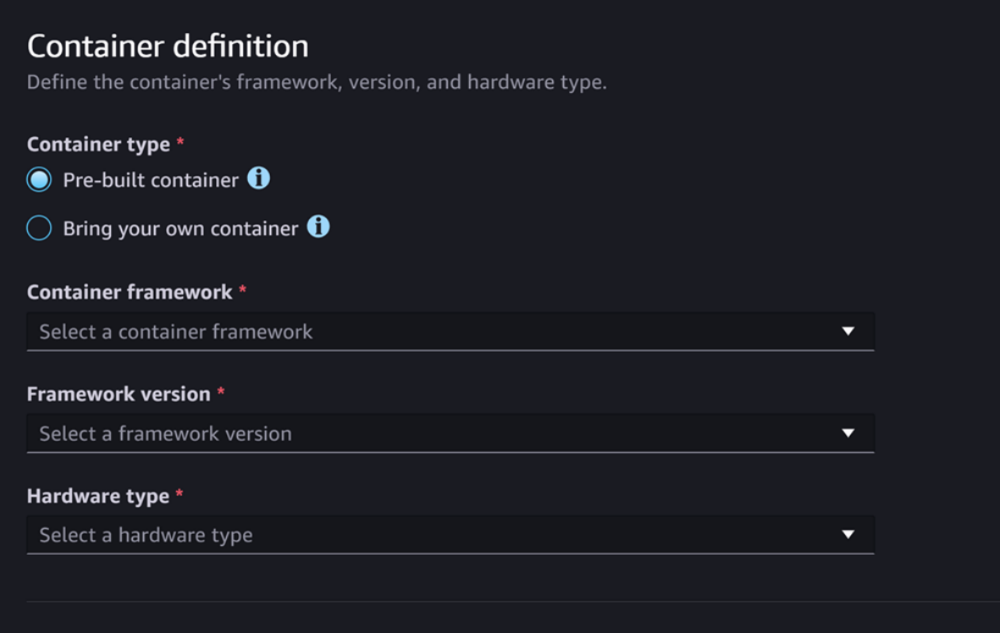

For the Container definition section, do the following:

1.
For Container type, select Pre-built container if you'd like to use a SageMaker AI managed
container, or select Bring your own container if you have your own container.

2.
If you selected Pre-built container, select the Container framework, Framework version, and
Hardware type that you'd like to use.

Deploy models
5997

## Page 27

Amazon SageMaker AI
Developer Guide

3.
If you selected Bring your own container, enter an Amazon ECR path for ECR path to
container image.

Then, fill out the Artifacts section, which looks like the following screenshot:


For the Artifacts section, do the following:

1.
If you're using one of the frameworks that SageMaker AI supports for packaging model
artifacts (PyTorch or XGBoost), then for Artifacts, you can choose the Upload artifacts option.
With this option, you can simply specify your raw model artifacts, any custom inference code
you have, and your requirements.txt file, and SageMaker AI handles packaging the archive for
you. Do the following:

a.
For Artifacts, select Upload artifacts to continue providing your files. Otherwise, if

you already have a tar.gz archive that contains your model files, inference code, and

requirements.txt file, then select Input S3 URI to pre-packaged artifacts.

Deploy models
5998

## Page 28

Amazon SageMaker AI
Developer Guide

b.
If you chose to upload your artifacts, then for S3 bucket, enter the Amazon S3 path to a
bucket where you'd like SageMaker AI to store your artifacts after packaging them for you.
Then, complete the following steps.

c.
For Upload model artifacts, upload your model files.

d.
For Inference code, select Use default inference code if you'd like to use default code
that SageMaker AI provides for serving inference. Otherwise, select Upload customized
inference code to use your own inference code.

e.
For Upload requirements.txt, upload a text file that lists any dependencies that you want
to install at runtime.

2.
If you're not using a framework that SageMaker AI supports for packaging model artifacts,
then Studio shows you the Pre-packaged artifacts option, and you must provide all of your

artifacts already packaged as a tar.gz archive. Do the following:

a.
For Pre-packaged artifacts, select Input S3 URI for pre-packaged model artifacts if you

have your tar.gz archive already uploaded to Amazon S3. Select Upload pre-packaged
model artifacts if you want to directly upload your archive to SageMaker AI.

b.
If you selected Input S3 URI for pre-packaged model artifacts, enter the Amazon S3
path to your archive for S3 URI. Otherwise, select and upload the archive from your local
machine.

The next section is Security, which looks like the following screenshot:


Deploy models
5999

## Page 29

Amazon SageMaker AI
Developer Guide

For the Security section, do the following:

1.
For IAM role, enter the ARN for an IAM role.

2.
(Optional) For Virtual Private Cloud (VPC), you can select an Amazon VPC for storing your

model configuration and artifacts.

3.
(Optional) Turn on the Network isolation toggle if you want to restrict your container's
internet access.

Finally, you can optionally fill out the Advanced options section, which looks like the following
screenshot:

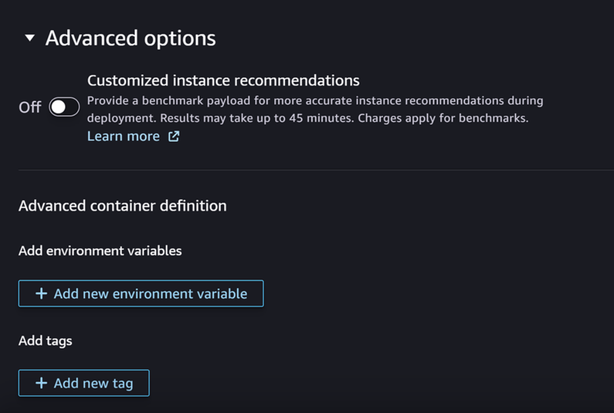

(Optional) For the Advanced options section, do the following:

1.
Turn on the Customized instance recommendations toggle if you want to run an Amazon
SageMaker Inference Recommender job on your model after its creation. Inference
Recommender is a feature that provides you with recommended instance types for optimizing
inference performance and cost. You can view these instance recommendations when
preparing to deploy your model.

Deploy models
6000

## Page 30

Amazon SageMaker AI
Developer Guide

2.
For Add environment variables, enter an environment variables for your container as key-
value pairs.

3.
For Tags, enter any tags as key-value pairs.

4.
After finishing your model and container configuration, choose Create deployable model.

You should now have a model in SageMaker Studio that is ready for deployment.

Deploy your model

Finally, you deploy the model you configured in the previous step to an HTTPS endpoint. You can
deploy either a single model or multiple models to the endpoint.

Model and endpoint compatibility

Before you can deploy a model to an endpoint, the model and endpoint must be
compatible by having the same values for the following settings:

• The IAM role

• The Amazon VPC, including its subnets and security groups

• The network isolation (enabled or disabled)

Studio prevents you from deploying models to incompatible endpoints in the following
ways:

• If you attempt to deploy a model to a new endpoint, SageMaker AI configures the
endpoint with initial settings that are compatible. If you break the compatibility by
changing these settings, Studio shows an alert and prevents your deployment.

• If you attempt to deploy to an existing endpoint, and that endpoint is incompatible,
Studio shows an alert and prevents your deployment.

• If you attempt to add multiple models to a deployment, Studio prevents you from
deploying models that are incompatible with each other.

When Studio shows the alert about model and endpoint incompatibility, you can choose
View details in the alert to see which settings are incompatible.

Deploy models
6001

## Page 31

Amazon SageMaker AI
Developer Guide

One way to deploy a model is by doing the following in Studio:

1.
Open the SageMaker Studio application.

2.
In the left navigation pane, choose Models.

3.
On the Models page, select one or more models from the list of SageMaker AI models.

4.
Choose Deploy.

5.
For Endpoint name, open the dropdown menu. You can either select an existing endpoint or
you can create a new endpoint to which you deploy the model.

6.
For Instance type, select the instance type that you want to use for the endpoint. If you
previously ran an Inference Recommender job for the model, your recommended instance
types appear in the list under the title Recommended. Otherwise, you'll see a few Prospective
instances that might be suitable for your model.

Instance type compatibility for JumpStart

If you're deploying a JumpStart model, Studio only shows instance types that the
model supports.

7.
For Initial instance count, enter the initial number of instances that you'd like to provision for
your endpoint.

8.
For Maximum instance count, specify the maximum number of instances that the endpoint
can provision when it scales up to accommodate an increase in traffic.

9.
If the model you're deploying is one of the most used JumpStart LLMs from the model hub,
then the Alternate configurations option appears after the instance type and instance count
fields.

For the most popular JumpStart LLMs, AWS has pre-benchmarked instance types to optimize
for either cost or performance. This data can help you decide which instance type to use for
deploying your LLM. Choose Alternate configurations to open a dialog box that contains the
pre-benchmarked data. The panel looks like the following screenshot:

Deploy models
6002

## Page 32

Amazon SageMaker AI
Developer Guide

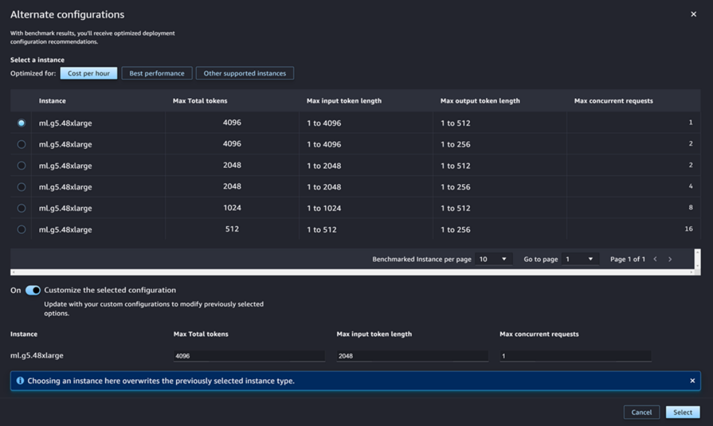

In the Alternate configurations box, do the following:

a.
Select an instance type. You can choose Cost per hour or Best performance to see
instance types that optimize either cost or performance for the specified model. You
can also choose Other supported instances to see a list of other instance types that
are compatible with the JumpStart model. Note that selecting an instance type here
overwrites any previous instance selection specified in Step 6.

b.
(Optional) Turn on the Customize the selected configuration toggle to specify Max total
tokens (the maximum number of tokens that you want to allow, which is the sum of your
input tokens and the model's generated output), Max input token length (the maximum
number of tokens you want to allow for the input of each request), and Max concurrent
requests (the maximum number of requests that the model can process at a time).

c.
Choose Select to confirm your instance type and configuration settings.

10. The Model field should already be populated with the name of the model or models that

you're deploying. You can choose Add model to add more models to the deployment. For each
model that you add, fill out the following fields:

a.
For Number of CPU cores, enter the CPU cores that you'd like to dedicate for the model's
usage.

Deploy models
6003

## Page 33

Amazon SageMaker AI
Developer Guide

b.
For Min number of copies, enter the minimum number of model copies that you want to
have hosted on the endpoint at any given time.

c.
For Min CPU memory (MB), enter the minimum amount of memory (in MB) that the
model requires.

d.
For Max CPU memory (MB), enter the maximum amount of memory (in MB) that you'd
like to allow the model to use.

11. (Optional) For the Advanced options, do the following:

a.
For IAM role, use either the default SageMaker AI IAM execution role, or specify your own
role that has the permissions you need. Note that this IAM role must be the same as the
role that you specified when creating the deployable model.

b.
For Virtual Private Cloud (VPC), you can specify a VPC in which you want to host your
endpoint.

c.
For Encryption KMS key, select an AWS KMS key to encrypt data on the storage volume
attached to the ML compute instance that hosts the endpoint.

d.
Turn on the Enable network isolation toggle to restrict your container's internet access.

e.
For Timeout configuration, enter values for the Model data download timeout (seconds)
and Container startup health check timeout (seconds) fields. These values determine the
maximum amount of time that SageMaker AI allows for downloading the model to the
container and starting up the container, respectively.

f.
For Tags, enter any tags as key-value pairs.

Note

SageMaker AI configures the IAM role, VPC, and network isolation settings with initial
values that are compatible with the model that you're deploying. If you break the
compatibility by changing these settings, Studio shows an alert and prevents your
deployment.

After configuring your options, the page should look like the following screenshot.

Deploy models
6004

## Page 34

Amazon SageMaker AI
Developer Guide


After configuring your deployment, choose Deploy to create the endpoint and deploy your model.

Deploy models with the Python SDKs

Using the SageMaker Python SDK, you can build your model in two ways. The first is to create

a model object from the Model or ModelBuilder class. If you use the Model class to create

your Model object, you need to specify the model package or inference code (depending on your
model server), scripts to handle serialization and deserialization of data between the client and
server, and any dependencies to be uploaded to Amazon S3 for consumption. The second way

to build your model is to use ModelBuilder for which you provide model artifacts or inference

code. ModelBuilder automatically captures your dependencies, infers the needed serialization

and deserialization functions, and packages your dependencies to create your Model object.

For more information about ModelBuilder, see Create a model in Amazon SageMaker AI with
ModelBuilder.

The following section describes both methods to create your model and deploy your model object.

Set up

The following examples prepare for the model deployment process. They import the necessary
libraries and define the S3 URL that locates the model artifacts.

Deploy models
6005

## Page 35

Amazon SageMaker AI
Developer Guide

SageMaker Python SDK

Example import statements

The following example imports modules from the SageMaker Python SDK, the SDK for Python

(Boto3), and the Python Standard Library. These modules provide useful methods that help you
deploy models, and they're used by the remaining examples that follow.

import boto3
from datetime import datetime
from sagemaker.compute_resource_requirements.resource_requirements import
ResourceRequirements
from sagemaker.predictor import Predictor
from sagemaker.enums import EndpointType
from sagemaker.model import Model
from sagemaker.session import Session

boto3 inference components

Example import statements

The following example imports modules from the SDK for Python (Boto3) and the Python
Standard Library. These modules provide useful methods that help you deploy models, and
they're used by the remaining examples that follow.

import boto3
import botocore
import sys
import time

boto3 models (without inference components)

Example import statements

The following example imports modules from the SDK for Python (Boto3) and the Python
Standard Library. These modules provide useful methods that help you deploy models, and
they're used by the remaining examples that follow.

import boto3
import botocore

Deploy models
6006

## Page 36

Amazon SageMaker AI
Developer Guide

import datetime
from time import gmtime, strftime

Example model artifact URL

The following code builds an example Amazon S3 URL. The URL locates the model artifacts for a
pre-trained model in an Amazon S3 bucket.

# Create a variable w/ the model S3 URL

# The name of your S3 bucket:
s3_bucket = "amzn-s3-demo-bucket"
# The directory within your S3 bucket your model is stored in:
bucket_prefix = "sagemaker/model/path"
# The file name of your model artifact:
model_filename = "my-model-artifact.tar.gz"
# Relative S3 path:
model_s3_key = f"{bucket_prefix}/"+model_filename
# Combine bucket name, model file name, and relate S3 path to create S3 model URL:
model_url = f"s3://{s3_bucket}/{model_s3_key}"

The full Amazon S3 URL is stored in the variable model_url, which is used in the examples that
follow.

Overview

There are multiple ways that you can deploy models with the SageMaker Python SDK or the SDK
for Python (Boto3). The following sections summarize the steps that you complete for several
possible approaches. These steps are demonstrated by the examples that follow.

SageMaker Python SDK

Using the SageMaker Python SDK, you can build your model in either of the following ways:

• Create a model object from the Model class – You must specify the model package
or inference code (depending on your model server), scripts to handle serialization and
deserialization of data between the client and server, and any dependencies to be uploaded
to Amazon S3 for consumption.

• Create a model object from the ModelBuilder class – You provide model artifacts or

inference code, and ModelBuilder automatically captures your dependencies, infers the

Deploy models
6007

## Page 37

Amazon SageMaker AI
Developer Guide

needed serialization and deserialization functions, and packages your dependencies to create

your Model object.

For more information about ModelBuilder, see Create a model in Amazon SageMaker AI
with ModelBuilder. You can also see the blog Package and deploy classical ML models and

LLMs easily with SageMaker AI – Part 1 for more information.

The examples that follow describe both methods to create your model and deploy your model
object. To deploy a model in these ways, you complete the following steps:

1.
Define the endpoint resources to allocate to the model with a ResourceRequirements
object.

2.
Create a model object from the Model or ModelBuilder classes. The

ResourceRequirements object is specified in the model settings.

3.
Deploy the model to an endpoint by using the deploy method of the Model object.

boto3 inference components

The examples that follow demonstrate how to assign a model to an inference component
and then deploy the inference component to an endpoint. To deploy a model in this way, you
complete the following steps:

1.
(Optional) Create a SageMaker AI model object by using the create_model method.

2.
Specify the settings for your endpoint by creating an endpoint configuration object. To

create one, you use the create_endpoint_config method.

3.
Create your endpoint by using the create_endpoint method, and in your request,
provide the endpoint configuration that you created.

4.
Create an inference component by using the create_inference_component method. In
the settings, you specify a model by doing either of the following:

• Specifying a SageMaker AI model object

• Specifying the model image URI and S3 URL

You also allocate endpoint resources to the model. By creating the inference component,
you deploy the model to the endpoint. You can deploy multiple models to an endpoint by
creating multiple inference components — one for each model.

Deploy models
6008

## Page 38

Amazon SageMaker AI
Developer Guide

boto3 models (without inference components)

The examples that follow demonstrate how to create a model object and then deploy the
model to an endpoint. To deploy a model in this way, you complete the following steps:

1.
Create a SageMaker AI model by using the create_model method.

2.
Specify the settings for your endpoint by creating an endpoint configuration object.

To create one, you use the create_endpoint_config method. In the endpoint
configuration, you assign the model object to a production variant.

3.
Create your endpoint by using the create_endpoint method. In your request, provide the
endpoint configuration that you created.

When you create the endpoint, SageMaker AI provisions the endpoint resources, and it
deploys the model to the endpoint.

Configure

The following examples configure the resources that you require to deploy a model to an endpoint.

SageMaker Python SDK

The following example assigns endpoint resources to a model with a ResourceRequirements
object. These resources include CPU cores, accelerators, and memory. Then, the example

creates a model object from the Model class. Alternatively you can create a model object by

instantiating the ModelBuilder class and running build—this method is also shown in the

example. ModelBuilder provides a unified interface for model packaging, and in this instance,

prepares a model for a large model deployment. The example utilizes ModelBuilder to
construct a Hugging Face model. (You can also pass a JumpStart model). Once you build the
model, you can specify resource requirements in the model object. In the next step, you use this
object to deploy the model to an endpoint.

resources = ResourceRequirements(
requests = {
"num_cpus": 2,  # Number of CPU cores required:
"num_accelerators": 1, # Number of accelerators required
"memory": 8192,  # Minimum memory required in Mb (required)
"copies": 1,
},
limits = {},

Deploy models
6009

## Page 39

Amazon SageMaker AI
Developer Guide

)

now = datetime.now()
dt_string = now.strftime("%d-%m-%Y-%H-%M-%S")
model_name = "my-sm-model"+dt_string

# build your model with Model class
model = Model(
name = "model-name",
image_uri = "image-uri",
model_data = model_url,
role = "arn:aws:iam::111122223333:role/service-role/role-name",
resources = resources,
predictor_cls = Predictor,
)
# Alternate mechanism using ModelBuilder

# uncomment the following section to use ModelBuilder
/*
model_builder = ModelBuilder(
model="<HuggingFace-ID>", # like "meta-llama/Llama-2-7b-hf"
schema_builder=SchemaBuilder(sample_input,sample_output),
env_vars={ "HUGGING_FACE_HUB_TOKEN": "<HuggingFace_token>}" }
)

# build your Model object
model = model_builder.build()

# create a unique name from string 'mb-inference-component'
model.model_name = unique_name_from_base("mb-inference-component")

# assign resources to your model
model.resources = resources
*/

boto3 inference components

The following example configures an endpoint with the create_endpoint_config method.
You assign this configuration to an endpoint when you create it. In the configuration, you define
one or more production variants. For each variant, you can choose the instance type that you
want Amazon SageMaker AI to provision, and you can enable managed instance scaling.

endpoint_config_name = "endpoint-config-name"

Deploy models
6010

## Page 40

Amazon SageMaker AI
Developer Guide

endpoint_name = "endpoint-name"
inference_component_name = "inference-component-name"
variant_name = "variant-name"

sagemaker_client.create_endpoint_config(
EndpointConfigName = endpoint_config_name,
ExecutionRoleArn = "arn:aws:iam::111122223333:role/service-role/role-name",
ProductionVariants = [
{
"VariantName": variant_name,
"InstanceType": "ml.p4d.24xlarge",
"InitialInstanceCount": 1,
"ManagedInstanceScaling": {
"Status": "ENABLED",
"MinInstanceCount": 1,
"MaxInstanceCount": 2,
},

}
],
)

boto3 models (without inference components)

Example model definition

The following example defines a SageMaker AI model with the create_model method in the
AWS SDK for Python (Boto3).

model_name = "model-name"

create_model_response = sagemaker_client.create_model(
ModelName = model_name,
ExecutionRoleArn = "arn:aws:iam::111122223333:role/service-role/role-name",
PrimaryContainer = {
"Image": "image-uri",
"ModelDataUrl": model_url,
}
)

This example specifies the following:

• ModelName: A name for your model (in this example it is stored as a string variable called

model_name).

Deploy models
6011

## Page 41

Amazon SageMaker AI
Developer Guide

• ExecutionRoleArn: The Amazon Resource Name (ARN) of the IAM role that Amazon
SageMaker AI can assume to access model artifacts and Docker images for deployment on ML
compute instances or for batch transform jobs.

• PrimaryContainer: The location of the primary Docker image containing inference code,

associated artifacts, and custom environment maps that the inference code uses when the
model is deployed for predictions.

Example endpoint configuration

The following example configures an endpoint with the create_endpoint_config method.
Amazon SageMaker AI uses this configuration to deploy models. In the configuration, you

identify one or more models, created with the create_model method, to deploy the resources
that you want Amazon SageMaker AI to provision.

endpoint_config_response = sagemaker_client.create_endpoint_config(
EndpointConfigName = "endpoint-config-name",
# List of ProductionVariant objects, one for each model that you want to host at
this endpoint:
ProductionVariants = [
{
"VariantName": "variant-name", # The name of the production variant.
"ModelName": model_name,
"InstanceType": "ml.p4d.24xlarge",
"InitialInstanceCount": 1 # Number of instances to launch initially.
}
]
)

This example specifies the following keys for the ProductionVariants field:

• VariantName: The name of the production variant.

• ModelName: The name of the model that you want to host. This is the name that you
specified when creating the model.

• InstanceType: The compute instance type. See the InstanceType field in https://
docs.aws.amazon.com/sagemaker/latest/APIReference/API_ProductionVariant.html and
SageMaker AI Pricing for a list of supported compute instance types and pricing for each
instance type.

Deploy models
6012

## Page 42

Amazon SageMaker AI
Developer Guide

Deploy

The following examples deploy a model to an endpoint.

SageMaker Python SDK

The following example deploys the model to a real-time, HTTPS endpoint with the deploy

method of the model object. If you specify a value for the resources argument for both
model creation and deployment, the resources you specify for deployment take precedence.

predictor = model.deploy(
initial_instance_count = 1,
instance_type = "ml.p4d.24xlarge",
endpoint_type = EndpointType.INFERENCE_COMPONENT_BASED,
resources = resources,
)

For the instance_type field, the example specifies the name of the Amazon EC2 instance

type for the model. For the initial_instance_count field, it specifies the initial number of
instances to run the endpoint on.

The following code sample demonstrates another case where you deploy a model to an
endpoint and then deploy another model to the same endpoint. In this case you must supply

the same endpoint name to the deploy methods of both models.

# Deploy the model to inference-component-based endpoint
falcon_predictor = falcon_model.deploy(
initial_instance_count = 1,
instance_type = "ml.p4d.24xlarge",
endpoint_type = EndpointType.INFERENCE_COMPONENT_BASED,
endpoint_name = "<endpoint_name>"
resources = resources,
)

# Deploy another model to the same inference-component-based endpoint
llama2_predictor = llama2_model.deploy( # resources already set inside llama2_model
endpoint_type = EndpointType.INFERENCE_COMPONENT_BASED,
endpoint_name = "<endpoint_name>"  # same endpoint name as for falcon model
)

Deploy models
6013

## Page 43

Amazon SageMaker AI
Developer Guide

boto3 inference components

Once you have an endpoint configuration, use the create_endpoint method to create your
endpoint. The endpoint name must be unique within an AWS Region in your AWS account.

The following example creates an endpoint using the endpoint configuration specified in the
request. Amazon SageMaker AI uses the endpoint to provision resources.

sagemaker_client.create_endpoint(
EndpointName = endpoint_name,
EndpointConfigName = endpoint_config_name,
)

After you've created an endpoint, you can deploy one or models to it by creating inference

components. The following example creates one with the create_inference_component
method.

sagemaker_client.create_inference_component(
InferenceComponentName = inference_component_name,
EndpointName = endpoint_name,
VariantName = variant_name,
Specification = {
"Container": {
"Image": "image-uri",
"ArtifactUrl": model_url,
},
"ComputeResourceRequirements": {
"NumberOfCpuCoresRequired": 1,
"MinMemoryRequiredInMb": 1024
}
},
RuntimeConfig = {"CopyCount": 2}
)

boto3 models (without inference components)

Example deployment

Provide the endpoint configuration to SageMaker AI. The service launches the ML compute
instances and deploys the model or models as specified in the configuration.

Deploy models
6014

## Page 44

Amazon SageMaker AI
Developer Guide

Once you have your model and endpoint configuration, use the create_endpoint method to
create your endpoint. The endpoint name must be unique within an AWS Region in your AWS
account.

The following example creates an endpoint using the endpoint configuration specified in the
request. Amazon SageMaker AI uses the endpoint to provision resources and deploy models.

create_endpoint_response = sagemaker_client.create_endpoint(
# The endpoint name must be unique within an AWS Region in your AWS account:
EndpointName = "endpoint-name"
# The name of the endpoint configuration associated with this endpoint:
EndpointConfigName = "endpoint-config-name")

Deploy models with the AWS CLI

You can deploy a model to an endpoint by using the AWS CLI.

Overview

When you deploy a model with the AWS CLI, you can deploy it with or without using an inference
component. The following sections summarize the commands that you run for both approaches.
These commands are demonstrated by the examples that follow.

With inference components

To deploy a model with an inference component, do the following:

1.
(Optional) Create a model with the create-model command.

2.
Specify the settings for your endpoint by creating an endpoint configuration. To create one,

you run the create-endpoint-config command.

3.
Create your endpoint by using the create-endpoint command. In the command body,
specify the endpoint configuration that you created.

4.
Create an inference component by using the create-inference-component command.
In the settings, you specify a model by doing either of the following:

• Specifying a SageMaker AI model object

• Specifying the model image URI and S3 URL

Deploy models
6015

## Page 45

Amazon SageMaker AI
Developer Guide

You also allocate endpoint resources to the model. By creating the inference component,
you deploy the model to the endpoint. You can deploy multiple models to an endpoint by
creating multiple inference components — one for each model.

Without inference components

To deploy a model without using an inference component, do the following:

1.
Create a SageMaker AI model by using the create-model command.

2.
Specify the settings for your endpoint by creating an endpoint configuration object.

To create one, you use the create-endpoint-config command. In the endpoint
configuration, you assign the model object to a production variant.

3.
Create your endpoint by using the create-endpoint command. In your command body,
specify the endpoint configuration that you created.

When you create the endpoint, SageMaker AI provisions the endpoint resources, and it
deploys the model to the endpoint.

Configure

The following examples configure the resources that you require to deploy a model to an endpoint.

With inference components

Example create-endpoint-config command

The following example creates an endpoint configuration with the create-endpoint-config
command.

aws sagemaker create-endpoint-config \
--endpoint-config-name endpoint-config-name \
--execution-role-arn arn:aws:iam::111122223333:role/service-role/role-name\
--production-variants file://production-variants.json

In this example, the file production-variants.json defines a production variant with the
following JSON:

[

Deploy models
6016

## Page 46

Amazon SageMaker AI
Developer Guide

{
"VariantName": "variant-name",
"ModelName": "model-name",
"InstanceType": "ml.p4d.24xlarge",
"InitialInstanceCount": 1
}
]

If the command succeeds, the AWS CLI responds with the ARN for the resource you created.

{
"EndpointConfigArn": "arn:aws:sagemaker:us-west-2:111122223333:endpoint-config/
endpoint-config-name"
}

Without inference components

Example create-model command

The following example creates a model with the create-model command.

aws sagemaker create-model \
--model-name model-name \
--execution-role-arn arn:aws:iam::111122223333:role/service-role/role-name \
--primary-container "{ \"Image\": \"image-uri\", \"ModelDataUrl\": \"model-s3-
url\"}"

If the command succeeds, the AWS CLI responds with the ARN for the resource you created.

{
"ModelArn": "arn:aws:sagemaker:us-west-2:111122223333:model/model-name"
}

Example create-endpoint-config command

The following example creates an endpoint configuration with the create-endpoint-config
command.

aws sagemaker create-endpoint-config \
--endpoint-config-name endpoint-config-name \

Deploy models
6017

## Page 47

Amazon SageMaker AI
Developer Guide

--production-variants file://production-variants.json

In this example, the file production-variants.json defines a production variant with the
following JSON:

[
{
"VariantName": "variant-name",
"ModelName": "model-name",
"InstanceType": "ml.p4d.24xlarge",
"InitialInstanceCount": 1
}
]

If the command succeeds, the AWS CLI responds with the ARN for the resource you created.

{
"EndpointConfigArn": "arn:aws:sagemaker:us-west-2:111122223333:endpoint-config/
endpoint-config-name"
}

Deploy

The following examples deploy a model to an endpoint.

With inference components

Example create-endpoint command

The following example creates an endpoint with the create-endpoint command.

aws sagemaker create-endpoint \
--endpoint-name endpoint-name \
--endpoint-config-name endpoint-config-name

If the command succeeds, the AWS CLI responds with the ARN for the resource you created.

{
"EndpointArn": "arn:aws:sagemaker:us-west-2:111122223333:endpoint/endpoint-name"
}

Deploy models
6018

## Page 48

Amazon SageMaker AI
Developer Guide

Example create-inference-component command

The following example creates an inference component with the create-inference-component
command.

aws sagemaker create-inference-component \
--inference-component-name inference-component-name \
--endpoint-name endpoint-name \
--variant-name variant-name \
--specification file://specification.json \
--runtime-config "{\"CopyCount\": 2}"

In this example, the file specification.json defines the container and compute resources
with the following JSON:

{
"Container": {
"Image": "image-uri",
"ArtifactUrl": "model-s3-url"
},
"ComputeResourceRequirements": {
"NumberOfCpuCoresRequired": 1,
"MinMemoryRequiredInMb": 1024
}
}

If the command succeeds, the AWS CLI responds with the ARN for the resource you created.

{
"InferenceComponentArn": "arn:aws:sagemaker:us-west-2:111122223333:inference-
component/inference-component-name"
}

Without inference components

Example create-endpoint command

The following example creates an endpoint with the create-endpoint command.

aws sagemaker create-endpoint \
--endpoint-name endpoint-name \

Deploy models
6019

## Page 49

Amazon SageMaker AI
Developer Guide

--endpoint-config-name endpoint-config-name

If the command succeeds, the AWS CLI responds with the ARN for the resource you created.

{
"EndpointArn": "arn:aws:sagemaker:us-west-2:111122223333:endpoint/endpoint-name"
}

Invoke models for real-time inference

After you use Amazon SageMaker AI to deploy a model to an endpoint, you can interact with the
model by sending inference requests to it. To send an inference request to a model, you invoke the
endpoint that hosts it. You can invoke your endpoints using Amazon SageMaker Studio, the AWS
SDKs, or the AWS CLI.

Invoke Your Model Using Amazon SageMaker Studio

After you deploy your model to an endpoint, you can view the endpoint through Amazon
SageMaker Studio and test your endpoint by sending single inference requests.

Note

SageMaker AI only supports endpoint testing in Studio for real-time endpoints.

To send a test inference request to your endpoint

1.
Launch Amazon SageMaker Studio.

2.
In the navigation pane on the left, choose Deployments.

3.
From the dropdown, choose Endpoints.

4.
Find for your endpoint by name, and choose the name in the table. The endpoint names listed
in the Endpoints panel are defined when you deploy a model. The Studio workspace opens the
Endpoint page in a new tab.

5.
Choose the Test inference tab.

6.
For Testing Options, select one of the following:

a.
Select Test the sample request to immediately send a request to your endpoint. Use the
JSON editor to provide sample data in JSON format, and choose Send Request to submit

Invoke models
6020

## Page 50

Amazon SageMaker AI
Developer Guide

the request to your endpoint. After submitting your request, Studio shows the inference
output in a card to the right of the JSON editor.

b.
Select Use Python SDK example code to view the code for sending a request to the
endpoint. Then, copy the code example from the Example inference request section and
run the code from your testing environment.

The top of the card shows the type of request that was sent to the endpoint (only JSON is
accepted). The card shows the following fields:

• Status – displays one of the following status types:

• Success – The request succeeded.

• Failed – The request failed. A response appears under Failure Reason.

• Pending – While the inference request is pending, the status shows a spinning, circular icon.

• Execution Length – How long the invocation took (end time minus the start time) in
milliseconds.

• Request Time – How many minutes have passed since the request was sent.

• Result Time – How many minutes have passed since the result was returned.

Invoke Your Model by Using the AWS SDK for Python (Boto3)

If you want to invoke a model endpoint in your application code, you can use one of the AWS SDKs,
including the AWS SDK for Python (Boto3). To invoke your endpoint with this SDK, you use one of
the following Python methods:

• invoke_endpoint – Sends an inference request to a model endpoint and returns the response
that the model generates.

This method returns the inference payload as one response after the model finishes generating
it. For more information, see invoke_endpoint in the AWS SDK for Python (Boto3) API Reference.

• invoke_endpoint_with_response_stream – Sends an inference request to a model
endpoint and streams the response incrementally while the model generates it.

With this method, your application receives parts of the response as soon as the parts become
available. For more information, see invoke_endpoint in the AWS SDK for Python (Boto3) API
Reference.

Invoke models
6021

## Page 51

Amazon SageMaker AI
Developer Guide

Use this method only to invoke models that support inference streaming.

Before you can use these methods in your application code, you must initialize a SageMaker AI
Runtime client, and you must specify the name of your endpoint. The following example sets up
the client and endpoint for the rest of the examples that follow:

import boto3

sagemaker_runtime = boto3.client(
"sagemaker-runtime", region_name='aws_region')

endpoint_name='endpoint-name'

Invoke to Get an Inference Response

The following example uses the invoke_endpoint method to invoke an endpoint with the AWS
SDK for Python (Boto3):

# Gets inference from the model hosted at the specified endpoint:
response = sagemaker_runtime.invoke_endpoint(
EndpointName=endpoint_name,
Body=bytes('{"features": ["This is great!"]}', 'utf-8')
)

# Decodes and prints the response body:
print(response['Body'].read().decode('utf-8'))

This example provide input data in the Body field for SageMaker AI to pass to the model. This data
must be in the same format that was used for training. The example assigns the response to the

response variable.

The response variable provides access to the HTTP status, the name of the deployed model, and
other fields. The following snippet prints the HTTP status code:

print(response["HTTPStatusCode"])

Invoke to Stream an Inference Response

If you deployed a model that supports inference streaming, you can invoke the model to receive its
inference payload as a stream of parts. The model delivers these parts incrementally as the model

Invoke models
6022

## Page 52

Amazon SageMaker AI
Developer Guide

generates them. When an application receives an inference stream, the application doesn't need to
wait for the model to generate the whole response payload. Instead, the application immediately
receives parts of the response as they become available.

By consuming an inference stream in your application, you can create interactions where your users

perceive the inference to be fast because they get the first part immediately. You can implement
streaming to support fast interactive experiences, such as chatbots, virtual assistants, and music
generators. For example, you could create a chatbot that incrementally shows the text generated
by a large language model (LLM).

To get an inference stream, you can use the invoke_endpoint_with_response_stream

method. In the response body, the SDK provides an EventStream object, which gives the

inference as a series of PayloadPart objects.

Example Inference Stream

The following example is a stream of PayloadPart objects:

{'PayloadPart': {'Bytes': b'{"outputs": [" a"]}\n'}}
{'PayloadPart': {'Bytes': b'{"outputs": [" challenging"]}\n'}}
{'PayloadPart': {'Bytes': b'{"outputs": [" problem"]}\n'}}
. . .

In each payload part, the Bytes field provides a portion of the inference response from the model.
This portion can be any content type that a model generates, such as text, image, or audio data. In
this example, the portions are JSON objects that contain generated text from an LLM.

Usually, the payload part contains a discrete chunk of data from the model. In this example, the
discrete chunks are whole JSON objects. Occasionally, the streaming response splits the chunks
over multiple payload parts, or it combines multiple chunks into one payload part. The following
example shows a chunk of data in JSON format that's split over two payload parts:

{'PayloadPart': {'Bytes': b'{"outputs": '}}
{'PayloadPart': {'Bytes': b'[" problem"]}\n'}}

When you write application code that processes an inference stream, include logic that handles
these occasional splits and combinations of data. As one strategy, you could write code that

concatenates the contents of Bytes while your application receives the payload parts. By
concatenating the example JSON data here, you would combine the data into a newline-delimited

Invoke models
6023

## Page 53

Amazon SageMaker AI
Developer Guide

JSON body. Then, your code could process the stream by parsing the whole JSON object on each
line.

The following example shows the newline-delimited JSON that you would create when you

concatenate the example contents of Bytes:

{"outputs": [" a"]}
{"outputs": [" challenging"]}
{"outputs": [" problem"]}
. . .

Example Code to Process an Inference Stream

The following example Python class, SmrInferenceStream, demonstrates how you can process
an inference stream that sends text data in JSON format:

import io
import json

# Example class that processes an inference stream:
class SmrInferenceStream:
def __init__(self, sagemaker_runtime, endpoint_name):
self.sagemaker_runtime = sagemaker_runtime
self.endpoint_name = endpoint_name
# A buffered I/O stream to combine the payload parts:
self.buff = io.BytesIO()
self.read_pos = 0
def stream_inference(self, request_body):
# Gets a streaming inference response
# from the specified model endpoint:
response = self.sagemaker_runtime\
.invoke_endpoint_with_response_stream(
EndpointName=self.endpoint_name,
Body=json.dumps(request_body),
ContentType="application/json"
)
# Gets the EventStream object returned by the SDK:
event_stream = response['Body']
for event in event_stream:
# Passes the contents of each payload part
# to be concatenated:

Invoke models
6024

## Page 54

Amazon SageMaker AI
Developer Guide

self._write(event['PayloadPart']['Bytes'])
# Iterates over lines to parse whole JSON objects:
for line in self._readlines():
resp = json.loads(line)
part = resp.get("outputs")[0]
# Returns parts incrementally:
yield part
# Writes to the buffer to concatenate the contents of the parts:
def _write(self, content):
self.buff.seek(0, io.SEEK_END)
self.buff.write(content)

# The JSON objects in buffer end with '\n'.
# This method reads lines to yield a series of JSON objects:
def _readlines(self):
self.buff.seek(self.read_pos)

for line in self.buff.readlines():
self.read_pos += len(line)
yield line[:-1]

This example processes the inference stream by doing the following:

• Initializes a SageMaker AI Runtime client and sets the name of a model endpoint. Before you can
get an inference stream, the model that the endpoint hosts must support inference streaming.

• In the example stream_inference method, receives a request body and passes it to the

invoke_endpoint_with_response_stream method of the SDK.

• Iterates over each event in the EventStream object that the SDK returns.

• From each event, gets the contents of the Bytes object in the PayloadPart object.

• In the example _write method, writes to a buffer to concatenate the contents of the Bytes
objects. The combined contents form a newline-delimited JSON body.

• Uses the example _readlines method to get an iterable series of JSON objects.

• In each JSON object, gets a piece of the inference.

• With the yield expression, returns the pieces incrementally.

The following example creates and uses a SmrInferenceStream object:

request_body = {"inputs": ["Large model inference is"],
"parameters": {"max_new_tokens": 100,

Invoke models
6025

## Page 55

Amazon SageMaker AI
Developer Guide

"enable_sampling": "true"}}
smr_inference_stream = SmrInferenceStream(
sagemaker_runtime, endpoint_name)
stream = smr_inference_stream.stream_inference(request_body)
for part in stream:
print(part, end='')

This example passes a request body to the stream_inference method. It iterates over the

response to print each piece that the inference stream returns.

The example assumes that the model at the specified endpoint is an LLM that generates text. The
output from this example is a body of generated text that prints incrementally:

a challenging problem in machine learning. The goal is to . . .

Invoke Your Model by Using the AWS CLI

You can invoke your model endpoint by running commands with the AWS Command Line Interface

(AWS CLI). The AWS CLI supports standard inference requests with the invoke-endpoint

command, and it supports asynchronous inference requests with the invoke-endpoint-async
command.

Note

The AWS CLI doesn't support streaming inference requests.

The following example uses the invoke-endpoint command to send an inference request to a
model endpoint:

aws sagemaker-runtime invoke-endpoint \
--endpoint-name endpoint_name \
--body fileb://$file_name \
output_file.txt

For the --endpoint-name parameter, provide the endpoint name that you specified when you

created the endpoint. For the --body parameter, provide input data for SageMaker AI to pass to
the model. The data must be in the same format that was used for training. This example shows
how to send binary data to your endpoint.

Invoke models
6026

## Page 56

Amazon SageMaker AI
Developer Guide

For more information on when to use file:// over fileb:// when passing the contents of a file
to a parameter of the AWS CLI, see Best Practices for Local File Parameters.

For more information, and to see additional parameters that you can pass, see invoke-endpoint
in the AWS CLI Command Reference.

If the invoke-endpoint command succeeds it returns a response such as the following:

{
"ContentType": "<content_type>; charset=utf-8",
"InvokedProductionVariant": "<Variant>"
}

If the command doesn't succeed, check whether the input payload is in the correct format.

View the output of the invocation by checking the file output file (output_file.txt in this
example).

more output_file.txt

Invoke Your Model by Using the AWS SDK for Python

Invoke to Bidirectionally Stream an Inference Request and Response

If you want to invoke a model endpoint in your application code to supports bidirectional
streaming, you can use the new experimental SDK for Python that supports bidirectional streaming
capability with HTTP/2 support. This SDK enables real-time, two-way communication between
your client application and the SageMaker endpoint, allowing you to send inference requests
incrementally while simultaneously receiving streaming responses as the model generates them.
This is particularly useful for interactive applications where both the client and server need to
exchange data continuously over a persistent connection.

Note

The new experimental SDK is different from the standard Boto3 SDK and supports
persistent bidirectional connections for data exchange. While using the experimental
Python SDK we strongly advise strict pinning to a version of the SDK for any non-
experimental use cases.

Invoke models
6027

## Page 57

Amazon SageMaker AI
Developer Guide

To invoke your endpoint with bidirectional streaming, use the

invoke_endpoint_with_bidirectional_stream method. This method establishes a
persistent connection that allows you to stream multiple payload chunks to your model while
receiving responses in real-time as the model processes data. The connection remains open until
you explicitly close the input stream or the endpoint closes the connection, supporting up to 30
minutes of connection time.

Prerequisites

Before you can use bidirectional streaming in your application code, you must:

1. Install the experimental SageMaker Runtime HTTP/2 SDK

2. Set up AWS credentials for your SageMaker Runtime client

3. Deploy a model that supports bidirectional streaming to a SageMaker endpoint

Set up the bidirectional streaming client

The following example shows how to initialize the required components for bidirectional
streaming:

from sagemaker_runtime_http2.client import SageMakerRuntimeHTTP2Client
from sagemaker_runtime_http2.config import Config, HTTPAuthSchemeResolver
from smithy_aws_core.identity import EnvironmentCredentialsResolver
from smithy_aws_core.auth.sigv4 import SigV4AuthScheme

# Configuration
AWS_REGION = "us-west-2"
BIDI_ENDPOINT = f"https://runtime.sagemaker.{AWS_REGION}.amazonaws.com:8443"
ENDPOINT_NAME = "your-endpoint-name"

# Initialize the client configuration
config = Config(
endpoint_uri=BIDI_ENDPOINT,
region=AWS_REGION,
aws_credentials_identity_resolver=EnvironmentCredentialsResolver(),
auth_scheme_resolver=HTTPAuthSchemeResolver(),
auth_schemes={"aws.auth#sigv4": SigV4AuthScheme(service="sagemaker")}
)

# Create the SageMaker Runtime HTTP/2 client
client = SageMakerRuntimeHTTP2Client(config=config)

Invoke models
6028

## Page 58

Amazon SageMaker AI
Developer Guide

Complete bidirectional streaming client

The following example demonstrates how to create a bidirectional streaming client that sends
multiple text payloads to a SageMaker endpoint and processes responses in real-time:

import asyncio
import logging
from sagemaker_runtime_http2.client import SageMakerRuntimeHTTP2Client

from sagemaker_runtime_http2.config import Config, HTTPAuthSchemeResolver
from sagemaker_runtime_http2.models import (
InvokeEndpointWithBidirectionalStreamInput,
RequestStreamEventPayloadPart,
RequestPayloadPart
)
from smithy_aws_core.identity import EnvironmentCredentialsResolver
from smithy_aws_core.auth.sigv4 import SigV4AuthScheme

logging.basicConfig(level=logging.INFO)
logger = logging.getLogger(__name__)

class SageMakerBidirectionalClient:
def __init__(self, endpoint_name, region="us-west-2"):
self.endpoint_name = endpoint_name
self.region = region
self.client = None
self.stream = None
self.response_task = None
self.is_active = False
def _initialize_client(self):
bidi_endpoint = f"runtime.sagemaker.{self.region}.amazonaws.com:8443"
config = Config(
endpoint_uri=bidi_endpoint,
region=self.region,
aws_credentials_identity_resolver=EnvironmentCredentialsResolver(),
auth_scheme_resolver=HTTPAuthSchemeResolver(),
auth_schemes={"aws.auth#sigv4": SigV4AuthScheme(service="sagemaker")}
)
self.client = SageMakerRuntimeHTTP2Client(config=config)
async def start_session(self):
"""Establish a bidirectional streaming connection with the endpoint."""
if not self.client:

Invoke models
6029

## Page 59

Amazon SageMaker AI
Developer Guide

self._initialize_client()
logger.info(f"Starting session with endpoint: {self.endpoint_name}")
self.stream = await self.client.invoke_endpoint_with_bidirectional_stream(
InvokeEndpointWithBidirectionalStreamInput(endpoint_name=self.endpoint_name)
)
self.is_active = True
# Start processing responses concurrently
self.response_task = asyncio.create_task(self._process_responses())
async def send_message(self, message):
"""Send a single message to the endpoint."""
if not self.is_active:
raise RuntimeError("Session not active. Call start_session() first.")

logger.info(f"Sending message: {message}")
payload = RequestPayloadPart(bytes_=message.encode('utf-8'))
event = RequestStreamEventPayloadPart(value=payload)
await self.stream.input_stream.send(event)
async def send_multiple_messages(self, messages, delay=1.0):
"""Send multiple messages with a delay between each."""
for message in messages:
await self.send_message(message)
await asyncio.sleep(delay)
async def end_session(self):
"""Close the bidirectional streaming connection."""
if not self.is_active:
return
await self.stream.input_stream.close()
self.is_active = False
logger.info("Stream closed")
# Cancel the response processing task
if self.response_task and not self.response_task.done():
self.response_task.cancel()
async def _process_responses(self):
"""Process incoming responses from the endpoint."""
try:

Invoke models
6030

## Page 60

Amazon SageMaker AI
Developer Guide

output = await self.stream.await_output()
output_stream = output[1]
while self.is_active:
result = await output_stream.receive()
if result is None:
logger.info("No more responses")
break
if result.value and result.value.bytes_:
response_data = result.value.bytes_.decode('utf-8')
logger.info(f"Received: {response_data}")
except Exception as e:
logger.error(f"Error processing responses: {e}")

# Example usage
async def run_bidirectional_client():
client = SageMakerBidirectionalClient(endpoint_name="your-endpoint-name")
try:
# Start the session
await client.start_session()
# Send multiple messages
messages = [
"I need help with",
"my account balance",
"I can help with that",
"and recent charges"
]
await client.send_multiple_messages(messages)
# Wait for responses to be processed
await asyncio.sleep(2)
# End the session
await client.end_session()
logger.info("Session ended successfully")
except Exception as e:
logger.error(f"Client error: {e}")
await client.end_session()

Invoke models
6031

## Page 61

Amazon SageMaker AI
Developer Guide

if __name__ == "__main__":
asyncio.run(run_bidirectional_client())

The client initializes the SageMaker Runtime HTTP/2 client with the regional endpoint URI on

port 8443, which is required for bidirectional streaming connections. The start_session()

method calls invoke_endpoint_with_bidirectional_stream() to establish the persistent
connection and creates an asynchronous task to process incoming responses concurrently.

The send_event() method wraps payload data in the appropriate request objects and sends

them through the input stream, while the _process_responses() method continuously listens
for and processes responses from the endpoint as they arrive. This bidirectional approach enables
real-time interaction where both sending requests and receiving responses happen simultaneously
over the same connection.

Endpoints

After deploying your model to an endpoint, you might want to view and manage the endpoint.
With SageMaker AI, you can view the status and details of your endpoint, check metrics and logs to
monitor your endpoint’s performance, update the models deployed to your endpoint, and more.

The following sections show how you can manage endpoints within Amazon SageMaker Studio or
within the AWS Management Console.

The following page describes how to interactively view and make changes to your endpoints using
the Amazon SageMaker AI console or SageMaker Studio.

Topics

• View endpoint details in SageMaker Studio

• View endpoint details in the SageMaker AI console

View endpoint details in SageMaker Studio

In Amazon SageMaker Studio, you can view and manage your SageMaker AI Hosting endpoints. To
learn more about Studio, see Amazon SageMaker Studio.

To find the list of your endpoints in SageMaker Studio do the following:

1.
Open the Studio application.

Endpoints
6032

## Page 62

Amazon SageMaker AI
Developer Guide

2.
In the left navigation pane, choose Deployments.

3.
From the dropdown menu, choose Endpoints.

The Endpoints page opens, which lists all of your SageMaker AI Hosting endpoints. From this page,
you can see the endpoints and their Status. You can also create a new endpoint, edit an existing
endpoint, or delete an endpoint.

To see the details for a specific endpoint, choose an endpoint from the list. On the endpoint’s
details page, you get an overview like the following screenshot.


Each endpoint details page contains the following tabs of information:

View Variants (or Models)

The Variants tab (also called the Models tab if your endpoint has multiple models deployed)
shows you the list of model variants or models currently deployed to your endpoint. The following
screenshot shows you what the overview and Models section looks like for an endpoint with
multiple models deployed.

Endpoints
6033

## Page 63

Amazon SageMaker AI
Developer Guide


You can add or edit the settings for each variant or model. You can also select a variant and enable
a default auto-scaling policy, which you can edit later in the Auto-scaling tab.

View settings

On the Settings tab, you can view the endpoint’s associated AWS IAM role, the AWS KMS key used
for encryption (if applicable), the name of your VPC, and the network isolation settings.

Test inference

On the Test inference tab, you can send a test inference request to a deployed model. This is useful
if you’d like to verify that your endpoint responds to requests as expected.

To test inference, do the following:

1.
On the model's Test inference tab, choose one of the following options:

a.
Select Enter the request body if you’d like to test the endpoint and receive a response
through the Studio interface.

b.
Select Copy example code (Python) if you’d like to copy an AWS SDK for Python (Boto3)
example that you can use to invoke your endpoint from a local environment and receive a
response programmatically.

2.
For Model, select the model that you want to test on the endpoint.

3.
If you chose the Studio interface testing method, then you can also choose your desired
Content type for the response from the dropdown.

After configuring your request, then you can either choose Send request (to receive a response
through the Studio interface) or Copy to copy the Python example.

Endpoints
6034

## Page 64

Amazon SageMaker AI
Developer Guide

If you receive a response through the Studio interface, it’ll look like the following screenshot.


Auto-scaling

On the Auto-scaling tab, you can view any auto-scaling policies configured for the models hosted
on your endpoint. The following screenshot shows you the Auto-scaling tab.

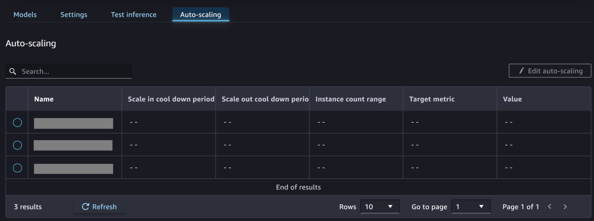

You can choose Edit auto-scaling to change any of the policies and turn on or turn off the default
auto-scaling policy.

To learn more about auto-scaling for real-time endpoints, see Automatically Scale Amazon
SageMaker AI Models. If you’re not sure how to configure an auto-scaling policy for your endpoint,

Endpoints
6035

## Page 65

Amazon SageMaker AI
Developer Guide

you can use an Inference Recommender autoscaling recommendations job to get recommendations
for an auto-scaling policy.

View endpoint details in the SageMaker AI console

To view your endpoints in the SageMaker AI console, do the following:

1.
Go to the SageMaker AI console at https://console.aws.amazon.com/sagemaker/.

2.
In the left navigation pane, choose Inference.

3.
From the dropdown list, choose Endpoints.

4.
On the Endpoints page, choose your endpoint.

The endpoint details page should open, showing you a summary of your endpoint and metrics that

have been collected for your endpoint.

The following sections describe the tabs on the endpoints details page.

Endpoints monitoring

After creating a SageMaker AI Hosting endpoint, you can monitor your endpoint using Amazon
CloudWatch, which collects raw data and processes it into readable, near real-time metrics. Using
these metrics, you can access historical information and gain a better perspective on how your
endpoint is performing. For more information, see the Amazon CloudWatch User Guide.

From the Monitoring tab on the endpoint details page, you can view CloudWatch metrics data that
has been collected from your endpoint.

The Monitoring tab includes the following sections:

• Operational metrics: View metrics that track the utilization of your endpoint’s resources, such as
CPU Utilization and Memory Utilization.

• Invocation metrics: View metrics that track the number, health, and status of InvokeEndpoint
requests coming to your endpoint, such as Invocation Model Errors and Model Latency.

• Health metrics: View metrics that track your endpoint’s overall health, such as Invocation
Failures and Notification Failures.

For detailed descriptions of each metric, see Monitor SageMaker AI with CloudWatch.

Endpoints
6036

## Page 66

Amazon SageMaker AI
Developer Guide

The following screenshot shows the Operational metrics section for a serverless endpoint.

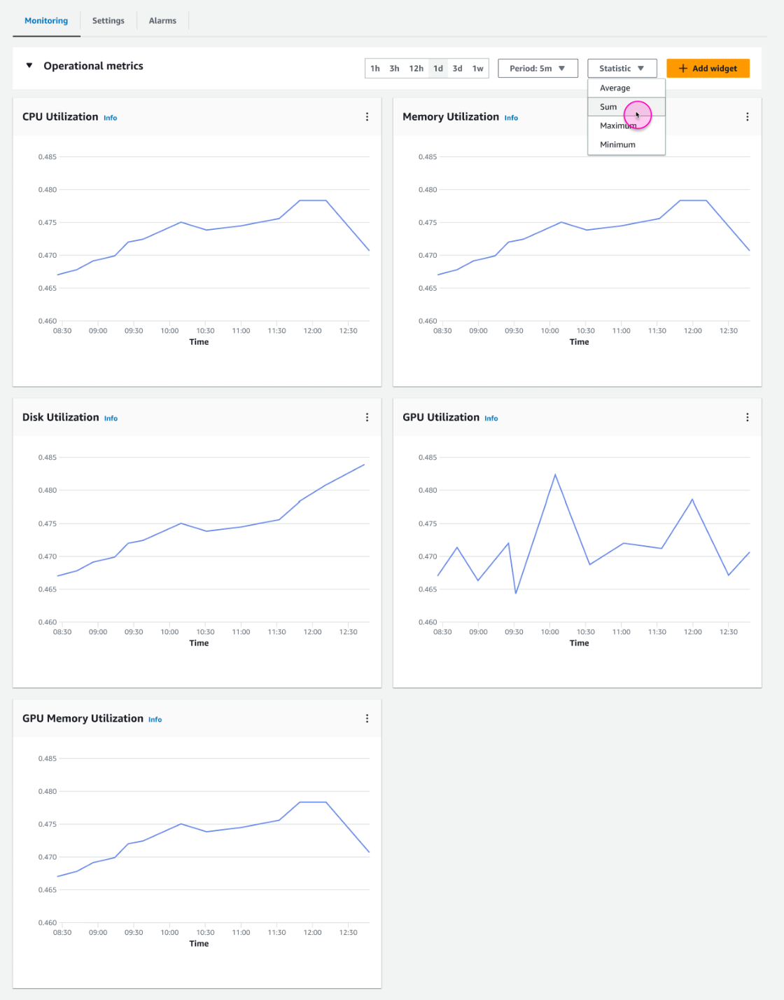

Endpoints
6037

## Page 67

Amazon SageMaker AI
Developer Guide

You can adjust the Period and Statistic that you want to track for the metrics in a given section, as
well as the length of time for which you want to view metrics data. You can also add and remove
metric widgets from the view for each section by choosing Add widget. In the Add widget dialog
box, you can select and deselect the metrics that you want to see.

The metrics that are available may depend on your endpoint type. For example, serverless
endpoints have some metrics that aren’t available for real-time endpoints. For more specific
metrics information by endpoint type, see the following pages:

• Monitor a serverless endpoint

• Monitor an asynchronous endpoint

• CW Metrics for Multi-Model Endpoint Deployments

• Inference Pipeline Logs and Metrics

Settings

You can choose the Settings tab to view additional information about your endpoint, such as the
data capture settings, the endpoint configuration, and tags.

Create and view alarms

From the Alarms tab on your endpoint details page, you can view and create simple static
threshold metric alarms, where you specify a threshold value for a metric. If the metric breaches

the threshold value, the alarm goes into the ALARM state. For more information about CloudWatch
alarms, see Using Amazon CloudWatch alarms.

In the Endpoint summary section, you can view the Alarms field, which tells you how many alarms
are currently active on your endpoint.

To view which alarms are in the ALARM state, choose the Alarms tab. The Alarms tab shows you a
full list of your endpoint alarms, along with details about their status and conditions. The following
screenshot shows a list of alarms in this section that have been configured for an endpoint.

Endpoints
6038

## Page 68

Amazon SageMaker AI
Developer Guide

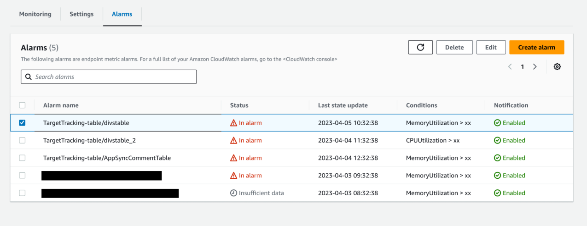

An alarm’s status can be In alarm, OK, or Insufficient data if there isn’t enough metrics data

being collected.

To create a new alarm for your endpoint, do the following:

1.
In the Alarms tab, choose Create alarm.

2.
The Create alarm page opens. For Alarm name, enter a name for the alarm.

3.
(Optional) Enter a description for the alarm.

4.
For Metric, choose the CloudWatch metric that you want the alarm to track.

5.
For Variant name, choose the endpoint model variant that you want to monitor.

6.
For Statistic, choose one of the available statistics for the metric you selected.

7.
For Period, choose the time period to use for calculating each statistical value. For example,
if you choose the Average statistic and a 5 minute period, each data point monitored by the
alarm is the average of the metric’s data points at 5 minute intervals.

8.
For Evaluation periods, enter the number of data points that you want the alarm to consider
when evaluating whether to enter the alarm state or not.

9.
For Condition, choose the conditional that you want to use for your alarm threshold.

10. For Threshold value, enter the desired value for your threshold.

11. (Optional) For Notification, you can choose Add notification to create or specify an Amazon

SNS topic that receives a notification when your alarm state changes.

12. Choose Create alarm.

Endpoints
6039

## Page 69

Amazon SageMaker AI
Developer Guide

After creating your alarm, you can return to the Alarms tab to view its status at any time. From this
section, you can also select the alarm and either Edit or Delete it.

Hosting options

The following topics describe available SageMaker AI realtime hosting options along with how to
set up, invoke, and delete each hosting option.

Topics

• Single-model endpoints

• Multi-model endpoints

• Multi-container endpoints

• Inference pipelines in Amazon SageMaker AI

• Delete Endpoints and Resources

Single-model endpoints

You can create, update, and delete real-time inference endpoints that host a single model with
Amazon SageMaker Studio, the AWS SDK for Python (Boto3), the SageMaker Python SDK, or the
AWS CLI. For procedures and code examples, see Deploy models for real-time inference.

Multi-model endpoints

Multi-model endpoints provide a scalable and cost-effective solution to deploying large numbers
of models. They use the same fleet of resources and a shared serving container to host all of your
models. This reduces hosting costs by improving endpoint utilization compared with using single-
model endpoints. It also reduces deployment overhead because Amazon SageMaker AI manages
loading models in memory and scaling them based on the traffic patterns to your endpoint.

The following diagram shows how multi-model endpoints work compared to single-model
endpoints.

Hosting options
6040

## Page 70

Amazon SageMaker AI
Developer Guide

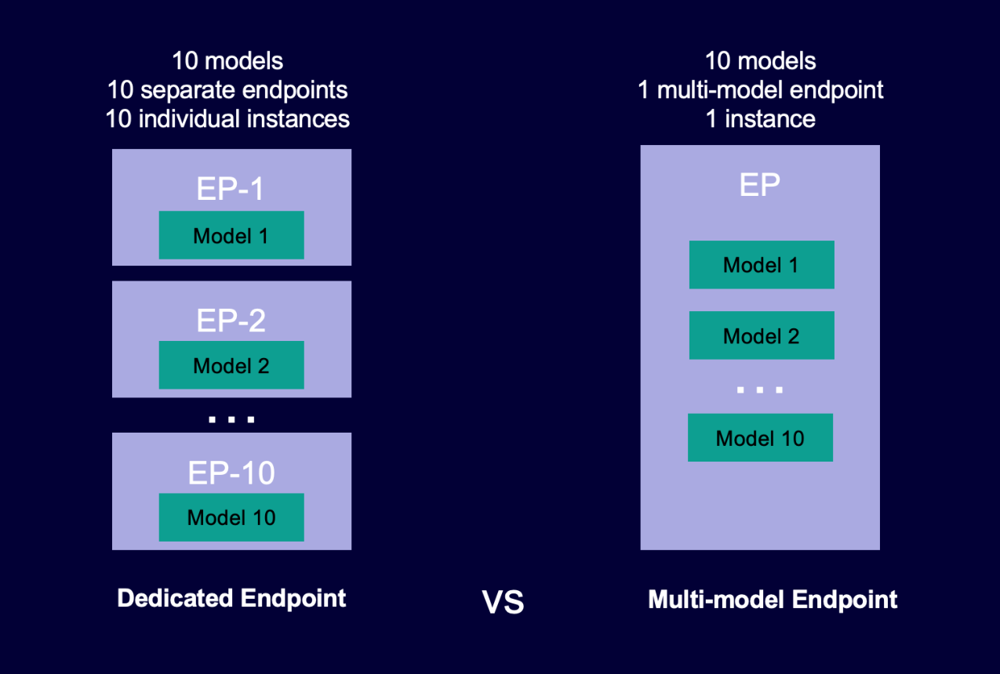

Multi-model endpoints are ideal for hosting a large number of models that use the same ML
framework on a shared serving container. If you have a mix of frequently and infrequently accessed
models, a multi-model endpoint can efficiently serve this traffic with fewer resources and higher
cost savings. Your application should be tolerant of occasional cold start-related latency penalties
that occur when invoking infrequently used models.

Multi-model endpoints support hosting both CPU and GPU backed models. By using GPU backed
models, you can lower your model deployment costs through increased usage of the endpoint and
its underlying accelerated compute instances.

Multi-model endpoints also enable time-sharing of memory resources across your models. This
works best when the models are fairly similar in size and invocation latency. When this is the case,
multi-model endpoints can effectively use instances across all models. If you have models that
have significantly higher transactions per second (TPS) or latency requirements, we recommend
hosting them on dedicated endpoints.

You can use multi-model endpoints with the following features:

Hosting options
6041

## Page 71

Amazon SageMaker AI
Developer Guide

• AWS PrivateLink and VPCs

• Auto scaling

• Serial inference pipelines (but only one multi-model enabled container can be included in an
inference pipeline)

• A/B testing

You can use the AWS SDK for Python (Boto) or the SageMaker AI console to create a multi-model
endpoint. For CPU backed multi-model endpoints, you can create your endpoint with custom-built
containers by integrating the Multi Model Server library.

Topics

• How multi-model endpoints work

• Sample notebooks for multi-model endpoints

• Supported algorithms, frameworks, and instances for multi-model endpoints

• Instance recommendations for multi-model endpoint deployments

• Create a Multi-Model Endpoint

• Invoke a Multi-Model Endpoint

• Add or Remove Models

• Build Your Own Container for SageMaker AI Multi-Model Endpoints

• Multi-Model Endpoint Security

• CloudWatch Metrics for Multi-Model Endpoint Deployments

• Set SageMaker AI multi-model endpoint model caching behavior

• Set Auto Scaling Policies for Multi-Model Endpoint Deployments

How multi-model endpoints work

SageMaker AI manages the lifecycle of models hosted on multi-model endpoints in the container's
memory. Instead of downloading all of the models from an Amazon S3 bucket to the container
when you create the endpoint, SageMaker AI dynamically loads and caches them when you invoke
them. When SageMaker AI receives an invocation request for a particular model, it does the
following:

1. Routes the request to an instance behind the endpoint.

2. Downloads the model from the S3 bucket to that instance's storage volume.

Hosting options
6042

## Page 72

Amazon SageMaker AI
Developer Guide

3. Loads the model to the container's memory (CPU or GPU, depending on whether you have CPU

or GPU backed instances) on that accelerated compute instance. If the model is already loaded
in the container's memory, invocation is faster because SageMaker AI doesn't need to download
and load it.

SageMaker AI continues to route requests for a model to the instance where the model is already
loaded. However, if the model receives many invocation requests, and there are additional
instances for the multi-model endpoint, SageMaker AI routes some requests to another instance
to accommodate the traffic. If the model isn't already loaded on the second instance, the model is
downloaded to that instance's storage volume and loaded into the container's memory.

When an instance's memory utilization is high and SageMaker AI needs to load another model into
memory, it unloads unused models from that instance's container to ensure that there is enough
memory to load the model. Models that are unloaded remain on the instance's storage volume

and can be loaded into the container's memory later without being downloaded again from the
S3 bucket. If the instance's storage volume reaches its capacity, SageMaker AI deletes any unused
models from the storage volume.

To delete a model, stop sending requests and delete it from the S3 bucket. SageMaker AI provides
multi-model endpoint capability in a serving container. Adding models to, and deleting them from,
a multi-model endpoint doesn't require updating the endpoint itself. To add a model, you upload it
to the S3 bucket and invoke it. You don’t need code changes to use it.

Note

When you update a multi-model endpoint, initial invocation requests on the endpoint
might experience higher latencies as Smart Routing in multi-model endpoints adapt to
your traffic pattern. However, once it learns your traffic pattern, you can experience low
latencies for most frequently used models. Less frequently used models may incur some
cold start latencies since the models are dynamically loaded to an instance.

Sample notebooks for multi-model endpoints

To learn more about how to use multi-model endpoints, you can try the following sample
notebooks:

• Examples for multi-model endpoints using CPU backed instances:

Hosting options
6043

## Page 73

Amazon SageMaker AI
Developer Guide

• Multi-Model Endpoint XGBoost Sample Notebook – This notebook shows how to deploy
multiple XGBoost models to an endpoint.

• Multi-Model Endpoints BYOC Sample Notebook – This notebook shows how to set up and
deploy a customer container that supports multi-model endpoints in SageMaker AI.

• Example for multi-model endpoints using GPU backed instances:

• Run multiple deep learning models on GPUs with Amazon SageMaker AI Multi-model
endpoints (MME) – This notebook shows how to use an NVIDIA Triton Inference container to
deploy ResNet-50 models to a multi-model endpoint.

For instructions on how to create and access Jupyter notebook instances that you can use to run
the previous examples in SageMaker AI, see Amazon SageMaker notebook instances. After you've
created a notebook instance and opened it, choose the SageMaker AI Examples tab to see a list of
all the SageMaker AI samples. The multi-model endpoint notebooks are located in the ADVANCED

FUNCTIONALITY section. To open a notebook, choose its Use tab and choose Create copy.

For more information about use cases for multi-model endpoints, see the following blogs and
resources:

• Video: Hosting thousands of models on SageMaker AI

• Video: SageMaker AI ML for SaaS

• Blog: How to scale machine learning inference for multi-tenant SaaS use cases

• Case study: Veeva Systems

Supported algorithms, frameworks, and instances for multi-model endpoints

For information about the algorithms, frameworks, and instance types that you can use with multi-
model endpoints, see the following sections.

Supported algorithms, frameworks, and instances for multi-model endpoints using CPU backed
instances

The inference containers for the following algorithms and frameworks support multi-model
endpoints:

• XGBoost algorithm with Amazon SageMaker AI

• K-Nearest Neighbors (k-NN) Algorithm

• Linear Learner Algorithm

Hosting options
6044

## Page 74

Amazon SageMaker AI
Developer Guide

• Random Cut Forest (RCF) Algorithm

• Resources for using TensorFlow with Amazon SageMaker AI

• Resources for using Scikit-learn with Amazon SageMaker AI

• Resources for using Apache MXNet with Amazon SageMaker AI

• Resources for using PyTorch with Amazon SageMaker AI

To use any other framework or algorithm, use the SageMaker AI inference toolkit to build a
container that supports multi-model endpoints. For information, see Build Your Own Container for
SageMaker AI Multi-Model Endpoints.

Multi-model endpoints support all of the CPU instance types.

Supported algorithms, frameworks, and instances for multi-model endpoints using GPU backed
instances

Hosting multiple GPU backed models on multi-model endpoints is supported through the
SageMaker AI Triton Inference server. This supports all major inference frameworks such as
NVIDIA® TensorRT™, PyTorch, MXNet, Python, ONNX, XGBoost, scikit-learn, RandomForest,
OpenVINO, custom C++, and more.

To use any other framework or algorithm, you can use Triton backend for Python or C++ to write
your model logic and serve any custom model. After you have the server ready, you can start
deploying 100s of Deep Learning models behind one endpoint.

Multi-model endpoints support the following GPU instance types:

Instance

Instance

vCPUs
GiB of

GPUs
GPU

family

type

memory per
vCPU

memory

p2
ml.p2.xlarge
4
15.25
1
12

p3
ml.p3.2xlarge
8
7.62
1
16

g5
ml.g5.xlarge
4
4
1
24

g5
ml.g5.2xlarge
8
4
1
24

g5
ml.g5.4xlarge
16
4
1
24

Hosting options
6045

## Page 75

Amazon SageMaker AI
Developer Guide

Instance
family

Instance
type

vCPUs
GiB of
memory per
vCPU

GPUs
GPU
memory

g5
ml.g5.8xlarge
32
4
1
24

g5
ml.g5.16x
large

64
4
1
24

g4dn
ml.g4dn.x
large

4
4
1
16

g4dn
ml.g4dn.2
xlarge

8
4
1
16

g4dn
ml.g4dn.4
xlarge

16
4
1
16

g4dn
ml.g4dn.8
xlarge

32
4
1
16

g4dn
ml.g4dn.1
6xlarge

64
4
1
16

Instance recommendations for multi-model endpoint deployments

There are several items to consider when selecting a SageMaker AI ML instance type for a multi-
model endpoint:

• Provision sufficient  Amazon Elastic Block Store (Amazon EBS) capacity for all of the models that
need to be served.

• Balance performance (minimize cold starts) and cost (don’t over-provision instance capacity). For
information about the size of the storage volume that SageMaker AI attaches for each instance
type for an endpoint and for a multi-model endpoint, see Instance storage volumes.

• For a container configured to run in MultiModel mode, the storage volume provisioned for its

instances are larger than the default SingleModel mode. This allows more models to be cached

on the instance storage volume than in SingleModel mode.

Hosting options
6046

## Page 76

Amazon SageMaker AI
Developer Guide

When choosing a SageMaker AI ML instance type, consider the following:

• Multi-model endpoints are currently supported for all CPU instances types and on single-GPU
instance types.

• For the traffic distribution (access patterns) to the models that you want to host behind the
multi-model endpoint, along with the model size (how many models could be loaded in memory
on the instance), keep the following information in mind:

• Think of the amount of memory on an instance as the cache space for models to be loaded,
and think of the number of vCPUs as the concurrency limit to perform inference on the loaded
models (assuming that invoking a model is bound to CPU).

• For CPU backed instances, the number of vCPUs impacts your maximum concurrent
invocations per instance (assuming that invoking a model is bound to CPU). A higher amount
of vCPUs enables you to invoke more unique models concurrently.

• For GPU backed instances, a higher amount of instance and GPU memory enables you to have
more models loaded and ready to serve inference requests.

• For both CPU and GPU backed instances, have some "slack" memory available so that unused
models can be unloaded, and especially for multi-model endpoints with multiple instances.
If an instance or an Availability Zone fails, the models on those instances will be rerouted to
other instances behind the endpoint.

• Determine your tolerance to loading/downloading times:

• d instance type families (for example, m5d, c5d, or r5d) and g5s come with an NVMe (non-
volatile memory express) SSD, which offers high I/O performance and might reduce the time it
takes to download models to the storage volume and for the container to load the model from
the storage volume.

• Because d and g5 instance types come with an NVMe SSD storage, SageMaker AI does
not attach an Amazon EBS storage volume to these ML compute instances that hosts the
multi-model endpoint. Auto scaling works best when the models are similarly sized and
homogenous, that is when they have similar inference latency and resource requirements.

You can also use the following guidance to help you optimize model loading on your multi-model
endpoints:

Choosing an instance type that can't hold all of the targeted models in memory

In some cases, you might opt to reduce costs by choosing an instance type that can't hold all of
the targeted models in memory at once. SageMaker AI dynamically unloads models when it runs

Hosting options
6047

## Page 77

Amazon SageMaker AI
Developer Guide

out of memory to make room for a newly targeted model. For infrequently requested models, you
sacrifice dynamic load latency. In cases with more stringent latency needs, you might opt for larger
instance types or more instances. Investing time up front for performance testing and analysis
helps you to have successful production deployments.

Evaluating your model cache hits

Amazon CloudWatch metrics can help you evaluate your models. For more information about
metrics you can use with multi-model endpoints, see CloudWatch Metrics for Multi-Model Endpoint
Deployments.

You can use the Average statistic of the ModelCacheHit metric to monitor the ratio of

requests where the model is already loaded. You can use the SampleCount statistic for the

ModelUnloadingTime metric to monitor the number of unload requests sent to the container
during a time period. If models are unloaded too frequently (an indicator of thrashing, where

models are being unloaded and loaded again because there is insufficient cache space for the
working set of models), consider using a larger instance type with more memory or increasing the
number of instances behind the multi-model endpoint. For multi-model endpoints with multiple
instances, be aware that a model might be loaded on more than 1 instance.

Create a Multi-Model Endpoint

You can use the SageMaker AI console or the AWS SDK for Python (Boto) to create a multi-model
endpoint. To create either a CPU or GPU backed endpoint through the console, see the console
procedure in the following sections. If you want to create a multi-model endpoint with the AWS
SDK for Python (Boto), use either the CPU or GPU procedure in the following sections. The CPU and
GPU workflows are similar but have several differences, such as the container requirements.

Topics

• Create a multi-model endpoint (console)

• Create a multi-model endpoint using CPUs with the AWS SDK for Python (Boto3)

• Create a multi-model endpoint using GPUs with the AWS SDK for Python (Boto3)

Create a multi-model endpoint (console)

You can create both CPU and GPU backed multi-model endpoints through the console. Use the
following procedure to create a multi-model endpoint through the SageMaker AI console.

Hosting options
6048

## Page 78

Amazon SageMaker AI
Developer Guide

To create a multi-model endpoint (console)

1.
Open the Amazon SageMaker AI console at https://console.aws.amazon.com/sagemaker/.

2.
Choose Model, and then from the Inference group, choose Create model.

3.
For Model name, enter a name.

4.
For IAM role, choose or create an IAM role that has the AmazonSageMakerFullAccess IAM
policy attached.

5.
In the Container definition section, for Provide model artifacts and inference image options,
choose Use multiple models.

Hosting options
6049

## Page 79

Amazon SageMaker AI
Developer Guide


6.
For the Inference container image, enter the Amazon ECR path for your desired container
image.

Hosting options
6050

## Page 80

Amazon SageMaker AI
Developer Guide

For GPU models, you must use a container backed by the NVIDIA Triton Inference Server. For a
list of container images that work with GPU backed endpoints, see the NVIDIA Triton Inference
Containers (SM support only). For more information about the NVIDIA Triton Inference Server,
see Use Triton Inference Server with SageMaker AI.

7.
Choose Create model.

8.
Deploy your multi-model endpoint as you would a single model endpoint. For instructions, see
Deploy the Model to SageMaker AI Hosting Services.

Create a multi-model endpoint using CPUs with the AWS SDK for Python (Boto3)

Use the following section to create a multi-model endpoint backed by CPU instances.

You create a multi-model endpoint using the Amazon SageMaker AI create_model,

create_endpoint_config, and create_endpoint APIs just as you would create a single model

endpoint, but with two changes. When defining the model container, you need to pass a new Mode

parameter value, MultiModel. You also need to pass the ModelDataUrl field that specifies the
prefix in Amazon S3 where the model artifacts are located, instead of the path to a single model
artifact, as you would when deploying a single model.

For a sample notebook that uses SageMaker AI to deploy multiple XGBoost models to an endpoint,
see Multi-Model Endpoint XGBoost Sample Notebook.

The following procedure outlines the key steps used in that sample to create a CPU backed multi-
model endpoint.

To deploy the model (AWS SDK for Python (Boto 3))

1.
Get a container with an image that supports deploying multi-model endpoints. For a list
of built-in algorithms and framework containers that support multi-model endpoints,
see Supported algorithms, frameworks, and instances for multi-model endpoints. For this
example, we use the K-Nearest Neighbors (k-NN) Algorithm built-in algorithm. We call the

SageMaker Python SDK utility function image_uris.retrieve() to get the address for the
K-Nearest Neighbors built-in algorithm image.

import sagemaker
region = sagemaker_session.boto_region_name
image = sagemaker.image_uris.retrieve("knn",region=region)
container = {
'Image':        image,

Hosting options
6051

## Page 81

Amazon SageMaker AI
Developer Guide

'ModelDataUrl': 's3://<BUCKET_NAME>/<PATH_TO_ARTIFACTS>',
'Mode':         'MultiModel'
}

2.
Get an AWS SDK for Python (Boto3) SageMaker AI client and create the model that uses this
container.

import boto3
sagemaker_client = boto3.client('sagemaker')
response = sagemaker_client.create_model(
ModelName        = '<MODEL_NAME>',
ExecutionRoleArn = role,
Containers       = [container])

3.
(Optional) If you are using a serial inference pipeline, get the additional container(s) to include

in the pipeline, and include it in the Containers argument of CreateModel:

preprocessor_container = {
'Image':
'<ACCOUNT_ID>.dkr.ecr.<REGION_NAME>.amazonaws.com/<PREPROCESSOR_IMAGE>:<TAG>'
}

multi_model_container = {
'Image':
'<ACCOUNT_ID>.dkr.ecr.<REGION_NAME>.amazonaws.com/<IMAGE>:<TAG>',
'ModelDataUrl': 's3://<BUCKET_NAME>/<PATH_TO_ARTIFACTS>',
'Mode':         'MultiModel'
}

response = sagemaker_client.create_model(
ModelName        = '<MODEL_NAME>',
ExecutionRoleArn = role,
Containers       = [preprocessor_container, multi_model_container]
)

Note

You can use only one multi-model-enabled endpoint in a serial inference pipeline.

4.
(Optional) If your use case does not benefit from model caching, set the value of the

ModelCacheSetting field of the MultiModelConfig parameter to Disabled, and

Hosting options
6052

## Page 82

Amazon SageMaker AI
Developer Guide

include it in the Container argument of the call to create_model. The value of the

ModelCacheSetting field is Enabled by default.

container = {
'Image': image,
'ModelDataUrl': 's3://<BUCKET_NAME>/<PATH_TO_ARTIFACTS>',
'Mode': 'MultiModel'
'MultiModelConfig': {
// Default value is 'Enabled'
'ModelCacheSetting': 'Disabled'
}
}

response = sagemaker_client.create_model(
ModelName        = '<MODEL_NAME>',
ExecutionRoleArn = role,
Containers       = [container]
)

5.
Configure the multi-model endpoint for the model. We recommend configuring your
endpoints with at least two instances. This allows SageMaker AI to provide a highly available
set of predictions across multiple Availability Zones for the models.

response = sagemaker_client.create_endpoint_config(
EndpointConfigName = '<ENDPOINT_CONFIG_NAME>',
ProductionVariants=[
{
'InstanceType':        'ml.m4.xlarge',
'InitialInstanceCount': 2,
'InitialVariantWeight': 1,
'ModelName':             '<MODEL_NAME>',
'VariantName':          'AllTraffic'
}
]
)

Note

You can use only one multi-model-enabled endpoint in a serial inference pipeline.

Hosting options
6053

## Page 83

Amazon SageMaker AI
Developer Guide

6.
Create the multi-model endpoint using the EndpointName and EndpointConfigName
parameters.

response = sagemaker_client.create_endpoint(
EndpointName       = '<ENDPOINT_NAME>',
EndpointConfigName = '<ENDPOINT_CONFIG_NAME>')

Create a multi-model endpoint using GPUs with the AWS SDK for Python (Boto3)

Use the following section to create a GPU backed multi-model endpoint. You create a multi-

model endpoint using the Amazon SageMaker AI create_model, create_endpoint_config,

and create_endpoint APIs similarly to creating single model endpoints, but there are several

changes. When defining the model container, you need to pass a new Mode parameter value,

MultiModel. You also need to pass the ModelDataUrl field that specifies the prefix in Amazon
S3 where the model artifacts are located, instead of the path to a single model artifact, as you
would when deploying a single model. For GPU backed multi-model endpoints, you also must
use a container with the NVIDIA Triton Inference Server that is optimized for running on GPU
instances. For a list of container images that work with GPU backed endpoints, see the NVIDIA
Triton Inference Containers (SM support only).

For an example notebook that demonstrates how to create a multi-model endpoint backed by
GPUs, see Run mulitple deep learning models on GPUs with Amazon SageMaker AI Multi-model
endpoints (MME).

The following procedure outlines the key steps to create a GPU backed multi-model endpoint.

To deploy the model (AWS SDK for Python (Boto 3))

1.
Define the container image. To create a multi-model endpoint with GPU support for ResNet
models, define the container to use the NVIDIA Triton Server image. This container supports
multi-model endpoints and is optimized for running on GPU instances. We call the SageMaker

AI Python SDK utility function image_uris.retrieve() to get the address for the image.
For example:

import sagemaker
region = sagemaker_session.boto_region_name

// Find the sagemaker-tritonserver image at

Hosting options
6054

## Page 84

Amazon SageMaker AI
Developer Guide

// https://github.com/aws/amazon-sagemaker-examples/blob/main/sagemaker-triton/
resnet50/triton_resnet50.ipynb
// Find available tags at https://github.com/aws/deep-learning-containers/blob/
master/available_images.md#nvidia-triton-inference-containers-sm-support-only

image = "<ACCOUNT_ID>.dkr.ecr.<REGION_NAME>.amazonaws.com/sagemaker-
tritonserver:<TAG>".format(
account_id=account_id_map[region], region=region
)

container = {
'Image':        image,
'ModelDataUrl': 's3://<BUCKET_NAME>/<PATH_TO_ARTIFACTS>',
'Mode':         'MultiModel',
"Environment": {"SAGEMAKER_TRITON_DEFAULT_MODEL_NAME": "resnet"},
}

2.
Get an AWS SDK for Python (Boto3) SageMaker AI client and create the model that uses this
container.

import boto3
sagemaker_client = boto3.client('sagemaker')
response = sagemaker_client.create_model(
ModelName        = '<MODEL_NAME>',
ExecutionRoleArn = role,
Containers       = [container])

3.
(Optional) If you are using a serial inference pipeline, get the additional container(s) to include

in the pipeline, and include it in the Containers argument of CreateModel:

preprocessor_container = {
'Image':
'<ACCOUNT_ID>.dkr.ecr.<REGION_NAME>.amazonaws.com/<PREPROCESSOR_IMAGE>:<TAG>'
}

multi_model_container = {
'Image':
'<ACCOUNT_ID>.dkr.ecr.<REGION_NAME>.amazonaws.com/<IMAGE>:<TAG>',
'ModelDataUrl': 's3://<BUCKET_NAME>/<PATH_TO_ARTIFACTS>',
'Mode':         'MultiModel'
}

response = sagemaker_client.create_model(

Hosting options
6055

## Page 85

Amazon SageMaker AI
Developer Guide

ModelName        = '<MODEL_NAME>',
ExecutionRoleArn = role,
Containers       = [preprocessor_container, multi_model_container]
)

Note

You can use only one multi-model-enabled endpoint in a serial inference pipeline.

4.
(Optional) If your use case does not benefit from model caching, set the value of the

ModelCacheSetting field of the MultiModelConfig parameter to Disabled, and

include it in the Container argument of the call to create_model. The value of the

ModelCacheSetting field is Enabled by default.

container = {
'Image': image,
'ModelDataUrl': 's3://<BUCKET_NAME>/<PATH_TO_ARTIFACTS>',
'Mode': 'MultiModel'
'MultiModelConfig': {
// Default value is 'Enabled'
'ModelCacheSetting': 'Disabled'
}
}

response = sagemaker_client.create_model(
ModelName        = '<MODEL_NAME>',
ExecutionRoleArn = role,
Containers       = [container]
)

5.
Configure the multi-model endpoint with GPU backed instances for the model. We
recommend configuring your endpoints with more than one instance to allow for high
availability and higher cache hits.

response = sagemaker_client.create_endpoint_config(
EndpointConfigName = '<ENDPOINT_CONFIG_NAME>',
ProductionVariants=[
{
'InstanceType':        'ml.g4dn.4xlarge',
'InitialInstanceCount': 2,
'InitialVariantWeight': 1,

Hosting options
6056

## Page 86

Amazon SageMaker AI
Developer Guide

'ModelName':             '<MODEL_NAME>',
'VariantName':          'AllTraffic'
}
]
)

6.
Create the multi-model endpoint using the EndpointName and EndpointConfigName
parameters.

response = sagemaker_client.create_endpoint(
EndpointName       = '<ENDPOINT_NAME>',
EndpointConfigName = '<ENDPOINT_CONFIG_NAME>')

Invoke a Multi-Model Endpoint

To invoke a multi-model endpoint, use the invoke_endpoint from the SageMaker AI Runtime

just as you would invoke a single model endpoint, with one change. Pass a new TargetModel
parameter that specifies which of the models at the endpoint to target. The SageMaker AI Runtime

InvokeEndpoint request supports X-Amzn-SageMaker-Target-Model as a new header
that takes the relative path of the model specified for invocation. The SageMaker AI system
constructs the absolute path of the model by combining the prefix that is provided as part of the

CreateModel API call with the relative path of the model.

The following procedures are the same for both CPU and GPU-backed multi-model endpoints.

AWS SDK for Python (Boto 3)

The following example prediction request uses the AWS SDK for Python (Boto 3) in the sample
notebook.

response = runtime_sagemaker_client.invoke_endpoint(
EndpointName = "<ENDPOINT_NAME>",
ContentType  = "text/csv",
TargetModel  = "<MODEL_FILENAME>.tar.gz",
Body         = body)

AWS CLI

The following example shows how to make a CSV request with two rows using the AWS
Command Line Interface (AWS CLI):

Hosting options
6057

## Page 87

Amazon SageMaker AI
Developer Guide

aws sagemaker-runtime invoke-endpoint \
--endpoint-name "<ENDPOINT_NAME>" \
--body "1.0,2.0,5.0"$'\n'"2.0,3.0,4.0" \
--content-type "text/csv" \
--target-model "<MODEL_NAME>.tar.gz"
output_file.txt

An output_file.txt with information about your inference requests is made if the inference
was successful. For more examples on how to make predictions with the AWS CLI, see Making
predictions with the AWS CLI in the SageMaker Python SDK documentation.

The multi-model endpoint dynamically loads target models as needed. You can observe this when
running the MME Sample Notebook as it iterates through random invocations against multiple
target models hosted behind a single endpoint. The first request against a given model takes

longer because the model has to be downloaded from Amazon Simple Storage Service (Amazon
S3) and loaded into memory. This is called a cold start, and it is expected on multi-model endpoints
to optimize for better price performance for customers. Subsequent calls finish faster because
there's no additional overhead after the model has loaded.

Note

For GPU backed instances, the HTTP response code with 507 from the GPU container
indicates a lack of memory or other resources. This causes unused models to be unloaded
from the container in order to load more frequently used models.

Retry Requests on ModelNotReadyException Errors

The first time you call invoke_endpoint for a model, the model is downloaded from Amazon
Simple Storage Service and loaded into the inference container. This makes the first call take
longer to return. Subsequent calls to the same model finish faster, because the model is already
loaded.

SageMaker AI returns a response for a call to invoke_endpoint within 60 seconds. Some
models are too large to download within 60 seconds. If the model does not finish loading

before the 60 second timeout limit, the request to invoke_endpoint returns with the error

code ModelNotReadyException, and the model continues to download and load into the

inference container for up to 360 seconds. If you get a ModelNotReadyException error code

Hosting options
6058

## Page 88

Amazon SageMaker AI
Developer Guide

for an invoke_endpoint request, retry the request. By default, the AWS SDKs for Python

(Boto 3) (using Legacy retry mode) and Java retry invoke_endpoint requests that result in

ModelNotReadyException errors. You can configure the retry strategy to continue retrying
the request for up to 360 seconds. If you expect your model to take longer than 60 seconds

to download and load into the container, set the SDK socket timeout to 70 seconds. For more
information about configuring the retry strategy for the AWS SDK for Python (Boto3), see
Configuring a retry mode. The following code shows an example that configures the retry strategy

to retry calls to invoke_endpoint for up to 180 seconds.

import boto3
from botocore.config import Config

# This example retry strategy sets the retry attempts to 2.
# With this setting, the request can attempt to download and/or load the model
# for upto 180 seconds: 1 orginal request (60 seconds) + 2 retries (120 seconds)
config = Config(
read_timeout=70,
retries={
'max_attempts': 2  # This value can be adjusted to 5 to go up to the 360s max
timeout
}
)
runtime_sagemaker_client = boto3.client('sagemaker-runtime', config=config)

Add or Remove Models

You can deploy additional models to a multi-model endpoint and invoke them through that
endpoint immediately. When adding a new model, you don't need to update or bring down the
endpoint, so you avoid the cost of creating and running a separate endpoint for each new model.
The process for adding and removing models is the same for CPU and GPU-backed multi-model
endpoints.

SageMaker AI unloads unused models from the container when the instance is reaching memory
capacity and more models need to be downloaded into the container. SageMaker AI also deletes
unused model artifacts from the instance storage volume when the volume is reaching capacity
and new models need to be downloaded. The first invocation to a newly added model takes longer
because the endpoint takes time to download the model from S3 to the container's memory in
instance hosting the endpoint

Hosting options
6059

## Page 89

Amazon SageMaker AI
Developer Guide

With the endpoint already running, copy a new set of model artifacts to the Amazon S3 location
there you store your models.

# Add an AdditionalModel to the endpoint and exercise it
aws s3 cp AdditionalModel.tar.gz s3://amzn-s3-demo-bucket/path/to/artifacts/

Important

To update a model, proceed as you would when adding a new model. Use a new and unique
name. Don't overwrite model artifacts in Amazon S3 because the old version of the model
might still be loaded in the containers or on the storage volume of the instances on the
endpoint. Invocations to the new model could then invoke the old version of the model.

Client applications can request predictions from the additional target model as soon as it is stored
in S3.

response = runtime_sagemaker_client.invoke_endpoint(
EndpointName='<ENDPOINT_NAME>',
ContentType='text/csv',
TargetModel='AdditionalModel.tar.gz',
Body=body)

To delete a model from a multi-model endpoint, stop invoking the model from the clients and
remove it from the S3 location where model artifacts are stored.

Build Your Own Container for SageMaker AI Multi-Model Endpoints

Refer to the following sections for bringing your own container and dependencies to multi-model
endpoints.

Topics

• Bring your own dependencies for multi-model endpoints on CPU backed instances

• Bring your own dependencies for multi-model endpoints on GPU backed instances

• Use the SageMaker AI Inference Toolkit

• Custom Containers Contract for Multi-Model Endpoints

Hosting options
6060

## Page 90

Amazon SageMaker AI
Developer Guide

Bring your own dependencies for multi-model endpoints on CPU backed instances

If none of the pre-built container images serve your needs, you can build your own container for
use with CPU backed multi-model endpoints.

Custom Amazon Elastic Container Registry (Amazon ECR) images deployed in Amazon SageMaker
AI are expected to adhere to the basic contract described in Custom Inference Code with Hosting
Services that govern how SageMaker AI interacts with a Docker container that runs your own
inference code. For a container to be capable of loading and serving multiple models concurrently,
there are additional APIs and behaviors that must be followed. This additional contract includes
new APIs to load, list, get, and unload models, and a different API to invoke models. There are also
different behaviors for error scenarios that the APIs need to abide by. To indicate that the container
complies with the additional requirements, you can add the following command to your Docker
file:

LABEL com.amazonaws.sagemaker.capabilities.multi-models=true

SageMaker AI also injects an environment variable into the container

SAGEMAKER_MULTI_MODEL=true

If you are creating a multi-model endpoint for a serial inference pipline, your Docker file must have
the required labels for both multi-models and serial inference pipelines. For more information
about serial information pipelines, see Run Real-time Predictions with an Inference Pipeline.

To help you implement these requirements for a custom container, two libraries are available:

• Multi Model Server is an open source framework for serving machine learning models that can
be installed in containers to provide the front end that fulfills the requirements for the new
multi-model endpoint container APIs. It provides the HTTP front end and model management
capabilities required by multi-model endpoints to host multiple models within a single container,
load models into and unload models out of the container dynamically, and performs inference
on a specified loaded model. It also provides a pluggable backend that supports a pluggable
custom backend handler where you can implement your own algorithm.

• SageMaker AI Inference Toolkit is a library that bootstraps Multi Model Server with a
configuration and settings that make it compatible with SageMaker AI multi-model endpoints. It
also allows you to tweak important performance parameters, such as the number of workers per
model, depending on the needs of your scenario.

Hosting options
6061

## Page 91

Amazon SageMaker AI
Developer Guide

Bring your own dependencies for multi-model endpoints on GPU backed instances

The bring your own container (BYOC) capability on multi-model endpoints with GPU backed
instances is not currently supported by the Multi Model Server and SageMaker AI Inference Toolkit
libraries.

For creating multi-model endpoints with GPU backed instances, you can use the SageMaker AI
supported NVIDIA Triton Inference Server. with the NVIDIA Triton Inference Containers. To bring
your own dependencies, you can build your own container with the SageMaker AI supported
NVIDIA Triton Inference Server as the base image to your Docker file:

FROM 301217895009.dkr.ecr.us-west-2.amazonaws.com/sagemaker-tritonserver:22.07-py3

Important

Containers with the Triton Inference Server are the only supported containers you can use
for GPU backed multi-model endpoints.

Use the SageMaker AI Inference Toolkit

Note

The SageMaker AI Inference Toolkit is only supported for CPU backed multi-model
endpoints. The SageMaker AI Inference Toolkit is not currently not supported for GPU
backed multi-model endpoints.

Pre-built containers that support multi-model endpoints are listed in Supported algorithms,
frameworks, and instances for multi-model endpoints. If you want to use any other framework
or algorithm, you need to build a container. The easiest way to do this is to use the SageMaker AI
Inference Toolkit to extend an existing pre-built container. The SageMaker AI inference toolkit is
an implementation for the multi-model server (MMS) that creates endpoints that can be deployed
in SageMaker AI. For a sample notebook that shows how to set up and deploy a custom container
that supports multi-model endpoints in SageMaker AI, see the Multi-Model Endpoint BYOC Sample
Notebook.

Hosting options
6062

## Page 92

Amazon SageMaker AI
Developer Guide

Note

The SageMaker AI inference toolkit supports only Python model handlers. If you want
to implement your handler in any other language, you must build your own container
that implements the additional multi-model endpoint APIs. For information, see Custom
Containers Contract for Multi-Model Endpoints.

To extend a container by using the SageMaker AI inference toolkit

1.
Create a model handler. MMS expects a model handler, which is a Python file that implements
functions to pre-process, get preditions from the model, and process the output in a model
handler. For an example of a model handler, see model_handler.py from the sample notebook.

2.
Import the inference toolkit and use its model_server.start_model_server function to

start MMS. The following example is from the dockerd-entrypoint.py file from the sample

notebook. Notice that the call to model_server.start_model_server passes the model
handler described in the previous step:

import subprocess
import sys
import shlex
import os
from retrying import retry
from subprocess import CalledProcessError
from sagemaker_inference import model_server

def _retry_if_error(exception):
return isinstance(exception, CalledProcessError or OSError)

@retry(stop_max_delay=1000 * 50,
retry_on_exception=_retry_if_error)
def _start_mms():
# by default the number of workers per model is 1, but we can configure it
through the
# environment variable below if desired.
# os.environ['SAGEMAKER_MODEL_SERVER_WORKERS'] = '2'
model_server.start_model_server(handler_service='/home/model-server/
model_handler.py:handle')

def main():
if sys.argv[1] == 'serve':

Hosting options
6063

## Page 93

Amazon SageMaker AI
Developer Guide

_start_mms()
else:
subprocess.check_call(shlex.split(' '.join(sys.argv[1:])))

# prevent docker exit
subprocess.call(['tail', '-f', '/dev/null'])
main()

3.
In your Dockerfile, copy the model handler from the first step and specify the Python file

from the previous step as the entrypoint in your Dockerfile. The following lines are from the
Dockerfile used in the sample notebook:

# Copy the default custom service file to handle incoming data and inference
requests
COPY model_handler.py /home/model-server/model_handler.py

# Define an entrypoint script for the docker image
ENTRYPOINT ["python", "/usr/local/bin/dockerd-entrypoint.py"]

4.
Build and register your container. The following shell script from the sample notebook builds
the container and uploads it to an Amazon Elastic Container Registry repository in your AWS
account:

%%sh

# The name of our algorithm
algorithm_name=demo-sagemaker-multimodel

cd container

account=$(aws sts get-caller-identity --query Account --output text)

# Get the region defined in the current configuration (default to us-west-2 if none
defined)
region=$(aws configure get region)
region=${region:-us-west-2}

fullname="${account}.dkr.ecr.${region}.amazonaws.com/${algorithm_name}:latest"

# If the repository doesn't exist in ECR, create it.
aws ecr describe-repositories --repository-names "${algorithm_name}" > /dev/null
2>&1

Hosting options
6064

## Page 94

Amazon SageMaker AI
Developer Guide

if [ $? -ne 0 ]
then
aws ecr create-repository --repository-name "${algorithm_name}" > /dev/null
fi

# Get the login command from ECR and execute it directly
$(aws ecr get-login --region ${region} --no-include-email)

# Build the docker image locally with the image name and then push it to ECR
# with the full name.

docker build -q -t ${algorithm_name} .
docker tag ${algorithm_name} ${fullname}

docker push ${fullname}

You can now use this container to deploy multi-model endpoints in SageMaker AI.

Topics

• Custom Containers Contract for Multi-Model Endpoints

Custom Containers Contract for Multi-Model Endpoints

To handle multiple models, your container must support a set of APIs that enable Amazon
SageMaker AI to communicate with the container for loading, listing, getting, and unloading

models as required. The model_name is used in the new set of APIs as the key input parameter.

The customer container is expected to keep track of the loaded models using model_name as the

mapping key. Also, the model_name is an opaque identifier and is not necessarily the value of the

TargetModel parameter passed into the InvokeEndpoint API. The original TargetModel value

in the InvokeEndpoint request is passed to container in the APIs as a X-Amzn-SageMaker-

Target-Model header that can be used for logging purposes.

Note

Multi-model endpoints for GPU backed instances are currently supported only with
SageMaker AI's NVIDIA Triton Inference Server container. This container already

Hosting options
6065

## Page 95

Amazon SageMaker AI
Developer Guide

implements the contract defined below. Customers can directly use this container with
their multi-model GPU endpoints, without any additional work.

You can configure the following APIs on your containers for CPU backed multi-model endpoints.

Topics

• Load Model API

• List Model API

• Get Model API

• Unload Model API

• Invoke Model API

Load Model API

Instructs the container to load a particular model present in the url field of the body into the

memory of the customer container and to keep track of it with the assigned model_name. After a

model is loaded, the container should be ready to serve inference requests using this model_name.

POST /models HTTP/1.1
Content-Type: application/json
Accept: application/json

{
"model_name" : "{model_name}",
"url" : "/opt/ml/models/{model_name}/model",
}

Note

If model_name is already loaded, this API should return 409. Any time a model cannot be
loaded due to lack of memory or to any other resource, this API should return a 507 HTTP
status code to SageMaker AI, which then initiates unloading unused models to reclaim.

List Model API

Returns the list of models loaded into the memory of the customer container.

Hosting options
6066

## Page 96

Amazon SageMaker AI
Developer Guide

GET /models HTTP/1.1
Accept: application/json

Response =
{
"models": [
{
"modelName" : "{model_name}",
"modelUrl" : "/opt/ml/models/{model_name}/model",
},
{
"modelName" : "{model_name}",
"modelUrl" : "/opt/ml/models/{model_name}/model",
},
....
]

}

This API also supports pagination.

GET /models HTTP/1.1
Accept: application/json

Response =
{
"models": [
{
"modelName" : "{model_name}",
"modelUrl" : "/opt/ml/models/{model_name}/model",
},
{
"modelName" : "{model_name}",
"modelUrl" : "/opt/ml/models/{model_name}/model",
},
....
]
}

SageMaker AI can initially call the List Models API without providing a value for

next_page_token. If a nextPageToken field is returned as part of the response, it will

be provided as the value for next_page_token in a subsequent List Models call. If a

nextPageToken is not returned, it means that there are no more models to return.

Hosting options
6067

## Page 97

Amazon SageMaker AI
Developer Guide

Get Model API

This is a simple read API on the model_name entity.

GET /models/{model_name} HTTP/1.1
Accept: application/json

{
"modelName" : "{model_name}",
"modelUrl" : "/opt/ml/models/{model_name}/model",
}

Note

If model_name is not loaded, this API should return 404.

Unload Model API

Instructs the SageMaker AI platform to instruct the customer container to unload a model from
memory. This initiates the eviction of a candidate model as determined by the platform when

starting the process of loading a new model. The resources provisioned to model_name should be
reclaimed by the container when this API returns a response.

DELETE /models/{model_name}

Note

If model_name is not loaded, this API should return 404.

Invoke Model API

Makes a prediction request from the particular model_name supplied. The SageMaker AI Runtime

InvokeEndpoint request supports X-Amzn-SageMaker-Target-Model as a new header
that takes the relative path of the model specified for invocation. The SageMaker AI system
constructs the absolute path of the model by combining the prefix that is provided as part of the

CreateModel API call with the relative path of the model.

Hosting options
6068

## Page 98

Amazon SageMaker AI
Developer Guide

POST /models/{model_name}/invoke HTTP/1.1
Content-Type: ContentType
Accept: Accept
X-Amzn-SageMaker-Custom-Attributes: CustomAttributes
X-Amzn-SageMaker-Target-Model: [relativePath]/{artifactName}.tar.gz

Note

If model_name is not loaded, this API should return 404.

Additionally, on GPU instances, if InvokeEndpoint fails due to a lack of memory or other
resources, this API should return a 507 HTTP status code to SageMaker AI, which then initiates
unloading unused models to reclaim.

Multi-Model Endpoint Security

Models and data in a multi-model endpoint are co-located on instance storage volume and in
container memory. All instances for Amazon SageMaker AI endpoints run on a single tenant
container that you own. Only your models can run on your multi-model endpoint. It's your
responsibility to manage the mapping of requests to models and to provide access for users to the
correct target models. SageMaker AI uses IAM roles to provide IAM identity-based policies that you
use to specify allowed or denied actions and resources and the conditions under which actions are
allowed or denied.

By default, an IAM principal with InvokeEndpoint permissions on a multi-model endpoint can

invoke any model at the address of the S3 prefix defined in the CreateModel operation, provided
that the IAM Execution Role defined in operation has permissions to download the model. If you

need to restrict InvokeEndpoint access to a limited set of models in S3, you can do one of the
following:

• Restrict InvokeEndpont calls to specific models hosted at the endpoint by using the

sagemaker:TargetModel IAM condition key. For example, the following policy allows

InvokeEndpont requests only when the value of the TargetModel field matches one of the
specified regular expressions:

JSON

{
"Version":"2012-10-17",

Hosting options
6069

## Page 99

Amazon SageMaker AI
Developer Guide

"Statement": [
{
"Action": [
"sagemaker:InvokeEndpoint"
],
"Effect": "Allow",
"Resource":
"arn:aws:sagemaker:us-east-1:111122223333:endpoint/endpoint_name",
"Condition": {
"StringLike": {
"sagemaker:TargetModel": ["company_a/*", "common/*"]
}
}
}
]
}

For information about SageMaker AI condition keys, see Condition Keys for Amazon SageMaker
AI in the AWS Identity and Access Management User Guide.

• Create multi-model endpoints with more restrictive S3 prefixes.

For more information about how SageMaker AI uses roles to manage access to endpoints and
perform operations on your behalf, see How to use SageMaker AI execution roles. Your customers
might also have certain data isolation requirements dictated by their own compliance requirements
that can be satisfied using IAM identities.

CloudWatch Metrics for Multi-Model Endpoint Deployments

Amazon SageMaker AI provides metrics for endpoints so you can monitor the cache hit rate, the
number of models loaded and the model wait times for loading, downloading, and uploading at
a multi-model endpoint. Some of the metrics are different for CPU and GPU backed multi-model
endpoints, so the following sections describe the Amazon CloudWatch metrics that you can use for
each type of multi-model endpoint.

For more information about the metrics, see Multi-Model Endpoint Model Loading Metrics
and Multi-Model Endpoint Model Instance Metrics in Amazon SageMaker AI metrics in Amazon
CloudWatch. Per-model metrics aren't supported.

CloudWatch metrics for CPU backed multi-model endpoints

You can monitor the following metrics on CPU backed multi-model endpoints.

Hosting options
6070

## Page 100

Amazon SageMaker AI
Developer Guide

The AWS/SageMaker namespace includes the following model loading metrics from calls to
InvokeEndpoint.

Metrics are available at a 1-minute frequency.

For information about how long CloudWatch metrics are retained for, see GetMetricStatistics in the
Amazon CloudWatch API Reference.

Multi-Model Endpoint Model Loading Metrics

Metric
Description

The interval of time that an invocation request has waited for the
target model to be downloaded, or loaded, or both in order to perform
inference.

ModelLoad

ingWaitTime

Units: Microseconds

Valid statistics: Average, Sum, Min, Max, Sample Count

The interval of time that it took to unload the model through the

ModelUnlo

container's UnloadModel  API call.

adingTime

Units: Microseconds

Valid statistics: Average, Sum, Min, Max, Sample Count

The interval of time that it took to download the model from Amazon
Simple Storage Service (Amazon S3).

ModelDown

loadingTime

Units: Microseconds

Valid statistics: Average, Sum, Min, Max, Sample Count

The interval of time that it took to load the model through the

ModelLoad

container's LoadModel  API call.

ingTime

Units: Microseconds

Valid statistics: Average, Sum, Min, Max, Sample Count

Hosting options
6071

## Page 101

Amazon SageMaker AI
Developer Guide

Metric
Description

ModelCacheHit
The number of InvokeEndpoint  requests sent to the multi-model
endpoint for which the model was already loaded.

The Average statistic shows the ratio of requests for which the model
was already loaded.

Units: None

Valid statistics: Average, Sum, Sample Count

Dimensions for Multi-Model Endpoint Model Loading Metrics

Dimension
Description

EndpointName,

Filters endpoint invocation metrics for a ProductionVariant  of the
specified endpoint and variant.

VariantName

The /aws/sagemaker/Endpoints namespaces include the following instance metrics from calls
to  InvokeEndpoint.

Metrics are available at a 1-minute frequency.

For information about how long CloudWatch metrics are retained for, see GetMetricStatistics in the
Amazon CloudWatch API Reference.

Multi-Model Endpoint Model Instance Metrics

Metric
Description

The number of models loaded in the containers of the multi-model
endpoint. This metric is emitted per instance.

LoadedMod

elCount

The Average statistic with a period of 1 minute tells you the average
number of models loaded per instance.

Hosting options
6072

## Page 102

Amazon SageMaker AI
Developer Guide

Metric
Description

The Sum statistic tells you the total number of models loaded across all
instances in the endpoint.

The models that this metric tracks are not necessarily unique because a
model might be loaded in multiple containers at the endpoint.

Units: None

Valid statistics: Average, Sum, Min, Max, Sample Count

CPUUtilization
The sum of each individual CPU core's utilization. The CPU utilization
of each core range is 0–100. For example, if there are four CPUs, the

CPUUtilization  range is 0%–400%.

For endpoint variants, the value is the sum of the CPU utilization of the
primary and supplementary containers on the instance.

Units: Percent

The percentage of memory that is used by the containers on an
instance. This value range is 0%–100%.

MemoryUti

lization

For endpoint variants, the value is the sum of the memory utilization of
the primary and supplementary containers on the instance.

Units: Percent

DiskUtilization
The percentage of disk space used by the containers on an instance.
This value range is 0%–100%.

For endpoint variants, the value is the sum of the disk space utilization
of the primary and supplementary containers on the instance.

Units: Percent

CloudWatch metrics for GPU multi-model endpoint deployments

You can monitor the following metrics on GPU backed multi-model endpoints.

Hosting options
6073

## Page 103

Amazon SageMaker AI
Developer Guide

The AWS/SageMaker namespace includes the following model loading metrics from calls to
InvokeEndpoint.

Metrics are available at a 1-minute frequency.

For information about how long CloudWatch metrics are retained for, see GetMetricStatistics in the
Amazon CloudWatch API Reference.

Multi-Model Endpoint Model Loading Metrics

Metric
Description

The interval of time that an invocation request has waited for the
target model to be downloaded, or loaded, or both in order to perform
inference.

ModelLoad

ingWaitTime

Units: Microseconds

Valid statistics: Average, Sum, Min, Max, Sample Count

The interval of time that it took to unload the model through the

ModelUnlo

container's UnloadModel  API call.

adingTime

Units: Microseconds

Valid statistics: Average, Sum, Min, Max, Sample Count

The interval of time that it took to download the model from Amazon
Simple Storage Service (Amazon S3).

ModelDown

loadingTime

Units: Microseconds

Valid statistics: Average, Sum, Min, Max, Sample Count

The interval of time that it took to load the model through the

ModelLoad

container's LoadModel  API call.

ingTime

Units: Microseconds

Valid statistics: Average, Sum, Min, Max, Sample Count

Hosting options
6074

## Page 104

Amazon SageMaker AI
Developer Guide

Metric
Description

ModelCacheHit
The number of InvokeEndpoint  requests sent to the multi-model
endpoint for which the model was already loaded.

The Average statistic shows the ratio of requests for which the model
was already loaded.

Units: None

Valid statistics: Average, Sum, Sample Count

Dimensions for Multi-Model Endpoint Model Loading Metrics

Dimension
Description

EndpointName,

Filters endpoint invocation metrics for a ProductionVariant  of the
specified endpoint and variant.

VariantName

The /aws/sagemaker/Endpoints namespaces include the following instance metrics from calls
to  InvokeEndpoint.

Metrics are available at a 1-minute frequency.

For information about how long CloudWatch metrics are retained for, see GetMetricStatistics in the
Amazon CloudWatch API Reference.

Multi-Model Endpoint Model Instance Metrics

Metric
Description

The number of models loaded in the containers of the multi-model
endpoint. This metric is emitted per instance.

LoadedMod

elCount

The Average statistic with a period of 1 minute tells you the average
number of models loaded per instance.

Hosting options
6075

## Page 105

Amazon SageMaker AI
Developer Guide

Metric
Description

The Sum statistic tells you the total number of models loaded across all
instances in the endpoint.

The models that this metric tracks are not necessarily unique because a
model might be loaded in multiple containers at the endpoint.

Units: None

Valid statistics: Average, Sum, Min, Max, Sample Count

CPUUtilization
The sum of each individual CPU core's utilization. The CPU utilization
of each core range is 0‐100. For example, if there are four CPUs, the

CPUUtilization  range is 0%–400%.

For endpoint variants, the value is the sum of the CPU utilization of the
primary and supplementary containers on the instance.

Units: Percent

The percentage of memory that is used by the containers on an
instance. This value range is 0%‐100%.

MemoryUti

lization

For endpoint variants, the value is the sum of the memory utilization of
the primary and supplementary containers on the instance.

Units: Percent

GPUUtilization
The percentage of GPU units that are used by the containers on an
instance. The value can range betweenrange is 0‐100 and is multiplie
d by the number of GPUs. For example, if there are four GPUs, the

GPUUtilization  range is 0%–400%.

For endpoint variants, the value is the sum of the GPU utilization of the
primary and supplementary containers on the instance.

Units: Percent

Hosting options
6076

## Page 106

Amazon SageMaker AI
Developer Guide

Metric
Description

The percentage of GPU memory used by the containers on an instance.
The value range is 0‐100 and is multiplied by the number of GPUs.

GPUMemory

Utilization

For example, if there are four GPUs, the GPUMemoryUtilization
range is 0%‐400%.

For endpoint variants, the value is the sum of the GPU memory utilizati
on of the primary and supplementary containers on the instance.

Units: Percent

DiskUtilization
The percentage of disk space used by the containers on an instance.
This value range is 0%–100%.

For endpoint variants, the value is the sum of the disk space utilization
of the primary and supplementary containers on the instance.

Units: Percent

Set SageMaker AI multi-model endpoint model caching behavior

By default, multi-model endpoints cache frequently used models in memory (CPU or GPU,
depending on whether you have CPU or GPU backed instances) and on disk to provide low latency
inference. The cached models are unloaded and/or deleted from disk only when a container runs
out of memory or disk space to accommodate a newly targeted model.

You can change the caching behavior of a multi-model endpoint and explicitly enable or disable

model caching by setting the parameter ModelCacheSetting when you call create_model.

We recommend setting the value of the ModelCacheSetting parameter to Disabled for use
cases that do not benefit from model caching. For example, when a large number of models need
to be served from the endpoint but each model is invoked only once (or very infrequently). For

such use cases, setting the value of the ModelCacheSetting parameter to Disabled allows

higher transactions per second (TPS) for invoke_endpoint requests compared to the default
caching mode. Higher TPS in these use cases is because SageMaker AI does the following after the

invoke_endpoint request:

Hosting options
6077

## Page 107

Amazon SageMaker AI
Developer Guide

• Asynchronously unloads the model from memory and deletes it from disk immediately after it is
invoked.

• Provides higher concurrency for downloading and loading models in the inference container. For
both CPU and GPU backed endpoints, the concurrency is a factor of the number of the vCPUs of

the container instance.

For guidelines on choosing a SageMaker AI ML instance type for a multi-model endpoint, see
Instance recommendations for multi-model endpoint deployments.

Set Auto Scaling Policies for Multi-Model Endpoint Deployments

SageMaker AI multi-model endpoints fully support automatic scaling, which manages replicas
of models to ensure models scale based on traffic patterns. We recommend that you configure
your multi-model endpoint and the size of your instances based on Instance recommendations
for multi-model endpoint deployments and also set up instance based auto scaling for your
endpoint. The invocation rates used to trigger an auto-scale event are based on the aggregate set
of predictions across the full set of models served by the endpoint. For additional details on setting
up endpoint auto scaling, see Automatically Scale Amazon SageMaker AI Models.

You can set up auto scaling policies with predefined and custom metrics on both CPU and GPU
backed multi-model endpoints.

Note

SageMaker AI multi-model endpoint metrics are available at one-minute granularity.

Define a scaling policy

To specify the metrics and target values for a scaling policy, you can configure a target-tracking
scaling policy. You can use either a predefined metric or a custom metric.

Scaling policy configuration is represented by a JSON block. You save your scaling policy
configuration as a JSON block in a text file. You use that text file when invoking the AWS CLI or
the Application Auto Scaling API. For more information about policy configuration syntax, see

TargetTrackingScalingPolicyConfiguration in the Application Auto Scaling API Reference.

The following options are available for defining a target-tracking scaling policy configuration.

Hosting options
6078

## Page 108

Amazon SageMaker AI
Developer Guide

Use a predefined metric

To quickly define a target-tracking scaling policy for a variant, use the

SageMakerVariantInvocationsPerInstance predefined metric.

SageMakerVariantInvocationsPerInstance is the average number of times per minute that
each instance for a variant is invoked. We strongly recommend using this metric.

To use a predefined metric in a scaling policy, create a target tracking configuration for your policy.

In the target tracking configuration, include a PredefinedMetricSpecification for the

predefined metric and a TargetValue for the target value of that metric.

The following example is a typical policy configuration for target-tracking scaling for a

variant. In this configuration, we use the SageMakerVariantInvocationsPerInstance
predefined metric to adjust the number of variant instances so that each instance has an

InvocationsPerInstance metric of 70.

{"TargetValue": 70.0,
"PredefinedMetricSpecification":
{
"PredefinedMetricType": "InvocationsPerInstance"
}
}

Note

We recommend that you use InvocationsPerInstance while using multi-model

endpoints. The TargetValue for this metric depends on your application’s latency
requirements. We also recommend that you load test your endpoints to set up suitable
scaling parameter values. To learn more about load testing and setting up autoscaling
for your endpoints, see the blog Configuring autoscaling inference endpoints in Amazon
SageMaker AI.

Use a custom metric

If you need to define a target-tracking scaling policy that meets your custom requirements, define
a custom metric. You can define a custom metric based on any production variant metric that
changes in proportion to scaling.

Hosting options
6079

## Page 109

Amazon SageMaker AI
Developer Guide

Not all SageMaker AI metrics work for target tracking. The metric must be a valid utilization metric,
and it must describe how busy an instance is. The value of the metric must increase or decrease
in inverse proportion to the number of variant instances. That is, the value of the metric should
decrease when the number of instances increases.

Important

Before deploying automatic scaling in production, you must test automatic scaling with
your custom metric.

Example custom metric for a CPU backed multi-model endpoint

The following example is a target-tracking configuration for a scaling policy. In this configuration,

for a model named my-model, a custom metric of CPUUtilization adjusts the instance count on
the endpoint based on an average CPU utilization of 50% across all instances.

{"TargetValue": 50,
"CustomizedMetricSpecification":
{"MetricName": "CPUUtilization",
"Namespace": "/aws/sagemaker/Endpoints",
"Dimensions": [
{"Name": "EndpointName", "Value": "my-endpoint" },
{"Name": "ModelName","Value": "my-model"}
],
"Statistic": "Average",
"Unit": "Percent"
}
}

Example custom metric for a GPU backed multi-model endpoint

The following example is a target-tracking configuration for a scaling policy. In this configuration,

for a model named my-model, a custom metric of GPUUtilization adjusts the instance count on
the endpoint based on an average GPU utilization of 50% across all instances.

{"TargetValue": 50,
"CustomizedMetricSpecification":
{"MetricName": "GPUUtilization",
"Namespace": "/aws/sagemaker/Endpoints",
"Dimensions": [

Hosting options
6080

## Page 110

Amazon SageMaker AI
Developer Guide

{"Name": "EndpointName", "Value": "my-endpoint" },
{"Name": "ModelName","Value": "my-model"}
],
"Statistic": "Average",
"Unit": "Percent"
}
}

Add a cooldown period

To add a cooldown period for scaling out your endpoint, specify a value, in seconds, for

ScaleOutCooldown. Similarly, to add a cooldown period for scaling in your model, add a

value, in seconds, for ScaleInCooldown. For more information about ScaleInCooldown and

ScaleOutCooldown, see TargetTrackingScalingPolicyConfiguration in the Application
Auto Scaling API Reference.

The following is an example target-tracking configuration for a scaling policy. In this configuration,

the SageMakerVariantInvocationsPerInstance predefined metric is used to adjust scaling

based on an average of 70 across all instances of that variant. The configuration provides a scale-in
cooldown period of 10 minutes and a scale-out cooldown period of 5 minutes.

{"TargetValue": 70.0,
"PredefinedMetricSpecification":
{"PredefinedMetricType": "SageMakerVariantInvocationsPerInstance"
},
"ScaleInCooldown": 600,
"ScaleOutCooldown": 300
}

Multi-container endpoints

SageMaker AI multi-container endpoints enable customers to deploy multiple containers, that use
different models or frameworks, on a single SageMaker AI endpoint. The containers can be run in
a sequence as an inference pipeline, or each container can be accessed individually by using direct
invocation to improve endpoint utilization and optimize costs.

For information about invoking the containers in a multi-container endpoint in sequence, see
Inference pipelines in Amazon SageMaker AI.

For information about invoking a specific container in a multi-container endpoint, see Invoke a
multi-container endpoint with direct invocation

Hosting options
6081

## Page 111

Amazon SageMaker AI
Developer Guide

Topics

• Create a multi-container endpoint (Boto 3)

• Update a multi-container endpoint

• Invoke a multi-container endpoint with direct invocation

• Security with multi-container endpoints with direct invocation

• Metrics for multi-container endpoints with direct invocation

• Autoscale multi-container endpoints

• Troubleshoot multi-container endpoints

Create a multi-container endpoint (Boto 3)

Create a Multi-container endpoint by calling CreateModel, CreateEndpointConfig, and
CreateEndpoint APIs as you would to create any other endpoints. You can run these containers
sequentially as an inference pipeline, or run each individual container by using direct invocation.

Multi-container endpoints have the following requirements when you call create_model:

• Use the Containers parameter instead of PrimaryContainer, and include more than one

container in the Containers parameter.

• The ContainerHostname parameter is required for each container in a multi-container
endpoint with direct invocation.

• Set the Mode parameter of the InferenceExecutionConfig field to Direct for direct

invocation of each container, or Serial to use containers as an inference pipeline. The default

mode is Serial.

Note

Currently there is a limit of up to 15 containers supported on a multi-container endpoint.

The following example creates a multi-container model for direct invocation.

1.
Create container elements and InferenceExecutionConfig with direct invocation.

container1 = {
'Image': '123456789012.dkr.ecr.us-east-1.amazonaws.com/
myimage1:mytag',

Hosting options
6082

## Page 112

Amazon SageMaker AI
Developer Guide

'ContainerHostname': 'firstContainer'
}

container2 = {
'Image': '123456789012.dkr.ecr.us-east-1.amazonaws.com/
myimage2:mytag',
'ContainerHostname': 'secondContainer'
}
inferenceExecutionConfig = {'Mode': 'Direct'}

2.
Create the model with the container elements and set the InferenceExecutionConfig
field.

import boto3
sm_client = boto3.Session().client('sagemaker')

response = sm_client.create_model(
ModelName = 'my-direct-mode-model-name',
InferenceExecutionConfig = inferenceExecutionConfig,
ExecutionRoleArn = role,
Containers = [container1, container2]
)

To create an endoint, you would then call create_endpoint_config and create_endpoint as you
would to create any other endpoint.

Update a multi-container endpoint

To update an Amazon SageMaker AI multi-container endpoint, complete the following steps.

1.
Call create_model to create a new model with a new value for the Mode parameter in the

InferenceExecutionConfig field.

2.
Call create_endpoint_config to create a new endpoint config with a different name by using
the new model you created in the previous step.

3.
Call update_endpoint to update the endpoint with the new endpoint config you created in the
previous step.

Hosting options
6083

## Page 113

Amazon SageMaker AI
Developer Guide

Invoke a multi-container endpoint with direct invocation

SageMaker AI multi-container endpoints enable customers to deploy multiple containers to deploy
different models on a SageMaker AI endpoint. You can host up to 15 different inference containers
on a single endpoint. By using direct invocation, you can send a request to a specific inference
container hosted on a multi-container endpoint.

To invoke a multi-container endpoint with direct invocation, call invoke_endpoint as you
would invoke any other endpoint, and specify which container you want to invoke by using the

TargetContainerHostname parameter.

The following example directly invokes the secondContainer of a multi-container endpoint to
get a prediction.

import boto3
runtime_sm_client = boto3.Session().client('sagemaker-runtime')

response = runtime_sm_client.invoke_endpoint(
EndpointName ='my-endpoint',
ContentType = 'text/csv',
TargetContainerHostname='secondContainer',
Body = body)

For each direct invocation request to a multi-container endpoint, only the container with the

TargetContainerHostname processes the invocation request. You will get validation errors if
you do any of the following:

• Specify a TargetContainerHostname that does not exist in the endpoint

• Do not specify a value for TargetContainerHostname in a request to an endpoint configured
for direct invocation

• Specify a value for TargetContainerHostname in a request to an endpoint that is not
configured for direct invocation.

Security with multi-container endpoints with direct invocation

For multi-container endpoints with direct invocation, there are multiple containers hosted in a
single instance by sharing memory and a storage volume. It's your responsibility to use secure
containers, maintain the correct mapping of requests to target containers, and provide users with

Hosting options
6084

## Page 114

Amazon SageMaker AI
Developer Guide

the correct access to target containers. SageMaker AI uses IAM roles to provide IAM identity-based
policies that you use to specify whether access to a resource is allowed or denied to that role, and
under what conditions. For information about IAM roles, see IAM roles in the AWS Identity and
Access Management User Guide. For information about identity-based policies, see Identity-based
policies and resource-based policies.

By default, an IAM principal with InvokeEndpoint permissions on a multi-container
endpoint with direct invocation can invoke any container inside the endpoint with the

endpoint name that you specify when you call invoke_endpoint. If you need to restrict

invoke_endpoint access to a limited set of containers inside a multi-container endpoint, use the

sagemaker:TargetContainerHostname IAM condition key. The following policies show how to
limit calls to specific containers within an endpoint.

The following policy allows invoke_endpoint requests only when the value of the

TargetContainerHostname field matches one of the specified regular expressions.

JSON

{
"Version":"2012-10-17",
"Statement": [
{
"Action": [
"sagemaker:InvokeEndpoint"
],
"Effect": "Allow",
"Resource": "arn:aws:sagemaker:us-
east-1:111122223333:endpoint/endpoint_name",
"Condition": {
"StringLike": {
"sagemaker:TargetModel": [
"customIps*",
"common*"
]
}
}
}
]
}

Hosting options
6085

## Page 115

Amazon SageMaker AI
Developer Guide

The following policy denies invoke_endpoint requests when the value of the

TargetContainerHostname field matches one of the specified regular expressions in the Deny

statement.

JSON

{
"Version":"2012-10-17",
"Statement": [
{
"Action": [
"sagemaker:InvokeEndpoint"
],
"Effect": "Allow",
"Resource": "arn:aws:sagemaker:us-
east-1:111122223333:endpoint/endpoint_name",
"Condition": {
"StringLike": {
"sagemaker:TargetModel": [
"model_name*"
]
}
}
},
{
"Action": [
"sagemaker:InvokeEndpoint"
],
"Effect": "Deny",
"Resource": "arn:aws:sagemaker:us-
east-1:111122223333:endpoint/endpoint_name",
"Condition": {
"StringLike": {
"sagemaker:TargetModel": [
"special-model_name*"
]
}
}
}
]
}

Hosting options
6086

## Page 116

Amazon SageMaker AI
Developer Guide

For information about SageMaker AI condition keys, see Condition Keys for SageMaker AI in the
AWS Identity and Access Management User Guide.

Metrics for multi-container endpoints with direct invocation

In addition to the endpoint metrics that are listed in Amazon SageMaker AI metrics in Amazon
CloudWatch, SageMaker AI also provides per-container metrics.

Per-container metrics for multi-container endpoints with direct invocation are located in

CloudWatch and categorized into two namespaces: AWS/SageMaker and aws/sagemaker/

Endpoints. The AWS/SageMaker namespace includes invocation-related metrics, and the aws/

sagemaker/Endpoints namespace includes memory and CPU utilization metrics.

The following table lists the per-container metrics for multi-container endpoints with direct

invocation. All the metrics use the [EndpointName, VariantName, ContainerName]
dimension, which filters metrics at a specific endpoint, for a specific variant and corresponding to
a specific container. These metrics share the same metric names as in those for inference pipelines,

but at a per-container level [EndpointName, VariantName, ContainerName].

Metric Name
Description
Dimension
NameSpace

Invocations
The number of

EndpointName ,

AWS/SageMaker

InvokeEndpoint
requests sent to a
container inside an
endpoint. To get

VariantName ,

ContainerName

the total number of
requests sent to that
container, use the

Sum statistic. Units:
None Valid statistics:

Sum, Sample Count

The number of

Invocation4XX

EndpointName ,

AWS/SageMaker

InvokeEndpoint
requests that the
model returned a

Errors

VariantName ,

ContainerName

4xx HTTP response

Hosting options
6087

## Page 117

Amazon SageMaker AI
Developer Guide

code for on a specific
container. For each

4xx response,
SageMaker AI sends

a 1. Units: None Valid

statistics: Average,

Sum

The number of

Invocation5XX

EndpointName ,

AWS/SageMaker

InvokeEndpoint
requests that the
model returned a

Errors

VariantName ,

ContainerName

5xx HTTP response
code for on a specific
container. For each

5xx response,
SageMaker AI sends

a 1. Units: None Valid

statistics: Average,

Sum

Hosting options
6088

## Page 118

Amazon SageMaker AI
Developer Guide

The time it took for
the target container
to respond as viewed
from SageMaker

Container

EndpointName ,

AWS/SageMaker

Latency

VariantName ,

ContainerName

AI. Container

Latency  includes
the time it took to
send the request, to
fetch the response
from the model's
container, and to
complete inference
in the container
. Units: Microseco
nds Valid statistics:

Average, Sum, Min,

Max, Sample Count

Hosting options
6089

## Page 119

Amazon SageMaker AI
Developer Guide

OverheadLatency
The time added
to the time taken
to respond to a
client request
by SageMaker
AI for overhead.

EndpointName ,

AWS/SageMaker

VariantName ,

ContainerName

OverheadLatency
is measured from the
time that SageMaker
AI receives the
request until it
returns a response
to the client, minus

theModelLatency .
Overhead latency can
vary depending on
request and response
payload sizes, request
frequency, and
authentication or
authorization of
the request, among
other factors. Units:
Microseconds Valid

statistics: Average,

Sum, Min, Max,
`Sample Count `

Hosting options
6090

## Page 120

Amazon SageMaker AI
Developer Guide

CPUUtilization
The percentage
of CPU units that
are used by each
container running
on an instance.
The value ranges
from 0% to 100%,
and is multiplied
by the number of
CPUs. For example, if
there are four CPUs,

EndpointName ,

aws/sagemaker/

VariantName ,

Endpoints

ContainerName

CPUUtilization
can range from 0% to
400%. For endpoints
with direct invocatio
n, the number of
CPUUtilization
metrics equals the
number of container
s in that endpoint.
Units: Percent

Hosting options
6091

## Page 121

Amazon SageMaker AI
Developer Guide

The percentage
of memory that
is used by each
container running
on an instance. This
value ranges from
0% to 100%. Similar
as CPUUtilization,
in endpoints with
direct invocatio
n, the number of
MemoryUtilization
metrics equals the
number of container
s in that endpoint.
Units: Percent

MemoryUti

EndpointName ,

aws/sagemaker/

lizaton

VariantName ,

Endpoints

ContainerName

All the metrics in the previous table are specific to multi-container endpoints with direct
invocation. Besides these special per-container metrics, there are also metrics at the variant

level with dimension [EndpointName, VariantName] for all the metrics in the table expect

ContainerLatency.

Autoscale multi-container endpoints

If you want to configure automatic scaling for a multi-container endpoint using the

InvocationsPerInstance metric, we recommend that the model in each container exhibits
similar CPU utilization and latency on each inference request. This is recommended because if
traffic to the multi-container endpoint shifts from a low CPU utilization model to a high CPU
utilization model, but the overall call volume remains the same, the endpoint does not scale out
and there may not be enough instances to handle all the requests to the high CPU utilization
model. For information about automatically scaling endpoints, see Automatic scaling of Amazon
SageMaker AI models.

Troubleshoot multi-container endpoints

The following sections can help you troubleshoot errors with multi-container endpoints.

Hosting options
6092

## Page 122

Amazon SageMaker AI
Developer Guide

Ping Health Check Errors

With multiple containers, endpoint memory and CPU are under higher pressure during endpoint

creation. Specifically, the MemoryUtilization and CPUUtilization metrics are higher than
for single-container endpoints, because utilization pressure is proportional to the number of
containers. Because of this, we recommend that you choose instance types with enough memory
and CPU to ensure that there is enough memory on the instance to have all the models loaded
(the same guidance applies to deploying an inference pipeline). Otherwise, your endpoint creation

might fail with an error such as XXX did not pass the ping health check.

Missing accept-bind-to-port=true Docker label

The containers in a multi-container endpoints listen on the port specified in the

SAGEMAKER_BIND_TO_PORT environment variable instead of port 8080. When a container runs
in a multi-container endpoint, SageMaker AI automatically provides this environment variable to
the container. If this environment variable isn't present, containers default to using port 8080. To
indicate that your container complies with this requirement, use the following command to add a
label to your Dockerfile:

LABEL com.amazonaws.sagemaker.capabilities.accept-bind-to-port=true

Otherwise, You will see an error message such as Your Ecr Image XXX does not contain

required com.amazonaws.sagemaker.capabilities.accept-bind-to-port=true

Docker label(s).

If your container needs to listen on a second port, choose a port in the range specified by the

SAGEMAKER_SAFE_PORT_RANGE environment variable. Specify the value as an inclusive range in

the format XXXX-YYYY, where XXXX and YYYY are multi-digit integers. SageMaker AI provides this
value automatically when you run the container in a multi-container endpoint.

Inference pipelines in Amazon SageMaker AI

An inference pipeline is a Amazon SageMaker AI model that is composed of a linear sequence
of two to fifteen containers that process requests for inferences on data. You use an inference
pipeline to define and deploy any combination of pretrained SageMaker AI built-in algorithms and
your own custom algorithms packaged in Docker containers. You can use an inference pipeline to
combine preprocessing, predictions, and post-processing data science tasks. Inference pipelines are
fully managed.

Hosting options
6093

## Page 123

Amazon SageMaker AI
Developer Guide

You can add SageMaker AI Spark ML Serving and scikit-learn containers that reuse the data
transformers developed for training models. The entire assembled inference pipeline can be
considered as a SageMaker AI model that you can use to make either real-time predictions or to
process batch transforms directly without any external preprocessing.

Within an inference pipeline model, SageMaker AI handles invocations as a sequence of HTTP
requests. The first container in the pipeline handles the initial request, then the intermediate
response is sent as a request to the second container, and so on, for each container in the pipeline.
SageMaker AI returns the final response to the client.

When you deploy the pipeline model, SageMaker AI installs and runs all of the containers on each
Amazon Elastic Compute Cloud (Amazon EC2) instance in the endpoint or transform job. Feature
processing and inferences run with low latency because the containers are co-located on the same

EC2 instances. You define the containers for a pipeline model using the CreateModel operation or

from the console. Instead of setting one PrimaryContainer, you use the Containers parameter
to set the containers that make up the pipeline. You also specify the order in which the containers
are executed.

A pipeline model is immutable, but you can update an inference pipeline by deploying a new

one using the UpdateEndpoint operation. This modularity supports greater flexibility during
experimentation.

For information on how to create an inference pipeline with the SageMaker Model Registry, see
Model Registration Deployment with Model Registry.

There are no additional costs for using this feature. You pay only for the instances running on an
endpoint.

Topics

• Sample Notebooks for Inference Pipelines

• Feature Processing with Spark ML and Scikit-learn

• Create a Pipeline Model

• Run Real-time Predictions with an Inference Pipeline

• Batch transforms with inference pipelines

• Inference Pipeline Logs and Metrics

• Troubleshoot Inference Pipelines

Hosting options
6094

## Page 124

Amazon SageMaker AI
Developer Guide

Sample Notebooks for Inference Pipelines

For an example that shows how to create and deploy inference pipelines, see the Inference Pipeline
with Scikit-learn and Linear Learner sample notebook. For instructions on creating and accessing
Jupyter notebook instances that you can use to run the example in SageMaker AI, see Amazon
SageMaker notebook instances.

To see a list of all the SageMaker AI samples, after creating and opening a notebook instance,
choose the SageMaker AI Examples tab. There are three inference pipeline notebooks. The first

two inference pipeline notebooks just described are located in the advanced_functionality

folder and the third notebook is in the sagemaker-python-sdk folder. To open a notebook,
choose its Use tab, then choose Create copy.

Feature Processing with Spark ML and Scikit-learn

Before training a model with either Amazon SageMaker AI built-in algorithms or custom
algorithms, you can use Spark and scikit-learn preprocessors to transform your data and engineer
features.

Feature Processing with Spark ML

You can run Spark ML jobs with AWS Glue, a serverless ETL (extract, transform, load) service, from
your SageMaker AI notebook. You can also connect to existing EMR clusters to run Spark ML jobs
with Amazon EMR. To do this, you need an AWS Identity and Access Management (IAM) role that
grants permission for making calls from your SageMaker AI notebook to AWS Glue.

Note

To see which Python and Spark versions AWS Glue supports, refer to AWS Glue Release
Notes.

After engineering features, you package and serialize Spark ML jobs with MLeap into MLeap
containers that you can add to an inference pipeline. You don't need to use externally managed
Spark clusters. With this approach, you can seamlessly scale from a sample of rows to terabytes of
data. The same transformers work for both training and inference, so you don't need to duplicate
preprocessing and feature engineering logic or develop a one-time solution to make the models
persist. With inference pipelines, you don't need to maintain outside infrastructure, and you can
make predictions directly from data inputs.

Hosting options
6095

## Page 125

Amazon SageMaker AI
Developer Guide

When you run a Spark ML job on AWS Glue, a Spark ML pipeline is serialized into MLeap format.
Then, you can use the job with the SparkML Model Serving Container in a SageMaker AI Inference
Pipeline. MLeap is a serialization format and execution engine for machine learning pipelines.
It supports Spark, Scikit-learn, and TensorFlow for training pipelines and exporting them to a
serialized pipeline called an MLeap Bundle. You can deserialize Bundles back into Spark for batch-
mode scoring or into the MLeap runtime to power real-time API services.

For an example that shows how to feature process with Spark ML, see the Train an ML Model using
Apache Spark in Amazon EMR and deploy in SageMaker AI sample notebook.

Feature Processing with Scikit-Learn

You can run and package scikit-learn jobs into containers directly in Amazon SageMaker AI. For
an example of Python code for building a scikit-learn featurizer model that trains on Fisher's Iris
flower data set and predicts the species of Iris based on morphological measurements, see IRIS
Training and Prediction with Sagemaker Scikit-learn.

Create a Pipeline Model

To create a pipeline model that can be deployed to an endpoint or used for a batch transform job,

use the Amazon SageMaker AI console or the CreateModel operation.

To create an inference pipeline (console)

1.
Open the Amazon SageMaker AI console at https://console.aws.amazon.com/sagemaker/.

2.
Choose Models, and then choose Create models from the Inference group.

3.
On the Create model page, provide a model name, choose an IAM role, and, if you want to use
a private VPC, specify VPC values.

Hosting options
6096

## Page 126

Amazon SageMaker AI
Developer Guide


4.
To add information about the containers in the inference pipeline, choose Add container, then
choose Next.

5.
Complete the fields for each container in the order that you want to execute them, up to
the maximum of fifteen. Complete the Container input options, , Location of inference
code image, and, optionally, Location of model artifacts, Container host name, and
Environmental variables fields. .

Hosting options
6097

## Page 127

Amazon SageMaker AI
Developer Guide

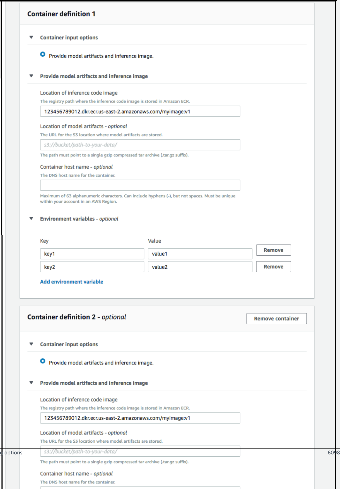

Hosting options
6098

## Page 128

Amazon SageMaker AI
Developer Guide

The MyInferencePipelineModel page summarizes the settings for the containers that provide
input for the model. If you provided the environment variables in a corresponding container
definition, SageMaker AI shows them in the Environment variables field.

Hosting options
6099

## Page 129

Amazon SageMaker AI
Developer Guide


Hosting options
6100

## Page 130

Amazon SageMaker AI
Developer Guide

Run Real-time Predictions with an Inference Pipeline

You can use trained models in an inference pipeline to make real-time predictions directly without
performing external preprocessing. When you configure the pipeline, you can choose to use the
built-in feature transformers already available in Amazon SageMaker AI. Or, you can implement
your own transformation logic using just a few lines of scikit-learn or Spark code.

MLeap, a serialization format and execution engine for machine learning pipelines, supports Spark,
scikit-learn, and TensorFlow for training pipelines and exporting them to a serialized pipeline called
an MLeap Bundle. You can deserialize Bundles back into Spark for batch-mode scoring or into the
MLeap runtime to power real-time API services.

The containers in a pipeline listen on the port specified in the SAGEMAKER_BIND_TO_PORT
environment variable (instead of 8080). When running in an inference pipeline, SageMaker AI
automatically provides this environment variable to containers. If this environment variable isn't
present, containers default to using port 8080. To indicate that your container complies with this
requirement, use the following command to add a label to your Dockerfile:

LABEL com.amazonaws.sagemaker.capabilities.accept-bind-to-port=true

If your container needs to listen on a second port, choose a port in the range specified by the

SAGEMAKER_SAFE_PORT_RANGE environment variable. Specify the value as an inclusive range in

the format "XXXX-YYYY", where XXXX and YYYY are multi-digit integers. SageMaker AI provides
this value automatically when you run the container in a multicontainer pipeline.

Note

To use custom Docker images in a pipeline that includes SageMaker AI built-in algorithms,
you need an Amazon Elastic Container Registry (Amazon ECR) policy. Your Amazon ECR
repository must grant SageMaker AI permission to pull the image. For more information,
see Troubleshoot Amazon ECR Permissions for Inference Pipelines.

Create and Deploy an Inference Pipeline Endpoint

The following code creates and deploys a real-time inference pipeline model with SparkML and
XGBoost models in series using the SageMaker AI SDK.

from sagemaker.model import Model

Hosting options
6101

## Page 131

Amazon SageMaker AI
Developer Guide

from sagemaker.pipeline_model import PipelineModel
from sagemaker.sparkml.model import SparkMLModel

sparkml_data = 's3://{}/{}/{}'.format(s3_model_bucket, s3_model_key_prefix,
'model.tar.gz')
sparkml_model = SparkMLModel(model_data=sparkml_data)
xgb_model = Model(model_data=xgb_model.model_data, image=training_image)

model_name = 'serial-inference-' + timestamp_prefix
endpoint_name = 'serial-inference-ep-' + timestamp_prefix
sm_model = PipelineModel(name=model_name, role=role, models=[sparkml_model, xgb_model])
sm_model.deploy(initial_instance_count=1, instance_type='ml.c4.xlarge',
endpoint_name=endpoint_name)

Request Real-Time Inference from an Inference Pipeline Endpoint

The following example shows how to make real-time predictions by calling an inference endpoint
and passing a request payload in JSON format:

import sagemaker
from sagemaker.predictor import json_serializer, json_deserializer, Predictor

payload = {
"input": [
{
"name": "Pclass",
"type": "float",
"val": "1.0"
},
{
"name": "Embarked",
"type": "string",
"val": "Q"
},
{
"name": "Age",
"type": "double",
"val": "48.0"
},
{
"name": "Fare",
"type": "double",
"val": "100.67"

Hosting options
6102

## Page 132

Amazon SageMaker AI
Developer Guide

},
{
"name": "SibSp",
"type": "double",
"val": "1.0"
},
{
"name": "Sex",
"type": "string",
"val": "male"
}
],
"output": {
"name": "features",
"type": "double",
"struct": "vector"
}

}

predictor = Predictor(endpoint=endpoint_name, sagemaker_session=sagemaker.Session(),
serializer=json_serializer,
content_type='text/csv', accept='application/json')

print(predictor.predict(payload))

The response you get from predictor.predict(payload) is the model's inference result.

Realtime inference pipeline example

You can run this example notebook using the SKLearn predictor that shows how to deploy an
endpoint, run an inference request, then deserialize the response. Find this notebook and more
examples in the Amazon SageMaker example GitHub repository.

Batch transforms with inference pipelines

To get inferences on an entire dataset you run a batch transform on a trained model. To run
inferences on a full dataset, you can use the same inference pipeline model created and deployed
to an endpoint for real-time processing in a batch transform job. To run a batch transform job
in a pipeline, you download the input data from Amazon S3 and send it in one or more HTTP
requests to the inference pipeline model. For an example that shows how to prepare data for
a batch transform, see "Section 2 - Preprocess the raw housing data using Scikit Learn" of the
Amazon SageMaker Multi-Model Endpoints using Linear Learner sample notebook. For information

Hosting options
6103

## Page 133

Amazon SageMaker AI
Developer Guide

about Amazon SageMaker AI batch transforms, see Batch transform for inference with Amazon
SageMaker AI.

Note

To use custom Docker images in a pipeline that includes Amazon SageMaker AI built-in
algorithms, you need an Amazon Elastic Container Registry (ECR) policy. Your Amazon ECR
repository must grant SageMaker AI permission to pull the image. For more information,
see Troubleshoot Amazon ECR Permissions for Inference Pipelines.

The following example shows how to run a transform job using the Amazon SageMaker Python

SDK. In this example, model_name is the inference pipeline that combines SparkML and XGBoost

models (created in previous examples). The Amazon S3 location specified by input_data_path
contains the input data, in CSV format, to be downloaded and sent to the Spark ML model. After

the transform job has finished, the Amazon S3 location specified by output_data_path contains
the output data returned by the XGBoost model in CSV format.

import sagemaker
input_data_path = 's3://{}/{}/{}'.format(default_bucket, 'key', 'file_name')
output_data_path = 's3://{}/{}'.format(default_bucket, 'key')
transform_job = sagemaker.transformer.Transformer(
model_name = model_name,
instance_count = 1,
instance_type = 'ml.m4.xlarge',
strategy = 'SingleRecord',
assemble_with = 'Line',
output_path = output_data_path,
base_transform_job_name='inference-pipelines-batch',
sagemaker_session=sagemaker.Session(),
accept = CONTENT_TYPE_CSV)
transform_job.transform(data = input_data_path,
content_type = CONTENT_TYPE_CSV,
split_type = 'Line')

Inference Pipeline Logs and Metrics

Monitoring is important for maintaining the reliability, availability, and performance of Amazon
SageMaker AI resources. To monitor and troubleshoot inference pipeline performance, use Amazon

Hosting options
6104

## Page 134

Amazon SageMaker AI
Developer Guide

CloudWatch logs and error messages. For information about the monitoring tools that SageMaker
AI provides, see Monitoring AWS resources in Amazon SageMaker AI.

Use Metrics to Monitor Multi-container Models

To monitor the multi-container models in Inference Pipelines, use Amazon CloudWatch.
CloudWatch collects raw data and processes it into readable, near real-time metrics. SageMaker AI

training jobs and endpoints write CloudWatch metrics and logs in the AWS/SageMaker namespace.

The following tables list the metrics and dimensions for the following:

• Endpoint invocations

• Training jobs, batch transform jobs, and endpoint instances

A dimension is a name/value pair that uniquely identifies a metric. You can assign up to 10
dimensions to a metric. For more information on monitoring with CloudWatch, see Amazon
SageMaker AI metrics in Amazon CloudWatch.

Endpoint Invocation Metrics

The AWS/SageMaker namespace includes the following request metrics from calls to

InvokeEndpoint.

Metrics are reported at a 1-minute intervals.

Metric
Description

Invocatio

The number of InvokeEndpoint  requests that the model returned

n4XXErrors

a 4xx HTTP response code for. For each 4xx response, SageMaker AI

sends a 1.

Units: None

Valid statistics: Average, Sum

Invocatio

The number of InvokeEndpoint  requests that the model returned

n5XXErrors

a 5xx HTTP response code for. For each 5xx response, SageMaker AI

sends a 1.

Units: None

Hosting options
6105

## Page 135

Amazon SageMaker AI
Developer Guide

Metric
Description

Valid statistics: Average, Sum

Invocations
The number of InvokeEndpoint  requests sent to a model
endpoint.

To get the total number of requests sent to a model endpoint, use the

Sum statistic.

Units: None

Valid statistics: Sum, Sample Count

The number of endpoint invocations sent to a model, normalized by

Invocatio

InstanceCount  in each ProductionVariant . SageMaker AI

nsPerInstance

sends 1/numberOfInstances  as the value for each request, where

numberOfInstances  is the number of active instances for the
ProductionVariant at the endpoint at the time of the request.

Units: None

Valid statistics: Sum

ModelLatency
The time the model or models took to respond. This includes the time
it took to send the request, to fetch the response from the model

container, and to complete the inference in the container. ModelLate

ncy  is the total time taken by all containers in an inference pipeline.

Units: Microseconds

Valid statistics: Average, Sum, Min, Max, Sample Count

Hosting options
6106

## Page 136

Amazon SageMaker AI
Developer Guide

Metric
Description

OverheadLatency
The time added to the time taken to respond to a client request by

SageMaker AI for overhead. OverheadLatency  is measured from the
time that SageMaker AI receives the request until it returns a response

to the client, minus the ModelLatency . Overhead latency can vary
depending on request and response payload sizes, request frequency
, and authentication or authorization of the request, among other
factors.

Units: Microseconds

Valid statistics: Average, Sum, Min, Max, Sample Count

The time it took for an Inference Pipelines container to respond as

Container

viewed from SageMaker AI. ContainerLatency  includes the time
it took to send the request, to fetch the response from the model's
container, and to complete inference in the container.

Latency

Units: Microseconds

Valid statistics: Average, Sum, Min, Max, Sample Count

Dimensions for Endpoint Invocation Metrics

Dimension
Description

EndpointName,

Filters endpoint invocation metrics for a ProductionVariant  at the
specified endpoint and for the specified variant.

VariantName,

ContainerName

For an inference pipeline endpoint, CloudWatch lists per-container latency metrics in your account
as Endpoint Container Metrics and Endpoint Variant Metrics in the SageMaker AI namespace, as

follows. The ContainerLatency metric appears only for inferences pipelines.

Hosting options
6107

## Page 137

Amazon SageMaker AI
Developer Guide

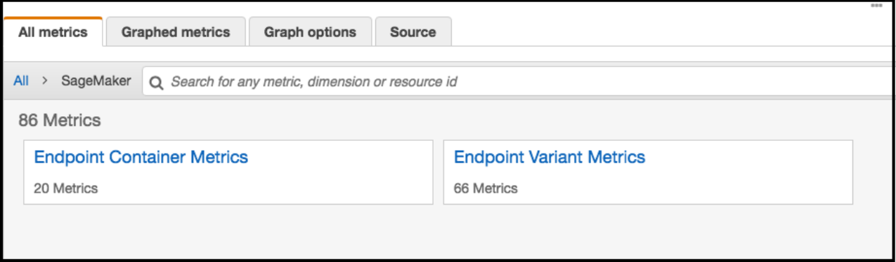

For each endpoint and each container, latency metrics display names for the container, endpoint,
variant, and metric.

Training Job, Batch Transform Job, and Endpoint Instance Metrics

The namespaces /aws/sagemaker/TrainingJobs, /aws/sagemaker/TransformJobs, and

/aws/sagemaker/Endpoints include the following metrics for training jobs and endpoint
instances.

Metrics are reported at a 1-minute intervals.

Metric
Description

CPUUtilization
The percentage of CPU units that are used by the containers running on
an instance. The value ranges from 0% to 100%, and is multiplied by

the number of CPUs. For example, if there are four CPUs, CPUUtiliz

ation  can range from 0% to 400%.

For training jobs, CPUUtilization  is the CPU utilization of the
algorithm container running on the instance.

Hosting options
6108

## Page 138

Amazon SageMaker AI
Developer Guide

Metric
Description

For batch transform jobs, CPUUtilization  is the CPU utilization of
the transform container running on the instance.

For multi-container models, CPUUtilization  is the sum of CPU
utilization by all containers running on the instance.

For endpoint variants, CPUUtilization  is the sum of CPU utilization
by all of the containers running on the instance.

Units: Percent

The percentage of memory that is used by the containers running on
an instance. This value ranges from 0% to 100%.

MemoryUti

lization

For training jobs, MemoryUtilization  is the memory used by the
algorithm container running on the instance.

For batch transform jobs, MemoryUtilization  is the memory used
by the transform container running on the instance.

For multi-container models, MemoryUtilization  is the sum of
memory used by all containers running on the instance.

For endpoint variants,  MemoryUtilization  is the sum of memory
used by all of the containers running on the instance.

Units: Percent

Hosting options
6109

## Page 139

Amazon SageMaker AI
Developer Guide

Metric
Description

GPUUtilization
The percentage of GPU units that are used by the containers running

on an instance. GPUUtilization  ranges from 0% to 100% and is
multiplied by the number of GPUs. For example, if there are four GPUs,

GPUUtilization  can range from 0% to 400%.

For training jobs, GPUUtilization  is the GPU used by the algorithm
container running on the instance.

For batch transform jobs, GPUUtilization  is the GPU used by the
transform container running on the instance.

For multi-container models, GPUUtilization  is the sum of GPU
used by all containers running on the instance.

For endpoint variants, GPUUtilization  is the sum of GPU used by

all of the containers running on the instance.

Units: Percent

The percentage of GPU memory used by the containers running on
an instance. GPUMemoryUtilization ranges from 0% to 100% and is
multiplied by the number of GPUs. For example, if there are four GPUs,

GPUMemory

Utilization

GPUMemoryUtilization
can range from 0% to 400%.

For training jobs, GPUMemoryUtilization
is the GPU memory
used by the algorithm container running on the instance.

For batch transform jobs, GPUMemoryUtilization
is the GPU
memory used by the transform container running on the instance.

For multi-container models, GPUMemoryUtilization
is sum of
GPU used by all containers running on the instance.

For endpoint variants, GPUMemoryUtilization
is the sum of the
GPU memory used by all of the containers running on the instance.

Units: Percent

Hosting options
6110

## Page 140

Amazon SageMaker AI
Developer Guide

Metric
Description

DiskUtilization
The percentage of disk space used by the containers running on an
instance. DiskUtilization ranges from 0% to 100%. This metric is not
supported for batch transform jobs.

For training jobs, DiskUtilization  is the disk space used by the
algorithm container running on the instance.

For endpoint variants, DiskUtilization  is the sum of the disk
space used by all of the provided containers running on the instance.

Units: Percent

Dimensions for Training Job, Batch Transform Job, and Endpoint Instance Metrics

Dimension
Description

Host
For training jobs, Host has the format [training-job-name]/

algo-[instance-number-in-cluster]
. Use this dimension
to filter instance metrics for the specified training job and instance.

This dimension format is present only in the /aws/sagemaker/Tra

iningJobs
namespace.

For batch transform jobs, Host has the format [transform-job-

name]/[instance-id]
. Use this dimension to filter instance
metrics for the specified batch transform job and instance. This

dimension format is present only in the /aws/sagemaker/Tra

nsformJobs
namespace.

For endpoints, Host has the format [endpoint-name]/

[ production-variant-name ]/[instance-id]
. Use this
dimension to filter instance metrics for the specified endpoint, variant,

and instance. This dimension format is present only in the /aws/sage

maker/Endpoints
namespace.

Hosting options
6111

## Page 141

Amazon SageMaker AI
Developer Guide

To help you debug your training jobs, endpoints, and notebook instance lifecycle configurations,
SageMaker AI also sends anything an algorithm container, a model container, or a notebook

instance lifecycle configuration sends to stdout or stderr to Amazon CloudWatch Logs. You can
use this information for debugging and to analyze progress.

Use Logs to Monitor an Inference Pipeline

The following table lists the log groups and log streams SageMaker AI. sends to Amazon
CloudWatch

A log stream is a sequence of log events that share the same source. Each separate source of logs
into CloudWatch makes up a separate log stream. A log group is a group of log streams that share
the same retention, monitoring, and access control settings.

Logs

Log Group Name
Log Stream Name

/aws/sagemaker/

[training-job-name]/algo-[instance-number-in-

TrainingJobs

cluster]-[epoch_timestamp]

/aws/sagemaker/

[production-variant-name]/[instance-id]

Endpoints/[E

[production-variant-name]/[instance-id]

ndpointName]

[production-variant-name]/[instance-id]/[cont

ainer-name provided in the SageMaker AI model] (For

Inference Pipelines)  For Inference Pipelines logs, if you don't
provide container names, CloudWatch uses **container-1, container
-2**, and so on, in the order that containers are provided in the model.

/aws/sagemaker/

[notebook-instance-name]/[LifecycleConfigHook]

NotebookInst

ances

/aws/sagemaker/

[transform-job-name]/[instance-id]-[epoch_tim

TransformJobs

estamp]

[transform-job-name]/[instance-id]-[epoch_tim

estamp]/data-log

Hosting options
6112

## Page 142

Amazon SageMaker AI
Developer Guide

Log Group Name
Log Stream Name

[transform-job-name]/[instance-id]-[epoch_tim

estamp]/[container-name provided in the SageMaker

AI model] (For Inference Pipelines)  For Inference Pipelines
logs, if you don't provide container names, CloudWatch uses **contain
er-1, container-2**, and so on, in the order that containers are provided
in the model.

Note

SageMaker AI creates the /aws/sagemaker/NotebookInstances log group when
you create a notebook instance with a lifecycle configuration. For more information, see
Customization of a SageMaker notebook instance using an LCC script.

For more information about SageMaker AI logging, see CloudWatch Logs for Amazon SageMaker
AI.

Troubleshoot Inference Pipelines

To troubleshoot inference pipeline issues, use CloudWatch logs and error messages. If you are using
custom Docker images in a pipeline that includes Amazon SageMaker AI built-in algorithms, you
might also encounter permissions problems. To grant the required permissions, create an Amazon
Elastic Container Registry (Amazon ECR) policy.

Topics

• Troubleshoot Amazon ECR Permissions for Inference Pipelines

• Use CloudWatch Logs to Troubleshoot SageMaker AI Inference Pipelines

• Use Error Messages to Troubleshoot Inference Pipelines

Troubleshoot Amazon ECR Permissions for Inference Pipelines

When you use custom Docker images in a pipeline that includes SageMaker AI built-in algorithms,
you need an Amazon ECR policy. The policy allows your Amazon ECR repository to grant
permission for SageMaker AI to pull the image. The policy must add the following permissions:

Hosting options
6113

## Page 143

Amazon SageMaker AI
Developer Guide

JSON

{
"Version":"2012-10-17",
"Statement": [
{
"Sid": "allowSageMakerToPull",
"Effect": "Allow",
"Principal": {
"Service": "sagemaker.amazonaws.com"
},
"Action": [
"ecr:GetDownloadUrlForLayer",
"ecr:BatchGetImage",
"ecr:BatchCheckLayerAvailability"
],

"Resource": "*"
}
]
}

Use CloudWatch Logs to Troubleshoot SageMaker AI Inference Pipelines

SageMaker AI publishes the container logs for endpoints that deploy an inference pipeline to
Amazon CloudWatch at the following path for each container.

/aws/sagemaker/Endpoints/{EndpointName}/{Variant}/{InstanceId}/{ContainerHostname}

For example, logs for this endpoint are published to the following log groups and streams:

EndpointName: MyInferencePipelinesEndpoint
Variant: MyInferencePipelinesVariant
InstanceId: i-0179208609ff7e488
ContainerHostname: MyContainerName1 and MyContainerName2

logGroup: /aws/sagemaker/Endpoints/MyInferencePipelinesEndpoint
logStream: MyInferencePipelinesVariant/i-0179208609ff7e488/MyContainerName1
logStream: MyInferencePipelinesVariant/i-0179208609ff7e488/MyContainerName2

Hosting options
6114

## Page 144

Amazon SageMaker AI
Developer Guide

A log stream is a sequence of log events that share the same source. Each separate source of logs
into CloudWatch makes up a separate log stream. A log group is a group of log streams that share
the same retention, monitoring, and access control settings.

To see the log groups and streams

1.
Open the CloudWatch console at https://console.aws.amazon.com/cloudwatch/.

2.
In the navigation page, choose Logs.

3.
In Log Groups. filter on MyInferencePipelinesEndpoint:

4.
To see the log streams, on the CloudWatch Log Groups page, choose

MyInferencePipelinesEndpoint, and then Search Log Group.

For a list of the logs that SageMaker AI publishes, see Inference Pipeline Logs and Metrics.

Use Error Messages to Troubleshoot Inference Pipelines

The inference pipeline error messages indicate which containers failed.

If an error occurs while SageMaker AI is invoking an endpoint, the service returns a ModelError
(error code 424), which indicates which container failed. If the request payload (the response from
the previous container) exceeds the limit of 5 MB, SageMaker AI provides a detailed error message,
such as:

Received response from MyContainerName1 with status code 200. However, the request payload
from MyContainerName1 to MyContainerName2 is 6000000 bytes, which has exceeded the
maximum limit of 5 MB.

Hosting options
6115

## Page 145

Amazon SageMaker AI
Developer Guide

If a container fails the ping health check while SageMaker AI is creating an endpoint, it returns a

ClientError and indicates all of the containers that failed the ping check in the last health check.

Delete Endpoints and Resources

Delete endpoints to stop incurring charges.

Delete Endpoint

Delete your endpoint programmatically using AWS SDK for Python (Boto3), with the AWS CLI, or
interactively using the SageMaker AI console.

SageMaker AI frees up all of the resources that were deployed when the endpoint was created.
Deleting an endpoint will not delete the endpoint configuration or the SageMaker AI model. See
Delete Endpoint Configuration and Delete Model for information on how to delete your endpoint
configuration and SageMaker AI model.

AWS SDK for Python (Boto3)

Use the DeleteEndpoint API to delete your endpoint. Specify the name of your endpoint for

the EndpointName field.

import boto3

# Specify your AWS Region
aws_region='<aws_region>'

# Specify the name of your endpoint
endpoint_name='<endpoint_name>'

# Create a low-level SageMaker service client.
sagemaker_client = boto3.client('sagemaker', region_name=aws_region)

# Delete endpoint
sagemaker_client.delete_endpoint(EndpointName=endpoint_name)

AWS CLI

Use the delete-endpoint command to delete your endpoint. Specify the name of your

endpoint for the endpoint-name flag.

aws sagemaker delete-endpoint --endpoint-name <endpoint-name>

Hosting options
6116

## Page 146

Amazon SageMaker AI
Developer Guide

SageMaker AI Console

Delete your endpoint interactively with the SageMaker AI console.

1.
In the SageMaker AI console at https://console.aws.amazon.com/sagemaker/ navigation

menu, choose Inference.

2.
Choose Endpoints from the drop down menu. A list of endpoints created in you AWS
account will appear by name, Amazon Resource Name (ARN), creation time, status, and a
time stamp of when the endpoint was last updated.

3.
Select the endpoint you want to delete.

4.
Select the Actions dropdown button in the top right corner.

5.
Choose Delete.

Delete Endpoint Configuration

Delete your endpoint configuration programmaticially using AWS SDK for Python (Boto3), with the
AWS CLI, or interactively using the SageMaker AI console. Deleting an endpoint configuration does
not delete endpoints created using this configuration. See Delete Endpoint for information on how
to delete your endpoint.

Do not delete an endpoint configuration in use by an endpoint that is live or while the endpoint is
being updated or created. You might lose visibility into the instance type the endpoint is using if
you delete the endpoint configuration of an endpoint that is active or being created or updated.

AWS SDK for Python (Boto3)

Use the DeleteEndpointConfig API to delete your endpoint. Specify the name of your

endpoint configuration for the EndpointConfigName field.

import boto3

# Specify your AWS Region
aws_region='<aws_region>'

# Specify the name of your endpoint configuration
endpoint_config_name='<endpoint_name>'

# Create a low-level SageMaker service client.
sagemaker_client = boto3.client('sagemaker', region_name=aws_region)

Hosting options
6117

## Page 147

Amazon SageMaker AI
Developer Guide

# Delete endpoint configuration
sagemaker_client.delete_endpoint_config(EndpointConfigName=endpoint_config_name)

You can optionally use the DescribeEndpointConfig API to return information about the
name of the your deployed models (production variants) such as the name of your model and
the name of the endpoint configuration associated with that deployed model. Provide the name

of your endpoint for the EndpointConfigName field.

# Specify the name of your endpoint
endpoint_name='<endpoint_name>'

# Create a low-level SageMaker service client.
sagemaker_client = boto3.client('sagemaker', region_name=aws_region)

# Store DescribeEndpointConfig response into a variable that we can index in the
next step.
response =
sagemaker_client.describe_endpoint_config(EndpointConfigName=endpoint_name)

# Delete endpoint
endpoint_config_name = response['ProductionVariants'][0]['EndpointConfigName']
# Delete endpoint configuration
sagemaker_client.delete_endpoint_config(EndpointConfigName=endpoint_config_name)

For more information about other response elements returned by DescribeEndpointConfig,

see DescribeEndpointConfig in the SageMaker API Reference guide.

AWS CLI

Use the delete-endpoint-config command to delete your endpoint configuration. Specify

the name of your endpoint configuration for the endpoint-config-name flag.

aws sagemaker delete-endpoint-config \
--endpoint-config-name <endpoint-config-name>

You can optionally use the describe-endpoint-config command to return information
about the name of the your deployed models (production variants) such as the name of your

Hosting options
6118

## Page 148

Amazon SageMaker AI
Developer Guide

model and the name of the endpoint configuration associated with that deployed model.

Provide the name of your endpoint for the endpoint-config-name flag.

aws sagemaker describe-endpoint-config --endpoint-config-name <endpoint-config-name>

This will return a JSON response. You can copy and paste, use a JSON parser, or use a tool built
for JSON parsing to obtain the endpoint configuration name associated with that endpoint.

SageMaker AI Console

Delete your endpoint configuration interactively with the SageMaker AI console.

1.
In the SageMaker AI console at https://console.aws.amazon.com/sagemaker/ navigation
menu, choose Inference.

2.
Choose Endpoint configurations from the dropdown menu. A list of endpoint
configurations created in you AWS account will appear by name, Amazon Resource Name
(ARN), and creation time.

3.
Select the endpoint configuration you want to delete.

4.
Select the Actions dropdown button in the top right corner.

5.
Choose Delete.

Delete Model

Delete your SageMaker AI model programmaticially using AWS SDK for Python (Boto3), with the
AWS CLI, or interactively using the SageMaker AI console. Deleting a SageMaker AI model only
deletes the model entry that was created in SageMaker AI. Deleting a model does not delete model
artifacts, inference code, or the IAM role that you specified when creating the model.

AWS SDK for Python (Boto3)

Use the DeleteModel API to delete your SageMaker AI model. Specify the name of your model

for the ModelName field.

import boto3

# Specify your AWS Region
aws_region='<aws_region>'

Hosting options
6119

## Page 149

Amazon SageMaker AI
Developer Guide

# Specify the name of your endpoint configuration
model_name='<model_name>'

# Create a low-level SageMaker service client.
sagemaker_client = boto3.client('sagemaker', region_name=aws_region)

# Delete model
sagemaker_client.delete_model(ModelName=model_name)

You can optionally use the DescribeEndpointConfig API to return information about the
name of the your deployed models (production variants) such as the name of your model and
the name of the endpoint configuration associated with that deployed model. Provide the name

of your endpoint for the EndpointConfigName field.

# Specify the name of your endpoint
endpoint_name='<endpoint_name>'

# Create a low-level SageMaker service client.
sagemaker_client = boto3.client('sagemaker', region_name=aws_region)

# Store DescribeEndpointConfig response into a variable that we can index in the
next step.
response =
sagemaker_client.describe_endpoint_config(EndpointConfigName=endpoint_name)

# Delete endpoint
model_name = response['ProductionVariants'][0]['ModelName']
sagemaker_client.delete_model(ModelName=model_name)

For more information about other response elements returned by DescribeEndpointConfig,

see DescribeEndpointConfig in the SageMaker API Reference guide.

AWS CLI

Use the delete-model command to delete your SageMaker AI model. Specify the name of

your model for the model-name flag.

aws sagemaker delete-model \
--model-name <model-name>

Hosting options
6120

## Page 150

Amazon SageMaker AI
Developer Guide

You can optionally use the describe-endpoint-config command to return information
about the name of the your deployed models (production variants) such as the name of your
model and the name of the endpoint configuration associated with that deployed model.

Provide the name of your endpoint for the endpoint-config-name flag.

aws sagemaker describe-endpoint-config --endpoint-config-name <endpoint-config-name>

This will return a JSON response. You can copy and paste, use a JSON parser, or use a tool built
for JSON parsing to obtain the name of the model associated with that endpoint.

SageMaker AI Console

Delete your SageMaker AI model interactively with the SageMaker AI console.

1.
In the SageMaker AI console at https://console.aws.amazon.com/sagemaker/ navigation
menu, choose Inference.

2.
Choose Models from the dropdown menu. A list of models created in you AWS account will
appear by name, Amazon Resource Name (ARN), and creation time.

3.
Select the model you want to delete.

4.
Select the Actions dropdown button in the top right corner.

5.
Choose Delete.

Automatic scaling of Amazon SageMaker AI models

Amazon SageMaker AI supports automatic scaling (auto scaling) for your hosted models. Auto
scaling dynamically adjusts the number of instances provisioned for a model in response to
changes in your workload. When the workload increases, auto scaling brings more instances online.
When the workload decreases, auto scaling removes unnecessary instances so that you don't pay
for provisioned instances that you aren't using.

Topics

• Auto scaling policy overview

• Auto scaling prerequisites

• Configure model auto scaling with the console

• Register a model

• Define a scaling policy

Automatic scaling
6121

## Page 151

Amazon SageMaker AI
Developer Guide

• Apply a scaling policy

• Instructions for editing a scaling policy

• Temporarily turn off scaling policies

• Delete a scaling policy

• Check the status of a scaling activity by describing scaling activities

• Scale an endpoint to zero instances

• Load testing your auto scaling configuration

• Use CloudFormation to create a scaling policy

• Update endpoints that use auto scaling

• Delete endpoints configured for auto scaling

Auto scaling policy overview

To use auto scaling, you define a scaling policy that adds and removes the number of instances for
your production variant in response to actual workloads.

To automatically scale as workload changes occur, you have two options: target tracking and step
scaling policies.

In most cases, we recommend using target tracking scaling policies. With target tracking, you
choose an Amazon CloudWatch metric and target value. Auto scaling creates and manages the
CloudWatch alarms for the scaling policy and calculates the scaling adjustment based on the
metric and the target value. The policy adds and removes the number of instances as required
to keep the metric at, or close to, the specified target value. For example, a scaling policy that

uses the predefined InvocationsPerInstance metric with a target value of 70 can keep

InvocationsPerInstance at, or close to 70. For more information, see Target tracking scaling
policies in the Application Auto Scaling User Guide.

You can use step scaling when you require an advanced configuration, such as specifying how many
instances to deploy under what conditions. For example, you must use step scaling if you want to
enable an endpoint to scale out from zero active instances. For an overview of step scaling policies
and how they work, see Step scaling policies in the Application Auto Scaling User Guide.

To create a target tracking scaling policy, you specify the following:

• Metric — The CloudWatch metric to track, such as average number of invocations per instance.

Automatic scaling
6122

## Page 152

Amazon SageMaker AI
Developer Guide

• Target value — The target value for the metric, such as 70 invocations per instance per minute.

You can create target tracking scaling policies with either predefined metrics or custom metrics. A
predefined metric is defined in an enumeration so that you can specify it by name in code or use it
in the SageMaker AI console. Alternatively, you can use either the AWS CLI or the Application Auto
Scaling API to apply a target tracking scaling policy based on a predefined or custom metric.

Note that scaling activities are performed with cooldown periods between them to prevent rapid
fluctuations in capacity. You can optionally configure the cooldown periods for your scaling policy.

For more information about the key concepts of auto scaling, see the following section.

Schedule-based scaling

You can also create scheduled actions to perform scaling activities at specific times. You can create
scheduled actions that scale one time only or that scale on a recurring schedule. After a scheduled
action runs, your scaling policy can continue to make decisions about whether to scale dynamically
as workload changes occur. Scheduled scaling can be managed only from the AWS CLI or the
Application Auto Scaling API. For more information, see Scheduled scaling in the Application Auto
Scaling User Guide.

Minimum and maximum scaling limits

When configuring auto scaling, you must specify your scaling limits before creating a scaling policy.
You set limits separately for the minimum and maximum values.

The minimum value must be at least 1, and equal to or less than the value specified for the
maximum value.

The maximum value must be equal to or greater than the value specified for the minimum value.
SageMaker AI auto scaling does not enforce a limit for this value.

To determine the scaling limits that you need for typical traffic, test your auto scaling configuration
with the expected rate of traffic to your model.

If a variant’s traffic becomes zero, SageMaker AI automatically scales in to the minimum number of
instances specified. In this case, SageMaker AI emits metrics with a value of zero.

There are three options for specifying the minimum and maximum capacity:

1. Use the console to update the Minimum instance count and Maximum instance count settings.

Automatic scaling
6123

## Page 153

Amazon SageMaker AI
Developer Guide

2. Use the AWS CLI and include the --min-capacity and --max-capacity options when

running the register-scalable-target command.

3. Call the RegisterScalableTarget API and specify the MinCapacity and MaxCapacity

parameters.

Tip

You can manually scale out by increasing the minimum value, or manually scale in by
decreasing the maximum value.

Cooldown period

A cooldown period is used to protect against over-scaling when your model is scaling in (reducing
capacity) or scaling out (increasing capacity). It does this by slowing down subsequent scaling
activities until the period expires. Specifically, it blocks the deletion of instances for scale-in
requests, and limits the creation of instances for scale-out requests. For more information, see
Define cooldown periods in the Application Auto Scaling User Guide.

You configure the cooldown period in your scaling policy.

If you don't specify a scale-in or a scale-out cooldown period, your scaling policy uses the default,
which is 300 seconds for each.

If instances are being added or removed too quickly when you test your scaling configuration,
consider increasing this value. You might see this behavior if the traffic to your model has a lot of
spikes, or if you have multiple scaling policies defined for a variant.

If instances are not being added quickly enough to address increased traffic, consider decreasing
this value.

Related resources

For more information about configuring auto scaling, see the following resources:

• application-autoscaling section of the AWS CLI Command Reference

• Application Auto Scaling API Reference

• Application Auto Scaling User Guide

Automatic scaling
6124

## Page 154

Amazon SageMaker AI
Developer Guide

Note

SageMaker AI recently introduced new inference capabilities built on real-time inference
endpoints. You create a SageMaker AI endpoint with an endpoint configuration that defines
the instance type and initial instance count for the endpoint. Then, create an inference
component, which is a SageMaker AI hosting object that you can use to deploy a model
to an endpoint. For information about scaling inference components, see SageMaker AI
adds new inference capabilities to help reduce foundation model deployment costs and
latency and Reduce model deployment costs by 50% on average using the latest features
of SageMaker AI on the AWS Blog.

Auto scaling prerequisites

Before you can use auto scaling, you must have already created an Amazon SageMaker AI model
endpoint. You can have multiple model versions for the same endpoint. Each model is referred
to as a production (model) variant. For more information about deploying a model endpoint, see
Deploy the Model to SageMaker AI Hosting Services.

To activate auto scaling for a model, you can use the SageMaker AI console, the AWS Command
Line Interface (AWS CLI), or an AWS SDK through the Application Auto Scaling API.

• If this is your first time configuring scaling for a model, we recommend you Configure model
auto scaling with the console.

• When using the AWS CLI or the Application Auto Scaling API, the flow is to register the model
as a scalable target, define the scaling policy, and then apply it. On the SageMaker AI console,
under Inference in the navigation pane, choose Endpoints. Find your model's endpoint name
and then choose it to find the variant name. You must specify both the endpoint name and the
variant name to activate auto scaling for a model.

Auto scaling is made possible by a combination of the Amazon SageMaker AI, Amazon CloudWatch,
and Application Auto Scaling APIs. For information about the minimum required permissions, see
Application Auto Scaling identity-based policy examples in the Application Auto Scaling User Guide.

The SagemakerFullAccessPolicy IAM policy has all the IAM permissions required to perform
auto scaling. For more information about SageMaker AI IAM permissions, see How to use
SageMaker AI execution roles.

Automatic scaling
6125

## Page 155

Amazon SageMaker AI
Developer Guide

If you manage your own permission policy, you must include the following permissions:

JSON

{
"Version":"2012-10-17",
"Statement": [
{
"Effect": "Allow",
"Action": [
"sagemaker:DescribeEndpoint",
"sagemaker:DescribeEndpointConfig",
"sagemaker:UpdateEndpointWeightsAndCapacities"
],
"Resource": "*"
},

{
"Effect": "Allow",
"Action": [
"application-autoscaling:*"
],
"Resource": "*"
},
{
"Effect": "Allow",
"Action": "iam:CreateServiceLinkedRole",
"Resource": "arn:aws:iam::*:role/aws-service-
role/sagemaker.application-autoscaling.amazonaws.com/
AWSServiceRoleForApplicationAutoScaling_SageMakerEndpoint",
"Condition": {
"StringLike": { "iam:AWSServiceName": "sagemaker.application-
autoscaling.amazonaws.com" }
}
},
{
"Effect": "Allow",
"Action": [
"cloudwatch:PutMetricAlarm",
"cloudwatch:DescribeAlarms",
"cloudwatch:DeleteAlarms"
],
"Resource": "*"
}

Automatic scaling
6126

## Page 156

Amazon SageMaker AI
Developer Guide

]
}

Service-linked role

Auto scaling uses the AWSServiceRoleForApplicationAutoScaling_SageMakerEndpoint
service-linked role. This service-linked role grants Application Auto Scaling permission to describe
the alarms for your policies, to monitor current capacity levels, and to scale the target resource.
This role is created for you automatically. For automatic role creation to succeed, you must have

permission for the iam:CreateServiceLinkedRole action. For more information, see Service-
linked roles in the Application Auto Scaling User Guide.

Configure model auto scaling with the console

To configure auto scaling for a model (console)

1.
Open the Amazon SageMaker AI console at https://console.aws.amazon.com/sagemaker/.

2.
On the navigation pane, choose Inference, and then choose Endpoints.

3.
Choose your endpoint, and then for Endpoint runtime settings, choose the variant.

4.
Choose Configure auto scaling.

5.
On the Configure variant automatic scaling page, for Variant automatic scaling, do the
following:

a.
For Minimum instance count, type the minimum number of instances that you want the
scaling policy to maintain. At least 1 instance is required.

b.
For Maximum instance count, type the maximum number of instances that you want the
scaling policy to maintain.

6.
For Built-in scaling policy, do the following:

a.
For the Target metric, SageMakerVariantInvocationsPerInstance is automatically
selected for the metric and cannot be changed.

b.
For the Target value, type the average number of invocations per instance per minute for
the model. To determine this value, follow the guidelines in Load testing.

c.
(Optional) For Scale-in cool down (seconds) and Scale-out cool down (seconds), enter
the amount of time, in seconds, for each cool down period.

Automatic scaling
6127

## Page 157

Amazon SageMaker AI
Developer Guide

d.
(Optional) Select Disable scale in if you don’t want auto scaling to terminate instances
when traffic decreases.

7.
Choose Save.

This procedure registers a model as a scalable target with Application Auto Scaling. When you
register a model, Application Auto Scaling performs validation checks to ensure the following:

• The model exists

• The permissions are sufficient

• You aren't registering a variant with an instance that is a burstable performance instance such as
T2

Note

SageMaker AI doesn't support auto scaling for burstable instances such as T2, because
they already allow for increased capacity under increased workloads. For information
about burstable performance instances, see Amazon EC2 instance types.

Register a model

Before you add a scaling policy to your model, you first must register your model for auto scaling
and define the scaling limits for the model.

The following procedures cover how to register a model (production variant) for auto scaling using
the AWS Command Line Interface (AWS CLI) or Application Auto Scaling API.

Topics

• Register a model (AWS CLI)

• Register a model (Application Auto Scaling API)

Register a model (AWS CLI)

To register your production variant, use the register-scalable-target command with the following
parameters:

• --service-namespace—Set this value to sagemaker.

Automatic scaling
6128

## Page 158

Amazon SageMaker AI
Developer Guide

• --resource-id—The resource identifier for the model (specifically, the production variant).

For this parameter, the resource type is endpoint and the unique identifier is the name of the

production variant. For example, endpoint/my-endpoint/variant/my-variant.

• --scalable-dimension—Set this value to sagemaker:variant:DesiredInstanceCount.

• --min-capacity—The minimum number of instances. This value must be set to at least 1 and

must be equal to or less than the value specified for max-capacity.

• --max-capacity—The maximum number of instances. This value must be set to at least 1 and

must be equal to or greater than the value specified for min-capacity.

Example

The following example shows how to register a variant named my-variant, running on the my-

endpoint endpoint, that can be dynamically scaled to have one to eight instances.

aws application-autoscaling register-scalable-target \
--service-namespace sagemaker \
--resource-id endpoint/my-endpoint/variant/my-variant \
--scalable-dimension sagemaker:variant:DesiredInstanceCount \
--min-capacity 1 \
--max-capacity 8

Register a model (Application Auto Scaling API)

To register your model with Application Auto Scaling, use the RegisterScalableTarget Application
Auto Scaling API action with the following parameters:

• ServiceNamespace—Set this value to sagemaker.

• ResourceID—The resource identifier for the production variant. For this parameter, the

resource type is endpoint and the unique identifier is the name of the variant. For example

endpoint/my-endpoint/variant/my-variant.

• ScalableDimension—Set this value to sagemaker:variant:DesiredInstanceCount.

• MinCapacity—The minimum number of instances. This value must be set to at least 1 and

must be equal to or less than the value specified for MaxCapacity.

• MaxCapacity—The maximum number of instances. This value must be set to at least 1 and

must be equal to or greater than the value specified for MinCapacity.

Automatic scaling
6129

## Page 159

Amazon SageMaker AI
Developer Guide

Example

The following example shows how to register a variant named my-variant, running on the my-

endpoint endpoint, that can be dynamically scaled to use one to eight instances.

POST / HTTP/1.1
Host: application-autoscaling.us-east-2.amazonaws.com
Accept-Encoding: identity
X-Amz-Target: AnyScaleFrontendService.RegisterScalableTarget
X-Amz-Date: 20230506T182145Z
User-Agent: aws-cli/2.0.0 Python/3.7.5 Windows/10 botocore/2.0.0dev4
Content-Type: application/x-amz-json-1.1
Authorization: AUTHPARAMS

{
"ServiceNamespace": "sagemaker",
"ResourceId": "endpoint/my-endpoint/variant/my-variant",
"ScalableDimension": "sagemaker:variant:DesiredInstanceCount",
"MinCapacity": 1,
"MaxCapacity": 8
}

Define a scaling policy

Before you add a scaling policy to your model, save your policy configuration as a JSON block in a
text file. You use that text file when invoking the AWS Command Line Interface (AWS CLI) or the
Application Auto Scaling API. You can optimize scaling by choosing an appropriate CloudWatch
metric. However, before using a custom metric in production, you must test auto scaling with your
custom metric.

Topics

• Specify a predefined metric (CloudWatch metric: InvocationsPerInstance)

• Specify a high-resolution predefined metric (CloudWatch metrics: ConcurrentRequestsPerModel
and ConcurrentRequestsPerCopy)

• Define a custom metric (CloudWatch metric: CPUUtilization)

• Define a custom metric (CloudWatch metric: ExplanationsPerInstance)

• Specify cooldown periods

This section shows you example policy configurations for target tracking scaling policies.

Automatic scaling
6130

## Page 160

Amazon SageMaker AI
Developer Guide

Specify a predefined metric (CloudWatch metric: InvocationsPerInstance)

Example

The following is an example target tracking policy configuration for a variant that keeps the

average invocations per instance at 70. Save this configuration in a file named config.json.

{
"TargetValue": 70.0,
"PredefinedMetricSpecification":
{
"PredefinedMetricType": "SageMakerVariantInvocationsPerInstance"
}
}

For more information, see TargetTrackingScalingPolicyConfiguration in the Application Auto Scaling
API Reference.

Specify a high-resolution predefined metric (CloudWatch metrics:
ConcurrentRequestsPerModel and ConcurrentRequestsPerCopy)

With the following high-resolution CloudWatch metrics, you can set scaling policies for the volume
of concurrent requests that your models receive:

ConcurrentRequestsPerModel

The number of concurrent requests being received by a model container.

ConcurrentRequestsPerCopy

The number of concurrent requests being received by an inference component.

These metrics track the number of simultaneous requests that your model containers handle,
including the requests that are queued inside the containers. For models that send their inference
response as a stream of tokens, these metrics track each request until the model sends the last
token for the request.

As high-resolution metrics, they emit data more frequently than standard CloudWatch metrics.

Standard metrics, such as the InvocationsPerInstance metric, emit data once every minute.
However, these high-resolution metrics emit data every 10 seconds. Therefore, as the concurrent
traffic to your models increases, your policy reacts by scaling out much more quickly than it would

Automatic scaling
6131

## Page 161

Amazon SageMaker AI
Developer Guide

for standard metrics. However, as the traffic to your models decreases, your policy scales in at the
same speed as it would for standard metrics.

The following is an example target tracking policy configuration that adds instances if the number

of concurrent requests per model exceeds 5. Save this configuration in a file named config.json.

{
"TargetValue": 5.0,
"PredefinedMetricSpecification":
{
"PredefinedMetricType":
"SageMakerVariantConcurrentRequestsPerModelHighResolution"
}
}

If you use inference components to deploy multiple models to the same endpoint,

you can create an equivalent policy. In that case, set PredefinedMetricType to

SageMakerInferenceComponentConcurrentRequestsPerCopyHighResolution.

For more information, see TargetTrackingScalingPolicyConfiguration in the Application Auto Scaling
API Reference.

Define a custom metric (CloudWatch metric: CPUUtilization)

To create a target tracking scaling policy with a custom metric, specify the metric's name,
namespace, unit, statistic, and zero or more dimensions. A dimension consists of a dimension name
and a dimension value. You can use any production variant metric that changes in proportion to
capacity.

Example

The following example configuration shows a target tracking scaling policy with a custom metric.
The policy scales the variant based on an average CPU utilization of 50 percent across all instances.

Save this configuration in a file named config.json.

{
"TargetValue": 50.0,
"CustomizedMetricSpecification":
{
"MetricName": "CPUUtilization",
"Namespace": "/aws/sagemaker/Endpoints",

Automatic scaling
6132

## Page 162

Amazon SageMaker AI
Developer Guide

"Dimensions": [
{"Name": "EndpointName", "Value": "my-endpoint" },
{"Name": "VariantName","Value": "my-variant"}
],
"Statistic": "Average",
"Unit": "Percent"
}
}

For more information, see CustomizedMetricSpecification in the Application Auto Scaling API
Reference.

Define a custom metric (CloudWatch metric: ExplanationsPerInstance)

When the endpoint has online explainability activated, it emits a ExplanationsPerInstance
metric that outputs the average number of records explained per minute, per instance, for a

variant. The resource utilization of explaining records can be more different than that of predicting
records. We strongly recommend using this metric for target tracking scaling of endpoints with
online explainability activated.

You can create multiple target tracking policies for a scalable target. Consider adding the

InvocationsPerInstance policy from the Specify a predefined metric (CloudWatch

metric: InvocationsPerInstance) section (in addition to the ExplanationsPerInstance
policy). If most invocations don't return an explanation because of the threshold

value set in the EnableExplanations parameter, then the endpoint can choose the

InvocationsPerInstance policy. If there is a large number of explanations, the endpoint can

use the ExplanationsPerInstance policy.

Example

The following example configuration shows a target tracking scaling policy with a custom
metric. The policy scale adjusts the number of variant instances so that each instance has an

ExplanationsPerInstance metric of 20. Save this configuration in a file named config.json.

{
"TargetValue": 20.0,
"CustomizedMetricSpecification":
{
"MetricName": "ExplanationsPerInstance",
"Namespace": "AWS/SageMaker",
"Dimensions": [

Automatic scaling
6133

## Page 163

Amazon SageMaker AI
Developer Guide

{"Name": "EndpointName", "Value": "my-endpoint" },
{"Name": "VariantName","Value": "my-variant"}
],
"Statistic": "Sum"
}
}

For more information, see CustomizedMetricSpecification in the Application Auto Scaling API
Reference.

Specify cooldown periods

You can optionally define cooldown periods in your target tracking scaling policy by specifying the

ScaleOutCooldown and ScaleInCooldown parameters.

Example

The following is an example target tracking policy configuration for a variant that keeps the
average invocations per instance at 70. The policy configuration provides a scale-in cooldown
period of 10 minutes (600 seconds) and a scale-out cooldown period of 5 minutes (300 seconds).

Save this configuration in a file named config.json.

{
"TargetValue": 70.0,
"PredefinedMetricSpecification":
{
"PredefinedMetricType": "SageMakerVariantInvocationsPerInstance"
},
"ScaleInCooldown": 600,
"ScaleOutCooldown": 300
}

For more information, see TargetTrackingScalingPolicyConfiguration in the Application Auto Scaling
API Reference.

Apply a scaling policy

After you register your model and define a scaling policy, apply the scaling policy to the registered
model. This section shows how to apply a scaling policy using the the AWS Command Line
Interface (AWS CLI) or the Application Auto Scaling API.

Topics

Automatic scaling
6134

## Page 164

Amazon SageMaker AI
Developer Guide

• Apply a target tracking scaling policy (AWS CLI)

• Apply a scaling policy (Application Auto Scaling API)

Apply a target tracking scaling policy (AWS CLI)

To apply a scaling policy to your model, use the put-scaling-policy AWS CLI command with the
following parameters:

• --policy-name—The name of the scaling policy.

• --policy-type—Set this value to TargetTrackingScaling.

• --resource-id—The resource identifier for the variant. For this parameter, the resource type

is endpoint and the unique identifier is the name of the variant. For example, endpoint/my-

endpoint/variant/my-variant.

• --service-namespace—Set this value to sagemaker.

• --scalable-dimension—Set this value to sagemaker:variant:DesiredInstanceCount.

• --target-tracking-scaling-policy-configuration—The target-tracking scaling policy
configuration to use for the model.

Example

The following example applies a target tracking scaling policy named my-scaling-policy

to a variant named my-variant, running on the my-endpoint endpoint. For the --target-

tracking-scaling-policy-configuration option, specify the config.json file that you
created previously.

aws application-autoscaling put-scaling-policy \
--policy-name my-scaling-policy \
--policy-type TargetTrackingScaling \
--resource-id endpoint/my-endpoint/variant/my-variant \
--service-namespace sagemaker \
--scalable-dimension sagemaker:variant:DesiredInstanceCount \
--target-tracking-scaling-policy-configuration file://config.json

Apply a scaling policy (Application Auto Scaling API)

To apply a scaling policy to a variant with the Application Auto Scaling API, use the
PutScalingPolicy Application Auto Scaling API action with the following parameters:

Automatic scaling
6135

## Page 165

Amazon SageMaker AI
Developer Guide

• PolicyName—The name of the scaling policy.

• ServiceNamespace—Set this value to sagemaker.

• ResourceID—The resource identifier for the variant. For this parameter, the resource type is

endpoint and the unique identifier is the name of the variant. For example, endpoint/my-

endpoint/variant/my-variant.

• ScalableDimension—Set this value to sagemaker:variant:DesiredInstanceCount.

• PolicyType—Set this value to TargetTrackingScaling.

• TargetTrackingScalingPolicyConfiguration—The target-tracking scaling policy
configuration to use for the variant.

Example

The following example applies a target tracking scaling policy named my-scaling-policy to

a variant named my-variant, running on the my-endpoint endpoint. The policy configuration
keeps the average invocations per instance at 70.

POST / HTTP/1.1
Host: application-autoscaling.us-east-2.amazonaws.com
Accept-Encoding: identity
X-Amz-Target: AnyScaleFrontendService.
X-Amz-Date: 20230506T182145Z
User-Agent: aws-cli/2.0.0 Python/3.7.5 Windows/10 botocore/2.0.0dev4
Content-Type: application/x-amz-json-1.1
Authorization: AUTHPARAMS

{
"PolicyName": "my-scaling-policy",
"ServiceNamespace": "sagemaker",
"ResourceId": "endpoint/my-endpoint/variant/my-variant",
"ScalableDimension": "sagemaker:variant:DesiredInstanceCount",
"PolicyType": "TargetTrackingScaling",
"TargetTrackingScalingPolicyConfiguration": {
"TargetValue": 70.0,
"PredefinedMetricSpecification":
{
"PredefinedMetricType": "SageMakerVariantInvocationsPerInstance"
}
}
}

Automatic scaling
6136

## Page 166

Amazon SageMaker AI
Developer Guide

Instructions for editing a scaling policy

After creating a scaling policy, you can edit any of its settings except the name.

To edit a target tracking scaling policy with the AWS Management Console, use the same procedure
that you used to Configure model auto scaling with the console.

You can use the AWS CLI or the Application Auto Scaling API to edit a scaling policy in the same
way that you create a new scaling policy. For more information, see Apply a scaling policy.

Temporarily turn off scaling policies

After you configure auto scaling, you have the following options if you need to investigate an issue
without interference from scaling policies (dynamic scaling):

• Temporarily suspend and then resume scaling activities by calling the register-scalable-
target CLI command or RegisterScalableTarget API action, specifying a Boolean value for both

DynamicScalingInSuspended and DynamicScalingOutSuspended.

Example

The following example shows how to suspend scaling policies for a variant named my-variant,

running on the my-endpoint endpoint.

aws application-autoscaling register-scalable-target \
--service-namespace sagemaker \
--resource-id endpoint/my-endpoint/variant/my-variant \
--scalable-dimension sagemaker:variant:DesiredInstanceCount \
--suspended-
state '{"DynamicScalingInSuspended":true,"DynamicScalingOutSuspended":true}'

• Prevent specific target tracking scaling policies from scaling in your variant by disabling the
policy's scale-in portion. This method prevents the scaling policy from deleting instances, while
still allowing it to create them as needed.

Temporarily disable and then enable scale-in activities by editing the policy using the put-
scaling-policy CLI command or the PutScalingPolicy API action, specifying a Boolean value for

DisableScaleIn.

Automatic scaling
6137

## Page 167

Amazon SageMaker AI
Developer Guide

Example

The following is an example of a target tracking configuration for a scaling policy that will scale
out but not scale in.

{
"TargetValue": 70.0,
"PredefinedMetricSpecification":
{
"PredefinedMetricType": "SageMakerVariantInvocationsPerInstance"
},
"DisableScaleIn": true
}

Delete a scaling policy

If you no longer need a scaling policy, you can delete it at any time.

Topics

• Delete all scaling policies and deregister the model (console)

• Delete a scaling policy (AWS CLI or Application Auto Scaling API)

Delete all scaling policies and deregister the model (console)

To delete all scaling policies and deregister the variant as a scalable target

1.
Open the Amazon SageMaker AI console at https://console.aws.amazon.com/sagemaker/.

2.
On the navigation pane, choose Endpoints.

3.
Choose your endpoint, and then for Endpoint runtime settings, choose the variant.

4.
Choose Configure auto scaling.

5.
Choose Deregister auto scaling.

Delete a scaling policy (AWS CLI or Application Auto Scaling API)

You can use the AWS CLI or the Application Auto Scaling API to delete a scaling policy from a
variant.

Automatic scaling
6138

## Page 168

Amazon SageMaker AI
Developer Guide

Delete a scaling policy (AWS CLI)

To delete a scaling policy from a variant, use the delete-scaling-policy command with the following
parameters:

• --policy-name—The name of the scaling policy.

• --resource-id—The resource identifier for the variant. For this parameter, the resource type

is endpoint and the unique identifier is the name of the variant. For example, endpoint/my-

endpoint/variant/my-variant.

• --service-namespace—Set this value to sagemaker.

• --scalable-dimension—Set this value to sagemaker:variant:DesiredInstanceCount.

Example

The following example deletes a target tracking scaling policy named my-scaling-policy from

a variant named my-variant, running on the my-endpoint endpoint.

aws application-autoscaling delete-scaling-policy \
--policy-name my-scaling-policy \
--resource-id endpoint/my-endpoint/variant/my-variant \
--service-namespace sagemaker \
--scalable-dimension sagemaker:variant:DesiredInstanceCount

Delete a scaling policy (Application Auto Scaling API)

To delete a scaling policy from your variant, use the DeleteScalingPolicy Application Auto Scaling
API action with the following parameters:

• PolicyName—The name of the scaling policy.

• ServiceNamespace—Set this value to sagemaker.

• ResourceID—The resource identifier for the variant. For this parameter, the resource type is

endpoint and the unique identifier is the name of the variant. For example, endpoint/my-

endpoint/variant/my-variant.

• ScalableDimension—Set this value to sagemaker:variant:DesiredInstanceCount.

Automatic scaling
6139

## Page 169

Amazon SageMaker AI
Developer Guide

Example

The following example deletes a target tracking scaling policy named my-scaling-policy from

a variant named my-variant, running on the my-endpoint endpoint.

POST / HTTP/1.1
Host: application-autoscaling.us-east-2.amazonaws.com
Accept-Encoding: identity
X-Amz-Target: AnyScaleFrontendService.DeleteScalingPolicy
X-Amz-Date: 20230506T182145Z
User-Agent: aws-cli/2.0.0 Python/3.7.5 Windows/10 botocore/2.0.0dev4
Content-Type: application/x-amz-json-1.1
Authorization: AUTHPARAMS

{
"PolicyName": "my-scaling-policy",
"ServiceNamespace": "sagemaker",
"ResourceId": "endpoint/my-endpoint/variant/my-variant",
"ScalableDimension": "sagemaker:variant:DesiredInstanceCount"
}

Check the status of a scaling activity by describing scaling activities

You can check the status of a scaling activity for your auto scaled endpoint by describing scaling
activities. Application Auto Scaling provides descriptive information about the scaling activities in
the specified namespace from the previous six weeks. For more information, see Scaling activities
for Application Auto Scaling in the Application Auto Scaling User Guide.

To check the status of a scaling activity, use the describe-scaling-activities command. You can't
check the status of a scaling activity using the console.

Topics

• Describe scaling activities (AWS CLI)

• Identify blocked scaling activities from instance quotas (AWS CLI)

Describe scaling activities (AWS CLI)

To describe scaling activities for all SageMaker AI resources that registered with Application Auto

Scaling, use the describe-scaling-activities command, specifying sagemaker for the --service-

namespace option.

Automatic scaling
6140

## Page 170

Amazon SageMaker AI
Developer Guide

aws application-autoscaling describe-scaling-activities \
--service-namespace sagemaker

To describe scaling activities for a specific resource, include the --resource-id option.

aws application-autoscaling describe-scaling-activities \
--service-namespace sagemaker \
--resource-id endpoint/my-endpoint/variant/my-variant

The following example shows the output produced when you run this command.

{
"ActivityId": "activity-id",
"ServiceNamespace": "sagemaker",
"ResourceId": "endpoint/my-endpoint/variant/my-variant",

"ScalableDimension": "sagemaker:variant:DesiredInstanceCount",
"Description": "string",
"Cause": "string",
"StartTime": timestamp,
"EndTime": timestamp,
"StatusCode": "string",
"StatusMessage": "string"
}

Identify blocked scaling activities from instance quotas (AWS CLI)

When you scale out (add more instances), you might reach your account-level instance quota. You
can use the describe-scaling-activities command to check whether you have reached your instance
quota. When you exceed your quota, auto scaling is blocked.

To check if you have reached your instance quota, use the describe-scaling-activities command and

specify the resource ID for the --resource-id option.

aws application-autoscaling describe-scaling-activities \
--service-namespace sagemaker \
--resource-id endpoint/my-endpoint/variant/my-variant

Within the return syntax, check the StatusCode and StatusMessage keys and their associated

values. StatusCode returns Failed. Within StatusMessage there is a message indicating that
the account-level service quota was reached. The following is an example of what that message
might look like:

Automatic scaling
6141

## Page 171

Amazon SageMaker AI
Developer Guide

{
"ActivityId": "activity-id",
"ServiceNamespace": "sagemaker",
"ResourceId": "endpoint/my-endpoint/variant/my-variant",
"ScalableDimension": "sagemaker:variant:DesiredInstanceCount",
"Description": "string",
"Cause": "minimum capacity was set to 110",
"StartTime": timestamp,
"EndTime": timestamp,
"StatusCode": "Failed",
"StatusMessage": "Failed to set desired instance count to 110. Reason: The
account-level service limit 'ml.xx.xxxxxx for endpoint usage' is 1000
Instances, with current utilization of 997 Instances and a request delta
of 20 Instances. Please contact AWS support to request an increase for this
limit. (Service: AmazonSageMaker; Status Code: 400;
Error Code: ResourceLimitExceeded; Request ID: request-id)."

}

Scale an endpoint to zero instances

When you set up auto scaling for an endpoint, you can allow the scale-in process to reduce the
number of in-service instances to zero. By doing so, you save costs during periods when your
endpoint isn't serving inference requests and therefore doesn't require any active instances.

However, after scaling in to zero instances, your endpoint can't respond to any incoming inference
requests until it provisions at least one instance. To automate the provisioning process, you create
a step scaling policy with Application Auto Scaling. Then, you assign the policy to an Amazon
CloudWatch alarm.

After you set up the step scaling policy and the alarm, your endpoint will automatically provision
an instance soon after it receives an inference request that it can't respond to. Be aware that the
provisioning process takes several minutes. During that time, any attempts to invoke the endpoint
will produce an error.

The following procedures explain how to set up auto scaling for an endpoint so that it scales in to,
and out from, zero instances. The procedures use commands with the AWS CLI.

Before you begin

Before your endpoint can scale in to, and out from, zero instances, it must meet the following
requirements:

Automatic scaling
6142

## Page 172

Amazon SageMaker AI
Developer Guide

• It is in service.

• It hosts one or more inference components. An endpoint can scale to and from zero instances
only if it hosts inference components.

For information about hosting inference components on SageMaker AI endpoints, see Deploy
models for real-time inference.

• In the endpoint configuration, for the production variant ManagedInstanceScaling object,

you've set the MinInstanceCount parameter to 0.

For reference information about this parameter, see ProductionVariantManagedInstanceScaling.

To enable an endpoint to scale in to zero instances (AWS CLI)

For each inference component that the endpoint hosts, do the following:

1.
Register the inference component as a scalable target. When you register it, set the minimum

capacity to 0, as shown by the following command:

aws application-autoscaling register-scalable-target \
--service-namespace sagemaker \
--resource-id inference-component/inference-component-name \
--scalable-dimension sagemaker:inference-component:DesiredCopyCount \
--min-capacity 0 \
--max-capacity n

In this example, replace inference-component-name with the name of your inference

component. Replace n with the maximum number of inference component copies to provision
when scaling out.

For more information about this command and each of its parameters, see register-scalable-
target in the AWS CLI Command Reference.

2.
Apply a target tracking policy to the inference component, as shown by the following
command:

aws application-autoscaling put-scaling-policy \
--policy-name my-scaling-policy \
--policy-type TargetTrackingScaling \
--resource-id inference-component/inference-component-name \
--service-namespace sagemaker \

Automatic scaling
6143

## Page 173

Amazon SageMaker AI
Developer Guide

--scalable-dimension sagemaker:inference-component:DesiredCopyCount \
--target-tracking-scaling-policy-configuration file://config.json

In this example, replace inference-component-name with the name of your inference
component.

In the example, the config.json file contains a target tracking policy configuration, such as
the following:

{
"PredefinedMetricSpecification": {
"PredefinedMetricType": "SageMakerInferenceComponentInvocationsPerCopy"
},
"TargetValue": 1,
"ScaleInCooldown": 300,

"ScaleOutCooldown": 300
}

For more example tracking policy configurations, see Define a scaling policy.

For more information about this command and each of its parameters, see put-scaling-policy
in the AWS CLI Command Reference.

To enable an endpoint to scale out from zero instances (AWS CLI)

For each inference component that the endpoint hosts, do the following:

1.
Apply a step scaling policy to the inference component, as shown by the following command:

aws application-autoscaling put-scaling-policy \
--policy-name my-scaling-policy \
--policy-type StepScaling \
--resource-id inference-component/inference-component-name \
--service-namespace sagemaker \
--scalable-dimension sagemaker:inference-component:DesiredCopyCount \
--step-scaling-policy-configuration file://config.json

In this example, replace my-scaling-policy with a unique name for your policy. Replace

inference-component-name with the name of your inference component.

Automatic scaling
6144

## Page 174

Amazon SageMaker AI
Developer Guide

In the example, the config.json file contains a step scaling policy configuration, such as the
following:

{
"AdjustmentType": "ChangeInCapacity",
"MetricAggregationType": "Maximum",
"Cooldown": 60,
"StepAdjustments":
[
{
"MetricIntervalLowerBound": 0,
"ScalingAdjustment": 1
}
]
}

When this step scaling policy is triggered, SageMaker AI provisions the necessary instances to
support the inference component copies.

After you create the step scaling policy, take note of its Amazon Resource Name (ARN). You
need the ARN for the CloudWatch alarm in the next step.

For more information about step scaling polices, see Step scaling policies in the Application
Auto Scaling User Guide.

2.
Create a CloudWatch alarm and assign the step scaling policy to it, as shown by the following
example:

aws cloudwatch put-metric-alarm \
--alarm-actions step-scaling-policy-arn \
--alarm-description "Alarm when SM IC endpoint invoked that has 0 instances." \
--alarm-name ic-step-scaling-alarm \
--comparison-operator GreaterThanThreshold  \
--datapoints-to-alarm 1 \
--dimensions "Name=InferenceComponentName,Value=inference-component-name" \
--evaluation-periods 1 \
--metric-name NoCapacityInvocationFailures \
--namespace AWS/SageMaker \
--period 60 \
--statistic Sum \
--threshold 1

Automatic scaling
6145

## Page 175

Amazon SageMaker AI
Developer Guide

In this example, replace step-scaling-policy-arn with the ARN of your step scaling

policy. Replace ic-step-scaling-alarm with a name of your choice. Replace inference-

component-name with the name of your inference component.

This example sets the --metric-name parameter to NoCapacityInvocationFailures.
SageMaker AI emits this metric when an endpoint receives an inference request, but the
endpoint has no active instances to serve the request. When that event occurs, the alarm
initiates the step scaling policy in the previous step.

For more information about this command and each of its parameters, see put-metric-alarm in
the AWS CLI Command Reference.

Load testing your auto scaling configuration

Perform load tests to choose a scaling configuration that works the way you want.

The following guidelines for load testing assume you are using a scaling policy that uses the

predefined target metric SageMakerVariantInvocationsPerInstance.

Topics

• Determine the performance characteristics

• Calculate the target load

Determine the performance characteristics

Perform load testing to find the peak InvocationsPerInstance that your model's production
variant can handle, and the latency of requests, as concurrency increases.

This value depends on the instance type chosen, payloads that clients of your model typically send,
and the performance of any external dependencies your model has.

To find the peak requests-per-second (RPS) your model's production variant can handle and
latency of requests

1.
Set up an endpoint with your model using a single instance. For information about how to set
up an endpoint, see Deploy the Model to SageMaker AI Hosting Services.

2.
Use a load testing tool to generate an increasing number of parallel requests, and monitor the
RPS and model latency in the out put of the load testing tool.

Automatic scaling
6146

## Page 176

Amazon SageMaker AI
Developer Guide

Note

You can also monitor requests-per-minute instead of RPS. In that case don't multiply

by 60 in the equation to calculate SageMakerVariantInvocationsPerInstance
shown below.

When the model latency increases or the proportion of successful transactions decreases, this
is the peak RPS that your model can handle.

Calculate the target load

After you find the performance characteristics of the variant, you can determine the maximum
RPS we should allow to be sent to an instance. The threshold used for scaling must be less than
this maximum value. Use the following equation in combination with load testing to determine

the correct value for the SageMakerVariantInvocationsPerInstance target metric in your
scaling configuration.

SageMakerVariantInvocationsPerInstance = (MAX_RPS * SAFETY_FACTOR) * 60

Where MAX_RPS is the maximum RPS that you determined previously, and SAFETY_FACTOR is the
safety factor that you chose to ensure that your clients don't exceed the maximum RPS. Multiply
by 60 to convert from RPS to invocations-per-minute to match the per-minute CloudWatch metric
that SageMaker AI uses to implement auto scaling (you don't need to do this if you measured
requests-per-minute instead of requests-per-second).

Note

SageMaker AI recommends that you start testing with a SAFETY_FACTOR of 0.5. Test your
scaling configuration to ensure it operates in the way you expect with your model for both
increasing and decreasing customer traffic on your endpoint.

Use CloudFormation to create a scaling policy

The following example shows how to configure model auto scaling on an endpoint using
CloudFormation.

Automatic scaling
6147

## Page 177

Amazon SageMaker AI
Developer Guide

Endpoint:
Type: "AWS::SageMaker::Endpoint"
Properties:
EndpointName: yourEndpointName
EndpointConfigName: yourEndpointConfigName

ScalingTarget:
Type: "AWS::ApplicationAutoScaling::ScalableTarget"
Properties:
MaxCapacity: 10
MinCapacity: 2
ResourceId: endpoint/my-endpoint/variant/my-variant
RoleARN: arn
ScalableDimension: sagemaker:variant:DesiredInstanceCount
ServiceNamespace: sagemaker

ScalingPolicy:
Type: "AWS::ApplicationAutoScaling::ScalingPolicy"
Properties:
PolicyName: my-scaling-policy
PolicyType: TargetTrackingScaling
ScalingTargetId:
Ref: ScalingTarget
TargetTrackingScalingPolicyConfiguration:
TargetValue: 70.0
ScaleInCooldown: 600
ScaleOutCooldown: 30
PredefinedMetricSpecification:
PredefinedMetricType: SageMakerVariantInvocationsPerInstance

For more information, see Create Application Auto Scaling resources with AWS CloudFormation in
the Application Auto Scaling User Guide.

Update endpoints that use auto scaling

When you update an endpoint, Application Auto Scaling checks to see whether any of the models
on that endpoint are targets for auto scaling. If the update would change the instance type for any
model that is a target for auto scaling, the update fails.

In the AWS Management Console, you see a warning that you must deregister the model
from auto scaling before you can update it. If you are trying to update the endpoint by
calling the UpdateEndpoint API, the call fails. Before you update the endpoint, delete any

Automatic scaling
6148

## Page 178

Amazon SageMaker AI
Developer Guide

scaling policies configured for it and deregister the variant as a scalable target by calling the
DeregisterScalableTarget Application Auto Scaling API action. After you update the endpoint, you
can register the updated variant as a scalable target and attach a scaling policy.

There is one exception. If you change the model for a variant that is configured for auto scaling,
Amazon SageMaker AI auto scaling allows the update. This is because changing the model doesn't
typically affect performance enough to change scaling behavior. If you do update a model for a
variant configured for auto scaling, ensure that the change to the model doesn't significantly affect
performance and scaling behavior.

When you update SageMaker AI endpoints that have auto scaling applied, complete the following
steps:

To update an endpoint that has auto scaling applied

1.
Deregister the endpoint as a scalable target by calling DeregisterScalableTarget.

2.
Because auto scaling is blocked while the update operation is in progress (or if you turned
off auto scaling in the previous step), you might want to take the additional precaution
of increasing the number of instances for your endpoint during the update. To do this,
update the instance counts for the production variants hosted at the endpoint by calling
UpdateEndpointWeightsAndCapacities.

3.
Call  DescribeEndpoint repeatedly until the value of the EndpointStatus field of the

response is InService.

4.
Call  DescribeEndpointConfig to get the values of the current endpoint config.

5.
Create a new endpoint config by calling  CreateEndpointConfig. For the production variants
where you want to keep the existing instance count or weight, use the same variant name
from the response from the call to  DescribeEndpointConfig in the previous step. For all other
values, use the values that you got as the response when you called  DescribeEndpointConfig
in the previous step.

6.
Update the endpoint by calling  UpdateEndpoint. Specify the endpoint config you created in

the previous step as the EndpointConfig field. If you want to retain the variant properties

like instance count or weight, set the value of the RetainAllVariantProperties

parameter to True. This specifies that production variants with the same name will are

updated with the most recent DesiredInstanceCount from the response from the call to

DescribeEndpoint, regardless of the values of the InitialInstanceCount field in the

new EndpointConfig.

7.
(Optional) Re-activate auto scaling by calling RegisterScalableTarget and PutScalingPolicy.

Automatic scaling
6149

## Page 179

Amazon SageMaker AI
Developer Guide

Note

Steps 1 and 7 are required only if you are updating an endpoint with the following changes:

• Changing the instance type for a production variant that has auto scaling configured

• Removing a production variant that has auto scaling configured.

Delete endpoints configured for auto scaling

If you delete an endpoint, Application Auto Scaling checks to see whether any of the models
on that endpoint are targets for auto scaling. If any are and you have permission to deregister
the model, Application Auto Scaling deregisters those models as scalable targets without
notifying you. If you use a custom permission policy that doesn't provide permission for the

DeregisterScalableTarget action, you must request access to this action before deleting the
endpoint.

Note

As an IAM user, you might not have sufficient permission to delete an endpoint if another
user configured auto scaling for a variant on that endpoint.

Instance storage volumes

When you create an endpoint, Amazon SageMaker AI attaches an Amazon Elastic Block Store
(Amazon EBS) storage volume to Amazon EC2 instances that hosts the endpoint. The size of the
storage volume is scalable, and storage options are divided into two categories: SSD-backed
storage and HDD-backed storage.

For more information about Amazon EBS storages and features, see the following pages.

• Amazon EBS Features

• Amazon EBS User Guide

For a full list of the host instance storage volumes, see Host Instance Storage Volumes Table

Instance storage volumes
6150

## Page 180

Amazon SageMaker AI
Developer Guide

Note

Amazon SageMaker AI attaches an Amazon Elastic Block Store (Amazon EBS) storage
volume to Amazon EC2 instances only when you create Asynchronous inference or Real-
time inference endpoint types. For more information on customizing Amazon EBS storage
volume, see SageMaker AI endpoint parameters for large model inference.

Validation of models in production

With SageMaker AI, you can test multiple models or model versions behind the same endpoint
using variants. A variant consists of an ML instance and the serving components specified in a
SageMaker AI model. You can have multiple variants behind an endpoint. Each variant can have
a different instance type or a SageMaker AI model that can be autoscaled independently of the

others. The models within the variants can be trained using different datasets, different algorithms,
different ML frameworks, or any combination of all of these. All the variants behind an endpoint
share the same inference code. SageMaker AI supports two types of variants, production variants
and shadow variants.

If you have multiple production variants behind an endpoint, then you can allocate a portion
of your inference requests to each variant. Each request is routed to only one of the production
variants. The production variant to which the request was routed provides the response to the
caller. You can compare how the production variants perform relative to each other.

You can also have a shadow variant corresponding to a production variant behind an endpoint. A
portion of the inference requests that goes to the production variant is replicated to the shadow
variant. The responses of the shadow variant are logged for comparison and not returned to the
caller. This lets you test the performance of the shadow variant without exposing the caller to the
response produced by the shadow variant.

Topics

• Testing models with production variants

• Testing models with shadow variants

Testing models with production variants

In production ML workflows, data scientists and engineers frequently try to improve performance
using various methods, such as Automatic model tuning with SageMaker AI, training on additional

Validation of models in production
6151

## Page 181

Amazon SageMaker AI
Developer Guide

or more-recent data, improving feature selection, using better updated instances and serving
containers. You can use production variants to compare your models, instances and containers, and
choose the best performing candidate to respond to inference requests.

With SageMaker AI multi-variant endpoints you can distribute endpoint invocation requests across
multiple production variants by providing the traffic distribution for each variant, or you can invoke
a specific variant directly for each request. In this topic, we look at both methods for testing ML
models.

Topics

• Test models by specifying traffic distribution

• Test models by invoking specific variants

• Model A/B test example

Test models by specifying traffic distribution

To test multiple models by distributing traffic between them, specify the percentage of the
traffic that gets routed to each model by specifying the weight for each production variant in the
endpoint configuration. For information, see CreateEndpointConfig. The following diagram shows
how this works in more detail.

Validation of models in production
6152

## Page 182

Amazon SageMaker AI
Developer Guide


Test models by invoking specific variants

To test multiple models by invoking specific models for each request, specify the specific version

of the model you want to invoke by providing a value for the TargetVariant parameter when
you call InvokeEndpoint. SageMaker AI ensures that the request is processed by the production
variant you specify. If you have already provided traffic distribution and specify a value for the

TargetVariant parameter, the targeted routing overrides the random traffic distribution. The
following diagram shows how this works in more detail.

Validation of models in production
6153

## Page 183

Amazon SageMaker AI
Developer Guide


Model A/B test example

Performing A/B testing between a new model and an old model with production traffic can be
an effective final step in the validation process for a new model. In A/B testing, you test different
variants of your models and compare how each variant performs. If the newer version of the model
delivers better performance than the previously existing version, replace the old version of the
model with the new version in production.

The following example shows how to perform A/B model testing. For a sample notebook that
implements this example, see "A/B Testing ML models in production.

Step 1: Create and deploy models

First, we define where our models are located in Amazon S3. These locations are used when we
deploy our models in subsequent steps:

model_url = f"s3://{path_to_model_1}"
model_url2 = f"s3://{path_to_model_2}"

Validation of models in production
6154

## Page 184

Amazon SageMaker AI
Developer Guide

Next, we create the model objects with the image and model data. These model objects are used
to deploy production variants on an endpoint. The models are developed by training ML models on
different data sets, different algorithms or ML frameworks, and different hyperparameters:

from sagemaker.amazon.amazon_estimator import get_image_uri

model_name = f"DEMO-xgb-churn-pred-{datetime.now():%Y-%m-%d-%H-%M-%S}"
model_name2 = f"DEMO-xgb-churn-pred2-{datetime.now():%Y-%m-%d-%H-%M-%S}"
image_uri = get_image_uri(boto3.Session().region_name, 'xgboost', '0.90-1')
image_uri2 = get_image_uri(boto3.Session().region_name, 'xgboost', '0.90-2')

sm_session.create_model(
name=model_name,
role=role,
container_defs={
'Image': image_uri,
'ModelDataUrl': model_url
}
)

sm_session.create_model(
name=model_name2,
role=role,
container_defs={
'Image': image_uri2,
'ModelDataUrl': model_url2
}
)

We now create two production variants, each with its own different model and resource
requirements (instance type and counts). This enables you to also test models on different instance
types.

We set an initial_weight of 1 for both variants. This means that 50% of requests go to Variant1,

and the remaining 50% of requests to Variant2. The sum of weights across both variants is 2 and
each variant has weight assignment of 1. This means that each variant receives 1/2, or 50%, of the
total traffic.

from sagemaker.session import production_variant

Validation of models in production
6155

## Page 185

Amazon SageMaker AI
Developer Guide

variant1 = production_variant(
model_name=model_name,
instance_type="ml.m5.xlarge",
initial_instance_count=1,
variant_name='Variant1',
initial_weight=1,
)

variant2 = production_variant(
model_name=model_name2,
instance_type="ml.m5.xlarge",
initial_instance_count=1,
variant_name='Variant2',
initial_weight=1,
)

Finally we’re ready to deploy these production variants on a SageMaker AI endpoint.

endpoint_name = f"DEMO-xgb-churn-pred-{datetime.now():%Y-%m-%d-%H-%M-%S}"
print(f"EndpointName={endpoint_name}")

sm_session.endpoint_from_production_variants(
name=endpoint_name,
production_variants=[variant1, variant2]
)

Step 2: Invoke the deployed models

Now we send requests to this endpoint to get inferences in real time. We use both traffic
distribution and direct targeting.

First, we use traffic distribution that we configured in the previous step. Each inference response
contains the name of the production variant that processes the request, so we can see that traffic
to the two production variants is roughly equal.

# get a subset of test data for a quick test
!tail -120 test_data/test-dataset-input-cols.csv > test_data/
test_sample_tail_input_cols.csv
print(f"Sending test traffic to the endpoint {endpoint_name}. \nPlease wait...")

Validation of models in production
6156

## Page 186

Amazon SageMaker AI
Developer Guide

with open('test_data/test_sample_tail_input_cols.csv', 'r') as f:
for row in f:
print(".", end="", flush=True)
payload = row.rstrip('\n')
sm_runtime.invoke_endpoint(
EndpointName=endpoint_name,
ContentType="text/csv",
Body=payload
)
time.sleep(0.5)

print("Done!")

SageMaker AI emits metrics such as Latency and Invocations for each variant in Amazon

CloudWatch. For a complete list of metrics that SageMaker AI emits, see Amazon SageMaker AI
metrics in Amazon CloudWatch. Let’s query CloudWatch to get the number of invocations per
variant, to show how invocations are split across variants by default:

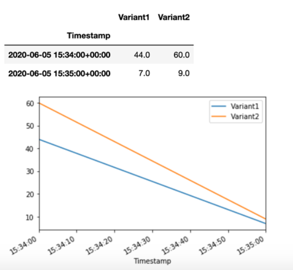

Now let's invoke a specific version of the model by specifying Variant1 as the TargetVariant in

the call to invoke_endpoint.

print(f"Sending test traffic to the endpoint {endpoint_name}. \nPlease wait...")
with open('test_data/test_sample_tail_input_cols.csv', 'r') as f:
for row in f:
print(".", end="", flush=True)

Validation of models in production
6157

## Page 187

Amazon SageMaker AI
Developer Guide

payload = row.rstrip('\n')
sm_runtime.invoke_endpoint(
EndpointName=endpoint_name,
ContentType="text/csv",
Body=payload,
TargetVariant="Variant1"
)
time.sleep(0.5)

To confirm that all new invocations were processed by Variant1, we can query CloudWatch to
get the number of invocations per variant. We see that for the most recent invocations (latest

timestamp), all requests were processed by Variant1, as we had specified. There were no

invocations made for Variant2.


Step 3: Evaluate model performance

To see which model version performs better, let's evaluate the accuracy, precision, recall, F1 score,
and Receiver operating charactersistic/Area under the curve for each variant. First, let's look at

these metrics for Variant1:

Validation of models in production
6158

## Page 188

Amazon SageMaker AI
Developer Guide


Now let's look at the metrics for Variant2:


For most of our defined metrics, Variant2 is performing better, so this is the one that we want to
use in production.

Step 4: Increase traffic to the best model

Now that we have determined that Variant2 performs better than Variant1, we shift

more traffic to it. We can continue to use TargetVariant to invoke a specific model
variant, but a simpler approach is to update the weights assigned to each variant by calling
UpdateEndpointWeightsAndCapacities. This changes the traffic distribution to your production

Validation of models in production
6159

## Page 189

Amazon SageMaker AI
Developer Guide

variants without requiring updates to your endpoint. Recall from the setup section that we set
variant weights to split traffic 50/50. The CloudWatch metrics for the total invocations for each
variant below show us the invocation patterns for each variant:

Now we shift 75% of the traffic to Variant2 by assigning new weights to each variant using

UpdateEndpointWeightsAndCapacities. SageMaker AI now sends 75% of the inference

requests to Variant2 and remaining 25% of requests to Variant1.

sm.update_endpoint_weights_and_capacities(
EndpointName=endpoint_name,
DesiredWeightsAndCapacities=[
{
"DesiredWeight": 25,
"VariantName": variant1["VariantName"]
},
{
"DesiredWeight": 75,
"VariantName": variant2["VariantName"]
}
]
)

The CloudWatch metrics for total invocations for each variant shows us higher invocations for

Variant2 than for Variant1:

Validation of models in production
6160

## Page 190

Amazon SageMaker AI
Developer Guide

We can continue to monitor our metrics, and when we're satisfied with a variant's performance, we

can route 100% of the traffic to that variant. We use UpdateEndpointWeightsAndCapacities

to update the traffic assignments for the variants. The weight for Variant1 is set to 0 and the

weight for Variant2 is set to 1. SageMaker AI now sends 100% of all inference requests to

Variant2.

sm.update_endpoint_weights_and_capacities(
EndpointName=endpoint_name,
DesiredWeightsAndCapacities=[
{
"DesiredWeight": 0,
"VariantName": variant1["VariantName"]
},
{
"DesiredWeight": 1,
"VariantName": variant2["VariantName"]
}
]
)

The CloudWatch metrics for the total invocations for each variant show that all inference requests

are being processed by Variant2 and there are no inference requests processed by Variant1.

Validation of models in production
6161

## Page 191

Amazon SageMaker AI
Developer Guide

You can now safely update your endpoint and delete Variant1 from your endpoint. You can also
continue testing new models in production by adding new variants to your endpoint and following
steps 2 - 4.

Testing models with shadow variants

You can use SageMaker AI Model Shadow Deployments to create long running shadow variants
to validate any new candidate component of your model serving stack before promoting it to
production. The following diagram shows how shadow variants work in more detail.

Validation of models in production
6162

## Page 192

Amazon SageMaker AI
Developer Guide


Deploy shadow variants

The following code example shows how you can programmatically deploy shadow variants. Replace

the user placeholder text in the example with your own information.

1.
Create two SageMaker AI models: one for your production variant, and one for your shadow
variant.

import boto3
from sagemaker import get_execution_role, Session
aws_region = "aws-region"

boto_session = boto3.Session(region_name=aws_region)
sagemaker_client = boto_session.client("sagemaker")

role = get_execution_role()

Validation of models in production
6163

## Page 193

Amazon SageMaker AI
Developer Guide

bucket = Session(boto_session).default_bucket()

model_name1 = "name-of-your-first-model"
model_name2 = "name-of-your-second-model"

sagemaker_client.create_model(
ModelName = model_name1,
ExecutionRoleArn = role,
Containers=[
{
"Image": "ecr-image-uri-for-first-model",
"ModelDataUrl": "s3-location-of-trained-first-model"
}
]
)

sagemaker_client.create_model(

ModelName = model_name2,
ExecutionRoleArn = role,
Containers=[
{
"Image": "ecr-image-uri-for-second-model",
"ModelDataUrl": "s3-location-of-trained-second-model"
}
]
)

2.
Create an endpoint configuration. Specify both your production and shadow variants in the
configuration.

endpoint_config_name = name-of-your-endpoint-config

create_endpoint_config_response = sagemaker_client.create_endpoint_config(
EndpointConfigName=endpoint_config_name,
ProductionVariants=[
{
"VariantName": name-of-your-production-variant,
"ModelName": model_name1,
"InstanceType": "ml.m5.xlarge",
"InitialInstanceCount": 1,
"InitialVariantWeight": 1,
}

Validation of models in production
6164

## Page 194

Amazon SageMaker AI
Developer Guide

],
ShadowProductionVariants=[
{
"VariantName": name-of-your-shadow-variant,
"ModelName": model_name2,
"InstanceType": "ml.m5.xlarge",
"InitialInstanceCount": 1,
"InitialVariantWeight": 1,
}
]
)

3.
Create an endpoint.

create_endpoint_response = sm.create_endpoint(

EndpointName=name-of-your-endpoint,
EndpointConfigName=endpoint_config_name,
)

Online explainability with SageMaker Clarify

This guide shows how to configure online explainability with SageMaker Clarify. With SageMaker
AI real-time inference endpoints, you can analyze explainability in real time, continuously. The
online explainability function fits into the Deploy to production part of the Amazon SageMaker AI
Machine Learning workflow.

How Clarify Online Explainability Works

The following graphic depicts SageMaker AI architecture for hosting an endpoint that serves
explainability requests. It depicts interactions between an endpoint, the model container, and the
SageMaker Clarify explainer.

Online explainability
6165

## Page 195

Amazon SageMaker AI
Developer Guide

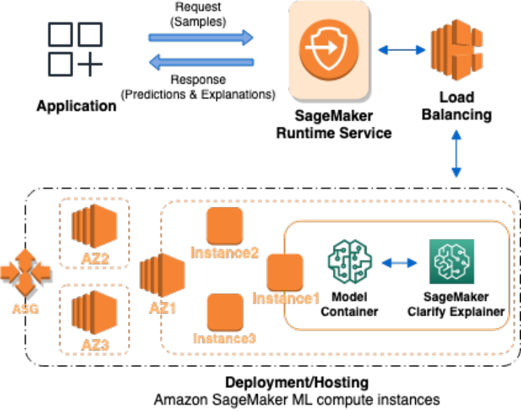

Here's how Clarify online explainability works. The application sends a REST-style

InvokeEndpoint request to the SageMaker AI Runtime Service. The service routes this request
to a SageMaker AI endpoint to obtain predictions and explanations. Then, the service receives the
response from the endpoint. Lastly, the service sends the response back to the application.

To increase the endpoint availability, SageMaker AI automatically attempts to distribute
endpoint instances in multiple Availability Zones, according to the instance count in the endpoint
configuration. On an endpoint instance, upon a new explainability request, the SageMaker Clarify
explainer calls the model container for predictions. Then it computes and returns the feature
attributions.

Here are the four steps to create an endpoint that uses SageMaker Clarify online explainability:

1. Check if your pre-trained SageMaker AI model is compatible with online explainability by

following the pre-check steps.

2. Create an endpoint configuration with the SageMaker Clarify explainer configuration using the

CreateEndpointConfig API.

3. Create an endpoint and provide the endpoint configuration to SageMaker AI using the

CreateEndpoint API. The service launches the ML compute instance and deploys the model as
specified in the configuration.

Online explainability
6166

## Page 196

Amazon SageMaker AI
Developer Guide

4. Invoke the endpoint: After the endpoint is in service, call the SageMaker AI Runtime API

InvokeEndpoint to send requests to the endpoint. The endpoint then returns explanations
and predictions.

Pre-check the model container

This section shows how to pre-check the model container inputs and outputs for compatibility
before configuring an endpoint. The SageMaker Clarify explainer is model agnostic, but it has
requirements for model container input and output.

Note

You can increase efficiency by configuring your container to support batch requests, which
support two or more records in a single request. For example, a single record is a single line
of CSV data, or a single line of JSON Lines data. SageMaker Clarify will attempt to send
a mini-batch of records to the model container first before falling back to single record
requests.

Model container input

CSV

The model container supports input in CSV with MIME type:text/csv. The following table
shows example inputs that SageMaker Clarify supports.

Model container input (string represent
ation)

Comments

'1,2,3,4'
Single record that uses four numerical
features.

'1,2,3,4\n5,6,7,8'
Two records, separated by line break '\n'.

'"This is a good product",5'
Single record that contains a text feature
and a numerical feature.

‘"This is a good product",5\n"Bad shopping
experience",1'

Two records.

Online explainability
6167

## Page 197

Amazon SageMaker AI
Developer Guide

JSON Lines

SageMaker AI also supports input in  JSON Lines dense format with MIME type:application/

jsonlines, as shown in the following table.

Model container input
Comments

'{"data":{"features":[1,2,3,4]}}'
Single record; a list of features can
be extracted by JMESPath expression

data.features .

'{"data":{"features":[1,2,3,4]}}\n{"data":{"f
eatures":[5,6,7,8]}}'

Two records.

'{"features":["This is a good product",5]}'
Single record; a list of features can
be extracted by JMESPath expression

features.

'{"features":["This is a good product",
5]}\n{"features":["Bad shopping experienc
e",1]}'

Two records.

Model container output

Your model container output should also be in either CSV, or JSON Lines dense format.
Additionally the model container should include the probabilities of the input records, which
SageMaker Clarify uses to compute feature attributions.

The following data examples are for model container outputs in CSV format.

Probability only

For regression and binary classification problems, the model container outputs a single
probability value (score) of the predicted label. These probabilities can be extracted using
column index 0. For multi-class problems, the model container outputs a list of probabilities
(scores). For multi-class problems, if no index is provided, all values are extracted.

Online explainability
6168

## Page 198

Amazon SageMaker AI
Developer Guide

Model container input
Model container output (string represent
ation)

Single record
'0.6'

Two records (results in one line)
'0.6,0.3'

Two records (results in two lines)
'0.6\n0.3'

Single record of a multi-class model (three
classes)

'0.1,0.6,0.3'

Two records of a multi-class model (three
classes)

'0.1,0.6,0.3\n0.2,0.5,0.3'

Predicted label and probabilities

The model container outputs the predicted label followed by its probability in CSV format. The

probabilities can be extracted using index 1.

Model container input
Model container output

Single record
'1,0.6'

Two records
'1,0.6\n0,0.3'

Predicted labels header and probabilities

A multi-class model container trained by Autopilot can be configured to output the string
representation of the list of predicted labels and probabilities in CSV format. In the following

example, the probabilities can be extracted by index 1. The label headers can be extracted by

index 1, and the label headers can be extracted using index 0.

Model container input
Model container output

Single record
'"[\'cat\',\'dog\',\'fish\']","[0.1,0.6,0.3]"'

Online explainability
6169

## Page 199

Amazon SageMaker AI
Developer Guide

Model container input
Model container output

Two records
'"[\'cat\',\'dog\',\'fish\']","[0.1,0.6,0.3]"
\n"[\'cat\',\'dog\',\'fish\']","[0.2,0.5,0.3]"'

The following data examples are for model container outputs in JSON Lines format.

Probability only

In this example, the model container outputs the probability that can be extracted by

JMESPath expression score in JSON Lines format.

Model container input
Model container output

Single record
'{"score":0.6}'

Two records
'{"score":0.6}\n{"score":0.3}'

Predicted label and probabilities

In this example, a multi-class model container outputs a list of label headers along with a list of

probabilities in JSON Lines format. The probabilities can be extracted by JMESPath expression

probability, and the label headers can be extracted by JMESPath expression predicted

labels.

Model container input
Model container output

Single record
'{"predicted_labels":["cat","dog","fish"],"pr
obabilities":[0.1,0.6,0.3]}'

Two records
'{"predicted_labels":["cat","dog","fish"],"pr
obabilities":[0.1,0.6,0.3]}\n{"predicted_labe
ls":["cat","dog","fish"],"probabilities":[0.2
,0.5,0.3]}'

Online explainability
6170

## Page 200

Amazon SageMaker AI
Developer Guide

Predicted labels header and probabilities

In this example, a multi-class model container outputs a list of label headers and probabilities in

JSON Lines format. The probabilities can be extracted by JMESPath expression probability,

and the label headers can be extracted by JMESPath expression predicted labels.

Model container input
Model container output

Single record
'{"predicted_labels":["cat","dog","fish"],"pr
obabilities":[0.1,0.6,0.3]}'

Two records
'{"predicted_labels":["cat","dog","fish"],"pr
obabilities":[0.1,0.6,0.3]}\n{"predicted_labe
ls":["cat","dog","fish"],"probabilities":[0.2
,0.5,0.3]}'

Model container validation

We recommend that you deploy your model to a SageMaker AI real-time inference endpoint,
and send requests to the endpoint. Manually examine the requests (model container inputs) and
responses (model container outputs) to make sure that both are compliant with the requirements
in the Model Container Input section and Model Container Output section. If your model
container supports batch requests, you can start with a single record request, and then try two or
more records.

The following commands show how to request a response using the AWS CLI. The AWS CLI is pre-
installed in SageMaker Studio Classic, and SageMaker Notebook instances. If you need to install the
AWS CLI, follow this installation guide.

aws sagemaker-runtime invoke-endpoint \
--endpoint-name $ENDPOINT_NAME \
--content-type $CONTENT_TYPE \
--accept $ACCEPT_TYPE \
--body $REQUEST_DATA \
$CLI_BINARY_FORMAT \
/dev/stderr 1>/dev/null

The parameters are defined, as follows:

Online explainability
6171

## Page 201

Amazon SageMaker AI
Developer Guide

• $ENDPOINT NAME: The name of the endpoint.

• $CONTENT_TYPE: The MIME type of the request (model container input).

• $ACCEPT_TYPE: The MIME type of the response (model container output).

• $REQUEST_DATA: The requested payload string.

• $CLI_BINARY_FORMAT: The format of the command line interface (CLI) parameter. For AWS CLI

v1, this parameter should remain blank. For v2, this parameter should be set to --cli-binary-

format raw-in-base64-out.

Note

AWS CLI v2 passes binary parameters as base64-encoded strings default.

The following examples use AWS CLI v1:

Request and response in CSV format

• The request consists of a single record and the response is its probability value.

aws sagemaker-runtime invoke-endpoint \
--endpoint-name test-endpoint-sagemaker-xgboost-model \
--content-type text/csv \
--accept text/csv \
--body '1,2,3,4' \
/dev/stderr 1>/dev/null

Output:

0.6

• The request consists of two records, and the response includes their probabilities, and the

model separates the probabilities by a comma. The $'content' expression in the --body

tells the command to interpret \n in the content as a line break.

aws sagemaker-runtime invoke-endpoint \
--endpoint-name test-endpoint-sagemaker-xgboost-model \
--content-type text/csv \
--accept text/csv \
--body $'1,2,3,4\n5,6,7,8' \

Online explainability
6172

## Page 202

Amazon SageMaker AI
Developer Guide

/dev/stderr 1>/dev/null

Output:

0.6,0.3

• The request consists of two records, the response includes their probabilities, and the model
separates the probabilities with a line break.

aws sagemaker-runtime invoke-endpoint \
--endpoint-name test-endpoint-csv-1 \
--content-type text/csv \
--accept text/csv \
--body $'1,2,3,4\n5,6,7,8' \
/dev/stderr 1>/dev/null

Output:

0.6

0.3

• The request consists of a single record, and the response is probability values (multi-class
model, three classes).

aws sagemaker-runtime invoke-endpoint \
--endpoint-name test-endpoint-csv-1 \
--content-type text/csv \
--accept text/csv \
--body '1,2,3,4' \
/dev/stderr 1>/dev/null

Output:

0.1,0.6,0.3

• The request consists of two records, and the response includes their probability values (multi-
class model, three classes).

aws sagemaker-runtime invoke-endpoint \
--endpoint-name test-endpoint-csv-1 \
--content-type text/csv \
--accept text/csv \

Online explainability
6173

## Page 203

Amazon SageMaker AI
Developer Guide

--body $'1,2,3,4\n5,6,7,8' \
/dev/stderr 1>/dev/null

Output:

0.1,0.6,0.3

0.2,0.5,0.3

• The request consists of two records, and the response includes predicted label and
probability.

aws sagemaker-runtime invoke-endpoint \
--endpoint-name test-endpoint-csv-2 \
--content-type text/csv \
--accept text/csv \
--body $'1,2,3,4\n5,6,7,8' \
/dev/stderr 1>/dev/null

Output:

1,0.6

0,0.3

• The request consists of two records and the response includes label headers and probabilities.

aws sagemaker-runtime invoke-endpoint \
--endpoint-name test-endpoint-csv-3 \
--content-type text/csv \
--accept text/csv \
--body $'1,2,3,4\n5,6,7,8' \
/dev/stderr 1>/dev/null

Output:

"['cat','dog','fish']","[0.1,0.6,0.3]"

"['cat','dog','fish']","[0.2,0.5,0.3]"

Online explainability
6174

## Page 204

Amazon SageMaker AI
Developer Guide

Request and response in JSON Lines format

• The request consists of a single record and the response is its probability value.

aws sagemaker-runtime invoke-endpoint \
--endpoint-name test-endpoint-jsonlines \
--content-type application/jsonlines \
--accept application/jsonlines \
--body '{"features":["This is a good product",5]}' \
/dev/stderr 1>/dev/null

Output:

{"score":0.6}

• The request contains two records, and the response includes predicted label and probability.

aws sagemaker-runtime invoke-endpoint \
--endpoint-name test-endpoint-jsonlines-2 \
--content-type application/jsonlines \
--accept application/jsonlines \
--body $'{"features":[1,2,3,4]}\n{"features":[5,6,7,8]}' \
/dev/stderr 1>/dev/null

Output:

{"predicted_label":1,"probability":0.6}

{"predicted_label":0,"probability":0.3}

• The request contains two records and the response includes label headers and probabilities.

aws sagemaker-runtime invoke-endpoint \
--endpoint-name test-endpoint-jsonlines-3 \
--content-type application/jsonlines \
--accept application/jsonlines \
--body $'{"data":{"features":[1,2,3,4]}}\n{"data":{"features":[5,6,7,8]}}' \
/dev/stderr 1>/dev/null

Output:

Online explainability
6175

## Page 205

Amazon SageMaker AI
Developer Guide

{"predicted_labels":["cat","dog","fish"],"probabilities":

[0.1,0.6,0.3]}

{"predicted_labels":["cat","dog","fish"],"probabilities":

[0.2,0.5,0.3]}

Request and response in different formats

• The request is in CSV format and the response is in JSON Lines format:

aws sagemaker-runtime invoke-endpoint \
--endpoint-name test-endpoint-csv-in-jsonlines-out \
--content-type text/csv \
--accept application/jsonlines \
--body $'1,2,3,4\n5,6,7,8' \
/dev/stderr 1>/dev/null

Output:

{"probability":0.6}

{"probability":0.3}

• The request is in JSON Lines format and the response is in CSV format:

aws sagemaker-runtime invoke-endpoint \
--endpoint-name test-endpoint-jsonlines-in-csv-out \
--content-type application/jsonlines \
--accept text/csv \
--body $'{"features":[1,2,3,4]}\n{"features":[5,6,7,8]}' \
/dev/stderr 1>/dev/null

Output:

0.6

0.3

After the validations are complete, delete the testing endpoint.

Online explainability
6176

## Page 206

Amazon SageMaker AI
Developer Guide

Configure and create an endpoint

Create a new endpoint configuration to fit your model, and use this configuration to create the
endpoint. You can use the model container validated in the pre-check step  to create an endpoint
and enable the SageMaker Clarify online explainability feature.

Use the sagemaker_client object to create an endpoint using the CreateEndpointConfig API. Set

the member ClarifyExplainerConfig inside the ExplainerConfig parameter as follows:

sagemaker_client.create_endpoint_config(
EndpointConfigName='name-of-your-endpoint-config',
ExplainerConfig={
'ClarifyExplainerConfig': {
'EnableExplanations': '`true`',
'InferenceConfig': {

...
},
'ShapConfig': {
...
}
},
},
ProductionVariants=[{
'VariantName': 'AllTraffic',
'ModelName': 'name-of-your-model',
'InitialInstanceCount': 1,
'InstanceType': 'ml.m5.xlarge',
}]
...
)
sagemaker_client.create_endpoint(
EndpointName='name-of-your-endpoint',
EndpointConfigName='name-of-your-endpoint-config'
)

The first call to the sagemaker_client object creates a new endpoint configuration with the
explainability feature enabled. The second call uses the endpoint configuration to launch the
endpoint.

Online explainability
6177

## Page 207

Amazon SageMaker AI
Developer Guide

Note

You can also host multiple models in one container behind a SageMaker AI real-time
inference multi-model endpoint and configure online explainability with SageMaker Clarify.

The EnableExplanations expression

The EnableExplanations parameter is a JMESPath Boolean expression string. It is evaluated
for each record in the explainability request. If this parameter is evaluated to be true, then the
record will be explained. If this parameter is evaluated to be false, then explanations are not be
generated.

SageMaker Clarify deserializes the model container output for each record into a JSON compatible

data structure, and then uses the EnableExplanations parameter to evaluate the data.

Notes

There are two options for records depending on the format of the model container output.

• If the model container output is in CSV format, then a record is loaded as a JSON array.

• If the model container output is in JSON Lines format, then a record is loaded as a JSON
object.

The EnableExplanations parameter is a JMESPath expression that can be passed either during

the InvokeEndpoint or CreateEndpointConfig operations. If the JMESPath expression
that you supplied is not valid, the endpoint creation will fail. If the expression is valid, but the
expression evaluation result is unexpected, then the endpoint will be created successfully, but an

error will be generated when the endpoint is invoked. Test your EnableExplanations expression

by using the InvokeEndpoint API, and then apply it to the endpoint configuration.

The following are some examples of valid EnableExplanations expression. In the examples, a

JMESPath expression encloses a literal using backtick characters. For example, `true` means true.

Online explainability
6178

## Page 208

Amazon SageMaker AI
Developer Guide

Expression (string
representation)

Model container
output (string
representation)

Evaluation result
(Boolean)

Meaning

'`true`'
(N/A)
True
Activate online
explainability
unconditionally.

'`false`'
(N/A)
False
Deactivate online
explainability
unconditionally.

'[1]>`0.5`'
'1,0.6'
True
For each record, the
model container
outputs its predicted
label and probability.
Explains a record if its
probability (at index
1) is greater than 0.5.

'probability>`0.5`'
'{"predicted_label
":1,"probability":0.6}'

True
For each record, the
model container
outputs JSON data.
Explain a record if its
probability is greater
than 0.5.

'!contains(probabi
lities[:-1], max(proba
bilities))'

'{"probabilities": [0.4,
0.1, 0.4], "labels":
["cat","dog","fish"]}'

False
For a multi-class
model: Explains a
record if its predicted
label (the class that
has the max probabili
ty value) is the
last class. Literally
, the expression
means that the
max probability

Online explainability
6179

## Page 209

Amazon SageMaker AI
Developer Guide

Expression (string
representation)

Model container
output (string
representation)

Evaluation result
(Boolean)

Meaning

value is not in the
list of probabilities
excluding the last
one.

Synthetic dataset

SageMaker Clarify uses the Kernel SHAP algorithm. Given a record (also called a sample or an
instance) and the SHAP configuration, the explainer first generates a synthetic dataset. SageMaker
Clarify then queries the model container for the predictions of the dataset, and then computes and
returns the feature attributions. The size of the synthetic dataset affects the runtime for the Clarify
explainer. Larger synthetic datasets take more time to obtain model predictions than smaller ones.

The synthetic dataset size is determined by the following formula:

Synthetic dataset size = SHAP baseline size * n_samples

The SHAP baseline size is the number of records in the SHAP baseline data. This information is

taken from the ShapBaselineConfig.

The size of n_samples is set by the parameter NumberOfSamples in the explainer configuration

and the number of features. If the number of features is n_features, then n_samples is the
following:

n_samples = MIN(NumberOfSamples, 2^n_features - 2)

The following shows n_samples if NumberOfSamples is not provided.

n_samples = MIN(2*n_features + 2^11, 2^n_features - 2)

For example, a tabular record with 10 features has a SHAP baseline size of 1. If NumberOfSamples
is not provided, the synthetic dataset contains 1022 records. If the record has 20 features, the
synthetic dataset contains 2088 records.

Online explainability
6180

## Page 210

Amazon SageMaker AI
Developer Guide

For NLP problems, n_features is equal to the number of non-text features plus the number of
text units.

Note

The InvokeEndpoint API has a request timeout limit. If the synthetic dataset is too
large, the explainer may not be able to complete the computation within this limit. If

necessary, use the previous information to understand and reduce the SHAP baseline size

and NumberOfSamples. If your model container is set up to handle batch requests, then

you can also adjust the value of MaxRecordCount.

Invoke the endpoint

After the endpoint is running, use the SageMaker AI Runtime InvokeEndpoint  API in the
SageMaker AI Runtime service to send requests to, or invoke the endpoint. In response, the
requests are handled as explainability requests by the SageMaker Clarify explainer.

Note

To invoke an endpoint, choose one of the following options:

• For instructions to use Boto3 or the AWS CLI to invoke an endpoint, see Invoke models
for real-time inference.

• To use the SageMaker SDK for Python to invoke an endpoint, see the Predictor API.

Request

The InvokeEndpoint API has an optional parameter EnableExplanations, which is mapped to

the HTTP header X-Amzn-SageMaker-Enable-Explanations. If this parameter is provided, it

overrides the EnableExplanations parameter of the ClarifyExplainerConfig.

Note

The ContentType and Accept parameters of the InvokeEndpoint API are required.

Supported formats include MIME type text/csv and application/jsonlines.

Online explainability
6181

## Page 211

Amazon SageMaker AI
Developer Guide

Use the sagemaker_runtime_client to send a request to the endpoint, as follows:

response = sagemaker_runtime_client.invoke_endpoint(
EndpointName='name-of-your-endpoint',
EnableExplanations='`true`',
ContentType='text/csv',
Accept='text/csv',
Body='1,2,3,4',  # single record (of four numerical features)
)

For multi-model endpoints, pass an additional TargetModel parameter in the previous example
request to specifies which model to target at the endpoint. The multi-model endpoint dynamically
loads target models as needed. For more information about multi-model endpoints, see Multi-
model endpoints. See the SageMaker Clarify Online Explainability on Multi-Model Endpoint
Sample Notebook for an example of how to set up and invoke multiple target models from a single
endpoint.

Response

If the endpoint is created with ExplainerConfig, then a new response schema is used,
This new schema is different from, and is not compatible with, an endpoint that lacks the

ExplainerConfig parameter provided.

The MIME type of the response is application/json, and the response payload can be decoded
from UTF-8 bytes to a JSON object. The following shows the members of this JSON object are as
follows:

• version: The version of the response schema in string format. For example, 1.0.

• predictions: The predictions that the request makes have the following:

• content_type: The MIME type of the predictions, referring to the ContentType of the
model container response.

• data: The predictions data string delivered as the payload of the model container response for
the request.

• label_headers: The label headers from the LabelHeaders parameter. This is provided in
either the explainer configuration or the model container output.

• explanations: The explanations provided in the request payload. If no records are explained,

then this member returns the empty object {}.

Online explainability
6182

## Page 212

Amazon SageMaker AI
Developer Guide

• • kernel_shap: A key that refers to an array of Kernel SHAP explanations for each record in the

request. If a record is not explained, the corresponding explanation is null.

The kernel_shap element has the following members:

• feature_header: The header name of the features provided by the FeatureHeaders

parameter in the explainer configuration ExplainerConfig.

• feature_type: The feature type inferred by explainer or provided in the FeatureTypes

parameter in the ExplainerConfig. This element is only available for NLP explainability
problems.

• attributions: An array of attribution objects. Text features can have multiple attribution
objects, each for a unit. The attribution object has the following members:

• attribution: A list of probability values, given for each class.

• description: The description of the text units, available only for NLP explainability
problems.

• partial_text: The portion of the text explained by the explainer.

• start_idx: A zero-based index to identify the array location of the beginning of the partial
text fragment.

Code examples: SDK for Python

This section provides sample code to create and invoke an endpoint that uses SageMaker Clarify
online explainability. These code examples use the AWS SDK for Python.

Tabular data

The following example uses tabular data and a SageMaker AI model called model_name. In this
example, the model container accepts data in CSV format, and each record has four numerical
features. In this minimal configuration, for demonstration purposes only, the SHAP baseline data
is set to zero. Refer to SHAP Baselines for Explainability to learn how to choose more appropriate

values for ShapBaseline.

Configure the endpoint, as follows:

endpoint_config_name = 'tabular_explainer_endpoint_config'
response = sagemaker_client.create_endpoint_config(

Online explainability
6183

## Page 213

Amazon SageMaker AI
Developer Guide

EndpointConfigName=endpoint_config_name,
ProductionVariants=[{
'VariantName': 'AllTraffic',
'ModelName': model_name,
'InitialInstanceCount': 1,
'InstanceType': 'ml.m5.xlarge',
}],
ExplainerConfig={
'ClarifyExplainerConfig': {
'ShapConfig': {
'ShapBaselineConfig': {
'ShapBaseline': '0,0,0,0',
},
},
},
},
)

Use the endpoint configuration to create an endpoint, as follows:

endpoint_name = 'tabular_explainer_endpoint'
response = sagemaker_client.create_endpoint(
EndpointName=endpoint_name,
EndpointConfigName=endpoint_config_name,
)

Use the DescribeEndpoint API to inspect the progress of creating an endpoint, as follows:

response = sagemaker_client.describe_endpoint(
EndpointName=endpoint_name,
)
response['EndpointStatus']

After the endpoint status is "InService", invoke the endpoint with a test record, as follows:

response = sagemaker_runtime_client.invoke_endpoint(
EndpointName=endpoint_name,
ContentType='text/csv',
Accept='text/csv',
Body='1,2,3,4',
)

Online explainability
6184

## Page 214

Amazon SageMaker AI
Developer Guide

Note

In the previous code example, for multi-model endpoints, pass an additional TargetModel
parameter in the request to specify which model to target at the endpoint.

Assume that the response has a status code of 200 (no error), and load the response body, as
follows:

import codecs
import json
json.load(codecs.getreader('utf-8')(response['Body']))

The default action for the endpoint is to explain the record. The following shows example output in
the returned JSON object.

{
"version": "1.0",
"predictions": {
"content_type": "text/csv; charset=utf-8",
"data": "0.0006380207487381"
},
"explanations": {
"kernel_shap": [
[
{
"attributions": [
{
"attribution": [-0.00433456]
}
]
},
{
"attributions": [
{
"attribution": [-0.005369821]
}
]
},
{
"attributions": [
{

Online explainability
6185

## Page 215

Amazon SageMaker AI
Developer Guide

"attribution": [0.007917749]
}
]
},
{
"attributions": [
{
"attribution": [-0.00261214]
}
]
}
]
]
}
}

Use the EnableExplanations parameter to enable on-demand explanations, as follows:

response = sagemaker_runtime_client.invoke_endpoint(
EndpointName=endpoint_name,
ContentType='text/csv',
Accept='text/csv',
Body='1,2,3,4',
EnableExplanations='[0]>`0.8`',
)

Note

In the previous code example, for multi-model endpoints, pass an additional TargetModel
parameter in the request to specify which model to target at the endpoint.

In this example, the prediction value is less than the threshold value of 0.8, so the record is not
explained:

{
"version": "1.0",
"predictions": {
"content_type": "text/csv; charset=utf-8",
"data": "0.6380207487381995"
},

Online explainability
6186

## Page 216

Amazon SageMaker AI
Developer Guide

"explanations": {}
}

Use visualization tools to help interpret the returned explanations. The following image shows
how SHAP plots can be used to understand how each feature contributes to the prediction. The
base value on the diagram, also called the expected value, is the mean predictions of the training
dataset. Features that push the expected value higher are red, and features that push the expected
value lower are blue. See SHAP additive force layout for additional information.

See the full example notebook for tabular data.

Text data

This section provides a code example to create and invoke an online explainability endpoint for
text data. The code example uses SDK for Python.

The following example uses text data and a SageMaker AI model called model_name. In this
example, the model container accepts data in CSV format, and each record is a single string.

endpoint_config_name = 'text_explainer_endpoint_config'
response = sagemaker_client.create_endpoint_config(
EndpointConfigName=endpoint_config_name,
ProductionVariants=[{
'VariantName': 'AllTraffic',
'ModelName': model_name,
'InitialInstanceCount': 1,
'InstanceType': 'ml.m5.xlarge',
}],
ExplainerConfig={
'ClarifyExplainerConfig': {
'InferenceConfig': {
'FeatureTypes': ['text'],
'MaxRecordCount': 100,
},

Online explainability
6187

## Page 217

Amazon SageMaker AI
Developer Guide

'ShapConfig': {
'ShapBaselineConfig': {
'ShapBaseline': '"<MASK>"',
},
'TextConfig': {
'Granularity': 'token',
'Language': 'en',
},
'NumberOfSamples': 100,
},
},
},
)

• ShapBaseline: A special token reserved for natural language processing (NLP) processing.

• FeatureTypes: Identifies the feature as text. If this parameter is not provided, the explainer will
attempt to infer the feature type.

• TextConfig: Specifies the unit of granularity and language for the analysis of text features. In

this example, the language is English, and granularity token means a word in English text.

• NumberOfSamples: A limit to set the upper bounds of the size of the synthetic dataset.

• MaxRecordCount: The maximum number of records in a request that the model container can
handle. This parameter is set to stabilize performance.

Use the endpoint configuration to create the endpoint, as follows:

endpoint_name = 'text_explainer_endpoint'
response = sagemaker_client.create_endpoint(
EndpointName=endpoint_name,
EndpointConfigName=endpoint_config_name,
)

After the status of the endpoint becomes InService, invoke the endpoint. The following code
sample uses a test record as follows:

response = sagemaker_runtime_client.invoke_endpoint(
EndpointName=endpoint_name,
ContentType='text/csv',
Accept='text/csv',
Body='"This is a good product"',

Online explainability
6188

## Page 218

Amazon SageMaker AI
Developer Guide

)

If the request completes successfully, the response body will return a valid JSON object that's
similar to the following:

{
"version": "1.0",

"predictions": {
"content_type": "text/csv",
"data": "0.9766594\n"
},
"explanations": {
"kernel_shap": [
[
{
"attributions": [
{
"attribution": [
-0.007270948666666712
],
"description": {
"partial_text": "This",
"start_idx": 0
}
},
{
"attribution": [
-0.018199033666666628
],
"description": {
"partial_text": "is",
"start_idx": 5
}
},
{
"attribution": [
0.01970993241666666
],
"description": {
"partial_text": "a",
"start_idx": 8
}
},

Online explainability
6189

## Page 219

Amazon SageMaker AI
Developer Guide

{
"attribution": [
0.1253469515833334
],
"description": {
"partial_text": "good",
"start_idx": 10
}
},
{
"attribution": [
0.03291143366666657
],
"description": {
"partial_text": "product",
"start_idx": 15
}

}
],
"feature_type": "text"
}
]
]
}
}

Use visualization tools to help interpret the returned text attributions. The following image shows
how the captum visualization utility can be used to understand how each word contributes to the
prediction. The higher the color saturation, the higher the importance given to the word. In this
example, a highly saturated bright red color indicates a strong negative contribution. A highly
saturated green color indicates a strong positive contribution. The color white indicates that the
word has a neutral contribution. See the captum library for additional information on parsing and
rendering the attributions.

See the full example notebook for text data.

Online explainability
6190

## Page 220

Amazon SageMaker AI
Developer Guide

Troubleshooting guide

If you encounter errors using SageMaker Clarify online explainability, consult the topics in this
section.

InvokeEndpoint API fails with the error "ReadTimeoutError:Read timeout on endpoint..."

This error means that the request could not be completed within the 60-second time limit set by
the request timeout.

To reduce the request latency, try the following:

• Tune the model's performance during inference. For example, SageMaker AI Neo can optimize
models for inference.

• Allow the model container to handle batch requests.

• Use a larger MaxRecordCount to reduce the number of calls from the explainer to the model
container. This will reduce network latency and overhead.

• Use an instance type that has more resources allocated to it. Alternately, assign more instances
to the endpoint to help balance the load.

• Reduce the number of records inside a single InvokeEndpoint request.

• Reduce the number of records in the baseline data.

• Use a smaller NumberOfSamples value to reduce the size of the synthetic dataset. For more
information about how the number of samples affects your synthetic dataset, see Synthetic
dataset.

Fine-tune models with adapter inference components

With Amazon SageMaker AI, you can host pre-trained foundation models without needing to
create your own models from scratch. However, to tailor a general-purpose foundation model for
the unique needs of your business, you must create a fine-tuned version of it. One cost-effective
fine-tuning technique is Low-Rank Adaptation (LoRA). The principle behind LoRA is that only a
small part of a large foundation model needs updating to adapt it to new tasks or domains. A LoRA
adapter augments the inference from a base foundation model with just a few extra adapter layers.

If you host your base foundation model by using a SageMaker AI inference component, you can
fine-tune that base model with LoRA adapters by creating adapter inference components. When you
create an adapter inference component, you specify the following:

Fine-tune with adapters
6191

## Page 221

Amazon SageMaker AI
Developer Guide

• The base inference component that is to contain the adapter inference component. The base
inference component contains the foundation model that you want to adapt. The adapter
inference component uses the compute resources that you assigned to the base inference
component.

• The location where you've stored the LoRA adapter in Amazon S3.

After you create the adapter inference component, you can invoke it directly. When you do,
SageMaker AI combines the adapter with the base model to augment the generated response.

Before you begin

Before you can create an adapter inference component, you must meet the following
requirements:

• You have a base inference component that contains the foundation model to adapt. You've
deployed this inference component to a SageMaker AI endpoint.

For more information about deploying inference components to endpoints, see Deploy models
for real-time inference.

• You have a LoRA adapter model, and you've stored the model artifacts as a tar.gz file in
Amazon S3. You specify the S3 URI of the artifacts when you create the adapter inference
component.

The following examples use the SDK for Python (Boto3) to create and invoke an adapter inference
component.

Example create_inference_component call to create an adapter inference component

The following example creates an adapter inference component and assigns it to a base inference
component:

sm_client.create_inference_component(
InferenceComponentName = adapter_ic_name,
EndpointName = endpoint_name,
Specification={
"BaseInferenceComponentName": base_inference_component_name,
"Container": {
"ArtifactUrl": adapter_s3_uri
},

Fine-tune with adapters
6192

## Page 222

Amazon SageMaker AI
Developer Guide

},
)

When you use this example in your own code, replace the placeholder values as follows:

• adapter_ic_name – A unique name for your adapter inference component.

• endpoint_name – The name of the endpoint that hosts the base inference component.

• base_inference_component_name – The name of the base inference component that
contains the foundation model to adapt.

• adapter_s3_uri – The S3 URI that locates the tar.gz file with your LoRA adapter artifacts.

You create an adapter inference component with code that is similar to the code for a normal

inference component. One difference is that, for the Specification parameter, you omit the

ComputeResourceRequirements key. When you invoke an adapter inference component, it is
loaded by the base inference component. The adapter inference component uses the compute
resources of the base inference component.

For more information about creating and deploying inference components with the SDK for Python
(Boto3), see Deploy models with the Python SDKs.

After you create an adapter inference component, you invoke it by specifying its name in an

invoke_endpoint request.

Example invoke_endpoint call to invoke an adapter inference component

The following example invokes an adapter inference component:

response = sm_rt_client.invoke_endpoint(
EndpointName = endpoint_name,
InferenceComponentName = adapter_ic_name,
Body = json.dumps(
{
"inputs": prompt,
"parameters": {"max_new_tokens": 100, "temperature":0.9}
}
),
ContentType = "application/json",
)

Fine-tune with adapters
6193

## Page 223

Amazon SageMaker AI
Developer Guide

adapter_reponse = response["Body"].read().decode("utf8")["generated_text"]

When you use this example in your own code, replace the placeholder values as follows:

• endpoint_name – The name of the endpoint that hosts the base and adapter inference
components.

• adapter_ic_name – The name of the adapter inference component.

• prompt – The prompt for the inference request.

For more information about invoking inference components with the SDK for Python (Boto3), see
Invoke models for real-time inference.

Deploy models with Amazon SageMaker Serverless Inference

Amazon SageMaker Serverless Inference is a purpose-built inference option that enables you to
deploy and scale ML models without configuring or managing any of the underlying infrastructure.
On-demand Serverless Inference is ideal for workloads which have idle periods between traffic
spurts and can tolerate cold starts. Serverless endpoints automatically launch compute resources
and scale them in and out depending on traffic, eliminating the need to choose instance types
or manage scaling policies. This takes away the undifferentiated heavy lifting of selecting and
managing servers. Serverless Inference integrates with AWS Lambda to offer you high availability,
built-in fault tolerance and automatic scaling. With a pay-per-use model, Serverless Inference is
a cost-effective option if you have an infrequent or unpredictable traffic pattern. During times
when there are no requests, Serverless Inference scales your endpoint down to 0, helping you to
minimize your costs. For more information about pricing for on-demand Serverless Inference, see
Amazon SageMaker Pricing.

Optionally, you can also use Provisioned Concurrency with Serverless Inference. Serverless
Inference with provisioned concurrency is a cost-effective option when you have predictable bursts
in your traffic. Provisioned Concurrency allows you to deploy models on serverless endpoints with
predictable performance, and high scalability by keeping your endpoints warm. SageMaker AI
ensures that for the number of Provisioned Concurrency that you allocate, the compute resources
are initialized and ready to respond within milliseconds. For Serverless Inference with Provisioned
Concurrency, you pay for the compute capacity used to process inference requests, billed by the
millisecond, and the amount of data processed. You also pay for Provisioned Concurrency usage,
based on the memory configured, duration provisioned, and the amount of concurrency enabled.

Serverless Inference
6194

## Page 224

Amazon SageMaker AI
Developer Guide

For more information about pricing for Serverless Inference with Provisioned Concurrency, see
Amazon SageMaker Pricing.

You can integrate Serverless Inference with your MLOps Pipelines to streamline your ML workflow,
and you can use a serverless endpoint to host a model registered with Model Registry.

Serverless Inference is generally available in 21 AWS Regions: US East (N. Virginia), US East (Ohio),
US West (N. California), US West (Oregon), Africa (Cape Town), Asia Pacific (Hong Kong), Asia Pacific

(Mumbai), Asia Pacific (Tokyo), Asia Pacific (Seoul), Asia Pacific (Osaka), Asia Pacific (Singapore),
Asia Pacific (Sydney), Canada (Central), Europe (Frankfurt), Europe (Ireland), Europe (London),
Europe (Paris), Europe (Stockholm), Europe (Milan), Middle East (Bahrain), South America (São
Paulo). For more information about Amazon SageMaker AI regional availability, see the AWS
Regional Services List.

How it works

The following diagram shows the workflow of on-demand Serverless Inference and the benefits of
using a serverless endpoint.


When you create an on-demand serverless endpoint, SageMaker AI provisions and manages the
compute resources for you. Then, you can make inference requests to the endpoint and receive
model predictions in response. SageMaker AI scales the compute resources up and down as needed
to handle your request traffic, and you only pay for what you use.

For Provisioned Concurrency, Serverless Inference also integrates with Application Auto Scaling, so
that you can manage Provisioned Concurrency based on a target metric or on a schedule. For more
information, see Automatically scale Provisioned Concurrency for a serverless endpoint.

The following sections provide additional details about Serverless Inference and how it works.

How it works
6195

## Page 225

Amazon SageMaker AI
Developer Guide

Topics

• Container support

• Memory size

• Concurrent invocations

• Minimizing cold starts

• Feature exclusions

Container support

For your endpoint container, you can choose either a SageMaker AI-provided container or bring
your own. SageMaker AI provides containers for its built-in algorithms and prebuilt Docker images
for some of the most common machine learning frameworks, such as Apache MXNet, TensorFlow,
PyTorch, and Chainer. For a list of available SageMaker images, see Available Deep Learning
Containers Images. If you are bringing your own container, you must modify it to work with
SageMaker AI. For more information about bringing your own container, see Adapt your own
inference container for Amazon SageMaker AI.

The maximum size of the container image you can use is 10 GB. For serverless endpoints, we
recommend creating only one worker in the container and only loading one copy of the model.
Note that this is unlike real-time endpoints, where some SageMaker AI containers may create a
worker for each vCPU to process inference requests and load the model in each worker.

If you already have a container for a real-time endpoint, you can use the same container for your
serverless endpoint, though some capabilities are excluded. To learn more about the container
capabilities that are not supported in Serverless Inference, see Feature exclusions. If you choose to
use the same container, SageMaker AI escrows (retains) a copy of your container image until you
delete all endpoints that use the image. SageMaker AI encrypts the copied image at rest with a
SageMaker AI-owned AWS KMS key.

Memory size

Your serverless endpoint has a minimum RAM size of 1024 MB (1 GB), and the maximum RAM
size you can choose is 6144 MB (6 GB). The memory sizes you can choose are 1024 MB, 2048 MB,
3072 MB, 4096 MB, 5120 MB, or 6144 MB. Serverless Inference auto-assigns compute resources
proportional to the memory you select. If you choose a larger memory size, your container
has access to more vCPUs. Choose your endpoint’s memory size according to your model size.

How it works
6196

## Page 226

Amazon SageMaker AI
Developer Guide

Generally, the memory size should be at least as large as your model size. You may need to
benchmark in order to choose the right memory selection for your model based on your latency
SLAs. For a step by step guide to benchmark, see  Introducing the Amazon SageMaker Serverless
Inference Benchmarking Toolkit. The memory size increments have different pricing; see the
Amazon SageMaker AI pricing page for more information.

Regardless of the memory size you choose, your serverless endpoint has 5 GB of ephemeral disk
storage available. For help with container permissions issues when working with storage, see
Troubleshooting.

Concurrent invocations

On-demand Serverless Inference manages predefined scaling policies and quotas for the capacity
of your endpoint. Serverless endpoints have a quota for how many concurrent invocations can
be processed at the same time. If the endpoint is invoked before it finishes processing the first
request, then it handles the second request concurrently.

The total concurrency that you can share between all serverless endpoints in your account depends
on your region:

• For the US East (Ohio), US East (N. Virginia), US West (Oregon), Asia Pacific (Singapore), Asia
Pacific (Sydney), Asia Pacific (Tokyo), Europe (Frankfurt), and Europe (Ireland) Regions, the total
concurrency you can share between all serverless endpoints per Region in your account is 1000.

• For the US West (N. California), Africa (Cape Town), Asia Pacific (Hong Kong), Asia Pacific
(Mumbai), Asia Pacific (Osaka), Asia Pacific (Seoul), Canada (Central), Europe (London), Europe
(Milan), Europe (Paris), Europe (Stockholm), Middle East (Bahrain), and South America (São Paulo)
Regions, the total concurrency per Region in your account is 500.

You can set the maximum concurrency for a single endpoint up to 200, and the total number of
serverless endpoints you can host in a Region is 50. The maximum concurrency for an individual
endpoint prevents that endpoint from taking up all of the invocations allowed for your account,
and any endpoint invocations beyond the maximum are throttled.

Note

Provisioned Concurrency that you assign to a serverless endpoint should always be less
than or equal to the maximum concurrency that you assigned to that endpoint.

How it works
6197

## Page 227

Amazon SageMaker AI
Developer Guide

To learn how to set the maximum concurrency for your endpoint, see Create an endpoint
configuration. For more information about quotas and limits, see  Amazon SageMaker AI endpoints
and quotas in the AWS General Reference. To request a service limit increase, contact AWS Support.
For instructions on how to request a service limit increase, see Supported Regions and Quotas.

Minimizing cold starts

If your on-demand Serverless Inference endpoint does not receive traffic for a while and then your
endpoint suddenly receives new requests, it can take some time for your endpoint to spin up the
compute resources to process the requests. This is called a cold start. Since serverless endpoints
provision compute resources on demand, your endpoint may experience cold starts. A cold start
can also occur if your concurrent requests exceed the current concurrent request usage. The cold
start time depends on your model size, how long it takes to download your model, and the start-up
time of your container.

To monitor how long your cold start time is, you can use the Amazon CloudWatch metric

OverheadLatency to monitor your serverless endpoint. This metric tracks the time it takes to
launch new compute resources for your endpoint. To learn more about using CloudWatch metrics
with serverless endpoints, see Alarms and logs for tracking metrics from serverless endpoints.

You can minimize cold starts by using Provisioned Concurrency. SageMaker AI keeps the endpoint
warm and ready to respond in milliseconds, for the number of Provisioned Concurrency that you
allocated.

Feature exclusions

Some of the features currently available for SageMaker AI Real-time Inference are not supported
for Serverless Inference, including GPUs, AWS marketplace model packages, private Docker
registries, Multi-Model Endpoints, VPC configuration, network isolation, data capture, multiple
production variants, Model Monitor, and inference pipelines.

You cannot convert your instance-based, real-time endpoint to a serverless endpoint. If you try to

update your real-time endpoint to serverless, you receive a ValidationError message. You can
convert a serverless endpoint to real-time, but once you make the update, you cannot roll it back
to serverless.

Getting started

You can create, update, describe, and delete a serverless endpoint using the SageMaker AI
console, the AWS SDKs, the Amazon SageMaker Python SDK, and the AWS CLI. You can invoke

Getting started
6198

## Page 228

Amazon SageMaker AI
Developer Guide

your endpoint using the AWS SDKs, the Amazon SageMaker Python SDK, and the AWS CLI. For
serverless endpoints with Provisioned Concurrency, you can use Application Auto Scaling to auto
scale Provisioned Concurrency based on a target metric or a schedule. For more information
about how to set up and use a serverless endpoint, read the guide Serverless endpoint operations.
For more information on auto scaling serverless endpoints with Provisioned Concurrency, see
Automatically scale Provisioned Concurrency for a serverless endpoint.

Note

Application Auto Scaling for Serverless Inference with Provisioned Concurrency is currently
not supported on AWS CloudFormation.

Example notebooks and blogs

For Jupyter notebook examples that show end-to-end serverless endpoint workflows, see the
Serverless Inference example notebooks.

Serverless endpoint operations

Unlike other SageMaker AI real-time endpoints, Serverless Inference manages compute resources
for you, reducing complexity so you can focus on your ML model instead of on managing
infrastructure. The following guide highlights the key capabilities of serverless endpoints: how
to create, invoke, update, describe, or delete an endpoint. You can use the SageMaker AI console,
the AWS SDKs, the Amazon SageMaker Python SDK, or the AWS CLI to manage your serverless
endpoints.

Topics

• Complete the prerequisites

• Serverless endpoint creation

• Invoke a serverless endpoint

• Update a serverless endpoint

• Describe a serverless endpoint

• Delete a serverless endpoint

Serverless endpoint operations
6199

## Page 229

Amazon SageMaker AI
Developer Guide

Complete the prerequisites

The following topic describes the prerequisites that you must complete before creating a serverless
endpoint. These prerequisites include properly storing your model artifacts, configuring an AWS
IAM with the correct permissions, and selecting a container image.

To complete the prerequisites

1.
Set up an AWS account. You first need an AWS account and an AWS Identity and Access
Management administrator user. For instructions on how to set up an AWS account, see How
do I create and activate a new AWS account?. For instructions on how to secure your account
with an IAM administrator user, see Creating your first IAM admin user and user group in the
IAM User Guide.

2.
Create an Amazon S3 bucket. You use an Amazon S3 bucket to store your model artifacts. To
learn how to create a bucket, see Create your first S3 bucket in the Amazon S3 User Guide.

3.
Upload your model artifacts to your S3 bucket. For instructions on how to upload your
model to your bucket, see Upload an object to your bucket in the Amazon S3 User Guide.

4.
Create an IAM role for Amazon SageMaker AI. Amazon SageMaker AI needs access to the
S3 bucket that stores your model. Create an IAM role with a policy that gives SageMaker AI
read access to your bucket. The following procedure shows how to create a role in the console,
but you can also use the CreateRole API from the IAM User Guide. For information on giving
your role more granular permissions based on your use case, see How to use SageMaker AI
execution roles.

a.
Sign in to the IAM console.

b.
In the navigation tab, choose Roles.

c.
Choose Create Role.

d.
For Select type of trusted entity, choose AWS service and then choose SageMaker AI.

e.
Choose Next: Permissions and then choose Next: Tags.

f.
(Optional) Add tags as key-value pairs if you want to have metadata for the role.

g.
Choose Next: Review.

h.
For Role name, enter a name for the new role that is unique within your AWS account. You
cannot edit the role name after creating the role.

i.
(Optional) For Role description, enter a description for the new role.

j.
Choose Create role.

Serverless endpoint operations
6200

## Page 230

Amazon SageMaker AI
Developer Guide

5.
Attach S3 bucket permissions to your SageMaker AI role. After creating an IAM role, attach
a policy that gives SageMaker AI permission to access the S3 bucket containing your model
artifacts.

a.
In the IAM console navigation tab, choose Roles.

b.
From the list of roles, search for the role you created in the previous step by name.

c.
Choose your role, and then choose Attach policies.

d.
For Attach permissions, choose Create policy.

e.
In the Create policy view, select the JSON tab.

f.
Add the following policy statement into the JSON editor. Make sure to replace <your-

bucket-name> with the name of the S3 bucket that stores your model artifacts. If you
want to restrict the access to a specific folder or file in your bucket, you can also specify

the Amazon S3 folder path, for example, <your-bucket-name>/<model-folder>.

JSON

{
"Version":"2012-10-17",
"Statement": [
{
"Sid": "VisualEditor0",
"Effect": "Allow",
"Action": "s3:GetObject",
"Resource": "arn:aws:s3:::<your-bucket-name>/*"
}
]
}

g.
Choose Next: Tags.

h.
(Optional) Add tags in key-value pairs to the policy.

i.
Choose Next: Review.

j.
For Name, enter a name for the new policy.

k.
(Optional) Add a Description for the policy.

l.
Choose Create policy.

m.
After creating the policy, return to Roles in the IAM console and select your SageMaker AI
role.

Serverless endpoint operations
6201

## Page 231

Amazon SageMaker AI
Developer Guide

n.
Choose Attach policies.

o.
For Attach permissions, search for the policy you created by name. Select it and choose
Attach policy.

6.
Select a prebuilt Docker container image or bring your own. The container you choose
serves inference on your endpoint. SageMaker AI provides containers for built-in algorithms
and prebuilt Docker images for some of the most common machine learning frameworks, such
as Apache MXNet, TensorFlow, PyTorch, and Chainer. For a full list of the available SageMaker
images, see Available Deep Learning Containers Images.

If none of the existing SageMaker AI containers meet your needs, you may need to create
your own Docker container. For information about how to create your Docker image and
make it compatible with SageMaker AI, see Containers with custom inference code. To use
your container with a serverless endpoint, the container image must reside in an Amazon ECR
repository within the same AWS account that creates the endpoint.

7.
(Optional) Register your model with Model Registry. SageMaker Model Registry helps you
catalog and manage versions of your models for use in ML pipelines. For more information
about registering a version of your model, see Create a Model Group and Register a Model
Version. For an example of a Model Registry and Serverless Inference workflow, see the
following example notebook.

8.
(Optional) Bring an AWS KMS key. When setting up a serverless endpoint, you have the
option to specify a KMS key that SageMaker AI uses to encrypt your Amazon ECR image. Note
that the key policy for the KMS key must grant access to the IAM role you specify when setting
up your endpoint. To learn more about KMS keys, see the AWS Key Management Service
Developer Guide.

Serverless endpoint creation

Important

Custom IAM policies that allow Amazon SageMaker Studio or Amazon SageMaker Studio
Classic to create Amazon SageMaker resources must also grant permissions to add tags to
those resources. The permission to add tags to resources is required because Studio and
Studio Classic automatically tag any resources they create. If an IAM policy allows Studio
and Studio Classic to create resources but does not allow tagging, "AccessDenied" errors can
occur when trying to create resources. For more information, see Provide permissions for
tagging SageMaker AI resources.

Serverless endpoint operations
6202

## Page 232

Amazon SageMaker AI
Developer Guide

AWS managed policies for Amazon SageMaker AI that give permissions to create
SageMaker resources already include permissions to add tags while creating those
resources.

To create a serverless endpoint, you can use the Amazon SageMaker AI console, the APIs, or the
AWS CLI. You can create a serverless endpoint using a similar process as a real-time endpoint.

Topics

• Create a model

• Create an endpoint configuration

• Create an endpoint

Create a model

To create your model, you must provide the location of your model artifacts and container image.
You can also use a model version from SageMaker Model Registry. The examples in the following
sections show you how to create a model using the CreateModel API, Model Registry, and the
Amazon SageMaker AI console.

To create a model (using Model Registry)

Model Registry is a feature of SageMaker AI that helps you catalog and manage versions of your
model for use in ML pipelines. To use Model Registry with Serverless Inference, you must first
register a model version in a Model Registry model group. To learn how to register a model in
Model Registry, follow the procedures in Create a Model Group and Register a Model Version.

The following example requires you to have the ARN of a registered model version and uses the
AWS SDK for Python (Boto3) to call the CreateModel API. For Serverless Inference, Model Registry
is currently only supported by the AWS SDK for Python (Boto3). For the example, specify the
following values:

• For model_name, enter a name for the model.

• For sagemaker_role, you can use the default SageMaker AI-created role or a customized
SageMaker AI IAM role from Step 4 of the Complete the prerequisites section.

• For ModelPackageName, specify the ARN for your model version, which must be registered to a
model group in Model Registry.

Serverless endpoint operations
6203

## Page 233

Amazon SageMaker AI
Developer Guide

#Setup
import boto3
import sagemaker
region = boto3.Session().region_name
client = boto3.client("sagemaker", region_name=region)

#Role to give SageMaker AI permission to access AWS services.
sagemaker_role = sagemaker.get_execution_role()

#Specify a name for the model
model_name = "<name-for-model>"

#Specify a Model Registry model version
container_list = [
{
"ModelPackageName": <model-version-arn>

}
]

#Create the model
response = client.create_model(
ModelName = model_name,
ExecutionRoleArn = sagemaker_role,
container_list
)

To create a model (using API)

The following example uses the AWS SDK for Python (Boto3) to call the CreateModel API. Specify
the following values:

• For sagemaker_role, you can use the default SageMaker AI-created role or a customized
SageMaker AI IAM role from Step 4 of the Complete the prerequisites section.

• For model_url, specify the Amazon S3 URI to your model.

• For container, retrieve the container you want to use by its Amazon ECR path. This example
uses a SageMaker AI-provided XGBoost container. If you have not selected a SageMaker AI
container or brought your own, see Step 6 of the Complete the prerequisites section for more
information.

• For model_name, enter a name for the model.

Serverless endpoint operations
6204

## Page 234

Amazon SageMaker AI
Developer Guide

#Setup
import boto3
import sagemaker
region = boto3.Session().region_name
client = boto3.client("sagemaker", region_name=region)

#Role to give SageMaker AI permission to access AWS services.
sagemaker_role = sagemaker.get_execution_role()

#Get model from S3
model_url = "s3://amzn-s3-demo-bucket/models/model.tar.gz"

#Get container image (prebuilt example)
from sagemaker import image_uris
container = image_uris.retrieve("xgboost", region, "0.90-1")

#Create model
model_name = "<name-for-model>"

response = client.create_model(
ModelName = model_name,
ExecutionRoleArn = sagemaker_role,
Containers = [{
"Image": container,
"Mode": "SingleModel",
"ModelDataUrl": model_url,
}]
)

To create a model (using the console)

1.
Sign in to the Amazon SageMaker AI console.

2.
In the navigation tab, choose Inference.

3.
Next, choose Models.

4.
Choose Create model.

5.
For Model name, enter a name for the model that is unique to your account and AWS Region.

6.
For IAM role, either select an IAM role you have already created (see Complete the
prerequisites) or allow SageMaker AI to create one for you.

7.
In Container definition 1, for Container input options, select Provide model artifacts and
input location.

Serverless endpoint operations
6205

## Page 235

Amazon SageMaker AI
Developer Guide

8.
For Provide model artifacts and inference image options, select Use a single model.

9.
For Location of inference code image, enter an Amazon ECR path to a container. The image
must either be a SageMaker AI-provided first party image (e.g. TensorFlow, XGBoost) or an
image that resides in an Amazon ECR repository within the same account in which you are
creating the endpoint. If you do not have a container, go back to Step 6 of the Complete the
prerequisites section for more information.

10. For Location of model artifacts, enter the Amazon S3 URI to your ML model. For example,

s3://amzn-s3-demo-bucket/models/model.tar.gz.

11. (Optional) For Tags, add key-value pairs to create metadata for your model.

12. Choose Create model.

Create an endpoint configuration

After you create a model, create an endpoint configuration. You can then deploy your model using
the specifications in your endpoint configuration. In the configuration, you specify whether you
want a real-time or serverless endpoint. To create a serverless endpoint configuration, you can use
the Amazon SageMaker AI console, the CreateEndpointConfig API, or the AWS CLI. The API and
console approaches are outlined in the following sections.

To create an endpoint configuration (using API)

The following example uses the AWS SDK for Python (Boto3) to call the CreateEndpointConfig API.
Specify the following values:

• For EndpointConfigName, choose a name for the endpoint configuration. The name should be
unique within your account in a Region.

• (Optional) For KmsKeyId, use the key ID, key ARN, alias name, or alias ARN for an AWS KMS key
that you want to use. SageMaker AI uses this key to encrypt your Amazon ECR image.

• For ModelName, use the name of the model you want to deploy. It should be the same model
that you used in the Create a model step.

• For ServerlessConfig:

• Set MemorySizeInMB to 2048. For this example, we set the memory size to 2048 MB, but you
can choose any of the following values for your memory size: 1024 MB, 2048 MB, 3072 MB,
4096 MB, 5120 MB, or 6144 MB.

Serverless endpoint operations
6206

## Page 236

Amazon SageMaker AI
Developer Guide

• Set MaxConcurrency to 20. For this example, we set the maximum concurrency to 20. The
maximum number of concurrent invocations you can set for a serverless endpoint is 200, and
the minimum value you can choose is 1.

• (Optional) To use Provisioned Concurrency, set ProvisionedConcurrency to 10. For this

example, we set the Provisioned Concurrency to 10. The ProvisionedConcurrency number

for a serverless endpoint must be lower than or equal to the MaxConcurrency number.
You can leave it empty if you want to use on-demand Serverless Inference endpoint. You

can dynamically scale Provision Concurrency. For more information, see Automatically scale
Provisioned Concurrency for a serverless endpoint.

response = client.create_endpoint_config(
EndpointConfigName="<your-endpoint-configuration>",
KmsKeyId="arn:aws:kms:us-east-1:123456789012:key/143ef68f-76fd-45e3-abba-
ed28fc8d3d5e",
ProductionVariants=[
{
"ModelName": "<your-model-name>",
"VariantName": "AllTraffic",
"ServerlessConfig": {
"MemorySizeInMB": 2048,
"MaxConcurrency": 20,
"ProvisionedConcurrency": 10,
}
}
]
)

To create an endpoint configuration (using the console)

1.
Sign in to the Amazon SageMaker AI console.

2.
In the navigation tab, choose Inference.

3.
Next, choose Endpoint configurations.

4.
Choose Create endpoint configuration.

5.
For Endpoint configuration name, enter a name that is unique within your account in a
Region.

6.
For Type of endpoint, select Serverless.

Serverless endpoint operations
6207

## Page 237

Amazon SageMaker AI
Developer Guide


Serverless endpoint operations
6208

## Page 238

Amazon SageMaker AI
Developer Guide

7.
For Production variants, choose Add model.

8.
Under Add model, select the model you want to use from the list of models and then choose
Save.

9.
After adding your model, under Actions, choose Edit.

10. For Memory size, choose the memory size you want in GB.

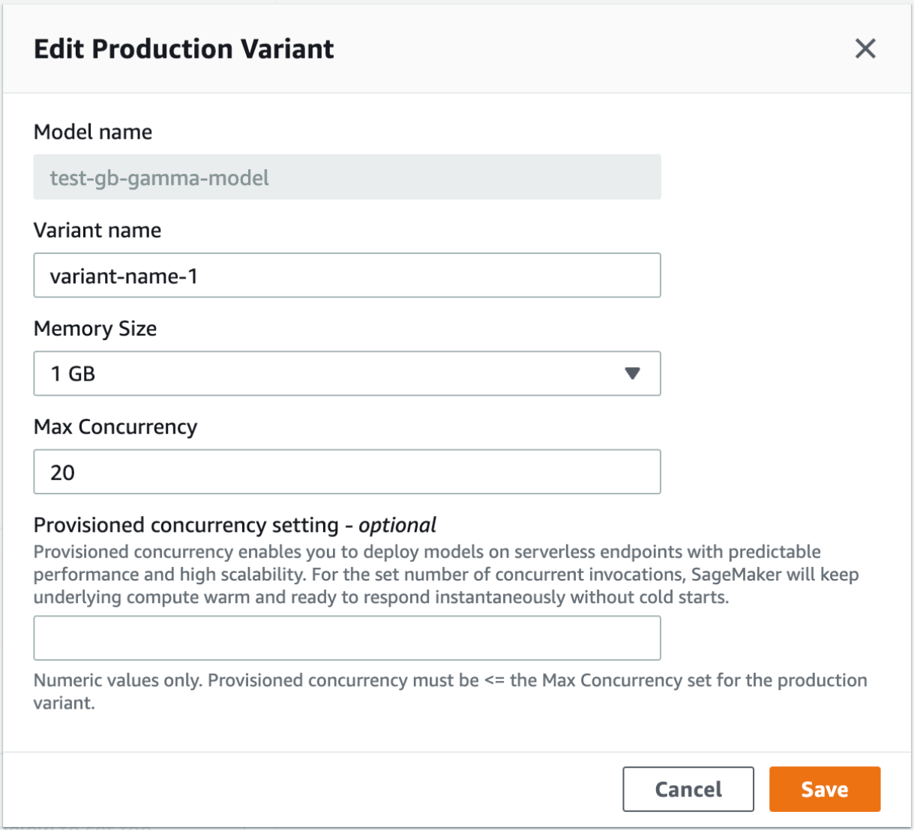

11. For Max Concurrency, enter your desired maximum concurrent invocations for the endpoint.

The maximum value you can enter is 200 and the minimum is 1.

Serverless endpoint operations
6209

## Page 239

Amazon SageMaker AI
Developer Guide

12. (Optional) To use Provisioned Concurrency, enter the desired number of concurrent invocations

in the Provisioned Concurrency setting field. The number of provisioned concurrent
invocations must be less than or equal to the number of maximum concurrent invocations.

13. Choose Save.

14. (Optional) For Tags, enter key-value pairs if you want to create metadata for your endpoint

configuration.

15. Choose Create endpoint configuration.

Create an endpoint

To create a serverless endpoint, you can use the Amazon SageMaker AI console, the
CreateEndpoint API, or the AWS CLI. The API and console approaches are outlined in the following
sections. Once you create your endpoint, it can take a few minutes for the endpoint to become
available.

To create an endpoint (using API)

The following example uses the AWS SDK for Python (Boto3) to call the CreateEndpoint API.
Specify the following values:

• For EndpointName, enter a name for the endpoint that is unique within a Region in your
account.

• For EndpointConfigName, use the name of the endpoint configuration that you created in the
previous section.

response = client.create_endpoint(
EndpointName="<your-endpoint-name>",
EndpointConfigName="<your-endpoint-config>"
)

To create an endpoint (using the console)

1.
Sign in to the Amazon SageMaker AI console.

2.
In the navigation tab, choose Inference.

3.
Next, choose Endpoints.

4.
Choose Create endpoint.

Serverless endpoint operations
6210

## Page 240

Amazon SageMaker AI
Developer Guide

5.
For Endpoint name, enter a name than is unique within a Region in your account.

6.
For Attach endpoint configuration, select Use an existing endpoint configuration.

7.
For Endpoint configuration, select the name of the endpoint configuration you created in the
previous section and then choose Select endpoint configuration.

8.
(Optional) For Tags, enter key-value pairs if you want to create metadata for your endpoint.

9.
Choose Create endpoint.

Serverless endpoint operations
6211

## Page 241

Amazon SageMaker AI
Developer Guide


Serverless endpoint operations
6212

## Page 242

Amazon SageMaker AI
Developer Guide

Invoke a serverless endpoint

In order to perform inference using a serverless endpoint, you must send an HTTP request to the

endpoint. You can use the InvokeEndpoint API or the AWS CLI, which make a POST request to
invoke your endpoint. The maximum request and response payload size for serverless invocations is
4 MB. For serverless endpoints:

• The model must download and the server must respond successfully to /ping within 3 minutes.

• The timeout for the container to respond to inference requests to /invocations is 1 minute.

To invoke an endpoint

The following example uses the AWS SDK for Python (Boto3) to call the InvokeEndpoint API.

Note that unlike the other API calls in this guide, for InvokeEndpoint, you must use SageMaker
Runtime Runtime as the client. Specify the following values:

• For endpoint_name, use the name of the in-service serverless endpoint you want to invoke.

• For content_type, specify the MIME type of your input data in the request body (for example,

application/json).

• For payload, use your request payload for inference. Your payload should be in bytes or a file-
like object.

runtime = boto3.client("sagemaker-runtime")

endpoint_name = "<your-endpoint-name>"
content_type = "<request-mime-type>"
payload = <your-request-body>

response = runtime.invoke_endpoint(
EndpointName=endpoint_name,
ContentType=content_type,
Body=payload
)

Update a serverless endpoint

Before updating your endpoint, create a new endpoint configuration or use an existing endpoint
configuration. The endpoint configuration is where you specify the changes for your update. Then,

Serverless endpoint operations
6213

## Page 243

Amazon SageMaker AI
Developer Guide

you can update your endpoint with the SageMaker AI console, the UpdateEndpoint API, or the
AWS CLI. The process for updating a serverless endpoint is the same as the process for updating
a real-time endpoint. Note that when updating your endpoint, you can experience cold starts
when making requests to the endpoint because SageMaker AI must re-initialize your container and
model.

You may want to update an on-demand serverless endpoint to a serverless endpoint with
provisioned concurrency or adjust the Provisioned Concurrency value for an existing serverless
endpoint with provisioned concurrency. For both cases, you will have to create a new serverless
endpoint configuration with the desired value for Provisioned Concurrency, and apply

UpdateEndpoint to the existing serverless endpoint. For more information on creating a
new serverless endpoint configuration with Provisioned Concurrency, see Create an endpoint
configuration.

If you want to remove Provisioned Concurrency from a serverless endpoint, you will have to create
a new endpoint configuration without specifying any value for Provisioned Concurrency, and then

apply UpdateEndpoint to the endpoint.

Note

Updating a real-time inference endpoint to either an on-demand serverless endpoint or a
serverless endpoint with Provisioned Concurrency is currently not supported.

Update the endpoint

After creating a new serverless endpoint configuration you can use the AWS SDK for Python
(Boto3) or the SageMaker AI console to update an existing serverless endpoint. Examples of how
to update your endpoint using the AWS SDK for Python (Boto3) and the SageMaker AI console are
outlined in the following sections.

To update the endpoint (using Boto3)

The following example uses the AWS SDK for Python (Boto3) to call the update_endpoint method.
Specify at least the following parameters when calling the method:

• For EndpointName, use the name of the endpoint you’re updating.

• For EndpointConfigName, use the name of the endpoint configuration that you want to use
for the update.

Serverless endpoint operations
6214

## Page 244

Amazon SageMaker AI
Developer Guide

response = client.update_endpoint(
EndpointName="<your-endpoint-name>",
EndpointConfigName="<new-endpoint-config>",
)

To update the endpoint (using the console)

1.
Sign in to the Amazon SageMaker AI console.

2.
In the navigation tab, choose Inference.

3.
Next, choose Endpoints.

4.
From the list of endpoints, select the endpoint you want to update.

5.
Choose Change in Endpoint configuration settings section.

6.
For Change the Endpoint configuration, choose Use an existing endpoint configuration.

7.
From the list of endpoint configurations, select the one you want to use for your update.

8.
Choose Select endpoint configuration.

9.
Choose Update endpoint.

Describe a serverless endpoint

You might want to retrieve information about your endpoint, including details such as the
endpoint’s ARN, current status, deployment configuration, and failure reasons. You can find
information about your endpoint using the SageMaker AI console, the DescribeEndpoint API, or the
AWS CLI.

To describe an endpoint (using API)

The following example uses the AWS SDK for Python (Boto3) to call the DescribeEndpoint API. For

EndpointName, use the name of the endpoint you want to check.

response = client.describe_endpoint(
EndpointName="<your-endpoint-name>",
)

To describe an endpoint (using the console)

1.
Sign in to the Amazon SageMaker AI console.

Serverless endpoint operations
6215

## Page 245

Amazon SageMaker AI
Developer Guide

2.
In the navigation tab, choose Inference.

3.
Next, choose Endpoints.

4.
From the list of endpoints, choose the endpoint you want to check.

The endpoint page contains the information about your endpoint.

Delete a serverless endpoint

You can delete your serverless endpoint using the SageMaker AI console, the DeleteEndpoint API,
or the AWS CLI. The following examples show you how to delete your endpoint through the API
and the SageMaker AI console.

To delete an endpoint (using API)

The following example uses the AWS SDK for Python (Boto3) to call the DeleteEndpoint API. For

EndpointName, use the name of the serverless endpoint you want to delete.

response = client.delete_endpoint(
EndpointName="<your-endpoint-name>",
)

To delete an endpoint (using the console)

1.
Sign in to the Amazon SageMaker AI console.

2.
In the navigation tab, choose Inference.

3.
Next, choose Endpoints.

4.
From the list of endpoints, select the endpoint you want to delete.

5.
Choose the Actions drop-down list, and then choose Delete.

6.
When prompted again, choose Delete.

Your endpoint should now begin the deletion process.

Alarms and logs for tracking metrics from serverless endpoints

To monitor your serverless endpoint, you can use Amazon CloudWatch alarms. CloudWatch is
a service that collects metrics in real time from your AWS applications and resources. An alarm
watches metrics as they are collected and gives you the ability to pre-specify a threshold and the

Alarms and logs
6216

## Page 246

Amazon SageMaker AI
Developer Guide

actions to take if that threshold is breached. For example, your CloudWatch alarm can send you a
notification if your endpoint breaches an error threshold. By setting up CloudWatch alarms, you
gain visibility into the performance and functionality of your endpoint. For more information about
CloudWatch alarms, see Using Amazon CloudWatch alarms in the Amazon CloudWatch User Guide.

Monitoring with CloudWatch

The metrics below are an exhaustive list of metrics for serverless endpoints. Any metric not listed
below is not published for serverless endpoints. For information about the following metrics, see
Monitor Amazon SageMaker AI with Amazon CloudWatch.

Common endpoint metrics

These CloudWatch metrics are the same as the metrics published for real-time endpoints.

The OverheadLatency metric tracks all additional latency that SageMaker AI added which
includes the cold start time for launching new compute resources for your serverless endpoint.

Compared to on-demand serverless endpoints, the OverheadLatency for serverless endpoints
with provision concurrency is generally significantly less.

Serverless endpoints can also use the Invocations4XXErrors, Invocations5XXErrors,

Invocations, ModelLatency, ModelSetupTime and MemoryUtilization metrics. To learn
more about these metrics, see SageMaker AI endpoint invocation metrics.

Common serverless endpoint metrics

These CloudWatch metrics are published for both on-demand serverless endpoints and serverless
endpoint with Provisioned Concurrency.

Metric Name
Description
Unit/Stats

The number of concurren
t executions divided by the
maximum concurrency.

Units: None

ServerlessConcurre

ntExecutionsUtiliz

Valid statistics: Average, Max,
Min

ation

Serverless endpoint with Provisioned Concurrency metrics

These CloudWatch metrics are published for serverless endpoints with Provisioned Concurrency.

Alarms and logs
6217

## Page 247

Amazon SageMaker AI
Developer Guide

Metric Name
Description
Unit/Stats

The number of concurrent
executions handled by the

Units: Count

ServerlessProvisio

nedConcurrencyExec

Valid statistics: Average, Max,
Min

endpoint.

utions

The number of concurren
t executions divided by
the allocated Provisioned
Concurrency.

Units: None

ServerlessProvisio

nedConcurrencyUtil

Valid statistics: Average, Max,
Min

ization

Units: Count

ServerlessProvisio

The number of InvokeEnd

nedConcurrencyInvo

point  requests handled by
Provisioned Concurrency.

Valid statistics: Average, Max,
Min

cations

Units: Count

ServerlessProvisio

The number of InvokeEnd

nedConcurrencySpil

point  requests not handled
by Provisioned Concurrency,
that is handled by on-demand
Serverless Inference.

Valid statistics: Average, Max,
Min

loverInvocations

Logs

If you want to monitor the logs from your endpoint for debugging or progress analysis, you can use
Amazon CloudWatch Logs. The SageMaker AI-provided log group that you can use for serverless

endpoints is /aws/sagemaker/Endpoints/[EndpointName]. For more information about
using CloudWatch Logs in SageMaker AI, see CloudWatch Logs for Amazon SageMaker AI. To learn
more about CloudWatch Logs, see What is Amazon CloudWatch Logs? in the Amazon CloudWatch
Logs User Guide.

Automatically scale Provisioned Concurrency for a serverless endpoint

Amazon SageMaker AI automatically scales in or out on-demand serverless endpoints. For
serverless endpoints with Provisioned Concurrency you can use Application Auto Scaling to scale
up or down the Provisioned Concurrency based on your traffic profile, thus optimizing costs.

Automatically scale Provisioned Concurrency for a serverless endpoint
6218

## Page 248

Amazon SageMaker AI
Developer Guide

The following are the prerequisites to autoscale Provisioned Concurrency on serverless endpoints:

• Register a model

• Define a scaling policy

• Apply a scaling policy

Before you can use autoscaling, you must have already deployed a model to a serverless endpoint
with Provisioned Concurrency. Deployed models are referred to as production variants. See Create
an endpoint configuration and Create an endpoint for more information about deploying a model
to a serverless endpoint with Provisioned Concurrency. To specify the metrics and target values
for a scaling policy, you must configure a scaling policy. For more information on how to define
a scaling policy, see Define a scaling policy. After registering your model and defining a scaling
policy, apply the scaling policy to the registered model. For information on how to apply the
scaling policy, see Apply a scaling policy.

For details on other prerequisites and components used with autoscaling, see the Auto scaling
prerequisites section in the SageMaker AI autoscaling documentation.

Register a model

To add autoscaling to a serverless endpoint with Provisioned Concurrency, you first must register
your model (production variant) using AWS CLI or Application Auto Scaling API.

Register a model (AWS CLI)

To register your model, use the register-scalable-target AWS CLI command with the
following parameters:

• --service-namespace – Set this value to sagemaker.

• --resource-id – The resource identifier for the model (specifically the production variant).

For this parameter, the resource type is endpoint and the unique identifier is the name of the

production variant. For example endpoint/MyEndpoint/variant/MyVariant.

• --scalable-dimension – Set this value to

sagemaker:variant:DesiredProvisionedConcurrency.

• --min-capacity – The minimum number of Provisioned Concurrency for the model. Set --

min-capacity to at least 1. It must be equal to or less than the value specified for --max-

capacity.

Automatically scale Provisioned Concurrency for a serverless endpoint
6219

## Page 249

Amazon SageMaker AI
Developer Guide

• --max-capacity – The maximum number of Provisioned Concurrency that should be enabled

through Application Auto Scaling. Set --max-capacity to a minimum of 1. It must be greater

than or equal to the value specified for --min-capacity.

The following example shows how to register a model named MyVariant that is dynamically
scaled to have 1 to 10 Provisioned Concurrency value:

aws application-autoscaling register-scalable-target \
--service-namespace sagemaker \
--scalable-dimension sagemaker:variant:DesiredProvisionedConcurrency \
--resource-id endpoint/MyEndpoint/variant/MyVariant \
--min-capacity 1 \
--max-capacity 10

Register a model (Application Auto Scaling API)

To register your model, use the RegisterScalableTarget Application Auto Scaling API action
with the following parameters:

• ServiceNamespace – Set this value to sagemaker.

• ResourceId – The resource identifier for the model (specifically the production variant). For

this parameter, the resource type is endpoint and the unique identifier is the name of the

production variant. For example endpoint/MyEndpoint/variant/MyVariant.

• ScalableDimension – Set this value to

sagemaker:variant:DesiredProvisionedConcurrency.

• MinCapacity – The minimum number of Provisioned Concurrency for the model. Set

MinCapacity to at least 1. It must be equal to or less than the value specified for

MaxCapacity.

• MaxCapacity – The maximum number of Provisioned Concurrency that should be enabled

through Application Auto Scaling. Set MaxCapacity to a minimum of 1. It must be greater than

or equal to the value specified for MinCapacity.

The following example shows how to register a model named MyVariant that is dynamically
scaled to have 1 to 10 Provisioned Concurrency value:

POST / HTTP/1.1

Automatically scale Provisioned Concurrency for a serverless endpoint
6220

## Page 250

Amazon SageMaker AI
Developer Guide

Host: autoscaling.us-east-2.amazonaws.com
Accept-Encoding: identity
X-Amz-Target: AnyScaleFrontendService.RegisterScalableTarget
X-Amz-Date: 20160506T182145Z
User-Agent: aws-cli/1.10.23 Python/2.7.11 Darwin/15.4.0 botocore/1.4.8
Content-Type: application/x-amz-json-1.1
Authorization: AUTHPARAMS

{
"ServiceNamespace": "sagemaker",
"ResourceId": "endpoint/MyEndPoint/variant/MyVariant",
"ScalableDimension": "sagemaker:variant:DesiredProvisionedConcurrency",
"MinCapacity": 1,
"MaxCapacity": 10
}

Define a scaling policy

To specify the metrics and target values for a scaling policy, you can configure a target-
tracking scaling policy. Define the scaling policy as a JSON block in a text file. You can
then use that text file when invoking the AWS CLI or the Application Auto Scaling API.
To quickly define a target-tracking scaling policy for a serverless endpoint, use the

SageMakerVariantProvisionedConcurrencyUtilization predefined metric.

{
"TargetValue": 0.5,
"PredefinedMetricSpecification":
{
"PredefinedMetricType": "SageMakerVariantProvisionedConcurrencyUtilization"
},
"ScaleOutCooldown": 1,
"ScaleInCooldown": 1
}

Apply a scaling policy

After registering your model, you can apply a scaling policy to your serverless endpoint with
Provisioned Concurrency. See Apply a target-tracking scaling policy to apply a target-tracking
scaling policy that you have defined. If the traffic flow to your serverless endpoint has a predictable

Automatically scale Provisioned Concurrency for a serverless endpoint
6221

## Page 251

Amazon SageMaker AI
Developer Guide

routine then instead of applying a target-tracking scaling policy you might want to schedule
scaling actions at specific times. For more information on scheduling scaling actions, see Scheduled
scaling.

Apply a target-tracking scaling policy

You can use the AWS Management Console, AWS CLI or the Application Auto Scaling API to apply a
target-tracking scaling policy to your serverless endpoint with Provisioned Concurrency.

Apply a target-tracking scaling policy (AWS CLI)

To apply a scaling policy to your model, use the put-scaling-policy AWS CLI; command with
the following parameters:

• --policy-name – The name of the scaling policy.

• --policy-type – Set this value to TargetTrackingScaling.

• --resource-id – The resource identifier for the variant. For this parameter, the resource type

is endpoint and the unique identifier is the name of the variant. For example endpoint/

MyEndpoint/variant/MyVariant.

• --service-namespace – Set this value to sagemaker.

• --scalable-dimension – Set this value to

sagemaker:variant:DesiredProvisionedConcurrency.

• --target-tracking-scaling-policy-configuration – The target-tracking scaling policy
configuration to use for the model.

The following example shows how to apply a target-tracking scaling policy named

MyScalingPolicy to a model named MyVariant. The policy configuration is saved in a file

named scaling-policy.json.

aws application-autoscaling put-scaling-policy \
--policy-name MyScalingPolicy \
--policy-type TargetTrackingScaling \
--service-namespace sagemaker \
--scalable-dimension sagemaker:variant:DesiredProvisionedConcurrency \
--resource-id endpoint/MyEndpoint/variant/MyVariant \
--target-tracking-scaling-policy-configuration file://[file-localtion]/scaling-
policy.json

Automatically scale Provisioned Concurrency for a serverless endpoint
6222

## Page 252

Amazon SageMaker AI
Developer Guide

Apply a target-tracking scaling policy (Application Auto Scaling API)

To apply a scaling policy to your model, use the PutScalingPolicy Application Auto Scaling API
action with the following parameters:

• PolicyName – The name of the scaling policy.

• PolicyType – Set this value to TargetTrackingScaling.

• ResourceId – The resource identifier for the variant. For this parameter, the resource type

is endpoint and the unique identifier is the name of the variant. For example endpoint/

MyEndpoint/variant/MyVariant.

• ServiceNamespace – Set this value to sagemaker.

• ScalableDimension – Set this value to

sagemaker:variant:DesiredProvisionedConcurrency.

• TargetTrackingScalingPolicyConfiguration – The target-tracking scaling policy
configuration to use for the model.

The following example shows how to apply a target-tracking scaling policy named

MyScalingPolicy to a model named MyVariant. The policy configuration is saved in a file

named scaling-policy.json.

POST / HTTP/1.1
Host: autoscaling.us-east-2.amazonaws.com
Accept-Encoding: identity
X-Amz-Target: AnyScaleFrontendService.PutScalingPolicy
X-Amz-Date: 20160506T182145Z
User-Agent: aws-cli/1.10.23 Python/2.7.11 Darwin/15.4.0 botocore/1.4.8
Content-Type: application/x-amz-json-1.1
Authorization: AUTHPARAMS

{
"PolicyName": "MyScalingPolicy",
"ServiceNamespace": "sagemaker",
"ResourceId": "endpoint/MyEndpoint/variant/MyVariant",
"ScalableDimension": "sagemaker:variant:DesiredProvisionedConcurrency",
"PolicyType": "TargetTrackingScaling",
"TargetTrackingScalingPolicyConfiguration":
{
"TargetValue": 0.5,
"PredefinedMetricSpecification":

Automatically scale Provisioned Concurrency for a serverless endpoint
6223

## Page 253

Amazon SageMaker AI
Developer Guide

{
"PredefinedMetricType": "SageMakerVariantProvisionedConcurrencyUtilization"
}
}
}

Apply a target-tracking scaling policy (AWS Management Console)

To apply a target-tracking scaling policy with the AWS Management Console:

1.
Sign in to the Amazon SageMaker AI console.

2.
In the navigation panel, choose Inference.

3.
Choose Endpoints to view a list of all of your endpoints.

4.
Choose the endpoint to which you want to apply the scaling policy. A page with the settings of
the endpoint will appear, with the models (production variant) listed under Endpoint runtime
settings section.

5.
Select the production variant to which you want to apply the scaling policy, and choose
Configure auto scaling. The Configure variant automatic scaling dialog box appears.

Automatically scale Provisioned Concurrency for a serverless endpoint
6224

## Page 254

Amazon SageMaker AI
Developer Guide

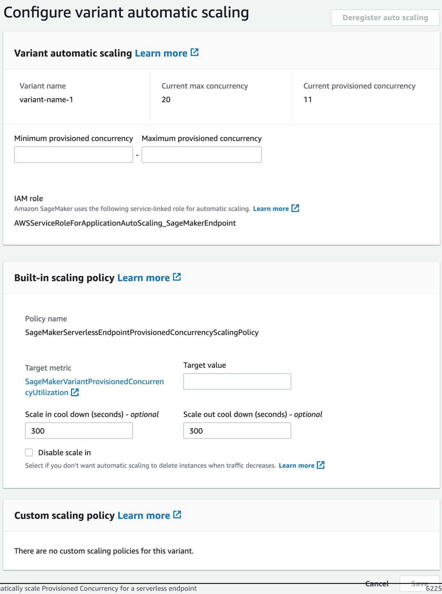

Automatically scale Provisioned Concurrency for a serverless endpoint
6225

## Page 255

Amazon SageMaker AI
Developer Guide

6.
Enter the minimum and maximum Provisioned Concurrency values in the Minimum
provisioned concurrency and Maximum provisioned concurrency fields, respectively, in the
Variant automatic scaling section. Minimum Provisioned Concurrency must be less than or
equal to maximum Provisioned Concurrency.

7.
Enter the target value in the Target value field for the target metric,

SageMakerVariantProvisionedConcurrencyUtilization.

8.
(Optional) Enter scale in cool down and scale out cool down values (in seconds) in Scale in cool

down and Scale out cool down fields respectively.

9.
(Optional) Select Disable scale in if you don’t want auto scaling to delete instance when traffic
decreases.

10. Select Save.

Scheduled scaling

If the traffic to your serverless endpoint with Provisioned Concurrency follows a routine pattern
you might want to schedule scaling actions at specific times, to scale in or scale out Provisioned
Concurrency. You can use the AWS CLI or the Application Auto Scaling to schedule scaling actions.

Scheduled scaling (AWS CLI)

To apply a scaling policy to your model, use the put-scheduled-action AWS CLI; command
with the following parameters:

• --schedule-action-name – The name of the scaling action.

• --schedule – A cron expression that specifies the start and end times of the scaling action with
a recurring schedule.

• --resource-id – The resource identifier for the variant. For this parameter, the resource type

is endpoint and the unique identifier is the name of the variant. For example endpoint/

MyEndpoint/variant/MyVariant.

• --service-namespace – Set this value to sagemaker.

• --scalable-dimension – Set this value to

sagemaker:variant:DesiredProvisionedConcurrency.

• --scalable-target-action – The target of the scaling action.

The following example shows how to add a scaling action named MyScalingAction to a model

named MyVariant on a recurring schedule. On the specified schedule (every day at 12:15 PM

Automatically scale Provisioned Concurrency for a serverless endpoint
6226

## Page 256

Amazon SageMaker AI
Developer Guide

UTC), if the current Provisioned Concurrency is below the value specified for MinCapacity.
Application Auto Scaling scales out the Provisioned Concurrency to the value specified by

MinCapacity.

aws application-autoscaling put-scheduled-action \
--scheduled-action-name 'MyScalingAction' \
--schedule 'cron(15 12 * * ? *)' \
--service-namespace sagemaker \
--resource-id endpoint/MyEndpoint/variant/MyVariant \
--scalable-dimension sagemaker:variant:DesiredProvisionedConcurrency \
--scalable-target-action 'MinCapacity=10'

Scheduled scaling (Application Auto Scaling API)

To apply a scaling policy to your model, use the PutScheduledAction Application Auto Scaling
API action with the following parameters:

• ScheduleActionName – The name of the scaling action.

• Schedule – A cron expression that specifies the start and end times of the scaling action with a
recurring schedule.

• ResourceId – The resource identifier for the variant. For this parameter, the resource type

is endpoint and the unique identifier is the name of the variant. For example endpoint/

MyEndpoint/variant/MyVariant.

• ServiceNamespace – Set this value to sagemaker.

• ScalableDimension – Set this value to

sagemaker:variant:DesiredProvisionedConcurrency.

• ScalableTargetAction – The target of the scaling action.

The following example shows how to add a scaling action named MyScalingAction to a model

named MyVariant on a recurring schedule. On the specified schedule (every day at 12:15 PM

UTC), if the current Provisioned Concurrency is below the value specified for MinCapacity.
Application Auto Scaling scales out the Provisioned Concurrency to the value specified by

MinCapacity.

POST / HTTP/1.1
Host: autoscaling.us-east-2.amazonaws.com

Automatically scale Provisioned Concurrency for a serverless endpoint
6227

## Page 257

Amazon SageMaker AI
Developer Guide

Accept-Encoding: identity
X-Amz-Target: AnyScaleFrontendService.PutScheduledAction
X-Amz-Date: 20160506T182145Z
User-Agent: aws-cli/1.10.23 Python/2.7.11 Darwin/15.4.0 botocore/1.4.8
Content-Type: application/x-amz-json-1.1
Authorization: AUTHPARAMS

{
"ScheduledActionName": "MyScalingAction",
"Schedule": "cron(15 12 * * ? *)",
"ServiceNamespace": "sagemaker",
"ResourceId": "endpoint/MyEndpoint/variant/MyVariant",
"ScalableDimension": "sagemaker:variant:DesiredProvisionedConcurrency",
"ScalableTargetAction": "MinCapacity=10"
}
}
}

Clean up

After you have finished using autoscaling for your serverless endpoint with Provisioned
Concurrency, you should clean up the resources you created. This involves deleting the scaling
policy and deregistering the model from Application Auto Scaling. Cleaning up ensures that you
don't incur unnecessary costs for resources you're no longer using.

Delete a scaling policy

You can delete a scaling policy with the AWS Management Console, the AWS CLI, or the Application
Auto Scaling API. For more information on deleting a scaling policy with the AWS Management
Console, see Delete a scaling policy in the SageMaker AI autoscaling documentation.

Delete a scaling policy (AWS CLI)

To apply a scaling policy to your model, use the delete-scaling-policy AWS CLI; command
with the following parameters:

• --policy-name – The name of the scaling policy.

• --resource-id – The resource identifier for the variant. For this parameter, the resource type

is endpoint and the unique identifier is the name of the variant. For example endpoint/

MyEndpoint/variant/MyVariant.

Automatically scale Provisioned Concurrency for a serverless endpoint
6228

## Page 258

Amazon SageMaker AI
Developer Guide

• --service-namespace – Set this value to sagemaker.

• --scalable-dimension – Set this value to

sagemaker:variant:DesiredProvisionedConcurrency.

The following example deletes scaling policy named MyScalingPolicy from a model named

MyVariant.

aws application-autoscaling delete-scaling-policy \
--policy-name MyScalingPolicy \
--service-namespace sagemaker \
--scalable-dimension sagemaker:variant:DesiredProvisionedConcurrency \
--resource-id endpoint/MyEndpoint/variant/MyVariant

Delete a scaling policy (Application Auto Scaling API)

To delete a scaling policy to your model, use the DeleteScalingPolicy Application Auto Scaling
API action with the following parameters:

• PolicyName – The name of the scaling policy.

• ResourceId – The resource identifier for the variant. For this parameter, the resource type

is endpoint and the unique identifier is the name of the variant. For example endpoint/

MyEndpoint/variant/MyVariant.

• ServiceNamespace – Set this value to sagemaker.

• ScalableDimension – Set this value to

sagemaker:variant:DesiredProvisionedConcurrency.

The following example uses the Application Auto Scaling API to delete a scaling policy named

MyScalingPolicy from a model named MyVariant.

POST / HTTP/1.1
Host: autoscaling.us-east-2.amazonaws.com
Accept-Encoding: identity
X-Amz-Target: AnyScaleFrontendService.DeleteScalingPolicy
X-Amz-Date: 20160506T182145Z
User-Agent: aws-cli/1.10.23 Python/2.7.11 Darwin/15.4.0 botocore/1.4.8
Content-Type: application/x-amz-json-1.1

Automatically scale Provisioned Concurrency for a serverless endpoint
6229

## Page 259

Amazon SageMaker AI
Developer Guide

Authorization: AUTHPARAMS

{
"PolicyName": "MyScalingPolicy",
"ServiceNamespace": "sagemaker",
"ResourceId": "endpoint/MyEndpoint/variant/MyVariant",
"ScalableDimension": "sagemaker:variant:DesiredProvisionedConcurrency",
}

Deregister a model

You can deregister a model with the AWS Management Console, the AWS CLI, or the Application
Auto Scaling API.

Deregister a model (AWS CLI)

To deregister a model from Application Auto Scaling, use the deregister-scalable-target
AWS CLI; command with the following parameters:

• --resource-id – The resource identifier for the variant. For this parameter, the resource type

is endpoint and the unique identifier is the name of the variant. For example endpoint/

MyEndpoint/variant/MyVariant.

• --service-namespace – Set this value to sagemaker.

• --scalable-dimension – Set this value to

sagemaker:variant:DesiredProvisionedConcurrency.

The following example deregisters a model named MyVariant from Application Auto Scaling.

aws application-autoscaling deregister-scalable-target \
--service-namespace sagemaker \
--scalable-dimension sagemaker:variant:DesiredProvisionedConcurrency \
--resource-id endpoint/MyEndpoint/variant/MyVariant

Deregister a model (Application Auto Scaling API)

To deregister a model from Application Auto Scaling use the DeregisterScalableTarget
Application Auto Scaling API action with the following parameters:

Automatically scale Provisioned Concurrency for a serverless endpoint
6230

## Page 260

Amazon SageMaker AI
Developer Guide

• ResourceId – The resource identifier for the variant. For this parameter, the resource type

is endpoint and the unique identifier is the name of the variant. For example endpoint/

MyEndpoint/variant/MyVariant.

• ServiceNamespace – Set this value to sagemaker.

• ScalableDimension – Set this value to

sagemaker:variant:DesiredProvisionedConcurrency.

The following example uses the Application Auto Scaling API to deregister a model named

MyVariant from Application Auto Scaling.

POST / HTTP/1.1
Host: autoscaling.us-east-2.amazonaws.com
Accept-Encoding: identity
X-Amz-Target: AnyScaleFrontendService.DeregisterScalableTarget

X-Amz-Date: 20160506T182145Z
User-Agent: aws-cli/1.10.23 Python/2.7.11 Darwin/15.4.0 botocore/1.4.8
Content-Type: application/x-amz-json-1.1
Authorization: AUTHPARAMS

{
"ServiceNamespace": "sagemaker",
"ResourceId": "endpoint/MyEndpoint/variant/MyVariant",
"ScalableDimension": "sagemaker:variant:DesiredProvisionedConcurrency",
}

Deregister a model (AWS Management Console)

To deregister a model (production variant) with the AWS Management Console:

1.
Open the Amazon SageMaker AI console.

2.
In the navigational panel, choose Inference.

3.
Choose Endpoints to view a list of your endpoints.

4.
Choose the serverless endpoint hosting the production variant. A page with the settings of
the endpoint will appear, with the production variants listed under Endpoint runtime settings
section.

5.
Select the production variant that you want to deregister, and choose Configure auto scaling.
The Configure variant automatic scaling dialog box appears.

Automatically scale Provisioned Concurrency for a serverless endpoint
6231

## Page 261

Amazon SageMaker AI
Developer Guide

6.
Choose Deregister auto scaling.

Troubleshooting

Important

Custom IAM policies that allow Amazon SageMaker Studio or Amazon SageMaker Studio
Classic to create Amazon SageMaker resources must also grant permissions to add tags to
those resources. The permission to add tags to resources is required because Studio and
Studio Classic automatically tag any resources they create. If an IAM policy allows Studio
and Studio Classic to create resources but does not allow tagging, "AccessDenied" errors can
occur when trying to create resources. For more information, see Provide permissions for
tagging SageMaker AI resources.
AWS managed policies for Amazon SageMaker AI that give permissions to create
SageMaker resources already include permissions to add tags while creating those
resources.

If you are having trouble with Serverless Inference, refer to the following troubleshooting tips.

Container issues

If the container you use for a serverless endpoint is the same one you used on an instance-based
endpoint, your container may not have permissions to write files. This can happen for the following
reasons:

• Your serverless endpoint fails to create or update due to a ping health check failure.

• The Amazon CloudWatch logs for the endpoint show that the container is failing to write to
some file or directory due to a permissions error.

To fix this issue, you can try to add read, write, and execute permissions for other on the file or
directory and then rebuild the container. You can perform the following steps to complete this
process:

1.
In the Dockerfile you used to build your container, add the following command: RUN chmod o

+rwX <file or directory name>

2.
Rebuild the container.

Troubleshooting
6232

## Page 262

Amazon SageMaker AI
Developer Guide

3.
Upload the new container image to Amazon ECR.

4.
Try to create or update the serverless endpoint again.

Asynchronous inference

Amazon SageMaker Asynchronous Inference is a capability in SageMaker AI that queues incoming
requests and processes them asynchronously. This option is ideal for requests with large payload
sizes (up to 1GB), long processing times (up to one hour), and near real-time latency requirements.
Asynchronous Inference enables you to save on costs by autoscaling the instance count to zero
when there are no requests to process, so you only pay when your endpoint is processing requests.

How It Works

Creating an asynchronous inference endpoint is similar to creating real-time inference
endpoints. You can use your existing SageMaker AI models and only need to specify the

AsyncInferenceConfig object while creating your endpoint configuration with the

EndpointConfig field in the CreateEndpointConfig API. The following diagram shows the
architecture and workflow of Asynchronous Inference.

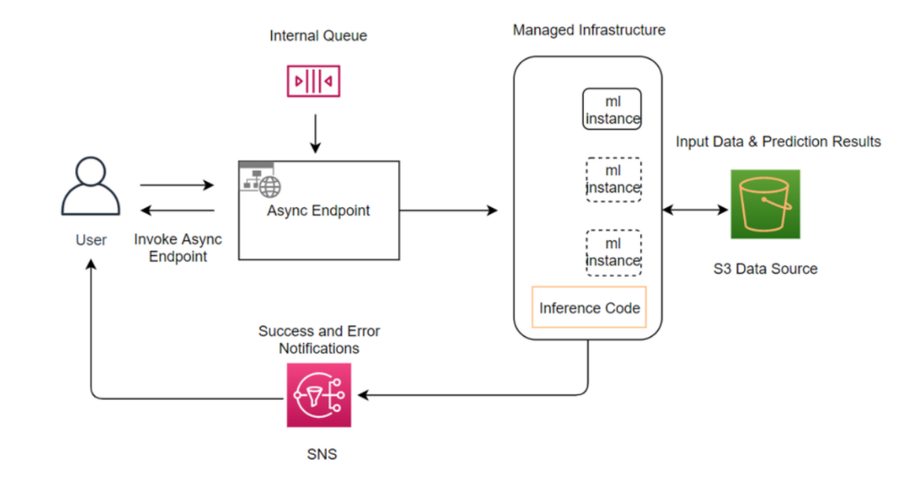

Asynchronous inference
6233

## Page 263

Amazon SageMaker AI
Developer Guide

To invoke the endpoint, you need to place the request payload in Amazon S3. You also need

to provide a pointer to this payload as a part of the InvokeEndpointAsync request. Upon
invocation, SageMaker AI queues the request for processing and returns an identifier and output
location as a response. Upon processing, SageMaker AI places the result in the Amazon S3 location.
You can optionally choose to receive success or error notifications with Amazon SNS. For more
information about how to set up asynchronous notifications, see Check prediction results.

Note

The presence of an asynchronous inference configuration (AsyncInferenceConfig)
object in the endpoint configuration implies that the endpoint can only receive
asynchronous invocations.

How Do I Get Started?

If you are a first-time user of Amazon SageMaker Asynchronous Inference, we recommend that you
do the following:

• Read Asynchronous endpoint operations for information on how to create, invoke, update, and
delete an asynchronous endpoint.

• Explore the Asynchronous Inference example notebook in the aws/amazon-sagemaker-examples
GitHub repository.

Note that if your endpoint uses any of the features listed in this Exclusions page, you cannot use
Asynchronous Inference.

Asynchronous endpoint operations

This guide demonstrates the prerequisites you must satisfy to create an asynchronous endpoint,
along with how to create, invoke, and delete your asynchronous endpoints. You can create, update,
delete, and invoke asynchronous endpoints with the AWS SDKs and the Amazon SageMaker Python
SDK.

Topics

• Complete the prerequisites

• How to create an Asynchronous Inference Endpoint

How Do I Get Started?
6234

## Page 264

Amazon SageMaker AI
Developer Guide

• Invoke an Asynchronous Endpoint

• Update an Asynchronous Endpoint

• Delete an Asynchronous Endpoint

Complete the prerequisites

The following topic describes the prerequisites that you must complete before creating an
asyncrhonous endpoint. These prerequisites include properly storing your model artifacts,
configuring an AWS IAM with the correct permissions, and selecting a container image.

To complete the prerequisites

1.
Create an IAM role for Amazon SageMaker AI.

Asynchronous Inference needs access to your Amazon S3 bucket URI. To facilitate this, create
an IAM role that can run SageMaker AI and has permission to access Amazon S3 and Amazon
SNS. Using this role, SageMaker AI can run under your account and access your Amazon S3
bucket and Amazon SNS topics.

You can create an IAM role by using the IAM console, AWS SDK for Python (Boto3), or AWS CLI.
The following is an example of how to create an IAM role and attach the necessary policies
with the IAM console.

a.
Sign in to the AWS Management Console and open the IAM console at https://
console.aws.amazon.com/iam/.

b.
In the navigation pane of the IAM console, choose Roles, and then choose Create role.

c.
For Select type of trusted entity, choose AWS service.

d.
Choose the service that you want to allow to assume this role. In this case, choose
SageMaker AI. Then choose Next: Permissions.

• This automatically creates an IAM policy that grants access to related services such as
Amazon S3, Amazon ECR, and CloudWatch Logs.

e.
Choose Next: Tags.

f.
(Optional) Add metadata to the role by attaching tags as key–value pairs. For more
information about using tags in IAM, see Tagging IAM resources.

g.
Choose Next: Review.

h.
Type in a Role name.

Asynchronous endpoint operations
6235

## Page 265

Amazon SageMaker AI
Developer Guide

i.
If possible, type a role name or role name suffix. Role names must be unique within your
AWS account. They are not distinguished by case. For example, you cannot create roles

named both PRODROLE and prodrole. Because other AWS resources might reference the
role, you cannot edit the name of the role after it has been created.

j.
(Optional) For Role description, type a description for the new role.

k.
Review the role and then choose Create role.

Note the SageMaker AI role ARN. To find the role ARN using the console, do the following:

i.
Go to the IAM console: https://console.aws.amazon.com/iam/

ii.
Select Roles.

iii.
Search for the role you just created by typing in the name of the role in the search
field.

iv.
Select the role.

v.
The role ARN is at the top of the Summary page.

2.
Add Amazon SageMaker AI, Amazon S3 and Amazon SNS Permissions to your IAM Role.

Once the role is created, grant SageMaker AI, Amazon S3, and optionally Amazon SNS
permissions to your IAM role.

Choose Roles in the IAM console. Search for the role you created by typing in your role name
in the Search field.

a.
Choose your role.

b.
Next, choose Attach Policies.

c.
Amazon SageMaker Asynchronous Inference needs permission to perform the following

actions: "sagemaker:CreateModel", "sagemaker:CreateEndpointConfig",

"sagemaker:CreateEndpoint", and "sagemaker:InvokeEndpointAsync".

These actions are included in the AmazonSageMakerFullAccess policy. Add this policy

to your IAM role. Search for AmazonSageMakerFullAccess in the Search field. Select

AmazonSageMakerFullAccess.

d.
Choose Attach policy.

e.
Next, choose Attach Policies to add Amazon S3 permissions.

f.
Select Create policy.

g.
Select the JSON tab.

Asynchronous endpoint operations
6236

## Page 266

Amazon SageMaker AI
Developer Guide

h.
Add the following policy statement:

JSON

{
"Version":"2012-10-17",
"Statement": [
{
"Action": [
"s3:GetObject",
"s3:PutObject",
"s3:AbortMultipartUpload",
"s3:ListBucket"
],
"Effect": "Allow",
"Resource": "arn:aws:s3:::bucket_name/*"

}
]
}

i.
Choose Next: Tags.

j.
Type in a Policy name.

k.
Choose Create policy.

l.
Repeat the same steps you completed to add Amazon S3 permissions in order to add
Amazon SNS permissions. For the policy statement, attach the following:

JSON

{
"Version":"2012-10-17",
"Statement": [
{
"Action": [
"sns:Publish"
],
"Effect": "Allow",
"Resource": "arn:aws:sns:us-east-1:111122223333:SNS_Topic"
}
]

Asynchronous endpoint operations
6237

## Page 267

Amazon SageMaker AI
Developer Guide

}

3.
Upload your inference data (e.g., machine learning model, sample data) to Amazon S3.

4.
Select a prebuilt Docker inference image or create your own Inference Docker Image.

SageMaker AI provides containers for its built-in algorithms and prebuilt Docker images for
some of the most common machine learning frameworks, such as Apache MXNet, TensorFlow,
PyTorch, and Chainer. For a full list of the available SageMaker AI images, see Available Deep
Learning Containers Images. If you choose to use a SageMaker AI provided container, you can
increase the endpoint timeout and payload sizes from the default by setting the environment
variables in the container. To learn how to set the different environment variables for each
framework, see the Create a Model step of creating an asynchronous endpoint.

If none of the existing SageMaker AI containers meet your needs and you don't have an

existing container of your own, you may need to create a new Docker container. See Containers
with custom inference code for information on how to create your Docker image.

5.
Create an Amazon SNS topic (optional)

Create an Amazon Simple Notification Service (Amazon SNS) topic that sends notifications
about requests that have completed processing. Amazon SNS is a notification service
for messaging-oriented applications, with multiple subscribers requesting and receiving
"push" notifications of time-critical messages via a choice of transport protocols, including
HTTP, Amazon SQS, and email. You can specify Amazon SNS topics when you create

an EndpointConfig object when you specify AsyncInferenceConfig using the

EndpointConfig API.

Follow the steps to create and subscribe to an Amazon SNS topic.

a.
Using Amazon SNS console, create a topic. For instructions, see Creating an Amazon SNS
topic in the Amazon Simple Notification Service Developer Guide.

b.
Subscribe to the topic. For instructions, see Subscribing to an Amazon SNS topic in the
Amazon Simple Notification Service Developer Guide.

c.
When you receive email requesting that you confirm your subscription to the topic,
confirm the subscription.

d.
Note the topic Amazon Resource Name (ARN). The Amazon SNS topic you created
is another resource in your AWS account, and it has a unique ARN. The ARN is in the
following format:

Asynchronous endpoint operations
6238

## Page 268

Amazon SageMaker AI
Developer Guide

arn:aws:sns:aws-region:account-id:topic-name

For more information about Amazon SNS, see the Amazon SNS Developer Guide.

How to create an Asynchronous Inference Endpoint

Create an asynchronous endpoint the same way you would create an endpoint using SageMaker AI
hosting services:

• Create a model in SageMaker AI with CreateModel.

• Create an endpoint configuration with CreateEndpointConfig.

• Create an HTTPS endpoint with CreateEndpoint.

To create an endpoint, you first create a model with CreateModel, where you point to the
model artifact and a Docker registry path (Image). You then create a configuration using

CreateEndpointConfig where you specify one or more models that were created using the

CreateModel API to deploy and the resources that you want SageMaker AI to provision. Create

your endpoint with CreateEndpoint using the endpoint configuration specified in the request.

You can update an asynchronous endpoint with the UpdateEndpoint API. Send and receive

inference requests from the model hosted at the endpoint with InvokeEndpointAsync. You can

delete your endpoints with the DeleteEndpoint API.

For a full list of the available SageMaker Images, see Available Deep Learning Containers Images.
See Containers with custom inference code for information on how to create your Docker image.

Topics

• Create a Model

• Create an Endpoint Configuration

• Create Endpoint

Create a Model

The following example shows how to create a model using the AWS SDK for Python (Boto3). The
first few lines define:

Asynchronous endpoint operations
6239

## Page 269

Amazon SageMaker AI
Developer Guide

• sagemaker_client: A low-level SageMaker AI client object that makes it easy to send and
receive requests to AWS services.

• sagemaker_role: A string variable with the SageMaker AI IAM role Amazon Resource Name
(ARN).

• aws_region: A string variable with the name of your AWS region.

import boto3

# Specify your AWS Region
aws_region='<aws_region>'

# Create a low-level SageMaker service client.
sagemaker_client = boto3.client('sagemaker', region_name=aws_region)

# Role to give SageMaker permission to access AWS services.
sagemaker_role= "arn:aws:iam::<account>:role/*"

Next, specify the location of the pre-trained model stored in Amazon S3. In this example, we use

a pre-trained XGBoost model named demo-xgboost-model.tar.gz. The full Amazon S3 URI is

stored in a string variable model_url:

#Create a variable w/ the model S3 URI
s3_bucket = '<your-bucket-name>' # Provide the name of your S3 bucket
bucket_prefix='saved_models'
model_s3_key = f"{bucket_prefix}/demo-xgboost-model.tar.gz"

#Specify S3 bucket w/ model
model_url = f"s3://{s3_bucket}/{model_s3_key}"

Specify a primary container. For the primary container, you specify the Docker image that contains
inference code, artifacts (from prior training), and a custom environment map that the inference
code uses when you deploy the model for predictions.

In this example, we specify an XGBoost built-in algorithm container image:

from sagemaker import image_uris

# Specify an AWS container image.

Asynchronous endpoint operations
6240

## Page 270

Amazon SageMaker AI
Developer Guide

container = image_uris.retrieve(region=aws_region, framework='xgboost',
version='0.90-1')

Create a model in Amazon SageMaker AI with CreateModel. Specify the following:

• ModelName: A name for your model (in this example it is stored as a string variable called

model_name).

• ExecutionRoleArn: The Amazon Resource Name (ARN) of the IAM role that Amazon
SageMaker AI can assume to access model artifacts and Docker images for deployment on ML
compute instances or for batch transform jobs.

• PrimaryContainer: The location of the primary Docker image containing inference code,
associated artifacts, and custom environment maps that the inference code uses when the model
is deployed for predictions.

model_name = '<The_name_of_the_model>'

#Create model
create_model_response = sagemaker_client.create_model(
ModelName = model_name,
ExecutionRoleArn = sagemaker_role,
PrimaryContainer = {
'Image': container,
'ModelDataUrl': model_url,
})

See CreateModel description in the SageMaker API Reference Guide for a full list of API
parameters.

If you're using a SageMaker AI provided container, you can increase the model server timeout
and payload sizes from the default values to the framework‐supported maximums by setting
environment variables in this step. You might not be able to leverage the maximum timeout and
payload sizes that Asynchronous Inference supports if you don't explicitly set these variables.
The following example shows how you can set the environment variables for a PyTorch Inference
container based on TorchServe.

model_name = '<The_name_of_the_model>'

#Create model

Asynchronous endpoint operations
6241

## Page 271

Amazon SageMaker AI
Developer Guide

create_model_response = sagemaker_client.create_model(
ModelName = model_name,
ExecutionRoleArn = sagemaker_role,
PrimaryContainer = {
'Image': container,
'ModelDataUrl': model_url,
'Environment': {
'TS_MAX_REQUEST_SIZE': '100000000',
'TS_MAX_RESPONSE_SIZE': '100000000',
'TS_DEFAULT_RESPONSE_TIMEOUT': '1000'
},
})

After you finish creating your endpoint, you should test that you've set the environment variables

correctly by printing them out from your inference.py script. The following table lists the
environment variables for several frameworks that you can set to change the default values.

Framework
Environment variables

PyTorch 1.8 (based on TorchServe)
'TS_MAX_REQUEST_SIZE': '100000000'

'TS_MAX_RESPONSE_SIZE': '100000000'

'TS_DEFAULT_RESPONSE_TIMEOUT': '1000'

PyTorch 1.4 (based on MMS)
'MMS_MAX_REQUEST_SIZE': '1000000000'

'MMS_MAX_RESPONSE_SIZE': '1000000000'

'MMS_DEFAULT_RESPONSE_TIMEOUT': '900'

HuggingFace Inference Container (based on
MMS)

'MMS_MAX_REQUEST_SIZE': '2000000000'

'MMS_MAX_RESPONSE_SIZE': '2000000000'

'MMS_DEFAULT_RESPONSE_TIMEOUT': '900'

Create an Endpoint Configuration

Once you have a model, create an endpoint configuration with CreateEndpointConfig. Amazon
SageMaker AI hosting services uses this configuration to deploy models. In the configuration, you

Asynchronous endpoint operations
6242

## Page 272

Amazon SageMaker AI
Developer Guide

identify one or more models, created using with CreateModel, to deploy the resources that you

want Amazon SageMaker AI to provision. Specify the AsyncInferenceConfig object and provide

an output Amazon S3 location for OutputConfig. You can optionally specify Amazon SNS topics
on which to send notifications about prediction results. For more information about Amazon SNS

topics, see Configuring Amazon SNS.

The following example shows how to create an endpoint configuration using AWS SDK for Python
(Boto3):

import datetime
from time import gmtime, strftime

# Create an endpoint config name. Here we create one based on the date
# so it we can search endpoints based on creation time.
endpoint_config_name = f"XGBoostEndpointConfig-{strftime('%Y-%m-%d-%H-%M-%S',
gmtime())}"

# The name of the model that you want to host. This is the name that you specified when
creating the model.
model_name='<The_name_of_your_model>'

create_endpoint_config_response = sagemaker_client.create_endpoint_config(
EndpointConfigName=endpoint_config_name, # You will specify this name in a
CreateEndpoint request.
# List of ProductionVariant objects, one for each model that you want to host at
this endpoint.
ProductionVariants=[
{
"VariantName": "variant1", # The name of the production variant.
"ModelName": model_name,
"InstanceType": "ml.m5.xlarge", # Specify the compute instance type.
"InitialInstanceCount": 1 # Number of instances to launch initially.
}
],
AsyncInferenceConfig={
"OutputConfig": {
# Location to upload response outputs when no location is provided in the
request.
"S3OutputPath": f"s3://{s3_bucket}/{bucket_prefix}/output"
# (Optional) specify Amazon SNS topics
"NotificationConfig": {
"SuccessTopic": "arn:aws:sns:aws-region:account-id:topic-name",
"ErrorTopic": "arn:aws:sns:aws-region:account-id:topic-name",

Asynchronous endpoint operations
6243

## Page 273

Amazon SageMaker AI
Developer Guide

}
},
"ClientConfig": {
# (Optional) Specify the max number of inflight invocations per instance
# If no value is provided, Amazon SageMaker will choose an optimal value
for you
"MaxConcurrentInvocationsPerInstance": 4
}
}
)

print(f"Created EndpointConfig:
{create_endpoint_config_response['EndpointConfigArn']}")

In the aforementioned example, you specify the following keys for OutputConfig for the

AsyncInferenceConfig field:

• S3OutputPath: Location to upload response outputs when no location is provided in the
request.

• NotificationConfig: (Optional) SNS topics that post notifications to you when an inference

request is successful (SuccessTopic) or if it fails (ErrorTopic).

You can also specify the following optional argument for ClientConfig in the

AsyncInferenceConfig field:

• MaxConcurrentInvocationsPerInstance: (Optional) The maximum number of concurrent
requests sent by the SageMaker AI client to the model container.

Create Endpoint

Once you have your model and endpoint configuration, use the CreateEndpoint API to create
your endpoint. The endpoint name must be unique within an AWS Region in your AWS account.

The following creates an endpoint using the endpoint configuration specified in the request.
Amazon SageMaker AI uses the endpoint to provision resources and deploy models.

# The name of the endpoint.The name must be unique within an AWS Region in your AWS
account.
endpoint_name = '<endpoint-name>'

Asynchronous endpoint operations
6244

## Page 274

Amazon SageMaker AI
Developer Guide

# The name of the endpoint configuration associated with this endpoint.
endpoint_config_name='<endpoint-config-name>'

create_endpoint_response = sagemaker_client.create_endpoint(
EndpointName=endpoint_name,
EndpointConfigName=endpoint_config_name)

When you call the CreateEndpoint API, Amazon SageMaker Asynchronous Inference sends a
test notification to check that you have configured an Amazon SNS topic. Amazon SageMaker

Asynchronous Inference also sends test notifications after calls to UpdateEndpoint and

UpdateEndpointWeightsAndCapacities. This lets SageMaker AI check that you have the
required permissions. The notification can simply be ignored. The test notification has the
following form:

{
"eventVersion":"1.0",
"eventSource":"aws:sagemaker",
"eventName":"TestNotification"
}

Invoke an Asynchronous Endpoint

Get inferences from the model hosted at your asynchronous endpoint with

InvokeEndpointAsync.

Note

If you have not done so already, upload your inference data (e.g., machine learning model,
sample data) to Amazon S3.

Specify the following fields in your request:

• For InputLocation, specify the location of your inference data.

• For EndpointName, specify the name of your endpoint.

• (Optional) For InvocationTimeoutSeconds, you can set the max timeout for the requests.
You can set this value to a maximum of 3600 seconds (one hour) on a per-request basis. If you
don't specify this field in your request, by default the request times out at 15 minutes.

Asynchronous endpoint operations
6245

## Page 275

Amazon SageMaker AI
Developer Guide

# Create a low-level client representing Amazon SageMaker Runtime
sagemaker_runtime = boto3.client("sagemaker-runtime", region_name=<aws_region>)

# Specify the location of the input. Here, a single SVM sample
input_location = "s3://bucket-name/test_point_0.libsvm"

# The name of the endpoint. The name must be unique within an AWS Region in your AWS
account.
endpoint_name='<endpoint-name>'

# After you deploy a model into production using SageMaker AI hosting
# services, your client applications use this API to get inferences
# from the model hosted at the specified endpoint.
response = sagemaker_runtime.invoke_endpoint_async(
EndpointName=endpoint_name,
InputLocation=input_location,

InvocationTimeoutSeconds=3600)

You receive a response as a JSON string with your request ID and the name of the Amazon S3
bucket that will have the response to the API call after it is processed.

Update an Asynchronous Endpoint

Update an asynchronous endpoint with the UpdateEndpoint API. When you update an endpoint,
SageMaker AI first provisions and switches to the new endpoint configuration you specify before
it deletes the resources that were provisioned in the previous endpoint configuration. Do not

delete an EndpointConfig with an endpoint that is live or while the UpdateEndpoint or

CreateEndpoint operations are being performed on the endpoint.

# The name of the endpoint. The name must be unique within an AWS Region in your AWS
account.
endpoint_name='<endpoint-name>'

# The name of the endpoint configuration associated with this endpoint.
endpoint_config_name='<endpoint-config-name>'

sagemaker_client.update_endpoint(
EndpointConfigName=endpoint_config_name,
EndpointName=endpoint_name
)

Asynchronous endpoint operations
6246

## Page 276

Amazon SageMaker AI
Developer Guide

When Amazon SageMaker AI receives the request, it sets the endpoint status to Updating. After
updating the asynchronous endpoint, it sets the status to InService. To check the status of an

endpoint, use the DescribeEndpoint API. For a full list of parameters you can specify when

updating an endpoint, see the UpdateEndpoint API.

Delete an Asynchronous Endpoint

Delete an asynchronous endpoint in a similar manner to how you would delete a SageMaker AI

hosted endpoint with the DeleteEndpoint API. Specify the name of the asynchronous endpoint
you want to delete. When you delete an endpoint, SageMaker AI frees up all of the resources that
were deployed when the endpoint was created. Deleting a model does not delete model artifacts,
inference code, or the IAM role that you specified when creating the model.

Delete your SageMaker AI model with the DeleteModel API or with the SageMaker AI console.

Boto3

import boto3

# Create a low-level SageMaker service client.
sagemaker_client = boto3.client('sagemaker', region_name=<aws_region>)
sagemaker_client.delete_endpoint(EndpointName='<endpoint-name>')

SageMaker AI console

1. Navigate to the SageMaker AI console at https://console.aws.amazon.com/sagemaker/.

2. Expand the Inference dropdown list.

3. Select Endpoints.

4. Search for endpoint in the Search endpoints search bar.

5. Select your endpoint.

6. Choose Delete.

In addition to deleting the asynchronous endpoint, you might want to clear up other resources
that were used to create the endpoint, such as the Amazon ECR repository (if you created a custom
inference image), the SageMaker AI model, and the asynchronous endpoint configuration itself.

Asynchronous endpoint operations
6247

## Page 277

Amazon SageMaker AI
Developer Guide

Alarms and logs for tracking metrics from asynchronous endpoints

You can monitor SageMaker AI using Amazon CloudWatch, which collects raw data and processes
it into readable, near real-time metrics. With Amazon CloudWatch, you can access historical
information and gain a better perspective on how your web application or service is performing.
For more information about Amazon CloudWatch, see What is Amazon CloudWatch?

Monitoring with CloudWatch

The metrics below are an exhaustive list of metrics for asynchronous endpoints and are in the

the AWS/SageMaker namespace. Any metric not listed below is not published if the endpoint is
enabled for asynchronous inference. Such metrics include (but are not limited to):

• OverheadLatency

• Invocations

• InvocationsPerInstance

Common Endpoint Metrics

These metrics are the same as the metrics published for real-time endpoints today. For more
information about other metrics in Amazon CloudWatch, see Monitor SageMaker AI with Amazon
CloudWatch.

Metric Name
Description
Unit/Stats

Invocation4XXErrors
The number of requests

Units: None

where the model returned a
4xx HTTP response code. For
each 4xx response, 1 is sent;
otherwise, 0 is sent.

Valid statistics: Average, Sum

Invocation5XXErrors
The number of InvokeEnd
point requests where the
model returned a 5xx HTTP
response code. For each 5xx
response, 1 is sent; otherwise
, 0 is sent.

Units: None

Valid statistics: Average, Sum

Alarms and logs
6248

## Page 278

Amazon SageMaker AI
Developer Guide

Metric Name
Description
Unit/Stats

ModelLatency
The interval of time taken
by a model to respond as
viewed from SageMaker AI.
This interval includes the
local communication times
taken to send the request and
to fetch the response from
the container of a model and
the time taken to complete
the inference in the container.

Units: Microseconds

Valid statistics: Average, Sum,
Min, Max, Sample Count

Asynchronous Inference Endpoint Metrics

These metrics are published for endpoints enabled for asynchronous inference. The following

metrics are published with the EndpointName dimension:

Metric Name
Description
Unit/Stats

The number of items in the
queue for an endpoint that
are currently being processed
or yet to be processed.

Units: Count

ApproximateBacklog

Size

Valid statistics: Average, Max,
Min

Number of items in the queue
divided by the number of
instances behind an endpoint.
This metric is primarily used
for setting up application
autoscaling for an async-ena
bled endpoint.

Units: Count

ApproximateBacklog

SizePerInstance

Valid statistics: Average, Max,
Min

Age of the oldest request in
the queue.

Units: Seconds

ApproximateAgeOfOl

destRequest

Valid statistics: Average, Max,
Min

Alarms and logs
6249

## Page 279

Amazon SageMaker AI
Developer Guide

Metric Name
Description
Unit/Stats

Units: Count

HasBacklogWithoutC

The value of this metric is 1
when there are requests in
the queue but zero instances
behind the endpoint. The

apacity

Valid statistics: Average

value is 0 at all other times.
You can use this metric for
autoscaling your endpoint
up from zero instances upon
receiving a new request in the
queue.

The following metrics are published with the EndpointName and VariantName dimensions:

Metric Name
Description
Unit/Stats

When an inference failure
occurs due to an issue
downloading the request
from Amazon S3.

Units: Count

RequestDownloadFai

lures

Valid statistics: Sum

When an inference failure
occurs due to an issue
uploading the response to

Units: Count

ResponseUploadFail

ures

Valid statistics: Sum

Amazon S3.

NotificationFailures
When an issue occurs
publishing notifications.

Units: Count

Valid statistics: Sum

Total time to download the
request payload.

Units: Microseconds

RequestDownloadLat

ency

Valid statistics: Average, Sum,
Min, Max, Sample Count

Total time to upload the
response payload.

Units: Microseconds

ResponseUploadLate

ncy

Alarms and logs
6250

## Page 280

Amazon SageMaker AI
Developer Guide

Metric Name
Description
Unit/Stats

Valid statistics: Average, Sum,
Min, Max, Sample Count

ExpiredRequests
Number of requests in
the queue that fail due to
reaching their specified
request TTL.

Units: Count

Valid statistics: Sum

InvocationFailures
If an invocation fails for any
reason.

Units: Count

Valid statistics: Sum

Number of async invocations
processed by the endpoint.

Units: Count

InvocationsProcess

sed

Valid statistics: Sum

TimeInBacklog
Total time the request
was queued before being
processed. This does not
include the actual processin
g time (i.e. downloading
time, uploading time, model
latency).

Units: Milliseconds

Valid statistics: Average, Sum,
Min, Max, Sample Count

TotalProcessingTime
Time the inference request
was recieved by SageMaker
AI to the time the request
finished processing. This
includes time in backlog and
time to upload and send
response notifications, if any.

Units: Milliseconds

Valid statistics: Average, Sum,
Min, Max, Sample Count

Amazon SageMaker Asynchronous Inference also includes host-level metrics. For information on
host-level metrics, see SageMaker AI Jobs and Endpoint Metrics.

Alarms and logs
6251

## Page 281

Amazon SageMaker AI
Developer Guide

Logs

In addition to the Model container logs that are published to Amazon CloudWatch in your account,
you also get a new platform log for tracing and debugging inference requests.

The new logs are published under the Endpoint Log Group:

/aws/sagemaker/Endpoints/[EndpointName]

The log stream name consists of:

[production-variant-name]/[instance-id]/data-log.

Log lines contain the request’s inference ID so that errors can be easily mapped to a particular
request.

Check prediction results

There are several ways you can check predictions results from your asynchronous endpoint. Some
options are:

1. Amazon SNS topics.

2. Check for outputs in your Amazon S3 bucket.

Amazon SNS Topics

Amazon SNS is a notification service for messaging-oriented applications, with multiple subscribers
requesting and receiving "push" notifications of time-critical messages via a choice of transport
protocols, including HTTP, Amazon SQS, and email. Amazon SageMaker Asynchronous Inference

posts notifications when you create an endpoint with CreateEndpointConfig and specify an
Amazon SNS topic.

Note

In order to receive Amazon SNS notifications, your IAM role must have sns:Publish
permissions. See the Complete the prerequisites for information on requirements you must
satisfy to use Asynchronous Inference.

Check prediction results
6252

## Page 282

Amazon SageMaker AI
Developer Guide

To use Amazon SNS to check prediction results from your asynchronous endpoint, you first need to
create a topic, subscribe to the topic, confirm your subscription to the topic, and note the Amazon
Resource Name (ARN) of that topic. For detailed information on how to create, subscribe, and find
the Amazon ARN of an Amazon SNS topic, see Configuring Amazon SNS.

Provide the Amazon SNS topic ARN(s) in the AsyncInferenceConfig field when you create an

endpoint configuration with CreateEndpointConfig. You can specify both an Amazon SNS

ErrorTopic and an SuccessTopic.

import boto3

sagemaker_client = boto3.client('sagemaker', region_name=<aws_region>)

sagemaker_client.create_endpoint_config(
EndpointConfigName=<endpoint_config_name>, # You specify this name in a
CreateEndpoint request.
# List of ProductionVariant objects, one for each model that you want to host at
this endpoint.
ProductionVariants=[
{
"VariantName": "variant1", # The name of the production variant.
"ModelName": "model_name",
"InstanceType": "ml.m5.xlarge", # Specify the compute instance type.
"InitialInstanceCount": 1 # Number of instances to launch initially.
}
],
AsyncInferenceConfig={
"OutputConfig": {
# Location to upload response outputs when no location is provided in the
request.
"S3OutputPath": "s3://<bucket>/<output_directory>"
"NotificationConfig": {
"SuccessTopic": "arn:aws:sns:aws-region:account-id:topic-name",
"ErrorTopic": "arn:aws:sns:aws-region:account-id:topic-name",
}
}
}
)

After creating your endpoint and invoking it, you receive a notification from your Amazon SNS
topic. For example, if you subscribed to receive email notifications from your topic, you receive an

Check prediction results
6253

## Page 283

Amazon SageMaker AI
Developer Guide

email notification every time you invoke your endpoint. The following example shows the JSON
content of a successful invocation email notification.

{

"awsRegion":"us-east-1",
"eventTime":"2022-01-25T22:46:00.608Z",
"receivedTime":"2022-01-25T22:46:00.455Z",
"invocationStatus":"Completed",
"requestParameters":{
"contentType":"text/csv",
"endpointName":"<example-endpoint>",
"inputLocation":"s3://<bucket>/<input-directory>/input-data.csv"
},
"responseParameters":{
"contentType":"text/csv; charset=utf-8",
"outputLocation":"s3://<bucket>/<output_directory>/prediction.out"
},
"inferenceId":"11111111-2222-3333-4444-555555555555",
"eventVersion":"1.0",
"eventSource":"aws:sagemaker",
"eventName":"InferenceResult"
}

Check Your S3 Bucket

When you invoke an endpoint with InvokeEndpointAsync, it returns a response object. You can
use the response object to get the Amazon S3 URI where your output is stored. With the output
location, you can use a SageMaker Python SDK SageMaker AI session class to programmatically
check for on an output.

The following stores the output dictionary of InvokeEndpointAsync as a variable named
response. With the response variable, you then get the Amazon S3 output URI and store it as a

string variable called output_location.

import uuid
import boto3

sagemaker_runtime = boto3.client("sagemaker-runtime", region_name=<aws_region>)

# Specify the S3 URI of the input. Here, a single SVM sample
input_location = "s3://bucket-name/test_point_0.libsvm"

Check prediction results
6254

## Page 284

Amazon SageMaker AI
Developer Guide

response = sagemaker_runtime.invoke_endpoint_async(
EndpointName='<endpoint-name>',
InputLocation=input_location,
InferenceId=str(uuid.uuid4()),
ContentType="text/libsvm" #Specify the content type of your data
)

output_location = response['OutputLocation']
print(f"OutputLocation: {output_location}")

For information about supported content types, see Common data formats for inference.

With the Amazon S3 output location, you can then use a SageMaker Python SDK SageMaker
AI Session Class to read in Amazon S3 files. The following code example shows how to create a

function (get_ouput) that repeatedly attempts to read a file from the Amazon S3 output location:

import sagemaker
import urllib, time
from botocore.exceptions import ClientError

sagemaker_session = sagemaker.session.Session()

def get_output(output_location):
output_url = urllib.parse.urlparse(output_location)
bucket = output_url.netloc
key = output_url.path[1:]
while True:
try:
return sagemaker_session.read_s3_file(
bucket=output_url.netloc,
key_prefix=output_url.path[1:])
except ClientError as e:
if e.response['Error']['Code'] == 'NoSuchKey':
print("waiting for output...")
time.sleep(2)
continue
raise
output = get_output(output_location)
print(f"Output: {output}")

Check prediction results
6255

## Page 285

Amazon SageMaker AI
Developer Guide

Autoscale an asynchronous endpoint

Amazon SageMaker AI supports automatic scaling (autoscaling) your asynchronous endpoint.
Autoscaling dynamically adjusts the number of instances provisioned for a model in response
to changes in your workload. Unlike other hosted models Amazon SageMaker AI supports, with
Asynchronous Inference you can also scale down your asynchronous endpoints instances to zero.
Requests that are received when there are zero instances are queued for processing once the
endpoint scales up.

To autoscale your asynchronous endpoint you must at a minimum:

• Register a deployed model (production variant).

• Define a scaling policy.

• Apply the autoscaling policy.

Before you can use autoscaling, you must have already deployed a model to a SageMaker AI
endpoint. Deployed models are referred to as a production variant. See Deploy the Model to
SageMaker Hosting Services for more information about deploying a model to an endpoint.
To specify the metrics and target values for a scaling policy, you configure a scaling policy. For
information on how to define a scaling policy, see Define a scaling policy. After registering
your model and defining a scaling policy, apply the scaling policy to the registered model. For
information on how to apply the scaling policy, see Apply a scaling policy.

For more information on how to define an optional additional scaling policy that scales up your
endpoint upon receiving a request after your endpoint has been scaled down to zero, see Optional:
Define a scaling policy that scales up from zero for new requests. If you don’t specify this optional
policy, then your endpoint only initiates scaling up from zero after the number of backlog requests
exceeds the target tracking value.

For details on other prerequisites and components used with autoscaling, see the Prerequisites
section in the SageMaker AI autoscaling documentation.

Note

If you attach multiple scaling policies to the same autoscaling group, you might have
scaling conflicts. When a conflict occurs, Amazon EC2 Auto Scaling chooses the policy
that provisions the largest capacity for both scale out and scale in. For more information

Autoscale an asynchronous endpoint
6256

## Page 286

Amazon SageMaker AI
Developer Guide

about this behavior, see Multiple dynamic scaling policies in the Amazon EC2 Auto Scaling
documentation.

Define a scaling policy

To specify the metrics and target values for a scaling policy, you configure a target-tracking scaling
policy. Define the scaling policy as a JSON block in a text file. You use that text file when invoking
the AWS CLI or the Application Auto Scaling API. For more information about policy configuration

syntax, see TargetTrackingScalingPolicyConfiguration in the Application Auto Scaling
API Reference.

For asynchronous endpoints SageMaker AI strongly recommends that you create a
policy configuration for target-tracking scaling for a variant. In this configuration

example, we use a custom metric, CustomizedMetricSpecification, called

ApproximateBacklogSizePerInstance.

TargetTrackingScalingPolicyConfiguration={
'TargetValue': 5.0, # The target value for the metric. Here the metric is:
ApproximateBacklogSizePerInstance
'CustomizedMetricSpecification': {
'MetricName': 'ApproximateBacklogSizePerInstance',
'Namespace': 'AWS/SageMaker',
'Dimensions': [
{'Name': 'EndpointName', 'Value': <endpoint_name> }
],
'Statistic': 'Average',
}
}

Define a scaling policy that scales to zero

The following shows you how to both define and register your endpoint variant with application
autoscaling using the AWS SDK for Python (Boto3). After defining a low-level client object

representing application autoscaling with Boto3, we use the RegisterScalableTarget method

to register the production variant. We set MinCapacity to 0 because Asynchronous Inference
enables you to autoscale to 0 when there are no requests to process.

# Common class representing application autoscaling for SageMaker

Autoscale an asynchronous endpoint
6257

## Page 287

Amazon SageMaker AI
Developer Guide

client = boto3.client('application-autoscaling')

# This is the format in which application autoscaling references the endpoint
resource_id='endpoint/' + <endpoint_name> + '/variant/' + <'variant1'>

# Define and register your endpoint variant
response = client.register_scalable_target(
ServiceNamespace='sagemaker',
ResourceId=resource_id,
ScalableDimension='sagemaker:variant:DesiredInstanceCount', # The number of EC2
instances for your Amazon SageMaker model endpoint variant.
MinCapacity=0,
MaxCapacity=5
)

For detailed description about the Application Autoscaling API, see the Application Scaling Boto3
documentation.

Optional: Define a scaling policy that scales up from zero for new requests

You might have a use case where you have sporadic requests or periods with low numbers of
requests. If your endpoint has been scaled down to zero instances during these periods, then
your endpoint won’t scale up again until the number of requests in the queue exceeds the target
specified in your scaling policy. This can result in long waiting times for requests in the queue. The
following section shows you how to create an additional scaling policy that scales your endpoint
up from zero instances after receiving any new request in the queue. Your endpoint will be able to
respond to new requests more quickly instead of waiting for the queue size to exceed the target.

To create a scaling policy for your endpoint that scales up from zero instances, do the following:

1.
Create a scaling policy that defines the desired behavior, which is to scale up your endpoint
when it’s at zero instances but has requests in the queue. The following shows you how to

define a scaling policy called HasBacklogWithoutCapacity-ScalingPolicy using the
AWS SDK for Python (Boto3). When the queue is greater than zero and the current instance
count for your endpoint is also zero, the policy scales your endpoint up. In all other cases, the
policy does not affect scaling for your endpoint.

response = client.put_scaling_policy(
PolicyName="HasBacklogWithoutCapacity-ScalingPolicy",
ServiceNamespace="sagemaker",  # The namespace of the service that provides the
resource.

Autoscale an asynchronous endpoint
6258

## Page 288

Amazon SageMaker AI
Developer Guide

ResourceId=resource_id,  # Endpoint name
ScalableDimension="sagemaker:variant:DesiredInstanceCount",  # SageMaker
supports only Instance Count
PolicyType="StepScaling",  # 'StepScaling' or 'TargetTrackingScaling'
StepScalingPolicyConfiguration={
"AdjustmentType": "ChangeInCapacity", # Specifies whether the
ScalingAdjustment value in the StepAdjustment property is an absolute number or a
percentage of the current capacity.
"MetricAggregationType": "Average", # The aggregation type for the
CloudWatch metrics.
"Cooldown": 300, # The amount of time, in seconds, to wait for a previous
scaling activity to take effect.
"StepAdjustments": # A set of adjustments that enable you to scale based on
the size of the alarm breach.
[
{
"MetricIntervalLowerBound": 0,

"ScalingAdjustment": 1
}
]
},
)

2.
Create a CloudWatch alarm with the custom metric HasBacklogWithoutCapacity. When
triggered, the alarm initiates the previously defined scaling policy. For more information about

the HasBacklogWithoutCapacity metric, see Asynchronous Inference Endpoint Metrics.

response = cw_client.put_metric_alarm(
AlarmName=step_scaling_policy_alarm_name,
MetricName='HasBacklogWithoutCapacity',
Namespace='AWS/SageMaker',
Statistic='Average',
EvaluationPeriods= 2,
DatapointsToAlarm= 2,
Threshold= 1,
ComparisonOperator='GreaterThanOrEqualToThreshold',
TreatMissingData='missing',
Dimensions=[
{ 'Name':'EndpointName', 'Value':endpoint_name },
],
Period= 60,
AlarmActions=[step_scaling_policy_arn]
)

Autoscale an asynchronous endpoint
6259

## Page 289

Amazon SageMaker AI
Developer Guide

You should now have a scaling policy and CloudWatch alarm that scale up your endpoint from zero
instances whenever your queue has pending requests.

Troubleshooting

The following FAQs can help you troubleshoot issues with your Amazon SageMaker Asynchronous
Inference endpoints.

Q: I have autoscaling enabled. How can I find the instance count behind the endpoint at any
given point?

You can use the following methods to find the instance count behind your endpoint:

• You can use the SageMaker AI DescribeEndpoint API to describe the number of instances behind
the endpoint at any given point in time.

• You can get the instance count by viewing your Amazon CloudWatch metrics. View the metrics

for your endpoint instances, such as CPUUtilization or MemoryUtilization and check
the sample count statistic for a 1 minute period. The count should be equal to the number of

active instances. The following screenshot shows the CPUUtilization metric graphed in the

CloudWatch console, where the Statistic is set to Sample count, the Period is set to 1 minute,
and the resulting count is 5.


Q: What are the common tunable environment variables for SageMaker AI containers?

The following tables outline the common tunable environment variables for SageMaker AI
containers by framework type.

TensorFlow

Troubleshooting
6260

## Page 290

Amazon SageMaker AI
Developer Guide

Environment variable
Description

SAGEMAKER_TFS_INSTANCE_COUNT
For TensorFlow-based models, the tensorflo

w_model_server
binary is the operation
al piece that is responsible for loading a model
in memory, running inputs against a model
graph, and deriving outputs. Typically, a
single instance of this binary is launched to
serve models in an endpoint. This binary is
internally multi-threaded and spawns multiple
threads to respond to an inference request. In
certain instances, if you observe that the CPU
is respectably utilized (over 30% utilized) but
the memory is underutilized (less than 10%
utilization), increasing this parameter might

help. Increasing the number of tensorflo

w_model_servers
available to serve
typically increases the throughput of an
endpoint.

This parameter governs the fraction of the
available GPU memory to initialize CUDA/

SAGEMAKER_TFS_FRACTIONAL_GP

U_MEM_MARGIN

cuDNN and other GPU libraries. 0.2 means
20% of the available GPU memory is reserved
for initializing CUDA/cuDNN and other GPU
libraries, and 80% of the available GPU
memory is allocated equally across the TF
processes. GPU memory is pre-allocated

unless the allow_growth  option is enabled.

SAGEMAKER_TFS_INTER_OP_PARA

This ties back to the inter_op_paralleli

LLELISM

sm_threads
variable. This variable
determines the number of threads used by

independent non-blocking operations. 0
means that the system picks an appropriate
number.

Troubleshooting
6261

## Page 291

Amazon SageMaker AI
Developer Guide

Environment variable
Description

SAGEMAKER_TFS_INTRA_OP_PARA

This ties back to the intra_op_paralleli

LLELISM

sm_threads
variable. This determines
the number of threads that can be used for
certain operations like matrix multiplication

and reductions for speedups. A value of 0
means that the system picks an appropriate
number.

SAGEMAKER_GUNICORN_WORKERS
This governs the number of worker processes
that Gunicorn is requested to spawn for
handling requests. This value is used in
combination with other parameters to derive
a set that maximizes inference throughput. In

addition to this, the SAGEMAKER_GUNICORN

_WORKER_CLASS
governs the type of

workers spawned, typically async or gevent.

SAGEMAKER_GUNICORN_WORKER_CLASS
This governs the number of worker processes
that Gunicorn is requested to spawn for
handling requests. This value is used in
combination with other parameters to derive
a set that maximizes inference throughput. In

addition to this, the SAGEMAKER_GUNICORN

_WORKER_CLASS
governs the type of

workers spawned, typically async or gevent.

Troubleshooting
6262

## Page 292

Amazon SageMaker AI
Developer Guide

Environment variable
Description

OMP_NUM_THREADS
Python internally uses OpenMP for implement
ing multithreading within processes. Typically
, threads equivalent to the number of CPU
cores are spawned. But when implement
ed on top of Simultaneous Multi Threading
(SMT), such Intel’s HypeThreading, a certain
process might oversubscribe a particular core
by spawning twice as many threads as the
number of actual CPU cores. In certain cases,
a Python binary might end up spawning up
to four times as many threads as available
processor cores. Therefore, an ideal setting
for this parameter, if you have oversubscribed

available cores using worker threads, is 1, or
half the number of CPU cores on a CPU with
SMT turned on.

In some cases, turning off MKL can speed

TF_DISABLE_MKL

up inference if TF_DISABLE_MKL  and

TF_DISABLE_POOL_ALLOCATOR

TF_DISABLE_POOL_ALLOCATOR
are set to

1.

PyTorch

Environment variable
Description

SAGEMAKER_TS_MAX_BATCH_DELAY
This is the maximum batch delay time
TorchServe waits to receive.

SAGEMAKER_TS_BATCH_SIZE
If TorchServe doesn’t receive the number of

requests specified in batch_size  before the
timer runs out, it sends the requests that were
received to the model handler.

Troubleshooting
6263

## Page 293

Amazon SageMaker AI
Developer Guide

Environment variable
Description

SAGEMAKER_TS_MIN_WORKERS
The minimum number of workers to which
TorchServe is allowed to scale down.

SAGEMAKER_TS_MAX_WORKERS
The maximum number of workers to which
TorchServe is allowed to scale up.

SAGEMAKER_TS_RESPONSE_TIMEOUT
The time delay, after which inference times
out in absence of a response.

SAGEMAKER_TS_MAX_REQUEST_SIZE
The maximum payload size for TorchServe.

SAGEMAKER_TS_MAX_RESPONSE_SIZE
The maximum response size for TorchServe.

Multi Model Server (MMS)

Environment variable
Description

job_queue_size
This parameter is useful to tune when
you have a scenario where the type of the
inference request payload is large, and due
to the size of payload being larger, you may
have higher heap memory consumption of the
JVM in which this queue is being maintaine
d. Ideally you might want to keep the heap

memory requirements of JVM lower and
allow Python workers to allot more memory
for actual model serving. JVM is only for
receiving the HTTP requests, queuing them,
and dispatching them to the Python-ba
sed workers for inference. If you increase

the job_queue_size , you might end up
increasing the heap memory consumption of
the JVM and ultimately taking away memory
from the host that could have been used by

Troubleshooting
6264

## Page 294

Amazon SageMaker AI
Developer Guide

Environment variable
Description

Python workers. Therefore, exercise caution
when tuning this parameter as well.

default_workers_per_model
This parameter is for the backend model
serving and might be valuable to tune since
this is the critical component of the overall
model serving, based on which the Python
processes spawn threads for each Model.
If this component is slower (or not tuned
properly), the front-end tuning might not be
effective.

Q: How do I make sure my container supports Asynchronous Inference?

You can use the same container for Asynchronous Inference that you do for Real-Time Inference or
Batch Transform. You should confirm that the timeouts and payload size limits on your container
are set to handle larger payloads and longer timeouts.

Q: What are the limits specific to Asynchronous Inference, and can they be adjusted?

Refer to the following limits for Asynchronous Inference:

• Payload size limit: 1 GB

• Timeout limit: A request can take up to 60 minutes.

• Queue message TimeToLive (TTL): 6 hours

• Number of messages that can be put inside Amazon SQS: Unlimited. However, there is a quota
of 120,000 for the number of in-flight messages for a standard queue, and 20,000 for a FIFO
queue.

Q: What metrics are best to define for autoscaling on Asynchronous Inference? Can I have
multiple scaling policies?

In general, with Asynchronous Inference, you can scale out based on invocations or instances.

For invocation metrics, it's a good idea to look at your ApproximateBacklogSize, which is a
metric that defines the number of items in your queue that have yet to been processed. You can

Troubleshooting
6265

## Page 295

Amazon SageMaker AI
Developer Guide

utilize this metric or your InvocationsPerInstance metric to understand what TPS you may be
getting throttled at. At the instance level, check your instance type and its CPU/GPU utilization to
define when to scale out. If a singular instance is above 60-70% capacity, this is often a good sign
that you are saturating your hardware.

We don't recommend having multiple scaling policies, as these can conflict and lead to confusion
at the hardware level, causing delays when scaling out.

Q: Why is my asynchronous endpoint terminating an instance as Unhealthy and the update
requests from autoscaling are failing?

Check if your container is able to handle ping and invoke requests concurrently. SageMaker AI
invoke requests take approximately 3 minutes, and in this duration, usually multiple ping requests

end up failing due to the timeout causing SageMaker AI to detect your container as Unhealthy.

Q: Can MaxConcurrentInvocationsPerInstance work for my BYOC model container with
the ningx/gunicorn/flask settings?

Yes. MaxConcurrentInvocationsPerInstance is a feature of asynchronous
endpoints. This does not depend on the custom container implementation.

MaxConcurrentInvocationsPerInstance controls the rate at which invoke requests are sent

to the customer container. If this value is set as 1, then only 1 request is sent to the container at a
time, no matter how many workers are on the customer container.

Q: How can I debug model server errors (500) on my asynchronous endpoint?

The error means that the customer container returned an error. SageMaker AI does not control
the behavior of customer containers. SageMaker AI simply returns the response from the

ModelContainer and does not retry. If you want, you can configure the invocation to retry on
failure. We suggest that you turn on container logging and check your container logs to find

the root cause of the 500 error from your model. Check the corresponding CPUUtilization

and MemoryUtilization metrics at the point of failure as well. You can also configure the
S3FailurePath to the model response in Amazon SNS as part of the Async Error Notifications to
investiage failures.

Q: How can I know if MaxConcurrentInvocationsPerInstance=1 takes effect? Are there any
metrics that I can check?

You can check the metric InvocationsProcesssed, which should align with the number of
invocations that you expect to be processed in a minute based on single concurrency.

Troubleshooting
6266

## Page 296

Amazon SageMaker AI
Developer Guide

Q: How can I track the success and failures of my invocation requests? What are the best
practices?

The best practice is to enable Amazon SNS, which is a notification service for messaging-
oriented applications, with multiple subscribers requesting and receiving "push" notifications
of time-critical messages from a choice of transport protocols, including HTTP, Amazon SQS,
and email. Asynchronous Inference posts notifications when you create an endpoint with

CreateEndpointConfig and specify an Amazon SNS topic.

To use Amazon SNS to check prediction results from your asynchronous endpoint, you first need
to create a topic, subscribe to the topic, confirm your subscription to the topic, and note the
Amazon Resource Name (ARN) of that topic. For detailed information on how to create, subscribe,
and find the Amazon ARN of an Amazon SNS topic, see Configuring Amazon SNS in the Amazon
SNS Developer Guide. For more information about how to use Amazon SNS with Asynchronous
Inference, see Check prediction results.

Q: Can I define a scaling policy that scales up from zero instances upon receiving a new
request?

Yes. Asynchronous Inference provides a mechanism to scale down to zero instances when there are
no requests. If your endpoint has been scaled down to zero instances during these periods, then
your endpoint won’t scale up again until the number of requests in the queue exceeds the target
specified in your scaling policy. This can result in long waiting times for requests in the queue. In
such cases, if you want to scale up from zero instances for new requests less than the queue target

specified, you can use an additional scaling policy called HasBacklogWithoutCapacity. For
more information about how to define this scaling policy, see Autoscale an asynchronous endpoint.

Q: I’m getting an error that the instance type is not supported for Asynchronous Inference.
What are the instance types Asynchronous Inference supports?

For an exhaustive list of instances supported by Asynchronous Inference per region, see SageMaker
pricing. Check if the required instance is available in your region before proceeding.

Batch transform for inference with Amazon SageMaker AI

Use batch transform when you need to do the following:

• Preprocess datasets to remove noise or bias that interferes with training or inference from your
dataset.

Batch transform
6267

## Page 297

Amazon SageMaker AI
Developer Guide

• Get inferences from large datasets.

• Run inference when you don't need a persistent endpoint.

• Associate input records with inferences to help with the interpretation of results.

To filter input data before performing inferences or to associate input records with inferences
about those records, see Associate Prediction Results with Input Records. For example, you can
filter input data to provide context for creating and interpreting reports about the output data.

Topics

• Use batch transform to get inferences from large datasets

• Speed up a batch transform job

• Use batch transform to test production variants

• Batch transform sample notebooks

• Associate Prediction Results with Input Records

• Storage in Batch Transform

• Troubleshooting

Use batch transform to get inferences from large datasets

Batch transform automatically manages the processing of large datasets within the limits of

specified parameters. For example, having a dataset file, input1.csv, stored in an S3 bucket. The
content of the input file might look like the following example.

Record1-Attribute1, Record1-Attribute2, Record1-Attribute3, ..., Record1-AttributeM
Record2-Attribute1, Record2-Attribute2, Record2-Attribute3, ..., Record2-AttributeM
Record3-Attribute1, Record3-Attribute2, Record3-Attribute3, ..., Record3-AttributeM
...
RecordN-Attribute1, RecordN-Attribute2, RecordN-Attribute3, ..., RecordN-AttributeM

When a batch transform job starts, SageMaker AI starts compute instances and distributes the
inference or preprocessing workload between them. Batch Transform partitions the Amazon S3
objects in the input by key and maps Amazon S3 objects to instances. When you have multiple

files, one instance might process input1.csv, and another instance might process the file named

input2.csv. If you have one input file but initialize multiple compute instances, only one instance
processes the input file. The rest of the instances are idle.

Use batch transform to get inferences from large datasets
6268

## Page 298

Amazon SageMaker AI
Developer Guide

You can also split input files into mini-batches. For example, you might create a mini-batch from

input1.csv by including only two of the records.

Record3-Attribute1, Record3-Attribute2, Record3-Attribute3, ..., Record3-AttributeM
Record4-Attribute1, Record4-Attribute2, Record4-Attribute3, ..., Record4-AttributeM

Note

SageMaker AI processes each input file separately. It doesn't combine mini-batches from

different input files to comply with the MaxPayloadInMB  limit.

To split input files into mini-batches when you create a batch transform job, set the SplitType

parameter value to Line. SageMaker AI uses the entire input file in a single request when:

• SplitType is set to None.

• An input file can't be split into mini-batches.

. Note that Batch Transform doesn't support CSV-formatted input that contains embedded

newline characters. You can control the size of the mini-batches by using the BatchStrategy

and MaxPayloadInMB parameters. MaxPayloadInMB must not be greater than 100 MB.

If you specify the optional MaxConcurrentTransforms parameter, then the value of

(MaxConcurrentTransforms * MaxPayloadInMB) must also not exceed 100 MB.

If the batch transform job successfully processes all of the records in an input file, it creates an

output file. The output file has the same name and the .out file extension. For multiple input

files, such as input1.csv and input2.csv, the output files are named input1.csv.out and

input2.csv.out. The batch transform job stores the output files in the specified location in

Amazon S3, such as s3://amzn-s3-demo-bucket/output/.

The predictions in an output file are listed in the same order as the corresponding records in the

input file. The output file input1.csv.out, based on the input file shown earlier, would look like
the following.

Inference1-Attribute1, Inference1-Attribute2, Inference1-Attribute3, ..., Inference1-
AttributeM

Use batch transform to get inferences from large datasets
6269

## Page 299

Amazon SageMaker AI
Developer Guide

Inference2-Attribute1, Inference2-Attribute2, Inference2-Attribute3, ..., Inference2-
AttributeM
Inference3-Attribute1, Inference3-Attribute2, Inference3-Attribute3, ..., Inference3-
AttributeM
...
InferenceN-Attribute1, InferenceN-Attribute2, InferenceN-Attribute3, ..., InferenceN-
AttributeM

If you set SplitType to Line, you can set the AssembleWith parameter to Line to concatenate
the output records with a line delimiter. This does not change the number of output files. The

number of output files is equal to the number of input files, and using AssembleWith does

not merge files. If you don't specify the AssembleWith parameter, the output records are
concatenated in a binary format by default.

When the input data is very large and is transmitted using HTTP chunked encoding, to stream the

data to the algorithm, set MaxPayloadInMB to 0. Amazon SageMaker AI built-in algorithms don't
support this feature.

For information about using the API to create a batch transform job, see the

CreateTransformJob API. For more information about the relationship between batch transform

input and output objects, see OutputDataConfig. For an example of how to use batch transform,
see (Optional) Make Prediction with Batch Transform.

Speed up a batch transform job

If you are using the CreateTransformJob API, you can reduce the time it takes to complete
batch transform jobs by using optimal values for parameters. This includes parameters such

as MaxPayloadInMB, MaxConcurrentTransforms, or BatchStrategy. The ideal value for

MaxConcurrentTransforms is equal to the number of compute workers in the batch transform
job.

If you are using the SageMaker AI console, specify these optimal parameter values in the
Additional configuration section of the Batch transform job configuration page. SageMaker AI
automatically finds the optimal parameter settings for built-in algorithms. For custom algorithms,
provide these values through an execution-parameters endpoint.

Use batch transform to test production variants

To test different models or hyperparameter settings, create a separate transform job for each new
model variant and use a validation dataset. For each transform job, specify a unique model name

Speed up a batch transform job
6270

## Page 300

Amazon SageMaker AI
Developer Guide

and location in Amazon S3 for the output file. To analyze the results, use Inference Pipeline Logs
and Metrics.

Batch transform sample notebooks

For sample notebook that uses batch transform, see Batch Transform with PCA and DBSCAN Movie
Clusters. This notebook uses batch transform with a principal component analysis (PCA) model to
reduce data in a user-item review matrix. It then shows the application of a density-based spatial
clustering of applications with noise (DBSCAN) algorithm to cluster movies.

For instructions on creating and accessing Jupyter notebook instances that you can use to run the
example in SageMaker AI, see Amazon SageMaker notebook instances. After creating and opening
a notebook instance, choose the SageMaker Examples tab to see a list of all the SageMaker AI
examples. The topic modeling example notebooks that use the NTM algorithms are located in the
Advanced functionality section. To open a notebook, choose its Use tab, then choose Create copy.

Associate Prediction Results with Input Records

When making predictions on a large dataset, you can exclude attributes that aren't needed
for prediction. After the predictions have been made, you can associate some of the excluded
attributes with those predictions or with other input data in your report. By using batch transform
to perform these data processing steps, you can often eliminate additional preprocessing or
postprocessing. You can use input files in JSON and CSV format only.

Topics

• Workflow for Associating Inferences with Input Records

• Use Data Processing in Batch Transform Jobs

• Supported JSONPath Operators

• Batch Transform Examples

Workflow for Associating Inferences with Input Records

The following diagram shows the workflow for associating inferences with input records.

Sample Notebooks
6271

## Page 301

Amazon SageMaker AI
Developer Guide


To associate inferences with input data, there are three main steps:

1. Filter the input data that is not needed for inference before passing the input data to the batch

transform job. Use the InputFilter parameter to determine which attributes to use as input
for the model.

2. Associate the input data with the inference results. Use the JoinSource parameter to combine

the input data with the inference.

3. Filter the joined data to retain the inputs that are needed to provide context for interpreting

the predictions in the reports. Use OutputFilter to store the specified portion of the joined
dataset in the output file.

Use Data Processing in Batch Transform Jobs

When creating a batch transform job with CreateTransformJob to process data:

1. Specify the portion of the input to pass to the model with the InputFilter parameter in the

DataProcessing data structure.

2. Join the raw input data with the transformed data with the JoinSource parameter.

Associate Prediction Results with Input
6272

## Page 302

Amazon SageMaker AI
Developer Guide

3. Specify which portion of the joined input and transformed data from the batch transform job to

include in the output file with the OutputFilter parameter.

4. Choose either JSON- or CSV-formatted files for input:

• For JSON- or JSON Lines-formatted input files, SageMaker AI either adds the

SageMakerOutput attribute to the input file or creates a new JSON output file with

the SageMakerInput and SageMakerOutput attributes. For more information, see

DataProcessing.

• For CSV-formatted input files, the joined input data is followed by the transformed data and
the output is a CSV file.

If you use an algorithm with the DataProcessing structure, it must support your chosen

format for both input and output files. For example, with the TransformOutput field of the

CreateTransformJob API, you must set both the ContentType and Accept parameters to

one of the following values: text/csv, application/json, or application/jsonlines. The
syntax for specifying columns in a CSV file and specifying attributes in a JSON file are different.
Using the wrong syntax causes an error. For more information, see Batch Transform Examples.
For more information about input and output file formats for built-in algorithms, see Built-in
algorithms and pretrained models in Amazon SageMaker.

The record delimiters for the input and output must also be consistent with your chosen file

input. The SplitType parameter indicates how to split the records in the input dataset. The

AssembleWith parameter indicates how to reassemble the records for the output. If you set

input and output formats to text/csv, you must also set the SplitType and AssembleWith

parameters to line. If you set the input and output formats to application/jsonlines, you

can set both SplitType and AssembleWith to line.

For CSV files, you cannot use embedded newline characters. For JSON files, the attribute name

SageMakerOutput is reserved for output. The JSON input file can't have an attribute with this
name. If it does, the data in the input file might be overwritten.

Supported JSONPath Operators

To filter and join the input data and inference, use a JSONPath subexpression. SageMaker AI
supports only a subset of the defined JSONPath operators. The following table lists the supported
JSONPath operators. For CSV data, each row is taken as a JSON array, so only index based

JSONPaths can be applied, e.g. $[0], $[1:]. CSV data should also follow RFC format.

Associate Prediction Results with Input
6273

## Page 303

Amazon SageMaker AI
Developer Guide

JSONPath
Operator

Description
Example

$
The root element to a query. This operator
is required at the beginning of all path
expressions.

$

.<name>
A dot-notated child element.
$.id

*
A wildcard. Use in place of an attribute
name or numeric value.

$.id.*

['<name>' (,'<name>')]
A bracket-notated element or multiple
child elements.

$['id','SageMakerO

utput']

An index or array of indexes. Negative

[<number>

$[1] , $[1,3,5]

index values are also supported. A -1
index refers to the last element in an array.

(,<number>)]

[<start>:<end>]
An array slice operator. The array slice()
method extracts a section of an array and

$[2:5], $[:5], $[2:]

returns a new array. If you omit <start>,
SageMaker AI uses the first element of the

array. If you omit <end>, SageMaker AI
uses the last element of the array.

When using the bracket-notation to specify multiple child elements of a given field,

additional nesting of children within brackets is not supported. For example, $.field1.

['child1','child2'] is supported while $.field1.['child1','child2.grandchild'] is
not.

For more information about JSONPath operators, see JsonPath on GitHub.

Batch Transform Examples

The following examples show some common ways to join input data with prediction results.

Topics

Associate Prediction Results with Input
6274

## Page 304

Amazon SageMaker AI
Developer Guide

• Example: Output Only Inferences

• Example: Output Inferences Joined with Input Data

• Example: Output Inferences Joined with Input Data and Exclude the ID Column from the Input
(CSV)

• Example: Output Inferences Joined with an ID Column and Exclude the ID Column from the Input
(CSV)

Example: Output Only Inferences

By default, the DataProcessing parameter doesn't join inference results with input. It outputs
only the inference results.

If you want to explicitly specify to not join results with input, use the Amazon SageMaker Python
SDK and specify the following settings in a transformer call.

sm_transformer = sagemaker.transformer.Transformer(…)
sm_transformer.transform(…, input_filter="$", join_source= "None", output_filter="$")

To output inferences using the AWS SDK for Python, add the following code to your
CreateTransformJob request. The following code mimics the default behavior.

{
"DataProcessing": {
"InputFilter": "$",
"JoinSource": "None",
"OutputFilter": "$"
}
}

Example: Output Inferences Joined with Input Data

If you're using the Amazon SageMaker Python SDK to combine the input data with the inferences

in the output file, specify the assemble_with and accept parameters when initializing the

transformer object. When you use the transform call, specify Input for the join_source

parameter, and specify the split_type and content_type parameters as well. The

split_type parameter must have the same value as assemble_with, and the content_type

parameter must have the same value as accept. For more information about the parameters and
their accepted values, see the Transformer page in the Amazon SageMaker AI Python SDK.

Associate Prediction Results with Input
6275

## Page 305

Amazon SageMaker AI
Developer Guide

sm_transformer = sagemaker.transformer.Transformer(…, assemble_with="Line",
accept="text/csv")
sm_transformer.transform(…, join_source="Input", split_type="Line", content_type="text/
csv")

If you're using the AWS SDK for Python (Boto 3), join all input data with the inference by

adding the following code to your CreateTransformJob request. The values for Accept and

ContentType must match, and the values for AssembleWith and SplitType must also match.

{
"DataProcessing": {
"JoinSource": "Input"
},
"TransformOutput": {
"Accept": "text/csv",
"AssembleWith": "Line"
},
"TransformInput": {
"ContentType": "text/csv",
"SplitType": "Line"
}
}

For JSON or JSON Lines input files, the results are in the SageMakerOutput key in the input JSON

file. For example, if the input is a JSON file that contains the key-value pair {"key":1}, the data

transform result might be {"label":1}.

SageMaker AI stores both in the input file in the SageMakerInput key.

{
"key":1,
"SageMakerOutput":{"label":1}
}

Note

The joined result for JSON must be a key-value pair object. If the input isn't a key-value pair
object, SageMaker AI creates a new JSON file. In the new JSON file, the input data is stored

in the SageMakerInput key and the results are stored as the SageMakerOutput value.

Associate Prediction Results with Input
6276

## Page 306

Amazon SageMaker AI
Developer Guide

For a CSV file, for example, if the record is [1,2,3], and the label result is [1], then the output

file would contain [1,2,3,1].

Example: Output Inferences Joined with Input Data and Exclude the ID Column from the Input
(CSV)

If you are using the Amazon SageMaker Python SDK to join your input data with the inference
output while excluding an ID column from the transformer input, specify the same parameters

from the preceding example as well as a JSONPath subexpression for the input_filter in your
transformer call. For example, if your input data includes five columns and the first one is the
ID column, use the following transform request to select all columns except the ID column as
features. The transformer still outputs all of the input columns joined with the inferences. For
more information about the parameters and their accepted values, see the Transformer page in the
Amazon SageMaker AI Python SDK.

sm_transformer = sagemaker.transformer.Transformer(…, assemble_with="Line",
accept="text/csv")
sm_transformer.transform(…, split_type="Line", content_type="text/csv",
input_filter="$[1:]", join_source="Input")

If you are using the AWS SDK for Python (Boto 3), add the following code to your

CreateTransformJob request.

{
"DataProcessing": {
"InputFilter": "$[1:]",
"JoinSource": "Input"
},
"TransformOutput": {
"Accept": "text/csv",
"AssembleWith": "Line"
},
"TransformInput": {
"ContentType": "text/csv",
"SplitType": "Line"
}
}

To specify columns in SageMaker AI, use the index of the array elements. The first column is index
0, the second column is index 1, and the sixth column is index 5.

Associate Prediction Results with Input
6277

## Page 307

Amazon SageMaker AI
Developer Guide

To exclude the first column from the input, set InputFilter to "$[1:]". The colon (:) tells

SageMaker AI to include all of the elements between two values, inclusive. For example, $[1:4]

specifies the second through fifth columns.

If you omit the number after the colon, for example, [5:], the subset includes all columns from
the 6th column through the last column. If you omit the number before the colon, for example,

[:5], the subset includes all columns from the first column (index 0) through the sixth column.

Example: Output Inferences Joined with an ID Column and Exclude the ID Column from the
Input (CSV)

If you are using the Amazon SageMaker Python SDK, you can specify the output to join
only specific input columns (such as the ID column) with the inferences by specifying the

output_filter in the transformer call. The output_filter uses a JSONPath subexpression to
specify which columns to return as output after joining the input data with the inference results.
The following request shows how you can make predictions while excluding an ID column and then

join the ID column with the inferences. Note that in the following example, the last column (-1) of
the output contains the inferences. If you are using JSON files, SageMaker AI stores the inference

results in the attribute SageMakerOutput. For more information about the parameters and their
accepted values, see the Transformer page in the Amazon SageMaker AI Python SDK.

sm_transformer = sagemaker.transformer.Transformer(…, assemble_with="Line",
accept="text/csv")
sm_transformer.transform(…, split_type="Line", content_type="text/csv",
input_filter="$[1:]", join_source="Input", output_filter="$[0,-1]")

If you are using the AWS SDK for Python (Boto 3), join only the ID column with the inferences by

adding the following code to your CreateTransformJob request.

{
"DataProcessing": {
"InputFilter": "$[1:]",
"JoinSource": "Input",
"OutputFilter": "$[0,-1]"
},
"TransformOutput": {
"Accept": "text/csv",
"AssembleWith": "Line"
},
"TransformInput": {

Associate Prediction Results with Input
6278

## Page 308

Amazon SageMaker AI
Developer Guide

"ContentType": "text/csv",
"SplitType": "Line"
}
}

Warning

If you are using a JSON-formatted input file, the file can't contain the attribute name

SageMakerOutput. This attribute name is reserved for the inferences in the output file. If
your JSON-formatted input file contains an attribute with this name, values in the input file
might be overwritten with the inference.

Storage in Batch Transform

When you run a batch transform job, Amazon SageMaker AI attaches an Amazon Elastic Block
Store storage volume to Amazon EC2 instances that process your job. The volume stores your
model, and the size of the storage volume is fixed at 30 GB. You have the option to encrypt your
model at rest in the storage volume.

Note

If you have a large model, you may encounter an InternalServerError.

For more information about Amazon EBS storage and features, see the following pages:

• Amazon EBS in the Amazon EC2 User Guide

• Amazon EBS volumes in the Amazon EC2 User Guide

Note

G4dn instances come with their own local SSD storage. To learn more about G4dn
instances, see the Amazon EC2 G4 Instances page.

Storage in Batch Transform
6279

## Page 309

Amazon SageMaker AI
Developer Guide

Troubleshooting

If you are having errors in Amazon SageMaker AI Batch Transform, refer to the following
troubleshooting tips.

Max timeout errors

If you are getting max timeout errors when running batch transform jobs, try the following:

• Begin with the single-record BatchStrategy, a batch size of the default (6 MB) or smaller

which you specify in the MaxPayloadInMB parameter, and a small sample dataset. Tune the

maximum timeout parameter InvocationsTimeoutInSeconds (which has a maximum of 1
hour) until you receive a successful invocation response.

• After you receive a successful invocation response, increase the MaxPayloadInMB (which has a

maximum of 100 MB) and the InvocationsTimeoutInSeconds parameters together to find
the maximum batch size that can support your desired model timeout. You can use either the

single-record or multi-record BatchStrategy in this step.

Note

Exceeding the MaxPayloadInMB limit causes an error. This might happen with a large

dataset if it can't be split, the SplitType parameter is set to none, or individual records
within the dataset exceed the limit.

• (Optional) Tune the MaxConcurrentTransforms parameter, which specifies the maximum
number of parallel requests that can be sent to each instance in a batch transform job. However,

the value of MaxConcurrentTransforms * MaxPayloadInMB must not exceed 100 MB.

Incomplete output

SageMaker AI uses the Amazon S3 Multipart Upload API to upload results from a batch transform
job to Amazon S3. If an error occurs, the uploaded results are removed from Amazon S3. In some
cases, such as when a network outage occurs, an incomplete multipart upload might remain in
Amazon S3. An incomplete upload might also occur if you have multiple input files but some of
the files can’t be processed by SageMaker AI Batch Transform. The input files that couldn’t be
processed won’t have corresponding output files in Amazon S3.

Troubleshooting
6280

## Page 310

Amazon SageMaker AI
Developer Guide

To avoid incurring storage charges, we recommend that you add the S3 bucket policy to the S3
bucket lifecycle rules. This policy deletes incomplete multipart uploads that might be stored in the
S3 bucket. For more information, see Object Lifecycle Management.

Job shows as failed

If a batch transform job fails to process an input file because of a problem with the dataset,

SageMaker AI marks the job as failed. If an input file contains a bad record, the transform job
doesn't create an output file for that input file because doing so prevents it from maintaining the
same order in the transformed data as in the input file. When your dataset has multiple input files,
a transform job continues to process input files even if it fails to process one. The processed files
still generate useable results.

If you are using your own algorithms, you can use placeholder text, such as ERROR, when the
algorithm finds a bad record in an input file. For example, if the last record in a dataset is bad, the
algorithm places the placeholder text for that record in the output file.

Model parallelism and large model inference

Amazon SageMaker AI includes specialized deep learning containers (DLCs), libraries, and tooling
for model parallelism and large model inference (LMI). In the following sections, you can find
resources to get started with LMI on SageMaker AI.

Topics

• The large model inference (LMI) container documentation

• SageMaker AI endpoint parameters for large model inference

• Deploying uncompressed models

• Deploy large models for inference with TorchServe

The large model inference (LMI) container documentation

The Large Model Inference (LMI) container documentation is provided on the Deep Java Library
documentation site.

The documentation is written for developers, data scientists, and machine learning engineers who
need to deploy and optimize large language models (LLMs) on Amazon SageMaker AI. It helps you

Model parallelism and large model inference
6281

## Page 311

Amazon SageMaker AI
Developer Guide

use LMI containers, which are specialized Docker containers for LLM inference, provided by AWS.
It provides an overview, deployment guides, user guides for supported inference libraries, and
advanced tutorials.

By using the LMI container documentation, you can:

• Understand the components and architecture of LMI containers

• Learn how to select the appropriate instance type and backend for your use case

• Configure and deploy LLMs on SageMaker AI using LMI containers

• Optimize performance by using features like quantization, tensor parallelism, and continuous
batching

• Benchmark and tune your SageMaker AI endpoints for optimal throughput and latency

SageMaker AI endpoint parameters for large model inference

You can customize the following parameters to facilitate low-latency large model inference (LMI)
with SageMaker AI:

• Maximum Amazon EBS volume size on the instance (VolumeSizeInGB) – If the size of the
model is larger than 30 GB and you are using an instance without a local disk, you should
increase this parameter to be slightly larger than the size of your model.

• Health check timeout quota (ContainerStartupHealthCheckTimeoutInSeconds) – If
your container is correctly set up and the CloudWatch logs indicate a health check timeout, you
should increase this quota so the container has enough time to respond to health checks.

• Model download timeout quota (ModelDataDownloadTimeoutInSeconds) – If the size of
your model is larger than 40 GB, then you should increase this quota to provide sufficient time to
download the model from Amazon S3 to the instance.

The following code snippet demonstrates how to programatically configure the aforementioned

parameters. Replace the italicized placeholder text in the example with your own
information.

import boto3

aws_region = "aws-region"
sagemaker_client = boto3.client('sagemaker', region_name=aws_region)

SageMaker AI endpoint parameters for LMI
6282

## Page 312

Amazon SageMaker AI
Developer Guide

# The name of the endpoint. The name must be unique within an AWS Region in your AWS
account.
endpoint_name = "endpoint-name"

# Create an endpoint config name.
endpoint_config_name = "endpoint-config-name"

# The name of the model that you want to host.
model_name = "the-name-of-your-model"

instance_type = "instance-type"

sagemaker_client.create_endpoint_config(
EndpointConfigName = endpoint_config_name
ProductionVariants=[
{

"VariantName": "variant1", # The name of the production variant.
"ModelName": model_name,
"InstanceType": instance_type, # Specify the compute instance type.
"InitialInstanceCount": 1, # Number of instances to launch initially.
"VolumeSizeInGB": 256, # Specify the size of the Amazon EBS volume.
"ModelDataDownloadTimeoutInSeconds": 1800, # Specify the model download
timeout in seconds.
"ContainerStartupHealthCheckTimeoutInSeconds": 1800, # Specify the health
checkup timeout in seconds
},
],
)

sagemaker_client.create_endpoint(EndpointName=endpoint_name,
EndpointConfigName=endpoint_config_name)

For more information about the keys for ProductionVariants, see ProductionVariant.

For examples that demonstrate how to achieve low latency inference with large models, see
Generative AI Inference Examples on Amazon SageMaker AI in the aws-samples GitHub repository.

Deploying uncompressed models

When deploying ML models, one option is to archive and compress the model artifacts into a

tar.gz format. Although this method works well for small models, compressing a large model

Deploying uncompressed models
6283

## Page 313

Amazon SageMaker AI
Developer Guide

artifact with hundreds of billions of parameters and then decompressing it on an endpoint can
take a significant amount of time. For large model inference, we recommend that you deploy
uncompressed ML model. This guide shows how you can deploy uncompressed ML model.

To deploy uncompressed ML models, upload all model artifacts to Amazon S3 and organize them
under a common Amazon S3 prefix. A Amazon S3 prefix is a string of characters at the beginning
of an Amazon S3 object key name, separated from the rest of the name by a delimiter. For more
information on Amazon S3 prefix, see Organizing objects using prefixes.

For deploying with SageMaker AI, you must use slash (/) as the delimiter. You have to ensure that
only artifacts associated with your ML model are organized with the prefix. For ML models with
a single uncompressed artifact, the prefix will be identical to the key name. You can check which
objects are associated with your prefix with the AWS CLI:

aws s3 ls --recursive s3://bucket/prefix

After uploading the model artifacts to Amazon S3 and organizing them under a common
prefix, you can specify their location as part of the ModelDataSource field when you invoke the
CreateModel request. SageMaker AI will automatically download the uncompressed model artifacts

to /opt/ml/model for inference. For more information about the rules that SageMaker AI uses
when downloading the artifacts, see S3ModelDataSource.

The following code snippet shows how you can invoke the CreateModel API when deploying an

uncompressed model. Replace the italicized user text with your own information.

model_name = "model-name"
sagemaker_role = "arn:aws:iam::123456789012:role/SageMakerExecutionRole"
container = "123456789012.dkr.ecr.us-west-2.amazonaws.com/inference-image:latest"

create_model_response = sagemaker_client.create_model(
ModelName = model_name,
ExecutionRoleArn = sagemaker_role,
PrimaryContainer = {
"Image": container,
"ModelDataSource": {
"S3DataSource": {
"S3Uri": "s3://amzn-s3-demo-bucket/prefix/to/model/data/",
"S3DataType": "S3Prefix",
"CompressionType": "None",
},

Deploying uncompressed models
6284

## Page 314

Amazon SageMaker AI
Developer Guide

},
},
)

The aforementioned example assumes that your model artifacts are organized under a common
prefix. If instead your model artifact is a single uncompressed Amazon S3 object, then change

"S3Uri" to point to the Amazon S3 object, and change "S3DataType" to "S3Object".

Note

Currently you cannot use ModelDataSource with AWS Marketplace, SageMaker AI
batch transform, SageMaker Serverless Inference endpoints, and SageMaker multi-model
endpoints.

Deploy large models for inference with TorchServe

This tutorial demonstrates how to deploy large models and serve inference in Amazon SageMaker

AI with TorchServe on GPUs. This example deploys the OPT-30b model to an ml.g5 instance.

You can modify this to work with other models and instance types. Replace the italicized

placeholder text in the examples with your own information.

TorchServe is a powerful open platform for large distributed model inference. By supporting
popular libraries like PyTorch, native PiPPy, DeepSpeed, and HuggingFace Accelerate, it offers
uniform handler APIs that remain consistent across distributed large model and non-distributed
model inference scenarios. For more information, see TorchServe’s large model inference
documentation.

Deep learning containers with TorchServe

To deploy a large model with TorchServe on SageMaker AI, you can use one of the SageMaker AI
deep learning containers (DLCs). By default, TorchServe is installed in all AWS PyTorch DLCs. During
model loading, TorchServe can install specialized libraries tailored for large models such as PiPPy,
Deepspeed, and Accelerate.

The following table lists all of the SageMaker AI DLCs with TorchServe.

Deploy large models for inference with TorchServe
6285

## Page 315

Amazon SageMaker AI
Developer Guide

DLC cateogry
Framework
Hardware
Example URL

SageMaker AI
Framework Container

PyTorch 2.0.0+
CPU, GPU
763104351884.dkr.e
cr.us-east-1.amazo

s

naws.com/pytorch-i
nference:2.0.1-gpu-
py310-cu118-ubunt
u20.04-sagemaker

SageMaker AI
Framework Graviton
Containers

PyTorch 2.0.0+
CPU
763104351884.dkr.e
cr.us-east-1.amazo
naws.com/pytorch-
inference-graviton:
2.0.1-cpu-py310-ub
untu20.04-sagemake
r

StabilityAI Inference
Containers

PyTorch 2.0.0+
GPU
763104351884.dkr.e
cr.us-east-1.amazo
naws.com/stability
ai-pytorch-inferen
ce:2.0.1-sgm0.1.0-
gpu-py310-cu118-ub
untu20.04-sagemake

r

Neuron Containers
PyTorch 1.13.1
Neuronx
763104351884.dkr.e
cr.us-west-2.amazo
naws.com/pytorch-
inference-neuron:1.
13.1-neuron-py310-
sdk2.12.0-ubuntu20
.04

Deploy large models for inference with TorchServe
6286

## Page 316

Amazon SageMaker AI
Developer Guide

Getting started

Before deploying your model, complete the prerequisites. You can also configure your model
parameters and customize the handler code.

Prerequisites

To get started, ensure that you have the following prerequisites:

1.
Ensure you have access to an AWS account. Set up your environment so that the AWS CLI can
access your account through either an AWS IAM user or an IAM role. We recommend using an
IAM role. For the purposes of testing in your personal account, you can attach the following
managed permissions policies to the IAM role:

• AmazonEC2ContainerRegistryFullAccess

• AmazonEC2FullAccess

• AWSServiceRoleForAmazonEKSNodegroup

• AmazonSageMakerFullAccess

• AmazonS3FullAccess

For more information about attaching IAM policies to a role, see Adding and removing IAM
identity permissions in the AWS IAM User Guide.

2.
Locally configure your dependencies, as shown in the following examples.

a.
Install version 2 of the AWS CLI:

# Install the latest AWS CLI v2 if it is not installed
!curl "https://awscli.amazonaws.com/awscli-exe-linux-x86_64.zip" -o
"awscliv2.zip" !unzip awscliv2.zip
#Follow the instructions to install v2 on the terminal
!cat aws/README.md

b.
Install SageMaker AI and the Boto3 client:

# If already installed, update your client
#%pip install sagemaker pip --upgrade --quiet
!pip install -U sagemaker
!pip install -U boto
!pip install -U botocore

Deploy large models for inference with TorchServe
6287

## Page 317

Amazon SageMaker AI
Developer Guide

!pip install -U boto3

Configure model settings and parameters

TorchServe uses torchrun to set up the distributed environment for model parallel processing.
TorchServe has the capability to support multiple workers for a large model. By default, TorchServe
uses a round-robin algorithm to assign GPUs to a worker on a host. In the case of large model
inference, the number of GPUs assigned to each worker is automatically calculated based on

the number of GPUs specified in the model_config.yaml file. The environment variable

CUDA_VISIBLE_DEVICES, which specifies the GPU device IDs that are visible at a given time, is set
based this number.

For example, suppose there are 8 GPUs on a node and one worker needs 4 GPUs on

a node (nproc_per_node=4). In this case, TorchServe assigns four GPUs to the first

worker (CUDA_VISIBLE_DEVICES="0,1,2,3") and four GPUs to the second worker

(CUDA_VISIBLE_DEVICES="4,5,6,7”).

In addition to this default behavior, TorchServe provides the flexibility for users to specify GPUs for

a worker. For instance, if you set the variable deviceIds: [2,3,4,5] in the model config YAML

file, and set nproc_per_node=2, then TorchServe assigns CUDA_VISIBLE_DEVICES=”2,3” to

the first worker and CUDA_VISIBLE_DEVICES="4,5” to the second worker.

In the following model_config.yaml example, we configure both front-end and back-end

parameters for the OPT-30b  model. The configured front-end parameters are parallelType,

deviceType, deviceIds and torchrun. For more detailed information about the front-end
parameters you can configure, see the PyTorch GitHub documentation. The back-end configuration
is based on a YAML map that allows for free-style customization. For the back-end parameters, we
define the DeepSpeed configuration and additional parameters used by custom handler code.

# TorchServe front-end parameters
minWorkers: 1
maxWorkers: 1
maxBatchDelay: 100
responseTimeout: 1200
parallelType: "tp"
deviceType: "gpu"
# example of user specified GPU deviceIds
deviceIds: [0,1,2,3] # sets CUDA_VISIBLE_DEVICES

Deploy large models for inference with TorchServe
6288

## Page 318

Amazon SageMaker AI
Developer Guide

torchrun:
nproc-per-node: 4

# TorchServe back-end parameters
deepspeed:
config: ds-config.json
checkpoint: checkpoints.json

handler: # parameters for custom handler code
model_name: "facebook/opt-30b"
model_path: "model/models--facebook--opt-30b/snapshots/
ceea0a90ac0f6fae7c2c34bcb40477438c152546"
max_length: 50
max_new_tokens: 10
manual_seed: 40

Customize handlers

TorchServe offers base handlers and handler utilities for large model inference built with
popular libraries. The following example demonstrates how the custom handler class
TransformersSeqClassifierHandler extends BaseDeepSpeedHandler and uses the handler

utilities. For a full code example, see the custom_handler.py code on the PyTorch GitHub
documentation.

class TransformersSeqClassifierHandler(BaseDeepSpeedHandler, ABC):
"""
Transformers handler class for sequence, token classification and question
answering.
"""

def __init__(self):
super(TransformersSeqClassifierHandler, self).__init__()
self.max_length = None
self.max_new_tokens = None
self.tokenizer = None
self.initialized = False

def initialize(self, ctx: Context):
"""In this initialize function, the HF large model is loaded and
partitioned using DeepSpeed.
Args:
ctx (context): It is a JSON Object containing information
pertaining to the model artifacts parameters.

Deploy large models for inference with TorchServe
6289

## Page 319

Amazon SageMaker AI
Developer Guide

"""
super().initialize(ctx)
model_dir = ctx.system_properties.get("model_dir")
self.max_length = int(ctx.model_yaml_config["handler"]["max_length"])
self.max_new_tokens = int(ctx.model_yaml_config["handler"]["max_new_tokens"])
model_name = ctx.model_yaml_config["handler"]["model_name"]
model_path = ctx.model_yaml_config["handler"]["model_path"]
seed = int(ctx.model_yaml_config["handler"]["manual_seed"])
torch.manual_seed(seed)

logger.info("Model %s loading tokenizer", ctx.model_name)

self.tokenizer = AutoTokenizer.from_pretrained(model_name)
self.tokenizer.pad_token = self.tokenizer.eos_token
config = AutoConfig.from_pretrained(model_name)
with torch.device("meta"):
self.model = AutoModelForCausalLM.from_config(

config, torch_dtype=torch.float16
)
self.model = self.model.eval()

ds_engine = get_ds_engine(self.model, ctx)
self.model = ds_engine.module
logger.info("Model %s loaded successfully", ctx.model_name)
self.initialized = True

def preprocess(self, requests):
"""
Basic text preprocessing, based on the user's choice of application mode.
Args:
requests (list): A list of dictionaries with a "data" or "body" field, each
containing the input text to be processed.
Returns:
tuple: A tuple with two tensors: the batch of input ids and the batch of
attention masks.
"""

def inference(self, input_batch):
"""
Predicts the class (or classes) of the received text using the serialized
transformers
checkpoint.
Args:

Deploy large models for inference with TorchServe
6290

## Page 320

Amazon SageMaker AI
Developer Guide

input_batch (tuple): A tuple with two tensors: the batch of input ids and
the batch
of attention masks, as returned by the preprocess
function.
Returns:
list: A list of strings with the predicted values for each input text in
the batch.
"""
def postprocess(self, inference_output):
"""Post Process Function converts the predicted response into Torchserve
readable format.
Args:
inference_output (list): It contains the predicted response of the input
text.
Returns:
(list): Returns a list of the Predictions and Explanations.

"""

Prepare your model artifacts

Before deploying your model on SageMaker AI, you must package your model artifacts. For large

models, we recommend that you use the PyTorch torch-model-archiver tool with the argument --

archive-format no-archive, which skips compressing model artifacts. The following example

saves all of the model artifacts to a new folder named opt/.

torch-model-archiver --model-name opt --version 1.0 --handler custom_handler.py --
extra-files ds-config.json -r requirements.txt --config-file opt/model-config.yaml --
archive-format no-archive

Once the opt/ folder is created, download the OPT-30b model to the folder using the PyTorch
Download_model tool.

cd opt
python path_to/Download_model.py --model_path model --model_name facebook/opt-30b --
revision main

Lastly, upload the model artifacts to an Amazon S3 bucket.

aws s3 cp opt {your_s3_bucket}/opt --recursive

Deploy large models for inference with TorchServe
6291

## Page 321

Amazon SageMaker AI
Developer Guide

You should now have model artifacts stored in Amazon S3 that are ready to deploy to a SageMaker
AI endpoint.

Deploy the model using the SageMaker Python SDK

After preparing your model artifacts, you can deploy your model to a SageMaker AI Hosting
endpoint. This section describes how to deploy a single large model to an endpoint and make
streaming response predictions. For more information about streaming responses from endpoints,
see Invoke real-time endpoints.

To deploy your model, complete the following steps:

1.
Create a SageMaker AI session, as shown in the following example.

import boto3
import sagemaker
from sagemaker import Model, image_uris, serializers, deserializers

boto3_session=boto3.session.Session(region_name="us-west-2")
smr = boto3.client('sagemaker-runtime-demo')
sm = boto3.client('sagemaker')
role = sagemaker.get_execution_role()  # execution role for the endpoint
sess= sagemaker.session.Session(boto3_session, sagemaker_client=sm,
sagemaker_runtime_client=smr)  # SageMaker AI session for interacting with
different AWS APIs
region = sess._region_name  # region name of the current SageMaker Studio Classic
environment
account = sess.account_id()  # account_id of the current SageMaker Studio Classic
environment

# Configuration:
bucket_name = sess.default_bucket()
prefix = "torchserve"
output_path = f"s3://{bucket_name}/{prefix}"
print(f'account={account}, region={region}, role={role},
output_path={output_path}')

2.
Create an uncompressed model in SageMaker AI, as shown in the following example.

from datetime import datetime

instance_type = "ml.g5.24xlarge"
endpoint_name = sagemaker.utils.name_from_base("ts-opt-30b")

Deploy large models for inference with TorchServe
6292

## Page 322

Amazon SageMaker AI
Developer Guide

s3_uri = {your_s3_bucket}/opt

model = Model(
name="torchserve-opt-30b" + datetime.now().strftime("%Y-%m-%d-%H-%M-%S"),
# Enable SageMaker uncompressed model artifacts
model_data={
"S3DataSource": {
"S3Uri": s3_uri,
"S3DataType": "S3Prefix",
"CompressionType": "None",
}
},
image_uri=container,
role=role,
sagemaker_session=sess,
env={"TS_INSTALL_PY_DEP_PER_MODEL": "true"},
)

print(model)

3.
Deploy the model to an Amazon EC2 instance, as shown in the following example.

model.deploy(
initial_instance_count=1,
instance_type=instance_type,
endpoint_name=endpoint_name,
volume_size=512, # increase the size to store large model
model_data_download_timeout=3600, # increase the timeout to download large
model
container_startup_health_check_timeout=600, # increase the timeout to load
large model
)

4.
Initialize a class to process the streaming response, as shown in the following example.

import io

class Parser:
"""
A helper class for parsing the byte stream input.
The output of the model will be in the following format:
```
b'{"outputs": [" a"]}\n'

Deploy large models for inference with TorchServe
6293

## Page 323

Amazon SageMaker AI
Developer Guide

b'{"outputs": [" challenging"]}\n'
b'{"outputs": [" problem"]}\n'
...
```
While usually each PayloadPart event from the event stream will contain a byte
array
with a full json, this is not guaranteed and some of the json objects may be
split across
PayloadPart events. For example:
```
{'PayloadPart': {'Bytes': b'{"outputs": '}}
{'PayloadPart': {'Bytes': b'[" problem"]}\n'}}
```
This class accounts for this by concatenating bytes written via the 'write'
function

and then exposing a method which will return lines (ending with a '\n'
character) within
the buffer via the 'scan_lines' function. It maintains the position of the last
read
position to ensure that previous bytes are not exposed again.
"""
def __init__(self):
self.buff = io.BytesIO()
self.read_pos = 0
def write(self, content):
self.buff.seek(0, io.SEEK_END)
self.buff.write(content)
data = self.buff.getvalue()
def scan_lines(self):
self.buff.seek(self.read_pos)
for line in self.buff.readlines():
if line[-1] != b'\n':
self.read_pos += len(line)
yield line[:-1]
def reset(self):
self.read_pos = 0

5.
Test a streaming response prediction, as shown in the following example.

Deploy large models for inference with TorchServe
6294

## Page 324

Amazon SageMaker AI
Developer Guide

import json

body = "Today the weather is really nice and I am planning on".encode('utf-8')
resp = smr.invoke_endpoint_with_response_stream(EndpointName=endpoint_name,
Body=body, ContentType="application/json")
event_stream = resp['Body']
parser = Parser()
for event in event_stream:
parser.write(event['PayloadPart']['Bytes'])
for line in parser.scan_lines():
print(line.decode("utf-8"), end=' ')

You have now deployed your model to a SageMaker AI endpoint and should be able to invoke it
for responses. For more information about SageMaker AI real-time endpoints, see Single-model
endpoints.

Deployment guardrails for updating models in production

Deployment guardrails are a set of model deployment options in Amazon SageMaker AI Inference
to update your machine learning models in production. Using the fully managed deployment
options, you can control the switch from the current model in production to a new one. Traffic
shifting modes in blue/green deployments, such as canary and linear, give you granular control
over the traffic shifting process from your current model to the new one during the course of the
update. There are also built-in safeguards such as auto-rollbacks that help you catch issues early
and automatically take corrective action before they significantly impact production.

Deployment guardrails provide the following benefits:

• Deployment safety while updating production environments. A regressive update to a
production environment can cause unplanned downtime and business impact, such as increased
model latency and high error rates. Deployment guardrails help you mitigate those risks by
providing best practices and built-in operational safety guardrails.

• Fully managed deployment. SageMaker AI takes care of setting up and orchestrating these
deployments and integrates them with endpoint update mechanisms. You do not need to build
and maintain orchestration, monitoring, or rollback mechanisms. You can leverage SageMaker AI
to set up and orchestrate these deployments and focus on leveraging ML for your applications.

Deployment guardrails
6295

## Page 325

Amazon SageMaker AI
Developer Guide

• Visibility. You can track the progress of your deployment through the DescribeEndpoint API
or through Amazon CloudWatch Events (for supported endpoints). To learn more about events
in SageMaker AI, see the Endpoint deployment state change section in Events that Amazon
SageMaker AI sends to Amazon EventBridge. Note that if your endpoint uses any of the features
in the Exclusions page, you cannot use CloudWatch Events.

Note

Deployment guardrails only apply to Asynchronous inference and Real-time inference
endpoint types.

How to get started

We support two types of deployments to update models in production: blue/green deployments
and rolling deployments.

• Blue/Green Deployments: You can shift traffic from your old fleet (the blue fleet) to a new fleet
(green fleet) with the updates. Blue/green deployments offer multiple traffic shifting modes. A
traffic shifting mode is a configuration that specifies how SageMaker AI routes endpoint traffic
to a new fleet containing your updates. The following traffic shifting modes provide you with
different levels of control over the endpoint update process:

• Use all at once traffic shifting shifts all of your endpoint traffic from the blue fleet to the green
fleet. Once the traffic shifts to the green fleet, your pre-specified Amazon CloudWatch alarms
begin monitoring the green fleet for a set amount of time (the baking period). If no alarms trip
during the baking period, then SageMaker AI terminates the blue fleet.

• Use canary traffic shifting shifts one small portion of your traffic (a canary) to the green fleet
and monitor it for a baking period. If the canary succeeds on the green fleet, then SageMaker
AI shifts the rest of the traffic from the blue fleet to the green fleet before terminating the
blue fleet.

• Use linear traffic shifting provides even more customization over the number of traffic-shifting
steps and the percentage of traffic to shift for each step. While canary shifting lets you shift
traffic in two steps, linear shifting extends this to n linearly spaced steps.

• Use rolling deployments: You can update your endpoint as SageMaker AI incrementally
provisions capacity and shifts traffic to a new fleet in steps of a batch size that you specify.
Instances on the new fleet are updated with the new deployment configuration, and if no

How to get started
6296

## Page 326

Amazon SageMaker AI
Developer Guide

CloudWatch alarms trip during the baking period, then SageMaker AI cleans up instances on the
old fleet. This option gives you granular control over the instance count or capacity percentage
shifted during each step.

You can create and manage your deployment through the UpdateEndpoint and CreateEndpoint
SageMaker API and AWS Command Line Interface commands. See the individual deployment pages
for more details on how to set up your deployment. Note that if your endpoint uses any of the
features listed in the Exclusions page, you cannot use deployment guardrails.

To follow guided examples that shows how to use deployment guardrails, see our example Jupyter
notebooks for the canary and linear traffic shifting modes.

Auto-Rollback Configuration and Monitoring

Amazon CloudWatch alarms are a prerequisite for using baking periods in deployment guardrails.
You can only use the auto-rollback functionality in deployment guardrails if you set up CloudWatch
alarms that can monitor an endpoint. If any of your alarms trip during the specified monitoring
period, SageMaker AI initiates a complete rollback to the old endpoint to protect your application.
If you do not have any CloudWatch alarms set up to monitor your endpoint, then the auto-rollback
functionality does not work during your deployment.

To learn more about Amazon CloudWatch, see What is Amazon CloudWatch? in the Amazon
CloudWatch User Guide.

Note

Ensure that your IAM execution role has permission to perform the

cloudwatch:DescribeAlarms action on the auto-rollback alarms you specify.

Alarm Examples

To help you get started, we provide the following examples to demonstrate the capabilities of
CloudWatch alarms. In addition to using or modifying the following examples, you can create
your own alarms and configure the alarms to monitor various metrics on the specified fleets for
a certain period of time. To see more SageMaker AI metrics and dimensions you can add to your
alarms, see Amazon SageMaker AI metrics in Amazon CloudWatch.

Topics

Auto-Rollback Configuration and Monitoring
6297

## Page 327

Amazon SageMaker AI
Developer Guide

• Monitor invocation errors on both old and new fleets

• Monitor model latency on the new fleet

Monitor invocation errors on both old and new fleets

The following CloudWatch alarm monitors an endpoint's average error rate. You can use this alarm
with any deployment guardrails traffic shifting type to provide overall monitoring on both the old
and new fleets. If the alarm trips, then SageMaker AI initiates a rollback to the old fleet.

Invocation errors coming from both the old fleet and new fleet contribute to the average
error rate. If the average error rate exceeds the specified threshold, then the alarm trips. This
particular example monitors the 4xx errors (client errors) on both the old and new fleets for the
duration of a deployment. You can also monitor the 5xx errors (server errors) by using the metric

Invocation5XXErrors.

Note

For this alarm type, if your old fleet trips the alarm during the deployment, SageMaker AI
terminates your deployment. Therefore, if your current production fleet already causes
errors, consider using or modifying one of the following examples that only monitors the
new fleet for errors.

#Applied deployment type: all types
{
"AlarmName": "EndToEndDeploymentHighErrorRateAlarm",
"AlarmDescription": "Monitors the error rate of 4xx errors",
"MetricName": "Invocation4XXErrors",
"Namespace": "AWS/SageMaker",
"Statistic": "Average",
"Dimensions": [
{
"Name": "EndpointName",
"Value": <your-endpoint-name>
},
{
"Name": "VariantName",
"Value": "AllTraffic"
}
],

Auto-Rollback Configuration and Monitoring
6298

## Page 328

Amazon SageMaker AI
Developer Guide

"Period": 600,
"EvaluationPeriods": 2,
"Threshold": 1,
"ComparisonOperator": "GreaterThanThreshold",
"TreatMissingData": "notBreaching"
}

In the previous example, note the values for the following fields:

• For AlarmName and AlarmDescription, enter a name and description you choose for the
alarm.

• For MetricName, use the value Invocation4XXErrors to monitor for 4xx errors on the
endpoint

• For Namespace, use the value AWS/SageMaker. You can also specify your own custom metric, if
applicable.

• For Statistic, use Average. This means that the alarm takes the average error rate over the
evaluation periods when calculating whether the error rate has exceeded the threshold.

• For the dimension EndpointName, use the name of the endpoint you are updating as the value.

• For the dimension VariantName, use the value AllTraffic to specify all endpoint traffic.

• For Period, use 600. This sets the alarm’s evaluation periods to 10 minutes long.

• For EvaluationPeriods, use 2. This value tells the alarm to consider the two most recent
evaluation periods when determining the alarm status.

Monitor model latency on the new fleet

The following CloudWatch alarm example monitors the new fleet’s model latency during your
deployment. You can use this alarm to monitor only the new fleet and exclude the old fleet.
The alarm lasts for the entire deployment. This example gives you comprehensive, end-to-end
monitoring of the new fleet and initiates a rollback to the old fleet if the new fleet has any
response time issues.

CloudWatch publishes the metrics with the dimension EndpointConfigName:{New-Ep-

Config} after the new fleet starts receiving traffic, and these metrics last even after the
deployment is complete.

You can use the following alarm example with any deployment type.

Auto-Rollback Configuration and Monitoring
6299

## Page 329

Amazon SageMaker AI
Developer Guide

#Applied deployment type: all types
{
"AlarmName": "NewEndpointConfigVersionHighModelLatencyAlarm",
"AlarmDescription": "Monitors the model latency on new fleet",
"MetricName": "ModelLatency",
"Namespace": "AWS/SageMaker",
"Statistic": "Average",
"Dimensions": [
{
"Name": "EndpointName",
"Value": <your-endpoint-name>
},
{
"Name": "VariantName",
"Value": "AllTraffic"
},

{
"Name": "EndpointConfigName",
"Value": <your-config-name>
],
"Period": 300,
"EvaluationPeriods": 2,
"Threshold": 100000, # 100ms
"ComparisonOperator": "GreaterThanThreshold",
"TreatMissingData": "notBreaching"
}

In the previous example, note the values for the following fields:

• For MetricName, use the value ModelLatency to monitor the model’s response time.

• For Namespace, use the value AWS/SageMaker. You can also specify your own custom metric, if
applicable.

• For the dimension EndpointName, use the name of the endpoint you are updating as the value.

• For the dimension VariantName, use the value AllTraffic to specify all endpoint traffic.

• For the dimension EndpointConfigName, the value should refer to the endpoint configuration
name for your new or updated endpoint.

Auto-Rollback Configuration and Monitoring
6300

## Page 330

Amazon SageMaker AI
Developer Guide

Note

If you want to monitor your old fleet instead of the new fleet, you can change the

dimension EndpointConfigName to specify the name of your old fleet’s configuration.

Blue/Green Deployments

When you update your endpoint, Amazon SageMaker AI automatically uses a blue/green
deployment to maximize the availability of your endpoints. In a blue/green deployment,
SageMaker AI provisions a new fleet with the updates (the green fleet). Then, SageMaker AI shifts
traffic from the old fleet (the blue fleet) to the green fleet. Once the green fleet operates smoothly
for a set evaluation period (called the baking period), SageMaker AI terminates the blue fleet. With
the additional capabilities in blue/green deployments, you can utilize traffic shifting modes and

auto-rollback monitoring to protect your endpoint from significant production impact.

The following list describes the key features of blue/green deployments in SageMaker AI:

• Traffic shifting modes. The traffic shifting modes for deployment guardrails let you control the
volume of traffic and number of traffic-shifting steps between the blue fleet and the green fleet.
This capability gives you the ability to progressively evaluate the performance of the green fleet
without fully committing to a 100% traffic shift.

• Baking period. The baking period is a set amount of time to monitor the green fleet before
proceeding to the next deployment stage. If any of the pre-specified alarms trip during any
baking period, then all endpoint traffic rolls back to the blue fleet. The baking period helps you
to build confidence in your update before making the traffic shift permanent.

• Auto-rollbacks. You can specify Amazon CloudWatch alarms that SageMaker AI uses to monitor
the green fleet. If an issue with the updated code trips any of the alarms, SageMaker AI initiates
an auto-rollback to the blue fleet in order to maintain availability thereby minimizing risk.

Traffic Shifting Modes

The various traffic shifting modes in blue/green deployments give you more granular control over
traffic shifting between the blue fleet and the green fleet. The available traffic shifting modes for
blue/green deployments are all at once, canary, and linear. The following table shows a comparison
of the options.

Blue/Green Deployments
6301

## Page 331

Amazon SageMaker AI
Developer Guide

Important

For blue/green deployments that involve multiple stage traffic shifting or baking periods,
you are billed for both the fleets for the duration of the update, irrespective of the traffic to
the fleet. This is in contrast to blue/green deployments with all at once traffic shifting and
no baking periods, where you are only billed for one fleet during the course of the update.

Name
What is it?
Pros
Cons
Recommend
ation

All at once
Shifts all of the
traffic to the
new fleet in a
single step.

Minimizes the
overall update
duration.

Regressive
updates affect
100% of the
traffic.

Use this option
to minimize
update time and
cost.

Canary
Traffic shifts in
two steps. The
first (canary)
step shifts a
small portion
of the traffic
followed by the
second step,
which shifts the
remainder of the
traffic.

Confines the
blast radius
of regressive
updates to only
the canary fleet.

Both fleets
are operation
al in parallel
for entire
deployment.

Use this option
to balance
between
minimizing the
blast radius
of regressive
updates and
minimizing
the time that
two fleets are
operational.

Linear
A fixed portion
of the traffic
shifts in a
pre-specified
number of
equally spaced
steps.

Minimizes the
risk of regressiv
e updates by
shifting traffic
over several
steps.

The update
duration
and cost are
proportional to
the number of
steps.

Use this option
to minimize risk
by spreading
out deploymen
t across multiple
steps.

Blue/Green Deployments
6302

## Page 332

Amazon SageMaker AI
Developer Guide

Get Started

Once you specify your desired deployment configuration, SageMaker AI handles provisioning new
instances, terminating old instances, and shifting traffic for you. You can create and manage your
deployment through the existing UpdateEndpoint and CreateEndpoint SageMaker API and AWS
Command Line Interface commands. Note that if your endpoint uses any of the features listed in
the Exclusions page, you cannot use deployment guardrails. See the individual deployment pages
for more details on how to set up your deployment:

• Blue/Green Update with All At Once Traffic Shifting

• Blue/Green Update with Canary Traffic Shifting

• Blue/Green Update with Linear Traffic Shifting

To follow guided examples that show how to use deployment guardrails, see our example Jupyter
notebooks for the canary and linear traffic shifting modes.

Use all at once traffic shifting

With all at once traffic shifting, you can quickly roll out an endpoint update using the safety
guardrails of a blue/green deployment. You can use this traffic shifting option to minimize
the update duration while still taking advantage of the availability guarantees of blue/green
deployments. The baking period feature helps you to monitor the performance and functionality
of your new instances before terminating your old instances, ensuring that your new fleet is fully
operational.

The following diagram shows how all at once traffic shifting manages the old and new fleets.

When you use all at once traffic shifting, SageMaker AI routes 100% of the traffic to the new
fleet (green fleet). Once the green fleet starts receiving traffic, the baking period begins. The
baking period is a set amount of time in which pre-specified Amazon CloudWatch alarms monitor
the performance of the green fleet. If no alarms trip during the baking period, SageMaker AI

Blue/Green Deployments
6303

## Page 333

Amazon SageMaker AI
Developer Guide

terminates the old fleet (blue fleet). If any alarms trip during the baking period, then an auto-
rollback initiates and 100% of the traffic shifts back to the blue fleet.

Prerequisites

Before setting up a deployment with all at once traffic shifting, you must create Amazon
CloudWatch alarms to watch metrics from your endpoint. If any of the alarms trip during the
baking period, then the traffic rolls back to your blue fleet. To learn how to set up CloudWatch
alarms on an endpoint, see the prerequisite page Auto-Rollback Configuration and Monitoring.
To learn more about CloudWatch alarms, see Using Amazon CloudWatch alarms in the Amazon
CloudWatch User Guide.

Configure All At Once Traffic Shifting

Once you are ready for your deployment and have set up CloudWatch alarms for your endpoint,
you can use either the SageMaker AI UpdateEndpoint API or the update-endpoint command in the
AWS Command Line Interface to initiate the deployment.

Topics

• How to update an endpoint (API)

• How to update an endpoint with an existing blue/green update policy (API)

• How to update an endpoint (CLI)

How to update an endpoint (API)

The following example shows how you can update your endpoint with all at once traffic shifting
using UpdateEndpoint in the Amazon SageMaker API.

import boto3
client = boto3.client("sagemaker")

response = client.update_endpoint(
EndpointName="<your-endpoint-name>",
EndpointConfigName="<your-config-name>",
DeploymentConfig={
"BlueGreenUpdatePolicy": {
"TrafficRoutingConfiguration": {
"Type": "ALL_AT_ONCE"
},

Blue/Green Deployments
6304

## Page 334

Amazon SageMaker AI
Developer Guide

"TerminationWaitInSeconds": 600,
"MaximumExecutionTimeoutInSeconds": 1800
},
"AutoRollbackConfiguration": {
"Alarms": [
{
"AlarmName": "<your-cw-alarm>"
},
]
}
}
)

To configure the all at once traffic shifting option, do the following:

• For EndpointName, use the name of the existing endpoint you want to update.

• For EndpointConfigName, use the name of the endpoint configuration you want to use.

• Under DeploymentConfig and BlueGreenUpdatePolicy, in

TrafficRoutingConfiguration, set the Type parameter to ALL_AT_ONCE. This specifies
that the deployment uses the all at once traffic shifting mode.

• For TerminationWaitInSeconds, use 600. This parameter tells SageMaker AI to wait for the
specified amount of time (in seconds) after your green fleet is fully active before terminating
the instances in the blue fleet. In this example, SageMaker AI waits for 10 minutes after the final
baking period before terminating the blue fleet.

• For MaximumExecutionTimeoutInSeconds, use 1800. This parameter sets the maximum
amount of time that the deployment can run before it times out. In the preceding example, your
deployment has a limit of 30 minutes to finish.

• In AutoRollbackConfiguration, within the Alarms field, you can add your CloudWatch

alarms by name. Create one AlarmName: <your-cw-alarm> entry for each alarm you want to
use.

How to update an endpoint with an existing blue/green update policy (API)

When you use the CreateEndpoint API to create an endpoint, you can optionally specify
a deployment configuration to reuse for future endpoint updates. You can use the same

DeploymentConfig options as the previous UpdateEndpoint API example. There are no
changes to the CreateEndpoint API behavior. Specifying the deployment configuration does not
automatically perform a blue/green update on your endpoint.

Blue/Green Deployments
6305

## Page 335

Amazon SageMaker AI
Developer Guide

The option to use a previous deployment configuration happens when using the
UpdateEndpoint API to update your endpoint. When updating your endpoint, you can use the

RetainDeploymentConfig option to keep the deployment configuration you specified when you
created the endpoint.

When calling the UpdateEndpoint API, set RetainDeploymentConfig to True to keep the

DeploymentConfig options from your original endpoint configuration.

response = client.update_endpoint(
EndpointName="<your-endpoint-name>",
EndpointConfigName="<your-config-name>",
RetainDeploymentConfig=True
)

How to update an endpoint (CLI)

If you are using the AWS CLI, the following example shows how to start a blue/green all at once
deployment using the update-endpoint command.

update-endpoint
--endpoint-name <your-endpoint-name>
--endpoint-config-name <your-config-name>
--deployment-config '"BlueGreenUpdatePolicy": {"TrafficRoutingConfiguration": {"Type":
"ALL_AT_ONCE"},
"TerminationWaitInSeconds": 600, "MaximumExecutionTimeoutInSeconds": 1800},
"AutoRollbackConfiguration": {"Alarms": [{"AlarmName": "<your-alarm>"}]}'

To configure the all at once traffic shifting option, do the following:

• For endpoint-name, use the name of the endpoint you want to update.

• For endpoint-config-name, use the name of the endpoint configuration you want to use.

• For deployment-config, use a BlueGreenUpdatePolicy JSON object.

Note

If you would rather save your JSON object in a file, see Generating AWS CLI skeleton and
input parameters in the AWS CLI User Guide.

Blue/Green Deployments
6306

## Page 336

Amazon SageMaker AI
Developer Guide

Use canary traffic shifting

With canary traffic shifting, you can test a portion of your endpoint traffic on the new fleet while
the old fleet serves the remainder of the traffic. This testing step is a safety guardrail that validates
the new fleet’s functionality before shifting all of your traffic to the new fleet. You still have the
benefits of a blue/green deployment, and the added canary feature lets you ensure that your new
(green) fleet can serve inference before letting it handle 100% of the traffic.

The portion of your green fleet that turns on to receive traffic is called the canary, and you can
choose the size of this canary. Note that the canary size should be less than or equal to 50% of the
new fleet's capacity. Once the baking period finishes and no pre-specified Amazon CloudWatch
alarms trip, the rest of the traffic shifts from the old (blue) fleet to the green fleet. Canary traffic
shifting provides you with more safety during your deployment since any issues with the updated
model only impact the canary.

The following diagram shows how canary traffic shifting manages the distribution of traffic
between the blue and green fleets.


Once SageMaker AI provisions the green fleet, SageMaker AI routes a portion of the incoming
traffic (for example, 25%) to the canary. Then the baking period begins, during which your
CloudWatch alarms monitor the performance of the green fleet. During this time, both the blue
fleet and green fleet are partially active and receiving traffic. If any of the alarms trip during the

Blue/Green Deployments
6307

## Page 337

Amazon SageMaker AI
Developer Guide

baking period, then SageMaker AI initiates a rollback and all traffic returns to the blue fleet. If none
of the alarms trip, then all of the traffic shifts to the green fleet and there is a final baking period.
If the final baking period finishes without tripping any alarms, then the green fleet serves all traffic
and SageMaker AI terminates the blue fleet.

Prerequisites

Before setting up a deployment with canary traffic shifting, you must create Amazon CloudWatch
alarms to monitor metrics from your endpoint. The alarms are active during the baking period,
and if any alarms trip, then all endpoint traffic rolls back to the blue fleet. To learn how to set up
CloudWatch alarms on an endpoint, see the prerequisite page Auto-Rollback Configuration and
Monitoring. To learn more about CloudWatch alarms, see Using Amazon CloudWatch alarms in the
Amazon CloudWatch User Guide.

Configure Canary Traffic Shifting

Once you are ready for your deployment and have set up Amazon CloudWatch alarms for your
endpoint, you can use either the Amazon SageMaker AI UpdateEndpoint API or the update-
endpoint command in the AWS CLI to initiate the deployment.

Topics

• How to update an endpoint (API)

• How to update an endpoint with an existing blue/green update policy (API)

• How to update an endpoint (CLI)

How to update an endpoint (API)

The following example of the UpdateEndpoint API shows how you can update an endpoint with
canary traffic shifting.

import boto3
client = boto3.client("sagemaker")

response = client.update_endpoint(
EndpointName="<your-endpoint-name>",
EndpointConfigName="<your-config-name>",
DeploymentConfig={
"BlueGreenUpdatePolicy": {
"TrafficRoutingConfiguration": {
"Type": "CANARY",

Blue/Green Deployments
6308

## Page 338

Amazon SageMaker AI
Developer Guide

"CanarySize": {
"Type": "CAPACITY_PERCENT",
"Value": 30
},
"WaitIntervalInSeconds": 600
},
"TerminationWaitInSeconds": 600,
"MaximumExecutionTimeoutInSeconds": 1800
},
"AutoRollbackConfiguration": {
"Alarms": [
{
"AlarmName": "<your-cw-alarm>"
}
]
}
}

)

To configure the canary traffic shifting option, do the following:

• For EndpointName, use the name of the existing endpoint you want to update.

• For EndpointConfigName, use the name of the endpoint configuration you want to use.

• Under DeploymentConfig and BlueGreenUpdatePolicy, in

TrafficRoutingConfiguration, set the Type parameter to CANARY. This specifies that the
deployment uses canary traffic shifting.

• In the CanarySize field, you can change the size of the canary by modifying the Type and

Value parameters. For Type, use CAPACITY_PERCENT, meaning the percentage of your green

fleet you want to use as the canary, and then set Value to 30. In this example, you use 30% of
the green fleet’s capacity as the canary. Note that the canary size should be equal to or less than
50% of the green fleet's capacity.

• For WaitIntervalInSeconds, use 600. The parameter tells SageMaker AI to wait for the
specified amount of time (in seconds) between each interval shift. This interval is the duration of
the canary baking period. In the preceding example, SageMaker AI waits for 10 minutes after the
canary shift and then completes the second and final traffic shift.

• For TerminationWaitInSeconds, use 600. This parameter tells SageMaker AI to wait for the
specified amount of time (in seconds) after your green fleet is fully active before terminating
the instances in the blue fleet. In this example, SageMaker AI waits for 10 minutes after the final
baking period before terminating the blue fleet.

Blue/Green Deployments
6309

## Page 339

Amazon SageMaker AI
Developer Guide

• For MaximumExecutionTimeoutInSeconds, use 1800. This parameter sets the maximum
amount of time that the deployment can run before it times out. In the preceding example, your
deployment has a limit of 30 minutes to finish.

• In AutoRollbackConfiguration, within the Alarms field, you can add your CloudWatch

alarms by name. Create one AlarmName: <your-cw-alarm> entry for each alarm you want to
use.

How to update an endpoint with an existing blue/green update policy (API)

When you use the CreateEndpoint API to create an endpoint, you can optionally specify
a deployment configuration to reuse for future endpoint updates. You can use the same

DeploymentConfig options as the previous UpdateEndpoint API example. There are no
changes to the CreateEndpoint API behavior. Specifying the deployment configuration does not
automatically perform a blue/green update on your endpoint.

The option to use a previous deployment configuration happens when using the
UpdateEndpoint API to update your endpoint. When updating your endpoint, you can use the

RetainDeploymentConfig option to keep the deployment configuration you specified when you
created the endpoint.

When calling the UpdateEndpoint API, set RetainDeploymentConfig to True to keep the

DeploymentConfig options from your original endpoint configuration.

response = client.update_endpoint(
EndpointName="<your-endpoint-name>",
EndpointConfigName="<your-config-name>",
RetainDeploymentConfig=True
)

How to update an endpoint (CLI)

If you are using the AWS CLI, the following example shows how to start a blue/green canary
deployment using the update-endpoint command.

update-endpoint
--endpoint-name <your-endpoint-name>
--endpoint-config-name <your-config-name>
--deployment-config '"BlueGreenUpdatePolicy": {"TrafficRoutingConfiguration": {"Type":
"CANARY",

Blue/Green Deployments
6310

## Page 340

Amazon SageMaker AI
Developer Guide

"CanarySize": {"Type": "CAPACITY_PERCENT", "Value": 30}, "WaitIntervalInSeconds":
600},
"TerminationWaitInSeconds": 600, "MaximumExecutionTimeoutInSeconds": 1800},
"AutoRollbackConfiguration": {"Alarms": [{"AlarmName": "<your-alarm>"}]}'

To configure the canary traffic shifting option, do the following:

• For endpoint-name, use the name of the endpoint you want to update.

• For endpoint-config-name, use the name of the endpoint configuration you want to use.

• For deployment-config, use a BlueGreenUpdatePolicy JSON object.

Note

If you would rather save your JSON object in a file, see Generating AWS CLI skeleton and
input parameters in the AWS CLI User Guide.

Use linear traffic shifting

Linear traffic shifting enables you to gradually shift traffic from your old fleet (blue fleet) to your
new fleet (green fleet). With linear traffic shifting, you can shift traffic in multiple steps, minimizing
the chance of a disruption to your endpoint. This blue/green deployment option gives you the
most granular control over traffic shifting.

You can choose either the number of instances or the percentage of the green fleet’s capacity
to activate during each step. Each linear step should only be between 10-50% of the green
fleet's capacity. For each step, there is a baking period during which your pre-specified Amazon
CloudWatch alarms monitor metrics on the green fleet. Once the baking period finishes and no
alarms trip, the active portion of your green fleet continues receiving traffic and a new step begins.
If alarms trip during any of the baking periods, 100% of the endpoint traffic rolls back to the blue
fleet.

The following diagram shows how linear traffic shifting routes traffic to the blue and green fleets.

Blue/Green Deployments
6311

## Page 341

Amazon SageMaker AI
Developer Guide


Once SageMaker AI provisions the new fleet, the first portion of the green fleet turns on and

receives traffic. SageMaker AI deactivates the same size portion of the blue fleet, and the baking
period begins. If any alarms trip, all of the endpoint traffic rolls back to the blue fleet. If the baking
period finishes, then the next step begins. Another portion of the green fleet activates and receives
traffic, part of the blue fleet deactivates, and another baking period begins. The same process
repeats until the blue fleet is fully deactivated and the green fleet is fully active and receiving all
traffic. If an alarm goes off at any point, SageMaker AI terminates the shifting process and 100% of
the traffic rolls back to the blue fleet.

Prerequisites

Before setting up a deployment with linear traffic shifting, you must create CloudWatch alarms
to monitor metrics from your endpoint. The alarms are active during the baking period, and if any
alarms trip, then all endpoint traffic rolls back to the blue fleet. To learn how to set up CloudWatch
alarms on an endpoint, see the prerequisite page Auto-Rollback Configuration and Monitoring.
To learn more about CloudWatch alarms, see Using Amazon CloudWatch alarms in the Amazon
CloudWatch User Guide.

Configure Linear Traffic Shifting

Once you are ready for your deployment and have set up CloudWatch alarms for your endpoint,
you can use either the Amazon SageMaker AI UpdateEndpoint API or the update-endpoint
command in the AWS CLI to initiate the deployment.

Topics

Blue/Green Deployments
6312

## Page 342

Amazon SageMaker AI
Developer Guide

• How to update an endpoint (API)

• How to update an endpoint with an existing blue/green update policy (API)

• How to update an endpoint (CLI)

How to update an endpoint (API)

The following example of the UpdateEndpoint API shows how you can update an endpoint with
linear traffic shifting.

import boto3
client = boto3.client("sagemaker")

response = client.update_endpoint(
EndpointName="<your-endpoint-name>",
EndpointConfigName="<your-config-name>",
DeploymentConfig={
"BlueGreenUpdatePolicy": {
"TrafficRoutingConfiguration": {
"Type": "LINEAR",
"LinearStepSize": {
"Type": "CAPACITY_PERCENT",
"Value": 20
},
"WaitIntervalInSeconds": 300
},
"TerminationWaitInSeconds": 300,
"MaximumExecutionTimeoutInSeconds": 3600
},
"AutoRollbackConfiguration": {
"Alarms": [
{
"AlarmName": "<your-cw-alarm>"
}
]
}
}
)

To configure the linear traffic shifting option, do the following:

• For EndpointName, use the name of the existing endpoint you want to update.

Blue/Green Deployments
6313

## Page 343

Amazon SageMaker AI
Developer Guide

• For EndpointConfigName, use the name of the endpoint configuration you want to use.

• Under DeploymentConfig and BlueGreenUpdatePolicy, in

TrafficRoutingConfiguration, set the Type parameter to LINEAR. This specifies that the
deployment uses linear traffic shifting.

• In the LinearStepSize field, you can change the size of the steps by modifying the Type and

Value parameters. For Type, use CAPACITY_PERCENT, meaning the percentage of your green

fleet you want to use as the step size, and then set Value to 20. In this example, you turn on
20% of the green fleet’s capacity for each traffic shifting step. Note that when customizing your
linear step size, you should only use steps that are 10-50% of the green fleet's capacity.

• For WaitIntervalInSeconds, use 300. The parameter tells SageMaker AI to wait for the
specified amount of time (in seconds) between each traffic shift. This interval is the duration of
the baking period between each linear step. In the preceding example, SageMaker AI waits for 5
minutes between each traffic shift.

• For TerminationWaitInSeconds, use 300. This parameter tells SageMaker AI to wait for the
specified amount of time (in seconds) after your green fleet is fully active before terminating
the instances in the blue fleet. In this example, SageMaker AI waits for 5 minutes after the final
baking period before terminating the blue fleet.

• For MaximumExecutionTimeoutInSeconds, use 3600. This parameter sets the maximum
amount of time that the deployment can run before it times out. In the preceding example, your
deployment has a limit of 1 hour to finish.

• In AutoRollbackConfiguration, within the Alarms field, you can add your CloudWatch

alarms by name. Create one AlarmName: <your-cw-alarm> entry for each alarm you want to
use.

How to update an endpoint with an existing blue/green update policy (API)

When you use the CreateEndpoint API to create an endpoint, you can optionally specify
a deployment configuration to reuse for future endpoint updates. You can use the same

DeploymentConfig options as the previous UpdateEndpoint API example. There are no
changes to the CreateEndpoint API behavior. Specifying the deployment configuration does not
automatically perform a blue/green update on your endpoint.

The option to use a previous deployment configuration happens when using the
UpdateEndpoint API to update your endpoint. When updating your endpoint, you can use the

RetainDeploymentConfig option to keep the deployment configuration you specified when you
created the endpoint.

Blue/Green Deployments
6314

## Page 344

Amazon SageMaker AI
Developer Guide

When calling the UpdateEndpoint API, set RetainDeploymentConfig to True to keep the

DeploymentConfig options from your original endpoint configuration.

response = client.update_endpoint(
EndpointName="<your-endpoint-name>",
EndpointConfigName="<your-config-name>",
RetainDeploymentConfig=True
)

How to update an endpoint (CLI)

If you are using the AWS CLI, the following example shows how to start a blue/green linear
deployment using the update-endpoint command.

update-endpoint

--endpoint-name <your-endpoint-name>
--endpoint-config-name <your-config-name>
--deployment-config '{"BlueGreenUpdatePolicy": {"TrafficRoutingConfiguration": {"Type":
"LINEAR",
"LinearStepSize": {"Type": "CAPACITY_PERCENT", "Value": 20},
"WaitIntervalInSeconds": 300},
"TerminationWaitInSeconds": 300, "MaximumExecutionTimeoutInSeconds": 3600},
"AutoRollbackConfiguration": {"Alarms": [{"AlarmName": "<your-alarm>"}]}'

To configure the linear traffic shifting option, do the following:

• For endpoint-name, use the name of the endpoint you want to update.

• For endpoint-config-name, use the name of the endpoint configuration you want to use.

• For deployment-config, use a BlueGreenUpdatePolicy JSON object.

Note

If you would rather save your JSON object in a file, see Generating AWS CLI skeleton and
input parameters in the AWS CLI User Guide.

Blue/Green Deployments
6315

## Page 345

Amazon SageMaker AI
Developer Guide

Use rolling deployments

When you update your endpoint, you can specify a rolling deployment to gradually shift traffic
from your old fleet to a new fleet. You can control the size of the traffic shifting steps, as well as

specify an evaluation period to monitor the new instances for issues before terminating instances
from the old fleet. With rolling deployments, instances on the old fleet are cleaned up after each
traffic shift to the new fleet, reducing the amount of additional instances needed to update your
endpoint. This is useful especially for accelerated instances that are in high demand.

Rolling deployments gradually replace the previous deployment of your model version with the
new version by updating your endpoint in configurable batch sizes. The traffic shifting behavior
of rolling deployments is similar to the linear traffic shifting mode in blue/green deployments,
but rolling deployments provide you with the benefit of reduced capacity requirements when
compared to blue/green deployments. With rolling deployments, fewer instances are active at a

time, and you have more granular control over how many instances you want to update in the new
fleet. You should consider using a rolling deployment instead of a blue/green deployment if you
have large models or a large endpoint with many instances.

The following list describes the key features of rolling deployments in Amazon SageMaker AI:

• Baking period. The baking period is a set amount of time to monitor the new fleet before
proceeding to the next deployment stage. If any of the pre-specified alarms trip during any
baking period, then all endpoint traffic rolls back to the old fleet. The baking period helps you to
build confidence in your update before making the traffic shift permanent.

• Rolling batch size. You have granular control over the size of each batch for traffic shifting, or
the number of instances you want to update in each batch. This number can range for 5–50% of
the size of your fleet. You can specify the batch size as a number of instances or as the overall
percentage of your fleet.

• Auto-rollbacks. You can specify Amazon CloudWatch alarms that SageMaker AI uses to monitor
the new fleet. If an issue with the updated code trips any of the alarms, SageMaker AI initiates an
auto-rollback to the old fleet in order to maintain availability, thereby minimizing risk.

Note

If your endpoint uses any of the features listed in the Exclusions page, you cannot use
rolling deployments.

Use rolling deployments
6316

## Page 346

Amazon SageMaker AI
Developer Guide

How it works

During a rolling deployment, SageMaker AI provides the infrastructure to shift traffic from the old
fleet to the new fleet without having to provision all of the new instances at once. SageMaker AI
uses the following steps to shift traffic:

1. SageMaker AI provisions the first batch of instances in the new fleet.

2. A portion of traffic is shifted from the old instances to the first batch of new instances.

3. After the baking period, if no Amazon CloudWatch alarms are tripped, then SageMaker AI cleans

up a batch of old instances.

4. SageMaker AI continues to provision, shift, and clean up instances in batches until the

deployment is complete.

If an alarm is tripped during one of the baking periods, then traffic is rolled back to the old fleet
in batches of a size that you specify. Alternatively, you can specify the rolling deployment to shift
100% of the traffic back to the old fleet if an alarm is tripped.

The following diagram shows the progression of a successful rolling deployment, as described in
the previous steps.

Use rolling deployments
6317

## Page 347

Amazon SageMaker AI
Developer Guide


To create a rolling deployment, you only have to specify your desired deployment configuration.
Then SageMaker AI handles provisioning new instances, terminating old instances, and shifting
traffic for you. You can create and manage your deployment through the existing UpdateEndpoint
and CreateEndpoint SageMaker API and AWS Command Line Interface commands.

Prerequisites

Before setting up a rolling deployment, you must create Amazon CloudWatch alarms to watch
metrics from your endpoint. If any of the alarms trip during the baking period, then the traffic
begins rolling back to your old fleet. To learn how to set up CloudWatch alarms on an endpoint,
see the prerequisite page Auto-Rollback Configuration and Monitoring. To learn more about
CloudWatch alarms, see Using Amazon CloudWatch alarms in the Amazon CloudWatch User Guide.

Also, review the Exclusions page to make sure that your endpoint meets the requirements for a
rolling deployment.

Use rolling deployments
6318

## Page 348

Amazon SageMaker AI
Developer Guide

Determine the rolling batch size

Before updating your endpoint, determine the batch size that you want to use for incrementally
shifting traffic to the new fleet.

For rolling deployments, you can specify a batch size that is 5–50% of the capacity of your fleet.
If you choose a large batch size, the deployment completes more quickly. However, keep in mind
that the endpoint requires more capacity while updating, roughly the batch size overhead. If you
choose a smaller batch size, the deployment takes longer, but you use less capacity during the
deployment.

Configure a rolling deployment

Once you are ready for your deployment and have set up CloudWatch alarms for your endpoint,
you can use the SageMaker AI UpdateEndpoint API or the update-endpoint command in the AWS
Command Line Interface to initiate the deployment.

How to update an endpoint

The following example shows how you can update your endpoint with a rolling deployment using
the update_endpoint method of the Boto3 SageMaker AI client.

To configure a rolling deployment, use the following example and fields:

• For EndpointName, use the name of the existing endpoint you want to update.

• For EndpointConfigName, use the name of the endpoint configuration you want to use.

• In the AutoRollbackConfiguration object, within the Alarms field, you can add your

CloudWatch alarms by name. Create one AlarmName: <your-cw-alarm> entry for each alarm
you want to use.

• Under DeploymentConfig, for the RollingUpdatePolicy object, specify the following fields:

• MaximumExecutionTimeoutInSeconds — The time limit for the total deployment.
Exceeding this limit causes a timeout. The maximum value you can specify for this field is
28800 seconds, or 8 hours.

• WaitIntervalInSeconds — The length of the baking period, during which SageMaker AI
monitors alarms for each batch on the new fleet.

• MaximumBatchSize — Specify the Type of batch you want to use (either instance count or

overall percentage of your fleet) and the Value, or the size of each batch.

Use rolling deployments
6319

## Page 349

Amazon SageMaker AI
Developer Guide

• RollbackMaximumBatchSize — Use this object to specify the rollback strategy in case

an alarm trips. Specify the Type of batch you want to use (either instance count or overall

percentage of your fleet), and the Value, or the size of each batch. If you don’t specify these
fields, or if you set the value to 100% of your endpoint, then SageMaker AI uses a blue/green

rollback strategy and rolls all traffic back to the old fleet when an alarm trips.

import boto3
client = boto3.client("sagemaker")

response = client.update_endpoint(
EndpointName="<your-endpoint-name>",
EndpointConfigName="<your-config-name>",
DeploymentConfig={
"AutoRollbackConfiguration": {
"Alarms": [
{
"AlarmName": "<your-cw-alarm>"
},
]
},
"RollingUpdatePolicy": {
"MaximumExecutionTimeoutInSeconds": number,
"WaitIntervalInSeconds": number,
"MaximumBatchSize": {
"Type": "INSTANCE_COUNT" | "CAPACITY_PERCENTAGE" (default),
"Value": number
},
"RollbackMaximumBatchSize": {
"Type": "INSTANCE_COUNT" | "CAPACITY_PERCENTAGE" (default),
"Value": number
},
}
}
)

After updating your endpoint, you might want to check the status of your rolling deployment
and check the health of your endpoint. You can review your endpoint’s status in the SageMaker AI
console, or you can review the status of your endpoint by using the DescribeEndpoint API.

Use rolling deployments
6320

## Page 350

Amazon SageMaker AI
Developer Guide

In the VariantStatus object returned by the DescribeEndpoint API, the Status field tells you
the current deployment or operational status of your endpoint. For more information about the
possible statuses and what they mean, see ProductionVariantStatus.

If you attempted to do a rolling deployment and the status of your endpoint is

UpdateRollbackFailed, see the following section for troubleshooting help.

Failure handling

If your rolling deployments fails and the auto-rollback fails as well, your endpoint can be left with

a status of UpdateRollbackFailed. This status means that different endpoint configurations are
deployed to the instances behind your endpoint, and your endpoint is in service with a mix of old
and new endpoint configurations.

You can make another call to the UpdateEndpoint API to return your endpoint to a healthy state.
Specify your desired endpoint configuration and deployment configuration (either as a rolling
deployment, a blue/green deployment, or neither) to update your endpoint.

You can call the DescribeEndpoint API to check the health of your endpoint again, which is

returned in the VariantStatus object as the Status field. If your update is successful, your

endpoint’s Status returns to InService.

Exclusions

When doing a blue/green or rolling deployment, your new endpoint configuration must have the
same variant name as the old endpoint configuration. There are also feature-based exclusions that
make your endpoint incompatible with deployment guardrails at this time. If your endpoint uses
any of the following features, you cannot use deployment guardrails on your endpoint, and your
endpoint will fall back to using a blue/green deployment with all at once traffic shifting and no
final baking period:

• Marketplace containers

• Endpoints that use Inf1 (Inferentia-based) instances

If you're doing a rolling deployment, there are additional feature-based exclusions:

• Serverless inference endpoints

• Multi-variant inference endpoints

Exclusions
6321

## Page 351

Amazon SageMaker AI
Developer Guide

Shadow tests

With Amazon SageMaker AI you can evaluate any changes to your model serving infrastructure by
comparing its performance against the currently deployed infrastructure. This practice is known as
shadow testing. Shadow testing can help you catch potential configuration errors and performance
issues before they impact end users. With SageMaker AI, you don't need to invest in building your
shadow testing infrastructure, so you can focus on model development.

You can use this capability to validate changes to any component of your production variant,
namely the model, the container, or the instance, without any end user impact. It is useful in
situations including but not limited to the following:

• You are considering promoting a new model that has been validated offline to production, but
want to evaluate operational performance metrics such as latency and error rate before making

this decision.

• You are considering changes to your serving infrastructure container, such as patching
vulnerabilities or upgrading to newer versions, and want to assess the impact of these changes
prior to promotion to production.

• You are considering changing your ML instance and want to evaluate how the new instance
would perform with live inference requests.

The SageMaker AI console provides a guided experience to manage the workflow of shadow
testing. You can set up shadow tests for a predefined duration of time, monitor the progress of
the test through a live dashboard, clean up upon completion, and act on the results. Select a
production variant you want to test against, and SageMaker AI automatically deploys the new
variant in shadow mode and routes a copy of the inference requests to it in real time within
the same endpoint. Only the responses of the production variant are returned to the calling
application. You can choose to discard or log the responses of the shadow variant for offline
comparison. For more information on production and shadow variants, see Validation of models in
production.

See Create a shadow test for instructions on creating a shadow test.

Shadow tests
6322

## Page 352

Amazon SageMaker AI
Developer Guide

Note

Certain endpoint features may make your endpoint incompatible with shadow tests. If
your endpoint uses any of the following features, you cannot use shadow tests on your
endpoint, and your request to set up shadow tests will lead to validation errors.

• Serverless inference

• Asynchronous inference

• Marketplace containers

• Multiple-container endpoints

• Multi-model endpoints

• Endpoints that use Inf1 (Inferentia-based) instances

Create a shadow test

You can create a shadow test to compare the performance of a shadow variant against a
production variant. You can run the test on an existing endpoint that is serving inference requests
or you can create a new endpoint on which to run the test.

To create a shadow test you need to specify the following:

• A production variant that receives and responds to 100 percent of the incoming inference
requests.

• A shadow variant that receives a percentage of the incoming requests, replicated from the
production variant, but does not return any responses.

For each variant, you can use SageMaker AI to control the model, instance type, and instance count.
You can configure the percentage of incoming requests, known as the traffic sampling percentage,
that you want replicated to your shadow variant. SageMaker AI manages the replication of requests
to your shadow variant and you can modify the traffic sampling percentage when your test is
scheduled or running. You can also optionally turn on Data Capture to log requests and responses
of your production and shadow variants.

Create a shadow test
6323

## Page 353

Amazon SageMaker AI
Developer Guide

Note

SageMaker AI supports a maximum of one shadow variant per endpoint. For an endpoint
with a shadow variant, there can be a maximum of one production variant.

You can schedule the test to start at any time and continue for a specified duration. The default
duration is 7 days and the maximum is 30 days. After the test is complete, the endpoint reverts to
the state it was in prior to starting the test. This ensures that you do not have to manually clean up
resources upon the completion of the test.

You can monitor a test that is running through a dashboard in the SageMaker AI console. The
dashboard provides a side by side comparison of invocation metrics and instance metrics between
the production and shadow variants, along with a tabular view with relevant metric statistics. This
dashboard is also available for completed tests. Once you have reviewed the metrics, you can either
choose to promote the shadow variant to be the new production variant or retain the existing
production variant. Once you promote the shadow variant, it responds to all incoming requests. For
more information, see Promote a shadow variant.

The following procedure describes how to create a shadow test through the SageMaker AI console.
There are variations in the workflow depending on whether you want to use an existing endpoint
or to create a new endpoint for the shadow test.

Topics

• Prerequisites

• Enter shadow test details

• Enter shadow test settings

Prerequisites

Before creating a shadow test with the SageMaker AI console, you must have a SageMaker AI
model ready to use. For more information about how to create a SageMaker AI model, see Deploy
models for real-time inference.

You can get started with shadow tests with an existing endpoint with a production variant and
a shadow variant, an existing endpoint with only a production variant, or just the SageMaker AI
models you'd like to compare. Shadow tests support creating an endpoint and adding variants
before your test begins.

Create a shadow test
6324

## Page 354

Amazon SageMaker AI
Developer Guide

Note

Certain endpoint features may make your endpoint incompatible with shadow tests. If
your endpoint uses any of the following features, you cannot use shadow tests on your
endpoint, and your request to set up shadow tests will lead to validation errors.

• Serverless inference

• Asynchronous inference

• Marketplace containers

• Multiple-container endpoints

• Multi-model endpoints

• Endpoints that use Inf1 (Inferentia-based) instances

Enter shadow test details

To start creating your shadow test, fill out the Enter shadow test details page by doing the
following:

1.
Open the SageMaker AI console.

2.
In the left navigation panel, choose Inference, and then choose Shadow tests.

3.
Choose Create shadow test.

4.
Under Name, enter a name for the test.

5.
(Optional) Under Description, enter a description for the test.

6.
(Optional) Specify Tags using Key and Value pairs.

7.
Choose Next.

Enter shadow test settings

After filling out the Enter shadow test details page, fill out the Enter shadow test settings page.
If you already have a SageMaker AI Inference endpoint and a production variant, follow the Use
an existing endpoint workflow. If you don't already have an endpoint, follow the Create a new
endpoint workflow.

Create a shadow test
6325

## Page 355

Amazon SageMaker AI
Developer Guide

Use an existing endpoint

If you want to use an existing endpoint for your test, fill out the Enter shadow test settings
page by doing the following:

1.
Choose a role that has the AmazonSageMakerFullAccess IAM policy attached.

2.
Choose Use an existing endpoint, and then choose one of the available endpoints.

3.
(Optional) To encrypt the storage volume on your endpoint, either choose an existing KMS
key or choose Enter a KMS key ARN from the dropdown list under Encryption key. If you
choose the second option, a field to enter the KMS key ARN appears. Enter the KMS key
ARN in that field.

4.
If you have multiple production variants behind that endpoint, remove the ones you don't
want to use for the test. You can remove a model variant by selecting it and then choosing
Remove.

5.
If you do not already have a shadow variant, add a shadow variant. To add a shadow
variant, do the following:

a.
Choose Add.

b.
Choose Shadow variant.

c.
In the Add model dialog box, choose the model you want to use for your shadow
variant.

d.
Choose Save.

6.
(Optional) In the preceding step, the shadow variant is added with the default settings. To
modify these settings, select the shadow variant and choose Edit. The Edit shadow variant
dialog box appears. For more information on filling out this dialog box, see Edit a shadow
test.

7.
In the Schedule section, enter the duration of the test by doing the following:

a.
Choose the box under Duration. A popup calender appears.

b.
Select the start and end dates from the calender, or enter the start and end dates in
the fields for Start date and End date, respectively.

c.
(Optional) For the fields Start time and End time, enter the start and end times,
respectively, in the 24 hour format.

d.
Choose Apply.

Create a shadow test
6326

## Page 356

Amazon SageMaker AI
Developer Guide

The minimum duration is 1 hour, and the maximum duration is 30 days.

8.
(Optional) Turn on Enable data capture to save inference request and response
information from your endpoint to an Amazon S3 bucket, and then enter the location of
the Amazon S3 bucket.

9.
Choose Create shadow test.

Create a new endpoint

If you don't have an existing endpoint, or you want to create a new endpoint for your test, fill
out the Enter shadow test settings page by doing the following:

1.
Choose a role that has the AmazonSageMakerFullAccess IAM policy attached.

2.
Choose Create a new endpoint.

3.
Under Name, enter a name for the endpoint.

4.
Add one production variant and one shadow variant to the endpoint:

• To add a production variant choose Add, and then choose Production variant. In the Add
model dialog box, choose the model you want to use for your production variant, and
then choose Save.

• To add a shadow variant choose Add, and then choose Shadow variant. In the Add
model dialog box, choose the model you want to use for your shadow variant, and then
choose Save.

5.
(Optional) In the preceding step, the shadow variant is added with the default settings. To
modify these settings, select the shadow variant and choose Edit. The Edit shadow variant
dialog box appears. For more information on filling out this dialog box, see Edit a shadow
test.

6.
In the Schedule section, enter the duration of the test by doing the following:

a.
Choose the box under Duration. A popup calender appears.

b.
Select the start and end dates from the calender, or enter the start and end dates
under Start date and End date, respectively.

c.
(Optional) Under Start time and End time, enter the start and end times, respectively,
in the 24 hour format.

d.
Choose Apply.

Create a shadow test
6327

## Page 357

Amazon SageMaker AI
Developer Guide

The minimum duration is 1 hour, and the maximum duration is 30 days.

7.
(Optional) Turn on Enable data capture to save inference request and response
information from your endpoint to an Amazon S3 bucket, and then enter the location of
the Amazon S3 bucket.

8.
Choose Create shadow test.

After completing the preceding procedures, you should now have a test scheduled to begin at your
specified start date and time. You can view the progress of the test from a dashboard. For more
information about viewing your test and the actions you can take, see How to view, monitor, and
edit shadow tests.

How to view, monitor, and edit shadow tests

You can view the statuses of your shadow tests, monitor their progress from a dashboard, and
perform actions, such as starting or stopping an test early or deleting an test. The following topics
show how you can view and modify your shadow tests using the SageMaker AI console.

Topics

• View shadow tests

• Monitor a shadow test

• Start a shadow test early

• Delete a shadow test

• Edit a shadow test

View shadow tests

You can view the statuses of all of your shadow tests on the Shadow tests page on the SageMaker
AI console.

To view your tests in the console, do the following:

1.
Open the SageMaker AI console.

2.
In the navigation panel, choose Inference.

3.
Choose Shadow tests to view the page that lists all of your shadow tests. The page should
look like the following screenshot, with all the tests listed under the Shadow test section.

How to view, monitor, and edit shadow tests
6328

## Page 358

Amazon SageMaker AI
Developer Guide


You can see the status of a test in the console on the Shadow tests page by checking the Status
field for the test.

The following are the possible statuses for a test:

• Creating – SageMaker AI is creating your test.

• Created – SageMaker AI has finished creating your test, and it will begin at the scheduled time.

• Updating – When you make changes to your test, your test shows as updating.

• Starting – SageMaker AI is beginning your test.

• Running – Your test is in progress.

• Stopping – SageMaker AI is stopping your test.

• Completed – Your test has completed.

• Cancelled – When you conclude your test early, it shows as cancelled.

How to view, monitor, and edit shadow tests
6329

## Page 359

Amazon SageMaker AI
Developer Guide

Monitor a shadow test

You can view the details of a shadow test and monitor it while it is in progress or after it has
completed. SageMaker AI presents a live dashboard comparing the operational metrics like model
latency, and error rate aggregated, of the production and shadow variants.

To view the details of an individual test in the console, do the following:

1.
Select the test you want to monitor from the Shadow test section on the Shadow tests page.

2.
From the Actions dropdown list, choose View. An overview page with the details of the test
and a metrics dashboard appears.

The overview page has the following three sections.

Summary

This section summarizes the progress and status of the test. It also shows the summary
statistics of the metric chosen from the Select metric dropdown list in the Metrics subsection.
The following screenshot shows this section.

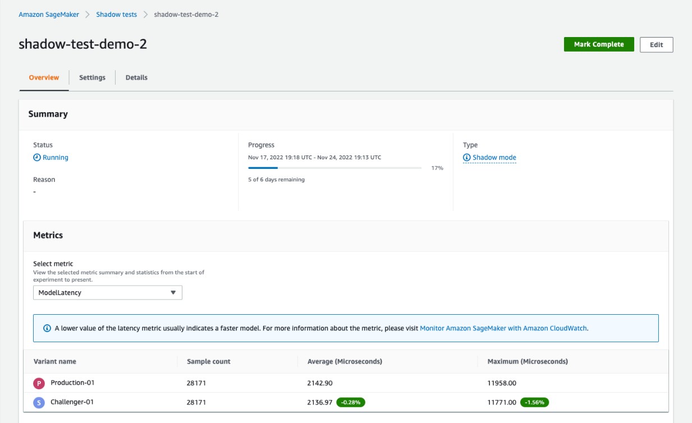

How to view, monitor, and edit shadow tests
6330

## Page 360

Amazon SageMaker AI
Developer Guide

In the preceding screenshot, the Settings, and Details tabs show the settings that you selected,
and the details that you entered when creating the test.

Analysis

This section shows a metrics dashboard with separate graphs for the following metrics:

• Invocations

• InvocationsPerInstance

• ModelLatency

• Invocation4XXErrors

• Invocation5XXErrors

• InvocationModelErrors

• CPUUtilization

• MemoryUtilization

• DiskUtilization

The last three metrics monitor the model container runtime resource usage. The rest are
CloudWatch metrics that you can use to analyse the performance of your variant. In general,
fewer errors indicate a more stable model. A lower latency indicates either a faster model or
a faster infrastructure. For more information about CloudWatch metrics, see SageMaker AI
endpoint invocation metrics. The following screenshot shows the metrics dashboard.

How to view, monitor, and edit shadow tests
6331

## Page 361

Amazon SageMaker AI
Developer Guide


Environment

This section shows the variants that you compared in the test. If you are satisfied by the
performance of the shadow variant, based on the aforementioned metrics, you can promote
the shadow variant to production, by choosing Deploy shadow variant. For more details about
deploying a shadow variant, see Promote a shadow variant. You can also change the traffic
sampling percentage, and continue testing, by choosing Edit traffic. For more details about
editing a shadow variant, see Edit a shadow test. The following screenshot shows this section.

How to view, monitor, and edit shadow tests
6332

## Page 362

Amazon SageMaker AI
Developer Guide


Start a shadow test early

You can start your test before its scheduled start time. If the new duration of the test exceeds 30
days, SageMaker AI automatically sets the end of the test to 30 days after the new start time. This
action starts the test immediately. If you want to change the start or end time of the test, see Edit
a shadow test.

To immediately start your test, before its scheduled start time, through the console, do the
following:

1.
Select the test you want to start immediately from the Shadow test section on the Shadow
tests page.

2.
From the Actions dropdown list, choose Start. The Start shadow test? dialog box appears.

3.
Choose Start now.

Delete a shadow test

You can delete a test that you no longer need. Deleting your test only deletes the test metadata
and not your endpoint, variants, or data captured in Amazon S3. If you want your endpoint to stop
running, you must delete your endpoint. For more information about deleting an endpoint, see
Delete Endpoints and Resources

To delete a test through the console, do the following:

1.
Select the test you want to delete from the Shadow test section on the Shadow tests page.

2.
From the Actions dropdown list, choose Delete. The Delete shadow test dialog box appears.

How to view, monitor, and edit shadow tests
6333

## Page 363

Amazon SageMaker AI
Developer Guide

3.
In the To confirm deletion, type delete in the field. text box, enter delete.

4.
Choose Delete.

Edit a shadow test

You can modify both scheduled and in-progress tests. Before your test starts, you can change the
description, the shadow variant configuration, the start date, and the end date of the test. You can
also turn on or turn off data capture.

After your test starts, you can only change the description, the traffic sampling percentage for the
shadow variant, and the end date.

To edit the details of your test through the console, do the following:

1.
Select the test you want to edit from the Shadow test section on the Shadow tests page.

2.
From the Actions dropdown list, choose Edit. The Enter shadow test details page appears.

3.
(Optional) Under Description, enter a description of your test.

4.
Choose Next. The Enter shadow test settings page appears.

5.
(Optional) To edit your shadow variant, do the following:

a.
Select the shadow variant and choose Edit. The Edit shadow variant dialog box appears. If
your test has already started, then you can only change the traffic sampling percentage.

b.
(Optional) Under Name, enter the new name to replace the old name.

c.
(Optional) Under Traffic sample, enter the new traffic sampling percentage to replace the
old traffic sampling percentage.

d.
(Optional) Under Instance type, select the new instance type from the dropdown list.

e.
(Optional) Under Instance count, enter the new instance count to replace the old instance
count.

f.
Choose Apply.

You cannot change the model in your shadow variant using the above procedure. If you want
to change the model, first remove the shadow variant by selecting it and choosing Remove.
Then add a new shadow variant.

6.
(Optional) To edit the duration of the test, do the following:

a.
Choose the box under Duration in the Schedule section. A popup calender appears.

How to view, monitor, and edit shadow tests
6334

## Page 364

Amazon SageMaker AI
Developer Guide

b.
If your test is yet to start, you can change both the start and end dates. Select the new
start and end dates from the calender, or enter the new start and end dates under Start
date and End date, respectively.

If your test has already started, you can only change the end date. Enter the new end date
under End date.

c.
(Optional) If your test is yet to start, you can change both the start and end times. Enter
the new start and end times under Start time, and End time, respectively, in the 24 hour
format.

If your test has already started, you can only change the end time. Enter the new end time
under End time, in the 24 hour format.

d.
Choose Apply.

7.
(Optional) Turn on or turn off Enable data capture.

8.
Choose Update shadow test.

Complete a shadow test

Your test automatically completes at the end of the scheduled duration, or you can stop an in-
progress test early. After your test has completed, the test’s status in the Shadow tests section on
the Shadow tests page shows as Complete. Then you can review and analyze the final metrics of
your test.

You can use the metrics dashboard to decide whether to promote the shadow variant to
production. For more information about analyzing the metrics dashboard of your test, see Monitor
a shadow test.

For instructions on how to complete your test before the end of its scheduled completion time, see
Complete a shadow test early.

For instructions on promoting your shadow variant to production, see Promote a shadow variant.

Complete a shadow test early

One reason you might want to complete an in-progress shadow test is if you’ve decided that the
metrics for your shadow variant look good and you want to promote it to production. You might
also decide to complete the test if one or more of the variants aren’t performing well.

Complete a shadow test
6335

## Page 365

Amazon SageMaker AI
Developer Guide

To complete your test before its scheduled end date, do the following:

1.
Select the test you want to mark complete from the Shadow tests section on the Shadow
tests page.

2.
From the Actions dropdown list, choose Complete, and the Complete shadow test dialog box
appears.

3.
In the dialog box, choose one of the following options:

• Yes, deploy shadow variant

• No, remove shadow variant

4.
(Optional) In the Comment text box, enter your reason for completing the test before its
scheduled end time.

5.
1. If you decided to deploy the shadow variant, choose Complete and proceed to deploy.

The Deploy shadow variant page appears. For instructions on how to fill out this page, see
Promote a shadow variant.

2. If you decide to remove the shadow variant, choose Confirm.

Promote a shadow variant

If you’ve decided that you want to replace your production variant with your shadow variant, you
can update your endpoint and promote your shadow variant to respond to inference requests. This
removes your current production variant from production and replaces it with your shadow variant.

If your shadow test is still in-progress, you must first complete your test. To complete your shadow
test before its scheduled end, follow the instructions in Complete a shadow test early before
continuing with this section.

When you promote a shadow variant to production, you have the following options for the
instance count of the shadow variant.

• You can retain the instance count and type from the production variant. If you select this option,
then your shadow variant launches in production with the current instance count, ensuring that
your model can continue to process request traffic at the same scale.

• You can retain the instance count and type of your shadow variant. If you want to use this
option, we recommend that you shadow test with 100 percent traffic sampling to ensure that the
shadow variant can process request traffic at the current scale.

Complete a shadow test
6336

## Page 366

Amazon SageMaker AI
Developer Guide

• You can use custom values for the instance count and type. If you want to use this option, we
recommend that you shadow test with 100 percent traffic sampling to ensure that the shadow
variant can process request traffic at the current scale.

Unless you are validating the instance type or count or both of the shadow variant, we highly
recommend that you retain the instance count and type from the production variant when
promoting your shadow variant.

To promote your shadow variant, do the following:

1.
If your test has completed, do the following:

a.
Select the test from the Shadow test section on the Shadow tests page.

b.
From the Actions dropdown list, choose View. The dashboard appears.

c.
Choose Deploy shadow variant in the Environment section. The Deploy shadow variant
page appears.

If your test has not completed, see Complete a shadow test early to complete it.

2.
In the Variant settings section, select one of the following options:

• Retain production settings

• Retain shadow settings

• Custom instance settings

If you selected Custom instance settings, do the following:

a.
Select the instance type from the Instance type dropdown list.

b.
Under Instance count, enter the number of instances.

3.
In Enter 'deploy' to confirm deployment text box, enter deploy.

4.
Choose Deploy shadow variant.

Your SageMaker AI Inference endpoint is now using the shadow variant as your production variant,
and your production variant has been removed from the endpoint.

Complete a shadow test
6337

## Page 367

Amazon SageMaker AI
Developer Guide

Best practices

When creating an inference experiment, keep the following information in mind:

• Traffic sampling percentage – Sampling 100 percent of the inference requests lets you validate
that your shadow variant can handle production traffic when promoted. You may start off with a
lower traffic sampling percentage and dial up as you gain confidence in your variant, but it is best
practice to ensure that you’ve increased the traffic to 100 percent prior to promotion.

• Instance type – Unless you are using shadow variants to evaluate alternate instance types or
sizes, we recommend that you use the same instance type, size, and count so that you can be
certain that your shadow variant can handle the volume of inference requests after you promote
it.

• Auto scaling – To ensure that your shadow variant can respond to spikes in the number of
inference requests or changes in inference requests patterns, we highly recommend that you
configure autoscaling on your shadow variants. To learn how to configure autoscaling, see
Automatic scaling of Amazon SageMaker AI models. If you have configured autoscaling, you can
also validate changes to autoscaling policies without causing impact to users.

• Metrics monitoring – After you initiate a shadow experiment and have sufficient invocations,
monitor the metrics dashboard to ensure that the metrics such as latency and error rate are
within acceptable bounds. This helps you catch misconfigurations early and take corrective
action. For information about how to monitor the metrics of an in-progress inference
experiment, see How to view, monitor, and edit shadow tests.

Access containers through SSM

Amazon SageMaker AI allows you to securely connect to the Docker containers on which your
models are deployed on for Inference using AWS Systems Manager (SSM). This gives you shell
level access to the container so that you can debug the processes running within the container and
log commands and responses with Amazon CloudWatch. You can also set up an AWS PrivateLink
connection to the ML instances that host your containers for accessing the containers via SSM
privately.

Warning

Enabling SSM access can impact the performance of your endpoint. We recommend using
this feature with your dev or test endpoints and not with the endpoints in production.

Best practices
6338

## Page 368

Amazon SageMaker AI
Developer Guide

Also, SageMaker AI automatically applies security patches, and replaces or terminates
faulty endpoint instances within 10 minutes. However for endpoints with SSM enabled
production variants, SageMaker AI delays security patching and replacing or terminating
faulty endpoint instances by a day, to allow you to debug.

The following sections detail how you can use this feature.

Allowlist

You have to contact customer support, and get your account allowlisted, to use this feature. You
cannot create an endpoint with SSM access enabled, if your account is not allow listed for this
access.

Enable SSM access

To enable SSM access for an existing container on an endpoint, update the endpoint with a

new endpoint configuration, with the EnableSSMAccess parameter set to true The following
example provides a sample endpoint configuration.

{
"EndpointConfigName": "endpoint-config-name",
"ProductionVariants": [
{
"InitialInstanceCount": 1,
"InitialVariantWeight": 1.0,
"InstanceType": "ml.t2.medium",
"ModelName": model-name,
"VariantName": variant-name,
"EnableSSMAccess": true,
},
]
}

For more information on enabling SSM access, see EnableSSMAccess.

Allowlist
6339

## Page 369

Amazon SageMaker AI
Developer Guide

IAM configuration

Endpoint IAM permissions

If you have enabled SSM access for an endpoint instance, SageMaker AI starts and manages the
SSM agent when it initiates the endpoint instance. To allow the SSM agent to communicate with
the SSM services, add the following policy to the execution role that the endpoint runs under.

JSON

{
"Version":"2012-10-17",
"Statement": [
{
"Effect": "Allow",
"Action": [
"ssmmessages:CreateControlChannel",
"ssmmessages:CreateDataChannel",
"ssmmessages:OpenControlChannel",
"ssmmessages:OpenDataChannel"
],
"Resource": "*"
}
]
}

User IAM permissions

Add the following policy to give an IAM user SSM session permissions to connect to a SSM target.

JSON

{
"Version":"2012-10-17",
"Statement": [
{
"Effect": "Allow",
"Action": [
"ssm:StartSession",

IAM configuration
6340

## Page 370

Amazon SageMaker AI
Developer Guide

"ssm:TerminateSession"
],
"Resource": "*"
}
]
}

You can restrict the endpoints that an IAM user can connect to, with the following policy. Replace

the italicized placeholder text with your own information.

JSON

{
"Version":"2012-10-17",
"Statement": [
{
"Effect": "Allow",
"Action": [
"ssm:StartSession"
],
"Resource": "arn:aws:sagemaker:us-
east-2:111122223333:endpoint/endpoint-name"
}
]
}

SSM access with AWS PrivateLink

If your endpoints run within a virtual private cloud (VPC) that is not connected to the public
internet, you can use AWS PrivateLink to enable SSM. AWS PrivateLink restricts all network traffic
between your endpoint instances, SSM, and Amazon EC2 to the Amazon network. For more
information on how to setup SSM access with AWS PrivateLink, see Set up a VPC endpoint for
Session Manager.

Logging with Amazon CloudWatch Logs

For SSM access enabled endpoints, you can log errors from the SSM agent with Amazon
CloudWatch Logs. For more information on how to log errors with CloudWatch Logs, see Logging

SSM access with AWS PrivateLink
6341

## Page 371

Amazon SageMaker AI
Developer Guide

session activity. The log is available at the SSM log stream, variant-name/ec2-instance-id/

ssm, under the endpoint log group /aws/sagemaker/endpoints/endpoint-name. For more

information on how to view the log, see View log data sent to CloudWatch Logs.

Production variants behind your endpoint can have multiple model containers. The log for each

model container is recorded in the log stream. Each log is preceded by [sagemaker ssm logs]

[container-name], where container-name is either the name that you gave to the container,

or the default name, such as container_0, and container_1.

Accessing model containers

To access a model container on your endpoint instance, you need its target ID. The target ID is in
one of the following formats:

• sagemaker-endpoint:endpoint-name_variant-name_ec2-instance-id for containers
on single container endpoints

• sagemaker-endpoint:endpoint-name_variant-name_ec2-instance-id_container-

name for containers on multi-container endpoints

The following example shows how you can use the AWS CLI to access a model container using its
target ID.

aws ssm start-session --target sagemaker-endpoint:prod-image-
classifier_variant1_i-003a121c1b21a90a9_container_1

If you enable logging, as mentioned in Logging with Amazon CloudWatch Logs, you can find the
target IDs for all the containers listed at the beginning of the SSM log stream.

Note

• You cannot connect to 1P algorithm containers or containers of models obtained
from SageMaker AI MarketPlace with SSM. However you can connect to deep learning
containers (DLCs) provided by AWS or any custom container that you own.

• If you have enabled network isolation for a model container that prevents it from making
outbound network calls, you cannot start an SSM session for that container.

Accessing model containers
6342

## Page 372

Amazon SageMaker AI
Developer Guide

• You can only access one container from one SSM session. To access another container,
even if it is behind the same endpoint, start a new SSM session with the target ID of that
endpoint.

Model servers for model deployment with Amazon SageMaker
AI

You can use popular model servers, such as TorchServe, DJL Serving, and Triton Inference Server, to
deploy your models on SageMaker AI. The following topics explain how.

Topics

• Deploy models with TorchServe

• Deploy models with DJL Serving

• Model deployment with Triton Inference Server

Deploy models with TorchServe

TorchServe is the recommended model server for PyTorch, preinstalled in the AWS PyTorch Deep
Learning Container (DLC). This powerful tool offers customers a consistent and user-friendly
experience, delivering high performance in deploying multiple PyTorch models across various AWS
instances, including CPU, GPU, Neuron, and Graviton, regardless of the model size or distribution.

TorchServe supports a wide array of advanced features, including dynamic batching,
microbatching, model A/B testing, streaming, torch XLA, tensorRT, ONNX and IPEX. Moreover,
it seamlessly integrates PyTorch's large model solution, PiPPy, enabling efficient handling of
large models. Additionally, TorchServe extends its support to popular open-source libraries like
DeepSpeed, Accelerate, Fast Transformers, and more, expanding its capabilities even further. With
TorchServe, AWS users can confidently deploy and serve their PyTorch models, taking advantage of
its versatility and optimized performance across various hardware configurations and model types.
For more detailed information, you can refer to the PyTorch documentation and TorchServe on
GitHub.

The following table lists the AWS PyTorch DLCs supported by TorchServe.

Model servers
6343

## Page 373

Amazon SageMaker AI
Developer Guide

Instance type
SageMaker AI PyTorch DLC link

CPU and GPU
SageMaker AI PyTorch containers

Neuron
PyTorch Neuron containers

Graviton
SageMaker AI PyTorch Graviton containers

The following sections describe the setup to build and test PyTorch DLCs on Amazon SageMaker AI.

Getting started

To get started, ensure that you have the following prerequisites:

1. Ensure that you have access to an AWS account. Set up your environment so that the AWS CLI

can access your account through either an AWS IAM user or an IAM role. We recommend using
an IAM role. For the purposes of testing in your personal account, you can attach the following
managed permissions policies to the IAM role:

• AmazonEC2ContainerRegistryFullAccess

• AmazonEC2FullAccess

• AWSServiceRoleForAmazonEKSNodegroup

• AmazonSageMakerFullAccess

• AmazonS3FullAccess

2. Locally configure your dependencies, as shown in the following example:

from datetime import datetime
import os
import json
import logging
import time
# External Dependencies:
import boto3
from botocore.exceptions import ClientError
import sagemaker
sess = boto3.Session()
sm = sess.client("sagemaker")

Deploy models with TorchServe
6344

## Page 374

Amazon SageMaker AI
Developer Guide

region = sess.region_name
account = boto3.client("sts").get_caller_identity().get("Account")
smsess = sagemaker.Session(boto_session=sess)
role = sagemaker.get_execution_role()
# Configuration:
bucket_name = smsess.default_bucket()
prefix = "torchserve"
output_path = f"s3://{bucket_name}/{prefix}/models"
print(f"account={account}, region={region}, role={role}")

3. Retrieve the PyTorch DLC image, as shown in the following example.

SageMaker AI PyTorch DLC images are available in all AWS regions. For more information, see
the list of DLC container images.

baseimage = sagemaker.image_uris.retrieve(
framework="pytorch",
region="<region>",
py_version="py310",
image_scope="inference",
version="2.0.1",
instance_type="ml.g4dn.16xlarge",
)

4. Create a local workspace.

mkdir -p workspace/

Adding a package

The following sections describe how to add and preinstall packages to your PyTorch DLC image.

BYOC use cases

The following steps outline how to add a package to your PyTorch DLC image. For more
information about customizing your container, see Building AWS Deep Learning Containers Custom
Images.

1.
Suppose you want to add a package to the PyTorch DLC docker image. Create a Dockerfile

under the docker directory, as shown in the following example:

Deploy models with TorchServe
6345

## Page 375

Amazon SageMaker AI
Developer Guide

mkdir -p workspace/docker
cat workspace/docker/Dockerfile
ARG BASE_IMAGE
FROM $BASE_IMAGE
#Install any additional libraries
RUN pip install transformers==4.28.1

2.
Build and publish the customized docker image by using the following  build_and_push.sh
script.

# Download script build_and_push.sh to workspace/docker
ls workspace/docker
build_and_push.sh  Dockerfile

# Build and publish your docker image
reponame = "torchserve"
versiontag = "demo-0.1"
./build_and_push.sh {reponame} {versiontag} {baseimage} {region} {account}

SageMaker AI preinstall use cases

The following example shows you how to preinstall a package to your PyTorch DLC container. You

must create a requirements.txt file locally under the directory workspace/code.

mkdir -p workspace/code
cat workspace/code/requirements.txt
transformers==4.28.1

Create TorchServe model artifacts

In the following example, we use the pre-trained  MNIST model. We create a directory

workspace/mnist, implement mnist_handler.py by following the TorchServe custom service
instructions, and configure the model parameters (such as batch size and workers) in model-

Deploy models with TorchServe
6346

## Page 376

Amazon SageMaker AI
Developer Guide

config.yaml. Then, we use the TorchServe tool torch-model-archiver to build the model
artifacts and upload to Amazon S3.

1.
Configure the model parameters in model-config.yaml.

ls -al workspace/mnist-dev
mnist.py
mnist_handler.py
mnist_cnn.pt
model-config.yaml
# config the model
cat workspace/mnist-dev/model-config.yaml
minWorkers: 1
maxWorkers: 1
batchSize: 4
maxBatchDelay: 200
responseTimeout: 300

2.
Build the model artifacts by using torch-model-archiver .

torch-model-archiver --model-name mnist --version 1.0 --model-file workspace/
mnist-dev/mnist.py --serialized-file workspace/mnist-dev/mnist_cnn.pt --handler
workspace/mnist-dev/mnist_handler.py --config-file workspace/mnist-dev/model-
config.yaml --archive-format tgz

If you want to preinstall a package, you must include the code directory in the tar.gz file.

cd workspace
torch-model-archiver --model-name mnist --version 1.0 --model-file mnist-
dev/mnist.py --serialized-file mnist-dev/mnist_cnn.pt --handler mnist-dev/
mnist_handler.py --config-file mnist-dev/model-config.yaml --archive-format no-
archive
cd mnist
mv ../code .
tar cvzf mnist.tar.gz .

3.
Upload mnist.tar.gz to Amazon S3.

# upload mnist.tar.gz to S3

Deploy models with TorchServe
6347

## Page 377

Amazon SageMaker AI
Developer Guide

output_path = f"s3://{bucket_name}/{prefix}/models"
aws s3 cp mnist.tar.gz {output_path}/mnist.tar.gz

Using single model endpoints to deploy with TorchServe

The following example shows you how to create a single model real-time inference endpoint,
deploy the model to the endpoint, and test the endpoint by using the Amazon SageMaker Python
SDK.

from sagemaker.model import Model
from sagemaker.predictor import Predictor
# create the single model endpoint and deploy it on SageMaker AI
model = Model(model_data = f'{output_path}/mnist.tar.gz',
image_uri = baseimage,
role = role,
predictor_cls = Predictor,
name = "mnist",
sagemaker_session = smsess)
endpoint_name = 'torchserve-endpoint-' + time.strftime("%Y-%m-%d-%H-%M-%S",
time.gmtime())
predictor = model.deploy(instance_type='ml.g4dn.xlarge',
initial_instance_count=1,
endpoint_name = endpoint_name,
serializer=JSONSerializer(),
deserializer=JSONDeserializer())
# test the endpoint
import random
import numpy as np
dummy_data = {"inputs": np.random.rand(16, 1, 28, 28).tolist()}
res = predictor.predict(dummy_data)

Using multi-model endpoints to deploy with TorchServe

Multi-model endpoints are a scalable and cost-effective solution to hosting large numbers of
models behind one endpoint. They improve endpoint utilization by sharing the same fleet of
resources and serving container to host all of your models. They also reduce deployment overhead
because SageMaker AI manages dynamically loading and unloading models, as well as scaling

Deploy models with TorchServe
6348

## Page 378

Amazon SageMaker AI
Developer Guide

resources based on traffic patterns. Multi-model endpoints are particularly useful for deep learning
and generative AI models that require accelerated compute power.

By using TorchServe on SageMaker AI multi-model endpoints, you can speed up your development

by using a serving stack that you are familiar with while leveraging the resource sharing and

simplified model management that SageMaker AI multi-model endpoints provide.

The following example shows you how to create a multi-model endpoint, deploy the model to the
endpoint, and test the endpoint by using the Amazon SageMaker Python SDK. Additional details
can be found in this notebook example.

from sagemaker.multidatamodel import MultiDataModel
from sagemaker.model import Model
from sagemaker.predictor import Predictor
# create the single model endpoint and deploy it on SageMaker AI
model = Model(model_data = f'{output_path}/mnist.tar.gz',
image_uri = baseimage,
role = role,
sagemaker_session = smsess)
endpoint_name = 'torchserve-endpoint-' + time.strftime("%Y-%m-%d-%H-%M-%S",
time.gmtime())
mme = MultiDataModel(
name = endpoint_name,
model_data_prefix = output_path,
model = model,
sagemaker_session = smsess)
mme.deploy(
initial_instance_count = 1,
instance_type = "ml.g4dn.xlarge",
serializer=sagemaker.serializers.JSONSerializer(),
deserializer=sagemaker.deserializers.JSONDeserializer())
# list models
list(mme.list_models())
# create mnist v2 model artifacts
cp mnist.tar.gz mnistv2.tar.gz
# add mnistv2
mme.add_model(mnistv2.tar.gz)

Deploy models with TorchServe
6349

## Page 379

Amazon SageMaker AI
Developer Guide

# list models
list(mme.list_models())
predictor = Predictor(endpoint_name=mme.endpoint_name, sagemaker_session=smsess)
# test the endpoint
import random
import numpy as np
dummy_data = {"inputs": np.random.rand(16, 1, 28, 28).tolist()}
res = predictor.predict(date=dummy_data, target_model="mnist.tar.gz")

Metrics

TorchServe supports both system level and model level metrics. You can enable metrics in either

log format mode or Prometheus mode through the environment variable TS_METRICS_MODE. You

can use the TorchServe central metrics config file metrics.yaml to specify the types of metrics to
be tracked, such as request counts, latency, memory usage, GPU utilization, and more. By referring
to this file, you can gain insights into the performance and health of the deployed models and
effectively monitor the TorchServe server's behavior in real-time. For more detailed information,
see the TorchServe metrics documentation.

You can access TorchServe metrics logs that are similar to the StatsD format through the Amazon
CloudWatch log filter. The following is an example of a TorchServe metrics log:

CPUUtilization.Percent:0.0|#Level:Host|#hostname:my_machine_name,timestamp:1682098185
DiskAvailable.Gigabytes:318.0416717529297|#Level:Host|
#hostname:my_machine_name,timestamp:1682098185

Deploy models with DJL Serving

DJL Serving is a high performance universal stand-alone model serving solution. It takes a
deep learning model, several models, or workflows and makes them available through an HTTP
endpoint.

You can use one of the DJL Serving Deep Learning Containers (DLCs) to serve your models on AWS.
To learn about the supported model types and frameworks, see the DJL Serving GitHub repository.

DJL Serving offers many features that help you to deploy your models with high performance:

Deploy models with DJL Serving
6350

## Page 380

Amazon SageMaker AI
Developer Guide

• Ease of use – DJL Serving can serve most models without any modifications. You bring your
model artifacts, and DJL Serving can host them.

• Multiple device and accelerator support – DJL Serving supports deploying models on CPUs,
GPUs, and AWS Inferentia.

• Performance – DJL Serving runs multithreaded inference in a single Java virtual machine (JVM)
to boost throughput.

• Dynamic batching – DJL Serving supports dynamic batching to increase throughput.

• Auto scaling – DJL Serving automatically scales workers up or down based on the traffic load.

• Multi-engine support – DJL Serving can simultaneously host models using different frameworks
(for example, PyTorch and TensorFlow).

• Ensemble and workflow models – DJL Serving supports deploying complex workflows comprised
of multiple models and can execute parts of the workflow on CPUs and other parts on GPUs.
Models within a workflow can leverage different frameworks.

The following sections describe how to set up an endpoint with DJL Serving on SageMaker AI.

Getting started

To get started, ensure that you have the following prerequisites:

1. Ensure that you have access to an AWS account. Set up your environment so that the AWS CLI

can access your account through either an AWS IAM user or an IAM role. We recommend using
an IAM role. For the purposes of testing in your personal account, you can attach the following
managed permissions policies to the IAM role:

• AmazonEC2ContainerRegistryFullAccess

• AmazonEC2FullAccess

• AmazonSageMakerFullAccess

• AmazonS3FullAccess

2. Ensure that you have the docker client set up on your system.

3. Log in to Amazon Elastic Container Registry and set the following environment variables:

export ACCOUNT_ID=<your_account_id>
export REGION=<your_region>
aws ecr get-login-password --region $REGION | docker login --username AWS --password-
stdin $ACCOUNT_ID.dkr.ecr.$REGION.amazonaws.com

Deploy models with DJL Serving
6351

## Page 381

Amazon SageMaker AI
Developer Guide

4. Pull the docker image.

docker pull 763104351884.dkr.ecr.us-west-2.amazonaws.com/djl-inference:0.22.1-
deepspeed0.9.2-cu118

For all of the available DJL Serving container images, see the large model inference containers
and the DJL Serving CPU inference containers. When choosing an image from the tables in the
preceding links, replace the AWS region in the example URL column with the region you are in.
The DLCs are available in the regions listed in the table at the top of the Available Deep Learning
Containers Images page.

Customize your container

You can add packages to the base DLC images to customize your container. Suppose you want

to add a package to the 763104351884.dkr.ecr.us-west-2.amazonaws.com/djl-

inference:0.22.1-deepspeed0.9.2-cu118 docker image. You must create a dockerfile with
your desired image as the base image, add the required packages, and push the image to Amazon
ECR.

To add a package, complete the following steps:

1.
Specify instructions for running your desired libraries or packages in the base image's
dockerfile.

FROM 763104351884.dkr.ecr.us-west-2.amazonaws.com/djl-inference:0.22.1-
deepspeed0.9.2-cu118
## add custom packages/libraries
RUN git clone https://github.com/awslabs/amazon-sagemaker-examples

2.
Build the Docker image from the dockerfile. Specify your Amazon ECR repository, the name
of the base image, and a tag for the image. If you don't have an Amazon ECR repository, see
Using Amazon ECR with the AWS CLI in the Amazon ECR User Guide for instructions on how to
create one.

docker build -f Dockerfile -t <registry>/<image_name>:<image_tag>

3.
Push the Docker image to your Amazon ECR repository.

Deploy models with DJL Serving
6352

## Page 382

Amazon SageMaker AI
Developer Guide

docker push $ACCOUNT_ID.dkr.ecr.$REGION.amazonaws.com/<image_name>:<image_tag>

You should now have a customized container image that you can use for model serving. For more
examples of customizing your container, see Building AWS Deep Learning Containers Custom
Images.

Prepare your model artifacts

Before deploying your model on SageMaker AI, you must package your model artifacts in a

.tar.gz file. DJL Serving accepts the following artifacts in your archive:

• Model checkpoint: Files that store your model weights.

• serving.properties: A configuration file that you can add for each model. Place

serving.properties in the same directory as your model file.

• model.py: The inference handler code. This is only applicable when using Python mode. If you

don't specify model.py, djl-serving uses one of the default handlers.

The following is an example of a model.tar.gz structure:

- model_root_dir # root directory
- serving.properties
- model.py # your custom handler file for Python, if you choose not to use the
default handlers provided by DJL Serving
- model binary files # used for Java mode, or if you don't want to use
option.model_id and option.s3_url for Python mode

DJL Serving supports Java engines powered by DJL or Python engines. Not all of the preceding
artifacts are required; the required artifacts vary based on the mode you choose. For example, in

Python mode, you only need to specify option.model_id in the serving.properties file; you
don't need to specify the model checkpoint inside LMI containers. In Java mode, you are required

to package the model checkpoint. For more details on how to configure serving.properties
and operate with different engines, see DJL Serving Operation Modes.

Use single model endpoints to deploy with DJL Serving

After preparing your model artifacts, you can deploy your model to a SageMaker AI endpoint.
This section describes how to deploy a single model to an endpoint with DJL Serving. If you're

Deploy models with DJL Serving
6353

## Page 383

Amazon SageMaker AI
Developer Guide

deploying multiple models, skip this section and go to Use multi-model endpoints to deploy with
DJL Serving.

The following example shows you a method to create a model object using the Amazon SageMaker
Python SDK. You'll need to specify the following fields:

• image_uri: You can either retrieve one of the base DJL Serving images as shown in this
example, or you can specify a custom Docker image from your Amazon ECR repository, if you
followed the instructions in Customize your container.

• model_s3_url: This should an Amazon S3 URI that points to your .tar.gzfile.

• model_name: Specify a name for the model object.

import boto3
import sagemaker
from sagemaker.model import Model
from sagemaker import image_uris, get_execution_role

aws_region = "aws-region"
sagemaker_session =
sagemaker.Session(boto_session=boto3.Session(region_name=aws_region))
role = get_execution_role()

def create_model(model_name, model_s3_url):
# Get the DJL DeepSpeed image uri
image_uri = image_uris.retrieve(
framework="djl-deepspeed",
region=sagemaker_session.boto_session.region_name,
version="0.20.0"
)
model = Model(
image_uri=image_uri,
model_data=model_s3_url,
role=role,
name=model_name,
sagemaker_session=sagemaker_session,
)
return model

Deploy models with DJL Serving
6354

## Page 384

Amazon SageMaker AI
Developer Guide

Use multi-model endpoints to deploy with DJL Serving

If you want to deploy multiple models to an endpoint, SageMaker AI offers multi-model endpoints,

which are a scalable and cost-effective solution to deploying large numbers of models. DJL Serving
also supports loading multiple models simultaneously and running inference on each of the
models concurrently. DJL Serving containers adhere to the SageMaker AI multi-model endpoints
contracts and can be used to deploy multi-model endpoints.

Each individual model artifact needs to be packaged in the same way as described in the
previous section Prepare your model artifacts. You can set model-specific configurations in the

serving.properties file and model-specific inference handler code in model.py. For a multi-
model endpoint, models need to be arranged in the following way:

root_dir
|-- model_1.tar.gz

|-- model_2.tar.gz
|-- model_3.tar.gz
.
.
.

The Amazon SageMaker Python SDK uses the MultiDataModel object to instantiate a multi-model

endpoint. The Amazon S3 URI for the root directory should be passed as the model_data_prefix

argument to the MultiDataModel constructor.

DJL Serving also provides several configuration parameters to manage model memory

requirements, such as required_memory_mb and reserved_memory_mb, that can be configured
for each model in the serving.properties file. These parameters are useful to handle out of memory
errors more gracefully. For all of the configurable parameters, see OutofMemory handling in djl-
serving.

The auto scaling feature of DJL Serving makes it easy to ensure that the models are scaled
appropriately for incoming traffic. By default, DJL Serving determines the maximum number of
workers for a model that can be supported based on the hardware available (such as CPU cores or
GPU devices). You can set lower and upper bounds for each model to ensure that a minimum traffic
level can always be served, and that a single model does not consume all available resources. You
can set the following properties in the serving.properties file:

• gpu.minWorkers: Minimum number of workers for GPUs.

Deploy models with DJL Serving
6355

## Page 385

Amazon SageMaker AI
Developer Guide

• gpu.maxWorkers: Maximum number of workers for GPUs.

• cpu.minWorkers: Minimum number of workers for CPUs.

• cpu.maxWorkers: Maximum number of workers for CPUs.

For an end-to-end example of how to deploy a multi-model endpoint on SageMaker AI using a DJL
Serving container, see the example notebook Multi-Model-Inference-Demo.ipynb.

Model deployment with Triton Inference Server

Triton Inference Server is an open source inference serving software that streamlines AI inference.
With Triton, you can deploy any model built with multiple deep learning and machine learning
frameworks, including TensorRT, TensorFlow, PyTorch, ONNX, OpenVINO, Python, RAPIDS FIL, and
more.

The SageMaker AI Triton containers help you deploy Triton Inference Server on the SageMaker
AI Hosting platform to serve trained models in production. It supports the different modes in
which SageMaker AI operates. For a list of available Triton Inference Server containers available on
SageMaker AI, see NVIDIA Triton Inference Containers (SM support only).

For end-to-end notebook examples, we recommend taking a look at the amazon-sagemaker-
examples repository.

Hosting modes

The following SageMaker AI Hosting modes are supported by Triton containers:

• Single model endpoints

• This is SageMaker AI’s default mode of operation. In this mode, the Triton container can load a
single model, or a single ensemble model.

• The name of the model must be passed as as a property of the container environment, which

is part of the CreateModel SageMaker AI API call. The environment variable used to pass in

the model name is SAGEMAKER_TRITON_DEFAULT_MODEL_NAME.

• Single model endpoints with ensemble

• Triton Inference Server supports ensemble, which is a pipeline, or a DAG (directed acyclic
graph) of models. While an ensemble technically comprises of multiple models, in the default
single model endpoint mode, SageMaker AI can treat the ensemble proper (the meta-model
that represents the pipeline) as the main model to load, and can subsequently load the
associated models.

Model deployment with Triton Inference Server
6356

## Page 386

Amazon SageMaker AI
Developer Guide

• The ensemble proper’s model name must be used to load the model. It must be

passed as a property of the container environment, which is part of the CreateModel
SageMaker API call. The environment variable used to pass in the model name is

SAGEMAKER_TRITON_DEFAULT_MODEL_NAME.

• Multi-model endpoints

• In this mode, SageMaker AI can serve multiple models on a single endpoint. You can use this

mode by specifying the environment variable ‘MultiModel’: true as a property of the

container environment, which is part of the CreateModel SageMaker API call.

• By default, no model is loaded when the instance starts. To run an inference request against

a particular model, specify the corresponding model's *.tar.gz file as an argument to the

TargetModel property of the InvokeEndpoint SageMaker API call.

• Multi-model endpoints with ensemble

• In this mode, SageMaker AI functions as described for multi-model endpoints. However,
the SageMaker AI Triton container can load multiple ensemble models, meaning that
multiple model pipelines can run on the same instance. SageMaker AI treats every ensemble
as one model, and the ensemble proper of each model can be invoked by specifying the

corresponding *.tar.gz archive as the TargetModel.

• For better memory management during dynamic memory LOAD and UNLOAD, we recommend
that you keep the ensemble size small.

Inference payload types

Triton supports two methods of sending an inference payload over the network – json and

binary+json (or binary encoded json). The JSON payload in both cases includes the datatype,
shape and the actual inference request tensor. The request tensor must be a binary tensor.

With the binary+json format, you must specify the length of the request metadata in the header
to allow Triton to correctly parse the binary payload. In the SageMaker AI Triton container, this is

done using a custom Content-Type header: application/vnd.sagemaker-triton.binary

+json;json-header-size={}. This is different from using the Inference-Header-Content-

Length header on a stand-alone Triton Inference Server because custom headers are not allowed
in SageMaker AI.

Model deployment with Triton Inference Server
6357

## Page 387

Amazon SageMaker AI
Developer Guide

Using config.pbtxt to set the model config

For Triton Inference Servers on SageMaker AI, each model must include a config.pbtxt file that

specifies, at a minimum, the following configurations for the model:

• name: While this is optional for models running outside of SageMaker AI, we recommend that
you always provide a name for the models to be run in Triton on SageMaker AI.

• platform and/or backend: Setting a backend is essential to specify the type of the

model. Some backends have further classification, such as tensorflow_savedmodel or

tensorflow_graphdef. Such options can be specified as part of the platform key in addition

to the backend key. The most common backends are tensorrt, onnxruntime, tensorflow,

pytorch, python, dali, fil, and openvino.

• input: Specify three attributes for the input: name, data_type and dims (the shape).

• output: Specify three attributes for the output: name, data_type and dims (the shape).

• max_batch_size: Set the batch size to a value greater than or equal to 1 that indicates the
maximum batch size that Triton should use with the model.

For more details on configuring config.pbtxt, see Triton’s GitHub repository. Triton provides
several configurations for tweaking model behavior. Some of the most common and important
configuration options are:

• instance_groups: Instance groups help with specifying the number and location for a given

model. They have the attributes count, kind, and gpus (used when kind is KIND_GPU). The

count attribute is equivalent to the number of workers. For regular model serving, each worker

has its own copy of the model. Similarly, in Triton, the count specifies the number of model

copies per device. For example, if the instance_group type is KIND_CPU, then the CPU has

count number of model copies.

Note

On a GPU instance, the instance_group configuration applies per GPU device. For

example, count number of model copies are placed on each GPU device unless you
explicitly specify which GPU devices should load the model.

• dynamic_batching and sequence_batching: Dynamic batching is used for stateless models,
and sequence batching is used for stateful models (where you want to route a request to the

Model deployment with Triton Inference Server
6358

## Page 388

Amazon SageMaker AI
Developer Guide

same model instance every time). Batching schedulers enable a per-model queue, which help in
increasing throughput, depending on the batching configuration.

• ensemble: An ensemble model represents a pipeline of one or more models and the connection
of input and output tensors between those models. It can be configured by specifying

platform as ensemble. The ensemble configuration is just a representation of the model
pipeline. On SageMaker AI, all the models under an ensemble are treated as dependents of
the ensemble model and are counted as a single model for SageMaker AI metrics, such as

LoadedModelCount.

Publishing default Triton metrics to Amazon CloudWatch

The NVIDIA Triton Inference Container exposes metrics at port 8002 (configurable) for the different
models and GPUs that are utilized in the Triton Inference Server. For full details of the default
metrics that are available, see the GitHub page for the Triton Inference Server metrics. These
metrics are in Prometheus format and can be scraped using a Prometheus scraper configuration.

Starting with version v23.07 onwards, the SageMaker AI Triton container supports publishing these
metrics to Amazon CloudWatch by specifying a few environment variables. In order to scrape the
Prometheus metrics, the SageMaker AI Triton container leverages the Amazon CloudWatch agent.

The required environment variables that you must specify to collect metrics are as follows:

Environment variable
Description
Example value

Specify this option to allow
Triton to publish metrics to its
Prometheus endpoint.

"true"

SAGEMAKER_TRITON_A

LLOW_METRICS

Specify this option to start
the pre-checks necessary to
publish metrics to Amazon
CloudWatch.

"true"

SAGEMAKER_TRITON_P

UBLISH_METRICS_TO_

CLOUDWATCH

Specify this option to point
to the log group to which
metrics are written.

"/aws/SageMaker AI/Endpoi
nts/TritonMetrics/SageMaker
TwoEnsemblesTest"

SAGEMAKER_TRITON_C

LOUDWATCH_LOG_GROUP

Model deployment with Triton Inference Server
6359

## Page 389

Amazon SageMaker AI
Developer Guide

Environment variable
Description
Example value

Specify this option to point to
the metric namespace where
you want to see and plot the
metrics.

"/aws/SageMaker AI/Endpoi
nts/TritonMetrics/SageMaker
TwoEnsemblesPublicTest"

SAGEMAKER_TRITON_C

LOUDWATCH_METRIC_N

AMESPACE

Specify this as 8002, or any
other port. If SageMaker AI
has not blocked the specified
port, it is used. Otherwise,
another non-blocked port is
chosen automatically.

"8002"

SAGEMAKER_TRITON_M

ETRICS_PORT

When publishing metrics with Triton on SageMaker AI, keep in mind the following limitations:

• While you can generate custom metrics through the C-API and Python backend (v23.05
onwards), these are currently not supported for publishing to Amazon CloudWatch.

• In SageMaker AI multi-model endpoints (MME) mode, Triton runs in an environment that
requires model namespacing to be enabled because each model (except ensemble models)
are treated as if they are in their own model repository. Currently, this creates a limitation for
metrics. When model namespacing is enabled, Triton does not distinguish the metrics between
two models with the same name belonging to different ensembles. As a workaround, make sure
that every model being deployed has a unique name. This also makes it easier to look up your
metrics in CloudWatch.

Environment variables

The following table lists the supported environment variables for Triton on SageMaker AI.

Environment
variable

Description
Type
Possible values

Allows Triton to
operate in SageMaker

Boolean
true, false

SAGEMAKER

_MULTI_MODEL

Model deployment with Triton Inference Server
6360

## Page 390

Amazon SageMaker AI
Developer Guide

Environment
variable

Description
Type
Possible values

AI multi-model
endpoints mode.

Specify the model
to be loaded in
the SageMaker
AI single model
(default) mode. For
ensemble mode,
specify the name of
the ensemble proper.

String
<model_name>  as
specified in config.pb
txt

SAGEMAKER

_TRITON_D

EFAULT_MO

DEL_NAME

String
ready, live

SAGEMAKER

'ready' is the
default mode in
SageMaker AI's
single model mode,

_TRITON_P

ING_MODE

and 'live' is the
default in SageMaker
AI's multi-model
endpoints mode.

In the SageMaker
AI Triton container,

Boolean
true, false

SAGEMAKER

_TRITON_D

this is set to true by
default.

ISABLE_MO

DEL_NAMES

PACING

While on SageMaker
AI, the default port
is 8080. You can
customize to a
different port in
multi-container
scenarios.

String
<port_number>

SAGEMAKER

_BIND_TO_PORT

Model deployment with Triton Inference Server
6361

## Page 391

Amazon SageMaker AI
Developer Guide

Environment
variable

Description
Type
Possible values

This is set by the
SageMaker AI
platform when using
multi-container
mode.

String
<port_1>–<port_2>

SAGEMAKER

_SAFE_POR

T_RANGE

While SageMaker
AI doesn't support
GRPC currently, if
you're using Triton
in front of a custom
reverse proxy, you
may choose to enable
GRPC.

Boolean
true, false

SAGEMAKER

_TRITON_A

LLOW_GRPC

The default port for
GRPC is 8001, but
you can change it.

String
<port_number>

SAGEMAKER

_TRITON_G

RPC_PORT

You can set the
number of default
HTTP request handler
threads.

String
<number>

SAGEMAKER

_TRITON_T

HREAD_COUNT

Boolean
true, false

SAGEMAKER

true by default on
SageMaker AI, but
you can selectively
turn this option off.

_TRITON_L

OG_VERBOSE

Boolean
true, false

SAGEMAKER

false by default on
SageMaker AI.

_TRITON_L

OG_INFO

Model deployment with Triton Inference Server
6362

## Page 392

Amazon SageMaker AI
Developer Guide

Environment
variable

Description
Type
Possible values

Boolean
true, false

SAGEMAKER

false by default on
SageMaker AI.

_TRITON_L

OG_WARNING

Boolean
true, false

SAGEMAKER

false by default on
SageMaker AI.

_TRITON_L

OG_ERROR

Specify the shm
size for the Python
backend, in bytes.
The default value is
16 MB but can be
increased.

String
<number>

SAGEMAKER

_TRITON_S

HM_DEFAUL

T_BYTE_SIZE

Specify the shm
growth size for the
Python backend, in
bytes. The default
value is 1 MB but can
be increased to allow
greater increments.

String
<number>

SAGEMAKER

_TRITON_S

HM_GROWTH

_BYTE_SIZE

The default value is

String
<number>

SAGEMAKER

2. Triton no longer
supports Tensorflow
2 from Triton v23.04.
You can configure
this variable for
previous versions.

_TRITON_T

ENSORFLOW

_VERSION

Model deployment with Triton Inference Server
6363

## Page 393

Amazon SageMaker AI
Developer Guide

Environment
variable

Description
Type
Possible values

Restrict the
maximum GPU
memory percentag
e which is used for
model loading,
allowing the
remainder to be used
for the inference
requests.

String
<number>

SAGEMAKER

_TRITON_M

ODEL_LOAD

_GPU_LIMIT

Boolean
true, false

SAGEMAKER

false by default on
SageMaker AI.

_TRITON_A

LLOW_METRICS

The default port is
8002.

String
<number>

SAGEMAKER

_TRITON_M

ETRICS_PORT

Boolean
true, false

SAGEMAKER

false by default on
SageMaker AI. Set

_TRITON_P

this variable to true
to allow pushing
Triton default

UBLISH_ME

TRICS_TO_

CLOUDWATCH

metrics to Amazon
CloudWatch. If this
option is enabled,
you are responsib
le for CloudWatch
costs when metrics
are published to your
account.

Model deployment with Triton Inference Server
6364

## Page 394

Amazon SageMaker AI
Developer Guide

Environment
variable

Description
Type
Possible values

Required if you've
enabled metrics
publishing to
CloudWatch.

String
<cloudwat

SAGEMAKER

_TRITON_C

ch_log_gr

LOUDWATCH

oup_name>

_LOG_GROUP

Required if you've
enabled metrics
publishing to
CloudWatch.

String
<cloudwat

SAGEMAKER

_TRITON_C

ch_metric

LOUDWATCH

_namespace>

_METRIC_N

AMESPACE

Appends any
additional arguments
when starting the
Triton Server.

String
<addition

SAGEMAKER

_TRITON_A

al_args>

DDITIONAL_ARGS

Model deployment at the edge with SageMaker Edge Manager

Warning

SageMaker Edge Manager is being discontinued on April 26th, 2024. For more information
about continuing to deploy your models to edge devices, see SageMaker Edge Manager end
of life.

Amazon SageMaker Edge Manager provides model management for edge devices so you can
optimize, secure, monitor, and maintain machine learning models on fleets of edge devices such as
smart cameras, robots, personal computers, and mobile devices.

Why Use Edge Manager?

Many machine learning (ML) use cases require running ML models on a fleet of edge devices, which
allows you to get predictions in real-time, preserves the privacy of the end users, and lowers the

Model deployment at the edge
6365

## Page 395

Amazon SageMaker AI
Developer Guide

cost of network connectivity. With the increasing availability of low-power edge hardware designed
for ML, it is now possible to run multiple complex neural network models on edge devices.

However, operating ML models on edge devices is challenging, because devices, unlike cloud

instances, have limited compute, memory, and connectivity. After the model is deployed, you
need to continuously monitor the models, because model drift can cause the quality of model
to decay overtime. Monitoring models across your device fleets is difficult because you need to
write custom code to collect data samples from your device and recognize skew in predictions. In
addition, models are often hard-coded into the application. To update the model, you must rebuild
and update the entire application or device firmware, which can disrupt your operations.

With SageMaker Edge Manager, you can optimize, run, monitor, and update machine learning
models across fleets of devices at the edge.

How Does it Work?

At a high level, there are five main components in the SageMaker Edge Manager workflow:
compiling models with SageMaker Neo, packaging Neo-compiled models, deploying models to
your devices, running models on the SageMaker AI inference engine (Edge Manager agent), and
maintaining models on the devices.

SageMaker Edge Manager uses SageMaker Neo to optimize your models for the target hardware in
one click, then to cryptographically sign your models before deployment. Using SageMaker Edge
Manager, you can sample model input and output data from edge devices and send it to the cloud
for monitoring and analysis, and view a dashboard that tracks and visually reports on the operation
of the deployed models within the SageMaker AI console.

SageMaker Edge Manager extends capabilities that were previously only available in the cloud
to the edge, so developers can continuously improve model quality by using Amazon SageMaker
Model Monitor for drift detection, then relabel the data with SageMaker AI Ground Truth and
retrain the models in SageMaker AI.

How Does it Work?
6366

## Page 396

Amazon SageMaker AI
Developer Guide

How Do I Use SageMaker Edge Manager?

If you are a first time user of SageMaker Edge Manager, we recommend that you do the following:

1. Read the Getting Started section - This section walks you through setting up your first edge

packaging job and creating your first fleet.

2. Explore Edge Manager Jupyter notebook examples - Example notebooks are stored in the

amazon-sagemaker-examples GitHub repository in the sagemaker_edge_manager folder.

First Steps with Amazon SageMaker AI Edge Manager

This guide demonstrates how to complete the necessary steps to register, deploy, and manage a
fleet of devices, and how to satisfy Amazon SageMaker AI Edge Manager prerequisites.

Topics

• Setting Up

• Prepare Your Model for Deployment

• Register and Authenticate Your Device Fleet

• Download and Set Up Edge Manager

• Run Agent

Setting Up

Before you begin using SageMaker Edge Manager to manage models on your device fleets, you
must first create IAM Roles for both SageMaker AI and AWS IoT. You will also want to create at
least one Amazon S3 bucket where you will store your pre-trained model, the output of your
SageMaker Neo compilation job, as well as input data from your edge devices.

Sign up for an AWS account

If you do not have an AWS account, complete the following steps to create one.

To sign up for an AWS account

1.
Open https://portal.aws.amazon.com/billing/signup.

2.
Follow the online instructions.

How Do I Use SageMaker Edge Manager?
6367

## Page 397

Amazon SageMaker AI
Developer Guide

Part of the sign-up procedure involves receiving a phone call or text message and entering a
verification code on the phone keypad.

When you sign up for an AWS account, an AWS account root user is created. The root user
has access to all AWS services and resources in the account. As a security best practice, assign
administrative access to a user, and use only the root user to perform tasks that require root
user access.

AWS sends you a confirmation email after the sign-up process is complete. At any time, you can
view your current account activity and manage your account by going to https://aws.amazon.com/
and choosing My Account.

Create a user with administrative access

After you sign up for an AWS account, secure your AWS account root user, enable AWS IAM Identity
Center, and create an administrative user so that you don't use the root user for everyday tasks.

Secure your AWS account root user

1.
Sign in to the AWS Management Console as the account owner by choosing Root user and
entering your AWS account email address. On the next page, enter your password.

For help signing in by using root user, see Signing in as the root user in the AWS Sign-In User
Guide.

2.
Turn on multi-factor authentication (MFA) for your root user.

For instructions, see Enable a virtual MFA device for your AWS account root user (console) in
the IAM User Guide.

Create a user with administrative access

1.
Enable IAM Identity Center.

For instructions, see Enabling AWS IAM Identity Center in the AWS IAM Identity Center User
Guide.

2.
In IAM Identity Center, grant administrative access to a user.

First Steps
6368

## Page 398

Amazon SageMaker AI
Developer Guide

For a tutorial about using the IAM Identity Center directory as your identity source, see
Configure user access with the default IAM Identity Center directory in the AWS IAM Identity
Center User Guide.

Sign in as the user with administrative access

•
To sign in with your IAM Identity Center user, use the sign-in URL that was sent to your email
address when you created the IAM Identity Center user.

For help signing in using an IAM Identity Center user, see Signing in to the AWS access portal in
the AWS Sign-In User Guide.

Assign access to additional users

1.
In IAM Identity Center, create a permission set that follows the best practice of applying least-
privilege permissions.

For instructions, see  Create a permission set in the AWS IAM Identity Center User Guide.

2.
Assign users to a group, and then assign single sign-on access to the group.

For instructions, see  Add groups in the AWS IAM Identity Center User Guide.

Create roles and storage

SageMaker Edge Manager needs access to your Amazon S3 bucket URI. To facilitate this, create
an IAM role that can run SageMaker AI and has permission to access Amazon S3. Using this role,
SageMaker AI can run under your account and access to your Amazon S3 bucket.

You can create an IAM role by using the IAM console, AWS SDK for Python (Boto3), or AWS CLI. The
following is an example of how to create an IAM role, attach the necessary policies with the IAM
console, and create an Amazon S3 bucket.

1.
Create an IAM role for Amazon SageMaker AI.

a.
Sign in to the AWS Management Console and open the IAM console at https://
console.aws.amazon.com/iam/.

b.
In the navigation pane of the IAM console, choose Roles, and then choose Create role.

First Steps
6369

## Page 399

Amazon SageMaker AI
Developer Guide

c.
For Select type of trusted entity, choose AWS service.

d.
Choose the service that you want to allow to assume this role. In this case, choose
SageMaker AI. Then choose Next: Permissions.

• This automatically creates an IAM policy that grants access to related services such as
Amazon S3, Amazon ECR, and CloudWatch Logs.

e.
Choose Next: Tags.

f.
(Optional) Add metadata to the role by attaching tags as key–value pairs. For more
information about using tags in IAM, see Tagging IAM resources.

g.
Choose Next: Review.

h.
Type in a Role name.

i.
If possible, type a role name or role name suffix. Role names must be unique within your
AWS account. They are not distinguished by case. For example, you cannot create roles

named both PRODROLE and prodrole. Because other AWS resources might reference the
role, you cannot edit the name of the role after it has been created.

j.
(Optional) For Role description, type a description for the new role.

k.
Review the role and then choose Create role.

Note the SageMaker AI Role ARN, which you use to create a compilation job with
SageMaker Neo and a packaging job with Edge Manager. To find out the role ARN using
the console, do the following:

i.
Go to the IAMconsole: https://console.aws.amazon.com/iam/

ii.
Select Roles.

iii.
Search for the role you just created by typing in the name of the role in the search
field.

iv.
Select the role.

v.
The role ARN is at the top of the Summary page.

2.
Create an IAM role for AWS IoT.

The AWS IoT IAM role you create is used to authorize your thing objects. You also use the IAM
role ARN to create and register device fleets with a SageMaker AI client object.

First Steps
6370

## Page 400

Amazon SageMaker AI
Developer Guide

Configure an IAM role in your AWS account for the credentials provider to assume on behalf of
the devices in your device fleet. Then, attach a policy to authorize your devices to interact with
AWS IoT services.

Create a role for AWS IoT either programmatically or with the IAM console, similar to what you
did when you created a role for SageMaker AI.

a.
Sign in to the AWS Management Console and open the IAM console at https://
console.aws.amazon.com/iam/.

b.
In the navigation pane of the IAM console, choose Roles, and then choose Create role.

c.
For Select type of trusted entity, choose AWS service.

d.
Choose the service that you want to allow to assume this role. In this case, choose IoT.
Select IoT as the Use Case.

e.
Choose Next: Permissions.

f.
Choose Next: Tags.

g.
(Optional) Add metadata to the role by attaching tags as key–value pairs. For more
information about using tags in IAM, see Tagging IAM resources.

h.
Choose Next: Review.

i.
Type in a Role name. The role name must start with SageMaker AI.

j.
(Optional) For Role description, type a description for the new role.

k.
Review the role and then choose Create role.

l.
Once the role is created, choose Roles in the IAM console. Search for the role you created
by typing in role name in the Search field.

m.
Choose your role.

n.
Next, choose Attach Policies.

o.
Search for AmazonSageMakerEdgeDeviceFleetPolicy in the Search field. Select

AmazonSageMakerEdgeDeviceFleetPolicy.

p.
Choose Attach policy.

q.
Add the following policy statement to the trust relationship:

JSON

{
First Steps
6371

## Page 401

Amazon SageMaker AI
Developer Guide

"Version":"2012-10-17",
"Statement": [
{
"Effect": "Allow",
"Principal": {"Service": "credentials.iot.amazonaws.com"},
"Action": "sts:AssumeRole"
},
{
"Effect": "Allow",
"Principal": {"Service": "sagemaker.amazonaws.com"},
"Action": "sts:AssumeRole"
}
]
}

A trust policy is a JSON policy document in which you define the principals that you
trust to assume the role. For more information about trust policies, see Roles terms and
concepts.

r.
Note the AWS IoT role ARN. You use the AWS IoT Role ARN to create and register the
device fleet. To find the IAM role ARN with the console:

i.
Go to the IAM console: https://console.aws.amazon.com/iam/

ii.
Choose Roles.

iii.
Search for the role you created by typing in the name of the role in the Search field.

iv.
Select the role.

v.
The role ARN is on the Summary page.

3.
Create an Amazon S3 bucket.

SageMaker Neo and Edge Manager access your pre-compiled model and compiled model from
an Amazon S3 bucket. Edge Manager also stores sample data from your device fleet in Amazon
S3.

a.
Open the Amazon S3 console at https://console.aws.amazon.com/s3/.

b.
Choose Create bucket.

c.
In Bucket name, enter a name for your bucket.

d.
In Region, choose the AWS Region where you want the bucket to reside.

First Steps
6372

## Page 402

Amazon SageMaker AI
Developer Guide

e.
In Bucket settings for Block Public Access, choose the settings that you want to apply to
the bucket.

f.
Choose Create bucket.

For more information about creating Amazon S3 buckets, see Getting started with Amazon S3.

Prepare Your Model for Deployment

In this section you will create SageMaker AI and AWS IoT client objects, download a pre-trained
machine learning model, upload your model to your Amazon S3 bucket, compile your model for
your target device with SageMaker Neo, and package your model so that it can be deployed with
the Edge Manager agent.

1.
Import libraries and create client objects.

This tutorial uses the AWS SDK for Python (Boto3) to create clients to interact with SageMaker
AI, Amazon S3, and AWS IoT.

Import Boto3, specify your Region, and initialize the client objects you need as shown in the
following example:

import boto3
import json
import time

AWS_REGION = 'us-west-2'# Specify your Region
bucket = 'bucket-name'

sagemaker_client = boto3.client('sagemaker', region_name=AWS_REGION)
iot_client = boto3.client('iot', region_name=AWS_REGION)

Define variables and assign them the role ARN you created for SageMaker AI and AWS IoT as
strings:

# Replace with the role ARN you created for SageMaker
sagemaker_role_arn = "arn:aws:iam::<account>:role/*"

# Replace with the role ARN you created for AWS IoT.
# Note: The name must start with 'SageMaker'

First Steps
6373

## Page 403

Amazon SageMaker AI
Developer Guide

iot_role_arn = "arn:aws:iam::<account>:role/SageMaker*"

2.
Train a machine learning model.

See Train a Model with Amazon SageMaker for more information on how to train a machine
learning model using SageMaker AI. You can optionally upload your locally trained model
directly into an Amazon S3 URI bucket.

If you do not have a model yet, you can use a pre-trained model for the next steps in this
tutorial. For example, you can save the MobileNet V2 models from the TensorFlow framework.
MobileNet V2 is an image classification model optimized for mobile applications. For more
information about MobileNet V2, see the MobileNet GitHub README.

Type the following into your Jupyter Notebook to save the pre-trained MobileNet V2 model:

# Save the MobileNet V2 model to local storage
import tensorflow as tf
model = tf.keras.applications.MobileNetV2()
model.save(“mobilenet_v2.h5”)

Note

• If you do not have TensorFlow installed, you can do so by running pip install

tensorflow=2.4

• Use TensorFlow version 2.4 or lower for this tutorial.

The model will be saved into the mobilenet_v2.h5 file. Before packaging the model, you will
need to first compile your model using SageMaker Neo. See Supported Frameworks, Devices,
Systems, and Architectures to check if your version of TensorFlow (or other framework of
choice) is currently supported by SageMaker Neo.

SageMaker Neo requires models to be stored as a compressed TAR file. Repackage it as a
compressed TAR file (*.tar.gz):

# Package MobileNet V2 model into a TAR file
import tarfile
tarfile_name='mobilenet-v2.tar.gz'

First Steps
6374

## Page 404

Amazon SageMaker AI
Developer Guide

with tarfile.open(tarfile_name, mode='w:gz') as archive:
archive.add('mobilenet-v2.h5')

3.
Upload your model to Amazon S3.

Once you have a machine learning model, store it in an Amazon S3 bucket. The following
example uses an AWS CLI command to upload the model the to the Amazon S3 bucket you
created earlier in a directory called models. Type in the following into your Jupyter Notebook:

!aws s3 cp mobilenet-v2.tar.gz s3://{bucket}/models/

4.
Compile your model with SageMaker Neo.

Compile your machine learning model with SageMaker Neo for an edge device. You need to

know your Amazon S3 bucket URI where you stored the trained model, the machine learning
framework you used to train your model, the shape of your model’s input, and your target
device.

For the MobileNet V2 model, use the following:

framework = 'tensorflow'
target_device = 'jetson_nano'
data_shape = '{"data":[1,3,224,224]}'

SageMaker Neo requires a specific model input shape and model format based on the deep
learning framework you use. For more information about how to save your model, see
What input data shapes does SageMaker Neo expect?. For more information about devices
and frameworks supported by Neo, see Supported Frameworks, Devices, Systems, and
Architectures.

Use the CreateCompilationJob API to create a compilation job with SageMaker Neo.
Provide a name to the compilation job, the SageMaker AI Role ARN, the Amazon S3 URI where
your model is stored, the input shape of the model, the name of the framework, the Amazon
S3 URI where you want SageMaker AI to store your compiled model, and your edge device
target.

# Specify the path where your model is stored
model_directory = 'models'
s3_model_uri = 's3://{}/{}/{}'.format(bucket, model_directory, tarfile_name)

First Steps
6375

## Page 405

Amazon SageMaker AI
Developer Guide

# Store compiled model in S3 within the 'compiled-models' directory
compilation_output_dir = 'compiled-models'
s3_output_location = 's3://{}/{}/'.format(bucket, compilation_output_dir)

# Give your compilation job a name
compilation_job_name = 'getting-started-demo'

sagemaker_client.create_compilation_job(CompilationJobName=compilation_job_name,
RoleArn=sagemaker_role_arn,
InputConfig={
'S3Uri': s3_model_uri,
'DataInputConfig': data_shape,
'Framework' : framework.upper()},
OutputConfig={
'S3OutputLocation': s3_output_location,
'TargetDevice': target_device},

StoppingCondition={'MaxRuntimeInSeconds':
900})

5.
Package your compiled model.

Packaging jobs take SageMaker Neo–compiled models and make any changes necessary to
deploy the model with the inference engine, Edge Manager agent. To package your model,

create an edge packaging job with the create_edge_packaging API or the SageMaker AI
console.

You need to provide the name that you used for your Neo compilation job, a name for the
packaging job, a role ARN (see Setting Up section), a name for the model, a model version,
and the Amazon S3 bucket URI for the output of the packaging job. Note that Edge Manager
packaging job names are case-sensitive. The following is an example of how to create a
packaging job using the API.

edge_packaging_name='edge-packaging-demo'
model_name="sample-model"
model_version="1.1"

Define the Amazon S3 URI where you want to store the packaged model.

# Output directory where you want to store the output of the packaging job

First Steps
6376

## Page 406

Amazon SageMaker AI
Developer Guide

packaging_output_dir = 'packaged_models'
packaging_s3_output = 's3://{}/{}'.format(bucket, packaging_output_dir)

Use CreateEdgePackagingJob to package your Neo-compiled model. Provide a name for
your edge packaging job and the name you provided for your compilation job (in this example,

it was stored in the variable compilation_job_name). Also provide a name for your model,
a version for your model (this is used to help you keep track of what model version you are
using), and the S3 URI where you want SageMaker AI to store the packaged model.

sagemaker_client.create_edge_packaging_job(
EdgePackagingJobName=edge_packaging_name,
CompilationJobName=compilation_job_name,
RoleArn=sagemaker_role_arn,
ModelName=model_name,
ModelVersion=model_version,

OutputConfig={
"S3OutputLocation": packaging_s3_output
}
)

Register and Authenticate Your Device Fleet

In this section you will create your AWS IoT thing object, create a device fleet, register your device
fleet so it can interact with the cloud, create X.509 certificates to authenticate your devices to AWS
IoT Core, associate the role alias with AWS IoT that was generated when you created your fleet, get
your AWS account-specific endpoint for the credentials provider, get an official Amazon Root CA
file, and upload the Amazon CA file to Amazon S3.

1.
Create AWS IoT things.

SageMaker Edge Manager takes advantage of the AWS IoT Core services to facilitate
the connection between the edge devices and endpoints in the AWS cloud. You can take
advantage of existing AWS IoT functionality after you set up your devices to work with Edge
Manager.

To connect your device to AWS IoT, you need to create AWS IoT thing objects, create and
register a client certificate with AWS IoT, and create and configure the IAM role for your
devices.

First Steps
6377

## Page 407

Amazon SageMaker AI
Developer Guide

First, create AWS IoT thing objects with the AWS IoT client (iot_client) you created earlier
with Boto3. The following example shows how to create two thing objects:

iot_thing_name = 'sample-device'
iot_thing_type = 'getting-started-demo'

iot_client.create_thing_type(
thingTypeName=iot_thing_type
)

# Create an AWS IoT thing objects
iot_client.create_thing(
thingName=iot_thing_name,
thingTypeName=iot_thing_type
)

2.
Create your device fleet.

Create a device fleet with the SageMaker AI client object defined in a previous step. You can
also use the SageMaker AI console to create a device fleet.

import time
device_fleet_name="demo-device-fleet" + str(time.time()).split('.')[0]
device_name="sagemaker-edge-demo-device" + str(time.time()).split('.')[0]

Specify your IoT role ARN. This lets AWS IoT grant temporary credentials to devices.

device_model_directory='device_output'
s3_device_fleet_output = 's3://{}/{}'.format(bucket, device_model_directory)

sagemaker_client.create_device_fleet(
DeviceFleetName=device_fleet_name,
RoleArn=iot_role_arn, # IoT Role ARN specified in previous step
OutputConfig={
'S3OutputLocation': s3_device_fleet_output
}
)

An AWS IoT role alias is created when you create a device fleet. This role alias is associated

with AWS IoT using the iot_client object in a later step.

First Steps
6378

## Page 408

Amazon SageMaker AI
Developer Guide

3.
Register your device fleet.

To interact with the cloud, you need to register your device with SageMaker Edge Manager.
In this example, you register a single device with the fleet you created. To register the device,
you need to provide a device name and the AWS IoT thing name as shown in the following
example:

# Device name should be 36 characters
device_name = "sagemaker-edge-demo-device" + str(time.time()).split('.')[0]

sagemaker_client.register_devices(
DeviceFleetName=device_fleet_name,
Devices=[
{
"DeviceName": device_name,
"IotThingName": iot_thing_name
}
]
)

4.
Create X.509 certificates.

After creating the AWS IoT thing object, you must create a X.509 device certificate for your
thing object. This certificate authenticates your device to AWS IoT Core.

Use the following to create a private key, public key, and a X.509 certificate file using the AWS

IoT client defined (iot_client) earlier.

# Creates a 2048-bit RSA key pair and issues an X.509 # certificate
# using the issued public key.
create_cert = iot_client.create_keys_and_certificate(
setAsActive=True
)

# Get certificate from dictionary object and save in its own
with open('./device.pem.crt', 'w') as f:
for line in create_cert['certificatePem'].split('\n'):
f.write(line)
f.write('\n')
# Get private key from dictionary object and save in its own
with open('./private.pem.key', 'w') as f:
for line in create_cert['keyPair']['PrivateKey'].split('\n'):

First Steps
6379

## Page 409

Amazon SageMaker AI
Developer Guide

f.write(line)
f.write('\n')
# Get a private key from dictionary object and save in its own
with open('./public.pem.key', 'w') as f:
for line in create_cert['keyPair']['PublicKey'].split('\n'):
f.write(line)
f.write('\n')

5.
Associate the role alias with AWS IoT.

When you create a device fleet with SageMaker AI

(sagemaker_client.create_device_fleet()), a role alias is generated for you. An
AWS IoT role alias provides a mechanism for connected devices to authenticate to AWS IoT
using X.509 certificates, and then obtain short-lived AWS credentials from an IAM role that is
associated with an AWS IoT role alias. The role alias allows you to change the role of the device

without having to update the device. Use DescribeDeviceFleet to get the role alias name
and ARN.

# Print Amazon Resource Name (ARN) and alias that has access
# to AWS Internet of Things (IoT).
sagemaker_client.describe_device_fleet(DeviceFleetName=device_fleet_name)

# Store iot role alias string in a variable
# Grabs role ARN
full_role_alias_name =
sagemaker_client.describe_device_fleet(DeviceFleetName=device_fleet_name)
['IotRoleAlias']
start_index = full_role_alias_name.find('SageMaker') # Find beginning of role name
role_alias_name = full_role_alias_name[start_index:]

Use the iot_client to facilitate associating the role alias generated from creating the device
fleet with AWS IoT:

role_alias = iot_client.describe_role_alias(
roleAlias=role_alias_name)

For more information about IAM role alias, see Role alias allows access to unused services .

First Steps
6380

## Page 410

Amazon SageMaker AI
Developer Guide

You created and registered a certificate with AWS IoT earlier for successful authentication of
your device. Now, you need to create and attach a policy to the certificate to authorize the
request for the security token.

alias_policy = {
"Version": "2012-10-17",
"Statement": {
"Effect": "Allow",
"Action": "iot:AssumeRoleWithCertificate",
"Resource": role_alias['roleAliasDescription']['roleAliasArn']
}
}

policy_name = 'aliaspolicy-'+ str(time.time()).split('.')[0]
aliaspolicy = iot_client.create_policy(policyName=policy_name,
policyDocument=json.dumps(alias_policy))

# Attach policy
iot_client.attach_policy(policyName=policy_name,
target=create_cert['certificateArn'])

6.
Get your AWS account-specific endpoint for the credentials provider.

Edge devices need an endpoint in order to assume credentials. Obtain your AWS account-
specific endpoint for the credentials provider.

# Get the unique endpoint specific to your AWS account that is making the call.
iot_endpoint = iot_client.describe_endpoint(
endpointType='iot:CredentialProvider'
)

endpoint="https://{}/role-aliases/{}/
credentials".format(iot_endpoint['endpointAddress'],role_alias_name)

7.
Get the official Amazon root CA file and upload it to the Amazon S3 bucket.

Use the following in your Jupyter Notebook or AWS CLI (if you use your terminal, remove the
‘!’ magic function):

!wget https://www.amazontrust.com/repository/AmazonRootCA1.pem

First Steps
6381

## Page 411

Amazon SageMaker AI
Developer Guide

Use the endpoint to make an HTTPS request to the credentials provider to return a security

token. The following example command uses curl, but you can use any HTTP client.

!curl --cert device.pem.crt --key private.pem.key --cacert AmazonRootCA1.pem
$endpoint

If the certificate is verified, upload the keys and certificate to your Amazon S3 bucket URI:

!aws s3 cp private.pem.key s3://{bucket}/authorization-files/
!aws s3 cp device.pem.crt s3://{bucket}/authorization-files/
!aws s3 cp AmazonRootCA1.pem s3://{bucket}/authorization-files/

Clean your working directory by moving your keys and certificate to a different directory:

# Optional - Clean up working directory
!mkdir authorization-files
!mv private.pem.key device.pem.crt AmazonRootCA1.pem authorization-files/

Download and Set Up Edge Manager

The Edge Manager agent is an inference engine for your edge devices. Use the agent to make
predictions with models loaded onto your edge devices. The agent also collects model metrics and
captures data at specific intervals.

In this section you will set up your device with the agent. To do so, first copy a release artifact
and signing root certificate from the release bucket locally to your machine. After you unzip the
release artifact, upload it to Amazon S3. Next, define and save a configuration file for the agent. A
template is provided for you to copy and paste. Finally, copy the release artifacts, configuration file,
and credentials to your device.

1.
Download the SageMaker Edge Manager agent.

The agent is released in binary format for supported operating systems. This example
runs inference on a Jetson Nano which uses a Linux operating system and has an ARM64
architecture. For more information about what operating system and architecture supported
devices use, see Supported Devices, Chip Architectures, and Systems.

First Steps
6382

## Page 412

Amazon SageMaker AI
Developer Guide

Fetch the latest version of binaries from the SageMaker Edge Manager release bucket from the
us-west-2 Region.

!aws s3 ls s3://sagemaker-edge-release-store-us-west-2-linux-armv8/Releases/ | sort
-r

This returns release artifacts sorted by their version.

PRE 1.20210512.96da6cc/
PRE 1.20210305.a4bc999/
PRE 1.20201218.81f481f/
PRE 1.20201207.02d0e97/

The version has the following format: <MAJOR_VERSION>.<YYYY-MM-DD>.<SHA-7>. It

consists of three components:

• <MAJOR_VERSION>: The release version. The release version is currently set to 1.

• <YYYY-MM-DD>: The time stamp of the artifact release.

• <SHA-7>: The repository commit ID from which the release is built.

Copy the zipped TAR file locally or to your device directly. The following example shows how
to copy the latest release artifact at the time this document was released.

!aws s3 cp s3://sagemaker-edge-release-store-us-west-2-linux-x64/
Releases/1.20201218.81f481f/1.20201218.81f481f.tgz ./

Once you have the artifact, unzip the zipped TAR file. The following unzips the TAR file and

stores it in a directory called agent_demo:

!mkdir agent_demo
!tar -xvzf 1.20201218.81f481f.tgz -C ./agent_demo

Upload the agent release artifacts to your Amazon S3 bucket. The following code example

copies the content within agent_demo and uploads it to a directory within your Amazon S3

bucket called agent_demo:

First Steps
6383

## Page 413

Amazon SageMaker AI
Developer Guide

!aws s3 cp --recursive ./agent_demo s3://{bucket}/agent_demo

You also need the signing root certificates from the release bucket:

!aws s3 cp s3://sagemaker-edge-release-store-us-west-2-linux-x64/Certificates/us-
west-2/us-west-2.pem ./

Upload the signing root certificate to your Amazon S3 bucket:

!aws s3 cp us-west-2.pem s3://{bucket}/authorization-files/

2.
Define a SageMaker Edge Manager agent configuration file.

First, define the agent configuration file as follows:

sagemaker_edge_config = {
"sagemaker_edge_core_device_name": "device_name",
"sagemaker_edge_core_device_fleet_name": "device_fleet_name",
"sagemaker_edge_core_capture_data_buffer_size": 30,
"sagemaker_edge_core_capture_data_push_period_seconds": 4,
"sagemaker_edge_core_folder_prefix": "demo_capture",
"sagemaker_edge_core_region": "us-west-2",
"sagemaker_edge_core_root_certs_path": "/agent_demo/certificates",
"sagemaker_edge_provider_aws_ca_cert_file": "/agent_demo/iot-credentials/
AmazonRootCA1.pem",
"sagemaker_edge_provider_aws_cert_file": "/agent_demo/iot-credentials/
device.pem.crt",
"sagemaker_edge_provider_aws_cert_pk_file": "/agent_demo/iot-credentials/
private.pem.key",
"sagemaker_edge_provider_aws_iot_cred_endpoint": "endpoint",
"sagemaker_edge_provider_provider": "Aws",
"sagemaker_edge_provider_s3_bucket_name": bucket,
"sagemaker_edge_core_capture_data_destination": "Cloud"
}

Replace the following:

• "device_name" with the name of your device (this string was stored in an earlier step in a

variable named device_name).

First Steps
6384

## Page 414

Amazon SageMaker AI
Developer Guide

• "device_fleet_name" with the name of your device fleet (this string was stored an earlier

step in a variable named device_fleet_name)

• "endpoint" with your AWS account-specific endpoint for the credentials provider (this

string was stored in an earlier step in a variable named endpoint).

Next, save it as a JSON file:

edge_config_file = open("sagemaker_edge_config.json", "w")
json.dump(sagemaker_edge_config, edge_config_file, indent = 6)
edge_config_file.close()

Upload the configuration file to your Amazon S3 bucket:

!aws s3 cp sagemaker_edge_config.json s3://{bucket}/

3.
Copy the release artifacts, configuration file, and credentials to your device.

The following instructions are performed on the edge device itself.

Note

You must first install Python, the AWS SDK for Python (Boto3), and the AWS CLI on
your edge device.

Open a terminal on your device. Create a folder to store the release artifacts, your credentials,
and the configuration file.

mkdir agent_demo
cd agent_demo

Copy the contents of the release artifacts that you stored in your Amazon S3 bucket to your
device:

# Copy release artifacts
aws s3 cp s3://<bucket-name>/agent_demo/ ./ --recursive

First Steps
6385

## Page 415

Amazon SageMaker AI
Developer Guide

(The contents of the release artifact was stored in a directory called agent_demo in a previous

step). Replace <bucket-name> and agent_demo with the name of your Amazon S3 bucket

and the file path to your release artifacts, respectively.

Go the /bin directory and make the binary files executable:

cd bin

chmod +x sagemaker_edge_agent_binary
chmod +x sagemaker_edge_agent_client_example

cd agent_demo

Make a directory to store your AWS IoT credentials and copy your credentials from your

Amazon S3 bucket to your edge device (use the same on you define in the variable bucket:

mkdir iot-credentials
cd iot-credentials

aws s3 cp s3://<bucket-name>/authorization-files/AmazonRootCA1.pem ./
aws s3 cp s3://<bucket-name>/authorization-files/device.pem.crt ./
aws s3 cp s3://<bucket-name>/authorization-files/private.pem.key ./

cd ../

Make a directory to store your model signing root certificates:

mkdir certificates

cd certificates

aws s3 cp s3://<bucket-name>/authorization-files/us-west-2.pem ./

cd agent_demo

Copy your configuration file to your device:

#Download config file from S3
aws s3 cp s3://<bucket-name>/sagemaker_edge_config.json ./

First Steps
6386

## Page 416

Amazon SageMaker AI
Developer Guide

cd agent_demo

Your agent_demo directory on your edge device should look similar to the following:

###agent_demo
|    ### bin
|        ### sagemaker_edge_agent_binary
|        ### sagemaker_edge_agent_client_example
|    ### sagemaker_edge_config.json
|    ### certificates
|        ###us-west-2.pem
|    ### iot-credentials
|        ### AmazonRootCA1.pem
|        ### device.pem.crt
|        ### private.pem.key
|    ### docs

|        ### api
|        ### examples
|    ### ATTRIBUTIONS.txt
|    ### LICENSE.txt
|    ### RELEASE_NOTES.md

Run Agent

In this section you will run the agent as a binary using gRPC, and check that both your device and
fleet are working and collecting sample data.

1.
Launch the agent.

The SageMaker Edge Manager agent can be run as a standalone process in the form of an
Executable and Linkable Format (ELF) executable binary or can be linked against as a Dynamic
Shared Object (.dll). Running as a standalone executable binary is the preferred mode and is
supported on Linux.

This example uses gRPC to run the agent. gRPC is an open source high-performance Remote
Procedure Call (RPC) framework that can run in any environment. For more information about
gRPC, see the gRPC documentation.

To use gRPC, perform the following steps:

First Steps
6387

## Page 417

Amazon SageMaker AI
Developer Guide

a.
Define a service in a .proto file.

b.
Generate server and client code using the protocol buffer compiler.

c.
Use the Python (or other languages supported by gRPC) gRPC API to write the server for
your service.

d.
Use the Python (or other languages supported by gRPC) gRPC API to write a client for
your service.

The release artifact you downloaded contains a gRPC application ready for you to run

the agent. The example is located within the /bin directory of your release artifact. The

sagemaker_edge_agent_binary binary executable is in this directory.

To run the agent with this example, provide the path to your socket file (.sock) and
JSON .config file:

./bin/sagemaker_edge_agent_binary -a /tmp/sagemaker_edge_agent_example.sock -c
sagemaker_edge_config.json

2.
Check your device.

Check that your device is connected and sampling data. Making periodic checks, manually or
automatically, allows you to check that your device or fleet is working properly.

Provide the name of the fleet to which the device belongs and the unique device identifier.
From your local machine, run the following:

sagemaker_client.describe_device(
DeviceName=device_name,
DeviceFleetName=device_fleet_name
)

For the given model, you can see the name, model version, latest sample time, and when the
last inference was made.

{
"DeviceName": "sample-device",
"DeviceFleetName": "demo-device-fleet",
"IoTThingName": "sample-thing-name-1",
"RegistrationTime": 1600977370,

First Steps
6388

## Page 418

Amazon SageMaker AI
Developer Guide

"LatestHeartbeat": 1600977370,
"Models":[
{
"ModelName": "mobilenet_v2.tar.gz",
"ModelVersion": "1.1",
"LatestSampleTime": 1600977370,
"LatestInference": 1600977370
}
]
}

The timestamp provided by LastetHeartbeat indicates the last signal that was received

from the device. LatestSampleTime and LatestInference describe the time stamp of the
last data sample and inference, respectively.

3.
Check your fleet.

Check that your fleet is working with GetDeviceFleetReport. Provide the name of the fleet
the device belongs to.

sagemaker_client.get_device_fleet_report(
DeviceFleetName=device_fleet_name
)

For a given model, you can see the name, model version, latest sample time, and when the last
inference was made, along with the Amazon S3 bucket URI where the data samples are stored.

# Sample output
{
"DeviceFleetName": "sample-device-fleet",
"DeviceFleetArn": "arn:aws:sagemaker:us-west-2:9999999999:device-fleet/sample-
fleet-name",
"OutputConfig": {
"S3OutputLocation": "s3://fleet-bucket/package_output",
},
"AgentVersions":[{"Version": "1.1", "AgentCount": 2}]}
"DeviceStats": {"Connected": 2, "Registered": 2},
"Models":[{
"ModelName": "sample-model",
"ModelVersion": "1.1",
"OfflineDeviceCount": 0,
"ConnectedDeviceCount": 2,

First Steps
6389

## Page 419

Amazon SageMaker AI
Developer Guide

"ActiveDeviceCount": 2,
"SamplingDeviceCount": 100
}]
}

Setup for Devices and Fleets in SageMaker Edge Manager

Fleets are collections of logically grouped devices you can use to collect and analyze data. You can
use SageMaker Edge Manager to operate machine learning models on a fleet of smart cameras,
smart speakers, robots, and other edge devices.

Create a fleet and register your devices either programmatically with the AWS SDK for Python
(Boto3) or through the SageMaker AI console.

Topics

• Create a Fleet

• Register a Device

• Check Status

Create a Fleet

You can create a fleet programmatically with the AWS SDK for Python (Boto3) or through the
SageMaker AI console https://console.aws.amazon.com/sagemaker.

Create a Fleet (Boto3)

Use the CreateDeviceFleet API to create a fleet. Specify a name for the fleet, your AWS IoT

Role ARN for the RoleArn field, as well as an Amazon S3 URI where you want the device to store
sampled data.

You can optionally include a description of the fleet, tags, and an AWS KMS Key ID.

import boto3

# Create SageMaker client so you can interact and manage SageMaker resources
sagemaker_client = boto3.client("sagemaker", region_name="aws-region")

sagemaker_client.create_device_fleet(
DeviceFleetName="sample-fleet-name",

Setup for Devices and Fleets
6390

## Page 420

Amazon SageMaker AI
Developer Guide

RoleArn="arn:aws:iam::999999999:role/rolename", # IoT Role ARN
Description="fleet description",
OutputConfig={
S3OutputLocation="s3://bucket/",
KMSKeyId: "1234abcd-12ab-34cd-56ef-1234567890ab",
},
Tags=[
{
"Key": "string",
"Value" : "string"
}
],
)

An AWS IoT Role Alias is created for you when you create a device fleet. The AWS IoT role alias
provides a mechanism for connected devices to authenticate to AWS IoT using X.509 certificates

and then obtain short-lived AWS credentials from an IAM role that is associated with the AWS IoT
role alias.

Use DescribeDeviceFleet to get the role alias name and ARN.

# Print Amazon Resource Name (ARN) and alias that has access
# to AWS Internet of Things (IoT).
sagemaker_client.describe_device_fleet(DeviceFleetName=device_fleet_name)
['IotRoleAlias']

Use DescribeDeviceFleet API to get a description of fleets you created.

sagemaker_client.describe_device_fleet(
DeviceFleetName="sample-fleet-name"
)

By default, it returns the name of the fleet, the device fleet ARN, the Amazon S3 bucket URI, the
IAM role, the role alias created in AWS IoT, a timestamp of when the fleet was created, and a
timestamp of when the fleet was last modified.

{ "DeviceFleetName": "sample-fleet-name",
"DeviceFleetArn": "arn:aws:sagemaker:us-west-2:9999999999:device-fleet/sample-fleet-
name",
"IAMRole": "arn:aws:iam::999999999:role/rolename",
"Description": "this is a sample fleet",

Setup for Devices and Fleets
6391

## Page 421

Amazon SageMaker AI
Developer Guide

"IoTRoleAlias": "arn:aws:iot:us-west-2:9999999999:rolealias/SagemakerEdge-sample-
fleet-name"
"OutputConfig": {
"S3OutputLocation": "s3://bucket/folder",
"KMSKeyId": "1234abcd-12ab-34cd-56ef-1234567890ab"
},
"CreationTime": "1600977370",
"LastModifiedTime": "1600977370"}

Create a Fleet (Console)

You can create a Edge Manager packaging job using the Amazon SageMaker AI console at https://
console.aws.amazon.com/sagemaker.

1.
In the SageMaker AI console, choose Edge Manager and then choose Edge device fleets.

2.
Choose Create device fleet.

3.
Enter a name for the device fleet in the Device fleet name field. Choose Next.

Setup for Devices and Fleets
6392

## Page 422

Amazon SageMaker AI
Developer Guide


4.
On the Output configuration page, specify the Amazon S3 bucket URI where you want to
store sample data from your device fleet. You can optionally add an encryption key as well by
electing an existing AWS KMS key from the dropdown list or by entering a key’s ARN. Choose
Submit.

Setup for Devices and Fleets
6393

## Page 423

Amazon SageMaker AI
Developer Guide

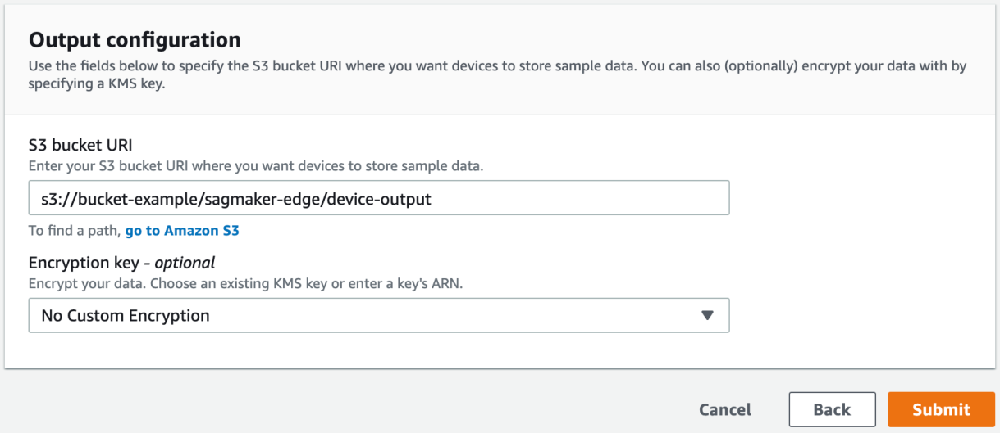

5.
Choose the name of your device fleet to be redirected to the device fleet details. This page
displays the name of the device fleet, ARN, description (if you provided one), date the fleet
was created, last time the fleet was modified, Amazon S3 bucket URI, AWS KMS key ID (if
provided), AWS IoT alias (if provided), and IAM role. If you added tags, they appear in the
Device fleet tags section.

Register a Device

Important

Device registration is required to use any part of SageMaker Edge Manager.

You can create a fleet programmatically with the AWS SDK for Python (Boto3) or through the
SageMaker AI console at https://console.aws.amazon.com/sagemaker.

Register a Device (Boto3)

To register your device, first create and register an AWS IoT thing object and configure an IAM
role. SageMaker Edge Manager takes advantage of the AWS IoT Core services to facilitate the
connection between the edge devices and the cloud. You can take advantage of existing AWS IoT
functionality after you set up your devices to work with Edge Manager.

To connect your device to AWS IoT you need to create AWS IoT thing objects, create and register a
client certificate with AWS IoT, and create and configure IAM role for your devices.

Setup for Devices and Fleets
6394

## Page 424

Amazon SageMaker AI
Developer Guide

See the Getting Started Guide for an in-depth example or the Explore AWS IoT Core services in
hands-on tutorial.

Use the RegisterDevices API to register your device. Provide the name of the fleet of which you

want the devices to be a part, as well as a name for the device. You can optionally add a description
to the device, tags, and AWS IoT thing name associated with the device.

sagemaker_client.register_devices(
DeviceFleetName="sample-fleet-name",
Devices=[
{
"DeviceName": "sample-device-1",
"IotThingName": "sample-thing-name-1",
"Description": "Device #1"
}
],

Tags=[
{
"Key": "string",
"Value" : "string"
}
],
)

Register a Device (Console)

You can register your device using the SageMaker AI console at https://console.aws.amazon.com/
sagemaker.

1.
In the SageMaker AI console, choose Edge Inference and then choose Edge devices.

2.
Choose Register devices.

3.
In the Device properties section, enter the name of the fleet the device belongs to under the
Device fleet name field. Choose Next.

Setup for Devices and Fleets
6395

## Page 425

Amazon SageMaker AI
Developer Guide

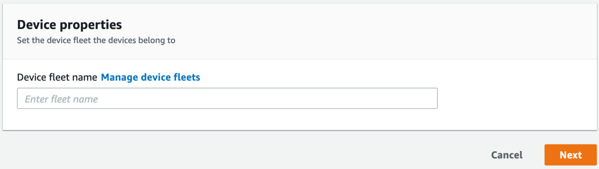

4.
In the Device source section, add your devices one by one. You must include a Device Name
for each device in your fleet. You can optionally provide a description (in the Description field)
and an Internet of Things (IoT) object name (in the IoT name field). Choose Submit once you
have added all your devices.

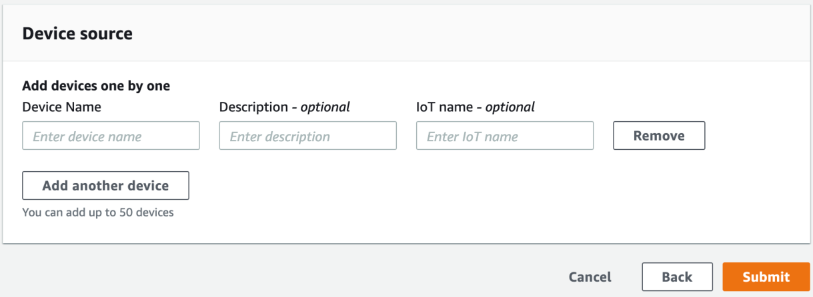

The Devices page displays the name of the device you have added, the fleet to which it
belongs, when it was registered, the last heartbeat, and the description and AWS IoT name, if
you provided one.

Choose a device to view the device’s details, including the device name, fleet, ARN, description,
IoT Thing name, when the device was registered, and the last heartbeat.

Check Status

Check that your device or fleet is connected and sampling data. Making periodic checks, manually
or automatically, allows you to check that your device or fleet is working properly.

Setup for Devices and Fleets
6396

## Page 426

Amazon SageMaker AI
Developer Guide

Use the Amazon S3 console at https://console.aws.amazon.com/s3/ to interactively choose a
fleet for a status check. You can also use the AWS SDK for Python (Boto3). The following describes
different APIs from Boto3 you can use to check the status of your device or fleet. Use the API that
best fits your use case.

• Check an individual device.

To check the status of an individual device, use DescribeDevice API. A list containing one or
more models is provided if a models have been deployed to the device.

sagemaker_client.describe_device(
DeviceName="sample-device-1",
DeviceFleetName="sample-fleet-name"
)

Running DescribeDevice returns:

{ "DeviceName": "sample-device".
"Description": "this is a sample device",
"DeviceFleetName": "sample-device-fleet",
"IoTThingName": "SampleThing",
"RegistrationTime": 1600977370,
"LatestHeartbeat": 1600977370,
"Models":[
{
"ModelName": "sample-model",
"ModelVersion": "1.1",
"LatestSampleTime": 1600977370,
"LatestInference": 1600977370
}
]
}

• Check a fleet of devices.

To check the status of the fleet, use the GetDeviceFleetReport API. Provide the name of the
device fleet to get a summary of the fleet.

sagemaker_client.get_device_fleet_report(
DeviceFleetName="sample-fleet-name"
)

Setup for Devices and Fleets
6397

## Page 427

Amazon SageMaker AI
Developer Guide

• Check for a heartbeat.

Each device within a fleet periodically generates a signal, or “heartbeat”. The heartbeat can be
used to check that the device is communicating with Edge Manager. If the timestamp of the last
heartbeat is not being updated, the device may be failing.

Check the last heartbeat with made by a device with the DescribeDevice API. Specify the
name of the device and the fleet to which the edge device belongs.

sagemaker_client.describe_device(
DeviceName="sample-device-1",
DeviceFleetName="sample-fleet-name"
)

How to Package Model

SageMaker Edge Manager packaging jobs take Amazon SageMaker Neo–compiled models and
make any changes necessary to deploy the model with the inference engine, Edge Manager agent.

Topics

• Complete prerequisites

• Package a Model (Amazon SageMaker AI Console)

• Package a Model (Boto3)

Complete prerequisites

To package a model, you must do the following:

1.
Compile your machine learning model with SageMaker AI Neo.

If you have not already done so, compile your model with SageMaker Neo. For more
information on how to compile your model, see Compile and Deploy Models with Neo. If you
are first-time user of SageMaker Neo, go through Getting Started with Neo Edge Devices.

2.
Get the name of your compilation job.

Provide the name of the compilation job name you used when you compiled your model
with SageMaker Neo. Open the SageMaker AI console at https://console.aws.amazon.com/
sagemaker/ and choose Compilation jobs to find a list of compilations that have been

How to Package Model
6398

## Page 428

Amazon SageMaker AI
Developer Guide

submitted to your AWS account. The names of submitted compilation jobs are in the Name
column.

3.
Get your IAM ARN.

You need an Amazon Resource Name (ARN) of an IAM role that you can use to download and
upload the model and contact SageMaker Neo.

Use one of the following methods to get your IAM ARN:

• Programmatically with the SageMaker AI Python SDK

import sagemaker

# Initialize SageMaker Session object so you can interact with AWS resources
sess = sagemaker.Session()

# Get the role ARN
role = sagemaker.get_execution_role()

print(role)
>> arn:aws:iam::<your-aws-account-id>:role/<your-role-name>

For more information about using the SageMaker Python SDK, see the SageMaker AI Python
SDK API.

• Using the AWS Identity and Access Management (IAM) console

Navigate to the IAM console at https://console.aws.amazon.com/iam/. In the IAM Resources
section, choose Roles to view a list of roles in your AWS account. Select or create a role that

has AmazonSageMakerFullAccess, AWSIoTFullAccess, and AmazonS3FullAccess.

For more information on IAM, see What is IAM?

4.
Have an S3 bucket URI.

You need to have at least one Amazon Simple Storage Service (Amazon S3) bucket URI to store
your Neo-compiled model, the output of the Edge Manager packaging job, and sample data
from your device fleet.

Use one of the following methods to create an Amazon S3 bucket:

• Programmatically with the SageMaker AI Python SDK

How to Package Model
6399

## Page 429

Amazon SageMaker AI
Developer Guide

You can use the default Amazon S3 bucket during a session. A default bucket is created

based on the following format: sagemaker-{region}-{aws-account-id}. To create a
default bucket with the SageMaker Python SDK, use the following:

import sagemaker

session=sagemaker.create_session()

bucket=session.default_bucket()

• Using the Amazon S3 console

Open the Amazon S3 console at https://console.aws.amazon.com/s3/ and see How do I
create an S3 Bucket? for step-by-step instructions.

Package a Model (Amazon SageMaker AI Console)

You can create a SageMaker Edge Manager packaging job using the SageMaker AI console at
https://console.aws.amazon.com/sagemaker/. Before continuing, make sure you have satisfied the
Complete prerequisites.

1.
In the SageMaker AI console, choose Edge Inference and then choose Create edge packaging
jobs, as shown in the following image.

2.
On the Job properties page, enter a name for your packaging job under Edge packaging job
name. Note that Edge Manager packaging job names are case-sensitive. Name your model and
give it a version: enter this under Model name and Model version, respectively.

3.
Next, select an IAM role. You can chose a role or let AWS create a role for you. You can
optionally specify a resource key ARN and job tags.

4.
Choose Next.

How to Package Model
6400

## Page 430

Amazon SageMaker AI
Developer Guide

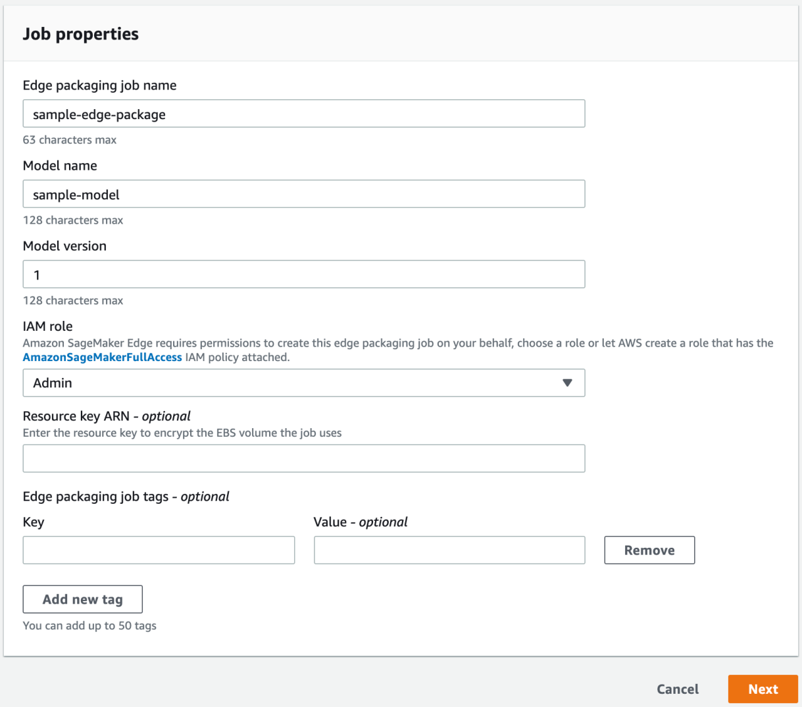

5.
Specify the name of the compilation job you used when compiling your model with SageMaker
Neo in the Compilation job name field. Choose Next.

How to Package Model
6401

## Page 431

Amazon SageMaker AI
Developer Guide


6.
On the Output configuration page, enter the Amazon S3 bucket URI in which you want to
store the output of the packaging job.


The Status column on the Edge packaging jobs page should read IN PROGRESS. Once the
packaging job is complete, the status updates to COMPLETED.

Selecting a packaging job directs you to that job's settings. The Job settings section displays
the job name, ARN, status, creation time, last modified time, duration of the packaging job,
and role ARN.

The Input configuration section displays the location of the model artifacts, the data input
configuration, and the machine learning framework of the model.

How to Package Model
6402

## Page 432

Amazon SageMaker AI
Developer Guide

The Output configuration section displays the output location of the packaging job, the target
device for which the model was compiled, and any tags you created.

7.
Choose the name of your device fleet to be redirected to the device fleet details. This page
displays the name of the device fleet, ARN, description (if you provided one), date the fleet
was created, last time the fleet was modified, Amazon S3 bucket URI, AWS KMS key ID (if
provided), AWS IoT alias (if provided), and IAM role. If you added tags, they appear in the
Device fleet tags section.

Package a Model (Boto3)

You can create a SageMaker Edge Manager packaging job with the AWS SDK for Python (Boto3).
Before continuing, make sure you have satisfied the Complete prerequisites.

To request an edge packaging job, use CreateEdgePackagingJob. You need to provide a name

to your edge packaging job, the name of your SageMaker Neo compilation job, your role Amazon
resource name (ARN), a name for your model, a version for your model, and the Amazon S3 bucket
URI where you want to store the output of your packaging job. Note that Edge Manager packaging
job names and SageMaker Neo compilation job names are case-sensitive.

# Import AWS SDK for Python (Boto3)
import boto3

# Create Edge client so you can submit a packaging job
sagemaker_client = boto3.client("sagemaker", region_name='aws-region')

sagemaker_client.create_edge_packaging_job(
EdgePackagingJobName="edge-packaging-name",
CompilationJobName="neo-compilation-name",
RoleArn="arn:aws:iam::99999999999:role/rolename",
ModelName="sample-model-name",
ModelVersion="model-version",
OutputConfig={
"S3OutputLocation": "s3://your-bucket/",
}
)

You can check the status of an edge packaging job using DescribeEdgePackagingJob and
providing the case-sensitive edge packaging job name:

How to Package Model
6403

## Page 433

Amazon SageMaker AI
Developer Guide

response = sagemaker_client.describe_edge_packaging_job(
EdgePackagingJobName="edge-packaging-name")

This returns a dictionary that can be used to poll the status of the packaging job:

# Optional - Poll every 30 sec to check completion status
import time

while True:
response = sagemaker_client.describe_edge_packaging_job(
EdgePackagingJobName="edge-packaging-name")
if response['EdgePackagingJobStatus'] == 'Completed':
break
elif response['EdgePackagingJobStatus'] == 'Failed':
raise RuntimeError('Packaging job failed')
print('Packaging model...')
time.sleep(30)
print('Done!')

For a list of packaging jobs, use ListEdgePackagingJobs. You can use this API to search for a

specific packaging job. Provide a partial name to filter packaging job names for NameContains,

a partial name for ModelNameContains to filter for jobs in which the model name contains the

name you provide. Also specify with which column to sort with SortBy, and by which direction to

sort for SortOrder (either Ascending or Descending).

sagemaker_client.list_edge_packaging_jobs(
"NameContains": "sample",
"ModelNameContains": "sample",
"SortBy": "column-name",
"SortOrder": "Descending"
)

To stop a packaging job, use StopEdgePackagingJob and provide the name of your edge
packaging job.

sagemaker_client.stop_edge_packaging_job(
EdgePackagingJobName="edge-packaging-name"
)

How to Package Model
6404

## Page 434

Amazon SageMaker AI
Developer Guide

For a full list of Edge Manager APIs, see the Boto3 documentation.

The Edge Manager Agent

The Edge Manager agent is an inference engine for your edge devices. Use the agent to make

predictions with models loaded onto your edge devices. The agent also collects model metrics and
captures data at specific intervals. Sample data is stored in your Amazon S3 bucket.

There are two methods of installing and deploying the Edge Manager agent onto your edge
devices:

1. Download the agent as a binary from the Amazon S3 release bucket. For more information, see

Download and Set Up the Edge Manager Agent Manually.

2. Use the AWS IoT Greengrass V2 console or the AWS CLI to deploy

aws.greengrass.SageMakerEdgeManager. See Create the AWS IoT Greengrass V2

Components.

Download and Set Up the Edge Manager Agent Manually

Download the Edge Manager agent based on your operating system, architecture, and AWS Region.
The agent is periodically updated, so you have the option to choose your agent based on release
dates and versions. Once you have the agent, create a JSON configuration file. Specify the device
IoT thing name, fleet name, device credentials, and other key-value pairs. See Running the Edge
Manager agent for full a list of keys you must specify in the configuration file. You can run the
agent as an executable binary or link against it as a dynamic shared object (DSO).

How the agent works

The agent runs on the CPU of your devices. The agent runs inference on the framework and
hardware of the target device you specified during the compilation job. For example, if you
compiled your model for the Jetson Nano, the agent supports the GPU in the provided Deep
Learning Runtime (DLR).

The agent is released in binary format for supported operating systems. Check that your operating
system is supported and meets the minimum OS requirement in the following table:

Linux

Version: Ubuntu 18.04

The Edge Manager Agent
6405

## Page 435

Amazon SageMaker AI
Developer Guide

Supported Binary Formats: x86-64 bit (ELF binary) and ARMv8 64 bit (ELF binary)

Windows

Version: Windows 10 version 1909

Supported Binary Formats: x86-32 bit (DLL) and x86-64 bit (DLL)

Installing the Edge Manager agent

To use the Edge Manager agent, you first must obtain the release artifacts and a root certificate.

The release artifacts are stored in an Amazon S3 bucket in the us-west-2 Region. To download

the artifacts, specify your operating system (<OS>) and the <VERSION>.

Based on your operating system, replace <OS> with one of the following:

Windows 32-bit
Windows 64-bit
Linux x86-64
Linux ARMv8

windows-x86
windows-x64
linux-x64
linux-armv8

The VERSION is broken into three components: <MAJOR_VERSION>.<YYYY-MM-DD>-<SHA-7>,
where:

• <MAJOR_VERSION>: The release version. The release version is currently set to 1.

• <YYYY-MM-DD>: The time stamp of the artifacts release.

• <SHA-7>: The repository commit ID from which the release is built.

You must provide the <MAJOR_VERSION> and the time stamp in YYYY-MM-DD format. We suggest
you use the latest artifact release time stamp.

Run the following in your command line to get the latest time stamp. Replace <OS> with your
operating system:

aws s3 ls s3://sagemaker-edge-release-store-us-west-2-<OS>/Releases/ | sort -r

For example, if you have a Windows 32-bit OS, run:

aws s3 ls s3://sagemaker-edge-release-store-us-west-2-windows-x86/Releases/ | sort -r

The Edge Manager Agent
6406

## Page 436

Amazon SageMaker AI
Developer Guide

This returns:

2020-12-01 23:33:36 0

PRE 1.20201218.81f481f/
PRE 1.20201207.02d0e97/

The return output in this example shows two release artifacts. The first release artifact file notes

that the release version has a major release version of 1, a time stamp of 20201218 (in YYYY-MM-

DD format), and a 81f481f SHA-7 commit ID.

Note

The preceding command assumes you have configured the AWS Command Line Interface.
For more information, about how to configure the settings that the AWS CLI uses to
interact with AWS, see Configuring the AWS CLI.

Based on your operating system, use the following commands to install the artifacts:

Windows 32-bit

aws s3 cp s3://sagemaker-edge-release-store-us-west-2-windows-x86/
Releases/<VERSION>/<VERSION>.zip .
aws s3 cp s3://sagemaker-edge-release-store-us-west-2-windows-x86/
Releases/<VERSION>/sha256_hex.shasum .

Windows 64-bit

aws s3 cp s3://sagemaker-edge-release-store-us-west-2-windows-x64/
Releases/<VERSION>/<VERSION>.zip .
aws s3 cp s3://sagemaker-edge-release-store-us-west-2-windows-x64/
Releases/<VERSION>/sha256_hex.shasum .

Linux x86-64

aws s3 cp s3://sagemaker-edge-release-store-us-west-2-linux-x64/
Releases/<VERSION>/<VERSION>.tgz .
aws s3 cp s3://sagemaker-edge-release-store-us-west-2-linux-x64/Releases/<VERSION>/
sha256_hex.shasum .

The Edge Manager Agent
6407

## Page 437

Amazon SageMaker AI
Developer Guide

Linux ARMv8

aws s3 cp s3://sagemaker-edge-release-store-us-west-2-linux-armv8/
Releases/<VERSION>/<VERSION>.tgz .
aws s3 cp s3://sagemaker-edge-release-store-us-west-2-linux-armv8/
Releases/<VERSION>/sha256_hex.shasum .

You also must download a root certificate. This certificate validates model artifacts signed by AWS
before loading them onto your edge devices.

Replace <OS> corresponding to your platform from the list of supported operation systems and

replace <REGION> with your AWS Region.

aws s3 cp s3://sagemaker-edge-release-store-us-west-2-<OS>/
Certificates/<REGION>/<REGION>.pem .

Running the Edge Manager agent

You can run the SageMaker AI Edge Manager agent as a standalone process in the form of an
Executable and Linkable Format (ELF) executable binary or you can link against it as a dynamic
shared object (.dll). Linux supports running it as a standalone executable binary and is the
preferred mode. Windows supports running it as a shared object (.dll).

On Linux, we recommend that you run the binary via a service that’s a part of your initialization

(init) system. If you want to run the binary directly, you can do so in a terminal as shown in the
following example. If you have a modern OS, there are no other installations necessary prior to
running the agent, since all the requirements are statically built into the executable. This gives you
flexibility to run the agent on the terminal, as a service, or within a container.

To run the agent, first create a JSON configuration file. Specify the following key-value pairs:

• sagemaker_edge_core_device_name: The name of the device. This device name needs to be
registered along with the device fleet in the SageMaker Edge Manager console.

• sagemaker_edge_core_device_fleet_name: The name of the fleet to which the device
belongs.

• sagemaker_edge_core_region: The AWS Region associated with the device, the fleet and the
Amazon S3 buckets. This corresponds to the Region where the device is registered and where the
Amazon S3 bucket is created (they are expected to be the same). The models themselves can be

The Edge Manager Agent
6408

## Page 438

Amazon SageMaker AI
Developer Guide

compiled with SageMaker Neo in a different Region, this configuration is not related to model
compilation Region.

• sagemaker_edge_core_root_certs_path: The absolute folder path to root certificates. This
is used to validate the device with the relevant AWS account.

• sagemaker_edge_provider_aws_ca_cert_file: The absolute path to Amazon Root CA
certificate (AmazonRootCA1.pem). This is used to validate the device with the relevant AWS

account. AmazonCA is a certificate owned by AWS.

• sagemaker_edge_provider_aws_cert_file: The absolute path to AWS IoT signing root

certificate (*.pem.crt).

• sagemaker_edge_provider_aws_cert_pk_file: The absolute path to AWS IoT private key.

(*.pem.key).

• sagemaker_edge_provider_aws_iot_cred_endpoint: The AWS IoT credentials endpoint

(identifier.iot.region.amazonaws.com). This endpoint is used for credential validation. See
Connecting devices to AWS IoT for more information.

• sagemaker_edge_provider_provider: This indicates the implementation of the provider
interface being used. The provider interface communicates with the end network services for

uploads, heartbeats and registration validation. By default this is set to "Aws". We allow custom

implementations of the provider interface. It can be set to None for no provider or Custom for
custom implementation with the relevant shared object path provided.

• sagemaker_edge_provider_provider_path: Provides the absolute path to the provider

implementation shared object. (.so or .dll file). The "Aws" provider .dll or .so file is provided with
the agent release. This field is mandatory.

• sagemaker_edge_provider_s3_bucket_name: The name of your Amazon S3 bucket (not the

Amazon S3 bucket URI). The bucket must have a sagemaker string within its name.

• sagemaker_edge_log_verbose (Boolean.): Optional. This sets the debug log. Select either

True or False.

• sagemaker_edge_telemetry_libsystemd_path: For Linux only, systemd implements
the agent crash counter metric. Set the absolute path of libsystemd to turn on the crash

counter metric. You can find the default libsystemd path can be found by running whereis

libsystemd in the device terminal.

• sagemaker_edge_core_capture_data_destination: The destination for uploading

capture data. Choose either "Cloud" or "Disk". The default is set to "Disk". Setting it to

"Disk" writes the input and output tensor(s) and auxiliary data to the local file system at your

The Edge Manager Agent
6409

## Page 439

Amazon SageMaker AI
Developer Guide

preferred location of. When writing to "Cloud" use the Amazon S3 bucket name provided in the

sagemaker_edge_provider_s3_bucket_name configuration.

• sagemaker_edge_core_capture_data_disk_path: Set the absolute path in the local file

system, into which capture data files are written when "Disk" is the destination. This field is not

used when "Cloud" is specified as the destination.

• sagemaker_edge_core_folder_prefix: The parent prefix in Amazon S3 where

captured data is stored when you specify "Cloud" as the capture data destination

(sagemaker_edge_core_capture_data_disk_path). Captured data is stored in a sub-

folder under sagemaker_edge_core_capture_data_disk_path if "Disk" is set as the data
destination.

• sagemaker_edge_core_capture_data_buffer_size (Integer value) : The capture data
circular buffer size. It indicates the maximum number of requests stored in the buffer.

• sagemaker_edge_core_capture_data_batch_size (Integer value): The capture data batch
size. It indicates the size of a batch of requests that are handled from the buffer. This value must

to be less than sagemaker_edge_core_capture_data_buffer_size. A maximum of half
the size of the buffer is recommended for batch size.

• sagemaker_edge_core_capture_data_push_period_seconds (Integer value): The capture
data push period in seconds. A batch of requests in the buffer is handled when there are batch
size requests in the buffer, or when this time period has completed (whichever comes first). This
configuration sets that time period.

• sagemaker_edge_core_capture_data_base64_embed_limit: The limit for uploading
capture data in bytes. Integer value.

Your configuration file should look similar to the following example(with your specific values

specified). This example uses the default AWS provider("Aws") and does not specify a periodic
upload.

{
"sagemaker_edge_core_device_name": "device-name",
"sagemaker_edge_core_device_fleet_name": "fleet-name",
"sagemaker_edge_core_region": "region",
"sagemaker_edge_core_root_certs_path": "<Absolute path to root certificates>",
"sagemaker_edge_provider_provider": "Aws",
"sagemaker_edge_provider_provider_path" : "/path/to/libprovider_aws.so",
"sagemaker_edge_provider_aws_ca_cert_file": "<Absolute path to Amazon Root CA
certificate>/AmazonRootCA1.pem",

The Edge Manager Agent
6410

## Page 440

Amazon SageMaker AI
Developer Guide

"sagemaker_edge_provider_aws_cert_file": "<Absolute path to AWS IoT signing root
certificate>/device.pem.crt",
"sagemaker_edge_provider_aws_cert_pk_file": "<Absolute path to AWS IoT private
key.>/private.pem.key",
"sagemaker_edge_provider_aws_iot_cred_endpoint": "https://<AWS IoT Endpoint
Address>",
"sagemaker_edge_core_capture_data_destination": "Cloud",
"sagemaker_edge_provider_s3_bucket_name": "sagemaker-bucket-name",
"sagemaker_edge_core_folder_prefix": "Amazon S3 folder prefix",
"sagemaker_edge_core_capture_data_buffer_size": 30,
"sagemaker_edge_core_capture_data_batch_size": 10,
"sagemaker_edge_core_capture_data_push_period_seconds": 4000,
"sagemaker_edge_core_capture_data_base64_embed_limit": 2,
"sagemaker_edge_log_verbose": false
}

The release artifact includes a binary executable called sagemaker_edge_agent_binary in

the /bin directory. To run the binary, use the -a flag to create a socket file descriptor (.sock) in a
directory of your choosing and specify the path of the agent JSON config file you created with the

-c flag.

./sagemaker_edge_agent_binary -a <ADDRESS_TO_SOCKET> -c <PATH_TO_CONFIG_FILE>

The following example shows the code snippet with a directory and file path specified:

./sagemaker_edge_agent_binary -a /tmp/sagemaker_edge_agent_example.sock -c
sagemaker_edge_config.json

In this example, a socket file descriptor named sagemaker_edge_agent_example.sock

is created in the /tmp directory and points to a configuration file that is in the same working

directory as the agent called sagemaker_edge_config.json.

Model Package and Edge Manager Agent Deployment with AWS IoT Greengrass

SageMaker Edge Manager integrates AWS IoT Greengrass version 2 to simplify accessing,
maintaining, and deploying the Edge Manager agent and model to your devices. Without AWS
IoT Greengrass V2, setting up your devices and fleets to use SageMaker Edge Manager requires
you to manually copy the Edge Manager agent from an Amazon S3 release bucket. You use the
agent to make predictions with models loaded onto your edge devices. With AWS IoT Greengrass
V2 and SageMaker Edge Manager integration, you can use AWS IoT Greengrass V2 components.

The Edge Manager Agent
6411

## Page 441

Amazon SageMaker AI
Developer Guide

Components are pre-built software modules that can connect your edge devices to AWS services or
third-party service via AWS IoT Greengrass.

You must install the AWS IoT Greengrass Core software onto your device(s) if you want to use
AWS IoT Greengrass V2 to deploy the Edge Manager agent and your model. For more information
about device requirements and how to set up your devices, see Setting up AWS IoT Greengrass core
devices in the AWS IoT Greengrass documentation.

You use the following three components to deploy the Edge Manager agent:

• A pre-built public component: SageMaker AI maintains the public Edge Manager component.

• A autogenerated private component: The private component is autogenerated when you

package your machine learning model with the CreateEdgePackagingJob API and specify

GreengrassV2Component for the Edge Manager API field PresetDeploymentType.

• A custom component: This is the inference application that is responsible for preprocessing
and making inferences on your device. You must create this component. See either Create a
Hello World custom component in the SageMaker Edge Manager documentation or Create
custom AWS IoT Greengrass components in the AWS IoT Greengrass documentation for more
information on how to create custom components.

Complete prerequisites to deploy the Edge Manager agent

SageMaker Edge Manager uses AWS IoT Greengrass V2 to simplify the deployment of the Edge
Manager agent, your machine learning models, and your inference application to your devices with
the use of components. To make it easier to maintain your AWS IAM roles, Edge Manager allows
you to reuse your existing AWS IoT role alias. If you do not have one yet, Edge Manager generates
a role alias as part of the Edge Manager packaging job. You no longer need to associate a role alias
generated from the SageMaker Edge Manager packaging job with your AWS IoT role.

Before you start, you must complete the following prerequisites:

1. Install the AWS IoT Greengrass Core software. For detailed information, see Install the AWS IoT

Greengrass Core software.

2. Set up AWS IoT Greengrass V2. For more information, see Install AWS IoT Greengrass Core

software with manual resource provisioning.

The Edge Manager Agent
6412

## Page 442

Amazon SageMaker AI
Developer Guide

Note

• Make sure the AWS IoT thing name is all lowercase and does not contain characters

except (optionally) dashes (‐).

• The IAM Role must start with SageMaker*

3. Attach the following permission and inline policy to the IAM role created during AWS IoT

Greengrass V2 setup.

• Navigate to the IAM console https://console.aws.amazon.com/iam/.

• Search for the role you created by typing in rhe role name in the Search field.

• Choose your role.

• Next, choose Attach policies.

• Search for AmazonSageMakerEdgeDeviceFleetPolicy.

• Select AmazonSageMakerFullAccess (This is an optional step that makes it easier for you to
reuse this IAM role in model compilation and packaging).

• Add required permissions to a role's permissions policy, don't attach inline policies to IAM
users.

JSON

{
"Version":"2012-10-17",
"Statement":[
{
"Sid":"GreengrassComponentAccess",
"Effect":"Allow",
"Action":[
"greengrass:CreateComponentVersion",
"greengrass:DescribeComponent"
],
"Resource":"*"
}
]
}

• Choose Attach policy.

• Choose Trust relationship.

The Edge Manager Agent
6413

## Page 443

Amazon SageMaker AI
Developer Guide

• Choose Edit trust relationship.

• Replace the content with the following.

JSON

{
"Version":"2012-10-17",
"Statement": [
{
"Effect": "Allow",
"Principal": {
"Service": "credentials.iot.amazonaws.com"
},
"Action": "sts:AssumeRole"
},
{

"Effect": "Allow",
"Principal": {
"Service": "sagemaker.amazonaws.com"
},
"Action": "sts:AssumeRole"
}
]
}

4. Create an Edge Manager device fleet. For information on how to create a fleet, see Setup for

Devices and Fleets in SageMaker Edge Manager.

5. Register your device with the same name as your AWS IoT thing name created during the AWS

IoT Greengrass V2 setup.

6. Create at least one custom private AWS IoT Greengrass component. This component is the

application that runs inference on the device. For more information, see Create a Hello World
custom component

Note

• The SageMaker Edge Manager and AWS IoT Greengrass integration only works for AWS
IoT Greengrass v2.

• Both your AWS IoT thing name and Edge Manager device name must be the same.

The Edge Manager Agent
6414

## Page 444

Amazon SageMaker AI
Developer Guide

• SageMaker Edge Manager does not load local AWS IoT certificates and call the AWS IoT
credential provider endpoint directly. Instead, SageMaker Edge Manager uses the AWS
IoT Greengrass v2 TokenExchangeService and it fetches a temporary credential from a
TES endpoint.

Create the AWS IoT Greengrass V2 Components

AWS IoT Greengrass uses components, a software module that is deployed to and runs on a AWS
IoT Greengrass core device. You need (at a minimum) three components:

1. A public Edge Manager Agent AWS IoT Greengrass component which deploys the Edge Manager

agentbinary.

2. A model component that is autogenerated when you package your machine learning model with

either the AWS SDK for Python (Boto3) API or with the SageMaker AI console. For information,
see Create an autogenerated component.

3. A private, custom component to implement the Edge Manager agent client application, and do

any preprocessing and post-processing of the inference results. For more information about how
to create a custom component, see Create an autogenerated component or Create custom AWS
IoT Greengrass components.

Create an autogenerated component

Generate the model component with the CreateEdgePackagingJob API and specify

GreengrassV2Component for the SageMaker Edge Manager packaging job API field

PresetDeploymentType. When you call the CreateEdgePackagingJob API, Edge Manager
takes your SageMaker AI Neo–compiled model in Amazon S3 and creates a model component. The
model component is automatically stored in your account. You can view any of your components
by navigating to the AWS IoT console https://console.aws.amazon.com/iot/. Select Greengrass
and then select Core devices. The page has a list of AWS IoT Greengrass core devices associated

with your account. If a model component name is not specified in PresetDeploymentConfig,

the default name generated consists of "SagemakerEdgeManager" and the name of your Edge
Manager agent packaging job. The following example demonstrates how to specify to Edge

Manager to create a AWS IoT Greengrass V2 component with the CreateEdgePackagingJob API.

import sagemaker
import boto3

The Edge Manager Agent
6415

## Page 445

Amazon SageMaker AI
Developer Guide

# Create a SageMaker client object to make it easier to interact with other AWS
services.
sagemaker_client = boto3.client('sagemaker', region=<YOUR_REGION>)

# Replace with your IAM Role ARN
sagemaker_role_arn = "arn:aws:iam::<account>:role/*"

# Replace string with the name of your already created S3 bucket.
bucket = 'amzn-s3-demo-bucket-edge-manager'

# Specify a name for your edge packaging job.
edge_packaging_name = "edge_packag_job_demo"

# Replace the following string with the name you used for the SageMaker Neo compilation
job.
compilation_job_name = "getting-started-demo"

# The name of the model and the model version.
model_name = "sample-model"
model_version = "1.1"

# Output directory in S3 where you want to store the packaged model.
packaging_output_dir = 'packaged_models'
packaging_s3_output = 's3://{}/{}'.format(bucket, packaging_output_dir)

# The name you want your Greengrass component to have.
component_name = "SagemakerEdgeManager" + edge_packaging_name

sagemaker_client.create_edge_packaging_job(
EdgePackagingJobName=edge_packaging_name,
CompilationJobName=compilation_job_name,
RoleArn=sagemaker_role_arn,
ModelName=model_name,
ModelVersion=model_version,
OutputConfig={
"S3OutputLocation": packaging_s3_output,
"PresetDeploymentType":"GreengrassV2Component",
"PresetDeploymentConfig":"{\"ComponentName\":\"sample-
component-name\", \"ComponentVersion\":\"1.0.2\"}"
}
)

The Edge Manager Agent
6416

## Page 446

Amazon SageMaker AI
Developer Guide

You can also create the autogenerated component with the SageMaker AI console. Follow steps 1-6
in Package a Model (Amazon SageMaker AI Console)

Enter the Amazon S3 bucket URI where you want to store the output of the packaging job and
optional encrytion key.

Complete the following to create the model component:

1. Choose Preset deployment.

2. Specify the name of the component for the Component name field.

3. Optionally, provide a description of the component, a component version, the platform OS, or

the platform architecture for the Component description, Component version, Platform OS,
and Platform architecture, respectively.

4. Choose Submit.

Create a Hello World custom component

The custom application component is used to perform inference on the edge device. The
component is responsible for loading models to SageMaker Edge Manager, invoking the Edge
Manager agent for inference, and unloading the model when the component is shut down.
Before you create your component, ensure the agent and application can communicate with Edge
Manager. To do this, configure gRPC. The Edge Manager agent uses methods defined in Protobuf
Buffers and the gRPC server to establish communication with the client application on the edge
device and the cloud.

To use gRPC, you must:

1. Create a gRPC stub using the .proto file provided when you download the Edge Manager agent

from Amazon S3 release bucket.

2. Write client code with the language you prefer.

You do not need to define the service in a .proto file. The service .proto files are included in the
compressed TAR file when you download the Edge Manager agent release binary from the Amazon
S3 release bucket.

Install gRPC and other necessary tools on your host machine and create the gRPC stubs

agent_pb2_grpc.py and agent_pb2.py in Python. Make sure you have agent.proto in your
local directory.

The Edge Manager Agent
6417

## Page 447

Amazon SageMaker AI
Developer Guide

%%bash
pip install grpcio
pip install grpcio-tools
python3 -m grpc_tools.protoc --proto_path=. --python_out=. --grpc_python_out=.
agent.proto

The preceding code generates the gRPC client and server interfaces from your .proto service
definition. In other words, it creates the gRPC model in Python. The API directory contains the
Protobuf specification for communicating with the agent.

Next, use the gRPC API to write a client and server for your service (2). The following example

script, edge_manager_python_example.py, uses Python to load, list, and unload a yolov3
model to the edge device.

import grpc
from PIL import Image
import agent_pb2
import agent_pb2_grpc
import os

model_path = '<PATH-TO-SagemakerEdgeManager-COMPONENT>'
agent_socket = 'unix:///tmp/aws.greengrass.SageMakerEdgeManager.sock'

agent_channel = grpc.insecure_channel(agent_socket, options=(('grpc.enable_http_proxy',
0),))

agent_client = agent_pb2_grpc.AgentStub(agent_channel)

def list_models():
return agent_client.ListModels(agent_pb2.ListModelsRequest())

def list_model_tensors(models):
return {
model.name: {
'inputs': model.input_tensor_metadatas,
'outputs': model.output_tensor_metadatas
}
for model in list_models().models

The Edge Manager Agent
6418

## Page 448

Amazon SageMaker AI
Developer Guide

}

def load_model(model_name, model_path):
load_request = agent_pb2.LoadModelRequest()
load_request.url = model_path
load_request.name = model_name
return agent_client.LoadModel(load_request)

def unload_model(name):
unload_request = agent_pb2.UnLoadModelRequest()
unload_request.name = name
return agent_client.UnLoadModel(unload_request)

def predict_image(model_name, image_path):

image_tensor = agent_pb2.Tensor()
image_tensor.byte_data = Image.open(image_path).tobytes()
image_tensor_metadata = list_model_tensors(list_models())[model_name]['inputs'][0]
image_tensor.tensor_metadata.name = image_tensor_metadata.name
image_tensor.tensor_metadata.data_type = image_tensor_metadata.data_type
for shape in image_tensor_metadata.shape:
image_tensor.tensor_metadata.shape.append(shape)
predict_request = agent_pb2.PredictRequest()
predict_request.name = model_name
predict_request.tensors.append(image_tensor)
predict_response = agent_client.Predict(predict_request)
return predict_response

def main():
try:
unload_model('your-model')
except:
pass
print('LoadModel...', end='')
try:
load_model('your-model', model_path)
print('done.')
except Exception as e:
print()
print(e)
print('Model already loaded!')

The Edge Manager Agent
6419

## Page 449

Amazon SageMaker AI
Developer Guide

print('ListModels...', end='')
try:
print(list_models())
print('done.')
except Exception as e:
print()
print(e)
print('List model failed!')
print('Unload model...', end='')
try:
unload_model('your-model')
print('done.')
except Exception as e:
print()

print(e)
print('unload model failed!')

if __name__ == '__main__':
main()

Ensure model_path points to the name of the AWS IoT Greengrass component containing the
model if you use the same client code example.

You can create your AWS IoT Greengrass V2 Hello World component once you have generated your
gRPC stubs and you have your Hello World code ready. To do so:

• Upload your edge_manager_python_example.py, agent_pb2_grpc.py, and

agent_pb2.py to your Amazon S3 bucket and note down their Amazon S3 path.

• Create a private component in the AWS IoT Greengrass V2 console and define the recipe for your
component. Specify the Amazon S3 URI to your Hello World application and gRPC stub in the
following recipe.

---
RecipeFormatVersion: 2020-01-25
ComponentName: com.sagemaker.edgePythonExample
ComponentVersion: 1.0.0
ComponentDescription: Sagemaker Edge Manager Python example
ComponentPublisher: Amazon Web Services, Inc.
ComponentDependencies:

The Edge Manager Agent
6420

## Page 450

Amazon SageMaker AI
Developer Guide

aws.greengrass.SageMakerEdgeManager:
VersionRequirement: '>=1.0.0'
DependencyType: HARD
Manifests:
- Platform:
os: linux
architecture: "/amd64|x86/"
Lifecycle:
install: |-
apt-get install python3-pip
pip3 install grpcio
pip3 install grpcio-tools
pip3 install protobuf
pip3 install Pillow
run:
script: |-
python3 {artifacts:path}/edge_manager_python_example.py

Artifacts:
- URI: <code-s3-path>
- URI: <pb2-s3-path>
- URI: <pb2-grpc-s3-path>

For detailed information about creating a Hello World recipe, see Create your first component in
the AWS IoT Greengrass documentation.

Deploy the components to your device

Deploy your components with the AWS IoT console or with the AWS CLI.

To deploy your components (console)

Deploy your AWS IoT Greengrass components with the AWS IoT console.

1. In the AWS IoT Greengrass console at https://console.aws.amazon.com/iot/ navigation menu,

choose Deployments.

2. On the Components page, on the Public components tab, choose

aws.greengrass.SageMakerEdgeManager.

3. On the aws.greengrass.SageMakerEdgeManager page, choose Deploy.

4. From Add to deployment, choose one of the following:

a. To merge this component to an existing deployment on your target device, choose Add to

existing deployment, and then select the deployment that you want to revise.

The Edge Manager Agent
6421

## Page 451

Amazon SageMaker AI
Developer Guide

b. To create a new deployment on your target device, choose Create new deployment. If

you have an existing deployment on your device, choosing this step replaces the existing
deployment.

5. On the Specify target page, do the following:

a. Under Deployment information, enter or modify the friendly name for your deployment.

b. Under Deployment targets, select a target for your deployment, and choose Next. You

cannot change the deployment target if you are revising an existing deployment.

6. On the Select components page, under My components, choose:

• com.<CUSTOM-COMPONENT-NAME>

• aws.greengrass.SageMakerEdgeManager

• SagemakerEdgeManager.<YOUR-PACKAGING-JOB>

7. On the Configure components page, choose com.greengrass.SageMakerEdgeManager, and do

the following.

a. Choose Configure component.

b. Under Configuration update, in Configuration to merge, enter the following configuration.

{
"DeviceFleetName": "device-fleet-name",
"BucketName": "bucket-name"
}

Replace device-fleet-name with the name of the edge device fleet that you created, and

replace bucket-name with the name of the Amazon S3 bucket that is associated with your
device fleet.

c. Choose Confirm, and then choose Next.

8. On the Configure advanced settings page, keep the default configuration settings, and choose

Next.

9. On the Review page, choose Deploy.

To deploy your components (AWS CLI)

1. Create a  deployment.json file to define the deployment configuration for your SageMaker

Edge Manager components. This file should look like the following example.

The Edge Manager Agent
6422

## Page 452

Amazon SageMaker AI
Developer Guide

{
"targetArn":"targetArn",
"components": {
"aws.greengrass.SageMakerEdgeManager": {
"componentVersion": 1.0.0,
"configurationUpdate": {
"merge": {
"DeviceFleetName": "device-fleet-name",
"BucketName": "bucket-name"
}
}
},
"com.greengrass.SageMakerEdgeManager.ImageClassification": {
"componentVersion": 1.0.0,
"configurationUpdate": {
}

},
"com.greengrass.SageMakerEdgeManager.ImageClassification.Model": {
"componentVersion": 1.0.0,
"configurationUpdate": {
}
},
}
}

• In the targetArn field, replace targetArn with the Amazon Resource Name (ARN) of the
thing or thing group to target for the deployment, in the following format:

• Thing: arn:aws:iot:region:account-id:thing/thingName

• Thing group: arn:aws:iot:region:account-id:thinggroup/thingGroupName

• In the merge field, replace device-fleet-name with the name of the edge device fleet

that you created, and replace bucket-name with the name of the Amazon S3 bucket that is
associated with your device fleet.

• Replace the component versions for each component with the latest available version.

2. Run the following command to deploy the components on the device:

aws greengrassv2 create-deployment \
--cli-input-json file://path/to/deployment.json

The Edge Manager Agent
6423

## Page 453

Amazon SageMaker AI
Developer Guide

The deployment can take several minutes to complete. In the next step, check the component log
to verify that the deployment completed successfully and to view the inference results.

For more information about deploying components to individual devices or groups of devices, see
Deploy AWS IoT Greengrass components to devices.

Deploy the Model Package Directly with SageMaker Edge Manager Deployment
API

SageMaker Edge Manager provides a deployment API that you can use to deploy models to device
targets without AWS IoT Greengrass. It is useful in situations where you want to update models
independently of firmware updates or application deployment mechanisms. You can use the API to
integrate your edge deployments into a CI/CD workflow to automatically deploy models once you
have validated your model for accuracy. The API also has convenient rollback and staged rollout
options for you to ensure models work well in a particular environment before wider rollout.

To use the Edge Manager deployment API first compile and package your model. For information
on how to compile and package your model, see Prepare Your Model for Deployment. The
following sections of this guide show how you can create edge deployments using SageMaker API,
after you have compiled and packaged your models.

Topics

• Create an edge deployment plan

• Start the edge deployment

• Check the status of the deployment

Create an edge deployment plan

You can create an edge deployment plan with the CreateEdgeDeploymentPlan API. The
deployment plan can have multiple stages. You can configure each stage to rollout the deployment
to a subset of edge devices (by percentage, or by device name). You can also configure how rollout
failures are handled at each stage.

The following code snippet shows how you can create an edge deployment plan with 1 stage to
deploy a compiled and package model to 2 specific edge devices:

import boto3

The Edge Manager Agent
6424

## Page 454

Amazon SageMaker AI
Developer Guide

client = boto3.client("sagemaker")

client.create_edge_deployment_plan(
EdgeDeploymentPlanName="edge-deployment-plan-name",
DeviceFleetName="device-fleet-name",
ModelConfigs=[
{
"EdgePackagingJobName": "edge-packaging-job-name",
"ModelHandle": "model-handle"
}
],
Stages=[
{
"StageName": "stage-name",
"DeviceSelectionConfig": {
"DeviceSubsetType": "SELECTION",
"DeviceNames": ["device-name-1", "device-name-2"]

},
"DeploymentConfig": {
"FailureHandlingPolicy": "ROLLBACK_ON_FAILURE"
}
}
]
)

Instead of specific devices, if you want to deploy to the model to a percentage of devices in your

fleet, then set the value of DeviceSubsetType to "PERCENTAGE" and replace "DeviceNames":

["device-name-1", "device-name-2"] with "Percentage": desired-percentage in the
above example.

Stages can be added after the deployment plan has been created with the
CreateEdgeDeploymentStage API, in case you want to start rolling out new stages after validating
your test rollout success. For more information about deployment stages see DeploymentStage.

Start the edge deployment

After creating the deployment plan and the deployment stages, you can start the deployment with

the StartEdgeDeploymentStage API.

client.start_edge_deployment_stage(

The Edge Manager Agent
6425

## Page 455

Amazon SageMaker AI
Developer Guide

EdgeDeploymentPlanName="edge-deployment-plan-name",
StageName="stage-name"
)

Check the status of the deployment

You can check the status of the edge deployment with the DescribeEdgeDeploymentPlan API.

client.describe_edge_deployment_plan(
EdgeDeploymentPlanName="edge-deployment-plan-name"
)

Manage Model

The Edge Manager agent can load multiple models at a time and make inference with loaded
models on edge devices. The number of models the agent can load is determined by the available
memory on the device. The agent validates the model signature and loads into memory all the
artifacts produced by the edge packaging job. This step requires all the required certificates
described in previous steps to be installed along with rest of the binary installation. If the model’s
signature cannot be validated, then loading of the model fails with appropriate return code and
reason.

SageMaker Edge Manager agent provides a list of Model Management APIs that implement control
plane and data plane APIs on edge devices. Along with this documentation, we recommend going
through the sample client implementation which shows canonical usage of the below described
APIs.

The proto file is available as a part of the release artifacts (inside the release tarball). In this doc,

we list and describe the usage of APIs listed in this proto file.

Note

There is one-to-one mapping for these APIs on Windows release and a sample code for
an application implement in C# is shared with the release artifacts for Windows. Below
instructions are for running the Agent as a standalone process, applicable for to the release
artifacts for Linux.

Manage Model
6426

## Page 456

Amazon SageMaker AI
Developer Guide

Extract the archive based on your OS. Where VERSION is broken into three components:

<MAJOR_VERSION>.<YYYY-MM-DD>-<SHA-7>. See Installing the Edge Manager agent for

information on how to obtain the release version (<MAJOR_VERSION>), time stamp of the release

artifact (<YYYY-MM-DD>), and the repository commit ID (SHA-7)

Linux

The zip archive can be extracted with the command:

tar -xvzf <VERSION>.tgz

Windows

The zip archive can be extracted with the UI or command:

unzip <VERSION>.tgz

The release artifact hierarchy (after extracting the tar/zip archive) is shown below. The agent

proto file is available under api/.

0.20201205.7ee4b0b
### bin
#         ### sagemaker_edge_agent_binary
#         ### sagemaker_edge_agent_client_example
### docs
### api
#         ### agent.proto
### attributions
#         ### agent.txt
#         ### core.txt
### examples
### ipc_example
### CMakeLists.txt
### sagemaker_edge_client.cc
### sagemaker_edge_client_example.cc
### sagemaker_edge_client.hh
### sagemaker_edge.proto
### README.md
### shm.cc
### shm.hh
### street_small.bmp

Manage Model
6427

## Page 457

Amazon SageMaker AI
Developer Guide

Topics

• Load Model

• Unload Model

• List Models

• Describe Model

• Capture Data

• Get Capture Status

• Predict

Load Model

The Edge Manager agent supports loading multiple models. This API validates the model signature

and loads into memory all the artifacts produced by the EdgePackagingJob operation. This step
requires all the required certificates to be installed along with rest of the agent binary installation.
If the model’s signature cannot be validated then this step fails with appropriate return code and
error messages in the log.

// perform load for a model
// Note:
// 1. currently only local filesystem paths are supported for loading models.
// 2. multiple models can be loaded at the same time, as limited by available device
memory
// 3. users are required to unload any loaded model to load another model.
// Status Codes:
// 1. OK - load is successful
// 2. UNKNOWN - unknown error has occurred
// 3. INTERNAL - an internal error has occurred
// 4. NOT_FOUND - model doesn't exist at the url
// 5. ALREADY_EXISTS - model with the same name is already loaded
// 6. RESOURCE_EXHAUSTED - memory is not available to load the model
// 7. FAILED_PRECONDITION - model is not compiled for the machine.
//
rpc LoadModel(LoadModelRequest) returns (LoadModelResponse);

Input

//
// request for LoadModel rpc call

Manage Model
6428

## Page 458

Amazon SageMaker AI
Developer Guide

//
message LoadModelRequest {
string url = 1;
string name = 2;  // Model name needs to match regex "^[a-zA-Z0-9](-*[a-zA-Z0-9])*
$"
}

Output

//
//
// response for LoadModel rpc call
//
message LoadModelResponse {
Model model = 1;
}

//
// Model represents the metadata of a model
//  url - url representing the path of the model
//  name - name of model
//  input_tensor_metadatas - TensorMetadata array for the input tensors
//  output_tensor_metadatas - TensorMetadata array for the output tensors
//
// Note:
//  1. input and output tensor metadata could empty for dynamic models.
//
message Model {
string url = 1;
string name = 2;
repeated TensorMetadata input_tensor_metadatas = 3;
repeated TensorMetadata output_tensor_metadatas = 4;
}

Unload Model

Unloads a previously loaded model. It is identified via the model alias which was provided during

loadModel. If the alias is not found or model is not loaded then returns error.

//
// perform unload for a model
// Status Codes:

Manage Model
6429

## Page 459

Amazon SageMaker AI
Developer Guide

// 1. OK - unload is successful
// 2. UNKNOWN - unknown error has occurred
// 3. INTERNAL - an internal error has occurred
// 4. NOT_FOUND - model doesn't exist
//
rpc UnLoadModel(UnLoadModelRequest) returns (UnLoadModelResponse);

Input

//
// request for UnLoadModel rpc call
//
message UnLoadModelRequest {
string name = 1; // Model name needs to match regex "^[a-zA-Z0-9](-*[a-zA-Z0-9])*$"
}

Output

//
// response for UnLoadModel rpc call
//
message UnLoadModelResponse {}

List Models

Lists all the loaded models and their aliases.

//
// lists the loaded models
// Status Codes:
// 1. OK - unload is successful
// 2. UNKNOWN - unknown error has occurred
// 3. INTERNAL - an internal error has occurred
//
rpc ListModels(ListModelsRequest) returns (ListModelsResponse);

Input

//
// request for ListModels rpc call

Manage Model
6430

## Page 460

Amazon SageMaker AI
Developer Guide

//
message ListModelsRequest {}

Output

//
// response for ListModels rpc call
//
message ListModelsResponse {
repeated Model models = 1;
}

Describe Model

Describes a model that is loaded on the agent.

//
// Status Codes:
// 1. OK - load is successful
// 2. UNKNOWN - unknown error has occurred
// 3. INTERNAL - an internal error has occurred
// 4. NOT_FOUND - model doesn't exist at the url
//
rpc DescribeModel(DescribeModelRequest) returns (DescribeModelResponse);

Input

//
// request for DescribeModel rpc call
//
message DescribeModelRequest {
string name = 1;
}

Output

//
// response for DescribeModel rpc call
//
message DescribeModelResponse {
Model model = 1;

Manage Model
6431

## Page 461

Amazon SageMaker AI
Developer Guide

}

Capture Data

Allows the client application to capture input and output tensors in Amazon S3 bucket, and
optionally the auxiliary. The client application is expected to pass a unique capture ID along with
each call to this API. This can be later used to query status of the capture.

//
// allows users to capture input and output tensors along with auxiliary data.
// Status Codes:
// 1. OK - data capture successfully initiated
// 2. UNKNOWN - unknown error has occurred
// 3. INTERNAL - an internal error has occurred
// 5. ALREADY_EXISTS - capture initiated for the given capture_id
// 6. RESOURCE_EXHAUSTED - buffer is full cannot accept any more requests.
// 7. OUT_OF_RANGE - timestamp is in the future.
// 8. INVALID_ARGUMENT - capture_id is not of expected format.
//
rpc CaptureData(CaptureDataRequest) returns (CaptureDataResponse);

Input

enum Encoding {
CSV = 0;
JSON = 1;
NONE = 2;
BASE64 = 3;
}

//
// AuxilaryData represents a payload of extra data to be capture along with inputs
and outputs of inference
// encoding - supports the encoding of the data
// data - represents the data of shared memory, this could be passed in two ways:
// a. send across the raw bytes of the multi-dimensional tensor array
// b. send a SharedMemoryHandle which contains the posix shared memory segment id
and
// offset in bytes to location of multi-dimensional tensor array.
//
message AuxilaryData {

Manage Model
6432

## Page 462

Amazon SageMaker AI
Developer Guide

string name = 1;
Encoding encoding = 2;
oneof data {
bytes byte_data = 3;
SharedMemoryHandle shared_memory_handle = 4;
}
}

//
// Tensor represents a tensor, encoded as contiguous multi-dimensional array.
// tensor_metadata - represents metadata of the shared memory segment
// data_or_handle - represents the data of shared memory, this could be passed in
two ways:
// a. send across the raw bytes of the multi-dimensional tensor array
// b. send a SharedMemoryHandle which contains the posix shared memory segment
// id and offset in bytes to location of multi-dimensional tensor array.
//

message Tensor {
TensorMetadata tensor_metadata = 1; //optional in the predict request
oneof data {
bytes byte_data = 4;
// will only be used for input tensors
SharedMemoryHandle shared_memory_handle = 5;
}
}

//
// request for CaptureData rpc call
//
message CaptureDataRequest {
string model_name = 1;
string capture_id = 2; //uuid string
Timestamp inference_timestamp = 3;
repeated Tensor input_tensors = 4;
repeated Tensor output_tensors = 5;
repeated AuxilaryData inputs = 6;
repeated AuxilaryData outputs = 7;
}

Output

//
// response for CaptureData rpc call

Manage Model
6433

## Page 463

Amazon SageMaker AI
Developer Guide

//
message CaptureDataResponse {}

Get Capture Status

Depending on the models loaded the input and output tensors can be large (for many edge

devices). Capture to the cloud can be time consuming. So the CaptureData() is implemented
as an asynchronous operation. A capture ID is a unique identifier that the client provides during
capture data call, this ID can be used to query the status of the asynchronous call.

//
// allows users to query status of capture data operation
// Status Codes:
// 1. OK - data capture successfully initiated
// 2. UNKNOWN - unknown error has occurred
// 3. INTERNAL - an internal error has occurred
// 4. NOT_FOUND - given capture id doesn't exist.
//
rpc GetCaptureDataStatus(GetCaptureDataStatusRequest) returns
(GetCaptureDataStatusResponse);

Input

//
// request for GetCaptureDataStatus rpc call
//
message GetCaptureDataStatusRequest {
string capture_id = 1;
}

Output

enum CaptureDataStatus {
FAILURE = 0;
SUCCESS = 1;
IN_PROGRESS = 2;
NOT_FOUND = 3;
}

//
// response for GetCaptureDataStatus rpc call

Manage Model
6434

## Page 464

Amazon SageMaker AI
Developer Guide

//
message GetCaptureDataStatusResponse {
CaptureDataStatus status = 1;
}

Predict

The predict API performs inference on a previously loaded model. It accepts a request in the
form of a tensor that is directly fed into the neural network. The output is the output tensor (or
scalar) from the model. This is a blocking call.

//
// perform inference on a model.
//
// Note:
// 1. users can chose to send the tensor data in the protobuf message or
// through a shared memory segment on a per tensor basis, the Predict
// method with handle the decode transparently.
// 2. serializing large tensors into the protobuf message can be quite expensive,
// based on our measurements it is recommended to use shared memory of
// tenors larger than 256KB.
// 3. SMEdge IPC server will not use shared memory for returning output tensors,
// i.e., the output tensor data will always send in byte form encoded
// in the tensors of PredictResponse.
// 4. currently SMEdge IPC server cannot handle concurrent predict calls, all
// these call will be serialized under the hood. this shall be addressed
// in a later release.
// Status Codes:
// 1. OK - prediction is successful
// 2. UNKNOWN - unknown error has occurred
// 3. INTERNAL - an internal error has occurred
// 4. NOT_FOUND - when model not found
// 5. INVALID_ARGUMENT - when tenors types mismatch
//
rpc Predict(PredictRequest) returns (PredictResponse);

Input

// request for Predict rpc call
//
message PredictRequest {

Manage Model
6435

## Page 465

Amazon SageMaker AI
Developer Guide

string name = 1;
repeated Tensor tensors = 2;
}

//
// Tensor represents a tensor, encoded as contiguous multi-dimensional array.
//    tensor_metadata - represents metadata of the shared memory segment
//    data_or_handle - represents the data of shared memory, this could be passed in
two ways:
//                        a. send across the raw bytes of the multi-dimensional
tensor array
//                        b. send a SharedMemoryHandle which contains the posix
shared memory segment
//                            id and offset in bytes to location of multi-
dimensional tensor array.
//
message Tensor {

TensorMetadata tensor_metadata = 1; //optional in the predict request
oneof data {
bytes byte_data = 4;
// will only be used for input tensors
SharedMemoryHandle shared_memory_handle = 5;
}
}

//
// Tensor represents a tensor, encoded as contiguous multi-dimensional array.
//    tensor_metadata - represents metadata of the shared memory segment
//    data_or_handle - represents the data of shared memory, this could be passed in
two ways:
//                        a. send across the raw bytes of the multi-dimensional
tensor array
//                        b. send a SharedMemoryHandle which contains the posix
shared memory segment
//                            id and offset in bytes to location of multi-
dimensional tensor array.
//
message Tensor {
TensorMetadata tensor_metadata = 1; //optional in the predict request
oneof data {
bytes byte_data = 4;
// will only be used for input tensors
SharedMemoryHandle shared_memory_handle = 5;
}

Manage Model
6436

## Page 466

Amazon SageMaker AI
Developer Guide

}

//
// TensorMetadata represents the metadata for a tensor
//    name - name of the tensor
//    data_type  - data type of the tensor
//    shape - array of dimensions of the tensor
//
message TensorMetadata {
string name = 1;
DataType data_type = 2;
repeated int32 shape = 3;
}

//
// SharedMemoryHandle represents a posix shared memory segment
//    offset - offset in bytes from the start of the shared memory segment.

//    segment_id - shared memory segment id corresponding to the posix shared memory
segment.
//    size - size in bytes of shared memory segment to use from the offset position.
//
message SharedMemoryHandle {
uint64 size = 1;
uint64 offset = 2;
uint64 segment_id = 3;
}

Output

Note

The PredictResponse only returns Tensors and not SharedMemoryHandle.

// response for Predict rpc call
//
message PredictResponse {
repeated Tensor tensors = 1;
}

Manage Model
6437

## Page 467

Amazon SageMaker AI
Developer Guide

SageMaker Edge Manager end of life

Starting in April 26, 2024, you can no longer access Amazon SageMaker Edge Manager through the

AWS management console, make edge packaging jobs, and manage edge device fleets.

FAQs

Use the following sections to get answers to commonly asked questions about the SageMaker Edge
Manager end of life (EOL).

Q: What happens to my Amazon SageMaker Edge Manager after the EOL date?

A: After April 26, 2024, all references to edge packaging jobs, devices, and device fleets are deleted
from the Edge Manager service. You can no longer discover or access the Edge Manager service
from your AWS console and applications that call on the Edge Manager service APIs no longer
work.

Q: Will I be billed for Edge Manager resources remaining in my account after the EOL date?

A: Resources created by Edge Manager, such as edge packages inside Amazon S3 buckets, AWS
IoT things, and AWS IAM roles, continue to exist on their respective services after April 26, 2024.
To avoid being billed after Edge Manager is no longer supported, delete your resources. For more
information on deleting your resources, see Delete Edge Manager resources.

Q: How do I delete my Amazon SageMaker Edge Manager resources?

A: Resources created by Edge Manager, such as edge packages inside Amazon S3 buckets, AWS
IoT things, and AWS IAM roles, continue to exist on their respective services after April 26, 2024.
To avoid being billed after Edge Manager is no longer supported, delete your resources. For more
information on deleting your resources, see Delete Edge Manager resources.

Q: How can I continue deploying models on the edge?

A: We suggest you try one the following machine learning tools. For a cross-platform edge
runtime, use ONNX. ONNX is a popular, well-maintained open-source solution that translates your
models into instructions that many types of hardware can run, and is compatible with the latest ML
frameworks. ONNX can be integrated into your SageMaker AI workflows as an automated step for
your edge deployments.

For edge deployments and monitoring use AWS IoT Greengrass V2. AWS IoT Greengrass V2 has an
extensible packaging and deployment mechanism that can fit models and applications at the edge.

SageMaker Edge Manager end of life
6438

## Page 468

Amazon SageMaker AI
Developer Guide

You can use the built-in MQTT channels to send model telemetry back for Amazon SageMaker
Model Monitor or use the built-in permissions system to send data captured from the model back
to Amazon Simple Storage Service (Amazon S3). If you don't or can't use AWS IoT Greengrass V2,
we suggest using MQTT and IoT Jobs (C/C++ library) to create a lightweight OTA mechanism to
deliver models.

We have prepared sample code available at this GitHub repository to help you transition to these
suggested tools.

Delete Edge Manager resources

Resources created by Edge Manager continue to exist after April 26, 2024. To avoid billing, delete
these resources.

To delete AWS IoT Greengrass resources, do the following:

1.
In the AWS IoT Core console, choose Greengrass devices under Manage.

2.
Choose Components.

3.
Under My components, Edge Manager created components are in the format  SageMaker
AIEdge (EdgePackagingJobName). Select the component you want to delete.

4.
Then choose Delete version.

To delete a AWS IoT role alias, do the following:

1.
In the AWS IoT Core console, choose Security under Manage.

2.
Choose Role aliases.

3.
Edge Manager created role aliases are in the format SageMaker AIEdge-{DeviceFleetName}.
Select the role you want to delete.

4.
Choose Delete.

To delete packaging jobs in Amazon S3 buckets, do the following:

1.
In the SageMaker AI console, choose Edge Inference.

2.
Choose Edge packaging jobs.

3.
Select one of the edge packaging jobs. Copy the Amazon S3 URI under Model artifact in the
Output configuration section.

SageMaker Edge Manager end of life
6439

## Page 469

Amazon SageMaker AI
Developer Guide

4.
In the Amazon S3 console, navigate to the corresponding location, and check if you need
to delete the model artifact. To delete the model artifact, select the Amazon S3 object and
choose Delete.

Model performance optimization with SageMaker Neo

Neo is a capability of Amazon SageMaker AI that enables machine learning models to train once
and run anywhere in the cloud and at the edge.

If you are a first time user of SageMaker Neo, we recommend you check out the Getting Started
with Edge Devices section to get step-by-step instructions on how to compile and deploy to an
edge device.

What is SageMaker Neo?

Generally, optimizing machine learning models for inference on multiple platforms is difficult
because you need to hand-tune models for the specific hardware and software configuration of
each platform. If you want to get optimal performance for a given workload, you need to know
the hardware architecture, instruction set, memory access patterns, and input data shapes, among
other factors. For traditional software development, tools such as compilers and profilers simplify
the process. For machine learning, most tools are specific to the framework or to the hardware.
This forces you into a manual trial-and-error process that is unreliable and unproductive.

Neo automatically optimizes Gluon, Keras, MXNet, PyTorch, TensorFlow, TensorFlow-Lite, and
ONNX models for inference on Android, Linux, and Windows machines based on processors
from Ambarella, ARM, Intel, Nvidia, NXP, Qualcomm, Texas Instruments, and Xilinx. Neo is tested
with computer vision models available in the model zoos across the frameworks. SageMaker
Neo supports compilation and deployment for two main platforms: cloud instances (including
Inferentia) and edge devices.

For more information about supported frameworks and cloud instance types you can deploy to, see
Supported Instance Types and Frameworks for cloud instances.

For more information about supported frameworks, edge devices, operating systems, chip
architectures, and common machine learning models tested by SageMaker AI Neo for edge devices,
see Supported Frameworks, Devices, Systems, and Architectures for edge devices.

Model optimization with Neo
6440

## Page 470

Amazon SageMaker AI
Developer Guide

How it Works

Neo consists of a compiler and a runtime. First, the Neo compilation API reads models exported
from various frameworks. It converts the framework-specific functions and operations into a
framework-agnostic intermediate representation. Next, it performs a series of optimizations. Then
it generates binary code for the optimized operations, writes them to a shared object library, and
saves the model definition and parameters into separate files. Neo also provides a runtime for each
target platform that loads and executes the compiled model.


You can create a Neo compilation job from either the SageMaker AI console, the AWS Command
Line Interface (AWS CLI), a Python notebook, or the SageMaker AI SDK.For information on how to
compile a model, see Model Compilation with Neo. With a few CLI commands, an API invocation,
or a few clicks, you can convert a model for your chosen platform. You can deploy the model to a
SageMaker AI endpoint or on an AWS IoT Greengrass device quickly.

Neo can optimize models with parameters either in FP32 or quantized to INT8 or FP16 bit-width.

Topics

• Model Compilation with Neo

• Cloud Instances

• Edge Devices

• Troubleshoot Errors

Model Compilation with Neo

This section shows how to create, describe, stop, and list compilation jobs. The following options
are available in Amazon SageMaker Neo for managing the compilation jobs for machine learning

How it Works
6441

## Page 471

Amazon SageMaker AI
Developer Guide

models: the AWS Command Line Interface, the Amazon SageMaker AI console, or the Amazon
SageMaker SDK.

Topics

• Prepare Model for Compilation

• Compile a Model (AWS Command Line Interface)

• Compile a Model (Amazon SageMaker AI Console)

• Compile a Model (Amazon SageMaker AI SDK)

Prepare Model for Compilation

SageMaker Neo requires machine learning models to satisfy specific input data shapes. The input
shape required for compilation depends on the deep learning framework you use. Once your model
input shape is correctly formatted, save your model according to the requirements below. Once you
have a saved model, compress the model artifacts.

Topics

• What input data shapes does SageMaker Neo expect?

• Saving Models for SageMaker Neo

What input data shapes does SageMaker Neo expect?

Before you compile your model, make sure your model is formatted correctly. Neo expects the
name and shape of the expected data inputs for your trained model with JSON format or list
format. The expected inputs are framework specific.

Below are the input shapes SageMaker Neo expects:

Keras

Specify the name and shape (NCHW format) of the expected data inputs using a dictionary format
for your trained model. Note that while Keras model artifacts should be uploaded in NHWC
(channel-last) format, DataInputConfig should be specified in NCHW (channel-first) format. The
dictionary formats required are as follows:

• For one input: {'input_1':[1,3,224,224]}

• For two inputs: {'input_1': [1,3,224,224], 'input_2':[1,3,224,224]}

Compile Models
6442

## Page 472

Amazon SageMaker AI
Developer Guide

MXNet/ONNX

Specify the name and shape (NCHW format) of the expected data inputs using a dictionary format
for your trained model. The dictionary formats required are as follows:

• For one input: {'data':[1,3,1024,1024]}

• For two inputs: {'var1': [1,1,28,28], 'var2':[1,1,28,28]}

PyTorch

For a PyTorch model, you don't need to provide the name and shape of the expected data inputs if
you meet both of the following conditions:

• You created your model definition file by using PyTorch 2.0 or later. For more information about
how to create the definition file, see the PyTorch section under Saving Models for SageMaker Neo.

• You are compiling your model for a cloud instance. For more information about the instance
types that SageMaker Neo supports, see Supported Instance Types and Frameworks.

If you meet these conditions, SageMaker Neo gets the input configuration from the model
definition file (.pt or .pth) that you create with PyTorch.

Otherwise, you must do the following:

Specify the name and shape (NCHW format) of the expected data inputs using a dictionary format
for your trained model. Alternatively, you can specify the shape only using a list format. The
dictionary formats required are as follows:

• For one input in dictionary format: {'input0':[1,3,224,224]}

• For one input in list format: [[1,3,224,224]]

• For two inputs in dictionary format: {'input0':[1,3,224,224], 'input1':

[1,3,224,224]}

• For two inputs in list format: [[1,3,224,224], [1,3,224,224]]

TensorFlow

Specify the name and shape (NHWC format) of the expected data inputs using a dictionary format
for your trained model. The dictionary formats required are as follows:

Compile Models
6443

## Page 473

Amazon SageMaker AI
Developer Guide

• For one input: {'input':[1,1024,1024,3]}

• For two inputs: {'data1': [1,28,28,1], 'data2':[1,28,28,1]}

TFLite

Specify the name and shape (NHWC format) of the expected data inputs using a dictionary format
for your trained model. The dictionary formats required are as follows:

• For one input: {'input':[1,224,224,3]}

Note

SageMaker Neo only supports TensorFlow Lite for edge device targets. For a list of
supported SageMaker Neo edge device targets, see the SageMaker Neo Devices page. For a
list of supported SageMaker Neo cloud instance targets, see the SageMaker Neo Supported
Instance Types and Frameworks page.

XGBoost

An input data name and shape are not needed.

Saving Models for SageMaker Neo

The following code examples show how to save your model to make it compatible with Neo.

Models must be packaged as compressed tar files (*.tar.gz).

Keras

Keras models require one model definition file (.h5).

There are two options for saving your Keras model in order to make it compatible for SageMaker
Neo:

1. Export to .h5 format with model.save("<model-name>", save_format="h5").

2. Freeze the SavedModel after exporting.

Below is an example of how to export a tf.keras model as a frozen graph (option two):

Compile Models
6444

## Page 474

Amazon SageMaker AI
Developer Guide

import os
import tensorflow as tf
from tensorflow.keras.applications.resnet50 import ResNet50
from tensorflow.keras import backend

tf.keras.backend.set_learning_phase(0)
model = tf.keras.applications.ResNet50(weights='imagenet', include_top=False,
input_shape=(224, 224, 3), pooling='avg')
model.summary()

# Save as a SavedModel
export_dir = 'saved_model/'
model.save(export_dir, save_format='tf')

# Freeze saved model
input_node_names = [inp.name.split(":")[0] for inp in model.inputs]

output_node_names = [output.name.split(":")[0] for output in model.outputs]
print("Input names: ", input_node_names)
with tf.Session() as sess:
loaded = tf.saved_model.load(sess, export_dir=export_dir, tags=["serve"])
frozen_graph = tf.graph_util.convert_variables_to_constants(sess,
sess.graph.as_graph_def(),
output_node_names)
tf.io.write_graph(graph_or_graph_def=frozen_graph, logdir=".",
name="frozen_graph.pb", as_text=False)

import tarfile
tar = tarfile.open("frozen_graph.tar.gz", "w:gz")
tar.add("frozen_graph.pb")
tar.close()

Warning

Do not export your model with the SavedModel class using model.save(<path>,

save_format='tf'). This format is suitable for training, but it is not suitable for
inference.

Compile Models
6445

## Page 475

Amazon SageMaker AI
Developer Guide

MXNet

MXNet models must be saved as a single symbol file *-symbol.json and a single parameter

*.params files.

Gluon Models

Define the neural network using the HybridSequential Class. This will run the code in the
style of symbolic programming (as opposed to imperative programming).

from mxnet import nd, sym
from mxnet.gluon import nn

def get_net():
net = nn.HybridSequential()  # Here we use the class HybridSequential.
net.add(nn.Dense(256, activation='relu'),
nn.Dense(128, activation='relu'),
nn.Dense(2))
net.initialize()
return net

# Define an input to compute a forward calculation.
x = nd.random.normal(shape=(1, 512))
net = get_net()

# During the forward calculation, the neural network will automatically infer
# the shape of the weight parameters of all the layers based on the shape of
# the input.
net(x)
# hybridize model
net.hybridize()
net(x)

# export model
net.export('<model_name>') # this will create model-symbol.json and
model-0000.params files

import tarfile
tar = tarfile.open("<model_name>.tar.gz", "w:gz")
for name in ["<model_name>-0000.params", "<model_name>-symbol.json"]:
tar.add(name)
tar.close()

Compile Models
6446

## Page 476

Amazon SageMaker AI
Developer Guide

For more information about hybridizing models, see the MXNet hybridize documentation.

Gluon Model Zoo (GluonCV)

GluonCV model zoo models come pre-hybridized. So you can just export them.

import numpy as np
import mxnet as mx

import gluoncv as gcv
from gluoncv.utils import export_block
import tarfile

net = gcv.model_zoo.get_model('<model_name>', pretrained=True) # For example, choose
<model_name> as resnet18_v1
export_block('<model_name>', net, preprocess=True, layout='HWC')

tar = tarfile.open("<model_name>.tar.gz", "w:gz")

for name in ["<model_name>-0000.params", "<model_name>-symbol.json"]:
tar.add(name)
tar.close()

Non Gluon Models

All non-Gluon models when saved to disk use *-symbol and *.params files. They are
therefore already in the correct format for Neo.

# Pass the following 3 parameters: sym, args, aux
mx.model.save_checkpoint('<model_name>',0,sym,args,aux) # this will create
<model_name>-symbol.json and <model_name>-0000.params files

import tarfile
tar = tarfile.open("<model_name>.tar.gz", "w:gz")

for name in ["<model_name>-0000.params", "<model_name>-symbol.json"]:
tar.add(name)
tar.close()

PyTorch

PyTorch models must be saved as a definition file (.pt or .pth) with input datatype of float32.

Compile Models
6447

## Page 477

Amazon SageMaker AI
Developer Guide

To save your model, use the torch.jit.trace method followed by the torch.save
method. This process saves an object to a disk file and by default uses python pickle

(pickle_module=pickle) to save the objects and some metadata. Next, convert the saved model
to a compressed tar file.

import torchvision
import torch

model = torchvision.models.resnet18(pretrained=True)
model.eval()
inp = torch.rand(1, 3, 224, 224)
model_trace = torch.jit.trace(model, inp)

# Save your model. The following code saves it with the .pth file extension
model_trace.save('model.pth')

# Save as a compressed tar file
import tarfile
with tarfile.open('model.tar.gz', 'w:gz') as f:
f.add('model.pth')
f.close()

If you save your model with PyTorch 2.0 or later, SageMaker Neo derives the input configuration for
the model (the name and shape for its input) from the definition file. In that case, you don't need
to specify the data input configuration to SageMaker AI when you compile the model.

If you want to prevent SageMaker Neo from deriving the input configuration, you can set the

_store_inputs parameter of torch.jit.trace to False. If you do this, you must specify the
data input configuration to SageMaker AI when you compile the model.

For more information about the torch.jit.trace method, see TORCH.JIT.TRACE in the PyTorch
documentation.

TensorFlow

TensorFlow requires one .pb or one .pbtxt file and a variables directory that contains variables.

For frozen models, only one .pb or .pbtxt file is required.

The following code example shows how to use the tar Linux command to compress your model.
Run the following in your terminal or in a Jupyter notebook (if you use a Jupyter notebook, insert

the ! magic command at the beginning of the statement):

Compile Models
6448

## Page 478

Amazon SageMaker AI
Developer Guide

# Download SSD_Mobilenet trained model
!wget http://download.tensorflow.org/models/object_detection/
ssd_mobilenet_v2_coco_2018_03_29.tar.gz

# unzip the compressed tar file
!tar xvf ssd_mobilenet_v2_coco_2018_03_29.tar.gz

# Compress the tar file and save it in a directory called 'model.tar.gz'
!tar czvf model.tar.gz ssd_mobilenet_v2_coco_2018_03_29/frozen_inference_graph.pb

The command flags used in this example accomplish the following:

• c: Create an archive

• z: Compress the archive with gzip

• v: Display archive progress

• f: Specify the filename of the archive

Built-In Estimators

Built-in estimators are either made by framework-specific containers or algorithm-specific
containers. Estimator objects for both the built-in algorithm and framework-specific estimator

saves the model in the correct format for you when you train the model using the built-in .fit
method.

For example, you can use a sagemaker.TensorFlow to define a TensorFlow estimator:

from sagemaker.tensorflow import TensorFlow

estimator = TensorFlow(entry_point='mnist.py',
role=role,  #param role can be arn of a sagemaker execution
role
framework_version='1.15.3',
py_version='py3',
training_steps=1000,
evaluation_steps=100,
instance_count=2,
instance_type='ml.c4.xlarge')

Then train the model with .fit built-in method:

Compile Models
6449

## Page 479

Amazon SageMaker AI
Developer Guide

estimator.fit(inputs)

Before finally compiling model with the build in compile_model method:

# Specify output path of the compiled model
output_path = '/'.join(estimator.output_path.split('/')[:-1])

# Compile model
optimized_estimator = estimator.compile_model(target_instance_family='ml_c5',
input_shape={'data':[1, 784]},  # Batch size 1, 3
channels, 224x224 Images.
output_path=output_path,
framework='tensorflow', framework_version='1.15.3')

You can also use the sagemaker.estimator.Estimator Class to initialize an estimator object

for training and compiling a built-in algorithm with the compile_model method from the
SageMaker Python SDK:

import sagemaker
from sagemaker.image_uris import retrieve
sagemaker_session = sagemaker.Session()
aws_region = sagemaker_session.boto_region_name

# Specify built-in algorithm training image
training_image = retrieve(framework='image-classification',
region=aws_region, image_scope='training')

training_image = retrieve(framework='image-classification', region=aws_region,
image_scope='training')

# Create estimator object for training
estimator = sagemaker.estimator.Estimator(image_uri=training_image,
role=role,  #param role can be arn of a
sagemaker execution role
instance_count=1,
instance_type='ml.p3.8xlarge',
volume_size = 50,
max_run = 360000,
input_mode= 'File',
output_path=s3_training_output_location,
base_job_name='image-classification-training'
)

Compile Models
6450

## Page 480

Amazon SageMaker AI
Developer Guide

# Setup the input data_channels to be used later for training.
train_data = sagemaker.inputs.TrainingInput(s3_training_data_location,
content_type='application/x-recordio',
s3_data_type='S3Prefix')
validation_data = sagemaker.inputs.TrainingInput(s3_validation_data_location,
content_type='application/x-recordio',
s3_data_type='S3Prefix')
data_channels = {'train': train_data, 'validation': validation_data}

# Train model
estimator.fit(inputs=data_channels, logs=True)

# Compile model with Neo

optimized_estimator = estimator.compile_model(target_instance_family='ml_c5',
input_shape={'data':[1, 3, 224, 224],
'softmax_label':[1]},
output_path=s3_compilation_output_location,
framework='mxnet',
framework_version='1.7')

For more information about compiling models with the SageMaker Python SDK, see Compile a
Model (Amazon SageMaker AI SDK).

Compile a Model (AWS Command Line Interface)

This section shows how to manage Amazon SageMaker Neo compilation jobs for machine learning
models using AWS Command Line Interface (CLI). You can create, describe, stop, and list the
compilation jobs.

1.
Create a Compilation Job

With the CreateCompilationJob API operation, you can specify the data input format, the S3
bucket in which to store your model, the S3 bucket to which to write the compiled model, and
the target hardware device or platform.

The following table demonstrates how to configure CreateCompilationJob API based on
whether your target is a device or a platform.

Compile Models
6451

## Page 481

Amazon SageMaker AI
Developer Guide

Device Example

{
"CompilationJobName": "neo-compilation-job-demo",
"RoleArn": "arn:aws:iam::<your-account>:role/service-role/AmazonSageMaker-
ExecutionRole-yyyymmddThhmmss",
"InputConfig": {
"S3Uri": "s3://<your-bucket>/sagemaker/neo-compilation-job-demo-data/
train",
"DataInputConfig":  "{'data': [1,3,1024,1024]}",
"Framework": "MXNET"
},
"OutputConfig": {
"S3OutputLocation": "s3://<your-bucket>/sagemaker/neo-compilation-job-
demo-data/compile",
# A target device specification example for a ml_c5 instance family

"TargetDevice": "ml_c5"
},
"StoppingCondition": {
"MaxRuntimeInSeconds": 300
}
}

You can optionally specify the framework version you used with the FrameworkVersion
field if you used the PyTorch framework to train your model and your target device is a

ml_* target.

{
"CompilationJobName": "neo-compilation-job-demo",
"RoleArn": "arn:aws:iam::<your-account>:role/service-role/AmazonSageMaker-
ExecutionRole-yyyymmddThhmmss",
"InputConfig": {
"S3Uri": "s3://<your-bucket>/sagemaker/neo-compilation-job-demo-data/
train",
"DataInputConfig":  "{'data': [1,3,1024,1024]}",
"Framework": "PYTORCH",
"FrameworkVersion": "1.6"
},
"OutputConfig": {
"S3OutputLocation": "s3://<your-bucket>/sagemaker/neo-compilation-job-
demo-data/compile",

Compile Models
6452

## Page 482

Amazon SageMaker AI
Developer Guide

# A target device specification example for a ml_c5 instance family
"TargetDevice": "ml_c5",
# When compiling for ml_* instances using PyTorch framework, use the
"CompilerOptions" field in
# OutputConfig to provide the correct data type ("dtype") of the model’s
input. Default assumed is "float32"
"CompilerOptions": "{'dtype': 'long'}"
},
"StoppingCondition": {
"MaxRuntimeInSeconds": 300
}
}

Notes:

• If you saved your model by using PyTorch version 2.0 or later, the

DataInputConfig field is optional. SageMaker AI Neo gets the input
configuration from the model definition file that you create with PyTorch. For
more information about how to create the definition file, see the PyTorch section
under Saving Models for SageMaker AI Neo.

• This API field is only supported for PyTorch.

Platform Example

{
"CompilationJobName": "neo-test-compilation-job",
"RoleArn": "arn:aws:iam::<your-account>:role/service-role/AmazonSageMaker-
ExecutionRole-yyyymmddThhmmss",
"InputConfig": {
"S3Uri": "s3://<your-bucket>/sagemaker/neo-compilation-job-demo-data/
train",
"DataInputConfig":  "{'data': [1,3,1024,1024]}",
"Framework": "MXNET"
},
"OutputConfig": {
"S3OutputLocation": "s3://<your-bucket>/sagemaker/neo-compilation-job-
demo-data/compile",
# A target platform configuration example for a p3.2xlarge instance
"TargetPlatform": {

Compile Models
6453

## Page 483

Amazon SageMaker AI
Developer Guide

"Os": "LINUX",
"Arch": "X86_64",
"Accelerator": "NVIDIA"
},
"CompilerOptions": "{'cuda-ver': '10.0', 'trt-ver': '6.0.1', 'gpu-code':
'sm_70'}"
},
"StoppingCondition": {
"MaxRuntimeInSeconds": 300
}
}

Note

For the OutputConfig API operation, the TargetDevice and TargetPlatform API
operations are mutually exclusive. You have to choose one of the two options.

To find the JSON string examples of DataInputConfig depending on frameworks, see What
input data shapes Neo expects.

For more information about setting up the configurations, see the InputConfig, OutputConfig,
and TargetPlatform API operations in the SageMaker API reference.

2.
After you configure the JSON file, run the following command to create the compilation job:

aws sagemaker create-compilation-job \
--cli-input-json file://job.json \
--region us-west-2

# You should get CompilationJobArn

3.
Describe the compilation job by running the following command:

aws sagemaker describe-compilation-job \
--compilation-job-name $JOB_NM \
--region us-west-2

4.
Stop the compilation job by running the following command:

aws sagemaker stop-compilation-job \

Compile Models
6454

## Page 484

Amazon SageMaker AI
Developer Guide

--compilation-job-name $JOB_NM \
--region us-west-2

# There is no output for compilation-job operation

5.
List the compilation job by running the following command:

aws sagemaker list-compilation-jobs \
--region us-west-2

Compile a Model (Amazon SageMaker AI Console)

You can create an Amazon SageMaker Neo compilation job in the Amazon SageMaker AI console.

1.
In the Amazon SageMaker AI console, choose Compilation jobs, and then choose Create
compilation job.

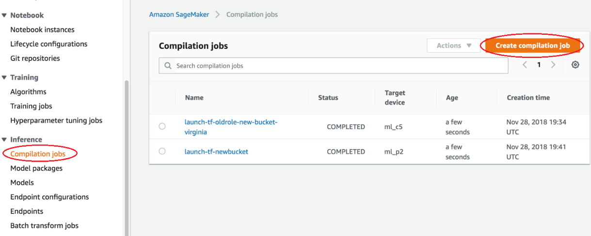

2.
On the Create compilation job page, under Job name, enter a name. Then select an IAM role.

Compile Models
6455

## Page 485

Amazon SageMaker AI
Developer Guide

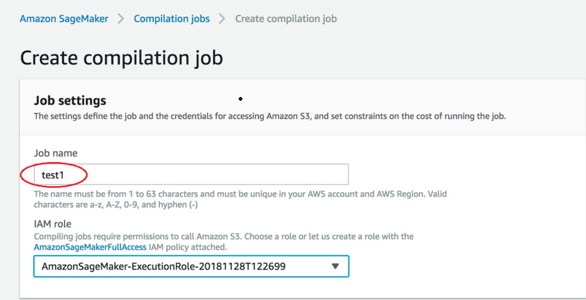

3.
If you don’t have an IAM role, choose Create a new role.


4.
On the Create an IAM role page, choose Any S3 bucket, and choose Create role.

Compile Models
6456

## Page 486

Amazon SageMaker AI
Developer Guide

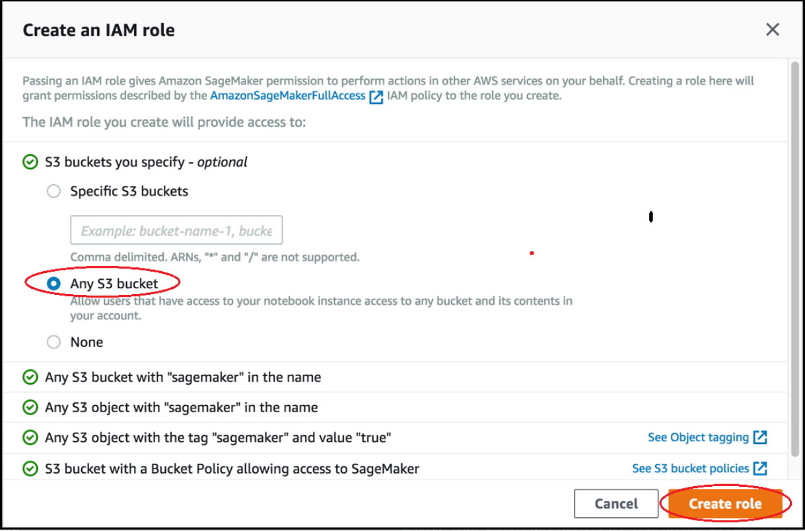

5.
Non PyTorch Frameworks

Within the Input configuration section, enter the full path of the Amazon S3 bucket URI
that contains your model artifacts in the Location of model artifacts input field. Your

model artifacts must be in a compressed tarball file format (.tar.gz).

For the Data input configuration field, enter the JSON string that specifies the shape of
the input data.

For Machine learning framework, choose the framework of your choice.

Compile Models
6457

## Page 487

Amazon SageMaker AI
Developer Guide


To find the JSON string examples of input data shapes depending on frameworks, see What
input data shapes Neo expects.

PyTorch Framework

Similar instructions apply for compiling PyTorch models. However, if you trained with

PyTorch and are trying to compile the model for ml_* (except ml_inf) target, you can
optionally specify the version of PyTorch you used.

Compile Models
6458

## Page 488

Amazon SageMaker AI
Developer Guide

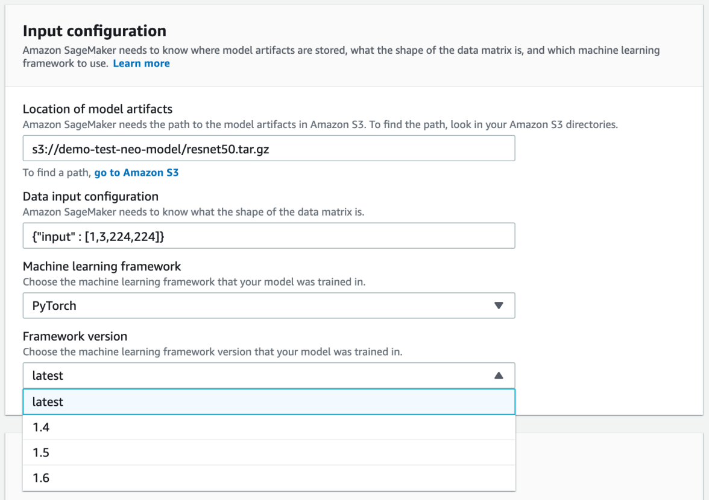

To find the JSON string examples of input data shapes depending on frameworks, see What
input data shapes Neo expects.

Notes

• If you saved your model by using PyTorch version 2.0 or later, the Data input
configuration field is optional. SageMaker Neo gets the input configuration from
the model definition file that you create with PyTorch. For more information
about how to create the definition file, see the PyTorch section under Saving
Models for SageMaker AI Neo.

• When compiling for ml_* instances using PyTorch framework, use Compiler

options field in Output Configuration to provide the correct data type (dtype)

of the model’s input. The default is set to "float32".

Compile Models
6459

## Page 489

Amazon SageMaker AI
Developer Guide


Warning

If you specify a Amazon S3 bucket URI path that leads to .pth file, you

will receive the following error after starting compilation: ClientError:

InputConfiguration: Unable to untar input model.Please confirm

the model is a tar.gz file

6.
Go to the Output configuration section. Choose where you want to deploy your model. You
can deploy your model to a Target device or a Target platform. Target devices include cloud
and edge devices. Target platforms refer to specific OS, architecture, and accelerators you
want your model to run on.

For S3 Output location, enter the path to the S3 bucket where you want to store the model.
You can optionally add compiler options in JSON format under the Compiler options section.

Compile Models
6460

## Page 490

Amazon SageMaker AI
Developer Guide


7.
Check the status of the compilation job when started. This status of the job can be found at
the top of the Compilation Job page, as shown in the following screenshot. You can also check
the status of it in the Status column.


Compile Models
6461

## Page 491

Amazon SageMaker AI
Developer Guide

8.
Check the status of the compilation job when completed. You can check the status in the
Status column as shown in the following screenshot.

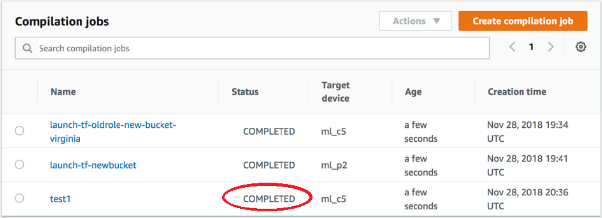

Compile a Model (Amazon SageMaker AI SDK)

You can use the compile_model API in the Amazon SageMaker AI SDK for Python to compile
a trained model and optimize it for specific target hardware. The API should be invoked on the
estimator object used during model training.

Note

You must set MMS_DEFAULT_RESPONSE_TIMEOUT environment variable to 500 when
compiling the model with MXNet or PyTorch. The environment variable is not needed for
TensorFlow.

The following is an example of how you can compile a model using the

trained_model_estimator object:

# Replace the value of expected_trained_model_input below and
# specify the name & shape of the expected inputs for your trained model
# in json dictionary form
expected_trained_model_input = {'data':[1, 784]}

# Replace the example target_instance_family below to your preferred
target_instance_family
compiled_model = trained_model_estimator.compile_model(target_instance_family='ml_c5',
input_shape=expected_trained_model_input,

Compile Models
6462

## Page 492

Amazon SageMaker AI
Developer Guide

output_path='insert s3 output path',
env={'MMS_DEFAULT_RESPONSE_TIMEOUT': '500'})

The code compiles the model, saves the optimized model at output_path, and creates a
SageMaker AI model that can be deployed to an endpoint.

Cloud Instances

Amazon SageMaker Neo provides compilation support for popular machine learning frameworks
such as TensorFlow, PyTorch, MXNet, and more. You can deploy your compiled model to cloud
instances and AWS Inferentia instances. For a full list of supported frameworks and instances types,
see Supported Instances Types and Frameworks.

You can compile your model in one of three ways: through the AWS CLI, the SageMaker AI Console,
or the SageMaker AI SDK for Python. See, Use Neo to Compile a Model for more information.
Once compiled, your model artifacts are stored in the Amazon S3 bucket URI you specified during
the compilation job. You can deploy your compiled model to cloud instances and AWS Inferentia
instances using the SageMaker AI SDK for Python, AWS SDK for Python (Boto3), AWS CLI, or the
AWS console.

If you deploy your model using AWS CLI, the console, or Boto3, you must select a Docker image
Amazon ECR URI for your primary container. See Neo Inference Container Images for a list of
Amazon ECR URIs.

Topics

• Supported Instance Types and Frameworks

• Deploy a Model

• Inference Requests With a Deployed Service

• Inference Container Images

Supported Instance Types and Frameworks

Amazon SageMaker Neo supports popular deep learning frameworks for both compilation and
deployment. You can deploy your model to cloud instances or AWS Inferentia instance types.

The following describes frameworks SageMaker Neo supports and the target cloud instances you
can compile and deploy to. For information on how to deploy your compiled model to a cloud or
Inferentia instance, see Deploy a Model with Cloud Instances.

Cloud Instances
6463

## Page 493

Amazon SageMaker AI
Developer Guide

Cloud Instances

SageMaker Neo supports the following deep learning frameworks for CPU and GPU cloud
instances:

Framework
Framework
Version

Model
Version

Models
Model
Formats
(packaged in
*.tar.gz)

Toolkits

MXNet
1.8.0
Supports
1.8.0 or
earlier

Image
Classific
ation, Object
Detection
, Semantic
Segmentat
ion, Pose
Estimatio
n, Activity
Recognition

One symbol
file (.json)
and one
parameter
file (.params)

GluonCV
v0.8.0

ONNX
1.7.0
Supports
1.7.0 or
earlier

Image
Classification,
SVM

One model
file (.onnx)

Keras
2.2.4
Supports
2.2.4 or
earlier

Image
Classification

One model
definition file
(.h5)

PyTorch
1.4, 1.5, 1.6,
1.7, 1.8, 1.12,
1.13, or 2.0

Supports 1.4,
1.5, 1.6, 1.7,
1.8, 1.12,
1.13, and 2.0

Image
Classification

One model
definition file
(.pt or .pth)
with input
dtype of
float32

Versions
1.13 and
2.0 support
Object
Detection
, Vision

Cloud Instances
6464

## Page 494

Amazon SageMaker AI
Developer Guide

Framework
Framework
Version

Model
Version

Models
Model
Formats
(packaged in
*.tar.gz)

Toolkits

Transform
er, and
HuggingFace

TensorFlow
1.15.3 or 2.9
Supports
1.15.3 and
2.9

Image
Classification

For saved
models,
one .pb or
one .pbtxt
file and a
variables
directory
that contains
variables

For frozen
models,
only one .pb
or .pbtxt file

XGBoost
1.3.3
Supports
1.3.3 or
earlier

Decision
Trees

One XGBoost
model file
(.model)
where the
number of
nodes in a
tree is less
than 2^31

Note

“Model Version” is the version of the framework used to train and export the model.

Cloud Instances
6465

## Page 495

Amazon SageMaker AI
Developer Guide

Instance Types

You can deploy your SageMaker AI compiled model to one of the cloud instances listed below:

Instance
Compute
Type

ml_c4
Standard

ml_c5
Standard

ml_m4
Standard

ml_m5
Standard

ml_p2
Accelerated
computing

ml_p3
Accelerated
computing

ml_g4dn
Accelerated
computing

For information on the available vCPU, memory, and price per hour for each instance type, see
Amazon SageMaker Pricing.

Note

When compiling for ml_* instances using PyTorch framework, use Compiler options field

in Output Configuration to provide the correct data type (dtype) of the model’s input.

The default is set to "float32".

AWS Inferentia

SageMaker Neo supports the following deep learning frameworks for Inf1:

Cloud Instances
6466

## Page 496

Amazon SageMaker AI
Developer Guide

Framework
Framework
Version

Model
Version

Models
Model
Formats
(packaged in
*.tar.gz)

Toolkits

MXNet
1.5 or 1.8
Supports
1.8, 1.5 and
earlier

Image
Classific
ation, Object
Detection
, Semantic
Segmentat
ion, Pose

One symbol
file (.json)
and one
parameter
file (.params)

GluonCV
v0.8.0

Estimatio
n, Activity
Recognition

PyTorch
1.7, 1.8 or
1.9

Supports 1.9
and earlier

Image
Classification

One model
definition file
(.pt or .pth)
with input
dtype of
float32

TensorFlow
1.15 or 2.5
Supports
2.5, 1.15 and
earlier

Image
Classification

For saved
models,
one .pb or

one .pbtxt
file and a
variables
directory
that contains
variables

For frozen
models,
only one .pb
or .pbtxt file

Cloud Instances
6467

## Page 497

Amazon SageMaker AI
Developer Guide

Note

“Model Version” is the version of the framework used to train and export the model.

You can deploy your SageMaker Neo-compiled model to AWS Inferentia-based Amazon EC2
Inf1 instances. AWS Inferentia is Amazon's first custom silicon chip designed to accelerate deep

learning. Currently, you can use the ml_inf1 instance to deploy your compiled models.

AWS Inferentia2 and AWS Trainium

Currently, you can deploy your SageMaker Neo-compiled model to AWS Inferentia2-based Amazon
EC2 Inf2 instances (in US East (Ohio) Region), and to AWS Trainium-based Amazon EC2 Trn1
instances (in US East (N. Virginia) Region). For more information about supported models on these
instances, see  Model Architecture Fit Guidelines in the AWS Neuron documentation, and the
examples in the Neuron Github repository.

Deploy a Model

To deploy an Amazon SageMaker Neo-compiled model to an HTTPS endpoint, you must configure
and create the endpoint for the model using Amazon SageMaker AI hosting services. Currently,
developers can use Amazon SageMaker APIs to deploy modules on to ml.c5, ml.c4, ml.m5, ml.m4,
ml.p3, ml.p2, and ml.inf1 instances.

For Inferentia and Trainium instances, models need to be compiled specifically for those instances.
Models compiled for other instance types are not guaranteed to work with Inferentia or Trainium
instances.

When you deploy a compiled model, you need to use the same instance for the target that you
used for compilation. This creates a SageMaker AI endpoint that you can use to perform inferences.
You can deploy a Neo-compiled model using any of the following: Amazon SageMaker AI SDK for
Python, SDK for Python (Boto3), AWS Command Line Interface, and the SageMaker AI console.

Note

For deploying a model using AWS CLI, the console, or Boto3, see Neo Inference Container
Images to select the inference image URI for your primary container.

Topics

Cloud Instances
6468

## Page 498

Amazon SageMaker AI
Developer Guide

• Prerequisites

• Deploy a Compiled Model Using SageMaker SDK

• Deploy a Compiled Model Using Boto3

• Deploy a Compiled Model Using the AWS CLI

• Deploy a Compiled Model Using the Console

Prerequisites

Note

Follow the instructions in this section if you compiled your model using AWS SDK for
Python (Boto3), AWS CLI, or the SageMaker AI console.

To create a SageMaker Neo-compiled model, you need the following:

1.
A Docker image Amazon ECR URI. You can select one that meets your needs from this list.

2.
An entry point script file:

a.
For PyTorch and MXNet models:

If you trained your model using SageMaker AI, the training script must implement the
functions described below. The training script serves as the entry point script during
inference. In the example detailed in  MNIST Training, Compilation and Deployment

with MXNet Module and SageMaker Neo, the training script (mnist.py) implements the
required functions.

If you did not train your model using SageMaker AI, you need to provide an entry point

script (inference.py) file that can be used at the time of inference. Based on the
framework—MXNet or PyTorch—the inference script location must conform to the
SageMaker Python SDK Model Directory Structure for MxNet or  Model Directory Structure
for PyTorch.

When using Neo Inference Optimized Container images with PyTorch and MXNet on CPU
and GPU instance types, the inference script must implement the following functions:

• model_fn: Loads the model. (Optional)

Cloud Instances
6469

## Page 499

Amazon SageMaker AI
Developer Guide

• input_fn: Converts the incoming request payload into a numpy array.

• predict_fn: Performs the prediction.

• output_fn: Converts the prediction output into the response payload.

• Alternatively, you can define transform_fn to combine input_fn, predict_fn, and

output_fn.

The following are examples of inference.py script within a directory named code

(code/inference.py) for PyTorch and MXNet (Gluon and Module). The examples first
load the model and then serve it on image data on a GPU:

MXNet Module

import numpy as np
import json
import mxnet as mx
import neomx  # noqa: F401
from collections import namedtuple

Batch = namedtuple('Batch', ['data'])

# Change the context to mx.cpu() if deploying to a CPU endpoint
ctx = mx.gpu()

def model_fn(model_dir):
# The compiled model artifacts are saved with the prefix 'compiled'
sym, arg_params, aux_params = mx.model.load_checkpoint('compiled', 0)
mod = mx.mod.Module(symbol=sym, context=ctx, label_names=None)
exe = mod.bind(for_training=False,
data_shapes=[('data', (1,3,224,224))],
label_shapes=mod._label_shapes)
mod.set_params(arg_params, aux_params, allow_missing=True)
# Run warm-up inference on empty data during model load (required for
GPU)
data = mx.nd.empty((1,3,224,224), ctx=ctx)
mod.forward(Batch([data]))
return mod

def transform_fn(mod, image, input_content_type, output_content_type):

Cloud Instances
6470

## Page 500

Amazon SageMaker AI
Developer Guide

# pre-processing
decoded = mx.image.imdecode(image)
resized = mx.image.resize_short(decoded, 224)
cropped, crop_info = mx.image.center_crop(resized, (224, 224))
normalized = mx.image.color_normalize(cropped.astype(np.float32) / 255,
mean=mx.nd.array([0.485, 0.456, 0.406]),
std=mx.nd.array([0.229, 0.224, 0.225]))
transposed = normalized.transpose((2, 0, 1))
batchified = transposed.expand_dims(axis=0)
casted = batchified.astype(dtype='float32')
processed_input = casted.as_in_context(ctx)

# prediction/inference
mod.forward(Batch([processed_input]))

# post-processing
prob = mod.get_outputs()[0].asnumpy().tolist()

prob_json = json.dumps(prob)
return prob_json, output_content_type

MXNet Gluon

import numpy as np
import json
import mxnet as mx
import neomx  # noqa: F401

# Change the context to mx.cpu() if deploying to a CPU endpoint
ctx = mx.gpu()

def model_fn(model_dir):
# The compiled model artifacts are saved with the prefix 'compiled'
block = mx.gluon.nn.SymbolBlock.imports('compiled-symbol.json',
['data'],'compiled-0000.params', ctx=ctx)
# Hybridize the model & pass required options for Neo: static_alloc=True
& static_shape=True
block.hybridize(static_alloc=True, static_shape=True)
# Run warm-up inference on empty data during model load (required for
GPU)
data = mx.nd.empty((1,3,224,224), ctx=ctx)
warm_up = block(data)

Cloud Instances
6471

## Page 501

Amazon SageMaker AI
Developer Guide

return block

def input_fn(image, input_content_type):
# pre-processing
decoded = mx.image.imdecode(image)
resized = mx.image.resize_short(decoded, 224)
cropped, crop_info = mx.image.center_crop(resized, (224, 224))
normalized = mx.image.color_normalize(cropped.astype(np.float32) / 255,
mean=mx.nd.array([0.485, 0.456, 0.406]),
std=mx.nd.array([0.229, 0.224, 0.225]))
transposed = normalized.transpose((2, 0, 1))
batchified = transposed.expand_dims(axis=0)
casted = batchified.astype(dtype='float32')
processed_input = casted.as_in_context(ctx)
return processed_input

def predict_fn(processed_input_data, block):
# prediction/inference
prediction = block(processed_input_data)
return prediction

def output_fn(prediction, output_content_type):
# post-processing
prob = prediction.asnumpy().tolist()
prob_json = json.dumps(prob)
return prob_json, output_content_type

PyTorch 1.4 and Older

import os
import torch
import torch.nn.parallel
import torch.optim
import torch.utils.data
import torch.utils.data.distributed
import torchvision.transforms as transforms
from PIL import Image
import io
import json
import pickle

Cloud Instances
6472

## Page 502

Amazon SageMaker AI
Developer Guide

def model_fn(model_dir):
"""Load the model and return it.
Providing this function is optional.
There is a default model_fn available which will load the model
compiled using SageMaker Neo. You can override it here.

Keyword arguments:
model_dir -- the directory path where the model artifacts are present
"""

# The compiled model is saved as "compiled.pt"
model_path = os.path.join(model_dir, 'compiled.pt')
with torch.neo.config(model_dir=model_dir, neo_runtime=True):
model = torch.jit.load(model_path)
device = torch.device("cuda" if torch.cuda.is_available() else
"cpu")

model = model.to(device)

# We recommend that you run warm-up inference during model load
sample_input_path = os.path.join(model_dir, 'sample_input.pkl')
with open(sample_input_path, 'rb') as input_file:
model_input = pickle.load(input_file)
if torch.is_tensor(model_input):
model_input = model_input.to(device)
model(model_input)
elif isinstance(model_input, tuple):
model_input = (inp.to(device) for inp in model_input if
torch.is_tensor(inp))
model(*model_input)
else:
print("Only supports a torch tensor or a tuple of torch tensors")
return model

def transform_fn(model, request_body, request_content_type,
response_content_type):
"""Run prediction and return the output.
The function
1. Pre-processes the input request
2. Runs prediction
3. Post-processes the prediction output.
"""
# preprocess

Cloud Instances
6473

## Page 503

Amazon SageMaker AI
Developer Guide

decoded = Image.open(io.BytesIO(request_body))
preprocess = transforms.Compose([
transforms.Resize(256),
transforms.CenterCrop(224),
transforms.ToTensor(),
transforms.Normalize(
mean=[
0.485, 0.456, 0.406], std=[
0.229, 0.224, 0.225]),
])
normalized = preprocess(decoded)
batchified = normalized.unsqueeze(0)
# predict
device = torch.device("cuda" if torch.cuda.is_available() else "cpu")
batchified = batchified.to(device)
output = model.forward(batchified)

return json.dumps(output.cpu().numpy().tolist()), response_content_type

PyTorch 1.5 and Newer

import os
import torch
import torch.nn.parallel
import torch.optim
import torch.utils.data
import torch.utils.data.distributed
import torchvision.transforms as transforms
from PIL import Image
import io
import json
import pickle

def model_fn(model_dir):
"""Load the model and return it.
Providing this function is optional.
There is a default_model_fn available, which will load the model
compiled using SageMaker Neo. You can override the default here.
The model_fn only needs to be defined if your model needs extra
steps to load, and can otherwise be left undefined.

Keyword arguments:

Cloud Instances
6474

## Page 504

Amazon SageMaker AI
Developer Guide

model_dir -- the directory path where the model artifacts are present
"""

# The compiled model is saved as "model.pt"
model_path = os.path.join(model_dir, 'model.pt')
device = torch.device("cuda" if torch.cuda.is_available() else "cpu")
model = torch.jit.load(model_path, map_location=device)
model = model.to(device)

return model

def transform_fn(model, request_body, request_content_type,
response_content_type):
"""Run prediction and return the output.
The function
1. Pre-processes the input request

2. Runs prediction
3. Post-processes the prediction output.
"""
# preprocess
decoded = Image.open(io.BytesIO(request_body))
preprocess = transforms.Compose([
transforms.Resize(256),
transforms.CenterCrop(224),
transforms.ToTensor(),
transforms.Normalize(
mean=[
0.485, 0.456, 0.406], std=[
0.229, 0.224, 0.225]),
])
normalized = preprocess(decoded)
batchified = normalized.unsqueeze(0)
# predict
device = torch.device("cuda" if torch.cuda.is_available() else "cpu")
batchified = batchified.to(device)
output = model.forward(batchified)
return json.dumps(output.cpu().numpy().tolist()), response_content_type

b.
For inf1 instances or onnx, xgboost, keras container images

Cloud Instances
6475

## Page 505

Amazon SageMaker AI
Developer Guide

For all other Neo Inference-optimized container images, or inferentia instance types,
the entry point script must implement the following functions for Neo Deep Learning
Runtime:

• neo_preprocess: Converts the incoming request payload into a numpy array.

• neo_postprocess: Converts the prediction output from Neo Deep Learning Runtime
into the response body.

Note

The preceding two functions do not use any of the functionalities of MXNet,
PyTorch, or TensorFlow.

For examples of how to use these functions, see Neo Model Compilation Sample
Notebooks.

c.
For TensorFlow models

If your model requires custom pre- and post-processing logic before data is sent to

the model, then you must specify an entry point script inference.py file that can
be used at the time of inference. The script should implement either a either a pair of

input_handler and output_handler functions or a single handler function.

Note

Note that if handler function is implemented, input_handler and

output_handler are ignored.

The following is a code example of inference.py script that you can put together with
the compile model to perform custom pre- and post-processing on an image classification

model. The SageMaker AI client sends the image file as an application/x-image

content type to the input_handler function, where it is converted to JSON. The
converted image file is then sent to the Tensorflow Model Server (TFX) using the REST
API.

import json

Cloud Instances
6476

## Page 506

Amazon SageMaker AI
Developer Guide

import numpy as np
import json
import io
from PIL import Image

def input_handler(data, context):
""" Pre-process request input before it is sent to TensorFlow Serving REST
API
Args:
data (obj): the request data, in format of dict or string
context (Context): an object containing request and configuration details
Returns:
(dict): a JSON-serializable dict that contains request body and headers
"""
f = data.read()

f = io.BytesIO(f)
image = Image.open(f).convert('RGB')
batch_size = 1
image = np.asarray(image.resize((512, 512)))
image = np.concatenate([image[np.newaxis, :, :]] * batch_size)
body = json.dumps({"signature_name": "serving_default", "instances":
image.tolist()})
return body

def output_handler(data, context):
"""Post-process TensorFlow Serving output before it is returned to the
client.
Args:
data (obj): the TensorFlow serving response
context (Context): an object containing request and configuration details
Returns:
(bytes, string): data to return to client, response content type
"""
if data.status_code != 200:
raise ValueError(data.content.decode('utf-8'))

response_content_type = context.accept_header
prediction = data.content
return prediction, response_content_type

Cloud Instances
6477

## Page 507

Amazon SageMaker AI
Developer Guide

If there is no custom pre- or post-processing, the SageMaker AI client converts the file
image to JSON in a similar way before sending it over to the SageMaker AI endpoint.

For more information, see the Deploying to TensorFlow Serving Endpoints in the
SageMaker Python SDK.

3.
The Amazon S3 bucket URI that contains the compiled model artifacts.

Deploy a Compiled Model Using SageMaker SDK

You must satisfy the  prerequisites section if the model was compiled using AWS SDK for Python
(Boto3), AWS CLI, or the Amazon SageMaker AI console. Follow one of the following use cases to
deploy a model compiled with SageMaker Neo based on how you compiled your model.

Topics

• If you compiled your model using the SageMaker SDK

• If you compiled your model using MXNet or PyTorch

• If you compiled your model using Boto3, SageMaker console, or the CLI for TensorFlow

If you compiled your model using the SageMaker SDK

The sagemaker.Model object handle for the compiled model supplies the deploy() function,
which enables you to create an endpoint to serve inference requests. The function lets you set
the number and type of instances that are used for the endpoint. You must choose an instance
for which you have compiled your model. For example, in the job compiled in Compile a Model

(Amazon SageMaker SDK) section, this is ml_c5.

predictor = compiled_model.deploy(initial_instance_count = 1, instance_type =
'ml.c5.4xlarge')

# Print the name of newly created endpoint
print(predictor.endpoint_name)

If you compiled your model using MXNet or PyTorch

Create the SageMaker AI model and deploy it using the deploy() API under the framework-specific
Model APIs. For MXNet, it is MXNetModel and for PyTorch, it is  PyTorchModel. When you are

creating and deploying an SageMaker AI model, you must set MMS_DEFAULT_RESPONSE_TIMEOUT

Cloud Instances
6478

## Page 508

Amazon SageMaker AI
Developer Guide

environment variable to 500 and specify the entry_point parameter as the inference script

(inference.py) and the source_dir parameter as the directory location (code) of the inference

script. To prepare the inference script (inference.py) follow the Prerequisites step.

The following example shows how to use these functions to deploy a compiled model using the
SageMaker AI SDK for Python:

MXNet

from sagemaker.mxnet import MXNetModel

# Create SageMaker model and deploy an endpoint
sm_mxnet_compiled_model = MXNetModel(
model_data='insert S3 path of compiled MXNet model archive',
role='AmazonSageMaker-ExecutionRole',
entry_point='inference.py',

source_dir='code',
framework_version='1.8.0',
py_version='py3',
image_uri='insert appropriate ECR Image URI for MXNet',
env={'MMS_DEFAULT_RESPONSE_TIMEOUT': '500'},
)

# Replace the example instance_type below to your preferred instance_type
predictor = sm_mxnet_compiled_model.deploy(initial_instance_count = 1, instance_type
= 'ml.p3.2xlarge')

# Print the name of newly created endpoint
print(predictor.endpoint_name)

PyTorch 1.4 and Older

from sagemaker.pytorch import PyTorchModel

# Create SageMaker model and deploy an endpoint
sm_pytorch_compiled_model = PyTorchModel(
model_data='insert S3 path of compiled PyTorch model archive',
role='AmazonSageMaker-ExecutionRole',
entry_point='inference.py',
source_dir='code',
framework_version='1.4.0',
py_version='py3',
image_uri='insert appropriate ECR Image URI for PyTorch',

Cloud Instances
6479

## Page 509

Amazon SageMaker AI
Developer Guide

env={'MMS_DEFAULT_RESPONSE_TIMEOUT': '500'},
)

# Replace the example instance_type below to your preferred instance_type
predictor = sm_pytorch_compiled_model.deploy(initial_instance_count = 1,
instance_type = 'ml.p3.2xlarge')

# Print the name of newly created endpoint
print(predictor.endpoint_name)

PyTorch 1.5 and Newer

from sagemaker.pytorch import PyTorchModel

# Create SageMaker model and deploy an endpoint
sm_pytorch_compiled_model = PyTorchModel(

model_data='insert S3 path of compiled PyTorch model archive',
role='AmazonSageMaker-ExecutionRole',
entry_point='inference.py',
source_dir='code',
framework_version='1.5',
py_version='py3',
image_uri='insert appropriate ECR Image URI for PyTorch',
)

# Replace the example instance_type below to your preferred instance_type
predictor = sm_pytorch_compiled_model.deploy(initial_instance_count = 1,
instance_type = 'ml.p3.2xlarge')

# Print the name of newly created endpoint
print(predictor.endpoint_name)

Note

The AmazonSageMakerFullAccess and AmazonS3ReadOnlyAccess policies must be

attached to the AmazonSageMaker-ExecutionRole IAM role.

Cloud Instances
6480

## Page 510

Amazon SageMaker AI
Developer Guide

If you compiled your model using Boto3, SageMaker console, or the CLI for TensorFlow

Construct a TensorFlowModel object, then call deploy:

role='AmazonSageMaker-ExecutionRole'
model_path='S3 path for model file'
framework_image='inference container arn'
tf_model = TensorFlowModel(model_data=model_path,
framework_version='1.15.3',
role=role,
image_uri=framework_image)
instance_type='ml.c5.xlarge'
predictor = tf_model.deploy(instance_type=instance_type,
initial_instance_count=1)

See Deploying directly from model artifacts for more information.

You can select a Docker image Amazon ECR URI that meets your needs from this list.

For more information on how to construct a TensorFlowModel object, see the SageMaker SDK.

Note

Your first inference request might have high latency if you deploy your model on a GPU.
This is because an optimized compute kernel is made on the first inference request. We
recommend that you make a warm-up file of inference requests and store that alongside
your model file before sending it off to a TFX. This is known as “warming up” the model.

The following code snippet demonstrates how to produce the warm-up file for image classification
example in the prerequisites section:

import tensorflow as tf
from tensorflow_serving.apis import classification_pb2
from tensorflow_serving.apis import inference_pb2
from tensorflow_serving.apis import model_pb2
from tensorflow_serving.apis import predict_pb2
from tensorflow_serving.apis import prediction_log_pb2
from tensorflow_serving.apis import regression_pb2
import numpy as np

Cloud Instances
6481

## Page 511

Amazon SageMaker AI
Developer Guide

with tf.python_io.TFRecordWriter("tf_serving_warmup_requests") as writer:
img = np.random.uniform(0, 1, size=[224, 224, 3]).astype(np.float32)
img = np.expand_dims(img, axis=0)
test_data = np.repeat(img, 1, axis=0)
request = predict_pb2.PredictRequest()
request.model_spec.name = 'compiled_models'
request.model_spec.signature_name = 'serving_default'
request.inputs['Placeholder:0'].CopyFrom(tf.compat.v1.make_tensor_proto(test_data,
shape=test_data.shape, dtype=tf.float32))
log = prediction_log_pb2.PredictionLog(
predict_log=prediction_log_pb2.PredictLog(request=request))
writer.write(log.SerializeToString())

For more information on how to “warm up” your model, see the TensorFlow TFX page.

Deploy a Compiled Model Using Boto3

You must satisfy the  prerequisites section if the model was compiled using AWS SDK for Python
(Boto3), AWS CLI, or the Amazon SageMaker AI console. Follow the steps below to create and
deploy a SageMaker Neo-compiled model using Amazon Web Services SDK for Python (Boto3).

Topics

• Deploy the Model

Deploy the Model

After you have satisfied the  prerequisites, use the create_model, create_enpoint_config,

and create_endpoint APIs.

The following example shows how to use these APIs to deploy a model compiled with Neo:

import boto3
client = boto3.client('sagemaker')

# create sagemaker model
create_model_api_response = client.create_model(
ModelName='my-sagemaker-model',
PrimaryContainer={
'Image': <insert the ECR Image URI>,
'ModelDataUrl': 's3://path/to/model/artifact/
model.tar.gz',
'Environment': {}

Cloud Instances
6482

## Page 512

Amazon SageMaker AI
Developer Guide

},
ExecutionRoleArn='ARN for AmazonSageMaker-
ExecutionRole'
)

print ("create_model API response", create_model_api_response)

# create sagemaker endpoint config
create_endpoint_config_api_response = client.create_endpoint_config(
EndpointConfigName='sagemaker-neomxnet-
endpoint-configuration',
ProductionVariants=[
{
'VariantName': <provide your
variant name>,
'ModelName': 'my-sagemaker-model',
'InitialInstanceCount': 1,

'InstanceType': <provide your
instance type here>
},
]
)

print ("create_endpoint_config API response", create_endpoint_config_api_response)

# create sagemaker endpoint
create_endpoint_api_response = client.create_endpoint(
EndpointName='provide your endpoint name',
EndpointConfigName=<insert your endpoint config
name>,
)

print ("create_endpoint API response", create_endpoint_api_response)

Note

The AmazonSageMakerFullAccess and AmazonS3ReadOnlyAccess policies must be

attached to the AmazonSageMaker-ExecutionRole IAM role.

For full syntax of create_model, create_endpoint_config, and create_endpoint APIs, see

create_model, create_endpoint_config, and create_endpoint, respectively.

Cloud Instances
6483

## Page 513

Amazon SageMaker AI
Developer Guide

If you did not train your model using SageMaker AI, specify the following environment variables:

MXNet and PyTorch

"Environment": {

"SAGEMAKER_PROGRAM": "inference.py",
"SAGEMAKER_SUBMIT_DIRECTORY": "/opt/ml/model/code",
"SAGEMAKER_CONTAINER_LOG_LEVEL": "20",
"SAGEMAKER_REGION": "insert your region",
"MMS_DEFAULT_RESPONSE_TIMEOUT": "500"
}

TensorFlow

"Environment": {
"SAGEMAKER_PROGRAM": "inference.py",
"SAGEMAKER_SUBMIT_DIRECTORY": "/opt/ml/model/code",
"SAGEMAKER_CONTAINER_LOG_LEVEL": "20",
"SAGEMAKER_REGION": "insert your region"
}

If you trained your model using SageMaker AI, specify the environment variable

SAGEMAKER_SUBMIT_DIRECTORY as the full Amazon S3 bucket URI that contains the training
script.

Deploy a Compiled Model Using the AWS CLI

You must satisfy the  prerequisites section if the model was compiled using AWS SDK for Python
(Boto3), AWS CLI, or the Amazon SageMaker AI console. Follow the steps below to create and
deploy a SageMaker Neo-compiled model using the AWS CLI.

Topics

• Deploy the Model

Deploy the Model

After you have satisfied the  prerequisites, use the create-model, create-enpoint-config,

and create-endpoint AWS CLI commands. The following steps explain how to use these
commands to deploy a model compiled with Neo:

Cloud Instances
6484

## Page 514

Amazon SageMaker AI
Developer Guide

Create a Model

From Neo Inference Container Images, select the inference image URI and then use create-model

API to create a SageMaker AI model. You can do this with two steps:

1. Create a create_model.json file. Within the file, specify the name of the model, the image

URI, the path to the model.tar.gz file in your Amazon S3 bucket, and your SageMaker AI
execution role:

{
"ModelName": "insert model name",
"PrimaryContainer": {
"Image": "insert the ECR Image URI",
"ModelDataUrl": "insert S3 archive URL",
"Environment": {"See details below"}
},
"ExecutionRoleArn": "ARN for AmazonSageMaker-ExecutionRole"
}

If you trained your model using SageMaker AI, specify the following environment variable:

"Environment": {
"SAGEMAKER_SUBMIT_DIRECTORY" : "[Full S3 path for *.tar.gz file containing the
training script]"
}

If you did not train your model using SageMaker AI, specify the following environment variables:

MXNet and PyTorch

"Environment": {
"SAGEMAKER_PROGRAM": "inference.py",
"SAGEMAKER_SUBMIT_DIRECTORY": "/opt/ml/model/code",
"SAGEMAKER_CONTAINER_LOG_LEVEL": "20",
"SAGEMAKER_REGION": "insert your region",
"MMS_DEFAULT_RESPONSE_TIMEOUT": "500"
}

TensorFlow

"Environment": {

Cloud Instances
6485

## Page 515

Amazon SageMaker AI
Developer Guide

"SAGEMAKER_PROGRAM": "inference.py",
"SAGEMAKER_SUBMIT_DIRECTORY": "/opt/ml/model/code",
"SAGEMAKER_CONTAINER_LOG_LEVEL": "20",
"SAGEMAKER_REGION": "insert your region"
}

Note

The AmazonSageMakerFullAccess and AmazonS3ReadOnlyAccess policies must be

attached to the AmazonSageMaker-ExecutionRole IAM role.

2. Run the following command:

aws sagemaker create-model --cli-input-json file://create_model.json

For the full syntax of the create-model API, see create-model.

Create an Endpoint Configuration

After creating a SageMaker AI model, create the endpoint configuration using the create-

endpoint-config API. To do this, create a JSON file with your endpoint configuration
specifications. For example, you can use the following code template and save it as

create_config.json:

{
"EndpointConfigName": "<provide your endpoint config name>",
"ProductionVariants": [
{
"VariantName": "<provide your variant name>",
"ModelName": "my-sagemaker-model",
"InitialInstanceCount": 1,
"InstanceType": "<provide your instance type here>",
"InitialVariantWeight": 1.0
}
]
}

Now run the following AWS CLI command to create your endpoint configuration:

Cloud Instances
6486

## Page 516

Amazon SageMaker AI
Developer Guide

aws sagemaker create-endpoint-config --cli-input-json file://create_config.json

For the full syntax of the create-endpoint-config API, see create-endpoint-config.

Create an Endpoint

After you have created your endpoint configuration, create an endpoint using the create-

endpoint API:

aws sagemaker create-endpoint --endpoint-name '<provide your endpoint name>' --
endpoint-config-name '<insert your endpoint config name>'

For the full syntax of the create-endpoint API, see create-endpoint.

Deploy a Compiled Model Using the Console

You must satisfy the  prerequisites section if the model was compiled using AWS SDK for Python
(Boto3), the AWS CLI, or the Amazon SageMaker AI console. Follow the steps below to create
and deploy a SageMaker AI Neo-compiled model using the SageMaker AI consolehttps://
console.aws.amazon.com/ SageMaker AI.

Topics

• Deploy the Model

Deploy the Model

After you have satisfied the  prerequisites, use the following steps to deploy a model compiled with
Neo:

1.
Choose Models, and then choose Create models from the Inference group. On the Create
model page, complete the Model name, IAM role, and VPC fields (optional), if needed.

Cloud Instances
6487

## Page 517

Amazon SageMaker AI
Developer Guide


2.
To add information about the container used to deploy your model, choose Add container
container, then choose Next. Complete the Container input options, Location of inference
code image, and Location of model artifacts, and optionally, Container host name, and
Environmental variables fields.

Cloud Instances
6488

## Page 518

Amazon SageMaker AI
Developer Guide

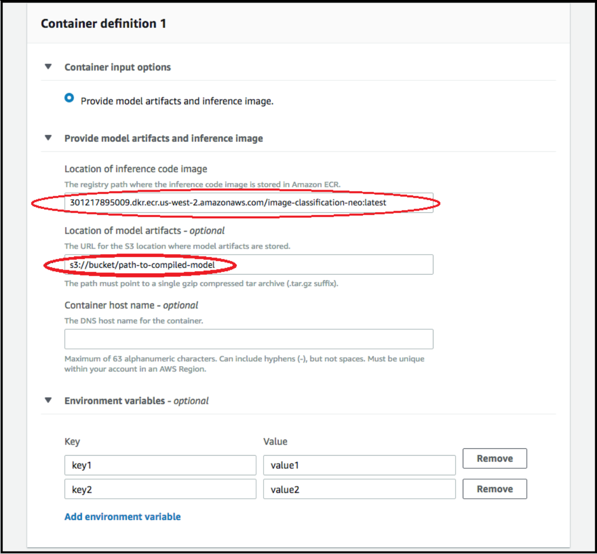

3.
To deploy Neo-compiled models, choose the following:

• Container input options: Choose Provide model artifacts and inference image.

• Location of inference code image: Choose the inference image URI from Neo Inference
Container Images, depending on the AWS Region and kind of application.

• Location of model artifact: Enter the Amazon S3 bucket URI of the compiled model artifact
generated by the Neo compilation API.

• Environment variables:

• Leave this field blank for SageMaker XGBoost.

Cloud Instances
6489

## Page 519

Amazon SageMaker AI
Developer Guide

• If you trained your model using SageMaker AI, specify the environment variable

SAGEMAKER_SUBMIT_DIRECTORY as the Amazon S3 bucket URI that contains the training
script.

• If you did not train your model using SageMaker AI, specify the following environment
variables:

Key
Values for MXNet and
PyTorch

Values TensorFlow

SAGEMAKER_PROGRAM
inference.py
inference.py

SAGEMAKER_SUBMIT_D
IRECTORY

/opt/ml/model/code
/opt/ml/model/code

SAGEMAKER_CONTAINE
R_LOG_LEVEL

20
20

SAGEMAKER_REGION
<your region>
<your region>

MMS_DEFAULT_RESPON
SE_TIMEOUT

500
Leave this field blank for
TF

4.
Confirm that the information for the containers is accurate, and then choose Create model. On
the Create model landing page, choose Create endpoint.


Cloud Instances
6490

## Page 520

Amazon SageMaker AI
Developer Guide

5.
In Create and configure endpoint diagram, specify the Endpoint name. For Attach endpoint
configuration, choose Create a new endpoint configuration.


6.
In New endpoint configuration page, specify the Endpoint configuration name.

Cloud Instances
6491

## Page 521

Amazon SageMaker AI
Developer Guide

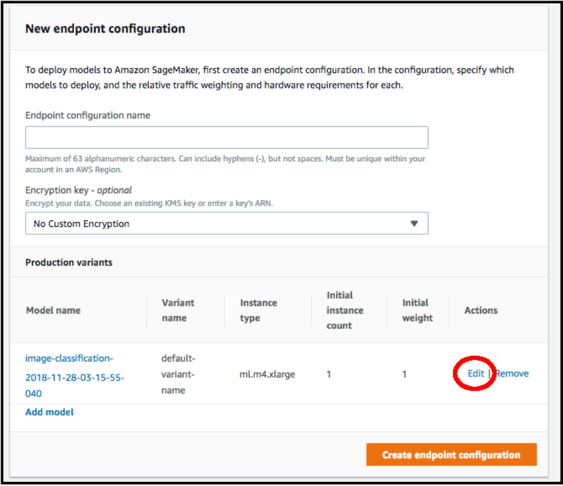

7.
Choose Edit next to the name of the model and specify the correct Instance type on the Edit
Production Variant page. It is imperative that the Instance type value match the one specified
in your compilation job.

Cloud Instances
6492

## Page 522

Amazon SageMaker AI
Developer Guide


8.
Choose Save.

9.
On the New endpoint configuration page, choose Create endpoint configuration, and then
choose Create endpoint.

Inference Requests With a Deployed Service

If you have followed instructions in Deploy a Model, you should have a SageMaker AI endpoint set
up and running. Regardless of how you deployed your Neo-compiled model, there are three ways
you can submit inference requests:

Topics

• Request Inferences from a Deployed Service (Amazon SageMaker SDK)

• Request Inferences from a Deployed Service (Boto3)

• Request Inferences from a Deployed Service (AWS CLI)

Request Inferences from a Deployed Service (Amazon SageMaker SDK)

Use the following the code examples to request inferences from your deployed service based on
the framework you used to train your model. The code examples for the different frameworks are

similar. The main difference is that TensorFlow requires application/json as the content type.

Cloud Instances
6493

## Page 523

Amazon SageMaker AI
Developer Guide

PyTorch and MXNet

If you are using PyTorch v1.4 or later or MXNet 1.7.0 or later and you have an Amazon SageMaker

AI endpoint InService, you can make inference requests using the predictor package of the
SageMaker AI SDK for Python.

Note

The API varies based on the SageMaker AI SDK for Python version:

• For version 1.x, use the RealTimePredictor and Predict API.

• For version 2.x, use the Predictor and the Predict API.

The following code example shows how to use these APIs to send an image for inference:

SageMaker Python SDK v1.x

from sagemaker.predictor import RealTimePredictor

endpoint = 'insert name of your endpoint here'

# Read image into memory
payload = None
with open("image.jpg", 'rb') as f:
payload = f.read()

predictor = RealTimePredictor(endpoint=endpoint, content_type='application/x-image')
inference_response = predictor.predict(data=payload)
print (inference_response)

SageMaker Python SDK v2.x

from sagemaker.predictor import Predictor

endpoint = 'insert name of your endpoint here'

# Read image into memory
payload = None
with open("image.jpg", 'rb') as f:
payload = f.read()

Cloud Instances
6494

## Page 524

Amazon SageMaker AI
Developer Guide

predictor = Predictor(endpoint)
inference_response = predictor.predict(data=payload)
print (inference_response)

TensorFlow

The following code example shows how to use the SageMaker Python SDK API to send an image
for inference:

from sagemaker.predictor import Predictor
from PIL import Image
import numpy as np
import json

endpoint = 'insert the name of your endpoint here'

# Read image into memory
image = Image.open(input_file)
batch_size = 1
image = np.asarray(image.resize((224, 224)))
image = image / 128 - 1
image = np.concatenate([image[np.newaxis, :, :]] * batch_size)
body = json.dumps({"instances": image.tolist()})
predictor = Predictor(endpoint)
inference_response = predictor.predict(data=body)
print(inference_response)

Request Inferences from a Deployed Service (Boto3)

You can submit inference requests using SageMaker AI SDK for Python (Boto3) client and

invoke_endpoint() API once you have an SageMaker AI endpoint InService. The following
code example shows how to send an image for inference:

PyTorch and MXNet

import boto3

import json
endpoint = 'insert name of your endpoint here'

Cloud Instances
6495

## Page 525

Amazon SageMaker AI
Developer Guide

runtime = boto3.Session().client('sagemaker-runtime')
# Read image into memory
with open(image, 'rb') as f:
payload = f.read()
# Send image via InvokeEndpoint API
response = runtime.invoke_endpoint(EndpointName=endpoint, ContentType='application/
x-image', Body=payload)

# Unpack response
result = json.loads(response['Body'].read().decode())

TensorFlow

For TensorFlow submit an input with application/json for the content type.

from PIL import Image
import numpy as np
import json
import boto3

client = boto3.client('sagemaker-runtime')
input_file = 'path/to/image'
image = Image.open(input_file)
batch_size = 1
image = np.asarray(image.resize((224, 224)))
image = image / 128 - 1
image = np.concatenate([image[np.newaxis, :, :]] * batch_size)
body = json.dumps({"instances": image.tolist()})
ioc_predictor_endpoint_name = 'insert name of your endpoint here'
content_type = 'application/json'
ioc_response = client.invoke_endpoint(
EndpointName=ioc_predictor_endpoint_name,
Body=body,
ContentType=content_type
)

XGBoost

For an XGBoost application, you should submit a CSV text instead:

import boto3
import json

Cloud Instances
6496

## Page 526

Amazon SageMaker AI
Developer Guide

endpoint = 'insert your endpoint name here'
runtime = boto3.Session().client('sagemaker-runtime')
csv_text = '1,-1.0,1.0,1.5,2.6'
# Send CSV text via InvokeEndpoint API
response = runtime.invoke_endpoint(EndpointName=endpoint, ContentType='text/csv',
Body=csv_text)
# Unpack response
result = json.loads(response['Body'].read().decode())

Note that BYOM allows for a custom content type. For more information, see

runtime_InvokeEndpoint.

Request Inferences from a Deployed Service (AWS CLI)

Inference requests can be made with the sagemaker-runtime invoke-endpoint once you

have an Amazon SageMaker AI endpoint InService. You can make inference requests with the
AWS Command Line Interface (AWS CLI). The following example shows how to send an image for
inference:

aws sagemaker-runtime invoke-endpoint --endpoint-name 'insert name of your endpoint
here' --body fileb://image.jpg --content-type=application/x-image output_file.txt

An output_file.txt with information about your inference requests is made if the inference
was successful.

For TensorFlow submit an input with application/json as the content type.

aws sagemaker-runtime invoke-endpoint --endpoint-name 'insert name of your endpoint
here' --body fileb://input.json --content-type=application/json output_file.txt

Inference Container Images

SageMaker Neo now provides inference image URI information for ml_* targets. For more
information see DescribeCompilationJob.

Based on your use case, replace the highlighted portion in the inference image URI template
provided below with appropriate values.

Cloud Instances
6497

## Page 527

Amazon SageMaker AI
Developer Guide

Amazon SageMaker AI XGBoost

aws_account_id.dkr.ecr.aws_region.amazonaws.com/xgboost-neo:latest

Replace aws_account_id from the table at the end of this page based on the aws_region you
used.

Keras

aws_account_id.dkr.ecr.aws_region.amazonaws.com/sagemaker-neo-keras:fx_version-
instance_type-py3

Replace aws_account_id from the table at the end of this page based on the aws_region you
used.

Replace fx_version with 2.2.4.

Replace instance_type with either cpu or gpu.

MXNet

CPU or GPU instance types

aws_account_id.dkr.ecr.aws_region.amazonaws.com/sagemaker-inference-
mxnet:fx_version-instance_type-py3

Replace aws_account_id from the table at the end of this page based on the aws_region
you used.

Replace fx_version with 1.8.0.

Replace instance_type with either cpu or gpu.

Inferentia1

aws_account_id.dkr.ecr.aws_region.amazonaws.com/sagemaker-neo-
mxnet:fx_version-instance_type-py3

Replace aws_region with either us-east-1 or us-west-2.

Replace aws_account_id from the table at the end of this page based on the aws_region
you used.

Cloud Instances
6498

## Page 528

Amazon SageMaker AI
Developer Guide

Replace fx_version with 1.5.1.

Replace instance_type with inf.

ONNX

aws_account_id.dkr.ecr.aws_region.amazonaws.com/sagemaker-neo-onnx:fx_version-
instance_type-py3

Replace aws_account_id from the table at the end of this page based on the aws_region you
used.

Replace fx_version with 1.5.0.

Replace instance_type with either cpu or gpu.

PyTorch

CPU or GPU instance types

aws_account_id.dkr.ecr.aws_region.amazonaws.com/sagemaker-inference-
pytorch:fx_version-instance_type-py3

Replace aws_account_id from the table at the end of this page based on the aws_region
you used.

Replace fx_version with 1.4, 1.5, 1.6, 1.7, 1.8, 1.12, 1.13, or 2.0.

Replace instance_type with either cpu or gpu.

Inferentia1

aws_account_id.dkr.ecr.aws_region.amazonaws.com/sagemaker-neo-
pytorch:fx_version-instance_type-py3

Replace aws_region with either us-east-1 or us-west-2.

Replace aws_account_id from the table at the end of this page based on the aws_region
you used.

Replace fx_version with 1.5.1.

Cloud Instances
6499

## Page 529

Amazon SageMaker AI
Developer Guide

Replace instance_type with inf.

Inferentia2 and Trainium1

763104351884.dkr.ecr.aws_region.amazonaws.com/pytorch-inference-neuronx:1.13.1-
neuronx-py38-sdk2.10.0-ubuntu20.04

Replace aws_region with us-east-2 for Inferentia2, and us-east-1 for Trainium1.

TensorFlow

CPU or GPU instance types

aws_account_id.dkr.ecr.aws_region.amazonaws.com/sagemaker-inference-
tensorflow:fx_version-instance_type-py3

Replace aws_account_id from the table at the end of this page based on the aws_region
you used.

Replace fx_version with 1.15.3 or 2.9.

Replace instance_type with either cpu or gpu.

Inferentia1

aws_account_id.dkr.ecr.aws_region.amazonaws.com/sagemaker-neo-
tensorflow:fx_version-instance_type-py3

Replace aws_account_id from the table at the end of this page based on the aws_region

you used. Note that for instance type inf only us-east-1 and us-west-2 are supported.

Replace fx_version with 1.15.0

Replace instance_type with inf.

Inferentia2 and Trainium1

763104351884.dkr.ecr.aws_region.amazonaws.com/tensorflow-inference-neuronx:2.10.1-
neuronx-py38-sdk2.10.0-ubuntu20.04

Replace aws_region with us-east-2 for Inferentia2, and us-east-1 for Trainium1.

Cloud Instances
6500

## Page 530

Amazon SageMaker AI
Developer Guide

The following table maps aws_account_id with aws_region. Use this table to find the correct
inference image URI you need for your application.

aws_account_id
aws_region

785573368785
us-east-1

007439368137
us-east-2

710691900526
us-west-1

301217895009
us-west-2

802834080501
eu-west-1

205493899709
eu-west-2

254080097072
eu-west-3

601324751636
eu-north-1

966458181534
eu-south-1

746233611703
eu-central-1

110948597952
ap-east-1

763008648453
ap-south-1

941853720454
ap-northeast-1

151534178276
ap-northeast-2

925152966179
ap-northeast-3

324986816169
ap-southeast-1

355873309152
ap-southeast-2

474822919863
cn-northwest-1

472730292857
cn-north-1

Cloud Instances
6501

## Page 531

Amazon SageMaker AI
Developer Guide

aws_account_id
aws_region

756306329178
sa-east-1

464438896020
ca-central-1

836785723513
me-south-1

774647643957
af-south-1

275950707576
il-central-1

Edge Devices

Amazon SageMaker Neo provides compilation support for popular machine learning frameworks.
You can deploy your Neo-compiled edge devices such as the Raspberry Pi 3, Texas Instruments'
Sitara, Jetson TX1, and more. For a full list of supported frameworks and edge devices, see
Supported Frameworks, Devices, Systems, and Architectures.

You must configure your edge device so that it can use AWS services. One way to do this is to
install DLR and Boto3 to your device. To do this, you must set up the authentication credentials.
See Boto3 AWS Configuration for more information. Once your model is compiled and your
edge device is configured, you can download the model from Amazon S3 to your edge device.
From there, you can use the Deep Learning Runtime (DLR) to read the compiled model and make
inferences.

For first-time users, we recommend you check out the Getting Started guide. This guide walks you
through how to set up your credentials, compile a model, deploy your model to a Raspberry Pi 3,
and make inferences on images.

Topics

• Supported Frameworks, Devices, Systems, and Architectures

• Deploy Models

• Set up Neo on Edge Devices

Edge Devices
6502

## Page 532

Amazon SageMaker AI
Developer Guide

Supported Frameworks, Devices, Systems, and Architectures

Amazon SageMaker Neo supports common machine learning frameworks, edge devices, operating
systems, and chip architectures. Find out if Neo supports your framework, edge device, OS, and
chip architecture by selecting one of the topics below.

You can find a list of models that have been tested by the Amazon SageMaker Neo Team in the
Tested Models section.

Note

• Ambarella devices require additional files to be included within the compressed TAR
file before it is sent for compilation. For more information, see Troubleshoot Ambarella
Errors.

• TIM-VX (libtim-vx.so) is required for i.MX 8M Plus. For information on how to build TIM-
VX, see the TIM-VX GitHub repository.

Topics

• Supported Frameworks

• Supported Devices, Chip Architectures, and Systems

• Tested Models

Supported Frameworks

Amazon SageMaker Neo supports the following frameworks.

Framework
Framework
Version

Model
Version

Models
Model
Formats
(packaged in
*.tar.gz)

Toolkits

MXNet
1.8
Supports 1.8
or earlier

Image
Classific
ation, Object
Detection
, Semantic

One symbol
file (.json)
and one
parameter
file (.params)

GluonCV
v0.8.0

Edge Devices
6503

## Page 533

Amazon SageMaker AI
Developer Guide

Framework
Framework
Version

Model
Version

Models
Model
Formats
(packaged in
*.tar.gz)

Toolkits

Segmentat
ion, Pose
Estimatio
n, Activity
Recognition

ONNX
1.7
Supports 1.7
or earlier

Image
Classification,
SVM

One model
file (.onnx)

Keras
2.2
Supports 2.2
or earlier

Image
Classification

One model
definition file
(.h5)

PyTorch
1.7, 1.8
Supports 1.7,
1.8 or earlier

Image
Classific
ation, Object
Detection

One model
definition file
(.pth)

TensorFlow
1.15, 2.4,
2.5 (only
for ml.inf1.*
instances)

Supports
1.15, 2.4,
2.5 (only
for ml.inf1.*
instances) or
earlier

Image
Classific
ation, Object
Detection

*For saved
models,
one .pb or
one .pbtxt
file and a
variables
directory
that contains
variables
*For frozen
models,
only one .pb
or .pbtxt file

Edge Devices
6504

## Page 534

Amazon SageMaker AI
Developer Guide

Framework
Framework
Version

Model
Version

Models
Model
Formats
(packaged in
*.tar.gz)

Toolkits

TensorFlow-
Lite

1.15
Supports
1.15 or
earlier

Image
Classific
ation, Object
Detection

One model
definition
flatbuffer file
(.tflite)

XGBoost
1.3
Supports 1.3
or earlier

Decision
Trees

One XGBoost
model file
(.model)
where the
number of
nodes in a
tree is less
than 2^31

DARKNET
Image
Classific
ation, Object
Detection
(Yolo model
is not
supported)

One config
(.cfg) file and
one weights
(.weights) file

Supported Devices, Chip Architectures, and Systems

Amazon SageMaker Neo supports the following devices, chip architectures, and operating systems.

Devices

You can select a device using the dropdown list in the Amazon SageMaker AI console or by

specifying the TargetDevice in the output configuration of the CreateCompilationJob API.

You can choose from one of the following edge devices:

Edge Devices
6505

## Page 535

Amazon SageMaker AI
Developer Guide

Device List
System on a
Chip (SoC)

Operating
System

Architecture
Accelerator
Compiler
Options
Example

aisage
None
Linux
ARM64
Mali
None

amba_cv2
CV2
Arch Linux
ARM64
cvflow
None

amba_cv22
CV22
Arch Linux
ARM64
cvflow
None

amba_cv25
CV25
Arch Linux
ARM64
cvflow
None

coreml
None
iOS, macOS
None
None
{"class_l

abels":

"imagenet

_labels_1

000.txt"}

imx8qm
NXP imx8
Linux
ARM64
None
None

imx8mplus
i.MX 8M Plus
Linux
ARM64
NPU
None

jacinto_t
da4vm

TDA4VM
Linux
ARM
TDA4VM
None

jetson_nano
None
Linux
ARM64
NVIDIA
{'gpu-

code':

'sm_53',

'trt-

ver':

'5.0.6',

'cuda-

ver':

'10.0'}

For

TensorFlo

w2 ,

Edge Devices
6506

## Page 536

Amazon SageMaker AI
Developer Guide

Device List
System on a
Chip (SoC)

Operating
System

Architecture
Accelerator
Compiler
Options
Example

{'JETPACK

_VERSION'

: '4.6',

'gpu_code

':

'sm_72'}

jetson_tx1
None
Linux
ARM64
NVIDIA
{'gpu-

code':

'sm_53',

'trt-

ver':

'6.0.1',

'cuda-

ver':

'10.0'}

jetson_tx2
None
Linux
ARM64
NVIDIA
{'gpu-

code':

'sm_62',

'trt-

ver':

'6.0.1',

'cuda-

ver':

'10.0'}

Edge Devices
6507

## Page 537

Amazon SageMaker AI
Developer Guide

Device List
System on a
Chip (SoC)

Operating
System

Architecture
Accelerator
Compiler
Options
Example

jetson_xavier
None
Linux
ARM64
NVIDIA
{'gpu-

code':

'sm_72',

'trt-

ver':

'5.1.6',

'cuda-

ver':

'10.0'}

qcs605
None
Android
ARM64
Mali
{'ANDROID

_PLATFORM

': 27}

qcs603
None
Android
ARM64
Mali
{'ANDROID

_PLATFORM

': 27}

rasp3b
ARM A56
Linux
ARM_EABIHF
None
{'mattr':

['+neon']

}

rasp4b
ARM A72
None
None
None
None

rk3288
None
Linux
ARM_EABIHF
Mali
None

rk3399
None
Linux
ARM64
Mali
None

sbe_c
None
Linux
x86_64
None
{'mcpu':

'core-avx

2'}

sitara_am57x
AM57X
Linux
ARM64
EVE and/or
C66x DSP

None

Edge Devices
6508

## Page 538

Amazon SageMaker AI
Developer Guide

Device List
System on a
Chip (SoC)

Operating
System

Architecture
Accelerator
Compiler
Options
Example

x86_win32
None
Windows 10
X86_32
None
None

x86_win64
None
Windows 10
X86_32
None
None

For more information about JSON key-value compiler options for each target device, see the

CompilerOptions field in the OutputConfig API data type.

Systems and Chip Architectures

The following look-up tables provide information regarding available operating systems and

architectures for Neo model compilation jobs.

Linux

Accelerator
X86_64
X86
ARM64
ARM_EABIH
F

ARM_EABI

No accelerat
or (CPU)
Yes
No
Yes
Yes
Yes

Nvidia GPU

Yes
No
Yes
No
No

Intel_Gra
phics
Yes
No
No
No
No

ARM Mali

No
No
Yes
Yes
Yes

Edge Devices
6509

## Page 539

Amazon SageMaker AI
Developer Guide

Android

Accelerator
X86_64
X86
ARM64
ARM_EABIH
F

ARM_EABI

No accelerat
or (CPU)
Yes
Yes
Yes
No
Yes

Nvidia GPU

No
No
No
No
No

Intel_Gra
phics
Yes
Yes
No
No
No

ARM Mali

No
No
Yes
No
Yes

Windows

Accelerator
X86_64
X86
ARM64
ARM_EABIH
F

ARM_EABI

No accelerat
or (CPU)
Yes
Yes
No
No
No

Tested Models

The following collapsible sections provide information about machine learning models that
were tested by the Amazon SageMaker Neo team. Expand the collapsible section based on your
framework to check if a model was tested.

Note

This is not a comprehensive list of models that can be compiled with Neo.

Edge Devices
6510

## Page 540

Amazon SageMaker AI
Developer Guide

See Supported Frameworks and SageMaker AI Neo Supported Operators to find out if you can
compile your model with SageMaker Neo.

DarkNet

Models ARM

ARM
Mali

Ambarella
CV22

Nvidia Panorama
TI
TDA4VM

Qualcomm
QCS603

X86_Linux
X86_Windo
ws

V8

Alexnet

Resnet50X
X
X
X
X
X
X

YOLOv2
X
X
X
X
X

YOLOv2_ti
ny

X
X
X
X
X
X
X

YOLOv3_41
6

X
X
X
X
X

YOLOv3_ti
ny

X
X
X
X
X
X
X

MXNet

Models
ARM

ARM

Ambarella

Nvidia
PanoramaTI

Qualcomm

X86_LinuxX86_Windo

V8

Mali

CV22

TDA4VM

QCS603

ws

Alexnet
X

Densenet1
21

X

DenseNet2
01

X
X
X
X
X
X
X
X

GoogLeNetX
X
X
X
X
X
X

Edge Devices
6511

## Page 541

Amazon SageMaker AI
Developer Guide

Models
ARM
V8

ARM
Mali

Ambarella
CV22

Nvidia
PanoramaTI

Qualcomm
QCS603

X86_LinuxX86_Windo

TDA4VM

ws

Inception
V3

X
X
X
X
X

MobileNet
0.75

X
X
X
X
X
X

MobileNet
1.0

X
X
X
X
X
X
X

MobileNet
V2_0.5

X
X
X
X
X
X

MobileNet
V2_1.0

X
X
X
X
X
X
X
X
X

MobileNet
V3_Large

X
X
X
X
X
X
X
X
X

MobileNet
V3_Small

X
X
X
X
X
X
X
X
X

ResNeSt50
X
X
X
X

ResNet18_
v1

X
X
X
X
X
X
X

ResNet18_
v2

X
X
X
X
X
X

ResNet50_
v1

X
X
X
X
X
X
X
X

ResNet50_
v2

X
X
X
X
X
X
X
X

ResNext10
1_32x4d

Edge Devices
6512

## Page 542

Amazon SageMaker AI
Developer Guide

Models
ARM
V8

ARM
Mali

Ambarella
CV22

Nvidia
PanoramaTI

Qualcomm
QCS603

X86_LinuxX86_Windo

TDA4VM

ws

ResNext50
_32x4d

X
X
X
X
X
X

SENet_154
X
X
X
X
X

SE_ResNex
t50_32x4d

X
X
X
X
X
X
X

SqueezeNe
t1.0

X
X
X
X
X
X
X

SqueezeNe
t1.1

X
X
X
X
X
X
X
X

VGG11
X
X
X
X
X
X
X

Xception X
X
X
X
X
X
X
X

darknet53X
X
X
X
X
X
X

resnet18_
v1b_0.89

X
X
X
X
X
X

resnet50_
v1d_0.11

X
X
X
X
X
X

resnet50_
v1d_0.86

X
X
X
X
X
X
X
X

ssd_512_m
obilenet1
.0_coco

X
X
X
X
X
X
X

ssd_512_m
obilenet1
.0_voc

X
X
X
X
X
X
X

Edge Devices
6513

## Page 543

Amazon SageMaker AI
Developer Guide

Models
ARM
V8

ARM
Mali

Ambarella
CV22

Nvidia
PanoramaTI

Qualcomm
QCS603

X86_LinuxX86_Windo

TDA4VM

ws

ssd_resne
t50_v1

X
X
X
X
X
X

yolo3_dar
knet53_co
co

X
X
X
X
X

yolo3_mob
ilenet1.0
_coco

X
X
X
X
X
X
X

deeplab_r
esnet50

X

Keras

Models
ARM
V8

ARM
Mali

Ambarella
CV22

Nvidia
PanoramaTI

Qualcomm
QCS603

X86_LinuxX86_Windo

TDA4VM

ws

densenet1
21

X
X
X
X
X
X
X
X

densenet2

X
X
X
X
X
X
X

01

inception
_v3

X
X
X
X
X
X
X

mobilenet
_v1

X
X
X
X
X
X
X
X

mobilenet
_v2

X
X
X
X
X
X
X
X

Edge Devices
6514

## Page 544

Amazon SageMaker AI
Developer Guide

Models
ARM
V8

ARM
Mali

Ambarella
CV22

Nvidia
PanoramaTI

Qualcomm
QCS603

X86_LinuxX86_Windo

TDA4VM

ws

resnet152
_v1

X
X
X

resnet152
_v2

X
X
X

resnet50_
v1

X
X
X
X
X
X
X

resnet50_
v2

X
X
X
X
X
X
X
X

vgg16
X
X
X
X
X

ONNX

Models
ARM
V8

ARM
Mali

Ambarella
CV22

Nvidia
PanoramaTI

Qualcomm
QCS603

X86_LinuxX86_Windo

TDA4VM

ws

alexnet
X

mobilenet
v2-1.0

X
X
X
X
X
X
X
X

resnet18v
1

X
X
X
X

resnet18v
2

X
X
X
X

resnet50v
1

X
X
X
X
X
X

resnet50v
2

X
X
X
X
X
X

Edge Devices
6515

## Page 545

Amazon SageMaker AI
Developer Guide

Models
ARM
V8

ARM
Mali

Ambarella
CV22

Nvidia
PanoramaTI

Qualcomm
QCS603

X86_LinuxX86_Windo

TDA4VM

ws

resnet152
v1

X
X
X
X

resnet152
v2

X
X
X
X

squeezene
t1.1

X
X
X
X
X
X
X

vgg19
X
X

PyTorch (FP32)

Models ARM

ARM
Mali

Ambarella
CV22

Ambarella
CV25

Nvidia
PanoramaTI

Qualcomm
QCS603

X86_LinuxX86_Windo

V8

TDA4VM

ws

densenet1
21

X
X
X
X
X
X
X
X
X

inception
_v3

X
X
X
X
X
X

resnet152
X
X
X
X

resnet18X
X
X
X
X
X

resnet50X
X
X
X
X
X
X
X

squeezene
t1.0

X
X
X
X
X
X

squeezene
t1.1

X
X
X
X
X
X
X
X
X

yolov4
X
X

Edge Devices
6516

## Page 546

Amazon SageMaker AI
Developer Guide

Models ARM

ARM
Mali

Ambarella
CV22

Ambarella
CV25

Nvidia
PanoramaTI

Qualcomm
QCS603

X86_LinuxX86_Windo

V8

TDA4VM

ws

yolov5
X
X
X

fasterrcn
n_resnet5
0_fpn

X
X

maskrcnn_
resnet50_
fpn

X
X

TensorFlow

TensorFlow

Models
ARM
V8

ARM
Mali

Ambarella
CV22

Ambarella
CV25

Nvidia
PanoramaTI

Qualcomm
QCS603

X86_Linux
X86_Wind
ws

TDA4VM

densenet2
01

X
X
X
X
X
X
X
X
X

inception
_v3

X
X
X
X
X
X
X
X

mobilenet
100_v1

X
X
X
X
X
X
X

mobilenet
100_v2.0

X
X
X
X
X
X
X
X

mobilenet
130_v2

X
X
X
X
X
X

mobilenet
140_v2

X
X
X
X
X
X
X
X

Edge Devices
6517

## Page 547

Amazon SageMaker AI
Developer Guide

Models
ARM
V8

ARM
Mali

Ambarella
CV22

Ambarella
CV25

Nvidia
PanoramaTI

Qualcomm
QCS603

X86_Linux
X86_Wind
ws

TDA4VM

resnet50_
v1.5

X
X
X
X
X
X
X

resnet50_
v2

X
X
X
X
X
X
X
X
X

squeezene
t

X
X
X
X
X
X
X
X
X

mask_rcnn
_inceptio
n_resnet_
v2

X

ssd_mobil
enet_v2

X
X

faster_rc
nn_resnet
50_lowpro
posals

X

rfcn_resn
et101

X

TensorFlow.Keras

Models
ARM V8
ARM
Mali

Ambarella
CV22

Nvidia
Panorama TI

Qualcomm
QCS603

X86_Linux
X86_Windo
ws

TDA4VM

DenseNet1
21

X
X
X
X
X
X
X

DenseNet2
01

X
X
X
X
X
X

Edge Devices
6518

## Page 548

Amazon SageMaker AI
Developer Guide

Models
ARM V8
ARM
Mali

Ambarella
CV22

Nvidia
Panorama TI

Qualcomm
QCS603

X86_Linux
X86_Windo
ws

TDA4VM

Inception
V3

X
X
X
X
X
X
X

MobileNet X
X
X
X
X
X
X

MobileNet
v2

X
X
X
X
X
X
X

NASNetLar
ge

X
X
X
X

NASNetMob
ile

X
X
X
X
X
X
X

ResNet101
X
X
X
X

ResNet101
V2

X
X
X
X

ResNet152
X
X
X

ResNet152
v2

X
X
X

ResNet50 X
X
X
X
X
X

ResNet50V
2

X
X
X
X
X
X
X

VGG16
X
X
X
X

Xception
X
X
X
X
X
X
X

Edge Devices
6519

## Page 549

Amazon SageMaker AI
Developer Guide

TensorFlow-Lite

TensorFlow-Lite (FP32)

Models ARM

ARM
Mali

Ambarella
CV22

Nvidia
Panorama
TI
TDA4VM

Qualcomm
QCS603

X86_Linux
X86_Windo
ws

i.MX
8M
Plus

V8

densenet_
2018_04_2
7

X
X
X
X
X

inception
_resnet_v
2_2018_04
_27

X
X
X
X

inception
_v3_2018_
04_27

X
X
X
X
X

inception
_v4_2018_
04_27

X
X
X
X
X

mnasnet_0
.5_224_09

X
X
X
X
X

_07_2018

mnasnet_1
.0_224_09
_07_2018

X
X
X
X
X

mnasnet_1
.3_224_09
_07_2018

X
X
X
X
X

Edge Devices
6520

## Page 550

Amazon SageMaker AI
Developer Guide

Models ARM

ARM
Mali

Ambarella
CV22

Nvidia
Panorama
TI
TDA4VM

Qualcomm
QCS603

X86_Linux
X86_Windo
ws

i.MX
8M
Plus

V8

mobilenet
_v1_0.25_
128

X
X
X
X
X
X

mobilenet
_v1_0.25_
224

X
X
X
X
X
X

mobilenet
_v1_0.5_1
28

X
X
X
X
X
X

mobilenet
_v1_0.5_2
24

X
X
X
X
X
X

mobilenet
_v1_0.75_
128

X
X
X
X
X
X

mobilenet
_v1_0.75_
224

X
X
X
X
X
X

mobilenet
_v1_1.0_1
28

X
X
X
X
X
X

mobilenet
_v1_1.0_1
92

X
X
X
X
X
X

mobilenet
_v2_1.0_2
24

X
X
X
X
X
X

Edge Devices
6521

## Page 551

Amazon SageMaker AI
Developer Guide

Models ARM

ARM
Mali

Ambarella
CV22

Nvidia
Panorama
TI
TDA4VM

Qualcomm
QCS603

X86_Linux
X86_Windo
ws

i.MX
8M
Plus

V8

resnet_v2
_101

X
X
X
X

squeezene
t_2018_04
_27

X
X
X
X
X

TensorFlow-Lite (INT8)

Models ARM

ARM
Mali

Ambarella
CV22

Nvidia
Panorama
TI
TDA4VM

Qualcomm
QCS603

X86_Linux
X86_Windo
ws

i.MX
8M
Plus

V8

inception
_v1

X
X

inception
_v2

X
X

inception
_v3

X
X
X
X
X

inception
_v4_299

X
X
X
X
X

mobilenet
_v1_0.25_
128

X
X
X
X

mobilenet
_v1_0.25_
224

X
X
X
X

Edge Devices
6522

## Page 552

Amazon SageMaker AI
Developer Guide

Models ARM

ARM
Mali

Ambarella
CV22

Nvidia
Panorama
TI
TDA4VM

Qualcomm
QCS603

X86_Linux
X86_Windo
ws

i.MX
8M
Plus

V8

mobilenet
_v1_0.5_1
28

X
X
X
X

mobilenet
_v1_0.5_2
24

X
X
X
X

mobilenet
_v1_0.75_
128

X
X
X
X

mobilenet
_v1_0.75_
224

X
X
X
X
X

mobilenet
_v1_1.0_1
28

X
X
X
X

mobilenet
_v1_1.0_2
24

X
X
X
X
X

mobilenet
_v2_1.0_2
24

X
X
X
X
X

deeplab-
v
3_513

X

Edge Devices
6523

## Page 553

Amazon SageMaker AI
Developer Guide

Deploy Models

You can deploy the compute module to resource-constrained edge devices by: downloading
the compiled model from Amazon S3 to your device and using DLR, or you can use AWS IoT
Greengrass.

Before moving on, make sure your edge device must be supported by SageMaker Neo. See,
Supported Frameworks, Devices, Systems, and Architectures to find out what edge devices
are supported. Make sure that you specified your target edge device when you submitted the
compilation job, see Use Neo to Compile a Model.

Deploy a Compiled Model (DLR)

DLR is a compact, common runtime for deep learning models and decision tree models. DLR uses
the TVM runtime, Treelite runtime, NVIDIA TensorRT™, and can include other hardware-specific
runtimes. DLR provides unified Python/C++ APIs for loading and running compiled models on
various devices.

You can install latest release of DLR package using the following pip command:

pip install dlr

For installation of DLR on GPU targets or non-x86 edge devices, please refer to Releases for
prebuilt binaries, or Installing DLR for building DLR from source. For example, to install DLR for
Raspberry Pi 3, you can use:

pip install https://neo-ai-dlr-release.s3-us-west-2.amazonaws.com/v1.3.0/pi-armv7l-
raspbian4.14.71-glibc2_24-libstdcpp3_4/dlr-1.3.0-py3-none-any.whl

Deploy a Model (AWS IoT Greengrass)

AWS IoT Greengrass extends cloud capabilities to local devices. It enables devices to collect
and analyze data closer to the source of information, react autonomously to local events, and
communicate securely with each other on local networks. With AWS IoT Greengrass, you can
perform machine learning inference at the edge on locally generated data using cloud-trained
models. Currently, you can deploy models on to all AWS IoT Greengrass devices based on ARM
Cortex-A, Intel Atom, and Nvidia Jetson series processors. For more information on deploying a
Lambda inference application to perform machine learning inferences with AWS IoT Greengrass,
see  How to configure optimized machine learning inference using the AWS Management Console.

Edge Devices
6524

## Page 554

Amazon SageMaker AI
Developer Guide

Set up Neo on Edge Devices

This guide to getting started with Amazon SageMaker Neo shows you how to compile a model,
set up your device, and make inferences on your device. Most of the code examples use Boto3.
We provide commands using AWS CLI where applicable, as well as instructions on how to satisfy
prerequisites for Neo.

Note

You can run the following code snippets on your local machine, within a SageMaker
notebook, within Amazon SageMaker Studio, or (depending on your edge device) on your
edge device. The setup is similar; however, there are two main exceptions if you run this
guide within a SageMaker notebook instance or SageMaker Studio session:

• You do not need to install Boto3.

• You do not need to add the ‘AmazonSageMakerFullAccess’ IAM policy

This guide assumes you are running the following instructions on your edge device.

Prerequisites

SageMaker Neo is a capability that allows you to train machine learning models once and run
them anywhere in the cloud and at the edge. Before you can compile and optimize your models
with Neo, there are a few prerequisites you need to set up. You must install the necessary Python
libraries, configure your AWS credentials, create an IAM role with the required permissions, and set
up an S3 bucket for storing model artifacts. You must also have a trained machine learning model
ready. The following steps guide you through the setup:

1.
Install Boto3

If you are running these commands on your edge device, you must install the AWS SDK for
Python (Boto3). Within a Python environment (preferably a virtual environment), run the
following locally on your edge device's terminal or within a Jupyter notebook instance:

Terminal

pip install boto3

Edge Devices
6525

## Page 555

Amazon SageMaker AI
Developer Guide

Jupyter Notebook

!pip install boto3

2.
Set Up AWS Credentials

You need to set up Amazon Web Services credentials on your device in order to run SDK

for Python (Boto3). By default, the AWS credentials should be stored in the file ~/.aws/

credentials on your edge device. Within the credentials file, you should see two

environment variables: aws_access_key_id and aws_secret_access_key.

In your terminal, run:

$ more ~/.aws/credentials

[default]
aws_access_key_id = YOUR_ACCESS_KEY
aws_secret_access_key = YOUR_SECRET_KEY

The AWS General Reference Guide has instructions on how to get the necessary

aws_access_key_id and aws_secret_access_key. For more information on how to set
up credentials on your device, see the Boto3 documentation.

3.
Set up an IAM Role and attach policies.

Neo needs access to your S3 bucket URI. Create an IAM role that can run SageMaker AI and has
permission to access the S3 URI. You can create an IAM role either by using SDK for Python
(Boto3), the console, or the AWS CLI. The following example illustrates how to create an IAM
role using SDK for Python (Boto3):

import boto3

AWS_REGION = 'aws-region'

# Create an IAM client to interact with IAM
iam_client = boto3.client('iam', region_name=AWS_REGION)
role_name = 'role-name'

For more information on how to create an IAM role with the console, AWS CLI, or through the
AWS API, see Creating an IAM user in your AWS account.

Edge Devices
6526

## Page 556

Amazon SageMaker AI
Developer Guide

Create a dictionary describing the IAM policy you are attaching. This policy is used to create a
new IAM role.

policy = {
'Statement': [
{
'Action': 'sts:AssumeRole',
'Effect': 'Allow',
'Principal': {'Service': 'sagemaker.amazonaws.com'},
}],
'Version': '2012-10-17       '
}

Create a new IAM role using the policy you defined above:

import json

new_role = iam_client.create_role(
AssumeRolePolicyDocument=json.dumps(policy),
Path='/',
RoleName=role_name
)

You need to know what your Amazon Resource Name (ARN) is when you create a compilation
job in a later step, so store it in a variable as well.

role_arn = new_role['Role']['Arn']

Now that you have created a new role, attach the permissions it needs to interact with Amazon
SageMaker AI and Amazon S3:

iam_client.attach_role_policy(
RoleName=role_name,
PolicyArn='arn:aws:iam::aws:policy/AmazonSageMakerFullAccess'
)

iam_client.attach_role_policy(
RoleName=role_name,
PolicyArn='arn:aws:iam::aws:policy/AmazonS3FullAccess'

Edge Devices
6527

## Page 557

Amazon SageMaker AI
Developer Guide

);

4.
Create an Amazon S3 bucket to store your model artifacts

SageMaker Neo will access your model artifacts from Amazon S3

Boto3

# Create an S3 client
s3_client = boto3.client('s3', region_name=AWS_REGION)

# Name buckets
bucket='name-of-your-bucket'

# Check if bucket exists
if boto3.resource('s3').Bucket(bucket) not in
boto3.resource('s3').buckets.all():
s3_client.create_bucket(
Bucket=bucket,
CreateBucketConfiguration={
'LocationConstraint': AWS_REGION
}
)
else:
print(f'Bucket {bucket} already exists. No action needed.')

CLI

aws s3 mb s3://'name-of-your-bucket' --region specify-your-region

# Check your bucket exists
aws s3 ls s3://'name-of-your-bucket'/

5.
Train a machine learning model

See Train a Model with Amazon SageMaker AI for more information on how to train a machine
learning model using Amazon SageMaker AI. You can optionally upload your locally trained
model directly into an Amazon S3 URI bucket.

Edge Devices
6528

## Page 558

Amazon SageMaker AI
Developer Guide

Note

Make sure the model is correctly formatted depending on the framework you used. See
What input data shapes does SageMaker Neo expect?

If you do not have a model yet, use the curl command to get a local copy of the

coco_ssd_mobilenet model from TensorFlow’s website. The model you just copied is an
object detection model trained from the COCO dataset. Type the following into your Jupyter
notebook:

model_zip_filename = './coco_ssd_mobilenet_v1_1.0.zip'
!curl http://storage.googleapis.com/download.tensorflow.org/models/tflite/
coco_ssd_mobilenet_v1_1.0_quant_2018_06_29.zip \

--output {model_zip_filename}

Note that this particular example was packaged in a .zip file. Unzip this file and repackage it

as a compressed tarfile (.tar.gz) before using it in later steps. Type the following into your
Jupyter notebook:

# Extract model from zip file
!unzip -u {model_zip_filename}

model_filename = 'detect.tflite'
model_name = model_filename.split('.')[0]

# Compress model into .tar.gz so SageMaker Neo can use it
model_tar = model_name + '.tar.gz'
!tar -czf {model_tar} {model_filename}

6.
Upload trained model to an S3 bucket

Once you have trained your machine learning mode, store it in an S3 bucket.

Boto3

# Upload model
s3_client.upload_file(Filename=model_filename, Bucket=bucket,
Key=model_filename)

Edge Devices
6529

## Page 559

Amazon SageMaker AI
Developer Guide

CLI

Replace your-model-filename and amzn-s3-demo-bucket with the name of your S3
bucket.

aws s3 cp your-model-filename s3://amzn-s3-demo-bucket

Compile the Model

Once you have satisfied the Prerequisites, you can compile your model with Amazon SageMaker AI
Neo. You can compile your model using the AWS CLI, the console or the Amazon Web Services SDK
for Python (Boto3), see Use Neo to Compile a Model. In this example, you will compile your model
with Boto3.

To compile a model, SageMaker Neo requires the following information:

1.
The Amazon S3 bucket URI where you stored the trained model.

If you followed the prerequisites, the name of your bucket is stored in a variable named

bucket. The following code snippet shows how to list all of your buckets using the AWS CLI:

aws s3 ls

For example:

$ aws s3 ls
2020-11-02 17:08:50 bucket

2.
The Amazon S3 bucket URI where you want to save the compiled model.

The code snippet below concatenates your Amazon S3 bucket URI with the name of an output

directory called output:

s3_output_location = f's3://{bucket}/output'

3.
The machine learning framework you used to train your model.

Define the framework you used to train your model.

Edge Devices
6530

## Page 560

Amazon SageMaker AI
Developer Guide

framework = 'framework-name'

For example, if you wanted to compile a model that was trained using TensorFlow, you

could either use tflite or tensorflow. Use tflite if you want to use a lighter version of

TensorFlow that uses less storage memory.

framework = 'tflite'

For a complete list of Neo-supported frameworks, see Supported Frameworks, Devices,
Systems, and Architectures.

4.
The shape of your model's input.

Neo requires the name and shape of your input tensor. The name and shape are passed in as

key-value pairs. value is a list of the integer dimensions of an input tensor and key is the
exact name of an input tensor in the model.

data_shape = '{"name": [tensor-shape]}'

For example:

data_shape = '{"normalized_input_image_tensor":[1, 300, 300, 3]}'

Note

Make sure the model is correctly formatted depending on the framework you used. See
What input data shapes does SageMaker Neo expect? The key in this dictionary must
be changed to the new input tensor's name.

5.
Either the name of the target device to compile for or the general details of the hardware
platform

target_device = 'target-device-name'

For example, if you want to deploy to a Raspberry Pi 3, use:

target_device = 'rasp3b'

Edge Devices
6531

## Page 561

Amazon SageMaker AI
Developer Guide

You can find the entire list of supported edge devices in Supported Frameworks, Devices,
Systems, and Architectures.

Now that you have completed the previous steps, you can submit a compilation job to Neo.

# Create a SageMaker client so you can submit a compilation job
sagemaker_client = boto3.client('sagemaker', region_name=AWS_REGION)

# Give your compilation job a name
compilation_job_name = 'getting-started-demo'
print(f'Compilation job for {compilation_job_name} started')

response = sagemaker_client.create_compilation_job(
CompilationJobName=compilation_job_name,
RoleArn=role_arn,

InputConfig={
'S3Uri': s3_input_location,
'DataInputConfig': data_shape,
'Framework': framework.upper()
},
OutputConfig={
'S3OutputLocation': s3_output_location,
'TargetDevice': target_device
},
StoppingCondition={
'MaxRuntimeInSeconds': 900
}
)

# Optional - Poll every 30 sec to check completion status
import time

while True:
response =
sagemaker_client.describe_compilation_job(CompilationJobName=compilation_job_name)
if response['CompilationJobStatus'] == 'COMPLETED':
break
elif response['CompilationJobStatus'] == 'FAILED':
raise RuntimeError('Compilation failed')
print('Compiling ...')
time.sleep(30)

Edge Devices
6532

## Page 562

Amazon SageMaker AI
Developer Guide

print('Done!')

If you want additional information for debugging, include the following print statement:

print(response)

If the compilation job is successful, your compiled model isstored in the output Amazon S3 bucket

you specified earlier (s3_output_location). Download your compiled model locally:

object_path = f'output/{model}-{target_device}.tar.gz'
neo_compiled_model = f'compiled-{model}.tar.gz'
s3_client.download_file(bucket, object_path, neo_compiled_model)

Set Up Your Device

You will need to install packages on your edge device so that your device can make inferences. You
will also need to either install AWS IoT Greengrass core or Deep Learning Runtime (DLR). In this

example, you will install packages required to make inferences for the coco_ssd_mobilenet
object detection algorithm and you will use DLR.

1.
Install additional packages

In addition to Boto3, you must install certain libraries on your edge device. What libraries you
install depends on your use case.

For example, for the coco_ssd_mobilenet object detection algorithm you downloaded
earlier, you need to install NumPy for data manipulation and statistics, PIL to load images, and
Matplotlib to generate plots. You also need a copy of TensorFlow if you want to gauge the
impact of compiling with Neo versus a baseline.

!pip3 install numpy pillow tensorflow matplotlib

2.
Install inference engine on your device

To run your Neo-compiled model, install the Deep Learning Runtime (DLR) on your device.
DLR is a compact, common runtime for deep learning models and decision tree models. On
x86_64 CPU targets running Linux, you can install the latest release of the DLR package using

the following pip command:

Edge Devices
6533

## Page 563

Amazon SageMaker AI
Developer Guide

!pip install dlr

For installation of DLR on GPU targets or non-x86 edge devices, refer to Releases for prebuilt
binaries, or Installing DLR for building DLR from source. For example, to install DLR for
Raspberry Pi 3, you can use:

!pip install https://neo-ai-dlr-release.s3-us-west-2.amazonaws.com/v1.3.0/pi-
armv7l-raspbian4.14.71-glibc2_24-libstdcpp3_4/dlr-1.3.0-py3-none-any.whl

Make Inferences on Your Device

In this example, you will use Boto3 to download the output of your compilation job onto your edge
device. You will then import DLR, download an example images from the dataset, resize this image

to match the model’s original input, and then you will make a prediction.

1.
Download your compiled model from Amazon S3 to your device and extract it from the
compressed tarfile.

# Download compiled model locally to edge device
object_path = f'output/{model_name}-{target_device}.tar.gz'
neo_compiled_model = f'compiled-{model_name}.tar.gz'
s3_client.download_file(bucket_name, object_path, neo_compiled_model)

# Extract model from .tar.gz so DLR can use it
!mkdir ./dlr_model # make a directory to store your model (optional)
!tar -xzvf ./compiled-detect.tar.gz --directory ./dlr_model

2.
Import DLR and an initialized DLRModel object.

import dlr

device = 'cpu'
model = dlr.DLRModel('./dlr_model', device)

3.
Download an image for inferencing and format it based on how your model was trained.

For the coco_ssd_mobilenet example, you can download an image from the COCO dataset

and then reform the image to 300x300:

Edge Devices
6534

## Page 564

Amazon SageMaker AI
Developer Guide

from PIL import Image

# Download an image for model to make a prediction
input_image_filename = './input_image.jpg'
!curl https://farm9.staticflickr.com/8325/8077197378_79efb4805e_z.jpg --output
{input_image_filename}

# Format image so model can make predictions
resized_image = image.resize((300, 300))

# Model is quantized, so convert the image to uint8
x = np.array(resized_image).astype('uint8')

4.
Use DLR to make inferences.

Finally, you can use DLR to make a prediction on the image you just downloaded:

out = model.run(x)

For more examples using DLR to make inferences from a Neo-compiled model on an edge device,
see the neo-ai-dlr Github repository.

Troubleshoot Errors

This section contains information about how to understand and prevent common errors, the error
messages they generate, and guidance on how to resolve these errors. Before moving on, ask
yourself the following questions:

Did you encounter an error before you deployed your model? If yes, see Troubleshoot Neo
Compilation Errors.

Did you encounter an error after you compiled your model? If yes, see Troubleshoot Neo
Inference Errors.

Did you encounter an error trying to compile your model for Ambarella devices? If yes, see
Troubleshoot Ambarella Errors.

Troubleshoot Errors
6535

## Page 565

Amazon SageMaker AI
Developer Guide

Error Classification Types

This list classifies the user errors you can receive from Neo. These include access and permission
errors and load errors for each of the supported frameworks. All other errors are system errors.

Client permission error

Neo passes the errors for these straight through from the dependent service.

• Access Denied when calling sts:AssumeRole

• Any 400 error when calling Amazon S3 to download or upload a client model

• PassRole error

Load error

Assuming that the Neo compiler successfully loaded .tar.gz from Amazon S3, check whether the
tarball contains the necessary files for compilation. The checking criteria is framework-specific:

• TensorFlow: Expects only protobuf file (*.pb or *.pbtxt). For saved models, expects one variables
folder.

• Pytorch: Expect only one pytorch file (*.pth).

• MXNET: Expect only one symbol file (*.json) and one parameter file (*.params).

• XGBoost: Expect only one XGBoost model file (*.model). The input model has size limitation.

Compilation error

Assuming that the Neo compiler successfully loaded .tar.gz from Amazon S3, and that the tarball
contains necessary files for compilation. The checking criteria is:

• OperatorNotImplemented: An operator has not been implemented.

• OperatorAttributeNotImplemented: The attribute in the specified operator has not been
implemented.

• OperatorAttributeRequired: An attribute is required for an internal symbol graph, but it is not
listed in the user input model graph.

• OperatorAttributeValueNotValid: The value of the attribute in the specific operator is not valid.

Topics

Troubleshoot Errors
6536

## Page 566

Amazon SageMaker AI
Developer Guide

• Troubleshoot Neo Compilation Errors

• Troubleshoot Neo Inference Errors

• Troubleshoot Ambarella Errors

Troubleshoot Neo Compilation Errors

This section contains information about how to understand and prevent common compilation
errors, the error messages they generate, and guidance on how to resolve these errors.

Topics

• How to Use This Page

• Framework-Related Errors

• Infrastructure-Related Errors

• Check your compilation log

How to Use This Page

Attempt to resolve your error by the going through these sections in the following order:

1.
Check that the input of your compilation job satisfies the input requirements. See What input
data shapes does SageMaker Neo expect?

2.
Check common framework-specific errors.

3.
Check if your error is an infrastructure error.

4.
Check your compilation log.

Framework-Related Errors

Keras

Error
Solution

Check your h5 file is in the
Amazon S3 URI you specified.

InputConfiguration: No h5 file provided in

<model path>

Or

Troubleshoot Errors
6537

## Page 567

Amazon SageMaker AI
Developer Guide

Error
Solution

Check that the h5 file is
correctly formatted.

Check you are only providing

InputConfiguration: Multiple h5 files

one h5 file.

provided, <model path>, when only one is

allowed

Check the Keras version you
specified is supported. See,
supported frameworks for
cloud instances and edge
devices.

ClientError: InputConfiguration: Unable to

load provided Keras model. Error: 'sample_w

eight_mode'

Check that your model input
follows NCHW format. See
What input data shapes does
SageMaker Neo expect?

ClientError: InputConfiguration: Input input

has wrong shape in Input Shape dictionary.

Input shapes should be provided in NCHW format.

MXNet

Error
Solution

SageMaker Neo will select the
first parameter file given for
compilation.

ClientError: InputConfiguration: Only one

parameter file is allowed for MXNet model.

Please make sure the framework you select is

correct.

TensorFlow

Error
Solution

Make sure you only provide
one .pb or .pbtxt file.

InputConfiguration: Exactly one .pb file is

allowed for TensorFlow models.

Troubleshoot Errors
6538

## Page 568

Amazon SageMaker AI
Developer Guide

Error
Solution

Make sure you only provide
one .pb or .pbtxt file.

InputConfiguration: Exactly one .pb or .pbtxt

file is allowed for TensorFlow models.

Check the operator you chose
is supported. See SageMaker
Neo Supported Frameworks
and Operators.

ClientError: InputConfiguration: TVM cannot

convert <model zoo> model. Please make sure

the framework you selected is correct. The

following operators are not implemented:

{<operator name>}

PyTorch

Error
Solution

Do either of the following:

InputConfiguration: We are unable to

extract DataInputConfig from the model due

• Specify the name and
shape of the expected
inputs by providing a

to input_config_derivation_error
. Please

override by providing a DataInputConfig during

compilation job creation.

DataInputConfig
definition in your compilati
on request.

• Investigate the error in
Amazon CloudWatch Logs.

Check the /aws/sage

maker/CompilationJ

obs  log group and look
for a log stream named

compilationJobName

/model-info-extrac

tion .

Troubleshoot Errors
6539

## Page 569

Amazon SageMaker AI
Developer Guide

Infrastructure-Related Errors

Error
Solution

Check the Amazon S3 URI
your provided.

ClientError: InputConfiguration: S3 object

does not exist. Bucket: <bucket>, Key: <bucket

key>

Create an Amazon S3 bucket
that is in the same region as
the service.

ClientError: InputConfiguration: Bucket

<bucket name> is in region <region name> which

is different from AWS Sagemaker service region

<service region>

Check that your model in
Amazon S3 is compressed

ClientError: InputConfiguration: Unable to

untar input model. Please confirm the model is

into a tar.gz file.

a tar.gz file

Check your compilation log

1.
Navigate to Amazon CloudWatch at https://console.aws.amazon.com/cloudwatch/.

2.
Select the region you created the compilation job from the Region dropdown list in the top
right.

3.
In the navigation pane of the Amazon CloudWatch, choose Logs. Select Log groups.

4.
Search for the log group called /aws/sagemaker/CompilationJobs. Select the log group.

5.
Search for the logstream named after the compilation job name. Select the log stream.

Troubleshoot Neo Inference Errors

This section contains information about how to prevent and resolve some of the common errors
you might encounter upon deploying and/or invoking the endpoint. This section applies to
PyTorch 1.4.0 or later and MXNet v1.7.0 or later.

• Make sure the first inference (warm-up inference) on a valid input data is done in model_fn(), if

you defined a model_fn in your inference script, otherwise the following error message may be

seen on the terminal when predict API is called:

Troubleshoot Errors
6540

## Page 570

Amazon SageMaker AI
Developer Guide

An error occurred (ModelError) when calling the InvokeEndpoint operation: Received
server error (0) from <users-sagemaker-endpoint> with message "Your invocation timed
out while waiting for a response from container model. Review the latency metrics
for each container in Amazon CloudWatch, resolve the issue, and try again."

• Make sure that the environment variables in the following table are set. If they are not set, the
following error message might show up:

On the terminal:

An error occurred (ModelError) when calling the InvokeEndpoint operation: Received
server error (503) from <users-sagemaker-endpoint> with message "{ "code": 503,
"type": "InternalServerException", "message": "Prediction failed" } ".

In CloudWatch:

W-9001-model-stdout com.amazonaws.ml.mms.wlm.WorkerLifeCycle - AttributeError:
'NoneType' object has no attribute 'transform'

Key
Value

SAGEMAKER_PROGRAM
inference.py

SAGEMAKER_SUBMIT_DIRECTORY
/opt/ml/model/code

SAGEMAKER_CONTAINER_LOG_LEVEL
20

SAGEMAKER_REGION
<your region>

• Make sure that the MMS_DEFAULT_RESPONSE_TIMEOUT environment variable is set to 500 or
a higher value while creating the Amazon SageMaker AI model; otherwise, the following error
message may be seen on the terminal:

An error occurred (ModelError) when calling the InvokeEndpoint operation: Received
server error (0) from <users-sagemaker-endpoint> with message "Your invocation timed
out while waiting for a response from container model. Review the latency metrics
for each container in Amazon CloudWatch, resolve the issue, and try again."

Troubleshoot Errors
6541

## Page 571

Amazon SageMaker AI
Developer Guide

Troubleshoot Ambarella Errors

SageMaker Neo requires models to be packaged in a compressed TAR file (*.tar.gz). Ambarella

devices require additional files to be included within the compressed TAR file before it is sent for
compilation. Include the following files within your compressed TAR file if you want to compile a
model for Ambarella targets with SageMaker Neo:

• A trained model using a framework supported by SageMaker Neo

• A JSON configuration file

• Calibration images

For example, the contents of your compressed TAR file should look similar to the following
example:

###amba_config.json
###calib_data
|    ### data1
|    ### data2
|    ### .
|    ### .
|    ### .
|    ### data500
###mobilenet_v1_1.0_0224_frozen.pb

The directory is configured as follows:

• amba_config.json : Configuration file

• calib_data : Folder containing calibration images

• mobilenet_v1_1.0_0224_frozen.pb : TensorFlow model saved as a frozen graph

For information about frameworks supported by SageMaker Neo, see Supported Frameworks.

Setting up the Configuration File

The configuration file provides information required by the Ambarella toolchain to compile the
model. The configuration file must be saved as a JSON file and the name of the file must end with

*config.json. The following chart shows the contents of the configuration file.

Troubleshoot Errors
6542

## Page 572

Amazon SageMaker AI
Developer Guide

Key
Description
Example

inputs
Dictionary mapping input
layers to attribute.

{inputs:{"data":{.
..},"data1":{...}}}

"data"
Input layer name. Note: "data"
is an example of the name
you can use to label the input
layer.

"data"

shape
Describes the shape of the
input to the model. This
follows the same conventions
that SageMaker Neo uses.

"shape": "1,3,224,224"

filepath
Relative path to the directory
containing calibration images.
These can be binary or image
files like JPG or PNG.

"filepath": "calib_data/"

colorformat
Color format that model
expects. This will be used
while converting images to
binary. Supported values:
[RGB, BGR]. Default is RGB.

"colorformat":"RGB"

mean
Mean value to be subtracte
d from the input. Can be a
single value or a list of values.
When the mean is given as
a list the number of entries
must match the channel
dimension of the input.

"mean":128.0

scale
Scale value to be used for
normalizing the input. Can
be a single value or a list of

"scale": 255.0

Troubleshoot Errors
6543

## Page 573

Amazon SageMaker AI
Developer Guide

Key
Description
Example

values. When the scale is
given as a list, the number
of entries must match the
channel dimension of the
input.

The following is a sample configuration file:

{
"inputs": {
"data": {
"shape": "1, 3, 224, 224",

"filepath": "calib_data/",
"colorformat": "RGB",
"mean":[128,128,128],
"scale":[128.0,128.0,128.0]
}
}
}

Calibration Images

Quantize your trained model by providing calibration images. Quantizing your model improves
the performance of the CVFlow engine on an Ambarella System on a Chip (SoC). The Ambarella
toolchain uses the calibration images to determine how each layer in the model should be
quantized to achieve optimal performance and accuracy. Each layer is quantized independently to
INT8 or INT16 formats. The final model has a mix of INT8 and INT16 layers after quantization.

How many images should you use?

It is recommended that you include between 100–200 images that are representative of the types
of scenes the model is expected to handle. The model compilation time increases linearly to the
number of calibration images in the input file.

What are the recommended image formats?

Calibration images can be in a raw binary format or image formats such as JPG and PNG.

Troubleshoot Errors
6544

## Page 574

Amazon SageMaker AI
Developer Guide

Your calibration folder can contain a mixture of images and binary files. If the calibration folder
contains both images and binary files, the toolchain first converts the images to binary files. Once
the conversion is complete, it uses the newly generated binary files along with the binary files that
were originally in the folder.

Can I convert the images into binary format first?

Yes. You can convert the images to the binary format with open-source packages such as OpenCV
or PIL. Crop and resize the images so they satisfy the input layer of your trained model.

Mean and Scale

You can specify mean and scaling pre-processing options to the Amberalla toolchain. These
operations are embedded into the network and are applied during inference on each input. Do not
provide processed data if you specify the mean or scale. More specifically, do not provide data you
have subtracted the mean from or have applied scaling to.

Check your compilation log

For information on checking compilation log for Ambarella devices, see Check your compilation
log.

Stateful sessions with Amazon SageMaker AI models

When you send requests to an Amazon SageMaker AI inference endpoint, you can choose to route
the requests to a stateful session. During a stateful session, you send multiple inference requests to
the same ML instance, and the instance facilitates the session.

Normally, when you invoke an inference endpoint, Amazon SageMaker AI routes your request to
any one ML instance among the multiple instances that the endpoint hosts. This routing behavior
helps minimize latency by evenly distributing your inference traffic. However, one outcome of the
routing behavior is that you can't predict which instance will serve your request.

This unpredictability is a limitation if you intend to send your request to a stateful model. A stateful
model has a container that caches the context data that it receives from inference requests.
Because the data is cached, you can interact with the container by sending multiple requests, and
with each request, you don't need to include the full context of the interaction. Instead, the model
draws from the cached context data to inform its prediction.

Stateful sessions
6545

## Page 575

Amazon SageMaker AI
Developer Guide

Stateful models are ideal when the context data for the interaction is very large, such as when it
includes the following:

• Large text files

• Long chat histories

• Multimedia data (images, video, and audio) for multimodal models

In these cases, if you pass the full context with every prompt, the network latency of your requests
is slowed, and responsiveness of your application is diminished.

Before your inference endpoint can support a stateful session, it must host a stateful model. The
implementation of the stateful model is owned by you. Amazon SageMaker AI makes it possible for
you to route your requests to a stateful session, but it doesn't provide stateful models that you can
deploy and use.

For an example notebook and model container that demonstrates how stateful interactions are
implemented, see Example implementation.

For information about implementing stateful models with TorchServe, see Stateful Inference in the
TorchServe GitHub repository.

How stateful sessions work

During a stateful session, your application interacts with your model container in the following
ways.

To start a stateful session

1.
To start a session with a stateful model that's hosted by Amazon SageMaker AI, your client

sends an InvokeEndpoint request with the SageMaker API. For the SessionID request
parameter, the client tells SageMaker AI to start a new session by specifying the value

NEW_SESSION. In the request payload, the client also tells the container to start a new session.
The syntax of this statement varies based on your container implementation. It depends on
how your container code handles the request payload.

The following example starts a new session by using the SDK for Python (Boto3):

import boto3
import sagemaker
import json

How stateful sessions work
6546

## Page 576

Amazon SageMaker AI
Developer Guide

payload = {
"requestType":"NEW_SESSION"
}
payload = json.dumps(payload)

smr = boto3.client(
'sagemaker-runtime',
region_name="region_name",
endpoint_url="endoint_url")

create_session_response = smr.invoke_endpoint(
EndpointName="endpoint_name",
Body=payload,
ContentType="application/json",
SessionId="NEW_SESSION")

2.
Your model container handles your client's request by starting a new session. For the session,
it caches the data that the client sends in the request payload. It also creates a session ID, and
it sets a time to live (TTL) timestamp. This timestamp indicates when the session expires. The
container must provide the session ID and timestamp to Amazon SageMaker AI by setting the
following HTTP header in the response:

X-Amzn-SageMaker-Session-Id: session_id; Expires=yyyy-mm-ddThh:mm:ssZ

3.
In the response to the InvokeEndpoint request, Amazon SageMaker AI provides the session

ID and TTL timestamp for the NewSessionID response parameter.

The following example extracts the session ID from the invoke_endpoint response:

session_id = create_session_response['ResponseMetadata']['HTTPHeaders']['x-amzn-
sagemaker-new-session-id'].split(';')[0]

To continue a stateful session

•
To use the same session for a subsequent inference request, your client sends another

InvokeEndpoint request. For the SessionID request parameter, it specifies the ID of the
session. With this ID, SageMaker AI routes the request to the same ML instance where the
session was started. Because your container has already cached the original request payload,
your client doesn't need to pass the same context data that was in the original request.

How stateful sessions work
6547

## Page 577

Amazon SageMaker AI
Developer Guide

The following example continues a session by passing the session ID with the SessionId
request parameter:

smr.invoke_endpoint(
EndpointName="endpoint_name",
Body=payload,
ContentType="application/json",
SessionId=session_id)

To close a stateful session

1.
To close a session, your client sends a final InvokeEndpoint request. For the SessionID
request parameter, the client provides the ID of the session. In the payload in the request body,
your client states that the container should close the session. The syntax of this statement
varies based on your container implementation.

The following example closes a session:

payload = {
"requestType":"CLOSE"
}
payload = json.dumps(payload)

closeSessionResponse = smr.invoke_endpoint(
EndpointName="endpoint_name",
Body=payload,
ContentType="application/json",
SessionId=session_id)

2.
When it closes the session, the container returns the session ID to SageMaker AI by setting the
following HTTP header in the response:

X-Amzn-SageMaker-Closed-Session-Id: session_id

3.
In the response to the InvokeEndpoint request from the client, SageMaker AI provides the

session ID for the ClosedSessionId response parameter.

The following example extracts the closed session ID from the invoke_endpoint response:

How stateful sessions work
6548

## Page 578

Amazon SageMaker AI
Developer Guide

closed_session_id = closeSessionResponse['ResponseMetadata']['HTTPHeaders']['x-
amzn-sagemaker-closed-session-id'].split(';')[0]

Example implementation

The following example notebook demonstrates how to implement the container for a stateful
model. It also demonstrates how a client application starts, continues, and closes a stateful session.

LLaVA stateful inference with SageMaker AI

The notebook uses the LLaVA: Large Language and Vision Assistant model, which accepts images
and text prompts. The notebook uploads an image to the model, and then it asks questions about
the image without having to resend the image for every request. The model container uses the
TorchServe framework. It caches the image data in GPU memory.

Best practices

The following topics provide guidance on best practices for deploying machine learning models in
Amazon SageMaker AI.

Topics

• Best practices for deploying models on SageMaker AI Hosting Services

• Monitor Security Best Practices

• Low latency real-time inference with AWS PrivateLink

• Migrate inference workload from x86 to AWS Graviton

• Troubleshoot Amazon SageMaker AI model deployments

• Inference cost optimization best practices

• Best practices to minimize interruptions during GPU driver upgrades

• Best practices for endpoint security and health with Amazon SageMaker AI

• Updating inference containers to comply with the NVIDIA Container Toolkit

Best practices for deploying models on SageMaker AI Hosting Services

When hosting models using SageMaker AI hosting services, consider the following:

Example implementation
6549

## Page 579

Amazon SageMaker AI
Developer Guide

• Typically, a client application sends requests to the SageMaker AI HTTPS endpoint to obtain
inferences from a deployed model. You can also send requests to this endpoint from your
Jupyter notebook during testing.

• You can deploy a model trained with SageMaker AI to your own deployment target. To do that,

you need to know the algorithm-specific format of the model artifacts that were generated by
model training. For more information about output formats, see the section corresponding to
the algorithm you are using in Common Data Formats for Training.

• You can deploy multiple variants of a model to the same SageMaker AI HTTPS endpoint. This
is useful for testing variations of a model in production. For example, suppose that you've
deployed a model into production. You want to test a variation of the model by directing a small
amount of traffic, say 5%, to the new model. To do this, create an endpoint configuration that

describes both variants of the model. You specify the ProductionVariant in your request to

the CreateEndPointConfig. For more information, see ProductionVariant.

• You can configure a ProductionVariant to use Application Auto Scaling. For information
about configuring automatic scaling, see Automatic scaling of Amazon SageMaker AI models.

• You can modify an endpoint without taking models that are already deployed into production
out of service. For example, you can add new model variants, update the ML Compute instance
configurations of existing model variants, or change the distribution of traffic among model
variants. To modify an endpoint, you provide a new endpoint configuration. SageMaker AI

implements the changes without any downtime. For more information see, UpdateEndpoint

and UpdateEndpointWeightsAndCapacities.

• Changing or deleting model artifacts or changing inference code after deploying a model
produces unpredictable results. If you need to change or delete model artifacts or change
inference code, modify the endpoint by providing a new endpoint configuration. Once
you provide the new endpoint configuration, you can change or delete the model artifacts
corresponding to the old endpoint configuration.

• If you want to get inferences on entire datasets, consider using batch transform as an alternative
to hosting services. For information, see Batch transform for inference with Amazon SageMaker
AI

Deploy Multiple Instances Across Availability Zones

Create robust endpoints when hosting your model. SageMaker AI endpoints can help protect
your application from Availability Zone outages and instance failures. If an outage occurs or an
instance fails, SageMaker AI automatically attempts to distribute your instances across Availability

Best practices for deploying models on SageMaker AI Hosting Services
6550

## Page 580

Amazon SageMaker AI
Developer Guide

Zones. For this reason, we strongly recommend that you deploy multiple instances for each
production endpoint.

If you are using an Amazon Virtual Private Cloud (VPC), configure the VPC with at least two

Subnets, each in a different Availability Zone. If an outage occurs or an instance fails, Amazon
SageMaker AI automatically attempts to distribute your instances across Availability Zones.

In general, to achieve more reliable performance, use more small Instance Types in different
Availability Zones to host your endpoints.

Deploy inference components for high availability. In addition to the above recommendation
for instance numbers, to achieve 99.95% availability, ensure that your inference components are
configured to have more than two copies. In addition, in your managed auto scaling policy, set the
minimum number of instances to two as well.

Monitor Security Best Practices

Monitor your usage of SageMaker AI as it relates to security best practices by using AWS Security
Hub CSPM. Security Hub CSPM uses security controls to evaluate resource configurations and
security standards to help you comply with various compliance frameworks. For more information
about using Security Hub CSPM to evaluate SageMaker AI resources, see Amazon SageMaker AI
controls in the AWS Security Hub CSPM User Guide.

Low latency real-time inference with AWS PrivateLink

Amazon SageMaker AI provides low latency for real-time inferences while maintaining high
availability and resiliency using multi-AZ deployment. The application latency is made up of two
primary components: infrastructure or overhead latency and model inference latency. Reduction of
overhead latency opens up new possibilities such as deploying more complex, deep, and accurate
models or splitting monolithic applications into scalable and maintainable microservice modules.
You can reduce the latency for real-time inferences with SageMaker AI using an AWS PrivateLink
deployment. With AWS PrivateLink, you can privately access all SageMaker API operations from
your Virtual Private Cloud (VPC) in a scalable manner by using interface VPC endpoints. An
interface VPC endpoint is an elastic network interface in your subnet with private IP addresses that
serves as an entry point for all SageMaker API calls.

By default, a SageMaker AI endpoint with 2 or more instances is deployed in at least 2 AWS
Availability Zones (AZs) and instances in any AZ can process invocations. This results in one or

Monitor Security Best Practices
6551

## Page 581

Amazon SageMaker AI
Developer Guide

more AZ “hops” that contribute to the overhead latency. An AWS PrivateLink deployment with the

privateDNSEnabled option set as true alleviates this by achieving two objectives:

• It keeps all inference traffic within your VPC.

• It keeps invocation traffic in the same AZ as the client that originated it when using SageMaker
Runtime. This avoids the “hops” between AZs reducing the overhead latency.

The following sections of this guide demonstrate how you can reduce the latency for real-time
inferences with AWS PrivateLink deployment.

Topics

• Deploy AWS PrivateLink

• Deploy SageMaker AI endpoint in a VPC

• Invoke the SageMaker AI endpoint

Deploy AWS PrivateLink

To deploy AWS PrivateLink, first create an interface endpoint for the VPC from which you connect
to the SageMaker AI endpoints. Please follow the steps in  Access an AWS service using an interface
VPC endpoint to create the interface endpoint. While creating the endpoint, select the following
settings in the console interface:

• Select the Enable DNS name checkbox under Additional Settings

• Select the appropriate security groups and the subnets to be used with the SageMaker AI
endpoints.

Also make sure that the VPC has DNS hostnames turned on. For more information on how to
change DNS attributes for your VPC, see  View and update DNS attributes for your VPC.

Deploy SageMaker AI endpoint in a VPC

To achieve low overhead latency, create a SageMaker AI endpoint using the same subnets that
you specified when deploying AWS PrivateLink. These subnets should match the AZs of your client
application, as shown in the following code snippet.

model_name = '<the-name-of-your-model>'

Low latency real-time inference with AWS PrivateLink
6552

## Page 582

Amazon SageMaker AI
Developer Guide

vpc = 'vpc-0123456789abcdef0'
subnet_a = 'subnet-0123456789abcdef0'
subnet_b = 'subnet-0123456789abcdef1'
security_group = 'sg-0123456789abcdef0'

create_model_response = sagemaker_client.create_model(
ModelName = model_name,
ExecutionRoleArn = sagemaker_role,
PrimaryContainer = {
'Image': container,
'ModelDataUrl': model_url
},
VpcConfig = {
'SecurityGroupIds': [security_group],
'Subnets': [subnet_a, subnet_b],
},
)

The aforementioned code snippet assumes that you have followed the steps in Before you begin.

Invoke the SageMaker AI endpoint

Finally, specify the SageMaker Runtime client and invoke the SageMaker AI endpoint as shown in
the following code snippet.

endpoint_name = '<endpoint-name>'
runtime_client = boto3.client('sagemaker-runtime')
response = runtime_client.invoke_endpoint(EndpointName=endpoint_name,
ContentType='text/csv',
Body=payload)

For more information on endpoint configuration, see Deploy models for real-time inference.

Migrate inference workload from x86 to AWS Graviton

AWS Graviton is a series of ARM-based processors designed by AWS. They are more energy efficient
than x86-based processors and offer a compelling price-performance ratio. Amazon SageMaker AI
offers Graviton-based instances so that you can take advantage of these advanced processors for
your inference needs.

Migrate inference workload from x86 to AWS Graviton
6553

## Page 583

Amazon SageMaker AI
Developer Guide

You can migrate your existing inference workloads from x86-based instances to Graviton-based
instances, by using either ARM compatible container images or multi-architecture container
images. This guide assumes that you are either using AWS Deep Learning container images, or your
own ARM compatible container images. For more information on building your own images, check
Building your image.

At a high level, migrating inference workload from x86-based instances to Graviton-based
instances is a four-step process:

1.
Push container images to Amazon Elastic Container Registry (Amazon ECR), an AWS managed
container registry.

2.
Create a SageMaker AI Model.

3.
Create an endpoint configuration.

4.
Create an endpoint.

The following sections of this guide provide more details regarding the above steps. Replace the

user placeholder text in the code examples with your own information.

Topics

• Push container images to Amazon ECR

• Create a SageMaker AI Model

• Create an endpoint configuration

• Create an endpoint

Push container images to Amazon ECR

You can push your container images to Amazon ECR with the AWS CLI. When using an ARM
compatible image, verify that it supports ARM architecture:

docker inspect deep-learning-container-uri

The response "Architecture": "arm64" indicates that the image supports ARM architecture.

You can push it to Amazon ECR with the docker push command. For more information, check
Pushing a Docker image.

Migrate inference workload from x86 to AWS Graviton
6554

## Page 584

Amazon SageMaker AI
Developer Guide

Multi-architecture container images are fundamentally a set of container images supporting
different architectures or operating systems, that you can refer to by a common manifest name.
If you are using multi-architecture container images, then in addition to pushing the images to
Amazon ECR, you will also have to push a manifest list to Amazon ECR. A manifest list allows
for the nested inclusion of other image manifests, where each included image is specified by
architecture, operating system and other platform attributes. The following example creates a
manifest list, and pushes it to Amazon ECR.

1.
Create a manifest list.

docker manifest create aws-account-id.dkr.ecr.aws-region.amazonaws.com/my-
repository \
aws-account-id.dkr.ecr.aws-account-id.amazonaws.com/my-repository:amd64 \
aws-account-id.dkr.ecr.aws-account-id.amazonaws.com/my-repository:arm64 \

2.
Annotate the manifest list, so that it correctly identifies which image is for which architecture.

docker manifest annotate --arch arm64 aws-account-id.dkr.ecr.aws-
region.amazonaws.com/my-repository \
aws-account-id.dkr.ecr.aws-region.amazonaws.com/my-repository:arm64

3.
Push the manifest.

docker manifest push aws-account-id.dkr.ecr.aws-region.amazonaws.com/my-repository

For more information on creating and pushing manifest lists to Amazon ECR, check Introducing
multi-architecture container images for Amazon ECR, and Pushing a multi-architecture image.

Create a SageMaker AI Model

Create a SageMaker AI Model by calling the CreateModel API.

import boto3
from sagemaker import get_execution_role

aws_region = "aws-region"

Migrate inference workload from x86 to AWS Graviton
6555

## Page 585

Amazon SageMaker AI
Developer Guide

sagemaker_client = boto3.client("sagemaker", region_name=aws_region)

role = get_execution_role()

sagemaker_client.create_model(
ModelName = "model-name",
PrimaryContainer = {
"Image": "deep-learning-container-uri",
"ModelDataUrl": "model-s3-location",
"Environment": {
"SAGEMAKER_PROGRAM": "inference.py",
"SAGEMAKER_SUBMIT_DIRECTORY": "inference-script-s3-location",
"SAGEMAKER_CONTAINER_LOG_LEVEL": "20",
"SAGEMAKER_REGION": aws_region,
}
},
ExecutionRoleArn = role

)

Create an endpoint configuration

Create an endpoint configuration by calling the CreateEndpointConfig API. For a list of
Graviton-based instances, check Compute optimized instances.

sagemaker_client.create_endpoint_config(
EndpointConfigName = "endpoint-config-name",
ProductionVariants = [
{
"VariantName": "variant-name",
"ModelName": "model-name",
"InitialInstanceCount": 1,
"InstanceType": "ml.c7g.xlarge", # Graviton-based instance
}
]
)

Create an endpoint

Create an endpoint by calling the CreateEndpoint API.

sagemaker_client.create_endpoint(

Migrate inference workload from x86 to AWS Graviton
6556

## Page 586

Amazon SageMaker AI
Developer Guide

EndpointName = "endpoint-name",
EndpointConfigName = "endpoint-config-name"
)

Troubleshoot Amazon SageMaker AI model deployments

If you encounter an issue when deploying machine learning models in Amazon SageMaker AI, see
the following guidance.

Topics

• Detection Errors in the Active CPU Count

• Issues with deploying a model.tar.gz file

• Primary container did not pass ping health checks

Detection Errors in the Active CPU Count

If you deploy a SageMaker AI model with a Linux Java Virtual Machine (JVM), you might encounter
detection errors that prevent using available CPU resources. This issue affects some JVMs that
support Java 8 and Java 9, and most that support Java 10 and Java 11. These JVMs implement a
mechanism that detects and handles the CPU count and the maximum memory available when

running a model in a Docker container, and, more generally, within Linux taskset commands
or control groups (cgroups). SageMaker AI deployments take advantage of some of the settings
that the JVM uses for managing these resources. Currently, this causes the container to incorrectly
detect the number of available CPUs.

SageMaker AI doesn't limit access to CPUs on an instance. However, the JVM might detect the

CPU count as 1 when more CPUs are available for the container. As a result, the JVM adjusts all

of its internal settings to run as if only 1 CPU core is available. These settings affect garbage
collection, locks, compiler threads, and other JVM internals that negatively affect the concurrency,
throughput, and latency of the container.

For an example of the misdetection, in a container configured for SageMaker AI that is deployed
with a JVM that is based on Java8_191 and that has four available CPUs on the instance, run the
following command to start your JVM:

java -XX:+UnlockDiagnosticVMOptions -XX:+PrintActiveCpus -version

Troubleshoot deployments
6557

## Page 587

Amazon SageMaker AI
Developer Guide

This generates the following output:

active_processor_count: sched_getaffinity processor count: 4
active_processor_count: determined by OSContainer: 1
active_processor_count: sched_getaffinity processor count: 4
active_processor_count: determined by OSContainer: 1
active_processor_count: sched_getaffinity processor count: 4
active_processor_count: determined by OSContainer: 1
active_processor_count: sched_getaffinity processor count: 4
active_processor_count: determined by OSContainer: 1
openjdk version "1.8.0_191"
OpenJDK Runtime Environment (build 1.8.0_191-8u191-b12-2ubuntu0.16.04.1-b12)
OpenJDK 64-Bit Server VM (build 25.191-b12, mixed mode)

Many of the JVMs affected by this issue have an option to disable this behavior and reestablish full
access to all of the CPUs on the instance. Disable the unwanted behavior and establish full access

to all instance CPUs by including the -XX:-UseContainerSupport parameter when starting Java

applications. For example, run the java command to start your JVM as follows:

java -XX:-UseContainerSupport -XX:+UnlockDiagnosticVMOptions -XX:+PrintActiveCpus -
version

This generates the following output:

active_processor_count: sched_getaffinity processor count: 4
active_processor_count: sched_getaffinity processor count: 4
active_processor_count: sched_getaffinity processor count: 4
active_processor_count: sched_getaffinity processor count: 4
openjdk version "1.8.0_191"
OpenJDK Runtime Environment (build 1.8.0_191-8u191-b12-2ubuntu0.16.04.1-b12)
OpenJDK 64-Bit Server VM (build 25.191-b12, mixed mode)

Check whether the JVM used in your container supports the -XX:-UseContainerSupport
parameter. If it does, always pass the parameter when you start your JVM. This provides access to
all of the CPUs in your instances.

You might also encounter this issue when indirectly using a JVM in SageMaker AI

containers. For example, when using a JVM to support SparkML Scala. The -XX:-

UseContainerSupport parameter also affects the output returned by the Java

Runtime.getRuntime().availableProcessors() API .

Troubleshoot deployments
6558

## Page 588

Amazon SageMaker AI
Developer Guide

Issues with deploying a model.tar.gz file

When you deploy a model using a model.tar.gz file, the model tarball should not include any
symlinks. Symlinks cause the model creation to fail. Also, we recommend that you do not include

any unnecessary files in the tarball.

Primary container did not pass ping health checks

If your primary container fails ping health checks with the following error message, it indicates that
there is an issue with your container or script:

The primary container for production variant beta did not pass the ping health check.
Please check CloudWatch Logs logs for this endpoint.

To troubleshoot this issue, you should check the CloudWatch Logs logs for the endpoint in question

to see if there are any errors or issues that are preventing the container from responding to /ping

or /invocations. The logs may provide an error message that could point to the issue. Once you
have identified the error and failure reason you should resolve the error.

It is also good practice to test the model deployment locally before creating an endpoint.

• Use local mode in the SageMaker SDK to imitate the hosted environment by deploying the
model to a local endpoint. For more information, see Local Mode.

• Use vanilla docker commands to test the container responds to /ping and /invocations. For more
information, see local_test.

Inference cost optimization best practices

The following content provides techniques and considerations for optimizing the cost of endpoints.
You can use these recommendations to optimize the cost for both new and existing endpoints.

Best practices

To optimize your SageMaker AI Inference costs, follow these best practices.

Pick the best inference option for the job.

SageMaker AI offers 4 different inference options to provide the best inference option for the job.
You may be able to save on costs by picking the inference option that best matches your workload.

Inference cost optimization best practices
6559

## Page 589

Amazon SageMaker AI
Developer Guide

• Use real-time inference for low latency workloads with predictable traffic patterns that need to
have consistent latency characteristics and are always available. You pay for using the instance.

• Use serverless inference for synchronous workloads that have a spiky traffic pattern and can
accept variations in the p99 latency. Serverless inference automatically scales to meet your
workload traffic so you don’t pay for any idle resources. You only pay for the duration of
the inference request. The same model and containers can be used with both real-time and
serverless inference so you can switch between these two modes if your needs change.

• Use asynchronous inference for asynchronous workloads that process up to 1 GB of data (such
as text corpus, image, video, and audio) that are latency insensitive and cost sensitive. With
asynchronous inference, you can control costs by specifying a fixed number of instances for the
optimal processing rate instead of provisioning for the peak. You can also scale down to zero to
save additional costs.

• Use batch inference for workloads for which you need inference for a large set of data for
processes that happen offline (that is, you don’t need a persistent endpoint). You pay for the
instance for the duration of the batch inference job.

Opt in to a SageMaker AI Savings Plan.

• If you have a consistent usage level across all SageMaker AI services, you can opt in to a
SageMaker AI Savings Plan to help reduce your costs by up to 64%.

• Amazon SageMaker AI Savings Plans provide a flexible pricing model for Amazon SageMaker AI,
in exchange for a commitment to a consistent amount of usage (measured in $/hour) for a one-
year or three-year term. These plans automatically apply to eligible SageMaker AI ML instance
usages including SageMaker Studio Classic Notebook, SageMaker On-Demand Notebook,
SageMaker Processing, SageMaker Data Wrangler, SageMaker Training, SageMaker Real-Time
Inference, and SageMaker Batch Transform regardless of instance family, size, or Region. For
example, you can change usage from a CPU ml.c5.xlarge instance running in US East (Ohio) to
a ml.Inf1 instance in US West (Oregon) for inference workloads at any time and automatically
continue to pay the Savings Plans price.

Optimize your model to run better.

• Unoptimized models can lead to longer run times and use more resources. You may choose to
use more or bigger instances to improve performance; however, this leads to higher costs.

Inference cost optimization best practices
6560

## Page 590

Amazon SageMaker AI
Developer Guide

• By optimizing your models to be more performant, you may be able to lower costs by using
fewer or smaller instances while keeping the same or better performance characteristics. You can
use SageMaker Neo with SageMaker AI Inference to automatically optimize models. For more
details and samples, see Model performance optimization with SageMaker Neo.

Use the most optimal instance type and size for real-time inference.

• SageMaker Inference has over 70 instance types and sizes that can be used to deploy ML models
including AWS Inferentia and Graviton chipsets that are optimized for ML. Choosing the right
instance for your model helps ensure you have the most performant instance at the lowest cost
for your models.

• By using Inference Recommender, you can quickly compare different instances to understand
the performance of the model and the costs. With these results, you can choose the instance to
deploy with the best return on investment.

Improve efficiency and costs by combining multiple endpoints into a single endpoint for real-
time inference.

• Costs can quickly add up when you deploy multiple endpoints, especially if the endpoints don’t
fully utilize the underlying instances. To understand if the instance is under-utilized, check
the utilization metrics (CPU, GPU, etc) in Amazon CloudWatch for your instances. If you have
more than one of these endpoints, you can combine the models or containers on these multiple
endpoints into a single endpoint.

• Using Multi-model endpoints (MME) or Multi-container endpoints (MCE), you can deploy
multiple ML models or containers in a single endpoint to share the instance across multiple
models or containers and improve your return on investment. To learn more, see this Save
on inference costs by using Amazon SageMaker AI multi-model endpoints or Deploy multiple
serving containers on a single instance using Amazon SageMaker AI multi-container endpoints
on the AWS Machine Learning blog.

Inference cost optimization best practices
6561

## Page 591

Amazon SageMaker AI
Developer Guide

Set up autoscaling to match your workload requirements for real-time and asynchronous
inference.

• Without autoscaling, you need to provision for peak traffic or risk model unavailability. Unless
the traffic to your model is steady throughout the day, there will be excess unused capacity. This
leads to low utilization and wasted resources.

• Autoscaling is an out-of-the-box feature that monitors your workloads and dynamically adjusts
the capacity to maintain steady and predictable performance at the possible lowest cost. When
the workload increases, autoscaling brings more instances online. When the workload decreases,
autoscaling removes unnecessary instances, helping you reduce your compute cost. To learn
more, see Configuring autoscaling inference endpoints in Amazon SageMaker AI on the AWS
Machine Learning blog.

Best practices to minimize interruptions during GPU driver upgrades

SageMaker AI Model Deployment upgrades GPU drivers on the ML instances for Real-time, Batch,
and Asynchronous Inference options over time to provide customers access to improvements from
the driver providers. Below you can see the GPU version supported for each Inference option.
Different driver versions can change how your model interacts with the GPUs. Below are some
strategies to help you understand how your application works with different driver versions.

Current versions and supported instance families

Amazon SageMaker AI Inference supports the following drivers and instance families:

Service
GPU
Driver version
CUDA version
Instance types

Real-time
NVIDIA

470
CUDA 11.4
ml.p2.*, ml.p3.*,
ml.p4d.*,
ml.p4de.*
, ml.g4dn.*,
ml.g5.*

535
CUDA 12.2
ml.p5.*, ml.g6.*

550
CUDA 12.4
ml.p5e.*,
ml.p5en.*

Best practices to minimize interruptions during GPU driver upgrades
6562

## Page 592

Amazon SageMaker AI
Developer Guide

Service
GPU
Driver version
CUDA version
Instance types

Asynchronous
Inference

NVIDIA

470
CUDA 11.4
ml.p2.*, ml.p3.*,
ml.p4d.*,
ml.p4de.*
, ml.g4dn.*,
ml.g5*

470
CUDA 12.2
ml.p5.*, ml.g6.*

550
CUDA 12.4
ml.p5e.*,
ml.p5en.*

Batch
NVIDIA
470
CUDA 11.4
ml.p2.*, ml.p3.*,
ml.p4d.*,
ml.p4de.*
, ml.g4dn.*,
ml.g5*

Troubleshoot your model container with GPU capabilities

If you encounter an issue when running your GPU workload, see the following guidance:

GPU card detection failure or NVIDIA initialization error

Run the nvidia-smi (NVIDIA System Management Interface) command from within the Docker
container. If the NVIDIA System Management Interface detects a GPU detection error or NVIDIA
initialization error, it will return the following error message:

Failed to initialize NVML: Driver/library version mismatch

Based on your use case, follow these best practices to resolve the failure or error:

• Follow the best practice recommendation described in the If you bring your own (BYO) model
containers dropdown.

• Follow the best practice recommendation described in the If you use a CUDA compatibility layer
dropdown.

Best practices to minimize interruptions during GPU driver upgrades
6563

## Page 593

Amazon SageMaker AI
Developer Guide

Refer to the NVIDIA System Management Interface page on the NVIDIA website for more
information.

CannotStartContainerError

If your GPU instance uses NVIDIA driver versions that are not compatible with the CUDA version in
the Docker container, then deploying an endpoint will fail with the following error message:

Failure reason CannotStartContainerError. Please ensure the model container for
variant <variant_name> starts correctly when invoked with 'docker run <image> serve'

Based on your use case, follow these best practices to resolve the failure or error:

• Follow the best practice recommendation described in the The driver my container depends on is
greater than the version on the ML GPU instances dropdown.

• Follow the best practice recommendation described in the If you use a CUDA compatibility layer
dropdown.

Best practices for working with mismatched driver versions

The following provides information on how to update your GPU driver:

The driver my container depends on is lower than the version on the ML GPU instance

No action is required. NVIDIA provides backwards compatibility.

The driver my container depends on is greater than the version on the ML GPU instances

If it is a minor version difference, no action is required. NVIDIA provides minor version forward
compatibility.

If it is a major version difference, the CUDA Compatibility Package will need to be installed. Please
refer to CUDA Compatibility Package in the NVIDIA documentation.

Important

The CUDA Compatibility Package is not backwards compatible so it needs to be disabled if
the driver version on the instance is greater than the CUDA Compatibility Package version.

Best practices to minimize interruptions during GPU driver upgrades
6564

## Page 594

Amazon SageMaker AI
Developer Guide

If you bring your own (BYO) model containers

Ensure no NVIDIA driver packages are bundled in the image which could cause conflict with on host
NVIDIA driver version.

If you use a CUDA compatibility layer

To verify if the platform Nvidia driver version supports the CUDA Compatibility Package version
installed in the model container, see the CUDA documentation. If the platform Nvidia driver version
does not support the CUDA Compatibility Package version, you can disable or remove the CUDA
Compatibility Package from the model container image. If the CUDA compatibility libs version is
supported by the latest Nvidia driver version, we suggest that you enable the CUDA Compatibility
Package based on the detected Nvidia driver version for future compatibility by adding the code

snippet below into the container start up shell script (at the ENTRYPOINT script).

The script demonstrates how to dynamically switch the use of the CUDA Compatibility Package
based on the detected Nvidia driver version on the deployed host for your model container. When
SageMaker releases a newer Nvidia driver version, the installed CUDA Compatibility Package can be
turned off automatically if the CUDA application is supported natively on the new driver.

#!/bin/bash

verlt() {
[ "$1" = "$2" ] && return 1 || [ "$1" = "$(echo -e "$1\n$2" | sort -V | head -
n1)" ]
}

if [ -f /usr/local/cuda/compat/libcuda.so.1 ]; then
CUDA_COMPAT_MAX_DRIVER_VERSION=$(readlink /usr/local/cuda/compat/libcuda.so.1 | cut
-d'.' -f 3-)
echo "CUDA compat package should be installed for NVIDIA driver smaller than
${CUDA_COMPAT_MAX_DRIVER_VERSION}"
NVIDIA_DRIVER_VERSION=$(sed -n 's/^NVRM.*Kernel Module *\([0-9.]*\).*$/\1/p' /proc/
driver/nvidia/version 2>/dev/null || true)
echo "Current installed NVIDIA driver version is ${NVIDIA_DRIVER_VERSION}"
if verlt $NVIDIA_DRIVER_VERSION $CUDA_COMPAT_MAX_DRIVER_VERSION; then
echo "Adding CUDA compat to LD_LIBRARY_PATH"
export LD_LIBRARY_PATH=/usr/local/cuda/compat:$LD_LIBRARY_PATH
echo $LD_LIBRARY_PATH
else
echo "Skipping CUDA compat setup as newer NVIDIA driver is installed"
fi

Best practices to minimize interruptions during GPU driver upgrades
6565

## Page 595

Amazon SageMaker AI
Developer Guide

else
echo "Skipping CUDA compat setup as package not found"
fi

Best practices for endpoint security and health with Amazon
SageMaker AI

To address the latest security issues, Amazon SageMaker AI automatically patches endpoints to the
latest and most secure software. However, if you incorrectly modify your endpoint dependencies,
Amazon SageMaker AI can't automatically patch your endpoints or replace your unhealthy
instances. To ensure your endpoints remain eligible for automatic updates, apply the following best
practices.

Don't delete resources while your endpoints use them

Avoid deleting any of the following resources if you have existing endpoints that use them:

• The model definition that you create with the CreateModel action in the Amazon SageMaker API.

• Any model artifacts that you specify for the ModelDataUrl parameter.

• The IAM role and permissions that you specify for the ExecutionRoleArn parameter.

Reminder

In the model definition that your endpoint uses, ensure that the IAM role that you
specified has the correct permissions. For more information about the required
permissions for Amazon SageMaker AI endpoints, see CreateModel API: Execution Role
Permissions.

• The inference images that you specify for the Image parameter, if you use your own inference
code.

Reminder

If you use the private registry feature, ensure that Amazon SageMaker AI can access the
private registry as long as you're using the endpoint.

• The Amazon VPC subnets and security groups that you specify for the VpcConfig parameter.

Best practices for endpoint security
6566

## Page 596

Amazon SageMaker AI
Developer Guide

• The endpoint configuration that you create with the CreateEndpointConfig action in the Amazon
SageMaker API.

• Any KMS keys or Amazon S3 buckets that you specify in the endpoint configuration.

Reminder

Ensure you don’t disable these KMS keys.

Follow these procedures to update your endpoints

When you update your Amazon SageMaker AI endpoints, use any of the following procedures that
apply to your needs.

To update your model definition settings

1.
Create a new model definition with your updated settings by using the CreateModel action in
the Amazon SageMaker API.

2.
Create a new endpoint configuration that uses the new model definition. To do this, use the
CreateEndpointConfig action in the Amazon SageMaker API.

3.
Update your endpoint with the new endpoint configuration so that your updated model
definition settings take effect.

4.
(Optional) Delete the old endpoint configuration if you're not using it with any other
endpoints. You can also delete the resources that you specified in the model definition if you're
not using them with any other endpoints. These resources include model artifacts in Amazon
S3 and inference images.

To update your endpoint configuration

1.
Create a new endpoint configuration with your updated settings.

2.
Update your endpoint with the new configuration so that your updates take effect.

3.
(Optional) Delete the old endpoint configuration if you're not using it with any other
endpoints. You can also delete the resources that you specified in the model definition if you're
not using them with any other endpoints. These resources include model artifacts in Amazon
S3 and inference images.

Best practices for endpoint security
6567

## Page 597

Amazon SageMaker AI
Developer Guide

Whenever you create a new model definition or endpoint configuration, we recommend that you
use a unique name. If you want to update these resources and retain their original names, use the
following procedures.

To update your model settings and retain the original model name

1.
Delete the existing model definition. At this point, any endpoint that uses the model is broken,
but you fix this in the following steps.

2.
Create the model definition again with your updated settings, and use the same model name.

3.
Create a new endpoint configuration that uses the updated model definition.

4.
Update your endpoint with the new endpoint configuration so that your updates take effect.

To update your endpoint configuration and retain the original configuration name

1.
Delete the existing endpoint configuration.

2.
Create a new endpoint configuration with your updated settings, and use the original name.

3.
Update your endpoint with the new configuration so that your updates take effect.

Updating inference containers to comply with the NVIDIA Container
Toolkit

As of versions 1.17.4 and higher, the NVIDIA Container Toolkit no longer mounts CUDA
compatibility libraries automatically. This change in behavior could affect your SageMaker AI
inference workloads. Your SageMaker AI endpoints and batch transform jobs might use containers
that are incompatible with the latest versions of the NVIDIA Container Toolkit. To ensure that
your workloads comply with the latest requirements, you might need to update your endpoints or
configure your batch transform jobs.

Updating SageMaker AI endpoints for compliance

We recommend that you update your existing SageMaker AI endpoints or create new ones that
support the latest default behavior.

To ensure your endpoint is compatible with latest versions of the NVIDIA Container Toolkit, follow
these steps:

1. Update how you set up the CUDA compatibility libraries if you bring your own container.

Updating containers for the NVIDIA Container Toolkit
6568

## Page 598

Amazon SageMaker AI
Developer Guide

2. Specify an inference Amazon Machine Image (AMI) that supports the latest NVIDIA Container

Toolkit behavior. You specify an AMI when you update an existing endpoint or create a new one.

Updating the CUDA compatibility setup if you bring your own container

The CUDA compatibility libraries enable forward compatibility. This compatibility applies to
any CUDA toolkit versions that are newer than the NVIDIA driver provided by the SageMaker AI
instance.

You must enable the CUDA compatibility libraries only when the NVIDIA driver that the SageMaker
AI instance uses has an older version than the CUDA toolkit in the model container. If your model
container does not require CUDA compatibility, you can skip this step. For example, you can skip
this step if you don't plan to use a newer CUDA toolkit than those provided by SageMaker AI
instances.

Because of the changes introduced in the NVIDIA Container Toolkit version 1.17.4, you can

explicitly enable CUDA compatibility libraries, if needed, by adding them to LD_LIBRARY_PATH in
the container.

We suggest that you enable the CUDA compatibility based on the detected NVIDIA driver version.
To enable it, add the code snippet below to the container startup shell script. Add this code at the

ENTRYPOINT script.

The following script demonstrates how to dynamically switch the use of the CUDA compatibility
based on the detected NVIDIA driver version on the deployed host for your model container.

#!/bin/bash

verlt() {
[ "$1" = "$2" ] && return 1 || [ "$1" = "$(echo -e "$1\n$2" | sort -V | head -
n1)" ]
}

if [ -f /usr/local/cuda/compat/libcuda.so.1 ]; then
CUDA_COMPAT_MAX_DRIVER_VERSION=$(readlink /usr/local/cuda/compat/libcuda.so.1 | cut
-d'.' -f 3-)
echo "CUDA compat package should be installed for NVIDIA driver smaller than
${CUDA_COMPAT_MAX_DRIVER_VERSION}"
NVIDIA_DRIVER_VERSION=$(sed -n 's/^NVRM.*Kernel Module *\([0-9.]*\).*$/\1/p' /proc/
driver/nvidia/version 2>/dev/null || true)
echo "Current installed NVIDIA driver version is ${NVIDIA_DRIVER_VERSION}"

Updating containers for the NVIDIA Container Toolkit
6569

## Page 599

Amazon SageMaker AI
Developer Guide

if verlt $NVIDIA_DRIVER_VERSION $CUDA_COMPAT_MAX_DRIVER_VERSION; then
echo "Adding CUDA compat to LD_LIBRARY_PATH"
export LD_LIBRARY_PATH=/usr/local/cuda/compat:$LD_LIBRARY_PATH
echo $LD_LIBRARY_PATH
else
echo "Skipping CUDA compat setup as newer NVIDIA driver is installed"
fi
else
echo "Skipping CUDA compat setup as package not found"
fi

Specifying an Inference AMI that complies with the NVIDIA Container Toolkit

In the InferenceAmiVersion parameter of the ProductionVariant data type, you can select
the AMI for a SageMaker AI endpoint. Each of the supported AMIs is a preconfigured image. Each
image is configured by AWS with a set of software and driver versions.

By default, the SageMaker AI AMIs follow the legacy behavior. They automatically mount CUDA
compatibility libraries in the container. To make an endpoint use the new behavior, you must
specify an inference AMI version that is configured for the new behavior.

The following inference AMI versions currently follow the new behavior. They don't mount CUDA
compatibility libraries automatically.

al2-ami-sagemaker-inference-gpu-2-1

• NVIDIA driver version: 535.54.03

• CUDA version: 12.2

al2-ami-sagemaker-inference-gpu-3-1

• NVIDIA driver version: 550.144.01

• CUDA version: 12.4

Updating an existing endpoint

Use the following example to update an existing endpoint. The example uses an inference AMI
version that disables automatic mounting of CUDA compatibility libraries.

ENDPOINT_NAME="<endpoint name>"
INFERENCE_AMI_VERSION="al2-ami-sagemaker-inference-gpu-3-1"

Updating containers for the NVIDIA Container Toolkit
6570

## Page 600

Amazon SageMaker AI
Developer Guide

# Obtaining current endpoint configuration
CURRENT_ENDPOINT_CFG_NAME=$(aws sagemaker describe-endpoint --endpoint-name
"$ENDPOINT_NAME" --query "EndpointConfigName" --output text)
NEW_ENDPOINT_CFG_NAME="${CURRENT_ENDPOINT_CFG_NAME}new"

# Copying Endpoint Configuration with AMI version specified
aws sagemaker describe-endpoint-config \
--endpoint-config-name ${CURRENT_ENDPOINT_CFG_NAME} \
--output json | \
jq "del(.EndpointConfigArn, .CreationTime) | . + {
EndpointConfigName: \"${NEW_ENDPOINT_CFG_NAME}\",
ProductionVariants: (.ProductionVariants | map(.InferenceAmiVersion =
\"${INFERENCE_AMI_VERSION}\"))
}" > /tmp/new_endpoint_config.json

# Make sure all fields in the new endpoint config look as expected
cat /tmp/new_endpoint_config.json

# Creating new endpoint config
aws sagemaker create-endpoint-config \
--cli-input-json file:///tmp/new_endpoint_config.json
# Updating the endpoint
aws sagemaker update-endpoint \
--endpoint-name "$ENDPOINT_NAME" \
--endpoint-config-name "$NEW_ENDPOINT_CFG_NAME" \
--retain-all-variant-properties

Creating a new endpoint

Use the following example to create a new endpoint. The example uses an inference AMI version
that disables automatic mounting of CUDA compatibility libraries.

INFERENCE_AMI_VERSION="al2-ami-sagemaker-inference-gpu-3-1"

aws sagemakercreate-endpoint-config \
--endpoint-config-name "<endpoint_config>" \
--production-variants '[{ \
....
"InferenceAmiVersion":  "${INFERENCE_AMI_VERSION}", \
...
"}]'

Updating containers for the NVIDIA Container Toolkit
6571

## Page 601

Amazon SageMaker AI
Developer Guide

aws sagemaker create-endpoint \
--endpoint-name "<endpoint_name>" \
--endpoint-config-name "<endpoint_config>"

Running compliant batch transform jobs

Batch transform is the inference option that's best suited for requests to process large amounts of

data offline. To create batch transform jobs, you use the CreateTransformJob API action. For
more information, see the section called “Batch transform”.

The changed behavior of the NVIDIA Container Toolkit affects batch transform jobs. To run a batch
transform that complies with the NVIDIA Container Toolkit requirements, do the following:

1.
If you want to run batch transform with a model for which you've brought your own container,
first, update the container for CUDA compatibility. To update it, follow the process in the
section called “Updating the CUDA compatibility setup if you bring your own container”.

2.
Use the CreateTransformJob API action to create the batch transform job. In your request,

set the SAGEMAKER_CUDA_COMPAT_DISABLED environment variable to true. This parameter
instructs to the container not to automatically mount CUDA compatibility libraries.

For example, when you create a batch transform job by using the AWS CLI, you set the

environment variable with the --environment parameter:

aws sagemaker create-transform-job \
--environment '{"SAGEMAKER_CUDA_COMPAT_DISABLED": "true"}'\
. . .

Supported features

Amazon SageMaker AI offers the following four options to deploy models for inference.

• Real-time inference for inference workloads with real-time, interactive, low latency
requirements.

• Batch transform for offline inference with large datasets.

• Asynchronous inference for near-real-time inference with large inputs that require longer
preprocessing times.

• Serverless inference for inference workloads that have idle periods between traffic spurts.

Supported features
6572

## Page 602

Amazon SageMaker AI
Developer Guide

The following table summarizes the core platform features that are supported by each inference
option. It does not show features that can be provided by frameworks, custom Docker containers,
or through chaining different AWS services.

Feature
Real-time
inference

Batch
transform

Asynchron
ous
inference

Serverless
inference

Docker
containers

✓
N/A
✓
✓
N/A

Autoscaling
support

GPU support
✓1
✓1
✓1
1P, pre-built,
BYOC

Single model
✓
✓
✓
✓
N/A

✓
k-NN,
XGBoost,
Linear
Learner, RCF,
TensorFlo
w, Apache
MXNet,

Multi-model
endpoint

PyTorch,
scikit-learn 2

✓
1P, pre-built

Multi-

container
endpoint

, Extend pre-
built, BYOC

✓
✓
1P, pre-built
, Extend pre-
built, BYOC

Serial
inference
pipeline

✓
1P, pre-built
, Extend pre-
built, BYOC

Inference
Recommend
er

Supported features
6573

## Page 603

Amazon SageMaker AI
Developer Guide

Feature
Real-time
inference

Batch
transform

Asynchron
ous
inference

Serverless
inference

Docker
containers

✓
✓
✓
N/A

Private link
support

✓
✓
N/A

Data
capture/M
odel monitor
support

DLCs
supported

1P, pre-built
, Extend pre-
built, BYOC

1P, pre-built
, Extend pre-
built, BYOC

1P, pre-built
, Extend pre-
built, BYOC

1P, pre-built
, Extend pre-
built, BYOC

N/A

Protocols
supported

HTTP(S)
HTTP(S)
HTTP(S)
HTTP(S)
N/A

Payload size
< 6 MB
≤ 100 MB
≤ 1 GB
≤ 4 MB

HTTP
chunked
encoding

Framework
dependent
, 1P not
supported

N/A
Framework
dependent
, 1P not
supported

Framework
dependent
, 1P not
supported

N/A

Request
timeout

< 60 seconds
Days
< 1 hour
< 60 seconds
N/A

✓
N/A
✓
N/A

Deploymen
t guardrails:
blue/green
deployments

✓
N/A
✓
N/A

Deploymen
t guardrail
s: rolling
deployments

Supported features
6574

## Page 604

Amazon SageMaker AI
Developer Guide

Feature
Real-time
inference

Batch
transform

Asynchron
ous
inference

Serverless
inference

Docker
containers

✓
N/A

Shadow
testing

Scale to zero
N/A
✓
✓
N/A

✓
✓
N/A

Market
place model
packages
support

✓
✓
✓
N/A

Virtual
private cloud
support

✓
N/A

Multiple
productio
n variants
support

✓
✓
N/A

Network
isolation

✓3
✓
✓3
✓3

Model
parallel
serving
support

✓
✓
✓
✓
N/A

Volume
encryption

✓
✓
✓
✓
N/A

Customer
AWS KMS

✓
✓
✓
N/A

d instance
support

Supported features
6575

## Page 605

Amazon SageMaker AI
Developer Guide

Feature
Real-time
inference

Batch
transform

Asynchron
ous
inference

Serverless
inference

Docker
containers

inf1 support
✓
✓

With SageMaker AI, you can deploy a single model, or multiple models behind a single inference
endpoint for real-time inference. The following table summarizes the core features supported by
various hosting options that come with real-time inference.

Feature
Single model
endpoints

Multi-model
endpoints

Serial inference
pipeline

Multi-container
endpoints

✓
✓
✓
✓

Autoscaling
support

GPU support
✓1
✓
✓

Single model
✓
✓
✓
✓

✓
✓
N/A

Multi-model
endpoints

✓
N/A

Multi-container
endpoints

✓
✓
N/A

Serial inference
pipeline

✓

Inference
Recommender

✓
✓
✓
✓

Private link
support

✓
N/A
N/A
N/A

Data capture/
Model monitor
support

Supported features
6576

## Page 606

Amazon SageMaker AI
Developer Guide

Feature
Single model
endpoints

Multi-model
endpoints

Serial inference
pipeline

Multi-container
endpoints

DLCs supported
1P, pre-built,
Extend pre-built
, BYOC

k-NN, XGBoost,
Linear Learner,
RCF, TensorFlow,
Apache MXNet,
PyTorch, scikit-le
arn 2

1P, pre-built,
Extend pre-built
, BYOC

1P, pre-built,
Extend pre-built
, BYOC

Protocols
supported

HTTP(S)
HTTP(S)
HTTP(S)
HTTP(S)

Payload size
< 6 MB
< 6 MB
< 6 MB
< 6 MB

Request timeout
< 60 seconds
< 60 seconds
< 60 seconds
< 60 seconds

✓
✓
✓
✓

Deploymen
t guardrails:
blue/green
deployments

✓
✓
✓
✓

Deploymen
t guardrail
s: rolling
deployments

Shadow testing
✓

✓

Market place
model packages
support

✓
✓
✓
✓

Virtual private
cloud support

✓
✓
✓

Multiple
production
variants support

Supported features
6577

## Page 607

Amazon SageMaker AI
Developer Guide

Feature
Single model
endpoints

Multi-model
endpoints

Serial inference
pipeline

Multi-container
endpoints

✓
✓
✓
✓

Network
isolation

✓ 3
✓ 3

Model parallel
serving support

✓
✓
✓
✓

Volume
encryption

✓
✓
✓
✓

Customer AWS
KMS

✓
✓
✓
✓

d instance
support

inf1 support
✓

1 Availability of the Amazon EC2 instance types depends on the AWS Region. For availability of
instances specific to AWS, see Amazon SageMaker AI Pricing.

2 To use any other framework or algorithm, use the SageMaker AI Inference toolkit to build a
container that supports multi-model endpoints.

3 With SageMaker AI, you can deploy large models (up to 500 GB) for inference. You can configure
the container health check and download timeout quotas, up to 60 minutes. This will allow you to
have more time to download and load your model and associated resources. For more information,
see SageMaker AI endpoint parameters for large model inference. You can use SageMaker AI
compatible large model Inference containers. You can also use third-party model parallelization
libraries, such as Triton with FasterTransformer and DeepSpeed. You have to ensure that they are
compatible with SageMaker AI.

Resources

Use the following resources for troubleshooting and reference, answerings FAQS, and learning
more about Amazon SageMaker AI.

Resources
6578

## Page 608

Amazon SageMaker AI
Developer Guide

Topics

• Blogs, example notebooks, and additional resources

• Troubleshooting and reference

• Model Hosting FAQs

Blogs, example notebooks, and additional resources

The following sections contain examples and additional resources for you to learn more about
Amazon SageMaker AI.

Blogs and case studies

See the following table for lists of blogs and case studies for various features within SageMaker AI
Inference. You can use the blogs to help put together solutions that work for your use case.

Feature
Resources

Real-Time Inference
• Getting started with deploying real-time
models on Amazon SageMaker AI

• Deploy BLOOM-176B and OPT-30B on
Amazon SageMaker AI with large model
inference Deep Learning Containers and
DeepSpeed

• Creating a machine learning-powered REST
API with Amazon API Gateway mapping
templates and Amazon SageMaker AI

Autoscaling
• Configuring autoscaling inference endpoints
in Amazon SageMaker AI

Serverless Inference
• Amazon SageMaker Serverless Inference
– Machine Learning Inference without
Worrying about Servers

• Host Hugging Face transformer models
using Amazon SageMaker Serverless
Inference

Blogs, example notebooks, and additional resources
6579

## Page 609

Amazon SageMaker AI
Developer Guide

Feature
Resources

• Introducing the Amazon SageMaker
Serverless Inference Benchmarking Toolkit

Asynchronous Inference
• Run computer vision inference on large
videos with Amazon SageMaker AI
asynchronous endpoints

• Build a predictive maintenance solution with
Amazon Kinesis, AWS Glue, and Amazon
SageMaker AI

• Improve high-value research with Hugging
Face and Amazon SageMaker Asynchronous
Inference endpoints

Batch Transform
• Associating prediction results with input
data using Amazon SageMaker AI Batch
Transform

Multi-Model Endpoints
• Save on inference costs by using Amazon
SageMaker AI multi-model endpoints

• Run multiple deep learning models on GPU
with Amazon SageMaker AI multi-model
endpoints

• How to scale machine learning inference for
multi-tenant SaaS use cases

• Run and optimize multi-model inference
with Amazon SageMaker AI multi-model
endpoints

Serial Inference Pipelines
• Design patterns for serial inference on
Amazon SageMaker AI

Multi-Container Endpoints
• Cost efficient ML inference with multi-fra
mework models on Amazon SageMaker AI

Blogs, example notebooks, and additional resources
6580

## Page 610

Amazon SageMaker AI
Developer Guide

Feature
Resources

Running Model Ensembles
• Run ensemble ML models on Amazon
SageMaker AI

Inference Recommender
• SageMaker Inference Recommender
example notebook

• SageMaker Inference Recommender for
HuggingFace BERT Sentiment Analysis
example notebook

• Achieve hyperscale performance for model
serving using NVIDIA Triton Inference Server
on Amazon SageMaker AI

Advanced model hosting blog series
• Part 1: Common design patterns for
building ML application on Amazon
SageMaker AI

• Part 2: Getting started with deploying real
time models on SageMaker AI

• Part 3: Run and optimize multi-model
inference with Amazon SageMaker AI multi-
model endpoints

• Part 4: Design patterns for serial inference
on Amazon SageMaker AI

• Part 5: Cost efficient ML inference with
multi-framework models on Amazon
SageMaker AI

• Part 6: Best practices in testing and
updating models on SageMaker AI

• Part 7: Run ensemble ML models on
Amazon SageMaker AI

Blogs, example notebooks, and additional resources
6581

## Page 611

Amazon SageMaker AI
Developer Guide

Example notebooks

See the following table for example notebooks that can help you learn more about SageMaker AI
Inference.

Feature
Example notebooks

Inference Recommender
• SageMaker Inference Recommender
example notebook

• SageMaker Inference Recommender for
HuggingFace BERT Sentiment Analysis
example notebook

Optimize large language models (LLMs) for
SageMaker AI

Generative AI LLMs workshop

Additional resources

For more information about each SageMaker AI Inference option in detail, you can watch the
following video.

Deploy ML models for inference at high performance and low cost

Troubleshooting and reference

You can use the following resources and reference documentation to understand best practices
when using SageMaker AI Inference and to troubleshoot issues with model deployments:

• For troubleshooting model deployments, see Troubleshoot Amazon SageMaker AI model
deployments.

• For model deployment best practices, see Best practices.

• For reference information about the size of storage volumes provided for different sizes of
hosting instances, see Instance storage volumes.

• For reference information about SageMaker AI limits and quotas, see Amazon SageMaker AI
endpoints and quotas.

• For frequently asked questions about SageMaker AI, see Model Hosting FAQs.

Troubleshooting and reference
6582

## Page 612

Amazon SageMaker AI
Developer Guide

Model Hosting FAQs

Refer to the following FAQ items for answers to commonly asked questions about SageMaker AI
Inference Hosting.

General Hosting

The following FAQ items answer common general questions for SageMaker AI Inference.

Q: What deployment options does Amazon SageMaker AI provide?

A: After you build and train models, Amazon SageMaker AI provides four options to deploy
them so you can start making predictions. Real-Time Inference is suitable for workloads with
millisecond latency requirements, payload sizes up to 25 MB, and processing times of up to 60
seconds for regular responses and 8 minutes for streaming responses. Batch Transform is ideal for
offline predictions on large batches of data that are available up front. Asynchronous Inference is
designed for workloads that do not have sub-second latency requirements, payload sizes up to 1
GB, and processing times of up to 60 minutes. With Serverless Inference, you can quickly deploy
machine learning models for inference without having to configure or manage the underlying
infrastructure, and you pay only for the compute capacity used to process inference requests,
which is ideal for intermittent workloads.

Q: How do I choose a model deployment option in SageMaker AI?

If you want to process requests in batches, you might want to choose Batch Transform.
Otherwise, if you want to receive inference for each request to your model, you might want to
choose Asynchronous Inference, Serverless Inference, or Real-Time Inference. You can choose
Asynchronous Inference if you have long processing times or large payloads and want to queue
requests. You can choose Serverless Inference if your workload has unpredictable or intermittent
traffic. You can choose Real-Time Inference if you have sustained traffic and need lower and
consistent latency for your requests.

Q: I’ve heard SageMaker AI Inference is expensive. What’s the best way to optimize my cost
when hosting models?

A: To optimize your costs with SageMaker AI Inference, you should choose the right hosting option
for your use case. You can also use Inference features such as Amazon SageMaker AI Savings Plans,
model optimization with SageMaker Neo, Multi-Model Endpoints and Multi-Container Endpoints,
or autoscaling. For tips on how to optimize your Inference costs, see Inference cost optimization
best practices.

Model Hosting FAQs
6583

## Page 613

Amazon SageMaker AI
Developer Guide

Q: Why should I use Amazon SageMaker Inference Recommender?

A: You should use Amazon SageMaker Inference Recommender if you need recommendations
for the right endpoint configuration to improve performance and reduce costs. Previously, data
scientists who wanted to deploy their models had to run manual benchmarks to select the right

endpoint configuration. First, they had to select the right machine learning instance type out of
more than 70 available instance types based on the resource requirements of their models and
sample payloads, and then optimize the model to account for differing hardware. Then, they had
to conduct extensive load tests to validate that latency and throughput requirements were met
and that the costs were low. Inference Recommender eliminates this complexity by helping you do
the following:

• Get started in minutes with an instance recommendation.

• Conduct load tests across instance types to get recommendations on your endpoint

configuration within hours.

• Automatically tune container and model server parameters as well as perform model
optimizations for a given instance type.

Q: What is a model server?

A: SageMaker AI endpoints are HTTP REST endpoints that use a containerized web server, which
includes a model server. These containers are responsible for loading up and serving requests for

a machine learning model. They implement a web server that responds to /invocations and /

ping on port 8080.

Common model servers include TensorFlow Serving, TorchServe and Multi Model Server.
SageMaker AI framework containers have these model servers built in.

Q: What is Bring Your Own Container with Amazon SageMaker AI?

A: Everything in SageMaker AI Inference is containerized. SageMaker AI provides managed
containers for popular frameworks such as TensorFlow, SKlearn, and HuggingFace. For a
comprehensive updated list of those images, see Available Images.

Sometimes there are custom frameworks for which you might need to build a container. This
approach is known as Bring Your Own Container or BYOC. With the BYOC approach, you provide
the Docker image to set up your framework or library. Then, you push the image to Amazon Elastic
Container Registry (Amazon ECR) so that you can use the image with SageMaker AI.

Model Hosting FAQs
6584

## Page 614

Amazon SageMaker AI
Developer Guide

Alternatively, instead of building an image from scratch, you can extend a container. You can take
one of the base images that SageMaker AI provides and add your dependencies on top of it in your
Dockerfile.

Q: Do I need to train my models on SageMaker AI to host them on SageMaker AI endpoints?

A: SageMaker AI offers the capacity to bring your own trained framework model that you've trained
outside of SageMaker AI and deploy it on any of the SageMaker AI hosting options.

SageMaker AI requires you to package the model in a model.tar.gz file and have a specific
directory structure. Each framework has its own model structure (see the following question for
example structures). For more information, see the SageMaker Python SDK documentation for
TensorFlow, PyTorch, and MXNet.

While you can choose from prebuilt framework images such as TensorFlow, PyTorch, and MXNet
to host your trained model, you can also build your own container to host your trained models on

SageMaker AI endpoints. For a walkthrough, see the example Jupyter notebook Building your own
algorithm container.

Q: How should I structure my model if I want to deploy on SageMaker AI but not train on
SageMaker AI?

A: SageMaker AI requires your model artifacts to be compressed in a .tar.gz file, or a tarball.

SageMaker AI automatically extracts this .tar.gz file into the /opt/ml/model/ directory in your
container. The tarball shouldn't contain any symlinks or unncessary files. If you are making use of
one of the framework containers, such as TensorFlow, PyTorch, or MXNet, the container expects
your TAR structure to be as follows:

TensorFlow

model.tar.gz/
|--[model_version_number]/
|--variables
|--saved_model.pb
code/
|--inference.py
|--requirements.txt

PyTorch

model.tar.gz/

Model Hosting FAQs
6585

## Page 615

Amazon SageMaker AI
Developer Guide

|- model.pth
|- code/
|- inference.py
|- requirements.txt  # only for versions 1.3.1 and higher

MXNet

model.tar.gz/
|- model-symbol.json
|- model-shapes.json
|- model-0000.params
|- code/
|- inference.py
|- requirements.txt # only for versions 1.6.0 and higher

Q: When invoking a SageMaker AI endpoint, I can provide a ContentType and Accept MIME
Type. Which one is used to identify the data type being sent and received?

A: ContentType is the MIME type of the input data in the request body (the MIME type of the data

you are sending to your endpoint). The model server uses the ContentType to determine if it can
handle the type provided or not.

Accept is the MIME type of the inference response (the MIME type of the data your endpoint

returns). The model server uses the Accept type to determine if it can handle returning the type
provided or not.

Common MIME types include text/csv, application/json, and application/jsonlines.

Q: What are the supported data formats for SageMaker AI Inference?

A: SageMaker AI passes any request onto the model container without modification. The container
must contain the logic to deserialize the request. For information about the formats defined
for built-in algorithms, see  Common Data Formats for Inference. If you are building your own
container or using a SageMaker AI Framework container, you can include the logic to accept a
request format of your choice.

Similarly, SageMaker AI also returns the response without modification, and then the client must
deserialize the response. In case of the built-in algorithms, they return responses in specific
formats. If you are building your own container or using a SageMaker AI Framework container, you
can include the logic to return a response in the format you choose.

Model Hosting FAQs
6586

## Page 616

Amazon SageMaker AI
Developer Guide

Q: How do I invoke my endpoint with binary data such as videos or images?

Use the Invoke Endpoint API call to make inference against your endpoint.

When passing your input as a payload to the InvokeEndpoint API, you must provide the correct

type of input data that your model expects. When passing a payload in the InvokeEndpoint API
call, the request bytes are forwarded directly to the model container. For example, for an image,

you may use application/jpeg for the ContentType, and make sure that your model can
perform inference on this type of data. This applies for JSON, CSV, video, or any other type of input
with which you may be dealing.

Another factor to consider is payload size limits. The payload limits are 25 MB for real-time
endpoints and 4 MB for serverless endpoints. You can split your video into multiple frames and
invoke the endpoint with each frame individually. Alternatively, if your use case permits, you can
send the whole video in the payload using an asynchronous endpoint, which supports up to 1 GB
payloads.

For an example that showcases how to run computer vision inference on large videos with
Asynchronous Inference, see this blog post.

Real-Time Inference

The following FAQ items answer common questions for SageMaker AI Real-Time Inference.

Q: How do I create a SageMaker AI endpoint?

A: You can create a SageMaker AI endpoint through AWS-supported tooling such as the AWS SDKs,
the SageMaker Python SDK, the AWS Management Console, AWS CloudFormation, and the AWS
Cloud Development Kit (AWS CDK).

There are three key entities in endpoint creation: a SageMaker AI model, a SageMaker AI endpoint
configuration, and a SageMaker AI endpoint. The SageMaker AI model points towards the model
data and image you are using. The endpoint configuration defines your production variants, which
might include the instance type and instance count. You can then use either the create_endpoint
API call or the .deploy() call for SageMaker AI to create an endpoint using the metadata from your
model and endpoint configuration.

Q: Do I need to use the SageMaker Python SDK to create/invoke endpoints?

A: No, you can use the various AWS SDKs (see Invoke/Create for available SDKs) or even call the
corresponding web APIs directly.

Model Hosting FAQs
6587

## Page 617

Amazon SageMaker AI
Developer Guide

Q: What is the difference between Multi-Model Endpoints (MME) and Multi Model Server
(MMS)?

A: A Multi-Model Endpoint is a Real-Time Inference option that SageMaker AI provides. With Multi-
Model Endpoints, you can host thousands of models behind one endpoint. Multi Model Server is
an open-source framework for serving machine learning models. It provides the HTTP front-end
and model management capabilities required by multi-model endpoints to host multiple models
within a single container, load models into and unload models out of the container dynamically,
and perform inference on a specified loaded model.

Q: What are the different model deployment architectures supported by Real-Time Inference?

A: SageMaker AI Real-Time Inference supports various model deployment architecture such as
Multi-Model Endpoints, Multi-Container Endpoints, and Serial Inference Pipelines.

Multi-Model Endpoints (MME) – MME allows customers to deploy 1000s of hyper‐personalized
models in a cost effective way. All the models are deployed on a shared‐resource fleet. MME works
best when the models are of similar size and latency and belong to the same ML framework. These
endpoints are ideal for when you have don’t need to call the same model at all times. You can
dynamically load respective models onto the SageMaker AI endpoint to serve your request.

Multi-Container Endpoints (MCE) – MCE allows customers to deploy 15 different containers with
diverse ML frameworks and functionalities with no cold starts while only using one SageMaker
endpoint. You can directly invoke these containers. MCE is best for when you want to keep all the
models in memory.

Serial Inference Pipelines (SIP) – You can use SIP to chain together 2‐15 containers on a single
endpoint. SIP is mostly suitable for combining preprocessing and model inference in one endpoint
and for low latency operations.

Serverless Inference

The following FAQ items answer common questions for Amazon SageMaker Serverless Inference.

Q: What is Amazon SageMaker Serverless Inference?

A: Deploy models with Amazon SageMaker Serverless Inference is a purpose-built serverless model
serving option that makes it easy to deploy and scale ML models. Serverless Inference endpoints
automatically start compute resources and scale them in and out depending on traffic, eliminating
the need for you to choose instance type, run provisioned capacity, or manage scaling. You can

Model Hosting FAQs
6588

## Page 618

Amazon SageMaker AI
Developer Guide

optionally specify the memory requirements for your serverless endpoint. You pay only for the
duration of running the inference code and the amount of data processed, not for idle periods.

Q: Why should I use Serverless Inference?

A: Serverless Inference simplifies the developer experience by eliminating the need to provision
capacity up front and manage scaling policies. Serverless Inference can scale instantly from tens
to thousands of inferences within seconds based on the usage patterns, making it ideal for ML
applications with intermittent or unpredictable traffic. For example, a chatbot service used by a
payroll processing company experiences an increase in inquiries at the end of the month while
traffic is intermittent for rest of the month. Provisioning instances for the entire month in such
scenarios is not cost-effective, as you end up paying for idle periods.

Serverless Inference helps address these types of use cases by providing you automatic and fast
scaling out of the box without the need for you to forecast traffic up front or manage scaling

policies. Additionally, you pay only for the compute time to run your inference code and for data
processing, making it ideal for workloads with intermittent traffic.

Q: How do I choose the right memory size for my serverless endpoint?

A: Your serverless endpoint has a minimum RAM size of 1024 MB (1 GB), and the maximum RAM
size you can choose is 6144 MB (6 GB). The memory sizes you can choose are 1024 MB, 2048 MB,
3072 MB, 4096 MB, 5120 MB, or 6144 MB. Serverless Inference auto-assigns compute resources
proportional to the memory you select. If you choose a larger memory size, your container has
access to more vCPUs.

Choose your endpoint’s memory size according to your model size. Generally, the memory size
should be at least as large as your model size. You may need to benchmark in order to choose the
right memory selection for your model based on your latency SLAs. The memory size increments
have different pricing; see the Amazon SageMaker pricing page for more information.

Batch Transform

The following FAQ items answer common questions for SageMaker AI Batch Transform.

Q: How does Batch Transform split my data?

A: For specific file formats such as CSV, RecordIO and TFRecord, SageMaker AI can split your data
into single-record or multi-record mini batches and send this as a payload to your model container.

When the value of BatchStrategy is MultiRecord, SageMaker AI sends the maximum number

Model Hosting FAQs
6589

## Page 619

Amazon SageMaker AI
Developer Guide

of records in each request, up to the MaxPayloadInMB limit. When the value of BatchStrategy

is SingleRecord, SageMaker AI sends individual records in each request.

Q: What is the maximum timeout for Batch Transform and payload limit for a single record?

A: The maximum timeout for Batch Transform is 3600 seconds. The maximum payload size for a
record (per mini batch) is 100 MB.

Q: How do I speed up a Batch Transform job?

A: If you are using the CreateTransformJob API, you can reduce the time it takes
to complete batch transform jobs by using optimal values for parameters such as

MaxPayloadInMB, MaxConcurrentTransforms, or BatchStrategy. The ideal value for

MaxConcurrentTransforms is equal to the number of compute workers in the batch transform
job. If you are using the SageMaker AI console, you can specify these optimal parameter values in

the Additional configuration section of the Batch transform job configuration page. SageMaker
AI automatically finds the optimal parameter settings for built-in algorithms. For custom
algorithms, provide these values through an execution-parameters endpoint.

Q: What are the data formats natively supported in Batch Transform?

A: Batch Transform supports CSV and JSON.

Asynchronous Inference

The following FAQ items answer common general questions for SageMaker AI Asynchronous
Inference.

Q: What is Amazon SageMaker Asynchronous Inference?

A: Asynchronous Inference queues incoming requests and processes them asynchronously. This
option is ideal for requests with large payload sizes or long processing times that need to be
processed as they arrive. Optionally, you can configure auto-scaling settings to scale down the
instance count to zero when not actively processing requests.

Q: How do I scale my endpoints to 0 when there’s no traffic?

A: Amazon SageMaker AI supports automatic scaling (autoscaling) your asynchronous endpoint.
Autoscaling dynamically adjusts the number of instances provisioned for a model in response to
changes in your workload. Unlike other hosted models SageMaker AI supports, with Asynchronous
Inference you can also scale down your asynchronous endpoints instances to zero. Requests that

Model Hosting FAQs
6590

## Page 620

Amazon SageMaker AI
Developer Guide

are received when there are zero instances are queued for processing once the endpoint scales up.
For more information, see Autoscale an asynchronous endpoint.

Amazon SageMaker Serverless Inference also automatically scales down to zero. You won’t see this
because SageMaker AI manages scaling your serverless endpoints, but if you are not experiencing
any traffic, the same infrastructure applies.

Model Hosting FAQs
6591

## Page 621

Amazon SageMaker AI
Developer Guide

Implement MLOps

Amazon SageMaker AI supports features to implement machine learning models in production
environments with continuous integration and deployment. The following topics give information

about how to set up MLOps infrastructure when using SageMaker AI.

Topics

• Why Should You Use MLOps?

• SageMaker Experiments

• SageMaker AI Workflows

• Amazon SageMaker ML Lineage Tracking

• Model Registration Deployment with Model Registry

• Model Deployment in SageMaker AI

• SageMaker Model Monitor

• MLOps Automation With SageMaker Projects

• Amazon SageMaker AI MLOps troubleshooting

Why Should You Use MLOps?

As you move from running individual artificial intelligence and machine learning (AI/ML) projects
to using AI/ML to transform your business at scale, the discipline of ML Operations (MLOps) can
help. MLOps accounts for the unique aspects of AI/ML projects in project management, CI/CD, and
quality assurance, helping you improve delivery time, reduce defects, and make data science more
productive. MLOps refers to a methodology that is built on applying DevOps practices to machine
learning workloads. For a discussion of DevOps principles, see the white paper Introduction to
DevOps on AWS. To learn more about implementation using AWS services, see Practicing CI/CD on
AWS and Infrastructure as Code.

Like DevOps, MLOps relies on a collaborative and streamlined approach to the machine learning
development lifecycle where the intersection of people, process, and technology optimizes the
end-to-end activities required to develop, build, and operate machine learning workloads.

MLOps focuses on the intersection of data science and data engineering in combination with
existing DevOps practices to streamline model delivery across the machine learning development
lifecycle. MLOps is the discipline of integrating ML workloads into release management, CI/CD, and

Why MLOps?
6592

## Page 622

Amazon SageMaker AI
Developer Guide

operations. MLOps requires the integration of software development, operations, data engineering,
and data science.

Challenges with MLOps

Although MLOps can provide valuable tools to help you scale your business, you might face certain
issues as you integrate MLOps into your machine learning workloads.

Project management

• ML projects involve data scientists, a relatively new role, and one not often integrated into cross-
functional teams. These new team members often speak a very different technical language than
product owners and software engineers, compounding the usual problem of translating business
requirements into technical requirements.

Communication and collaboration

• Building visibility on ML projects and enabling collaboration across different stakeholders such as
data engineers, data scientists, ML engineers, and DevOps is becoming increasingly important to
ensure successful outcomes.

Everything is code

• Use of production data in development activities, longer experimentation lifecycles,
dependencies on data pipelines, retraining deployment pipelines, and unique metrics in
evaluating the performance of a model.

• Models often have a lifecycle independent of the applications and systems integrating with
those models.

• The entire end-to-end system is reproducible through versioned code and artifacts. DevOps
projects use Infrastructure-as-Code (IaC) and Configuration-as-Code (CaC) to build environments,
and Pipelines-as-Code (PaC) to ensure consistent CI/CD patterns. The pipelines have to integrate
with Big Data and ML training workflows. That often means that the pipeline is a combination
of a traditional CI/CD tool and another workflow engine. There are important policy concerns
for many ML projects, so the pipeline may also need to enforce those policies. Biased input data
produces biased results, an increasing concern for business stakeholders.

CI/CD

Challenges with MLOps
6593

## Page 623

Amazon SageMaker AI
Developer Guide

• In MLOps, the source data is a first-class input, along with source code. That’s why MLOps calls
for versioning the source data and initiating pipeline runs when the source or inference data
changes.

• Pipelines must also version the ML models, along with inputs and other outputs, in order to
provide for traceability.

• Automated testing must include proper validation of the ML model during build phases and
when the model is in production.

• Build phases may include model training and retraining, a time-consuming and resource-
intensive process. Pipelines must be granular enough to only perform a full training cycle when
the source data or ML code changes, not when related components change.

• Because machine learning code is typically a small part of an overall solution, a deployment
pipeline may also incorporate the additional steps required to package a model for consumption
as an API by other applications and systems.

Monitoring and logging

• The feature engineering and model training phases needed to capture model training metrics
as well as model experiments. Tuning an ML model requires manipulating the form of the input
data as well as algorithm hyperparameters, and systematically capture those experiments.
Experiment tracking helps data scientists work more effectively and gives a reproducible
snapshot of their work.

• Deployed ML models require monitoring of the data passed to the model for inference, along
with the standard endpoint stability and performance metrics. The monitoring system must also
capture the quality of model output, as evaluated by an appropriate ML metric.

Benefits of MLOps

Adopting MLOps practices gives you faster time-to-market for ML projects by delivering the
following benefits.

• Productivity: Providing self-service environments with access to curated data sets lets data
engineers and data scientists move faster and waste less time with missing or invalid data.

• Repeatability: Automating all the steps in the MLDC helps you ensure a repeatable process,
including how the model is trained, evaluated, versioned, and deployed.

Benefits of MLOps
6594

## Page 624

Amazon SageMaker AI
Developer Guide

• Reliability: Incorporating CI/CD practices allows for the ability to not only deploy quickly but
with increased quality and consistency.

• Auditability: Versioning all inputs and outputs, from data science experiments to source data to
trained model, means that we can demonstrate exactly how the model was built and where it
was deployed.

• Data and model quality: MLOps lets us enforce policies that guard against model bias and track
changes to data statistical properties and model quality over time.

SageMaker Experiments

ML model building requires many iterations of training as you tune the algorithm, model
architecture, and parameters to achieve high prediction accuracy. You can track the inputs and
outputs across these training iterations to improve repeatability of trials and collaboration within

your team using Amazon SageMaker Experiments. You can also track parameters, metrics, datasets,
and other artifacts related to your model training jobs. SageMaker Experiments offers a single
interface where you can visualize your in-progress training jobs, share experiments within your
team, and deploy models directly from an experiment.

To learn about SageMaker Experiments, see Amazon SageMaker Experiments in Studio Classic.

SageMaker AI Workflows

As you scale your machine learning (ML) operations, you can use Amazon SageMaker AI fully
managed workflow services to implement continuous integration and deployment (CI/CD)
practices for your ML lifecycle. With the Pipelines SDK, you choose and integrate pipeline steps
into a unified solution that automates the model-building process from data preparation to
model deployment. For Kubernetes based architectures, you can install SageMaker AI Operators
on your Kubernetes cluster to create SageMaker AI jobs natively using the Kubernetes API and

command-line Kubernetes tools such as kubectl. With SageMaker AI components for Kubeflow
pipelines, you can create and monitor native SageMaker AI jobs from your Kubeflow Pipelines.
The job parameters, status, and outputs from SageMaker AI are accessible from the Kubeflow
Pipelines UI. Lastly, if you want to schedule batch jobs, you can use either the AWS Batch job queue
integration or the Jupyter notebook-based workflows service to initiate standalone or regular runs
on a schedule you define.

In summary, SageMaker AI offers the following workflow technologies:

Experiments
6595

## Page 625

Amazon SageMaker AI
Developer Guide

• Pipelines: Tool for building and managing ML pipelines.

• Kubernetes Orchestration: SageMaker AI custom operators for your Kubernetes cluster and
components for Kubeflow Pipelines.

• SageMaker Notebook Jobs: On demand or scheduled non-interactive batch runs of your Jupyter

notebook.

You can also leverage other services that integrate with SageMaker AI to build your workflow.
Options include the following services:

• Airflow Workflows: SageMaker APIs to export configurations for creating and managing Airflow
workflows.

• AWS Step Functions: Multi-step ML workflows in Python that orchestrate SageMaker AI
infrastructure without having to provision your resources separately.

• AWS Batch: Submit SageMaker AI training jobs to an AWS Batch job queue, where you can
prioritize and schedule jobs to run in a compute environment.

For more information on managing SageMaker training and inference, see Amazon SageMaker
Python SDK Workflows.

Topics

• Pipelines

• Kubernetes Orchestration

• SageMaker Notebook Jobs

• Schedule your ML workflows

• AWS Batch support for SageMaker AI training jobs

Pipelines

Amazon SageMaker Pipelines is a purpose-built workflow orchestration service to automate
machine learning (ML) development.

Pipelines provide the following advantages over other AWS workflow offerings:

Auto-scaling serverless infrastructure You don't need to manage the underlying orchestration
infrastructure to run Pipelines, which allows you to focus on core ML tasks. SageMaker AI

ML Pipelines
6596

## Page 626

Amazon SageMaker AI
Developer Guide

automatically provisions, scales, and shuts down the pipeline orchestration compute resources as
your ML workload demands.

Intuitive user experience Pipelines can be created and managed through your interface of choice:
visual editor, SDK, APIs, or JSON. You can drag-and-drop the various ML steps to author your
pipelines in the Amazon SageMaker Studio visual interface. The following screenshot shows the
Studio visual editor for pipelines.


If you prefer managing your ML workflows programmatically, the SageMaker Python SDK offers
advanced orchestration features. For more information, see Amazon SageMaker Pipelines in the
SageMaker Python SDK documentation.

AWS integrations Pipelines provide seamless integration with all SageMaker AI features and other
AWS services to automate data processing, model training, fine-tuning, evaluation, deployment,
and monitoring jobs. You can incorporate the SageMaker AI features in your Pipelines and navigate
across them using deep links to create, monitor, and debug your ML workflows at scale.

ML Pipelines
6597

## Page 627

Amazon SageMaker AI
Developer Guide

Reduced costs With Pipelines, you only pay for the SageMaker Studio environment and the
underlying jobs that are orchestrated by Pipelines (for example, SageMaker Training, SageMaker
Processing, SageMaker AI Inference, and Amazon S3 data storage).

Auditability and lineage tracking With Pipelines, you can track the history of pipeline updates and
executions using built-in versioning. Amazon SageMaker ML Lineage Tracking helps you analyze
the data sources and data consumers in the end-to-end ML development lifecycle.

Topics

• Pipelines overview

• Pipelines actions

Pipelines overview

An Amazon SageMaker AI pipeline is a series of interconnected steps in directed acyclic graph
(DAG) that are defined using the drag-and-drop UI or Pipelines SDK. You can also build your
pipeline using the pipeline definition JSON schema. This DAG JSON definition gives information
on the requirements and relationships between each step of your pipeline. The structure of a
pipeline's DAG is determined by the data dependencies between steps. These data dependencies
are created when the properties of a step's output are passed as the input to another step. The
following image is an example of a pipeline DAG:

ML Pipelines
6598

## Page 628

Amazon SageMaker AI
Developer Guide


The example DAG includes the following steps:

1.
AbaloneProcess, an instance of the Processing step, runs a preprocessing script on the data
used for training. For example, the script could fill in missing values, normalize numerical data,
or split data into the train, validation, and test datasets.

2.
AbaloneTrain, an instance of the Training step, configures hyperparameters and trains a
model from the preprocessed input data.

3.
AbaloneEval, another instance of the Processing step, evaluates the model for accuracy. This
step shows an example of a data dependency—this step uses the test dataset output of the

AbaloneProcess.

4.
AbaloneMSECond is an instance of a Condition step which, in this example, checks to make
sure the mean-square-error result of model evaluation is below a certain limit. If the model
does not meet the criteria, the pipeline run stops.

5.
The pipeline run proceeds with the following steps:

a.
AbaloneRegisterModel, where SageMaker AI calls a RegisterModel step to register the
model as a versioned model package group into the Amazon SageMaker Model Registry.

ML Pipelines
6599

## Page 629

Amazon SageMaker AI
Developer Guide

b.
AbaloneCreateModel, where SageMaker AI calls a CreateModel step to create the

model in preparation for batch transform. In AbaloneTransform, SageMaker AI calls a

Transform step to generate model predictions on a dataset you specify.

The following topics describe fundamental Pipelines concepts. For a tutorial describing the
implementation of these concepts, see Pipelines actions.

Topics

• Pipeline Structure and Execution

• IAM Access Management

• Set up cross-account support for Pipelines

• Pipeline parameters

• Pipelines steps

• Lift-and-shift Python code with the @step decorator

• Pass Data Between Steps

• Caching pipeline steps

• Retry Policy for Pipeline Steps

• Selective execution of pipeline steps

• Baseline calculation, drift detection and lifecycle with ClarifyCheck and QualityCheck steps in
Amazon SageMaker Pipelines

• Schedule Pipeline Runs

• Amazon SageMaker Experiments Integration

• Run pipelines using local mode

• Troubleshooting Amazon SageMaker Pipelines

Pipeline Structure and Execution

Topics

• Pipeline Structure

• Pipeline Execution using Parallelism Configuration

ML Pipelines
6600

## Page 630

Amazon SageMaker AI
Developer Guide

Pipeline Structure

An Amazon SageMaker Pipelines instance is composed of a name, parameters, and steps.

Pipeline names must be unique within an (account, region) pair. All parameters used in step
definitions must be defined in the pipeline. Pipeline steps listed automatically determine their
order of execution by their data dependencies on one another. The Pipelines service resolves
the relationships between steps in the data dependency DAG to create a series of steps that the
execution completes. The following is an example of a pipeline structure.

Warning

When building a pipeline through the visual editor or SageMaker AI Python SDK, do not
include sensitive information in pipeline parameters or any step definition field (such
as environment variables). These fields will be visible in the future when returned in a

DescribePipeline request.

from sagemaker.workflow.pipeline import Pipeline
pipeline_name = f"AbalonePipeline"
pipeline = Pipeline(
name=pipeline_name,
parameters=[
processing_instance_type,
processing_instance_count,
training_instance_type,
model_approval_status,
input_data,
batch_data,
],
steps=[step_process, step_train, step_eval, step_cond],
)

Pipeline Execution using Parallelism Configuration

By default, a pipeline performs all steps that are available to run in parallel. You can control this

behavior by using the ParallelismConfiguration property when creating or updating a
pipeline, as well as when starting or retrying a pipeline execution.

ML Pipelines
6601

## Page 631

Amazon SageMaker AI
Developer Guide

Parallelism configurations are applied per execution. For example, if two executions are started
they can each run a maximum of 50 steps concurrently, for a total of 100 concurrently running

steps. Also, ParallelismConfiguration(s) specified when starting, retrying or updating an
execution take precedence over parallelism configurations defined in the pipeline.

Example Creating a pipeline execution with ParallelismConfiguration

pipeline = Pipeline(
name="myPipeline",
steps=[step_process, step_train]
)

pipeline.create(role, parallelism_config={"MaxParallelExecutionSteps": 50})

IAM Access Management

The following sections describe the AWS Identity and Access Management (IAM) requirements for
Amazon SageMaker Pipelines. For an example of how you can implement these permissions, see
Prerequisites.

Topics

• Pipeline Role Permissions

• Pipeline Step Permissions

• CORS configuration with Amazon S3 buckets

• Customize access management for Pipelines jobs

• Customize access to pipeline versions

• Service Control Policies with Pipelines

Pipeline Role Permissions

Your pipeline requires an IAM pipeline execution role that is passed to Pipelines when you create
a pipeline. The role for the SageMaker AI instance you're using to create the pipeline must have

a policy with the iam:PassRole permission that specifies the pipeline execution role. This is
because the instance needs permission to pass your pipeline execution role to the Pipelines service
for use in creating and running pipelines. For more information on IAM roles, see IAM Roles.

Your pipeline execution role requires the following permissions:

ML Pipelines
6602

## Page 632

Amazon SageMaker AI
Developer Guide

• You can use a unique or customized role for any of the SageMaker AI job steps in your pipeline
(rather than the pipeline execution role, which is used by default). Make sure that your pipeline

execution role has added a policy with the iam:PassRole permission that specifies each of
these roles.

• Create and Describe permissions for each of the job types in the pipeline.

• Amazon S3 permissions to use the JsonGet function. You control access to your Amazon S3
resources using resource-based policies and identity-based policies. A resource-based policy is
applied to your Amazon S3 bucket and grants Pipelines access to the bucket. An identity-based
policy gives your pipeline the ability to make Amazon S3 calls from your account. For more
information on resource-based policies and identity-based policies, see Identity-based policies
and resource-based policies.

{
"Action": [
"s3:GetObject"
],
"Resource": "arn:aws:s3:::<your-bucket-name>/*",
"Effect": "Allow"
}

Pipeline Step Permissions

Pipelines include steps that run SageMaker AI jobs. In order for the pipeline steps to run these jobs,
they require an IAM role in your account that provides access for the needed resource. This role is
passed to the SageMaker AI service principal by your pipeline. For more information on IAM roles,
see IAM Roles.

By default, each step takes on the pipeline execution role. You can optionally pass a different role
to any of the steps in your pipeline. This ensures that the code in each step does not have the
ability to impact resources used in other steps unless there is a direct relationship between the
two steps specified in the pipeline definition. You pass these roles when defining the processor or
estimator for your step. For examples of how to include these roles in these definitions, see the
SageMaker AI Python SDK documentation.

CORS configuration with Amazon S3 buckets

To ensure your images are imported into your Pipelines from an Amazon S3 bucket in a predictable
manner, a CORS configuration must be added to Amazon S3 buckets where images are imported

ML Pipelines
6603

## Page 633

Amazon SageMaker AI
Developer Guide

from. This section provides instructions on how to set the required CORS configuration to your

Amazon S3 bucket. The XML CORSConfiguration required for Pipelines differs from the one in
CORS Requirement for Input Image Data, otherwise you can use the information there to learn
more about the CORS requirement with Amazon S3 buckets.

Use the following CORS configuration code for the Amazon S3 buckets that host your images.
For instructions on configuring CORS, see Configuring cross-origin resource sharing (CORS) in the
Amazon Simple Storage Service User Guide. If you use the Amazon S3 console to add the policy to
your bucket, you must use the JSON format.

JSON

[
{
"AllowedHeaders": [
"*"
],
"AllowedMethods": [
"PUT"
],
"AllowedOrigins": [
"*"
],
"ExposeHeaders": [
"Access-Control-Allow-Origin"
]
}
]

XML

<CORSConfiguration>
<CORSRule>
<AllowedHeader>*</AllowedHeader>
<AllowedOrigin>*</AllowedOrigin>
<AllowedMethod>PUT</AllowedMethod>
<ExposeHeader>Access-Control-Allow-Origin</ExposeHeader>
</CORSRule>
</CORSConfiguration>

ML Pipelines
6604

## Page 634

Amazon SageMaker AI
Developer Guide

Customize access management for Pipelines jobs

You can further customize your IAM policies so selected members in your organization can run any
or all pipeline steps. For example, you can give certain users permission to create training jobs, and
another group of users permission to create processing jobs, and all of your users permission to run
the remaining steps. To use this feature, you select a custom string which prefixes your job name.
Your admin prepends the permitted ARNs with the prefix while your data scientist includes this
prefix in pipeline instantiations. Because the IAM policy for permitted users contains a job ARN with
the specified prefix, subsequent jobs of your pipeline step have necessary permissions to proceed.

Job prefixing is off by default—you must toggle on this option in your Pipeline class to use it.

For jobs with prefixing turned off, the job name is formatted as shown and is a concatenation of
fields described in the following table:

pipelines-<executionId>-<stepNamePrefix>-<entityToken>-<failureCount>

Field
Definition

pipelines
A static string always
prepended. This string
identifies the pipeline
orchestration service as the
job's source.

executionId
A randomized buffer for
the running instance of the
pipeline.

stepNamePrefix
The user-specified step name

(given in the name argument
of the pipeline step), limited
to the first 20 characters.

entityToken
A randomized token to ensure
idempotency of the step
entity.

ML Pipelines
6605

## Page 635

Amazon SageMaker AI
Developer Guide

Field
Definition

failureCount
The current number of retries
attempted to complete the
job.

In this case, no custom prefix is prepended to the job name, and the corresponding IAM policy must
match this string.

For users who turn on job prefixing, the underlying job name takes the following form, with the

custom prefix specified as MyBaseJobName:

<MyBaseJobName>-<executionId>-<entityToken>-<failureCount>

The custom prefix replaces the static pipelines string to help you narrow the selection of users
who can run the SageMaker AI job as a part of a pipeline.

Prefix length restrictions

The job names have internal length constraints specific to individual pipeline steps. This constraint
also limits the length of the allowed prefix. The prefix length requirements are as follows:

Pipeline step
Prefix length

38

TrainingStep , ModelStep , TransformStep ,

ProcessingStep , ClarifyCheckStep , QualityCh

eckStep , RegisterModelStep

TuningStep , AutoML
6

Apply job prefixes to an IAM policy

Your admin creates IAM policies allowing users of specific prefixes to create jobs. The following

example policy permits data scientists to create training jobs if they use the MyBaseJobName
prefix.

{

ML Pipelines
6606

## Page 636

Amazon SageMaker AI
Developer Guide

"Action": "sagemaker:CreateTrainingJob",
"Effect": "Allow",
"Resource": [
"arn:aws:sagemaker:region:account-id:*/MyBaseJobName-*"
]
}

Apply job prefixes to pipeline instantiations

You specify your prefix with the *base_job_name argument of the job instance class.

Note

You pass your job prefix with the *base_job_name argument to the job instance before
creating a pipeline step. This job instance contains the necessary information for the job to
run as a step in a pipeline. This argument varies depending upon the job instance used. The
following list shows which argument to use for each pipeline step type:

• base_job_name for the Estimator (TrainingStep), Processor (ProcessingStep),

and AutoML (AutoMLStep) classes

• tuning_base_job_name for the Tuner class (TuningStep)

• transform_base_job_name for the Transformer class (TransformStep)

• base_job_name of CheckJobConfig for the QualityCheckStep (Quality Check) and

ClarifyCheckstep (Clarify Check) classes

• For the Model class, the argument used depends on if you run create or register on

your model before passing the result to ModelStep

• If you call create, the custom prefix comes from the name argument when you

construct your model (i.e., Model(name=))

• If you call register, the custom prefix comes from the

model_package_name argument of your call to register (i.e.,

my_model.register(model_package_name=))

The following example shows how to specify a prefix for a new training job instance.

# Create a job instance
xgb_train = Estimator(
image_uri=image_uri,

ML Pipelines
6607

## Page 637

Amazon SageMaker AI
Developer Guide

instance_type="ml.m5.xlarge",
instance_count=1,
output_path=model_path,
role=role,
subnets=["subnet-0ab12c34567de89f0"],
base_job_name="MyBaseJobName"
security_group_ids=["sg-1a2bbcc3bd4444e55"],
tags = [ ... ]
encrypt_inter_container_traffic=True,
)

# Attach your job instance to a pipeline step
step_train = TrainingStep(
name="TestTrainingJob",
estimator=xgb_train,
inputs={
"train": TrainingInput(...),

"validation": TrainingInput(...)
}
)

Job prefixing is off by default. To opt into this feature, use the use_custom_job_prefix option

of PipelineDefinitionConfig as shown in the following snippet:

from sagemaker.workflow.pipeline_definition_config import PipelineDefinitionConfig
# Create a definition configuration and toggle on custom prefixing
definition_config = PipelineDefinitionConfig(use_custom_job_prefix=True);

# Create a pipeline with a custom prefix
pipeline = Pipeline(
name="MyJobPrefixedPipeline",
parameters=[...]
steps=[...]
pipeline_definition_config=definition_config
)

Create and run your pipeline. The following example creates and runs a pipeline, and also
demonstrates how you can turn off job prefixing and rerun your pipeline.

pipeline.create(role_arn=sagemaker.get_execution_role())

ML Pipelines
6608

## Page 638

Amazon SageMaker AI
Developer Guide

# Optionally, call definition() to confirm your prefixed job names are in the built
JSON
pipeline.definition()
pipeline.start()
# To run a pipeline without custom-prefixes, toggle off use_custom_job_prefix, update
the pipeline
# via upsert() or update(), and start a new run
definition_config = PipelineDefinitionConfig(use_custom_job_prefix=False)
pipeline.pipeline_definition_config = definition_config
pipeline.update()
execution = pipeline.start()

Similarly, you can toggle the feature on for existing pipelines and start a new run which uses job
prefixes.

definition_config = PipelineDefinitionConfig(use_custom_job_prefix=True)
pipeline.pipeline_definition_config = definition_config
pipeline.update()
execution = pipeline.start()

Finally, you can view your custom-prefixed job by calling list_steps on the pipeline execution.

steps = execution.list_steps()

prefixed_training_job_name = steps['PipelineExecutionSteps'][0]['Metadata']
['TrainingJob']['Arn']

Customize access to pipeline versions

You can grant customized access to specific versions of Amazon SageMaker Pipelines by using the

sagemaker:PipelineVersionId condition key. For example, the policy below grants access to
start executions or update pipeline version only for version ID 6 and above.

JSON

{
"Version":"2012-10-17",
"Statement": {
"Sid": "AllowStartPipelineExecution",

ML Pipelines
6609

## Page 639

Amazon SageMaker AI
Developer Guide

"Effect": "Allow",
"Action": [
"sagemaker:StartPipelineExecution",
"sagemaker:UpdatePipelineVersion"
],
"Resource": "*",
"Condition": {
"NumericGreaterThanEquals": {
"sagemaker:PipelineVersionId": 6
}
}
}
}

For more information about supported condition keys, see Condition keys for Amazon SageMaker
AI.

Service Control Policies with Pipelines

Service control policies (SCPs) are a type of organization policy that you can use to manage
permissions in your organization. SCPs offer central control over the maximum available
permissions for all accounts in your organization. By using Pipelines within your organization, you
can ensure that data scientists manage your pipeline executions without having to interact with the
AWS console.

If you're using a VPC with your SCP that restricts access to Amazon S3, you need to take steps to
allow your pipeline to access other Amazon S3 resources.

To allow Pipelines to access Amazon S3 outside of your VPC with the JsonGet function, update
your organization's SCP to ensure that the role using Pipelines can access Amazon S3. To do
this, create an exception for roles that are being used by the Pipelines executor via the pipeline
execution role using a principal tag and condition key.

To allow Pipelines to access Amazon S3 outside of your VPC

1.
Create a unique tag for your pipeline execution role following the steps in Tagging IAM users
and roles.

2.
Grant an exception in your SCP using the Aws:PrincipalTag IAM condition key for the
tag you created. For more information, see Creating, updating, and deleting service control
policies.

ML Pipelines
6610

## Page 640

Amazon SageMaker AI
Developer Guide

Set up cross-account support for Pipelines

Cross-account support for Amazon SageMaker Pipelines enables you to collaborate on machine
learning pipelines with other teams or organizations that operate in different AWS accounts. By
setting up cross-account pipeline sharing, you can grant controlled access to pipelines, allow other
accounts to view pipeline details, trigger executions, and monitor runs. The following topic covers
how to set up cross-account pipeline sharing, the different permission policies available for shared
resources, and how to access and interact with shared pipeline entities through direct API calls to
SageMaker AI.

Set up cross-account pipeline sharing

SageMaker AI uses AWS Resource Access Manager (AWS RAM) to help you securely share your
pipeline entities across accounts.

Create a resource share

1.
Select Create a resource share through the AWS RAM console.

2.
When specifying resource share details, choose the Pipelines resource type and select one or
more pipelines that you want to share. When you share a pipeline with any other account, all
of its executions are also shared implicitly.

3.
Associate permissions with your resource share. Choose either the default read-only
permission policy or the extended pipeline execution permission policy. For more detailed
information, see Permission policies for Pipelines resources.

Note

If you select the extended pipeline execution policy, note that any start, stop, and retry
commands called by shared accounts use resources in the AWS account that shared the
pipeline.

4.
Use AWS account IDs to specify the accounts to which you want to grant access to your shared
resources.

5.
Review your resource share configuration and select Create resource share. It may take a few
minutes for the resource share and principal associations to complete.

For more information, see Sharing your AWS resources in the AWS Resource Access Manager User
Guide.

ML Pipelines
6611

## Page 641

Amazon SageMaker AI
Developer Guide

Get responses to your resource share invitation

Once the resource share and principal associations are set, the specified AWS accounts receive an
invitation to join the resource share. The AWS accounts must accept the invite to gain access to any
shared resources.

For more information on accepting a resource share invite through AWS RAM, see Using shared
AWS resources in the AWS Resource Access Manager User Guide.

Permission policies for Pipelines resources

When creating your resource share, choose one of two supported permission policies to associate
with the SageMaker AI pipeline resource type. Both policies grant access to any selected pipeline
and all of its executions.

Default read-only permissions

The AWSRAMDefaultPermissionSageMakerPipeline policy allows the following read-only
actions:

"sagemaker:DescribePipeline"
"sagemaker:DescribePipelineDefinitionForExecution"
"sagemaker:DescribePipelineExecution"
"sagemaker:ListPipelineExecutions"
"sagemaker:ListPipelineExecutionSteps"
"sagemaker:ListPipelineParametersForExecution"
"sagemaker:Search"

Extended pipeline execution permissions

The AWSRAMPermissionSageMakerPipelineAllowExecution policy includes all of the read-
only permissions from the default policy and also allows shared accounts to start, stop, and retry
pipeline executions.

Note

Be mindful of AWS resource usage when using the extended pipeline execution permission
policy. With this policy, shared accounts are allowed to start, stop, and retry pipeline
executions. Any resources used for shared pipeline executions are consumed by the owner
account.

ML Pipelines
6612

## Page 642

Amazon SageMaker AI
Developer Guide

The extended pipeline execution permission policy allows the following actions:

"sagemaker:DescribePipeline"
"sagemaker:DescribePipelineDefinitionForExecution"
"sagemaker:DescribePipelineExecution"
"sagemaker:ListPipelineExecutions"
"sagemaker:ListPipelineExecutionSteps"
"sagemaker:ListPipelineParametersForExecution"
"sagemaker:StartPipelineExecution"
"sagemaker:StopPipelineExecution"
"sagemaker:RetryPipelineExecution"
"sagemaker:Search"

Access shared pipeline entities through direct API calls

Once cross-account pipeline sharing is set up, you can call the following SageMaker API actions

using a pipeline ARN:

Note

You can only call API commands if they are included in the
permissions associated with your resource share. If you select the

AWSRAMPermissionSageMakerPipelineAllowExecution policy, then the start, stop,
and retry commands use resources in the AWS account that shared the pipeline.

• DescribePipeline

• DescribePipelineDefinitionForExecution

• DescribePipelineExecution

• ListPipelineExecutions

• ListPipelineExecutionSteps

• ListPipelineParametersForExecution

• StartPipelineExecution

• StopPipelineExecution

• RetryPipelineExecution

ML Pipelines
6613

## Page 643

Amazon SageMaker AI
Developer Guide

Pipeline parameters

You can introduce variables into your pipeline definition using parameters. You can reference
parameters that you define throughout your pipeline definition. Parameters have a default value,
which you can override by specifying parameter values when starting a pipeline execution. The
default value must be an instance matching the parameter type. All parameters used in step
definitions must be defined in your pipeline definition. This topic describes the parameters that you
can define and how to implement them.

Amazon SageMaker Pipelines supports the following parameter types:

• ParameterString – Representing a string parameter.

• ParameterInteger – Representing an integer parameter.

• ParameterFloat – Representing a float parameter.

• ParameterBoolean – Representing a Boolean Python type.

Parameters take the following format:

<parameter> = <parameter_type>(
name="<parameter_name>",
default_value=<default_value>
)

The following example shows a sample parameter implementation.

from sagemaker.workflow.parameters import (
ParameterInteger,
ParameterString,
ParameterFloat,
ParameterBoolean
)

processing_instance_count = ParameterInteger(
name="ProcessingInstanceCount",
default_value=1
)

You pass the parameter when creating your pipeline as shown in the following example.

pipeline = Pipeline(

ML Pipelines
6614

## Page 644

Amazon SageMaker AI
Developer Guide

name=pipeline_name,
parameters=[
processing_instance_count
],
steps=[step_process]
)

You can also pass a parameter value that differs from the default value to a pipeline execution, as
shown in the following example.

execution = pipeline.start(
parameters=dict(
ProcessingInstanceCount="2",
ModelApprovalStatus="Approved"
)
)

You can manipulate parameters with SageMaker Python SDK functions like

sagemaker.workflow.functions.Join. For more information on parameters, see  SageMaker
Pipelines Parameters.

For known limitations of Pipelines Parameters, see Limitations - Parameterization in the Amazon
SageMaker Python SDK.

Pipelines steps

Pipelines are composed of steps. These steps define the actions that the pipeline takes and the
relationships between steps using properties. The following page describes the types of steps, their
properties, and the relationships between them.

Topics

• Add a step

• Add integration

• Step properties

• Step parallelism

• Data dependency between steps

• Custom dependency between steps

• Custom images in a step

ML Pipelines
6615

## Page 645

Amazon SageMaker AI
Developer Guide

Add a step

The following describes the requirements of each step type and provides an example
implementation of the step, as well as how to add the step to a Pipelines. These are not working
implementations because they don't provide the resource and inputs needed. For a tutorial that
implements these steps, see Pipelines actions.

Note

You can also create a step from your local machine learning code by converting it to a

Pipelines step with the @step decorator. For more information, see @step decorator.

Amazon SageMaker Pipelines support the following step types:

• Execute code

Processing

• Training

• Tuning

• AutoML

• Model

• Create model

• Register model

• Deploy model (endpoint)

• Transform

• Condition

• Callback

• Lambda

• ClarifyCheck

• QualityCheck

• EMR

• Notebook Job

• Fail

ML Pipelines
6616

## Page 646

Amazon SageMaker AI
Developer Guide

@step decorator

If you want to orchestrate a custom ML job that leverages advanced SageMaker AI features or
other AWS services in the drag-and-drop Pipelines UI, use the Execute code step.

You can create a step from local machine learning code using the @step decorator. After you test
your code, you can convert the function to a SageMaker AI pipeline step by annotating it with the

@step decorator. Pipelines creates and runs a pipeline when you pass the output of the @step-
decorated function as a step to your pipeline. You can also create a multi-step DAG pipeline that

includes one or more @step-decorated functions as well as traditional SageMaker AI pipeline steps.

For more details about how to create a step with @step decorator, see Lift-and-shift Python code
with the @step decorator.

Execute code step

In the Pipelines drag-and-drop UI, you can use an Execute code step to run your own code as a
pipeline step. You can upload a Python function, script, or notebook to be executed as part of
your pipeline. You should use this step if you want to orchestrate a custom ML job that leverages
advanced SageMaker AI features or other AWS services.

The Execute Code step uploads files to your default Amazon S3 bucket for Amazon SageMaker AI.
This bucket might not have the required Cross-Origin Resource Sharing (CORS) permissions set. To
learn more about configuring CORS permissions, see CORS Requirement for Input Image Data.

The Execute Code step uses an Amazon SageMaker training job to run your code. Ensure that your

IAM role has the sagemaker:DescribeTrainingJob and sagemaker:CreateTrainingJob
API permissions. To learn more about all the required permissions for Amazon SageMaker AI
and how to set them up, see Amazon SageMaker AI API Permissions: Actions, Permissions, and
Resources Reference.

To add an execute code step to a pipeline using the Pipeline Designer, do the following:

1.
Open the Amazon SageMaker Studio console by following the instructions in Launch Amazon
SageMaker Studio.

2.
In the left navigation pane, select Pipelines.

3.
Choose Create.

4.
Choose Blank.

5.
In the left sidebar, choose Execute code and drag it to the canvas.

6.
In the canvas, choose the Execute code step you added.

ML Pipelines
6617

## Page 647

Amazon SageMaker AI
Developer Guide

7.
In the right sidebar, complete the forms in the Setting and Details tabs.

8.
You can upload a single file to execute or upload a compressed folder containing multiple
artifacts.

9.
For single file uploads, you can provide optional parameters for notebooks, python functions,
or scripts.

10. When providing Python functions, a handler must be provided in the format

file.py:<function_name>

11. For compressed folder uploads, relative paths to your code must be provided, and you can

optionally provide paths to a requirements.txt file or initialization script inside the
compressed folder.

12. If the canvas includes any step that immediately precedes the Execute code step you added,

click and drag the cursor from the step to the Execute code step to create an edge.

13. If the canvas includes any step that immediately succeeds the Execute code step you added,

click and drag the cursor from the Execute code step to the step to create an edge. Outputs
from Execute code steps can be referenced for Python functions.

Processing step

Use a processing step to create a processing job for data processing. For more information on
processing jobs, see Process Data and Evaluate Models.

Pipeline Designer

To add a processing step to a pipeline using the Pipeline Designer, do the following:

1.
Open the Amazon SageMaker Studio console by following the instructions in Launch
Amazon SageMaker Studio.

2.
In the left navigation pane, select Pipelines.

3.
Choose Create.

4.
In the left sidebar, choose Process data and drag it to the canvas.

5.
In the canvas, choose the Process data step you added.

6.
In the right sidebar, complete the forms in the Setting and Details tabs. For information
about the fields in these tabs, see  sagemaker.workflow.steps.ProcessingStep.

7.
If the canvas includes any step that immediately precedes the Process data step you added,
click and drag the cursor from the step to the Process data step to create an edge.

ML Pipelines
6618

## Page 648

Amazon SageMaker AI
Developer Guide

8.
If the canvas includes any step that immediately succeeds the Process data step you added,
click and drag the cursor from the Process data step to the step to create an edge.

SageMaker Python SDK

A processing step requires a processor, a Python script that defines the processing code,
outputs for processing, and job arguments. The following example shows how to create a

ProcessingStep definition.

from sagemaker.sklearn.processing import SKLearnProcessor

sklearn_processor = SKLearnProcessor(framework_version='1.0-1',
role=<role>,
instance_type='ml.m5.xlarge',
instance_count=1)

from sagemaker.processing import ProcessingInput, ProcessingOutput
from sagemaker.workflow.steps import ProcessingStep

inputs = [
ProcessingInput(source=<input_data>, destination="/opt/ml/processing/input"),
]

outputs = [
ProcessingOutput(output_name="train", source="/opt/ml/processing/train"),
ProcessingOutput(output_name="validation", source="/opt/ml/processing/
validation"),
ProcessingOutput(output_name="test", source="/opt/ml/processing/test")
]

step_process = ProcessingStep(
name="AbaloneProcess",
step_args = sklearn_processor.run(inputs=inputs, outputs=outputs,
code="abalone/preprocessing.py")
)

Pass runtime parameters

The following example shows how to pass runtime parameters from a PySpark processor to a

ProcessingStep.

ML Pipelines
6619

## Page 649

Amazon SageMaker AI
Developer Guide

from sagemaker.workflow.pipeline_context import PipelineSession
from sagemaker.spark.processing import PySparkProcessor
from sagemaker.processing import ProcessingInput, ProcessingOutput
from sagemaker.workflow.steps import ProcessingStep

pipeline_session = PipelineSession()

pyspark_processor = PySparkProcessor(
framework_version='2.4',
role=<role>,
instance_type='ml.m5.xlarge',
instance_count=1,
sagemaker_session=pipeline_session,
)

step_args = pyspark_processor.run(

inputs=[ProcessingInput(source=<input_data>, destination="/opt/ml/processing/
input"),],
outputs=[
ProcessingOutput(output_name="train", source="/opt/ml/processing/train"),
ProcessingOutput(output_name="validation", source="/opt/ml/processing/
validation"),
ProcessingOutput(output_name="test", source="/opt/ml/processing/test")
],
code="preprocess.py",
arguments=None,
)

step_process = ProcessingStep(
name="AbaloneProcess",
step_args=step_args,
)

For more information on processing step requirements, see the
sagemaker.workflow.steps.ProcessingStep documentation. For an in-depth example, see
the Orchestrate Jobs to Train and Evaluate Models with Amazon SageMaker Pipelines
example notebook. The Define a Processing Step for Feature Engineering section includes more
information.

ML Pipelines
6620

## Page 650

Amazon SageMaker AI
Developer Guide

Training step

You use a training step to create a training job to train a model. For more information on training
jobs, see Train a Model with Amazon SageMaker AI.

A training step requires an estimator, as well as training and validation data inputs.

Pipeline Designer

To add a training step to a pipeline using the Pipeline Designer, do the following:

1.
Open the Amazon SageMaker Studio console by following the instructions in Launch
Amazon SageMaker Studio.

2.
In the left navigation pane, select Pipelines.

3.
Choose Create.

4.
Choose Blank.

5.
In the left sidebar, choose Train model and drag it to the canvas.

6.
In the canvas, choose the Train model step you added.

7.
In the right sidebar, complete the forms in the Setting and Details tabs. For information
about the fields in these tabs, see  sagemaker.workflow.steps.TrainingStep.

8.
If the canvas includes any step that immediately precedes the Train model step you added,
click and drag the cursor from the step to the Train model step to create an edge.

9.
If the canvas includes any step that immediately succeeds the Train model step you added,
click and drag the cursor from the Train model step to the step to create an edge.

SageMaker Python SDK

The following example shows how to create a TrainingStep definition. For more
information about training step requirements, see the sagemaker.workflow.steps.TrainingStep
documentation.

from sagemaker.workflow.pipeline_context import PipelineSession

from sagemaker.inputs import TrainingInput
from sagemaker.workflow.steps import TrainingStep

from sagemaker.xgboost.estimator import XGBoost

ML Pipelines
6621

## Page 651

Amazon SageMaker AI
Developer Guide

pipeline_session = PipelineSession()

xgb_estimator = XGBoost(..., sagemaker_session=pipeline_session)

step_args = xgb_estimator.fit(
inputs={
"train": TrainingInput(
s3_data=step_process.properties.ProcessingOutputConfig.Outputs[
"train"
].S3Output.S3Uri,
content_type="text/csv"
),
"validation": TrainingInput(
s3_data=step_process.properties.ProcessingOutputConfig.Outputs[
"validation"
].S3Output.S3Uri,
content_type="text/csv"

)
}
)

step_train = TrainingStep(
name="TrainAbaloneModel",
step_args=step_args,
)

Tuning step

You use a tuning step to create a hyperparameter tuning job, also known as hyperparameter
optimization (HPO). A hyperparameter tuning job runs multiple training jobs, with each job
producing a model version. For more information on hyperparameter tuning, see Automatic model
tuning with SageMaker AI.

The tuning job is associated with the SageMaker AI experiment for the pipeline, with the training
jobs created as trials. For more information, see Experiments Integration.

A tuning step requires a HyperparameterTuner and training inputs. You can retrain previous tuning

jobs by specifying the warm_start_config parameter of the HyperparameterTuner. For more
information on hyperparameter tuning and warm start, see Run a Warm Start Hyperparameter
Tuning Job.

ML Pipelines
6622

## Page 652

Amazon SageMaker AI
Developer Guide

You use the get_top_model_s3_uri method of the sagemaker.workflow.steps.TuningStep class to
get the model artifact from one of the top-performing model versions. For a notebook that shows
how to use a tuning step in a SageMaker AI pipeline, see sagemaker-pipelines-tuning-step.ipynb.

Important

Tuning steps were introduced in Amazon SageMaker Python SDK v2.48.0 and Amazon
SageMaker Studio Classic v3.8.0. You must update Studio Classic before you use a tuning
step or the pipeline DAG doesn't display. To update Studio Classic, see Shut Down and
Update Amazon SageMaker Studio Classic.

The following example shows how to create a TuningStep definition.

from sagemaker.workflow.pipeline_context import PipelineSession

from sagemaker.tuner import HyperparameterTuner
from sagemaker.inputs import TrainingInput
from sagemaker.workflow.steps import TuningStep

tuner = HyperparameterTuner(..., sagemaker_session=PipelineSession())
step_tuning = TuningStep(
name = "HPTuning",
step_args = tuner.fit(inputs=TrainingInput(s3_data="s3://amzn-s3-demo-bucket/my-
data"))
)

Get the best model version

The following example shows how to get the best model version from the tuning job using the

get_top_model_s3_uri method. At most, the top 50 performing versions are available ranked

according to HyperParameterTuningJobObjective. The top_k argument is an index into the

versions, where top_k=0 is the best-performing version and top_k=49 is the worst-performing
version.

best_model = Model(
image_uri=image_uri,
model_data=step_tuning.get_top_model_s3_uri(
top_k=0,

ML Pipelines
6623

## Page 653

Amazon SageMaker AI
Developer Guide

s3_bucket=sagemaker_session.default_bucket()
),
...
)

For more information on tuning step requirements, see the sagemaker.workflow.steps.TuningStep
documentation.

Fine-tuning step

Fine-tuning trains a pretrained foundation model from Amazon SageMaker JumpStart on a new
dataset. This process, also known as transfer learning, can produce accurate models with smaller
datasets and less training time. When you fine-tune a model, you can use the default dataset or
choose your own data. To learn more about fine-tuning a foundation model from JumpStart, see
Fine-Tune a Model.

The fine-tuning step uses an Amazon SageMaker training job to customize your

model. Ensure that your IAM role has the sagemaker:DescribeTrainingJob and

sagemaker:CreateTrainingJob API permissions to execute the fine-tuning job in your pipeline.
To learn more about the required permissions for Amazon SageMaker AI and how to set them up,
see Amazon SageMaker AI API Permissions: Actions, Permissions, and Resources Reference.

To add a Fine-tune model step to your pipeline using the drag-and-drop editor, follow these steps:

1.
Open the Studio console by following the instructions in Launch Amazon SageMaker Studio.

2.
In the left navigation pane, select Pipelines.

3.
Choose Create.

4.
Choose Blank.

5.
In the left sidebar, choose Fine-tune model and drag it to the canvas.

6.
In the canvas, choose the Fine-tune model step you added.

7.
In the right sidebar, complete the forms in the Setting and Details tabs.

8.
If the canvas includes any step that immediately precedes the Fine-tune model step you
added, click and drag the cursor from the step to the Fine-tune model step to create an edge.

9.
If the canvas includes any step that immediately succeeds the Fine-tune model step you
added, click and drag the cursor from the Fine-tune model step to the step to create an edge.

ML Pipelines
6624

## Page 654

Amazon SageMaker AI
Developer Guide

AutoML step

Use the AutoML API to create an AutoML job to automatically train a model. For more information
on AutoML jobs, see Automate model development with Amazon SageMaker Autopilot.

Note

Currently, the AutoML step supports only ensembling training mode.

The following example shows how to create a definition using AutoMLStep.

from sagemaker.workflow.pipeline_context import PipelineSession
from sagemaker.workflow.automl_step import AutoMLStep

pipeline_session = PipelineSession()

auto_ml = AutoML(...,
role="<role>",
target_attribute_name="my_target_attribute_name",
mode="ENSEMBLING",
sagemaker_session=pipeline_session)

input_training = AutoMLInput(
inputs="s3://amzn-s3-demo-bucket/my-training-data",
target_attribute_name="my_target_attribute_name",
channel_type="training",
)
input_validation = AutoMLInput(
inputs="s3://amzn-s3-demo-bucket/my-validation-data",
target_attribute_name="my_target_attribute_name",
channel_type="validation",
)

step_args = auto_ml.fit(
inputs=[input_training, input_validation]
)

step_automl = AutoMLStep(
name="AutoMLStep",
step_args=step_args,
)

ML Pipelines
6625

## Page 655

Amazon SageMaker AI
Developer Guide

Get the best model version

The AutoML step automatically trains several model candidates. Get the model with the best

objective metric from the AutoML job using the get_best_auto_ml_model method as follows.

You must also use an IAM role to access model artifacts.

best_model = step_automl.get_best_auto_ml_model(role=<role>)

For more information, see the AutoML step in the SageMaker Python SDK.

Model step

Use a ModelStep to create or register a SageMaker AI model. For more information

on ModelStep requirements, see the sagemaker.workflow.model_step.ModelStep documentation.

Create a model

You can use a ModelStep to create a SageMaker AI model. A ModelStep requires model artifacts
and information about the SageMaker AI instance type that you need to use to create the model.
For more information about SageMaker AI models, see Train a Model with Amazon SageMaker AI.

The following example shows how to create a ModelStep definition.

from sagemaker.workflow.pipeline_context import PipelineSession
from sagemaker.model import Model
from sagemaker.workflow.model_step import ModelStep

step_train = TrainingStep(...)
model = Model(
image_uri=pytorch_estimator.training_image_uri(),
model_data=step_train.properties.ModelArtifacts.S3ModelArtifacts,
sagemaker_session=PipelineSession(),
role=role,
)

step_model_create = ModelStep(
name="MyModelCreationStep",
step_args=model.create(instance_type="ml.m5.xlarge"),
)

ML Pipelines
6626

## Page 656

Amazon SageMaker AI
Developer Guide

Register a model

You can use a ModelStep to register a sagemaker.model.Model or a

sagemaker.pipeline.PipelineModel with the Amazon SageMaker Model Registry. A

PipelineModel represents an inference pipeline, which is a model composed of a linear sequence
of containers that process inference requests. For more information about how to register a model,
see Model Registration Deployment with Model Registry.

The following example shows how to create a ModelStep that registers a PipelineModel.

import time

from sagemaker.workflow.pipeline_context import PipelineSession
from sagemaker.sklearn import SKLearnModel
from sagemaker.xgboost import XGBoostModel

pipeline_session = PipelineSession()

code_location = 's3://{0}/{1}/code'.format(bucket_name, prefix)

sklearn_model = SKLearnModel(
model_data=processing_step.properties.ProcessingOutputConfig.Outputs['model'].S3Output.S3Uri,
entry_point='inference.py',
source_dir='sklearn_source_dir/',
code_location=code_location,
framework_version='1.0-1',
role=role,
sagemaker_session=pipeline_session,
py_version='py3'
)

xgboost_model = XGBoostModel(
model_data=training_step.properties.ModelArtifacts.S3ModelArtifacts,
entry_point='inference.py',
source_dir='xgboost_source_dir/',
code_location=code_location,
framework_version='0.90-2',
py_version='py3',
sagemaker_session=pipeline_session,
role=role
)

ML Pipelines
6627

## Page 657

Amazon SageMaker AI
Developer Guide

from sagemaker.workflow.model_step import ModelStep
from sagemaker import PipelineModel

pipeline_model = PipelineModel(
models=[sklearn_model, xgboost_model],
role=role,sagemaker_session=pipeline_session,
)

register_model_step_args = pipeline_model.register(
content_types=["application/json"],
response_types=["application/json"],
inference_instances=["ml.t2.medium", "ml.m5.xlarge"],
transform_instances=["ml.m5.xlarge"],
model_package_group_name='sipgroup',
)

step_model_registration = ModelStep(

name="AbaloneRegisterModel",
step_args=register_model_step_args,
)

Create model step

You use a Create model step to create a SageMaker AI model. For more information on SageMaker
AI models, see Train a Model with Amazon SageMaker.

A create model step requires model artifacts and information about the SageMaker AI instance
type that you need to use to create the model. The following examples show how to create a
Create model step definition. For more information about Create model step requirements, see the
sagemaker.workflow.steps.CreateModelStep documentation.

Pipeline Designer

To add a create model step to your pipeline, do the following:

1.
Open the Studio console by following the instructions in Launch Amazon SageMaker
Studio.

2.
In the left navigation pane, select Pipelines.

3.
Choose Create.

4.
Choose Blank.

5.
In the left sidebar, choose Create model and drag it to the canvas.

ML Pipelines
6628

## Page 658

Amazon SageMaker AI
Developer Guide

6.
In the canvas, choose the Create model step you added.

7.
In the right sidebar, complete the forms in the Setting and Details tabs. For information
about the fields in these tabs, see  sagemaker.workflow.steps.CreateModelStep.

8.
If the canvas includes any step that immediately precedes the Create model step you

added, click and drag the cursor from the step to the Create model step to create an edge.

9.
If the canvas includes any step that immediately succeeds the Create model step you
added, click and drag the cursor from the Create model step to the step to create an edge.

SageMaker Python SDK

Important

We recommend using Model step to create models as of v2.90.0 of the SageMaker

AI Python SDK. CreateModelStep will continue to work in previous versions of the
SageMaker Python SDK, but is no longer actively supported.

from sagemaker.workflow.steps import CreateModelStep

step_create_model = CreateModelStep(
name="AbaloneCreateModel",
model=best_model,
inputs=inputs
)

Register model step

The Register model step registers a model into the SageMaker Model Registry.

Pipeline Designer

To register a model from a pipeline using the Pipeline Designer, do the following:

1.
Open the Amazon SageMaker Studio console by following the instructions in Launch
Amazon SageMaker Studio.

2.
In the left navigation pane, select Pipelines.

3.
Choose Create.

ML Pipelines
6629

## Page 659

Amazon SageMaker AI
Developer Guide

4.
Choose Blank.

5.
In the left sidebar, choose Register model and drag it to the canvas.

6.
In the canvas, choose the Register model step you added.

7.
In the right sidebar, complete the forms in the Setting and Details tabs. For information
about the fields in these tabs, see  sagemaker.workflow.step_collections.RegisterModel.

8.
If the canvas includes any step that immediately precedes the Register model step you
added, click and drag the cursor from the step to the Register model step to create an
edge.

9.
If the canvas includes any step that immediately succeeds the Register model step you
added, click and drag the cursor from the Register model step to the step to create an
edge.

SageMaker Python SDK

Important

We recommend using Model step to register models as of v2.90.0 of the SageMaker

AI Python SDK. RegisterModel will continue to work in previous versions of the
SageMaker Python SDK, but is no longer actively supported.

You use a RegisterModel step to register a sagemaker.model.Model or a
sagemaker.pipeline.PipelineModel with the Amazon SageMaker Model Registry. A

PipelineModel represents an inference pipeline, which is a model composed of a linear
sequence of containers that process inference requests.

For more information about how to register a model, see Model Registration Deployment

with Model Registry. For more information on RegisterModel step requirements, see the
sagemaker.workflow.step_collections.RegisterModel documentation.

The following example shows how to create a RegisterModel step that registers a

PipelineModel.

import time
from sagemaker.sklearn import SKLearnModel
from sagemaker.xgboost import XGBoostModel

ML Pipelines
6630

## Page 660

Amazon SageMaker AI
Developer Guide

code_location = 's3://{0}/{1}/code'.format(bucket_name, prefix)

sklearn_model =
SKLearnModel(model_data=processing_step.properties.ProcessingOutputConfig.Outputs['model'].
entry_point='inference.py',
source_dir='sklearn_source_dir/',
code_location=code_location,
framework_version='1.0-1',
role=role,
sagemaker_session=sagemaker_session,
py_version='py3')

xgboost_model =
XGBoostModel(model_data=training_step.properties.ModelArtifacts.S3ModelArtifacts,
entry_point='inference.py',
source_dir='xgboost_source_dir/',
code_location=code_location,

framework_version='0.90-2',
py_version='py3',
sagemaker_session=sagemaker_session,
role=role)

from sagemaker.workflow.step_collections import RegisterModel
from sagemaker import PipelineModel
pipeline_model =
PipelineModel(models=[sklearn_model,xgboost_model],role=role,sagemaker_session=sagemaker_se

step_register = RegisterModel(
name="AbaloneRegisterModel",
model=pipeline_model,
content_types=["application/json"],
response_types=["application/json"],
inference_instances=["ml.t2.medium", "ml.m5.xlarge"],
transform_instances=["ml.m5.xlarge"],
model_package_group_name='sipgroup',
)

If model isn't provided, the register model step requires an estimator as shown in the following
example.

from sagemaker.workflow.step_collections import RegisterModel

step_register = RegisterModel(

ML Pipelines
6631

## Page 661

Amazon SageMaker AI
Developer Guide

name="AbaloneRegisterModel",
estimator=xgb_train,
model_data=step_train.properties.ModelArtifacts.S3ModelArtifacts,
content_types=["text/csv"],
response_types=["text/csv"],
inference_instances=["ml.t2.medium", "ml.m5.xlarge"],
transform_instances=["ml.m5.xlarge"],
model_package_group_name=model_package_group_name,
approval_status=model_approval_status,
model_metrics=model_metrics
)

Deploy model (endpoint) step

In the Pipeline Designer, use the Deploy model (endpoint) step to deploy your model to an
endpoint. You can create a new endpoint or use an existing endpoint. Real-time inference is ideal
for inference workloads where you have real-time, interactive, low latency requirements. You can
deploy your model to SageMaker AI Hosting services and get a real-time endpoint that can be used
for inference. These endpoints are fully managed and support auto-scaling. To learn more about
real-time inference in SageMaker AI, see Real-time inference.

Before adding a deploy model step to your pipeline, make sure that your IAM role has the following
permissions:

• sagemaker:CreateModel

• sagemaker:CreateEndpointConfig

• sagemaker:CreateEndpoint

• sagemaker:UpdateEndpoint

• sagemaker:DescribeModel

• sagemaker:DescribeEndpointConfig

• sagemaker:DescribeEndpoint

To learn more about all the required permissions for SageMaker AI and how to set them up, see
Amazon SageMaker AI API Permissions: Actions, Permissions, and Resources Reference.

To add a model deployment step to your Pipeline in the drag-and-drop editor, complete the
following steps:

ML Pipelines
6632

## Page 662

Amazon SageMaker AI
Developer Guide

1.
Open the Studio console by following the instructions in Launch Amazon SageMaker Studio.

2.
In the left navigation pane, select Pipelines.

3.
Choose Create.

4.
Choose Blank.

5.
In the left sidebar, choose Deploy model (endpoint) and drag it to the canvas.

6.
In the canvas, choose the Deploy model (endpoint) step you added.

7.
In the right sidebar, complete the forms in the Setting and Details tabs.

8.
If the canvas includes any step that immediately precedes the Deploy model (endpoint) step
you added, click and drag the cursor from the step to the Deploy model (endpoint) step to
create an edge.

9.
If the canvas includes any step that immediately succeeds the Deploy model (endpoint) step
you added, click and drag the cursor from the Deploy model (endpoint) step to the step to
create an edge.

Transform step

You use a transform step for batch transformation to run inference on an entire dataset. For more
information about batch transformation, see Batch transforms with inference pipelines.

A transform step requires a transformer and the data on which to run batch transformation.
The following example shows how to create a Transform step definition. For more information
on Transform step requirements, see the sagemaker.workflow.steps.TransformStep documentation.

Pipeline Designer

To add a batch transform step to your pipeline using the drag-and-drop visual editor, do the
following:

1.
Open the Studio console by following the instructions in Launch Amazon SageMaker
Studio.

2.
In the left navigation pane, select Pipelines.

3.
Choose Create.

4.
Choose Blank.

5.
In the left sidebar, choose Deploy model (batch transform) and drag it to the canvas.

6.
In the canvas, choose the Deploy model (batch transform) step you added.

ML Pipelines
6633

## Page 663

Amazon SageMaker AI
Developer Guide

7.
In the right sidebar, complete the forms in the Setting and Details tabs. For information
about the fields in these tabs, see  sagemaker.workflow.steps.TransformStep.

8.
If the canvas includes any step that immediately precedes the Deploy model (batch
transform) step you added, click and drag the cursor from the step to the Deploy model
(batch transform) step to create an edge.

9.
If the canvas includes any step that immediately succeeds the Deploy model (batch
transform) step you added, click and drag the cursor from the Deploy model (batch
transform) step to the step to create an edge.

SageMaker Python SDK

from sagemaker.workflow.pipeline_context import PipelineSession

from sagemaker.transformer import Transformer
from sagemaker.inputs import TransformInput
from sagemaker.workflow.steps import TransformStep

transformer = Transformer(..., sagemaker_session=PipelineSession())

step_transform = TransformStep(
name="AbaloneTransform",
step_args=transformer.transform(data="s3://amzn-s3-demo-bucket/my-data"),
)

Condition step

You use a condition step to evaluate the condition of step properties to assess which action should
be taken next in the pipeline.

A condition step requires:

• A list of conditions.

• A list of steps to run if the condition evaluates to true.

• A list of steps to run if the condition evaluates to false.

Pipeline Designer

To add a condition step to a pipeline using the Pipeline Designer, do the following:

ML Pipelines
6634

## Page 664

Amazon SageMaker AI
Developer Guide

1.
Open the Amazon SageMaker Studio console by following the instructions in Launch
Amazon SageMaker Studio.

2.
In the left navigation pane, select Pipelines.

3.
Choose Create.

4.
Choose Blank.

5.
In the left sidebar, choose Condition and drag it to the canvas.

6.
In the canvas, choose the Condition step you added.

7.
In the right sidebar, complete the forms in the Setting and Details tabs. For information
about the fields in these tabs, see  sagemaker.workflow.condition_step.ConditionStep.

8.
If the canvas includes any step that immediately precedes the Condition step you added,
click and drag the cursor from the step to the Condition step to create an edge.

9.
If the canvas includes any step that immediately succeeds the Condition step you added,

click and drag the cursor from the Condition step to the step to create an edge.

SageMaker Python SDK

The following example shows how to create a ConditionStep definition.

Limitations

• Pipelines doesn't support the use of nested condition steps. You can't pass a condition step as
the input for another condition step.

• A condition step can't use identical steps in both branches. If you need the same step
functionality in both branches, duplicate the step and give it a different name.

from sagemaker.workflow.conditions import ConditionLessThanOrEqualTo
from sagemaker.workflow.condition_step import ConditionStep
from sagemaker.workflow.functions import JsonGet

cond_lte = ConditionLessThanOrEqualTo(
left=JsonGet(
step_name=step_eval.name,
property_file=evaluation_report,
json_path="regression_metrics.mse.value"
),
right=6.0
)

ML Pipelines
6635

## Page 665

Amazon SageMaker AI
Developer Guide

step_cond = ConditionStep(
name="AbaloneMSECond",
conditions=[cond_lte],
if_steps=[step_register, step_create_model, step_transform],
else_steps=[]
)

For more information on ConditionStep requirements, see the
sagemaker.workflow.condition_step.ConditionStep API reference. For more information on
supported conditions, see Amazon SageMaker Pipelines - Conditions in the SageMaker AI Python
SDK documentation.

Callback step

Use a Callback step to add additional processes and AWS services into your workflow that aren't

directly provided by Amazon SageMaker Pipelines. When a Callback step runs, the following
procedure occurs:

• Pipelines sends a message to a customer-specified Amazon Simple Queue Service (Amazon SQS)
queue. The message contains a Pipelines–generated token and a customer-supplied list of input
parameters. After sending the message, Pipelines waits for a response from the customer.

• The customer retrieves the message from the Amazon SQS queue and starts their custom
process.

• When the process finishes, the customer calls one of the following APIs and submits the
Pipelines–generated token:

• SendPipelineExecutionStepSuccess, along with a list of output parameters

• SendPipelineExecutionStepFailure, along with a failure reason

• The API call causes Pipelines to either continue the pipeline process or fail the process.

For more information on Callback step requirements, see the
sagemaker.workflow.callback_step.CallbackStep documentation. For a complete solution, see
Extend SageMaker Pipelines to include custom steps using callback steps.

ML Pipelines
6636

## Page 666

Amazon SageMaker AI
Developer Guide

Important

Callback steps were introduced in Amazon SageMaker Python SDK v2.45.0 and Amazon
SageMaker Studio Classic v3.6.2. You must update Studio Classic before you use a

Callback step or the pipeline DAG doesn't display. To update Studio Classic, see Shut
Down and Update Amazon SageMaker Studio Classic.

The following sample shows an implementation of the preceding procedure.

from sagemaker.workflow.callback_step import CallbackStep

step_callback = CallbackStep(
name="MyCallbackStep",
sqs_queue_url="https://sqs.us-east-2.amazonaws.com/012345678901/MyCallbackQueue",

inputs={...},
outputs=[...]
)

callback_handler_code = '
import boto3
import json

def handler(event, context):
sagemaker_client=boto3.client("sagemaker")

for record in event["Records"]:
payload=json.loads(record["body"])
token=payload["token"]

# Custom processing

# Call SageMaker AI to complete the step
sagemaker_client.send_pipeline_execution_step_success(
CallbackToken=token,
OutputParameters={...}
)
'

ML Pipelines
6637

## Page 667

Amazon SageMaker AI
Developer Guide

Note

Output parameters for CallbackStep should not be nested. For example, if you use a
nested dictionary as your output parameter, then the dictionary is treated as a single string

(ex. {"output1": "{\"nested_output1\":\"my-output\"}"}). If you provide a
nested value, then when you try to refer to a particular output parameter, SageMaker AI
throws a non-retryable client error.

Stopping behavior

A pipeline process doesn't stop while a Callback step is running.

When you call StopPipelineExecution on a pipeline process with a running Callback step,
Pipelines sends an Amazon SQS message to the SQS queue. The body of the SQS message contains

a Status field, which is set to Stopping. The following shows an example SQS message body.

{
"token": "26vcYbeWsZ",
"pipelineExecutionArn": "arn:aws:sagemaker:us-east-2:012345678901:pipeline/callback-
pipeline/execution/7pinimwddh3a",
"arguments": {
"number": 5,
"stringArg": "some-arg",
"inputData": "s3://sagemaker-us-west-2-012345678901/abalone/abalone-dataset.csv"
},
"status": "Stopping"
}

You should add logic to your Amazon SQS message consumer to take any needed
action (for example, resource cleanup) upon receipt of the message. Then add a call to

SendPipelineExecutionStepSuccess or SendPipelineExecutionStepFailure.

Only when Pipelines receives one of these calls does it stop the pipeline process.

Lambda step

You use a Lambda step to run an AWS Lambda function. You can run an existing Lambda function,
or SageMaker AI can create and run a new Lambda function. If you choose to use an existing
Lambda function, it must be in the same AWS Region as the SageMaker AI pipeline. For a notebook

ML Pipelines
6638

## Page 668

Amazon SageMaker AI
Developer Guide

that shows how to use a Lambda step in a SageMaker AI pipeline, see sagemaker-pipelines-
lambda-step.ipynb.

Important

Lambda steps were introduced in Amazon SageMaker Python SDK v2.51.0 and Amazon
SageMaker Studio Classic v3.9.1. You must update Studio Classic before you use a Lambda
step or the pipeline DAG doesn't display. To update Studio Classic, see Shut Down and
Update Amazon SageMaker Studio Classic.

SageMaker AI provides the sagemaker.lambda_helper.Lambda class to create, update, invoke, and

delete Lambda functions. Lambda has the following signature.

Lambda(
function_arn,       # Only required argument to invoke an existing Lambda function

# The following arguments are required to create a Lambda function:
function_name,
execution_role_arn,
zipped_code_dir,    # Specify either zipped_code_dir and s3_bucket, OR script
s3_bucket,          # S3 bucket where zipped_code_dir is uploaded
script,             # Path of Lambda function script
handler,            # Lambda handler specified as "lambda_script.lambda_handler"
timeout,            # Maximum time the Lambda function can run before the lambda
step fails
...
)

The sagemaker.workflow.lambda_step.LambdaStep class has a lambda_func argument of

type Lambda. To invoke an existing Lambda function, the only requirement is to supply the

Amazon Resource Name (ARN) of the function to function_arn. If you don't supply a value for

function_arn, you must specify handler and one of the following:

• zipped_code_dir – The path of the zipped Lambda function

s3_bucket – Amazon S3 bucket where zipped_code_dir is to be uploaded

• script – The path of the Lambda function script file

ML Pipelines
6639

## Page 669

Amazon SageMaker AI
Developer Guide

The following example shows how to create a Lambda step definition that invokes an existing
Lambda function.

from sagemaker.workflow.lambda_step import LambdaStep
from sagemaker.lambda_helper import Lambda

step_lambda = LambdaStep(
name="ProcessingLambda",
lambda_func=Lambda(
function_arn="arn:aws:lambda:us-west-2:012345678910:function:split-dataset-
lambda"
),
inputs={
s3_bucket = s3_bucket,
data_file = data_file
},
outputs=[
"train_file", "test_file"
]
)

The following example shows how to create a Lambda step definition that creates and invokes a
Lambda function using a Lambda function script.

from sagemaker.workflow.lambda_step import LambdaStep
from sagemaker.lambda_helper import Lambda

step_lambda = LambdaStep(
name="ProcessingLambda",
lambda_func=Lambda(
function_name="split-dataset-lambda",
execution_role_arn=execution_role_arn,
script="lambda_script.py",
handler="lambda_script.lambda_handler",
...
),
inputs={
s3_bucket = s3_bucket,
data_file = data_file
},
outputs=[
"train_file", "test_file"
]

ML Pipelines
6640

## Page 670

Amazon SageMaker AI
Developer Guide

)

Inputs and outputs

If your Lambda function has inputs or outputs, these must also be defined in your Lambda step.

Note

Input and output parameters should not be nested. For example, if you use a nested
dictionary as your output parameter, then the dictionary is treated as a single string (ex.

{"output1": "{\"nested_output1\":\"my-output\"}"}). If you provide a nested
value and try to refer to it later, a non-retryable client error is thrown.

When defining the Lambda step, inputs must be a dictionary of key-value pairs. Each value of

the inputs dictionary must be a primitive type (string, integer, or float). Nested objects are not

supported. If left undefined, the inputs value defaults to None.

The outputs value must be a list of keys. These keys refer to a dictionary defined in the output of

the Lambda function. Like inputs, these keys must be primitive types, and nested objects are not
supported.

Timeout and stopping behavior

The Lambda class has a timeout argument that specifies the maximum time that the Lambda
function can run. The default value is 120 seconds with a maximum value of 10 minutes. If the
Lambda function is running when the timeout is met, the Lambda step fails; however, the Lambda
function continues to run.

A pipeline process can't be stopped while a Lambda step is running because the Lambda function
invoked by the Lambda step can't be stopped. If you stop the process while the Lambda function
is running, the pipeline waits for the function to finish or until the timeout is hit. This depends on
whichever occurs first. The process then stops. If the Lambda function finishes, the pipeline process

status is Stopped. If the timeout is hit the pipeline process status is Failed.

ClarifyCheck step

You can use the ClarifyCheck step to conduct baseline drift checks against previous baselines
for bias analysis and model explainability. You can then generate and register your baselines

ML Pipelines
6641

## Page 671

Amazon SageMaker AI
Developer Guide

with the model.register() method and pass the output of that method to Model step using

step_args. These baselines for drift check can be used by Amazon SageMaker Model Monitor for

your model endpoints. As a result, you don’t need to do a baseline suggestion separately.

The ClarifyCheck step can also pull baselines for drift check from the model registry. The

ClarifyCheck step uses the SageMaker Clarify prebuilt container. This container provides a range
of model monitoring capabilities, including constraint suggestion and constraint validation against

a given baseline. For more information, see Prebuilt SageMaker Clarify Containers.

Configuring the ClarifyCheck step

You can configure the ClarifyCheck step to conduct only one of the following check types each
time it’s used in a pipeline.

• Data bias check

• Model bias check

• Model explainability check

To do this, set the clarify_check_config parameter with one of the following check type
values:

• DataBiasCheckConfig

• ModelBiasCheckConfig

• ModelExplainabilityCheckConfig

The ClarifyCheck step launches a processing job that runs the SageMaker AI Clarify
prebuilt container and requires dedicated configurations for the check and the processing job.

ClarifyCheckConfig and CheckJobConfig are helper functions for these configurations.
These helper functions are aligned with how the SageMaker Clarify processing job computes for
checking model bias, data bias, or model explainability. For more information, see Run SageMaker
Clarify Processing Jobs for Bias Analysis and Explainability.

Controlling step behaviors for drift check

The ClarifyCheck step requires the following two boolean flags to control its behavior:

• skip_check: This parameter indicates if the drift check against the previous baseline is skipped

or not. If it is set to False, the previous baseline of the configured check type must be available.

ML Pipelines
6642

## Page 672

Amazon SageMaker AI
Developer Guide

• register_new_baseline: This parameter indicates if a newly calculated baseline can be

accessed though step property BaselineUsedForDriftCheckConstraints. If it is set to

False, the previous baseline of the configured check type also must be available. This can be

accessed through the BaselineUsedForDriftCheckConstraints property.

For more information, see Baseline calculation, drift detection and lifecycle with ClarifyCheck and
QualityCheck steps in Amazon SageMaker Pipelines.

Working with baselines

You can optionally specify the model_package_group_name to locate the existing baseline.

Then, the ClarifyCheck step pulls the DriftCheckBaselines on the latest approved model
package in the model package group.

Or, you can provide a previous baseline through the supplied_baseline_constraints

parameter. If you specify both the model_package_group_name and the

supplied_baseline_constraints, the ClarifyCheck step uses the baseline specified by the

supplied_baseline_constraints parameter.

For more information on using the ClarifyCheck step requirements, see the
sagemaker.workflow.steps.ClarifyCheckStep in the Amazon SageMaker AI SageMaker AI SDK for

Python. For an Amazon SageMaker Studio Classic notebook that shows how to use ClarifyCheck
step in Pipelines, see sagemaker-pipeline-model-monitor-clarify-steps.ipynb.

Example Create a ClarifyCheck step for data bias check

from sagemaker.workflow.check_job_config import CheckJobConfig
from sagemaker.workflow.clarify_check_step import DataBiasCheckConfig, ClarifyCheckStep
from sagemaker.workflow.execution_variables import ExecutionVariables

check_job_config = CheckJobConfig(
role=role,
instance_count=1,
instance_type="ml.c5.xlarge",
volume_size_in_gb=120,
sagemaker_session=sagemaker_session,
)

data_bias_data_config = DataConfig(
s3_data_input_path=step_process.properties.ProcessingOutputConfig.Outputs["train"].S3Output.S3

ML Pipelines
6643

## Page 673

Amazon SageMaker AI
Developer Guide

s3_output_path=Join(on='/', values=['s3:/', your_bucket, base_job_prefix,
ExecutionVariables.PIPELINE_EXECUTION_ID, 'databiascheckstep']),
label=0,
dataset_type="text/csv",
s3_analysis_config_output_path=data_bias_analysis_cfg_output_path,
)

data_bias_config = BiasConfig(
label_values_or_threshold=[15.0], facet_name=[8], facet_values_or_threshold=[[0.5]]
)

data_bias_check_config = DataBiasCheckConfig(
data_config=data_bias_data_config,
data_bias_config=data_bias_config,
)h

data_bias_check_step = ClarifyCheckStep(
name="DataBiasCheckStep",
clarify_check_config=data_bias_check_config,
check_job_config=check_job_config,
skip_check=False,
register_new_baseline=False
supplied_baseline_constraints="s3://sagemaker-us-west-2-111122223333/baseline/
analysis.json",
model_package_group_name="MyModelPackageGroup"
)

QualityCheck step

Use the QualityCheck step to conduct baseline suggestions and drift checks against a previous
baseline for data quality or model quality in a pipeline. You can then generate and register your

baselines with the model.register() method and pass the output of that method to Model step

using step_args. ]

Model Monitor can use these baselines for drift check for your model endpoints so that you don’t

need to do a baseline suggestion separately. The QualityCheck step can also pull baselines for

drift check from the model registry. The QualityCheck step leverages the Amazon SageMaker
AI Model Monitor prebuilt container. This container has a range of model monitoring capabilities
including constraint suggestion, statistics generation, and constraint validation against a baseline.
For more information, see Amazon SageMaker Model Monitor prebuilt container.

ML Pipelines
6644

## Page 674

Amazon SageMaker AI
Developer Guide

Configuring the QualityCheck step

You can configure the QualityCheck step to run only one of the following check types each time
it’s used in a pipeline.

• Data quality check

• Model quality check

You do this by setting the quality_check_config parameter with one of the following check
type values:

• DataQualityCheckConfig

• ModelQualityCheckConfig

The QualityCheck step launches a processing job that runs the Model Monitor prebuilt
container and requires dedicated configurations for the check and the processing job. The

QualityCheckConfig and CheckJobConfig are helper functions for these configurations.
These helper functions are aligned with how Model Monitor creates a baseline for the model
quality or data quality monitoring. For more information on the Model Monitor baseline
suggestions, see Create a Baseline and Create a model quality baseline.

Controlling step behaviors for drift check

The QualityCheck step requires the following two Boolean flags to control its behavior:

• skip_check: This parameter indicates if the drift check against the previous baseline is skipped

or not. If it is set to False, the previous baseline of the configured check type must be available.

• register_new_baseline: This parameter indicates if a newly calculated baseline can

be accessed through step properties BaselineUsedForDriftCheckConstraints

and BaselineUsedForDriftCheckStatistics. If it is set to False, the
previous baseline of the configured check type must also be available. These can

be accessed through the BaselineUsedForDriftCheckConstraints and

BaselineUsedForDriftCheckStatistics properties.

For more information, see Baseline calculation, drift detection and lifecycle with ClarifyCheck and
QualityCheck steps in Amazon SageMaker Pipelines.

ML Pipelines
6645

## Page 675

Amazon SageMaker AI
Developer Guide

Working with baselines

You can specify a previous baseline directly through the supplied_baseline_statistics

and supplied_baseline_constraints parameters. You can also specify the

model_package_group_name and the QualityCheck step pulls the DriftCheckBaselines
on the latest approved model package in the model package group.

When you specify the following, the QualityCheck step uses the baseline specified by

supplied_baseline_constraints and supplied_baseline_statistics on the check type

of the QualityCheck step.

• model_package_group_name

• supplied_baseline_constraints

• supplied_baseline_statistics

For more information on using the QualityCheck step requirements, see the
sagemaker.workflow.steps.QualityCheckStep in the Amazon SageMaker AI SageMaker AI SDK for

Python. For an Amazon SageMaker Studio Classic notebook that shows how to use QualityCheck
step in Pipelines, see sagemaker-pipeline-model-monitor-clarify-steps.ipynb.

Example Create a QualityCheck step for data quality check

from sagemaker.workflow.check_job_config import CheckJobConfig
from sagemaker.workflow.quality_check_step import DataQualityCheckConfig,
QualityCheckStep
from sagemaker.workflow.execution_variables import ExecutionVariables

check_job_config = CheckJobConfig(
role=role,
instance_count=1,
instance_type="ml.c5.xlarge",
volume_size_in_gb=120,
sagemaker_session=sagemaker_session,
)

data_quality_check_config = DataQualityCheckConfig(
baseline_dataset=step_process.properties.ProcessingOutputConfig.Outputs["train"].S3Output.S3Ur
dataset_format=DatasetFormat.csv(header=False, output_columns_position="START"),
output_s3_uri=Join(on='/', values=['s3:/', your_bucket, base_job_prefix,
ExecutionVariables.PIPELINE_EXECUTION_ID, 'dataqualitycheckstep'])

ML Pipelines
6646

## Page 676

Amazon SageMaker AI
Developer Guide

)

data_quality_check_step = QualityCheckStep(
name="DataQualityCheckStep",
skip_check=False,
register_new_baseline=False,
quality_check_config=data_quality_check_config,
check_job_config=check_job_config,
supplied_baseline_statistics="s3://sagemaker-us-west-2-555555555555/baseline/
statistics.json",
supplied_baseline_constraints="s3://sagemaker-us-west-2-555555555555/baseline/
constraints.json",
model_package_group_name="MyModelPackageGroup"
)

EMR step

Use the Amazon SageMaker Pipelines EMR step to:

• Process Amazon EMR steps on a running Amazon EMR cluster.

• Have the pipeline create and manage an Amazon EMR cluster for you.

For more information about Amazon EMR, see Getting started with Amazon EMR.

The EMR step requires that EMRStepConfig include the location of the JAR file used by the
Amazon EMR cluster and any arguments to be passed. You also provide the Amazon EMR cluster
ID if you want to run the step on a running EMR cluster. You can also pass the cluster configuration
to run the EMR step on a cluster that it creates, manages, and terminates for you. The following
sections include examples and links to sample notebooks demonstrating both methods.

Note

• EMR steps require that the role passed to your pipeline has additional permissions.

Attach the AWS managed policy: AmazonSageMakerPipelinesIntegrations to your
pipeline role, or ensure that the role includes the permissions in that policy.

• If you process an EMR step on a running cluster, you can only use a cluster that is in one
of the following states:

• STARTING

• BOOTSTRAPPING

ML Pipelines
6647

## Page 677

Amazon SageMaker AI
Developer Guide

• RUNNING

• WAITING

• If you process EMR steps on a running cluster, you can have at most 256 EMR steps in

a PENDING state on an EMR cluster. EMR steps submitted beyond this limit result in
pipeline execution failure. You may consider using Retry Policy for Pipeline Steps.

• You can specify either cluster ID or cluster configuration, but not both.

• The EMR step relies on Amazon EventBridge to monitor changes in the EMR step or
cluster state. If you process your Amazon EMR job on a running cluster, the EMR step uses

the SageMakerPipelineExecutionEMRStepStatusUpdateRule rule to monitor
EMR step state. If you process your job on a cluster that the EMR step creates, the step

uses the SageMakerPipelineExecutionEMRClusterStatusRule rule to monitor
changes in cluster state. If you see either of these EventBridge rules in your AWS account,
do not delete them or else your EMR step may not complete.

Add an Amazon EMR step to your pipeline

To add an EMR step to your pipeline, do the following:

• Open the Studio console by following the instructions in Launch Amazon SageMaker Studio.

• In the left navigation pane, select Pipelines.

• Choose Create.

• Choose Blank.

• In the left sidebar, choose Process data and drag it to the canvas.

• In the canvas, choose the Process data step you added.

• In the right sidebar, under mode, choose EMR (managed).

• In the right sidebar, complete the forms in the Setting and Details tabs. For information about
the fields in these tabs, see sagemaker.workflow.fail_step.EMRstep.

Launch a new job on a running Amazon EMR cluster

To launch a new job on a running Amazon EMR cluster, pass the cluster ID as a string to the

cluster_id argument of EMRStep. The following example demonstrates this procedure.

from sagemaker.workflow.emr_step import EMRStep, EMRStepConfig

ML Pipelines
6648

## Page 678

Amazon SageMaker AI
Developer Guide

emr_config = EMRStepConfig(
jar="jar-location", # required, path to jar file used
args=["--verbose", "--force"], # optional list of arguments to pass to the jar
main_class="com.my.Main1", # optional main class, this can be omitted if jar above
has a manifest
properties=[ # optional list of Java properties that are set when the step runs
{
"key": "mapred.tasktracker.map.tasks.maximum",
"value": "2"
},
{
"key": "mapreduce.map.sort.spill.percent",
"value": "0.90"
},
{
"key": "mapreduce.tasktracker.reduce.tasks.maximum",

"value": "5"
}
]
)

step_emr = EMRStep (
name="EMRSampleStep", # required
cluster_id="j-1ABCDEFG2HIJK", # include cluster_id to use a running cluster
step_config=emr_config, # required
display_name="My EMR Step",
description="Pipeline step to execute EMR job"
)

For a sample notebook that guides you through a complete example, see  Pipelines EMR Step With
Running EMR Cluster.

Launch a new job on a new Amazon EMR cluster

To launch a new job on a new cluster that EMRStep creates for you, provide your cluster
configuration as a dictionary. The dictionary must have the same structure as a RunJobFlow
request. However, do not include the following fields in your cluster configuration:

• [Name]

• [Steps]

• [AutoTerminationPolicy]

ML Pipelines
6649

## Page 679

Amazon SageMaker AI
Developer Guide

• [Instances][KeepJobFlowAliveWhenNoSteps]

• [Instances][TerminationProtected]

All other RunJobFlow arguments are available for use in your cluster configuration. For details
about the request syntax, see RunJobFlow.

The following example passes a cluster configuration to an EMR step definition. This prompts the
step to launch a new job on a new EMR cluster. The EMR cluster configuration in this example
includes specifications for primary and core EMR cluster nodes. For more information about
Amazon EMR node types, see  Understand node types: primary, core, and task nodes.

from sagemaker.workflow.emr_step import EMRStep, EMRStepConfig

emr_step_config = EMRStepConfig(
jar="jar-location", # required, path to jar file used

args=["--verbose", "--force"], # optional list of arguments to pass to the jar
main_class="com.my.Main1", # optional main class, this can be omitted if jar above
has a manifest
properties=[ # optional list of Java properties that are set when the step runs
{
"key": "mapred.tasktracker.map.tasks.maximum",
"value": "2"
},
{
"key": "mapreduce.map.sort.spill.percent",
"value": "0.90"
},
{
"key": "mapreduce.tasktracker.reduce.tasks.maximum",
"value": "5"
}
]
)

# include your cluster configuration as a dictionary
emr_cluster_config = {
"Applications": [
{
"Name": "Spark",
}
],
"Instances":{

ML Pipelines
6650

## Page 680

Amazon SageMaker AI
Developer Guide

"InstanceGroups":[
{
"InstanceRole": "MASTER",
"InstanceCount": 1,
"InstanceType": "m5.2xlarge"
},
{
"InstanceRole": "CORE",
"InstanceCount": 2,
"InstanceType": "m5.2xlarge"
}
]
},
"BootstrapActions":[],
"ReleaseLabel": "emr-6.6.0",
"JobFlowRole": "job-flow-role",
"ServiceRole": "service-role"

}

emr_step = EMRStep(
name="emr-step",
cluster_id=None,
display_name="emr_step",
description="MyEMRStepDescription",
step_config=emr_step_config,
cluster_config=emr_cluster_config
)

For a sample notebook that guides you through a complete example, see  Pipelines EMR Step With
Cluster Lifecycle Management.

EMR serverless step

To add an EMR serverless step to your pipeline, do the following:

• Open the Studio console by following the instructions in Launch Amazon SageMaker Studio.

• In the left navigation pane, select Pipelines.

• Choose Create.

• Choose Blank.

• In the left sidebar, choose Process data and drag it to the canvas.

• In the canvas, choose the Process data step you added.

ML Pipelines
6651

## Page 681

Amazon SageMaker AI
Developer Guide

• In the right sidebar, under mode, choose EMR (serverless).

• In the right sidebar, complete the forms in the Setting and Details tabs.

Notebook job step

Use a NotebookJobStep to run your SageMaker Notebook Job non-interactively as a pipeline
step. If you build your pipeline in the Pipelines drag-and-drop UI, use the Execute code step to run
your notebook. For more information about SageMaker Notebook Jobs, see SageMaker Notebook
Jobs.

A NotebookJobStep requires at minimum an input notebook, image URI and kernel name. For
more information about Notebook Job step requirements and other parameters you can set to
customize your step, see sagemaker.workflow.steps.NotebookJobStep.

The following example uses minimum arguments to define a NotebookJobStep.

from sagemaker.workflow.notebook_job_step import NotebookJobStep

notebook_job_step = NotebookJobStep(
input_notebook=input_notebook,
image_uri=image_uri,
kernel_name=kernel_name
)

Your NotebookJobStep pipeline step is treated as a SageMaker notebook job. As a result, track
the execution status in the Studio Classic UI notebook job dashboard by including specific tags with

the tags argument. For more details about tags to include, see View your notebook jobs in the
Studio UI dashboard.

Also, if you schedule your notebook job using the SageMaker Python SDK, you can only specify
certain images to run your notebook job. For more information, see Image constraints for
SageMaker AI Python SDK notebook jobs.

Fail step

Use a Fail step to stop an Amazon SageMaker Pipelines execution when a desired condition or state
is not achieved. The Fail step also allows you to enter a custom error message, indicating the cause
of the pipeline's execution failure.

ML Pipelines
6652

## Page 682

Amazon SageMaker AI
Developer Guide

Note

When a Fail step and other pipeline steps execute at the same time, the pipeline does not
terminate until all concurrent steps are completed.

Limitations for using Fail step

• You cannot add a Fail step to the DependsOn list of other steps. For more information, see
Custom dependency between steps.

• Other steps cannot reference the Fail step. It is always the last step in a pipeline's execution.

• You cannot retry a pipeline execution ending with a Fail step.

You can create the Fail step error message in the form of a static text string. Alternatively, you
can also use Pipeline Parameters, a Join operation, or other step properties to create a more
informative error message if you use the SDK.

Pipeline Designer

To add a Fail step to your pipeline, do the following:

1.
Open the Studio console by following the instructions in Launch Amazon SageMaker
Studio.

2.
In the left navigation pane, select Pipelines.

3.
Choose Create.

4.
Choose Blank.

5.
In the left sidebar, choose Fail and drag it to the canvas.

6.
In the canvas, choose the Fail step you added.

7.
In the right sidebar, complete the forms in the Setting and Details tabs. For information
about the fields in these tabs, see  sagemaker.workflow.fail_step.FailStep.

8.
If the canvas includes any step that immediately precedes the Fail step you added, click and
drag the cursor from the step to the Fail step to create an edge.

9.
If the canvas includes any step that immediately succeeds the Fail step you added, click and
drag the cursor from the Fail step to the step to create an edge.

ML Pipelines
6653

## Page 683

Amazon SageMaker AI
Developer Guide

SageMaker Python SDK

Example

The following example code snippet uses a FailStep with an ErrorMessage configured with

Pipeline Parameters and a Join operation.

from sagemaker.workflow.fail_step import FailStep
from sagemaker.workflow.functions import Join
from sagemaker.workflow.parameters import ParameterInteger

mse_threshold_param = ParameterInteger(name="MseThreshold", default_value=5)
step_fail = FailStep(
name="AbaloneMSEFail",
error_message=Join(
on=" ", values=["Execution failed due to MSE >", mse_threshold_param]
),
)

Add integration

MLflow integration allows you to use MLflow with pipelines to select a tracking server or serverless
application, choose an experiment, and log metrics.

Key concepts

Default app creation - A default MLflow application will be created when you enter the pipeline
visual editor.

Integrations panel - A new integrations panel includes MLflow, which you can select and configure.

Update app and experiment - The option to override selected application and experiment during
the pipeline execution.

How it works

• Go to Pipeline Visual Editor

• Choose Integration on the toolbar

• Choose MLflow

• Configure the MLflow app and experiment

ML Pipelines
6654

## Page 684

Amazon SageMaker AI
Developer Guide

Example screenshots

Integrations side panel


MLflow configuration

ML Pipelines
6655

## Page 685

Amazon SageMaker AI
Developer Guide

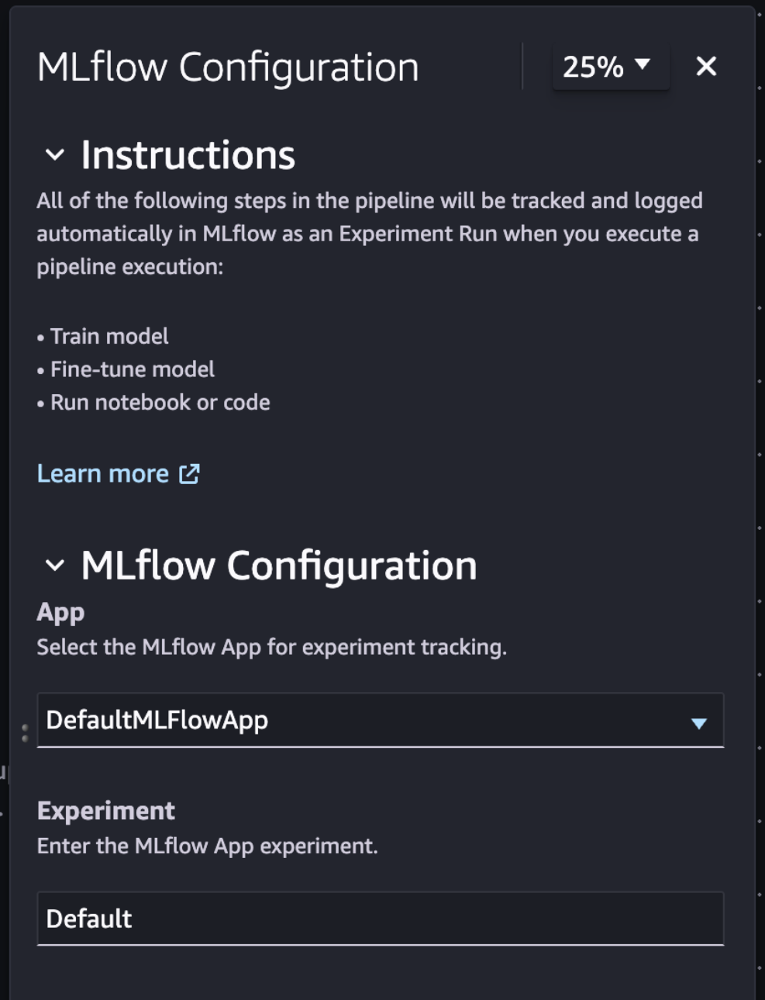

How to override experiment during pipeline execution

ML Pipelines
6656

## Page 686

Amazon SageMaker AI
Developer Guide

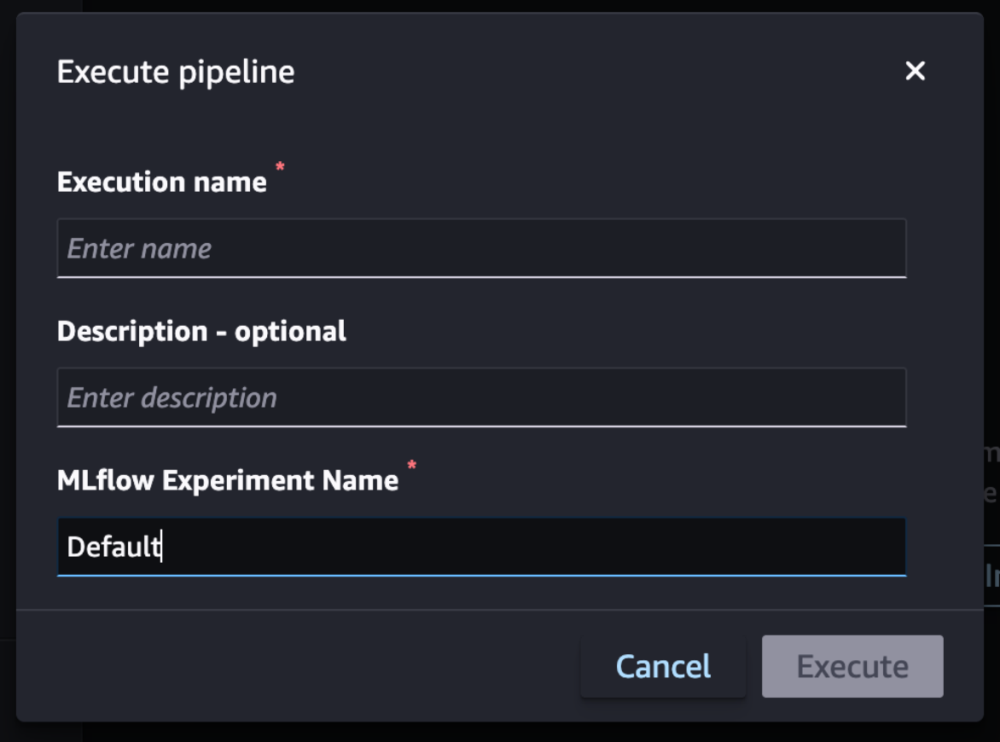

Step properties

Use the properties attribute to add data dependencies between steps in the pipeline. Pipelines
use these data dependencies to construct the DAG from the pipeline definition. These properties
can be referenced as placeholder values and are resolved at runtime.

The properties attribute of a Pipelines step matches the object returned by a Describe call

for the corresponding SageMaker AI job type. For each job type, the Describe call returns the
following response object:

• ProcessingStep – DescribeProcessingJob

• TrainingStep – DescribeTrainingJob

• TransformStep – DescribeTransformJob

ML Pipelines
6657

## Page 687

Amazon SageMaker AI
Developer Guide

To check which properties are referrable for each step type during data dependency creation, see
Data Dependency - Property Reference in the Amazon SageMaker Python SDK.

Step parallelism

When a step does not depend on any other step, it runs immediately upon pipeline
execution. However, executing too many pipeline steps in parallel can quickly exhaust
available resources. Control the number of concurrent steps for a pipeline execution with

ParallelismConfiguration.

The following example uses ParallelismConfiguration to set the concurrent step limit to five.

pipeline.create(
parallelism_config=ParallelismConfiguration(5),
)

Data dependency between steps

You define the structure of your DAG by specifying the data relationships between steps. To create
data dependencies between steps, pass the properties of one step as the input to another step
in the pipeline. The step receiving the input isn't started until after the step providing the input
finishes running.

A data dependency uses JsonPath notation in the following format. This format traverses the JSON

property file. This means you can append as many <property> instances as needed to reach the
desired nested property in the file. For more information on JsonPath notation, see the JsonPath
repo.

<step_name>.properties.<property>.<property>

The following shows how to specify an Amazon S3 bucket using the ProcessingOutputConfig
property of a processing step.

step_process.properties.ProcessingOutputConfig.Outputs["train_data"].S3Output.S3Uri

To create the data dependency, pass the bucket to a training step as follows.

from sagemaker.workflow.pipeline_context import PipelineSession

sklearn_train = SKLearn(..., sagemaker_session=PipelineSession())

ML Pipelines
6658

## Page 688

Amazon SageMaker AI
Developer Guide

step_train = TrainingStep(
name="CensusTrain",
step_args=sklearn_train.fit(inputs=TrainingInput(
s3_data=step_process.properties.ProcessingOutputConfig.Outputs[
"train_data"].S3Output.S3Uri
))
)

To check which properties are referrable for each step type during data dependency creation, see
Data Dependency - Property Reference in the Amazon SageMaker Python SDK.

Custom dependency between steps

When you specify a data dependency, Pipelines provides the data connection between the steps.
Alternatively, one step can access the data from a previous step without directly using Pipelines.
In this case, you can create a custom dependency that tells Pipelines not to start a step until
after another step has finished running. You create a custom dependency by specifying a step's

DependsOn attribute.

As an example, the following defines a step C that starts only after both step A and step B finish
running.

{
'Steps': [
{'Name':'A', ...},
{'Name':'B', ...},
{'Name':'C', 'DependsOn': ['A', 'B']}
]
}

Pipelines throws a validation exception if the dependency would create a cyclic dependency.

The following example creates a training step that starts after a processing step finishes running.

processing_step = ProcessingStep(...)
training_step = TrainingStep(...)

training_step.add_depends_on([processing_step])

The following example creates a training step that doesn't start until two different processing steps
finish running.

ML Pipelines
6659

## Page 689

Amazon SageMaker AI
Developer Guide

processing_step_1 = ProcessingStep(...)
processing_step_2 = ProcessingStep(...)

training_step = TrainingStep(...)

training_step.add_depends_on([processing_step_1, processing_step_2])

The following provides an alternate way to create the custom dependency.

training_step.add_depends_on([processing_step_1])
training_step.add_depends_on([processing_step_2])

The following example creates a training step that receives input from one processing step and
waits for a different processing step to finish running.

processing_step_1 = ProcessingStep(...)
processing_step_2 = ProcessingStep(...)

training_step = TrainingStep(
...,
inputs=TrainingInput(
s3_data=processing_step_1.properties.ProcessingOutputConfig.Outputs[
"train_data"
].S3Output.S3Uri
)

training_step.add_depends_on([processing_step_2])

The following example shows how to retrieve a string list of the custom dependencies of a step.

custom_dependencies = training_step.depends_on

Custom images in a step

You can use any of the available SageMaker AI Deep Learning Container images when you create a
step in your pipeline.

You can also use your own container with pipeline steps. Because you can’t create an image from
within Studio Classic, you must create your image using another method before using it with
Pipelines.

ML Pipelines
6660

## Page 690

Amazon SageMaker AI
Developer Guide

To use your own container when creating the steps for your pipeline, include the image URI in
the estimator definition. For more information on using your own container with SageMaker AI,
see Using Docker Containers with SageMaker AI.

Lift-and-shift Python code with the @step decorator

The @step decorator is a feature that converts your local machine learning (ML) code into one

or more pipeline steps. You can write your ML function as you would for any ML project. Once

tested locally or as a training job using the @remote decorator, you can convert the function to

a SageMaker AI pipeline step by adding a @step decorator. You can then pass the output of the

@step-decorated function call as a step to Pipelines to create and run a pipeline. You can chain a

series of functions with the @step decorator to create a multi-step directed acyclic graph (DAG)
pipeline as well.

The setup to use the @step decorator is the same as the setup to use the @remote decorator. You

can refer to the remote function documentation for details about how to setup the environment

and use a configuration file to set defaults. For more information about the @step decorator, see
sagemaker.workflow.function_step.step.

To view to sample notebooks that demonstrate the use of @step decorator, see @step decorator
sample notebooks.

The following sections explain how you can annotate your local ML code with a @step decorator to
create a step, create and run a pipeline using the step, and customize the experience for your use
case.

Topics

• Create a pipeline with @step-decorated functions

• Run a pipeline

• Configure your pipeline

• Best Practices

• Limitations

Create a pipeline with @step-decorated functions

You can create a pipeline by converting Python functions into pipeline steps using the @step
decorator, creating dependencies between those functions to create a pipeline graph (or directed

ML Pipelines
6661

## Page 691

Amazon SageMaker AI
Developer Guide

acyclic graph (DAG)), and passing the leaf nodes of that graph as a list of steps to the pipeline. The
following sections explain this procedure in detail with examples.

Topics

• Convert a function to a step

• Create dependencies between the steps

• Use ConditionStep with @step-decorated steps

• Define a pipeline using the DelayedReturn output of steps

• Create a pipeline

Convert a function to a step

To create a step using the @step decorator, annotate the function with @step. The following

example shows a @step-decorated function that preprocesses the data.

from sagemaker.workflow.function_step import step

@step
def preprocess(raw_data):
df = pandas.read_csv(raw_data)
...
return procesed_dataframe
step_process_result = preprocess(raw_data)

When you invoke a @step-decorated function, SageMaker AI returns a DelayedReturn instance

instead of running the function. A DelayedReturn instance is a proxy for the actual return of

that function. The DelayedReturn instance can be passed to another function as an argument

or directly to a pipeline instance as a step. For information about the DelayedReturn class, see
sagemaker.workflow.function_step.DelayedReturn.

Create dependencies between the steps

When you create a dependency between two steps, you create a connection between the steps in
your pipeline graph. The following sections introduce multiple ways you can create a dependency
between your pipeline steps.

ML Pipelines
6662

## Page 692

Amazon SageMaker AI
Developer Guide

Data dependencies through input arguments

Passing in the DelayedReturn output of one function as an input to another function
automatically creates a data dependency in the pipeline DAG. In the following example, passing

in the DelayedReturn output of the preprocess function to the train function creates a

dependency between preprocess and train.

from sagemaker.workflow.function_step import step

@step
def preprocess(raw_data):
df = pandas.read_csv(raw_data)
...
return procesed_dataframe

@step
def train(training_data):
...
return trained_model

step_process_result = preprocess(raw_data)
step_train_result = train(step_process_result)

The previous example defines a training function which is decorated with @step. When this

function is invoked, it receives the DelayedReturn output of the preprocessing pipeline step as

input. Invoking the training function returns another DelayedReturn instance. This instance holds

the information about all the previous steps defined in that function (i.e, the preprocess step in
this example) which form the pipeline DAG.

In the previous example, the preprocess function returns a single value. For more complex return
types like lists or tuples, refer to Limitations.

Define custom dependencies

In the previous example, the train function received the DelayedReturn output of preprocess
and created a dependency. If you want to define the dependency explicitly without passing

the previous step output, use the add_depends_on function with the step. You can use the

get_step() function to retrieve the underlying step from its DelayedReturn instance,

and then call add_depends_on_on with the dependency as input. To view the get_step()
function definition, see sagemaker.workflow.step_outputs.get_step. The following example shows

ML Pipelines
6663

## Page 693

Amazon SageMaker AI
Developer Guide

you how to create a dependency between preprocess and train using get_step() and

add_depends_on().

from sagemaker.workflow.step_outputs import get_step

@step
def preprocess(raw_data):
df = pandas.read_csv(raw_data)
...
processed_data = ..
return s3.upload(processed_data)

@step
def train():
training_data = s3.download(....)
...
return trained_model

step_process_result = preprocess(raw_data)
step_train_result = train()

get_step(step_train_result).add_depends_on([step_process_result])

Pass data to and from a @step-decorated function to a traditional pipeline step

You can create a pipeline that includes a @step-decorated step and a traditional pipeline step

and passes data between them. For example, you can use ProcessingStep to process the data

and pass its result to the @step-decorated training function. In the following example, a @step-
decorated training step references the output of a processing step.

# Define processing step

from sagemaker.sklearn.processing import SKLearnProcessor
from sagemaker.processing import ProcessingInput, ProcessingOutput
from sagemaker.workflow.steps import ProcessingStep

sklearn_processor = SKLearnProcessor(
framework_version='1.2-1',
role='arn:aws:iam::123456789012:role/SagemakerExecutionRole',
instance_type='ml.m5.large',
instance_count='1',
)

ML Pipelines
6664

## Page 694

Amazon SageMaker AI
Developer Guide

inputs = [
ProcessingInput(source=input_data, destination="/opt/ml/processing/input"),
]
outputs = [
ProcessingOutput(output_name="train", source="/opt/ml/processing/train"),
ProcessingOutput(output_name="validation", source="/opt/ml/processing/validation"),
ProcessingOutput(output_name="test", source="/opt/ml/processing/test")
]

process_step = ProcessingStep(
name="MyProcessStep",
step_args=sklearn_processor.run(inputs=inputs,
outputs=outputs,code='preprocessing.py'),
)

# Define a @step-decorated train step which references the
# output of a processing step

@step
def train(train_data_path, test_data_path):
...
return trained_model
step_train_result = train(
process_step.properties.ProcessingOutputConfig.Outputs["train"].S3Output.S3Uri,
process_step.properties.ProcessingOutputConfig.Outputs["test"].S3Output.S3Uri,
)

Use ConditionStep with @step-decorated steps

Pipelines supports a ConditionStep class which evaluates the results of preceding steps to

decide what action to take in the pipeline. You can use ConditionStep with a @step-decorated

step as well. To use the output of any @step-decorated step with ConditionStep, enter the

output of that step as an argument to ConditionStep. In the following example, the condition

step receives the output of the @step-decorated model evaluation step.

# Define steps

@step(name="evaluate")
def evaluate_model():
# code to evaluate the model

ML Pipelines
6665

## Page 695

Amazon SageMaker AI
Developer Guide

return {
"rmse":rmse_value
}
@step(name="register")
def register_model():
# code to register the model
...

# Define ConditionStep

from sagemaker.workflow.condition_step import ConditionStep
from sagemaker.workflow.conditions import ConditionGreaterThanOrEqualTo
from sagemaker.workflow.fail_step import FailStep

conditionally_register = ConditionStep(
name="conditional_register",
conditions=[
ConditionGreaterThanOrEqualTo(
# Output of the evaluate step must be json serializable
left=evaluate_model()["rmse"],  #
right=5,
)
],
if_steps=[FailStep(name="Fail", error_message="Model performance is not good
enough")],
else_steps=[register_model()],
)

Define a pipeline using the DelayedReturn output of steps

You define a pipeline the same way whether or not you use a @step decorator. When you pass

a DelayedReturn instance to your pipeline, you don't need to pass a full list of steps to build
the pipeline. The SDK automatically infers the previous steps based on the dependencies you

define. All the previous steps of the Step objects you passed to the pipeline or DelayedReturn
objects are included in the pipeline graph. In the following example, the pipeline receives the

DelayedReturn object for the train function. SageMaker AI adds the preprocess step, as a

previous step of train, to the pipeline graph.

from sagemaker.workflow.pipeline import Pipeline

pipeline = Pipeline(

ML Pipelines
6666

## Page 696

Amazon SageMaker AI
Developer Guide

name="<pipeline-name>",
steps=[step_train_result],
sagemaker_session=<sagemaker-session>,
)

If there are no data or custom dependencies between the steps and you run multiple steps in
parallel, the pipeline graph has more than one leaf node. Pass all of these leaf nodes in a list to the

steps argument in your pipeline definition, as shown in the following example:

@step
def process1():
...
return data
@step
def process2():
...
return data
step_process1_result = process1()
step_process2_result = process2()

pipeline = Pipeline(
name="<pipeline-name>",
steps=[step_process1_result, step_process2_result],
sagemaker_session=sagemaker-session,
)

When the pipeline runs, both steps run in parallel.

You only pass the leaf nodes of the graph to the pipeline because the leaf nodes contain
information about all the previous steps defined through data or custom dependencies. When
it compiles the pipeline, SageMaker AI also infers of all of the subsequent steps that form the
pipeline graph and adds each of them as a separate step to the pipeline.

Create a pipeline

Create a pipeline by calling pipeline.create(), as shown in the following snippet. For details

about create(), see sagemaker.workflow.pipeline.Pipeline.create.

role = "pipeline-role"
pipeline.create(role)

ML Pipelines
6667

## Page 697

Amazon SageMaker AI
Developer Guide

When you call pipeline.create(), SageMaker AI compiles all of the steps defined as part of the
pipeline instance. SageMaker AI uploads the serialized function, arguments, and all the other step-
related artifacts to Amazon S3.

Data resides in the S3 bucket according to the following structure:

s3_root_uri/
pipeline_name/
sm_rf_user_ws/
workspace.zip  # archive of the current working directory (workdir)
step_name/
timestamp/
arguments/                # serialized function arguments
function/                 # serialized function
pre_train_dependencies/   # any dependencies and pre_execution scripts
provided for the step
execution_id/
step_name/
results     # returned output from the serialized function including
the model

s3_root_uri is defined in the SageMaker AI config file and applies to the entire pipeline. If
undefined, the default SageMaker AI bucket is used.

Note

Every time SageMaker AI compiles a pipeline, SageMaker AI saves the the steps' serialized
functions, arguments and dependencies in a folder timestamped with the current

time. This occurs every time you run pipeline.create(), pipeline.update(),

pipeline.upsert() or pipeline.definition().

Run a pipeline

The following page describes how to run a pipeline with Amazon SageMaker Pipelines, either with
SageMaker AI resources or locally.

Start a new pipeline run with the pipeline.start() function as you would for a

traditional SageMaker AI pipeline run. For information about the start() function, see
sagemaker.workflow.pipeline.Pipeline.start.

ML Pipelines
6668

## Page 698

Amazon SageMaker AI
Developer Guide

Note

A step defined using the @step decorator runs as a training job. Therefore, be aware of the
following limits:

• Instance limits and training job limits in your accounts. Update your limits accordingly to
avoid any throttling or resource limit issues.

• The monetary costs associated with every run of a training step in the pipeline. For more
details, refer to Amazon SageMaker Pricing.

Retrieve results from a pipeline run locally

To view the result of any step of a pipeline run, use execution.result(), as shown in the following

snippet:

execution = pipeline.start()
execution.result(step_name="train")

Note

Pipelines does not support execution.result() in local mode.

You can only retrieve results for one step at a time. If the step name was generated by SageMaker

AI, you can retrieve the step name by calling list_steps as follows:

execution.list_step()

Run a pipeline locally

You can run a pipeline with @step-decorated steps locally as you would for traditional pipeline
steps. For details about local mode pipeline runs, see Run pipelines using local mode. To use local

mode, provide a LocalPipelineSession instead of a SageMakerSession to your pipeline
definition, as shown in the following example:

from sagemaker.workflow.function_step import step
from sagemaker.workflow.pipeline import Pipeline

ML Pipelines
6669

## Page 699

Amazon SageMaker AI
Developer Guide

from sagemaker.workflow.pipeline_context import LocalPipelineSession

@step
def train():
training_data = s3.download(....)
...
return trained_model
step_train_result = train()

local_pipeline_session = LocalPipelineSession()

local_pipeline = Pipeline(
name="<pipeline-name>",
steps=[step_train_result],
sagemaker_session=local_pipeline_session # needed for local mode
)

local_pipeline.create(role_arn="role_arn")

# pipeline runs locally
execution = local_pipeline.start()

Configure your pipeline

You are advised to use the SageMaker AI config file to set the defaults for the pipeline. For
information about the SageMaker AI configuration file, see Configuring and using defaults with
the SageMaker Python SDK. Any configuration added to the config file applies to all steps in the

pipeline. If you want to override options for any of the steps, provide new values in the @step
decorator arguments. The following topic describes how to set up a config file.

The @step decorator's configuration in the config file is identical to the @remote decorator's
configuration. To set up the pipeline role ARN and pipeline tags in the config file, use the

Pipeline section shown in the following snippet:

SchemaVersion: '1.0'
SageMaker:
Pipeline:
RoleArn: 'arn:aws:iam::555555555555:role/IMRole'
Tags:
- Key: 'tag_key'
Value: 'tag_value'

ML Pipelines
6670

## Page 700

Amazon SageMaker AI
Developer Guide

For most of the defaults you can set in the configuration file you can also override by passing new

values to the @step decorator. For example, you can override the instance type set in the config
file for your preprocessing step, as shown in the following example:

@step(instance_type="ml.m5.large")
def preprocess(raw_data):
df = pandas.read_csv(raw_data)
...
return procesed_dataframe

A few arguments are not part of the @step decorator parameters list—these can be configured for
the entire pipeline only through the SageMaker AI configuration file. They are listed as follows:

• sagemaker_session (sagemaker.session.Session): The underlying SageMaker AI session
to which SageMaker AI delegates service calls. If unspecified, a session is created using a default
configuration as follows:

SageMaker:
PythonSDK:
Modules:
Session:
DefaultS3Bucket: 'default_s3_bucket'
DefaultS3ObjectKeyPrefix: 'key_prefix'

• custom_file_filter (CustomFileFilter): A CustomFileFilter object that specifies
the local directories and files to include in the pipeline step. If unspecified, this value defaults

to None. For custom_file_filter to take effect, you must set IncludeLocalWorkdir to

True. The following example shows a configuration that ignores all notebook files, and files and

directories named data.

SchemaVersion: '1.0'
SageMaker:
PythonSDK:
Modules:
RemoteFunction:
IncludeLocalWorkDir: true
CustomFileFilter:
IgnoreNamePatterns: # files or directories to ignore
- "*.ipynb" # all notebook files
- "data" # folder or file named "data"

ML Pipelines
6671

## Page 701

Amazon SageMaker AI
Developer Guide

For more details about how to use IncludeLocalWorkdir with CustomFileFilter, see
Using modular code with the @remote decorator.

• s3_root_uri (str): The root Amazon S3 folder to which SageMaker AI uploads the code
archives and data. If unspecified, the default SageMaker AI bucket is used.

• s3_kms_key (str): The key used to encrypt the input and output data. You can only configure
this argument in the SageMaker AI config file and the argument applies to all steps defined in

the pipeline. If unspecified, the value defaults to None. See the following snippet for an example
S3 KMS key configuration:

SchemaVersion: '1.0'
SageMaker:
PythonSDK:
Modules:
RemoteFunction:
S3KmsKeyId: 's3kmskeyid'

S3RootUri: 's3://amzn-s3-demo-bucket/my-project

Best Practices

The following sections suggest best practices to follow when you use the @step decorator for your
pipeline steps.

Use warm pools

For faster pipeline step runs, use the warm pooling functionality provided for training jobs. You

can turn on the warm pool functionality by providing the keep_alive_period_in_seconds

argument to the @step decorator as demonstrated in the following snippet:

@step(
keep_alive_period_in_seconds=900
)

For more information about warm pools, see SageMaker AI Managed Warm Pools.

Structure your directory

You are advised to use code modules while using the @step decorator. Put the pipeline.py
module, in which you invoke the step functions and define the pipeline, at the root of the
workspace. The recommended structure is shown as follows:

ML Pipelines
6672

## Page 702

Amazon SageMaker AI
Developer Guide

.
### config.yaml # the configuration file that define the infra settings
### requirements.txt # dependencies
### pipeline.py  # invoke @step-decorated functions and define the pipeline here
### steps/
| ### processing.py
| ### train.py
### data/
### test/

Limitations

The following sections outline the limitations that you should be aware of when you use the @step
decorator for your pipeline steps.

Function argument limitations

When you pass an input argument to the @step-decorated function, the following limitations
apply:

• You can pass the DelayedReturn, Properties (of steps of other types), Parameter, and

ExecutionVariable objects to @step-decorated functions as arguments. But @step-

decorated functions do not support JsonGet and Join objects as arguments.

• You cannot directly access a pipeline variable from a @step function. The following example
produces an error:

param = ParameterInteger(name="<parameter-name>", default_value=10)

@step
def func():
print(param)

func() # this raises a SerializationError

• You cannot nest a pipeline variable in another object and pass it to a @step function. The
following example produces an error:

param = ParameterInteger(name="<parameter-name>", default_value=10)

@step
def func(arg):

ML Pipelines
6673

## Page 703

Amazon SageMaker AI
Developer Guide

print(arg)

func(arg=(param,)) # this raises a SerializationError because param is nested in a
tuple

• Since inputs and outputs of a function are serialized, there are restrictions on the type of
data that can be passed as input or output from a function. See the Data serialization and
deserialization section of Invoke a remote function for more details. The same restrictions apply

to @step-decorated functions.

• Any object that has a boto client cannot be serialized, hence you cannot pass such objects as

input to or output from a @step-decorated function. For example, SageMaker Python SDK client

classes such as Estimator, Predictor, and Processor can't be serialized.

Function imports

You should import the libraries required by the step inside rather than outside the
function. If you import them at global scope, you risk an import collision while serializing

the function. For example, sklearn.pipeline.Pipeline could be overridden by

sagemaker.workflow.pipeline.Pipeline.

Referencing child members of function return value

If you reference child members of a @step-decorated function's return value, the following
limitations apply:

• You can reference the child members with [] if the DelayedReturn object represents a tuple,
list or dict, as shown in the following example:

delayed_return[0]
delayed_return["a_key"]
delayed_return[1]["a_key"]

• You cannot unpack a tuple or list output because the exact length of the underlying tuple or list
can't be known when you invoke the function. The following example produces an error:

a, b, c = func() # this raises ValueError

• You cannot iterate over a DelayedReturn object. The following example raises an error:

for item in func(): # this raises a NotImplementedError

ML Pipelines
6674

## Page 704

Amazon SageMaker AI
Developer Guide

• You cannot reference arbitrary child members with '.'. The following example produces an error:

delayed_return.a_child # raises AttributeError

Existing pipeline features that are not supported

You cannot use the @step decorator with the following pipeline features:

• Pipeline step caching

• Property files

Pass Data Between Steps

When building pipelines with Amazon SageMaker Pipelines, you might need to pass data from one

step to the next. For example, you might want to use the model artifacts generated by a training
step as input to a model evaluation or deployment step. You can use this functionality to create
interdependent pipeline steps and build your ML workflows.

When you need to retrieve information from the output of a pipeline step, you can use JsonGet.

JsonGet helps you extract information from Amazon S3 or property files. The following sections

explain methods you can use to extract step outputs with JsonGet.

Pass data between steps with Amazon S3

You can use JsonGet in a ConditionStep to fetch the JSON output directly from Amazon

S3. The Amazon S3 URI can be a Std:Join function containing primitive strings, pipeline run

variables, or pipeline parameters. The following example shows how you can use JsonGet in a

ConditionStep:

# Example json file in s3 bucket generated by a processing_step
{
"Output": [5, 10]
}

cond_lte = ConditionLessThanOrEqualTo(
left=JsonGet(
step_name="<step-name>",
s3_uri="<s3-path-to-json>",
json_path="Output[1]"
),

ML Pipelines
6675

## Page 705

Amazon SageMaker AI
Developer Guide

right=6.0
)

If you are using JsonGet with an Amazon S3 path in the condition step, you must explicitly add
a dependency between the condition step and the step generating the JSON output. In following

example, the condition step is created with a dependency on the processing step:

cond_step = ConditionStep(
name="<step-name>",
conditions=[cond_lte],
if_steps=[fail_step],
else_steps=[register_model_step],
depends_on=[processing_step],
)

Pass data between steps with property files

Use property files to store information from the output of a processing step. This is particularly
useful when analyzing the results of a processing step to decide how a conditional step should

be executed. The JsonGet function processes a property file and enables you to use JsonPath
notation to query the property JSON file. For more information on JsonPath notation, see the
JsonPath repo.

To store a property file for later use, you must first create a PropertyFile instance with the

following format. The path parameter is the name of the JSON file to which the property file is

saved. Any output_name must match the output_name of the ProcessingOutput that you

define in your processing step. This enables the property file to capture the ProcessingOutput in
the step.

from sagemaker.workflow.properties import PropertyFile

<property_file_instance> = PropertyFile(
name="<property_file_name>",
output_name="<processingoutput_output_name>",
path="<path_to_json_file>"
)

When you create your ProcessingStep instance, add the property_files parameter to list
all of the parameter files that the Amazon SageMaker Pipelines service must index. This saves the
property file for later use.

ML Pipelines
6676

## Page 706

Amazon SageMaker AI
Developer Guide

property_files=[<property_file_instance>]

To use your property file in a condition step, add the property_file to the condition that you

pass to your condition step as shown in the following example to query the JSON file for your

desired property using the json_path parameter.

cond_lte = ConditionLessThanOrEqualTo(
left=JsonGet(
step_name=step_eval.name,
property_file=<property_file_instance>,
json_path="mse"
),
right=6.0
)

For more in-depth examples, see Property File in the Amazon SageMaker Python SDK.

Caching pipeline steps

In Amazon SageMaker Pipelines, you can use step caching to save time and resources when
rerunning pipelines. Step caching reuses the output of a previous successful run of a step (instead
of recomputing it) when the step has the same configuration and inputs. This helps you achieve
consistent results across pipeline reruns with identical parameters. The following topic shows you
how to configure and turn on step caching for your pipelines.

When you use step signature caching, Pipelines tries to find a previous run of your current pipeline
step with the same values for certain attributes. If found, Pipelines propagates the outputs from
the previous run rather than recomputing the step. The attributes checked are specific to the step
type, and are listed in Default cache key attributes by pipeline step type.

You must opt in to step caching — it is off by default. When you turn on step caching, you must
also define a timeout. This timeout defines how old a previous run can be to remain a candidate for
reuse.

Step caching only considers successful runs — it never reuses failed runs. When multiple successful
runs exist within the timeout period, Pipelines uses the result for the most recent successful run.
If no successful runs match in the timeout period, Pipelines reruns the step. If the executor finds a
previous run that meets the criteria but is still in progress, both steps continue running and update
the cache if they're successful.

ML Pipelines
6677

## Page 707

Amazon SageMaker AI
Developer Guide

Step caching is only scoped for individual pipelines, so you can’t reuse a step from another pipeline
even if there is a step signature match.

Step caching is available for the following step types:

• Processing

• Training

• Tuning

• AutoML

• Transform

• ClarifyCheck

• QualityCheck

• EMR

Topics

• Turn on step caching

• Turn off step caching

• Default cache key attributes by pipeline step type

• Cached data access control

Turn on step caching

To turn on step caching, you must add a CacheConfig property to the step definition.

CacheConfig properties use the following format in the pipeline definition file:

{
"CacheConfig": {
"Enabled": false,
"ExpireAfter": "<time>"
}
}

The Enabled field indicates whether caching is turned on for the particular step. You can set the

field to true, which tells SageMaker AI to try to find a previous run of the step with the same

ML Pipelines
6678

## Page 708

Amazon SageMaker AI
Developer Guide

attributes. Or, you can set the field to false, which tells SageMaker AI to run the step every time

the pipeline runs. ExpireAfter is a string in ISO 8601 duration format that defines the timeout

period. The ExpireAfter duration can be a year, month, week, day, hour, or minute value. Each
value consists of a number followed by a letter indicating the unit of duration. For example:

• "30d" = 30 days

• "5y" = 5 years

• "T16m" = 16 minutes

• "30dT5h" = 30 days and 5 hours.

The following discussion describes the procedure to turn on caching for new or pre-existing
pipelines using the Amazon SageMaker Python SDK.

Turn on caching for new pipelines

For new pipelines, initialize a CacheConfig instance with enable_caching=True and provide it
as an input to your pipeline step. The following example turns on caching with a 1-hour timeout
period for a training step:

from sagemaker.workflow.pipeline_context import PipelineSession
from sagemaker.workflow.steps import CacheConfig
cache_config = CacheConfig(enable_caching=True, expire_after="PT1H")
estimator = Estimator(..., sagemaker_session=PipelineSession())

step_train = TrainingStep(
name="TrainAbaloneModel",
step_args=estimator.fit(inputs=inputs),
cache_config=cache_config
)

Turn on caching for pre-existing pipelines

To turn on caching for pre-existing, already-defined pipelines, turn on the enable_caching

property for the step, and set expire_after to a timeout value. Lastly, update the pipeline

with pipeline.upsert() or pipeline.update(). Once you run it again, the following code
example turns on caching with a 1-hour timeout period for a training step:

from sagemaker.workflow.pipeline_context import PipelineSession

ML Pipelines
6679

## Page 709

Amazon SageMaker AI
Developer Guide

from sagemaker.workflow.steps import CacheConfig
from sagemaker.workflow.pipeline import Pipeline

cache_config = CacheConfig(enable_caching=True, expire_after="PT1H")
estimator = Estimator(..., sagemaker_session=PipelineSession())

step_train = TrainingStep(
name="TrainAbaloneModel",
step_args=estimator.fit(inputs=inputs),
cache_config=cache_config
)

# define pipeline
pipeline = Pipeline(
steps=[step_train]
)

# additional step for existing pipelines
pipeline.update()
# or, call upsert() to update the pipeline
# pipeline.upsert()

Alternatively, update the cache config after you have already defined the (pre-existing) pipeline,
allowing one continuous code run. The following code sample demonstrates this method:

# turn on caching with timeout period of one hour
pipeline.steps[0].cache_config.enable_caching = True
pipeline.steps[0].cache_config.expire_after = "PT1H"

# additional step for existing pipelines
pipeline.update()
# or, call upsert() to update the pipeline
# pipeline.upsert()

For more detailed code examples and a discussion about how Python SDK parameters affect
caching, see  Caching Configuration in the Amazon SageMaker Python SDK documentation.

Turn off step caching

A pipeline step does not rerun if you change any attributes that are not listed in Default cache
key attributes by pipeline step type for its step type. However, you may decide that you want the
pipeline step to rerun anyway. In this case, you need to turn off step caching.

ML Pipelines
6680

## Page 710

Amazon SageMaker AI
Developer Guide

To turn off step caching, set the Enabled attribute in the step definition’s CacheConfig property

in the step definition to false, as shown in the following code snippet:

{
"CacheConfig": {
"Enabled": false,
"ExpireAfter": "<time>"
}
}

Note that the ExpireAfter attribute is ignored when Enabled is false.

To turn off caching for a pipeline step using the Amazon SageMaker Python SDK, define the

pipeline of your pipeline step, turn off the enable_caching property, and update the pipeline.

Once you run it again, the following code example turns off caching for a training step:

from sagemaker.workflow.pipeline_context import PipelineSession
from sagemaker.workflow.steps import CacheConfig
from sagemaker.workflow.pipeline import Pipeline

cache_config = CacheConfig(enable_caching=False, expire_after="PT1H")
estimator = Estimator(..., sagemaker_session=PipelineSession())

step_train = TrainingStep(
name="TrainAbaloneModel",
step_args=estimator.fit(inputs=inputs),
cache_config=cache_config
)

# define pipeline
pipeline = Pipeline(
steps=[step_train]
)

# update the pipeline
pipeline.update()
# or, call upsert() to update the pipeline
# pipeline.upsert()

Alternatively, turn off the enable_caching property after you have already defined the pipeline,
allowing one continuous code run. The following code sample demonstrates this solution:

ML Pipelines
6681

## Page 711

Amazon SageMaker AI
Developer Guide

# turn off caching for the training step
pipeline.steps[0].cache_config.enable_caching = False

# update the pipeline
pipeline.update()
# or, call upsert() to update the pipeline
# pipeline.upsert()

For more detailed code examples and a discussion about how Python SDK parameters affect
caching, see Caching Configuration in the Amazon SageMaker Python SDK documentation.

Default cache key attributes by pipeline step type

When deciding whether to reuse a previous pipeline step or rerun the step, Pipelines checks to see
if certain attributes have changed. If the set of attributes is different from all previous runs within
the timeout period, the step runs again. These attributes include input artifacts, app or algorithm
specification, and environment variables. The following list shows each pipeline step type and the
attributes that, if changed, initiate a rerun of the step. For more information about which Python
SDK parameters are used to create the following attributes, see  Caching Configuration in the
Amazon SageMaker Python SDK documentation.

Processing step

• AppSpecification

• Environment

• ProcessingInputs. This attribute contains information about the preprocessing script.

Training step

• AlgorithmSpecification

• CheckpointConfig

• DebugHookConfig

• DebugRuleConfigurations

• Environment

• HyperParameters

• InputDataConfig. This attribute contains information about the training script.

ML Pipelines
6682

## Page 712

Amazon SageMaker AI
Developer Guide

Tuning step

• HyperParameterTuningJobConfig

• TrainingJobDefinition. This attribute is composed of multiple child attributes, not all of which
cause the step to rerun. The child attributes that could incur a rerun (if changed) are:

• AlgorithmSpecification

• HyperParameterRanges

• InputDataConfig

• StaticHyperParameters

• TuningObjective

• TrainingJobDefinitions

AutoML step

• AutoMLJobConfig. This attribute is composed of multiple child attributes, not all of which cause
the step to rerun. The child attributes that could incur a rerun (if changed) are:

• CompletionCriteria

• CandidateGenerationConfig

• DataSplitConfig

• Mode

• AutoMLJobObjective

• InputDataConfig

• ProblemType

Transform step

• DataProcessing

• Environment

• ModelName

• TransformInput

ML Pipelines
6683

## Page 713

Amazon SageMaker AI
Developer Guide

ClarifyCheck step

• ClarifyCheckConfig

• CheckJobConfig

• SkipCheck

• RegisterNewBaseline

• ModelPackageGroupName

• SuppliedBaselineConstraints

QualityCheck step

• QualityCheckConfig

• CheckJobConfig

• SkipCheck

• RegisterNewBaseline

• ModelPackageGroupName

• SuppliedBaselineConstraints

• SuppliedBaselineStatistics

EMR Step

• ClusterId

• StepConfig

Cached data access control

When a SageMaker AI pipeline runs, it caches the parameters and metadata associated with the
SageMaker AI jobs launched by the pipeline and saves them for reuse in subsequent runs. This
metadata is accessible through a variety of sources in addition to cached pipeline steps, and
includes the following types:

ML Pipelines
6684

## Page 714

Amazon SageMaker AI
Developer Guide

• Describe*Job requests

• CloudWatch Logs

• CloudWatch Events

• CloudWatch Metrics

• SageMaker AI Search

Note that access to each data source in the list is controlled by its own set of IAM permissions.
Removing a particular role’s access to one data source does not affect the level of access to the

others. For example, an account admin might remove IAM permissions for Describe*Job requests

from a caller’s role. While the caller can no longer make Describe*Job requests, they can still
retrieve the metadata from a pipeline run with cached steps as long as they have permission to
run the pipeline. If an account admin wants to remove access to the metadata from a particular
SageMaker AI job completely, they need to remove permissions for each of the relevant services
that provide access to the data.

Retry Policy for Pipeline Steps

Retry policies help you automatically retry your Pipelines steps after an error occurs. Any pipeline
step can encounter exceptions, and exceptions happen for various reasons. In some cases, a retry
can resolve these issues. With a retry policy for pipeline steps, you can choose whether to retry a
particular pipeline step or not.

The retry policy only supports the following pipeline steps:

• Processing step

• Training step

• Tuning step

• AutoML step

• Create model step

• Register model step

• Transform step

• Notebook job step

ML Pipelines
6685

## Page 715

Amazon SageMaker AI
Developer Guide

Note

Jobs running inside both the tuning and AutoML steps conduct retries internally and will

not retry the SageMaker.JOB_INTERNAL_ERROR exception type, even if a retry policy is
configured. You can program your own  Retry Strategy using the SageMaker API.

Supported exception types for the retry policy

The retry policy for pipeline steps supports the following exception types:

• Step.SERVICE_FAULT: These exceptions occur when an internal server error or transient error
happens when calling downstream services. Pipelines retries on this type of error automatically.
With a retry policy, you can override the default retry operation for this exception type.

• Step.THROTTLING: Throttling exceptions can occur while calling the downstream services.
Pipelines retries on this type of error automatically. With a retry policy, you can override the
default retry operation for this exception type.

• SageMaker.JOB_INTERNAL_ERROR: These exceptions occur when the SageMaker AI job returns

InternalServerError. In this case, starting a new job may fix a transient issue.

• SageMaker.CAPACITY_ERROR: The SageMaker AI job may encounter Amazon EC2

InsufficientCapacityErrors, which leads to the SageMaker AI job’s failure. You can retry
by starting a new SageMaker AI job to avoid the issue.

• SageMaker.RESOURCE_LIMIT: You can exceeed the resource limit quota when running a
SageMaker AI job. You can wait and retry running the SageMaker AI job after a short period and
see if resources are released.

The JSON schema for the retry policy

The retry policy for Pipelines has the following JSON schema:

"RetryPolicy": {
"ExceptionType": [String]
"IntervalSeconds": Integer
"BackoffRate": Double
"MaxAttempts": Integer
"ExpireAfterMin": Integer
}

ML Pipelines
6686

## Page 716

Amazon SageMaker AI
Developer Guide

• ExceptionType: This field requires the following exception types in a string array format.

• Step.SERVICE_FAULT

• Step.THROTTLING

• SageMaker.JOB_INTERNAL_ERROR

• SageMaker.CAPACITY_ERROR

• SageMaker.RESOURCE_LIMIT

• IntervalSeconds (optional): The number of seconds before the first retry attempt (1 by

default). IntervalSeconds has a maximum value of 43200 seconds (12 hours).

• BackoffRate (optional): The multiplier by which the retry interval increases during each
attempt (2.0 by default).

• MaxAttempts (optional): A positive integer that represents the maximum number of retry

attempts (5 by default). If the error recurs more times than MaxAttempts specifies, retries
cease and normal error handling resumes. A value of 0 specifies that errors are never retried.

MaxAttempts has a maximum value of 20.

• ExpireAfterMin (optional): A positive integer that represents the maximum timespan of retry.

If the error recurs after ExpireAfterMin minutes counting from the step gets executed, retries
cease and normal error handling resumes. A value of 0 specifies that errors are never retried.

ExpireAfterMin  has a maximum value of 14,400 minutes (10 days).

Note

Only one of MaxAttempts or ExpireAfterMin can be given, but not both; if both are

not specified, MaxAttempts becomes the default. If both properties are identified within
one policy, then the retry policy generates a validation error.

Configuring a retry policy

While SageMaker Pipelines provide a robust and automated way to orchestrate machine learning
workflows, you might encounter failures when you run them. To handle such scenarios gracefully
and improve the reliability of your pipelines, you can configure retry policies that define how
and when to automatically retry specific steps after encountering an exception. The retry policy
allows you to specify the types of exceptions to retry, the maximum number of retry attempts,
the interval between retries, and the backoff rate for increasing the retry intervals. The following

ML Pipelines
6687

## Page 717

Amazon SageMaker AI
Developer Guide

section provides examples of how to configure a retry policy for a training step in your pipeline,
both in JSON and using the SageMaker Python SDK.

The following is an example of a training step with a retry policy.

{
"Steps": [
{
"Name": "MyTrainingStep",
"Type": "Training",
"RetryPolicies": [
{
"ExceptionType": [
"SageMaker.JOB_INTERNAL_ERROR",
"SageMaker.CAPACITY_ERROR"
],
"IntervalSeconds": 1,
"BackoffRate": 2,
"MaxAttempts": 5
}
]
}
]
}

The following is an example of how to build a TrainingStep in SDK for Python (Boto3) with a
retry policy.

from sagemaker.workflow.retry import (
StepRetryPolicy,
StepExceptionTypeEnum,
SageMakerJobExceptionTypeEnum,
SageMakerJobStepRetryPolicy
)

step_train = TrainingStep(
name="MyTrainingStep",
xxx,
retry_policies=[
// override the default
StepRetryPolicy(
exception_types=[

ML Pipelines
6688

## Page 718

Amazon SageMaker AI
Developer Guide

StepExceptionTypeEnum.SERVICE_FAULT,
StepExceptionTypeEnum.THROTTLING
],
expire_after_mins=5,
interval_seconds=10,
backoff_rate=2.0
),
// retry when resource limit quota gets exceeded
SageMakerJobStepRetryPolicy(
exception_types=[SageMakerJobExceptionTypeEnum.RESOURCE_LIMIT],
expire_after_mins=120,
interval_seconds=60,
backoff_rate=2.0
),
// retry when job failed due to transient error or EC2 ICE.
SageMakerJobStepRetryPolicy(
failure_reason_types=[

SageMakerJobExceptionTypeEnum.INTERNAL_ERROR,
SageMakerJobExceptionTypeEnum.CAPACITY_ERROR,
],
max_attempts=10,
interval_seconds=30,
backoff_rate=2.0
)
]
)

For more information on configuring retry behavior for certain step types, see Amazon SageMaker
Pipelines - Retry Policy in the Amazon SageMaker Python SDK documentation.

Selective execution of pipeline steps

As you use Pipelines to create workflows and orchestrate your ML training steps, you might need
to undertake multiple experimentation phases. Instead of running the full pipeline each time, you
might only want to repeat certain steps. With Pipelines, you can execute pipeline steps selectively.
This helps optimize your ML training. Selective execution is useful in the following scenarios:

• You want to restart a specific step with updated instance type, hyperparameters, or other
variables while keeping the parameters from upstream steps.

• Your pipeline fails an intermediate step. Previous steps in the execution, such as data preparation
or feature extraction, are expensive to rerun. You might need to introduce a fix and rerun certain
steps manually to complete the pipeline.

ML Pipelines
6689

## Page 719

Amazon SageMaker AI
Developer Guide

Using selective execution, you can choose to run any subset of steps as long as they are connected
in the directed acyclic graph (DAG) of your pipeline. The following DAG shows an example pipeline
workflow:


You can select steps AbaloneTrain and AbaloneEval in a selective execution, but you cannot

select just AbaloneTrain and AbaloneMSECond steps because these steps are not connected in
the DAG. For non-selected steps in the workflow, the selective execution reuses the outputs from
a reference pipeline execution rather than rerunning the steps. Also, non-selected steps that are
downstream from the selected steps do not run in a selective execution.

If you choose to run a subset of intermediate steps in your pipeline, your steps may depend on
previous steps. SageMaker AI needs a reference pipeline execution from which to resource these

dependencies. For example, if you choose to run the steps AbaloneTrain and AbaloneEval, you

need the outputs from the AbaloneProcess step. You can either provide a reference execution
ARN or direct SageMaker AI to use the latest pipeline execution, which is the default behavior. If
you have a reference execution, you can also build the runtime parameters from your reference
run and supply them to your selective executive run with overrides. For details, see Reuse runtime
parameter values from a reference execution.

In detail, you provide a configuration for your selective execution pipeline run using

SelectiveExecutionConfig. If you include an ARN for a reference pipeline execution

ML Pipelines
6690

## Page 720

Amazon SageMaker AI
Developer Guide

(with the source_pipeline_execution_arn argument), SageMaker AI uses the previous
step dependencies from the pipeline execution you provided. If you do not include an ARN
and a latest pipeline execution exists, SageMaker AI uses it as a reference by default. If you
do not include an ARN and do not want SageMaker AI to use your latest pipeline execution,

set reference_latest_execution to False. The pipeline execution which SageMaker AI

ultimately uses as a reference, whether the latest or user-specified, must be in Success or Failed
state.

The following table summarizes how SageMaker AI chooses a reference execution.

The reference execution used

The source_pi

The reference_latest_e

peline_ex

xecution  argument value

ecution_a

rn  argument
value

A pipeline ARN
True or unspecified
The specified pipeline ARN

A pipeline ARN
False
The specified pipeline ARN

True or unspecified
The latest pipeline execution

null or
unspecified

False
None—in this case, select steps
without upstream dependencies

null or
unspecified

For more information about selective execution configuration requirements, see the
sagemaker.workflow.selective_execution_config.SelectiveExecutionConfig  documentation.

The following discussion includes examples for the cases in which you want to specify a pipeline
reference execution, use the latest pipeline execution as a reference, or run selective execution
without a reference pipeline execution.

Selective execution with a user-specified pipeline reference

The following example demonstrates a selective execution of the steps AbaloneTrain and

AbaloneEval using a reference pipeline execution.

from sagemaker.workflow.selective_execution_config import SelectiveExecutionConfig

ML Pipelines
6691

## Page 721

Amazon SageMaker AI
Developer Guide

selective_execution_config = SelectiveExecutionConfig(
source_pipeline_execution_arn="arn:aws:sagemaker:us-west-2:123123123123:pipeline/
abalone/execution/123ab12cd3ef",
selected_steps=["AbaloneTrain", "AbaloneEval"]
)

selective_execution = pipeline.start(
execution_display_name=f"Sample-Selective-Execution-1",
parameters={"MaxDepth":6, "NumRound":60},
selective_execution_config=selective_execution_config,
)

Selective execution with the latest pipeline execution as a reference

The following example demonstrates a selective execution of the steps AbaloneTrain and

AbaloneEval using the latest pipeline execution as a reference. Since SageMaker AI uses the

latest pipeline execution by default, you can optionally set the reference_latest_execution

argument to True.

# Prepare a new selective execution. Select only the first step in the pipeline without
providing source_pipeline_execution_arn.
selective_execution_config = SelectiveExecutionConfig(
selected_steps=["AbaloneTrain", "AbaloneEval"],
# optional
reference_latest_execution=True
)

# Start pipeline execution without source_pipeline_execution_arn
pipeline.start(
execution_display_name=f"Sample-Selective-Execution-1",
parameters={"MaxDepth":6, "NumRound":60},
selective_execution_config=selective_execution_config,
)

Selective execution without a reference pipeline

The following example demonstrates a selective execution of the steps AbaloneProcess and

AbaloneTrain without providing a reference ARN and turning off the option to use the latest
pipeline run as a reference. SageMaker AI permits this configuration since this subset of steps
doesn’t depend on previous steps.

ML Pipelines
6692

## Page 722

Amazon SageMaker AI
Developer Guide

# Prepare a new selective execution. Select only the first step in the pipeline without
providing source_pipeline_execution_arn.
selective_execution_config = SelectiveExecutionConfig(
selected_steps=["AbaloneProcess", "AbaloneTrain"],
reference_latest_execution=False
)

# Start pipeline execution without source_pipeline_execution_arn
pipeline.start(
execution_display_name=f"Sample-Selective-Execution-1",
parameters={"MaxDepth":6, "NumRound":60},
selective_execution_config=selective_execution_config,
)

Reuse runtime parameter values from a reference execution

You can build the parameters from your reference pipeline execution using

build_parameters_from_execution, and supply the result to your selective execution
pipeline. You can use the original parameters from the reference execution, or apply any overrides

using the parameter_value_overrides argument.

The following example shows you how to build parameters from a reference execution and apply

an override for the MseThreshold parameter.

# Prepare a new selective execution.
selective_execution_config = SelectiveExecutionConfig(
source_pipeline_execution_arn="arn:aws:sagemaker:us-west-2:123123123123:pipeline/
abalone/execution/123ab12cd3ef",
selected_steps=["AbaloneTrain", "AbaloneEval", "AbaloneMSECond"],
)
# Define a new parameters list to test.
new_parameters_mse={
"MseThreshold": 5,
}

# Build parameters from reference execution and override with new parameters to test.
new_parameters = pipeline.build_parameters_from_execution(
pipeline_execution_arn="arn:aws:sagemaker:us-west-2:123123123123:pipeline/abalone/
execution/123ab12cd3ef",
parameter_value_overrides=new_parameters_mse
)

ML Pipelines
6693

## Page 723

Amazon SageMaker AI
Developer Guide

# Start pipeline execution with new parameters.
execution = pipeline.start(
selective_execution_config=selective_execution_config,
parameters=new_parameters
)

Baseline calculation, drift detection and lifecycle with ClarifyCheck and QualityCheck steps in
Amazon SageMaker Pipelines

The following topic discusses how baselines and model versions evolve in the Amazon SageMaker

Pipelines when using the ClarifyCheck and QualityCheck steps.

For the ClarifyCheck step, a baseline is a single file that resides in the step properties with

the suffix constraints. For the QualityCheck step, a baseline is a combination of two files

that resides in the step properties: one with the suffix statistics and the other with the

suffix constraints. In the following topics we discuss these properties with a prefix that
describes how they are used, impacting baseline behavior and lifecycle in these two pipeline steps.

For example, the ClarifyCheck step always calculates and assigns the new baselines in the

CalculatedBaselineConstraints property and the QualityCheck step does the same in the

CalculatedBaselineConstraints and CalculatedBaselineStatistics properties.

Baseline calculation and registration for ClarifyCheck and QualityCheck steps

Both the ClarifyCheck and QualityCheck steps always calculate new baselines based on
step inputs through the underlying processing job run. These newly calculated baselines are

accessed through the properties with the prefix CalculatedBaseline. You can record these

properties as the ModelMetrics of your model package in the Model step. This model package
can be registered with 5 different baselines. You can register it with one for each check type: data

bias, model bias, and model explainability from running the ClarifyCheck step and model

quality, and data quality from running the QualityCheck step. The register_new_baseline

parameter dictates the value set in the properties with the prefix BaselineUsedForDriftCheck
after a step runs.

The following table of potential use cases shows different behaviors resulting from the step

parameters you can set for the ClarifyCheck and QualityCheck steps:

ML Pipelines
6694

## Page 724

Amazon SageMaker AI
Developer Guide

Possible use
case that you
may consider

Does step do a
drift check?

Value of step
property

Value of step
property

skip_check

/ register_

Calculate

BaselineU

new_basel

for selecting
this configura
tion

dBaseline

sedForDri

ine

ftCheck

You are doing
regular retrainin
g with checks
enabled to get
a new model
version, but you
want to carry

False/ False
Drift check runs
against existing
baselines

New baselines
calculated by
running the step

Baseline from
the latest
approved
model in Model
Registry or
the baseline
supplied as step

over the previous
baselines as the

parameter

DriftChec

kBaseline

s  in the model
registry for
your new model
version.

You are doing
regular retrainin
g with checks
enabled to get
a new model
version, but you
want to refresh

False/ True
Drift check runs
against existing
baselines

New baselines
calculated by
running the step

Newly calculate
d baseline by
running the
step (value
of property

Calculate

dBaseline
)

the DriftChec

kBaseline

s  in the model
registry with the
newly calculate
d baselines for

ML Pipelines
6695

## Page 725

Amazon SageMaker AI
Developer Guide

Possible use
case that you
may consider
for selecting
this configura
tion

Does step do a
drift check?

Value of step
property

Value of step
property

skip_check

/ register_

Calculate

BaselineU

new_basel

dBaseline

sedForDri

ine

ftCheck

your new model
version.

You are initiatin
g the pipeline
to retrain a new
model version
because there
is a violation
detected
by Amazon
SageMaker
Model Monitor
on an endpoint
for a particula
r type of check,
and you want
to skip this type
of check against
the previous
baseline, but
carry over the
previous baseline

True/ False
No drift check
New baselines
calculated by
running

Baseline from
the latest
approved model
in the model
registry or
the baseline
supplied as step
parameter

as DriftChec

kBaseline

s  in the model
registry for your
new model
version.

ML Pipelines
6696

## Page 726

Amazon SageMaker AI
Developer Guide

Possible use
case that you
may consider
for selecting
this configura
tion

Does step do a
drift check?

Value of step
property

Value of step
property

skip_check

/ register_

Calculate

BaselineU

new_basel

dBaseline

sedForDri

ine

ftCheck

This happens in
the following
cases:

True/ True
No drift check
New baselines
calculated by
running the step

Newly calculate
d baseline by
running the
step (value
of property

• You are
starting the
initial run of
the pipeline,
building your
first model
version, and
generatin
g the initial
baselines.

Calculate

dBaseline
)

• You are
initiating the
pipeline to
retrain a new
model version
because there
is a violation
detected
by Model
Monitor on
the endpoint
for a particula
r type of
check. If
you want
to skip the

ML Pipelines
6697

## Page 727

Amazon SageMaker AI
Developer Guide

Possible use
case that you
may consider
for selecting
this configura
tion

Does step do a
drift check?

Value of step
property

Value of step
property

skip_check

/ register_

Calculate

BaselineU

new_basel

dBaseline

sedForDri

ine

ftCheck

check against
the previous
baseline and
refresh the

DriftChec

kBaseline

s  with
the newly
calculated
baseline in the
model registry
directly.

Note

If you use scientific notation in your constraint, you need to convert to float. For a
preprocessing script example of how to do this, see Create a Model Quality Baseline.

When you register a model with Model step, you can register the BaselineUsedForDriftCheck

property as DriftCheckBaselines. These baseline files can then be used by Model Monitor
for model and data quality checks. In addition, these baselines can also be used in the

ClarifyCheckStep and QualityCheck step to compare newly trained models against the existing
models that are registered in the model registry for future pipeline runs.

Drift Detection against Previous Baselines in Pipelines

In the case of the QualityCheck step, when you initiate the pipeline for regular retraining to get
a new model version, you may not want to run the training step if the data quality and the data
bias has Schema for Violations (constraint_violations.json file) on the baselines of your previous

ML Pipelines
6698

## Page 728

Amazon SageMaker AI
Developer Guide

approved model version. You also may not want to register the newly trained model version if
the model quality, model bias, or model explainability violates the registered baseline of your

previous approved model version when running the ClarifyCheck step. In these cases, you can

enable the checks you want by setting the skip_check property of the corresponding check

step set to False, resulting in the ClarifyCheck and QualityCheck step failing if violation
is detected against previous baselines. The pipeline process then does not proceed so that the

model drifted from the baseline isn't registered. ClarifyCheck and QualityCheck steps are

able to get DriftCheckBaselines of the latest approved model version of a given model
package group against which to compare. Previous baselines can also be supplied directly through

supplied_baseline_constraints (in addition to supplied_baseline_statistics if it is a

QualityCheck step) and are always prioritized over any baselines pulled from the model package
group.

Baseline and model version lifecycle and evolution with Pipelines

By setting register_new_baseline of your ClarifyCheck and QualityCheck

step to False, your previous baseline is accessible through the step property prefix

BaselineUsedForDriftCheck. You can then register these baselines as the

DriftCheckBaselines in the new model version when you register a model with Model step.

Once you approve this new model version in the model registry, the DriftCheckBaseline

in this model version becomes available for the ClarifyCheck and QualityCheck steps in
the next pipeline process. If you want to refresh the baseline of a certain check type for future

model versions, you can set register_new_baseline to True so that the properties with prefix

BaselineUsedForDriftCheck become the newly calculated baseline. In these ways, you can
preserve your preferred baselines for a model trained in the future, or refresh the baselines for
drift checks when needed, managing your baseline evolution and lifecycle throughout your model
training iterations.

The following diagram illustrates a model-version-centric view of the baseline evolution and
lifecycle.

ML Pipelines
6699

## Page 729

Amazon SageMaker AI
Developer Guide

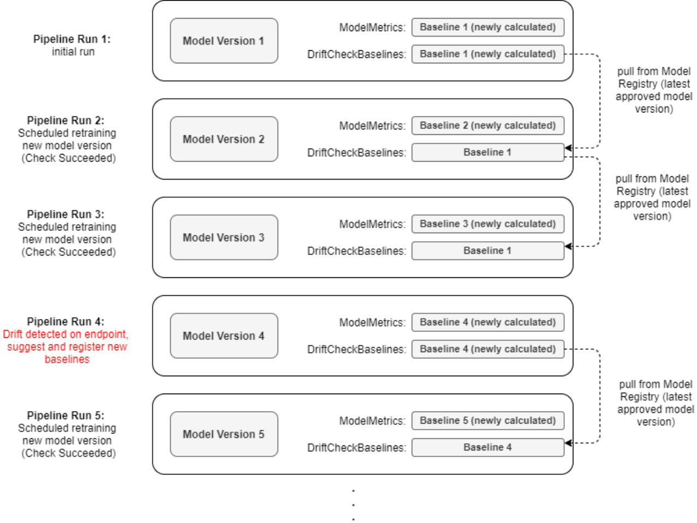

Schedule Pipeline Runs

You can schedule your Amazon SageMaker Pipelines executions using Amazon EventBridge.
Amazon SageMaker Pipelines is supported as a target in Amazon EventBridge. This allows you
to initiate the execution of your model building pipeline based on any event in your event bus.
With EventBridge, you can automate your pipeline executions and respond automatically to events
such as training job or endpoint status changes. Events include a new file being uploaded to your
Amazon S3 bucket, a change in status of your Amazon SageMaker AI endpoint due to drift, and
Amazon Simple Notification Service (SNS) topics.

The following Pipelines actions can be automatically initiated:

• StartPipelineExecution

ML Pipelines
6700

## Page 730

Amazon SageMaker AI
Developer Guide

For more information on scheduling SageMaker AI jobs, see Automating SageMaker AI with
Amazon EventBridge.

Topics

• Schedule a Pipeline with Amazon EventBridge

• Schedule a pipeline with the SageMaker Python SDK

Schedule a Pipeline with Amazon EventBridge

To start a pipeline execution with Amazon CloudWatch Events, you must create an
EventBridge rule. When you create a rule for events, you specify a target action to take when
EventBridge receives an event that matches the rule. When an event matches the rule, EventBridge
sends the event to the specified target and initiates the action defined in the rule.

The following tutorials show how to schedule a pipeline execution with EventBridge using the
EventBridge console or the AWS CLI.

Prerequisites

• A role that EventBridge can assume with the SageMaker::StartPipelineExecution
permission. This role can be created automatically if you create a rule from the EventBridge
console; otherwise, you need to create this role yourself. For information on creating a
SageMaker AI role, see SageMaker Roles.

• An Amazon SageMaker AI Pipeline to schedule. To create an Amazon SageMaker AI Pipeline, see
Define a Pipeline.

Create an EventBridge rule using the EventBridge console

The following procedure shows how to create an EventBridge rule using the EventBridge console.

1.
Navigate to the EventBridge console.

2.
Select Rules on the left hand side.

3.
Select Create Rule.

4.
Enter a name and description for your rule.

5.
Select how you want to initiate this rule. You have the following choices for your rule:

• Event pattern: Your rule is initiated when an event matching the pattern occurs. You can
choose a predefined pattern that matches a certain type of event, or you can create a

ML Pipelines
6701

## Page 731

Amazon SageMaker AI
Developer Guide

custom pattern. If you select a predefined pattern, you can edit the pattern to customize it.
For more information on Event patterns, see Event Patterns in CloudWatch Events.

• Schedule: Your rule is initiated regularly on a specified schedule. You can use a fixed-rate
schedule that initiates regularly for a specified number of minutes, hour, or weeks. You can
also use a cron expression to create a more fine-grained schedule, such as “the first Monday
of each month at 8am.” Schedule is not supported on a custom or partner event bus.

6.
Select your desired Event bus.

7.
Select the target(s) to invoke when an event matches your event pattern or when the schedule

is initiated. You can add up to 5 targets per rule. Select SageMaker Pipeline in the target
dropdown list.

8.
Select the pipeline you want to initiate from the pipeline dropdown list.

9.
Add parameters to pass to your pipeline execution using a name and value pair. Parameter
values can be static or dynamic. For more information on Amazon SageMaker AI Pipeline

parameters, see AWS::Events::Rule SagemakerPipelineParameters.

• Static values are passed to the pipeline execution every time the pipeline is initiated. For

example, if {"Name": "Instance_type", "Value": "ml.4xlarge"} is specified in

the parameter list, then it is passed as a parameter in StartPipelineExecutionRequest
every time EventBridge initiates the pipeline.

• Dynamic values are specified using a JSON path. EventBridge parses the value from an event

payload, then passes it to the pipeline execution. For example: $.detail.param.value

10. Select the role to use for this rule. You can either use an existing role or create a new one.

11. (Optional) Add tags.

12. Select Create to finalize your rule.

Your rule is now in effect and ready to initiate your pipeline executions.

Create an EventBridge rule using the AWS CLI

The following procedure shows how to create an EventBridge rule using the AWS CLI.

1.
Create a rule to be initiated. When creating an EventBridge rule using the AWS CLI, you have
two options for how your rule is initiated, event pattern and schedule.

• Event pattern: Your rule is initiated when an event matching the pattern occurs. You can
choose a predefined pattern that matches a certain type of event, or you can create a

ML Pipelines
6702

## Page 732

Amazon SageMaker AI
Developer Guide

custom pattern. If you select a predefined pattern, you can edit the pattern to customize it.
You can create a rule with event pattern using the following command:

aws events put-rule --name <RULE_NAME> ----event-pattern <YOUR_EVENT_PATTERN>
--description <RULE_DESCRIPTION> --role-arn <ROLE_TO_EXECUTE_PIPELINE> --
tags <TAGS>

• Schedule: Your rule is initiated regularly on a specified schedule. You can use a fixed-rate
schedule that initiates regularly for a specified number of minutes, hour, or weeks. You can
also use a cron expression to create a more fine-grained schedule, such as “the first Monday
of each month at 8am.” Schedule is not supported on a custom or partner event bus. You
can create a rule with schedule using the following command:

aws events put-rule --name <RULE_NAME> --schedule-
expression <YOUR_CRON_EXPRESSION> --description <RULE_DESCRIPTION> --role-

arn <ROLE_TO_EXECUTE_PIPELINE> --tags <TAGS>

2.
Add target(s) to invoke when an event matches your event pattern or when the schedule is
initiated. You can add up to 5 targets per rule.  For each target, you must specify:

• ARN: The resource ARN of your pipeline.

• Role ARN: The ARN of the role EventBridge should assume to execute the pipeline.

• Parameters:  Amazon SageMaker AI pipeline parameters to pass.

3.
Run the following command to pass a Amazon SageMaker AI pipeline as a target to your rule
using put-targets :

aws events put-targets --rule <RULE_NAME> --event-bus-name <EVENT_BUS_NAME>
--targets "[{\"Id\": <ID>, \"Arn\": <RESOURCE_ARN>, \"RoleArn\": <ROLE_ARN>,
\"SageMakerPipelineParameter\": { \"SageMakerParameterList\": [{\"Name\": <NAME>,
\"Value\": <VALUE>}]} }]"]

Schedule a pipeline with the SageMaker Python SDK

The following sections show you how to set up permissions to access EventBridge resources and
create your pipeline schedule using the SageMaker Python SDK.

ML Pipelines
6703

## Page 733

Amazon SageMaker AI
Developer Guide

Required permissions

You need to have necessary permissions to use the pipeline scheduler. Complete the following
steps to set up your permissions:

1.
Attach the following minimum privilege policy to the IAM role used to create the pipeline

triggers, or use the AWS managed policy AmazonEventBridgeSchedulerFullAccess.

JSON

{
"Version":"2012-10-17",
"Statement":
[
{

"Action":
[
"scheduler:ListSchedules",
"scheduler:GetSchedule",
"scheduler:CreateSchedule",
"scheduler:UpdateSchedule",
"scheduler:DeleteSchedule"
],
"Effect": "Allow",
"Resource":
[
"*"
]
},
{
"Effect": "Allow",
"Action": "iam:PassRole",
"Resource": "arn:aws:iam::*:role/*",
"Condition": {
"StringLike": {
"iam:PassedToService": "scheduler.amazonaws.com"
}
}
}
]
}

ML Pipelines
6704

## Page 734

Amazon SageMaker AI
Developer Guide

2.
Establish a trust relationship with EventBridge by adding the service principal

scheduler.amazonaws.com to this role’s trust policy. Make sure you attach the following
trust policy to the execution role if you launch the notebook in SageMaker Studio.

JSON

{
"Version":"2012-10-17",
"Statement": [
{
"Effect": "Allow",
"Principal": {
"Service": [
"scheduler.amazonaws.com",
"sagemaker.amazonaws.com"
]
},
"Action": "sts:AssumeRole"
}
]
}

Create a pipeline schedule

Using the PipelineSchedule constructor, you can schedule a pipeline to run once

or at a predetermined interval. A pipeline schedule must be of the type at, rate,

or cron. This set of scheduling types is an extension of the EventBridge scheduling

options. For more information about how to use the PipelineSchedule class, see
sagemaker.workflow.triggers.PipelineSchedule. The following example demonstrates how to create

each scheduling type with PipelineSchedule.

from sagemaker.workflow.triggers import PipelineSchedule

# schedules a pipeline run for 12/13/2023 at time 10:15:20 UTC
my_datetime_schedule = PipelineSchedule(
name="<schedule-name>",
at=datetime(2023, 12, 13, 10, 15, 20)
)

ML Pipelines
6705

## Page 735

Amazon SageMaker AI
Developer Guide

# schedules a pipeline run every 5 minutes
my_rate_schedule = PipelineSchedule(
name="<schedule-name>",
rate=(5, "minutes")
)

# schedules a pipeline run at 10:15am UTC on the last Friday of each month during the
years 2022 to 2023
my_cron_schedule = PipelineSchedule(
name="<schedule-name>",
cron="15 10 ? * 6L 2022-2023"
)

Note

If you create a one-time schedule and need to access the current time, use

datetime.utcnow() instead of datetime.now(). The latter does not store the current
zone context and results in an incorrect time passed to EventBridge.

Attach the trigger to your pipeline

To attach your PipelineSchedule to your pipeline, invoke the put_triggers call on your
created pipeline object with a list of triggers. If you get a response ARN, you successfully created
the schedule in your account and EventBridge begins to invoke the target pipeline at the time
or rate specified. You must specify a role with correct permissions to attach triggers to a parent
pipeline. If you don't provide one, Pipelines fetches the default role used to create the pipeline
from the configuration file.

The following example demonstrates how to attach a schedule to a pipeline.

scheduled_pipeline = Pipeline(
name="<pipeline-name>",
steps=[...],
sagemaker_session=<sagemaker-session>,
)
custom_schedule = PipelineSchedule(
name="<schedule-name>",
at=datetime(year=2023, month=12, date=25, hour=10, minute=30, second=30)
)
scheduled_pipeline.put_triggers(triggers=[custom_schedule], role_arn=<role>)

ML Pipelines
6706

## Page 736

Amazon SageMaker AI
Developer Guide

Describe current triggers

To retrieve information about your created pipeline triggers, you can invoke the

describe_trigger() API with the trigger name. This command returns details about the

created schedule expression such as its start time, enabled state, and other useful information. The
following snippet shows a sample invocation:

scheduled_pipeline.describe_trigger(name="<schedule-name>")

Cleanup trigger resources

Before you delete your pipeline, clean up existing triggers to avoid a resource leak in your
account. You should delete the triggers before destroying the parent pipeline. You can delete your

triggers by passing a list of trigger names to the delete_triggers API. The following snippet
demonstrates how to delete triggers.

pipeline.delete_triggers(trigger_names=["<schedule-name>"])

Note

Be aware of the following limitations when you delete your triggers:

• The option to delete the triggers by specifying trigger names is only available in the

SageMaker Python SDK. Deleting the pipeline in the CLI or a DeletePipeline API call
does not delete your triggers. As a result, the triggers become orphaned and SageMaker
AI attempts to start a run for a non-existent pipeline.

• Also, if you are using another notebook session or already deleted the pipeline target,
clean up orphaned schedules through the scheduler CLI or EventBridge console.

Amazon SageMaker Experiments Integration

Amazon SageMaker Pipelines is closely integrated with Amazon SageMaker Experiments. By
default, when Pipelines creates and executes a pipeline, the following SageMaker Experiments
entities are created if they don't exist:

• An experiment for the pipeline

• A run group for every execution of the pipeline

ML Pipelines
6707

## Page 737

Amazon SageMaker AI
Developer Guide

• A run that's added to the run group for each SageMaker AI job created in a pipeline execution
step

You can compare metrics such as model training accuracy across multiple pipeline executions just
as you can compare such metrics across multiple run groups of a SageMaker AI model training
experiment.

The following sample shows the relevant parameters of the Pipeline class in the Amazon
SageMaker Python SDK.

Pipeline(
name="MyPipeline",
parameters=[...],
pipeline_experiment_config=PipelineExperimentConfig(
ExecutionVariables.PIPELINE_NAME,
ExecutionVariables.PIPELINE_EXECUTION_ID
),
steps=[...]
)

If you don't want an experiment and run group created for the pipeline, set

pipeline_experiment_config to None.

Note

Experiments integration was introduced in the Amazon SageMaker Python SDK v2.41.0.

The following naming rules apply based on what you specify for the ExperimentName and

TrialName parameters of pipeline_experiment_config:

• If you don't specify ExperimentName, the pipeline name is used for the experiment name.

If you do specify ExperimentName, it's used for the experiment name. If an experiment with
that name exists, the pipeline-created run groups are added to the existing experiment. If an
experiment with that name doesn't exist, a new experiment is created.

• If you don't specify TrialName, the pipeline execution ID is used for the run group name.

ML Pipelines
6708

## Page 738

Amazon SageMaker AI
Developer Guide

If you do specify TrialName, it's used for the run group name. If a run group with that name
exists, the pipeline-created runs are added to the existing run group. If a run group with that
name doesn't exist, a new run group is created.

Note

The experiment entities aren't deleted when the pipeline that created the entities is
deleted. You can use the SageMaker Experiments API to delete the entities.

For information about how to view the SageMaker AI Experiment entities associated with a
pipeline, see Access experiment data from a pipeline. For more information on SageMaker
Experiments, see Amazon SageMaker Experiments in Studio Classic.

The following sections show examples of the previous rules and how they are represented in the
pipeline definition file. For more information on pipeline definition files, see Pipelines overview.

Topics

• Default Behavior

• Disable Experiments Integration

• Specify a Custom Experiment Name

• Specify a Custom Run Group Name

Default Behavior

Create a pipeline

The default behavior when creating a SageMaker AI Pipeline is to automatically integrate it with
SageMaker Experiments. If you don't specify any custom configuration, SageMaker AI creates an
experiment with the same name as the pipeline, a run group for each execution of the pipeline
using the pipeline execution ID as the name, and individual runs within each run group for every
SageMaker AI job launched as part of the pipeline steps. You can seamlessly track and compare
metrics across different pipeline executions, similar to how you would analyze a model training
experiment. The following section demonstrates this default behavior when defining a pipeline
without explicitly configuring the experiment integration.

ML Pipelines
6709

## Page 739

Amazon SageMaker AI
Developer Guide

The pipeline_experiment_config is omitted. ExperimentName defaults to the pipeline

name. TrialName defaults to the execution ID.

pipeline_name = f"MyPipeline"
pipeline = Pipeline(
name=pipeline_name,
parameters=[...],
steps=[step_train]
)

Pipeline definition file

{
"Version": "2020-12-01",
"Parameters": [
{

"Name": "InputDataSource"
},
{
"Name": "InstanceCount",
"Type": "Integer",
"DefaultValue": 1
}
],
"PipelineExperimentConfig": {
"ExperimentName": {"Get": "Execution.PipelineName"},
"TrialName": {"Get": "Execution.PipelineExecutionId"}
},
"Steps": [...]
}

Disable Experiments Integration

Create a pipeline

You can disable your pipeline's integration with SageMaker Experiments by setting the

pipeline_experiment_config parameter to None when you define your pipeline. This way,
SageMaker AI will not automatically create an experiment, run groups, or individual runs for
tracking metrics and artifacts associated with your pipeline executions. The following example sets

the pipeline config parameter to None.

pipeline_name = f"MyPipeline"

ML Pipelines
6710

## Page 740

Amazon SageMaker AI
Developer Guide

pipeline = Pipeline(
name=pipeline_name,
parameters=[...],
pipeline_experiment_config=None,
steps=[step_train]
)

Pipeline definition file

This is the same as the preceding default example, without the PipelineExperimentConfig.

Specify a Custom Experiment Name

While the default behavior is to use the pipeline name as the experiment name in SageMaker
Experiments, you can override this and specify a custom experiment name instead. This can be
useful if you want to group multiple pipeline executions under the same experiment for easier

analysis and comparison. The run group name will still default to the pipeline execution ID unless
you explicitly set a custom name for that as well. The following section demonstrates how to
create a pipeline with a custom experiment name while leaving the run group name as the default
execution ID.

Create a pipeline

pipeline_name = f"MyPipeline"
pipeline = Pipeline(
name=pipeline_name,
parameters=[...],
pipeline_experiment_config=PipelineExperimentConfig(
"CustomExperimentName",
ExecutionVariables.PIPELINE_EXECUTION_ID
),
steps=[step_train]
)

Pipeline definition file

{
...,
"PipelineExperimentConfig": {
"ExperimentName": "CustomExperimentName",
"TrialName": {"Get": "Execution.PipelineExecutionId"}
},

ML Pipelines
6711

## Page 741

Amazon SageMaker AI
Developer Guide

"Steps": [...]
}

Specify a Custom Run Group Name

In addition to setting a custom experiment name, you can also specify a custom name for the run
groups created by SageMaker Experiments during pipeline executions. This name is appended
with the pipeline execution ID to ensure uniqueness. You can specify a custom run group name to
identify and analyze related pipeline runs within the same experiment. The following section shows
how to define a pipeline with a custom run group name while using the default pipeline name for
the experiment name.

Create a pipeline

pipeline_name = f"MyPipeline"
pipeline = Pipeline(

name=pipeline_name,
parameters=[...],
pipeline_experiment_config=PipelineExperimentConfig(
ExecutionVariables.PIPELINE_NAME,
Join(on="-", values=["CustomTrialName",
ExecutionVariables.PIPELINE_EXECUTION_ID])
),
steps=[step_train]
)

Pipeline definition file

{
...,
"PipelineExperimentConfig": {
"ExperimentName": {"Get": "Execution.PipelineName"},
"TrialName": {
"On": "-",
"Values": [
"CustomTrialName",
{"Get": "Execution.PipelineExecutionId"}
]
}
},
"Steps": [...]
}

ML Pipelines
6712

## Page 742

Amazon SageMaker AI
Developer Guide

Run pipelines using local mode

SageMaker Pipelines local mode is an easy way to test your training, processing and inference
scripts, as well as the runtime compatibility of pipeline parameters before you execute your
pipeline on the managed SageMaker AI service. By using local mode, you can test your SageMaker
AI pipeline locally using a smaller dataset. This allows quick and easy debugging of errors in user
scripts and the pipeline definition itself without incurring the costs of using the managed service.
The following topic shows you how to define and run pipelines locally.

Pipelines local mode leverages SageMaker AI jobs local mode under the hood. This is a feature in
the SageMaker Python SDK that allows you to run SageMaker AI built-in or custom images locally
using Docker containers. Pipelines local mode is built on top of SageMaker AI jobs local mode.
Therefore, you can expect to see the same results as if you were running those jobs separately. For
example, local mode still uses Amazon S3 to upload model artifacts and processing outputs. If you
want data generated by local jobs to reside on local disk, you can use the setup mentioned in Local
Mode.

Pipeline local mode currently supports the following step types:

• Training step

• Processing step

• Transform step

• Model Step (with Create Model arguments only)

• Condition step

• Fail step

As opposed to the managed Pipelines service which allows multiple steps to execute in parallel
using Parallelism Configuration, the local pipeline executor runs the steps sequentially. Therefore,
overall execution performance of a local pipeline may be poorer than one that runs on the cloud
- this mostly depends on the size of the dataset, algorithm, as well as the power of your local
computer. Also note that Pipelines runs in local mode are not recorded in SageMaker Experiments.

Note

Pipelines local mode is not compatible with SageMaker AI algorithms such as XGBoost. If
you to want use these algorithms, you must use them in script mode.

ML Pipelines
6713

## Page 743

Amazon SageMaker AI
Developer Guide

In order to execute a pipeline locally, the sagemaker_session fields associated with the pipeline

steps and the pipeline itself need to be of type LocalPipelineSession. The following example

shows how you can define a SageMaker AI pipeline to execute locally.

from sagemaker.workflow.pipeline_context import LocalPipelineSession
from sagemaker.pytorch import PyTorch
from sagemaker.workflow.steps import TrainingStep
from sagemaker.workflow.pipeline import Pipeline

local_pipeline_session = LocalPipelineSession()

pytorch_estimator = PyTorch(
sagemaker_session=local_pipeline_session,
role=sagemaker.get_execution_role(),
instance_type="ml.c5.xlarge",
instance_count=1,
framework_version="1.8.0",
py_version="py36",
entry_point="./entry_point.py",
)

step = TrainingStep(
name="MyTrainingStep",
step_args=pytorch_estimator.fit(
inputs=TrainingInput(s3_data="s3://amzn-s3-demo-bucket/my-data/train"),
)
)

pipeline = Pipeline(
name="MyPipeline",
steps=[step],
sagemaker_session=local_pipeline_session
)

pipeline.create(
role_arn=sagemaker.get_execution_role(),
description="local pipeline example"
)

// pipeline will execute locally
execution = pipeline.start()

ML Pipelines
6714

## Page 744

Amazon SageMaker AI
Developer Guide

steps = execution.list_steps()

training_job_name = steps['PipelineExecutionSteps'][0]['Metadata']['TrainingJob']
['Arn']

step_outputs = pipeline_session.sagemaker_client.describe_training_job(TrainingJobName
= training_job_name)

Once you are ready to execute the pipeline on the managed SageMaker Pipelines service,

you can do so by replacing LocalPipelineSession in the previous code snippet with

PipelineSession (as shown in the following code sample) and rerunning the code.

from sagemaker.workflow.pipeline_context import PipelineSession

pipeline_session = PipelineSession()

Troubleshooting Amazon SageMaker Pipelines

When using Amazon SageMaker Pipelines, you might run into issues for various reasons. This topic
provides information about common errors and how to resolve them.

Pipeline Definition Issues

Your pipeline definition might not be formatted correctly. This can result in your execution failing
or your job being inaccurate. These errors can be caught when the pipeline is created or when an
execution occurs. If your definition doesn’t validate, Pipelines returns an error message identifying
the character where the JSON file is malformed. To fix this problem, review the steps created using
the SageMaker AI Python SDK for accuracy.

You can only include steps in a pipeline definition once. Because of this, steps cannot exist as part
of a condition step and a pipeline in the same pipeline.

Examining Pipeline Logs

You can view the status of your steps using the following command:

execution.list_steps()

Each step includes the following information:

ML Pipelines
6715

## Page 745

Amazon SageMaker AI
Developer Guide

• The ARN of the entity launched by the pipeline, such as SageMaker AI job ARN, model ARN, or
model package ARN.

• The failure reason includes a brief explanation of the step failure.

• If the step is a condition step, it includes whether the condition is evaluated to true or false.

• If the execution reuses a previous job execution, the CacheHit lists the source execution.

You can also view the error messages and logs in the Amazon SageMaker Studio interface. For
information about how to see the logs in Studio, see View the details of a pipeline run.

Missing Permissions

Correct permissions are required for the role that creates the pipeline execution, and the steps that
create each of the jobs in your pipeline execution. Without these permissions, you may not be able
to submit your pipeline execution or run your SageMaker AI jobs as expected. To ensure that your
permissions are properly set up, see IAM Access Management.

Job Execution Errors

You may run into issues when executing your steps because of issues in the scripts that define the
functionality of your SageMaker AI jobs. Each job has a set of CloudWatch logs. To view these logs
from Studio, see View the details of a pipeline run. For information about using CloudWatch logs
with SageMaker AI, see CloudWatch Logs for Amazon SageMaker AI.

Property File Errors

You may have issues when incorrectly implementing property files with your pipeline. To ensure
that your implementation of property files works as expected, see Pass Data Between Steps.

Issues copying the script to the container in the Dockerfile

You can either copy the script to the container or pass it via the entry_point argument (of your

estimator entity) or code argument (of your processor entity), as demonstrated in the following
code sample.

step_process = ProcessingStep(
name="PreprocessAbaloneData",
processor=sklearn_processor,
inputs = [

ML Pipelines
6716

## Page 746

Amazon SageMaker AI
Developer Guide

ProcessingInput(
input_name='dataset',
source=...,
destination="/opt/ml/processing/code",
)
],
outputs=[
ProcessingOutput(output_name="train", source="/opt/ml/processing/train",
destination = processed_data_path),
ProcessingOutput(output_name="validation", source="/opt/ml/processing/
validation", destination = processed_data_path),
ProcessingOutput(output_name="test", source="/opt/ml/processing/test",
destination = processed_data_path),
],
code=os.path.join(BASE_DIR, "process.py"), ## Code is passed through an argument
cache_config = cache_config,
job_arguments = ['--input', 'arg1']

)

sklearn_estimator = SKLearn(
entry_point=os.path.join(BASE_DIR, "train.py"), ## Code is passed through the
entry_point
framework_version="0.23-1",
instance_type=training_instance_type,
role=role,
output_path=model_path, # New
sagemaker_session=sagemaker_session, # New
instance_count=1, # New
base_job_name=f"{base_job_prefix}/pilot-train",
metric_definitions=[
{'Name': 'train:accuracy', 'Regex': 'accuracy_train=(.*?);'},
{'Name': 'validation:accuracy', 'Regex': 'accuracy_validation=(.*?);'}
],
)

Pipelines actions

You can use either the Amazon SageMaker Pipelines Python SDK or the drag-and-drop visual
designer in Amazon SageMaker Studio to author, view, edit, execute, and monitor your ML
workflows.

The following screenshot shows the visual designer that you can use to create and manage your
Amazon SageMaker Pipelines.

ML Pipelines
6717

## Page 747

Amazon SageMaker AI
Developer Guide


After your pipeline is deployed, you can view the directed acyclic graph (DAG) for your pipeline
and manage your executions using Amazon SageMaker Studio. Using SageMaker Studio, you can
get information about your current and historical pipelines, compare executions, see the DAG for
your executions, get metadata information, and more. To learn about how to view pipelines from
Studio, see View the details of a pipeline.

Topics

• Define a pipeline

• Edit a pipeline

• Run a pipeline

• Stop a pipeline

• View the details of a pipeline

• View the details of a pipeline run

ML Pipelines
6718

## Page 748

Amazon SageMaker AI
Developer Guide

• Download a pipeline definition file

• Access experiment data from a pipeline

• Track the lineage of a pipeline

Define a pipeline

To orchestrate your workflows with Amazon SageMaker Pipelines, you must generate a directed
acyclic graph (DAG) in the form of a JSON pipeline definition. The DAG specifies the different
steps involved in your ML process, such as data preprocessing, model training, model evaluation,
and model deployment, as well as the dependencies and flow of data between these steps. The
following topic shows you how to generate a pipeline definition.

You can generate your JSON pipeline definition using either the SageMaker Python SDK or the
visual drag-and-drop Pipeline Designer feature in Amazon SageMaker Studio. The following image
is a representation of the pipeline DAG that you create in this tutorial:


ML Pipelines
6719

## Page 749

Amazon SageMaker AI
Developer Guide

The pipeline that you define in the following sections solves a regression problem to determine
the age of an abalone based on its physical measurements. For a runnable Jupyter notebook
that includes the content in this tutorial, see Orchestrating Jobs with Amazon SageMaker Model
Building Pipelines.

Note

You can reference the model location as a property of the training step, as shown in the
end-to-end example CustomerChurn pipeline in Github.

Define a pipeline (Pipeline Designer)

The following walkthrough guides you through the steps to create a barebones pipeline using the
drag-and-drop Pipeline Designer. If you need to pause or end your Pipeline editing session in the
visual designer at any time, click on the Export option. This allows you to download the current
definition of your Pipeline to your local environment. Later, when you want to resume the Pipeline
editing process, you can import the same JSON definition file into the visual designer.

Create a Processing step

To create a data processing job step, do the following:

1.
Open the Studio console by following the instructions in Launch Amazon SageMaker Studio.

2.
In the left navigation pane, select Pipelines.

3.
Choose Create.

4.
Choose Blank.

5.
In the left sidebar, choose Process data and drag it to the canvas.

6.
In the canvas, choose the Process data step you added.

7.
To add an input dataset, choose Add under Data (input) in the right sidebar and select a
dataset.

8.
To add a location to save output datasets, choose Add under Data (output) in the right sidebar
and navigate to the destination.

9.
Complete the remaining fields in the right sidebar. For information about the fields in these
tabs, see  sagemaker.workflow.steps.ProcessingStep.

ML Pipelines
6720

## Page 750

Amazon SageMaker AI
Developer Guide

Create a Training step

To set up a model training step, do the following:

1.
In the left sidebar, choose Train model and drag it to the canvas.

2.
In the canvas, choose the Train model step you added.

3.
To add an input dataset, choose Add under Data (input) in the right sidebar and select a
dataset.

4.
To choose a location to save your model artifacts, enter an Amazon S3 URI in the Location (S3
URI) field, or choose Browse S3 to navigate to the destination location.

5.
Complete the remaining fields in the right sidebar. For information about the fields in these
tabs, see  sagemaker.workflow.steps.TrainingStep.

6.
Click and drag the cursor from the Process data step you added in the previous section to the
Train model step to create an edge connecting the two steps.

Create a model package with a Register model step

To create a model package with a model registration step, do the following:

1.
In the left sidebar, choose Register model and drag it to the canvas.

2.
In the canvas, choose the Register model step you added.

3.
To select a model to register, choose Add under Model (input).

4.
Choose Create a model group to add your model to a new model group.

5.
Complete the remaining fields in the right sidebar. For information about the fields in these
tabs, see  sagemaker.workflow.step_collections.RegisterModel.

6.
Click and drag the cursor from the Train model step you added in the previous section to the
Register model step to create an edge connecting the two steps.

Deploy the model to an endpoint with a Deploy model (endpoint) step

To deploy your model using a model deployment step, do the following:

1.
In the left sidebar, choose Deploy model (endpoint) and drag it to the canvas.

2.
In the canvas, choose the Deploy model (endpoint) step you added.

3.
To choose a model to deploy, choose Add under Model (input).

ML Pipelines
6721

## Page 751

Amazon SageMaker AI
Developer Guide

4.
Choose the Create endpoint radio button to create a new endpoint.

5.
Enter a Name and Description for your endpoint.

6.
Click and drag the cursor from the Register model step you added in the previous section to
the Deploy model (endpoint) step to create an edge connecting the two steps.

7.
Complete the remaining fields in the right sidebar.

Define the Pipeline parameters

You can configure a set of Pipeline parameters whose values can be updated for every execution.
To define the pipeline parameters and set the default values, click on the gear icon at the bottom
of the visual designer.

Save Pipeline

After you have entered all the required information to create your pipeline, click on Save at the
bottom of the visual designer. This validates your pipeline for any potential errors at runtime
and notifies you. The Save operation won't succeed until you address all errors flagged by the
automated validations checks. If you want to resume editing at a later point, you can save your in-
progress pipeline as a JSON definition in your local environment. You can export your Pipeline as a
JSON definition file by clicking on the Export button at the bottom of the visual designer. Later, to
resume updating your Pipeline, upload that JSON definition file by clicking on the Import button.

Define a pipeline (SageMaker Python SDK)

Prerequisites

To run the following tutorial, complete the following:

• Set up your notebook instance as outlined in Create a notebook instance. This gives your
role permissions to read and write to Amazon S3, and create training, batch transform, and
processing jobs in SageMaker AI.

• Grant your notebook permissions to get and pass its own role as shown in Modifying a
role permissions policy. Add the following JSON snippet to attach this policy to your role.

Replace <your-role-arn> with the ARN used to create your notebook instance.

JSON

{

ML Pipelines
6722

## Page 752

Amazon SageMaker AI
Developer Guide

"Version":"2012-10-17",
"Statement": [
{
"Effect": "Allow",
"Action": [
"iam:GetRole",
"iam:PassRole"
],
"Resource": "arn:aws:iam::111122223333:role/role-name"
}
]
}

• Trust the SageMaker AI service principal by following the steps in Modifying a role trust policy.
Add the following statement fragment to the trust relationship of your role:

{
"Sid": "",
"Effect": "Allow",
"Principal": {
"Service": "sagemaker.amazonaws.com"
},
"Action": "sts:AssumeRole"
}

Set up your environment

Create a new SageMaker AI session using the following code block. This returns the role ARN for
the session. This role ARN should be the execution role ARN that you set up as a prerequisite.

import boto3
import sagemaker
import sagemaker.session
from sagemaker.workflow.pipeline_context import PipelineSession

region = boto3.Session().region_name
sagemaker_session = sagemaker.session.Session()
role = sagemaker.get_execution_role()
default_bucket = sagemaker_session.default_bucket()

pipeline_session = PipelineSession()

ML Pipelines
6723

## Page 753

Amazon SageMaker AI
Developer Guide

model_package_group_name = f"AbaloneModelPackageGroupName"

Create a pipeline

Important

Custom IAM policies that allow Amazon SageMaker Studio or Amazon SageMaker Studio
Classic to create Amazon SageMaker resources must also grant permissions to add tags to
those resources. The permission to add tags to resources is required because Studio and
Studio Classic automatically tag any resources they create. If an IAM policy allows Studio
and Studio Classic to create resources but does not allow tagging, "AccessDenied" errors can
occur when trying to create resources. For more information, see Provide permissions for
tagging SageMaker AI resources.
AWS managed policies for Amazon SageMaker AI that give permissions to create

SageMaker resources already include permissions to add tags while creating those
resources.

Run the following steps from your SageMaker AI notebook instance to create a pipeline that
includes steps for:

• preprocessing

• training

• evaluation

• conditional evaluation

• model registration

Note

You can use ExecutionVariables and the  Join function to specify your

output location. ExecutionVariables is resolved at runtime. For instance,

ExecutionVariables.PIPELINE_EXECUTION_ID is resolved to the ID of the current
execution, which can be used as a unique identifier across different runs.

ML Pipelines
6724

## Page 754

Amazon SageMaker AI
Developer Guide

Step 1: Download the dataset

This notebook uses the UCI Machine Learning Abalone Dataset. The dataset contains the following
features:

• length – The longest shell measurement of the abalone.

• diameter – The diameter of the abalone perpendicular to its length.

• height – The height of the abalone with meat in the shell.

• whole_weight – The weight of the whole abalone.

• shucked_weight – The weight of the meat removed from the abalone.

• viscera_weight – The weight of the abalone viscera after bleeding.

• shell_weight – The weight of the abalone shell after meat removal and drying.

• sex – The sex of the abalone. One of 'M', 'F', or 'I', where 'I' is an infant abalone.

• rings – The number of rings in the abalone shell.

The number of rings in the abalone shell is a good approximation for its age using the formula

age=rings + 1.5. However, getting this number is a time-consuming task. You must cut the
shell through the cone, stain the section, and count the number of rings through a microscope.
However, the other physical measurements are easier to get. This notebook uses the dataset to
build a predictive model of the variable rings using the other physical measurements.

To download the dataset

1.
Download the dataset into your account's default Amazon S3 bucket.

!mkdir -p data
local_path = "data/abalone-dataset.csv"

s3 = boto3.resource("s3")
s3.Bucket(f"sagemaker-servicecatalog-seedcode-{region}").download_file(
"dataset/abalone-dataset.csv",
local_path
)

base_uri = f"s3://{default_bucket}/abalone"
input_data_uri = sagemaker.s3.S3Uploader.upload(
local_path=local_path,
desired_s3_uri=base_uri,

ML Pipelines
6725

## Page 755

Amazon SageMaker AI
Developer Guide

)
print(input_data_uri)

2.
Download a second dataset for batch transformation after your model is created.

local_path = "data/abalone-dataset-batch.csv"

s3 = boto3.resource("s3")

s3.Bucket(f"sagemaker-servicecatalog-seedcode-{region}").download_file(
"dataset/abalone-dataset-batch",
local_path
)

base_uri = f"s3://{default_bucket}/abalone"
batch_data_uri = sagemaker.s3.S3Uploader.upload(
local_path=local_path,
desired_s3_uri=base_uri,
)
print(batch_data_uri)

Step 2: Define pipeline parameters

This code block defines the following parameters for your pipeline:

• processing_instance_count – The instance count of the processing job.

• input_data – The Amazon S3 location of the input data.

• batch_data – The Amazon S3 location of the input data for batch transformation.

• model_approval_status – The approval status to register the trained model with for CI/CD.
For more information, see MLOps Automation With SageMaker Projects.

from sagemaker.workflow.parameters import (
ParameterInteger,
ParameterString,
)

processing_instance_count = ParameterInteger(
name="ProcessingInstanceCount",
default_value=1
)
model_approval_status = ParameterString(

ML Pipelines
6726

## Page 756

Amazon SageMaker AI
Developer Guide

name="ModelApprovalStatus",
default_value="PendingManualApproval"
)
input_data = ParameterString(
name="InputData",
default_value=input_data_uri,
)
batch_data = ParameterString(
name="BatchData",
default_value=batch_data_uri,
)

Step 3: Define a processing step for feature engineering

This section shows how to create a processing step to prepare the data from the dataset for
training.

To create a processing step

1.
Create a directory for the processing script.

!mkdir -p abalone

2.
Create a file in the /abalone directory named preprocessing.py with the following
content. This preprocessing script is passed in to the processing step for running on the input
data. The training step then uses the preprocessed training features and labels to train a
model. The evaluation step uses the trained model and preprocessed test features and labels

to evaluate the model. The script uses scikit-learn to do the following:

• Fill in missing sex categorical data and encode it so it's suitable for training.

• Scale and normalize all numerical fields except for rings and sex.

• Split the data into training, test, and validation datasets.

%%writefile abalone/preprocessing.py
import argparse
import os
import requests
import tempfile
import numpy as np
import pandas as pd

ML Pipelines
6727

## Page 757

Amazon SageMaker AI
Developer Guide

from sklearn.compose import ColumnTransformer
from sklearn.impute import SimpleImputer
from sklearn.pipeline import Pipeline
from sklearn.preprocessing import StandardScaler, OneHotEncoder

# Because this is a headerless CSV file, specify the column names here.
feature_columns_names = [
"sex",
"length",
"diameter",
"height",
"whole_weight",
"shucked_weight",
"viscera_weight",

"shell_weight",
]
label_column = "rings"

feature_columns_dtype = {
"sex": str,
"length": np.float64,
"diameter": np.float64,
"height": np.float64,
"whole_weight": np.float64,
"shucked_weight": np.float64,
"viscera_weight": np.float64,
"shell_weight": np.float64
}
label_column_dtype = {"rings": np.float64}

def merge_two_dicts(x, y):
z = x.copy()
z.update(y)
return z

if __name__ == "__main__":
base_dir = "/opt/ml/processing"

df = pd.read_csv(

ML Pipelines
6728

## Page 758

Amazon SageMaker AI
Developer Guide

f"{base_dir}/input/abalone-dataset.csv",
header=None,
names=feature_columns_names + [label_column],
dtype=merge_two_dicts(feature_columns_dtype, label_column_dtype)
)
numeric_features = list(feature_columns_names)
numeric_features.remove("sex")
numeric_transformer = Pipeline(
steps=[
("imputer", SimpleImputer(strategy="median")),
("scaler", StandardScaler())
]
)

categorical_features = ["sex"]
categorical_transformer = Pipeline(
steps=[

("imputer", SimpleImputer(strategy="constant", fill_value="missing")),
("onehot", OneHotEncoder(handle_unknown="ignore"))
]
)

preprocess = ColumnTransformer(
transformers=[
("num", numeric_transformer, numeric_features),
("cat", categorical_transformer, categorical_features)
]
)
y = df.pop("rings")
X_pre = preprocess.fit_transform(df)
y_pre = y.to_numpy().reshape(len(y), 1)
X = np.concatenate((y_pre, X_pre), axis=1)
np.random.shuffle(X)
train, validation, test = np.split(X, [int(.7*len(X)), int(.85*len(X))])

pd.DataFrame(train).to_csv(f"{base_dir}/train/train.csv", header=False,
index=False)
pd.DataFrame(validation).to_csv(f"{base_dir}/validation/validation.csv",
header=False, index=False)

ML Pipelines
6729

## Page 759

Amazon SageMaker AI
Developer Guide

pd.DataFrame(test).to_csv(f"{base_dir}/test/test.csv", header=False,
index=False)

3.
Create an instance of an SKLearnProcessor to pass in to the processing step.

from sagemaker.sklearn.processing import SKLearnProcessor

framework_version = "0.23-1"

sklearn_processor = SKLearnProcessor(
framework_version=framework_version,
instance_type="ml.m5.xlarge",
instance_count=processing_instance_count,
base_job_name="sklearn-abalone-process",
sagemaker_session=pipeline_session,
role=role,
)

4.
Create a processing step. This step takes in the SKLearnProcessor, the input and output

channels, and the preprocessing.py script that you created. This is very similar to

a processor instance's run method in the SageMaker AI Python SDK. The input_data

parameter passed into ProcessingStep is the input data of the step itself. This input data is
used by the processor instance when it runs.

Note the   "train, "validation, and "test" named channels specified in the output

configuration for the processing job. Step Properties such as these can be used in
subsequent steps and resolve to their runtime values at runtime.

from sagemaker.processing import ProcessingInput, ProcessingOutput
from sagemaker.workflow.steps import ProcessingStep

processor_args = sklearn_processor.run(
inputs=[
ProcessingInput(source=input_data, destination="/opt/ml/processing/input"),
],
outputs=[
ProcessingOutput(output_name="train", source="/opt/ml/processing/train"),
ProcessingOutput(output_name="validation", source="/opt/ml/processing/
validation"),
ProcessingOutput(output_name="test", source="/opt/ml/processing/test")

ML Pipelines
6730

## Page 760

Amazon SageMaker AI
Developer Guide

],
code="abalone/preprocessing.py",
)

step_process = ProcessingStep(
name="AbaloneProcess",
step_args=processor_args
)

Step 4: Define a training step

This section shows how to use the SageMaker AI XGBoost Algorithm to train a model on the
training data output from the processing steps.

To define a training step

1.
Specify the model path where you want to save the models from training.

model_path = f"s3://{default_bucket}/AbaloneTrain"

2.
Configure an estimator for the XGBoost algorithm and the input dataset. The training instance
type is passed into the estimator. A typical training script:

• loads data from the input channels

• configures training with hyperparameters

• trains a model

• saves a model to model_dir so that it can be hosted later

SageMaker AI uploads the model to Amazon S3 in the form of a model.tar.gz at the end of
the training job.

from sagemaker.estimator import Estimator

image_uri = sagemaker.image_uris.retrieve(
framework="xgboost",
region=region,
version="1.0-1",
py_version="py3",

ML Pipelines
6731

## Page 761

Amazon SageMaker AI
Developer Guide

instance_type="ml.m5.xlarge"
)
xgb_train = Estimator(
image_uri=image_uri,
instance_type="ml.m5.xlarge",
instance_count=1,
output_path=model_path,
sagemaker_session=pipeline_session,
role=role,
)
xgb_train.set_hyperparameters(
objective="reg:linear",
num_round=50,
max_depth=5,
eta=0.2,
gamma=4,
min_child_weight=6,

subsample=0.7,
silent=0
)

3.
Create a TrainingStep using the estimator instance and properties of

the ProcessingStep. Pass in the S3Uri of the "train" and "validation" output channel

to the TrainingStep.

from sagemaker.inputs import TrainingInput
from sagemaker.workflow.steps import TrainingStep

train_args = xgb_train.fit(
inputs={
"train": TrainingInput(
s3_data=step_process.properties.ProcessingOutputConfig.Outputs[
"train"
].S3Output.S3Uri,
content_type="text/csv"
),
"validation": TrainingInput(
s3_data=step_process.properties.ProcessingOutputConfig.Outputs[
"validation"
].S3Output.S3Uri,
content_type="text/csv"
)

ML Pipelines
6732

## Page 762

Amazon SageMaker AI
Developer Guide

},
)

step_train = TrainingStep(
name="AbaloneTrain",
step_args = train_args
)

Step 5: Define a processing step for model evaluation

This section shows how to create a processing step to evaluate the accuracy of the model. The
result of this model evaluation is used in the condition step to determine which run path to take.

To define a processing step for model evaluation

1.
Create a file in the /abalone directory named evaluation.py. This script is used in a
processing step to perform model evaluation. It takes a trained model and the test dataset as
input, then produces a JSON file containing classification evaluation metrics.

%%writefile abalone/evaluation.py
import json
import pathlib
import pickle
import tarfile
import joblib
import numpy as np
import pandas as pd
import xgboost

from sklearn.metrics import mean_squared_error

if __name__ == "__main__":
model_path = f"/opt/ml/processing/model/model.tar.gz"
with tarfile.open(model_path) as tar:
tar.extractall(path=".")
model = pickle.load(open("xgboost-model", "rb"))

test_path = "/opt/ml/processing/test/test.csv"
df = pd.read_csv(test_path, header=None)

ML Pipelines
6733

## Page 763

Amazon SageMaker AI
Developer Guide

y_test = df.iloc[:, 0].to_numpy()
df.drop(df.columns[0], axis=1, inplace=True)
X_test = xgboost.DMatrix(df.values)
predictions = model.predict(X_test)

mse = mean_squared_error(y_test, predictions)
std = np.std(y_test - predictions)
report_dict = {
"regression_metrics": {
"mse": {
"value": mse,
"standard_deviation": std
},
},

}

output_dir = "/opt/ml/processing/evaluation"
pathlib.Path(output_dir).mkdir(parents=True, exist_ok=True)
evaluation_path = f"{output_dir}/evaluation.json"
with open(evaluation_path, "w") as f:
f.write(json.dumps(report_dict))

2.
Create an instance of a ScriptProcessor that is used to create a ProcessingStep.

from sagemaker.processing import ScriptProcessor

script_eval = ScriptProcessor(
image_uri=image_uri,
command=["python3"],
instance_type="ml.m5.xlarge",
instance_count=1,
base_job_name="script-abalone-eval",
sagemaker_session=pipeline_session,
role=role,
)

3.
Create a ProcessingStep using the processor instance, the input and output channels, and

the   evaluation.py script. Pass in:

ML Pipelines
6734

## Page 764

Amazon SageMaker AI
Developer Guide

• the S3ModelArtifacts property from the step_train training step

• the S3Uri of the "test" output channel of the step_process processing step

This is very similar to a processor instance's run method in the SageMaker AI Python SDK.

from sagemaker.workflow.properties import PropertyFile

evaluation_report = PropertyFile(
name="EvaluationReport",
output_name="evaluation",
path="evaluation.json"
)

eval_args = script_eval.run(
inputs=[
ProcessingInput(
source=step_train.properties.ModelArtifacts.S3ModelArtifacts,
destination="/opt/ml/processing/model"
),
ProcessingInput(
source=step_process.properties.ProcessingOutputConfig.Outputs[
"test"
].S3Output.S3Uri,
destination="/opt/ml/processing/test"
)
],
outputs=[
ProcessingOutput(output_name="evaluation", source="/opt/ml/processing/
evaluation"),
],
code="abalone/evaluation.py",
)

step_eval = ProcessingStep(
name="AbaloneEval",
step_args=eval_args,
property_files=[evaluation_report],
)

ML Pipelines
6735

## Page 765

Amazon SageMaker AI
Developer Guide

Step 6: Define a CreateModelStep for batch transformation

Important

We recommend using Model step to create models as of v2.90.0 of the SageMaker Python

SDK. CreateModelStep will continue to work in previous versions of the SageMaker
Python SDK, but is no longer actively supported.

This section shows how to create a SageMaker AI model from the output of the training step. This
model is used for batch transformation on a new dataset. This step is passed into the condition

step and only runs if the condition step evaluates to true.

To define a CreateModelStep for batch transformation

1.
Create a SageMaker AI model. Pass in the S3ModelArtifacts property from the

step_train training step.

from sagemaker.model import Model

model = Model(
image_uri=image_uri,
model_data=step_train.properties.ModelArtifacts.S3ModelArtifacts,
sagemaker_session=pipeline_session,
role=role,
)

2.
Define the model input for your SageMaker AI model.

from sagemaker.inputs import CreateModelInput

inputs = CreateModelInput(
instance_type="ml.m5.large",
accelerator_type="ml.eia1.medium",
)

3.
Create your CreateModelStep using the CreateModelInput and SageMaker AI model
instance you defined.

ML Pipelines
6736

## Page 766

Amazon SageMaker AI
Developer Guide

from sagemaker.workflow.steps import CreateModelStep

step_create_model = CreateModelStep(
name="AbaloneCreateModel",
model=model,
inputs=inputs,
)

Step 7: Define a TransformStep to perform batch transformation

This section shows how to create a TransformStep to perform batch transformation on a dataset
after the model is trained. This step is passed into the condition step and only runs if the condition

step evaluates to true.

To define a TransformStep to perform batch transformation

1.
Create a transformer instance with the appropriate compute instance type, instance count,

and desired output Amazon S3 bucket URI. Pass in the ModelName property from the

step_create_model CreateModel step.

from sagemaker.transformer import Transformer

transformer = Transformer(
model_name=step_create_model.properties.ModelName,
instance_type="ml.m5.xlarge",
instance_count=1,
output_path=f"s3://{default_bucket}/AbaloneTransform"
)

2.
Create a TransformStep using the transformer instance you defined and the batch_data
pipeline parameter.

from sagemaker.inputs import TransformInput
from sagemaker.workflow.steps import TransformStep

step_transform = TransformStep(
name="AbaloneTransform",

ML Pipelines
6737

## Page 767

Amazon SageMaker AI
Developer Guide

transformer=transformer,
inputs=TransformInput(data=batch_data)
)

Step 8: Define a RegisterModel step to create a model package

Important

We recommend using Model step to register models as of v2.90.0 of the SageMaker Python

SDK. RegisterModel will continue to work in previous versions of the SageMaker Python
SDK, but is no longer actively supported.

This section shows how to create an instance of RegisterModel. The result of running

RegisterModel in a pipeline is a model package. A model package is a reusable model
artifacts abstraction that packages all ingredients necessary for inference. It consists of an
inference specification that defines the inference image to use along with an optional model
weights location. A model package group is a collection of model packages. You can use a

ModelPackageGroup for Pipelines to add a new version and model package to the group for
every pipeline run. For more information about model registry, see Model Registration Deployment
with Model Registry.

This step is passed into the condition step and only runs if the condition step evaluates to true.

To define a RegisterModel step to create a model package

•
Construct a RegisterModel step using the estimator instance you used for the training step .

Pass in the S3ModelArtifacts property from the step_train training step and specify a

ModelPackageGroup. Pipelines creates this ModelPackageGroup for you.

from sagemaker.model_metrics import MetricsSource, ModelMetrics
from sagemaker.workflow.step_collections import RegisterModel

model_metrics = ModelMetrics(
model_statistics=MetricsSource(
s3_uri="{}/evaluation.json".format(
step_eval.arguments["ProcessingOutputConfig"]["Outputs"][0]["S3Output"]
["S3Uri"]

ML Pipelines
6738

## Page 768

Amazon SageMaker AI
Developer Guide

),
content_type="application/json"
)
)
step_register = RegisterModel(
name="AbaloneRegisterModel",
estimator=xgb_train,
model_data=step_train.properties.ModelArtifacts.S3ModelArtifacts,
content_types=["text/csv"],
response_types=["text/csv"],
inference_instances=["ml.t2.medium", "ml.m5.xlarge"],
transform_instances=["ml.m5.xlarge"],
model_package_group_name=model_package_group_name,
approval_status=model_approval_status,
model_metrics=model_metrics
)

Step 9: Define a condition step to verify model accuracy

A ConditionStep allows Pipelines to support conditional running in your pipeline DAG based
on the condition of step properties. In this case, you only want to register a model package if the
accuracy of that model exceeds the required value. The accuracy of the model is determined by
the model evaluation step. If the accuracy exceeds the required value, the pipeline also creates a
SageMaker AI Model and runs batch transformation on a dataset. This section shows how to define
the Condition step.

To define a condition step to verify model accuracy

1.
Define a ConditionLessThanOrEqualTo condition using the accuracy value found in

the output of the model evaluation processing step, step_eval. Get this output using the
property file you indexed in the processing step and the respective JSONPath of the mean

squared error value, "mse".

from sagemaker.workflow.conditions import ConditionLessThanOrEqualTo
from sagemaker.workflow.condition_step import ConditionStep
from sagemaker.workflow.functions import JsonGet

cond_lte = ConditionLessThanOrEqualTo(
left=JsonGet(
step_name=step_eval.name,

ML Pipelines
6739

## Page 769

Amazon SageMaker AI
Developer Guide

property_file=evaluation_report,
json_path="regression_metrics.mse.value"
),
right=6.0
)

2.
Construct a ConditionStep. Pass the ConditionEquals condition in, then set the model
package registration and batch transformation steps as the next steps if the condition passes.

step_cond = ConditionStep(
name="AbaloneMSECond",
conditions=[cond_lte],
if_steps=[step_register, step_create_model, step_transform],
else_steps=[],
)

Step 10: Create a pipeline

Now that you’ve created all of the steps, combine them into a pipeline.

To create a pipeline

1.
Define the following for your pipeline: name, parameters, and steps. Names must be unique

within an (account, region) pair.

Note

A step can only appear once in either the pipeline's step list or the if/else step lists of
the condition step. It cannot appear in both.

from sagemaker.workflow.pipeline import Pipeline

pipeline_name = f"AbalonePipeline"
pipeline = Pipeline(
name=pipeline_name,
parameters=[
processing_instance_count,
model_approval_status,

ML Pipelines
6740

## Page 770

Amazon SageMaker AI
Developer Guide

input_data,
batch_data,
],
steps=[step_process, step_train, step_eval, step_cond],
)

2.
(Optional) Examine the JSON pipeline definition to ensure that it's well-formed.

import json

json.loads(pipeline.definition())

This pipeline definition is ready to submit to SageMaker AI. In the next tutorial, you submit this
pipeline to SageMaker AI and start a run.

Define a pipeline (JSON)

You can also use boto3 or CloudFormation to create a pipeline. Creating a pipeline requires a
pipeline definition, which is a JSON object that defines each step of the pipeline. The SageMaker
SDK offers a simple way to construct the pipeline definition, which you can use with any of the
APIs previously mentioned to create the pipeline itself. Without using the SDK, users have to write
the raw JSON definition to create the pipeline without any of the error checks provided by the
SageMaker Python SDK. To see the schema for the pipeline JSON definition, see  SageMaker AI
Pipeline Definition JSON Schema. The following code sample shows an example of a SageMaker AI
pipeline definition JSON object:

{'Version': '2020-12-01',
'Metadata': {},
'Parameters': [{'Name': 'ProcessingInstanceType',
'Type': 'String',
'DefaultValue': 'ml.m5.xlarge'},
{'Name': 'ProcessingInstanceCount', 'Type': 'Integer', 'DefaultValue': 1},
{'Name': 'TrainingInstanceType',
'Type': 'String',
'DefaultValue': 'ml.m5.xlarge'},
{'Name': 'ModelApprovalStatus',
'Type': 'String',
'DefaultValue': 'PendingManualApproval'},
{'Name': 'ProcessedData',
'Type': 'String',
'DefaultValue': 'S3_URL',

ML Pipelines
6741

## Page 771

Amazon SageMaker AI
Developer Guide

{'Name': 'InputDataUrl',
'Type': 'String',
'DefaultValue': 'S3_URL',
'PipelineExperimentConfig': {'ExperimentName': {'Get': 'Execution.PipelineName'},
'TrialName': {'Get': 'Execution.PipelineExecutionId'}},
'Steps': [{'Name': 'ReadTrainDataFromFS',
'Type': 'Processing',
'Arguments': {'ProcessingResources': {'ClusterConfig': {'InstanceType':
'ml.m5.4xlarge',
'InstanceCount': 2,
'VolumeSizeInGB': 30}},
'AppSpecification': {'ImageUri': 'IMAGE_URI',
'ContainerArguments': [....]},
'RoleArn': 'ROLE',
'ProcessingInputs': [...],
'ProcessingOutputConfig': {'Outputs': [.....]},
'StoppingCondition': {'MaxRuntimeInSeconds': 86400}},

'CacheConfig': {'Enabled': True, 'ExpireAfter': '30d'}},
...
...
...
}

Next step: Run a pipeline

Edit a pipeline

To make changes to a pipeline before running it, do the following:

1.
Open SageMaker Studio by following the instructions in Launch Amazon SageMaker Studio.

2.
In the left navigation pane of Studio, select Pipelines.

3.
Select a pipeline name to view details about the pipeline.

4.
Choose the Executions tab.

5.
Select the name of a pipeline execution.

6.
Choose Edit to open the Pipeline Designer.

7.
Update the edges between steps or the step configuration as required and click Save.

Saving a pipeline after editing automatically generates a new version number.

8.
Choose Run.

ML Pipelines
6742

## Page 772

Amazon SageMaker AI
Developer Guide

Run a pipeline

After defining the steps of your pipeline as a directed acyclic graph (DAG), you can run your
pipeline, which executes the steps defined in your DAG. The following walkthroughs show you how
to run an Amazon SageMaker AI pipeline using either the drag-and-drop visual editor in Amazon
SageMaker Studio or the Amazon SageMaker Python SDK.

Run a pipeline (Pipeline designer)

To start a new execution of your pipeline, do the following:

Studio

1.
Open SageMaker Studio by following the instructions in Launch Amazon SageMaker Studio.

2.
In the left navigation pane, choose Pipelines.

3.
(Optional) To filter the list of pipelines by name, enter a full or partial pipeline name in the
search field.

4.
Choose a pipeline name to open the pipeline details view.

5.
Choose Visual Editor on the top right.

6.
To start an execution from the latest version, choose Executions.

7.
To start an execution from a specific version, follow these steps:

• Choose the version icon in the bottom toolbar to open the version panel.

• Choose the pipeline version you want to execute.

• Hover over the version item to reveal the three-dot menu, choose Execute.

• (Optional) To view a previous version of the pipeline, choose Preview from the three-
dot menu in the version panel. You can also edit the version by choosing Edit in the
notification bar.

Note

If your pipeline fails, the status banner will show a Failed status. After troubleshooting
the failed step, choose Retry on the status banner to resume running the pipeline from
that step.

ML Pipelines
6743

## Page 773

Amazon SageMaker AI
Developer Guide

Studio Classic

1.
Sign in to Amazon SageMaker Studio Classic. For more information, see Launch Amazon
SageMaker Studio Classic.

2.
In the Studio Classic sidebar, choose the Home icon (

).

3.
Select Pipelines from the menu.

4.
To narrow the list of pipelines by name, enter a full or partial pipeline name in the search
field.

5.
Select a pipeline name.

6.
From the Executions or Graph tab in the execution list, choose Create execution.

7.
Enter or update the following required information:

• Name – Must be unique to your account in the AWS Region.

• ProcessingInstanceCount – The number of instances to use for processing.

• ModelApprovalStatus – For your convenience.

• InputDataUrl – The Amazon S3 URI of the input data.

8.
Choose Start.

Once your pipeline is running, you can view the details of the execution by choosing View
details on the status banner.

To stop the run, choose Stop on the status banner. To resume the execution from where it was
stopped, choose Resume on the status banner.

Note

If your pipeline fails, the status banner will show a Failed status. After troubleshooting
the failed step, choose Retry on the status banner to resume running the pipeline from
that step.

ML Pipelines
6744

## Page 774

Amazon SageMaker AI
Developer Guide

Run a pipeline (SageMaker Python SDK)

After you’ve created a pipeline definition using the SageMaker AI Python SDK, you can submit it to
SageMaker AI to start your execution. The following tutorial shows how to submit a pipeline, start
an execution, examine the results of that execution, and delete your pipeline.

Topics

• Prerequisites

• Step 1: Start the Pipeline

• Step 2: Examine a Pipeline Execution

• Step 3: Override Default Parameters for a Pipeline Execution

• Step 4: Stop and Delete a Pipeline Execution

Prerequisites

This tutorial requires the following:

• A SageMaker notebook instance.

• A Pipelines pipeline definition. This tutorial assumes you're using the pipeline definition created
by completing the Define a pipeline tutorial.

Step 1: Start the Pipeline

First, you need to start the pipeline.

To start the pipeline

1.
Examine the JSON pipeline definition to ensure that it's well-formed.

import json

json.loads(pipeline.definition())

2.
Submit the pipeline definition to the Pipelines service to create a pipeline if it doesn't exist, or
update the pipeline if it does. The role passed in is used by Pipelines to create all of the jobs
defined in the steps.

pipeline.upsert(role_arn=role)

ML Pipelines
6745

## Page 775

Amazon SageMaker AI
Developer Guide

3.
Start a pipeline execution.

execution = pipeline.start()

Step 2: Examine a Pipeline Execution

Next, you need to examine the pipeline execution.

To examine a pipeline execution

1.
Describe the pipeline execution status to ensure that it has been created and started
successfully.

execution.describe()

2.
Wait for the execution to finish.

execution.wait()

3.
List the execution steps and their status.

execution.list_steps()

Your output should look like the following:

[{'StepName': 'AbaloneTransform',
'StartTime': datetime.datetime(2020, 11, 21, 2, 41, 27, 870000,
tzinfo=tzlocal()),
'EndTime': datetime.datetime(2020, 11, 21, 2, 45, 50, 492000, tzinfo=tzlocal()),
'StepStatus': 'Succeeded',
'CacheHitResult': {'SourcePipelineExecutionArn': ''},
'Metadata': {'TransformJob': {'Arn': 'arn:aws:sagemaker:us-
east-2:111122223333:transform-job/pipelines-cfvy1tjuxdq8-abalonetransform-
ptyjoef3jy'}}},
{'StepName': 'AbaloneRegisterModel',
'StartTime': datetime.datetime(2020, 11, 21, 2, 41, 26, 929000,
tzinfo=tzlocal()),
'EndTime': datetime.datetime(2020, 11, 21, 2, 41, 28, 15000, tzinfo=tzlocal()),
'StepStatus': 'Succeeded',
'CacheHitResult': {'SourcePipelineExecutionArn': ''},

ML Pipelines
6746

## Page 776

Amazon SageMaker AI
Developer Guide

'Metadata': {'RegisterModel': {'Arn': 'arn:aws:sagemaker:us-
east-2:111122223333:model-package/abalonemodelpackagegroupname/1'}}},
{'StepName': 'AbaloneCreateModel',
'StartTime': datetime.datetime(2020, 11, 21, 2, 41, 26, 895000,
tzinfo=tzlocal()),
'EndTime': datetime.datetime(2020, 11, 21, 2, 41, 27, 708000, tzinfo=tzlocal()),
'StepStatus': 'Succeeded',
'CacheHitResult': {'SourcePipelineExecutionArn': ''},
'Metadata': {'Model': {'Arn': 'arn:aws:sagemaker:us-east-2:111122223333:model/
pipelines-cfvy1tjuxdq8-abalonecreatemodel-jl94rai0ra'}}},
{'StepName': 'AbaloneMSECond',
'StartTime': datetime.datetime(2020, 11, 21, 2, 41, 25, 558000,
tzinfo=tzlocal()),
'EndTime': datetime.datetime(2020, 11, 21, 2, 41, 26, 329000, tzinfo=tzlocal()),
'StepStatus': 'Succeeded',
'CacheHitResult': {'SourcePipelineExecutionArn': ''},
'Metadata': {'Condition': {'Outcome': 'True'}}},

{'StepName': 'AbaloneEval',
'StartTime': datetime.datetime(2020, 11, 21, 2, 37, 34, 767000,
tzinfo=tzlocal()),
'EndTime': datetime.datetime(2020, 11, 21, 2, 41, 18, 80000, tzinfo=tzlocal()),
'StepStatus': 'Succeeded',
'CacheHitResult': {'SourcePipelineExecutionArn': ''},
'Metadata': {'ProcessingJob': {'Arn': 'arn:aws:sagemaker:us-
east-2:111122223333:processing-job/pipelines-cfvy1tjuxdq8-abaloneeval-
zfraozhmny'}}},
{'StepName': 'AbaloneTrain',
'StartTime': datetime.datetime(2020, 11, 21, 2, 34, 55, 867000,
tzinfo=tzlocal()),
'EndTime': datetime.datetime(2020, 11, 21, 2, 37, 34, 34000, tzinfo=tzlocal()),
'StepStatus': 'Succeeded',
'CacheHitResult': {'SourcePipelineExecutionArn': ''},
'Metadata': {'TrainingJob': {'Arn': 'arn:aws:sagemaker:us-
east-2:111122223333:training-job/pipelines-cfvy1tjuxdq8-abalonetrain-
tavd6f3wdf'}}},
{'StepName': 'AbaloneProcess',
'StartTime': datetime.datetime(2020, 11, 21, 2, 30, 27, 160000,
tzinfo=tzlocal()),
'EndTime': datetime.datetime(2020, 11, 21, 2, 34, 48, 390000, tzinfo=tzlocal()),
'StepStatus': 'Succeeded',
'CacheHitResult': {'SourcePipelineExecutionArn': ''},

ML Pipelines
6747

## Page 777

Amazon SageMaker AI
Developer Guide

'Metadata': {'ProcessingJob': {'Arn': 'arn:aws:sagemaker:us-
east-2:111122223333:processing-job/pipelines-cfvy1tjuxdq8-abaloneprocess-
mgqyfdujcj'}}}]

4.
After your pipeline execution is complete, download the resulting   evaluation.json file
from Amazon S3 to examine the report.

evaluation_json = sagemaker.s3.S3Downloader.read_file("{}/evaluation.json".format(
step_eval.arguments["ProcessingOutputConfig"]["Outputs"][0]["S3Output"]
["S3Uri"]
))
json.loads(evaluation_json)

Step 3: Override Default Parameters for a Pipeline Execution

You can run additional executions of the pipeline by specifying different pipeline parameters to
override the defaults.

To override default parameters

1.
Create the pipeline execution. This starts another pipeline execution with the model approval
status override set to "Approved". This means that the model package version generated by

the RegisterModel step is automatically ready for deployment through CI/CD pipelines, such
as with SageMaker Projects. For more information, see MLOps Automation With SageMaker
Projects.

execution = pipeline.start(
parameters=dict(
ModelApprovalStatus="Approved",
)
)

2.
Wait for the execution to finish.

execution.wait()

3.
List the execution steps and their status.

execution.list_steps()

ML Pipelines
6748

## Page 778

Amazon SageMaker AI
Developer Guide

4.
After your pipeline execution is complete, download the resulting   evaluation.json file
from Amazon S3 to examine the report.

evaluation_json = sagemaker.s3.S3Downloader.read_file("{}/evaluation.json".format(
step_eval.arguments["ProcessingOutputConfig"]["Outputs"][0]["S3Output"]
["S3Uri"]
))
json.loads(evaluation_json)

Step 4: Stop and Delete a Pipeline Execution

When you're finished with your pipeline, you can stop any ongoing executions and delete the
pipeline.

To stop and delete a pipeline execution

1.
Stop the pipeline execution.

execution.stop()

2.
Delete the pipeline.

pipeline.delete()

Stop a pipeline

You can stop a pipeline run in the Amazon SageMaker Studio console.

To stop a pipeline execution in the Amazon SageMaker Studio console, complete the following
steps based on whether you use Studio or Studio Classic.

Studio

1.
In the left navigation pane, select Pipelines.

2.
(Optional) To filter the list of pipelines by name, enter a full or partial pipeline name in the
search field.

3.
Select a pipeline name.

4.
Choose the Executions tab.

ML Pipelines
6749

## Page 779

Amazon SageMaker AI
Developer Guide

5.
Select the execution to stop.

6.
Choose Stop. To resume the execution from where it was stopped, choose Resume

Studio Classic

1.
Sign in to Amazon SageMaker Studio Classic. For more information, see Launch Amazon
SageMaker Studio Classic.

2.
In the Studio Classic sidebar, choose the Home icon (

).

3.
Select Pipelines from the menu.

4.
To narrow the list of pipelines by name, enter a full or partial pipeline name in the search
field.

5.
To stop a pipeline run, choose View details on the status banner of the pipeline, and then
choose Stop. To resume the execution from where it was stopped, choose Resume.

View the details of a pipeline

You can view the details of a SageMaker AI pipeline to understand its parameters, the
dependencies of its steps, or monitor its progress and status. This can help you troubleshoot
or optimize your workflow. You can access the details of a given pipeline using the Amazon
SageMaker Studio console and explore its execution history, definition, parameters, and metadata.

Alternatively, if your pipeline is associated with a SageMaker AI Project, you can access the pipeline
details from the project's details page. For more information, see View Project Resources.

To view the details of a SageMaker AI pipeline, complete the following steps based on whether you
use Studio or Studio Classic.

Note

Model repacking happens when the pipeline needs to include a custom script in the
compressed model file (model.tar.gz) to be uploaded to Amazon S3 and used to deploy
a model to a SageMaker AI endpoint. When SageMaker AI pipeline trains a model
and registers it to the model registry, it introduces a repack step if the trained model
output from the training job needs to include a custom inference script. The repack step

ML Pipelines
6750

## Page 780

Amazon SageMaker AI
Developer Guide

uncompresses the model, adds a new script, and recompresses the model. Running the
pipeline adds the repack step as a training job.

Studio

1.
Open the SageMaker Studio console by following the instructions in Launch Amazon
SageMaker Studio.

2.
In the left navigation pane, select Pipelines.

3.
(Optional) To filter the list of pipelines by name, enter a full or partial pipeline name in the
search field.

4.
Select a pipeline name to view details about the pipeline.

5.
Choose one of the following tabs to view pipeline details:

• Executions – Details about the executions.

• Graph – The pipeline graph, including all steps.

• Parameters – The run parameters and metrics related to the pipeline.

• Information – The metadata associated with the pipeline, such as tags, the pipeline
Amazon Resource Name (ARN), and role ARN. You can also edit the pipeline description
from this page.

Studio Classic

1.
Sign in to Amazon SageMaker Studio Classic. For more information, see Launch Amazon
SageMaker Studio Classic.

2.
In the Studio Classic sidebar, choose the Home icon (

).

3.
Select Pipelines from the menu.

4.
To narrow the list of pipelines by name, enter a full or partial pipeline name in the search
field.

5.
Select a pipeline name to view details about the pipeline. The pipeline details tab opens
and displays a list of pipeline executions. You can start an execution or choose one of
the other tabs for more information about the pipeline. Use the Property Inspector icon

ML Pipelines
6751

## Page 781

Amazon SageMaker AI
Developer Guide

(

)
to choose which columns to display.

6.
From the pipeline details page, choose one of the following tabs to view details about the
pipeline:

• Executions – Details about the executions. You can create an execution from this tab or
the Graph tab.

• Graph – The DAG for the pipeline.

• Parameters – Includes the model approval status.

• Settings – The metadata associated with the pipeline. You can download the pipeline
definition file and edit the pipeline name and description from this tab.

View the details of a pipeline run

You can review the details of a particular SageMaker AI pipeline run. This can help you:

• Identify and resolve problems that may have occurred during the run, such as failed steps or
unexpected errors.

• Compare the results of different pipeline executions to understand how changes in input data or
parameters impact the overall workflow.

• Identify bottlenecks and opportunities for optimization.

To view the details of a pipeline run, complete the following steps based on whether you use
Studio or Studio Classic.

Studio

1.
Open the SageMaker Studio console by following the instructions in Launch Amazon
SageMaker Studio.

2.
In the left navigation pane, select Pipelines.

3.
(Optional) To filter the list of pipelines by name, enter a full or partial pipeline name in the
search field.

4.
Select a pipeline name to view details about the pipeline.

5.
Choose the Executions tab.

ML Pipelines
6752

## Page 782

Amazon SageMaker AI
Developer Guide

6.
Select the name of a pipeline execution to view. The pipeline graph for that execution
appears.

7.
Choose any of the pipeline steps in the graph to see step settings in the right sidebar.

8.
Choose one of the following tabs to view more pipeline details:

• Definition — The pipeline graph, including all steps.

• Parameters – Includes the model approval status.

• Details – The metadata associated with the pipeline, such as tags, the pipeline Amazon
Resource Name (ARN), and role ARN. You can also edit the pipeline description from this
page.

Studio Classic

1.
Sign in to Amazon SageMaker Studio Classic. For more information, see Launch Amazon
SageMaker Studio Classic.

2.
In the Studio Classic sidebar, choose the Home icon (

).

3.
Select Pipelines from the menu.

4.
To narrow the list of pipelines by name, enter a full or partial pipeline name in the search
field.

5.
Select a pipeline name. The pipeline's Executions page opens.

6.
In the Executions page, select an execution name to view details about the execution. The
execution details tab opens and displays a graph of the steps in the pipeline.

7.
To search for a step by name, type characters that match a step name in the search field.
Use the resizing icons on the lower-right side of the graph to zoom in and out of the graph,
fit the graph to screen, and expand the graph to full screen. To focus on a specific part of
the graph, you can select a blank area of the graph and drag the graph to center on that
area.

ML Pipelines
6753

## Page 783

Amazon SageMaker AI
Developer Guide


8.
Choose one of the pipeline steps in the graph to see details about the step. In the
preceding screenshot, a training step is chosen and displays the following tabs:

• Input – The training inputs. If an input source is from Amazon Simple Storage Service
(Amazon S3), choose the link to view the file in the Amazon S3 console.

• Output – The training outputs, such as metrics, charts, files, and evaluation outcome. The
graphs are produced using the Tracker APIs.

• Logs – The Amazon CloudWatch logs produced by the step.

• Info – The parameters and metadata associated with the step.

ML Pipelines
6754

## Page 784

Amazon SageMaker AI
Developer Guide

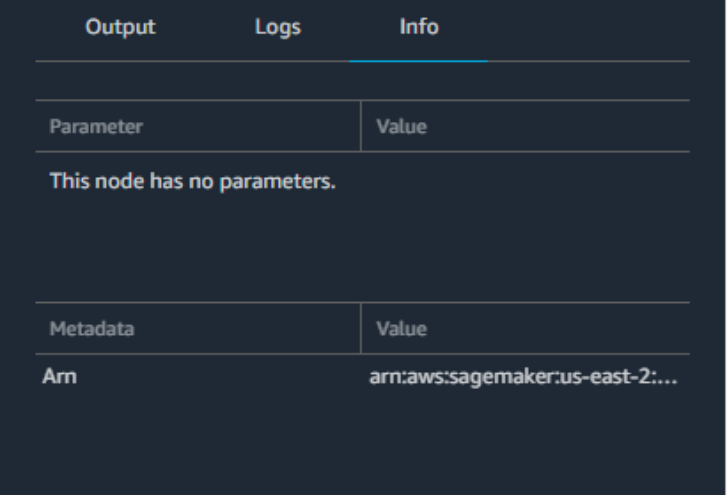

Download a pipeline definition file

You can download the definition file for your SageMaker AI pipeline directly from the Amazon
SageMaker Studio UI. You can use this pipeline definition file for:

• Backup and restoration: Use the downloaded file to create a backup of your pipeline
configuration, which you can restore in case of infrastructure failures or accidental changes.

• Version control: Store the pipeline definition file in a source control system to track changes to
the pipeline and revert to previous versions if needed.

• Programmatic interactions: Use the pipeline definition file as input to the SageMaker SDK or
AWS CLI.

• Integration with automation processes: Integrate the pipeline definition into your CI/CD
workflows or other automation processes.

To download the definition file of a pipeline, complete the following steps based on whether you
use Studio or Studio Classic.

Studio

1.
Open the SageMaker Studio console by following the instructions in Launch Amazon
SageMaker Studio.

2.
In the left navigation pane, select Pipelines.

ML Pipelines
6755

## Page 785

Amazon SageMaker AI
Developer Guide

3.
(Optional) To filter the list of pipelines by name, enter a full or partial pipeline name in the
search field.

4.
Select a pipeline name. The Executions page opens and displays a list of pipeline

executions.

5.
Stay on the Executions page or choose the Graph, Information, or Parameters page to the
left of the pipeline executions table. You can download the pipeline definition from any of
these pages.

6.
At the top right of the page, choose the vertical ellipsis and choose Download pipeline
definition (JSON).

Studio Classic

1.
Sign in to Amazon SageMaker Studio Classic. For more information, see Launch Amazon

SageMaker Studio Classic.

2.
In the Studio Classic sidebar, choose the Home icon (

).

3.
Select Pipelines from the menu.

4.
To narrow the list of pipelines by name, enter a full or partial pipeline name in the search
field.

5.
Select a pipeline name.

6.
Choose the Settings tab.

7.
Choose Download pipeline definition file.

Access experiment data from a pipeline

Note

SageMaker Experiments is a feature provided in Studio Classic only.

When you create a pipeline and specify pipeline_experiment_config, Pipelines creates the following
SageMaker Experiments entities by default if they don't exist:

• An experiment for the pipeline

ML Pipelines
6756

## Page 786

Amazon SageMaker AI
Developer Guide

• A run group for every execution of the pipeline

• A run for each SageMaker AI job created in a pipeline step

For information about how experiments are integrated with pipelines, see Amazon SageMaker
Experiments Integration. For more information about SageMaker Experiments, see Amazon
SageMaker Experiments in Studio Classic.

You can get to the list of runs associated with a pipeline from either the pipeline executions list or
the experiments list.

To view the runs list from the pipeline executions list

1.
To view the pipeline executions list, follow the first five steps in the Studio Classic tab of View
the details of a pipeline.

2.
On the top right of the screen, choose the Filter icon

(

).

3.
Choose Experiment. If experiment integration wasn't deactivated when the pipeline was
created, the experiment name is displayed in the executions list.

Note

Experiments integration was introduced in v2.41.0 of the Amazon SageMaker Python
SDK. Pipelines created with an earlier version of the SDK aren't integrated with
experiments by default.

4.
Select the experiment of your choice to view run groups and runs related to that experiment.

To view the runs list from the experiments list

1.
In the left sidebar of Studio Classic, choose the Home icon (

).

2.
Select Experiments from the menu.

3.
Use search bar or Filter icon

(

)
to filter the list to experiments created by a pipeline.

ML Pipelines
6757

## Page 787

Amazon SageMaker AI
Developer Guide

4.
Open an experiment name and view a list of runs created by the pipeline.

Track the lineage of a pipeline

In this tutorial, you use Amazon SageMaker Studio to track the lineage of an Amazon SageMaker AI
ML Pipeline.

The pipeline was created by the Orchestrating Jobs with Amazon SageMaker Model Building
Pipelines notebook in the Amazon SageMaker example GitHub repository. For detailed information
on how the pipeline was created, see Define a pipeline.

Lineage tracking in Studio is centered around a directed acyclic graph (DAG). The DAG represents
the steps in a pipeline. From the DAG you can track the lineage from any step to any other step.
The following diagram displays the steps in the pipeline. These steps appear as a DAG in Studio.

To track the lineage of a pipeline in the Amazon SageMaker Studio console, complete the following
steps based on whether you use Studio or Studio Classic.

Studio

To track the lineage of a pipeline

1.
Open the SageMaker Studio console by following the instructions in Launch Amazon
SageMaker Studio.

2.
In the left navigation pane, select Pipelines.

3.
(Optional) To filter the list of pipelines by name, enter a full or partial pipeline name in the
search field.

4.
In the Name column, select a pipeline name to view details about the pipeline.

5.
Choose the Executions tab.

6.
In the Name column of the Executions table, select the name of a pipeline execution to
view.

ML Pipelines
6758

## Page 788

Amazon SageMaker AI
Developer Guide

7.
At the top right of the Executions page, choose the vertical ellipsis and choose Download
pipeline definition (JSON). You can view the file to see how the pipeline graph was
defined.

8.
Choose Edit to open the Pipeline Designer.

9.
Use the resizing and zoom controls at the top right corner of the canvas to zoom in and out
of the graph, fit the graph to screen, or expand the graph to full screen.

10. To view your training, validation, and test datasets, complete the following steps:

a.
Choose the Processing step in your pipeline graph.

b.
In the right sidebar, choose the Overview tab.

c.
In the Files section, find the Amazon S3 paths to the training, validation, and test
datasets.

11. To view your model artifacts, complete the following steps:

a.
Choose the Training step in your pipeline graph.

b.
In the right sidebar, choose the Overview tab.

c.
In the Files section, find the Amazon S3 paths to the model artifact.

12. To find the model package ARN, complete the following steps:

a.
Choose the Register model step.

b.
In the right sidebar, choose the Overview tab.

c.
In the Files section, find the ARN of the model package.

Studio Classic

To track the lineage of a pipeline

1.
Sign in to Amazon SageMaker Studio Classic. For more information, see Launch Amazon
SageMaker Studio Classic.

2.
In the left sidebar of Studio, choose the Home icon (

).

3.
In the menu, select Pipelines.

4.
Use the Search box to filter the pipelines list.

ML Pipelines
6759

## Page 789

Amazon SageMaker AI
Developer Guide

5.
Choose the AbalonePipeline pipeline to view the execution list and other details about
the pipeline.

6.
Choose the Property Inspector icon

(

)
in the right sidebar to open the TABLE PROPERTIES pane, where you can choose which
properties to view.

7.
Choose the Settings tab and then choose Download pipeline definition file. You can view
the file to see how the pipeline graph was defined.

8.
On the Execution tab, select the first row in the execution list to view its execution graph
and other details about the execution. Note that the graph matches the diagram displayed
at the beginning of the tutorial.

Use the resizing icons on the lower-right side of the graph to zoom in and out of the graph,
fit the graph to screen, or expand the graph to full screen. To focus on a specific part of the
graph, you can select a blank area of the graph and drag the graph to center on that area.
The inset on the lower-right side of the graph displays your location in the graph.

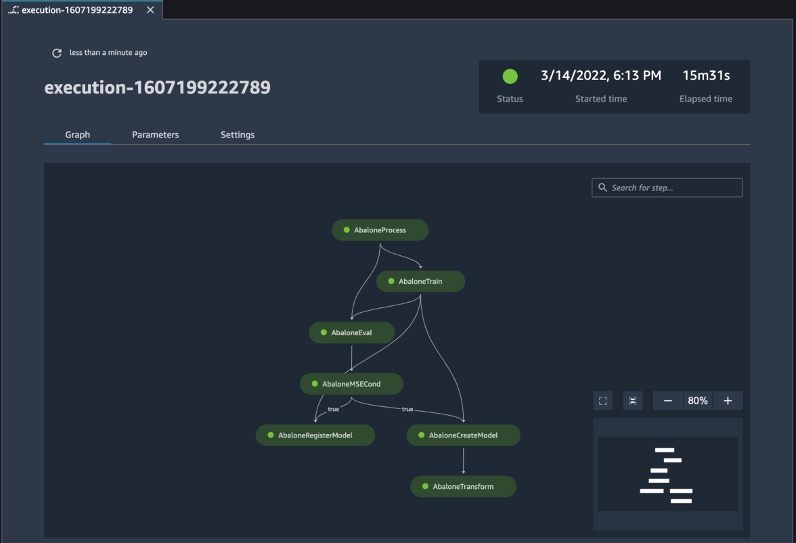

ML Pipelines
6760

## Page 790

Amazon SageMaker AI
Developer Guide

9.
On the Graph tab, choose the AbaloneProcess step to view details about the step.

10. Find the Amazon S3 paths to the training, validation, and test datasets in the Output tab,

under Files.

Note

To get the full paths, right-click the path and then choose Copy cell contents.

s3://sagemaker-eu-west-1-acct-id/sklearn-abalone-
process-2020-12-05-17-28-28-509/output/train
s3://sagemaker-eu-west-1-acct-id/sklearn-abalone-
process-2020-12-05-17-28-28-509/output/validation
s3://sagemaker-eu-west-1-acct-id/sklearn-abalone-
process-2020-12-05-17-28-28-509/output/test

11. Choose the AbaloneTrain step.

12. Find the Amazon S3 path to the model artifact in the Output tab, under Files:

s3://sagemaker-eu-west-1-acct-id/AbaloneTrain/pipelines-6locnsqz4bfu-
AbaloneTrain-NtfEpI0Ahu/output/model.tar.gz

13. Choose the AbaloneRegisterModel step.

14. Find the ARN of the model package in the Output tab, under Files:

arn:aws:sagemaker:eu-west-1:acct-id:model-package/abalonemodelpackagegroupname/2

Kubernetes Orchestration

You can orchestrate your SageMaker training and inference jobs with SageMaker AI Operators for
Kubernetes and SageMaker AI Components for Kubeflow Pipelines. SageMaker AI Operators for
Kubernetes make it easier for developers and data scientists using Kubernetes to train, tune, and
deploy machine learning (ML) models in SageMaker AI. SageMaker AI Components for Kubeflow
Pipelines allow you to move your data processing and training jobs from the Kubernetes cluster to
SageMaker AI’s machine learning-optimized managed service.

Contents

Kubernetes Orchestration
6761

## Page 791

Amazon SageMaker AI
Developer Guide

• SageMaker AI Operators for Kubernetes

• SageMaker AI Components for Kubeflow Pipelines

SageMaker AI Operators for Kubernetes

SageMaker AI Operators for Kubernetes make it easier for developers and data scientists using
Kubernetes to train, tune, and deploy machine learning (ML) models in SageMaker AI. You can
install these SageMaker AI Operators on your Kubernetes cluster in Amazon Elastic Kubernetes
Service (Amazon EKS) to create SageMaker AI jobs natively using the Kubernetes API and

command-line Kubernetes tools such as kubectl. This guide shows how to set up and use the
operators to run model training, hyperparameter tuning, or inference (real-time and batch) on
SageMaker AI from a Kubernetes cluster. The procedures and guidelines in this chapter assume that
you are familiar with Kubernetes and its basic commands.

Important

We are stopping the development and technical support of the original version of
SageMaker Operators for Kubernetes.

If you are currently using version v1.2.2 or below of  SageMaker Operators for
Kubernetes, we recommend migrating your resources to the ACK service controller
for Amazon SageMaker. The ACK service controller is a new generation of SageMaker
Operators for Kubernetes based on AWS Controllers for Kubernetes (ACK).
For information on the migration steps, see Migrate resources to the latest Operators.
For answers to frequently asked questions on the end of support of the original version of
SageMaker Operators for Kubernetes, see Announcing the End of Support of the Original
Version of SageMaker AI Operators for Kubernetes

Note

There is no additional charge to use these operators. You do incur charges for any
SageMaker AI resources that you use through these operators.

Kubernetes Orchestration
6762

## Page 792

Amazon SageMaker AI
Developer Guide

What is an operator?

A Kubernetes operator is an application controller managing applications on behalf of a
Kubernetes user. Controllers of the control plane encompass various control loops listening to
a central state manager (ETCD) to regulate the state of the application they control. Examples

of such applications include the Cloud-controller-manager and kube-controller-manager.
Operators typically provide a higher-level abstraction than raw Kubernetes API, making it easier for
users to deploy and manage applications. To add new capabilities to Kubernetes, developers can
extend the Kubernetes API by creating a custom resource that contains their application-specific
or domain-specific logic and components. Operators in Kubernetes allow users to natively invoke
these custom resources and automate associated workflows.

How does AWS Controllers for Kubernetes (ACK) work?

The SageMaker AI Operators for Kubernetes allow you to manage jobs in SageMaker AI from your
Kubernetes cluster. The latest version of SageMaker AI Operators for Kubernetes is based on AWS
Controllers for Kubernetes (ACK). ACK includes a common controller runtime, a code generator, and
a set of AWS service-specific controllers, one of which is the SageMaker AI controller.

The following diagram illustrates how ACK works.


Kubernetes Orchestration
6763

## Page 793

Amazon SageMaker AI
Developer Guide

In this diagram, a Kubernetes user wants to run model training on SageMaker AI from within the

Kubernetes cluster using the Kubernetes API. The user issues a call to kubectl apply, passing
in a file that describes a Kubernetes custom resource describing the SageMaker training job.

kubectl apply passes this file, called a manifest, to the Kubernetes API server running in the

Kubernetes controller node (Step 1 in the workflow diagram). The Kubernetes API server receives
the manifest with the SageMaker training job specification and determines whether the user has

permissions to create a custom resource of kind sageMaker.services.k8s.aws/TrainingJob,
and whether the custom resource is properly formatted (Step 2). If the user is authorized and
the custom resource is valid, the Kubernetes API server writes (Step 3) the custom resource
to its etcd data store and then responds back (Step 4) to the user that the custom resource
has been created. The SageMaker AI controller, which is running on a Kubernetes worker node
within the context of a normal Kubernetes Pod, is notified (Step 5) that a new custom resource

of kind sageMaker.services.k8s.aws/TrainingJob has been created. The SageMaker
AI controller then communicates (Step 6) with the SageMaker API, calling the SageMaker AI

CreateTrainingJob API to create the training job in AWS. After communicating with the
SageMaker API, the SageMaker AI controller calls the Kubernetes API server to update (Step 7)
the custom resource’s status with information it received from SageMaker AI. The SageMaker
AI controller therefore provides the same information to the developers that they would have
received using the AWS SDK.

Permissions overview

The operators access SageMaker AI resources on your behalf. The IAM role that the operator
assumes to interact with AWS resources differs from the credentials you use to access the
Kubernetes cluster. The role also differs from the role that AWS assumes when running your
machine learning jobs.

The following image explains the various authentication layers.

Kubernetes Orchestration
6764

## Page 794

Amazon SageMaker AI
Developer Guide


Latest SageMaker AI Operators for Kubernetes

This section is based on the latest version of SageMaker AI Operators for Kubernetes using AWS
Controllers for Kubernetes (ACK).

Kubernetes Orchestration
6765

## Page 795

Amazon SageMaker AI
Developer Guide

Important

If you are currently using version v1.2.2 or below of  SageMaker Operators for
Kubernetes, we recommend migrating your resources to the ACK service controller
for Amazon SageMaker. The ACK service controller is a new generation of SageMaker
Operators for Kubernetes based on AWS Controllers for Kubernetes (ACK).
For information on the migration steps, see Migrate resources to the latest Operators.
For answers to frequently asked questions on the end of support of the original version of
SageMaker Operators for Kubernetes, see Announcing the End of Support of the Original
Version of SageMaker AI Operators for Kubernetes

The latest version of SageMaker AI Operators for Kubernetes is based on AWS Controllers for
Kubernetes (ACK), a framework for building Kubernetes custom controllers where each controller
communicates with an AWS service API. These controllers allow Kubernetes users to provision AWS
resources like databases or message queues using the Kubernetes API.

Use the following steps to install and use ACK to train, tune, and deploy machine learning models
with Amazon SageMaker AI.

Contents

• Install SageMaker AI Operators for Kubernetes

• Use SageMaker AI Operators for Kubernetes

• Reference

Install SageMaker AI Operators for Kubernetes

To set up the latest available version of SageMaker AI Operators for Kubernetes, see the Setup
section in  Machine Learning with the ACK SageMaker AI Controller.

Use SageMaker AI Operators for Kubernetes

For a tutorial on how to train a machine learning model with the ACK service controller for Amazon
SageMaker AI using Amazon EKS, see Machine Learning with the ACK SageMaker AI Controller.

For an autoscaling example, see  Scale SageMaker AI Workloads with Application Auto Scaling

Kubernetes Orchestration
6766

## Page 796

Amazon SageMaker AI
Developer Guide

Reference

See also the ACK service controller for Amazon SageMaker AI GitHub repository or read AWS
Controllers for Kubernetes Documentation.

Old SageMaker AI Operators for Kubernetes

This section is based on the original version of SageMaker AI Operators for Kubernetes.

Important

We are stopping the development and technical support of the original version of
SageMaker Operators for Kubernetes.

If you are currently using version v1.2.2 or below of  SageMaker Operators for
Kubernetes, we recommend migrating your resources to the ACK service controller
for Amazon SageMaker. The ACK service controller is a new generation of SageMaker
Operators for Kubernetes based on AWS Controllers for Kubernetes (ACK).
For information on the migration steps, see Migrate resources to the latest Operators.
For answers to frequently asked questions on the end of support of the original version of
SageMaker Operators for Kubernetes, see Announcing the End of Support of the Original
Version of SageMaker AI Operators for Kubernetes

Contents

• Install SageMaker AI Operators for Kubernetes

• Use Amazon SageMaker AI Jobs

• Migrate resources to the latest Operators

• Announcing the End of Support of the Original Version of SageMaker AI Operators for
Kubernetes

Install SageMaker AI Operators for Kubernetes

Use the following steps to install and use SageMaker AI Operators for Kubernetes to train, tune,
and deploy machine learning models with Amazon SageMaker AI.

Contents

• IAM role-based setup and operator deployment

Kubernetes Orchestration
6767

## Page 797

Amazon SageMaker AI
Developer Guide

• Clean up resources

• Delete operators

• Troubleshooting

• Images and SMlogs in each Region

IAM role-based setup and operator deployment

The following sections describe the steps to set up and deploy the original version of the operator.

Warning

Reminder: The following steps do not install the latest version of SageMaker AI Operators
for Kubernetes. To install the new ACK-based SageMaker AI Operators for Kubernetes, see
Latest SageMaker AI Operators for Kubernetes.

Prerequisites

This guide assumes that you have completed the following prerequisites:

• Install the following tools on the client machine used to access your Kubernetes cluster:

• kubectl Version 1.13 or later. Use a kubectl version that is within one minor version of your

Amazon EKS cluster control plane. For example, a 1.13 kubectl client works with Kubernetes
1.13 and 1.14 clusters. OpenID Connect (OIDC) is not supported in versions earlier than 1.13.

• eksctl Version 0.7.0 or later

• AWS CLI Version 1.16.232 or later

• (optional) Helm Version 3.0 or later

• aws-iam-authenticator

• Have IAM permissions to create roles and attach policies to roles.

• Created a Kubernetes cluster on which to run the operators. It should either be Kubernetes

version 1.13 or 1.14. For automated cluster creation using eksctl, see Getting Started with
eksctl. It takes 20–30 minutes to provision a cluster.

Cluster-scoped deployment

Before you can deploy your operator using an IAM role, associate an OpenID Connect (OIDC)
Identity Provider (IdP) with your role to authenticate with the IAM service.

Kubernetes Orchestration
6768

## Page 798

Amazon SageMaker AI
Developer Guide

Create an OIDC provider for your cluster

The following instructions show how to create and associate an OIDC provider with your Amazon
EKS cluster.

1.
Set the local CLUSTER_NAME and AWS_REGION environment variables as follows:

# Set the Region and cluster
export CLUSTER_NAME="<your cluster name>"
export AWS_REGION="<your region>"

2.
Use the following command to associate the OIDC provider with your cluster. For more
information, see Enabling IAM Roles for Service Accounts on your Cluster.

eksctl utils associate-iam-oidc-provider --cluster ${CLUSTER_NAME} \
--region ${AWS_REGION} --approve

Your output should look like the following:

[_]  eksctl version 0.10.1
[_]  using region us-east-1
[_]  IAM OpenID Connect provider is associated with cluster "my-cluster" in "us-
east-1"

Now that the cluster has an OIDC identity provider, you can create a role and give a Kubernetes
ServiceAccount permission to assume the role.

Get the OIDC ID

To set up the ServiceAccount, obtain the OIDC issuer URL using the following command:

aws eks describe-cluster --name ${CLUSTER_NAME} --region ${AWS_REGION} \
--query cluster.identity.oidc.issuer --output text

The command returns a URL like the following:

https://oidc.eks.${AWS_REGION}.amazonaws.com/id/D48675832CA65BD10A532F597OIDCID

In this URL, the value D48675832CA65BD10A532F597OIDCID is the OIDC ID. The OIDC ID for your
cluster is different. You need this OIDC ID value to create a role.

Kubernetes Orchestration
6769

## Page 799

Amazon SageMaker AI
Developer Guide

If your output is None, it means that your client version is old. To work around this, run the
following command:

aws eks describe-cluster --region ${AWS_REGION} --query cluster --name ${CLUSTER_NAME}

--output text | grep OIDC

The OIDC URL is returned as follows:

OIDC https://oidc.eks.us-east-1.amazonaws.com/id/D48675832CA65BD10A532F597OIDCID

Create an IAM role

1.
Create a file named trust.json and insert the following trust relationship code block into it.

Be sure to replace all <OIDC ID>, <AWS account number>, and <EKS Cluster region>
placeholders with values corresponding to your cluster.

JSON

{
"Version":"2012-10-17",
"Statement": [
{
"Effect": "Allow",
"Principal": {
"Federated": "arn:aws:iam::111122223333:oidc-provider/oidc.eks.<EKS
Cluster region>.amazonaws.com/id/<OIDC ID>"
},
"Action": "sts:AssumeRoleWithWebIdentity",
"Condition": {
"StringEquals": {
"oidc.eks.<EKS Cluster region>.amazonaws.com/id/<OIDC ID>:aud":
"sts.amazonaws.com",
"oidc.eks.<EKS Cluster region>.amazonaws.com/id/<OIDC ID>:sub":
"system:serviceaccount:sagemaker-k8s-operator-system:sagemaker-k8s-operator-
default"
}
}
}
]
}

Kubernetes Orchestration
6770

## Page 800

Amazon SageMaker AI
Developer Guide

JSON

{
"Version":"2012-10-17",
"Statement": [
{
"Effect": "Allow",
"Principal": {
"Federated": "arn:aws-cn:iam::111122223333:oidc-provider/
oidc.eks.<EKS Cluster region>.amazonaws.com/id/<OIDC ID>"
},
"Action": "sts:AssumeRoleWithWebIdentity",
"Condition": {
"StringEquals": {
"oidc.eks.<EKS Cluster region>.amazonaws.com/id/<OIDC ID>:aud":
"sts.amazonaws.com",

"oidc.eks.<EKS Cluster region>.amazonaws.com/id/<OIDC ID>:sub":
"system:serviceaccount:sagemaker-k8s-operator-system:sagemaker-k8s-operator-
default"
}
}
}
]
}

2.
Run the following command to create a role with the trust relationship defined in

trust.json. This role allows the Amazon EKS cluster to get and refresh credentials from IAM.

aws iam create-role --region ${AWS_REGION} --role-name <role name> --assume-role-
policy-document file://trust.json --output=text

Your output should look like the following:

ROLE    arn:aws:iam::123456789012:role/my-role 2019-11-22T21:46:10Z    /
ABCDEFSFODNN7EXAMPLE   my-role
ASSUMEROLEPOLICYDOCUMENT        2012-10-17
STATEMENT       sts:AssumeRoleWithWebIdentity   Allow
STRINGEQUALS    sts.amazonaws.com       system:serviceaccount:sagemaker-k8s-
operator-system:sagemaker-k8s-operator-default

Kubernetes Orchestration
6771

## Page 801

Amazon SageMaker AI
Developer Guide

PRINCIPAL       arn:aws:iam::123456789012:oidc-provider/oidc.eks.us-
east-1.amazonaws.com/id/

Take note of ROLE ARN; you pass this value to your operator.

Attach the AmazonSageMakerFullAccess policy to the role

To give the role access to SageMaker AI, attach the AmazonSageMakerFullAccess policy. If you want
to limit permissions to the operator, you can create your own custom policy and attach it.

To attach AmazonSageMakerFullAccess, run the following command:

aws iam attach-role-policy --role-name <role name>  --policy-arn
arn:aws:iam::aws:policy/AmazonSageMakerFullAccess

The Kubernetes ServiceAccount sagemaker-k8s-operator-default should have

AmazonSageMakerFullAccess permissions. Confirm this when you install the operator.

Deploy the operator

When deploying your operator, you can use either a YAML file or Helm charts.

Deploy the operator using YAML

This is the simplest way to deploy your operators. The process is as follows:

1.
Download the installer script using the following command:

wget https://raw.githubusercontent.com/aws/amazon-sagemaker-operator-for-k8s/
master/release/rolebased/installer.yaml

2.
Edit the installer.yaml file to replace eks.amazonaws.com/role-arn. Replace the ARN
here with the Amazon Resource Name (ARN) for the OIDC-based role you’ve created.

3.
Use the following command to deploy the cluster:

kubectl apply -f installer.yaml

Deploy the operator using Helm Charts

Use the provided Helm Chart to install the operator.

Kubernetes Orchestration
6772

## Page 802

Amazon SageMaker AI
Developer Guide

1.
Clone the Helm installer directory using the following command:

git clone https://github.com/aws/amazon-sagemaker-operator-for-k8s.git

2.
Navigate to the amazon-sagemaker-operator-for-k8s/hack/charts/installer

folder. Edit the rolebased/values.yaml file, which includes high-level parameters for the
chart. Replace the role ARN here with the Amazon Resource Name (ARN) for the OIDC-based
role you've created.

3.
Install the Helm Chart using the following command:

kubectl create namespace sagemaker-k8s-operator-system
helm install --namespace sagemaker-k8s-operator-system sagemaker-operator
rolebased/

If you decide to install the operator into a namespace other than the one specified, you need

to adjust the namespace defined in the IAM role trust.json file to match.

4.
After a moment, the chart is installed with a randomly generated name. Verify that the
installation succeeded by running the following command:

helm ls

Your output should look like the following:

NAME                    NAMESPACE                       REVISION        UPDATED
STATUS          CHART                           APP
VERSION
sagemaker-operator      sagemaker-k8s-operator-system   1
2019-11-20 23:14:59.6777082 +0000 UTC   deployed        sagemaker-k8s-
operator-0.1.0

Verify the operator deployment

1.
You should be able to see the SageMaker AI Custom Resource Definitions (CRDs) for each
operator deployed to your cluster by running the following command:

kubectl get crd | grep sagemaker

Kubernetes Orchestration
6773

## Page 803

Amazon SageMaker AI
Developer Guide

Your output should look like the following:

batchtransformjobs.sagemaker.aws.amazon.com         2019-11-20T17:12:34Z
endpointconfigs.sagemaker.aws.amazon.com            2019-11-20T17:12:34Z
hostingdeployments.sagemaker.aws.amazon.com         2019-11-20T17:12:34Z
hyperparametertuningjobs.sagemaker.aws.amazon.com   2019-11-20T17:12:34Z
models.sagemaker.aws.amazon.com                     2019-11-20T17:12:34Z
trainingjobs.sagemaker.aws.amazon.com               2019-11-20T17:12:34Z

2.
Ensure that the operator pod is running successfully. Use the following command to list all
pods:

kubectl -n sagemaker-k8s-operator-system get pods

You should see a pod named sagemaker-k8s-operator-controller-manager-***** in

the namespace sagemaker-k8s-operator-system as follows:

NAME                                                         READY   STATUS
RESTARTS   AGE
sagemaker-k8s-operator-controller-manager-12345678-r8abc     2/2     Running   0
23s

Namespace-scoped deployment

You have the option to install your operator within the scope of an individual Kubernetes
namespace. In this mode, the controller only monitors and reconciles resources with SageMaker AI
if the resources are created within that namespace. This allows for finer-grained control over which
controller is managing which resources. This is useful for deploying to multiple AWS accounts or
controlling which users have access to particular jobs.

This guide outlines how to install an operator into a particular, predefined namespace. To deploy
a controller into a second namespace, follow the guide from beginning to end and change out the
namespace in each step.

Create an OIDC provider for your Amazon EKS cluster

The following instructions show how to create and associate an OIDC provider with your Amazon
EKS cluster.

Kubernetes Orchestration
6774

## Page 804

Amazon SageMaker AI
Developer Guide

1.
Set the local CLUSTER_NAME and AWS_REGION environment variables as follows:

# Set the Region and cluster
export CLUSTER_NAME="<your cluster name>"
export AWS_REGION="<your region>"

2.
Use the following command to associate the OIDC provider with your cluster. For more
information, see Enabling IAM Roles for Service Accounts on your Cluster.

eksctl utils associate-iam-oidc-provider --cluster ${CLUSTER_NAME} \
--region ${AWS_REGION} --approve

Your output should look like the following:

[_]  eksctl version 0.10.1
[_]  using region us-east-1
[_]  IAM OpenID Connect provider is associated with cluster "my-cluster" in "us-
east-1"

Now that the cluster has an OIDC identity provider, create a role and give a Kubernetes
ServiceAccount permission to assume the role.

Get your OIDC ID

To set up the ServiceAccount, first obtain the OpenID Connect issuer URL using the following
command:

aws eks describe-cluster --name ${CLUSTER_NAME} --region ${AWS_REGION} \
--query cluster.identity.oidc.issuer --output text

The command returns a URL like the following:

https://oidc.eks.${AWS_REGION}.amazonaws.com/id/D48675832CA65BD10A532F597OIDCID

In this URL, the value D48675832CA65BD10A532F597OIDCID is the OIDC ID. The OIDC ID for your
cluster is different. You need this OIDC ID value to create a role.

If your output is None, it means that your client version is old. To work around this, run the
following command:

Kubernetes Orchestration
6775

## Page 805

Amazon SageMaker AI
Developer Guide

aws eks describe-cluster --region ${AWS_REGION} --query cluster --name ${CLUSTER_NAME}
--output text | grep OIDC

The OIDC URL is returned as follows:

OIDC https://oidc.eks.us-east-1.amazonaws.com/id/D48675832CA65BD10A532F597OIDCID

Create your IAM role

1.
Create a file named trust.json and insert the following trust relationship code block into it.

Be sure to replace all <OIDC ID>, <AWS account number>, <EKS Cluster region>, and

<Namespace> placeholders with values corresponding to your cluster. For the purposes of this

guide, my-namespace is used for the <Namespace> value.

JSON

{
"Version":"2012-10-17",
"Statement": [
{
"Effect": "Allow",
"Principal": {
"Federated": "arn:aws:iam::111122223333:oidc-provider/oidc.eks.<EKS
Cluster region>.amazonaws.com/id/<OIDC ID>"
},
"Action": "sts:AssumeRoleWithWebIdentity",
"Condition": {
"StringEquals": {
"oidc.eks.<EKS Cluster region>.amazonaws.com/id/<OIDC ID>:aud":
"sts.amazonaws.com",
"oidc.eks.<EKS Cluster region>.amazonaws.com/id/<OIDC ID>:sub":
"system:serviceaccount:<Namespace>:sagemaker-k8s-operator-default"
}
}
}
]
}

Kubernetes Orchestration
6776

## Page 806

Amazon SageMaker AI
Developer Guide

JSON

{
"Version":"2012-10-17",
"Statement": [
{
"Effect": "Allow",
"Principal": {
"Federated": "arn:aws-cn:iam::111122223333:oidc-provider/
oidc.eks.<EKS Cluster region>.amazonaws.com/id/<OIDC ID>"
},
"Action": "sts:AssumeRoleWithWebIdentity",
"Condition": {
"StringEquals": {
"oidc.eks.<EKS Cluster region>.amazonaws.com/id/<OIDC ID>:aud":
"sts.amazonaws.com",

"oidc.eks.<EKS Cluster region>.amazonaws.com/id/<OIDC ID>:sub":
"system:serviceaccount:<Namespace>:sagemaker-k8s-operator-default"
}
}
}
]
}

2.
Run the following command to create a role with the trust relationship defined in

trust.json. This role allows the Amazon EKS cluster to get and refresh credentials from IAM.

aws iam create-role --region ${AWS_REGION} --role-name <role name> --assume-role-
policy-document file://trust.json --output=text

Your output should look like the following:

ROLE    arn:aws:iam::123456789012:role/my-role 2019-11-22T21:46:10Z    /
ABCDEFSFODNN7EXAMPLE   my-role
ASSUMEROLEPOLICYDOCUMENT        2012-10-17
STATEMENT       sts:AssumeRoleWithWebIdentity   Allow
STRINGEQUALS    sts.amazonaws.com       system:serviceaccount:my-
namespace:sagemaker-k8s-operator-default

Kubernetes Orchestration
6777

## Page 807

Amazon SageMaker AI
Developer Guide

PRINCIPAL       arn:aws:iam::123456789012:oidc-provider/oidc.eks.us-
east-1.amazonaws.com/id/

Take note of ROLE ARN. You pass this value to your operator.

Attach the AmazonSageMakerFullAccess policy to your role

To give the role access to SageMaker AI, attach the AmazonSageMakerFullAccess policy. If you
want to limit permissions to the operator, you can create your own custom policy and attach it.

To attach AmazonSageMakerFullAccess, run the following command:

aws iam attach-role-policy --role-name <role name>  --policy-arn
arn:aws:iam::aws:policy/AmazonSageMakerFullAccess

The Kubernetes ServiceAccount sagemaker-k8s-operator-default should have

AmazonSageMakerFullAccess permissions. Confirm this when you install the operator.

Deploy the operator to your namespace

When deploying your operator, you can use either a YAML file or Helm charts.

Deploy the operator to your namespace using YAML

There are two parts to deploying an operator within the scope of a namespace. The first is the set
of CRDs that are installed at a cluster level. These resource definitions only need to be installed
once per Kubernetes cluster. The second part is the operator permissions and deployment itself.

If you have not already installed the CRDs into the cluster, apply the CRD installer YAML using the
following command:

kubectl apply -f https://raw.githubusercontent.com/aws/amazon-sagemaker-operator-for-
k8s/master/release/rolebased/namespaced/crd.yaml

To install the operator onto the cluster:

1.
Download the operator installer YAML using the following command:

wget https://raw.githubusercontent.com/aws/amazon-sagemaker-operator-for-k8s/
master/release/rolebased/namespaced/operator.yaml

Kubernetes Orchestration
6778

## Page 808

Amazon SageMaker AI
Developer Guide

2.
Update the installer YAML to place the resources into your specified namespace using the
following command:

sed -i -e 's/PLACEHOLDER-NAMESPACE/<YOUR NAMESPACE>/g' operator.yaml

3.
Edit the operator.yaml file to place resources into your eks.amazonaws.com/role-arn.
Replace the ARN here with the Amazon Resource Name (ARN) for the OIDC-based role you've

created.

4.
Use the following command to deploy the cluster:

kubectl apply -f operator.yaml

Deploy the operator to your namespace using Helm Charts

There are two parts needed to deploy an operator within the scope of a namespace. The first is the
set of CRDs that are installed at a cluster level. These resource definitions only need to be installed
once per Kubernetes cluster. The second part is the operator permissions and deployment itself.

When using Helm Charts you have to first create the namespace using kubectl.

1.
Clone the Helm installer directory using the following command:

git clone https://github.com/aws/amazon-sagemaker-operator-for-k8s.git

2.
Navigate to the amazon-sagemaker-operator-for-k8s/hack/charts/installer/

namespaced folder. Edit the rolebased/values.yaml file, which includes high-level
parameters for the chart. Replace the role ARN here with the Amazon Resource Name (ARN)
for the OIDC-based role you've created.

3.
Install the Helm Chart using the following command:

helm install crds crd_chart/

4.
Create the required namespace and install the operator using the following command:

kubectl create namespace <namespace>
helm install --n <namespace> op operator_chart/

5.
After a moment, the chart is installed with the name sagemaker-operator. Verify that the
installation succeeded by running the following command:

Kubernetes Orchestration
6779

## Page 809

Amazon SageMaker AI
Developer Guide

helm ls

Your output should look like the following:

NAME                    NAMESPACE                       REVISION        UPDATED
STATUS          CHART                           APP
VERSION

sagemaker-operator      my-namespace                    1               2019-11-20
23:14:59.6777082 +0000 UTC   deployed        sagemaker-k8s-operator-0.1.0

Verify the operator deployment to your namespace

1.
You should be able to see the SageMaker AI Custom Resource Definitions (CRDs) for each
operator deployed to your cluster by running the following command:

kubectl get crd | grep sagemaker

Your output should look like the following:

batchtransformjobs.sagemaker.aws.amazon.com         2019-11-20T17:12:34Z
endpointconfigs.sagemaker.aws.amazon.com            2019-11-20T17:12:34Z
hostingdeployments.sagemaker.aws.amazon.com         2019-11-20T17:12:34Z
hyperparametertuningjobs.sagemaker.aws.amazon.com   2019-11-20T17:12:34Z
models.sagemaker.aws.amazon.com                     2019-11-20T17:12:34Z
trainingjobs.sagemaker.aws.amazon.com               2019-11-20T17:12:34Z

2.
Ensure that the operator pod is running successfully. Use the following command to list all
pods:

kubectl -n my-namespace get pods

You should see a pod named sagemaker-k8s-operator-controller-manager-***** in

the namespace my-namespace as follows:

NAME                                                         READY   STATUS
RESTARTS   AGE

Kubernetes Orchestration
6780

## Page 810

Amazon SageMaker AI
Developer Guide

sagemaker-k8s-operator-controller-manager-12345678-r8abc     2/2     Running   0
23s

Install the SageMaker AI logs kubectl plugin

As part of the SageMaker AI Operators for Kubernetes, you can use the smlogs plugin for

kubectl. This allows SageMaker AI CloudWatch logs to be streamed with kubectl. kubectl

must be installed onto your PATH. The following commands place the binary in the sagemaker-

k8s-bin directory in your home directory, and add that directory to your PATH.

export os="linux"
wget https://amazon-sagemaker-operator-for-k8s-us-east-1.s3.amazonaws.com/kubectl-
smlogs-plugin/v1/${os}.amd64.tar.gz

tar xvzf ${os}.amd64.tar.gz
# Move binaries to a directory in your homedir.
mkdir ~/sagemaker-k8s-bin
cp ./kubectl-smlogs.${os}.amd64/kubectl-smlogs ~/sagemaker-k8s-bin/.
# This line adds the binaries to your PATH in your .bashrc.
echo 'export PATH=$PATH:~/sagemaker-k8s-bin' >> ~/.bashrc
# Source your .bashrc to update environment variables:
source ~/.bashrc

Use the following command to verify that the kubectl plugin is installed correctly:

kubectl smlogs

If the kubectl plugin is installed correctly, your output should look like the following:

View SageMaker AI logs via Kubernetes
Usage:
smlogs [command]
Aliases:
smlogs, SMLogs, Smlogs

Kubernetes Orchestration
6781

## Page 811

Amazon SageMaker AI
Developer Guide

Available Commands:
BatchTransformJob       View BatchTransformJob logs via Kubernetes
TrainingJob             View TrainingJob logs via Kubernetes
help                    Help about any command
Flags:
-h, --help   help for smlogs
Use "smlogs [command] --help" for more information about a command.

Clean up resources

To uninstall the operator from your cluster, you must first make sure to delete all SageMaker AI
resources from the cluster. Failure to do so causes the operator delete operation to hang. Run the
following commands to stop all jobs:

# Delete all SageMaker AI jobs from Kubernetes
kubectl delete --all --all-namespaces hyperparametertuningjob.sagemaker.aws.amazon.com
kubectl delete --all --all-namespaces trainingjobs.sagemaker.aws.amazon.com
kubectl delete --all --all-namespaces batchtransformjob.sagemaker.aws.amazon.com
kubectl delete --all --all-namespaces hostingdeployment.sagemaker.aws.amazon.com

You should see output similar to the following:

$ kubectl delete --all --all-namespaces trainingjobs.sagemaker.aws.amazon.com
trainingjobs.sagemaker.aws.amazon.com "xgboost-mnist-from-for-s3" deleted
$ kubectl delete --all --all-namespaces
hyperparametertuningjob.sagemaker.aws.amazon.com
hyperparametertuningjob.sagemaker.aws.amazon.com "xgboost-mnist-hpo" deleted
$ kubectl delete --all --all-namespaces batchtransformjob.sagemaker.aws.amazon.com
batchtransformjob.sagemaker.aws.amazon.com "xgboost-mnist" deleted
$ kubectl delete --all --all-namespaces hostingdeployment.sagemaker.aws.amazon.com
hostingdeployment.sagemaker.aws.amazon.com "host-xgboost" deleted

After you delete all SageMaker AI jobs, see Delete operators to delete the operator from your
cluster.

Kubernetes Orchestration
6782

## Page 812

Amazon SageMaker AI
Developer Guide

Delete operators

Delete cluster-based operators

Operators installed using YAML

To uninstall the operator from your cluster, make sure that all SageMaker AI resources have been
deleted from the cluster. Failure to do so causes the operator delete operation to hang.

Note

Before deleting your cluster, be sure to delete all SageMaker AI resources from the cluster.
See Clean up resources for more information.

After you delete all SageMaker AI jobs, use kubectl to delete the operator from the cluster:

# Delete the operator and its resources
kubectl delete -f /installer.yaml

You should see output similar to the following:

$ kubectl delete -f raw-yaml/installer.yaml
namespace "sagemaker-k8s-operator-system" deleted
customresourcedefinition.apiextensions.k8s.io
"batchtransformjobs.sagemaker.aws.amazon.com" deleted
customresourcedefinition.apiextensions.k8s.io
"endpointconfigs.sagemaker.aws.amazon.com" deleted
customresourcedefinition.apiextensions.k8s.io
"hostingdeployments.sagemaker.aws.amazon.com" deleted
customresourcedefinition.apiextensions.k8s.io
"hyperparametertuningjobs.sagemaker.aws.amazon.com" deleted
customresourcedefinition.apiextensions.k8s.io "models.sagemaker.aws.amazon.com" deleted
customresourcedefinition.apiextensions.k8s.io "trainingjobs.sagemaker.aws.amazon.com"
deleted
role.rbac.authorization.k8s.io "sagemaker-k8s-operator-leader-election-role" deleted
clusterrole.rbac.authorization.k8s.io "sagemaker-k8s-operator-manager-role" deleted
clusterrole.rbac.authorization.k8s.io "sagemaker-k8s-operator-proxy-role" deleted
rolebinding.rbac.authorization.k8s.io "sagemaker-k8s-operator-leader-election-
rolebinding" deleted
clusterrolebinding.rbac.authorization.k8s.io "sagemaker-k8s-operator-manager-
rolebinding" deleted

Kubernetes Orchestration
6783

## Page 813

Amazon SageMaker AI
Developer Guide

clusterrolebinding.rbac.authorization.k8s.io "sagemaker-k8s-operator-proxy-rolebinding"
deleted
service "sagemaker-k8s-operator-controller-manager-metrics-service" deleted
deployment.apps "sagemaker-k8s-operator-controller-manager" deleted
secrets "sagemaker-k8s-operator-abcde" deleted

Operators installed using Helm Charts

To delete the operator CRDs, first delete all the running jobs. Then delete the Helm Chart that was
used to deploy the operators using the following commands:

# get the helm charts
helm ls
# delete the charts
helm delete <chart_name>

Delete namespace-based operators

Operators installed with YAML

To uninstall the operator from your cluster, first make sure that all SageMaker AI resources have
been deleted from the cluster. Failure to do so causes the operator delete operation to hang.

Note

Before deleting your cluster, be sure to delete all SageMaker AI resources from the cluster.
See Clean up resources for more information.

After you delete all SageMaker AI jobs, use kubectl to first delete the operator from the
namespace and then the CRDs from the cluster. Run the following commands to delete the
operator from the cluster:

# Delete the operator using the same yaml file that was used to install the operator
kubectl delete -f operator.yaml
# Now delete the CRDs using the CRD installer yaml
kubectl delete -f https://raw.githubusercontent.com/aws/amazon-sagemaker-operator-for-
k8s/master/release/rolebased/namespaced/crd.yaml

Kubernetes Orchestration
6784

## Page 814

Amazon SageMaker AI
Developer Guide

# Now you can delete the namespace if you want
kubectl delete namespace <namespace>

Operators installed with Helm Charts

To delete the operator CRDs, first delete all the running jobs. Then delete the Helm Chart that was
used to deploy the operators using the following commands:

# Delete the operator
helm delete <chart_name>
# delete the crds
helm delete crds
# optionally delete the namespace
kubectl delete namespace <namespace>

Troubleshooting

Debugging a failed job

Use these steps to debug a failed job.

• Check the job status by running the following:

kubectl get <CRD Type> <job name>

• If the job was created in SageMaker AI, you can use the following command to see the STATUS

and the SageMaker Job Name:

kubectl get <crd type> <job name>

• You can use smlogs to find the cause of the issue using the following command:

kubectl smlogs <crd type> <job name>

• You can also use the describe command to get more details about the job using the following

command. The output has an additional field that has more information about the status of
the job.

kubectl describe <crd type> <job name>

Kubernetes Orchestration
6785

## Page 815

Amazon SageMaker AI
Developer Guide

• If the job was not created in SageMaker AI, then use the logs of the operator's pod to find the
cause of the issue as follows:

$ kubectl get pods -A | grep sagemaker
# Output:
sagemaker-k8s-operator-system   sagemaker-k8s-operator-controller-manager-5cd7df4d74-
wh22z   2/2     Running   0          3h33m
$ kubectl logs -p <pod name> -c manager -n sagemaker-k8s-operator-system

Deleting an operator CRD

If deleting a job is not working, check if the operator is running. If the operator is not running, then
you have to delete the finalizer using the following steps:

1.
In a new terminal, open the job in an editor using kubectl edit as follows:

kubectl edit <crd type> <job name>

2.
Edit the job to delete the finalizer by removing the following two lines from the file. Save the
file and the job is be deleted.

finalizers:
- sagemaker-operator-finalizer

Images and SMlogs in each Region

The following table lists the available operator images and SMLogs in each Region.

RegionController Image
Linux SMLogs

us-
east-1

https://s3.us-east-1.amazonaws.com/amazon-s
agemaker-operator-for-k8s-us-east-1/kubectl-
smlogs-plugin/v1/linux.amd64.tar.gz

957583890962.dkr.ecr.us-

east-1.amazonaws.com/

amazon-sagemaker-o

perator-for-k8s:v1

Kubernetes Orchestration
6786

## Page 816

Amazon SageMaker AI
Developer Guide

RegionController Image
Linux SMLogs

us-
east-2

https://s3.us-east-2.amazonaws.com/amazon-s
agemaker-operator-for-k8s-us-east-2/kubectl-
smlogs-plugin/v1/linux.amd64.tar.gz

922499468684.dkr.ecr.us-

east-2.amazonaws.com/

amazon-sagemaker-o

perator-for-k8s:v1

us-
west-2

https://s3.us-west-2.amazonaws.com/amazon-s
agemaker-operator-for-k8s-us-west-2/kubectl-
smlogs-plugin/v1/linux.amd64.tar.gz

640106867763.dkr.ecr.us-

west-2.amazonaws.com/

amazon-sagemaker-o

perator-for-k8s:v1

eu-
west-1

https://s3.eu-west-1.amazonaws.com/amazon-s
agemaker-operator-for-k8s-eu-west-1/kubectl-
smlogs-plugin/v1/linux.amd64.tar.gz

613661167059.dkr.ecr.eu-

west-1.amazonaws.com/

amazon-sagemaker-o

perator-for-k8s:v1

Use Amazon SageMaker AI Jobs

This section is based on the original version of SageMaker AI Operators for Kubernetes.

Important

We are stopping the development and technical support of the original version of
SageMaker Operators for Kubernetes.

If you are currently using version v1.2.2 or below of  SageMaker Operators for
Kubernetes, we recommend migrating your resources to the ACK service controller
for Amazon SageMaker. The ACK service controller is a new generation of SageMaker
Operators for Kubernetes based on AWS Controllers for Kubernetes (ACK).
For information on the migration steps, see Migrate resources to the latest Operators.
For answers to frequently asked questions on the end of support of the original version of
SageMaker Operators for Kubernetes, see Announcing the End of Support of the Original
Version of SageMaker AI Operators for Kubernetes

To run an Amazon SageMaker AI job using the Operators for Kubernetes, you can either apply a
YAML file or use the supplied Helm Charts.

Kubernetes Orchestration
6787

## Page 817

Amazon SageMaker AI
Developer Guide

All sample operator jobs in the following tutorials use sample data taken from a public MNIST
dataset. In order to run these samples, download the dataset into your Amazon S3 bucket. You can
find the dataset in Download the MNIST Dataset.

Contents

• The TrainingJob operator

• The HyperParameterTuningJob operator

• The BatchTransformJob operator

• The HostingDeployment operator

• The ProcessingJob operator

• HostingAutoscalingPolicy (HAP) Operator

The TrainingJob operator

Training job operators reconcile your specified training job spec to SageMaker AI by launching it
for you in SageMaker AI. You can learn more about SageMaker training jobs in the SageMaker AI
CreateTrainingJob API documentation.

Topics

• Create a TrainingJob using a YAML file

• Create a TrainingJob Using a Helm Chart

• List TrainingJobs

• Describe a TrainingJob

• View logs from TrainingJobs

• Delete TrainingJobs

Create a TrainingJob using a YAML file

1.
Download the sample YAML file for training using the following command:

wget https://raw.githubusercontent.com/aws/amazon-sagemaker-operator-for-k8s/
master/samples/xgboost-mnist-trainingjob.yaml

2.
Edit the xgboost-mnist-trainingjob.yaml file to replace the roleArn parameter with

your <sagemaker-execution-role>, and outputPath with your Amazon S3 bucket to

Kubernetes Orchestration
6788

## Page 818

Amazon SageMaker AI
Developer Guide

which the SageMaker AI execution role has write access. The roleArn must have permissions
so that SageMaker AI can access Amazon S3, Amazon CloudWatch, and other services on your
behalf. For more information on creating an SageMaker AI ExecutionRole, see SageMaker AI
Roles. Apply the YAML file using the following command:

kubectl apply -f xgboost-mnist-trainingjob.yaml

Create a TrainingJob Using a Helm Chart

You can use Helm Charts to run TrainingJobs.

1.
Clone the GitHub repository to get the source using the following command:

git clone https://github.com/aws/amazon-sagemaker-operator-for-k8s.git

2.
Navigate to the amazon-sagemaker-operator-for-k8s/hack/charts/training-

jobs/ folder and edit the values.yaml file to replace values like rolearn and outputpath
with values that correspond to your account. The RoleARN must have permissions so that
SageMaker AI can access Amazon S3, Amazon CloudWatch, and other services on your behalf.
For more information on creating an SageMaker AI ExecutionRole, see SageMaker AI Roles.

Create the TrainingJob

With the roles and Amazon S3 buckets replaced with appropriate values in values.yaml, you can
create a training job using the following command:

helm install . --generate-name

Your output should look like the following:

NAME: chart-12345678
LAST DEPLOYED: Wed Nov 20 23:35:49 2019
NAMESPACE: default
STATUS: deployed
REVISION: 1
TEST SUITE: None
NOTES:
Thanks for installing the sagemaker-k8s-trainingjob.

Kubernetes Orchestration
6789

## Page 819

Amazon SageMaker AI
Developer Guide

Verify your training Helm Chart

To verify that the Helm Chart was created successfully, run:

helm ls

Your output should look like the following:

NAME                    NAMESPACE       REVISION        UPDATED
STATUS          CHART                           APP VERSION
chart-12345678        default         1               2019-11-20 23:35:49.9136092 +0000
UTC   deployed        sagemaker-k8s-trainingjob-0.1.0
rolebased-12345678    default         1               2019-11-20 23:14:59.6777082 +0000
UTC   deployed        sagemaker-k8s-operator-0.1.0

helm install creates a TrainingJob Kubernetes resource. The operator launches the actual

training job in SageMaker AI and updates the TrainingJob Kubernetes resource to reflect the
status of the job in SageMaker AI. You incur charges for SageMaker AI resources used during the
duration of your job. You do not incur any charges once your job completes or stops.

Note: SageMaker AI does not allow you to update a running training job. You cannot edit any
parameter and re-apply the config file. Either change the metadata name or delete the existing job

and create a new one. Similar to existing training job operators like TFJob in Kubeflow, update is
not supported.

List TrainingJobs

Use the following command to list all jobs created using the Kubernetes operator:

kubectl get TrainingJob

The output listing all jobs should look like the following:

kubectl get trainingjobs
NAME                        STATUS       SECONDARY-STATUS   CREATION-TIME
SAGEMAKER-JOB-NAME
xgboost-mnist-from-for-s3   InProgress   Starting           2019-11-20T23:42:35Z
xgboost-mnist-from-for-s3-examplef11eab94e0ed4671d5a8f

Kubernetes Orchestration
6790

## Page 820

Amazon SageMaker AI
Developer Guide

A training job continues to be listed after the job has completed or failed. You can remove a

TrainingJob job from the list by following the Delete TrainingJobs steps. Jobs that have
completed or stopped do not incur any charges for SageMaker AI resources.

TrainingJob status values

The STATUS field can be one of the following values:

• Completed
• InProgress
• Failed
• Stopped
• Stopping

These statuses come directly from the SageMaker AI official API documentation.

In addition to the official SageMaker AI status, it is possible for STATUS to be

SynchronizingK8sJobWithSageMaker. This means that the operator has not yet processed the
job.

Secondary status values

The secondary statuses come directly from the SageMaker AI official API documentation. They
contain more granular information about the status of the job.

Describe a TrainingJob

You can get more details about the training job by using the describe kubectl command. This
is typically used for debugging a problem or checking the parameters of a training job. To get
information about your training job, use the following command:

kubectl describe trainingjob xgboost-mnist-from-for-s3

The output for your training job should look like the following:

Name:         xgboost-mnist-from-for-s3
Namespace:    default
Labels:       <none>
Annotations:  <none>
API Version:  sagemaker.aws.amazon.com/v1
Kind:         TrainingJob

Kubernetes Orchestration
6791

## Page 821

Amazon SageMaker AI
Developer Guide

Metadata:
Creation Timestamp:  2019-11-20T23:42:35Z
Finalizers:
sagemaker-operator-finalizer
Generation:        2
Resource Version:  23119
Self Link:         /apis/sagemaker.aws.amazon.com/v1/namespaces/default/trainingjobs/
xgboost-mnist-from-for-s3
UID:               6d7uiui-0bef-11ea-b94e-0ed467example
Spec:
Algorithm Specification:
Training Image:       8256416981234.dkr.ecr.us-east-2.amazonaws.com/xgboost:1
Training Input Mode:  File
Hyper Parameters:
Name:   eta
Value:  0.2
Name:   gamma

Value:  4
Name:   max_depth
Value:  5
Name:   min_child_weight
Value:  6
Name:   num_class
Value:  10
Name:   num_round
Value:  10
Name:   objective
Value:  multi:softmax
Name:   silent
Value:  0
Input Data Config:
Channel Name:      train
Compression Type:  None
Content Type:      text/csv
Data Source:
S 3 Data Source:
S 3 Data Distribution Type:  FullyReplicated
S 3 Data Type:               S3Prefix
S 3 Uri:                     https://s3-us-east-2.amazonaws.com/amzn-s3-demo-
bucket/sagemaker/xgboost-mnist/train/
Channel Name:                    validation
Compression Type:                None
Content Type:                    text/csv
Data Source:

Kubernetes Orchestration
6792

## Page 822

Amazon SageMaker AI
Developer Guide

S 3 Data Source:
S 3 Data Distribution Type:  FullyReplicated
S 3 Data Type:               S3Prefix
S 3 Uri:                     https://s3-us-east-2.amazonaws.com/amzn-s3-demo-
bucket/sagemaker/xgboost-mnist/validation/
Output Data Config:
S 3 Output Path:  s3://amzn-s3-demo-bucket/sagemaker/xgboost-mnist/xgboost/
Region:             us-east-2
Resource Config:
Instance Count:     1
Instance Type:      ml.m4.xlarge
Volume Size In GB:  5
Role Arn:             arn:aws:iam::12345678910:role/service-role/AmazonSageMaker-
ExecutionRole
Stopping Condition:
Max Runtime In Seconds:  86400
Training Job Name:         xgboost-mnist-from-for-s3-6d7fa0af0bef11eab94e0example

Status:
Cloud Watch Log URL:           https://us-east-2.console.aws.amazon.com/
cloudwatch/home?region=us-east-2#logStream:group=/aws/sagemaker/
TrainingJobs;prefix=<example>;streamFilter=typeLogStreamPrefix
Last Check Time:               2019-11-20T23:44:29Z
Sage Maker Training Job Name:  xgboost-mnist-from-for-s3-6d7fa0af0bef11eab94eexample
Secondary Status:              Downloading
Training Job Status:           InProgress
Events:                          <none>

View logs from TrainingJobs

Use the following command to see the logs from the kmeans-mnist training job:

kubectl smlogs trainingjob xgboost-mnist-from-for-s3

Your output should look similar to the following. The logs from instances are ordered
chronologically.

"xgboost-mnist-from-for-s3" has SageMaker TrainingJobName "xgboost-mnist-from-
for-s3-123456789" in region "us-east-2", status "InProgress" and secondary status
"Starting"
xgboost-mnist-from-for-s3-6d7fa0af0bef11eab94e0ed46example/algo-1-1574293123 2019-11-20
23:45:24.7 +0000 UTC Arguments: train
xgboost-mnist-from-for-s3-6d7fa0af0bef11eab94e0ed46example/algo-1-1574293123 2019-11-20
23:45:24.7 +0000 UTC [2019-11-20:23:45:22:INFO] Running standalone xgboost training.

Kubernetes Orchestration
6793

## Page 823

Amazon SageMaker AI
Developer Guide

xgboost-mnist-from-for-s3-6d7fa0af0bef11eab94e0ed46example/algo-1-1574293123 2019-11-20
23:45:24.7 +0000 UTC [2019-11-20:23:45:22:INFO] File size need to be processed in the
node: 1122.95mb. Available memory size in the node: 8586.0mb
xgboost-mnist-from-for-s3-6d7fa0af0bef11eab94e0ed46example/algo-1-1574293123 2019-11-20
23:45:24.7 +0000 UTC [2019-11-20:23:45:22:INFO] Determined delimiter of CSV input is
','
xgboost-mnist-from-for-s3-6d7fa0af0bef11eab94e0ed46example/algo-1-1574293123 2019-11-20
23:45:24.7 +0000 UTC [23:45:22] S3DistributionType set as FullyReplicated

Delete TrainingJobs

Use the following command to stop a training job on Amazon SageMaker AI:

kubectl delete trainingjob xgboost-mnist-from-for-s3

This command removes the SageMaker training job from Kubernetes. This command returns the
following output:

trainingjob.sagemaker.aws.amazon.com "xgboost-mnist-from-for-s3" deleted

If the job is still in progress on SageMaker AI, the job stops. You do not incur any charges for
SageMaker AI resources after your job stops or completes.

Note: SageMaker AI does not delete training jobs. Stopped jobs continue to show on the

SageMaker AI console. The delete command takes about 2 minutes to clean up the resources
from SageMaker AI.

The HyperParameterTuningJob operator

Hyperparameter tuning job operators reconcile your specified hyperparameter tuning job
spec to SageMaker AI by launching it in SageMaker AI. You can learn more about SageMaker
AI hyperparameter tuning jobs in the SageMaker AI CreateHyperParameterTuningJob API
documentation.

Topics

• Create a HyperparameterTuningJob using a YAML file

• Create a HyperparameterTuningJob using a Helm Chart

• List HyperparameterTuningJobs

Kubernetes Orchestration
6794

## Page 824

Amazon SageMaker AI
Developer Guide

• Describe a HyperparameterTuningJob

• View logs from HyperparameterTuningJobs

• Delete a HyperparameterTuningJob

Create a HyperparameterTuningJob using a YAML file

1.
Download the sample YAML file for the hyperparameter tuning job using the following
command:

wget https://raw.githubusercontent.com/aws/amazon-sagemaker-operator-for-k8s/
master/samples/xgboost-mnist-hpo.yaml

2.
Edit the xgboost-mnist-hpo.yaml file to replace the roleArn parameter with your

sagemaker-execution-role. For the hyperparameter tuning job to succeed, you must also

change the s3InputPath and s3OutputPath to values that correspond to your account.
Apply the updates YAML file using the following command:

kubectl apply -f xgboost-mnist-hpo.yaml

Create a HyperparameterTuningJob using a Helm Chart

You can use Helm Charts to run hyperparameter tuning jobs.

1.
Clone the GitHub repository to get the source using the following command:

git clone https://github.com/aws/amazon-sagemaker-operator-for-k8s.git

2.
Navigate to the amazon-sagemaker-operator-for-k8s/hack/charts/

hyperparameter-tuning-jobs/ folder.

3.
Edit the values.yaml file to replace the roleArn parameter with your sagemaker-

execution-role. For the hyperparameter tuning job to succeed, you must also change the

s3InputPath and s3OutputPath to values that correspond to your account.

Create the HyperparameterTuningJob

With the roles and Amazon S3 paths replaced with appropriate values in values.yaml, you can
create a hyperparameter tuning job using the following command:

Kubernetes Orchestration
6795

## Page 825

Amazon SageMaker AI
Developer Guide

helm install . --generate-name

Your output should look similar to the following:

NAME: chart-1574292948
LAST DEPLOYED: Wed Nov 20 23:35:49 2019
NAMESPACE: default
STATUS: deployed
REVISION: 1
TEST SUITE: None
NOTES:
Thanks for installing the sagemaker-k8s-hyperparametertuningjob.

Verify chart installation

To verify that the Helm Chart was created successfully, run the following command:

helm ls

Your output should look like the following:

NAME                    NAMESPACE       REVISION        UPDATED
chart-1474292948        default         1               2019-11-20 23:35:49.9136092
+0000 UTC   deployed        sagemaker-k8s-hyperparametertuningjob-0.1.0
STATUS          CHART                           APP VERSION
chart-1574292948        default         1               2019-11-20 23:35:49.9136092
+0000 UTC   deployed        sagemaker-k8s-trainingjob-0.1.0
rolebased-1574291698    default         1               2019-11-20 23:14:59.6777082
+0000 UTC   deployed        sagemaker-k8s-operator-0.1.0

helm install creates a HyperParameterTuningJob Kubernetes resource. The operator
launches the actual hyperparameter optimization job in SageMaker AI and updates the

HyperParameterTuningJob Kubernetes resource to reflect the status of the job in SageMaker
AI. You incur charges for SageMaker AI resources used during the duration of your job. You do not
incur any charges once your job completes or stops.

Note: SageMaker AI does not allow you to update a running hyperparameter tuning job. You
cannot edit any parameter and re-apply the config file. You must either change the metadata
name or delete the existing job and create a new one. Similar to existing training job operators like

TFJob in Kubeflow, update is not supported.

Kubernetes Orchestration
6796

## Page 826

Amazon SageMaker AI
Developer Guide

List HyperparameterTuningJobs

Use the following command to list all jobs created using the Kubernetes operator:

kubectl get hyperparametertuningjob

Your output should look like the following:

NAME         STATUS      CREATION-TIME          COMPLETED   INPROGRESS   ERRORS
STOPPED   BEST-TRAINING-JOB                               SAGEMAKER-JOB-NAME
xgboost-mnist-hpo   Completed   2019-10-17T01:15:52Z   10          0
0        0         xgboostha92f5e3cf07b11e9bf6c06d6-009-4c7a123
xgboostha92f5e3cf07b11e9bf6c123

A hyperparameter tuning job continues to be listed after the job has completed or failed. You

can remove a hyperparametertuningjob from the list by following the steps in Delete a
HyperparameterTuningJob. Jobs that have completed or stopped do not incur any charges for
SageMaker AI resources.

Hyperparameter tuning job status values

The STATUS field can be one of the following values:

• Completed
• InProgress
• Failed
• Stopped
• Stopping

These statuses come directly from the SageMaker AI official API documentation.

In addition to the official SageMaker AI status, it is possible for STATUS to be

SynchronizingK8sJobWithSageMaker. This means that the operator has not yet processed the
job.

Status counters

The output has several counters, like COMPLETED and INPROGRESS. These represent how many
training jobs have completed and are in progress, respectively. For more information about how
these are determined, see TrainingJobStatusCounters in the SageMaker API documentation.

Kubernetes Orchestration
6797

## Page 827

Amazon SageMaker AI
Developer Guide

Best TrainingJob

This column contains the name of the TrainingJob that best optimized the selected metric.

To see a summary of the tuned hyperparameters, run:

kubectl describe hyperparametertuningjob xgboost-mnist-hpo

To see detailed information about the TrainingJob, run:

kubectl describe trainingjobs <job name>

Spawned TrainingJobs

You can also track all 10 training jobs in Kubernetes launched by HyperparameterTuningJob by
running the following command:

kubectl get trainingjobs

Describe a HyperparameterTuningJob

You can obtain debugging details using the describe kubectl command.

kubectl describe hyperparametertuningjob xgboost-mnist-hpo

In addition to information about the tuning job, the SageMaker AI Operator for Kubernetes also

exposes the best training job found by the hyperparameter tuning job in the describe output as
follows:

Name:         xgboost-mnist-hpo
Namespace:    default
Labels:       <none>
Annotations:  kubectl.kubernetes.io/last-applied-configuration:
{"apiVersion":"sagemaker.aws.amazon.com/
v1","kind":"HyperparameterTuningJob","metadata":{"annotations":{},"name":"xgboost-
mnist-hpo","namespace":...
API Version:  sagemaker.aws.amazon.com/v1
Kind:         HyperparameterTuningJob
Metadata:
Creation Timestamp:  2019-10-17T01:15:52Z
Finalizers:
sagemaker-operator-finalizer

Kubernetes Orchestration
6798

## Page 828

Amazon SageMaker AI
Developer Guide

Generation:        2
Resource Version:  8167
Self Link:         /apis/sagemaker.aws.amazon.com/v1/namespaces/default/
hyperparametertuningjobs/xgboost-mnist-hpo
UID:               a92f5e3c-f07b-11e9-bf6c-06d6f303uidu
Spec:
Hyper Parameter Tuning Job Config:
Hyper Parameter Tuning Job Objective:
Metric Name:  validation:error
Type:         Minimize
Parameter Ranges:
Integer Parameter Ranges:
Max Value:     20
Min Value:     10
Name:          num_round
Scaling Type:  Linear
Resource Limits:

Max Number Of Training Jobs:     10
Max Parallel Training Jobs:      10
Strategy:                          Bayesian
Training Job Early Stopping Type:  Off
Hyper Parameter Tuning Job Name:     xgboostha92f5e3cf07b11e9bf6c06d6
Region:                              us-east-2
Training Job Definition:
Algorithm Specification:
Training Image:       12345678910.dkr.ecr.us-east-2.amazonaws.com/xgboost:1
Training Input Mode:  File
Input Data Config:
Channel Name:  train
Content Type:  text/csv
Data Source:
s3DataSource:
s3DataDistributionType:  FullyReplicated
s3DataType:              S3Prefix
s3Uri:                   https://s3-us-east-2.amazonaws.com/amzn-s3-demo-
bucket/sagemaker/xgboost-mnist/train/
Channel Name:                validation
Content Type:                text/csv
Data Source:
s3DataSource:
s3DataDistributionType:  FullyReplicated
s3DataType:              S3Prefix
s3Uri:                   https://s3-us-east-2.amazonaws.com/amzn-s3-demo-
bucket/sagemaker/xgboost-mnist/validation/

Kubernetes Orchestration
6799

## Page 829

Amazon SageMaker AI
Developer Guide

Output Data Config:
s3OutputPath:  https://s3-us-east-2.amazonaws.com/amzn-s3-demo-bucket/sagemaker/
xgboost-mnist/xgboost
Resource Config:
Instance Count:     1
Instance Type:      ml.m4.xlarge
Volume Size In GB:  5
Role Arn:             arn:aws:iam::123456789012:role/service-role/AmazonSageMaker-
ExecutionRole
Static Hyper Parameters:
Name:   base_score
Value:  0.5
Name:   booster
Value:  gbtree
Name:   csv_weights
Value:  0
Name:   dsplit

Value:  row
Name:   grow_policy
Value:  depthwise
Name:   lambda_bias
Value:  0.0
Name:   max_bin
Value:  256
Name:   max_leaves
Value:  0
Name:   normalize_type
Value:  tree
Name:   objective
Value:  reg:linear
Name:   one_drop
Value:  0
Name:   prob_buffer_row
Value:  1.0
Name:   process_type
Value:  default
Name:   rate_drop
Value:  0.0
Name:   refresh_leaf
Value:  1
Name:   sample_type
Value:  uniform
Name:   scale_pos_weight
Value:  1.0

Kubernetes Orchestration
6800

## Page 830

Amazon SageMaker AI
Developer Guide

Name:   silent
Value:  0
Name:   sketch_eps
Value:  0.03
Name:   skip_drop
Value:  0.0
Name:   tree_method
Value:  auto
Name:   tweedie_variance_power
Value:  1.5
Stopping Condition:
Max Runtime In Seconds:  86400
Status:
Best Training Job:
Creation Time:  2019-10-17T01:16:14Z
Final Hyper Parameter Tuning Job Objective Metric:
Metric Name:        validation:error

Value:
Objective Status:     Succeeded
Training End Time:    2019-10-17T01:20:24Z
Training Job Arn:     arn:aws:sagemaker:us-east-2:123456789012:training-job/
xgboostha92f5e3cf07b11e9bf6c06d6-009-4sample
Training Job Name:    xgboostha92f5e3cf07b11e9bf6c06d6-009-4c7a3059
Training Job Status:  Completed
Training Start Time:  2019-10-17T01:18:35Z
Tuned Hyper Parameters:
Name:                                    num_round
Value:                                   18
Hyper Parameter Tuning Job Status:           Completed
Last Check Time:                             2019-10-17T01:21:01Z
Sage Maker Hyper Parameter Tuning Job Name:  xgboostha92f5e3cf07b11e9bf6c06d6
Training Job Status Counters:
Completed:            10
In Progress:          0
Non Retryable Error:  0
Retryable Error:      0
Stopped:              0
Total Error:          0
Events:                   <none>

Kubernetes Orchestration
6801

## Page 831

Amazon SageMaker AI
Developer Guide

View logs from HyperparameterTuningJobs

Hyperparameter tuning jobs do not have logs, but all training jobs launched by them do have logs.
These logs can be accessed as if they were a normal training job. For more information, see View
logs from TrainingJobs.

Delete a HyperparameterTuningJob

Use the following command to stop a hyperparameter job in SageMaker AI.

kubectl delete hyperparametertuningjob xgboost-mnist-hpo

This command removes the hyperparameter tuning job and associated training jobs from your
Kubernetes cluster and stops them in SageMaker AI. Jobs that have stopped or completed do
not incur any charges for SageMaker AI resources. SageMaker AI does not delete hyperparameter
tuning jobs. Stopped jobs continue to show on the SageMaker AI console.

Your output should look like the following:

hyperparametertuningjob.sagemaker.aws.amazon.com "xgboost-mnist-hpo" deleted

Note: The delete command takes about 2 minutes to clean up the resources from SageMaker AI.

The BatchTransformJob operator

Batch transform job operators reconcile your specified batch transform job spec to SageMaker AI
by launching it in SageMaker AI. You can learn more about SageMaker AI batch transform job in the
SageMaker AI CreateTransformJob API documentation.

Topics

• Create a BatchTransformJob using a YAML File

• Create a BatchTransformJob using a Helm Chart

• List BatchTransformJobs

• Describe a BatchTransformJob

• View logs from BatchTransformJobs

• Delete a BatchTransformJob

Kubernetes Orchestration
6802

## Page 832

Amazon SageMaker AI
Developer Guide

Create a BatchTransformJob using a YAML File

1.
Download the sample YAML file for the batch transform job using the following command:

wget https://raw.githubusercontent.com/aws/amazon-sagemaker-operator-for-k8s/

master/samples/xgboost-mnist-batchtransform.yaml

2.
Edit the file xgboost-mnist-batchtransform.yaml to change necessary parameters to

replace the inputdataconfig with your input data and s3OutputPath with your Amazon
S3 buckets that the SageMaker AI execution role has write access to.

3.
Apply the YAML file using the following command:

kubectl apply -f xgboost-mnist-batchtransform.yaml

Create a BatchTransformJob using a Helm Chart

You can use Helm Charts to run batch transform jobs.

Get the Helm installer directory

Clone the GitHub repository to get the source using the following command:

git clone https://github.com/aws/amazon-sagemaker-operator-for-k8s.git

Configure the Helm Chart

Navigate to the amazon-sagemaker-operator-for-k8s/hack/charts/batch-transform-

jobs/ folder.

Edit the values.yaml file to replace the inputdataconfig with your input data and outputPath
with your S3 buckets to which the SageMaker AI execution role has write access.

Create a BatchTransformJob

1.
Use the following command to create a batch transform job:

helm install . --generate-name

Your output should look like the following:

Kubernetes Orchestration
6803

## Page 833

Amazon SageMaker AI
Developer Guide

NAME: chart-1574292948
LAST DEPLOYED: Wed Nov 20 23:35:49 2019
NAMESPACE: default
STATUS: deployed
REVISION: 1
TEST SUITE: None
NOTES:
Thanks for installing the sagemaker-k8s-batch-transform-job.

2.
To verify that the Helm Chart was created successfully, run the following command:

helm ls
NAME                    NAMESPACE       REVISION        UPDATED
STATUS          CHART                           APP VERSION
chart-1474292948        default         1               2019-11-20 23:35:49.9136092
+0000 UTC   deployed        sagemaker-k8s-batchtransformjob-0.1.0
chart-1474292948        default         1               2019-11-20 23:35:49.9136092
+0000 UTC   deployed        sagemaker-k8s-hyperparametertuningjob-0.1.0
chart-1574292948        default         1               2019-11-20 23:35:49.9136092
+0000 UTC   deployed        sagemaker-k8s-trainingjob-0.1.0
rolebased-1574291698    default         1               2019-11-20 23:14:59.6777082
+0000 UTC   deployed        sagemaker-k8s-operator-0.1.0

This command creates a BatchTransformJob Kubernetes resource. The operator launches

the actual transform job in SageMaker AI and updates the BatchTransformJob Kubernetes
resource to reflect the status of the job in SageMaker AI. You incur charges for SageMaker AI
resources used during the duration of your job. You do not incur any charges once your job
completes or stops.

Note: SageMaker AI does not allow you to update a running batch transform job. You cannot edit
any parameter and re-apply the config file. You must either change the metadata name or delete

the existing job and create a new one. Similar to existing training job operators like TFJob in

Kubeflow, update is not supported.

List BatchTransformJobs

Use the following command to list all jobs created using the Kubernetes operator:

kubectl get batchtransformjob

Kubernetes Orchestration
6804

## Page 834

Amazon SageMaker AI
Developer Guide

Your output should look like the following:

NAME                                STATUS      CREATION-TIME          SAGEMAKER-JOB-
NAME
xgboost-mnist-batch-transform       Completed   2019-11-18T03:44:00Z   xgboost-mnist-
a88fb19809b511eaac440aa8axgboost

A batch transform job continues to be listed after the job has completed or failed. You can remove

a hyperparametertuningjob from the list by following the Delete a BatchTransformJob steps.
Jobs that have completed or stopped do not incur any charges for SageMaker AI resources.

Batch transform status values

The STATUS field can be one of the following values:

• Completed

• InProgress

• Failed

• Stopped

• Stopping

These statuses come directly from the SageMaker AI official API documentation.

In addition to the official SageMaker AI status, it is possible for STATUS to be

SynchronizingK8sJobWithSageMaker. This means that the operator has not yet processed the
job.

Describe a BatchTransformJob

You can obtain debugging details using the describe kubectl command.

kubectl describe batchtransformjob xgboost-mnist-batch-transform

Your output should look like the following:

Name:         xgboost-mnist-batch-transform
Namespace:    default
Labels:       <none>
Annotations:  kubectl.kubernetes.io/last-applied-configuration:

Kubernetes Orchestration
6805

## Page 835

Amazon SageMaker AI
Developer Guide

{"apiVersion":"sagemaker.aws.amazon.com/
v1","kind":"BatchTransformJob","metadata":{"annotations":{},"name":"xgboost-
mnist","namespace"...
API Version:  sagemaker.aws.amazon.com/v1
Kind:         BatchTransformJob
Metadata:
Creation Timestamp:  2019-11-18T03:44:00Z
Finalizers:
sagemaker-operator-finalizer
Generation:        2
Resource Version:  21990924
Self Link:         /apis/sagemaker.aws.amazon.com/v1/namespaces/default/
batchtransformjobs/xgboost-mnist
UID:               a88fb198-09b5-11ea-ac44-0aa8a9UIDNUM
Spec:
Model Name:  TrainingJob-20190814SMJOb-IKEB
Region:      us-east-1

Transform Input:
Content Type:  text/csv
Data Source:
S 3 Data Source:
S 3 Data Type:  S3Prefix
S 3 Uri:        s3://amzn-s3-demo-bucket/mnist_kmeans_example/input
Transform Job Name:   xgboost-mnist-a88fb19809b511eaac440aa8a9SMJOB
Transform Output:
S 3 Output Path:  s3://amzn-s3-demo-bucket/mnist_kmeans_example/output
Transform Resources:
Instance Count:  1
Instance Type:   ml.m4.xlarge
Status:
Last Check Time:                2019-11-19T22:50:40Z
Sage Maker Transform Job Name:  xgboost-mnist-a88fb19809b511eaac440aaSMJOB
Transform Job Status:           Completed
Events:                           <none>

View logs from BatchTransformJobs

Use the following command to see the logs from the xgboost-mnist batch transform job:

kubectl smlogs batchtransformjob xgboost-mnist-batch-transform

Kubernetes Orchestration
6806

## Page 836

Amazon SageMaker AI
Developer Guide

Delete a BatchTransformJob

Use the following command to stop a batch transform job in SageMaker AI.

kubectl delete batchTransformJob xgboost-mnist-batch-transform

Your output should look like the following:

batchtransformjob.sagemaker.aws.amazon.com "xgboost-mnist" deleted

This command removes the batch transform job from your Kubernetes cluster, as well as stops
them in SageMaker AI. Jobs that have stopped or completed do not incur any charges for
SageMaker AI resources. Delete takes about 2 minutes to clean up the resources from SageMaker
AI.

Note: SageMaker AI does not delete batch transform jobs. Stopped jobs continue to show on the
SageMaker AI console.

The HostingDeployment operator

HostingDeployment operators support creating and deleting an endpoint, as well as updating
an existing endpoint, for real-time inference. The hosting deployment operator reconciles your
specified hosting deployment job spec to SageMaker AI by creating models, endpoint-configs and
endpoints in SageMaker AI. You can learn more about SageMaker AI inference in the SageMaker AI
CreateEndpoint API documentation.

Topics

• Configure a HostingDeployment resource

• Create a HostingDeployment

• List HostingDeployments

• Describe a HostingDeployment

• Invoking the endpoint

• Update HostingDeployment

• Delete the HostingDeployment

Configure a HostingDeployment resource

Download the sample YAML file for the hosting deployment job using the following command:

Kubernetes Orchestration
6807

## Page 837

Amazon SageMaker AI
Developer Guide

wget https://raw.githubusercontent.com/aws/amazon-sagemaker-operator-for-k8s/master/
samples/xgboost-mnist-hostingdeployment.yaml

The xgboost-mnist-hostingdeployment.yaml file has the following components that can be
edited as required:

• ProductionVariants. A production variant is a set of instances serving a single model. SageMaker
AI load-balances between all production variants according to set weights.
• Models. A model is the containers and execution role ARN necessary to serve a model. It requires
at least a single container.
• Containers. A container specifies the dataset and serving image. If you are using your own
custom algorithm instead of an algorithm provided by SageMaker AI, the inference code must
meet SageMaker AI requirements. For more information, see Using Your Own Algorithms with
SageMaker AI.

Create a HostingDeployment

To create a HostingDeployment, use kubectl to apply the file hosting.yaml with the following
command:

kubectl apply -f hosting.yaml

SageMaker AI creates an endpoint with the specified configuration. You incur charges for
SageMaker AI resources used during the lifetime of your endpoint. You do not incur any charges
once your endpoint is deleted.

The creation process takes approximately 10 minutes.

List HostingDeployments

To verify that the HostingDeployment was created, use the following command:

kubectl get hostingdeployments

Your output should look like the following:

NAME           STATUS     SAGEMAKER-ENDPOINT-NAME
host-xgboost   Creating   host-xgboost-def0e83e0d5f11eaaa450aSMLOGS

Kubernetes Orchestration
6808

## Page 838

Amazon SageMaker AI
Developer Guide

HostingDeployment status values

The status field can be one of several values:

• SynchronizingK8sJobWithSageMaker: The operator is preparing to create the endpoint.
• ReconcilingEndpoint: The operator is creating, updating, or deleting endpoint resources. If

the HostingDeployment remains in this state, use kubectl describe to see the reason in the

Additional field.
• OutOfService: The endpoint is not available to take incoming requests.
• Creating: CreateEndpoint is running.
• Updating: UpdateEndpoint or UpdateEndpointWeightsAndCapacities is running.
• SystemUpdating: The endpoint is undergoing maintenance and cannot be updated or deleted
or re-scaled until it has completed. This maintenance operation does not change any customer-
specified values such as VPC config, AWS KMS encryption, model, instance type, or instance
count.
• RollingBack: The endpoint fails to scale up or down or change its variant weight and is in the
process of rolling back to its previous configuration. Once the rollback completes, the endpoint

returns to an InService status. This transitional status only applies to an endpoint that has
autoscaling turned on and is undergoing variant weight or capacity changes as part of an
UpdateEndpointWeightsAndCapacities call or when the UpdateEndpointWeightsAndCapacities
operation is called explicitly.
• InService: The endpoint is available to process incoming requests.
• Deleting: DeleteEndpoint is running.
• Failed: The endpoint could not be created, updated, or re-scaled. Use
DescribeEndpoint:FailureReason for information about the failure. DeleteEndpoint is the only
operation that can be performed on a failed endpoint.

Describe a HostingDeployment

You can obtain debugging details using the describe kubectl command.

kubectl describe hostingdeployment

Your output should look like the following:

Name:         host-xgboost
Namespace:    default
Labels:       <none>

Kubernetes Orchestration
6809

## Page 839

Amazon SageMaker AI
Developer Guide

Annotations:  kubectl.kubernetes.io/last-applied-configuration:
{"apiVersion":"sagemaker.aws.amazon.com/
v1","kind":"HostingDeployment","metadata":{"annotations":{},"name":"host-
xgboost","namespace":"def..."
API Version:  sagemaker.aws.amazon.com/v1
Kind:         HostingDeployment
Metadata:
Creation Timestamp:  2019-11-22T19:40:00Z
Finalizers:
sagemaker-operator-finalizer
Generation:        1
Resource Version:  4258134
Self Link:         /apis/sagemaker.aws.amazon.com/v1/namespaces/default/
hostingdeployments/host-xgboost
UID:               def0e83e-0d5f-11ea-aa45-0a3507uiduid
Spec:
Containers:

Container Hostname:  xgboost
Image:               123456789012.dkr.ecr.us-east-2.amazonaws.com/xgboost:latest
Model Data URL:      s3://amzn-s3-demo-bucket/inference/xgboost-mnist/model.tar.gz
Models:
Containers:
xgboost
Execution Role Arn:  arn:aws:iam::123456789012:role/service-role/AmazonSageMaker-
ExecutionRole
Name:                xgboost-model
Primary Container:   xgboost
Production Variants:
Initial Instance Count:  1
Instance Type:           ml.c5.large
Model Name:              xgboost-model
Variant Name:            all-traffic
Region:                    us-east-2
Status:
Creation Time:         2019-11-22T19:40:04Z
Endpoint Arn:          arn:aws:sagemaker:us-east-2:123456789012:endpoint/host-
xgboost-def0e83e0d5f11eaaaexample
Endpoint Config Name:  host-xgboost-1-def0e83e0d5f11e-e08f6c510d5f11eaaa450aexample
Endpoint Name:         host-xgboost-def0e83e0d5f11eaaa450a350733ba06
Endpoint Status:       Creating
Endpoint URL:          https://runtime.sagemaker.us-east-2.amazonaws.com/endpoints/
host-xgboost-def0e83e0d5f11eaaaexample/invocations
Last Check Time:       2019-11-22T19:43:57Z
Last Modified Time:    2019-11-22T19:40:04Z

Kubernetes Orchestration
6810

## Page 840

Amazon SageMaker AI
Developer Guide

Model Names:
Name:   xgboost-model
Value:  xgboost-model-1-def0e83e0d5f11-df5cc9fd0d5f11eaaa450aexample
Events:     <none>

The status field provides more information using the following fields:

• Additional: Additional information about the status of the hosting deployment. This field is
optional and only gets populated in case of error.

• Creation Time: When the endpoint was created in SageMaker AI.

• Endpoint ARN: The SageMaker AI endpoint ARN.

• Endpoint Config Name: The SageMaker AI name of the endpoint configuration.

• Endpoint Name: The SageMaker AI name of the endpoint.

• Endpoint Status: The status of the endpoint.

• Endpoint URL: The HTTPS URL that can be used to access the endpoint. For more information,
see Deploy a Model on SageMaker AI Hosting Services.

• FailureReason: If a create, update, or delete command fails, the cause is shown here.

• Last Check Time: The last time the operator checked the status of the endpoint.

• Last Modified Time: The last time the endpoint was modified.

• Model Names: A key-value pair of HostingDeployment model names to SageMaker AI model
names.

Invoking the endpoint

Once the endpoint status is InService, you can invoke the endpoint in two ways: using the AWS
CLI, which does authentication and URL request signing, or using an HTTP client like cURL. If you
use your own client, you need to do AWS v4 URL signing and authentication on your own.

To invoke the endpoint using the AWS CLI, run the following command. Make sure to replace the
Region and endpoint name with your endpoint's Region and SageMaker AI endpoint name. This

information can be obtained from the output of kubectl describe.

# Invoke the endpoint with mock input data.
aws sagemaker-runtime invoke-endpoint \
--region us-east-2 \
--endpoint-name <endpoint name> \
--body $(seq 784 | xargs echo | sed 's/ /,/g') \
>(cat) \

Kubernetes Orchestration
6811

## Page 841

Amazon SageMaker AI
Developer Guide

--content-type text/csv > /dev/null

For example, if your Region is us-east-2 and your endpoint config name is host-xgboost-

f56b6b280d7511ea824b129926example, then the following command would invoke the

endpoint:

aws sagemaker-runtime invoke-endpoint \
--region us-east-2 \
--endpoint-name host-xgboost-f56b6b280d7511ea824b1299example \
--body $(seq 784 | xargs echo | sed 's/ /,/g') \
>(cat) \
--content-type text/csv > /dev/null
4.95847082138

Here, 4.95847082138 is the prediction from the model for the mock data.

Update HostingDeployment

1.
Once a HostingDeployment has a status of InService, it can be updated. It might take about

10 minutes for HostingDeployment to be in service. To verify that the status is InService,
use the following command:

kubectl get hostingdeployments

2.
The HostingDeployment can be updated before the status is InService. The operator waits

until the SageMaker AI endpoint is InService before applying the update.

To apply an update, modify the hosting.yaml file. For example, change the

initialInstanceCount field from 1 to 2 as follows:

apiVersion: sagemaker.aws.amazon.com/v1
kind: HostingDeployment
metadata:
name: host-xgboost
spec:
region: us-east-2
productionVariants:
- variantName: all-traffic
modelName: xgboost-model
initialInstanceCount: 2
instanceType: ml.c5.large

Kubernetes Orchestration
6812

## Page 842

Amazon SageMaker AI
Developer Guide

models:
- name: xgboost-model
executionRoleArn: arn:aws:iam::123456789012:role/service-role/
AmazonSageMaker-ExecutionRole
primaryContainer: xgboost
containers:
- xgboost
containers:
- containerHostname: xgboost
modelDataUrl: s3://amzn-s3-demo-bucket/inference/xgboost-mnist/
model.tar.gz
image: 123456789012.dkr.ecr.us-east-2.amazonaws.com/xgboost:latest

3.
Save the file, then use kubectl to apply your update as follows. You should see the status

change from InService to ReconcilingEndpoint, then Updating.

$ kubectl apply -f hosting.yaml
hostingdeployment.sagemaker.aws.amazon.com/host-xgboost configured

$ kubectl get hostingdeployments
NAME           STATUS                SAGEMAKER-ENDPOINT-NAME
host-xgboost   ReconcilingEndpoint   host-xgboost-def0e83e0d5f11eaaa450a350abcdef

$ kubectl get hostingdeployments
NAME           STATUS     SAGEMAKER-ENDPOINT-NAME
host-xgboost   Updating   host-xgboost-def0e83e0d5f11eaaa450a3507abcdef

SageMaker AI deploys a new set of instances with your models, switches traffic to use the new
instances, and drains the old instances. As soon as this process begins, the status becomes

Updating. After the update is complete, your endpoint becomes InService. This process takes
approximately 10 minutes.

Delete the HostingDeployment

1.
Use kubectl to delete a HostingDeployment with the following command:

kubectl delete hostingdeployments host-xgboost

Your output should look like the following:

Kubernetes Orchestration
6813

## Page 843

Amazon SageMaker AI
Developer Guide

hostingdeployment.sagemaker.aws.amazon.com "host-xgboost" deleted

2.
To verify that the hosting deployment has been deleted, use the following command:

kubectl get hostingdeployments
No resources found.

Endpoints that have been deleted do not incur any charges for SageMaker AI resources.

The ProcessingJob operator

ProcessingJob operators are used to launch Amazon SageMaker processing jobs. For more
information on SageMaker Processing jobs, see CreateProcessingJob.

Topics

• Create a ProcessingJob using a YAML file

• List ProcessingJobs

• Describe a ProcessingJob

• Delete a ProcessingJob

Create a ProcessingJob using a YAML file

Follow these steps to create an Amazon SageMaker processing job by using a YAML file:

1.
Download the kmeans_preprocessing.py pre-processing script.

wget https://raw.githubusercontent.com/aws/amazon-sagemaker-operator-for-k8s/
master/samples/kmeans_preprocessing.py

2.
In one of your Amazon Simple Storage Service (Amazon S3) buckets, create a

mnist_kmeans_example/processing_code folder and upload the script to the folder.

3.
Download the kmeans-mnist-processingjob.yaml file.

wget https://raw.githubusercontent.com/aws/amazon-sagemaker-operator-for-k8s/
master/samples/kmeans-mnist-processingjob.yaml

Kubernetes Orchestration
6814

## Page 844

Amazon SageMaker AI
Developer Guide

4.
Edit the YAML file to specify your sagemaker-execution-role and replace all instances of

amzn-s3-demo-bucket with your S3 bucket.

...
metadata:
name: kmeans-mnist-processing
...
roleArn: arn:aws:iam::<acct-id>:role/service-role/<sagemaker-execution-role>

...
processingOutputConfig:
outputs:
...
s3Output:
s3Uri: s3://<amzn-s3-demo-bucket>/mnist_kmeans_example/output/
...
processingInputs:
...
s3Input:
s3Uri: s3://<amzn-s3-demo-bucket>/mnist_kmeans_example/processing_code/
kmeans_preprocessing.py

The sagemaker-execution-role must have permissions so that SageMaker AI can access
your S3 bucket, Amazon CloudWatch, and other services on your behalf. For more information
on creating an execution role, see SageMaker AI Roles.

5.
Apply the YAML file using one of the following commands.

For cluster-scoped installation:

kubectl apply -f kmeans-mnist-processingjob.yaml

For namespace-scoped installation:

kubectl apply -f kmeans-mnist-processingjob.yaml -n <NAMESPACE>

List ProcessingJobs

Use one of the following commands to list all the jobs created using the ProcessingJob operator.

SAGEMAKER-JOB-NAME  comes from the metadata section of the YAML file.

For cluster-scoped installation:

Kubernetes Orchestration
6815

## Page 845

Amazon SageMaker AI
Developer Guide

kubectl get ProcessingJob kmeans-mnist-processing

For namespace-scoped installation:

kubectl get ProcessingJob -n <NAMESPACE> kmeans-mnist-processing

Your output should look similar to the following:

NAME                    STATUS     CREATION-TIME        SAGEMAKER-JOB-NAME
kmeans-mnist-processing InProgress 2020-09-22T21:13:25Z kmeans-mnist-
processing-7410ed52fd1811eab19a165ae9f9e385

The output lists all jobs regardless of their status. To remove a job from the list, see Delete a
Processing Job.

ProcessingJob Status

• SynchronizingK8sJobWithSageMaker – The job is first submitted to the cluster. The
operator has received the request and is preparing to create the processing job.

• Reconciling – The operator is initializing or recovering from transient errors, along with

others. If the processing job remains in this state, use the kubectl describe command to see

the reason in the Additional field.

• InProgress | Completed | Failed | Stopping | Stopped – Status of the SageMaker
Processing job. For more information, see DescribeProcessingJob.

• Error – The operator cannot recover by reconciling.

Jobs that have completed, stopped, or failed do not incur further charges for SageMaker AI
resources.

Describe a ProcessingJob

Use one of the following commands to get more details about a processing job. These commands
are typically used for debugging a problem or checking the parameters of a processing job.

For cluster-scoped installation:

kubectl describe processingjob kmeans-mnist-processing

For namespace-scoped installation:

Kubernetes Orchestration
6816

## Page 846

Amazon SageMaker AI
Developer Guide

kubectl describe processingjob kmeans-mnist-processing -n <NAMESPACE>

The output for your processing job should look similar to the following.

$ kubectl describe ProcessingJob kmeans-mnist-processing
Name:         kmeans-mnist-processing
Namespace:    default
Labels:       <none>
Annotations:  kubectl.kubernetes.io/last-applied-configuration:
{"apiVersion":"sagemaker.aws.amazon.com/
v1","kind":"ProcessingJob","metadata":{"annotations":{},"name":"kmeans-mnist-
processing",...
API Version:  sagemaker.aws.amazon.com/v1
Kind:         ProcessingJob
Metadata:
Creation Timestamp:  2020-09-22T21:13:25Z
Finalizers:
sagemaker-operator-finalizer
Generation:        2
Resource Version:  21746658
Self Link:         /apis/sagemaker.aws.amazon.com/v1/namespaces/default/
processingjobs/kmeans-mnist-processing
UID:               7410ed52-fd18-11ea-b19a-165ae9f9e385
Spec:
App Specification:
Container Entrypoint:
python
/opt/ml/processing/code/kmeans_preprocessing.py
Image Uri:  763104351884.dkr.ecr.us-west-2.amazonaws.com/pytorch-training:1.5.0-
cpu-py36-ubuntu16.04
Environment:
Name:   MYVAR
Value:  my_value
Name:   MYVAR2
Value:  my_value2
Network Config:
Processing Inputs:
Input Name:  mnist_tar
s3Input:
Local Path:   /opt/ml/processing/input
s3DataType:   S3Prefix
s3InputMode:  File
s3Uri:        s3://<s3bucket>-us-west-2/algorithms/kmeans/mnist/mnist.pkl.gz

Kubernetes Orchestration
6817

## Page 847

Amazon SageMaker AI
Developer Guide

Input Name:     source_code
s3Input:
Local Path:   /opt/ml/processing/code
s3DataType:   S3Prefix
s3InputMode:  File
s3Uri:        s3://<s3bucket>/mnist_kmeans_example/processing_code/
kmeans_preprocessing.py
Processing Output Config:
Outputs:
Output Name:  train_data
s3Output:
Local Path:    /opt/ml/processing/output_train/
s3UploadMode:  EndOfJob
s3Uri:         s3://<s3bucket>/mnist_kmeans_example/output/
Output Name:     test_data
s3Output:
Local Path:    /opt/ml/processing/output_test/

s3UploadMode:  EndOfJob
s3Uri:         s3://<s3bucket>/mnist_kmeans_example/output/
Output Name:     valid_data
s3Output:
Local Path:    /opt/ml/processing/output_valid/
s3UploadMode:  EndOfJob
s3Uri:         s3://<s3bucket>/mnist_kmeans_example/output/
Processing Resources:
Cluster Config:
Instance Count:     1
Instance Type:      ml.m5.xlarge
Volume Size In GB:  20
Region:                 us-west-2
Role Arn:               arn:aws:iam::<acct-id>:role/m-sagemaker-role
Stopping Condition:
Max Runtime In Seconds:  1800
Tags:
Key:    tagKey
Value:  tagValue
Status:
Cloud Watch Log URL:             https://us-west-2.console.aws.amazon.com/cloudwatch/
home?region=us-west-2#logStream:group=/aws/sagemaker/ProcessingJobs;prefix=kmeans-
mnist-processing-7410ed52fd1811eab19a165ae9f9e385;streamFilter=typeLogStreamPrefix
Last Check Time:                 2020-09-22T21:14:29Z
Processing Job Status:           InProgress
Sage Maker Processing Job Name:  kmeans-mnist-
processing-7410ed52fd1811eab19a165ae9f9e385

Kubernetes Orchestration
6818

## Page 848

Amazon SageMaker AI
Developer Guide

Events:                            <none>

Delete a ProcessingJob

When you delete a processing job, the SageMaker Processing job is removed from Kubernetes but

the job isn't deleted from SageMaker AI. If the job status in SageMaker AI is InProgress the job is
stopped. Processing jobs that are stopped do not incur any charges for SageMaker AI resources. Use
one of the following commands to delete a processing job.

For cluster-scoped installation:

kubectl delete processingjob kmeans-mnist-processing

For namespace-scoped installation:

kubectl delete processingjob kmeans-mnist-processing -n <NAMESPACE>

The output for your processing job should look similar to the following.

processingjob.sagemaker.aws.amazon.com "kmeans-mnist-processing" deleted

Note

SageMaker AI does not delete the processing job. Stopped jobs continue to show in

the SageMaker AI console. The delete command takes a few minutes to clean up the
resources from SageMaker AI.

HostingAutoscalingPolicy (HAP) Operator

The HostingAutoscalingPolicy (HAP) operator takes a list of resource IDs as input and applies
the same policy to each of them. Each resource ID is a combination of an endpoint name and
a variant name. The HAP operator performs two steps: it registers the resource IDs and then

applies the scaling policy to each resource ID. Delete undoes both actions. You can apply the
HAP to an existing SageMaker AI endpoint or you can create a new SageMaker AI endpoint using
the HostingDeployment operator. You can read more about SageMaker AI autoscaling in the
Application Autoscaling Policy documentation.

Kubernetes Orchestration
6819

## Page 849

Amazon SageMaker AI
Developer Guide

Note

In your kubectl commands, you can use the short form, hap, in place of

hostingautoscalingpolicy.

Topics

• Create a HostingAutoscalingPolicy using a YAML file

• List HostingAutoscalingPolicies

• Describe a HostingAutoscalingPolicy

• Update a HostingAutoscalingPolicy

• Delete a HostingAutoscalingPolicy

• Update or delete an endpoint with a HostingAutoscalingPolicy

Create a HostingAutoscalingPolicy using a YAML file

Use a YAML file to create a HostingAutoscalingPolicy (HAP) that applies a predefined or custom
metric to one or multiple SageMaker AI endpoints.

Amazon SageMaker AI requires specific values in order to apply autoscaling to your variant. If these
values are not specified in the YAML spec, the HAP operator applies the following default values.

# Do not change
Namespace                    = "sagemaker"
# Do not change
ScalableDimension            = "sagemaker:variant:DesiredInstanceCount"
# Only one supported
PolicyType                   = "TargetTrackingScaling"
# This is the default policy name but can be changed to apply a custom policy
DefaultAutoscalingPolicyName = "SageMakerEndpointInvocationScalingPolicy"

Use the following samples to create a HAP that applies a predefined or custom metric to one or
multiple endpoints.

Sample 1: Apply a predefined metric to a single endpoint variant

1.
Download the sample YAML file for a predefined metric using the following command:

Kubernetes Orchestration
6820

## Page 850

Amazon SageMaker AI
Developer Guide

wget https://raw.githubusercontent.com/aws/amazon-sagemaker-operator-for-k8s/
master/samples/hap-predefined-metric.yaml

2.
Edit the YAML file to specify your endpointName, variantName, and Region.

3.
Use one of the following commands to apply a predefined metric to a single resource ID
(endpoint name and variant name combination).

For cluster-scoped installation:

kubectl apply -f hap-predefined-metric.yaml

For namespace-scoped installation:

kubectl apply -f hap-predefined-metric.yaml -n <NAMESPACE>

Sample 2: Apply a custom metric to a single endpoint variant

1.
Download the sample YAML file for a custom metric using the following command:

wget https://raw.githubusercontent.com/aws/amazon-sagemaker-operator-for-k8s/
master/samples/hap-custom-metric.yaml

2.
Edit the YAML file to specify your endpointName, variantName, and Region.

3.
Use one of the following commands to apply a custom metric to a single resource
ID (endpoint name and variant name combination) in place of the recommended

SageMakerVariantInvocationsPerInstance.

Note

Amazon SageMaker AI does not check the validity of your YAML spec.

For cluster-scoped installation:

kubectl apply -f hap-custom-metric.yaml

For namespace-scoped installation:

Kubernetes Orchestration
6821

## Page 851

Amazon SageMaker AI
Developer Guide

kubectl apply -f hap-custom-metric.yaml -n <NAMESPACE>

Sample 3: Apply a scaling policy to multiple endpoints and variants

You can use the HAP operator to apply the same scaling policy to multiple resource IDs. A separate

scaling_policy request is created for each resource ID (endpoint name and variant name
combination).

1.
Download the sample YAML file for a predefined metric using the following command:

wget https://raw.githubusercontent.com/aws/amazon-sagemaker-operator-for-k8s/
master/samples/hap-predefined-metric.yaml

2.
Edit the YAML file to specify your Region and multiple endpointName and variantName
values.

3.
Use one of the following commands to apply a predefined metric to multiple resource IDs
(endpoint name and variant name combinations).

For cluster-scoped installation:

kubectl apply -f hap-predefined-metric.yaml

For namespace-scoped installation:

kubectl apply -f hap-predefined-metric.yaml -n <NAMESPACE>

Considerations for HostingAutoscalingPolicies for multiple endpoints and variants

The following considerations apply when you use multiple resource IDs:

• If you apply a single policy across multiple resource IDs, one PolicyARN is created per resource ID.

Five endpoints have five PolicyARNs. When you run the describe command on the policy, the
responses show up as one job and include a single job status.

• If you apply a custom metric to multiple resource IDs, the same dimension or value is used for all
the resource ID (variant) values. For example, if you apply a customer metric for instances 1-5,

Kubernetes Orchestration
6822

## Page 852

Amazon SageMaker AI
Developer Guide

and the endpoint variant dimension is mapped to variant 1, when variant 1 exceeds the metrics,
all endpoints are scaled up or down.

• The HAP operator supports updating the list of resource IDs. If you modify, add, or delete
resource IDs to the spec, the autoscaling policy is removed from the previous list of variants and

applied to the newly specified resource ID combinations. Use the describe command to list the
resource IDs to which the policy is currently applied.

List HostingAutoscalingPolicies

Use one of the following commands to list all HostingAutoscalingPolicies (HAPs) created using the
HAP operator.

For cluster-scoped installation:

kubectl get hap

For namespace-scoped installation:

kubectl get hap -n <NAMESPACE>

Your output should look similar to the following:

NAME             STATUS   CREATION-TIME
hap-predefined   Created  2021-07-13T21:32:21Z

Use the following command to check the status of your HostingAutoscalingPolicy (HAP).

kubectl get hap <job-name>

One of the following values is returned:

• Reconciling – Certain types of errors show the status as Reconciling instead of Error.

Some examples are server-side errors and endpoints in the Creating or Updating state. Check

the Additional field in status or operator logs for more details.

• Created

• Error

Kubernetes Orchestration
6823

## Page 853

Amazon SageMaker AI
Developer Guide

To view the autoscaling endpoint to which you applied the policy

1.
Open the Amazon SageMaker AI console at https://console.aws.amazon.com/sagemaker/.

2.
In the left side panel, expand Inference.

3.
Choose Endpoints.

4.
Select the name of the endpoint of interest.

5.
Scroll to the Endpoint runtime settings section.

Describe a HostingAutoscalingPolicy

Use the following command to get more details about a HostingAutoscalingPolicy (HAP). These
commands are typically used for debugging a problem or checking the resource IDs (endpoint
name and variant name combinations) of a HAP.

kubectl describe hap <job-name>

Update a HostingAutoscalingPolicy

The HostingAutoscalingPolicy (HAP) operator supports updates. You can edit your YAML spec to
change the values and then reapply the policy. The HAP operator deletes the existing policy and
applies the new policy.

Delete a HostingAutoscalingPolicy

Use one of the following commands to delete a HostingAutoscalingPolicy (HAP) policy.

For cluster-scoped installation:

kubectl delete hap hap-predefined

For namespace-scoped installation:

kubectl delete hap hap-predefined -n <NAMESPACE>

This command deletes the scaling policy and deregisters the scaling target from Kubernetes. This
command returns the following output:

hostingautoscalingpolicies.sagemaker.aws.amazon.com "hap-predefined" deleted

Kubernetes Orchestration
6824

## Page 854

Amazon SageMaker AI
Developer Guide

Update or delete an endpoint with a HostingAutoscalingPolicy

To update an endpoint that has a HostingAutoscalingPolicy (HAP), use the kubectl delete
command to remove the HAP, update the endpoint, and then reapply the HAP.

To delete an endpoint that has a HAP, use the kubectl delete command to remove the HAP
before you delete the endpoint.

Migrate resources to the latest Operators

We are stopping the development and technical support of the original version of  SageMaker
Operators for Kubernetes.

If you are currently using version v1.2.2 or below of  SageMaker Operators for Kubernetes, we
recommend migrating your resources to the ACK service controller for Amazon SageMaker. The
ACK service controller is a new generation of SageMaker Operators for Kubernetes based on AWS
Controllers for Kubernetes (ACK).

For answers to frequently asked questions on the end of support of the original version of
SageMaker Operators for Kubernetes, see Announcing the End of Support of the Original Version
of SageMaker AI Operators for Kubernetes

Use the following steps to migrate your resources and use ACK to train, tune, and deploy machine
learning models with Amazon SageMaker AI.

Note

The latest SageMaker AI Operators for Kubernetes are not backwards compatible.

Contents

• Prerequisites

• Adopt resources

• Clean up old resources

• Use the new SageMaker AI Operators for Kubernetes

Prerequisites

To successfully migrate resources to the latest SageMaker AI Operators for Kubernetes, you must
do the following:

Kubernetes Orchestration
6825

## Page 855

Amazon SageMaker AI
Developer Guide

1. Install the latest SageMaker AI Operators for Kubernetes. See Setup in Machine Learning with the

ACK SageMaker AI Controller for step-by-step instructions.

2. If you are using HostingAutoscalingPolicy resources, install the new Application Auto Scaling

Operators. See Setup in Scale SageMaker AI Workloads with Application Auto Scaling for step-by-

step instructions. This step is optional if you are not using HostingAutoScalingPolicy resources.

If permissions are configured correctly, then the ACK SageMaker AI service controller can determine
the specification and status of the AWS resource and reconcile the resource as if the ACK controller
originally created it.

Adopt resources

The new SageMaker AI Operators for Kubernetes provide the ability to adopt resources that were
not originally created by the ACK service controller. For more information, see Adopt Existing AWS
Resources in the ACK documentation.

The following steps show how the new SageMaker AI Operators for Kubernetes can adopt an

existing SageMaker AI endpoint. Save the following sample to a file named adopt-endpoint-

sample.yaml.

apiVersion: services.k8s.aws/v1alpha1
kind: AdoptedResource
metadata:
name: adopt-endpoint-sample
spec:
aws:
# resource to adopt, not created by ACK
nameOrID: xgboost-endpoint
kubernetes:
group: sagemaker.services.k8s.aws
kind: Endpoint
metadata:
# target K8s CR name
name: xgboost-endpoint

Submit the custom resource (CR) using kubectl apply:

kubectl apply -f adopt-endpoint-sample.yaml

Use kubectl describe to check the status conditions of your adopted resource.

Kubernetes Orchestration
6826

## Page 856

Amazon SageMaker AI
Developer Guide

kubectl describe adoptedresource adopt-endpoint-sample

Verify that the ACK.Adopted condition is True. The output should look similar to the following
example:

---
kind: AdoptedResource
metadata:
annotations:
kubectl.kubernetes.io/last-applied-configuration: '{"apiVersion":"services.k8s.aws/
v1alpha1","kind":"AdoptedResource","metadata":{"annotations":{},"name":"xgboost-
endpoint","namespace":"default"},"spec":{"aws":{"nameOrID":"xgboost-
endpoint"},"kubernetes":
{"group":"sagemaker.services.k8s.aws","kind":"Endpoint","metadata":{"name":"xgboost-
endpoint"}}}}'
creationTimestamp: '2021-04-27T02:49:14Z'
finalizers:
- finalizers.services.k8s.aws/AdoptedResource
generation: 1
name: adopt-endpoint-sample
namespace: default
resourceVersion: '12669876'
selfLink: "/apis/services.k8s.aws/v1alpha1/namespaces/default/adoptedresources/adopt-
endpoint-sample"
uid: 35f8fa92-29dd-4040-9d0d-0b07bbd7ca0b
spec:
aws:
nameOrID: xgboost-endpoint
kubernetes:
group: sagemaker.services.k8s.aws
kind: Endpoint
metadata:
name: xgboost-endpoint
status:
conditions:
- status: 'True'
type: ACK.Adopted

Check that your resource exists in your cluster:

kubectl describe endpoints.sagemaker xgboost-endpoint

Kubernetes Orchestration
6827

## Page 857

Amazon SageMaker AI
Developer Guide

HostingAutoscalingPolicy resources

The HostingAutoscalingPolicy (HAP) resource consists of multiple Application Auto

Scaling resources: ScalableTarget and ScalingPolicy. When adopting a HAP resource
with ACK, first install the Application Auto Scaling controller. To adopt HAP resources, you need

to adopt both ScalableTarget and ScalingPolicy resources. You can find the resource

indentifier for these resources in the status of the HostingAutoscalingPolicy resource

(status.ResourceIDList).

HostingDeployment resources

The HostingDeployment resource consists of multiple SageMaker AI resources: Endpoint,

EndpointConfig, and each Model. If you adopt a SageMaker AI endpoint in ACK, you need

to adopt the Endpoint, EndpointConfig, and each Model separately. The Endpoint,

EndpointConfig, and Model names can be found in status of the HostingDeployment resource

(status.endpointName, status.endpointConfigName, and status.modelNames).

For a list of all supported SageMaker AI resources, refer to the ACK API Reference.

Clean up old resources

After the new SageMaker AI Operators for Kubernetes adopt your resources, you can uninstall old
operators and clean up old resources.

Step 1: Uninstall the old operator

To uninstall the old operator, see Delete operators.

Warning

Uninstall the old operator before deleting any old resources.

Step 2: Remove finalizers and delete old resources

Warning

Before deleting old resources, be sure that you have uninstalled the old operator.

Kubernetes Orchestration
6828

## Page 858

Amazon SageMaker AI
Developer Guide

After uninstalling the old operator, you must explicitly remove the finalizers to delete old operator
resources. The following sample script shows how to delete all training jobs managed by the old
operator in a given namespace. You can use a similar pattern to delete additional resources once
they are adopted by the new operator.

Note

You must use full resource names to get resources. For example, use kubectl get

trainingjobs.sagemaker.aws.amazon.com instead of kubectl get trainingjob.

namespace=sagemaker_namespace
training_jobs=$(kubectl get trainingjobs.sagemaker.aws.amazon.com -n $namespace -ojson
| jq -r '.items | .[] | .metadata.name')

for job in $training_jobs
do
echo "Deleting $job resource in $namespace namespace"
kubectl patch trainingjobs.sagemaker.aws.amazon.com $job -n $namespace -p
'{"metadata":{"finalizers":null}}' --type=merge
kubectl delete trainingjobs.sagemaker.aws.amazon.com $job -n $namespace
done

Use the new SageMaker AI Operators for Kubernetes

For in-depth guides on using the new SageMaker AI Operators for Kubernetes, see Use SageMaker
AI Operators for Kubernetes

Announcing the End of Support of the Original Version of SageMaker AI Operators for
Kubernetes

This page announces the end of support for the original version of SageMaker AI Operators for
Kubernetes and provides answers to frequently asked questions as well as migration information
about the ACK service controller for Amazon SageMaker AI, a new generation of fully supported
SageMaker AI Operators for Kubernetes. For general information about the new SageMaker AI
Operators for Kubernetes, see Latest SageMaker AI Operators for Kubernetes.

End of Support Frequently Asked Questions

Contents

Kubernetes Orchestration
6829

## Page 859

Amazon SageMaker AI
Developer Guide

• Why are we ending support for the original version of SageMaker AI Operators for Kubernetes?

• Where can I find more information about the new SageMaker AI Operators for Kubernetes and
ACK?

• What does end of support (EOS) mean?

• How can I migrate my workload to the new SageMaker AI Operators for Kubernetes for training
and inference?

• Which version of ACK should I migrate to?

• Are the initial SageMaker AI Operators for Kubernetes and the new Operators (ACK service
controller for Amazon SageMaker AI) functionally equivalent?

Why are we ending support for the original version of SageMaker AI Operators for Kubernetes?

Users can now take advantage of the ACK service controller for Amazon SageMaker AI. The
ACK service controller is a new generation of SageMaker AI Operators for Kubernetes based on
AWS Controllers for Kubernetes (ACK), a community-driven project optimized for production,
standardizing the way to expose AWS services via a Kubernetes operator. We are therefore
announcing the end of support (EOS) for the original version (not ACK-based) of  SageMaker
AI Operators for Kubernetes. The support ends on Feb 15, 2023 along with Amazon Elastic
Kubernetes Service Kubernetes 1.21.

For more information on ACK, see ACK history and tenets.

Where can I find more information about the new SageMaker AI Operators for Kubernetes and
ACK?

• For more information about the new SageMaker AI Operators for Kubernetes, see the ACK
service controller for Amazon SageMaker AI GitHub repository or read AWS Controllers for
Kubernetes Documentation.

• For a tutorial on how to train a machine learning model with the ACK service controller for
Amazon SageMaker AI using Amazon EKS, see this SageMaker AI example.

For an autoscaling example, see  Scale SageMaker AI Workloads with Application Auto Scaling.

• For information on AWS Controller for Kubernetes (ACK), see the AWS Controllers for Kubernetes
(ACK) documentation.

• For a list of supported SageMaker AI resources, see ACK API Reference.

Kubernetes Orchestration
6830

## Page 860

Amazon SageMaker AI
Developer Guide

What does end of support (EOS) mean?

While users can continue to use their current operators, we are no longer developing new features

for the operators, nor will we release any patches or security updates for any issues found. v1.2.2

is the last release of SageMaker AI Operators for Kubernetes. Users should migrate their workloads
to use the ACK service controller for Amazon SageMaker AI.

How can I migrate my workload to the new SageMaker AI Operators for Kubernetes for training
and inference?

For information about migrating resources from the old to the new SageMaker AI Operators for
Kubernetes, follow Migrate resources to the latest Operators.

Which version of ACK should I migrate to?

Users should migrate to the most recent released version of the ACK service controller for Amazon
SageMaker AI.

Are the initial SageMaker AI Operators for Kubernetes and the new Operators (ACK service
controller for Amazon SageMaker AI) functionally equivalent?

Yes, they are at feature parity.

A few highlights of the main notable differences between the two versions include:

• The Custom Resources Definitions (CRD) used by the ACK-based SageMaker AI Operators for
Kubernetes follow the AWS API definition making it incompatible with the custom resources
specifications from the SageMaker AI Operators for Kubernetes in its original version. Refer to
the CRDs in the new controller or use the migration guide to adopt the resources and use the
new controller.

• The Hosting Autoscaling policy is no longer part of the new SageMaker AI Operators for
Kubernetes and has been migrated to the Application autoscaling ACK controller. To learn how to
use the application autoscaling controller to configure autoscaling on SageMaker AI Endpoints,
follow this autoscaling example.

• The HostingDeployment resource was used to create Models, Endpoint Configurations, and
Endpoints in one CRD. The new SageMaker AI Operators for Kubernetes has a separate CRD for
each of these resources.

Kubernetes Orchestration
6831

## Page 861

Amazon SageMaker AI
Developer Guide

SageMaker AI Components for Kubeflow Pipelines

With SageMaker AI components for Kubeflow Pipelines, you can create and monitor native

SageMaker AI training, tuning, endpoint deployment, and batch transform jobs from your

Kubeflow Pipelines. By running Kubeflow Pipeline jobs on SageMaker AI, you move data processing
and training jobs from the Kubernetes cluster to SageMaker AI's machine learning-optimized
managed service. This document assumes prior knowledge of Kubernetes and Kubeflow.

Contents

• What are Kubeflow Pipelines?

• What are Kubeflow Pipeline components?

• Why use SageMaker AI Components for Kubeflow Pipelines?

• SageMaker AI Components for Kubeflow Pipelines versions

• List of SageMaker AI Components for Kubeflow Pipelines

• IAM permissions

• Converting pipelines to use SageMaker AI

• Install Kubeflow Pipelines

• Use SageMaker AI components

What are Kubeflow Pipelines?

Kubeflow Pipelines (KFP) is a platform for building and deploying portable, scalable machine
learning (ML) workflows based on Docker containers. The Kubeflow Pipelines platform consists of
the following:

• A user interface (UI) for managing and tracking experiments, jobs, and runs.

• An engine (Argo) for scheduling multi-step ML workflows.

• An SDK for defining and manipulating pipelines and components.

• Notebooks for interacting with the system using the SDK.

A pipeline is a description of an ML workflow expressed as a directed acyclic graph. Every step
in the workflow is expressed as a Kubeflow Pipeline component, which is a AWS SDK for Python
(Boto3) module.

For more information on Kubeflow Pipelines, see the Kubeflow Pipelines documentation.

Kubernetes Orchestration
6832

## Page 862

Amazon SageMaker AI
Developer Guide

What are Kubeflow Pipeline components?

A Kubeflow Pipeline component is a set of code used to execute one step of a Kubeflow pipeline.
Components are represented by a Python module built into a Docker image. When the pipeline
runs, the component's container is instantiated on one of the worker nodes on the Kubernetes
cluster running Kubeflow, and your logic is executed. Pipeline components can read outputs
from the previous components and create outputs that the next component in the pipeline can
consume. These components make it fast and easy to write pipelines for experimentation and
production environments without having to interact with the underlying Kubernetes infrastructure.

You can use SageMaker AI Components in your Kubeflow pipeline. Rather than encapsulating your
logic in a custom container, you simply load the components and describe your pipeline using the
Kubeflow Pipelines SDK. When the pipeline runs, your instructions are translated into a SageMaker
AI job or deployment. The workload then runs on the fully managed infrastructure of SageMaker

AI.

Why use SageMaker AI Components for Kubeflow Pipelines?

SageMaker AI Components for Kubeflow Pipelines offer an alternative to launching your compute-
intensive jobs from SageMaker AI. The components integrate SageMaker AI with the portability
and orchestration of Kubeflow Pipelines. Using the SageMaker AI Components for Kubeflow
Pipelines, you can create and monitor your SageMaker AI resources as part of a Kubeflow Pipelines
workflow. Each of the jobs in your pipelines runs on SageMaker AI instead of the local Kubernetes
cluster allowing you to take advantage of key SageMaker AI features such as data labeling, large-
scale hyperparameter tuning and distributed training jobs, or one-click secure and scalable model
deployment. The job parameters, status, logs, and outputs from SageMaker AI are still accessible
from the Kubeflow Pipelines UI.

The SageMaker AI components integrate key SageMaker AI features into your ML workflows
from preparing data, to building, training, and deploying ML models. You can create a Kubeflow
Pipeline built entirely using these components, or integrate individual components into your
workflow as needed. The components are available in one or two versions. Each version of a
component leverages a different backend. For more information on those versions, see SageMaker
AI Components for Kubeflow Pipelines versions.

There is no additional charge for using SageMaker AI Components for Kubeflow Pipelines. You
incur charges for any SageMaker AI resources you use through these components.

Kubernetes Orchestration
6833

## Page 863

Amazon SageMaker AI
Developer Guide

SageMaker AI Components for Kubeflow Pipelines versions

SageMaker AI Components for Kubeflow Pipelines come in two versions. Each version leverages a
different backend to create and manage resources on SageMaker AI.

• The SageMaker AI Components for Kubeflow Pipelines version 1 (v1.x or below) use Boto3 (AWS
SDK for Python (Boto3)) as backend.

• The version 2 (v2.0.0-alpha2 and above) of SageMaker AI Components for Kubeflow Pipelines
use  SageMaker AI Operator for Kubernetes (ACK).

AWS introduced ACK to facilitate a Kubernetes-native way of managing AWS Cloud resources.
ACK includes a set of AWS service-specific controllers, one of which is the SageMaker AI
controller. The SageMaker AI controller makes it easier for machine learning developers and data
scientists using Kubernetes as their control plane to train, tune, and deploy machine learning
(ML) models in SageMaker AI. For more information, see SageMaker AI Operators for Kubernetes

Both versions of the SageMaker AI Components for Kubeflow Pipelines are supported. However,
the version 2 provides some additional advantages. In particular, it offers:

1. A consistent experience to manage your SageMaker AI resources from any application; whether

you are using Kubeflow pipelines, or Kubernetes CLI (kubectl) or other Kubeflow applications
such as Notebooks.

2. The flexibility to manage and monitor your SageMaker AI resources outside of the Kubeflow

pipeline workflow.

3. Zero setup time to use the SageMaker AI components if you deployed the full Kubeflow on AWS

release since the SageMaker AI Operator is part of its deployment.

List of SageMaker AI Components for Kubeflow Pipelines

The following is a list of all SageMaker AI Components for Kubeflow Pipelines and their available
versions. Alternatively, you can find all SageMaker AI Components for Kubeflow Pipelines in
GitHub.

Note

We encourage users to utilize Version 2 of a SageMaker AI component wherever it is
available.

Kubernetes Orchestration
6834

## Page 864

Amazon SageMaker AI
Developer Guide

Ground Truth components

• Ground Truth

The Ground Truth component enables you to submit SageMaker AI Ground Truth labeling jobs
directly from a Kubeflow Pipelines workflow.

Version 1 of the component
Version 2 of the component

SageMaker AI Ground Truth Kubeflow
Pipelines component version 1

X

• Workteam

The Workteam component enables you to create SageMaker AI private workteam jobs directly
from a Kubeflow Pipelines workflow.

Version 1 of the component
Version 2 of the component

SageMaker AI create private workteam
Kubeflow Pipelines component version 1

X

Data processing components

• Processing

The Processing component enables you to submit processing jobs to SageMaker AI directly from
a Kubeflow Pipelines workflow.

Version 1 of the component
Version 2 of the component

SageMaker Processing Kubeflow Pipeline
component version 1

X

Training components

• Training

Kubernetes Orchestration
6835

## Page 865

Amazon SageMaker AI
Developer Guide

The Training component allows you to submit SageMaker Training jobs directly from a Kubeflow
Pipelines workflow.

Version 1 of the component
Version 2 of the component

SageMaker Training Kubeflow Pipelines
component version 1

SageMaker Training Kubeflow Pipelines
component version 2

• Hyperparameter Optimization

The Hyperparameter Optimization component enables you to submit hyperparameter tuning
jobs to SageMaker AI directly from a Kubeflow Pipelines workflow.

Version 1 of the component
Version 2 of the component

SageMaker AI hyperparameter optimization
Kubeflow Pipeline component version 1

X

Inference components

• Hosting Deploy

The Hosting components allow you to deploy a model using SageMaker AI hosting services from
a Kubeflow Pipelines workflow.

Version 1 of the component
Version 2 of the component

SageMaker AI Hosting Services - Create
Endpoint Kubeflow Pipeline component
version 1.

Version 2 of the Hosting components consists
of the three sub-components needed to
create a hosting deployment on SageMaker
AI.

• A SageMaker AI Model Kubeflow Pipelines
component version 2 responsible for the
model artifacts and the model image
registry path that contains the inference
code.

Kubernetes Orchestration
6836

## Page 866

Amazon SageMaker AI
Developer Guide

Version 1 of the component
Version 2 of the component

• A SageMaker AI Endpoint Configuration
Kubeflow Pipelines component version 2
responsible for defining the configuration
of the endpoint such as the instance type,
models, number of instances, and serverles
s inference option.

• A SageMaker AI Endpoint Kubeflow
Pipelines component version 2 responsib
le for creating or updating the endpoint on
SageMaker AI as specified in the endpoint
configuration.

• Batch Transform

The Batch Transform component allows you to run inference jobs for an entire dataset in
SageMaker AI from a Kubeflow Pipelines workflow.

Version 1 of the component
Version 2 of the component

SageMaker AI Batch Transform Kubeflow
Pipeline component version 1

X

• Model Monitor

The Model Monitor components allow you to monitor the quality of SageMaker AI machine
learning models in production from a Kubeflow Pipelines workflow.

Version 1 of the component
Version 2 of the component

X
The Model Monitor components consist of
four sub-components for monitoring drift in
a model.

• A SageMaker AI Data Quality Job Definitio
n Kubeflow Pipelines component version

Kubernetes Orchestration
6837

## Page 867

Amazon SageMaker AI
Developer Guide

Version 1 of the component
Version 2 of the component

2 responsible for monitoring drift in data
quality.

• A SageMaker AI Model Quality Job
Definition Kubeflow Pipelines component
version 2 responsible for monitoring drift
in model quality metrics.

• A SageMaker AI Model Bias Job Definitio
n Kubeflow Pipelines component version
2 responsible for monitoring bias in a
model's predictions.

• A SageMaker AI Model Explainability Job
Definition Kubeflow Pipelines component
version 2 responsible for monitoring drift

in feature attribution.

Additionally, for on-schedule monitoring at
a specified frequency, a fifth component,
SageMaker AI Monitoring Schedule Kubeflow
Pipelines component version 2, is responsible
for monitoring the data collected from a real-
time endpoint on a schedule.

For more information on Amazon SageMaker
Model Monitor, see Data and model quality
monitoring with Amazon SageMaker Model
Monitor.

IAM permissions

Deploying Kubeflow Pipelines with SageMaker AI components requires the following three layers
of authentication:

• An IAM role granting your gateway node (which can be your local machine or a remote instance)
access to the Amazon Elastic Kubernetes Service (Amazon EKS) cluster.

Kubernetes Orchestration
6838

## Page 868

Amazon SageMaker AI
Developer Guide

The user accessing the gateway node assumes this role to:

• Create an Amazon EKS cluster and install KFP

• Create IAM roles

• Create Amazon S3 buckets for your sample input data

The role requires the following permissions:

• CloudWatchLogsFullAccess

• AWSCloudFormationFullAccess

• IAMFullAccess

• AmazonS3FullAccess

• AmazonEC2FullAccess

• AmazonEKSAdminPolicy (Create this policy using the schema from Amazon EKS Identity-Based
Policy Examples)

• A Kubernetes IAM execution role assumed by Kubernetes pipeline pods (kfp-example-pod-role)
or the SageMaker AI Operator for Kubernetes controller pod to access SageMaker AI. This role is
used to create and monitor SageMaker AI jobs from Kubernetes.

The role requires the following permission:

• AmazonSageMakerFullAccess

You can limit permissions to the KFP and controller pods by creating and attaching your own
custom policy.

• A SageMaker AI IAM execution role assumed by SageMaker AI jobs to access AWS resources such
as Amazon S3 or Amazon ECR (kfp-example-sagemaker-execution-role).

SageMaker AI jobs use this role to:

• Access SageMaker AI resources

• Input Data from Amazon S3

• Store your output model to Amazon S3

The role requires the following permissions:

• AmazonSageMakerFullAccess

• AmazonS3FullAccess

Kubernetes Orchestration
6839

## Page 869

Amazon SageMaker AI
Developer Guide

Converting pipelines to use SageMaker AI

You can convert an existing pipeline to use SageMaker AI by porting your generic Python
processing containers and training containers. If you are using SageMaker AI for inference, you also
need to attach IAM permissions to your cluster and convert an artifact to a model.

Install Kubeflow Pipelines

Kubeflow Pipelines (KFP) is the pipeline orchestration component of Kubeflow.

You can deploy Kubeflow Pipelines (KFP) on an existing Amazon Elastic Kubernetes Service
(Amazon EKS) or create a new Amazon EKS cluster. Use a gateway node to interact with your
cluster. The gateway node can be your local machine or an Amazon EC2 instance.

The following section guides you through the steps to set up and configure these resources.

Topics

• Choose an installation option

• Configure your pipeline permissions to access SageMaker AI

• Access the KFP UI (Kubeflow Dashboard)

Choose an installation option

Kubeflow Pipelines is available as a core component of the full distribution of Kubeflow on AWS or
as a standalone installation.

Select the option that applies to your use case:

1. Full Kubeflow on AWS Deployment

To use other Kubeflow components in addition to Kubeflow Pipelines, choose the full AWS
distribution of Kubeflow deployment.

2. Standalone Kubeflow Pipelines Deployment

To use the Kubeflow Pipelines without the other components of Kubeflow, install Kubeflow
pipelines standalone.

Kubernetes Orchestration
6840

## Page 870

Amazon SageMaker AI
Developer Guide

Full Kubeflow on AWS Deployment

To install the full release of Kubeflow on AWS, choose the vanilla deployment option from
Kubeflow on AWS deployment guide or any other deployment option supporting integrations with
various AWS services (Amazon S3, Amazon RDS, Amazon Cognito).

Standalone Kubeflow Pipelines Deployment

This section assumes that your user has permissions to create roles and define policies for the role.

Set up a gateway node

You can use your local machine or an Amazon EC2 instance as your gateway node. A gateway node
is used to create an Amazon EKS cluster and access the Kubeflow Pipelines UI.

Complete the following steps to set up your node.

1.
Create a gateway node.

You can use an existing Amazon EC2 instance or create a new instance with the latest Ubuntu
18.04 DLAMI version using the steps in Launching and Configuring a DLAMI.

2.
Create an IAM role to grant your gateway node access to AWS resources.

Create an IAM role with permissions to the following resources: CloudWatch, CloudFormation,
IAM, Amazon EC2, Amazon S3, Amazon EKS.

Attach the following policies to the IAM role:

• CloudWatchLogsFullAccess

• AWSCloudFormationFullAccess

• IAMFullAccess

• AmazonS3FullAccess

• AmazonEC2FullAccess

• AmazonEKSAdminPolicy (Create this policy using the schema from Amazon EKS Identity-
Based Policy Examples)

For information on adding IAM permissions to an IAM role, see Adding and removing IAM
identity permissions.

Kubernetes Orchestration
6841

## Page 871

Amazon SageMaker AI
Developer Guide

3.
Install the following tools and clients

Install and configure the following tools and resources on your gateway node to access the
Amazon EKS cluster and KFP User Interface (UI).

• AWS CLI: The command line tool for working with AWS services. For AWS CLI configuration
information, see Configuring the AWS CLI.

• aws-iam-authenticator version 0.1.31 and above: A tool to use AWS IAM credentials to
authenticate to a Kubernetes cluster.

• eksctl version above 0.15: The command line tool for working with Amazon EKS clusters.

• kubectl: The command line tool for working with Kubernetes clusters. The version needs to
match your Kubernetes version within one minor version.

• AWS SDK for Python (Boto3).

pip install boto3

Set up an Amazon EKS cluster

1.
If you do not have an existing Amazon EKS cluster, run the following steps from the command
line of your gateway node, skip this step otherwise.

a.
Run the following command to create an Amazon EKS cluster with version 1.17 or above.

Replace <clustername> with any name for your cluster.

eksctl create cluster --name <clustername> --region us-east-1 --auto-kubeconfig
--timeout=50m --managed --nodes=1

b.
When the cluster creation is complete, ensure that you have access to your cluster by
listing the cluster's nodes.

kubectl get nodes

2.
Ensure that the current kubectl context points to your cluster with the following command.
The current context is marked with an asterisk (*) in the output.

kubectl config get-contexts

CURRENT NAME     CLUSTER

Kubernetes Orchestration
6842

## Page 872

Amazon SageMaker AI
Developer Guide

*    <username>@<clustername>.us-east-1.eksctl.io    <clustername>.us-
east-1.eksctl.io

3.
If the desired cluster is not configured as your current default, update the default with the
following command.

aws eks update-kubeconfig --name <clustername> --region us-east-1

Install Kubeflow Pipelines

Run the following steps from the terminal of your gateway node to install Kubeflow Pipelines on
your cluster.

1.
Install all cert-manager components.

kubectl apply -f https://github.com/cert-manager/cert-manager/releases/download/
v1.9.1/cert-manager.yaml

2.
Install the Kubeflow Pipelines.

export PIPELINE_VERSION=2.0.0-alpha.5
kubectl apply -k "github.com/kubeflow/pipelines/manifests/kustomize/env/cert-
manager/cluster-scoped-resources?ref=$KFP_VERSION"
kubectl wait --for condition=established --timeout=60s crd/applications.app.k8s.io
kubectl apply -k "github.com/kubeflow/pipelines/manifests/kustomize/env/cert-
manager/dev?ref=$KFP_VERSION"

3.
Ensure that the Kubeflow Pipelines service and other related resources are running.

kubectl -n kubeflow get all | grep pipeline

Your output should look like the following.

pod/ml-pipeline-6b88c67994-kdtjv                      1/1     Running            0
2d
pod/ml-pipeline-persistenceagent-64d74dfdbf-66stk     1/1     Running            0
2d
pod/ml-pipeline-scheduledworkflow-65bdf46db7-5x9qj    1/1     Running            0
2d

Kubernetes Orchestration
6843

## Page 873

Amazon SageMaker AI
Developer Guide

pod/ml-pipeline-ui-66cc4cffb6-cmsdb                   1/1     Running            0
2d
pod/ml-pipeline-viewer-crd-6db65ccc4-wqlzj            1/1     Running            0
2d
pod/ml-pipeline-visualizationserver-9c47576f4-bqmx4   1/1     Running            0
2d
service/ml-pipeline                       ClusterIP   10.100.170.170   <none>
8888/TCP,8887/TCP   2d
service/ml-pipeline-ui                    ClusterIP   10.100.38.71     <none>
80/TCP              2d
service/ml-pipeline-visualizationserver   ClusterIP   10.100.61.47     <none>
8888/TCP            2d
deployment.apps/ml-pipeline                       1/1     1            1
2d
deployment.apps/ml-pipeline-persistenceagent      1/1     1            1
2d
deployment.apps/ml-pipeline-scheduledworkflow     1/1     1            1

2d
deployment.apps/ml-pipeline-ui                    1/1     1            1
2d
deployment.apps/ml-pipeline-viewer-crd            1/1     1            1
2d
deployment.apps/ml-pipeline-visualizationserver   1/1     1            1
2d
replicaset.apps/ml-pipeline-6b88c67994                      1         1         1
2d
replicaset.apps/ml-pipeline-persistenceagent-64d74dfdbf     1         1         1
2d
replicaset.apps/ml-pipeline-scheduledworkflow-65bdf46db7    1         1         1
2d
replicaset.apps/ml-pipeline-ui-66cc4cffb6                   1         1         1
2d
replicaset.apps/ml-pipeline-viewer-crd-6db65ccc4            1         1         1
2d
replicaset.apps/ml-pipeline-visualizationserver-9c47576f4   1         1         1
2d

Configure your pipeline permissions to access SageMaker AI

In this section, you create an IAM execution role granting Kubeflow Pipeline pods access to
SageMaker AI services.

Kubernetes Orchestration
6844

## Page 874

Amazon SageMaker AI
Developer Guide

Configuration for SageMaker AI components version 2

To run SageMaker AI Components version 2 for Kubeflow Pipelines, you need to install SageMaker
AI Operator for Kubernetes and configure Role-Based Access Control (RBAC) allowing the Kubeflow
Pipelines pods to create SageMaker AI custom resources in your Kubernetes cluster.

Important

Follow this section if you are using Kubeflow pipelines standalone deployment. If you
are using AWS distribution of Kubeflow version 1.6.0-aws-b1.0.0 or above, SageMaker AI
components version 2 are already set up.

1.
Install SageMaker AI Operator for Kubernetes to use SageMaker AI components version 2.

Follow the Setup section of Machine Learning with ACK SageMaker AI Controller tutorial.

2.
Configure RBAC permissions for the execution role (service account) used by Kubeflow
Pipelines pods. In Kubeflow Pipelines standalone deployment, pipeline runs are executed in

the namespace kubeflow using the pipeline-runner service account.

a.
Create a RoleBinding that gives the service account permission to manage SageMaker AI
custom resources.

cat > manage_sagemaker_cr.yaml <<EOF
apiVersion: rbac.authorization.k8s.io/v1
kind: RoleBinding
metadata:
name: manage-sagemaker-cr
namespace: kubeflow
subjects:
- kind: ServiceAccount
name: pipeline-runner
namespace: kubeflow
roleRef:
kind: ClusterRole
name: ack-sagemaker-controller
apiGroup: rbac.authorization.k8s.io
EOF

kubectl apply -f manage_sagemaker_cr.yaml

Kubernetes Orchestration
6845

## Page 875

Amazon SageMaker AI
Developer Guide

b.
Ensure that the rolebinding was created by running:

kubectl get rolebinding manage-sagemaker-cr -n kubeflow -o yaml

Configuration for SageMaker AI components version 1

To run SageMaker AI Components version 1 for Kubeflow Pipelines, the Kubeflow Pipeline pods
need access to SageMaker AI.

Important

Follow this section whether you are using the full Kubeflow on AWS deployment or
Kubeflow Pilepines standalone.

To create an IAM execution role granting Kubeflow pipeline pods access to SageMaker AI, follow
those steps:

1.
Export your cluster name (e.g., my-cluster-name) and cluster region (e.g., us-east-1).

export CLUSTER_NAME=my-cluster-name
export CLUSTER_REGION=us-east-1

2.
Export the namespace and service account name according to your installation.

• For the full Kubeflow on AWS installation, export your profile namespace (e.g., kubeflow-
user-example-com) and default-editor as the service account.

export NAMESPACE=kubeflow-user-example-com
export KUBEFLOW_PIPELINE_POD_SERVICE_ACCOUNT=default-editor

• For the standalone Pipelines deployment, export kubeflow as the namespace and pipeline-
runner as the service account.

export NAMESPACE=kubeflow
export KUBEFLOW_PIPELINE_POD_SERVICE_ACCOUNT=pipeline-runner

3.
Create an  IAM OIDC provider for the Amazon EKS cluster with the following command.

Kubernetes Orchestration
6846

## Page 876

Amazon SageMaker AI
Developer Guide

eksctl utils associate-iam-oidc-provider --cluster ${CLUSTER_NAME} \
--region ${CLUSTER_REGION} --approve

4.
Create an IAM execution role for the KFP pods to access AWS services (SageMaker AI,
CloudWatch).

eksctl create iamserviceaccount \
--name ${KUBEFLOW_PIPELINE_POD_SERVICE_ACCOUNT} \
--namespace ${NAMESPACE} --cluster ${CLUSTER_NAME} \
--region ${CLUSTER_REGION} \
--attach-policy-arn arn:aws:iam::aws:policy/AmazonSageMakerFullAccess \
--attach-policy-arn arn:aws:iam::aws:policy/CloudWatchLogsFullAccess \
--override-existing-serviceaccounts \
--approve

Once your pipeline permissions are configured to access SageMaker AI Components version 1,
follow the SageMaker AI components for Kubeflow pipelines guide on the Kubeflow on AWS
documentation.

Access the KFP UI (Kubeflow Dashboard)

The Kubeflow Pipelines UI is used for managing and tracking experiments, jobs, and runs on your
cluster. For instructions on how to access the Kubeflow Pipelines UI from your gateway node,
follow the steps that apply to your deployment option in this section.

Full Kubeflow on AWS Deployment

Follow the instructions on the Kubeflow on AWS website to connect to the Kubeflow dashboard
and navigate to the pipelines tab.

Standalone Kubeflow Pipelines Deployment

Use port forwarding to access the Kubeflow Pipelines UI from your gateway node by following
those steps.

Set up port forwarding to the KFP UI service

Run the following command from the command line of your gateway node.

1.
Verify that the KFP UI service is running using the following command.

Kubernetes Orchestration
6847

## Page 877

Amazon SageMaker AI
Developer Guide

kubectl -n kubeflow get service ml-pipeline-ui

NAME             TYPE        CLUSTER-IP     EXTERNAL-IP   PORT(S)   AGE
ml-pipeline-ui   ClusterIP   10.100.38.71   <none>        80/TCP    2d22h

2.
Run the following command to set up port forwarding to the KFP UI service. This forwards
the KFP UI to port 8080 on your gateway node and allows you to access the KFP UI from your
browser.

kubectl port-forward -n kubeflow service/ml-pipeline-ui 8080:80

The port forward from your remote machine drops if there is no activity. Run this command
again if your dashboard is unable to get logs or updates. If the commands return an error,
ensure that there is no process already running on the port you are trying to use.

Access the KFP UI service

Your method of accessing the KFP UI depends on your gateway node type.

• Local machine as the gateway node:

1.
Access the dashboard in your browser as follows:

http://localhost:8080

2.
Choose Pipelines to access the pipelines UI.

• Amazon EC2 instance as the gateway node:

1.
You need to set up an SSH tunnel on your Amazon EC2 instance to access the Kubeflow
dashboard from your local machine's browser.

From a new terminal session in your local machine, run the following. Replace <public-

DNS-of-gateway-node> with the IP address of your instance found on the Amazon EC2

console. You can also use the public DNS. Replace <path_to_key> with the path to the
pem key used to access the gateway node.

public_DNS_address=<public-DNS-of-gateway-node>
key=<path_to_key>

Kubernetes Orchestration
6848

## Page 878

Amazon SageMaker AI
Developer Guide

on Ubuntu:
ssh -i ${key} -L 9000:localhost:8080 ubuntu@${public_DNS_address}

or on Amazon Linux:
ssh -i ${key} -L 9000:localhost:8080 ec2-user@${public_DNS_address}

2.
Access the dashboard in your browser.

http://localhost:9000

3.
Choose Pipelines to access the KFP UI.

(Optional) Grant SageMaker AI notebook instances access to Amazon EKS, and run KFP
pipelines from your notebook.

A SageMaker notebook instance is a fully managed Amazon EC2 compute instance that runs the
Jupyter Notebook App. You can use a notebook instance to create and manage Jupyter notebooks
then define, compile, deploy, and run your KFP pipelines using AWS SDK for Python (Boto3) or the
KFP CLI.

1.
Follow the steps in Create a SageMaker Notebook Instance to create your notebook instance,

then attach the S3FullAccess policy to its IAM execution role.

2.
From the command line of your gateway node, run the following command to retrieve the IAM

role ARN of the notebook instance you created. Replace <instance-name> with the name of
your instance.

aws sagemaker describe-notebook-instance --notebook-instance-name <instance-name>
--region <region> --output text --query 'RoleArn'

This command outputs the IAM role ARN in the arn:aws:iam::<account-id>:role/

<role-name> format. Take note of this ARN.

3.
Run this command to attach the following policies (AmazonSageMakerFullAccess,

AmazonEKSWorkerNodePolicy, AmazonS3FullAccess) to this IAM role. Replace <role-name>

with the <role-name> in your ARN.

aws iam attach-role-policy --role-name <role-name> --policy-arn
arn:aws:iam::aws:policy/AmazonSageMakerFullAccess
aws iam attach-role-policy --role-name <role-name> --policy-arn
arn:aws:iam::aws:policy/AmazonEKSWorkerNodePolicy

Kubernetes Orchestration
6849

## Page 879

Amazon SageMaker AI
Developer Guide

aws iam attach-role-policy --role-name <role-name> --policy-arn
arn:aws:iam::aws:policy/AmazonS3FullAccess

4.
Amazon EKS clusters use IAM roles to control access to the cluster. The rules are implemented

in a config map named aws-auth. eksctl provides commands to read and edit the aws-

auth config map. Only the users that have access to the cluster can edit this config map.

system:masters is one of the default user groups with super user permissions to the cluster.
Add your user to this group or create a group with more restrictive permissions.

5.
Bind the role to your cluster by running the following command. Replace <IAM-Role-arn>

with the ARN of the IAM role. <your_username> can be any unique username.

eksctl create iamidentitymapping \
--cluster <cluster-name> \
--arn <IAM-Role-arn> \
--group system:masters \
--username <your-username> \
--region <region>

6.
Open a Jupyter notebook on your SageMaker AI instance and run the following command to
ensure that it has access to the cluster.

aws eks --region <region> update-kubeconfig --name <cluster-name>
kubectl -n kubeflow get all | grep pipeline

Use SageMaker AI components

In this tutorial, you run a pipeline using SageMaker AI Components for Kubeflow Pipelines to train
a classification model using Kmeans with the MNIST dataset on SageMaker AI. The workflow uses
Kubeflow Pipelines as the orchestrator and SageMaker AI to execute each step of the workflow. The
example was taken from an existing  SageMaker AI example and modified to work with SageMaker
AI Components for Kubeflow Pipelines.

You can define your pipeline in Python using AWS SDK for Python (Boto3) then use the KFP
dashboard, KFP CLI, or Boto3 to compile, deploy, and run your workflows. The full code for the
MNIST classification pipeline example is available in the Kubeflow Github repository. To use it,
clone the Python files to your gateway node.

Kubernetes Orchestration
6850

## Page 880

Amazon SageMaker AI
Developer Guide

You can find additional  SageMaker AI Kubeflow Pipelines examples on GitHub. For information on
the components used, see the KubeFlow Pipelines GitHub repository.

To run the classification pipeline example, create a SageMaker AI IAM execution role granting your
training job the permission to access AWS resources, then continue with the steps that correspond
to your deployment option.

Create a SageMaker AI execution role

The kfp-example-sagemaker-execution-role IAM role is a runtime role assumed by
SageMaker AI jobs to access AWS resources. In the following command, you create an IAM

execution role named kfp-example-sagemaker-execution-role, attach two managed
policies (AmazonSageMakerFullAccess, AmazonS3FullAccess), and create a trust relationship with
SageMaker AI to grant SageMaker AI jobs access to those AWS resources.

You provide this role as an input parameter when running the pipeline.

Run the following command to create the role. Note the ARN that is returned in your output.

SAGEMAKER_EXECUTION_ROLE_NAME=kfp-example-sagemaker-execution-role

TRUST="{ \"Version\": \"2012-10-17       \", \"Statement\": [ { \"Effect\": \"Allow
\", \"Principal\": { \"Service\": \"sagemaker.amazonaws.com\" }, \"Action\":
\"sts:AssumeRole\" } ] }"
aws iam create-role --role-name ${SAGEMAKER_EXECUTION_ROLE_NAME} --assume-role-policy-
document "$TRUST"
aws iam attach-role-policy --role-name ${SAGEMAKER_EXECUTION_ROLE_NAME} --policy-arn
arn:aws:iam::aws:policy/AmazonSageMakerFullAccess
aws iam attach-role-policy --role-name ${SAGEMAKER_EXECUTION_ROLE_NAME} --policy-arn
arn:aws:iam::aws:policy/AmazonS3FullAccess

aws iam get-role --role-name ${SAGEMAKER_EXECUTION_ROLE_NAME} --output text --query
'Role.Arn'

Full Kubeflow on AWS Deployment

Follow the instructions of the SageMaker Training Pipeline tutorial for MNIST Classification with K-
Means.

Kubernetes Orchestration
6851

## Page 881

Amazon SageMaker AI
Developer Guide

Standalone Kubeflow Pipelines Deployment

Prepare datasets

To run the pipelines, you need to upload the data extraction pre-processing script to an Amazon S3

bucket. This bucket and all resources for this example must be located in the us-east-1 region.
For information on creating a bucket, see Creating a bucket.

From the mnist-kmeans-sagemaker folder of the Kubeflow repository you cloned on your

gateway node, run the following command to upload the kmeans_preprocessing.py file to

your Amazon S3 bucket. Change <bucket-name> to the name of your Amazon S3 bucket.

aws s3 cp mnist-kmeans-sagemaker/kmeans_preprocessing.py s3://<bucket-name>/
mnist_kmeans_example/processing_code/kmeans_preprocessing.py

Compile and deploy your pipeline

After defining the pipeline, you must compile it to an intermediate representation before you
submit it to the Kubeflow Pipelines service on your cluster. The intermediate representation is a
workflow specification in the form of a YAML file compressed into a tar.gz file. You need the KFP
SDK to compile your pipeline.

Install KFP SDK

Run the following from the command line of your gateway node:

1.
Install the KFP SDK following the instructions in the Kubeflow pipelines documentation.

2.
Verify that the KFP SDK is installed with the following command:

pip show kfp

3.
Verify that dsl-compile has been installed correctly as follows:

which dsl-compile

Compile your pipeline

You have three options to interact with Kubeflow Pipelines: KFP UI, KFP CLI, or the KFP SDK. The
following sections illustrate the workflow using the KFP UI and CLI.

Kubernetes Orchestration
6852

## Page 882

Amazon SageMaker AI
Developer Guide

Complete the following steps from your gateway node.

1.
Modify your Python file with your Amazon S3 bucket name and IAM role ARN.

2.
Use the dsl-compile command from the command line to compile your pipeline as follows.

Replace <path-to-python-file> with the path to your pipeline and <path-to-output>
with the location where you want your tar.gz file to be.

dsl-compile --py <path-to-python-file> --output <path-to-output>

Upload and run the pipeline using the KFP CLI

Complete the following steps from the command line of your gateway node. KFP organizes runs
of your pipeline as experiments. You have the option to specify an experiment name. If you do not
specify one, the run will be listed under Default experiment.

1.
Upload your pipeline as follows:

kfp pipeline upload --pipeline-name <pipeline-name> <path-to-output-tar.gz>

Your output should look like the following. Take note of the pipeline ID.

Pipeline 29c3ff21-49f5-4dfe-94f6-618c0e2420fe has been submitted

Pipeline Details
------------------
ID           29c3ff21-49f5-4dfe-94f6-618c0e2420fe
Name         sm-pipeline
Description
Uploaded at  2020-04-30T20:22:39+00:00
...
...

2.
Create a run using the following command. The KFP CLI run command currently does
not support specifying input parameters while creating the run. You need to update your
parameters in the AWS SDK for Python (Boto3) pipeline file before compiling. Replace

<experiment-name> and <job-name> with any names. Replace <pipeline-id> with the

ID of your submitted pipeline. Replace <your-role-arn> with the ARN of kfp-example-

pod-role. Replace <your-bucket-name> with the name of the Amazon S3 bucket you
created.

Kubernetes Orchestration
6853

## Page 883

Amazon SageMaker AI
Developer Guide

kfp run submit --experiment-name <experiment-name> --run-name <job-name> --
pipeline-id <pipeline-id> role_arn="<your-role-arn>" bucket_name="<your-bucket-
name>"

You can also directly submit a run using the compiled pipeline package created as the output

of the dsl-compile command.

kfp run submit --experiment-name <experiment-name> --run-name <job-name> --package-
file <path-to-output> role_arn="<your-role-arn>" bucket_name="<your-bucket-name>"

Your output should look like the following:

Creating experiment aws.
Run 95084a2c-f18d-4b77-a9da-eba00bf01e63 is submitted
+--------------------------------------+--------+----------
+---------------------------+
| run id                               | name   | status   | created at
|
+======================================+========+==========
+===========================+
| 95084a2c-f18d-4b77-a9da-eba00bf01e63 | sm-job |          |
2020-04-30T20:36:41+00:00 |
+--------------------------------------+--------+----------
+---------------------------+

3.
Navigate to the UI to check the progress of the job.

Upload and run the pipeline using the KFP UI

1.
On the left panel, choose the Pipelines tab.

2.
In the upper-right corner, choose +UploadPipeline.

3.
Enter the pipeline name and description.

4.
Choose Upload a file and enter the path to the tar.gz file you created using the CLI or with
AWS SDK for Python (Boto3).

5.
On the left panel, choose the Pipelines tab.

6.
Find the pipeline you created.

7.
Choose +CreateRun.

Kubernetes Orchestration
6854

## Page 884

Amazon SageMaker AI
Developer Guide

8.
Enter your input parameters.

9.
Choose Run.

Run predictions

Once your classification pipeline is deployed, you can run classification predictions against the
endpoint that was created by the Deploy component. Use the KFP UI to check the output artifacts

for sagemaker-deploy-model-endpoint_name. Download the .tgz file to extract the endpoint
name or check the SageMaker AI console in the region you used.

Configure permissions to run predictions

If you want to run predictions from your gateway node, skip this section.

To use any other machine to run predictions, assign the sagemaker:InvokeEndpoint
permission to the IAM role used by the client machine.

1.
On your gateway node, run the following to create an IAM policy file:

cat <<EoF > ./sagemaker-invoke.json
{
"Version": "2012-10-17",
"Statement": [
{
"Effect": "Allow",
"Action": [
"sagemaker:InvokeEndpoint"
],
"Resource": "*"
}
]
}
EoF

2.
Attach the policy to the IAM role of the client node.

Run the following command. Replace <your-instance-IAM-role> with the name of the

IAM role. Replace <path-to-sagemaker-invoke-json> with the path to the policy file you
created.

Kubernetes Orchestration
6855

## Page 885

Amazon SageMaker AI
Developer Guide

aws iam put-role-policy --role-name <your-instance-IAM-role> --policy-name
sagemaker-invoke-for-worker --policy-document file://<path-to-sagemaker-invoke-
json>

Run predictions

1.
Create a AWS SDK for Python (Boto3) file from your client machine named mnist-

predictions.py with the following content. Replace the ENDPOINT_NAME variable. The
script loads the MNIST dataset, creates a CSV from those digits, then sends the CSV to the
endpoint for prediction and prints the results.

import boto3
import gzip
import io
import json
import numpy
import pickle

ENDPOINT_NAME='<endpoint-name>'
region = boto3.Session().region_name

# S3 bucket where the original mnist data is downloaded and stored
downloaded_data_bucket = f"jumpstart-cache-prod-{region}"
downloaded_data_prefix = "1p-notebooks-datasets/mnist"

# Download the dataset
s3 = boto3.client("s3")
s3.download_file(downloaded_data_bucket, f"{downloaded_data_prefix}/mnist.pkl.gz",
"mnist.pkl.gz")

# Load the dataset
with gzip.open('mnist.pkl.gz', 'rb') as f:
train_set, valid_set, test_set = pickle.load(f, encoding='latin1')

# Simple function to create a csv from our numpy array
def np2csv(arr):
csv = io.BytesIO()
numpy.savetxt(csv, arr, delimiter=',', fmt='%g')
return csv.getvalue().decode().rstrip()

Kubernetes Orchestration
6856

## Page 886

Amazon SageMaker AI
Developer Guide

runtime = boto3.Session(region).client('sagemaker-runtime')

payload = np2csv(train_set[0][30:31])

response = runtime.invoke_endpoint(EndpointName=ENDPOINT_NAME,
ContentType='text/csv',
Body=payload)
result = json.loads(response['Body'].read().decode())
print(result)

2.
Run the AWS SDK for Python (Boto3) file as follows:

python mnist-predictions.py

View results and logs

When the pipeline is running, you can choose any component to check execution details, such as
inputs and outputs. This lists the names of created resources.

If the KFP request is successfully processed and an SageMaker AI job is created, the component
logs in the KFP UI provide a link to the job created in SageMaker AI. The CloudWatch logs are also
provided if the job is successfully created.

If you run too many pipeline jobs on the same cluster, you may see an error message that indicates
that you do not have enough pods available. To fix this, log in to your gateway node and delete the
pods created by the pipelines you are not using:

kubectl get pods -n kubeflow
kubectl delete pods -n kubeflow <name-of-pipeline-pod>

Cleanup

When you're finished with your pipeline, you need to clean up your resources.

1.
From the KFP dashboard, terminate your pipeline runs if they do not exit properly by choosing
Terminate.

2.
If the Terminate option doesn't work, log in to your gateway node and manually terminate all
the pods created by your pipeline run as follows:

kubectl get pods -n kubeflow

Kubernetes Orchestration
6857

## Page 887

Amazon SageMaker AI
Developer Guide

kubectl delete pods -n kubeflow <name-of-pipeline-pod>

3.
Using your AWS account, log in to the SageMaker AI service. Manually stop all training, batch
transform, and HPO jobs. Delete models, data buckets, and endpoints to avoid incurring any
additional costs. Terminating the pipeline runs does not stop the jobs in SageMaker AI.

SageMaker Notebook Jobs

You can use Amazon SageMaker AI to interactively build, train, and deploy machine learning
models from your Jupyter notebook in any JupyterLab environment. However, there are various
scenarios in which you might want to run your notebook as a noninteractive, scheduled job. For
example, you might want to create regular audit reports that analyze all training jobs run over a
certain time frame and analyze the business value of deploying those models into production. Or
you might want to scale up a feature engineering job after testing the data transformation logic on
a small subset of data. Other common use cases include:

• Scheduling jobs for model drift monitoring

• Exploring the parameter space for better models

In these scenarios, you can use SageMaker Notebook Jobs to create a noninteractive
job (which SageMaker AI runs as an underlying training job) to either run on demand
or on a schedule. SageMaker Notebook Jobs provides an intuitive user interface so you
can schedule your jobs right from JupyterLab by choosing the Notebook Jobs widget
(

)
in your notebook. You can also schedule your jobs using the SageMaker AI Python SDK, which
offers the flexibility of scheduling multiple notebook jobs in a pipeline workflow. You can run
multiple notebooks in parallel, and parameterize cells in your notebooks to customize the input
parameters.

This feature leverages the Amazon EventBridge, SageMaker Training and Pipelines services and is
available for use in your Jupyter notebook in any of the following environments:

• Studio, Studio Lab, Studio Classic, or Notebook Instances

• Local setup, such as your local machine, where you run JupyterLab

Notebook Jobs
6858

## Page 888

Amazon SageMaker AI
Developer Guide

Prerequisites

To schedule a notebook job, make sure you meet the following criteria:

• Ensure your Jupyter notebook and any initialization or startup scripts are self-contained with
respect to code and software packages. Otherwise, your noninteractive job may incur errors.

• Review Constraints and considerations to make sure you properly configured your Jupyter
notebook, network settings, and container settings.

• Ensure your notebook can access needed external resources, such as Amazon EMR clusters.

• If you are setting up Notebook Jobs in a local Jupyter notebook, complete the installation. For
instructions, see Installation guide.

• If you connect to an Amazon EMR cluster in your notebook and want to parameterize your
Amazon EMR connection command, you must apply a workaround using environment variables
to pass parameters. For details, see Connect to an Amazon EMR cluster from your notebook.

• If you connect to an Amazon EMR cluster using Kerberos, LDAP, or HTTP Basic Auth
authentication, you must use the AWS Secrets Manager to pass your security credentials to your
Amazon EMR connection command. For details, see Connect to an Amazon EMR cluster from
your notebook.

• (optional) If you want the UI to preload a script to run upon notebook startup, your admin must
install it with a Lifecycle Configuration (LCC). For information about how to use a LCC script, see
Customize a Notebook Instance Using a Lifecycle Configuration Script.

Installation guide

The following provides information about what you need to install to use Notebook Jobs in your
JupyterLab environment.

For Amazon SageMaker Studio and Amazon SageMaker Studio Lab

If your notebook is in Amazon SageMaker Studio or Amazon SageMaker Studio Lab, you don’t need
to perform additional installation—SageMaker Notebook Jobs is built into the platform. To set up
required permissions for Studio, see Set up policies and permissions for Studio.

For local Jupyter notebooks

If you want to use SageMaker Notebook Jobs for your local JupyterLab environment, you need to
perform additional installation.

Notebook Jobs
6859

## Page 889

Amazon SageMaker AI
Developer Guide

To install SageMaker Notebook Jobs, complete the following steps:

1.
Install Python 3. For details, see Installing Python 3 and Python Packages.

2.
Install JupyterLab version 4 or higher. For details, see JupyterLab SDK documentation.

3.
Install the AWS CLI. For details, see Installing or updating the latest version of the AWS CLI.

4.
Install two sets of permissions. The IAM user needs permissions to submit jobs to SageMaker
AI, and once submitted, the notebook job itself assumes an IAM role that needs permissions to
access resources depending on the job tasks.

a.
If you haven’t yet created an IAM user, see Creating an IAM user in your AWS account.

b.
If you haven’t yet created your notebook job role, see Creating a role to delegate
permissions to an IAM user.

c.
Attach the necessary permissions and trust policy to attach to your user and role. For step-
by-step instructions and permission details, see Install policies and permissions for local
Jupyter environments.

5.
Generate AWS credentials for your newly-created IAM user and save them in the credentials
file (~/.aws/credentials) of your JupyterLab environment. You can do this with the CLI

command aws configure. For instructions, see section Set and view configuration settings
using commands in Configuration and credential file settings.

6.
(optional) By default, the scheduler extension uses a pre-built SageMaker AI Docker image
with Python 2.0. Any non-default kernel used in the notebook should be installed in the
container. If you want to run your notebook in a container or Docker image, you need to create
an Amazon Elastic Container Registry (Amazon ECR) image. For information about how to push
a Docker image to an Amazon ECR, see Pushing a Docker Image.

7.
Add the JupyterLab extension for SageMaker Notebook Jobs. You can

add it to your JupyterLab environment with the command: pip install

amazon_sagemaker_jupyter_scheduler. You may need to restart your Jupyter server

with the command:sudo systemctl restart jupyter-server.

8.
Start JupyterLab with the command: jupyter lab.

9.
Verify that the Notebook Jobs widget
(

)
appears in your Jupyter notebook taskbar.

Notebook Jobs
6860

## Page 890

Amazon SageMaker AI
Developer Guide

Set up policies and permissions for Studio

You will need to install the proper policies and permissions before you schedule your first notebook
run. The following provides instructions on setting up the following permissions:

• Job execution role trust relationships

• Additional IAM permissions attached to the job execution role

• (optional) The AWS KMS permission policy to use a custom KMS key

Important

If your AWS account belongs to an organization with service control policies (SCP) in place,
your effective permissions are the logical intersection between what is allowed by the SCPs
and what is allowed by your IAM role and user policies. For example, if your organization’s

SCP specifies that you can only access resources in us-east-1 and us-west-1, and your

policies only allow you to access resources in us-west-1 and us-west-2, then ultimately

you can only access resources in us-west-1. If you want to exercise all the permissions
allowed in your role and user policies, your organization’s SCPs should grant the same set
of permissions as your own IAM user and role policies. For details about how to determine
your allowed requests, see Determining whether a request is allowed or denied within an
account.

Trust relationships

To modify the trust relationships, complete the following steps:

1.
Open the IAM console.

2.
Select Roles in the left panel.

3.
Find the job execution role for your notebook job and choose the role name.

4.
Choose the Trust relationships tab.

5.
Choose Edit trust policy.

6.
Copy and paste the following policy:

Notebook Jobs
6861

## Page 891

Amazon SageMaker AI
Developer Guide

JSON

{
"Version":"2012-10-17",
"Statement": [
{
"Effect": "Allow",

"Principal": {
"Service": "sagemaker.amazonaws.com"
},
"Action": "sts:AssumeRole"
},
{
"Effect": "Allow",
"Principal": {
"Service": "events.amazonaws.com"
},
"Action": "sts:AssumeRole"
}
]
}

7.
Choose Update Policy.

Additional IAM permissions

You might need to include additional IAM permissions in the following situations:

• Your Studio execution and notebook job roles differ

• You need to access Amazon S3 resources through a S3 VPC endpoint

• You want to use a custom KMS key to encrypt your input and output Amazon S3 buckets

The following discussion provides the policies you need for each case.

Permissions needed if your Studio execution and notebook job roles differ

The following JSON snippet is an example policy that you should add to the Studio execution and
notebook job roles if you don’t use the Studio execution role as the notebook job role. Review and
modify this policy if you need to further restrict privileges.

Notebook Jobs
6862

## Page 892

Amazon SageMaker AI
Developer Guide

JSON

{
"Version":"2012-10-17",
"Statement":[
{
"Effect":"Allow",
"Action":"iam:PassRole",
"Resource":"arn:aws:iam::*:role/*",
"Condition":{
"StringLike":{
"iam:PassedToService":[
"sagemaker.amazonaws.com",
"events.amazonaws.com"
]
}

}
},
{
"Effect":"Allow",
"Action":[
"events:TagResource",
"events:DeleteRule",
"events:PutTargets",
"events:DescribeRule",
"events:PutRule",
"events:RemoveTargets",
"events:DisableRule",
"events:EnableRule"
],
"Resource":"*",
"Condition":{
"StringEquals":{
"aws:ResourceTag/sagemaker:is-scheduling-notebook-job":"true"
}
}
},
{
"Effect":"Allow",
"Action":[
"s3:CreateBucket",
"s3:PutBucketVersioning",
"s3:PutEncryptionConfiguration"

Notebook Jobs
6863

## Page 893

Amazon SageMaker AI
Developer Guide

],
"Resource":"arn:aws:s3:::sagemaker-automated-execution-*"
},
{
"Sid": "S3DriverAccess",
"Effect": "Allow",
"Action": [
"s3:ListBucket",
"s3:GetObject",
"s3:GetBucketLocation"
],
"Resource": [
"arn:aws:s3:::sagemakerheadlessexecution-*"
]
},
{
"Effect":"Allow",

"Action":[
"sagemaker:ListTags"
],
"Resource":[
"arn:aws:sagemaker:*:*:user-profile/*",
"arn:aws:sagemaker:*:*:space/*",
"arn:aws:sagemaker:*:*:training-job/*",
"arn:aws:sagemaker:*:*:pipeline/*"
]
},
{
"Effect":"Allow",
"Action":[
"sagemaker:AddTags"
],
"Resource":[
"arn:aws:sagemaker:*:*:training-job/*",
"arn:aws:sagemaker:*:*:pipeline/*"
]
},
{
"Effect":"Allow",
"Action":[
"ec2:DescribeDhcpOptions",
"ec2:DescribeNetworkInterfaces",
"ec2:DescribeRouteTables",
"ec2:DescribeSecurityGroups",

Notebook Jobs
6864

## Page 894

Amazon SageMaker AI
Developer Guide

"ec2:DescribeSubnets",
"ec2:DescribeVpcEndpoints",
"ec2:DescribeVpcs",
"ecr:BatchCheckLayerAvailability",
"ecr:BatchGetImage",
"ecr:GetDownloadUrlForLayer",
"ecr:GetAuthorizationToken",
"s3:ListBucket",
"s3:GetBucketLocation",
"s3:GetEncryptionConfiguration",
"s3:PutObject",
"s3:DeleteObject",
"s3:GetObject",
"sagemaker:DescribeApp",
"sagemaker:DescribeDomain",
"sagemaker:DescribeUserProfile",
"sagemaker:DescribeSpace",

"sagemaker:DescribeStudioLifecycleConfig",
"sagemaker:DescribeImageVersion",
"sagemaker:DescribeAppImageConfig",
"sagemaker:CreateTrainingJob",
"sagemaker:DescribeTrainingJob",
"sagemaker:StopTrainingJob",
"sagemaker:Search",
"sagemaker:CreatePipeline",
"sagemaker:DescribePipeline",
"sagemaker:DeletePipeline",
"sagemaker:StartPipelineExecution"
],
"Resource":"*"
}
]
}

Permissions needed to access Amazon S3 resources through a S3 VPC endpoint

If you run SageMaker Studio in private VPC mode and access S3 through the S3 VPC endpoint,
you can add permissions to the VPC endpoint policy to control which S3 resources are accessible
through the VPC endpoint. Add the following permissions to your VPC endpoint policy. You can
modify the policy if you need to further restrict permissions—for example, you can provide a more

narrow specification for the Principal field.

Notebook Jobs
6865

## Page 895

Amazon SageMaker AI
Developer Guide

{
"Sid": "S3DriverAccess",
"Effect": "Allow",
"Principal": "*",
"Action": [
"s3:GetBucketLocation",
"s3:GetObject",
"s3:ListBucket"
],
"Resource": "arn:aws:s3:::sagemakerheadlessexecution-*"
}

For details about how to set up a S3 VPC endpoint policy, see Edit the VPC endpoint policy.

Permissions needed to use a custom KMS key (optional)

By default, the input and output Amazon S3 buckets are encrypted using server side encryption,
but you can specify a custom KMS key to encrypt your data in the output Amazon S3 bucket and
the storage volume attached to the notebook job.

If you want to use a custom KMS key, attach the following policy and supply your own KMS key
ARN.

JSON

{
"Version":"2012-10-17",
"Statement": [
{
"Effect":"Allow",
"Action":[
"kms:Encrypt",
"kms:Decrypt",
"kms:ReEncrypt*",
"kms:GenerateDataKey*",
"kms:DescribeKey",
"kms:CreateGrant"
],
"Resource":"arn:aws:kms:us-east-1:111122223333:key/key-id"
}
]

Notebook Jobs
6866

## Page 896

Amazon SageMaker AI
Developer Guide

}

Install policies and permissions for local Jupyter environments

You will need to set up the necessary permissions and policies to schedule notebook jobs in a local
Jupyter environment. The IAM user needs permissions to submit jobs to SageMaker AI and the IAM
role that the notebook job itself assumes needs permissions to access resources, depending on the
job tasks. The following will provide instructions on how to set up the necessary permissions and
policies.

You will need to install two sets of permissions. The following diagram shows the permission
structure for you to schedule notebook jobs in a local Jupyter environment. The IAM user needs
to set up IAM permissions in order to submit jobs to SageMaker AI. Once the user submits
the notebook job, the job itself assumes an IAM role that has permissions to access resources

depending on the job tasks.


Notebook Jobs
6867

## Page 897

Amazon SageMaker AI
Developer Guide

The following sections help you install necessary policies and permissions for both the IAM user
and the job execution role.

IAM user permissions

Permissions to submit jobs to SageMaker AI

To add permissions to submit jobs, complete the following steps:

1.
Open the IAM console.

2.
Select Users in the left panel.

3.
Find the IAM user for your notebook job and choose the user name.

4.
Choose Add Permissions, and choose Create inline policy from the dropdown menu.

5.
Choose the JSON tab.

6.
Copy and paste the following policy:

JSON

{
"Version":"2012-10-17",
"Statement": [
{
"Sid": "EventBridgeSchedule",
"Effect": "Allow",
"Action": [
"events:TagResource",
"events:DeleteRule",
"events:PutTargets",
"events:DescribeRule",
"events:EnableRule",
"events:PutRule",
"events:RemoveTargets",
"events:DisableRule"
],
"Resource": "*",
"Condition": {
"StringEquals": {
"aws:ResourceTag/sagemaker:is-scheduling-notebook-job":
"true"
}
}

Notebook Jobs
6868

## Page 898

Amazon SageMaker AI
Developer Guide

},
{
"Sid": "IAMPassrole",
"Effect": "Allow",
"Action": "iam:PassRole",
"Resource": "arn:aws:iam::*:role/*",
"Condition": {
"StringLike": {
"iam:PassedToService": [
"sagemaker.amazonaws.com",
"events.amazonaws.com"
]
}
}
},
{
"Sid": "IAMListRoles",

"Effect": "Allow",
"Action": "iam:ListRoles",
"Resource": "*"
},
{
"Sid": "S3ArtifactsAccess",
"Effect": "Allow",
"Action": [
"s3:PutEncryptionConfiguration",
"s3:CreateBucket",
"s3:PutBucketVersioning",
"s3:ListBucket",
"s3:PutObject",
"s3:GetObject",
"s3:GetEncryptionConfiguration",
"s3:DeleteObject",
"s3:GetBucketLocation"
],
"Resource": [
"arn:aws:s3:::sagemaker-automated-execution-*"
]
},
{
"Sid": "S3DriverAccess",
"Effect": "Allow",
"Action": [
"s3:ListBucket",

Notebook Jobs
6869

## Page 899

Amazon SageMaker AI
Developer Guide

"s3:GetObject",
"s3:GetBucketLocation"
],
"Resource": [
"arn:aws:s3:::sagemakerheadlessexecution-*"
]
},
{
"Sid": "SagemakerJobs",
"Effect": "Allow",
"Action": [
"sagemaker:DescribeTrainingJob",
"sagemaker:StopTrainingJob",
"sagemaker:DescribePipeline",
"sagemaker:CreateTrainingJob",
"sagemaker:DeletePipeline",
"sagemaker:CreatePipeline"

],
"Resource": "*",
"Condition": {
"StringEquals": {
"aws:ResourceTag/sagemaker:is-scheduling-notebook-job":
"true"
}
}
},
{
"Sid": "AllowSearch",
"Effect": "Allow",
"Action": "sagemaker:Search",
"Resource": "*"
},
{
"Sid": "SagemakerTags",
"Effect": "Allow",
"Action": [
"sagemaker:ListTags",
"sagemaker:AddTags"
],
"Resource": [
"arn:aws:sagemaker:*:*:pipeline/*",
"arn:aws:sagemaker:*:*:space/*",
"arn:aws:sagemaker:*:*:training-job/*",
"arn:aws:sagemaker:*:*:user-profile/*"

Notebook Jobs
6870

## Page 900

Amazon SageMaker AI
Developer Guide

]
},
{
"Sid": "ECRImage",
"Effect": "Allow",
"Action": [
"ecr:GetAuthorizationToken",
"ecr:BatchGetImage"
],
"Resource": "*"
}
]
}

AWS KMS permission policy (optional)

By default, the input and output Amazon S3 buckets are encrypted using server side encryption,
but you can specify a custom KMS key to encrypt your data in the output Amazon S3 bucket and
the storage volume attached to the notebook job.

If you want to use a custom KMS key, repeat the previous instructions, attaching the following
policy, and supply your own KMS key ARN.

JSON

{
"Version":"2012-10-17",
"Statement": [
{
"Effect":"Allow",
"Action":[
"kms:Encrypt",
"kms:Decrypt",
"kms:ReEncrypt*",
"kms:GenerateDataKey*",
"kms:DescribeKey",
"kms:CreateGrant"
],
"Resource":"arn:aws:kms:us-east-1:111122223333:key/key-id"
}
]

Notebook Jobs
6871

## Page 901

Amazon SageMaker AI
Developer Guide

}

Job execution role permissions

Trust relationships

To modify the job execution role trust relationships, complete the following steps:

1.
Open the IAM console.

2.
Select Roles in the left panel.

3.
Find the job execution role for your notebook job and choose the role name.

4.
Choose the Trust relationships tab.

5.
Choose Edit trust policy.

6.
Copy and paste the following policy:

JSON

{
"Version":"2012-10-17",
"Statement": [
{
"Effect": "Allow",
"Principal": {
"Service": [
"sagemaker.amazonaws.com",
"events.amazonaws.com"
]
},
"Action": "sts:AssumeRole"
}
]
}

Additional permissions

Once submitted, the notebook job needs permissions to access resources. The following
instructions show you how to add a minimal set of permissions. If needed, add more permissions

Notebook Jobs
6872

## Page 902

Amazon SageMaker AI
Developer Guide

based on your notebook job needs. To add permissions to your job execution role, complete the
following steps:

1.
Open the IAM console.

2.
Select Roles in the left panel.

3.
Find the job execution role for your notebook job and choose the role name.

4.
Choose Add Permissions, and choose Create inline policy from the dropdown menu.

5.
Choose the JSON tab.

6.
Copy and paste the following policy:

JSON

{
"Version":"2012-10-17",
"Statement": [
{
"Sid": "PassroleForJobCreation",
"Effect": "Allow",
"Action": "iam:PassRole",
"Resource": "arn:aws:iam::*:role/*",
"Condition": {
"StringLike": {
"iam:PassedToService": "sagemaker.amazonaws.com"
}
}
},
{
"Sid": "S3ForStoringArtifacts",
"Effect": "Allow",
"Action": [
"s3:PutObject",
"s3:GetObject",
"s3:ListBucket",
"s3:GetBucketLocation"
],
"Resource": "arn:aws:s3:::sagemaker-automated-execution-*"
},
{
"Sid": "S3DriverAccess",
"Effect": "Allow",

Notebook Jobs
6873

## Page 903

Amazon SageMaker AI
Developer Guide

"Action": [
"s3:ListBucket",
"s3:GetObject",
"s3:GetBucketLocation"
],
"Resource": [
"arn:aws:s3:::sagemakerheadlessexecution-*"
]
},
{
"Sid": "SagemakerJobs",
"Effect": "Allow",
"Action": [
"sagemaker:StartPipelineExecution",
"sagemaker:CreateTrainingJob"
],
"Resource": "*"

},
{
"Sid": "ECRImage",
"Effect": "Allow",
"Action": [
"ecr:GetDownloadUrlForLayer",
"ecr:BatchGetImage",
"ecr:GetAuthorizationToken",
"ecr:BatchCheckLayerAvailability"
],
"Resource": "*"
}
]
}

7.
Add permissions to other resources your notebook job accesses.

8.
Choose Review policy.

9.
Enter a name for your policy.

10. Choose Create policy.

Where you can create a notebook job

If you want to create a notebook job, you have multiple options. The following provides the
SageMaker AI options for you to create a notebook job.

Notebook Jobs
6874

## Page 904

Amazon SageMaker AI
Developer Guide

You can create a job in your JupyterLab notebook in the Studio UI, or you can programmatically
create a job with the SageMaker Python SDK:

• If you create your notebook job in the Studio UI, you supply details about the image and kernel,
security configurations, and any custom variables or scripts, and your job is scheduled. For details
about how to schedule your job using SageMaker Notebook Jobs, see Create a notebook job in
Studio.

• To create a notebook job with the SageMaker Python SDK, you create a pipeline with a Notebook
Job step and initiate an on-demand run or optionally use the pipeline scheduling feature to
schedule future runs. The SageMaker SDK gives you the flexibility to customize your pipeline—
you can expand your pipeline to a workflow with multiple notebook job steps. Since you create
both a SageMaker Notebook Job step and a pipeline, you can track your pipeline execution status
in the SageMaker Notebook Jobs job dashboard and also view your pipeline graph in Studio. For
details about how to schedule your job with the SageMaker Python SDK and links to example
notebooks, see Create notebook job with SageMaker AI Python SDK example.

Create notebook job with SageMaker AI Python SDK example

To run a standalone notebook using the SageMaker Python SDK, you need to create a Notebook
Job step, attach it into a pipeline, and use the utilities provided by Pipelines to run your job on
demand or optionally schedule one or more future jobs. The following sections describe the basic
steps to create an on-demand or scheduled notebook job and track the run. In addition, refer
to the following discussion if you need to pass parameters to your notebook job or connect to
Amazon EMR in your notebook—additional preparation of your Jupyter notebook is required in

these cases. You can also apply defaults for a subset of the arguments of NotebookJobStep so
you don’t have to specify them every time you create a Notebook Job step.

To view sample notebooks that demonstrate how to schedule notebook jobs with the SageMaker
AI Python SDK, see notebook job sample notebooks.

Topics

• Steps to create a notebook job

• View your notebook jobs in the Studio UI dashboard

• View your pipeline graph in Studio

• Passing parameters to your notebook

• Connecting to an Amazon EMR cluster in your input notebook

Notebook Jobs
6875

## Page 905

Amazon SageMaker AI
Developer Guide

• Set up default options

Steps to create a notebook job

You can either create a notebook job that runs immediately or on a schedule. The following
instructions describe both methods.

To schedule a notebook job, complete the following basic steps:

1.
Create a NotebookJobStep instance. For details about NotebookJobStep parameters, see
sagemaker.workflow.steps.NotebookJobStep. At minimum, you can provide the following
arguments as shown in the following code snippet:

Important

If you schedule your notebook job using the SageMaker Python SDK, you can only
specify certain images to run your notebook job. For more information, see Image
constraints for SageMaker AI Python SDK notebook jobs.

notebook_job_step = NotebookJobStep(
input_notebook=input-notebook,
image_uri=image-uri,
kernel_name=kernel-name
)

2.
Create a pipeline with your NotebookJobStep as a single step, as shown in the following
snippet:

pipeline = Pipeline(
name=pipeline-name,
steps=[notebook_job_step],
sagemaker_session=sagemaker-session,
)

3.
Run the pipeline on demand or optionally schedule future pipeline runs. To initiate an
immediate run, use the following command:

execution = pipeline.start(
parameters={...}

Notebook Jobs
6876

## Page 906

Amazon SageMaker AI
Developer Guide

)

Optionally, you can schedule a single future pipeline run or multiple runs at a predetermined

interval. You specify your schedule in PipelineSchedule and then pass the schedule object

to your pipeline with put_triggers. For more information about pipeline scheduling, see
Schedule a pipeline with the SageMaker Python SDK.

The following example schedules your pipeline to run once at December 12, 2023 at 10:31:32
UTC.

my_schedule = PipelineSchedule(
name="my-schedule“,
at=datetime(year=2023, month=12, date=25, hour=10, minute=31, second=32)
)
pipeline.put_triggers(triggers=[my_schedule])

The following example schedules your pipeline to run at 10:15am UTC on the last Friday of
each month during the years 2022 to 2023. For details about cron-based scheduling, see Cron-
based schedules.

my_schedule = PipelineSchedule(
name="my-schedule“,
cron="15 10 ? * 6L 2022-2023"
)
pipeline.put_triggers(triggers=[my_schedule])

4.
(Optional) View your notebook jobs in the SageMaker Notebook Jobs dashboard. The values

you supply for the tags argument of your Notebook Job step control how the Studio UI
captures and displays the job. For more information, see View your notebook jobs in the Studio
UI dashboard.

View your notebook jobs in the Studio UI dashboard

The notebook jobs you create as pipeline steps appear in the Studio Notebook Job dashboard if
you specify certain tags.

Notebook Jobs
6877

## Page 907

Amazon SageMaker AI
Developer Guide

Note

Only notebook jobs created in Studio or local JupyterLab environments create job
definitions. Therefore, if you create your notebook job with the SageMaker Python SDK,
you don’t see job definitions in the Notebook Jobs dashboard. You can, however, view your
notebook jobs as described in View notebook jobs.

You can control which team members can view your notebook jobs with the following tags:

• To display the notebook to all user profiles or spaces in a domain, add the domain tag with your
domain name. An example is shown as follows:

• key: sagemaker:domain-name, value: d-abcdefghij5k

• To display the notebook job to a certain user profile in a domain, add both the user profile and
the domain tags. An example of a user profile tag is shown as follows:

• key: sagemaker:user-profile-name, value: studio-user

• To display the notebook job to a space, add both the space and the domain tags. An example of
a space tag is shown as follows:

• key: sagemaker:shared-space-name, value: my-space-name

• If you do not attach any domain or user profile or space tags, then the Studio UI does not show
the notebook job created by pipeline step. In this case, you can view the underlying training job
in the training job console or you can view the status in the list of pipeline executions.

Once you set up the necessary tags to view your jobs in the dashboard, see View notebook jobs for
instructions about how to view your jobs and download outputs.

View your pipeline graph in Studio

Since your notebook job step is part of a pipeline, you can view the pipeline graph (DAG) in Studio.
In the pipeline graph, you can view the status of the pipeline run and track lineage. For details, see
View the details of a pipeline run.

Passing parameters to your notebook

If you want to pass parameters to your notebook job (using the parameters argument of

NotebookJobStep), you need to prepare your input notebook to receive the parameters.

Notebook Jobs
6878

## Page 908

Amazon SageMaker AI
Developer Guide

The Papermill-based notebook job executor searches for a Jupyter cell tagged with the

parameters tag and applies the new parameters or parameter overrides immediately after this
cell. For details, see Parameterize your notebook.

Once you have performed this step, pass your parameters to your NotebookJobStep, as shown in
the following example:

notebook_job_parameters = {
"company": "Amazon"
}

notebook_job_step = NotebookJobStep(
image_uri=image-uri,
kernel_name=kernel-name,
role=role-name,
input_notebook=input-notebook,

parameters=notebook_job_parameters,
...
)

Connecting to an Amazon EMR cluster in your input notebook

If you connect to an Amazon EMR cluster from your Jupyter notebook in Studio, you might need to
further modify your Jupyter notebook. See Connect to an Amazon EMR cluster from your notebook
if you need to perform any of the following tasks in your notebook:

• Pass parameters into your Amazon EMR connection command. Studio uses Papermill to
run notebooks. In SparkMagic kernels, parameters you pass to your Amazon EMR connection
command may not work as expected due to how Papermill passes information to SparkMagic.

• Passing user credentials to Kerberos, LDAP, or HTTP Basic Auth-authenticated Amazon EMR
clusters. You have to pass user credentials through the AWS Secrets Manager.

Set up default options

The SageMaker SDK gives you the option to set defaults for a subset of parameters so you

don’t have to specify these parameters every time you create a NotebookJobStep instance.

These parameters are role, s3_root_uri, s3_kms_key, volume_kms_key, subnets, and

security_group_ids. Use the SageMaker AI config file to set the defaults for the step. For
information about the SageMaker AI configuration file, see Configuring and using defaults with the
SageMaker Python SDK..

Notebook Jobs
6879

## Page 909

Amazon SageMaker AI
Developer Guide

To set up the notebook job defaults, apply your new defaults to the notebook job section of the
config file as shown in the following snippet:

SageMaker:
PythonSDK:
Modules:
NotebookJob:
RoleArn: 'arn:aws:iam::555555555555:role/IMRole'
S3RootUri: 's3://amzn-s3-demo-bucket/my-project'
S3KmsKeyId: 's3kmskeyid'
VolumeKmsKeyId: 'volumekmskeyid1'
VpcConfig:
SecurityGroupIds:
- 'sg123'
Subnets:
- 'subnet-1234'

Create a notebook job in Studio

Note

The notebook scheduler is built from the Amazon EventBridge, SageMaker Training, and
Pipelines services. If your notebook jobs fail, you might see errors related to these services.
The following provides information on how to create a notebook job in the Studio UI.

SageMaker Notebook Jobs gives you the tools to create and manage your noninteractive notebook
jobs using the Notebook Jobs widget. You can create jobs, view the jobs you created, and pause,
stop, or resume existing jobs. You can also modify notebook schedules.

When you create your scheduled notebook job with the widget, the scheduler tries to infer a
selection of default options and automatically populates the form to help you get started quickly.
If you are using Studio, at minimum you can submit an on-demand job without setting any options.
You can also submit a (scheduled) notebook job definition supplying just the time-specific schedule
information. However, you can customize other fields if your scheduled job requires specialized
settings. If you are running a local Jupyter notebook, the scheduler extension provides a feature for
you to specify your own defaults (for a subset of options) so you don't have to manually insert the
same values every time.

Notebook Jobs
6880

## Page 910

Amazon SageMaker AI
Developer Guide

When you create a notebook job, you can include additional files such as datasets, images, and
local scripts. To do so, choose Run job with input folder. The Notebook Job will now have access
to all files under the input file's folder. While the notebook job is running the file structure of
directory remains unchanged.

To schedule a notebook job, complete the following steps.

1. Open the Create Job form.

In local JupyterLab environments, choose the Create a notebook job icon
(

)
in the taskbar. If you don't see the icon, follow the instructions in Installation guide to install it.

In Studio, open the form in one of two ways:

• Using the File Browser

1.
In the File Browser in the left panel, right-click on the notebook you want to run as a
scheduled job.

2.
Choose Create Notebook Job.

• Within the Studio notebook

•
Inside the Studio notebook you want to run as a scheduled job, choose the Create a
notebook job icon
(

)
in the Studio toolbar.

2. Complete the popup form. The form displays the following fields:

• Job name: A descriptive name you specify for your job.

• Input file: The name of the notebook which you are scheduling to run in noninteractive mode.

• Compute type: The type of Amazon EC2 instance in which you want to run your notebook.

• Parameters: Custom parameters you can optionally specify as inputs to your notebook. To
use this feature, you might optionally want to tag a specific cell in your Jupyter notebook

with the parameters tag to control where your parameters are applied. For more details, see
Parameterize your notebook.

• (Optional)Run job with input folder: If selected the scheduled job will have access to all the
files found in the same folder as the Input file.

• Additional Options: You can specify additional customizations for your job. For example,
you can specify an image or kernel, input and output folders, job retry and timeout options,

Notebook Jobs
6881

## Page 911

Amazon SageMaker AI
Developer Guide

encryption details, and custom initialization scripts. For the complete listing of customizations
you can apply, see Available options.

3. Schedule your job. You can run your notebook on demand or on a fixed schedule.

• To run the notebook on demand, complete the following steps:

• Select Run Now.

• Choose Create.

• The Notebook Jobs tab appears. Choose Reload to load your job into the dashboard.

• To run the notebook on a fixed schedule, complete the following steps:

• Choose Run on a schedule.

• Choose the Interval dropdown list and select an interval. The intervals range from every
minute to monthly. You can also select Custom schedule.

• Based on the interval you choose, additional fields appear to help you further specify your
desired run day and time. For example, if you select Day for a daily run, an additional field
appears for you to specify the desired time. Note that any time you specify is in UTC format.
Note also that if you choose a small interval, such as one minute, your jobs overlap if the
previous job is not complete when the next job starts.

If you select a custom schedule, you use cron syntax in the expression box to specify your
exact run date and time. The cron syntax is a space-separated list of digits, each of which
represent a unit of time from seconds to years. For help with cron syntax, you can choose
Get help with cron syntax under the expression box.

• Choose Create.

• The Notebook Job Definitions tab appears. Choose Reload to load your job definition into
the dashboard.

Set up default options for local notebooks

Important

As of November 30, 2023, the previous Amazon SageMaker Studio experience is now
named Amazon SageMaker Studio Classic. The following section is specific to using the
Studio Classic application. For information about using the updated Studio experience, see
Amazon SageMaker Studio.
Studio Classic is still maintained for existing workloads but is no longer available for
onboarding. You can only stop or delete existing Studio Classic applications and cannot

Notebook Jobs
6882

## Page 912

Amazon SageMaker AI
Developer Guide

create new ones. We recommend that you migrate your workload to the new Studio
experience.

You can set up default options when you create a notebook job. This can save you time if you plan
to create multiple notebook jobs with different options than the provided defaults. The following
provides information on how to set up the default options for local notebooks.

If you have to manually type (or paste in) custom values in the Create Job form, you can store new
default values and the scheduler extension inserts your new values every time you create a new job
definition. This feature is available for the following options:

• Role ARN

• S3 Input Folder

• S3 Output Folder

• Output encryption KMS key (if you turn on Configure Job Encryption)

• Job instance volume encryption KMS key (if you turn on Configure Job Encryption)

This feature saves you time if you insert different values than the provided defaults and continue
to use those values for future job runs. Your chosen user settings are stored on the machine that
runs your JupyterLab server and are retrieved with the help of native API. If you provide new
default values for one or more but not all five options, the previous defaults are taken for the ones
you don’t customize.

The following instructions show you how to preview the existing default values, set new default
values, and reset your default values for your notebook jobs.

To preview existing default values for your notebook jobs, complete the following steps:

1.
Open the Amazon SageMaker Studio Classic console by following the instructions in Launch
Amazon SageMaker Studio Classic.

2.
In the File Browser in the left panel, right-click on the notebook you want to run as a
scheduled job.

3.
Choose Create Notebook Job.

4.
Choose Additional options to expand the tab of notebook job settings. You can view the
default settings here.

Notebook Jobs
6883

## Page 913

Amazon SageMaker AI
Developer Guide

To set new default values for your future notebook jobs, complete the following steps:

1.
Open the Amazon SageMaker Studio Classic console by following the instructions in Launch
Amazon SageMaker Studio Classic.

2.
From the top menu in Studio Classic, choose Settings, then choose Advanced Settings Editor.

3.
Choose Amazon SageMaker Scheduler from the list below Settings. This may already be open
by default.

4.
You can update the default settings directly in this UI page or by using the JSON editor.

• In the UI you can insert new values for Role ARN, S3 Input Folder, S3 Output Folder,
Output encryption KMS key, or Job instance volume encryption KMS key. If you change
these values, you will see the new defaults for these fields while you create your next
notebook job under Additional options.

• (Optional) To update the user defaults using the JSON Settings Editor, complete the
following steps:

1.
In the top right corner, choose JSON Settings Editor.

2.
In the Settings left sidebar, choose Amazon SageMaker AI Scheduler. This may already
be open by default.

You can see your current default values in the User Preferences panel.

You can see the system default values in the System Defaults panel.

3.
To update your default values, copy and paste the JSON snippet from the System
Defaults panel to the User Preferences panel, and update the fields.

4.
If you updated the default values, choose the Save User Settings icon

(

)
in the top right corner. Closing the editor does not save the changes.

If you previously changed and now want to reset the user-defined default values, complete
following steps:

1.
From the top menu in Studio Classic, choose Settings, then choose Advanced Settings Editor.

2.
Choose Amazon SageMaker Scheduler from the list below Settings. This may already be open
by default.

3.
You can restore the defaults by directly using this UI page or using the JSON editor.

Notebook Jobs
6884

## Page 914

Amazon SageMaker AI
Developer Guide

• In the UI you can choose Restore to Defaults in the top right corner. Your defaults are
restored to empty strings. You only see this option if you previously changed your default
values.

• (Optional) To restart the default settings using the JSON Settings Editor, complete the
following steps:

1.
In the top right corner, choose JSON Settings Editor.

2.
In the Settings left sidebar, choose Amazon SageMaker AI Scheduler. This may already
be open by default.

You can see your current default values in the User Preferences panel.

You can see the system default values in the System Defaults panel.

3.
To restore your current default settings copy the content from the System Defaults

panel to the User Preferences panel.

4.
Choose the Save User Settings icon

(

)
in the top right corner. Closing the editor does not save the changes.

Notebook job workflows

Since a notebook job runs your custom code, you can create a pipeline that includes one or more
notebook job steps. ML workflows often contain multiple steps, such as a processing step to
preprocess data, a training step to build your model, and a model evaluation step, among others.
One possible use of notebook jobs is to handle preprocessing—you might have a notebook
that performs data transformation or ingestion, an EMR step that performs data cleaning, and
another notebook job that performs featurization of your inputs before initiating a training
step. A notebook job may require information from previous steps in the pipeline or from user-
specified customization as parameters in the input notebook. For examples that show how to pass
environment variables and parameters to your notebook and retrieve information from prior steps,
see Pass information to and from your notebook step.

In another use case, one of your notebook jobs might call another notebook to perform some
tasks during your notebook run—in this scenario you need to specify these sourced notebooks as
dependencies with your notebook job step. For information about how to call another notebook,
see Invoke another notebook in your notebook job.

Notebook Jobs
6885

## Page 915

Amazon SageMaker AI
Developer Guide

To view sample notebooks that demonstrate how to schedule notebook jobs with the SageMaker
AI Python SDK, see notebook job sample notebooks.

Pass information to and from your notebook step

The following sections describe ways to pass information to your notebook as environment
variables and parameters.

Pass environment variables

Pass environment variables as a dictionary to the environment_variable argument of your

NotebookJobStep, as shown in the following example:

environment_variables = {"RATE": 0.0001, "BATCH_SIZE": 1000}

notebook_job_step = NotebookJobStep(
...
environment_variables=environment_variables,
...
)

You can use the environment variables in the notebook using os.getenv(), as shown in the
following example:

# inside your notebook
import os
print(f"ParentNotebook: env_key={os.getenv('env_key')}")

Pass parameters

When you pass parameters to the first Notebook Job step in your NotebookJobStep instance,
you might optionally want to tag a cell in your Jupyter notebook to indicate where to apply
new parameters or parameter overrides. For instructions about how to tag a cell in your Jupyter
notebook, see Parameterize your notebook.

You pass parameters through the Notebook Job step's parameters parameter, as shown in the
following snippet:

notebook_job_parameters = {
"company": "Amazon",
}

Notebook Jobs
6886

## Page 916

Amazon SageMaker AI
Developer Guide

notebook_job_step = NotebookJobStep(
...
parameters=notebook_job_parameters,
...
)

Inside your input notebook, your parameters are applied after the cell tagged with parameters or
at the beginning of the notebook if you don’t have a tagged cell.

# this cell is in your input notebook and is tagged with 'parameters'
# your parameters and parameter overrides are applied after this cell
company='default'

# in this cell, your parameters are applied
# prints "company is Amazon"
print(f'company is {company}')

Retrieve information from a previous step

The following discussion explains how you can extract data from a previous step to to pass to your
Notebook Job step.

Use properties attribute

You can use the following properties with the previous step's properties attribute:

• ComputingJobName—The training job name

• ComputingJobStatus—The training job status

• NotebookJobInputLocation—The input Amazon S3 location

• NotebookJobOutputLocationPrefix—The path to your training job outputs, more

specifically {NotebookJobOutputLocationPrefix}/{training-job-name}/output/

output.tar.gz. containing outputs

• InputNotebookName—The input notebook file name

• OutputNotebookName—The output notebook file name (which may not exist in the training job
output folder if the job fails)

The following code snippet shows how to extract parameters from the properties attribute.

notebook_job_step2 = NotebookJobStep(

Notebook Jobs
6887

## Page 917

Amazon SageMaker AI
Developer Guide

....
parameters={
"step1_JobName": notebook_job_step1.properties.ComputingJobName,
"step1_JobStatus": notebook_job_step1.properties.ComputingJobStatus,
"step1_NotebookJobInput":
notebook_job_step1.properties.NotebookJobInputLocation,
"step1_NotebookJobOutput":
notebook_job_step1.properties.NotebookJobOutputLocationPrefix,
}

Use JsonGet

If you want to pass parameters other than the ones previously mentioned and the JSON outputs of

your previous step reside in Amazon S3, use JsonGet. JsonGet is a general mechanism that can
directly extract data from JSON files in Amazon S3.

To extract JSON files in Amazon S3 with JsonGet, complete the following steps:

1.
Upload your JSON file to Amazon S3. If your data is already uploaded to Amazon S3, skip this
step. The following example demonstrates uploading a JSON file to Amazon S3.

import json
from sagemaker.s3 import S3Uploader

output = {
"key1": "value1",
"key2": [0,5,10]
}
json_output = json.dumps(output)

with open("notebook_job_params.json", "w") as file:
file.write(json_output)

S3Uploader.upload(
local_path="notebook_job_params.json",
desired_s3_uri="s3://path/to/bucket"
)

2.
Provide your S3 URI and the JSON path to the value you want to extract. In the following

example, JsonGet returns an object representing index 2 of the value associated with key

key2 (10).

Notebook Jobs
6888

## Page 918

Amazon SageMaker AI
Developer Guide

NotebookJobStep(
....
parameters={
# the key job_key1 returns an object representing the value 10
"job_key1": JsonGet(
s3_uri=Join(on="/", values=["s3:/", ..]),
json_path="key2[2]" # value to reference in that json file
),
"job_key2": "Amazon"
}
)

Invoke another notebook in your notebook job

You can set up a pipeline in which one notebook job calls another notebook. The following sets
up an example of a pipeline with a Notebook Job step in which the notebook calls two other
notebooks. The input notebook contains the following lines:

%run 'subfolder/notebook_to_call_in_subfolder.ipynb'
%run 'notebook_to_call.ipynb'

Pass these notebooks into your NotebookJobStep instances with additional_dependencies,
as shown in the following snippet. Note that the paths provided for the notebooks in

additional_dependencies are provided from the root location. For information about how
SageMaker AI uploads your dependent files and folders to Amazon S3 so you can correctly

provide paths to your dependencies, see the description for additional_dependencies in
NotebookJobStep.

input_notebook = "inputs/input_notebook.ipynb"
simple_notebook_path = "inputs/notebook_to_call.ipynb"
folder_with_sub_notebook = "inputs/subfolder"

notebook_job_step = NotebookJobStep(
image_uri=image-uri,
kernel_name=kernel-name,
role=role-name,
input_notebook=input_notebook,
additional_dependencies=[simple_notebook_path, folder_with_sub_notebook],
tags=tags,

Notebook Jobs
6889

## Page 919

Amazon SageMaker AI
Developer Guide

)

Available options

The following table displays all available options you can use to customize your notebook
job, whether you run your Notebook Job in Studio, a local Jupyter environment, or using the
SageMaker Python SDK. The table includes the type of custom option, a description, additional
guidelines about how to use the option, a field name for the option in Studio (if available) and the
parameter name for the notebook job step in the SageMaker Python SDK (if available).

For some options, you can also preset custom default values so you don’t have to specify them
every time you set up a notebook job. For Studio, these options are Role, Input folder, Output
folder, and KMS Key ID, and are specified in the following table. If you preset custom defaults
for these options, these fields are prepopulated in the Create Job form when you create your
notebook job. For details about how to create custom defaults in Studio and local Jupyter
environments, see Set up default options for local notebooks.

The SageMaker SDK also gives you the option to set intelligent defaults so that you don’t have

to specify these parameters when you create a NotebookJobStep. These parameters are role,

s3_root_uri, s3_kms_key, volume_kms_key, subnets, security_group_ids, and are
specified in the following table. For information about how to set intelligent defaults, see Set up
default options.

Custom
option

Description
Studio-specific guideline
Local Jupyter environme
nt guideline

SageMaker
Python
SDK

guideline

Field Job name.
Same as Studio.
Parameter

Job
name

Your job name as
it should appear in
the Notebook Jobs
dashboard.

notebook_

job_name .
Defaults
to

None.

Field Image. This
field defaults to your
notebook’s current image.

Field Image. This field
requires an ECR URI of a
Docker image that can run

Required.
Parameter

Image
The container
image used to
run the notebook

image_uri

Notebook Jobs
6890

## Page 920

Amazon SageMaker AI
Developer Guide

Custom
option

Description
Studio-specific guideline
Local Jupyter environme
nt guideline

SageMaker
Python
SDK
guideline

noninteractively
on the chosen
compute type.

Change this field from the
default to a custom value
if needed. If Studio cannot
infer this value, the form
displays a validation error
requiring you to specify
it. This image can be a
custom, bring-your-own
image or an available
Amazon SageMaker
image. For a list of
available SageMaker
images supported by
the notebook scheduler
, see Amazon SageMaker
Images Available for
Use With Studio Classic
Notebooks.

the provided notebook
on the selected compute
type. By default, the
scheduler extension uses
a pre-built SageMaker
AI Docker image—base
Python 2.0. This is the
official Python 3.8 image
from DockerHub with
boto3, AWS CLI, and the
Python 3 kernel. You can
also provide any ECR URI
that meets the notebook
custom image specifica
tion. For details, see
Custom SageMaker Image
Specifications for Amazon
SageMaker Studio Classic.
This image should have all
the kernels and libraries
needed for the notebook
run.

.
URI
location
of a
Docker
image
on
ECR.
You
can
use
specific
SageMaker
Distribut
ion
Images
or
custom
image
based
on
those
images,
or
your
own
image
pre-
insta
lled
with
notebook

Notebook Jobs
6891

## Page 921

Amazon SageMaker AI
Developer Guide

Custom
option

Description
Studio-specific guideline
Local Jupyter environme
nt guideline

SageMaker
Python
SDK
guideline

job
dependenc
ies
that
meets
additiona
l
requireme
nts.
For
details,
see
Image
constrain
ts
for
SageMaker
AI
Python
SDK
notebook
jobs.

Notebook Jobs
6892

## Page 922

Amazon SageMaker AI
Developer Guide

Custom
option

Description
Studio-specific guideline
Local Jupyter environme
nt guideline

SageMaker
Python
SDK
guideline

Field Compute type.

Instance
type

The EC2 instance
type to use to run
the notebook job.
The notebook job
uses a SageMaker
Training Job as
a computing
layer, so the
specified instance
type should be
a SageMaker
Training supported
instance type.

Same as Studio.
Parameter

Defaults to ml.m5.lar

instance_

ge .

type .
Defaults
to

ml.m5.lar

ge .

Notebook Jobs
6893

## Page 923

Amazon SageMaker AI
Developer Guide

Custom
option

Description
Studio-specific guideline
Local Jupyter environme
nt guideline

SageMaker
Python
SDK
guideline

Field Kernel. This
field defaults to your
notebook’s current kernel.
Change this field from the
default to a custom value
if needed. If Studio cannot
infer this value, the form
displays a validation error
requiring you to specify it.

Field Kernel. This kernel
should be present in the
image and follow the
Jupyter kernel specs.
This field defaults to the
Python3 kernel found
in the base Python 2.0
SageMaker image. Change
this field to a custom
value if needed.

Required.
Parameter

Kernel
The Jupyter kernel
used to run the
notebook job.

kernel_na

me .
This
kernel
should
be
present
in
the
image
and
follow
the
Jupyter
kernel
specs.
To
see
the
kernel
identifie
rs
for
your
image,
see
(LINK).

Notebook Jobs
6894

## Page 924

Amazon SageMaker AI
Developer Guide

Custom
option

Description
Studio-specific guideline
Local Jupyter environme
nt guideline

SageMaker
Python
SDK
guideline

SageMaker
AI
session

The underlyin
g SageMaker AI
session to which
SageMaker AI
service calls are
delegated.

N/A
N/A
Parameter

sagemaker

_session .
If
unspecifi
ed,
one
is
created
using
a
default
configura
tion
chain.

Notebook Jobs
6895

## Page 925

Amazon SageMaker AI
Developer Guide

Custom
option

Description
Studio-specific guideline
Local Jupyter environme
nt guideline

SageMaker
Python
SDK
guideline

Field Role ARN. This field
defaults to the Studio
execution role. Change
this field to a custom
value if needed.

Field Role ARN. This
field defaults to any role

Role
ARN

The role’s Amazon
Resource Name
(ARN) used with
the notebook job.

Parameter

role.
Defaults
to
the
SageMaker
AI
default
IAM
role
if
the
SDK
is
running
in
SageMaker
Notebooks
or
SageMaker
Studio
Notebooks
.
Otherwise
, it
throws
a

prefixed with Sagemaker

JupyterScheduler
.
If you have multiple
roles with the prefix,
the extension chooses
one. Change this field
to a custom value if
needed. For this field,
you can set your own
user default that pre-
populates whenever you
create a new job definitio
n. For details, see Set up
default options for local
notebooks.

Note

If Studio cannot
infer this value,
the Role ARN field
is blank. In this
case, insert the
ARN you want to
use.

ValueErro

r .
Allows
intellige

Notebook Jobs
6896

## Page 926

Amazon SageMaker AI
Developer Guide

Custom
option

Description
Studio-specific guideline
Local Jupyter environme
nt guideline

SageMaker
Python
SDK
guideline

nt
defaults.

Required. Field Input file.
Same as Studio.
Required.Par
r

Input
notebook

The name of the
notebook which
you are scheduling
to run.

input_not

ebook .

Field Input folder. If you
don’t provide a folder,
the scheduler creates a
default Amazon S3 bucket
for your inputs.

Input
folder

The folder
containing
your inputs.
The job inputs,
including the input
notebook and any
optional start-up
or initialization
scripts, are put in
this folder.

Same as Studio. For this
field, you can set your
own user default that pre-
populates whenever you
create a new job definitio
n. For details, see Set up
default options for local
notebooks.

N/
A.
The
input
folder
is
placed
inside
the
location
specified
by
parameter

s3_root_u

ri .

Notebook Jobs
6897

## Page 927

Amazon SageMaker AI
Developer Guide

Custom
option

Description
Studio-specific guideline
Local Jupyter environme
nt guideline

SageMaker
Python
SDK
guideline

Field Output folder. If
you don’t specify a folder,
the scheduler creates a
default Amazon S3 bucket
for your outputs.

Output
folder

The folder
containing your
outputs. The
job outputs,
including the
output notebook
and logs, are put in
this folder.

Same as Studio. For this
field, you can set your
own user default that pre-
populates whenever you
create a new job definitio
n. For details, see Set up
default options for local
notebooks.

N/
A.
The
output
folder
is
placed
inside
the
location
specified
by
parameter

s3_root_u

ri .

Field Parameters. You
need to parameterize
your notebook to accept
parameters.

Parameter
s

A dictionary of
variables and
values to pass to
your notebook job.

Same as Studio.
Parameter

parameter

s .
You
need
to
parameter
ize
your
notebook
to
accept
parameter
s.

Notebook Jobs
6898

## Page 928

Amazon SageMaker AI
Developer Guide

Custom
option

Description
Studio-specific guideline
Local Jupyter environme
nt guideline

SageMaker
Python
SDK
guideline

Additiona
l (file or
folder)
dependenc
ies

The list of file or
folder dependenc
ies which the
notebook job
uploads to s3
staged folder.

Not supported.
Not supported.
Parameter

additiona

l_depende

ncies .
The
notebook
job
uploads
these
dependenc
ies
to
an
S3
staged
folder
so
they
can
be
consumed
during
execution
.

Notebook Jobs
6899

## Page 929

Amazon SageMaker AI
Developer Guide

Custom
option

Description
Studio-specific guideline
Local Jupyter environme
nt guideline

SageMaker
Python
SDK
guideline

N/A. Use Input Folder
and Output folder.

S3 root
URI

The folder
containing
your inputs.
The job inputs,
including the input
notebook and any
optional start-up
or initialization
scripts, are put in
this folder. This S3
bucket must be
in the same AWS
account that you're
using to run your
notebook job.

Same as Studio.
Parameter

s3_root_u

ri .
Defaults
to a
default
S3
bucket.
Allows
intellige
nt
defaults.

Field Environment
variables.

Environme
nt
variables

Any existing
environment
variables that you
want to override,
or new environme
nt variables that
you want to
introduce and use
in your notebook.

Same as Studio.
Parameter

environme

nt_variab

les .
Defaults
to

None.

Notebook Jobs
6900

## Page 930

Amazon SageMaker AI
Developer Guide

Custom
option

Description
Studio-specific guideline
Local Jupyter environme
nt guideline

SageMaker
Python
SDK
guideline

Tags
A list of tags
attached to the
job.

N/A
N/A
Parameter

tags.
Defaults
to

None.
Your
tags
control
how
the
Studio
UI
captures
and
displays
the
job
created
by
the
pipeline.
For
details,
see
View
your
notebook
jobs
in
the
Studio

Notebook Jobs
6901

## Page 931

Amazon SageMaker AI
Developer Guide

Custom
option

Description
Studio-specific guideline
Local Jupyter environme
nt guideline

SageMaker
Python
SDK
guideline

UI
dashboard
.

Field Start-up script.
Select a Lifecycle
Configuration (LCC) script
that runs on the image at
start-up.

Start-
up
script

A script preloaded
in the notebook
startup menu that
you can choose to
run before you run
the notebook.

Not supported.
Not
supported
.

Note

A start-up script
runs in a shell
outside of the
Studio environme
nt. Therefore
, this script
cannot depend
on the Studio
local storage,
environment
variables, or
app metadata

(in /opt/ml/m

etadata ). Also,
if you use a start-
up script and
an initialization
script, the start-up
script runs first.

Notebook Jobs
6902

## Page 932

Amazon SageMaker AI
Developer Guide

Custom
option

Description
Studio-specific guideline
Local Jupyter environme
nt guideline

SageMaker
Python
SDK
guideline

Field Initialization script.
Enter the EFS file path
where a local script or a
Lifecycle Configuration
(LCC) script is located. If
you use a start-up script
and an initialization script,
the start-up script runs
first.

Field Initialization script.
Enter the local file path
where a local script or a
Lifecycle Configuration
(LCC) script is located.

Initializ
ation
script

A path to a local
script you can
run when your
notebook starts
up.

Parameter

initializ

ation_scr

ipt .
Defaults
to

None.

Note

An initialization
script is sourced
from the same
shell as the
notebook job.
This is not the
case for a start-up
script described
previously. Also,
if you use a start-
up script and
an initialization
script, the start-up
script runs first.

Notebook Jobs
6903

## Page 933

Amazon SageMaker AI
Developer Guide

Custom
option

Description
Studio-specific guideline
Local Jupyter environme
nt guideline

SageMaker
Python
SDK
guideline

Field Max retry attempts.
Defaults to 1.

Max
retry
attempts

The number of
times Studio tries
to rerun a failed
job run.

Same as Studio.
Parameter

max_retry

_attempts

.
Defaults
to
1.

Field Max run time (in
seconds). Defaults to

Max run
time (in
seconds)

The maximum
length of time,
in seconds, that
a notebook job
can run before it
is stopped. If you
configure both
Max run time
and Max retry
attempts, the run
time applies to
each retry. If a job
does not complete
in this time, its
status is set to

Same as Studio.
Parameter

max_runti

172800 seconds (2

me_in_sec

days).

onds .
Defaults
to

172800

seconds

(2

days).

Failed.

Retry
policies

A list of retry
policies, which
govern actions
to take in case of
failure.

Not supported.
Not supported.
Parameter

retry_pol

icies .
Defaults
to

None.

Notebook Jobs
6904

## Page 934

Amazon SageMaker AI
Developer Guide

Custom
option

Description
Studio-specific guideline
Local Jupyter environme
nt guideline

SageMaker
Python
SDK
guideline

Add

Not supported.
Not supported.
Parameter

A list of Step

Step or

depends_o

or StepColle

StepColle

n .
Defaults
to

ction  names or
instances on which
the job depends.

ction
dependenc
ies

None.
Use
this
to
define
explicit
dependenc
ies
between
steps
in
your
pipeline
graph.

Volume
size

The size in GB
of the storage
volume for storing
input and output
data during
training.

Not supported.
Not supported.
Parameter

volume_si

ze .
Defaults
to
30GB.

Notebook Jobs
6905

## Page 935

Amazon SageMaker AI
Developer Guide

Custom
option

Description
Studio-specific guideline
Local Jupyter environme
nt guideline

SageMaker
Python
SDK
guideline

Encrypt
traffic
between
container
s

A flag that
specifies whether
traffic between
training container
s is encrypted for
the training job.

N/A. Enabled by default.
N/A. Enabled by default.
Parameter

encrypt_i

nter_cont

ainer_tra

ffic .
Defaults
to

True.

Field Configure job
encryption. Check this
box to choose encryptio
n. If left unchecked, the
job outputs are encrypted
with the account's default
KMS key and the job

Configure
job
encryptio
n

An indicator
that you want
to encrypt your
notebook job
outputs, job
instance volume,
or both.

Same as Studio.
Not
supported
.

instance volume is not
encrypted.

Field Output encryptio
n KMS key. If you do not

Output
encryptio

A KMS key to use
if you want to

Same as Studio. For this
field, you can set your

Parameter

s3_kms_ke

n KMS
key

customize the
encryption key
used for your
notebook job
outputs. This field
is only applicabl
e if you checked
Configure job
encryption.

specify this field, your
notebook job outputs are
encrypted with SSE-KMS
using the default Amazon
S3 KMS key. Also, if you
create the Amazon S3
bucket yourself and use
encryption, your encryptio
n method is preserved.

own user default that pre-
populates whenever you
create a new job definitio
n. For details, see Set up
default options for local
notebooks.

y .
Defaults
to

None.
Allows
intellige
nt
defaults.

Notebook Jobs
6906

## Page 936

Amazon SageMaker AI
Developer Guide

Custom
option

Description
Studio-specific guideline
Local Jupyter environme
nt guideline

SageMaker
Python
SDK
guideline

Field Job instance volume
encryption KMS key.

Field Job instance volume
encryption KMS key. For
this field, you can set your
own user default that pre-
populates whenever you
create a new job definitio
n. For details, see Set up
default options for local
notebooks.

Job
instance
volume
encryptio
n KMS
key

A KMS key to use
if you want to
encrypt your job
instance volume.
This field is only
applicable if you
checked Configure
job encryption.

Parameter

volume_km

s_key .
Defaults
to

None.
Allows
intellige
nt
defaults.

Notebook Jobs
6907

## Page 937

Amazon SageMaker AI
Developer Guide

Custom
option

Description
Studio-specific guideline
Local Jupyter environme
nt guideline

SageMaker
Python
SDK
guideline

Field Use a Virtual
Private Cloud to run
this job. Check this box
if you want to use a VPC.
At minimum, create the
following VPC endpoints
to enable your notebook
job to privately connect to
those AWS resources:

Use a
Virtual
Private
Cloud
to run
this
job (for
VPC
users)

An indicator
that you want to
run this job in a
Virtual Private
Cloud (VPC). For
better security, it
is recommend that
you use a private
VPC.

Same as Studio.
N/A

• SageMaker AI: For
information on how to
connect to SageMaker
AI through a VPC
interface endpoint, see
Connect to SageMaker
AI Within your VPC.

• Amazon S3: For
information on how to
connect to Amazon S3
through a VPC interface
endpoint, see  Gateway
endpoints for Amazon
S3.

• Amazon EC2: For
information on how to
connect to Amazon EC2
through a VPC interface
endpoint, see Access
Amazon EC2 using an
interface VPC endpoint.

Notebook Jobs
6908

## Page 938

Amazon SageMaker AI
Developer Guide

Custom
option

Description
Studio-specific guideline
Local Jupyter environme
nt guideline

SageMaker
Python
SDK
guideline

• Amazon EventBrid
ge: This endpoint is
only needed when
setting up a scheduled
notebook. It is not
needed when launching
a job on demand. For
information on how to
connect to EventBridge
through a VPC interface
endpoint, see  Using
Amazon EventBridge
with interface VPC
Endpoints.

If you choose to use a
VPC, you need to specify
at least one private
subnet and at least
one security group in
the following options.
If you don’t use any
private subnets, you
need to consider other
configuration options. For
details, see Public VPC
subnets not supported in
Constraints and considera
tions.

Notebook Jobs
6909

## Page 939

Amazon SageMaker AI
Developer Guide

Custom
option

Description
Studio-specific guideline
Local Jupyter environme
nt guideline

SageMaker
Python
SDK
guideline

Field Subnet(s). This
field defaults to the
subnets associated with
the Studio domain, but
you can change this field
if needed.

Field Subnet(s). The
scheduler cannot detect
your subnets, so you need
to enter any subnets you
configured for your VPC.

Subnet(s)
(for
VPC
users)

Your subnets. This
field must contain
at least one and
at most five, and
all the subnets you
provide should
be private. For
details, see Public
VPC subnets not
supported in
Constraints and
considerations.

Parameter

subnets.
Defaults
to

None.
Allows
intellige
nt
defaults.

Field Security groups.
This field defaults to the
security groups associated
with the domain VPC, but
you can change this field
if needed.

Field Security groups. The
scheduler cannot detect
your security groups,
so you need to enter
any security groups you
configured for your VPC.

Security
group(s)
(for
VPC
users)

Your security
groups. This field
must contain at
least one and
at most 15. For
details, see Public
VPC subnets not
supported in
Constraints and
considerations.

Parameter

security_

group_ids

.
Defaults
to

None.
Allows
intellige
nt
defaults.

Notebook Jobs
6910

## Page 940

Amazon SageMaker AI
Developer Guide

Custom
option

Description
Studio-specific guideline
Local Jupyter environme
nt guideline

SageMaker
Python
SDK
guideline

Name
The name of the
notebook job step.

N/A
N/A
Parameter

name.
If
unspecifi
ed,
it is
derived
from
the
notebook
file
name.

Display
name

Your job name as
it should appear
in your list of
pipeline execution
s.

N/A
N/A
Parameter

display_n

ame .
Defaults
to

None.

Descripti
on

A description of
your job.

N/A
N/A
Parameter

descripti

on .

Parameterize your notebook

To pass new parameters or parameter overrides to your scheduled notebook job, you might
optionally want to modify your Jupyter notebook if you want your new parameters values to be
applied after a cell. When you pass a parameter, the notebook job executor uses the methodology
enforced by Papermill. The notebook job executor searches for a Jupyter cell tagged with the

parameters tag and applies the new parameters or parameter overrides immediately after

this cell. If you don’t have any cells tagged with parameters, the parameters are applied at

Notebook Jobs
6911

## Page 941

Amazon SageMaker AI
Developer Guide

the beginning of the notebook. If you have more than one cell tagged with parameters, the

parameters are applied after the first cell tagged with parameters.

To tag a cell in your notebook with the parameters tag, complete the following steps:

1.
Select the cell to parameterize.

2.
Choose the Property Inspector icon

(

)
in the right sidebar.

3.
Type parameters in the Add Tag box.

4.
Choose the + sign.

5.
The parameters tag appears under Cell Tags with a check mark, which means the tag is
applied to the cell.

Connect to an Amazon EMR cluster from your notebook

If you connect to an Amazon EMR cluster from your Jupyter notebook in Studio, you might need to
perform additional setup. In particular, the following discussion addresses two issues:

• Passing parameters into your Amazon EMR connection command. In SparkMagic kernels,
parameters you pass to your Amazon EMR connection command may not work as expected due
to differences in how Papermill passes parameters and how SparkMagic receives parameters. The
workaround to address this limitation is to pass parameters as environment variables. For more
details about the issue and workaround, see Pass parameters to your EMR connection command.

• Passing user credentials to Kerberos, LDAP, or HTTP Basic Auth-authenticated Amazon EMR
clusters. In interactive mode, Studio asks for credentials in a popup form where you can enter
your sign-in credentials. In your noninteractive scheduled notebook, you have to pass them
through the AWS Secrets Manager. For more details about how to use the AWS Secrets Manager
in your scheduled notebook jobs, see Pass user credentials to your Kerberos, LDAP, or HTTP Basic
Auth-authenticated Amazon EMR cluster.

Pass parameters to your EMR connection command

If you are using images with the SparkMagic PySpark and Spark kernels and want to parameterize
your EMR connection command, provide your parameters in the Environment variables field
instead of the Parameters field in the Create Job form (in the Additional Options dropdown

Notebook Jobs
6912

## Page 942

Amazon SageMaker AI
Developer Guide

menu). Make sure your EMR connection command in the Jupyter notebook passes these

parameters as environment variables. For example, suppose you pass cluster-id as an
environment variable when you create your job. Your EMR connection command should look like
the following:

%%local
import os

%sm_analytics emr connect —cluster-id {os.getenv('cluster_id')} --auth-type None

You need this workaround to meet requirements by SparkMagic and Papermill. For background

context, the SparkMagic kernel expects that the %%local magic command accompany any local

variables you define. However, Papermill does not pass the %%local magic command with your
overrides. In order to work around this Papermill limitation, you must supply your parameters as
environment variables in the Environment variables field.

Pass user credentials to your Kerberos, LDAP, or HTTP Basic Auth-authenticated Amazon EMR
cluster

To establish a secure connection to an Amazon EMR cluster that uses Kerberos, LDAP, or HTTP Basic
Auth authentication, you use the AWS Secrets Manager to pass user credentials to your connection
command. For information about how to create a Secrets Manager secret, see Create an AWS
Secrets Manager secret. Your secret must contain your username and password. You pass the secret

with the --secrets argument, as shown in the following example:

%sm_analytics emr connect --cluster-id j_abcde12345
--auth Kerberos
--secret aws_secret_id_123

Your administrator can set up a flexible access policy using an attribute-based-access-control
(ABAC) method, which assigns access based on special tags. You can set up flexible access to create
a single secret for all users in the account or a secret for each user. The following code samples
demonstrate these scenarios:

Create a single secret for all users in the account

JSON

{

Notebook Jobs
6913

## Page 943

Amazon SageMaker AI
Developer Guide

"Version":"2012-10-17",
"Statement": [
{
"Effect": "Allow",
"Principal": {
"AWS": "arn:aws:iam::111122223333:role/service-role/
AmazonSageMaker-ExecutionRole-20190101T012345"
},
"Action": "secretsmanager:GetSecretValue",
"Resource": [
"arn:aws:secretsmanager:us-
west-2:111122223333:secret:aes123-1a2b3c",
"arn:aws:secretsmanager:us-
west-2:111122223333:secret:aes456-4d5e6f",
"arn:aws:secretsmanager:us-
west-2:111122223333:secret:aes789-7g8h9i"
]

}
]
}

Create a different secret for each user

You can create a different secret for each user using the PrincipleTag tag, as shown in the
following example:

JSON

{
"Version":"2012-10-17",
"Statement": [
{
"Effect": "Allow",
"Principal": {
"AWS": "arn:aws:iam::111122223333:role/service-role/
AmazonSageMaker-ExecutionRole-20190101T012345"
},
"Condition": {
"StringEquals": {
"aws:ResourceTag/user-identity": "${aws:PrincipalTag/user-
identity}"
}

Notebook Jobs
6914

## Page 944

Amazon SageMaker AI
Developer Guide

},
"Action": "secretsmanager:GetSecretValue",
"Resource": [
"arn:aws:secretsmanager:us-
west-2:111122223333:secret:aes123-1a2b3c",
"arn:aws:secretsmanager:us-
west-2:111122223333:secret:aes456-4d5e6f",
"arn:aws:secretsmanager:us-
west-2:111122223333:secret:aes789-7g8h9i"
]
}
]
}

Notebook jobs details in Amazon SageMaker Studio

SageMaker Notebook Jobs dashboards help organize the job definitions that you schedule, and
also keep track of the actual jobs that run from your job definitions. There are two important
concepts to understand when scheduling notebook jobs: job definitions and job runs. Job
definitions are schedules you set to run specific notebooks. For example, you can create a job
definition that runs notebook XYZ.ipynb every Wednesday. This job definition launches the actual
job runs which occur this coming Wednesday, next Wednesday, the Wednesday after that, and so
on.

Note

The SageMaker Python SDK notebook job step does not create job definitions. However,
you can view your jobs in the Notebook Jobs dashboard. Both jobs and job definitions are
available if you schedule your job in a JupyterLab environment.

The interface provides two main tabs that help you track your existing job definitions and job runs:

• Notebook Jobs tab: This tab displays a list of all your job runs from your on-demand jobs and
job definitions. From this tab, you can directly access the details for a single job run. For example,
you can view a single job run that occurred two Wednesdays ago.

• Notebook Job Definitions tab: This tab displays a list of all your job definitions. From this tab,
you can directly access the details for a single job definition. For example, you can view the
schedule you created to run XYZ.ipynb every Wednesday.

Notebook Jobs
6915

## Page 945

Amazon SageMaker AI
Developer Guide

For details about the Notebook Jobs tab, see View notebook jobs.

For details about the Notebook Job Definitions tab, see View notebook job definitions.

View notebook jobs

Note

You can automatically view your notebook jobs if you scheduled your notebook job from
the Studio UI. If you used the SageMaker Python SDK to schedule your notebook job, you
need to supply additional tags when you create the notebook job step. For details, see View
your notebook jobs in the Studio UI dashboard.

The following topic gives information about the Notebook Jobs tab
and how to view the details of a single notebook job. The Notebook
Jobs tab (which you access by choosing the Create a notebook job icon
(

)
in the Studio toolbar) shows a history of your on-demand jobs and all the jobs that run from the
job definitions you created. This tab opens after you create an on-demand job, or you can just view
this tab yourself to see a history of past and current jobs. If you select the Job name for any job,
you can view details for a single job in its Job Detail page. For more information about the Job
Detail page, see the following section View a single job.

The Notebook Jobs tab includes the following information for each job:

• Output files: Displays the availability of output files. This column can contain one of the
following:

• A download icon
(

):
The output notebook and log are available for download; choose this button to download
them. Note that a failed job can still generate output files if the failure occurred after the
files were created. In this case, it is helpful to view the output notebook to identify the failure
point.

• Links to the Notebook and Output log: The notebook and output log are downloaded. Choose
the links to view their contents.

• (blank): The job was stopped by the user, or a failure occurred in the job run before it could
generate output files. For example, network failures could prevent the job from starting.

Notebook Jobs
6916

## Page 946

Amazon SageMaker AI
Developer Guide

The output notebook is the result of running all cells in the notebook, and also incorporates any
new or overriding parameters or environment variables you included. The output log captures
the details of the job run to help you troubleshoot failed jobs.

• Created at: The time the on-demand job or scheduled job was created.

• Status: The current status of the job, which is one of the following values:

• In progress: The job is running

• Failed: The job failed from configuration or notebook logic errors

• Stopped: The job was stopped by the user

• Completed: The job completed

• Actions: This column provides shortcuts to help you stop or remove any job directly in the
interface.

View a single job

From the Notebook Jobs tab, you can select a job name to view the Job Detail page for a specific
job. The Job Detail page includes all the details you provided in the Create Job form. Use this page
to confirm the settings you specified when you created the job definition.

In addition, you can access shortcuts to help you perform the following actions in the page itself:

• Delete Job: Remove the job from the Notebook Jobs tab.

• Stop Job: Stop your running job.

View notebook job definitions

Note

If you scheduled your notebook job with the SageMaker Python SDK, skip this section. Only
notebook jobs created in Studio or local JupyterLab environments create job definitions.
Therefore, if you created your notebook job with the SageMaker Python SDK, you won’t see
job definitions in the Notebook Jobs dashboard. You can, however, view your notebook jobs
as described in View notebook jobs.

Notebook Jobs
6917

## Page 947

Amazon SageMaker AI
Developer Guide

When you create a job definition, you create a schedule for a job. The Notebook Job Definitions
tab lists these schedules, as well as information about specific notebook job definitions. For
example, you might create a job definition that runs a specific notebook every minute. Once
this job definition is active, you see a new job every minute in the Notebook Jobs tab. The
following page gives information about the Notebook Job Definitions tab, as well as how to view
a notebook job definition.

The Notebook Job Definitions tab displays a dashboard with all your job definitions and includes
the input notebook, the creation time, the schedule, and the status for each job definition. The
value in the Status column is one of the following values:

• Paused: You paused the job definition. Studio does not initiate any jobs until you resume the
definition.

• Active: The schedule is on and Studio can run the notebook according to the schedule you
specified.

In addition, the Actions column provides shortcuts to help you perform the following tasks directly
in the interface:

• Pause: Pauses the job definition. Studio won’t create any jobs until you resume the definition.

• Delete: Removes the job definition from the Notebook Job Definitions tab.

• Resume: Continues a paused job definition so that it can start jobs.

If you created a job definition but it doesn’t initiate jobs, see Job definition doesn’t create jobs in
the Troubleshooting guide.

View a single job definition

If you select a job definition name in the Notebook Job Definitions tab, you see the Job Definition
page where you can view specific details for a job definition. Use this page to confirm the settings
you specified when you created the job definition. If you don’t see any jobs created from your job
definition, see Job definition doesn’t create jobs in the Troubleshooting guide.

This page also contains a section listing the jobs that run from this job definition. Viewing your jobs
in the Job Definition page may be a more productive way to help you organize your jobs instead of
viewing jobs in the Notebook Jobs tab, which combines all jobs from all your job definitions.

In addition, this page provides shortcuts for the following actions:

Notebook Jobs
6918

## Page 948

Amazon SageMaker AI
Developer Guide

• Pause/Resume: Pause your job definition, or resume a paused definition. Note that if a job is
currently running for this definition, Studio does not stop it.

• Run: Run a single on-demand job from this job definition. This option also lets you specify
different input parameters to your notebook before starting the job.

• Edit Job Definition: Change the schedule of your job definition. You can select a different time
interval, or you can opt for a custom schedule using cron syntax.

• Delete Job Definition: Remove the job definition from the Notebook Job Definitions tab. Note
that if a job is currently running for this definition, Studio does not stop it.

Troubleshooting guide

Refer to this troubleshooting guide to help you debug failures you might experience when your
scheduled notebook job runs.

Job definition doesn’t create jobs

If your job definition does not initiate any jobs, the notebook or training job may not be displayed
in the Jobs section on the left navigation bar in Amazon SageMaker Studio. If this is the case,
you can find error messages in the Pipelines section on the left navigation bar in Studio. Each
notebook or training job definition belongs to an execution pipeline. The following are common
causes for failing to initiate notebook jobs.

Missing permissions

• The role assigned to the job definition does not have a trust relationship with Amazon
EventBridge. That is, EventBridge cannot assume the role.

• The role assigned to the job definition does not have permission to call SageMaker

AI:StartPipelineExecution.

• The role assigned to the job definition does not have permission to call SageMaker

AI:CreateTrainingJob.

EventBridge quota exceeded

If you see a Put* error such as the following example, you exceeded an EventBridge quota. To
resolve this, you can clean up unused EventBridge runs, or ask AWS Support to increase your quota.

LimitExceededException) when calling the PutRule operation:

Notebook Jobs
6919

## Page 949

Amazon SageMaker AI
Developer Guide

The requested resource exceeds the maximum number allowed

For more information about EventBridge quotas, see Amazon EventBridge quotas.

Pipeline quota limit exceeded

If you see an error such as the following example, you exceeded the number of pipelines that you
can run. To resolve this, you can clean up unused pipelines in your account, or ask AWS Support to

increase your quota.

ResourceLimitExceeded: The account-level service limit
'Maximum number of pipelines allowed per account' is XXX Pipelines,
with current utilization of XXX Pipelines and a request delta of 1 Pipelines.

For more information about pipeline quotas, see Amazon SageMaker AI endpoints and quotas.

Training job limit exceeded

If you see an error such as the following example, you exceeded the number of training jobs
that you can run. To resolve this, reduce the number of training jobs in your account, or ask AWS
Support to increase your quota.

ResourceLimitExceeded: The account-level service limit
'ml.m5.2xlarge for training job usage' is 0 Instances, with current
utilization of 0 Instances and a request delta of 1 Instances.
Please contact AWS support to request an increase for this limit.

For more information about training job quotas, see Amazon SageMaker AI endpoints and quotas.

Auto visualizations disabled in SparkMagic notebooks

If your notebook uses the SparkMagic PySpark kernel and you run the notebook as a Notebook
Job, you may see that your auto visualizations are disabled in the output. Turning on auto
visualization causes the kernel to hang, so the notebook job executor currently disables auto
visualizations as a workaround.

Constraints and considerations

Review the following constraints to ensure your notebook jobs complete successfully. Studio uses
Papermill to run notebooks. You might need to update Jupyter notebooks to align to Papermill's

Notebook Jobs
6920

## Page 950

Amazon SageMaker AI
Developer Guide

requirements. There are also restrictions on the content of LCC scripts and important details to
understand regarding VPC configuration.

JupyterLab version

JupyterLab version 4.0 is supported.

Installation of packages that require kernel restart

Papermill does not support calling pip install to install packages that require a kernel restart.

In this situation, use pip install in an initialization script. For a package installation that does

not require kernel restart, you can still include pip install in the notebook.

Kernel and language names registered with Jupyter

Papermill registers a translator for specific kernels and languages. If you bring your own instance
(BYOI), use a standard kernel name as shown in the following snippet:

papermill_translators.register("python", PythonTranslator)
papermill_translators.register("R", RTranslator)
papermill_translators.register("scala", ScalaTranslator)
papermill_translators.register("julia", JuliaTranslator)
papermill_translators.register("matlab", MatlabTranslator)
papermill_translators.register(".net-csharp", CSharpTranslator)
papermill_translators.register(".net-fsharp", FSharpTranslator)
papermill_translators.register(".net-powershell", PowershellTranslator)
papermill_translators.register("pysparkkernel", PythonTranslator)
papermill_translators.register("sparkkernel", ScalaTranslator)
papermill_translators.register("sparkrkernel", RTranslator)
papermill_translators.register("bash", BashTranslator)

Parameters and environment variable limits

Parameters and environment variable limits. When you create your notebook job, it receives
the parameters and environment variables you specify. You can pass up to 100 parameters.
Each parameter name can be up to 256 characters long, and the associated value can be up to
2500 characters long. If you pass environment variables, you can pass up to 28 variables. The
variable name and associated value can be up to 512 characters long. If you need more than 28
environment variables, use additional environment variables in an initialization script which has no
limit on the number of environment variables you can use.

Notebook Jobs
6921

## Page 951

Amazon SageMaker AI
Developer Guide

Viewing jobs and job definitions

Viewing jobs and job definitions. If you schedule your notebook job in the Studio UI in the
JupyterLab notebook, you can view your notebook jobs and your notebook job definitions in the
Studio UI. If you scheduled your notebook job with the SageMaker Python SDK, you can view your
jobs only—the SageMaker Python SDK notebook job step does not create job definitions. To view
your jobs, you also need to supply additional tags to your notebook job step instance. For details,
see View your notebook jobs in the Studio UI dashboard.

Image

You need to manage image constraints depending on whether you run notebook jobs in Studio or
the SageMaker Python SDK notebook job step in a pipeline.

Image constraints for SageMaker AI Notebook Jobs (Studio)

Image and kernel support. The driver that launches your notebook job assumes the following:

• A base Python runtime environment is installed in the Studio or bring-your-own (BYO) images
and is the default in the shell.

• The base Python runtime environment includes the Jupyter client with kernelspecs properly
configured.

• The base Python runtime environment includes the pip function so the notebook job can install
system dependencies.

• For images with multiple environments, your initialization script should switch to the proper
kernel-specific environment before installing notebook-specific packages. You should
switch back to the default Python runtime environment, if different from the kernel runtime
environment, after configuring the kernel Python runtime environment.

The driver that launches your notebook job is a bash script, and Bash v4 must be available at /bin/
bash.

Root privileges on bring-your-own-images (BYOI). You must have root privileges on your own

Studio images, either as the root user or through sudo access. If you are not a root user but

accessing root privileges through sudo, use 1000/100 as the UID/GID.

Image constraints for SageMaker AI Python SDK notebook jobs

The notebook job step supports the following images:

Notebook Jobs
6922

## Page 952

Amazon SageMaker AI
Developer Guide

• SageMaker Distribution Images listed in Amazon SageMaker Images Available for Use With
Studio Classic Notebooks.

• A custom image based on the SageMaker Distribution images in the previous list. Use a

SageMaker Distribution image as a base.

• A custom image (BYOI) pre-installed with notebook job dependencies (i.e., sagemaker-headless-
execution-driver. Your image must meet the following requirements:

• The image is pre-installed with notebook job dependencies.

• A base Python runtime environment is installed and is default in the shell environment.

• The base Python runtime environment includes the Jupyter client with kernelspecs properly
configured.

• You have root privileges, either as the root user or through sudo access. If you are not a root

user but accessing root privileges through sudo, use 1000/100 as the UID/GID.

VPC subnets used during job creation

If you use a VPC, Studio uses your private subnets to create your job. Specify one to five private
subnets (and 1–15 security groups).

If you use a VPC with private subnets, you must choose one of the following options to ensure the
notebook job can connect to dependent services or resources:

• If the job needs access to an AWS service that supports interface VPC endpoints, create an
endpoint to connect to the service. For a list of services that support interface endpoints, see
AWS services that integrate with AWS PrivateLink. For information about creating an interface
VPC endpoint, see Access an AWS service using an interface VPC endpoint. At minimum, an
Amazon S3 VPC endpoint gateway must be provided.

• If a notebook job needs access to an AWS service that doesn't support interface VPC endpoints
or to a resource outside of AWS, create a NAT gateway and configure your security groups to
allow outbound connections. For information about setting up a NAT gateway for your VPC, see
VPC with public and private Subnets (NAT) in the Amazon Virtual Private Cloud User Guide.

Service limits

Since the notebook job scheduler is built from Pipelines, SageMaker Training, and Amazon
EventBridge services, your notebook jobs are subject to their service-specific quotas. If you exceed
these quotas, you may see error messages related to these services. For example, there are limits

Notebook Jobs
6923

## Page 953

Amazon SageMaker AI
Developer Guide

for how many pipelines you can run at one time, and how many rules you can set up for a single
event bus. For more information about SageMaker AI quotas, see Amazon SageMaker AI Endpoints
and Quotas. For more information about EventBridge quotas, see Amazon EventBridge Quotas.

Pricing for SageMaker Notebook Jobs

When you schedule notebook jobs, your Jupyter notebooks run on SageMaker training instances.
After you select an Image and Kernel in your Create Job form, the form provides a list of available
compute types. You are charged for the compute type you choose, based on the combined
duration of use for all notebook jobs that run from the job definition. If you don’t specify a

compute type, SageMaker AI assigns you a default Amazon EC2 instance type of ml.m5.large. For
a breakdown of SageMaker AI pricing by compute type, see Amazon SageMaker AI Pricing.

Schedule your ML workflows

With Amazon SageMaker AI you can manage your entire ML workflow as you create datasets,
perform data transforms, build models from data, and deploy your models to endpoints for
inference. If you perform any subset of steps of your workflow periodically, you can also choose to
run these steps on a schedule. For example, you might want to schedule a job in SageMaker Canvas
to run a transform on new data every hour. In another scenario, you might want to schedule a
weekly job to monitor model drift of your deployed model. You can specify a recurring schedule of
any time interval—you can iterate every second, minute, daily, weekly, monthly, or the 3rd Friday
of every month at 3pm.

The following scenarios summarize the options available to you depending on your use case.

• Use case 1: Build and schedule your ML workflow in a no-code environment. For beginners
or those new to SageMaker AI, you can use Amazon SageMaker Canvas to both build your ML
workflow and create scheduled runs using the Canvas UI-based scheduler.

• Use case 2: Build your workflow in a single Jupyter notebook and use a no-code scheduler.
Experienced ML practitioners can use code to build their ML workflow in a Jupyter notebook and
use the no-code scheduling option available with the Notebook Jobs widget. If your ML workflow
consists of multiple Jupyter notebooks, you can use the scheduling feature in the Pipelines
Python SDK described in use case 3.

• Use case 3: Build and schedule your ML workflow using Pipelines. Advanced users can
use the Amazon SageMaker Python SDK, the Amazon SageMaker Pipelines visual editor, or
Amazon EventBridge scheduling options available with Pipelines. You can build an ML workflow

Schedule your ML workflows
6924

## Page 954

Amazon SageMaker AI
Developer Guide

comprised of steps that include operations with various SageMaker AI features and AWS services,
such as Amazon EMR.

Descripto
r

Use case 1
Use case 2
Use case 3

SageMaker
AI
feature

Amazon SageMaker
Canvas data processin
g and ML workflow
scheduling

Notebook Jobs schedule
widget (UI)

Pipelines Python SDK
scheduling options

Descripti
on

With Amazon SageMaker
Canvas, you can schedule
automatic runs of data
processing steps and,
in a separate procedure
, automatic dataset
updates. You can also

If you built your data
processing and pipeline
workflow in a single
Jupyter notebook, you
can use the Notebook
Jobs widget to run your
notebook on demand

You can use the schedulin
g features in the
SageMaker SDK if you
implemented your ML
workflow with Pipelines.
Your pipeline can include
steps such as fine-tuni

indirectly schedule your
entire ML workflow by
setting up a configuration
that runs a batch predictio
n whenever a specific
dataset is updated. For
both automated data
processing and dataset
updates, SageMaker
Canvas provides a basic
form where you select a
start time and date and
a time interval between
runs (or a cron expressio
n if you schedule a data
processing step). For more
information about how to
schedule data processin

or on a schedule. The
Notebook Jobs widget
displays a basic form
where you specify the
compute type, run
schedule, and optional
custom settings. You
define your run schedule
by selecting a time-base
d interval or by inserting
a cron expression. The
widget is automatically
installed in Studio, or you
can perform additiona
l installation to use this
feature in your local
JupyterLab environme
nt. For more informati

ng, data processing, and
deployment. Pipelines
supports two ways to
schedule your pipeline.
You can create an Amazon
EventBridge rule or
use the SageMaker
SDK PipelineSchedule
constructor or the Amazon
SageMaker Pipelines
visual editor to define
a schedule. For more
information about the
scheduling options
available in Pipelines, see
Schedule Pipeline Runs.

Schedule your ML workflows
6925

## Page 955

Amazon SageMaker AI
Developer Guide

Descripto
r

Use case 1
Use case 2
Use case 3

g steps, see Create a
schedule to automatic
ally process new data. For
more information about
how to schedule dataset
and batch prediction
updates, see How to
manage automations.

on about Notebook Jobs,
see SageMaker Notebook
Jobs.

Optimized
for

Provides a scheduling
option for a SageMaker
Canvas ML workflow

Provides a UI-based
scheduling option for
Jupyter notebook-based
ML workflows

Provides a SageMaker SDK
or EventBridge scheduling
option for ML workflows

Considera
tions

You can schedule your
workflow with the Canvas
no-code framework, but
dataset updates and batch
transform updates can
handle up to 5GB of data.

You can schedule one
notebook using the
UI-based scheduling
form, but not multiple
notebooks, in the same
job. To schedule multiple
notebooks, use the
Pipelines SDK code-based
solution described in use
case 3.

You can use the more
advanced (SDK based)
scheduling capabilities
provided by Pipelines, but
you need to reference API
documentation to specify
the correct options rather
than selecting from a UI-
based menu of options.

Recommend
ed
environme
nt

Amazon SageMaker
Canvas

Studio, local JupyterLab
environment

Studio, local JupyterLa
b environment, any code
editor

Schedule your ML workflows
6926

## Page 956

Amazon SageMaker AI
Developer Guide

Additional resources

SageMaker AI offers the following additional options for scheduling your workflows.

• What is Amazon EventBridge Scheduler?. The scheduling options discussed in this section include
pre-built options available in SageMaker Canvas, Studio, and the SageMaker AI Python SDK. All
options extend the features of Amazon EventBridge, and you can also create your own custom
scheduling solution with EventBridge.

• Scheduled and event based executions for Feature Processor pipelines. With Amazon SageMaker
Feature Store Feature Processing, you can configure your Feature Processing pipelines to run on a
schedule or as a result of another AWS service event.

AWS Batch support for SageMaker AI training jobs

An AWS Batch job queue stores and prioritizes submitted jobs before they run on compute
resources. You can submit SageMaker AI training jobs to a job queue in order to take advantage of
the serverless job scheduling and prioritization tools provided by AWS Batch.

How it works

The following steps describe the workflow of how to use an AWS Batch job queue with SageMaker
AI training jobs. For more detailed tutorials and example notebooks, see the Get started section.

• Set up AWS Batch and any necessary permissions. For more information, see Setting up AWS
Batch in the AWS Batch User Guide.

• Create the following AWS Batch resources in the console or using the AWS CLI:

• Service environment – Contains configuration parameters for integrating with SageMaker AI.

• SageMaker AI training job queue – Integrates with SageMaker AI to submit training jobs.

• Configure your details and request for a SageMaker AI training job, such as your training
container image. To submit a training job to an AWS Batch queue, you can use the AWS CLI, the
AWS SDK for Python (Boto3), or the SageMaker AI Python SDK.

• Submit your training jobs to the job queue. You can use the following options to submit jobs:

• Use the AWS Batch SubmitServiceJob API.

• Use the aws_batch module from the SageMaker AI Python SDK. After creating a
TrainingQueue object and a model training object (such as an Estimator or ModelTrainer), you

can submit training jobs to the TrainingQueue using the queue.submit() method.

AWS Batch support for training jobs
6927

## Page 957

Amazon SageMaker AI
Developer Guide

• After submitting jobs, view your job queue and job status with the AWS Batch console, the AWS
Batch DescribeServiceJob API, or the SageMaker AI DescribeTrainingJob API.

Cost and availability

For detailed pricing information about training jobs, see Amazon SageMaker AI pricing. With
AWS Batch, you only pay for any AWS resources used, such as Amazon EC2 instances. For more
information, see AWS Batch pricing.

You can use AWS Batch for SageMaker AI training jobs in any AWS Region where training jobs are
available. For more information, see Amazon SageMaker AI endpoints and quotas.

To ensure you have the required capacity when you need it, you can use SageMaker AI Flexible
Training Plans (FTP). These plans allow you to reserve capacity for your training jobs. When
combined with AWS Batch's queuing capabilities, you can maximize utilization during your plan's
duration. For more information, see Reserve training plans for you training jobs or HyperPod
clusters.

Get started

For a tutorial on how to set up an AWS Batch job queue and submit SageMaker AI training jobs, see
Getting started with AWS Batch on SageMaker AI in the AWS Batch User Guide.

For Jupyter notebooks that show how to use the aws_batch module in the SageMaker AI Python
SDK, see the AWS Batch for SageMaker AI Training jobs notebook examples in the amazon-
sagemaker-examples GitHub repository.

Amazon SageMaker ML Lineage Tracking

Important

As of November 30, 2023, the previous Amazon SageMaker Studio experience is now
named Amazon SageMaker Studio Classic. The following section is specific to using the
Studio Classic application. For information about using the updated Studio experience, see
Amazon SageMaker Studio.
Studio Classic is still maintained for existing workloads but is no longer available for
onboarding. You can only stop or delete existing Studio Classic applications and cannot

ML Lineage Tracking
6928

## Page 958

Amazon SageMaker AI
Developer Guide

create new ones. We recommend that you migrate your workload to the new Studio
experience.

Amazon SageMaker ML Lineage Tracking creates and stores information about the steps of a
machine learning (ML) workflow from data preparation to model deployment. With the tracking
information, you can reproduce the workflow steps, track model and dataset lineage, and establish
model governance and audit standards.

SageMaker AI’s Lineage Tracking feature works in the backend to track all the metadata associated
with your model training and deployment workflows. This includes your training jobs, datasets
used, pipelines, endpoints, and the actual models. You can query the lineage service at any point to
find the exact artifacts used to train a model. Using those artifacts, you can recreate the same ML
workflow to reproduce the model as long as you have access to the exact dataset that was used. A

trial component tracks the training job. This trial component has all the parameters used as part of
the training job. If you don’t need to rerun the entire workflow, you can reproduce the training job
to derive the same model.

With SageMaker AI Lineage Tracking data scientists and model builders can do the following:

• Keep a running history of model discovery experiments.

• Establish model governance by tracking model lineage artifacts for auditing and compliance
verification.

The following diagram shows an example lineage graph that Amazon SageMaker AI automatically
creates in an end-to-end model training and deployment ML workflow.

ML Lineage Tracking
6929

## Page 959

Amazon SageMaker AI
Developer Guide

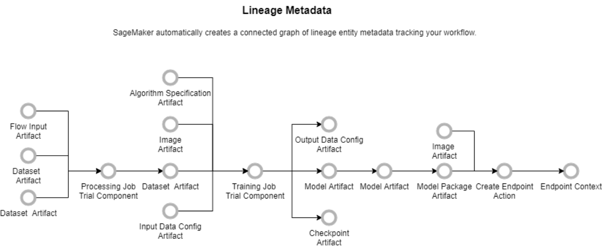

Topics

• Lineage Tracking Entities

• Amazon SageMaker AI–Created Tracking Entities

• Manually Create Tracking Entities

• Querying Lineage Entities

• Tracking Cross-Account Lineage

Lineage Tracking Entities

Tracking entities maintain a representation of all the elements of your end-to-end machine
learning workflow. You can use this representation to establish model governance, reproduce your
workflow, and maintain a record of your work history.

Amazon SageMaker AI automatically creates tracking entities for trial components and their
associated trials and experiments when you create SageMaker AI jobs such as processing jobs,
training jobs, and batch transform jobs. In additional to auto tracking, you can also Manually
Create Tracking Entities to model custom steps in your workflow. For more information, see
Amazon SageMaker Experiments in Studio Classic.

SageMaker AI also automatically creates tracking entities for the other steps in a workflow so you
can track the workflow from end to end. For more information, see Amazon SageMaker AI–Created
Tracking Entities.

Tracking Entities
6930

## Page 960

Amazon SageMaker AI
Developer Guide

You can create additional entities to supplement those created by SageMaker AI. For more
information, see Manually Create Tracking Entities.

SageMaker AI reuses any existing entities rather than creating new ones. For example, there can be

only one artifact with a unique SourceUri.

Key concepts for querying lineage

• Lineage – Metadata that tracks the relationships between various entities in your ML workflows.

• QueryLineage – The action to inspect your lineage and discover relationships between entities.

• Lineage entities – The metadata elements of which your lineage is composed.

• Cross-account lineage – Your ML workflow may span more than one account. With cross-
account lineage, you can configure multiple accounts to automatically create lineage associations
between shared entity resources. QueryLineage then can return entities even from these shared

accounts.

The following tracking entities are defined:

Experiment entities

• Trial component – A stage of a machine learning trial. Includes processing jobs, training jobs, and
batch transform jobs.

• Trial – A combination of trial components that generally produces a model.

• Experiment – A grouping of trials generally focused on solving a specific use case.

Lineage entities

• Trial Component – Represents processing, training, and transform jobs in the lineage. Also part
of experiment management.

• Context – Provides a logical grouping of other tracking or experiment entities. Conceptually,
experiments and trials are contexts. Some examples are an endpoint and a model package.

• Action – Represents an action or activity. Generally, an action involves at least one input artifact
or output artifact. Some examples are a workflow step and a model deployment.

• Artifact – Represents a URI addressable object or data. An artifact is generally either an input or
an output to a trial component or action. Some examples include a dataset (S3 bucket URI), or an
image (Amazon ECR registry path).

Tracking Entities
6931

## Page 961

Amazon SageMaker AI
Developer Guide

• Association – Links other tracking or experiment entities, such as an association between the
location of training data and a training job.

An association has an optional AssociationType property. The following values are available

along with the suggested use for each type. SageMaker AI places no restrictions on their use:

• ContributedTo – The source contributed to the destination or had a part in enabling the
destination. For example, the training data contributed to the training job.

• AssociatedWith – The source is connected to the destination. For example, an approval
workflow is associated with a model deployment.

• DerivedFrom - The destination is a modification of the source. For example, a digest output
of a channel input for a processing job is derived from the original inputs.

• Produced – The source generated the destination. For example, a training job produced a
model artifact.

• SameAs – When the same lineage entity used in different accounts.

Common properties

• Type property

The action, artifact, and context entities have a type property, ActionType, ArtifactType,

and ContextType, respectively. This property is a custom string which can associate meaningful
information with the entity and be used as a filter in the List APIs.

• Source property

The action, artifact, and context entities have a Source property. This property provides the
underlying URI that the entity represents. Some examples are:

• An UpdateEndpoint action where the source is the EndpointArn.

• An image artifact for a processing job where the source is the ImageUri.

• An Endpoint context where the source is the EndpointArn.

• Metadata property

The action and artifact entities have an optional Metadata property which can provide the
following information:

• ProjectId – For example, the ID of the SageMaker AI MLOps project to which a model
belongs.

Tracking Entities
6932

## Page 962

Amazon SageMaker AI
Developer Guide

• GeneratedBy – For example, the SageMaker AI pipeline execution that registered a model
package version.

• Repository – For example, the repository that contains an algorithm.

• CommitId – For example, the commit ID of an algorithm version.

Amazon SageMaker AI–Created Tracking Entities

Amazon SageMaker AI automatically creates tracking entities for SageMaker AI jobs, models, model
packages, and endpoints if the data is available. There is no limit to the number of lineage entities
created by SageMaker AI.

For information on how you can manually create tracking entities, see Manually Create Tracking
Entities.

Topics

• Tracking Entities for SageMaker AI Jobs

• Tracking Entities for Model Packages

• Tracking Entities for Endpoints

Tracking Entities for SageMaker AI Jobs

SageMaker AI creates a trial component for and associated with each SageMaker AI job. SageMaker
AI creates artifacts to track the job metadata and associations between each artifact and the job.

Artifacts are created for the following job properties and associated with the Amazon Resource

Name (ARN) of the SageMaker AI job. The artifact SourceUri is listed in parentheses.

Training Job

• The image that contains the training algorithm (TrainingImage).

• The data source of each input channel (S3Uri).

• The location for the model (S3OutputPath).

• The location for the managed spot checkpoint data (S3Uri).

SageMaker AI-Created Entities
6933

## Page 963

Amazon SageMaker AI
Developer Guide

Processing Job

• The container to be run by the processing job (ImageUri).

• The data location for each processing input and processing output (S3Uri).

Transform Job

• The input data source to be transformed (S3Uri).

• The results of the transform (S3OutputPath).

Note

Amazon Simple Storage Service (Amazon S3) artifacts are tracked based on the Amazon
S3 URI values provided to the Create API, for example CreateTrainingJob, and not on the
Amazon S3 key and hash or etag values from each file.

Tracking Entities for Model Packages

The following entities are created:

Model Packages

• A context for each model package group.

• An artifact for each model package.

• An association between each model package artifact and the context for each model package
group to which the package belongs to.

• An action for the creation of a model package version.

• An association between the model package artifact and the creation action.

• An association between the model package artifact and each model package group context to
which the package belongs to.

• Inference containers

• An artifact for the image used in each container defined in the model package.

• An artifact for the model used in each container.

• An association between each artifact and the model package artifact.

SageMaker AI-Created Entities
6934

## Page 964

Amazon SageMaker AI
Developer Guide

• Algorithms

• An artifact for each algorithm defined in the model package.

• An artifact for the model created by each algorithm.

• An association between each artifact and the model package artifact.

Tracking Entities for Endpoints

The following entities are created by Amazon SageMaker AI:

Endpoints

• A context for each endpoint

• An action for the model deployment that created each endpoint

• An artifact for each model deployed to the endpoint

• An artifact for the image used in the model

• An artifact for the model package for the model

• An artifact for each image deployed to the endpoint

• An association between each artifact and the model deployment action

Manually Create Tracking Entities

You can manually create tracking entities for any property to establish model governance,
reproduce your workflow, and maintain a record of your work history. For information on the
tracking entities that Amazon SageMaker AI automatically creates, see Amazon SageMaker AI–
Created Tracking Entities. The following tutorial demonstrates the steps needed to manually create
and associate artifacts between a SageMaker training job and endpoint, then track the workflow.

You can add tags to all entities except associations. Tags are arbitrary key-value pairs that provide
custom information. You can filter or sort a list or search query by tags. For more information, see
Tagging AWS resources in the AWS General Reference.

For a sample notebook that demonstrates how to create lineage entities, see the Amazon
SageMaker AI Lineage notebook in the Amazon SageMaker example GitHub repository.

Topics

• Manually Create Entities

Manually Create Entities
6935

## Page 965

Amazon SageMaker AI
Developer Guide

• Manually Track a Workflow

• Limits

Manually Create Entities

The following procedure shows you how to create and associate artifacts between a SageMaker AI
training job and endpoint. You perform the following steps:

Import tracking entities and associations

1.
Import the lineage tracking entities.

import sys
!{sys.executable} -m pip install -q sagemaker

from sagemaker import get_execution_role
from sagemaker.session import Session
from sagemaker.lineage import context, artifact, association, action

import boto3
boto_session = boto3.Session(region_name=region)
sagemaker_client = boto_session.client("sagemaker")

2.
Create the input and output artifacts.

code_location_arn = artifact.Artifact.create(
artifact_name='source-code-location',
source_uri='s3://...',
artifact_type='code-location'
).artifact_arn

# Similar constructs for train_data_location_arn and test_data_location_arn

model_location_arn = artifact.Artifact.create(
artifact_name='model-location',
source_uri='s3://...',
artifact_type='model-location'
).artifact_arn

3.
Train the model and get the trial_component_arn that represents the training job.

4.
Associate the input artifacts and output artifacts with the training job (trial component).

Manually Create Entities
6936

## Page 966

Amazon SageMaker AI
Developer Guide

input_artifacts = [code_location_arn, train_data_location_arn,
test_data_location_arn]
for artifact_arn in input_artifacts:
try:
association.Association.create(
source_arn=artifact_arn,
destination_arn=trial_component_arn,
association_type='ContributedTo'
)
except:
logging.info('association between {} and {} already exists', artifact_arn,
trial_component_arn)

output_artifacts = [model_location_arn]
for artifact_arn in output_artifacts:
try:

association.Association.create(
source_arn=trial_component_arn,
destination_arn=artifact_arn,
association_type='Produced'
)
except:
logging.info('association between {} and {} already exists', artifact_arn,
trial_component_arn)

5.
Create the inference endpoint.

predictor = mnist_estimator.deploy(initial_instance_count=1,
instance_type='ml.m4.xlarge')

6.
Create the endpoint context.

from sagemaker.lineage import context

endpoint = sagemaker_client.describe_endpoint(EndpointName=predictor.endpoint_name)
endpoint_arn = endpoint['EndpointArn']

endpoint_context_arn = context.Context.create(
context_name=predictor.endpoint_name,
context_type='Endpoint',
source_uri=endpoint_arn
).context_arn

Manually Create Entities
6937

## Page 967

Amazon SageMaker AI
Developer Guide

7.
Associate the training job (trial component) and endpoint context.

association.Association.create(
source_arn=trial_component_arn,
destination_arn=endpoint_context_arn

)

Manually Track a Workflow

You can manually track the workflow created in the previous section.

Given the endpoint Amazon Resource Name (ARN) from the previous example, the following
procedure shows you how to track the workflow back to the datasets used to train the model that
was deployed to the endpoint. You perform the following steps:

To track a workflow from endpoint to training data source

1.
Import the tracking entities.

import sys
!{sys.executable} -m pip install -q sagemaker

from sagemaker import get_execution_role
from sagemaker.session import Session
from sagemaker.lineage import context, artifact, association, action

import boto3
boto_session = boto3.Session(region_name=region)
sagemaker_client = boto_session.client("sagemaker")

2.
Get the endpoint context from the endpoint ARN.

endpoint_context_arn = sagemaker_client.list_contexts(
SourceUri=endpoint_arn)['ContextSummaries'][0]['ContextArn']

3.
Get the trial component from the association between the trial component and the endpoint
context.

trial_component_arn = sagemaker_client.list_associations(
DestinationArn=endpoint_context_arn)['AssociationSummaries'][0]['SourceArn']

Manually Create Entities
6938

## Page 968

Amazon SageMaker AI
Developer Guide

4.
Get the training data location artifact from the association between the trial component and
the endpoint context.

train_data_location_artifact_arn = sagemaker_client.list_associations(
DestinationArn=trial_component_arn, SourceType='Model')['AssociationSummaries']
[0]['SourceArn']

5.
Get the training data location from the training data location artifact.

train_data_location = sagemaker_client.describe_artifact(
ArtifactArn=train_data_location_artifact_arn)['Source']['SourceUri']
print(train_data_location)

Response:

s3://sagemaker-sample-data-us-east-2/mxnet/mnist/train

Limits

You can create an an association between any entities, experiment and lineage, except the
following:

• You cannot create an association between two experiment entities. Experiment entities consist of
experiments, trials, and trial components.

• You can create an association with another association.

An error occurs if you try to create an entity that already exists.

Maximum number of manually created lineage entities

• Actions: 3000

• Artifacts: 6000

• Associations: 6000

• Contexts: 500

There is no limit to the number of lineage entities automatically created by Amazon SageMaker AI.

Manually Create Entities
6939

## Page 969

Amazon SageMaker AI
Developer Guide

Querying Lineage Entities

Amazon SageMaker AI automatically generates graphs of lineage entities as you use them. You
can query this data to answer a variety of questions. The following provides instructions on how to
query this data in SDK for Python.

For information on how to view a registered model lineage in Amazon SageMaker Studio, see View
model lineage details in Studio.

You can query your lineage entities to:

• Retrieve all data sets that went into the creation of a model.

• Retrieve all jobs that went into the creation of an endpoint.

• Retrieve all models that use a data set.

• Retrieve all endpoints that use a model.

• Retrieve which endpoints are derived from a certain data set.

• Retrieve the pipeline execution that created a training job.

• Retrieve the relationships between entities for investigation, governance, and reproducibility.

• Retrieve all downstream trials that use the artifact.

• Retrieve all upstream trials that use the artifact.

• Retrieve a list of artifacts that use the provided S3 uri.

• Retrieve upstream artifacts that use the dataset artifact.

• Retrieve downstream artifacts that use the dataset artifact.

• Retrieve datasets that use the image artifact.

• Retrieve actions that use the context.

• Retrieve processing jobs that use the endpoint.

• Retrieve transform jobs that use the endpoint.

• Retrieve trial components that use the endpoint.

• Retrieve the ARN for the pipeline execution associated with the model package group.

• Retrieve all artifacts that use the action.

• Retrieve all upstream datasets that use the model package approval action.

• Retrieve model package from model package approval action.

Querying Lineage Entities
6940

## Page 970

Amazon SageMaker AI
Developer Guide

• Retrieve downstream endpoint contexts that use the endpoint.

• Retrieve the ARN for the pipeline execution associated with the trial component.

• Retrieve datasets that use the trial component.

• Retrieve models that use the trial component.

• Explore your lineage for visualization.

Limitations

• Lineage querying is not available in the following Regions:

• Africa (Cape Town) – af-south

• Asia Pacific (Jakarta) – ap-southeast-3

• Asia Pacific (Osaka) – ap-northeast-3

• Europe (Milan) – eu-south-1

• Europe (Spain) – eu-south-2

• Israel (Tel Aviv) – il-central-1

• The maximum depth of relationships to discover is currently limited to 10.

• Filtering is limited to the following properties: last modified date, created date, type, and lineage
entity type.

Topics

• Getting Started with Querying Lineage Entities

Getting Started with Querying Lineage Entities

The easiest way to get started is either via the:

• Amazon SageMaker AI SDK for Python which has defined many common use cases.

• For a notebook that demonstrates how to use SageMaker AI Lineage APIs to query relationships
across the lineage graph, see sagemaker-lineage-multihop-queries.ipynb.

The following examples show how to use the LineageQuery and LineageFilter APIs to
construct queries to answer questions about the Lineage Graph and extract entity relationships for
a few use cases.

Querying Lineage Entities
6941

## Page 971

Amazon SageMaker AI
Developer Guide

Example Using the LineageQuery API to find entity associations

from sagemaker.lineage.context import Context, EndpointContext
from sagemaker.lineage.action import Action
from sagemaker.lineage.association import Association
from sagemaker.lineage.artifact import Artifact, ModelArtifact, DatasetArtifact

from sagemaker.lineage.query import (
LineageQuery,
LineageFilter,
LineageSourceEnum,
LineageEntityEnum,
LineageQueryDirectionEnum,
)
# Find the endpoint context and model artifact that should be used for the lineage
queries.

contexts = Context.list(source_uri=endpoint_arn)
context_name = list(contexts)[0].context_name
endpoint_context = EndpointContext.load(context_name=context_name)

Example Find all the datasets associated with an endpoint

# Define the LineageFilter to look for entities of type `ARTIFACT` and the source of
type `DATASET`.

query_filter = LineageFilter(
entities=[LineageEntityEnum.ARTIFACT], sources=[LineageSourceEnum.DATASET]
)

# Providing this `LineageFilter` to the `LineageQuery` constructs a query that
traverses through the given context `endpoint_context`
# and find all datasets.

query_result = LineageQuery(sagemaker_session).query(
start_arns=[endpoint_context.context_arn],
query_filter=query_filter,
direction=LineageQueryDirectionEnum.ASCENDANTS,
include_edges=False,
)

Querying Lineage Entities
6942

## Page 972

Amazon SageMaker AI
Developer Guide

# Parse through the query results to get the lineage objects corresponding to the
datasets
dataset_artifacts = []
for vertex in query_result.vertices:
dataset_artifacts.append(vertex.to_lineage_object().source.source_uri)

pp.pprint(dataset_artifacts)

Example Find the models associated with an endpoint

# Define the LineageFilter to look for entities of type `ARTIFACT` and the source of
type `MODEL`.

query_filter = LineageFilter(
entities=[LineageEntityEnum.ARTIFACT], sources=[LineageSourceEnum.MODEL]
)

# Providing this `LineageFilter` to the `LineageQuery` constructs a query that
traverses through the given context `endpoint_context`
# and find all datasets.

query_result = LineageQuery(sagemaker_session).query(
start_arns=[endpoint_context.context_arn],
query_filter=query_filter,
direction=LineageQueryDirectionEnum.ASCENDANTS,
include_edges=False,
)

# Parse through the query results to get the lineage objects corresponding to the model
model_artifacts = []
for vertex in query_result.vertices:
model_artifacts.append(vertex.to_lineage_object().source.source_uri)

# The results of the `LineageQuery` API call return the ARN of the model deployed to
the endpoint along with
# the S3 URI to the model.tar.gz file associated with the model
pp.pprint(model_artifacts)

Example Find the trial components associated with the endpoint

# Define the LineageFilter to look for entities of type `TRIAL_COMPONENT` and the
source of type `TRAINING_JOB`.

Querying Lineage Entities
6943

## Page 973

Amazon SageMaker AI
Developer Guide

query_filter = LineageFilter(
entities=[LineageEntityEnum.TRIAL_COMPONENT],
sources=[LineageSourceEnum.TRAINING_JOB],
)

# Providing this `LineageFilter` to the `LineageQuery` constructs a query that
traverses through the given context `endpoint_context`
# and find all datasets.

query_result = LineageQuery(sagemaker_session).query(
start_arns=[endpoint_context.context_arn],
query_filter=query_filter,
direction=LineageQueryDirectionEnum.ASCENDANTS,
include_edges=False,
)

# Parse through the query results to get the ARNs of the training jobs associated with

this Endpoint
trial_components = []
for vertex in query_result.vertices:
trial_components.append(vertex.arn)

pp.pprint(trial_components)

Example Changing the focal point of lineage

The LineageQuery can be modified to have different start_arns which changes the focal point

of lineage. In addition, the LineageFilter can take multiple sources and entities to expand the
scope of the query.

In the following we use the model as the lineage focal point and find the endpoints and datasets
associated with it.

# Get the ModelArtifact

model_artifact_summary = list(Artifact.list(source_uri=model_package_arn))[0]
model_artifact = ModelArtifact.load(artifact_arn=model_artifact_summary.artifact_arn)
query_filter = LineageFilter(
entities=[LineageEntityEnum.ARTIFACT],
sources=[LineageSourceEnum.ENDPOINT, LineageSourceEnum.DATASET],
)

query_result = LineageQuery(sagemaker_session).query(

Querying Lineage Entities
6944

## Page 974

Amazon SageMaker AI
Developer Guide

start_arns=[model_artifact.artifact_arn],  # Model is the starting artifact
query_filter=query_filter,
# Find all the entities that descend from the model, i.e. the endpoint
direction=LineageQueryDirectionEnum.DESCENDANTS,
include_edges=False,
)

associations = []
for vertex in query_result.vertices:
associations.append(vertex.to_lineage_object().source.source_uri)

query_result = LineageQuery(sagemaker_session).query(
start_arns=[model_artifact.artifact_arn],  # Model is the starting artifact
query_filter=query_filter,
# Find all the entities that ascend from the model, i.e. the datasets
direction=LineageQueryDirectionEnum.ASCENDANTS,
include_edges=False,

)

for vertex in query_result.vertices:
associations.append(vertex.to_lineage_object().source.source_uri)

pp.pprint(associations)

Example Using LineageQueryDirectionEnum.BOTH to find ascendent and descendent
relationships

When the direction is set to BOTH, the query traverses the graph to find ascendant and descendant
relationships. This traversal takes place not only from the starting node, but from each node that is
visited. For example; if a training job is run twice and both models generated by the training job are

deployed to endpoints, the result of the query with direction set to BOTH shows both endpoints.
This is because the same image is used for training and deploying the model. Since the image is

common to the model, the start_arn and both the endpoints, appear in the query result.

query_filter = LineageFilter(
entities=[LineageEntityEnum.ARTIFACT],
sources=[LineageSourceEnum.ENDPOINT, LineageSourceEnum.DATASET],
)

query_result = LineageQuery(sagemaker_session).query(
start_arns=[model_artifact.artifact_arn],  # Model is the starting artifact
query_filter=query_filter,

Querying Lineage Entities
6945

## Page 975

Amazon SageMaker AI
Developer Guide

# This specifies that the query should look for associations both ascending and
descending for the start
direction=LineageQueryDirectionEnum.BOTH,
include_edges=False,
)

associations = []
for vertex in query_result.vertices:
associations.append(vertex.to_lineage_object().source.source_uri)

pp.pprint(associations)

Example Directions in LineageQuery - ASCENDANTS vs. DESCENDANTS

To understand the direction in the Lineage Graph, take the following entity relationship graph -
Dataset -> Training Job -> Model -> Endpoint

The endpoint is a descendant of the model, and the model is a descendant of the dataset. Similarly,

the model is an ascendant of the endpoint. The direction parameter can be used to specify
whether the query should return entities that are descendants or ascendants of the entity in

start_arns. If the start_arns contains a model and the direction is DESCENDANTS, the query

returns the endpoint. If the direction is ASCENDANTS, the query returns the dataset.

# In this example, we'll look at the impact of specifying the direction as ASCENDANT or
DESCENDANT in a `LineageQuery`.

query_filter = LineageFilter(
entities=[LineageEntityEnum.ARTIFACT],
sources=[
LineageSourceEnum.ENDPOINT,
LineageSourceEnum.MODEL,
LineageSourceEnum.DATASET,
LineageSourceEnum.TRAINING_JOB,
],
)

query_result = LineageQuery(sagemaker_session).query(
start_arns=[model_artifact.artifact_arn],
query_filter=query_filter,
direction=LineageQueryDirectionEnum.ASCENDANTS,
include_edges=False,
)

Querying Lineage Entities
6946

## Page 976

Amazon SageMaker AI
Developer Guide

ascendant_artifacts = []

# The lineage entity returned for the Training Job is a TrialComponent which can't be
converted to a
# lineage object using the method `to_lineage_object()` so we extract the
TrialComponent ARN.
for vertex in query_result.vertices:
try:
ascendant_artifacts.append(vertex.to_lineage_object().source.source_uri)
except:
ascendant_artifacts.append(vertex.arn)

print("Ascendant artifacts : ")
pp.pprint(ascendant_artifacts)

query_result = LineageQuery(sagemaker_session).query(
start_arns=[model_artifact.artifact_arn],

query_filter=query_filter,
direction=LineageQueryDirectionEnum.DESCENDANTS,
include_edges=False,
)

descendant_artifacts = []
for vertex in query_result.vertices:
try:
descendant_artifacts.append(vertex.to_lineage_object().source.source_uri)
except:
# Handling TrialComponents.
descendant_artifacts.append(vertex.arn)

print("Descendant artifacts : ")
pp.pprint(descendant_artifacts)

Example SDK helper functions to make lineage queries easier

The classes EndpointContext, ModelArtifact, and DatasetArtifact have helper functions

that are wrappers over the LineageQuery API to make certain lineage queries easier to leverage.
The following example shows how to use these helper function.

# Find all the datasets associated with this endpoint

datasets = []
dataset_artifacts = endpoint_context.dataset_artifacts()

Querying Lineage Entities
6947

## Page 977

Amazon SageMaker AI
Developer Guide

for dataset in dataset_artifacts:
datasets.append(dataset.source.source_uri)
print("Datasets : ", datasets)

# Find the training jobs associated with the endpoint
training_job_artifacts = endpoint_context.training_job_arns()
training_jobs = []
for training_job in training_job_artifacts:
training_jobs.append(training_job)
print("Training Jobs : ", training_jobs)

# Get the ARN for the pipeline execution associated with this endpoint (if any)
pipeline_executions = endpoint_context.pipeline_execution_arn()
if pipeline_executions:
for pipeline in pipelines_executions:
print(pipeline)

# Here we use the `ModelArtifact` class to find all the datasets and endpoints
associated with the model

dataset_artifacts = model_artifact.dataset_artifacts()
endpoint_contexts = model_artifact.endpoint_contexts()

datasets = [dataset.source.source_uri for dataset in dataset_artifacts]
endpoints = [endpoint.source.source_uri for endpoint in endpoint_contexts]

print("Datasets associated with this model : ")
pp.pprint(datasets)

print("Endpoints associated with this model : ")
pp.pprint(endpoints)

# Here we use the `DatasetArtifact` class to find all the endpoints hosting models that
were trained with a particular dataset
# Find the artifact associated with the dataset

dataset_artifact_arn = list(Artifact.list(source_uri=training_data))[0].artifact_arn
dataset_artifact = DatasetArtifact.load(artifact_arn=dataset_artifact_arn)

# Find the endpoints that used this training dataset
endpoint_contexts = dataset_artifact.endpoint_contexts()
endpoints = [endpoint.source.source_uri for endpoint in endpoint_contexts]

print("Endpoints associated with the training dataset {}".format(training_data))

Querying Lineage Entities
6948

## Page 978

Amazon SageMaker AI
Developer Guide

pp.pprint(endpoints)

Example Getting a Lineage graph visualization

A helper class Visualizer is provided in the sameple notebook visualizer.py  to help plot the
lineage graph. When the query response is rendered, a graph with the lineage relationships from

the StartArns is displayed. From the StartArns the visualization shows the relationships with

the other lineage entities returned in the query_lineage API action.

# Graph APIs
# Here we use the boto3 `query_lineage` API to generate the query response to plot.

from visualizer import Visualizer

query_response = sm_client.query_lineage(
StartArns=[endpoint_context.context_arn], Direction="Ascendants", IncludeEdges=True
)

viz = Visualizer()
viz.render(query_response, "Endpoint")
query_response = sm_client.query_lineage(
StartArns=[model_artifact.artifact_arn], Direction="Ascendants", IncludeEdges=True
)
viz.render(query_response, "Model")

Tracking Cross-Account Lineage

Amazon SageMaker AI supports tracking lineage entities from a different AWS account. Other AWS
accounts can share their lineage entities with you and you can access these lineage entities through
direct API calls or SageMaker AI lineage queries.

SageMaker AI uses AWS Resource Access Manager to help you securely share your lineage
resources. You can share your resources through the AWS RAM console.

Set Up Cross-Account Lineage Tracking

You can group and share your Lineage Tracking Entities through a lineage group in Amazon
SageMaker AI. SageMaker AI supports only one default lineage group per account. SageMaker
AI creates the default lineage group whenever a lineage entity is created in your account. Every

Tracking Cross-Account Lineage
6949

## Page 979

Amazon SageMaker AI
Developer Guide

lineage entity owned by your account is assigned to this default lineage group. To share lineage
entities with another account, you share this default lineage group with that account.

Note

You can share all lineage tracking entities in a lineage group or none.

Create a resource share for your lineage entities using AWS Resource Access Manager console. For
more information, see Sharing your AWS resources in the AWS Resource Access Manager User Guide.

Note

After the resource share is created, it can take a few minutes for the resource and principal
associations to complete. Once the association is set, the shared account receives an
invitation to join the resource share. The shared account must accept the invite to gain
access to shared resources. For more information on accepting a resource share invite in
AWS RAM, see Using shared AWS resources  in the AWS Resource Access Manager User
Guide.

Your cross-account lineage tracking resource policy

Amazon SageMaker AI supports only one type of resource policy. The SageMaker AI resource policy
must allow all of the following operations:

"sagemaker:DescribeAction"
"sagemaker:DescribeArtifact"
"sagemaker:DescribeContext"
"sagemaker:DescribeTrialComponent"
"sagemaker:AddAssociation"
"sagemaker:DeleteAssociation"
"sagemaker:QueryLineage"

Tracking Cross-Account Lineage
6950

## Page 980

Amazon SageMaker AI
Developer Guide

Example The following is a SageMaker AI resource policy created using AWS Resource Access
Manager for creating a resource share for an accounts lineage group.

JSON

{
"Version":"2012-10-17",
"Statement": [
{
"Sid": "FullLineageAccess",
"Effect": "Allow",
"Principal": {
"AWS": "111122223333"
},
"Action": [

"sagemaker:DescribeAction",
"sagemaker:DescribeArtifact",
"sagemaker:DescribeContext",
"sagemaker:DescribeTrialComponent",
"sagemaker:AddAssociation",
"sagemaker:DeleteAssociation",
"sagemaker:QueryLineage"
],
"Resource": "arn:aws:sagemaker:us-west-2:111111111111:lineage-group/
sagemaker-default-lineage-group"
}
]
}

Tracking Cross-Account Lineage Entities

With cross-account lineage tracking you can associate lineage entities in different accounts using

the same AddAssociation API action. When you associate two lineage entities, SageMaker AI

validates if you have permissions to perform the AddAssociation API action on both lineage
entities. SageMaker AI then establishes the association. If you don’t have the permissions,
SageMaker AI does not create the association. Once the cross-account association is established,

you can access either lineage entity from the other through the QueryLineage API action. For
more information, see Querying Lineage Entities.

Tracking Cross-Account Lineage
6951

## Page 981

Amazon SageMaker AI
Developer Guide

In addition to SageMaker AI automatically creating lineage entities, if you have cross-account
access, SageMaker AI connects artifacts that reference the same object or data. If the data from
one account is used in lineage tracking by different accounts, SageMaker AI creates an artifact in
each account to track that data. With cross-account lineage, whenever SageMaker AI creates new
artifacts, SageMaker AI checks if there are other artifacts created for the same data that are also
shared with you. SageMaker AI then establishes associations between the newly created artifact

and each of the artifacts shared with you with the AssociationType set to SameAs. You can

then use the QueryLineage API action to traverse the lineage entities in your own account to
lineage entities shared with you but owned by a different AWS account. For more information, see
Querying Lineage Entities

Topics

• Accessing lineage resources from a different accounts

• Authorization for querying cross-account lineage entities

Accessing lineage resources from a different accounts

Once the cross-account access for sharing lineage has been set up, you can call the following
SageMaker API actions directly with the ARN to describe the shared lineage entities from another
account:

• DescribeAction

• DescribeArtifact

• DescribeContext

• DescribeTrialComponent

You can also manage Associations for lineage entities owned by different accounts that are shared
with you, using the following SageMaker API actions:

• AddAssociation

• DeleteAssociation

For a notebook that demonstrates how to use SageMaker AI Lineage APIs to query lineage across
accounts., see sagemaker-lineage-cross-account-with-ram.ipynb.

Tracking Cross-Account Lineage
6952

## Page 982

Amazon SageMaker AI
Developer Guide

Authorization for querying cross-account lineage entities

Amazon SageMaker AI must validate that you have permissions to perform the QueryLineage

API action on the StartArns. This is enforced through the resource policy attached to the

LineageGroup. The result from this action includes all the lineage entities to which you
have access, whether they are owned by your account or shared by another account. For more
information, see Querying Lineage Entities.

Model Registration Deployment with Model Registry

With the Amazon SageMaker Model Registry you can do the following:

• Catalog models for production.

• Manage model versions.

• Associate metadata, such as training metrics, with a model.

• View information from Amazon SageMaker Model Cards in your registered models.

• View model lineage for traceability and reproducibility.

• Define a staging construct that models can progress through for your model lifecycle.

• Manage the approval status of a model.

• Deploy models to production.

• Automate model deployment with CI/CD.

• Share models with other users.

Catalog models by creating SageMaker Model Registry Model (Package) Groups that contain
different versions of a model. You can create a Model Group that tracks all of the models that
you train to solve a particular problem. You can then register each model you train and the Model
Registry adds it to the Model Group as a new model version. Lastly, you can create categories of
Model Groups by further organizing them into SageMaker Model Registry Collections. A typical
workflow might look like the following:

• Create a Model Group.

• Create an ML pipeline that trains a model. For information about SageMaker pipelines, see
Pipelines actions.

• For each run of the ML pipeline, create a model version that you register in the Model Group you
created in the first step.

Model Registry
6953

## Page 983

Amazon SageMaker AI
Developer Guide

• Add your Model Group into one or more Model Registry Collections.

For details about how to create and work with models, model versions, and Model Groups, see
Model Registry Models, Model Versions, and Model Groups. Optionally, if you want to further group
your Model Groups into Collections, see Model Registry Collections.

Model Registry Models, Model Versions, and Model Groups

The SageMaker Model Registry is structured as several Model (Package) Groups with model
packages in each group. These Model Groups can optionally be added to one or more Collections.
Each model package in a Model Group corresponds to a trained model. The version of each model
package is a numerical value that starts at 1 and is incremented with each new model package
added to a Model Group. For example, if 5 model packages are added to a Model Group, the model
package versions will be 1, 2, 3, 4, and 5.

A model package is the actual model that is registered into the Model Registry as a versioned
entity. There are two types of model packages in SageMaker AI. One type is used in the AWS
Marketplace, and the other is used in the Model Registry. Model packages used in the AWS
Marketplace are not versionable entities and are not associated with Model Groups in the Model
Registry. The Model Registry receives every new model that you retrain, gives it a version, and
assigns it to a Model Group inside the Model Registry. The following image shows an example
of a Model Group with 25 consecutively-versioned models. For more information about model
packages used in the AWS Marketplace, see Algorithms and packages in the AWS Marketplace.

The model packages used in the Model Registry are versioned, and must be
associated with a Model Group. The ARN of this model package type has the structure:

'arn:aws:sagemaker:region:account:model-package-group/version'

The following topics show you how to create and work with models, model versions, and Model
Groups in the Model Registry.

Topics

• Create a Model Group

• Delete a Model Group

• Register a Model Version

• View Model Groups and Versions

• Update the Details of a Model Version

Models, Model Versions, and Model Groups
6954

## Page 984

Amazon SageMaker AI
Developer Guide

• Compare Model Versions

• View and Manage Model Group and Model Version Tags

• Delete a Model Version

• Staging Construct for your Model Lifecycle

• Update the Approval Status of a Model

• Deploy a Model from the Registry with Python

• Deploy a Model in Studio

• Cross-account discoverability

• View the Deployment History of a Model

• View model lineage details in Studio

Create a Model Group

A Model Group contains different versions of a model. You can create a Model Group that tracks all
of the models that you train to solve a particular problem. Create a Model Group by using either
the AWS SDK for Python (Boto3) or the Amazon SageMaker Studio console.

Create a Model Group (Boto3)

Important

Custom IAM policies that allow Amazon SageMaker Studio or Amazon SageMaker Studio
Classic to create Amazon SageMaker resources must also grant permissions to add tags to
those resources. The permission to add tags to resources is required because Studio and
Studio Classic automatically tag any resources they create. If an IAM policy allows Studio
and Studio Classic to create resources but does not allow tagging, "AccessDenied" errors can
occur when trying to create resources. For more information, see Provide permissions for
tagging SageMaker AI resources.
AWS managed policies for Amazon SageMaker AI that give permissions to create
SageMaker resources already include permissions to add tags while creating those
resources.

To create a Model Group by using Boto3, call the create_model_package_group API operation
and specify a name and description as parameters. The following example shows how to create

Models, Model Versions, and Model Groups
6955

## Page 985

Amazon SageMaker AI
Developer Guide

a Model Group. The response from the create_model_package_group call is the Amazon
Resource Name (ARN) of the new Model Group.

First, import the required packages and set up the SageMaker AI Boto3 client.

import time
import os
from sagemaker import get_execution_role, session
import boto3

region = boto3.Session().region_name

role = get_execution_role()

sm_client = boto3.client('sagemaker', region_name=region)

Now create the Model Group.

import time
model_package_group_name = "scikit-iris-detector-" + str(round(time.time()))
model_package_group_input_dict = {
"ModelPackageGroupName" : model_package_group_name,
"ModelPackageGroupDescription" : "Sample model package group"
}

create_model_package_group_response =
sm_client.create_model_package_group(**model_package_group_input_dict)
print('ModelPackageGroup Arn :
{}'.format(create_model_package_group_response['ModelPackageGroupArn']))

Create a Model Group (Studio or Studio Classic)

To create a Model Group in the Amazon SageMaker Studio console, complete the following steps
based on whether you use Studio or Studio Classic.

Studio

1.
Open the SageMaker Studio console by following the instructions in Launch Amazon
SageMaker Studio.

2.
In the left navigation pane, choose Models.

3.
Choose the Registered models tab, if not selected already.

Models, Model Versions, and Model Groups
6956

## Page 986

Amazon SageMaker AI
Developer Guide

4.
Immediately below the Registered models tab label, choose Model Groups, if not selected
already.

5.
Choose Register, then choose Model group.

6.
In the Register model group dialog box, enter the following information:

• The name of the new Model Group in the Model group name field.

• (Optional) A description for the Model Group in the Description field.

• (Optional) Any key-value pairs you want to associate with the Model Group in the Tags
field. For information about using tags, see Tagging AWS resources in the AWS General
Reference.

7.
Choose Register model group.

8.
(Optional) In the Models page, choose the Registered models tab, then choose Model
Groups. Confirm your newly-created Model Group appears in the list of Model Groups.

Studio Classic

1.
Sign in to Amazon SageMaker Studio Classic. For more information, see Launch Amazon
SageMaker Studio Classic.

2.
In the left navigation pane, choose the Home icon (

).

3.
Choose Models, and then Model registry.

4.
Choose Actions, then choose Create model group.

5.
In the Create model group dialog box, enter the following information:

• Enter the name of the new Model Group in the Model group name field.

• (Optional) Enter a description for the Model Group in the Description field.

• (Optional) Enter any key-value pairs you want to associate with the Model Group in the
Tags field. For information about using tags, see Tagging AWS resources in the AWS
General Reference.

• (Optional) Choose a project with which to associate the Model Group in the Project field.
For information about projects, see MLOps Automation With SageMaker Projects.

6.
Choose Create model group.

Models, Model Versions, and Model Groups
6957

## Page 987

Amazon SageMaker AI
Developer Guide

Delete a Model Group

This procedure demonstrates how to delete a Model Group in the Amazon SageMaker Studio
console. When you delete a Model Group, you lose access to the model versions in the Model
Group.

Delete a Model Group (Studio or Studio Classic)

Important

You can only delete an empty model group. Before you delete your model group, remove
its model versions, if any.

To delete a Model Group in the Amazon SageMaker Studio console, complete the following steps
based on whether you use Studio or Studio Classic.

Studio

1.
Open the SageMaker Studio console by following the instructions in Launch Amazon
SageMaker Studio.

2.
In the left navigation pane, choose Models.

3.
Choose the Registered models tab, if not selected already.

4.
Immediately below the Registered models tab label, choose Model Groups, if not selected
already.

5.
From the model groups list, select the check box next to the name of the Model Group you
want to delete.

6.
Choose the vertical ellipsis above the top right corner of the model groups list, and choose
Delete.

7.
In the Delete model group dialog box, choose Yes, delete the model group.

8.
Choose Delete.

9.
Confirm that your deleted model groups no longer appear in your list of model groups.

Studio Classic

1.
Sign in to Amazon SageMaker Studio Classic. For more information, see Launch Amazon
SageMaker Studio Classic.

Models, Model Versions, and Model Groups
6958

## Page 988

Amazon SageMaker AI
Developer Guide

2.
In the left navigation pane, choose the Home icon (

).

3.
Choose Models, and then Model registry. A list of your Model Groups appears.

4.
From the model groups list, select the name of the Model Group you want to delete.

5.
In the top right corner, choose Remove.

6.
In the confirmation dialog box, enter REMOVE.

7.
Choose Remove.

Register a Model Version

You can register an Amazon SageMaker AI model by creating a model version that specifies the
model group to which it belongs. A model version must include a model artifacts (the trained

weights of a model) and optionally the inference code for the model.

An inference pipeline is a SageMaker AI model composed of a linear sequence of two to fifteen
containers that process inference requests. You register an inference pipeline by specifying the
containers and the associated environment variables. For more information on inference pipelines,
see Inference pipelines in Amazon SageMaker AI.

You can register a model with an inference pipeline, by specifying the containers and the
associated environment variables. To create a model version with an inference pipeline by using
either the AWS SDK for Python (Boto3), the Amazon SageMaker Studio console, or by creating a
step in a SageMaker AI model building pipeline, use the following steps.

Topics

• Register a Model Version (SageMaker AI Pipelines)

• Register a Model Version (Boto3)

• Register a Model Version (Studio or Studio Classic)

• Register a Model Version from a Different Account

Register a Model Version (SageMaker AI Pipelines)

To register a model version by using a SageMaker AI model building pipeline, create a

RegisterModel step in your pipeline. For information about creating a RegisterModel step as
part of a pipeline, see Step 8: Define a RegisterModel step to create a model package.

Models, Model Versions, and Model Groups
6959

## Page 989

Amazon SageMaker AI
Developer Guide

Register a Model Version (Boto3)

To register a model version by using Boto3, call the create_model_package API operation.

First, you set up the parameter dictionary to pass to the create_model_package API operation.

# Specify the model source
model_url = "s3://your-bucket-name/model.tar.gz"

modelpackage_inference_specification =  {
"InferenceSpecification": {
"Containers": [
{
"Image": image_uri,
"ModelDataUrl": model_url
}

],
"SupportedContentTypes": [ "text/csv" ],
"SupportedResponseMIMETypes": [ "text/csv" ],
}
}

# Alternatively, you can specify the model source like this:
# modelpackage_inference_specification["InferenceSpecification"]["Containers"][0]
["ModelDataUrl"]=model_url

create_model_package_input_dict = {
"ModelPackageGroupName" : model_package_group_name,
"ModelPackageDescription" : "Model to detect 3 different types of irises (Setosa,
Versicolour, and Virginica)",
"ModelApprovalStatus" : "PendingManualApproval"
}
create_model_package_input_dict.update(modelpackage_inference_specification)

Then you call the create_model_package API operation, passing in the parameter dictionary
that you just set up.

create_model_package_response =
sm_client.create_model_package(**create_model_package_input_dict)
model_package_arn = create_model_package_response["ModelPackageArn"]
print('ModelPackage Version ARN : {}'.format(model_package_arn))

Models, Model Versions, and Model Groups
6960

## Page 990

Amazon SageMaker AI
Developer Guide

Register a Model Version (Studio or Studio Classic)

To register a model version in the Amazon SageMaker Studio console, complete the following steps
based on whether you use Studio or Studio Classic.

Studio

1.
Open the SageMaker Studio console by following the instructions in Launch Amazon

SageMaker Studio.

2.
In the left navigation pane, choose Models from the menu.

3.
Choose the Registered models tab, if not selected already.

4.
Immediately below the Registered models tab label, choose Model Groups and My
models, if not selected already.

5.
Choose Register. This will open the Register model page.

6.
Follow the instructions provided in the Register model page.

7.
Once you have reviewed your choices, choose Register. Once completed, you will be taken
to the model version Overview page.

Studio Classic

1.
Sign in to Amazon SageMaker Studio Classic. For more information, see Launch Amazon
SageMaker Studio Classic.

2.
In the left navigation pane, choose the Home icon (

).

3.
Choose Models, and then Model registry.

4.
Open the Register Version form. You can do this in one of two ways:

• Choose Actions, and then choose Create model version.

• Select the name of the model group for which you want to create a model version, then
choose Create model version.

5.
In the Register model version form, enter the following information:

• In the Model package group name dropdown, select the model group name.

• (Optional) Enter a description for your model version.

• In the Model Approval Status dropdown, select the version approval status.

Models, Model Versions, and Model Groups
6961

## Page 991

Amazon SageMaker AI
Developer Guide

• (Optional) In the Custom metadata field, add custom tags as key-value pairs.

6.
Choose Next.

7.
In the Inference Specification form, enter the following information:

• Enter your inference image location.

• Enter your model data artifacts location.

• (Optional) Enter information about images to use for transform and real-time inference
jobs, and supported input and output MIME types.

8.
Choose Next.

9.
(Optional) Provide details to aid endpoint recommendations.

10. Choose Next.

11. (Optional) Choose model metrics you want to include.

12. Choose Next.

13. Ensure the displayed settings are correct, and choose Register model version. If you

subsequently see a modal window with an error message, choose View (next to the
message) to view the source of the error.

14. Confirm your new model version appears in the parent model group page.

Register a Model Version from a Different Account

To register model versions with a Model Group created by a different AWS account, you must add
a cross-account AWS Identity and Access Management resource policy to enable that account. For
example, one AWS account in your organization is responsible for training models, and a different
account is responsible for managing, deploying, and updating models. You create IAM resource
policies and apply the policies to the specific account resource to which you want to grant access
for this case. For more information about cross-account resource policies in AWS, see Cross-account
policy evaluation logic in the AWS Identity and Access Management User Guide.

To enable cross-account discoverability, which allows other accounts to view model package groups
from the resource owner account, see Cross-account discoverability.

Note

You must also use a KMS key to encrypt the output data config action during training for
cross-account model deployment.

Models, Model Versions, and Model Groups
6962

## Page 992

Amazon SageMaker AI
Developer Guide

To enable cross-account model registry in SageMaker AI, you have to provide a cross-account
resource policy for the Model Group that contains the model versions. The following is an example
that creates cross-account policies for the Model Group and applies these policies to that specific
resource.

The following configuration must be set in the source account which registers models cross-
account in a Model Group. In this example, the source account is the model training account which
will train and then register the model cross-account into the Model Registry of the Model Registry
account.

The example assumes that you previously defined the following variables:

• sm_client – A SageMaker AI Boto3 client.

• model_package_group_name – The Model Group to which you want to grant access.

• model_package_group_arn – The Model Group ARN to which you want to grant cross-account
access.

• bucket – The Amazon S3 bucket where the model training artifacts are stored.

To be able to deploy a model created in a different account, the user must have a role that has

access to SageMaker AI actions, such as a role with the AmazonSageMakerFullAccess managed
policy. For information about SageMaker AI managed policies, see AWS managed policies for
Amazon SageMaker AI.

Required IAM resource policies

The following diagram captures the policies required to allow cross-account model registration. As
shown, these policies need to be active during model training to properly register the model into
the Model Registry account.

Models, Model Versions, and Model Groups
6963

## Page 993

Amazon SageMaker AI
Developer Guide


Amazon ECR, Amazon S3, and AWS KMS policies are demonstrated in the following code samples.

Sample Amazon ECR policy

JSON

{
"Version":"2012-10-17",
"Statement": [
{

Models, Model Versions, and Model Groups
6964

## Page 994

Amazon SageMaker AI
Developer Guide

"Sid": "AddPerm",
"Effect": "Allow",
"Principal": {
"AWS": "arn:aws:iam::111122223333:root"
},
"Action": [
"ecr:BatchGetImage",
"ecr:Describe*"
]
}
]
}

Sample Amazon S3 policy

JSON

{
"Version":"2012-10-17",
"Statement": [
{
"Sid": "AddPerm",
"Effect": "Allow",
"Principal": {
"AWS": "arn:aws:iam::111122223333:root"
},
"Action": [
"s3:GetObject",
"s3:GetBucketAcl",
"s3:GetObjectAcl"
],
"Resource": "arn:aws:s3:::amzn-s3-demo-bucket/*"
}
]
}

Sample AWS KMS policy

Models, Model Versions, and Model Groups
6965

## Page 995

Amazon SageMaker AI
Developer Guide

JSON

{
"Version":"2012-10-17",

"Statement": [
{
"Sid": "AddPerm",
"Effect": "Allow",
"Principal": {
"AWS": "arn:aws:iam::111122223333:root"
},
"Action": [
"kms:Decrypt",
"kms:GenerateDataKey*"
],
"Resource": "*"
}
]
}

Apply resource policies to accounts

The following policy configuration applies the policies discussed in the previous section and must
be put in the model training account.

import json

# The Model Registry account id of the Model Group
model_registry_account = "111111111111"

# The model training account id where training happens
model_training_account = "222222222222"

# 1. Create a policy for access to the ECR repository
# in the model training account for the Model Registry account Model Group
ecr_repository_policy = {"Version": "2012-10-17",
"Statement": [{"Sid": "AddPerm",
"Effect": "Allow",
"Principal": {
"AWS": f"arn:aws:iam::{model_registry_account}:root"
},

Models, Model Versions, and Model Groups
6966

## Page 996

Amazon SageMaker AI
Developer Guide

"Action": [
"ecr:BatchGetImage",
"ecr:Describe*"
]
}]
}

# Convert the ECR policy from JSON dict to string
ecr_repository_policy = json.dumps(ecr_repository_policy)

# Set the new ECR policy
ecr = boto3.client('ecr')
response = ecr.set_repository_policy(
registryId = model_training_account,
repositoryName = "decision-trees-sample",
policyText = ecr_repository_policy
)

# 2. Create a policy in the model training account for access to the S3 bucket
# where the model is present in the Model Registry account Model Group
bucket_policy = {"Version": "2012-10-17",
"Statement": [{"Sid": "AddPerm",
"Effect": "Allow",
"Principal": {"AWS": f"arn:aws:iam::{model_registry_account}:root"
},
"Action": [
"s3:GetObject",
"s3:GetBucketAcl",
"s3:GetObjectAcl"
],
"Resource": [
"arn:aws:s3:::{bucket}/*",
"Resource: arn:aws:s3:::{bucket}"
]
}]
}

# Convert the S3 policy from JSON dict to string
bucket_policy = json.dumps(bucket_policy)

# Set the new bucket policy
s3 = boto3.client("s3")
response = s3.put_bucket_policy(
Bucket = bucket,

Models, Model Versions, and Model Groups
6967

## Page 997

Amazon SageMaker AI
Developer Guide

Policy = bucket_policy)

# 3. Create the KMS grant for the key used during training for encryption
# in the model training account to the Model Registry account Model Group
client = boto3.client("kms")

response = client.create_grant(
GranteePrincipal=model_registry_account,
KeyId=kms_key_id
Operations=[
"Decrypt",
"GenerateDataKey",
],
)

The following configuration needs to be put in the Model Registry account where the Model Group
exists.

# The Model Registry account id of the Model Group
model_registry_account = "111111111111"

# 1. Create policy to allow the model training account to access the ModelPackageGroup
model_package_group_policy = {"Version": "2012-10-17",
"Statement": [
{
"Sid": "AddPermModelPackageVersion",
"Effect": "Allow",
"Principal": {"AWS": f"arn:aws:iam::{model_training_account}:root"},
"Action": ["sagemaker:CreateModelPackage"],
"Resource": f"arn:aws:sagemaker:{region}:{model_registry_account}:model-
package/{model_package_group_name}/*"
}
]
}

# Convert the policy from JSON dict to string
model_package_group_policy = json.dumps(model_package_group_policy)

# Set the new policy
response = sm_client.put_model_package_group_policy(
ModelPackageGroupName = model_package_group_name,
ResourcePolicy = model_package_group_policy)

Models, Model Versions, and Model Groups
6968

## Page 998

Amazon SageMaker AI
Developer Guide

Finally, use the create_model_package action from the model training account to register the
model package in the cross-account.

# Specify the model source
model_url = "s3://{bucket}/model.tar.gz"

#Set up the parameter dictionary to pass to the create_model_package API operation
modelpackage_inference_specification =  {
"InferenceSpecification": {
"Containers": [
{
"Image": f"{model_training_account}.dkr.ecr.us-east-2.amazonaws.com/
decision-trees-sample:latest",

"ModelDataUrl": model_url
}
],
"SupportedContentTypes": [ "text/csv" ],
"SupportedResponseMIMETypes": [ "text/csv" ],
}
}

# Alternatively, you can specify the model source like this:
# modelpackage_inference_specification["InferenceSpecification"]["Containers"][0]
["ModelDataUrl"]=model_url

create_model_package_input_dict = {
"ModelPackageGroupName" : model_package_group_arn,
"ModelPackageDescription" : "Model to detect 3 different types of irises (Setosa,
Versicolour, and Virginica)",
"ModelApprovalStatus" : "PendingManualApproval"
}
create_model_package_input_dict.update(modelpackage_inference_specification)

# Create the model package in the Model Registry account
create_model_package_response =
sm_client.create_model_package(**create_model_package_input_dict)
model_package_arn = create_model_package_response["ModelPackageArn"]
print('ModelPackage Version ARN : {}'.format(model_package_arn))

Models, Model Versions, and Model Groups
6969

## Page 999

Amazon SageMaker AI
Developer Guide

View Model Groups and Versions

Model Groups and versions help you organize your models. You can view a list of the model
versions in a Model Group by using either the AWS SDK for Python (Boto3) (Boto3) or the Amazon
SageMaker Studio console.

View a List of Model Versions in a Group

You can view all of the model versions that are associated with a Model Group. If a Model Group
represents all models that you train to address a specific ML problem, you can view all of those
related models.

View a List of Model Versions in a Group (Boto3)

To view model versions associated with a Model Group by using Boto3, call the

list_model_packages API operation, and pass the name of the Model Group as the value of the

ModelPackageGroupName parameter. The following code lists the model versions associated with
the Model Group you created in Create a Model Group (Boto3).

sm_client.list_model_packages(ModelPackageGroupName=model_package_group_name)

View a List of Model Versions in a Group (Studio or Studio Classic)

To view a list of the model versions in a Model Group in the Amazon SageMaker Studio console,
complete the following steps based on whether you use Studio or Studio Classic.

Studio

1.
Open the SageMaker Studio console by following the instructions in Launch Amazon
SageMaker Studio.

2.
In the left navigation pane, choose Models from the menu.

3.
Choose the Registered models tab, if not selected already.

4.
Immediately below the Registered models tab label, choose Model Groups, if not selected
already.

5.
From the model groups list, choose the angle bracket to the left of the model group you
want to view.

6.
A list of the model versions in the model group appears.

7.
(Optional) Choose View all, if shown, to view additional model versions.

Models, Model Versions, and Model Groups
6970

## Page 1000

Amazon SageMaker AI
Developer Guide

Studio Classic

1.
Sign in to Amazon SageMaker Studio Classic. For more information, see Launch Amazon
SageMaker Studio Classic.

2.
In the left navigation pane, choose the Home icon (

).

3.
Choose Models, and then Model registry.

4.
From the model groups list, select the name of the Model Group you want to view.

5.
A new tab appears with a list of the model versions in the Model Group.

Update the Details of a Model Version

You can view and update details of a specific model version by using either the AWS SDK for
Python (Boto3) or the Amazon SageMaker Studio console.

Important

Amazon SageMaker AI integrates Model Cards into Model Registry. A model package
registered in the Model Registry includes a simplified Model Card as a component of the
model package. For more information, see Model package model card schema (Studio).

View and Update the Details of a Model Version (Boto3)

To view the details of a model version by using Boto3, complete the following steps.

1.
Call the list_model_packages API operation to view the model versions in a Model Group.

sm_client.list_model_packages(ModelPackageGroupName="ModelGroup1")

The response is a list of model package summaries. You can get the Amazon Resource Name
(ARN) of the model versions from this list.

{'ModelPackageSummaryList': [{'ModelPackageGroupName':
'AbaloneMPG-16039329888329896',
'ModelPackageVersion': 1,
'ModelPackageArn': 'arn:aws:sagemaker:us-east-2:123456789012:model-package/
ModelGroup1/1',

Models, Model Versions, and Model Groups
6971

## Page 1001

Amazon SageMaker AI
Developer Guide

'ModelPackageDescription': 'TestMe',
'CreationTime': datetime.datetime(2020, 10, 29, 1, 27, 46, 46000,
tzinfo=tzlocal()),
'ModelPackageStatus': 'Completed',
'ModelApprovalStatus': 'Approved'}],
'ResponseMetadata': {'RequestId': '12345678-abcd-1234-abcd-aabbccddeeff',
'HTTPStatusCode': 200,
'HTTPHeaders': {'x-amzn-requestid': '12345678-abcd-1234-abcd-aabbccddeeff',
'content-type': 'application/x-amz-json-1.1',
'content-length': '349',
'date': 'Mon, 23 Nov 2020 04:56:50 GMT'},
'RetryAttempts': 0}}

2.
Call describe_model_package to see the details of the model version. You pass in the ARN

of a model version that you got in the output of the call to list_model_packages.

sm_client.describe_model_package(ModelPackageName="arn:aws:sagemaker:us-
east-2:123456789012:model-package/ModelGroup1/1")

The output of this call is a JSON object with the model version details.

{'ModelPackageGroupName': 'ModelGroup1',
'ModelPackageVersion': 1,
'ModelPackageArn': 'arn:aws:sagemaker:us-east-2:123456789012:model-package/
ModelGroup/1',
'ModelPackageDescription': 'Test Model',
'CreationTime': datetime.datetime(2020, 10, 29, 1, 27, 46, 46000,
tzinfo=tzlocal()),
'InferenceSpecification': {'Containers': [{'Image': '257758044811.dkr.ecr.us-
east-2.amazonaws.com/sagemaker-xgboost:1.0-1-cpu-py3',
'ImageDigest':
'sha256:99fa602cff19aee33297a5926f8497ca7bcd2a391b7d600300204eef803bca66',
'ModelDataUrl': 's3://sagemaker-us-east-2-123456789012/ModelGroup1/
pipelines-0gdonccek7o9-AbaloneTrain-stmiylhtIR/output/model.tar.gz'}],
'SupportedTransformInstanceTypes': ['ml.m5.xlarge'],
'SupportedRealtimeInferenceInstanceTypes': ['ml.t2.medium', 'ml.m5.xlarge'],
'SupportedContentTypes': ['text/csv'],
'SupportedResponseMIMETypes': ['text/csv']},
'ModelPackageStatus': 'Completed',
'ModelPackageStatusDetails': {'ValidationStatuses': [],
'ImageScanStatuses': []},
'CertifyForMarketplace': False,
'ModelApprovalStatus': 'PendingManualApproval',

Models, Model Versions, and Model Groups
6972

