# sagemaker-dg-8318.pdf

## Page 1

Amazon SageMaker AI
Developer Guide

AWS managed policy: AmazonSageMakerGeospatialFullAccess

This policy grants permissions that allow full access to Amazon SageMaker geospatial through the
AWS Management Console and SDK.

Permissions details

This AWS managed policy includes the following permissions.

• sagemaker-geospatial – Allows principals full access to all SageMaker geospatial resources.

• iam – Allows principals to pass an IAM role to SageMaker geospatial.

JSON

{
"Version":"2012-10-17",
"Statement": [
{
"Effect": "Allow",
"Action": "sagemaker-geospatial:*",
"Resource": "*"
},
{
"Effect": "Allow",
"Action": ["iam:PassRole"],
"Resource": "arn:aws:iam::*:role/*",
"Condition": {
"StringEquals": {
"iam:PassedToService": [
"sagemaker-geospatial.amazonaws.com"
]
}
}
}
]
}

AWS managed policy: AmazonSageMakerGeospatialExecutionRole

This policy grants permissions commonly needed to use SageMaker geospatial.

AWS managed policies for SageMaker AI
7972

## Page 2

Amazon SageMaker AI
Developer Guide

Permissions details

This AWS managed policy includes the following permissions.

• s3 – Allows principals to add and retrieve objects from Amazon S3 buckets. These objects are
limited to those whose name contains "SageMaker", "Sagemaker", or "sagemaker".

• sagemaker-geospatial – Allows principals to access Earth observation jobs through the

GetEarthObservationJob API.

JSON

{
"Version":"2012-10-17",
"Statement": [
{
"Effect": "Allow",
"Action": [
"s3:AbortMultipartUpload",
"s3:PutObject",
"s3:GetObject",
"s3:ListBucketMultipartUploads"
],
"Resource": [
"arn:aws:s3:::*SageMaker*",
"arn:aws:s3:::*Sagemaker*",
"arn:aws:s3:::*sagemaker*"
]
},
{
"Effect": "Allow",
"Action": "sagemaker-geospatial:GetEarthObservationJob",
"Resource": "arn:aws:sagemaker-geospatial:*:*:earth-observation-job/*"
},
{
"Effect": "Allow",
"Action": "sagemaker-geospatial:GetRasterDataCollection",
"Resource": "arn:aws:sagemaker-geospatial:*:*:raster-data-collection/*"
}
]
}

AWS managed policies for SageMaker AI
7973

## Page 3

Amazon SageMaker AI
Developer Guide

Amazon SageMaker AI updates to Amazon SageMaker geospatial managed policies

View details about updates to AWS managed policies for SageMaker geospatial since this service
began tracking these changes.

Policy
Version
Change
Date

AmazonSageMakerGeo
spatialExecutionRole -
Updated policy

2
Add sagemaker-

May 10, 2023

geospatial:GetRas

terDataCollection
permission.

AmazonSageMakerGeo
spatialFullAccess - New
policy

1
Initial policy
November 30, 2022

AmazonSageMakerGeo
spatialExecutionRole -
New policy

1
Initial policy
November 30, 2022

AWS Managed Policies for Amazon SageMaker Ground Truth

These AWS managed policies add permissions required to use SageMaker AI Ground Truth. The
policies are available in your AWS account and are used by execution roles created from the
SageMaker AI console.

Topics

• AWS managed policy: AmazonSageMakerGroundTruthExecution

• Amazon SageMaker AI updates to SageMaker AI Ground Truth managed policies

AWS managed policy: AmazonSageMakerGroundTruthExecution

This AWS managed policy grants permissions commonly needed to use SageMaker AI Ground
Truth.

Permissions details

This policy includes the following permissions.

AWS managed policies for SageMaker AI
7974

## Page 4

Amazon SageMaker AI
Developer Guide

• lambda – Allows principals to invoke Lambda functions whose name includes "sagemaker" (case-
insensitive), "GtRecipe", or "LabelingFunction".

• s3 – Allows principals to add and retrieve objects from Amazon S3 buckets. These objects are
limited to those whose case-insensitive name contains "groundtruth" or "sagemaker", or are

tagged with "SageMaker".

• cloudwatch – Allows principals to post CloudWatch metrics.

• logs – Allows principals to create and access log streams, and post log events.

• sqs – Allows principals to create Amazon SQS queues, and send and receive Amazon SQS
messages. These permissions are limited to queues whose name includes "GroundTruth".

• sns – Allows principals to subscribe to and publish messages to Amazon SNS topics whose case-
insensitive name contains "groundtruth" or "sagemaker".

• ec2 – Allows principals to create, describe, and delete Amazon VPC endpoints whose VPC
endpoint service name contains "sagemaker-task-resources" or "labeling".

JSON

{
"Version":"2012-10-17",
"Statement": [
{
"Sid": "CustomLabelingJobs",
"Effect": "Allow",
"Action": [
"lambda:InvokeFunction"
],
"Resource": [
"arn:aws:lambda:*:*:function:*GtRecipe*",
"arn:aws:lambda:*:*:function:*LabelingFunction*",
"arn:aws:lambda:*:*:function:*SageMaker*",
"arn:aws:lambda:*:*:function:*sagemaker*",
"arn:aws:lambda:*:*:function:*Sagemaker*"
]
},
{
"Effect": "Allow",
"Action": [
"s3:AbortMultipartUpload",
"s3:GetObject",

AWS managed policies for SageMaker AI
7975

## Page 5

Amazon SageMaker AI
Developer Guide

"s3:PutObject"
],
"Resource": [
"arn:aws:s3:::*GroundTruth*",
"arn:aws:s3:::*Groundtruth*",
"arn:aws:s3:::*groundtruth*",
"arn:aws:s3:::*SageMaker*",
"arn:aws:s3:::*Sagemaker*",
"arn:aws:s3:::*sagemaker*"
]
},
{
"Effect": "Allow",
"Action": [
"s3:GetObject"
],
"Resource": "*",

"Condition": {
"StringEqualsIgnoreCase": {
"s3:ExistingObjectTag/SageMaker": "true"
}
}
},
{
"Effect": "Allow",
"Action": [
"s3:GetBucketLocation",
"s3:ListBucket"
],
"Resource": "*"
},
{
"Sid": "CloudWatch",
"Effect": "Allow",
"Action": [
"cloudwatch:PutMetricData",
"logs:CreateLogStream",
"logs:CreateLogGroup",
"logs:DescribeLogStreams",
"logs:PutLogEvents"
],
"Resource": "*"
},
{

AWS managed policies for SageMaker AI
7976

## Page 6

Amazon SageMaker AI
Developer Guide

"Sid": "StreamingQueue",
"Effect": "Allow",
"Action": [
"sqs:CreateQueue",
"sqs:DeleteMessage",
"sqs:GetQueueAttributes",
"sqs:GetQueueUrl",
"sqs:ReceiveMessage",
"sqs:SendMessage",
"sqs:SetQueueAttributes"
],
"Resource": "arn:aws:sqs:*:*:*GroundTruth*"
},
{
"Sid": "StreamingTopicSubscribe",
"Effect": "Allow",
"Action": "sns:Subscribe",

"Resource": [
"arn:aws:sns:*:*:*GroundTruth*",
"arn:aws:sns:*:*:*Groundtruth*",
"arn:aws:sns:*:*:*groundTruth*",
"arn:aws:sns:*:*:*groundtruth*",
"arn:aws:sns:*:*:*SageMaker*",
"arn:aws:sns:*:*:*Sagemaker*",
"arn:aws:sns:*:*:*sageMaker*",
"arn:aws:sns:*:*:*sagemaker*"
],
"Condition": {
"StringEquals": {
"sns:Protocol": "sqs"
},
"StringLike": {
"sns:Endpoint": "arn:aws:sqs:*:*:*GroundTruth*"
}
}
},
{
"Sid": "StreamingTopic",
"Effect": "Allow",
"Action": [
"sns:Publish"
],
"Resource": [
"arn:aws:sns:*:*:*GroundTruth*",

AWS managed policies for SageMaker AI
7977

## Page 7

Amazon SageMaker AI
Developer Guide

"arn:aws:sns:*:*:*Groundtruth*",
"arn:aws:sns:*:*:*groundTruth*",
"arn:aws:sns:*:*:*groundtruth*",
"arn:aws:sns:*:*:*SageMaker*",
"arn:aws:sns:*:*:*Sagemaker*",
"arn:aws:sns:*:*:*sageMaker*",
"arn:aws:sns:*:*:*sagemaker*"
]
},
{
"Sid": "StreamingTopicUnsubscribe",
"Effect": "Allow",
"Action": [
"sns:Unsubscribe"
],
"Resource": "*"
},

{
"Sid": "WorkforceVPC",
"Effect": "Allow",
"Action": [
"ec2:CreateVpcEndpoint",
"ec2:DescribeVpcEndpoints",
"ec2:DeleteVpcEndpoints"
],
"Resource": "*",
"Condition": {
"StringLikeIfExists": {
"ec2:VpceServiceName": [
"*sagemaker-task-resources*",
"aws.sagemaker*labeling*"
]
}
}
}
]
}

Amazon SageMaker AI updates to SageMaker AI Ground Truth managed policies

View details about updates to AWS managed policies for Amazon SageMaker AI Ground Truth since
this service began tracking these changes.

AWS managed policies for SageMaker AI
7978

## Page 8

Amazon SageMaker AI
Developer Guide

Policy
Version
Change
Date

AmazonSageMakerGro
undTruthExecution -
Update to an existing
policy

3
Add ec2:Creat

April 29, 2022

eVpcEndpoint
,

ec2:DescribeVpcEnd

points , and

ec2:DeleteVpcEndpo

ints  permissions.

AmazonSageMakerGro
undTruthExecution -
Update to an existing
policy

2
Remove sqs:SendM

April 11, 2022

essageBatch
permission.

AmazonSageMakerGro
undTruthExecution - New
policy

1
Initial policy
July 20, 2020

AWS managed policies for Amazon SageMaker HyperPod

The following AWS managed policies add permissions required to use Amazon SageMaker
HyperPod. The policies are available in your AWS account and are used by execution roles created
from the SageMaker AI console or the HyperPod service-linked role.

Topics

• AWS managed policy: AmazonSageMakerHyperPodTrainingOperatorAccess

• AWS managed policy: AmazonSageMakerHyperPodObservabilityAdminAccess

• AWS managed policy: AmazonSageMakerHyperPodServiceRolePolicy

• AWS managed policy: AmazonSageMakerClusterInstanceRolePolicy

• Amazon SageMaker AI updates to SageMaker HyperPod managed policies

AWS managed policy: AmazonSageMakerHyperPodTrainingOperatorAccess

This policy provides administrative permissions required to set up the SageMaker HyperPod
training operator. It enables access to SageMaker HyperPod and Amazon EKS add-ons. The policy
includes permissions to describe the SageMaker HyperPod resources in your account.

AWS managed policies for SageMaker AI
7979

## Page 9

Amazon SageMaker AI
Developer Guide

Permission details

This policy includes the following permissions:

• sagemaker:DescribeClusterNode - Allows users to return information about a HyperPod
cluster.

To view the permissions for this policy, see AmazonSageMakerHyperPodTrainingOperatorAccess in
the AWS Managed Policy Reference.

AWS managed policy: AmazonSageMakerHyperPodObservabilityAdminAccess

This policy provides administrative privileges required for setting up Amazon SageMaker HyperPod
observability. It enables access to Amazon Managed Service for Prometheus, Amazon Managed
Grafana and Amazon Elastic Kubernetes Service add-ons. The policy also includes broad access to
Grafana HTTP APIs through ServiceAccountTokens across all Amazon Managed Grafana workspaces
in your account.

Permission details

The following list provides an overview of the permissions that are included in this policy.

• prometheus – Create and manage Amazon Managed Service for Prometheus workspaces and
rule groups

• grafana – Creates and manages Amazon Managed Grafana workspaces and service accounts

• eks – Creates and manages the amazon-sagemaker-hyperpod-observability Amazon EKS
add-on

• iam – Passes specific IAM service roles to Amazon Managed Grafana and Amazon EKS

• sagemaker – Lists and describes SageMaker HyperPod clusters

• sso – Creates and manages IAM Identity Center application instances for Amazon Managed
Grafana setup

• tag – Tags Amazon Managed Service for Prometheus, Amazon Managed Grafana, and Amazon
EKS add-on resources

To view the policy JSON, see AmazonSageMakerHyperPodObservabilityAdminAccess.

AWS managed policies for SageMaker AI
7980

## Page 10

Amazon SageMaker AI
Developer Guide

AWS managed policy: AmazonSageMakerHyperPodServiceRolePolicy

SageMaker HyperPod creates and uses the service-linked role named

AWSServiceRoleForSageMakerHyperPod with the

AmazonSageMakerHyperPodServiceRolePolicy attached to the role. This policy grants
Amazon SageMaker HyperPod permissions to related AWS services such as Amazon EKS and
Amazon CloudWatch.

The service-linked role makes setting up SageMaker HyperPod easier because you don’t have
to manually add the necessary permissions. SageMaker HyperPod defines the permissions of its
service-linked roles, and unless defined otherwise, only SageMaker HyperPod can assume its roles.
The defined permissions include the trust policy and the permissions policy, and that permissions
policy cannot be attached to any other IAM entity.

You can delete a service-linked role only after first deleting their related resources. This protects
your SageMaker HyperPod resources because you can't inadvertently remove permission to access
the resources.

For information about other services that support service-linked roles, see AWS services that work
with IAM and look for the services that have Yes in the Service-linked roles column. Choose a Yes
with a link to view the service-linked role documentation for that service.

The AmazonSageMakerHyperPodServiceRolePolicy allows SageMaker HyperPod to complete
the following actions on the specified resources on your behalf.

Permissions details

This service-linked role policy includes the following permissions.

• eks – Allows principals to read Amazon Elastic Kubernetes Service (EKS) cluster information.

• logs – Allows principals to publish Amazon CloudWatch log streams to /aws/sagemaker/

Clusters.

JSON

{
"Version":"2012-10-17",
"Statement": [
{
"Sid": "EKSClusterDescribePermissions",

AWS managed policies for SageMaker AI
7981

## Page 11

Amazon SageMaker AI
Developer Guide

"Effect": "Allow",
"Action": "eks:DescribeCluster",
"Resource": "*",
"Condition": {
"StringEquals": {
"aws:ResourceAccount": "${aws:PrincipalAccount}"
}
}
},
{
"Sid": "CloudWatchLogGroupPermissions",
"Effect": "Allow",
"Action": [
"logs:CreateLogGroup"
],
"Resource": "arn:aws:logs:*:*:log-group:/aws/sagemaker/Clusters/*",
"Condition": {

"StringEquals": {
"aws:ResourceAccount": "${aws:PrincipalAccount}"
}
}
},
{
"Sid": "CloudWatchLogStreamPermissions",
"Effect": "Allow",
"Action": [
"logs:CreateLogStream",
"logs:PutLogEvents"
],
"Resource": "arn:aws:logs:*:*:log-group:/aws/sagemaker/Clusters/*:log-
stream:*",
"Condition": {
"StringEquals": {
"aws:ResourceAccount": "${aws:PrincipalAccount}"
}
}
}
]
}

You must configure permissions to allow your users, groups, or roles to create, edit, or delete a
service-linked role. For more information, see Service-linked role permissions in the IAM User Guide.

AWS managed policies for SageMaker AI
7982

## Page 12

Amazon SageMaker AI
Developer Guide

Creating a service-linked role for SageMaker HyperPod

You don't need to manually create a service-linked role. When you create a SageMaker HyperPod
cluster using the SageMaker AI console, the AWS CLI, or the AWS SDKs, SageMaker HyperPod
creates the service-linked role for you.

If you delete this service-linked role but need to create it again, you can use the same process
(create a new SageMaker HyperPod cluster) to recreate the role in your account.

Editing a service-linked role for SageMaker HyperPod

SageMaker HyperPod does not allow you to edit the AWSServiceRoleForSageMakerHyperPod
service-linked role. After you create a service-linked role, you cannot change the name of the role
because various entities might reference the role. However, you can edit the description of the role
using IAM. For more information, see Editing a service-linked role in the IAM User Guide.

Deleting a service-linked role for SageMaker HyperPod

If you no longer need to use a feature or service that requires a service-linked role, we recommend
that you delete that role. That way you don’t have an unused entity that is not actively monitored
or maintained. However, you must clean up the resources for your service-linked role before you
can manually delete it.

To delete SageMaker HyperPod cluster resources using the service-linked role

Use one of the following options to delete SageMaker HyperPod cluster resources.

• Delete a SageMaker HyperPod cluster using the SageMaker AI console

• Delete a SageMaker HyperPod cluster using the AWS CLI

Note

If the SageMaker HyperPod service is using the role when you try to delete the resources,
then the deletion might fail. If that happens, wait for a few minutes and try the operation
again.

To manually delete the service-linked role using IAM

AWS managed policies for SageMaker AI
7983

## Page 13

Amazon SageMaker AI
Developer Guide

Use the IAM console, the AWS CLI, or the AWS API to delete the

AWSServiceRoleForSageMakerHyperPod service-linked role. For more information, see
Deleting a service-linked role in the IAM User Guide.

Supported Regions for SageMaker HyperPod service-linked roles

SageMaker HyperPod supports using service-linked roles in all of the Regions where the service is
available. For more information, see Prerequisites for SageMaker HyperPod.

AWS managed policy: AmazonSageMakerClusterInstanceRolePolicy

This policy grants permissions commonly needed to use Amazon SageMaker HyperPod.

Permissions details

This AWS managed policy includes the following permissions.

• cloudwatch – Allows principals to post Amazon CloudWatch metrics.

• logs – Allows principals to publish CloudWatch log streams.

• s3 – Allows principals to list and retrieve lifecycle script files from an Amazon S3 bucket in your
account. These buckets are limited to those whose name starts with "sagemaker-".

• ssmmessages – Allows principals to open a connection to AWS Systems Manager.

JSON

{
"Version":"2012-10-17",
"Statement" : [
{
"Sid" : "CloudwatchLogStreamPublishPermissions",
"Effect" : "Allow",
"Action" : [
"logs:PutLogEvents",
"logs:CreateLogStream",
"logs:DescribeLogStreams"
],
"Resource" : [
"arn:aws:logs:*:*:log-group:/aws/sagemaker/Clusters/*:log-stream:*"
]
},
{

AWS managed policies for SageMaker AI
7984

## Page 14

Amazon SageMaker AI
Developer Guide

"Sid" : "CloudwatchLogGroupCreationPermissions",
"Effect" : "Allow",
"Action" : [
"logs:CreateLogGroup"
],
"Resource" : [
"arn:aws:logs:*:*:log-group:/aws/sagemaker/Clusters/*"
]
},
{
"Sid" : "CloudwatchPutMetricDataAccess",
"Effect" : "Allow",
"Action" : [
"cloudwatch:PutMetricData"
],
"Resource" : [
"*"

],
"Condition" : {
"StringEquals" : {
"cloudwatch:namespace" : "/aws/sagemaker/Clusters"
}
}
},
{
"Sid" : "DataRetrievalFromS3BucketPermissions",
"Effect" : "Allow",
"Action" : [
"s3:ListBucket",
"s3:GetObject"
],
"Resource" : [
"arn:aws:s3:::sagemaker-*"
],
"Condition" : {
"StringEquals" : {
"aws:ResourceAccount" : "${aws:PrincipalAccount}"
}
}
},
{
"Sid" : "SSMConnectivityPermissions",
"Effect" : "Allow",
"Action" : [

AWS managed policies for SageMaker AI
7985

## Page 15

Amazon SageMaker AI
Developer Guide

"ssmmessages:CreateControlChannel",
"ssmmessages:CreateDataChannel",
"ssmmessages:OpenControlChannel",
"ssmmessages:OpenDataChannel"
],
"Resource" : "*"
}
]
}

Amazon SageMaker AI updates to SageMaker HyperPod managed policies

View details about updates to AWS managed policies for SageMaker HyperPod since this service
began tracking these changes. For automatic alerts about changes to this page, subscribe to the
RSS feed on the SageMaker AI Document history page.

Policy
Version
Change
Date

AmazonSageMakerHyp
erPodTrainingOpera
torAccess - New policy

1
Initial policy
August 22, 2025

AmazonSageMakerHyp
erPodObservability
AdminAccess - Updated
policy

2
Updated the policy to fix
the role scope-down to

August 19, 2025

include the service-

role  prefix. Also
added permissions for

eks:DeletePodIdent

ityAssociation

and eks:Updat

ePodIdent

ityAssociation
that are required for end-
to-end administrative
actions.

AmazonSageMakerHyp
erPodObservability

1
Initial policy
July 10, 2025

AWS managed policies for SageMaker AI
7986

## Page 16

Amazon SageMaker AI
Developer Guide

Policy
Version
Change
Date

AdminAccess - New
policy

AmazonSageMakerHyp
erPodServiceRolePolicy -
New policy

1
Initial policy
September 9, 2024

AmazonSageMakerClu
sterInstanceRolePolicy -
New policy

1
Initial policy
November 29, 2023

AWS Managed Policies for SageMaker AI Model Governance

This AWS managed policy adds permissions required to use SageMaker AI Model Governance. The
policy is available in your AWS account and is used by execution roles created from the SageMaker
AI console.

Topics

• AWS managed policy: AmazonSageMakerModelGovernanceUseAccess

• Amazon SageMaker AI updates to SageMaker AI Model Governance managed policies

AWS managed policy: AmazonSageMakerModelGovernanceUseAccess

This AWS managed policy grants permissions needed to use all Amazon SageMaker AI Governance
features. The policy is available in your AWS account.

This policy includes the following permissions.

• s3 – Retrieve objects from Amazon S3 buckets. Retrievable objects are limited to those whose

case-insensitive name contains the string "sagemaker".

• kms – List the AWS KMS keys to use for content encryption.

JSON

{

AWS managed policies for SageMaker AI
7987

## Page 17

Amazon SageMaker AI
Developer Guide

"Version":"2012-10-17",
"Statement": [
{
"Sid": "AllowSMMonitoringModelCards",
"Effect": "Allow",
"Action": [
"sagemaker:ListMonitoringAlerts",
"sagemaker:ListMonitoringExecutions",
"sagemaker:UpdateMonitoringAlert",
"sagemaker:StartMonitoringSchedule",
"sagemaker:StopMonitoringSchedule",
"sagemaker:ListMonitoringAlertHistory",
"sagemaker:DescribeModelPackage",
"sagemaker:DescribeModelPackageGroup",
"sagemaker:CreateModelCard",
"sagemaker:DescribeModelCard",
"sagemaker:UpdateModelCard",

"sagemaker:DeleteModelCard",
"sagemaker:ListModelCards",
"sagemaker:ListModelCardVersions",
"sagemaker:CreateModelCardExportJob",
"sagemaker:DescribeModelCardExportJob",
"sagemaker:ListModelCardExportJobs"
],
"Resource": "*"
},
{
"Sid": "AllowSMTrainingModelsSearchTags",
"Effect": "Allow",
"Action": [
"sagemaker:ListTrainingJobs",
"sagemaker:DescribeTrainingJob",
"sagemaker:ListModels",
"sagemaker:DescribeModel",
"sagemaker:Search",
"sagemaker:AddTags",
"sagemaker:DeleteTags",
"sagemaker:ListTags"
],
"Resource": "*"
},
{
"Sid": "AllowKMSActions",
"Effect": "Allow",

AWS managed policies for SageMaker AI
7988

## Page 18

Amazon SageMaker AI
Developer Guide

"Action": [
"kms:ListAliases"
],
"Resource": "*"
},
{
"Sid": "AllowS3Actions",
"Effect": "Allow",
"Action": [
"s3:GetObject",
"s3:PutObject",
"s3:CreateBucket",
"s3:GetBucketLocation"
],
"Resource": [
"arn:aws:s3:::*SageMaker*",
"arn:aws:s3:::*Sagemaker*",

"arn:aws:s3:::*sagemaker*"
]
},
{
"Sid": "AllowS3ListActions",
"Effect": "Allow",
"Action": [
"s3:ListBucket",
"s3:ListAllMyBuckets"
],
"Resource": "*"
}
]
}

Amazon SageMaker AI updates to SageMaker AI Model Governance managed policies

View details about updates to AWS managed policies for SageMaker AI Model Governance since
this service began tracking these changes. For automatic alerts about changes to this page,
subscribe to the RSS feed on the SageMaker AI Document history page.

AWS managed policies for SageMaker AI
7989

## Page 19

Amazon SageMaker AI
Developer Guide

Policy
Version
Change
Date

AmazonSageMakerMod
elGovernanceUseAccess
- Update to an existing
policy

3
Add statement IDs (Sid).
June 4, 2024

AmazonSageMakerMod
elGovernanceUseAccess
- Update to an existing
policy

2
Add sagemaker

July 17, 2023

:Describe

ModelPackage
and

DescribeModelPacka

geGroup  permissions.

AmazonSageMakerMod
elGovernanceUseAccess -
New policy

1
Initial policy
November 30, 2022

AWS Managed Policies for Model Registry

These AWS managed policies adds permissions required to use Model Registry. The policies
are available in your AWS account and are used by execution roles created from the Amazon
SageMaker AI console.

Topics

• AWS managed policy: AmazonSageMakerModelRegistryFullAccess

• Amazon SageMaker AI updates to Model Registry managed policies

AWS managed policy: AmazonSageMakerModelRegistryFullAccess

This AWS managed policy grants permissions needed to use all Model Registry features inside an
Amazon SageMaker AI domain. This policy is attached to an execution role when configuring Model
Registry settings to enable Model Registry permissions.

This policy includes the following permissions.

• ecr – Allows principals to retrieve information, including metadata, about Amazon Elastic
Container Registry (Amazon ECR) images.

AWS managed policies for SageMaker AI
7990

## Page 20

Amazon SageMaker AI
Developer Guide

• iam – Allows principals to pass the execution role to the Amazon SageMaker AI service.

• resource-groups – Allows principals to create, list, tag, and delete AWS Resource Groups.

• s3 – Allows principals to retrieve objects from the Amazon Simple Storage Service (Amazon S3)

buckets where model versions are stored. Retrievable objects are limited to those whose case-

insensitive name contains the string "sagemaker".

• sagemaker – Allows principals to catalog, manage, and deploy models using the SageMaker
Model Registry.

• kms – Allows only the SageMaker AI service principal to add a grant, generate data keys, decrypt,
and read AWS KMS keys, and only keys that are tagged for "sagemaker" use.

JSON

{
"Version":"2012-10-17",
"Statement": [
{
"Sid": "AmazonSageMakerModelRegistrySageMakerReadPermission",
"Effect": "Allow",
"Action": [
"sagemaker:DescribeAction",
"sagemaker:DescribeInferenceRecommendationsJob",
"sagemaker:DescribeModelPackage",
"sagemaker:DescribeModelPackageGroup",
"sagemaker:DescribePipeline",
"sagemaker:DescribePipelineExecution",
"sagemaker:ListAssociations",
"sagemaker:ListArtifacts",
"sagemaker:ListModelMetadata",
"sagemaker:ListModelPackages",
"sagemaker:Search",
"sagemaker:GetSearchSuggestions"
],
"Resource": "*"
},
{
"Sid": "AmazonSageMakerModelRegistrySageMakerWritePermission",
"Effect": "Allow",
"Action": [
"sagemaker:AddTags",

AWS managed policies for SageMaker AI
7991

## Page 21

Amazon SageMaker AI
Developer Guide

"sagemaker:CreateModel",
"sagemaker:CreateModelPackage",
"sagemaker:CreateModelPackageGroup",
"sagemaker:CreateEndpoint",
"sagemaker:CreateEndpointConfig",
"sagemaker:CreateInferenceRecommendationsJob",
"sagemaker:DeleteModelPackage",
"sagemaker:DeleteModelPackageGroup",
"sagemaker:DeleteTags",
"sagemaker:UpdateModelPackage"
],
"Resource": "*"
},
{
"Sid": "AmazonSageMakerModelRegistryS3GetPermission",
"Effect": "Allow",
"Action": [

"s3:GetObject"
],
"Resource": [
"arn:aws:s3:::*SageMaker*",
"arn:aws:s3:::*Sagemaker*",
"arn:aws:s3:::*sagemaker*"
]
},
{
"Sid": "AmazonSageMakerModelRegistryS3ListPermission",
"Effect": "Allow",
"Action": [
"s3:ListBucket",
"s3:ListAllMyBuckets"
],
"Resource": "*"
},
{
"Sid": "AmazonSageMakerModelRegistryECRReadPermission",
"Effect": "Allow",
"Action": [
"ecr:BatchGetImage",
"ecr:DescribeImages"
],
"Resource": "*"
},
{

AWS managed policies for SageMaker AI
7992

## Page 22

Amazon SageMaker AI
Developer Guide

"Sid": "AmazonSageMakerModelRegistryIAMPassRolePermission",
"Effect": "Allow",
"Action": [
"iam:PassRole"
],
"Resource": "arn:aws:iam::*:role/*",
"Condition": {
"StringEquals": {
"iam:PassedToService": "sagemaker.amazonaws.com"
}
}
},
{
"Sid": "AmazonSageMakerModelRegistryTagReadPermission",
"Effect": "Allow",
"Action": [
"tag:GetResources"

],
"Resource": "*"
},
{
"Sid": "AmazonSageMakerModelRegistryResourceGroupGetPermission",
"Effect": "Allow",
"Action": [
"resource-groups:GetGroupQuery"
],
"Resource": "arn:aws:resource-groups:*:*:group/*"
},
{
"Sid": "AmazonSageMakerModelRegistryResourceGroupListPermission",
"Effect": "Allow",
"Action": [
"resource-groups:ListGroupResources"
],
"Resource": "*"
},
{
"Sid": "AmazonSageMakerModelRegistryResourceGroupWritePermission",
"Effect": "Allow",
"Action": [
"resource-groups:CreateGroup",
"resource-groups:Tag"
],
"Resource": "arn:aws:resource-groups:*:*:group/*",

AWS managed policies for SageMaker AI
7993

## Page 23

Amazon SageMaker AI
Developer Guide

"Condition": {
"ForAnyValue:StringEquals": {
"aws:TagKeys": "sagemaker:collection"
}
}
},
{
"Sid": "AmazonSageMakerModelRegistryResourceGroupDeletePermission",
"Effect": "Allow",
"Action": "resource-groups:DeleteGroup",
"Resource": "arn:aws:resource-groups:*:*:group/*",
"Condition": {
"StringEquals": {
"aws:ResourceTag/sagemaker:collection": "true"
}
}
},

{
"Sid": "AmazonSageMakerModelRegistryResourceKMSPermission",
"Effect": "Allow",
"Action": [
"kms:CreateGrant",
"kms:DescribeKey",
"kms:GenerateDataKey",
"kms:Decrypt"
],
"Resource": "arn:aws:kms:*:*:key/*",
"Condition": {
"StringEquals": {
"aws:ResourceTag/sagemaker" : "true"
},
"StringLike": {
"kms:ViaService": "sagemaker.*.amazonaws.com"
}
}
}
]
}

AWS managed policies for SageMaker AI
7994

## Page 24

Amazon SageMaker AI
Developer Guide

Amazon SageMaker AI updates to Model Registry managed policies

View details about updates to AWS managed policies for Model Registry since this service began
tracking these changes. For automatic alerts about changes to this page, subscribe to the RSS feed
on the SageMaker AI Document history page.

Policy
Version
Change
Date

AmazonSageMakerMod
elRegistryFullAccess -
Update to an existing
policy

2
Add kms:Creat

June 6, 2024

eGrant , kms:Descr

ibeKey , kms:Gener

ateDataKey
,

and kms:Decrypt
permissions.

AmazonSageMakerMod
elRegistryFullAccess -
New policy

1
Initial policy
April 12, 2023

AWS Managed Policies for SageMaker Notebooks

These AWS managed policies add permissions required to use SageMaker Notebooks. The policies
are available in your AWS account and are used by execution roles created from the SageMaker AI
console.

Topics

• AWS managed policy: AmazonSageMakerNotebooksServiceRolePolicy

• Amazon SageMaker AI updates to SageMaker AI Notebooks managed policies

AWS managed policy: AmazonSageMakerNotebooksServiceRolePolicy

This AWS managed policy grants permissions commonly needed to use Amazon SageMaker

Notebooks. The policy is added to the AWSServiceRoleForAmazonSageMakerNotebooks
that is created when you onboard to Amazon SageMaker Studio Classic. For more
information on service-linked roles, see Service-linked roles. For more information, see
AmazonSageMakerNotebooksServiceRolePolicy

AWS managed policies for SageMaker AI
7995

## Page 25

Amazon SageMaker AI
Developer Guide

Permissions details

This policy includes the following permissions.

• elasticfilesystem – Allows principals to create and delete Amazon Elastic File System (EFS)

file systems, access points, and mount targets. These are limited to those tagged with the key
ManagedByAmazonSageMakerResource. Allows principals to describe all EFS file systems, access
points, and mount targets. Allows principals to create or overwrite tags for EFS access points and
mount targets.

• ec2 – Allows principals to create network interfaces and security groups for Amazon Elastic
Compute Cloud (EC2) instances. Also allows principals to create and overwrite tags for these
resources.

• sso – Allows principals to add and delete managed application instances to AWS IAM Identity
Center.

• sagemaker – Allows principals to create and read SageMaker AI user profiles and SageMaker AI
spaces; delete SageMaker AI spaces and SageMaker AI apps; and add and list tags.

• fsx – Allows principals to describe Amazon FSx for Lustre file system, and use the metadata to
mount it on notebook.

JSON

{
"Version":"2012-10-17",
"Statement": [
{
"Sid": "AllowFSxDescribe",
"Effect": "Allow",
"Action": [
"fsx:DescribeFileSystems"
],
"Resource": "*",
"Condition": {
"StringEquals": {
"aws:ResourceAccount": "${aws:PrincipalAccount}"
}
}
},
{
"Sid": "AllowSageMakerDeleteApp",

AWS managed policies for SageMaker AI
7996

## Page 26

Amazon SageMaker AI
Developer Guide

"Effect": "Allow",
"Action": [
"sagemaker:DeleteApp"
],
"Resource": "arn:aws:sagemaker:*:*:app/*"
},
{
"Sid": "AllowEFSAccessPointCreation",
"Effect": "Allow",
"Action": "elasticfilesystem:CreateAccessPoint",
"Resource": "arn:aws:elasticfilesystem:*:*:file-system/*",
"Condition": {
"StringLike": {
"aws:ResourceTag/ManagedByAmazonSageMakerResource": "*",
"aws:RequestTag/ManagedByAmazonSageMakerResource": "*"
}
}

},
{
"Sid": "AllowEFSAccessPointDeletion",
"Effect": "Allow",
"Action": [
"elasticfilesystem:DeleteAccessPoint"
],
"Resource": "arn:aws:elasticfilesystem:*:*:access-point/*",
"Condition": {
"StringLike": {
"aws:ResourceTag/ManagedByAmazonSageMakerResource": "*"
}
}
},
{
"Sid": "AllowEFSCreation",
"Effect": "Allow",
"Action": "elasticfilesystem:CreateFileSystem",
"Resource": "*",
"Condition": {
"StringLike": {
"aws:RequestTag/ManagedByAmazonSageMakerResource": "*"
}
}
},
{
"Sid": "AllowEFSMountWithDeletion",

AWS managed policies for SageMaker AI
7997

## Page 27

Amazon SageMaker AI
Developer Guide

"Effect": "Allow",
"Action": [
"elasticfilesystem:CreateMountTarget",
"elasticfilesystem:DeleteFileSystem",
"elasticfilesystem:DeleteMountTarget"
],
"Resource": "*",
"Condition": {
"StringLike": {
"aws:ResourceTag/ManagedByAmazonSageMakerResource": "*"
}
}
},
{
"Sid": "AllowEFSDescribe",
"Effect": "Allow",
"Action": [

"elasticfilesystem:DescribeAccessPoints",
"elasticfilesystem:DescribeFileSystems",
"elasticfilesystem:DescribeMountTargets"
],
"Resource": "*"
},
{
"Sid": "AllowEFSTagging",
"Effect": "Allow",
"Action": "elasticfilesystem:TagResource",
"Resource": [
"arn:aws:elasticfilesystem:*:*:access-point/*",
"arn:aws:elasticfilesystem:*:*:file-system/*"
],
"Condition": {
"StringLike": {
"aws:ResourceTag/ManagedByAmazonSageMakerResource": "*"
}
}
},
{
"Sid": "AllowEC2Tagging",
"Effect": "Allow",
"Action": "ec2:CreateTags",
"Resource": [
"arn:aws:ec2:*:*:network-interface/*",
"arn:aws:ec2:*:*:security-group/*"

AWS managed policies for SageMaker AI
7998

## Page 28

Amazon SageMaker AI
Developer Guide

]
},
{
"Sid": "AllowEC2Operations",
"Effect": "Allow",
"Action": [
"ec2:CreateNetworkInterface",
"ec2:CreateSecurityGroup",
"ec2:DeleteNetworkInterface",
"ec2:DescribeDhcpOptions",
"ec2:DescribeNetworkInterfaces",
"ec2:DescribeSecurityGroups",
"ec2:DescribeSubnets",
"ec2:DescribeVpcs",
"ec2:ModifyNetworkInterfaceAttribute"
],
"Resource": "*"

},
{
"Sid": "AllowEC2AuthZ",
"Effect": "Allow",
"Action": [
"ec2:AuthorizeSecurityGroupEgress",
"ec2:AuthorizeSecurityGroupIngress",
"ec2:CreateNetworkInterfacePermission",
"ec2:DeleteNetworkInterfacePermission",
"ec2:DeleteSecurityGroup",
"ec2:RevokeSecurityGroupEgress",
"ec2:RevokeSecurityGroupIngress"
],
"Resource": "*",
"Condition": {
"StringLike": {
"ec2:ResourceTag/ManagedByAmazonSageMakerResource": "*"
}
}
},
{
"Sid": "AllowIdcOperations",
"Effect": "Allow",
"Action": [
"sso:CreateManagedApplicationInstance",
"sso:DeleteManagedApplicationInstance",
"sso:GetManagedApplicationInstance"

AWS managed policies for SageMaker AI
7999

## Page 29

Amazon SageMaker AI
Developer Guide

],
"Resource": "*"
},
{
"Sid": "AllowSagemakerProfileCreation",
"Effect": "Allow",
"Action": [
"sagemaker:CreateUserProfile",
"sagemaker:DescribeUserProfile"
],
"Resource": "*"
},
{
"Sid": "AllowSagemakerSpaceOperationsForCanvasManagedSpaces",
"Effect": "Allow",
"Action": [
"sagemaker:CreateSpace",

"sagemaker:DescribeSpace",
"sagemaker:DeleteSpace",
"sagemaker:ListTags"
],
"Resource": "arn:aws:sagemaker:*:*:space/*/CanvasManagedSpace-*"
},
{
"Sid": "AllowSagemakerAddTagsForAppManagedSpaces",
"Effect": "Allow",
"Action": [
"sagemaker:AddTags"
],
"Resource": "arn:aws:sagemaker:*:*:space/*/CanvasManagedSpace-*",
"Condition": {
"StringEquals": {
"sagemaker:TaggingAction": "CreateSpace"
}
}
}
]
}

AWS managed policies for SageMaker AI
8000

## Page 30

Amazon SageMaker AI
Developer Guide

Amazon SageMaker AI updates to SageMaker AI Notebooks managed policies

View details about updates to AWS managed policies for Amazon SageMaker AI since this service
began tracking these changes.

Policy
Version
Change
Date

AmazonSageMakerNot
ebooksServiceRolePolicy
- Update to an existing
policy

10
Add fsx:Descr

November 14, 2024

ibeFileSystems
permission.

AmazonSageMakerNot
ebooksServiceRolePolicy
- Update to an existing
policy

9
Add sagemaker

July 24, 2024

:DeleteApp
permission.

AmazonSageMakerNot
ebooksServiceRolePolicy
- Update to an existing
policy

8
Add sagemaker

May 22, 2024

:CreateSpace
,

sagemaker:Describe

Space , sagemaker

:DeleteSpace
,

sagemaker:ListTags

, and sagemaker

:AddTags  permissions.

AmazonSageMakerNot
ebooksServiceRolePolicy
- Update to an existing
policy

7
Add elasticfi

March 9, 2023

lesystem:

TagResource
permission.

AmazonSageMakerNot
ebooksServiceRolePolicy
- Update to an existing
policy

6
Add elasticfi

January 12, 2023

lesystem:

CreateAcc

essPoint , elasticfi

lesystem:

DeleteAcc

essPoint , and

AWS managed policies for SageMaker AI
8001

## Page 31

Amazon SageMaker AI
Developer Guide

Policy
Version
Change
Date

elasticfilesystem:

DescribeA

ccessPoints

permissions.

SageMaker AI started
tracking changes for its
AWS managed policies.

June 1, 2021

AWS managed policies for Amazon SageMaker Partner AI Apps

These AWS managed policies add permissions required to use Amazon SageMaker Partner AI Apps.

The policies are available in your AWS account and are used by execution roles created from the
SageMaker AI console.

Topics

• AWS managed policy: AmazonSageMakerPartnerAppsFullAccess

• Amazon SageMaker AI updates to Partner AI Apps managed policies

AWS managed policy: AmazonSageMakerPartnerAppsFullAccess

Allows full administrative access to Amazon SageMaker Partner AI Apps.

Permissions details

This AWS managed policy includes the following permissions.

• sagemaker – Gives Amazon SageMaker Partner AI App users permission to access applications,
list available applications, launch application web UIs, and connect using the application SDK.

JSON

{
"Version":"2012-10-17",
"Statement": [
{

AWS managed policies for SageMaker AI
8002

## Page 32

Amazon SageMaker AI
Developer Guide

"Sid": "AmazonSageMakerPartnerListAppsPermission",
"Effect": "Allow",
"Action": "sagemaker:ListPartnerApps",
"Resource": "*"
},
{
"Sid": "AmazonSageMakerPartnerAppsPermission",
"Effect": "Allow",
"Action": [
"sagemaker:CreatePartnerAppPresignedUrl",
"sagemaker:DescribePartnerApp",
"sagemaker:CallPartnerAppApi"
],
"Condition": {
"StringEquals": {
"aws:ResourceAccount": "${aws:PrincipalAccount}"
}

},
"Resource": "arn:aws:sagemaker:*:*:partner-app/*"
}
]
}

Amazon SageMaker AI updates to Partner AI Apps managed policies

View details about updates to AWS managed policies for Partner AI Apps since this service began
tracking these changes. For automatic alerts about changes to this page, subscribe to the RSS feed
on the SageMaker AI Document history page.

Policy
Version
Change
Date

AmazonSageMakerPar
tnerAppsFullAccess -
New policy

1
Initial policy
January 17, 2025

AWS Managed Policies for SageMaker Pipelines

These AWS managed policies add permissions required to use SageMaker Pipelines. The policies
are available in your AWS account and are used by execution roles created from the SageMaker AI
console.

AWS managed policies for SageMaker AI
8003

## Page 33

Amazon SageMaker AI
Developer Guide

Topics

• AWS managed policy: AmazonSageMakerPipelinesIntegrations

• Amazon SageMaker AI updates to SageMaker AI Pipelines managed policies

AWS managed policy: AmazonSageMakerPipelinesIntegrations

This AWS managed policy grants permissions commonly needed to use Callback steps and Lambda

steps in SageMaker Pipelines. The policy is added to the AmazonSageMaker-ExecutionRole
that is created when you onboard to Amazon SageMaker Studio Classic. The policy can be attached
to any role used for authoring or executing a pipeline.

This policy grants appropriate AWS Lambda, Amazon Simple Queue Service (Amazon SQS),
Amazon EventBridge, and IAM permissions needed when building pipelines that invoke Lambda
functions or include callback steps, which can be used for manual approval steps or running
custom workloads.

The Amazon SQS permissions allow you to create the Amazon SQS queue needed for receiving
callback messages, and also to send messages to that queue.

The Lambda permissions allow you to create, read, update, and delete the Lambda functions used
in the pipeline steps, and also to invoke those Lambda functions.

This policy grants the Amazon EMR permissions needed to run a pipelines Amazon EMR step.

Permissions details

This policy includes the following permissions.

• elasticmapreduce – Read, add, and cancel steps in a running Amazon EMR cluster. Read,
create, and terminate a new Amazon EMR cluster.

• events – Read, create, update, and add targets to an EventBridge rule

named SageMakerPipelineExecutionEMRStepStatusUpdateRule and

SageMakerPipelineExecutionEMRClusterStatusUpdateRule.

• iam – Pass an IAM role to the AWS Lambda service, Amazon EMR and Amazon EC2.

• lambda – Create, read, update, delete, and invoke Lambda functions. These permissions are
limited to functions whose name includes "sagemaker".

• sqs – Create an Amazon SQS queue; send an Amazon SQS message. These permissions are
limited to queues whose name includes "sagemaker".

AWS managed policies for SageMaker AI
8004

## Page 34

Amazon SageMaker AI
Developer Guide

JSON

{
"Version":"2012-10-17",
"Statement": [
{
"Effect": "Allow",
"Action": [
"lambda:CreateFunction",
"lambda:DeleteFunction",
"lambda:GetFunction",
"lambda:InvokeFunction",
"lambda:UpdateFunctionCode"
],
"Resource": [
"arn:aws:lambda:*:*:function:*sagemaker*",

"arn:aws:lambda:*:*:function:*sageMaker*",
"arn:aws:lambda:*:*:function:*SageMaker*"
]
},
{
"Effect": "Allow",
"Action": [
"sqs:CreateQueue",
"sqs:SendMessage"
],
"Resource": [
"arn:aws:sqs:*:*:*sagemaker*",
"arn:aws:sqs:*:*:*sageMaker*",
"arn:aws:sqs:*:*:*SageMaker*"
]
},
{
"Effect": "Allow",
"Action": [
"iam:PassRole"
],
"Resource": "arn:aws:iam::*:role/*",
"Condition": {
"StringEquals": {
"iam:PassedToService": [
"lambda.amazonaws.com",
"elasticmapreduce.amazonaws.com",

AWS managed policies for SageMaker AI
8005

## Page 35

Amazon SageMaker AI
Developer Guide

"ec2.amazonaws.com"
]
}
}
},
{
"Effect": "Allow",
"Action": [
"events:DescribeRule",
"events:PutRule",
"events:PutTargets"
],
"Resource": [
"arn:aws:events:*:*:rule/
SageMakerPipelineExecutionEMRStepStatusUpdateRule",
"arn:aws:events:*:*:rule/
SageMakerPipelineExecutionEMRClusterStatusUpdateRule"

]
},
{
"Effect": "Allow",
"Action": [
"elasticmapreduce:AddJobFlowSteps",
"elasticmapreduce:CancelSteps",
"elasticmapreduce:DescribeStep",
"elasticmapreduce:RunJobFlow",
"elasticmapreduce:DescribeCluster",
"elasticmapreduce:TerminateJobFlows",
"elasticmapreduce:ListSteps"
],
"Resource": [
"arn:aws:elasticmapreduce:*:*:cluster/*"
]
}
]
}

Amazon SageMaker AI updates to SageMaker AI Pipelines managed policies

View details about updates to AWS managed policies for Amazon SageMaker AI since this service
began tracking these changes.

AWS managed policies for SageMaker AI
8006

## Page 36

Amazon SageMaker AI
Developer Guide

Policy
Version
Change
Date

AmazonSageMakerPip
elinesIntegrations -

3
Added permissions for

February 17, 2023

elasticmapreduce:R

Update to an existing
policy

unJobFlows
,

elasticmapreduce:T

erminateJobFlows
,

elasticmapreduce:L

istSteps , and

elasticmapreduce:D

escribeCluster
.

AmazonSageMakerPip
elinesIntegrations -
Update to an existing
policy

2
Added permissio

April 20, 2022

ns for lambda:Ge

tFunction
,

events:DescribeRul

e , events:PutRule ,

events:PutTargets ,

elasticmapreduce:A

ddJobFlowSteps
,

elasticmapreduce:C

ancelSteps
, and

elasticmapreduce:D

escribeStep
.

AmazonSageMakerPip
elinesIntegrations - New
policy

1
Initial policy
July 30, 2021

AWS managed policies for SageMaker training plans

This AWS managed policy grants permissions needed to create and manage Amazon SageMaker
training plans and Reserved Capacity in SageMaker AI. The policy can be attached to IAM roles used
for creating and managing training plans and reserved capacity within SageMaker AI including your
SageMaker AI execution role.

AWS managed policies for SageMaker AI
8007

## Page 37

Amazon SageMaker AI
Developer Guide

Topics

• AWS managed policy: AmazonSageMakerTrainingPlanCreateAccess

• Amazon SageMaker AI updates to SageMaker training plans managed policies

AWS managed policy: AmazonSageMakerTrainingPlanCreateAccess

This policy provides the necessary permissions to create, describe, search for, and list training plans
in SageMaker AI. Additionally, it also allows adding tags to training plans and reserved capacity
resources under specific conditions.

Permissions details

This policy includes the following permissions.

• sagemaker – Create training plans and reserved capacity, permits adding tags to training

plans and reserved capacity when the tagging action is specifically CreateTrainingPlan or

CreateReservedCapacity, allows describing training plans, permits searching for training
plan offerings and listing existing training plans on all resources.

JSON

{
"Version":"2012-10-17",
"Statement": [
{
"Sid": "CreateTrainingPlanPermissions",
"Effect": "Allow",
"Action": [
"sagemaker:CreateTrainingPlan",
"sagemaker:CreateReservedCapacity",
"sagemaker:DescribeReservedCapacity"
],
"Resource": [
"arn:aws:sagemaker:*:*:training-plan/*",
"arn:aws:sagemaker:*:*:reserved-capacity/*"
]
},
{
"Sid": "AggTagsToTrainingPlanPermissions",
"Effect": "Allow",

AWS managed policies for SageMaker AI
8008

## Page 38

Amazon SageMaker AI
Developer Guide

"Action": [
"sagemaker:AddTags"
],
"Resource": [
"arn:aws:sagemaker:*:*:training-plan/*",
"arn:aws:sagemaker:*:*:reserved-capacity/*"
],
"Condition": {
"StringEquals": {
"sagemaker:TaggingAction":
["CreateTrainingPlan","CreateReservedCapacity"]
}
}
},
{
"Sid": "DescribeTrainingPlanPermissions",
"Effect": "Allow",

"Action": "sagemaker:DescribeTrainingPlan",
"Resource": [
"arn:aws:sagemaker:*:*:training-plan/*"
]
},
{
"Sid": "NonResourceLevelTrainingPlanPermissions",
"Effect": "Allow",
"Action": [
"sagemaker:SearchTrainingPlanOfferings",
"sagemaker:ListTrainingPlans"
],
"Resource": "*"
},
{
"Sid": "ListUltraServersByReservedCapacityPermissions",
"Effect": "Allow",
"Action": "sagemaker:ListUltraServersByReservedCapacity",
"Resource": [
"arn:aws:sagemaker:*:*:reserved-capacity/*"
]
}
]
}

AWS managed policies for SageMaker AI
8009

## Page 39

Amazon SageMaker AI
Developer Guide

Amazon SageMaker AI updates to SageMaker training plans managed policies

View details about updates to AWS managed policies for Amazon SageMaker AI since this service
began tracking these changes.

Policy
Version
Change
Date

AmazonSageMakerTra
iningPlanCreateAccess -
updated policy

2
Updated policy to add
permissions to retrieve
information about a
specific reserved capacity
and list all UltraServers
in a reserved capacity.

July 29, 2024

AmazonSageMakerTra
iningPlanCreateAccess -
New policy

1
Initial policy
December 4, 2024

AWS Managed Policies for SageMaker Projects and JumpStart

These AWS managed policies add permissions to use built-in Amazon SageMaker AI project
templates and JumpStart solutions. The policies are available in your AWS account and are used by
execution roles created from the SageMaker AI console.

SageMaker Projects and JumpStart use AWS Service Catalog to provision AWS resources in
customers' accounts. Some created resources need to assume an execution role. For example, if
AWS Service Catalog creates a CodePipeline pipeline on behalf of a customer for a SageMaker AI
machine learning CI/CD project, then that pipeline requires an IAM role.

The AmazonSageMakerServiceCatalogProductsLaunchRole role has the permissions
required to launch the SageMaker AI portfolio of products from AWS Service Catalog.
The AmazonSageMakerServiceCatalogProductsUseRole role has the permissions
required to use the SageMaker AI portfolio of products from AWS Service Catalog.

The AmazonSageMakerServiceCatalogProductsLaunchRole role passes an

AmazonSageMakerServiceCatalogProductsUseRole role to the provisioned AWS Service
Catalog product resources.

Topics

AWS managed policies for SageMaker AI
8010

## Page 40

Amazon SageMaker AI
Developer Guide

• AWS managed policy: AmazonSageMakerAdmin-ServiceCatalogProductsServiceRolePolicy

• AWS managed policy:
AmazonSageMakerPartnerServiceCatalogProductsApiGatewayServiceRolePolicy

• AWS managed policy:

AmazonSageMakerPartnerServiceCatalogProductsCloudFormationServiceRolePolicy

• AWS managed policy:
AmazonSageMakerPartnerServiceCatalogProductsLambdaServiceRolePolicy

• AWS managed policy: AmazonSageMakerServiceCatalogProductsApiGatewayServiceRolePolicy

• AWS managed policy:
AmazonSageMakerServiceCatalogProductsCloudformationServiceRolePolicy

• AWS managed policy: AmazonSageMakerServiceCatalogProductsCodeBuildServiceRolePolicy

• AWS managed policy: AmazonSageMakerServiceCatalogProductsCodePipelineServiceRolePolicy

• AWS managed policy: AmazonSageMakerServiceCatalogProductsEventsServiceRolePolicy

• AWS managed policy: AmazonSageMakerServiceCatalogProductsFirehoseServiceRolePolicy

• AWS managed policy: AmazonSageMakerServiceCatalogProductsGlueServiceRolePolicy

• AWS managed policy: AmazonSageMakerServiceCatalogProductsLambdaServiceRolePolicy

• Amazon SageMaker AI updates to AWS Service Catalog AWS managed policies

AWS managed policy: AmazonSageMakerAdmin-ServiceCatalogProductsServiceRolePolicy

This service role policy is used by the AWS Service Catalog service to provision products from the
Amazon SageMaker AI portfolio. The policy grants permissions to a set of related AWS services
including AWS CodePipeline, AWS CodeBuild, AWS CodeCommit, AWS Glue, AWS CloudFormation,
and others.

The AmazonSageMakerAdmin-ServiceCatalogProductsServiceRolePolicy policy is

intended to be used by the AmazonSageMakerServiceCatalogProductsLaunchRole role
created from the SageMaker AI console. The policy adds permissions to provision AWS resources
for SageMaker Projects and JumpStart using Service Catalog to a customer's account.

Permissions details

This policy includes the following permissions.

• apigateway – Allows the role to call API Gateway endpoints that are tagged with

sagemaker:launch-source.

AWS managed policies for SageMaker AI
8011

## Page 41

Amazon SageMaker AI
Developer Guide

• cloudformation – Allows AWS Service Catalog to create, update, and delete CloudFormation
stacks. Also allows Service Catalog to tag and untag resources.

• codebuild – Allows the role assumed by AWS Service Catalog and passed to CloudFormation to
create, update and delete CodeBuild projects.

• codecommit – Allows the role assumed by AWS Service Catalog and passed to CloudFormation
to create, update and delete CodeCommit repositories.

• codepipeline – Allows the role assumed by AWS Service Catalog and passed to
CloudFormation to create, update and delete CodePipelines.

• codeconnections, codestar-connections – Also allows the role to pass AWS
CodeConnections and AWS CodeStar connections.

• cognito-idp – Allows the role to create, update, and delete groups and user pools. Also allows
tagging resources.

• ecr – Allows the role assumed by AWS Service Catalog and passed to CloudFormation to create
and delete Amazon ECR repositories. Also allows tagging resources.

• events – Allows the role assumed by AWS Service Catalog and passed to CloudFormation to
create and delete EventBridge rules. Used for tying together the various components of the CICD
pipeline.

• firehose – Allows the role to interact with Firehose streams.

• glue – Allows the role to interact with AWS Glue.

• iam – Allows the role to pass roles prepended with AmazonSageMakerServiceCatalog. This is
needed when Projects provisions a AWS Service Catalog product, as a role needs to be passed to
AWS Service Catalog.

• lambda – Allows the role to interact with AWS Lambda. Also allows tagging resources.

• logs – Allows the role to create, delete and access log streams.

• s3 – Allows the role assumed by AWS Service Catalog and passed to CloudFormation to access
Amazon S3 buckets where the Project template code is stored.

• sagemaker – Allows the role to interact with various SageMaker AI services. This is done both
in CloudFormation during template provisioning, as well as in CodeBuild during CICD pipeline
execution. Also allows tagging the following resources: endpoints, endpoint configurations,
models, pipelines, projects, and model packages.

• states – Allows the role to create, delete, and update Step Functions prepended with

sagemaker.

AWS managed policies for SageMaker AI
8012

## Page 42

Amazon SageMaker AI
Developer Guide

To view the permissions for this policy, see AmazonSageMakerAdmin-
ServiceCatalogProductsServiceRolePolicy in the AWS Managed Policy Reference.

AWS managed policy:
AmazonSageMakerPartnerServiceCatalogProductsApiGatewayServiceRolePolicy

This policy is used by Amazon API Gateway within the AWS Service Catalog provisioned products
from the Amazon SageMaker AI portfolio. The policy is intended to be attached to an IAM role that

the AmazonSageMakerServiceCatalogProductsLaunchRole passes to the AWS resources created by
API Gateway that require a role.

Permissions details

This policy includes the following permissions.

• lambda – Invoke a function created by a partner template.

• sagemaker – Invoke an endpoint created by a partner template.

JSON

{
"Version":"2012-10-17",
"Statement": [
{
"Effect": "Allow",
"Action": "lambda:InvokeFunction",
"Resource": "arn:aws:lambda:*:*:function:sagemaker-*",
"Condition": {
"Null": {
"aws:ResourceTag/sagemaker:project-name": "false",
"aws:ResourceTag/sagemaker:partner": "false"
},
"StringEquals": {
"aws:ResourceAccount": "${aws:PrincipalAccount}"
}
}
},
{
"Effect": "Allow",
"Action": "sagemaker:InvokeEndpoint",
"Resource": "arn:aws:sagemaker:*:*:endpoint/*",

AWS managed policies for SageMaker AI
8013

## Page 43

Amazon SageMaker AI
Developer Guide

"Condition": {
"Null": {
"aws:ResourceTag/sagemaker:project-name": "false",
"aws:ResourceTag/sagemaker:partner": "false"
},
"StringEquals": {
"aws:ResourceAccount": "${aws:PrincipalAccount}"
}
}
}
]
}

AWS managed policy:
AmazonSageMakerPartnerServiceCatalogProductsCloudFormationServiceRolePolicy

This policy is used by AWS CloudFormation within the AWS Service Catalog provisioned products
from the Amazon SageMaker AI portfolio. The policy is intended to be attached to an IAM role that
the AmazonSageMakerServiceCatalogProductsLaunchRole passes to the AWS resources created by
CloudFormation that require a role.

Permissions details

This policy includes the following permissions.

• iam – Pass the AmazonSageMakerServiceCatalogProductsLambdaRole and

AmazonSageMakerServiceCatalogProductsApiGatewayRole roles.

• lambda – Create, update, delete, and invoke AWS Lambda functions; retrieve, publish, and delete
versions of a Lambda layer.

• apigateway – Create, update, and delete Amazon API Gateway resources.

• s3 – Retrieve the lambda-auth-code/layer.zip file from an Amazon Simple Storage Service
(Amazon S3) bucket.

JSON

{
"Version":"2012-10-17",
"Statement": [
{

AWS managed policies for SageMaker AI
8014

## Page 44

Amazon SageMaker AI
Developer Guide

"Effect": "Allow",
"Action": [
"iam:PassRole"
],
"Resource": [
"arn:aws:iam::*:role/service-role/
AmazonSageMakerServiceCatalogProductsLambdaRole"
],
"Condition": {
"StringEquals": {
"iam:PassedToService": "lambda.amazonaws.com"
}
}
},
{
"Effect": "Allow",
"Action": [

"iam:PassRole"
],
"Resource": [
"arn:aws:iam::*:role/service-role/
AmazonSageMakerServiceCatalogProductsApiGatewayRole"
],
"Condition": {
"StringEquals": {
"iam:PassedToService": "apigateway.amazonaws.com"
}
}
},
{
"Effect": "Allow",
"Action": [
"lambda:DeleteFunction",
"lambda:UpdateFunctionCode",
"lambda:ListTags",
"lambda:InvokeFunction"
],
"Resource": [
"arn:aws:lambda:*:*:function:sagemaker-*"
],
"Condition": {
"Null": {
"aws:ResourceTag/sagemaker:project-name": "false",
"aws:ResourceTag/sagemaker:partner": "false"

AWS managed policies for SageMaker AI
8015

## Page 45

Amazon SageMaker AI
Developer Guide

}
}
},
{
"Effect": "Allow",
"Action": [
"lambda:CreateFunction",
"lambda:TagResource"
],
"Resource": [
"arn:aws:lambda:*:*:function:sagemaker-*"
],
"Condition": {
"Null": {
"aws:ResourceTag/sagemaker:project-name": "false",
"aws:ResourceTag/sagemaker:partner": "false"
},

"ForAnyValue:StringEquals": {
"aws:TagKeys": [
"sagemaker:project-name",
"sagemaker:partner"
]
}
}
},
{
"Effect": "Allow",
"Action": [
"lambda:PublishLayerVersion",
"lambda:GetLayerVersion",
"lambda:DeleteLayerVersion",
"lambda:GetFunction"
],
"Resource": [
"arn:aws:lambda:*:*:layer:sagemaker-*",
"arn:aws:lambda:*:*:function:sagemaker-*"
]
},
{
"Effect": "Allow",
"Action": [
"apigateway:GET",
"apigateway:DELETE",
"apigateway:PATCH",

AWS managed policies for SageMaker AI
8016

## Page 46

Amazon SageMaker AI
Developer Guide

"apigateway:POST",
"apigateway:PUT"
],
"Resource": [
"arn:aws:apigateway:*::/restapis/*",
"arn:aws:apigateway:*::/restapis"
],
"Condition": {
"Null": {
"aws:ResourceTag/sagemaker:project-name": "false",
"aws:ResourceTag/sagemaker:partner": "false"
}
}
},
{
"Effect": "Allow",
"Action": [

"apigateway:POST",
"apigateway:PUT"
],
"Resource": [
"arn:aws:apigateway:*::/restapis",
"arn:aws:apigateway:*::/tags/*"
],
"Condition": {
"Null": {
"aws:ResourceTag/sagemaker:project-name": "false",
"aws:ResourceTag/sagemaker:partner": "false"
},
"ForAnyValue:StringEquals": {
"aws:TagKeys": [
"sagemaker:project-name",
"sagemaker:partner"
]
}
}
},
{
"Effect": "Allow",
"Action": [
"s3:GetObject"
],
"Resource": [
"arn:aws:s3:::sagemaker-*/lambda-auth-code/layer.zip"

AWS managed policies for SageMaker AI
8017

## Page 47

Amazon SageMaker AI
Developer Guide

],
"Condition": {
"StringEquals": {
"aws:ResourceAccount": "${aws:PrincipalAccount}"
}
}
}
]
}

AWS managed policy:
AmazonSageMakerPartnerServiceCatalogProductsLambdaServiceRolePolicy

This policy is used by AWS Lambda within the AWS Service Catalog provisioned products from
the Amazon SageMaker AI portfolio. The policy is intended to be attached to an IAM role that the
AmazonSageMakerServiceCatalogProductsLaunchRole passes to the AWS resources created by
Lambda that require a role.

Permissions details

This policy includes the following permissions.

• secretsmanager – Retrieve data from partner provided secrets for a partner template.

JSON

{
"Version":"2012-10-17",
"Statement": [
{
"Effect": "Allow",
"Action": "secretsmanager:GetSecretValue",
"Resource": "arn:aws:secretsmanager:*:*:secret:*",
"Condition": {
"Null": {
"aws:ResourceTag/sagemaker:partner": false
},
"StringEquals": {
"aws:ResourceAccount": "${aws:PrincipalAccount}"
}

AWS managed policies for SageMaker AI
8018

## Page 48

Amazon SageMaker AI
Developer Guide

}
}
]
}

AWS managed policy: AmazonSageMakerServiceCatalogProductsApiGatewayServiceRolePolicy

This policy is used by Amazon API Gateway within the AWS Service Catalog provisioned products
from the Amazon SageMaker AI portfolio. The policy is intended to be attached to an IAM role that
the AmazonSageMakerServiceCatalogProductsLaunchRole passes to the AWS resources created by
API Gateway that require a role.

Permissions details

This policy includes the following permissions.

• logs – Create and read CloudWatch Logs groups, streams, and events; update events; describe
various resources.

These permissions are limited to resources whose log group prefix starts with "aws/apigateway/".

JSON

{
"Version":"2012-10-17",
"Statement": [
{
"Effect": "Allow",
"Action": [
"logs:CreateLogDelivery",
"logs:CreateLogGroup",
"logs:CreateLogStream",
"logs:DeleteLogDelivery",
"logs:DescribeLogGroups",
"logs:DescribeLogStreams",
"logs:DescribeResourcePolicies",
"logs:DescribeDestinations",
"logs:DescribeExportTasks",
"logs:DescribeMetricFilters",
"logs:DescribeQueries",

AWS managed policies for SageMaker AI
8019

## Page 49

Amazon SageMaker AI
Developer Guide

"logs:DescribeQueryDefinitions",
"logs:DescribeSubscriptionFilters",
"logs:GetLogDelivery",
"logs:GetLogEvents",
"logs:PutLogEvents",
"logs:PutResourcePolicy",
"logs:UpdateLogDelivery"
],
"Resource": "arn:aws:logs:*:*:log-group:/aws/apigateway/*"
}
]
}

AWS managed policy:
AmazonSageMakerServiceCatalogProductsCloudformationServiceRolePolicy

This policy is used by AWS CloudFormation within the AWS Service Catalog provisioned products
from the Amazon SageMaker AI portfolio. The policy is intended to be attached to an IAM role that
the AmazonSageMakerServiceCatalogProductsLaunchRole passes to the AWS resources created by
CloudFormation that require a role.

Permissions details

This policy includes the following permissions.

• sagemaker – Allow access to various SageMaker AI resources excluding domains, user-profiles,
apps, and flow definitions.

• iam – Pass the AmazonSageMakerServiceCatalogProductsCodeBuildRole and

AmazonSageMakerServiceCatalogProductsExecutionRole roles.

JSON

{
"Version":"2012-10-17",
"Statement": [
{
"Effect": "Allow",
"Action": [
"sagemaker:AddAssociation",
"sagemaker:AddTags",

AWS managed policies for SageMaker AI
8020

## Page 50

Amazon SageMaker AI
Developer Guide

"sagemaker:AssociateTrialComponent",
"sagemaker:BatchDescribeModelPackage",
"sagemaker:BatchGetMetrics",
"sagemaker:BatchGetRecord",
"sagemaker:BatchPutMetrics",
"sagemaker:CreateAction",
"sagemaker:CreateAlgorithm",
"sagemaker:CreateApp",
"sagemaker:CreateAppImageConfig",
"sagemaker:CreateArtifact",
"sagemaker:CreateAutoMLJob",
"sagemaker:CreateCodeRepository",
"sagemaker:CreateCompilationJob",
"sagemaker:CreateContext",
"sagemaker:CreateDataQualityJobDefinition",
"sagemaker:CreateDeviceFleet",
"sagemaker:CreateDomain",

"sagemaker:CreateEdgePackagingJob",
"sagemaker:CreateEndpoint",
"sagemaker:CreateEndpointConfig",
"sagemaker:CreateExperiment",
"sagemaker:CreateFeatureGroup",
"sagemaker:CreateFlowDefinition",
"sagemaker:CreateHumanTaskUi",
"sagemaker:CreateHyperParameterTuningJob",
"sagemaker:CreateImage",
"sagemaker:CreateImageVersion",
"sagemaker:CreateInferenceRecommendationsJob",
"sagemaker:CreateLabelingJob",
"sagemaker:CreateLineageGroupPolicy",
"sagemaker:CreateModel",
"sagemaker:CreateModelBiasJobDefinition",
"sagemaker:CreateModelExplainabilityJobDefinition",
"sagemaker:CreateModelPackage",
"sagemaker:CreateModelPackageGroup",
"sagemaker:CreateModelQualityJobDefinition",
"sagemaker:CreateMonitoringSchedule",
"sagemaker:CreateNotebookInstance",
"sagemaker:CreateNotebookInstanceLifecycleConfig",
"sagemaker:CreatePipeline",
"sagemaker:CreatePresignedDomainUrl",
"sagemaker:CreatePresignedNotebookInstanceUrl",
"sagemaker:CreateProcessingJob",
"sagemaker:CreateProject",

AWS managed policies for SageMaker AI
8021

## Page 51

Amazon SageMaker AI
Developer Guide

"sagemaker:CreateTrainingJob",
"sagemaker:CreateTransformJob",
"sagemaker:CreateTrial",
"sagemaker:CreateTrialComponent",
"sagemaker:CreateUserProfile",
"sagemaker:CreateWorkforce",
"sagemaker:CreateWorkteam",
"sagemaker:DeleteAction",
"sagemaker:DeleteAlgorithm",
"sagemaker:DeleteApp",
"sagemaker:DeleteAppImageConfig",
"sagemaker:DeleteArtifact",
"sagemaker:DeleteAssociation",
"sagemaker:DeleteCodeRepository",
"sagemaker:DeleteContext",
"sagemaker:DeleteDataQualityJobDefinition",
"sagemaker:DeleteDeviceFleet",

"sagemaker:DeleteDomain",
"sagemaker:DeleteEndpoint",
"sagemaker:DeleteEndpointConfig",
"sagemaker:DeleteExperiment",
"sagemaker:DeleteFeatureGroup",
"sagemaker:DeleteFlowDefinition",
"sagemaker:DeleteHumanLoop",
"sagemaker:DeleteHumanTaskUi",
"sagemaker:DeleteImage",
"sagemaker:DeleteImageVersion",
"sagemaker:DeleteLineageGroupPolicy",
"sagemaker:DeleteModel",
"sagemaker:DeleteModelBiasJobDefinition",
"sagemaker:DeleteModelExplainabilityJobDefinition",
"sagemaker:DeleteModelPackage",
"sagemaker:DeleteModelPackageGroup",
"sagemaker:DeleteModelPackageGroupPolicy",
"sagemaker:DeleteModelQualityJobDefinition",
"sagemaker:DeleteMonitoringSchedule",
"sagemaker:DeleteNotebookInstance",
"sagemaker:DeleteNotebookInstanceLifecycleConfig",
"sagemaker:DeletePipeline",
"sagemaker:DeleteProject",
"sagemaker:DeleteRecord",
"sagemaker:DeleteTags",
"sagemaker:DeleteTrial",
"sagemaker:DeleteTrialComponent",

AWS managed policies for SageMaker AI
8022

## Page 52

Amazon SageMaker AI
Developer Guide

"sagemaker:DeleteUserProfile",
"sagemaker:DeleteWorkforce",
"sagemaker:DeleteWorkteam",
"sagemaker:DeregisterDevices",
"sagemaker:DescribeAction",
"sagemaker:DescribeAlgorithm",
"sagemaker:DescribeApp",
"sagemaker:DescribeAppImageConfig",
"sagemaker:DescribeArtifact",
"sagemaker:DescribeAutoMLJob",
"sagemaker:DescribeCodeRepository",
"sagemaker:DescribeCompilationJob",
"sagemaker:DescribeContext",
"sagemaker:DescribeDataQualityJobDefinition",
"sagemaker:DescribeDevice",
"sagemaker:DescribeDeviceFleet",
"sagemaker:DescribeDomain",

"sagemaker:DescribeEdgePackagingJob",
"sagemaker:DescribeEndpoint",
"sagemaker:DescribeEndpointConfig",
"sagemaker:DescribeExperiment",
"sagemaker:DescribeFeatureGroup",
"sagemaker:DescribeFlowDefinition",
"sagemaker:DescribeHumanLoop",
"sagemaker:DescribeHumanTaskUi",
"sagemaker:DescribeHyperParameterTuningJob",
"sagemaker:DescribeImage",
"sagemaker:DescribeImageVersion",
"sagemaker:DescribeInferenceRecommendationsJob",
"sagemaker:DescribeLabelingJob",
"sagemaker:DescribeLineageGroup",
"sagemaker:DescribeModel",
"sagemaker:DescribeModelBiasJobDefinition",
"sagemaker:DescribeModelExplainabilityJobDefinition",
"sagemaker:DescribeModelPackage",
"sagemaker:DescribeModelPackageGroup",
"sagemaker:DescribeModelQualityJobDefinition",
"sagemaker:DescribeMonitoringSchedule",
"sagemaker:DescribeNotebookInstance",
"sagemaker:DescribeNotebookInstanceLifecycleConfig",
"sagemaker:DescribePipeline",
"sagemaker:DescribePipelineDefinitionForExecution",
"sagemaker:DescribePipelineExecution",
"sagemaker:DescribeProcessingJob",

AWS managed policies for SageMaker AI
8023

## Page 53

Amazon SageMaker AI
Developer Guide

"sagemaker:DescribeProject",
"sagemaker:DescribeSubscribedWorkteam",
"sagemaker:DescribeTrainingJob",
"sagemaker:DescribeTransformJob",
"sagemaker:DescribeTrial",
"sagemaker:DescribeTrialComponent",
"sagemaker:DescribeUserProfile",
"sagemaker:DescribeWorkforce",
"sagemaker:DescribeWorkteam",
"sagemaker:DisableSagemakerServicecatalogPortfolio",
"sagemaker:DisassociateTrialComponent",
"sagemaker:EnableSagemakerServicecatalogPortfolio",
"sagemaker:GetDeviceFleetReport",
"sagemaker:GetDeviceRegistration",
"sagemaker:GetLineageGroupPolicy",
"sagemaker:GetModelPackageGroupPolicy",
"sagemaker:GetRecord",

"sagemaker:GetSagemakerServicecatalogPortfolioStatus",
"sagemaker:GetSearchSuggestions",
"sagemaker:InvokeEndpoint",
"sagemaker:InvokeEndpointAsync",
"sagemaker:ListActions",
"sagemaker:ListAlgorithms",
"sagemaker:ListAppImageConfigs",
"sagemaker:ListApps",
"sagemaker:ListArtifacts",
"sagemaker:ListAssociations",
"sagemaker:ListAutoMLJobs",
"sagemaker:ListCandidatesForAutoMLJob",
"sagemaker:ListCodeRepositories",
"sagemaker:ListCompilationJobs",
"sagemaker:ListContexts",
"sagemaker:ListDataQualityJobDefinitions",
"sagemaker:ListDeviceFleets",
"sagemaker:ListDevices",
"sagemaker:ListDomains",
"sagemaker:ListEdgePackagingJobs",
"sagemaker:ListEndpointConfigs",
"sagemaker:ListEndpoints",
"sagemaker:ListExperiments",
"sagemaker:ListFeatureGroups",
"sagemaker:ListFlowDefinitions",
"sagemaker:ListHumanLoops",
"sagemaker:ListHumanTaskUis",

AWS managed policies for SageMaker AI
8024

## Page 54

Amazon SageMaker AI
Developer Guide

"sagemaker:ListHyperParameterTuningJobs",
"sagemaker:ListImageVersions",
"sagemaker:ListImages",
"sagemaker:ListInferenceRecommendationsJobs",
"sagemaker:ListLabelingJobs",
"sagemaker:ListLabelingJobsForWorkteam",
"sagemaker:ListLineageGroups",
"sagemaker:ListModelBiasJobDefinitions",
"sagemaker:ListModelExplainabilityJobDefinitions",
"sagemaker:ListModelMetadata",
"sagemaker:ListModelPackageGroups",
"sagemaker:ListModelPackages",
"sagemaker:ListModelQualityJobDefinitions",
"sagemaker:ListModels",
"sagemaker:ListMonitoringExecutions",
"sagemaker:ListMonitoringSchedules",
"sagemaker:ListNotebookInstanceLifecycleConfigs",

"sagemaker:ListNotebookInstances",
"sagemaker:ListPipelineExecutionSteps",
"sagemaker:ListPipelineExecutions",
"sagemaker:ListPipelineParametersForExecution",
"sagemaker:ListPipelines",
"sagemaker:ListProcessingJobs",
"sagemaker:ListProjects",
"sagemaker:ListSubscribedWorkteams",
"sagemaker:ListTags",
"sagemaker:ListTrainingJobs",
"sagemaker:ListTrainingJobsForHyperParameterTuningJob",
"sagemaker:ListTransformJobs",
"sagemaker:ListTrialComponents",
"sagemaker:ListTrials",
"sagemaker:ListUserProfiles",
"sagemaker:ListWorkforces",
"sagemaker:ListWorkteams",
"sagemaker:PutLineageGroupPolicy",
"sagemaker:PutModelPackageGroupPolicy",
"sagemaker:PutRecord",
"sagemaker:QueryLineage",
"sagemaker:RegisterDevices",
"sagemaker:RenderUiTemplate",
"sagemaker:Search",
"sagemaker:SendHeartbeat",
"sagemaker:SendPipelineExecutionStepFailure",
"sagemaker:SendPipelineExecutionStepSuccess",

AWS managed policies for SageMaker AI
8025

## Page 55

Amazon SageMaker AI
Developer Guide

"sagemaker:StartHumanLoop",
"sagemaker:StartMonitoringSchedule",
"sagemaker:StartNotebookInstance",
"sagemaker:StartPipelineExecution",
"sagemaker:StopAutoMLJob",
"sagemaker:StopCompilationJob",
"sagemaker:StopEdgePackagingJob",
"sagemaker:StopHumanLoop",
"sagemaker:StopHyperParameterTuningJob",
"sagemaker:StopInferenceRecommendationsJob",
"sagemaker:StopLabelingJob",
"sagemaker:StopMonitoringSchedule",
"sagemaker:StopNotebookInstance",
"sagemaker:StopPipelineExecution",
"sagemaker:StopProcessingJob",
"sagemaker:StopTrainingJob",
"sagemaker:StopTransformJob",

"sagemaker:UpdateAction",
"sagemaker:UpdateAppImageConfig",
"sagemaker:UpdateArtifact",
"sagemaker:UpdateCodeRepository",
"sagemaker:UpdateContext",
"sagemaker:UpdateDeviceFleet",
"sagemaker:UpdateDevices",
"sagemaker:UpdateDomain",
"sagemaker:UpdateEndpoint",
"sagemaker:UpdateEndpointWeightsAndCapacities",
"sagemaker:UpdateExperiment",
"sagemaker:UpdateImage",
"sagemaker:UpdateModelPackage",
"sagemaker:UpdateMonitoringSchedule",
"sagemaker:UpdateNotebookInstance",
"sagemaker:UpdateNotebookInstanceLifecycleConfig",
"sagemaker:UpdatePipeline",
"sagemaker:UpdatePipelineExecution",
"sagemaker:UpdateProject",
"sagemaker:UpdateTrainingJob",
"sagemaker:UpdateTrial",
"sagemaker:UpdateTrialComponent",
"sagemaker:UpdateUserProfile",
"sagemaker:UpdateWorkforce",
"sagemaker:UpdateWorkteam"
],
"NotResource": [

AWS managed policies for SageMaker AI
8026

## Page 56

Amazon SageMaker AI
Developer Guide

"arn:aws:sagemaker:*:*:domain/*",
"arn:aws:sagemaker:*:*:user-profile/*",
"arn:aws:sagemaker:*:*:app/*",
"arn:aws:sagemaker:*:*:flow-definition/*"
]
},
{
"Effect": "Allow",
"Action": [
"iam:PassRole"
],
"Resource": [
"arn:aws:iam::*:role/service-role/
AmazonSageMakerServiceCatalogProductsCodeBuildRole",
"arn:aws:iam::*:role/service-role/
AmazonSageMakerServiceCatalogProductsExecutionRole"
]

}
]
}

AWS managed policy: AmazonSageMakerServiceCatalogProductsCodeBuildServiceRolePolicy

This policy is used by AWS CodeBuild within the AWS Service Catalog provisioned products from
the Amazon SageMaker AI portfolio. The policy is intended to be attached to an IAM role that the
AmazonSageMakerServiceCatalogProductsLaunchRole passes to the AWS resources created by
CodeBuild that require a role.

Permissions details

This policy includes the following permissions.

• sagemaker – Allow access to various SageMaker AI resources.

• codecommit – Upload CodeCommit archives to CodeBuild pipelines, get upload status, and
cancel uploads; get branch and commit information. These permissions are limited to resources
whose name starts with "sagemaker-".

• ecr – Create Amazon ECR repositories and container images; upload image layers. These
permissions are limited to repositories whose name starts with "sagemaker-".

ecr – Read all resources.

AWS managed policies for SageMaker AI
8027

## Page 57

Amazon SageMaker AI
Developer Guide

• iam – Pass the following roles:

• AmazonSageMakerServiceCatalogProductsCloudformationRole to AWS
CloudFormation.

• AmazonSageMakerServiceCatalogProductsCodeBuildRole to AWS CodeBuild.

• AmazonSageMakerServiceCatalogProductsCodePipelineRole to AWS CodePipeline.

• AmazonSageMakerServiceCatalogProductsEventsRole to Amazon EventBridge.

• AmazonSageMakerServiceCatalogProductsExecutionRole to Amazon SageMaker AI.

• logs – Create and read CloudWatch Logs groups, streams, and events; update events; describe
various resources.

These permissions are limited to resources whose name prefix starts with "aws/codebuild/".

• s3 – Create, read, and list Amazon S3 buckets. These permissions are limited to buckets whose

name starts with "sagemaker-".

• codeconnections, codestar-connections – Use AWS CodeConnections and AWS CodeStar
connections.

To view the permissions for this policy, see
AmazonSageMakerServiceCatalogProductsCodeBuildServiceRolePolicy in the AWS Managed Policy
Reference.

AWS managed policy:
AmazonSageMakerServiceCatalogProductsCodePipelineServiceRolePolicy

This policy is used by AWS CodePipeline within the AWS Service Catalog provisioned products from
the Amazon SageMaker AI portfolio. The policy is intended to be attached to an IAM role that the
AmazonSageMakerServiceCatalogProductsLaunchRole passes to the AWS resources created by
CodePipeline that require a role.

Permissions details

This policy includes the following permissions.

• cloudformation – Create, read, delete, and update CloudFormation stacks; create, read, delete,
and execute change sets; set stack policy; tag and untag resources. These permissions are limited
to resources whose name starts with "sagemaker-".

AWS managed policies for SageMaker AI
8028

## Page 58

Amazon SageMaker AI
Developer Guide

• s3 – Create, read, list, and delete Amazon S3 buckets; add, read, and delete objects from the
buckets; read and set the CORS configuration; read the access control list (ACL); and read the
AWS Region the bucket resides in.

These permissions are limited to buckets whose name starts with "sagemaker-" or "aws-glue-.

• iam – Pass the AmazonSageMakerServiceCatalogProductsCloudformationRole role.

• codebuild – Get CodeBuild build information and start builds. These permissions are limited to

project and build resources whose name starts with "sagemaker-".

• codecommit – Upload CodeCommit archives to CodeBuild pipelines, get upload status, and
cancel uploads; get branch and commit information.

• codeconnections, codestar-connections – Use AWS CodeConnections and AWS CodeStar
connections.

To view the permissions for this policy, see
AmazonSageMakerServiceCatalogProductsCodePipelineServiceRolePolicy in the AWS Managed
Policy Reference.

AWS managed policy: AmazonSageMakerServiceCatalogProductsEventsServiceRolePolicy

This policy is used by Amazon EventBridge within the AWS Service Catalog provisioned products
from the Amazon SageMaker AI portfolio. The policy is intended to be attached to an IAM role that
the AmazonSageMakerServiceCatalogProductsLaunchRole passes to the AWS resources created by
EventBridge that require a role.

Permissions details

This policy includes the following permissions.

• codepipeline – Start a CodeBuild execution. These permissions are limited to pipelines whose
name starts with "sagemaker-".

JSON

{
"Version":"2012-10-17",
"Statement": [
{

AWS managed policies for SageMaker AI
8029

## Page 59

Amazon SageMaker AI
Developer Guide

"Effect": "Allow",
"Action": "codepipeline:StartPipelineExecution",
"Resource": "arn:aws:codepipeline:*:*:sagemaker-*"
}
]
}

AWS managed policy: AmazonSageMakerServiceCatalogProductsFirehoseServiceRolePolicy

This policy is used by Amazon Data Firehose within the AWS Service Catalog provisioned products
from the Amazon SageMaker AI portfolio. The policy is intended to be attached to an IAM role that
the AmazonSageMakerServiceCatalogProductsLaunchRole passes to the AWS resources created by
Firehose that require a role.

Permissions details

This policy includes the following permissions.

• firehose – Send Firehose records. These permissions are limited to resources whose delivery
stream name starts with "sagemaker-".

JSON

{
"Version":"2012-10-17",
"Statement": [
{
"Sid": "VisualEditor0",
"Effect": "Allow",
"Action": [
"firehose:PutRecord",
"firehose:PutRecordBatch"
],
"Resource": "arn:aws:firehose:*:*:deliverystream/sagemaker-*"
}
]
}

AWS managed policies for SageMaker AI
8030

## Page 60

Amazon SageMaker AI
Developer Guide

AWS managed policy: AmazonSageMakerServiceCatalogProductsGlueServiceRolePolicy

This policy is used by AWS Glue within the AWS Service Catalog provisioned products from the
Amazon SageMaker AI portfolio. The policy is intended to be attached to an IAM role that the
AmazonSageMakerServiceCatalogProductsLaunchRole passes to the AWS resources created by

Glue that require a role.

Permissions details

This policy includes the following permissions.

• glue – Create, read, and delete AWS Glue partitions, tables, and table versions. These
permissions are limited to those resources whose name starts with "sagemaker-". Create and
read AWS Glue databases. These permissions are limited to databases whose name is "default",
"global_temp", or starts with "sagemaker-". Get user defined functions.

• s3 – Create, read, list, and delete Amazon S3 buckets; add, read, and delete objects from the
buckets; read and set the CORS configuration; read the access control list (ACL), and read the
AWS Region the bucket resides in.

These permissions are limited to buckets whose name starts with "sagemaker-" or "aws-glue-".

• logs – Create, read, and delete CloudWatch Logs log group, streams, and deliveries; and create a
resource policy.

These permissions are limited to resources whose name prefix starts with "aws/glue/".

JSON

{
"Version":"2012-10-17",
"Statement": [
{
"Effect": "Allow",
"Action": [
"glue:BatchCreatePartition",
"glue:BatchDeletePartition",
"glue:BatchDeleteTable",
"glue:BatchDeleteTableVersion",
"glue:BatchGetPartition",
"glue:CreateDatabase",
"glue:CreatePartition",

AWS managed policies for SageMaker AI
8031

## Page 61

Amazon SageMaker AI
Developer Guide

"glue:CreateTable",
"glue:DeletePartition",
"glue:DeleteTable",
"glue:DeleteTableVersion",
"glue:GetDatabase",
"glue:GetPartition",
"glue:GetPartitions",
"glue:GetTable",
"glue:GetTables",
"glue:GetTableVersion",
"glue:GetTableVersions",
"glue:SearchTables",
"glue:UpdatePartition",
"glue:UpdateTable",
"glue:GetUserDefinedFunctions"
],
"Resource": [

"arn:aws:glue:*:*:catalog",
"arn:aws:glue:*:*:database/default",
"arn:aws:glue:*:*:database/global_temp",
"arn:aws:glue:*:*:database/sagemaker-*",
"arn:aws:glue:*:*:table/sagemaker-*",
"arn:aws:glue:*:*:tableVersion/sagemaker-*"
]
},
{
"Effect": "Allow",
"Action": [
"s3:CreateBucket",
"s3:DeleteBucket",
"s3:GetBucketAcl",
"s3:GetBucketCors",
"s3:GetBucketLocation",
"s3:ListAllMyBuckets",
"s3:ListBucket",
"s3:ListBucketMultipartUploads",
"s3:PutBucketCors"
],
"Resource": [
"arn:aws:s3:::aws-glue-*",
"arn:aws:s3:::sagemaker-*"
]
},
{

AWS managed policies for SageMaker AI
8032

## Page 62

Amazon SageMaker AI
Developer Guide

"Effect": "Allow",
"Action": [
"s3:AbortMultipartUpload",
"s3:DeleteObject",
"s3:GetObject",
"s3:GetObjectVersion",
"s3:PutObject"
],
"Resource": [
"arn:aws:s3:::aws-glue-*",
"arn:aws:s3:::sagemaker-*"
]
},
{
"Effect": "Allow",
"Action": [
"logs:CreateLogDelivery",

"logs:CreateLogGroup",
"logs:CreateLogStream",
"logs:DeleteLogDelivery",
"logs:Describe*",
"logs:GetLogDelivery",
"logs:GetLogEvents",
"logs:ListLogDeliveries",
"logs:PutLogEvents",
"logs:PutResourcePolicy",
"logs:UpdateLogDelivery"
],
"Resource": "arn:aws:logs:*:*:log-group:/aws/glue/*"
}
]
}

AWS managed policy: AmazonSageMakerServiceCatalogProductsLambdaServiceRolePolicy

This policy is used by AWS Lambda within the AWS Service Catalog provisioned products from
the Amazon SageMaker AI portfolio. The policy is intended to be attached to an IAM role that the
AmazonSageMakerServiceCatalogProductsLaunchRole passes to the AWS resources created by
Lambda that require a role.

Permissions details

AWS managed policies for SageMaker AI
8033

## Page 63

Amazon SageMaker AI
Developer Guide

This policy includes the following permissions.

• sagemaker – Allow access to various SageMaker AI resources.

• ecr – Create and delete Amazon ECR repositories; create, read, and delete container images;

upload image layers. These permissions are limited to repositories whose name starts with
"sagemaker-".

• events – Create, read, and delete Amazon EventBridge rules; and create and remove targets.

These permissions are limited to rules whose name starts with "sagemaker-".

• s3 – Create, read, list, and delete Amazon S3 buckets; add, read, and delete objects from the
buckets; read and set the CORS configuration; read the access control list (ACL), and read the
AWS Region the bucket resides in.

These permissions are limited to buckets whose name starts with "sagemaker-" or "aws-glue-".

• iam – Pass the AmazonSageMakerServiceCatalogProductsExecutionRole role.

• logs – Create, read, and delete CloudWatch Logs log group, streams, and deliveries; and create a
resource policy.

These permissions are limited to resources whose name prefix starts with "aws/lambda/".

• codebuild – Start and get information about AWS CodeBuild builds.

JSON

{
"Version":"2012-10-17",
"Statement": [
{
"Sid" : "AmazonSageMakerLambdaECRPermission",
"Effect": "Allow",
"Action": [
"ecr:DescribeImages",
"ecr:BatchDeleteImage",
"ecr:CompleteLayerUpload",
"ecr:CreateRepository",
"ecr:DeleteRepository",
"ecr:InitiateLayerUpload",
"ecr:PutImage",
"ecr:UploadLayerPart"
],

AWS managed policies for SageMaker AI
8034

## Page 64

Amazon SageMaker AI
Developer Guide

"Resource": [
"arn:aws:ecr:*:*:repository/sagemaker-*"
]
},
{
"Sid" : "AmazonSageMakerLambdaEventBridgePermission",
"Effect": "Allow",
"Action": [
"events:DeleteRule",
"events:DescribeRule",
"events:PutRule",
"events:PutTargets",
"events:RemoveTargets"
],
"Resource": [
"arn:aws:events:*:*:rule/sagemaker-*"
]

},
{
"Sid" : "AmazonSageMakerLambdaS3BucketPermission",
"Effect": "Allow",
"Action": [
"s3:CreateBucket",
"s3:DeleteBucket",
"s3:GetBucketAcl",
"s3:GetBucketCors",
"s3:GetBucketLocation",
"s3:ListAllMyBuckets",
"s3:ListBucket",
"s3:ListBucketMultipartUploads",
"s3:PutBucketCors"
],
"Resource": [
"arn:aws:s3:::aws-glue-*",
"arn:aws:s3:::sagemaker-*"
]
},
{
"Sid" : "AmazonSageMakerLambdaS3ObjectPermission",
"Effect": "Allow",
"Action": [
"s3:AbortMultipartUpload",
"s3:DeleteObject",
"s3:GetObject",

AWS managed policies for SageMaker AI
8035

## Page 65

Amazon SageMaker AI
Developer Guide

"s3:GetObjectVersion",
"s3:PutObject"
],
"Resource": [
"arn:aws:s3:::aws-glue-*",
"arn:aws:s3:::sagemaker-*"
]
},
{
"Sid" : "AmazonSageMakerLambdaSageMakerPermission",
"Effect": "Allow",
"Action": [
"sagemaker:AddAssociation",
"sagemaker:AddTags",
"sagemaker:AssociateTrialComponent",
"sagemaker:BatchDescribeModelPackage",
"sagemaker:BatchGetMetrics",

"sagemaker:BatchGetRecord",
"sagemaker:BatchPutMetrics",
"sagemaker:CreateAction",
"sagemaker:CreateAlgorithm",
"sagemaker:CreateApp",
"sagemaker:CreateAppImageConfig",
"sagemaker:CreateArtifact",
"sagemaker:CreateAutoMLJob",
"sagemaker:CreateCodeRepository",
"sagemaker:CreateCompilationJob",
"sagemaker:CreateContext",
"sagemaker:CreateDataQualityJobDefinition",
"sagemaker:CreateDeviceFleet",
"sagemaker:CreateDomain",
"sagemaker:CreateEdgePackagingJob",
"sagemaker:CreateEndpoint",
"sagemaker:CreateEndpointConfig",
"sagemaker:CreateExperiment",
"sagemaker:CreateFeatureGroup",
"sagemaker:CreateFlowDefinition",
"sagemaker:CreateHumanTaskUi",
"sagemaker:CreateHyperParameterTuningJob",
"sagemaker:CreateImage",
"sagemaker:CreateImageVersion",
"sagemaker:CreateInferenceRecommendationsJob",
"sagemaker:CreateLabelingJob",
"sagemaker:CreateLineageGroupPolicy",

AWS managed policies for SageMaker AI
8036

## Page 66

Amazon SageMaker AI
Developer Guide

"sagemaker:CreateModel",
"sagemaker:CreateModelBiasJobDefinition",
"sagemaker:CreateModelExplainabilityJobDefinition",
"sagemaker:CreateModelPackage",
"sagemaker:CreateModelPackageGroup",
"sagemaker:CreateModelQualityJobDefinition",
"sagemaker:CreateMonitoringSchedule",
"sagemaker:CreateNotebookInstance",
"sagemaker:CreateNotebookInstanceLifecycleConfig",
"sagemaker:CreatePipeline",
"sagemaker:CreatePresignedDomainUrl",
"sagemaker:CreatePresignedNotebookInstanceUrl",
"sagemaker:CreateProcessingJob",
"sagemaker:CreateProject",
"sagemaker:CreateTrainingJob",
"sagemaker:CreateTransformJob",
"sagemaker:CreateTrial",

"sagemaker:CreateTrialComponent",
"sagemaker:CreateUserProfile",
"sagemaker:CreateWorkforce",
"sagemaker:CreateWorkteam",
"sagemaker:DeleteAction",
"sagemaker:DeleteAlgorithm",
"sagemaker:DeleteApp",
"sagemaker:DeleteAppImageConfig",
"sagemaker:DeleteArtifact",
"sagemaker:DeleteAssociation",
"sagemaker:DeleteCodeRepository",
"sagemaker:DeleteContext",
"sagemaker:DeleteDataQualityJobDefinition",
"sagemaker:DeleteDeviceFleet",
"sagemaker:DeleteDomain",
"sagemaker:DeleteEndpoint",
"sagemaker:DeleteEndpointConfig",
"sagemaker:DeleteExperiment",
"sagemaker:DeleteFeatureGroup",
"sagemaker:DeleteFlowDefinition",
"sagemaker:DeleteHumanLoop",
"sagemaker:DeleteHumanTaskUi",
"sagemaker:DeleteImage",
"sagemaker:DeleteImageVersion",
"sagemaker:DeleteLineageGroupPolicy",
"sagemaker:DeleteModel",
"sagemaker:DeleteModelBiasJobDefinition",

AWS managed policies for SageMaker AI
8037

## Page 67

Amazon SageMaker AI
Developer Guide

"sagemaker:DeleteModelExplainabilityJobDefinition",
"sagemaker:DeleteModelPackage",
"sagemaker:DeleteModelPackageGroup",
"sagemaker:DeleteModelPackageGroupPolicy",
"sagemaker:DeleteModelQualityJobDefinition",
"sagemaker:DeleteMonitoringSchedule",
"sagemaker:DeleteNotebookInstance",
"sagemaker:DeleteNotebookInstanceLifecycleConfig",
"sagemaker:DeletePipeline",
"sagemaker:DeleteProject",
"sagemaker:DeleteRecord",
"sagemaker:DeleteTags",
"sagemaker:DeleteTrial",
"sagemaker:DeleteTrialComponent",
"sagemaker:DeleteUserProfile",
"sagemaker:DeleteWorkforce",
"sagemaker:DeleteWorkteam",

"sagemaker:DeregisterDevices",
"sagemaker:DescribeAction",
"sagemaker:DescribeAlgorithm",
"sagemaker:DescribeApp",
"sagemaker:DescribeAppImageConfig",
"sagemaker:DescribeArtifact",
"sagemaker:DescribeAutoMLJob",
"sagemaker:DescribeCodeRepository",
"sagemaker:DescribeCompilationJob",
"sagemaker:DescribeContext",
"sagemaker:DescribeDataQualityJobDefinition",
"sagemaker:DescribeDevice",
"sagemaker:DescribeDeviceFleet",
"sagemaker:DescribeDomain",
"sagemaker:DescribeEdgePackagingJob",
"sagemaker:DescribeEndpoint",
"sagemaker:DescribeEndpointConfig",
"sagemaker:DescribeExperiment",
"sagemaker:DescribeFeatureGroup",
"sagemaker:DescribeFlowDefinition",
"sagemaker:DescribeHumanLoop",
"sagemaker:DescribeHumanTaskUi",
"sagemaker:DescribeHyperParameterTuningJob",
"sagemaker:DescribeImage",
"sagemaker:DescribeImageVersion",
"sagemaker:DescribeInferenceRecommendationsJob",
"sagemaker:DescribeLabelingJob",

AWS managed policies for SageMaker AI
8038

## Page 68

Amazon SageMaker AI
Developer Guide

"sagemaker:DescribeLineageGroup",
"sagemaker:DescribeModel",
"sagemaker:DescribeModelBiasJobDefinition",
"sagemaker:DescribeModelExplainabilityJobDefinition",
"sagemaker:DescribeModelPackage",
"sagemaker:DescribeModelPackageGroup",
"sagemaker:DescribeModelQualityJobDefinition",
"sagemaker:DescribeMonitoringSchedule",
"sagemaker:DescribeNotebookInstance",
"sagemaker:DescribeNotebookInstanceLifecycleConfig",
"sagemaker:DescribePipeline",
"sagemaker:DescribePipelineDefinitionForExecution",
"sagemaker:DescribePipelineExecution",
"sagemaker:DescribeProcessingJob",
"sagemaker:DescribeProject",
"sagemaker:DescribeSubscribedWorkteam",
"sagemaker:DescribeTrainingJob",

"sagemaker:DescribeTransformJob",
"sagemaker:DescribeTrial",
"sagemaker:DescribeTrialComponent",
"sagemaker:DescribeUserProfile",
"sagemaker:DescribeWorkforce",
"sagemaker:DescribeWorkteam",
"sagemaker:DisableSagemakerServicecatalogPortfolio",
"sagemaker:DisassociateTrialComponent",
"sagemaker:EnableSagemakerServicecatalogPortfolio",
"sagemaker:GetDeviceFleetReport",
"sagemaker:GetDeviceRegistration",
"sagemaker:GetLineageGroupPolicy",
"sagemaker:GetModelPackageGroupPolicy",
"sagemaker:GetRecord",
"sagemaker:GetSagemakerServicecatalogPortfolioStatus",
"sagemaker:GetSearchSuggestions",
"sagemaker:InvokeEndpoint",
"sagemaker:InvokeEndpointAsync",
"sagemaker:ListActions",
"sagemaker:ListAlgorithms",
"sagemaker:ListAppImageConfigs",
"sagemaker:ListApps",
"sagemaker:ListArtifacts",
"sagemaker:ListAssociations",
"sagemaker:ListAutoMLJobs",
"sagemaker:ListCandidatesForAutoMLJob",
"sagemaker:ListCodeRepositories",

AWS managed policies for SageMaker AI
8039

## Page 69

Amazon SageMaker AI
Developer Guide

"sagemaker:ListCompilationJobs",
"sagemaker:ListContexts",
"sagemaker:ListDataQualityJobDefinitions",
"sagemaker:ListDeviceFleets",
"sagemaker:ListDevices",
"sagemaker:ListDomains",
"sagemaker:ListEdgePackagingJobs",
"sagemaker:ListEndpointConfigs",
"sagemaker:ListEndpoints",
"sagemaker:ListExperiments",
"sagemaker:ListFeatureGroups",
"sagemaker:ListFlowDefinitions",
"sagemaker:ListHumanLoops",
"sagemaker:ListHumanTaskUis",
"sagemaker:ListHyperParameterTuningJobs",
"sagemaker:ListImageVersions",
"sagemaker:ListImages",

"sagemaker:ListInferenceRecommendationsJobs",
"sagemaker:ListLabelingJobs",
"sagemaker:ListLabelingJobsForWorkteam",
"sagemaker:ListLineageGroups",
"sagemaker:ListModelBiasJobDefinitions",
"sagemaker:ListModelExplainabilityJobDefinitions",
"sagemaker:ListModelMetadata",
"sagemaker:ListModelPackageGroups",
"sagemaker:ListModelPackages",
"sagemaker:ListModelQualityJobDefinitions",
"sagemaker:ListModels",
"sagemaker:ListMonitoringExecutions",
"sagemaker:ListMonitoringSchedules",
"sagemaker:ListNotebookInstanceLifecycleConfigs",
"sagemaker:ListNotebookInstances",
"sagemaker:ListPipelineExecutionSteps",
"sagemaker:ListPipelineExecutions",
"sagemaker:ListPipelineParametersForExecution",
"sagemaker:ListPipelines",
"sagemaker:ListProcessingJobs",
"sagemaker:ListProjects",
"sagemaker:ListSubscribedWorkteams",
"sagemaker:ListTags",
"sagemaker:ListTrainingJobs",
"sagemaker:ListTrainingJobsForHyperParameterTuningJob",
"sagemaker:ListTransformJobs",
"sagemaker:ListTrialComponents",

AWS managed policies for SageMaker AI
8040

## Page 70

Amazon SageMaker AI
Developer Guide

"sagemaker:ListTrials",
"sagemaker:ListUserProfiles",
"sagemaker:ListWorkforces",
"sagemaker:ListWorkteams",
"sagemaker:PutLineageGroupPolicy",
"sagemaker:PutModelPackageGroupPolicy",
"sagemaker:PutRecord",
"sagemaker:QueryLineage",
"sagemaker:RegisterDevices",
"sagemaker:RenderUiTemplate",
"sagemaker:Search",
"sagemaker:SendHeartbeat",
"sagemaker:SendPipelineExecutionStepFailure",
"sagemaker:SendPipelineExecutionStepSuccess",
"sagemaker:StartHumanLoop",
"sagemaker:StartMonitoringSchedule",
"sagemaker:StartNotebookInstance",

"sagemaker:StartPipelineExecution",
"sagemaker:StopAutoMLJob",
"sagemaker:StopCompilationJob",
"sagemaker:StopEdgePackagingJob",
"sagemaker:StopHumanLoop",
"sagemaker:StopHyperParameterTuningJob",
"sagemaker:StopInferenceRecommendationsJob",
"sagemaker:StopLabelingJob",
"sagemaker:StopMonitoringSchedule",
"sagemaker:StopNotebookInstance",
"sagemaker:StopPipelineExecution",
"sagemaker:StopProcessingJob",
"sagemaker:StopTrainingJob",
"sagemaker:StopTransformJob",
"sagemaker:UpdateAction",
"sagemaker:UpdateAppImageConfig",
"sagemaker:UpdateArtifact",
"sagemaker:UpdateCodeRepository",
"sagemaker:UpdateContext",
"sagemaker:UpdateDeviceFleet",
"sagemaker:UpdateDevices",
"sagemaker:UpdateDomain",
"sagemaker:UpdateEndpoint",
"sagemaker:UpdateEndpointWeightsAndCapacities",
"sagemaker:UpdateExperiment",
"sagemaker:UpdateImage",
"sagemaker:UpdateModelPackage",

AWS managed policies for SageMaker AI
8041

## Page 71

Amazon SageMaker AI
Developer Guide

"sagemaker:UpdateMonitoringSchedule",
"sagemaker:UpdateNotebookInstance",
"sagemaker:UpdateNotebookInstanceLifecycleConfig",
"sagemaker:UpdatePipeline",
"sagemaker:UpdatePipelineExecution",
"sagemaker:UpdateProject",
"sagemaker:UpdateTrainingJob",
"sagemaker:UpdateTrial",
"sagemaker:UpdateTrialComponent",
"sagemaker:UpdateUserProfile",
"sagemaker:UpdateWorkforce",
"sagemaker:UpdateWorkteam"
],
"Resource": [
"arn:aws:sagemaker:*:*:action/*",
"arn:aws:sagemaker:*:*:algorithm/*",
"arn:aws:sagemaker:*:*:app-image-config/*",

"arn:aws:sagemaker:*:*:artifact/*",
"arn:aws:sagemaker:*:*:automl-job/*",
"arn:aws:sagemaker:*:*:code-repository/*",
"arn:aws:sagemaker:*:*:compilation-job/*",
"arn:aws:sagemaker:*:*:context/*",
"arn:aws:sagemaker:*:*:data-quality-job-definition/*",
"arn:aws:sagemaker:*:*:device-fleet/*/device/*",
"arn:aws:sagemaker:*:*:device-fleet/*",
"arn:aws:sagemaker:*:*:edge-packaging-job/*",
"arn:aws:sagemaker:*:*:endpoint/*",
"arn:aws:sagemaker:*:*:endpoint-config/*",
"arn:aws:sagemaker:*:*:experiment/*",
"arn:aws:sagemaker:*:*:experiment-trial/*",
"arn:aws:sagemaker:*:*:experiment-trial-component/*",
"arn:aws:sagemaker:*:*:feature-group/*",
"arn:aws:sagemaker:*:*:human-loop/*",
"arn:aws:sagemaker:*:*:human-task-ui/*",
"arn:aws:sagemaker:*:*:hyper-parameter-tuning-job/*",
"arn:aws:sagemaker:*:*:image/*",
"arn:aws:sagemaker:*:*:image-version/*/*",
"arn:aws:sagemaker:*:*:inference-recommendations-job/*",
"arn:aws:sagemaker:*:*:labeling-job/*",
"arn:aws:sagemaker:*:*:model/*",
"arn:aws:sagemaker:*:*:model-bias-job-definition/*",
"arn:aws:sagemaker:*:*:model-explainability-job-definition/*",
"arn:aws:sagemaker:*:*:model-package/*",
"arn:aws:sagemaker:*:*:model-package-group/*",

AWS managed policies for SageMaker AI
8042

## Page 72

Amazon SageMaker AI
Developer Guide

"arn:aws:sagemaker:*:*:model-quality-job-definition/*",
"arn:aws:sagemaker:*:*:monitoring-schedule/*",
"arn:aws:sagemaker:*:*:notebook-instance/*",
"arn:aws:sagemaker:*:*:notebook-instance-lifecycle-config/*",
"arn:aws:sagemaker:*:*:pipeline/*",
"arn:aws:sagemaker:*:*:pipeline/*/execution/*",
"arn:aws:sagemaker:*:*:processing-job/*",
"arn:aws:sagemaker:*:*:project/*",
"arn:aws:sagemaker:*:*:training-job/*",
"arn:aws:sagemaker:*:*:transform-job/*",
"arn:aws:sagemaker:*:*:workforce/*",
"arn:aws:sagemaker:*:*:workteam/*"
]
},
{
"Sid" : "AmazonSageMakerLambdaPassRolePermission",
"Effect": "Allow",

"Action": [
"iam:PassRole"
],
"Resource": [
"arn:aws:iam::*:role/service-role/
AmazonSageMakerServiceCatalogProductsExecutionRole"
]
},
{
"Sid" : "AmazonSageMakerLambdaLogPermission",
"Effect": "Allow",
"Action": [
"logs:CreateLogDelivery",
"logs:CreateLogGroup",
"logs:CreateLogStream",
"logs:DeleteLogDelivery",
"logs:DescribeLogGroups",
"logs:DescribeLogStreams",
"logs:DescribeResourcePolicies",
"logs:DescribeDestinations",
"logs:DescribeExportTasks",
"logs:DescribeMetricFilters",
"logs:DescribeQueries",
"logs:DescribeQueryDefinitions",
"logs:DescribeSubscriptionFilters",
"logs:GetLogDelivery",
"logs:GetLogEvents",

AWS managed policies for SageMaker AI
8043

## Page 73

Amazon SageMaker AI
Developer Guide

"logs:ListLogDeliveries",
"logs:PutLogEvents",
"logs:PutResourcePolicy",
"logs:UpdateLogDelivery"
],
"Resource": "arn:aws:logs:*:*:log-group:/aws/lambda/*"
},
{
"Sid" : "AmazonSageMakerLambdaCodeBuildPermission",
"Effect": "Allow",
"Action": [
"codebuild:StartBuild",
"codebuild:BatchGetBuilds"
],
"Resource": "arn:aws:codebuild:*:*:project/sagemaker-*",
"Condition": {
"StringLike": {

"aws:ResourceTag/sagemaker:project-name": "*"
}
}
}
]
}

Amazon SageMaker AI updates to AWS Service Catalog AWS managed policies

View details about updates to AWS managed policies for Amazon SageMaker AI since this service
began tracking these changes.

Policy
Version
Change
Date

AmazonSageMakerAdm
in-ServiceCatalogP
roductsServiceRolePolicy
- Updated policy

10
Updated codestar-

September 27, 2025

connectio

ns:PassCo

nnection  and

codeconnections:Pa

ssConnection
permissions.

AWS managed policies for SageMaker AI
8044

## Page 74

Amazon SageMaker AI
Developer Guide

Policy
Version
Change
Date

AmazonSageMakerSer
viceCatalogProduct
sCodePipelineServi
ceRolePolicy - Updated
policy

3
Updated codestar-

September 27, 2025

connectio

ns:UseConnection

and codeconne

ctions:Us

eConnection
permissions.

AmazonSageMakerSer
viceCatalogProduct
sCodeBuildServiceR
olePolicy - Updated
policy

3
Updated codestar-

September 27, 2025

connectio

ns:UseConnection

and codeconne

ctions:Us

eConnection
permissions.

AmazonSageMakerAdm
in-ServiceCatalogP
roductsServiceRolePolicy
- Updated policy

9
Add cloudform

July 1, 2024

ation:Tag

Resource , cloudform

ation:Unt

agResource
, and

codeconnections:Pa

ssConnection
permissions.

AmazonSageMakerAdm
in-ServiceCatalogP
roductsServiceRolePolicy
- Updated policy

7
Roll back the policy to
version 7 (v7). Remove

June 12, 2024

cloudformation:Tag

Resource , cloudform

ation:Unt

agResource
, and

codeconnections:Pa

ssConnection
permissions.

AWS managed policies for SageMaker AI
8045

## Page 75

Amazon SageMaker AI
Developer Guide

Policy
Version
Change
Date

AmazonSageMakerAdm
in-ServiceCatalogP
roductsServiceRolePolicy
- Updated policy

8
Add cloudform

June 11, 2024

ation:Tag

Resource , cloudform

ation:Unt

agResource
, and

codeconnections:Pa

ssConnection
permissions.

AmazonSageMakerSer
viceCatalogProduct
sCodeBuildServiceR
olePolicy - Updated
policy

2
Add codestar-

June 11, 2024

connectio

ns:UseConnection

and codeconne

ctions:Us

eConnection
permissions.

AmazonSageMakerSer
viceCatalogProduct
sCodePipelineServi
ceRolePolicy - Updated
policy

2
Add cloudform

June 11, 2024

ation:Tag

Resource , cloudform

ation:Unt

agResource
,

codestar-connectio

ns:UseConnection

and codeconne

ctions:Us

eConnection
permissions.

AmazonSageMakerSer
viceCatalogProduct
sLambdaServiceRole
Policy - Updated policy

2
Add codebuild

June 11, 2024

:StartBuild
and

codebuild:BatchGet

Builds  permissions.

AWS managed policies for SageMaker AI
8046

## Page 76

Amazon SageMaker AI
Developer Guide

Policy
Version
Change
Date

AmazonSageMakerPar
tnerServiceCatalog
ProductsApiGateway
ServiceRolePolicy

1
Initial policy
August 1, 2023

AmazonSageMakerPar
tnerServiceCatalog
ProductsCloudForma
tionServiceRolePolicy

1
Initial policy
August 1, 2023

AmazonSageMakerPar
tnerServiceCatalog
ProductsLambdaServ
iceRolePolicy

1
Initial policy
August 1, 2023

AmazonSageMakerSer
viceCatalogProduct
sGlueServiceRolePolicy -
Updated policy

2
Add permission for

August 26, 2022

glue:GetUserDefine

dFunctions
.

AmazonSageMakerAdm
in-ServiceCatalogP
roductsServiceRolePolicy
- Updated policy

7
Add permission for

August 2, 2022

sagemaker:AddTags .

AmazonSageMakerAdm
in-ServiceCatalogP
roductsServiceRolePolicy
- Updated policy

6
Add permission for

July 14, 2022

lambda:TagResource

.

AmazonSageMakerSer
viceCatalogProduct
sLambdaServiceRole
Policy

1
Initial policy
April 4, 2022

AWS managed policies for SageMaker AI
8047

## Page 77

Amazon SageMaker AI
Developer Guide

Policy
Version
Change
Date

AmazonSageMakerSer
viceCatalogProduct
sApiGatewayService
RolePolicy

1
Initial policy
March 24, 2022

AmazonSageMakerSer
viceCatalogProduct
sCloudformationSer
viceRolePolicy

1
Initial policy
March 24, 2022

AmazonSageMakerSer
viceCatalogProduct
sCodeBuildServiceR
olePolicy

1
Initial policy
March 24, 2022

AmazonSageMakerAdm
in-ServiceCatalogP
roductsServiceRolePolicy
- Updated policy

5
Add permission for ecr-

March 21, 2022

idp:TagResource
.

AmazonSageMakerSer
viceCatalogProduct
sCodePipelineServi
ceRolePolicy

1
Initial policy
February 22, 2022

AmazonSageMakerSer
viceCatalogProduct
sEventsServiceRolePolicy

1
Initial policy
February 22, 2022

AmazonSageMakerSer
viceCatalogProduct
sFirehoseServiceRo
lePolicy

1
Initial policy
February 22, 2022

AWS managed policies for SageMaker AI
8048

## Page 78

Amazon SageMaker AI
Developer Guide

Policy
Version
Change
Date

AmazonSageMakerSer
viceCatalogProduct
sGlueServiceRolePolicy

1
Initial policy
February 22, 2022

AmazonSageMakerAdm
in-ServiceCatalogP
roductsServiceRolePolicy
- Updated policy

4
Add permissions for

February 16, 2022

cognito-idp:TagRes

ource  and s3:PutBuc

ketCORS .

AmazonSageMakerAdm
in-ServiceCatalogP
roductsServiceRolePolicy
- Updated policy

3
Add new permissions for

September 15, 2021

sagemaker .

Create, read, update,
and delete SageMaker
Images.

AmazonSageMakerAdm
in-ServiceCatalogP
roductsServiceRolePolicy
- Updated policy

2
Add permissions for

July 1, 2021

sagemaker  and

codestar-connectio

ns .

Create, read, update, and
delete code repositories.

Pass AWS CodeStar
connections to AWS
CodePipeline.

AmazonSageMakerAdm
in-ServiceCatalogP
roductsServiceRolePolicy

1
Initial policy
November 27, 2020

SageMaker AI Updates to AWS Managed Policies

View details about updates to AWS managed policies for SageMaker AI since this service began
tracking these changes.

AWS managed policies for SageMaker AI
8049

## Page 79

Amazon SageMaker AI
Developer Guide

Policy
Version
Change
Date

AmazonSageMakerFul
lAccess - Update to an

27
• Add Statement

December 4, 2024

ID AllowUseO

existing policy

fTraining

PlanResources
with the following

actions: sagemaker

:CreateTr

ainingJob

, sagemaker

:CreateCl

uster , sagemaker

:UpdateCl

uster , sagemaker

:Describe

TrainingPlan
.

• Add Partner Apps,
training plans,
and Reserved
Capacity among the
excluded resources

of the AllowAllN

onAdminSa

geMakerActions
policy statement.

AmazonSageMakerFul
lAccess - Update to an
existing policy

26
Add sagemaker

March 29, 2024

:AddTags  permission.

AmazonSageMakerFul
lAccess - Update to an
existing policy

25
Add sagemaker

November 30, 2023

:CreateApp
,

sagemaker:Describe

App , sagemaker

:DeleteApp
,

AWS managed policies for SageMaker AI
8050

## Page 80

Amazon SageMaker AI
Developer Guide

Policy
Version
Change
Date

sagemaker:CreateSp

ace , sagemaker

:UpdateSpace
,

sagemaker:DeleteSp

ace , s3express

:CreateSession
,

s3express:CreateBu

cket , and s3express

:ListAllM

yDirectoryBuckets
permissions.

AmazonSageMakerFul
lAccess - Update to an
existing policy

24
Add sagemaker-

November 30, 2022

geospatial:* ,

sagemaker:AddTags ,

sagemaker-ListTags

, sagemaker-

DescribeSpace , and

sagemaker:ListSpac

es  permissions.

AmazonSageMakerFul
lAccess - Update to an
existing policy

23
Add glue:Upda

June 29, 2022

teTable .

AmazonSageMakerFul
lAccess - Update to an
existing policy

22
Add cloudform

May 1, 2022

ation:Lis

tStackResources
.

AWS managed policies for SageMaker AI
8051

## Page 81

Amazon SageMaker AI
Developer Guide

Policy
Version
Change
Date

AmazonSageMakerRea
dOnly - Update to an
existing policy

11
Add sagemaker

December 1, 2021

:QueryLineage
,

sagemaker:GetLinea

geGroupPolicy
,

sagemaker:BatchDes

cribeMode

lPackage , sagemaker

:GetModel

PackageGr

oupPolicy
permissio
ns.

AmazonSageMakerFul
lAccess - Update to an
existing policy

21
Add sns:Publi

September 8, 2021

sh  permissions for
endpoints with Async
Inference enabled.

AmazonSageMakerFul
lAccess - Update to an
existing policy

20
Update iam:PassRole
resources and permissio
ns.

July 15, 2021

AmazonSageMakerRea
dOnly - Update to an
existing policy

10
New API BatchGetR

June 10, 2021

ecord  added for
SageMaker AI Feature
Store.

SageMaker AI started
tracking changes for its
AWS managed policies.

June 1, 2021

Troubleshooting Amazon SageMaker AI Identity and Access

Use the following information to help you diagnose and fix common issues that you might
encounter when working with SageMaker AI and IAM.

Troubleshooting
8052

## Page 82

Amazon SageMaker AI
Developer Guide

Topics

• I am not authorized to perform an action in SageMaker AI

• I am not authorized to perform iam:PassRole

• I want to allow people outside of my AWS account to access my SageMaker AI resources

I am not authorized to perform an action in SageMaker AI

If the AWS Management Console tells you that you're not authorized to perform an action, then
you must contact your administrator for assistance. Your administrator is the person that provided
you with your sign-in credentials.

The following example error occurs when the mateojackson IAM user tries
to use the console to view details about a training job but does not have

sagemaker:sagemaker:DescribeTrainingJob permissions.

User: arn:aws:iam::123456789012:user/mateojackson is not
authorized to perform: sagemaker:DescribeTrainingJob on resource: my-
example-widget

In this case, Mateo asks his administrator to update his policies to allow him to access the

TrainingJob resource using the sagemaker:DescribeTrainingJob action.

I am not authorized to perform iam:PassRole

If you receive an error that you're not authorized to perform the iam:PassRole action, your
policies must be updated to allow you to pass a role to SageMaker AI.

Some AWS services allow you to pass an existing role to that service instead of creating a new
service role or service-linked role. To do this, you must have permissions to pass the role to the
service.

The following example error occurs when an IAM user named marymajor tries to use the console
to perform an action in SageMaker AI. However, the action requires the service to have permissions
that are granted by a service role. Mary does not have permissions to pass the role to the service.

User: arn:aws:iam::123456789012:user/marymajor is not authorized to perform:
iam:PassRole

In this case, Mary's policies must be updated to allow her to perform the iam:PassRole action.

Troubleshooting
8053

## Page 83

Amazon SageMaker AI
Developer Guide

If you need help, contact your AWS administrator. Your administrator is the person who provided
you with your sign-in credentials.

I want to allow people outside of my AWS account to access my SageMaker AI
resources

You can create a role that users in other accounts or people outside of your organization can use to
access your resources. You can specify who is trusted to assume the role. For services that support
resource-based policies or access control lists (ACLs), you can use those policies to grant people
access to your resources.

To learn more, consult the following:

• To learn whether SageMaker AI supports these features, see How Amazon SageMaker AI works
with IAM.

• To learn how to provide access to your resources across AWS accounts that you own, see
Providing access to an IAM user in another AWS account that you own in the IAM User Guide.

• To learn how to provide access to your resources to third-party AWS accounts, see Providing
access to AWS accounts owned by third parties in the IAM User Guide.

• To learn how to provide access through identity federation, see Providing access to externally
authenticated users (identity federation) in the IAM User Guide.

• To learn the difference between using roles and resource-based policies for cross-account access,
see Cross account resource access in IAM in the IAM User Guide.

Logging and Monitoring

You can monitor Amazon SageMaker AI using Amazon CloudWatch, which collects raw data and
processes it into readable, near real-time metrics. These statistics are kept for 15 months, so that
you can access historical information and gain a better perspective on how your web application
or service is performing. You can also set alarms that watch for certain thresholds and send
notifications or take actions when those thresholds are met. For more information, see Amazon
SageMaker AI metrics in Amazon CloudWatch.

Amazon CloudWatch Logs enables you to monitor, store, and access your log files from Amazon
EC2 instances, AWS CloudTrail, and other sources. You can collect and track metrics, create
customized dashboards, and set alarms that notify you or take actions when a specified metric
reaches a threshold that you specify. CloudWatch Logs can monitor information in the log files and

Logging and Monitoring
8054

## Page 84

Amazon SageMaker AI
Developer Guide

notify you when certain thresholds are met. You can also archive your log data in highly durable
storage. For more information, see CloudWatch Logs for Amazon SageMaker AI.

AWS CloudTrail provides a record of actions taken by a user, role, or an AWS service in SageMaker
AI. Using the information collected by CloudTrail, you can determine the request that was made

to SageMaker AI, the IP address from which the request was made, who made the request, when it
was made, and additional details. For more information, Logging Amazon SageMaker AI API calls
using AWS CloudTrail.

Amazon GuardDuty is a threat detection service that continuously monitors and analyzes your
CloudTrail management and event logs to identify potential security issues. When you enable
GuardDuty for an AWS account, it automatically starts analyzing CloudTrail logs to detect
suspicious activity in SageMaker APIs. For example, GuardDuty will detect suspicious activity when
a user abnormally creates a new pre-signed or blank notebook instance that can later be used for
malicious actions. GuardDuty's unique credential exfiltration detection can help a customer identify

that the AWS credentials associated with the Amazon EC2 instance were exfiltrated, and then used
to call SageMaker APIs from another AWS account.

You can create rules in Amazon CloudWatch Events to react to status changes in status in a
SageMaker training, hyperperparameter tuning, or batch transform job. For more information, see
Events that Amazon SageMaker AI sends to Amazon EventBridge.

Note

CloudTrail does not monitor calls to runtime_InvokeEndpoint.

Compliance validation for Amazon SageMaker AI

To learn whether an AWS service is within the scope of specific compliance programs, see AWS
services in Scope by Compliance Program and choose the compliance program that you are
interested in. For general information, see AWS Compliance Programs.

You can download third-party audit reports using AWS Artifact. For more information, see
Downloading Reports in AWS Artifact.

Your compliance responsibility when using AWS services is determined by the sensitivity of your
data, your company's compliance objectives, and applicable laws and regulations. For more

Compliance validation
8055

## Page 85

Amazon SageMaker AI
Developer Guide

information about your compliance responsibility when using AWS services, see AWS Security
Documentation.

Resilience in Amazon SageMaker AI

The AWS global infrastructure is built around AWS Regions and Availability Zones. AWS Regions
provide multiple physically separated and isolated Availability Zones, which are connected with

low-latency, high-throughput, and highly redundant networking. With Availability Zones, you can
design and operate applications and databases that automatically fail over between Availability
Zones without interruption. Availability Zones are more highly available, fault tolerant, and
scalable than traditional single or multiple data center infrastructures.

For more information about AWS Regions and Availability Zones, see AWS Global Infrastructure.

In addition to the AWS global infrastructure, Amazon SageMaker AI offers several features to help
support your data resiliency and backup needs.

Infrastructure Security in Amazon SageMaker AI

As a managed service, Amazon SageMaker AI is protected by AWS global network security. For
information about AWS security services and how AWS protects infrastructure, see AWS Cloud
Security. To design your AWS environment using the best practices for infrastructure security, see
Infrastructure Protection in Security Pillar AWS Well‐Architected Framework.

You use AWS published API calls to access Amazon SageMaker AI through the network. Clients
must support the following:

• Transport Layer Security (TLS). We require TLS 1.2 and recommend TLS 1.3.

• Cipher suites with perfect forward secrecy (PFS) such as DHE (Ephemeral Diffie-Hellman) or
ECDHE (Elliptic Curve Ephemeral Diffie-Hellman). Most modern systems such as Java 7 and later
support these modes.

Topics

• SageMaker AI Scans AWS Marketplace Training and Inference Containers for Security
Vulnerabilities

• Connect to Amazon SageMaker AI resources from within a VPC

Resilience
8056

## Page 86

Amazon SageMaker AI
Developer Guide

• Run Training and Inference Containers in Internet-Free Mode

• Connect to SageMaker AI Within your VPC

• Give SageMaker AI Access to Resources in your Amazon VPC

SageMaker AI Scans AWS Marketplace Training and Inference
Containers for Security Vulnerabilities

To meet our security requirements, all the pre-built SageMaker images, including AWS Deep
Learning Containers, the SageMaker AI machine learning framework containers, and the SageMaker
AI built-in algorithm containers, and algorithms and model packages listed in AWS Marketplace
are scanned for Common Vulnerabilities and Exposures (CVE). CVE is a list of publicly known
information about security vulnerability and exposure. The National Vulnerability Database (NVD)
provides CVE details such as severity, impact rating, and fix information. Both CVE and NVD
are available for public consumption and free for security tools and services to use. For more
information, see CVE Frequently Asked Questions (FAQs).

Connect to Amazon SageMaker AI resources from within a VPC

Important

The following information applies to both Amazon SageMaker Studio and Amazon
SageMaker Studio Classic. The same concepts of connecting to resources within a VPC
apply to both Studio and Studio Classic.

Amazon SageMaker Studio and SageMaker AI notebook instances allow direct internet access
by default. SageMaker AI allows you to download popular packages and notebooks, customize
your development environment, and work efficiently. However, this could provide an opening for
unauthorized access to your data. For example, if you install malicious code on your computer as a
publicly available notebook or source code library, it could access your data. You can restrict which
traffic can access the internet by launching your Studio and SageMaker AI notebook instances in a
Amazon Virtual Private Cloud (Amazon VPC).

An Amazon Virtual Private Cloud is a virtual network dedicated to your AWS account. With an
Amazon VPC, you can control the network access and internet connectivity of your Studio and
notebook instances. You can remove direct internet access to add another layer of security.

SageMaker AI Scans AWS Marketplace Training and Inference Containers for Security Vulnerabilities
8057

## Page 87

Amazon SageMaker AI
Developer Guide

The following topics describe how to connect your Studio instances and notebook instances to
resources in a VPC.

Topics

• Connect Amazon SageMaker Studio in a VPC to External Resources

• Connect Studio notebooks in a VPC to external resources

• Connect a Notebook Instance in a VPC to External Resources

Connect Amazon SageMaker Studio in a VPC to External Resources

Important

As of November 30, 2023, the previous Amazon SageMaker Studio experience is now
named Amazon SageMaker Studio Classic. The following section is specific to using the
updated Studio experience. For information about using the Studio Classic application, see
Amazon SageMaker Studio Classic.

The following topic gives information on how to connect Amazon SageMaker Studio in a VPC to
external resources.

Topics

• Default communication with the internet

• VPC only communication with the internet

Default communication with the internet

By default, Amazon SageMaker Studio provides a network interface that allows communication
with the internet through a VPC managed by SageMaker AI. Traffic to AWS services like Amazon
S3 and CloudWatch goes through an internet gateway, as does traffic that accesses the SageMaker
AI API and SageMaker AI runtime. Traffic between the domain and your Amazon EFS volume
goes through the VPC that you specified when you onboarded to the domain or called the
CreateDomain API.

Connect to Amazon SageMaker AI resources from within a VPC
8058

## Page 88

Amazon SageMaker AI
Developer Guide

VPC only communication with the internet

To prevent SageMaker AI from providing internet access to Studio, you can disable internet

access by specifying the VPC only network access type when you onboard to Studio or call the
CreateDomain API. As a result, you won't be able to run Studio unless your VPC has an interface

endpoint to the SageMaker API and runtime, or a NAT gateway with internet access, and your
security groups allow outbound connections.

Note

The network access type can be changed after domain creation using the --app-

network-access-type parameter of the update-domain command.

Requirements to use VPC only mode

When you choose VpcOnly, follow these steps:

1.
You must use private subnets only. You cannot use public subnets in VpcOnly mode.

2.
Ensure your subnets have the required number of IP addresses needed. The expected number
of IP addresses needed per user can vary based on use case. We recommend between 2 and
4 IP addresses per user. The total IP address capacity for a domain is the sum of available IP
addresses for each subnet provided when the domain is created. Ensure that your estimated IP
address usage does not exceed the capacity supported by the number of subnets you provide.
Additionally, using subnets distributed across many availability zones can aid in IP address
availability. For more information, see VPC and subnet sizing for IPv4.

Note

You can configure only subnets with a default tenancy VPC in which your instance
runs on shared hardware. For more information on the tenancy attribute for VPCs, see
Dedicated Instances.

3.

Warning

When using VpcOnly mode, you partly own the networking configuration for
the domain. We recommend the security best practice of applying least-privilege
permissions to the inbound and outbound access that security group rules provide.

Connect to Amazon SageMaker AI resources from within a VPC
8059

## Page 89

Amazon SageMaker AI
Developer Guide

Overly permissive inbound rule configurations could allow users with access to the VPC
to interact with the applications of other user profiles without authentication.

Set up one or more security groups with inbound and outbound rules that allow the following
traffic:

• NFS traffic over TCP on port 2049 between the domain and the Amazon EFS volume.

• TCP traffic within the security group. This is required for connectivity between the Jupyter
Server application and the Kernel Gateway applications. You must allow access to at least

ports in the range 8192-65535.

Create a distinct security group for each user profile and add inbound access from that same
security group. We do not recommend reusing a domain-level security group for user profiles.
If the domain-level security group allows inbound access to itself, then all applications in the
domain would have access to all other applications in the domain.

4.
If you want to allow internet access, you must use a NAT gateway with access to the internet,
for example through an internet gateway.

5.
If you don't want to allow internet access, create interface VPC endpoints (AWS PrivateLink) to
allow Studio to access the following services with the corresponding service names. You must
also associate the security groups for your VPC with these endpoints.

• SageMaker API : com.amazonaws.region.sagemaker.api.

• SageMaker AI runtime: com.amazonaws.region.sagemaker.runtime. This is required to
run endpoint invocations.

• Amazon S3: com.amazonaws.region.s3.

• SageMaker Projects: com.amazonaws.region.servicecatalog.

• SageMaker Studio: aws.sagemaker.region.studio.

• Any other AWS services you require.

If you use the SageMaker Python SDK to run remote training jobs, you must also create the
following Amazon VPC endpoints.

• AWS Security Token Service: com.amazonaws.region.sts

Connect to Amazon SageMaker AI resources from within a VPC
8060

## Page 90

Amazon SageMaker AI
Developer Guide

• Amazon CloudWatch: com.amazonaws.region.logs. This is required to allow SageMaker
Python SDK to get the remote training job status from Amazon CloudWatch.

6.
If using the domain in VpcOnly mode from an on-premises network, establish private
connectivity from the network of the host running Studio in the browser and the target
Amazon VPC. This is required because the Studio UI invokes AWS endpoints using API calls
with temporary AWS credentials. These temporary credentials are associated with the

execution role of the logged user profile. If the domain is configured in VpcOnly mode in an

on-premises network, the execution role might define IAM policy conditions that enforce the
execution of AWS service API calls only through the configured Amazon VPC endpoints.This
causes API calls executed from the Studio UI to fail. We recommend resolving this using an
AWS Site-to-Site VPN or AWS Direct Connectconnection.

Note

For a customer working within VPC mode, company firewalls can cause connection issues
with Studio or applications. Make the following checks if you encounter one of these issues
when using Studio from behind a firewall.

• Verify that the Studio URL and URLs for all of your applications are in your network's
allowlist. For example:

*.studio.region.sagemaker.aws
*.console.aws.a2z.com

• Verify that the websocket connections are not blocked. Jupyter uses websockets.

For more information

• Security groups for your VPC

• Connect to SageMaker AI Within your VPC

• VPC with public and private subnets (NAT)

Connect Studio notebooks in a VPC to external resources

The following topic gives information about how to connect Studio Notebooks in a VPC to external
resources.

Connect to Amazon SageMaker AI resources from within a VPC
8061

## Page 91

Amazon SageMaker AI
Developer Guide

Default communication with the internet

By default, SageMaker Studio provides a network interface that allows communication with the
internet through a VPC managed by SageMaker AI. Traffic to AWS services, like Amazon S3 and
CloudWatch, goes through an internet gateway. Traffic that accesses the SageMaker API and
SageMaker AI runtime also goes through an internet gateway. Traffic between the domain and
Amazon EFS volume goes through the VPC that you identified when you onboarded to Studio or
called the CreateDomain API. The following diagram shows the default configuration.

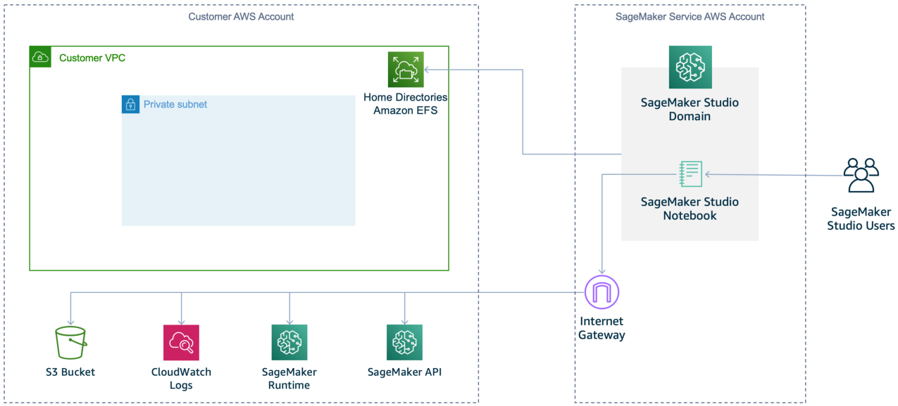

VPC only communication with the internet

To stop SageMaker AI from providing internet access to your Studio notebooks, disable internet

access by specifying the VPC only network access type. Specify this network access type when
you onboard to Studio or call the CreateDomain API. As a result, you won't be able to run a Studio
notebook unless:

• your VPC has an interface endpoint to the SageMaker API and runtime, or a NAT gateway with
internet access

• your security groups allow outbound connections

The following diagram shows a configuration for using VPC-only mode.

Connect to Amazon SageMaker AI resources from within a VPC
8062

## Page 92

Amazon SageMaker AI
Developer Guide

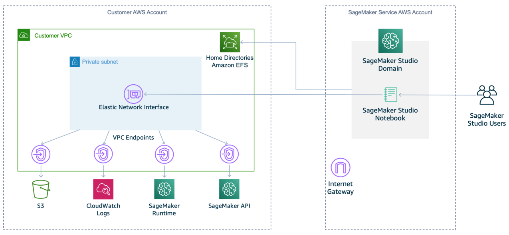

Requirements to use VPC only mode

When you choose VpcOnly, follow these steps:

1.
You must use private subnets only. You cannot use public subnets in VpcOnly mode.

2.
Ensure your subnets have the required number of IP addresses needed. The expected number
of IP addresses needed per user can vary based on use case. We recommend between 2 and 4
IP addresses per user. The total IP address capacity for a Studio domain is the sum of available
IP addresses for each subnet provided when the domain is created. Make sure that your IP
address usage isn't more than the capacity supported by the number of subnets you provide.
Additionally, using subnets distributed across many availability zones can help with IP address
availability. For more information, see VPC and subnet sizing for IPv4.

Note

You can configure only subnets with a default tenancy VPC in which your instance
runs on shared hardware. For more information on the tenancy attribute for VPCs, see
Dedicated Instances.

3.

Warning

When using VpcOnly mode, you partly own the networking configuration for
the domain. We recommend the security best practice of applying least-privilege

Connect to Amazon SageMaker AI resources from within a VPC
8063

## Page 93

Amazon SageMaker AI
Developer Guide

permissions to the inbound and outbound access that security group rules provide.
Overly permissive inbound rule configurations could allow users with access to the VPC
to interact with the applications of other user profiles without authentication.

Set up one or more security groups with inbound and outbound rules that allow the following
traffic:

• NFS traffic over TCP on port 2049 between the domain and the Amazon EFS volume.

• TCP traffic within the security group. This is required for connectivity between the Jupyter
Server application and the Kernel Gateway applications. You must allow access to at least

ports in the range 8192-65535.

Create a distinct security group for each user profile and add inbound access from that same
security group. We do not recommend reusing a domain-level security group for user profiles.
If the domain-level security group allows inbound access to itself, all applications in the
domain have access to all other applications in the domain.

4.
If you want to allow internet access, you must use a NAT gateway with access to the internet,
for example through an internet gateway.

5.
To remove internet access, create interface VPC endpoints (AWS PrivateLink) to allow Studio
to access the following services with the corresponding service names. You must also associate
the security groups for your VPC with these endpoints.

• SageMaker API : com.amazonaws.region.sagemaker.api

• SageMaker AI runtime: com.amazonaws.region.sagemaker.runtime. This is required to
run Studio notebooks and to train and host models.

• Amazon S3: com.amazonaws.region.s3.

• To use SageMaker Projects: com.amazonaws.region.servicecatalog.

• Any other AWS services you require.

If you use the SageMaker Python SDK to run remote training jobs, you must also create the
following Amazon VPC endpoints.

• AWS Security Token Service: com.amazonaws.region.sts

Connect to Amazon SageMaker AI resources from within a VPC
8064

## Page 94

Amazon SageMaker AI
Developer Guide

• Amazon CloudWatch: com.amazonaws.region.logs. This is required to allow SageMaker
Python SDK to get the remote training job status from Amazon CloudWatch.

Note

For a customer working within VPC mode, company firewalls can cause connection issues
with SageMaker Studio or between JupyterServer and the KernelGateway. Make the
following checks if you run into one of these issues when using SageMaker Studio from
behind a firewall.

• Check that the Studio URL is in your networks allowlist.

• Check that the websocket connections are not blocked. Jupyter uses websocket under
the hood. If the KernelGateway application is InService, JupyterServer may not be able
to connect to the KernelGateway. You should see this problem when opening System
Terminal as well.

For more information

• Securing Amazon SageMaker Studio connectivity using a private VPC.

• Security groups for your VPC

• Connect to SageMaker AI Within your VPC

• VPC with public and private subnets (NAT)

Connect a Notebook Instance in a VPC to External Resources

The following topic gives information on how to connect your notebook instance in a VPC to
external resources.

Default communication with the internet

When your notebook allows direct internet access, SageMaker AI provides a network interface that
allows the notebook to communicate with the internet through a VPC managed by SageMaker
AI. Traffic within your VPC's CIDR goes through elastic network interface created in your VPC. All
the other traffic goes through the network interface created by SageMaker AI, which is essentially
through the public internet. Traffic to gateway VPC endpoints like Amazon S3 and DynamoDB goes

Connect to Amazon SageMaker AI resources from within a VPC
8065

## Page 95

Amazon SageMaker AI
Developer Guide

through the public internet, while traffic to interface VPC interface endpoints still goes through
your VPC. If you want to use gateway VPC endpoints, you might want to disable direct internet
access.

VPC-only communication with the internet

To disable direct internet access, you can specify a VPC for your notebook instance. By doing so,
you prevent SageMaker AI from providing internet access to your notebook instance. As a result,
the notebook instance can't train or host models unless your VPC has an interface endpoint (AWS
PrivateLink) or a NAT gateway and your security groups allow outbound connections.

For information about creating a VPC interface endpoint to use AWS PrivateLink for your notebook
instance, see Connect to a Notebook Instance Through a VPC Interface Endpoint. For information
about setting up a NAT gateway for your VPC, see VPC with Public and Private Subnets (NAT) in
the Amazon Virtual Private Cloud User Guide. For information about security groups, see Security
Groups for Your VPC. For more information about networking configurations in each networking
mode and configuring network on premise, see Understanding Amazon SageMaker notebook
instance networking configurations and advanced routing options.

Warning

When you use a VPC for your notebook instance, you partly own the networking
configuration for the instance. As a security best practice, we recommend that you apply
least-privilege permissions to the inbound and outbound access that you permit with your
security group rules. If you apply overly permissive inbound rule configurations, then users
who have access to your VPC could access your Jupyter Notebooks without authenticating.

Security and Shared Notebook Instances

A SageMaker notebook instance is designed to work best for an individual user. It is designed to
give data scientists and other users the most power for managing their development environment.

A notebook instance user has root access for installing packages and other pertinent software. We
recommend that you exercise judgement when granting individuals access to notebook instances
that are attached to a VPC that contains sensitive information. For example, you might grant a user
access to a notebook instance with an IAM policy by giving them the ability to create a presigned
notebook URL, as shown in the following example:

Connect to Amazon SageMaker AI resources from within a VPC
8066

## Page 96

Amazon SageMaker AI
Developer Guide

JSON

{
"Version":"2012-10-17",
"Statement": [
{
"Effect": "Allow",
"Action": "sagemaker:CreatePresignedNotebookInstanceUrl",
"Resource": "arn:aws:sagemaker:us-east-1:111122223333:notebook-
instance/myNotebookInstance"
}
]
}

Run Training and Inference Containers in Internet-Free Mode

SageMaker AI training and deployed inference containers are internet-enabled by default. This
allows containers to access external services and resources on the public internet as part of your
training and inference workloads. However, this could provide an avenue for unauthorized access
to your data. For example, a malicious user or code that you accidentally install on the container
(in the form of a publicly available source code library) could access your data and transfer it to a
remote host.

If you use an Amazon VPC by specifying a value for the VpcConfig parameter when you call

CreateTrainingJob, CreateHyperParameterTuningJob, or CreateModel, you can protect
your data and resources by managing security groups and restricting internet access from your
VPC. However, this comes at the cost of additional network configuration, and has the risk of
configuring your network incorrectly. If you do not want SageMaker AI to provide external network
access to your training or inference containers, you can enable network isolation.

Network Isolation

You can enable network isolation when you create your training job or model by setting the value

of the EnableNetworkIsolation parameter to True when you call CreateTrainingJob,

CreateHyperParameterTuningJob, or CreateModel.

Run Training and Inference Containers in Internet-Free Mode
8067

## Page 97

Amazon SageMaker AI
Developer Guide

Note

Network isolation is required to run training jobs and models using resources from AWS
Marketplace. For additional security, AWS Marketplace images run within an Amazon VPC.
They only have access to data within their local file systems.

When you enable network isolation, your training and inference containers can't make any
outbound network calls to any service, including Amazon S3. No AWS credentials are made
available to the container runtime environment. For training jobs with multiple instances, network
inbound and outbound traffic is limited to communication between training container peers.

SageMaker AI still handles all necessary Amazon S3 download and upload operations using your
SageMaker AI execution role. This happens apart from your training and inference containers,

ensuring that your training data and model artifacts are still accessible while maintaining container
isolation.

The following managed SageMaker AI containers do not support network isolation because they
require access to Amazon S3:

• Chainer

• SageMaker AI Reinforcement Learning

Network isolation with a VPC

Network isolation can be used in conjunction with a VPC. In this scenario, the download and upload
of customer data and model artifacts are routed through your VPC subnet. However, the training
and inference containers themselves continue to be isolated from the network, and do not have
access to any resource within your VPC or on the internet.

Connect to SageMaker AI Within your VPC

You can connect directly to the SageMaker API or to Amazon SageMaker Runtime through an
interface endpoint in your virtual private cloud (VPC) instead of connecting over the internet.
When you use a VPC interface endpoint, communication between your VPC and the SageMaker AI
API or Runtime is conducted entirely and securely within an AWS network.

Connect to SageMaker AI Within your VPC
8068

## Page 98

Amazon SageMaker AI
Developer Guide

Connect to SageMaker AI through a VPC interface endpoint

The SageMaker API and SageMaker AI Runtime support Amazon Virtual Private Cloud (Amazon
VPC) interface endpoints that are powered by AWS PrivateLink. Each VPC endpoint is represented
by one or more Elastic Network Interfaces with private IP addresses in your VPC subnets. For
example, an application inside your VPC uses AWS PrivateLink to communicate with SageMaker AI
Runtime. SageMaker AI Runtime in turn communicates with the SageMaker AI endpoint. Using AWS
PrivateLink allows you to invoke your SageMaker AI endpoint from within your VPC, as shown in
the following diagram.

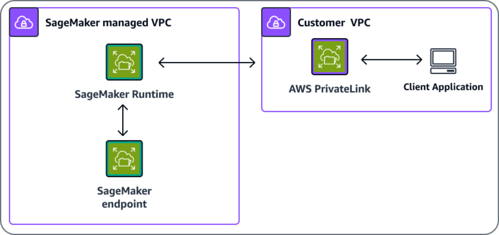

The VPC interface endpoint connects your VPC directly to the SageMaker API or SageMaker AI
Runtime using AWS PrivateLink without using an internet gateway, NAT device, VPN connection, or
Direct Connect connection. The instances in your VPC do not need to connect to the public internet
in order to communicate with the SageMaker API or SageMaker AI Runtime.

You can create an AWS PrivateLink interface endpoint to connect to SageMaker AI or to SageMaker
AI Runtime using either the AWS Management Console or AWS Command Line Interface (AWS CLI).
For instructions, see Access an AWS service using an interface VPC endpoint.

If you haven't enabled a private Domain Name System (DNS) hostname for your VPC endpoint,
after you have created a VPC endpoint, specify the internet endpoint URL to the SageMaker API or

SageMaker AI Runtime. Example code using AWS CLI commands to specify the endpoint-url
parameter follows.

Connect to SageMaker AI Within your VPC
8069

## Page 99

Amazon SageMaker AI
Developer Guide

aws sagemaker list-notebook-instances --endpoint-
url VPC_Endpoint_ID.api.sagemaker.Region.vpce.amazonaws.com

aws sagemaker list-training-jobs --endpoint-
url VPC_Endpoint_ID.api.sagemaker.Region.vpce.amazonaws.com

aws sagemaker-runtime invoke-endpoint --endpoint-url
https://VPC_Endpoint_ID.runtime.sagemaker.Region.vpce.amazonaws.com  \
--endpoint-name Endpoint_Name \
--body "Endpoint_Body" \
--content-type "Content_Type" \
Output_File

If you enable private DNS hostnames for your VPC endpoint, you don't need to specify the

endpoint URL because the default hostname (https://api.sagemaker.Region.amazon.com) resolves
to your VPC endpoint. Similarly, the default SageMaker AI Runtime DNS hostname (https://

runtime.sagemaker.Region.amazonaws.com) also resolves to your VPC endpoint.

The SageMaker API and SageMaker AI Runtime support VPC endpoints in all AWS Regions where
both Amazon VPC and SageMaker AI ares available. SageMaker AI supports making calls to all of its

Operations inside your VPC. If you use the AuthorizedUrl from the
CreatePresignedNotebookInstanceUrl command, your traffic will go over the public internet.
You can't only use a VPC endpoint to access the presigned URL, the request must go through the
internet gateway.

By default, your users can share the presigned URL to people outside of your corporate network.
For additional security, you must add IAM permissions to restrict the URL only be usable within
your network. For information about IAM permissions, see How AWS PrivateLink works with IAM.

Note

When setting up a VPC interface endpoint for the SageMaker AI Runtime service (https://

runtime.sagemaker.Region.amazonaws.com), you must ensure that the VPC interface
endpoint is activated in the Availability Zone of your client in order for private DNS
resolution to work. Otherwise, you may see DNS failures when attempting to resolve the
URL.

To learn more about AWS PrivateLink, see the AWS PrivateLink documentation. Refer to AWS
PrivateLink Pricing for the price of VPC endpoints. To learn more about VPC and endpoints,

Connect to SageMaker AI Within your VPC
8070

## Page 100

Amazon SageMaker AI
Developer Guide

see Amazon VPC. For information about how to use identity-based AWS Identity and Access
Management policies to restrict access to the SageMaker API and SageMaker AI Runtime, see
Control access to the SageMaker AI API by using identity-based policies.

Using SageMaker training and hosting with resources inside your VPC

SageMaker AI uses your execution role to download and upload information from an Amazon
S3 bucket and Amazon Elastic Container Registry (Amazon ECR), in isolation from your training
or inference container. If you have resources that are located inside your VPC, you can still grant
SageMaker AI access to those resources. The following sections explain how to make your resources
available to SageMaker AI with or without network isolation.

Without network isolation enabled

If you haven't set network isolation on your training job or model, SageMaker AI can access
resources using either of the following methods.

• SageMaker training and deployed inference containers can access the internet by default.
SageMaker AI containers are able to access external services and resources on the public internet
as part of your training and inference workloads. SageMaker AI containers are not able to access
resources inside your VPC without a VPC configuration, as shown in the following illustration.

Connect to SageMaker AI Within your VPC
8071

## Page 101

Amazon SageMaker AI
Developer Guide

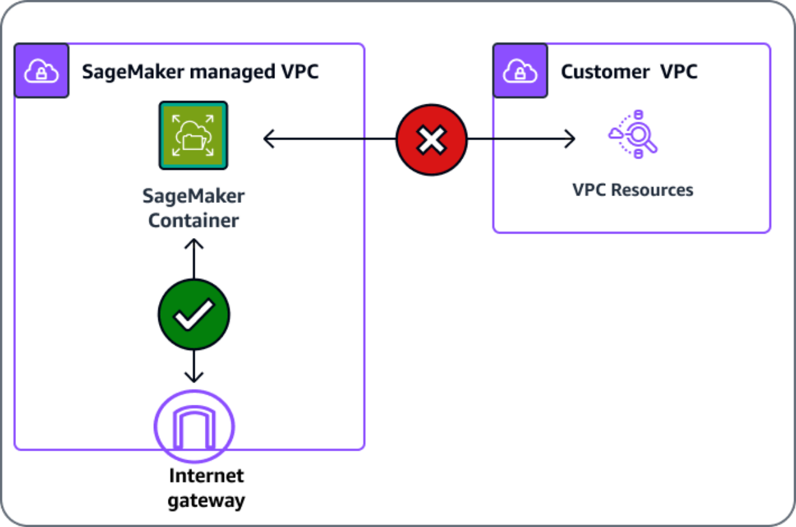

• Use a VPC configuration to communicate with resources inside your VPC through an elastic
network interface (ENI). The communication between the container and the resources in your
VPC takes place securely within your VPC network, as shown in the following illustration. In this
case, you manage networking access to your VPC resources and internet.

Connect to SageMaker AI Within your VPC
8072

## Page 102

Amazon SageMaker AI
Developer Guide

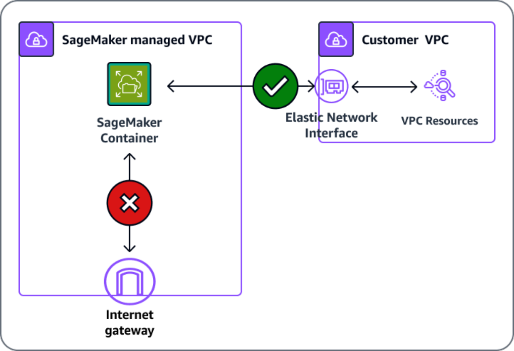

With network isolation

If you employ network isolation, the SageMaker AI container can't communicate with resources
inside your VPC or make any network calls, as shown in the following illustration. If you provide a
VPC configuration, the download and upload operations will be run through your VPC. For more
information about hosting and training with network isolation while using a VPC, see Network
Isolation.

Connect to SageMaker AI Within your VPC
8073

## Page 103

Amazon SageMaker AI
Developer Guide

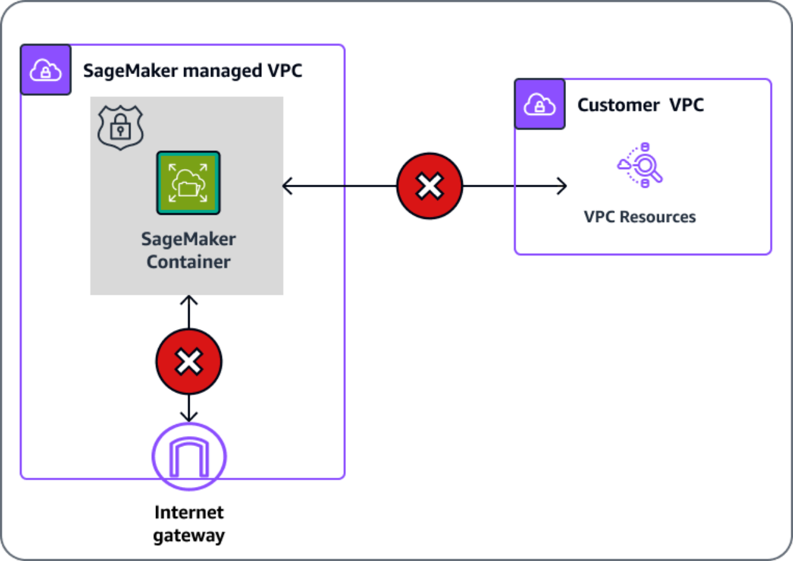

Create a VPC Endpoint Policy for SageMaker AI

You can create a policy for Amazon VPC endpoints for SageMaker AI to specify the following:

• The principal that can perform actions.

• The actions that can be performed.

• The resources on which actions can be performed.

For more information, see Controlling Access to Services with VPC Endpoints in the Amazon VPC
User Guide.

Connect to SageMaker AI Within your VPC
8074

## Page 104

Amazon SageMaker AI
Developer Guide

Note

VPC endpoint policies aren't supported for Federal Information Processing Standard (FIPS)
SageMaker AI runtime endpoints for runtime_InvokeEndpoint.

The following example VPC endpoint policy specifies that all users who have access to the VPC

interface endpoint are allowed to invoke the SageMaker AI hosted endpoint named myEndpoint.

{
"Statement": [
{
"Action": "sagemaker:InvokeEndpoint",
"Effect": "Allow",
"Resource": "arn:aws:sagemaker:us-west-2:123456789012:endpoint/myEndpoint",

"Principal": "*"
}
]
}

In this example, the following are denied:

• Other SageMaker API actions, such as sagemaker:CreateEndpoint and

sagemaker:CreateTrainingJob.

• Invoking SageMaker AI hosted endpoints other than myEndpoint.

Note

In this example, users can still take other SageMaker API actions from outside the VPC. For
information about how to restrict API calls to those from within the VPC, see Control access
to the SageMaker AI API by using identity-based policies.

Create a VPC Endpoint Policy for Amazon SageMaker Feature Store

To create a VPC Endpoint for Amazon SageMaker Feature Store, use the following endpoint

template, substituting your VPC_Endpoint_ID.api and Region:

Connect to SageMaker AI Within your VPC
8075

## Page 105

Amazon SageMaker AI
Developer Guide

VPC_Endpoint_ID.api.featurestore-

runtime.sagemaker.Region.vpce.amazonaws.com

Connect to Amazon SageMaker Studio and Studio Classic Through an Interface
VPC Endpoint

You can connect to your Amazon SageMaker Studio and Amazon SageMaker Studio Classic from
your Amazon Virtual Private Cloud (Amazon VPC) through an interface endpoint in your VPC
instead of connecting over the internet. When you use an interface VPC endpoint (interface
endpoint), communication between your VPC and Studio or Studio Classic is conducted entirely
and securely within the AWS network.

Studio and Studio Classic supports interface endpoints that are powered by AWS PrivateLink.
Each interface endpoint is represented by one or more Elastic network interfaces with private IP
addresses in your VPC subnets.

Studio and Studio Classic supports interface endpoints in all AWS Regions where both Amazon
SageMaker AI and Amazon VPC are available.

Topics

• Create a VPC Endpoint

• Create a VPC Endpoint Policy for Studio or Studio Classic

• Allow Access Only from Within Your VPC

Create a VPC Endpoint

You can create an interface endpoint to connect to Studio or Studio Classic with either the AWS
console or the AWS Command Line Interface (AWS CLI). For instructions, see Creating an interface
endpoint. Make sure that you create interface endpoints for all of the subnets in your VPC from
which you want to connect to Studio and Studio Classic.

When you create an interface endpoint, ensure that the security groups on your endpoint allow
inbound access for HTTPS traffic from the security groups associated with Studio and Studio
Classic. For more information, see Control access to services with VPC endpoints.

Connect to SageMaker AI Within your VPC
8076

## Page 106

Amazon SageMaker AI
Developer Guide

Note

In addition to creating an interface endpoint to connect to Studio and Studio Classic,
create an interface endpoint to connect to the Amazon SageMaker API. When users call

CreatePresignedDomainUrl to get the URL to connect to Studio and Studio Classic,
that call goes through the interface endpoint used to connect to the SageMaker API.

When you create the interface endpoint, specify aws.sagemaker.Region.studio as the service
name for either Studio or Studio Classic. After you create the interface endpoint, enable private
DNS for your endpoint. When you connect to Studio or Studio Classic from within the VPC using
the SageMaker API, the AWS CLI, or the console, you connect through the interface endpoint
instead of the public internet. You also need to set up a custom DNS with private hosted zones
for the Amazon VPC endpoint so Studio or Studio Classic can access the SageMaker API using the

api.sagemaker.$region.amazonaws.com endpoint rather than using the VPC endpoint URL.
For instructions on setting up a private hosted zone, see Working with private hosted zones.

Create a VPC Endpoint Policy for Studio or Studio Classic

You can attach an Amazon VPC endpoint policy to the interface VPC endpoints that you use to
connect to Studio or Studio Classic. The endpoint policy controls access to Studio or Studio Classic.
You can specify the following:

• The principal that can perform actions.

• The actions that can be performed.

• The resources on which actions can be performed.

To use a VPC endpoint with Studio or Studio Classic, your endpoint policy must allow the

CreateApp operation on the KernelGateway app type. This allows traffic that is routed to through

the VPC endpoint to call the CreateApp API. The following example VPC endpoint policy shows

how to allow the CreateApp operation.

{
"Statement": [
{
"Action": "sagemaker:CreateApp",
"Effect": "Allow",
"Resource": "arn:aws:sagemaker:us-west-2:acct-id:app/domain-id/*",

Connect to SageMaker AI Within your VPC
8077

## Page 107

Amazon SageMaker AI
Developer Guide

"Principal": "*"
}
]
}

For more information, see Controlling access to services with VPC endpoints.

The following example of a VPC endpoint policy specifies that all users that have access to the
endpoint are allowed to access the user profiles in the SageMaker AI domain with the specified
domain ID. Access to other domains is denied.

{
"Statement": [
{
"Action": "sagemaker:CreatePresignedDomainUrl",
"Effect": "Allow",
"Resource": "arn:aws:sagemaker:us-west-2:acct-id:user-profile/domain-id/*",
"Principal": "*"
}
]
}

Allow Access Only from Within Your VPC

Users outside your VPC can connect to Studio or Studio Classic over the internet even if you set up
an interface endpoint in your VPC.

To allow access to only connections made from within your VPC, create an AWS Identity and Access
Management (IAM) policy to that effect. Add that policy to every user, group, or role used to access
Studio or Studio Classic. This feature is only supported when using IAM mode for authentication,
and is not supported in IAM Identity Center mode. The following examples demonstrate how to
create such policies.

Important

If you apply an IAM policy similar to one of the following examples, users cannot access
Studio or Studio Classic or the specified SageMaker APIs through the SageMaker AI console.
To access Studio or Studio Classic, users must use a presigned URL or call the SageMaker
APIs directly.

Connect to SageMaker AI Within your VPC
8078

## Page 108

Amazon SageMaker AI
Developer Guide

Example 1: Allow connections only within the subnet of an interface endpoint

The following policy allows connections only to callers within the subnet where you created the
interface endpoint.

JSON

{
"Id": "sagemaker-studio-example-1",
"Version":"2012-10-17",
"Statement": [
{
"Sid": "EnableSageMakerStudioAccess",
"Effect": "Allow",
"Action": [
"sagemaker:CreatePresignedDomainUrl",
"sagemaker:DescribeUserProfile"
],
"Resource": "*",
"Condition": {
"StringEquals": {
"aws:SourceVpc": "vpc-111bbaaa"
}
}
}
]
}

Example 2: Allow connections only through interface endpoints using aws:sourceVpce

The following policy allows connections only to those made through the interface endpoints

specified by the aws:sourceVpce condition key. For example, the first interface endpoint could
allow access through the SageMaker AI console. The second interface endpoint could allow access
through the SageMaker API.

JSON

{
"Id": "sagemaker-studio-example-2",
"Version":"2012-10-17",

Connect to SageMaker AI Within your VPC
8079

## Page 109

Amazon SageMaker AI
Developer Guide

"Statement": [
{
"Sid": "EnableSageMakerStudioAccess",
"Effect": "Allow",
"Action": [
"sagemaker:CreatePresignedDomainUrl",
"sagemaker:DescribeUserProfile"
],
"Resource": "*",
"Condition": {
"ForAnyValue:StringEquals": {
"aws:sourceVpce": [
"vpce-111bbccc",
"vpce-111bbddd"
]
}
}

}
]
}

This policy includes the DescribeUserProfile action. Typically you call

DescribeUserProfile to make sure that the status of the user profile is InService before you
try to connect to the domain. For example:

aws sagemaker describe-user-profile \
--domain-id domain-id \
--user-profile-name profile-name

Response:

{
"DomainId": "domain-id",
"UserProfileArn": "arn:aws:sagemaker:us-west-2:acct-id:user-profile/domain-id/
profile-name",
"UserProfileName": "profile-name",
"HomeEfsFileSystemUid": "200001",
"Status": "InService",
"LastModifiedTime": 1605418785.555,
"CreationTime": 1605418477.297
}

Connect to SageMaker AI Within your VPC
8080

## Page 110

Amazon SageMaker AI
Developer Guide

aws sagemaker create-presigned-domain-url
--domain-id domain-id \
--user-profile-name profile-name

Response:

{
"AuthorizedUrl": "https://domain-id.studio.us-west-2.sagemaker.aws/auth?
token=AuthToken"
}

For both of these calls, if you are using a version of the AWS SDK that was released before August
13, 2018, you must specify the endpoint URL in the call. For example, the following example shows

a call to create-presigned-domain-url:

aws sagemaker create-presigned-domain-url
--domain-id domain-id \
--user-profile-name profile-name \
--endpoint-url vpc-endpoint-id.api.sagemaker.Region.vpce.amazonaws.com

Example 3: Allow connections from IP addresses using aws:SourceIp

The following policy allows connections only from the specified range of IP addresses using the

aws:SourceIp condition key.

JSON

{
"Id": "sagemaker-studio-example-3",
"Version":"2012-10-17",
"Statement": [
{
"Sid": "EnableSageMakerStudioAccess",
"Effect": "Allow",
"Action": [
"sagemaker:CreatePresignedDomainUrl",
"sagemaker:DescribeUserProfile"
],
"Resource": "*",
"Condition": {
"IpAddress": {

Connect to SageMaker AI Within your VPC
8081

## Page 111

Amazon SageMaker AI
Developer Guide

"aws:SourceIp": [
"192.0.2.0/24",
"203.0.113.0/24"
]
}
}
}
]
}

Example 4: Allow connections from IP addresses through an interface endpoint using

aws:VpcSourceIp

If you are accessing Studio or Studio Classic through an interface endpoint, you can use the

aws:VpcSourceIp condition key to allow connections only from the specified range of IP
addresses within the subnet where you created the interface endpoint as shown in the following
policy:

JSON

{
"Id": "sagemaker-studio-example-4",
"Version":"2012-10-17",
"Statement": [
{
"Sid": "EnableSageMakerStudioAccess",
"Effect": "Allow",
"Action": [
"sagemaker:CreatePresignedDomainUrl",
"sagemaker:DescribeUserProfile"
],
"Resource": "*",
"Condition": {
"IpAddress": {
"aws:VpcSourceIp": [
"192.0.2.0/24",
"203.0.113.0/24"
]
},
"StringEquals": {
"aws:SourceVpc": "vpc-111bbaaa"

Connect to SageMaker AI Within your VPC
8082

## Page 112

Amazon SageMaker AI
Developer Guide

}
}
}
]
}

Connecting to an MLflow tracking server through an Interface VPC Endpoint

The MLflow tracking server runs in an Amazon Virtual Private Cloud managed by Amazon
SageMaker AI. You can connect to an MLflow tracking server from an endpoint in your own VPC.
Your requests to the tracking server are not exposed to the public internet. For more information
about connecting your VPC to SageMaker AI, see Connect to SageMaker AI Within your VPC.

Topics

• Create a VPC Endpoint

• Create a VPC Endpoint Policy for SageMaker AI MLflow

• Allow Access only from within your VPC

Create a VPC Endpoint

You can create an interface endpoint to connect to SageMaker AI MLflow. For instructions, see
Creating an interface endpoint. Make sure that you create interface endpoints for all of the subnets
in your VPC from which you want to connect to SageMaker AI MLflow.

When you create an interface endpoint, ensure that the security groups on your endpoint allow
inbound and outbound access for HTTPS traffic. For more information, see Control access to
services with VPC endpoints.

Note

In addition to creating an interface endpoint to connect to SageMaker AI MLflow,
create an interface endpoint to connect to the Amazon SageMaker API. When users call

CreatePresignedMlflowTrackingServerUrl to get the URL to connect to SageMaker
AI MLflow, that call goes through the interface endpoint used to connect to the SageMaker
API.

Connect to SageMaker AI Within your VPC
8083

## Page 113

Amazon SageMaker AI
Developer Guide

When you create the interface endpoint, specify aws.sagemaker.AWS Region.experiments as
the service name. After you create the interface endpoint, enable private DNS for your endpoint.
When you connect to SageMaker AI MLflow from within the VPC using the SageMaker Python SDK,
you connect through the interface endpoint instead of the public internet.

Within the AWS Management Console, you can use the following procedure to create an endpoint.

To create an endpoint

1.
Navigate to the Amazon Virtual Private Cloud console.

2.
Navigate to Endpoints.

3.
Choose Create endpoint.

4.
(Optional) For Name (tag), specify a name for the endpoint.

5.
In the search bar under Services, specify experiments.

6.
Select the endponit that you're creating.

7.
For VPC, specify the name of the VPC.

8.
Choose Create endpoint.

Create a VPC Endpoint Policy for SageMaker AI MLflow

You can attach an Amazon VPC endpoint policy to the interface VPC endpoints that you use to
connect to SageMaker AI MLflow. The endpoint policy controls access to MLflow. You can specify
the following:

• The principal that can perform actions.

• The actions that can be performed.

• The resources on which actions can be performed.

For more information, see Controlling access to services with VPC endpoints.

The following example of a VPC endpoint policy specifies that all users that have access to the
endpoint are allowed to access to the MLflow tracking server that you specify. Access to other
tracking servers is denied.

{
"Statement": [
{

Connect to SageMaker AI Within your VPC
8084

## Page 114

Amazon SageMaker AI
Developer Guide

"Action": "sagemaker-mlflow:*",
"Effect": "Allow",
"Principal": "*",
"Resource": "arn:aws:sagemaker:AWS Region:111122223333:mlflow-tracking-
server/*"
}
]
}

Allow Access only from within your VPC

Users outside your VPC can connect to SageMaker AI MLflow or over the internet even if you set up
an interface endpoint in your VPC.

To allow access to only connections made from within your VPC, create an AWS Identity and Access
Management (IAM) policy to that effect. Add that policy to every user, group, or role used to access
SageMaker AI MLflow. This feature is only supported when using IAM mode for authentication, and
is not supported in IAM Identity Center mode. The following examples demonstrate how to create
such policies.

Important

If you apply an IAM policy similar to one of the following examples, users cannot access
SageMaker AI MLflow through the specified SageMaker APIs through the SageMaker
AI console. To access SageMaker AI MLflow, users must use a presigned URL or call the
SageMaker APIs directly.

Example 1: Allow connections only within the subnet of an interface endpoint

The following policy allows connections only to callers within the subnet where you created the
interface endpoint.

JSON

{
"Id": "mlflow-example-1",
"Version":"2012-10-17",
"Statement": [
{

Connect to SageMaker AI Within your VPC
8085

## Page 115

Amazon SageMaker AI
Developer Guide

"Sid": "MlflowAccess",
"Effect": "Allow",
"Action": [
"sagemaker-mlflow:*"
],
"Resource": "*",
"Condition": {
"StringEquals": {
"aws:SourceVpce": "vpce-111bbaaa"
}
}
}
]
}

Example 2: Allow connections only through interface endpoints using aws:sourceVpce

The following policy allows connections only to those made through the interface endpoints

specified by the aws:sourceVpce condition key. For example, the first interface endpoint could
allow access through the SageMaker AI console. The second interface endpoint could allow access
through the SageMaker API.

JSON

{
"Id": "sagemaker-mlflow-example-2",
"Version":"2012-10-17",
"Statement": [
{
"Sid": "MlflowAccess",
"Effect": "Allow",
"Action": [
"sagemaker-mlflow:*"
],
"Resource": "*",
"Condition": {
"ForAnyValue:StringEquals": {
"aws:sourceVpce": [
"vpce-111bbccc",
"vpce-111bbddd"
]

Connect to SageMaker AI Within your VPC
8086

## Page 116

Amazon SageMaker AI
Developer Guide

}
}
}
]
}

Example 3: Allow connections from IP addresses using aws:SourceIp

The following policy allows connections only from the specified range of IP addresses using the

aws:SourceIp condition key.

JSON

{

"Id": "sagemaker-mlflow-example-3",
"Version":"2012-10-17",
"Statement": [
{
"Sid": "MlflowAccess",
"Effect": "Allow",
"Action": [
"sagemaker-mlflow:*"
],
"Resource": "*",
"Condition": {
"IpAddress": {
"aws:SourceIp": [
"192.0.2.0/24",
"203.0.113.0/24"
]
}
}
}
]
}

Example 4: Allow connections from IP addresses through an interface endpoint using

aws:VpcSourceIp

Connect to SageMaker AI Within your VPC
8087

## Page 117

Amazon SageMaker AI
Developer Guide

If you are accessing SageMaker AI MLflow through an interface endpoint, you can use the

aws:VpcSourceIp condition key to allow connections only from the specified range of IP
addresses within the subnet where you created the interface endpoint as shown in the following
policy:

JSON

{
"Id": "sagemaker-mlflow-example-4",
"Version":"2012-10-17",
"Statement": [
{
"Sid": "MlflowAccess",
"Effect": "Allow",
"Action": [
"sagemaker-mlflow:*"
],
"Resource": "*",
"Condition": {
"IpAddress": {
"aws:VpcSourceIp": [
"192.0.2.0/24",
"203.0.113.0/24"
]
},
"StringEquals": {
"aws:SourceVpc": "vpc-111bbaaa"
}
}
}
]
}

Connect to a Notebook Instance Through a VPC Interface Endpoint

You can connect to your notebook instance from your VPC through an interface endpoint in your
Virtual Private Cloud (VPC) instead of connecting over the public internet. When you use a VPC
interface endpoint, communication between your VPC and the notebook instance is conducted
entirely and securely within the AWS network.

Connect to SageMaker AI Within your VPC
8088

## Page 118

Amazon SageMaker AI
Developer Guide

SageMaker notebook instances support Amazon Virtual Private Cloud (Amazon VPC) interface
endpoints that are powered by AWS PrivateLink. Each VPC endpoint is represented by one or more
Elastic Network Interfaces with private IP addresses in your VPC subnets.

Note

Before you create an interface VPC endpoint to connect to a notebook instance, create an
interface VPC endpoint to connect to the SageMaker API. That way, when users call
CreatePresignedNotebookInstanceUrl to get the URL to connect to the notebook instance,
that call also goes through the interface VPC endpoint. For information, see Connect to
SageMaker AI Within your VPC.

You can create an interface endpoint to connect to your notebook instance with either the AWS
Management Console or AWS Command Line Interface (AWS CLI) commands. For instructions,
see Creating an Interface Endpoint. Make sure that you create an interface endpoint for all of the
subnets in your VPC from which you want to connect to the notebook instance.

When you create the interface endpoint, specify aws.sagemaker.Region.notebook as the service
name. After you create a VPC endpoint, enable private DNS for your VPC endpoint. Anyone using
the SageMaker API, the AWS CLI, or the console to connect to the notebook instance from within
the VPC connects to the notebook instance through the VPC endpoint instead of the public
internet.

SageMaker notebook instances support VPC endpoints in all AWS Regions where both Amazon VPC
and SageMaker AI are available.

Topics

• Connect Your Private Network to Your VPC

• Create a VPC Endpoint Policy for SageMaker AI Notebook Instances

• Restrict Access to Connections from Within Your VPC

Connect Your Private Network to Your VPC

To connect to your notebook instance through your VPC, you either have to connect from an
instance that is inside the VPC, or connect your private network to your VPC by using an AWS
Virtual Private Network (Site-to-Site VPN) or Direct Connect. For information about Site-to-Site

Connect to SageMaker AI Within your VPC
8089

## Page 119

Amazon SageMaker AI
Developer Guide

VPN, see VPN Connections in the Amazon Virtual Private Cloud User Guide. For information about
AWS Direct Connect, see Creating a Connection in the AWS Direct Connect User Guide.

Create a VPC Endpoint Policy for SageMaker AI Notebook Instances

You can create a policy for Amazon VPC endpoints for SageMaker notebook instances to specify
the following:

• The principal that can perform actions.

• The actions that can be performed.

• The resources on which actions can be performed.

For more information, see Controlling Access to Services with VPC Endpoints in the Amazon VPC
User Guide.

The following example of a VPC endpoint policy specifies that all users that have access to the

endpoint are allowed to access the notebook instance named myNotebookInstance.

{
"Statement": [
{
"Action": "sagemaker:CreatePresignedNotebookInstanceUrl",
"Effect": "Allow",
"Resource": "arn:aws:sagemaker:us-west-2:123456789012:notebook-instance/
myNotebookInstance",
"Principal": "*"
}
]
}

Access to other notebook instances is denied.

Restrict Access to Connections from Within Your VPC

Even if you set up an interface endpoint in your VPC, individuals outside the VPC can connect to
the notebook instance over the internet.

Connect to SageMaker AI Within your VPC
8090

## Page 120

Amazon SageMaker AI
Developer Guide

Important

If you apply an IAM policy similar to one of the following, users can't access the specified
SageMaker APIs or the notebook instance through the console.

To restrict access to only connections made from within your VPC, create an AWS Identity and

Access Management policy that restricts access to only calls that come from within your VPC. Then
add that policy to every AWS Identity and Access Management user, group, or role used to access
the notebook instance.

Note

This policy allows connections only to callers within a subnet where you created an
interface endpoint.

JSON

{
"Id": "notebook-example-1",
"Version":"2012-10-17",
"Statement": [
{
"Sid": "EnableNotebookAccess",
"Effect": "Allow",
"Action": [
"sagemaker:CreatePresignedNotebookInstanceUrl",
"sagemaker:DescribeNotebookInstance"
],
"Resource": "*",
"Condition": {
"StringEquals": {
"aws:SourceVpc": "vpc-111bbaaa"
}
}
}
]
}

Connect to SageMaker AI Within your VPC
8091

## Page 121

Amazon SageMaker AI
Developer Guide

If you want to restrict access to the notebook instance to only connections made using the

interface endpoint, use the aws:SourceVpce condition key instead of aws:SourceVpc:

JSON

{
"Id": "notebook-example-1",
"Version":"2012-10-17",
"Statement": [
{
"Sid": "EnableNotebookAccess",
"Effect": "Allow",
"Action": [
"sagemaker:CreatePresignedNotebookInstanceUrl",
"sagemaker:DescribeNotebookInstance"
],
"Resource": "*",
"Condition": {
"ForAnyValue:StringEquals": {
"aws:sourceVpce": [
"vpce-111bbccc",
"vpce-111bbddd"
]
}
}
}
]
}

Both of these policy examples assume that you have also created an interface endpoint for the
SageMaker API. For more information, see Connect to SageMaker AI Within your VPC. In the

second example, one of the values for aws:SourceVpce is the ID of the interface endpoint for the
notebook instance. The other is the ID of the interface endpoint for the SageMaker API.

The policy examples here include

DescribeNotebookInstance, because typically you would call DescribeNotebookInstance to

make sure that the NotebookInstanceStatus is InService before you try to connect to it. For
example:

aws sagemaker describe-notebook-instance \

Connect to SageMaker AI Within your VPC
8092

## Page 122

Amazon SageMaker AI
Developer Guide

--notebook-instance-name myNotebookInstance
{
"NotebookInstanceArn":
"arn:aws:sagemaker:us-west-2:1234567890ab:notebook-instance/mynotebookinstance",
"NotebookInstanceName": "myNotebookInstance",
"NotebookInstanceStatus": "InService",
"Url": "mynotebookinstance.notebook.us-west-2.sagemaker.aws",
"InstanceType": "ml.m4.xlarge",
"RoleArn":
"arn:aws:iam::1234567890ab:role/service-role/AmazonSageMaker-
ExecutionRole-12345678T123456",
"LastModifiedTime": 1540334777.501,
"CreationTime": 1523050674.078,
"DirectInternetAccess": "Disabled"
}

aws sagemaker create-presigned-notebook-instance-url --notebook-instance-name
myNotebookInstance
{
"AuthorizedUrl": "https://mynotebookinstance.notebook.us-west-2.sagemaker.aws?
authToken=AuthToken
}

Note

The presigned-notebook-instance-url, AuthorizedUrl, generated can be used
from anywhere on the internet.

For both of these calls, if you did not enable private DNS hostnames for your VPC endpoint, or
if you are using a version of the AWS SDK that was released before August 13, 2018, you must

specify the endpoint URL in the call. For example, the call to create-presigned-notebook-

instance-url is:

aws sagemaker create-presigned-notebook-instance-url
--notebook-instance-name myNotebookInstance --endpoint-url
VPC_Endpoint_ID.api.sagemaker.Region.vpce.amazonaws.com

Connect to SageMaker AI Within your VPC
8093

## Page 123

Amazon SageMaker AI
Developer Guide

Connect Your Private Network to Your VPC

To call the SageMaker API and SageMaker AI Runtime through your VPC, you have to connect from
an instance that is inside the VPC or connect your private network to your VPC by using an AWS
Virtual Private Network (Site-to-Site VPN) or Direct Connect. For information about Site-to-Site
VPN, see VPN Connections in the Amazon Virtual Private Cloud User Guide. For information about
AWS Direct Connect, see Creating a Connection in the AWS Direct Connect User Guide.

Give SageMaker AI Access to Resources in your Amazon VPC

SageMaker AI runs the following job types in an Amazon Virtual Private Cloud by default.

• Processing

• Training

• Model hosting

• Batch transform

• Amazon SageMaker Clarify

• SageMaker AI Compilation

However, containers for these jobs access AWS resources—such as the Amazon Simple Storage
Service (Amazon S3) buckets where you store training data and model artifacts—over the internet.

To control access to your data and job containers, we recommend that you create a private VPC
and configure it so that they aren't accessible over the internet. For information about creating and
configuring a VPC, see Getting Started With Amazon VPC in the Amazon VPC User Guide. Using a
VPC helps to protect your job containers and data because you can configure your VPC so that it
is not connected to the internet. Using a VPC also allows you to monitor all network traffic in and
out of your job containers by using VPC flow logs. For more information, see VPC Flow Logs in the
Amazon VPC User Guide.

You specify your private VPC configuration when you create jobs by specifying subnets and security
groups. When you specify the subnets and security groups, SageMaker AI creates elastic network
interfaces that are associated with your security groups in one of the subnets. Network interfaces
allow your job containers to connect to resources in your VPC. For information about network
interfaces, see Elastic Network Interfaces in the Amazon VPC User Guide.

Give SageMaker AI Access to Resources in your Amazon VPC
8094

## Page 124

Amazon SageMaker AI
Developer Guide

You specify a VPC configuration within the VpcConfig object of the CreateProcessingJob
operation or CreateTrainingJob operation. Specifying a VPC configuration when you create a
training job gives your model access to resources within your VPC.

Specifying a VPC configuration alone doesn't change the invocation path. To connect to Amazon

SageMaker AI within a VPC, create a VPC endpoint and invoke it. For more information, see
Connect to SageMaker AI Within your VPC.

Topics

• Give SageMaker AI Processing Jobs Access to Resources in Your Amazon VPC

• Give SageMaker AI Training Jobs Access to Resources in Your Amazon VPC

• Give SageMaker AI Hosted Endpoints Access to Resources in Your Amazon VPC

• Give Batch Transform Jobs Access to Resources in Your Amazon VPC

• Give Amazon SageMaker Clarify Jobs Access to Resources in Your Amazon VPC

• Give SageMaker AI Compilation Jobs Access to Resources in Your Amazon VPC

• Give Inference Recommender Jobs Access to Resources in Your Amazon VPC

Give SageMaker AI Processing Jobs Access to Resources in Your Amazon VPC

To control access to your data and processing jobs, create a Amazon VPC with private subnets.
For information about creating and configuring a VPC, see Get Started With Amazon VPC in the
Amazon VPC User Guide.

You can monitor all network traffic in and out of your processing containers by using VPC flow logs.
For more information, see VPC Flow Logs in the Amazon VPC User Guide.

This document explains how to add Amazon VPC configurations for processing jobs.

Configure a Processing Job for Amazon VPC Access

You configure the processing job by specifying the subnets and security group IDs within the
VPC. You don’t need to specify the subnet for the processing container. Amazon SageMaker AI
automatically pulls the processing container from Amazon ECR. For more information about
processing containers, see Data transformation workloads with SageMaker Processing.

When creating a processing job, you can specify subnets and security groups in your VPC using
either the SageMaker AI console or the API.

Give SageMaker AI Access to Resources in your Amazon VPC
8095

## Page 125

Amazon SageMaker AI
Developer Guide

To use the API, you specify the subnets and security group IDs in the NetworkConfig.VpcConfig
parameter of the  CreateProcessingJob operation. SageMaker AI uses the subnet and security
group details to create the network interfaces and attaches them to the processing containers. The
network interfaces provide the processing containers with a network connection within your VPC.
This allows the processing job to connect to resources that exist in your VPC.

The following is an example of the VpcConfig parameter that you include in your call to the

CreateProcessingJob operation:

VpcConfig: {
"Subnets": [
"subnet-0123456789abcdef0",
"subnet-0123456789abcdef1",
"subnet-0123456789abcdef2"
],
"SecurityGroupIds": [
"sg-0123456789abcdef0"
]
}

Configure Your Private VPC for SageMaker AI Processing

When configuring the private VPC for your SageMaker AI processing jobs, use the following
guidelines. For information about setting up a VPC, see Working with VPCs and Subnets in the
Amazon VPC User Guide.

Topics

• Ensure That Subnets Have Enough IP Addresses

• Create an Amazon S3 VPC Endpoint

• Use a Custom Endpoint Policy to Restrict Access to S3

• Configure Route Tables

• Configure the VPC Security Group

• Connect to Resources Outside Your VPC

• Monitor Amazon SageMaker Processing Jobs with CloudWatch Logs and Metrics

Give SageMaker AI Access to Resources in your Amazon VPC
8096

## Page 126

Amazon SageMaker AI
Developer Guide

Ensure That Subnets Have Enough IP Addresses

Your VPC subnets should have at least two private IP addresses for each instance in a processing
job. For more information, see VPC and Subnet Sizing for IPv4 in the Amazon VPC User Guide.

Create an Amazon S3 VPC Endpoint

If you configure your VPC so that processing containers don't have access to the internet, they
can't connect to the Amazon S3 buckets that contain your data unless you create a VPC endpoint
that allows access. By creating a VPC endpoint, you allow your processing containers to access
the buckets where you store your data. We recommend that you also create a custom policy that
allows only requests from your private VPC to access to your S3 buckets. For more information, see
Endpoints for Amazon S3.

To create an S3 VPC endpoint:

1.
Open the Amazon VPC console at https://console.aws.amazon.com/vpc/.

2.
In the navigation pane, choose Endpoints, then choose Create Endpoint

3.
For Service Name, choose com.amazonaws.region.s3, where region is the name of the
region where your VPC resides.

4.
For VPC, choose the VPC you want to use for this endpoint.

5.
For Configure route tables, select the route tables to be used by the endpoint. The VPC
service automatically adds a route to each route table you select that points any S3 traffic to
the new endpoint.

6.
For Policy, choose Full Access to allow full access to the S3 service by any user or service
within the VPC. Choose Custom to restrict access further. For information, see Use a Custom
Endpoint Policy to Restrict Access to S3.

Use a Custom Endpoint Policy to Restrict Access to S3

The default endpoint policy allows full access to S3 for any user or service in your VPC. To further
restrict access to S3, create a custom endpoint policy. For more information, see Using Endpoint
Policies for Amazon S3. You can also use a bucket policy to restrict access to your S3 buckets to
only traffic that comes from your Amazon VPC. For information, see Using Amazon S3 Bucket
Policies.

Give SageMaker AI Access to Resources in your Amazon VPC
8097

## Page 127

Amazon SageMaker AI
Developer Guide

Restrict Package Installation on the Processing Container

The default endpoint policy allows users to install packages from the Amazon Linux and Amazon
Linux 2 repositories on the processing container. If you don't want users to install packages from
that repository, create a custom endpoint policy that explicitly denies access to the Amazon Linux
and Amazon Linux 2 repositories. The following is an example of a policy that denies access to
these repositories:

{
"Statement": [
{
"Sid": "AmazonLinuxAMIRepositoryAccess",
"Principal": "*",
"Action": [
"s3:GetObject"
],
"Effect": "Deny",
"Resource": [
"arn:aws:s3:::packages.*.amazonaws.com/*",
"arn:aws:s3:::repo.*.amazonaws.com/*"
]
}
]
}

{
"Statement": [
{ "Sid": "AmazonLinux2AMIRepositoryAccess",
"Principal": "*",
"Action": [
"s3:GetObject"
],
"Effect": "Deny",
"Resource": [
"arn:aws:s3:::amazonlinux.*.amazonaws.com/*"
]
}
]
}

Give SageMaker AI Access to Resources in your Amazon VPC
8098

## Page 128

Amazon SageMaker AI
Developer Guide

Configure Route Tables

Use default DNS settings for your endpoint route table, so that standard Amazon S3 URLs (for

example, http://s3-aws-region.amazonaws.com/amzn-s3-demo-bucket) resolve. If you

don't use default DNS settings, ensure that the URLs that you use to specify the locations of the
data in your processing jobs resolve by configuring the endpoint route tables. For information
about VPC endpoint route tables, see Routing for Gateway Endpoints in the Amazon VPC User
Guide.

Configure the VPC Security Group

In distributed processing, you must allow communication between the different containers in
the same processing job. To do that, configure a rule for your security group that allows inbound
connections between members of the same security group. For more information, see Security
Group Rules.

Connect to Resources Outside Your VPC

If you're connecting your models to resources outside the VPC that they're running in, do one of
the following:

• Connect to other AWS services – If your model needs access to an AWS service that supports
interface Amazon VPC endpoints, create an endpoint to connect to that service. For a list of
services that support interface endpoints, see AWS services that integrate with AWS PrivateLink
in the AWS PrivateLink User Guide. For information about creating an interface VPC endpoint,
see Access an AWS service using an interface VPC endpoint in the AWS PrivateLink User Guide.

• Connect to resources over the internet – If your models are running on instances in an Amazon
VPC that does not have a subnet with access to the internet, the models won't have access to
resources on the internet. If your model needs access to an AWS service that doesn't support
interface VPC endpoints, or to a resource outside of AWS, ensure that you are running your
models in a private subnet that has access to the internet using a public NAT gateway in a
public subnet. After you have your models running in the private subnet, configure your security
groups and network access control lists (NACLs) to allow outbound connections from the private
subnet to the public NAT gateway in the public subnet. For information, see NAT gateways in the
Amazon VPC User Guide.

Give SageMaker AI Access to Resources in your Amazon VPC
8099

## Page 129

Amazon SageMaker AI
Developer Guide

Monitor Amazon SageMaker Processing Jobs with CloudWatch Logs and Metrics

Amazon SageMaker AI provides Amazon CloudWatch logs and metrics to monitor training jobs.
CloudWatch provides CPU, GPU, memory, GPU memory, and disk metrics, and event logging. For
more information about monitoring Amazon SageMaker processing jobs, see Amazon SageMaker
AI metrics in Amazon CloudWatch and SageMaker AI job metrics.

Give SageMaker AI Training Jobs Access to Resources in Your Amazon VPC

Note

For training jobs, you can configure only subnets with a default tenancy VPC in which your
instance runs on shared hardware. For more information on the tenancy attribute for VPCs,
see Dedicated Instances.

Configure a Training Job for Amazon VPC Access

To control access to your training jobs, run them in an Amazon VPC with private subnets that don’t
have internet access.

You configure the training job to run in the VPC by specifying its subnets and security group IDs.
You don’t need to specify the subnet for the container of the training job. Amazon SageMaker AI
automatically pulls the training container image from Amazon ECR.

When you create a training job, you can specify the subnets and security groups in your VPC using
the Amazon SageMaker AI console or the API.

To use the API, you specify the subnets and security group IDs in the VpcConfig parameter of the
CreateTrainingJob operation. SageMaker AI uses the subnet and security group details to create the
network interfaces and attaches them to the training containers. The network interfaces provide
the training containers with a network connection within your VPC. This allows the training job to
connect to resources that exist in your VPC.

The following is an example of the VpcConfig parameter that you include in your call to the

CreateTrainingJob operation:

VpcConfig: {
"Subnets": [

Give SageMaker AI Access to Resources in your Amazon VPC
8100

## Page 130

Amazon SageMaker AI
Developer Guide

"subnet-0123456789abcdef0",
"subnet-0123456789abcdef1",
"subnet-0123456789abcdef2"
],
"SecurityGroupIds": [
"sg-0123456789abcdef0"
]
}

Configure Your Private VPC for SageMaker AI Training

When configuring the private VPC for your SageMaker AI training jobs, use the following
guidelines. For information about setting up a VPC, see Working with VPCs and Subnets in the
Amazon VPC User Guide.

Topics

• Ensure That Subnets Have Enough IP Addresses

• Create an Amazon S3 VPC Endpoint

• Use a Custom Endpoint Policy to Restrict Access to S3

• Configure Route Tables

• Configure the VPC Security Group

• Connect to Resources Outside Your VPC

• Monitor Amazon SageMaker Training Jobs with CloudWatch Logs and Metrics

Ensure That Subnets Have Enough IP Addresses

Training instances that don't use an Elastic Fabric Adapter (EFA) should have at least 2 private IP
addresses. Training instances that use an EFA should have at least 5 private IP addresses. For more
information, see Multiple IP addresses in the Amazon EC2 User Guide.

Your VPC subnets should have at least two private IP addresses for each instance in a training job.
For more information, see VPC and Subnet Sizing for IPv4 in the Amazon VPC User Guide.

Create an Amazon S3 VPC Endpoint

If you configure your VPC so that training containers don't have access to the internet, they
can't connect to the Amazon S3 buckets that contain your training data unless you create a VPC

Give SageMaker AI Access to Resources in your Amazon VPC
8101

## Page 131

Amazon SageMaker AI
Developer Guide

endpoint that allows access. By creating a VPC endpoint, you allow your training containers to
access the buckets where you store your data and model artifacts. We recommend that you also
create a custom policy that allows only requests from your private VPC to access to your S3
buckets. For more information, see Endpoints for Amazon S3.

To create an S3 VPC endpoint:

1.
Open the Amazon VPC console at https://console.aws.amazon.com/vpc/.

2.
In the navigation pane, choose Endpoints, then choose Create Endpoint

3.
For Service Name, search for com.amazonaws.region.s3, where region is the name of the
region where your VPC resides.

4.
Choose the Gateway type.

5.
For VPC, choose the VPC you want to use for this endpoint.

6.
For Configure route tables, select the route tables to be used by the endpoint. The VPC
service automatically adds a route to each route table you select that points any S3 traffic to
the new endpoint.

7.
For Policy, choose Full Access to allow full access to the S3 service by any user or service
within the VPC. Choose Custom to restrict access further. For information, see Use a Custom
Endpoint Policy to Restrict Access to S3.

Use a Custom Endpoint Policy to Restrict Access to S3

The default endpoint policy allows full access to S3 for any user or service in your VPC. To further
restrict access to S3, create a custom endpoint policy. For more information, see Using Endpoint
Policies for Amazon S3. You can also use a bucket policy to restrict access to your S3 buckets to
only traffic that comes from your Amazon VPC. For information, see Using Amazon S3 Bucket
Policies.

Restrict Package Installation on the Training Container

The default endpoint policy allows users to install packages from the Amazon Linux and Amazon
Linux 2 repositories on the training container. If you don't want users to install packages from that
repository, create a custom endpoint policy that explicitly denies access to the Amazon Linux and
Amazon Linux 2 repositories. The following is an example of a policy that denies access to these
repositories:

{

Give SageMaker AI Access to Resources in your Amazon VPC
8102

## Page 132

Amazon SageMaker AI
Developer Guide

"Statement": [
{
"Sid": "AmazonLinuxAMIRepositoryAccess",
"Principal": "*",
"Action": [
"s3:GetObject"
],
"Effect": "Deny",
"Resource": [
"arn:aws:s3:::packages.*.amazonaws.com/*",
"arn:aws:s3:::repo.*.amazonaws.com/*"
]
}
]
}

{

"Statement": [
{ "Sid": "AmazonLinux2AMIRepositoryAccess",
"Principal": "*",
"Action": [
"s3:GetObject"
],
"Effect": "Deny",
"Resource": [
"arn:aws:s3:::amazonlinux.*.amazonaws.com/*"
]
}
]
}

Configure Route Tables

Use default DNS settings for your endpoint route table, so that standard Amazon S3 URLs (for

example, http://s3-aws-region.amazonaws.com/amzn-s3-demo-bucket) resolve. If you
don't use default DNS settings, ensure that the URLs that you use to specify the locations of the
data in your training jobs resolve by configuring the endpoint route tables. For information about
VPC endpoint route tables, see Routing for Gateway Endpoints in the Amazon VPC User Guide.

Configure the VPC Security Group

In distributed training, you must allow communication between the different containers in
the same training job. To do that, configure a rule for your security group that allows inbound

Give SageMaker AI Access to Resources in your Amazon VPC
8103

## Page 133

Amazon SageMaker AI
Developer Guide

connections between members of the same security group. For EFA-enabled instances, ensure
that both inbound and outbound connections allow all traffic from the same security group. For
information, see Security Group Rules in the Amazon Virtual Private Cloud User Guide.

Connect to Resources Outside Your VPC

If you configure your VPC so that it doesn't have internet access, training jobs that use that VPC
do not have access to resources outside your VPC. If your training job needs access to resources
outside your VPC, provide access with one of the following options:

• If your training job needs access to an AWS service that supports interface VPC endpoints, create
an endpoint to connect to that service. For a list of services that support interface endpoints, see
VPC Endpoints in the Amazon Virtual Private Cloud User Guide. For information about creating
an interface VPC endpoint, see Interface VPC Endpoints (AWS PrivateLink) in the Amazon Virtual
Private Cloud User Guide.

• If your training job needs access to an AWS service that doesn't support interface VPC endpoints
or to a resource outside of AWS, create a NAT gateway and configure your security groups to
allow outbound connections. For information about setting up a NAT gateway for your VPC, see
Scenario 2: VPC with Public and Private Subnets (NAT) in the Amazon Virtual Private Cloud User
Guide.

Monitor Amazon SageMaker Training Jobs with CloudWatch Logs and Metrics

Amazon SageMaker AI provides Amazon CloudWatch logs and metrics to monitor training jobs.
CloudWatch provides CPU, GPU, memory, GPU memory, and disk metrics, and event logging. For
more information about monitoring Amazon SageMaker training jobs, see Amazon SageMaker AI
metrics in Amazon CloudWatch and SageMaker AI job metrics.

Give SageMaker AI Hosted Endpoints Access to Resources in Your Amazon VPC

Configure a Model for Amazon VPC Access

To specify subnets and security groups in your private VPC, use the VpcConfig request parameter

of the CreateModel API, or provide this information when you create a model in the SageMaker
AI console. SageMaker AI uses this information to create network interfaces and attach them to
your model containers. The network interfaces provide your model containers with a network
connection within your VPC that is not connected to the internet. They also enable your model to
connect to resources in your private VPC.

Give SageMaker AI Access to Resources in your Amazon VPC
8104

## Page 134

Amazon SageMaker AI
Developer Guide

Note

You must create at least two subnets in different availability zones in your private VPC,
even if you have only one hosting instance.

The following is an example of the VpcConfig parameter that you include in your call to

CreateModel:

VpcConfig: {
"Subnets": [
"subnet-0123456789abcdef0",
"subnet-0123456789abcdef1",
"subnet-0123456789abcdef2"
],

"SecurityGroupIds": [
"sg-0123456789abcdef0"
]
}

Configure Your Private VPC for SageMaker AI Hosting

When configuring the private VPC for your SageMaker AI models, use the following guidelines. For
information about setting up a VPC, see Working with VPCs and Subnets in the Amazon VPC User
Guide.

Topics

• Ensure That Subnets Have Enough IP Addresses

• Create an Amazon S3 VPC Endpoint

• Use a Custom Endpoint Policy to Restrict Access to Amazon S3

• Add Permissions for Endpoint Access for Containers Running in a VPC to Custom IAM Policies

• Configure Route Tables

• Connect to Resources Outside Your VPC

Give SageMaker AI Access to Resources in your Amazon VPC
8105

## Page 135

Amazon SageMaker AI
Developer Guide

Ensure That Subnets Have Enough IP Addresses

Training instances that don't use an Elastic Fabric Adapter (EFA) should have at least 2 private IP
addresses. Training instances that use an EFA should have at least 5 private IP addresses. For more
information, see Multiple IP addresses in the Amazon EC2 User Guide.

Create an Amazon S3 VPC Endpoint

If you configure your VPC so that model containers don't have access to the internet, they can't
connect to the Amazon S3 buckets that contain your data unless you create a VPC endpoint that
allows access. By creating a VPC endpoint, you allow your model containers to access the buckets
where you store your data and model artifacts . We recommend that you also create a custom
policy that allows only requests from your private VPC to access to your S3 buckets. For more
information, see Endpoints for Amazon S3.

To create an Amazon S3 VPC endpoint:

1.
Open the Amazon VPC console at https://console.aws.amazon.com/vpc/.

2.
In the navigation pane, choose Endpoints, then choose Create Endpoint

3.
For Service Name, choose com.amazonaws.region.s3, where region is the name of the AWS
Region where your VPC resides.

4.
For VPC, choose the VPC that you want to use for this endpoint.

5.
For Configure route tables, choose the route tables for the endpoint to use. The VPC service
automatically adds a route to each route table that you choose that points Amazon S3 traffic
to the new endpoint.

6.
For Policy, choose Full Access to allow full access to the Amazon S3 service by any user or
service within the VPC. To restrict access further, choose Custom. For more information, see
Use a Custom Endpoint Policy to Restrict Access to Amazon S3.

Use a Custom Endpoint Policy to Restrict Access to Amazon S3

The default endpoint policy allows full access to Amazon Simple Storage Service (Amazon S3) for
any user or service in your VPC. To further restrict access to Amazon S3, create a custom endpoint
policy. For more information, see Using Endpoint Policies for Amazon S3.

You can also use a bucket policy to restrict access to your S3 buckets to only traffic that comes
from your Amazon VPC. For information, see Using Amazon S3 Bucket Policies.

Give SageMaker AI Access to Resources in your Amazon VPC
8106

## Page 136

Amazon SageMaker AI
Developer Guide

Restrict Package Installation on the Model Container with a Custom Endpoint Policy

The default endpoint policy allows users to install packages from the Amazon Linux and Amazon
Linux 2 repositories on the model container. If you don't want users to install packages from those
repositories, create a custom endpoint policy that explicitly denies access to the Amazon Linux and
Amazon Linux 2 repositories. The following is an example of a policy that denies access to these
repositories:

{
"Statement": [
{
"Sid": "AmazonLinuxAMIRepositoryAccess",
"Principal": "*",
"Action": [
"s3:GetObject"
],
"Effect": "Deny",
"Resource": [
"arn:aws:s3:::packages.*.amazonaws.com/*",
"arn:aws:s3:::repo.*.amazonaws.com/*"
]
}
]
}

{
"Statement": [
{ "Sid": "AmazonLinux2AMIRepositoryAccess",
"Principal": "*",
"Action": [
"s3:GetObject"
],
"Effect": "Deny",
"Resource": [
"arn:aws:s3:::amazonlinux.*.amazonaws.com/*"
]
}
]
}

Give SageMaker AI Access to Resources in your Amazon VPC
8107

## Page 137

Amazon SageMaker AI
Developer Guide

Add Permissions for Endpoint Access for Containers Running in a VPC to Custom IAM Policies

The SageMakerFullAccess managed policy includes the permissions that you need to use
models configured for Amazon VPC access with an endpoint. These permissions allow SageMaker
AI to create an elastic network interface and attach it to model containers running in a VPC. If you
use your own IAM policy, you must add the following permissions to that policy to use models
configured for VPC access.

JSON

{
"Version":"2012-10-17",
"Statement": [
{
"Effect": "Allow",
"Action": [
"ec2:DescribeVpcEndpoints",
"ec2:DescribeDhcpOptions",
"ec2:DescribeVpcs",
"ec2:DescribeSubnets",
"ec2:DescribeSecurityGroups",
"ec2:DescribeNetworkInterfaces",
"ec2:DeleteNetworkInterfacePermission",
"ec2:DeleteNetworkInterface",
"ec2:CreateNetworkInterfacePermission",
"ec2:CreateNetworkInterface"
],
"Resource": "*"
}
]
}

For more information about the SageMakerFullAccess managed policy, see AWS managed
policy: AmazonSageMakerFullAccess.

Configure Route Tables

Use default DNS settings for your endpoint route table, so that standard Amazon S3 URLs (for

example, http://s3-aws-region.amazonaws.com/amzn-s3-demo-bucket) resolve. If you
don't use default DNS settings, ensure that the URLs that you use to specify the locations of the

Give SageMaker AI Access to Resources in your Amazon VPC
8108

## Page 138

Amazon SageMaker AI
Developer Guide

data in your models resolve by configuring the endpoint route tables. For information about VPC
endpoint route tables, see Routing for Gateway Endpoints in the Amazon VPC User Guide.

Connect to Resources Outside Your VPC

If you configure your VPC so that it doesn't have internet access, models that use that VPC do not
have access to resources outside your VPC. If your model needs access to resources outside your
VPC, provide access with one of the following options:

• If your model needs access to an AWS service that supports interface VPC endpoints, create an
endpoint to connect to that service. For a list of services that support interface endpoints, see
VPC Endpoints in the Amazon VPC User Guide. For information about creating an interface VPC
endpoint, see Interface VPC Endpoints (AWS PrivateLink) in the Amazon VPC User Guide.

• If your model needs access to an AWS service that doesn't support interface VPC endpoints
or to a resource outside of AWS, create a NAT gateway and configure your security groups to
allow outbound connections. For information about setting up a NAT gateway for your VPC, see
Scenario 2: VPC with Public and Private Subnets (NAT) in the Amazon Virtual Private Cloud User
Guide.

Give Batch Transform Jobs Access to Resources in Your Amazon VPC

To control access to your data and batch transform jobs, we recommend that you create a private
Amazon VPC and configure it so that your jobs aren't accessible over the public internet. You
specify your private VPC configuration when you create a model by specifying subnets and security
groups. You then specify the same model when you create a batch transform job. When you specify
the subnets and security groups, SageMaker AI creates elastic network interfaces that are associated
with your security groups in one of the subnets. Network interfaces allow your model containers
to connect to resources in your VPC. For information about network interfaces, see Elastic Network
Interfaces in the Amazon VPC User Guide.

This document explains how to add Amazon VPC configurations for batch transform jobs.

Configure a Batch Transform Job for Amazon VPC Access

To specify subnets and security groups in your private VPC, use the VpcConfig request

parameter of the CreateModel API, or provide this information when you create a model in the

SageMaker AI console. Then specify the same model in the ModelName request parameter of the

CreateTransformJob API, or in the Model name field when you create a transform job in the

Give SageMaker AI Access to Resources in your Amazon VPC
8109

## Page 139

Amazon SageMaker AI
Developer Guide

SageMaker AI console. SageMaker AI uses this information to create network interfaces and attach
them to your model containers. The network interfaces provide your model containers with a
network connection within your VPC that is not connected to the internet. They also enable your
transform job to connect to resources in your private VPC.

The following is an example of the VpcConfig parameter that you include in your call to

CreateModel:

VpcConfig: {
"Subnets": [
"subnet-0123456789abcdef0",
"subnet-0123456789abcdef1",
"subnet-0123456789abcdef2"
],
"SecurityGroupIds": [

"sg-0123456789abcdef0"
]
}

If you are creating a model using the CreateModel API operation, the IAM execution role that you
use to create your model must include the permissions described in CreateModel API: Execution
Role Permissions, including the following permissions required for a private VPC.

When creating a model in the console, if you select Create a new role in the Model Settings
section, the AmazonSageMakerFullAccess  policy used to create the role already contains these
permissions. If you select Enter a custom IAM role ARN or Use existing role, the role ARN that you
specify must have an execution policy attached with the following permissions.

{
"Effect": "Allow",
"Action": [
"ec2:CreateNetworkInterface",
"ec2:CreateNetworkInterfacePermission",
"ec2:DeleteNetworkInterface",
"ec2:DeleteNetworkInterfacePermission",
"ec2:DescribeNetworkInterfaces",
"ec2:DescribeVpcs",
"ec2:DescribeDhcpOptions",
"ec2:DescribeSubnets",
"ec2:DescribeSecurityGroups"

Give SageMaker AI Access to Resources in your Amazon VPC
8110

## Page 140

Amazon SageMaker AI
Developer Guide

Configure Your Private VPC for SageMaker AI Batch Transform

When configuring the private VPC for your SageMaker AI batch transform jobs, use the following
guidelines. For information about setting up a VPC, see Working with VPCs and Subnets in the
Amazon VPC User Guide.

Topics

• Ensure That Subnets Have Enough IP Addresses

• Create an Amazon S3 VPC Endpoint

• Use a Custom Endpoint Policy to Restrict Access to S3

• Configure Route Tables

• Configure the VPC Security Group

• Connect to Resources Outside Your VPC

Ensure That Subnets Have Enough IP Addresses

Your VPC subnets should have at least two private IP addresses for each instance in a transform
job. For more information, see VPC and Subnet Sizing for IPv4 in the Amazon VPC User Guide.

Create an Amazon S3 VPC Endpoint

If you configure your VPC so that model containers don't have access to the internet, they can't
connect to the Amazon S3 buckets that contain your data unless you create a VPC endpoint that
allows access. By creating a VPC endpoint, you allow your model containers to access the buckets
where you store your data and model artifacts . We recommend that you also create a custom
policy that allows only requests from your private VPC to access to your S3 buckets. For more
information, see Endpoints for Amazon S3.

To create an S3 VPC endpoint:

1.
Open the Amazon VPC console at https://console.aws.amazon.com/vpc/.

2.
In the navigation pane, choose Endpoints, then choose Create Endpoint

3.
For Service Name, choose com.amazonaws.region.s3, where region is the name of the
region where your VPC resides.

4.
For VPC, choose the VPC you want to use for this endpoint.

Give SageMaker AI Access to Resources in your Amazon VPC
8111

## Page 141

Amazon SageMaker AI
Developer Guide

5.
For Configure route tables, select the route tables to be used by the endpoint. The VPC
service automatically adds a route to each route table you select that points any S3 traffic to
the new endpoint.

6.
For Policy, choose Full Access to allow full access to the S3 service by any user or service
within the VPC. Choose Custom to restrict access further. For information, see Use a Custom
Endpoint Policy to Restrict Access to S3.

Use a Custom Endpoint Policy to Restrict Access to S3

The default endpoint policy allows full access to S3 for any user or service in your VPC. To further
restrict access to S3, create a custom endpoint policy. For more information, see Using Endpoint
Policies for Amazon S3. You can also use a bucket policy to restrict access to your S3 buckets to
only traffic that comes from your Amazon VPC. For information, see Using Amazon S3 Bucket
Policies.

Restrict Package Installation on the Model Container

The default endpoint policy allows users to install packages from the Amazon Linux and Amazon
Linux 2 repositories on the training container. If you don't want users to install packages from that
repository, create a custom endpoint policy that explicitly denies access to the Amazon Linux and
Amazon Linux 2 repositories. The following is an example of a policy that denies access to these
repositories:

{
"Statement": [
{
"Sid": "AmazonLinuxAMIRepositoryAccess",
"Principal": "*",
"Action": [
"s3:GetObject"
],
"Effect": "Deny",
"Resource": [
"arn:aws:s3:::packages.*.amazonaws.com/*",
"arn:aws:s3:::repo.*.amazonaws.com/*"
]
}
]
}

Give SageMaker AI Access to Resources in your Amazon VPC
8112

## Page 142

Amazon SageMaker AI
Developer Guide

{
"Statement": [
{ "Sid": "AmazonLinux2AMIRepositoryAccess",
"Principal": "*",
"Action": [
"s3:GetObject"
],
"Effect": "Deny",
"Resource": [
"arn:aws:s3:::amazonlinux.*.amazonaws.com/*"
]
}
]
}

Configure Route Tables

Use default DNS settings for your endpoint route table, so that standard Amazon S3 URLs (for

example, http://s3-aws-region.amazonaws.com/amzn-s3-demo-bucket) resolve. If you
don't use default DNS settings, ensure that the URLs that you use to specify the locations of the
data in your batch transform jobs resolve by configuring the endpoint route tables. For information
about VPC endpoint route tables, see Routing for Gateway Endpoints in the Amazon VPC User
Guide.

Configure the VPC Security Group

In distributed batch transform, you must allow communication between the different containers
in the same batch transform job. To do that, configure a rule for your security group that allows
inbound and outbound connections between members of the same security group. Members of
the same security group should be able to communicate with each other across all ports. For more
information, see Security Group Rules.

Connect to Resources Outside Your VPC

If you configure your VPC so that it doesn't have internet access, batch transform jobs that use that
VPC do not have access to resources outside your VPC. If your batch transform job needs access to
resources outside your VPC, provide access with one of the following options:

• If your batch transform job needs access to an AWS service that supports interface VPC
endpoints, create an endpoint to connect to that service. For a list of services that support
interface endpoints, see VPC Endpoints in the Amazon VPC User Guide. For information about

Give SageMaker AI Access to Resources in your Amazon VPC
8113

## Page 143

Amazon SageMaker AI
Developer Guide

creating an interface VPC endpoint, see Interface VPC Endpoints (AWS PrivateLink) in the
Amazon VPC User Guide.

• If your batch transform job needs access to an AWS service that doesn't support interface VPC
endpoints or to a resource outside of AWS, create a NAT gateway and configure your security

groups to allow outbound connections. For information about setting up a NAT gateway for your
VPC, see Scenario 2: VPC with Public and Private Subnets (NAT) in the Amazon Virtual Private
Cloud User Guide.

Give Amazon SageMaker Clarify Jobs Access to Resources in Your Amazon VPC

To control access to your data and SageMaker Clarify jobs, we recommend that you create a
private Amazon VPC and configure it so that your jobs aren't accessible over the public internet.
For information about creating and configuring an Amazon VPC for processing jobs, see Give
SageMaker Processing Jobs Access to Resources in Your Amazon VPC.

This document explains how to add additional Amazon VPC configurations that meet the
requirements for SageMaker Clarify jobs.

Topics

• Configure a SageMaker Clarify Job for Amazon VPC Access

• Configure Your Private Amazon VPC for SageMaker Clarify jobs

Configure a SageMaker Clarify Job for Amazon VPC Access

You need to specify subnets and security groups when configuring your private Amazon VPC for
SageMaker Clarify jobs and to enable the job to get inferences from the SageMaker AI model
when computing post-training bias metrics and feature contributions that help explain model
predictions.

Topics

• SageMaker Clarify Job Amazon VPC Subnets and Security Groups

• Configure a Model Amazon VPC for Inference

SageMaker Clarify Job Amazon VPC Subnets and Security Groups

Subnets and security groups in your private Amazon VPC can be assigned to a SageMaker Clarify
job in various ways, depending on how you create the job.

Give SageMaker AI Access to Resources in your Amazon VPC
8114

## Page 144

Amazon SageMaker AI
Developer Guide

• SageMaker AI console: Provide this information when you create the job in the SageMaker AI
Dashboard. From the Processing menu, choose Processing jobs, then choose Create processing
job. Select the VPC option in the Network panel and provide the subnets and security groups
using the drop-down lists. Make sure network isolation option provided in this panel is turned
off.

• SageMaker API: Use the NetworkConfig.VpcConfig request parameter of the

CreateProcessingJob API, as shown in the following example:

"NetworkConfig": {
"VpcConfig": {
"Subnets": [
"subnet-0123456789abcdef0",
"subnet-0123456789abcdef1",
"subnet-0123456789abcdef2"
],
"SecurityGroupIds": [
"sg-0123456789abcdef0"
]
}
}

• SageMaker Python SDK: Use the NetworkConfig parameter of the

SageMakerClarifyProcessor API or Processor API, as shown in the following example:

from sagemaker.network import NetworkConfig
network_config = NetworkConfig(
subnets=[
"subnet-0123456789abcdef0",
"subnet-0123456789abcdef1",
"subnet-0123456789abcdef2",
],
security_group_ids=[
"sg-0123456789abcdef0",
],
)

SageMaker AI uses the information to create network interfaces and attach them to the SageMaker
Clarify job. The network interfaces provide a SageMaker Clarify job with a network connection
within your Amazon VPC that is not connected to the public internet. They also enable the
SageMaker Clarify job to connect to resources in your private Amazon VPC.

Give SageMaker AI Access to Resources in your Amazon VPC
8115

## Page 145

Amazon SageMaker AI
Developer Guide

Note

The network isolation option of the SageMaker Clarify job must be turned off (by default
the option is turned off) so that the SageMaker Clarify job can communicate with the
shadow endpoint.

Configure a Model Amazon VPC for Inference

In order to compute post-training bias metrics and explainability, the SageMaker Clarify job needs

to get inferences from the SageMaker AI model that is specified by the model_name parameter
of the analysis configuration for the SageMaker Clarify processing job. Alternatively, if you use the

SageMakerClarifyProcessor API in the SageMaker AI Python SDK, the job needs to get the

model_name specified by the ModelConfig class. To accomplish this, the SageMaker Clarify job
creates an ephemeral endpoint with the model, known as a shadow endpoint, and then applies the
Amazon VPC configuration of the model to the shadow endpoint.

To specify subnets and security groups in your private Amazon VPC to the SageMaker AI model, use

the VpcConfig request parameter of the CreateModel API or provide this information when you
create the model using the SageMaker AI dashboard in the console. The following is an example of

the VpcConfig parameter that you include in your call to CreateModel:

"VpcConfig": {
"Subnets": [
"subnet-0123456789abcdef0",
"subnet-0123456789abcdef1",
"subnet-0123456789abcdef2"
],
"SecurityGroupIds": [
"sg-0123456789abcdef0"
]
}

You can specify the number of instances of the shadow endpoint to launch with the

initial_instance_count parameter of the analysis configuration for the SageMaker Clarify

processing job. Alternatively, if you use the SageMakerClarifyProcessor API in the SageMaker

AI Python SDK, the job needs to get the instance_count specified by the ModelConfig class.

Give SageMaker AI Access to Resources in your Amazon VPC
8116

## Page 146

Amazon SageMaker AI
Developer Guide

Note

Even if you only request one instance when creating the shadow endpoint, you need at
least two subnets in the model's ModelConfig in distinct availability zones. Otherwise the
shadow endpoint creation fails with the following error:
ClientError: Error hosting endpoint sagemaker-clarify-endpoint-XXX: Failed. Reason: Unable
to locate at least 2 availability zone(s) with the requested instance type YYY that overlap
with SageMaker AI subnets.

If your model requires model files in Amazon S3, then the model Amazon VPC needs to have an
Amazon S3 VPC endpoint. For more information about creating and configuring an Amazon VPC
for SageMaker AI models, see Give SageMaker AI Hosted Endpoints Access to Resources in Your
Amazon VPC.

Configure Your Private Amazon VPC for SageMaker Clarify jobs

In general, you can follow the steps in Configure Your Private VPC for SageMaker Processing to
configure your private Amazon VPC for SageMaker Clarify jobs. Here are some highlights and
special requirements for SageMaker Clarify jobs.

Topics

• Connect to Resources Outside Your Amazon VPC

• Configure the Amazon VPC Security Group

Connect to Resources Outside Your Amazon VPC

If you configure your Amazon VPC so that it does not have public internet access, then some
additional setup is required to grant SageMaker Clarify jobs access to resources and services
outside of your Amazon VPC. For example, an Amazon S3 VPC endpoint is required because a
SageMaker Clarify job needs to load a dataset from an S3 bucket as well as save the analysis results
to an S3 bucket. For more information, see Create an Amazon S3 VPC Endpoint for the creation
guide. In addition, if a SageMaker Clarify job needs to get inferences from the shadow endpoint,
then it needs to call several more AWS services.

• Create an Amazon SageMaker API service VPC endpoint: The SageMaker Clarify job
needs to call the Amazon SageMaker API service to manipulate the shadow endpoint, or to
describe a SageMaker AI model for Amazon VPC validation. You can follow the guidance

Give SageMaker AI Access to Resources in your Amazon VPC
8117

## Page 147

Amazon SageMaker AI
Developer Guide

provided in the Securing all Amazon SageMaker API calls with AWS PrivateLink blog to
create an Amazon SageMaker API VPC endpoint that allows the SageMaker Clarify job to
make the service calls. Note that the service name of Amazon SageMaker API service is

com.amazonaws.region.sagemaker.api, where region is the name of the Region where
your Amazon VPC resides.

• Create an Amazon SageMaker AI Runtime VPC Endpoint: The SageMaker Clarify job
needs to call the Amazon SageMaker AI runtime service, which routes the invocations to
the shadow endpoint. The setup steps are similar to those for the Amazon SageMaker
API service. Note that the service name of Amazon SageMaker AI Runtime service is

com.amazonaws.region.sagemaker.runtime, where region is the name of the Region
where your Amazon VPC resides.

Configure the Amazon VPC Security Group

SageMaker Clarify jobs support distributed processing when two or more processing instances are
specified in one of the following ways:

• SageMaker AI console: The Instance count is specified in the Resource configuration part of the
Job settings panel on the Create processing job page.

• SageMaker API: The InstanceCount is specified when you create the job with the

CreateProcessingJob API.

• SageMaker Python SDK: The instance_count is specified when using the
SageMakerClarifyProcessor API or the Processor API.

In distributed processing, you must allow communication between the different instances in the
same processing job. To do that, configure a rule for your security group that allows inbound
connections between members of the same security group. For information, see Security group
rules.

Give SageMaker AI Compilation Jobs Access to Resources in Your Amazon VPC

Note

For compilation jobs, you can configure only subnets with a default tenancy VPC in which
your job runs on shared hardware. For more information on the tenancy attribute for VPCs,
see Dedicated Instances.

Give SageMaker AI Access to Resources in your Amazon VPC
8118

## Page 148

Amazon SageMaker AI
Developer Guide

Configure a Compilation Job for Amazon VPC Access

To specify subnets and security groups in your private VPC, use the VpcConfig request parameter

of the CreateCompilationJob API, or provide this information when you create a compilation
job in the SageMaker AI console. SageMaker AI Neo uses this information to create network
interfaces and attach them to your compilation jobs. The network interfaces provide compilation
jobs with a network connection within your VPC that is not connected to the internet. They also
enable your compilation job to connect to resources in your private VPC. The following is an

example of the VpcConfig parameter that you include in your call to CreateCompilationJob:

VpcConfig: {"Subnets": [
"subnet-0123456789abcdef0",
"subnet-0123456789abcdef1",
"subnet-0123456789abcdef2"
],

"SecurityGroupIds": [
"sg-0123456789abcdef0"
]
}

Configure Your Private VPC for SageMaker AI Compilation

When configuring the private VPC for your SageMaker AI compilation jobs, use the following
guidelines. For information about setting up a VPC, see Working with VPCs and Subnets in the
Amazon VPC User Guide.

Topics

• Ensure That Subnets Have Enough IP Addresses

• Create an Amazon S3 VPC Endpoint

• Use a Custom Endpoint Policy to Restrict Access to S3

• Configure Route Tables

• Configure the VPC Security Group

Ensure That Subnets Have Enough IP Addresses

Your VPC subnets should have at least two private IP addresses for each instance in a compilation
job. For more information, see VPC and Subnet Sizing for IPv4 in the Amazon VPC User Guide.

Give SageMaker AI Access to Resources in your Amazon VPC
8119

## Page 149

Amazon SageMaker AI
Developer Guide

Create an Amazon S3 VPC Endpoint

If you configure your VPC to block access to the internet, SageMaker Neo can't connect to the
Amazon S3 buckets that contain your models unless you create a VPC endpoint that allows access.
By creating a VPC endpoint, you allow your SageMaker Neo compilation jobs to access the buckets
where you store your data and model artifacts . We recommend that you also create a custom
policy that allows only requests from your private VPC to access to your S3 buckets. For more
information, see Endpoints for Amazon S3.

To create an S3 VPC endpoint:

1.
Open the Amazon VPC console at https://console.aws.amazon.com/vpc/.

2.
In the navigation pane, choose Endpoints, then choose Create Endpoint

3.
For Service Name, search for com.amazonaws.region.s3, where region is the name of the
region where your VPC resides.

4.
Choose the Gateway type.

5.
For VPC, choose the VPC you want to use for this endpoint.

6.
For Configure route tables, select the route tables to be used by the endpoint. The VPC
service automatically adds a route to each route table you select that points any S3 traffic to
the new endpoint.

7.
For Policy, choose Full Access to allow full access to the S3 service by any user or service
within the VPC. Choose Custom to restrict access further. For information, see Use a Custom
Endpoint Policy to Restrict Access to S3.

Use a Custom Endpoint Policy to Restrict Access to S3

The default endpoint policy allows full access to S3 for any user or service in your VPC. To further
restrict access to S3, create a custom endpoint policy. For more information, see Using Endpoint
Policies for Amazon S3. You can also use a bucket policy to restrict access to your S3 buckets to
only traffic that comes from your Amazon VPC. For information, see Using Amazon S3 Bucket
Policies. The following is a sample customized policy:

JSON

{
"Version":"2012-10-17",
"Statement": [

Give SageMaker AI Access to Resources in your Amazon VPC
8120

## Page 150

Amazon SageMaker AI
Developer Guide

{
"Effect": "Deny",
"Principal": {
"AWS": "*"
},
"Action": "s3:GetObject",
"Resource": [
"arn:aws:s3:::your-sample-bucket",
"arn:aws:s3:::your-sample-bucket/*"
],
"Condition": {
"StringNotEquals": {
"aws:SourceVpce": [
"vpce-1a2b3c4d"
]
}
}

}
]
}

Add Permissions for Compilation Job Running in a Amazon VPC to Custom IAM Policies

The SageMakerFullAccess managed policy includes the permissions that you need to use
models configured for Amazon VPC access with an endpoint. These permissions allow SageMaker
Neo to create an elastic network interface and attach it to compilation job running in a Amazon
VPC. If you use your own IAM policy, you must add the following permissions to that policy to use
models configured for Amazon VPC access.

JSON

{"Version":"2012-10-17",
"Statement": [
{"Effect": "Allow",
"Action": [
"ec2:DescribeVpcEndpoints",
"ec2:DescribeDhcpOptions",
"ec2:DescribeVpcs",
"ec2:DescribeSubnets",
"ec2:DescribeSecurityGroups",
"ec2:DescribeNetworkInterfaces",

Give SageMaker AI Access to Resources in your Amazon VPC
8121

## Page 151

Amazon SageMaker AI
Developer Guide

"ec2:DeleteNetworkInterfacePermission",
"ec2:DeleteNetworkInterface",
"ec2:CreateNetworkInterfacePermission",
"ec2:CreateNetworkInterface",
"ec2:ModifyNetworkInterfaceAttribute"
],
"Resource": "*"
}
]
}

For more information about the SageMakerFullAccess managed policy, see AWS managed
policy: AmazonSageMakerFullAccess.

Configure Route Tables

Use default DNS settings for your endpoint route table, so that standard Amazon S3 URLs (for

example, http://s3-aws-region.amazonaws.com/amzn-s3-demo-bucket) resolve. If you
don't use default DNS settings, ensure that the URLs that you use to specify the locations of the
data in your compilation jobs resolve by configuring the endpoint route tables. For information
about VPC endpoint route tables, see Routing for Gateway Endpoints in the Amazon VPC User
Guide.

Configure the VPC Security Group

In your security group for the compilation job, you must allow outbound communication to your
Amazon S3 Amazon VPC endpoints and the subnet CIDR ranges used for the compilation job. For
information, see Security Group Rules and Control access to services with Amazon VPC endpoints.

Give Inference Recommender Jobs Access to Resources in Your Amazon VPC

Note

Inference Recommender requires you to register your model with Model Registry. Note
that Model Registry doesn't allow your model artifacts or Amazon ECR image to be VPC
restricted.
Inference Recommender also has a requirement that your sample payload Amazon S3
object is not VPC restricted. For inference recommendation jobs, you can't create a custom

Give SageMaker AI Access to Resources in your Amazon VPC
8122

## Page 152

Amazon SageMaker AI
Developer Guide

policy that allows only requests from your private VPC to access to your Amazon S3
buckets.

To specify subnets and security groups in your private VPC, use the

RecommendationJobVpcConfig request parameter of the CreateInferenceRecommendationsJob
API, or specify your subnets and security groups when you create a recommendation job in the
SageMaker AI console.

Inference Recommender uses this information to create endpoints. When provisioning
endpoints, SageMaker AI creates network interfaces and attaches them to your endpoints.
The network interfaces provide your endpoints with a network connection to your VPC.

The following is an example of the VpcConfig parameter that you include in a call to

CreateInferenceRecommendationsJob:

VpcConfig: {
"Subnets": [
"subnet-0123456789abcdef0",
"subnet-0123456789abcdef1",
"subnet-0123456789abcdef2"
],
"SecurityGroupIds": [
"sg-0123456789abcdef0"
]
}

Refer to the following topics for more information on configuring your Amazon VPC for use with
Inference Recommender jobs.

Topics

• Ensure that subnets have enough IP addresses

• Create an Amazon S3 VPC endpoint

• Add permissions for Inference Recommender jobs running in an Amazon VPC to custom IAM
policies

• Configure route tables

• Configure the VPC security group

Give SageMaker AI Access to Resources in your Amazon VPC
8123

## Page 153

Amazon SageMaker AI
Developer Guide

Ensure that subnets have enough IP addresses

Your VPC subnets should have at least two private IP addresses for each instance in an inference
recommendation job. For more information about subnets and private IP addresses, see How
Amazon VPC works in the Amazon VPC User Guide.

Create an Amazon S3 VPC endpoint

If you configure your VPC to block access to the internet, Inference Recommender can't connect
to the Amazon S3 buckets that contain your models unless you create a VPC endpoint that allows
access. By creating a VPC endpoint, you allow your SageMaker AI inference recommendation jobs
to access the buckets where you store your data and model artifacts.

To create an Amazon S3 VPC endpoint, use the following procedure:

1.
Open the Amazon VPC console.

2.
In the navigation pane, choose Endpoints, and then choose Create Endpoint.

3.
For Service Name, search for com.amazonaws.region.s3, where region is the name of the
Region where your VPC resides.

4.
Choose the Gateway type.

5.
For VPC, choose the VPC you want to use for this endpoint.

6.
For Configure route tables, select the route tables to be used by the endpoint. The VPC
service automatically adds a route to each route table you select that points any Amazon S3
traffic to the new endpoint.

7.
For Policy, choose Full Access to allow full access to the Amazon S3 service by any user or
service within the VPC.

Add permissions for Inference Recommender jobs running in an Amazon VPC to custom IAM
policies

The  AmazonSageMakerFullAccess managed policy includes the permissions that you need
to use models configured for Amazon VPC access with an endpoint. These permissions allow
Inference Recommender to create an elastic network interface and attach it to the inference
recommendation job running in an Amazon VPC. If you use your own IAM policy, you must add the
following permissions to that policy to use models configured for Amazon VPC access.

Give SageMaker AI Access to Resources in your Amazon VPC
8124

## Page 154

Amazon SageMaker AI
Developer Guide

JSON

{
"Version":"2012-10-17",
"Statement": [
{"Effect": "Allow",
"Action": [
"ec2:DescribeVpcEndpoints",
"ec2:DescribeDhcpOptions",
"ec2:DescribeVpcs",
"ec2:DescribeSubnets",
"ec2:DescribeSecurityGroups",
"ec2:DescribeNetworkInterfaces",
"ec2:DeleteNetworkInterfacePermission",
"ec2:DeleteNetworkInterface",
"ec2:CreateNetworkInterfacePermission",

"ec2:CreateNetworkInterface",
"ec2:ModifyNetworkInterfaceAttribute"
],
"Resource": "*"
}
]
}

Configure route tables

Use the default DNS settings for your endpoint route table, so that standard Amazon S3 URLs (for

example: http://s3-aws-region.amazonaws.com/amzn-s3-demo-bucket) resolve. If you
don't use the default DNS settings, ensure that the URLs that you use to specify the locations of
the data in your inference recommendation jobs resolve by configuring the endpoint route tables.
For information about VPC endpoint route tables, see  Routing gateway endpoints in the Amazon
VPC User Guide.

Configure the VPC security group

In your security group for the inference recommendation job, you must allow outbound
communication to your Amazon S3 VPC endpoints and the subnet CIDR ranges used for the
inference recommendation job. For information, see Security Group Rules and Control access to
services with Amazon VPC endpoints in the Amazon VPC User Guide.

Give SageMaker AI Access to Resources in your Amazon VPC
8125

## Page 155

Amazon SageMaker AI
Developer Guide

Algorithms and packages in the AWS Marketplace

Amazon SageMaker AI integrates with AWS Marketplace, enabling developers to charge other

SageMaker AI users for the use of their algorithms and model packages. AWS Marketplace is a
curated digital catalog that makes it easy for customers to find, buy, deploy, and manage third-
party software and services that customers need to build solutions and run their businesses.
AWS Marketplace includes thousands of software listings in popular categories, such as security,
networking, storage, machine learning, business intelligence, database, and DevOps. It simplifies
software licensing and procurement with flexible pricing options and multiple deployment
methods.

For information, see AWS Marketplace Documentation.

Topics

• SageMaker AI Algorithms

• SageMaker AI Model Packages

• Listings for your own algorithms and models with the AWS Marketplace

• Find and Subscribe to Algorithms and Model Packages on AWS Marketplace

• Usage of Algorithm and Model Package Resources

SageMaker AI Algorithms

An algorithm enables you to perform end-to-end machine learning. It has two logical components:
training and inference. Buyers can use the training component to create training jobs in SageMaker
AI and build a machine learning model. SageMaker AI saves the model artifacts generated by the
algorithm during training to an Amazon S3 bucket. For more information, see Train a Model with
Amazon SageMaker.

Buyers use the inference component with the model artifacts generated during a training job to
create a deployable model in their SageMaker AI account. They can use the deployable model
for real-time inference by using SageMaker AI hosting services. Or, they can get inferences for
an entire dataset by running batch transform jobs. For more information, see Model deployment
options in Amazon SageMaker AI.

Topics
8126

## Page 156

Amazon SageMaker AI
Developer Guide

SageMaker AI Model Packages

Buyers use a model package to build a deployable model in SageMaker AI. They can use the

deployable model for real-time inference by using SageMaker AI hosting services. Or, they can get
inferences for an entire dataset by running batch transform jobs. For more information, see Model
deployment options in Amazon SageMaker AI. As a seller, you can build your model artifacts by
training in SageMaker AI, or you can use your own model artifacts from a model that you trained
outside of SageMaker AI. You can charge buyers for inference.

Custom algorithms and models with the AWS Marketplace

The following sections show how to create algorithm and model package resources that you can
use locally and publish to the AWS Marketplace.

Topics

• Creation of Algorithm and Model Package Resources

• Usage of Algorithm and Model Package Resources

Creation of Algorithm and Model Package Resources

After your training and/or inference code is packaged in Docker containers, create algorithm and
model package resources that you can use in your Amazon SageMaker AI account and, optionally,
publish on AWS Marketplace.

Topics

• Create an Algorithm Resource

• Create a Model Package Resource

Create an Algorithm Resource

You can create an algorithm resource to use with training jobs in Amazon SageMaker AI, and you
can publish it on AWS Marketplace. The following sections explain how to do that using the AWS
Management Console and the SageMaker API.

To create an algorithm resource, you specify the following information:

• The Docker containers that contains the training and, optionally, inference code.

SageMaker AI Model Packages
8127

## Page 157

Amazon SageMaker AI
Developer Guide

• The configuration of the input data that your algorithm expects for training.

• The hyperparameters that your algorithm supports.

• Metrics that your algorithm sends to Amazon CloudWatch during training jobs.

• The instance types that your algorithm supports for training and inference, and whether it
supports distributed training across multiple instances.

• Validation profiles, which are training jobs that SageMaker AI uses to test your algorithm's
training code and batch transform jobs that SageMaker AI runs to test your algorithm's inference
code.

To ensure that buyers and sellers can be confident that products work in SageMaker AI, we
require that you validate your algorithms before listing them on AWS Marketplace. You can
list products in the AWS Marketplace only if validation succeeds. To validate your algorithms,
SageMaker AI uses your validation profile and sample data to run the following validations tasks:

1. Create a training job in your account to verify that your training image works with SageMaker

AI.

2. If you included inference code in your algorithm, create a model in your account using the

algorithm's inference image and the model artifacts produced by the training job.

3. If you included inference code in your algorithm, create a transform job in your account using

the model to verify that your inference image works with SageMaker AI.

When you list your product on AWS Marketplace, the inputs and outputs of this validation
process persist as part of your product and are made available to your buyers. This helps buyers
understand and evaluate the product before they buy it. For example, buyers can inspect the
input data that you used, the outputs generated, and the logs and metrics emitted by your code.
The more comprehensive your validation specification, the easier it is for customers to evaluate
your product.

Note

In your validation profile, provide only data that you want to expose publicly.

Validation can take up to a few hours. To see the status of the jobs in your account, in the
SageMaker AI console, see the Training jobs and Transform jobs pages. If validation fails, you
can access the scan and validation reports from the SageMaker AI console. If any issues are
found, you will have to create the algorithm again.

Creation of Algorithm and Model Package Resources
8128

## Page 158

Amazon SageMaker AI
Developer Guide

Note

To publish your algorithm on AWS Marketplace, at least one validation profile is required.

You can create an algorithm by using either the SageMaker AI console or the SageMaker AI API.

Topics

• Create an Algorithm Resource (Console)

• Create an Algorithm Resource (API)

Create an Algorithm Resource (Console)

To create an algorithm resource (console)

1.
Open the SageMaker AI console at https://console.aws.amazon.com/sagemaker/.

2.
From the left menu, choose Training.

3.
From the dropdown menu, choose Algorithms, then choose Create algorithm.

4.
On the Training specifications page, provide the following information:

a.
For Algorithm name, type a name for your algorithm. The algorithm name must be
unique in your account and in the AWS region. The name must have 1 to 64 characters.
Valid characters are a-z, A-Z, 0-9, and - (hyphen).

b.
Type a description for your algorithm. This description appears in the SageMaker AI
console and in the AWS Marketplace.

c.
For Training image, type the path in Amazon ECR where your training container is
stored.

d.
For Support distributed training, Choose Yes if your algorithm supports training on
multiple instances. Otherwise, choose No.

e.
For Support instance types for training, choose the instance types that your algorithm
supports.

f.
For Channel specification, specify up to 8 channels of input data for your algorithm. For

example, you might specify 3 input channels named train, validation, and test. For
each channel, specify the following information:

Creation of Algorithm and Model Package Resources
8129

## Page 159

Amazon SageMaker AI
Developer Guide

i.
For Channel name, type a name for the channel. The name must have 1 to 64
characters. Valid characters are a-z, A-Z, 0-9, and - (hyphen).

ii.
To require the channel for your algorithm, choose Channel required.

iii.
Type a description for the channel.

iv.
For Supported input modes, choose Pipe mode if your algorithm supports streaming
the input data, and File mode if your algorithm supports downloading the input data
as a file. You can choose both.

v.
For Supported content types, type the MIME type that your algorithm expects for
input data.

vi.
For Supported compression type, choose Gzip if your algorithm supports Gzip
compression. Otherwise, choose None.

vii. Choose Add channel to add another data input channel, or choose Next if you are

done adding channels.

5.
On the Tuning specifications page, provide the following information:

a.
For Hyperparameter specification, specify the hyperparameters that your algorithm
supports by editing the JSON object. For each hyperparameter that your algorithm
supports, construct a JSON block similar to the following:

{
"DefaultValue": "5",
"Description": "The first hyperparameter",
"IsRequired": true,
"IsTunable": false,
"Name": "intRange",
"Range": {
"IntegerParameterRangeSpecification": {
"MaxValue": "10",
"MinValue": "1"
},
"Type": "Integer"
}

In the JSON, supply the following:

i.
For DefaultValue, specify a default value for the hyperparameter, if there is one.

ii.
For Description, specify a description for the hyperparameter.

Creation of Algorithm and Model Package Resources
8130

## Page 160

Amazon SageMaker AI
Developer Guide

iii.
For IsRequired, specify whether the hyperparameter is required.

iv.
For IsTunable, specify true if this hyperparameter can be tuned when a user runs
a hyperparameter tuning job that uses this algorithm. For information, see Automatic
model tuning with SageMaker AI.

v.
For Name, specify a name for the hyperparameter.

vi.
For Range, specify one of the following:

• IntegerParameterRangeSpecification - the values of the hyperparameter
are integers. Specify minimum and maximum values for the hyperparameter.

•

• ContinuousParameterRangeSpecification - the values of the
hyperparameter are floating-point values. Specify minimum and maximum values
for the hyperparameter.

• CategoricalParameterRangeSpecification - the values of the
hyperparameter are categorical values. Specify a list of all of the possible values.

vii. For Type, specify Integer, Continuous, or Categorical. The value must

correspond to the type of Range that you specified.

b.
For Metric definitions, specify any training metrics that you want your algorithm to emit.
SageMaker AI uses the regular expression that you specify to find the metrics by parsing
the logs from your training container during training. Users can view these metrics when
they run training jobs with your algorithm, and they can monitor and plot the metrics in
Amazon CloudWatch. For information, see Amazon CloudWatch Metrics for Monitoring
and Analyzing Training Jobs. For each metric, provide the following information:

i.
For Metric name, type a name for the metric.

ii.
For Regex, type the regular expression that SageMaker AI uses to parse training logs
so that it can find the metric value.

iii.
For Objective metric support choose Yes if this metric can be used as the objective
metric for a hyperparameter tuning job. For information, see Automatic model tuning
with SageMaker AI.

iv.
Choose Add metric to add another metric, or choose Next if you are done adding
metrics.

6.
On the Inference specifications page, provide the following information if your algorithm
supports inference:

Creation of Algorithm and Model Package Resources
8131

## Page 161

Amazon SageMaker AI
Developer Guide

a.
For Location of inference image, type the path in Amazon ECR where your inference
container is stored.

b.
For Container DNS host name, type the name of a DNS host for your image.

c.
For Supported instance types for real-time inference, choose the instance types that
your algorithm supports for models deployed as hosted endpoints in SageMaker AI. For
information, see Deploy models for inference.

d.
For Supported instance types for batch transform jobs, choose the instance types that
your algorithm supports for batch transform jobs. For information, see Batch transform
for inference with Amazon SageMaker AI.

e.
For Supported content types, type the type of input data that your algorithm expects for
inference requests.

f.
For Supported response MIME types, type the MIME types that your algorithm supports
for inference responses.

g.
Choose Next.

7.
On the Validation specifications page, provide the following information:

a.
For Publish this algorithm on AWS Marketplace, choose Yes to publish the algorithm on
AWS Marketplace.

b.
For Validate this resource, choose Yes if you want SageMaker AI to run training jobs and/
or batch transform jobs that you specify to test the training and/or inference code of your
algorithm.

Note

To publish your algorithm on AWS Marketplace, your algorithm must be validated.

c.
For IAM role, choose an IAM role that has the required permissions to run training
jobs and batch transform jobs in SageMaker AI, or choose Create a new role to allow

SageMaker AI to create a role that has the AmazonSageMakerFullAccess managed
policy attached. For information, see How to use SageMaker AI execution roles.

d.
For Validation profile, specify the following:

• A name for the validation profile.

Creation of Algorithm and Model Package Resources
8132

## Page 162

Amazon SageMaker AI
Developer Guide

• A Training job definition. This is a JSON block that describes a training job. This

is in the same format as the TrainingJobDefinition input parameter of the

CreateAlgorithm API.

• A Transform job definition. This is a JSON block that describes a batch transform job.

This is in the same format as the TransformJobDefinition input parameter of the

CreateAlgorithm API.

e.
Choose Create algorithm.

Create an Algorithm Resource (API)

To create an algorithm resource by using the SageMaker API, call the CreateAlgorithm API.

Create a Model Package Resource

To create a model package resource that you can use to create deployable models in Amazon
SageMaker AI and publish on AWS Marketplace specify the following information:

• The Docker container that contains the inference code, or the algorithm resource that was used
to train the model.

• The location of the model artifacts. Model artifacts can either be packaged in the same Docker
container as the inference code or stored in Amazon S3.

• The instance types that your model package supports for both real-time inference and batch
transform jobs.

• Validation profiles, which are batch transform jobs that SageMaker AI runs to test your model
package's inference code.

Before listing model packages on AWS Marketplace, you must validate them. This ensures that
buyers and sellers can be confident that products work in Amazon SageMaker AI. You can list
products on AWS Marketplace only if validation succeeds.

The validation procedure uses your validation profile and sample data to run the following
validations tasks:

1. Create a model in your account using the model package's inference image and the optional

model artifacts that are stored in Amazon S3.

Creation of Algorithm and Model Package Resources
8133

## Page 163

Amazon SageMaker AI
Developer Guide

Note

A model package is specific to the region in which you create it. The S3 bucket where
the model artifacts are stored must be in the same region where your created the
model package.

2. Create a transform job in your account using the model to verify that your inference image

works with SageMaker AI.

3. Create a validation profile.

Note

In your validation profile, provide only data that you want to expose publicly.

Validation can take up to a few hours. To see the status of the jobs in your account, in the
SageMaker AI console, see the Transform jobs pages. If validation fails, you can access the scan
and validation reports from the SageMaker AI console. After fixing issues, recreate the algorithm.

When the status of the algorithm is COMPLETED, find it in the SageMaker AI console and start
the listing process

Note

To publish your model package on AWS Marketplace, at least one validation profile is
required.

You can create an model package either by using the SageMaker AI console or by using the
SageMaker API.

Topics

• Create a Model Package Resource (Console)

• Create a Model Package Resource (API)

Creation of Algorithm and Model Package Resources
8134

## Page 164

Amazon SageMaker AI
Developer Guide

Create a Model Package Resource (Console)

To create a model package in the SageMaker AI console:

1.
Open the SageMaker AI console at https://console.aws.amazon.com/sagemaker/.

2.
From the left menu, choose Inference.

3.
Choose Marketplace model packages, then choose Create marketplace model package.

4.
On the Inference specifications page, provide the following information:

a.
For Model package name, type a name for your model package. The model package
name must be unique in your account and in the AWS region. The name must have 1 to 64
characters. Valid characters are a-z, A-Z, 0-9, and - (hyphen).

b.
Type a description for your model package. This description appears in the SageMaker AI
console and in the AWS Marketplace.

c.
For Inference specification options, choose Provide the location of the inference image
and model artifacts to create a model package by using an inference container and model
artifacts. Choose Provide the algorithm used for training and its model artifacts to
create a model package from an algorithm resource that you created or subscribe to from
AWS Marketplace.

d.
If you chose Provide the location of the inference image and model artifacts for
Inference specification options, provide the following information for Container
definition and Supported resources:

i.
For Location of inference image, type the path to the image that contains your
inference code. The image must be stored as a Docker container in Amazon ECR.

ii.
For Location of model data artifacts, type the location in S3 where your model
artifacts are stored.

iii.
For Container DNS host name , type the name of the DNS host to use for your
container.

iv.
For Supported instance types for real-time inference, choose the instance types
that your model package supports for real-time inference from SageMaker AI hosted
endpoints.

v.
For Supported instance types for batch transform jobs, choose the instance types
that your model package supports for batch transform jobs.

vi.
Supported content types, type the content types that your model package expects
for inference requests.

Creation of Algorithm and Model Package Resources
8135

## Page 165

Amazon SageMaker AI
Developer Guide

vii. For Supported response MIME types, type the MIME types that your model package

uses to provide inferences.

e.
If you chose Provide the algorithm used for training and its model artifacts for
Inference specification options, provide the following information:

i.
For Algorithm ARN, type the Amazon Resource Name (ARN) of the algorithm resource
to use to create the model package.

ii.
For Location of model data artifacts, type the location in S3 where your model
artifacts are stored.

f.
Choose Next.

5.
On the Validation and scanning page, provide the following information:

a.
For Publish this model package on AWS Marketplace, choose Yes to publish the model
package on AWS Marketplace.

b.
For Validate this resource, choose Yes if you want SageMaker AI to run batch transform
jobs that you specify to test the inference code of your model package.

Note

To publish your model package on AWS Marketplace, your model package must be
validated.

c.
For IAM role, choose an IAM role that has the required permissions to run batch transform
jobs in SageMaker AI, or choose Create a new role to allow SageMaker AI to create a role

that has the AmazonSageMakerFullAccess managed policy attached. For information,
see How to use SageMaker AI execution roles.

d.
For Validation profile, specify the following:

• A name for the validation profile.

• A Transform job definition. This is a JSON block that describes a batch transform job.

This is in the same format as the TransformJobDefinition input parameter of the

CreateAlgorithm API.

6.
Choose Create marketplace model package.

Creation of Algorithm and Model Package Resources
8136

## Page 166

Amazon SageMaker AI
Developer Guide

Create a Model Package Resource (API)

To create a model package by using the SageMaker API, call the CreateModelPackage API.

Usage of Algorithm and Model Package Resources

You can create algorithms and model packages as resources in your Amazon SageMaker AI account,

and you can find and subscribe to algorithms and model packages on AWS Marketplace.

Use algorithms to:

• Run training jobs. For information, see Use an Algorithm to Run a Training Job.

• Run hyperparameter tuning jobs. For information, see Use an Algorithm to Run a
Hyperparameter Tuning Job.

• Create model packages. After you use an algorithm resource to run a training job or a
hyperparameter tuning job, you can use the model artifacts that these jobs output along with
the algorithm to create a model package. For information, see Create a Model Package Resource.

Note

If you subscribe to an algorithm on AWS Marketplace, you must create a model package
before you can use it to get inferences by creating hosted endpoint or running a batch
transform job.

Usage of Algorithm and Model Package Resources
8137

## Page 167

Amazon SageMaker AI
Developer Guide

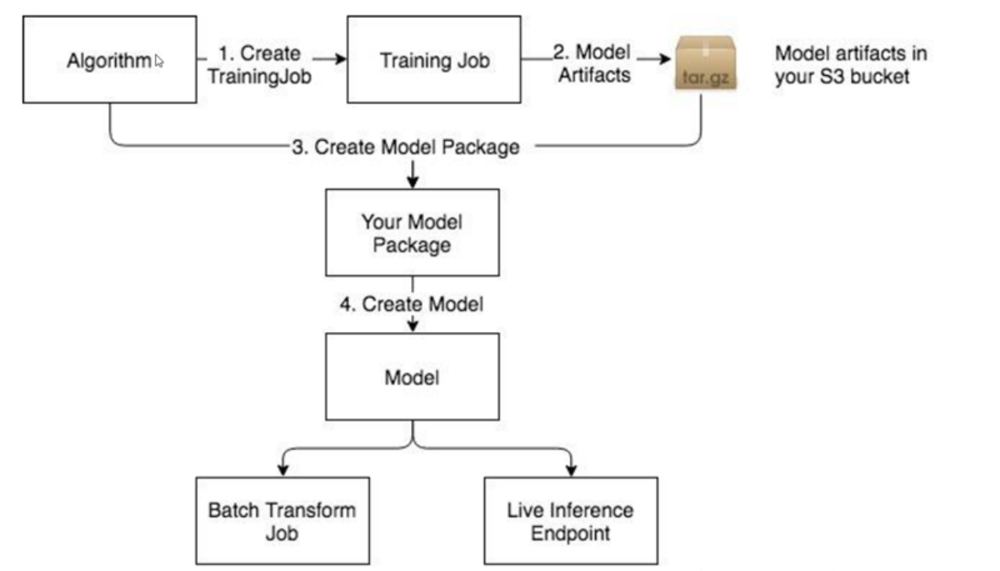

Use model packages to:

• Create models that you can use to get real-time inference or run batch transform jobs. For
information, see Use a Model Package to Create a Model.

• Create hosted endpoints to get real-time inference. For information, see Deploy the Model to
SageMaker AI Hosting Services.

• Create batch transform jobs. For information, see (Optional) Make Prediction with Batch
Transform.

Topics

• Use an Algorithm to Run a Training Job

• Use an Algorithm to Run a Hyperparameter Tuning Job

• Use a Model Package to Create a Model

Usage of Algorithm and Model Package Resources
8138

## Page 168

Amazon SageMaker AI
Developer Guide

Use an Algorithm to Run a Training Job

You can create use an algorithm resource to create a training job by using the Amazon SageMaker
AI console, the low-level Amazon SageMaker API, or the Amazon SageMaker Python SDK.

Topics

• Use an Algorithm to Run a Training Job (Console)

• Use an Algorithm to Run a Training Job (API)

• Use an Algorithm to Run a Training Job (Amazon SageMaker Python SDK)

Use an Algorithm to Run a Training Job (Console)

To use an algorithm to run a training job (console)

1.
Open the SageMaker AI console at https://console.aws.amazon.com/sagemaker/.

2.
Choose Algorithms.

3.
Choose an algorithm that you created from the list on the My algorithms tab or choose an
algorithm that you subscribed to on the AWS Marketplace subscriptions tab.

4.
Choose Create training job.

The algorithm you chose will automatically be selected.

5.
On the Create training job page, provide the following information:

a.
For Job name, type a name for the training job.

b.
For IAM role, choose an IAM role that has the required permissions to run training jobs in
SageMaker AI, or choose Create a new role to allow SageMaker AI to create a role that has

the AmazonSageMakerFullAccess managed policy attached. For information, see How
to use SageMaker AI execution roles.

c.
For Resource configuration, provide the following information:

i.
For Instance type, choose the instance type to use for training.

ii.
For Instance count, type the number of ML instances to use for the training job.

iii.
For Additional volume per instance (GB), type the size of the ML storage volume
that you want to provision. ML storage volumes store model artifacts and incremental
states.

Usage of Algorithm and Model Package Resources
8139

## Page 169

Amazon SageMaker AI
Developer Guide

iv.
For Encryption key, if you want Amazon SageMaker AI to use an AWS Key
Management Service key to encrypt data in the ML storage volume attached to the
training instance, specify the key.

v.
For Stopping condition, specify the maximum amount of time in seconds, minutes,
hours, or days, that you want the training job to run.

d.
For VPC, choose a Amazon VPC that you want to allow your training container to access.
For more information, see Give SageMaker AI Training Jobs Access to Resources in Your
Amazon VPC.

e.
For Hyperparameters, specify the values of the hyperparameters to use for the training
job.

f.
For Input data configuration, specify the following values for each channel of input
data to use for the training job. You can see what channels the algorithm you're using for
training support, and the content type, supported compression type, and supported input
modes for each channel, under Channel specification section of the Algorithm summary
page for the algorithm.

i.
For Channel name, type the name of the input channel.

ii.
For Content type, type the content type of the data that the algorithm expects for
the channel.

iii.
For Compression type, choose the data compression type to use, if any.

iv.
For Record wrapper, choose RecordIO if the algorithm expects data in the

RecordIO format.

v.
For S3 data type, S3 data distribution type, and S3 location, specify the appropriate

values. For information about what these values mean, see S3DataSource.

vi.
For Input mode, choose File to download the data from to the provisioned ML
storage volume, and mount the directory to a Docker volume. Choose PipeTo stream
data directly from Amazon S3 to the container.

vii. To add another input channel, choose Add channel. If you are finished adding input

channels, choose Done.

g.
For Output location, specify the following values:

i.
For S3 output path, choose the S3 location where the training job stores output, such
as model artifacts.

Usage of Algorithm and Model Package Resources
8140

## Page 170

Amazon SageMaker AI
Developer Guide

Note

You use the model artifacts stored at this location to create a model or model
package from this training job.

ii.
For Encryption key, if you want SageMaker AI to use a AWS KMS key to encrypt
output data at rest in the S3 location.

h.
For Tags, specify one or more tags to manage the training job. Each tag consists of a key
and an optional value. Tag keys must be unique per resource.

i.
Choose Create training job to run the training job.

Use an Algorithm to Run a Training Job (API)

To use an algorithm to run a training job by using the SageMaker API, specify either

the name or the Amazon Resource Name (ARN) as the AlgorithmName field of the

AlgorithmSpecification object that you pass to CreateTrainingJob. For information about
training models in SageMaker AI, see Train a Model with Amazon SageMaker.

Use an Algorithm to Run a Training Job (Amazon SageMaker Python SDK)

Use an algorithm that you created or subscribed to on AWS Marketplace to create a training job,

create an AlgorithmEstimator object and specify either the Amazon Resource Name (ARN)

or the name of the algorithm as the value of the algorithm_arn argument. Then call the fit
method of the estimator. For example:

from sagemaker import AlgorithmEstimator
data_path = os.path.join(DATA_DIR, 'marketplace', 'training')

algo = AlgorithmEstimator(
algorithm_arn='arn:aws:sagemaker:us-east-2:012345678901:algorithm/my-algorithm',
role='SageMakerRole',
instance_count=1,
instance_type='ml.c4.xlarge',
sagemaker_session=sagemaker_session,
base_job_name='test-marketplace')

train_input = algo.sagemaker_session.upload_data(
path=data_path, key_prefix='integ-test-data/marketplace/train')

Usage of Algorithm and Model Package Resources
8141

## Page 171

Amazon SageMaker AI
Developer Guide

algo.fit({'training': train_input})

Use an Algorithm to Run a Hyperparameter Tuning Job

The following section explains how to use an algorithm resource to run a hyperparameter tuning
job in Amazon SageMaker AI. A hyperparameter tuning job finds the best version of a model by
running many training jobs on your dataset using the algorithm and ranges of hyperparameters
that you specify. It then chooses the hyperparameter values that result in a model that performs
the best, as measured by a metric that you choose. For more information, see Automatic model
tuning with SageMaker AI.

You can create use an algorithm resource to create a hyperparameter tuning job by using the
Amazon SageMaker AI console, the low-level Amazon SageMaker API, or the Amazon SageMaker
Python SDK.

Topics

• Use an Algorithm to Run a Hyperparameter Tuning Job (Console)

• Use an Algorithm to Run a Hyperparameter Tuning Job (API)

• Use an Algorithm to Run a Hyperparameter Tuning Job (Amazon SageMaker Python SDK)

Use an Algorithm to Run a Hyperparameter Tuning Job (Console)

To use an algorithm to run a hyperparameter tuning job (console)

1.
Open the SageMaker AI console at https://console.aws.amazon.com/sagemaker/.

2.
Choose Algorithms.

3.
Choose an algorithm that you created from the list on the My algorithms tab or choose an
algorithm that you subscribed to on the AWS Marketplace subscriptions tab.

4.
Choose Create hyperparameter tuning job.

The algorithm you chose will automatically be selected.

5.
On the Create hyperparameter tuning job page, provide the following information:

a.
For Warm start, choose Enable warm start to use the information from previous
hyperparameter tuning jobs as a starting point for this hyperparameter tuning job. For
more information, see Run a Warm Start Hyperparameter Tuning Job.

Usage of Algorithm and Model Package Resources
8142

## Page 172

Amazon SageMaker AI
Developer Guide

i.
Choose Identical data and algorithm if your input data is the same as the input data
for the parent jobs of this hyperparameter tuning job, or choose Transfer learning to
use additional or different input data for this hyperparameter tuning job.

ii.
For Parent hyperparameter tuning job(s), choose up to 5 hyperparameter tuning
jobs to use as parents to this hyperparameter tuning job.

b.
For Hyperparameter tuning job name, type a name for the tuning job.

c.
For IAM role, choose an IAM role that has the required permissions to run hyperparameter
tuning jobs in SageMaker AI, or choose Create a new role to allow SageMaker AI to

create a role that has the AmazonSageMakerFullAccess managed policy attached. For
information, see How to use SageMaker AI execution roles.

d.
For VPC, choose a Amazon VPC that you want to allow the training jobs that the tuning
job launches to access. For more information, see Give SageMaker AI Training Jobs Access
to Resources in Your Amazon VPC.

e.
Choose Next.

f.
For Objective metric, choose the metric that the hyperparameter tuning job uses to
determine the best combination of hyperparameters, and choose whether to minimize or
maximize this metric. For more information, see View the Best Training Job.

g.
For Hyperparameter configuration, choose ranges for the tunable hyperparameters that
you want the tuning job to search, and set static values for hyperparameters that you
want to remain constant in all training jobs that the hyperparameter tuning job launches.
For more information, see Define Hyperparameter Ranges.

h.
Choose Next.

i.
For Input data configuration, specify the following values for each channel of input data
to use for the hyperparameter tuning job. You can see what channels the algorithm you're
using for hyperparameter tuning supports, and the content type, supported compression
type, and supported input modes for each channel, under Channel specification section
of the Algorithm summary page for the algorithm.

i.
For Channel name, type the name of the input channel.

ii.
For Content type, type the content type of the data that the algorithm expects for
the channel.

iii.
For Compression type, choose the data compression type to use, if any.

iv.
For Record wrapper, choose RecordIO if the algorithm expects data in the

RecordIO format.

Usage of Algorithm and Model Package Resources
8143

## Page 173

Amazon SageMaker AI
Developer Guide

v.
For S3 data type, S3 data distribution type, and S3 location, specify the appropriate

values. For information about what these values mean, see S3DataSource.

vi.
For Input mode, choose File to download the data from to the provisioned ML
storage volume, and mount the directory to a Docker volume. Choose PipeTo stream
data directly from Amazon S3 to the container.

vii. To add another input channel, choose Add channel. If you are finished adding input

channels, choose Done.

j.
For Output location, specify the following values:

i.
For S3 output path, choose the S3 location where the training jobs that this
hyperparameter tuning job launches store output, such as model artifacts.

Note

You use the model artifacts stored at this location to create a model or model
package from this hyperparameter tuning job.

ii.
For Encryption key, if you want SageMaker AI to use a AWS KMS key to encrypt
output data at rest in the S3 location.

k.
For Resource configuration, provide the following information:

i.
For Instance type, choose the instance type to use for each training job that the
hyperparameter tuning job launches.

ii.
For Instance count, type the number of ML instances to use for each training job that
the hyperparameter tuning job launches.

iii.
For Additional volume per instance (GB), type the size of the ML storage volume
that you want to provision each training job that the hyperparameter tuning job
launches. ML storage volumes store model artifacts and incremental states.

iv.
For Encryption key, if you want Amazon SageMaker AI to use an AWS Key
Management Service key to encrypt data in the ML storage volume attached to the
training instances, specify the key.

l.
For Resource limits, provide the following information:

i.
For Maximum training jobs, specify the maximum number of training jobs that you
want the hyperparameter tuning job to launch. A hyperparameter tuning job can
launch a maximum of 500 training jobs.

Usage of Algorithm and Model Package Resources
8144

## Page 174

Amazon SageMaker AI
Developer Guide

ii.
For Maximum parallel training jobs, specify the maximum number of concurrent
training jobs that the hyperparameter tuning job can launch. A hyperparameter
tuning job can launch a maximum of 10 concurrent training jobs.

iii.
For Stopping condition, specify the maximum amount of time in seconds, minutes,

hours, or days, that you want each training job that the hyperparameter tuning job
launches to run.

m.
For Tags, specify one or more tags to manage the hyperparameter tuning job. Each tag
consists of a key and an optional value. Tag keys must be unique per resource.

n.
Choose Create jobs to run the hyperparameter tuning job.

Use an Algorithm to Run a Hyperparameter Tuning Job (API)

To use an algorithm to run a hyperparameter tuning job by using the SageMaker API, specify either

the name or the Amazon Resource Name (ARN) of the algorithm as the AlgorithmName field of

the AlgorithmSpecification object that you pass to CreateHyperParameterTuningJob.
For information about hyperparameter tuning in SageMaker AI, see Automatic model tuning with
SageMaker AI.

Use an Algorithm to Run a Hyperparameter Tuning Job (Amazon SageMaker Python SDK)

Use an algorithm that you created or subscribed to on AWS Marketplace to create a

hyperparameter tuning job, create an AlgorithmEstimator object and specify either the

Amazon Resource Name (ARN) or the name of the algorithm as the value of the algorithm_arn

argument. Then initialize a HyperparameterTuner object with the AlgorithmEstimator

you created as the value of the estimator argument. Finally, call the fit method of the

AlgorithmEstimator. For example:

from sagemaker import AlgorithmEstimator
from sagemaker.tuner import HyperparameterTuner

data_path = os.path.join(DATA_DIR, 'marketplace', 'training')

algo = AlgorithmEstimator(
algorithm_arn='arn:aws:sagemaker:us-east-2:764419575721:algorithm/scikit-
decision-trees-1542410022',
role='SageMakerRole',
instance_count=1,
instance_type='ml.c4.xlarge',
sagemaker_session=sagemaker_session,

Usage of Algorithm and Model Package Resources
8145

## Page 175

Amazon SageMaker AI
Developer Guide

base_job_name='test-marketplace')

train_input = algo.sagemaker_session.upload_data(
path=data_path, key_prefix='integ-test-data/marketplace/train')

algo.set_hyperparameters(max_leaf_nodes=10)
tuner = HyperparameterTuner(estimator=algo, base_tuning_job_name='some-name',
objective_metric_name='validation:accuracy',
hyperparameter_ranges=hyperparameter_ranges,
max_jobs=2, max_parallel_jobs=2)

tuner.fit({'training': train_input}, include_cls_metadata=False)
tuner.wait()

Use a Model Package to Create a Model

Use a model package to create a deployable model that you can use to get real-time inferences by
creating a hosted endpoint or to run batch transform jobs. You can create a deployable model from
a model package by using the Amazon SageMaker AI console, the low-level SageMaker API), or the
Amazon SageMaker Python SDK.

Topics

• Use a Model Package to Create a Model (Console)

• Use a Model Package to Create a Model (API)

• Use a Model Package to Create a Model (Amazon SageMaker Python SDK)

Use a Model Package to Create a Model (Console)

To create a deployable model from a model package (console)

1.
Open the SageMaker AI console at https://console.aws.amazon.com/sagemaker/.

2.
Choose Model packages.

3.
Choose a model package that you created from the list on the My model packages tab or
choose a model package that you subscribed to on the AWS Marketplace subscriptions tab.

4.
Choose Create model.

5.
For Model name, type a name for the model.

Usage of Algorithm and Model Package Resources
8146

## Page 176

Amazon SageMaker AI
Developer Guide

6.
For IAM role, choose an IAM role that has the required permissions to call other services on
your behalf, or choose Create a new role to allow SageMaker AI to create a role that has the

AmazonSageMakerFullAccess managed policy attached. For information, see How to use
SageMaker AI execution roles.

7.
For VPC, choose a Amazon VPC that you want to allow the model to access. For more
information, see Give SageMaker AI Hosted Endpoints Access to Resources in Your Amazon
VPC.

8.
Leave the default values for Container input options and Choose model package.

9.
For environment variables, provide the names and values of environment variables you want
to pass to the model container.

10. For Tags, specify one or more tags to manage the model. Each tag consists of a key and an

optional value. Tag keys must be unique per resource.

11. Choose Create model.

After you create a deployable model, you can use it to set up an endpoint for real-time inference
or create a batch transform job to get inferences on entire datasets. For information about hosting
endpoints in SageMaker AI, see Deploy Models for Inference.

Use a Model Package to Create a Model (API)

To use a model package to create a deployable model by using the SageMaker API, specify the

name or the Amazon Resource Name (ARN) of the model package as the ModelPackageName field

of the ContainerDefinition object that you pass to the CreateModel API.

After you create a deployable model, you can use it to set up an endpoint for real-time inference
or create a batch transform job to get inferences on entire datasets. For information about hosted
endpoints in SageMaker AI, see Deploy Models for Inference.

Use a Model Package to Create a Model (Amazon SageMaker Python SDK)

To use a model package to create a deployable model by using the SageMaker AI Python SDK,

initialize a ModelPackage object, and pass the Amazon Resource Name (ARN) of the model

package as the model_package_arn argument. For example:

from sagemaker import ModelPackage
model = ModelPackage(role='SageMakerRole',
model_package_arn='training-job-scikit-decision-trees-1542660466-6f92',
sagemaker_session=sagemaker_session)

Usage of Algorithm and Model Package Resources
8147

## Page 177

Amazon SageMaker AI
Developer Guide

After you create a deployable model, you can use it to set up an endpoint for real-time inference
or create a batch transform job to get inferences on entire datasets. For information about hosting
endpoints in SageMaker AI, see Deploy Models for Inference.

Listings for your own algorithms and models with the AWS
Marketplace

Selling Amazon SageMaker AI algorithms and model packages is a three-step process:

1. Develop your algorithm or model, and package it in a Docker container. For information, see

Develop Algorithms and Models in Amazon SageMaker AI.

2. Create an algorithm or model package resource in SageMaker AI. For information, see Creation

of Algorithm and Model Package Resources.

3. Register as a seller on AWS Marketplace and list your algorithm or model package on AWS

Marketplace. For information about registering as a seller, see Getting Started as a Seller in the
User Guide for AWS Marketplace Providers. For information about listing and monetizing your
algorithms and model packages, see Listing Algorithms and Model Packages in AWS Marketplace
for Machine Learning in the User Guide for AWS Marketplace Providers.

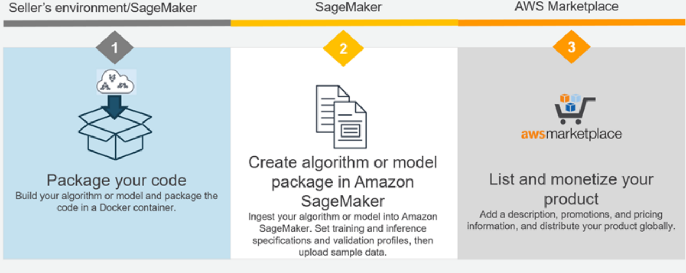

Topics

• Develop Algorithms and Models in Amazon SageMaker AI

• Creation of Algorithm and Model Package Resources

Listings for your own algorithms and models with the AWS Marketplace
8148

## Page 178

Amazon SageMaker AI
Developer Guide

• List Your Algorithm or Model Package on AWS Marketplace

Develop Algorithms and Models in Amazon SageMaker AI

Before you can create algorithm and model package resources to use in Amazon SageMaker AI or
list on AWS Marketplace, you have to develop them and package them in Docker containers.

Note

When algorithms and model packages are created for listing on AWS Marketplace,
SageMaker AI scans the containers for security vulnerabilities on supported operating
systems.
Only the following operating system versions are supported:

• Debian: 6.0, 7, 8, 9, 10

• Ubuntu: 12.04, 12.10, 13.04, 14.04, 14.10, 15.04, 15.10, 16.04, 16.10, 17.04, 17.10,
18.04, 18.10

• CentOS: 5, 6, 7

• Oracle Linux: 5, 6, 7

• Alpine: 3.3, 3.4, 3.5

• Amazon Linux

Topics

• Develop Algorithms in SageMaker AI

• Develop Models in SageMaker AI

Develop Algorithms in SageMaker AI

An algorithm should be packaged as a docker container and stored in Amazon ECR to use it in
SageMaker AI. The Docker container contains the training code used to run training jobs and,
optionally, the inference code used to get inferences from models trained by using the algorithm.

For information about developing algorithms in SageMaker AI and packaging them as containers,
see Docker containers for training and deploying models. For a complete example of how to create
an algorithm container, see the sample notebook at https://sagemaker-examples.readthedocs.io/

Develop Algorithms and Models in Amazon SageMaker AI
8149

## Page 179

Amazon SageMaker AI
Developer Guide

en/latest/advanced_functionality/scikit_bring_your_own/scikit_bring_your_own.html. You can also
find the sample notebook in a SageMaker notebook instance. The notebook is in the Advanced

Functionality section, and is named scikit_bring_your_own.ipynb.

Always thoroughly test your algorithms before you create algorithm resources to publish on AWS
Marketplace.

Note

When a buyer subscribes to your containerized product, the Docker containers run in an
isolated (internet-free) environment. When you create your containers, do not rely on
making outgoing calls over the internet. Calls to AWS services are also not allowed.

Develop Models in SageMaker AI

A deployable model in SageMaker AI consists of inference code, model artifacts, an IAM role that
is used to access resources, and other information required to deploy the model in SageMaker AI.
Model artifacts are the results of training a model by using a machine learning algorithm. The
inference code must be packaged in a Docker container and stored in Amazon ECR. You can either
package the model artifacts in the same container as the inference code, or store them in Amazon
S3.

You create a model by running a training job in SageMaker AI, or by training a machine learning
algorithm outside of SageMaker AI. If you run a training job in SageMaker AI, the resulting

model artifacts are available in the ModelArtifacts field in the response to a call to the
DescribeTrainingJob operation. For information about how to develop a SageMaker AI model
container, see Containers with custom inference code. For a complete example of how to
create a model container from a model trained outside of SageMaker AI, see the sample
notebook at https://sagemaker-examples.readthedocs.io/en/latest/advanced_functionality/
xgboost_bring_your_own_model/xgboost_bring_your_own_model.html.

Always thoroughly test your models before you create model packages to publish on AWS
Marketplace.

Develop Algorithms and Models in Amazon SageMaker AI
8150

## Page 180

Amazon SageMaker AI
Developer Guide

Note

When a buyer subscribes to your containerized product, the Docker containers run in an
isolated (internet-free) environment. When you create your containers, do not rely on
making outgoing calls over the internet. Calls to AWS services are also not allowed.

List Your Algorithm or Model Package on AWS Marketplace

After creating and validating your algorithm or model in Amazon SageMaker AI, list your product
on AWS Marketplace. The listing process makes your products available in the AWS Marketplace
and the SageMaker AI console.

To list products on AWS Marketplace, you must be a registered seller. To register, use the self-
registration process from the AWS Marketplace Management Portal (AMMP). For information, see
Getting Started as a Seller in the User Guide for AWS Marketplace Providers. When you start the
product listing process from the Amazon SageMaker AI console, we check your seller registration
status. If you have not registered, we direct you to do so.

To start the listing process, do one of the following:

• From the SageMaker AI console, choose the product, choose Actions, and choose Publish new
ML Marketplace listing. This carries over your product reference, the Amazon Resource Name
(ARN), and directs you to the AMMP to create the listing.

• Go to ML listing process, manually enter the Amazon Resource Name (ARN), and start your
product listing. This process carries over the product metadata that you entered when
creating the product in SageMaker AI. For an algorithm listing, the information includes the
supported instance types and hyperparameters. In addition, you can enter a product description,
promotional information, and support information as you would with other AWS Marketplace
products.

Find and Subscribe to Algorithms and Model Packages on AWS
Marketplace

With AWS Marketplace, you can browse and search for hundreds of machine learning algorithms
and models in a broad range of categories, such as computer vision, natural language processing,

List Your Algorithm or Model Package on AWS Marketplace
8151

## Page 181

Amazon SageMaker AI
Developer Guide

speech recognition, text, data, voice, image, video analysis, fraud detection, predictive analysis, and
more.

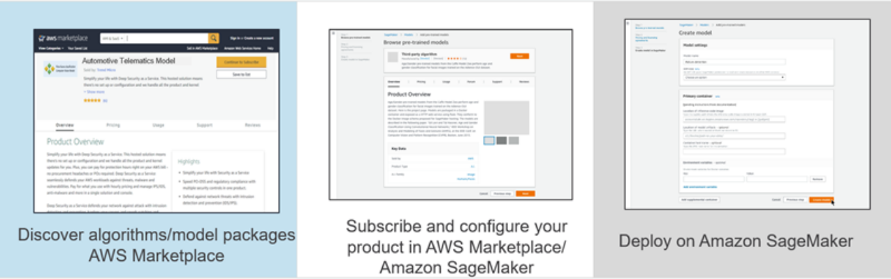

To find algorithms on AWS Marketplace

1.
Open the Amazon SageMaker AI console at https://console.aws.amazon.com/sagemaker/.

2.
Choose Algorithms, then choose Find algorithms.

This takes you to the AWS Marketplace algorithms page. For information about finding and
subscribing to algorithms on AWS Marketplace, see Machine Learning Products in the AWS
Marketplace User Guide for AWS Consumers.

To find model packages on AWS Marketplace

1.
Open the SageMaker AI console at https://console.aws.amazon.com/sagemaker/.

2.
Choose Model packages, then choose Find model packages.

This takes you to the AWS Marketplace model packages page. For information about finding
and subscribing to model packages on AWS Marketplace, see Machine Learning Products in the
AWS Marketplace User Guide for AWS Consumers.

Use Algorithms and Model Packages

For information about using algorithms and model packages that you subscribe to in SageMaker AI,
see Usage of Algorithm and Model Package Resources.

Use Algorithms and Model Packages
8152

## Page 182

Amazon SageMaker AI
Developer Guide

Note

When you create a training job, inference endpoint, and batch transform job from an
algorithm or model package that you subscribe to on AWS Marketplace, the training and
inference containers do not have access to the internet. Because the containers do not have
access to the internet, the seller of the algorithm or model package does not have access to
your data.

Use Algorithms and Model Packages
8153

## Page 183

Amazon SageMaker AI
Developer Guide

Monitoring AWS resources in Amazon SageMaker AI

Monitoring is an important part of maintaining the reliability, availability, and performance of
SageMaker AI and your other AWS solutions. AWS provides the following monitoring tools to watch
SageMaker AI, report when something is wrong, and take automatic actions when appropriate:

• Amazon CloudWatch monitors your AWS resources and the applications that you run on AWS
in real time. You can collect and track metrics, create customized dashboards, and set alarms
that notify you or take actions when a specified metric reaches a threshold that you specify.
For example, you can have CloudWatch track CPU usage or other metrics of your Amazon EC2
instances and automatically launch new instances when needed. For more information, see the
Amazon CloudWatch User Guide.

• Amazon CloudWatch Logs enables you to monitor, store, and access your log files from EC2
instances, AWS CloudTrail, and other sources. CloudWatch Logs can monitor information in the
log files and notify you when certain thresholds are met. You can also archive your log data in
highly durable storage. For more information, see the Amazon CloudWatch Logs User Guide.

• AWS CloudTrail captures API calls and related events made by or on behalf of your AWS account
and delivers the log files to an Amazon S3 bucket that you specify. You can identify which users
and accounts called AWS, the source IP address from which the calls were made, and when the
calls occurred. For more information, see the AWS CloudTrail User Guide.

• CloudWatch Events delivers a near real-time stream of system events that describe changes
in AWS resources. Create CloudWatch Events rules react to a status change in a SageMaker AI
training, hyperparameter tuning, or batch transform job

Topics

• Amazon SageMaker AI metrics in Amazon CloudWatch

• CloudWatch Logs for Amazon SageMaker AI

• Logging Amazon SageMaker AI API calls using AWS CloudTrail

• Monitoring user resource access from SageMaker AI Studio Classic with sourceIdentity

• Events that Amazon SageMaker AI sends to Amazon EventBridge

8154

## Page 184

Amazon SageMaker AI
Developer Guide

Amazon SageMaker AI metrics in Amazon CloudWatch

You can monitor Amazon SageMaker AI using Amazon CloudWatch, which collects raw data

and processes it into readable, near real-time metrics. These statistics are kept for 15 months.

With them, you can access historical information and gain a better perspective on how your web
application or service is performing. However, the Amazon CloudWatch console limits the search
to metrics that were updated in the last 2 weeks. This limitation ensures that the most current jobs
are shown in your namespace.

To graph metrics without using a search, specify its exact name in the source view. You can also
set alarms that watch for certain thresholds, and send notifications or take actions when those
thresholds are met. For more information, see the Amazon CloudWatch User Guide.

SageMaker AI Metrics and Dimensions

• SageMaker AI endpoint metrics

• SageMaker AI endpoint invocation metrics

• SageMaker AI inference component metrics

• SageMaker AI multi-model endpoint metrics

• SageMaker AI job metrics

• SageMaker Inference Recommender jobs metrics

• SageMaker Ground Truth metrics

• Amazon SageMaker Feature Store metrics

• SageMaker pipelines metrics

SageMaker AI endpoint metrics

The /aws/sagemaker/Endpoints namespace includes the following metrics for endpoint
instances.

Metrics are available at a 1-minute frequency.

Note

Amazon CloudWatch supports high-resolution custom metrics and its finest resolution is
1 second. However, the finer the resolution, the shorter the lifespan of the CloudWatch
metrics. For the 1-second frequency resolution, the CloudWatch metrics are available for

Metrics in CloudWatch
8155

## Page 185

Amazon SageMaker AI
Developer Guide

3 hours. For more information about the resolution and the lifespan of the CloudWatch
metrics, see GetMetricStatistics in the Amazon CloudWatch API Reference.

Endpoint metrics

Metric
Description

CPUReservation
The sum of CPUs reserved by containers on an instance.

This metric is provided only for endpoints that host active inference
components.

The value ranges between 0%–100%. In the settings for an inference

component, you set the CPU reservation with the NumberOfC

puCoresRequired
parameter. For example, if there 4 CPUs, and 2

are reserved, the CPUReservation  metric is 50%.

CPUUtilization
The sum of each individual CPU core's utilization. The CPU utilization
of each core range is 0–100. For example, if there are four CPUs, the

CPUUtilization  range is 0%–400%.

For endpoint variants, the value is the sum of the CPU utilization of the
primary and supplementary containers on the instance.

Units: Percent

The normalized sum of the utilization of each individual CPU core.

CPUUtiliz

ationNorm

This metric is provided only for endpoints that host active inference
components.

alized

The value ranges between 0%–100%. For example, if there are

four CPUs, and the CPUUtilization  metric is 200%, then the

CPUUtilizationNormalized
metric is 50%.

DiskUtilization
The percentage of disk space used by the containers on an instance.
This value range is 0%–100%.
For endpoint variants, the value is the sum of the disk space utilization
of the primary and supplementary containers on the instance.

Endpoint metrics
8156

## Page 186

Amazon SageMaker AI
Developer Guide

Metric
Description

Units: Percent

The percentage of GPU memory used by the containers on an instance.
The value range is 0–100 and is multiplied by the number of GPUs.

GPUMemory

Utilization

For example, if there are four GPUs, the GPUMemoryUtilization
range is 0%–400%.

For endpoint variants, the value is the sum of the GPU memory utilizati
on of the primary and supplementary containers on the instance.

Units: Percent

The normalized percentage of GPU memory used by the containers on
an instance.

GPUMemory

Utilizati

onNormalized

This metric is provided only for endpoints that host active inference
components.

The value ranges between 0%–100%. For example, if there are four

GPUs, and the GPUMemoryUtilization
metric is 200%, then the

GPUMemoryUtilizationNormalized
metric is 50%.

GPUReservation
The sum of GPUs reserved by containers on an instance.

This metric is provided only for endpoints that host active inference
components.

The value ranges between 0%–100%. In the settings for an inference

component, you set the GPU reservation by NumberOfAccelerato

rDevicesRequired
. For example, if there are 4 GPUs and 2 are

reserved, the GPUReservation  metric is 50%.

Endpoint metrics
8157

## Page 187

Amazon SageMaker AI
Developer Guide

Metric
Description

GPUUtilization
The percentage of GPU units that are used by the containers on an
instance. The value can range between 0–100 and is multiplied by the

number of GPUs. For example, if there are four GPUs, the GPUUtiliz

ation  range is 0%–400%.

For endpoint variants, the value is the sum of the GPU utilization of the
primary and supplementary containers on the instance.

Units: Percent

The normalized percentage of GPU units that are used by the container
s on an instance.

GPUUtiliz

ationNorm

alized

This metric is provided only for endpoints that host active inference
components.

The value ranges between 0%–100%. For example, if there are

four GPUs, and the GPUUtilization  metric is 200%, then the

GPUUtilizationNormalized
metric is 50%.

The sum of memory reserved by containers on an instance.

MemoryRes

ervation

This metric is provided only for endpoints that host active inference
components.

The value ranges between 0%–100%. In the settings for an inference

component, you set the memory reservation with the MinMemory

RequiredInMb
parameter. For example, if a 32 GiB instance

reserved 1024 MB, the MemoryReservation  metric would be
3.125%.

The percentage of memory that is used by the containers on an
instance. This value range is 0%–100%.

MemoryUti

lization

For endpoint variants, the value is the sum of the memory utilization of
the primary and supplementary containers on the instance.

Units: Percent

Endpoint metrics
8158

## Page 188

Amazon SageMaker AI
Developer Guide

Dimensions for endpoint metrics

Dimension
Description

EndpointName,

Filters endpoint metrics for a ProductionVariant  of the specified
endpoint and variant.

VariantName

SageMaker AI endpoint invocation metrics

The AWS/SageMaker namespace includes the following request metrics from calls to
InvokeEndpoint.

Metrics are available at a 1-minute frequency.

The following illustration shows how a SageMaker AI endpoint interacts with the Amazon
SageMaker Runtime API. The overall time between sending a request to an endpoint and receiving
a response depends on the following three components.

• Network latency – the time that it takes between making a request to and receiving a response
back from the SageMaker Runtime Runtime API.

• Overhead latency – the time that it takes to transport a request to the model container from and
transport the response back to the SageMaker Runtime Runtime API.

• Model latency – the time that it takes the model container to process the request and return a
response.

Endpoint invocation metrics
8159

## Page 189

Amazon SageMaker AI
Developer Guide

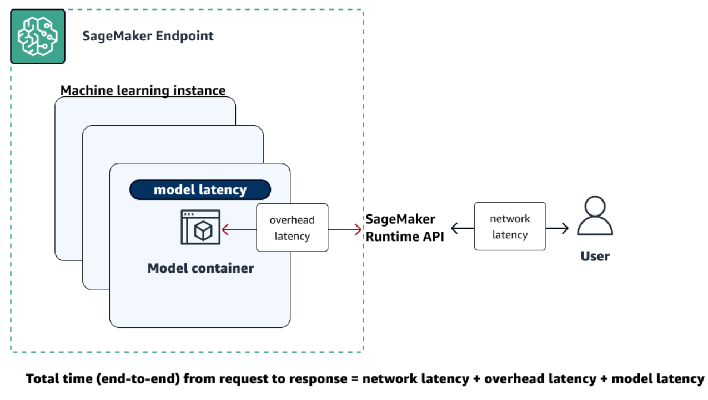

For more information about total latency, see Best practices for load testing Amazon SageMaker
AI real-time inference endpoints. For information about how long CloudWatch metrics are retained
for, see GetMetricStatistics in the Amazon CloudWatch API Reference.

Endpoint invocation metrics

Metric
Description

The number of concurrent requests being received by the inference
component, normalized by each copy of an inference component.

Concurren

tRequests

PerCopy

Valid statistics: Min, Max

The number of concurrent requests being received by the model.

Concurren

tRequests

Valid statistics: Min, Max

PerModel

Invocatio

The number of InvokeEndpoint  requests where the model returned
a 4xx HTTP response code. For each 4xx response, 1 is sent; otherwise,
0 is sent.

n4XXErrors

Endpoint invocation metrics
8160

## Page 190

Amazon SageMaker AI
Developer Guide

Metric
Description

Units: None

Valid statistics: Average, Sum

Invocatio

The number of InvokeEndpoint  requests where the model returned
a 5xx HTTP response code. For each 5xx response, 1 is sent; otherwise,
0 is sent.

n5XXErrors

Units: None

Valid statistics: Average, Sum

The number of model invocation requests that did not result in 2XX
HTTP response. This includes 4XX/5XX status codes, low-level socket
errors, malformed HTTP responses, and request timeouts. For each
error response, 1 is sent; otherwise, 0 is sent.

Invocatio

nModelErrors

Units: None

Valid statistics: Average, Sum

Invocations
The number of InvokeEndpoint  requests sent to a model endpoint.

To get the total number of requests sent to a model endpoint, use the
Sum statistic.

Units: None

Valid statistics: Sum

The number of invocations normalized by each copy of an inference
component.

Invocatio

nsPerCopy

Valid statistics: Sum

Endpoint invocation metrics
8161

## Page 191

Amazon SageMaker AI
Developer Guide

Metric
Description

Invocatio

The number of invocations sent to a model, normalized by InstanceC

nsPerInstance

ount  in each ProductionVariant. 1/numberOfInstances  is sent as

the value on each request. numberOfInstances  is the number of
active instances for the ProductionVariant behind the endpoint at the
time of the request.

Units: None

Valid statistics: Sum

ModelLatency
The interval of time taken by a model to respond to a SageMaker
Runtime API request. This interval includes the local communica
tion times taken to send the request and to fetch the response from
the model container. It also includes the time taken to complete the
inference in the container.

Units: Microseconds

Valid statistics: Average, Sum, Min, Max, Sample Count, Percentiles

ModelSetupTime
The time it takes to launch new compute resources for a serverless
endpoint. The time can vary depending on the model size, how long it
takes to download the model, and the start-up time of the container.

Units: Microseconds

Valid statistics: Average, Min, Max, Sample Count, Percentiles

Endpoint invocation metrics
8162

## Page 192

Amazon SageMaker AI
Developer Guide

Metric
Description

OverheadLatency
The interval of time added to the time taken to respond to a client
request by SageMaker AI overheads. This interval is measured from
the time SageMaker AI receives the request until it returns a response

to the client, minus the ModelLatency . Overhead latency can vary
depending on multiple factors, including request and response payload
sizes, request frequency, and authentication/authorization of the
request.

Units: Microseconds

Valid statistics: Average, Sum, Min, Max, Sample Count

MidStreamErrors
The number of errors that occur during response streaming after the
initial response has been sent to the customer.

Units: None

Valid statistics: Average, Sum

The time elapsed from when the request arrives at SageMaker AI
endpoint until the first chunk of the response is sent to the customer.
This metric applies to bidirectional streaming inference requests.

FirstChun

kLatency

Units: Microseconds

Valid statistics: Average, Sum, Min, Max, Sample Count, Percentiles

The time taken by the model container to process the request and
return the first chunk of the response. This is measured from when
the request is sent to the model container until the first byte is
received from the model. This metric applies to bidirectional streaming
inference requests.

FirstChun

kModelLatency

Units: Microseconds

Valid statistics: Average, Sum, Min, Max, Sample Count, Percentiles

Endpoint invocation metrics
8163

## Page 193

Amazon SageMaker AI
Developer Guide

Metric
Description

The overhead latency for the first chunk, excluding model processing

FirstChun

time. This is calculated as FirstChunkLatency  minus FirstChun

kOverhead

kModelLatency
, representing the time spent in routing, preproces
sing, and postprocessing operations within SageMaker AI platform.
Overhead latency can vary depending on multiple factors, including
request frequency, load and authentication/authorization of the
request. This metric applies to bidirectional streaming inference
requests.

Latency

Units: Microseconds

Valid statistics: Average, Sum, Min, Max, Sample Count, Percentile

Dimensions for endpoint invocation metrics

Dimension
Description

EndpointName,

Filters endpoint invocation metrics for a ProductionVariant  of the
specified endpoint and variant.

VariantName

Filters inference component invocation metrics.

Inference

ComponentName

SageMaker AI inference component metrics

The /aws/sagemaker/InferenceComponents namespace includes the following metrics from
calls to  InvokeEndpoint for endpoints that host inference components.

Metrics are available at a 1-minute frequency.

Inference component metrics
8164

## Page 194

Amazon SageMaker AI
Developer Guide

Inference component metrics

Metric
Description

CPUUtiliz

The value of the CPUUtilizationNormalized
metric reported
by each copy of the inference component. The value ranges between

ationNorm

0%–100%. If you set the NumberOfCpuCoresRequired
parameter
in the settings for the inference component copy, the metric presents
the utilization over the reservation. Otherwise, the metric presents the
utilization over the limit.

alized

GPUMemory

The value of the GPUMemoryUtilizationNormalized
metric
reported by each copy of the inference component.

Utilizati

onNormalized

GPUUtiliz

The value of the GPUUtilizationNormalized
metric reported

ationNorm

by each copy of the inference component. If you set the NumberOfA

alized

cceleratorDevicesRequired
parameter in the settings for the
inference component copy, the metric presents the utilization over the
reservation. Otherwise, the metric presents the utilization over the
limit.

MemoryUti

The value of MemoryUtilizationNormalized
reported by

lizationN

each copy of the inference component. If you set the MinMemory

ormalized

RequiredInMb
parameter in the settings for the inference
component copy, the metrics present the utilization over the reservati
on. Otherwise, the metrics present the utilization over the limit.

Dimensions for inference component metrics

Dimension
Description

Filters inference component metrics.

Inference

ComponentName

Inference component metrics
8165

## Page 195

Amazon SageMaker AI
Developer Guide

SageMaker AI multi-model endpoint metrics

The AWS/SageMaker namespace includes the following model loading metrics from calls to
InvokeEndpoint.

Metrics are available at a 1-minute frequency.

For information about how long CloudWatch metrics are retained for, see GetMetricStatistics in the
Amazon CloudWatch API Reference.

Multi-model endpoint model loading metrics

Metric
Description

The interval of time that an invocation request has waited for the
target model to be downloaded, loaded, or both in order to run
inference.

ModelLoad

ingWaitTime

Units: Microseconds

Valid statistics: Average, Sum, Min, Max, Sample Count

The interval of time that it took to unload the model through the

ModelUnlo

container's UnloadModel  API call.

adingTime

Units: Microseconds

Valid statistics: Average, Sum, Min, Max, Sample Count

The interval of time that it took to download the model from Amazon
Simple Storage Service (Amazon S3).

ModelDown

loadingTime

Units: Microseconds

Valid statistics: Average, Sum, Min, Max, Sample Count

The interval of time that it took to load the model through the

ModelLoad

container's LoadModel  API call.

ingTime

Units: Microseconds

Valid statistics: Average, Sum, Min, Max, Sample Count

Multi-model endpoint metrics
8166

## Page 196

Amazon SageMaker AI
Developer Guide

Metric
Description

ModelCacheHit
The number of InvokeEndpoint  requests sent to the multi-model
endpoint for which the model was already loaded.

The Average statistic shows the ratio of requests for which the model
was already loaded.

Units: None

Valid statistics: Average, Sum, Sample Count

Dimensions for multi-model endpoint model loading metrics

Dimension
Description

EndpointName,

Filters endpoint invocation metrics for a ProductionVariant  of the
specified endpoint and variant.

VariantName

The /aws/sagemaker/Endpoints namespaces include the following instance metrics from calls
to  InvokeEndpoint.

Metrics are available at a 1-minute frequency.

For information about how long CloudWatch metrics are retained for, see GetMetricStatistics in the
Amazon CloudWatch API Reference.

Multi-model endpoint model instance metrics

Metric
Description

The number of models loaded in the containers of the multi-model
endpoint. This metric is emitted per instance.

LoadedMod

elCount

The Average statistic with a period of 1 minute tells you the average
number of models loaded per instance.

The Sum statistic tells you the total number of models loaded across all
instances in the endpoint.

Multi-model endpoint metrics
8167

## Page 197

Amazon SageMaker AI
Developer Guide

Metric
Description

The models that this metric tracks are not necessarily unique because a
model might be loaded in multiple containers at the endpoint.

Units: None

Valid statistics: Average, Sum, Min, Max, Sample Count

Dimensions for multi-model endpoint model loading metrics

Dimension
Description

EndpointName,

Filters endpoint invocation metrics for a ProductionVariant  of the
specified endpoint and variant.

VariantName

SageMaker AI job metrics

The /aws/sagemaker/ProcessingJobs, /aws/sagemaker/TrainingJobs, and /aws/

sagemaker/TransformJobs namespaces include the following metrics for processing jobs,
training jobs, and batch transform jobs.

Metrics are available at a 1-minute frequency.

Note

Amazon CloudWatch supports high-resolution custom metrics and its finest resolution is
1 second. However, the finer the resolution, the shorter the lifespan of the CloudWatch
metrics. For the 1-second frequency resolution, the CloudWatch metrics are available for
3 hours. For more information about the resolution and the lifespan of the CloudWatch
metrics, see GetMetricStatistics in the Amazon CloudWatch API Reference.

Tip

To profile your training job with a finer resolution down to 100-millisecond (0.1 second)
granularity and store the training metrics indefinitely in Amazon S3 for custom analysis
at any time, consider using Amazon SageMaker Debugger. SageMaker Debugger provides

Job metrics
8168

## Page 198

Amazon SageMaker AI
Developer Guide

built-in rules to automatically detect common training issues. It detects hardware resource
utilization issues (such as CPU, GPU, and I/O bottlenecks). It also detects non-converging
model issues (such as overfit, vanishing gradients, and exploding tensors). SageMaker
Debugger also provides visualizations through Studio Classic and its profiling report.
To explore the Debugger visualizations, see SageMaker Debugger Insights Dashboard
Walkthrough, Debugger Profiling Report Walkthrough, and Analyze Data Using the
SMDebug Client Library.

Processing job, training job, and batch transform job metrics

Metric
Description

CPUUtilization
The sum of each individual CPU core's utilization. The CPU utilization
of each core range is 0–100. For example, if there are four CPUs, the

CPUUtilization  range is 0%–400%. For processing jobs, the value
is the CPU utilization of the processing container on the instance.

For training jobs, the value is the CPU utilization of the algorithm
container on the instance.

For batch transform jobs, the value is the CPU utilization of the
transform container on the instance.

Note

For multi-instance jobs, each instance reports CPU utilization
metrics. However, the default view in CloudWatch shows the
average CPU utilization across all instances.

Units: Percent

DiskUtilization
The percentage of disk space used by the containers on an instance.
This value range is 0%–100%. This metric is not supported for batch
transform jobs.
For processing jobs, the value is the disk space utilization of the
processing container on the instance.

Job metrics
8169

## Page 199

Amazon SageMaker AI
Developer Guide

Metric
Description

For training jobs, the value is the disk space utilization of the algorithm
container on the instance.

Units: Percent

Note

For multi-instance jobs, each instance reports disk utilization
metrics. However, the default view in CloudWatch shows the
average disk utilization across all instances.

The percentage of GPU memory used by the containers on an instance.
The value range is 0–100 and is multiplied by the number of GPUs.

GPUMemory

Utilization

For example, if there are four GPUs, the GPUMemoryUtilization
range is 0%–400%.
For processing jobs, the value is the GPU memory utilization of the
processing container on the instance.

For training jobs, the value is the GPU memory utilization of the
algorithm container on the instance.

For batch transform jobs, the value is the GPU memory utilization of
the transform container on the instance.

Note

For multi-instance jobs, each instance reports GPU memory
utilization metrics. However, the default view in CloudWatch
shows the average GPU memory utilization across all instances.

Units: Percent

Job metrics
8170

## Page 200

Amazon SageMaker AI
Developer Guide

Metric
Description

GPUUtilization
The percentage of GPU units that are used by the containers on an
instance. The value can range between 0–100 and is multiplied by the

number of GPUs. For example, if there are four GPUs, the GPUUtiliz

ation  range is 0%–400%.
For processing jobs, the value is the GPU utilization of the processing
container on the instance.

For training jobs, the value is the GPU utilization of the algorithm
container on the instance.

For batch transform jobs, the value is the GPU utilization of the
transform container on the instance.

Note

For multi-instance jobs, each instance reports GPU utilization
metrics. However, the default view in CloudWatch shows the
average GPU utilization across all instances.

Units: Percent

Job metrics
8171

## Page 201

Amazon SageMaker AI
Developer Guide

Metric
Description

The percentage of memory that is used by the containers on an
instance. This value range is 0%–100%.
For processing jobs, the value is the memory utilization of the processin
g container on the instance.

MemoryUti

lization

For training jobs, the value is the memory utilization of the algorithm
container on the instance.

For batch transform jobs, the value is the memory utilization of the
transform container on the instance.

Units: Percent

Note

For multi-instance jobs, each instance reports memory utilizati
on metrics. However, the default view in CloudWatch shows the
average memory utilization across all instances.

Dimensions for job metrics

Dimension
Description

Host
For processing jobs, the value for this dimension has the format

[processing-job-name]/algo-[instance-number-i

n-cluster]
. Use this dimension to filter instance metrics for the
specified processing job and instance. This dimension format is present

only in the /aws/sagemaker/ProcessingJobs
namespace.

For training jobs, the value for this dimension has the format

[training-job-name]/algo-[instance-number-in-

cluster] . Use this dimension to filter instance metrics for the
specified training job and instance. This dimension format is present

only in the /aws/sagemaker/TrainingJobs
namespace.

Job metrics
8172

## Page 202

Amazon SageMaker AI
Developer Guide

Dimension
Description

For batch transform jobs, the value for this dimension has the format

[transform-job-name]/[instance-id]
. Use this dimension
to filter instance metrics for the specified batch transform job and

instance. This dimension format is present only in the /aws/sage

maker/TransformJobs
namespace.

SageMaker Inference Recommender jobs metrics

The /aws/sagemaker/InferenceRecommendationsJobs namespace includes the following
metrics for inference recommendation jobs.

Inference Recommender metrics

Metric
Description

ClientInv

The number of InvokeEndpoint  requests sent to a model endpoint,
as observed by Inference Recommender.

ocations

Units: None

Valid statistics: Sum

ClientInv

The number of InvokeEndpoint  requests that failed, as observed by
Inference Recommender.

ocationErrors

Units: None

Valid statistics: Sum

ClientLatency
The interval of time taken between sending an InvokeEndpoint  call
and receiving a response as observed by Inference Recommender. Note

that the time is in milliseconds, whereas the ModelLatency  endpoint
invocation metric is in microseconds.

Units: Milliseconds

Valid statistics: Average, Sum, Min, Max, Sample Count, Percentiles

Inference Recommender metrics
8173

## Page 203

Amazon SageMaker AI
Developer Guide

Metric
Description

NumberOfUsers
The number of concurrent users sending InvokeEndpoint  requests
to the model endpoint.

Units: None

Valid statistics: Max, Min, Average

Dimensions for Inference Recommender job metrics

Dimension
Description

JobName
Filters Inference Recommender job metrics for the specified Inference
Recommender job.

EndpointName
Filters Inference Recommender job metrics for the specified endpoint.

SageMaker Ground Truth metrics

Ground Truth metrics

Metric
Description

ActiveWorkers
A single active worker on a private work team submitted, released,
or declined a task. To get the total number of active workers, use the

Sum statistic. Ground Truth tries to deliver each individual ActiveWor

kers  event once. If this delivery is unsuccessful, this metric may not
report the total number of active workers.

Units: None

Valid statistics: Sum, Sample Count

The number of dataset objects auto-annotated in a labeling job. This
metric is only emitted when automated labeling is enabled. To view the
labeling job progress, use the Max metric.

DatasetOb

jectsAuto

Annotated

Units: None

Ground Truth metrics
8174

## Page 204

Amazon SageMaker AI
Developer Guide

Metric
Description

Valid statistics: Max

The number of dataset objects annotated by a human in a labeling job.
To view the labeling job progress, use the Max metric.

DatasetOb

jectsHuma

nAnnotated

Units: None

Valid statistics: Max

The number of dataset objects that failed labeling in a labeling job. To
view the labeling job progress, use the Max metric.

DatasetOb

jectsLabe

lingFailed

Units: None

Valid statistics: Max

JobsFailed
A single labeling job failed. To get the total number of labeling jobs
that failed, use the Sum statistic.

Units: None

Valid statistics: Sum, Sample Count

JobsSucceeded
A single labeling job succeeded. To get the total number of labeling
jobs that succeeded, use the Sum statistic.

Units: None

Valid statistics: Sum, Sample Count

JobsStopped
A single labeling jobs was stopped. To get the total number of labeling
jobs that were stopped, use the Sum statistic.

Units: None

Valid statistics: Sum, Sample Count

Ground Truth metrics
8175

## Page 205

Amazon SageMaker AI
Developer Guide

Metric
Description

TasksAccepted
A single task was accepted by a worker. To get the total number
of tasks accepted by workers, use the Sum statistic. Ground Truth

attempts to deliver each individual TaskAccepted  event once. If this
delivery is unsuccessful, this metric may not report the total number of
tasks accepted.

Units: None

Valid statistics: Sum, Sample Count

TasksDeclined
A single task was declined by a worker. To get the total number of tasks
declined by workers, use the Sum statistic. Ground Truth attempts to

deliver each individual TasksDeclined  event once. If this delivery
is unsuccessful, this metric may not report the total number of tasks
declined.

Units: None

Valid Statistics: Sum, Sample Count

TasksReturned
A single task was returned. To get the total number of tasks returned,
use the Sum statistic. Ground Truth attempts to deliver each individua

l TasksReturned  event once. If this delivery is unsuccessful, this
metric may not report the total number of tasks returned.

Units: None

Valid statistics: Sum, Sample Count

TasksSubmitted
A single task was submitted/completed by a private worker. To get
the total number of tasks submitted by workers, use the Sum statistic

. Ground Truth attempts to deliver each individual TasksSubmitted
event once. If this delivery is unsuccessful, this metric may not report
the total number of tasks submitted.

Units: None

Valid statistics: Sum, Sample Count

Ground Truth metrics
8176

## Page 206

Amazon SageMaker AI
Developer Guide

Metric
Description

TimeSpent
Time spent on a task completed by a private worker. This metric does
not include time when a worker paused or took a break. Ground Truth

attempts to deliver each TimeSpent  event once. If this delivery is
unsuccessful, this metric may not report the total amount of time
spent.

Units: Seconds

Valid statistics: Sum, Sample Count

The number of dataset objects labeled successfully in a labeling job. To
view the labeling job progress, use the Max metric.

TotalData

setObject

sLabeled

Units: None

Valid statistics: Max

Dimensions for dataset object metrics

Dimension
Description

LabelingJobName
Filters dataset object count metrics for a labeling job.

Amazon SageMaker Feature Store metrics

Feature Store consumption metrics

Metric
Description

The number of consumed read units over the specified time period.
You can retrieve the consumed read units for a feature store runtime
operation and its corresponding feature group.

ConsumedR

eadReques

tsUnits

Units: None

Valid statistics: All

Feature Store metrics
8177

## Page 207

Amazon SageMaker AI
Developer Guide

Metric
Description

The number of consumed write units over the specified time period.
You can retrieve the consumed write units for a feature store runtime
operation and its corresponding feature group.

ConsumedW

riteReque

stsUnits

Units: None

Valid statistics: All

The number of provisioned read capacity units consumed over the
specified time period. You can retrieve the consumed read capacity
units for a feature store runtime operation and its corresponding
feature group.

ConsumedR

eadCapaci

tyUnits

Units: None

Valid statistics: All

The number of provisioned write capacity units consumed over the
specified time period. You can retrieve the consumed write capacity
units for a feature store runtime operation and its corresponding
feature group.

ConsumedW

riteCapac

ityUnits

Units: None

Valid statistics: All

Dimensions for Feature Store consumption metrics

Dimension
Description

Filters feature store runtime consumption metrics of the feature group
and the operation that you've specified.

FeatureGr

oupName ,

OperationName

Feature Store metrics
8178

## Page 208

Amazon SageMaker AI
Developer Guide

Feature Store operational metrics

Metric
Description

Invocations
The number of requests made to the feature store runtime operations

over the specified time period.

Units: None

Valid statistics: Sum

The number of requests made to the Feature Store runtime operations
where the operation returned a 4xx HTTP response code. For each 4xx
response, 1 is sent; else, 0 is sent.

Operation

4XXErrors

Units: None

Valid statistics: Average, Sum

The number of requests made to the feature store runtime operations
where the operation returned a 5xx HTTP response code. For each 5xx
response, 1 is sent; else, 0 is sent.

Operation

5XXErrors

Units: None

Valid statistics: Average, Sum

The number of requests made to the feature store runtime operation
s where the request got throttled. For each throttled request, 1 is sent;

Throttled

Requests

else, 0 is sent.

Units: None

Valid statistics: Average, Sum

Latency
The time interval to process requests made to the Feature Store
runtime operations. This interval is measured from the time SageMaker
AI receives the request until it returns a response to the client.

Units: Microseconds

Feature Store metrics
8179

## Page 209

Amazon SageMaker AI
Developer Guide

Metric
Description

Valid statistics: Average, Sum, Min, Max, Sample Count, Percentiles

Dimensions for Feature Store operational metrics

Dimension
Description

Filters feature store runtime operational metrics of the feature group
and the operation that you've specified. You can use these dimensions
for non batch operations, such as GetRecord, PutRecord, and DeleteRec
ord.

FeatureGr

oupName ,

OperationName

OperationName
Filters feature store runtime operational metrics for the operation that
you've specified. You can use this dimension for batch operations such
as BatchGetRecord.

SageMaker pipelines metrics

The AWS/Sagemaker/ModelBuildingPipeline namespace includes the following metrics for
pipeline executions.

Two categories of pipeline execution metrics are available:

• Execution Metrics across All Pipelines – Account level pipeline execution metrics (for all
pipelines in the current account)

• Execution Metrics by Pipeline – Pipeline execution metrics per pipeline

Metrics are available at a 1-minute frequency.

Pipeline execution metrics

Metric
Description

The number of pipeline executions that started.

Execution

Started

Units: Count

Pipelines metrics
8180

## Page 210

Amazon SageMaker AI
Developer Guide

Metric
Description

Valid statistics: Average, Sum

ExecutionFailed
The number of pipeline executions that failed.

Units: Count

Valid statistics: Average, Sum

The number of pipeline executions that succeeded.

Execution

Succeeded

Units: Count

Valid statistics: Average, Sum

The number of pipeline executions that stopped.

Execution

Stopped

Units: Count

Valid statistics: Average, Sum

The duration in milliseconds that the pipeline execution ran.

Execution

Duration

Units: Milliseconds

Valid statistics: Average, Sum, Min, Max, Sample Count

Dimensions for pipeline execution metrics

Dimension
Description

PipelineName
Filters pipeline execution metrics for a specified pipeline.

The AWS/Sagemaker/ModelBuildingPipeline namespace includes the following metrics for
pipeline steps.

Metrics are available at a 1-minute frequency.

Pipelines metrics
8181

## Page 211

Amazon SageMaker AI
Developer Guide

Pipeline step metrics

Metric
Description

StepStarted
The number of steps that started.

Units: Count

Valid statistics: Average, Sum

StepFailed
The number of steps that failed.

Units: Count

Valid statistics: Average, Sum

StepSucceeded
The number of steps that succeeded.

Units: Count

Valid statistics: Average, Sum

StepStopped
The number of steps that stopped.

Units: Count

Valid statistics: Average, Sum

StepDuration
The duration in milliseconds that the step ran.

Units: Milliseconds

Valid statistics: Average, Sum, Min, Max, Sample Count

Dimensions for pipeline step metrics

Dimension
Description

Filters step metrics for a specified pipeline and step.

PipelineName ,

StepName

Pipelines metrics
8182

## Page 212

Amazon SageMaker AI
Developer Guide

CloudWatch Logs for Amazon SageMaker AI

To help you debug your compilation jobs, processing jobs, training jobs, endpoints, transform
jobs, notebook instances, and notebook instance lifecycle configurations, anything an algorithm

container, a model container, or a notebook instance lifecycle configuration sends to stdout or

stderr is also sent to Amazon CloudWatch Logs. In addition to debugging, you can use these for
progress analysis.

By default, log data is stored in CloudWatch Logs indefinitely. However, you can configure
how long to store log data in a log group. For information, see Change Log Data Retention in
CloudWatch Logs in the Amazon CloudWatch Logs User Guide.

Logs

The following table lists all of the logs provided by Amazon SageMaker AI.

Logs

Log Group Name
Log Stream Name

/aws/sagemaker/

[compilation-job-name]

CompilationJ

obs

/aws/sagemaker/

[production-variant-name]/[instance-id]

Endpoints/[E

(For Asynchronous Inference endpoints) [production-variant-

ndpointName]

name]/[instance-id]/data-log

(For Inference Pipelines) [production-variant-name]/[

instance-id]/[container-name provided in SageMaker

AI model]

/aws/sagemaker/

aws/sagemaker/groundtruth/worker-activity/[re

groundtruth/

quester-AWS-Id]-[region]/[timestamp]

WorkerActivity

/aws/sagemaker/

[inference-recommendations-job-name]/execution

InferenceRec

CloudWatch logs
8183

## Page 213

Amazon SageMaker AI
Developer Guide

Log Group Name
Log Stream Name

ommendati

[inference-recommendations-job-name]/Compilat

onsJobs

ionJob/[compilation-job-name]

[inference-recommendations-job-name]/Endpoint/

[endpoint-name]

/aws/sagemaker/

[labeling-job-name]

LabelingJobs

[notebook-instance-name]/[LifecycleConfigHook]
/aws/sagemaker/

NotebookInst

ances
[notebook-instance-name]/jupyter.log

/aws/sagemaker/

[processing-job-name]/[hostname]-[epoch_times

ProcessingJobs

tamp]

/aws/sagemaker/

[domain-id]/[user-profile-name]/[app-type]/[app-

studio

name]

[domain-id]/domain-shared/rstudioserverpro/de

fault

/aws/sagemaker/

[training-job-name]/algo-[instance-number-in-

TrainingJobs

cluster]-[epoch_timestamp]

/aws/sagemaker/

[transform-job-name]/[instance-id]-[epoch_tim

TransformJobs

estamp]

[transform-job-name]/[instance-id]-[epoch_tim

estamp]/data-log

[transform-job-name]/[instance-id]-[epoch_tim

estamp]/[container-name provided in SageMaker AI

model] (For Inference Pipelines)

CloudWatch logs
8184

## Page 214

Amazon SageMaker AI
Developer Guide

Note

1. The /aws/sagemaker/NotebookInstances/[LifecycleConfigHook] log stream
is created when you create a notebook instance with a lifecycle configuration. For more
information, see Customization of a SageMaker notebook instance using an LCC script.
2. For Inference Pipelines, if you don't provide container names, the platform uses
**container-1, container-2**, and so on, corresponding to the order provided in the
SageMaker AI model.

For more information about logging events with CloudWatch logging, see What is Amazon
CloudWatch Logs? in the Amazon CloudWatch User Guide.

Logging Amazon SageMaker AI API calls using AWS CloudTrail

Amazon SageMaker AI is integrated with AWS CloudTrail, a service that provides a record of actions
taken by a user, role, or an AWS service. CloudTrail captures all API calls for Amazon SageMaker AI
as events. The calls captured include calls from the Amazon SageMaker AI console and code calls
to the Amazon SageMaker AI API operations. Using the information collected by CloudTrail, you
can determine the request that was made to Amazon SageMaker AI, the IP address from which the
request was made, when it was made, and additional details.

Every event or log entry contains information about who generated the request. The identity
information helps you determine the following:

• Whether the request was made with root user or user credentials.

• Whether the request was made on behalf of an IAM Identity Center user.

• Whether the request was made with temporary security credentials for a role or federated user.

• Whether the request was made by another AWS service.

CloudTrail is active in your AWS account when you create the account and you automatically
have access to the CloudTrail Event history. The CloudTrail Event history provides a viewable,
searchable, downloadable, and immutable record of the past 90 days of recorded management
events in an AWS Region. For more information, see Working with CloudTrail Event history in the
AWS CloudTrail User Guide. There are no CloudTrail charges for viewing the Event history.

CloudTrail logs
8185

## Page 215

Amazon SageMaker AI
Developer Guide

For an ongoing record of events in your AWS account past 90 days, create a trail or a CloudTrail
Lake event data store.

CloudTrail trails

A trail enables CloudTrail to deliver log files to an Amazon S3 bucket. All trails created using the
AWS Management Console are multi-Region. You can create a single-Region or a multi-Region
trail by using the AWS CLI. Creating a multi-Region trail is recommended because you capture
activity in all AWS Regions in your account. If you create a single-Region trail, you can view only
the events logged in the trail's AWS Region. For more information about trails, see Creating a
trail for your AWS account and Creating a trail for an organization in the AWS CloudTrail User
Guide.

You can deliver one copy of your ongoing management events to your Amazon S3 bucket at no
charge from CloudTrail by creating a trail, however, there are Amazon S3 storage charges. For

more information about CloudTrail pricing, see AWS CloudTrail Pricing. For information about
Amazon S3 pricing, see Amazon S3 Pricing.

CloudTrail Lake event data stores

CloudTrail Lake lets you run SQL-based queries on your events. CloudTrail Lake converts existing
events in row-based JSON format to  Apache ORC format. ORC is a columnar storage format
that is optimized for fast retrieval of data. Events are aggregated into event data stores, which
are immutable collections of events based on criteria that you select by applying advanced
event selectors. The selectors that you apply to an event data store control which events persist
and are available for you to query. For more information about CloudTrail Lake, see Working
with AWS CloudTrail Lake in the AWS CloudTrail User Guide.

CloudTrail Lake event data stores and queries incur costs. When you create an event data
store, you choose the pricing option you want to use for the event data store. The pricing
option determines the cost for ingesting and storing events, and the default and maximum
retention period for the event data store. For more information about CloudTrail pricing, see
AWS CloudTrail Pricing.

For security purposes, you can monitor CloudTrail logs to identify abnormal user activity. For more
information about monitoring logs, see Logging and Monitoring.

CloudTrail logs
8186

## Page 216

Amazon SageMaker AI
Developer Guide

Amazon SageMaker AI data events in CloudTrail

Data events provide information about the resource operations performed on or in a resource
(for example, reading or writing to an Amazon S3 object). These are also known as data plane
operations. Data events are often high-volume activities. By default, CloudTrail doesn’t log data
events. The CloudTrail Event history doesn't record data events.

Additional charges apply for data events. For more information about CloudTrail pricing, see AWS
CloudTrail Pricing.

You can log data events for various Amazon SageMaker AI resource types by using the CloudTrail
console, AWS CLI, or CloudTrail API operations. For more information about how to log data events,
see Logging data events with the AWS Management Console and Logging data events with the
AWS Command Line Interface in the AWS CloudTrail User Guide.

The following table lists the Amazon SageMaker AI resource types for which you can log data
events. The Resource type (console) column shows the value to choose from the Resource type

list on the CloudTrail console. The resources.type value column shows the resources.type
value, which you would specify when configuring advanced event selectors using the AWS CLI
or CloudTrail APIs. The Data APIs logged to CloudTrail column shows the API calls logged to
CloudTrail for the resource type.

Resource type (console)
resources.type value
Data APIs logged to
CloudTrail

SageMaker endpoint
AWS::SageMaker::En

• InvokeEndpoint

dpoint

• InvokeEndpointAsync

• InvokeEndpointWith
ResponseStream

Note

The InvokeEndpoint and InvokeEndpointAsync API calls don't log the request
parameters.

Amazon SageMaker AI data events in CloudTrail
8187

## Page 217

Amazon SageMaker AI
Developer Guide

You can configure advanced event selectors to filter on the eventName, readOnly, and

resources.ARN fields to log only those events that are important to you. For more information

about these fields, see AdvancedFieldSelector in the AWS CloudTrail API Reference.

The following example shows you how to log data events for an Amazon SageMaker endpoint. In
this example, you use the put-event-selectors AWS CLI command to add advanced event selectors
that capture data events from your endpoint. You should have an existing CloudTrail trail. Before
running the command, you can also save the advanced event selectors JSON object in a file like the
following:

[
{
"FieldSelectors": [
{
"Field": "eventCategory",

"Equals": ["Data"]
},
{
"Field": "resources.ARN",
"Equals": ["arn:aws:sagemaker:us-east-1:111122223333:endpoint/your-inference-
endpoint-arn"]
},
{
"Field": "resources.type",
"Equals": ["AWS::SageMaker::Endpoint"]
}
]
}
]

Then, you can run the following command to start logging data events from the endpoint.

aws cloudtrail put-event-selectors
--trail-name your-trail-name
--advanced-event-selectors=file://advanced-event-selectors.json # specify your
previously created JSON file

Amazon SageMaker AI data events in CloudTrail
8188

## Page 218

Amazon SageMaker AI
Developer Guide

Amazon SageMaker AI management events in CloudTrail

Management events provide information about management operations that are performed on
resources in your AWS account. These are also known as control plane operations. By default,
CloudTrail logs management events.

Amazon SageMaker AI logs all Amazon SageMaker AI control plane operations as management

events. For a list of the Amazon SageMaker AI control plane operations that Amazon SageMaker AI
logs to CloudTrail, see the Amazon SageMaker AI API Reference.

Operations Performed by Automatic Model Tuning

SageMaker AI supports logging non-API service events to your CloudTrail log files for automatic
model tuning jobs. These events are related to your tuning jobs but, are not the direct result
of a customer request to the public AWS API. For example, when you create a hyperparameter

tuning job by calling CreateHyperParameterTuningJob, SageMaker AI creates training jobs
to evaluate various combinations of hyperparameters to find the best result. Similarly, when you

call StopHyperParameterTuningJob to stop a hyperparameter tuning job, SageMaker AI might
stop any of the associated running training jobs. Non-API events for your tuning jobs are logged to
CloudTrail to help you improve governance, compliance, and operational and risk auditing of your
AWS account.

Log entries that result from non-API service events have an eventType of AwsServiceEvent

instead of AwsApiCall.

Amazon SageMaker AI event examples

An event represents a single request from any source and includes information about the requested
API operation, the date and time of the operation, request parameters, and so on. CloudTrail log
files aren't an ordered stack trace of the public API calls, so events don't appear in any specific
order.

The following example shows a CloudTrail event that demonstrates the CreateEndpoint
operation.

{
"eventVersion":"1.05",
"userIdentity": {
"type":"IAMUser",

Amazon SageMaker AI management events in CloudTrail
8189

## Page 219

Amazon SageMaker AI
Developer Guide

"principalId":"AIXDAYQEXAMPLEUMLYNGL",
"arn":"arn:aws:iam::123456789012:user/intern",
"accountId":"123456789012",
"accessKeyId":"ASXIAGXEXAMPLEQULKNXV",
"userName":"intern"
},
"eventTime":"2018-01-02T13:39:06Z",
"eventSource":"sagemaker.amazonaws.com",
"eventName":"CreateEndpoint",
"awsRegion":"us-west-2",
"sourceIPAddress":"127.0.0.1",
"userAgent":"USER_AGENT",
"requestParameters": {
"endpointName":"ExampleEndpoint",
"endpointConfigName":"ExampleEndpointConfig"
},
"responseElements": {

"endpointArn":"arn:aws:sagemaker:us-west-2:123456789012:endpoint/
exampleendpoint"
},
"requestID":"6b1b42b9-EXAMPLE",
"eventID":"a6f85b21-EXAMPLE",
"eventType":"AwsApiCall",
"recipientAccountId":"444455556666"
}

The following example shows a CloudTrail event that demonstrates the CreateModel operation.

{
"eventVersion":"1.05",
"userIdentity": {
"type":"IAMUser",
"principalId":"AIXDAYQEXAMPLEUMLYNGL",
"arn":"arn:aws:iam::123456789012:user/intern",
"accountId":"123456789012",
"accessKeyId":"ASXIAGXEXAMPLEQULKNXV",
"userName":"intern"
},
"eventTime":"2018-01-02T15:23:46Z",
"eventSource":"sagemaker.amazonaws.com",
"eventName":"CreateModel",
"awsRegion":"us-west-2",
"sourceIPAddress":"127.0.0.1",

Amazon SageMaker AI event examples
8190

## Page 220

Amazon SageMaker AI
Developer Guide

"userAgent":"USER_AGENT",
"requestParameters": {
"modelName":"ExampleModel",
"primaryContainer": {
"image":"174872318107.dkr.ecr.us-west-2.amazonaws.com/kmeans:latest"
},
"executionRoleArn":"arn:aws:iam::123456789012:role/EXAMPLEARN"
},
"responseElements": {
"modelArn":"arn:aws:sagemaker:us-west-2:123456789012:model/
barkinghappy2018-01-02t15-23-32-275z-ivrdog"
},
"requestID":"417b8dab-EXAMPLE",
"eventID":"0f2b3e81-EXAMPLE",
"eventType":"AwsApiCall",
"recipientAccountId":"444455556666"
}

For information about CloudTrail record contents, see CloudTrail record contents in the AWS
CloudTrail User Guide.

Monitoring user resource access from SageMaker AI Studio
Classic with sourceIdentity

With Amazon SageMaker Studio Classic, you can monitor user resource access. To view resource
access activity, you can configure AWS CloudTrail to monitor and record user activities by following
the steps in Log Amazon SageMaker API Calls with AWS CloudTrail.

However, the AWS CloudTrail logs for resource access only list the Studio Classic execution IAM role
as the identifier. This level of logging is enough to audit user activity when each user profile has a
distinct execution role. However, when a single execution IAM role is shared between several user
profiles, you can't get information about the specific user that accessed the AWS resources.

You can get information about which specific user performed an action in an AWS CloudTrail log

when using a shared execution role, using the sourceIdentity configuration to propagate the
Studio Classic user profile name. For more information about source identity, see Monitor and

control actions taken with assumed roles. To turn sourceIdentity on or off for your CloudTrail
logs, see the section called “Turn on sourceIdentity for Studio Classic”.

Monitoring individual user access
8191

## Page 221

Amazon SageMaker AI
Developer Guide

Considerations when using sourceIdentity

When you make AWS API calls from Studio Classic notebooks, SageMaker Canvas, or Amazon

SageMaker Data Wrangler, the sourceIdentity is only recorded in CloudTrail if those calls are
made using the Studio Classic execution role session or any chained role from that session.

When these API calls invoke other services to perform additional operations, sourceIdentity
logging depends on the specific implementation of the invoked services.

• Amazon SageMaker Training and Processing: When you create a job using the training feature or

the processing feature, the job creation API calls ingest the sourceIdentity that exists in the

session. As a result, any AWS API calls made from these jobs record the sourceIdentity in the
CloudTrail logs.

• Amazon SageMaker Pipelines: When you create jobs using automated CI/CD pipelines,

sourceIdentity propagates downstream and can be viewed in the CloudTrail logs.

• Amazon EMR: When connecting to Amazon EMR from Studio Classic using runtime roles,
administrators must explicitly set the PropagateSourceIdentity field. This ensures that Amazon

EMR applies the sourceIdentity from the calling credentials to a job or query session. The

sourceIdentity is then recorded in CloudTrail logs.

Note

The following exceptions apply when using sourceIdentity.

• SageMaker Studio Classic shared spaces do not support sourceIdentity passthrough.

AWS API calls made from SageMaker AI shared spaces do not record sourceIdentity in
CloudTrail logs.

• If AWS API calls are made from sessions that are created by users or other services
and the sessions are not based on the Studio Classic execution role session, then the

sourceIdentity is not recorded in CloudTrail logs.

Turn on sourceIdentity in CloudTrail logs for SageMaker AI Studio
Classic

With Amazon SageMaker Studio Classic, you can monitor user resource access. However, the
AWS CloudTrail logs for resource access only list the Studio Classic execution IAM role as the

Considerations when using sourceIdentity
8192

## Page 222

Amazon SageMaker AI
Developer Guide

identifier. When a single execution IAM role is shared between several user profiles, you must use

the sourceIdentity configuration to get information about the specific user that accessed the
AWS resources.

The following topics explain how to turn on or off the sourceIdentity configuration.

Topics

• Prerequisites

• Turn on sourceIdentity

• Turn off sourceIdentity

Prerequisites

• Install and configure the AWS Command Line Interface following the steps in Installing or
updating the latest version of the AWS CLI.

• Ensure that Studio Classic users in your domain don’t have a policy that allows them to update or
modify the domain.

• To turn on or turn off sourceIdentity propagation, all apps in the domain must be in the

Stopped or Deleted state. For more information about how to stop and shut down apps, see
Shut down and Update Studio Classic Apps.

• If source identity propagation is turned on, all execution roles must have the following trust
policy permissions:

• Any role that the domain's execution role assumes must have the sts:SetSourceIdentity
permission in the trust policy. If this permission is missing, your actions fail with

AccessDeniedException or ValidationError when you call the job creation API. The

following example trust policy includes the sts:SetSourceIdentity permission.

JSON

{
"Version":"2012-10-17",
"Statement": [
{
"Effect": "Allow",
"Principal": {
"Service": "sagemaker.amazonaws.com"
},
"Action": [

Turn on sourceIdentity for Studio Classic
8193

## Page 223

Amazon SageMaker AI
Developer Guide

"sts:AssumeRole",
"sts:SetSourceIdentity"
]
}
]
}

• When you assume a role with another role, called role chaining, do the following:

• Permissions for sts:SetSourceIdentity are required in both the permissions policy
of the principal that is assuming the role, and in the role trust policy of the target role.
Otherwise, the assume role operation will fail.

• This role chaining can happen in Studio Classic or any other downstream service, such as
Amazon EMR. For more information about role chaining, see Roles terms and concepts.

Turn on sourceIdentity

The ability to propagate the user profile name as the sourceIdentity in Studio Classic is turned
off by default.

To enable the ability to propagate the user profile name as the sourceIdentity, use the AWS CLI
during domain creation and domain update. This feature is enabled at the domain level and not at
the user profile level.

After you enable this configuration, administrators can view the user profile in the AWS

CloudTrail log for the service accessed. The user profile is given as the sourceIdentity value

in the userIdentity section. For more information about using AWS CloudTrail logs with
SageMaker AI, see Log Amazon SageMaker AI API Calls with AWS CloudTrail.

You can use the following code to enable the propagation of the user profile name as the

sourceIdentity during domain creation using the create-domain API.

create-domain
--domain-name <value>
--auth-mode <value>
--default-user-settings <value>
--subnet-ids <value>
--vpc-id <value>
[--tags <value>]
[--app-network-access-type <value>]

Turn on sourceIdentity for Studio Classic
8194

## Page 224

Amazon SageMaker AI
Developer Guide

[--home-efs-file-system-kms-key-id <value>]
[--kms-key-id <value>]
[--app-security-group-management <value>]
[--domain-settings "ExecutionRoleIdentityConfig=USER_PROFILE_NAME"]
[--cli-input-json <value>]
[--generate-cli-skeleton <value>]

You can enable the propagation of the user profile name as the sourceIdentity during domain

update using the update-domain API.

To update this configuration, all apps in the domain must be in the Stopped or Deleted state.
For more information about how to stop and shut down apps, see Shut down and Update Studio
Classic Apps.

Use the following code to enable the propagation of the user profile name as the

sourceIdentity.

update-domain
--domain-id <value>
[--default-user-settings <value>]
[--domain-settings-for-update "ExecutionRoleIdentityConfig=USER_PROFILE_NAME"]
[--cli-input-json <value>]
[--generate-cli-skeleton <value>]

Turn off sourceIdentity

You can also turn off the propagation of the user profile name as the

sourceIdentity using the AWS CLI. This occurs during domain update by passing

the ExecutionRoleIdentityConfig=DISABLED value for the --domain-settings-for-

update parameter as part of the update-domain API call.

In the AWS CLI, use the following code to disable the propagation of the user profile name as the

sourceIdentity.

update-domain
--domain-id <value>
[--default-user-settings <value>]
[--domain-settings-for-update "ExecutionRoleIdentityConfig=DISABLED"]
[--cli-input-json <value>]
[--generate-cli-skeleton <value>]

Turn on sourceIdentity for Studio Classic
8195

## Page 225

Amazon SageMaker AI
Developer Guide

Events that Amazon SageMaker AI sends to Amazon
EventBridge

Amazon EventBridge monitors status change events in Amazon SageMaker AI. EventBridge enables

you to automate SageMaker AI and respond automatically to events such as a training job status
change or endpoint status change. Events from SageMaker AI are delivered to EventBridge in
near real time. You can write simple rules to indicate which events are of interest to you, and
what automated actions to take when an event matches a rule. To create a rule, see Creating rules
that react to events in EventBridge. If you use AWS CLI, see put-rule from the AWS CLI Command
Reference.

The following sections describe the events that SageMaker AI sends to EventBridge, along with
examples. You can use the examples to help you write automation rules.

Note

SageMaker AI may send multiple events to EventBridge for each state change. This
behavior is expected and does not necessarily indicate an error.

Some examples of the actions that can be automatically triggered include the following:

• Invoking an AWS Lambda function

• Invoking Amazon EC2 Run Command

• Relaying the event to Amazon Kinesis Data Streams

• Activating an AWS Step Functions state machine

• Notifying an Amazon SNS topic or an AWS SMS queue

SageMaker AI events monitored by EventBridge

• SageMaker endpoint deployment state change

• SageMaker endpoint state change

• SageMaker feature group state change

• SageMaker hyperparameter tuning job state change

• SageMaker HyperPod cluster event

• SageMaker HyperPod cluster node health

SageMaker AI events with EventBridge
8196

## Page 226

Amazon SageMaker AI
Developer Guide

• SageMaker HyperPod cluster state change

• SageMaker image state change

• SageMaker image version state change

• SageMaker model card state change

• SageMaker model package state change

• SageMaker model state change

• SageMaker pipeline execution state change

• SageMaker pipeline step state change

• SageMaker processing job state change

• SageMaker training job state change

• SageMaker transform job state change

SageMaker endpoint deployment state change

Important

The following examples may not work for all endpoints. For a list of features that may
exclude your endpoint, see the Exclusions page.

Indicates a state change for an endpoint deployment. The following example shows an endpoint
updating with a blue/green canary deployment.

{
"version": "0",
"id": "0bd4a141-0a02-9d8a-f977-3924c3fb259c",
"detail-type": "SageMaker Endpoint Deployment State Change",
"source": "aws.sagemaker",
"account": "111122223333",
"time": "2021-10-25T01:52:12Z",
"region": "us-west-2",
"resources": [
"arn:aws:sagemaker:us-west-2:111122223333:endpoint/sample-endpoint"
],
"detail": {
"EndpointName": "sample-endpoint",

Endpoint deployment state change
8197

## Page 227

Amazon SageMaker AI
Developer Guide

"EndpointArn": "arn:aws:sagemaker:us-west-2:111122223333:endpoint/sample-
endpoint",
"EndpointConfigName": "sample-endpoint-config-1",
"ProductionVariants": [
{
"VariantName": "AllTraffic",
"CurrentWeight": 1,
"DesiredWeight": 1,
"CurrentInstanceCount": 3,
"DesiredInstanceCount": 3
}
],
"EndpointStatus": "UPDATING",
"CreationTime": 1635195148181,
"LastModifiedTime": 1635195148181,
"Tags": {},
"PendingDeploymentSummary": {

"EndpointConfigName": "sample-endpoint-config-2",
"StartTime": Timestamp,
"ProductionVariants": [
{
"VariantName": "AllTraffic",
"CurrentWeight": 1,
"DesiredWeight": 1,
"CurrentInstanceCount": 1,
"DesiredInstanceCount": 3,
"VariantStatus": [
{
"Status": "Baking",
"StatusMessage": "Baking for 600 seconds
(TerminationWaitInSeconds) with traffic enabled on canary capacity of 1 instance(s).",
"StartTime": 1635195269181,
}
]
}
]
}
}
}

The following example indicates a state change for an endpoint deployment, which is being
updated with new capacity on an existing endpoint configuration.

Endpoint deployment state change
8198

## Page 228

Amazon SageMaker AI
Developer Guide

{
"version": "0",
"id": "0bd4a141-0a02-9d8a-f977-3924c3fb259c",
"detail-type": "SageMaker Endpoint Deployment State Change",
"source": "aws.sagemaker",
"account": "111122223333",
"time": "2021-10-25T01:52:12Z",
"region": "us-west-2",
"resources": [
"arn:aws:sagemaker:us-west-2:651393343886:endpoint/sample-endpoint"
],
"detail": {
"EndpointName": "sample-endpoint",
"EndpointArn": "arn:aws:sagemaker:us-west-2:651393343886:endpoint/sample-
endpoint",
"EndpointConfigName": "sample-endpoint-config-1",

"ProductionVariants": [
{
"VariantName": "AllTraffic",
"CurrentWeight": 1,
"DesiredWeight": 1,
"CurrentInstanceCount": 3,
"DesiredInstanceCount": 6,
"VariantStatus": [
{
"Status": "Updating",
"StatusMessage": "Scaling out desired instance count to 6.",
"StartTime": 1635195269181,
}
]
}
],
"EndpointStatus": "UPDATING",
"CreationTime": 1635195148181,
"LastModifiedTime": 1635195148181,
"Tags": {},
}

The following secondary deployment statuses are also available for endpoints found in the

VariantStatus object.

• Creating: creating instances for the production variant.

Endpoint deployment state change
8199

## Page 229

Amazon SageMaker AI
Developer Guide

Example message: "Launching X instance(s)."

• Deleting: terminating instances for the production variant.

Example message: "Terminating X instance(s)."

• Updating: updating capacity for the production variant.

Example messages: "Launching X instance(s).", "Scaling out desired instance

count to X."

• ActivatingTraffic: turning on traffic for the production variant.

Example message: "Activating traffic on canary capacity of X instance(s)."

• Baking: waiting period to monitor the CloudWatch alarms in the auto-rollback configuration.

Example message: "Baking for X seconds (TerminationWaitInSeconds) with

traffic enabled on full capacity of Y instance(s)."

SageMaker endpoint state change

Indicates a change in the status of a SageMaker AI hosted real-time inference endpoint.

The following shows an event with an endpoint in the IN_SERVICE state.

{
"version": "0",
"id": "d2921b5a-b0ad-cace-a8e3-0f159d018e06",
"detail-type": "SageMaker Endpoint State Change",
"source": "aws.sagemaker",
"account": "111122223333",
"time": "1583831889050",
"region": "us-west-2",
"resources": [
"arn:aws:sagemaker:us-west-2:111122223333:endpoint/myendpoint"
],
"detail": {
"EndpointName": "MyEndpoint",
"EndpointArn": "arn:aws:sagemaker:us-west-2:111122223333:endpoint/myendpoint",
"EndpointConfigName": "MyEndpointConfig",
"ProductionVariants": [
{
"DesiredWeight": 1.0,

Endpoint state change
8200

## Page 230

Amazon SageMaker AI
Developer Guide

"DesiredInstanceCount": 1.0
}
],
"EndpointStatus": "IN_SERVICE",
"CreationTime": 1592411992203.0,
"LastModifiedTime": 1592411994287.0,
"Tags": {

}
}
}

SageMaker feature group state change

Indicates a change either in the FeatureGroupStatus or the OfflineStoreStatus of a
SageMaker feature group.

{
"version": "0",
"id": "93201303-abdb-36a4-1b9b-4c1c3e3671c0",
"detail-type": "SageMaker Feature Group State Change",
"source": "aws.sagemaker",
"account": "111122223333",
"time": "2021-01-26T01:22:01Z",
"region": "us-east-1",
"resources": [
"arn:aws:sagemaker:us-east-1:111122223333:feature-group/sample-feature-group"
],
"detail": {
"FeatureGroupArn": "arn:aws:sagemaker:us-east-1:111122223333:feature-group/sample-
feature-group",
"FeatureGroupName": "sample-feature-group",
"RecordIdentifierFeatureName": "RecordIdentifier",
"EventTimeFeatureName": "EventTime",
"FeatureDefinitions": [
{
"FeatureName": "RecordIdentifier",
"FeatureType": "Integral"
},
{
"FeatureName": "EventTime",
"FeatureType": "Fractional"
}

Feature group state change
8201

## Page 231

Amazon SageMaker AI
Developer Guide

],
"CreationTime": 1611624059000,
"OnlineStoreConfig": {
"EnableOnlineStore": true
},
"OfflineStoreConfig": {
"S3StorageConfig": {
"S3Uri": "s3://offline/s3/uri"
},
"DisableGlueTableCreation": false,
"DataCatalogConfig": {
"TableName": "sample-feature-group-1611624059",
"Catalog": "AwsDataCatalog",
"Database": "sagemaker_featurestore"
}
},
"RoleArn": "arn:aws:iam::111122223333:role/SageMakerRole",

"FeatureGroupStatus": "Active",
"Tags": {}
}
}

SageMaker hyperparameter tuning job state change

Indicates a change in the status of a SageMaker hyperparameter tuning job.

{
"version": "0",
"id": "844e2571-85d4-695f-b930-0153b71dcb42",
"detail-type": "SageMaker HyperParameter Tuning Job State Change",
"source": "aws.sagemaker",
"account": "111122223333",
"time": "2018-10-06T12:26:13Z",
"region": "us-east-1",
"resources": [
"arn:aws:sagemaker:us-east-1:111122223333:tuningJob/x"
],
"detail": {
"HyperParameterTuningJobName": "016bffd3-6d71-4d3a-9710-0a332b2759fc",
"HyperParameterTuningJobArn": "arn:aws:sagemaker:us-east-1:111122223333:tuningJob/
x",
"TrainingJobDefinition": {
"StaticHyperParameters": {},

Hyperparameter tuning job state change
8202

## Page 232

Amazon SageMaker AI
Developer Guide

"AlgorithmSpecification": {
"TrainingImage": "trainingImageName",
"TrainingInputMode": "inputModeFile",
"MetricDefinitions": [
{
"Name": "metricName",
"Regex": "regex"
}
]
},
"RoleArn": "roleArn",
"InputDataConfig": [
{
"ChannelName": "channelName",
"DataSource": {
"S3DataSource": {
"S3DataType": "s3DataType",

"S3Uri": "s3Uri",
"S3DataDistributionType": "s3DistributionType"
}
},
"ContentType": "contentType",
"CompressionType": "gz",
"RecordWrapperType": "RecordWrapper"
}
],
"VpcConfig": {
"SecurityGroupIds": [
"securityGroupIds"
],
"Subnets": [
"subnets"
]
},
"OutputDataConfig": {
"KmsKeyId": "kmsKeyId",
"S3OutputPath": "s3OutputPath"
},
"ResourceConfig": {
"InstanceType": "instanceType",
"InstanceCount": 10,
"VolumeSizeInGB": 500,
"VolumeKmsKeyId": "volumeKeyId"
},

Hyperparameter tuning job state change
8203

## Page 233

Amazon SageMaker AI
Developer Guide

"StoppingCondition": {
"MaxRuntimeInSeconds": 3600
}
},
"HyperParameterTuningJobStatus": "status",
"CreationTime": "1583831889050",
"LastModifiedTime": "1583831889050",
"TrainingJobStatusCounters": {
"Completed": 1,
"InProgress": 0,
"RetryableError": 0,
"NonRetryableError": 0,
"Stopped": 0
},
"ObjectiveStatusCounters": {
"Succeeded": 1,
"Pending": 0,

"Failed": 0
},
"Tags": {}
}
}

SageMaker HyperPod cluster event

Indicates a new event in the state of a SageMaker HyperPod cluster. For more information, see the
DescribeClusterEvent operation.

{
"version": "0",
"id": "0bd4a141-0a02-9d8a-f977-3924c3fb259c",
"detail-type": "SageMaker HyperPod Cluster Event",
"source": "aws.sagemaker",
"account": "[REDACTED:BANK_ACCOUNT_NUMBER]",
"time": "2025-04-28T16:59:01Z",
"region": "us-west-2",
"resources": [
"arn:aws:sagemaker:us-west-2:111122223333:cluster/sample-cluster"
],
"detail": {
"EventDetails": {
"EventId": "a307fae0-6937-40f9-af2f-16eb873d340a",

HyperPod cluster event
8204

## Page 234

Amazon SageMaker AI
Developer Guide

"ClusterArn": "arn:aws:sagemaker:us-west-2:111122223333:cluster/sample-
cluster",
"ClusterName": "sample-cluster",
"InstanceGroupName": "sample-instance-group",
"InstanceId": "i-0391f86fa0fe0d465",
"ResourceType": "Instance",
"EventTime": 1745858447412,
"EventDetails": {
"EventMetadata": {
"Instance": {
"LcsExecutionState": "Started"
}
}
},
"Description": "Instance lifecycle script execution for EC2InstanceId
i-0391f86fa0fe0d465 has Started"
}

}
}

SageMaker HyperPod cluster node health

Indicates when HyperPod detects unhealthy nodes or when unhealthy nodes transition to a healthy
state.

{
"version": "0",
"id": "0bd4a141-0a02-9d8a-f977-3924c3fb259c",
"detail-type": "SageMaker HyperPod Cluster Node Health Event",
"source": "aws.sagemaker",
"account": "111122223333",
"time": "2021-10-25T01:52:12Z",
"region": "us-west-2",
"resources": [
"arn:aws:sagemaker:us-west-2:111122223333:cluster/sample-cluster"
],
"detail": {
"ClusterName": "sample-cluster",
"ClusterArn": "arn:aws:sagemaker:us-west-2:111122223333:cluster/sample-
cluster",
"InstanceId": "i-12345678abcdefghi",
"Tags": {},
"HealthSummary": {

HyperPod cluster node health
8205

## Page 235

Amazon SageMaker AI
Developer Guide

"HealthStatus": "Unhealthy",
"HealthStatusReason": "HyperPod Health Monitoring Agent (HMA) has detected
fault type NvidiaErrorTerminate on this node and is unhealthy.",
"RepairAction": "None",
"Recommendation": "Please Replace the Faulty Node."
}
}
}

SageMaker HyperPod cluster state change

Indicates a change in the state of a SageMaker HyperPod cluster. For more information, see the
DescribeCluster API reference.

{
"version": "0",

"id": "0bd4a141-0a02-9d8a-f977-3924c3fb259c",
"detail-type": "SageMaker HyperPod Cluster State Change",
"source": "aws.sagemaker",
"account": "111122223333",
"time": "2025-04-28T16:59:01Z",
"region": "us-west-2",
"resources": [
"arn:aws:sagemaker:us-west-2:111122223333:cluster/sample-cluster"
],
"detail": {
"ClusterArn": "arn:aws:sagemaker:us-west-2:111122223333:cluster/sample-cluster",
"ClusterName": "sample-cluster",
"ClusterStatus": "InService",
"CreationTime": 1745858447412,
"FailureMessage": "",
"InstanceGroups": [
{
"CurrentCount": 1,
"ExecutionRole": "arn:aws:iam::111122223333:role/sagemaker-hyperpod-
AmazonSagemakerClusterExecutionR-123OTacPcKk1",
"InstanceGroupName": "example instance group name",
"InstanceStorageConfigs": [
{}
],
"InstanceType": "ml.t3.medium",
"LifeCycleConfig": {
"OnCreate": "on_create.sh",

HyperPod cluster state change
8206

## Page 236

Amazon SageMaker AI
Developer Guide

"SourceS3Uri": "s3://sagemaker-hyperpod//LifeCycleScripts/base-config/
provisioning_parameters.json"
},
"OnStartDeepHealthChecks": [
"example health checks"
],
"OverrideVpcConfig": {
"SecurityGroupIds": [
"SecurityGroupId1"
],
"Subnets": [
"Subnet1"
]
},
"Status": "Failed",
"TargetCount": 2,
"ThreadsPerCore": 2,

"TrainingPlanArn": "arn:aws:sagemaker:us-west-2:111122223333:training-plan/
large-models-fine-tuning",
"TrainingPlanStatus": "NotApplicable"
}
],
"NodeRecovery": "Automatic",
"Orchestrator": {
"Eks": {
"ClusterArn": "arn:aws:eks:us-west-2:111122223333:cluster/my-hyperPod-eks-
cluster"
}
},
"VpcConfig": {
"SecurityGroupIds": [
"SecurityGroupId2"
],
"Subnets": [
"Subnet2"
]
}
}
}

SageMaker image state change

Indicates a change in the status of a SageMaker image.

Image state change
8207

## Page 237

Amazon SageMaker AI
Developer Guide

{
"version": "0",
"id": "cee033a3-17d8-49f8-865f-b9ebf485d9ee",
"detail-type": "SageMaker Image State Change",
"source": "aws.sagemaker",
"account": "111122223333",
"time": "2021-04-29T01:29:59Z",
"region": "us-east-1",
"resources": ["arn:aws:sagemaker:us-west-2:111122223333:image/
cee033a3-17d8-49f8-865f-b9ebf485d9ee"],
"detail": {
"ImageName": "cee033a3-17d8-49f8-865f-b9ebf485d9ee",
"ImageArn": "arn:aws:sagemaker:us-west-2:111122223333:image/
cee033a3-17d8-49f8-865f-b9ebf485d9ee",
"ImageStatus": "Creating",
"Version": 1.0,

"Tags": {}
}
}

SageMaker image version state change

Indicates a change in the status of a SageMaker image version.

{
"version": "0",
"id": "07fc4615-ebd7-15fc-1746-243411f09f04",
"detail-type": "SageMaker Image Version State Change",
"source": "aws.sagemaker",
"account": "111122223333",
"time": "2021-04-29T01:29:59Z",
"region": "us-east-1",
"resources": ["arn:aws:sagemaker:us-west-2:111122223333:image-
version/07800032-2d29-48b7-8f82-5129225b2a85"],
"detail": {
"ImageArn": "arn:aws:sagemaker:us-west-2:111122223333:image/a70ff896-c832-4fe8-
add6-eba25a0f43e6",
"ImageVersionArn": "arn:aws:sagemaker:us-west-2:111122223333:image-
version/07800032-2d29-48b7-8f82-5129225b2a85",
"ImageVersionStatus": "Creating",
"Version": 1.0,
"Tags": {}
}

Image version state change
8208

## Page 238

Amazon SageMaker AI
Developer Guide

}

SageMaker model card state change

Indicates a change in the status of an Amazon SageMaker model card. For more information about
model cards, see Amazon SageMaker Model Cards.

{
"version": "0",
"id": "aa7a9c4f-2caa-4d04-a6de-e67227ba4302",
"detail-type": "SageMaker Model Card State Change",
"source": "aws.sagemaker",
"account": "111122223333",
"time": "2022-11-30T00:00:00Z",
"region": "us-east-1",
"resources": [
"arn:aws:sagemaker:us-east-1:111122223333:model-card/example-card"
],
"detail": {
"ModelCardVersion": 2,
"LastModifiedTime": "2022-12-03T00:09:44.893854735Z",
"LastModifiedBy": {
"DomainId": "us-east-1",
"UserProfileArn": "arn:aws:sagemaker:us-east-1:111122223333:user-profile/
user",
"UserProfileName": "user"
},
"CreationTime": "2022-12-03T00:09:33.084Z",
"CreatedBy": {
"DomainId": "us-east-1",
"UserProfileArn": "arn:aws:sagemaker:us-east-1:111122223333:user-profile/
user",
"UserProfileName": "user"
},
"ModelCardName": "example-card",
"ModelId": "example-model",
"ModelCardStatus": "Draft",
"AccountId": "111122223333",
"SecurityConfig": {}
}
}

Model card state change
8209

## Page 239

Amazon SageMaker AI
Developer Guide

SageMaker model package state change

Indicates a change in the status of a SageMaker model package.

{
"version": "0",
"id": "844e2571-85d4-695f-b930-0153b71dcb42",

"detail-type": "SageMaker Model Package State Change",
"source": "aws.sagemaker",
"account": "111122223333",
"time": "2021-02-24T17:00:14Z",
"region": "us-east-2",
"resources": [
"arn:aws:sagemaker:us-east-2:111122223333:model-package/versionedmp-p-
idy6c3e1fiqj/2"
],
"source": [
"aws.sagemaker"
],
"detail": {
"ModelPackageGroupName": "versionedmp-p-idy6c3e1fiqj",
"ModelPackageVersion": 2,
"ModelPackageArn": "arn:aws:sagemaker:us-east-2:111122223333:model-package/
versionedmp-p-idy6c3e1fiqj/2",
"CreationTime": "2021-02-24T17:00:14Z",
"InferenceSpecification": {
"Containers": [
{
"Image": "257758044811.dkr.ecr.us-east-2.amazonaws.com/sagemaker-
xgboost:1.0-1-cpu-py3",
"ImageDigest":
"sha256:4dc8a7e4a010a19bb9e0a6b063f355393f6e623603361bd8b105f554d4f0c004",
"ModelDataUrl": "s3://sagemaker-project-p-idy6c3e1fiqj/versionedmp-p-
idy6c3e1fiqj/AbaloneTrain/pipelines-4r83jejmhorv-TrainAbaloneModel-xw869y8C4a/output/
model.tar.gz"
}
],
"SupportedContentTypes": [
"text/csv"
],
"SupportedResponseMIMETypes": [
"text/csv"
]

Model package state change
8210

## Page 240

Amazon SageMaker AI
Developer Guide

},
"ModelPackageStatus": "Completed",
"ModelPackageStatusDetails": {
"ValidationStatuses": [],
"ImageScanStatuses": []
},
"CertifyForMarketplace": false,
"ModelApprovalStatus": "Rejected",
"MetadataProperties": {
"GeneratedBy": "arn:aws:sagemaker:us-east-2:111122223333:pipeline/versionedmp-p-
idy6c3e1fiqj/execution/4r83jejmhorv"
},
"ModelMetrics": {
"ModelQuality": {
"Statistics": {
"ContentType": "application/json",
"S3Uri": "s3://sagemaker-project-p-idy6c3e1fiqj/versionedmp-p-idy6c3e1fiqj/

script-2021-02-24-10-55-15-413/output/evaluation/evaluation.json"
}
}
},
"ModelLifeCycle": {
"Stage": "Development",
"StageStatus": "Approved",
"StageDescription": "StageDescription"
},
"UpdatedModelPackageFields": [
"ModelLifeCycle"
# Other possible values are
#
"ModelApprovalStatus","ApprovalDescription","sourceUri","CustomerMetadataProperties",
"InferenceSpecification"
]
"LastModifiedTime": "2021-02-24T17:00:14Z"
}
}

SageMaker model state change

Indicates a change in the state of a SageMaker AI model. The state changes when a SageMaker AI
model is either created or deleted.

{

Model state change
8211

## Page 241

Amazon SageMaker AI
Developer Guide

"source": ["aws.sagemaker"],
"detail-type": ["SageMaker Model State Change"],
"Resources" : ["arn:aws:sagemaker:us-east-1:111122223333:model/model-name"]
}

If a model is specified under Resources, an event will be generated and sent to EventBridge

when the state of this model changes. If you do not specify a value for Resources, an event
will generate when the status of any of the SageMaker AI models associated with your account
changes.

SageMaker pipeline execution state change

Indicates a change in the status of a SageMaker pipeline execution.

currentPipelineExecutionStatus and previousPipelineExecutionStatuscan be one of
the following values:

• Executing

• Succeeded

• Failed

• Stopping

• Stopped

{
"version": "0",
"id": "315c1398-40ff-a850-213b-158f73kd93ir",
"detail-type": "SageMaker Model Building Pipeline Execution Status Change",
"source": "aws.sagemaker",
"account": "111122223333",
"time": "2021-03-15T16:10:11Z",
"region": "us-east-1",
"resources": ["arn:aws:sagemaker:us-east-1:111122223333:pipeline/myPipeline-123",
"arn:aws:sagemaker:us-east-1:111122223333:pipeline/myPipeline-123/execution/
p4jn9xou8a8s"],
"detail": {
"pipelineExecutionDisplayName": "SomeDisplayName",
"currentPipelineExecutionStatus": "Succeeded",
"previousPipelineExecutionStatus": "Executing",
"executionStartTime": "2021-03-15T16:03:13Z",
"executionEndTime": "2021-03-15T16:10:10Z",

Pipeline execution state change
8212

## Page 242

Amazon SageMaker AI
Developer Guide

"pipelineExecutionDescription": "SomeDescription",
"pipelineArn": "arn:aws:sagemaker:us-east-1:111122223333:pipeline/myPipeline-123",
"pipelineExecutionArn": "arn:aws:sagemaker:us-east-1:111122223333:pipeline/
myPipeline-123/execution/p4jn9xou8a8s"
}
}

SageMaker pipeline step state change

Indicates a change in the status of a SageMaker pipeline step.

If there is a cache hit, the event contains the cacheHitResult field. currentStepStatus and

previousStepStatuscan be one of the following values:

• Starting

• Executing

• Succeeded

• Failed

• Stopping

• Stopped

If the value of currentStepStatus is Failed, the event contains the failureReason field,
which provides a description of why the step failed.

{
"version": "0",
"id": "ea37ccbb-5e2b-05e9-4073-1daazc940304",
"detail-type": "SageMaker Model Building Pipeline Execution Step Status Change",
"source": "aws.sagemaker",
"account": "111122223333",
"time": "2021-03-15T16:10:10Z",
"region": "us-east-1",
"resources": ["arn:aws:sagemaker:us-east-1:111122223333:pipeline/myPipeline-123",
"arn:aws:sagemaker:us-east-1:111122223333:pipeline/myPipeline-123/execution/
p4jn9xou8a8s"],
"detail": {
"metadata": {
"processingJob": {
"arn": "arn:aws:sagemaker:us-east-1:111122223333:processing-job/pipelines-
p4jn9xou8a8s-myprocessingstep1-tmgxry49ug"

Pipeline step state change
8213

## Page 243

Amazon SageMaker AI
Developer Guide

}
},
"stepStartTime": "2021-03-15T16:03:14Z",
"stepEndTime": "2021-03-15T16:10:09Z",
"stepName": "myprocessingstep1",
"stepType": "Processing",
"previousStepStatus": "Executing",
"currentStepStatus": "Succeeded",
"pipelineArn": "arn:aws:sagemaker:us-east-1:111122223333:pipeline/myPipeline-123",
"pipelineExecutionArn": "arn:aws:sagemaker:us-east-1:111122223333:pipeline/
myPipeline-123/execution/p4jn9xou8a8s"
}
}

SageMaker processing job state change

Indicates a change in the status of a SageMaker processing job.

The following example event is for a failed processing job, where the ProcessingJobStatus

value is Failed.

{
"version": "0",
"id": "0a15f67d-aa23-0123-0123-01a23w89r01t",
"detail-type": "SageMaker Processing Job State Change",
"source": "aws.sagemaker",
"account": "111122223333",
"time": "2019-05-31T21:49:54Z",
"region": "us-east-1",
"resources": ["arn:aws:sagemaker:us-west-2:037210630506:processing-job/integ-test-
analytics-algo-54ee3282-5899-4aa3-afc2-7ce1d02"],
"detail": {
"ProcessingInputs": [{
"InputName": "InputName",
"S3Input": {
"S3Uri": "s3://input/s3/uri",
"LocalPath": "/opt/ml/processing/input/local/path",
"S3DataType": "MANIFEST_FILE",
"S3InputMode": "PIPE",
"S3DataDistributionType": "FULLYREPLICATED"
}
}],
"ProcessingOutputConfig": {

Processing job state change
8214

## Page 244

Amazon SageMaker AI
Developer Guide

"Outputs": [{
"OutputName": "OutputName",
"S3Output": {
"S3Uri": "s3://output/s3/uri",
"LocalPath": "/opt/ml/processing/output/local/path",
"S3UploadMode": "CONTINUOUS"
}
}],
"KmsKeyId": "KmsKeyId"
},
"ProcessingJobName": "integ-test-analytics-algo-54ee3282-5899-4aa3-afc2-7ce1d02",
"ProcessingResources": {
"ClusterConfig": {
"InstanceCount": 3,
"InstanceType": "ml.c5.xlarge",
"VolumeSizeInGB": 5,
"VolumeKmsKeyId": "VolumeKmsKeyId"

}
},
"StoppingCondition": {
"MaxRuntimeInSeconds": 2000
},
"AppSpecification": {
"ImageUri": "012345678901.dkr.ecr.us-west-2.amazonaws.com/processing-uri:latest"
},
"NetworkConfig": {
"EnableInterContainerTrafficEncryption": true,
"EnableNetworkIsolation": false,
"VpcConfig": {
"SecurityGroupIds": ["SecurityGroupId1", "SecurityGroupId2",
"SecurityGroupId3"],
"Subnets": ["Subnet1", "Subnet2"]
}
},
"RoleArn": "arn:aws:iam::037210630506:role/SageMakerPowerUser",
"ExperimentConfig": {},
"ProcessingJobArn": "arn:aws:sagemaker:us-west-2:037210630506:processing-job/integ-
test-analytics-algo-54ee3282-5899-4aa3-afc2-7ce1d02",
"ProcessingJobStatus":"Failed",
"FailureReason":"InternalServerError: We encountered an internal error.  Please try
again.",
"ProcessingEndTime":1704320746000,
"ProcessingStartTime":1704320734000,
"LastModifiedTime":1704320746000,

Processing job state change
8215

## Page 245

Amazon SageMaker AI
Developer Guide

"CreationTime":1704320199000
}
}

SageMaker training job state change

Indicates a change in the status of a SageMaker training job.

If the value of TrainingJobStatus is Failed, the event contains the FailureReason field,
which provides a description of why the training job failed.

{
"version": "0",
"id": "844e2571-85d4-695f-b930-0153b71dcb42",
"detail-type": "SageMaker Training Job State Change",
"source": "aws.sagemaker",
"account": "111122223333",
"time": "2018-10-06T12:26:13Z",
"region": "us-east-1",
"resources": [
"arn:aws:sagemaker:us-east-1:111122223333:training-job/kmeans-1"
],
"detail": {
"TrainingJobName": "89c96cc8-dded-4739-afcc-6f1dc936701d",
"TrainingJobArn": "arn:aws:sagemaker:us-east-1:111122223333:training-job/
kmeans-1",
"TrainingJobStatus": "Completed",
"SecondaryStatus": "Completed",
"HyperParameters": {
"Hyper": "Parameters"
},
"AlgorithmSpecification": {
"TrainingImage": "TrainingImage",
"TrainingInputMode": "TrainingInputMode"
},
"RoleArn": "arn:aws:iam::111122223333:role/SMRole",
"InputDataConfig": [
{
"ChannelName": "Train",
"DataSource": {
"S3DataSource": {
"S3DataType": "S3DataType",
"S3Uri": "S3Uri",

Training job state change
8216

## Page 246

Amazon SageMaker AI
Developer Guide

"S3DataDistributionType": "S3DataDistributionType"
}
},
"ContentType": "ContentType",
"CompressionType": "CompressionType",
"RecordWrapperType": "RecordWrapperType"
}
],
"OutputDataConfig": {
"KmsKeyId": "KmsKeyId",
"S3OutputPath": "S3OutputPath"
},
"ResourceConfig": {
"InstanceType": "InstanceType",
"InstanceCount": 3,
"VolumeSizeInGB": 20,
"VolumeKmsKeyId": "VolumeKmsKeyId"

},
"VpcConfig": {

},
"StoppingCondition": {
"MaxRuntimeInSeconds": 60
},
"CreationTime": "1583831889050",
"TrainingStartTime": "1583831889050",
"TrainingEndTime": "1583831889050",
"LastModifiedTime": "1583831889050",
"SecondaryStatusTransitions": [

],
"Tags": {

}
}
}

SageMaker transform job state change

Indicates a change in the status of a SageMaker batch transform job.

If the value of TransformJobStatus is Failed, the event contains the FailureReason field,
which provides a description of why the training job failed.

Transform job state change
8217

## Page 247

Amazon SageMaker AI
Developer Guide

{
"version": "0",
"id": "844e2571-85d4-695f-b930-0153b71dcb42",
"detail-type": "SageMaker Transform Job State Change",
"source": "aws.sagemaker",
"account": "111122223333",
"time": "2018-10-06T12:26:13Z",
"region": "us-east-1",
"resources": ["arn:aws:sagemaker:us-east-1:111122223333:transform-job/myjob"],
"detail": {
"TransformJobName": "4b52bd8f-e034-4345-818d-884bdd7c9724",
"TransformJobArn": "arn:aws:sagemaker:us-east-1:111122223333:transform-job/myjob",
"TransformJobStatus": "another status... GO",
"FailureReason": "failed why 1",
"ModelName": "i am a beautiful model",
"MaxConcurrentTransforms": 5,

"MaxPayloadInMB": 10,
"BatchStrategy": "Strategizing...",
"Environment": {
"environment1": "environment2"
},
"TransformInput": {
"DataSource": {
"S3DataSource": {
"S3DataType": "s3DataType",
"S3Uri": "s3Uri"
}
},
"ContentType": "content type",
"CompressionType": "compression type",
"SplitType": "split type"
},
"TransformOutput": {
"S3OutputPath": "s3Uri",
"Accept": "accept",
"AssembleWith": "assemblyType",
"KmsKeyId": "kmsKeyId"
},
"TransformResources": {
"InstanceType": "instanceType",
"InstanceCount": 3
},
"CreationTime": "2018-10-06T12:26:13Z",

Transform job state change
8218

## Page 248

Amazon SageMaker AI
Developer Guide

"TransformStartTime": "2018-10-06T12:26:13Z",
"TransformEndTime": "2018-10-06T12:26:13Z",
"Tags": {}
}
}

For more information about the status values and their meanings for SageMaker AI jobs, endpoints,
and pipelines, see the following links:

• AlgorithmStatus

• EndpointStatus

• FeatureGroupStatus

• HyperParameterTuningJobStatus

• LabelingJobStatus

• ModelPackageStatus

• NotebookInstanceStatus

• PipelineExecutionStatus

• StepStatus

• ProcessingJobStatus

• TrainingJobStatus

• TransformJobStatus

For more information, see the Amazon EventBridge User Guide.

Transform job state change
8219

## Page 249

Amazon SageMaker AI
Developer Guide

Amazon SageMaker AI Reference

This chapter provides reference material for Amazon SageMaker AI. This includes references for
interacting with SageMaker AI programmatically, SageMaker images, and AWS SDK for Python
(Boto3) troubleshooting.

Topics

• Machine Learning Frameworks and Languages

• API Reference

• Document History for Amazon SageMaker AI

• SageMaker Python SDK Troubleshooting Guide

• Docker Registry Paths and Example Code

Machine Learning Frameworks and Languages

Amazon SageMaker AI provides native support for popular programming languages and machine
learning frameworks, empowering developers and data scientists to leverage their preferred tools
and technologies. This section offers references for working with Python and R, as well as their
respective software development kits (SDKs) within SageMaker AI. Additionally, it covers a wide
range of machine learning and deep learning frameworks, including Apache MXNet, PyTorch,
TensorFlow.

You can use Python and R natively in Amazon SageMaker notebook kernels. There are also kernels
that support specific frameworks. A very popular way to get started with SageMaker AI is to use
the Amazon SageMaker Python SDK. It provides open source Python APIs and containers that
make it easy to train and deploy models in SageMaker AI, as well as examples for use with several
different machine learning and deep learning frameworks.

For information about using specific frameworks or how to use R in SageMaker AI, see the
following topics.

Languages SDKs and user guides:

• Amazon SageMaker Python SDK

• R

ML Frameworks and Languages
8220

## Page 250

Amazon SageMaker AI
Developer Guide

• API Reference

Machine learning and deep learning frameworks guides:

• Apache MXNet

• Apache Spark

• Chainer

• Hugging Face

• PyTorch

• Scikit-learn

• SparkML Serving

• TensorFlow

• Triton Inference Server

Resources for using Apache MXNet with Amazon SageMaker AI

The Amazon SageMaker Python SDK MXNet estimators and models and the SageMaker AI open-
source MXNet container make writing a MXNet script and running it in SageMaker AI easier. The
following section provides reference material you can use to learn how to use SageMaker AI to
train and deploy a model using custom MXNet code.

What do you want to do?

I want to train a custom MXNet model in SageMaker AI.

For documentation, see Train a Model with MXNet.

I have an MXNet model that I trained in SageMaker AI, and I want to deploy it to a hosted endpoint.

For more information, see Deploy MXNet models.

I have an MXNet model that I trained outside of SageMaker AI, and I want to deploy it to a
SageMaker AI endpoint

For more information, see Deploy Endpoints from Model Data.

I want to see the API documentation for Amazon SageMaker Python SDK MXNet classes.

For more information, see MXNet Classes.

Apache MXNet
8221

## Page 251

Amazon SageMaker AI
Developer Guide

I want to find the SageMaker AI MXNet container repository.

For more information, see SageMaker AI MXNet Container GitHub repository.

I want to find information about MXNet versions supported by AWS Deep Learning Containers.

For more information, see Available Deep Learning Container Images.

For general information about writing MXNet script mode training scripts and using MXNet script
mode estimators and models with SageMaker AI, see Using MXNet with the SageMaker Python
SDK.

Apache Spark with Amazon SageMaker AI

Amazon SageMaker AI Spark is an open source Spark library that helps you build Spark machine
learning (ML) pipelines with SageMaker AI. This simplifies the integration of Spark ML stages with
SageMaker AI stages, like model training and hosting. For information about SageMaker AI Spark,
see the SageMaker AI Spark GitHub repository. The following topics provide information to learn
how to use Apache Spark with SageMaker AI.

The SageMaker AI Spark library is available in Python and Scala. You can use SageMaker AI Spark

to train models in SageMaker AI using org.apache.spark.sql.DataFrame data frames in
your Spark clusters. After model training, you can also host the model using SageMaker AI hosting
services.

The SageMaker AI Spark library, com.amazonaws.services.sagemaker.sparksdk, provides
the following classes, among others:

• SageMakerEstimator—Extends the org.apache.spark.ml.Estimator interface. You can
use this estimator for model training in SageMaker AI.

• KMeansSageMakerEstimator, PCASageMakerEstimator, and

XGBoostSageMakerEstimator—Extend the SageMakerEstimator class.

• SageMakerModel—Extends the org.apache.spark.ml.Model class. You can use this

SageMakerModel for model hosting and getting inferences in SageMaker AI.

You can download the source code for both Python Spark (PySpark) and Scala libraries from the
SageMaker AI Spark GitHub repository.

Apache Spark
8222

## Page 252

Amazon SageMaker AI
Developer Guide

For installation and examples of the SageMaker AI Spark library, see SageMaker AI Spark for Scala
examples or Resources for using SageMaker AI Spark for Python (PySpark) examples.

If you use Amazon EMR on AWS to manage Spark clusters, see Apache Spark. For more information
on using Amazon EMR in SageMaker AI, see Data preparation using Amazon EMR.

Topics

• Integrate your Apache Spark application with SageMaker AI

• SageMaker AI Spark for Scala examples

• Resources for using SageMaker AI Spark for Python (PySpark) examples

Integrate your Apache Spark application with SageMaker AI

The following is high-level summary of the steps for integrating your Apache Spark application
with SageMaker AI.

1.
Continue data preprocessing using the Apache Spark library that you are familiar

with. Your dataset remains a DataFrame in your Spark cluster. Load your data

into a DataFrame. Preprocess it so that you have a features column with

org.apache.spark.ml.linalg.Vector of Doubles, and an optional label column with

values of Double type.

2.
Use the estimator in the SageMaker AI Spark library to train your model. For example, if
you choose the k-means algorithm provided by SageMaker AI for model training, call the

KMeansSageMakerEstimator.fit method.

Provide your DataFrame as input. The estimator returns a SageMakerModel object.

Note

SageMakerModel extends the org.apache.spark.ml.Model.

The fit method does the following:

a.
Converts the input DataFrame to the protobuf format. It does so by selecting the

features and label columns from the input DataFrame. It then uploads the protobuf
data to an Amazon S3 bucket. The protobuf format is efficient for model training in
SageMaker AI.

Apache Spark
8223

## Page 253

Amazon SageMaker AI
Developer Guide

b.
Starts model training in SageMaker AI by sending a SageMaker AI CreateTrainingJob
request. After model training has completed, SageMaker AI saves the model artifacts to an
S3 bucket.

SageMaker AI assumes the IAM role that you specified for model training to perform tasks
on your behalf. For example, it uses the role to read training data from an S3 bucket and
to write model artifacts to a bucket.

c.
Creates and returns a SageMakerModel object. The constructor does the following tasks,
which are related to deploying your model to SageMaker AI.

i.
Sends a CreateModel request to SageMaker AI.

ii.
Sends a CreateEndpointConfig request to SageMaker AI.

iii.
Sends a CreateEndpoint request to SageMaker AI, which then launches the
specified resources, and hosts the model on them.

3.
You can get inferences from your model hosted in SageMaker AI with the

SageMakerModel.transform.

Provide an input DataFrame with features as input. The transform method transforms it

to a DataFrame containing inferences. Internally, the transform method sends a request to

the InvokeEndpoint SageMaker API to get inferences. The transform method appends the

inferences to the input DataFrame.

SageMaker AI Spark for Scala examples

Amazon SageMaker AI provides an Apache Spark library (SageMaker AI Spark) that you can use
to integrate your Apache Spark applications with SageMaker AI. This topic contains examples to
help get you started with SageMaker AI Spark with Scala. For information about the SageMaker AI
Apache Spark library, see Apache Spark with Amazon SageMaker AI.

Download Spark for Scala

You can download the source code and examples for both Python Spark (PySpark) and Scala
libraries from the SageMaker AI Spark GitHub repository.

For detailed instructions on installing the SageMaker AI Spark library, see SageMaker AI Spark.

SageMaker AI Spark SDK for Scala is available in the Maven central repository. Add the Spark

library to your project by adding the following dependency to your pom.xml file:

Apache Spark
8224

## Page 254

Amazon SageMaker AI
Developer Guide

• If your project is built with Maven, add the following to your pom.xml file:

<dependency>
<groupId>com.amazonaws</groupId>
<artifactId>sagemaker-spark_2.11</artifactId>
<version>spark_2.2.0-1.0</version>
</dependency>

• If your project depends on Spark 2.1, add the following to your pom.xml file:

<dependency>
<groupId>com.amazonaws</groupId>
<artifactId>sagemaker-spark_2.11</artifactId>
<version>spark_2.1.1-1.0</version>
</dependency>

Spark for Scala example

This section provides example code that uses the Apache Spark Scala library provided by

SageMaker AI to train a model in SageMaker AI using DataFrames in your Spark cluster. This is
then followed by examples on how to Use Custom Algorithms for Model Training and Hosting on
Amazon SageMaker AI with Apache Spark and Use the SageMakerEstimator in a Spark Pipeline.

The following example hosts the resulting model artifacts using SageMaker AI hosting services.
For more details on this example, see Getting Started: K-Means Clustering on SageMaker AI with
SageMaker AI Spark SDK Specifically, this example does the following:

• Uses the KMeansSageMakerEstimator to fit (or train) a model on data

Because the example uses the k-means algorithm provided by SageMaker AI to train a model,

you use the KMeansSageMakerEstimator. You train the model using images of handwritten

single-digit numbers (from the MNIST dataset). You provide the images as an input DataFrame.
For your convenience, SageMaker AI provides this dataset in an Amazon S3 bucket.

In response, the estimator returns a SageMakerModel object.

• Obtains inferences using the trained SageMakerModel

To get inferences from a model hosted in SageMaker AI, you call the

SageMakerModel.transform method. You pass a DataFrame as input. The method

Apache Spark
8225

## Page 255

Amazon SageMaker AI
Developer Guide

transforms the input DataFrame to another DataFrame containing inferences obtained from
the model.

For a given input image of a handwritten single-digit number, the inference identifies a cluster

that the image belongs to. For more information, see K-Means Algorithm.

import org.apache.spark.sql.SparkSession
import com.amazonaws.services.sagemaker.sparksdk.IAMRole
import com.amazonaws.services.sagemaker.sparksdk.algorithms
import com.amazonaws.services.sagemaker.sparksdk.algorithms.KMeansSageMakerEstimator

val spark = SparkSession.builder.getOrCreate

// load mnist data as a dataframe from libsvm
val region = "us-east-1"

val trainingData = spark.read.format("libsvm")
.option("numFeatures", "784")
.load(s"s3://sagemaker-sample-data-$region/spark/mnist/train/")
val testData = spark.read.format("libsvm")
.option("numFeatures", "784")
.load(s"s3://sagemaker-sample-data-$region/spark/mnist/test/")

val roleArn = "arn:aws:iam::account-id:role/rolename"

val estimator = new KMeansSageMakerEstimator(
sagemakerRole = IAMRole(roleArn),
trainingInstanceType = "ml.p2.xlarge",
trainingInstanceCount = 1,
endpointInstanceType = "ml.c4.xlarge",
endpointInitialInstanceCount = 1)
.setK(10).setFeatureDim(784)

// train
val model = estimator.fit(trainingData)

val transformedData = model.transform(testData)
transformedData.show

The example code does the following:

Apache Spark
8226

## Page 256

Amazon SageMaker AI
Developer Guide

• Loads the MNIST dataset from an S3 bucket provided by SageMaker AI (awsai-sparksdk-

dataset) into a Spark DataFrame (mnistTrainingDataFrame):

// Get a Spark session.

val spark = SparkSession.builder.getOrCreate

// load mnist data as a dataframe from libsvm
val region = "us-east-1"
val trainingData = spark.read.format("libsvm")
.option("numFeatures", "784")
.load(s"s3://sagemaker-sample-data-$region/spark/mnist/train/")
val testData = spark.read.format("libsvm")
.option("numFeatures", "784")
.load(s"s3://sagemaker-sample-data-$region/spark/mnist/test/")

val roleArn = "arn:aws:iam::account-id:role/rolename"
trainingData.show()

The show method displays the first 20 rows in the data frame:

+-----+--------------------+
|label|            features|
+-----+--------------------+
|  5.0|(784,[152,153,154...|
|  0.0|(784,[127,128,129...|
|  4.0|(784,[160,161,162...|
|  1.0|(784,[158,159,160...|
|  9.0|(784,[208,209,210...|
|  2.0|(784,[155,156,157...|
|  1.0|(784,[124,125,126...|
|  3.0|(784,[151,152,153...|
|  1.0|(784,[152,153,154...|
|  4.0|(784,[134,135,161...|
|  3.0|(784,[123,124,125...|
|  5.0|(784,[216,217,218...|
|  3.0|(784,[143,144,145...|
|  6.0|(784,[72,73,74,99...|
|  1.0|(784,[151,152,153...|
|  7.0|(784,[211,212,213...|
|  2.0|(784,[151,152,153...|
|  8.0|(784,[159,160,161...|

Apache Spark
8227

## Page 257

Amazon SageMaker AI
Developer Guide

|  6.0|(784,[100,101,102...|
|  9.0|(784,[209,210,211...|
+-----+--------------------+
only showing top 20 rows

In each row:

• The label column identifies the image's label. For example, if the image of the handwritten
number is the digit 5, the label value is 5.

• The features column stores a vector (org.apache.spark.ml.linalg.Vector) of

Double values. These are the 784 features of the handwritten number. (Each handwritten
number is a 28 x 28-pixel image, making 784 features.)

• Creates a SageMaker AI estimator (KMeansSageMakerEstimator)

The fit method of this estimator uses the k-means algorithm provided by SageMaker AI to train

models using an input DataFrame. In response, it returns a SageMakerModel object that you
can use to get inferences.

Note

The KMeansSageMakerEstimator extends the SageMaker AI SageMakerEstimator,

which extends the Apache Spark Estimator.

val estimator = new KMeansSageMakerEstimator(
sagemakerRole = IAMRole(roleArn),
trainingInstanceType = "ml.p2.xlarge",
trainingInstanceCount = 1,
endpointInstanceType = "ml.c4.xlarge",
endpointInitialInstanceCount = 1)
.setK(10).setFeatureDim(784)

The constructor parameters provide information that is used for training a model and deploying
it on SageMaker AI:

• trainingInstanceType and trainingInstanceCount—Identify the type and number of
ML compute instances to use for model training.

Apache Spark
8228

## Page 258

Amazon SageMaker AI
Developer Guide

• endpointInstanceType—Identifies the ML compute instance type to use when hosting the
model in SageMaker AI. By default, one ML compute instance is assumed.

• endpointInitialInstanceCount—Identifies the number of ML compute instances initially
backing the endpoint hosting the model in SageMaker AI.

• sagemakerRole—SageMaker AI assumes this IAM role to perform tasks on your behalf. For
example, for model training, it reads data from S3 and writes training results (model artifacts)
to S3.

Note

This example implicitly creates a SageMaker AI client. To create this client, you must
provide your credentials. The API uses these credentials to authenticate requests to
SageMaker AI. For example, it uses the credentials to authenticate requests to create a
training job and API calls for deploying the model using SageMaker AI hosting services.

• After the KMeansSageMakerEstimator object has been created, you set the following
parameters, are used in model training:

• The number of clusters that the k-means algorithm should create during model training. You
specify 10 clusters, one for each digit, 0 through 9.

• Identifies that each input image has 784 features (each handwritten number is a 28 x 28-
pixel image, making 784 features).

• Calls the estimator fit method

// train
val model = estimator.fit(trainingData)

You pass the input DataFrame as a parameter. The model does all the work of training the
model and deploying it to SageMaker AI. For more information see, Integrate your Apache Spark

application with SageMaker AI. In response, you get a SageMakerModel object, which you can
use to get inferences from your model deployed in SageMaker AI.

You provide only the input DataFrame. You don't need to specify the registry path to the k-

means algorithm used for model training because the KMeansSageMakerEstimator knows it.

• Calls the SageMakerModel.transform method to get inferences from the model deployed in
SageMaker AI.

Apache Spark
8229

## Page 259

Amazon SageMaker AI
Developer Guide

The transform method takes a DataFrame as input, transforms it, and returns another

DataFrame containing inferences obtained from the model.

val transformedData = model.transform(testData)
transformedData.show

For simplicity, we use the same DataFrame as input to the transform method that we used for

model training in this example. The transform method does the following:

• Serializes the features column in the input DataFrame to protobuf and sends it to the
SageMaker AI endpoint for inference.

• Deserializes the protobuf response into the two additional columns (distance_to_cluster

and closest_cluster) in the transformed DataFrame.

The show method gets inferences to the first 20 rows in the input DataFrame:

+-----+--------------------+-------------------+---------------+
|label|            features|distance_to_cluster|closest_cluster|
+-----+--------------------+-------------------+---------------+
|  5.0|(784,[152,153,154...|  1767.897705078125|            4.0|
|  0.0|(784,[127,128,129...|  1392.157470703125|            5.0|
|  4.0|(784,[160,161,162...| 1671.5711669921875|            9.0|
|  1.0|(784,[158,159,160...| 1182.6082763671875|            6.0|
|  9.0|(784,[208,209,210...| 1390.4002685546875|            0.0|
|  2.0|(784,[155,156,157...|  1713.988037109375|            1.0|
|  1.0|(784,[124,125,126...| 1246.3016357421875|            2.0|
|  3.0|(784,[151,152,153...|  1753.229248046875|            4.0|
|  1.0|(784,[152,153,154...|  978.8394165039062|            2.0|
|  4.0|(784,[134,135,161...|  1623.176513671875|            3.0|
|  3.0|(784,[123,124,125...|  1533.863525390625|            4.0|
|  5.0|(784,[216,217,218...|  1469.357177734375|            6.0|
|  3.0|(784,[143,144,145...|  1736.765869140625|            4.0|
|  6.0|(784,[72,73,74,99...|   1473.69384765625|            8.0|
|  1.0|(784,[151,152,153...|    944.88720703125|            2.0|
|  7.0|(784,[211,212,213...| 1285.9071044921875|            3.0|
|  2.0|(784,[151,152,153...| 1635.0125732421875|            1.0|
|  8.0|(784,[159,160,161...| 1436.3162841796875|            6.0|
|  6.0|(784,[100,101,102...| 1499.7366943359375|            7.0|
|  9.0|(784,[209,210,211...| 1364.6319580078125|            6.0|
+-----+--------------------+-------------------+---------------+

Apache Spark
8230

## Page 260

Amazon SageMaker AI
Developer Guide

You can interpret the data, as follows:

• A handwritten number with the label 5 belongs to cluster 4 (closest_cluster).

• A handwritten number with the label 0 belongs to cluster 5.

• A handwritten number with the label 4 belongs to cluster 9.

• A handwritten number with the label 1 belongs to cluster 6.

Topics

• Use Custom Algorithms for Model Training and Hosting on Amazon SageMaker AI with Apache
Spark

• Use the SageMakerEstimator in a Spark Pipeline

Use Custom Algorithms for Model Training and Hosting on Amazon SageMaker AI with Apache
Spark

In SageMaker AI Spark for Scala examples, you use the kMeansSageMakerEstimator because
the example uses the k-means algorithm provided by Amazon SageMaker AI for model training.
You might choose to use your own custom algorithm for model training instead. Assuming that you

have already created a Docker image, you can create your own SageMakerEstimator and specify
the Amazon Elastic Container Registry path for your custom image.

The following example shows how to create a KMeansSageMakerEstimator from the

SageMakerEstimator. In the new estimator, you explicitly specify the Docker registry path to
your training and inference code images.

import com.amazonaws.services.sagemaker.sparksdk.IAMRole
import com.amazonaws.services.sagemaker.sparksdk.SageMakerEstimator
import
com.amazonaws.services.sagemaker.sparksdk.transformation.serializers.ProtobufRequestRowSeriali
import
com.amazonaws.services.sagemaker.sparksdk.transformation.deserializers.KMeansProtobufResponseR

val estimator = new SageMakerEstimator(
trainingImage =
"811284229777.dkr.ecr.us-east-1.amazonaws.com/kmeans:1",
modelImage =
"811284229777.dkr.ecr.us-east-1.amazonaws.com/kmeans:1",
requestRowSerializer = new ProtobufRequestRowSerializer(),

Apache Spark
8231

## Page 261

Amazon SageMaker AI
Developer Guide

responseRowDeserializer = new KMeansProtobufResponseRowDeserializer(),
hyperParameters = Map("k" -> "10", "feature_dim" -> "784"),
sagemakerRole = IAMRole(roleArn),
trainingInstanceType = "ml.p2.xlarge",
trainingInstanceCount = 1,
endpointInstanceType = "ml.c4.xlarge",
endpointInitialInstanceCount = 1,
trainingSparkDataFormat = "sagemaker")

In the code, the parameters in the SageMakerEstimator constructor include:

• trainingImage —Identifies the Docker registry path to the training image containing your
custom code.

• modelImage —Identifies the Docker registry path to the image containing inference code.

• requestRowSerializer —Implements

com.amazonaws.services.sagemaker.sparksdk.transformation.RequestRowSerializer.

This parameter serializes rows in the input DataFrame to send them to the model hosted in
SageMaker AI for inference.

• responseRowDeserializer —Implements

com.amazonaws.services.sagemaker.sparksdk.transformation.ResponseRowDeserialize

This parameter deserializes responses from the model, hosted in SageMaker AI, back into a

DataFrame.

• trainingSparkDataFormat —Specifies the data format that Spark uses when uploading

training data from a DataFrame to S3. For example, "sagemaker" for protobuf format, "csv"

for comma-separated values, and "libsvm" for LibSVM format.

You can implement your own RequestRowSerializer and ResponseRowDeserializer to
serialize and deserialize rows from a data format that your inference code supports, such as .libsvm
or ..csv.

Use the SageMakerEstimator in a Spark Pipeline

You can use org.apache.spark.ml.Estimator estimators and

org.apache.spark.ml.Model models, and SageMakerEstimator estimators and

SageMakerModel models in org.apache.spark.ml.Pipeline pipelines, as shown in the
following example:

Apache Spark
8232

## Page 262

Amazon SageMaker AI
Developer Guide

import org.apache.spark.ml.Pipeline
import org.apache.spark.ml.feature.PCA
import org.apache.spark.sql.SparkSession
import com.amazonaws.services.sagemaker.sparksdk.IAMRole
import com.amazonaws.services.sagemaker.sparksdk.algorithms
import com.amazonaws.services.sagemaker.sparksdk.algorithms.KMeansSageMakerEstimator

val spark = SparkSession.builder.getOrCreate

// load mnist data as a dataframe from libsvm
val region = "us-east-1"
val trainingData = spark.read.format("libsvm")
.option("numFeatures", "784")
.load(s"s3://sagemaker-sample-data-$region/spark/mnist/train/")
val testData = spark.read.format("libsvm")
.option("numFeatures", "784")

.load(s"s3://sagemaker-sample-data-$region/spark/mnist/test/")

// substitute your SageMaker IAM role here
val roleArn = "arn:aws:iam::account-id:role/rolename"

val pcaEstimator = new PCA()
.setInputCol("features")
.setOutputCol("projectedFeatures")
.setK(50)

val kMeansSageMakerEstimator = new KMeansSageMakerEstimator(
sagemakerRole = IAMRole(integTestingRole),
requestRowSerializer =
new ProtobufRequestRowSerializer(featuresColumnName = "projectedFeatures"),
trainingSparkDataFormatOptions = Map("featuresColumnName" -> "projectedFeatures"),
trainingInstanceType = "ml.p2.xlarge",
trainingInstanceCount = 1,
endpointInstanceType = "ml.c4.xlarge",
endpointInitialInstanceCount = 1)
.setK(10).setFeatureDim(50)

val pipeline = new Pipeline().setStages(Array(pcaEstimator, kMeansSageMakerEstimator))

// train
val pipelineModel = pipeline.fit(trainingData)

val transformedData = pipelineModel.transform(testData)

Apache Spark
8233

## Page 263

Amazon SageMaker AI
Developer Guide

transformedData.show()

The parameter trainingSparkDataFormatOptions configures Spark to serialize to protobuf
the "projectedFeatures" column for model training. Additionally, Spark serializes to protobuf the
"label" column by default.

Because we want to make inferences using the "projectedFeatures" column, we pass the column

name into the ProtobufRequestRowSerializer.

The following example shows a transformed DataFrame:

+-----+--------------------+--------------------+-------------------+---------------+
|label|            features|   projectedFeatures|distance_to_cluster|closest_cluster|
+-----+--------------------+--------------------+-------------------+---------------+
|  5.0|(784,[152,153,154...|[880.731433034386...|     1500.470703125|            0.0|
|  0.0|(784,[127,128,129...|[1768.51722024166...|      1142.18359375|            4.0|
|  4.0|(784,[160,161,162...|[704.949236329314...|  1386.246826171875|            9.0|
|  1.0|(784,[158,159,160...|[-42.328192193771...| 1277.0736083984375|            5.0|
|  9.0|(784,[208,209,210...|[374.043902028333...|   1211.00927734375|            3.0|
|  2.0|(784,[155,156,157...|[941.267714528850...|  1496.157958984375|            8.0|
|  1.0|(784,[124,125,126...|[30.2848596410594...| 1327.6766357421875|            5.0|
|  3.0|(784,[151,152,153...|[1270.14374062052...| 1570.7674560546875|            0.0|
|  1.0|(784,[152,153,154...|[-112.10792566485...|     1037.568359375|            5.0|
|  4.0|(784,[134,135,161...|[452.068280676606...| 1165.1236572265625|            3.0|
|  3.0|(784,[123,124,125...|[610.596447285397...|  1325.953369140625|            7.0|
|  5.0|(784,[216,217,218...|[142.959601818422...| 1353.4930419921875|            5.0|
|  3.0|(784,[143,144,145...|[1036.71862533658...| 1460.4315185546875|            7.0|
|  6.0|(784,[72,73,74,99...|[996.740157435754...| 1159.8631591796875|            2.0|
|  1.0|(784,[151,152,153...|[-107.26076167417...|   960.963623046875|            5.0|
|  7.0|(784,[211,212,213...|[619.771820430940...|   1245.13623046875|            6.0|
|  2.0|(784,[151,152,153...|[850.152101817161...|  1304.437744140625|            8.0|
|  8.0|(784,[159,160,161...|[370.041887230547...| 1192.4781494140625|            0.0|
|  6.0|(784,[100,101,102...|[546.674328209335...|    1277.0908203125|            2.0|
|  9.0|(784,[209,210,211...|[-29.259112927426...| 1245.8182373046875|            6.0|
+-----+--------------------+--------------------+-------------------+---------------+

Resources for using SageMaker AI Spark for Python (PySpark) examples

Amazon SageMaker AI provides an Apache Spark Python library (SageMaker AI PySpark) that
you can use to integrate your Apache Spark applications with SageMaker AI. This topic contains
examples to help you get started with PySpark. For information about the SageMaker AI Apache
Spark library, see Apache Spark with Amazon SageMaker AI.

Apache Spark
8234

## Page 264

Amazon SageMaker AI
Developer Guide

Download PySpark

You can download the source code for both Python Spark (PySpark) and Scala libraries from the
SageMaker AI Spark GitHub repository.

For instructions on installing the SageMaker AI Spark library, use any the following options or visit
SageMaker AI PySpark.

• Install using pip:

pip install sagemaker_pyspark

• Install from the source:

git clone git@github.com:aws/sagemaker-spark.git
cd sagemaker-pyspark-sdk
python setup.py install

• You can also create a new notebook in a notebook instance that uses either the Sparkmagic

(PySpark) or the Sparkmagic (PySpark3) kernel and connect to a remote Amazon EMR
cluster.

Note

The Amazon EMR cluster must be configured with an IAM role that has the

AmazonSageMakerFullAccess policy attached. For information about configuring
roles for an EMR cluster, see Configure IAM Roles for Amazon EMR Permissions to AWS
Services in the Amazon EMR Management Guide.

PySpark examples

For examples on using SageMaker AI PySpark, see:

• Using Amazon SageMaker AI with Apache Spark in Read the Docs.

• SageMaker AI Spark GitHub repository.

Apache Spark
8235

## Page 265

Amazon SageMaker AI
Developer Guide

Resources for using Chainer with Amazon SageMaker AI

You can use SageMaker AI to train and deploy a model using custom Chainer code. The SageMaker
AI Python SDK Chainer estimators and models and the SageMaker AI open-source Chainer
container make writing a Chainer script and running it in SageMaker AI easier. The following
section provides reference material you can use to learn how to use Chainer with SageMaker AI.

What do you want to do?

I want to train a custom Chainer model in SageMaker AI.

For a sample Jupyter notebook, see the Chainer example notebooks in the Amazon SageMaker
AI Examples GitHub repository.

For documentation, see Train a Model with Chainer.

I have a Chainer model that I trained in SageMaker AI, and I want to deploy it to a hosted endpoint.

For more information, see Deploy Chainer models.

I have a Chainer model that I trained outside of SageMaker AI, and I want to deploy it to a
SageMaker AI endpoint

For more information, see Deploy Endpoints from Model Data.

I want to see the API documentation for Amazon SageMaker Python SDK Chainer classes.

For more information, see Chainer Classes.

I want to find information about SageMaker AI Chainer containers.

For more information, see the SageMaker AI Chainer Container GitHub repository.

For information about supported Chainer versions, and for general information about writing
Chainer training scripts and using Chainer estimators and models with SageMaker AI, see Using
Chainer with the SageMaker Python SDK.

Resources for using Hugging Face with Amazon SageMaker AI

Amazon SageMaker AI lets customers train, fine-tune, and run inference using Hugging Face
models for Natural Language Processing (NLP) on SageMaker AI. You can use Hugging Face for
both training and inference. The following section provides information on Hugging Face models
and includes reference material you can use to learn how to use Hugging Face with SageMaker AI.

Chainer
8236

## Page 266

Amazon SageMaker AI
Developer Guide

This functionality is available through the development of Hugging Face AWS Deep Learning
Containers. These containers include Hugging Face Transformers, Tokenizers and the Datasets
library, which allows you to use these resources for your training and inference jobs. For a list of the
available Deep Learning Containers images, see Available Deep Learning Containers Images. These
Deep Learning Containers images are maintained and regularly updated with security patches.

To use the Hugging Face Deep Learning Containers with the SageMaker Python SDK for training,
see the Hugging Face SageMaker AI Estimator. With the Hugging Face Estimator, you can use
the Hugging Face models as you would any other SageMaker AI Estimator. However, using the
SageMaker Python SDK is optional. You can also orchestrate your use of the Hugging Face Deep
Learning Containers with the AWS CLI and AWS SDK for Python (Boto3).

For more information on Hugging Face and the models available in it, see the Hugging Face
documentation.

Training

To run training, use any of the thousands of models available in Hugging Face and fine-tune them
for your use case with additional training. With SageMaker AI, you can use standard training or take
advantage of SageMaker AI Distributed Data and Model Parallel training.

Like other SageMaker training jobs using custom code, you can capture your own metrics by
passing a metrics definition to the SageMaker Python SDK. For an example, see Defining Training
Metrics (SageMaker Python SDK) . You can access the captured metrics using CloudWatch and as a

Pandas DataFrame using the TrainingJobAnalytics method. After your model is trained and fine-
tuned, you can use it like any other model to run inference jobs.

How to run training with the Hugging Face estimator

You can implement the Hugging Face Estimator for training jobs using the SageMaker AI Python
SDK. The SageMaker Python SDK is an open source library for training and deploying machine
learning models on SageMaker AI. For more information on the Hugging Face Estimator, see the
SageMaker AI Python SDK documentation.

With the SageMaker Python SDK, you can run training jobs using the Hugging Face Estimator in the
following environments:

• Amazon SageMaker Studio Classic: Studio Classic is the first fully integrated development
environment (IDE) for machine learning (ML). Studio Classic provides a single, web-based visual
interface where you can perform all ML development steps required to:

Hugging Face
8237

## Page 267

Amazon SageMaker AI
Developer Guide

• prepare

• build

• train and tune

• deploy and manage models

For information on using Jupyter Notebooks in Studio Classic, see Use Amazon SageMaker
Studio Classic Notebooks.

• SageMaker Notebook Instances: An Amazon SageMaker notebook instance is a machine learning
(ML) compute instance running the Jupyter Notebook App. This app lets you run Jupyter
Notebooks in your notebook instance to:

• prepare and process data

• write code to train models

• deploy models to SageMaker AI hosting

• test or validate your models without SageMaker Studio features like Debugger, Model
Monitoring, and a web-based IDE

• Locally: If you have connectivity to AWS and have appropriate SageMaker AI permissions, you
can use the SageMaker Python SDK locally. With local use, you can launch remote training and
inference jobs for Hugging Face in SageMaker AI on AWS. This works on your local machine,
as well as other AWS services with a connected SageMaker Python SDK and appropriate
permissions.

Inference

For inference, you can use your trained Hugging Face model or one of the pretrained Hugging
Face models to deploy an inference job with SageMaker AI. With this collaboration, you only need
one line of code to deploy both your trained models and pre-trained models with SageMaker AI.
You can also run inference jobs without having to write any custom inference code. With custom
inference code, you can customize the inference logic by providing your own Python script.

How to deploy an inference job using the Hugging Face Deep Learning Containers

You have two options for running inference with SageMaker AI. You can run inference using a
model that you trained, or deploy a pre-trained Hugging Face model.

• Run inference with your trained model: You have two options for running inference with your
own trained model:

Hugging Face
8238

## Page 268

Amazon SageMaker AI
Developer Guide

• Run inference with a model that you trained using an existing Hugging Face model with the
SageMaker AI Hugging Face Deep Learning Containers.

• Bring your own existing Hugging Face model and deploy it using SageMaker AI.

When you run inference with a model that you trained with the SageMaker AI Hugging Face
Estimator, you can deploy the model immediately after training completes. You can also upload
the trained model to an Amazon S3 bucket and ingest it when running inference later.

If you bring your own existing Hugging Face model, you must upload the trained model to an
Amazon S3 bucket. You then ingest that bucket when running inference as shown in Deploy your
Hugging Face Transformers for inference example.

• Run inference with a pre-trained HuggingFace model: You can use one of the thousands of
pre-trained Hugging Face models to run your inference jobs with no additional training needed.
To run inference, select the pre-trained model from the list of Hugging Face models, as outlined
in Deploy pre-trained Hugging Face Transformers for inference example.

What do you want to do?

The following notebooks in the Hugging Face notebooks repository show how to use the Hugging
Face Deep Learning Containers with SageMaker AI in various use cases.

I want to train and deploy a text classification model using Hugging Face in SageMaker AI with
PyTorch.

For a sample Jupyter Notebook, see the PyTorch Getting Started Demo.

I want to train and deploy a text classification model using Hugging Face in SageMaker AI with
TensorFlow.

For a sample Jupyter Notebook, see the TensorFlow Getting Started example.

I want to run distributed training with data parallelism using Hugging Face and SageMaker AI
Distributed.

For a sample Jupyter Notebook, see the Distributed Training example.

I want to run distributed training with model parallelism using Hugging Face and SageMaker AI
Distributed.

For a sample Jupyter Notebook, see the Model Parallelism example.

Hugging Face
8239

## Page 269

Amazon SageMaker AI
Developer Guide

I want to use a spot instance to train and deploy a model using Hugging Face in SageMaker AI.

For a sample Jupyter Notebook, see the Spot Instances example.

I want to capture custom metrics and use SageMaker AI Checkpointing when training a text
classification model using Hugging Face in SageMaker AI.

For a sample Jupyter Notebook, see the Training with Custom Metrics example.

I want to train a distributed question-answering TensorFlow model using Hugging Face in
SageMaker AI.

For a sample Jupyter Notebook, see the Distributed TensorFlow Training example.

I want to train a distributed summarization model using Hugging Face in SageMaker AI.

For a sample Jupyter Notebook, see the Distributed Summarization Training example.

I want to train an image classification model using Hugging Face in SageMaker AI.

For a sample Jupyter Notebook, see the Vision Transformer Training example.

I want to deploy my trained Hugging Face model in SageMaker AI.

For a sample Jupyter Notebook, see the Deploy your Hugging Face Transformers for inference
example.

I want to deploy a pre-trained Hugging Face model in SageMaker AI.

For a sample Jupyter Notebook, see the Deploy pre-trained Hugging Face Transformers for
inference example.

Resources for using PyTorch with Amazon SageMaker AI

You can use Amazon SageMaker AI to train and deploy a model using custom PyTorch code.
The SageMaker AI Python SDK PyTorch estimators and models and the SageMaker AI open-
source PyTorch container make writing a PyTorch script and running it in SageMaker AI easier.
The following section provides reference material you can use to learn how to use PyTorch with
SageMaker AI.

PyTorch
8240

## Page 270

Amazon SageMaker AI
Developer Guide

What do you want to do?

I want to train a custom PyTorch model in SageMaker AI.

For a sample Jupyter notebook, see the PyTorch example notebook in the Amazon SageMaker
AI Examples GitHub repository.

For documentation, see Train a Model with PyTorch.

I have a PyTorch model that I trained in SageMaker AI, and I want to deploy it to a hosted endpoint.

For more information, see Deploy PyTorch models.

I have a PyTorch model that I trained outside of SageMaker AI, and I want to deploy it to a
SageMaker AI endpoint

For more information, see Deploy your own PyTorch model.

I want to see the API documentation for Amazon SageMaker Python SDK PyTorch classes.

For more information, see PyTorch Classes.

I want to find the SageMaker AI PyTorch container repository.

For more information, see SageMaker AI PyTorch Container GitHub repository.

I want to find information about PyTorch versions supported by AWS Deep Learning Containers.

For more information, see Available Deep Learning Container Images.

For general information about writing PyTorch training scripts and using PyTorch estimators and
models with SageMaker AI, see Using PyTorch with the SageMaker Python SDK.

Resources for using R with Amazon SageMaker AI

This document lists resources that can help you learn how to use Amazon SageMaker AI features
with the R software environment. The following sections introduce SageMaker AI's built-in R kernel,
explain how to get started with R on SageMaker AI, and provide several example notebooks.

The examples are organized in three levels: beginner, intermediate, and advanced. They start
with Getting Started with R on SageMaker AI, continue with end-to-end machine learning with R
on SageMaker AI, and then finish with more advanced topics such as SageMaker Processing with R
script, and bring-your-own R algorithm to SageMaker AI.

R
8241

## Page 271

Amazon SageMaker AI
Developer Guide

For information on how to bring your own custom R image to Studio, see Custom Images in
Amazon SageMaker Studio Classic. For a similar blog article, see Bringing your own R environment
to Amazon SageMaker Studio.

Topics

• RStudio support in SageMaker AI

• R kernel in SageMaker AI

• Example notebooks

• Get started with R in SageMaker AI

RStudio support in SageMaker AI

Amazon SageMaker AI supports RStudio as a fully-managed integrated development environment
(IDE) integrated with Amazon SageMaker AI domain. With RStudio integration, you can launch an
RStudio environment in the domain to run your RStudio workflows on SageMaker AI resources. For
more information, see RStudio on Amazon SageMaker AI.

R kernel in SageMaker AI

SageMaker notebook instances support R using a pre-installed R kernel. Also, the R kernel has the
reticulate library, an R to Python interface, so you can use the features of SageMaker AI Python
SDK from within an R script.

• reticulatelibrary: provides an R interface to the Amazon SageMaker Python SDK. The reticulate
package translates between R and Python objects.

Example notebooks

Prerequisites

• Getting Started with R on SageMaker AI – This sample notebook describes how you can develop
R scripts using Amazon SageMaker AI‘s R kernel. In this notebook you set up your SageMaker AI
environment and permissions, download the abalone dataset from the UCI Machine Learning
Repository, do some basic processing and visualization on the data, then save the data as .csv
format to S3.

Beginner Level

R
8242

## Page 272

Amazon SageMaker AI
Developer Guide

• SageMaker AI Batch Transform using R Kernel – This sample Notebook describes how to conduct
a batch transform job using SageMaker AI’s Transformer API and the XGBoost algorithm. The
notebook also uses the Abalone dataset.

Intermediate Level

• Hyperparameter Optimization for XGBoost in R – This sample notebook extends the previous
beginner notebooks that use the abalone dataset and XGBoost. It describes how to do model
tuning with hyperparameter optimization. You will also learn how to use batch transform for
batching predictions, as well as how to create a model endpoint to make real-time predictions.

• Amazon SageMaker Processing with R – SageMaker Processing lets you preprocess, post-process
and run model evaluation workloads. This example shows you how to create an R script to
orchestrate a Processing job.

Advanced Level

• Train and Deploy Your Own R Algorithm in SageMaker AI – Do you already have an R algorithm,
and you want to bring it into SageMaker AI to tune, train, or deploy it? This example walks you
through how to customize SageMaker AI containers with custom R packages, all the way to using
a hosted endpoint for inference on your R-origin model.

Get started with R in SageMaker AI

This topic explains how to get started using the R software environment in SageMaker AI. For more
information about using R with SageMaker AI, see the section called “R”.

To get started with R in the SageMaker AI console

1.
Create a notebook instance using the t2.medium instance type and default storage size. You
can pick a faster instance and more storage if you plan to continue using the instance for more
advanced examples, or you can create a bigger instance later.

2.
Wait until the status of the notebook is In Service, and then choose Open Jupyter.

R
8243

## Page 273

Amazon SageMaker AI
Developer Guide

3.
Create a new notebook with R kernel from the list of available environments.

4.
When the new notebook is created, you should see an R logo in the upper right corner of
the notebook environment, and also R as the kernel under that logo. This indicates that
SageMaker AI has successfully launched the R kernel for this notebook.

Alternatively, when you are in a Jupyter notebook, you can use the Kernel menu, and then select R
from the Change kernel submenu.

R
8244

## Page 274

Amazon SageMaker AI
Developer Guide

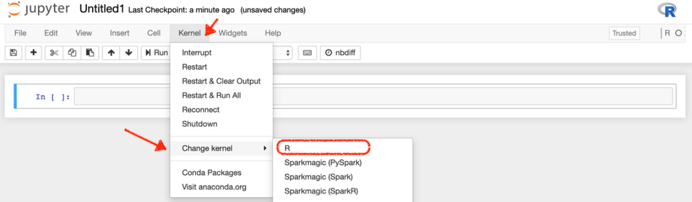

Resources for using Scikit-learn with Amazon SageMaker AI

You can use Amazon SageMaker AI to train and deploy a model using custom Scikit-learn code. The
SageMaker AI Python SDK Scikit-learn estimators and models and the SageMaker AI open-source

Scikit-learn containers make writing a Scikit-learn script and running it in SageMaker AI easier. The
following section provides reference material you can use to learn how to use Scikit-learn with
SageMaker AI.

Requirements

Scikit-learn 1.4 has the following dependencies.

Dependency
Minimum version

Python
3.10

NumPy
2.1.0

SciPy
1.15.3

joblib
1.5.2

threadpoolctl
3.6.0

The SageMaker AI Scikit-learn container supports the following Scikit-learn versions.

Scikit-learn
8245

## Page 275

Amazon SageMaker AI
Developer Guide

Supported Scikit-learn version
Minimum Python version

1.4-2
3.10

1.2-1
3.8

1.0-1
3.7

0.23-1
3.6

0.20.0
2.7 or 3.4

For general information about writing Scikit-learn training scripts and using Scikit-learn estimators
and models with SageMaker AI, see Using Scikit-learn with the SageMaker Python SDK.

What do you want to do?

Note

Matplotlib v2.2.3 or newer is required to run the SageMaker AI Scikit-learn example
notebooks.

I want to use Scikit-learn for data processing, feature engineering, or model evaluation in
SageMaker AI.

For a sample Jupyter notebook, see https://github.com/awslabs/
amazon-sagemaker-examples/tree/master/sagemaker_processing/
scikit_learn_data_processing_and_model_evaluation.

For a blog post on training and deploying a Scikit-learn model, see Amazon SageMaker AI adds
Scikit-Learn support.

For documentation, see ReadTheDocs.

I want to train a custom Scikit-learn model in SageMaker AI.

For a sample Jupyter notebook, see https://github.com/awslabs/amazon-sagemaker-
examples/tree/master/sagemaker-python-sdk/scikit_learn_iris.

Scikit-learn
8246

## Page 276

Amazon SageMaker AI
Developer Guide

For documentation, see Train a Model with Scikit-learn.

I have a Scikit-learn model that I trained in SageMaker AI, and I want to deploy it to a hosted
endpoint.

For more information, see Deploy Scikit-learn models.

I have a Scikit-learn model that I trained outside of SageMaker AI, and I want to deploy it to a
SageMaker AI endpoint

For more information, see Deploy Endpoints from Model Data.

I want to see the API documentation for Amazon SageMaker Python SDK Scikit-learn classes.

For more information, see Scikit-learn Classes.

I want to see information about SageMaker AI Scikit-learn containers.

For more information, see SageMaker Scikit-learn Container GitHub repository.

Resources for using SparkML Serving with Amazon SageMaker AI

The Amazon SageMaker Python SDK SparkML Serving model and predictor and the Amazon
SageMaker AI open-source SparkML Serving container support deploying Apache Spark ML
pipelines serialized with MLeap in SageMaker AI to get inferences. Use the following resources to
learn how to use SparkML Serving with SageMaker AI.

For information about using the SparkML Serving container to deploy models to SageMaker AI, see
SageMaker Spark ML Container GitHub repository. For information about the Amazon SageMaker
Python SDK SparkML Serving model and predictors, see the SparkML Serving Model and Predictor
API documentation.

Resources for using TensorFlow with Amazon SageMaker AI

You can use Amazon SageMaker AI to train and deploy a model using custom TensorFlow code. The
SageMaker AI Python SDK TensorFlow estimators and models and the SageMaker AI open-source
TensorFlow containers can help. Use the following list of resources to find more information, based
on which version of TensorFlow you're using and what you want to do.

TensorFlow Version 1.11 and Later

For TensorFlow versions 1.11 and later, the Amazon SageMaker Python SDK supports script mode
training scripts.

SparkML Serving
8247

## Page 277

Amazon SageMaker AI
Developer Guide

What do you want to do?

I want to train a custom TensorFlow model in SageMaker AI.

For a sample Jupyter notebook, see TensorFlow script mode training and serving.

For documentation, see Train a Model with TensorFlow.

I have a TensorFlow model that I trained in SageMaker AI, and I want to deploy it to a hosted
endpoint.

For more information, see Deploy TensorFlow Serving models.

I have a TensorFlow model that I trained outside of SageMaker AI, and I want to deploy it to a
SageMaker AI endpoint.

For more information, see Deploying directly from model artifacts.

I want to see the API documentation for Amazon SageMaker Python SDK TensorFlow classes.

For more information, see TensorFlow Estimator.

I want to find the SageMaker AI TensorFlow container repository.

For more information, see SageMaker TensorFlow Container GitHub repository.

I want to find information about TensorFlow versions supported by AWS Deep Learning Containers.

For more information, see Available Deep Learning Container Images.

For general information about writing TensorFlow script mode training scripts and using
TensorFlow script mode estimators and models with SageMaker AI, see Using TensorFlow with the
SageMaker Python SDK.

TensorFlow Legacy Mode for Versions 1.11 and Earlier

The Amazon SageMaker Python SDK provides a legacy mode that supports TensorFlow versions
1.11 and earlier. Use legacy mode TensorFlow training scripts to run TensorFlow jobs in SageMaker
AI if:

• You have existing legacy mode scripts that you do not want to convert to script mode.

• You want to use a TensorFlow version earlier than 1.11.

TensorFlow
8248

## Page 278

Amazon SageMaker AI
Developer Guide

For information about writing legacy mode TensorFlow scripts to use with the SageMaker AI
Python SDK, see TensorFlow SageMaker Estimators and Models.

Resources for using Triton Inference Server with Amazon SageMaker AI

SageMaker AI enables customers to deploy a model using custom code with NVIDIA Triton
Inference Server. Use the following resources to learn how to use Triton Inference Server with
SageMaker AI.

This functionality is available through the development of Triton Inference Server Containers.
These containers include NVIDIA Triton Inference Server, support for common ML frameworks, and
useful environment variables that let you optimize performance on SageMaker AI. For a list of all
available Deep Learning Containers images, see Available Deep Learning Containers Images. Deep
Learning Containers images are maintained and regularly updated with security patches.

You can use the Triton Inference Server Container with SageMaker Python SDK as you would
any other container in your SageMaker AI models. However, using the SageMaker Python SDK
is optional. You can use Triton Inference Server Containers with the AWS CLI and AWS SDK for
Python (Boto3).

For more information on NVIDIA Triton Inference Server see the Triton documentation.

Inference

Note

The Triton Python backend uses shared memory (SHMEM) to connect your code to Triton.
SageMaker AI Inference provides up to half of the instance memory as SHMEM so you can
use an instance with more memory for larger SHMEM size.

For inference, you can use your trained ML models with Triton Inference Server to deploy an
inference job with SageMaker AI.

Some of the key features of Triton Inference Server Container are:

• Support for multiple frameworks: Triton can be used to deploy models from all major ML
frameworks. Triton supports TensorFlow GraphDef and SavedModel, ONNX, PyTorch TorchScript,
TensorRT, and custom Python/C++ model formats.

Triton Inference Server
8249

## Page 279

Amazon SageMaker AI
Developer Guide

• Model pipelines: Triton model ensemble represents a pipeline of one model with pre/post
processing logic and the connection of input and output tensors between them. A single
inference request to an ensemble triggers the execution of the entire pipeline.

• Concurrent model execution: Multiple instances of the same model can run simultaneously on

the same GPU or on multiple GPUs.

• Dynamic batching: For models that support batching, Triton has multiple built-in scheduling and
batching algorithms that combine individual inference requests together to improve inference
throughput. These scheduling and batching decisions are transparent to the client requesting
inference.

• Diverse CPU and GPU support: The models can be executed on CPUs or GPUs for maximum
flexibility and to support heterogeneous computing requirements.

What do you want to do?

I want to deploy my trained PyTorch model in SageMaker AI.

For a sample Jupyter Notebook, see the Deploy your PyTorch Resnet50 model with Triton
Inference Server example.

I want to deploy my trained Hugging Face model in SageMaker AI.

For a sample Jupyter Notebook, see the Deploy your PyTorch BERT model with Triton Inference
Server example.

API Reference

Making API calls directly from code is cumbersome, and requires you to write code to authenticate
your requests. Amazon SageMaker AI provides the following alternatives:

Topics

• Programming Model for Amazon SageMaker AI

• APIs, CLI, and SDKs

Programming Model for Amazon SageMaker AI

Making API calls directly from code is cumbersome, and requires you to write code to authenticate
your requests. Amazon SageMaker AI provides the following alternatives:

API Reference
8250

## Page 280

Amazon SageMaker AI
Developer Guide

• Use the SageMaker AI console–With the console, you don't write any code. You use the console
UI to start model training or deploy a model. The console works well for simple jobs, where you
use a built-in training algorithm and you don't need to preprocess training data.

• Modify the example Jupyter notebooks–SageMaker AI provides several Jupyter notebooks that
train and deploy models using specific algorithms and datasets. Start with a notebook that has a
suitable algorithm and modify it to accommodate your data source and specific needs.

• Write model training and inference code from scratch–SageMaker AI provides multiple AWS
SDK languages (listed in the overview) and the Amazon SageMaker Python SDK, a high-level
Python library that you can use in your code to start model training jobs and deploy the resulting
models.

• The SageMaker Python SDK–This Python library simplifies model training and deployment. In
addition to authenticating your requests, the library abstracts platform specifics by providing
simple methods and default parameters. For example:

• To deploy your model, you call only the deploy() method. The method creates a
SageMaker AI model artifact, an endpoint configuration, then deploys the model on an
endpoint.

• If you use a custom framework script for model training, you call the fit() method. The
method creates a .gzip file of your script, uploads it to an Amazon S3 location, and then
runs it for model training, and other tasks. For more information, see Machine Learning
Frameworks and Languages.

• To set defaults for SageMaker API calls made by the SageMaker AI Python SDK, you use a
default configuration dictionary. For more information, see Configuring and using defaults
with the SageMaker Python SDK.

Programming Model for Amazon SageMaker AI
8251

## Page 281

Amazon SageMaker AI
Developer Guide

• The AWS SDKs – The SDKs provide methods that correspond to the SageMaker API (see

Operations). Use the SDKs to programmatically start a model training job and host the
model in SageMaker AI. SDK clients handle authentication for you, so you don't need to
write authentication code. They are available in multiple languages and platforms. For more
information, see the preceding list in the overview.

In Guide to getting set up with Amazon SageMaker AI, you train and deploy a model using an
algorithm provided by SageMaker AI. That exercise shows how to use both of these libraries. For
more information, see Guide to getting set up with Amazon SageMaker AI.

• Integrate SageMaker AI into your Apache Spark workflow–SageMaker AI provides a library for
calling its APIs from Apache Spark. With it, you can use SageMaker AI-based estimators in an
Apache Spark pipeline. For more information, see Apache Spark with Amazon SageMaker AI.

APIs, CLI, and SDKs

Amazon SageMaker AI provides APIs, SDKs, and a command line interface that you can use to
create and manage notebook instances and train and deploy models.

• Amazon SageMaker Python SDK (Recommended)

• Amazon SageMaker API Reference

• Amazon Augmented AI API Reference

• AWS Command Line Interface

• AWS SDK for .NET

• AWS SDK for C++

• AWS SDK for Go

• AWS SDK for Java

• AWS SDK for JavaScript

• AWS SDK for PHP

• AWS SDK for Python (Boto)

• AWS SDK for Ruby

• Amazon SageMaker AI Spark

APIs, CLI, and SDKs
8252

## Page 282

Amazon SageMaker AI
Developer Guide

You can also get code examples from the Amazon SageMaker AI example notebooks GitHub
repository.

• Example notebooks

Document History for Amazon SageMaker AI

The following contains the document history of SageMaker AI.

Change
Description
Date

AWS managed policy updates
- Updates to existing policies

SageMaker AI updated the
following AWS managed
policies.

September 27, 2025

• AmazonSageMakerAdmin-
ServiceCatalogProductsSe
rviceRolePolicy

• AmazonSageMakerSer
viceCatalogProduct
sCodeBuildServiceR
olePolicy

• AmazonSageMakerSer
viceCatalogProduct
sCodePipelineServi
ceRolePolicy

Amazon SageMaker HyperPod
integration with Amazon EBS
Container Storage Interface
(CSI) driver for persistent
storage

Amazon SageMaker HyperPod
now supports the Amazon
EBS CSI driver. With this
feature, you can dynamical
ly provision and manage
persistent storage for training
workloads through Kubernete
s persistent volume claims.
For more information, see
Using the Amazon EBS

August 27, 2025

SageMaker AI Document History
8253

## Page 283

Amazon SageMaker AI
Developer Guide

CSI driver on SageMaker
HyperPod EKS clusters.

AWS managed policy updates
- new policy

SageMaker AI added the
AWS managed policy
AmazonSageMakerHyp
erPodTrainingOperatorAccess.

August 22, 2025

the section called “AmazonSa
geMakerHyperPodObs
ervabilityAdminAccess”

Updated the policy to fix the
role scope-down to include

August 21, 2025

the service-role  prefix.
Also added permissions for

eks:DeletePodIdent

ityAssociation
and

eks:UpdatePodIdent

ityAssociation
that
are required for end-to-end
administrative actions.

Amazon SageMaker HyperPod
simplified cluster setup
experience

Amazon SageMaker HyperPod
now offers a simplified cluster
creation experience with quick
and custom setup paths. With
this feature, you can launch
fully-operational clusters
for large-scale training

August 11, 2025

workloads in just a few clicks.
For more information, see
Amazon SageMaker HyperPod
quickstart.

Amazon SageMaker Studio
Lab migration to JupyterLab
4

Amazon SageMaker Studio
Lab has migrated from
JupyterLab 3 to JupyterLab 4.

August 8, 2025

SageMaker AI Document History
8254

## Page 284

Amazon SageMaker AI
Developer Guide

AWS managed policy updates
- policy updated

SageMaker AI updated
the AWS managed policy
AmazonSageMakerTra
iningPlanCreateAccess.

July 29, 2025

Amazon Nova customization
on SageMaker AI

Amazon Nova now offers
comprehensive model
customization capabilities
through ready-to-use recipes
on SageMaker AI. For more
information, see Model
customization.

July 16, 2025

AWS managed policy updates
- New policy

SageMaker AI added the
following new AWS managed
policy.

July 10, 2025

• AmazonSageMakerHyp
erPodObservability
AdminAccess

the section called “Observab
ility with Grafana and
Prometheus”

Amazon SageMaker HyperPod
now supports a new
observability add-on that
provides a unified observabi
lity solution, automatically
publishes key metrics to
Amazon Managed Service
for Prometheus, and displays
them in Amazon Managed
Grafana dashboards.

July 10, 2025

SageMaker AI Document History
8255

## Page 285

Amazon SageMaker AI
Developer Guide

JupyterLab 1 and 3 deprecati
on

JupyterLab 1 and JupyterLa
b 3 versions for SageMaker
Notebook Instances are no
longer supported. You can no
longer create new or restart
stopped notebook instances
using these versions. Use
JupyterLab 4 instead.

June 30, 2025

Amazon SageMaker HyperPod
integration with Amazon
EventBridge for status change
event delivery

Amazon SageMaker HyperPod
now integrates with Amazon
EventBridge to deliver near-
real-time notifications about
cluster status changes and
node health events. For more
information, see Events
that SageMaker AI sends to
Amazon EventBridge.

May 9, 2025

Usage reporting in SageMaker
HyperPod EKS-orchestrated
clusters

Added usage reporting for
EKS-orchestrated clusters,
allowing organizations to
implement transparent,
usage-based cost allocatio
n across teams. For more
information, see Reporting
Compute Usage in HyperPod.

May 1, 2025

SageMaker AI Document History
8256

## Page 286

Amazon SageMaker AI
Developer Guide

Documentation taxonomy
improvements in the Amazon
SageMaker HyperPod chapter

This content update focuses
on improving documenta
tion navigation by simplifyi
ng titles in the Amazon
SageMaker HyperPod chapter,
updating section titles
for better readability and
discoverability, and consolida
ting topics to reduce content
depth. For more informati
on, see Amazon SageMaker
HyperPod.

April 22, 2025

SageMaker AI Document History
8257

## Page 287

Amazon SageMaker AI
Developer Guide

HyperPod updates from
12-05-2024 to 04-17-2025

Key HyperPod updates
since re:Invent 2024 include
new IAM conditions keys

April 17, 2025

in the CreateCluster

and UpdateCluster
API operations (controlling
instance types, VPC subnets,
and security group access),
support for instance group
deletion for EKS and Slurm
orchestrated clusters, Nvidia
toolkit security fixes, multi-AZ
enhancements, IPv6 support,
new instance types (I3en, M7i,
R7i, C6gn, C6i, M6i, R6i, Trn1,
Trn1n), CloudWatch metrics
for Slurm clusters, added
Direct Preference Optimizat
ion (DPO) recipe and tutorial
for SageMaker HyperPod with
Slurm orchestration, and a
new quickstart deployment
page with CloudFormation
templates. For more details,
see HyperPod release notes.

Custom images in Studio
Learn how to bring your
own custom images with
you in SageMaker AI Studio.
For more information, see
Custom images.

April 9, 2025

SageMaker AI Document History
8258

## Page 288

Amazon SageMaker AI
Developer Guide

SageMaker model parallelism
library v2.8.0

SageMaker model parallelism
library v2 has been updated.
For more information, see The
SageMaker model parallelism
library v2.8.0.

April 1, 2025

Multi-head node support in
Amazon SageMaker HyperPod
Slurm clusters

Amazon SageMaker HyperPod
now supports multi-head
node configurations for Slurm
clusters. With this feature,
you can set up one primary
head node with additional
backup nodes to eliminate
single points of failure in
large-scale training workloads
. For more information, see
SageMaker HyperPod multi-
head node support.

March 26, 2025

SageMaker training plan
reservations

Amazon SageMaker training
plans now offer flexible,
quick-start compute reservati
ons (minimum lead time of
just 30 minutes). The search
returns up to 3 plan options
including continuous and
segmented time blocks.
For more information, see
Reserve training plans
for your training jobs or
HyperPod clusters.

February 25, 2025

SageMaker AI Document History
8259

## Page 289

Amazon SageMaker AI
Developer Guide

AWS managed policy updates
- New policy

SageMaker AI added the
following new AWS managed
policy.

January 17, 2025

• AmazonSageMakerPar
tnerAppsFullAccess

AWS managed policy updates
- Updates to existing policies

SageMaker AI updated the
following AWS managed
policy.

January 14, 2025

• AmazonSageMakerCan
vasSMDataScienceAs
sistantAccess

SageMaker AI Document History
8260

## Page 290

Amazon SageMaker AI
Developer Guide

New features for re:Invent
2024

The following new features
were introduced at re:Invent
2024.

December 4, 2024

• HyperPod recipes - run
recipes within SageMaker
HyperPod or as SageMaker
AI Training Jobs

• HyperPod in Studio - launch
machine learning workloads
on Amazon SageMaker
HyperPod clusters and
view HyperPod cluster
information from Amazon
SageMaker Studio

• HyperPod task governanc
e - a robust managemen
t system designed to
streamline resource
allocation and ensure
efficient utilization of
compute resources across
teams and projects for your
Amazon EKS clusters

• Amazon SageMaker Partner
AI Apps - generative
artificial intelligence (AI)
and machine learning (ML)
development applicati
ons built, published, and
distributed by industry-
leading application
providers

• Q Developer availability in
Canvas - chat with Amazon
Q Developer in SageMaker

SageMaker AI Document History
8261

## Page 291

Amazon SageMaker AI
Developer Guide

Canvas using natural
language for generative AI
assistance with solving your
machine learning problems

• Amazon SageMaker training
plan - a compute reservati
on capability designed
for large-scale AI model
training workloads running
on SageMaker training jobs
and HyperPod clusters

• Amazon introduced the
next generation of Amazon
SageMaker, rebranding
the original SageMaker to
SageMaker AI

AWS managed policy updates
- Updates to existing policies
and new policy

SageMaker AI updated the
following AWS managed
policy and added the
following new AWS managed
policy.

December 4, 2024

• Updated: AmazonSag
eMakerFullAccess

• New: AmazonSageMakerTra

iningPlanCreateAccess

• New: AmazonSag
eMakerCanvasSMData
ScienceAssistantAccess

SageMaker AI Document History
8262

## Page 292

Amazon SageMaker AI
Developer Guide

Amazon SageMaker renamed
to Amazon SageMaker AI

Amazon SageMaker was
renamed to Amazon
SageMaker AI. This name
change does not apply to
any of the existing Amazon
SageMaker features.

December 3, 2024

Stateful sessions
When you send requests to
an inference endpoint, you
can now choose to route
the requests to a stateful
session. During a stateful
session, you send multiple
inference requests to the
same ML instance, and
the instance facilitates the
session. For more informati
on, see Stateful sessions
with Amazon SageMaker AI
models.

November 24, 2024

Scale inference endpoints to
zero instances

When you set up auto scaling
for an endpoint, SageMaker
AI now allows the scale-in
process to reduce the number
of in-service instances to zero.
By doing so, you can save
costs when your endpoint
isn't serving inference
requests. For more informati
on, see Scale an endpoint to
zero instances.

November 24, 2024

SageMaker AI Document History
8263

## Page 293

Amazon SageMaker AI
Developer Guide

Optimize models for fast
loading

When you create a model
optimization job, you can now
apply the fast model loading
optimization technique. This
technique prepares an LLM so
that SageMaker AI can load
it onto an ML instance more
quickly. For more informati
on, see Inference optimizat
ion for Amazon SageMaker AI
models.

November 24, 2024

AWS managed policy updates
- Updates to existing policies

SageMaker AI updated the
following AWS managed
policy.

November 14, 2024

• AmazonSageMakerNot
ebooksServiceRolePolicy

AWS managed policy updates
- New policy

SageMaker AI added the
following new AWS managed
policy.

September 9, 2024

• AmazonSageMakerHyp
erPodServiceRolePolicy

AWS managed policy updates
- Updates to existing policies

SageMaker AI updated the
following AWS managed
policy.

August 16, 2024

• AmazonSageMakerCan
vasDataPrepFullAccess

SageMaker AI Document History
8264

## Page 294

Amazon SageMaker AI
Developer Guide

AWS managed policy updates
- Updates to existing policies

SageMaker AI updated the
following AWS managed
policy.

August 15, 2024

• AmazonSageMakerCan
vasFullAccess

AWS managed policy updates
- New policy

SageMaker AI added the
following new AWS managed
policy.

July 26, 2024

• AmazonSageMakerCan
vasEMRServerlessEx
ecutionRolePolicy

AWS managed policy updates
- Updates to existing policies

SageMaker AI updated the
following AWS managed
policy.

July 24, 2024

• AmazonSageMakerNot
ebooksServiceRolePolicy

AWS managed policy updates
- Updates to existing policies

SageMaker AI updated the
following AWS managed
policy.

July 18, 2024

• AmazonSageMakerCan
vasDataPrepFullAccess

AWS managed policy updates
- Updates to existing policies

SageMaker AI updated the
following AWS managed
policy.

July 9, 2024

• AmazonSageMakerCan
vasFullAccess

SageMaker AI Document History
8265

## Page 295

Amazon SageMaker AI
Developer Guide

AWS managed policy updates
- Updates to existing policy

SageMaker AI updated the
following AWS managed
policy.

July 1, 2024

• AmazonSageMakerAdmin-
ServiceCatalogProductsSe
rviceRolePolicy

AWS managed policy updates
- Updates to existing policies

SageMaker AI updated the
following AWS managed
policy.

June 12, 2024

• AmazonSageMakerAdmin-
ServiceCatalogProductsSe
rviceRolePolicy

AWS managed policy updates
- Updates to existing policies

SageMaker AI updated the
following AWS managed
policies.

June 11, 2024

• AmazonSageMakerAdmin-
ServiceCatalogProductsSe
rviceRolePolicy

• AmazonSageMakerSer
viceCatalogProduct
sCodeBuildServiceR
olePolicy

• AmazonSageMakerSer
viceCatalogProduct
sCodePipelineServi
ceRolePolicy

• AmazonSageMakerSer
viceCatalogProduct
sLambdaServiceRolePolicy

SageMaker AI Document History
8266

## Page 296

Amazon SageMaker AI
Developer Guide

AWS managed policy updates
- Updates to existing policy

SageMaker AI updated the
following AWS managed
policy.

June 6, 2024

• AmazonSageMakerMod
elRegistryFullAccess

AWS managed policy updates
- Updates to existing policies

SageMaker AI updated the
following AWS managed
policy.

June 4, 2024

• AmazonSageMakerMod
elGovernanceUseAccess

AWS managed policy updates
- Updates to existing policies

SageMaker AI updated the
following AWS managed
policy.

May 22, 2024

• AmazonSageMakerNot
ebooksServiceRolePolicy

AWS managed policy updates
- Updates to existing policies

SageMaker AI updated the
following AWS managed
policy.

March 29, 2024

• AmazonSageMakerFul
lAccess

AWS managed policy updates
- New policy

SageMaker AI added the
following new AWS managed
policy.

February 2, 2024

• AmazonSageMakerCan
vasBedrockAccess

SageMaker AI Document History
8267

## Page 297

Amazon SageMaker AI
Developer Guide

AWS managed policy updates
- Updates to existing policies

SageMaker AI updated the
following AWS managed
policy.

January 24, 2024

• AmazonSageMakerCan
vasFullAccess

AWS managed policy updates
- Updates to existing policies

SageMaker AI updated the
following AWS managed
policy.

December 8, 2023

• AmazonSageMakerCan
vasFullAccess

AWS managed policy updates
- Updates to existing policies

SageMaker AI updated the
following AWS managed
policy.

December 7, 2023

• AmazonSageMakerCan
vasDataPrepFullAccess

SageMaker AI Document History
8268

## Page 298

Amazon SageMaker AI
Developer Guide

New features re:Invent 2023
The following new features
were introduced at re:Invent
2023.

November 30, 2023

• SageMaker Canvas chat for
data prep

• Code Editor

• Deep learning containers
for large model inference

• Deploy models for real-time
inference

• SageMaker Distribution
Images

• domain onboarding
simplification

• Amazon S3 Express One
Zone

• Foundation model evaluatio
ns (FMEval)

• SageMaker HyperPod

• JupyterAI

• JupyterLab in Studio

• SageMaker Notebook Jobs

• @step decorator in
SageMaker Pipelines

• SageMaker smart sifting

• New SageMaker Studio
experience. Previous
experience renamed
SageMaker Studio Classic

SageMaker AI Document History
8269

## Page 299

Amazon SageMaker AI
Developer Guide

AWS managed policy updates
- Updates to existing policies

SageMaker AI updated the
following AWS managed
policy at re:Invent 2023.

November 30, 2023

• AmazonSageMakerFul
lAccess

AWS managed policy updates
- Updates to existing policies

SageMaker AI updated the
following AWS managed
policies at re:Invent 2023.

November 29, 2023

• AmazonSageMakerCan
vasAIServicesAccess

• AmazonSageMakerCan
vasDataPrepFullAccess

AWS managed policy updates
- New policies

SageMaker AI added the
following new AWS managed
policy at re:Invent 2023.

November 29, 2023

• AmazonSageMakerClu
sterInstanceRolePolicy

AWS managed policy updates
- New policy

SageMaker AI added the
following new AWS managed
policy.

October 26, 2023

• AmazonSageMakerCan
vasDataPrepFullAccess

AWS managed policy updates
- New policy

SageMaker AI added the
following new AWS managed
policy.

October 6, 2023

• AmazonSageMakerCan
vasDirectDeployAccess

SageMaker AI Document History
8270

## Page 300

Amazon SageMaker AI
Developer Guide

AWS managed policy updates
- Updates to existing policies

SageMaker AI updated the
following AWS managed
policies.

September 29, 2023

• AmazonSageMakerCan
vasFullAccess

• AmazonSageMakerCan
vasAIServicesAccess

AWS managed policy updates
- Updates to existing policies

SageMaker AI updated the
following AWS managed
policy.

August 29, 2023

• AmazonSageMakerCan
vasFullAccess

AWS managed policy updates
- New policies

SageMaker AI added the
following new AWS managed
policies.

August 1, 2023

• AmazonSageMakerPar
tnerServiceCatalog
ProductsApiGateway

ServiceRolePolicy

• AmazonSageMakerPar
tnerServiceCatalog
ProductsCloudForma
tionServiceRolePolicy

• AmazonSageMakerPar
tnerServiceCatalog
ProductsLambdaServ
iceRolePolicy

SageMaker AI Document History
8271

## Page 301

Amazon SageMaker AI
Developer Guide

AWS managed policy updates
- Updates to existing policies

SageMaker AI updated the
following AWS managed
policy.

July 24, 2023

• AmazonSageMakerCan
vasFullAccess

AWS managed policy updates
- Updates to existing policies

SageMaker AI updated the
following AWS managed
policy.

July 17, 2023

• AmazonSageMakerMod
elGovernanceUseAccess

Refactored Table of Contents
SageMaker AI Developer
Guide Table of Contents
refactored to better reflect
the new content.

June 1, 2023

SageMaker AI ECR Paths
Docker Registry Paths and
Example Code published.

May 25, 2023

AWS managed policy updates
- Updates to existing policies

SageMaker AI updated the
following AWS managed
policy.

May 10, 2023

• AmazonSageMakerGeo
spatialExecutionRole.

AWS managed policy updates
- Updates to existing policies

SageMaker AI updated the
following AWS managed
policy.

May 4, 2023

• AmazonSageMakerCan
vasFullAccess

SageMaker AI Document History
8272

## Page 302

Amazon SageMaker AI
Developer Guide

AWS managed policy updates
- New policy

SageMaker AI added the
following new AWS managed
policy.

April 12, 2023

• AmazonSageMakerMod
elRegistryFullAccess

AWS managed policy updates
- Updates to existing policies

SageMaker AI updated the
following AWS managed
policy.

March 24, 2023

• AmazonSageMakerCan
vasFullAccess

AWS managed policy updates
- New policy

SageMaker AI added the
following new AWS managed
policy.

March 23, 2023

• AmazonSageMakerCan
vasAIServicesAccess

AWS managed policy updates
- Updates to existing policies

SageMaker AI updated the
following AWS managed
policy.

March 9, 2023

• AmazonSageMakerNot
ebooksServiceRolePolicy

AWS managed policy updates
- Updates to existing policies

SageMaker AI updated the
following AWS managed
policy.

January 12, 2023

• AmazonSageMakerNot
ebooksServiceRolePolicy

SageMaker AI Document History
8273

## Page 303

Amazon SageMaker AI
Developer Guide

New features re:Invent 2022
The following new features
were introduced at re:Invent
2022.

November 30, 2022

• SageMaker geospatial
capabilities

• SageMaker Model Cards

• SageMaker Model
Dashboard

• SageMaker Role Manager

• Collaboration with shared
spaces

• Inference shadow tests

• Notebook-based Workflows

• Data Wrangler data
preparation widget

• AutoML step in Amazon
SageMaker Pipelines

• Studio Classic Git extension

AWS managed policy updates
- Updates to existing policies

SageMaker AI updated the
following AWS managed
policies at re:Invent 2022.

November 30, 2022

• AmazonSageMakerFul

lAccess

• AmazonSageMakerFea
tureStoreAccess

• AmazonSageMakerCan
vasFullAccess

SageMaker AI Document History
8274

## Page 304

Amazon SageMaker AI
Developer Guide

AWS managed policy updates
- New policies

SageMaker AI added the
following new AWS managed
policies at re:Invent 2022.

November 30, 2022

• AmazonSageMakerGeo
spatialFullAccess

• AmazonSageMakerGeo
spatialExecutionRole

• AmazonSageMakerMod
elGovernanceUseAccess

New features re:Invent 2021
The following new features
were introduced at re:Invent
2021.

December 1, 2021

• SageMaker Canvas

• SageMaker Ground Truth
Plus

• SageMaker Inference
Recommender

• SageMaker Serverless
Endpoints

• SageMaker Studio Lab

• SageMaker Studio
Notebooks and Amazon
EMR

• SageMaker Training
Compiler

Autopilot time series data
Amazon SageMaker Autopilot
accepts time series as model
inputs. For more informati
on, see Amazon SageMaker
Autopilot data and problem
types.

October 25, 2021

SageMaker AI Document History
8275

## Page 305

Amazon SageMaker AI
Developer Guide

AWS managed policies
Started tracking changes
for SageMaker AI managed
policies.

June 10, 2021

New features re:Invent 2020
The following new features
were introduced at re:Invent
2020.

December 1, 2020

• Amazon SageMaker
Pipelines

• Automate MLOps with
SageMaker Projects

• SageMaker Edge Manager

• SageMaker Clarify

• SageMaker Data Wrangler

• SageMaker Feature Store

• SageMaker Studio
JumpStart

• Register and Deploy Models
with Model Registry

• SageMaker AI Distributed

• Deep Profiling with
SageMaker Debugger

Studio Notebooks
SageMaker AI Studio

April 28, 2020

Notebooks

SageMaker AI Document History
8276

## Page 306

Amazon SageMaker AI
Developer Guide

New features re:Invent 2019
The following new features
were introduced at re:Invent
2019.

December 3, 2019

• SageMaker AI Studio

• SageMaker AI Studio
Notebooks (preview)

• SageMaker AI Experiments

• SageMaker AI Autopilot

• SageMaker AI Debugger

• SageMaker AI Model
Monitor

SageMaker AI Document History
8277

## Page 307

Amazon SageMaker AI
Developer Guide

New features re:Invent 2018
The following new features
were introduced at re:Invent
2018.

November 28, 2018

• Amazon SageMaker Ground
Truth

• Amazon Elastic Inference

• SageMaker AI Resources in
AWS Marketplace

• SageMaker AI Inference
Pipelines

• SageMaker AI Neo

• Search Amazon SageMaker
Experiments

• Reinforcement Learning

• Associate Git Repositories
with SageMaker Notebook
Instances

• Semantic Segmentation
Algorithm

• Augmented Manifest Files
in Training Jobs

Configuring notebook

Use shell scripts to configure

May 1, 2018

instances

notebook instances when you
create or start them. For more
information, see Customize a
Notebook Instance.

Application Auto Scaling
support

Amazon SageMaker AI
now supports Application
Auto Scaling for productio
n variants. For information,
see Automatically Scaling
SageMaker AI Models

February 28, 2018

SageMaker AI Document History
8278

## Page 308

Amazon SageMaker AI
Developer Guide

TensorFlow 1.5 and MXNet
1.0 support

Amazon SageMaker AI Deep
Learning containers now
support TensorFlow 1.5 and
Apache MXNet 1.0.

February 27, 2018

BlazingText algorithm
Amazon SageMaker AI now
supports the BlazingText
algorithm.

January 18, 2018

KMS encryption
Amazon SageMaker AI now
supports KMS encryption for
hosting instances and training
model artifacts at rest.

January 17, 2018

CloudTrail support
Amazon SageMaker AI now
supports logging with AWS
CloudTrail.

January 11, 2018

DeepAR Forecasting
algorithm

Amazon SageMaker AI
now supports the DeepAR
algorithm for time series
forecasting.

January 8, 2018

SageMaker AI launch
Amazon SageMaker AI
launched at re:Invent 2017.

November 28, 2017

SageMaker Python SDK Troubleshooting Guide

You can use the SageMaker Python SDK to interact with Amazon SageMaker AI within your
Python scripts or Jupyter notebooks. Despite the SDK providing a simplified workflow, you might
encounter various exceptions or errors. This troubleshooting guide aims to help you understand
and resolve common issues that might arise when working with the SageMaker Python SDK. It
covers scenarios related to creating training jobs, processing jobs, and endpoints, as well as general
exception handling practices. By following the guidance provided in the following sections, you can
effectively diagnose and address common issues.

The SageMaker Python SDK acts as a wrapper for the low level SageMaker API operations. The
IAM role that you're using to access the SDK must be able to access the underlying operations.

Python SDK Troubleshooting
8279

## Page 309

Amazon SageMaker AI
Developer Guide

Adding the SageMaker AI Full Access Policy to your IAM role is the most straightforward way to
make sure you have permissions to use the SageMaker Python SDK. For more information about
the SageMaker AI Full Access Policy, see Amazon SageMaker AI Full Access.

While less convenient, providing more granular permissions is a secure approach to using the SDK.
Each of the following sections has information about the permissions required.

Create a Training Job

Important

If you're not adding the SageMaker AI Full Access policy to your IAM role, it must have
permissions to call the CreateTrainingJob and DescribeTrainingJob operations.
It also requires permissions to:

• Access input/output data in S3

• Run Amazon EC2 instances

• Log CloudWatch metrics

If your SageMaker training job needs to access resources in an Amazon Virtual Private
Cloud (Amazon VPC), make sure that you configure the necessary VPC settings and security
groups when you create the processing job.

When you're creating a training job, you might run into botocore.exceptions.ClientError or

ValueError exceptions.

ValueError

ValueError exceptions occur when there's an issue with the values or parameters that you're

passing to a function. Use the following list to see examples of ValueError exceptions and
how to fix them.

• ValueError: either image_uri or algorithm_arn is required. None was

provided:

• If you're using the AlgorithmEstimator function, provide the algorithm_arn.

• If you're using the Estimator function, provide the estimator_arn.

Create a Training Job
8280

## Page 310

Amazon SageMaker AI
Developer Guide

• ValueError: Unknown input channel: train is not supported by: scikit-

decision-trees-15423055-57b73412d2e93e9239e4e16f83298b8f

You get this error when you provide an invalid input channel. An input channel is a data
source or parameter that the model expects.

On the Types of Algorithms page, you can navigate to the model to find information about
the model's input channels.

You can also find information about the input channels within the Usage section on the AWS
Marketplace page of the algorithm.

Use the following procedure to get information about an algorithm's input channels.

To get information about an algorithm's input channels

1.
Navigate to the SageMaker AI console.

2.
On the left-hand navigation, choose Training.

3.
Select Algorithms.

4.
Choose Find algorithm.

5.
Find your algorithm in the resulting list.

6.
Select the Usage tab.

7.
Navigate to the Channel specification heading.

botocore.exceptions.ClientError

botocore.exceptions.ClientError exceptions occur when an underlying AWS
service throws an exception. This could be due to various reasons such as incorrect
parameters, permissions issues, or resource constraints. Use the following list for context on

botocore.exceptions.ClientError exceptions and information on how to fix them.

• ResourceLimitExceeded – Your AWS account doesn't have access to the Amazon EC2
instances needed to run the training job. To get access, request a quota increase. For
information about quota increases, see Service Quotas. Use the following list for information

about botocore.exceptions.ClientError exceptions.

Create a Training Job
8281

## Page 311

Amazon SageMaker AI
Developer Guide

• ValidationException – Validation exceptions come up when you've used the wrong
Amazon EC2 instance type for the training job. They can also come up when the IAM role that
you're using doesn't have permissions for the training job.

Update a Training Job

Important

If you're not adding the SageMaker AI Managed Policy to your IAM role, you must give the
role access to the following permissions:

• s3:GetObject – Provides permissions to read the model artifacts from Amazon S3
buckets

• s3:PutObject – If applicable, provides permissions to write updates to the model
artifacts

• iam:GetRole – Provides permissions to get information about the IAM role needed to
run the training job

• sagemaker:UpdateTrainingJob – Provides permissions to modify the training jobs
using the UpdateTrainingJob operation.

• logs:PutLogEvents – Provides permissions to write logs to Amazon CloudWatch logs
during the update process.

When you update a training job, you might run into a

botocore.exceptions.ParamValidationError or a

botocore.exceptions.ClientError.

botocore.exceptions.ClientError

The ClientError has the following message:

botocore.exceptions.ClientError: An error occurred (ValidationException) when
calling the UpdateTrainingJob operation: Invalid UpdateTrainingJobRequest, the
request cannot be empty

Update a Training Job
8282

## Page 312

Amazon SageMaker AI
Developer Guide

If you're running into this error, you must include one of the following parameters along with
the name of the training job:

• profiler_rule_configs (list) – A list of profiler rule configurations. By default, there are
no profiler rule configurations.

• profiler_config (dict) – The configuration for SageMaker AI Profiler collects metrics and
send them out. By default, there is no profiler configuration.

• resource_config (dict) – The configuration for the training job resources. You can update

the keep-alive period if the warm pool status is Available. No other fields can be updated.

• remote_debug_config (dict) – Configuration for RemoteDebug. The dictionary can contain

EnableRemoteDebug(bool).

botocore.exceptions.ParamValidationError

The botocore.exceptions.ParamValidationError has the following error:

botocore.exceptions.ParamValidationError: Parameter validation failed:
Invalid type for parameter ProfilerRuleConfigurations, value: {'DisableProfiler':
False}, type: <class 'dict'>, valid types: <class 'list'>, <class 'tuple'>

This exception can occur if the parameter is not provided in the expected format by the

update_training_job function. For example, it expects the profiler_rule_configs
parameter to be a list. If the parameter is passed as a dictionary instead, it raises the error.

Create a Processing Job

Important

If you're not adding the SageMaker AI Managed Policy to your IAM role, you must give the
role access to the following permissions:

• sagemaker:CreateProcessingJob – Provides permissions to create a processing job

• sagemaker:DescribeProcessingJob – Provides permissions to get information
about a processing job

Create a Processing Job
8283

## Page 313

Amazon SageMaker AI
Developer Guide

• s3:GetObject – Provides permissions to read the model artifacts from Amazon S3
buckets

• s3:PutObject – If applicable, provides permissions to write updates to the model
artifacts

• logs:PutLogEvents – Provides permissions to writing logs to Amazon CloudWatch
logs during the update process.

If your processing job needs to access resources within an Amazon Virtual Private Cloud,

you must specify its security_group_ids and subnets within the estimator that you
create. For an example of how you can access resources within a Amazon VPC, see Secure
Training and Inference with VPC.

When you're creating a processing job, you might run into a ValueError, an

UnexpectedStatusException, or a botocore.exceptions.ClientError.

ValueError

The following is an example of a ValueError:

ValueError: code preprocess.py wasn't found. Please make sure that the file exists.

The path that you've specified wasn't correct. You can specify either a relative path or an
absolute path to your script file. For more information about specifying paths to your files, see
sagemaker.processing.RunArgs.

UnexpectedStatusException

The following is an example of an UnexpectedStatusException:

UnexpectedStatusException: Error for Processing job sagemaker-scikit-
learn-2024-07-02-14-08-55-993: Failed. Reason: AlgorithmError: , exit code: 1

Create a Processing Job
8284

## Page 314

Amazon SageMaker AI
Developer Guide

The traceback accompanying the exception can help you identify the root cause:

Traceback (most recent call last):
File "/opt/ml/processing/input/code/preprocessing.py", line 51, in <module>
df = pd.read_csv(input_data_path)
.
.
.
File "pandas/_libs/parsers.pyx", line 689, in
pandas._libs.parsers.TextReader._setup_parser_source
FileNotFoundError: [Errno 2] File b'/opt/ml/processing/input/census-income.csv' does
not exist: b'/opt/ml/processing/input/census-income.csv'

The error "FileNotFoundError: [Errno 2] File b'/opt/ml/processing/input/

census-income.csv' does not exist" indicates that the input file census-income.csv

is not found in the specified path /opt/ml/processing/input/. Verify that the input data is
correctly provided and that the preprocessing script is copying the data to the expected path.

botocore.exceptions.ClientError

The following is an example of a botocore.exceptions.ClientError:

botocore.exceptions.ClientError: An error occurred (ValidationException) when
calling the CreateProcessingJob operation: RoleArn: Cross-account pass role is not
allowed.

The "Cross-account pass role is not allowed in create processing job"
error occurs when you attempt to create a SageMaker Processing job using an IAM role from a
different AWS account. This security feature ensures roles and permissions are managed within
each account. To resolve the issue, do the following:

1. Verify the IAM role is in the same account as the processing job. Cross-account roles require

explicit allowance

2. If using a role from another account, update its trust policy to allow the account creating the

processing job to assume the role.

3. Ensure the role has necessary permissions for processing jobs, such as

sagemaker:CreateProcessingJob or iam:PassRole.

Create a Processing Job
8285

## Page 315

Amazon SageMaker AI
Developer Guide

Create an Endpoint

Important

If you're not adding the SageMaker AI Managed Policy to your IAM role, you must give the
role access to the following permissions:

• sagemaker:CreateModel – Provides permissions to create the model that you're
deploying to the endpoint

• sagemaker:CreateEndpointConfig – Provides permissions to create an endpoint
configuration that define the endpoint's behavior, such as the instance type and count

• sagemaker:CreateEndpoint – Provides permissions to create the endpoint
configuration using the endpoint that you've specified

Additionally, you need permissions to describe and list the models, endpoints, and
endpoint configurations.

When you're creating an endpoint, you might run into an UnexpectedStatusException or a

botocore.exceptions.ClientError.

The following is an example of an UnexpectedStatusException:

UnexpectedStatusException: Error hosting endpoint gpt2-large-2024-07-03-15-28-20-448:
Failed. Reason: The primary container for production variant AllTraffic did not pass
the ping health check. Please check CloudWatch logs for this endpoint.. Try changing
the instance type or reference the troubleshooting page https://docs.aws.amazon.com/
sagemaker/latest/dg/async-inference-troubleshooting.html

The error message tells you to check the Amazon CloudWatch logs. Use the following procedure to
check the logs.

To check the CloudWatch logs

1.
Navigate to the Amazon SageMaker AI console.

2.
On the left hand navigation, choose Endpoints.

Create an Endpoint
8286

## Page 316

Amazon SageMaker AI
Developer Guide

3.
Select the endpoint that has failed.

4.
On the Endpoint details page, choose View logs in CloudWatch.

After you've found the logs, look for the specific issue. The following is an example of a
CloudWatch log:

NotImplementedError: gptq quantization is not supported for AutoModel, you can try to
quantize it with text-generation-server quantize ORIGINAL_MODEL_ID NEW_MODEL_ID

For information about resolving the botocore.exceptions.ClientError, see Guidance on
exception handling.

Update an Endpoint

Important

If you're not adding the SageMaker AI Managed Policy to your IAM role, you must give the
role access to the following permissions:

• sagemaker:UpdateEndpoint – Provides permissions to update an existing endpoint,
such as changing the endpoint's instance type or count

• sagemaker:UpdateEndpointWeightsAndCapacities – Provides permissions
to create an endpoint configuration that define the endpoint's behavior, such as the
instance type and count

• sagemaker:DescribeEndpoint – Provides permissions to describe the current
configuration of the endpoint, which is often required before the update

Additionally, you might need permissions to describe and list the endpoints and endpoint
configurations.

You can run into a ValueError, such as the following:

Update an Endpoint
8287

## Page 317

Amazon SageMaker AI
Developer Guide

ValueError: Endpoint with name 'abc' does not exist; please use an existing endpoint
name

The error indicates that the specified endpoint name does not match any existing endpoints in your
AWS account. Use the following procedure to troubleshoot the error:

To troubleshoot a Value Error

1.
Use the following code to list all of your endpoints:

import sagemaker
sagemaker_session = sagemaker.Session()
# List all endpoints
endpoints = sagemaker_session.sagemaker_client.list_endpoints()
print(endpoints)

2.
Verify that the endpoint you've specified to the update_endpoint function is in the list.

3.
Make sure that you're operating in the correct AWS Region. SageMaker AI endpoints are
region-specific.

4.
Make sure that the IAM role that you're using has permissions to list, describe, or update the
endpoints.

Guidance on exception handling

If you can't find information to help you fix your specific issue, the following code examples can
give you inspiration for how you handle exceptions.

The following is a generic example that you can use to catch most exceptions.

import sagemaker
from botocore.exceptions import ParamValidationError, ClientError

try:
sagemaker.some_api_call(SomeParam='some_param')

except ClientError as error:
# Put your error handling logic here
raise error

Guidance on exception handling
8288

## Page 318

Amazon SageMaker AI
Developer Guide

except ParamValidationError as error:
raise ValueError('The parameters you provided are incorrect: {}'.format(error))
except ValueError as error:
# Catch generic ValueError exceptions

There are two main categories of errors:

• Errors specific to the SageMaker Python SDK

• Errors specific to the underlying AWS service

Errors specific to the underlying AWS service are always botocore.exceptions.ClientError

exceptions. The botocore.exceptions.ClientError has an Error object and a

ResponseMetadata object. The following shows the template of a client error:

{
'Error': {
'Code': 'SomeServiceException',
'Message': 'Details/context around the exception or error'
},
'ResponseMetadata': {
'RequestId': '1234567890ABCDEF',
'HostId': 'host ID data will appear here as a hash',
'HTTPStatusCode': 400,
'HTTPHeaders': {'header metadata key/values will appear here'},
'RetryAttempts': 0
}
}

The following is an example of the specific error handling that you can do with the

botocore.exceptions.ClientError:

try:
sagemaker.some_api_call(SomeParam='some_param')

except botocore.exceptions.ClientError as err:
if err.response['Error']['Code'] == 'InternalError': # Generic error

Guidance on exception handling
8289

## Page 319

Amazon SageMaker AI
Developer Guide

# We grab the message, request ID, and HTTP code to give to customer support
print('Error Message: {}'.format(err.response['Error']['Message']))
print('Request ID: {}'.format(err.response['ResponseMetadata']['RequestId']))
print('Http code: {}'.format(err.response['ResponseMetadata']
['HTTPStatusCode']))
raise err
else if err.response['Error']['Code'] == 'ValidationException':
raise ValueError(err.response['Error']['Message'])

For more information about how you can handle ClientError exceptions, see Parsing error
responses and catching exceptions from AWS services.

Guidance on exception handling
8290

